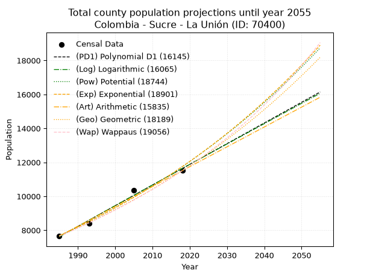
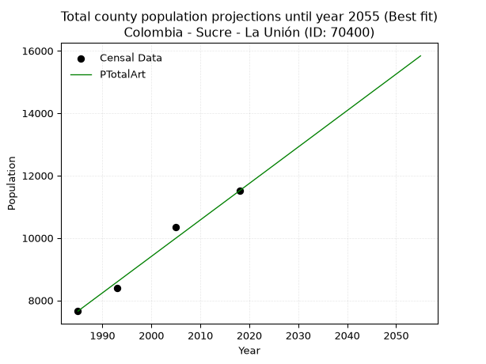
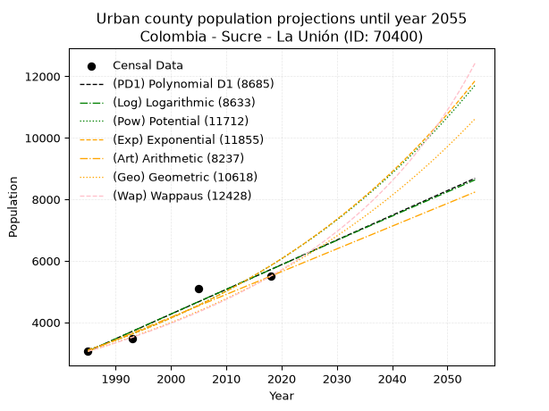
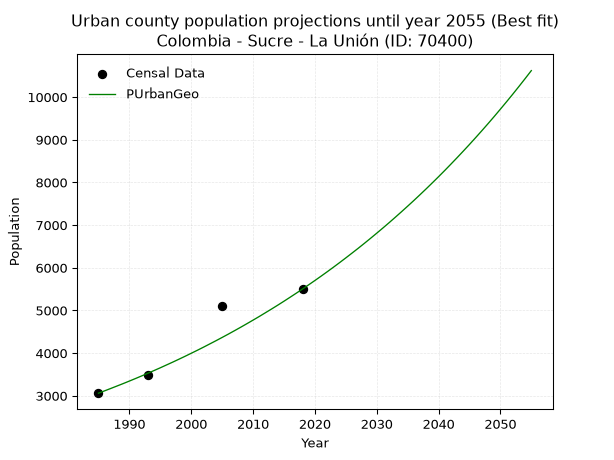
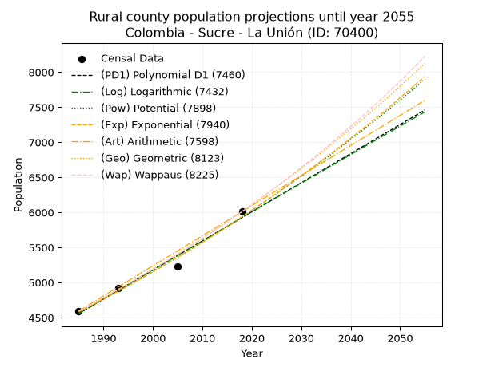
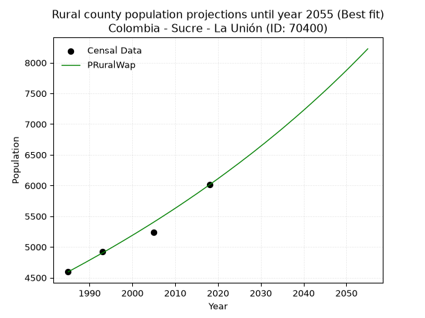

<div align="center">


</div>

# 📜 _“Population and Public Services Demand Projections (PPSD) until Year 2050 for Colombia - Sucre - La Unión (ID: 70400)”_
Keywords: `population` `public-service` `projection` `lineal` `polynomial` `logarithmic` `potential` `exponential` `arithmetic` `geometric` `wappaus` `dane` `colombia` `south-america`

PPSD are analytical estimates used by governments and planners to anticipate future changes in population size, age distribution, and the resulting community needs for utilities, healthcare, education, and infrastructure as sizing future water treatment facilities, electrical grids, and road networks based on spatial growth.

<div align="center">

</img>

</div>


> **General running parameters**: • app_version: _v20260806_. • Python version: _3.14.7_. • Pandas version: _3.0.5_. • NumPy version: _2.5.1_. • Creates, save and include plots into reports (create_plot): _False_. • Projection until year: _2050_. • Process polynomial degree 2 and up: _False_. • Process Wappaus: _True_. • Process Wappaus: _True_. • Set negative values to zero: _True_. • Set infinite values to zero: _True_. • Drop dataset notes: _True_. 
<div align="center">

Maps & GIS Layers: [:earth_americas:Google](http://maps.google.com/maps?q=8.853975309,-75.2760557) [:earth_americas:OSM](https://www.openstreetmap.org/#map=18/8.853975309/-75.2760557&layers=P) [:earth_americas:Bing](https://www.bing.com/maps?cp=8.853975309~-75.2760557&lvl=18) [:earth_americas:Apple](https://maps.apple.com/frame?center=8.853975309%2C-75.2760557&span=0.003%2C0.006) [:earth_americas:GISMobile](https://github.com/rcfdtools/R.GISMobile/blob/main/file/gis/CountyLayer_CO/Readme.md)

</div>


<div align="center">

```geojson
{
  "type": "Feature",
  "geometry": {
    "type": "Point", 
    "coordinates": [-75.2760557, 8.853975309]
  }, 
  "properties": {
    "Name": "Colombia - Sucre - La Unión (ID: 70400)"
  }
}
```

</div>


## 0. Census Data (4 records)

Census data are official statistics collected by a government about the people and housing in a country. They usually include counts of total population, age, sex, race, income, education, and jobs.

📅Global census file: [Population.xlsx](../data/Population.xlsx)

| Source   |   Year |   CountryID | CountryName   |   StateID | StateName   |   CountyID | CountyName   |   PTotal |   PUrban |   PRural |
|:---------|-------:|------------:|:--------------|----------:|:------------|-----------:|:-------------|---------:|---------:|---------:|
| DANE     |   1985 |          57 | Colombia      |        70 | Sucre       |      70400 | La Unión     |     7653 |     3059 |     4594 |
| DANE     |   1993 |          57 | Colombia      |        70 | Sucre       |      70400 | La Unión     |     8400 |     3483 |     4917 |
| DANE     |   2005 |          57 | Colombia      |        70 | Sucre       |      70400 | La Unión     |    10346 |     5112 |     5234 |
| DANE     |   2018 |          57 | Colombia      |        70 | Sucre       |      70400 | La Unión     |    11510 |     5500 |     6010 |

> 🔥Some records could had specific notes about the registered values or the corresponding urban or rural distribution.

📅[SUI-RUPS](https://www.datos.gov.co/Hacienda-y-Cr-dito-P-blico/Registro-nico-de-Prestadores-de-Servicios-P-blicos/4qkq-csdn/about_data) - Local public utility companies: [RUPS.csv](../data/RUPS.csv)

 | SERVICIO       | ESTADO    | NOMBRE                                                                                      | NIT         | DEPARTAMENTO_DOMICILIO   | MUNICIPIO_DOMICILIO   | DIRECCION      |   TELEFONO | EMAIL                | TIPO_PRESTADOR                             | CLASIFICACION                 |
|:---------------|:----------|:--------------------------------------------------------------------------------------------|:------------|:-------------------------|:----------------------|:---------------|-----------:|:---------------------|:-------------------------------------------|:------------------------------|
| ACUEDUCTO      | OPERATIVA | EMPRESA MUNICIPAL DE ACUEDUCTO,ALCANTARILLADO Y ASEO DEL MUNICIPIO DE LA UNION SUCRE SA ESP | 900084706-6 | SUCRE                    | LA UNION              | Calle 8 Cra 11 |    2919126 | UNIONAAA@HOTMAIL.COM | SOCIEDADES (EMPRESA DE SERVICIOS PUBLICOS) | MENOR O IGUAL A 2500 USUARIOS |
| ALCANTARILLADO | OPERATIVA | EMPRESA MUNICIPAL DE ACUEDUCTO,ALCANTARILLADO Y ASEO DEL MUNICIPIO DE LA UNION SUCRE SA ESP | 900084706-6 | SUCRE                    | LA UNION              | Calle 8 Cra 11 |    2919126 | UNIONAAA@HOTMAIL.COM | SOCIEDADES (EMPRESA DE SERVICIOS PUBLICOS) | MENOR O IGUAL A 2500 USUARIOS |

## 1. Total

### 1.1. Coefficients and Parameters

* (PD1) Polynomial Deg 1: 121.77880369329505, -234110.8020875134 (lineal)
* (Log) Logarithmic: 243784.22299567724, -1843528.5825543017
* (Pow) Potential: 25.72256142544481, -80.9411362922337
* (Exp) Exponential: 0.012847880532725986, 6.457546160696678e-08
* (Art) Arithmetic: Year diff. 2018 - 1985 = 33, Population diff. 11510 - 7653 = 3857, Annual growth = 116.87878787878788
* (Geo) Geometric: Year diff. 2018 - 1985 = 33, Population diff. 11510 - 7653 = 3857, Annual growth % = 0.012444017506535232
* (Wap) Wappaus: i = 1.2198381034158314, Condition values only valid for < 200)

<sub>
Wappaus condition values: ['0.00', '1.22', '2.44', '3.66', '4.88', '6.10', '7.32', '8.54', '9.76', '10.98', '12.20', '13.42', '14.64', '15.86', '17.08', '18.30', '19.52', '20.74', '21.96', '23.18', '24.40', '25.62', '26.84', '28.06', '29.28', '30.50', '31.72', '32.94', '34.16', '35.38', '36.60', '37.81', '39.03', '40.25', '41.47', '42.69', '43.91', '45.13', '46.35', '47.57', '48.79', '50.01', '51.23', '52.45', '53.67', '54.89', '56.11', '57.33', '58.55', '59.77', '60.99', '62.21', '63.43', '64.65', '65.87', '67.09', '68.31', '69.53', '70.75', '71.97', '73.19', '74.41', '75.63', '76.85', '78.07', '79.29']
</sub>


### 1.2. Projected Dataset

|   Year |   CountyID |   PTotalPD1 |   PTotalLog |   PTotalPow |   PTotalExp |   PTotalArt |   PTotalGeo |   PTotalWap |
|-------:|-----------:|------------:|------------:|------------:|------------:|------------:|------------:|------------:|
|   1985 |      70400 |        7620 |        7616 |        7686 |        7690 |        7653 |        7653 |        7653 |
|   1986 |      70400 |        7742 |        7739 |        7786 |        7789 |        7770 |        7748 |        7747 |
|   1987 |      70400 |        7864 |        7862 |        7888 |        7890 |        7887 |        7845 |        7842 |
|   1988 |      70400 |        7985 |        7984 |        7991 |        7992 |        8004 |        7942 |        7938 |
|   1989 |      70400 |        8107 |        8107 |        8095 |        8095 |        8121 |        8041 |        8036 |
|   1990 |      70400 |        8229 |        8230 |        8200 |        8200 |        8237 |        8141 |        8134 |
|   1991 |      70400 |        8351 |        8352 |        8307 |        8306 |        8354 |        8242 |        8234 |
|   1992 |      70400 |        8473 |        8474 |        8415 |        8413 |        8471 |        8345 |        8336 |
|   1993 |      70400 |        8594 |        8597 |        8524 |        8522 |        8588 |        8449 |        8438 |
|   1994 |      70400 |        8716 |        8719 |        8635 |        8632 |        8705 |        8554 |        8542 |
|   1995 |      70400 |        8838 |        8841 |        8747 |        8744 |        8822 |        8660 |        8647 |
|   1996 |      70400 |        8960 |        8963 |        8860 |        8857 |        8939 |        8768 |        8754 |
|   1997 |      70400 |        9081 |        9086 |        8975 |        8971 |        9056 |        8877 |        8862 |
|   1998 |      70400 |        9203 |        9208 |        9091 |        9087 |        9172 |        8988 |        8971 |
|   1999 |      70400 |        9325 |        9330 |        9209 |        9205 |        9289 |        9100 |        9082 |
|   2000 |      70400 |        9447 |        9452 |        9328 |        9324 |        9406 |        9213 |        9194 |
|   2001 |      70400 |        9569 |        9573 |        9449 |        9444 |        9523 |        9328 |        9308 |
|   2002 |      70400 |        9690 |        9695 |        9571 |        9567 |        9640 |        9444 |        9424 |
|   2003 |      70400 |        9812 |        9817 |        9695 |        9690 |        9757 |        9561 |        9541 |
|   2004 |      70400 |        9934 |        9939 |        9820 |        9816 |        9874 |        9680 |        9659 |
|   2005 |      70400 |       10056 |       10060 |        9947 |        9942 |        9991 |        9801 |        9779 |
|   2006 |      70400 |       10177 |       10182 |       10076 |       10071 |       10107 |        9923 |        9901 |
|   2007 |      70400 |       10299 |       10303 |       10206 |       10201 |       10224 |       10046 |       10025 |
|   2008 |      70400 |       10421 |       10425 |       10337 |       10333 |       10341 |       10171 |       10150 |
|   2009 |      70400 |       10543 |       10546 |       10471 |       10467 |       10458 |       10298 |       10278 |
|   2010 |      70400 |       10665 |       10667 |       10605 |       10602 |       10575 |       10426 |       10407 |
|   2011 |      70400 |       10786 |       10789 |       10742 |       10739 |       10692 |       10555 |       10538 |
|   2012 |      70400 |       10908 |       10910 |       10880 |       10878 |       10809 |       10687 |       10670 |
|   2013 |      70400 |       11030 |       11031 |       11020 |       11019 |       10926 |       10820 |       10805 |
|   2014 |      70400 |       11152 |       11152 |       11162 |       11161 |       11042 |       10954 |       10942 |
|   2015 |      70400 |       11273 |       11273 |       11305 |       11306 |       11159 |       11091 |       11081 |
|   2016 |      70400 |       11395 |       11394 |       11450 |       11452 |       11276 |       11229 |       11222 |
|   2017 |      70400 |       11517 |       11515 |       11597 |       11600 |       11393 |       11369 |       11365 |
|   2018 |      70400 |       11639 |       11636 |       11746 |       11750 |       11510 |       11510 |       11510 |
|   2019 |      70400 |       11761 |       11757 |       11897 |       11902 |       11627 |       11653 |       11657 |
|   2020 |      70400 |       11882 |       11877 |       12049 |       12056 |       11744 |       11798 |       11807 |
|   2021 |      70400 |       12004 |       11998 |       12204 |       12212 |       11861 |       11945 |       11959 |
|   2022 |      70400 |       12126 |       12119 |       12360 |       12369 |       11978 |       12094 |       12114 |
|   2023 |      70400 |       12248 |       12239 |       12518 |       12529 |       12094 |       12244 |       12271 |
|   2024 |      70400 |       12369 |       12360 |       12678 |       12691 |       12211 |       12397 |       12430 |
|   2025 |      70400 |       12491 |       12480 |       12841 |       12855 |       12328 |       12551 |       12592 |
|   2026 |      70400 |       12613 |       12600 |       13005 |       13022 |       12445 |       12707 |       12757 |
|   2027 |      70400 |       12735 |       12721 |       13171 |       13190 |       12562 |       12865 |       12924 |
|   2028 |      70400 |       12857 |       12841 |       13339 |       13361 |       12679 |       13025 |       13094 |
|   2029 |      70400 |       12978 |       12961 |       13509 |       13533 |       12796 |       13187 |       13267 |
|   2030 |      70400 |       13100 |       13081 |       13681 |       13708 |       12913 |       13351 |       13443 |
|   2031 |      70400 |       13222 |       13201 |       13856 |       13886 |       13029 |       13518 |       13622 |
|   2032 |      70400 |       13344 |       13321 |       14032 |       14065 |       13146 |       13686 |       13804 |
|   2033 |      70400 |       13466 |       13441 |       14211 |       14247 |       13263 |       13856 |       13989 |
|   2034 |      70400 |       13587 |       13561 |       14392 |       14431 |       13380 |       14029 |       14177 |
|   2035 |      70400 |       13709 |       13681 |       14575 |       14618 |       13497 |       14203 |       14369 |
|   2036 |      70400 |       13831 |       13801 |       14761 |       14807 |       13614 |       14380 |       14564 |
|   2037 |      70400 |       13953 |       13920 |       14948 |       14998 |       13731 |       14559 |       14762 |
|   2038 |      70400 |       14074 |       14040 |       15138 |       15192 |       13848 |       14740 |       14964 |
|   2039 |      70400 |       14196 |       14160 |       15330 |       15389 |       13964 |       14923 |       15170 |
|   2040 |      70400 |       14318 |       14279 |       15525 |       15588 |       14081 |       15109 |       15379 |
|   2041 |      70400 |       14440 |       14399 |       15722 |       15789 |       14198 |       15297 |       15593 |
|   2042 |      70400 |       14562 |       14518 |       15921 |       15994 |       14315 |       15487 |       15810 |
|   2043 |      70400 |       14683 |       14637 |       16123 |       16200 |       14432 |       15680 |       16031 |
|   2044 |      70400 |       14805 |       14757 |       16327 |       16410 |       14549 |       15875 |       16257 |
|   2045 |      70400 |       14927 |       14876 |       16534 |       16622 |       14666 |       16073 |       16487 |
|   2046 |      70400 |       15049 |       14995 |       16743 |       16837 |       14783 |       16273 |       16722 |
|   2047 |      70400 |       15170 |       15114 |       16955 |       17055 |       14899 |       16475 |       16961 |
|   2048 |      70400 |       15292 |       15233 |       17169 |       17275 |       15016 |       16680 |       17204 |
|   2049 |      70400 |       15414 |       15352 |       17386 |       17499 |       15133 |       16888 |       17453 |
|   2050 |      70400 |       15536 |       15471 |       17606 |       17725 |       15250 |       17098 |       17707 |
<div align="center">

</img>

</div>


### 1.3. Best fit with absolute and relative error (%)

Relative error puts that difference into context by dividing the absolute error by the true value, creating a unitless ratio or percentage that shows the scale of the mistake.

Absolute and relative error

|   Year | Source   |   CountryID | CountryName   |   StateID | StateName   |   CountyID_x | CountyName   |   PTotal |   PUrban |   PRural |   CountyID_y |   PTotalPD1 |   PTotalLog |   PTotalPow |   PTotalExp |   PTotalArt |   PTotalGeo |   PTotalWap |   PTotalPD1AbsError |   PTotalLogAbsError |   PTotalPowAbsError |   PTotalExpAbsError |   PTotalArtAbsError |   PTotalGeoAbsError |   PTotalWapAbsError |   PTotalPD1RelError |   PTotalLogRelError |   PTotalPowRelError |   PTotalExpRelError |   PTotalArtRelError |   PTotalGeoRelError |   PTotalWapRelError |
|-------:|:---------|------------:|:--------------|----------:|:------------|-------------:|:-------------|---------:|---------:|---------:|-------------:|------------:|------------:|------------:|------------:|------------:|------------:|------------:|--------------------:|--------------------:|--------------------:|--------------------:|--------------------:|--------------------:|--------------------:|--------------------:|--------------------:|--------------------:|--------------------:|--------------------:|--------------------:|--------------------:|
|   1985 | DANE     |          57 | Colombia      |        70 | Sucre       |        70400 | La Unión     |     7653 |     3059 |     4594 |        70400 |        7620 |        7616 |        7686 |        7690 |        7653 |        7653 |        7653 |                  33 |                  37 |                  33 |                  37 |                   0 |                   0 |                   0 |            0.431203 |            0.483471 |            0.431203 |            0.483471 |             0       |            0        |            0        |
|   1993 | DANE     |          57 | Colombia      |        70 | Sucre       |        70400 | La Unión     |     8400 |     3483 |     4917 |        70400 |        8594 |        8597 |        8524 |        8522 |        8588 |        8449 |        8438 |                 194 |                 197 |                 124 |                 122 |                 188 |                  49 |                  38 |            2.30952  |            2.34524  |            1.47619  |            1.45238  |             2.2381  |            0.583333 |            0.452381 |
|   2005 | DANE     |          57 | Colombia      |        70 | Sucre       |        70400 | La Unión     |    10346 |     5112 |     5234 |        70400 |       10056 |       10060 |        9947 |        9942 |        9991 |        9801 |        9779 |                 290 |                 286 |                 399 |                 404 |                 355 |                 545 |                 567 |            2.80302  |            2.76435  |            3.85656  |            3.90489  |             3.43128 |            5.26774  |            5.48038  |
|   2018 | DANE     |          57 | Colombia      |        70 | Sucre       |        70400 | La Unión     |    11510 |     5500 |     6010 |        70400 |       11639 |       11636 |       11746 |       11750 |       11510 |       11510 |       11510 |                 129 |                 126 |                 236 |                 240 |                   0 |                   0 |                   0 |            1.12076  |            1.0947   |            2.05039  |            2.08514  |             0       |            0        |            0        |

Relative error mean

| Method    |   RelError | Best   |
|:----------|-----------:|:-------|
| PTotalPD1 |    1.66613 |        |
| PTotalLog |    1.67194 |        |
| PTotalPow |    1.95359 |        |
| PTotalExp |    1.98147 |        |
| PTotalArt |    1.41734 | True   |
| PTotalGeo |    1.46277 |        |
| PTotalWap |    1.48319 |        |

💙Best method: _**PTotalArt**_
<div align="center">

</img>

</div>


### 1.4. Fresh water supply demand in liters per capita per day (lpcd)

The fresh water supply demand typically ranges from 100 to 300 liters per capita per day (lpcd) for standard domestic and municipal planning, though absolute survival minimums set by the World Health Organization are as low as 7.5 to 20 liters per day, and total consumption in high-income nations can exceed 400 liters.

> `CZ`: Level in meters above the sea level (masl)<br> `WS`: Fresh water supply demand in liters per capita per day (lpcd or l/h/d)<br> `WSAll`: Zonal fresh water supply demand in liters per second (l/s)<br> `A`: Zonal area in square meters<br> `DP`: Population density (people/hectare or p/ha)

Reference values (RAS Colombia)

|    CZ |   WS |
|------:|-----:|
|  1000 |  120 |
|  2000 |  130 |
| 99999 |  140 |

County shapefile geometry properties and water supply values

|   CountyID |     ATotal |   CZTotal |   WSTotal |
|-----------:|-----------:|----------:|----------:|
|      70400 | 2.3219e+08 |   59.3857 |       120 |

Projected values for best method: PTotalArt

|   CountyID |   Year |   PTotalArt |   DPTotal |   WSTotal |   WSTotalAll |
|-----------:|-------:|------------:|----------:|----------:|-------------:|
|      70400 |   1985 |        7653 |      0.33 |       120 |      10.6292 |
|      70400 |   1986 |        7770 |      0.33 |       120 |      10.7917 |
|      70400 |   1987 |        7887 |      0.34 |       120 |      10.9542 |
|      70400 |   1988 |        8004 |      0.34 |       120 |      11.1167 |
|      70400 |   1989 |        8121 |      0.35 |       120 |      11.2792 |
|      70400 |   1990 |        8237 |      0.35 |       120 |      11.4403 |
|      70400 |   1991 |        8354 |      0.36 |       120 |      11.6028 |
|      70400 |   1992 |        8471 |      0.36 |       120 |      11.7653 |
|      70400 |   1993 |        8588 |      0.37 |       120 |      11.9278 |
|      70400 |   1994 |        8705 |      0.37 |       120 |      12.0903 |
|      70400 |   1995 |        8822 |      0.38 |       120 |      12.2528 |
|      70400 |   1996 |        8939 |      0.38 |       120 |      12.4153 |
|      70400 |   1997 |        9056 |      0.39 |       120 |      12.5778 |
|      70400 |   1998 |        9172 |      0.4  |       120 |      12.7389 |
|      70400 |   1999 |        9289 |      0.4  |       120 |      12.9014 |
|      70400 |   2000 |        9406 |      0.41 |       120 |      13.0639 |
|      70400 |   2001 |        9523 |      0.41 |       120 |      13.2264 |
|      70400 |   2002 |        9640 |      0.42 |       120 |      13.3889 |
|      70400 |   2003 |        9757 |      0.42 |       120 |      13.5514 |
|      70400 |   2004 |        9874 |      0.43 |       120 |      13.7139 |
|      70400 |   2005 |        9991 |      0.43 |       120 |      13.8764 |
|      70400 |   2006 |       10107 |      0.44 |       120 |      14.0375 |
|      70400 |   2007 |       10224 |      0.44 |       120 |      14.2    |
|      70400 |   2008 |       10341 |      0.45 |       120 |      14.3625 |
|      70400 |   2009 |       10458 |      0.45 |       120 |      14.525  |
|      70400 |   2010 |       10575 |      0.46 |       120 |      14.6875 |
|      70400 |   2011 |       10692 |      0.46 |       120 |      14.85   |
|      70400 |   2012 |       10809 |      0.47 |       120 |      15.0125 |
|      70400 |   2013 |       10926 |      0.47 |       120 |      15.175  |
|      70400 |   2014 |       11042 |      0.48 |       120 |      15.3361 |
|      70400 |   2015 |       11159 |      0.48 |       120 |      15.4986 |
|      70400 |   2016 |       11276 |      0.49 |       120 |      15.6611 |
|      70400 |   2017 |       11393 |      0.49 |       120 |      15.8236 |
|      70400 |   2018 |       11510 |      0.5  |       120 |      15.9861 |
|      70400 |   2019 |       11627 |      0.5  |       120 |      16.1486 |
|      70400 |   2020 |       11744 |      0.51 |       120 |      16.3111 |
|      70400 |   2021 |       11861 |      0.51 |       120 |      16.4736 |
|      70400 |   2022 |       11978 |      0.52 |       120 |      16.6361 |
|      70400 |   2023 |       12094 |      0.52 |       120 |      16.7972 |
|      70400 |   2024 |       12211 |      0.53 |       120 |      16.9597 |
|      70400 |   2025 |       12328 |      0.53 |       120 |      17.1222 |
|      70400 |   2026 |       12445 |      0.54 |       120 |      17.2847 |
|      70400 |   2027 |       12562 |      0.54 |       120 |      17.4472 |
|      70400 |   2028 |       12679 |      0.55 |       120 |      17.6097 |
|      70400 |   2029 |       12796 |      0.55 |       120 |      17.7722 |
|      70400 |   2030 |       12913 |      0.56 |       120 |      17.9347 |
|      70400 |   2031 |       13029 |      0.56 |       120 |      18.0958 |
|      70400 |   2032 |       13146 |      0.57 |       120 |      18.2583 |
|      70400 |   2033 |       13263 |      0.57 |       120 |      18.4208 |
|      70400 |   2034 |       13380 |      0.58 |       120 |      18.5833 |
|      70400 |   2035 |       13497 |      0.58 |       120 |      18.7458 |
|      70400 |   2036 |       13614 |      0.59 |       120 |      18.9083 |
|      70400 |   2037 |       13731 |      0.59 |       120 |      19.0708 |
|      70400 |   2038 |       13848 |      0.6  |       120 |      19.2333 |
|      70400 |   2039 |       13964 |      0.6  |       120 |      19.3944 |
|      70400 |   2040 |       14081 |      0.61 |       120 |      19.5569 |
|      70400 |   2041 |       14198 |      0.61 |       120 |      19.7194 |
|      70400 |   2042 |       14315 |      0.62 |       120 |      19.8819 |
|      70400 |   2043 |       14432 |      0.62 |       120 |      20.0444 |
|      70400 |   2044 |       14549 |      0.63 |       120 |      20.2069 |
|      70400 |   2045 |       14666 |      0.63 |       120 |      20.3694 |
|      70400 |   2046 |       14783 |      0.64 |       120 |      20.5319 |
|      70400 |   2047 |       14899 |      0.64 |       120 |      20.6931 |
|      70400 |   2048 |       15016 |      0.65 |       120 |      20.8556 |
|      70400 |   2049 |       15133 |      0.65 |       120 |      21.0181 |
|      70400 |   2050 |       15250 |      0.66 |       120 |      21.1806 |

## 2. Urban

### 2.1. Coefficients and Parameters

* (PD1) Polynomial Deg 1: 80.29787234042519, -156327.3191489355 (lineal)
* (Log) Logarithmic: 160782.1130439567, -1217817.6296741082
* (Pow) Potential: 38.302477818832706, -122.82026240974368
* (Exp) Exponential: 0.019126872921690376, 1.0084496411523137e-13
* (Art) Arithmetic: Year diff. 2018 - 1985 = 33, Population diff. 5500 - 3059 = 2441, Annual growth = 73.96969696969697
* (Geo) Geometric: Year diff. 2018 - 1985 = 33, Population diff. 5500 - 3059 = 2441, Annual growth % = 0.017936538279800684
* (Wap) Wappaus: i = 1.7284658714732322, Condition values only valid for < 200)

<sub>
Wappaus condition values: ['0.00', '1.73', '3.46', '5.19', '6.91', '8.64', '10.37', '12.10', '13.83', '15.56', '17.28', '19.01', '20.74', '22.47', '24.20', '25.93', '27.66', '29.38', '31.11', '32.84', '34.57', '36.30', '38.03', '39.75', '41.48', '43.21', '44.94', '46.67', '48.40', '50.13', '51.85', '53.58', '55.31', '57.04', '58.77', '60.50', '62.22', '63.95', '65.68', '67.41', '69.14', '70.87', '72.60', '74.32', '76.05', '77.78', '79.51', '81.24', '82.97', '84.69', '86.42', '88.15', '89.88', '91.61', '93.34', '95.07', '96.79', '98.52', '100.25', '101.98', '103.71', '105.44', '107.16', '108.89', '110.62', '112.35']
</sub>


### 2.2. Projected Dataset

|   Year |   CountyID |   PUrbanPD1 |   PUrbanLog |   PUrbanPow |   PUrbanExp |   PUrbanArt |   PUrbanGeo |   PUrbanWap |
|-------:|-----------:|------------:|------------:|------------:|------------:|------------:|------------:|------------:|
|   1985 |      70400 |        3064 |        3061 |        3106 |        3108 |        3059 |        3059 |        3059 |
|   1986 |      70400 |        3144 |        3142 |        3166 |        3168 |        3133 |        3114 |        3112 |
|   1987 |      70400 |        3225 |        3223 |        3228 |        3229 |        3207 |        3170 |        3167 |
|   1988 |      70400 |        3305 |        3304 |        3290 |        3291 |        3281 |        3227 |        3222 |
|   1989 |      70400 |        3385 |        3385 |        3354 |        3355 |        3355 |        3284 |        3278 |
|   1990 |      70400 |        3465 |        3466 |        3420 |        3420 |        3429 |        3343 |        3335 |
|   1991 |      70400 |        3546 |        3546 |        3486 |        3486 |        3503 |        3403 |        3394 |
|   1992 |      70400 |        3626 |        3627 |        3554 |        3553 |        3577 |        3464 |        3453 |
|   1993 |      70400 |        3706 |        3708 |        3623 |        3622 |        3651 |        3527 |        3513 |
|   1994 |      70400 |        3787 |        3788 |        3693 |        3692 |        3725 |        3590 |        3575 |
|   1995 |      70400 |        3867 |        3869 |        3765 |        3763 |        3799 |        3654 |        3638 |
|   1996 |      70400 |        3947 |        3950 |        3838 |        3835 |        3873 |        3720 |        3702 |
|   1997 |      70400 |        4028 |        4030 |        3912 |        3910 |        3947 |        3786 |        3767 |
|   1998 |      70400 |        4108 |        4111 |        3988 |        3985 |        4021 |        3854 |        3833 |
|   1999 |      70400 |        4188 |        4191 |        4065 |        4062 |        4095 |        3923 |        3901 |
|   2000 |      70400 |        4268 |        4272 |        4143 |        4140 |        4169 |        3994 |        3970 |
|   2001 |      70400 |        4349 |        4352 |        4224 |        4220 |        4243 |        4065 |        4041 |
|   2002 |      70400 |        4429 |        4432 |        4305 |        4302 |        4316 |        4138 |        4113 |
|   2003 |      70400 |        4509 |        4513 |        4388 |        4385 |        4390 |        4213 |        4186 |
|   2004 |      70400 |        4590 |        4593 |        4473 |        4470 |        4464 |        4288 |        4261 |
|   2005 |      70400 |        4670 |        4673 |        4559 |        4556 |        4538 |        4365 |        4337 |
|   2006 |      70400 |        4750 |        4753 |        4647 |        4644 |        4612 |        4443 |        4416 |
|   2007 |      70400 |        4831 |        4833 |        4737 |        4734 |        4686 |        4523 |        4495 |
|   2008 |      70400 |        4911 |        4913 |        4828 |        4825 |        4760 |        4604 |        4577 |
|   2009 |      70400 |        4991 |        4993 |        4921 |        4918 |        4834 |        4687 |        4660 |
|   2010 |      70400 |        5071 |        5073 |        5016 |        5013 |        4908 |        4771 |        4745 |
|   2011 |      70400 |        5152 |        5153 |        5112 |        5110 |        4982 |        4856 |        4832 |
|   2012 |      70400 |        5232 |        5233 |        5210 |        5209 |        5056 |        4944 |        4921 |
|   2013 |      70400 |        5312 |        5313 |        5311 |        5309 |        5130 |        5032 |        5012 |
|   2014 |      70400 |        5393 |        5393 |        5413 |        5412 |        5204 |        5122 |        5105 |
|   2015 |      70400 |        5473 |        5473 |        5516 |        5516 |        5278 |        5214 |        5200 |
|   2016 |      70400 |        5553 |        5553 |        5622 |        5623 |        5352 |        5308 |        5298 |
|   2017 |      70400 |        5633 |        5632 |        5730 |        5731 |        5426 |        5403 |        5398 |
|   2018 |      70400 |        5714 |        5712 |        5840 |        5842 |        5500 |        5500 |        5500 |
|   2019 |      70400 |        5794 |        5792 |        5952 |        5955 |        5574 |        5599 |        5605 |
|   2020 |      70400 |        5874 |        5871 |        6066 |        6070 |        5648 |        5699 |        5712 |
|   2021 |      70400 |        5955 |        5951 |        6182 |        6187 |        5722 |        5801 |        5822 |
|   2022 |      70400 |        6035 |        6030 |        6300 |        6307 |        5796 |        5905 |        5935 |
|   2023 |      70400 |        6115 |        6110 |        6421 |        6428 |        5870 |        6011 |        6051 |
|   2024 |      70400 |        6196 |        6189 |        6543 |        6552 |        5944 |        6119 |        6169 |
|   2025 |      70400 |        6276 |        6269 |        6668 |        6679 |        6018 |        6229 |        6291 |
|   2026 |      70400 |        6356 |        6348 |        6796 |        6808 |        6092 |        6341 |        6417 |
|   2027 |      70400 |        6436 |        6428 |        6925 |        6939 |        6166 |        6454 |        6545 |
|   2028 |      70400 |        6517 |        6507 |        7057 |        7073 |        6240 |        6570 |        6677 |
|   2029 |      70400 |        6597 |        6586 |        7192 |        7210 |        6314 |        6688 |        6813 |
|   2030 |      70400 |        6677 |        6665 |        7329 |        7349 |        6388 |        6808 |        6953 |
|   2031 |      70400 |        6758 |        6745 |        7468 |        7491 |        6462 |        6930 |        7096 |
|   2032 |      70400 |        6838 |        6824 |        7610 |        7636 |        6536 |        7054 |        7244 |
|   2033 |      70400 |        6918 |        6903 |        7755 |        7783 |        6610 |        7181 |        7396 |
|   2034 |      70400 |        6999 |        6982 |        7903 |        7934 |        6684 |        7310 |        7553 |
|   2035 |      70400 |        7079 |        7061 |        8053 |        8087 |        6757 |        7441 |        7714 |
|   2036 |      70400 |        7159 |        7140 |        8206 |        8243 |        6831 |        7574 |        7881 |
|   2037 |      70400 |        7239 |        7219 |        8362 |        8402 |        6905 |        7710 |        8053 |
|   2038 |      70400 |        7320 |        7298 |        8520 |        8564 |        6979 |        7848 |        8230 |
|   2039 |      70400 |        7400 |        7377 |        8682 |        8730 |        7053 |        7989 |        8413 |
|   2040 |      70400 |        7480 |        7455 |        8847 |        8898 |        7127 |        8132 |        8602 |
|   2041 |      70400 |        7561 |        7534 |        9014 |        9070 |        7201 |        8278 |        8797 |
|   2042 |      70400 |        7641 |        7613 |        9185 |        9245 |        7275 |        8427 |        8999 |
|   2043 |      70400 |        7721 |        7692 |        9359 |        9424 |        7349 |        8578 |        9208 |
|   2044 |      70400 |        7802 |        7770 |        9536 |        9606 |        7423 |        8732 |        9424 |
|   2045 |      70400 |        7882 |        7849 |        9716 |        9791 |        7497 |        8888 |        9648 |
|   2046 |      70400 |        7962 |        7928 |        9900 |        9981 |        7571 |        9048 |        9880 |
|   2047 |      70400 |        8042 |        8006 |       10087 |       10173 |        7645 |        9210 |       10121 |
|   2048 |      70400 |        8123 |        8085 |       10277 |       10370 |        7719 |        9375 |       10371 |
|   2049 |      70400 |        8203 |        8163 |       10471 |       10570 |        7793 |        9543 |       10631 |
|   2050 |      70400 |        8283 |        8242 |       10669 |       10774 |        7867 |        9715 |       10901 |
<div align="center">

</img>

</div>


### 2.3. Best fit with absolute and relative error (%)

Relative error puts that difference into context by dividing the absolute error by the true value, creating a unitless ratio or percentage that shows the scale of the mistake.

Absolute and relative error

|   Year | Source   |   CountryID | CountryName   |   StateID | StateName   |   CountyID_x | CountyName   |   PTotal |   PUrban |   PRural |   CountyID_y |   PUrbanPD1 |   PUrbanLog |   PUrbanPow |   PUrbanExp |   PUrbanArt |   PUrbanGeo |   PUrbanWap |   PUrbanPD1AbsError |   PUrbanLogAbsError |   PUrbanPowAbsError |   PUrbanExpAbsError |   PUrbanArtAbsError |   PUrbanGeoAbsError |   PUrbanWapAbsError |   PUrbanPD1RelError |   PUrbanLogRelError |   PUrbanPowRelError |   PUrbanExpRelError |   PUrbanArtRelError |   PUrbanGeoRelError |   PUrbanWapRelError |
|-------:|:---------|------------:|:--------------|----------:|:------------|-------------:|:-------------|---------:|---------:|---------:|-------------:|------------:|------------:|------------:|------------:|------------:|------------:|------------:|--------------------:|--------------------:|--------------------:|--------------------:|--------------------:|--------------------:|--------------------:|--------------------:|--------------------:|--------------------:|--------------------:|--------------------:|--------------------:|--------------------:|
|   1985 | DANE     |          57 | Colombia      |        70 | Sucre       |        70400 | La Unión     |     7653 |     3059 |     4594 |        70400 |        3064 |        3061 |        3106 |        3108 |        3059 |        3059 |        3059 |                   5 |                   2 |                  47 |                  49 |                   0 |                   0 |                   0 |            0.163452 |           0.0653808 |             1.53645 |             1.60183 |             0       |             0       |            0        |
|   1993 | DANE     |          57 | Colombia      |        70 | Sucre       |        70400 | La Unión     |     8400 |     3483 |     4917 |        70400 |        3706 |        3708 |        3623 |        3622 |        3651 |        3527 |        3513 |                 223 |                 225 |                 140 |                 139 |                 168 |                  44 |                  30 |            6.40253  |           6.45995   |             4.01952 |             3.99081 |             4.82343 |             1.26328 |            0.861326 |
|   2005 | DANE     |          57 | Colombia      |        70 | Sucre       |        70400 | La Unión     |    10346 |     5112 |     5234 |        70400 |        4670 |        4673 |        4559 |        4556 |        4538 |        4365 |        4337 |                 442 |                 439 |                 553 |                 556 |                 574 |                 747 |                 775 |            8.64632  |           8.58764   |            10.8177  |            10.8764  |            11.2285  |            14.6127  |           15.1604   |
|   2018 | DANE     |          57 | Colombia      |        70 | Sucre       |        70400 | La Unión     |    11510 |     5500 |     6010 |        70400 |        5714 |        5712 |        5840 |        5842 |        5500 |        5500 |        5500 |                 214 |                 212 |                 340 |                 342 |                   0 |                   0 |                   0 |            3.89091  |           3.85455   |             6.18182 |             6.21818 |             0       |             0       |            0        |

Relative error mean

| Method    |   RelError | Best   |
|:----------|-----------:|:-------|
| PUrbanPD1 |    4.7758  |        |
| PUrbanLog |    4.74188 |        |
| PUrbanPow |    5.63887 |        |
| PUrbanExp |    5.6718  |        |
| PUrbanArt |    4.01298 |        |
| PUrbanGeo |    3.96899 | True   |
| PUrbanWap |    4.00543 |        |

💙Best method: _**PUrbanGeo**_
<div align="center">

</img>

</div>


### 2.4. Fresh water supply demand in liters per capita per day (lpcd)

The fresh water supply demand typically ranges from 100 to 300 liters per capita per day (lpcd) for standard domestic and municipal planning, though absolute survival minimums set by the World Health Organization are as low as 7.5 to 20 liters per day, and total consumption in high-income nations can exceed 400 liters.

> `CZ`: Level in meters above the sea level (masl)<br> `WS`: Fresh water supply demand in liters per capita per day (lpcd or l/h/d)<br> `WSAll`: Zonal fresh water supply demand in liters per second (l/s)<br> `A`: Zonal area in square meters<br> `DP`: Population density (people/hectare or p/ha)

Reference values (RAS Colombia)

|    CZ |   WS |
|------:|-----:|
|  1000 |  120 |
|  2000 |  130 |
| 99999 |  140 |

County shapefile geometry properties and water supply values

|   CountyID |      AUrban |   CZUrban |   WSUrban |
|-----------:|------------:|----------:|----------:|
|      70400 | 7.42793e+06 |   60.0468 |       120 |

Projected values for best method: PUrbanGeo

|   CountyID |   Year |   PUrbanGeo |   DPUrban |   WSUrban |   WSUrbanAll |
|-----------:|-------:|------------:|----------:|----------:|-------------:|
|      70400 |   1985 |        3059 |      4.12 |       120 |      4.24861 |
|      70400 |   1986 |        3114 |      4.19 |       120 |      4.325   |
|      70400 |   1987 |        3170 |      4.27 |       120 |      4.40278 |
|      70400 |   1988 |        3227 |      4.34 |       120 |      4.48194 |
|      70400 |   1989 |        3284 |      4.42 |       120 |      4.56111 |
|      70400 |   1990 |        3343 |      4.5  |       120 |      4.64306 |
|      70400 |   1991 |        3403 |      4.58 |       120 |      4.72639 |
|      70400 |   1992 |        3464 |      4.66 |       120 |      4.81111 |
|      70400 |   1993 |        3527 |      4.75 |       120 |      4.89861 |
|      70400 |   1994 |        3590 |      4.83 |       120 |      4.98611 |
|      70400 |   1995 |        3654 |      4.92 |       120 |      5.075   |
|      70400 |   1996 |        3720 |      5.01 |       120 |      5.16667 |
|      70400 |   1997 |        3786 |      5.1  |       120 |      5.25833 |
|      70400 |   1998 |        3854 |      5.19 |       120 |      5.35278 |
|      70400 |   1999 |        3923 |      5.28 |       120 |      5.44861 |
|      70400 |   2000 |        3994 |      5.38 |       120 |      5.54722 |
|      70400 |   2001 |        4065 |      5.47 |       120 |      5.64583 |
|      70400 |   2002 |        4138 |      5.57 |       120 |      5.74722 |
|      70400 |   2003 |        4213 |      5.67 |       120 |      5.85139 |
|      70400 |   2004 |        4288 |      5.77 |       120 |      5.95556 |
|      70400 |   2005 |        4365 |      5.88 |       120 |      6.0625  |
|      70400 |   2006 |        4443 |      5.98 |       120 |      6.17083 |
|      70400 |   2007 |        4523 |      6.09 |       120 |      6.28194 |
|      70400 |   2008 |        4604 |      6.2  |       120 |      6.39444 |
|      70400 |   2009 |        4687 |      6.31 |       120 |      6.50972 |
|      70400 |   2010 |        4771 |      6.42 |       120 |      6.62639 |
|      70400 |   2011 |        4856 |      6.54 |       120 |      6.74444 |
|      70400 |   2012 |        4944 |      6.66 |       120 |      6.86667 |
|      70400 |   2013 |        5032 |      6.77 |       120 |      6.98889 |
|      70400 |   2014 |        5122 |      6.9  |       120 |      7.11389 |
|      70400 |   2015 |        5214 |      7.02 |       120 |      7.24167 |
|      70400 |   2016 |        5308 |      7.15 |       120 |      7.37222 |
|      70400 |   2017 |        5403 |      7.27 |       120 |      7.50417 |
|      70400 |   2018 |        5500 |      7.4  |       120 |      7.63889 |
|      70400 |   2019 |        5599 |      7.54 |       120 |      7.77639 |
|      70400 |   2020 |        5699 |      7.67 |       120 |      7.91528 |
|      70400 |   2021 |        5801 |      7.81 |       120 |      8.05694 |
|      70400 |   2022 |        5905 |      7.95 |       120 |      8.20139 |
|      70400 |   2023 |        6011 |      8.09 |       120 |      8.34861 |
|      70400 |   2024 |        6119 |      8.24 |       120 |      8.49861 |
|      70400 |   2025 |        6229 |      8.39 |       120 |      8.65139 |
|      70400 |   2026 |        6341 |      8.54 |       120 |      8.80694 |
|      70400 |   2027 |        6454 |      8.69 |       120 |      8.96389 |
|      70400 |   2028 |        6570 |      8.84 |       120 |      9.125   |
|      70400 |   2029 |        6688 |      9    |       120 |      9.28889 |
|      70400 |   2030 |        6808 |      9.17 |       120 |      9.45556 |
|      70400 |   2031 |        6930 |      9.33 |       120 |      9.625   |
|      70400 |   2032 |        7054 |      9.5  |       120 |      9.79722 |
|      70400 |   2033 |        7181 |      9.67 |       120 |      9.97361 |
|      70400 |   2034 |        7310 |      9.84 |       120 |     10.1528  |
|      70400 |   2035 |        7441 |     10.02 |       120 |     10.3347  |
|      70400 |   2036 |        7574 |     10.2  |       120 |     10.5194  |
|      70400 |   2037 |        7710 |     10.38 |       120 |     10.7083  |
|      70400 |   2038 |        7848 |     10.57 |       120 |     10.9     |
|      70400 |   2039 |        7989 |     10.76 |       120 |     11.0958  |
|      70400 |   2040 |        8132 |     10.95 |       120 |     11.2944  |
|      70400 |   2041 |        8278 |     11.14 |       120 |     11.4972  |
|      70400 |   2042 |        8427 |     11.35 |       120 |     11.7042  |
|      70400 |   2043 |        8578 |     11.55 |       120 |     11.9139  |
|      70400 |   2044 |        8732 |     11.76 |       120 |     12.1278  |
|      70400 |   2045 |        8888 |     11.97 |       120 |     12.3444  |
|      70400 |   2046 |        9048 |     12.18 |       120 |     12.5667  |
|      70400 |   2047 |        9210 |     12.4  |       120 |     12.7917  |
|      70400 |   2048 |        9375 |     12.62 |       120 |     13.0208  |
|      70400 |   2049 |        9543 |     12.85 |       120 |     13.2542  |
|      70400 |   2050 |        9715 |     13.08 |       120 |     13.4931  |

## 3. Rural

### 3.1. Coefficients and Parameters

* (PD1) Polynomial Deg 1: 41.48093135286982, -77783.48293857784 (lineal)
* (Log) Logarithmic: 83002.10995172049, -625710.952880193
* (Pow) Potential: 15.73246274461376, -48.22115277796618
* (Exp) Exponential: 0.007861670413548981, 0.0007646912469366476
* (Art) Arithmetic: Year diff. 2018 - 1985 = 33, Population diff. 6010 - 4594 = 1416, Annual growth = 42.90909090909091
* (Geo) Geometric: Year diff. 2018 - 1985 = 33, Population diff. 6010 - 4594 = 1416, Annual growth % = 0.008174858747257874
* (Wap) Wappaus: i = 0.8093000925894174, Condition values only valid for < 200)

<sub>
Wappaus condition values: ['0.00', '0.81', '1.62', '2.43', '3.24', '4.05', '4.86', '5.67', '6.47', '7.28', '8.09', '8.90', '9.71', '10.52', '11.33', '12.14', '12.95', '13.76', '14.57', '15.38', '16.19', '17.00', '17.80', '18.61', '19.42', '20.23', '21.04', '21.85', '22.66', '23.47', '24.28', '25.09', '25.90', '26.71', '27.52', '28.33', '29.13', '29.94', '30.75', '31.56', '32.37', '33.18', '33.99', '34.80', '35.61', '36.42', '37.23', '38.04', '38.85', '39.66', '40.47', '41.27', '42.08', '42.89', '43.70', '44.51', '45.32', '46.13', '46.94', '47.75', '48.56', '49.37', '50.18', '50.99', '51.80', '52.60']
</sub>


### 3.2. Projected Dataset

|   Year |   CountyID |   PRuralPD1 |   PRuralLog |   PRuralPow |   PRuralExp |   PRuralArt |   PRuralGeo |   PRuralWap |
|-------:|-----------:|------------:|------------:|------------:|------------:|------------:|------------:|------------:|
|   1985 |      70400 |        4556 |        4555 |        4579 |        4580 |        4594 |        4594 |        4594 |
|   1986 |      70400 |        4598 |        4597 |        4615 |        4616 |        4637 |        4632 |        4631 |
|   1987 |      70400 |        4639 |        4639 |        4652 |        4652 |        4680 |        4669 |        4669 |
|   1988 |      70400 |        4681 |        4680 |        4689 |        4689 |        4723 |        4708 |        4707 |
|   1989 |      70400 |        4722 |        4722 |        4726 |        4726 |        4766 |        4746 |        4745 |
|   1990 |      70400 |        4764 |        4764 |        4764 |        4763 |        4809 |        4785 |        4784 |
|   1991 |      70400 |        4805 |        4806 |        4801 |        4801 |        4851 |        4824 |        4823 |
|   1992 |      70400 |        4847 |        4847 |        4839 |        4839 |        4894 |        4863 |        4862 |
|   1993 |      70400 |        4888 |        4889 |        4878 |        4877 |        4937 |        4903 |        4901 |
|   1994 |      70400 |        4929 |        4931 |        4916 |        4915 |        4980 |        4943 |        4941 |
|   1995 |      70400 |        4971 |        4972 |        4955 |        4954 |        5023 |        4984 |        4981 |
|   1996 |      70400 |        5012 |        5014 |        4995 |        4993 |        5066 |        5024 |        5022 |
|   1997 |      70400 |        5054 |        5055 |        5034 |        5033 |        5109 |        5065 |        5063 |
|   1998 |      70400 |        5095 |        5097 |        5074 |        5072 |        5152 |        5107 |        5104 |
|   1999 |      70400 |        5137 |        5138 |        5114 |        5112 |        5195 |        5149 |        5146 |
|   2000 |      70400 |        5178 |        5180 |        5154 |        5153 |        5238 |        5191 |        5188 |
|   2001 |      70400 |        5220 |        5221 |        5195 |        5194 |        5281 |        5233 |        5230 |
|   2002 |      70400 |        5261 |        5263 |        5236 |        5234 |        5323 |        5276 |        5273 |
|   2003 |      70400 |        5303 |        5304 |        5277 |        5276 |        5366 |        5319 |        5316 |
|   2004 |      70400 |        5344 |        5346 |        5319 |        5317 |        5409 |        5363 |        5359 |
|   2005 |      70400 |        5386 |        5387 |        5361 |        5359 |        5452 |        5406 |        5403 |
|   2006 |      70400 |        5427 |        5429 |        5403 |        5402 |        5495 |        5451 |        5447 |
|   2007 |      70400 |        5469 |        5470 |        5446 |        5444 |        5538 |        5495 |        5492 |
|   2008 |      70400 |        5510 |        5511 |        5489 |        5487 |        5581 |        5540 |        5537 |
|   2009 |      70400 |        5552 |        5553 |        5532 |        5531 |        5624 |        5585 |        5582 |
|   2010 |      70400 |        5593 |        5594 |        5575 |        5574 |        5667 |        5631 |        5628 |
|   2011 |      70400 |        5635 |        5635 |        5619 |        5618 |        5710 |        5677 |        5674 |
|   2012 |      70400 |        5676 |        5677 |        5663 |        5663 |        5753 |        5723 |        5721 |
|   2013 |      70400 |        5718 |        5718 |        5708 |        5707 |        5795 |        5770 |        5768 |
|   2014 |      70400 |        5759 |        5759 |        5752 |        5752 |        5838 |        5817 |        5816 |
|   2015 |      70400 |        5801 |        5800 |        5797 |        5798 |        5881 |        5865 |        5863 |
|   2016 |      70400 |        5842 |        5841 |        5843 |        5844 |        5924 |        5913 |        5912 |
|   2017 |      70400 |        5884 |        5883 |        5889 |        5890 |        5967 |        5961 |        5961 |
|   2018 |      70400 |        5925 |        5924 |        5935 |        5936 |        6010 |        6010 |        6010 |
|   2019 |      70400 |        5967 |        5965 |        5981 |        5983 |        6053 |        6059 |        6060 |
|   2020 |      70400 |        6008 |        6006 |        6028 |        6030 |        6096 |        6109 |        6110 |
|   2021 |      70400 |        6049 |        6047 |        6075 |        6078 |        6139 |        6159 |        6161 |
|   2022 |      70400 |        6091 |        6088 |        6122 |        6126 |        6182 |        6209 |        6212 |
|   2023 |      70400 |        6132 |        6129 |        6170 |        6174 |        6225 |        6260 |        6264 |
|   2024 |      70400 |        6174 |        6170 |        6218 |        6223 |        6267 |        6311 |        6316 |
|   2025 |      70400 |        6215 |        6211 |        6267 |        6272 |        6310 |        6362 |        6368 |
|   2026 |      70400 |        6257 |        6252 |        6316 |        6321 |        6353 |        6414 |        6422 |
|   2027 |      70400 |        6298 |        6293 |        6365 |        6371 |        6396 |        6467 |        6475 |
|   2028 |      70400 |        6340 |        6334 |        6415 |        6422 |        6439 |        6520 |        6529 |
|   2029 |      70400 |        6381 |        6375 |        6465 |        6472 |        6482 |        6573 |        6584 |
|   2030 |      70400 |        6423 |        6416 |        6515 |        6523 |        6525 |        6627 |        6640 |
|   2031 |      70400 |        6464 |        6457 |        6566 |        6575 |        6568 |        6681 |        6695 |
|   2032 |      70400 |        6506 |        6498 |        6617 |        6627 |        6611 |        6736 |        6752 |
|   2033 |      70400 |        6547 |        6538 |        6668 |        6679 |        6654 |        6791 |        6809 |
|   2034 |      70400 |        6589 |        6579 |        6720 |        6732 |        6697 |        6846 |        6866 |
|   2035 |      70400 |        6630 |        6620 |        6772 |        6785 |        6739 |        6902 |        6924 |
|   2036 |      70400 |        6672 |        6661 |        6824 |        6838 |        6782 |        6959 |        6983 |
|   2037 |      70400 |        6713 |        6701 |        6877 |        6892 |        6825 |        7015 |        7043 |
|   2038 |      70400 |        6755 |        6742 |        6931 |        6947 |        6868 |        7073 |        7102 |
|   2039 |      70400 |        6796 |        6783 |        6984 |        7002 |        6911 |        7131 |        7163 |
|   2040 |      70400 |        6838 |        6824 |        7039 |        7057 |        6954 |        7189 |        7224 |
|   2041 |      70400 |        6879 |        6864 |        7093 |        7113 |        6997 |        7248 |        7286 |
|   2042 |      70400 |        6921 |        6905 |        7148 |        7169 |        7040 |        7307 |        7349 |
|   2043 |      70400 |        6962 |        6946 |        7203 |        7225 |        7083 |        7367 |        7412 |
|   2044 |      70400 |        7004 |        6986 |        7259 |        7282 |        7126 |        7427 |        7476 |
|   2045 |      70400 |        7045 |        7027 |        7315 |        7340 |        7169 |        7488 |        7540 |
|   2046 |      70400 |        7087 |        7067 |        7371 |        7398 |        7211 |        7549 |        7605 |
|   2047 |      70400 |        7128 |        7108 |        7428 |        7456 |        7254 |        7611 |        7671 |
|   2048 |      70400 |        7169 |        7149 |        7486 |        7515 |        7297 |        7673 |        7738 |
|   2049 |      70400 |        7211 |        7189 |        7543 |        7574 |        7340 |        7735 |        7805 |
|   2050 |      70400 |        7252 |        7230 |        7601 |        7634 |        7383 |        7799 |        7873 |
<div align="center">

</img>

</div>


### 3.3. Best fit with absolute and relative error (%)

Relative error puts that difference into context by dividing the absolute error by the true value, creating a unitless ratio or percentage that shows the scale of the mistake.

Absolute and relative error

|   Year | Source   |   CountryID | CountryName   |   StateID | StateName   |   CountyID_x | CountyName   |   PTotal |   PUrban |   PRural |   CountyID_y |   PRuralPD1 |   PRuralLog |   PRuralPow |   PRuralExp |   PRuralArt |   PRuralGeo |   PRuralWap |   PRuralPD1AbsError |   PRuralLogAbsError |   PRuralPowAbsError |   PRuralExpAbsError |   PRuralArtAbsError |   PRuralGeoAbsError |   PRuralWapAbsError |   PRuralPD1RelError |   PRuralLogRelError |   PRuralPowRelError |   PRuralExpRelError |   PRuralArtRelError |   PRuralGeoRelError |   PRuralWapRelError |
|-------:|:---------|------------:|:--------------|----------:|:------------|-------------:|:-------------|---------:|---------:|---------:|-------------:|------------:|------------:|------------:|------------:|------------:|------------:|------------:|--------------------:|--------------------:|--------------------:|--------------------:|--------------------:|--------------------:|--------------------:|--------------------:|--------------------:|--------------------:|--------------------:|--------------------:|--------------------:|--------------------:|
|   1985 | DANE     |          57 | Colombia      |        70 | Sucre       |        70400 | La Unión     |     7653 |     3059 |     4594 |        70400 |        4556 |        4555 |        4579 |        4580 |        4594 |        4594 |        4594 |                  38 |                  39 |                  15 |                  14 |                   0 |                   0 |                   0 |            0.827166 |            0.848933 |            0.326513 |            0.304745 |            0        |            0        |            0        |
|   1993 | DANE     |          57 | Colombia      |        70 | Sucre       |        70400 | La Unión     |     8400 |     3483 |     4917 |        70400 |        4888 |        4889 |        4878 |        4877 |        4937 |        4903 |        4901 |                  29 |                  28 |                  39 |                  40 |                  20 |                  14 |                  16 |            0.589791 |            0.569453 |            0.793167 |            0.813504 |            0.406752 |            0.284726 |            0.325402 |
|   2005 | DANE     |          57 | Colombia      |        70 | Sucre       |        70400 | La Unión     |    10346 |     5112 |     5234 |        70400 |        5386 |        5387 |        5361 |        5359 |        5452 |        5406 |        5403 |                 152 |                 153 |                 127 |                 125 |                 218 |                 172 |                 169 |            2.90409  |            2.92319  |            2.42644  |            2.38823  |            4.16507  |            3.28621  |            3.22889  |
|   2018 | DANE     |          57 | Colombia      |        70 | Sucre       |        70400 | La Unión     |    11510 |     5500 |     6010 |        70400 |        5925 |        5924 |        5935 |        5936 |        6010 |        6010 |        6010 |                  85 |                  86 |                  75 |                  74 |                   0 |                   0 |                   0 |            1.41431  |            1.43095  |            1.24792  |            1.23128  |            0        |            0        |            0        |

Relative error mean

| Method    |   RelError | Best   |
|:----------|-----------:|:-------|
| PRuralPD1 |   1.43384  |        |
| PRuralLog |   1.44313  |        |
| PRuralPow |   1.19851  |        |
| PRuralExp |   1.18444  |        |
| PRuralArt |   1.14296  |        |
| PRuralGeo |   0.892733 |        |
| PRuralWap |   0.888572 | True   |

💙Best method: _**PRuralWap**_
<div align="center">

</img>

</div>


### 3.4. Fresh water supply demand in liters per capita per day (lpcd)

The fresh water supply demand typically ranges from 100 to 300 liters per capita per day (lpcd) for standard domestic and municipal planning, though absolute survival minimums set by the World Health Organization are as low as 7.5 to 20 liters per day, and total consumption in high-income nations can exceed 400 liters.

> `CZ`: Level in meters above the sea level (masl)<br> `WS`: Fresh water supply demand in liters per capita per day (lpcd or l/h/d)<br> `WSAll`: Zonal fresh water supply demand in liters per second (l/s)<br> `A`: Zonal area in square meters<br> `DP`: Population density (people/hectare or p/ha)

Reference values (RAS Colombia)

|    CZ |   WS |
|------:|-----:|
|  1000 |  120 |
|  2000 |  130 |
| 99999 |  140 |

County shapefile geometry properties and water supply values

|   CountyID |      ARural |   CZRural |   WSRural |
|-----------:|------------:|----------:|----------:|
|      70400 | 2.24762e+08 |   59.3639 |       120 |

Projected values for best method: PRuralWap

|   CountyID |   Year |   PRuralWap |   DPRural |   WSRural |   WSRuralAll |
|-----------:|-------:|------------:|----------:|----------:|-------------:|
|      70400 |   1985 |        4594 |      0.2  |       120 |      6.38056 |
|      70400 |   1986 |        4631 |      0.21 |       120 |      6.43194 |
|      70400 |   1987 |        4669 |      0.21 |       120 |      6.48472 |
|      70400 |   1988 |        4707 |      0.21 |       120 |      6.5375  |
|      70400 |   1989 |        4745 |      0.21 |       120 |      6.59028 |
|      70400 |   1990 |        4784 |      0.21 |       120 |      6.64444 |
|      70400 |   1991 |        4823 |      0.21 |       120 |      6.69861 |
|      70400 |   1992 |        4862 |      0.22 |       120 |      6.75278 |
|      70400 |   1993 |        4901 |      0.22 |       120 |      6.80694 |
|      70400 |   1994 |        4941 |      0.22 |       120 |      6.8625  |
|      70400 |   1995 |        4981 |      0.22 |       120 |      6.91806 |
|      70400 |   1996 |        5022 |      0.22 |       120 |      6.975   |
|      70400 |   1997 |        5063 |      0.23 |       120 |      7.03194 |
|      70400 |   1998 |        5104 |      0.23 |       120 |      7.08889 |
|      70400 |   1999 |        5146 |      0.23 |       120 |      7.14722 |
|      70400 |   2000 |        5188 |      0.23 |       120 |      7.20556 |
|      70400 |   2001 |        5230 |      0.23 |       120 |      7.26389 |
|      70400 |   2002 |        5273 |      0.23 |       120 |      7.32361 |
|      70400 |   2003 |        5316 |      0.24 |       120 |      7.38333 |
|      70400 |   2004 |        5359 |      0.24 |       120 |      7.44306 |
|      70400 |   2005 |        5403 |      0.24 |       120 |      7.50417 |
|      70400 |   2006 |        5447 |      0.24 |       120 |      7.56528 |
|      70400 |   2007 |        5492 |      0.24 |       120 |      7.62778 |
|      70400 |   2008 |        5537 |      0.25 |       120 |      7.69028 |
|      70400 |   2009 |        5582 |      0.25 |       120 |      7.75278 |
|      70400 |   2010 |        5628 |      0.25 |       120 |      7.81667 |
|      70400 |   2011 |        5674 |      0.25 |       120 |      7.88056 |
|      70400 |   2012 |        5721 |      0.25 |       120 |      7.94583 |
|      70400 |   2013 |        5768 |      0.26 |       120 |      8.01111 |
|      70400 |   2014 |        5816 |      0.26 |       120 |      8.07778 |
|      70400 |   2015 |        5863 |      0.26 |       120 |      8.14306 |
|      70400 |   2016 |        5912 |      0.26 |       120 |      8.21111 |
|      70400 |   2017 |        5961 |      0.27 |       120 |      8.27917 |
|      70400 |   2018 |        6010 |      0.27 |       120 |      8.34722 |
|      70400 |   2019 |        6060 |      0.27 |       120 |      8.41667 |
|      70400 |   2020 |        6110 |      0.27 |       120 |      8.48611 |
|      70400 |   2021 |        6161 |      0.27 |       120 |      8.55694 |
|      70400 |   2022 |        6212 |      0.28 |       120 |      8.62778 |
|      70400 |   2023 |        6264 |      0.28 |       120 |      8.7     |
|      70400 |   2024 |        6316 |      0.28 |       120 |      8.77222 |
|      70400 |   2025 |        6368 |      0.28 |       120 |      8.84444 |
|      70400 |   2026 |        6422 |      0.29 |       120 |      8.91944 |
|      70400 |   2027 |        6475 |      0.29 |       120 |      8.99306 |
|      70400 |   2028 |        6529 |      0.29 |       120 |      9.06806 |
|      70400 |   2029 |        6584 |      0.29 |       120 |      9.14444 |
|      70400 |   2030 |        6640 |      0.3  |       120 |      9.22222 |
|      70400 |   2031 |        6695 |      0.3  |       120 |      9.29861 |
|      70400 |   2032 |        6752 |      0.3  |       120 |      9.37778 |
|      70400 |   2033 |        6809 |      0.3  |       120 |      9.45694 |
|      70400 |   2034 |        6866 |      0.31 |       120 |      9.53611 |
|      70400 |   2035 |        6924 |      0.31 |       120 |      9.61667 |
|      70400 |   2036 |        6983 |      0.31 |       120 |      9.69861 |
|      70400 |   2037 |        7043 |      0.31 |       120 |      9.78194 |
|      70400 |   2038 |        7102 |      0.32 |       120 |      9.86389 |
|      70400 |   2039 |        7163 |      0.32 |       120 |      9.94861 |
|      70400 |   2040 |        7224 |      0.32 |       120 |     10.0333  |
|      70400 |   2041 |        7286 |      0.32 |       120 |     10.1194  |
|      70400 |   2042 |        7349 |      0.33 |       120 |     10.2069  |
|      70400 |   2043 |        7412 |      0.33 |       120 |     10.2944  |
|      70400 |   2044 |        7476 |      0.33 |       120 |     10.3833  |
|      70400 |   2045 |        7540 |      0.34 |       120 |     10.4722  |
|      70400 |   2046 |        7605 |      0.34 |       120 |     10.5625  |
|      70400 |   2047 |        7671 |      0.34 |       120 |     10.6542  |
|      70400 |   2048 |        7738 |      0.34 |       120 |     10.7472  |
|      70400 |   2049 |        7805 |      0.35 |       120 |     10.8403  |
|      70400 |   2050 |        7873 |      0.35 |       120 |     10.9347  |

#

<div align="center"><br><sub>Share this research</sub></div><br>

<sub>**APPS & TOOLS & CONTENT DISCLAIMER**: • NO WARRANTY - This content and software is provided by <a href="https://github.com/rcfdtools" target="_blank">github.com/rcfdtools</a> "as is", without any express or implied warranty, including warranties of merchantability, fitness for a particular purpose, or non-infringement. There is no guarantee that the software will be error-free or operate without interruption. • LIMITATION OF LIABILITY - Neither the authors nor copyright holders will be liable for claims or damages arising from the software or its use. You are responsible for determining if the software is appropriate for your use and assume all associated risks, including errors, legal compliance, and data loss. • NO PROFESSIONAL ADVICE - The software provides general information and does not offer professional advice. It should not replace consultation with professional advisors. [Clauses and global license for rcfdtools use.](https://github.com/rcfdtools/rcfdtools/blob/main/LICENSE.md)</sub>

| [:house: Home](Readme.md)  | [:beginner: Help / Collab](https://github.com/rcfdtools/R.HydroTools/discussions/31) |
|----------------------------|-------------------------------------------------------------------------------------------|