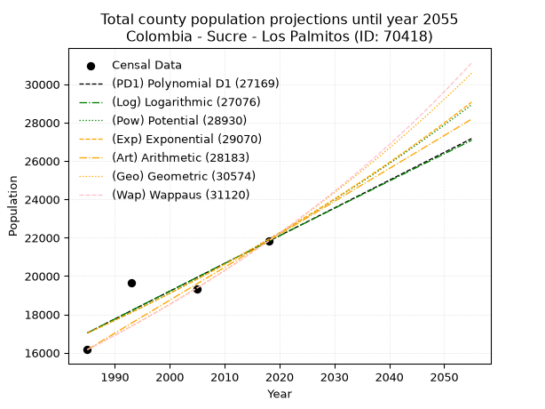
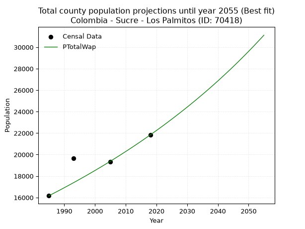
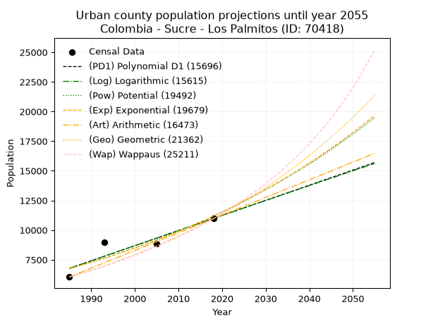
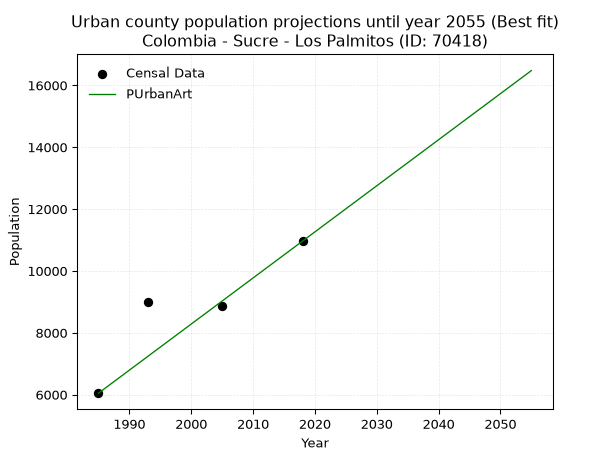
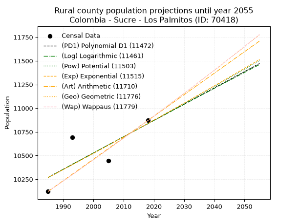
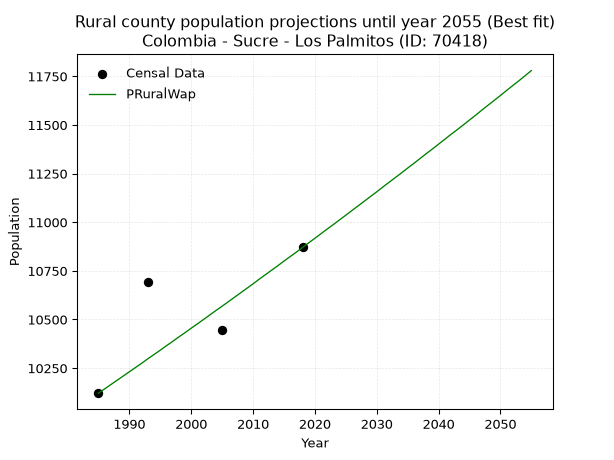

<div align="center">


</div>

# _“Population and Public Services Demand Projections (PPSD) until Year 2050 for Colombia - Sucre - Los Palmitos (ID: 70418)”_
Keywords: `population` `public-service` `projection` `lineal` `polynomial` `logarithmic` `potential` `exponential` `arithmetic` `geometric` `wappaus` `dane` `colombia` `south-america`

PPSD are analytical estimates used by governments and planners to anticipate future changes in population size, age distribution, and the resulting community needs for utilities, healthcare, education, and infrastructure as sizing future water treatment facilities, electrical grids, and road networks based on spatial growth.

> **General running parameters**: • app_version: _v20260806_. • Python version: _3.14.7_. • Pandas version: _3.0.5_. • NumPy version: _2.5.1_. • Creates, save and include plots into reports (create_plot): _False_. • Projection until year: _2050_. • Process polynomial degree 2 and up: _False_. • Process Wappaus: _True_. • Process Wappaus: _True_. • Set negative values to zero: _True_. • Set infinite values to zero: _True_. • Drop dataset notes: _True_. 
<div align="center">

Dynamic map: [:earth_americas:Google](http://maps.google.com/maps?q=9.380269283,-75.2687156) [:earth_americas:OSM](https://www.openstreetmap.org/#map=18/9.380269283/-75.2687156&layers=P) [:earth_americas:Bing](https://www.bing.com/maps?cp=9.380269283~-75.2687156&lvl=18) [:earth_americas:Apple](https://maps.apple.com/frame?center=9.380269283%2C-75.2687156&span=0.003%2C0.006)

</div>


<div align="center">

```geojson
{
  "type": "Feature",
  "geometry": {
    "type": "Point", 
    "coordinates": [-75.2687156, 9.380269283]
  }, 
  "properties": {
    "Name": "Colombia - Sucre - Los Palmitos (ID: 70418)"
  }
}
```

</div>


## 0. Census Data (4 records)

Census data are official statistics collected by a government about the people and housing in a country. They usually include counts of total population, age, sex, race, income, education, and jobs.

📅Global census file: [Population.xlsx](../data/Population.xlsx)

| Source   |   Year |   CountryID | CountryName   |   StateID | StateName   |   CountyID | CountyName   |   PTotal |   PUrban |   PRural |
|:---------|-------:|------------:|:--------------|----------:|:------------|-----------:|:-------------|---------:|---------:|---------:|
| DANE     |   1985 |          57 | Colombia      |        70 | Sucre       |      70418 | Los Palmitos |    16166 |     6045 |    10121 |
| DANE     |   1993 |          57 | Colombia      |        70 | Sucre       |      70418 | Los Palmitos |    19667 |     8977 |    10690 |
| DANE     |   2005 |          57 | Colombia      |        70 | Sucre       |      70418 | Los Palmitos |    19315 |     8871 |    10444 |
| DANE     |   2018 |          57 | Colombia      |        70 | Sucre       |      70418 | Los Palmitos |    21831 |    10961 |    10870 |

> 🔥Some records could had specific notes about the registered values or the corresponding urban or rural distribution.

## 1. Total

### 1.1. Coefficients and Parameters

* (PD1) Polynomial Deg 1: 144.72782015254742, -270247.07226013293 (lineal)
* (Log) Logarithmic: 289798.5048005518, -2183516.007288466
* (Pow) Potential: 15.296224705704121, -46.21217051724162
* (Exp) Exponential: 0.0076380609367457785, 0.004432640723912619
* (Art) Arithmetic: Year diff. 2018 - 1985 = 33, Population diff. 21831 - 16166 = 5665, Annual growth = 171.66666666666666
* (Geo) Geometric: Year diff. 2018 - 1985 = 33, Population diff. 21831 - 16166 = 5665, Annual growth % = 0.00914522210530766
* (Wap) Wappaus: i = 0.9035801072014458, Condition values only valid for < 200)

<sub>
Wappaus condition values: ['0.00', '0.90', '1.81', '2.71', '3.61', '4.52', '5.42', '6.33', '7.23', '8.13', '9.04', '9.94', '10.84', '11.75', '12.65', '13.55', '14.46', '15.36', '16.26', '17.17', '18.07', '18.98', '19.88', '20.78', '21.69', '22.59', '23.49', '24.40', '25.30', '26.20', '27.11', '28.01', '28.91', '29.82', '30.72', '31.63', '32.53', '33.43', '34.34', '35.24', '36.14', '37.05', '37.95', '38.85', '39.76', '40.66', '41.56', '42.47', '43.37', '44.28', '45.18', '46.08', '46.99', '47.89', '48.79', '49.70', '50.60', '51.50', '52.41', '53.31', '54.21', '55.12', '56.02', '56.93', '57.83', '58.73']
</sub>


### 1.2. Projected Dataset

|   Year |   CountyID |   PTotalPD1 |   PTotalLog |   PTotalPow |   PTotalExp |   PTotalArt |   PTotalGeo |   PTotalWap |
|-------:|-----------:|------------:|------------:|------------:|------------:|------------:|------------:|------------:|
|   1985 |      70418 |       17038 |       17032 |       17026 |       17031 |       16166 |       16166 |       16166 |
|   1986 |      70418 |       17182 |       17178 |       17158 |       17162 |       16338 |       16314 |       16313 |
|   1987 |      70418 |       17327 |       17324 |       17290 |       17293 |       16509 |       16463 |       16461 |
|   1988 |      70418 |       17472 |       17470 |       17424 |       17426 |       16681 |       16614 |       16610 |
|   1989 |      70418 |       17617 |       17616 |       17559 |       17559 |       16853 |       16766 |       16761 |
|   1990 |      70418 |       17761 |       17762 |       17694 |       17694 |       17024 |       16919 |       16913 |
|   1991 |      70418 |       17906 |       17907 |       17831 |       17830 |       17196 |       17074 |       17067 |
|   1992 |      70418 |       18051 |       18053 |       17968 |       17966 |       17368 |       17230 |       17222 |
|   1993 |      70418 |       18195 |       18198 |       18107 |       18104 |       17539 |       17387 |       17378 |
|   1994 |      70418 |       18340 |       18343 |       18246 |       18243 |       17711 |       17546 |       17536 |
|   1995 |      70418 |       18485 |       18489 |       18386 |       18383 |       17883 |       17707 |       17696 |
|   1996 |      70418 |       18630 |       18634 |       18528 |       18524 |       18054 |       17869 |       17857 |
|   1997 |      70418 |       18774 |       18779 |       18670 |       18666 |       18226 |       18032 |       18019 |
|   1998 |      70418 |       18919 |       18924 |       18814 |       18809 |       18398 |       18197 |       18183 |
|   1999 |      70418 |       19064 |       19069 |       18958 |       18953 |       18569 |       18363 |       18349 |
|   2000 |      70418 |       19209 |       19214 |       19104 |       19098 |       18741 |       18531 |       18516 |
|   2001 |      70418 |       19353 |       19359 |       19251 |       19245 |       18913 |       18701 |       18685 |
|   2002 |      70418 |       19498 |       19504 |       19398 |       19392 |       19084 |       18872 |       18856 |
|   2003 |      70418 |       19643 |       19649 |       19547 |       19541 |       19256 |       19044 |       19028 |
|   2004 |      70418 |       19787 |       19793 |       19697 |       19691 |       19428 |       19219 |       19202 |
|   2005 |      70418 |       19932 |       19938 |       19848 |       19842 |       19599 |       19394 |       19378 |
|   2006 |      70418 |       20077 |       20082 |       20000 |       19994 |       19771 |       19572 |       19555 |
|   2007 |      70418 |       20222 |       20227 |       20153 |       20147 |       19943 |       19751 |       19734 |
|   2008 |      70418 |       20366 |       20371 |       20307 |       20302 |       20114 |       19931 |       19915 |
|   2009 |      70418 |       20511 |       20515 |       20462 |       20457 |       20286 |       20114 |       20098 |
|   2010 |      70418 |       20656 |       20660 |       20619 |       20614 |       20458 |       20298 |       20283 |
|   2011 |      70418 |       20801 |       20804 |       20776 |       20772 |       20629 |       20483 |       20469 |
|   2012 |      70418 |       20945 |       20948 |       20935 |       20932 |       20801 |       20671 |       20658 |
|   2013 |      70418 |       21090 |       21092 |       21094 |       21092 |       20973 |       20860 |       20848 |
|   2014 |      70418 |       21235 |       21236 |       21255 |       21254 |       21144 |       21050 |       21041 |
|   2015 |      70418 |       21379 |       21380 |       21417 |       21417 |       21316 |       21243 |       21235 |
|   2016 |      70418 |       21524 |       21523 |       21580 |       21581 |       21488 |       21437 |       21432 |
|   2017 |      70418 |       21669 |       21667 |       21745 |       21747 |       21659 |       21633 |       21630 |
|   2018 |      70418 |       21814 |       21811 |       21910 |       21913 |       21831 |       21831 |       21831 |
|   2019 |      70418 |       21958 |       21954 |       22077 |       22081 |       22003 |       22031 |       22034 |
|   2020 |      70418 |       22103 |       22098 |       22245 |       22251 |       22174 |       22232 |       22239 |
|   2021 |      70418 |       22248 |       22241 |       22414 |       22421 |       22346 |       22435 |       22446 |
|   2022 |      70418 |       22393 |       22385 |       22584 |       22593 |       22518 |       22641 |       22655 |
|   2023 |      70418 |       22537 |       22528 |       22755 |       22766 |       22689 |       22848 |       22867 |
|   2024 |      70418 |       22682 |       22671 |       22928 |       22941 |       22861 |       23057 |       23081 |
|   2025 |      70418 |       22827 |       22814 |       23102 |       23117 |       23033 |       23267 |       23298 |
|   2026 |      70418 |       22971 |       22957 |       23277 |       23294 |       23204 |       23480 |       23517 |
|   2027 |      70418 |       23116 |       23100 |       23453 |       23473 |       23376 |       23695 |       23738 |
|   2028 |      70418 |       23261 |       23243 |       23631 |       23653 |       23548 |       23912 |       23962 |
|   2029 |      70418 |       23406 |       23386 |       23810 |       23834 |       23719 |       24130 |       24188 |
|   2030 |      70418 |       23550 |       23529 |       23990 |       24017 |       23891 |       24351 |       24417 |
|   2031 |      70418 |       23695 |       23672 |       24172 |       24201 |       24063 |       24574 |       24648 |
|   2032 |      70418 |       23840 |       23814 |       24354 |       24386 |       24234 |       24798 |       24882 |
|   2033 |      70418 |       23985 |       23957 |       24538 |       24573 |       24406 |       25025 |       25119 |
|   2034 |      70418 |       24129 |       24099 |       24723 |       24762 |       24578 |       25254 |       25359 |
|   2035 |      70418 |       24274 |       24242 |       24910 |       24952 |       24749 |       25485 |       25601 |
|   2036 |      70418 |       24419 |       24384 |       25098 |       25143 |       24921 |       25718 |       25846 |
|   2037 |      70418 |       24563 |       24526 |       25287 |       25336 |       25093 |       25953 |       26094 |
|   2038 |      70418 |       24708 |       24669 |       25478 |       25530 |       25264 |       26191 |       26345 |
|   2039 |      70418 |       24853 |       24811 |       25670 |       25726 |       25436 |       26430 |       26599 |
|   2040 |      70418 |       24998 |       24953 |       25863 |       25923 |       25608 |       26672 |       26856 |
|   2041 |      70418 |       25142 |       25095 |       26057 |       26122 |       25779 |       26916 |       27117 |
|   2042 |      70418 |       25287 |       25237 |       26253 |       26322 |       25951 |       27162 |       27380 |
|   2043 |      70418 |       25432 |       25379 |       26451 |       26524 |       26123 |       27410 |       27647 |
|   2044 |      70418 |       25577 |       25521 |       26650 |       26727 |       26294 |       27661 |       27916 |
|   2045 |      70418 |       25721 |       25662 |       26850 |       26932 |       26466 |       27914 |       28190 |
|   2046 |      70418 |       25866 |       25804 |       27051 |       27139 |       26638 |       28169 |       28466 |
|   2047 |      70418 |       26011 |       25946 |       27254 |       27347 |       26809 |       28427 |       28746 |
|   2048 |      70418 |       26156 |       26087 |       27458 |       27556 |       26981 |       28687 |       29030 |
|   2049 |      70418 |       26300 |       26229 |       27664 |       27768 |       27153 |       28949 |       29317 |
|   2050 |      70418 |       26445 |       26370 |       27872 |       27981 |       27324 |       29214 |       29608 |
<div align="center">

</img>

</div>


### 1.3. Best fit with absolute and relative error (%)

Relative error puts that difference into context by dividing the absolute error by the true value, creating a unitless ratio or percentage that shows the scale of the mistake.

Absolute and relative error

|   Year | Source   |   CountryID | CountryName   |   StateID | StateName   |   CountyID_x | CountyName   |   PTotal |   PUrban |   PRural |   CountyID_y |   PTotalPD1 |   PTotalLog |   PTotalPow |   PTotalExp |   PTotalArt |   PTotalGeo |   PTotalWap |   PTotalPD1AbsError |   PTotalLogAbsError |   PTotalPowAbsError |   PTotalExpAbsError |   PTotalArtAbsError |   PTotalGeoAbsError |   PTotalWapAbsError |   PTotalPD1RelError |   PTotalLogRelError |   PTotalPowRelError |   PTotalExpRelError |   PTotalArtRelError |   PTotalGeoRelError |   PTotalWapRelError |
|-------:|:---------|------------:|:--------------|----------:|:------------|-------------:|:-------------|---------:|---------:|---------:|-------------:|------------:|------------:|------------:|------------:|------------:|------------:|------------:|--------------------:|--------------------:|--------------------:|--------------------:|--------------------:|--------------------:|--------------------:|--------------------:|--------------------:|--------------------:|--------------------:|--------------------:|--------------------:|--------------------:|
|   1985 | DANE     |          57 | Colombia      |        70 | Sucre       |        70418 | Los Palmitos |    16166 |     6045 |    10121 |        70418 |       17038 |       17032 |       17026 |       17031 |       16166 |       16166 |       16166 |                 872 |                 866 |                 860 |                 865 |                   0 |                   0 |                   0 |           5.39404   |           5.35692   |            5.31981  |            5.35074  |             0       |            0        |            0        |
|   1993 | DANE     |          57 | Colombia      |        70 | Sucre       |        70418 | Los Palmitos |    19667 |     8977 |    10690 |        70418 |       18195 |       18198 |       18107 |       18104 |       17539 |       17387 |       17378 |                1472 |                1469 |                1560 |                1563 |                2128 |                2280 |                2289 |           7.48462   |           7.46936   |            7.93207  |            7.94732  |            10.8202  |           11.593    |           11.6388   |
|   2005 | DANE     |          57 | Colombia      |        70 | Sucre       |        70418 | Los Palmitos |    19315 |     8871 |    10444 |        70418 |       19932 |       19938 |       19848 |       19842 |       19599 |       19394 |       19378 |                 617 |                 623 |                 533 |                 527 |                 284 |                  79 |                  63 |           3.19441   |           3.22547   |            2.75951  |            2.72845  |             1.47036 |            0.409009 |            0.326171 |
|   2018 | DANE     |          57 | Colombia      |        70 | Sucre       |        70418 | Los Palmitos |    21831 |    10961 |    10870 |        70418 |       21814 |       21811 |       21910 |       21913 |       21831 |       21831 |       21831 |                  17 |                  20 |                  79 |                  82 |                   0 |                   0 |                   0 |           0.0778709 |           0.0916128 |            0.361871 |            0.375613 |             0       |            0        |            0        |

Relative error mean

| Method    |   RelError | Best   |
|:----------|-----------:|:-------|
| PTotalPD1 |    4.03773 |        |
| PTotalLog |    4.03584 |        |
| PTotalPow |    4.09332 |        |
| PTotalExp |    4.10053 |        |
| PTotalArt |    3.07263 |        |
| PTotalGeo |    3.00051 |        |
| PTotalWap |    2.99124 | True   |

💙Best method: _**PTotalWap**_
<div align="center">

</img>

</div>


### 1.4. Fresh water supply demand in liters per capita per day (lpcd)

The fresh water supply demand typically ranges from 100 to 300 liters per capita per day (lpcd) for standard domestic and municipal planning, though absolute survival minimums set by the World Health Organization are as low as 7.5 to 20 liters per day, and total consumption in high-income nations can exceed 400 liters.

> `CZ`: Level in meters above the sea level (masl)<br> `WS`: Fresh water supply demand in liters per capita per day (lpcd or l/h/d)<br> `WSAll`: Zonal fresh water supply demand in liters per second (l/s)<br> `A`: Zonal area in square meters<br> `DP`: Population density (people/hectare)

Reference values (RAS Colombia)

|    CZ |   WS |
|------:|-----:|
|  1000 |  120 |
|  2000 |  130 |
| 99999 |  140 |

County shapefile geometry properties and water supply values

|   CountyID |      ATotal |   CZTotal |   WSTotal |
|-----------:|------------:|----------:|----------:|
|      70418 | 1.98765e+08 |   200.316 |       120 |

Projected values for best method: PTotalWap

|   CountyID |   Year |   PTotalWap |   DPTotal |   WSTotal |   WSTotalAll |
|-----------:|-------:|------------:|----------:|----------:|-------------:|
|      70418 |   1985 |       16166 |      0.81 |       120 |      22.4528 |
|      70418 |   1986 |       16313 |      0.82 |       120 |      22.6569 |
|      70418 |   1987 |       16461 |      0.83 |       120 |      22.8625 |
|      70418 |   1988 |       16610 |      0.84 |       120 |      23.0694 |
|      70418 |   1989 |       16761 |      0.84 |       120 |      23.2792 |
|      70418 |   1990 |       16913 |      0.85 |       120 |      23.4903 |
|      70418 |   1991 |       17067 |      0.86 |       120 |      23.7042 |
|      70418 |   1992 |       17222 |      0.87 |       120 |      23.9194 |
|      70418 |   1993 |       17378 |      0.87 |       120 |      24.1361 |
|      70418 |   1994 |       17536 |      0.88 |       120 |      24.3556 |
|      70418 |   1995 |       17696 |      0.89 |       120 |      24.5778 |
|      70418 |   1996 |       17857 |      0.9  |       120 |      24.8014 |
|      70418 |   1997 |       18019 |      0.91 |       120 |      25.0264 |
|      70418 |   1998 |       18183 |      0.91 |       120 |      25.2542 |
|      70418 |   1999 |       18349 |      0.92 |       120 |      25.4847 |
|      70418 |   2000 |       18516 |      0.93 |       120 |      25.7167 |
|      70418 |   2001 |       18685 |      0.94 |       120 |      25.9514 |
|      70418 |   2002 |       18856 |      0.95 |       120 |      26.1889 |
|      70418 |   2003 |       19028 |      0.96 |       120 |      26.4278 |
|      70418 |   2004 |       19202 |      0.97 |       120 |      26.6694 |
|      70418 |   2005 |       19378 |      0.97 |       120 |      26.9139 |
|      70418 |   2006 |       19555 |      0.98 |       120 |      27.1597 |
|      70418 |   2007 |       19734 |      0.99 |       120 |      27.4083 |
|      70418 |   2008 |       19915 |      1    |       120 |      27.6597 |
|      70418 |   2009 |       20098 |      1.01 |       120 |      27.9139 |
|      70418 |   2010 |       20283 |      1.02 |       120 |      28.1708 |
|      70418 |   2011 |       20469 |      1.03 |       120 |      28.4292 |
|      70418 |   2012 |       20658 |      1.04 |       120 |      28.6917 |
|      70418 |   2013 |       20848 |      1.05 |       120 |      28.9556 |
|      70418 |   2014 |       21041 |      1.06 |       120 |      29.2236 |
|      70418 |   2015 |       21235 |      1.07 |       120 |      29.4931 |
|      70418 |   2016 |       21432 |      1.08 |       120 |      29.7667 |
|      70418 |   2017 |       21630 |      1.09 |       120 |      30.0417 |
|      70418 |   2018 |       21831 |      1.1  |       120 |      30.3208 |
|      70418 |   2019 |       22034 |      1.11 |       120 |      30.6028 |
|      70418 |   2020 |       22239 |      1.12 |       120 |      30.8875 |
|      70418 |   2021 |       22446 |      1.13 |       120 |      31.175  |
|      70418 |   2022 |       22655 |      1.14 |       120 |      31.4653 |
|      70418 |   2023 |       22867 |      1.15 |       120 |      31.7597 |
|      70418 |   2024 |       23081 |      1.16 |       120 |      32.0569 |
|      70418 |   2025 |       23298 |      1.17 |       120 |      32.3583 |
|      70418 |   2026 |       23517 |      1.18 |       120 |      32.6625 |
|      70418 |   2027 |       23738 |      1.19 |       120 |      32.9694 |
|      70418 |   2028 |       23962 |      1.21 |       120 |      33.2806 |
|      70418 |   2029 |       24188 |      1.22 |       120 |      33.5944 |
|      70418 |   2030 |       24417 |      1.23 |       120 |      33.9125 |
|      70418 |   2031 |       24648 |      1.24 |       120 |      34.2333 |
|      70418 |   2032 |       24882 |      1.25 |       120 |      34.5583 |
|      70418 |   2033 |       25119 |      1.26 |       120 |      34.8875 |
|      70418 |   2034 |       25359 |      1.28 |       120 |      35.2208 |
|      70418 |   2035 |       25601 |      1.29 |       120 |      35.5569 |
|      70418 |   2036 |       25846 |      1.3  |       120 |      35.8972 |
|      70418 |   2037 |       26094 |      1.31 |       120 |      36.2417 |
|      70418 |   2038 |       26345 |      1.33 |       120 |      36.5903 |
|      70418 |   2039 |       26599 |      1.34 |       120 |      36.9431 |
|      70418 |   2040 |       26856 |      1.35 |       120 |      37.3    |
|      70418 |   2041 |       27117 |      1.36 |       120 |      37.6625 |
|      70418 |   2042 |       27380 |      1.38 |       120 |      38.0278 |
|      70418 |   2043 |       27647 |      1.39 |       120 |      38.3986 |
|      70418 |   2044 |       27916 |      1.4  |       120 |      38.7722 |
|      70418 |   2045 |       28190 |      1.42 |       120 |      39.1528 |
|      70418 |   2046 |       28466 |      1.43 |       120 |      39.5361 |
|      70418 |   2047 |       28746 |      1.45 |       120 |      39.925  |
|      70418 |   2048 |       29030 |      1.46 |       120 |      40.3194 |
|      70418 |   2049 |       29317 |      1.47 |       120 |      40.7181 |
|      70418 |   2050 |       29608 |      1.49 |       120 |      41.1222 |

## 2. Urban

### 2.1. Coefficients and Parameters

* (PD1) Polynomial Deg 1: 127.53994379767029, -246398.27258129002 (lineal)
* (Log) Logarithmic: 255384.47693157414, -1932465.9556796555
* (Pow) Potential: 30.61257459890865, -97.12384274999931
* (Exp) Exponential: 0.015284193318057322, 4.5003519063588016e-10
* (Art) Arithmetic: Year diff. 2018 - 1985 = 33, Population diff. 10961 - 6045 = 4916, Annual growth = 148.96969696969697
* (Geo) Geometric: Year diff. 2018 - 1985 = 33, Population diff. 10961 - 6045 = 4916, Annual growth % = 0.01819728702901613
* (Wap) Wappaus: i = 1.7519663291743734, Condition values only valid for < 200)

<sub>
Wappaus condition values: ['0.00', '1.75', '3.50', '5.26', '7.01', '8.76', '10.51', '12.26', '14.02', '15.77', '17.52', '19.27', '21.02', '22.78', '24.53', '26.28', '28.03', '29.78', '31.54', '33.29', '35.04', '36.79', '38.54', '40.30', '42.05', '43.80', '45.55', '47.30', '49.06', '50.81', '52.56', '54.31', '56.06', '57.81', '59.57', '61.32', '63.07', '64.82', '66.57', '68.33', '70.08', '71.83', '73.58', '75.33', '77.09', '78.84', '80.59', '82.34', '84.09', '85.85', '87.60', '89.35', '91.10', '92.85', '94.61', '96.36', '98.11', '99.86', '101.61', '103.37', '105.12', '106.87', '108.62', '110.37', '112.13', '113.88']
</sub>


### 2.2. Projected Dataset

|   Year |   CountyID |   PUrbanPD1 |   PUrbanLog |   PUrbanPow |   PUrbanExp |   PUrbanArt |   PUrbanGeo |   PUrbanWap |
|-------:|-----------:|------------:|------------:|------------:|------------:|------------:|------------:|------------:|
|   1985 |      70418 |        6769 |        6764 |        6747 |        6751 |        6045 |        6045 |        6045 |
|   1986 |      70418 |        6896 |        6893 |        6852 |        6855 |        6194 |        6155 |        6152 |
|   1987 |      70418 |        7024 |        7021 |        6958 |        6960 |        6343 |        6267 |        6261 |
|   1988 |      70418 |        7151 |        7150 |        7066 |        7068 |        6492 |        6381 |        6371 |
|   1989 |      70418 |        7279 |        7278 |        7176 |        7176 |        6641 |        6497 |        6484 |
|   1990 |      70418 |        7406 |        7406 |        7287 |        7287 |        6790 |        6615 |        6599 |
|   1991 |      70418 |        7534 |        7535 |        7400 |        7399 |        6939 |        6736 |        6716 |
|   1992 |      70418 |        7661 |        7663 |        7514 |        7513 |        7088 |        6858 |        6835 |
|   1993 |      70418 |        7789 |        7791 |        7631 |        7629 |        7237 |        6983 |        6956 |
|   1994 |      70418 |        7916 |        7919 |        7749 |        7746 |        7386 |        7110 |        7080 |
|   1995 |      70418 |        8044 |        8047 |        7869 |        7866 |        7535 |        7240 |        7206 |
|   1996 |      70418 |        8171 |        8175 |        7990 |        7987 |        7684 |        7371 |        7334 |
|   1997 |      70418 |        8299 |        8303 |        8114 |        8110 |        7833 |        7505 |        7465 |
|   1998 |      70418 |        8427 |        8431 |        8239 |        8235 |        7982 |        7642 |        7599 |
|   1999 |      70418 |        8554 |        8559 |        8366 |        8362 |        8131 |        7781 |        7735 |
|   2000 |      70418 |        8682 |        8687 |        8495 |        8490 |        8280 |        7923 |        7874 |
|   2001 |      70418 |        8809 |        8814 |        8626 |        8621 |        8429 |        8067 |        8016 |
|   2002 |      70418 |        8937 |        8942 |        8759 |        8754 |        8577 |        8214 |        8160 |
|   2003 |      70418 |        9064 |        9069 |        8894 |        8889 |        8726 |        8363 |        8308 |
|   2004 |      70418 |        9192 |        9197 |        9031 |        9026 |        8875 |        8515 |        8459 |
|   2005 |      70418 |        9319 |        9324 |        9170 |        9165 |        9024 |        8670 |        8613 |
|   2006 |      70418 |        9447 |        9452 |        9311 |        9306 |        9173 |        8828 |        8770 |
|   2007 |      70418 |        9574 |        9579 |        9454 |        9449 |        9322 |        8989 |        8931 |
|   2008 |      70418 |        9702 |        9706 |        9600 |        9595 |        9471 |        9152 |        9095 |
|   2009 |      70418 |        9829 |        9833 |        9747 |        9742 |        9620 |        9319 |        9263 |
|   2010 |      70418 |        9957 |        9960 |        9897 |        9893 |        9769 |        9488 |        9435 |
|   2011 |      70418 |       10085 |       10087 |       10049 |       10045 |        9918 |        9661 |        9611 |
|   2012 |      70418 |       10212 |       10214 |       10203 |       10200 |       10067 |        9837 |        9790 |
|   2013 |      70418 |       10340 |       10341 |       10359 |       10357 |       10216 |       10016 |        9974 |
|   2014 |      70418 |       10467 |       10468 |       10518 |       10516 |       10365 |       10198 |       10162 |
|   2015 |      70418 |       10595 |       10595 |       10679 |       10678 |       10514 |       10384 |       10355 |
|   2016 |      70418 |       10722 |       10721 |       10842 |       10843 |       10663 |       10573 |       10552 |
|   2017 |      70418 |       10850 |       10848 |       11008 |       11010 |       10812 |       10765 |       10754 |
|   2018 |      70418 |       10977 |       10975 |       11176 |       11179 |       10961 |       10961 |       10961 |
|   2019 |      70418 |       11105 |       11101 |       11347 |       11351 |       11110 |       11160 |       11173 |
|   2020 |      70418 |       11232 |       11228 |       11521 |       11526 |       11259 |       11364 |       11391 |
|   2021 |      70418 |       11360 |       11354 |       11696 |       11704 |       11408 |       11570 |       11614 |
|   2022 |      70418 |       11487 |       11480 |       11875 |       11884 |       11557 |       11781 |       11843 |
|   2023 |      70418 |       11615 |       11607 |       12056 |       12067 |       11706 |       11995 |       12078 |
|   2024 |      70418 |       11743 |       11733 |       12240 |       12253 |       11855 |       12214 |       12319 |
|   2025 |      70418 |       11870 |       11859 |       12426 |       12442 |       12004 |       12436 |       12566 |
|   2026 |      70418 |       11998 |       11985 |       12615 |       12633 |       12153 |       12662 |       12821 |
|   2027 |      70418 |       12125 |       12111 |       12807 |       12828 |       12302 |       12893 |       13082 |
|   2028 |      70418 |       12253 |       12237 |       13002 |       13025 |       12451 |       13127 |       13351 |
|   2029 |      70418 |       12380 |       12363 |       13200 |       13226 |       12600 |       13366 |       13627 |
|   2030 |      70418 |       12508 |       12489 |       13401 |       13430 |       12749 |       13609 |       13912 |
|   2031 |      70418 |       12635 |       12615 |       13604 |       13636 |       12898 |       13857 |       14205 |
|   2032 |      70418 |       12763 |       12740 |       13811 |       13846 |       13047 |       14109 |       14506 |
|   2033 |      70418 |       12890 |       12866 |       14020 |       14060 |       13196 |       14366 |       14817 |
|   2034 |      70418 |       13018 |       12992 |       14233 |       14276 |       13345 |       14627 |       15137 |
|   2035 |      70418 |       13146 |       13117 |       14449 |       14496 |       13493 |       14893 |       15467 |
|   2036 |      70418 |       13273 |       13243 |       14668 |       14719 |       13642 |       15164 |       15808 |
|   2037 |      70418 |       13401 |       13368 |       14890 |       14946 |       13791 |       15440 |       16159 |
|   2038 |      70418 |       13528 |       13493 |       15115 |       15176 |       13940 |       15721 |       16522 |
|   2039 |      70418 |       13656 |       13619 |       15344 |       15410 |       14089 |       16007 |       16898 |
|   2040 |      70418 |       13783 |       13744 |       15576 |       15647 |       14238 |       16299 |       17285 |
|   2041 |      70418 |       13911 |       13869 |       15812 |       15888 |       14387 |       16595 |       17687 |
|   2042 |      70418 |       14038 |       13994 |       16050 |       16133 |       14536 |       16897 |       18102 |
|   2043 |      70418 |       14166 |       14119 |       16293 |       16382 |       14685 |       17205 |       18532 |
|   2044 |      70418 |       14293 |       14244 |       16539 |       16634 |       14834 |       17518 |       18977 |
|   2045 |      70418 |       14421 |       14369 |       16788 |       16890 |       14983 |       17837 |       19439 |
|   2046 |      70418 |       14548 |       14494 |       17041 |       17150 |       15132 |       18161 |       19919 |
|   2047 |      70418 |       14676 |       14619 |       17298 |       17414 |       15281 |       18492 |       20416 |
|   2048 |      70418 |       14804 |       14743 |       17559 |       17683 |       15430 |       18828 |       20934 |
|   2049 |      70418 |       14931 |       14868 |       17823 |       17955 |       15579 |       19171 |       21472 |
|   2050 |      70418 |       15059 |       14993 |       18091 |       18231 |       15728 |       19520 |       22031 |
<div align="center">

</img>

</div>


### 2.3. Best fit with absolute and relative error (%)

Relative error puts that difference into context by dividing the absolute error by the true value, creating a unitless ratio or percentage that shows the scale of the mistake.

Absolute and relative error

|   Year | Source   |   CountryID | CountryName   |   StateID | StateName   |   CountyID_x | CountyName   |   PTotal |   PUrban |   PRural |   CountyID_y |   PUrbanPD1 |   PUrbanLog |   PUrbanPow |   PUrbanExp |   PUrbanArt |   PUrbanGeo |   PUrbanWap |   PUrbanPD1AbsError |   PUrbanLogAbsError |   PUrbanPowAbsError |   PUrbanExpAbsError |   PUrbanArtAbsError |   PUrbanGeoAbsError |   PUrbanWapAbsError |   PUrbanPD1RelError |   PUrbanLogRelError |   PUrbanPowRelError |   PUrbanExpRelError |   PUrbanArtRelError |   PUrbanGeoRelError |   PUrbanWapRelError |
|-------:|:---------|------------:|:--------------|----------:|:------------|-------------:|:-------------|---------:|---------:|---------:|-------------:|------------:|------------:|------------:|------------:|------------:|------------:|------------:|--------------------:|--------------------:|--------------------:|--------------------:|--------------------:|--------------------:|--------------------:|--------------------:|--------------------:|--------------------:|--------------------:|--------------------:|--------------------:|--------------------:|
|   1985 | DANE     |          57 | Colombia      |        70 | Sucre       |        70418 | Los Palmitos |    16166 |     6045 |    10121 |        70418 |        6769 |        6764 |        6747 |        6751 |        6045 |        6045 |        6045 |                 724 |                 719 |                 702 |                 706 |                   0 |                   0 |                   0 |           11.9768   |           11.8941   |            11.6129  |            11.6791  |             0       |             0       |             0       |
|   1993 | DANE     |          57 | Colombia      |        70 | Sucre       |        70418 | Los Palmitos |    19667 |     8977 |    10690 |        70418 |        7789 |        7791 |        7631 |        7629 |        7237 |        6983 |        6956 |                1188 |                1186 |                1346 |                1348 |                1740 |                1994 |                2021 |           13.2338   |           13.2115   |            14.9939  |            15.0162  |            19.3829  |            22.2123  |            22.5131  |
|   2005 | DANE     |          57 | Colombia      |        70 | Sucre       |        70418 | Los Palmitos |    19315 |     8871 |    10444 |        70418 |        9319 |        9324 |        9170 |        9165 |        9024 |        8670 |        8613 |                 448 |                 453 |                 299 |                 294 |                 153 |                 201 |                 258 |            5.05016  |            5.10653  |             3.37053 |             3.31417 |             1.72472 |             2.26581 |             2.90835 |
|   2018 | DANE     |          57 | Colombia      |        70 | Sucre       |        70418 | Los Palmitos |    21831 |    10961 |    10870 |        70418 |       10977 |       10975 |       11176 |       11179 |       10961 |       10961 |       10961 |                  16 |                  14 |                 215 |                 218 |                   0 |                   0 |                   0 |            0.145972 |            0.127726 |             1.9615  |             1.98887 |             0       |             0       |             0       |

Relative error mean

| Method    |   RelError | Best   |
|:----------|-----------:|:-------|
| PUrbanPD1 |    7.6017  |        |
| PUrbanLog |    7.58498 |        |
| PUrbanPow |    7.9847  |        |
| PUrbanExp |    7.99957 |        |
| PUrbanArt |    5.2769  | True   |
| PUrbanGeo |    6.11953 |        |
| PUrbanWap |    6.35536 |        |

💙Best method: _**PUrbanArt**_
<div align="center">

</img>

</div>


### 2.4. Fresh water supply demand in liters per capita per day (lpcd)

The fresh water supply demand typically ranges from 100 to 300 liters per capita per day (lpcd) for standard domestic and municipal planning, though absolute survival minimums set by the World Health Organization are as low as 7.5 to 20 liters per day, and total consumption in high-income nations can exceed 400 liters.

> `CZ`: Level in meters above the sea level (masl)<br> `WS`: Fresh water supply demand in liters per capita per day (lpcd or l/h/d)<br> `WSAll`: Zonal fresh water supply demand in liters per second (l/s)<br> `A`: Zonal area in square meters<br> `DP`: Population density (people/hectare)

Reference values (RAS Colombia)

|    CZ |   WS |
|------:|-----:|
|  1000 |  120 |
|  2000 |  130 |
| 99999 |  140 |

County shapefile geometry properties and water supply values

|   CountyID |      AUrban |   CZUrban |   WSUrban |
|-----------:|------------:|----------:|----------:|
|      70418 | 1.44856e+06 |   182.787 |       120 |

Projected values for best method: PUrbanArt

|   CountyID |   Year |   PUrbanArt |   DPUrban |   WSUrban |   WSUrbanAll |
|-----------:|-------:|------------:|----------:|----------:|-------------:|
|      70418 |   1985 |        6045 |     41.73 |       120 |      8.39583 |
|      70418 |   1986 |        6194 |     42.76 |       120 |      8.60278 |
|      70418 |   1987 |        6343 |     43.79 |       120 |      8.80972 |
|      70418 |   1988 |        6492 |     44.82 |       120 |      9.01667 |
|      70418 |   1989 |        6641 |     45.85 |       120 |      9.22361 |
|      70418 |   1990 |        6790 |     46.87 |       120 |      9.43056 |
|      70418 |   1991 |        6939 |     47.9  |       120 |      9.6375  |
|      70418 |   1992 |        7088 |     48.93 |       120 |      9.84444 |
|      70418 |   1993 |        7237 |     49.96 |       120 |     10.0514  |
|      70418 |   1994 |        7386 |     50.99 |       120 |     10.2583  |
|      70418 |   1995 |        7535 |     52.02 |       120 |     10.4653  |
|      70418 |   1996 |        7684 |     53.05 |       120 |     10.6722  |
|      70418 |   1997 |        7833 |     54.07 |       120 |     10.8792  |
|      70418 |   1998 |        7982 |     55.1  |       120 |     11.0861  |
|      70418 |   1999 |        8131 |     56.13 |       120 |     11.2931  |
|      70418 |   2000 |        8280 |     57.16 |       120 |     11.5     |
|      70418 |   2001 |        8429 |     58.19 |       120 |     11.7069  |
|      70418 |   2002 |        8577 |     59.21 |       120 |     11.9125  |
|      70418 |   2003 |        8726 |     60.24 |       120 |     12.1194  |
|      70418 |   2004 |        8875 |     61.27 |       120 |     12.3264  |
|      70418 |   2005 |        9024 |     62.3  |       120 |     12.5333  |
|      70418 |   2006 |        9173 |     63.32 |       120 |     12.7403  |
|      70418 |   2007 |        9322 |     64.35 |       120 |     12.9472  |
|      70418 |   2008 |        9471 |     65.38 |       120 |     13.1542  |
|      70418 |   2009 |        9620 |     66.41 |       120 |     13.3611  |
|      70418 |   2010 |        9769 |     67.44 |       120 |     13.5681  |
|      70418 |   2011 |        9918 |     68.47 |       120 |     13.775   |
|      70418 |   2012 |       10067 |     69.5  |       120 |     13.9819  |
|      70418 |   2013 |       10216 |     70.53 |       120 |     14.1889  |
|      70418 |   2014 |       10365 |     71.55 |       120 |     14.3958  |
|      70418 |   2015 |       10514 |     72.58 |       120 |     14.6028  |
|      70418 |   2016 |       10663 |     73.61 |       120 |     14.8097  |
|      70418 |   2017 |       10812 |     74.64 |       120 |     15.0167  |
|      70418 |   2018 |       10961 |     75.67 |       120 |     15.2236  |
|      70418 |   2019 |       11110 |     76.7  |       120 |     15.4306  |
|      70418 |   2020 |       11259 |     77.73 |       120 |     15.6375  |
|      70418 |   2021 |       11408 |     78.75 |       120 |     15.8444  |
|      70418 |   2022 |       11557 |     79.78 |       120 |     16.0514  |
|      70418 |   2023 |       11706 |     80.81 |       120 |     16.2583  |
|      70418 |   2024 |       11855 |     81.84 |       120 |     16.4653  |
|      70418 |   2025 |       12004 |     82.87 |       120 |     16.6722  |
|      70418 |   2026 |       12153 |     83.9  |       120 |     16.8792  |
|      70418 |   2027 |       12302 |     84.93 |       120 |     17.0861  |
|      70418 |   2028 |       12451 |     85.95 |       120 |     17.2931  |
|      70418 |   2029 |       12600 |     86.98 |       120 |     17.5     |
|      70418 |   2030 |       12749 |     88.01 |       120 |     17.7069  |
|      70418 |   2031 |       12898 |     89.04 |       120 |     17.9139  |
|      70418 |   2032 |       13047 |     90.07 |       120 |     18.1208  |
|      70418 |   2033 |       13196 |     91.1  |       120 |     18.3278  |
|      70418 |   2034 |       13345 |     92.13 |       120 |     18.5347  |
|      70418 |   2035 |       13493 |     93.15 |       120 |     18.7403  |
|      70418 |   2036 |       13642 |     94.18 |       120 |     18.9472  |
|      70418 |   2037 |       13791 |     95.2  |       120 |     19.1542  |
|      70418 |   2038 |       13940 |     96.23 |       120 |     19.3611  |
|      70418 |   2039 |       14089 |     97.26 |       120 |     19.5681  |
|      70418 |   2040 |       14238 |     98.29 |       120 |     19.775   |
|      70418 |   2041 |       14387 |     99.32 |       120 |     19.9819  |
|      70418 |   2042 |       14536 |    100.35 |       120 |     20.1889  |
|      70418 |   2043 |       14685 |    101.38 |       120 |     20.3958  |
|      70418 |   2044 |       14834 |    102.41 |       120 |     20.6028  |
|      70418 |   2045 |       14983 |    103.43 |       120 |     20.8097  |
|      70418 |   2046 |       15132 |    104.46 |       120 |     21.0167  |
|      70418 |   2047 |       15281 |    105.49 |       120 |     21.2236  |
|      70418 |   2048 |       15430 |    106.52 |       120 |     21.4306  |
|      70418 |   2049 |       15579 |    107.55 |       120 |     21.6375  |
|      70418 |   2050 |       15728 |    108.58 |       120 |     21.8444  |

## 3. Rural

### 3.1. Coefficients and Parameters

* (PD1) Polynomial Deg 1: 17.187876354877357, -23848.799678843432 (lineal)
* (Log) Logarithmic: 34414.027868977675, -251050.05160881113
* (Pow) Potential: 3.279293471702903, -6.802872058082657
* (Exp) Exponential: 0.001637770877024389, 397.73779027652193
* (Art) Arithmetic: Year diff. 2018 - 1985 = 33, Population diff. 10870 - 10121 = 749, Annual growth = 22.696969696969695
* (Geo) Geometric: Year diff. 2018 - 1985 = 33, Population diff. 10870 - 10121 = 749, Annual growth % = 0.0021658034236586854
* (Wap) Wappaus: i = 0.21625429657443376, Condition values only valid for < 200)

<sub>
Wappaus condition values: ['0.00', '0.22', '0.43', '0.65', '0.87', '1.08', '1.30', '1.51', '1.73', '1.95', '2.16', '2.38', '2.60', '2.81', '3.03', '3.24', '3.46', '3.68', '3.89', '4.11', '4.33', '4.54', '4.76', '4.97', '5.19', '5.41', '5.62', '5.84', '6.06', '6.27', '6.49', '6.70', '6.92', '7.14', '7.35', '7.57', '7.79', '8.00', '8.22', '8.43', '8.65', '8.87', '9.08', '9.30', '9.52', '9.73', '9.95', '10.16', '10.38', '10.60', '10.81', '11.03', '11.25', '11.46', '11.68', '11.89', '12.11', '12.33', '12.54', '12.76', '12.98', '13.19', '13.41', '13.62', '13.84', '14.06']
</sub>


### 3.2. Projected Dataset

|   Year |   CountyID |   PRuralPD1 |   PRuralLog |   PRuralPow |   PRuralExp |   PRuralArt |   PRuralGeo |   PRuralWap |
|-------:|-----------:|------------:|------------:|------------:|------------:|------------:|------------:|------------:|
|   1985 |      70418 |       10269 |       10269 |       10267 |       10268 |       10121 |       10121 |       10121 |
|   1986 |      70418 |       10286 |       10286 |       10284 |       10285 |       10144 |       10143 |       10143 |
|   1987 |      70418 |       10304 |       10303 |       10301 |       10301 |       10166 |       10165 |       10165 |
|   1988 |      70418 |       10321 |       10321 |       10318 |       10318 |       10189 |       10187 |       10187 |
|   1989 |      70418 |       10338 |       10338 |       10335 |       10335 |       10212 |       10209 |       10209 |
|   1990 |      70418 |       10355 |       10355 |       10352 |       10352 |       10234 |       10231 |       10231 |
|   1991 |      70418 |       10372 |       10372 |       10369 |       10369 |       10257 |       10253 |       10253 |
|   1992 |      70418 |       10389 |       10390 |       10386 |       10386 |       10280 |       10275 |       10275 |
|   1993 |      70418 |       10407 |       10407 |       10404 |       10403 |       10303 |       10298 |       10298 |
|   1994 |      70418 |       10424 |       10424 |       10421 |       10420 |       10325 |       10320 |       10320 |
|   1995 |      70418 |       10441 |       10441 |       10438 |       10437 |       10348 |       10342 |       10342 |
|   1996 |      70418 |       10458 |       10459 |       10455 |       10454 |       10371 |       10365 |       10365 |
|   1997 |      70418 |       10475 |       10476 |       10472 |       10472 |       10393 |       10387 |       10387 |
|   1998 |      70418 |       10493 |       10493 |       10489 |       10489 |       10416 |       10410 |       10410 |
|   1999 |      70418 |       10510 |       10510 |       10507 |       10506 |       10439 |       10432 |       10432 |
|   2000 |      70418 |       10527 |       10528 |       10524 |       10523 |       10461 |       10455 |       10455 |
|   2001 |      70418 |       10544 |       10545 |       10541 |       10540 |       10484 |       10477 |       10477 |
|   2002 |      70418 |       10561 |       10562 |       10558 |       10558 |       10507 |       10500 |       10500 |
|   2003 |      70418 |       10579 |       10579 |       10576 |       10575 |       10530 |       10523 |       10523 |
|   2004 |      70418 |       10596 |       10596 |       10593 |       10592 |       10552 |       10546 |       10546 |
|   2005 |      70418 |       10613 |       10614 |       10610 |       10610 |       10575 |       10569 |       10568 |
|   2006 |      70418 |       10630 |       10631 |       10628 |       10627 |       10598 |       10591 |       10591 |
|   2007 |      70418 |       10647 |       10648 |       10645 |       10645 |       10620 |       10614 |       10614 |
|   2008 |      70418 |       10664 |       10665 |       10663 |       10662 |       10643 |       10637 |       10637 |
|   2009 |      70418 |       10682 |       10682 |       10680 |       10679 |       10666 |       10660 |       10660 |
|   2010 |      70418 |       10699 |       10699 |       10697 |       10697 |       10688 |       10683 |       10683 |
|   2011 |      70418 |       10716 |       10716 |       10715 |       10714 |       10711 |       10707 |       10707 |
|   2012 |      70418 |       10733 |       10733 |       10732 |       10732 |       10734 |       10730 |       10730 |
|   2013 |      70418 |       10750 |       10751 |       10750 |       10750 |       10757 |       10753 |       10753 |
|   2014 |      70418 |       10768 |       10768 |       10767 |       10767 |       10779 |       10776 |       10776 |
|   2015 |      70418 |       10785 |       10785 |       10785 |       10785 |       10802 |       10800 |       10800 |
|   2016 |      70418 |       10802 |       10802 |       10802 |       10803 |       10825 |       10823 |       10823 |
|   2017 |      70418 |       10819 |       10819 |       10820 |       10820 |       10847 |       10847 |       10846 |
|   2018 |      70418 |       10836 |       10836 |       10838 |       10838 |       10870 |       10870 |       10870 |
|   2019 |      70418 |       10854 |       10853 |       10855 |       10856 |       10893 |       10894 |       10894 |
|   2020 |      70418 |       10871 |       10870 |       10873 |       10874 |       10915 |       10917 |       10917 |
|   2021 |      70418 |       10888 |       10887 |       10891 |       10891 |       10938 |       10941 |       10941 |
|   2022 |      70418 |       10905 |       10904 |       10908 |       10909 |       10961 |       10964 |       10965 |
|   2023 |      70418 |       10922 |       10921 |       10926 |       10927 |       10983 |       10988 |       10988 |
|   2024 |      70418 |       10939 |       10938 |       10944 |       10945 |       11006 |       11012 |       11012 |
|   2025 |      70418 |       10957 |       10955 |       10961 |       10963 |       11029 |       11036 |       11036 |
|   2026 |      70418 |       10974 |       10972 |       10979 |       10981 |       11052 |       11060 |       11060 |
|   2027 |      70418 |       10991 |       10989 |       10997 |       10999 |       11074 |       11084 |       11084 |
|   2028 |      70418 |       11008 |       11006 |       11015 |       11017 |       11097 |       11108 |       11108 |
|   2029 |      70418 |       11025 |       11023 |       11033 |       11035 |       11120 |       11132 |       11132 |
|   2030 |      70418 |       11043 |       11040 |       11050 |       11053 |       11142 |       11156 |       11156 |
|   2031 |      70418 |       11060 |       11057 |       11068 |       11071 |       11165 |       11180 |       11181 |
|   2032 |      70418 |       11077 |       11074 |       11086 |       11089 |       11188 |       11204 |       11205 |
|   2033 |      70418 |       11094 |       11091 |       11104 |       11108 |       11210 |       11229 |       11229 |
|   2034 |      70418 |       11111 |       11108 |       11122 |       11126 |       11233 |       11253 |       11253 |
|   2035 |      70418 |       11129 |       11125 |       11140 |       11144 |       11256 |       11277 |       11278 |
|   2036 |      70418 |       11146 |       11142 |       11158 |       11162 |       11279 |       11302 |       11302 |
|   2037 |      70418 |       11163 |       11158 |       11176 |       11181 |       11301 |       11326 |       11327 |
|   2038 |      70418 |       11180 |       11175 |       11194 |       11199 |       11324 |       11351 |       11352 |
|   2039 |      70418 |       11197 |       11192 |       11212 |       11217 |       11347 |       11375 |       11376 |
|   2040 |      70418 |       11214 |       11209 |       11230 |       11236 |       11369 |       11400 |       11401 |
|   2041 |      70418 |       11232 |       11226 |       11248 |       11254 |       11392 |       11425 |       11426 |
|   2042 |      70418 |       11249 |       11243 |       11266 |       11272 |       11415 |       11449 |       11451 |
|   2043 |      70418 |       11266 |       11260 |       11284 |       11291 |       11437 |       11474 |       11475 |
|   2044 |      70418 |       11283 |       11277 |       11302 |       11309 |       11460 |       11499 |       11500 |
|   2045 |      70418 |       11300 |       11293 |       11320 |       11328 |       11483 |       11524 |       11525 |
|   2046 |      70418 |       11318 |       11310 |       11339 |       11347 |       11506 |       11549 |       11550 |
|   2047 |      70418 |       11335 |       11327 |       11357 |       11365 |       11528 |       11574 |       11576 |
|   2048 |      70418 |       11352 |       11344 |       11375 |       11384 |       11551 |       11599 |       11601 |
|   2049 |      70418 |       11369 |       11361 |       11393 |       11402 |       11574 |       11624 |       11626 |
|   2050 |      70418 |       11386 |       11377 |       11411 |       11421 |       11596 |       11649 |       11651 |
<div align="center">

</img>

</div>


### 3.3. Best fit with absolute and relative error (%)

Relative error puts that difference into context by dividing the absolute error by the true value, creating a unitless ratio or percentage that shows the scale of the mistake.

Absolute and relative error

|   Year | Source   |   CountryID | CountryName   |   StateID | StateName   |   CountyID_x | CountyName   |   PTotal |   PUrban |   PRural |   CountyID_y |   PRuralPD1 |   PRuralLog |   PRuralPow |   PRuralExp |   PRuralArt |   PRuralGeo |   PRuralWap |   PRuralPD1AbsError |   PRuralLogAbsError |   PRuralPowAbsError |   PRuralExpAbsError |   PRuralArtAbsError |   PRuralGeoAbsError |   PRuralWapAbsError |   PRuralPD1RelError |   PRuralLogRelError |   PRuralPowRelError |   PRuralExpRelError |   PRuralArtRelError |   PRuralGeoRelError |   PRuralWapRelError |
|-------:|:---------|------------:|:--------------|----------:|:------------|-------------:|:-------------|---------:|---------:|---------:|-------------:|------------:|------------:|------------:|------------:|------------:|------------:|------------:|--------------------:|--------------------:|--------------------:|--------------------:|--------------------:|--------------------:|--------------------:|--------------------:|--------------------:|--------------------:|--------------------:|--------------------:|--------------------:|--------------------:|
|   1985 | DANE     |          57 | Colombia      |        70 | Sucre       |        70418 | Los Palmitos |    16166 |     6045 |    10121 |        70418 |       10269 |       10269 |       10267 |       10268 |       10121 |       10121 |       10121 |                 148 |                 148 |                 146 |                 147 |                   0 |                   0 |                   0 |            1.46231  |            1.46231  |            1.44255  |            1.45243  |             0       |             0       |             0       |
|   1993 | DANE     |          57 | Colombia      |        70 | Sucre       |        70418 | Los Palmitos |    19667 |     8977 |    10690 |        70418 |       10407 |       10407 |       10404 |       10403 |       10303 |       10298 |       10298 |                 283 |                 283 |                 286 |                 287 |                 387 |                 392 |                 392 |            2.64733  |            2.64733  |            2.6754   |            2.68475  |             3.62021 |             3.66698 |             3.66698 |
|   2005 | DANE     |          57 | Colombia      |        70 | Sucre       |        70418 | Los Palmitos |    19315 |     8871 |    10444 |        70418 |       10613 |       10614 |       10610 |       10610 |       10575 |       10569 |       10568 |                 169 |                 170 |                 166 |                 166 |                 131 |                 125 |                 124 |            1.61815  |            1.62773  |            1.58943  |            1.58943  |             1.25431 |             1.19686 |             1.18728 |
|   2018 | DANE     |          57 | Colombia      |        70 | Sucre       |        70418 | Los Palmitos |    21831 |    10961 |    10870 |        70418 |       10836 |       10836 |       10838 |       10838 |       10870 |       10870 |       10870 |                  34 |                  34 |                  32 |                  32 |                   0 |                   0 |                   0 |            0.312787 |            0.312787 |            0.294388 |            0.294388 |             0       |             0       |             0       |

Relative error mean

| Method    |   RelError | Best   |
|:----------|-----------:|:-------|
| PRuralPD1 |    1.51015 |        |
| PRuralLog |    1.51254 |        |
| PRuralPow |    1.50044 |        |
| PRuralExp |    1.50525 |        |
| PRuralArt |    1.21863 |        |
| PRuralGeo |    1.21596 |        |
| PRuralWap |    1.21357 | True   |

💙Best method: _**PRuralWap**_
<div align="center">

</img>

</div>


### 3.4. Fresh water supply demand in liters per capita per day (lpcd)

The fresh water supply demand typically ranges from 100 to 300 liters per capita per day (lpcd) for standard domestic and municipal planning, though absolute survival minimums set by the World Health Organization are as low as 7.5 to 20 liters per day, and total consumption in high-income nations can exceed 400 liters.

> `CZ`: Level in meters above the sea level (masl)<br> `WS`: Fresh water supply demand in liters per capita per day (lpcd or l/h/d)<br> `WSAll`: Zonal fresh water supply demand in liters per second (l/s)<br> `A`: Zonal area in square meters<br> `DP`: Population density (people/hectare)

Reference values (RAS Colombia)

|    CZ |   WS |
|------:|-----:|
|  1000 |  120 |
|  2000 |  130 |
| 99999 |  140 |

County shapefile geometry properties and water supply values

|   CountyID |      ARural |   CZRural |   WSRural |
|-----------:|------------:|----------:|----------:|
|      70418 | 1.97316e+08 |   200.442 |       120 |

Projected values for best method: PRuralWap

|   CountyID |   Year |   PRuralWap |   DPRural |   WSRural |   WSRuralAll |
|-----------:|-------:|------------:|----------:|----------:|-------------:|
|      70418 |   1985 |       10121 |      0.51 |       120 |      14.0569 |
|      70418 |   1986 |       10143 |      0.51 |       120 |      14.0875 |
|      70418 |   1987 |       10165 |      0.52 |       120 |      14.1181 |
|      70418 |   1988 |       10187 |      0.52 |       120 |      14.1486 |
|      70418 |   1989 |       10209 |      0.52 |       120 |      14.1792 |
|      70418 |   1990 |       10231 |      0.52 |       120 |      14.2097 |
|      70418 |   1991 |       10253 |      0.52 |       120 |      14.2403 |
|      70418 |   1992 |       10275 |      0.52 |       120 |      14.2708 |
|      70418 |   1993 |       10298 |      0.52 |       120 |      14.3028 |
|      70418 |   1994 |       10320 |      0.52 |       120 |      14.3333 |
|      70418 |   1995 |       10342 |      0.52 |       120 |      14.3639 |
|      70418 |   1996 |       10365 |      0.53 |       120 |      14.3958 |
|      70418 |   1997 |       10387 |      0.53 |       120 |      14.4264 |
|      70418 |   1998 |       10410 |      0.53 |       120 |      14.4583 |
|      70418 |   1999 |       10432 |      0.53 |       120 |      14.4889 |
|      70418 |   2000 |       10455 |      0.53 |       120 |      14.5208 |
|      70418 |   2001 |       10477 |      0.53 |       120 |      14.5514 |
|      70418 |   2002 |       10500 |      0.53 |       120 |      14.5833 |
|      70418 |   2003 |       10523 |      0.53 |       120 |      14.6153 |
|      70418 |   2004 |       10546 |      0.53 |       120 |      14.6472 |
|      70418 |   2005 |       10568 |      0.54 |       120 |      14.6778 |
|      70418 |   2006 |       10591 |      0.54 |       120 |      14.7097 |
|      70418 |   2007 |       10614 |      0.54 |       120 |      14.7417 |
|      70418 |   2008 |       10637 |      0.54 |       120 |      14.7736 |
|      70418 |   2009 |       10660 |      0.54 |       120 |      14.8056 |
|      70418 |   2010 |       10683 |      0.54 |       120 |      14.8375 |
|      70418 |   2011 |       10707 |      0.54 |       120 |      14.8708 |
|      70418 |   2012 |       10730 |      0.54 |       120 |      14.9028 |
|      70418 |   2013 |       10753 |      0.54 |       120 |      14.9347 |
|      70418 |   2014 |       10776 |      0.55 |       120 |      14.9667 |
|      70418 |   2015 |       10800 |      0.55 |       120 |      15      |
|      70418 |   2016 |       10823 |      0.55 |       120 |      15.0319 |
|      70418 |   2017 |       10846 |      0.55 |       120 |      15.0639 |
|      70418 |   2018 |       10870 |      0.55 |       120 |      15.0972 |
|      70418 |   2019 |       10894 |      0.55 |       120 |      15.1306 |
|      70418 |   2020 |       10917 |      0.55 |       120 |      15.1625 |
|      70418 |   2021 |       10941 |      0.55 |       120 |      15.1958 |
|      70418 |   2022 |       10965 |      0.56 |       120 |      15.2292 |
|      70418 |   2023 |       10988 |      0.56 |       120 |      15.2611 |
|      70418 |   2024 |       11012 |      0.56 |       120 |      15.2944 |
|      70418 |   2025 |       11036 |      0.56 |       120 |      15.3278 |
|      70418 |   2026 |       11060 |      0.56 |       120 |      15.3611 |
|      70418 |   2027 |       11084 |      0.56 |       120 |      15.3944 |
|      70418 |   2028 |       11108 |      0.56 |       120 |      15.4278 |
|      70418 |   2029 |       11132 |      0.56 |       120 |      15.4611 |
|      70418 |   2030 |       11156 |      0.57 |       120 |      15.4944 |
|      70418 |   2031 |       11181 |      0.57 |       120 |      15.5292 |
|      70418 |   2032 |       11205 |      0.57 |       120 |      15.5625 |
|      70418 |   2033 |       11229 |      0.57 |       120 |      15.5958 |
|      70418 |   2034 |       11253 |      0.57 |       120 |      15.6292 |
|      70418 |   2035 |       11278 |      0.57 |       120 |      15.6639 |
|      70418 |   2036 |       11302 |      0.57 |       120 |      15.6972 |
|      70418 |   2037 |       11327 |      0.57 |       120 |      15.7319 |
|      70418 |   2038 |       11352 |      0.58 |       120 |      15.7667 |
|      70418 |   2039 |       11376 |      0.58 |       120 |      15.8    |
|      70418 |   2040 |       11401 |      0.58 |       120 |      15.8347 |
|      70418 |   2041 |       11426 |      0.58 |       120 |      15.8694 |
|      70418 |   2042 |       11451 |      0.58 |       120 |      15.9042 |
|      70418 |   2043 |       11475 |      0.58 |       120 |      15.9375 |
|      70418 |   2044 |       11500 |      0.58 |       120 |      15.9722 |
|      70418 |   2045 |       11525 |      0.58 |       120 |      16.0069 |
|      70418 |   2046 |       11550 |      0.59 |       120 |      16.0417 |
|      70418 |   2047 |       11576 |      0.59 |       120 |      16.0778 |
|      70418 |   2048 |       11601 |      0.59 |       120 |      16.1125 |
|      70418 |   2049 |       11626 |      0.59 |       120 |      16.1472 |
|      70418 |   2050 |       11651 |      0.59 |       120 |      16.1819 |

<div align="center"><br><sub>Share this research</sub></div><br>

<sub>**APPS & TOOLS & CONTENT DISCLAIMER**: • NO WARRANTY - This content and software is provided by <a href="https://github.com/rcfdtools" target="_blank">github.com/rcfdtools</a> "as is", without any express or implied warranty, including warranties of merchantability, fitness for a particular purpose, or non-infringement. There is no guarantee that the software will be error-free or operate without interruption. • LIMITATION OF LIABILITY - Neither the authors nor copyright holders will be liable for claims or damages arising from the software or its use. You are responsible for determining if the software is appropriate for your use and assume all associated risks, including errors, legal compliance, and data loss. • NO PROFESSIONAL ADVICE - The software provides general information and does not offer professional advice. It should not replace consultation with professional advisors. [Clauses and global license for rcfdtools use.](https://github.com/rcfdtools/rcfdtools/blob/main/LICENSE.md)</sub>

| [:house: Home](Readme.md)  | [:beginner: Help / Collaborate](https://github.com/rcfdtools/R.HydroTools/discussions/31) |
|----------------------------|-------------------------------------------------------------------------------------------|