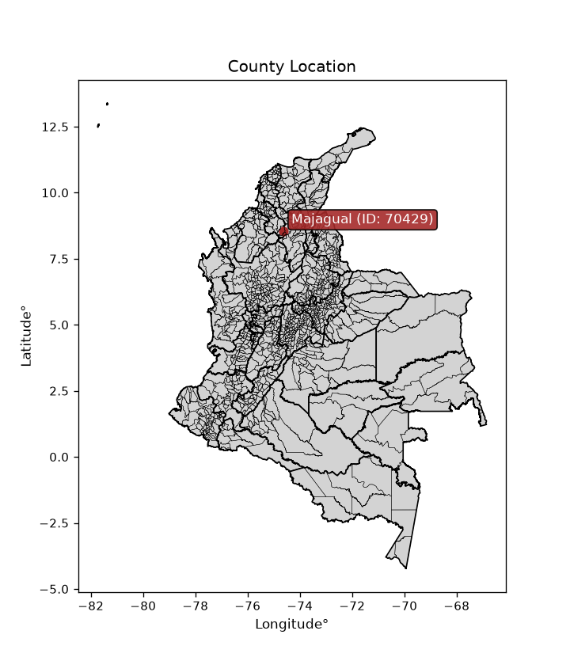
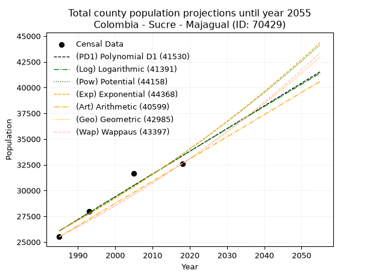
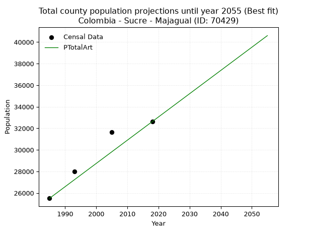
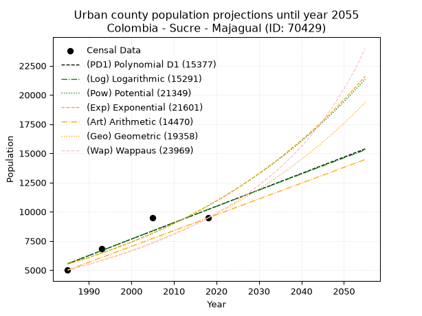
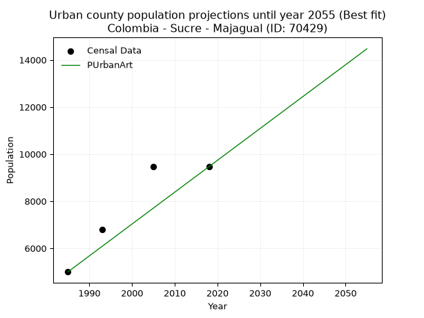
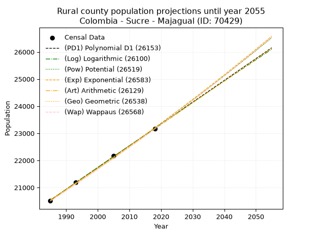
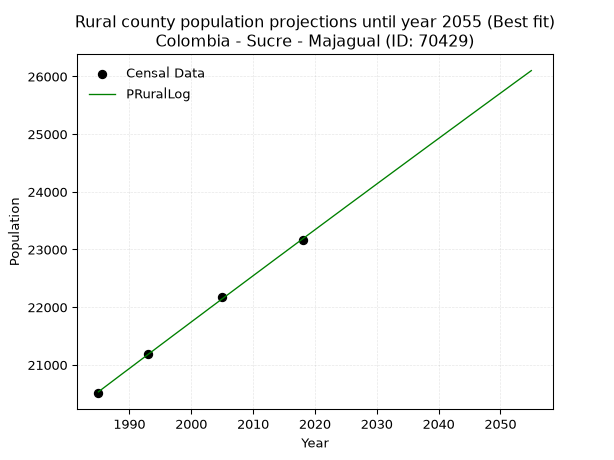

<div align="center">


</div>

# _“Population and Public Services Demand Projections (PPSD) until Year 2050 for Colombia - Sucre - Majagual (ID: 70429)”_
Keywords: `population` `public-service` `projection` `lineal` `polynomial` `logarithmic` `potential` `exponential` `arithmetic` `geometric` `wappaus` `dane` `colombia` `south-america`

PPSD are analytical estimates used by governments and planners to anticipate future changes in population size, age distribution, and the resulting community needs for utilities, healthcare, education, and infrastructure as sizing future water treatment facilities, electrical grids, and road networks based on spatial growth.

<div align="center">

</img>

</div>


> **General running parameters**: • app_version: _v20260806_. • Python version: _3.14.7_. • Pandas version: _3.0.5_. • NumPy version: _2.5.1_. • Creates, save and include plots into reports (create_plot): _False_. • Projection until year: _2050_. • Process polynomial degree 2 and up: _False_. • Process Wappaus: _True_. • Process Wappaus: _True_. • Set negative values to zero: _True_. • Set infinite values to zero: _True_. • Drop dataset notes: _True_. 
<div align="center">

Dynamic map: [:earth_americas:Google](http://maps.google.com/maps?q=8.54116325,-74.6280765) [:earth_americas:OSM](https://www.openstreetmap.org/#map=18/8.54116325/-74.6280765&layers=P) [:earth_americas:Bing](https://www.bing.com/maps?cp=8.54116325~-74.6280765&lvl=18) [:earth_americas:Apple](https://maps.apple.com/frame?center=8.54116325%2C-74.6280765&span=0.003%2C0.006)

</div>


<div align="center">

```geojson
{
  "type": "Feature",
  "geometry": {
    "type": "Point", 
    "coordinates": [-74.6280765, 8.54116325]
  }, 
  "properties": {
    "Name": "Colombia - Sucre - Majagual (ID: 70429)"
  }
}
```

</div>


## 0. Census Data (4 records)

Census data are official statistics collected by a government about the people and housing in a country. They usually include counts of total population, age, sex, race, income, education, and jobs.

📅Global census file: [Population.xlsx](../data/Population.xlsx)

| Source   |   Year |   CountryID | CountryName   |   StateID | StateName   |   CountyID | CountyName   |   PTotal |   PUrban |   PRural |
|:---------|-------:|------------:|:--------------|----------:|:------------|-----------:|:-------------|---------:|---------:|---------:|
| DANE     |   1985 |          57 | Colombia      |        70 | Sucre       |      70429 | Majagual     |    25507 |     4999 |    20508 |
| DANE     |   1993 |          57 | Colombia      |        70 | Sucre       |      70429 | Majagual     |    27998 |     6804 |    21194 |
| DANE     |   2005 |          57 | Colombia      |        70 | Sucre       |      70429 | Majagual     |    31657 |     9482 |    22175 |
| DANE     |   2018 |          57 | Colombia      |        70 | Sucre       |      70429 | Majagual     |    32622 |     9464 |    23158 |

> 🔥Some records could had specific notes about the registered values or the corresponding urban or rural distribution.

📅[SUI-RUPS](https://www.datos.gov.co/Hacienda-y-Cr-dito-P-blico/Registro-nico-de-Prestadores-de-Servicios-P-blicos/4qkq-csdn/about_data) - Local public utility companies: [RUPS.csv](../data/RUPS.xlsx)

 | SERVICIO       | ESTADO    | NOMBRE                                                              | NIT         | DEPARTAMENTO_DOMICILIO   | MUNICIPIO_DOMICILIO   | DIRECCION       |   TELEFONO | EMAIL                         | TIPO_PRESTADOR          | CLASIFICACION                 |
|:---------------|:----------|:--------------------------------------------------------------------|:------------|:-------------------------|:----------------------|:----------------|-----------:|:------------------------------|:------------------------|:------------------------------|
| ACUEDUCTO      | OPERATIVA | COOPERATIVA DE ACUEDUCTO, ALCANTARRILLADO Y ASEO DE MAJAGUAL E.S.P. | 900118486-9 | SUCRE                    | MAJAGUAL              | calle 5 Nº17-57 |    0000000 | alberto-enrique89@hotmail.com | ORGANIZACION AUTORIZADA | MENOR O IGUAL A 2500 USUARIOS |
| ALCANTARILLADO | OPERATIVA | COOPERATIVA DE ACUEDUCTO, ALCANTARRILLADO Y ASEO DE MAJAGUAL E.S.P. | 900118486-9 | SUCRE                    | MAJAGUAL              | calle 5 Nº17-57 |    0000000 | alberto-enrique89@hotmail.com | ORGANIZACION AUTORIZADA | MENOR O IGUAL A 2500 USUARIOS |

## 1. Total

### 1.1. Coefficients and Parameters

* (PD1) Polynomial Deg 1: 220.70493777599268, -412019.05178642937 (lineal)
* (Log) Logarithmic: 442034.5532745468, -3330462.181682432
* (Pow) Potential: 15.173161476080365, -45.620815039335
* (Exp) Exponential: 0.007575395150713287, 0.007695105356334393
* (Art) Arithmetic: Year diff. 2018 - 1985 = 33, Population diff. 32622 - 25507 = 7115, Annual growth = 215.6060606060606
* (Geo) Geometric: Year diff. 2018 - 1985 = 33, Population diff. 32622 - 25507 = 7115, Annual growth % = 0.007483437245777935
* (Wap) Wappaus: i = 0.7418192661358723, Condition values only valid for < 200)

<sub>
Wappaus condition values: ['0.00', '0.74', '1.48', '2.23', '2.97', '3.71', '4.45', '5.19', '5.93', '6.68', '7.42', '8.16', '8.90', '9.64', '10.39', '11.13', '11.87', '12.61', '13.35', '14.09', '14.84', '15.58', '16.32', '17.06', '17.80', '18.55', '19.29', '20.03', '20.77', '21.51', '22.25', '23.00', '23.74', '24.48', '25.22', '25.96', '26.71', '27.45', '28.19', '28.93', '29.67', '30.41', '31.16', '31.90', '32.64', '33.38', '34.12', '34.87', '35.61', '36.35', '37.09', '37.83', '38.57', '39.32', '40.06', '40.80', '41.54', '42.28', '43.03', '43.77', '44.51', '45.25', '45.99', '46.73', '47.48', '48.22']
</sub>


### 1.2. Projected Dataset

|   Year |   CountyID |   PTotalPD1 |   PTotalLog |   PTotalPow |   PTotalExp |   PTotalArt |   PTotalGeo |   PTotalWap |
|-------:|-----------:|------------:|------------:|------------:|------------:|------------:|------------:|------------:|
|   1985 |      70429 |       26080 |       26072 |       26100 |       26108 |       25507 |       25507 |       25507 |
|   1986 |      70429 |       26301 |       26294 |       26300 |       26306 |       25723 |       25698 |       25697 |
|   1987 |      70429 |       26522 |       26517 |       26502 |       26506 |       25938 |       25890 |       25888 |
|   1988 |      70429 |       26742 |       26739 |       26705 |       26708 |       26154 |       26084 |       26081 |
|   1989 |      70429 |       26963 |       26961 |       26909 |       26911 |       26369 |       26279 |       26275 |
|   1990 |      70429 |       27184 |       27184 |       27115 |       27116 |       26585 |       26476 |       26471 |
|   1991 |      70429 |       27404 |       27406 |       27323 |       27322 |       26801 |       26674 |       26668 |
|   1992 |      70429 |       27625 |       27628 |       27532 |       27530 |       27016 |       26874 |       26867 |
|   1993 |      70429 |       27846 |       27850 |       27742 |       27739 |       27232 |       27075 |       27067 |
|   1994 |      70429 |       28067 |       28071 |       27954 |       27950 |       27447 |       27277 |       27269 |
|   1995 |      70429 |       28287 |       28293 |       28168 |       28162 |       27663 |       27481 |       27472 |
|   1996 |      70429 |       28508 |       28514 |       28383 |       28377 |       27879 |       27687 |       27677 |
|   1997 |      70429 |       28729 |       28736 |       28599 |       28592 |       28094 |       27894 |       27883 |
|   1998 |      70429 |       28949 |       28957 |       28817 |       28810 |       28310 |       28103 |       28091 |
|   1999 |      70429 |       29170 |       29178 |       29037 |       29029 |       28525 |       28313 |       28301 |
|   2000 |      70429 |       29391 |       29399 |       29258 |       29250 |       28741 |       28525 |       28512 |
|   2001 |      70429 |       29612 |       29620 |       29481 |       29472 |       28957 |       28739 |       28725 |
|   2002 |      70429 |       29832 |       29841 |       29705 |       29696 |       29172 |       28954 |       28940 |
|   2003 |      70429 |       30053 |       30062 |       29931 |       29922 |       29388 |       29170 |       29157 |
|   2004 |      70429 |       30274 |       30283 |       30159 |       30149 |       29604 |       29389 |       29375 |
|   2005 |      70429 |       30494 |       30503 |       30388 |       30379 |       29819 |       29609 |       29595 |
|   2006 |      70429 |       30715 |       30723 |       30619 |       30610 |       30035 |       29830 |       29816 |
|   2007 |      70429 |       30936 |       30944 |       30851 |       30842 |       30250 |       30053 |       30040 |
|   2008 |      70429 |       31156 |       31164 |       31085 |       31077 |       30466 |       30278 |       30265 |
|   2009 |      70429 |       31377 |       31384 |       31321 |       31313 |       30682 |       30505 |       30492 |
|   2010 |      70429 |       31598 |       31604 |       31558 |       31551 |       30897 |       30733 |       30721 |
|   2011 |      70429 |       31819 |       31824 |       31797 |       31791 |       31113 |       30963 |       30952 |
|   2012 |      70429 |       32039 |       32044 |       32038 |       32033 |       31328 |       31195 |       31184 |
|   2013 |      70429 |       32260 |       32263 |       32280 |       32277 |       31544 |       31428 |       31419 |
|   2014 |      70429 |       32481 |       32483 |       32525 |       32522 |       31760 |       31664 |       31656 |
|   2015 |      70429 |       32701 |       32702 |       32771 |       32769 |       31975 |       31900 |       31894 |
|   2016 |      70429 |       32922 |       32922 |       33018 |       33019 |       32191 |       32139 |       32135 |
|   2017 |      70429 |       33143 |       33141 |       33268 |       33270 |       32406 |       32380 |       32377 |
|   2018 |      70429 |       33364 |       33360 |       33519 |       33523 |       32622 |       32622 |       32622 |
|   2019 |      70429 |       33584 |       33579 |       33772 |       33778 |       32838 |       32866 |       32869 |
|   2020 |      70429 |       33805 |       33798 |       34026 |       34034 |       33053 |       33112 |       33118 |
|   2021 |      70429 |       34026 |       34017 |       34283 |       34293 |       33269 |       33360 |       33368 |
|   2022 |      70429 |       34246 |       34235 |       34541 |       34554 |       33484 |       33610 |       33622 |
|   2023 |      70429 |       34467 |       34454 |       34801 |       34817 |       33700 |       33861 |       33877 |
|   2024 |      70429 |       34688 |       34672 |       35063 |       35081 |       33916 |       34114 |       34134 |
|   2025 |      70429 |       34908 |       34891 |       35327 |       35348 |       34131 |       34370 |       34394 |
|   2026 |      70429 |       35129 |       35109 |       35593 |       35617 |       34347 |       34627 |       34656 |
|   2027 |      70429 |       35350 |       35327 |       35860 |       35888 |       34562 |       34886 |       34921 |
|   2028 |      70429 |       35571 |       35545 |       36129 |       36161 |       34778 |       35147 |       35187 |
|   2029 |      70429 |       35791 |       35763 |       36401 |       36436 |       34994 |       35410 |       35456 |
|   2030 |      70429 |       36012 |       35981 |       36674 |       36713 |       35209 |       35675 |       35728 |
|   2031 |      70429 |       36233 |       36198 |       36949 |       36992 |       35425 |       35942 |       36001 |
|   2032 |      70429 |       36453 |       36416 |       37226 |       37273 |       35640 |       36211 |       36278 |
|   2033 |      70429 |       36674 |       36633 |       37505 |       37557 |       35856 |       36482 |       36557 |
|   2034 |      70429 |       36895 |       36851 |       37786 |       37842 |       36072 |       36755 |       36838 |
|   2035 |      70429 |       37115 |       37068 |       38069 |       38130 |       36287 |       37030 |       37122 |
|   2036 |      70429 |       37336 |       37285 |       38353 |       38420 |       36503 |       37307 |       37408 |
|   2037 |      70429 |       37557 |       37502 |       38640 |       38712 |       36719 |       37586 |       37697 |
|   2038 |      70429 |       37778 |       37719 |       38929 |       39007 |       36934 |       37868 |       37989 |
|   2039 |      70429 |       37998 |       37936 |       39220 |       39303 |       37150 |       38151 |       38284 |
|   2040 |      70429 |       38219 |       38153 |       39513 |       39602 |       37365 |       38437 |       38581 |
|   2041 |      70429 |       38440 |       38369 |       39808 |       39903 |       37581 |       38724 |       38881 |
|   2042 |      70429 |       38660 |       38586 |       40105 |       40207 |       37797 |       39014 |       39184 |
|   2043 |      70429 |       38881 |       38802 |       40404 |       40512 |       38012 |       39306 |       39490 |
|   2044 |      70429 |       39102 |       39019 |       40705 |       40820 |       38228 |       39600 |       39798 |
|   2045 |      70429 |       39323 |       39235 |       41008 |       41131 |       38443 |       39896 |       40110 |
|   2046 |      70429 |       39543 |       39451 |       41313 |       41444 |       38659 |       40195 |       40424 |
|   2047 |      70429 |       39764 |       39667 |       41621 |       41759 |       38875 |       40496 |       40742 |
|   2048 |      70429 |       39985 |       39883 |       41930 |       42076 |       39090 |       40799 |       41062 |
|   2049 |      70429 |       40205 |       40099 |       42242 |       42396 |       39306 |       41104 |       41386 |
|   2050 |      70429 |       40426 |       40314 |       42556 |       42719 |       39521 |       41412 |       41713 |
<div align="center">

</img>

</div>


### 1.3. Best fit with absolute and relative error (%)

Relative error puts that difference into context by dividing the absolute error by the true value, creating a unitless ratio or percentage that shows the scale of the mistake.

Absolute and relative error

|   Year | Source   |   CountryID | CountryName   |   StateID | StateName   |   CountyID_x | CountyName   |   PTotal |   PUrban |   PRural |   CountyID_y |   PTotalPD1 |   PTotalLog |   PTotalPow |   PTotalExp |   PTotalArt |   PTotalGeo |   PTotalWap |   PTotalPD1AbsError |   PTotalLogAbsError |   PTotalPowAbsError |   PTotalExpAbsError |   PTotalArtAbsError |   PTotalGeoAbsError |   PTotalWapAbsError |   PTotalPD1RelError |   PTotalLogRelError |   PTotalPowRelError |   PTotalExpRelError |   PTotalArtRelError |   PTotalGeoRelError |   PTotalWapRelError |
|-------:|:---------|------------:|:--------------|----------:|:------------|-------------:|:-------------|---------:|---------:|---------:|-------------:|------------:|------------:|------------:|------------:|------------:|------------:|------------:|--------------------:|--------------------:|--------------------:|--------------------:|--------------------:|--------------------:|--------------------:|--------------------:|--------------------:|--------------------:|--------------------:|--------------------:|--------------------:|--------------------:|
|   1985 | DANE     |          57 | Colombia      |        70 | Sucre       |        70429 | Majagual     |    25507 |     4999 |    20508 |        70429 |       26080 |       26072 |       26100 |       26108 |       25507 |       25507 |       25507 |                 573 |                 565 |                 593 |                 601 |                   0 |                   0 |                   0 |            2.24644  |            2.21508  |            2.32485  |            2.35622  |             0       |             0       |             0       |
|   1993 | DANE     |          57 | Colombia      |        70 | Sucre       |        70429 | Majagual     |    27998 |     6804 |    21194 |        70429 |       27846 |       27850 |       27742 |       27739 |       27232 |       27075 |       27067 |                 152 |                 148 |                 256 |                 259 |                 766 |                 923 |                 931 |            0.542896 |            0.528609 |            0.914351 |            0.925066 |             2.73591 |             3.29666 |             3.32524 |
|   2005 | DANE     |          57 | Colombia      |        70 | Sucre       |        70429 | Majagual     |    31657 |     9482 |    22175 |        70429 |       30494 |       30503 |       30388 |       30379 |       29819 |       29609 |       29595 |                1163 |                1154 |                1269 |                1278 |                1838 |                2048 |                2062 |            3.67375  |            3.64532  |            4.00859  |            4.03702  |             5.80598 |             6.46934 |             6.51357 |
|   2018 | DANE     |          57 | Colombia      |        70 | Sucre       |        70429 | Majagual     |    32622 |     9464 |    23158 |        70429 |       33364 |       33360 |       33519 |       33523 |       32622 |       32622 |       32622 |                 742 |                 738 |                 897 |                 901 |                   0 |                   0 |                   0 |            2.27454  |            2.26228  |            2.74968  |            2.76194  |             0       |             0       |             0       |

Relative error mean

| Method    |   RelError | Best   |
|:----------|-----------:|:-------|
| PTotalPD1 |    2.18441 |        |
| PTotalLog |    2.16282 |        |
| PTotalPow |    2.49937 |        |
| PTotalExp |    2.52006 |        |
| PTotalArt |    2.13547 | True   |
| PTotalGeo |    2.4415  |        |
| PTotalWap |    2.4597  |        |

💙Best method: _**PTotalArt**_
<div align="center">

</img>

</div>


### 1.4. Fresh water supply demand in liters per capita per day (lpcd)

The fresh water supply demand typically ranges from 100 to 300 liters per capita per day (lpcd) for standard domestic and municipal planning, though absolute survival minimums set by the World Health Organization are as low as 7.5 to 20 liters per day, and total consumption in high-income nations can exceed 400 liters.

> `CZ`: Level in meters above the sea level (masl)<br> `WS`: Fresh water supply demand in liters per capita per day (lpcd or l/h/d)<br> `WSAll`: Zonal fresh water supply demand in liters per second (l/s)<br> `A`: Zonal area in square meters<br> `DP`: Population density (people/hectare or p/ha)

Reference values (RAS Colombia)

|    CZ |   WS |
|------:|-----:|
|  1000 |  120 |
|  2000 |  130 |
| 99999 |  140 |

County shapefile geometry properties and water supply values

|   CountyID |      ATotal |   CZTotal |   WSTotal |
|-----------:|------------:|----------:|----------:|
|      70429 | 8.44586e+08 |   22.0056 |       120 |

Projected values for best method: PTotalArt

|   CountyID |   Year |   PTotalArt |   DPTotal |   WSTotal |   WSTotalAll |
|-----------:|-------:|------------:|----------:|----------:|-------------:|
|      70429 |   1985 |       25507 |      0.3  |       120 |      35.4264 |
|      70429 |   1986 |       25723 |      0.3  |       120 |      35.7264 |
|      70429 |   1987 |       25938 |      0.31 |       120 |      36.025  |
|      70429 |   1988 |       26154 |      0.31 |       120 |      36.325  |
|      70429 |   1989 |       26369 |      0.31 |       120 |      36.6236 |
|      70429 |   1990 |       26585 |      0.31 |       120 |      36.9236 |
|      70429 |   1991 |       26801 |      0.32 |       120 |      37.2236 |
|      70429 |   1992 |       27016 |      0.32 |       120 |      37.5222 |
|      70429 |   1993 |       27232 |      0.32 |       120 |      37.8222 |
|      70429 |   1994 |       27447 |      0.32 |       120 |      38.1208 |
|      70429 |   1995 |       27663 |      0.33 |       120 |      38.4208 |
|      70429 |   1996 |       27879 |      0.33 |       120 |      38.7208 |
|      70429 |   1997 |       28094 |      0.33 |       120 |      39.0194 |
|      70429 |   1998 |       28310 |      0.34 |       120 |      39.3194 |
|      70429 |   1999 |       28525 |      0.34 |       120 |      39.6181 |
|      70429 |   2000 |       28741 |      0.34 |       120 |      39.9181 |
|      70429 |   2001 |       28957 |      0.34 |       120 |      40.2181 |
|      70429 |   2002 |       29172 |      0.35 |       120 |      40.5167 |
|      70429 |   2003 |       29388 |      0.35 |       120 |      40.8167 |
|      70429 |   2004 |       29604 |      0.35 |       120 |      41.1167 |
|      70429 |   2005 |       29819 |      0.35 |       120 |      41.4153 |
|      70429 |   2006 |       30035 |      0.36 |       120 |      41.7153 |
|      70429 |   2007 |       30250 |      0.36 |       120 |      42.0139 |
|      70429 |   2008 |       30466 |      0.36 |       120 |      42.3139 |
|      70429 |   2009 |       30682 |      0.36 |       120 |      42.6139 |
|      70429 |   2010 |       30897 |      0.37 |       120 |      42.9125 |
|      70429 |   2011 |       31113 |      0.37 |       120 |      43.2125 |
|      70429 |   2012 |       31328 |      0.37 |       120 |      43.5111 |
|      70429 |   2013 |       31544 |      0.37 |       120 |      43.8111 |
|      70429 |   2014 |       31760 |      0.38 |       120 |      44.1111 |
|      70429 |   2015 |       31975 |      0.38 |       120 |      44.4097 |
|      70429 |   2016 |       32191 |      0.38 |       120 |      44.7097 |
|      70429 |   2017 |       32406 |      0.38 |       120 |      45.0083 |
|      70429 |   2018 |       32622 |      0.39 |       120 |      45.3083 |
|      70429 |   2019 |       32838 |      0.39 |       120 |      45.6083 |
|      70429 |   2020 |       33053 |      0.39 |       120 |      45.9069 |
|      70429 |   2021 |       33269 |      0.39 |       120 |      46.2069 |
|      70429 |   2022 |       33484 |      0.4  |       120 |      46.5056 |
|      70429 |   2023 |       33700 |      0.4  |       120 |      46.8056 |
|      70429 |   2024 |       33916 |      0.4  |       120 |      47.1056 |
|      70429 |   2025 |       34131 |      0.4  |       120 |      47.4042 |
|      70429 |   2026 |       34347 |      0.41 |       120 |      47.7042 |
|      70429 |   2027 |       34562 |      0.41 |       120 |      48.0028 |
|      70429 |   2028 |       34778 |      0.41 |       120 |      48.3028 |
|      70429 |   2029 |       34994 |      0.41 |       120 |      48.6028 |
|      70429 |   2030 |       35209 |      0.42 |       120 |      48.9014 |
|      70429 |   2031 |       35425 |      0.42 |       120 |      49.2014 |
|      70429 |   2032 |       35640 |      0.42 |       120 |      49.5    |
|      70429 |   2033 |       35856 |      0.42 |       120 |      49.8    |
|      70429 |   2034 |       36072 |      0.43 |       120 |      50.1    |
|      70429 |   2035 |       36287 |      0.43 |       120 |      50.3986 |
|      70429 |   2036 |       36503 |      0.43 |       120 |      50.6986 |
|      70429 |   2037 |       36719 |      0.43 |       120 |      50.9986 |
|      70429 |   2038 |       36934 |      0.44 |       120 |      51.2972 |
|      70429 |   2039 |       37150 |      0.44 |       120 |      51.5972 |
|      70429 |   2040 |       37365 |      0.44 |       120 |      51.8958 |
|      70429 |   2041 |       37581 |      0.44 |       120 |      52.1958 |
|      70429 |   2042 |       37797 |      0.45 |       120 |      52.4958 |
|      70429 |   2043 |       38012 |      0.45 |       120 |      52.7944 |
|      70429 |   2044 |       38228 |      0.45 |       120 |      53.0944 |
|      70429 |   2045 |       38443 |      0.46 |       120 |      53.3931 |
|      70429 |   2046 |       38659 |      0.46 |       120 |      53.6931 |
|      70429 |   2047 |       38875 |      0.46 |       120 |      53.9931 |
|      70429 |   2048 |       39090 |      0.46 |       120 |      54.2917 |
|      70429 |   2049 |       39306 |      0.47 |       120 |      54.5917 |
|      70429 |   2050 |       39521 |      0.47 |       120 |      54.8903 |

## 2. Urban

### 2.1. Coefficients and Parameters

* (PD1) Polynomial Deg 1: 140.44439983942172, -273236.6607788033 (lineal)
* (Log) Logarithmic: 281373.32964838116, -2131033.683441701
* (Pow) Potential: 39.04334594275572, -125.01389036259901
* (Exp) Exponential: 0.01948588639876687, 8.786461327560407e-14
* (Art) Arithmetic: Year diff. 2018 - 1985 = 33, Population diff. 9464 - 4999 = 4465, Annual growth = 135.3030303030303
* (Geo) Geometric: Year diff. 2018 - 1985 = 33, Population diff. 9464 - 4999 = 4465, Annual growth % = 0.01952937963831225
* (Wap) Wappaus: i = 1.871023028459245, Condition values only valid for < 200)

<sub>
Wappaus condition values: ['0.00', '1.87', '3.74', '5.61', '7.48', '9.36', '11.23', '13.10', '14.97', '16.84', '18.71', '20.58', '22.45', '24.32', '26.19', '28.07', '29.94', '31.81', '33.68', '35.55', '37.42', '39.29', '41.16', '43.03', '44.90', '46.78', '48.65', '50.52', '52.39', '54.26', '56.13', '58.00', '59.87', '61.74', '63.61', '65.49', '67.36', '69.23', '71.10', '72.97', '74.84', '76.71', '78.58', '80.45', '82.33', '84.20', '86.07', '87.94', '89.81', '91.68', '93.55', '95.42', '97.29', '99.16', '101.04', '102.91', '104.78', '106.65', '108.52', '110.39', '112.26', '114.13', '116.00', '117.87', '119.75', '121.62']
</sub>


### 2.2. Projected Dataset

|   Year |   CountyID |   PUrbanPD1 |   PUrbanLog |   PUrbanPow |   PUrbanExp |   PUrbanArt |   PUrbanGeo |   PUrbanWap |
|-------:|-----------:|------------:|------------:|------------:|------------:|------------:|------------:|------------:|
|   1985 |      70429 |        5545 |        5539 |        5517 |        5522 |        4999 |        4999 |        4999 |
|   1986 |      70429 |        5686 |        5681 |        5627 |        5631 |        5134 |        5097 |        5093 |
|   1987 |      70429 |        5826 |        5823 |        5738 |        5742 |        5270 |        5196 |        5190 |
|   1988 |      70429 |        5967 |        5964 |        5852 |        5854 |        5405 |        5298 |        5288 |
|   1989 |      70429 |        6107 |        6106 |        5968 |        5970 |        5540 |        5401 |        5388 |
|   1990 |      70429 |        6248 |        6247 |        6087 |        6087 |        5676 |        5507 |        5490 |
|   1991 |      70429 |        6388 |        6389 |        6207 |        6207 |        5811 |        5614 |        5594 |
|   1992 |      70429 |        6529 |        6530 |        6330 |        6329 |        5946 |        5724 |        5700 |
|   1993 |      70429 |        6669 |        6671 |        6455 |        6454 |        6081 |        5836 |        5808 |
|   1994 |      70429 |        6809 |        6812 |        6583 |        6581 |        6217 |        5950 |        5918 |
|   1995 |      70429 |        6950 |        6953 |        6713 |        6710 |        6352 |        6066 |        6031 |
|   1996 |      70429 |        7090 |        7094 |        6846 |        6842 |        6487 |        6184 |        6146 |
|   1997 |      70429 |        7231 |        7235 |        6981 |        6977 |        6623 |        6305 |        6263 |
|   1998 |      70429 |        7371 |        7376 |        7119 |        7114 |        6758 |        6428 |        6383 |
|   1999 |      70429 |        7512 |        7517 |        7259 |        7254 |        6893 |        6554 |        6506 |
|   2000 |      70429 |        7652 |        7658 |        7402 |        7397 |        7029 |        6682 |        6631 |
|   2001 |      70429 |        7793 |        7798 |        7548 |        7542 |        7164 |        6812 |        6759 |
|   2002 |      70429 |        7933 |        7939 |        7697 |        7691 |        7299 |        6945 |        6890 |
|   2003 |      70429 |        8073 |        8079 |        7848 |        7842 |        7434 |        7081 |        7023 |
|   2004 |      70429 |        8214 |        8220 |        8003 |        7996 |        7570 |        7219 |        7160 |
|   2005 |      70429 |        8354 |        8360 |        8160 |        8154 |        7705 |        7360 |        7300 |
|   2006 |      70429 |        8495 |        8500 |        8321 |        8314 |        7840 |        7504 |        7443 |
|   2007 |      70429 |        8635 |        8641 |        8484 |        8478 |        7976 |        7650 |        7590 |
|   2008 |      70429 |        8776 |        8781 |        8651 |        8645 |        8111 |        7800 |        7740 |
|   2009 |      70429 |        8916 |        8921 |        8821 |        8815 |        8246 |        7952 |        7894 |
|   2010 |      70429 |        9057 |        9061 |        8994 |        8988 |        8382 |        8107 |        8051 |
|   2011 |      70429 |        9197 |        9201 |        9170 |        9165 |        8517 |        8266 |        8212 |
|   2012 |      70429 |        9337 |        9341 |        9350 |        9345 |        8652 |        8427 |        8378 |
|   2013 |      70429 |        9478 |        9481 |        9533 |        9529 |        8787 |        8592 |        8547 |
|   2014 |      70429 |        9618 |        9620 |        9720 |        9717 |        8923 |        8759 |        8721 |
|   2015 |      70429 |        9759 |        9760 |        9910 |        9908 |        9058 |        8930 |        8900 |
|   2016 |      70429 |        9899 |        9900 |       10104 |       10103 |        9193 |        9105 |        9083 |
|   2017 |      70429 |       10040 |       10039 |       10301 |       10302 |        9329 |        9283 |        9271 |
|   2018 |      70429 |       10180 |       10179 |       10502 |       10504 |        9464 |        9464 |        9464 |
|   2019 |      70429 |       10321 |       10318 |       10708 |       10711 |        9599 |        9649 |        9662 |
|   2020 |      70429 |       10461 |       10457 |       10917 |       10922 |        9735 |        9837 |        9866 |
|   2021 |      70429 |       10601 |       10597 |       11130 |       11137 |        9870 |       10029 |       10076 |
|   2022 |      70429 |       10742 |       10736 |       11347 |       11356 |       10005 |       10225 |       10292 |
|   2023 |      70429 |       10882 |       10875 |       11568 |       11579 |       10141 |       10425 |       10514 |
|   2024 |      70429 |       11023 |       11014 |       11793 |       11807 |       10276 |       10629 |       10742 |
|   2025 |      70429 |       11163 |       11153 |       12023 |       12039 |       10411 |       10836 |       10977 |
|   2026 |      70429 |       11304 |       11292 |       12257 |       12276 |       10546 |       11048 |       11220 |
|   2027 |      70429 |       11444 |       11431 |       12495 |       12518 |       10682 |       11263 |       11470 |
|   2028 |      70429 |       11585 |       11569 |       12738 |       12764 |       10817 |       11483 |       11728 |
|   2029 |      70429 |       11725 |       11708 |       12986 |       13015 |       10952 |       11708 |       11994 |
|   2030 |      70429 |       11865 |       11847 |       13238 |       13271 |       11088 |       11936 |       12268 |
|   2031 |      70429 |       12006 |       11985 |       13495 |       13533 |       11223 |       12169 |       12552 |
|   2032 |      70429 |       12146 |       12124 |       13757 |       13799 |       11358 |       12407 |       12845 |
|   2033 |      70429 |       12287 |       12262 |       14024 |       14070 |       11494 |       12649 |       13148 |
|   2034 |      70429 |       12427 |       12401 |       14296 |       14347 |       11629 |       12896 |       13461 |
|   2035 |      70429 |       12568 |       12539 |       14573 |       14630 |       11764 |       13148 |       13786 |
|   2036 |      70429 |       12708 |       12677 |       14855 |       14917 |       11899 |       13405 |       14122 |
|   2037 |      70429 |       12849 |       12815 |       15142 |       15211 |       12035 |       13667 |       14470 |
|   2038 |      70429 |       12989 |       12953 |       15435 |       15510 |       12170 |       13934 |       14831 |
|   2039 |      70429 |       13129 |       13092 |       15734 |       15815 |       12305 |       14206 |       15206 |
|   2040 |      70429 |       13270 |       13229 |       16038 |       16127 |       12441 |       14483 |       15596 |
|   2041 |      70429 |       13410 |       13367 |       16348 |       16444 |       12576 |       14766 |       16000 |
|   2042 |      70429 |       13551 |       13505 |       16663 |       16768 |       12711 |       15055 |       16421 |
|   2043 |      70429 |       13691 |       13643 |       16985 |       17097 |       12847 |       15349 |       16859 |
|   2044 |      70429 |       13832 |       13781 |       17313 |       17434 |       12982 |       15648 |       17316 |
|   2045 |      70429 |       13972 |       13918 |       17646 |       17777 |       13117 |       15954 |       17791 |
|   2046 |      70429 |       14113 |       14056 |       17986 |       18127 |       13252 |       16266 |       18288 |
|   2047 |      70429 |       14253 |       14193 |       18333 |       18483 |       13388 |       16583 |       18807 |
|   2048 |      70429 |       14393 |       14331 |       18686 |       18847 |       13523 |       16907 |       19349 |
|   2049 |      70429 |       14534 |       14468 |       19045 |       19218 |       13658 |       17237 |       19917 |
|   2050 |      70429 |       14674 |       14605 |       19412 |       19596 |       13794 |       17574 |       20511 |
<div align="center">

</img>

</div>


### 2.3. Best fit with absolute and relative error (%)

Relative error puts that difference into context by dividing the absolute error by the true value, creating a unitless ratio or percentage that shows the scale of the mistake.

Absolute and relative error

|   Year | Source   |   CountryID | CountryName   |   StateID | StateName   |   CountyID_x | CountyName   |   PTotal |   PUrban |   PRural |   CountyID_y |   PUrbanPD1 |   PUrbanLog |   PUrbanPow |   PUrbanExp |   PUrbanArt |   PUrbanGeo |   PUrbanWap |   PUrbanPD1AbsError |   PUrbanLogAbsError |   PUrbanPowAbsError |   PUrbanExpAbsError |   PUrbanArtAbsError |   PUrbanGeoAbsError |   PUrbanWapAbsError |   PUrbanPD1RelError |   PUrbanLogRelError |   PUrbanPowRelError |   PUrbanExpRelError |   PUrbanArtRelError |   PUrbanGeoRelError |   PUrbanWapRelError |
|-------:|:---------|------------:|:--------------|----------:|:------------|-------------:|:-------------|---------:|---------:|---------:|-------------:|------------:|------------:|------------:|------------:|------------:|------------:|------------:|--------------------:|--------------------:|--------------------:|--------------------:|--------------------:|--------------------:|--------------------:|--------------------:|--------------------:|--------------------:|--------------------:|--------------------:|--------------------:|--------------------:|
|   1985 | DANE     |          57 | Colombia      |        70 | Sucre       |        70429 | Majagual     |    25507 |     4999 |    20508 |        70429 |        5545 |        5539 |        5517 |        5522 |        4999 |        4999 |        4999 |                 546 |                 540 |                 518 |                 523 |                   0 |                   0 |                   0 |            10.9222  |            10.8022  |            10.3621  |            10.4621  |              0      |              0      |              0      |
|   1993 | DANE     |          57 | Colombia      |        70 | Sucre       |        70429 | Majagual     |    27998 |     6804 |    21194 |        70429 |        6669 |        6671 |        6455 |        6454 |        6081 |        5836 |        5808 |                 135 |                 133 |                 349 |                 350 |                 723 |                 968 |                 996 |             1.98413 |             1.95473 |             5.12934 |             5.14403 |             10.6261 |             14.2269 |             14.6384 |
|   2005 | DANE     |          57 | Colombia      |        70 | Sucre       |        70429 | Majagual     |    31657 |     9482 |    22175 |        70429 |        8354 |        8360 |        8160 |        8154 |        7705 |        7360 |        7300 |                1128 |                1122 |                1322 |                1328 |                1777 |                2122 |                2182 |            11.8962  |            11.8329  |            13.9422  |            14.0055  |             18.7408 |             22.3792 |             23.012  |
|   2018 | DANE     |          57 | Colombia      |        70 | Sucre       |        70429 | Majagual     |    32622 |     9464 |    23158 |        70429 |       10180 |       10179 |       10502 |       10504 |        9464 |        9464 |        9464 |                 716 |                 715 |                1038 |                1040 |                   0 |                   0 |                   0 |             7.56551 |             7.55495 |            10.9679  |            10.989   |              0      |              0      |              0      |

Relative error mean

| Method    |   RelError | Best   |
|:----------|-----------:|:-------|
| PUrbanPD1 |    8.09201 |        |
| PUrbanLog |    8.0362  |        |
| PUrbanPow |   10.1004  |        |
| PUrbanExp |   10.1502  |        |
| PUrbanArt |    7.34172 | True   |
| PUrbanGeo |    9.15154 |        |
| PUrbanWap |    9.41262 |        |

💙Best method: _**PUrbanArt**_
<div align="center">

</img>

</div>


### 2.4. Fresh water supply demand in liters per capita per day (lpcd)

The fresh water supply demand typically ranges from 100 to 300 liters per capita per day (lpcd) for standard domestic and municipal planning, though absolute survival minimums set by the World Health Organization are as low as 7.5 to 20 liters per day, and total consumption in high-income nations can exceed 400 liters.

> `CZ`: Level in meters above the sea level (masl)<br> `WS`: Fresh water supply demand in liters per capita per day (lpcd or l/h/d)<br> `WSAll`: Zonal fresh water supply demand in liters per second (l/s)<br> `A`: Zonal area in square meters<br> `DP`: Population density (people/hectare or p/ha)

Reference values (RAS Colombia)

|    CZ |   WS |
|------:|-----:|
|  1000 |  120 |
|  2000 |  130 |
| 99999 |  140 |

County shapefile geometry properties and water supply values

|   CountyID |      AUrban |   CZUrban |   WSUrban |
|-----------:|------------:|----------:|----------:|
|      70429 | 1.40871e+06 |   23.2418 |       120 |

Projected values for best method: PUrbanArt

|   CountyID |   Year |   PUrbanArt |   DPUrban |   WSUrban |   WSUrbanAll |
|-----------:|-------:|------------:|----------:|----------:|-------------:|
|      70429 |   1985 |        4999 |     35.49 |       120 |      6.94306 |
|      70429 |   1986 |        5134 |     36.44 |       120 |      7.13056 |
|      70429 |   1987 |        5270 |     37.41 |       120 |      7.31944 |
|      70429 |   1988 |        5405 |     38.37 |       120 |      7.50694 |
|      70429 |   1989 |        5540 |     39.33 |       120 |      7.69444 |
|      70429 |   1990 |        5676 |     40.29 |       120 |      7.88333 |
|      70429 |   1991 |        5811 |     41.25 |       120 |      8.07083 |
|      70429 |   1992 |        5946 |     42.21 |       120 |      8.25833 |
|      70429 |   1993 |        6081 |     43.17 |       120 |      8.44583 |
|      70429 |   1994 |        6217 |     44.13 |       120 |      8.63472 |
|      70429 |   1995 |        6352 |     45.09 |       120 |      8.82222 |
|      70429 |   1996 |        6487 |     46.05 |       120 |      9.00972 |
|      70429 |   1997 |        6623 |     47.01 |       120 |      9.19861 |
|      70429 |   1998 |        6758 |     47.97 |       120 |      9.38611 |
|      70429 |   1999 |        6893 |     48.93 |       120 |      9.57361 |
|      70429 |   2000 |        7029 |     49.9  |       120 |      9.7625  |
|      70429 |   2001 |        7164 |     50.86 |       120 |      9.95    |
|      70429 |   2002 |        7299 |     51.81 |       120 |     10.1375  |
|      70429 |   2003 |        7434 |     52.77 |       120 |     10.325   |
|      70429 |   2004 |        7570 |     53.74 |       120 |     10.5139  |
|      70429 |   2005 |        7705 |     54.7  |       120 |     10.7014  |
|      70429 |   2006 |        7840 |     55.65 |       120 |     10.8889  |
|      70429 |   2007 |        7976 |     56.62 |       120 |     11.0778  |
|      70429 |   2008 |        8111 |     57.58 |       120 |     11.2653  |
|      70429 |   2009 |        8246 |     58.54 |       120 |     11.4528  |
|      70429 |   2010 |        8382 |     59.5  |       120 |     11.6417  |
|      70429 |   2011 |        8517 |     60.46 |       120 |     11.8292  |
|      70429 |   2012 |        8652 |     61.42 |       120 |     12.0167  |
|      70429 |   2013 |        8787 |     62.38 |       120 |     12.2042  |
|      70429 |   2014 |        8923 |     63.34 |       120 |     12.3931  |
|      70429 |   2015 |        9058 |     64.3  |       120 |     12.5806  |
|      70429 |   2016 |        9193 |     65.26 |       120 |     12.7681  |
|      70429 |   2017 |        9329 |     66.22 |       120 |     12.9569  |
|      70429 |   2018 |        9464 |     67.18 |       120 |     13.1444  |
|      70429 |   2019 |        9599 |     68.14 |       120 |     13.3319  |
|      70429 |   2020 |        9735 |     69.11 |       120 |     13.5208  |
|      70429 |   2021 |        9870 |     70.06 |       120 |     13.7083  |
|      70429 |   2022 |       10005 |     71.02 |       120 |     13.8958  |
|      70429 |   2023 |       10141 |     71.99 |       120 |     14.0847  |
|      70429 |   2024 |       10276 |     72.95 |       120 |     14.2722  |
|      70429 |   2025 |       10411 |     73.9  |       120 |     14.4597  |
|      70429 |   2026 |       10546 |     74.86 |       120 |     14.6472  |
|      70429 |   2027 |       10682 |     75.83 |       120 |     14.8361  |
|      70429 |   2028 |       10817 |     76.79 |       120 |     15.0236  |
|      70429 |   2029 |       10952 |     77.75 |       120 |     15.2111  |
|      70429 |   2030 |       11088 |     78.71 |       120 |     15.4     |
|      70429 |   2031 |       11223 |     79.67 |       120 |     15.5875  |
|      70429 |   2032 |       11358 |     80.63 |       120 |     15.775   |
|      70429 |   2033 |       11494 |     81.59 |       120 |     15.9639  |
|      70429 |   2034 |       11629 |     82.55 |       120 |     16.1514  |
|      70429 |   2035 |       11764 |     83.51 |       120 |     16.3389  |
|      70429 |   2036 |       11899 |     84.47 |       120 |     16.5264  |
|      70429 |   2037 |       12035 |     85.43 |       120 |     16.7153  |
|      70429 |   2038 |       12170 |     86.39 |       120 |     16.9028  |
|      70429 |   2039 |       12305 |     87.35 |       120 |     17.0903  |
|      70429 |   2040 |       12441 |     88.32 |       120 |     17.2792  |
|      70429 |   2041 |       12576 |     89.27 |       120 |     17.4667  |
|      70429 |   2042 |       12711 |     90.23 |       120 |     17.6542  |
|      70429 |   2043 |       12847 |     91.2  |       120 |     17.8431  |
|      70429 |   2044 |       12982 |     92.16 |       120 |     18.0306  |
|      70429 |   2045 |       13117 |     93.11 |       120 |     18.2181  |
|      70429 |   2046 |       13252 |     94.07 |       120 |     18.4056  |
|      70429 |   2047 |       13388 |     95.04 |       120 |     18.5944  |
|      70429 |   2048 |       13523 |     96    |       120 |     18.7819  |
|      70429 |   2049 |       13658 |     96.95 |       120 |     18.9694  |
|      70429 |   2050 |       13794 |     97.92 |       120 |     19.1583  |

## 3. Rural

### 3.1. Coefficients and Parameters

* (PD1) Polynomial Deg 1: 80.26053793657101, -138782.39100762617 (lineal)
* (Log) Logarithmic: 160661.22362616588, -1199428.498240733
* (Pow) Potential: 7.360359918436842, -19.959931050366997
* (Exp) Exponential: 0.003676821358160329, 13.903673792542628
* (Art) Arithmetic: Year diff. 2018 - 1985 = 33, Population diff. 23158 - 20508 = 2650, Annual growth = 80.3030303030303
* (Geo) Geometric: Year diff. 2018 - 1985 = 33, Population diff. 23158 - 20508 = 2650, Annual growth % = 0.0036893720481223635
* (Wap) Wappaus: i = 0.36780575414753036, Condition values only valid for < 200)

<sub>
Wappaus condition values: ['0.00', '0.37', '0.74', '1.10', '1.47', '1.84', '2.21', '2.57', '2.94', '3.31', '3.68', '4.05', '4.41', '4.78', '5.15', '5.52', '5.88', '6.25', '6.62', '6.99', '7.36', '7.72', '8.09', '8.46', '8.83', '9.20', '9.56', '9.93', '10.30', '10.67', '11.03', '11.40', '11.77', '12.14', '12.51', '12.87', '13.24', '13.61', '13.98', '14.34', '14.71', '15.08', '15.45', '15.82', '16.18', '16.55', '16.92', '17.29', '17.65', '18.02', '18.39', '18.76', '19.13', '19.49', '19.86', '20.23', '20.60', '20.96', '21.33', '21.70', '22.07', '22.44', '22.80', '23.17', '23.54', '23.91']
</sub>


### 3.2. Projected Dataset

|   Year |   CountyID |   PRuralPD1 |   PRuralLog |   PRuralPow |   PRuralExp |   PRuralArt |   PRuralGeo |   PRuralWap |
|-------:|-----------:|------------:|------------:|------------:|------------:|------------:|------------:|------------:|
|   1985 |      70429 |       20535 |       20532 |       20548 |       20551 |       20508 |       20508 |       20508 |
|   1986 |      70429 |       20615 |       20613 |       20624 |       20626 |       20588 |       20584 |       20584 |
|   1987 |      70429 |       20695 |       20694 |       20701 |       20702 |       20669 |       20660 |       20659 |
|   1988 |      70429 |       20776 |       20775 |       20778 |       20778 |       20749 |       20736 |       20736 |
|   1989 |      70429 |       20856 |       20856 |       20855 |       20855 |       20829 |       20812 |       20812 |
|   1990 |      70429 |       20936 |       20936 |       20932 |       20932 |       20910 |       20889 |       20889 |
|   1991 |      70429 |       21016 |       21017 |       21010 |       21009 |       20990 |       20966 |       20966 |
|   1992 |      70429 |       21097 |       21098 |       21088 |       21086 |       21070 |       21044 |       21043 |
|   1993 |      70429 |       21177 |       21178 |       21166 |       21164 |       21150 |       21121 |       21120 |
|   1994 |      70429 |       21257 |       21259 |       21244 |       21242 |       21231 |       21199 |       21198 |
|   1995 |      70429 |       21337 |       21340 |       21322 |       21320 |       21311 |       21277 |       21276 |
|   1996 |      70429 |       21418 |       21420 |       21401 |       21399 |       21391 |       21356 |       21355 |
|   1997 |      70429 |       21498 |       21501 |       21480 |       21478 |       21472 |       21435 |       21434 |
|   1998 |      70429 |       21578 |       21581 |       21560 |       21557 |       21552 |       21514 |       21513 |
|   1999 |      70429 |       21658 |       21661 |       21639 |       21636 |       21632 |       21593 |       21592 |
|   2000 |      70429 |       21739 |       21742 |       21719 |       21716 |       21713 |       21673 |       21672 |
|   2001 |      70429 |       21819 |       21822 |       21799 |       21796 |       21793 |       21753 |       21751 |
|   2002 |      70429 |       21899 |       21902 |       21879 |       21876 |       21873 |       21833 |       21832 |
|   2003 |      70429 |       21979 |       21983 |       21960 |       21957 |       21953 |       21913 |       21912 |
|   2004 |      70429 |       22060 |       22063 |       22041 |       22038 |       22034 |       21994 |       21993 |
|   2005 |      70429 |       22140 |       22143 |       22122 |       22119 |       22114 |       22075 |       22074 |
|   2006 |      70429 |       22220 |       22223 |       22203 |       22200 |       22194 |       22157 |       22156 |
|   2007 |      70429 |       22301 |       22303 |       22285 |       22282 |       22275 |       22239 |       22237 |
|   2008 |      70429 |       22381 |       22383 |       22367 |       22364 |       22355 |       22321 |       22320 |
|   2009 |      70429 |       22461 |       22463 |       22449 |       22446 |       22435 |       22403 |       22402 |
|   2010 |      70429 |       22541 |       22543 |       22531 |       22529 |       22516 |       22486 |       22485 |
|   2011 |      70429 |       22622 |       22623 |       22614 |       22612 |       22596 |       22569 |       22568 |
|   2012 |      70429 |       22702 |       22703 |       22697 |       22695 |       22676 |       22652 |       22651 |
|   2013 |      70429 |       22782 |       22783 |       22780 |       22779 |       22756 |       22735 |       22735 |
|   2014 |      70429 |       22862 |       22863 |       22863 |       22863 |       22837 |       22819 |       22819 |
|   2015 |      70429 |       22943 |       22942 |       22947 |       22947 |       22917 |       22904 |       22903 |
|   2016 |      70429 |       23023 |       23022 |       23031 |       23032 |       22997 |       22988 |       22988 |
|   2017 |      70429 |       23103 |       23102 |       23115 |       23116 |       23078 |       23073 |       23073 |
|   2018 |      70429 |       23183 |       23181 |       23199 |       23202 |       23158 |       23158 |       23158 |
|   2019 |      70429 |       23264 |       23261 |       23284 |       23287 |       23238 |       23243 |       23244 |
|   2020 |      70429 |       23344 |       23340 |       23369 |       23373 |       23319 |       23329 |       23330 |
|   2021 |      70429 |       23424 |       23420 |       23455 |       23459 |       23399 |       23415 |       23416 |
|   2022 |      70429 |       23504 |       23499 |       23540 |       23545 |       23479 |       23502 |       23503 |
|   2023 |      70429 |       23585 |       23579 |       23626 |       23632 |       23560 |       23588 |       23590 |
|   2024 |      70429 |       23665 |       23658 |       23712 |       23719 |       23640 |       23675 |       23677 |
|   2025 |      70429 |       23745 |       23738 |       23798 |       23807 |       23720 |       23763 |       23765 |
|   2026 |      70429 |       23825 |       23817 |       23885 |       23894 |       23800 |       23850 |       23853 |
|   2027 |      70429 |       23906 |       23896 |       23972 |       23982 |       23881 |       23938 |       23941 |
|   2028 |      70429 |       23986 |       23975 |       24059 |       24071 |       23961 |       24027 |       24030 |
|   2029 |      70429 |       24066 |       24055 |       24147 |       24159 |       24041 |       24115 |       24119 |
|   2030 |      70429 |       24147 |       24134 |       24234 |       24248 |       24122 |       24204 |       24209 |
|   2031 |      70429 |       24227 |       24213 |       24322 |       24338 |       24202 |       24294 |       24298 |
|   2032 |      70429 |       24307 |       24292 |       24411 |       24427 |       24282 |       24383 |       24389 |
|   2033 |      70429 |       24387 |       24371 |       24499 |       24517 |       24363 |       24473 |       24479 |
|   2034 |      70429 |       24468 |       24450 |       24588 |       24608 |       24443 |       24564 |       24570 |
|   2035 |      70429 |       24548 |       24529 |       24677 |       24698 |       24523 |       24654 |       24661 |
|   2036 |      70429 |       24628 |       24608 |       24766 |       24789 |       24603 |       24745 |       24753 |
|   2037 |      70429 |       24708 |       24687 |       24856 |       24880 |       24684 |       24836 |       24845 |
|   2038 |      70429 |       24789 |       24766 |       24946 |       24972 |       24764 |       24928 |       24938 |
|   2039 |      70429 |       24869 |       24845 |       25036 |       25064 |       24844 |       25020 |       25030 |
|   2040 |      70429 |       24949 |       24923 |       25127 |       25156 |       24925 |       25112 |       25123 |
|   2041 |      70429 |       25029 |       25002 |       25218 |       25249 |       25005 |       25205 |       25217 |
|   2042 |      70429 |       25110 |       25081 |       25309 |       25342 |       25085 |       25298 |       25311 |
|   2043 |      70429 |       25190 |       25159 |       25400 |       25435 |       25166 |       25391 |       25405 |
|   2044 |      70429 |       25270 |       25238 |       25492 |       25529 |       25246 |       25485 |       25500 |
|   2045 |      70429 |       25350 |       25317 |       25584 |       25623 |       25326 |       25579 |       25595 |
|   2046 |      70429 |       25431 |       25395 |       25676 |       25718 |       25406 |       25673 |       25691 |
|   2047 |      70429 |       25511 |       25474 |       25768 |       25812 |       25487 |       25768 |       25786 |
|   2048 |      70429 |       25591 |       25552 |       25861 |       25907 |       25567 |       25863 |       25883 |
|   2049 |      70429 |       25671 |       25631 |       25954 |       26003 |       25647 |       25959 |       25979 |
|   2050 |      70429 |       25752 |       25709 |       26048 |       26099 |       25728 |       26054 |       26077 |
<div align="center">

</img>

</div>


### 3.3. Best fit with absolute and relative error (%)

Relative error puts that difference into context by dividing the absolute error by the true value, creating a unitless ratio or percentage that shows the scale of the mistake.

Absolute and relative error

|   Year | Source   |   CountryID | CountryName   |   StateID | StateName   |   CountyID_x | CountyName   |   PTotal |   PUrban |   PRural |   CountyID_y |   PRuralPD1 |   PRuralLog |   PRuralPow |   PRuralExp |   PRuralArt |   PRuralGeo |   PRuralWap |   PRuralPD1AbsError |   PRuralLogAbsError |   PRuralPowAbsError |   PRuralExpAbsError |   PRuralArtAbsError |   PRuralGeoAbsError |   PRuralWapAbsError |   PRuralPD1RelError |   PRuralLogRelError |   PRuralPowRelError |   PRuralExpRelError |   PRuralArtRelError |   PRuralGeoRelError |   PRuralWapRelError |
|-------:|:---------|------------:|:--------------|----------:|:------------|-------------:|:-------------|---------:|---------:|---------:|-------------:|------------:|------------:|------------:|------------:|------------:|------------:|------------:|--------------------:|--------------------:|--------------------:|--------------------:|--------------------:|--------------------:|--------------------:|--------------------:|--------------------:|--------------------:|--------------------:|--------------------:|--------------------:|--------------------:|
|   1985 | DANE     |          57 | Colombia      |        70 | Sucre       |        70429 | Majagual     |    25507 |     4999 |    20508 |        70429 |       20535 |       20532 |       20548 |       20551 |       20508 |       20508 |       20508 |                  27 |                  24 |                  40 |                  43 |                   0 |                   0 |                   0 |           0.131656  |           0.117028  |            0.195046 |            0.209674 |            0        |            0        |            0        |
|   1993 | DANE     |          57 | Colombia      |        70 | Sucre       |        70429 | Majagual     |    27998 |     6804 |    21194 |        70429 |       21177 |       21178 |       21166 |       21164 |       21150 |       21121 |       21120 |                  17 |                  16 |                  28 |                  30 |                  44 |                  73 |                  74 |           0.0802114 |           0.0754931 |            0.132113 |            0.141549 |            0.207606 |            0.344437 |            0.349155 |
|   2005 | DANE     |          57 | Colombia      |        70 | Sucre       |        70429 | Majagual     |    31657 |     9482 |    22175 |        70429 |       22140 |       22143 |       22122 |       22119 |       22114 |       22075 |       22074 |                  35 |                  32 |                  53 |                  56 |                  61 |                 100 |                 101 |           0.157835  |           0.144307  |            0.239008 |            0.252537 |            0.275085 |            0.450958 |            0.455468 |
|   2018 | DANE     |          57 | Colombia      |        70 | Sucre       |        70429 | Majagual     |    32622 |     9464 |    23158 |        70429 |       23183 |       23181 |       23199 |       23202 |       23158 |       23158 |       23158 |                  25 |                  23 |                  41 |                  44 |                   0 |                   0 |                   0 |           0.107954  |           0.0993177 |            0.177045 |            0.189999 |            0        |            0        |            0        |

Relative error mean

| Method    |   RelError | Best   |
|:----------|-----------:|:-------|
| PRuralPD1 |   0.119414 |        |
| PRuralLog |   0.109036 | True   |
| PRuralPow |   0.185803 |        |
| PRuralExp |   0.19844  |        |
| PRuralArt |   0.120673 |        |
| PRuralGeo |   0.198849 |        |
| PRuralWap |   0.201156 |        |

💙Best method: _**PRuralLog**_
<div align="center">

</img>

</div>


### 3.4. Fresh water supply demand in liters per capita per day (lpcd)

The fresh water supply demand typically ranges from 100 to 300 liters per capita per day (lpcd) for standard domestic and municipal planning, though absolute survival minimums set by the World Health Organization are as low as 7.5 to 20 liters per day, and total consumption in high-income nations can exceed 400 liters.

> `CZ`: Level in meters above the sea level (masl)<br> `WS`: Fresh water supply demand in liters per capita per day (lpcd or l/h/d)<br> `WSAll`: Zonal fresh water supply demand in liters per second (l/s)<br> `A`: Zonal area in square meters<br> `DP`: Population density (people/hectare or p/ha)

Reference values (RAS Colombia)

|    CZ |   WS |
|------:|-----:|
|  1000 |  120 |
|  2000 |  130 |
| 99999 |  140 |

County shapefile geometry properties and water supply values

|   CountyID |      ARural |   CZRural |   WSRural |
|-----------:|------------:|----------:|----------:|
|      70429 | 8.43177e+08 |   22.0035 |       120 |

Projected values for best method: PRuralLog

|   CountyID |   Year |   PRuralLog |   DPRural |   WSRural |   WSRuralAll |
|-----------:|-------:|------------:|----------:|----------:|-------------:|
|      70429 |   1985 |       20532 |      0.24 |       120 |      28.5167 |
|      70429 |   1986 |       20613 |      0.24 |       120 |      28.6292 |
|      70429 |   1987 |       20694 |      0.25 |       120 |      28.7417 |
|      70429 |   1988 |       20775 |      0.25 |       120 |      28.8542 |
|      70429 |   1989 |       20856 |      0.25 |       120 |      28.9667 |
|      70429 |   1990 |       20936 |      0.25 |       120 |      29.0778 |
|      70429 |   1991 |       21017 |      0.25 |       120 |      29.1903 |
|      70429 |   1992 |       21098 |      0.25 |       120 |      29.3028 |
|      70429 |   1993 |       21178 |      0.25 |       120 |      29.4139 |
|      70429 |   1994 |       21259 |      0.25 |       120 |      29.5264 |
|      70429 |   1995 |       21340 |      0.25 |       120 |      29.6389 |
|      70429 |   1996 |       21420 |      0.25 |       120 |      29.75   |
|      70429 |   1997 |       21501 |      0.25 |       120 |      29.8625 |
|      70429 |   1998 |       21581 |      0.26 |       120 |      29.9736 |
|      70429 |   1999 |       21661 |      0.26 |       120 |      30.0847 |
|      70429 |   2000 |       21742 |      0.26 |       120 |      30.1972 |
|      70429 |   2001 |       21822 |      0.26 |       120 |      30.3083 |
|      70429 |   2002 |       21902 |      0.26 |       120 |      30.4194 |
|      70429 |   2003 |       21983 |      0.26 |       120 |      30.5319 |
|      70429 |   2004 |       22063 |      0.26 |       120 |      30.6431 |
|      70429 |   2005 |       22143 |      0.26 |       120 |      30.7542 |
|      70429 |   2006 |       22223 |      0.26 |       120 |      30.8653 |
|      70429 |   2007 |       22303 |      0.26 |       120 |      30.9764 |
|      70429 |   2008 |       22383 |      0.27 |       120 |      31.0875 |
|      70429 |   2009 |       22463 |      0.27 |       120 |      31.1986 |
|      70429 |   2010 |       22543 |      0.27 |       120 |      31.3097 |
|      70429 |   2011 |       22623 |      0.27 |       120 |      31.4208 |
|      70429 |   2012 |       22703 |      0.27 |       120 |      31.5319 |
|      70429 |   2013 |       22783 |      0.27 |       120 |      31.6431 |
|      70429 |   2014 |       22863 |      0.27 |       120 |      31.7542 |
|      70429 |   2015 |       22942 |      0.27 |       120 |      31.8639 |
|      70429 |   2016 |       23022 |      0.27 |       120 |      31.975  |
|      70429 |   2017 |       23102 |      0.27 |       120 |      32.0861 |
|      70429 |   2018 |       23181 |      0.27 |       120 |      32.1958 |
|      70429 |   2019 |       23261 |      0.28 |       120 |      32.3069 |
|      70429 |   2020 |       23340 |      0.28 |       120 |      32.4167 |
|      70429 |   2021 |       23420 |      0.28 |       120 |      32.5278 |
|      70429 |   2022 |       23499 |      0.28 |       120 |      32.6375 |
|      70429 |   2023 |       23579 |      0.28 |       120 |      32.7486 |
|      70429 |   2024 |       23658 |      0.28 |       120 |      32.8583 |
|      70429 |   2025 |       23738 |      0.28 |       120 |      32.9694 |
|      70429 |   2026 |       23817 |      0.28 |       120 |      33.0792 |
|      70429 |   2027 |       23896 |      0.28 |       120 |      33.1889 |
|      70429 |   2028 |       23975 |      0.28 |       120 |      33.2986 |
|      70429 |   2029 |       24055 |      0.29 |       120 |      33.4097 |
|      70429 |   2030 |       24134 |      0.29 |       120 |      33.5194 |
|      70429 |   2031 |       24213 |      0.29 |       120 |      33.6292 |
|      70429 |   2032 |       24292 |      0.29 |       120 |      33.7389 |
|      70429 |   2033 |       24371 |      0.29 |       120 |      33.8486 |
|      70429 |   2034 |       24450 |      0.29 |       120 |      33.9583 |
|      70429 |   2035 |       24529 |      0.29 |       120 |      34.0681 |
|      70429 |   2036 |       24608 |      0.29 |       120 |      34.1778 |
|      70429 |   2037 |       24687 |      0.29 |       120 |      34.2875 |
|      70429 |   2038 |       24766 |      0.29 |       120 |      34.3972 |
|      70429 |   2039 |       24845 |      0.29 |       120 |      34.5069 |
|      70429 |   2040 |       24923 |      0.3  |       120 |      34.6153 |
|      70429 |   2041 |       25002 |      0.3  |       120 |      34.725  |
|      70429 |   2042 |       25081 |      0.3  |       120 |      34.8347 |
|      70429 |   2043 |       25159 |      0.3  |       120 |      34.9431 |
|      70429 |   2044 |       25238 |      0.3  |       120 |      35.0528 |
|      70429 |   2045 |       25317 |      0.3  |       120 |      35.1625 |
|      70429 |   2046 |       25395 |      0.3  |       120 |      35.2708 |
|      70429 |   2047 |       25474 |      0.3  |       120 |      35.3806 |
|      70429 |   2048 |       25552 |      0.3  |       120 |      35.4889 |
|      70429 |   2049 |       25631 |      0.3  |       120 |      35.5986 |
|      70429 |   2050 |       25709 |      0.3  |       120 |      35.7069 |

#

<div align="center"><br><sub>Share this research</sub></div><br>

<sub>**APPS & TOOLS & CONTENT DISCLAIMER**: • NO WARRANTY - This content and software is provided by <a href="https://github.com/rcfdtools" target="_blank">github.com/rcfdtools</a> "as is", without any express or implied warranty, including warranties of merchantability, fitness for a particular purpose, or non-infringement. There is no guarantee that the software will be error-free or operate without interruption. • LIMITATION OF LIABILITY - Neither the authors nor copyright holders will be liable for claims or damages arising from the software or its use. You are responsible for determining if the software is appropriate for your use and assume all associated risks, including errors, legal compliance, and data loss. • NO PROFESSIONAL ADVICE - The software provides general information and does not offer professional advice. It should not replace consultation with professional advisors. [Clauses and global license for rcfdtools use.](https://github.com/rcfdtools/rcfdtools/blob/main/LICENSE.md)</sub>

| [:house: Home](Readme.md)  | [:beginner: Help / Collab](https://github.com/rcfdtools/R.HydroTools/discussions/31) |
|----------------------------|-------------------------------------------------------------------------------------------|