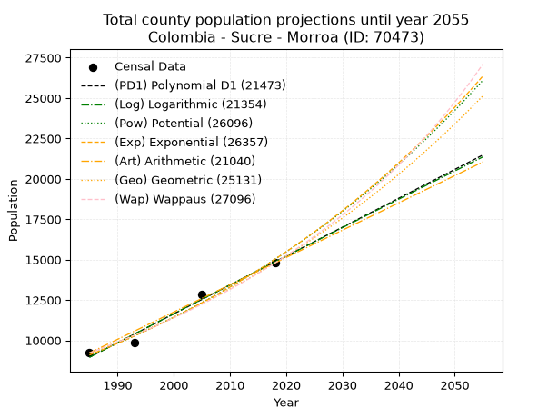
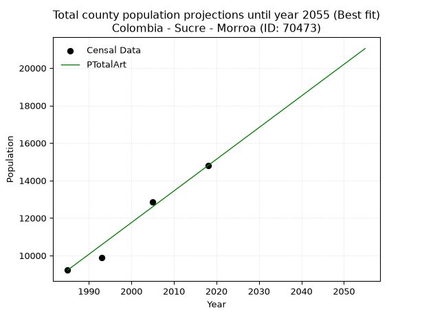
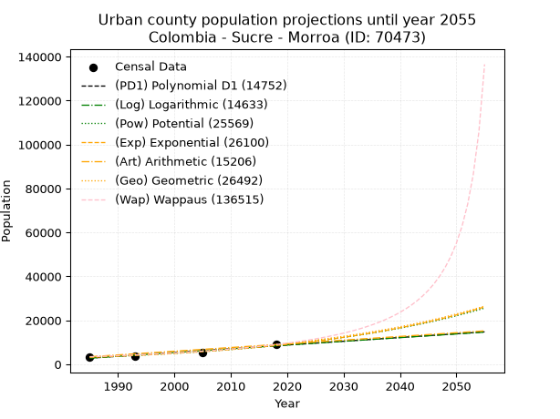
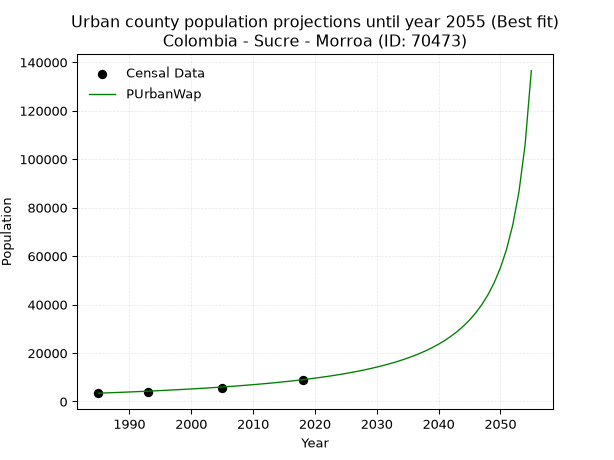
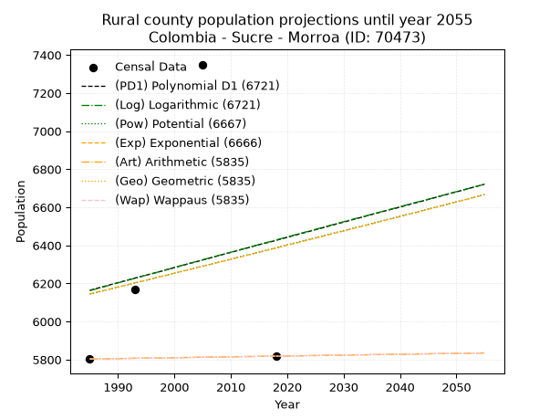
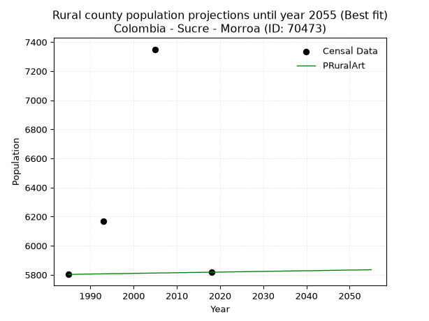

<div align="center">


</div>

# _“Population and Public Services Demand Projections (PPSD) until Year 2050 for Colombia - Sucre - Morroa (ID: 70473)”_
Keywords: `population` `public-service` `projection` `lineal` `polynomial` `logarithmic` `potential` `exponential` `arithmetic` `geometric` `wappaus` `dane` `colombia` `south-america`

PPSD are analytical estimates used by governments and planners to anticipate future changes in population size, age distribution, and the resulting community needs for utilities, healthcare, education, and infrastructure as sizing future water treatment facilities, electrical grids, and road networks based on spatial growth.

> **General running parameters**: • app_version: _v20260806_. • Python version: _3.14.7_. • Pandas version: _3.0.5_. • NumPy version: _2.5.1_. • Creates, save and include plots into reports (create_plot): _False_. • Projection until year: _2050_. • Process polynomial degree 2 and up: _False_. • Process Wappaus: _True_. • Process Wappaus: _True_. • Set negative values to zero: _True_. • Set infinite values to zero: _True_. • Drop dataset notes: _True_. 
<div align="center">

Dynamic map: [:earth_americas:Google](http://maps.google.com/maps?q=9.33139536,-75.3059494) [:earth_americas:OSM](https://www.openstreetmap.org/#map=18/9.33139536/-75.3059494&layers=P) [:earth_americas:Bing](https://www.bing.com/maps?cp=9.33139536~-75.3059494&lvl=18) [:earth_americas:Apple](https://maps.apple.com/frame?center=9.33139536%2C-75.3059494&span=0.003%2C0.006)

</div>


<div align="center">

```geojson
{
  "type": "Feature",
  "geometry": {
    "type": "Point", 
    "coordinates": [-75.3059494, 9.33139536]
  }, 
  "properties": {
    "Name": "Colombia - Sucre - Morroa (ID: 70473)"
  }
}
```

</div>


## 0. Census Data (4 records)

Census data are official statistics collected by a government about the people and housing in a country. They usually include counts of total population, age, sex, race, income, education, and jobs.

📅Global census file: [Population.xlsx](../data/Population.xlsx)

| Source   |   Year |   CountryID | CountryName   |   StateID | StateName   |   CountyID | CountyName   |   PTotal |   PUrban |   PRural |
|:---------|-------:|------------:|:--------------|----------:|:------------|-----------:|:-------------|---------:|---------:|---------:|
| DANE     |   1985 |          57 | Colombia      |        70 | Sucre       |      70473 | Morroa       |     9221 |     3418 |     5803 |
| DANE     |   1993 |          57 | Colombia      |        70 | Sucre       |      70473 | Morroa       |     9883 |     3713 |     6170 |
| DANE     |   2005 |          57 | Colombia      |        70 | Sucre       |      70473 | Morroa       |    12846 |     5496 |     7350 |
| DANE     |   2018 |          57 | Colombia      |        70 | Sucre       |      70473 | Morroa       |    14793 |     8975 |     5818 |

> 🔥Some records could had specific notes about the registered values or the corresponding urban or rural distribution.

## 1. Total

### 1.1. Coefficients and Parameters

* (PD1) Polynomial Deg 1: 178.75913287836076, -345877.2055399411 (lineal)
* (Log) Logarithmic: 357791.2675312623, -2707888.5416644025
* (Pow) Potential: 30.415024816160628, -96.34268075929768
* (Exp) Exponential: 0.015194057707783445, 7.254078212993332e-10
* (Art) Arithmetic: Year diff. 2018 - 1985 = 33, Population diff. 14793 - 9221 = 5572, Annual growth = 168.84848484848484
* (Geo) Geometric: Year diff. 2018 - 1985 = 33, Population diff. 14793 - 9221 = 5572, Annual growth % = 0.01442642236637437
* (Wap) Wappaus: i = 1.406250394340675, Condition values only valid for < 200)

<sub>
Wappaus condition values: ['0.00', '1.41', '2.81', '4.22', '5.63', '7.03', '8.44', '9.84', '11.25', '12.66', '14.06', '15.47', '16.88', '18.28', '19.69', '21.09', '22.50', '23.91', '25.31', '26.72', '28.13', '29.53', '30.94', '32.34', '33.75', '35.16', '36.56', '37.97', '39.38', '40.78', '42.19', '43.59', '45.00', '46.41', '47.81', '49.22', '50.63', '52.03', '53.44', '54.84', '56.25', '57.66', '59.06', '60.47', '61.88', '63.28', '64.69', '66.09', '67.50', '68.91', '70.31', '71.72', '73.13', '74.53', '75.94', '77.34', '78.75', '80.16', '81.56', '82.97', '84.38', '85.78', '87.19', '88.59', '90.00', '91.41']
</sub>


### 1.2. Projected Dataset

|   Year |   CountyID |   PTotalPD1 |   PTotalLog |   PTotalPow |   PTotalExp |   PTotalArt |   PTotalGeo |   PTotalWap |
|-------:|-----------:|------------:|------------:|------------:|------------:|------------:|------------:|------------:|
|   1985 |      70473 |        8960 |        8954 |        9095 |        9099 |        9221 |        9221 |        9221 |
|   1986 |      70473 |        9138 |        9135 |        9235 |        9238 |        9390 |        9354 |        9352 |
|   1987 |      70473 |        9317 |        9315 |        9378 |        9380 |        9559 |        9489 |        9484 |
|   1988 |      70473 |        9496 |        9495 |        9522 |        9523 |        9728 |        9626 |        9618 |
|   1989 |      70473 |        9675 |        9675 |        9669 |        9669 |        9896 |        9765 |        9755 |
|   1990 |      70473 |        9853 |        9855 |        9818 |        9817 |       10065 |        9906 |        9893 |
|   1991 |      70473 |       10032 |       10034 |        9969 |        9967 |       10234 |       10049 |       10033 |
|   1992 |      70473 |       10211 |       10214 |       10122 |       10120 |       10403 |       10193 |       10176 |
|   1993 |      70473 |       10390 |       10394 |       10278 |       10275 |       10572 |       10341 |       10320 |
|   1994 |      70473 |       10569 |       10573 |       10436 |       10432 |       10741 |       10490 |       10467 |
|   1995 |      70473 |       10747 |       10752 |       10597 |       10592 |       10909 |       10641 |       10616 |
|   1996 |      70473 |       10926 |       10932 |       10759 |       10754 |       11078 |       10795 |       10767 |
|   1997 |      70473 |       11105 |       11111 |       10924 |       10919 |       11247 |       10950 |       10920 |
|   1998 |      70473 |       11284 |       11290 |       11092 |       11086 |       11416 |       11108 |       11076 |
|   1999 |      70473 |       11462 |       11469 |       11262 |       11256 |       11585 |       11268 |       11235 |
|   2000 |      70473 |       11641 |       11648 |       11435 |       11428 |       11754 |       11431 |       11395 |
|   2001 |      70473 |       11820 |       11827 |       11610 |       11603 |       11923 |       11596 |       11559 |
|   2002 |      70473 |       11999 |       12006 |       11788 |       11781 |       12091 |       11763 |       11725 |
|   2003 |      70473 |       12177 |       12184 |       11968 |       11961 |       12260 |       11933 |       11893 |
|   2004 |      70473 |       12356 |       12363 |       12151 |       12144 |       12429 |       12105 |       12065 |
|   2005 |      70473 |       12535 |       12541 |       12337 |       12330 |       12598 |       12280 |       12239 |
|   2006 |      70473 |       12714 |       12720 |       12526 |       12519 |       12767 |       12457 |       12416 |
|   2007 |      70473 |       12892 |       12898 |       12717 |       12711 |       12936 |       12637 |       12596 |
|   2008 |      70473 |       13071 |       13076 |       12911 |       12905 |       13105 |       12819 |       12779 |
|   2009 |      70473 |       13250 |       13254 |       13108 |       13103 |       13273 |       13004 |       12965 |
|   2010 |      70473 |       13429 |       13432 |       13308 |       13303 |       13442 |       13191 |       13154 |
|   2011 |      70473 |       13607 |       13610 |       13511 |       13507 |       13611 |       13382 |       13347 |
|   2012 |      70473 |       13786 |       13788 |       13717 |       13714 |       13780 |       13575 |       13543 |
|   2013 |      70473 |       13965 |       13966 |       13925 |       13924 |       13949 |       13771 |       13742 |
|   2014 |      70473 |       14144 |       14144 |       14137 |       14137 |       14118 |       13969 |       13945 |
|   2015 |      70473 |       14322 |       14321 |       14352 |       14353 |       14286 |       14171 |       14151 |
|   2016 |      70473 |       14501 |       14499 |       14571 |       14573 |       14455 |       14375 |       14361 |
|   2017 |      70473 |       14680 |       14676 |       14792 |       14796 |       14624 |       14583 |       14575 |
|   2018 |      70473 |       14859 |       14854 |       15017 |       15023 |       14793 |       14793 |       14793 |
|   2019 |      70473 |       15037 |       15031 |       15245 |       15253 |       14962 |       15006 |       15015 |
|   2020 |      70473 |       15216 |       15208 |       15476 |       15486 |       15131 |       15223 |       15241 |
|   2021 |      70473 |       15395 |       15385 |       15711 |       15723 |       15300 |       15443 |       15471 |
|   2022 |      70473 |       15574 |       15562 |       15949 |       15964 |       15468 |       15665 |       15706 |
|   2023 |      70473 |       15753 |       15739 |       16191 |       16209 |       15637 |       15891 |       15945 |
|   2024 |      70473 |       15931 |       15916 |       16436 |       16457 |       15806 |       16121 |       16189 |
|   2025 |      70473 |       16110 |       16093 |       16685 |       16709 |       15975 |       16353 |       16437 |
|   2026 |      70473 |       16289 |       16269 |       16937 |       16964 |       16144 |       16589 |       16691 |
|   2027 |      70473 |       16468 |       16446 |       17193 |       17224 |       16313 |       16828 |       16949 |
|   2028 |      70473 |       16646 |       16622 |       17453 |       17488 |       16481 |       17071 |       17213 |
|   2029 |      70473 |       16825 |       16799 |       17717 |       17756 |       16650 |       17317 |       17482 |
|   2030 |      70473 |       17004 |       16975 |       17984 |       18027 |       16819 |       17567 |       17757 |
|   2031 |      70473 |       17183 |       17151 |       18256 |       18303 |       16988 |       17821 |       18037 |
|   2032 |      70473 |       17361 |       17327 |       18531 |       18584 |       17157 |       18078 |       18324 |
|   2033 |      70473 |       17540 |       17503 |       18810 |       18868 |       17326 |       18339 |       18616 |
|   2034 |      70473 |       17719 |       17679 |       19094 |       19157 |       17495 |       18603 |       18915 |
|   2035 |      70473 |       17898 |       17855 |       19382 |       19450 |       17663 |       18871 |       19220 |
|   2036 |      70473 |       18076 |       18031 |       19673 |       19748 |       17832 |       19144 |       19531 |
|   2037 |      70473 |       18255 |       18207 |       19969 |       20050 |       18001 |       19420 |       19850 |
|   2038 |      70473 |       18434 |       18382 |       20270 |       20357 |       18170 |       19700 |       20176 |
|   2039 |      70473 |       18613 |       18558 |       20574 |       20669 |       18339 |       19984 |       20509 |
|   2040 |      70473 |       18791 |       18733 |       20883 |       20986 |       18508 |       20273 |       20850 |
|   2041 |      70473 |       18970 |       18909 |       21197 |       21307 |       18677 |       20565 |       21199 |
|   2042 |      70473 |       19149 |       19084 |       21515 |       21633 |       18845 |       20862 |       21556 |
|   2043 |      70473 |       19328 |       19259 |       21838 |       21964 |       19014 |       21163 |       21921 |
|   2044 |      70473 |       19506 |       19434 |       22166 |       22301 |       19183 |       21468 |       22295 |
|   2045 |      70473 |       19685 |       19609 |       22498 |       22642 |       19352 |       21778 |       22679 |
|   2046 |      70473 |       19864 |       19784 |       22835 |       22989 |       19521 |       22092 |       23071 |
|   2047 |      70473 |       20043 |       19959 |       23177 |       23341 |       19690 |       22411 |       23474 |
|   2048 |      70473 |       20221 |       20134 |       23523 |       23698 |       19858 |       22734 |       23887 |
|   2049 |      70473 |       20400 |       20308 |       23875 |       24061 |       20027 |       23062 |       24310 |
|   2050 |      70473 |       20579 |       20483 |       24232 |       24429 |       20196 |       23395 |       24744 |
<div align="center">

</img>

</div>


### 1.3. Best fit with absolute and relative error (%)

Relative error puts that difference into context by dividing the absolute error by the true value, creating a unitless ratio or percentage that shows the scale of the mistake.

Absolute and relative error

|   Year | Source   |   CountryID | CountryName   |   StateID | StateName   |   CountyID_x | CountyName   |   PTotal |   PUrban |   PRural |   CountyID_y |   PTotalPD1 |   PTotalLog |   PTotalPow |   PTotalExp |   PTotalArt |   PTotalGeo |   PTotalWap |   PTotalPD1AbsError |   PTotalLogAbsError |   PTotalPowAbsError |   PTotalExpAbsError |   PTotalArtAbsError |   PTotalGeoAbsError |   PTotalWapAbsError |   PTotalPD1RelError |   PTotalLogRelError |   PTotalPowRelError |   PTotalExpRelError |   PTotalArtRelError |   PTotalGeoRelError |   PTotalWapRelError |
|-------:|:---------|------------:|:--------------|----------:|:------------|-------------:|:-------------|---------:|---------:|---------:|-------------:|------------:|------------:|------------:|------------:|------------:|------------:|------------:|--------------------:|--------------------:|--------------------:|--------------------:|--------------------:|--------------------:|--------------------:|--------------------:|--------------------:|--------------------:|--------------------:|--------------------:|--------------------:|--------------------:|
|   1985 | DANE     |          57 | Colombia      |        70 | Sucre       |        70473 | Morroa       |     9221 |     3418 |     5803 |        70473 |        8960 |        8954 |        9095 |        9099 |        9221 |        9221 |        9221 |                 261 |                 267 |                 126 |                 122 |                   0 |                   0 |                   0 |            2.8305   |            2.89556  |             1.36645 |             1.32307 |             0       |             0       |             0       |
|   1993 | DANE     |          57 | Colombia      |        70 | Sucre       |        70473 | Morroa       |     9883 |     3713 |     6170 |        70473 |       10390 |       10394 |       10278 |       10275 |       10572 |       10341 |       10320 |                 507 |                 511 |                 395 |                 392 |                 689 |                 458 |                 437 |            5.13002  |            5.17049  |             3.99676 |             3.96641 |             6.97157 |             4.63422 |             4.42173 |
|   2005 | DANE     |          57 | Colombia      |        70 | Sucre       |        70473 | Morroa       |    12846 |     5496 |     7350 |        70473 |       12535 |       12541 |       12337 |       12330 |       12598 |       12280 |       12239 |                 311 |                 305 |                 509 |                 516 |                 248 |                 566 |                 607 |            2.42099  |            2.37428  |             3.96232 |             4.01681 |             1.93056 |             4.40604 |             4.72521 |
|   2018 | DANE     |          57 | Colombia      |        70 | Sucre       |        70473 | Morroa       |    14793 |     8975 |     5818 |        70473 |       14859 |       14854 |       15017 |       15023 |       14793 |       14793 |       14793 |                  66 |                  61 |                 224 |                 230 |                   0 |                   0 |                   0 |            0.446157 |            0.412357 |             1.51423 |             1.55479 |             0       |             0       |             0       |

Relative error mean

| Method    |   RelError | Best   |
|:----------|-----------:|:-------|
| PTotalPD1 |    2.70692 |        |
| PTotalLog |    2.71317 |        |
| PTotalPow |    2.70994 |        |
| PTotalExp |    2.71527 |        |
| PTotalArt |    2.22553 | True   |
| PTotalGeo |    2.26007 |        |
| PTotalWap |    2.28674 |        |

💙Best method: _**PTotalArt**_
<div align="center">

</img>

</div>


### 1.4. Fresh water supply demand in liters per capita per day (lpcd)

The fresh water supply demand typically ranges from 100 to 300 liters per capita per day (lpcd) for standard domestic and municipal planning, though absolute survival minimums set by the World Health Organization are as low as 7.5 to 20 liters per day, and total consumption in high-income nations can exceed 400 liters.

> `CZ`: Level in meters above the sea level (masl)<br> `WS`: Fresh water supply demand in liters per capita per day (lpcd or l/h/d)<br> `WSAll`: Zonal fresh water supply demand in liters per second (l/s)<br> `A`: Zonal area in square meters<br> `DP`: Population density (people/hectare)

Reference values (RAS Colombia)

|    CZ |   WS |
|------:|-----:|
|  1000 |  120 |
|  2000 |  130 |
| 99999 |  140 |

County shapefile geometry properties and water supply values

|   CountyID |      ATotal |   CZTotal |   WSTotal |
|-----------:|------------:|----------:|----------:|
|      70473 | 1.70165e+08 |   152.682 |       120 |

Projected values for best method: PTotalArt

|   CountyID |   Year |   PTotalArt |   DPTotal |   WSTotal |   WSTotalAll |
|-----------:|-------:|------------:|----------:|----------:|-------------:|
|      70473 |   1985 |        9221 |      0.54 |       120 |      12.8069 |
|      70473 |   1986 |        9390 |      0.55 |       120 |      13.0417 |
|      70473 |   1987 |        9559 |      0.56 |       120 |      13.2764 |
|      70473 |   1988 |        9728 |      0.57 |       120 |      13.5111 |
|      70473 |   1989 |        9896 |      0.58 |       120 |      13.7444 |
|      70473 |   1990 |       10065 |      0.59 |       120 |      13.9792 |
|      70473 |   1991 |       10234 |      0.6  |       120 |      14.2139 |
|      70473 |   1992 |       10403 |      0.61 |       120 |      14.4486 |
|      70473 |   1993 |       10572 |      0.62 |       120 |      14.6833 |
|      70473 |   1994 |       10741 |      0.63 |       120 |      14.9181 |
|      70473 |   1995 |       10909 |      0.64 |       120 |      15.1514 |
|      70473 |   1996 |       11078 |      0.65 |       120 |      15.3861 |
|      70473 |   1997 |       11247 |      0.66 |       120 |      15.6208 |
|      70473 |   1998 |       11416 |      0.67 |       120 |      15.8556 |
|      70473 |   1999 |       11585 |      0.68 |       120 |      16.0903 |
|      70473 |   2000 |       11754 |      0.69 |       120 |      16.325  |
|      70473 |   2001 |       11923 |      0.7  |       120 |      16.5597 |
|      70473 |   2002 |       12091 |      0.71 |       120 |      16.7931 |
|      70473 |   2003 |       12260 |      0.72 |       120 |      17.0278 |
|      70473 |   2004 |       12429 |      0.73 |       120 |      17.2625 |
|      70473 |   2005 |       12598 |      0.74 |       120 |      17.4972 |
|      70473 |   2006 |       12767 |      0.75 |       120 |      17.7319 |
|      70473 |   2007 |       12936 |      0.76 |       120 |      17.9667 |
|      70473 |   2008 |       13105 |      0.77 |       120 |      18.2014 |
|      70473 |   2009 |       13273 |      0.78 |       120 |      18.4347 |
|      70473 |   2010 |       13442 |      0.79 |       120 |      18.6694 |
|      70473 |   2011 |       13611 |      0.8  |       120 |      18.9042 |
|      70473 |   2012 |       13780 |      0.81 |       120 |      19.1389 |
|      70473 |   2013 |       13949 |      0.82 |       120 |      19.3736 |
|      70473 |   2014 |       14118 |      0.83 |       120 |      19.6083 |
|      70473 |   2015 |       14286 |      0.84 |       120 |      19.8417 |
|      70473 |   2016 |       14455 |      0.85 |       120 |      20.0764 |
|      70473 |   2017 |       14624 |      0.86 |       120 |      20.3111 |
|      70473 |   2018 |       14793 |      0.87 |       120 |      20.5458 |
|      70473 |   2019 |       14962 |      0.88 |       120 |      20.7806 |
|      70473 |   2020 |       15131 |      0.89 |       120 |      21.0153 |
|      70473 |   2021 |       15300 |      0.9  |       120 |      21.25   |
|      70473 |   2022 |       15468 |      0.91 |       120 |      21.4833 |
|      70473 |   2023 |       15637 |      0.92 |       120 |      21.7181 |
|      70473 |   2024 |       15806 |      0.93 |       120 |      21.9528 |
|      70473 |   2025 |       15975 |      0.94 |       120 |      22.1875 |
|      70473 |   2026 |       16144 |      0.95 |       120 |      22.4222 |
|      70473 |   2027 |       16313 |      0.96 |       120 |      22.6569 |
|      70473 |   2028 |       16481 |      0.97 |       120 |      22.8903 |
|      70473 |   2029 |       16650 |      0.98 |       120 |      23.125  |
|      70473 |   2030 |       16819 |      0.99 |       120 |      23.3597 |
|      70473 |   2031 |       16988 |      1    |       120 |      23.5944 |
|      70473 |   2032 |       17157 |      1.01 |       120 |      23.8292 |
|      70473 |   2033 |       17326 |      1.02 |       120 |      24.0639 |
|      70473 |   2034 |       17495 |      1.03 |       120 |      24.2986 |
|      70473 |   2035 |       17663 |      1.04 |       120 |      24.5319 |
|      70473 |   2036 |       17832 |      1.05 |       120 |      24.7667 |
|      70473 |   2037 |       18001 |      1.06 |       120 |      25.0014 |
|      70473 |   2038 |       18170 |      1.07 |       120 |      25.2361 |
|      70473 |   2039 |       18339 |      1.08 |       120 |      25.4708 |
|      70473 |   2040 |       18508 |      1.09 |       120 |      25.7056 |
|      70473 |   2041 |       18677 |      1.1  |       120 |      25.9403 |
|      70473 |   2042 |       18845 |      1.11 |       120 |      26.1736 |
|      70473 |   2043 |       19014 |      1.12 |       120 |      26.4083 |
|      70473 |   2044 |       19183 |      1.13 |       120 |      26.6431 |
|      70473 |   2045 |       19352 |      1.14 |       120 |      26.8778 |
|      70473 |   2046 |       19521 |      1.15 |       120 |      27.1125 |
|      70473 |   2047 |       19690 |      1.16 |       120 |      27.3472 |
|      70473 |   2048 |       19858 |      1.17 |       120 |      27.5806 |
|      70473 |   2049 |       20027 |      1.18 |       120 |      27.8153 |
|      70473 |   2050 |       20196 |      1.19 |       120 |      28.05   |

## 2. Urban

### 2.1. Coefficients and Parameters

* (PD1) Polynomial Deg 1: 170.80449618626832, -336251.19349658315 (lineal)
* (Log) Logarithmic: 341664.2096833165, -2591591.8957280354
* (Pow) Potential: 60.376023679623366, -195.6066883656288
* (Exp) Exponential: 0.03017506348338326, 3.062959169418891e-23
* (Art) Arithmetic: Year diff. 2018 - 1985 = 33, Population diff. 8975 - 3418 = 5557, Annual growth = 168.3939393939394
* (Geo) Geometric: Year diff. 2018 - 1985 = 33, Population diff. 8975 - 3418 = 5557, Annual growth % = 0.029686268456134757
* (Wap) Wappaus: i = 2.717565390041788, Condition values only valid for < 200)

<sub>
Wappaus condition values: ['0.00', '2.72', '5.44', '8.15', '10.87', '13.59', '16.31', '19.02', '21.74', '24.46', '27.18', '29.89', '32.61', '35.33', '38.05', '40.76', '43.48', '46.20', '48.92', '51.63', '54.35', '57.07', '59.79', '62.50', '65.22', '67.94', '70.66', '73.37', '76.09', '78.81', '81.53', '84.24', '86.96', '89.68', '92.40', '95.11', '97.83', '100.55', '103.27', '105.99', '108.70', '111.42', '114.14', '116.86', '119.57', '122.29', '125.01', '127.73', '130.44', '133.16', '135.88', '138.60', '141.31', '144.03', '146.75', '149.47', '152.18', '154.90', '157.62', '160.34', '163.05', '165.77', '168.49', '171.21', '173.92', '176.64']
</sub>


### 2.2. Projected Dataset

|   Year |   CountyID |   PUrbanPD1 |   PUrbanLog |   PUrbanPow |   PUrbanExp |   PUrbanArt |   PUrbanGeo |   PUrbanWap |
|-------:|-----------:|------------:|------------:|------------:|------------:|------------:|------------:|------------:|
|   1985 |      70473 |        2796 |        2792 |        3155 |        3157 |        3418 |        3418 |        3418 |
|   1986 |      70473 |        2967 |        2964 |        3252 |        3254 |        3586 |        3519 |        3512 |
|   1987 |      70473 |        3137 |        3136 |        3353 |        3354 |        3755 |        3624 |        3609 |
|   1988 |      70473 |        3308 |        3308 |        3456 |        3456 |        3923 |        3732 |        3709 |
|   1989 |      70473 |        3479 |        3480 |        3563 |        3562 |        4092 |        3842 |        3811 |
|   1990 |      70473 |        3650 |        3652 |        3672 |        3671 |        4260 |        3956 |        3916 |
|   1991 |      70473 |        3821 |        3823 |        3785 |        3784 |        4428 |        4074 |        4025 |
|   1992 |      70473 |        3991 |        3995 |        3902 |        3900 |        4597 |        4195 |        4137 |
|   1993 |      70473 |        4162 |        4167 |        4022 |        4019 |        4765 |        4319 |        4252 |
|   1994 |      70473 |        4333 |        4338 |        4146 |        4142 |        4934 |        4448 |        4370 |
|   1995 |      70473 |        4504 |        4509 |        4273 |        4269 |        5102 |        4580 |        4493 |
|   1996 |      70473 |        4675 |        4680 |        4404 |        4400 |        5270 |        4715 |        4619 |
|   1997 |      70473 |        4845 |        4852 |        4540 |        4535 |        5439 |        4855 |        4750 |
|   1998 |      70473 |        5016 |        5023 |        4679 |        4674 |        5607 |        5000 |        4885 |
|   1999 |      70473 |        5187 |        5194 |        4822 |        4817 |        5776 |        5148 |        5024 |
|   2000 |      70473 |        5358 |        5364 |        4970 |        4964 |        5944 |        5301 |        5168 |
|   2001 |      70473 |        5529 |        5535 |        5123 |        5117 |        6112 |        5458 |        5317 |
|   2002 |      70473 |        5699 |        5706 |        5279 |        5273 |        6281 |        5620 |        5471 |
|   2003 |      70473 |        5870 |        5877 |        5441 |        5435 |        6449 |        5787 |        5631 |
|   2004 |      70473 |        6041 |        6047 |        5607 |        5601 |        6617 |        5959 |        5797 |
|   2005 |      70473 |        6212 |        6218 |        5779 |        5773 |        6786 |        6136 |        5969 |
|   2006 |      70473 |        6383 |        6388 |        5956 |        5950 |        6954 |        6318 |        6147 |
|   2007 |      70473 |        6553 |        6558 |        6137 |        6132 |        7123 |        6505 |        6333 |
|   2008 |      70473 |        6724 |        6728 |        6325 |        6320 |        7291 |        6699 |        6526 |
|   2009 |      70473 |        6895 |        6898 |        6518 |        6513 |        7459 |        6897 |        6726 |
|   2010 |      70473 |        7066 |        7069 |        6717 |        6713 |        7628 |        7102 |        6935 |
|   2011 |      70473 |        7237 |        7238 |        6921 |        6919 |        7796 |        7313 |        7152 |
|   2012 |      70473 |        7407 |        7408 |        7132 |        7131 |        7965 |        7530 |        7379 |
|   2013 |      70473 |        7578 |        7578 |        7350 |        7349 |        8133 |        7754 |        7616 |
|   2014 |      70473 |        7749 |        7748 |        7573 |        7574 |        8301 |        7984 |        7863 |
|   2015 |      70473 |        7920 |        7917 |        7804 |        7806 |        8470 |        8221 |        8122 |
|   2016 |      70473 |        8091 |        8087 |        8041 |        8045 |        8638 |        8465 |        8393 |
|   2017 |      70473 |        8261 |        8256 |        8285 |        8292 |        8807 |        8716 |        8677 |
|   2018 |      70473 |        8432 |        8426 |        8537 |        8546 |        8975 |        8975 |        8975 |
|   2019 |      70473 |        8603 |        8595 |        8796 |        8808 |        9143 |        9241 |        9288 |
|   2020 |      70473 |        8774 |        8764 |        9063 |        9077 |        9312 |        9516 |        9617 |
|   2021 |      70473 |        8945 |        8933 |        9338 |        9356 |        9480 |        9798 |        9964 |
|   2022 |      70473 |        9115 |        9102 |        9621 |        9642 |        9649 |       10089 |       10330 |
|   2023 |      70473 |        9286 |        9271 |        9913 |        9938 |        9817 |       10389 |       10716 |
|   2024 |      70473 |        9457 |        9440 |       10213 |       10242 |        9985 |       10697 |       11124 |
|   2025 |      70473 |        9628 |        9609 |       10522 |       10556 |       10154 |       11015 |       11557 |
|   2026 |      70473 |        9799 |        9777 |       10841 |       10879 |       10322 |       11342 |       12017 |
|   2027 |      70473 |        9970 |        9946 |       11168 |       11212 |       10491 |       11678 |       12505 |
|   2028 |      70473 |       10140 |       10115 |       11506 |       11556 |       10659 |       12025 |       13026 |
|   2029 |      70473 |       10311 |       10283 |       11854 |       11910 |       10827 |       12382 |       13581 |
|   2030 |      70473 |       10482 |       10451 |       12212 |       12275 |       10996 |       12750 |       14176 |
|   2031 |      70473 |       10653 |       10620 |       12580 |       12651 |       11164 |       13128 |       14813 |
|   2032 |      70473 |       10824 |       10788 |       12960 |       13038 |       11333 |       13518 |       15499 |
|   2033 |      70473 |       10994 |       10956 |       13350 |       13438 |       11501 |       13919 |       16238 |
|   2034 |      70473 |       11165 |       11124 |       13753 |       13849 |       11669 |       14332 |       17037 |
|   2035 |      70473 |       11336 |       11292 |       14167 |       14274 |       11838 |       14758 |       17904 |
|   2036 |      70473 |       11507 |       11460 |       14593 |       14711 |       12006 |       15196 |       18848 |
|   2037 |      70473 |       11678 |       11627 |       15033 |       15162 |       12174 |       15647 |       19879 |
|   2038 |      70473 |       11848 |       11795 |       15485 |       15626 |       12343 |       16111 |       21010 |
|   2039 |      70473 |       12019 |       11963 |       15950 |       16105 |       12511 |       16590 |       22256 |
|   2040 |      70473 |       12190 |       12130 |       16429 |       16598 |       12680 |       17082 |       23637 |
|   2041 |      70473 |       12361 |       12298 |       16923 |       17107 |       12848 |       17589 |       25175 |
|   2042 |      70473 |       12532 |       12465 |       17431 |       17631 |       13016 |       18111 |       26898 |
|   2043 |      70473 |       12702 |       12632 |       17954 |       18171 |       13185 |       18649 |       28842 |
|   2044 |      70473 |       12873 |       12800 |       18492 |       18728 |       13353 |       19203 |       31052 |
|   2045 |      70473 |       13044 |       12967 |       19046 |       19301 |       13522 |       19773 |       33587 |
|   2046 |      70473 |       13215 |       13134 |       19617 |       19893 |       13690 |       20360 |       36525 |
|   2047 |      70473 |       13386 |       13301 |       20204 |       20502 |       13858 |       20964 |       39970 |
|   2048 |      70473 |       13556 |       13468 |       20809 |       21130 |       14027 |       21586 |       44065 |
|   2049 |      70473 |       13727 |       13634 |       21431 |       21777 |       14195 |       22227 |       49014 |
|   2050 |      70473 |       13898 |       13801 |       22072 |       22445 |       14364 |       22887 |       55114 |
<div align="center">

</img>

</div>


### 2.3. Best fit with absolute and relative error (%)

Relative error puts that difference into context by dividing the absolute error by the true value, creating a unitless ratio or percentage that shows the scale of the mistake.

Absolute and relative error

|   Year | Source   |   CountryID | CountryName   |   StateID | StateName   |   CountyID_x | CountyName   |   PTotal |   PUrban |   PRural |   CountyID_y |   PUrbanPD1 |   PUrbanLog |   PUrbanPow |   PUrbanExp |   PUrbanArt |   PUrbanGeo |   PUrbanWap |   PUrbanPD1AbsError |   PUrbanLogAbsError |   PUrbanPowAbsError |   PUrbanExpAbsError |   PUrbanArtAbsError |   PUrbanGeoAbsError |   PUrbanWapAbsError |   PUrbanPD1RelError |   PUrbanLogRelError |   PUrbanPowRelError |   PUrbanExpRelError |   PUrbanArtRelError |   PUrbanGeoRelError |   PUrbanWapRelError |
|-------:|:---------|------------:|:--------------|----------:|:------------|-------------:|:-------------|---------:|---------:|---------:|-------------:|------------:|------------:|------------:|------------:|------------:|------------:|------------:|--------------------:|--------------------:|--------------------:|--------------------:|--------------------:|--------------------:|--------------------:|--------------------:|--------------------:|--------------------:|--------------------:|--------------------:|--------------------:|--------------------:|
|   1985 | DANE     |          57 | Colombia      |        70 | Sucre       |        70473 | Morroa       |     9221 |     3418 |     5803 |        70473 |        2796 |        2792 |        3155 |        3157 |        3418 |        3418 |        3418 |                 622 |                 626 |                 263 |                 261 |                   0 |                   0 |                   0 |            18.1978  |            18.3148  |             7.69456 |             7.63604 |              0      |              0      |             0       |
|   1993 | DANE     |          57 | Colombia      |        70 | Sucre       |        70473 | Morroa       |     9883 |     3713 |     6170 |        70473 |        4162 |        4167 |        4022 |        4019 |        4765 |        4319 |        4252 |                 449 |                 454 |                 309 |                 306 |                1052 |                 606 |                 539 |            12.0926  |            12.2273  |             8.32211 |             8.24131 |             28.3329 |             16.321  |            14.5166  |
|   2005 | DANE     |          57 | Colombia      |        70 | Sucre       |        70473 | Morroa       |    12846 |     5496 |     7350 |        70473 |        6212 |        6218 |        5779 |        5773 |        6786 |        6136 |        5969 |                 716 |                 722 |                 283 |                 277 |                1290 |                 640 |                 473 |            13.0277  |            13.1368  |             5.1492  |             5.04003 |             23.4716 |             11.6448 |             8.60626 |
|   2018 | DANE     |          57 | Colombia      |        70 | Sucre       |        70473 | Morroa       |    14793 |     8975 |     5818 |        70473 |        8432 |        8426 |        8537 |        8546 |        8975 |        8975 |        8975 |                 543 |                 549 |                 438 |                 429 |                   0 |                   0 |                   0 |             6.05014 |             6.11699 |             4.88022 |             4.77994 |              0      |              0      |             0       |

Relative error mean

| Method    |   RelError | Best   |
|:----------|-----------:|:-------|
| PUrbanPD1 |   12.3421  |        |
| PUrbanLog |   12.449   |        |
| PUrbanPow |    6.51152 |        |
| PUrbanExp |    6.42433 |        |
| PUrbanArt |   12.9511  |        |
| PUrbanGeo |    6.99147 |        |
| PUrbanWap |    5.78071 | True   |

💙Best method: _**PUrbanWap**_
<div align="center">

</img>

</div>


### 2.4. Fresh water supply demand in liters per capita per day (lpcd)

The fresh water supply demand typically ranges from 100 to 300 liters per capita per day (lpcd) for standard domestic and municipal planning, though absolute survival minimums set by the World Health Organization are as low as 7.5 to 20 liters per day, and total consumption in high-income nations can exceed 400 liters.

> `CZ`: Level in meters above the sea level (masl)<br> `WS`: Fresh water supply demand in liters per capita per day (lpcd or l/h/d)<br> `WSAll`: Zonal fresh water supply demand in liters per second (l/s)<br> `A`: Zonal area in square meters<br> `DP`: Population density (people/hectare)

Reference values (RAS Colombia)

|    CZ |   WS |
|------:|-----:|
|  1000 |  120 |
|  2000 |  130 |
| 99999 |  140 |

County shapefile geometry properties and water supply values

|   CountyID |      AUrban |   CZUrban |   WSUrban |
|-----------:|------------:|----------:|----------:|
|      70473 | 1.52542e+06 |   163.837 |       120 |

Projected values for best method: PUrbanWap

|   CountyID |   Year |   PUrbanWap |   DPUrban |   WSUrban |   WSUrbanAll |
|-----------:|-------:|------------:|----------:|----------:|-------------:|
|      70473 |   1985 |        3418 |     22.41 |       120 |      4.74722 |
|      70473 |   1986 |        3512 |     23.02 |       120 |      4.87778 |
|      70473 |   1987 |        3609 |     23.66 |       120 |      5.0125  |
|      70473 |   1988 |        3709 |     24.31 |       120 |      5.15139 |
|      70473 |   1989 |        3811 |     24.98 |       120 |      5.29306 |
|      70473 |   1990 |        3916 |     25.67 |       120 |      5.43889 |
|      70473 |   1991 |        4025 |     26.39 |       120 |      5.59028 |
|      70473 |   1992 |        4137 |     27.12 |       120 |      5.74583 |
|      70473 |   1993 |        4252 |     27.87 |       120 |      5.90556 |
|      70473 |   1994 |        4370 |     28.65 |       120 |      6.06944 |
|      70473 |   1995 |        4493 |     29.45 |       120 |      6.24028 |
|      70473 |   1996 |        4619 |     30.28 |       120 |      6.41528 |
|      70473 |   1997 |        4750 |     31.14 |       120 |      6.59722 |
|      70473 |   1998 |        4885 |     32.02 |       120 |      6.78472 |
|      70473 |   1999 |        5024 |     32.94 |       120 |      6.97778 |
|      70473 |   2000 |        5168 |     33.88 |       120 |      7.17778 |
|      70473 |   2001 |        5317 |     34.86 |       120 |      7.38472 |
|      70473 |   2002 |        5471 |     35.87 |       120 |      7.59861 |
|      70473 |   2003 |        5631 |     36.91 |       120 |      7.82083 |
|      70473 |   2004 |        5797 |     38    |       120 |      8.05139 |
|      70473 |   2005 |        5969 |     39.13 |       120 |      8.29028 |
|      70473 |   2006 |        6147 |     40.3  |       120 |      8.5375  |
|      70473 |   2007 |        6333 |     41.52 |       120 |      8.79583 |
|      70473 |   2008 |        6526 |     42.78 |       120 |      9.06389 |
|      70473 |   2009 |        6726 |     44.09 |       120 |      9.34167 |
|      70473 |   2010 |        6935 |     45.46 |       120 |      9.63194 |
|      70473 |   2011 |        7152 |     46.89 |       120 |      9.93333 |
|      70473 |   2012 |        7379 |     48.37 |       120 |     10.2486  |
|      70473 |   2013 |        7616 |     49.93 |       120 |     10.5778  |
|      70473 |   2014 |        7863 |     51.55 |       120 |     10.9208  |
|      70473 |   2015 |        8122 |     53.24 |       120 |     11.2806  |
|      70473 |   2016 |        8393 |     55.02 |       120 |     11.6569  |
|      70473 |   2017 |        8677 |     56.88 |       120 |     12.0514  |
|      70473 |   2018 |        8975 |     58.84 |       120 |     12.4653  |
|      70473 |   2019 |        9288 |     60.89 |       120 |     12.9     |
|      70473 |   2020 |        9617 |     63.04 |       120 |     13.3569  |
|      70473 |   2021 |        9964 |     65.32 |       120 |     13.8389  |
|      70473 |   2022 |       10330 |     67.72 |       120 |     14.3472  |
|      70473 |   2023 |       10716 |     70.25 |       120 |     14.8833  |
|      70473 |   2024 |       11124 |     72.92 |       120 |     15.45    |
|      70473 |   2025 |       11557 |     75.76 |       120 |     16.0514  |
|      70473 |   2026 |       12017 |     78.78 |       120 |     16.6903  |
|      70473 |   2027 |       12505 |     81.98 |       120 |     17.3681  |
|      70473 |   2028 |       13026 |     85.39 |       120 |     18.0917  |
|      70473 |   2029 |       13581 |     89.03 |       120 |     18.8625  |
|      70473 |   2030 |       14176 |     92.93 |       120 |     19.6889  |
|      70473 |   2031 |       14813 |     97.11 |       120 |     20.5736  |
|      70473 |   2032 |       15499 |    101.6  |       120 |     21.5264  |
|      70473 |   2033 |       16238 |    106.45 |       120 |     22.5528  |
|      70473 |   2034 |       17037 |    111.69 |       120 |     23.6625  |
|      70473 |   2035 |       17904 |    117.37 |       120 |     24.8667  |
|      70473 |   2036 |       18848 |    123.56 |       120 |     26.1778  |
|      70473 |   2037 |       19879 |    130.32 |       120 |     27.6097  |
|      70473 |   2038 |       21010 |    137.73 |       120 |     29.1806  |
|      70473 |   2039 |       22256 |    145.9  |       120 |     30.9111  |
|      70473 |   2040 |       23637 |    154.95 |       120 |     32.8292  |
|      70473 |   2041 |       25175 |    165.04 |       120 |     34.9653  |
|      70473 |   2042 |       26898 |    176.33 |       120 |     37.3583  |
|      70473 |   2043 |       28842 |    189.08 |       120 |     40.0583  |
|      70473 |   2044 |       31052 |    203.56 |       120 |     43.1278  |
|      70473 |   2045 |       33587 |    220.18 |       120 |     46.6486  |
|      70473 |   2046 |       36525 |    239.44 |       120 |     50.7292  |
|      70473 |   2047 |       39970 |    262.03 |       120 |     55.5139  |
|      70473 |   2048 |       44065 |    288.87 |       120 |     61.2014  |
|      70473 |   2049 |       49014 |    321.31 |       120 |     68.075   |
|      70473 |   2050 |       55114 |    361.3  |       120 |     76.5472  |

## 3. Rural

### 3.1. Coefficients and Parameters

* (PD1) Polynomial Deg 1: 7.954636692092408, -9626.01204335784 (lineal)
* (Log) Logarithmic: 16127.057847945845, -116296.64593636736
* (Pow) Potential: 2.3579396864787174, -3.9874880268771222
* (Exp) Exponential: 0.0011622155275535964, 611.8372734487704
* (Art) Arithmetic: Year diff. 2018 - 1985 = 33, Population diff. 5818 - 5803 = 15, Annual growth = 0.45454545454545453
* (Geo) Geometric: Year diff. 2018 - 1985 = 33, Population diff. 5818 - 5803 = 15, Annual growth % = 7.823138914409e-05
* (Wap) Wappaus: i = 0.007822828578357362, Condition values only valid for < 200)

<sub>
Wappaus condition values: ['0.00', '0.01', '0.02', '0.02', '0.03', '0.04', '0.05', '0.05', '0.06', '0.07', '0.08', '0.09', '0.09', '0.10', '0.11', '0.12', '0.13', '0.13', '0.14', '0.15', '0.16', '0.16', '0.17', '0.18', '0.19', '0.20', '0.20', '0.21', '0.22', '0.23', '0.23', '0.24', '0.25', '0.26', '0.27', '0.27', '0.28', '0.29', '0.30', '0.31', '0.31', '0.32', '0.33', '0.34', '0.34', '0.35', '0.36', '0.37', '0.38', '0.38', '0.39', '0.40', '0.41', '0.41', '0.42', '0.43', '0.44', '0.45', '0.45', '0.46', '0.47', '0.48', '0.49', '0.49', '0.50', '0.51']
</sub>


### 3.2. Projected Dataset

|   Year |   CountyID |   PRuralPD1 |   PRuralLog |   PRuralPow |   PRuralExp |   PRuralArt |   PRuralGeo |   PRuralWap |
|-------:|-----------:|------------:|------------:|------------:|------------:|------------:|------------:|------------:|
|   1985 |      70473 |        6164 |        6162 |        6144 |        6145 |        5803 |        5803 |        5803 |
|   1986 |      70473 |        6172 |        6170 |        6151 |        6153 |        5803 |        5803 |        5803 |
|   1987 |      70473 |        6180 |        6178 |        6158 |        6160 |        5804 |        5804 |        5804 |
|   1988 |      70473 |        6188 |        6186 |        6166 |        6167 |        5804 |        5804 |        5804 |
|   1989 |      70473 |        6196 |        6195 |        6173 |        6174 |        5805 |        5805 |        5805 |
|   1990 |      70473 |        6204 |        6203 |        6180 |        6181 |        5805 |        5805 |        5805 |
|   1991 |      70473 |        6212 |        6211 |        6188 |        6188 |        5806 |        5806 |        5806 |
|   1992 |      70473 |        6220 |        6219 |        6195 |        6196 |        5806 |        5806 |        5806 |
|   1993 |      70473 |        6228 |        6227 |        6202 |        6203 |        5807 |        5807 |        5807 |
|   1994 |      70473 |        6236 |        6235 |        6210 |        6210 |        5807 |        5807 |        5807 |
|   1995 |      70473 |        6243 |        6243 |        6217 |        6217 |        5808 |        5808 |        5808 |
|   1996 |      70473 |        6251 |        6251 |        6224 |        6225 |        5808 |        5808 |        5808 |
|   1997 |      70473 |        6259 |        6259 |        6232 |        6232 |        5808 |        5808 |        5808 |
|   1998 |      70473 |        6267 |        6267 |        6239 |        6239 |        5809 |        5809 |        5809 |
|   1999 |      70473 |        6275 |        6275 |        6246 |        6246 |        5809 |        5809 |        5809 |
|   2000 |      70473 |        6283 |        6284 |        6254 |        6254 |        5810 |        5810 |        5810 |
|   2001 |      70473 |        6291 |        6292 |        6261 |        6261 |        5810 |        5810 |        5810 |
|   2002 |      70473 |        6299 |        6300 |        6269 |        6268 |        5811 |        5811 |        5811 |
|   2003 |      70473 |        6307 |        6308 |        6276 |        6275 |        5811 |        5811 |        5811 |
|   2004 |      70473 |        6315 |        6316 |        6283 |        6283 |        5812 |        5812 |        5812 |
|   2005 |      70473 |        6323 |        6324 |        6291 |        6290 |        5812 |        5812 |        5812 |
|   2006 |      70473 |        6331 |        6332 |        6298 |        6297 |        5813 |        5813 |        5813 |
|   2007 |      70473 |        6339 |        6340 |        6305 |        6305 |        5813 |        5813 |        5813 |
|   2008 |      70473 |        6347 |        6348 |        6313 |        6312 |        5813 |        5813 |        5813 |
|   2009 |      70473 |        6355 |        6356 |        6320 |        6319 |        5814 |        5814 |        5814 |
|   2010 |      70473 |        6363 |        6364 |        6328 |        6327 |        5814 |        5814 |        5814 |
|   2011 |      70473 |        6371 |        6372 |        6335 |        6334 |        5815 |        5815 |        5815 |
|   2012 |      70473 |        6379 |        6380 |        6343 |        6341 |        5815 |        5815 |        5815 |
|   2013 |      70473 |        6387 |        6388 |        6350 |        6349 |        5816 |        5816 |        5816 |
|   2014 |      70473 |        6395 |        6396 |        6357 |        6356 |        5816 |        5816 |        5816 |
|   2015 |      70473 |        6403 |        6404 |        6365 |        6363 |        5817 |        5817 |        5817 |
|   2016 |      70473 |        6411 |        6412 |        6372 |        6371 |        5817 |        5817 |        5817 |
|   2017 |      70473 |        6418 |        6420 |        6380 |        6378 |        5818 |        5818 |        5818 |
|   2018 |      70473 |        6426 |        6428 |        6387 |        6386 |        5818 |        5818 |        5818 |
|   2019 |      70473 |        6434 |        6436 |        6395 |        6393 |        5818 |        5818 |        5818 |
|   2020 |      70473 |        6442 |        6444 |        6402 |        6401 |        5819 |        5819 |        5819 |
|   2021 |      70473 |        6450 |        6452 |        6410 |        6408 |        5819 |        5819 |        5819 |
|   2022 |      70473 |        6458 |        6460 |        6417 |        6415 |        5820 |        5820 |        5820 |
|   2023 |      70473 |        6466 |        6468 |        6425 |        6423 |        5820 |        5820 |        5820 |
|   2024 |      70473 |        6474 |        6476 |        6432 |        6430 |        5821 |        5821 |        5821 |
|   2025 |      70473 |        6482 |        6484 |        6440 |        6438 |        5821 |        5821 |        5821 |
|   2026 |      70473 |        6490 |        6492 |        6447 |        6445 |        5822 |        5822 |        5822 |
|   2027 |      70473 |        6498 |        6500 |        6455 |        6453 |        5822 |        5822 |        5822 |
|   2028 |      70473 |        6506 |        6508 |        6462 |        6460 |        5823 |        5823 |        5823 |
|   2029 |      70473 |        6514 |        6516 |        6470 |        6468 |        5823 |        5823 |        5823 |
|   2030 |      70473 |        6522 |        6524 |        6477 |        6475 |        5823 |        5823 |        5823 |
|   2031 |      70473 |        6530 |        6532 |        6485 |        6483 |        5824 |        5824 |        5824 |
|   2032 |      70473 |        6538 |        6540 |        6492 |        6490 |        5824 |        5824 |        5824 |
|   2033 |      70473 |        6546 |        6547 |        6500 |        6498 |        5825 |        5825 |        5825 |
|   2034 |      70473 |        6554 |        6555 |        6507 |        6506 |        5825 |        5825 |        5825 |
|   2035 |      70473 |        6562 |        6563 |        6515 |        6513 |        5826 |        5826 |        5826 |
|   2036 |      70473 |        6570 |        6571 |        6522 |        6521 |        5826 |        5826 |        5826 |
|   2037 |      70473 |        6578 |        6579 |        6530 |        6528 |        5827 |        5827 |        5827 |
|   2038 |      70473 |        6586 |        6587 |        6538 |        6536 |        5827 |        5827 |        5827 |
|   2039 |      70473 |        6593 |        6595 |        6545 |        6543 |        5828 |        5828 |        5828 |
|   2040 |      70473 |        6601 |        6603 |        6553 |        6551 |        5828 |        5828 |        5828 |
|   2041 |      70473 |        6609 |        6611 |        6560 |        6559 |        5828 |        5828 |        5828 |
|   2042 |      70473 |        6617 |        6619 |        6568 |        6566 |        5829 |        5829 |        5829 |
|   2043 |      70473 |        6625 |        6627 |        6575 |        6574 |        5829 |        5829 |        5829 |
|   2044 |      70473 |        6633 |        6634 |        6583 |        6582 |        5830 |        5830 |        5830 |
|   2045 |      70473 |        6641 |        6642 |        6591 |        6589 |        5830 |        5830 |        5830 |
|   2046 |      70473 |        6649 |        6650 |        6598 |        6597 |        5831 |        5831 |        5831 |
|   2047 |      70473 |        6657 |        6658 |        6606 |        6605 |        5831 |        5831 |        5831 |
|   2048 |      70473 |        6665 |        6666 |        6613 |        6612 |        5832 |        5832 |        5832 |
|   2049 |      70473 |        6673 |        6674 |        6621 |        6620 |        5832 |        5832 |        5832 |
|   2050 |      70473 |        6681 |        6682 |        6629 |        6628 |        5833 |        5833 |        5833 |
<div align="center">

</img>

</div>


### 3.3. Best fit with absolute and relative error (%)

Relative error puts that difference into context by dividing the absolute error by the true value, creating a unitless ratio or percentage that shows the scale of the mistake.

Absolute and relative error

|   Year | Source   |   CountryID | CountryName   |   StateID | StateName   |   CountyID_x | CountyName   |   PTotal |   PUrban |   PRural |   CountyID_y |   PRuralPD1 |   PRuralLog |   PRuralPow |   PRuralExp |   PRuralArt |   PRuralGeo |   PRuralWap |   PRuralPD1AbsError |   PRuralLogAbsError |   PRuralPowAbsError |   PRuralExpAbsError |   PRuralArtAbsError |   PRuralGeoAbsError |   PRuralWapAbsError |   PRuralPD1RelError |   PRuralLogRelError |   PRuralPowRelError |   PRuralExpRelError |   PRuralArtRelError |   PRuralGeoRelError |   PRuralWapRelError |
|-------:|:---------|------------:|:--------------|----------:|:------------|-------------:|:-------------|---------:|---------:|---------:|-------------:|------------:|------------:|------------:|------------:|------------:|------------:|------------:|--------------------:|--------------------:|--------------------:|--------------------:|--------------------:|--------------------:|--------------------:|--------------------:|--------------------:|--------------------:|--------------------:|--------------------:|--------------------:|--------------------:|
|   1985 | DANE     |          57 | Colombia      |        70 | Sucre       |        70473 | Morroa       |     9221 |     3418 |     5803 |        70473 |        6164 |        6162 |        6144 |        6145 |        5803 |        5803 |        5803 |                 361 |                 359 |                 341 |                 342 |                   0 |                   0 |                   0 |            6.22092  |            6.18646  |            5.87627  |            5.8935   |             0       |             0       |             0       |
|   1993 | DANE     |          57 | Colombia      |        70 | Sucre       |        70473 | Morroa       |     9883 |     3713 |     6170 |        70473 |        6228 |        6227 |        6202 |        6203 |        5807 |        5807 |        5807 |                  58 |                  57 |                  32 |                  33 |                 363 |                 363 |                 363 |            0.940032 |            0.923825 |            0.518639 |            0.534846 |             5.88331 |             5.88331 |             5.88331 |
|   2005 | DANE     |          57 | Colombia      |        70 | Sucre       |        70473 | Morroa       |    12846 |     5496 |     7350 |        70473 |        6323 |        6324 |        6291 |        6290 |        5812 |        5812 |        5812 |                1027 |                1026 |                1059 |                1060 |                1538 |                1538 |                1538 |           13.9728   |           13.9592   |           14.4082   |           14.4218   |            20.9252  |            20.9252  |            20.9252  |
|   2018 | DANE     |          57 | Colombia      |        70 | Sucre       |        70473 | Morroa       |    14793 |     8975 |     5818 |        70473 |        6426 |        6428 |        6387 |        6386 |        5818 |        5818 |        5818 |                 608 |                 610 |                 569 |                 568 |                   0 |                   0 |                   0 |           10.4503   |           10.4847   |            9.77999  |            9.76281  |             0       |             0       |             0       |

Relative error mean

| Method    |   RelError | Best   |
|:----------|-----------:|:-------|
| PRuralPD1 |    7.89602 |        |
| PRuralLog |    7.88854 |        |
| PRuralPow |    7.64577 |        |
| PRuralExp |    7.65323 |        |
| PRuralArt |    6.70212 | True   |
| PRuralGeo |    6.70212 | True   |
| PRuralWap |    6.70212 | True   |

💙Best method: _**PRuralArt**_
<div align="center">

</img>

</div>


### 3.4. Fresh water supply demand in liters per capita per day (lpcd)

The fresh water supply demand typically ranges from 100 to 300 liters per capita per day (lpcd) for standard domestic and municipal planning, though absolute survival minimums set by the World Health Organization are as low as 7.5 to 20 liters per day, and total consumption in high-income nations can exceed 400 liters.

> `CZ`: Level in meters above the sea level (masl)<br> `WS`: Fresh water supply demand in liters per capita per day (lpcd or l/h/d)<br> `WSAll`: Zonal fresh water supply demand in liters per second (l/s)<br> `A`: Zonal area in square meters<br> `DP`: Population density (people/hectare)

Reference values (RAS Colombia)

|    CZ |   WS |
|------:|-----:|
|  1000 |  120 |
|  2000 |  130 |
| 99999 |  140 |

County shapefile geometry properties and water supply values

|   CountyID |      ARural |   CZRural |   WSRural |
|-----------:|------------:|----------:|----------:|
|      70473 | 1.68639e+08 |   152.576 |       120 |

Projected values for best method: PRuralArt

|   CountyID |   Year |   PRuralArt |   DPRural |   WSRural |   WSRuralAll |
|-----------:|-------:|------------:|----------:|----------:|-------------:|
|      70473 |   1985 |        5803 |      0.34 |       120 |      8.05972 |
|      70473 |   1986 |        5803 |      0.34 |       120 |      8.05972 |
|      70473 |   1987 |        5804 |      0.34 |       120 |      8.06111 |
|      70473 |   1988 |        5804 |      0.34 |       120 |      8.06111 |
|      70473 |   1989 |        5805 |      0.34 |       120 |      8.0625  |
|      70473 |   1990 |        5805 |      0.34 |       120 |      8.0625  |
|      70473 |   1991 |        5806 |      0.34 |       120 |      8.06389 |
|      70473 |   1992 |        5806 |      0.34 |       120 |      8.06389 |
|      70473 |   1993 |        5807 |      0.34 |       120 |      8.06528 |
|      70473 |   1994 |        5807 |      0.34 |       120 |      8.06528 |
|      70473 |   1995 |        5808 |      0.34 |       120 |      8.06667 |
|      70473 |   1996 |        5808 |      0.34 |       120 |      8.06667 |
|      70473 |   1997 |        5808 |      0.34 |       120 |      8.06667 |
|      70473 |   1998 |        5809 |      0.34 |       120 |      8.06806 |
|      70473 |   1999 |        5809 |      0.34 |       120 |      8.06806 |
|      70473 |   2000 |        5810 |      0.34 |       120 |      8.06944 |
|      70473 |   2001 |        5810 |      0.34 |       120 |      8.06944 |
|      70473 |   2002 |        5811 |      0.34 |       120 |      8.07083 |
|      70473 |   2003 |        5811 |      0.34 |       120 |      8.07083 |
|      70473 |   2004 |        5812 |      0.34 |       120 |      8.07222 |
|      70473 |   2005 |        5812 |      0.34 |       120 |      8.07222 |
|      70473 |   2006 |        5813 |      0.34 |       120 |      8.07361 |
|      70473 |   2007 |        5813 |      0.34 |       120 |      8.07361 |
|      70473 |   2008 |        5813 |      0.34 |       120 |      8.07361 |
|      70473 |   2009 |        5814 |      0.34 |       120 |      8.075   |
|      70473 |   2010 |        5814 |      0.34 |       120 |      8.075   |
|      70473 |   2011 |        5815 |      0.34 |       120 |      8.07639 |
|      70473 |   2012 |        5815 |      0.34 |       120 |      8.07639 |
|      70473 |   2013 |        5816 |      0.34 |       120 |      8.07778 |
|      70473 |   2014 |        5816 |      0.34 |       120 |      8.07778 |
|      70473 |   2015 |        5817 |      0.34 |       120 |      8.07917 |
|      70473 |   2016 |        5817 |      0.34 |       120 |      8.07917 |
|      70473 |   2017 |        5818 |      0.34 |       120 |      8.08056 |
|      70473 |   2018 |        5818 |      0.34 |       120 |      8.08056 |
|      70473 |   2019 |        5818 |      0.34 |       120 |      8.08056 |
|      70473 |   2020 |        5819 |      0.35 |       120 |      8.08194 |
|      70473 |   2021 |        5819 |      0.35 |       120 |      8.08194 |
|      70473 |   2022 |        5820 |      0.35 |       120 |      8.08333 |
|      70473 |   2023 |        5820 |      0.35 |       120 |      8.08333 |
|      70473 |   2024 |        5821 |      0.35 |       120 |      8.08472 |
|      70473 |   2025 |        5821 |      0.35 |       120 |      8.08472 |
|      70473 |   2026 |        5822 |      0.35 |       120 |      8.08611 |
|      70473 |   2027 |        5822 |      0.35 |       120 |      8.08611 |
|      70473 |   2028 |        5823 |      0.35 |       120 |      8.0875  |
|      70473 |   2029 |        5823 |      0.35 |       120 |      8.0875  |
|      70473 |   2030 |        5823 |      0.35 |       120 |      8.0875  |
|      70473 |   2031 |        5824 |      0.35 |       120 |      8.08889 |
|      70473 |   2032 |        5824 |      0.35 |       120 |      8.08889 |
|      70473 |   2033 |        5825 |      0.35 |       120 |      8.09028 |
|      70473 |   2034 |        5825 |      0.35 |       120 |      8.09028 |
|      70473 |   2035 |        5826 |      0.35 |       120 |      8.09167 |
|      70473 |   2036 |        5826 |      0.35 |       120 |      8.09167 |
|      70473 |   2037 |        5827 |      0.35 |       120 |      8.09306 |
|      70473 |   2038 |        5827 |      0.35 |       120 |      8.09306 |
|      70473 |   2039 |        5828 |      0.35 |       120 |      8.09444 |
|      70473 |   2040 |        5828 |      0.35 |       120 |      8.09444 |
|      70473 |   2041 |        5828 |      0.35 |       120 |      8.09444 |
|      70473 |   2042 |        5829 |      0.35 |       120 |      8.09583 |
|      70473 |   2043 |        5829 |      0.35 |       120 |      8.09583 |
|      70473 |   2044 |        5830 |      0.35 |       120 |      8.09722 |
|      70473 |   2045 |        5830 |      0.35 |       120 |      8.09722 |
|      70473 |   2046 |        5831 |      0.35 |       120 |      8.09861 |
|      70473 |   2047 |        5831 |      0.35 |       120 |      8.09861 |
|      70473 |   2048 |        5832 |      0.35 |       120 |      8.1     |
|      70473 |   2049 |        5832 |      0.35 |       120 |      8.1     |
|      70473 |   2050 |        5833 |      0.35 |       120 |      8.10139 |

<div align="center"><br><sub>Share this research</sub></div><br>

<sub>**APPS & TOOLS & CONTENT DISCLAIMER**: • NO WARRANTY - This content and software is provided by <a href="https://github.com/rcfdtools" target="_blank">github.com/rcfdtools</a> "as is", without any express or implied warranty, including warranties of merchantability, fitness for a particular purpose, or non-infringement. There is no guarantee that the software will be error-free or operate without interruption. • LIMITATION OF LIABILITY - Neither the authors nor copyright holders will be liable for claims or damages arising from the software or its use. You are responsible for determining if the software is appropriate for your use and assume all associated risks, including errors, legal compliance, and data loss. • NO PROFESSIONAL ADVICE - The software provides general information and does not offer professional advice. It should not replace consultation with professional advisors. [Clauses and global license for rcfdtools use.](https://github.com/rcfdtools/rcfdtools/blob/main/LICENSE.md)</sub>

| [:house: Home](Readme.md)  | [:beginner: Help / Collaborate](https://github.com/rcfdtools/R.HydroTools/discussions/31) |
|----------------------------|-------------------------------------------------------------------------------------------|