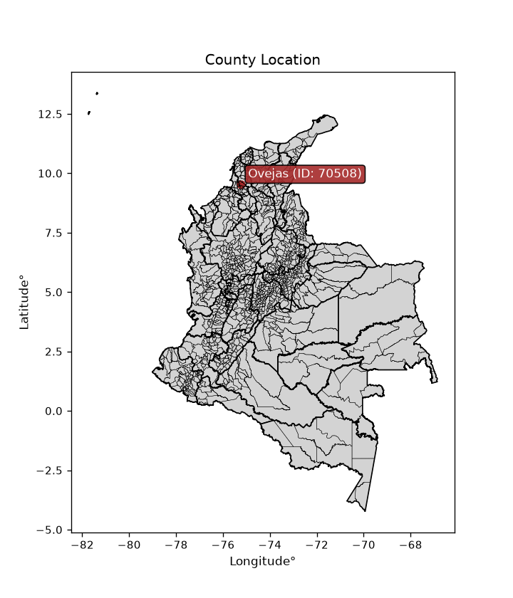
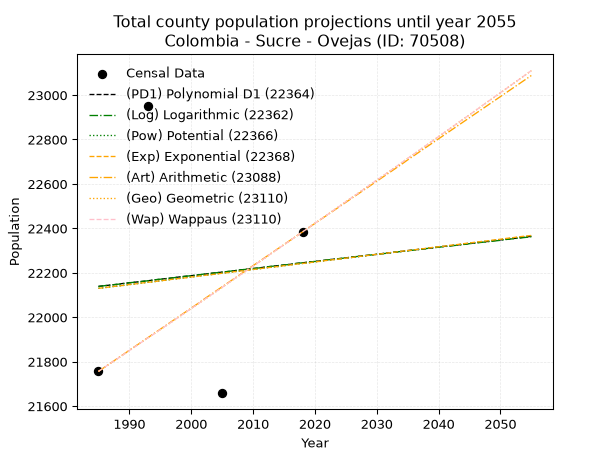
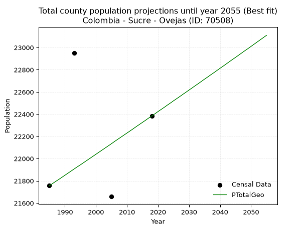
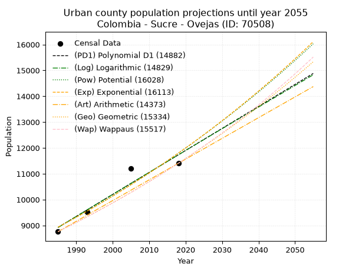
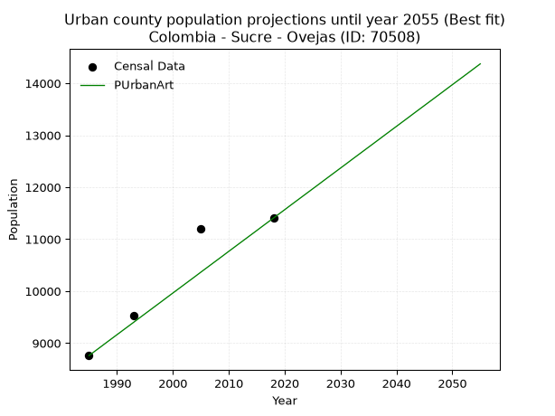
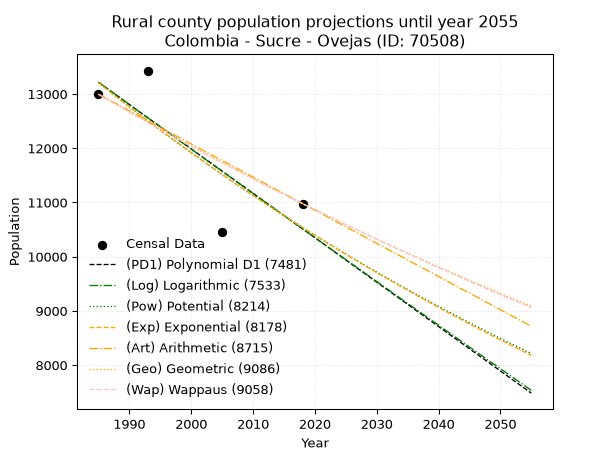
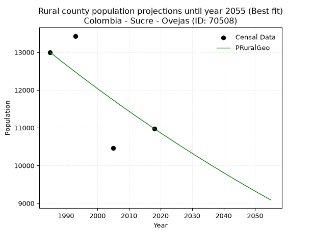

<div align="center">


</div>

# _“Population and Public Services Demand Projections (PPSD) until Year 2050 for Colombia - Sucre - Ovejas (ID: 70508)”_
Keywords: `population` `public-service` `projection` `lineal` `polynomial` `logarithmic` `potential` `exponential` `arithmetic` `geometric` `wappaus` `dane` `colombia` `south-america`

PPSD are analytical estimates used by governments and planners to anticipate future changes in population size, age distribution, and the resulting community needs for utilities, healthcare, education, and infrastructure as sizing future water treatment facilities, electrical grids, and road networks based on spatial growth.

<div align="center">

</img>

</div>


> **General running parameters**: • app_version: _v20260806_. • Python version: _3.14.7_. • Pandas version: _3.0.5_. • NumPy version: _2.5.1_. • Creates, save and include plots into reports (create_plot): _False_. • Projection until year: _2050_. • Process polynomial degree 2 and up: _False_. • Process Wappaus: _True_. • Process Wappaus: _True_. • Set negative values to zero: _True_. • Set infinite values to zero: _True_. • Drop dataset notes: _True_. 
<div align="center">

Dynamic map: [:earth_americas:Google](http://maps.google.com/maps?q=9.52717647,-75.2290369) [:earth_americas:OSM](https://www.openstreetmap.org/#map=18/9.52717647/-75.2290369&layers=P) [:earth_americas:Bing](https://www.bing.com/maps?cp=9.52717647~-75.2290369&lvl=18) [:earth_americas:Apple](https://maps.apple.com/frame?center=9.52717647%2C-75.2290369&span=0.003%2C0.006)

</div>


<div align="center">

```geojson
{
  "type": "Feature",
  "geometry": {
    "type": "Point", 
    "coordinates": [-75.2290369, 9.52717647]
  }, 
  "properties": {
    "Name": "Colombia - Sucre - Ovejas (ID: 70508)"
  }
}
```

</div>


## 0. Census Data (4 records)

Census data are official statistics collected by a government about the people and housing in a country. They usually include counts of total population, age, sex, race, income, education, and jobs.

📅Global census file: [Population.xlsx](../data/Population.xlsx)

| Source   |   Year |   CountryID | CountryName   |   StateID | StateName   |   CountyID | CountyName   |   PTotal |   PUrban |   PRural |
|:---------|-------:|------------:|:--------------|----------:|:------------|-----------:|:-------------|---------:|---------:|---------:|
| DANE     |   1985 |          57 | Colombia      |        70 | Sucre       |      70508 | Ovejas       |    21756 |     8760 |    12996 |
| DANE     |   1993 |          57 | Colombia      |        70 | Sucre       |      70508 | Ovejas       |    22953 |     9522 |    13431 |
| DANE     |   2005 |          57 | Colombia      |        70 | Sucre       |      70508 | Ovejas       |    21658 |    11197 |    10461 |
| DANE     |   2018 |          57 | Colombia      |        70 | Sucre       |      70508 | Ovejas       |    22384 |    11406 |    10978 |

> 🔥Some records could had specific notes about the registered values or the corresponding urban or rural distribution.

📅   [RUPS](https://www.datos.gov.co/Hacienda-y-Cr-dito-P-blico/Registro-nico-de-Prestadores-de-Servicios-P-blicos/4qkq-csdn/about_data) - Local public utility companies: [RUPS.csv](../data/RUPS.xlsx)

 | SERVICIO       | ESTADO    | NOMBRE                                                                                                                           | NIT         | DEPARTAMENTO_DOMICILIO   | MUNICIPIO_DOMICILIO   | DIRECCION                |   TELEFONO | EMAIL                 | TIPO_PRESTADOR                             | CLASIFICACION                  |
|:---------------|:----------|:---------------------------------------------------------------------------------------------------------------------------------|:------------|:-------------------------|:----------------------|:-------------------------|-----------:|:----------------------|:-------------------------------------------|:-------------------------------|
| ACUEDUCTO      | OPERATIVA | EMPRESA MUNICIPAL DE ACUEDUCTO, ALCANTARILLADO Y ASEO DE OVEJAS SA ESP                                                           | 900085690-1 | SUCRE                    | OVEJAS                | CRA 15 # 23 - 09         |    2869291 | aaadeovejas@gmail.com | SOCIEDADES (EMPRESA DE SERVICIOS PUBLICOS) | DESDE 2501 HASTA 5000 USUARIOS |
| ALCANTARILLADO | OPERATIVA | EMPRESA MUNICIPAL DE ACUEDUCTO, ALCANTARILLADO Y ASEO DE OVEJAS SA ESP                                                           | 900085690-1 | SUCRE                    | OVEJAS                | CRA 15 # 23 - 09         |    2869291 | aaadeovejas@gmail.com | SOCIEDADES (EMPRESA DE SERVICIOS PUBLICOS) | DESDE 2501 HASTA 5000 USUARIOS |
| ACUEDUCTO      | OPERATIVA | Asociación de Usuarios del Servicio de Agua Potable Alcantarillado y/o Aseo de Canutal Municipio de Ovejas Departamento de Sucre | 901400181-1 | SUCRE                    | OVEJAS                | Calle 5 N°. 5-20 Canutal |    2869418 | aaacanutal@gmail.com  | ORGANIZACION AUTORIZADA                    | MENOR O IGUAL A 2500 USUARIOS  |
| ALCANTARILLADO | OPERATIVA | Asociación de Usuarios del Servicio de Agua Potable Alcantarillado y/o Aseo de Canutal Municipio de Ovejas Departamento de Sucre | 901400181-1 | SUCRE                    | OVEJAS                | Calle 5 N°. 5-20 Canutal |    2869418 | aaacanutal@gmail.com  | ORGANIZACION AUTORIZADA                    | MENOR O IGUAL A 2500 USUARIOS  |

## 1. Total

### 1.1. Coefficients and Parameters

* (PD1) Polynomial Deg 1: 3.2167804094737473, 15753.384985950139 (lineal)
* (Log) Logarithmic: 6452.120369427615, -26854.868632067042
* (Pow) Potential: 0.3070562580965184, 3.3323776440855624
* (Exp) Exponential: 0.00015312868712931768, 16329.433742396113
* (Art) Arithmetic: Year diff. 2018 - 1985 = 33, Population diff. 22384 - 21756 = 628, Annual growth = 19.03030303030303
* (Geo) Geometric: Year diff. 2018 - 1985 = 33, Population diff. 22384 - 21756 = 628, Annual growth % = 0.0008627002866270495
* (Wap) Wappaus: i = 0.08622701871455836, Condition values only valid for < 200)

<sub>
Wappaus condition values: ['0.00', '0.09', '0.17', '0.26', '0.34', '0.43', '0.52', '0.60', '0.69', '0.78', '0.86', '0.95', '1.03', '1.12', '1.21', '1.29', '1.38', '1.47', '1.55', '1.64', '1.72', '1.81', '1.90', '1.98', '2.07', '2.16', '2.24', '2.33', '2.41', '2.50', '2.59', '2.67', '2.76', '2.85', '2.93', '3.02', '3.10', '3.19', '3.28', '3.36', '3.45', '3.54', '3.62', '3.71', '3.79', '3.88', '3.97', '4.05', '4.14', '4.23', '4.31', '4.40', '4.48', '4.57', '4.66', '4.74', '4.83', '4.91', '5.00', '5.09', '5.17', '5.26', '5.35', '5.43', '5.52', '5.60']
</sub>


### 1.2. Projected Dataset

|   Year |   CountyID |   PTotalPD1 |   PTotalLog |   PTotalPow |   PTotalExp |   PTotalArt |   PTotalGeo |   PTotalWap |
|-------:|-----------:|------------:|------------:|------------:|------------:|------------:|------------:|------------:|
|   1985 |      70508 |       22139 |       22138 |       22130 |       22130 |       21756 |       21756 |       21756 |
|   1986 |      70508 |       22142 |       22142 |       22133 |       22133 |       21775 |       21775 |       21775 |
|   1987 |      70508 |       22145 |       22145 |       22137 |       22137 |       21794 |       21794 |       21794 |
|   1988 |      70508 |       22148 |       22148 |       22140 |       22140 |       21813 |       21812 |       21812 |
|   1989 |      70508 |       22152 |       22151 |       22143 |       22143 |       21832 |       21831 |       21831 |
|   1990 |      70508 |       22155 |       22155 |       22147 |       22147 |       21851 |       21850 |       21850 |
|   1991 |      70508 |       22158 |       22158 |       22150 |       22150 |       21870 |       21869 |       21869 |
|   1992 |      70508 |       22161 |       22161 |       22154 |       22154 |       21889 |       21888 |       21888 |
|   1993 |      70508 |       22164 |       22164 |       22157 |       22157 |       21908 |       21907 |       21907 |
|   1994 |      70508 |       22168 |       22168 |       22160 |       22160 |       21927 |       21926 |       21925 |
|   1995 |      70508 |       22171 |       22171 |       22164 |       22164 |       21946 |       21944 |       21944 |
|   1996 |      70508 |       22174 |       22174 |       22167 |       22167 |       21965 |       21963 |       21963 |
|   1997 |      70508 |       22177 |       22177 |       22171 |       22171 |       21984 |       21982 |       21982 |
|   1998 |      70508 |       22181 |       22181 |       22174 |       22174 |       22003 |       22001 |       22001 |
|   1999 |      70508 |       22184 |       22184 |       22178 |       22177 |       22022 |       22020 |       22020 |
|   2000 |      70508 |       22187 |       22187 |       22181 |       22181 |       22041 |       22039 |       22039 |
|   2001 |      70508 |       22190 |       22190 |       22184 |       22184 |       22060 |       22058 |       22058 |
|   2002 |      70508 |       22193 |       22194 |       22188 |       22188 |       22080 |       22077 |       22077 |
|   2003 |      70508 |       22197 |       22197 |       22191 |       22191 |       22099 |       22096 |       22096 |
|   2004 |      70508 |       22200 |       22200 |       22195 |       22194 |       22118 |       22115 |       22115 |
|   2005 |      70508 |       22203 |       22203 |       22198 |       22198 |       22137 |       22134 |       22134 |
|   2006 |      70508 |       22206 |       22206 |       22201 |       22201 |       22156 |       22154 |       22154 |
|   2007 |      70508 |       22209 |       22210 |       22205 |       22205 |       22175 |       22173 |       22173 |
|   2008 |      70508 |       22213 |       22213 |       22208 |       22208 |       22194 |       22192 |       22192 |
|   2009 |      70508 |       22216 |       22216 |       22212 |       22211 |       22213 |       22211 |       22211 |
|   2010 |      70508 |       22219 |       22219 |       22215 |       22215 |       22232 |       22230 |       22230 |
|   2011 |      70508 |       22222 |       22222 |       22218 |       22218 |       22251 |       22249 |       22249 |
|   2012 |      70508 |       22226 |       22226 |       22222 |       22222 |       22270 |       22268 |       22268 |
|   2013 |      70508 |       22229 |       22229 |       22225 |       22225 |       22289 |       22288 |       22288 |
|   2014 |      70508 |       22232 |       22232 |       22228 |       22228 |       22308 |       22307 |       22307 |
|   2015 |      70508 |       22235 |       22235 |       22232 |       22232 |       22327 |       22326 |       22326 |
|   2016 |      70508 |       22238 |       22238 |       22235 |       22235 |       22346 |       22345 |       22345 |
|   2017 |      70508 |       22242 |       22242 |       22239 |       22239 |       22365 |       22365 |       22365 |
|   2018 |      70508 |       22245 |       22245 |       22242 |       22242 |       22384 |       22384 |       22384 |
|   2019 |      70508 |       22248 |       22248 |       22245 |       22245 |       22403 |       22403 |       22403 |
|   2020 |      70508 |       22251 |       22251 |       22249 |       22249 |       22422 |       22423 |       22423 |
|   2021 |      70508 |       22254 |       22254 |       22252 |       22252 |       22441 |       22442 |       22442 |
|   2022 |      70508 |       22258 |       22258 |       22256 |       22256 |       22460 |       22461 |       22461 |
|   2023 |      70508 |       22261 |       22261 |       22259 |       22259 |       22479 |       22481 |       22481 |
|   2024 |      70508 |       22264 |       22264 |       22262 |       22262 |       22498 |       22500 |       22500 |
|   2025 |      70508 |       22267 |       22267 |       22266 |       22266 |       22517 |       22520 |       22520 |
|   2026 |      70508 |       22271 |       22270 |       22269 |       22269 |       22536 |       22539 |       22539 |
|   2027 |      70508 |       22274 |       22274 |       22272 |       22273 |       22555 |       22558 |       22558 |
|   2028 |      70508 |       22277 |       22277 |       22276 |       22276 |       22574 |       22578 |       22578 |
|   2029 |      70508 |       22280 |       22280 |       22279 |       22280 |       22593 |       22597 |       22597 |
|   2030 |      70508 |       22283 |       22283 |       22283 |       22283 |       22612 |       22617 |       22617 |
|   2031 |      70508 |       22287 |       22286 |       22286 |       22286 |       22631 |       22636 |       22636 |
|   2032 |      70508 |       22290 |       22289 |       22289 |       22290 |       22650 |       22656 |       22656 |
|   2033 |      70508 |       22293 |       22293 |       22293 |       22293 |       22669 |       22675 |       22675 |
|   2034 |      70508 |       22296 |       22296 |       22296 |       22297 |       22688 |       22695 |       22695 |
|   2035 |      70508 |       22300 |       22299 |       22299 |       22300 |       22708 |       22715 |       22715 |
|   2036 |      70508 |       22303 |       22302 |       22303 |       22303 |       22727 |       22734 |       22734 |
|   2037 |      70508 |       22306 |       22305 |       22306 |       22307 |       22746 |       22754 |       22754 |
|   2038 |      70508 |       22309 |       22309 |       22309 |       22310 |       22765 |       22773 |       22774 |
|   2039 |      70508 |       22312 |       22312 |       22313 |       22314 |       22784 |       22793 |       22793 |
|   2040 |      70508 |       22316 |       22315 |       22316 |       22317 |       22803 |       22813 |       22813 |
|   2041 |      70508 |       22319 |       22318 |       22320 |       22320 |       22822 |       22832 |       22833 |
|   2042 |      70508 |       22322 |       22321 |       22323 |       22324 |       22841 |       22852 |       22852 |
|   2043 |      70508 |       22325 |       22324 |       22326 |       22327 |       22860 |       22872 |       22872 |
|   2044 |      70508 |       22328 |       22327 |       22330 |       22331 |       22879 |       22892 |       22892 |
|   2045 |      70508 |       22332 |       22331 |       22333 |       22334 |       22898 |       22911 |       22911 |
|   2046 |      70508 |       22335 |       22334 |       22336 |       22338 |       22917 |       22931 |       22931 |
|   2047 |      70508 |       22338 |       22337 |       22340 |       22341 |       22936 |       22951 |       22951 |
|   2048 |      70508 |       22341 |       22340 |       22343 |       22344 |       22955 |       22971 |       22971 |
|   2049 |      70508 |       22345 |       22343 |       22346 |       22348 |       22974 |       22990 |       22991 |
|   2050 |      70508 |       22348 |       22346 |       22350 |       22351 |       22993 |       23010 |       23011 |
<div align="center">

</img>

</div>


### 1.3. Best fit with absolute and relative error (%)

Relative error puts that difference into context by dividing the absolute error by the true value, creating a unitless ratio or percentage that shows the scale of the mistake.

Absolute and relative error

|   Year | Source   |   CountryID | CountryName   |   StateID | StateName   |   CountyID_x | CountyName   |   PTotal |   PUrban |   PRural |   CountyID_y |   PTotalPD1 |   PTotalLog |   PTotalPow |   PTotalExp |   PTotalArt |   PTotalGeo |   PTotalWap |   PTotalPD1AbsError |   PTotalLogAbsError |   PTotalPowAbsError |   PTotalExpAbsError |   PTotalArtAbsError |   PTotalGeoAbsError |   PTotalWapAbsError |   PTotalPD1RelError |   PTotalLogRelError |   PTotalPowRelError |   PTotalExpRelError |   PTotalArtRelError |   PTotalGeoRelError |   PTotalWapRelError |
|-------:|:---------|------------:|:--------------|----------:|:------------|-------------:|:-------------|---------:|---------:|---------:|-------------:|------------:|------------:|------------:|------------:|------------:|------------:|------------:|--------------------:|--------------------:|--------------------:|--------------------:|--------------------:|--------------------:|--------------------:|--------------------:|--------------------:|--------------------:|--------------------:|--------------------:|--------------------:|--------------------:|
|   1985 | DANE     |          57 | Colombia      |        70 | Sucre       |        70508 | Ovejas       |    21756 |     8760 |    12996 |        70508 |       22139 |       22138 |       22130 |       22130 |       21756 |       21756 |       21756 |                 383 |                 382 |                 374 |                 374 |                   0 |                   0 |                   0 |            1.76043  |            1.75584  |            1.71907  |            1.71907  |             0       |             0       |             0       |
|   1993 | DANE     |          57 | Colombia      |        70 | Sucre       |        70508 | Ovejas       |    22953 |     9522 |    13431 |        70508 |       22164 |       22164 |       22157 |       22157 |       21908 |       21907 |       21907 |                 789 |                 789 |                 796 |                 796 |                1045 |                1046 |                1046 |            3.43746  |            3.43746  |            3.46796  |            3.46796  |             4.55278 |             4.55714 |             4.55714 |
|   2005 | DANE     |          57 | Colombia      |        70 | Sucre       |        70508 | Ovejas       |    21658 |    11197 |    10461 |        70508 |       22203 |       22203 |       22198 |       22198 |       22137 |       22134 |       22134 |                 545 |                 545 |                 540 |                 540 |                 479 |                 476 |                 476 |            2.51639  |            2.51639  |            2.49331  |            2.49331  |             2.21165 |             2.1978  |             2.1978  |
|   2018 | DANE     |          57 | Colombia      |        70 | Sucre       |        70508 | Ovejas       |    22384 |    11406 |    10978 |        70508 |       22245 |       22245 |       22242 |       22242 |       22384 |       22384 |       22384 |                 139 |                 139 |                 142 |                 142 |                   0 |                   0 |                   0 |            0.620979 |            0.620979 |            0.634382 |            0.634382 |             0       |             0       |             0       |

Relative error mean

| Method    |   RelError | Best   |
|:----------|-----------:|:-------|
| PTotalPD1 |    2.08382 |        |
| PTotalLog |    2.08267 |        |
| PTotalPow |    2.07868 |        |
| PTotalExp |    2.07868 |        |
| PTotalArt |    1.69111 |        |
| PTotalGeo |    1.68874 | True   |
| PTotalWap |    1.68874 | True   |

💙Best method: _**PTotalGeo**_
<div align="center">

</img>

</div>


### 1.4. Fresh water supply demand in liters per capita per day (lpcd)

The fresh water supply demand typically ranges from 100 to 300 liters per capita per day (lpcd) for standard domestic and municipal planning, though absolute survival minimums set by the World Health Organization are as low as 7.5 to 20 liters per day, and total consumption in high-income nations can exceed 400 liters.

> `CZ`: Level in meters above the sea level (masl)<br> `WS`: Fresh water supply demand in liters per capita per day (lpcd or l/h/d)<br> `WSAll`: Zonal fresh water supply demand in liters per second (l/s)<br> `A`: Zonal area in square meters<br> `DP`: Population density (people/hectare or p/ha)

Reference values (RAS Colombia)

|    CZ |   WS |
|------:|-----:|
|  1000 |  120 |
|  2000 |  130 |
| 99999 |  140 |

County shapefile geometry properties and water supply values

|   CountyID |      ATotal |   CZTotal |   WSTotal |
|-----------:|------------:|----------:|----------:|
|      70508 | 4.58222e+08 |   259.002 |       120 |

Projected values for best method: PTotalGeo

|   CountyID |   Year |   PTotalGeo |   DPTotal |   WSTotal |   WSTotalAll |
|-----------:|-------:|------------:|----------:|----------:|-------------:|
|      70508 |   1985 |       21756 |      0.47 |       120 |      30.2167 |
|      70508 |   1986 |       21775 |      0.48 |       120 |      30.2431 |
|      70508 |   1987 |       21794 |      0.48 |       120 |      30.2694 |
|      70508 |   1988 |       21812 |      0.48 |       120 |      30.2944 |
|      70508 |   1989 |       21831 |      0.48 |       120 |      30.3208 |
|      70508 |   1990 |       21850 |      0.48 |       120 |      30.3472 |
|      70508 |   1991 |       21869 |      0.48 |       120 |      30.3736 |
|      70508 |   1992 |       21888 |      0.48 |       120 |      30.4    |
|      70508 |   1993 |       21907 |      0.48 |       120 |      30.4264 |
|      70508 |   1994 |       21926 |      0.48 |       120 |      30.4528 |
|      70508 |   1995 |       21944 |      0.48 |       120 |      30.4778 |
|      70508 |   1996 |       21963 |      0.48 |       120 |      30.5042 |
|      70508 |   1997 |       21982 |      0.48 |       120 |      30.5306 |
|      70508 |   1998 |       22001 |      0.48 |       120 |      30.5569 |
|      70508 |   1999 |       22020 |      0.48 |       120 |      30.5833 |
|      70508 |   2000 |       22039 |      0.48 |       120 |      30.6097 |
|      70508 |   2001 |       22058 |      0.48 |       120 |      30.6361 |
|      70508 |   2002 |       22077 |      0.48 |       120 |      30.6625 |
|      70508 |   2003 |       22096 |      0.48 |       120 |      30.6889 |
|      70508 |   2004 |       22115 |      0.48 |       120 |      30.7153 |
|      70508 |   2005 |       22134 |      0.48 |       120 |      30.7417 |
|      70508 |   2006 |       22154 |      0.48 |       120 |      30.7694 |
|      70508 |   2007 |       22173 |      0.48 |       120 |      30.7958 |
|      70508 |   2008 |       22192 |      0.48 |       120 |      30.8222 |
|      70508 |   2009 |       22211 |      0.48 |       120 |      30.8486 |
|      70508 |   2010 |       22230 |      0.49 |       120 |      30.875  |
|      70508 |   2011 |       22249 |      0.49 |       120 |      30.9014 |
|      70508 |   2012 |       22268 |      0.49 |       120 |      30.9278 |
|      70508 |   2013 |       22288 |      0.49 |       120 |      30.9556 |
|      70508 |   2014 |       22307 |      0.49 |       120 |      30.9819 |
|      70508 |   2015 |       22326 |      0.49 |       120 |      31.0083 |
|      70508 |   2016 |       22345 |      0.49 |       120 |      31.0347 |
|      70508 |   2017 |       22365 |      0.49 |       120 |      31.0625 |
|      70508 |   2018 |       22384 |      0.49 |       120 |      31.0889 |
|      70508 |   2019 |       22403 |      0.49 |       120 |      31.1153 |
|      70508 |   2020 |       22423 |      0.49 |       120 |      31.1431 |
|      70508 |   2021 |       22442 |      0.49 |       120 |      31.1694 |
|      70508 |   2022 |       22461 |      0.49 |       120 |      31.1958 |
|      70508 |   2023 |       22481 |      0.49 |       120 |      31.2236 |
|      70508 |   2024 |       22500 |      0.49 |       120 |      31.25   |
|      70508 |   2025 |       22520 |      0.49 |       120 |      31.2778 |
|      70508 |   2026 |       22539 |      0.49 |       120 |      31.3042 |
|      70508 |   2027 |       22558 |      0.49 |       120 |      31.3306 |
|      70508 |   2028 |       22578 |      0.49 |       120 |      31.3583 |
|      70508 |   2029 |       22597 |      0.49 |       120 |      31.3847 |
|      70508 |   2030 |       22617 |      0.49 |       120 |      31.4125 |
|      70508 |   2031 |       22636 |      0.49 |       120 |      31.4389 |
|      70508 |   2032 |       22656 |      0.49 |       120 |      31.4667 |
|      70508 |   2033 |       22675 |      0.49 |       120 |      31.4931 |
|      70508 |   2034 |       22695 |      0.5  |       120 |      31.5208 |
|      70508 |   2035 |       22715 |      0.5  |       120 |      31.5486 |
|      70508 |   2036 |       22734 |      0.5  |       120 |      31.575  |
|      70508 |   2037 |       22754 |      0.5  |       120 |      31.6028 |
|      70508 |   2038 |       22773 |      0.5  |       120 |      31.6292 |
|      70508 |   2039 |       22793 |      0.5  |       120 |      31.6569 |
|      70508 |   2040 |       22813 |      0.5  |       120 |      31.6847 |
|      70508 |   2041 |       22832 |      0.5  |       120 |      31.7111 |
|      70508 |   2042 |       22852 |      0.5  |       120 |      31.7389 |
|      70508 |   2043 |       22872 |      0.5  |       120 |      31.7667 |
|      70508 |   2044 |       22892 |      0.5  |       120 |      31.7944 |
|      70508 |   2045 |       22911 |      0.5  |       120 |      31.8208 |
|      70508 |   2046 |       22931 |      0.5  |       120 |      31.8486 |
|      70508 |   2047 |       22951 |      0.5  |       120 |      31.8764 |
|      70508 |   2048 |       22971 |      0.5  |       120 |      31.9042 |
|      70508 |   2049 |       22990 |      0.5  |       120 |      31.9306 |
|      70508 |   2050 |       23010 |      0.5  |       120 |      31.9583 |

## 2. Urban

### 2.1. Coefficients and Parameters

* (PD1) Polynomial Deg 1: 85.134885588117, -160069.80489763105 (lineal)
* (Log) Logarithmic: 170513.69914801623, -1285854.7436351015
* (Pow) Potential: 16.873394203853856, -51.69348706509701
* (Exp) Exponential: 0.00842420153760659, 0.0004884090489370665
* (Art) Arithmetic: Year diff. 2018 - 1985 = 33, Population diff. 11406 - 8760 = 2646, Annual growth = 80.18181818181819
* (Geo) Geometric: Year diff. 2018 - 1985 = 33, Population diff. 11406 - 8760 = 2646, Annual growth % = 0.008030363536035257
* (Wap) Wappaus: i = 0.7952178734683941, Condition values only valid for < 200)

<sub>
Wappaus condition values: ['0.00', '0.80', '1.59', '2.39', '3.18', '3.98', '4.77', '5.57', '6.36', '7.16', '7.95', '8.75', '9.54', '10.34', '11.13', '11.93', '12.72', '13.52', '14.31', '15.11', '15.90', '16.70', '17.49', '18.29', '19.09', '19.88', '20.68', '21.47', '22.27', '23.06', '23.86', '24.65', '25.45', '26.24', '27.04', '27.83', '28.63', '29.42', '30.22', '31.01', '31.81', '32.60', '33.40', '34.19', '34.99', '35.78', '36.58', '37.38', '38.17', '38.97', '39.76', '40.56', '41.35', '42.15', '42.94', '43.74', '44.53', '45.33', '46.12', '46.92', '47.71', '48.51', '49.30', '50.10', '50.89', '51.69']
</sub>


### 2.2. Projected Dataset

|   Year |   CountyID |   PUrbanPD1 |   PUrbanLog |   PUrbanPow |   PUrbanExp |   PUrbanArt |   PUrbanGeo |   PUrbanWap |
|-------:|-----------:|------------:|------------:|------------:|------------:|------------:|------------:|------------:|
|   1985 |      70508 |        8923 |        8920 |        8932 |        8935 |        8760 |        8760 |        8760 |
|   1986 |      70508 |        9008 |        9005 |        9008 |        9010 |        8840 |        8830 |        8830 |
|   1987 |      70508 |        9093 |        9091 |        9085 |        9086 |        8920 |        8901 |        8900 |
|   1988 |      70508 |        9178 |        9177 |        9162 |        9163 |        9001 |        8973 |        8972 |
|   1989 |      70508 |        9263 |        9263 |        9240 |        9241 |        9081 |        9045 |        9043 |
|   1990 |      70508 |        9349 |        9349 |        9319 |        9319 |        9161 |        9117 |        9115 |
|   1991 |      70508 |        9434 |        9434 |        9398 |        9398 |        9241 |        9191 |        9188 |
|   1992 |      70508 |        9519 |        9520 |        9478 |        9477 |        9321 |        9264 |        9262 |
|   1993 |      70508 |        9604 |        9605 |        9559 |        9557 |        9401 |        9339 |        9336 |
|   1994 |      70508 |        9689 |        9691 |        9640 |        9638 |        9482 |        9414 |        9410 |
|   1995 |      70508 |        9774 |        9776 |        9722 |        9720 |        9562 |        9489 |        9485 |
|   1996 |      70508 |        9859 |        9862 |        9804 |        9802 |        9642 |        9566 |        9561 |
|   1997 |      70508 |        9945 |        9947 |        9888 |        9885 |        9722 |        9642 |        9638 |
|   1998 |      70508 |       10030 |       10033 |        9972 |        9969 |        9802 |        9720 |        9715 |
|   1999 |      70508 |       10115 |       10118 |       10056 |       10053 |        9883 |        9798 |        9793 |
|   2000 |      70508 |       10200 |       10203 |       10141 |       10138 |        9963 |        9877 |        9871 |
|   2001 |      70508 |       10285 |       10288 |       10227 |       10224 |       10043 |        9956 |        9950 |
|   2002 |      70508 |       10370 |       10374 |       10314 |       10310 |       10123 |       10036 |       10030 |
|   2003 |      70508 |       10455 |       10459 |       10401 |       10397 |       10203 |       10116 |       10111 |
|   2004 |      70508 |       10541 |       10544 |       10489 |       10485 |       10283 |       10198 |       10192 |
|   2005 |      70508 |       10626 |       10629 |       10578 |       10574 |       10364 |       10280 |       10274 |
|   2006 |      70508 |       10711 |       10714 |       10667 |       10664 |       10444 |       10362 |       10356 |
|   2007 |      70508 |       10796 |       10799 |       10757 |       10754 |       10524 |       10445 |       10439 |
|   2008 |      70508 |       10881 |       10884 |       10848 |       10845 |       10604 |       10529 |       10523 |
|   2009 |      70508 |       10966 |       10969 |       10939 |       10937 |       10684 |       10614 |       10608 |
|   2010 |      70508 |       11051 |       11054 |       11032 |       11029 |       10765 |       10699 |       10694 |
|   2011 |      70508 |       11136 |       11139 |       11125 |       11122 |       10845 |       10785 |       10780 |
|   2012 |      70508 |       11222 |       11223 |       11218 |       11216 |       10925 |       10872 |       10867 |
|   2013 |      70508 |       11307 |       11308 |       11313 |       11311 |       11005 |       10959 |       10955 |
|   2014 |      70508 |       11392 |       11393 |       11408 |       11407 |       11085 |       11047 |       11043 |
|   2015 |      70508 |       11477 |       11477 |       11504 |       11504 |       11165 |       11136 |       11133 |
|   2016 |      70508 |       11562 |       11562 |       11601 |       11601 |       11246 |       11225 |       11223 |
|   2017 |      70508 |       11647 |       11646 |       11698 |       11699 |       11326 |       11315 |       11314 |
|   2018 |      70508 |       11732 |       11731 |       11796 |       11798 |       11406 |       11406 |       11406 |
|   2019 |      70508 |       11818 |       11815 |       11895 |       11898 |       11486 |       11498 |       11499 |
|   2020 |      70508 |       11903 |       11900 |       11995 |       11998 |       11566 |       11590 |       11592 |
|   2021 |      70508 |       11988 |       11984 |       12096 |       12100 |       11647 |       11683 |       11687 |
|   2022 |      70508 |       12073 |       12069 |       12197 |       12202 |       11727 |       11777 |       11782 |
|   2023 |      70508 |       12158 |       12153 |       12299 |       12306 |       11807 |       11871 |       11878 |
|   2024 |      70508 |       12243 |       12237 |       12402 |       12410 |       11887 |       11967 |       11975 |
|   2025 |      70508 |       12328 |       12321 |       12506 |       12515 |       11967 |       12063 |       12073 |
|   2026 |      70508 |       12413 |       12406 |       12611 |       12620 |       12047 |       12160 |       12172 |
|   2027 |      70508 |       12499 |       12490 |       12716 |       12727 |       12128 |       12257 |       12272 |
|   2028 |      70508 |       12584 |       12574 |       12823 |       12835 |       12208 |       12356 |       12373 |
|   2029 |      70508 |       12669 |       12658 |       12930 |       12943 |       12288 |       12455 |       12475 |
|   2030 |      70508 |       12754 |       12742 |       13038 |       13053 |       12368 |       12555 |       12578 |
|   2031 |      70508 |       12839 |       12826 |       13146 |       13163 |       12448 |       12656 |       12682 |
|   2032 |      70508 |       12924 |       12910 |       13256 |       13275 |       12529 |       12757 |       12787 |
|   2033 |      70508 |       13009 |       12994 |       13367 |       13387 |       12609 |       12860 |       12892 |
|   2034 |      70508 |       13095 |       13078 |       13478 |       13500 |       12689 |       12963 |       12999 |
|   2035 |      70508 |       13180 |       13161 |       13590 |       13615 |       12769 |       13067 |       13107 |
|   2036 |      70508 |       13265 |       13245 |       13703 |       13730 |       12849 |       13172 |       13216 |
|   2037 |      70508 |       13350 |       13329 |       13817 |       13846 |       12929 |       13278 |       13327 |
|   2038 |      70508 |       13435 |       13413 |       13932 |       13963 |       13010 |       13385 |       13438 |
|   2039 |      70508 |       13520 |       13496 |       14048 |       14081 |       13090 |       13492 |       13550 |
|   2040 |      70508 |       13605 |       13580 |       14165 |       14200 |       13170 |       13600 |       13664 |
|   2041 |      70508 |       13690 |       13663 |       14282 |       14320 |       13250 |       13710 |       13778 |
|   2042 |      70508 |       13776 |       13747 |       14401 |       14442 |       13330 |       13820 |       13894 |
|   2043 |      70508 |       13861 |       13830 |       14520 |       14564 |       13411 |       13931 |       14011 |
|   2044 |      70508 |       13946 |       13914 |       14641 |       14687 |       13491 |       14043 |       14130 |
|   2045 |      70508 |       14031 |       13997 |       14762 |       14811 |       13571 |       14155 |       14249 |
|   2046 |      70508 |       14116 |       14081 |       14884 |       14936 |       13651 |       14269 |       14370 |
|   2047 |      70508 |       14201 |       14164 |       15008 |       15063 |       13731 |       14384 |       14492 |
|   2048 |      70508 |       14286 |       14247 |       15132 |       15190 |       13811 |       14499 |       14615 |
|   2049 |      70508 |       14372 |       14330 |       15257 |       15319 |       13892 |       14616 |       14740 |
|   2050 |      70508 |       14457 |       14414 |       15383 |       15448 |       13972 |       14733 |       14866 |
<div align="center">

</img>

</div>


### 2.3. Best fit with absolute and relative error (%)

Relative error puts that difference into context by dividing the absolute error by the true value, creating a unitless ratio or percentage that shows the scale of the mistake.

Absolute and relative error

|   Year | Source   |   CountryID | CountryName   |   StateID | StateName   |   CountyID_x | CountyName   |   PTotal |   PUrban |   PRural |   CountyID_y |   PUrbanPD1 |   PUrbanLog |   PUrbanPow |   PUrbanExp |   PUrbanArt |   PUrbanGeo |   PUrbanWap |   PUrbanPD1AbsError |   PUrbanLogAbsError |   PUrbanPowAbsError |   PUrbanExpAbsError |   PUrbanArtAbsError |   PUrbanGeoAbsError |   PUrbanWapAbsError |   PUrbanPD1RelError |   PUrbanLogRelError |   PUrbanPowRelError |   PUrbanExpRelError |   PUrbanArtRelError |   PUrbanGeoRelError |   PUrbanWapRelError |
|-------:|:---------|------------:|:--------------|----------:|:------------|-------------:|:-------------|---------:|---------:|---------:|-------------:|------------:|------------:|------------:|------------:|------------:|------------:|------------:|--------------------:|--------------------:|--------------------:|--------------------:|--------------------:|--------------------:|--------------------:|--------------------:|--------------------:|--------------------:|--------------------:|--------------------:|--------------------:|--------------------:|
|   1985 | DANE     |          57 | Colombia      |        70 | Sucre       |        70508 | Ovejas       |    21756 |     8760 |    12996 |        70508 |        8923 |        8920 |        8932 |        8935 |        8760 |        8760 |        8760 |                 163 |                 160 |                 172 |                 175 |                   0 |                   0 |                   0 |            1.86073  |            1.82648  |            1.96347  |             1.99772 |             0       |             0       |             0       |
|   1993 | DANE     |          57 | Colombia      |        70 | Sucre       |        70508 | Ovejas       |    22953 |     9522 |    13431 |        70508 |        9604 |        9605 |        9559 |        9557 |        9401 |        9339 |        9336 |                  82 |                  83 |                  37 |                  35 |                 121 |                 183 |                 186 |            0.861164 |            0.871666 |            0.388574 |             0.36757 |             1.27074 |             1.92187 |             1.95337 |
|   2005 | DANE     |          57 | Colombia      |        70 | Sucre       |        70508 | Ovejas       |    21658 |    11197 |    10461 |        70508 |       10626 |       10629 |       10578 |       10574 |       10364 |       10280 |       10274 |                 571 |                 568 |                 619 |                 623 |                 833 |                 917 |                 923 |            5.09958  |            5.07279  |            5.52827  |             5.56399 |             7.43949 |             8.18969 |             8.24328 |
|   2018 | DANE     |          57 | Colombia      |        70 | Sucre       |        70508 | Ovejas       |    22384 |    11406 |    10978 |        70508 |       11732 |       11731 |       11796 |       11798 |       11406 |       11406 |       11406 |                 326 |                 325 |                 390 |                 392 |                   0 |                   0 |                   0 |            2.85814  |            2.84938  |            3.41925  |             3.43679 |             0       |             0       |             0       |

Relative error mean

| Method    |   RelError | Best   |
|:----------|-----------:|:-------|
| PUrbanPD1 |    2.6699  |        |
| PUrbanLog |    2.65508 |        |
| PUrbanPow |    2.82489 |        |
| PUrbanExp |    2.84152 |        |
| PUrbanArt |    2.17756 | True   |
| PUrbanGeo |    2.52789 |        |
| PUrbanWap |    2.54916 |        |

💙Best method: _**PUrbanArt**_
<div align="center">

</img>

</div>


### 2.4. Fresh water supply demand in liters per capita per day (lpcd)

The fresh water supply demand typically ranges from 100 to 300 liters per capita per day (lpcd) for standard domestic and municipal planning, though absolute survival minimums set by the World Health Organization are as low as 7.5 to 20 liters per day, and total consumption in high-income nations can exceed 400 liters.

> `CZ`: Level in meters above the sea level (masl)<br> `WS`: Fresh water supply demand in liters per capita per day (lpcd or l/h/d)<br> `WSAll`: Zonal fresh water supply demand in liters per second (l/s)<br> `A`: Zonal area in square meters<br> `DP`: Population density (people/hectare or p/ha)

Reference values (RAS Colombia)

|    CZ |   WS |
|------:|-----:|
|  1000 |  120 |
|  2000 |  130 |
| 99999 |  140 |

County shapefile geometry properties and water supply values

|   CountyID |      AUrban |   CZUrban |   WSUrban |
|-----------:|------------:|----------:|----------:|
|      70508 | 1.82095e+06 |   253.481 |       120 |

Projected values for best method: PUrbanArt

|   CountyID |   Year |   PUrbanArt |   DPUrban |   WSUrban |   WSUrbanAll |
|-----------:|-------:|------------:|----------:|----------:|-------------:|
|      70508 |   1985 |        8760 |     48.11 |       120 |      12.1667 |
|      70508 |   1986 |        8840 |     48.55 |       120 |      12.2778 |
|      70508 |   1987 |        8920 |     48.99 |       120 |      12.3889 |
|      70508 |   1988 |        9001 |     49.43 |       120 |      12.5014 |
|      70508 |   1989 |        9081 |     49.87 |       120 |      12.6125 |
|      70508 |   1990 |        9161 |     50.31 |       120 |      12.7236 |
|      70508 |   1991 |        9241 |     50.75 |       120 |      12.8347 |
|      70508 |   1992 |        9321 |     51.19 |       120 |      12.9458 |
|      70508 |   1993 |        9401 |     51.63 |       120 |      13.0569 |
|      70508 |   1994 |        9482 |     52.07 |       120 |      13.1694 |
|      70508 |   1995 |        9562 |     52.51 |       120 |      13.2806 |
|      70508 |   1996 |        9642 |     52.95 |       120 |      13.3917 |
|      70508 |   1997 |        9722 |     53.39 |       120 |      13.5028 |
|      70508 |   1998 |        9802 |     53.83 |       120 |      13.6139 |
|      70508 |   1999 |        9883 |     54.27 |       120 |      13.7264 |
|      70508 |   2000 |        9963 |     54.71 |       120 |      13.8375 |
|      70508 |   2001 |       10043 |     55.15 |       120 |      13.9486 |
|      70508 |   2002 |       10123 |     55.59 |       120 |      14.0597 |
|      70508 |   2003 |       10203 |     56.03 |       120 |      14.1708 |
|      70508 |   2004 |       10283 |     56.47 |       120 |      14.2819 |
|      70508 |   2005 |       10364 |     56.92 |       120 |      14.3944 |
|      70508 |   2006 |       10444 |     57.35 |       120 |      14.5056 |
|      70508 |   2007 |       10524 |     57.79 |       120 |      14.6167 |
|      70508 |   2008 |       10604 |     58.23 |       120 |      14.7278 |
|      70508 |   2009 |       10684 |     58.67 |       120 |      14.8389 |
|      70508 |   2010 |       10765 |     59.12 |       120 |      14.9514 |
|      70508 |   2011 |       10845 |     59.56 |       120 |      15.0625 |
|      70508 |   2012 |       10925 |     60    |       120 |      15.1736 |
|      70508 |   2013 |       11005 |     60.44 |       120 |      15.2847 |
|      70508 |   2014 |       11085 |     60.87 |       120 |      15.3958 |
|      70508 |   2015 |       11165 |     61.31 |       120 |      15.5069 |
|      70508 |   2016 |       11246 |     61.76 |       120 |      15.6194 |
|      70508 |   2017 |       11326 |     62.2  |       120 |      15.7306 |
|      70508 |   2018 |       11406 |     62.64 |       120 |      15.8417 |
|      70508 |   2019 |       11486 |     63.08 |       120 |      15.9528 |
|      70508 |   2020 |       11566 |     63.52 |       120 |      16.0639 |
|      70508 |   2021 |       11647 |     63.96 |       120 |      16.1764 |
|      70508 |   2022 |       11727 |     64.4  |       120 |      16.2875 |
|      70508 |   2023 |       11807 |     64.84 |       120 |      16.3986 |
|      70508 |   2024 |       11887 |     65.28 |       120 |      16.5097 |
|      70508 |   2025 |       11967 |     65.72 |       120 |      16.6208 |
|      70508 |   2026 |       12047 |     66.16 |       120 |      16.7319 |
|      70508 |   2027 |       12128 |     66.6  |       120 |      16.8444 |
|      70508 |   2028 |       12208 |     67.04 |       120 |      16.9556 |
|      70508 |   2029 |       12288 |     67.48 |       120 |      17.0667 |
|      70508 |   2030 |       12368 |     67.92 |       120 |      17.1778 |
|      70508 |   2031 |       12448 |     68.36 |       120 |      17.2889 |
|      70508 |   2032 |       12529 |     68.8  |       120 |      17.4014 |
|      70508 |   2033 |       12609 |     69.24 |       120 |      17.5125 |
|      70508 |   2034 |       12689 |     69.68 |       120 |      17.6236 |
|      70508 |   2035 |       12769 |     70.12 |       120 |      17.7347 |
|      70508 |   2036 |       12849 |     70.56 |       120 |      17.8458 |
|      70508 |   2037 |       12929 |     71    |       120 |      17.9569 |
|      70508 |   2038 |       13010 |     71.45 |       120 |      18.0694 |
|      70508 |   2039 |       13090 |     71.89 |       120 |      18.1806 |
|      70508 |   2040 |       13170 |     72.33 |       120 |      18.2917 |
|      70508 |   2041 |       13250 |     72.76 |       120 |      18.4028 |
|      70508 |   2042 |       13330 |     73.2  |       120 |      18.5139 |
|      70508 |   2043 |       13411 |     73.65 |       120 |      18.6264 |
|      70508 |   2044 |       13491 |     74.09 |       120 |      18.7375 |
|      70508 |   2045 |       13571 |     74.53 |       120 |      18.8486 |
|      70508 |   2046 |       13651 |     74.97 |       120 |      18.9597 |
|      70508 |   2047 |       13731 |     75.41 |       120 |      19.0708 |
|      70508 |   2048 |       13811 |     75.85 |       120 |      19.1819 |
|      70508 |   2049 |       13892 |     76.29 |       120 |      19.2944 |
|      70508 |   2050 |       13972 |     76.73 |       120 |      19.4056 |

## 3. Rural

### 3.1. Coefficients and Parameters

* (PD1) Polynomial Deg 1: -81.91810517864323, 175823.18988358113 (lineal)
* (Log) Logarithmic: -164061.57877858815, 1258999.875003031
* (Pow) Potential: -13.715917494473917, 49.352787445624614
* (Exp) Exponential: -0.006848128464938583, 10579276148.090292
* (Art) Arithmetic: Year diff. 2018 - 1985 = 33, Population diff. 10978 - 12996 = -2018, Annual growth = -61.15151515151515
* (Geo) Geometric: Year diff. 2018 - 1985 = 33, Population diff. 10978 - 12996 = -2018, Annual growth % = -0.005100534168118287
* (Wap) Wappaus: i = -0.5101486206016114, Condition values only valid for < 200)

<sub>
Wappaus condition values: ['-0.00', '-0.51', '-1.02', '-1.53', '-2.04', '-2.55', '-3.06', '-3.57', '-4.08', '-4.59', '-5.10', '-5.61', '-6.12', '-6.63', '-7.14', '-7.65', '-8.16', '-8.67', '-9.18', '-9.69', '-10.20', '-10.71', '-11.22', '-11.73', '-12.24', '-12.75', '-13.26', '-13.77', '-14.28', '-14.79', '-15.30', '-15.81', '-16.32', '-16.83', '-17.35', '-17.86', '-18.37', '-18.88', '-19.39', '-19.90', '-20.41', '-20.92', '-21.43', '-21.94', '-22.45', '-22.96', '-23.47', '-23.98', '-24.49', '-25.00', '-25.51', '-26.02', '-26.53', '-27.04', '-27.55', '-28.06', '-28.57', '-29.08', '-29.59', '-30.10', '-30.61', '-31.12', '-31.63', '-32.14', '-32.65', '-33.16']
</sub>


### 3.2. Projected Dataset

|   Year |   CountyID |   PRuralPD1 |   PRuralLog |   PRuralPow |   PRuralExp |   PRuralArt |   PRuralGeo |   PRuralWap |
|-------:|-----------:|------------:|------------:|------------:|------------:|------------:|------------:|------------:|
|   1985 |      70508 |       13216 |       13219 |       13212 |       13209 |       12996 |       12996 |       12996 |
|   1986 |      70508 |       13134 |       13136 |       13121 |       13119 |       12935 |       12930 |       12930 |
|   1987 |      70508 |       13052 |       13054 |       13031 |       13029 |       12874 |       12864 |       12864 |
|   1988 |      70508 |       12970 |       12971 |       12941 |       12940 |       12813 |       12798 |       12799 |
|   1989 |      70508 |       12888 |       12889 |       12852 |       12852 |       12751 |       12733 |       12733 |
|   1990 |      70508 |       12806 |       12806 |       12764 |       12764 |       12690 |       12668 |       12669 |
|   1991 |      70508 |       12724 |       12724 |       12676 |       12677 |       12629 |       12603 |       12604 |
|   1992 |      70508 |       12642 |       12641 |       12589 |       12590 |       12568 |       12539 |       12540 |
|   1993 |      70508 |       12560 |       12559 |       12503 |       12504 |       12507 |       12475 |       12476 |
|   1994 |      70508 |       12478 |       12477 |       12417 |       12419 |       12446 |       12411 |       12413 |
|   1995 |      70508 |       12397 |       12394 |       12332 |       12334 |       12384 |       12348 |       12350 |
|   1996 |      70508 |       12315 |       12312 |       12248 |       12250 |       12323 |       12285 |       12287 |
|   1997 |      70508 |       12233 |       12230 |       12164 |       12167 |       12262 |       12223 |       12224 |
|   1998 |      70508 |       12151 |       12148 |       12081 |       12084 |       12201 |       12160 |       12162 |
|   1999 |      70508 |       12069 |       12066 |       11998 |       12001 |       12140 |       12098 |       12100 |
|   2000 |      70508 |       11987 |       11984 |       11916 |       11919 |       12079 |       12036 |       12038 |
|   2001 |      70508 |       11905 |       11902 |       11835 |       11838 |       12018 |       11975 |       11977 |
|   2002 |      70508 |       11823 |       11820 |       11754 |       11757 |       11956 |       11914 |       11916 |
|   2003 |      70508 |       11741 |       11738 |       11674 |       11677 |       11895 |       11853 |       11855 |
|   2004 |      70508 |       11659 |       11656 |       11594 |       11597 |       11834 |       11793 |       11795 |
|   2005 |      70508 |       11577 |       11574 |       11515 |       11518 |       11773 |       11733 |       11734 |
|   2006 |      70508 |       11495 |       11492 |       11436 |       11439 |       11712 |       11673 |       11675 |
|   2007 |      70508 |       11414 |       11411 |       11358 |       11361 |       11651 |       11613 |       11615 |
|   2008 |      70508 |       11332 |       11329 |       11281 |       11284 |       11590 |       11554 |       11556 |
|   2009 |      70508 |       11250 |       11247 |       11204 |       11207 |       11528 |       11495 |       11497 |
|   2010 |      70508 |       11168 |       11166 |       11128 |       11130 |       11467 |       11436 |       11438 |
|   2011 |      70508 |       11086 |       11084 |       11052 |       11054 |       11406 |       11378 |       11379 |
|   2012 |      70508 |       11004 |       11002 |       10977 |       10979 |       11345 |       11320 |       11321 |
|   2013 |      70508 |       10922 |       10921 |       10903 |       10904 |       11284 |       11262 |       11263 |
|   2014 |      70508 |       10840 |       10839 |       10829 |       10830 |       11223 |       11205 |       11206 |
|   2015 |      70508 |       10758 |       10758 |       10755 |       10756 |       11161 |       11148 |       11148 |
|   2016 |      70508 |       10676 |       10677 |       10682 |       10682 |       11100 |       11091 |       11091 |
|   2017 |      70508 |       10594 |       10595 |       10610 |       10609 |       11039 |       11034 |       11035 |
|   2018 |      70508 |       10512 |       10514 |       10538 |       10537 |       10978 |       10978 |       10978 |
|   2019 |      70508 |       10431 |       10433 |       10467 |       10465 |       10917 |       10922 |       10922 |
|   2020 |      70508 |       10349 |       10351 |       10396 |       10394 |       10856 |       10866 |       10866 |
|   2021 |      70508 |       10267 |       10270 |       10326 |       10323 |       10795 |       10811 |       10810 |
|   2022 |      70508 |       10185 |       10189 |       10256 |       10252 |       10733 |       10756 |       10754 |
|   2023 |      70508 |       10103 |       10108 |       10186 |       10182 |       10672 |       10701 |       10699 |
|   2024 |      70508 |       10021 |       10027 |       10118 |       10113 |       10611 |       10646 |       10644 |
|   2025 |      70508 |        9939 |        9946 |       10049 |       10044 |       10550 |       10592 |       10590 |
|   2026 |      70508 |        9857 |        9865 |        9981 |        9975 |       10489 |       10538 |       10535 |
|   2027 |      70508 |        9775 |        9784 |        9914 |        9907 |       10428 |       10484 |       10481 |
|   2028 |      70508 |        9693 |        9703 |        9847 |        9839 |       10366 |       10431 |       10427 |
|   2029 |      70508 |        9611 |        9622 |        9781 |        9772 |       10305 |       10378 |       10373 |
|   2030 |      70508 |        9529 |        9541 |        9715 |        9706 |       10244 |       10325 |       10320 |
|   2031 |      70508 |        9448 |        9460 |        9650 |        9639 |       10183 |       10272 |       10267 |
|   2032 |      70508 |        9366 |        9380 |        9585 |        9574 |       10122 |       10220 |       10214 |
|   2033 |      70508 |        9284 |        9299 |        9520 |        9508 |       10061 |       10167 |       10161 |
|   2034 |      70508 |        9202 |        9218 |        9456 |        9443 |       10000 |       10116 |       10108 |
|   2035 |      70508 |        9120 |        9138 |        9393 |        9379 |        9938 |       10064 |       10056 |
|   2036 |      70508 |        9038 |        9057 |        9330 |        9315 |        9877 |       10013 |       10004 |
|   2037 |      70508 |        8956 |        8976 |        9267 |        9251 |        9816 |        9962 |        9952 |
|   2038 |      70508 |        8874 |        8896 |        9205 |        9188 |        9755 |        9911 |        9901 |
|   2039 |      70508 |        8792 |        8815 |        9143 |        9126 |        9694 |        9860 |        9849 |
|   2040 |      70508 |        8710 |        8735 |        9082 |        9063 |        9633 |        9810 |        9798 |
|   2041 |      70508 |        8628 |        8655 |        9021 |        9001 |        9572 |        9760 |        9747 |
|   2042 |      70508 |        8546 |        8574 |        8961 |        8940 |        9510 |        9710 |        9697 |
|   2043 |      70508 |        8465 |        8494 |        8901 |        8879 |        9449 |        9661 |        9646 |
|   2044 |      70508 |        8383 |        8414 |        8841 |        8818 |        9388 |        9611 |        9596 |
|   2045 |      70508 |        8301 |        8333 |        8782 |        8758 |        9327 |        9562 |        9546 |
|   2046 |      70508 |        8219 |        8253 |        8723 |        8698 |        9266 |        9514 |        9496 |
|   2047 |      70508 |        8137 |        8173 |        8665 |        8639 |        9205 |        9465 |        9447 |
|   2048 |      70508 |        8055 |        8093 |        8607 |        8580 |        9143 |        9417 |        9397 |
|   2049 |      70508 |        7973 |        8013 |        8550 |        8521 |        9082 |        9369 |        9348 |
|   2050 |      70508 |        7891 |        7933 |        8493 |        8463 |        9021 |        9321 |        9299 |
<div align="center">

</img>

</div>


### 3.3. Best fit with absolute and relative error (%)

Relative error puts that difference into context by dividing the absolute error by the true value, creating a unitless ratio or percentage that shows the scale of the mistake.

Absolute and relative error

|   Year | Source   |   CountryID | CountryName   |   StateID | StateName   |   CountyID_x | CountyName   |   PTotal |   PUrban |   PRural |   CountyID_y |   PRuralPD1 |   PRuralLog |   PRuralPow |   PRuralExp |   PRuralArt |   PRuralGeo |   PRuralWap |   PRuralPD1AbsError |   PRuralLogAbsError |   PRuralPowAbsError |   PRuralExpAbsError |   PRuralArtAbsError |   PRuralGeoAbsError |   PRuralWapAbsError |   PRuralPD1RelError |   PRuralLogRelError |   PRuralPowRelError |   PRuralExpRelError |   PRuralArtRelError |   PRuralGeoRelError |   PRuralWapRelError |
|-------:|:---------|------------:|:--------------|----------:|:------------|-------------:|:-------------|---------:|---------:|---------:|-------------:|------------:|------------:|------------:|------------:|------------:|------------:|------------:|--------------------:|--------------------:|--------------------:|--------------------:|--------------------:|--------------------:|--------------------:|--------------------:|--------------------:|--------------------:|--------------------:|--------------------:|--------------------:|--------------------:|
|   1985 | DANE     |          57 | Colombia      |        70 | Sucre       |        70508 | Ovejas       |    21756 |     8760 |    12996 |        70508 |       13216 |       13219 |       13212 |       13209 |       12996 |       12996 |       12996 |                 220 |                 223 |                 216 |                 213 |                   0 |                   0 |                   0 |             1.69283 |             1.71591 |             1.66205 |             1.63897 |             0       |             0       |             0       |
|   1993 | DANE     |          57 | Colombia      |        70 | Sucre       |        70508 | Ovejas       |    22953 |     9522 |    13431 |        70508 |       12560 |       12559 |       12503 |       12504 |       12507 |       12475 |       12476 |                 871 |                 872 |                 928 |                 927 |                 924 |                 956 |                 955 |             6.485   |             6.49244 |             6.90939 |             6.90194 |             6.87961 |             7.11786 |             7.11042 |
|   2005 | DANE     |          57 | Colombia      |        70 | Sucre       |        70508 | Ovejas       |    21658 |    11197 |    10461 |        70508 |       11577 |       11574 |       11515 |       11518 |       11773 |       11733 |       11734 |                1116 |                1113 |                1054 |                1057 |                1312 |                1272 |                1273 |            10.6682  |            10.6395  |            10.0755  |            10.1042  |            12.5418  |            12.1594  |            12.169   |
|   2018 | DANE     |          57 | Colombia      |        70 | Sucre       |        70508 | Ovejas       |    22384 |    11406 |    10978 |        70508 |       10512 |       10514 |       10538 |       10537 |       10978 |       10978 |       10978 |                 466 |                 464 |                 440 |                 441 |                   0 |                   0 |                   0 |             4.24485 |             4.22664 |             4.00802 |             4.01713 |             0       |             0       |             0       |

Relative error mean

| Method    |   RelError | Best   |
|:----------|-----------:|:-------|
| PRuralPD1 |    5.77272 |        |
| PRuralLog |    5.76863 |        |
| PRuralPow |    5.66374 |        |
| PRuralExp |    5.66556 |        |
| PRuralArt |    4.85536 |        |
| PRuralGeo |    4.81933 | True   |
| PRuralWap |    4.81986 |        |

💙Best method: _**PRuralGeo**_
<div align="center">

</img>

</div>


### 3.4. Fresh water supply demand in liters per capita per day (lpcd)

The fresh water supply demand typically ranges from 100 to 300 liters per capita per day (lpcd) for standard domestic and municipal planning, though absolute survival minimums set by the World Health Organization are as low as 7.5 to 20 liters per day, and total consumption in high-income nations can exceed 400 liters.

> `CZ`: Level in meters above the sea level (masl)<br> `WS`: Fresh water supply demand in liters per capita per day (lpcd or l/h/d)<br> `WSAll`: Zonal fresh water supply demand in liters per second (l/s)<br> `A`: Zonal area in square meters<br> `DP`: Population density (people/hectare or p/ha)

Reference values (RAS Colombia)

|    CZ |   WS |
|------:|-----:|
|  1000 |  120 |
|  2000 |  130 |
| 99999 |  140 |

County shapefile geometry properties and water supply values

|   CountyID |      ARural |   CZRural |   WSRural |
|-----------:|------------:|----------:|----------:|
|      70508 | 4.56401e+08 |   259.024 |       120 |

Projected values for best method: PRuralGeo

|   CountyID |   Year |   PRuralGeo |   DPRural |   WSRural |   WSRuralAll |
|-----------:|-------:|------------:|----------:|----------:|-------------:|
|      70508 |   1985 |       12996 |      0.28 |       120 |      18.05   |
|      70508 |   1986 |       12930 |      0.28 |       120 |      17.9583 |
|      70508 |   1987 |       12864 |      0.28 |       120 |      17.8667 |
|      70508 |   1988 |       12798 |      0.28 |       120 |      17.775  |
|      70508 |   1989 |       12733 |      0.28 |       120 |      17.6847 |
|      70508 |   1990 |       12668 |      0.28 |       120 |      17.5944 |
|      70508 |   1991 |       12603 |      0.28 |       120 |      17.5042 |
|      70508 |   1992 |       12539 |      0.27 |       120 |      17.4153 |
|      70508 |   1993 |       12475 |      0.27 |       120 |      17.3264 |
|      70508 |   1994 |       12411 |      0.27 |       120 |      17.2375 |
|      70508 |   1995 |       12348 |      0.27 |       120 |      17.15   |
|      70508 |   1996 |       12285 |      0.27 |       120 |      17.0625 |
|      70508 |   1997 |       12223 |      0.27 |       120 |      16.9764 |
|      70508 |   1998 |       12160 |      0.27 |       120 |      16.8889 |
|      70508 |   1999 |       12098 |      0.27 |       120 |      16.8028 |
|      70508 |   2000 |       12036 |      0.26 |       120 |      16.7167 |
|      70508 |   2001 |       11975 |      0.26 |       120 |      16.6319 |
|      70508 |   2002 |       11914 |      0.26 |       120 |      16.5472 |
|      70508 |   2003 |       11853 |      0.26 |       120 |      16.4625 |
|      70508 |   2004 |       11793 |      0.26 |       120 |      16.3792 |
|      70508 |   2005 |       11733 |      0.26 |       120 |      16.2958 |
|      70508 |   2006 |       11673 |      0.26 |       120 |      16.2125 |
|      70508 |   2007 |       11613 |      0.25 |       120 |      16.1292 |
|      70508 |   2008 |       11554 |      0.25 |       120 |      16.0472 |
|      70508 |   2009 |       11495 |      0.25 |       120 |      15.9653 |
|      70508 |   2010 |       11436 |      0.25 |       120 |      15.8833 |
|      70508 |   2011 |       11378 |      0.25 |       120 |      15.8028 |
|      70508 |   2012 |       11320 |      0.25 |       120 |      15.7222 |
|      70508 |   2013 |       11262 |      0.25 |       120 |      15.6417 |
|      70508 |   2014 |       11205 |      0.25 |       120 |      15.5625 |
|      70508 |   2015 |       11148 |      0.24 |       120 |      15.4833 |
|      70508 |   2016 |       11091 |      0.24 |       120 |      15.4042 |
|      70508 |   2017 |       11034 |      0.24 |       120 |      15.325  |
|      70508 |   2018 |       10978 |      0.24 |       120 |      15.2472 |
|      70508 |   2019 |       10922 |      0.24 |       120 |      15.1694 |
|      70508 |   2020 |       10866 |      0.24 |       120 |      15.0917 |
|      70508 |   2021 |       10811 |      0.24 |       120 |      15.0153 |
|      70508 |   2022 |       10756 |      0.24 |       120 |      14.9389 |
|      70508 |   2023 |       10701 |      0.23 |       120 |      14.8625 |
|      70508 |   2024 |       10646 |      0.23 |       120 |      14.7861 |
|      70508 |   2025 |       10592 |      0.23 |       120 |      14.7111 |
|      70508 |   2026 |       10538 |      0.23 |       120 |      14.6361 |
|      70508 |   2027 |       10484 |      0.23 |       120 |      14.5611 |
|      70508 |   2028 |       10431 |      0.23 |       120 |      14.4875 |
|      70508 |   2029 |       10378 |      0.23 |       120 |      14.4139 |
|      70508 |   2030 |       10325 |      0.23 |       120 |      14.3403 |
|      70508 |   2031 |       10272 |      0.23 |       120 |      14.2667 |
|      70508 |   2032 |       10220 |      0.22 |       120 |      14.1944 |
|      70508 |   2033 |       10167 |      0.22 |       120 |      14.1208 |
|      70508 |   2034 |       10116 |      0.22 |       120 |      14.05   |
|      70508 |   2035 |       10064 |      0.22 |       120 |      13.9778 |
|      70508 |   2036 |       10013 |      0.22 |       120 |      13.9069 |
|      70508 |   2037 |        9962 |      0.22 |       120 |      13.8361 |
|      70508 |   2038 |        9911 |      0.22 |       120 |      13.7653 |
|      70508 |   2039 |        9860 |      0.22 |       120 |      13.6944 |
|      70508 |   2040 |        9810 |      0.21 |       120 |      13.625  |
|      70508 |   2041 |        9760 |      0.21 |       120 |      13.5556 |
|      70508 |   2042 |        9710 |      0.21 |       120 |      13.4861 |
|      70508 |   2043 |        9661 |      0.21 |       120 |      13.4181 |
|      70508 |   2044 |        9611 |      0.21 |       120 |      13.3486 |
|      70508 |   2045 |        9562 |      0.21 |       120 |      13.2806 |
|      70508 |   2046 |        9514 |      0.21 |       120 |      13.2139 |
|      70508 |   2047 |        9465 |      0.21 |       120 |      13.1458 |
|      70508 |   2048 |        9417 |      0.21 |       120 |      13.0792 |
|      70508 |   2049 |        9369 |      0.21 |       120 |      13.0125 |
|      70508 |   2050 |        9321 |      0.2  |       120 |      12.9458 |

<div align="center"><br><sub>Share this research</sub></div><br>

<sub>**APPS & TOOLS & CONTENT DISCLAIMER**: • NO WARRANTY - This content and software is provided by <a href="https://github.com/rcfdtools" target="_blank">github.com/rcfdtools</a> "as is", without any express or implied warranty, including warranties of merchantability, fitness for a particular purpose, or non-infringement. There is no guarantee that the software will be error-free or operate without interruption. • LIMITATION OF LIABILITY - Neither the authors nor copyright holders will be liable for claims or damages arising from the software or its use. You are responsible for determining if the software is appropriate for your use and assume all associated risks, including errors, legal compliance, and data loss. • NO PROFESSIONAL ADVICE - The software provides general information and does not offer professional advice. It should not replace consultation with professional advisors. [Clauses and global license for rcfdtools use.](https://github.com/rcfdtools/rcfdtools/blob/main/LICENSE.md)</sub>

| [:house: Home](Readme.md)  | [:beginner: Help / Collab](https://github.com/rcfdtools/R.HydroTools/discussions/31) |
|----------------------------|-------------------------------------------------------------------------------------------|