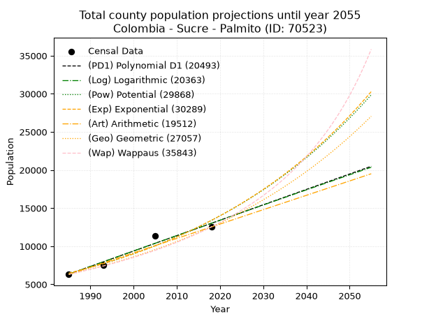
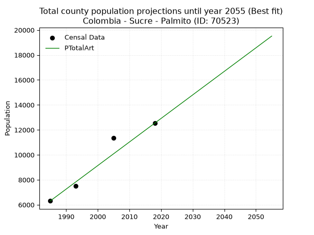
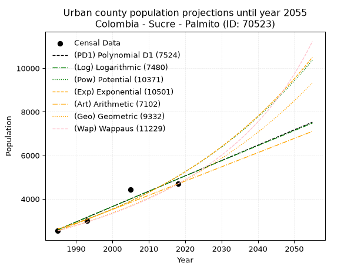
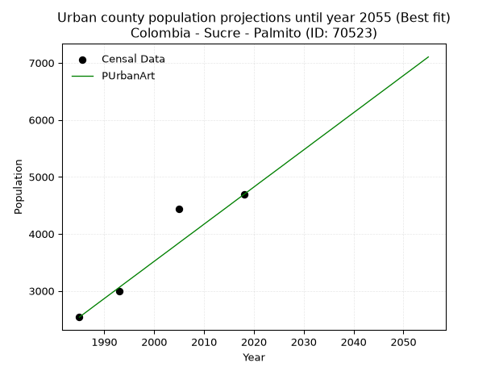
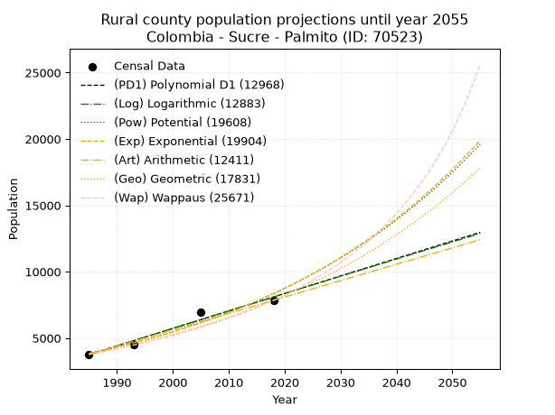
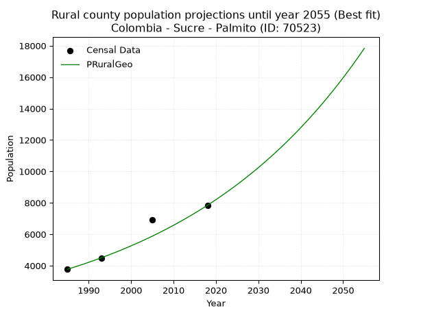

<div align="center">


</div>

# 📜 _“Population and Public Services Demand Projections (PPSD) until Year 2050 for Colombia - Sucre - Palmito (ID: 70523)”_
Keywords: `population` `public-service` `projection` `lineal` `polynomial` `logarithmic` `potential` `exponential` `arithmetic` `geometric` `wappaus` `dane` `colombia` `south-america`

PPSD are analytical estimates used by governments and planners to anticipate future changes in population size, age distribution, and the resulting community needs for utilities, healthcare, education, and infrastructure as sizing future water treatment facilities, electrical grids, and road networks based on spatial growth.

<div align="center">

</img>

</div>


> **General running parameters**: • app_version: _v20260806_. • Python version: _3.14.7_. • Pandas version: _3.0.5_. • NumPy version: _2.5.1_. • Creates, save and include plots into reports (create_plot): _False_. • Projection until year: _2050_. • Process polynomial degree 2 and up: _False_. • Process Wappaus: _True_. • Process Wappaus: _True_. • Set negative values to zero: _True_. • Set infinite values to zero: _True_. • Drop dataset notes: _True_. 
<div align="center">

Maps & GIS Layers: [:earth_americas:Google](http://maps.google.com/maps?q=9.333157117,-75.5412638) [:earth_americas:OSM](https://www.openstreetmap.org/#map=18/9.333157117/-75.5412638&layers=P) [:earth_americas:Bing](https://www.bing.com/maps?cp=9.333157117~-75.5412638&lvl=18) [:earth_americas:Apple](https://maps.apple.com/frame?center=9.333157117%2C-75.5412638&span=0.003%2C0.006) [:earth_americas:GISMobile](https://github.com/rcfdtools/R.GISMobile/blob/main/file/gis/CountyLayer_CO/Readme.md)

</div>


<div align="center">

```geojson
{
  "type": "Feature",
  "geometry": {
    "type": "Point", 
    "coordinates": [-75.5412638, 9.333157117]
  }, 
  "properties": {
    "Name": "Colombia - Sucre - Palmito (ID: 70523)"
  }
}
```

</div>


## 0. Census Data (4 records)

Census data are official statistics collected by a government about the people and housing in a country. They usually include counts of total population, age, sex, race, income, education, and jobs.

📅Global census file: [Population.xlsx](../data/Population.xlsx)

| Source   |   Year |   CountryID | CountryName   |   StateID | StateName   |   CountyID | CountyName   |   PTotal |   PUrban |   PRural |
|:---------|-------:|------------:|:--------------|----------:|:------------|-----------:|:-------------|---------:|---------:|---------:|
| DANE     |   1985 |          57 | Colombia      |        70 | Sucre       |      70523 | Palmito      |     6310 |     2539 |     3771 |
| DANE     |   1993 |          57 | Colombia      |        70 | Sucre       |      70523 | Palmito      |     7492 |     2999 |     4493 |
| DANE     |   2005 |          57 | Colombia      |        70 | Sucre       |      70523 | Palmito      |    11361 |     4440 |     6921 |
| DANE     |   2018 |          57 | Colombia      |        70 | Sucre       |      70523 | Palmito      |    12534 |     4690 |     7844 |

> 🔥Some records could had specific notes about the registered values or the corresponding urban or rural distribution.

📅[SUI-RUPS](https://www.datos.gov.co/Hacienda-y-Cr-dito-P-blico/Registro-nico-de-Prestadores-de-Servicios-P-blicos/4qkq-csdn/about_data) - Local public utility companies: [RUPS.csv](../data/RUPS.csv)

 | SERVICIO       | ESTADO    | NOMBRE                                                                                                    | NIT         | DEPARTAMENTO_DOMICILIO   | MUNICIPIO_DOMICILIO   | DIRECCION          |   TELEFONO | EMAIL                                    | TIPO_PRESTADOR                             | CLASIFICACION                 |
|:---------------|:----------|:----------------------------------------------------------------------------------------------------------|:------------|:-------------------------|:----------------------|:-------------------|-----------:|:-----------------------------------------|:-------------------------------------------|:------------------------------|
| ACUEDUCTO      | OPERATIVA | EMPRESA MUNICIPAL DE ACUEDUCTO ALCANTARILLADO Y ASEO DEL MUNICIPIO DE SAN ANTONIO DE PALMITO SUCRE SA ESP | 900254562-2 | SUCRE                    | PALMITO               | Carrera 7 No 6  08 |    2822784 | ACUAPAL@SANANTONIODEPALMITO_SUCRE.GOV.CO | SOCIEDADES (EMPRESA DE SERVICIOS PUBLICOS) | MENOR O IGUAL A 2500 USUARIOS |
| ALCANTARILLADO | OPERATIVA | EMPRESA MUNICIPAL DE ACUEDUCTO ALCANTARILLADO Y ASEO DEL MUNICIPIO DE SAN ANTONIO DE PALMITO SUCRE SA ESP | 900254562-2 | SUCRE                    | PALMITO               | Carrera 7 No 6  08 |    2822784 | ACUAPAL@SANANTONIODEPALMITO_SUCRE.GOV.CO | SOCIEDADES (EMPRESA DE SERVICIOS PUBLICOS) | MENOR O IGUAL A 2500 USUARIOS |

## 1. Total

### 1.1. Coefficients and Parameters

* (PD1) Polynomial Deg 1: 202.16579686872646, -394957.88518667006 (lineal)
* (Log) Logarithmic: 404787.7539567606, -3067370.7115908214
* (Pow) Potential: 44.15235248722993, -141.7932306050125
* (Exp) Exponential: 0.022048020822774024, 6.367543941587526e-16
* (Art) Arithmetic: Year diff. 2018 - 1985 = 33, Population diff. 12534 - 6310 = 6224, Annual growth = 188.6060606060606
* (Geo) Geometric: Year diff. 2018 - 1985 = 33, Population diff. 12534 - 6310 = 6224, Annual growth % = 0.021015020636326653
* (Wap) Wappaus: i = 2.0017624772453897, Condition values only valid for < 200)

<sub>
Wappaus condition values: ['0.00', '2.00', '4.00', '6.01', '8.01', '10.01', '12.01', '14.01', '16.01', '18.02', '20.02', '22.02', '24.02', '26.02', '28.02', '30.03', '32.03', '34.03', '36.03', '38.03', '40.04', '42.04', '44.04', '46.04', '48.04', '50.04', '52.05', '54.05', '56.05', '58.05', '60.05', '62.05', '64.06', '66.06', '68.06', '70.06', '72.06', '74.07', '76.07', '78.07', '80.07', '82.07', '84.07', '86.08', '88.08', '90.08', '92.08', '94.08', '96.08', '98.09', '100.09', '102.09', '104.09', '106.09', '108.10', '110.10', '112.10', '114.10', '116.10', '118.10', '120.11', '122.11', '124.11', '126.11', '128.11', '130.11']
</sub>


### 1.2. Projected Dataset

|   Year |   CountyID |   PTotalPD1 |   PTotalLog |   PTotalPow |   PTotalExp |   PTotalArt |   PTotalGeo |   PTotalWap |
|-------:|-----------:|------------:|------------:|------------:|------------:|------------:|------------:|------------:|
|   1985 |      70523 |        6341 |        6334 |        6466 |        6472 |        6310 |        6310 |        6310 |
|   1986 |      70523 |        6543 |        6538 |        6612 |        6616 |        6499 |        6443 |        6438 |
|   1987 |      70523 |        6746 |        6742 |        6760 |        6763 |        6687 |        6578 |        6568 |
|   1988 |      70523 |        6948 |        6945 |        6912 |        6914 |        6876 |        6716 |        6701 |
|   1989 |      70523 |        7150 |        7149 |        7067 |        7068 |        7064 |        6857 |        6836 |
|   1990 |      70523 |        7352 |        7353 |        7226 |        7226 |        7253 |        7001 |        6975 |
|   1991 |      70523 |        7554 |        7556 |        7388 |        7387 |        7442 |        7149 |        7116 |
|   1992 |      70523 |        7756 |        7759 |        7554 |        7552 |        7630 |        7299 |        7261 |
|   1993 |      70523 |        7959 |        7962 |        7723 |        7720 |        7819 |        7452 |        7408 |
|   1994 |      70523 |        8161 |        8165 |        7896 |        7892 |        8007 |        7609 |        7559 |
|   1995 |      70523 |        8363 |        8368 |        8073 |        8068 |        8196 |        7769 |        7714 |
|   1996 |      70523 |        8565 |        8571 |        8253 |        8248 |        8385 |        7932 |        7871 |
|   1997 |      70523 |        8767 |        8774 |        8438 |        8432 |        8573 |        8099 |        8033 |
|   1998 |      70523 |        8969 |        8977 |        8626 |        8620 |        8762 |        8269 |        8198 |
|   1999 |      70523 |        9172 |        9179 |        8819 |        8812 |        8950 |        8443 |        8367 |
|   2000 |      70523 |        9374 |        9382 |        9016 |        9008 |        9139 |        8620 |        8539 |
|   2001 |      70523 |        9576 |        9584 |        9217 |        9209 |        9328 |        8801 |        8716 |
|   2002 |      70523 |        9778 |        9786 |        9423 |        9414 |        9516 |        8986 |        8898 |
|   2003 |      70523 |        9980 |        9988 |        9633 |        9624 |        9705 |        9175 |        9083 |
|   2004 |      70523 |       10182 |       10190 |        9847 |        9839 |        9894 |        9368 |        9273 |
|   2005 |      70523 |       10385 |       10392 |       10067 |       10058 |       10082 |        9565 |        9468 |
|   2006 |      70523 |       10587 |       10594 |       10291 |       10282 |       10271 |        9766 |        9668 |
|   2007 |      70523 |       10789 |       10796 |       10520 |       10512 |       10459 |        9971 |        9874 |
|   2008 |      70523 |       10991 |       10997 |       10754 |       10746 |       10648 |       10180 |       10084 |
|   2009 |      70523 |       11193 |       11199 |       10993 |       10985 |       10837 |       10394 |       10300 |
|   2010 |      70523 |       11395 |       11400 |       11237 |       11230 |       11025 |       10613 |       10522 |
|   2011 |      70523 |       11598 |       11602 |       11486 |       11481 |       11214 |       10836 |       10749 |
|   2012 |      70523 |       11800 |       11803 |       11741 |       11737 |       11402 |       11064 |       10983 |
|   2013 |      70523 |       12002 |       12004 |       12002 |       11998 |       11591 |       11296 |       11224 |
|   2014 |      70523 |       12204 |       12205 |       12268 |       12266 |       11780 |       11534 |       11471 |
|   2015 |      70523 |       12406 |       12406 |       12540 |       12539 |       11968 |       11776 |       11725 |
|   2016 |      70523 |       12608 |       12607 |       12817 |       12819 |       12157 |       12023 |       11987 |
|   2017 |      70523 |       12811 |       12808 |       13101 |       13104 |       12345 |       12276 |       12257 |
|   2018 |      70523 |       13013 |       13008 |       13391 |       13397 |       12534 |       12534 |       12534 |
|   2019 |      70523 |       13215 |       13209 |       13687 |       13695 |       12723 |       12797 |       12820 |
|   2020 |      70523 |       13417 |       13409 |       13990 |       14001 |       12911 |       13066 |       13115 |
|   2021 |      70523 |       13619 |       13610 |       14299 |       14313 |       13100 |       13341 |       13419 |
|   2022 |      70523 |       13821 |       13810 |       14615 |       14632 |       13288 |       13621 |       13732 |
|   2023 |      70523 |       14024 |       14010 |       14937 |       14958 |       13477 |       13908 |       14056 |
|   2024 |      70523 |       14226 |       14210 |       15267 |       15291 |       13666 |       14200 |       14390 |
|   2025 |      70523 |       14428 |       14410 |       15603 |       15632 |       13854 |       14498 |       14736 |
|   2026 |      70523 |       14630 |       14610 |       15947 |       15981 |       14043 |       14803 |       15093 |
|   2027 |      70523 |       14832 |       14810 |       16298 |       16337 |       14231 |       15114 |       15463 |
|   2028 |      70523 |       15034 |       15009 |       16657 |       16701 |       14420 |       15432 |       15845 |
|   2029 |      70523 |       15237 |       15209 |       17024 |       17074 |       14609 |       15756 |       16241 |
|   2030 |      70523 |       15439 |       15408 |       17398 |       17454 |       14797 |       16087 |       16652 |
|   2031 |      70523 |       15641 |       15608 |       17780 |       17843 |       14986 |       16425 |       17078 |
|   2032 |      70523 |       15843 |       15807 |       18171 |       18241 |       15174 |       16770 |       17520 |
|   2033 |      70523 |       16045 |       16006 |       18570 |       18648 |       15363 |       17123 |       17979 |
|   2034 |      70523 |       16247 |       16205 |       18978 |       19063 |       15552 |       17483 |       18456 |
|   2035 |      70523 |       16450 |       16404 |       19394 |       19488 |       15740 |       17850 |       18952 |
|   2036 |      70523 |       16652 |       16603 |       19819 |       19923 |       15929 |       18225 |       19469 |
|   2037 |      70523 |       16854 |       16802 |       20254 |       20367 |       16118 |       18608 |       20007 |
|   2038 |      70523 |       17056 |       17000 |       20698 |       20821 |       16306 |       18999 |       20568 |
|   2039 |      70523 |       17258 |       17199 |       21151 |       21285 |       16495 |       19398 |       21153 |
|   2040 |      70523 |       17460 |       17397 |       21614 |       21760 |       16683 |       19806 |       21765 |
|   2041 |      70523 |       17663 |       17596 |       22086 |       22245 |       16872 |       20222 |       22404 |
|   2042 |      70523 |       17865 |       17794 |       22569 |       22741 |       17061 |       20647 |       23073 |
|   2043 |      70523 |       18067 |       17992 |       23062 |       23248 |       17249 |       21081 |       23774 |
|   2044 |      70523 |       18269 |       18190 |       23566 |       23766 |       17438 |       21524 |       24510 |
|   2045 |      70523 |       18471 |       18388 |       24081 |       24296 |       17626 |       21976 |       25282 |
|   2046 |      70523 |       18673 |       18586 |       24606 |       24837 |       17815 |       22438 |       26094 |
|   2047 |      70523 |       18876 |       18784 |       25143 |       25391 |       18004 |       22910 |       26948 |
|   2048 |      70523 |       19078 |       18982 |       25691 |       25957 |       18192 |       23391 |       27849 |
|   2049 |      70523 |       19280 |       19179 |       26250 |       26536 |       18381 |       23883 |       28801 |
|   2050 |      70523 |       19482 |       19377 |       26822 |       27127 |       18569 |       24385 |       29806 |
<div align="center">

</img>

</div>


### 1.3. Best fit with absolute and relative error (%)

Relative error puts that difference into context by dividing the absolute error by the true value, creating a unitless ratio or percentage that shows the scale of the mistake.

Absolute and relative error

|   Year | Source   |   CountryID | CountryName   |   StateID | StateName   |   CountyID_x | CountyName   |   PTotal |   PUrban |   PRural |   CountyID_y |   PTotalPD1 |   PTotalLog |   PTotalPow |   PTotalExp |   PTotalArt |   PTotalGeo |   PTotalWap |   PTotalPD1AbsError |   PTotalLogAbsError |   PTotalPowAbsError |   PTotalExpAbsError |   PTotalArtAbsError |   PTotalGeoAbsError |   PTotalWapAbsError |   PTotalPD1RelError |   PTotalLogRelError |   PTotalPowRelError |   PTotalExpRelError |   PTotalArtRelError |   PTotalGeoRelError |   PTotalWapRelError |
|-------:|:---------|------------:|:--------------|----------:|:------------|-------------:|:-------------|---------:|---------:|---------:|-------------:|------------:|------------:|------------:|------------:|------------:|------------:|------------:|--------------------:|--------------------:|--------------------:|--------------------:|--------------------:|--------------------:|--------------------:|--------------------:|--------------------:|--------------------:|--------------------:|--------------------:|--------------------:|--------------------:|
|   1985 | DANE     |          57 | Colombia      |        70 | Sucre       |        70523 | Palmito      |     6310 |     2539 |     3771 |        70523 |        6341 |        6334 |        6466 |        6472 |        6310 |        6310 |        6310 |                  31 |                  24 |                 156 |                 162 |                   0 |                   0 |                   0 |            0.491284 |            0.380349 |             2.47227 |             2.56735 |             0       |            0        |              0      |
|   1993 | DANE     |          57 | Colombia      |        70 | Sucre       |        70523 | Palmito      |     7492 |     2999 |     4493 |        70523 |        7959 |        7962 |        7723 |        7720 |        7819 |        7452 |        7408 |                 467 |                 470 |                 231 |                 228 |                 327 |                  40 |                  84 |            6.23332  |            6.27336  |             3.08329 |             3.04325 |             4.36466 |            0.533903 |              1.1212 |
|   2005 | DANE     |          57 | Colombia      |        70 | Sucre       |        70523 | Palmito      |    11361 |     4440 |     6921 |        70523 |       10385 |       10392 |       10067 |       10058 |       10082 |        9565 |        9468 |                 976 |                 969 |                1294 |                1303 |                1279 |                1796 |                1893 |            8.59079  |            8.52918  |            11.3898  |            11.4691  |            11.2578  |           15.8085   |             16.6623 |
|   2018 | DANE     |          57 | Colombia      |        70 | Sucre       |        70523 | Palmito      |    12534 |     4690 |     7844 |        70523 |       13013 |       13008 |       13391 |       13397 |       12534 |       12534 |       12534 |                 479 |                 474 |                 857 |                 863 |                   0 |                   0 |                   0 |            3.82161  |            3.78171  |             6.8374  |             6.88527 |             0       |            0        |              0      |

Relative error mean

| Method    |   RelError | Best   |
|:----------|-----------:|:-------|
| PTotalPD1 |    4.78425 |        |
| PTotalLog |    4.74115 |        |
| PTotalPow |    5.9457  |        |
| PTotalExp |    5.99123 |        |
| PTotalArt |    3.90562 | True   |
| PTotalGeo |    4.08559 |        |
| PTotalWap |    4.44587 |        |

💙Best method: _**PTotalArt**_
<div align="center">

</img>

</div>


### 1.4. Fresh water supply demand in liters per capita per day (lpcd)

The fresh water supply demand typically ranges from 100 to 300 liters per capita per day (lpcd) for standard domestic and municipal planning, though absolute survival minimums set by the World Health Organization are as low as 7.5 to 20 liters per day, and total consumption in high-income nations can exceed 400 liters.

> `CZ`: Level in meters above the sea level (masl)<br> `WS`: Fresh water supply demand in liters per capita per day (lpcd or l/h/d)<br> `WSAll`: Zonal fresh water supply demand in liters per second (l/s)<br> `A`: Zonal area in square meters<br> `DP`: Population density (people/hectare or p/ha)

Reference values (RAS Colombia)

|    CZ |   WS |
|------:|-----:|
|  1000 |  120 |
|  2000 |  130 |
| 99999 |  140 |

County shapefile geometry properties and water supply values

|   CountyID |      ATotal |   CZTotal |   WSTotal |
|-----------:|------------:|----------:|----------:|
|      70523 | 1.74595e+08 |   36.1096 |       120 |

Projected values for best method: PTotalArt

|   CountyID |   Year |   PTotalArt |   DPTotal |   WSTotal |   WSTotalAll |
|-----------:|-------:|------------:|----------:|----------:|-------------:|
|      70523 |   1985 |        6310 |      0.36 |       120 |      8.76389 |
|      70523 |   1986 |        6499 |      0.37 |       120 |      9.02639 |
|      70523 |   1987 |        6687 |      0.38 |       120 |      9.2875  |
|      70523 |   1988 |        6876 |      0.39 |       120 |      9.55    |
|      70523 |   1989 |        7064 |      0.4  |       120 |      9.81111 |
|      70523 |   1990 |        7253 |      0.42 |       120 |     10.0736  |
|      70523 |   1991 |        7442 |      0.43 |       120 |     10.3361  |
|      70523 |   1992 |        7630 |      0.44 |       120 |     10.5972  |
|      70523 |   1993 |        7819 |      0.45 |       120 |     10.8597  |
|      70523 |   1994 |        8007 |      0.46 |       120 |     11.1208  |
|      70523 |   1995 |        8196 |      0.47 |       120 |     11.3833  |
|      70523 |   1996 |        8385 |      0.48 |       120 |     11.6458  |
|      70523 |   1997 |        8573 |      0.49 |       120 |     11.9069  |
|      70523 |   1998 |        8762 |      0.5  |       120 |     12.1694  |
|      70523 |   1999 |        8950 |      0.51 |       120 |     12.4306  |
|      70523 |   2000 |        9139 |      0.52 |       120 |     12.6931  |
|      70523 |   2001 |        9328 |      0.53 |       120 |     12.9556  |
|      70523 |   2002 |        9516 |      0.55 |       120 |     13.2167  |
|      70523 |   2003 |        9705 |      0.56 |       120 |     13.4792  |
|      70523 |   2004 |        9894 |      0.57 |       120 |     13.7417  |
|      70523 |   2005 |       10082 |      0.58 |       120 |     14.0028  |
|      70523 |   2006 |       10271 |      0.59 |       120 |     14.2653  |
|      70523 |   2007 |       10459 |      0.6  |       120 |     14.5264  |
|      70523 |   2008 |       10648 |      0.61 |       120 |     14.7889  |
|      70523 |   2009 |       10837 |      0.62 |       120 |     15.0514  |
|      70523 |   2010 |       11025 |      0.63 |       120 |     15.3125  |
|      70523 |   2011 |       11214 |      0.64 |       120 |     15.575   |
|      70523 |   2012 |       11402 |      0.65 |       120 |     15.8361  |
|      70523 |   2013 |       11591 |      0.66 |       120 |     16.0986  |
|      70523 |   2014 |       11780 |      0.67 |       120 |     16.3611  |
|      70523 |   2015 |       11968 |      0.69 |       120 |     16.6222  |
|      70523 |   2016 |       12157 |      0.7  |       120 |     16.8847  |
|      70523 |   2017 |       12345 |      0.71 |       120 |     17.1458  |
|      70523 |   2018 |       12534 |      0.72 |       120 |     17.4083  |
|      70523 |   2019 |       12723 |      0.73 |       120 |     17.6708  |
|      70523 |   2020 |       12911 |      0.74 |       120 |     17.9319  |
|      70523 |   2021 |       13100 |      0.75 |       120 |     18.1944  |
|      70523 |   2022 |       13288 |      0.76 |       120 |     18.4556  |
|      70523 |   2023 |       13477 |      0.77 |       120 |     18.7181  |
|      70523 |   2024 |       13666 |      0.78 |       120 |     18.9806  |
|      70523 |   2025 |       13854 |      0.79 |       120 |     19.2417  |
|      70523 |   2026 |       14043 |      0.8  |       120 |     19.5042  |
|      70523 |   2027 |       14231 |      0.82 |       120 |     19.7653  |
|      70523 |   2028 |       14420 |      0.83 |       120 |     20.0278  |
|      70523 |   2029 |       14609 |      0.84 |       120 |     20.2903  |
|      70523 |   2030 |       14797 |      0.85 |       120 |     20.5514  |
|      70523 |   2031 |       14986 |      0.86 |       120 |     20.8139  |
|      70523 |   2032 |       15174 |      0.87 |       120 |     21.075   |
|      70523 |   2033 |       15363 |      0.88 |       120 |     21.3375  |
|      70523 |   2034 |       15552 |      0.89 |       120 |     21.6     |
|      70523 |   2035 |       15740 |      0.9  |       120 |     21.8611  |
|      70523 |   2036 |       15929 |      0.91 |       120 |     22.1236  |
|      70523 |   2037 |       16118 |      0.92 |       120 |     22.3861  |
|      70523 |   2038 |       16306 |      0.93 |       120 |     22.6472  |
|      70523 |   2039 |       16495 |      0.94 |       120 |     22.9097  |
|      70523 |   2040 |       16683 |      0.96 |       120 |     23.1708  |
|      70523 |   2041 |       16872 |      0.97 |       120 |     23.4333  |
|      70523 |   2042 |       17061 |      0.98 |       120 |     23.6958  |
|      70523 |   2043 |       17249 |      0.99 |       120 |     23.9569  |
|      70523 |   2044 |       17438 |      1    |       120 |     24.2194  |
|      70523 |   2045 |       17626 |      1.01 |       120 |     24.4806  |
|      70523 |   2046 |       17815 |      1.02 |       120 |     24.7431  |
|      70523 |   2047 |       18004 |      1.03 |       120 |     25.0056  |
|      70523 |   2048 |       18192 |      1.04 |       120 |     25.2667  |
|      70523 |   2049 |       18381 |      1.05 |       120 |     25.5292  |
|      70523 |   2050 |       18569 |      1.06 |       120 |     25.7903  |

## 2. Urban

### 2.1. Coefficients and Parameters

* (PD1) Polynomial Deg 1: 70.45363307908445, -137257.8795664387 (lineal)
* (Log) Logarithmic: 141087.54989563636, -1068740.5973614012
* (Pow) Potential: 39.68599201830654, -127.45642058065646
* (Exp) Exponential: 0.01981536328689502, 2.1701585005974908e-14
* (Art) Arithmetic: Year diff. 2018 - 1985 = 33, Population diff. 4690 - 2539 = 2151, Annual growth = 65.18181818181819
* (Geo) Geometric: Year diff. 2018 - 1985 = 33, Population diff. 4690 - 2539 = 2151, Annual growth % = 0.018769805798600325
* (Wap) Wappaus: i = 1.803342597366667, Condition values only valid for < 200)

<sub>
Wappaus condition values: ['0.00', '1.80', '3.61', '5.41', '7.21', '9.02', '10.82', '12.62', '14.43', '16.23', '18.03', '19.84', '21.64', '23.44', '25.25', '27.05', '28.85', '30.66', '32.46', '34.26', '36.07', '37.87', '39.67', '41.48', '43.28', '45.08', '46.89', '48.69', '50.49', '52.30', '54.10', '55.90', '57.71', '59.51', '61.31', '63.12', '64.92', '66.72', '68.53', '70.33', '72.13', '73.94', '75.74', '77.54', '79.35', '81.15', '82.95', '84.76', '86.56', '88.36', '90.17', '91.97', '93.77', '95.58', '97.38', '99.18', '100.99', '102.79', '104.59', '106.40', '108.20', '110.00', '111.81', '113.61', '115.41', '117.22']
</sub>


### 2.2. Projected Dataset

|   Year |   CountyID |   PUrbanPD1 |   PUrbanLog |   PUrbanPow |   PUrbanExp |   PUrbanArt |   PUrbanGeo |   PUrbanWap |
|-------:|-----------:|------------:|------------:|------------:|------------:|------------:|------------:|------------:|
|   1985 |      70523 |        2593 |        2590 |        2621 |        2623 |        2539 |        2539 |        2539 |
|   1986 |      70523 |        2663 |        2661 |        2674 |        2676 |        2604 |        2587 |        2585 |
|   1987 |      70523 |        2733 |        2732 |        2728 |        2729 |        2669 |        2635 |        2632 |
|   1988 |      70523 |        2804 |        2803 |        2783 |        2784 |        2735 |        2685 |        2680 |
|   1989 |      70523 |        2874 |        2874 |        2839 |        2839 |        2800 |        2735 |        2729 |
|   1990 |      70523 |        2945 |        2945 |        2896 |        2896 |        2865 |        2786 |        2779 |
|   1991 |      70523 |        3015 |        3016 |        2955 |        2954 |        2930 |        2839 |        2829 |
|   1992 |      70523 |        3086 |        3087 |        3014 |        3013 |        2995 |        2892 |        2881 |
|   1993 |      70523 |        3156 |        3157 |        3075 |        3074 |        3060 |        2946 |        2934 |
|   1994 |      70523 |        3227 |        3228 |        3137 |        3135 |        3126 |        3002 |        2987 |
|   1995 |      70523 |        3297 |        3299 |        3200 |        3198 |        3191 |        3058 |        3042 |
|   1996 |      70523 |        3368 |        3370 |        3264 |        3262 |        3256 |        3115 |        3098 |
|   1997 |      70523 |        3438 |        3440 |        3329 |        3327 |        3321 |        3174 |        3155 |
|   1998 |      70523 |        3508 |        3511 |        3396 |        3394 |        3386 |        3233 |        3213 |
|   1999 |      70523 |        3579 |        3582 |        3464 |        3462 |        3452 |        3294 |        3273 |
|   2000 |      70523 |        3649 |        3652 |        3534 |        3531 |        3517 |        3356 |        3333 |
|   2001 |      70523 |        3720 |        3723 |        3604 |        3602 |        3582 |        3419 |        3395 |
|   2002 |      70523 |        3790 |        3793 |        3677 |        3674 |        3647 |        3483 |        3458 |
|   2003 |      70523 |        3861 |        3864 |        3750 |        3747 |        3712 |        3548 |        3523 |
|   2004 |      70523 |        3931 |        3934 |        3825 |        3822 |        3777 |        3615 |        3589 |
|   2005 |      70523 |        4002 |        4004 |        3902 |        3899 |        3843 |        3683 |        3656 |
|   2006 |      70523 |        4072 |        4075 |        3980 |        3977 |        3908 |        3752 |        3725 |
|   2007 |      70523 |        4143 |        4145 |        4059 |        4056 |        3973 |        3822 |        3796 |
|   2008 |      70523 |        4213 |        4215 |        4140 |        4138 |        4038 |        3894 |        3868 |
|   2009 |      70523 |        4283 |        4286 |        4223 |        4220 |        4103 |        3967 |        3941 |
|   2010 |      70523 |        4354 |        4356 |        4307 |        4305 |        4169 |        4042 |        4017 |
|   2011 |      70523 |        4424 |        4426 |        4393 |        4391 |        4234 |        4118 |        4094 |
|   2012 |      70523 |        4495 |        4496 |        4481 |        4479 |        4299 |        4195 |        4173 |
|   2013 |      70523 |        4565 |        4566 |        4570 |        4568 |        4364 |        4274 |        4254 |
|   2014 |      70523 |        4636 |        4636 |        4661 |        4660 |        4429 |        4354 |        4337 |
|   2015 |      70523 |        4706 |        4706 |        4753 |        4753 |        4494 |        4436 |        4422 |
|   2016 |      70523 |        4777 |        4776 |        4848 |        4848 |        4560 |        4519 |        4509 |
|   2017 |      70523 |        4847 |        4846 |        4944 |        4945 |        4625 |        4604 |        4598 |
|   2018 |      70523 |        4918 |        4916 |        5043 |        5044 |        4690 |        4690 |        4690 |
|   2019 |      70523 |        4988 |        4986 |        5143 |        5145 |        4755 |        4778 |        4784 |
|   2020 |      70523 |        5058 |        5056 |        5245 |        5248 |        4820 |        4868 |        4880 |
|   2021 |      70523 |        5129 |        5126 |        5349 |        5353 |        4886 |        4959 |        4980 |
|   2022 |      70523 |        5199 |        5196 |        5455 |        5460 |        4951 |        5052 |        5081 |
|   2023 |      70523 |        5270 |        5265 |        5563 |        5570 |        5016 |        5147 |        5186 |
|   2024 |      70523 |        5340 |        5335 |        5673 |        5681 |        5081 |        5244 |        5293 |
|   2025 |      70523 |        5411 |        5405 |        5785 |        5795 |        5146 |        5342 |        5404 |
|   2026 |      70523 |        5481 |        5474 |        5900 |        5911 |        5211 |        5442 |        5517 |
|   2027 |      70523 |        5552 |        5544 |        6017 |        6029 |        5277 |        5544 |        5634 |
|   2028 |      70523 |        5622 |        5614 |        6136 |        6150 |        5342 |        5649 |        5755 |
|   2029 |      70523 |        5693 |        5683 |        6257 |        6273 |        5407 |        5755 |        5879 |
|   2030 |      70523 |        5763 |        5753 |        6380 |        6398 |        5472 |        5863 |        6006 |
|   2031 |      70523 |        5833 |        5822 |        6506 |        6526 |        5537 |        5973 |        6138 |
|   2032 |      70523 |        5904 |        5892 |        6635 |        6657 |        5603 |        6085 |        6274 |
|   2033 |      70523 |        5974 |        5961 |        6765 |        6790 |        5668 |        6199 |        6414 |
|   2034 |      70523 |        6045 |        6030 |        6899 |        6926 |        5733 |        6315 |        6558 |
|   2035 |      70523 |        6115 |        6100 |        7035 |        7065 |        5798 |        6434 |        6708 |
|   2036 |      70523 |        6186 |        6169 |        7173 |        7206 |        5863 |        6555 |        6862 |
|   2037 |      70523 |        6256 |        6238 |        7314 |        7350 |        5928 |        6678 |        7022 |
|   2038 |      70523 |        6327 |        6308 |        7458 |        7497 |        5994 |        6803 |        7187 |
|   2039 |      70523 |        6397 |        6377 |        7605 |        7648 |        6059 |        6931 |        7358 |
|   2040 |      70523 |        6468 |        6446 |        7754 |        7801 |        6124 |        7061 |        7535 |
|   2041 |      70523 |        6538 |        6515 |        7906 |        7957 |        6189 |        7193 |        7718 |
|   2042 |      70523 |        6608 |        6584 |        8062 |        8116 |        6254 |        7328 |        7909 |
|   2043 |      70523 |        6679 |        6653 |        8220 |        8278 |        6320 |        7466 |        8106 |
|   2044 |      70523 |        6749 |        6722 |        8381 |        8444 |        6385 |        7606 |        8311 |
|   2045 |      70523 |        6820 |        6791 |        8545 |        8613 |        6450 |        7749 |        8524 |
|   2046 |      70523 |        6890 |        6860 |        8713 |        8785 |        6515 |        7894 |        8746 |
|   2047 |      70523 |        6961 |        6929 |        8883 |        8961 |        6580 |        8042 |        8977 |
|   2048 |      70523 |        7031 |        6998 |        9057 |        9141 |        6645 |        8193 |        9217 |
|   2049 |      70523 |        7102 |        7067 |        9234 |        9323 |        6711 |        8347 |        9468 |
|   2050 |      70523 |        7172 |        7136 |        9415 |        9510 |        6776 |        8504 |        9729 |
<div align="center">

</img>

</div>


### 2.3. Best fit with absolute and relative error (%)

Relative error puts that difference into context by dividing the absolute error by the true value, creating a unitless ratio or percentage that shows the scale of the mistake.

Absolute and relative error

|   Year | Source   |   CountryID | CountryName   |   StateID | StateName   |   CountyID_x | CountyName   |   PTotal |   PUrban |   PRural |   CountyID_y |   PUrbanPD1 |   PUrbanLog |   PUrbanPow |   PUrbanExp |   PUrbanArt |   PUrbanGeo |   PUrbanWap |   PUrbanPD1AbsError |   PUrbanLogAbsError |   PUrbanPowAbsError |   PUrbanExpAbsError |   PUrbanArtAbsError |   PUrbanGeoAbsError |   PUrbanWapAbsError |   PUrbanPD1RelError |   PUrbanLogRelError |   PUrbanPowRelError |   PUrbanExpRelError |   PUrbanArtRelError |   PUrbanGeoRelError |   PUrbanWapRelError |
|-------:|:---------|------------:|:--------------|----------:|:------------|-------------:|:-------------|---------:|---------:|---------:|-------------:|------------:|------------:|------------:|------------:|------------:|------------:|------------:|--------------------:|--------------------:|--------------------:|--------------------:|--------------------:|--------------------:|--------------------:|--------------------:|--------------------:|--------------------:|--------------------:|--------------------:|--------------------:|--------------------:|
|   1985 | DANE     |          57 | Colombia      |        70 | Sucre       |        70523 | Palmito      |     6310 |     2539 |     3771 |        70523 |        2593 |        2590 |        2621 |        2623 |        2539 |        2539 |        2539 |                  54 |                  51 |                  82 |                  84 |                   0 |                   0 |                   0 |             2.12682 |             2.00866 |             3.22962 |             3.30839 |             0       |             0       |             0       |
|   1993 | DANE     |          57 | Colombia      |        70 | Sucre       |        70523 | Palmito      |     7492 |     2999 |     4493 |        70523 |        3156 |        3157 |        3075 |        3074 |        3060 |        2946 |        2934 |                 157 |                 158 |                  76 |                  75 |                  61 |                  53 |                  65 |             5.23508 |             5.26842 |             2.53418 |             2.50083 |             2.03401 |             1.76726 |             2.16739 |
|   2005 | DANE     |          57 | Colombia      |        70 | Sucre       |        70523 | Palmito      |    11361 |     4440 |     6921 |        70523 |        4002 |        4004 |        3902 |        3899 |        3843 |        3683 |        3656 |                 438 |                 436 |                 538 |                 541 |                 597 |                 757 |                 784 |             9.86486 |             9.81982 |            12.1171  |            12.1847  |            13.4459  |            17.0495  |            17.6577  |
|   2018 | DANE     |          57 | Colombia      |        70 | Sucre       |        70523 | Palmito      |    12534 |     4690 |     7844 |        70523 |        4918 |        4916 |        5043 |        5044 |        4690 |        4690 |        4690 |                 228 |                 226 |                 353 |                 354 |                   0 |                   0 |                   0 |             4.86141 |             4.81876 |             7.52665 |             7.54797 |             0       |             0       |             0       |

Relative error mean

| Method    |   RelError | Best   |
|:----------|-----------:|:-------|
| PUrbanPD1 |    5.52204 |        |
| PUrbanLog |    5.47892 |        |
| PUrbanPow |    6.35189 |        |
| PUrbanExp |    6.38547 |        |
| PUrbanArt |    3.86999 | True   |
| PUrbanGeo |    4.7042  |        |
| PUrbanWap |    4.95626 |        |

💙Best method: _**PUrbanArt**_
<div align="center">

</img>

</div>


### 2.4. Fresh water supply demand in liters per capita per day (lpcd)

The fresh water supply demand typically ranges from 100 to 300 liters per capita per day (lpcd) for standard domestic and municipal planning, though absolute survival minimums set by the World Health Organization are as low as 7.5 to 20 liters per day, and total consumption in high-income nations can exceed 400 liters.

> `CZ`: Level in meters above the sea level (masl)<br> `WS`: Fresh water supply demand in liters per capita per day (lpcd or l/h/d)<br> `WSAll`: Zonal fresh water supply demand in liters per second (l/s)<br> `A`: Zonal area in square meters<br> `DP`: Population density (people/hectare or p/ha)

Reference values (RAS Colombia)

|    CZ |   WS |
|------:|-----:|
|  1000 |  120 |
|  2000 |  130 |
| 99999 |  140 |

County shapefile geometry properties and water supply values

|   CountyID |   AUrban |   CZUrban |   WSUrban |
|-----------:|---------:|----------:|----------:|
|      70523 |   735076 |   34.0924 |       120 |

Projected values for best method: PUrbanArt

|   CountyID |   Year |   PUrbanArt |   DPUrban |   WSUrban |   WSUrbanAll |
|-----------:|-------:|------------:|----------:|----------:|-------------:|
|      70523 |   1985 |        2539 |     34.54 |       120 |      3.52639 |
|      70523 |   1986 |        2604 |     35.42 |       120 |      3.61667 |
|      70523 |   1987 |        2669 |     36.31 |       120 |      3.70694 |
|      70523 |   1988 |        2735 |     37.21 |       120 |      3.79861 |
|      70523 |   1989 |        2800 |     38.09 |       120 |      3.88889 |
|      70523 |   1990 |        2865 |     38.98 |       120 |      3.97917 |
|      70523 |   1991 |        2930 |     39.86 |       120 |      4.06944 |
|      70523 |   1992 |        2995 |     40.74 |       120 |      4.15972 |
|      70523 |   1993 |        3060 |     41.63 |       120 |      4.25    |
|      70523 |   1994 |        3126 |     42.53 |       120 |      4.34167 |
|      70523 |   1995 |        3191 |     43.41 |       120 |      4.43194 |
|      70523 |   1996 |        3256 |     44.29 |       120 |      4.52222 |
|      70523 |   1997 |        3321 |     45.18 |       120 |      4.6125  |
|      70523 |   1998 |        3386 |     46.06 |       120 |      4.70278 |
|      70523 |   1999 |        3452 |     46.96 |       120 |      4.79444 |
|      70523 |   2000 |        3517 |     47.85 |       120 |      4.88472 |
|      70523 |   2001 |        3582 |     48.73 |       120 |      4.975   |
|      70523 |   2002 |        3647 |     49.61 |       120 |      5.06528 |
|      70523 |   2003 |        3712 |     50.5  |       120 |      5.15556 |
|      70523 |   2004 |        3777 |     51.38 |       120 |      5.24583 |
|      70523 |   2005 |        3843 |     52.28 |       120 |      5.3375  |
|      70523 |   2006 |        3908 |     53.16 |       120 |      5.42778 |
|      70523 |   2007 |        3973 |     54.05 |       120 |      5.51806 |
|      70523 |   2008 |        4038 |     54.93 |       120 |      5.60833 |
|      70523 |   2009 |        4103 |     55.82 |       120 |      5.69861 |
|      70523 |   2010 |        4169 |     56.72 |       120 |      5.79028 |
|      70523 |   2011 |        4234 |     57.6  |       120 |      5.88056 |
|      70523 |   2012 |        4299 |     58.48 |       120 |      5.97083 |
|      70523 |   2013 |        4364 |     59.37 |       120 |      6.06111 |
|      70523 |   2014 |        4429 |     60.25 |       120 |      6.15139 |
|      70523 |   2015 |        4494 |     61.14 |       120 |      6.24167 |
|      70523 |   2016 |        4560 |     62.03 |       120 |      6.33333 |
|      70523 |   2017 |        4625 |     62.92 |       120 |      6.42361 |
|      70523 |   2018 |        4690 |     63.8  |       120 |      6.51389 |
|      70523 |   2019 |        4755 |     64.69 |       120 |      6.60417 |
|      70523 |   2020 |        4820 |     65.57 |       120 |      6.69444 |
|      70523 |   2021 |        4886 |     66.47 |       120 |      6.78611 |
|      70523 |   2022 |        4951 |     67.35 |       120 |      6.87639 |
|      70523 |   2023 |        5016 |     68.24 |       120 |      6.96667 |
|      70523 |   2024 |        5081 |     69.12 |       120 |      7.05694 |
|      70523 |   2025 |        5146 |     70.01 |       120 |      7.14722 |
|      70523 |   2026 |        5211 |     70.89 |       120 |      7.2375  |
|      70523 |   2027 |        5277 |     71.79 |       120 |      7.32917 |
|      70523 |   2028 |        5342 |     72.67 |       120 |      7.41944 |
|      70523 |   2029 |        5407 |     73.56 |       120 |      7.50972 |
|      70523 |   2030 |        5472 |     74.44 |       120 |      7.6     |
|      70523 |   2031 |        5537 |     75.33 |       120 |      7.69028 |
|      70523 |   2032 |        5603 |     76.22 |       120 |      7.78194 |
|      70523 |   2033 |        5668 |     77.11 |       120 |      7.87222 |
|      70523 |   2034 |        5733 |     77.99 |       120 |      7.9625  |
|      70523 |   2035 |        5798 |     78.88 |       120 |      8.05278 |
|      70523 |   2036 |        5863 |     79.76 |       120 |      8.14306 |
|      70523 |   2037 |        5928 |     80.64 |       120 |      8.23333 |
|      70523 |   2038 |        5994 |     81.54 |       120 |      8.325   |
|      70523 |   2039 |        6059 |     82.43 |       120 |      8.41528 |
|      70523 |   2040 |        6124 |     83.31 |       120 |      8.50556 |
|      70523 |   2041 |        6189 |     84.2  |       120 |      8.59583 |
|      70523 |   2042 |        6254 |     85.08 |       120 |      8.68611 |
|      70523 |   2043 |        6320 |     85.98 |       120 |      8.77778 |
|      70523 |   2044 |        6385 |     86.86 |       120 |      8.86806 |
|      70523 |   2045 |        6450 |     87.75 |       120 |      8.95833 |
|      70523 |   2046 |        6515 |     88.63 |       120 |      9.04861 |
|      70523 |   2047 |        6580 |     89.51 |       120 |      9.13889 |
|      70523 |   2048 |        6645 |     90.4  |       120 |      9.22917 |
|      70523 |   2049 |        6711 |     91.3  |       120 |      9.32083 |
|      70523 |   2050 |        6776 |     92.18 |       120 |      9.41111 |

## 3. Rural

### 3.1. Coefficients and Parameters

* (PD1) Polynomial Deg 1: 131.71216378964195, -257700.00562023136 (lineal)
* (Log) Logarithmic: 263700.2040611241, -1998630.1142294197
* (Pow) Potential: 46.99240895207805, -151.38458087553371
* (Exp) Exponential: 0.023467670009495664, 2.2626516670982453e-17
* (Art) Arithmetic: Year diff. 2018 - 1985 = 33, Population diff. 7844 - 3771 = 4073, Annual growth = 123.42424242424242
* (Geo) Geometric: Year diff. 2018 - 1985 = 33, Population diff. 7844 - 3771 = 4073, Annual growth % = 0.02244232628116971
* (Wap) Wappaus: i = 2.1252560038612556, Condition values only valid for < 200)

<sub>
Wappaus condition values: ['0.00', '2.13', '4.25', '6.38', '8.50', '10.63', '12.75', '14.88', '17.00', '19.13', '21.25', '23.38', '25.50', '27.63', '29.75', '31.88', '34.00', '36.13', '38.25', '40.38', '42.51', '44.63', '46.76', '48.88', '51.01', '53.13', '55.26', '57.38', '59.51', '61.63', '63.76', '65.88', '68.01', '70.13', '72.26', '74.38', '76.51', '78.63', '80.76', '82.88', '85.01', '87.14', '89.26', '91.39', '93.51', '95.64', '97.76', '99.89', '102.01', '104.14', '106.26', '108.39', '110.51', '112.64', '114.76', '116.89', '119.01', '121.14', '123.26', '125.39', '127.52', '129.64', '131.77', '133.89', '136.02', '138.14']
</sub>


### 3.2. Projected Dataset

|   Year |   CountyID |   PRuralPD1 |   PRuralLog |   PRuralPow |   PRuralExp |   PRuralArt |   PRuralGeo |   PRuralWap |
|-------:|-----------:|------------:|------------:|------------:|------------:|------------:|------------:|------------:|
|   1985 |      70523 |        3749 |        3744 |        3847 |        3850 |        3771 |        3771 |        3771 |
|   1986 |      70523 |        3880 |        3877 |        3939 |        3942 |        3894 |        3856 |        3852 |
|   1987 |      70523 |        4012 |        4010 |        4034 |        4035 |        4018 |        3942 |        3935 |
|   1988 |      70523 |        4144 |        4142 |        4130 |        4131 |        4141 |        4031 |        4019 |
|   1989 |      70523 |        4275 |        4275 |        4229 |        4229 |        4265 |        4121 |        4106 |
|   1990 |      70523 |        4407 |        4408 |        4330 |        4330 |        4388 |        4214 |        4194 |
|   1991 |      70523 |        4539 |        4540 |        4433 |        4433 |        4512 |        4308 |        4285 |
|   1992 |      70523 |        4671 |        4672 |        4539 |        4538 |        4635 |        4405 |        4377 |
|   1993 |      70523 |        4802 |        4805 |        4647 |        4646 |        4758 |        4504 |        4472 |
|   1994 |      70523 |        4934 |        4937 |        4758 |        4756 |        4882 |        4605 |        4569 |
|   1995 |      70523 |        5066 |        5069 |        4872 |        4869 |        5005 |        4708 |        4668 |
|   1996 |      70523 |        5197 |        5201 |        4988 |        4984 |        5129 |        4814 |        4769 |
|   1997 |      70523 |        5329 |        5334 |        5107 |        5103 |        5252 |        4922 |        4873 |
|   1998 |      70523 |        5461 |        5466 |        5228 |        5224 |        5376 |        5032 |        4980 |
|   1999 |      70523 |        5593 |        5598 |        5353 |        5348 |        5499 |        5145 |        5089 |
|   2000 |      70523 |        5724 |        5729 |        5480 |        5475 |        5622 |        5261 |        5201 |
|   2001 |      70523 |        5856 |        5861 |        5610 |        5605 |        5746 |        5379 |        5316 |
|   2002 |      70523 |        5988 |        5993 |        5743 |        5738 |        5869 |        5499 |        5434 |
|   2003 |      70523 |        6119 |        6125 |        5880 |        5874 |        5993 |        5623 |        5555 |
|   2004 |      70523 |        6251 |        6256 |        6019 |        6014 |        6116 |        5749 |        5679 |
|   2005 |      70523 |        6383 |        6388 |        6162 |        6157 |        6239 |        5878 |        5806 |
|   2006 |      70523 |        6515 |        6519 |        6308 |        6303 |        6363 |        6010 |        5937 |
|   2007 |      70523 |        6646 |        6651 |        6458 |        6452 |        6486 |        6145 |        6072 |
|   2008 |      70523 |        6778 |        6782 |        6611 |        6606 |        6610 |        6283 |        6211 |
|   2009 |      70523 |        6910 |        6913 |        6767 |        6762 |        6733 |        6424 |        6353 |
|   2010 |      70523 |        7041 |        7045 |        6927 |        6923 |        6857 |        6568 |        6499 |
|   2011 |      70523 |        7173 |        7176 |        7091 |        7087 |        6980 |        6715 |        6650 |
|   2012 |      70523 |        7305 |        7307 |        7259 |        7256 |        7103 |        6866 |        6805 |
|   2013 |      70523 |        7437 |        7438 |        7430 |        7428 |        7227 |        7020 |        6965 |
|   2014 |      70523 |        7568 |        7569 |        7606 |        7604 |        7350 |        7178 |        7130 |
|   2015 |      70523 |        7700 |        7700 |        7785 |        7785 |        7474 |        7339 |        7300 |
|   2016 |      70523 |        7832 |        7831 |        7969 |        7970 |        7597 |        7503 |        7476 |
|   2017 |      70523 |        7963 |        7961 |        8157 |        8159 |        7721 |        7672 |        7657 |
|   2018 |      70523 |        8095 |        8092 |        8349 |        8353 |        7844 |        7844 |        7844 |
|   2019 |      70523 |        8227 |        8223 |        8545 |        8551 |        7967 |        8020 |        8037 |
|   2020 |      70523 |        8359 |        8353 |        8747 |        8754 |        8091 |        8200 |        8237 |
|   2021 |      70523 |        8490 |        8484 |        8952 |        8962 |        8214 |        8384 |        8444 |
|   2022 |      70523 |        8622 |        8614 |        9163 |        9175 |        8338 |        8572 |        8658 |
|   2023 |      70523 |        8754 |        8745 |        9378 |        9393 |        8461 |        8765 |        8879 |
|   2024 |      70523 |        8885 |        8875 |        9599 |        9616 |        8585 |        8961 |        9109 |
|   2025 |      70523 |        9017 |        9005 |        9824 |        9844 |        8708 |        9162 |        9347 |
|   2026 |      70523 |        9149 |        9135 |       10055 |       10078 |        8831 |        9368 |        9594 |
|   2027 |      70523 |        9281 |        9266 |       10291 |       10317 |        8955 |        9578 |        9850 |
|   2028 |      70523 |        9412 |        9396 |       10532 |       10562 |        9078 |        9793 |       10117 |
|   2029 |      70523 |        9544 |        9526 |       10779 |       10813 |        9202 |       10013 |       10394 |
|   2030 |      70523 |        9676 |        9656 |       11031 |       11070 |        9325 |       10238 |       10682 |
|   2031 |      70523 |        9807 |        9785 |       11290 |       11332 |        9449 |       10467 |       10983 |
|   2032 |      70523 |        9939 |        9915 |       11554 |       11602 |        9572 |       10702 |       11296 |
|   2033 |      70523 |       10071 |       10045 |       11824 |       11877 |        9695 |       10943 |       11623 |
|   2034 |      70523 |       10203 |       10175 |       12100 |       12159 |        9819 |       11188 |       11964 |
|   2035 |      70523 |       10334 |       10304 |       12383 |       12448 |        9942 |       11439 |       12321 |
|   2036 |      70523 |       10466 |       10434 |       12672 |       12743 |       10066 |       11696 |       12694 |
|   2037 |      70523 |       10598 |       10563 |       12968 |       13046 |       10189 |       11958 |       13085 |
|   2038 |      70523 |       10729 |       10693 |       13271 |       13356 |       10312 |       12227 |       13495 |
|   2039 |      70523 |       10861 |       10822 |       13580 |       13673 |       10436 |       12501 |       13926 |
|   2040 |      70523 |       10993 |       10951 |       13897 |       13998 |       10559 |       12782 |       14378 |
|   2041 |      70523 |       11125 |       11081 |       14221 |       14330 |       10683 |       13069 |       14855 |
|   2042 |      70523 |       11256 |       11210 |       14552 |       14670 |       10806 |       13362 |       15356 |
|   2043 |      70523 |       11388 |       11339 |       14890 |       15019 |       10930 |       13662 |       15886 |
|   2044 |      70523 |       11520 |       11468 |       15237 |       15375 |       11053 |       13968 |       16446 |
|   2045 |      70523 |       11651 |       11597 |       15591 |       15740 |       11176 |       14282 |       17039 |
|   2046 |      70523 |       11783 |       11726 |       15953 |       16114 |       11300 |       14602 |       17668 |
|   2047 |      70523 |       11915 |       11855 |       16324 |       16497 |       11423 |       14930 |       18335 |
|   2048 |      70523 |       12047 |       11983 |       16703 |       16888 |       11547 |       15265 |       19046 |
|   2049 |      70523 |       12178 |       12112 |       17090 |       17289 |       11670 |       15608 |       19804 |
|   2050 |      70523 |       12310 |       12241 |       17487 |       17700 |       11794 |       15958 |       20614 |
<div align="center">

</img>

</div>


### 3.3. Best fit with absolute and relative error (%)

Relative error puts that difference into context by dividing the absolute error by the true value, creating a unitless ratio or percentage that shows the scale of the mistake.

Absolute and relative error

|   Year | Source   |   CountryID | CountryName   |   StateID | StateName   |   CountyID_x | CountyName   |   PTotal |   PUrban |   PRural |   CountyID_y |   PRuralPD1 |   PRuralLog |   PRuralPow |   PRuralExp |   PRuralArt |   PRuralGeo |   PRuralWap |   PRuralPD1AbsError |   PRuralLogAbsError |   PRuralPowAbsError |   PRuralExpAbsError |   PRuralArtAbsError |   PRuralGeoAbsError |   PRuralWapAbsError |   PRuralPD1RelError |   PRuralLogRelError |   PRuralPowRelError |   PRuralExpRelError |   PRuralArtRelError |   PRuralGeoRelError |   PRuralWapRelError |
|-------:|:---------|------------:|:--------------|----------:|:------------|-------------:|:-------------|---------:|---------:|---------:|-------------:|------------:|------------:|------------:|------------:|------------:|------------:|------------:|--------------------:|--------------------:|--------------------:|--------------------:|--------------------:|--------------------:|--------------------:|--------------------:|--------------------:|--------------------:|--------------------:|--------------------:|--------------------:|--------------------:|
|   1985 | DANE     |          57 | Colombia      |        70 | Sucre       |        70523 | Palmito      |     6310 |     2539 |     3771 |        70523 |        3749 |        3744 |        3847 |        3850 |        3771 |        3771 |        3771 |                  22 |                  27 |                  76 |                  79 |                   0 |                   0 |                   0 |             0.5834  |             0.71599 |             2.01538 |             2.09494 |             0       |            0        |            0        |
|   1993 | DANE     |          57 | Colombia      |        70 | Sucre       |        70523 | Palmito      |     7492 |     2999 |     4493 |        70523 |        4802 |        4805 |        4647 |        4646 |        4758 |        4504 |        4472 |                 309 |                 312 |                 154 |                 153 |                 265 |                  11 |                  21 |             6.87736 |             6.94414 |             3.42755 |             3.4053  |             5.89806 |            0.244825 |            0.467394 |
|   2005 | DANE     |          57 | Colombia      |        70 | Sucre       |        70523 | Palmito      |    11361 |     4440 |     6921 |        70523 |        6383 |        6388 |        6162 |        6157 |        6239 |        5878 |        5806 |                 538 |                 533 |                 759 |                 764 |                 682 |                1043 |                1115 |             7.77344 |             7.7012  |            10.9666  |            11.0389  |             9.85407 |           15.0701   |           16.1104   |
|   2018 | DANE     |          57 | Colombia      |        70 | Sucre       |        70523 | Palmito      |    12534 |     4690 |     7844 |        70523 |        8095 |        8092 |        8349 |        8353 |        7844 |        7844 |        7844 |                 251 |                 248 |                 505 |                 509 |                   0 |                   0 |                   0 |             3.1999  |             3.16165 |             6.43804 |             6.48904 |             0       |            0        |            0        |

Relative error mean

| Method    |   RelError | Best   |
|:----------|-----------:|:-------|
| PRuralPD1 |    4.60853 |        |
| PRuralLog |    4.63074 |        |
| PRuralPow |    5.7119  |        |
| PRuralExp |    5.75703 |        |
| PRuralArt |    3.93803 |        |
| PRuralGeo |    3.82873 | True   |
| PRuralWap |    4.14445 |        |

💙Best method: _**PRuralGeo**_
<div align="center">

</img>

</div>


### 3.4. Fresh water supply demand in liters per capita per day (lpcd)

The fresh water supply demand typically ranges from 100 to 300 liters per capita per day (lpcd) for standard domestic and municipal planning, though absolute survival minimums set by the World Health Organization are as low as 7.5 to 20 liters per day, and total consumption in high-income nations can exceed 400 liters.

> `CZ`: Level in meters above the sea level (masl)<br> `WS`: Fresh water supply demand in liters per capita per day (lpcd or l/h/d)<br> `WSAll`: Zonal fresh water supply demand in liters per second (l/s)<br> `A`: Zonal area in square meters<br> `DP`: Population density (people/hectare or p/ha)

Reference values (RAS Colombia)

|    CZ |   WS |
|------:|-----:|
|  1000 |  120 |
|  2000 |  130 |
| 99999 |  140 |

County shapefile geometry properties and water supply values

|   CountyID |     ARural |   CZRural |   WSRural |
|-----------:|-----------:|----------:|----------:|
|      70523 | 1.7386e+08 |   36.1182 |       120 |

Projected values for best method: PRuralGeo

|   CountyID |   Year |   PRuralGeo |   DPRural |   WSRural |   WSRuralAll |
|-----------:|-------:|------------:|----------:|----------:|-------------:|
|      70523 |   1985 |        3771 |      0.22 |       120 |      5.2375  |
|      70523 |   1986 |        3856 |      0.22 |       120 |      5.35556 |
|      70523 |   1987 |        3942 |      0.23 |       120 |      5.475   |
|      70523 |   1988 |        4031 |      0.23 |       120 |      5.59861 |
|      70523 |   1989 |        4121 |      0.24 |       120 |      5.72361 |
|      70523 |   1990 |        4214 |      0.24 |       120 |      5.85278 |
|      70523 |   1991 |        4308 |      0.25 |       120 |      5.98333 |
|      70523 |   1992 |        4405 |      0.25 |       120 |      6.11806 |
|      70523 |   1993 |        4504 |      0.26 |       120 |      6.25556 |
|      70523 |   1994 |        4605 |      0.26 |       120 |      6.39583 |
|      70523 |   1995 |        4708 |      0.27 |       120 |      6.53889 |
|      70523 |   1996 |        4814 |      0.28 |       120 |      6.68611 |
|      70523 |   1997 |        4922 |      0.28 |       120 |      6.83611 |
|      70523 |   1998 |        5032 |      0.29 |       120 |      6.98889 |
|      70523 |   1999 |        5145 |      0.3  |       120 |      7.14583 |
|      70523 |   2000 |        5261 |      0.3  |       120 |      7.30694 |
|      70523 |   2001 |        5379 |      0.31 |       120 |      7.47083 |
|      70523 |   2002 |        5499 |      0.32 |       120 |      7.6375  |
|      70523 |   2003 |        5623 |      0.32 |       120 |      7.80972 |
|      70523 |   2004 |        5749 |      0.33 |       120 |      7.98472 |
|      70523 |   2005 |        5878 |      0.34 |       120 |      8.16389 |
|      70523 |   2006 |        6010 |      0.35 |       120 |      8.34722 |
|      70523 |   2007 |        6145 |      0.35 |       120 |      8.53472 |
|      70523 |   2008 |        6283 |      0.36 |       120 |      8.72639 |
|      70523 |   2009 |        6424 |      0.37 |       120 |      8.92222 |
|      70523 |   2010 |        6568 |      0.38 |       120 |      9.12222 |
|      70523 |   2011 |        6715 |      0.39 |       120 |      9.32639 |
|      70523 |   2012 |        6866 |      0.39 |       120 |      9.53611 |
|      70523 |   2013 |        7020 |      0.4  |       120 |      9.75    |
|      70523 |   2014 |        7178 |      0.41 |       120 |      9.96944 |
|      70523 |   2015 |        7339 |      0.42 |       120 |     10.1931  |
|      70523 |   2016 |        7503 |      0.43 |       120 |     10.4208  |
|      70523 |   2017 |        7672 |      0.44 |       120 |     10.6556  |
|      70523 |   2018 |        7844 |      0.45 |       120 |     10.8944  |
|      70523 |   2019 |        8020 |      0.46 |       120 |     11.1389  |
|      70523 |   2020 |        8200 |      0.47 |       120 |     11.3889  |
|      70523 |   2021 |        8384 |      0.48 |       120 |     11.6444  |
|      70523 |   2022 |        8572 |      0.49 |       120 |     11.9056  |
|      70523 |   2023 |        8765 |      0.5  |       120 |     12.1736  |
|      70523 |   2024 |        8961 |      0.52 |       120 |     12.4458  |
|      70523 |   2025 |        9162 |      0.53 |       120 |     12.725   |
|      70523 |   2026 |        9368 |      0.54 |       120 |     13.0111  |
|      70523 |   2027 |        9578 |      0.55 |       120 |     13.3028  |
|      70523 |   2028 |        9793 |      0.56 |       120 |     13.6014  |
|      70523 |   2029 |       10013 |      0.58 |       120 |     13.9069  |
|      70523 |   2030 |       10238 |      0.59 |       120 |     14.2194  |
|      70523 |   2031 |       10467 |      0.6  |       120 |     14.5375  |
|      70523 |   2032 |       10702 |      0.62 |       120 |     14.8639  |
|      70523 |   2033 |       10943 |      0.63 |       120 |     15.1986  |
|      70523 |   2034 |       11188 |      0.64 |       120 |     15.5389  |
|      70523 |   2035 |       11439 |      0.66 |       120 |     15.8875  |
|      70523 |   2036 |       11696 |      0.67 |       120 |     16.2444  |
|      70523 |   2037 |       11958 |      0.69 |       120 |     16.6083  |
|      70523 |   2038 |       12227 |      0.7  |       120 |     16.9819  |
|      70523 |   2039 |       12501 |      0.72 |       120 |     17.3625  |
|      70523 |   2040 |       12782 |      0.74 |       120 |     17.7528  |
|      70523 |   2041 |       13069 |      0.75 |       120 |     18.1514  |
|      70523 |   2042 |       13362 |      0.77 |       120 |     18.5583  |
|      70523 |   2043 |       13662 |      0.79 |       120 |     18.975   |
|      70523 |   2044 |       13968 |      0.8  |       120 |     19.4     |
|      70523 |   2045 |       14282 |      0.82 |       120 |     19.8361  |
|      70523 |   2046 |       14602 |      0.84 |       120 |     20.2806  |
|      70523 |   2047 |       14930 |      0.86 |       120 |     20.7361  |
|      70523 |   2048 |       15265 |      0.88 |       120 |     21.2014  |
|      70523 |   2049 |       15608 |      0.9  |       120 |     21.6778  |
|      70523 |   2050 |       15958 |      0.92 |       120 |     22.1639  |

#

<div align="center"><br><sub>Share this research</sub></div><br>

<sub>**APPS & TOOLS & CONTENT DISCLAIMER**: • NO WARRANTY - This content and software is provided by <a href="https://github.com/rcfdtools" target="_blank">github.com/rcfdtools</a> "as is", without any express or implied warranty, including warranties of merchantability, fitness for a particular purpose, or non-infringement. There is no guarantee that the software will be error-free or operate without interruption. • LIMITATION OF LIABILITY - Neither the authors nor copyright holders will be liable for claims or damages arising from the software or its use. You are responsible for determining if the software is appropriate for your use and assume all associated risks, including errors, legal compliance, and data loss. • NO PROFESSIONAL ADVICE - The software provides general information and does not offer professional advice. It should not replace consultation with professional advisors. [Clauses and global license for rcfdtools use.](https://github.com/rcfdtools/rcfdtools/blob/main/LICENSE.md)</sub>

| [:house: Home](Readme.md)  | [:beginner: Help / Collab](https://github.com/rcfdtools/R.HydroTools/discussions/31) |
|----------------------------|-------------------------------------------------------------------------------------------|