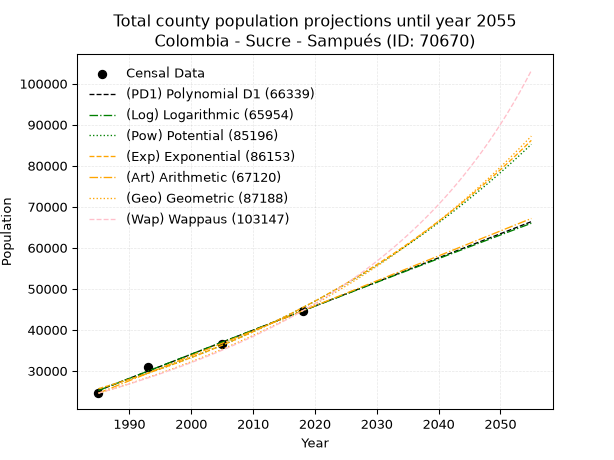
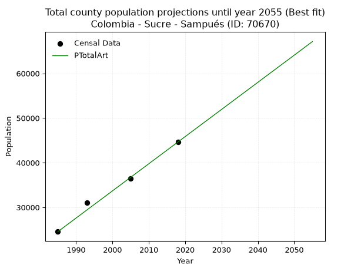
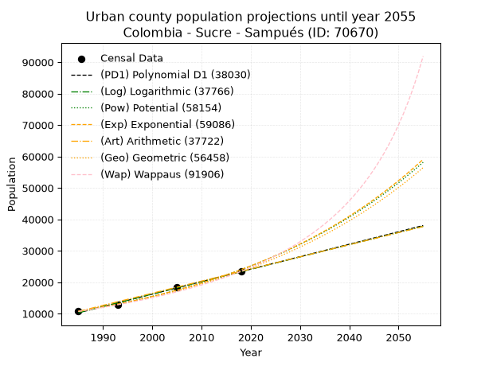
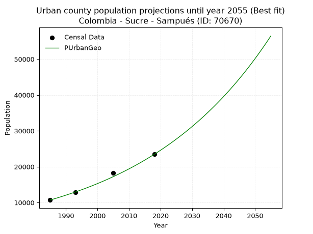
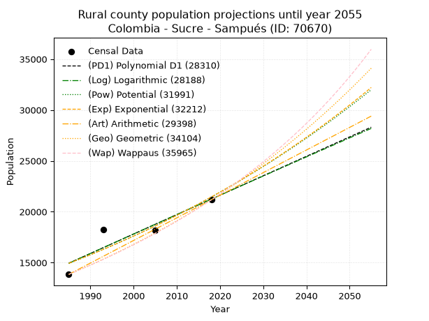
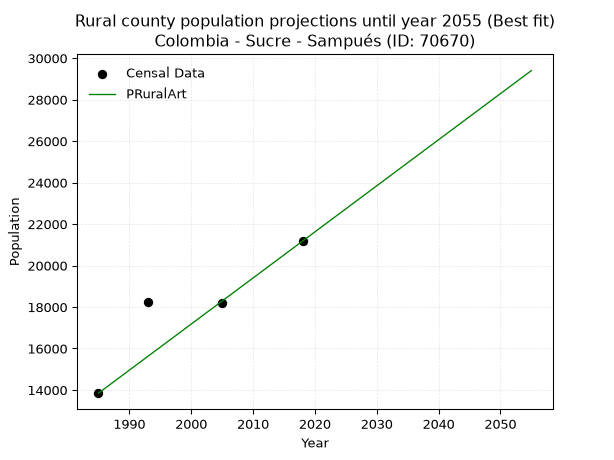

<div align="center">


</div>

# 📜 _“Population and Public Services Demand Projections (PPSD) until Year 2050 for Colombia - Sucre - Sampués (ID: 70670)”_
Keywords: `population` `public-service` `projection` `lineal` `polynomial` `logarithmic` `potential` `exponential` `arithmetic` `geometric` `wappaus` `dane` `colombia` `south-america`

PPSD are analytical estimates used by governments and planners to anticipate future changes in population size, age distribution, and the resulting community needs for utilities, healthcare, education, and infrastructure as sizing future water treatment facilities, electrical grids, and road networks based on spatial growth.

<div align="center">

</img>

</div>


> **General running parameters**: • app_version: _v20260806_. • Python version: _3.14.7_. • Pandas version: _3.0.5_. • NumPy version: _2.5.1_. • Creates, save and include plots into reports (create_plot): _False_. • Projection until year: _2050_. • Process polynomial degree 2 and up: _False_. • Process Wappaus: _True_. • Process Wappaus: _True_. • Set negative values to zero: _True_. • Set infinite values to zero: _True_. • Drop dataset notes: _True_. 
<div align="center">

Maps & GIS Layers: [:earth_americas:Google](http://maps.google.com/maps?q=9.183193433,-75.3802218) [:earth_americas:OSM](https://www.openstreetmap.org/#map=18/9.183193433/-75.3802218&layers=P) [:earth_americas:Bing](https://www.bing.com/maps?cp=9.183193433~-75.3802218&lvl=18) [:earth_americas:Apple](https://maps.apple.com/frame?center=9.183193433%2C-75.3802218&span=0.003%2C0.006) [:earth_americas:GISMobile](https://github.com/rcfdtools/R.GISMobile/blob/main/file/gis/CountyLayer_CO/Readme.md)

</div>


<div align="center">

```geojson
{
  "type": "Feature",
  "geometry": {
    "type": "Point", 
    "coordinates": [-75.3802218, 9.183193433]
  }, 
  "properties": {
    "Name": "Colombia - Sucre - Sampués (ID: 70670)"
  }
}
```

</div>


## 0. Census Data (4 records)

Census data are official statistics collected by a government about the people and housing in a country. They usually include counts of total population, age, sex, race, income, education, and jobs.

📅Global census file: [Population.xlsx](../data/Population.xlsx)

| Source   |   Year |   CountryID | CountryName   |   StateID | StateName   |   CountyID | CountyName   |   PTotal |   PUrban |   PRural |
|:---------|-------:|------------:|:--------------|----------:|:------------|-----------:|:-------------|---------:|---------:|---------:|
| DANE     |   1985 |          57 | Colombia      |        70 | Sucre       |      70670 | Sampués      |    24547 |    10702 |    13845 |
| DANE     |   1993 |          57 | Colombia      |        70 | Sucre       |      70670 | Sampués      |    31031 |    12801 |    18230 |
| DANE     |   2005 |          57 | Colombia      |        70 | Sucre       |      70670 | Sampués      |    36481 |    18309 |    18172 |
| DANE     |   2018 |          57 | Colombia      |        70 | Sucre       |      70670 | Sampués      |    44617 |    23440 |    21177 |

> 🔥Some records could had specific notes about the registered values or the corresponding urban or rural distribution.

📅[SUI-RUPS](https://www.datos.gov.co/Hacienda-y-Cr-dito-P-blico/Registro-nico-de-Prestadores-de-Servicios-P-blicos/4qkq-csdn/about_data) - Local public utility companies: [RUPS.csv](../data/RUPS.csv)

 | SERVICIO       | ESTADO    | NOMBRE                                                                             | NIT         | DEPARTAMENTO_DOMICILIO   | MUNICIPIO_DOMICILIO   | DIRECCION                       |   TELEFONO | EMAIL                             | TIPO_PRESTADOR                            | CLASIFICACION                  |
|:---------------|:----------|:-----------------------------------------------------------------------------------|:------------|:-------------------------|:----------------------|:--------------------------------|-----------:|:----------------------------------|:------------------------------------------|:-------------------------------|
| ACUEDUCTO      | OPERATIVA | EMPRESA OFICIAL DE ACUEDUCTO, ALCANTARILLADO Y ASEO DE SAMPUES E.S.P.              | 823000796-1 | SUCRE                    | SAMPUES               | CARRERA 19 # 24 - 06 CENTRO     |    2830771 | info@empasam.com                  | EMPRESA INDUSTRIAL Y COMERCIAL DEL ESTADO | DESDE 2501 HASTA 5000 USUARIOS |
| ALCANTARILLADO | OPERATIVA | EMPRESA OFICIAL DE ACUEDUCTO, ALCANTARILLADO Y ASEO DE SAMPUES E.S.P.              | 823000796-1 | SUCRE                    | SAMPUES               | CARRERA 19 # 24 - 06 CENTRO     |    2830771 | info@empasam.com                  | EMPRESA INDUSTRIAL Y COMERCIAL DEL ESTADO | DESDE 2501 HASTA 5000 USUARIOS |
| ACUEDUCTO      | OPERATIVA | ASOCIACIÓN DE USUARIOS DEL ACUEDUCTO DE SABANA LARGA Y SANTA INES DE PALITO ESP    | 900445220-9 | SUCRE                    | SAMPUES               | CALLE 3 No 1                    |    7459614 | acueducto.asossidep@gmail.com     | ORGANIZACION AUTORIZADA                   | MENOR O IGUAL A 2500 USUARIOS  |
| ACUEDUCTO      | OPERATIVA | ASOCIACIÓN DE SUSCRIPTORES DEL ACUEDUCTO REGIONAL "MOCHÁ"                          | 901176529-8 | SUCRE                    | SAMPUES               | CORREGIMIENTO DE BOSSA NAVARRO  |    7459614 | acueductoregional.mocha@gmail.com | ORGANIZACION AUTORIZADA                   | MENOR O IGUAL A 2500 USUARIOS  |
| ACUEDUCTO      | OPERATIVA | asociacion de usuarios del acueducto de mateo perez, mata de caña y calle fria esp | 900224086-1 | SUCRE                    | SAMPUES               | calle 2 cra 2 - 256 mateo perez |    2838994 | asomacaesp@outlook.es             | ORGANIZACION AUTORIZADA                   | MENOR O IGUAL A 2500 USUARIOS  |

## 1. Total

### 1.1. Coefficients and Parameters

* (PD1) Polynomial Deg 1: 587.5873143315885, -1141152.5254917596 (lineal)
* (Log) Logarithmic: 1176207.7974150921, -8906195.893689865
* (Pow) Potential: 34.6864739905134, -109.97934084304673
* (Exp) Exponential: 0.017324214637523202, 2.977403742914519e-11
* (Art) Arithmetic: Year diff. 2018 - 1985 = 33, Population diff. 44617 - 24547 = 20070, Annual growth = 608.1818181818181
* (Geo) Geometric: Year diff. 2018 - 1985 = 33, Population diff. 44617 - 24547 = 20070, Annual growth % = 0.018271749932208925
* (Wap) Wappaus: i = 1.7586658324614486, Condition values only valid for < 200)

<sub>
Wappaus condition values: ['0.00', '1.76', '3.52', '5.28', '7.03', '8.79', '10.55', '12.31', '14.07', '15.83', '17.59', '19.35', '21.10', '22.86', '24.62', '26.38', '28.14', '29.90', '31.66', '33.41', '35.17', '36.93', '38.69', '40.45', '42.21', '43.97', '45.73', '47.48', '49.24', '51.00', '52.76', '54.52', '56.28', '58.04', '59.79', '61.55', '63.31', '65.07', '66.83', '68.59', '70.35', '72.11', '73.86', '75.62', '77.38', '79.14', '80.90', '82.66', '84.42', '86.17', '87.93', '89.69', '91.45', '93.21', '94.97', '96.73', '98.49', '100.24', '102.00', '103.76', '105.52', '107.28', '109.04', '110.80', '112.55', '114.31']
</sub>


### 1.2. Projected Dataset

|   Year |   CountyID |   PTotalPD1 |   PTotalLog |   PTotalPow |   PTotalExp |   PTotalArt |   PTotalGeo |   PTotalWap |
|-------:|-----------:|------------:|------------:|------------:|------------:|------------:|------------:|------------:|
|   1985 |      70670 |       25208 |       25190 |       25606 |       25621 |       24547 |       24547 |       24547 |
|   1986 |      70670 |       25796 |       25782 |       26057 |       26069 |       25155 |       24996 |       24983 |
|   1987 |      70670 |       26383 |       26375 |       26516 |       26525 |       25763 |       25452 |       25426 |
|   1988 |      70670 |       26971 |       26966 |       26983 |       26988 |       26372 |       25917 |       25877 |
|   1989 |      70670 |       27559 |       27558 |       27458 |       27460 |       26980 |       26391 |       26337 |
|   1990 |      70670 |       28146 |       28149 |       27941 |       27940 |       27588 |       26873 |       26805 |
|   1991 |      70670 |       28734 |       28740 |       28432 |       28428 |       28196 |       27364 |       27281 |
|   1992 |      70670 |       29321 |       29331 |       28932 |       28925 |       28804 |       27864 |       27767 |
|   1993 |      70670 |       29909 |       29921 |       29440 |       29430 |       29412 |       28373 |       28262 |
|   1994 |      70670 |       30497 |       30511 |       29956 |       29944 |       30021 |       28892 |       28766 |
|   1995 |      70670 |       31084 |       31101 |       30482 |       30468 |       30629 |       29420 |       29280 |
|   1996 |      70670 |       31672 |       31690 |       31016 |       31000 |       31237 |       29957 |       29804 |
|   1997 |      70670 |       32259 |       32279 |       31560 |       31542 |       31845 |       30504 |       30339 |
|   1998 |      70670 |       32847 |       32868 |       32113 |       32093 |       32453 |       31062 |       30883 |
|   1999 |      70670 |       33435 |       33457 |       32675 |       32654 |       33062 |       31629 |       31439 |
|   2000 |      70670 |       34022 |       34045 |       33247 |       33225 |       33670 |       32207 |       32006 |
|   2001 |      70670 |       34610 |       34633 |       33828 |       33805 |       34278 |       32796 |       32585 |
|   2002 |      70670 |       35197 |       35220 |       34420 |       34396 |       34886 |       33395 |       33176 |
|   2003 |      70670 |       35785 |       35808 |       35021 |       34997 |       35494 |       34005 |       33779 |
|   2004 |      70670 |       36372 |       36395 |       35633 |       35609 |       36102 |       34627 |       34395 |
|   2005 |      70670 |       36960 |       36982 |       36255 |       36231 |       36711 |       35259 |       35023 |
|   2006 |      70670 |       37548 |       37568 |       36887 |       36864 |       37319 |       35903 |       35666 |
|   2007 |      70670 |       38135 |       38154 |       37530 |       37508 |       37927 |       36559 |       36322 |
|   2008 |      70670 |       38723 |       38740 |       38184 |       38164 |       38535 |       37227 |       36993 |
|   2009 |      70670 |       39310 |       39326 |       38850 |       38831 |       39143 |       37908 |       37679 |
|   2010 |      70670 |       39898 |       39911 |       39526 |       39509 |       39752 |       38600 |       38381 |
|   2011 |      70670 |       40486 |       40496 |       40214 |       40200 |       40360 |       39306 |       39098 |
|   2012 |      70670 |       41073 |       41081 |       40913 |       40902 |       40968 |       40024 |       39832 |
|   2013 |      70670 |       41661 |       41665 |       41625 |       41617 |       41576 |       40755 |       40583 |
|   2014 |      70670 |       42248 |       42250 |       42348 |       42344 |       42184 |       41500 |       41352 |
|   2015 |      70670 |       42836 |       42833 |       43083 |       43084 |       42792 |       42258 |       42139 |
|   2016 |      70670 |       43424 |       43417 |       43831 |       43837 |       43401 |       43030 |       42945 |
|   2017 |      70670 |       44011 |       44000 |       44592 |       44603 |       44009 |       43816 |       43771 |
|   2018 |      70670 |       44599 |       44583 |       45365 |       45382 |       44617 |       44617 |       44617 |
|   2019 |      70670 |       45186 |       45166 |       46151 |       46176 |       45225 |       45432 |       45485 |
|   2020 |      70670 |       45774 |       45749 |       46951 |       46982 |       45833 |       46262 |       46374 |
|   2021 |      70670 |       46361 |       46331 |       47764 |       47803 |       46442 |       47108 |       47287 |
|   2022 |      70670 |       46949 |       46912 |       48590 |       48639 |       47050 |       47968 |       48223 |
|   2023 |      70670 |       47537 |       47494 |       49431 |       49489 |       47658 |       48845 |       49184 |
|   2024 |      70670 |       48124 |       48075 |       50286 |       50354 |       48266 |       49737 |       50171 |
|   2025 |      70670 |       48712 |       48656 |       51155 |       51234 |       48874 |       50646 |       51184 |
|   2026 |      70670 |       49299 |       49237 |       52038 |       52129 |       49482 |       51572 |       52226 |
|   2027 |      70670 |       49887 |       49817 |       52937 |       53040 |       50091 |       52514 |       53296 |
|   2028 |      70670 |       50475 |       50398 |       53850 |       53967 |       50699 |       53473 |       54397 |
|   2029 |      70670 |       51062 |       50977 |       54779 |       54910 |       51307 |       54450 |       55529 |
|   2030 |      70670 |       51650 |       51557 |       55723 |       55869 |       51915 |       55445 |       56694 |
|   2031 |      70670 |       52237 |       52136 |       56683 |       56846 |       52523 |       56458 |       57894 |
|   2032 |      70670 |       52825 |       52715 |       57659 |       57839 |       53132 |       57490 |       59129 |
|   2033 |      70670 |       53412 |       53294 |       58652 |       58850 |       53740 |       58540 |       60402 |
|   2034 |      70670 |       54000 |       53872 |       59661 |       59878 |       54348 |       59610 |       61715 |
|   2035 |      70670 |       54588 |       54450 |       60687 |       60925 |       54956 |       60699 |       63069 |
|   2036 |      70670 |       55175 |       55028 |       61730 |       61989 |       55564 |       61808 |       64466 |
|   2037 |      70670 |       55763 |       55606 |       62790 |       63073 |       56172 |       62938 |       65908 |
|   2038 |      70670 |       56350 |       56183 |       63868 |       64175 |       56781 |       64088 |       67397 |
|   2039 |      70670 |       56938 |       56760 |       64964 |       65296 |       57389 |       65259 |       68937 |
|   2040 |      70670 |       57526 |       57337 |       66078 |       66437 |       57997 |       66451 |       70529 |
|   2041 |      70670 |       58113 |       57913 |       67211 |       67598 |       58605 |       67665 |       72176 |
|   2042 |      70670 |       58701 |       58489 |       68363 |       68780 |       59213 |       68902 |       73881 |
|   2043 |      70670 |       59288 |       59065 |       69534 |       69981 |       59822 |       70161 |       75648 |
|   2044 |      70670 |       59876 |       59641 |       70724 |       71204 |       60430 |       71442 |       77478 |
|   2045 |      70670 |       60464 |       60216 |       71934 |       72449 |       61038 |       72748 |       79378 |
|   2046 |      70670 |       61051 |       60791 |       73165 |       73715 |       61646 |       74077 |       81349 |
|   2047 |      70670 |       61639 |       61366 |       74415 |       75003 |       62254 |       75431 |       83396 |
|   2048 |      70670 |       62226 |       61940 |       75687 |       76314 |       62862 |       76809 |       85524 |
|   2049 |      70670 |       62814 |       62515 |       76979 |       77647 |       63471 |       78212 |       87738 |
|   2050 |      70670 |       63401 |       63088 |       78293 |       79004 |       64079 |       79641 |       90043 |
<div align="center">

</img>

</div>


### 1.3. Best fit with absolute and relative error (%)

Relative error puts that difference into context by dividing the absolute error by the true value, creating a unitless ratio or percentage that shows the scale of the mistake.

Absolute and relative error

|   Year | Source   |   CountryID | CountryName   |   StateID | StateName   |   CountyID_x | CountyName   |   PTotal |   PUrban |   PRural |   CountyID_y |   PTotalPD1 |   PTotalLog |   PTotalPow |   PTotalExp |   PTotalArt |   PTotalGeo |   PTotalWap |   PTotalPD1AbsError |   PTotalLogAbsError |   PTotalPowAbsError |   PTotalExpAbsError |   PTotalArtAbsError |   PTotalGeoAbsError |   PTotalWapAbsError |   PTotalPD1RelError |   PTotalLogRelError |   PTotalPowRelError |   PTotalExpRelError |   PTotalArtRelError |   PTotalGeoRelError |   PTotalWapRelError |
|-------:|:---------|------------:|:--------------|----------:|:------------|-------------:|:-------------|---------:|---------:|---------:|-------------:|------------:|------------:|------------:|------------:|------------:|------------:|------------:|--------------------:|--------------------:|--------------------:|--------------------:|--------------------:|--------------------:|--------------------:|--------------------:|--------------------:|--------------------:|--------------------:|--------------------:|--------------------:|--------------------:|
|   1985 | DANE     |          57 | Colombia      |        70 | Sucre       |        70670 | Sampués      |    24547 |    10702 |    13845 |        70670 |       25208 |       25190 |       25606 |       25621 |       24547 |       24547 |       24547 |                 661 |                 643 |                1059 |                1074 |                   0 |                   0 |                   0 |           2.69279   |           2.61946   |            4.31417  |            4.37528  |            0        |             0       |             0       |
|   1993 | DANE     |          57 | Colombia      |        70 | Sucre       |        70670 | Sampués      |    31031 |    12801 |    18230 |        70670 |       29909 |       29921 |       29440 |       29430 |       29412 |       28373 |       28262 |                1122 |                1110 |                1591 |                1601 |                1619 |                2658 |                2769 |           3.61574   |           3.57707   |            5.12713  |            5.15936  |            5.21736  |             8.56563 |             8.92333 |
|   2005 | DANE     |          57 | Colombia      |        70 | Sucre       |        70670 | Sampués      |    36481 |    18309 |    18172 |        70670 |       36960 |       36982 |       36255 |       36231 |       36711 |       35259 |       35023 |                 479 |                 501 |                 226 |                 250 |                 230 |                1222 |                1458 |           1.31301   |           1.37332   |            0.619501 |            0.685288 |            0.630465 |             3.34969 |             3.9966  |
|   2018 | DANE     |          57 | Colombia      |        70 | Sucre       |        70670 | Sampués      |    44617 |    23440 |    21177 |        70670 |       44599 |       44583 |       45365 |       45382 |       44617 |       44617 |       44617 |                  18 |                  34 |                 748 |                 765 |                   0 |                   0 |                   0 |           0.0403434 |           0.0762041 |            1.67649  |            1.71459  |            0        |             0       |             0       |

Relative error mean

| Method    |   RelError | Best   |
|:----------|-----------:|:-------|
| PTotalPD1 |    1.91547 |        |
| PTotalLog |    1.91151 |        |
| PTotalPow |    2.93432 |        |
| PTotalExp |    2.98363 |        |
| PTotalArt |    1.46196 | True   |
| PTotalGeo |    2.97883 |        |
| PTotalWap |    3.22998 |        |

💙Best method: _**PTotalArt**_
<div align="center">

</img>

</div>


### 1.4. Fresh water supply demand in liters per capita per day (lpcd)

The fresh water supply demand typically ranges from 100 to 300 liters per capita per day (lpcd) for standard domestic and municipal planning, though absolute survival minimums set by the World Health Organization are as low as 7.5 to 20 liters per day, and total consumption in high-income nations can exceed 400 liters.

> `CZ`: Level in meters above the sea level (masl)<br> `WS`: Fresh water supply demand in liters per capita per day (lpcd or l/h/d)<br> `WSAll`: Zonal fresh water supply demand in liters per second (l/s)<br> `A`: Zonal area in square meters<br> `DP`: Population density (people/hectare or p/ha)

Reference values (RAS Colombia)

|    CZ |   WS |
|------:|-----:|
|  1000 |  120 |
|  2000 |  130 |
| 99999 |  140 |

County shapefile geometry properties and water supply values

|   CountyID |      ATotal |   CZTotal |   WSTotal |
|-----------:|------------:|----------:|----------:|
|      70670 | 2.14009e+08 |    119.34 |       120 |

Projected values for best method: PTotalArt

|   CountyID |   Year |   PTotalArt |   DPTotal |   WSTotal |   WSTotalAll |
|-----------:|-------:|------------:|----------:|----------:|-------------:|
|      70670 |   1985 |       24547 |      1.15 |       120 |      34.0931 |
|      70670 |   1986 |       25155 |      1.18 |       120 |      34.9375 |
|      70670 |   1987 |       25763 |      1.2  |       120 |      35.7819 |
|      70670 |   1988 |       26372 |      1.23 |       120 |      36.6278 |
|      70670 |   1989 |       26980 |      1.26 |       120 |      37.4722 |
|      70670 |   1990 |       27588 |      1.29 |       120 |      38.3167 |
|      70670 |   1991 |       28196 |      1.32 |       120 |      39.1611 |
|      70670 |   1992 |       28804 |      1.35 |       120 |      40.0056 |
|      70670 |   1993 |       29412 |      1.37 |       120 |      40.85   |
|      70670 |   1994 |       30021 |      1.4  |       120 |      41.6958 |
|      70670 |   1995 |       30629 |      1.43 |       120 |      42.5403 |
|      70670 |   1996 |       31237 |      1.46 |       120 |      43.3847 |
|      70670 |   1997 |       31845 |      1.49 |       120 |      44.2292 |
|      70670 |   1998 |       32453 |      1.52 |       120 |      45.0736 |
|      70670 |   1999 |       33062 |      1.54 |       120 |      45.9194 |
|      70670 |   2000 |       33670 |      1.57 |       120 |      46.7639 |
|      70670 |   2001 |       34278 |      1.6  |       120 |      47.6083 |
|      70670 |   2002 |       34886 |      1.63 |       120 |      48.4528 |
|      70670 |   2003 |       35494 |      1.66 |       120 |      49.2972 |
|      70670 |   2004 |       36102 |      1.69 |       120 |      50.1417 |
|      70670 |   2005 |       36711 |      1.72 |       120 |      50.9875 |
|      70670 |   2006 |       37319 |      1.74 |       120 |      51.8319 |
|      70670 |   2007 |       37927 |      1.77 |       120 |      52.6764 |
|      70670 |   2008 |       38535 |      1.8  |       120 |      53.5208 |
|      70670 |   2009 |       39143 |      1.83 |       120 |      54.3653 |
|      70670 |   2010 |       39752 |      1.86 |       120 |      55.2111 |
|      70670 |   2011 |       40360 |      1.89 |       120 |      56.0556 |
|      70670 |   2012 |       40968 |      1.91 |       120 |      56.9    |
|      70670 |   2013 |       41576 |      1.94 |       120 |      57.7444 |
|      70670 |   2014 |       42184 |      1.97 |       120 |      58.5889 |
|      70670 |   2015 |       42792 |      2    |       120 |      59.4333 |
|      70670 |   2016 |       43401 |      2.03 |       120 |      60.2792 |
|      70670 |   2017 |       44009 |      2.06 |       120 |      61.1236 |
|      70670 |   2018 |       44617 |      2.08 |       120 |      61.9681 |
|      70670 |   2019 |       45225 |      2.11 |       120 |      62.8125 |
|      70670 |   2020 |       45833 |      2.14 |       120 |      63.6569 |
|      70670 |   2021 |       46442 |      2.17 |       120 |      64.5028 |
|      70670 |   2022 |       47050 |      2.2  |       120 |      65.3472 |
|      70670 |   2023 |       47658 |      2.23 |       120 |      66.1917 |
|      70670 |   2024 |       48266 |      2.26 |       120 |      67.0361 |
|      70670 |   2025 |       48874 |      2.28 |       120 |      67.8806 |
|      70670 |   2026 |       49482 |      2.31 |       120 |      68.725  |
|      70670 |   2027 |       50091 |      2.34 |       120 |      69.5708 |
|      70670 |   2028 |       50699 |      2.37 |       120 |      70.4153 |
|      70670 |   2029 |       51307 |      2.4  |       120 |      71.2597 |
|      70670 |   2030 |       51915 |      2.43 |       120 |      72.1042 |
|      70670 |   2031 |       52523 |      2.45 |       120 |      72.9486 |
|      70670 |   2032 |       53132 |      2.48 |       120 |      73.7944 |
|      70670 |   2033 |       53740 |      2.51 |       120 |      74.6389 |
|      70670 |   2034 |       54348 |      2.54 |       120 |      75.4833 |
|      70670 |   2035 |       54956 |      2.57 |       120 |      76.3278 |
|      70670 |   2036 |       55564 |      2.6  |       120 |      77.1722 |
|      70670 |   2037 |       56172 |      2.62 |       120 |      78.0167 |
|      70670 |   2038 |       56781 |      2.65 |       120 |      78.8625 |
|      70670 |   2039 |       57389 |      2.68 |       120 |      79.7069 |
|      70670 |   2040 |       57997 |      2.71 |       120 |      80.5514 |
|      70670 |   2041 |       58605 |      2.74 |       120 |      81.3958 |
|      70670 |   2042 |       59213 |      2.77 |       120 |      82.2403 |
|      70670 |   2043 |       59822 |      2.8  |       120 |      83.0861 |
|      70670 |   2044 |       60430 |      2.82 |       120 |      83.9306 |
|      70670 |   2045 |       61038 |      2.85 |       120 |      84.775  |
|      70670 |   2046 |       61646 |      2.88 |       120 |      85.6194 |
|      70670 |   2047 |       62254 |      2.91 |       120 |      86.4639 |
|      70670 |   2048 |       62862 |      2.94 |       120 |      87.3083 |
|      70670 |   2049 |       63471 |      2.97 |       120 |      88.1542 |
|      70670 |   2050 |       64079 |      2.99 |       120 |      88.9986 |

## 2. Urban

### 2.1. Coefficients and Parameters

* (PD1) Polynomial Deg 1: 396.65194700922973, -777090.0570052118 (lineal)
* (Log) Logarithmic: 793867.6434793486, -6017881.319742571
* (Pow) Potential: 48.76021089469955, -156.76882123046232
* (Exp) Exponential: 0.024357101192341638, 1.0798885699329876e-17
* (Art) Arithmetic: Year diff. 2018 - 1985 = 33, Population diff. 23440 - 10702 = 12738, Annual growth = 386.0
* (Geo) Geometric: Year diff. 2018 - 1985 = 33, Population diff. 23440 - 10702 = 12738, Annual growth % = 0.024042448672623618
* (Wap) Wappaus: i = 2.2611446312459726, Condition values only valid for < 200)

<sub>
Wappaus condition values: ['0.00', '2.26', '4.52', '6.78', '9.04', '11.31', '13.57', '15.83', '18.09', '20.35', '22.61', '24.87', '27.13', '29.39', '31.66', '33.92', '36.18', '38.44', '40.70', '42.96', '45.22', '47.48', '49.75', '52.01', '54.27', '56.53', '58.79', '61.05', '63.31', '65.57', '67.83', '70.10', '72.36', '74.62', '76.88', '79.14', '81.40', '83.66', '85.92', '88.18', '90.45', '92.71', '94.97', '97.23', '99.49', '101.75', '104.01', '106.27', '108.53', '110.80', '113.06', '115.32', '117.58', '119.84', '122.10', '124.36', '126.62', '128.89', '131.15', '133.41', '135.67', '137.93', '140.19', '142.45', '144.71', '146.97']
</sub>


### 2.2. Projected Dataset

|   Year |   CountyID |   PUrbanPD1 |   PUrbanLog |   PUrbanPow |   PUrbanExp |   PUrbanArt |   PUrbanGeo |   PUrbanWap |
|-------:|-----------:|------------:|------------:|------------:|------------:|------------:|------------:|------------:|
|   1985 |      70670 |       10264 |       10253 |       10732 |       10740 |       10702 |       10702 |       10702 |
|   1986 |      70670 |       10661 |       10653 |       10999 |       11005 |       11088 |       10959 |       10947 |
|   1987 |      70670 |       11057 |       11052 |       11272 |       11276 |       11474 |       11223 |       11197 |
|   1988 |      70670 |       11454 |       11452 |       11552 |       11554 |       11860 |       11493 |       11453 |
|   1989 |      70670 |       11851 |       11851 |       11839 |       11839 |       12246 |       11769 |       11716 |
|   1990 |      70670 |       12247 |       12250 |       12133 |       12131 |       12632 |       12052 |       11984 |
|   1991 |      70670 |       12644 |       12649 |       12433 |       12430 |       13018 |       12342 |       12260 |
|   1992 |      70670 |       13041 |       13047 |       12742 |       12737 |       13404 |       12638 |       12541 |
|   1993 |      70670 |       13437 |       13446 |       13057 |       13051 |       13790 |       12942 |       12830 |
|   1994 |      70670 |       13834 |       13844 |       13381 |       13373 |       14176 |       13253 |       13127 |
|   1995 |      70670 |       14231 |       14242 |       13712 |       13702 |       14562 |       13572 |       13430 |
|   1996 |      70670 |       14627 |       14640 |       14051 |       14040 |       14948 |       13898 |       13742 |
|   1997 |      70670 |       15024 |       15038 |       14398 |       14386 |       15334 |       14232 |       14062 |
|   1998 |      70670 |       15421 |       15435 |       14754 |       14741 |       15720 |       14575 |       14390 |
|   1999 |      70670 |       15817 |       15832 |       15118 |       15105 |       16106 |       14925 |       14727 |
|   2000 |      70670 |       16214 |       16229 |       15492 |       15477 |       16492 |       15284 |       15073 |
|   2001 |      70670 |       16610 |       16626 |       15874 |       15859 |       16878 |       15651 |       15429 |
|   2002 |      70670 |       17007 |       17023 |       16265 |       16250 |       17264 |       16028 |       15795 |
|   2003 |      70670 |       17404 |       17419 |       16666 |       16650 |       17650 |       16413 |       16171 |
|   2004 |      70670 |       17800 |       17815 |       17077 |       17061 |       18036 |       16808 |       16558 |
|   2005 |      70670 |       18197 |       18211 |       17497 |       17482 |       18422 |       17212 |       16956 |
|   2006 |      70670 |       18594 |       18607 |       17928 |       17913 |       18808 |       17626 |       17366 |
|   2007 |      70670 |       18990 |       19003 |       18369 |       18354 |       19194 |       18049 |       17788 |
|   2008 |      70670 |       19387 |       19398 |       18821 |       18807 |       19580 |       18483 |       18224 |
|   2009 |      70670 |       19784 |       19794 |       19283 |       19270 |       19966 |       18928 |       18672 |
|   2010 |      70670 |       20180 |       20189 |       19757 |       19746 |       20352 |       19383 |       19135 |
|   2011 |      70670 |       20577 |       20584 |       20242 |       20232 |       20738 |       19849 |       19613 |
|   2012 |      70670 |       20974 |       20978 |       20738 |       20731 |       21124 |       20326 |       20106 |
|   2013 |      70670 |       21370 |       21373 |       21247 |       21242 |       21510 |       20815 |       20616 |
|   2014 |      70670 |       21767 |       21767 |       21768 |       21766 |       21896 |       21315 |       21143 |
|   2015 |      70670 |       22164 |       22161 |       22301 |       22303 |       22282 |       21827 |       21688 |
|   2016 |      70670 |       22560 |       22555 |       22847 |       22853 |       22668 |       22352 |       22251 |
|   2017 |      70670 |       22957 |       22949 |       23406 |       23416 |       23054 |       22890 |       22835 |
|   2018 |      70670 |       23354 |       23342 |       23979 |       23994 |       23440 |       23440 |       23440 |
|   2019 |      70670 |       23750 |       23735 |       24565 |       24585 |       23826 |       24004 |       24067 |
|   2020 |      70670 |       24147 |       24128 |       25166 |       25191 |       24212 |       24581 |       24718 |
|   2021 |      70670 |       24544 |       24521 |       25780 |       25812 |       24598 |       25172 |       25393 |
|   2022 |      70670 |       24940 |       24914 |       26410 |       26449 |       24984 |       25777 |       26094 |
|   2023 |      70670 |       25337 |       25307 |       27054 |       27101 |       25370 |       26397 |       26824 |
|   2024 |      70670 |       25733 |       25699 |       27714 |       27769 |       25756 |       27031 |       27583 |
|   2025 |      70670 |       26130 |       26091 |       28390 |       28454 |       26142 |       27681 |       28373 |
|   2026 |      70670 |       26527 |       26483 |       29081 |       29155 |       26528 |       28347 |       29196 |
|   2027 |      70670 |       26923 |       26875 |       29790 |       29874 |       26914 |       29028 |       30055 |
|   2028 |      70670 |       27320 |       27266 |       30515 |       30611 |       27300 |       29726 |       30952 |
|   2029 |      70670 |       27717 |       27658 |       31257 |       31366 |       27686 |       30441 |       31889 |
|   2030 |      70670 |       28113 |       28049 |       32017 |       32139 |       28072 |       31173 |       32869 |
|   2031 |      70670 |       28510 |       28440 |       32795 |       32931 |       28458 |       31922 |       33896 |
|   2032 |      70670 |       28907 |       28831 |       33592 |       33743 |       28844 |       32690 |       34971 |
|   2033 |      70670 |       29303 |       29221 |       34408 |       34575 |       29230 |       33475 |       36101 |
|   2034 |      70670 |       29700 |       29612 |       35243 |       35428 |       29616 |       34280 |       37287 |
|   2035 |      70670 |       30097 |       30002 |       36098 |       36301 |       30002 |       35105 |       38535 |
|   2036 |      70670 |       30493 |       30392 |       36973 |       37196 |       30388 |       35949 |       39850 |
|   2037 |      70670 |       30890 |       30782 |       37869 |       38114 |       30774 |       36813 |       41237 |
|   2038 |      70670 |       31287 |       31171 |       38786 |       39053 |       31160 |       37698 |       42702 |
|   2039 |      70670 |       31683 |       31561 |       39725 |       40016 |       31546 |       38604 |       44252 |
|   2040 |      70670 |       32080 |       31950 |       40686 |       41003 |       31932 |       39532 |       45895 |
|   2041 |      70670 |       32477 |       32339 |       41670 |       42014 |       32318 |       40483 |       47639 |
|   2042 |      70670 |       32873 |       32728 |       42677 |       43050 |       32704 |       41456 |       49494 |
|   2043 |      70670 |       33270 |       33116 |       43708 |       44111 |       33090 |       42453 |       51470 |
|   2044 |      70670 |       33667 |       33505 |       44764 |       45199 |       33476 |       43473 |       53582 |
|   2045 |      70670 |       34063 |       33893 |       45844 |       46313 |       33862 |       44519 |       55841 |
|   2046 |      70670 |       34460 |       34281 |       46950 |       47455 |       34248 |       45589 |       58265 |
|   2047 |      70670 |       34856 |       34669 |       48082 |       48625 |       34634 |       46685 |       60872 |
|   2048 |      70670 |       35253 |       35057 |       49241 |       49824 |       35020 |       47808 |       63685 |
|   2049 |      70670 |       35650 |       35445 |       50427 |       51053 |       35406 |       48957 |       66727 |
|   2050 |      70670 |       36046 |       35832 |       51641 |       52311 |       35792 |       50134 |       70029 |
<div align="center">

</img>

</div>


### 2.3. Best fit with absolute and relative error (%)

Relative error puts that difference into context by dividing the absolute error by the true value, creating a unitless ratio or percentage that shows the scale of the mistake.

Absolute and relative error

|   Year | Source   |   CountryID | CountryName   |   StateID | StateName   |   CountyID_x | CountyName   |   PTotal |   PUrban |   PRural |   CountyID_y |   PUrbanPD1 |   PUrbanLog |   PUrbanPow |   PUrbanExp |   PUrbanArt |   PUrbanGeo |   PUrbanWap |   PUrbanPD1AbsError |   PUrbanLogAbsError |   PUrbanPowAbsError |   PUrbanExpAbsError |   PUrbanArtAbsError |   PUrbanGeoAbsError |   PUrbanWapAbsError |   PUrbanPD1RelError |   PUrbanLogRelError |   PUrbanPowRelError |   PUrbanExpRelError |   PUrbanArtRelError |   PUrbanGeoRelError |   PUrbanWapRelError |
|-------:|:---------|------------:|:--------------|----------:|:------------|-------------:|:-------------|---------:|---------:|---------:|-------------:|------------:|------------:|------------:|------------:|------------:|------------:|------------:|--------------------:|--------------------:|--------------------:|--------------------:|--------------------:|--------------------:|--------------------:|--------------------:|--------------------:|--------------------:|--------------------:|--------------------:|--------------------:|--------------------:|
|   1985 | DANE     |          57 | Colombia      |        70 | Sucre       |        70670 | Sampués      |    24547 |    10702 |    13845 |        70670 |       10264 |       10253 |       10732 |       10740 |       10702 |       10702 |       10702 |                 438 |                 449 |                  30 |                  38 |                   0 |                   0 |                   0 |            4.09269  |            4.19548  |            0.280321 |            0.355074 |            0        |             0       |            0        |
|   1993 | DANE     |          57 | Colombia      |        70 | Sucre       |        70670 | Sampués      |    31031 |    12801 |    18230 |        70670 |       13437 |       13446 |       13057 |       13051 |       13790 |       12942 |       12830 |                 636 |                 645 |                 256 |                 250 |                 989 |                 141 |                  29 |            4.96836  |            5.03867  |            1.99984  |            1.95297  |            7.72596  |             1.10148 |            0.226545 |
|   2005 | DANE     |          57 | Colombia      |        70 | Sucre       |        70670 | Sampués      |    36481 |    18309 |    18172 |        70670 |       18197 |       18211 |       17497 |       17482 |       18422 |       17212 |       16956 |                 112 |                  98 |                 812 |                 827 |                 113 |                1097 |                1353 |            0.611721 |            0.535256 |            4.43498  |            4.5169   |            0.617183 |             5.99159 |            7.38981  |
|   2018 | DANE     |          57 | Colombia      |        70 | Sucre       |        70670 | Sampués      |    44617 |    23440 |    21177 |        70670 |       23354 |       23342 |       23979 |       23994 |       23440 |       23440 |       23440 |                  86 |                  98 |                 539 |                 554 |                   0 |                   0 |                   0 |            0.366894 |            0.418089 |            2.29949  |            2.36348  |            0        |             0       |            0        |

Relative error mean

| Method    |   RelError | Best   |
|:----------|-----------:|:-------|
| PUrbanPD1 |    2.50992 |        |
| PUrbanLog |    2.54687 |        |
| PUrbanPow |    2.25366 |        |
| PUrbanExp |    2.29711 |        |
| PUrbanArt |    2.08579 |        |
| PUrbanGeo |    1.77327 | True   |
| PUrbanWap |    1.90409 |        |

💙Best method: _**PUrbanGeo**_
<div align="center">

</img>

</div>


### 2.4. Fresh water supply demand in liters per capita per day (lpcd)

The fresh water supply demand typically ranges from 100 to 300 liters per capita per day (lpcd) for standard domestic and municipal planning, though absolute survival minimums set by the World Health Organization are as low as 7.5 to 20 liters per day, and total consumption in high-income nations can exceed 400 liters.

> `CZ`: Level in meters above the sea level (masl)<br> `WS`: Fresh water supply demand in liters per capita per day (lpcd or l/h/d)<br> `WSAll`: Zonal fresh water supply demand in liters per second (l/s)<br> `A`: Zonal area in square meters<br> `DP`: Population density (people/hectare or p/ha)

Reference values (RAS Colombia)

|    CZ |   WS |
|------:|-----:|
|  1000 |  120 |
|  2000 |  130 |
| 99999 |  140 |

County shapefile geometry properties and water supply values

|   CountyID |      AUrban |   CZUrban |   WSUrban |
|-----------:|------------:|----------:|----------:|
|      70670 | 2.81297e+06 |    157.68 |       120 |

Projected values for best method: PUrbanGeo

|   CountyID |   Year |   PUrbanGeo |   DPUrban |   WSUrban |   WSUrbanAll |
|-----------:|-------:|------------:|----------:|----------:|-------------:|
|      70670 |   1985 |       10702 |     38.05 |       120 |      14.8639 |
|      70670 |   1986 |       10959 |     38.96 |       120 |      15.2208 |
|      70670 |   1987 |       11223 |     39.9  |       120 |      15.5875 |
|      70670 |   1988 |       11493 |     40.86 |       120 |      15.9625 |
|      70670 |   1989 |       11769 |     41.84 |       120 |      16.3458 |
|      70670 |   1990 |       12052 |     42.84 |       120 |      16.7389 |
|      70670 |   1991 |       12342 |     43.88 |       120 |      17.1417 |
|      70670 |   1992 |       12638 |     44.93 |       120 |      17.5528 |
|      70670 |   1993 |       12942 |     46.01 |       120 |      17.975  |
|      70670 |   1994 |       13253 |     47.11 |       120 |      18.4069 |
|      70670 |   1995 |       13572 |     48.25 |       120 |      18.85   |
|      70670 |   1996 |       13898 |     49.41 |       120 |      19.3028 |
|      70670 |   1997 |       14232 |     50.59 |       120 |      19.7667 |
|      70670 |   1998 |       14575 |     51.81 |       120 |      20.2431 |
|      70670 |   1999 |       14925 |     53.06 |       120 |      20.7292 |
|      70670 |   2000 |       15284 |     54.33 |       120 |      21.2278 |
|      70670 |   2001 |       15651 |     55.64 |       120 |      21.7375 |
|      70670 |   2002 |       16028 |     56.98 |       120 |      22.2611 |
|      70670 |   2003 |       16413 |     58.35 |       120 |      22.7958 |
|      70670 |   2004 |       16808 |     59.75 |       120 |      23.3444 |
|      70670 |   2005 |       17212 |     61.19 |       120 |      23.9056 |
|      70670 |   2006 |       17626 |     62.66 |       120 |      24.4806 |
|      70670 |   2007 |       18049 |     64.16 |       120 |      25.0681 |
|      70670 |   2008 |       18483 |     65.71 |       120 |      25.6708 |
|      70670 |   2009 |       18928 |     67.29 |       120 |      26.2889 |
|      70670 |   2010 |       19383 |     68.91 |       120 |      26.9208 |
|      70670 |   2011 |       19849 |     70.56 |       120 |      27.5681 |
|      70670 |   2012 |       20326 |     72.26 |       120 |      28.2306 |
|      70670 |   2013 |       20815 |     74    |       120 |      28.9097 |
|      70670 |   2014 |       21315 |     75.77 |       120 |      29.6042 |
|      70670 |   2015 |       21827 |     77.59 |       120 |      30.3153 |
|      70670 |   2016 |       22352 |     79.46 |       120 |      31.0444 |
|      70670 |   2017 |       22890 |     81.37 |       120 |      31.7917 |
|      70670 |   2018 |       23440 |     83.33 |       120 |      32.5556 |
|      70670 |   2019 |       24004 |     85.33 |       120 |      33.3389 |
|      70670 |   2020 |       24581 |     87.38 |       120 |      34.1403 |
|      70670 |   2021 |       25172 |     89.49 |       120 |      34.9611 |
|      70670 |   2022 |       25777 |     91.64 |       120 |      35.8014 |
|      70670 |   2023 |       26397 |     93.84 |       120 |      36.6625 |
|      70670 |   2024 |       27031 |     96.09 |       120 |      37.5431 |
|      70670 |   2025 |       27681 |     98.4  |       120 |      38.4458 |
|      70670 |   2026 |       28347 |    100.77 |       120 |      39.3708 |
|      70670 |   2027 |       29028 |    103.19 |       120 |      40.3167 |
|      70670 |   2028 |       29726 |    105.67 |       120 |      41.2861 |
|      70670 |   2029 |       30441 |    108.22 |       120 |      42.2792 |
|      70670 |   2030 |       31173 |    110.82 |       120 |      43.2958 |
|      70670 |   2031 |       31922 |    113.48 |       120 |      44.3361 |
|      70670 |   2032 |       32690 |    116.21 |       120 |      45.4028 |
|      70670 |   2033 |       33475 |    119    |       120 |      46.4931 |
|      70670 |   2034 |       34280 |    121.86 |       120 |      47.6111 |
|      70670 |   2035 |       35105 |    124.8  |       120 |      48.7569 |
|      70670 |   2036 |       35949 |    127.8  |       120 |      49.9292 |
|      70670 |   2037 |       36813 |    130.87 |       120 |      51.1292 |
|      70670 |   2038 |       37698 |    134.02 |       120 |      52.3583 |
|      70670 |   2039 |       38604 |    137.24 |       120 |      53.6167 |
|      70670 |   2040 |       39532 |    140.53 |       120 |      54.9056 |
|      70670 |   2041 |       40483 |    143.92 |       120 |      56.2264 |
|      70670 |   2042 |       41456 |    147.37 |       120 |      57.5778 |
|      70670 |   2043 |       42453 |    150.92 |       120 |      58.9625 |
|      70670 |   2044 |       43473 |    154.54 |       120 |      60.3792 |
|      70670 |   2045 |       44519 |    158.26 |       120 |      61.8319 |
|      70670 |   2046 |       45589 |    162.07 |       120 |      63.3181 |
|      70670 |   2047 |       46685 |    165.96 |       120 |      64.8403 |
|      70670 |   2048 |       47808 |    169.96 |       120 |      66.4    |
|      70670 |   2049 |       48957 |    174.04 |       120 |      67.9958 |
|      70670 |   2050 |       50134 |    178.22 |       120 |      69.6306 |

## 3. Rural

### 3.1. Coefficients and Parameters

* (PD1) Polynomial Deg 1: 190.9353673223587, -364062.468486548 (lineal)
* (Log) Logarithmic: 382340.15393574355, -2888314.5739472937
* (Pow) Potential: 21.999971517260864, -68.37673769555636
* (Exp) Exponential: 0.010984507493698626, 5.065497306356058e-06
* (Art) Arithmetic: Year diff. 2018 - 1985 = 33, Population diff. 21177 - 13845 = 7332, Annual growth = 222.1818181818182
* (Geo) Geometric: Year diff. 2018 - 1985 = 33, Population diff. 21177 - 13845 = 7332, Annual growth % = 0.012961816656589242
* (Wap) Wappaus: i = 1.2688128501046096, Condition values only valid for < 200)

<sub>
Wappaus condition values: ['0.00', '1.27', '2.54', '3.81', '5.08', '6.34', '7.61', '8.88', '10.15', '11.42', '12.69', '13.96', '15.23', '16.49', '17.76', '19.03', '20.30', '21.57', '22.84', '24.11', '25.38', '26.65', '27.91', '29.18', '30.45', '31.72', '32.99', '34.26', '35.53', '36.80', '38.06', '39.33', '40.60', '41.87', '43.14', '44.41', '45.68', '46.95', '48.21', '49.48', '50.75', '52.02', '53.29', '54.56', '55.83', '57.10', '58.37', '59.63', '60.90', '62.17', '63.44', '64.71', '65.98', '67.25', '68.52', '69.78', '71.05', '72.32', '73.59', '74.86', '76.13', '77.40', '78.67', '79.94', '81.20', '82.47']
</sub>


### 3.2. Projected Dataset

|   Year |   CountyID |   PRuralPD1 |   PRuralLog |   PRuralPow |   PRuralExp |   PRuralArt |   PRuralGeo |   PRuralWap |
|-------:|-----------:|------------:|------------:|------------:|------------:|------------:|------------:|------------:|
|   1985 |      70670 |       14944 |       14937 |       14924 |       14931 |       13845 |       13845 |       13845 |
|   1986 |      70670 |       15135 |       15130 |       15091 |       15096 |       14067 |       14024 |       14022 |
|   1987 |      70670 |       15326 |       15322 |       15259 |       15263 |       14289 |       14206 |       14201 |
|   1988 |      70670 |       15517 |       15515 |       15429 |       15431 |       14512 |       14390 |       14382 |
|   1989 |      70670 |       15708 |       15707 |       15600 |       15602 |       14734 |       14577 |       14566 |
|   1990 |      70670 |       15899 |       15899 |       15774 |       15774 |       14956 |       14766 |       14752 |
|   1991 |      70670 |       16090 |       16091 |       15949 |       15948 |       15178 |       14957 |       14941 |
|   1992 |      70670 |       16281 |       16283 |       16126 |       16124 |       15400 |       15151 |       15132 |
|   1993 |      70670 |       16472 |       16475 |       16305 |       16302 |       15622 |       15347 |       15325 |
|   1994 |      70670 |       16663 |       16667 |       16486 |       16482 |       15845 |       15546 |       15522 |
|   1995 |      70670 |       16854 |       16859 |       16669 |       16664 |       16067 |       15748 |       15721 |
|   1996 |      70670 |       17045 |       17050 |       16854 |       16849 |       16289 |       15952 |       15922 |
|   1997 |      70670 |       17235 |       17242 |       17041 |       17035 |       16511 |       16159 |       16127 |
|   1998 |      70670 |       17426 |       17433 |       17229 |       17223 |       16733 |       16368 |       16334 |
|   1999 |      70670 |       17617 |       17624 |       17420 |       17413 |       16956 |       16580 |       16544 |
|   2000 |      70670 |       17808 |       17816 |       17613 |       17605 |       17178 |       16795 |       16757 |
|   2001 |      70670 |       17999 |       18007 |       17808 |       17800 |       17400 |       17013 |       16973 |
|   2002 |      70670 |       18190 |       18198 |       18004 |       17996 |       17622 |       17234 |       17192 |
|   2003 |      70670 |       18381 |       18389 |       18203 |       18195 |       17844 |       17457 |       17415 |
|   2004 |      70670 |       18572 |       18580 |       18404 |       18396 |       18066 |       17683 |       17640 |
|   2005 |      70670 |       18763 |       18770 |       18607 |       18599 |       18289 |       17912 |       17869 |
|   2006 |      70670 |       18954 |       18961 |       18813 |       18805 |       18511 |       18145 |       18101 |
|   2007 |      70670 |       19145 |       19151 |       19020 |       19012 |       18733 |       18380 |       18337 |
|   2008 |      70670 |       19336 |       19342 |       19230 |       19222 |       18955 |       18618 |       18576 |
|   2009 |      70670 |       19527 |       19532 |       19441 |       19435 |       19177 |       18859 |       18818 |
|   2010 |      70670 |       19718 |       19723 |       19655 |       19649 |       19400 |       19104 |       19064 |
|   2011 |      70670 |       19909 |       19913 |       19872 |       19866 |       19622 |       19351 |       19315 |
|   2012 |      70670 |       20099 |       20103 |       20090 |       20086 |       19844 |       19602 |       19568 |
|   2013 |      70670 |       20290 |       20293 |       20311 |       20308 |       20066 |       19856 |       19826 |
|   2014 |      70670 |       20481 |       20483 |       20534 |       20532 |       20288 |       20114 |       20088 |
|   2015 |      70670 |       20672 |       20672 |       20760 |       20759 |       20510 |       20374 |       20354 |
|   2016 |      70670 |       20863 |       20862 |       20987 |       20988 |       20733 |       20639 |       20624 |
|   2017 |      70670 |       21054 |       21052 |       21218 |       21220 |       20955 |       20906 |       20898 |
|   2018 |      70670 |       21245 |       21241 |       21450 |       21454 |       21177 |       21177 |       21177 |
|   2019 |      70670 |       21436 |       21431 |       21685 |       21691 |       21399 |       21451 |       21460 |
|   2020 |      70670 |       21627 |       21620 |       21923 |       21931 |       21621 |       21730 |       21748 |
|   2021 |      70670 |       21818 |       21809 |       22163 |       22173 |       21844 |       22011 |       22041 |
|   2022 |      70670 |       22009 |       21998 |       22405 |       22418 |       22066 |       22297 |       22338 |
|   2023 |      70670 |       22200 |       22187 |       22650 |       22666 |       22288 |       22586 |       22641 |
|   2024 |      70670 |       22391 |       22376 |       22898 |       22916 |       22510 |       22878 |       22948 |
|   2025 |      70670 |       22582 |       22565 |       23148 |       23169 |       22732 |       23175 |       23261 |
|   2026 |      70670 |       22773 |       22754 |       23401 |       23425 |       22954 |       23475 |       23579 |
|   2027 |      70670 |       22964 |       22943 |       23657 |       23684 |       23177 |       23779 |       23903 |
|   2028 |      70670 |       23154 |       23131 |       23915 |       23945 |       23399 |       24088 |       24232 |
|   2029 |      70670 |       23345 |       23320 |       24175 |       24210 |       23621 |       24400 |       24567 |
|   2030 |      70670 |       23536 |       23508 |       24439 |       24477 |       23843 |       24716 |       24908 |
|   2031 |      70670 |       23727 |       23696 |       24705 |       24747 |       24065 |       25037 |       25256 |
|   2032 |      70670 |       23918 |       23885 |       24974 |       25021 |       24288 |       25361 |       25609 |
|   2033 |      70670 |       24109 |       24073 |       25246 |       25297 |       24510 |       25690 |       25969 |
|   2034 |      70670 |       24300 |       24261 |       25520 |       25577 |       24732 |       26023 |       26335 |
|   2035 |      70670 |       24491 |       24449 |       25798 |       25859 |       24954 |       26360 |       26709 |
|   2036 |      70670 |       24682 |       24637 |       26078 |       26145 |       25176 |       26702 |       27089 |
|   2037 |      70670 |       24873 |       24824 |       26362 |       26433 |       25398 |       27048 |       27477 |
|   2038 |      70670 |       25064 |       25012 |       26648 |       26725 |       25621 |       27398 |       27872 |
|   2039 |      70670 |       25255 |       25200 |       26937 |       27021 |       25843 |       27754 |       28274 |
|   2040 |      70670 |       25446 |       25387 |       27229 |       27319 |       26065 |       28113 |       28685 |
|   2041 |      70670 |       25637 |       25574 |       27524 |       27621 |       26287 |       28478 |       29103 |
|   2042 |      70670 |       25828 |       25762 |       27822 |       27926 |       26509 |       28847 |       29530 |
|   2043 |      70670 |       26018 |       25949 |       28124 |       28234 |       26732 |       29221 |       29965 |
|   2044 |      70670 |       26209 |       26136 |       28428 |       28546 |       26954 |       29600 |       30409 |
|   2045 |      70670 |       26400 |       26323 |       28736 |       28861 |       27176 |       29983 |       30863 |
|   2046 |      70670 |       26591 |       26510 |       29046 |       29180 |       27398 |       30372 |       31325 |
|   2047 |      70670 |       26782 |       26697 |       29360 |       29502 |       27620 |       30765 |       31798 |
|   2048 |      70670 |       26973 |       26883 |       29677 |       29828 |       27842 |       31164 |       32280 |
|   2049 |      70670 |       27164 |       27070 |       29998 |       30158 |       28065 |       31568 |       32773 |
|   2050 |      70670 |       27355 |       27257 |       30322 |       30491 |       28287 |       31977 |       33276 |
<div align="center">

</img>

</div>


### 3.3. Best fit with absolute and relative error (%)

Relative error puts that difference into context by dividing the absolute error by the true value, creating a unitless ratio or percentage that shows the scale of the mistake.

Absolute and relative error

|   Year | Source   |   CountryID | CountryName   |   StateID | StateName   |   CountyID_x | CountyName   |   PTotal |   PUrban |   PRural |   CountyID_y |   PRuralPD1 |   PRuralLog |   PRuralPow |   PRuralExp |   PRuralArt |   PRuralGeo |   PRuralWap |   PRuralPD1AbsError |   PRuralLogAbsError |   PRuralPowAbsError |   PRuralExpAbsError |   PRuralArtAbsError |   PRuralGeoAbsError |   PRuralWapAbsError |   PRuralPD1RelError |   PRuralLogRelError |   PRuralPowRelError |   PRuralExpRelError |   PRuralArtRelError |   PRuralGeoRelError |   PRuralWapRelError |
|-------:|:---------|------------:|:--------------|----------:|:------------|-------------:|:-------------|---------:|---------:|---------:|-------------:|------------:|------------:|------------:|------------:|------------:|------------:|------------:|--------------------:|--------------------:|--------------------:|--------------------:|--------------------:|--------------------:|--------------------:|--------------------:|--------------------:|--------------------:|--------------------:|--------------------:|--------------------:|--------------------:|
|   1985 | DANE     |          57 | Colombia      |        70 | Sucre       |        70670 | Sampués      |    24547 |    10702 |    13845 |        70670 |       14944 |       14937 |       14924 |       14931 |       13845 |       13845 |       13845 |                1099 |                1092 |                1079 |                1086 |                   0 |                   0 |                   0 |            7.93788  |            7.88732  |             7.79343 |             7.84399 |            0        |             0       |              0      |
|   1993 | DANE     |          57 | Colombia      |        70 | Sucre       |        70670 | Sampués      |    31031 |    12801 |    18230 |        70670 |       16472 |       16475 |       16305 |       16302 |       15622 |       15347 |       15325 |                1758 |                1755 |                1925 |                1928 |                2608 |                2883 |                2905 |            9.64344  |            9.62699  |            10.5595  |            10.576   |           14.3061   |            15.8146  |             15.9353 |
|   2005 | DANE     |          57 | Colombia      |        70 | Sucre       |        70670 | Sampués      |    36481 |    18309 |    18172 |        70670 |       18763 |       18770 |       18607 |       18599 |       18289 |       17912 |       17869 |                 591 |                 598 |                 435 |                 427 |                 117 |                 260 |                 303 |            3.25226  |            3.29078  |             2.39379 |             2.34977 |            0.643848 |             1.43077 |              1.6674 |
|   2018 | DANE     |          57 | Colombia      |        70 | Sucre       |        70670 | Sampués      |    44617 |    23440 |    21177 |        70670 |       21245 |       21241 |       21450 |       21454 |       21177 |       21177 |       21177 |                  68 |                  64 |                 273 |                 277 |                   0 |                   0 |                   0 |            0.321103 |            0.302215 |             1.28913 |             1.30802 |            0        |             0       |              0      |

Relative error mean

| Method    |   RelError | Best   |
|:----------|-----------:|:-------|
| PRuralPD1 |    5.28867 |        |
| PRuralLog |    5.27683 |        |
| PRuralPow |    5.50897 |        |
| PRuralExp |    5.51944 |        |
| PRuralArt |    3.73748 | True   |
| PRuralGeo |    4.31134 |        |
| PRuralWap |    4.40067 |        |

💙Best method: _**PRuralArt**_
<div align="center">

</img>

</div>


### 3.4. Fresh water supply demand in liters per capita per day (lpcd)

The fresh water supply demand typically ranges from 100 to 300 liters per capita per day (lpcd) for standard domestic and municipal planning, though absolute survival minimums set by the World Health Organization are as low as 7.5 to 20 liters per day, and total consumption in high-income nations can exceed 400 liters.

> `CZ`: Level in meters above the sea level (masl)<br> `WS`: Fresh water supply demand in liters per capita per day (lpcd or l/h/d)<br> `WSAll`: Zonal fresh water supply demand in liters per second (l/s)<br> `A`: Zonal area in square meters<br> `DP`: Population density (people/hectare or p/ha)

Reference values (RAS Colombia)

|    CZ |   WS |
|------:|-----:|
|  1000 |  120 |
|  2000 |  130 |
| 99999 |  140 |

County shapefile geometry properties and water supply values

|   CountyID |      ARural |   CZRural |   WSRural |
|-----------:|------------:|----------:|----------:|
|      70670 | 2.11196e+08 |   118.825 |       120 |

Projected values for best method: PRuralArt

|   CountyID |   Year |   PRuralArt |   DPRural |   WSRural |   WSRuralAll |
|-----------:|-------:|------------:|----------:|----------:|-------------:|
|      70670 |   1985 |       13845 |      0.66 |       120 |      19.2292 |
|      70670 |   1986 |       14067 |      0.67 |       120 |      19.5375 |
|      70670 |   1987 |       14289 |      0.68 |       120 |      19.8458 |
|      70670 |   1988 |       14512 |      0.69 |       120 |      20.1556 |
|      70670 |   1989 |       14734 |      0.7  |       120 |      20.4639 |
|      70670 |   1990 |       14956 |      0.71 |       120 |      20.7722 |
|      70670 |   1991 |       15178 |      0.72 |       120 |      21.0806 |
|      70670 |   1992 |       15400 |      0.73 |       120 |      21.3889 |
|      70670 |   1993 |       15622 |      0.74 |       120 |      21.6972 |
|      70670 |   1994 |       15845 |      0.75 |       120 |      22.0069 |
|      70670 |   1995 |       16067 |      0.76 |       120 |      22.3153 |
|      70670 |   1996 |       16289 |      0.77 |       120 |      22.6236 |
|      70670 |   1997 |       16511 |      0.78 |       120 |      22.9319 |
|      70670 |   1998 |       16733 |      0.79 |       120 |      23.2403 |
|      70670 |   1999 |       16956 |      0.8  |       120 |      23.55   |
|      70670 |   2000 |       17178 |      0.81 |       120 |      23.8583 |
|      70670 |   2001 |       17400 |      0.82 |       120 |      24.1667 |
|      70670 |   2002 |       17622 |      0.83 |       120 |      24.475  |
|      70670 |   2003 |       17844 |      0.84 |       120 |      24.7833 |
|      70670 |   2004 |       18066 |      0.86 |       120 |      25.0917 |
|      70670 |   2005 |       18289 |      0.87 |       120 |      25.4014 |
|      70670 |   2006 |       18511 |      0.88 |       120 |      25.7097 |
|      70670 |   2007 |       18733 |      0.89 |       120 |      26.0181 |
|      70670 |   2008 |       18955 |      0.9  |       120 |      26.3264 |
|      70670 |   2009 |       19177 |      0.91 |       120 |      26.6347 |
|      70670 |   2010 |       19400 |      0.92 |       120 |      26.9444 |
|      70670 |   2011 |       19622 |      0.93 |       120 |      27.2528 |
|      70670 |   2012 |       19844 |      0.94 |       120 |      27.5611 |
|      70670 |   2013 |       20066 |      0.95 |       120 |      27.8694 |
|      70670 |   2014 |       20288 |      0.96 |       120 |      28.1778 |
|      70670 |   2015 |       20510 |      0.97 |       120 |      28.4861 |
|      70670 |   2016 |       20733 |      0.98 |       120 |      28.7958 |
|      70670 |   2017 |       20955 |      0.99 |       120 |      29.1042 |
|      70670 |   2018 |       21177 |      1    |       120 |      29.4125 |
|      70670 |   2019 |       21399 |      1.01 |       120 |      29.7208 |
|      70670 |   2020 |       21621 |      1.02 |       120 |      30.0292 |
|      70670 |   2021 |       21844 |      1.03 |       120 |      30.3389 |
|      70670 |   2022 |       22066 |      1.04 |       120 |      30.6472 |
|      70670 |   2023 |       22288 |      1.06 |       120 |      30.9556 |
|      70670 |   2024 |       22510 |      1.07 |       120 |      31.2639 |
|      70670 |   2025 |       22732 |      1.08 |       120 |      31.5722 |
|      70670 |   2026 |       22954 |      1.09 |       120 |      31.8806 |
|      70670 |   2027 |       23177 |      1.1  |       120 |      32.1903 |
|      70670 |   2028 |       23399 |      1.11 |       120 |      32.4986 |
|      70670 |   2029 |       23621 |      1.12 |       120 |      32.8069 |
|      70670 |   2030 |       23843 |      1.13 |       120 |      33.1153 |
|      70670 |   2031 |       24065 |      1.14 |       120 |      33.4236 |
|      70670 |   2032 |       24288 |      1.15 |       120 |      33.7333 |
|      70670 |   2033 |       24510 |      1.16 |       120 |      34.0417 |
|      70670 |   2034 |       24732 |      1.17 |       120 |      34.35   |
|      70670 |   2035 |       24954 |      1.18 |       120 |      34.6583 |
|      70670 |   2036 |       25176 |      1.19 |       120 |      34.9667 |
|      70670 |   2037 |       25398 |      1.2  |       120 |      35.275  |
|      70670 |   2038 |       25621 |      1.21 |       120 |      35.5847 |
|      70670 |   2039 |       25843 |      1.22 |       120 |      35.8931 |
|      70670 |   2040 |       26065 |      1.23 |       120 |      36.2014 |
|      70670 |   2041 |       26287 |      1.24 |       120 |      36.5097 |
|      70670 |   2042 |       26509 |      1.26 |       120 |      36.8181 |
|      70670 |   2043 |       26732 |      1.27 |       120 |      37.1278 |
|      70670 |   2044 |       26954 |      1.28 |       120 |      37.4361 |
|      70670 |   2045 |       27176 |      1.29 |       120 |      37.7444 |
|      70670 |   2046 |       27398 |      1.3  |       120 |      38.0528 |
|      70670 |   2047 |       27620 |      1.31 |       120 |      38.3611 |
|      70670 |   2048 |       27842 |      1.32 |       120 |      38.6694 |
|      70670 |   2049 |       28065 |      1.33 |       120 |      38.9792 |
|      70670 |   2050 |       28287 |      1.34 |       120 |      39.2875 |

#

<div align="center"><br><sub>Share this research</sub></div><br>

<sub>**APPS & TOOLS & CONTENT DISCLAIMER**: • NO WARRANTY - This content and software is provided by <a href="https://github.com/rcfdtools" target="_blank">github.com/rcfdtools</a> "as is", without any express or implied warranty, including warranties of merchantability, fitness for a particular purpose, or non-infringement. There is no guarantee that the software will be error-free or operate without interruption. • LIMITATION OF LIABILITY - Neither the authors nor copyright holders will be liable for claims or damages arising from the software or its use. You are responsible for determining if the software is appropriate for your use and assume all associated risks, including errors, legal compliance, and data loss. • NO PROFESSIONAL ADVICE - The software provides general information and does not offer professional advice. It should not replace consultation with professional advisors. [Clauses and global license for rcfdtools use.](https://github.com/rcfdtools/rcfdtools/blob/main/LICENSE.md)</sub>

| [:house: Home](Readme.md)  | [:beginner: Help / Collab](https://github.com/rcfdtools/R.HydroTools/discussions/31) |
|----------------------------|-------------------------------------------------------------------------------------------|