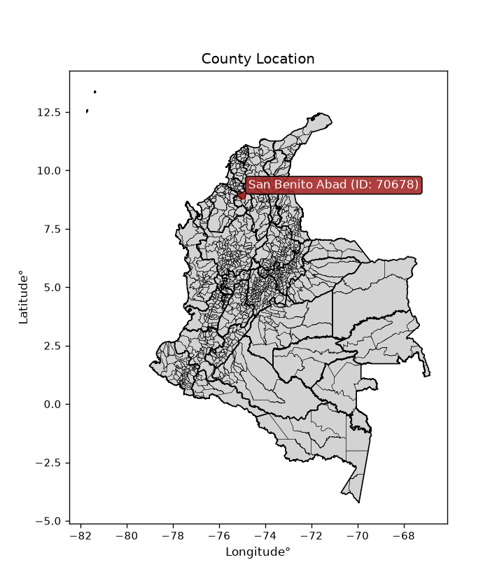
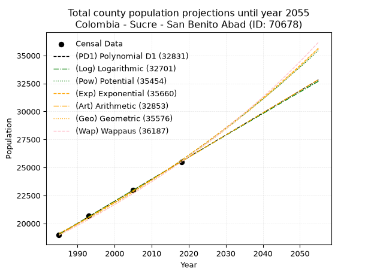
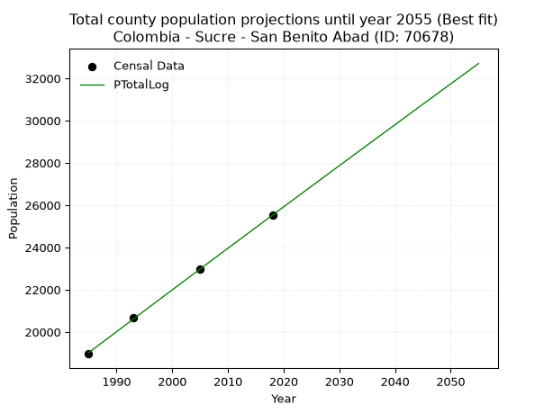
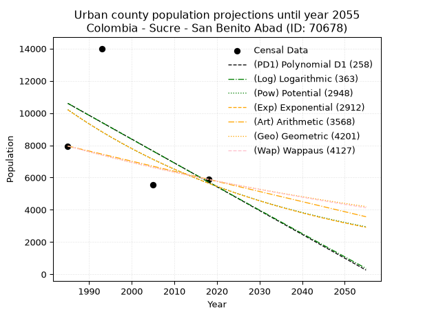
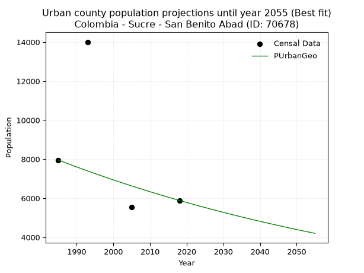
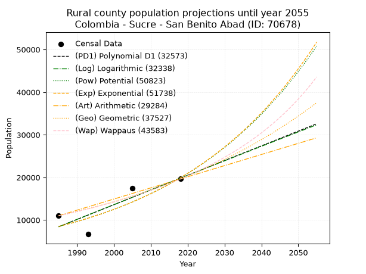
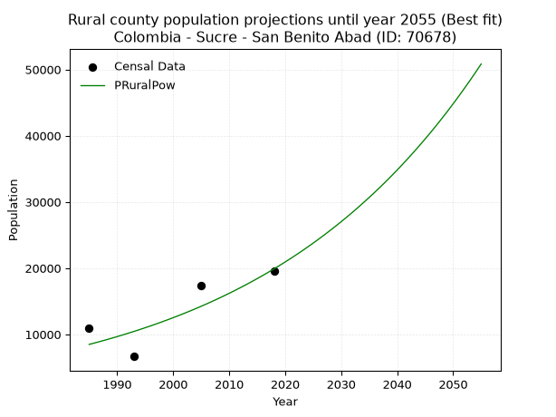

<div align="center">


</div>

# _“Population and Public Services Demand Projections (PPSD) until Year 2050 for Colombia - Sucre - San Benito Abad (ID: 70678)”_
Keywords: `population` `public-service` `projection` `lineal` `polynomial` `logarithmic` `potential` `exponential` `arithmetic` `geometric` `wappaus` `dane` `colombia` `south-america`

PPSD are analytical estimates used by governments and planners to anticipate future changes in population size, age distribution, and the resulting community needs for utilities, healthcare, education, and infrastructure as sizing future water treatment facilities, electrical grids, and road networks based on spatial growth.

<div align="center">

</img>

</div>


> **General running parameters**: • app_version: _v20260806_. • Python version: _3.14.7_. • Pandas version: _3.0.5_. • NumPy version: _2.5.1_. • Creates, save and include plots into reports (create_plot): _False_. • Projection until year: _2050_. • Process polynomial degree 2 and up: _False_. • Process Wappaus: _True_. • Process Wappaus: _True_. • Set negative values to zero: _True_. • Set infinite values to zero: _True_. • Drop dataset notes: _True_. 
<div align="center">

Dynamic map: [:earth_americas:Google](http://maps.google.com/maps?q=8.930107624,-75.0310889) [:earth_americas:OSM](https://www.openstreetmap.org/#map=18/8.930107624/-75.0310889&layers=P) [:earth_americas:Bing](https://www.bing.com/maps?cp=8.930107624~-75.0310889&lvl=18) [:earth_americas:Apple](https://maps.apple.com/frame?center=8.930107624%2C-75.0310889&span=0.003%2C0.006)

</div>


<div align="center">

```geojson
{
  "type": "Feature",
  "geometry": {
    "type": "Point", 
    "coordinates": [-75.0310889, 8.930107624]
  }, 
  "properties": {
    "Name": "Colombia - Sucre - San Benito Abad (ID: 70678)"
  }
}
```

</div>


## 0. Census Data (4 records)

Census data are official statistics collected by a government about the people and housing in a country. They usually include counts of total population, age, sex, race, income, education, and jobs.

📅Global census file: [Population.xlsx](../data/Population.xlsx)

| Source   |   Year |   CountryID | CountryName   |   StateID | StateName   |   CountyID | CountyName      |   PTotal |   PUrban |   PRural |
|:---------|-------:|------------:|:--------------|----------:|:------------|-----------:|:----------------|---------:|---------:|---------:|
| DANE     |   1985 |          57 | Colombia      |        70 | Sucre       |      70678 | San Benito Abad |    18963 |     7957 |    11006 |
| DANE     |   1993 |          57 | Colombia      |        70 | Sucre       |      70678 | San Benito Abad |    20677 |    14007 |     6670 |
| DANE     |   2005 |          57 | Colombia      |        70 | Sucre       |      70678 | San Benito Abad |    22972 |     5546 |    17426 |
| DANE     |   2018 |          57 | Colombia      |        70 | Sucre       |      70678 | San Benito Abad |    25511 |     5888 |    19623 |

> 🔥Some records could had specific notes about the registered values or the corresponding urban or rural distribution.

📅[SUI-RUPS](https://www.datos.gov.co/Hacienda-y-Cr-dito-P-blico/Registro-nico-de-Prestadores-de-Servicios-P-blicos/4qkq-csdn/about_data) - Local public utility companies: [RUPS.csv](../data/RUPS.xlsx)

 | SERVICIO   | ESTADO    | NOMBRE                                                                                       | NIT         | DEPARTAMENTO_DOMICILIO   | MUNICIPIO_DOMICILIO   | DIRECCION       |   TELEFONO | EMAIL                            | TIPO_PRESTADOR                             | CLASIFICACION                 |
|:-----------|:----------|:---------------------------------------------------------------------------------------------|:------------|:-------------------------|:----------------------|:----------------|-----------:|:---------------------------------|:-------------------------------------------|:------------------------------|
| ACUEDUCTO  | OPERATIVA | MUNICIPIO DE SAN BENITO ABAD - UNIDAD ESPECIAL DE SERVICIOS PUBLICOS UESP                    | 892280054-4 | SUCRE                    | SAN BENITO ABAD       | Plaza Principal |    2930003 | alcaldia2008-11@hotmail.com      | MUNICIPIO (PRESTACIÓN DIRECTA)             | HASTA 2500 SUSCRIPTORES       |
| ACUEDUCTO  | OPERATIVA | EMPRESA MUNICIPAL DE ACUEDUCTO ALCANTARILLADO Y ASEO DEL MUNICIPIO DE SAN BENITO ABAD SA ESP | 900675296-4 | SUCRE                    | SAN BENITO ABAD       | CRA 15 # 10-50  |    2930004 | eduardodvf@gmail.com             | SOCIEDADES (EMPRESA DE SERVICIOS PUBLICOS) | MENOR O IGUAL A 2500 USUARIOS |
| ACUEDUCTO  | OPERATIVA | ASOCIACIÓN COMUNITARIA AGUAS DE SANTIAGO APÓSTOL SUCRE                                       | 901394166-2 | SUCRE                    | SAN BENITO ABAD       | CR 7 6B 43      |    8874641 | aguasdesantiagoapostol@gmail.com | ORGANIZACION AUTORIZADA                    | MENOR O IGUAL A 2500 USUARIOS |

## 1. Total

### 1.1. Coefficients and Parameters

* (PD1) Polynomial Deg 1: 197.25933360096167, -372537.2320353236 (lineal)
* (Log) Logarithmic: 394851.5758337611, -2979239.2420543684
* (Pow) Potential: 17.836599618091206, -54.53963780066184
* (Exp) Exponential: 0.00890988635683397, 0.00039841334684201086
* (Art) Arithmetic: Year diff. 2018 - 1985 = 33, Population diff. 25511 - 18963 = 6548, Annual growth = 198.42424242424244
* (Geo) Geometric: Year diff. 2018 - 1985 = 33, Population diff. 25511 - 18963 = 6548, Annual growth % = 0.009029003182611683
* (Wap) Wappaus: i = 0.8923157009679472, Condition values only valid for < 200)

<sub>
Wappaus condition values: ['0.00', '0.89', '1.78', '2.68', '3.57', '4.46', '5.35', '6.25', '7.14', '8.03', '8.92', '9.82', '10.71', '11.60', '12.49', '13.38', '14.28', '15.17', '16.06', '16.95', '17.85', '18.74', '19.63', '20.52', '21.42', '22.31', '23.20', '24.09', '24.98', '25.88', '26.77', '27.66', '28.55', '29.45', '30.34', '31.23', '32.12', '33.02', '33.91', '34.80', '35.69', '36.58', '37.48', '38.37', '39.26', '40.15', '41.05', '41.94', '42.83', '43.72', '44.62', '45.51', '46.40', '47.29', '48.19', '49.08', '49.97', '50.86', '51.75', '52.65', '53.54', '54.43', '55.32', '56.22', '57.11', '58.00']
</sub>


### 1.2. Projected Dataset

|   Year |   CountyID |   PTotalPD1 |   PTotalLog |   PTotalPow |   PTotalExp |   PTotalArt |   PTotalGeo |   PTotalWap |
|-------:|-----------:|------------:|------------:|------------:|------------:|------------:|------------:|------------:|
|   1985 |      70678 |       19023 |       19017 |       19107 |       19113 |       18963 |       18963 |       18963 |
|   1986 |      70678 |       19220 |       19215 |       19280 |       19284 |       19161 |       19134 |       19133 |
|   1987 |      70678 |       19417 |       19414 |       19453 |       19456 |       19360 |       19307 |       19304 |
|   1988 |      70678 |       19614 |       19613 |       19629 |       19630 |       19558 |       19481 |       19478 |
|   1989 |      70678 |       19812 |       19811 |       19806 |       19806 |       19757 |       19657 |       19652 |
|   1990 |      70678 |       20009 |       20010 |       19984 |       19983 |       19955 |       19835 |       19828 |
|   1991 |      70678 |       20206 |       20208 |       20164 |       20162 |       20154 |       20014 |       20006 |
|   1992 |      70678 |       20403 |       20406 |       20345 |       20343 |       20352 |       20194 |       20186 |
|   1993 |      70678 |       20601 |       20605 |       20528 |       20525 |       20550 |       20377 |       20367 |
|   1994 |      70678 |       20798 |       20803 |       20713 |       20708 |       20749 |       20561 |       20550 |
|   1995 |      70678 |       20995 |       21001 |       20899 |       20894 |       20947 |       20746 |       20734 |
|   1996 |      70678 |       21192 |       21199 |       21086 |       21081 |       21146 |       20934 |       20920 |
|   1997 |      70678 |       21390 |       21396 |       21276 |       21269 |       21344 |       21123 |       21108 |
|   1998 |      70678 |       21587 |       21594 |       21467 |       21460 |       21543 |       21313 |       21298 |
|   1999 |      70678 |       21784 |       21792 |       21659 |       21652 |       21741 |       21506 |       21490 |
|   2000 |      70678 |       21981 |       21989 |       21853 |       21846 |       21939 |       21700 |       21683 |
|   2001 |      70678 |       22179 |       22186 |       22049 |       22041 |       22138 |       21896 |       21878 |
|   2002 |      70678 |       22376 |       22384 |       22246 |       22238 |       22336 |       22094 |       22076 |
|   2003 |      70678 |       22573 |       22581 |       22445 |       22437 |       22535 |       22293 |       22275 |
|   2004 |      70678 |       22770 |       22778 |       22646 |       22638 |       22733 |       22495 |       22476 |
|   2005 |      70678 |       22968 |       22975 |       22848 |       22841 |       22931 |       22698 |       22679 |
|   2006 |      70678 |       23165 |       23172 |       23052 |       23045 |       23130 |       22903 |       22884 |
|   2007 |      70678 |       23362 |       23369 |       23258 |       23251 |       23328 |       23109 |       23091 |
|   2008 |      70678 |       23560 |       23565 |       23466 |       23460 |       23527 |       23318 |       23300 |
|   2009 |      70678 |       23757 |       23762 |       23675 |       23669 |       23725 |       23529 |       23511 |
|   2010 |      70678 |       23954 |       23958 |       23886 |       23881 |       23924 |       23741 |       23724 |
|   2011 |      70678 |       24151 |       24155 |       24099 |       24095 |       24122 |       23955 |       23940 |
|   2012 |      70678 |       24349 |       24351 |       24314 |       24311 |       24320 |       24172 |       24157 |
|   2013 |      70678 |       24546 |       24547 |       24530 |       24528 |       24519 |       24390 |       24377 |
|   2014 |      70678 |       24743 |       24743 |       24748 |       24748 |       24717 |       24610 |       24599 |
|   2015 |      70678 |       24940 |       24939 |       24969 |       24969 |       24916 |       24832 |       24824 |
|   2016 |      70678 |       25138 |       25135 |       25190 |       25193 |       25114 |       25056 |       25050 |
|   2017 |      70678 |       25335 |       25331 |       25414 |       25418 |       25313 |       25283 |       25280 |
|   2018 |      70678 |       25532 |       25527 |       25640 |       25646 |       25511 |       25511 |       25511 |
|   2019 |      70678 |       25729 |       25722 |       25868 |       25875 |       25709 |       25741 |       25745 |
|   2020 |      70678 |       25927 |       25918 |       26097 |       26107 |       25908 |       25974 |       25981 |
|   2021 |      70678 |       26124 |       26113 |       26328 |       26340 |       26106 |       26208 |       26220 |
|   2022 |      70678 |       26321 |       26309 |       26562 |       26576 |       26305 |       26445 |       26462 |
|   2023 |      70678 |       26518 |       26504 |       26797 |       26814 |       26503 |       26684 |       26706 |
|   2024 |      70678 |       26716 |       26699 |       27034 |       27054 |       26702 |       26925 |       26952 |
|   2025 |      70678 |       26913 |       26894 |       27274 |       27296 |       26900 |       27168 |       27202 |
|   2026 |      70678 |       27110 |       27089 |       27515 |       27540 |       27098 |       27413 |       27454 |
|   2027 |      70678 |       27307 |       27284 |       27758 |       27787 |       27297 |       27661 |       27709 |
|   2028 |      70678 |       27505 |       27479 |       28003 |       28036 |       27495 |       27910 |       27966 |
|   2029 |      70678 |       27702 |       27673 |       28251 |       28286 |       27694 |       28162 |       28227 |
|   2030 |      70678 |       27899 |       27868 |       28500 |       28540 |       27892 |       28417 |       28490 |
|   2031 |      70678 |       28096 |       28062 |       28751 |       28795 |       28091 |       28673 |       28757 |
|   2032 |      70678 |       28294 |       28257 |       29005 |       29053 |       28289 |       28932 |       29026 |
|   2033 |      70678 |       28491 |       28451 |       29261 |       29313 |       28487 |       29193 |       29298 |
|   2034 |      70678 |       28688 |       28645 |       29518 |       29575 |       28686 |       29457 |       29574 |
|   2035 |      70678 |       28886 |       28839 |       29778 |       29840 |       28884 |       29723 |       29853 |
|   2036 |      70678 |       29083 |       29033 |       30040 |       30107 |       29083 |       29991 |       30135 |
|   2037 |      70678 |       29280 |       29227 |       30305 |       30376 |       29281 |       30262 |       30420 |
|   2038 |      70678 |       29477 |       29421 |       30571 |       30648 |       29479 |       30535 |       30709 |
|   2039 |      70678 |       29675 |       29615 |       30840 |       30922 |       29678 |       30811 |       31000 |
|   2040 |      70678 |       29872 |       29808 |       31111 |       31199 |       29876 |       31089 |       31296 |
|   2041 |      70678 |       30069 |       30002 |       31384 |       31478 |       30075 |       31370 |       31595 |
|   2042 |      70678 |       30266 |       30195 |       31659 |       31760 |       30273 |       31653 |       31897 |
|   2043 |      70678 |       30464 |       30388 |       31937 |       32044 |       30472 |       31939 |       32203 |
|   2044 |      70678 |       30661 |       30582 |       32217 |       32331 |       30670 |       32227 |       32513 |
|   2045 |      70678 |       30858 |       30775 |       32499 |       32621 |       30868 |       32518 |       32827 |
|   2046 |      70678 |       31055 |       30968 |       32784 |       32912 |       31067 |       32812 |       33144 |
|   2047 |      70678 |       31253 |       31161 |       33071 |       33207 |       31265 |       33108 |       33466 |
|   2048 |      70678 |       31450 |       31354 |       33360 |       33504 |       31464 |       33407 |       33791 |
|   2049 |      70678 |       31647 |       31546 |       33652 |       33804 |       31662 |       33709 |       34121 |
|   2050 |      70678 |       31844 |       31739 |       33946 |       34107 |       31861 |       34013 |       34454 |
<div align="center">

</img>

</div>


### 1.3. Best fit with absolute and relative error (%)

Relative error puts that difference into context by dividing the absolute error by the true value, creating a unitless ratio or percentage that shows the scale of the mistake.

Absolute and relative error

|   Year | Source   |   CountryID | CountryName   |   StateID | StateName   |   CountyID_x | CountyName      |   PTotal |   PUrban |   PRural |   CountyID_y |   PTotalPD1 |   PTotalLog |   PTotalPow |   PTotalExp |   PTotalArt |   PTotalGeo |   PTotalWap |   PTotalPD1AbsError |   PTotalLogAbsError |   PTotalPowAbsError |   PTotalExpAbsError |   PTotalArtAbsError |   PTotalGeoAbsError |   PTotalWapAbsError |   PTotalPD1RelError |   PTotalLogRelError |   PTotalPowRelError |   PTotalExpRelError |   PTotalArtRelError |   PTotalGeoRelError |   PTotalWapRelError |
|-------:|:---------|------------:|:--------------|----------:|:------------|-------------:|:----------------|---------:|---------:|---------:|-------------:|------------:|------------:|------------:|------------:|------------:|------------:|------------:|--------------------:|--------------------:|--------------------:|--------------------:|--------------------:|--------------------:|--------------------:|--------------------:|--------------------:|--------------------:|--------------------:|--------------------:|--------------------:|--------------------:|
|   1985 | DANE     |          57 | Colombia      |        70 | Sucre       |        70678 | San Benito Abad |    18963 |     7957 |    11006 |        70678 |       19023 |       19017 |       19107 |       19113 |       18963 |       18963 |       18963 |                  60 |                  54 |                 144 |                 150 |                   0 |                   0 |                   0 |           0.316406  |           0.284765  |            0.759374 |            0.791014 |            0        |             0       |             0       |
|   1993 | DANE     |          57 | Colombia      |        70 | Sucre       |        70678 | San Benito Abad |    20677 |    14007 |     6670 |        70678 |       20601 |       20605 |       20528 |       20525 |       20550 |       20377 |       20367 |                  76 |                  72 |                 149 |                 152 |                 127 |                 300 |                 310 |           0.367558  |           0.348213  |            0.720607 |            0.735116 |            0.614209 |             1.45089 |             1.49925 |
|   2005 | DANE     |          57 | Colombia      |        70 | Sucre       |        70678 | San Benito Abad |    22972 |     5546 |    17426 |        70678 |       22968 |       22975 |       22848 |       22841 |       22931 |       22698 |       22679 |                   4 |                   3 |                 124 |                 131 |                  41 |                 274 |                 293 |           0.0174125 |           0.0130594 |            0.539788 |            0.570259 |            0.178478 |             1.19276 |             1.27547 |
|   2018 | DANE     |          57 | Colombia      |        70 | Sucre       |        70678 | San Benito Abad |    25511 |     5888 |    19623 |        70678 |       25532 |       25527 |       25640 |       25646 |       25511 |       25511 |       25511 |                  21 |                  16 |                 129 |                 135 |                   0 |                   0 |                   0 |           0.0823174 |           0.062718  |            0.505664 |            0.529183 |            0        |             0       |             0       |

Relative error mean

| Method    |   RelError | Best   |
|:----------|-----------:|:-------|
| PTotalPD1 |   0.195923 |        |
| PTotalLog |   0.177189 | True   |
| PTotalPow |   0.631358 |        |
| PTotalExp |   0.656393 |        |
| PTotalArt |   0.198172 |        |
| PTotalGeo |   0.660911 |        |
| PTotalWap |   0.693679 |        |

💙Best method: _**PTotalLog**_
<div align="center">

</img>

</div>


### 1.4. Fresh water supply demand in liters per capita per day (lpcd)

The fresh water supply demand typically ranges from 100 to 300 liters per capita per day (lpcd) for standard domestic and municipal planning, though absolute survival minimums set by the World Health Organization are as low as 7.5 to 20 liters per day, and total consumption in high-income nations can exceed 400 liters.

> `CZ`: Level in meters above the sea level (masl)<br> `WS`: Fresh water supply demand in liters per capita per day (lpcd or l/h/d)<br> `WSAll`: Zonal fresh water supply demand in liters per second (l/s)<br> `A`: Zonal area in square meters<br> `DP`: Population density (people/hectare or p/ha)

Reference values (RAS Colombia)

|    CZ |   WS |
|------:|-----:|
|  1000 |  120 |
|  2000 |  130 |
| 99999 |  140 |

County shapefile geometry properties and water supply values

|   CountyID |      ATotal |   CZTotal |   WSTotal |
|-----------:|------------:|----------:|----------:|
|      70678 | 1.49314e+09 |   21.8017 |       120 |

Projected values for best method: PTotalLog

|   CountyID |   Year |   PTotalLog |   DPTotal |   WSTotal |   WSTotalAll |
|-----------:|-------:|------------:|----------:|----------:|-------------:|
|      70678 |   1985 |       19017 |      0.13 |       120 |      26.4125 |
|      70678 |   1986 |       19215 |      0.13 |       120 |      26.6875 |
|      70678 |   1987 |       19414 |      0.13 |       120 |      26.9639 |
|      70678 |   1988 |       19613 |      0.13 |       120 |      27.2403 |
|      70678 |   1989 |       19811 |      0.13 |       120 |      27.5153 |
|      70678 |   1990 |       20010 |      0.13 |       120 |      27.7917 |
|      70678 |   1991 |       20208 |      0.14 |       120 |      28.0667 |
|      70678 |   1992 |       20406 |      0.14 |       120 |      28.3417 |
|      70678 |   1993 |       20605 |      0.14 |       120 |      28.6181 |
|      70678 |   1994 |       20803 |      0.14 |       120 |      28.8931 |
|      70678 |   1995 |       21001 |      0.14 |       120 |      29.1681 |
|      70678 |   1996 |       21199 |      0.14 |       120 |      29.4431 |
|      70678 |   1997 |       21396 |      0.14 |       120 |      29.7167 |
|      70678 |   1998 |       21594 |      0.14 |       120 |      29.9917 |
|      70678 |   1999 |       21792 |      0.15 |       120 |      30.2667 |
|      70678 |   2000 |       21989 |      0.15 |       120 |      30.5403 |
|      70678 |   2001 |       22186 |      0.15 |       120 |      30.8139 |
|      70678 |   2002 |       22384 |      0.15 |       120 |      31.0889 |
|      70678 |   2003 |       22581 |      0.15 |       120 |      31.3625 |
|      70678 |   2004 |       22778 |      0.15 |       120 |      31.6361 |
|      70678 |   2005 |       22975 |      0.15 |       120 |      31.9097 |
|      70678 |   2006 |       23172 |      0.16 |       120 |      32.1833 |
|      70678 |   2007 |       23369 |      0.16 |       120 |      32.4569 |
|      70678 |   2008 |       23565 |      0.16 |       120 |      32.7292 |
|      70678 |   2009 |       23762 |      0.16 |       120 |      33.0028 |
|      70678 |   2010 |       23958 |      0.16 |       120 |      33.275  |
|      70678 |   2011 |       24155 |      0.16 |       120 |      33.5486 |
|      70678 |   2012 |       24351 |      0.16 |       120 |      33.8208 |
|      70678 |   2013 |       24547 |      0.16 |       120 |      34.0931 |
|      70678 |   2014 |       24743 |      0.17 |       120 |      34.3653 |
|      70678 |   2015 |       24939 |      0.17 |       120 |      34.6375 |
|      70678 |   2016 |       25135 |      0.17 |       120 |      34.9097 |
|      70678 |   2017 |       25331 |      0.17 |       120 |      35.1819 |
|      70678 |   2018 |       25527 |      0.17 |       120 |      35.4542 |
|      70678 |   2019 |       25722 |      0.17 |       120 |      35.725  |
|      70678 |   2020 |       25918 |      0.17 |       120 |      35.9972 |
|      70678 |   2021 |       26113 |      0.17 |       120 |      36.2681 |
|      70678 |   2022 |       26309 |      0.18 |       120 |      36.5403 |
|      70678 |   2023 |       26504 |      0.18 |       120 |      36.8111 |
|      70678 |   2024 |       26699 |      0.18 |       120 |      37.0819 |
|      70678 |   2025 |       26894 |      0.18 |       120 |      37.3528 |
|      70678 |   2026 |       27089 |      0.18 |       120 |      37.6236 |
|      70678 |   2027 |       27284 |      0.18 |       120 |      37.8944 |
|      70678 |   2028 |       27479 |      0.18 |       120 |      38.1653 |
|      70678 |   2029 |       27673 |      0.19 |       120 |      38.4347 |
|      70678 |   2030 |       27868 |      0.19 |       120 |      38.7056 |
|      70678 |   2031 |       28062 |      0.19 |       120 |      38.975  |
|      70678 |   2032 |       28257 |      0.19 |       120 |      39.2458 |
|      70678 |   2033 |       28451 |      0.19 |       120 |      39.5153 |
|      70678 |   2034 |       28645 |      0.19 |       120 |      39.7847 |
|      70678 |   2035 |       28839 |      0.19 |       120 |      40.0542 |
|      70678 |   2036 |       29033 |      0.19 |       120 |      40.3236 |
|      70678 |   2037 |       29227 |      0.2  |       120 |      40.5931 |
|      70678 |   2038 |       29421 |      0.2  |       120 |      40.8625 |
|      70678 |   2039 |       29615 |      0.2  |       120 |      41.1319 |
|      70678 |   2040 |       29808 |      0.2  |       120 |      41.4    |
|      70678 |   2041 |       30002 |      0.2  |       120 |      41.6694 |
|      70678 |   2042 |       30195 |      0.2  |       120 |      41.9375 |
|      70678 |   2043 |       30388 |      0.2  |       120 |      42.2056 |
|      70678 |   2044 |       30582 |      0.2  |       120 |      42.475  |
|      70678 |   2045 |       30775 |      0.21 |       120 |      42.7431 |
|      70678 |   2046 |       30968 |      0.21 |       120 |      43.0111 |
|      70678 |   2047 |       31161 |      0.21 |       120 |      43.2792 |
|      70678 |   2048 |       31354 |      0.21 |       120 |      43.5472 |
|      70678 |   2049 |       31546 |      0.21 |       120 |      43.8139 |
|      70678 |   2050 |       31739 |      0.21 |       120 |      44.0819 |

## 2. Urban

### 2.1. Coefficients and Parameters

* (PD1) Polynomial Deg 1: -147.79526294660752, 303976.9747089518 (lineal)
* (Log) Logarithmic: -295529.6981003063, 2254673.1034868015
* (Pow) Potential: -35.84756140607101, 122.22577931716087
* (Exp) Exponential: -0.017920035554076418, 2.866495700793408e+19
* (Art) Arithmetic: Year diff. 2018 - 1985 = 33, Population diff. 5888 - 7957 = -2069, Annual growth = -62.696969696969695
* (Geo) Geometric: Year diff. 2018 - 1985 = 33, Population diff. 5888 - 7957 = -2069, Annual growth % = -0.009083813717437383
* (Wap) Wappaus: i = -0.9056983704871029, Condition values only valid for < 200)

<sub>
Wappaus condition values: ['-0.00', '-0.91', '-1.81', '-2.72', '-3.62', '-4.53', '-5.43', '-6.34', '-7.25', '-8.15', '-9.06', '-9.96', '-10.87', '-11.77', '-12.68', '-13.59', '-14.49', '-15.40', '-16.30', '-17.21', '-18.11', '-19.02', '-19.93', '-20.83', '-21.74', '-22.64', '-23.55', '-24.45', '-25.36', '-26.27', '-27.17', '-28.08', '-28.98', '-29.89', '-30.79', '-31.70', '-32.61', '-33.51', '-34.42', '-35.32', '-36.23', '-37.13', '-38.04', '-38.95', '-39.85', '-40.76', '-41.66', '-42.57', '-43.47', '-44.38', '-45.28', '-46.19', '-47.10', '-48.00', '-48.91', '-49.81', '-50.72', '-51.62', '-52.53', '-53.44', '-54.34', '-55.25', '-56.15', '-57.06', '-57.96', '-58.87']
</sub>


### 2.2. Projected Dataset

|   Year |   CountyID |   PUrbanPD1 |   PUrbanLog |   PUrbanPow |   PUrbanExp |   PUrbanArt |   PUrbanGeo |   PUrbanWap |
|-------:|-----------:|------------:|------------:|------------:|------------:|------------:|------------:|------------:|
|   1985 |      70678 |       10603 |       10606 |       10212 |       10208 |        7957 |        7957 |        7957 |
|   1986 |      70678 |       10456 |       10457 |       10029 |       10027 |        7894 |        7885 |        7885 |
|   1987 |      70678 |       10308 |       10308 |        9850 |        9849 |        7832 |        7813 |        7814 |
|   1988 |      70678 |       10160 |       10159 |        9674 |        9674 |        7769 |        7742 |        7744 |
|   1989 |      70678 |       10012 |       10011 |        9501 |        9502 |        7706 |        7672 |        7674 |
|   1990 |      70678 |        9864 |        9862 |        9331 |        9333 |        7644 |        7602 |        7605 |
|   1991 |      70678 |        9717 |        9714 |        9165 |        9167 |        7581 |        7533 |        7536 |
|   1992 |      70678 |        9569 |        9565 |        9001 |        9005 |        7518 |        7465 |        7468 |
|   1993 |      70678 |        9421 |        9417 |        8841 |        8845 |        7455 |        7397 |        7401 |
|   1994 |      70678 |        9273 |        9269 |        8683 |        8688 |        7393 |        7330 |        7334 |
|   1995 |      70678 |        9125 |        9120 |        8529 |        8533 |        7330 |        7263 |        7268 |
|   1996 |      70678 |        8978 |        8972 |        8377 |        8382 |        7267 |        7197 |        7202 |
|   1997 |      70678 |        8830 |        8824 |        8228 |        8233 |        7205 |        7132 |        7137 |
|   1998 |      70678 |        8682 |        8676 |        8081 |        8087 |        7142 |        7067 |        7072 |
|   1999 |      70678 |        8534 |        8528 |        7938 |        7943 |        7079 |        7003 |        7008 |
|   2000 |      70678 |        8386 |        8381 |        7797 |        7802 |        7017 |        6939 |        6945 |
|   2001 |      70678 |        8239 |        8233 |        7658 |        7663 |        6954 |        6876 |        6882 |
|   2002 |      70678 |        8091 |        8085 |        7522 |        7527 |        6891 |        6814 |        6819 |
|   2003 |      70678 |        7943 |        7938 |        7389 |        7394 |        6828 |        6752 |        6758 |
|   2004 |      70678 |        7795 |        7790 |        7258 |        7262 |        6766 |        6690 |        6696 |
|   2005 |      70678 |        7647 |        7643 |        7129 |        7133 |        6703 |        6630 |        6635 |
|   2006 |      70678 |        7500 |        7495 |        7003 |        7007 |        6640 |        6569 |        6575 |
|   2007 |      70678 |        7352 |        7348 |        6879 |        6882 |        6578 |        6510 |        6515 |
|   2008 |      70678 |        7204 |        7201 |        6757 |        6760 |        6515 |        6451 |        6456 |
|   2009 |      70678 |        7056 |        7054 |        6637 |        6640 |        6452 |        6392 |        6397 |
|   2010 |      70678 |        6908 |        6907 |        6520 |        6522 |        6390 |        6334 |        6339 |
|   2011 |      70678 |        6761 |        6760 |        6405 |        6406 |        6327 |        6276 |        6281 |
|   2012 |      70678 |        6613 |        6613 |        6292 |        6292 |        6264 |        6219 |        6223 |
|   2013 |      70678 |        6465 |        6466 |        6181 |        6181 |        6201 |        6163 |        6166 |
|   2014 |      70678 |        6317 |        6319 |        6072 |        6071 |        6139 |        6107 |        6110 |
|   2015 |      70678 |        6170 |        6172 |        5965 |        5963 |        6076 |        6051 |        6054 |
|   2016 |      70678 |        6022 |        6026 |        5859 |        5857 |        6013 |        5996 |        5998 |
|   2017 |      70678 |        5874 |        5879 |        5756 |        5753 |        5951 |        5942 |        5943 |
|   2018 |      70678 |        5726 |        5733 |        5655 |        5651 |        5888 |        5888 |        5888 |
|   2019 |      70678 |        5578 |        5586 |        5555 |        5551 |        5825 |        5835 |        5834 |
|   2020 |      70678 |        5431 |        5440 |        5457 |        5452 |        5763 |        5782 |        5780 |
|   2021 |      70678 |        5283 |        5294 |        5362 |        5355 |        5700 |        5729 |        5726 |
|   2022 |      70678 |        5135 |        5148 |        5267 |        5260 |        5637 |        5677 |        5673 |
|   2023 |      70678 |        4987 |        5001 |        5175 |        5167 |        5575 |        5625 |        5621 |
|   2024 |      70678 |        4839 |        4855 |        5084 |        5075 |        5512 |        5574 |        5568 |
|   2025 |      70678 |        4692 |        4709 |        4995 |        4985 |        5449 |        5524 |        5516 |
|   2026 |      70678 |        4544 |        4564 |        4907 |        4896 |        5386 |        5473 |        5465 |
|   2027 |      70678 |        4396 |        4418 |        4821 |        4809 |        5324 |        5424 |        5414 |
|   2028 |      70678 |        4248 |        4272 |        4737 |        4724 |        5261 |        5374 |        5363 |
|   2029 |      70678 |        4100 |        4126 |        4654 |        4640 |        5198 |        5326 |        5313 |
|   2030 |      70678 |        3953 |        3981 |        4572 |        4558 |        5136 |        5277 |        5263 |
|   2031 |      70678 |        3805 |        3835 |        4492 |        4477 |        5073 |        5229 |        5213 |
|   2032 |      70678 |        3657 |        3690 |        4413 |        4397 |        5010 |        5182 |        5164 |
|   2033 |      70678 |        3509 |        3544 |        4336 |        4319 |        4948 |        5135 |        5115 |
|   2034 |      70678 |        3361 |        3399 |        4261 |        4242 |        4885 |        5088 |        5067 |
|   2035 |      70678 |        3214 |        3254 |        4186 |        4167 |        4822 |        5042 |        5019 |
|   2036 |      70678 |        3066 |        3108 |        4113 |        4093 |        4759 |        4996 |        4971 |
|   2037 |      70678 |        2918 |        2963 |        4041 |        4020 |        4697 |        4951 |        4924 |
|   2038 |      70678 |        2770 |        2818 |        3971 |        3949 |        4634 |        4906 |        4877 |
|   2039 |      70678 |        2622 |        2673 |        3902 |        3879 |        4571 |        4861 |        4830 |
|   2040 |      70678 |        2475 |        2528 |        3834 |        3810 |        4509 |        4817 |        4784 |
|   2041 |      70678 |        2327 |        2384 |        3767 |        3742 |        4446 |        4773 |        4738 |
|   2042 |      70678 |        2179 |        2239 |        3701 |        3676 |        4383 |        4730 |        4692 |
|   2043 |      70678 |        2031 |        2094 |        3637 |        3610 |        4321 |        4687 |        4647 |
|   2044 |      70678 |        1883 |        1950 |        3574 |        3546 |        4258 |        4644 |        4602 |
|   2045 |      70678 |        1736 |        1805 |        3512 |        3483 |        4195 |        4602 |        4557 |
|   2046 |      70678 |        1588 |        1661 |        3451 |        3421 |        4132 |        4560 |        4512 |
|   2047 |      70678 |        1440 |        1516 |        3391 |        3361 |        4070 |        4519 |        4468 |
|   2048 |      70678 |        1292 |        1372 |        3332 |        3301 |        4007 |        4478 |        4425 |
|   2049 |      70678 |        1144 |        1227 |        3274 |        3242 |        3944 |        4437 |        4381 |
|   2050 |      70678 |         997 |        1083 |        3217 |        3185 |        3882 |        4397 |        4338 |
<div align="center">

</img>

</div>


### 2.3. Best fit with absolute and relative error (%)

Relative error puts that difference into context by dividing the absolute error by the true value, creating a unitless ratio or percentage that shows the scale of the mistake.

Absolute and relative error

|   Year | Source   |   CountryID | CountryName   |   StateID | StateName   |   CountyID_x | CountyName      |   PTotal |   PUrban |   PRural |   CountyID_y |   PUrbanPD1 |   PUrbanLog |   PUrbanPow |   PUrbanExp |   PUrbanArt |   PUrbanGeo |   PUrbanWap |   PUrbanPD1AbsError |   PUrbanLogAbsError |   PUrbanPowAbsError |   PUrbanExpAbsError |   PUrbanArtAbsError |   PUrbanGeoAbsError |   PUrbanWapAbsError |   PUrbanPD1RelError |   PUrbanLogRelError |   PUrbanPowRelError |   PUrbanExpRelError |   PUrbanArtRelError |   PUrbanGeoRelError |   PUrbanWapRelError |
|-------:|:---------|------------:|:--------------|----------:|:------------|-------------:|:----------------|---------:|---------:|---------:|-------------:|------------:|------------:|------------:|------------:|------------:|------------:|------------:|--------------------:|--------------------:|--------------------:|--------------------:|--------------------:|--------------------:|--------------------:|--------------------:|--------------------:|--------------------:|--------------------:|--------------------:|--------------------:|--------------------:|
|   1985 | DANE     |          57 | Colombia      |        70 | Sucre       |        70678 | San Benito Abad |    18963 |     7957 |    11006 |        70678 |       10603 |       10606 |       10212 |       10208 |        7957 |        7957 |        7957 |                2646 |                2649 |                2255 |                2251 |                   0 |                   0 |                   0 |            33.2537  |            33.2914  |             28.3398 |            28.2896  |              0      |              0      |              0      |
|   1993 | DANE     |          57 | Colombia      |        70 | Sucre       |        70678 | San Benito Abad |    20677 |    14007 |     6670 |        70678 |        9421 |        9417 |        8841 |        8845 |        7455 |        7397 |        7401 |                4586 |                4590 |                5166 |                5162 |                6552 |                6610 |                6606 |            32.7408  |            32.7693  |             36.8816 |            36.853   |             46.7766 |             47.1907 |             47.1621 |
|   2005 | DANE     |          57 | Colombia      |        70 | Sucre       |        70678 | San Benito Abad |    22972 |     5546 |    17426 |        70678 |        7647 |        7643 |        7129 |        7133 |        6703 |        6630 |        6635 |                2101 |                2097 |                1583 |                1587 |                1157 |                1084 |                1089 |            37.8832  |            37.811   |             28.5431 |            28.6152  |             20.8619 |             19.5456 |             19.6358 |
|   2018 | DANE     |          57 | Colombia      |        70 | Sucre       |        70678 | San Benito Abad |    25511 |     5888 |    19623 |        70678 |        5726 |        5733 |        5655 |        5651 |        5888 |        5888 |        5888 |                 162 |                 155 |                 233 |                 237 |                   0 |                   0 |                   0 |             2.75136 |             2.63247 |              3.9572 |             4.02514 |              0      |              0      |              0      |

Relative error mean

| Method    |   RelError | Best   |
|:----------|-----------:|:-------|
| PUrbanPD1 |    26.6573 |        |
| PUrbanLog |    26.6261 |        |
| PUrbanPow |    24.4304 |        |
| PUrbanExp |    24.4457 |        |
| PUrbanArt |    16.9096 |        |
| PUrbanGeo |    16.6841 | True   |
| PUrbanWap |    16.6995 |        |

💙Best method: _**PUrbanGeo**_
<div align="center">

</img>

</div>


### 2.4. Fresh water supply demand in liters per capita per day (lpcd)

The fresh water supply demand typically ranges from 100 to 300 liters per capita per day (lpcd) for standard domestic and municipal planning, though absolute survival minimums set by the World Health Organization are as low as 7.5 to 20 liters per day, and total consumption in high-income nations can exceed 400 liters.

> `CZ`: Level in meters above the sea level (masl)<br> `WS`: Fresh water supply demand in liters per capita per day (lpcd or l/h/d)<br> `WSAll`: Zonal fresh water supply demand in liters per second (l/s)<br> `A`: Zonal area in square meters<br> `DP`: Population density (people/hectare or p/ha)

Reference values (RAS Colombia)

|    CZ |   WS |
|------:|-----:|
|  1000 |  120 |
|  2000 |  130 |
| 99999 |  140 |

County shapefile geometry properties and water supply values

|   CountyID |      AUrban |   CZUrban |   WSUrban |
|-----------:|------------:|----------:|----------:|
|      70678 | 2.30747e+06 |   22.4515 |       120 |

Projected values for best method: PUrbanGeo

|   CountyID |   Year |   PUrbanGeo |   DPUrban |   WSUrban |   WSUrbanAll |
|-----------:|-------:|------------:|----------:|----------:|-------------:|
|      70678 |   1985 |        7957 |     34.48 |       120 |     11.0514  |
|      70678 |   1986 |        7885 |     34.17 |       120 |     10.9514  |
|      70678 |   1987 |        7813 |     33.86 |       120 |     10.8514  |
|      70678 |   1988 |        7742 |     33.55 |       120 |     10.7528  |
|      70678 |   1989 |        7672 |     33.25 |       120 |     10.6556  |
|      70678 |   1990 |        7602 |     32.95 |       120 |     10.5583  |
|      70678 |   1991 |        7533 |     32.65 |       120 |     10.4625  |
|      70678 |   1992 |        7465 |     32.35 |       120 |     10.3681  |
|      70678 |   1993 |        7397 |     32.06 |       120 |     10.2736  |
|      70678 |   1994 |        7330 |     31.77 |       120 |     10.1806  |
|      70678 |   1995 |        7263 |     31.48 |       120 |     10.0875  |
|      70678 |   1996 |        7197 |     31.19 |       120 |      9.99583 |
|      70678 |   1997 |        7132 |     30.91 |       120 |      9.90556 |
|      70678 |   1998 |        7067 |     30.63 |       120 |      9.81528 |
|      70678 |   1999 |        7003 |     30.35 |       120 |      9.72639 |
|      70678 |   2000 |        6939 |     30.07 |       120 |      9.6375  |
|      70678 |   2001 |        6876 |     29.8  |       120 |      9.55    |
|      70678 |   2002 |        6814 |     29.53 |       120 |      9.46389 |
|      70678 |   2003 |        6752 |     29.26 |       120 |      9.37778 |
|      70678 |   2004 |        6690 |     28.99 |       120 |      9.29167 |
|      70678 |   2005 |        6630 |     28.73 |       120 |      9.20833 |
|      70678 |   2006 |        6569 |     28.47 |       120 |      9.12361 |
|      70678 |   2007 |        6510 |     28.21 |       120 |      9.04167 |
|      70678 |   2008 |        6451 |     27.96 |       120 |      8.95972 |
|      70678 |   2009 |        6392 |     27.7  |       120 |      8.87778 |
|      70678 |   2010 |        6334 |     27.45 |       120 |      8.79722 |
|      70678 |   2011 |        6276 |     27.2  |       120 |      8.71667 |
|      70678 |   2012 |        6219 |     26.95 |       120 |      8.6375  |
|      70678 |   2013 |        6163 |     26.71 |       120 |      8.55972 |
|      70678 |   2014 |        6107 |     26.47 |       120 |      8.48194 |
|      70678 |   2015 |        6051 |     26.22 |       120 |      8.40417 |
|      70678 |   2016 |        5996 |     25.99 |       120 |      8.32778 |
|      70678 |   2017 |        5942 |     25.75 |       120 |      8.25278 |
|      70678 |   2018 |        5888 |     25.52 |       120 |      8.17778 |
|      70678 |   2019 |        5835 |     25.29 |       120 |      8.10417 |
|      70678 |   2020 |        5782 |     25.06 |       120 |      8.03056 |
|      70678 |   2021 |        5729 |     24.83 |       120 |      7.95694 |
|      70678 |   2022 |        5677 |     24.6  |       120 |      7.88472 |
|      70678 |   2023 |        5625 |     24.38 |       120 |      7.8125  |
|      70678 |   2024 |        5574 |     24.16 |       120 |      7.74167 |
|      70678 |   2025 |        5524 |     23.94 |       120 |      7.67222 |
|      70678 |   2026 |        5473 |     23.72 |       120 |      7.60139 |
|      70678 |   2027 |        5424 |     23.51 |       120 |      7.53333 |
|      70678 |   2028 |        5374 |     23.29 |       120 |      7.46389 |
|      70678 |   2029 |        5326 |     23.08 |       120 |      7.39722 |
|      70678 |   2030 |        5277 |     22.87 |       120 |      7.32917 |
|      70678 |   2031 |        5229 |     22.66 |       120 |      7.2625  |
|      70678 |   2032 |        5182 |     22.46 |       120 |      7.19722 |
|      70678 |   2033 |        5135 |     22.25 |       120 |      7.13194 |
|      70678 |   2034 |        5088 |     22.05 |       120 |      7.06667 |
|      70678 |   2035 |        5042 |     21.85 |       120 |      7.00278 |
|      70678 |   2036 |        4996 |     21.65 |       120 |      6.93889 |
|      70678 |   2037 |        4951 |     21.46 |       120 |      6.87639 |
|      70678 |   2038 |        4906 |     21.26 |       120 |      6.81389 |
|      70678 |   2039 |        4861 |     21.07 |       120 |      6.75139 |
|      70678 |   2040 |        4817 |     20.88 |       120 |      6.69028 |
|      70678 |   2041 |        4773 |     20.68 |       120 |      6.62917 |
|      70678 |   2042 |        4730 |     20.5  |       120 |      6.56944 |
|      70678 |   2043 |        4687 |     20.31 |       120 |      6.50972 |
|      70678 |   2044 |        4644 |     20.13 |       120 |      6.45    |
|      70678 |   2045 |        4602 |     19.94 |       120 |      6.39167 |
|      70678 |   2046 |        4560 |     19.76 |       120 |      6.33333 |
|      70678 |   2047 |        4519 |     19.58 |       120 |      6.27639 |
|      70678 |   2048 |        4478 |     19.41 |       120 |      6.21944 |
|      70678 |   2049 |        4437 |     19.23 |       120 |      6.1625  |
|      70678 |   2050 |        4397 |     19.06 |       120 |      6.10694 |

## 3. Rural

### 3.1. Coefficients and Parameters

* (PD1) Polynomial Deg 1: 345.05459654756925, -676514.2067442755 (lineal)
* (Log) Logarithmic: 690381.2739340677, -5233912.345541172
* (Pow) Potential: 51.64691019513391, -166.39043769535948
* (Exp) Exponential: 0.02581747048596251, 4.702800765692962e-19
* (Art) Arithmetic: Year diff. 2018 - 1985 = 33, Population diff. 19623 - 11006 = 8617, Annual growth = 261.1212121212121
* (Geo) Geometric: Year diff. 2018 - 1985 = 33, Population diff. 19623 - 11006 = 8617, Annual growth % = 0.017677513855130833
* (Wap) Wappaus: i = 1.7050586837390194, Condition values only valid for < 200)

<sub>
Wappaus condition values: ['0.00', '1.71', '3.41', '5.12', '6.82', '8.53', '10.23', '11.94', '13.64', '15.35', '17.05', '18.76', '20.46', '22.17', '23.87', '25.58', '27.28', '28.99', '30.69', '32.40', '34.10', '35.81', '37.51', '39.22', '40.92', '42.63', '44.33', '46.04', '47.74', '49.45', '51.15', '52.86', '54.56', '56.27', '57.97', '59.68', '61.38', '63.09', '64.79', '66.50', '68.20', '69.91', '71.61', '73.32', '75.02', '76.73', '78.43', '80.14', '81.84', '83.55', '85.25', '86.96', '88.66', '90.37', '92.07', '93.78', '95.48', '97.19', '98.89', '100.60', '102.30', '104.01', '105.71', '107.42', '109.12', '110.83']
</sub>


### 3.2. Projected Dataset

|   Year |   CountyID |   PRuralPD1 |   PRuralLog |   PRuralPow |   PRuralExp |   PRuralArt |   PRuralGeo |   PRuralWap |
|-------:|-----------:|------------:|------------:|------------:|------------:|------------:|------------:|------------:|
|   1985 |      70678 |        8419 |        8411 |        8486 |        8491 |       11006 |       11006 |       11006 |
|   1986 |      70678 |        8764 |        8759 |        8710 |        8713 |       11267 |       11201 |       11195 |
|   1987 |      70678 |        9109 |        9106 |        8939 |        8941 |       11528 |       11399 |       11388 |
|   1988 |      70678 |        9454 |        9454 |        9174 |        9174 |       11789 |       11600 |       11584 |
|   1989 |      70678 |        9799 |        9801 |        9416 |        9414 |       12050 |       11805 |       11783 |
|   1990 |      70678 |       10144 |       10148 |        9663 |        9661 |       12312 |       12014 |       11986 |
|   1991 |      70678 |       10489 |       10495 |        9917 |        9913 |       12573 |       12226 |       12193 |
|   1992 |      70678 |       10835 |       10841 |       10178 |       10172 |       12834 |       12442 |       12403 |
|   1993 |      70678 |       11180 |       11188 |       10445 |       10439 |       13095 |       12662 |       12617 |
|   1994 |      70678 |       11525 |       11534 |       10719 |       10712 |       13356 |       12886 |       12835 |
|   1995 |      70678 |       11870 |       11880 |       11001 |       10992 |       13617 |       13114 |       13057 |
|   1996 |      70678 |       12215 |       12226 |       11289 |       11279 |       13878 |       13346 |       13284 |
|   1997 |      70678 |       12560 |       12572 |       11585 |       11574 |       14139 |       13582 |       13515 |
|   1998 |      70678 |       12905 |       12918 |       11888 |       11877 |       14401 |       13822 |       13750 |
|   1999 |      70678 |       13250 |       13263 |       12200 |       12187 |       14662 |       14066 |       13989 |
|   2000 |      70678 |       13595 |       13608 |       12519 |       12506 |       14923 |       14315 |       14234 |
|   2001 |      70678 |       13940 |       13953 |       12846 |       12833 |       15184 |       14568 |       14483 |
|   2002 |      70678 |       14285 |       14298 |       13182 |       13169 |       15445 |       14825 |       14737 |
|   2003 |      70678 |       14630 |       14643 |       13526 |       13513 |       15706 |       15087 |       14996 |
|   2004 |      70678 |       14975 |       14988 |       13880 |       13867 |       15967 |       15354 |       15261 |
|   2005 |      70678 |       15320 |       15332 |       14242 |       14229 |       16228 |       15625 |       15531 |
|   2006 |      70678 |       15665 |       15676 |       14613 |       14602 |       16490 |       15902 |       15806 |
|   2007 |      70678 |       16010 |       16020 |       14994 |       14983 |       16751 |       16183 |       16088 |
|   2008 |      70678 |       16355 |       16364 |       15385 |       15375 |       17012 |       16469 |       16375 |
|   2009 |      70678 |       16700 |       16708 |       15786 |       15777 |       17273 |       16760 |       16668 |
|   2010 |      70678 |       17046 |       17052 |       16197 |       16190 |       17534 |       17056 |       16968 |
|   2011 |      70678 |       17391 |       17395 |       16618 |       16614 |       17795 |       17358 |       17275 |
|   2012 |      70678 |       17736 |       17738 |       17051 |       17048 |       18056 |       17665 |       17588 |
|   2013 |      70678 |       18081 |       18081 |       17494 |       17494 |       18317 |       17977 |       17908 |
|   2014 |      70678 |       18426 |       18424 |       17948 |       17951 |       18579 |       18295 |       18235 |
|   2015 |      70678 |       18771 |       18767 |       18414 |       18421 |       18840 |       18618 |       18570 |
|   2016 |      70678 |       19116 |       19109 |       18892 |       18903 |       19101 |       18947 |       18913 |
|   2017 |      70678 |       19461 |       19452 |       19383 |       19397 |       19362 |       19282 |       19264 |
|   2018 |      70678 |       19806 |       19794 |       19885 |       19904 |       19623 |       19623 |       19623 |
|   2019 |      70678 |       20151 |       20136 |       20401 |       20425 |       19884 |       19970 |       19991 |
|   2020 |      70678 |       20496 |       20478 |       20929 |       20959 |       20145 |       20323 |       20367 |
|   2021 |      70678 |       20841 |       20820 |       21471 |       21507 |       20406 |       20682 |       20753 |
|   2022 |      70678 |       21186 |       21161 |       22026 |       22070 |       20667 |       21048 |       21149 |
|   2023 |      70678 |       21531 |       21502 |       22596 |       22647 |       20929 |       21420 |       21554 |
|   2024 |      70678 |       21876 |       21844 |       23180 |       23239 |       21190 |       21798 |       21970 |
|   2025 |      70678 |       22221 |       22185 |       23779 |       23847 |       21451 |       22184 |       22397 |
|   2026 |      70678 |       22566 |       22525 |       24393 |       24471 |       21712 |       22576 |       22835 |
|   2027 |      70678 |       22911 |       22866 |       25023 |       25111 |       21973 |       22975 |       23284 |
|   2028 |      70678 |       23257 |       23207 |       25669 |       25768 |       22234 |       23381 |       23745 |
|   2029 |      70678 |       23602 |       23547 |       26331 |       26441 |       22495 |       23795 |       24220 |
|   2030 |      70678 |       23947 |       23887 |       27009 |       27133 |       22756 |       24215 |       24707 |
|   2031 |      70678 |       24292 |       24227 |       27705 |       27843 |       23018 |       24643 |       25208 |
|   2032 |      70678 |       24637 |       24567 |       28418 |       28571 |       23279 |       25079 |       25723 |
|   2033 |      70678 |       24982 |       24907 |       29150 |       29318 |       23540 |       25522 |       26253 |
|   2034 |      70678 |       25327 |       25246 |       29900 |       30085 |       23801 |       25973 |       26798 |
|   2035 |      70678 |       25672 |       25586 |       30668 |       30872 |       24062 |       26433 |       27360 |
|   2036 |      70678 |       26017 |       25925 |       31457 |       31679 |       24323 |       26900 |       27939 |
|   2037 |      70678 |       26362 |       26264 |       32264 |       32508 |       24584 |       27375 |       28535 |
|   2038 |      70678 |       26707 |       26603 |       33093 |       33358 |       24845 |       27859 |       29150 |
|   2039 |      70678 |       27052 |       26941 |       33942 |       34230 |       25107 |       28352 |       29785 |
|   2040 |      70678 |       27397 |       27280 |       34812 |       35125 |       25368 |       28853 |       30439 |
|   2041 |      70678 |       27742 |       27618 |       35705 |       36044 |       25629 |       29363 |       31115 |
|   2042 |      70678 |       28087 |       27956 |       36620 |       36987 |       25890 |       29882 |       31814 |
|   2043 |      70678 |       28432 |       28294 |       37557 |       37954 |       26151 |       30410 |       32536 |
|   2044 |      70678 |       28777 |       28632 |       38519 |       38947 |       26412 |       30948 |       33283 |
|   2045 |      70678 |       29122 |       28970 |       39504 |       39965 |       26673 |       31495 |       34056 |
|   2046 |      70678 |       29467 |       29307 |       40514 |       41011 |       26934 |       32052 |       34856 |
|   2047 |      70678 |       29813 |       29645 |       41550 |       42083 |       27196 |       32618 |       35686 |
|   2048 |      70678 |       30158 |       29982 |       42611 |       43184 |       27457 |       33195 |       36546 |
|   2049 |      70678 |       30503 |       30319 |       43699 |       44313 |       27718 |       33782 |       37438 |
|   2050 |      70678 |       30848 |       30656 |       44814 |       45472 |       27979 |       34379 |       38364 |
<div align="center">

</img>

</div>


### 3.3. Best fit with absolute and relative error (%)

Relative error puts that difference into context by dividing the absolute error by the true value, creating a unitless ratio or percentage that shows the scale of the mistake.

Absolute and relative error

|   Year | Source   |   CountryID | CountryName   |   StateID | StateName   |   CountyID_x | CountyName      |   PTotal |   PUrban |   PRural |   CountyID_y |   PRuralPD1 |   PRuralLog |   PRuralPow |   PRuralExp |   PRuralArt |   PRuralGeo |   PRuralWap |   PRuralPD1AbsError |   PRuralLogAbsError |   PRuralPowAbsError |   PRuralExpAbsError |   PRuralArtAbsError |   PRuralGeoAbsError |   PRuralWapAbsError |   PRuralPD1RelError |   PRuralLogRelError |   PRuralPowRelError |   PRuralExpRelError |   PRuralArtRelError |   PRuralGeoRelError |   PRuralWapRelError |
|-------:|:---------|------------:|:--------------|----------:|:------------|-------------:|:----------------|---------:|---------:|---------:|-------------:|------------:|------------:|------------:|------------:|------------:|------------:|------------:|--------------------:|--------------------:|--------------------:|--------------------:|--------------------:|--------------------:|--------------------:|--------------------:|--------------------:|--------------------:|--------------------:|--------------------:|--------------------:|--------------------:|
|   1985 | DANE     |          57 | Colombia      |        70 | Sucre       |        70678 | San Benito Abad |    18963 |     7957 |    11006 |        70678 |        8419 |        8411 |        8486 |        8491 |       11006 |       11006 |       11006 |                2587 |                2595 |                2520 |                2515 |                   0 |                   0 |                   0 |           23.5054   |           23.578    |            22.8966  |            22.8512  |             0       |              0      |              0      |
|   1993 | DANE     |          57 | Colombia      |        70 | Sucre       |        70678 | San Benito Abad |    20677 |    14007 |     6670 |        70678 |       11180 |       11188 |       10445 |       10439 |       13095 |       12662 |       12617 |                4510 |                4518 |                3775 |                3769 |                6425 |                5992 |                5947 |           67.6162   |           67.7361   |            56.5967  |            56.5067  |            96.3268  |             89.8351 |             89.1604 |
|   2005 | DANE     |          57 | Colombia      |        70 | Sucre       |        70678 | San Benito Abad |    22972 |     5546 |    17426 |        70678 |       15320 |       15332 |       14242 |       14229 |       16228 |       15625 |       15531 |                2106 |                2094 |                3184 |                3197 |                1198 |                1801 |                1895 |           12.0854   |           12.0165   |            18.2715  |            18.3461  |             6.87478 |             10.3351 |             10.8746 |
|   2018 | DANE     |          57 | Colombia      |        70 | Sucre       |        70678 | San Benito Abad |    25511 |     5888 |    19623 |        70678 |       19806 |       19794 |       19885 |       19904 |       19623 |       19623 |       19623 |                 183 |                 171 |                 262 |                 281 |                   0 |                   0 |                   0 |            0.932579 |            0.871426 |             1.33517 |             1.43199 |             0       |              0      |              0      |

Relative error mean

| Method    |   RelError | Best   |
|:----------|-----------:|:-------|
| PRuralPD1 |    26.0349 |        |
| PRuralLog |    26.0505 |        |
| PRuralPow |    24.775  | True   |
| PRuralExp |    24.784  |        |
| PRuralArt |    25.8004 |        |
| PRuralGeo |    25.0426 |        |
| PRuralWap |    25.0087 |        |

💙Best method: _**PRuralPow**_
<div align="center">

</img>

</div>


### 3.4. Fresh water supply demand in liters per capita per day (lpcd)

The fresh water supply demand typically ranges from 100 to 300 liters per capita per day (lpcd) for standard domestic and municipal planning, though absolute survival minimums set by the World Health Organization are as low as 7.5 to 20 liters per day, and total consumption in high-income nations can exceed 400 liters.

> `CZ`: Level in meters above the sea level (masl)<br> `WS`: Fresh water supply demand in liters per capita per day (lpcd or l/h/d)<br> `WSAll`: Zonal fresh water supply demand in liters per second (l/s)<br> `A`: Zonal area in square meters<br> `DP`: Population density (people/hectare or p/ha)

Reference values (RAS Colombia)

|    CZ |   WS |
|------:|-----:|
|  1000 |  120 |
|  2000 |  130 |
| 99999 |  140 |

County shapefile geometry properties and water supply values

|   CountyID |      ARural |   CZRural |   WSRural |
|-----------:|------------:|----------:|----------:|
|      70678 | 1.49083e+09 |   21.8007 |       120 |

Projected values for best method: PRuralPow

|   CountyID |   Year |   PRuralPow |   DPRural |   WSRural |   WSRuralAll |
|-----------:|-------:|------------:|----------:|----------:|-------------:|
|      70678 |   1985 |        8486 |      0.06 |       120 |      11.7861 |
|      70678 |   1986 |        8710 |      0.06 |       120 |      12.0972 |
|      70678 |   1987 |        8939 |      0.06 |       120 |      12.4153 |
|      70678 |   1988 |        9174 |      0.06 |       120 |      12.7417 |
|      70678 |   1989 |        9416 |      0.06 |       120 |      13.0778 |
|      70678 |   1990 |        9663 |      0.06 |       120 |      13.4208 |
|      70678 |   1991 |        9917 |      0.07 |       120 |      13.7736 |
|      70678 |   1992 |       10178 |      0.07 |       120 |      14.1361 |
|      70678 |   1993 |       10445 |      0.07 |       120 |      14.5069 |
|      70678 |   1994 |       10719 |      0.07 |       120 |      14.8875 |
|      70678 |   1995 |       11001 |      0.07 |       120 |      15.2792 |
|      70678 |   1996 |       11289 |      0.08 |       120 |      15.6792 |
|      70678 |   1997 |       11585 |      0.08 |       120 |      16.0903 |
|      70678 |   1998 |       11888 |      0.08 |       120 |      16.5111 |
|      70678 |   1999 |       12200 |      0.08 |       120 |      16.9444 |
|      70678 |   2000 |       12519 |      0.08 |       120 |      17.3875 |
|      70678 |   2001 |       12846 |      0.09 |       120 |      17.8417 |
|      70678 |   2002 |       13182 |      0.09 |       120 |      18.3083 |
|      70678 |   2003 |       13526 |      0.09 |       120 |      18.7861 |
|      70678 |   2004 |       13880 |      0.09 |       120 |      19.2778 |
|      70678 |   2005 |       14242 |      0.1  |       120 |      19.7806 |
|      70678 |   2006 |       14613 |      0.1  |       120 |      20.2958 |
|      70678 |   2007 |       14994 |      0.1  |       120 |      20.825  |
|      70678 |   2008 |       15385 |      0.1  |       120 |      21.3681 |
|      70678 |   2009 |       15786 |      0.11 |       120 |      21.925  |
|      70678 |   2010 |       16197 |      0.11 |       120 |      22.4958 |
|      70678 |   2011 |       16618 |      0.11 |       120 |      23.0806 |
|      70678 |   2012 |       17051 |      0.11 |       120 |      23.6819 |
|      70678 |   2013 |       17494 |      0.12 |       120 |      24.2972 |
|      70678 |   2014 |       17948 |      0.12 |       120 |      24.9278 |
|      70678 |   2015 |       18414 |      0.12 |       120 |      25.575  |
|      70678 |   2016 |       18892 |      0.13 |       120 |      26.2389 |
|      70678 |   2017 |       19383 |      0.13 |       120 |      26.9208 |
|      70678 |   2018 |       19885 |      0.13 |       120 |      27.6181 |
|      70678 |   2019 |       20401 |      0.14 |       120 |      28.3347 |
|      70678 |   2020 |       20929 |      0.14 |       120 |      29.0681 |
|      70678 |   2021 |       21471 |      0.14 |       120 |      29.8208 |
|      70678 |   2022 |       22026 |      0.15 |       120 |      30.5917 |
|      70678 |   2023 |       22596 |      0.15 |       120 |      31.3833 |
|      70678 |   2024 |       23180 |      0.16 |       120 |      32.1944 |
|      70678 |   2025 |       23779 |      0.16 |       120 |      33.0264 |
|      70678 |   2026 |       24393 |      0.16 |       120 |      33.8792 |
|      70678 |   2027 |       25023 |      0.17 |       120 |      34.7542 |
|      70678 |   2028 |       25669 |      0.17 |       120 |      35.6514 |
|      70678 |   2029 |       26331 |      0.18 |       120 |      36.5708 |
|      70678 |   2030 |       27009 |      0.18 |       120 |      37.5125 |
|      70678 |   2031 |       27705 |      0.19 |       120 |      38.4792 |
|      70678 |   2032 |       28418 |      0.19 |       120 |      39.4694 |
|      70678 |   2033 |       29150 |      0.2  |       120 |      40.4861 |
|      70678 |   2034 |       29900 |      0.2  |       120 |      41.5278 |
|      70678 |   2035 |       30668 |      0.21 |       120 |      42.5944 |
|      70678 |   2036 |       31457 |      0.21 |       120 |      43.6903 |
|      70678 |   2037 |       32264 |      0.22 |       120 |      44.8111 |
|      70678 |   2038 |       33093 |      0.22 |       120 |      45.9625 |
|      70678 |   2039 |       33942 |      0.23 |       120 |      47.1417 |
|      70678 |   2040 |       34812 |      0.23 |       120 |      48.35   |
|      70678 |   2041 |       35705 |      0.24 |       120 |      49.5903 |
|      70678 |   2042 |       36620 |      0.25 |       120 |      50.8611 |
|      70678 |   2043 |       37557 |      0.25 |       120 |      52.1625 |
|      70678 |   2044 |       38519 |      0.26 |       120 |      53.4986 |
|      70678 |   2045 |       39504 |      0.26 |       120 |      54.8667 |
|      70678 |   2046 |       40514 |      0.27 |       120 |      56.2694 |
|      70678 |   2047 |       41550 |      0.28 |       120 |      57.7083 |
|      70678 |   2048 |       42611 |      0.29 |       120 |      59.1819 |
|      70678 |   2049 |       43699 |      0.29 |       120 |      60.6931 |
|      70678 |   2050 |       44814 |      0.3  |       120 |      62.2417 |

#

<div align="center"><br><sub>Share this research</sub></div><br>

<sub>**APPS & TOOLS & CONTENT DISCLAIMER**: • NO WARRANTY - This content and software is provided by <a href="https://github.com/rcfdtools" target="_blank">github.com/rcfdtools</a> "as is", without any express or implied warranty, including warranties of merchantability, fitness for a particular purpose, or non-infringement. There is no guarantee that the software will be error-free or operate without interruption. • LIMITATION OF LIABILITY - Neither the authors nor copyright holders will be liable for claims or damages arising from the software or its use. You are responsible for determining if the software is appropriate for your use and assume all associated risks, including errors, legal compliance, and data loss. • NO PROFESSIONAL ADVICE - The software provides general information and does not offer professional advice. It should not replace consultation with professional advisors. [Clauses and global license for rcfdtools use.](https://github.com/rcfdtools/rcfdtools/blob/main/LICENSE.md)</sub>

| [:house: Home](Readme.md)  | [:beginner: Help / Collab](https://github.com/rcfdtools/R.HydroTools/discussions/31) |
|----------------------------|-------------------------------------------------------------------------------------------|