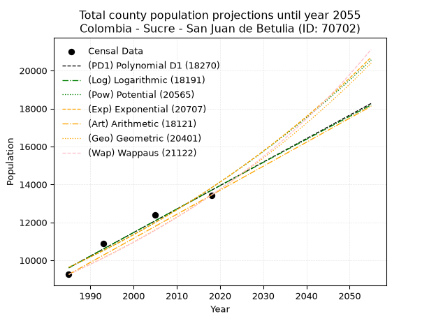
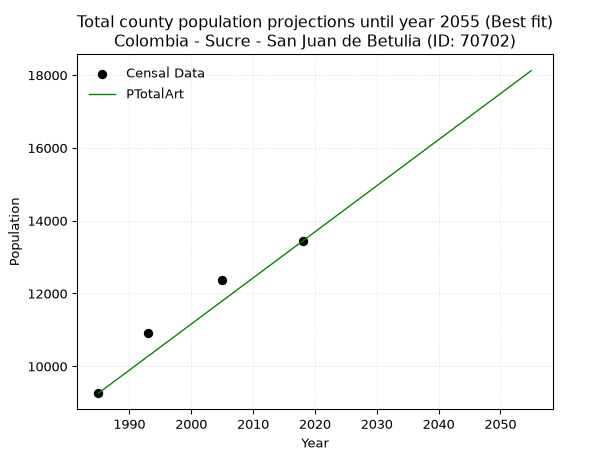
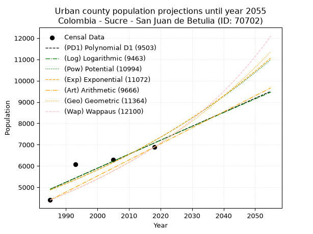
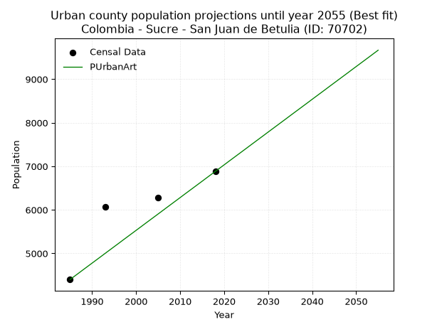
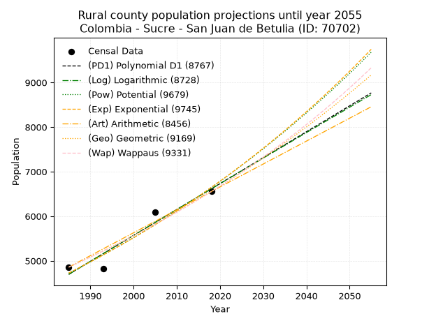
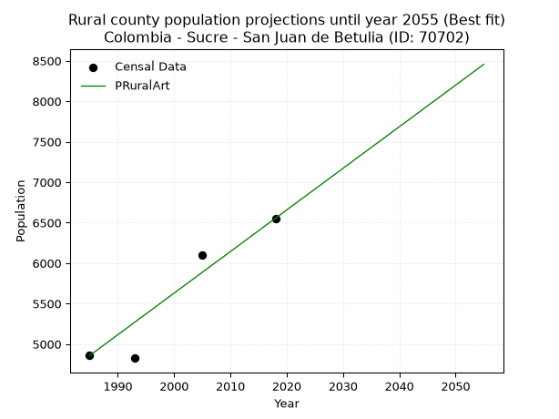

<div align="center">


</div>

# _“Population and Public Services Demand Projections (PPSD) until Year 2050 for Colombia - Sucre - San Juan de Betulia (ID: 70702)”_
Keywords: `population` `public-service` `projection` `lineal` `polynomial` `logarithmic` `potential` `exponential` `arithmetic` `geometric` `wappaus` `dane` `colombia` `south-america`

PPSD are analytical estimates used by governments and planners to anticipate future changes in population size, age distribution, and the resulting community needs for utilities, healthcare, education, and infrastructure as sizing future water treatment facilities, electrical grids, and road networks based on spatial growth.

> **General running parameters**: • app_version: _v20260806_. • Python version: _3.14.7_. • Pandas version: _3.0.5_. • NumPy version: _2.5.1_. • Creates, save and include plots into reports (create_plot): _False_. • Projection until year: _2050_. • Process polynomial degree 2 and up: _False_. • Process Wappaus: _True_. • Process Wappaus: _True_. • Set negative values to zero: _True_. • Set infinite values to zero: _True_. • Drop dataset notes: _True_. 
<div align="center">

Dynamic map: [:earth_americas:Google](http://maps.google.com/maps?q=9.273065987,-75.2435645) [:earth_americas:OSM](https://www.openstreetmap.org/#map=18/9.273065987/-75.2435645&layers=P) [:earth_americas:Bing](https://www.bing.com/maps?cp=9.273065987~-75.2435645&lvl=18) [:earth_americas:Apple](https://maps.apple.com/frame?center=9.273065987%2C-75.2435645&span=0.003%2C0.006)

</div>


<div align="center">

```geojson
{
  "type": "Feature",
  "geometry": {
    "type": "Point", 
    "coordinates": [-75.2435645, 9.273065987]
  }, 
  "properties": {
    "Name": "Colombia - Sucre - San Juan de Betulia (ID: 70702)"
  }
}
```

</div>


## 0. Census Data (4 records)

Census data are official statistics collected by a government about the people and housing in a country. They usually include counts of total population, age, sex, race, income, education, and jobs.

📅Global census file: [Population.xlsx](../data/Population.xlsx)

| Source   |   Year |   CountryID | CountryName   |   StateID | StateName   |   CountyID | CountyName          |   PTotal |   PUrban |   PRural |
|:---------|-------:|------------:|:--------------|----------:|:------------|-----------:|:--------------------|---------:|---------:|---------:|
| DANE     |   1985 |          57 | Colombia      |        70 | Sucre       |      70702 | San Juan de Betulia |     9259 |     4401 |     4858 |
| DANE     |   1993 |          57 | Colombia      |        70 | Sucre       |      70702 | San Juan de Betulia |    10900 |     6074 |     4826 |
| DANE     |   2005 |          57 | Colombia      |        70 | Sucre       |      70702 | San Juan de Betulia |    12378 |     6283 |     6095 |
| DANE     |   2018 |          57 | Colombia      |        70 | Sucre       |      70702 | San Juan de Betulia |    13437 |     6883 |     6554 |

> 🔥Some records could had specific notes about the registered values or the corresponding urban or rural distribution.

📅   [RUPS](https://www.datos.gov.co/Hacienda-y-Cr-dito-P-blico/Registro-nico-de-Prestadores-de-Servicios-P-blicos/4qkq-csdn/about_data) - Local public utility companies: [RUPS.csv](../data/RUPS.xlsx)

 | SERVICIO       | ESTADO    | NOMBRE                                                                                           | NIT         | DEPARTAMENTO_DOMICILIO   | MUNICIPIO_DOMICILIO   | DIRECCION       |   TELEFONO | EMAIL                 | TIPO_PRESTADOR                             | CLASIFICACION           |
|:---------------|:----------|:-------------------------------------------------------------------------------------------------|:------------|:-------------------------|:----------------------|:----------------|-----------:|:----------------------|:-------------------------------------------|:------------------------|
| ACUEDUCTO      | OPERATIVA | EMPRESA MUNICIPAL DE ACUEDUCTO ALCANTARILLADO Y ASEO DEL MUNICIPIO DE SAN JUAN DE BETULIA SA ESP | 900259198-7 | SUCRE                    | SAN JUAN DE BETULIA   | Diagonal 5 4-29 |    2744567 | jorgepajo@hotmail.com | SOCIEDADES (EMPRESA DE SERVICIOS PUBLICOS) | HASTA 2500 SUSCRIPTORES |
| ALCANTARILLADO | OPERATIVA | EMPRESA MUNICIPAL DE ACUEDUCTO ALCANTARILLADO Y ASEO DEL MUNICIPIO DE SAN JUAN DE BETULIA SA ESP | 900259198-7 | SUCRE                    | SAN JUAN DE BETULIA   | Diagonal 5 4-29 |    2744567 | jorgepajo@hotmail.com | SOCIEDADES (EMPRESA DE SERVICIOS PUBLICOS) | HASTA 2500 SUSCRIPTORES |

## 1. Total

### 1.1. Coefficients and Parameters

* (PD1) Polynomial Deg 1: 123.76957045363237, -236076.58329987817 (lineal)
* (Log) Logarithmic: 247850.53301575125, -1872420.3876022478
* (Pow) Potential: 21.889552327092403, -68.20283642891587
* (Exp) Exponential: 0.010929695762428743, 3.644484023589524e-06
* (Art) Arithmetic: Year diff. 2018 - 1985 = 33, Population diff. 13437 - 9259 = 4178, Annual growth = 126.60606060606061
* (Geo) Geometric: Year diff. 2018 - 1985 = 33, Population diff. 13437 - 9259 = 4178, Annual growth % = 0.011349254294145572
* (Wap) Wappaus: i = 1.115668493179949, Condition values only valid for < 200)

<sub>
Wappaus condition values: ['0.00', '1.12', '2.23', '3.35', '4.46', '5.58', '6.69', '7.81', '8.93', '10.04', '11.16', '12.27', '13.39', '14.50', '15.62', '16.74', '17.85', '18.97', '20.08', '21.20', '22.31', '23.43', '24.54', '25.66', '26.78', '27.89', '29.01', '30.12', '31.24', '32.35', '33.47', '34.59', '35.70', '36.82', '37.93', '39.05', '40.16', '41.28', '42.40', '43.51', '44.63', '45.74', '46.86', '47.97', '49.09', '50.21', '51.32', '52.44', '53.55', '54.67', '55.78', '56.90', '58.01', '59.13', '60.25', '61.36', '62.48', '63.59', '64.71', '65.82', '66.94', '68.06', '69.17', '70.29', '71.40', '72.52']
</sub>


### 1.2. Projected Dataset

|   Year |   CountyID |   PTotalPD1 |   PTotalLog |   PTotalPow |   PTotalExp |   PTotalArt |   PTotalGeo |   PTotalWap |
|-------:|-----------:|------------:|------------:|------------:|------------:|------------:|------------:|------------:|
|   1985 |      70702 |        9606 |        9601 |        9631 |        9635 |        9259 |        9259 |        9259 |
|   1986 |      70702 |        9730 |        9726 |        9738 |        9741 |        9386 |        9364 |        9363 |
|   1987 |      70702 |        9854 |        9851 |        9846 |        9848 |        9512 |        9470 |        9468 |
|   1988 |      70702 |        9977 |        9976 |        9955 |        9956 |        9639 |        9578 |        9574 |
|   1989 |      70702 |       10101 |       10100 |       10065 |       10066 |        9765 |        9687 |        9682 |
|   1990 |      70702 |       10225 |       10225 |       10176 |       10176 |        9892 |        9796 |        9790 |
|   1991 |      70702 |       10349 |       10349 |       10289 |       10288 |       10019 |        9908 |        9900 |
|   1992 |      70702 |       10472 |       10474 |       10402 |       10401 |       10145 |       10020 |       10011 |
|   1993 |      70702 |       10596 |       10598 |       10517 |       10515 |       10272 |       10134 |       10124 |
|   1994 |      70702 |       10720 |       10723 |       10633 |       10631 |       10398 |       10249 |       10238 |
|   1995 |      70702 |       10844 |       10847 |       10751 |       10748 |       10525 |       10365 |       10353 |
|   1996 |      70702 |       10967 |       10971 |       10869 |       10866 |       10652 |       10483 |       10470 |
|   1997 |      70702 |       11091 |       11095 |       10989 |       10985 |       10778 |       10602 |       10588 |
|   1998 |      70702 |       11215 |       11219 |       11110 |       11106 |       10905 |       10722 |       10707 |
|   1999 |      70702 |       11339 |       11343 |       11233 |       11228 |       11031 |       10844 |       10828 |
|   2000 |      70702 |       11463 |       11467 |       11356 |       11351 |       11158 |       10967 |       10950 |
|   2001 |      70702 |       11586 |       11591 |       11481 |       11476 |       11285 |       11091 |       11074 |
|   2002 |      70702 |       11710 |       11715 |       11607 |       11602 |       11411 |       11217 |       11199 |
|   2003 |      70702 |       11834 |       11839 |       11735 |       11730 |       11538 |       11344 |       11326 |
|   2004 |      70702 |       11958 |       11963 |       11864 |       11859 |       11665 |       11473 |       11454 |
|   2005 |      70702 |       12081 |       12086 |       11994 |       11989 |       11791 |       11603 |       11584 |
|   2006 |      70702 |       12205 |       12210 |       12126 |       12121 |       11918 |       11735 |       11716 |
|   2007 |      70702 |       12329 |       12333 |       12259 |       12254 |       12044 |       11868 |       11850 |
|   2008 |      70702 |       12453 |       12457 |       12393 |       12389 |       12171 |       12003 |       11985 |
|   2009 |      70702 |       12576 |       12580 |       12529 |       12525 |       12298 |       12139 |       12121 |
|   2010 |      70702 |       12700 |       12704 |       12666 |       12662 |       12424 |       12277 |       12260 |
|   2011 |      70702 |       12824 |       12827 |       12805 |       12802 |       12551 |       12416 |       12400 |
|   2012 |      70702 |       12948 |       12950 |       12945 |       12942 |       12677 |       12557 |       12543 |
|   2013 |      70702 |       13072 |       13073 |       13087 |       13084 |       12804 |       12700 |       12687 |
|   2014 |      70702 |       13195 |       13196 |       13230 |       13228 |       12931 |       12844 |       12833 |
|   2015 |      70702 |       13319 |       13319 |       13374 |       13374 |       13057 |       12990 |       12981 |
|   2016 |      70702 |       13443 |       13442 |       13520 |       13521 |       13184 |       13137 |       13131 |
|   2017 |      70702 |       13567 |       13565 |       13668 |       13669 |       13310 |       13286 |       13283 |
|   2018 |      70702 |       13690 |       13688 |       13817 |       13819 |       13437 |       13437 |       13437 |
|   2019 |      70702 |       13814 |       13811 |       13967 |       13971 |       13564 |       13589 |       13593 |
|   2020 |      70702 |       13938 |       13934 |       14120 |       14125 |       13690 |       13744 |       13752 |
|   2021 |      70702 |       14062 |       14056 |       14273 |       14280 |       13817 |       13900 |       13912 |
|   2022 |      70702 |       14185 |       14179 |       14429 |       14437 |       13943 |       14057 |       14075 |
|   2023 |      70702 |       14309 |       14301 |       14586 |       14596 |       14070 |       14217 |       14240 |
|   2024 |      70702 |       14433 |       14424 |       14745 |       14756 |       14197 |       14378 |       14408 |
|   2025 |      70702 |       14557 |       14546 |       14905 |       14918 |       14323 |       14542 |       14578 |
|   2026 |      70702 |       14681 |       14669 |       15067 |       15082 |       14450 |       14707 |       14750 |
|   2027 |      70702 |       14804 |       14791 |       15230 |       15248 |       14576 |       14873 |       14925 |
|   2028 |      70702 |       14928 |       14913 |       15396 |       15415 |       14703 |       15042 |       15103 |
|   2029 |      70702 |       15052 |       15035 |       15563 |       15585 |       14830 |       15213 |       15283 |
|   2030 |      70702 |       15176 |       15157 |       15732 |       15756 |       14956 |       15386 |       15465 |
|   2031 |      70702 |       15299 |       15280 |       15902 |       15929 |       15083 |       15560 |       15651 |
|   2032 |      70702 |       15423 |       15402 |       16074 |       16104 |       15209 |       15737 |       15839 |
|   2033 |      70702 |       15547 |       15524 |       16248 |       16281 |       15336 |       15915 |       16031 |
|   2034 |      70702 |       15671 |       15645 |       16424 |       16460 |       15463 |       16096 |       16225 |
|   2035 |      70702 |       15794 |       15767 |       16602 |       16641 |       15589 |       16279 |       16422 |
|   2036 |      70702 |       15918 |       15889 |       16781 |       16824 |       15716 |       16464 |       16622 |
|   2037 |      70702 |       16042 |       16011 |       16963 |       17009 |       15843 |       16650 |       16825 |
|   2038 |      70702 |       16166 |       16132 |       17146 |       17196 |       15969 |       16839 |       17032 |
|   2039 |      70702 |       16290 |       16254 |       17331 |       17385 |       16096 |       17030 |       17242 |
|   2040 |      70702 |       16413 |       16375 |       17518 |       17576 |       16222 |       17224 |       17455 |
|   2041 |      70702 |       16537 |       16497 |       17707 |       17769 |       16349 |       17419 |       17672 |
|   2042 |      70702 |       16661 |       16618 |       17898 |       17964 |       16476 |       17617 |       17892 |
|   2043 |      70702 |       16785 |       16740 |       18091 |       18162 |       16602 |       17817 |       18116 |
|   2044 |      70702 |       16908 |       16861 |       18286 |       18361 |       16729 |       18019 |       18344 |
|   2045 |      70702 |       17032 |       16982 |       18482 |       18563 |       16855 |       18224 |       18575 |
|   2046 |      70702 |       17156 |       17103 |       18681 |       18767 |       16982 |       18430 |       18810 |
|   2047 |      70702 |       17280 |       17224 |       18882 |       18973 |       17109 |       18640 |       19050 |
|   2048 |      70702 |       17403 |       17345 |       19085 |       19182 |       17235 |       18851 |       19293 |
|   2049 |      70702 |       17527 |       17466 |       19290 |       19393 |       17362 |       19065 |       19541 |
|   2050 |      70702 |       17651 |       17587 |       19497 |       19606 |       17488 |       19281 |       19793 |
<div align="center">

</img>

</div>


### 1.3. Best fit with absolute and relative error (%)

Relative error puts that difference into context by dividing the absolute error by the true value, creating a unitless ratio or percentage that shows the scale of the mistake.

Absolute and relative error

|   Year | Source   |   CountryID | CountryName   |   StateID | StateName   |   CountyID_x | CountyName          |   PTotal |   PUrban |   PRural |   CountyID_y |   PTotalPD1 |   PTotalLog |   PTotalPow |   PTotalExp |   PTotalArt |   PTotalGeo |   PTotalWap |   PTotalPD1AbsError |   PTotalLogAbsError |   PTotalPowAbsError |   PTotalExpAbsError |   PTotalArtAbsError |   PTotalGeoAbsError |   PTotalWapAbsError |   PTotalPD1RelError |   PTotalLogRelError |   PTotalPowRelError |   PTotalExpRelError |   PTotalArtRelError |   PTotalGeoRelError |   PTotalWapRelError |
|-------:|:---------|------------:|:--------------|----------:|:------------|-------------:|:--------------------|---------:|---------:|---------:|-------------:|------------:|------------:|------------:|------------:|------------:|------------:|------------:|--------------------:|--------------------:|--------------------:|--------------------:|--------------------:|--------------------:|--------------------:|--------------------:|--------------------:|--------------------:|--------------------:|--------------------:|--------------------:|--------------------:|
|   1985 | DANE     |          57 | Colombia      |        70 | Sucre       |        70702 | San Juan de Betulia |     9259 |     4401 |     4858 |        70702 |        9606 |        9601 |        9631 |        9635 |        9259 |        9259 |        9259 |                 347 |                 342 |                 372 |                 376 |                   0 |                   0 |                   0 |             3.7477  |             3.6937  |             4.01771 |             4.06091 |             0       |             0       |             0       |
|   1993 | DANE     |          57 | Colombia      |        70 | Sucre       |        70702 | San Juan de Betulia |    10900 |     6074 |     4826 |        70702 |       10596 |       10598 |       10517 |       10515 |       10272 |       10134 |       10124 |                 304 |                 302 |                 383 |                 385 |                 628 |                 766 |                 776 |             2.78899 |             2.77064 |             3.51376 |             3.53211 |             5.76147 |             7.02752 |             7.11927 |
|   2005 | DANE     |          57 | Colombia      |        70 | Sucre       |        70702 | San Juan de Betulia |    12378 |     6283 |     6095 |        70702 |       12081 |       12086 |       11994 |       11989 |       11791 |       11603 |       11584 |                 297 |                 292 |                 384 |                 389 |                 587 |                 775 |                 794 |             2.39942 |             2.35902 |             3.10228 |             3.14267 |             4.74228 |             6.26111 |             6.41461 |
|   2018 | DANE     |          57 | Colombia      |        70 | Sucre       |        70702 | San Juan de Betulia |    13437 |     6883 |     6554 |        70702 |       13690 |       13688 |       13817 |       13819 |       13437 |       13437 |       13437 |                 253 |                 251 |                 380 |                 382 |                   0 |                   0 |                   0 |             1.88286 |             1.86798 |             2.82801 |             2.8429  |             0       |             0       |             0       |

Relative error mean

| Method    |   RelError | Best   |
|:----------|-----------:|:-------|
| PTotalPD1 |    2.70474 |        |
| PTotalLog |    2.67284 |        |
| PTotalPow |    3.36544 |        |
| PTotalExp |    3.39465 |        |
| PTotalArt |    2.62594 | True   |
| PTotalGeo |    3.32216 |        |
| PTotalWap |    3.38347 |        |

💙Best method: _**PTotalArt**_
<div align="center">

</img>

</div>


### 1.4. Fresh water supply demand in liters per capita per day (lpcd)

The fresh water supply demand typically ranges from 100 to 300 liters per capita per day (lpcd) for standard domestic and municipal planning, though absolute survival minimums set by the World Health Organization are as low as 7.5 to 20 liters per day, and total consumption in high-income nations can exceed 400 liters.

> `CZ`: Level in meters above the sea level (masl)<br> `WS`: Fresh water supply demand in liters per capita per day (lpcd or l/h/d)<br> `WSAll`: Zonal fresh water supply demand in liters per second (l/s)<br> `A`: Zonal area in square meters<br> `DP`: Population density (people/hectare or p/ha)

Reference values (RAS Colombia)

|    CZ |   WS |
|------:|-----:|
|  1000 |  120 |
|  2000 |  130 |
| 99999 |  140 |

County shapefile geometry properties and water supply values

|   CountyID |      ATotal |   CZTotal |   WSTotal |
|-----------:|------------:|----------:|----------:|
|      70702 | 1.68026e+08 |   142.844 |       120 |

Projected values for best method: PTotalArt

|   CountyID |   Year |   PTotalArt |   DPTotal |   WSTotal |   WSTotalAll |
|-----------:|-------:|------------:|----------:|----------:|-------------:|
|      70702 |   1985 |        9259 |      0.55 |       120 |      12.8597 |
|      70702 |   1986 |        9386 |      0.56 |       120 |      13.0361 |
|      70702 |   1987 |        9512 |      0.57 |       120 |      13.2111 |
|      70702 |   1988 |        9639 |      0.57 |       120 |      13.3875 |
|      70702 |   1989 |        9765 |      0.58 |       120 |      13.5625 |
|      70702 |   1990 |        9892 |      0.59 |       120 |      13.7389 |
|      70702 |   1991 |       10019 |      0.6  |       120 |      13.9153 |
|      70702 |   1992 |       10145 |      0.6  |       120 |      14.0903 |
|      70702 |   1993 |       10272 |      0.61 |       120 |      14.2667 |
|      70702 |   1994 |       10398 |      0.62 |       120 |      14.4417 |
|      70702 |   1995 |       10525 |      0.63 |       120 |      14.6181 |
|      70702 |   1996 |       10652 |      0.63 |       120 |      14.7944 |
|      70702 |   1997 |       10778 |      0.64 |       120 |      14.9694 |
|      70702 |   1998 |       10905 |      0.65 |       120 |      15.1458 |
|      70702 |   1999 |       11031 |      0.66 |       120 |      15.3208 |
|      70702 |   2000 |       11158 |      0.66 |       120 |      15.4972 |
|      70702 |   2001 |       11285 |      0.67 |       120 |      15.6736 |
|      70702 |   2002 |       11411 |      0.68 |       120 |      15.8486 |
|      70702 |   2003 |       11538 |      0.69 |       120 |      16.025  |
|      70702 |   2004 |       11665 |      0.69 |       120 |      16.2014 |
|      70702 |   2005 |       11791 |      0.7  |       120 |      16.3764 |
|      70702 |   2006 |       11918 |      0.71 |       120 |      16.5528 |
|      70702 |   2007 |       12044 |      0.72 |       120 |      16.7278 |
|      70702 |   2008 |       12171 |      0.72 |       120 |      16.9042 |
|      70702 |   2009 |       12298 |      0.73 |       120 |      17.0806 |
|      70702 |   2010 |       12424 |      0.74 |       120 |      17.2556 |
|      70702 |   2011 |       12551 |      0.75 |       120 |      17.4319 |
|      70702 |   2012 |       12677 |      0.75 |       120 |      17.6069 |
|      70702 |   2013 |       12804 |      0.76 |       120 |      17.7833 |
|      70702 |   2014 |       12931 |      0.77 |       120 |      17.9597 |
|      70702 |   2015 |       13057 |      0.78 |       120 |      18.1347 |
|      70702 |   2016 |       13184 |      0.78 |       120 |      18.3111 |
|      70702 |   2017 |       13310 |      0.79 |       120 |      18.4861 |
|      70702 |   2018 |       13437 |      0.8  |       120 |      18.6625 |
|      70702 |   2019 |       13564 |      0.81 |       120 |      18.8389 |
|      70702 |   2020 |       13690 |      0.81 |       120 |      19.0139 |
|      70702 |   2021 |       13817 |      0.82 |       120 |      19.1903 |
|      70702 |   2022 |       13943 |      0.83 |       120 |      19.3653 |
|      70702 |   2023 |       14070 |      0.84 |       120 |      19.5417 |
|      70702 |   2024 |       14197 |      0.84 |       120 |      19.7181 |
|      70702 |   2025 |       14323 |      0.85 |       120 |      19.8931 |
|      70702 |   2026 |       14450 |      0.86 |       120 |      20.0694 |
|      70702 |   2027 |       14576 |      0.87 |       120 |      20.2444 |
|      70702 |   2028 |       14703 |      0.88 |       120 |      20.4208 |
|      70702 |   2029 |       14830 |      0.88 |       120 |      20.5972 |
|      70702 |   2030 |       14956 |      0.89 |       120 |      20.7722 |
|      70702 |   2031 |       15083 |      0.9  |       120 |      20.9486 |
|      70702 |   2032 |       15209 |      0.91 |       120 |      21.1236 |
|      70702 |   2033 |       15336 |      0.91 |       120 |      21.3    |
|      70702 |   2034 |       15463 |      0.92 |       120 |      21.4764 |
|      70702 |   2035 |       15589 |      0.93 |       120 |      21.6514 |
|      70702 |   2036 |       15716 |      0.94 |       120 |      21.8278 |
|      70702 |   2037 |       15843 |      0.94 |       120 |      22.0042 |
|      70702 |   2038 |       15969 |      0.95 |       120 |      22.1792 |
|      70702 |   2039 |       16096 |      0.96 |       120 |      22.3556 |
|      70702 |   2040 |       16222 |      0.97 |       120 |      22.5306 |
|      70702 |   2041 |       16349 |      0.97 |       120 |      22.7069 |
|      70702 |   2042 |       16476 |      0.98 |       120 |      22.8833 |
|      70702 |   2043 |       16602 |      0.99 |       120 |      23.0583 |
|      70702 |   2044 |       16729 |      1    |       120 |      23.2347 |
|      70702 |   2045 |       16855 |      1    |       120 |      23.4097 |
|      70702 |   2046 |       16982 |      1.01 |       120 |      23.5861 |
|      70702 |   2047 |       17109 |      1.02 |       120 |      23.7625 |
|      70702 |   2048 |       17235 |      1.03 |       120 |      23.9375 |
|      70702 |   2049 |       17362 |      1.03 |       120 |      24.1139 |
|      70702 |   2050 |       17488 |      1.04 |       120 |      24.2889 |

## 2. Urban

### 2.1. Coefficients and Parameters

* (PD1) Polynomial Deg 1: 65.62143717382531, -125349.0297069441 (lineal)
* (Log) Logarithmic: 131464.96299938642, -993355.9872524333
* (Pow) Potential: 23.466516500405067, -73.69900785554795
* (Exp) Exponential: 0.011711657185025239, 3.9071041711635116e-07
* (Art) Arithmetic: Year diff. 2018 - 1985 = 33, Population diff. 6883 - 4401 = 2482, Annual growth = 75.21212121212122
* (Geo) Geometric: Year diff. 2018 - 1985 = 33, Population diff. 6883 - 4401 = 2482, Annual growth % = 0.013644453931456413
* (Wap) Wappaus: i = 1.3330755266239138, Condition values only valid for < 200)

<sub>
Wappaus condition values: ['0.00', '1.33', '2.67', '4.00', '5.33', '6.67', '8.00', '9.33', '10.66', '12.00', '13.33', '14.66', '16.00', '17.33', '18.66', '20.00', '21.33', '22.66', '24.00', '25.33', '26.66', '27.99', '29.33', '30.66', '31.99', '33.33', '34.66', '35.99', '37.33', '38.66', '39.99', '41.33', '42.66', '43.99', '45.32', '46.66', '47.99', '49.32', '50.66', '51.99', '53.32', '54.66', '55.99', '57.32', '58.66', '59.99', '61.32', '62.65', '63.99', '65.32', '66.65', '67.99', '69.32', '70.65', '71.99', '73.32', '74.65', '75.99', '77.32', '78.65', '79.98', '81.32', '82.65', '83.98', '85.32', '86.65']
</sub>


### 2.2. Projected Dataset

|   Year |   CountyID |   PUrbanPD1 |   PUrbanLog |   PUrbanPow |   PUrbanExp |   PUrbanArt |   PUrbanGeo |   PUrbanWap |
|-------:|-----------:|------------:|------------:|------------:|------------:|------------:|------------:|------------:|
|   1985 |      70702 |        4910 |        4907 |        4875 |        4877 |        4401 |        4401 |        4401 |
|   1986 |      70702 |        4975 |        4973 |        4933 |        4935 |        4476 |        4461 |        4460 |
|   1987 |      70702 |        5041 |        5039 |        4991 |        4993 |        4551 |        4522 |        4520 |
|   1988 |      70702 |        5106 |        5105 |        5051 |        5052 |        4627 |        4584 |        4581 |
|   1989 |      70702 |        5172 |        5171 |        5110 |        5111 |        4702 |        4646 |        4642 |
|   1990 |      70702 |        5238 |        5237 |        5171 |        5171 |        4777 |        4710 |        4704 |
|   1991 |      70702 |        5303 |        5303 |        5232 |        5232 |        4852 |        4774 |        4768 |
|   1992 |      70702 |        5369 |        5369 |        5294 |        5294 |        4927 |        4839 |        4832 |
|   1993 |      70702 |        5434 |        5435 |        5357 |        5356 |        5003 |        4905 |        4897 |
|   1994 |      70702 |        5500 |        5501 |        5421 |        5419 |        5078 |        4972 |        4963 |
|   1995 |      70702 |        5566 |        5567 |        5485 |        5483 |        5153 |        5040 |        5030 |
|   1996 |      70702 |        5631 |        5633 |        5550 |        5548 |        5228 |        5109 |        5097 |
|   1997 |      70702 |        5697 |        5699 |        5615 |        5613 |        5304 |        5178 |        5166 |
|   1998 |      70702 |        5763 |        5765 |        5682 |        5679 |        5379 |        5249 |        5236 |
|   1999 |      70702 |        5828 |        5831 |        5749 |        5746 |        5454 |        5320 |        5307 |
|   2000 |      70702 |        5894 |        5896 |        5817 |        5814 |        5529 |        5393 |        5379 |
|   2001 |      70702 |        5959 |        5962 |        5885 |        5882 |        5604 |        5467 |        5452 |
|   2002 |      70702 |        6025 |        6028 |        5955 |        5952 |        5680 |        5541 |        5526 |
|   2003 |      70702 |        6091 |        6093 |        6025 |        6022 |        5755 |        5617 |        5601 |
|   2004 |      70702 |        6156 |        6159 |        6096 |        6093 |        5830 |        5693 |        5677 |
|   2005 |      70702 |        6222 |        6225 |        6168 |        6165 |        5905 |        5771 |        5755 |
|   2006 |      70702 |        6288 |        6290 |        6240 |        6237 |        5980 |        5850 |        5834 |
|   2007 |      70702 |        6353 |        6356 |        6314 |        6311 |        6056 |        5930 |        5914 |
|   2008 |      70702 |        6419 |        6421 |        6388 |        6385 |        6131 |        6011 |        5995 |
|   2009 |      70702 |        6484 |        6487 |        6463 |        6460 |        6206 |        6093 |        6077 |
|   2010 |      70702 |        6550 |        6552 |        6539 |        6536 |        6281 |        6176 |        6161 |
|   2011 |      70702 |        6616 |        6617 |        6616 |        6613 |        6357 |        6260 |        6246 |
|   2012 |      70702 |        6681 |        6683 |        6693 |        6691 |        6432 |        6345 |        6333 |
|   2013 |      70702 |        6747 |        6748 |        6772 |        6770 |        6507 |        6432 |        6421 |
|   2014 |      70702 |        6813 |        6813 |        6851 |        6850 |        6582 |        6520 |        6510 |
|   2015 |      70702 |        6878 |        6879 |        6931 |        6931 |        6657 |        6609 |        6601 |
|   2016 |      70702 |        6944 |        6944 |        7013 |        7012 |        6733 |        6699 |        6693 |
|   2017 |      70702 |        7009 |        7009 |        7095 |        7095 |        6808 |        6790 |        6787 |
|   2018 |      70702 |        7075 |        7074 |        7178 |        7178 |        6883 |        6883 |        6883 |
|   2019 |      70702 |        7141 |        7139 |        7262 |        7263 |        6958 |        6977 |        6980 |
|   2020 |      70702 |        7206 |        7204 |        7346 |        7348 |        7033 |        7072 |        7079 |
|   2021 |      70702 |        7272 |        7270 |        7432 |        7435 |        7109 |        7169 |        7180 |
|   2022 |      70702 |        7338 |        7335 |        7519 |        7523 |        7184 |        7266 |        7282 |
|   2023 |      70702 |        7403 |        7400 |        7607 |        7611 |        7259 |        7366 |        7387 |
|   2024 |      70702 |        7469 |        7465 |        7695 |        7701 |        7334 |        7466 |        7493 |
|   2025 |      70702 |        7534 |        7529 |        7785 |        7792 |        7409 |        7568 |        7601 |
|   2026 |      70702 |        7600 |        7594 |        7876 |        7883 |        7485 |        7671 |        7711 |
|   2027 |      70702 |        7666 |        7659 |        7968 |        7976 |        7560 |        7776 |        7823 |
|   2028 |      70702 |        7731 |        7724 |        8060 |        8070 |        7635 |        7882 |        7937 |
|   2029 |      70702 |        7797 |        7789 |        8154 |        8165 |        7710 |        7990 |        8054 |
|   2030 |      70702 |        7862 |        7854 |        8249 |        8262 |        7786 |        8099 |        8172 |
|   2031 |      70702 |        7928 |        7918 |        8345 |        8359 |        7861 |        8209 |        8293 |
|   2032 |      70702 |        7994 |        7983 |        8442 |        8457 |        7936 |        8321 |        8416 |
|   2033 |      70702 |        8059 |        8048 |        8540 |        8557 |        8011 |        8435 |        8542 |
|   2034 |      70702 |        8125 |        8112 |        8639 |        8658 |        8086 |        8550 |        8670 |
|   2035 |      70702 |        8191 |        8177 |        8739 |        8760 |        8162 |        8666 |        8801 |
|   2036 |      70702 |        8256 |        8242 |        8841 |        8863 |        8237 |        8785 |        8934 |
|   2037 |      70702 |        8322 |        8306 |        8943 |        8967 |        8312 |        8904 |        9070 |
|   2038 |      70702 |        8387 |        8371 |        9047 |        9073 |        8387 |        9026 |        9209 |
|   2039 |      70702 |        8453 |        8435 |        9151 |        9180 |        8462 |        9149 |        9351 |
|   2040 |      70702 |        8519 |        8500 |        9257 |        9288 |        8538 |        9274 |        9495 |
|   2041 |      70702 |        8584 |        8564 |        9364 |        9397 |        8613 |        9400 |        9643 |
|   2042 |      70702 |        8650 |        8629 |        9473 |        9508 |        8688 |        9529 |        9794 |
|   2043 |      70702 |        8716 |        8693 |        9582 |        9620 |        8763 |        9659 |        9948 |
|   2044 |      70702 |        8781 |        8757 |        9693 |        9733 |        8839 |        9790 |       10106 |
|   2045 |      70702 |        8847 |        8822 |        9805 |        9848 |        8914 |        9924 |       10267 |
|   2046 |      70702 |        8912 |        8886 |        9918 |        9964 |        8989 |       10059 |       10432 |
|   2047 |      70702 |        8978 |        8950 |       10032 |       10082 |        9064 |       10197 |       10600 |
|   2048 |      70702 |        9044 |        9014 |       10148 |       10200 |        9139 |       10336 |       10773 |
|   2049 |      70702 |        9109 |        9078 |       10265 |       10320 |        9215 |       10477 |       10949 |
|   2050 |      70702 |        9175 |        9143 |       10383 |       10442 |        9290 |       10620 |       11130 |
<div align="center">

</img>

</div>


### 2.3. Best fit with absolute and relative error (%)

Relative error puts that difference into context by dividing the absolute error by the true value, creating a unitless ratio or percentage that shows the scale of the mistake.

Absolute and relative error

|   Year | Source   |   CountryID | CountryName   |   StateID | StateName   |   CountyID_x | CountyName          |   PTotal |   PUrban |   PRural |   CountyID_y |   PUrbanPD1 |   PUrbanLog |   PUrbanPow |   PUrbanExp |   PUrbanArt |   PUrbanGeo |   PUrbanWap |   PUrbanPD1AbsError |   PUrbanLogAbsError |   PUrbanPowAbsError |   PUrbanExpAbsError |   PUrbanArtAbsError |   PUrbanGeoAbsError |   PUrbanWapAbsError |   PUrbanPD1RelError |   PUrbanLogRelError |   PUrbanPowRelError |   PUrbanExpRelError |   PUrbanArtRelError |   PUrbanGeoRelError |   PUrbanWapRelError |
|-------:|:---------|------------:|:--------------|----------:|:------------|-------------:|:--------------------|---------:|---------:|---------:|-------------:|------------:|------------:|------------:|------------:|------------:|------------:|------------:|--------------------:|--------------------:|--------------------:|--------------------:|--------------------:|--------------------:|--------------------:|--------------------:|--------------------:|--------------------:|--------------------:|--------------------:|--------------------:|--------------------:|
|   1985 | DANE     |          57 | Colombia      |        70 | Sucre       |        70702 | San Juan de Betulia |     9259 |     4401 |     4858 |        70702 |        4910 |        4907 |        4875 |        4877 |        4401 |        4401 |        4401 |                 509 |                 506 |                 474 |                 476 |                   0 |                   0 |                   0 |           11.5656   |           11.4974   |            10.7703  |            10.8157  |             0       |             0       |             0       |
|   1993 | DANE     |          57 | Colombia      |        70 | Sucre       |        70702 | San Juan de Betulia |    10900 |     6074 |     4826 |        70702 |        5434 |        5435 |        5357 |        5356 |        5003 |        4905 |        4897 |                 640 |                 639 |                 717 |                 718 |                1071 |                1169 |                1177 |           10.5367   |           10.5203   |            11.8044  |            11.8209  |            17.6325  |            19.246   |            19.3777  |
|   2005 | DANE     |          57 | Colombia      |        70 | Sucre       |        70702 | San Juan de Betulia |    12378 |     6283 |     6095 |        70702 |        6222 |        6225 |        6168 |        6165 |        5905 |        5771 |        5755 |                  61 |                  58 |                 115 |                 118 |                 378 |                 512 |                 528 |            0.970874 |            0.923126 |             1.83034 |             1.87808 |             6.01623 |             8.14897 |             8.40363 |
|   2018 | DANE     |          57 | Colombia      |        70 | Sucre       |        70702 | San Juan de Betulia |    13437 |     6883 |     6554 |        70702 |        7075 |        7074 |        7178 |        7178 |        6883 |        6883 |        6883 |                 192 |                 191 |                 295 |                 295 |                   0 |                   0 |                   0 |            2.78948  |            2.77495  |             4.28592 |             4.28592 |             0       |             0       |             0       |

Relative error mean

| Method    |   RelError | Best   |
|:----------|-----------:|:-------|
| PUrbanPD1 |    6.46566 |        |
| PUrbanLog |    6.42893 |        |
| PUrbanPow |    7.17274 |        |
| PUrbanExp |    7.20015 |        |
| PUrbanArt |    5.91219 | True   |
| PUrbanGeo |    6.84873 |        |
| PUrbanWap |    6.94533 |        |

💙Best method: _**PUrbanArt**_
<div align="center">

</img>

</div>


### 2.4. Fresh water supply demand in liters per capita per day (lpcd)

The fresh water supply demand typically ranges from 100 to 300 liters per capita per day (lpcd) for standard domestic and municipal planning, though absolute survival minimums set by the World Health Organization are as low as 7.5 to 20 liters per day, and total consumption in high-income nations can exceed 400 liters.

> `CZ`: Level in meters above the sea level (masl)<br> `WS`: Fresh water supply demand in liters per capita per day (lpcd or l/h/d)<br> `WSAll`: Zonal fresh water supply demand in liters per second (l/s)<br> `A`: Zonal area in square meters<br> `DP`: Population density (people/hectare or p/ha)

Reference values (RAS Colombia)

|    CZ |   WS |
|------:|-----:|
|  1000 |  120 |
|  2000 |  130 |
| 99999 |  140 |

County shapefile geometry properties and water supply values

|   CountyID |     AUrban |   CZUrban |   WSUrban |
|-----------:|-----------:|----------:|----------:|
|      70702 | 1.9161e+06 |    138.67 |       120 |

Projected values for best method: PUrbanArt

|   CountyID |   Year |   PUrbanArt |   DPUrban |   WSUrban |   WSUrbanAll |
|-----------:|-------:|------------:|----------:|----------:|-------------:|
|      70702 |   1985 |        4401 |     22.97 |       120 |      6.1125  |
|      70702 |   1986 |        4476 |     23.36 |       120 |      6.21667 |
|      70702 |   1987 |        4551 |     23.75 |       120 |      6.32083 |
|      70702 |   1988 |        4627 |     24.15 |       120 |      6.42639 |
|      70702 |   1989 |        4702 |     24.54 |       120 |      6.53056 |
|      70702 |   1990 |        4777 |     24.93 |       120 |      6.63472 |
|      70702 |   1991 |        4852 |     25.32 |       120 |      6.73889 |
|      70702 |   1992 |        4927 |     25.71 |       120 |      6.84306 |
|      70702 |   1993 |        5003 |     26.11 |       120 |      6.94861 |
|      70702 |   1994 |        5078 |     26.5  |       120 |      7.05278 |
|      70702 |   1995 |        5153 |     26.89 |       120 |      7.15694 |
|      70702 |   1996 |        5228 |     27.28 |       120 |      7.26111 |
|      70702 |   1997 |        5304 |     27.68 |       120 |      7.36667 |
|      70702 |   1998 |        5379 |     28.07 |       120 |      7.47083 |
|      70702 |   1999 |        5454 |     28.46 |       120 |      7.575   |
|      70702 |   2000 |        5529 |     28.86 |       120 |      7.67917 |
|      70702 |   2001 |        5604 |     29.25 |       120 |      7.78333 |
|      70702 |   2002 |        5680 |     29.64 |       120 |      7.88889 |
|      70702 |   2003 |        5755 |     30.03 |       120 |      7.99306 |
|      70702 |   2004 |        5830 |     30.43 |       120 |      8.09722 |
|      70702 |   2005 |        5905 |     30.82 |       120 |      8.20139 |
|      70702 |   2006 |        5980 |     31.21 |       120 |      8.30556 |
|      70702 |   2007 |        6056 |     31.61 |       120 |      8.41111 |
|      70702 |   2008 |        6131 |     32    |       120 |      8.51528 |
|      70702 |   2009 |        6206 |     32.39 |       120 |      8.61944 |
|      70702 |   2010 |        6281 |     32.78 |       120 |      8.72361 |
|      70702 |   2011 |        6357 |     33.18 |       120 |      8.82917 |
|      70702 |   2012 |        6432 |     33.57 |       120 |      8.93333 |
|      70702 |   2013 |        6507 |     33.96 |       120 |      9.0375  |
|      70702 |   2014 |        6582 |     34.35 |       120 |      9.14167 |
|      70702 |   2015 |        6657 |     34.74 |       120 |      9.24583 |
|      70702 |   2016 |        6733 |     35.14 |       120 |      9.35139 |
|      70702 |   2017 |        6808 |     35.53 |       120 |      9.45556 |
|      70702 |   2018 |        6883 |     35.92 |       120 |      9.55972 |
|      70702 |   2019 |        6958 |     36.31 |       120 |      9.66389 |
|      70702 |   2020 |        7033 |     36.7  |       120 |      9.76806 |
|      70702 |   2021 |        7109 |     37.1  |       120 |      9.87361 |
|      70702 |   2022 |        7184 |     37.49 |       120 |      9.97778 |
|      70702 |   2023 |        7259 |     37.88 |       120 |     10.0819  |
|      70702 |   2024 |        7334 |     38.28 |       120 |     10.1861  |
|      70702 |   2025 |        7409 |     38.67 |       120 |     10.2903  |
|      70702 |   2026 |        7485 |     39.06 |       120 |     10.3958  |
|      70702 |   2027 |        7560 |     39.46 |       120 |     10.5     |
|      70702 |   2028 |        7635 |     39.85 |       120 |     10.6042  |
|      70702 |   2029 |        7710 |     40.24 |       120 |     10.7083  |
|      70702 |   2030 |        7786 |     40.63 |       120 |     10.8139  |
|      70702 |   2031 |        7861 |     41.03 |       120 |     10.9181  |
|      70702 |   2032 |        7936 |     41.42 |       120 |     11.0222  |
|      70702 |   2033 |        8011 |     41.81 |       120 |     11.1264  |
|      70702 |   2034 |        8086 |     42.2  |       120 |     11.2306  |
|      70702 |   2035 |        8162 |     42.6  |       120 |     11.3361  |
|      70702 |   2036 |        8237 |     42.99 |       120 |     11.4403  |
|      70702 |   2037 |        8312 |     43.38 |       120 |     11.5444  |
|      70702 |   2038 |        8387 |     43.77 |       120 |     11.6486  |
|      70702 |   2039 |        8462 |     44.16 |       120 |     11.7528  |
|      70702 |   2040 |        8538 |     44.56 |       120 |     11.8583  |
|      70702 |   2041 |        8613 |     44.95 |       120 |     11.9625  |
|      70702 |   2042 |        8688 |     45.34 |       120 |     12.0667  |
|      70702 |   2043 |        8763 |     45.73 |       120 |     12.1708  |
|      70702 |   2044 |        8839 |     46.13 |       120 |     12.2764  |
|      70702 |   2045 |        8914 |     46.52 |       120 |     12.3806  |
|      70702 |   2046 |        8989 |     46.91 |       120 |     12.4847  |
|      70702 |   2047 |        9064 |     47.3  |       120 |     12.5889  |
|      70702 |   2048 |        9139 |     47.7  |       120 |     12.6931  |
|      70702 |   2049 |        9215 |     48.09 |       120 |     12.7986  |
|      70702 |   2050 |        9290 |     48.48 |       120 |     12.9028  |

## 3. Rural

### 3.1. Coefficients and Parameters

* (PD1) Polynomial Deg 1: 58.14813327980691, -110727.55359293376 (lineal)
* (Log) Logarithmic: 116385.5700163648, -879064.4003498143
* (Pow) Potential: 20.701291529256235, -64.59365202155858
* (Exp) Exponential: 0.010342237194343799, 5.735948739954997e-06
* (Art) Arithmetic: Year diff. 2018 - 1985 = 33, Population diff. 6554 - 4858 = 1696, Annual growth = 51.39393939393939
* (Geo) Geometric: Year diff. 2018 - 1985 = 33, Population diff. 6554 - 4858 = 1696, Annual growth % = 0.009115499026013829
* (Wap) Wappaus: i = 0.9006999543277145, Condition values only valid for < 200)

<sub>
Wappaus condition values: ['0.00', '0.90', '1.80', '2.70', '3.60', '4.50', '5.40', '6.30', '7.21', '8.11', '9.01', '9.91', '10.81', '11.71', '12.61', '13.51', '14.41', '15.31', '16.21', '17.11', '18.01', '18.91', '19.82', '20.72', '21.62', '22.52', '23.42', '24.32', '25.22', '26.12', '27.02', '27.92', '28.82', '29.72', '30.62', '31.52', '32.43', '33.33', '34.23', '35.13', '36.03', '36.93', '37.83', '38.73', '39.63', '40.53', '41.43', '42.33', '43.23', '44.13', '45.03', '45.94', '46.84', '47.74', '48.64', '49.54', '50.44', '51.34', '52.24', '53.14', '54.04', '54.94', '55.84', '56.74', '57.64', '58.55']
</sub>


### 3.2. Projected Dataset

|   Year |   CountyID |   PRuralPD1 |   PRuralLog |   PRuralPow |   PRuralExp |   PRuralArt |   PRuralGeo |   PRuralWap |
|-------:|-----------:|------------:|------------:|------------:|------------:|------------:|------------:|------------:|
|   1985 |      70702 |        4696 |        4695 |        4723 |        4725 |        4858 |        4858 |        4858 |
|   1986 |      70702 |        4755 |        4753 |        4773 |        4774 |        4909 |        4902 |        4902 |
|   1987 |      70702 |        4813 |        4812 |        4823 |        4824 |        4961 |        4947 |        4946 |
|   1988 |      70702 |        4871 |        4871 |        4873 |        4874 |        5012 |        4992 |        4991 |
|   1989 |      70702 |        4929 |        4929 |        4924 |        4924 |        5064 |        5038 |        5036 |
|   1990 |      70702 |        4987 |        4988 |        4976 |        4976 |        5115 |        5083 |        5082 |
|   1991 |      70702 |        5045 |        5046 |        5028 |        5027 |        5166 |        5130 |        5128 |
|   1992 |      70702 |        5104 |        5104 |        5080 |        5080 |        5218 |        5177 |        5174 |
|   1993 |      70702 |        5162 |        5163 |        5133 |        5132 |        5269 |        5224 |        5221 |
|   1994 |      70702 |        5220 |        5221 |        5187 |        5186 |        5321 |        5271 |        5268 |
|   1995 |      70702 |        5278 |        5280 |        5241 |        5240 |        5372 |        5319 |        5316 |
|   1996 |      70702 |        5336 |        5338 |        5296 |        5294 |        5423 |        5368 |        5364 |
|   1997 |      70702 |        5394 |        5396 |        5351 |        5349 |        5475 |        5417 |        5413 |
|   1998 |      70702 |        5452 |        5455 |        5407 |        5405 |        5526 |        5466 |        5462 |
|   1999 |      70702 |        5511 |        5513 |        5463 |        5461 |        5578 |        5516 |        5512 |
|   2000 |      70702 |        5569 |        5571 |        5520 |        5518 |        5629 |        5566 |        5562 |
|   2001 |      70702 |        5627 |        5629 |        5577 |        5575 |        5680 |        5617 |        5612 |
|   2002 |      70702 |        5685 |        5687 |        5635 |        5633 |        5732 |        5668 |        5664 |
|   2003 |      70702 |        5743 |        5745 |        5694 |        5692 |        5783 |        5720 |        5715 |
|   2004 |      70702 |        5801 |        5804 |        5753 |        5751 |        5834 |        5772 |        5767 |
|   2005 |      70702 |        5859 |        5862 |        5813 |        5811 |        5886 |        5825 |        5820 |
|   2006 |      70702 |        5918 |        5920 |        5873 |        5871 |        5937 |        5878 |        5873 |
|   2007 |      70702 |        5976 |        5978 |        5934 |        5932 |        5989 |        5931 |        5926 |
|   2008 |      70702 |        6034 |        6036 |        5995 |        5994 |        6040 |        5985 |        5981 |
|   2009 |      70702 |        6092 |        6094 |        6058 |        6056 |        6091 |        6040 |        6035 |
|   2010 |      70702 |        6150 |        6151 |        6120 |        6119 |        6143 |        6095 |        6091 |
|   2011 |      70702 |        6208 |        6209 |        6184 |        6183 |        6194 |        6151 |        6147 |
|   2012 |      70702 |        6266 |        6267 |        6248 |        6247 |        6246 |        6207 |        6203 |
|   2013 |      70702 |        6325 |        6325 |        6312 |        6312 |        6297 |        6263 |        6260 |
|   2014 |      70702 |        6383 |        6383 |        6377 |        6377 |        6348 |        6320 |        6318 |
|   2015 |      70702 |        6441 |        6441 |        6443 |        6444 |        6400 |        6378 |        6376 |
|   2016 |      70702 |        6499 |        6498 |        6510 |        6511 |        6451 |        6436 |        6435 |
|   2017 |      70702 |        6557 |        6556 |        6577 |        6578 |        6503 |        6495 |        6494 |
|   2018 |      70702 |        6615 |        6614 |        6645 |        6647 |        6554 |        6554 |        6554 |
|   2019 |      70702 |        6674 |        6671 |        6713 |        6716 |        6605 |        6614 |        6615 |
|   2020 |      70702 |        6732 |        6729 |        6783 |        6786 |        6657 |        6674 |        6676 |
|   2021 |      70702 |        6790 |        6787 |        6852 |        6856 |        6708 |        6735 |        6738 |
|   2022 |      70702 |        6848 |        6844 |        6923 |        6927 |        6760 |        6796 |        6801 |
|   2023 |      70702 |        6906 |        6902 |        6994 |        6999 |        6811 |        6858 |        6864 |
|   2024 |      70702 |        6964 |        6959 |        7066 |        7072 |        6862 |        6921 |        6928 |
|   2025 |      70702 |        7022 |        7017 |        7139 |        7146 |        6914 |        6984 |        6993 |
|   2026 |      70702 |        7081 |        7074 |        7212 |        7220 |        6965 |        7047 |        7058 |
|   2027 |      70702 |        7139 |        7132 |        7286 |        7295 |        7017 |        7112 |        7124 |
|   2028 |      70702 |        7197 |        7189 |        7361 |        7371 |        7068 |        7177 |        7191 |
|   2029 |      70702 |        7255 |        7246 |        7436 |        7448 |        7119 |        7242 |        7259 |
|   2030 |      70702 |        7313 |        7304 |        7513 |        7525 |        7171 |        7308 |        7327 |
|   2031 |      70702 |        7371 |        7361 |        7590 |        7603 |        7222 |        7375 |        7397 |
|   2032 |      70702 |        7429 |        7418 |        7667 |        7682 |        7274 |        7442 |        7467 |
|   2033 |      70702 |        7488 |        7476 |        7746 |        7762 |        7325 |        7510 |        7538 |
|   2034 |      70702 |        7546 |        7533 |        7825 |        7843 |        7376 |        7578 |        7609 |
|   2035 |      70702 |        7604 |        7590 |        7905 |        7924 |        7428 |        7647 |        7682 |
|   2036 |      70702 |        7662 |        7647 |        7986 |        8007 |        7479 |        7717 |        7755 |
|   2037 |      70702 |        7720 |        7704 |        8067 |        8090 |        7530 |        7787 |        7829 |
|   2038 |      70702 |        7778 |        7762 |        8150 |        8174 |        7582 |        7858 |        7904 |
|   2039 |      70702 |        7836 |        7819 |        8233 |        8259 |        7633 |        7930 |        7980 |
|   2040 |      70702 |        7895 |        7876 |        8317 |        8345 |        7685 |        8002 |        8057 |
|   2041 |      70702 |        7953 |        7933 |        8402 |        8432 |        7736 |        8075 |        8135 |
|   2042 |      70702 |        8011 |        7990 |        8487 |        8519 |        7787 |        8149 |        8213 |
|   2043 |      70702 |        8069 |        8047 |        8574 |        8608 |        7839 |        8223 |        8293 |
|   2044 |      70702 |        8127 |        8104 |        8661 |        8697 |        7890 |        8298 |        8374 |
|   2045 |      70702 |        8185 |        8161 |        8749 |        8788 |        7942 |        8374 |        8455 |
|   2046 |      70702 |        8244 |        8218 |        8838 |        8879 |        7993 |        8450 |        8538 |
|   2047 |      70702 |        8302 |        8274 |        8928 |        8971 |        8044 |        8527 |        8622 |
|   2048 |      70702 |        8360 |        8331 |        9019 |        9065 |        8096 |        8605 |        8707 |
|   2049 |      70702 |        8418 |        8388 |        9111 |        9159 |        8147 |        8683 |        8792 |
|   2050 |      70702 |        8476 |        8445 |        9203 |        9254 |        8199 |        8762 |        8879 |
<div align="center">

</img>

</div>


### 3.3. Best fit with absolute and relative error (%)

Relative error puts that difference into context by dividing the absolute error by the true value, creating a unitless ratio or percentage that shows the scale of the mistake.

Absolute and relative error

|   Year | Source   |   CountryID | CountryName   |   StateID | StateName   |   CountyID_x | CountyName          |   PTotal |   PUrban |   PRural |   CountyID_y |   PRuralPD1 |   PRuralLog |   PRuralPow |   PRuralExp |   PRuralArt |   PRuralGeo |   PRuralWap |   PRuralPD1AbsError |   PRuralLogAbsError |   PRuralPowAbsError |   PRuralExpAbsError |   PRuralArtAbsError |   PRuralGeoAbsError |   PRuralWapAbsError |   PRuralPD1RelError |   PRuralLogRelError |   PRuralPowRelError |   PRuralExpRelError |   PRuralArtRelError |   PRuralGeoRelError |   PRuralWapRelError |
|-------:|:---------|------------:|:--------------|----------:|:------------|-------------:|:--------------------|---------:|---------:|---------:|-------------:|------------:|------------:|------------:|------------:|------------:|------------:|------------:|--------------------:|--------------------:|--------------------:|--------------------:|--------------------:|--------------------:|--------------------:|--------------------:|--------------------:|--------------------:|--------------------:|--------------------:|--------------------:|--------------------:|
|   1985 | DANE     |          57 | Colombia      |        70 | Sucre       |        70702 | San Juan de Betulia |     9259 |     4401 |     4858 |        70702 |        4696 |        4695 |        4723 |        4725 |        4858 |        4858 |        4858 |                 162 |                 163 |                 135 |                 133 |                   0 |                   0 |                   0 |            3.33471  |            3.35529  |             2.77892 |             2.73775 |             0       |             0       |             0       |
|   1993 | DANE     |          57 | Colombia      |        70 | Sucre       |        70702 | San Juan de Betulia |    10900 |     6074 |     4826 |        70702 |        5162 |        5163 |        5133 |        5132 |        5269 |        5224 |        5221 |                 336 |                 337 |                 307 |                 306 |                 443 |                 398 |                 395 |            6.96229  |            6.98301  |             6.36138 |             6.34065 |             9.17944 |             8.247   |             8.18483 |
|   2005 | DANE     |          57 | Colombia      |        70 | Sucre       |        70702 | San Juan de Betulia |    12378 |     6283 |     6095 |        70702 |        5859 |        5862 |        5813 |        5811 |        5886 |        5825 |        5820 |                 236 |                 233 |                 282 |                 284 |                 209 |                 270 |                 275 |            3.87203  |            3.82281  |             4.62674 |             4.65956 |             3.42904 |             4.42986 |             4.51189 |
|   2018 | DANE     |          57 | Colombia      |        70 | Sucre       |        70702 | San Juan de Betulia |    13437 |     6883 |     6554 |        70702 |        6615 |        6614 |        6645 |        6647 |        6554 |        6554 |        6554 |                  61 |                  60 |                  91 |                  93 |                   0 |                   0 |                   0 |            0.930729 |            0.915471 |             1.38847 |             1.41898 |             0       |             0       |             0       |

Relative error mean

| Method    |   RelError | Best   |
|:----------|-----------:|:-------|
| PRuralPD1 |    3.77494 |        |
| PRuralLog |    3.76914 |        |
| PRuralPow |    3.78888 |        |
| PRuralExp |    3.78924 |        |
| PRuralArt |    3.15212 | True   |
| PRuralGeo |    3.16921 |        |
| PRuralWap |    3.17418 |        |

💙Best method: _**PRuralArt**_
<div align="center">

</img>

</div>


### 3.4. Fresh water supply demand in liters per capita per day (lpcd)

The fresh water supply demand typically ranges from 100 to 300 liters per capita per day (lpcd) for standard domestic and municipal planning, though absolute survival minimums set by the World Health Organization are as low as 7.5 to 20 liters per day, and total consumption in high-income nations can exceed 400 liters.

> `CZ`: Level in meters above the sea level (masl)<br> `WS`: Fresh water supply demand in liters per capita per day (lpcd or l/h/d)<br> `WSAll`: Zonal fresh water supply demand in liters per second (l/s)<br> `A`: Zonal area in square meters<br> `DP`: Population density (people/hectare or p/ha)

Reference values (RAS Colombia)

|    CZ |   WS |
|------:|-----:|
|  1000 |  120 |
|  2000 |  130 |
| 99999 |  140 |

County shapefile geometry properties and water supply values

|   CountyID |     ARural |   CZRural |   WSRural |
|-----------:|-----------:|----------:|----------:|
|      70702 | 1.6611e+08 |   142.892 |       120 |

Projected values for best method: PRuralArt

|   CountyID |   Year |   PRuralArt |   DPRural |   WSRural |   WSRuralAll |
|-----------:|-------:|------------:|----------:|----------:|-------------:|
|      70702 |   1985 |        4858 |      0.29 |       120 |      6.74722 |
|      70702 |   1986 |        4909 |      0.3  |       120 |      6.81806 |
|      70702 |   1987 |        4961 |      0.3  |       120 |      6.89028 |
|      70702 |   1988 |        5012 |      0.3  |       120 |      6.96111 |
|      70702 |   1989 |        5064 |      0.3  |       120 |      7.03333 |
|      70702 |   1990 |        5115 |      0.31 |       120 |      7.10417 |
|      70702 |   1991 |        5166 |      0.31 |       120 |      7.175   |
|      70702 |   1992 |        5218 |      0.31 |       120 |      7.24722 |
|      70702 |   1993 |        5269 |      0.32 |       120 |      7.31806 |
|      70702 |   1994 |        5321 |      0.32 |       120 |      7.39028 |
|      70702 |   1995 |        5372 |      0.32 |       120 |      7.46111 |
|      70702 |   1996 |        5423 |      0.33 |       120 |      7.53194 |
|      70702 |   1997 |        5475 |      0.33 |       120 |      7.60417 |
|      70702 |   1998 |        5526 |      0.33 |       120 |      7.675   |
|      70702 |   1999 |        5578 |      0.34 |       120 |      7.74722 |
|      70702 |   2000 |        5629 |      0.34 |       120 |      7.81806 |
|      70702 |   2001 |        5680 |      0.34 |       120 |      7.88889 |
|      70702 |   2002 |        5732 |      0.35 |       120 |      7.96111 |
|      70702 |   2003 |        5783 |      0.35 |       120 |      8.03194 |
|      70702 |   2004 |        5834 |      0.35 |       120 |      8.10278 |
|      70702 |   2005 |        5886 |      0.35 |       120 |      8.175   |
|      70702 |   2006 |        5937 |      0.36 |       120 |      8.24583 |
|      70702 |   2007 |        5989 |      0.36 |       120 |      8.31806 |
|      70702 |   2008 |        6040 |      0.36 |       120 |      8.38889 |
|      70702 |   2009 |        6091 |      0.37 |       120 |      8.45972 |
|      70702 |   2010 |        6143 |      0.37 |       120 |      8.53194 |
|      70702 |   2011 |        6194 |      0.37 |       120 |      8.60278 |
|      70702 |   2012 |        6246 |      0.38 |       120 |      8.675   |
|      70702 |   2013 |        6297 |      0.38 |       120 |      8.74583 |
|      70702 |   2014 |        6348 |      0.38 |       120 |      8.81667 |
|      70702 |   2015 |        6400 |      0.39 |       120 |      8.88889 |
|      70702 |   2016 |        6451 |      0.39 |       120 |      8.95972 |
|      70702 |   2017 |        6503 |      0.39 |       120 |      9.03194 |
|      70702 |   2018 |        6554 |      0.39 |       120 |      9.10278 |
|      70702 |   2019 |        6605 |      0.4  |       120 |      9.17361 |
|      70702 |   2020 |        6657 |      0.4  |       120 |      9.24583 |
|      70702 |   2021 |        6708 |      0.4  |       120 |      9.31667 |
|      70702 |   2022 |        6760 |      0.41 |       120 |      9.38889 |
|      70702 |   2023 |        6811 |      0.41 |       120 |      9.45972 |
|      70702 |   2024 |        6862 |      0.41 |       120 |      9.53056 |
|      70702 |   2025 |        6914 |      0.42 |       120 |      9.60278 |
|      70702 |   2026 |        6965 |      0.42 |       120 |      9.67361 |
|      70702 |   2027 |        7017 |      0.42 |       120 |      9.74583 |
|      70702 |   2028 |        7068 |      0.43 |       120 |      9.81667 |
|      70702 |   2029 |        7119 |      0.43 |       120 |      9.8875  |
|      70702 |   2030 |        7171 |      0.43 |       120 |      9.95972 |
|      70702 |   2031 |        7222 |      0.43 |       120 |     10.0306  |
|      70702 |   2032 |        7274 |      0.44 |       120 |     10.1028  |
|      70702 |   2033 |        7325 |      0.44 |       120 |     10.1736  |
|      70702 |   2034 |        7376 |      0.44 |       120 |     10.2444  |
|      70702 |   2035 |        7428 |      0.45 |       120 |     10.3167  |
|      70702 |   2036 |        7479 |      0.45 |       120 |     10.3875  |
|      70702 |   2037 |        7530 |      0.45 |       120 |     10.4583  |
|      70702 |   2038 |        7582 |      0.46 |       120 |     10.5306  |
|      70702 |   2039 |        7633 |      0.46 |       120 |     10.6014  |
|      70702 |   2040 |        7685 |      0.46 |       120 |     10.6736  |
|      70702 |   2041 |        7736 |      0.47 |       120 |     10.7444  |
|      70702 |   2042 |        7787 |      0.47 |       120 |     10.8153  |
|      70702 |   2043 |        7839 |      0.47 |       120 |     10.8875  |
|      70702 |   2044 |        7890 |      0.47 |       120 |     10.9583  |
|      70702 |   2045 |        7942 |      0.48 |       120 |     11.0306  |
|      70702 |   2046 |        7993 |      0.48 |       120 |     11.1014  |
|      70702 |   2047 |        8044 |      0.48 |       120 |     11.1722  |
|      70702 |   2048 |        8096 |      0.49 |       120 |     11.2444  |
|      70702 |   2049 |        8147 |      0.49 |       120 |     11.3153  |
|      70702 |   2050 |        8199 |      0.49 |       120 |     11.3875  |

<div align="center"><br><sub>Share this research</sub></div><br>

<sub>**APPS & TOOLS & CONTENT DISCLAIMER**: • NO WARRANTY - This content and software is provided by <a href="https://github.com/rcfdtools" target="_blank">github.com/rcfdtools</a> "as is", without any express or implied warranty, including warranties of merchantability, fitness for a particular purpose, or non-infringement. There is no guarantee that the software will be error-free or operate without interruption. • LIMITATION OF LIABILITY - Neither the authors nor copyright holders will be liable for claims or damages arising from the software or its use. You are responsible for determining if the software is appropriate for your use and assume all associated risks, including errors, legal compliance, and data loss. • NO PROFESSIONAL ADVICE - The software provides general information and does not offer professional advice. It should not replace consultation with professional advisors. [Clauses and global license for rcfdtools use.](https://github.com/rcfdtools/rcfdtools/blob/main/LICENSE.md)</sub>

| [:house: Home](Readme.md)  | [:beginner: Help / Collab](https://github.com/rcfdtools/R.HydroTools/discussions/31) |
|----------------------------|-------------------------------------------------------------------------------------------|