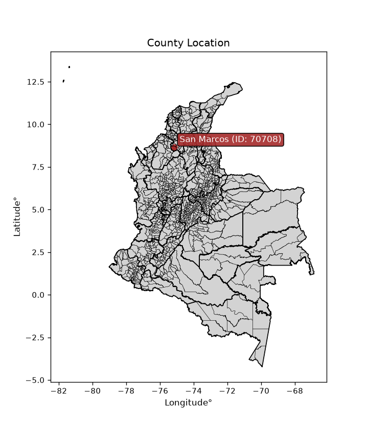
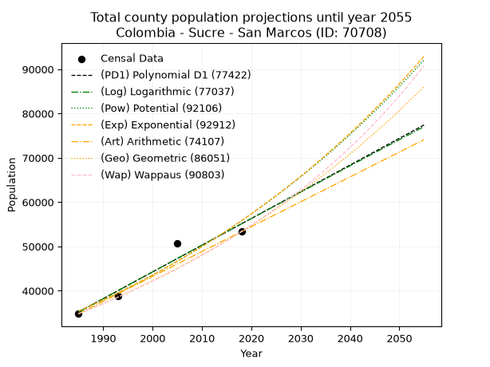
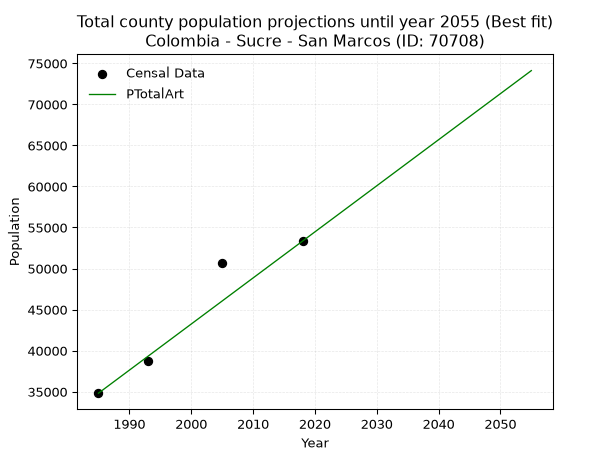
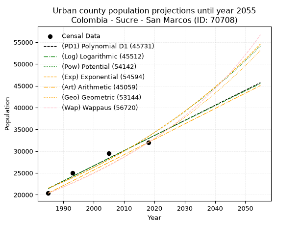
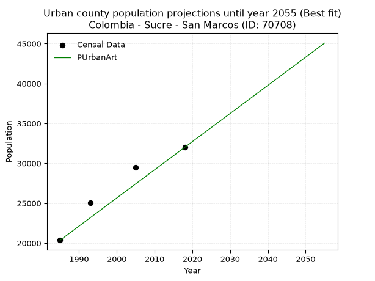
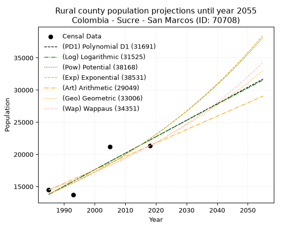
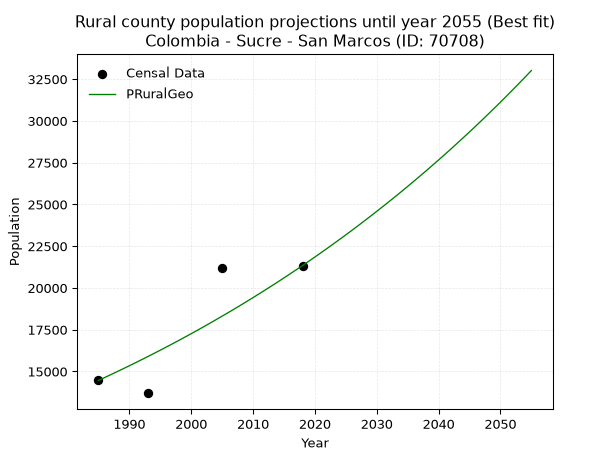

<div align="center">


</div>

# _“Population and Public Services Demand Projections (PPSD) until Year 2050 for Colombia - Sucre - San Marcos (ID: 70708)”_
Keywords: `population` `public-service` `projection` `lineal` `polynomial` `logarithmic` `potential` `exponential` `arithmetic` `geometric` `wappaus` `dane` `colombia` `south-america`

PPSD are analytical estimates used by governments and planners to anticipate future changes in population size, age distribution, and the resulting community needs for utilities, healthcare, education, and infrastructure as sizing future water treatment facilities, electrical grids, and road networks based on spatial growth.

<div align="center">

</img>

</div>


> **General running parameters**: • app_version: _v20260806_. • Python version: _3.14.7_. • Pandas version: _3.0.5_. • NumPy version: _2.5.1_. • Creates, save and include plots into reports (create_plot): _False_. • Projection until year: _2050_. • Process polynomial degree 2 and up: _False_. • Process Wappaus: _True_. • Process Wappaus: _True_. • Set negative values to zero: _True_. • Set infinite values to zero: _True_. • Drop dataset notes: _True_. 
<div align="center">

Dynamic map: [:earth_americas:Google](http://maps.google.com/maps?q=8.661773993,-75.133831) [:earth_americas:OSM](https://www.openstreetmap.org/#map=18/8.661773993/-75.133831&layers=P) [:earth_americas:Bing](https://www.bing.com/maps?cp=8.661773993~-75.133831&lvl=18) [:earth_americas:Apple](https://maps.apple.com/frame?center=8.661773993%2C-75.133831&span=0.003%2C0.006)

</div>


<div align="center">

```geojson
{
  "type": "Feature",
  "geometry": {
    "type": "Point", 
    "coordinates": [-75.133831, 8.661773993]
  }, 
  "properties": {
    "Name": "Colombia - Sucre - San Marcos (ID: 70708)"
  }
}
```

</div>


## 0. Census Data (4 records)

Census data are official statistics collected by a government about the people and housing in a country. They usually include counts of total population, age, sex, race, income, education, and jobs.

📅Global census file: [Population.xlsx](../data/Population.xlsx)

| Source   |   Year |   CountryID | CountryName   |   StateID | StateName   |   CountyID | CountyName   |   PTotal |   PUrban |   PRural |
|:---------|-------:|------------:|:--------------|----------:|:------------|-----------:|:-------------|---------:|---------:|---------:|
| DANE     |   1985 |          57 | Colombia      |        70 | Sucre       |      70708 | San Marcos   |    34818 |    20357 |    14461 |
| DANE     |   1993 |          57 | Colombia      |        70 | Sucre       |      70708 | San Marcos   |    38741 |    25045 |    13696 |
| DANE     |   2005 |          57 | Colombia      |        70 | Sucre       |      70708 | San Marcos   |    50679 |    29504 |    21175 |
| DANE     |   2018 |          57 | Colombia      |        70 | Sucre       |      70708 | San Marcos   |    53340 |    32002 |    21338 |

> 🔥Some records could had specific notes about the registered values or the corresponding urban or rural distribution.

📅[SUI-RUPS](https://www.datos.gov.co/Hacienda-y-Cr-dito-P-blico/Registro-nico-de-Prestadores-de-Servicios-P-blicos/4qkq-csdn/about_data) - Local public utility companies: [RUPS.csv](../data/RUPS.xlsx)

 | SERVICIO       | ESTADO    | NOMBRE                                                            | NIT         | DEPARTAMENTO_DOMICILIO   | MUNICIPIO_DOMICILIO   | DIRECCION                                       |   TELEFONO | EMAIL                          | TIPO_PRESTADOR                             | CLASIFICACION                  |
|:---------------|:----------|:------------------------------------------------------------------|:------------|:-------------------------|:----------------------|:------------------------------------------------|-----------:|:-------------------------------|:-------------------------------------------|:-------------------------------|
| ACUEDUCTO      | OPERATIVA | AGUAS DE LA MOJANA S.A. E.S.P                                     | 823003769-4 | SUCRE                    | SAN MARCOS            | CARRERA 24 # 14 - 25 APTO 1                     |    2954404 | aguasdelamojanaesp@hotmail.com | SOCIEDADES (EMPRESA DE SERVICIOS PUBLICOS) | MAYOR O IGUAL A 5001 USUARIOS  |
| ALCANTARILLADO | OPERATIVA | AGUAS DE LA MOJANA S.A. E.S.P                                     | 823003769-4 | SUCRE                    | SAN MARCOS            | CARRERA 24 # 14 - 25 APTO 1                     |    2954404 | aguasdelamojanaesp@hotmail.com | SOCIEDADES (EMPRESA DE SERVICIOS PUBLICOS) | MENOR O IGUAL A 2500 USUARIOS  |
| ALCANTARILLADO | OPERATIVA | SOCIEDAD DE ACUEDUCTO ALCANTARILLADO Y ASEO DEL NORTE  SAS  E.S.P | 900586384-2 | SUCRE                    | SINCELEJO             | Cra. 36A #31-68 Edif Venecia livingmall of. 404 |    2765045 | gerencia@tripleadelnorte.com   | SOCIEDADES (EMPRESA DE SERVICIOS PUBLICOS) | DESDE 2501 HASTA 5000 USUARIOS |
| ACUEDUCTO      | OPERATIVA | SOCIEDAD DE ACUEDUCTO ALCANTARILLADO Y ASEO DEL NORTE  SAS  E.S.P | 900586384-2 | SUCRE                    | SINCELEJO             | Cra. 36A #31-68 Edif Venecia livingmall of. 404 |    2765045 | gerencia@tripleadelnorte.com   | SOCIEDADES (EMPRESA DE SERVICIOS PUBLICOS) | MAYOR O IGUAL A 5001 USUARIOS  |

## 1. Total

### 1.1. Coefficients and Parameters

* (PD1) Polynomial Deg 1: 603.2332396627836, -1162222.7876354828 (lineal)
* (Log) Logarithmic: 1207951.0641660113, -9137251.218638176
* (Pow) Potential: 27.59245055930014, -86.44430790549958
* (Exp) Exponential: 0.01377808264450332, 4.693290756049584e-08
* (Art) Arithmetic: Year diff. 2018 - 1985 = 33, Population diff. 53340 - 34818 = 18522, Annual growth = 561.2727272727273
* (Geo) Geometric: Year diff. 2018 - 1985 = 33, Population diff. 53340 - 34818 = 18522, Annual growth % = 0.013009718416256533
* (Wap) Wappaus: i = 1.2733336220711162, Condition values only valid for < 200)

<sub>
Wappaus condition values: ['0.00', '1.27', '2.55', '3.82', '5.09', '6.37', '7.64', '8.91', '10.19', '11.46', '12.73', '14.01', '15.28', '16.55', '17.83', '19.10', '20.37', '21.65', '22.92', '24.19', '25.47', '26.74', '28.01', '29.29', '30.56', '31.83', '33.11', '34.38', '35.65', '36.93', '38.20', '39.47', '40.75', '42.02', '43.29', '44.57', '45.84', '47.11', '48.39', '49.66', '50.93', '52.21', '53.48', '54.75', '56.03', '57.30', '58.57', '59.85', '61.12', '62.39', '63.67', '64.94', '66.21', '67.49', '68.76', '70.03', '71.31', '72.58', '73.85', '75.13', '76.40', '77.67', '78.95', '80.22', '81.49', '82.77']
</sub>


### 1.2. Projected Dataset

|   Year |   CountyID |   PTotalPD1 |   PTotalLog |   PTotalPow |   PTotalExp |   PTotalArt |   PTotalGeo |   PTotalWap |
|-------:|-----------:|------------:|------------:|------------:|------------:|------------:|------------:|------------:|
|   1985 |      70708 |       35195 |       35173 |       35399 |       35417 |       34818 |       34818 |       34818 |
|   1986 |      70708 |       35798 |       35782 |       35894 |       35908 |       35379 |       35271 |       35264 |
|   1987 |      70708 |       36402 |       36390 |       36396 |       36407 |       35941 |       35730 |       35716 |
|   1988 |      70708 |       37005 |       36997 |       36905 |       36912 |       36502 |       36195 |       36174 |
|   1989 |      70708 |       37608 |       37605 |       37420 |       37424 |       37063 |       36666 |       36638 |
|   1990 |      70708 |       38211 |       38212 |       37943 |       37943 |       37624 |       37143 |       37108 |
|   1991 |      70708 |       38815 |       38819 |       38473 |       38469 |       38186 |       37626 |       37584 |
|   1992 |      70708 |       39418 |       39426 |       39009 |       39003 |       38747 |       38115 |       38066 |
|   1993 |      70708 |       40021 |       40032 |       39553 |       39544 |       39308 |       38611 |       38555 |
|   1994 |      70708 |       40624 |       40638 |       40105 |       40093 |       39869 |       39113 |       39051 |
|   1995 |      70708 |       41228 |       41243 |       40663 |       40649 |       40431 |       39622 |       39553 |
|   1996 |      70708 |       41831 |       41849 |       41230 |       41213 |       40992 |       40138 |       40062 |
|   1997 |      70708 |       42434 |       42454 |       41803 |       41785 |       41553 |       40660 |       40578 |
|   1998 |      70708 |       43037 |       43058 |       42385 |       42364 |       42115 |       41189 |       41102 |
|   1999 |      70708 |       43640 |       43663 |       42974 |       42952 |       42676 |       41725 |       41632 |
|   2000 |      70708 |       44244 |       44267 |       43571 |       43548 |       43237 |       42268 |       42170 |
|   2001 |      70708 |       44847 |       44871 |       44176 |       44152 |       43798 |       42818 |       42716 |
|   2002 |      70708 |       45450 |       45474 |       44790 |       44765 |       44360 |       43375 |       43270 |
|   2003 |      70708 |       46053 |       46078 |       45411 |       45386 |       44921 |       43939 |       43831 |
|   2004 |      70708 |       46657 |       46680 |       46041 |       46015 |       45482 |       44510 |       44401 |
|   2005 |      70708 |       47260 |       47283 |       46679 |       46654 |       46043 |       45090 |       44979 |
|   2006 |      70708 |       47863 |       47885 |       47325 |       47301 |       46605 |       45676 |       45565 |
|   2007 |      70708 |       48466 |       48487 |       47981 |       47957 |       47166 |       46270 |       46160 |
|   2008 |      70708 |       49070 |       49089 |       48645 |       48623 |       47727 |       46872 |       46764 |
|   2009 |      70708 |       49673 |       49691 |       49318 |       49297 |       48289 |       47482 |       47377 |
|   2010 |      70708 |       50276 |       50292 |       50000 |       49981 |       48850 |       48100 |       48000 |
|   2011 |      70708 |       50879 |       50893 |       50690 |       50674 |       49411 |       48726 |       48632 |
|   2012 |      70708 |       51482 |       51493 |       51391 |       51377 |       49972 |       49360 |       49273 |
|   2013 |      70708 |       52086 |       52093 |       52100 |       52090 |       50534 |       50002 |       49925 |
|   2014 |      70708 |       52689 |       52693 |       52819 |       52813 |       51095 |       50652 |       50587 |
|   2015 |      70708 |       53292 |       53293 |       53547 |       53546 |       51656 |       51311 |       51259 |
|   2016 |      70708 |       53895 |       53892 |       54285 |       54289 |       52217 |       51979 |       51941 |
|   2017 |      70708 |       54499 |       54491 |       55033 |       55042 |       52779 |       52655 |       52635 |
|   2018 |      70708 |       55102 |       55090 |       55791 |       55805 |       53340 |       53340 |       53340 |
|   2019 |      70708 |       55705 |       55688 |       56559 |       56580 |       53901 |       54034 |       54056 |
|   2020 |      70708 |       56308 |       56287 |       57337 |       57364 |       54463 |       54737 |       54784 |
|   2021 |      70708 |       56912 |       56884 |       58126 |       58160 |       55024 |       55449 |       55525 |
|   2022 |      70708 |       57515 |       57482 |       58924 |       58967 |       55585 |       56170 |       56277 |
|   2023 |      70708 |       58118 |       58079 |       59734 |       59785 |       56146 |       56901 |       57042 |
|   2024 |      70708 |       58721 |       58676 |       60554 |       60615 |       56708 |       57641 |       57820 |
|   2025 |      70708 |       59325 |       59273 |       61385 |       61456 |       57269 |       58391 |       58611 |
|   2026 |      70708 |       59928 |       59869 |       62227 |       62308 |       57830 |       59151 |       59416 |
|   2027 |      70708 |       60531 |       60465 |       63080 |       63173 |       58391 |       59921 |       60235 |
|   2028 |      70708 |       61134 |       61061 |       63944 |       64049 |       58953 |       60700 |       61069 |
|   2029 |      70708 |       61737 |       61657 |       64820 |       64938 |       59514 |       61490 |       61917 |
|   2030 |      70708 |       62341 |       62252 |       65707 |       65839 |       60075 |       62290 |       62780 |
|   2031 |      70708 |       62944 |       62847 |       66606 |       66752 |       60637 |       63100 |       63658 |
|   2032 |      70708 |       63547 |       63441 |       67517 |       67678 |       61198 |       63921 |       64553 |
|   2033 |      70708 |       64150 |       64036 |       68440 |       68617 |       61759 |       64753 |       65464 |
|   2034 |      70708 |       64754 |       64630 |       69375 |       69569 |       62320 |       65595 |       66392 |
|   2035 |      70708 |       65357 |       65223 |       70322 |       70534 |       62882 |       66448 |       67338 |
|   2036 |      70708 |       65960 |       65817 |       71282 |       71513 |       63443 |       67313 |       68301 |
|   2037 |      70708 |       66563 |       66410 |       72254 |       72505 |       64004 |       68189 |       69282 |
|   2038 |      70708 |       67167 |       67003 |       73239 |       73511 |       64565 |       69076 |       70282 |
|   2039 |      70708 |       67770 |       67595 |       74237 |       74531 |       65127 |       69974 |       71302 |
|   2040 |      70708 |       68373 |       68188 |       75249 |       75564 |       65688 |       70885 |       72342 |
|   2041 |      70708 |       68976 |       68780 |       76273 |       76613 |       66249 |       71807 |       73402 |
|   2042 |      70708 |       69579 |       69371 |       77311 |       77676 |       66811 |       72741 |       74484 |
|   2043 |      70708 |       70183 |       69963 |       78363 |       78753 |       67372 |       73687 |       75587 |
|   2044 |      70708 |       70786 |       70554 |       79428 |       79846 |       67933 |       74646 |       76713 |
|   2045 |      70708 |       71389 |       71145 |       80507 |       80954 |       68494 |       75617 |       77862 |
|   2046 |      70708 |       71992 |       71735 |       81600 |       82077 |       69056 |       76601 |       79035 |
|   2047 |      70708 |       72596 |       72325 |       82708 |       83215 |       69617 |       77598 |       80232 |
|   2048 |      70708 |       73199 |       72915 |       83830 |       84370 |       70178 |       78607 |       81455 |
|   2049 |      70708 |       73802 |       73505 |       84967 |       85540 |       70739 |       79630 |       82705 |
|   2050 |      70708 |       74405 |       74094 |       86119 |       86727 |       71301 |       80666 |       83981 |
<div align="center">

</img>

</div>


### 1.3. Best fit with absolute and relative error (%)

Relative error puts that difference into context by dividing the absolute error by the true value, creating a unitless ratio or percentage that shows the scale of the mistake.

Absolute and relative error

|   Year | Source   |   CountryID | CountryName   |   StateID | StateName   |   CountyID_x | CountyName   |   PTotal |   PUrban |   PRural |   CountyID_y |   PTotalPD1 |   PTotalLog |   PTotalPow |   PTotalExp |   PTotalArt |   PTotalGeo |   PTotalWap |   PTotalPD1AbsError |   PTotalLogAbsError |   PTotalPowAbsError |   PTotalExpAbsError |   PTotalArtAbsError |   PTotalGeoAbsError |   PTotalWapAbsError |   PTotalPD1RelError |   PTotalLogRelError |   PTotalPowRelError |   PTotalExpRelError |   PTotalArtRelError |   PTotalGeoRelError |   PTotalWapRelError |
|-------:|:---------|------------:|:--------------|----------:|:------------|-------------:|:-------------|---------:|---------:|---------:|-------------:|------------:|------------:|------------:|------------:|------------:|------------:|------------:|--------------------:|--------------------:|--------------------:|--------------------:|--------------------:|--------------------:|--------------------:|--------------------:|--------------------:|--------------------:|--------------------:|--------------------:|--------------------:|--------------------:|
|   1985 | DANE     |          57 | Colombia      |        70 | Sucre       |        70708 | San Marcos   |    34818 |    20357 |    14461 |        70708 |       35195 |       35173 |       35399 |       35417 |       34818 |       34818 |       34818 |                 377 |                 355 |                 581 |                 599 |                   0 |                   0 |                   0 |             1.08277 |             1.01959 |             1.66868 |             1.72037 |             0       |            0        |            0        |
|   1993 | DANE     |          57 | Colombia      |        70 | Sucre       |        70708 | San Marcos   |    38741 |    25045 |    13696 |        70708 |       40021 |       40032 |       39553 |       39544 |       39308 |       38611 |       38555 |                1280 |                1291 |                 812 |                 803 |                 567 |                 130 |                 186 |             3.30399 |             3.33239 |             2.09597 |             2.07274 |             1.46357 |            0.335562 |            0.480112 |
|   2005 | DANE     |          57 | Colombia      |        70 | Sucre       |        70708 | San Marcos   |    50679 |    29504 |    21175 |        70708 |       47260 |       47283 |       46679 |       46654 |       46043 |       45090 |       44979 |                3419 |                3396 |                4000 |                4025 |                4636 |                5589 |                5700 |             6.74638 |             6.701   |             7.89282 |             7.94215 |             9.14777 |           11.0282   |           11.2473   |
|   2018 | DANE     |          57 | Colombia      |        70 | Sucre       |        70708 | San Marcos   |    53340 |    32002 |    21338 |        70708 |       55102 |       55090 |       55791 |       55805 |       53340 |       53340 |       53340 |                1762 |                1750 |                2451 |                2465 |                   0 |                   0 |                   0 |             3.30334 |             3.28084 |             4.59505 |             4.6213  |             0       |            0        |            0        |

Relative error mean

| Method    |   RelError | Best   |
|:----------|-----------:|:-------|
| PTotalPD1 |    3.60912 |        |
| PTotalLog |    3.58345 |        |
| PTotalPow |    4.06313 |        |
| PTotalExp |    4.08914 |        |
| PTotalArt |    2.65283 | True   |
| PTotalGeo |    2.84095 |        |
| PTotalWap |    2.93184 |        |

💙Best method: _**PTotalArt**_
<div align="center">

</img>

</div>


### 1.4. Fresh water supply demand in liters per capita per day (lpcd)

The fresh water supply demand typically ranges from 100 to 300 liters per capita per day (lpcd) for standard domestic and municipal planning, though absolute survival minimums set by the World Health Organization are as low as 7.5 to 20 liters per day, and total consumption in high-income nations can exceed 400 liters.

> `CZ`: Level in meters above the sea level (masl)<br> `WS`: Fresh water supply demand in liters per capita per day (lpcd or l/h/d)<br> `WSAll`: Zonal fresh water supply demand in liters per second (l/s)<br> `A`: Zonal area in square meters<br> `DP`: Population density (people/hectare or p/ha)

Reference values (RAS Colombia)

|    CZ |   WS |
|------:|-----:|
|  1000 |  120 |
|  2000 |  130 |
| 99999 |  140 |

County shapefile geometry properties and water supply values

|   CountyID |      ATotal |   CZTotal |   WSTotal |
|-----------:|------------:|----------:|----------:|
|      70708 | 9.69792e+08 |   31.5462 |       120 |

Projected values for best method: PTotalArt

|   CountyID |   Year |   PTotalArt |   DPTotal |   WSTotal |   WSTotalAll |
|-----------:|-------:|------------:|----------:|----------:|-------------:|
|      70708 |   1985 |       34818 |      0.36 |       120 |      48.3583 |
|      70708 |   1986 |       35379 |      0.36 |       120 |      49.1375 |
|      70708 |   1987 |       35941 |      0.37 |       120 |      49.9181 |
|      70708 |   1988 |       36502 |      0.38 |       120 |      50.6972 |
|      70708 |   1989 |       37063 |      0.38 |       120 |      51.4764 |
|      70708 |   1990 |       37624 |      0.39 |       120 |      52.2556 |
|      70708 |   1991 |       38186 |      0.39 |       120 |      53.0361 |
|      70708 |   1992 |       38747 |      0.4  |       120 |      53.8153 |
|      70708 |   1993 |       39308 |      0.41 |       120 |      54.5944 |
|      70708 |   1994 |       39869 |      0.41 |       120 |      55.3736 |
|      70708 |   1995 |       40431 |      0.42 |       120 |      56.1542 |
|      70708 |   1996 |       40992 |      0.42 |       120 |      56.9333 |
|      70708 |   1997 |       41553 |      0.43 |       120 |      57.7125 |
|      70708 |   1998 |       42115 |      0.43 |       120 |      58.4931 |
|      70708 |   1999 |       42676 |      0.44 |       120 |      59.2722 |
|      70708 |   2000 |       43237 |      0.45 |       120 |      60.0514 |
|      70708 |   2001 |       43798 |      0.45 |       120 |      60.8306 |
|      70708 |   2002 |       44360 |      0.46 |       120 |      61.6111 |
|      70708 |   2003 |       44921 |      0.46 |       120 |      62.3903 |
|      70708 |   2004 |       45482 |      0.47 |       120 |      63.1694 |
|      70708 |   2005 |       46043 |      0.47 |       120 |      63.9486 |
|      70708 |   2006 |       46605 |      0.48 |       120 |      64.7292 |
|      70708 |   2007 |       47166 |      0.49 |       120 |      65.5083 |
|      70708 |   2008 |       47727 |      0.49 |       120 |      66.2875 |
|      70708 |   2009 |       48289 |      0.5  |       120 |      67.0681 |
|      70708 |   2010 |       48850 |      0.5  |       120 |      67.8472 |
|      70708 |   2011 |       49411 |      0.51 |       120 |      68.6264 |
|      70708 |   2012 |       49972 |      0.52 |       120 |      69.4056 |
|      70708 |   2013 |       50534 |      0.52 |       120 |      70.1861 |
|      70708 |   2014 |       51095 |      0.53 |       120 |      70.9653 |
|      70708 |   2015 |       51656 |      0.53 |       120 |      71.7444 |
|      70708 |   2016 |       52217 |      0.54 |       120 |      72.5236 |
|      70708 |   2017 |       52779 |      0.54 |       120 |      73.3042 |
|      70708 |   2018 |       53340 |      0.55 |       120 |      74.0833 |
|      70708 |   2019 |       53901 |      0.56 |       120 |      74.8625 |
|      70708 |   2020 |       54463 |      0.56 |       120 |      75.6431 |
|      70708 |   2021 |       55024 |      0.57 |       120 |      76.4222 |
|      70708 |   2022 |       55585 |      0.57 |       120 |      77.2014 |
|      70708 |   2023 |       56146 |      0.58 |       120 |      77.9806 |
|      70708 |   2024 |       56708 |      0.58 |       120 |      78.7611 |
|      70708 |   2025 |       57269 |      0.59 |       120 |      79.5403 |
|      70708 |   2026 |       57830 |      0.6  |       120 |      80.3194 |
|      70708 |   2027 |       58391 |      0.6  |       120 |      81.0986 |
|      70708 |   2028 |       58953 |      0.61 |       120 |      81.8792 |
|      70708 |   2029 |       59514 |      0.61 |       120 |      82.6583 |
|      70708 |   2030 |       60075 |      0.62 |       120 |      83.4375 |
|      70708 |   2031 |       60637 |      0.63 |       120 |      84.2181 |
|      70708 |   2032 |       61198 |      0.63 |       120 |      84.9972 |
|      70708 |   2033 |       61759 |      0.64 |       120 |      85.7764 |
|      70708 |   2034 |       62320 |      0.64 |       120 |      86.5556 |
|      70708 |   2035 |       62882 |      0.65 |       120 |      87.3361 |
|      70708 |   2036 |       63443 |      0.65 |       120 |      88.1153 |
|      70708 |   2037 |       64004 |      0.66 |       120 |      88.8944 |
|      70708 |   2038 |       64565 |      0.67 |       120 |      89.6736 |
|      70708 |   2039 |       65127 |      0.67 |       120 |      90.4542 |
|      70708 |   2040 |       65688 |      0.68 |       120 |      91.2333 |
|      70708 |   2041 |       66249 |      0.68 |       120 |      92.0125 |
|      70708 |   2042 |       66811 |      0.69 |       120 |      92.7931 |
|      70708 |   2043 |       67372 |      0.69 |       120 |      93.5722 |
|      70708 |   2044 |       67933 |      0.7  |       120 |      94.3514 |
|      70708 |   2045 |       68494 |      0.71 |       120 |      95.1306 |
|      70708 |   2046 |       69056 |      0.71 |       120 |      95.9111 |
|      70708 |   2047 |       69617 |      0.72 |       120 |      96.6903 |
|      70708 |   2048 |       70178 |      0.72 |       120 |      97.4694 |
|      70708 |   2049 |       70739 |      0.73 |       120 |      98.2486 |
|      70708 |   2050 |       71301 |      0.74 |       120 |      99.0292 |

## 2. Urban

### 2.1. Coefficients and Parameters

* (PD1) Polynomial Deg 1: 347.10397430750515, -667567.7246085872 (lineal)
* (Log) Logarithmic: 695140.2264499159, -5257039.431749984
* (Pow) Potential: 26.662675470570022, -83.59489054182004
* (Exp) Exponential: 0.013311606079713543, 7.192233649198926e-08
* (Art) Arithmetic: Year diff. 2018 - 1985 = 33, Population diff. 32002 - 20357 = 11645, Annual growth = 352.8787878787879
* (Geo) Geometric: Year diff. 2018 - 1985 = 33, Population diff. 32002 - 20357 = 11645, Annual growth % = 0.013802679351293312
* (Wap) Wappaus: i = 1.347920273033434, Condition values only valid for < 200)

<sub>
Wappaus condition values: ['0.00', '1.35', '2.70', '4.04', '5.39', '6.74', '8.09', '9.44', '10.78', '12.13', '13.48', '14.83', '16.18', '17.52', '18.87', '20.22', '21.57', '22.91', '24.26', '25.61', '26.96', '28.31', '29.65', '31.00', '32.35', '33.70', '35.05', '36.39', '37.74', '39.09', '40.44', '41.79', '43.13', '44.48', '45.83', '47.18', '48.53', '49.87', '51.22', '52.57', '53.92', '55.26', '56.61', '57.96', '59.31', '60.66', '62.00', '63.35', '64.70', '66.05', '67.40', '68.74', '70.09', '71.44', '72.79', '74.14', '75.48', '76.83', '78.18', '79.53', '80.88', '82.22', '83.57', '84.92', '86.27', '87.61']
</sub>


### 2.2. Projected Dataset

|   Year |   CountyID |   PUrbanPD1 |   PUrbanLog |   PUrbanPow |   PUrbanExp |   PUrbanArt |   PUrbanGeo |   PUrbanWap |
|-------:|-----------:|------------:|------------:|------------:|------------:|------------:|------------:|------------:|
|   1985 |      70708 |       21434 |       21420 |       21490 |       21501 |       20357 |       20357 |       20357 |
|   1986 |      70708 |       21781 |       21771 |       21780 |       21789 |       20710 |       20638 |       20633 |
|   1987 |      70708 |       22128 |       22120 |       22074 |       22081 |       21063 |       20923 |       20913 |
|   1988 |      70708 |       22475 |       22470 |       22373 |       22377 |       21416 |       21212 |       21197 |
|   1989 |      70708 |       22822 |       22820 |       22675 |       22677 |       21769 |       21504 |       21485 |
|   1990 |      70708 |       23169 |       23169 |       22980 |       22981 |       22121 |       21801 |       21777 |
|   1991 |      70708 |       23516 |       23518 |       23290 |       23289 |       22474 |       22102 |       22073 |
|   1992 |      70708 |       23863 |       23867 |       23604 |       23601 |       22827 |       22407 |       22373 |
|   1993 |      70708 |       24210 |       24216 |       23922 |       23917 |       23180 |       22716 |       22677 |
|   1994 |      70708 |       24558 |       24565 |       24244 |       24238 |       23533 |       23030 |       22986 |
|   1995 |      70708 |       24905 |       24914 |       24571 |       24562 |       23886 |       23348 |       23299 |
|   1996 |      70708 |       25252 |       25262 |       24901 |       24892 |       24239 |       23670 |       23617 |
|   1997 |      70708 |       25599 |       25610 |       25236 |       25225 |       24592 |       23997 |       23939 |
|   1998 |      70708 |       25946 |       25958 |       25575 |       25563 |       24944 |       24328 |       24267 |
|   1999 |      70708 |       26293 |       26306 |       25918 |       25906 |       25297 |       24664 |       24599 |
|   2000 |      70708 |       26640 |       26654 |       26266 |       26253 |       25650 |       25004 |       24936 |
|   2001 |      70708 |       26987 |       27001 |       26619 |       26605 |       26003 |       25349 |       25278 |
|   2002 |      70708 |       27334 |       27348 |       26976 |       26961 |       26356 |       25699 |       25625 |
|   2003 |      70708 |       27682 |       27696 |       27337 |       27323 |       26709 |       26054 |       25978 |
|   2004 |      70708 |       28029 |       28043 |       27704 |       27689 |       27062 |       26414 |       26336 |
|   2005 |      70708 |       28376 |       28389 |       28075 |       28060 |       27415 |       26778 |       26700 |
|   2006 |      70708 |       28723 |       28736 |       28450 |       28436 |       27767 |       27148 |       27069 |
|   2007 |      70708 |       29070 |       29082 |       28831 |       28817 |       28120 |       27523 |       27445 |
|   2008 |      70708 |       29417 |       29429 |       29216 |       29203 |       28473 |       27902 |       27826 |
|   2009 |      70708 |       29764 |       29775 |       29607 |       29594 |       28826 |       28288 |       28213 |
|   2010 |      70708 |       30111 |       30121 |       30002 |       29991 |       29179 |       28678 |       28607 |
|   2011 |      70708 |       30458 |       30466 |       30403 |       30393 |       29532 |       29074 |       29007 |
|   2012 |      70708 |       30805 |       30812 |       30808 |       30800 |       29885 |       29475 |       29414 |
|   2013 |      70708 |       31153 |       31157 |       31219 |       31213 |       30238 |       29882 |       29827 |
|   2014 |      70708 |       31500 |       31503 |       31636 |       31631 |       30590 |       30294 |       30248 |
|   2015 |      70708 |       31847 |       31848 |       32057 |       32055 |       30943 |       30713 |       30675 |
|   2016 |      70708 |       32194 |       32193 |       32484 |       32485 |       31296 |       31137 |       31110 |
|   2017 |      70708 |       32541 |       32537 |       32916 |       32920 |       31649 |       31566 |       31552 |
|   2018 |      70708 |       32888 |       32882 |       33354 |       33361 |       32002 |       32002 |       32002 |
|   2019 |      70708 |       33235 |       33226 |       33798 |       33808 |       32355 |       32444 |       32460 |
|   2020 |      70708 |       33582 |       33571 |       34247 |       34261 |       32708 |       32892 |       32926 |
|   2021 |      70708 |       33929 |       33915 |       34702 |       34720 |       33061 |       33346 |       33400 |
|   2022 |      70708 |       34277 |       34258 |       35162 |       35185 |       33414 |       33806 |       33882 |
|   2023 |      70708 |       34624 |       34602 |       35629 |       35657 |       33766 |       34272 |       34374 |
|   2024 |      70708 |       34971 |       34946 |       36102 |       36135 |       34119 |       34745 |       34874 |
|   2025 |      70708 |       35318 |       35289 |       36580 |       36619 |       34472 |       35225 |       35384 |
|   2026 |      70708 |       35665 |       35632 |       37065 |       37110 |       34825 |       35711 |       35903 |
|   2027 |      70708 |       36012 |       35975 |       37556 |       37607 |       35178 |       36204 |       36432 |
|   2028 |      70708 |       36359 |       36318 |       38053 |       38111 |       35531 |       36704 |       36971 |
|   2029 |      70708 |       36706 |       36661 |       38556 |       38622 |       35884 |       37210 |       37520 |
|   2030 |      70708 |       37053 |       37003 |       39066 |       39139 |       36237 |       37724 |       38080 |
|   2031 |      70708 |       37400 |       37346 |       39583 |       39664 |       36589 |       38245 |       38651 |
|   2032 |      70708 |       37748 |       37688 |       40106 |       40195 |       36942 |       38773 |       39233 |
|   2033 |      70708 |       38095 |       38030 |       40635 |       40734 |       37295 |       39308 |       39826 |
|   2034 |      70708 |       38442 |       38372 |       41172 |       41280 |       37648 |       39850 |       40432 |
|   2035 |      70708 |       38789 |       38713 |       41715 |       41833 |       38001 |       40400 |       41050 |
|   2036 |      70708 |       39136 |       39055 |       42265 |       42394 |       38354 |       40958 |       41681 |
|   2037 |      70708 |       39483 |       39396 |       42822 |       42962 |       38707 |       41523 |       42324 |
|   2038 |      70708 |       39830 |       39737 |       43386 |       43537 |       39060 |       42096 |       42981 |
|   2039 |      70708 |       40177 |       40078 |       43957 |       44121 |       39412 |       42678 |       43653 |
|   2040 |      70708 |       40524 |       40419 |       44535 |       44712 |       39765 |       43267 |       44338 |
|   2041 |      70708 |       40871 |       40760 |       45121 |       45311 |       40118 |       43864 |       45038 |
|   2042 |      70708 |       41219 |       41100 |       45714 |       45918 |       40471 |       44469 |       45754 |
|   2043 |      70708 |       41566 |       41441 |       46315 |       46534 |       40824 |       45083 |       46486 |
|   2044 |      70708 |       41913 |       41781 |       46923 |       47157 |       41177 |       45705 |       47233 |
|   2045 |      70708 |       42260 |       42121 |       47539 |       47789 |       41530 |       46336 |       47998 |
|   2046 |      70708 |       42607 |       42461 |       48163 |       48430 |       41883 |       46976 |       48781 |
|   2047 |      70708 |       42954 |       42800 |       48794 |       49079 |       42235 |       47624 |       49581 |
|   2048 |      70708 |       43301 |       43140 |       49434 |       49736 |       42588 |       48281 |       50400 |
|   2049 |      70708 |       43648 |       43479 |       50082 |       50403 |       42941 |       48948 |       51239 |
|   2050 |      70708 |       43995 |       43818 |       50737 |       51078 |       43294 |       49623 |       52097 |
<div align="center">

</img>

</div>


### 2.3. Best fit with absolute and relative error (%)

Relative error puts that difference into context by dividing the absolute error by the true value, creating a unitless ratio or percentage that shows the scale of the mistake.

Absolute and relative error

|   Year | Source   |   CountryID | CountryName   |   StateID | StateName   |   CountyID_x | CountyName   |   PTotal |   PUrban |   PRural |   CountyID_y |   PUrbanPD1 |   PUrbanLog |   PUrbanPow |   PUrbanExp |   PUrbanArt |   PUrbanGeo |   PUrbanWap |   PUrbanPD1AbsError |   PUrbanLogAbsError |   PUrbanPowAbsError |   PUrbanExpAbsError |   PUrbanArtAbsError |   PUrbanGeoAbsError |   PUrbanWapAbsError |   PUrbanPD1RelError |   PUrbanLogRelError |   PUrbanPowRelError |   PUrbanExpRelError |   PUrbanArtRelError |   PUrbanGeoRelError |   PUrbanWapRelError |
|-------:|:---------|------------:|:--------------|----------:|:------------|-------------:|:-------------|---------:|---------:|---------:|-------------:|------------:|------------:|------------:|------------:|------------:|------------:|------------:|--------------------:|--------------------:|--------------------:|--------------------:|--------------------:|--------------------:|--------------------:|--------------------:|--------------------:|--------------------:|--------------------:|--------------------:|--------------------:|--------------------:|
|   1985 | DANE     |          57 | Colombia      |        70 | Sucre       |        70708 | San Marcos   |    34818 |    20357 |    14461 |        70708 |       21434 |       21420 |       21490 |       21501 |       20357 |       20357 |       20357 |                1077 |                1063 |                1133 |                1144 |                   0 |                   0 |                   0 |             5.29056 |             5.22179 |             5.56565 |             5.61969 |              0      |             0       |             0       |
|   1993 | DANE     |          57 | Colombia      |        70 | Sucre       |        70708 | San Marcos   |    38741 |    25045 |    13696 |        70708 |       24210 |       24216 |       23922 |       23917 |       23180 |       22716 |       22677 |                 835 |                 829 |                1123 |                1128 |                1865 |                2329 |                2368 |             3.334   |             3.31004 |             4.48393 |             4.50389 |              7.4466 |             9.29926 |             9.45498 |
|   2005 | DANE     |          57 | Colombia      |        70 | Sucre       |        70708 | San Marcos   |    50679 |    29504 |    21175 |        70708 |       28376 |       28389 |       28075 |       28060 |       27415 |       26778 |       26700 |                1128 |                1115 |                1429 |                1444 |                2089 |                2726 |                2804 |             3.82321 |             3.77915 |             4.84341 |             4.89425 |              7.0804 |             9.23943 |             9.5038  |
|   2018 | DANE     |          57 | Colombia      |        70 | Sucre       |        70708 | San Marcos   |    53340 |    32002 |    21338 |        70708 |       32888 |       32882 |       33354 |       33361 |       32002 |       32002 |       32002 |                 886 |                 880 |                1352 |                1359 |                   0 |                   0 |                   0 |             2.76858 |             2.74983 |             4.22474 |             4.24661 |              0      |             0       |             0       |

Relative error mean

| Method    |   RelError | Best   |
|:----------|-----------:|:-------|
| PUrbanPD1 |    3.80409 |        |
| PUrbanLog |    3.7652  |        |
| PUrbanPow |    4.77943 |        |
| PUrbanExp |    4.81611 |        |
| PUrbanArt |    3.63175 | True   |
| PUrbanGeo |    4.63467 |        |
| PUrbanWap |    4.73969 |        |

💙Best method: _**PUrbanArt**_
<div align="center">

</img>

</div>


### 2.4. Fresh water supply demand in liters per capita per day (lpcd)

The fresh water supply demand typically ranges from 100 to 300 liters per capita per day (lpcd) for standard domestic and municipal planning, though absolute survival minimums set by the World Health Organization are as low as 7.5 to 20 liters per day, and total consumption in high-income nations can exceed 400 liters.

> `CZ`: Level in meters above the sea level (masl)<br> `WS`: Fresh water supply demand in liters per capita per day (lpcd or l/h/d)<br> `WSAll`: Zonal fresh water supply demand in liters per second (l/s)<br> `A`: Zonal area in square meters<br> `DP`: Population density (people/hectare or p/ha)

Reference values (RAS Colombia)

|    CZ |   WS |
|------:|-----:|
|  1000 |  120 |
|  2000 |  130 |
| 99999 |  140 |

County shapefile geometry properties and water supply values

|   CountyID |      AUrban |   CZUrban |   WSUrban |
|-----------:|------------:|----------:|----------:|
|      70708 | 7.13734e+06 |   26.4805 |       120 |

Projected values for best method: PUrbanArt

|   CountyID |   Year |   PUrbanArt |   DPUrban |   WSUrban |   WSUrbanAll |
|-----------:|-------:|------------:|----------:|----------:|-------------:|
|      70708 |   1985 |       20357 |     28.52 |       120 |      28.2736 |
|      70708 |   1986 |       20710 |     29.02 |       120 |      28.7639 |
|      70708 |   1987 |       21063 |     29.51 |       120 |      29.2542 |
|      70708 |   1988 |       21416 |     30.01 |       120 |      29.7444 |
|      70708 |   1989 |       21769 |     30.5  |       120 |      30.2347 |
|      70708 |   1990 |       22121 |     30.99 |       120 |      30.7236 |
|      70708 |   1991 |       22474 |     31.49 |       120 |      31.2139 |
|      70708 |   1992 |       22827 |     31.98 |       120 |      31.7042 |
|      70708 |   1993 |       23180 |     32.48 |       120 |      32.1944 |
|      70708 |   1994 |       23533 |     32.97 |       120 |      32.6847 |
|      70708 |   1995 |       23886 |     33.47 |       120 |      33.175  |
|      70708 |   1996 |       24239 |     33.96 |       120 |      33.6653 |
|      70708 |   1997 |       24592 |     34.46 |       120 |      34.1556 |
|      70708 |   1998 |       24944 |     34.95 |       120 |      34.6444 |
|      70708 |   1999 |       25297 |     35.44 |       120 |      35.1347 |
|      70708 |   2000 |       25650 |     35.94 |       120 |      35.625  |
|      70708 |   2001 |       26003 |     36.43 |       120 |      36.1153 |
|      70708 |   2002 |       26356 |     36.93 |       120 |      36.6056 |
|      70708 |   2003 |       26709 |     37.42 |       120 |      37.0958 |
|      70708 |   2004 |       27062 |     37.92 |       120 |      37.5861 |
|      70708 |   2005 |       27415 |     38.41 |       120 |      38.0764 |
|      70708 |   2006 |       27767 |     38.9  |       120 |      38.5653 |
|      70708 |   2007 |       28120 |     39.4  |       120 |      39.0556 |
|      70708 |   2008 |       28473 |     39.89 |       120 |      39.5458 |
|      70708 |   2009 |       28826 |     40.39 |       120 |      40.0361 |
|      70708 |   2010 |       29179 |     40.88 |       120 |      40.5264 |
|      70708 |   2011 |       29532 |     41.38 |       120 |      41.0167 |
|      70708 |   2012 |       29885 |     41.87 |       120 |      41.5069 |
|      70708 |   2013 |       30238 |     42.37 |       120 |      41.9972 |
|      70708 |   2014 |       30590 |     42.86 |       120 |      42.4861 |
|      70708 |   2015 |       30943 |     43.35 |       120 |      42.9764 |
|      70708 |   2016 |       31296 |     43.85 |       120 |      43.4667 |
|      70708 |   2017 |       31649 |     44.34 |       120 |      43.9569 |
|      70708 |   2018 |       32002 |     44.84 |       120 |      44.4472 |
|      70708 |   2019 |       32355 |     45.33 |       120 |      44.9375 |
|      70708 |   2020 |       32708 |     45.83 |       120 |      45.4278 |
|      70708 |   2021 |       33061 |     46.32 |       120 |      45.9181 |
|      70708 |   2022 |       33414 |     46.82 |       120 |      46.4083 |
|      70708 |   2023 |       33766 |     47.31 |       120 |      46.8972 |
|      70708 |   2024 |       34119 |     47.8  |       120 |      47.3875 |
|      70708 |   2025 |       34472 |     48.3  |       120 |      47.8778 |
|      70708 |   2026 |       34825 |     48.79 |       120 |      48.3681 |
|      70708 |   2027 |       35178 |     49.29 |       120 |      48.8583 |
|      70708 |   2028 |       35531 |     49.78 |       120 |      49.3486 |
|      70708 |   2029 |       35884 |     50.28 |       120 |      49.8389 |
|      70708 |   2030 |       36237 |     50.77 |       120 |      50.3292 |
|      70708 |   2031 |       36589 |     51.26 |       120 |      50.8181 |
|      70708 |   2032 |       36942 |     51.76 |       120 |      51.3083 |
|      70708 |   2033 |       37295 |     52.25 |       120 |      51.7986 |
|      70708 |   2034 |       37648 |     52.75 |       120 |      52.2889 |
|      70708 |   2035 |       38001 |     53.24 |       120 |      52.7792 |
|      70708 |   2036 |       38354 |     53.74 |       120 |      53.2694 |
|      70708 |   2037 |       38707 |     54.23 |       120 |      53.7597 |
|      70708 |   2038 |       39060 |     54.73 |       120 |      54.25   |
|      70708 |   2039 |       39412 |     55.22 |       120 |      54.7389 |
|      70708 |   2040 |       39765 |     55.71 |       120 |      55.2292 |
|      70708 |   2041 |       40118 |     56.21 |       120 |      55.7194 |
|      70708 |   2042 |       40471 |     56.7  |       120 |      56.2097 |
|      70708 |   2043 |       40824 |     57.2  |       120 |      56.7    |
|      70708 |   2044 |       41177 |     57.69 |       120 |      57.1903 |
|      70708 |   2045 |       41530 |     58.19 |       120 |      57.6806 |
|      70708 |   2046 |       41883 |     58.68 |       120 |      58.1708 |
|      70708 |   2047 |       42235 |     59.17 |       120 |      58.6597 |
|      70708 |   2048 |       42588 |     59.67 |       120 |      59.15   |
|      70708 |   2049 |       42941 |     60.16 |       120 |      59.6403 |
|      70708 |   2050 |       43294 |     60.66 |       120 |      60.1306 |

## 3. Rural

### 3.1. Coefficients and Parameters

* (PD1) Polynomial Deg 1: 256.1292653552785, -494655.0630268959 (lineal)
* (Log) Logarithmic: 512810.83771609515, -3880211.7868881896
* (Pow) Potential: 29.291110843724564, -92.45423594910552
* (Exp) Exponential: 0.014630096818012191, 3.3791947569886257e-09
* (Art) Arithmetic: Year diff. 2018 - 1985 = 33, Population diff. 21338 - 14461 = 6877, Annual growth = 208.3939393939394
* (Geo) Geometric: Year diff. 2018 - 1985 = 33, Population diff. 21338 - 14461 = 6877, Annual growth % = 0.011858676757168007
* (Wap) Wappaus: i = 1.1642444727167764, Condition values only valid for < 200)

<sub>
Wappaus condition values: ['0.00', '1.16', '2.33', '3.49', '4.66', '5.82', '6.99', '8.15', '9.31', '10.48', '11.64', '12.81', '13.97', '15.14', '16.30', '17.46', '18.63', '19.79', '20.96', '22.12', '23.28', '24.45', '25.61', '26.78', '27.94', '29.11', '30.27', '31.43', '32.60', '33.76', '34.93', '36.09', '37.26', '38.42', '39.58', '40.75', '41.91', '43.08', '44.24', '45.41', '46.57', '47.73', '48.90', '50.06', '51.23', '52.39', '53.56', '54.72', '55.88', '57.05', '58.21', '59.38', '60.54', '61.70', '62.87', '64.03', '65.20', '66.36', '67.53', '68.69', '69.85', '71.02', '72.18', '73.35', '74.51', '75.68']
</sub>


### 3.2. Projected Dataset

|   Year |   CountyID |   PRuralPD1 |   PRuralLog |   PRuralPow |   PRuralExp |   PRuralArt |   PRuralGeo |   PRuralWap |
|-------:|-----------:|------------:|------------:|------------:|------------:|------------:|------------:|------------:|
|   1985 |      70708 |       13762 |       13753 |       13830 |       13837 |       14461 |       14461 |       14461 |
|   1986 |      70708 |       14018 |       14011 |       14036 |       14041 |       14669 |       14632 |       14630 |
|   1987 |      70708 |       14274 |       14269 |       14244 |       14248 |       14878 |       14806 |       14802 |
|   1988 |      70708 |       14530 |       14527 |       14456 |       14458 |       15086 |       14982 |       14975 |
|   1989 |      70708 |       14786 |       14785 |       14670 |       14671 |       15295 |       15159 |       15151 |
|   1990 |      70708 |       15042 |       15043 |       14888 |       14887 |       15503 |       15339 |       15328 |
|   1991 |      70708 |       15298 |       15301 |       15109 |       15107 |       15711 |       15521 |       15508 |
|   1992 |      70708 |       15554 |       15558 |       15333 |       15329 |       15920 |       15705 |       15690 |
|   1993 |      70708 |       15811 |       15815 |       15560 |       15555 |       16128 |       15891 |       15874 |
|   1994 |      70708 |       16067 |       16073 |       15790 |       15785 |       16337 |       16080 |       16060 |
|   1995 |      70708 |       16323 |       16330 |       16023 |       16017 |       16545 |       16270 |       16249 |
|   1996 |      70708 |       16579 |       16587 |       16260 |       16253 |       16753 |       16463 |       16440 |
|   1997 |      70708 |       16835 |       16844 |       16501 |       16493 |       16962 |       16659 |       16633 |
|   1998 |      70708 |       17091 |       17100 |       16745 |       16736 |       17170 |       16856 |       16829 |
|   1999 |      70708 |       17347 |       17357 |       16992 |       16982 |       17379 |       17056 |       17027 |
|   2000 |      70708 |       17603 |       17613 |       17242 |       17233 |       17587 |       17258 |       17228 |
|   2001 |      70708 |       17860 |       17870 |       17497 |       17487 |       17795 |       17463 |       17431 |
|   2002 |      70708 |       18116 |       18126 |       17755 |       17744 |       18004 |       17670 |       17637 |
|   2003 |      70708 |       18372 |       18382 |       18016 |       18006 |       18212 |       17880 |       17846 |
|   2004 |      70708 |       18628 |       18638 |       18282 |       18271 |       18420 |       18092 |       18058 |
|   2005 |      70708 |       18884 |       18894 |       18551 |       18541 |       18629 |       18306 |       18272 |
|   2006 |      70708 |       19140 |       19150 |       18824 |       18814 |       18837 |       18523 |       18489 |
|   2007 |      70708 |       19396 |       19405 |       19101 |       19091 |       19046 |       18743 |       18709 |
|   2008 |      70708 |       19653 |       19661 |       19381 |       19372 |       19254 |       18965 |       18932 |
|   2009 |      70708 |       19909 |       19916 |       19666 |       19658 |       19462 |       19190 |       19158 |
|   2010 |      70708 |       20165 |       20171 |       19955 |       19948 |       19671 |       19418 |       19387 |
|   2011 |      70708 |       20421 |       20426 |       20248 |       20242 |       19879 |       19648 |       19619 |
|   2012 |      70708 |       20677 |       20681 |       20545 |       20540 |       20088 |       19881 |       19854 |
|   2013 |      70708 |       20933 |       20936 |       20846 |       20843 |       20296 |       20117 |       20093 |
|   2014 |      70708 |       21189 |       21191 |       21151 |       21150 |       20504 |       20355 |       20335 |
|   2015 |      70708 |       21445 |       21445 |       21461 |       21462 |       20713 |       20597 |       20581 |
|   2016 |      70708 |       21702 |       21700 |       21775 |       21778 |       20921 |       20841 |       20829 |
|   2017 |      70708 |       21958 |       21954 |       22094 |       22099 |       21130 |       21088 |       21082 |
|   2018 |      70708 |       22214 |       22208 |       22417 |       22424 |       21338 |       21338 |       21338 |
|   2019 |      70708 |       22470 |       22462 |       22745 |       22755 |       21546 |       21591 |       21598 |
|   2020 |      70708 |       22726 |       22716 |       23077 |       23090 |       21755 |       21847 |       21861 |
|   2021 |      70708 |       22982 |       22970 |       23414 |       23431 |       21963 |       22106 |       22129 |
|   2022 |      70708 |       23238 |       23223 |       23756 |       23776 |       22172 |       22368 |       22400 |
|   2023 |      70708 |       23494 |       23477 |       24102 |       24126 |       22380 |       22634 |       22676 |
|   2024 |      70708 |       23751 |       23730 |       24454 |       24482 |       22588 |       22902 |       22956 |
|   2025 |      70708 |       24007 |       23984 |       24810 |       24843 |       22797 |       23174 |       23240 |
|   2026 |      70708 |       24263 |       24237 |       25171 |       25209 |       23005 |       23448 |       23528 |
|   2027 |      70708 |       24519 |       24490 |       25538 |       25580 |       23214 |       23726 |       23820 |
|   2028 |      70708 |       24775 |       24743 |       25909 |       25957 |       23422 |       24008 |       24118 |
|   2029 |      70708 |       25031 |       24996 |       26286 |       26340 |       23630 |       24292 |       24420 |
|   2030 |      70708 |       25287 |       25248 |       26668 |       26728 |       23839 |       24581 |       24726 |
|   2031 |      70708 |       25543 |       25501 |       27056 |       27122 |       24047 |       24872 |       25038 |
|   2032 |      70708 |       25800 |       25753 |       27449 |       27522 |       24256 |       25167 |       25354 |
|   2033 |      70708 |       26056 |       26006 |       27847 |       27927 |       24464 |       25465 |       25676 |
|   2034 |      70708 |       26312 |       26258 |       28251 |       28339 |       24672 |       25767 |       26003 |
|   2035 |      70708 |       26568 |       26510 |       28661 |       28756 |       24881 |       26073 |       26335 |
|   2036 |      70708 |       26824 |       26762 |       29076 |       29180 |       25089 |       26382 |       26673 |
|   2037 |      70708 |       27080 |       27014 |       29498 |       29610 |       25297 |       26695 |       27016 |
|   2038 |      70708 |       27336 |       27265 |       29925 |       30047 |       25506 |       27012 |       27366 |
|   2039 |      70708 |       27593 |       27517 |       30358 |       30490 |       25714 |       27332 |       27721 |
|   2040 |      70708 |       27849 |       27768 |       30797 |       30939 |       25923 |       27656 |       28082 |
|   2041 |      70708 |       28105 |       28020 |       31242 |       31395 |       26131 |       27984 |       28449 |
|   2042 |      70708 |       28361 |       28271 |       31694 |       31858 |       26339 |       28316 |       28823 |
|   2043 |      70708 |       28617 |       28522 |       32152 |       32327 |       26548 |       28652 |       29203 |
|   2044 |      70708 |       28873 |       28773 |       32616 |       32803 |       26756 |       28991 |       29591 |
|   2045 |      70708 |       29129 |       29024 |       33086 |       33287 |       26965 |       29335 |       29985 |
|   2046 |      70708 |       29385 |       29274 |       33564 |       33777 |       27173 |       29683 |       30386 |
|   2047 |      70708 |       29642 |       29525 |       34047 |       34275 |       27381 |       30035 |       30794 |
|   2048 |      70708 |       29898 |       29775 |       34538 |       34780 |       27590 |       30391 |       31210 |
|   2049 |      70708 |       30154 |       30026 |       35035 |       35293 |       27798 |       30752 |       31634 |
|   2050 |      70708 |       30410 |       30276 |       35540 |       35813 |       28007 |       31116 |       32066 |
<div align="center">

</img>

</div>


### 3.3. Best fit with absolute and relative error (%)

Relative error puts that difference into context by dividing the absolute error by the true value, creating a unitless ratio or percentage that shows the scale of the mistake.

Absolute and relative error

|   Year | Source   |   CountryID | CountryName   |   StateID | StateName   |   CountyID_x | CountyName   |   PTotal |   PUrban |   PRural |   CountyID_y |   PRuralPD1 |   PRuralLog |   PRuralPow |   PRuralExp |   PRuralArt |   PRuralGeo |   PRuralWap |   PRuralPD1AbsError |   PRuralLogAbsError |   PRuralPowAbsError |   PRuralExpAbsError |   PRuralArtAbsError |   PRuralGeoAbsError |   PRuralWapAbsError |   PRuralPD1RelError |   PRuralLogRelError |   PRuralPowRelError |   PRuralExpRelError |   PRuralArtRelError |   PRuralGeoRelError |   PRuralWapRelError |
|-------:|:---------|------------:|:--------------|----------:|:------------|-------------:|:-------------|---------:|---------:|---------:|-------------:|------------:|------------:|------------:|------------:|------------:|------------:|------------:|--------------------:|--------------------:|--------------------:|--------------------:|--------------------:|--------------------:|--------------------:|--------------------:|--------------------:|--------------------:|--------------------:|--------------------:|--------------------:|--------------------:|
|   1985 | DANE     |          57 | Colombia      |        70 | Sucre       |        70708 | San Marcos   |    34818 |    20357 |    14461 |        70708 |       13762 |       13753 |       13830 |       13837 |       14461 |       14461 |       14461 |                 699 |                 708 |                 631 |                 624 |                   0 |                   0 |                   0 |             4.83369 |             4.89593 |             4.36346 |             4.31505 |              0      |              0      |              0      |
|   1993 | DANE     |          57 | Colombia      |        70 | Sucre       |        70708 | San Marcos   |    38741 |    25045 |    13696 |        70708 |       15811 |       15815 |       15560 |       15555 |       16128 |       15891 |       15874 |                2115 |                2119 |                1864 |                1859 |                2432 |                2195 |                2178 |            15.4425  |            15.4717  |            13.6098  |            13.5733  |             17.757  |             16.0266 |             15.9025 |
|   2005 | DANE     |          57 | Colombia      |        70 | Sucre       |        70708 | San Marcos   |    50679 |    29504 |    21175 |        70708 |       18884 |       18894 |       18551 |       18541 |       18629 |       18306 |       18272 |                2291 |                2281 |                2624 |                2634 |                2546 |                2869 |                2903 |            10.8194  |            10.7721  |            12.392   |            12.4392  |             12.0236 |             13.549  |             13.7096 |
|   2018 | DANE     |          57 | Colombia      |        70 | Sucre       |        70708 | San Marcos   |    53340 |    32002 |    21338 |        70708 |       22214 |       22208 |       22417 |       22424 |       21338 |       21338 |       21338 |                 876 |                 870 |                1079 |                1086 |                   0 |                   0 |                   0 |             4.10535 |             4.07723 |             5.05671 |             5.08951 |              0      |              0      |              0      |

Relative error mean

| Method    |   RelError | Best   |
|:----------|-----------:|:-------|
| PRuralPD1 |    8.80022 |        |
| PRuralLog |    8.80424 |        |
| PRuralPow |    8.85549 |        |
| PRuralExp |    8.85427 |        |
| PRuralArt |    7.44516 |        |
| PRuralGeo |    7.39389 | True   |
| PRuralWap |    7.403   |        |

💙Best method: _**PRuralGeo**_
<div align="center">

</img>

</div>


### 3.4. Fresh water supply demand in liters per capita per day (lpcd)

The fresh water supply demand typically ranges from 100 to 300 liters per capita per day (lpcd) for standard domestic and municipal planning, though absolute survival minimums set by the World Health Organization are as low as 7.5 to 20 liters per day, and total consumption in high-income nations can exceed 400 liters.

> `CZ`: Level in meters above the sea level (masl)<br> `WS`: Fresh water supply demand in liters per capita per day (lpcd or l/h/d)<br> `WSAll`: Zonal fresh water supply demand in liters per second (l/s)<br> `A`: Zonal area in square meters<br> `DP`: Population density (people/hectare or p/ha)

Reference values (RAS Colombia)

|    CZ |   WS |
|------:|-----:|
|  1000 |  120 |
|  2000 |  130 |
| 99999 |  140 |

County shapefile geometry properties and water supply values

|   CountyID |      ARural |   CZRural |   WSRural |
|-----------:|------------:|----------:|----------:|
|      70708 | 9.62655e+08 |   31.5837 |       120 |

Projected values for best method: PRuralGeo

|   CountyID |   Year |   PRuralGeo |   DPRural |   WSRural |   WSRuralAll |
|-----------:|-------:|------------:|----------:|----------:|-------------:|
|      70708 |   1985 |       14461 |      0.15 |       120 |      20.0847 |
|      70708 |   1986 |       14632 |      0.15 |       120 |      20.3222 |
|      70708 |   1987 |       14806 |      0.15 |       120 |      20.5639 |
|      70708 |   1988 |       14982 |      0.16 |       120 |      20.8083 |
|      70708 |   1989 |       15159 |      0.16 |       120 |      21.0542 |
|      70708 |   1990 |       15339 |      0.16 |       120 |      21.3042 |
|      70708 |   1991 |       15521 |      0.16 |       120 |      21.5569 |
|      70708 |   1992 |       15705 |      0.16 |       120 |      21.8125 |
|      70708 |   1993 |       15891 |      0.17 |       120 |      22.0708 |
|      70708 |   1994 |       16080 |      0.17 |       120 |      22.3333 |
|      70708 |   1995 |       16270 |      0.17 |       120 |      22.5972 |
|      70708 |   1996 |       16463 |      0.17 |       120 |      22.8653 |
|      70708 |   1997 |       16659 |      0.17 |       120 |      23.1375 |
|      70708 |   1998 |       16856 |      0.18 |       120 |      23.4111 |
|      70708 |   1999 |       17056 |      0.18 |       120 |      23.6889 |
|      70708 |   2000 |       17258 |      0.18 |       120 |      23.9694 |
|      70708 |   2001 |       17463 |      0.18 |       120 |      24.2542 |
|      70708 |   2002 |       17670 |      0.18 |       120 |      24.5417 |
|      70708 |   2003 |       17880 |      0.19 |       120 |      24.8333 |
|      70708 |   2004 |       18092 |      0.19 |       120 |      25.1278 |
|      70708 |   2005 |       18306 |      0.19 |       120 |      25.425  |
|      70708 |   2006 |       18523 |      0.19 |       120 |      25.7264 |
|      70708 |   2007 |       18743 |      0.19 |       120 |      26.0319 |
|      70708 |   2008 |       18965 |      0.2  |       120 |      26.3403 |
|      70708 |   2009 |       19190 |      0.2  |       120 |      26.6528 |
|      70708 |   2010 |       19418 |      0.2  |       120 |      26.9694 |
|      70708 |   2011 |       19648 |      0.2  |       120 |      27.2889 |
|      70708 |   2012 |       19881 |      0.21 |       120 |      27.6125 |
|      70708 |   2013 |       20117 |      0.21 |       120 |      27.9403 |
|      70708 |   2014 |       20355 |      0.21 |       120 |      28.2708 |
|      70708 |   2015 |       20597 |      0.21 |       120 |      28.6069 |
|      70708 |   2016 |       20841 |      0.22 |       120 |      28.9458 |
|      70708 |   2017 |       21088 |      0.22 |       120 |      29.2889 |
|      70708 |   2018 |       21338 |      0.22 |       120 |      29.6361 |
|      70708 |   2019 |       21591 |      0.22 |       120 |      29.9875 |
|      70708 |   2020 |       21847 |      0.23 |       120 |      30.3431 |
|      70708 |   2021 |       22106 |      0.23 |       120 |      30.7028 |
|      70708 |   2022 |       22368 |      0.23 |       120 |      31.0667 |
|      70708 |   2023 |       22634 |      0.24 |       120 |      31.4361 |
|      70708 |   2024 |       22902 |      0.24 |       120 |      31.8083 |
|      70708 |   2025 |       23174 |      0.24 |       120 |      32.1861 |
|      70708 |   2026 |       23448 |      0.24 |       120 |      32.5667 |
|      70708 |   2027 |       23726 |      0.25 |       120 |      32.9528 |
|      70708 |   2028 |       24008 |      0.25 |       120 |      33.3444 |
|      70708 |   2029 |       24292 |      0.25 |       120 |      33.7389 |
|      70708 |   2030 |       24581 |      0.26 |       120 |      34.1403 |
|      70708 |   2031 |       24872 |      0.26 |       120 |      34.5444 |
|      70708 |   2032 |       25167 |      0.26 |       120 |      34.9542 |
|      70708 |   2033 |       25465 |      0.26 |       120 |      35.3681 |
|      70708 |   2034 |       25767 |      0.27 |       120 |      35.7875 |
|      70708 |   2035 |       26073 |      0.27 |       120 |      36.2125 |
|      70708 |   2036 |       26382 |      0.27 |       120 |      36.6417 |
|      70708 |   2037 |       26695 |      0.28 |       120 |      37.0764 |
|      70708 |   2038 |       27012 |      0.28 |       120 |      37.5167 |
|      70708 |   2039 |       27332 |      0.28 |       120 |      37.9611 |
|      70708 |   2040 |       27656 |      0.29 |       120 |      38.4111 |
|      70708 |   2041 |       27984 |      0.29 |       120 |      38.8667 |
|      70708 |   2042 |       28316 |      0.29 |       120 |      39.3278 |
|      70708 |   2043 |       28652 |      0.3  |       120 |      39.7944 |
|      70708 |   2044 |       28991 |      0.3  |       120 |      40.2653 |
|      70708 |   2045 |       29335 |      0.3  |       120 |      40.7431 |
|      70708 |   2046 |       29683 |      0.31 |       120 |      41.2264 |
|      70708 |   2047 |       30035 |      0.31 |       120 |      41.7153 |
|      70708 |   2048 |       30391 |      0.32 |       120 |      42.2097 |
|      70708 |   2049 |       30752 |      0.32 |       120 |      42.7111 |
|      70708 |   2050 |       31116 |      0.32 |       120 |      43.2167 |

#

<div align="center"><br><sub>Share this research</sub></div><br>

<sub>**APPS & TOOLS & CONTENT DISCLAIMER**: • NO WARRANTY - This content and software is provided by <a href="https://github.com/rcfdtools" target="_blank">github.com/rcfdtools</a> "as is", without any express or implied warranty, including warranties of merchantability, fitness for a particular purpose, or non-infringement. There is no guarantee that the software will be error-free or operate without interruption. • LIMITATION OF LIABILITY - Neither the authors nor copyright holders will be liable for claims or damages arising from the software or its use. You are responsible for determining if the software is appropriate for your use and assume all associated risks, including errors, legal compliance, and data loss. • NO PROFESSIONAL ADVICE - The software provides general information and does not offer professional advice. It should not replace consultation with professional advisors. [Clauses and global license for rcfdtools use.](https://github.com/rcfdtools/rcfdtools/blob/main/LICENSE.md)</sub>

| [:house: Home](Readme.md)  | [:beginner: Help / Collab](https://github.com/rcfdtools/R.HydroTools/discussions/31) |
|----------------------------|-------------------------------------------------------------------------------------------|