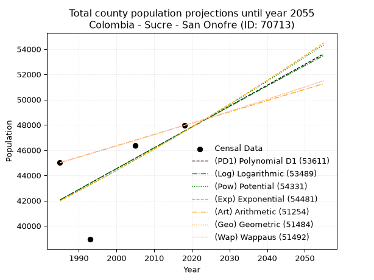
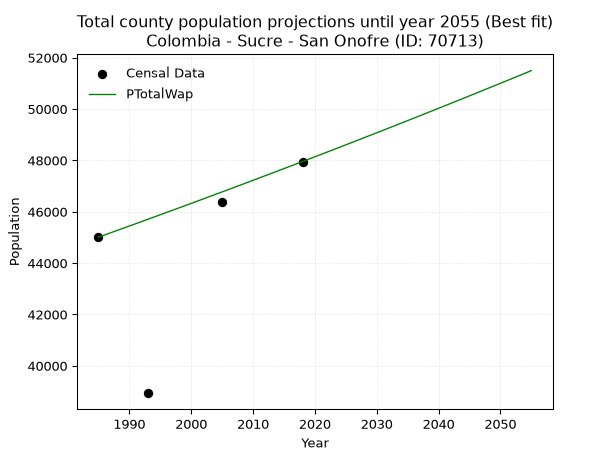
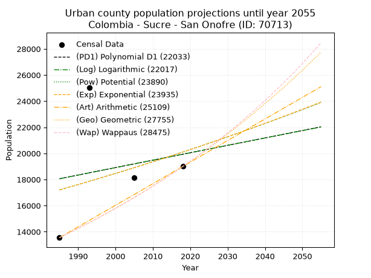
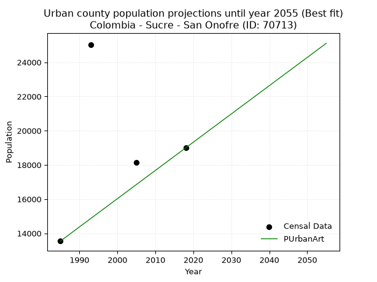
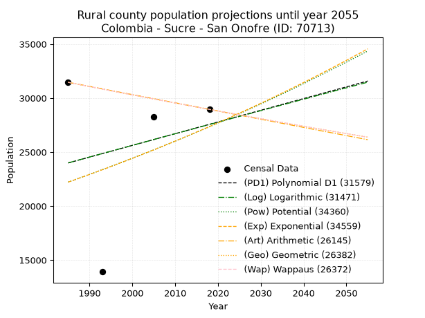
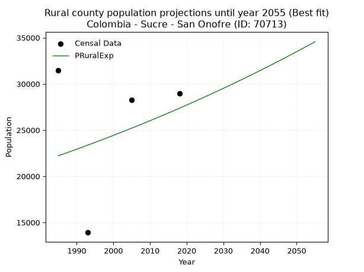

<div align="center">


</div>

# _“Population and Public Services Demand Projections (PPSD) until Year 2050 for Colombia - Sucre - San Onofre (ID: 70713)”_
Keywords: `population` `public-service` `projection` `lineal` `polynomial` `logarithmic` `potential` `exponential` `arithmetic` `geometric` `wappaus` `dane` `colombia` `south-america`

PPSD are analytical estimates used by governments and planners to anticipate future changes in population size, age distribution, and the resulting community needs for utilities, healthcare, education, and infrastructure as sizing future water treatment facilities, electrical grids, and road networks based on spatial growth.

> **General running parameters**: • app_version: _v20260806_. • Python version: _3.14.7_. • Pandas version: _3.0.5_. • NumPy version: _2.5.1_. • Creates, save and include plots into reports (create_plot): _False_. • Projection until year: _2050_. • Process polynomial degree 2 and up: _False_. • Process Wappaus: _True_. • Process Wappaus: _True_. • Set negative values to zero: _True_. • Set infinite values to zero: _True_. • Drop dataset notes: _True_. 
<div align="center">

Dynamic map: [:earth_americas:Google](http://maps.google.com/maps?q=9.736954983,-75.5223981) [:earth_americas:OSM](https://www.openstreetmap.org/#map=18/9.736954983/-75.5223981&layers=P) [:earth_americas:Bing](https://www.bing.com/maps?cp=9.736954983~-75.5223981&lvl=18) [:earth_americas:Apple](https://maps.apple.com/frame?center=9.736954983%2C-75.5223981&span=0.003%2C0.006)

</div>


<div align="center">

```geojson
{
  "type": "Feature",
  "geometry": {
    "type": "Point", 
    "coordinates": [-75.5223981, 9.736954983]
  }, 
  "properties": {
    "Name": "Colombia - Sucre - San Onofre (ID: 70713)"
  }
}
```

</div>


## 0. Census Data (4 records)

Census data are official statistics collected by a government about the people and housing in a country. They usually include counts of total population, age, sex, race, income, education, and jobs.

📅Global census file: [Population.xlsx](../data/Population.xlsx)

| Source   |   Year |   CountryID | CountryName   |   StateID | StateName   |   CountyID | CountyName   |   PTotal |   PUrban |   PRural |
|:---------|-------:|------------:|:--------------|----------:|:------------|-----------:|:-------------|---------:|---------:|---------:|
| DANE     |   1985 |          57 | Colombia      |        70 | Sucre       |      70713 | San Onofre   |    45007 |    13548 |    31459 |
| DANE     |   1993 |          57 | Colombia      |        70 | Sucre       |      70713 | San Onofre   |    38931 |    25017 |    13914 |
| DANE     |   2005 |          57 | Colombia      |        70 | Sucre       |      70713 | San Onofre   |    46383 |    18132 |    28251 |
| DANE     |   2018 |          57 | Colombia      |        70 | Sucre       |      70713 | San Onofre   |    47952 |    18998 |    28954 |

> 🔥Some records could had specific notes about the registered values or the corresponding urban or rural distribution.

📅   [RUPS](https://www.datos.gov.co/Hacienda-y-Cr-dito-P-blico/Registro-nico-de-Prestadores-de-Servicios-P-blicos/4qkq-csdn/about_data) - Local public utility companies: [RUPS.csv](../data/RUPS.xlsx)

 | SERVICIO       | ESTADO      | NOMBRE                                                            | NIT         | DEPARTAMENTO_DOMICILIO   | MUNICIPIO_DOMICILIO   | DIRECCION                                       |   TELEFONO | EMAIL                          | TIPO_PRESTADOR                             | CLASIFICACION                  |
|:---------------|:------------|:------------------------------------------------------------------|:------------|:-------------------------|:----------------------|:------------------------------------------------|-----------:|:-------------------------------|:-------------------------------------------|:-------------------------------|
| ACUEDUCTO      | OPERATIVA   | AGUAS DE LA MOJANA S.A. E.S.P                                     | 823003769-4 | SUCRE                    | SAN MARCOS            | CARRERA 24 # 14 - 25 APTO 1                     |    2954404 | aguasdelamojanaesp@hotmail.com | SOCIEDADES (EMPRESA DE SERVICIOS PUBLICOS) | MAYOR O IGUAL A 5001 USUARIOS  |
| ALCANTARILLADO | OPERATIVA   | AGUAS DE LA MOJANA S.A. E.S.P                                     | 823003769-4 | SUCRE                    | SAN MARCOS            | CARRERA 24 # 14 - 25 APTO 1                     |    2954404 | aguasdelamojanaesp@hotmail.com | SOCIEDADES (EMPRESA DE SERVICIOS PUBLICOS) | MENOR O IGUAL A 2500 USUARIOS  |
| ACUEDUCTO      | OPERATIVA   | INSERGRUP SOCIEDAD ANONIMA EMPRESA DE SERVICIOS PUBLICOS          | 900068823-2 | BOGOTA, D.C.             | BOGOTA, D.C.          | CALLE 98 No 15-17 OFICINA 800                   |    3573834 | insergrupsaesp@gmail.com       | SOCIEDADES (EMPRESA DE SERVICIOS PUBLICOS) | DESDE 2501 HASTA 5000 USUARIOS |
| ALCANTARILLADO | OPERATIVA   | INSERGRUP SOCIEDAD ANONIMA EMPRESA DE SERVICIOS PUBLICOS          | 900068823-2 | BOGOTA, D.C.             | BOGOTA, D.C.          | CALLE 98 No 15-17 OFICINA 800                   |    3573834 | insergrupsaesp@gmail.com       | SOCIEDADES (EMPRESA DE SERVICIOS PUBLICOS) | DESDE 2501 HASTA 5000 USUARIOS |
| ACUEDUCTO      | CANCELACION | BALSILLAS S.A.                                                    | 890923514-4 | ANTIOQUIA                | MEDELLIN              | diagonal 50 # 49-84                             |    2515298 | balsillas@gmail.com            | nan                                        | nan                            |
| ALCANTARILLADO | OPERATIVA   | SOCIEDAD DE ACUEDUCTO ALCANTARILLADO Y ASEO DEL NORTE  SAS  E.S.P | 900586384-2 | SUCRE                    | SINCELEJO             | Cra. 36A #31-68 Edif Venecia livingmall of. 404 |    2765045 | gerencia@tripleadelnorte.com   | SOCIEDADES (EMPRESA DE SERVICIOS PUBLICOS) | DESDE 2501 HASTA 5000 USUARIOS |
| ACUEDUCTO      | OPERATIVA   | SOCIEDAD DE ACUEDUCTO ALCANTARILLADO Y ASEO DEL NORTE  SAS  E.S.P | 900586384-2 | SUCRE                    | SINCELEJO             | Cra. 36A #31-68 Edif Venecia livingmall of. 404 |    2765045 | gerencia@tripleadelnorte.com   | SOCIEDADES (EMPRESA DE SERVICIOS PUBLICOS) | MAYOR O IGUAL A 5001 USUARIOS  |
| ACUEDUCTO      | CANCELACION | PROACTIVA SANTA MARTA S A  ESP                                    | 901064574-9 | MAGDALENA                | SANTA MARTA           | CALLE 14 No. 3-01                               |    4209676 | dora.barriga@veolia.com        | nan                                        | nan                            |
| ALCANTARILLADO | CANCELACION | PROACTIVA SANTA MARTA S A  ESP                                    | 901064574-9 | MAGDALENA                | SANTA MARTA           | CALLE 14 No. 3-01                               |    4209676 | dora.barriga@veolia.com        | nan                                        | nan                            |

## 1. Total

### 1.1. Coefficients and Parameters

* (PD1) Polynomial Deg 1: 165.17181854676699, -285816.6800481707 (lineal)
* (Log) Logarithmic: 330111.11639744166, -2464608.9910814217
* (Pow) Potential: 7.44370076099819, -19.924535424890998
* (Exp) Exponential: 0.0037246603221820274, 25.827480759802828
* (Art) Arithmetic: Year diff. 2018 - 1985 = 33, Population diff. 47952 - 45007 = 2945, Annual growth = 89.24242424242425
* (Geo) Geometric: Year diff. 2018 - 1985 = 33, Population diff. 47952 - 45007 = 2945, Annual growth % = 0.0019225268211713331
* (Wap) Wappaus: i = 0.19200383877284447, Condition values only valid for < 200)

<sub>
Wappaus condition values: ['0.00', '0.19', '0.38', '0.58', '0.77', '0.96', '1.15', '1.34', '1.54', '1.73', '1.92', '2.11', '2.30', '2.50', '2.69', '2.88', '3.07', '3.26', '3.46', '3.65', '3.84', '4.03', '4.22', '4.42', '4.61', '4.80', '4.99', '5.18', '5.38', '5.57', '5.76', '5.95', '6.14', '6.34', '6.53', '6.72', '6.91', '7.10', '7.30', '7.49', '7.68', '7.87', '8.06', '8.26', '8.45', '8.64', '8.83', '9.02', '9.22', '9.41', '9.60', '9.79', '9.98', '10.18', '10.37', '10.56', '10.75', '10.94', '11.14', '11.33', '11.52', '11.71', '11.90', '12.10', '12.29', '12.48']
</sub>


### 1.2. Projected Dataset

|   Year |   CountyID |   PTotalPD1 |   PTotalLog |   PTotalPow |   PTotalExp |   PTotalArt |   PTotalGeo |   PTotalWap |
|-------:|-----------:|------------:|------------:|------------:|------------:|------------:|------------:|------------:|
|   1985 |      70713 |       42049 |       42048 |       41977 |       41978 |       45007 |       45007 |       45007 |
|   1986 |      70713 |       42215 |       42215 |       42134 |       42134 |       45096 |       45094 |       45093 |
|   1987 |      70713 |       42380 |       42381 |       42292 |       42291 |       45185 |       45180 |       45180 |
|   1988 |      70713 |       42545 |       42547 |       42451 |       42449 |       45275 |       45267 |       45267 |
|   1989 |      70713 |       42710 |       42713 |       42610 |       42608 |       45364 |       45354 |       45354 |
|   1990 |      70713 |       42875 |       42879 |       42770 |       42767 |       45453 |       45441 |       45441 |
|   1991 |      70713 |       43040 |       43045 |       42930 |       42926 |       45542 |       45529 |       45528 |
|   1992 |      70713 |       43206 |       43210 |       43091 |       43086 |       45632 |       45616 |       45616 |
|   1993 |      70713 |       43371 |       43376 |       43252 |       43247 |       45721 |       45704 |       45704 |
|   1994 |      70713 |       43536 |       43542 |       43414 |       43409 |       45810 |       45792 |       45792 |
|   1995 |      70713 |       43701 |       43707 |       43576 |       43571 |       45899 |       45880 |       45880 |
|   1996 |      70713 |       43866 |       43873 |       43739 |       43733 |       45989 |       45968 |       45968 |
|   1997 |      70713 |       44031 |       44038 |       43903 |       43896 |       46078 |       46056 |       46056 |
|   1998 |      70713 |       44197 |       44203 |       44067 |       44060 |       46167 |       46145 |       46145 |
|   1999 |      70713 |       44362 |       44368 |       44231 |       44225 |       46256 |       46234 |       46233 |
|   2000 |      70713 |       44527 |       44533 |       44396 |       44390 |       46346 |       46323 |       46322 |
|   2001 |      70713 |       44692 |       44698 |       44562 |       44555 |       46435 |       46412 |       46411 |
|   2002 |      70713 |       44857 |       44863 |       44728 |       44721 |       46524 |       46501 |       46500 |
|   2003 |      70713 |       45022 |       45028 |       44894 |       44888 |       46613 |       46590 |       46590 |
|   2004 |      70713 |       45188 |       45193 |       45061 |       45056 |       46703 |       46680 |       46679 |
|   2005 |      70713 |       45353 |       45358 |       45229 |       45224 |       46792 |       46770 |       46769 |
|   2006 |      70713 |       45518 |       45522 |       45397 |       45393 |       46881 |       46859 |       46859 |
|   2007 |      70713 |       45683 |       45687 |       45566 |       45562 |       46970 |       46950 |       46949 |
|   2008 |      70713 |       45848 |       45851 |       45735 |       45732 |       47060 |       47040 |       47039 |
|   2009 |      70713 |       46014 |       46016 |       45905 |       45903 |       47149 |       47130 |       47130 |
|   2010 |      70713 |       46179 |       46180 |       46075 |       46074 |       47238 |       47221 |       47221 |
|   2011 |      70713 |       46344 |       46344 |       46246 |       46246 |       47327 |       47312 |       47311 |
|   2012 |      70713 |       46509 |       46508 |       46418 |       46419 |       47417 |       47403 |       47402 |
|   2013 |      70713 |       46674 |       46672 |       46590 |       46592 |       47506 |       47494 |       47493 |
|   2014 |      70713 |       46839 |       46836 |       46762 |       46766 |       47595 |       47585 |       47585 |
|   2015 |      70713 |       47005 |       47000 |       46935 |       46940 |       47684 |       47676 |       47676 |
|   2016 |      70713 |       47170 |       47164 |       47109 |       47115 |       47774 |       47768 |       47768 |
|   2017 |      70713 |       47335 |       47327 |       47283 |       47291 |       47863 |       47860 |       47860 |
|   2018 |      70713 |       47500 |       47491 |       47458 |       47468 |       47952 |       47952 |       47952 |
|   2019 |      70713 |       47665 |       47655 |       47633 |       47645 |       48041 |       48044 |       48044 |
|   2020 |      70713 |       47830 |       47818 |       47809 |       47823 |       48130 |       48137 |       48137 |
|   2021 |      70713 |       47996 |       47982 |       47986 |       48001 |       48220 |       48229 |       48229 |
|   2022 |      70713 |       48161 |       48145 |       48163 |       48180 |       48309 |       48322 |       48322 |
|   2023 |      70713 |       48326 |       48308 |       48340 |       48360 |       48398 |       48415 |       48415 |
|   2024 |      70713 |       48491 |       48471 |       48518 |       48540 |       48487 |       48508 |       48508 |
|   2025 |      70713 |       48656 |       48634 |       48697 |       48722 |       48577 |       48601 |       48602 |
|   2026 |      70713 |       48821 |       48797 |       48876 |       48903 |       48666 |       48694 |       48695 |
|   2027 |      70713 |       48987 |       48960 |       49056 |       49086 |       48755 |       48788 |       48789 |
|   2028 |      70713 |       49152 |       49123 |       49237 |       49269 |       48844 |       48882 |       48883 |
|   2029 |      70713 |       49317 |       49286 |       49418 |       49453 |       48934 |       48976 |       48977 |
|   2030 |      70713 |       49482 |       49448 |       49599 |       49637 |       49023 |       49070 |       49071 |
|   2031 |      70713 |       49647 |       49611 |       49781 |       49823 |       49112 |       49164 |       49166 |
|   2032 |      70713 |       49812 |       49773 |       49964 |       50009 |       49201 |       49259 |       49260 |
|   2033 |      70713 |       49978 |       49936 |       50148 |       50195 |       49291 |       49354 |       49355 |
|   2034 |      70713 |       50143 |       50098 |       50331 |       50382 |       49380 |       49448 |       49450 |
|   2035 |      70713 |       50308 |       50260 |       50516 |       50570 |       49469 |       49544 |       49546 |
|   2036 |      70713 |       50473 |       50423 |       50701 |       50759 |       49558 |       49639 |       49641 |
|   2037 |      70713 |       50638 |       50585 |       50887 |       50949 |       49648 |       49734 |       49737 |
|   2038 |      70713 |       50803 |       50747 |       51073 |       51139 |       49737 |       49830 |       49833 |
|   2039 |      70713 |       50969 |       50909 |       51260 |       51330 |       49826 |       49926 |       49929 |
|   2040 |      70713 |       51134 |       51070 |       51447 |       51521 |       49915 |       50022 |       50025 |
|   2041 |      70713 |       51299 |       51232 |       51635 |       51713 |       50005 |       50118 |       50121 |
|   2042 |      70713 |       51464 |       51394 |       51824 |       51906 |       50094 |       50214 |       50218 |
|   2043 |      70713 |       51629 |       51556 |       52013 |       52100 |       50183 |       50311 |       50315 |
|   2044 |      70713 |       51795 |       51717 |       52203 |       52294 |       50272 |       50407 |       50412 |
|   2045 |      70713 |       51960 |       51879 |       52393 |       52490 |       50362 |       50504 |       50509 |
|   2046 |      70713 |       52125 |       52040 |       52584 |       52685 |       50451 |       50601 |       50606 |
|   2047 |      70713 |       52290 |       52201 |       52776 |       52882 |       50540 |       50699 |       50704 |
|   2048 |      70713 |       52455 |       52362 |       52968 |       53079 |       50629 |       50796 |       50802 |
|   2049 |      70713 |       52620 |       52524 |       53161 |       53277 |       50719 |       50894 |       50900 |
|   2050 |      70713 |       52786 |       52685 |       53354 |       53476 |       50808 |       50992 |       50998 |
<div align="center">

</img>

</div>


### 1.3. Best fit with absolute and relative error (%)

Relative error puts that difference into context by dividing the absolute error by the true value, creating a unitless ratio or percentage that shows the scale of the mistake.

Absolute and relative error

|   Year | Source   |   CountryID | CountryName   |   StateID | StateName   |   CountyID_x | CountyName   |   PTotal |   PUrban |   PRural |   CountyID_y |   PTotalPD1 |   PTotalLog |   PTotalPow |   PTotalExp |   PTotalArt |   PTotalGeo |   PTotalWap |   PTotalPD1AbsError |   PTotalLogAbsError |   PTotalPowAbsError |   PTotalExpAbsError |   PTotalArtAbsError |   PTotalGeoAbsError |   PTotalWapAbsError |   PTotalPD1RelError |   PTotalLogRelError |   PTotalPowRelError |   PTotalExpRelError |   PTotalArtRelError |   PTotalGeoRelError |   PTotalWapRelError |
|-------:|:---------|------------:|:--------------|----------:|:------------|-------------:|:-------------|---------:|---------:|---------:|-------------:|------------:|------------:|------------:|------------:|------------:|------------:|------------:|--------------------:|--------------------:|--------------------:|--------------------:|--------------------:|--------------------:|--------------------:|--------------------:|--------------------:|--------------------:|--------------------:|--------------------:|--------------------:|--------------------:|
|   1985 | DANE     |          57 | Colombia      |        70 | Sucre       |        70713 | San Onofre   |    45007 |    13548 |    31459 |        70713 |       42049 |       42048 |       41977 |       41978 |       45007 |       45007 |       45007 |                2958 |                2959 |                3030 |                3029 |                   0 |                   0 |                   0 |            6.57231  |            6.57453  |             6.73229 |             6.73006 |            0        |            0        |            0        |
|   1993 | DANE     |          57 | Colombia      |        70 | Sucre       |        70713 | San Onofre   |    38931 |    25017 |    13914 |        70713 |       43371 |       43376 |       43252 |       43247 |       45721 |       45704 |       45704 |                4440 |                4445 |                4321 |                4316 |                6790 |                6773 |                6773 |           11.4048   |           11.4176   |            11.0991  |            11.0863  |           17.4411   |           17.3974   |           17.3974   |
|   2005 | DANE     |          57 | Colombia      |        70 | Sucre       |        70713 | San Onofre   |    46383 |    18132 |    28251 |        70713 |       45353 |       45358 |       45229 |       45224 |       46792 |       46770 |       46769 |                1030 |                1025 |                1154 |                1159 |                 409 |                 387 |                 386 |            2.22064  |            2.20986  |             2.48798 |             2.49876 |            0.881789 |            0.834357 |            0.832201 |
|   2018 | DANE     |          57 | Colombia      |        70 | Sucre       |        70713 | San Onofre   |    47952 |    18998 |    28954 |        70713 |       47500 |       47491 |       47458 |       47468 |       47952 |       47952 |       47952 |                 452 |                 461 |                 494 |                 484 |                   0 |                   0 |                   0 |            0.942609 |            0.961378 |             1.0302  |             1.00934 |            0        |            0        |            0        |

Relative error mean

| Method    |   RelError | Best   |
|:----------|-----------:|:-------|
| PTotalPD1 |    5.28509 |        |
| PTotalLog |    5.29085 |        |
| PTotalPow |    5.3374  |        |
| PTotalExp |    5.33111 |        |
| PTotalArt |    4.58073 |        |
| PTotalGeo |    4.55795 |        |
| PTotalWap |    4.55741 | True   |

💙Best method: _**PTotalWap**_
<div align="center">

</img>

</div>


### 1.4. Fresh water supply demand in liters per capita per day (lpcd)

The fresh water supply demand typically ranges from 100 to 300 liters per capita per day (lpcd) for standard domestic and municipal planning, though absolute survival minimums set by the World Health Organization are as low as 7.5 to 20 liters per day, and total consumption in high-income nations can exceed 400 liters.

> `CZ`: Level in meters above the sea level (masl)<br> `WS`: Fresh water supply demand in liters per capita per day (lpcd or l/h/d)<br> `WSAll`: Zonal fresh water supply demand in liters per second (l/s)<br> `A`: Zonal area in square meters<br> `DP`: Population density (people/hectare or p/ha)

Reference values (RAS Colombia)

|    CZ |   WS |
|------:|-----:|
|  1000 |  120 |
|  2000 |  130 |
| 99999 |  140 |

County shapefile geometry properties and water supply values

|   CountyID |     ATotal |   CZTotal |   WSTotal |
|-----------:|-----------:|----------:|----------:|
|      70713 | 1.0347e+09 |   51.2243 |       120 |

Projected values for best method: PTotalWap

|   CountyID |   Year |   PTotalWap |   DPTotal |   WSTotal |   WSTotalAll |
|-----------:|-------:|------------:|----------:|----------:|-------------:|
|      70713 |   1985 |       45007 |      0.43 |       120 |      62.5097 |
|      70713 |   1986 |       45093 |      0.44 |       120 |      62.6292 |
|      70713 |   1987 |       45180 |      0.44 |       120 |      62.75   |
|      70713 |   1988 |       45267 |      0.44 |       120 |      62.8708 |
|      70713 |   1989 |       45354 |      0.44 |       120 |      62.9917 |
|      70713 |   1990 |       45441 |      0.44 |       120 |      63.1125 |
|      70713 |   1991 |       45528 |      0.44 |       120 |      63.2333 |
|      70713 |   1992 |       45616 |      0.44 |       120 |      63.3556 |
|      70713 |   1993 |       45704 |      0.44 |       120 |      63.4778 |
|      70713 |   1994 |       45792 |      0.44 |       120 |      63.6    |
|      70713 |   1995 |       45880 |      0.44 |       120 |      63.7222 |
|      70713 |   1996 |       45968 |      0.44 |       120 |      63.8444 |
|      70713 |   1997 |       46056 |      0.45 |       120 |      63.9667 |
|      70713 |   1998 |       46145 |      0.45 |       120 |      64.0903 |
|      70713 |   1999 |       46233 |      0.45 |       120 |      64.2125 |
|      70713 |   2000 |       46322 |      0.45 |       120 |      64.3361 |
|      70713 |   2001 |       46411 |      0.45 |       120 |      64.4597 |
|      70713 |   2002 |       46500 |      0.45 |       120 |      64.5833 |
|      70713 |   2003 |       46590 |      0.45 |       120 |      64.7083 |
|      70713 |   2004 |       46679 |      0.45 |       120 |      64.8319 |
|      70713 |   2005 |       46769 |      0.45 |       120 |      64.9569 |
|      70713 |   2006 |       46859 |      0.45 |       120 |      65.0819 |
|      70713 |   2007 |       46949 |      0.45 |       120 |      65.2069 |
|      70713 |   2008 |       47039 |      0.45 |       120 |      65.3319 |
|      70713 |   2009 |       47130 |      0.46 |       120 |      65.4583 |
|      70713 |   2010 |       47221 |      0.46 |       120 |      65.5847 |
|      70713 |   2011 |       47311 |      0.46 |       120 |      65.7097 |
|      70713 |   2012 |       47402 |      0.46 |       120 |      65.8361 |
|      70713 |   2013 |       47493 |      0.46 |       120 |      65.9625 |
|      70713 |   2014 |       47585 |      0.46 |       120 |      66.0903 |
|      70713 |   2015 |       47676 |      0.46 |       120 |      66.2167 |
|      70713 |   2016 |       47768 |      0.46 |       120 |      66.3444 |
|      70713 |   2017 |       47860 |      0.46 |       120 |      66.4722 |
|      70713 |   2018 |       47952 |      0.46 |       120 |      66.6    |
|      70713 |   2019 |       48044 |      0.46 |       120 |      66.7278 |
|      70713 |   2020 |       48137 |      0.47 |       120 |      66.8569 |
|      70713 |   2021 |       48229 |      0.47 |       120 |      66.9847 |
|      70713 |   2022 |       48322 |      0.47 |       120 |      67.1139 |
|      70713 |   2023 |       48415 |      0.47 |       120 |      67.2431 |
|      70713 |   2024 |       48508 |      0.47 |       120 |      67.3722 |
|      70713 |   2025 |       48602 |      0.47 |       120 |      67.5028 |
|      70713 |   2026 |       48695 |      0.47 |       120 |      67.6319 |
|      70713 |   2027 |       48789 |      0.47 |       120 |      67.7625 |
|      70713 |   2028 |       48883 |      0.47 |       120 |      67.8931 |
|      70713 |   2029 |       48977 |      0.47 |       120 |      68.0236 |
|      70713 |   2030 |       49071 |      0.47 |       120 |      68.1542 |
|      70713 |   2031 |       49166 |      0.48 |       120 |      68.2861 |
|      70713 |   2032 |       49260 |      0.48 |       120 |      68.4167 |
|      70713 |   2033 |       49355 |      0.48 |       120 |      68.5486 |
|      70713 |   2034 |       49450 |      0.48 |       120 |      68.6806 |
|      70713 |   2035 |       49546 |      0.48 |       120 |      68.8139 |
|      70713 |   2036 |       49641 |      0.48 |       120 |      68.9458 |
|      70713 |   2037 |       49737 |      0.48 |       120 |      69.0792 |
|      70713 |   2038 |       49833 |      0.48 |       120 |      69.2125 |
|      70713 |   2039 |       49929 |      0.48 |       120 |      69.3458 |
|      70713 |   2040 |       50025 |      0.48 |       120 |      69.4792 |
|      70713 |   2041 |       50121 |      0.48 |       120 |      69.6125 |
|      70713 |   2042 |       50218 |      0.49 |       120 |      69.7472 |
|      70713 |   2043 |       50315 |      0.49 |       120 |      69.8819 |
|      70713 |   2044 |       50412 |      0.49 |       120 |      70.0167 |
|      70713 |   2045 |       50509 |      0.49 |       120 |      70.1514 |
|      70713 |   2046 |       50606 |      0.49 |       120 |      70.2861 |
|      70713 |   2047 |       50704 |      0.49 |       120 |      70.4222 |
|      70713 |   2048 |       50802 |      0.49 |       120 |      70.5583 |
|      70713 |   2049 |       50900 |      0.49 |       120 |      70.6944 |
|      70713 |   2050 |       50998 |      0.49 |       120 |      70.8306 |

## 2. Urban

### 2.1. Coefficients and Parameters

* (PD1) Polynomial Deg 1: 56.78241670012016, -94655.27900441535 (lineal)
* (Log) Logarithmic: 114483.18837355908, -851263.8822381182
* (Pow) Potential: 9.491897944174086, -27.066658949778027
* (Exp) Exponential: 0.00471934745885901, 1.4693676930454806
* (Art) Arithmetic: Year diff. 2018 - 1985 = 33, Population diff. 18998 - 13548 = 5450, Annual growth = 165.15151515151516
* (Geo) Geometric: Year diff. 2018 - 1985 = 33, Population diff. 18998 - 13548 = 5450, Annual growth % = 0.010297958969856413
* (Wap) Wappaus: i = 1.0148805699718255, Condition values only valid for < 200)

<sub>
Wappaus condition values: ['0.00', '1.01', '2.03', '3.04', '4.06', '5.07', '6.09', '7.10', '8.12', '9.13', '10.15', '11.16', '12.18', '13.19', '14.21', '15.22', '16.24', '17.25', '18.27', '19.28', '20.30', '21.31', '22.33', '23.34', '24.36', '25.37', '26.39', '27.40', '28.42', '29.43', '30.45', '31.46', '32.48', '33.49', '34.51', '35.52', '36.54', '37.55', '38.57', '39.58', '40.60', '41.61', '42.62', '43.64', '44.65', '45.67', '46.68', '47.70', '48.71', '49.73', '50.74', '51.76', '52.77', '53.79', '54.80', '55.82', '56.83', '57.85', '58.86', '59.88', '60.89', '61.91', '62.92', '63.94', '64.95', '65.97']
</sub>


### 2.2. Projected Dataset

|   Year |   CountyID |   PUrbanPD1 |   PUrbanLog |   PUrbanPow |   PUrbanExp |   PUrbanArt |   PUrbanGeo |   PUrbanWap |
|-------:|-----------:|------------:|------------:|------------:|------------:|------------:|------------:|------------:|
|   1985 |      70713 |       18058 |       18050 |       17193 |       17201 |       13548 |       13548 |       13548 |
|   1986 |      70713 |       18115 |       18107 |       17275 |       17283 |       13713 |       13688 |       13686 |
|   1987 |      70713 |       18171 |       18165 |       17358 |       17364 |       13878 |       13828 |       13826 |
|   1988 |      70713 |       18228 |       18223 |       17441 |       17447 |       14043 |       13971 |       13967 |
|   1989 |      70713 |       18285 |       18280 |       17525 |       17529 |       14209 |       14115 |       14109 |
|   1990 |      70713 |       18342 |       18338 |       17608 |       17612 |       14374 |       14260 |       14253 |
|   1991 |      70713 |       18399 |       18395 |       17692 |       17695 |       14539 |       14407 |       14399 |
|   1992 |      70713 |       18455 |       18453 |       17777 |       17779 |       14704 |       14555 |       14546 |
|   1993 |      70713 |       18512 |       18510 |       17862 |       17863 |       14869 |       14705 |       14695 |
|   1994 |      70713 |       18569 |       18568 |       17947 |       17948 |       15034 |       14857 |       14845 |
|   1995 |      70713 |       18626 |       18625 |       18033 |       18032 |       15200 |       15010 |       14996 |
|   1996 |      70713 |       18682 |       18682 |       18119 |       18118 |       15365 |       15164 |       15150 |
|   1997 |      70713 |       18739 |       18740 |       18205 |       18203 |       15530 |       15320 |       15305 |
|   1998 |      70713 |       18796 |       18797 |       18292 |       18290 |       15695 |       15478 |       15462 |
|   1999 |      70713 |       18853 |       18854 |       18379 |       18376 |       15860 |       15638 |       15620 |
|   2000 |      70713 |       18910 |       18912 |       18466 |       18463 |       16025 |       15799 |       15780 |
|   2001 |      70713 |       18966 |       18969 |       18554 |       18550 |       16190 |       15961 |       15942 |
|   2002 |      70713 |       19023 |       19026 |       18642 |       18638 |       16356 |       16126 |       16106 |
|   2003 |      70713 |       19080 |       19083 |       18731 |       18726 |       16521 |       16292 |       16272 |
|   2004 |      70713 |       19137 |       19140 |       18820 |       18815 |       16686 |       16459 |       16439 |
|   2005 |      70713 |       19193 |       19198 |       18909 |       18904 |       16851 |       16629 |       16609 |
|   2006 |      70713 |       19250 |       19255 |       18999 |       18993 |       17016 |       16800 |       16780 |
|   2007 |      70713 |       19307 |       19312 |       19089 |       19083 |       17181 |       16973 |       16953 |
|   2008 |      70713 |       19364 |       19369 |       19179 |       19173 |       17346 |       17148 |       17128 |
|   2009 |      70713 |       19421 |       19426 |       19270 |       19264 |       17512 |       17325 |       17306 |
|   2010 |      70713 |       19477 |       19483 |       19362 |       19355 |       17677 |       17503 |       17485 |
|   2011 |      70713 |       19534 |       19540 |       19453 |       19447 |       17842 |       17683 |       17666 |
|   2012 |      70713 |       19591 |       19597 |       19545 |       19539 |       18007 |       17865 |       17850 |
|   2013 |      70713 |       19648 |       19653 |       19638 |       19631 |       18172 |       18049 |       18035 |
|   2014 |      70713 |       19705 |       19710 |       19730 |       19724 |       18337 |       18235 |       18223 |
|   2015 |      70713 |       19761 |       19767 |       19824 |       19817 |       18503 |       18423 |       18414 |
|   2016 |      70713 |       19818 |       19824 |       19917 |       19911 |       18668 |       18613 |       18606 |
|   2017 |      70713 |       19875 |       19881 |       20011 |       20005 |       18833 |       18804 |       18801 |
|   2018 |      70713 |       19932 |       19937 |       20106 |       20100 |       18998 |       18998 |       18998 |
|   2019 |      70713 |       19988 |       19994 |       20200 |       20195 |       19163 |       19194 |       19198 |
|   2020 |      70713 |       20045 |       20051 |       20295 |       20291 |       19328 |       19391 |       19400 |
|   2021 |      70713 |       20102 |       20107 |       20391 |       20387 |       19493 |       19591 |       19604 |
|   2022 |      70713 |       20159 |       20164 |       20487 |       20483 |       19659 |       19793 |       19811 |
|   2023 |      70713 |       20216 |       20221 |       20583 |       20580 |       19824 |       19997 |       20021 |
|   2024 |      70713 |       20272 |       20277 |       20680 |       20677 |       19989 |       20202 |       20233 |
|   2025 |      70713 |       20329 |       20334 |       20777 |       20775 |       20154 |       20411 |       20448 |
|   2026 |      70713 |       20386 |       20390 |       20875 |       20873 |       20319 |       20621 |       20666 |
|   2027 |      70713 |       20443 |       20447 |       20973 |       20972 |       20484 |       20833 |       20887 |
|   2028 |      70713 |       20499 |       20503 |       21071 |       21071 |       20650 |       21048 |       21110 |
|   2029 |      70713 |       20556 |       20560 |       21170 |       21171 |       20815 |       21264 |       21337 |
|   2030 |      70713 |       20613 |       20616 |       21269 |       21271 |       20980 |       21483 |       21566 |
|   2031 |      70713 |       20670 |       20673 |       21369 |       21372 |       21145 |       21705 |       21799 |
|   2032 |      70713 |       20727 |       20729 |       21469 |       21473 |       21310 |       21928 |       22034 |
|   2033 |      70713 |       20783 |       20785 |       21570 |       21574 |       21475 |       22154 |       22273 |
|   2034 |      70713 |       20840 |       20842 |       21671 |       21677 |       21640 |       22382 |       22515 |
|   2035 |      70713 |       20897 |       20898 |       21772 |       21779 |       21806 |       22613 |       22760 |
|   2036 |      70713 |       20954 |       20954 |       21874 |       21882 |       21971 |       22845 |       23009 |
|   2037 |      70713 |       21011 |       21010 |       21976 |       21986 |       22136 |       23081 |       23261 |
|   2038 |      70713 |       21067 |       21066 |       22078 |       22090 |       22301 |       23318 |       23516 |
|   2039 |      70713 |       21124 |       21123 |       22182 |       22194 |       22466 |       23558 |       23775 |
|   2040 |      70713 |       21181 |       21179 |       22285 |       22299 |       22631 |       23801 |       24038 |
|   2041 |      70713 |       21238 |       21235 |       22389 |       22405 |       22796 |       24046 |       24304 |
|   2042 |      70713 |       21294 |       21291 |       22493 |       22511 |       22962 |       24294 |       24575 |
|   2043 |      70713 |       21351 |       21347 |       22598 |       22617 |       23127 |       24544 |       24849 |
|   2044 |      70713 |       21408 |       21403 |       22703 |       22724 |       23292 |       24797 |       25127 |
|   2045 |      70713 |       21465 |       21459 |       22809 |       22832 |       23457 |       25052 |       25409 |
|   2046 |      70713 |       21522 |       21515 |       22915 |       22940 |       23622 |       25310 |       25695 |
|   2047 |      70713 |       21578 |       21571 |       23022 |       23048 |       23787 |       25571 |       25986 |
|   2048 |      70713 |       21635 |       21627 |       23128 |       23157 |       23953 |       25834 |       26281 |
|   2049 |      70713 |       21692 |       21683 |       23236 |       23267 |       24118 |       26100 |       26580 |
|   2050 |      70713 |       21749 |       21739 |       23344 |       23377 |       24283 |       26369 |       26884 |
<div align="center">

</img>

</div>


### 2.3. Best fit with absolute and relative error (%)

Relative error puts that difference into context by dividing the absolute error by the true value, creating a unitless ratio or percentage that shows the scale of the mistake.

Absolute and relative error

|   Year | Source   |   CountryID | CountryName   |   StateID | StateName   |   CountyID_x | CountyName   |   PTotal |   PUrban |   PRural |   CountyID_y |   PUrbanPD1 |   PUrbanLog |   PUrbanPow |   PUrbanExp |   PUrbanArt |   PUrbanGeo |   PUrbanWap |   PUrbanPD1AbsError |   PUrbanLogAbsError |   PUrbanPowAbsError |   PUrbanExpAbsError |   PUrbanArtAbsError |   PUrbanGeoAbsError |   PUrbanWapAbsError |   PUrbanPD1RelError |   PUrbanLogRelError |   PUrbanPowRelError |   PUrbanExpRelError |   PUrbanArtRelError |   PUrbanGeoRelError |   PUrbanWapRelError |
|-------:|:---------|------------:|:--------------|----------:|:------------|-------------:|:-------------|---------:|---------:|---------:|-------------:|------------:|------------:|------------:|------------:|------------:|------------:|------------:|--------------------:|--------------------:|--------------------:|--------------------:|--------------------:|--------------------:|--------------------:|--------------------:|--------------------:|--------------------:|--------------------:|--------------------:|--------------------:|--------------------:|
|   1985 | DANE     |          57 | Colombia      |        70 | Sucre       |        70713 | San Onofre   |    45007 |    13548 |    31459 |        70713 |       18058 |       18050 |       17193 |       17201 |       13548 |       13548 |       13548 |                4510 |                4502 |                3645 |                3653 |                   0 |                   0 |                   0 |            33.289   |            33.23    |            26.9043  |            26.9634  |             0       |             0       |             0       |
|   1993 | DANE     |          57 | Colombia      |        70 | Sucre       |        70713 | San Onofre   |    38931 |    25017 |    13914 |        70713 |       18512 |       18510 |       17862 |       17863 |       14869 |       14705 |       14695 |                6505 |                6507 |                7155 |                7154 |               10148 |               10312 |               10322 |            26.0023  |            26.0103  |            28.6006  |            28.5966  |            40.5644  |            41.22    |            41.2599  |
|   2005 | DANE     |          57 | Colombia      |        70 | Sucre       |        70713 | San Onofre   |    46383 |    18132 |    28251 |        70713 |       19193 |       19198 |       18909 |       18904 |       16851 |       16629 |       16609 |                1061 |                1066 |                 777 |                 772 |                1281 |                1503 |                1523 |             5.85153 |             5.87911 |             4.28524 |             4.25767 |             7.06486 |             8.28921 |             8.39951 |
|   2018 | DANE     |          57 | Colombia      |        70 | Sucre       |        70713 | San Onofre   |    47952 |    18998 |    28954 |        70713 |       19932 |       19937 |       20106 |       20100 |       18998 |       18998 |       18998 |                 934 |                 939 |                1108 |                1102 |                   0 |                   0 |                   0 |             4.91631 |             4.94263 |             5.83219 |             5.80061 |             0       |             0       |             0       |

Relative error mean

| Method    |   RelError | Best   |
|:----------|-----------:|:-------|
| PUrbanPD1 |    17.5148 |        |
| PUrbanLog |    17.5155 |        |
| PUrbanPow |    16.4056 |        |
| PUrbanExp |    16.4046 |        |
| PUrbanArt |    11.9073 | True   |
| PUrbanGeo |    12.3773 |        |
| PUrbanWap |    12.4149 |        |

💙Best method: _**PUrbanArt**_
<div align="center">

</img>

</div>


### 2.4. Fresh water supply demand in liters per capita per day (lpcd)

The fresh water supply demand typically ranges from 100 to 300 liters per capita per day (lpcd) for standard domestic and municipal planning, though absolute survival minimums set by the World Health Organization are as low as 7.5 to 20 liters per day, and total consumption in high-income nations can exceed 400 liters.

> `CZ`: Level in meters above the sea level (masl)<br> `WS`: Fresh water supply demand in liters per capita per day (lpcd or l/h/d)<br> `WSAll`: Zonal fresh water supply demand in liters per second (l/s)<br> `A`: Zonal area in square meters<br> `DP`: Population density (people/hectare or p/ha)

Reference values (RAS Colombia)

|    CZ |   WS |
|------:|-----:|
|  1000 |  120 |
|  2000 |  130 |
| 99999 |  140 |

County shapefile geometry properties and water supply values

|   CountyID |      AUrban |   CZUrban |   WSUrban |
|-----------:|------------:|----------:|----------:|
|      70713 | 3.41702e+06 |   29.6558 |       120 |

Projected values for best method: PUrbanArt

|   CountyID |   Year |   PUrbanArt |   DPUrban |   WSUrban |   WSUrbanAll |
|-----------:|-------:|------------:|----------:|----------:|-------------:|
|      70713 |   1985 |       13548 |     39.65 |       120 |      18.8167 |
|      70713 |   1986 |       13713 |     40.13 |       120 |      19.0458 |
|      70713 |   1987 |       13878 |     40.61 |       120 |      19.275  |
|      70713 |   1988 |       14043 |     41.1  |       120 |      19.5042 |
|      70713 |   1989 |       14209 |     41.58 |       120 |      19.7347 |
|      70713 |   1990 |       14374 |     42.07 |       120 |      19.9639 |
|      70713 |   1991 |       14539 |     42.55 |       120 |      20.1931 |
|      70713 |   1992 |       14704 |     43.03 |       120 |      20.4222 |
|      70713 |   1993 |       14869 |     43.51 |       120 |      20.6514 |
|      70713 |   1994 |       15034 |     44    |       120 |      20.8806 |
|      70713 |   1995 |       15200 |     44.48 |       120 |      21.1111 |
|      70713 |   1996 |       15365 |     44.97 |       120 |      21.3403 |
|      70713 |   1997 |       15530 |     45.45 |       120 |      21.5694 |
|      70713 |   1998 |       15695 |     45.93 |       120 |      21.7986 |
|      70713 |   1999 |       15860 |     46.41 |       120 |      22.0278 |
|      70713 |   2000 |       16025 |     46.9  |       120 |      22.2569 |
|      70713 |   2001 |       16190 |     47.38 |       120 |      22.4861 |
|      70713 |   2002 |       16356 |     47.87 |       120 |      22.7167 |
|      70713 |   2003 |       16521 |     48.35 |       120 |      22.9458 |
|      70713 |   2004 |       16686 |     48.83 |       120 |      23.175  |
|      70713 |   2005 |       16851 |     49.31 |       120 |      23.4042 |
|      70713 |   2006 |       17016 |     49.8  |       120 |      23.6333 |
|      70713 |   2007 |       17181 |     50.28 |       120 |      23.8625 |
|      70713 |   2008 |       17346 |     50.76 |       120 |      24.0917 |
|      70713 |   2009 |       17512 |     51.25 |       120 |      24.3222 |
|      70713 |   2010 |       17677 |     51.73 |       120 |      24.5514 |
|      70713 |   2011 |       17842 |     52.22 |       120 |      24.7806 |
|      70713 |   2012 |       18007 |     52.7  |       120 |      25.0097 |
|      70713 |   2013 |       18172 |     53.18 |       120 |      25.2389 |
|      70713 |   2014 |       18337 |     53.66 |       120 |      25.4681 |
|      70713 |   2015 |       18503 |     54.15 |       120 |      25.6986 |
|      70713 |   2016 |       18668 |     54.63 |       120 |      25.9278 |
|      70713 |   2017 |       18833 |     55.12 |       120 |      26.1569 |
|      70713 |   2018 |       18998 |     55.6  |       120 |      26.3861 |
|      70713 |   2019 |       19163 |     56.08 |       120 |      26.6153 |
|      70713 |   2020 |       19328 |     56.56 |       120 |      26.8444 |
|      70713 |   2021 |       19493 |     57.05 |       120 |      27.0736 |
|      70713 |   2022 |       19659 |     57.53 |       120 |      27.3042 |
|      70713 |   2023 |       19824 |     58.02 |       120 |      27.5333 |
|      70713 |   2024 |       19989 |     58.5  |       120 |      27.7625 |
|      70713 |   2025 |       20154 |     58.98 |       120 |      27.9917 |
|      70713 |   2026 |       20319 |     59.46 |       120 |      28.2208 |
|      70713 |   2027 |       20484 |     59.95 |       120 |      28.45   |
|      70713 |   2028 |       20650 |     60.43 |       120 |      28.6806 |
|      70713 |   2029 |       20815 |     60.92 |       120 |      28.9097 |
|      70713 |   2030 |       20980 |     61.4  |       120 |      29.1389 |
|      70713 |   2031 |       21145 |     61.88 |       120 |      29.3681 |
|      70713 |   2032 |       21310 |     62.36 |       120 |      29.5972 |
|      70713 |   2033 |       21475 |     62.85 |       120 |      29.8264 |
|      70713 |   2034 |       21640 |     63.33 |       120 |      30.0556 |
|      70713 |   2035 |       21806 |     63.82 |       120 |      30.2861 |
|      70713 |   2036 |       21971 |     64.3  |       120 |      30.5153 |
|      70713 |   2037 |       22136 |     64.78 |       120 |      30.7444 |
|      70713 |   2038 |       22301 |     65.26 |       120 |      30.9736 |
|      70713 |   2039 |       22466 |     65.75 |       120 |      31.2028 |
|      70713 |   2040 |       22631 |     66.23 |       120 |      31.4319 |
|      70713 |   2041 |       22796 |     66.71 |       120 |      31.6611 |
|      70713 |   2042 |       22962 |     67.2  |       120 |      31.8917 |
|      70713 |   2043 |       23127 |     67.68 |       120 |      32.1208 |
|      70713 |   2044 |       23292 |     68.16 |       120 |      32.35   |
|      70713 |   2045 |       23457 |     68.65 |       120 |      32.5792 |
|      70713 |   2046 |       23622 |     69.13 |       120 |      32.8083 |
|      70713 |   2047 |       23787 |     69.61 |       120 |      33.0375 |
|      70713 |   2048 |       23953 |     70.1  |       120 |      33.2681 |
|      70713 |   2049 |       24118 |     70.58 |       120 |      33.4972 |
|      70713 |   2050 |       24283 |     71.06 |       120 |      33.7264 |

## 3. Rural

### 3.1. Coefficients and Parameters

* (PD1) Polynomial Deg 1: 108.38940184664673, -191161.40104375515 (lineal)
* (Log) Logarithmic: 215627.9280238825, -1613345.1088433024
* (Pow) Potential: 12.574341672752862, -37.12037063726179
* (Exp) Exponential: 0.006311914902305755, 0.08041552374213094
* (Art) Arithmetic: Year diff. 2018 - 1985 = 33, Population diff. 28954 - 31459 = -2505, Annual growth = -75.9090909090909
* (Geo) Geometric: Year diff. 2018 - 1985 = 33, Population diff. 28954 - 31459 = -2505, Annual growth % = -0.0025112883050738555
* (Wap) Wappaus: i = -0.2513005177994502, Condition values only valid for < 200)

<sub>
Wappaus condition values: ['-0.00', '-0.25', '-0.50', '-0.75', '-1.01', '-1.26', '-1.51', '-1.76', '-2.01', '-2.26', '-2.51', '-2.76', '-3.02', '-3.27', '-3.52', '-3.77', '-4.02', '-4.27', '-4.52', '-4.77', '-5.03', '-5.28', '-5.53', '-5.78', '-6.03', '-6.28', '-6.53', '-6.79', '-7.04', '-7.29', '-7.54', '-7.79', '-8.04', '-8.29', '-8.54', '-8.80', '-9.05', '-9.30', '-9.55', '-9.80', '-10.05', '-10.30', '-10.55', '-10.81', '-11.06', '-11.31', '-11.56', '-11.81', '-12.06', '-12.31', '-12.57', '-12.82', '-13.07', '-13.32', '-13.57', '-13.82', '-14.07', '-14.32', '-14.58', '-14.83', '-15.08', '-15.33', '-15.58', '-15.83', '-16.08', '-16.33']
</sub>


### 3.2. Projected Dataset

|   Year |   CountyID |   PRuralPD1 |   PRuralLog |   PRuralPow |   PRuralExp |   PRuralArt |   PRuralGeo |   PRuralWap |
|-------:|-----------:|------------:|------------:|------------:|------------:|------------:|------------:|------------:|
|   1985 |      70713 |       23992 |       23998 |       22223 |       22217 |       31459 |       31459 |       31459 |
|   1986 |      70713 |       24100 |       24107 |       22364 |       22357 |       31383 |       31380 |       31380 |
|   1987 |      70713 |       24208 |       24216 |       22506 |       22499 |       31307 |       31301 |       31301 |
|   1988 |      70713 |       24317 |       24324 |       22649 |       22641 |       31231 |       31223 |       31223 |
|   1989 |      70713 |       24425 |       24433 |       22792 |       22785 |       31155 |       31144 |       31144 |
|   1990 |      70713 |       24534 |       24541 |       22937 |       22929 |       31079 |       31066 |       31066 |
|   1991 |      70713 |       24642 |       24649 |       23082 |       23074 |       31004 |       30988 |       30988 |
|   1992 |      70713 |       24750 |       24757 |       23228 |       23220 |       30928 |       30910 |       30910 |
|   1993 |      70713 |       24859 |       24866 |       23376 |       23367 |       30852 |       30833 |       30833 |
|   1994 |      70713 |       24967 |       24974 |       23523 |       23515 |       30776 |       30755 |       30755 |
|   1995 |      70713 |       25075 |       25082 |       23672 |       23664 |       30700 |       30678 |       30678 |
|   1996 |      70713 |       25184 |       25190 |       23822 |       23814 |       30624 |       30601 |       30601 |
|   1997 |      70713 |       25292 |       25298 |       23972 |       23965 |       30548 |       30524 |       30524 |
|   1998 |      70713 |       25401 |       25406 |       24124 |       24117 |       30472 |       30447 |       30448 |
|   1999 |      70713 |       25509 |       25514 |       24276 |       24269 |       30396 |       30371 |       30371 |
|   2000 |      70713 |       25617 |       25622 |       24429 |       24423 |       30320 |       30295 |       30295 |
|   2001 |      70713 |       25726 |       25730 |       24583 |       24578 |       30244 |       30218 |       30219 |
|   2002 |      70713 |       25834 |       25837 |       24738 |       24733 |       30169 |       30143 |       30143 |
|   2003 |      70713 |       25943 |       25945 |       24894 |       24890 |       30093 |       30067 |       30067 |
|   2004 |      70713 |       26051 |       26053 |       25051 |       25048 |       30017 |       29991 |       29992 |
|   2005 |      70713 |       26159 |       26160 |       25208 |       25206 |       29941 |       29916 |       29917 |
|   2006 |      70713 |       26268 |       26268 |       25367 |       25366 |       29865 |       29841 |       29841 |
|   2007 |      70713 |       26376 |       26375 |       25526 |       25526 |       29789 |       29766 |       29767 |
|   2008 |      70713 |       26485 |       26483 |       25687 |       25688 |       29713 |       29691 |       29692 |
|   2009 |      70713 |       26593 |       26590 |       25848 |       25851 |       29637 |       29617 |       29617 |
|   2010 |      70713 |       26701 |       26697 |       26010 |       26014 |       29561 |       29542 |       29543 |
|   2011 |      70713 |       26810 |       26804 |       26173 |       26179 |       29485 |       29468 |       29469 |
|   2012 |      70713 |       26918 |       26912 |       26338 |       26345 |       29409 |       29394 |       29395 |
|   2013 |      70713 |       27026 |       27019 |       26503 |       26512 |       29334 |       29320 |       29321 |
|   2014 |      70713 |       27135 |       27126 |       26669 |       26679 |       29258 |       29247 |       29247 |
|   2015 |      70713 |       27243 |       27233 |       26836 |       26848 |       29182 |       29173 |       29173 |
|   2016 |      70713 |       27352 |       27340 |       27004 |       27018 |       29106 |       29100 |       29100 |
|   2017 |      70713 |       27460 |       27447 |       27173 |       27189 |       29030 |       29027 |       29027 |
|   2018 |      70713 |       27568 |       27554 |       27342 |       27362 |       28954 |       28954 |       28954 |
|   2019 |      70713 |       27677 |       27661 |       27513 |       27535 |       28878 |       28881 |       28881 |
|   2020 |      70713 |       27785 |       27767 |       27685 |       27709 |       28802 |       28809 |       28809 |
|   2021 |      70713 |       27894 |       27874 |       27858 |       27885 |       28726 |       28736 |       28736 |
|   2022 |      70713 |       28002 |       27981 |       28032 |       28061 |       28650 |       28664 |       28664 |
|   2023 |      70713 |       28110 |       28087 |       28207 |       28239 |       28574 |       28592 |       28592 |
|   2024 |      70713 |       28219 |       28194 |       28382 |       28418 |       28499 |       28520 |       28520 |
|   2025 |      70713 |       28327 |       28300 |       28559 |       28598 |       28423 |       28449 |       28448 |
|   2026 |      70713 |       28436 |       28407 |       28737 |       28779 |       28347 |       28377 |       28376 |
|   2027 |      70713 |       28544 |       28513 |       28916 |       28961 |       28271 |       28306 |       28305 |
|   2028 |      70713 |       28652 |       28620 |       29096 |       29144 |       28195 |       28235 |       28234 |
|   2029 |      70713 |       28761 |       28726 |       29277 |       29329 |       28119 |       28164 |       28163 |
|   2030 |      70713 |       28869 |       28832 |       29459 |       29515 |       28043 |       28093 |       28092 |
|   2031 |      70713 |       28977 |       28938 |       29642 |       29701 |       27967 |       28023 |       28021 |
|   2032 |      70713 |       29086 |       29044 |       29826 |       29890 |       27891 |       27952 |       27951 |
|   2033 |      70713 |       29194 |       29151 |       30011 |       30079 |       27815 |       27882 |       27880 |
|   2034 |      70713 |       29303 |       29257 |       30197 |       30269 |       27739 |       27812 |       27810 |
|   2035 |      70713 |       29411 |       29363 |       30384 |       30461 |       27664 |       27742 |       27740 |
|   2036 |      70713 |       29519 |       29469 |       30573 |       30654 |       27588 |       27673 |       27670 |
|   2037 |      70713 |       29628 |       29574 |       30762 |       30848 |       27512 |       27603 |       27600 |
|   2038 |      70713 |       29736 |       29680 |       30952 |       31043 |       27436 |       27534 |       27531 |
|   2039 |      70713 |       29845 |       29786 |       31144 |       31240 |       27360 |       27465 |       27461 |
|   2040 |      70713 |       29953 |       29892 |       31336 |       31438 |       27284 |       27396 |       27392 |
|   2041 |      70713 |       30061 |       29997 |       31530 |       31637 |       27208 |       27327 |       27323 |
|   2042 |      70713 |       30170 |       30103 |       31725 |       31837 |       27132 |       27258 |       27254 |
|   2043 |      70713 |       30278 |       30209 |       31921 |       32039 |       27056 |       27190 |       27185 |
|   2044 |      70713 |       30387 |       30314 |       32118 |       32241 |       26980 |       27122 |       27117 |
|   2045 |      70713 |       30495 |       30420 |       32316 |       32446 |       26904 |       27054 |       27048 |
|   2046 |      70713 |       30603 |       30525 |       32515 |       32651 |       26829 |       26986 |       26980 |
|   2047 |      70713 |       30712 |       30630 |       32716 |       32858 |       26753 |       26918 |       26912 |
|   2048 |      70713 |       30820 |       30736 |       32917 |       33066 |       26677 |       26850 |       26844 |
|   2049 |      70713 |       30928 |       30841 |       33120 |       33275 |       26601 |       26783 |       26776 |
|   2050 |      70713 |       31037 |       30946 |       33324 |       33486 |       26525 |       26716 |       26708 |
<div align="center">

</img>

</div>


### 3.3. Best fit with absolute and relative error (%)

Relative error puts that difference into context by dividing the absolute error by the true value, creating a unitless ratio or percentage that shows the scale of the mistake.

Absolute and relative error

|   Year | Source   |   CountryID | CountryName   |   StateID | StateName   |   CountyID_x | CountyName   |   PTotal |   PUrban |   PRural |   CountyID_y |   PRuralPD1 |   PRuralLog |   PRuralPow |   PRuralExp |   PRuralArt |   PRuralGeo |   PRuralWap |   PRuralPD1AbsError |   PRuralLogAbsError |   PRuralPowAbsError |   PRuralExpAbsError |   PRuralArtAbsError |   PRuralGeoAbsError |   PRuralWapAbsError |   PRuralPD1RelError |   PRuralLogRelError |   PRuralPowRelError |   PRuralExpRelError |   PRuralArtRelError |   PRuralGeoRelError |   PRuralWapRelError |
|-------:|:---------|------------:|:--------------|----------:|:------------|-------------:|:-------------|---------:|---------:|---------:|-------------:|------------:|------------:|------------:|------------:|------------:|------------:|------------:|--------------------:|--------------------:|--------------------:|--------------------:|--------------------:|--------------------:|--------------------:|--------------------:|--------------------:|--------------------:|--------------------:|--------------------:|--------------------:|--------------------:|
|   1985 | DANE     |          57 | Colombia      |        70 | Sucre       |        70713 | San Onofre   |    45007 |    13548 |    31459 |        70713 |       23992 |       23998 |       22223 |       22217 |       31459 |       31459 |       31459 |                7467 |                7461 |                9236 |                9242 |                   0 |                   0 |                   0 |            23.7357  |            23.7166  |            29.3588  |            29.3779  |             0       |              0      |             0       |
|   1993 | DANE     |          57 | Colombia      |        70 | Sucre       |        70713 | San Onofre   |    38931 |    25017 |    13914 |        70713 |       24859 |       24866 |       23376 |       23367 |       30852 |       30833 |       30833 |               10945 |               10952 |                9462 |                9453 |               16938 |               16919 |               16919 |            78.6618  |            78.7121  |            68.0034  |            67.9388  |           121.734   |            121.597  |           121.597   |
|   2005 | DANE     |          57 | Colombia      |        70 | Sucre       |        70713 | San Onofre   |    46383 |    18132 |    28251 |        70713 |       26159 |       26160 |       25208 |       25206 |       29941 |       29916 |       29917 |                2092 |                2091 |                3043 |                3045 |                1690 |                1665 |                1666 |             7.40505 |             7.40151 |            10.7713  |            10.7784  |             5.98209 |              5.8936 |             5.89714 |
|   2018 | DANE     |          57 | Colombia      |        70 | Sucre       |        70713 | San Onofre   |    47952 |    18998 |    28954 |        70713 |       27568 |       27554 |       27342 |       27362 |       28954 |       28954 |       28954 |                1386 |                1400 |                1612 |                1592 |                   0 |                   0 |                   0 |             4.7869  |             4.83526 |             5.56745 |             5.49838 |             0       |              0      |             0       |

Relative error mean

| Method    |   RelError | Best   |
|:----------|-----------:|:-------|
| PRuralPD1 |    28.6473 |        |
| PRuralLog |    28.6664 |        |
| PRuralPow |    28.4253 |        |
| PRuralExp |    28.3984 | True   |
| PRuralArt |    31.9289 |        |
| PRuralGeo |    31.8726 |        |
| PRuralWap |    31.8735 |        |

💙Best method: _**PRuralExp**_
<div align="center">

</img>

</div>


### 3.4. Fresh water supply demand in liters per capita per day (lpcd)

The fresh water supply demand typically ranges from 100 to 300 liters per capita per day (lpcd) for standard domestic and municipal planning, though absolute survival minimums set by the World Health Organization are as low as 7.5 to 20 liters per day, and total consumption in high-income nations can exceed 400 liters.

> `CZ`: Level in meters above the sea level (masl)<br> `WS`: Fresh water supply demand in liters per capita per day (lpcd or l/h/d)<br> `WSAll`: Zonal fresh water supply demand in liters per second (l/s)<br> `A`: Zonal area in square meters<br> `DP`: Population density (people/hectare or p/ha)

Reference values (RAS Colombia)

|    CZ |   WS |
|------:|-----:|
|  1000 |  120 |
|  2000 |  130 |
| 99999 |  140 |

County shapefile geometry properties and water supply values

|   CountyID |      ARural |   CZRural |   WSRural |
|-----------:|------------:|----------:|----------:|
|      70713 | 1.03128e+09 |   51.2962 |       120 |

Projected values for best method: PRuralExp

|   CountyID |   Year |   PRuralExp |   DPRural |   WSRural |   WSRuralAll |
|-----------:|-------:|------------:|----------:|----------:|-------------:|
|      70713 |   1985 |       22217 |      0.22 |       120 |      30.8569 |
|      70713 |   1986 |       22357 |      0.22 |       120 |      31.0514 |
|      70713 |   1987 |       22499 |      0.22 |       120 |      31.2486 |
|      70713 |   1988 |       22641 |      0.22 |       120 |      31.4458 |
|      70713 |   1989 |       22785 |      0.22 |       120 |      31.6458 |
|      70713 |   1990 |       22929 |      0.22 |       120 |      31.8458 |
|      70713 |   1991 |       23074 |      0.22 |       120 |      32.0472 |
|      70713 |   1992 |       23220 |      0.23 |       120 |      32.25   |
|      70713 |   1993 |       23367 |      0.23 |       120 |      32.4542 |
|      70713 |   1994 |       23515 |      0.23 |       120 |      32.6597 |
|      70713 |   1995 |       23664 |      0.23 |       120 |      32.8667 |
|      70713 |   1996 |       23814 |      0.23 |       120 |      33.075  |
|      70713 |   1997 |       23965 |      0.23 |       120 |      33.2847 |
|      70713 |   1998 |       24117 |      0.23 |       120 |      33.4958 |
|      70713 |   1999 |       24269 |      0.24 |       120 |      33.7069 |
|      70713 |   2000 |       24423 |      0.24 |       120 |      33.9208 |
|      70713 |   2001 |       24578 |      0.24 |       120 |      34.1361 |
|      70713 |   2002 |       24733 |      0.24 |       120 |      34.3514 |
|      70713 |   2003 |       24890 |      0.24 |       120 |      34.5694 |
|      70713 |   2004 |       25048 |      0.24 |       120 |      34.7889 |
|      70713 |   2005 |       25206 |      0.24 |       120 |      35.0083 |
|      70713 |   2006 |       25366 |      0.25 |       120 |      35.2306 |
|      70713 |   2007 |       25526 |      0.25 |       120 |      35.4528 |
|      70713 |   2008 |       25688 |      0.25 |       120 |      35.6778 |
|      70713 |   2009 |       25851 |      0.25 |       120 |      35.9042 |
|      70713 |   2010 |       26014 |      0.25 |       120 |      36.1306 |
|      70713 |   2011 |       26179 |      0.25 |       120 |      36.3597 |
|      70713 |   2012 |       26345 |      0.26 |       120 |      36.5903 |
|      70713 |   2013 |       26512 |      0.26 |       120 |      36.8222 |
|      70713 |   2014 |       26679 |      0.26 |       120 |      37.0542 |
|      70713 |   2015 |       26848 |      0.26 |       120 |      37.2889 |
|      70713 |   2016 |       27018 |      0.26 |       120 |      37.525  |
|      70713 |   2017 |       27189 |      0.26 |       120 |      37.7625 |
|      70713 |   2018 |       27362 |      0.27 |       120 |      38.0028 |
|      70713 |   2019 |       27535 |      0.27 |       120 |      38.2431 |
|      70713 |   2020 |       27709 |      0.27 |       120 |      38.4847 |
|      70713 |   2021 |       27885 |      0.27 |       120 |      38.7292 |
|      70713 |   2022 |       28061 |      0.27 |       120 |      38.9736 |
|      70713 |   2023 |       28239 |      0.27 |       120 |      39.2208 |
|      70713 |   2024 |       28418 |      0.28 |       120 |      39.4694 |
|      70713 |   2025 |       28598 |      0.28 |       120 |      39.7194 |
|      70713 |   2026 |       28779 |      0.28 |       120 |      39.9708 |
|      70713 |   2027 |       28961 |      0.28 |       120 |      40.2236 |
|      70713 |   2028 |       29144 |      0.28 |       120 |      40.4778 |
|      70713 |   2029 |       29329 |      0.28 |       120 |      40.7347 |
|      70713 |   2030 |       29515 |      0.29 |       120 |      40.9931 |
|      70713 |   2031 |       29701 |      0.29 |       120 |      41.2514 |
|      70713 |   2032 |       29890 |      0.29 |       120 |      41.5139 |
|      70713 |   2033 |       30079 |      0.29 |       120 |      41.7764 |
|      70713 |   2034 |       30269 |      0.29 |       120 |      42.0403 |
|      70713 |   2035 |       30461 |      0.3  |       120 |      42.3069 |
|      70713 |   2036 |       30654 |      0.3  |       120 |      42.575  |
|      70713 |   2037 |       30848 |      0.3  |       120 |      42.8444 |
|      70713 |   2038 |       31043 |      0.3  |       120 |      43.1153 |
|      70713 |   2039 |       31240 |      0.3  |       120 |      43.3889 |
|      70713 |   2040 |       31438 |      0.3  |       120 |      43.6639 |
|      70713 |   2041 |       31637 |      0.31 |       120 |      43.9403 |
|      70713 |   2042 |       31837 |      0.31 |       120 |      44.2181 |
|      70713 |   2043 |       32039 |      0.31 |       120 |      44.4986 |
|      70713 |   2044 |       32241 |      0.31 |       120 |      44.7792 |
|      70713 |   2045 |       32446 |      0.31 |       120 |      45.0639 |
|      70713 |   2046 |       32651 |      0.32 |       120 |      45.3486 |
|      70713 |   2047 |       32858 |      0.32 |       120 |      45.6361 |
|      70713 |   2048 |       33066 |      0.32 |       120 |      45.925  |
|      70713 |   2049 |       33275 |      0.32 |       120 |      46.2153 |
|      70713 |   2050 |       33486 |      0.32 |       120 |      46.5083 |

<div align="center"><br><sub>Share this research</sub></div><br>

<sub>**APPS & TOOLS & CONTENT DISCLAIMER**: • NO WARRANTY - This content and software is provided by <a href="https://github.com/rcfdtools" target="_blank">github.com/rcfdtools</a> "as is", without any express or implied warranty, including warranties of merchantability, fitness for a particular purpose, or non-infringement. There is no guarantee that the software will be error-free or operate without interruption. • LIMITATION OF LIABILITY - Neither the authors nor copyright holders will be liable for claims or damages arising from the software or its use. You are responsible for determining if the software is appropriate for your use and assume all associated risks, including errors, legal compliance, and data loss. • NO PROFESSIONAL ADVICE - The software provides general information and does not offer professional advice. It should not replace consultation with professional advisors. [Clauses and global license for rcfdtools use.](https://github.com/rcfdtools/rcfdtools/blob/main/LICENSE.md)</sub>

| [:house: Home](Readme.md)  | [:beginner: Help / Collab](https://github.com/rcfdtools/R.HydroTools/discussions/31) |
|----------------------------|-------------------------------------------------------------------------------------------|