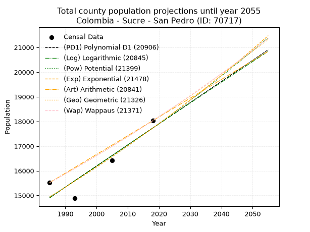
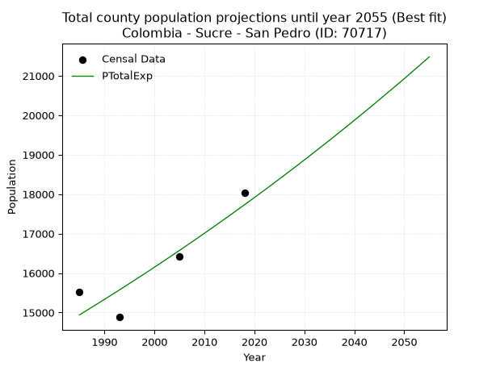
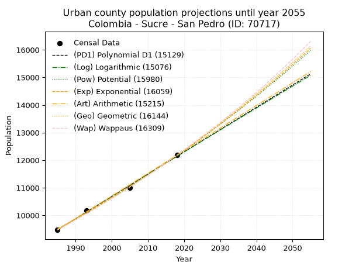
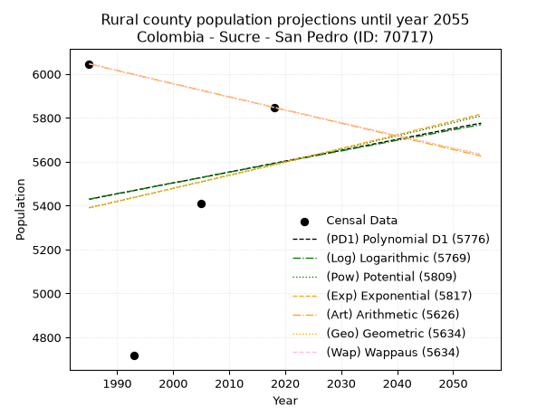
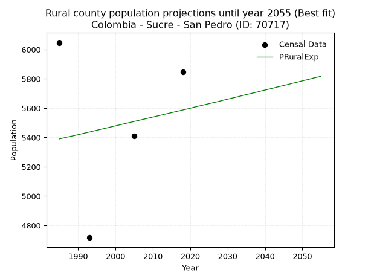

<div align="center">


</div>

# _“Population and Public Services Demand Projections (PPSD) until Year 2050 for Colombia - Sucre - San Pedro (ID: 70717)”_
Keywords: `population` `public-service` `projection` `lineal` `polynomial` `logarithmic` `potential` `exponential` `arithmetic` `geometric` `wappaus` `dane` `colombia` `south-america`

PPSD are analytical estimates used by governments and planners to anticipate future changes in population size, age distribution, and the resulting community needs for utilities, healthcare, education, and infrastructure as sizing future water treatment facilities, electrical grids, and road networks based on spatial growth.

> **General running parameters**: • app_version: _v20260806_. • Python version: _3.14.7_. • Pandas version: _3.0.5_. • NumPy version: _2.5.1_. • Creates, save and include plots into reports (create_plot): _False_. • Projection until year: _2050_. • Process polynomial degree 2 and up: _False_. • Process Wappaus: _True_. • Process Wappaus: _True_. • Set negative values to zero: _True_. • Set infinite values to zero: _True_. • Drop dataset notes: _True_. 
<div align="center">

Dynamic map: [:earth_americas:Google](http://maps.google.com/maps?q=9.396250036,-75.0636465) [:earth_americas:OSM](https://www.openstreetmap.org/#map=18/9.396250036/-75.0636465&layers=P) [:earth_americas:Bing](https://www.bing.com/maps?cp=9.396250036~-75.0636465&lvl=18) [:earth_americas:Apple](https://maps.apple.com/frame?center=9.396250036%2C-75.0636465&span=0.003%2C0.006)

</div>


<div align="center">

```geojson
{
  "type": "Feature",
  "geometry": {
    "type": "Point", 
    "coordinates": [-75.0636465, 9.396250036]
  }, 
  "properties": {
    "Name": "Colombia - Sucre - San Pedro (ID: 70717)"
  }
}
```

</div>


## 0. Census Data (4 records)

Census data are official statistics collected by a government about the people and housing in a country. They usually include counts of total population, age, sex, race, income, education, and jobs.

📅Global census file: [Population.xlsx](../data/Population.xlsx)

| Source   |   Year |   CountryID | CountryName   |   StateID | StateName   |   CountyID | CountyName   |   PTotal |   PUrban |   PRural |
|:---------|-------:|------------:|:--------------|----------:|:------------|-----------:|:-------------|---------:|---------:|---------:|
| DANE     |   1985 |          57 | Colombia      |        70 | Sucre       |      70717 | San Pedro    |    15521 |     9475 |     6046 |
| DANE     |   1993 |          57 | Colombia      |        70 | Sucre       |      70717 | San Pedro    |    14883 |    10166 |     4717 |
| DANE     |   2005 |          57 | Colombia      |        70 | Sucre       |      70717 | San Pedro    |    16415 |    11007 |     5408 |
| DANE     |   2018 |          57 | Colombia      |        70 | Sucre       |      70717 | San Pedro    |    18029 |    12181 |     5848 |

> 🔥Some records could had specific notes about the registered values or the corresponding urban or rural distribution.

## 1. Total

### 1.1. Coefficients and Parameters

* (PD1) Polynomial Deg 1: 85.73103171416997, -155271.4961862685 (lineal)
* (Log) Logarithmic: 171444.48498323193, -1286938.9042274258
* (Pow) Potential: 10.369403123300229, -30.02148041952552
* (Exp) Exponential: 0.005185149496766909, 0.5062663680499927
* (Art) Arithmetic: Year diff. 2018 - 1985 = 33, Population diff. 18029 - 15521 = 2508, Annual growth = 76.0
* (Geo) Geometric: Year diff. 2018 - 1985 = 33, Population diff. 18029 - 15521 = 2508, Annual growth % = 0.0045493359471289185
* (Wap) Wappaus: i = 0.45305514157973176, Condition values only valid for < 200)

<sub>
Wappaus condition values: ['0.00', '0.45', '0.91', '1.36', '1.81', '2.27', '2.72', '3.17', '3.62', '4.08', '4.53', '4.98', '5.44', '5.89', '6.34', '6.80', '7.25', '7.70', '8.15', '8.61', '9.06', '9.51', '9.97', '10.42', '10.87', '11.33', '11.78', '12.23', '12.69', '13.14', '13.59', '14.04', '14.50', '14.95', '15.40', '15.86', '16.31', '16.76', '17.22', '17.67', '18.12', '18.58', '19.03', '19.48', '19.93', '20.39', '20.84', '21.29', '21.75', '22.20', '22.65', '23.11', '23.56', '24.01', '24.46', '24.92', '25.37', '25.82', '26.28', '26.73', '27.18', '27.64', '28.09', '28.54', '29.00', '29.45']
</sub>


### 1.2. Projected Dataset

|   Year |   CountyID |   PTotalPD1 |   PTotalLog |   PTotalPow |   PTotalExp |   PTotalArt |   PTotalGeo |   PTotalWap |
|-------:|-----------:|------------:|------------:|------------:|------------:|------------:|------------:|------------:|
|   1985 |      70717 |       14905 |       14903 |       14939 |       14940 |       15521 |       15521 |       15521 |
|   1986 |      70717 |       14990 |       14990 |       15017 |       15018 |       15597 |       15592 |       15591 |
|   1987 |      70717 |       15076 |       15076 |       15096 |       15096 |       15673 |       15663 |       15662 |
|   1988 |      70717 |       15162 |       15162 |       15175 |       15175 |       15749 |       15734 |       15733 |
|   1989 |      70717 |       15248 |       15248 |       15254 |       15254 |       15825 |       15805 |       15805 |
|   1990 |      70717 |       15333 |       15335 |       15334 |       15333 |       15901 |       15877 |       15877 |
|   1991 |      70717 |       15419 |       15421 |       15414 |       15413 |       15977 |       15950 |       15949 |
|   1992 |      70717 |       15505 |       15507 |       15495 |       15493 |       16053 |       16022 |       16021 |
|   1993 |      70717 |       15590 |       15593 |       15575 |       15573 |       16129 |       16095 |       16094 |
|   1994 |      70717 |       15676 |       15679 |       15657 |       15654 |       16205 |       16168 |       16167 |
|   1995 |      70717 |       15762 |       15765 |       15738 |       15736 |       16281 |       16242 |       16240 |
|   1996 |      70717 |       15848 |       15851 |       15820 |       15817 |       16357 |       16316 |       16314 |
|   1997 |      70717 |       15933 |       15937 |       15903 |       15900 |       16433 |       16390 |       16388 |
|   1998 |      70717 |       16019 |       16022 |       15985 |       15982 |       16509 |       16464 |       16463 |
|   1999 |      70717 |       16105 |       16108 |       16069 |       16065 |       16585 |       16539 |       16538 |
|   2000 |      70717 |       16191 |       16194 |       16152 |       16149 |       16661 |       16615 |       16613 |
|   2001 |      70717 |       16276 |       16280 |       16236 |       16233 |       16737 |       16690 |       16688 |
|   2002 |      70717 |       16362 |       16365 |       16320 |       16317 |       16813 |       16766 |       16764 |
|   2003 |      70717 |       16448 |       16451 |       16405 |       16402 |       16889 |       16842 |       16841 |
|   2004 |      70717 |       16533 |       16536 |       16490 |       16487 |       16965 |       16919 |       16917 |
|   2005 |      70717 |       16619 |       16622 |       16576 |       16573 |       17041 |       16996 |       16994 |
|   2006 |      70717 |       16705 |       16707 |       16662 |       16659 |       17117 |       17073 |       17071 |
|   2007 |      70717 |       16791 |       16793 |       16748 |       16746 |       17193 |       17151 |       17149 |
|   2008 |      70717 |       16876 |       16878 |       16835 |       16833 |       17269 |       17229 |       17227 |
|   2009 |      70717 |       16962 |       16964 |       16922 |       16920 |       17345 |       17307 |       17306 |
|   2010 |      70717 |       17048 |       17049 |       17009 |       17008 |       17421 |       17386 |       17385 |
|   2011 |      70717 |       17134 |       17134 |       17097 |       17097 |       17497 |       17465 |       17464 |
|   2012 |      70717 |       17219 |       17219 |       17186 |       17186 |       17573 |       17545 |       17543 |
|   2013 |      70717 |       17305 |       17305 |       17275 |       17275 |       17649 |       17624 |       17623 |
|   2014 |      70717 |       17391 |       17390 |       17364 |       17365 |       17725 |       17705 |       17704 |
|   2015 |      70717 |       17477 |       17475 |       17453 |       17455 |       17801 |       17785 |       17784 |
|   2016 |      70717 |       17562 |       17560 |       17543 |       17546 |       17877 |       17866 |       17866 |
|   2017 |      70717 |       17648 |       17645 |       17634 |       17637 |       17953 |       17947 |       17947 |
|   2018 |      70717 |       17734 |       17730 |       17725 |       17729 |       18029 |       18029 |       18029 |
|   2019 |      70717 |       17819 |       17815 |       17816 |       17821 |       18105 |       18111 |       18111 |
|   2020 |      70717 |       17905 |       17900 |       17908 |       17913 |       18181 |       18193 |       18194 |
|   2021 |      70717 |       17991 |       17985 |       18000 |       18007 |       18257 |       18276 |       18277 |
|   2022 |      70717 |       18077 |       18069 |       18092 |       18100 |       18333 |       18359 |       18361 |
|   2023 |      70717 |       18162 |       18154 |       18185 |       18194 |       18409 |       18443 |       18445 |
|   2024 |      70717 |       18248 |       18239 |       18279 |       18289 |       18485 |       18527 |       18529 |
|   2025 |      70717 |       18334 |       18324 |       18373 |       18384 |       18561 |       18611 |       18614 |
|   2026 |      70717 |       18420 |       18408 |       18467 |       18480 |       18637 |       18696 |       18699 |
|   2027 |      70717 |       18505 |       18493 |       18562 |       18576 |       18713 |       18781 |       18785 |
|   2028 |      70717 |       18591 |       18577 |       18657 |       18672 |       18789 |       18866 |       18871 |
|   2029 |      70717 |       18677 |       18662 |       18753 |       18769 |       18865 |       18952 |       18958 |
|   2030 |      70717 |       18762 |       18746 |       18849 |       18867 |       18941 |       19038 |       19045 |
|   2031 |      70717 |       18848 |       18831 |       18945 |       18965 |       19017 |       19125 |       19132 |
|   2032 |      70717 |       18934 |       18915 |       19042 |       19064 |       19093 |       19212 |       19220 |
|   2033 |      70717 |       19020 |       19000 |       19139 |       19163 |       19169 |       19299 |       19308 |
|   2034 |      70717 |       19105 |       19084 |       19237 |       19262 |       19245 |       19387 |       19397 |
|   2035 |      70717 |       19191 |       19168 |       19336 |       19362 |       19321 |       19475 |       19486 |
|   2036 |      70717 |       19277 |       19252 |       19434 |       19463 |       19397 |       19564 |       19576 |
|   2037 |      70717 |       19363 |       19337 |       19534 |       19564 |       19473 |       19653 |       19666 |
|   2038 |      70717 |       19448 |       19421 |       19633 |       19666 |       19549 |       19742 |       19756 |
|   2039 |      70717 |       19534 |       19505 |       19733 |       19768 |       19625 |       19832 |       19847 |
|   2040 |      70717 |       19620 |       19589 |       19834 |       19871 |       19701 |       19922 |       19939 |
|   2041 |      70717 |       19706 |       19673 |       19935 |       19974 |       19777 |       20013 |       20031 |
|   2042 |      70717 |       19791 |       19757 |       20037 |       20078 |       19853 |       20104 |       20123 |
|   2043 |      70717 |       19877 |       19841 |       20138 |       20182 |       19929 |       20195 |       20216 |
|   2044 |      70717 |       19963 |       19925 |       20241 |       20287 |       20005 |       20287 |       20310 |
|   2045 |      70717 |       20048 |       20009 |       20344 |       20393 |       20081 |       20380 |       20404 |
|   2046 |      70717 |       20134 |       20092 |       20447 |       20499 |       20157 |       20472 |       20498 |
|   2047 |      70717 |       20220 |       20176 |       20551 |       20605 |       20233 |       20565 |       20593 |
|   2048 |      70717 |       20306 |       20260 |       20655 |       20713 |       20309 |       20659 |       20689 |
|   2049 |      70717 |       20391 |       20344 |       20760 |       20820 |       20385 |       20753 |       20784 |
|   2050 |      70717 |       20477 |       20427 |       20866 |       20928 |       20461 |       20847 |       20881 |
<div align="center">

</img>

</div>


### 1.3. Best fit with absolute and relative error (%)

Relative error puts that difference into context by dividing the absolute error by the true value, creating a unitless ratio or percentage that shows the scale of the mistake.

Absolute and relative error

|   Year | Source   |   CountryID | CountryName   |   StateID | StateName   |   CountyID_x | CountyName   |   PTotal |   PUrban |   PRural |   CountyID_y |   PTotalPD1 |   PTotalLog |   PTotalPow |   PTotalExp |   PTotalArt |   PTotalGeo |   PTotalWap |   PTotalPD1AbsError |   PTotalLogAbsError |   PTotalPowAbsError |   PTotalExpAbsError |   PTotalArtAbsError |   PTotalGeoAbsError |   PTotalWapAbsError |   PTotalPD1RelError |   PTotalLogRelError |   PTotalPowRelError |   PTotalExpRelError |   PTotalArtRelError |   PTotalGeoRelError |   PTotalWapRelError |
|-------:|:---------|------------:|:--------------|----------:|:------------|-------------:|:-------------|---------:|---------:|---------:|-------------:|------------:|------------:|------------:|------------:|------------:|------------:|------------:|--------------------:|--------------------:|--------------------:|--------------------:|--------------------:|--------------------:|--------------------:|--------------------:|--------------------:|--------------------:|--------------------:|--------------------:|--------------------:|--------------------:|
|   1985 | DANE     |          57 | Colombia      |        70 | Sucre       |        70717 | San Pedro    |    15521 |     9475 |     6046 |        70717 |       14905 |       14903 |       14939 |       14940 |       15521 |       15521 |       15521 |                 616 |                 618 |                 582 |                 581 |                   0 |                   0 |                   0 |             3.96882 |             3.9817  |             3.74976 |            3.74332  |             0       |             0       |             0       |
|   1993 | DANE     |          57 | Colombia      |        70 | Sucre       |        70717 | San Pedro    |    14883 |    10166 |     4717 |        70717 |       15590 |       15593 |       15575 |       15573 |       16129 |       16095 |       16094 |                 707 |                 710 |                 692 |                 690 |                1246 |                1212 |                1211 |             4.75039 |             4.77054 |             4.6496  |            4.63616  |             8.37197 |             8.14352 |             8.1368  |
|   2005 | DANE     |          57 | Colombia      |        70 | Sucre       |        70717 | San Pedro    |    16415 |    11007 |     5408 |        70717 |       16619 |       16622 |       16576 |       16573 |       17041 |       16996 |       16994 |                 204 |                 207 |                 161 |                 158 |                 626 |                 581 |                 579 |             1.24277 |             1.26104 |             0.98081 |            0.962534 |             3.81359 |             3.53945 |             3.52726 |
|   2018 | DANE     |          57 | Colombia      |        70 | Sucre       |        70717 | San Pedro    |    18029 |    12181 |     5848 |        70717 |       17734 |       17730 |       17725 |       17729 |       18029 |       18029 |       18029 |                 295 |                 299 |                 304 |                 300 |                   0 |                   0 |                   0 |             1.63625 |             1.65844 |             1.68617 |            1.66399  |             0       |             0       |             0       |

Relative error mean

| Method    |   RelError | Best   |
|:----------|-----------:|:-------|
| PTotalPD1 |    2.89956 |        |
| PTotalLog |    2.91793 |        |
| PTotalPow |    2.76659 |        |
| PTotalExp |    2.7515  | True   |
| PTotalArt |    3.04639 |        |
| PTotalGeo |    2.92074 |        |
| PTotalWap |    2.91602 |        |

💙Best method: _**PTotalExp**_
<div align="center">

</img>

</div>


### 1.4. Fresh water supply demand in liters per capita per day (lpcd)

The fresh water supply demand typically ranges from 100 to 300 liters per capita per day (lpcd) for standard domestic and municipal planning, though absolute survival minimums set by the World Health Organization are as low as 7.5 to 20 liters per day, and total consumption in high-income nations can exceed 400 liters.

> `CZ`: Level in meters above the sea level (masl).<br> `WS`: Fresh water supply demand in liters per capita per day (lpcd or l/h/d).<br> `WSAll`: Zonal fresh water supply demand in liters per second (l/s).<br> `A`: Zonal area in square meters.

Reference values (RAS Colombia)

|    CZ |   WS |
|------:|-----:|
|  1000 |  120 |
|  2000 |  130 |
| 99999 |  140 |

County shapefile geometry properties and water supply values

|   CountyID |      ATotal |   CZTotal |   WSTotal |
|-----------:|------------:|----------:|----------:|
|      70717 | 2.12802e+08 |   130.136 |       120 |

Projected values for best method: PTotalExp

|   CountyID |   Year |   PTotalExp |   WSTotal |   WSTotalAll |
|-----------:|-------:|------------:|----------:|-------------:|
|      70717 |   1985 |       14940 |       120 |      20.75   |
|      70717 |   1986 |       15018 |       120 |      20.8583 |
|      70717 |   1987 |       15096 |       120 |      20.9667 |
|      70717 |   1988 |       15175 |       120 |      21.0764 |
|      70717 |   1989 |       15254 |       120 |      21.1861 |
|      70717 |   1990 |       15333 |       120 |      21.2958 |
|      70717 |   1991 |       15413 |       120 |      21.4069 |
|      70717 |   1992 |       15493 |       120 |      21.5181 |
|      70717 |   1993 |       15573 |       120 |      21.6292 |
|      70717 |   1994 |       15654 |       120 |      21.7417 |
|      70717 |   1995 |       15736 |       120 |      21.8556 |
|      70717 |   1996 |       15817 |       120 |      21.9681 |
|      70717 |   1997 |       15900 |       120 |      22.0833 |
|      70717 |   1998 |       15982 |       120 |      22.1972 |
|      70717 |   1999 |       16065 |       120 |      22.3125 |
|      70717 |   2000 |       16149 |       120 |      22.4292 |
|      70717 |   2001 |       16233 |       120 |      22.5458 |
|      70717 |   2002 |       16317 |       120 |      22.6625 |
|      70717 |   2003 |       16402 |       120 |      22.7806 |
|      70717 |   2004 |       16487 |       120 |      22.8986 |
|      70717 |   2005 |       16573 |       120 |      23.0181 |
|      70717 |   2006 |       16659 |       120 |      23.1375 |
|      70717 |   2007 |       16746 |       120 |      23.2583 |
|      70717 |   2008 |       16833 |       120 |      23.3792 |
|      70717 |   2009 |       16920 |       120 |      23.5    |
|      70717 |   2010 |       17008 |       120 |      23.6222 |
|      70717 |   2011 |       17097 |       120 |      23.7458 |
|      70717 |   2012 |       17186 |       120 |      23.8694 |
|      70717 |   2013 |       17275 |       120 |      23.9931 |
|      70717 |   2014 |       17365 |       120 |      24.1181 |
|      70717 |   2015 |       17455 |       120 |      24.2431 |
|      70717 |   2016 |       17546 |       120 |      24.3694 |
|      70717 |   2017 |       17637 |       120 |      24.4958 |
|      70717 |   2018 |       17729 |       120 |      24.6236 |
|      70717 |   2019 |       17821 |       120 |      24.7514 |
|      70717 |   2020 |       17913 |       120 |      24.8792 |
|      70717 |   2021 |       18007 |       120 |      25.0097 |
|      70717 |   2022 |       18100 |       120 |      25.1389 |
|      70717 |   2023 |       18194 |       120 |      25.2694 |
|      70717 |   2024 |       18289 |       120 |      25.4014 |
|      70717 |   2025 |       18384 |       120 |      25.5333 |
|      70717 |   2026 |       18480 |       120 |      25.6667 |
|      70717 |   2027 |       18576 |       120 |      25.8    |
|      70717 |   2028 |       18672 |       120 |      25.9333 |
|      70717 |   2029 |       18769 |       120 |      26.0681 |
|      70717 |   2030 |       18867 |       120 |      26.2042 |
|      70717 |   2031 |       18965 |       120 |      26.3403 |
|      70717 |   2032 |       19064 |       120 |      26.4778 |
|      70717 |   2033 |       19163 |       120 |      26.6153 |
|      70717 |   2034 |       19262 |       120 |      26.7528 |
|      70717 |   2035 |       19362 |       120 |      26.8917 |
|      70717 |   2036 |       19463 |       120 |      27.0319 |
|      70717 |   2037 |       19564 |       120 |      27.1722 |
|      70717 |   2038 |       19666 |       120 |      27.3139 |
|      70717 |   2039 |       19768 |       120 |      27.4556 |
|      70717 |   2040 |       19871 |       120 |      27.5986 |
|      70717 |   2041 |       19974 |       120 |      27.7417 |
|      70717 |   2042 |       20078 |       120 |      27.8861 |
|      70717 |   2043 |       20182 |       120 |      28.0306 |
|      70717 |   2044 |       20287 |       120 |      28.1764 |
|      70717 |   2045 |       20393 |       120 |      28.3236 |
|      70717 |   2046 |       20499 |       120 |      28.4708 |
|      70717 |   2047 |       20605 |       120 |      28.6181 |
|      70717 |   2048 |       20713 |       120 |      28.7681 |
|      70717 |   2049 |       20820 |       120 |      28.9167 |
|      70717 |   2050 |       20928 |       120 |      29.0667 |

## 2. Urban

### 2.1. Coefficients and Parameters

* (PD1) Polynomial Deg 1: 80.76876756322677, -150850.47731834438 (lineal)
* (Log) Logarithmic: 161658.0864106025, -1218057.160253593
* (Pow) Potential: 14.980697969314233, -45.42464978193844
* (Exp) Exponential: 0.0074841077065253, 0.00336003943050335
* (Art) Arithmetic: Year diff. 2018 - 1985 = 33, Population diff. 12181 - 9475 = 2706, Annual growth = 82.0
* (Geo) Geometric: Year diff. 2018 - 1985 = 33, Population diff. 12181 - 9475 = 2706, Annual growth % = 0.007641796370445597
* (Wap) Wappaus: i = 0.7572958995197636, Condition values only valid for < 200)

<sub>
Wappaus condition values: ['0.00', '0.76', '1.51', '2.27', '3.03', '3.79', '4.54', '5.30', '6.06', '6.82', '7.57', '8.33', '9.09', '9.84', '10.60', '11.36', '12.12', '12.87', '13.63', '14.39', '15.15', '15.90', '16.66', '17.42', '18.18', '18.93', '19.69', '20.45', '21.20', '21.96', '22.72', '23.48', '24.23', '24.99', '25.75', '26.51', '27.26', '28.02', '28.78', '29.53', '30.29', '31.05', '31.81', '32.56', '33.32', '34.08', '34.84', '35.59', '36.35', '37.11', '37.86', '38.62', '39.38', '40.14', '40.89', '41.65', '42.41', '43.17', '43.92', '44.68', '45.44', '46.20', '46.95', '47.71', '48.47', '49.22']
</sub>


### 2.2. Projected Dataset

|   Year |   CountyID |   PUrbanPD1 |   PUrbanLog |   PUrbanPow |   PUrbanExp |   PUrbanArt |   PUrbanGeo |   PUrbanWap |
|-------:|-----------:|------------:|------------:|------------:|------------:|------------:|------------:|------------:|
|   1985 |      70717 |        9476 |        9473 |        9508 |        9510 |        9475 |        9475 |        9475 |
|   1986 |      70717 |        9556 |        9555 |        9580 |        9582 |        9557 |        9547 |        9547 |
|   1987 |      70717 |        9637 |        9636 |        9653 |        9654 |        9639 |        9620 |        9620 |
|   1988 |      70717 |        9718 |        9717 |        9726 |        9726 |        9721 |        9694 |        9693 |
|   1989 |      70717 |        9799 |        9799 |        9799 |        9800 |        9803 |        9768 |        9766 |
|   1990 |      70717 |        9879 |        9880 |        9874 |        9873 |        9885 |        9843 |        9841 |
|   1991 |      70717 |        9960 |        9961 |        9948 |        9947 |        9967 |        9918 |        9916 |
|   1992 |      70717 |       10041 |       10042 |       10023 |       10022 |       10049 |        9994 |        9991 |
|   1993 |      70717 |       10122 |       10123 |       10099 |       10097 |       10131 |       10070 |       10067 |
|   1994 |      70717 |       10202 |       10204 |       10175 |       10173 |       10213 |       10147 |       10144 |
|   1995 |      70717 |       10283 |       10286 |       10252 |       10250 |       10295 |       10224 |       10221 |
|   1996 |      70717 |       10364 |       10367 |       10329 |       10327 |       10377 |       10303 |       10299 |
|   1997 |      70717 |       10445 |       10448 |       10407 |       10404 |       10459 |       10381 |       10377 |
|   1998 |      70717 |       10526 |       10528 |       10485 |       10482 |       10541 |       10461 |       10456 |
|   1999 |      70717 |       10606 |       10609 |       10564 |       10561 |       10623 |       10541 |       10536 |
|   2000 |      70717 |       10687 |       10690 |       10643 |       10640 |       10705 |       10621 |       10616 |
|   2001 |      70717 |       10768 |       10771 |       10723 |       10720 |       10787 |       10702 |       10697 |
|   2002 |      70717 |       10849 |       10852 |       10804 |       10801 |       10869 |       10784 |       10779 |
|   2003 |      70717 |       10929 |       10932 |       10885 |       10882 |       10951 |       10867 |       10861 |
|   2004 |      70717 |       11010 |       11013 |       10967 |       10964 |       11033 |       10950 |       10944 |
|   2005 |      70717 |       11091 |       11094 |       11049 |       11046 |       11115 |       11033 |       11028 |
|   2006 |      70717 |       11172 |       11174 |       11132 |       11129 |       11197 |       11118 |       11112 |
|   2007 |      70717 |       11252 |       11255 |       11215 |       11213 |       11279 |       11203 |       11197 |
|   2008 |      70717 |       11333 |       11336 |       11299 |       11297 |       11361 |       11288 |       11283 |
|   2009 |      70717 |       11414 |       11416 |       11384 |       11382 |       11443 |       11374 |       11369 |
|   2010 |      70717 |       11495 |       11496 |       11469 |       11467 |       11525 |       11461 |       11456 |
|   2011 |      70717 |       11576 |       11577 |       11555 |       11553 |       11607 |       11549 |       11544 |
|   2012 |      70717 |       11656 |       11657 |       11641 |       11640 |       11689 |       11637 |       11633 |
|   2013 |      70717 |       11737 |       11738 |       11728 |       11728 |       11771 |       11726 |       11722 |
|   2014 |      70717 |       11818 |       11818 |       11816 |       11816 |       11853 |       11816 |       11813 |
|   2015 |      70717 |       11899 |       11898 |       11904 |       11905 |       11935 |       11906 |       11903 |
|   2016 |      70717 |       11979 |       11978 |       11993 |       11994 |       12017 |       11997 |       11995 |
|   2017 |      70717 |       12060 |       12058 |       12082 |       12084 |       12099 |       12089 |       12088 |
|   2018 |      70717 |       12141 |       12139 |       12172 |       12175 |       12181 |       12181 |       12181 |
|   2019 |      70717 |       12222 |       12219 |       12263 |       12266 |       12263 |       12274 |       12275 |
|   2020 |      70717 |       12302 |       12299 |       12354 |       12358 |       12345 |       12368 |       12370 |
|   2021 |      70717 |       12383 |       12379 |       12446 |       12451 |       12427 |       12462 |       12466 |
|   2022 |      70717 |       12464 |       12459 |       12539 |       12545 |       12509 |       12558 |       12562 |
|   2023 |      70717 |       12545 |       12539 |       12632 |       12639 |       12591 |       12654 |       12660 |
|   2024 |      70717 |       12626 |       12619 |       12726 |       12734 |       12673 |       12750 |       12758 |
|   2025 |      70717 |       12706 |       12698 |       12820 |       12830 |       12755 |       12848 |       12857 |
|   2026 |      70717 |       12787 |       12778 |       12916 |       12926 |       12837 |       12946 |       12958 |
|   2027 |      70717 |       12868 |       12858 |       13012 |       13023 |       12919 |       13045 |       13059 |
|   2028 |      70717 |       12949 |       12938 |       13108 |       13121 |       13001 |       13145 |       13160 |
|   2029 |      70717 |       13029 |       13017 |       13205 |       13220 |       13083 |       13245 |       13263 |
|   2030 |      70717 |       13110 |       13097 |       13303 |       13319 |       13165 |       13346 |       13367 |
|   2031 |      70717 |       13191 |       13177 |       13402 |       13419 |       13247 |       13448 |       13472 |
|   2032 |      70717 |       13272 |       13256 |       13501 |       13520 |       13329 |       13551 |       13578 |
|   2033 |      70717 |       13352 |       13336 |       13601 |       13621 |       13411 |       13654 |       13684 |
|   2034 |      70717 |       13433 |       13415 |       13701 |       13724 |       13493 |       13759 |       13792 |
|   2035 |      70717 |       13514 |       13495 |       13802 |       13827 |       13575 |       13864 |       13901 |
|   2036 |      70717 |       13595 |       13574 |       13904 |       13931 |       13657 |       13970 |       14010 |
|   2037 |      70717 |       13676 |       13654 |       14007 |       14035 |       13739 |       14077 |       14121 |
|   2038 |      70717 |       13756 |       13733 |       14110 |       14141 |       13821 |       14184 |       14233 |
|   2039 |      70717 |       13837 |       13812 |       14214 |       14247 |       13903 |       14293 |       14346 |
|   2040 |      70717 |       13918 |       13891 |       14319 |       14354 |       13985 |       14402 |       14460 |
|   2041 |      70717 |       13999 |       13971 |       14425 |       14462 |       14067 |       14512 |       14575 |
|   2042 |      70717 |       14079 |       14050 |       14531 |       14570 |       14149 |       14623 |       14691 |
|   2043 |      70717 |       14160 |       14129 |       14638 |       14680 |       14231 |       14735 |       14808 |
|   2044 |      70717 |       14241 |       14208 |       14746 |       14790 |       14313 |       14847 |       14926 |
|   2045 |      70717 |       14322 |       14287 |       14854 |       14901 |       14395 |       14961 |       15046 |
|   2046 |      70717 |       14402 |       14366 |       14963 |       15013 |       14477 |       15075 |       15167 |
|   2047 |      70717 |       14483 |       14445 |       15073 |       15126 |       14559 |       15190 |       15289 |
|   2048 |      70717 |       14564 |       14524 |       15184 |       15240 |       14641 |       15306 |       15412 |
|   2049 |      70717 |       14645 |       14603 |       15295 |       15354 |       14723 |       15423 |       15536 |
|   2050 |      70717 |       14725 |       14682 |       15408 |       15469 |       14805 |       15541 |       15662 |
<div align="center">

</img>

</div>


### 2.3. Best fit with absolute and relative error (%)

Relative error puts that difference into context by dividing the absolute error by the true value, creating a unitless ratio or percentage that shows the scale of the mistake.

Absolute and relative error

|   Year | Source   |   CountryID | CountryName   |   StateID | StateName   |   CountyID_x | CountyName   |   PTotal |   PUrban |   PRural |   CountyID_y |   PUrbanPD1 |   PUrbanLog |   PUrbanPow |   PUrbanExp |   PUrbanArt |   PUrbanGeo |   PUrbanWap |   PUrbanPD1AbsError |   PUrbanLogAbsError |   PUrbanPowAbsError |   PUrbanExpAbsError |   PUrbanArtAbsError |   PUrbanGeoAbsError |   PUrbanWapAbsError |   PUrbanPD1RelError |   PUrbanLogRelError |   PUrbanPowRelError |   PUrbanExpRelError |   PUrbanArtRelError |   PUrbanGeoRelError |   PUrbanWapRelError |
|-------:|:---------|------------:|:--------------|----------:|:------------|-------------:|:-------------|---------:|---------:|---------:|-------------:|------------:|------------:|------------:|------------:|------------:|------------:|------------:|--------------------:|--------------------:|--------------------:|--------------------:|--------------------:|--------------------:|--------------------:|--------------------:|--------------------:|--------------------:|--------------------:|--------------------:|--------------------:|--------------------:|
|   1985 | DANE     |          57 | Colombia      |        70 | Sucre       |        70717 | San Pedro    |    15521 |     9475 |     6046 |        70717 |        9476 |        9473 |        9508 |        9510 |        9475 |        9475 |        9475 |                   1 |                   2 |                  33 |                  35 |                   0 |                   0 |                   0 |           0.0105541 |           0.0211082 |           0.348285  |            0.369393 |            0        |            0        |            0        |
|   1993 | DANE     |          57 | Colombia      |        70 | Sucre       |        70717 | San Pedro    |    14883 |    10166 |     4717 |        70717 |       10122 |       10123 |       10099 |       10097 |       10131 |       10070 |       10067 |                  44 |                  43 |                  67 |                  69 |                  35 |                  96 |                  99 |           0.432815  |           0.422979  |           0.65906   |            0.678733 |            0.344285 |            0.944324 |            0.973834 |
|   2005 | DANE     |          57 | Colombia      |        70 | Sucre       |        70717 | San Pedro    |    16415 |    11007 |     5408 |        70717 |       11091 |       11094 |       11049 |       11046 |       11115 |       11033 |       11028 |                  84 |                  87 |                  42 |                  39 |                 108 |                  26 |                  21 |           0.763151  |           0.790406  |           0.381575  |            0.35432  |            0.981194 |            0.236213 |            0.190788 |
|   2018 | DANE     |          57 | Colombia      |        70 | Sucre       |        70717 | San Pedro    |    18029 |    12181 |     5848 |        70717 |       12141 |       12139 |       12172 |       12175 |       12181 |       12181 |       12181 |                  40 |                  42 |                   9 |                   6 |                   0 |                   0 |                   0 |           0.32838   |           0.344799  |           0.0738856 |            0.049257 |            0        |            0        |            0        |

Relative error mean

| Method    |   RelError | Best   |
|:----------|-----------:|:-------|
| PUrbanPD1 |   0.383725 |        |
| PUrbanLog |   0.394823 |        |
| PUrbanPow |   0.365701 |        |
| PUrbanExp |   0.362926 |        |
| PUrbanArt |   0.33137  |        |
| PUrbanGeo |   0.295134 |        |
| PUrbanWap |   0.291156 | True   |

💙Best method: _**PUrbanWap**_
<div align="center">

</img>

</div>


### 2.4. Fresh water supply demand in liters per capita per day (lpcd)

The fresh water supply demand typically ranges from 100 to 300 liters per capita per day (lpcd) for standard domestic and municipal planning, though absolute survival minimums set by the World Health Organization are as low as 7.5 to 20 liters per day, and total consumption in high-income nations can exceed 400 liters.

> `CZ`: Level in meters above the sea level (masl).<br> `WS`: Fresh water supply demand in liters per capita per day (lpcd or l/h/d).<br> `WSAll`: Zonal fresh water supply demand in liters per second (l/s).<br> `A`: Zonal area in square meters.

Reference values (RAS Colombia)

|    CZ |   WS |
|------:|-----:|
|  1000 |  120 |
|  2000 |  130 |
| 99999 |  140 |

County shapefile geometry properties and water supply values

|   CountyID |      AUrban |   CZUrban |   WSUrban |
|-----------:|------------:|----------:|----------:|
|      70717 | 1.50165e+06 |   140.365 |       120 |

Projected values for best method: PUrbanWap

|   CountyID |   Year |   PUrbanWap |   WSUrban |   WSUrbanAll |
|-----------:|-------:|------------:|----------:|-------------:|
|      70717 |   1985 |        9475 |       120 |      13.1597 |
|      70717 |   1986 |        9547 |       120 |      13.2597 |
|      70717 |   1987 |        9620 |       120 |      13.3611 |
|      70717 |   1988 |        9693 |       120 |      13.4625 |
|      70717 |   1989 |        9766 |       120 |      13.5639 |
|      70717 |   1990 |        9841 |       120 |      13.6681 |
|      70717 |   1991 |        9916 |       120 |      13.7722 |
|      70717 |   1992 |        9991 |       120 |      13.8764 |
|      70717 |   1993 |       10067 |       120 |      13.9819 |
|      70717 |   1994 |       10144 |       120 |      14.0889 |
|      70717 |   1995 |       10221 |       120 |      14.1958 |
|      70717 |   1996 |       10299 |       120 |      14.3042 |
|      70717 |   1997 |       10377 |       120 |      14.4125 |
|      70717 |   1998 |       10456 |       120 |      14.5222 |
|      70717 |   1999 |       10536 |       120 |      14.6333 |
|      70717 |   2000 |       10616 |       120 |      14.7444 |
|      70717 |   2001 |       10697 |       120 |      14.8569 |
|      70717 |   2002 |       10779 |       120 |      14.9708 |
|      70717 |   2003 |       10861 |       120 |      15.0847 |
|      70717 |   2004 |       10944 |       120 |      15.2    |
|      70717 |   2005 |       11028 |       120 |      15.3167 |
|      70717 |   2006 |       11112 |       120 |      15.4333 |
|      70717 |   2007 |       11197 |       120 |      15.5514 |
|      70717 |   2008 |       11283 |       120 |      15.6708 |
|      70717 |   2009 |       11369 |       120 |      15.7903 |
|      70717 |   2010 |       11456 |       120 |      15.9111 |
|      70717 |   2011 |       11544 |       120 |      16.0333 |
|      70717 |   2012 |       11633 |       120 |      16.1569 |
|      70717 |   2013 |       11722 |       120 |      16.2806 |
|      70717 |   2014 |       11813 |       120 |      16.4069 |
|      70717 |   2015 |       11903 |       120 |      16.5319 |
|      70717 |   2016 |       11995 |       120 |      16.6597 |
|      70717 |   2017 |       12088 |       120 |      16.7889 |
|      70717 |   2018 |       12181 |       120 |      16.9181 |
|      70717 |   2019 |       12275 |       120 |      17.0486 |
|      70717 |   2020 |       12370 |       120 |      17.1806 |
|      70717 |   2021 |       12466 |       120 |      17.3139 |
|      70717 |   2022 |       12562 |       120 |      17.4472 |
|      70717 |   2023 |       12660 |       120 |      17.5833 |
|      70717 |   2024 |       12758 |       120 |      17.7194 |
|      70717 |   2025 |       12857 |       120 |      17.8569 |
|      70717 |   2026 |       12958 |       120 |      17.9972 |
|      70717 |   2027 |       13059 |       120 |      18.1375 |
|      70717 |   2028 |       13160 |       120 |      18.2778 |
|      70717 |   2029 |       13263 |       120 |      18.4208 |
|      70717 |   2030 |       13367 |       120 |      18.5653 |
|      70717 |   2031 |       13472 |       120 |      18.7111 |
|      70717 |   2032 |       13578 |       120 |      18.8583 |
|      70717 |   2033 |       13684 |       120 |      19.0056 |
|      70717 |   2034 |       13792 |       120 |      19.1556 |
|      70717 |   2035 |       13901 |       120 |      19.3069 |
|      70717 |   2036 |       14010 |       120 |      19.4583 |
|      70717 |   2037 |       14121 |       120 |      19.6125 |
|      70717 |   2038 |       14233 |       120 |      19.7681 |
|      70717 |   2039 |       14346 |       120 |      19.925  |
|      70717 |   2040 |       14460 |       120 |      20.0833 |
|      70717 |   2041 |       14575 |       120 |      20.2431 |
|      70717 |   2042 |       14691 |       120 |      20.4042 |
|      70717 |   2043 |       14808 |       120 |      20.5667 |
|      70717 |   2044 |       14926 |       120 |      20.7306 |
|      70717 |   2045 |       15046 |       120 |      20.8972 |
|      70717 |   2046 |       15167 |       120 |      21.0653 |
|      70717 |   2047 |       15289 |       120 |      21.2347 |
|      70717 |   2048 |       15412 |       120 |      21.4056 |
|      70717 |   2049 |       15536 |       120 |      21.5778 |
|      70717 |   2050 |       15662 |       120 |      21.7528 |

## 3. Rural

### 3.1. Coefficients and Parameters

* (PD1) Polynomial Deg 1: 4.962264150943099, -4421.018867923934 (lineal)
* (Log) Logarithmic: 9786.398572629589, -68881.74397383389
* (Pow) Potential: 2.155338933072482, -3.3761427563720714
* (Exp) Exponential: 0.0010901485055353156, 619.1347700792257
* (Art) Arithmetic: Year diff. 2018 - 1985 = 33, Population diff. 5848 - 6046 = -198, Annual growth = -6.0
* (Geo) Geometric: Year diff. 2018 - 1985 = 33, Population diff. 5848 - 6046 = -198, Annual growth % = -0.0010084963953429504
* (Wap) Wappaus: i = -0.10089120564990751, Condition values only valid for < 200)

<sub>
Wappaus condition values: ['-0.00', '-0.10', '-0.20', '-0.30', '-0.40', '-0.50', '-0.61', '-0.71', '-0.81', '-0.91', '-1.01', '-1.11', '-1.21', '-1.31', '-1.41', '-1.51', '-1.61', '-1.72', '-1.82', '-1.92', '-2.02', '-2.12', '-2.22', '-2.32', '-2.42', '-2.52', '-2.62', '-2.72', '-2.82', '-2.93', '-3.03', '-3.13', '-3.23', '-3.33', '-3.43', '-3.53', '-3.63', '-3.73', '-3.83', '-3.93', '-4.04', '-4.14', '-4.24', '-4.34', '-4.44', '-4.54', '-4.64', '-4.74', '-4.84', '-4.94', '-5.04', '-5.15', '-5.25', '-5.35', '-5.45', '-5.55', '-5.65', '-5.75', '-5.85', '-5.95', '-6.05', '-6.15', '-6.26', '-6.36', '-6.46', '-6.56']
</sub>


### 3.2. Projected Dataset

|   Year |   CountyID |   PRuralPD1 |   PRuralLog |   PRuralPow |   PRuralExp |   PRuralArt |   PRuralGeo |   PRuralWap |
|-------:|-----------:|------------:|------------:|------------:|------------:|------------:|------------:|------------:|
|   1985 |      70717 |        5429 |        5430 |        5391 |        5390 |        6046 |        6046 |        6046 |
|   1986 |      70717 |        5434 |        5435 |        5397 |        5396 |        6040 |        6040 |        6040 |
|   1987 |      70717 |        5439 |        5440 |        5402 |        5402 |        6034 |        6034 |        6034 |
|   1988 |      70717 |        5444 |        5445 |        5408 |        5407 |        6028 |        6028 |        6028 |
|   1989 |      70717 |        5449 |        5450 |        5414 |        5413 |        6022 |        6022 |        6022 |
|   1990 |      70717 |        5454 |        5455 |        5420 |        5419 |        6016 |        6016 |        6016 |
|   1991 |      70717 |        5459 |        5460 |        5426 |        5425 |        6010 |        6010 |        6010 |
|   1992 |      70717 |        5464 |        5464 |        5432 |        5431 |        6004 |        6003 |        6003 |
|   1993 |      70717 |        5469 |        5469 |        5438 |        5437 |        5998 |        5997 |        5997 |
|   1994 |      70717 |        5474 |        5474 |        5444 |        5443 |        5992 |        5991 |        5991 |
|   1995 |      70717 |        5479 |        5479 |        5449 |        5449 |        5986 |        5985 |        5985 |
|   1996 |      70717 |        5484 |        5484 |        5455 |        5455 |        5980 |        5979 |        5979 |
|   1997 |      70717 |        5489 |        5489 |        5461 |        5461 |        5974 |        5973 |        5973 |
|   1998 |      70717 |        5494 |        5494 |        5467 |        5467 |        5968 |        5967 |        5967 |
|   1999 |      70717 |        5499 |        5499 |        5473 |        5473 |        5962 |        5961 |        5961 |
|   2000 |      70717 |        5504 |        5504 |        5479 |        5479 |        5956 |        5955 |        5955 |
|   2001 |      70717 |        5508 |        5509 |        5485 |        5485 |        5950 |        5949 |        5949 |
|   2002 |      70717 |        5513 |        5513 |        5491 |        5491 |        5944 |        5943 |        5943 |
|   2003 |      70717 |        5518 |        5518 |        5497 |        5497 |        5938 |        5937 |        5937 |
|   2004 |      70717 |        5523 |        5523 |        5503 |        5503 |        5932 |        5931 |        5931 |
|   2005 |      70717 |        5528 |        5528 |        5508 |        5509 |        5926 |        5925 |        5925 |
|   2006 |      70717 |        5533 |        5533 |        5514 |        5515 |        5920 |        5919 |        5919 |
|   2007 |      70717 |        5538 |        5538 |        5520 |        5521 |        5914 |        5913 |        5913 |
|   2008 |      70717 |        5543 |        5543 |        5526 |        5527 |        5908 |        5907 |        5907 |
|   2009 |      70717 |        5548 |        5548 |        5532 |        5533 |        5902 |        5901 |        5901 |
|   2010 |      70717 |        5553 |        5553 |        5538 |        5539 |        5896 |        5895 |        5895 |
|   2011 |      70717 |        5558 |        5557 |        5544 |        5545 |        5890 |        5889 |        5889 |
|   2012 |      70717 |        5563 |        5562 |        5550 |        5551 |        5884 |        5884 |        5884 |
|   2013 |      70717 |        5568 |        5567 |        5556 |        5557 |        5878 |        5878 |        5878 |
|   2014 |      70717 |        5573 |        5572 |        5562 |        5563 |        5872 |        5872 |        5872 |
|   2015 |      70717 |        5578 |        5577 |        5568 |        5569 |        5866 |        5866 |        5866 |
|   2016 |      70717 |        5583 |        5582 |        5574 |        5575 |        5860 |        5860 |        5860 |
|   2017 |      70717 |        5588 |        5587 |        5580 |        5581 |        5854 |        5854 |        5854 |
|   2018 |      70717 |        5593 |        5591 |        5586 |        5587 |        5848 |        5848 |        5848 |
|   2019 |      70717 |        5598 |        5596 |        5592 |        5593 |        5842 |        5842 |        5842 |
|   2020 |      70717 |        5603 |        5601 |        5598 |        5599 |        5836 |        5836 |        5836 |
|   2021 |      70717 |        5608 |        5606 |        5604 |        5606 |        5830 |        5830 |        5830 |
|   2022 |      70717 |        5613 |        5611 |        5610 |        5612 |        5824 |        5824 |        5824 |
|   2023 |      70717 |        5618 |        5616 |        5616 |        5618 |        5818 |        5819 |        5819 |
|   2024 |      70717 |        5623 |        5620 |        5622 |        5624 |        5812 |        5813 |        5813 |
|   2025 |      70717 |        5628 |        5625 |        5628 |        5630 |        5806 |        5807 |        5807 |
|   2026 |      70717 |        5633 |        5630 |        5634 |        5636 |        5800 |        5801 |        5801 |
|   2027 |      70717 |        5637 |        5635 |        5640 |        5642 |        5794 |        5795 |        5795 |
|   2028 |      70717 |        5642 |        5640 |        5646 |        5648 |        5788 |        5789 |        5789 |
|   2029 |      70717 |        5647 |        5645 |        5652 |        5655 |        5782 |        5783 |        5783 |
|   2030 |      70717 |        5652 |        5649 |        5658 |        5661 |        5776 |        5778 |        5778 |
|   2031 |      70717 |        5657 |        5654 |        5664 |        5667 |        5770 |        5772 |        5772 |
|   2032 |      70717 |        5662 |        5659 |        5670 |        5673 |        5764 |        5766 |        5766 |
|   2033 |      70717 |        5667 |        5664 |        5676 |        5679 |        5758 |        5760 |        5760 |
|   2034 |      70717 |        5672 |        5669 |        5682 |        5686 |        5752 |        5754 |        5754 |
|   2035 |      70717 |        5677 |        5673 |        5688 |        5692 |        5746 |        5749 |        5749 |
|   2036 |      70717 |        5682 |        5678 |        5694 |        5698 |        5740 |        5743 |        5743 |
|   2037 |      70717 |        5687 |        5683 |        5700 |        5704 |        5734 |        5737 |        5737 |
|   2038 |      70717 |        5692 |        5688 |        5706 |        5710 |        5728 |        5731 |        5731 |
|   2039 |      70717 |        5697 |        5693 |        5712 |        5717 |        5722 |        5725 |        5725 |
|   2040 |      70717 |        5702 |        5698 |        5718 |        5723 |        5716 |        5720 |        5720 |
|   2041 |      70717 |        5707 |        5702 |        5724 |        5729 |        5710 |        5714 |        5714 |
|   2042 |      70717 |        5712 |        5707 |        5730 |        5735 |        5704 |        5708 |        5708 |
|   2043 |      70717 |        5717 |        5712 |        5736 |        5742 |        5698 |        5702 |        5702 |
|   2044 |      70717 |        5722 |        5717 |        5742 |        5748 |        5692 |        5697 |        5697 |
|   2045 |      70717 |        5727 |        5721 |        5748 |        5754 |        5686 |        5691 |        5691 |
|   2046 |      70717 |        5732 |        5726 |        5754 |        5760 |        5680 |        5685 |        5685 |
|   2047 |      70717 |        5737 |        5731 |        5760 |        5767 |        5674 |        5679 |        5679 |
|   2048 |      70717 |        5742 |        5736 |        5766 |        5773 |        5668 |        5674 |        5674 |
|   2049 |      70717 |        5747 |        5741 |        5772 |        5779 |        5662 |        5668 |        5668 |
|   2050 |      70717 |        5752 |        5745 |        5778 |        5786 |        5656 |        5662 |        5662 |
<div align="center">

</img>

</div>


### 3.3. Best fit with absolute and relative error (%)

Relative error puts that difference into context by dividing the absolute error by the true value, creating a unitless ratio or percentage that shows the scale of the mistake.

Absolute and relative error

|   Year | Source   |   CountryID | CountryName   |   StateID | StateName   |   CountyID_x | CountyName   |   PTotal |   PUrban |   PRural |   CountyID_y |   PRuralPD1 |   PRuralLog |   PRuralPow |   PRuralExp |   PRuralArt |   PRuralGeo |   PRuralWap |   PRuralPD1AbsError |   PRuralLogAbsError |   PRuralPowAbsError |   PRuralExpAbsError |   PRuralArtAbsError |   PRuralGeoAbsError |   PRuralWapAbsError |   PRuralPD1RelError |   PRuralLogRelError |   PRuralPowRelError |   PRuralExpRelError |   PRuralArtRelError |   PRuralGeoRelError |   PRuralWapRelError |
|-------:|:---------|------------:|:--------------|----------:|:------------|-------------:|:-------------|---------:|---------:|---------:|-------------:|------------:|------------:|------------:|------------:|------------:|------------:|------------:|--------------------:|--------------------:|--------------------:|--------------------:|--------------------:|--------------------:|--------------------:|--------------------:|--------------------:|--------------------:|--------------------:|--------------------:|--------------------:|--------------------:|
|   1985 | DANE     |          57 | Colombia      |        70 | Sucre       |        70717 | San Pedro    |    15521 |     9475 |     6046 |        70717 |        5429 |        5430 |        5391 |        5390 |        6046 |        6046 |        6046 |                 617 |                 616 |                 655 |                 656 |                   0 |                   0 |                   0 |            10.2051  |            10.1886  |            10.8336  |            10.8501  |              0      |             0       |             0       |
|   1993 | DANE     |          57 | Colombia      |        70 | Sucre       |        70717 | San Pedro    |    14883 |    10166 |     4717 |        70717 |        5469 |        5469 |        5438 |        5437 |        5998 |        5997 |        5997 |                 752 |                 752 |                 721 |                 720 |                1281 |                1280 |                1280 |            15.9423  |            15.9423  |            15.2851  |            15.2639  |             27.1571 |            27.1359  |            27.1359  |
|   2005 | DANE     |          57 | Colombia      |        70 | Sucre       |        70717 | San Pedro    |    16415 |    11007 |     5408 |        70717 |        5528 |        5528 |        5508 |        5509 |        5926 |        5925 |        5925 |                 120 |                 120 |                 100 |                 101 |                 518 |                 517 |                 517 |             2.21893 |             2.21893 |             1.84911 |             1.8676  |              9.5784 |             9.55991 |             9.55991 |
|   2018 | DANE     |          57 | Colombia      |        70 | Sucre       |        70717 | San Pedro    |    18029 |    12181 |     5848 |        70717 |        5593 |        5591 |        5586 |        5587 |        5848 |        5848 |        5848 |                 255 |                 257 |                 262 |                 261 |                   0 |                   0 |                   0 |             4.36047 |             4.39466 |             4.48016 |             4.46306 |              0      |             0       |             0       |

Relative error mean

| Method    |   RelError | Best   |
|:----------|-----------:|:-------|
| PRuralPD1 |    8.18171 |        |
| PRuralLog |    8.18612 |        |
| PRuralPow |    8.11201 |        |
| PRuralExp |    8.11119 | True   |
| PRuralArt |    9.18387 |        |
| PRuralGeo |    9.17395 |        |
| PRuralWap |    9.17395 |        |

💙Best method: _**PRuralExp**_
<div align="center">

</img>

</div>


### 3.4. Fresh water supply demand in liters per capita per day (lpcd)

The fresh water supply demand typically ranges from 100 to 300 liters per capita per day (lpcd) for standard domestic and municipal planning, though absolute survival minimums set by the World Health Organization are as low as 7.5 to 20 liters per day, and total consumption in high-income nations can exceed 400 liters.

> `CZ`: Level in meters above the sea level (masl).<br> `WS`: Fresh water supply demand in liters per capita per day (lpcd or l/h/d).<br> `WSAll`: Zonal fresh water supply demand in liters per second (l/s).<br> `A`: Zonal area in square meters.

Reference values (RAS Colombia)

|    CZ |   WS |
|------:|-----:|
|  1000 |  120 |
|  2000 |  130 |
| 99999 |  140 |

County shapefile geometry properties and water supply values

|   CountyID |      ARural |   CZRural |   WSRural |
|-----------:|------------:|----------:|----------:|
|      70717 | 2.11301e+08 |   130.063 |       120 |

Projected values for best method: PRuralExp

|   CountyID |   Year |   PRuralExp |   WSRural |   WSRuralAll |
|-----------:|-------:|------------:|----------:|-------------:|
|      70717 |   1985 |        5390 |       120 |      7.48611 |
|      70717 |   1986 |        5396 |       120 |      7.49444 |
|      70717 |   1987 |        5402 |       120 |      7.50278 |
|      70717 |   1988 |        5407 |       120 |      7.50972 |
|      70717 |   1989 |        5413 |       120 |      7.51806 |
|      70717 |   1990 |        5419 |       120 |      7.52639 |
|      70717 |   1991 |        5425 |       120 |      7.53472 |
|      70717 |   1992 |        5431 |       120 |      7.54306 |
|      70717 |   1993 |        5437 |       120 |      7.55139 |
|      70717 |   1994 |        5443 |       120 |      7.55972 |
|      70717 |   1995 |        5449 |       120 |      7.56806 |
|      70717 |   1996 |        5455 |       120 |      7.57639 |
|      70717 |   1997 |        5461 |       120 |      7.58472 |
|      70717 |   1998 |        5467 |       120 |      7.59306 |
|      70717 |   1999 |        5473 |       120 |      7.60139 |
|      70717 |   2000 |        5479 |       120 |      7.60972 |
|      70717 |   2001 |        5485 |       120 |      7.61806 |
|      70717 |   2002 |        5491 |       120 |      7.62639 |
|      70717 |   2003 |        5497 |       120 |      7.63472 |
|      70717 |   2004 |        5503 |       120 |      7.64306 |
|      70717 |   2005 |        5509 |       120 |      7.65139 |
|      70717 |   2006 |        5515 |       120 |      7.65972 |
|      70717 |   2007 |        5521 |       120 |      7.66806 |
|      70717 |   2008 |        5527 |       120 |      7.67639 |
|      70717 |   2009 |        5533 |       120 |      7.68472 |
|      70717 |   2010 |        5539 |       120 |      7.69306 |
|      70717 |   2011 |        5545 |       120 |      7.70139 |
|      70717 |   2012 |        5551 |       120 |      7.70972 |
|      70717 |   2013 |        5557 |       120 |      7.71806 |
|      70717 |   2014 |        5563 |       120 |      7.72639 |
|      70717 |   2015 |        5569 |       120 |      7.73472 |
|      70717 |   2016 |        5575 |       120 |      7.74306 |
|      70717 |   2017 |        5581 |       120 |      7.75139 |
|      70717 |   2018 |        5587 |       120 |      7.75972 |
|      70717 |   2019 |        5593 |       120 |      7.76806 |
|      70717 |   2020 |        5599 |       120 |      7.77639 |
|      70717 |   2021 |        5606 |       120 |      7.78611 |
|      70717 |   2022 |        5612 |       120 |      7.79444 |
|      70717 |   2023 |        5618 |       120 |      7.80278 |
|      70717 |   2024 |        5624 |       120 |      7.81111 |
|      70717 |   2025 |        5630 |       120 |      7.81944 |
|      70717 |   2026 |        5636 |       120 |      7.82778 |
|      70717 |   2027 |        5642 |       120 |      7.83611 |
|      70717 |   2028 |        5648 |       120 |      7.84444 |
|      70717 |   2029 |        5655 |       120 |      7.85417 |
|      70717 |   2030 |        5661 |       120 |      7.8625  |
|      70717 |   2031 |        5667 |       120 |      7.87083 |
|      70717 |   2032 |        5673 |       120 |      7.87917 |
|      70717 |   2033 |        5679 |       120 |      7.8875  |
|      70717 |   2034 |        5686 |       120 |      7.89722 |
|      70717 |   2035 |        5692 |       120 |      7.90556 |
|      70717 |   2036 |        5698 |       120 |      7.91389 |
|      70717 |   2037 |        5704 |       120 |      7.92222 |
|      70717 |   2038 |        5710 |       120 |      7.93056 |
|      70717 |   2039 |        5717 |       120 |      7.94028 |
|      70717 |   2040 |        5723 |       120 |      7.94861 |
|      70717 |   2041 |        5729 |       120 |      7.95694 |
|      70717 |   2042 |        5735 |       120 |      7.96528 |
|      70717 |   2043 |        5742 |       120 |      7.975   |
|      70717 |   2044 |        5748 |       120 |      7.98333 |
|      70717 |   2045 |        5754 |       120 |      7.99167 |
|      70717 |   2046 |        5760 |       120 |      8       |
|      70717 |   2047 |        5767 |       120 |      8.00972 |
|      70717 |   2048 |        5773 |       120 |      8.01806 |
|      70717 |   2049 |        5779 |       120 |      8.02639 |
|      70717 |   2050 |        5786 |       120 |      8.03611 |

<div align="center"><br><sub>Share this research</sub></div><br>

<sub>**APPS & TOOLS & CONTENT DISCLAIMER**: • NO WARRANTY - This content and software is provided by <a href="https://github.com/rcfdtools" target="_blank">github.com/rcfdtools</a> "as is", without any express or implied warranty, including warranties of merchantability, fitness for a particular purpose, or non-infringement. There is no guarantee that the software will be error-free or operate without interruption. • LIMITATION OF LIABILITY - Neither the authors nor copyright holders will be liable for claims or damages arising from the software or its use. You are responsible for determining if the software is appropriate for your use and assume all associated risks, including errors, legal compliance, and data loss. • NO PROFESSIONAL ADVICE - The software provides general information and does not offer professional advice. It should not replace consultation with professional advisors. [Clauses and global license for rcfdtools use.](https://github.com/rcfdtools/rcfdtools/blob/main/LICENSE.md)</sub>