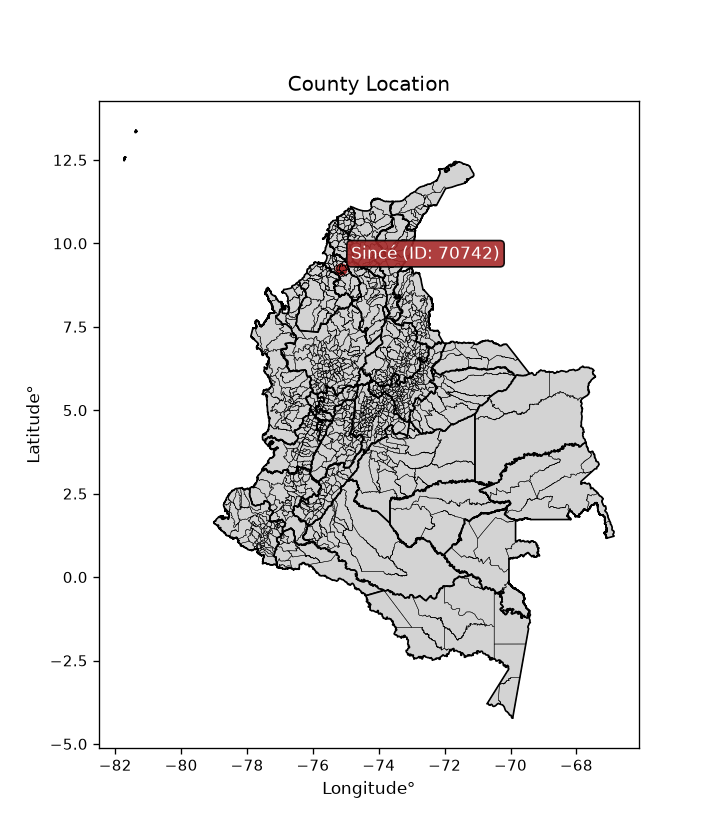
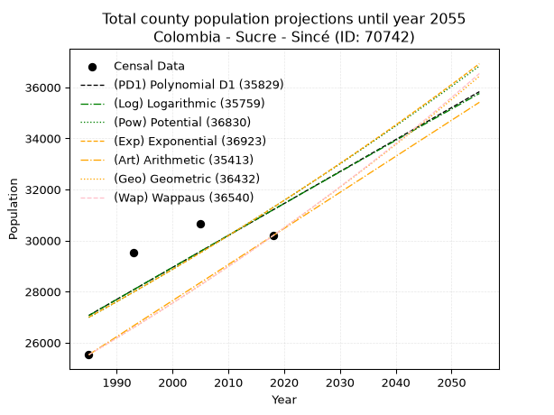
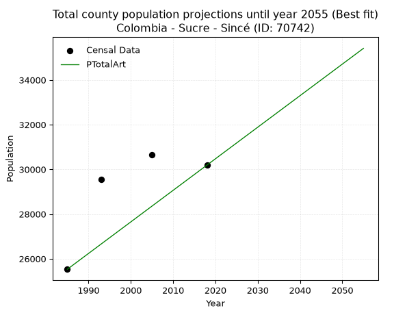
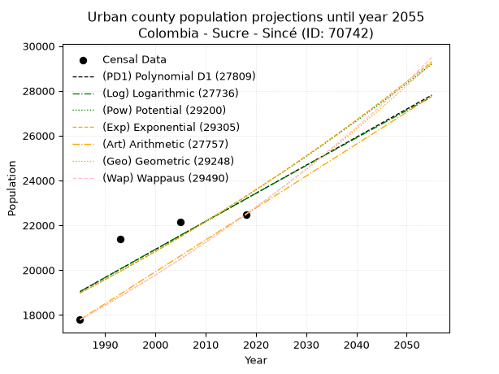
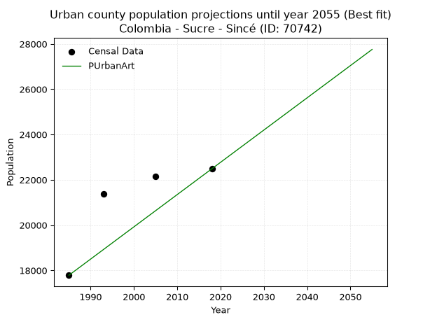
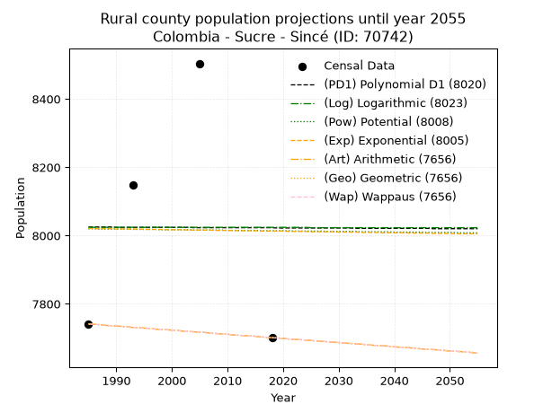
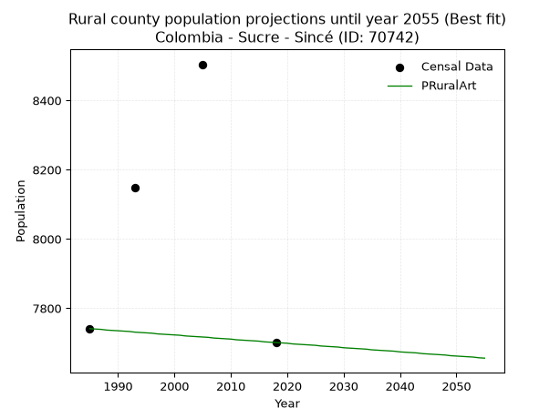

<div align="center">


</div>

# _“Population and Public Services Demand Projections (PPSD) until Year 2050 for Colombia - Sucre - Sincé (ID: 70742)”_
Keywords: `population` `public-service` `projection` `lineal` `polynomial` `logarithmic` `potential` `exponential` `arithmetic` `geometric` `wappaus` `dane` `colombia` `south-america`

PPSD are analytical estimates used by governments and planners to anticipate future changes in population size, age distribution, and the resulting community needs for utilities, healthcare, education, and infrastructure as sizing future water treatment facilities, electrical grids, and road networks based on spatial growth.

> **General running parameters**: • app_version: _v20260806_. • Python version: _3.14.7_. • Pandas version: _3.0.5_. • NumPy version: _2.5.1_. • Creates, save and include plots into reports (create_plot): _False_. • Projection until year: _2050_. • Process polynomial degree 2 and up: _False_. • Process Wappaus: _True_. • Process Wappaus: _True_. • Set negative values to zero: _True_. • Set infinite values to zero: _True_. • Drop dataset notes: _True_. 
<div align="center">

Dynamic map: [:earth_americas:Google](http://maps.google.com/maps?q=9.244308399,-75.1459991) [:earth_americas:OSM](https://www.openstreetmap.org/#map=18/9.244308399/-75.1459991&layers=P) [:earth_americas:Bing](https://www.bing.com/maps?cp=9.244308399~-75.1459991&lvl=18) [:earth_americas:Apple](https://maps.apple.com/frame?center=9.244308399%2C-75.1459991&span=0.003%2C0.006)

</div>


<div align="center">

```geojson
{
  "type": "Feature",
  "geometry": {
    "type": "Point", 
    "coordinates": [-75.1459991, 9.244308399]
  }, 
  "properties": {
    "Name": "Colombia - Sucre - Sincé (ID: 70742)"
  }
}
```

</div>


<div align="center">

</img>

</div>


## 0. Census Data (4 records)

Census data are official statistics collected by a government about the people and housing in a country. They usually include counts of total population, age, sex, race, income, education, and jobs.

📅Global census file: [Population.xlsx](../data/Population.xlsx)

| Source   |   Year |   CountryID | CountryName   |   StateID | StateName   |   CountyID | CountyName   |   PTotal |   PUrban |   PRural |
|:---------|-------:|------------:|:--------------|----------:|:------------|-----------:|:-------------|---------:|---------:|---------:|
| DANE     |   1985 |          57 | Colombia      |        70 | Sucre       |      70742 | Sincé        |    25528 |    17787 |     7741 |
| DANE     |   1993 |          57 | Colombia      |        70 | Sucre       |      70742 | Sincé        |    29540 |    21391 |     8149 |
| DANE     |   2005 |          57 | Colombia      |        70 | Sucre       |      70742 | Sincé        |    30648 |    22144 |     8504 |
| DANE     |   2018 |          57 | Colombia      |        70 | Sucre       |      70742 | Sincé        |    30188 |    22487 |     7701 |

> 🔥Some records could had specific notes about the registered values or the corresponding urban or rural distribution.

## 1. Total

### 1.1. Coefficients and Parameters

* (PD1) Polynomial Deg 1: 125.16740264953853, -221390.09714973945 (lineal)
* (Log) Logarithmic: 250999.36419432636, -1878872.178623747
* (Pow) Potential: 8.971532670484507, -25.15479378025148
* (Exp) Exponential: 0.004473864946225778, 3.753880809031428
* (Art) Arithmetic: Year diff. 2018 - 1985 = 33, Population diff. 30188 - 25528 = 4660, Annual growth = 141.21212121212122
* (Geo) Geometric: Year diff. 2018 - 1985 = 33, Population diff. 30188 - 25528 = 4660, Annual growth % = 0.005093796323999866
* (Wap) Wappaus: i = 0.5068997100011531, Condition values only valid for < 200)

<sub>
Wappaus condition values: ['0.00', '0.51', '1.01', '1.52', '2.03', '2.53', '3.04', '3.55', '4.06', '4.56', '5.07', '5.58', '6.08', '6.59', '7.10', '7.60', '8.11', '8.62', '9.12', '9.63', '10.14', '10.64', '11.15', '11.66', '12.17', '12.67', '13.18', '13.69', '14.19', '14.70', '15.21', '15.71', '16.22', '16.73', '17.23', '17.74', '18.25', '18.76', '19.26', '19.77', '20.28', '20.78', '21.29', '21.80', '22.30', '22.81', '23.32', '23.82', '24.33', '24.84', '25.34', '25.85', '26.36', '26.87', '27.37', '27.88', '28.39', '28.89', '29.40', '29.91', '30.41', '30.92', '31.43', '31.93', '32.44', '32.95']
</sub>


### 1.2. Projected Dataset

|   Year |   CountyID |   PTotalPD1 |   PTotalLog |   PTotalPow |   PTotalExp |   PTotalArt |   PTotalGeo |   PTotalWap |
|-------:|-----------:|------------:|------------:|------------:|------------:|------------:|------------:|------------:|
|   1985 |      70742 |       27067 |       27060 |       26988 |       26995 |       25528 |       25528 |       25528 |
|   1986 |      70742 |       27192 |       27186 |       27110 |       27116 |       25669 |       25658 |       25658 |
|   1987 |      70742 |       27318 |       27313 |       27233 |       27238 |       25810 |       25789 |       25788 |
|   1988 |      70742 |       27443 |       27439 |       27356 |       27360 |       25952 |       25920 |       25919 |
|   1989 |      70742 |       27568 |       27565 |       27480 |       27483 |       26093 |       26052 |       26051 |
|   1990 |      70742 |       27693 |       27691 |       27604 |       27606 |       26234 |       26185 |       26183 |
|   1991 |      70742 |       27818 |       27817 |       27729 |       27730 |       26375 |       26318 |       26316 |
|   1992 |      70742 |       27943 |       27943 |       27854 |       27854 |       26516 |       26452 |       26450 |
|   1993 |      70742 |       28069 |       28069 |       27980 |       27979 |       26658 |       26587 |       26585 |
|   1994 |      70742 |       28194 |       28195 |       28106 |       28104 |       26799 |       26722 |       26720 |
|   1995 |      70742 |       28319 |       28321 |       28233 |       28230 |       26940 |       26859 |       26856 |
|   1996 |      70742 |       28444 |       28447 |       28360 |       28357 |       27081 |       26995 |       26992 |
|   1997 |      70742 |       28569 |       28573 |       28488 |       28484 |       27223 |       27133 |       27130 |
|   1998 |      70742 |       28694 |       28698 |       28616 |       28612 |       27364 |       27271 |       27268 |
|   1999 |      70742 |       28820 |       28824 |       28745 |       28740 |       27505 |       27410 |       27406 |
|   2000 |      70742 |       28945 |       28950 |       28874 |       28869 |       27646 |       27550 |       27546 |
|   2001 |      70742 |       29070 |       29075 |       29004 |       28998 |       27787 |       27690 |       27686 |
|   2002 |      70742 |       29195 |       29200 |       29134 |       29128 |       27929 |       27831 |       27827 |
|   2003 |      70742 |       29320 |       29326 |       29265 |       29259 |       28070 |       27973 |       27969 |
|   2004 |      70742 |       29445 |       29451 |       29396 |       29390 |       28211 |       28115 |       28111 |
|   2005 |      70742 |       29571 |       29576 |       29528 |       29522 |       28352 |       28258 |       28254 |
|   2006 |      70742 |       29696 |       29701 |       29660 |       29654 |       28493 |       28402 |       28398 |
|   2007 |      70742 |       29821 |       29826 |       29793 |       29787 |       28635 |       28547 |       28543 |
|   2008 |      70742 |       29946 |       29952 |       29927 |       29921 |       28776 |       28693 |       28688 |
|   2009 |      70742 |       30071 |       30076 |       30061 |       30055 |       28917 |       28839 |       28835 |
|   2010 |      70742 |       30196 |       30201 |       30195 |       30190 |       29058 |       28986 |       28982 |
|   2011 |      70742 |       30322 |       30326 |       30330 |       30325 |       29200 |       29133 |       29130 |
|   2012 |      70742 |       30447 |       30451 |       30466 |       30461 |       29341 |       29282 |       29278 |
|   2013 |      70742 |       30572 |       30576 |       30602 |       30598 |       29482 |       29431 |       29428 |
|   2014 |      70742 |       30697 |       30700 |       30739 |       30735 |       29623 |       29581 |       29578 |
|   2015 |      70742 |       30822 |       30825 |       30876 |       30873 |       29764 |       29731 |       29730 |
|   2016 |      70742 |       30947 |       30950 |       31014 |       31011 |       29906 |       29883 |       29881 |
|   2017 |      70742 |       31073 |       31074 |       31152 |       31150 |       30047 |       30035 |       30034 |
|   2018 |      70742 |       31198 |       31198 |       31291 |       31290 |       30188 |       30188 |       30188 |
|   2019 |      70742 |       31323 |       31323 |       31430 |       31430 |       30329 |       30342 |       30343 |
|   2020 |      70742 |       31448 |       31447 |       31570 |       31571 |       30470 |       30496 |       30498 |
|   2021 |      70742 |       31573 |       31571 |       31710 |       31713 |       30612 |       30652 |       30654 |
|   2022 |      70742 |       31698 |       31695 |       31851 |       31855 |       30753 |       30808 |       30811 |
|   2023 |      70742 |       31824 |       31820 |       31993 |       31998 |       30894 |       30965 |       30969 |
|   2024 |      70742 |       31949 |       31944 |       32135 |       32141 |       31035 |       31122 |       31128 |
|   2025 |      70742 |       32074 |       32068 |       32278 |       32285 |       31176 |       31281 |       31288 |
|   2026 |      70742 |       32199 |       32191 |       32421 |       32430 |       31318 |       31440 |       31449 |
|   2027 |      70742 |       32324 |       32315 |       32565 |       32575 |       31459 |       31600 |       31610 |
|   2028 |      70742 |       32449 |       32439 |       32710 |       32722 |       31600 |       31761 |       31773 |
|   2029 |      70742 |       32575 |       32563 |       32855 |       32868 |       31741 |       31923 |       31936 |
|   2030 |      70742 |       32700 |       32687 |       33000 |       33016 |       31883 |       32086 |       32101 |
|   2031 |      70742 |       32825 |       32810 |       33146 |       33164 |       32024 |       32249 |       32266 |
|   2032 |      70742 |       32950 |       32934 |       33293 |       33312 |       32165 |       32414 |       32432 |
|   2033 |      70742 |       33075 |       33057 |       33440 |       33462 |       32306 |       32579 |       32600 |
|   2034 |      70742 |       33200 |       33181 |       33588 |       33612 |       32447 |       32745 |       32768 |
|   2035 |      70742 |       33326 |       33304 |       33736 |       33762 |       32589 |       32911 |       32937 |
|   2036 |      70742 |       33451 |       33427 |       33886 |       33914 |       32730 |       33079 |       33107 |
|   2037 |      70742 |       33576 |       33551 |       34035 |       34066 |       32871 |       33248 |       33278 |
|   2038 |      70742 |       33701 |       33674 |       34185 |       34219 |       33012 |       33417 |       33450 |
|   2039 |      70742 |       33826 |       33797 |       34336 |       34372 |       33153 |       33587 |       33624 |
|   2040 |      70742 |       33951 |       33920 |       34487 |       34526 |       33295 |       33758 |       33798 |
|   2041 |      70742 |       34077 |       34043 |       34639 |       34681 |       33436 |       33930 |       33973 |
|   2042 |      70742 |       34202 |       34166 |       34792 |       34837 |       33577 |       34103 |       34149 |
|   2043 |      70742 |       34327 |       34289 |       34945 |       34993 |       33718 |       34277 |       34327 |
|   2044 |      70742 |       34452 |       34412 |       35099 |       35150 |       33860 |       34451 |       34505 |
|   2045 |      70742 |       34577 |       34534 |       35253 |       35307 |       34001 |       34627 |       34685 |
|   2046 |      70742 |       34702 |       34657 |       35408 |       35466 |       34142 |       34803 |       34865 |
|   2047 |      70742 |       34828 |       34780 |       35564 |       35625 |       34283 |       34980 |       35047 |
|   2048 |      70742 |       34953 |       34902 |       35720 |       35784 |       34424 |       35159 |       35229 |
|   2049 |      70742 |       35078 |       35025 |       35877 |       35945 |       34566 |       35338 |       35413 |
|   2050 |      70742 |       35203 |       35147 |       36034 |       36106 |       34707 |       35518 |       35598 |
<div align="center">

</img>

</div>


### 1.3. Best fit with absolute and relative error (%)

Relative error puts that difference into context by dividing the absolute error by the true value, creating a unitless ratio or percentage that shows the scale of the mistake.

Absolute and relative error

|   Year | Source   |   CountryID | CountryName   |   StateID | StateName   |   CountyID_x | CountyName   |   PTotal |   PUrban |   PRural |   CountyID_y |   PTotalPD1 |   PTotalLog |   PTotalPow |   PTotalExp |   PTotalArt |   PTotalGeo |   PTotalWap |   PTotalPD1AbsError |   PTotalLogAbsError |   PTotalPowAbsError |   PTotalExpAbsError |   PTotalArtAbsError |   PTotalGeoAbsError |   PTotalWapAbsError |   PTotalPD1RelError |   PTotalLogRelError |   PTotalPowRelError |   PTotalExpRelError |   PTotalArtRelError |   PTotalGeoRelError |   PTotalWapRelError |
|-------:|:---------|------------:|:--------------|----------:|:------------|-------------:|:-------------|---------:|---------:|---------:|-------------:|------------:|------------:|------------:|------------:|------------:|------------:|------------:|--------------------:|--------------------:|--------------------:|--------------------:|--------------------:|--------------------:|--------------------:|--------------------:|--------------------:|--------------------:|--------------------:|--------------------:|--------------------:|--------------------:|
|   1985 | DANE     |          57 | Colombia      |        70 | Sucre       |        70742 | Sincé        |    25528 |    17787 |     7741 |        70742 |       27067 |       27060 |       26988 |       26995 |       25528 |       25528 |       25528 |                1539 |                1532 |                1460 |                1467 |                   0 |                   0 |                   0 |             6.02867 |             6.00125 |             5.71921 |             5.74663 |             0       |             0       |             0       |
|   1993 | DANE     |          57 | Colombia      |        70 | Sucre       |        70742 | Sincé        |    29540 |    21391 |     8149 |        70742 |       28069 |       28069 |       27980 |       27979 |       26658 |       26587 |       26585 |                1471 |                1471 |                1560 |                1561 |                2882 |                2953 |                2955 |             4.97969 |             4.97969 |             5.28097 |             5.28436 |             9.75626 |             9.99661 |            10.0034  |
|   2005 | DANE     |          57 | Colombia      |        70 | Sucre       |        70742 | Sincé        |    30648 |    22144 |     8504 |        70742 |       29571 |       29576 |       29528 |       29522 |       28352 |       28258 |       28254 |                1077 |                1072 |                1120 |                1126 |                2296 |                2390 |                2394 |             3.5141  |             3.49778 |             3.6544  |             3.67398 |             7.49152 |             7.79823 |             7.81128 |
|   2018 | DANE     |          57 | Colombia      |        70 | Sucre       |        70742 | Sincé        |    30188 |    22487 |     7701 |        70742 |       31198 |       31198 |       31291 |       31290 |       30188 |       30188 |       30188 |                1010 |                1010 |                1103 |                1102 |                   0 |                   0 |                   0 |             3.3457  |             3.3457  |             3.65377 |             3.65046 |             0       |             0       |             0       |

Relative error mean

| Method    |   RelError | Best   |
|:----------|-----------:|:-------|
| PTotalPD1 |    4.46704 |        |
| PTotalLog |    4.45611 |        |
| PTotalPow |    4.57709 |        |
| PTotalExp |    4.58886 |        |
| PTotalArt |    4.31194 | True   |
| PTotalGeo |    4.44871 |        |
| PTotalWap |    4.45367 |        |

💙Best method: _**PTotalArt**_
<div align="center">

</img>

</div>


### 1.4. Fresh water supply demand in liters per capita per day (lpcd)

The fresh water supply demand typically ranges from 100 to 300 liters per capita per day (lpcd) for standard domestic and municipal planning, though absolute survival minimums set by the World Health Organization are as low as 7.5 to 20 liters per day, and total consumption in high-income nations can exceed 400 liters.

> `CZ`: Level in meters above the sea level (masl)<br> `WS`: Fresh water supply demand in liters per capita per day (lpcd or l/h/d)<br> `WSAll`: Zonal fresh water supply demand in liters per second (l/s)<br> `A`: Zonal area in square meters<br> `DP`: Population density (people/hectare or p/ha)

Reference values (RAS Colombia)

|    CZ |   WS |
|------:|-----:|
|  1000 |  120 |
|  2000 |  130 |
| 99999 |  140 |

County shapefile geometry properties and water supply values

|   CountyID |      ATotal |   CZTotal |   WSTotal |
|-----------:|------------:|----------:|----------:|
|      70742 | 4.18719e+08 |   110.022 |       120 |

Projected values for best method: PTotalArt

|   CountyID |   Year |   PTotalArt |   DPTotal |   WSTotal |   WSTotalAll |
|-----------:|-------:|------------:|----------:|----------:|-------------:|
|      70742 |   1985 |       25528 |      0.61 |       120 |      35.4556 |
|      70742 |   1986 |       25669 |      0.61 |       120 |      35.6514 |
|      70742 |   1987 |       25810 |      0.62 |       120 |      35.8472 |
|      70742 |   1988 |       25952 |      0.62 |       120 |      36.0444 |
|      70742 |   1989 |       26093 |      0.62 |       120 |      36.2403 |
|      70742 |   1990 |       26234 |      0.63 |       120 |      36.4361 |
|      70742 |   1991 |       26375 |      0.63 |       120 |      36.6319 |
|      70742 |   1992 |       26516 |      0.63 |       120 |      36.8278 |
|      70742 |   1993 |       26658 |      0.64 |       120 |      37.025  |
|      70742 |   1994 |       26799 |      0.64 |       120 |      37.2208 |
|      70742 |   1995 |       26940 |      0.64 |       120 |      37.4167 |
|      70742 |   1996 |       27081 |      0.65 |       120 |      37.6125 |
|      70742 |   1997 |       27223 |      0.65 |       120 |      37.8097 |
|      70742 |   1998 |       27364 |      0.65 |       120 |      38.0056 |
|      70742 |   1999 |       27505 |      0.66 |       120 |      38.2014 |
|      70742 |   2000 |       27646 |      0.66 |       120 |      38.3972 |
|      70742 |   2001 |       27787 |      0.66 |       120 |      38.5931 |
|      70742 |   2002 |       27929 |      0.67 |       120 |      38.7903 |
|      70742 |   2003 |       28070 |      0.67 |       120 |      38.9861 |
|      70742 |   2004 |       28211 |      0.67 |       120 |      39.1819 |
|      70742 |   2005 |       28352 |      0.68 |       120 |      39.3778 |
|      70742 |   2006 |       28493 |      0.68 |       120 |      39.5736 |
|      70742 |   2007 |       28635 |      0.68 |       120 |      39.7708 |
|      70742 |   2008 |       28776 |      0.69 |       120 |      39.9667 |
|      70742 |   2009 |       28917 |      0.69 |       120 |      40.1625 |
|      70742 |   2010 |       29058 |      0.69 |       120 |      40.3583 |
|      70742 |   2011 |       29200 |      0.7  |       120 |      40.5556 |
|      70742 |   2012 |       29341 |      0.7  |       120 |      40.7514 |
|      70742 |   2013 |       29482 |      0.7  |       120 |      40.9472 |
|      70742 |   2014 |       29623 |      0.71 |       120 |      41.1431 |
|      70742 |   2015 |       29764 |      0.71 |       120 |      41.3389 |
|      70742 |   2016 |       29906 |      0.71 |       120 |      41.5361 |
|      70742 |   2017 |       30047 |      0.72 |       120 |      41.7319 |
|      70742 |   2018 |       30188 |      0.72 |       120 |      41.9278 |
|      70742 |   2019 |       30329 |      0.72 |       120 |      42.1236 |
|      70742 |   2020 |       30470 |      0.73 |       120 |      42.3194 |
|      70742 |   2021 |       30612 |      0.73 |       120 |      42.5167 |
|      70742 |   2022 |       30753 |      0.73 |       120 |      42.7125 |
|      70742 |   2023 |       30894 |      0.74 |       120 |      42.9083 |
|      70742 |   2024 |       31035 |      0.74 |       120 |      43.1042 |
|      70742 |   2025 |       31176 |      0.74 |       120 |      43.3    |
|      70742 |   2026 |       31318 |      0.75 |       120 |      43.4972 |
|      70742 |   2027 |       31459 |      0.75 |       120 |      43.6931 |
|      70742 |   2028 |       31600 |      0.75 |       120 |      43.8889 |
|      70742 |   2029 |       31741 |      0.76 |       120 |      44.0847 |
|      70742 |   2030 |       31883 |      0.76 |       120 |      44.2819 |
|      70742 |   2031 |       32024 |      0.76 |       120 |      44.4778 |
|      70742 |   2032 |       32165 |      0.77 |       120 |      44.6736 |
|      70742 |   2033 |       32306 |      0.77 |       120 |      44.8694 |
|      70742 |   2034 |       32447 |      0.77 |       120 |      45.0653 |
|      70742 |   2035 |       32589 |      0.78 |       120 |      45.2625 |
|      70742 |   2036 |       32730 |      0.78 |       120 |      45.4583 |
|      70742 |   2037 |       32871 |      0.79 |       120 |      45.6542 |
|      70742 |   2038 |       33012 |      0.79 |       120 |      45.85   |
|      70742 |   2039 |       33153 |      0.79 |       120 |      46.0458 |
|      70742 |   2040 |       33295 |      0.8  |       120 |      46.2431 |
|      70742 |   2041 |       33436 |      0.8  |       120 |      46.4389 |
|      70742 |   2042 |       33577 |      0.8  |       120 |      46.6347 |
|      70742 |   2043 |       33718 |      0.81 |       120 |      46.8306 |
|      70742 |   2044 |       33860 |      0.81 |       120 |      47.0278 |
|      70742 |   2045 |       34001 |      0.81 |       120 |      47.2236 |
|      70742 |   2046 |       34142 |      0.82 |       120 |      47.4194 |
|      70742 |   2047 |       34283 |      0.82 |       120 |      47.6153 |
|      70742 |   2048 |       34424 |      0.82 |       120 |      47.8111 |
|      70742 |   2049 |       34566 |      0.83 |       120 |      48.0083 |
|      70742 |   2050 |       34707 |      0.83 |       120 |      48.2042 |

## 2. Urban

### 2.1. Coefficients and Parameters

* (PD1) Polynomial Deg 1: 125.23765556001577, -229554.37053392158 (lineal)
* (Log) Logarithmic: 251019.6713358672, -1887050.28336933
* (Pow) Potential: 12.440004708227654, -36.7460186101755
* (Exp) Exponential: 0.006206198681970742, 0.08473656103921422
* (Art) Arithmetic: Year diff. 2018 - 1985 = 33, Population diff. 22487 - 17787 = 4700, Annual growth = 142.42424242424244
* (Geo) Geometric: Year diff. 2018 - 1985 = 33, Population diff. 22487 - 17787 = 4700, Annual growth % = 0.007130438070320766
* (Wap) Wappaus: i = 0.7072763689936059, Condition values only valid for < 200)

<sub>
Wappaus condition values: ['0.00', '0.71', '1.41', '2.12', '2.83', '3.54', '4.24', '4.95', '5.66', '6.37', '7.07', '7.78', '8.49', '9.19', '9.90', '10.61', '11.32', '12.02', '12.73', '13.44', '14.15', '14.85', '15.56', '16.27', '16.97', '17.68', '18.39', '19.10', '19.80', '20.51', '21.22', '21.93', '22.63', '23.34', '24.05', '24.75', '25.46', '26.17', '26.88', '27.58', '28.29', '29.00', '29.71', '30.41', '31.12', '31.83', '32.53', '33.24', '33.95', '34.66', '35.36', '36.07', '36.78', '37.49', '38.19', '38.90', '39.61', '40.31', '41.02', '41.73', '42.44', '43.14', '43.85', '44.56', '45.27', '45.97']
</sub>


### 2.2. Projected Dataset

|   Year |   CountyID |   PUrbanPD1 |   PUrbanLog |   PUrbanPow |   PUrbanExp |   PUrbanArt |   PUrbanGeo |   PUrbanWap |
|-------:|-----------:|------------:|------------:|------------:|------------:|------------:|------------:|------------:|
|   1985 |      70742 |       19042 |       19036 |       18973 |       18979 |       17787 |       17787 |       17787 |
|   1986 |      70742 |       19168 |       19162 |       19092 |       19097 |       17929 |       17914 |       17913 |
|   1987 |      70742 |       19293 |       19289 |       19212 |       19216 |       18072 |       18042 |       18040 |
|   1988 |      70742 |       19418 |       19415 |       19333 |       19336 |       18214 |       18170 |       18168 |
|   1989 |      70742 |       19543 |       19541 |       19454 |       19456 |       18357 |       18300 |       18297 |
|   1990 |      70742 |       19669 |       19668 |       19576 |       19577 |       18499 |       18430 |       18427 |
|   1991 |      70742 |       19794 |       19794 |       19699 |       19699 |       18642 |       18562 |       18558 |
|   1992 |      70742 |       19919 |       19920 |       19822 |       19822 |       18784 |       18694 |       18690 |
|   1993 |      70742 |       20044 |       20046 |       19947 |       19945 |       18926 |       18827 |       18823 |
|   1994 |      70742 |       20170 |       20172 |       20071 |       20069 |       19069 |       18962 |       18956 |
|   1995 |      70742 |       20295 |       20297 |       20197 |       20194 |       19211 |       19097 |       19091 |
|   1996 |      70742 |       20420 |       20423 |       20323 |       20320 |       19354 |       19233 |       19227 |
|   1997 |      70742 |       20545 |       20549 |       20450 |       20447 |       19496 |       19370 |       19364 |
|   1998 |      70742 |       20670 |       20675 |       20578 |       20574 |       19639 |       19508 |       19501 |
|   1999 |      70742 |       20796 |       20800 |       20707 |       20702 |       19781 |       19647 |       19640 |
|   2000 |      70742 |       20921 |       20926 |       20836 |       20831 |       19923 |       19787 |       19780 |
|   2001 |      70742 |       21046 |       21051 |       20966 |       20961 |       20066 |       19928 |       19921 |
|   2002 |      70742 |       21171 |       21177 |       21096 |       21091 |       20208 |       20071 |       20062 |
|   2003 |      70742 |       21297 |       21302 |       21228 |       21222 |       20351 |       20214 |       20205 |
|   2004 |      70742 |       21422 |       21427 |       21360 |       21354 |       20493 |       20358 |       20349 |
|   2005 |      70742 |       21547 |       21553 |       21493 |       21487 |       20635 |       20503 |       20495 |
|   2006 |      70742 |       21672 |       21678 |       21627 |       21621 |       20778 |       20649 |       20641 |
|   2007 |      70742 |       21798 |       21803 |       21761 |       21756 |       20920 |       20796 |       20788 |
|   2008 |      70742 |       21923 |       21928 |       21897 |       21891 |       21063 |       20945 |       20937 |
|   2009 |      70742 |       22048 |       22053 |       22033 |       22027 |       21205 |       21094 |       21086 |
|   2010 |      70742 |       22173 |       22178 |       22169 |       22165 |       21348 |       21244 |       21237 |
|   2011 |      70742 |       22299 |       22303 |       22307 |       22303 |       21490 |       21396 |       21389 |
|   2012 |      70742 |       22424 |       22427 |       22445 |       22441 |       21632 |       21549 |       21542 |
|   2013 |      70742 |       22549 |       22552 |       22585 |       22581 |       21775 |       21702 |       21697 |
|   2014 |      70742 |       22674 |       22677 |       22725 |       22722 |       21917 |       21857 |       21852 |
|   2015 |      70742 |       22800 |       22801 |       22865 |       22863 |       22060 |       22013 |       22009 |
|   2016 |      70742 |       22925 |       22926 |       23007 |       23005 |       22202 |       22170 |       22167 |
|   2017 |      70742 |       23050 |       23050 |       23149 |       23149 |       22345 |       22328 |       22326 |
|   2018 |      70742 |       23175 |       23175 |       23293 |       23293 |       22487 |       22487 |       22487 |
|   2019 |      70742 |       23300 |       23299 |       23437 |       23438 |       22629 |       22647 |       22649 |
|   2020 |      70742 |       23426 |       23423 |       23581 |       23584 |       22772 |       22809 |       22812 |
|   2021 |      70742 |       23551 |       23548 |       23727 |       23731 |       22914 |       22971 |       22977 |
|   2022 |      70742 |       23676 |       23672 |       23873 |       23878 |       23057 |       23135 |       23142 |
|   2023 |      70742 |       23801 |       23796 |       24021 |       24027 |       23199 |       23300 |       23310 |
|   2024 |      70742 |       23927 |       23920 |       24169 |       24177 |       23342 |       23466 |       23478 |
|   2025 |      70742 |       24052 |       24044 |       24318 |       24327 |       23484 |       23634 |       23648 |
|   2026 |      70742 |       24177 |       24168 |       24468 |       24478 |       23626 |       23802 |       23820 |
|   2027 |      70742 |       24302 |       24292 |       24618 |       24631 |       23769 |       23972 |       23992 |
|   2028 |      70742 |       24428 |       24416 |       24770 |       24784 |       23911 |       24143 |       24167 |
|   2029 |      70742 |       24553 |       24539 |       24922 |       24939 |       24054 |       24315 |       24342 |
|   2030 |      70742 |       24678 |       24663 |       25075 |       25094 |       24196 |       24488 |       24520 |
|   2031 |      70742 |       24803 |       24787 |       25229 |       25250 |       24339 |       24663 |       24698 |
|   2032 |      70742 |       24929 |       24910 |       25384 |       25407 |       24481 |       24839 |       24878 |
|   2033 |      70742 |       25054 |       25034 |       25540 |       25565 |       24623 |       25016 |       25060 |
|   2034 |      70742 |       25179 |       25157 |       25697 |       25725 |       24766 |       25194 |       25243 |
|   2035 |      70742 |       25304 |       25281 |       25855 |       25885 |       24908 |       25374 |       25428 |
|   2036 |      70742 |       25429 |       25404 |       26013 |       26046 |       25051 |       25555 |       25615 |
|   2037 |      70742 |       25555 |       25527 |       26173 |       26208 |       25193 |       25737 |       25803 |
|   2038 |      70742 |       25680 |       25650 |       26333 |       26371 |       25335 |       25921 |       25993 |
|   2039 |      70742 |       25805 |       25774 |       26494 |       26535 |       25478 |       26105 |       26184 |
|   2040 |      70742 |       25930 |       25897 |       26656 |       26700 |       25620 |       26292 |       26377 |
|   2041 |      70742 |       26056 |       26020 |       26819 |       26867 |       25763 |       26479 |       26572 |
|   2042 |      70742 |       26181 |       26143 |       26983 |       27034 |       25905 |       26668 |       26768 |
|   2043 |      70742 |       26306 |       26265 |       27148 |       27202 |       26048 |       26858 |       26966 |
|   2044 |      70742 |       26431 |       26388 |       27314 |       27372 |       26190 |       27050 |       27166 |
|   2045 |      70742 |       26557 |       26511 |       27480 |       27542 |       26332 |       27242 |       27368 |
|   2046 |      70742 |       26682 |       26634 |       27648 |       27713 |       26475 |       27437 |       27572 |
|   2047 |      70742 |       26807 |       26756 |       27817 |       27886 |       26617 |       27632 |       27777 |
|   2048 |      70742 |       26932 |       26879 |       27986 |       28060 |       26760 |       27829 |       27985 |
|   2049 |      70742 |       27058 |       27002 |       28157 |       28234 |       26902 |       28028 |       28194 |
|   2050 |      70742 |       27183 |       27124 |       28328 |       28410 |       27045 |       28228 |       28405 |
<div align="center">

</img>

</div>


### 2.3. Best fit with absolute and relative error (%)

Relative error puts that difference into context by dividing the absolute error by the true value, creating a unitless ratio or percentage that shows the scale of the mistake.

Absolute and relative error

|   Year | Source   |   CountryID | CountryName   |   StateID | StateName   |   CountyID_x | CountyName   |   PTotal |   PUrban |   PRural |   CountyID_y |   PUrbanPD1 |   PUrbanLog |   PUrbanPow |   PUrbanExp |   PUrbanArt |   PUrbanGeo |   PUrbanWap |   PUrbanPD1AbsError |   PUrbanLogAbsError |   PUrbanPowAbsError |   PUrbanExpAbsError |   PUrbanArtAbsError |   PUrbanGeoAbsError |   PUrbanWapAbsError |   PUrbanPD1RelError |   PUrbanLogRelError |   PUrbanPowRelError |   PUrbanExpRelError |   PUrbanArtRelError |   PUrbanGeoRelError |   PUrbanWapRelError |
|-------:|:---------|------------:|:--------------|----------:|:------------|-------------:|:-------------|---------:|---------:|---------:|-------------:|------------:|------------:|------------:|------------:|------------:|------------:|------------:|--------------------:|--------------------:|--------------------:|--------------------:|--------------------:|--------------------:|--------------------:|--------------------:|--------------------:|--------------------:|--------------------:|--------------------:|--------------------:|--------------------:|
|   1985 | DANE     |          57 | Colombia      |        70 | Sucre       |        70742 | Sincé        |    25528 |    17787 |     7741 |        70742 |       19042 |       19036 |       18973 |       18979 |       17787 |       17787 |       17787 |                1255 |                1249 |                1186 |                1192 |                   0 |                   0 |                   0 |             7.05571 |             7.02198 |             6.66779 |             6.70152 |             0       |             0       |             0       |
|   1993 | DANE     |          57 | Colombia      |        70 | Sucre       |        70742 | Sincé        |    29540 |    21391 |     8149 |        70742 |       20044 |       20046 |       19947 |       19945 |       18926 |       18827 |       18823 |                1347 |                1345 |                1444 |                1446 |                2465 |                2564 |                2568 |             6.29704 |             6.28769 |             6.7505  |             6.75985 |            11.5235  |            11.9863  |            12.005   |
|   2005 | DANE     |          57 | Colombia      |        70 | Sucre       |        70742 | Sincé        |    30648 |    22144 |     8504 |        70742 |       21547 |       21553 |       21493 |       21487 |       20635 |       20503 |       20495 |                 597 |                 591 |                 651 |                 657 |                1509 |                1641 |                1649 |             2.69599 |             2.66889 |             2.93985 |             2.96694 |             6.81449 |             7.41059 |             7.44671 |
|   2018 | DANE     |          57 | Colombia      |        70 | Sucre       |        70742 | Sincé        |    30188 |    22487 |     7701 |        70742 |       23175 |       23175 |       23293 |       23293 |       22487 |       22487 |       22487 |                 688 |                 688 |                 806 |                 806 |                   0 |                   0 |                   0 |             3.05955 |             3.05955 |             3.58429 |             3.58429 |             0       |             0       |             0       |

Relative error mean

| Method    |   RelError | Best   |
|:----------|-----------:|:-------|
| PUrbanPD1 |    4.77707 |        |
| PUrbanLog |    4.75953 |        |
| PUrbanPow |    4.98561 |        |
| PUrbanExp |    5.00315 |        |
| PUrbanArt |    4.58451 | True   |
| PUrbanGeo |    4.84923 |        |
| PUrbanWap |    4.86294 |        |

💙Best method: _**PUrbanArt**_
<div align="center">

</img>

</div>


### 2.4. Fresh water supply demand in liters per capita per day (lpcd)

The fresh water supply demand typically ranges from 100 to 300 liters per capita per day (lpcd) for standard domestic and municipal planning, though absolute survival minimums set by the World Health Organization are as low as 7.5 to 20 liters per day, and total consumption in high-income nations can exceed 400 liters.

> `CZ`: Level in meters above the sea level (masl)<br> `WS`: Fresh water supply demand in liters per capita per day (lpcd or l/h/d)<br> `WSAll`: Zonal fresh water supply demand in liters per second (l/s)<br> `A`: Zonal area in square meters<br> `DP`: Population density (people/hectare or p/ha)

Reference values (RAS Colombia)

|    CZ |   WS |
|------:|-----:|
|  1000 |  120 |
|  2000 |  130 |
| 99999 |  140 |

County shapefile geometry properties and water supply values

|   CountyID |      AUrban |   CZUrban |   WSUrban |
|-----------:|------------:|----------:|----------:|
|      70742 | 3.03951e+06 |   134.847 |       120 |

Projected values for best method: PUrbanArt

|   CountyID |   Year |   PUrbanArt |   DPUrban |   WSUrban |   WSUrbanAll |
|-----------:|-------:|------------:|----------:|----------:|-------------:|
|      70742 |   1985 |       17787 |     58.52 |       120 |      24.7042 |
|      70742 |   1986 |       17929 |     58.99 |       120 |      24.9014 |
|      70742 |   1987 |       18072 |     59.46 |       120 |      25.1    |
|      70742 |   1988 |       18214 |     59.92 |       120 |      25.2972 |
|      70742 |   1989 |       18357 |     60.39 |       120 |      25.4958 |
|      70742 |   1990 |       18499 |     60.86 |       120 |      25.6931 |
|      70742 |   1991 |       18642 |     61.33 |       120 |      25.8917 |
|      70742 |   1992 |       18784 |     61.8  |       120 |      26.0889 |
|      70742 |   1993 |       18926 |     62.27 |       120 |      26.2861 |
|      70742 |   1994 |       19069 |     62.74 |       120 |      26.4847 |
|      70742 |   1995 |       19211 |     63.2  |       120 |      26.6819 |
|      70742 |   1996 |       19354 |     63.67 |       120 |      26.8806 |
|      70742 |   1997 |       19496 |     64.14 |       120 |      27.0778 |
|      70742 |   1998 |       19639 |     64.61 |       120 |      27.2764 |
|      70742 |   1999 |       19781 |     65.08 |       120 |      27.4736 |
|      70742 |   2000 |       19923 |     65.55 |       120 |      27.6708 |
|      70742 |   2001 |       20066 |     66.02 |       120 |      27.8694 |
|      70742 |   2002 |       20208 |     66.48 |       120 |      28.0667 |
|      70742 |   2003 |       20351 |     66.95 |       120 |      28.2653 |
|      70742 |   2004 |       20493 |     67.42 |       120 |      28.4625 |
|      70742 |   2005 |       20635 |     67.89 |       120 |      28.6597 |
|      70742 |   2006 |       20778 |     68.36 |       120 |      28.8583 |
|      70742 |   2007 |       20920 |     68.83 |       120 |      29.0556 |
|      70742 |   2008 |       21063 |     69.3  |       120 |      29.2542 |
|      70742 |   2009 |       21205 |     69.76 |       120 |      29.4514 |
|      70742 |   2010 |       21348 |     70.24 |       120 |      29.65   |
|      70742 |   2011 |       21490 |     70.7  |       120 |      29.8472 |
|      70742 |   2012 |       21632 |     71.17 |       120 |      30.0444 |
|      70742 |   2013 |       21775 |     71.64 |       120 |      30.2431 |
|      70742 |   2014 |       21917 |     72.11 |       120 |      30.4403 |
|      70742 |   2015 |       22060 |     72.58 |       120 |      30.6389 |
|      70742 |   2016 |       22202 |     73.04 |       120 |      30.8361 |
|      70742 |   2017 |       22345 |     73.52 |       120 |      31.0347 |
|      70742 |   2018 |       22487 |     73.98 |       120 |      31.2319 |
|      70742 |   2019 |       22629 |     74.45 |       120 |      31.4292 |
|      70742 |   2020 |       22772 |     74.92 |       120 |      31.6278 |
|      70742 |   2021 |       22914 |     75.39 |       120 |      31.825  |
|      70742 |   2022 |       23057 |     75.86 |       120 |      32.0236 |
|      70742 |   2023 |       23199 |     76.32 |       120 |      32.2208 |
|      70742 |   2024 |       23342 |     76.8  |       120 |      32.4194 |
|      70742 |   2025 |       23484 |     77.26 |       120 |      32.6167 |
|      70742 |   2026 |       23626 |     77.73 |       120 |      32.8139 |
|      70742 |   2027 |       23769 |     78.2  |       120 |      33.0125 |
|      70742 |   2028 |       23911 |     78.67 |       120 |      33.2097 |
|      70742 |   2029 |       24054 |     79.14 |       120 |      33.4083 |
|      70742 |   2030 |       24196 |     79.6  |       120 |      33.6056 |
|      70742 |   2031 |       24339 |     80.08 |       120 |      33.8042 |
|      70742 |   2032 |       24481 |     80.54 |       120 |      34.0014 |
|      70742 |   2033 |       24623 |     81.01 |       120 |      34.1986 |
|      70742 |   2034 |       24766 |     81.48 |       120 |      34.3972 |
|      70742 |   2035 |       24908 |     81.95 |       120 |      34.5944 |
|      70742 |   2036 |       25051 |     82.42 |       120 |      34.7931 |
|      70742 |   2037 |       25193 |     82.89 |       120 |      34.9903 |
|      70742 |   2038 |       25335 |     83.35 |       120 |      35.1875 |
|      70742 |   2039 |       25478 |     83.82 |       120 |      35.3861 |
|      70742 |   2040 |       25620 |     84.29 |       120 |      35.5833 |
|      70742 |   2041 |       25763 |     84.76 |       120 |      35.7819 |
|      70742 |   2042 |       25905 |     85.23 |       120 |      35.9792 |
|      70742 |   2043 |       26048 |     85.7  |       120 |      36.1778 |
|      70742 |   2044 |       26190 |     86.17 |       120 |      36.375  |
|      70742 |   2045 |       26332 |     86.63 |       120 |      36.5722 |
|      70742 |   2046 |       26475 |     87.1  |       120 |      36.7708 |
|      70742 |   2047 |       26617 |     87.57 |       120 |      36.9681 |
|      70742 |   2048 |       26760 |     88.04 |       120 |      37.1667 |
|      70742 |   2049 |       26902 |     88.51 |       120 |      37.3639 |
|      70742 |   2050 |       27045 |     88.98 |       120 |      37.5625 |

## 3. Rural

### 3.1. Coefficients and Parameters

* (PD1) Polynomial Deg 1: -0.07025291047727783, 8164.273384182176 (lineal)
* (Log) Logarithmic: -20.307141540454406, 8178.104745580211
* (Pow) Potential: -0.04236238632795304, 4.043859389953585
* (Exp) Exponential: -2.861712247003866e-05, 8489.411081324824
* (Art) Arithmetic: Year diff. 2018 - 1985 = 33, Population diff. 7701 - 7741 = -40, Annual growth = -1.2121212121212122
* (Geo) Geometric: Year diff. 2018 - 1985 = 33, Population diff. 7701 - 7741 = -40, Annual growth % = -0.00015697821294780034
* (Wap) Wappaus: i = -0.015699018418873358, Condition values only valid for < 200)

<sub>
Wappaus condition values: ['-0.00', '-0.02', '-0.03', '-0.05', '-0.06', '-0.08', '-0.09', '-0.11', '-0.13', '-0.14', '-0.16', '-0.17', '-0.19', '-0.20', '-0.22', '-0.24', '-0.25', '-0.27', '-0.28', '-0.30', '-0.31', '-0.33', '-0.35', '-0.36', '-0.38', '-0.39', '-0.41', '-0.42', '-0.44', '-0.46', '-0.47', '-0.49', '-0.50', '-0.52', '-0.53', '-0.55', '-0.57', '-0.58', '-0.60', '-0.61', '-0.63', '-0.64', '-0.66', '-0.68', '-0.69', '-0.71', '-0.72', '-0.74', '-0.75', '-0.77', '-0.78', '-0.80', '-0.82', '-0.83', '-0.85', '-0.86', '-0.88', '-0.89', '-0.91', '-0.93', '-0.94', '-0.96', '-0.97', '-0.99', '-1.00', '-1.02']
</sub>


### 3.2. Projected Dataset

|   Year |   CountyID |   PRuralPD1 |   PRuralLog |   PRuralPow |   PRuralExp |   PRuralArt |   PRuralGeo |   PRuralWap |
|-------:|-----------:|------------:|------------:|------------:|------------:|------------:|------------:|------------:|
|   1985 |      70742 |        8025 |        8024 |        8020 |        8021 |        7741 |        7741 |        7741 |
|   1986 |      70742 |        8025 |        8024 |        8020 |        8020 |        7740 |        7740 |        7740 |
|   1987 |      70742 |        8025 |        8024 |        8019 |        8020 |        7739 |        7739 |        7739 |
|   1988 |      70742 |        8025 |        8024 |        8019 |        8020 |        7737 |        7737 |        7737 |
|   1989 |      70742 |        8025 |        8024 |        8019 |        8020 |        7736 |        7736 |        7736 |
|   1990 |      70742 |        8024 |        8024 |        8019 |        8019 |        7735 |        7735 |        7735 |
|   1991 |      70742 |        8024 |        8024 |        8019 |        8019 |        7734 |        7734 |        7734 |
|   1992 |      70742 |        8024 |        8024 |        8019 |        8019 |        7733 |        7732 |        7732 |
|   1993 |      70742 |        8024 |        8024 |        8018 |        8019 |        7731 |        7731 |        7731 |
|   1994 |      70742 |        8024 |        8024 |        8018 |        8019 |        7730 |        7730 |        7730 |
|   1995 |      70742 |        8024 |        8024 |        8018 |        8018 |        7729 |        7729 |        7729 |
|   1996 |      70742 |        8024 |        8024 |        8018 |        8018 |        7728 |        7728 |        7728 |
|   1997 |      70742 |        8024 |        8024 |        8018 |        8018 |        7726 |        7726 |        7726 |
|   1998 |      70742 |        8024 |        8024 |        8017 |        8018 |        7725 |        7725 |        7725 |
|   1999 |      70742 |        8024 |        8024 |        8017 |        8017 |        7724 |        7724 |        7724 |
|   2000 |      70742 |        8024 |        8024 |        8017 |        8017 |        7723 |        7723 |        7723 |
|   2001 |      70742 |        8024 |        8024 |        8017 |        8017 |        7722 |        7722 |        7722 |
|   2002 |      70742 |        8024 |        8024 |        8017 |        8017 |        7720 |        7720 |        7720 |
|   2003 |      70742 |        8024 |        8024 |        8017 |        8016 |        7719 |        7719 |        7719 |
|   2004 |      70742 |        8023 |        8024 |        8016 |        8016 |        7718 |        7718 |        7718 |
|   2005 |      70742 |        8023 |        8024 |        8016 |        8016 |        7717 |        7717 |        7717 |
|   2006 |      70742 |        8023 |        8024 |        8016 |        8016 |        7716 |        7716 |        7716 |
|   2007 |      70742 |        8023 |        8024 |        8016 |        8016 |        7714 |        7714 |        7714 |
|   2008 |      70742 |        8023 |        8024 |        8016 |        8015 |        7713 |        7713 |        7713 |
|   2009 |      70742 |        8023 |        8024 |        8016 |        8015 |        7712 |        7712 |        7712 |
|   2010 |      70742 |        8023 |        8024 |        8015 |        8015 |        7711 |        7711 |        7711 |
|   2011 |      70742 |        8023 |        8024 |        8015 |        8015 |        7709 |        7709 |        7709 |
|   2012 |      70742 |        8023 |        8024 |        8015 |        8014 |        7708 |        7708 |        7708 |
|   2013 |      70742 |        8023 |        8024 |        8015 |        8014 |        7707 |        7707 |        7707 |
|   2014 |      70742 |        8023 |        8024 |        8015 |        8014 |        7706 |        7706 |        7706 |
|   2015 |      70742 |        8023 |        8024 |        8015 |        8014 |        7705 |        7705 |        7705 |
|   2016 |      70742 |        8023 |        8024 |        8014 |        8013 |        7703 |        7703 |        7703 |
|   2017 |      70742 |        8023 |        8024 |        8014 |        8013 |        7702 |        7702 |        7702 |
|   2018 |      70742 |        8023 |        8024 |        8014 |        8013 |        7701 |        7701 |        7701 |
|   2019 |      70742 |        8022 |        8024 |        8014 |        8013 |        7700 |        7700 |        7700 |
|   2020 |      70742 |        8022 |        8024 |        8014 |        8013 |        7699 |        7699 |        7699 |
|   2021 |      70742 |        8022 |        8024 |        8014 |        8012 |        7697 |        7697 |        7697 |
|   2022 |      70742 |        8022 |        8024 |        8013 |        8012 |        7696 |        7696 |        7696 |
|   2023 |      70742 |        8022 |        8024 |        8013 |        8012 |        7695 |        7695 |        7695 |
|   2024 |      70742 |        8022 |        8024 |        8013 |        8012 |        7694 |        7694 |        7694 |
|   2025 |      70742 |        8022 |        8023 |        8013 |        8011 |        7693 |        7693 |        7693 |
|   2026 |      70742 |        8022 |        8023 |        8013 |        8011 |        7691 |        7691 |        7691 |
|   2027 |      70742 |        8022 |        8023 |        8013 |        8011 |        7690 |        7690 |        7690 |
|   2028 |      70742 |        8022 |        8023 |        8012 |        8011 |        7689 |        7689 |        7689 |
|   2029 |      70742 |        8022 |        8023 |        8012 |        8011 |        7688 |        7688 |        7688 |
|   2030 |      70742 |        8022 |        8023 |        8012 |        8010 |        7686 |        7687 |        7687 |
|   2031 |      70742 |        8022 |        8023 |        8012 |        8010 |        7685 |        7685 |        7685 |
|   2032 |      70742 |        8022 |        8023 |        8012 |        8010 |        7684 |        7684 |        7684 |
|   2033 |      70742 |        8021 |        8023 |        8012 |        8010 |        7683 |        7683 |        7683 |
|   2034 |      70742 |        8021 |        8023 |        8011 |        8009 |        7682 |        7682 |        7682 |
|   2035 |      70742 |        8021 |        8023 |        8011 |        8009 |        7680 |        7680 |        7680 |
|   2036 |      70742 |        8021 |        8023 |        8011 |        8009 |        7679 |        7679 |        7679 |
|   2037 |      70742 |        8021 |        8023 |        8011 |        8009 |        7678 |        7678 |        7678 |
|   2038 |      70742 |        8021 |        8023 |        8011 |        8008 |        7677 |        7677 |        7677 |
|   2039 |      70742 |        8021 |        8023 |        8011 |        8008 |        7676 |        7676 |        7676 |
|   2040 |      70742 |        8021 |        8023 |        8010 |        8008 |        7674 |        7674 |        7674 |
|   2041 |      70742 |        8021 |        8023 |        8010 |        8008 |        7673 |        7673 |        7673 |
|   2042 |      70742 |        8021 |        8023 |        8010 |        8008 |        7672 |        7672 |        7672 |
|   2043 |      70742 |        8021 |        8023 |        8010 |        8007 |        7671 |        7671 |        7671 |
|   2044 |      70742 |        8021 |        8023 |        8010 |        8007 |        7669 |        7670 |        7670 |
|   2045 |      70742 |        8021 |        8023 |        8010 |        8007 |        7668 |        7668 |        7668 |
|   2046 |      70742 |        8021 |        8023 |        8009 |        8007 |        7667 |        7667 |        7667 |
|   2047 |      70742 |        8020 |        8023 |        8009 |        8006 |        7666 |        7666 |        7666 |
|   2048 |      70742 |        8020 |        8023 |        8009 |        8006 |        7665 |        7665 |        7665 |
|   2049 |      70742 |        8020 |        8023 |        8009 |        8006 |        7663 |        7664 |        7664 |
|   2050 |      70742 |        8020 |        8023 |        8009 |        8006 |        7662 |        7662 |        7662 |
<div align="center">

</img>

</div>


### 3.3. Best fit with absolute and relative error (%)

Relative error puts that difference into context by dividing the absolute error by the true value, creating a unitless ratio or percentage that shows the scale of the mistake.

Absolute and relative error

|   Year | Source   |   CountryID | CountryName   |   StateID | StateName   |   CountyID_x | CountyName   |   PTotal |   PUrban |   PRural |   CountyID_y |   PRuralPD1 |   PRuralLog |   PRuralPow |   PRuralExp |   PRuralArt |   PRuralGeo |   PRuralWap |   PRuralPD1AbsError |   PRuralLogAbsError |   PRuralPowAbsError |   PRuralExpAbsError |   PRuralArtAbsError |   PRuralGeoAbsError |   PRuralWapAbsError |   PRuralPD1RelError |   PRuralLogRelError |   PRuralPowRelError |   PRuralExpRelError |   PRuralArtRelError |   PRuralGeoRelError |   PRuralWapRelError |
|-------:|:---------|------------:|:--------------|----------:|:------------|-------------:|:-------------|---------:|---------:|---------:|-------------:|------------:|------------:|------------:|------------:|------------:|------------:|------------:|--------------------:|--------------------:|--------------------:|--------------------:|--------------------:|--------------------:|--------------------:|--------------------:|--------------------:|--------------------:|--------------------:|--------------------:|--------------------:|--------------------:|
|   1985 | DANE     |          57 | Colombia      |        70 | Sucre       |        70742 | Sincé        |    25528 |    17787 |     7741 |        70742 |        8025 |        8024 |        8020 |        8021 |        7741 |        7741 |        7741 |                 284 |                 283 |                 279 |                 280 |                   0 |                   0 |                   0 |             3.66878 |             3.65586 |             3.60419 |             3.6171  |             0       |             0       |             0       |
|   1993 | DANE     |          57 | Colombia      |        70 | Sucre       |        70742 | Sincé        |    29540 |    21391 |     8149 |        70742 |        8024 |        8024 |        8018 |        8019 |        7731 |        7731 |        7731 |                 125 |                 125 |                 131 |                 130 |                 418 |                 418 |                 418 |             1.53393 |             1.53393 |             1.60756 |             1.59529 |             5.12946 |             5.12946 |             5.12946 |
|   2005 | DANE     |          57 | Colombia      |        70 | Sucre       |        70742 | Sincé        |    30648 |    22144 |     8504 |        70742 |        8023 |        8024 |        8016 |        8016 |        7717 |        7717 |        7717 |                 481 |                 480 |                 488 |                 488 |                 787 |                 787 |                 787 |             5.65616 |             5.6444  |             5.73848 |             5.73848 |             9.25447 |             9.25447 |             9.25447 |
|   2018 | DANE     |          57 | Colombia      |        70 | Sucre       |        70742 | Sincé        |    30188 |    22487 |     7701 |        70742 |        8023 |        8024 |        8014 |        8013 |        7701 |        7701 |        7701 |                 322 |                 323 |                 313 |                 312 |                   0 |                   0 |                   0 |             4.18128 |             4.19426 |             4.06441 |             4.05142 |             0       |             0       |             0       |

Relative error mean

| Method    |   RelError | Best   |
|:----------|-----------:|:-------|
| PRuralPD1 |    3.76004 |        |
| PRuralLog |    3.75711 |        |
| PRuralPow |    3.75366 |        |
| PRuralExp |    3.75057 |        |
| PRuralArt |    3.59598 | True   |
| PRuralGeo |    3.59598 | True   |
| PRuralWap |    3.59598 | True   |

💙Best method: _**PRuralArt**_
<div align="center">

</img>

</div>


### 3.4. Fresh water supply demand in liters per capita per day (lpcd)

The fresh water supply demand typically ranges from 100 to 300 liters per capita per day (lpcd) for standard domestic and municipal planning, though absolute survival minimums set by the World Health Organization are as low as 7.5 to 20 liters per day, and total consumption in high-income nations can exceed 400 liters.

> `CZ`: Level in meters above the sea level (masl)<br> `WS`: Fresh water supply demand in liters per capita per day (lpcd or l/h/d)<br> `WSAll`: Zonal fresh water supply demand in liters per second (l/s)<br> `A`: Zonal area in square meters<br> `DP`: Population density (people/hectare or p/ha)

Reference values (RAS Colombia)

|    CZ |   WS |
|------:|-----:|
|  1000 |  120 |
|  2000 |  130 |
| 99999 |  140 |

County shapefile geometry properties and water supply values

|   CountyID |     ARural |   CZRural |   WSRural |
|-----------:|-----------:|----------:|----------:|
|      70742 | 4.1568e+08 |   109.843 |       120 |

Projected values for best method: PRuralArt

|   CountyID |   Year |   PRuralArt |   DPRural |   WSRural |   WSRuralAll |
|-----------:|-------:|------------:|----------:|----------:|-------------:|
|      70742 |   1985 |        7741 |      0.19 |       120 |      10.7514 |
|      70742 |   1986 |        7740 |      0.19 |       120 |      10.75   |
|      70742 |   1987 |        7739 |      0.19 |       120 |      10.7486 |
|      70742 |   1988 |        7737 |      0.19 |       120 |      10.7458 |
|      70742 |   1989 |        7736 |      0.19 |       120 |      10.7444 |
|      70742 |   1990 |        7735 |      0.19 |       120 |      10.7431 |
|      70742 |   1991 |        7734 |      0.19 |       120 |      10.7417 |
|      70742 |   1992 |        7733 |      0.19 |       120 |      10.7403 |
|      70742 |   1993 |        7731 |      0.19 |       120 |      10.7375 |
|      70742 |   1994 |        7730 |      0.19 |       120 |      10.7361 |
|      70742 |   1995 |        7729 |      0.19 |       120 |      10.7347 |
|      70742 |   1996 |        7728 |      0.19 |       120 |      10.7333 |
|      70742 |   1997 |        7726 |      0.19 |       120 |      10.7306 |
|      70742 |   1998 |        7725 |      0.19 |       120 |      10.7292 |
|      70742 |   1999 |        7724 |      0.19 |       120 |      10.7278 |
|      70742 |   2000 |        7723 |      0.19 |       120 |      10.7264 |
|      70742 |   2001 |        7722 |      0.19 |       120 |      10.725  |
|      70742 |   2002 |        7720 |      0.19 |       120 |      10.7222 |
|      70742 |   2003 |        7719 |      0.19 |       120 |      10.7208 |
|      70742 |   2004 |        7718 |      0.19 |       120 |      10.7194 |
|      70742 |   2005 |        7717 |      0.19 |       120 |      10.7181 |
|      70742 |   2006 |        7716 |      0.19 |       120 |      10.7167 |
|      70742 |   2007 |        7714 |      0.19 |       120 |      10.7139 |
|      70742 |   2008 |        7713 |      0.19 |       120 |      10.7125 |
|      70742 |   2009 |        7712 |      0.19 |       120 |      10.7111 |
|      70742 |   2010 |        7711 |      0.19 |       120 |      10.7097 |
|      70742 |   2011 |        7709 |      0.19 |       120 |      10.7069 |
|      70742 |   2012 |        7708 |      0.19 |       120 |      10.7056 |
|      70742 |   2013 |        7707 |      0.19 |       120 |      10.7042 |
|      70742 |   2014 |        7706 |      0.19 |       120 |      10.7028 |
|      70742 |   2015 |        7705 |      0.19 |       120 |      10.7014 |
|      70742 |   2016 |        7703 |      0.19 |       120 |      10.6986 |
|      70742 |   2017 |        7702 |      0.19 |       120 |      10.6972 |
|      70742 |   2018 |        7701 |      0.19 |       120 |      10.6958 |
|      70742 |   2019 |        7700 |      0.19 |       120 |      10.6944 |
|      70742 |   2020 |        7699 |      0.19 |       120 |      10.6931 |
|      70742 |   2021 |        7697 |      0.19 |       120 |      10.6903 |
|      70742 |   2022 |        7696 |      0.19 |       120 |      10.6889 |
|      70742 |   2023 |        7695 |      0.19 |       120 |      10.6875 |
|      70742 |   2024 |        7694 |      0.19 |       120 |      10.6861 |
|      70742 |   2025 |        7693 |      0.19 |       120 |      10.6847 |
|      70742 |   2026 |        7691 |      0.19 |       120 |      10.6819 |
|      70742 |   2027 |        7690 |      0.18 |       120 |      10.6806 |
|      70742 |   2028 |        7689 |      0.18 |       120 |      10.6792 |
|      70742 |   2029 |        7688 |      0.18 |       120 |      10.6778 |
|      70742 |   2030 |        7686 |      0.18 |       120 |      10.675  |
|      70742 |   2031 |        7685 |      0.18 |       120 |      10.6736 |
|      70742 |   2032 |        7684 |      0.18 |       120 |      10.6722 |
|      70742 |   2033 |        7683 |      0.18 |       120 |      10.6708 |
|      70742 |   2034 |        7682 |      0.18 |       120 |      10.6694 |
|      70742 |   2035 |        7680 |      0.18 |       120 |      10.6667 |
|      70742 |   2036 |        7679 |      0.18 |       120 |      10.6653 |
|      70742 |   2037 |        7678 |      0.18 |       120 |      10.6639 |
|      70742 |   2038 |        7677 |      0.18 |       120 |      10.6625 |
|      70742 |   2039 |        7676 |      0.18 |       120 |      10.6611 |
|      70742 |   2040 |        7674 |      0.18 |       120 |      10.6583 |
|      70742 |   2041 |        7673 |      0.18 |       120 |      10.6569 |
|      70742 |   2042 |        7672 |      0.18 |       120 |      10.6556 |
|      70742 |   2043 |        7671 |      0.18 |       120 |      10.6542 |
|      70742 |   2044 |        7669 |      0.18 |       120 |      10.6514 |
|      70742 |   2045 |        7668 |      0.18 |       120 |      10.65   |
|      70742 |   2046 |        7667 |      0.18 |       120 |      10.6486 |
|      70742 |   2047 |        7666 |      0.18 |       120 |      10.6472 |
|      70742 |   2048 |        7665 |      0.18 |       120 |      10.6458 |
|      70742 |   2049 |        7663 |      0.18 |       120 |      10.6431 |
|      70742 |   2050 |        7662 |      0.18 |       120 |      10.6417 |

<div align="center"><br><sub>Share this research</sub></div><br>

<sub>**APPS & TOOLS & CONTENT DISCLAIMER**: • NO WARRANTY - This content and software is provided by <a href="https://github.com/rcfdtools" target="_blank">github.com/rcfdtools</a> "as is", without any express or implied warranty, including warranties of merchantability, fitness for a particular purpose, or non-infringement. There is no guarantee that the software will be error-free or operate without interruption. • LIMITATION OF LIABILITY - Neither the authors nor copyright holders will be liable for claims or damages arising from the software or its use. You are responsible for determining if the software is appropriate for your use and assume all associated risks, including errors, legal compliance, and data loss. • NO PROFESSIONAL ADVICE - The software provides general information and does not offer professional advice. It should not replace consultation with professional advisors. [Clauses and global license for rcfdtools use.](https://github.com/rcfdtools/rcfdtools/blob/main/LICENSE.md)</sub>

| [:house: Home](Readme.md)  | [:beginner: Help / Collab](https://github.com/rcfdtools/R.HydroTools/discussions/31) |
|----------------------------|-------------------------------------------------------------------------------------------|