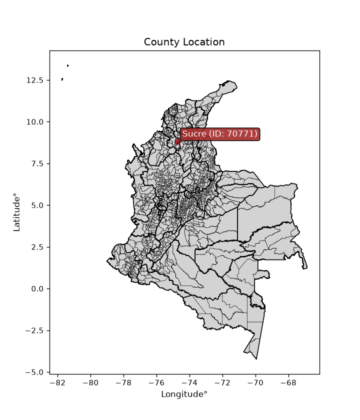
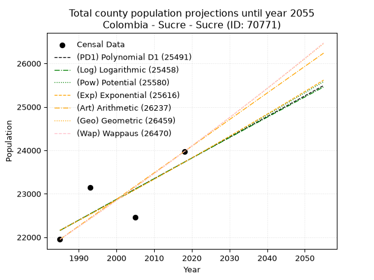
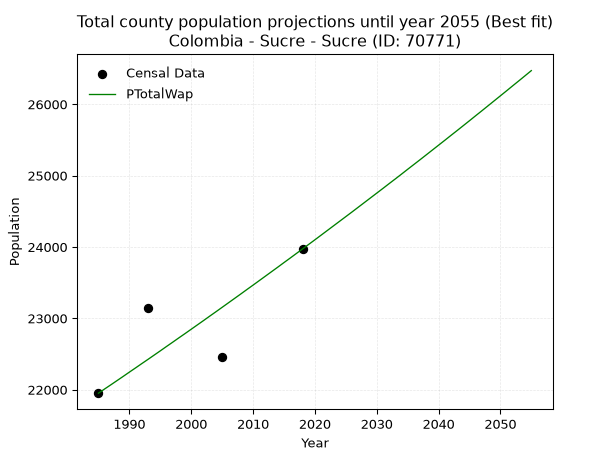
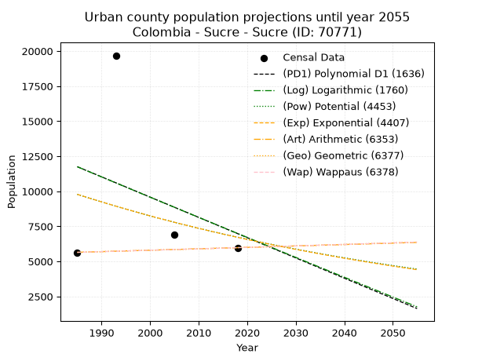
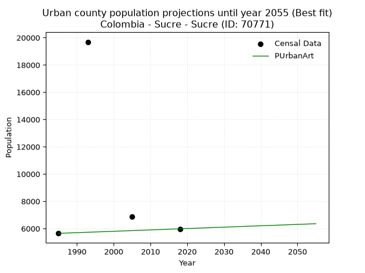
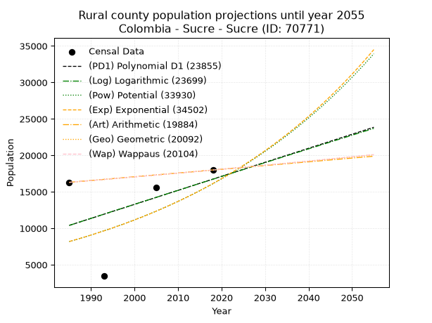
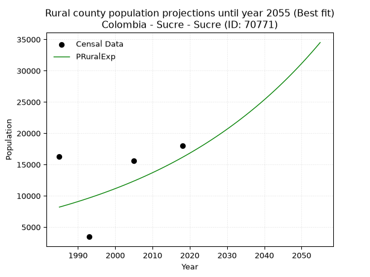

<div align="center">


</div>

# _“Population and Public Services Demand Projections (PPSD) until Year 2050 for Colombia - Sucre - Sucre (ID: 70771)”_
Keywords: `population` `public-service` `projection` `lineal` `polynomial` `logarithmic` `potential` `exponential` `arithmetic` `geometric` `wappaus` `dane` `colombia` `south-america`

PPSD are analytical estimates used by governments and planners to anticipate future changes in population size, age distribution, and the resulting community needs for utilities, healthcare, education, and infrastructure as sizing future water treatment facilities, electrical grids, and road networks based on spatial growth.

<div align="center">

</img>

</div>


> **General running parameters**: • app_version: _v20260806_. • Python version: _3.14.7_. • Pandas version: _3.0.5_. • NumPy version: _2.5.1_. • Creates, save and include plots into reports (create_plot): _False_. • Projection until year: _2050_. • Process polynomial degree 2 and up: _False_. • Process Wappaus: _True_. • Process Wappaus: _True_. • Set negative values to zero: _True_. • Set infinite values to zero: _True_. • Drop dataset notes: _True_. 
<div align="center">

Dynamic map: [:earth_americas:Google](http://maps.google.com/maps?q=8.811737361,-74.7231749) [:earth_americas:OSM](https://www.openstreetmap.org/#map=18/8.811737361/-74.7231749&layers=P) [:earth_americas:Bing](https://www.bing.com/maps?cp=8.811737361~-74.7231749&lvl=18) [:earth_americas:Apple](https://maps.apple.com/frame?center=8.811737361%2C-74.7231749&span=0.003%2C0.006)

</div>


<div align="center">

```geojson
{
  "type": "Feature",
  "geometry": {
    "type": "Point", 
    "coordinates": [-74.7231749, 8.811737361]
  }, 
  "properties": {
    "Name": "Colombia - Sucre - Sucre (ID: 70771)"
  }
}
```

</div>


## 0. Census Data (4 records)

Census data are official statistics collected by a government about the people and housing in a country. They usually include counts of total population, age, sex, race, income, education, and jobs.

📅Global census file: [Population.xlsx](../data/Population.xlsx)

| Source   |   Year |   CountryID | CountryName   |   StateID | StateName   |   CountyID | CountyName   |   PTotal |   PUrban |   PRural |
|:---------|-------:|------------:|:--------------|----------:|:------------|-----------:|:-------------|---------:|---------:|---------:|
| DANE     |   1985 |          57 | Colombia      |        70 | Sucre       |      70771 | Sucre        |    21950 |     5647 |    16303 |
| DANE     |   1993 |          57 | Colombia      |        70 | Sucre       |      70771 | Sucre        |    23139 |    19689 |     3450 |
| DANE     |   2005 |          57 | Colombia      |        70 | Sucre       |      70771 | Sucre        |    22463 |     6884 |    15579 |
| DANE     |   2018 |          57 | Colombia      |        70 | Sucre       |      70771 | Sucre        |    23971 |     5980 |    17991 |

> 🔥Some records could had specific notes about the registered values or the corresponding urban or rural distribution.

📅   [RUPS](https://www.datos.gov.co/Hacienda-y-Cr-dito-P-blico/Registro-nico-de-Prestadores-de-Servicios-P-blicos/4qkq-csdn/about_data) - Local public utility companies: [RUPS.csv](../data/RUPS.xlsx)

 | SERVICIO       | ESTADO    | NOMBRE                                                                                                           | NIT         | DEPARTAMENTO_DOMICILIO   | MUNICIPIO_DOMICILIO   | DIRECCION                  |   TELEFONO | EMAIL                             | TIPO_PRESTADOR                             | CLASIFICACION                 |
|:---------------|:----------|:-----------------------------------------------------------------------------------------------------------------|:------------|:-------------------------|:----------------------|:---------------------------|-----------:|:----------------------------------|:-------------------------------------------|:------------------------------|
| ACUEDUCTO      | OPERATIVA | EMPRESA INDUSTRIAL Y COMERCIAL DE AGUA POTABLE ALCANTARILLADO Y ASEO                                             | 823005290-8 | SUCRE                    | SUCRE                 | PALACIO MUNICIPAL          |    2879029 | acuasucre@yahoo.es                | EMPRESA INDUSTRIAL Y COMERCIAL DEL ESTADO  | HASTA 2500 SUSCRIPTORES       |
| ALCANTARILLADO | OPERATIVA | ACUEDUCTO ALCANTARILLADO Y ASEO DE SUCRE S.A. E.S.P.                                                             | 900296411-9 | CAUCA                    | SUCRE                 | carrera 2 No 1-21          |    8701801 | aaasucre@gmail.com                | SOCIEDADES (EMPRESA DE SERVICIOS PUBLICOS) | HASTA 2500 SUSCRIPTORES       |
| ACUEDUCTO      | OPERATIVA | EMPRESA DE SERVICIOS PUBLICOS DE ACUEDUCTO ALCANTARILLADO Y ASEO DESUCRE SUCRE SA ESP                            | 900367932-1 | SUCRE                    | SUCRE                 | CALLE 10 4 - 24            |    0000000 | aaadesucresucre@hotmail.com       | SOCIEDADES (EMPRESA DE SERVICIOS PUBLICOS) | MENOR O IGUAL A 2500 USUARIOS |
| ACUEDUCTO      | OPERATIVA | ASOCIACION DE USUARIOS DEL SERVICIOS DE ACUEDUCTO Y SANEAMIENTO BÁSICO DEL CORREGIMIENTO DE NARANJAL SUCRE       | 900597263-7 | SUCRE                    | SUCRE                 | calle 10 2 32              |    2000000 | acuanaran2013@hotmail.com         | ORGANIZACION AUTORIZADA                    | MENOR O IGUAL A 2500 USUARIOS |
| ACUEDUCTO      | OPERATIVA | ASOCIACIÓN DE USUARIOS DEL MICROACUEDUCTO DEL CORREGIMIENTO DE SAN LUIS SUCRE                                    | 900639952-5 | SUCRE                    | SUCRE                 | CALLE 2 5 155              |    0000000 | aguasdesanluis@outlook.com        | ORGANIZACION AUTORIZADA                    | MENOR O IGUAL A 2500 USUARIOS |
| ACUEDUCTO      | OPERATIVA | ASOCIACION DE USUARIOS DEL SERVICIO DE MICROACUEDUCTO DEL CORREGIMIENTO DE ARBOLEDA SUCRE                        | 900606514-0 | SUCRE                    | SUCRE                 | Calle 1 # 14 100           |    0000000 | acuaarbol2014@outlook.com         | ORGANIZACION AUTORIZADA                    | MENOR O IGUAL A 2500 USUARIOS |
| ACUEDUCTO      | OPERATIVA | ASOCIACIÓN DE USUARIOS DEL SERVICIO DE MICROACUEDUCTO Y SANEAMIENTO BÁSICO DEL CORREGIMIENTO DE SAN MATEO SUCRE  | 900795440-3 | SUCRE                    | SUCRE                 | Calle 1 # 2 122            |    0000000 | asoaguasanmateo@hotmail.com       | ORGANIZACION AUTORIZADA                    | MENOR O IGUAL A 2500 USUARIOS |
| ACUEDUCTO      | OPERATIVA | ASOCIACIÓN DE USUARIOS DE ACUEDUCTO Y SANEAMIENTO BÁSICO DEL CORREGIMIENTO DE OREJERO SUCRE                      | 900761850-3 | SUCRE                    | SUCRE                 | CALLE 2 CRA 3 28           |    0000000 | AGUASDELGUAMO@HOTMAIL.COM         | ORGANIZACION AUTORIZADA                    | MENOR O IGUAL A 2500 USUARIOS |
| ACUEDUCTO      | OPERATIVA | ASOCIACIÓN DE USUARIOS DEL SERVICIO DE MICROACUEDUCTO DEL CORREGIMIENTO DE CAMPO ALEGRE                          | 900779954-1 | SUCRE                    | SUCRE                 | CL 1 # 2 - 80              |    0000000 | asoaguascampo2014@hotmail.com     | ORGANIZACION AUTORIZADA                    | MENOR O IGUAL A 2500 USUARIOS |
| ACUEDUCTO      | OPERATIVA | ASOCIACION DE USUARIOS DEL ACUEDUCTO DE NARIÑO SUCRE                                                             | 900306025-3 | SUCRE                    | SUCRE                 | CRA 2 # 13 09              |    0000000 | acuenasdesucresucre@hotmail.com   | ORGANIZACION AUTORIZADA                    | MENOR O IGUAL A 2500 USUARIOS |
| ACUEDUCTO      | OPERATIVA | ASOCIACION DE USUARIOS DEL AGUA DEL CORREGIMIENTO DE SOLERA SUCRE                                                | 901379738-2 | SUCRE                    | SUCRE                 | calle 1 1 1                |    0000000 | asoaguasoldesucresucre@gmail.com  | ORGANIZACION AUTORIZADA                    | MENOR O IGUAL A 2500 USUARIOS |
| ACUEDUCTO      | OPERATIVA | ASOCIACION DE USUARIOS DE ACUEDUCTO Y SANEAMIENTO BASICO DEL CORREGIMIENTO DE HATONUEVO ARRIBA AGUAS EL PROGRESO | 901030227-1 | SUCRE                    | SUCRE                 | CORREGIMIENTO DE HATONUEVO |    0000000 | asousaprogresohatonuevo@gmail.com | ORGANIZACION AUTORIZADA                    | MENOR O IGUAL A 2500 USUARIOS |
| ACUEDUCTO      | OPERATIVA | EMPRESA DE SERVICIOS PUBLICOS DOMICILIARIOS Y ECOLOGICOS DE SUCRE S.A.S E.S.P                                    | 901364368-5 | SUCRE                    | SUCRE                 | CRA 4 No 6 - 41            |    0000000 | rimaaguas@gmail.com               | SOCIEDADES (EMPRESA DE SERVICIOS PUBLICOS) | MENOR O IGUAL A 2500 USUARIOS |

## 1. Total

### 1.1. Coefficients and Parameters

* (PD1) Polynomial Deg 1: 47.674427940585126, -72480.02448815538 (lineal)
* (Log) Logarithmic: 95389.04534373316, -702172.1480575522
* (Pow) Potential: 4.146925346564848, -9.33008180514965
* (Exp) Exponential: 0.002072516239456649, 362.11248720348163
* (Art) Arithmetic: Year diff. 2018 - 1985 = 33, Population diff. 23971 - 21950 = 2021, Annual growth = 61.24242424242424
* (Geo) Geometric: Year diff. 2018 - 1985 = 33, Population diff. 23971 - 21950 = 2021, Annual growth % = 0.0026725839982446598
* (Wap) Wappaus: i = 0.2667294886540983, Condition values only valid for < 200)

<sub>
Wappaus condition values: ['0.00', '0.27', '0.53', '0.80', '1.07', '1.33', '1.60', '1.87', '2.13', '2.40', '2.67', '2.93', '3.20', '3.47', '3.73', '4.00', '4.27', '4.53', '4.80', '5.07', '5.33', '5.60', '5.87', '6.13', '6.40', '6.67', '6.93', '7.20', '7.47', '7.74', '8.00', '8.27', '8.54', '8.80', '9.07', '9.34', '9.60', '9.87', '10.14', '10.40', '10.67', '10.94', '11.20', '11.47', '11.74', '12.00', '12.27', '12.54', '12.80', '13.07', '13.34', '13.60', '13.87', '14.14', '14.40', '14.67', '14.94', '15.20', '15.47', '15.74', '16.00', '16.27', '16.54', '16.80', '17.07', '17.34']
</sub>


### 1.2. Projected Dataset

|   Year |   CountyID |   PTotalPD1 |   PTotalLog |   PTotalPow |   PTotalExp |   PTotalArt |   PTotalGeo |   PTotalWap |
|-------:|-----------:|------------:|------------:|------------:|------------:|------------:|------------:|------------:|
|   1985 |      70771 |       22154 |       22153 |       22156 |       22157 |       21950 |       21950 |       21950 |
|   1986 |      70771 |       22201 |       22201 |       22202 |       22203 |       22011 |       22009 |       22009 |
|   1987 |      70771 |       22249 |       22249 |       22248 |       22249 |       22072 |       22067 |       22067 |
|   1988 |      70771 |       22297 |       22297 |       22295 |       22295 |       22134 |       22126 |       22126 |
|   1989 |      70771 |       22344 |       22345 |       22341 |       22341 |       22195 |       22186 |       22185 |
|   1990 |      70771 |       22392 |       22393 |       22388 |       22388 |       22256 |       22245 |       22245 |
|   1991 |      70771 |       22440 |       22440 |       22435 |       22434 |       22317 |       22304 |       22304 |
|   1992 |      70771 |       22487 |       22488 |       22481 |       22481 |       22379 |       22364 |       22364 |
|   1993 |      70771 |       22535 |       22536 |       22528 |       22527 |       22440 |       22424 |       22423 |
|   1994 |      70771 |       22583 |       22584 |       22575 |       22574 |       22501 |       22484 |       22483 |
|   1995 |      70771 |       22630 |       22632 |       22622 |       22621 |       22562 |       22544 |       22543 |
|   1996 |      70771 |       22678 |       22680 |       22669 |       22668 |       22624 |       22604 |       22604 |
|   1997 |      70771 |       22726 |       22727 |       22716 |       22715 |       22685 |       22664 |       22664 |
|   1998 |      70771 |       22773 |       22775 |       22764 |       22762 |       22746 |       22725 |       22725 |
|   1999 |      70771 |       22821 |       22823 |       22811 |       22809 |       22807 |       22786 |       22785 |
|   2000 |      70771 |       22869 |       22871 |       22858 |       22856 |       22869 |       22847 |       22846 |
|   2001 |      70771 |       22917 |       22918 |       22906 |       22904 |       22930 |       22908 |       22907 |
|   2002 |      70771 |       22964 |       22966 |       22953 |       22951 |       22991 |       22969 |       22968 |
|   2003 |      70771 |       23012 |       23014 |       23001 |       22999 |       23052 |       23030 |       23030 |
|   2004 |      70771 |       23060 |       23061 |       23048 |       23047 |       23114 |       23092 |       23091 |
|   2005 |      70771 |       23107 |       23109 |       23096 |       23095 |       23175 |       23154 |       23153 |
|   2006 |      70771 |       23155 |       23156 |       23144 |       23142 |       23236 |       23215 |       23215 |
|   2007 |      70771 |       23203 |       23204 |       23192 |       23190 |       23297 |       23277 |       23277 |
|   2008 |      70771 |       23250 |       23251 |       23240 |       23239 |       23359 |       23340 |       23339 |
|   2009 |      70771 |       23298 |       23299 |       23288 |       23287 |       23420 |       23402 |       23402 |
|   2010 |      70771 |       23346 |       23346 |       23336 |       23335 |       23481 |       23465 |       23464 |
|   2011 |      70771 |       23393 |       23394 |       23384 |       23383 |       23542 |       23527 |       23527 |
|   2012 |      70771 |       23441 |       23441 |       23432 |       23432 |       23604 |       23590 |       23590 |
|   2013 |      70771 |       23489 |       23489 |       23481 |       23481 |       23665 |       23653 |       23653 |
|   2014 |      70771 |       23536 |       23536 |       23529 |       23529 |       23726 |       23716 |       23716 |
|   2015 |      70771 |       23584 |       23583 |       23578 |       23578 |       23787 |       23780 |       23780 |
|   2016 |      70771 |       23632 |       23631 |       23626 |       23627 |       23849 |       23843 |       23843 |
|   2017 |      70771 |       23679 |       23678 |       23675 |       23676 |       23910 |       23907 |       23907 |
|   2018 |      70771 |       23727 |       23725 |       23724 |       23725 |       23971 |       23971 |       23971 |
|   2019 |      70771 |       23775 |       23773 |       23772 |       23774 |       24032 |       24035 |       24035 |
|   2020 |      70771 |       23822 |       23820 |       23821 |       23824 |       24093 |       24099 |       24099 |
|   2021 |      70771 |       23870 |       23867 |       23870 |       23873 |       24155 |       24164 |       24164 |
|   2022 |      70771 |       23918 |       23914 |       23919 |       23923 |       24216 |       24228 |       24229 |
|   2023 |      70771 |       23965 |       23961 |       23968 |       23972 |       24277 |       24293 |       24294 |
|   2024 |      70771 |       24013 |       24009 |       24017 |       24022 |       24338 |       24358 |       24359 |
|   2025 |      70771 |       24061 |       24056 |       24067 |       24072 |       24400 |       24423 |       24424 |
|   2026 |      70771 |       24108 |       24103 |       24116 |       24122 |       24461 |       24488 |       24489 |
|   2027 |      70771 |       24156 |       24150 |       24165 |       24172 |       24522 |       24554 |       24555 |
|   2028 |      70771 |       24204 |       24197 |       24215 |       24222 |       24583 |       24619 |       24621 |
|   2029 |      70771 |       24251 |       24244 |       24264 |       24272 |       24645 |       24685 |       24687 |
|   2030 |      70771 |       24299 |       24291 |       24314 |       24323 |       24706 |       24751 |       24753 |
|   2031 |      70771 |       24347 |       24338 |       24364 |       24373 |       24767 |       24817 |       24819 |
|   2032 |      70771 |       24394 |       24385 |       24414 |       24424 |       24828 |       24884 |       24886 |
|   2033 |      70771 |       24442 |       24432 |       24463 |       24474 |       24890 |       24950 |       24952 |
|   2034 |      70771 |       24490 |       24479 |       24513 |       24525 |       24951 |       25017 |       25019 |
|   2035 |      70771 |       24537 |       24526 |       24563 |       24576 |       25012 |       25084 |       25087 |
|   2036 |      70771 |       24585 |       24572 |       24613 |       24627 |       25073 |       25151 |       25154 |
|   2037 |      70771 |       24633 |       24619 |       24664 |       24678 |       25135 |       25218 |       25221 |
|   2038 |      70771 |       24680 |       24666 |       24714 |       24729 |       25196 |       25285 |       25289 |
|   2039 |      70771 |       24728 |       24713 |       24764 |       24781 |       25257 |       25353 |       25357 |
|   2040 |      70771 |       24776 |       24760 |       24815 |       24832 |       25318 |       25421 |       25425 |
|   2041 |      70771 |       24823 |       24806 |       24865 |       24884 |       25380 |       25489 |       25493 |
|   2042 |      70771 |       24871 |       24853 |       24916 |       24935 |       25441 |       25557 |       25562 |
|   2043 |      70771 |       24919 |       24900 |       24966 |       24987 |       25502 |       25625 |       25630 |
|   2044 |      70771 |       24967 |       24946 |       25017 |       25039 |       25563 |       25694 |       25699 |
|   2045 |      70771 |       25014 |       24993 |       25068 |       25091 |       25625 |       25762 |       25768 |
|   2046 |      70771 |       25062 |       25040 |       25119 |       25143 |       25686 |       25831 |       25838 |
|   2047 |      70771 |       25110 |       25086 |       25170 |       25195 |       25747 |       25900 |       25907 |
|   2048 |      70771 |       25157 |       25133 |       25221 |       25247 |       25808 |       25969 |       25977 |
|   2049 |      70771 |       25205 |       25180 |       25272 |       25300 |       25870 |       26039 |       26047 |
|   2050 |      70771 |       25253 |       25226 |       25323 |       25352 |       25931 |       26108 |       26117 |
<div align="center">

</img>

</div>


### 1.3. Best fit with absolute and relative error (%)

Relative error puts that difference into context by dividing the absolute error by the true value, creating a unitless ratio or percentage that shows the scale of the mistake.

Absolute and relative error

|   Year | Source   |   CountryID | CountryName   |   StateID | StateName   |   CountyID_x | CountyName   |   PTotal |   PUrban |   PRural |   CountyID_y |   PTotalPD1 |   PTotalLog |   PTotalPow |   PTotalExp |   PTotalArt |   PTotalGeo |   PTotalWap |   PTotalPD1AbsError |   PTotalLogAbsError |   PTotalPowAbsError |   PTotalExpAbsError |   PTotalArtAbsError |   PTotalGeoAbsError |   PTotalWapAbsError |   PTotalPD1RelError |   PTotalLogRelError |   PTotalPowRelError |   PTotalExpRelError |   PTotalArtRelError |   PTotalGeoRelError |   PTotalWapRelError |
|-------:|:---------|------------:|:--------------|----------:|:------------|-------------:|:-------------|---------:|---------:|---------:|-------------:|------------:|------------:|------------:|------------:|------------:|------------:|------------:|--------------------:|--------------------:|--------------------:|--------------------:|--------------------:|--------------------:|--------------------:|--------------------:|--------------------:|--------------------:|--------------------:|--------------------:|--------------------:|--------------------:|
|   1985 | DANE     |          57 | Colombia      |        70 | Sucre       |        70771 | Sucre        |    21950 |     5647 |    16303 |        70771 |       22154 |       22153 |       22156 |       22157 |       21950 |       21950 |       21950 |                 204 |                 203 |                 206 |                 207 |                   0 |                   0 |                   0 |            0.929385 |            0.924829 |            0.938497 |            0.943052 |             0       |             0       |             0       |
|   1993 | DANE     |          57 | Colombia      |        70 | Sucre       |        70771 | Sucre        |    23139 |    19689 |     3450 |        70771 |       22535 |       22536 |       22528 |       22527 |       22440 |       22424 |       22423 |                 604 |                 603 |                 611 |                 612 |                 699 |                 715 |                 716 |            2.61031  |            2.60599  |            2.64056  |            2.64489  |             3.02087 |             3.09002 |             3.09434 |
|   2005 | DANE     |          57 | Colombia      |        70 | Sucre       |        70771 | Sucre        |    22463 |     6884 |    15579 |        70771 |       23107 |       23109 |       23096 |       23095 |       23175 |       23154 |       23153 |                 644 |                 646 |                 633 |                 632 |                 712 |                 691 |                 690 |            2.86694  |            2.87584  |            2.81797  |            2.81352  |             3.16966 |             3.07617 |             3.07172 |
|   2018 | DANE     |          57 | Colombia      |        70 | Sucre       |        70771 | Sucre        |    23971 |     5980 |    17991 |        70771 |       23727 |       23725 |       23724 |       23725 |       23971 |       23971 |       23971 |                 244 |                 246 |                 247 |                 246 |                   0 |                   0 |                   0 |            1.0179   |            1.02624  |            1.03041  |            1.02624  |             0       |             0       |             0       |

Relative error mean

| Method    |   RelError | Best   |
|:----------|-----------:|:-------|
| PTotalPD1 |    1.85613 |        |
| PTotalLog |    1.85822 |        |
| PTotalPow |    1.85686 |        |
| PTotalExp |    1.85692 |        |
| PTotalArt |    1.54763 |        |
| PTotalGeo |    1.54155 |        |
| PTotalWap |    1.54152 | True   |

💙Best method: _**PTotalWap**_
<div align="center">

</img>

</div>


### 1.4. Fresh water supply demand in liters per capita per day (lpcd)

The fresh water supply demand typically ranges from 100 to 300 liters per capita per day (lpcd) for standard domestic and municipal planning, though absolute survival minimums set by the World Health Organization are as low as 7.5 to 20 liters per day, and total consumption in high-income nations can exceed 400 liters.

> `CZ`: Level in meters above the sea level (masl)<br> `WS`: Fresh water supply demand in liters per capita per day (lpcd or l/h/d)<br> `WSAll`: Zonal fresh water supply demand in liters per second (l/s)<br> `A`: Zonal area in square meters<br> `DP`: Population density (people/hectare or p/ha)

Reference values (RAS Colombia)

|    CZ |   WS |
|------:|-----:|
|  1000 |  120 |
|  2000 |  130 |
| 99999 |  140 |

County shapefile geometry properties and water supply values

|   CountyID |      ATotal |   CZTotal |   WSTotal |
|-----------:|------------:|----------:|----------:|
|      70771 | 1.13033e+09 |   17.5255 |       120 |

Projected values for best method: PTotalWap

|   CountyID |   Year |   PTotalWap |   DPTotal |   WSTotal |   WSTotalAll |
|-----------:|-------:|------------:|----------:|----------:|-------------:|
|      70771 |   1985 |       21950 |      0.19 |       120 |      30.4861 |
|      70771 |   1986 |       22009 |      0.19 |       120 |      30.5681 |
|      70771 |   1987 |       22067 |      0.2  |       120 |      30.6486 |
|      70771 |   1988 |       22126 |      0.2  |       120 |      30.7306 |
|      70771 |   1989 |       22185 |      0.2  |       120 |      30.8125 |
|      70771 |   1990 |       22245 |      0.2  |       120 |      30.8958 |
|      70771 |   1991 |       22304 |      0.2  |       120 |      30.9778 |
|      70771 |   1992 |       22364 |      0.2  |       120 |      31.0611 |
|      70771 |   1993 |       22423 |      0.2  |       120 |      31.1431 |
|      70771 |   1994 |       22483 |      0.2  |       120 |      31.2264 |
|      70771 |   1995 |       22543 |      0.2  |       120 |      31.3097 |
|      70771 |   1996 |       22604 |      0.2  |       120 |      31.3944 |
|      70771 |   1997 |       22664 |      0.2  |       120 |      31.4778 |
|      70771 |   1998 |       22725 |      0.2  |       120 |      31.5625 |
|      70771 |   1999 |       22785 |      0.2  |       120 |      31.6458 |
|      70771 |   2000 |       22846 |      0.2  |       120 |      31.7306 |
|      70771 |   2001 |       22907 |      0.2  |       120 |      31.8153 |
|      70771 |   2002 |       22968 |      0.2  |       120 |      31.9    |
|      70771 |   2003 |       23030 |      0.2  |       120 |      31.9861 |
|      70771 |   2004 |       23091 |      0.2  |       120 |      32.0708 |
|      70771 |   2005 |       23153 |      0.2  |       120 |      32.1569 |
|      70771 |   2006 |       23215 |      0.21 |       120 |      32.2431 |
|      70771 |   2007 |       23277 |      0.21 |       120 |      32.3292 |
|      70771 |   2008 |       23339 |      0.21 |       120 |      32.4153 |
|      70771 |   2009 |       23402 |      0.21 |       120 |      32.5028 |
|      70771 |   2010 |       23464 |      0.21 |       120 |      32.5889 |
|      70771 |   2011 |       23527 |      0.21 |       120 |      32.6764 |
|      70771 |   2012 |       23590 |      0.21 |       120 |      32.7639 |
|      70771 |   2013 |       23653 |      0.21 |       120 |      32.8514 |
|      70771 |   2014 |       23716 |      0.21 |       120 |      32.9389 |
|      70771 |   2015 |       23780 |      0.21 |       120 |      33.0278 |
|      70771 |   2016 |       23843 |      0.21 |       120 |      33.1153 |
|      70771 |   2017 |       23907 |      0.21 |       120 |      33.2042 |
|      70771 |   2018 |       23971 |      0.21 |       120 |      33.2931 |
|      70771 |   2019 |       24035 |      0.21 |       120 |      33.3819 |
|      70771 |   2020 |       24099 |      0.21 |       120 |      33.4708 |
|      70771 |   2021 |       24164 |      0.21 |       120 |      33.5611 |
|      70771 |   2022 |       24229 |      0.21 |       120 |      33.6514 |
|      70771 |   2023 |       24294 |      0.21 |       120 |      33.7417 |
|      70771 |   2024 |       24359 |      0.22 |       120 |      33.8319 |
|      70771 |   2025 |       24424 |      0.22 |       120 |      33.9222 |
|      70771 |   2026 |       24489 |      0.22 |       120 |      34.0125 |
|      70771 |   2027 |       24555 |      0.22 |       120 |      34.1042 |
|      70771 |   2028 |       24621 |      0.22 |       120 |      34.1958 |
|      70771 |   2029 |       24687 |      0.22 |       120 |      34.2875 |
|      70771 |   2030 |       24753 |      0.22 |       120 |      34.3792 |
|      70771 |   2031 |       24819 |      0.22 |       120 |      34.4708 |
|      70771 |   2032 |       24886 |      0.22 |       120 |      34.5639 |
|      70771 |   2033 |       24952 |      0.22 |       120 |      34.6556 |
|      70771 |   2034 |       25019 |      0.22 |       120 |      34.7486 |
|      70771 |   2035 |       25087 |      0.22 |       120 |      34.8431 |
|      70771 |   2036 |       25154 |      0.22 |       120 |      34.9361 |
|      70771 |   2037 |       25221 |      0.22 |       120 |      35.0292 |
|      70771 |   2038 |       25289 |      0.22 |       120 |      35.1236 |
|      70771 |   2039 |       25357 |      0.22 |       120 |      35.2181 |
|      70771 |   2040 |       25425 |      0.22 |       120 |      35.3125 |
|      70771 |   2041 |       25493 |      0.23 |       120 |      35.4069 |
|      70771 |   2042 |       25562 |      0.23 |       120 |      35.5028 |
|      70771 |   2043 |       25630 |      0.23 |       120 |      35.5972 |
|      70771 |   2044 |       25699 |      0.23 |       120 |      35.6931 |
|      70771 |   2045 |       25768 |      0.23 |       120 |      35.7889 |
|      70771 |   2046 |       25838 |      0.23 |       120 |      35.8861 |
|      70771 |   2047 |       25907 |      0.23 |       120 |      35.9819 |
|      70771 |   2048 |       25977 |      0.23 |       120 |      36.0792 |
|      70771 |   2049 |       26047 |      0.23 |       120 |      36.1764 |
|      70771 |   2050 |       26117 |      0.23 |       120 |      36.2736 |

## 2. Urban

### 2.1. Coefficients and Parameters

* (PD1) Polynomial Deg 1: -144.54917703733318, 298684.49136892566 (lineal)
* (Log) Logarithmic: -288281.2254106755, 2200777.904487302
* (Pow) Potential: -22.709219334708088, 78.8800010997558
* (Exp) Exponential: -0.011396096057320936, 65298988557716.04
* (Art) Arithmetic: Year diff. 2018 - 1985 = 33, Population diff. 5980 - 5647 = 333, Annual growth = 10.090909090909092
* (Geo) Geometric: Year diff. 2018 - 1985 = 33, Population diff. 5980 - 5647 = 333, Annual growth % = 0.0017377547328085718
* (Wap) Wappaus: i = 0.17357717538331627, Condition values only valid for < 200)

<sub>
Wappaus condition values: ['0.00', '0.17', '0.35', '0.52', '0.69', '0.87', '1.04', '1.22', '1.39', '1.56', '1.74', '1.91', '2.08', '2.26', '2.43', '2.60', '2.78', '2.95', '3.12', '3.30', '3.47', '3.65', '3.82', '3.99', '4.17', '4.34', '4.51', '4.69', '4.86', '5.03', '5.21', '5.38', '5.55', '5.73', '5.90', '6.08', '6.25', '6.42', '6.60', '6.77', '6.94', '7.12', '7.29', '7.46', '7.64', '7.81', '7.98', '8.16', '8.33', '8.51', '8.68', '8.85', '9.03', '9.20', '9.37', '9.55', '9.72', '9.89', '10.07', '10.24', '10.41', '10.59', '10.76', '10.94', '11.11', '11.28']
</sub>


### 2.2. Projected Dataset

|   Year |   CountyID |   PUrbanPD1 |   PUrbanLog |   PUrbanPow |   PUrbanExp |   PUrbanArt |   PUrbanGeo |   PUrbanWap |
|-------:|-----------:|------------:|------------:|------------:|------------:|------------:|------------:|------------:|
|   1985 |      70771 |       11754 |       11751 |        9782 |        9786 |        5647 |        5647 |        5647 |
|   1986 |      70771 |       11610 |       11605 |        9671 |        9675 |        5657 |        5657 |        5657 |
|   1987 |      70771 |       11465 |       11460 |        9561 |        9566 |        5667 |        5667 |        5667 |
|   1988 |      70771 |       11321 |       11315 |        9452 |        9457 |        5677 |        5676 |        5676 |
|   1989 |      70771 |       11176 |       11170 |        9345 |        9350 |        5687 |        5686 |        5686 |
|   1990 |      70771 |       11032 |       11025 |        9239 |        9244 |        5697 |        5696 |        5696 |
|   1991 |      70771 |       10887 |       10881 |        9134 |        9140 |        5708 |        5706 |        5706 |
|   1992 |      70771 |       10743 |       10736 |        9031 |        9036 |        5718 |        5716 |        5716 |
|   1993 |      70771 |       10598 |       10591 |        8928 |        8934 |        5728 |        5726 |        5726 |
|   1994 |      70771 |       10453 |       10447 |        8827 |        8832 |        5738 |        5736 |        5736 |
|   1995 |      70771 |       10309 |       10302 |        8727 |        8732 |        5748 |        5746 |        5746 |
|   1996 |      70771 |       10164 |       10158 |        8628 |        8633 |        5758 |        5756 |        5756 |
|   1997 |      70771 |       10020 |       10013 |        8531 |        8536 |        5768 |        5766 |        5766 |
|   1998 |      70771 |        9875 |        9869 |        8434 |        8439 |        5778 |        5776 |        5776 |
|   1999 |      70771 |        9731 |        9725 |        8339 |        8343 |        5788 |        5786 |        5786 |
|   2000 |      70771 |        9586 |        9580 |        8245 |        8249 |        5798 |        5796 |        5796 |
|   2001 |      70771 |        9442 |        9436 |        8152 |        8155 |        5808 |        5806 |        5806 |
|   2002 |      70771 |        9297 |        9292 |        8060 |        8063 |        5819 |        5816 |        5816 |
|   2003 |      70771 |        9152 |        9148 |        7969 |        7971 |        5829 |        5826 |        5826 |
|   2004 |      70771 |        9008 |        9004 |        7879 |        7881 |        5839 |        5836 |        5836 |
|   2005 |      70771 |        8863 |        8861 |        7790 |        7792 |        5849 |        5847 |        5847 |
|   2006 |      70771 |        8719 |        8717 |        7703 |        7703 |        5859 |        5857 |        5857 |
|   2007 |      70771 |        8574 |        8573 |        7616 |        7616 |        5869 |        5867 |        5867 |
|   2008 |      70771 |        8430 |        8430 |        7530 |        7530 |        5879 |        5877 |        5877 |
|   2009 |      70771 |        8285 |        8286 |        7446 |        7445 |        5889 |        5887 |        5887 |
|   2010 |      70771 |        8141 |        8143 |        7362 |        7360 |        5899 |        5898 |        5897 |
|   2011 |      70771 |        7996 |        7999 |        7279 |        7277 |        5909 |        5908 |        5908 |
|   2012 |      70771 |        7852 |        7856 |        7198 |        7194 |        5919 |        5918 |        5918 |
|   2013 |      70771 |        7707 |        7713 |        7117 |        7113 |        5930 |        5928 |        5928 |
|   2014 |      70771 |        7562 |        7569 |        7037 |        7032 |        5940 |        5939 |        5939 |
|   2015 |      70771 |        7418 |        7426 |        6958 |        6953 |        5950 |        5949 |        5949 |
|   2016 |      70771 |        7273 |        7283 |        6880 |        6874 |        5960 |        5959 |        5959 |
|   2017 |      70771 |        7129 |        7140 |        6803 |        6796 |        5970 |        5970 |        5970 |
|   2018 |      70771 |        6984 |        6998 |        6727 |        6719 |        5980 |        5980 |        5980 |
|   2019 |      70771 |        6840 |        6855 |        6652 |        6643 |        5990 |        5990 |        5990 |
|   2020 |      70771 |        6695 |        6712 |        6577 |        6567 |        6000 |        6001 |        6001 |
|   2021 |      70771 |        6551 |        6569 |        6504 |        6493 |        6010 |        6011 |        6011 |
|   2022 |      70771 |        6406 |        6427 |        6431 |        6419 |        6020 |        6022 |        6022 |
|   2023 |      70771 |        6262 |        6284 |        6359 |        6347 |        6030 |        6032 |        6032 |
|   2024 |      70771 |        6117 |        6142 |        6288 |        6275 |        6041 |        6043 |        6043 |
|   2025 |      70771 |        5972 |        5999 |        6218 |        6204 |        6051 |        6053 |        6053 |
|   2026 |      70771 |        5828 |        5857 |        6149 |        6133 |        6061 |        6064 |        6064 |
|   2027 |      70771 |        5683 |        5715 |        6080 |        6064 |        6071 |        6074 |        6074 |
|   2028 |      70771 |        5539 |        5572 |        6013 |        5995 |        6081 |        6085 |        6085 |
|   2029 |      70771 |        5394 |        5430 |        5946 |        5927 |        6091 |        6095 |        6095 |
|   2030 |      70771 |        5250 |        5288 |        5880 |        5860 |        6101 |        6106 |        6106 |
|   2031 |      70771 |        5105 |        5146 |        5814 |        5794 |        6111 |        6117 |        6117 |
|   2032 |      70771 |        4961 |        5004 |        5750 |        5728 |        6121 |        6127 |        6127 |
|   2033 |      70771 |        4816 |        4863 |        5686 |        5663 |        6131 |        6138 |        6138 |
|   2034 |      70771 |        4671 |        4721 |        5623 |        5599 |        6141 |        6148 |        6149 |
|   2035 |      70771 |        4527 |        4579 |        5560 |        5536 |        6152 |        6159 |        6159 |
|   2036 |      70771 |        4382 |        4438 |        5498 |        5473 |        6162 |        6170 |        6170 |
|   2037 |      70771 |        4238 |        4296 |        5437 |        5411 |        6172 |        6181 |        6181 |
|   2038 |      70771 |        4093 |        4154 |        5377 |        5349 |        6182 |        6191 |        6192 |
|   2039 |      70771 |        3949 |        4013 |        5318 |        5289 |        6192 |        6202 |        6202 |
|   2040 |      70771 |        3804 |        3872 |        5259 |        5229 |        6202 |        6213 |        6213 |
|   2041 |      70771 |        3660 |        3730 |        5201 |        5170 |        6212 |        6224 |        6224 |
|   2042 |      70771 |        3515 |        3589 |        5143 |        5111 |        6222 |        6234 |        6235 |
|   2043 |      70771 |        3371 |        3448 |        5086 |        5053 |        6232 |        6245 |        6246 |
|   2044 |      70771 |        3226 |        3307 |        5030 |        4996 |        6242 |        6256 |        6257 |
|   2045 |      70771 |        3081 |        3166 |        4974 |        4939 |        6252 |        6267 |        6267 |
|   2046 |      70771 |        2937 |        3025 |        4919 |        4883 |        6263 |        6278 |        6278 |
|   2047 |      70771 |        2792 |        2884 |        4865 |        4828 |        6273 |        6289 |        6289 |
|   2048 |      70771 |        2648 |        2743 |        4812 |        4773 |        6283 |        6300 |        6300 |
|   2049 |      70771 |        2503 |        2603 |        4758 |        4719 |        6293 |        6311 |        6311 |
|   2050 |      70771 |        2359 |        2462 |        4706 |        4666 |        6303 |        6322 |        6322 |
<div align="center">

</img>

</div>


### 2.3. Best fit with absolute and relative error (%)

Relative error puts that difference into context by dividing the absolute error by the true value, creating a unitless ratio or percentage that shows the scale of the mistake.

Absolute and relative error

|   Year | Source   |   CountryID | CountryName   |   StateID | StateName   |   CountyID_x | CountyName   |   PTotal |   PUrban |   PRural |   CountyID_y |   PUrbanPD1 |   PUrbanLog |   PUrbanPow |   PUrbanExp |   PUrbanArt |   PUrbanGeo |   PUrbanWap |   PUrbanPD1AbsError |   PUrbanLogAbsError |   PUrbanPowAbsError |   PUrbanExpAbsError |   PUrbanArtAbsError |   PUrbanGeoAbsError |   PUrbanWapAbsError |   PUrbanPD1RelError |   PUrbanLogRelError |   PUrbanPowRelError |   PUrbanExpRelError |   PUrbanArtRelError |   PUrbanGeoRelError |   PUrbanWapRelError |
|-------:|:---------|------------:|:--------------|----------:|:------------|-------------:|:-------------|---------:|---------:|---------:|-------------:|------------:|------------:|------------:|------------:|------------:|------------:|------------:|--------------------:|--------------------:|--------------------:|--------------------:|--------------------:|--------------------:|--------------------:|--------------------:|--------------------:|--------------------:|--------------------:|--------------------:|--------------------:|--------------------:|
|   1985 | DANE     |          57 | Colombia      |        70 | Sucre       |        70771 | Sucre        |    21950 |     5647 |    16303 |        70771 |       11754 |       11751 |        9782 |        9786 |        5647 |        5647 |        5647 |                6107 |                6104 |                4135 |                4139 |                   0 |                   0 |                   0 |            108.146  |            108.093  |             73.2247 |             73.2956 |              0      |              0      |              0      |
|   1993 | DANE     |          57 | Colombia      |        70 | Sucre       |        70771 | Sucre        |    23139 |    19689 |     3450 |        70771 |       10598 |       10591 |        8928 |        8934 |        5728 |        5726 |        5726 |                9091 |                9098 |               10761 |               10755 |               13961 |               13963 |               13963 |             46.173  |             46.2085 |             54.6549 |             54.6244 |             70.9076 |             70.9178 |             70.9178 |
|   2005 | DANE     |          57 | Colombia      |        70 | Sucre       |        70771 | Sucre        |    22463 |     6884 |    15579 |        70771 |        8863 |        8861 |        7790 |        7792 |        5849 |        5847 |        5847 |                1979 |                1977 |                 906 |                 908 |                1035 |                1037 |                1037 |             28.7478 |             28.7188 |             13.161  |             13.19   |             15.0349 |             15.0639 |             15.0639 |
|   2018 | DANE     |          57 | Colombia      |        70 | Sucre       |        70771 | Sucre        |    23971 |     5980 |    17991 |        70771 |        6984 |        6998 |        6727 |        6719 |        5980 |        5980 |        5980 |                1004 |                1018 |                 747 |                 739 |                   0 |                   0 |                   0 |             16.7893 |             17.0234 |             12.4916 |             12.3579 |              0      |              0      |              0      |

Relative error mean

| Method    |   RelError | Best   |
|:----------|-----------:|:-------|
| PUrbanPD1 |    49.964  |        |
| PUrbanLog |    50.0109 |        |
| PUrbanPow |    38.383  |        |
| PUrbanExp |    38.367  |        |
| PUrbanArt |    21.4856 | True   |
| PUrbanGeo |    21.4954 |        |
| PUrbanWap |    21.4954 |        |

💙Best method: _**PUrbanArt**_
<div align="center">

</img>

</div>


### 2.4. Fresh water supply demand in liters per capita per day (lpcd)

The fresh water supply demand typically ranges from 100 to 300 liters per capita per day (lpcd) for standard domestic and municipal planning, though absolute survival minimums set by the World Health Organization are as low as 7.5 to 20 liters per day, and total consumption in high-income nations can exceed 400 liters.

> `CZ`: Level in meters above the sea level (masl)<br> `WS`: Fresh water supply demand in liters per capita per day (lpcd or l/h/d)<br> `WSAll`: Zonal fresh water supply demand in liters per second (l/s)<br> `A`: Zonal area in square meters<br> `DP`: Population density (people/hectare or p/ha)

Reference values (RAS Colombia)

|    CZ |   WS |
|------:|-----:|
|  1000 |  120 |
|  2000 |  130 |
| 99999 |  140 |

County shapefile geometry properties and water supply values

|   CountyID |      AUrban |   CZUrban |   WSUrban |
|-----------:|------------:|----------:|----------:|
|      70771 | 1.25703e+06 |   19.0607 |       120 |

Projected values for best method: PUrbanArt

|   CountyID |   Year |   PUrbanArt |   DPUrban |   WSUrban |   WSUrbanAll |
|-----------:|-------:|------------:|----------:|----------:|-------------:|
|      70771 |   1985 |        5647 |     44.92 |       120 |      7.84306 |
|      70771 |   1986 |        5657 |     45    |       120 |      7.85694 |
|      70771 |   1987 |        5667 |     45.08 |       120 |      7.87083 |
|      70771 |   1988 |        5677 |     45.16 |       120 |      7.88472 |
|      70771 |   1989 |        5687 |     45.24 |       120 |      7.89861 |
|      70771 |   1990 |        5697 |     45.32 |       120 |      7.9125  |
|      70771 |   1991 |        5708 |     45.41 |       120 |      7.92778 |
|      70771 |   1992 |        5718 |     45.49 |       120 |      7.94167 |
|      70771 |   1993 |        5728 |     45.57 |       120 |      7.95556 |
|      70771 |   1994 |        5738 |     45.65 |       120 |      7.96944 |
|      70771 |   1995 |        5748 |     45.73 |       120 |      7.98333 |
|      70771 |   1996 |        5758 |     45.81 |       120 |      7.99722 |
|      70771 |   1997 |        5768 |     45.89 |       120 |      8.01111 |
|      70771 |   1998 |        5778 |     45.97 |       120 |      8.025   |
|      70771 |   1999 |        5788 |     46.05 |       120 |      8.03889 |
|      70771 |   2000 |        5798 |     46.12 |       120 |      8.05278 |
|      70771 |   2001 |        5808 |     46.2  |       120 |      8.06667 |
|      70771 |   2002 |        5819 |     46.29 |       120 |      8.08194 |
|      70771 |   2003 |        5829 |     46.37 |       120 |      8.09583 |
|      70771 |   2004 |        5839 |     46.45 |       120 |      8.10972 |
|      70771 |   2005 |        5849 |     46.53 |       120 |      8.12361 |
|      70771 |   2006 |        5859 |     46.61 |       120 |      8.1375  |
|      70771 |   2007 |        5869 |     46.69 |       120 |      8.15139 |
|      70771 |   2008 |        5879 |     46.77 |       120 |      8.16528 |
|      70771 |   2009 |        5889 |     46.85 |       120 |      8.17917 |
|      70771 |   2010 |        5899 |     46.93 |       120 |      8.19306 |
|      70771 |   2011 |        5909 |     47.01 |       120 |      8.20694 |
|      70771 |   2012 |        5919 |     47.09 |       120 |      8.22083 |
|      70771 |   2013 |        5930 |     47.17 |       120 |      8.23611 |
|      70771 |   2014 |        5940 |     47.25 |       120 |      8.25    |
|      70771 |   2015 |        5950 |     47.33 |       120 |      8.26389 |
|      70771 |   2016 |        5960 |     47.41 |       120 |      8.27778 |
|      70771 |   2017 |        5970 |     47.49 |       120 |      8.29167 |
|      70771 |   2018 |        5980 |     47.57 |       120 |      8.30556 |
|      70771 |   2019 |        5990 |     47.65 |       120 |      8.31944 |
|      70771 |   2020 |        6000 |     47.73 |       120 |      8.33333 |
|      70771 |   2021 |        6010 |     47.81 |       120 |      8.34722 |
|      70771 |   2022 |        6020 |     47.89 |       120 |      8.36111 |
|      70771 |   2023 |        6030 |     47.97 |       120 |      8.375   |
|      70771 |   2024 |        6041 |     48.06 |       120 |      8.39028 |
|      70771 |   2025 |        6051 |     48.14 |       120 |      8.40417 |
|      70771 |   2026 |        6061 |     48.22 |       120 |      8.41806 |
|      70771 |   2027 |        6071 |     48.3  |       120 |      8.43194 |
|      70771 |   2028 |        6081 |     48.38 |       120 |      8.44583 |
|      70771 |   2029 |        6091 |     48.46 |       120 |      8.45972 |
|      70771 |   2030 |        6101 |     48.54 |       120 |      8.47361 |
|      70771 |   2031 |        6111 |     48.61 |       120 |      8.4875  |
|      70771 |   2032 |        6121 |     48.69 |       120 |      8.50139 |
|      70771 |   2033 |        6131 |     48.77 |       120 |      8.51528 |
|      70771 |   2034 |        6141 |     48.85 |       120 |      8.52917 |
|      70771 |   2035 |        6152 |     48.94 |       120 |      8.54444 |
|      70771 |   2036 |        6162 |     49.02 |       120 |      8.55833 |
|      70771 |   2037 |        6172 |     49.1  |       120 |      8.57222 |
|      70771 |   2038 |        6182 |     49.18 |       120 |      8.58611 |
|      70771 |   2039 |        6192 |     49.26 |       120 |      8.6     |
|      70771 |   2040 |        6202 |     49.34 |       120 |      8.61389 |
|      70771 |   2041 |        6212 |     49.42 |       120 |      8.62778 |
|      70771 |   2042 |        6222 |     49.5  |       120 |      8.64167 |
|      70771 |   2043 |        6232 |     49.58 |       120 |      8.65556 |
|      70771 |   2044 |        6242 |     49.66 |       120 |      8.66944 |
|      70771 |   2045 |        6252 |     49.74 |       120 |      8.68333 |
|      70771 |   2046 |        6263 |     49.82 |       120 |      8.69861 |
|      70771 |   2047 |        6273 |     49.9  |       120 |      8.7125  |
|      70771 |   2048 |        6283 |     49.98 |       120 |      8.72639 |
|      70771 |   2049 |        6293 |     50.06 |       120 |      8.74028 |
|      70771 |   2050 |        6303 |     50.14 |       120 |      8.75417 |

## 3. Rural

### 3.1. Coefficients and Parameters

* (PD1) Polynomial Deg 1: 192.22360497791828, -371164.5158570811 (lineal)
* (Log) Logarithmic: 383670.27075440844, -2902950.0525448523
* (Pow) Potential: 40.99845370226621, -131.28958450152166
* (Exp) Exponential: 0.020541264115648362, 1.6042602516250764e-14
* (Art) Arithmetic: Year diff. 2018 - 1985 = 33, Population diff. 17991 - 16303 = 1688, Annual growth = 51.15151515151515
* (Geo) Geometric: Year diff. 2018 - 1985 = 33, Population diff. 17991 - 16303 = 1688, Annual growth % = 0.002989991221250765
* (Wap) Wappaus: i = 0.2983117463784636, Condition values only valid for < 200)

<sub>
Wappaus condition values: ['0.00', '0.30', '0.60', '0.89', '1.19', '1.49', '1.79', '2.09', '2.39', '2.68', '2.98', '3.28', '3.58', '3.88', '4.18', '4.47', '4.77', '5.07', '5.37', '5.67', '5.97', '6.26', '6.56', '6.86', '7.16', '7.46', '7.76', '8.05', '8.35', '8.65', '8.95', '9.25', '9.55', '9.84', '10.14', '10.44', '10.74', '11.04', '11.34', '11.63', '11.93', '12.23', '12.53', '12.83', '13.13', '13.42', '13.72', '14.02', '14.32', '14.62', '14.92', '15.21', '15.51', '15.81', '16.11', '16.41', '16.71', '17.00', '17.30', '17.60', '17.90', '18.20', '18.50', '18.79', '19.09', '19.39']
</sub>


### 3.2. Projected Dataset

|   Year |   CountyID |   PRuralPD1 |   PRuralLog |   PRuralPow |   PRuralExp |   PRuralArt |   PRuralGeo |   PRuralWap |
|-------:|-----------:|------------:|------------:|------------:|------------:|------------:|------------:|------------:|
|   1985 |      70771 |       10399 |       10402 |        8194 |        8192 |       16303 |       16303 |       16303 |
|   1986 |      70771 |       10592 |       10595 |        8365 |        8362 |       16354 |       16352 |       16352 |
|   1987 |      70771 |       10784 |       10788 |        8539 |        8535 |       16405 |       16401 |       16401 |
|   1988 |      70771 |       10976 |       10981 |        8717 |        8712 |       16456 |       16450 |       16450 |
|   1989 |      70771 |       11168 |       11174 |        8899 |        8893 |       16508 |       16499 |       16499 |
|   1990 |      70771 |       11360 |       11367 |        9084 |        9078 |       16559 |       16548 |       16548 |
|   1991 |      70771 |       11553 |       11560 |        9273 |        9266 |       16610 |       16598 |       16597 |
|   1992 |      70771 |       11745 |       11752 |        9466 |        9459 |       16661 |       16647 |       16647 |
|   1993 |      70771 |       11937 |       11945 |        9663 |        9655 |       16712 |       16697 |       16697 |
|   1994 |      70771 |       12129 |       12138 |        9864 |        9855 |       16763 |       16747 |       16747 |
|   1995 |      70771 |       12322 |       12330 |       10069 |       10060 |       16815 |       16797 |       16797 |
|   1996 |      70771 |       12514 |       12522 |       10278 |       10268 |       16866 |       16847 |       16847 |
|   1997 |      70771 |       12706 |       12714 |       10491 |       10482 |       16917 |       16898 |       16897 |
|   1998 |      70771 |       12898 |       12906 |       10708 |       10699 |       16968 |       16948 |       16948 |
|   1999 |      70771 |       13090 |       13098 |       10930 |       10921 |       17019 |       16999 |       16998 |
|   2000 |      70771 |       13283 |       13290 |       11157 |       11148 |       17070 |       17050 |       17049 |
|   2001 |      70771 |       13475 |       13482 |       11388 |       11379 |       17121 |       17101 |       17100 |
|   2002 |      70771 |       13667 |       13674 |       11624 |       11615 |       17173 |       17152 |       17151 |
|   2003 |      70771 |       13859 |       13865 |       11864 |       11856 |       17224 |       17203 |       17203 |
|   2004 |      70771 |       14052 |       14057 |       12109 |       12102 |       17275 |       17255 |       17254 |
|   2005 |      70771 |       14244 |       14248 |       12359 |       12354 |       17326 |       17306 |       17306 |
|   2006 |      70771 |       14436 |       14440 |       12615 |       12610 |       17377 |       17358 |       17357 |
|   2007 |      70771 |       14628 |       14631 |       12875 |       12872 |       17428 |       17410 |       17409 |
|   2008 |      70771 |       14820 |       14822 |       13141 |       13139 |       17479 |       17462 |       17461 |
|   2009 |      70771 |       15013 |       15013 |       13412 |       13412 |       17531 |       17514 |       17514 |
|   2010 |      70771 |       15205 |       15204 |       13688 |       13690 |       17582 |       17566 |       17566 |
|   2011 |      70771 |       15397 |       15395 |       13970 |       13974 |       17633 |       17619 |       17618 |
|   2012 |      70771 |       15589 |       15585 |       14258 |       14264 |       17684 |       17672 |       17671 |
|   2013 |      70771 |       15782 |       15776 |       14551 |       14560 |       17735 |       17724 |       17724 |
|   2014 |      70771 |       15974 |       15967 |       14851 |       14862 |       17786 |       17777 |       17777 |
|   2015 |      70771 |       16166 |       16157 |       15156 |       15171 |       17838 |       17831 |       17830 |
|   2016 |      70771 |       16358 |       16347 |       15467 |       15486 |       17889 |       17884 |       17884 |
|   2017 |      70771 |       16550 |       16538 |       15785 |       15807 |       17940 |       17937 |       17937 |
|   2018 |      70771 |       16743 |       16728 |       16109 |       16135 |       17991 |       17991 |       17991 |
|   2019 |      70771 |       16935 |       16918 |       16440 |       16470 |       18042 |       18045 |       18045 |
|   2020 |      70771 |       17127 |       17108 |       16777 |       16812 |       18093 |       18099 |       18099 |
|   2021 |      70771 |       17319 |       17298 |       17121 |       17161 |       18144 |       18153 |       18153 |
|   2022 |      70771 |       17512 |       17488 |       17472 |       17517 |       18196 |       18207 |       18208 |
|   2023 |      70771 |       17704 |       17677 |       17829 |       17880 |       18247 |       18262 |       18262 |
|   2024 |      70771 |       17896 |       17867 |       18194 |       18251 |       18298 |       18316 |       18317 |
|   2025 |      70771 |       18088 |       18056 |       18566 |       18630 |       18349 |       18371 |       18372 |
|   2026 |      70771 |       18281 |       18246 |       18946 |       19017 |       18400 |       18426 |       18427 |
|   2027 |      70771 |       18473 |       18435 |       19333 |       19411 |       18451 |       18481 |       18482 |
|   2028 |      70771 |       18665 |       18624 |       19728 |       19814 |       18503 |       18536 |       18538 |
|   2029 |      70771 |       18857 |       18814 |       20131 |       20225 |       18554 |       18592 |       18593 |
|   2030 |      70771 |       19049 |       19003 |       20542 |       20645 |       18605 |       18647 |       18649 |
|   2031 |      70771 |       19242 |       19192 |       20961 |       21074 |       18656 |       18703 |       18705 |
|   2032 |      70771 |       19434 |       19380 |       21388 |       21511 |       18707 |       18759 |       18761 |
|   2033 |      70771 |       19626 |       19569 |       21824 |       21957 |       18758 |       18815 |       18817 |
|   2034 |      70771 |       19818 |       19758 |       22268 |       22413 |       18809 |       18871 |       18874 |
|   2035 |      70771 |       20011 |       19946 |       22722 |       22878 |       18861 |       18928 |       18931 |
|   2036 |      70771 |       20203 |       20135 |       23184 |       23353 |       18912 |       18984 |       18988 |
|   2037 |      70771 |       20395 |       20323 |       23655 |       23838 |       18963 |       19041 |       19045 |
|   2038 |      70771 |       20587 |       20512 |       24136 |       24332 |       19014 |       19098 |       19102 |
|   2039 |      70771 |       20779 |       20700 |       24627 |       24837 |       19065 |       19155 |       19159 |
|   2040 |      70771 |       20972 |       20888 |       25127 |       25353 |       19116 |       19212 |       19217 |
|   2041 |      70771 |       21164 |       21076 |       25637 |       25879 |       19167 |       19270 |       19275 |
|   2042 |      70771 |       21356 |       21264 |       26157 |       26416 |       19219 |       19327 |       19333 |
|   2043 |      70771 |       21548 |       21452 |       26687 |       26964 |       19270 |       19385 |       19391 |
|   2044 |      70771 |       21741 |       21639 |       27228 |       27524 |       19321 |       19443 |       19449 |
|   2045 |      70771 |       21933 |       21827 |       27779 |       28095 |       19372 |       19501 |       19508 |
|   2046 |      70771 |       22125 |       22015 |       28342 |       28678 |       19423 |       19560 |       19567 |
|   2047 |      70771 |       22317 |       22202 |       28915 |       29274 |       19474 |       19618 |       19626 |
|   2048 |      70771 |       22509 |       22390 |       29500 |       29881 |       19526 |       19677 |       19685 |
|   2049 |      70771 |       22702 |       22577 |       30096 |       30501 |       19577 |       19736 |       19744 |
|   2050 |      70771 |       22894 |       22764 |       30705 |       31134 |       19628 |       19795 |       19804 |
<div align="center">

</img>

</div>


### 3.3. Best fit with absolute and relative error (%)

Relative error puts that difference into context by dividing the absolute error by the true value, creating a unitless ratio or percentage that shows the scale of the mistake.

Absolute and relative error

|   Year | Source   |   CountryID | CountryName   |   StateID | StateName   |   CountyID_x | CountyName   |   PTotal |   PUrban |   PRural |   CountyID_y |   PRuralPD1 |   PRuralLog |   PRuralPow |   PRuralExp |   PRuralArt |   PRuralGeo |   PRuralWap |   PRuralPD1AbsError |   PRuralLogAbsError |   PRuralPowAbsError |   PRuralExpAbsError |   PRuralArtAbsError |   PRuralGeoAbsError |   PRuralWapAbsError |   PRuralPD1RelError |   PRuralLogRelError |   PRuralPowRelError |   PRuralExpRelError |   PRuralArtRelError |   PRuralGeoRelError |   PRuralWapRelError |
|-------:|:---------|------------:|:--------------|----------:|:------------|-------------:|:-------------|---------:|---------:|---------:|-------------:|------------:|------------:|------------:|------------:|------------:|------------:|------------:|--------------------:|--------------------:|--------------------:|--------------------:|--------------------:|--------------------:|--------------------:|--------------------:|--------------------:|--------------------:|--------------------:|--------------------:|--------------------:|--------------------:|
|   1985 | DANE     |          57 | Colombia      |        70 | Sucre       |        70771 | Sucre        |    21950 |     5647 |    16303 |        70771 |       10399 |       10402 |        8194 |        8192 |       16303 |       16303 |       16303 |                5904 |                5901 |                8109 |                8111 |                   0 |                   0 |                   0 |            36.2142  |            36.1958  |             49.7393 |             49.7516 |              0      |              0      |              0      |
|   1993 | DANE     |          57 | Colombia      |        70 | Sucre       |        70771 | Sucre        |    23139 |    19689 |     3450 |        70771 |       11937 |       11945 |        9663 |        9655 |       16712 |       16697 |       16697 |                8487 |                8495 |                6213 |                6205 |               13262 |               13247 |               13247 |           246       |           246.232   |            180.087  |            179.855  |            384.406  |            383.971  |            383.971  |
|   2005 | DANE     |          57 | Colombia      |        70 | Sucre       |        70771 | Sucre        |    22463 |     6884 |    15579 |        70771 |       14244 |       14248 |       12359 |       12354 |       17326 |       17306 |       17306 |                1335 |                1331 |                3220 |                3225 |                1747 |                1727 |                1727 |             8.56923 |             8.54355 |             20.6688 |             20.7009 |             11.2138 |             11.0854 |             11.0854 |
|   2018 | DANE     |          57 | Colombia      |        70 | Sucre       |        70771 | Sucre        |    23971 |     5980 |    17991 |        70771 |       16743 |       16728 |       16109 |       16135 |       17991 |       17991 |       17991 |                1248 |                1263 |                1882 |                1856 |                   0 |                   0 |                   0 |             6.9368  |             7.02018 |             10.4608 |             10.3163 |              0      |              0      |              0      |

Relative error mean

| Method    |   RelError | Best   |
|:----------|-----------:|:-------|
| PRuralPD1 |    74.4301 |        |
| PRuralLog |    74.4979 |        |
| PRuralPow |    65.239  |        |
| PRuralExp |    65.156  | True   |
| PRuralArt |    98.9049 |        |
| PRuralGeo |    98.7641 |        |
| PRuralWap |    98.7641 |        |

💙Best method: _**PRuralExp**_
<div align="center">

</img>

</div>


### 3.4. Fresh water supply demand in liters per capita per day (lpcd)

The fresh water supply demand typically ranges from 100 to 300 liters per capita per day (lpcd) for standard domestic and municipal planning, though absolute survival minimums set by the World Health Organization are as low as 7.5 to 20 liters per day, and total consumption in high-income nations can exceed 400 liters.

> `CZ`: Level in meters above the sea level (masl)<br> `WS`: Fresh water supply demand in liters per capita per day (lpcd or l/h/d)<br> `WSAll`: Zonal fresh water supply demand in liters per second (l/s)<br> `A`: Zonal area in square meters<br> `DP`: Population density (people/hectare or p/ha)

Reference values (RAS Colombia)

|    CZ |   WS |
|------:|-----:|
|  1000 |  120 |
|  2000 |  130 |
| 99999 |  140 |

County shapefile geometry properties and water supply values

|   CountyID |      ARural |   CZRural |   WSRural |
|-----------:|------------:|----------:|----------:|
|      70771 | 1.12907e+09 |   17.5238 |       120 |

Projected values for best method: PRuralExp

|   CountyID |   Year |   PRuralExp |   DPRural |   WSRural |   WSRuralAll |
|-----------:|-------:|------------:|----------:|----------:|-------------:|
|      70771 |   1985 |        8192 |      0.07 |       120 |      11.3778 |
|      70771 |   1986 |        8362 |      0.07 |       120 |      11.6139 |
|      70771 |   1987 |        8535 |      0.08 |       120 |      11.8542 |
|      70771 |   1988 |        8712 |      0.08 |       120 |      12.1    |
|      70771 |   1989 |        8893 |      0.08 |       120 |      12.3514 |
|      70771 |   1990 |        9078 |      0.08 |       120 |      12.6083 |
|      70771 |   1991 |        9266 |      0.08 |       120 |      12.8694 |
|      70771 |   1992 |        9459 |      0.08 |       120 |      13.1375 |
|      70771 |   1993 |        9655 |      0.09 |       120 |      13.4097 |
|      70771 |   1994 |        9855 |      0.09 |       120 |      13.6875 |
|      70771 |   1995 |       10060 |      0.09 |       120 |      13.9722 |
|      70771 |   1996 |       10268 |      0.09 |       120 |      14.2611 |
|      70771 |   1997 |       10482 |      0.09 |       120 |      14.5583 |
|      70771 |   1998 |       10699 |      0.09 |       120 |      14.8597 |
|      70771 |   1999 |       10921 |      0.1  |       120 |      15.1681 |
|      70771 |   2000 |       11148 |      0.1  |       120 |      15.4833 |
|      70771 |   2001 |       11379 |      0.1  |       120 |      15.8042 |
|      70771 |   2002 |       11615 |      0.1  |       120 |      16.1319 |
|      70771 |   2003 |       11856 |      0.11 |       120 |      16.4667 |
|      70771 |   2004 |       12102 |      0.11 |       120 |      16.8083 |
|      70771 |   2005 |       12354 |      0.11 |       120 |      17.1583 |
|      70771 |   2006 |       12610 |      0.11 |       120 |      17.5139 |
|      70771 |   2007 |       12872 |      0.11 |       120 |      17.8778 |
|      70771 |   2008 |       13139 |      0.12 |       120 |      18.2486 |
|      70771 |   2009 |       13412 |      0.12 |       120 |      18.6278 |
|      70771 |   2010 |       13690 |      0.12 |       120 |      19.0139 |
|      70771 |   2011 |       13974 |      0.12 |       120 |      19.4083 |
|      70771 |   2012 |       14264 |      0.13 |       120 |      19.8111 |
|      70771 |   2013 |       14560 |      0.13 |       120 |      20.2222 |
|      70771 |   2014 |       14862 |      0.13 |       120 |      20.6417 |
|      70771 |   2015 |       15171 |      0.13 |       120 |      21.0708 |
|      70771 |   2016 |       15486 |      0.14 |       120 |      21.5083 |
|      70771 |   2017 |       15807 |      0.14 |       120 |      21.9542 |
|      70771 |   2018 |       16135 |      0.14 |       120 |      22.4097 |
|      70771 |   2019 |       16470 |      0.15 |       120 |      22.875  |
|      70771 |   2020 |       16812 |      0.15 |       120 |      23.35   |
|      70771 |   2021 |       17161 |      0.15 |       120 |      23.8347 |
|      70771 |   2022 |       17517 |      0.16 |       120 |      24.3292 |
|      70771 |   2023 |       17880 |      0.16 |       120 |      24.8333 |
|      70771 |   2024 |       18251 |      0.16 |       120 |      25.3486 |
|      70771 |   2025 |       18630 |      0.17 |       120 |      25.875  |
|      70771 |   2026 |       19017 |      0.17 |       120 |      26.4125 |
|      70771 |   2027 |       19411 |      0.17 |       120 |      26.9597 |
|      70771 |   2028 |       19814 |      0.18 |       120 |      27.5194 |
|      70771 |   2029 |       20225 |      0.18 |       120 |      28.0903 |
|      70771 |   2030 |       20645 |      0.18 |       120 |      28.6736 |
|      70771 |   2031 |       21074 |      0.19 |       120 |      29.2694 |
|      70771 |   2032 |       21511 |      0.19 |       120 |      29.8764 |
|      70771 |   2033 |       21957 |      0.19 |       120 |      30.4958 |
|      70771 |   2034 |       22413 |      0.2  |       120 |      31.1292 |
|      70771 |   2035 |       22878 |      0.2  |       120 |      31.775  |
|      70771 |   2036 |       23353 |      0.21 |       120 |      32.4347 |
|      70771 |   2037 |       23838 |      0.21 |       120 |      33.1083 |
|      70771 |   2038 |       24332 |      0.22 |       120 |      33.7944 |
|      70771 |   2039 |       24837 |      0.22 |       120 |      34.4958 |
|      70771 |   2040 |       25353 |      0.22 |       120 |      35.2125 |
|      70771 |   2041 |       25879 |      0.23 |       120 |      35.9431 |
|      70771 |   2042 |       26416 |      0.23 |       120 |      36.6889 |
|      70771 |   2043 |       26964 |      0.24 |       120 |      37.45   |
|      70771 |   2044 |       27524 |      0.24 |       120 |      38.2278 |
|      70771 |   2045 |       28095 |      0.25 |       120 |      39.0208 |
|      70771 |   2046 |       28678 |      0.25 |       120 |      39.8306 |
|      70771 |   2047 |       29274 |      0.26 |       120 |      40.6583 |
|      70771 |   2048 |       29881 |      0.26 |       120 |      41.5014 |
|      70771 |   2049 |       30501 |      0.27 |       120 |      42.3625 |
|      70771 |   2050 |       31134 |      0.28 |       120 |      43.2417 |

<div align="center"><br><sub>Share this research</sub></div><br>

<sub>**APPS & TOOLS & CONTENT DISCLAIMER**: • NO WARRANTY - This content and software is provided by <a href="https://github.com/rcfdtools" target="_blank">github.com/rcfdtools</a> "as is", without any express or implied warranty, including warranties of merchantability, fitness for a particular purpose, or non-infringement. There is no guarantee that the software will be error-free or operate without interruption. • LIMITATION OF LIABILITY - Neither the authors nor copyright holders will be liable for claims or damages arising from the software or its use. You are responsible for determining if the software is appropriate for your use and assume all associated risks, including errors, legal compliance, and data loss. • NO PROFESSIONAL ADVICE - The software provides general information and does not offer professional advice. It should not replace consultation with professional advisors. [Clauses and global license for rcfdtools use.](https://github.com/rcfdtools/rcfdtools/blob/main/LICENSE.md)</sub>

| [:house: Home](Readme.md)  | [:beginner: Help / Collab](https://github.com/rcfdtools/R.HydroTools/discussions/31) |
|----------------------------|-------------------------------------------------------------------------------------------|