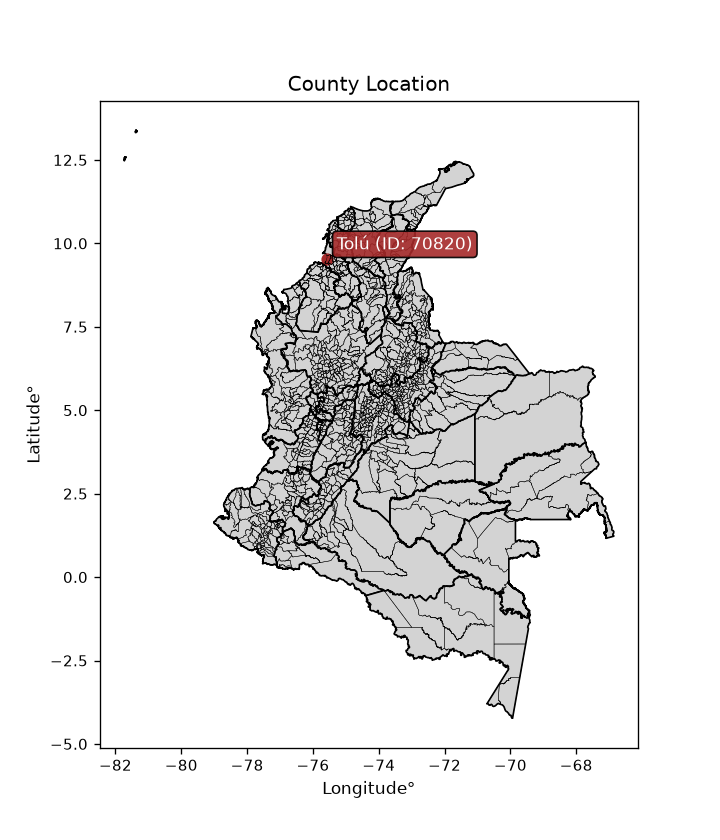
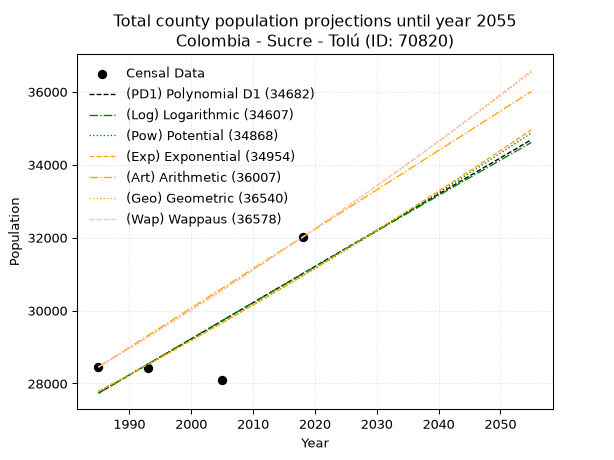
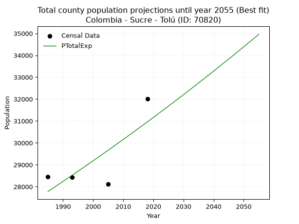
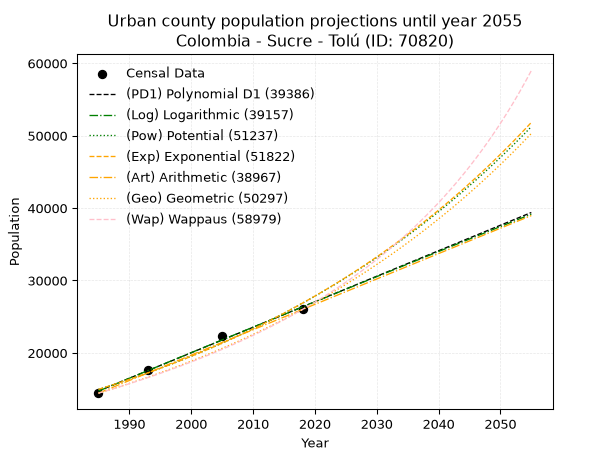
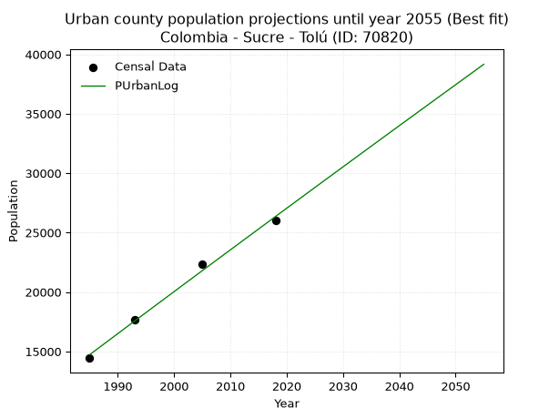
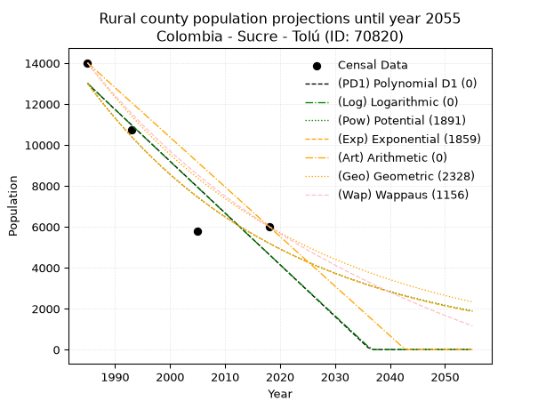
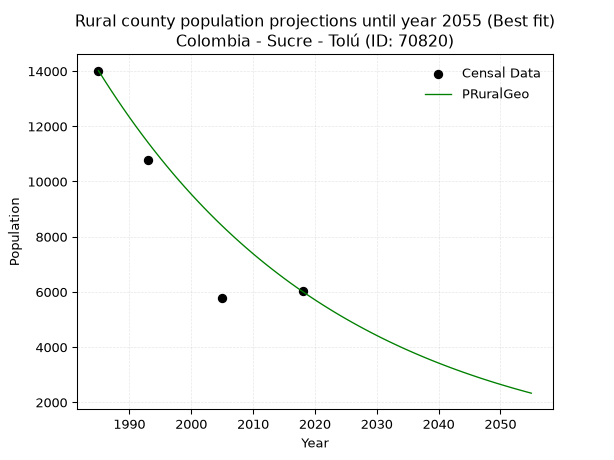

<div align="center">


</div>

# _“Population and Public Services Demand Projections (PPSD) until Year 2050 for Colombia - Sucre - Tolú (ID: 70820)”_
Keywords: `population` `public-service` `projection` `lineal` `polynomial` `logarithmic` `potential` `exponential` `arithmetic` `geometric` `wappaus` `dane` `colombia` `south-america`

PPSD are analytical estimates used by governments and planners to anticipate future changes in population size, age distribution, and the resulting community needs for utilities, healthcare, education, and infrastructure as sizing future water treatment facilities, electrical grids, and road networks based on spatial growth.

<div align="center">

</img>

</div>


> **General running parameters**: • app_version: _v20260806_. • Python version: _3.14.7_. • Pandas version: _3.0.5_. • NumPy version: _2.5.1_. • Creates, save and include plots into reports (create_plot): _False_. • Projection until year: _2050_. • Process polynomial degree 2 and up: _False_. • Process Wappaus: _True_. • Process Wappaus: _True_. • Set negative values to zero: _True_. • Set infinite values to zero: _True_. • Drop dataset notes: _True_. 
<div align="center">

Dynamic map: [:earth_americas:Google](http://maps.google.com/maps?q=9.525386698,-75.5811117) [:earth_americas:OSM](https://www.openstreetmap.org/#map=18/9.525386698/-75.5811117&layers=P) [:earth_americas:Bing](https://www.bing.com/maps?cp=9.525386698~-75.5811117&lvl=18) [:earth_americas:Apple](https://maps.apple.com/frame?center=9.525386698%2C-75.5811117&span=0.003%2C0.006)

</div>


<div align="center">

```geojson
{
  "type": "Feature",
  "geometry": {
    "type": "Point", 
    "coordinates": [-75.5811117, 9.525386698]
  }, 
  "properties": {
    "Name": "Colombia - Sucre - Tolú (ID: 70820)"
  }
}
```

</div>


## 0. Census Data (4 records)

Census data are official statistics collected by a government about the people and housing in a country. They usually include counts of total population, age, sex, race, income, education, and jobs.

📅Global census file: [Population.xlsx](../data/Population.xlsx)

| Source   |   Year |   CountryID | CountryName   |   StateID | StateName   |   CountyID | CountyName   |   PTotal |   PUrban |   PRural |
|:---------|-------:|------------:|:--------------|----------:|:------------|-----------:|:-------------|---------:|---------:|---------:|
| DANE     |   1985 |          57 | Colombia      |        70 | Sucre       |      70820 | Tolú         |    28449 |    14433 |    14016 |
| DANE     |   1993 |          57 | Colombia      |        70 | Sucre       |      70820 | Tolú         |    28424 |    17664 |    10760 |
| DANE     |   2005 |          57 | Colombia      |        70 | Sucre       |      70820 | Tolú         |    28108 |    22318 |     5790 |
| DANE     |   2018 |          57 | Colombia      |        70 | Sucre       |      70820 | Tolú         |    32012 |    25999 |     6013 |

> 🔥Some records could had specific notes about the registered values or the corresponding urban or rural distribution.

## 1. Total

### 1.1. Coefficients and Parameters

* (PD1) Polynomial Deg 1: 99.24488157366295, -169266.32436771935 (lineal)
* (Log) Logarithmic: 198297.65248328462, -1478013.7955831054
* (Pow) Potential: 6.556541909075529, -17.178168333191703
* (Exp) Exponential: 0.003281503008235685, 41.194587259968
* (Art) Arithmetic: Year diff. 2018 - 1985 = 33, Population diff. 32012 - 28449 = 3563, Annual growth = 107.96969696969697
* (Geo) Geometric: Year diff. 2018 - 1985 = 33, Population diff. 32012 - 28449 = 3563, Annual growth % = 0.0035820919852651567
* (Wap) Wappaus: i = 0.3571548501337952, Condition values only valid for < 200)

<sub>
Wappaus condition values: ['0.00', '0.36', '0.71', '1.07', '1.43', '1.79', '2.14', '2.50', '2.86', '3.21', '3.57', '3.93', '4.29', '4.64', '5.00', '5.36', '5.71', '6.07', '6.43', '6.79', '7.14', '7.50', '7.86', '8.21', '8.57', '8.93', '9.29', '9.64', '10.00', '10.36', '10.71', '11.07', '11.43', '11.79', '12.14', '12.50', '12.86', '13.21', '13.57', '13.93', '14.29', '14.64', '15.00', '15.36', '15.71', '16.07', '16.43', '16.79', '17.14', '17.50', '17.86', '18.21', '18.57', '18.93', '19.29', '19.64', '20.00', '20.36', '20.71', '21.07', '21.43', '21.79', '22.14', '22.50', '22.86', '23.22']
</sub>


### 1.2. Projected Dataset

|   Year |   CountyID |   PTotalPD1 |   PTotalLog |   PTotalPow |   PTotalExp |   PTotalArt |   PTotalGeo |   PTotalWap |
|-------:|-----------:|------------:|------------:|------------:|------------:|------------:|------------:|------------:|
|   1985 |      70820 |       27735 |       27734 |       27780 |       27781 |       28449 |       28449 |       28449 |
|   1986 |      70820 |       27834 |       27834 |       27872 |       27872 |       28557 |       28551 |       28551 |
|   1987 |      70820 |       27933 |       27934 |       27964 |       27963 |       28665 |       28653 |       28653 |
|   1988 |      70820 |       28033 |       28034 |       28057 |       28055 |       28773 |       28756 |       28755 |
|   1989 |      70820 |       28132 |       28134 |       28149 |       28148 |       28881 |       28859 |       28858 |
|   1990 |      70820 |       28231 |       28233 |       28242 |       28240 |       28989 |       28962 |       28962 |
|   1991 |      70820 |       28330 |       28333 |       28335 |       28333 |       29097 |       29066 |       29065 |
|   1992 |      70820 |       28429 |       28433 |       28429 |       28426 |       29205 |       29170 |       29169 |
|   1993 |      70820 |       28529 |       28532 |       28523 |       28519 |       29313 |       29275 |       29274 |
|   1994 |      70820 |       28628 |       28632 |       28617 |       28613 |       29421 |       29379 |       29378 |
|   1995 |      70820 |       28727 |       28731 |       28711 |       28707 |       29529 |       29485 |       29484 |
|   1996 |      70820 |       28826 |       28830 |       28805 |       28802 |       29637 |       29590 |       29589 |
|   1997 |      70820 |       28926 |       28930 |       28900 |       28896 |       29745 |       29696 |       29695 |
|   1998 |      70820 |       29025 |       29029 |       28995 |       28991 |       29853 |       29803 |       29801 |
|   1999 |      70820 |       29124 |       29128 |       29090 |       29087 |       29961 |       29909 |       29908 |
|   2000 |      70820 |       29223 |       29227 |       29186 |       29182 |       30069 |       30017 |       30015 |
|   2001 |      70820 |       29323 |       29326 |       29282 |       29278 |       30177 |       30124 |       30123 |
|   2002 |      70820 |       29422 |       29426 |       29378 |       29374 |       30284 |       30232 |       30230 |
|   2003 |      70820 |       29521 |       29525 |       29474 |       29471 |       30392 |       30340 |       30339 |
|   2004 |      70820 |       29620 |       29624 |       29571 |       29568 |       30500 |       30449 |       30447 |
|   2005 |      70820 |       29720 |       29722 |       29668 |       29665 |       30608 |       30558 |       30556 |
|   2006 |      70820 |       29819 |       29821 |       29765 |       29762 |       30716 |       30667 |       30666 |
|   2007 |      70820 |       29918 |       29920 |       29862 |       29860 |       30824 |       30777 |       30776 |
|   2008 |      70820 |       30017 |       30019 |       29960 |       29958 |       30932 |       30888 |       30886 |
|   2009 |      70820 |       30117 |       30118 |       30058 |       30057 |       31040 |       30998 |       30997 |
|   2010 |      70820 |       30216 |       30216 |       30156 |       30156 |       31148 |       31109 |       31108 |
|   2011 |      70820 |       30315 |       30315 |       30255 |       30255 |       31256 |       31221 |       31219 |
|   2012 |      70820 |       30414 |       30414 |       30353 |       30354 |       31364 |       31333 |       31331 |
|   2013 |      70820 |       30514 |       30512 |       30452 |       30454 |       31472 |       31445 |       31444 |
|   2014 |      70820 |       30613 |       30611 |       30552 |       30554 |       31580 |       31557 |       31557 |
|   2015 |      70820 |       30712 |       30709 |       30651 |       30655 |       31688 |       31670 |       31670 |
|   2016 |      70820 |       30811 |       30807 |       30751 |       30755 |       31796 |       31784 |       31783 |
|   2017 |      70820 |       30911 |       30906 |       30851 |       30856 |       31904 |       31898 |       31897 |
|   2018 |      70820 |       31010 |       31004 |       30952 |       30958 |       32012 |       32012 |       32012 |
|   2019 |      70820 |       31109 |       31102 |       31052 |       31060 |       32120 |       32127 |       32127 |
|   2020 |      70820 |       31208 |       31200 |       31153 |       31162 |       32228 |       32242 |       32242 |
|   2021 |      70820 |       31308 |       31299 |       31255 |       31264 |       32336 |       32357 |       32358 |
|   2022 |      70820 |       31407 |       31397 |       31356 |       31367 |       32444 |       32473 |       32474 |
|   2023 |      70820 |       31506 |       31495 |       31458 |       31470 |       32552 |       32589 |       32591 |
|   2024 |      70820 |       31605 |       31593 |       31560 |       31573 |       32660 |       32706 |       32708 |
|   2025 |      70820 |       31705 |       31691 |       31663 |       31677 |       32768 |       32823 |       32826 |
|   2026 |      70820 |       31804 |       31789 |       31765 |       31781 |       32876 |       32941 |       32944 |
|   2027 |      70820 |       31903 |       31886 |       31868 |       31886 |       32984 |       33059 |       33063 |
|   2028 |      70820 |       32002 |       31984 |       31971 |       31991 |       33092 |       33177 |       33182 |
|   2029 |      70820 |       32102 |       32082 |       32075 |       32096 |       33200 |       33296 |       33301 |
|   2030 |      70820 |       32201 |       32180 |       32179 |       32201 |       33308 |       33415 |       33421 |
|   2031 |      70820 |       32300 |       32277 |       32283 |       32307 |       33416 |       33535 |       33541 |
|   2032 |      70820 |       32399 |       32375 |       32387 |       32413 |       33524 |       33655 |       33662 |
|   2033 |      70820 |       32499 |       32473 |       32492 |       32520 |       33632 |       33776 |       33783 |
|   2034 |      70820 |       32598 |       32570 |       32597 |       32627 |       33740 |       33897 |       33905 |
|   2035 |      70820 |       32697 |       32668 |       32702 |       32734 |       33847 |       34018 |       34027 |
|   2036 |      70820 |       32796 |       32765 |       32807 |       32841 |       33955 |       34140 |       34150 |
|   2037 |      70820 |       32895 |       32862 |       32913 |       32949 |       34063 |       34262 |       34273 |
|   2038 |      70820 |       32995 |       32960 |       33019 |       33058 |       34171 |       34385 |       34397 |
|   2039 |      70820 |       33094 |       33057 |       33126 |       33166 |       34279 |       34508 |       34521 |
|   2040 |      70820 |       33193 |       33154 |       33232 |       33275 |       34387 |       34632 |       34646 |
|   2041 |      70820 |       33292 |       33251 |       33339 |       33385 |       34495 |       34756 |       34771 |
|   2042 |      70820 |       33392 |       33348 |       33447 |       33494 |       34603 |       34880 |       34897 |
|   2043 |      70820 |       33491 |       33446 |       33554 |       33605 |       34711 |       35005 |       35023 |
|   2044 |      70820 |       33590 |       33543 |       33662 |       33715 |       34819 |       35131 |       35150 |
|   2045 |      70820 |       33689 |       33640 |       33770 |       33826 |       34927 |       35257 |       35277 |
|   2046 |      70820 |       33789 |       33737 |       33878 |       33937 |       35035 |       35383 |       35405 |
|   2047 |      70820 |       33888 |       33833 |       33987 |       34049 |       35143 |       35510 |       35533 |
|   2048 |      70820 |       33987 |       33930 |       34096 |       34160 |       35251 |       35637 |       35662 |
|   2049 |      70820 |       34086 |       34027 |       34205 |       34273 |       35359 |       35765 |       35791 |
|   2050 |      70820 |       34186 |       34124 |       34315 |       34385 |       35467 |       35893 |       35921 |
<div align="center">

</img>

</div>


### 1.3. Best fit with absolute and relative error (%)

Relative error puts that difference into context by dividing the absolute error by the true value, creating a unitless ratio or percentage that shows the scale of the mistake.

Absolute and relative error

|   Year | Source   |   CountryID | CountryName   |   StateID | StateName   |   CountyID_x | CountyName   |   PTotal |   PUrban |   PRural |   CountyID_y |   PTotalPD1 |   PTotalLog |   PTotalPow |   PTotalExp |   PTotalArt |   PTotalGeo |   PTotalWap |   PTotalPD1AbsError |   PTotalLogAbsError |   PTotalPowAbsError |   PTotalExpAbsError |   PTotalArtAbsError |   PTotalGeoAbsError |   PTotalWapAbsError |   PTotalPD1RelError |   PTotalLogRelError |   PTotalPowRelError |   PTotalExpRelError |   PTotalArtRelError |   PTotalGeoRelError |   PTotalWapRelError |
|-------:|:---------|------------:|:--------------|----------:|:------------|-------------:|:-------------|---------:|---------:|---------:|-------------:|------------:|------------:|------------:|------------:|------------:|------------:|------------:|--------------------:|--------------------:|--------------------:|--------------------:|--------------------:|--------------------:|--------------------:|--------------------:|--------------------:|--------------------:|--------------------:|--------------------:|--------------------:|--------------------:|
|   1985 | DANE     |          57 | Colombia      |        70 | Sucre       |        70820 | Tolú         |    28449 |    14433 |    14016 |        70820 |       27735 |       27734 |       27780 |       27781 |       28449 |       28449 |       28449 |                 714 |                 715 |                 669 |                 668 |                   0 |                   0 |                   0 |            2.50975  |            2.51327  |            2.35158  |            2.34806  |             0       |             0       |             0       |
|   1993 | DANE     |          57 | Colombia      |        70 | Sucre       |        70820 | Tolú         |    28424 |    17664 |    10760 |        70820 |       28529 |       28532 |       28523 |       28519 |       29313 |       29275 |       29274 |                 105 |                 108 |                  99 |                  95 |                 889 |                 851 |                 850 |            0.369406 |            0.379961 |            0.348297 |            0.334225 |             3.12764 |             2.99395 |             2.99043 |
|   2005 | DANE     |          57 | Colombia      |        70 | Sucre       |        70820 | Tolú         |    28108 |    22318 |     5790 |        70820 |       29720 |       29722 |       29668 |       29665 |       30608 |       30558 |       30556 |                1612 |                1614 |                1560 |                1557 |                2500 |                2450 |                2448 |            5.73502  |            5.74214  |            5.55002  |            5.53935  |             8.89426 |             8.71638 |             8.70926 |
|   2018 | DANE     |          57 | Colombia      |        70 | Sucre       |        70820 | Tolú         |    32012 |    25999 |     6013 |        70820 |       31010 |       31004 |       30952 |       30958 |       32012 |       32012 |       32012 |                1002 |                1008 |                1060 |                1054 |                   0 |                   0 |                   0 |            3.13008  |            3.14882  |            3.31126  |            3.29252  |             0       |             0       |             0       |

Relative error mean

| Method    |   RelError | Best   |
|:----------|-----------:|:-------|
| PTotalPD1 |    2.93606 |        |
| PTotalLog |    2.94605 |        |
| PTotalPow |    2.89029 |        |
| PTotalExp |    2.87854 | True   |
| PTotalArt |    3.00548 |        |
| PTotalGeo |    2.92758 |        |
| PTotalWap |    2.92492 |        |

💙Best method: _**PTotalExp**_
<div align="center">

</img>

</div>


### 1.4. Fresh water supply demand in liters per capita per day (lpcd)

The fresh water supply demand typically ranges from 100 to 300 liters per capita per day (lpcd) for standard domestic and municipal planning, though absolute survival minimums set by the World Health Organization are as low as 7.5 to 20 liters per day, and total consumption in high-income nations can exceed 400 liters.

> `CZ`: Level in meters above the sea level (masl)<br> `WS`: Fresh water supply demand in liters per capita per day (lpcd or l/h/d)<br> `WSAll`: Zonal fresh water supply demand in liters per second (l/s)<br> `A`: Zonal area in square meters<br> `DP`: Population density (people/hectare or p/ha)

Reference values (RAS Colombia)

|    CZ |   WS |
|------:|-----:|
|  1000 |  120 |
|  2000 |  130 |
| 99999 |  140 |

County shapefile geometry properties and water supply values

|   CountyID |      ATotal |   CZTotal |   WSTotal |
|-----------:|------------:|----------:|----------:|
|      70820 | 3.02591e+08 |   11.9208 |       120 |

Projected values for best method: PTotalExp

|   CountyID |   Year |   PTotalExp |   DPTotal |   WSTotal |   WSTotalAll |
|-----------:|-------:|------------:|----------:|----------:|-------------:|
|      70820 |   1985 |       27781 |      0.92 |       120 |      38.5847 |
|      70820 |   1986 |       27872 |      0.92 |       120 |      38.7111 |
|      70820 |   1987 |       27963 |      0.92 |       120 |      38.8375 |
|      70820 |   1988 |       28055 |      0.93 |       120 |      38.9653 |
|      70820 |   1989 |       28148 |      0.93 |       120 |      39.0944 |
|      70820 |   1990 |       28240 |      0.93 |       120 |      39.2222 |
|      70820 |   1991 |       28333 |      0.94 |       120 |      39.3514 |
|      70820 |   1992 |       28426 |      0.94 |       120 |      39.4806 |
|      70820 |   1993 |       28519 |      0.94 |       120 |      39.6097 |
|      70820 |   1994 |       28613 |      0.95 |       120 |      39.7403 |
|      70820 |   1995 |       28707 |      0.95 |       120 |      39.8708 |
|      70820 |   1996 |       28802 |      0.95 |       120 |      40.0028 |
|      70820 |   1997 |       28896 |      0.95 |       120 |      40.1333 |
|      70820 |   1998 |       28991 |      0.96 |       120 |      40.2653 |
|      70820 |   1999 |       29087 |      0.96 |       120 |      40.3986 |
|      70820 |   2000 |       29182 |      0.96 |       120 |      40.5306 |
|      70820 |   2001 |       29278 |      0.97 |       120 |      40.6639 |
|      70820 |   2002 |       29374 |      0.97 |       120 |      40.7972 |
|      70820 |   2003 |       29471 |      0.97 |       120 |      40.9319 |
|      70820 |   2004 |       29568 |      0.98 |       120 |      41.0667 |
|      70820 |   2005 |       29665 |      0.98 |       120 |      41.2014 |
|      70820 |   2006 |       29762 |      0.98 |       120 |      41.3361 |
|      70820 |   2007 |       29860 |      0.99 |       120 |      41.4722 |
|      70820 |   2008 |       29958 |      0.99 |       120 |      41.6083 |
|      70820 |   2009 |       30057 |      0.99 |       120 |      41.7458 |
|      70820 |   2010 |       30156 |      1    |       120 |      41.8833 |
|      70820 |   2011 |       30255 |      1    |       120 |      42.0208 |
|      70820 |   2012 |       30354 |      1    |       120 |      42.1583 |
|      70820 |   2013 |       30454 |      1.01 |       120 |      42.2972 |
|      70820 |   2014 |       30554 |      1.01 |       120 |      42.4361 |
|      70820 |   2015 |       30655 |      1.01 |       120 |      42.5764 |
|      70820 |   2016 |       30755 |      1.02 |       120 |      42.7153 |
|      70820 |   2017 |       30856 |      1.02 |       120 |      42.8556 |
|      70820 |   2018 |       30958 |      1.02 |       120 |      42.9972 |
|      70820 |   2019 |       31060 |      1.03 |       120 |      43.1389 |
|      70820 |   2020 |       31162 |      1.03 |       120 |      43.2806 |
|      70820 |   2021 |       31264 |      1.03 |       120 |      43.4222 |
|      70820 |   2022 |       31367 |      1.04 |       120 |      43.5653 |
|      70820 |   2023 |       31470 |      1.04 |       120 |      43.7083 |
|      70820 |   2024 |       31573 |      1.04 |       120 |      43.8514 |
|      70820 |   2025 |       31677 |      1.05 |       120 |      43.9958 |
|      70820 |   2026 |       31781 |      1.05 |       120 |      44.1403 |
|      70820 |   2027 |       31886 |      1.05 |       120 |      44.2861 |
|      70820 |   2028 |       31991 |      1.06 |       120 |      44.4319 |
|      70820 |   2029 |       32096 |      1.06 |       120 |      44.5778 |
|      70820 |   2030 |       32201 |      1.06 |       120 |      44.7236 |
|      70820 |   2031 |       32307 |      1.07 |       120 |      44.8708 |
|      70820 |   2032 |       32413 |      1.07 |       120 |      45.0181 |
|      70820 |   2033 |       32520 |      1.07 |       120 |      45.1667 |
|      70820 |   2034 |       32627 |      1.08 |       120 |      45.3153 |
|      70820 |   2035 |       32734 |      1.08 |       120 |      45.4639 |
|      70820 |   2036 |       32841 |      1.09 |       120 |      45.6125 |
|      70820 |   2037 |       32949 |      1.09 |       120 |      45.7625 |
|      70820 |   2038 |       33058 |      1.09 |       120 |      45.9139 |
|      70820 |   2039 |       33166 |      1.1  |       120 |      46.0639 |
|      70820 |   2040 |       33275 |      1.1  |       120 |      46.2153 |
|      70820 |   2041 |       33385 |      1.1  |       120 |      46.3681 |
|      70820 |   2042 |       33494 |      1.11 |       120 |      46.5194 |
|      70820 |   2043 |       33605 |      1.11 |       120 |      46.6736 |
|      70820 |   2044 |       33715 |      1.11 |       120 |      46.8264 |
|      70820 |   2045 |       33826 |      1.12 |       120 |      46.9806 |
|      70820 |   2046 |       33937 |      1.12 |       120 |      47.1347 |
|      70820 |   2047 |       34049 |      1.13 |       120 |      47.2903 |
|      70820 |   2048 |       34160 |      1.13 |       120 |      47.4444 |
|      70820 |   2049 |       34273 |      1.13 |       120 |      47.6014 |
|      70820 |   2050 |       34385 |      1.14 |       120 |      47.7569 |

## 2. Urban

### 2.1. Coefficients and Parameters

* (PD1) Polynomial Deg 1: 352.1886792452803, -684361.905660372 (lineal)
* (Log) Logarithmic: 705079.470426395, -5339211.204863304
* (Pow) Potential: 35.53757798251049, -113.0197255931699
* (Exp) Exponential: 0.0177477786583813, 7.500026206455544e-12
* (Art) Arithmetic: Year diff. 2018 - 1985 = 33, Population diff. 25999 - 14433 = 11566, Annual growth = 350.4848484848485
* (Geo) Geometric: Year diff. 2018 - 1985 = 33, Population diff. 25999 - 14433 = 11566, Annual growth % = 0.01799455606283562
* (Wap) Wappaus: i = 1.7337002794066505, Condition values only valid for < 200)

<sub>
Wappaus condition values: ['0.00', '1.73', '3.47', '5.20', '6.93', '8.67', '10.40', '12.14', '13.87', '15.60', '17.34', '19.07', '20.80', '22.54', '24.27', '26.01', '27.74', '29.47', '31.21', '32.94', '34.67', '36.41', '38.14', '39.88', '41.61', '43.34', '45.08', '46.81', '48.54', '50.28', '52.01', '53.74', '55.48', '57.21', '58.95', '60.68', '62.41', '64.15', '65.88', '67.61', '69.35', '71.08', '72.82', '74.55', '76.28', '78.02', '79.75', '81.48', '83.22', '84.95', '86.69', '88.42', '90.15', '91.89', '93.62', '95.35', '97.09', '98.82', '100.55', '102.29', '104.02', '105.76', '107.49', '109.22', '110.96', '112.69']
</sub>


### 2.2. Projected Dataset

|   Year |   CountyID |   PUrbanPD1 |   PUrbanLog |   PUrbanPow |   PUrbanExp |   PUrbanArt |   PUrbanGeo |   PUrbanWap |
|-------:|-----------:|------------:|------------:|------------:|------------:|------------:|------------:|------------:|
|   1985 |      70820 |       14733 |       14721 |       14952 |       14961 |       14433 |       14433 |       14433 |
|   1986 |      70820 |       15085 |       15076 |       15222 |       15229 |       14783 |       14693 |       14685 |
|   1987 |      70820 |       15437 |       15431 |       15497 |       15502 |       15134 |       14957 |       14942 |
|   1988 |      70820 |       15789 |       15786 |       15776 |       15780 |       15484 |       15226 |       15204 |
|   1989 |      70820 |       16141 |       16140 |       16061 |       16062 |       15835 |       15500 |       15470 |
|   1990 |      70820 |       16494 |       16495 |       16350 |       16350 |       16185 |       15779 |       15741 |
|   1991 |      70820 |       16846 |       16849 |       16645 |       16642 |       16536 |       16063 |       16017 |
|   1992 |      70820 |       17198 |       17203 |       16944 |       16940 |       16886 |       16352 |       16298 |
|   1993 |      70820 |       17550 |       17557 |       17249 |       17244 |       17237 |       16646 |       16584 |
|   1994 |      70820 |       17902 |       17911 |       17560 |       17553 |       17587 |       16946 |       16876 |
|   1995 |      70820 |       18255 |       18264 |       17875 |       17867 |       17938 |       17251 |       17173 |
|   1996 |      70820 |       18607 |       18618 |       18196 |       18187 |       18288 |       17561 |       17476 |
|   1997 |      70820 |       18959 |       18971 |       18523 |       18512 |       18639 |       17877 |       17784 |
|   1998 |      70820 |       19311 |       19324 |       18856 |       18844 |       18989 |       18199 |       18099 |
|   1999 |      70820 |       19663 |       19676 |       19194 |       19181 |       19340 |       18526 |       18420 |
|   2000 |      70820 |       20015 |       20029 |       19538 |       19525 |       19690 |       18860 |       18747 |
|   2001 |      70820 |       20368 |       20382 |       19888 |       19874 |       20041 |       19199 |       19081 |
|   2002 |      70820 |       20720 |       20734 |       20245 |       20230 |       20391 |       19545 |       19422 |
|   2003 |      70820 |       21072 |       21086 |       20607 |       20593 |       20742 |       19896 |       19770 |
|   2004 |      70820 |       21424 |       21438 |       20976 |       20961 |       21092 |       20254 |       20125 |
|   2005 |      70820 |       21776 |       21790 |       21351 |       21337 |       21443 |       20619 |       20487 |
|   2006 |      70820 |       22129 |       22141 |       21733 |       21719 |       21793 |       20990 |       20857 |
|   2007 |      70820 |       22481 |       22493 |       22121 |       22108 |       22144 |       21368 |       21235 |
|   2008 |      70820 |       22833 |       22844 |       22516 |       22503 |       22494 |       21752 |       21621 |
|   2009 |      70820 |       23185 |       23195 |       22918 |       22906 |       22845 |       22144 |       22016 |
|   2010 |      70820 |       23537 |       23546 |       23327 |       23317 |       23195 |       22542 |       22419 |
|   2011 |      70820 |       23890 |       23896 |       23743 |       23734 |       23546 |       22948 |       22832 |
|   2012 |      70820 |       24242 |       24247 |       24166 |       24159 |       23896 |       23361 |       23254 |
|   2013 |      70820 |       24594 |       24597 |       24597 |       24592 |       24247 |       23781 |       23685 |
|   2014 |      70820 |       24946 |       24947 |       25035 |       25032 |       24597 |       24209 |       24126 |
|   2015 |      70820 |       25298 |       25297 |       25480 |       25480 |       24948 |       24645 |       24578 |
|   2016 |      70820 |       25650 |       25647 |       25934 |       25937 |       25298 |       25088 |       25040 |
|   2017 |      70820 |       26003 |       25997 |       26395 |       26401 |       25649 |       25539 |       25514 |
|   2018 |      70820 |       26355 |       26346 |       26864 |       26874 |       25999 |       25999 |       25999 |
|   2019 |      70820 |       26707 |       26696 |       27341 |       27355 |       26349 |       26467 |       26496 |
|   2020 |      70820 |       27059 |       27045 |       27826 |       27845 |       26700 |       26943 |       27005 |
|   2021 |      70820 |       27411 |       27394 |       28320 |       28343 |       27050 |       27428 |       27527 |
|   2022 |      70820 |       27764 |       27743 |       28822 |       28851 |       27401 |       27921 |       28063 |
|   2023 |      70820 |       28116 |       28091 |       29333 |       29367 |       27751 |       28424 |       28612 |
|   2024 |      70820 |       28468 |       28440 |       29853 |       29893 |       28102 |       28935 |       29176 |
|   2025 |      70820 |       28820 |       28788 |       30382 |       30429 |       28452 |       29456 |       29755 |
|   2026 |      70820 |       29172 |       29136 |       30919 |       30973 |       28803 |       29986 |       30349 |
|   2027 |      70820 |       29525 |       29484 |       31466 |       31528 |       29153 |       30526 |       30959 |
|   2028 |      70820 |       29877 |       29832 |       32023 |       32093 |       29504 |       31075 |       31587 |
|   2029 |      70820 |       30229 |       30179 |       32589 |       32667 |       29854 |       31634 |       32231 |
|   2030 |      70820 |       30581 |       30527 |       33164 |       33252 |       30205 |       32203 |       32895 |
|   2031 |      70820 |       30933 |       30874 |       33750 |       33848 |       30555 |       32783 |       33577 |
|   2032 |      70820 |       31285 |       31221 |       34346 |       34454 |       30906 |       33373 |       34279 |
|   2033 |      70820 |       31638 |       31568 |       34951 |       35071 |       31256 |       33973 |       35003 |
|   2034 |      70820 |       31990 |       31915 |       35568 |       35699 |       31607 |       34585 |       35747 |
|   2035 |      70820 |       32342 |       32261 |       36194 |       36338 |       31957 |       35207 |       36515 |
|   2036 |      70820 |       32694 |       32608 |       36832 |       36989 |       32308 |       35841 |       37307 |
|   2037 |      70820 |       33046 |       32954 |       37480 |       37651 |       32658 |       36485 |       38123 |
|   2038 |      70820 |       33399 |       33300 |       38140 |       38325 |       33009 |       37142 |       38966 |
|   2039 |      70820 |       33751 |       33646 |       38810 |       39011 |       33359 |       37810 |       39837 |
|   2040 |      70820 |       34103 |       33992 |       39492 |       39710 |       33710 |       38491 |       40736 |
|   2041 |      70820 |       34455 |       34337 |       40186 |       40421 |       34060 |       39183 |       41665 |
|   2042 |      70820 |       34807 |       34682 |       40892 |       41145 |       34411 |       39888 |       42626 |
|   2043 |      70820 |       35160 |       35028 |       41610 |       41881 |       34761 |       40606 |       43621 |
|   2044 |      70820 |       35512 |       35373 |       42340 |       42631 |       35112 |       41337 |       44651 |
|   2045 |      70820 |       35864 |       35718 |       43082 |       43395 |       35462 |       42081 |       45718 |
|   2046 |      70820 |       36216 |       36062 |       43837 |       44172 |       35813 |       42838 |       46825 |
|   2047 |      70820 |       36568 |       36407 |       44605 |       44963 |       36163 |       43609 |       47973 |
|   2048 |      70820 |       36921 |       36751 |       45386 |       45768 |       36514 |       44394 |       49165 |
|   2049 |      70820 |       37273 |       37095 |       46180 |       46587 |       36864 |       45192 |       50403 |
|   2050 |      70820 |       37625 |       37439 |       46988 |       47422 |       37215 |       46006 |       51690 |
<div align="center">

</img>

</div>


### 2.3. Best fit with absolute and relative error (%)

Relative error puts that difference into context by dividing the absolute error by the true value, creating a unitless ratio or percentage that shows the scale of the mistake.

Absolute and relative error

|   Year | Source   |   CountryID | CountryName   |   StateID | StateName   |   CountyID_x | CountyName   |   PTotal |   PUrban |   PRural |   CountyID_y |   PUrbanPD1 |   PUrbanLog |   PUrbanPow |   PUrbanExp |   PUrbanArt |   PUrbanGeo |   PUrbanWap |   PUrbanPD1AbsError |   PUrbanLogAbsError |   PUrbanPowAbsError |   PUrbanExpAbsError |   PUrbanArtAbsError |   PUrbanGeoAbsError |   PUrbanWapAbsError |   PUrbanPD1RelError |   PUrbanLogRelError |   PUrbanPowRelError |   PUrbanExpRelError |   PUrbanArtRelError |   PUrbanGeoRelError |   PUrbanWapRelError |
|-------:|:---------|------------:|:--------------|----------:|:------------|-------------:|:-------------|---------:|---------:|---------:|-------------:|------------:|------------:|------------:|------------:|------------:|------------:|------------:|--------------------:|--------------------:|--------------------:|--------------------:|--------------------:|--------------------:|--------------------:|--------------------:|--------------------:|--------------------:|--------------------:|--------------------:|--------------------:|--------------------:|
|   1985 | DANE     |          57 | Colombia      |        70 | Sucre       |        70820 | Tolú         |    28449 |    14433 |    14016 |        70820 |       14733 |       14721 |       14952 |       14961 |       14433 |       14433 |       14433 |                 300 |                 288 |                 519 |                 528 |                   0 |                   0 |                   0 |             2.07857 |            1.99543  |             3.59593 |             3.65828 |             0       |             0       |             0       |
|   1993 | DANE     |          57 | Colombia      |        70 | Sucre       |        70820 | Tolú         |    28424 |    17664 |    10760 |        70820 |       17550 |       17557 |       17249 |       17244 |       17237 |       16646 |       16584 |                 114 |                 107 |                 415 |                 420 |                 427 |                1018 |                1080 |             0.64538 |            0.605752 |             2.34941 |             2.37772 |             2.41735 |             5.76313 |             6.11413 |
|   2005 | DANE     |          57 | Colombia      |        70 | Sucre       |        70820 | Tolú         |    28108 |    22318 |     5790 |        70820 |       21776 |       21790 |       21351 |       21337 |       21443 |       20619 |       20487 |                 542 |                 528 |                 967 |                 981 |                 875 |                1699 |                1831 |             2.42853 |            2.3658   |             4.33283 |             4.39556 |             3.9206  |             7.61269 |             8.20414 |
|   2018 | DANE     |          57 | Colombia      |        70 | Sucre       |        70820 | Tolú         |    32012 |    25999 |     6013 |        70820 |       26355 |       26346 |       26864 |       26874 |       25999 |       25999 |       25999 |                 356 |                 347 |                 865 |                 875 |                   0 |                   0 |                   0 |             1.36928 |            1.33467  |             3.32705 |             3.36551 |             0       |             0       |             0       |

Relative error mean

| Method    |   RelError | Best   |
|:----------|-----------:|:-------|
| PUrbanPD1 |    1.63044 |        |
| PUrbanLog |    1.57541 | True   |
| PUrbanPow |    3.4013  |        |
| PUrbanExp |    3.44927 |        |
| PUrbanArt |    1.58449 |        |
| PUrbanGeo |    3.34396 |        |
| PUrbanWap |    3.57957 |        |

💙Best method: _**PUrbanLog**_
<div align="center">

</img>

</div>


### 2.4. Fresh water supply demand in liters per capita per day (lpcd)

The fresh water supply demand typically ranges from 100 to 300 liters per capita per day (lpcd) for standard domestic and municipal planning, though absolute survival minimums set by the World Health Organization are as low as 7.5 to 20 liters per day, and total consumption in high-income nations can exceed 400 liters.

> `CZ`: Level in meters above the sea level (masl)<br> `WS`: Fresh water supply demand in liters per capita per day (lpcd or l/h/d)<br> `WSAll`: Zonal fresh water supply demand in liters per second (l/s)<br> `A`: Zonal area in square meters<br> `DP`: Population density (people/hectare or p/ha)

Reference values (RAS Colombia)

|    CZ |   WS |
|------:|-----:|
|  1000 |  120 |
|  2000 |  130 |
| 99999 |  140 |

County shapefile geometry properties and water supply values

|   CountyID |      AUrban |   CZUrban |   WSUrban |
|-----------:|------------:|----------:|----------:|
|      70820 | 8.77826e+06 |   4.13507 |       120 |

Projected values for best method: PUrbanLog

|   CountyID |   Year |   PUrbanLog |   DPUrban |   WSUrban |   WSUrbanAll |
|-----------:|-------:|------------:|----------:|----------:|-------------:|
|      70820 |   1985 |       14721 |     16.77 |       120 |      20.4458 |
|      70820 |   1986 |       15076 |     17.17 |       120 |      20.9389 |
|      70820 |   1987 |       15431 |     17.58 |       120 |      21.4319 |
|      70820 |   1988 |       15786 |     17.98 |       120 |      21.925  |
|      70820 |   1989 |       16140 |     18.39 |       120 |      22.4167 |
|      70820 |   1990 |       16495 |     18.79 |       120 |      22.9097 |
|      70820 |   1991 |       16849 |     19.19 |       120 |      23.4014 |
|      70820 |   1992 |       17203 |     19.6  |       120 |      23.8931 |
|      70820 |   1993 |       17557 |     20    |       120 |      24.3847 |
|      70820 |   1994 |       17911 |     20.4  |       120 |      24.8764 |
|      70820 |   1995 |       18264 |     20.81 |       120 |      25.3667 |
|      70820 |   1996 |       18618 |     21.21 |       120 |      25.8583 |
|      70820 |   1997 |       18971 |     21.61 |       120 |      26.3486 |
|      70820 |   1998 |       19324 |     22.01 |       120 |      26.8389 |
|      70820 |   1999 |       19676 |     22.41 |       120 |      27.3278 |
|      70820 |   2000 |       20029 |     22.82 |       120 |      27.8181 |
|      70820 |   2001 |       20382 |     23.22 |       120 |      28.3083 |
|      70820 |   2002 |       20734 |     23.62 |       120 |      28.7972 |
|      70820 |   2003 |       21086 |     24.02 |       120 |      29.2861 |
|      70820 |   2004 |       21438 |     24.42 |       120 |      29.775  |
|      70820 |   2005 |       21790 |     24.82 |       120 |      30.2639 |
|      70820 |   2006 |       22141 |     25.22 |       120 |      30.7514 |
|      70820 |   2007 |       22493 |     25.62 |       120 |      31.2403 |
|      70820 |   2008 |       22844 |     26.02 |       120 |      31.7278 |
|      70820 |   2009 |       23195 |     26.42 |       120 |      32.2153 |
|      70820 |   2010 |       23546 |     26.82 |       120 |      32.7028 |
|      70820 |   2011 |       23896 |     27.22 |       120 |      33.1889 |
|      70820 |   2012 |       24247 |     27.62 |       120 |      33.6764 |
|      70820 |   2013 |       24597 |     28.02 |       120 |      34.1625 |
|      70820 |   2014 |       24947 |     28.42 |       120 |      34.6486 |
|      70820 |   2015 |       25297 |     28.82 |       120 |      35.1347 |
|      70820 |   2016 |       25647 |     29.22 |       120 |      35.6208 |
|      70820 |   2017 |       25997 |     29.62 |       120 |      36.1069 |
|      70820 |   2018 |       26346 |     30.01 |       120 |      36.5917 |
|      70820 |   2019 |       26696 |     30.41 |       120 |      37.0778 |
|      70820 |   2020 |       27045 |     30.81 |       120 |      37.5625 |
|      70820 |   2021 |       27394 |     31.21 |       120 |      38.0472 |
|      70820 |   2022 |       27743 |     31.6  |       120 |      38.5319 |
|      70820 |   2023 |       28091 |     32    |       120 |      39.0153 |
|      70820 |   2024 |       28440 |     32.4  |       120 |      39.5    |
|      70820 |   2025 |       28788 |     32.79 |       120 |      39.9833 |
|      70820 |   2026 |       29136 |     33.19 |       120 |      40.4667 |
|      70820 |   2027 |       29484 |     33.59 |       120 |      40.95   |
|      70820 |   2028 |       29832 |     33.98 |       120 |      41.4333 |
|      70820 |   2029 |       30179 |     34.38 |       120 |      41.9153 |
|      70820 |   2030 |       30527 |     34.78 |       120 |      42.3986 |
|      70820 |   2031 |       30874 |     35.17 |       120 |      42.8806 |
|      70820 |   2032 |       31221 |     35.57 |       120 |      43.3625 |
|      70820 |   2033 |       31568 |     35.96 |       120 |      43.8444 |
|      70820 |   2034 |       31915 |     36.36 |       120 |      44.3264 |
|      70820 |   2035 |       32261 |     36.75 |       120 |      44.8069 |
|      70820 |   2036 |       32608 |     37.15 |       120 |      45.2889 |
|      70820 |   2037 |       32954 |     37.54 |       120 |      45.7694 |
|      70820 |   2038 |       33300 |     37.93 |       120 |      46.25   |
|      70820 |   2039 |       33646 |     38.33 |       120 |      46.7306 |
|      70820 |   2040 |       33992 |     38.72 |       120 |      47.2111 |
|      70820 |   2041 |       34337 |     39.12 |       120 |      47.6903 |
|      70820 |   2042 |       34682 |     39.51 |       120 |      48.1694 |
|      70820 |   2043 |       35028 |     39.9  |       120 |      48.65   |
|      70820 |   2044 |       35373 |     40.3  |       120 |      49.1292 |
|      70820 |   2045 |       35718 |     40.69 |       120 |      49.6083 |
|      70820 |   2046 |       36062 |     41.08 |       120 |      50.0861 |
|      70820 |   2047 |       36407 |     41.47 |       120 |      50.5653 |
|      70820 |   2048 |       36751 |     41.87 |       120 |      51.0431 |
|      70820 |   2049 |       37095 |     42.26 |       120 |      51.5208 |
|      70820 |   2050 |       37439 |     42.65 |       120 |      51.9986 |

## 3. Rural

### 3.1. Coefficients and Parameters

* (PD1) Polynomial Deg 1: -252.94379767161755, 515095.58129265305 (lineal)
* (Log) Logarithmic: -506781.81794311054, 3861197.409280201
* (Pow) Potential: -55.665692314041564, 187.68672338883013
* (Exp) Exponential: -0.02778655154432788, 1.169931493853211e+28
* (Art) Arithmetic: Year diff. 2018 - 1985 = 33, Population diff. 6013 - 14016 = -8003, Annual growth = -242.5151515151515
* (Geo) Geometric: Year diff. 2018 - 1985 = 33, Population diff. 6013 - 14016 = -8003, Annual growth % = -0.02531868659354497
* (Wap) Wappaus: i = -2.4216401369529335, Condition values only valid for < 200)

<sub>
Wappaus condition values: ['-0.00', '-2.42', '-4.84', '-7.26', '-9.69', '-12.11', '-14.53', '-16.95', '-19.37', '-21.79', '-24.22', '-26.64', '-29.06', '-31.48', '-33.90', '-36.32', '-38.75', '-41.17', '-43.59', '-46.01', '-48.43', '-50.85', '-53.28', '-55.70', '-58.12', '-60.54', '-62.96', '-65.38', '-67.81', '-70.23', '-72.65', '-75.07', '-77.49', '-79.91', '-82.34', '-84.76', '-87.18', '-89.60', '-92.02', '-94.44', '-96.87', '-99.29', '-101.71', '-104.13', '-106.55', '-108.97', '-111.40', '-113.82', '-116.24', '-118.66', '-121.08', '-123.50', '-125.93', '-128.35', '-130.77', '-133.19', '-135.61', '-138.03', '-140.46', '-142.88', '-145.30', '-147.72', '-150.14', '-152.56', '-154.98', '-157.41']
</sub>


### 3.2. Projected Dataset

|   Year |   CountyID |   PRuralPD1 |   PRuralLog |   PRuralPow |   PRuralExp |   PRuralArt |   PRuralGeo |   PRuralWap |
|-------:|-----------:|------------:|------------:|------------:|------------:|------------:|------------:|------------:|
|   1985 |      70820 |       13002 |       13013 |       13020 |       13004 |       14016 |       14016 |       14016 |
|   1986 |      70820 |       12749 |       12758 |       12660 |       12648 |       13773 |       13661 |       13681 |
|   1987 |      70820 |       12496 |       12503 |       12310 |       12301 |       13531 |       13315 |       13353 |
|   1988 |      70820 |       12243 |       12248 |       11970 |       11964 |       13288 |       12978 |       13033 |
|   1989 |      70820 |       11990 |       11993 |       11640 |       11636 |       13046 |       12650 |       12721 |
|   1990 |      70820 |       11737 |       11739 |       11318 |       11317 |       12803 |       12329 |       12416 |
|   1991 |      70820 |       11484 |       11484 |       11006 |       11007 |       12561 |       12017 |       12117 |
|   1992 |      70820 |       11232 |       11229 |       10703 |       10706 |       12318 |       11713 |       11826 |
|   1993 |      70820 |       10979 |       10975 |       10408 |       10412 |       12076 |       11416 |       11540 |
|   1994 |      70820 |       10726 |       10721 |       10121 |       10127 |       11833 |       11127 |       11261 |
|   1995 |      70820 |       10473 |       10467 |        9843 |        9849 |       11591 |       10846 |       10988 |
|   1996 |      70820 |       10220 |       10213 |        9572 |        9579 |       11348 |       10571 |       10721 |
|   1997 |      70820 |        9967 |        9959 |        9309 |        9317 |       11106 |       10303 |       10460 |
|   1998 |      70820 |        9714 |        9705 |        9053 |        9062 |       10863 |       10042 |       10204 |
|   1999 |      70820 |        9461 |        9452 |        8804 |        8813 |       10621 |        9788 |        9953 |
|   2000 |      70820 |        9208 |        9198 |        8563 |        8572 |       10378 |        9540 |        9707 |
|   2001 |      70820 |        8955 |        8945 |        8328 |        8337 |       10136 |        9299 |        9467 |
|   2002 |      70820 |        8702 |        8692 |        8099 |        8108 |        9893 |        9063 |        9231 |
|   2003 |      70820 |        8449 |        8439 |        7877 |        7886 |        9651 |        8834 |        9000 |
|   2004 |      70820 |        8196 |        8186 |        7661 |        7670 |        9408 |        8610 |        8773 |
|   2005 |      70820 |        7943 |        7933 |        7451 |        7460 |        9166 |        8392 |        8551 |
|   2006 |      70820 |        7690 |        7680 |        7247 |        7255 |        8923 |        8180 |        8333 |
|   2007 |      70820 |        7437 |        7428 |        7049 |        7057 |        8681 |        7973 |        8120 |
|   2008 |      70820 |        7184 |        7175 |        6856 |        6863 |        8438 |        7771 |        7910 |
|   2009 |      70820 |        6931 |        6923 |        6669 |        6675 |        8196 |        7574 |        7704 |
|   2010 |      70820 |        6679 |        6671 |        6487 |        6492 |        7953 |        7382 |        7502 |
|   2011 |      70820 |        6426 |        6419 |        6310 |        6314 |        7711 |        7195 |        7304 |
|   2012 |      70820 |        6173 |        6167 |        6137 |        6141 |        7468 |        7013 |        7110 |
|   2013 |      70820 |        5920 |        5915 |        5970 |        5973 |        7226 |        6836 |        6919 |
|   2014 |      70820 |        5667 |        5663 |        5807 |        5809 |        6983 |        6663 |        6731 |
|   2015 |      70820 |        5414 |        5412 |        5649 |        5650 |        6741 |        6494 |        6547 |
|   2016 |      70820 |        5161 |        5160 |        5495 |        5495 |        6498 |        6329 |        6366 |
|   2017 |      70820 |        4908 |        4909 |        5345 |        5345 |        6256 |        6169 |        6188 |
|   2018 |      70820 |        4655 |        4658 |        5200 |        5198 |        6013 |        6013 |        6013 |
|   2019 |      70820 |        4402 |        4407 |        5059 |        5056 |        5770 |        5861 |        5841 |
|   2020 |      70820 |        4149 |        4156 |        4921 |        4917 |        5528 |        5712 |        5672 |
|   2021 |      70820 |        3896 |        3905 |        4787 |        4782 |        5285 |        5568 |        5506 |
|   2022 |      70820 |        3643 |        3654 |        4657 |        4651 |        5043 |        5427 |        5343 |
|   2023 |      70820 |        3390 |        3404 |        4531 |        4524 |        4800 |        5289 |        5183 |
|   2024 |      70820 |        3137 |        3153 |        4408 |        4400 |        4558 |        5155 |        5025 |
|   2025 |      70820 |        2884 |        2903 |        4288 |        4279 |        4315 |        5025 |        4869 |
|   2026 |      70820 |        2631 |        2653 |        4172 |        4162 |        4073 |        4898 |        4717 |
|   2027 |      70820 |        2379 |        2402 |        4059 |        4048 |        3830 |        4774 |        4566 |
|   2028 |      70820 |        2126 |        2153 |        3949 |        3937 |        3588 |        4653 |        4418 |
|   2029 |      70820 |        1873 |        1903 |        3842 |        3829 |        3345 |        4535 |        4273 |
|   2030 |      70820 |        1620 |        1653 |        3738 |        3724 |        3103 |        4420 |        4129 |
|   2031 |      70820 |        1367 |        1403 |        3637 |        3622 |        2860 |        4308 |        3988 |
|   2032 |      70820 |        1114 |        1154 |        3539 |        3523 |        2618 |        4199 |        3849 |
|   2033 |      70820 |         861 |         905 |        3443 |        3426 |        2375 |        4093 |        3712 |
|   2034 |      70820 |         608 |         655 |        3350 |        3333 |        2133 |        3989 |        3578 |
|   2035 |      70820 |         355 |         406 |        3260 |        3241 |        1890 |        3888 |        3445 |
|   2036 |      70820 |         102 |         157 |        3172 |        3152 |        1648 |        3790 |        3314 |
|   2037 |      70820 |           0 |           0 |        3086 |        3066 |        1405 |        3694 |        3185 |
|   2038 |      70820 |           0 |           0 |        3003 |        2982 |        1163 |        3600 |        3059 |
|   2039 |      70820 |           0 |           0 |        2922 |        2900 |         920 |        3509 |        2934 |
|   2040 |      70820 |           0 |           0 |        2844 |        2821 |         678 |        3420 |        2810 |
|   2041 |      70820 |           0 |           0 |        2767 |        2743 |         435 |        3334 |        2689 |
|   2042 |      70820 |           0 |           0 |        2693 |        2668 |         193 |        3249 |        2569 |
|   2043 |      70820 |           0 |           0 |        2620 |        2595 |           0 |        3167 |        2451 |
|   2044 |      70820 |           0 |           0 |        2550 |        2524 |           0 |        3087 |        2335 |
|   2045 |      70820 |           0 |           0 |        2481 |        2455 |           0 |        3009 |        2220 |
|   2046 |      70820 |           0 |           0 |        2415 |        2388 |           0 |        2933 |        2107 |
|   2047 |      70820 |           0 |           0 |        2350 |        2322 |           0 |        2858 |        1996 |
|   2048 |      70820 |           0 |           0 |        2287 |        2259 |           0 |        2786 |        1886 |
|   2049 |      70820 |           0 |           0 |        2226 |        2197 |           0 |        2715 |        1777 |
|   2050 |      70820 |           0 |           0 |        2166 |        2136 |           0 |        2647 |        1670 |
<div align="center">

</img>

</div>


### 3.3. Best fit with absolute and relative error (%)

Relative error puts that difference into context by dividing the absolute error by the true value, creating a unitless ratio or percentage that shows the scale of the mistake.

Absolute and relative error

|   Year | Source   |   CountryID | CountryName   |   StateID | StateName   |   CountyID_x | CountyName   |   PTotal |   PUrban |   PRural |   CountyID_y |   PRuralPD1 |   PRuralLog |   PRuralPow |   PRuralExp |   PRuralArt |   PRuralGeo |   PRuralWap |   PRuralPD1AbsError |   PRuralLogAbsError |   PRuralPowAbsError |   PRuralExpAbsError |   PRuralArtAbsError |   PRuralGeoAbsError |   PRuralWapAbsError |   PRuralPD1RelError |   PRuralLogRelError |   PRuralPowRelError |   PRuralExpRelError |   PRuralArtRelError |   PRuralGeoRelError |   PRuralWapRelError |
|-------:|:---------|------------:|:--------------|----------:|:------------|-------------:|:-------------|---------:|---------:|---------:|-------------:|------------:|------------:|------------:|------------:|------------:|------------:|------------:|--------------------:|--------------------:|--------------------:|--------------------:|--------------------:|--------------------:|--------------------:|--------------------:|--------------------:|--------------------:|--------------------:|--------------------:|--------------------:|--------------------:|
|   1985 | DANE     |          57 | Colombia      |        70 | Sucre       |        70820 | Tolú         |    28449 |    14433 |    14016 |        70820 |       13002 |       13013 |       13020 |       13004 |       14016 |       14016 |       14016 |                1014 |                1003 |                 996 |                1012 |                   0 |                   0 |                   0 |             7.23459 |             7.15611 |             7.10616 |             7.22032 |              0      |             0       |             0       |
|   1993 | DANE     |          57 | Colombia      |        70 | Sucre       |        70820 | Tolú         |    28424 |    17664 |    10760 |        70820 |       10979 |       10975 |       10408 |       10412 |       12076 |       11416 |       11540 |                 219 |                 215 |                 352 |                 348 |                1316 |                 656 |                 780 |             2.03532 |             1.99814 |             3.27138 |             3.2342  |             12.2305 |             6.09665 |             7.24907 |
|   2005 | DANE     |          57 | Colombia      |        70 | Sucre       |        70820 | Tolú         |    28108 |    22318 |     5790 |        70820 |        7943 |        7933 |        7451 |        7460 |        9166 |        8392 |        8551 |                2153 |                2143 |                1661 |                1670 |                3376 |                2602 |                2761 |            37.1848  |            37.0121  |            28.6874  |            28.8428  |             58.3074 |            44.9396  |            47.6857  |
|   2018 | DANE     |          57 | Colombia      |        70 | Sucre       |        70820 | Tolú         |    32012 |    25999 |     6013 |        70820 |        4655 |        4658 |        5200 |        5198 |        6013 |        6013 |        6013 |                1358 |                1355 |                 813 |                 815 |                   0 |                   0 |                   0 |            22.5844  |            22.5345  |            13.5207  |            13.554   |              0      |             0       |             0       |

Relative error mean

| Method    |   RelError | Best   |
|:----------|-----------:|:-------|
| PRuralPD1 |    17.2598 |        |
| PRuralLog |    17.1752 |        |
| PRuralPow |    13.1464 |        |
| PRuralExp |    13.2128 |        |
| PRuralArt |    17.6345 |        |
| PRuralGeo |    12.7591 | True   |
| PRuralWap |    13.7337 |        |

💙Best method: _**PRuralGeo**_
<div align="center">

</img>

</div>


### 3.4. Fresh water supply demand in liters per capita per day (lpcd)

The fresh water supply demand typically ranges from 100 to 300 liters per capita per day (lpcd) for standard domestic and municipal planning, though absolute survival minimums set by the World Health Organization are as low as 7.5 to 20 liters per day, and total consumption in high-income nations can exceed 400 liters.

> `CZ`: Level in meters above the sea level (masl)<br> `WS`: Fresh water supply demand in liters per capita per day (lpcd or l/h/d)<br> `WSAll`: Zonal fresh water supply demand in liters per second (l/s)<br> `A`: Zonal area in square meters<br> `DP`: Population density (people/hectare or p/ha)

Reference values (RAS Colombia)

|    CZ |   WS |
|------:|-----:|
|  1000 |  120 |
|  2000 |  130 |
| 99999 |  140 |

County shapefile geometry properties and water supply values

|   CountyID |      ARural |   CZRural |   WSRural |
|-----------:|------------:|----------:|----------:|
|      70820 | 2.93813e+08 |   12.1442 |       120 |

Projected values for best method: PRuralGeo

|   CountyID |   Year |   PRuralGeo |   DPRural |   WSRural |   WSRuralAll |
|-----------:|-------:|------------:|----------:|----------:|-------------:|
|      70820 |   1985 |       14016 |      0.48 |       120 |     19.4667  |
|      70820 |   1986 |       13661 |      0.46 |       120 |     18.9736  |
|      70820 |   1987 |       13315 |      0.45 |       120 |     18.4931  |
|      70820 |   1988 |       12978 |      0.44 |       120 |     18.025   |
|      70820 |   1989 |       12650 |      0.43 |       120 |     17.5694  |
|      70820 |   1990 |       12329 |      0.42 |       120 |     17.1236  |
|      70820 |   1991 |       12017 |      0.41 |       120 |     16.6903  |
|      70820 |   1992 |       11713 |      0.4  |       120 |     16.2681  |
|      70820 |   1993 |       11416 |      0.39 |       120 |     15.8556  |
|      70820 |   1994 |       11127 |      0.38 |       120 |     15.4542  |
|      70820 |   1995 |       10846 |      0.37 |       120 |     15.0639  |
|      70820 |   1996 |       10571 |      0.36 |       120 |     14.6819  |
|      70820 |   1997 |       10303 |      0.35 |       120 |     14.3097  |
|      70820 |   1998 |       10042 |      0.34 |       120 |     13.9472  |
|      70820 |   1999 |        9788 |      0.33 |       120 |     13.5944  |
|      70820 |   2000 |        9540 |      0.32 |       120 |     13.25    |
|      70820 |   2001 |        9299 |      0.32 |       120 |     12.9153  |
|      70820 |   2002 |        9063 |      0.31 |       120 |     12.5875  |
|      70820 |   2003 |        8834 |      0.3  |       120 |     12.2694  |
|      70820 |   2004 |        8610 |      0.29 |       120 |     11.9583  |
|      70820 |   2005 |        8392 |      0.29 |       120 |     11.6556  |
|      70820 |   2006 |        8180 |      0.28 |       120 |     11.3611  |
|      70820 |   2007 |        7973 |      0.27 |       120 |     11.0736  |
|      70820 |   2008 |        7771 |      0.26 |       120 |     10.7931  |
|      70820 |   2009 |        7574 |      0.26 |       120 |     10.5194  |
|      70820 |   2010 |        7382 |      0.25 |       120 |     10.2528  |
|      70820 |   2011 |        7195 |      0.24 |       120 |      9.99306 |
|      70820 |   2012 |        7013 |      0.24 |       120 |      9.74028 |
|      70820 |   2013 |        6836 |      0.23 |       120 |      9.49444 |
|      70820 |   2014 |        6663 |      0.23 |       120 |      9.25417 |
|      70820 |   2015 |        6494 |      0.22 |       120 |      9.01944 |
|      70820 |   2016 |        6329 |      0.22 |       120 |      8.79028 |
|      70820 |   2017 |        6169 |      0.21 |       120 |      8.56806 |
|      70820 |   2018 |        6013 |      0.2  |       120 |      8.35139 |
|      70820 |   2019 |        5861 |      0.2  |       120 |      8.14028 |
|      70820 |   2020 |        5712 |      0.19 |       120 |      7.93333 |
|      70820 |   2021 |        5568 |      0.19 |       120 |      7.73333 |
|      70820 |   2022 |        5427 |      0.18 |       120 |      7.5375  |
|      70820 |   2023 |        5289 |      0.18 |       120 |      7.34583 |
|      70820 |   2024 |        5155 |      0.18 |       120 |      7.15972 |
|      70820 |   2025 |        5025 |      0.17 |       120 |      6.97917 |
|      70820 |   2026 |        4898 |      0.17 |       120 |      6.80278 |
|      70820 |   2027 |        4774 |      0.16 |       120 |      6.63056 |
|      70820 |   2028 |        4653 |      0.16 |       120 |      6.4625  |
|      70820 |   2029 |        4535 |      0.15 |       120 |      6.29861 |
|      70820 |   2030 |        4420 |      0.15 |       120 |      6.13889 |
|      70820 |   2031 |        4308 |      0.15 |       120 |      5.98333 |
|      70820 |   2032 |        4199 |      0.14 |       120 |      5.83194 |
|      70820 |   2033 |        4093 |      0.14 |       120 |      5.68472 |
|      70820 |   2034 |        3989 |      0.14 |       120 |      5.54028 |
|      70820 |   2035 |        3888 |      0.13 |       120 |      5.4     |
|      70820 |   2036 |        3790 |      0.13 |       120 |      5.26389 |
|      70820 |   2037 |        3694 |      0.13 |       120 |      5.13056 |
|      70820 |   2038 |        3600 |      0.12 |       120 |      5       |
|      70820 |   2039 |        3509 |      0.12 |       120 |      4.87361 |
|      70820 |   2040 |        3420 |      0.12 |       120 |      4.75    |
|      70820 |   2041 |        3334 |      0.11 |       120 |      4.63056 |
|      70820 |   2042 |        3249 |      0.11 |       120 |      4.5125  |
|      70820 |   2043 |        3167 |      0.11 |       120 |      4.39861 |
|      70820 |   2044 |        3087 |      0.11 |       120 |      4.2875  |
|      70820 |   2045 |        3009 |      0.1  |       120 |      4.17917 |
|      70820 |   2046 |        2933 |      0.1  |       120 |      4.07361 |
|      70820 |   2047 |        2858 |      0.1  |       120 |      3.96944 |
|      70820 |   2048 |        2786 |      0.09 |       120 |      3.86944 |
|      70820 |   2049 |        2715 |      0.09 |       120 |      3.77083 |
|      70820 |   2050 |        2647 |      0.09 |       120 |      3.67639 |

<div align="center"><br><sub>Share this research</sub></div><br>

<sub>**APPS & TOOLS & CONTENT DISCLAIMER**: • NO WARRANTY - This content and software is provided by <a href="https://github.com/rcfdtools" target="_blank">github.com/rcfdtools</a> "as is", without any express or implied warranty, including warranties of merchantability, fitness for a particular purpose, or non-infringement. There is no guarantee that the software will be error-free or operate without interruption. • LIMITATION OF LIABILITY - Neither the authors nor copyright holders will be liable for claims or damages arising from the software or its use. You are responsible for determining if the software is appropriate for your use and assume all associated risks, including errors, legal compliance, and data loss. • NO PROFESSIONAL ADVICE - The software provides general information and does not offer professional advice. It should not replace consultation with professional advisors. [Clauses and global license for rcfdtools use.](https://github.com/rcfdtools/rcfdtools/blob/main/LICENSE.md)</sub>

| [:house: Home](Readme.md)  | [:beginner: Help / Collab](https://github.com/rcfdtools/R.HydroTools/discussions/31) |
|----------------------------|-------------------------------------------------------------------------------------------|