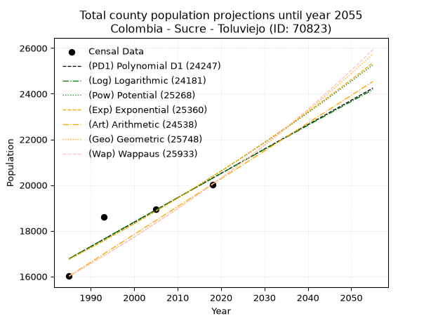
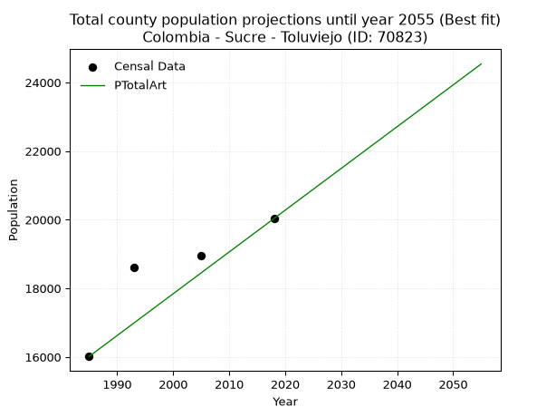
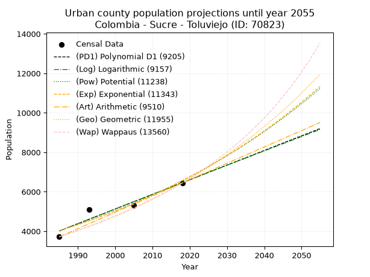
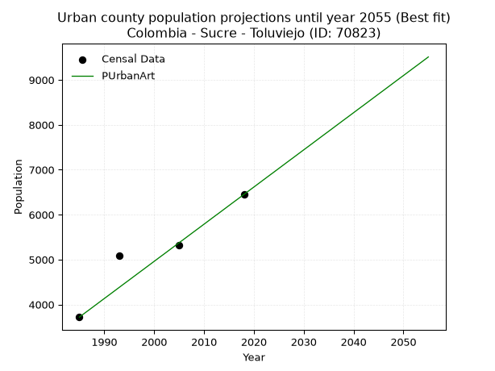
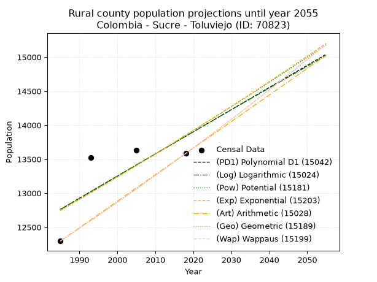
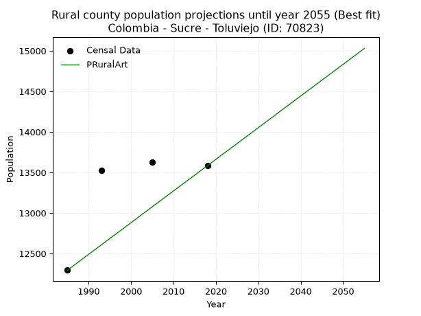

<div align="center">


</div>

# 📜 _“Population and Public Services Demand Projections (PPSD) until Year 2050 for Colombia - Sucre - Toluviejo (ID: 70823)”_
Keywords: `population` `public-service` `projection` `lineal` `polynomial` `logarithmic` `potential` `exponential` `arithmetic` `geometric` `wappaus` `dane` `colombia` `south-america`

PPSD are analytical estimates used by governments and planners to anticipate future changes in population size, age distribution, and the resulting community needs for utilities, healthcare, education, and infrastructure as sizing future water treatment facilities, electrical grids, and road networks based on spatial growth.

<div align="center">

</img>

</div>


> **General running parameters**: • app_version: _v20260806_. • Python version: _3.14.7_. • Pandas version: _3.0.5_. • NumPy version: _2.5.1_. • Creates, save and include plots into reports (create_plot): _False_. • Projection until year: _2050_. • Process polynomial degree 2 and up: _False_. • Process Wappaus: _True_. • Process Wappaus: _True_. • Set negative values to zero: _True_. • Set infinite values to zero: _True_. • Drop dataset notes: _True_. 
<div align="center">

Maps & GIS Layers: [:earth_americas:Google](http://maps.google.com/maps?q=9.451818958,-75.4408499) [:earth_americas:OSM](https://www.openstreetmap.org/#map=18/9.451818958/-75.4408499&layers=P) [:earth_americas:Bing](https://www.bing.com/maps?cp=9.451818958~-75.4408499&lvl=18) [:earth_americas:Apple](https://maps.apple.com/frame?center=9.451818958%2C-75.4408499&span=0.003%2C0.006) [:earth_americas:GISMobile](https://github.com/rcfdtools/R.GISMobile/blob/main/file/gis/CountyLayer_CO/Readme.md)

</div>


<div align="center">

```geojson
{
  "type": "Feature",
  "geometry": {
    "type": "Point", 
    "coordinates": [-75.4408499, 9.451818958]
  }, 
  "properties": {
    "Name": "Colombia - Sucre - Toluviejo (ID: 70823)"
  }
}
```

</div>


## 0. Census Data (4 records)

Census data are official statistics collected by a government about the people and housing in a country. They usually include counts of total population, age, sex, race, income, education, and jobs.

📅Global census file: [Population.xlsx](../data/Population.xlsx)

| Source   |   Year |   CountryID | CountryName   |   StateID | StateName   |   CountyID | CountyName   |   PTotal |   PUrban |   PRural |
|:---------|-------:|------------:|:--------------|----------:|:------------|-----------:|:-------------|---------:|---------:|---------:|
| DANE     |   1985 |          57 | Colombia      |        70 | Sucre       |      70823 | Toluviejo    |    16015 |     3719 |    12296 |
| DANE     |   1993 |          57 | Colombia      |        70 | Sucre       |      70823 | Toluviejo    |    18610 |     5084 |    13526 |
| DANE     |   2005 |          57 | Colombia      |        70 | Sucre       |      70823 | Toluviejo    |    18955 |     5325 |    13630 |
| DANE     |   2018 |          57 | Colombia      |        70 | Sucre       |      70823 | Toluviejo    |    20033 |     6449 |    13584 |

> 🔥Some records could had specific notes about the registered values or the corresponding urban or rural distribution.

## 1. Total

### 1.1. Coefficients and Parameters

* (PD1) Polynomial Deg 1: 106.7374548374139, -195098.3440385372 (lineal)
* (Log) Logarithmic: 213815.17558844844, -1606807.613055082
* (Pow) Potential: 11.855237130001857, -34.87160105972116
* (Exp) Exponential: 0.0059176982314188276, 0.132661802276894
* (Art) Arithmetic: Year diff. 2018 - 1985 = 33, Population diff. 20033 - 16015 = 4018, Annual growth = 121.75757575757575
* (Geo) Geometric: Year diff. 2018 - 1985 = 33, Population diff. 20033 - 16015 = 4018, Annual growth % = 0.006806548783341304
* (Wap) Wappaus: i = 0.675530269405103, Condition values only valid for < 200)

<sub>
Wappaus condition values: ['0.00', '0.68', '1.35', '2.03', '2.70', '3.38', '4.05', '4.73', '5.40', '6.08', '6.76', '7.43', '8.11', '8.78', '9.46', '10.13', '10.81', '11.48', '12.16', '12.84', '13.51', '14.19', '14.86', '15.54', '16.21', '16.89', '17.56', '18.24', '18.91', '19.59', '20.27', '20.94', '21.62', '22.29', '22.97', '23.64', '24.32', '24.99', '25.67', '26.35', '27.02', '27.70', '28.37', '29.05', '29.72', '30.40', '31.07', '31.75', '32.43', '33.10', '33.78', '34.45', '35.13', '35.80', '36.48', '37.15', '37.83', '38.51', '39.18', '39.86', '40.53', '41.21', '41.88', '42.56', '43.23', '43.91']
</sub>


### 1.2. Projected Dataset

|   Year |   CountyID |   PTotalPD1 |   PTotalLog |   PTotalPow |   PTotalExp |   PTotalArt |   PTotalGeo |   PTotalWap |
|-------:|-----------:|------------:|------------:|------------:|------------:|------------:|------------:|------------:|
|   1985 |      70823 |       16776 |       16771 |       16755 |       16759 |       16015 |       16015 |       16015 |
|   1986 |      70823 |       16882 |       16879 |       16855 |       16858 |       16137 |       16124 |       16124 |
|   1987 |      70823 |       16989 |       16986 |       16956 |       16958 |       16259 |       16234 |       16233 |
|   1988 |      70823 |       17096 |       17094 |       17057 |       17059 |       16380 |       16344 |       16343 |
|   1989 |      70823 |       17202 |       17201 |       17159 |       17160 |       16502 |       16455 |       16454 |
|   1990 |      70823 |       17309 |       17309 |       17262 |       17262 |       16624 |       16568 |       16565 |
|   1991 |      70823 |       17416 |       17416 |       17365 |       17365 |       16746 |       16680 |       16678 |
|   1992 |      70823 |       17523 |       17524 |       17469 |       17468 |       16867 |       16794 |       16791 |
|   1993 |      70823 |       17629 |       17631 |       17573 |       17571 |       16989 |       16908 |       16905 |
|   1994 |      70823 |       17736 |       17738 |       17678 |       17676 |       17111 |       17023 |       17019 |
|   1995 |      70823 |       17843 |       17845 |       17783 |       17780 |       17233 |       17139 |       17135 |
|   1996 |      70823 |       17950 |       17953 |       17889 |       17886 |       17354 |       17256 |       17251 |
|   1997 |      70823 |       18056 |       18060 |       17995 |       17992 |       17476 |       17373 |       17368 |
|   1998 |      70823 |       18163 |       18167 |       18103 |       18099 |       17598 |       17491 |       17486 |
|   1999 |      70823 |       18270 |       18274 |       18210 |       18206 |       17720 |       17610 |       17605 |
|   2000 |      70823 |       18377 |       18381 |       18319 |       18314 |       17841 |       17730 |       17724 |
|   2001 |      70823 |       18483 |       18488 |       18427 |       18423 |       17963 |       17851 |       17845 |
|   2002 |      70823 |       18590 |       18594 |       18537 |       18532 |       18085 |       17973 |       17966 |
|   2003 |      70823 |       18697 |       18701 |       18647 |       18642 |       18207 |       18095 |       18088 |
|   2004 |      70823 |       18804 |       18808 |       18758 |       18753 |       18328 |       18218 |       18211 |
|   2005 |      70823 |       18910 |       18915 |       18869 |       18864 |       18450 |       18342 |       18335 |
|   2006 |      70823 |       19017 |       19021 |       18981 |       18976 |       18572 |       18467 |       18460 |
|   2007 |      70823 |       19124 |       19128 |       19093 |       19089 |       18694 |       18593 |       18586 |
|   2008 |      70823 |       19230 |       19234 |       19206 |       19202 |       18815 |       18719 |       18713 |
|   2009 |      70823 |       19337 |       19341 |       19320 |       19316 |       18937 |       18847 |       18841 |
|   2010 |      70823 |       19444 |       19447 |       19434 |       19431 |       19059 |       18975 |       18969 |
|   2011 |      70823 |       19551 |       19553 |       19549 |       19546 |       19181 |       19104 |       19099 |
|   2012 |      70823 |       19657 |       19660 |       19665 |       19662 |       19302 |       19234 |       19229 |
|   2013 |      70823 |       19764 |       19766 |       19781 |       19779 |       19424 |       19365 |       19361 |
|   2014 |      70823 |       19871 |       19872 |       19898 |       19896 |       19546 |       19497 |       19493 |
|   2015 |      70823 |       19978 |       19978 |       20015 |       20014 |       19668 |       19629 |       19627 |
|   2016 |      70823 |       20084 |       20084 |       20133 |       20133 |       19789 |       19763 |       19761 |
|   2017 |      70823 |       20191 |       20190 |       20252 |       20253 |       19911 |       19898 |       19896 |
|   2018 |      70823 |       20298 |       20296 |       20372 |       20373 |       20033 |       20033 |       20033 |
|   2019 |      70823 |       20405 |       20402 |       20491 |       20494 |       20155 |       20169 |       20171 |
|   2020 |      70823 |       20511 |       20508 |       20612 |       20615 |       20277 |       20307 |       20309 |
|   2021 |      70823 |       20618 |       20614 |       20733 |       20738 |       20398 |       20445 |       20449 |
|   2022 |      70823 |       20725 |       20720 |       20855 |       20861 |       20520 |       20584 |       20590 |
|   2023 |      70823 |       20832 |       20826 |       20978 |       20985 |       20642 |       20724 |       20731 |
|   2024 |      70823 |       20938 |       20931 |       21101 |       21109 |       20764 |       20865 |       20874 |
|   2025 |      70823 |       21045 |       21037 |       21225 |       21235 |       20885 |       21007 |       21018 |
|   2026 |      70823 |       21152 |       21142 |       21350 |       21361 |       21007 |       21150 |       21164 |
|   2027 |      70823 |       21258 |       21248 |       21475 |       21487 |       21129 |       21294 |       21310 |
|   2028 |      70823 |       21365 |       21353 |       21601 |       21615 |       21251 |       21439 |       21457 |
|   2029 |      70823 |       21472 |       21459 |       21728 |       21743 |       21372 |       21585 |       21606 |
|   2030 |      70823 |       21579 |       21564 |       21855 |       21872 |       21494 |       21732 |       21756 |
|   2031 |      70823 |       21685 |       21669 |       21983 |       22002 |       21616 |       21880 |       21907 |
|   2032 |      70823 |       21792 |       21775 |       22112 |       22133 |       21738 |       22029 |       22059 |
|   2033 |      70823 |       21899 |       21880 |       22241 |       22264 |       21859 |       22179 |       22213 |
|   2034 |      70823 |       22006 |       21985 |       22371 |       22396 |       21981 |       22330 |       22367 |
|   2035 |      70823 |       22112 |       22090 |       22502 |       22529 |       22103 |       22482 |       22523 |
|   2036 |      70823 |       22219 |       22195 |       22633 |       22663 |       22225 |       22635 |       22681 |
|   2037 |      70823 |       22326 |       22300 |       22765 |       22797 |       22346 |       22789 |       22839 |
|   2038 |      70823 |       22433 |       22405 |       22898 |       22933 |       22468 |       22944 |       22999 |
|   2039 |      70823 |       22539 |       22510 |       23032 |       23069 |       22590 |       23100 |       23160 |
|   2040 |      70823 |       22646 |       22615 |       23166 |       23206 |       22712 |       23257 |       23323 |
|   2041 |      70823 |       22753 |       22720 |       23301 |       23343 |       22833 |       23416 |       23487 |
|   2042 |      70823 |       22860 |       22824 |       23437 |       23482 |       22955 |       23575 |       23652 |
|   2043 |      70823 |       22966 |       22929 |       23573 |       23621 |       23077 |       23735 |       23819 |
|   2044 |      70823 |       23073 |       23034 |       23710 |       23762 |       23199 |       23897 |       23987 |
|   2045 |      70823 |       23180 |       23138 |       23848 |       23903 |       23320 |       24060 |       24156 |
|   2046 |      70823 |       23286 |       23243 |       23987 |       24044 |       23442 |       24223 |       24327 |
|   2047 |      70823 |       23393 |       23347 |       24126 |       24187 |       23564 |       24388 |       24499 |
|   2048 |      70823 |       23500 |       23452 |       24266 |       24331 |       23686 |       24554 |       24673 |
|   2049 |      70823 |       23607 |       23556 |       24407 |       24475 |       23807 |       24721 |       24848 |
|   2050 |      70823 |       23713 |       23660 |       24549 |       24620 |       23929 |       24890 |       25025 |
<div align="center">

</img>

</div>


### 1.3. Best fit with absolute and relative error (%)

Relative error puts that difference into context by dividing the absolute error by the true value, creating a unitless ratio or percentage that shows the scale of the mistake.

Absolute and relative error

|   Year | Source   |   CountryID | CountryName   |   StateID | StateName   |   CountyID_x | CountyName   |   PTotal |   PUrban |   PRural |   CountyID_y |   PTotalPD1 |   PTotalLog |   PTotalPow |   PTotalExp |   PTotalArt |   PTotalGeo |   PTotalWap |   PTotalPD1AbsError |   PTotalLogAbsError |   PTotalPowAbsError |   PTotalExpAbsError |   PTotalArtAbsError |   PTotalGeoAbsError |   PTotalWapAbsError |   PTotalPD1RelError |   PTotalLogRelError |   PTotalPowRelError |   PTotalExpRelError |   PTotalArtRelError |   PTotalGeoRelError |   PTotalWapRelError |
|-------:|:---------|------------:|:--------------|----------:|:------------|-------------:|:-------------|---------:|---------:|---------:|-------------:|------------:|------------:|------------:|------------:|------------:|------------:|------------:|--------------------:|--------------------:|--------------------:|--------------------:|--------------------:|--------------------:|--------------------:|--------------------:|--------------------:|--------------------:|--------------------:|--------------------:|--------------------:|--------------------:|
|   1985 | DANE     |          57 | Colombia      |        70 | Sucre       |        70823 | Toluviejo    |    16015 |     3719 |    12296 |        70823 |       16776 |       16771 |       16755 |       16759 |       16015 |       16015 |       16015 |                 761 |                 756 |                 740 |                 744 |                   0 |                   0 |                   0 |            4.7518   |            4.72057  |            4.62067  |            4.64564  |             0       |             0       |             0       |
|   1993 | DANE     |          57 | Colombia      |        70 | Sucre       |        70823 | Toluviejo    |    18610 |     5084 |    13526 |        70823 |       17629 |       17631 |       17573 |       17571 |       16989 |       16908 |       16905 |                 981 |                 979 |                1037 |                1039 |                1621 |                1702 |                1705 |            5.27136  |            5.26061  |            5.57227  |            5.58302  |             8.71037 |             9.14562 |             9.16174 |
|   2005 | DANE     |          57 | Colombia      |        70 | Sucre       |        70823 | Toluviejo    |    18955 |     5325 |    13630 |        70823 |       18910 |       18915 |       18869 |       18864 |       18450 |       18342 |       18335 |                  45 |                  40 |                  86 |                  91 |                 505 |                 613 |                 620 |            0.237404 |            0.211026 |            0.453706 |            0.480084 |             2.6642  |             3.23398 |             3.2709  |
|   2018 | DANE     |          57 | Colombia      |        70 | Sucre       |        70823 | Toluviejo    |    20033 |     6449 |    13584 |        70823 |       20298 |       20296 |       20372 |       20373 |       20033 |       20033 |       20033 |                 265 |                 263 |                 339 |                 340 |                   0 |                   0 |                   0 |            1.32282  |            1.31283  |            1.69221  |            1.6972   |             0       |             0       |             0       |

Relative error mean

| Method    |   RelError | Best   |
|:----------|-----------:|:-------|
| PTotalPD1 |    2.89584 |        |
| PTotalLog |    2.87626 |        |
| PTotalPow |    3.08471 |        |
| PTotalExp |    3.10149 |        |
| PTotalArt |    2.84364 | True   |
| PTotalGeo |    3.0949  |        |
| PTotalWap |    3.10816 |        |

💙Best method: _**PTotalArt**_
<div align="center">

</img>

</div>


### 1.4. Fresh water supply demand in liters per capita per day (lpcd)

The fresh water supply demand typically ranges from 100 to 300 liters per capita per day (lpcd) for standard domestic and municipal planning, though absolute survival minimums set by the World Health Organization are as low as 7.5 to 20 liters per day, and total consumption in high-income nations can exceed 400 liters.

> `CZ`: Level in meters above the sea level (masl)<br> `WS`: Fresh water supply demand in liters per capita per day (lpcd or l/h/d)<br> `WSAll`: Zonal fresh water supply demand in liters per second (l/s)<br> `A`: Zonal area in square meters<br> `DP`: Population density (people/hectare or p/ha)

Reference values (RAS Colombia)

|    CZ |   WS |
|------:|-----:|
|  1000 |  120 |
|  2000 |  130 |
| 99999 |  140 |

County shapefile geometry properties and water supply values

|   CountyID |      ATotal |   CZTotal |   WSTotal |
|-----------:|------------:|----------:|----------:|
|      70823 | 2.84702e+08 |   64.8656 |       120 |

Projected values for best method: PTotalArt

|   CountyID |   Year |   PTotalArt |   DPTotal |   WSTotal |   WSTotalAll |
|-----------:|-------:|------------:|----------:|----------:|-------------:|
|      70823 |   1985 |       16015 |      0.56 |       120 |      22.2431 |
|      70823 |   1986 |       16137 |      0.57 |       120 |      22.4125 |
|      70823 |   1987 |       16259 |      0.57 |       120 |      22.5819 |
|      70823 |   1988 |       16380 |      0.58 |       120 |      22.75   |
|      70823 |   1989 |       16502 |      0.58 |       120 |      22.9194 |
|      70823 |   1990 |       16624 |      0.58 |       120 |      23.0889 |
|      70823 |   1991 |       16746 |      0.59 |       120 |      23.2583 |
|      70823 |   1992 |       16867 |      0.59 |       120 |      23.4264 |
|      70823 |   1993 |       16989 |      0.6  |       120 |      23.5958 |
|      70823 |   1994 |       17111 |      0.6  |       120 |      23.7653 |
|      70823 |   1995 |       17233 |      0.61 |       120 |      23.9347 |
|      70823 |   1996 |       17354 |      0.61 |       120 |      24.1028 |
|      70823 |   1997 |       17476 |      0.61 |       120 |      24.2722 |
|      70823 |   1998 |       17598 |      0.62 |       120 |      24.4417 |
|      70823 |   1999 |       17720 |      0.62 |       120 |      24.6111 |
|      70823 |   2000 |       17841 |      0.63 |       120 |      24.7792 |
|      70823 |   2001 |       17963 |      0.63 |       120 |      24.9486 |
|      70823 |   2002 |       18085 |      0.64 |       120 |      25.1181 |
|      70823 |   2003 |       18207 |      0.64 |       120 |      25.2875 |
|      70823 |   2004 |       18328 |      0.64 |       120 |      25.4556 |
|      70823 |   2005 |       18450 |      0.65 |       120 |      25.625  |
|      70823 |   2006 |       18572 |      0.65 |       120 |      25.7944 |
|      70823 |   2007 |       18694 |      0.66 |       120 |      25.9639 |
|      70823 |   2008 |       18815 |      0.66 |       120 |      26.1319 |
|      70823 |   2009 |       18937 |      0.67 |       120 |      26.3014 |
|      70823 |   2010 |       19059 |      0.67 |       120 |      26.4708 |
|      70823 |   2011 |       19181 |      0.67 |       120 |      26.6403 |
|      70823 |   2012 |       19302 |      0.68 |       120 |      26.8083 |
|      70823 |   2013 |       19424 |      0.68 |       120 |      26.9778 |
|      70823 |   2014 |       19546 |      0.69 |       120 |      27.1472 |
|      70823 |   2015 |       19668 |      0.69 |       120 |      27.3167 |
|      70823 |   2016 |       19789 |      0.7  |       120 |      27.4847 |
|      70823 |   2017 |       19911 |      0.7  |       120 |      27.6542 |
|      70823 |   2018 |       20033 |      0.7  |       120 |      27.8236 |
|      70823 |   2019 |       20155 |      0.71 |       120 |      27.9931 |
|      70823 |   2020 |       20277 |      0.71 |       120 |      28.1625 |
|      70823 |   2021 |       20398 |      0.72 |       120 |      28.3306 |
|      70823 |   2022 |       20520 |      0.72 |       120 |      28.5    |
|      70823 |   2023 |       20642 |      0.73 |       120 |      28.6694 |
|      70823 |   2024 |       20764 |      0.73 |       120 |      28.8389 |
|      70823 |   2025 |       20885 |      0.73 |       120 |      29.0069 |
|      70823 |   2026 |       21007 |      0.74 |       120 |      29.1764 |
|      70823 |   2027 |       21129 |      0.74 |       120 |      29.3458 |
|      70823 |   2028 |       21251 |      0.75 |       120 |      29.5153 |
|      70823 |   2029 |       21372 |      0.75 |       120 |      29.6833 |
|      70823 |   2030 |       21494 |      0.75 |       120 |      29.8528 |
|      70823 |   2031 |       21616 |      0.76 |       120 |      30.0222 |
|      70823 |   2032 |       21738 |      0.76 |       120 |      30.1917 |
|      70823 |   2033 |       21859 |      0.77 |       120 |      30.3597 |
|      70823 |   2034 |       21981 |      0.77 |       120 |      30.5292 |
|      70823 |   2035 |       22103 |      0.78 |       120 |      30.6986 |
|      70823 |   2036 |       22225 |      0.78 |       120 |      30.8681 |
|      70823 |   2037 |       22346 |      0.78 |       120 |      31.0361 |
|      70823 |   2038 |       22468 |      0.79 |       120 |      31.2056 |
|      70823 |   2039 |       22590 |      0.79 |       120 |      31.375  |
|      70823 |   2040 |       22712 |      0.8  |       120 |      31.5444 |
|      70823 |   2041 |       22833 |      0.8  |       120 |      31.7125 |
|      70823 |   2042 |       22955 |      0.81 |       120 |      31.8819 |
|      70823 |   2043 |       23077 |      0.81 |       120 |      32.0514 |
|      70823 |   2044 |       23199 |      0.81 |       120 |      32.2208 |
|      70823 |   2045 |       23320 |      0.82 |       120 |      32.3889 |
|      70823 |   2046 |       23442 |      0.82 |       120 |      32.5583 |
|      70823 |   2047 |       23564 |      0.83 |       120 |      32.7278 |
|      70823 |   2048 |       23686 |      0.83 |       120 |      32.8972 |
|      70823 |   2049 |       23807 |      0.84 |       120 |      33.0653 |
|      70823 |   2050 |       23929 |      0.84 |       120 |      33.2347 |

## 2. Urban

### 2.1. Coefficients and Parameters

* (PD1) Polynomial Deg 1: 74.17061421115945, -143215.5210758717 (lineal)
* (Log) Logarithmic: 148502.57021373554, -1123624.9762195167
* (Pow) Potential: 29.614894201483406, -94.05790074136816
* (Exp) Exponential: 0.014788007324091218, 7.191266465732203e-10
* (Art) Arithmetic: Year diff. 2018 - 1985 = 33, Population diff. 6449 - 3719 = 2730, Annual growth = 82.72727272727273
* (Geo) Geometric: Year diff. 2018 - 1985 = 33, Population diff. 6449 - 3719 = 2730, Annual growth % = 0.01682082044452682
* (Wap) Wappaus: i = 1.627208354194979, Condition values only valid for < 200)

<sub>
Wappaus condition values: ['0.00', '1.63', '3.25', '4.88', '6.51', '8.14', '9.76', '11.39', '13.02', '14.64', '16.27', '17.90', '19.53', '21.15', '22.78', '24.41', '26.04', '27.66', '29.29', '30.92', '32.54', '34.17', '35.80', '37.43', '39.05', '40.68', '42.31', '43.93', '45.56', '47.19', '48.82', '50.44', '52.07', '53.70', '55.33', '56.95', '58.58', '60.21', '61.83', '63.46', '65.09', '66.72', '68.34', '69.97', '71.60', '73.22', '74.85', '76.48', '78.11', '79.73', '81.36', '82.99', '84.61', '86.24', '87.87', '89.50', '91.12', '92.75', '94.38', '96.01', '97.63', '99.26', '100.89', '102.51', '104.14', '105.77']
</sub>


### 2.2. Projected Dataset

|   Year |   CountyID |   PUrbanPD1 |   PUrbanLog |   PUrbanPow |   PUrbanExp |   PUrbanArt |   PUrbanGeo |   PUrbanWap |
|-------:|-----------:|------------:|------------:|------------:|------------:|------------:|------------:|------------:|
|   1985 |      70823 |        4013 |        4011 |        4027 |        4029 |        3719 |        3719 |        3719 |
|   1986 |      70823 |        4087 |        4085 |        4087 |        4089 |        3802 |        3782 |        3780 |
|   1987 |      70823 |        4161 |        4160 |        4148 |        4150 |        3884 |        3845 |        3842 |
|   1988 |      70823 |        4236 |        4235 |        4211 |        4212 |        3967 |        3910 |        3905 |
|   1989 |      70823 |        4310 |        4310 |        4274 |        4274 |        4050 |        3976 |        3969 |
|   1990 |      70823 |        4384 |        4384 |        4338 |        4338 |        4133 |        4042 |        4034 |
|   1991 |      70823 |        4458 |        4459 |        4403 |        4403 |        4215 |        4110 |        4101 |
|   1992 |      70823 |        4532 |        4533 |        4469 |        4468 |        4298 |        4180 |        4168 |
|   1993 |      70823 |        4607 |        4608 |        4536 |        4535 |        4381 |        4250 |        4237 |
|   1994 |      70823 |        4681 |        4682 |        4604 |        4602 |        4464 |        4321 |        4307 |
|   1995 |      70823 |        4755 |        4757 |        4673 |        4671 |        4546 |        4394 |        4378 |
|   1996 |      70823 |        4829 |        4831 |        4742 |        4740 |        4629 |        4468 |        4450 |
|   1997 |      70823 |        4903 |        4906 |        4813 |        4811 |        4712 |        4543 |        4524 |
|   1998 |      70823 |        4977 |        4980 |        4885 |        4883 |        4794 |        4620 |        4599 |
|   1999 |      70823 |        5052 |        5054 |        4958 |        4955 |        4877 |        4697 |        4675 |
|   2000 |      70823 |        5126 |        5129 |        5032 |        5029 |        4960 |        4776 |        4753 |
|   2001 |      70823 |        5200 |        5203 |        5107 |        5104 |        5043 |        4857 |        4832 |
|   2002 |      70823 |        5274 |        5277 |        5183 |        5180 |        5125 |        4938 |        4913 |
|   2003 |      70823 |        5348 |        5351 |        5261 |        5257 |        5208 |        5021 |        4995 |
|   2004 |      70823 |        5422 |        5425 |        5339 |        5336 |        5291 |        5106 |        5079 |
|   2005 |      70823 |        5497 |        5499 |        5418 |        5415 |        5374 |        5192 |        5165 |
|   2006 |      70823 |        5571 |        5573 |        5499 |        5496 |        5456 |        5279 |        5252 |
|   2007 |      70823 |        5645 |        5647 |        5581 |        5578 |        5539 |        5368 |        5341 |
|   2008 |      70823 |        5719 |        5721 |        5664 |        5661 |        5622 |        5458 |        5431 |
|   2009 |      70823 |        5793 |        5795 |        5748 |        5745 |        5704 |        5550 |        5524 |
|   2010 |      70823 |        5867 |        5869 |        5833 |        5831 |        5787 |        5643 |        5618 |
|   2011 |      70823 |        5942 |        5943 |        5920 |        5918 |        5870 |        5738 |        5715 |
|   2012 |      70823 |        6016 |        6017 |        6007 |        6006 |        5953 |        5835 |        5813 |
|   2013 |      70823 |        6090 |        6091 |        6097 |        6095 |        6035 |        5933 |        5913 |
|   2014 |      70823 |        6164 |        6164 |        6187 |        6186 |        6118 |        6033 |        6016 |
|   2015 |      70823 |        6238 |        6238 |        6278 |        6278 |        6201 |        6134 |        6121 |
|   2016 |      70823 |        6312 |        6312 |        6371 |        6372 |        6284 |        6237 |        6228 |
|   2017 |      70823 |        6387 |        6386 |        6466 |        6467 |        6366 |        6342 |        6337 |
|   2018 |      70823 |        6461 |        6459 |        6561 |        6563 |        6449 |        6449 |        6449 |
|   2019 |      70823 |        6535 |        6533 |        6658 |        6661 |        6532 |        6557 |        6563 |
|   2020 |      70823 |        6609 |        6606 |        6757 |        6760 |        6614 |        6668 |        6680 |
|   2021 |      70823 |        6683 |        6680 |        6856 |        6861 |        6697 |        6780 |        6800 |
|   2022 |      70823 |        6757 |        6753 |        6958 |        6963 |        6780 |        6894 |        6922 |
|   2023 |      70823 |        6832 |        6827 |        7060 |        7067 |        6863 |        7010 |        7048 |
|   2024 |      70823 |        6906 |        6900 |        7164 |        7172 |        6945 |        7128 |        7176 |
|   2025 |      70823 |        6980 |        6973 |        7270 |        7279 |        7028 |        7248 |        7307 |
|   2026 |      70823 |        7054 |        7047 |        7377 |        7387 |        7111 |        7370 |        7442 |
|   2027 |      70823 |        7128 |        7120 |        7486 |        7497 |        7194 |        7494 |        7580 |
|   2028 |      70823 |        7202 |        7193 |        7596 |        7609 |        7276 |        7620 |        7721 |
|   2029 |      70823 |        7277 |        7266 |        7707 |        7722 |        7359 |        7748 |        7866 |
|   2030 |      70823 |        7351 |        7340 |        7821 |        7837 |        7442 |        7878 |        8015 |
|   2031 |      70823 |        7425 |        7413 |        7936 |        7954 |        7524 |        8011 |        8168 |
|   2032 |      70823 |        7499 |        7486 |        8052 |        8073 |        7607 |        8145 |        8324 |
|   2033 |      70823 |        7573 |        7559 |        8170 |        8193 |        7690 |        8282 |        8485 |
|   2034 |      70823 |        7648 |        7632 |        8290 |        8315 |        7773 |        8422 |        8650 |
|   2035 |      70823 |        7722 |        7705 |        8412 |        8439 |        7855 |        8563 |        8820 |
|   2036 |      70823 |        7796 |        7778 |        8535 |        8565 |        7938 |        8707 |        8994 |
|   2037 |      70823 |        7870 |        7851 |        8660 |        8692 |        8021 |        8854 |        9173 |
|   2038 |      70823 |        7944 |        7924 |        8787 |        8822 |        8104 |        9003 |        9358 |
|   2039 |      70823 |        8018 |        7997 |        8915 |        8953 |        8186 |        9154 |        9548 |
|   2040 |      70823 |        8093 |        8069 |        9046 |        9087 |        8269 |        9308 |        9743 |
|   2041 |      70823 |        8167 |        8142 |        9178 |        9222 |        8352 |        9465 |        9944 |
|   2042 |      70823 |        8241 |        8215 |        9312 |        9359 |        8434 |        9624 |       10152 |
|   2043 |      70823 |        8315 |        8288 |        9448 |        9499 |        8517 |        9786 |       10365 |
|   2044 |      70823 |        8389 |        8360 |        9586 |        9640 |        8600 |        9951 |       10586 |
|   2045 |      70823 |        8463 |        8433 |        9726 |        9784 |        8683 |       10118 |       10813 |
|   2046 |      70823 |        8538 |        8505 |        9868 |        9930 |        8765 |       10288 |       11048 |
|   2047 |      70823 |        8612 |        8578 |       10012 |       10078 |        8848 |       10461 |       11290 |
|   2048 |      70823 |        8686 |        8651 |       10157 |       10228 |        8931 |       10637 |       11541 |
|   2049 |      70823 |        8760 |        8723 |       10305 |       10380 |        9014 |       10816 |       11800 |
|   2050 |      70823 |        8834 |        8795 |       10455 |       10535 |        9096 |       10998 |       12068 |
<div align="center">

</img>

</div>


### 2.3. Best fit with absolute and relative error (%)

Relative error puts that difference into context by dividing the absolute error by the true value, creating a unitless ratio or percentage that shows the scale of the mistake.

Absolute and relative error

|   Year | Source   |   CountryID | CountryName   |   StateID | StateName   |   CountyID_x | CountyName   |   PTotal |   PUrban |   PRural |   CountyID_y |   PUrbanPD1 |   PUrbanLog |   PUrbanPow |   PUrbanExp |   PUrbanArt |   PUrbanGeo |   PUrbanWap |   PUrbanPD1AbsError |   PUrbanLogAbsError |   PUrbanPowAbsError |   PUrbanExpAbsError |   PUrbanArtAbsError |   PUrbanGeoAbsError |   PUrbanWapAbsError |   PUrbanPD1RelError |   PUrbanLogRelError |   PUrbanPowRelError |   PUrbanExpRelError |   PUrbanArtRelError |   PUrbanGeoRelError |   PUrbanWapRelError |
|-------:|:---------|------------:|:--------------|----------:|:------------|-------------:|:-------------|---------:|---------:|---------:|-------------:|------------:|------------:|------------:|------------:|------------:|------------:|------------:|--------------------:|--------------------:|--------------------:|--------------------:|--------------------:|--------------------:|--------------------:|--------------------:|--------------------:|--------------------:|--------------------:|--------------------:|--------------------:|--------------------:|
|   1985 | DANE     |          57 | Colombia      |        70 | Sucre       |        70823 | Toluviejo    |    16015 |     3719 |    12296 |        70823 |        4013 |        4011 |        4027 |        4029 |        3719 |        3719 |        3719 |                 294 |                 292 |                 308 |                 310 |                   0 |                   0 |                   0 |            7.90535  |            7.85157  |             8.2818  |             8.33557 |            0        |             0       |             0       |
|   1993 | DANE     |          57 | Colombia      |        70 | Sucre       |        70823 | Toluviejo    |    18610 |     5084 |    13526 |        70823 |        4607 |        4608 |        4536 |        4535 |        4381 |        4250 |        4237 |                 477 |                 476 |                 548 |                 549 |                 703 |                 834 |                 847 |            9.38238  |            9.36271  |            10.7789  |            10.7986  |           13.8277   |            16.4044  |            16.6601  |
|   2005 | DANE     |          57 | Colombia      |        70 | Sucre       |        70823 | Toluviejo    |    18955 |     5325 |    13630 |        70823 |        5497 |        5499 |        5418 |        5415 |        5374 |        5192 |        5165 |                 172 |                 174 |                  93 |                  90 |                  49 |                 133 |                 160 |            3.23005  |            3.26761  |             1.74648 |             1.69014 |            0.920188 |             2.49765 |             3.00469 |
|   2018 | DANE     |          57 | Colombia      |        70 | Sucre       |        70823 | Toluviejo    |    20033 |     6449 |    13584 |        70823 |        6461 |        6459 |        6561 |        6563 |        6449 |        6449 |        6449 |                  12 |                  10 |                 112 |                 114 |                   0 |                   0 |                   0 |            0.186075 |            0.155063 |             1.7367  |             1.76772 |            0        |             0       |             0       |

Relative error mean

| Method    |   RelError | Best   |
|:----------|-----------:|:-------|
| PUrbanPD1 |    5.17596 |        |
| PUrbanLog |    5.15924 |        |
| PUrbanPow |    5.63597 |        |
| PUrbanExp |    5.648   |        |
| PUrbanArt |    3.68697 | True   |
| PUrbanGeo |    4.72551 |        |
| PUrbanWap |    4.9162  |        |

💙Best method: _**PUrbanArt**_
<div align="center">

</img>

</div>


### 2.4. Fresh water supply demand in liters per capita per day (lpcd)

The fresh water supply demand typically ranges from 100 to 300 liters per capita per day (lpcd) for standard domestic and municipal planning, though absolute survival minimums set by the World Health Organization are as low as 7.5 to 20 liters per day, and total consumption in high-income nations can exceed 400 liters.

> `CZ`: Level in meters above the sea level (masl)<br> `WS`: Fresh water supply demand in liters per capita per day (lpcd or l/h/d)<br> `WSAll`: Zonal fresh water supply demand in liters per second (l/s)<br> `A`: Zonal area in square meters<br> `DP`: Population density (people/hectare or p/ha)

Reference values (RAS Colombia)

|    CZ |   WS |
|------:|-----:|
|  1000 |  120 |
|  2000 |  130 |
| 99999 |  140 |

County shapefile geometry properties and water supply values

|   CountyID |      AUrban |   CZUrban |   WSUrban |
|-----------:|------------:|----------:|----------:|
|      70823 | 1.26572e+06 |   61.2287 |       120 |

Projected values for best method: PUrbanArt

|   CountyID |   Year |   PUrbanArt |   DPUrban |   WSUrban |   WSUrbanAll |
|-----------:|-------:|------------:|----------:|----------:|-------------:|
|      70823 |   1985 |        3719 |     29.38 |       120 |      5.16528 |
|      70823 |   1986 |        3802 |     30.04 |       120 |      5.28056 |
|      70823 |   1987 |        3884 |     30.69 |       120 |      5.39444 |
|      70823 |   1988 |        3967 |     31.34 |       120 |      5.50972 |
|      70823 |   1989 |        4050 |     32    |       120 |      5.625   |
|      70823 |   1990 |        4133 |     32.65 |       120 |      5.74028 |
|      70823 |   1991 |        4215 |     33.3  |       120 |      5.85417 |
|      70823 |   1992 |        4298 |     33.96 |       120 |      5.96944 |
|      70823 |   1993 |        4381 |     34.61 |       120 |      6.08472 |
|      70823 |   1994 |        4464 |     35.27 |       120 |      6.2     |
|      70823 |   1995 |        4546 |     35.92 |       120 |      6.31389 |
|      70823 |   1996 |        4629 |     36.57 |       120 |      6.42917 |
|      70823 |   1997 |        4712 |     37.23 |       120 |      6.54444 |
|      70823 |   1998 |        4794 |     37.88 |       120 |      6.65833 |
|      70823 |   1999 |        4877 |     38.53 |       120 |      6.77361 |
|      70823 |   2000 |        4960 |     39.19 |       120 |      6.88889 |
|      70823 |   2001 |        5043 |     39.84 |       120 |      7.00417 |
|      70823 |   2002 |        5125 |     40.49 |       120 |      7.11806 |
|      70823 |   2003 |        5208 |     41.15 |       120 |      7.23333 |
|      70823 |   2004 |        5291 |     41.8  |       120 |      7.34861 |
|      70823 |   2005 |        5374 |     42.46 |       120 |      7.46389 |
|      70823 |   2006 |        5456 |     43.11 |       120 |      7.57778 |
|      70823 |   2007 |        5539 |     43.76 |       120 |      7.69306 |
|      70823 |   2008 |        5622 |     44.42 |       120 |      7.80833 |
|      70823 |   2009 |        5704 |     45.07 |       120 |      7.92222 |
|      70823 |   2010 |        5787 |     45.72 |       120 |      8.0375  |
|      70823 |   2011 |        5870 |     46.38 |       120 |      8.15278 |
|      70823 |   2012 |        5953 |     47.03 |       120 |      8.26806 |
|      70823 |   2013 |        6035 |     47.68 |       120 |      8.38194 |
|      70823 |   2014 |        6118 |     48.34 |       120 |      8.49722 |
|      70823 |   2015 |        6201 |     48.99 |       120 |      8.6125  |
|      70823 |   2016 |        6284 |     49.65 |       120 |      8.72778 |
|      70823 |   2017 |        6366 |     50.3  |       120 |      8.84167 |
|      70823 |   2018 |        6449 |     50.95 |       120 |      8.95694 |
|      70823 |   2019 |        6532 |     51.61 |       120 |      9.07222 |
|      70823 |   2020 |        6614 |     52.25 |       120 |      9.18611 |
|      70823 |   2021 |        6697 |     52.91 |       120 |      9.30139 |
|      70823 |   2022 |        6780 |     53.57 |       120 |      9.41667 |
|      70823 |   2023 |        6863 |     54.22 |       120 |      9.53194 |
|      70823 |   2024 |        6945 |     54.87 |       120 |      9.64583 |
|      70823 |   2025 |        7028 |     55.53 |       120 |      9.76111 |
|      70823 |   2026 |        7111 |     56.18 |       120 |      9.87639 |
|      70823 |   2027 |        7194 |     56.84 |       120 |      9.99167 |
|      70823 |   2028 |        7276 |     57.49 |       120 |     10.1056  |
|      70823 |   2029 |        7359 |     58.14 |       120 |     10.2208  |
|      70823 |   2030 |        7442 |     58.8  |       120 |     10.3361  |
|      70823 |   2031 |        7524 |     59.44 |       120 |     10.45    |
|      70823 |   2032 |        7607 |     60.1  |       120 |     10.5653  |
|      70823 |   2033 |        7690 |     60.76 |       120 |     10.6806  |
|      70823 |   2034 |        7773 |     61.41 |       120 |     10.7958  |
|      70823 |   2035 |        7855 |     62.06 |       120 |     10.9097  |
|      70823 |   2036 |        7938 |     62.72 |       120 |     11.025   |
|      70823 |   2037 |        8021 |     63.37 |       120 |     11.1403  |
|      70823 |   2038 |        8104 |     64.03 |       120 |     11.2556  |
|      70823 |   2039 |        8186 |     64.67 |       120 |     11.3694  |
|      70823 |   2040 |        8269 |     65.33 |       120 |     11.4847  |
|      70823 |   2041 |        8352 |     65.99 |       120 |     11.6     |
|      70823 |   2042 |        8434 |     66.63 |       120 |     11.7139  |
|      70823 |   2043 |        8517 |     67.29 |       120 |     11.8292  |
|      70823 |   2044 |        8600 |     67.95 |       120 |     11.9444  |
|      70823 |   2045 |        8683 |     68.6  |       120 |     12.0597  |
|      70823 |   2046 |        8765 |     69.25 |       120 |     12.1736  |
|      70823 |   2047 |        8848 |     69.91 |       120 |     12.2889  |
|      70823 |   2048 |        8931 |     70.56 |       120 |     12.4042  |
|      70823 |   2049 |        9014 |     71.22 |       120 |     12.5194  |
|      70823 |   2050 |        9096 |     71.86 |       120 |     12.6333  |

## 3. Rural

### 3.1. Coefficients and Parameters

* (PD1) Polynomial Deg 1: 32.56684062625459, -51882.822962665734 (lineal)
* (Log) Logarithmic: 65312.60537471292, -483182.6368355653
* (Pow) Potential: 5.04397804518994, -12.528439856584232
* (Exp) Exponential: 0.0025150762633541763, 86.55130793204822
* (Art) Arithmetic: Year diff. 2018 - 1985 = 33, Population diff. 13584 - 12296 = 1288, Annual growth = 39.03030303030303
* (Geo) Geometric: Year diff. 2018 - 1985 = 33, Population diff. 13584 - 12296 = 1288, Annual growth % = 0.003023307164139233
* (Wap) Wappaus: i = 0.30162521661748865, Condition values only valid for < 200)

<sub>
Wappaus condition values: ['0.00', '0.30', '0.60', '0.90', '1.21', '1.51', '1.81', '2.11', '2.41', '2.71', '3.02', '3.32', '3.62', '3.92', '4.22', '4.52', '4.83', '5.13', '5.43', '5.73', '6.03', '6.33', '6.64', '6.94', '7.24', '7.54', '7.84', '8.14', '8.45', '8.75', '9.05', '9.35', '9.65', '9.95', '10.26', '10.56', '10.86', '11.16', '11.46', '11.76', '12.07', '12.37', '12.67', '12.97', '13.27', '13.57', '13.87', '14.18', '14.48', '14.78', '15.08', '15.38', '15.68', '15.99', '16.29', '16.59', '16.89', '17.19', '17.49', '17.80', '18.10', '18.40', '18.70', '19.00', '19.30', '19.61']
</sub>


### 3.2. Projected Dataset

|   Year |   CountyID |   PRuralPD1 |   PRuralLog |   PRuralPow |   PRuralExp |   PRuralArt |   PRuralGeo |   PRuralWap |
|-------:|-----------:|------------:|------------:|------------:|------------:|------------:|------------:|------------:|
|   1985 |      70823 |       12762 |       12760 |       12747 |       12748 |       12296 |       12296 |       12296 |
|   1986 |      70823 |       12795 |       12793 |       12779 |       12781 |       12335 |       12333 |       12333 |
|   1987 |      70823 |       12827 |       12826 |       12811 |       12813 |       12374 |       12370 |       12370 |
|   1988 |      70823 |       12860 |       12859 |       12844 |       12845 |       12413 |       12408 |       12408 |
|   1989 |      70823 |       12893 |       12892 |       12877 |       12877 |       12452 |       12445 |       12445 |
|   1990 |      70823 |       12925 |       12925 |       12909 |       12910 |       12491 |       12483 |       12483 |
|   1991 |      70823 |       12958 |       12958 |       12942 |       12942 |       12530 |       12521 |       12521 |
|   1992 |      70823 |       12990 |       12990 |       12975 |       12975 |       12569 |       12559 |       12558 |
|   1993 |      70823 |       13023 |       13023 |       13008 |       13008 |       12608 |       12597 |       12596 |
|   1994 |      70823 |       13055 |       13056 |       13041 |       13040 |       12647 |       12635 |       12634 |
|   1995 |      70823 |       13088 |       13089 |       13074 |       13073 |       12686 |       12673 |       12673 |
|   1996 |      70823 |       13121 |       13121 |       13107 |       13106 |       12725 |       12711 |       12711 |
|   1997 |      70823 |       13153 |       13154 |       13140 |       13139 |       12764 |       12750 |       12749 |
|   1998 |      70823 |       13186 |       13187 |       13173 |       13172 |       12803 |       12788 |       12788 |
|   1999 |      70823 |       13218 |       13219 |       13206 |       13205 |       12842 |       12827 |       12826 |
|   2000 |      70823 |       13251 |       13252 |       13240 |       13239 |       12881 |       12866 |       12865 |
|   2001 |      70823 |       13283 |       13285 |       13273 |       13272 |       12920 |       12904 |       12904 |
|   2002 |      70823 |       13316 |       13317 |       13307 |       13305 |       12960 |       12943 |       12943 |
|   2003 |      70823 |       13349 |       13350 |       13340 |       13339 |       12999 |       12983 |       12982 |
|   2004 |      70823 |       13381 |       13383 |       13374 |       13372 |       13038 |       13022 |       13021 |
|   2005 |      70823 |       13414 |       13415 |       13408 |       13406 |       13077 |       13061 |       13061 |
|   2006 |      70823 |       13446 |       13448 |       13441 |       13440 |       13116 |       13101 |       13100 |
|   2007 |      70823 |       13479 |       13480 |       13475 |       13474 |       13155 |       13140 |       13140 |
|   2008 |      70823 |       13511 |       13513 |       13509 |       13508 |       13194 |       13180 |       13180 |
|   2009 |      70823 |       13544 |       13545 |       13543 |       13542 |       13233 |       13220 |       13220 |
|   2010 |      70823 |       13577 |       13578 |       13577 |       13576 |       13272 |       13260 |       13260 |
|   2011 |      70823 |       13609 |       13610 |       13611 |       13610 |       13311 |       13300 |       13300 |
|   2012 |      70823 |       13642 |       13643 |       13645 |       13644 |       13350 |       13340 |       13340 |
|   2013 |      70823 |       13674 |       13675 |       13680 |       13679 |       13389 |       13381 |       13380 |
|   2014 |      70823 |       13707 |       13708 |       13714 |       13713 |       13428 |       13421 |       13421 |
|   2015 |      70823 |       13739 |       13740 |       13748 |       13748 |       13467 |       13462 |       13461 |
|   2016 |      70823 |       13772 |       13773 |       13783 |       13782 |       13506 |       13502 |       13502 |
|   2017 |      70823 |       13804 |       13805 |       13817 |       13817 |       13545 |       13543 |       13543 |
|   2018 |      70823 |       13837 |       13837 |       13852 |       13852 |       13584 |       13584 |       13584 |
|   2019 |      70823 |       13870 |       13870 |       13887 |       13887 |       13623 |       13625 |       13625 |
|   2020 |      70823 |       13902 |       13902 |       13921 |       13922 |       13662 |       13666 |       13666 |
|   2021 |      70823 |       13935 |       13934 |       13956 |       13957 |       13701 |       13708 |       13708 |
|   2022 |      70823 |       13967 |       13967 |       13991 |       13992 |       13740 |       13749 |       13749 |
|   2023 |      70823 |       14000 |       13999 |       14026 |       14027 |       13779 |       13791 |       13791 |
|   2024 |      70823 |       14032 |       14031 |       14061 |       14062 |       13818 |       13832 |       13833 |
|   2025 |      70823 |       14065 |       14063 |       14096 |       14098 |       13857 |       13874 |       13875 |
|   2026 |      70823 |       14098 |       14096 |       14131 |       14133 |       13896 |       13916 |       13917 |
|   2027 |      70823 |       14130 |       14128 |       14166 |       14169 |       13935 |       13958 |       13959 |
|   2028 |      70823 |       14163 |       14160 |       14202 |       14204 |       13974 |       14000 |       14001 |
|   2029 |      70823 |       14195 |       14192 |       14237 |       14240 |       14013 |       14043 |       14044 |
|   2030 |      70823 |       14228 |       14225 |       14272 |       14276 |       14052 |       14085 |       14086 |
|   2031 |      70823 |       14260 |       14257 |       14308 |       14312 |       14091 |       14128 |       14129 |
|   2032 |      70823 |       14293 |       14289 |       14343 |       14348 |       14130 |       14170 |       14172 |
|   2033 |      70823 |       14326 |       14321 |       14379 |       14384 |       14169 |       14213 |       14215 |
|   2034 |      70823 |       14358 |       14353 |       14415 |       14420 |       14208 |       14256 |       14258 |
|   2035 |      70823 |       14391 |       14385 |       14451 |       14457 |       14248 |       14299 |       14302 |
|   2036 |      70823 |       14423 |       14417 |       14486 |       14493 |       14287 |       14343 |       14345 |
|   2037 |      70823 |       14456 |       14449 |       14522 |       14530 |       14326 |       14386 |       14389 |
|   2038 |      70823 |       14488 |       14481 |       14558 |       14566 |       14365 |       14429 |       14432 |
|   2039 |      70823 |       14521 |       14513 |       14594 |       14603 |       14404 |       14473 |       14476 |
|   2040 |      70823 |       14554 |       14545 |       14631 |       14640 |       14443 |       14517 |       14520 |
|   2041 |      70823 |       14586 |       14577 |       14667 |       14677 |       14482 |       14561 |       14565 |
|   2042 |      70823 |       14619 |       14609 |       14703 |       14714 |       14521 |       14605 |       14609 |
|   2043 |      70823 |       14651 |       14641 |       14739 |       14751 |       14560 |       14649 |       14653 |
|   2044 |      70823 |       14684 |       14673 |       14776 |       14788 |       14599 |       14693 |       14698 |
|   2045 |      70823 |       14716 |       14705 |       14812 |       14825 |       14638 |       14738 |       14743 |
|   2046 |      70823 |       14749 |       14737 |       14849 |       14862 |       14677 |       14782 |       14788 |
|   2047 |      70823 |       14781 |       14769 |       14886 |       14900 |       14716 |       14827 |       14833 |
|   2048 |      70823 |       14814 |       14801 |       14922 |       14937 |       14755 |       14872 |       14878 |
|   2049 |      70823 |       14847 |       14833 |       14959 |       14975 |       14794 |       14917 |       14923 |
|   2050 |      70823 |       14879 |       14865 |       14996 |       15013 |       14833 |       14962 |       14969 |
<div align="center">

</img>

</div>


### 3.3. Best fit with absolute and relative error (%)

Relative error puts that difference into context by dividing the absolute error by the true value, creating a unitless ratio or percentage that shows the scale of the mistake.

Absolute and relative error

|   Year | Source   |   CountryID | CountryName   |   StateID | StateName   |   CountyID_x | CountyName   |   PTotal |   PUrban |   PRural |   CountyID_y |   PRuralPD1 |   PRuralLog |   PRuralPow |   PRuralExp |   PRuralArt |   PRuralGeo |   PRuralWap |   PRuralPD1AbsError |   PRuralLogAbsError |   PRuralPowAbsError |   PRuralExpAbsError |   PRuralArtAbsError |   PRuralGeoAbsError |   PRuralWapAbsError |   PRuralPD1RelError |   PRuralLogRelError |   PRuralPowRelError |   PRuralExpRelError |   PRuralArtRelError |   PRuralGeoRelError |   PRuralWapRelError |
|-------:|:---------|------------:|:--------------|----------:|:------------|-------------:|:-------------|---------:|---------:|---------:|-------------:|------------:|------------:|------------:|------------:|------------:|------------:|------------:|--------------------:|--------------------:|--------------------:|--------------------:|--------------------:|--------------------:|--------------------:|--------------------:|--------------------:|--------------------:|--------------------:|--------------------:|--------------------:|--------------------:|
|   1985 | DANE     |          57 | Colombia      |        70 | Sucre       |        70823 | Toluviejo    |    16015 |     3719 |    12296 |        70823 |       12762 |       12760 |       12747 |       12748 |       12296 |       12296 |       12296 |                 466 |                 464 |                 451 |                 452 |                   0 |                   0 |                   0 |             3.78985 |             3.77358 |             3.66786 |             3.67599 |             0       |             0       |             0       |
|   1993 | DANE     |          57 | Colombia      |        70 | Sucre       |        70823 | Toluviejo    |    18610 |     5084 |    13526 |        70823 |       13023 |       13023 |       13008 |       13008 |       12608 |       12597 |       12596 |                 503 |                 503 |                 518 |                 518 |                 918 |                 929 |                 930 |             3.71876 |             3.71876 |             3.82966 |             3.82966 |             6.78693 |             6.86825 |             6.87565 |
|   2005 | DANE     |          57 | Colombia      |        70 | Sucre       |        70823 | Toluviejo    |    18955 |     5325 |    13630 |        70823 |       13414 |       13415 |       13408 |       13406 |       13077 |       13061 |       13061 |                 216 |                 215 |                 222 |                 224 |                 553 |                 569 |                 569 |             1.58474 |             1.5774  |             1.62876 |             1.64343 |             4.05723 |             4.17461 |             4.17461 |
|   2018 | DANE     |          57 | Colombia      |        70 | Sucre       |        70823 | Toluviejo    |    20033 |     6449 |    13584 |        70823 |       13837 |       13837 |       13852 |       13852 |       13584 |       13584 |       13584 |                 253 |                 253 |                 268 |                 268 |                   0 |                   0 |                   0 |             1.86249 |             1.86249 |             1.97291 |             1.97291 |             0       |             0       |             0       |

Relative error mean

| Method    |   RelError | Best   |
|:----------|-----------:|:-------|
| PRuralPD1 |    2.73896 |        |
| PRuralLog |    2.73306 |        |
| PRuralPow |    2.7748  |        |
| PRuralExp |    2.7805  |        |
| PRuralArt |    2.71104 | True   |
| PRuralGeo |    2.76072 |        |
| PRuralWap |    2.76257 |        |

💙Best method: _**PRuralArt**_
<div align="center">

</img>

</div>


### 3.4. Fresh water supply demand in liters per capita per day (lpcd)

The fresh water supply demand typically ranges from 100 to 300 liters per capita per day (lpcd) for standard domestic and municipal planning, though absolute survival minimums set by the World Health Organization are as low as 7.5 to 20 liters per day, and total consumption in high-income nations can exceed 400 liters.

> `CZ`: Level in meters above the sea level (masl)<br> `WS`: Fresh water supply demand in liters per capita per day (lpcd or l/h/d)<br> `WSAll`: Zonal fresh water supply demand in liters per second (l/s)<br> `A`: Zonal area in square meters<br> `DP`: Population density (people/hectare or p/ha)

Reference values (RAS Colombia)

|    CZ |   WS |
|------:|-----:|
|  1000 |  120 |
|  2000 |  130 |
| 99999 |  140 |

County shapefile geometry properties and water supply values

|   CountyID |      ARural |   CZRural |   WSRural |
|-----------:|------------:|----------:|----------:|
|      70823 | 2.83437e+08 |   64.8818 |       120 |

Projected values for best method: PRuralArt

|   CountyID |   Year |   PRuralArt |   DPRural |   WSRural |   WSRuralAll |
|-----------:|-------:|------------:|----------:|----------:|-------------:|
|      70823 |   1985 |       12296 |      0.43 |       120 |      17.0778 |
|      70823 |   1986 |       12335 |      0.44 |       120 |      17.1319 |
|      70823 |   1987 |       12374 |      0.44 |       120 |      17.1861 |
|      70823 |   1988 |       12413 |      0.44 |       120 |      17.2403 |
|      70823 |   1989 |       12452 |      0.44 |       120 |      17.2944 |
|      70823 |   1990 |       12491 |      0.44 |       120 |      17.3486 |
|      70823 |   1991 |       12530 |      0.44 |       120 |      17.4028 |
|      70823 |   1992 |       12569 |      0.44 |       120 |      17.4569 |
|      70823 |   1993 |       12608 |      0.44 |       120 |      17.5111 |
|      70823 |   1994 |       12647 |      0.45 |       120 |      17.5653 |
|      70823 |   1995 |       12686 |      0.45 |       120 |      17.6194 |
|      70823 |   1996 |       12725 |      0.45 |       120 |      17.6736 |
|      70823 |   1997 |       12764 |      0.45 |       120 |      17.7278 |
|      70823 |   1998 |       12803 |      0.45 |       120 |      17.7819 |
|      70823 |   1999 |       12842 |      0.45 |       120 |      17.8361 |
|      70823 |   2000 |       12881 |      0.45 |       120 |      17.8903 |
|      70823 |   2001 |       12920 |      0.46 |       120 |      17.9444 |
|      70823 |   2002 |       12960 |      0.46 |       120 |      18      |
|      70823 |   2003 |       12999 |      0.46 |       120 |      18.0542 |
|      70823 |   2004 |       13038 |      0.46 |       120 |      18.1083 |
|      70823 |   2005 |       13077 |      0.46 |       120 |      18.1625 |
|      70823 |   2006 |       13116 |      0.46 |       120 |      18.2167 |
|      70823 |   2007 |       13155 |      0.46 |       120 |      18.2708 |
|      70823 |   2008 |       13194 |      0.47 |       120 |      18.325  |
|      70823 |   2009 |       13233 |      0.47 |       120 |      18.3792 |
|      70823 |   2010 |       13272 |      0.47 |       120 |      18.4333 |
|      70823 |   2011 |       13311 |      0.47 |       120 |      18.4875 |
|      70823 |   2012 |       13350 |      0.47 |       120 |      18.5417 |
|      70823 |   2013 |       13389 |      0.47 |       120 |      18.5958 |
|      70823 |   2014 |       13428 |      0.47 |       120 |      18.65   |
|      70823 |   2015 |       13467 |      0.48 |       120 |      18.7042 |
|      70823 |   2016 |       13506 |      0.48 |       120 |      18.7583 |
|      70823 |   2017 |       13545 |      0.48 |       120 |      18.8125 |
|      70823 |   2018 |       13584 |      0.48 |       120 |      18.8667 |
|      70823 |   2019 |       13623 |      0.48 |       120 |      18.9208 |
|      70823 |   2020 |       13662 |      0.48 |       120 |      18.975  |
|      70823 |   2021 |       13701 |      0.48 |       120 |      19.0292 |
|      70823 |   2022 |       13740 |      0.48 |       120 |      19.0833 |
|      70823 |   2023 |       13779 |      0.49 |       120 |      19.1375 |
|      70823 |   2024 |       13818 |      0.49 |       120 |      19.1917 |
|      70823 |   2025 |       13857 |      0.49 |       120 |      19.2458 |
|      70823 |   2026 |       13896 |      0.49 |       120 |      19.3    |
|      70823 |   2027 |       13935 |      0.49 |       120 |      19.3542 |
|      70823 |   2028 |       13974 |      0.49 |       120 |      19.4083 |
|      70823 |   2029 |       14013 |      0.49 |       120 |      19.4625 |
|      70823 |   2030 |       14052 |      0.5  |       120 |      19.5167 |
|      70823 |   2031 |       14091 |      0.5  |       120 |      19.5708 |
|      70823 |   2032 |       14130 |      0.5  |       120 |      19.625  |
|      70823 |   2033 |       14169 |      0.5  |       120 |      19.6792 |
|      70823 |   2034 |       14208 |      0.5  |       120 |      19.7333 |
|      70823 |   2035 |       14248 |      0.5  |       120 |      19.7889 |
|      70823 |   2036 |       14287 |      0.5  |       120 |      19.8431 |
|      70823 |   2037 |       14326 |      0.51 |       120 |      19.8972 |
|      70823 |   2038 |       14365 |      0.51 |       120 |      19.9514 |
|      70823 |   2039 |       14404 |      0.51 |       120 |      20.0056 |
|      70823 |   2040 |       14443 |      0.51 |       120 |      20.0597 |
|      70823 |   2041 |       14482 |      0.51 |       120 |      20.1139 |
|      70823 |   2042 |       14521 |      0.51 |       120 |      20.1681 |
|      70823 |   2043 |       14560 |      0.51 |       120 |      20.2222 |
|      70823 |   2044 |       14599 |      0.52 |       120 |      20.2764 |
|      70823 |   2045 |       14638 |      0.52 |       120 |      20.3306 |
|      70823 |   2046 |       14677 |      0.52 |       120 |      20.3847 |
|      70823 |   2047 |       14716 |      0.52 |       120 |      20.4389 |
|      70823 |   2048 |       14755 |      0.52 |       120 |      20.4931 |
|      70823 |   2049 |       14794 |      0.52 |       120 |      20.5472 |
|      70823 |   2050 |       14833 |      0.52 |       120 |      20.6014 |

#

<div align="center"><br><sub>Share this research</sub></div><br>

<sub>**APPS & TOOLS & CONTENT DISCLAIMER**: • NO WARRANTY - This content and software is provided by <a href="https://github.com/rcfdtools" target="_blank">github.com/rcfdtools</a> "as is", without any express or implied warranty, including warranties of merchantability, fitness for a particular purpose, or non-infringement. There is no guarantee that the software will be error-free or operate without interruption. • LIMITATION OF LIABILITY - Neither the authors nor copyright holders will be liable for claims or damages arising from the software or its use. You are responsible for determining if the software is appropriate for your use and assume all associated risks, including errors, legal compliance, and data loss. • NO PROFESSIONAL ADVICE - The software provides general information and does not offer professional advice. It should not replace consultation with professional advisors. [Clauses and global license for rcfdtools use.](https://github.com/rcfdtools/rcfdtools/blob/main/LICENSE.md)</sub>

| [:house: Home](Readme.md)  | [:beginner: Help / Collab](https://github.com/rcfdtools/R.HydroTools/discussions/31) |
|----------------------------|-------------------------------------------------------------------------------------------|