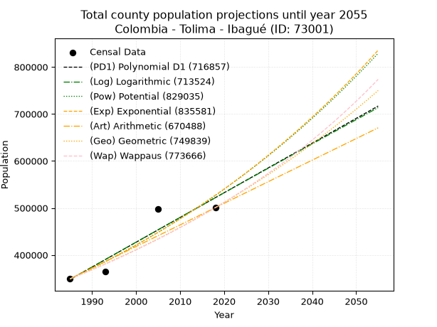
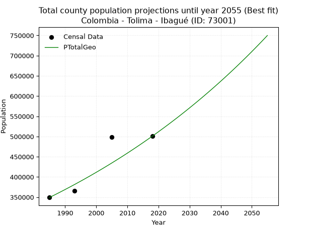
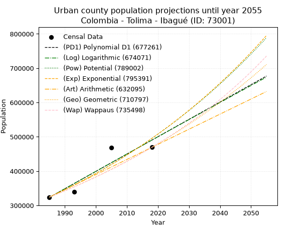
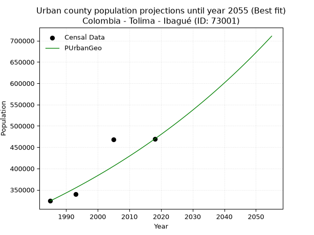
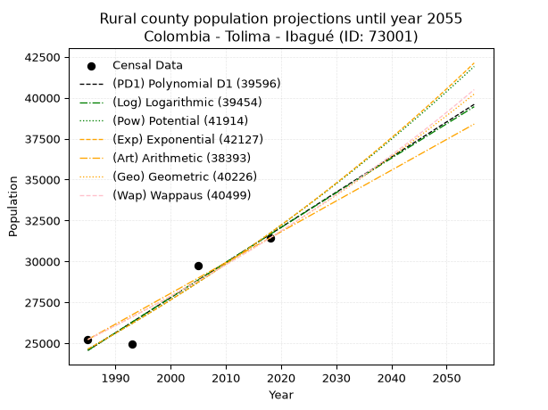
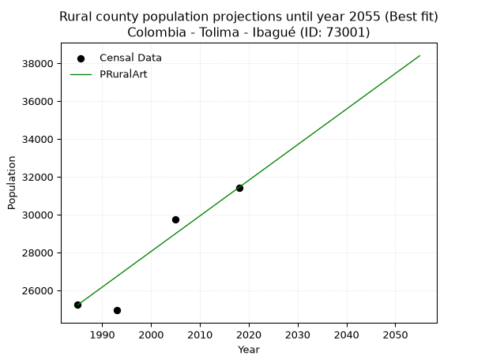

<div align="center">


</div>

# _“Population and Public Services Demand Projections (PPSD) until Year 2050 for Colombia - Tolima - Ibagué (ID: 73001)”_
Keywords: `population` `public-service` `projection` `lineal` `polynomial` `logarithmic` `potential` `exponential` `arithmetic` `geometric` `wappaus` `dane` `colombia` `south-america`

PPSD are analytical estimates used by governments and planners to anticipate future changes in population size, age distribution, and the resulting community needs for utilities, healthcare, education, and infrastructure as sizing future water treatment facilities, electrical grids, and road networks based on spatial growth.

> **General running parameters**: • app_version: _v20260806_. • Python version: _3.14.7_. • Pandas version: _3.0.5_. • NumPy version: _2.5.1_. • Creates, save and include plots into reports (create_plot): _False_. • Projection until year: _2050_. • Process polynomial degree 2 and up: _False_. • Process Wappaus: _True_. • Process Wappaus: _True_. • Set negative values to zero: _True_. • Set infinite values to zero: _True_. • Drop dataset notes: _True_. 
<div align="center">

Dynamic map: [:earth_americas:Google](http://maps.google.com/maps?q=4.432247893,-75.1942495) [:earth_americas:OSM](https://www.openstreetmap.org/#map=18/4.432247893/-75.1942495&layers=P) [:earth_americas:Bing](https://www.bing.com/maps?cp=4.432247893~-75.1942495&lvl=18) [:earth_americas:Apple](https://maps.apple.com/frame?center=4.432247893%2C-75.1942495&span=0.003%2C0.006)

</div>


<div align="center">

```geojson
{
  "type": "Feature",
  "geometry": {
    "type": "Point", 
    "coordinates": [-75.1942495, 4.432247893]
  }, 
  "properties": {
    "Name": "Colombia - Tolima - Ibagué (ID: 73001)"
  }
}
```

</div>


## 0. Census Data (4 records)

Census data are official statistics collected by a government about the people and housing in a country. They usually include counts of total population, age, sex, race, income, education, and jobs.

📅Global census file: [Population.xlsx](../data/Population.xlsx)

| Source   |   Year |   CountryID | CountryName   |   StateID | StateName   |   CountyID | CountyName   |   PTotal |   PUrban |   PRural |
|:---------|-------:|------------:|:--------------|----------:|:------------|-----------:|:-------------|---------:|---------:|---------:|
| DANE     |   1985 |          57 | Colombia      |        73 | Tolima      |      73001 | Ibagué       |   349241 |   324012 |    25229 |
| DANE     |   1993 |          57 | Colombia      |        73 | Tolima      |      73001 | Ibagué       |   365136 |   340191 |    24945 |
| DANE     |   2005 |          57 | Colombia      |        73 | Tolima      |      73001 | Ibagué       |   498401 |   468647 |    29754 |
| DANE     |   2018 |          57 | Colombia      |        73 | Tolima      |      73001 | Ibagué       |   500686 |   469251 |    31435 |

> 🔥Some records could had specific notes about the registered values or the corresponding urban or rural distribution.

## 1. Total

### 1.1. Coefficients and Parameters

* (PD1) Polynomial Deg 1: 5269.241268566828, -10111433.847450798 (lineal)
* (Log) Logarithmic: 10552377.539762665, -79780340.24118261
* (Pow) Potential: 24.956718638515724, -76.75833981507662
* (Exp) Exponential: 0.012461618659711916, 6.313986011492699e-06
* (Art) Arithmetic: Year diff. 2018 - 1985 = 33, Population diff. 500686 - 349241 = 151445, Annual growth = 4589.242424242424
* (Geo) Geometric: Year diff. 2018 - 1985 = 33, Population diff. 500686 - 349241 = 151445, Annual growth % = 0.01097545776819131
* (Wap) Wappaus: i = 1.0799144924781596, Condition values only valid for < 200)

<sub>
Wappaus condition values: ['0.00', '1.08', '2.16', '3.24', '4.32', '5.40', '6.48', '7.56', '8.64', '9.72', '10.80', '11.88', '12.96', '14.04', '15.12', '16.20', '17.28', '18.36', '19.44', '20.52', '21.60', '22.68', '23.76', '24.84', '25.92', '27.00', '28.08', '29.16', '30.24', '31.32', '32.40', '33.48', '34.56', '35.64', '36.72', '37.80', '38.88', '39.96', '41.04', '42.12', '43.20', '44.28', '45.36', '46.44', '47.52', '48.60', '49.68', '50.76', '51.84', '52.92', '54.00', '55.08', '56.16', '57.24', '58.32', '59.40', '60.48', '61.56', '62.64', '63.71', '64.79', '65.87', '66.95', '68.03', '69.11', '70.19']
</sub>


### 1.2. Projected Dataset

|   Year |   CountyID |   PTotalPD1 |   PTotalLog |   PTotalPow |   PTotalExp |   PTotalArt |   PTotalGeo |   PTotalWap |
|-------:|-----------:|------------:|------------:|------------:|------------:|------------:|------------:|------------:|
|   1985 |      73001 |      348010 |      347811 |      349093 |      349259 |      349241 |      349241 |      349241 |
|   1986 |      73001 |      353279 |      353126 |      353509 |      353639 |      353830 |      353074 |      353033 |
|   1987 |      73001 |      358549 |      358438 |      357978 |      358073 |      358419 |      356949 |      356866 |
|   1988 |      73001 |      363818 |      363747 |      362501 |      362563 |      363009 |      360867 |      360742 |
|   1989 |      73001 |      369087 |      369054 |      367080 |      367110 |      367598 |      364828 |      364660 |
|   1990 |      73001 |      374356 |      374358 |      371713 |      371713 |      372187 |      368832 |      368622 |
|   1991 |      73001 |      379626 |      379659 |      376403 |      376374 |      376776 |      372880 |      372628 |
|   1992 |      73001 |      384895 |      384958 |      381150 |      381094 |      381366 |      376972 |      376679 |
|   1993 |      73001 |      390164 |      390254 |      385954 |      385873 |      385955 |      381110 |      380775 |
|   1994 |      73001 |      395433 |      395547 |      390816 |      390711 |      390544 |      385293 |      384918 |
|   1995 |      73001 |      400702 |      400838 |      395737 |      395611 |      395133 |      389521 |      389109 |
|   1996 |      73001 |      405972 |      406126 |      400717 |      400571 |      399723 |      393797 |      393347 |
|   1997 |      73001 |      411241 |      411412 |      405758 |      405594 |      404312 |      398119 |      397635 |
|   1998 |      73001 |      416510 |      416694 |      410859 |      410680 |      408901 |      402488 |      401972 |
|   1999 |      73001 |      421779 |      421975 |      416022 |      415830 |      413490 |      406906 |      406360 |
|   2000 |      73001 |      427049 |      427252 |      421247 |      421045 |      418080 |      411372 |      410799 |
|   2001 |      73001 |      432318 |      432527 |      426535 |      426324 |      422669 |      415887 |      415291 |
|   2002 |      73001 |      437587 |      437799 |      431887 |      431670 |      427258 |      420451 |      419837 |
|   2003 |      73001 |      442856 |      443069 |      437303 |      437083 |      431847 |      425066 |      424436 |
|   2004 |      73001 |      448126 |      448336 |      442785 |      442564 |      436437 |      429731 |      429092 |
|   2005 |      73001 |      453395 |      453600 |      448332 |      448114 |      441026 |      434448 |      433803 |
|   2006 |      73001 |      458664 |      458862 |      453946 |      453733 |      445615 |      439216 |      438572 |
|   2007 |      73001 |      463933 |      464121 |      459627 |      459422 |      450204 |      444037 |      443399 |
|   2008 |      73001 |      469203 |      469377 |      465377 |      465183 |      454794 |      448910 |      448286 |
|   2009 |      73001 |      474472 |      474631 |      471196 |      471017 |      459383 |      453837 |      453233 |
|   2010 |      73001 |      479741 |      479883 |      477084 |      476923 |      463972 |      458818 |      458243 |
|   2011 |      73001 |      485010 |      485131 |      483043 |      482903 |      468561 |      463854 |      463315 |
|   2012 |      73001 |      490280 |      490377 |      489073 |      488959 |      473151 |      468945 |      468451 |
|   2013 |      73001 |      495549 |      495621 |      495176 |      495090 |      477740 |      474092 |      473653 |
|   2014 |      73001 |      500818 |      500861 |      501352 |      501298 |      482329 |      479295 |      478921 |
|   2015 |      73001 |      506087 |      506100 |      507602 |      507584 |      486918 |      484556 |      484257 |
|   2016 |      73001 |      511357 |      511335 |      513926 |      513949 |      491508 |      489874 |      489662 |
|   2017 |      73001 |      516626 |      516568 |      520326 |      520394 |      496097 |      495250 |      495138 |
|   2018 |      73001 |      521895 |      521799 |      526802 |      526920 |      500686 |      500686 |      500686 |
|   2019 |      73001 |      527164 |      527027 |      533356 |      533527 |      505275 |      506181 |      506307 |
|   2020 |      73001 |      532434 |      532252 |      539988 |      540217 |      509864 |      511737 |      512003 |
|   2021 |      73001 |      537703 |      537474 |      546699 |      546991 |      514454 |      517353 |      517776 |
|   2022 |      73001 |      542972 |      542695 |      553491 |      553850 |      519043 |      523032 |      523626 |
|   2023 |      73001 |      548241 |      547912 |      560363 |      560795 |      523632 |      528772 |      529556 |
|   2024 |      73001 |      553510 |      553127 |      567317 |      567827 |      528221 |      534576 |      535567 |
|   2025 |      73001 |      558780 |      558339 |      574354 |      574948 |      532811 |      540443 |      541660 |
|   2026 |      73001 |      564049 |      563549 |      581474 |      582157 |      537400 |      546374 |      547839 |
|   2027 |      73001 |      569318 |      568756 |      588679 |      589457 |      541989 |      552371 |      554103 |
|   2028 |      73001 |      574587 |      573961 |      595970 |      596849 |      546578 |      558434 |      560456 |
|   2029 |      73001 |      579857 |      579163 |      603348 |      604333 |      551168 |      564563 |      566899 |
|   2030 |      73001 |      585126 |      584362 |      610813 |      611911 |      555757 |      570759 |      573433 |
|   2031 |      73001 |      590395 |      589559 |      618367 |      619584 |      560346 |      577023 |      580061 |
|   2032 |      73001 |      595664 |      594754 |      626010 |      627354 |      564935 |      583356 |      586786 |
|   2033 |      73001 |      600934 |      599946 |      633744 |      635220 |      569525 |      589759 |      593608 |
|   2034 |      73001 |      606203 |      605135 |      641570 |      643186 |      574114 |      596232 |      600531 |
|   2035 |      73001 |      611472 |      610322 |      649488 |      651251 |      578703 |      602776 |      607556 |
|   2036 |      73001 |      616741 |      615506 |      657501 |      659418 |      583292 |      609392 |      614685 |
|   2037 |      73001 |      622011 |      620687 |      665608 |      667686 |      587882 |      616080 |      621922 |
|   2038 |      73001 |      627280 |      625866 |      673811 |      676059 |      592471 |      622842 |      629268 |
|   2039 |      73001 |      632549 |      631043 |      682111 |      684536 |      597060 |      629678 |      636726 |
|   2040 |      73001 |      637818 |      636217 |      690509 |      693120 |      601649 |      636589 |      644299 |
|   2041 |      73001 |      643088 |      641388 |      699006 |      701812 |      606239 |      643576 |      651989 |
|   2042 |      73001 |      648357 |      646557 |      707603 |      710612 |      610828 |      650639 |      659799 |
|   2043 |      73001 |      653626 |      651724 |      716302 |      719523 |      615417 |      657780 |      667732 |
|   2044 |      73001 |      658895 |      656888 |      725104 |      728545 |      620006 |      665000 |      675790 |
|   2045 |      73001 |      664165 |      662049 |      734009 |      737681 |      624596 |      672298 |      683977 |
|   2046 |      73001 |      669434 |      667208 |      743020 |      746931 |      629185 |      679677 |      692296 |
|   2047 |      73001 |      674703 |      672364 |      752136 |      756297 |      633774 |      687137 |      700750 |
|   2048 |      73001 |      679972 |      677518 |      761360 |      765781 |      638363 |      694678 |      709343 |
|   2049 |      73001 |      685242 |      682669 |      770692 |      775384 |      642953 |      702303 |      718077 |
|   2050 |      73001 |      690511 |      687818 |      780135 |      785107 |      647542 |      710011 |      726956 |
<div align="center">

</img>

</div>


### 1.3. Best fit with absolute and relative error (%)

Relative error puts that difference into context by dividing the absolute error by the true value, creating a unitless ratio or percentage that shows the scale of the mistake.

Absolute and relative error

|   Year | Source   |   CountryID | CountryName   |   StateID | StateName   |   CountyID_x | CountyName   |   PTotal |   PUrban |   PRural |   CountyID_y |   PTotalPD1 |   PTotalLog |   PTotalPow |   PTotalExp |   PTotalArt |   PTotalGeo |   PTotalWap |   PTotalPD1AbsError |   PTotalLogAbsError |   PTotalPowAbsError |   PTotalExpAbsError |   PTotalArtAbsError |   PTotalGeoAbsError |   PTotalWapAbsError |   PTotalPD1RelError |   PTotalLogRelError |   PTotalPowRelError |   PTotalExpRelError |   PTotalArtRelError |   PTotalGeoRelError |   PTotalWapRelError |
|-------:|:---------|------------:|:--------------|----------:|:------------|-------------:|:-------------|---------:|---------:|---------:|-------------:|------------:|------------:|------------:|------------:|------------:|------------:|------------:|--------------------:|--------------------:|--------------------:|--------------------:|--------------------:|--------------------:|--------------------:|--------------------:|--------------------:|--------------------:|--------------------:|--------------------:|--------------------:|--------------------:|
|   1985 | DANE     |          57 | Colombia      |        73 | Tolima      |        73001 | Ibagué       |   349241 |   324012 |    25229 |        73001 |      348010 |      347811 |      349093 |      349259 |      349241 |      349241 |      349241 |                1231 |                1430 |                 148 |                  18 |                   0 |                   0 |                   0 |            0.352479 |            0.409459 |           0.0423776 |          0.00515403 |             0       |             0       |             0       |
|   1993 | DANE     |          57 | Colombia      |        73 | Tolima      |        73001 | Ibagué       |   365136 |   340191 |    24945 |        73001 |      390164 |      390254 |      385954 |      385873 |      385955 |      381110 |      380775 |               25028 |               25118 |               20818 |               20737 |               20819 |               15974 |               15639 |            6.85443  |            6.87908  |           5.70144   |          5.67925    |             5.70171 |             4.37481 |             4.28306 |
|   2005 | DANE     |          57 | Colombia      |        73 | Tolima      |        73001 | Ibagué       |   498401 |   468647 |    29754 |        73001 |      453395 |      453600 |      448332 |      448114 |      441026 |      434448 |      433803 |               45006 |               44801 |               50069 |               50287 |               57375 |               63953 |               64598 |            9.03008  |            8.98895  |          10.0459    |         10.0897     |            11.5118  |            12.8316  |            12.961   |
|   2018 | DANE     |          57 | Colombia      |        73 | Tolima      |        73001 | Ibagué       |   500686 |   469251 |    31435 |        73001 |      521895 |      521799 |      526802 |      526920 |      500686 |      500686 |      500686 |               21209 |               21113 |               26116 |               26234 |                   0 |                   0 |                   0 |            4.23599  |            4.21681  |           5.21604   |          5.23961    |             0       |             0       |             0       |

Relative error mean

| Method    |   RelError | Best   |
|:----------|-----------:|:-------|
| PTotalPD1 |    5.11824 |        |
| PTotalLog |    5.12358 |        |
| PTotalPow |    5.25145 |        |
| PTotalExp |    5.25342 |        |
| PTotalArt |    4.30338 |        |
| PTotalGeo |    4.30161 | True   |
| PTotalWap |    4.31103 |        |

💙Best method: _**PTotalGeo**_
<div align="center">

</img>

</div>


### 1.4. Fresh water supply demand in liters per capita per day (lpcd)

The fresh water supply demand typically ranges from 100 to 300 liters per capita per day (lpcd) for standard domestic and municipal planning, though absolute survival minimums set by the World Health Organization are as low as 7.5 to 20 liters per day, and total consumption in high-income nations can exceed 400 liters.

> `CZ`: Level in meters above the sea level (masl).<br> `WS`: Fresh water supply demand in liters per capita per day (lpcd or l/h/d).<br> `WSAll`: Zonal fresh water supply demand in liters per second (l/s).<br> `A`: Zonal area in square meters.

Reference values (RAS Colombia)

|    CZ |   WS |
|------:|-----:|
|  1000 |  120 |
|  2000 |  130 |
| 99999 |  140 |

County shapefile geometry properties and water supply values

|   CountyID |      ATotal |   CZTotal |   WSTotal |
|-----------:|------------:|----------:|----------:|
|      73001 | 1.37657e+09 |   1935.57 |       130 |

Projected values for best method: PTotalGeo

|   CountyID |   Year |   PTotalGeo |   WSTotal |   WSTotalAll |
|-----------:|-------:|------------:|----------:|-------------:|
|      73001 |   1985 |      349241 |       130 |      525.478 |
|      73001 |   1986 |      353074 |       130 |      531.246 |
|      73001 |   1987 |      356949 |       130 |      537.076 |
|      73001 |   1988 |      360867 |       130 |      542.971 |
|      73001 |   1989 |      364828 |       130 |      548.931 |
|      73001 |   1990 |      368832 |       130 |      554.956 |
|      73001 |   1991 |      372880 |       130 |      561.046 |
|      73001 |   1992 |      376972 |       130 |      567.203 |
|      73001 |   1993 |      381110 |       130 |      573.429 |
|      73001 |   1994 |      385293 |       130 |      579.723 |
|      73001 |   1995 |      389521 |       130 |      586.085 |
|      73001 |   1996 |      393797 |       130 |      592.519 |
|      73001 |   1997 |      398119 |       130 |      599.022 |
|      73001 |   1998 |      402488 |       130 |      605.595 |
|      73001 |   1999 |      406906 |       130 |      612.243 |
|      73001 |   2000 |      411372 |       130 |      618.962 |
|      73001 |   2001 |      415887 |       130 |      625.756 |
|      73001 |   2002 |      420451 |       130 |      632.623 |
|      73001 |   2003 |      425066 |       130 |      639.567 |
|      73001 |   2004 |      429731 |       130 |      646.586 |
|      73001 |   2005 |      434448 |       130 |      653.683 |
|      73001 |   2006 |      439216 |       130 |      660.857 |
|      73001 |   2007 |      444037 |       130 |      668.111 |
|      73001 |   2008 |      448910 |       130 |      675.443 |
|      73001 |   2009 |      453837 |       130 |      682.857 |
|      73001 |   2010 |      458818 |       130 |      690.351 |
|      73001 |   2011 |      463854 |       130 |      697.928 |
|      73001 |   2012 |      468945 |       130 |      705.589 |
|      73001 |   2013 |      474092 |       130 |      713.333 |
|      73001 |   2014 |      479295 |       130 |      721.161 |
|      73001 |   2015 |      484556 |       130 |      729.077 |
|      73001 |   2016 |      489874 |       130 |      737.079 |
|      73001 |   2017 |      495250 |       130 |      745.168 |
|      73001 |   2018 |      500686 |       130 |      753.347 |
|      73001 |   2019 |      506181 |       130 |      761.615 |
|      73001 |   2020 |      511737 |       130 |      769.975 |
|      73001 |   2021 |      517353 |       130 |      778.425 |
|      73001 |   2022 |      523032 |       130 |      786.969 |
|      73001 |   2023 |      528772 |       130 |      795.606 |
|      73001 |   2024 |      534576 |       130 |      804.339 |
|      73001 |   2025 |      540443 |       130 |      813.167 |
|      73001 |   2026 |      546374 |       130 |      822.091 |
|      73001 |   2027 |      552371 |       130 |      831.114 |
|      73001 |   2028 |      558434 |       130 |      840.236 |
|      73001 |   2029 |      564563 |       130 |      849.458 |
|      73001 |   2030 |      570759 |       130 |      858.781 |
|      73001 |   2031 |      577023 |       130 |      868.206 |
|      73001 |   2032 |      583356 |       130 |      877.735 |
|      73001 |   2033 |      589759 |       130 |      887.369 |
|      73001 |   2034 |      596232 |       130 |      897.108 |
|      73001 |   2035 |      602776 |       130 |      906.955 |
|      73001 |   2036 |      609392 |       130 |      916.909 |
|      73001 |   2037 |      616080 |       130 |      926.972 |
|      73001 |   2038 |      622842 |       130 |      937.147 |
|      73001 |   2039 |      629678 |       130 |      947.432 |
|      73001 |   2040 |      636589 |       130 |      957.831 |
|      73001 |   2041 |      643576 |       130 |      968.344 |
|      73001 |   2042 |      650639 |       130 |      978.971 |
|      73001 |   2043 |      657780 |       130 |      989.715 |
|      73001 |   2044 |      665000 |       130 |     1000.58  |
|      73001 |   2045 |      672298 |       130 |     1011.56  |
|      73001 |   2046 |      679677 |       130 |     1022.66  |
|      73001 |   2047 |      687137 |       130 |     1033.89  |
|      73001 |   2048 |      694678 |       130 |     1045.23  |
|      73001 |   2049 |      702303 |       130 |     1056.71  |
|      73001 |   2050 |      710011 |       130 |     1068.3   |

## 2. Urban

### 2.1. Coefficients and Parameters

* (PD1) Polynomial Deg 1: 5054.533520674417, -9709805.424729 (lineal)
* (Log) Logarithmic: 10122643.416528257, -76541768.47680475
* (Pow) Potential: 25.642883320002976, -79.05296878217773
* (Exp) Exponential: 0.012803937232370258, 2.9743015510050977e-06
* (Art) Arithmetic: Year diff. 2018 - 1985 = 33, Population diff. 469251 - 324012 = 145239, Annual growth = 4401.181818181818
* (Geo) Geometric: Year diff. 2018 - 1985 = 33, Population diff. 469251 - 324012 = 145239, Annual growth % = 0.011286160632656861
* (Wap) Wappaus: i = 1.1096400104837407, Condition values only valid for < 200)

<sub>
Wappaus condition values: ['0.00', '1.11', '2.22', '3.33', '4.44', '5.55', '6.66', '7.77', '8.88', '9.99', '11.10', '12.21', '13.32', '14.43', '15.53', '16.64', '17.75', '18.86', '19.97', '21.08', '22.19', '23.30', '24.41', '25.52', '26.63', '27.74', '28.85', '29.96', '31.07', '32.18', '33.29', '34.40', '35.51', '36.62', '37.73', '38.84', '39.95', '41.06', '42.17', '43.28', '44.39', '45.50', '46.60', '47.71', '48.82', '49.93', '51.04', '52.15', '53.26', '54.37', '55.48', '56.59', '57.70', '58.81', '59.92', '61.03', '62.14', '63.25', '64.36', '65.47', '66.58', '67.69', '68.80', '69.91', '71.02', '72.13']
</sub>


### 2.2. Projected Dataset

|   Year |   CountyID |   PUrbanPD1 |   PUrbanLog |   PUrbanPow |   PUrbanExp |   PUrbanArt |   PUrbanGeo |   PUrbanWap |
|-------:|-----------:|------------:|------------:|------------:|------------:|------------:|------------:|------------:|
|   1985 |      73001 |      323444 |      323251 |      324429 |      324589 |      324012 |      324012 |      324012 |
|   1986 |      73001 |      328498 |      328349 |      328646 |      328771 |      328413 |      327669 |      327627 |
|   1987 |      73001 |      333553 |      333445 |      332916 |      333008 |      332814 |      331367 |      331283 |
|   1988 |      73001 |      338607 |      338538 |      337239 |      337299 |      337216 |      335107 |      334981 |
|   1989 |      73001 |      343662 |      343629 |      341616 |      341646 |      341617 |      338889 |      338720 |
|   1990 |      73001 |      348716 |      348717 |      346048 |      346048 |      346018 |      342714 |      342502 |
|   1991 |      73001 |      353771 |      353802 |      350534 |      350508 |      350419 |      346582 |      346327 |
|   1992 |      73001 |      358825 |      358885 |      355077 |      355024 |      354820 |      350493 |      350197 |
|   1993 |      73001 |      363880 |      363965 |      359676 |      359599 |      359221 |      354449 |      354111 |
|   1994 |      73001 |      368934 |      369043 |      364333 |      364233 |      363623 |      358449 |      358071 |
|   1995 |      73001 |      373989 |      374118 |      369047 |      368927 |      368024 |      362495 |      362078 |
|   1996 |      73001 |      379043 |      379191 |      373820 |      373681 |      372425 |      366586 |      366132 |
|   1997 |      73001 |      384098 |      384261 |      378653 |      378496 |      376826 |      370723 |      370234 |
|   1998 |      73001 |      389153 |      389329 |      383545 |      383374 |      381227 |      374907 |      374385 |
|   1999 |      73001 |      394207 |      394394 |      388498 |      388314 |      385629 |      379139 |      378586 |
|   2000 |      73001 |      399262 |      399457 |      393512 |      393318 |      390030 |      383418 |      382838 |
|   2001 |      73001 |      404316 |      404517 |      398589 |      398386 |      394431 |      387745 |      387142 |
|   2002 |      73001 |      409371 |      409574 |      403728 |      403520 |      398832 |      392121 |      391499 |
|   2003 |      73001 |      414425 |      414629 |      408931 |      408720 |      403233 |      396547 |      395909 |
|   2004 |      73001 |      419480 |      419682 |      414199 |      413987 |      407634 |      401022 |      400374 |
|   2005 |      73001 |      424534 |      424732 |      419532 |      419321 |      412036 |      405548 |      404894 |
|   2006 |      73001 |      429589 |      429779 |      424931 |      424725 |      416437 |      410125 |      409472 |
|   2007 |      73001 |      434643 |      434824 |      430396 |      430198 |      420838 |      414754 |      414107 |
|   2008 |      73001 |      439698 |      439867 |      435929 |      435742 |      425239 |      419435 |      418801 |
|   2009 |      73001 |      444752 |      444906 |      441530 |      441357 |      429640 |      424169 |      423556 |
|   2010 |      73001 |      449807 |      449944 |      447201 |      447044 |      434042 |      428956 |      428371 |
|   2011 |      73001 |      454861 |      454979 |      452941 |      452805 |      438443 |      433797 |      433249 |
|   2012 |      73001 |      459916 |      460011 |      458752 |      458640 |      442844 |      438693 |      438191 |
|   2013 |      73001 |      464971 |      465041 |      464635 |      464550 |      447245 |      443644 |      443198 |
|   2014 |      73001 |      470025 |      470068 |      470590 |      470536 |      451646 |      448651 |      448271 |
|   2015 |      73001 |      475080 |      475093 |      476618 |      476600 |      456047 |      453715 |      453411 |
|   2016 |      73001 |      480134 |      480116 |      482721 |      482741 |      460449 |      458836 |      458620 |
|   2017 |      73001 |      485189 |      485136 |      488899 |      488962 |      464850 |      464014 |      463900 |
|   2018 |      73001 |      490243 |      490153 |      495152 |      495263 |      469251 |      469251 |      469251 |
|   2019 |      73001 |      495298 |      495168 |      501483 |      501645 |      473652 |      474547 |      474675 |
|   2020 |      73001 |      500352 |      500180 |      507891 |      508109 |      478053 |      479903 |      480175 |
|   2021 |      73001 |      505407 |      505190 |      514378 |      514657 |      482455 |      485319 |      485750 |
|   2022 |      73001 |      510461 |      510198 |      520945 |      521289 |      486856 |      490797 |      491403 |
|   2023 |      73001 |      515516 |      515203 |      527592 |      528006 |      491257 |      496336 |      497136 |
|   2024 |      73001 |      520570 |      520205 |      534320 |      534810 |      495658 |      501937 |      502950 |
|   2025 |      73001 |      525625 |      525206 |      541131 |      541702 |      500059 |      507602 |      508847 |
|   2026 |      73001 |      530679 |      530203 |      548025 |      548683 |      504460 |      513331 |      514828 |
|   2027 |      73001 |      535734 |      535198 |      555004 |      555753 |      508862 |      519125 |      520896 |
|   2028 |      73001 |      540789 |      540191 |      562068 |      562915 |      513263 |      524984 |      527053 |
|   2029 |      73001 |      545843 |      545181 |      569218 |      570169 |      517664 |      530909 |      533300 |
|   2030 |      73001 |      550898 |      550169 |      576456 |      577516 |      522065 |      536901 |      539639 |
|   2031 |      73001 |      555952 |      555154 |      583782 |      584958 |      526466 |      542960 |      546073 |
|   2032 |      73001 |      561007 |      560137 |      591198 |      592496 |      530868 |      549088 |      552603 |
|   2033 |      73001 |      566061 |      565117 |      598704 |      600131 |      535269 |      555285 |      559232 |
|   2034 |      73001 |      571116 |      570095 |      606301 |      607864 |      539670 |      561552 |      565962 |
|   2035 |      73001 |      576170 |      575071 |      613992 |      615697 |      544071 |      567890 |      572795 |
|   2036 |      73001 |      581225 |      580044 |      621775 |      623631 |      548472 |      574299 |      579734 |
|   2037 |      73001 |      586279 |      585015 |      629654 |      631668 |      552873 |      580781 |      586782 |
|   2038 |      73001 |      591334 |      589983 |      637629 |      639808 |      557275 |      587336 |      593940 |
|   2039 |      73001 |      596388 |      594948 |      645700 |      648052 |      561676 |      593965 |      601212 |
|   2040 |      73001 |      601443 |      599912 |      653870 |      656403 |      566077 |      600668 |      608599 |
|   2041 |      73001 |      606497 |      604873 |      662139 |      664862 |      570478 |      607447 |      616106 |
|   2042 |      73001 |      611552 |      609831 |      670508 |      673429 |      574879 |      614303 |      623734 |
|   2043 |      73001 |      616607 |      614787 |      678980 |      682107 |      579281 |      621236 |      631488 |
|   2044 |      73001 |      621661 |      619741 |      687553 |      690897 |      583682 |      628248 |      639369 |
|   2045 |      73001 |      626716 |      624692 |      696231 |      699800 |      588083 |      635338 |      647381 |
|   2046 |      73001 |      631770 |      629640 |      705014 |      708818 |      592484 |      642509 |      655528 |
|   2047 |      73001 |      636825 |      634587 |      713904 |      717952 |      596885 |      649760 |      663812 |
|   2048 |      73001 |      641879 |      639531 |      722901 |      727204 |      601286 |      657093 |      672238 |
|   2049 |      73001 |      646934 |      644472 |      732007 |      736575 |      605688 |      664509 |      680808 |
|   2050 |      73001 |      651988 |      649411 |      741223 |      746066 |      610089 |      672009 |      689528 |
<div align="center">

</img>

</div>


### 2.3. Best fit with absolute and relative error (%)

Relative error puts that difference into context by dividing the absolute error by the true value, creating a unitless ratio or percentage that shows the scale of the mistake.

Absolute and relative error

|   Year | Source   |   CountryID | CountryName   |   StateID | StateName   |   CountyID_x | CountyName   |   PTotal |   PUrban |   PRural |   CountyID_y |   PUrbanPD1 |   PUrbanLog |   PUrbanPow |   PUrbanExp |   PUrbanArt |   PUrbanGeo |   PUrbanWap |   PUrbanPD1AbsError |   PUrbanLogAbsError |   PUrbanPowAbsError |   PUrbanExpAbsError |   PUrbanArtAbsError |   PUrbanGeoAbsError |   PUrbanWapAbsError |   PUrbanPD1RelError |   PUrbanLogRelError |   PUrbanPowRelError |   PUrbanExpRelError |   PUrbanArtRelError |   PUrbanGeoRelError |   PUrbanWapRelError |
|-------:|:---------|------------:|:--------------|----------:|:------------|-------------:|:-------------|---------:|---------:|---------:|-------------:|------------:|------------:|------------:|------------:|------------:|------------:|------------:|--------------------:|--------------------:|--------------------:|--------------------:|--------------------:|--------------------:|--------------------:|--------------------:|--------------------:|--------------------:|--------------------:|--------------------:|--------------------:|--------------------:|
|   1985 | DANE     |          57 | Colombia      |        73 | Tolima      |        73001 | Ibagué       |   349241 |   324012 |    25229 |        73001 |      323444 |      323251 |      324429 |      324589 |      324012 |      324012 |      324012 |                 568 |                 761 |                 417 |                 577 |                   0 |                   0 |                   0 |            0.175302 |            0.234868 |            0.128699 |             0.17808 |             0       |             0       |             0       |
|   1993 | DANE     |          57 | Colombia      |        73 | Tolima      |        73001 | Ibagué       |   365136 |   340191 |    24945 |        73001 |      363880 |      363965 |      359676 |      359599 |      359221 |      354449 |      354111 |               23689 |               23774 |               19485 |               19408 |               19030 |               14258 |               13920 |            6.96344  |            6.98843  |            5.72766  |             5.70503 |             5.59392 |             4.19117 |             4.09182 |
|   2005 | DANE     |          57 | Colombia      |        73 | Tolima      |        73001 | Ibagué       |   498401 |   468647 |    29754 |        73001 |      424534 |      424732 |      419532 |      419321 |      412036 |      405548 |      404894 |               44113 |               43915 |               49115 |               49326 |               56611 |               63099 |               63753 |            9.41284  |            9.37059  |           10.4802   |            10.5252  |            12.0797  |            13.4641  |            13.6036  |
|   2018 | DANE     |          57 | Colombia      |        73 | Tolima      |        73001 | Ibagué       |   500686 |   469251 |    31435 |        73001 |      490243 |      490153 |      495152 |      495263 |      469251 |      469251 |      469251 |               20992 |               20902 |               25901 |               26012 |                   0 |                   0 |                   0 |            4.47351  |            4.45433  |            5.51965  |             5.5433  |             0       |             0       |             0       |

Relative error mean

| Method    |   RelError | Best   |
|:----------|-----------:|:-------|
| PUrbanPD1 |    5.25627 |        |
| PUrbanLog |    5.26205 |        |
| PUrbanPow |    5.46405 |        |
| PUrbanExp |    5.4879  |        |
| PUrbanArt |    4.4184  |        |
| PUrbanGeo |    4.41381 | True   |
| PUrbanWap |    4.42386 |        |

💙Best method: _**PUrbanGeo**_
<div align="center">

</img>

</div>


### 2.4. Fresh water supply demand in liters per capita per day (lpcd)

The fresh water supply demand typically ranges from 100 to 300 liters per capita per day (lpcd) for standard domestic and municipal planning, though absolute survival minimums set by the World Health Organization are as low as 7.5 to 20 liters per day, and total consumption in high-income nations can exceed 400 liters.

> `CZ`: Level in meters above the sea level (masl).<br> `WS`: Fresh water supply demand in liters per capita per day (lpcd or l/h/d).<br> `WSAll`: Zonal fresh water supply demand in liters per second (l/s).<br> `A`: Zonal area in square meters.

Reference values (RAS Colombia)

|    CZ |   WS |
|------:|-----:|
|  1000 |  120 |
|  2000 |  130 |
| 99999 |  140 |

County shapefile geometry properties and water supply values

|   CountyID |      AUrban |   CZUrban |   WSUrban |
|-----------:|------------:|----------:|----------:|
|      73001 | 4.98703e+07 |   1106.66 |       130 |

Projected values for best method: PUrbanGeo

|   CountyID |   Year |   PUrbanGeo |   WSUrban |   WSUrbanAll |
|-----------:|-------:|------------:|----------:|-------------:|
|      73001 |   1985 |      324012 |       130 |      487.518 |
|      73001 |   1986 |      327669 |       130 |      493.02  |
|      73001 |   1987 |      331367 |       130 |      498.585 |
|      73001 |   1988 |      335107 |       130 |      504.212 |
|      73001 |   1989 |      338889 |       130 |      509.902 |
|      73001 |   1990 |      342714 |       130 |      515.658 |
|      73001 |   1991 |      346582 |       130 |      521.478 |
|      73001 |   1992 |      350493 |       130 |      527.362 |
|      73001 |   1993 |      354449 |       130 |      533.314 |
|      73001 |   1994 |      358449 |       130 |      539.333 |
|      73001 |   1995 |      362495 |       130 |      545.421 |
|      73001 |   1996 |      366586 |       130 |      551.576 |
|      73001 |   1997 |      370723 |       130 |      557.801 |
|      73001 |   1998 |      374907 |       130 |      564.096 |
|      73001 |   1999 |      379139 |       130 |      570.464 |
|      73001 |   2000 |      383418 |       130 |      576.902 |
|      73001 |   2001 |      387745 |       130 |      583.413 |
|      73001 |   2002 |      392121 |       130 |      589.997 |
|      73001 |   2003 |      396547 |       130 |      596.656 |
|      73001 |   2004 |      401022 |       130 |      603.39  |
|      73001 |   2005 |      405548 |       130 |      610.2   |
|      73001 |   2006 |      410125 |       130 |      617.086 |
|      73001 |   2007 |      414754 |       130 |      624.051 |
|      73001 |   2008 |      419435 |       130 |      631.094 |
|      73001 |   2009 |      424169 |       130 |      638.217 |
|      73001 |   2010 |      428956 |       130 |      645.42  |
|      73001 |   2011 |      433797 |       130 |      652.704 |
|      73001 |   2012 |      438693 |       130 |      660.07  |
|      73001 |   2013 |      443644 |       130 |      667.52  |
|      73001 |   2014 |      448651 |       130 |      675.054 |
|      73001 |   2015 |      453715 |       130 |      682.673 |
|      73001 |   2016 |      458836 |       130 |      690.378 |
|      73001 |   2017 |      464014 |       130 |      698.169 |
|      73001 |   2018 |      469251 |       130 |      706.049 |
|      73001 |   2019 |      474547 |       130 |      714.017 |
|      73001 |   2020 |      479903 |       130 |      722.076 |
|      73001 |   2021 |      485319 |       130 |      730.225 |
|      73001 |   2022 |      490797 |       130 |      738.468 |
|      73001 |   2023 |      496336 |       130 |      746.802 |
|      73001 |   2024 |      501937 |       130 |      755.229 |
|      73001 |   2025 |      507602 |       130 |      763.753 |
|      73001 |   2026 |      513331 |       130 |      772.373 |
|      73001 |   2027 |      519125 |       130 |      781.091 |
|      73001 |   2028 |      524984 |       130 |      789.906 |
|      73001 |   2029 |      530909 |       130 |      798.821 |
|      73001 |   2030 |      536901 |       130 |      807.837 |
|      73001 |   2031 |      542960 |       130 |      816.954 |
|      73001 |   2032 |      549088 |       130 |      826.174 |
|      73001 |   2033 |      555285 |       130 |      835.498 |
|      73001 |   2034 |      561552 |       130 |      844.928 |
|      73001 |   2035 |      567890 |       130 |      854.464 |
|      73001 |   2036 |      574299 |       130 |      864.107 |
|      73001 |   2037 |      580781 |       130 |      873.86  |
|      73001 |   2038 |      587336 |       130 |      883.723 |
|      73001 |   2039 |      593965 |       130 |      893.697 |
|      73001 |   2040 |      600668 |       130 |      903.783 |
|      73001 |   2041 |      607447 |       130 |      913.983 |
|      73001 |   2042 |      614303 |       130 |      924.298 |
|      73001 |   2043 |      621236 |       130 |      934.73  |
|      73001 |   2044 |      628248 |       130 |      945.281 |
|      73001 |   2045 |      635338 |       130 |      955.948 |
|      73001 |   2046 |      642509 |       130 |      966.738 |
|      73001 |   2047 |      649760 |       130 |      977.648 |
|      73001 |   2048 |      657093 |       130 |      988.682 |
|      73001 |   2049 |      664509 |       130 |      999.84  |
|      73001 |   2050 |      672009 |       130 |     1011.12  |

## 3. Rural

### 3.1. Coefficients and Parameters

* (PD1) Polynomial Deg 1: 214.70774789241145, -401628.42272179597 (lineal)
* (Log) Logarithmic: 429734.12323440146, -3238571.7643778273
* (Pow) Potential: 15.329047754369007, -46.15988855658416
* (Exp) Exponential: 0.007658608612163432, 0.006158091684564401
* (Art) Arithmetic: Year diff. 2018 - 1985 = 33, Population diff. 31435 - 25229 = 6206, Annual growth = 188.06060606060606
* (Geo) Geometric: Year diff. 2018 - 1985 = 33, Population diff. 31435 - 25229 = 6206, Annual growth % = 0.0066867357003581596
* (Wap) Wappaus: i = 0.6637745519575253, Condition values only valid for < 200)

<sub>
Wappaus condition values: ['0.00', '0.66', '1.33', '1.99', '2.66', '3.32', '3.98', '4.65', '5.31', '5.97', '6.64', '7.30', '7.97', '8.63', '9.29', '9.96', '10.62', '11.28', '11.95', '12.61', '13.28', '13.94', '14.60', '15.27', '15.93', '16.59', '17.26', '17.92', '18.59', '19.25', '19.91', '20.58', '21.24', '21.90', '22.57', '23.23', '23.90', '24.56', '25.22', '25.89', '26.55', '27.21', '27.88', '28.54', '29.21', '29.87', '30.53', '31.20', '31.86', '32.52', '33.19', '33.85', '34.52', '35.18', '35.84', '36.51', '37.17', '37.84', '38.50', '39.16', '39.83', '40.49', '41.15', '41.82', '42.48', '43.15']
</sub>


### 3.2. Projected Dataset

|   Year |   CountyID |   PRuralPD1 |   PRuralLog |   PRuralPow |   PRuralExp |   PRuralArt |   PRuralGeo |   PRuralWap |
|-------:|-----------:|------------:|------------:|------------:|------------:|------------:|------------:|------------:|
|   1985 |      73001 |       24566 |       24560 |       24640 |       24646 |       25229 |       25229 |       25229 |
|   1986 |      73001 |       24781 |       24777 |       24831 |       24835 |       25417 |       25398 |       25397 |
|   1987 |      73001 |       24996 |       24993 |       25023 |       25026 |       25605 |       25568 |       25566 |
|   1988 |      73001 |       25211 |       25209 |       25217 |       25218 |       25793 |       25738 |       25736 |
|   1989 |      73001 |       25425 |       25425 |       25412 |       25412 |       25981 |       25911 |       25908 |
|   1990 |      73001 |       25640 |       25641 |       25609 |       25608 |       26169 |       26084 |       26080 |
|   1991 |      73001 |       25855 |       25857 |       25807 |       25804 |       26357 |       26258 |       26254 |
|   1992 |      73001 |       26069 |       26073 |       26006 |       26003 |       26545 |       26434 |       26429 |
|   1993 |      73001 |       26284 |       26289 |       26207 |       26203 |       26733 |       26611 |       26605 |
|   1994 |      73001 |       26499 |       26504 |       26409 |       26404 |       26922 |       26789 |       26783 |
|   1995 |      73001 |       26714 |       26720 |       26613 |       26607 |       27110 |       26968 |       26961 |
|   1996 |      73001 |       26928 |       26935 |       26818 |       26812 |       27298 |       27148 |       27141 |
|   1997 |      73001 |       27143 |       27150 |       27025 |       27018 |       27486 |       27330 |       27322 |
|   1998 |      73001 |       27358 |       27365 |       27233 |       27226 |       27674 |       27512 |       27504 |
|   1999 |      73001 |       27572 |       27580 |       27443 |       27435 |       27862 |       27696 |       27688 |
|   2000 |      73001 |       27787 |       27795 |       27654 |       27646 |       28050 |       27881 |       27873 |
|   2001 |      73001 |       28002 |       28010 |       27867 |       27858 |       28238 |       28068 |       28059 |
|   2002 |      73001 |       28216 |       28225 |       28081 |       28073 |       28426 |       28256 |       28246 |
|   2003 |      73001 |       28431 |       28440 |       28297 |       28288 |       28614 |       28444 |       28435 |
|   2004 |      73001 |       28646 |       28654 |       28514 |       28506 |       28802 |       28635 |       28625 |
|   2005 |      73001 |       28861 |       28868 |       28733 |       28725 |       28990 |       28826 |       28816 |
|   2006 |      73001 |       29075 |       29083 |       28953 |       28946 |       29178 |       29019 |       29009 |
|   2007 |      73001 |       29290 |       29297 |       29175 |       29168 |       29366 |       29213 |       29203 |
|   2008 |      73001 |       29505 |       29511 |       29399 |       29393 |       29554 |       29408 |       29399 |
|   2009 |      73001 |       29719 |       29725 |       29624 |       29619 |       29742 |       29605 |       29596 |
|   2010 |      73001 |       29934 |       29939 |       29851 |       29846 |       29931 |       29803 |       29794 |
|   2011 |      73001 |       30149 |       30152 |       30080 |       30076 |       30119 |       30002 |       29994 |
|   2012 |      73001 |       30364 |       30366 |       30310 |       30307 |       30307 |       30203 |       30196 |
|   2013 |      73001 |       30578 |       30580 |       30542 |       30540 |       30495 |       30405 |       30398 |
|   2014 |      73001 |       30793 |       30793 |       30775 |       30775 |       30683 |       30608 |       30603 |
|   2015 |      73001 |       31008 |       31006 |       31010 |       31011 |       30871 |       30813 |       30808 |
|   2016 |      73001 |       31222 |       31220 |       31247 |       31250 |       31059 |       31019 |       31016 |
|   2017 |      73001 |       31437 |       31433 |       31485 |       31490 |       31247 |       31226 |       31225 |
|   2018 |      73001 |       31652 |       31646 |       31725 |       31732 |       31435 |       31435 |       31435 |
|   2019 |      73001 |       31867 |       31859 |       31967 |       31976 |       31623 |       31645 |       31647 |
|   2020 |      73001 |       32081 |       32071 |       32211 |       32222 |       31811 |       31857 |       31861 |
|   2021 |      73001 |       32296 |       32284 |       32456 |       32470 |       31999 |       32070 |       32076 |
|   2022 |      73001 |       32511 |       32497 |       32703 |       32719 |       32187 |       32284 |       32293 |
|   2023 |      73001 |       32725 |       32709 |       32952 |       32971 |       32375 |       32500 |       32511 |
|   2024 |      73001 |       32940 |       32922 |       33202 |       33224 |       32563 |       32717 |       32731 |
|   2025 |      73001 |       33155 |       33134 |       33455 |       33480 |       32751 |       32936 |       32953 |
|   2026 |      73001 |       33369 |       33346 |       33709 |       33737 |       32939 |       33156 |       33176 |
|   2027 |      73001 |       33584 |       33558 |       33965 |       33996 |       33128 |       33378 |       33402 |
|   2028 |      73001 |       33799 |       33770 |       34223 |       34258 |       33316 |       33601 |       33629 |
|   2029 |      73001 |       34014 |       33982 |       34482 |       34521 |       33504 |       33826 |       33857 |
|   2030 |      73001 |       34228 |       34194 |       34744 |       34787 |       33692 |       34052 |       34088 |
|   2031 |      73001 |       34443 |       34405 |       35007 |       35054 |       33880 |       34280 |       34320 |
|   2032 |      73001 |       34658 |       34617 |       35272 |       35324 |       34068 |       34509 |       34554 |
|   2033 |      73001 |       34872 |       34828 |       35539 |       35595 |       34256 |       34740 |       34790 |
|   2034 |      73001 |       35087 |       35039 |       35808 |       35869 |       34444 |       34972 |       35028 |
|   2035 |      73001 |       35302 |       35251 |       36079 |       36145 |       34632 |       35206 |       35268 |
|   2036 |      73001 |       35517 |       35462 |       36352 |       36422 |       34820 |       35441 |       35510 |
|   2037 |      73001 |       35731 |       35673 |       36626 |       36702 |       35008 |       35678 |       35753 |
|   2038 |      73001 |       35946 |       35884 |       36903 |       36985 |       35196 |       35917 |       35999 |
|   2039 |      73001 |       36161 |       36095 |       37181 |       37269 |       35384 |       36157 |       36247 |
|   2040 |      73001 |       36375 |       36305 |       37462 |       37555 |       35572 |       36399 |       36496 |
|   2041 |      73001 |       36590 |       36516 |       37744 |       37844 |       35760 |       36642 |       36748 |
|   2042 |      73001 |       36805 |       36726 |       38029 |       38135 |       35948 |       36887 |       37002 |
|   2043 |      73001 |       37020 |       36937 |       38315 |       38428 |       36137 |       37134 |       37257 |
|   2044 |      73001 |       37234 |       37147 |       38604 |       38724 |       36325 |       37382 |       37515 |
|   2045 |      73001 |       37449 |       37357 |       38894 |       39021 |       36513 |       37632 |       37775 |
|   2046 |      73001 |       37664 |       37567 |       39187 |       39321 |       36701 |       37884 |       38037 |
|   2047 |      73001 |       37878 |       37777 |       39482 |       39624 |       36889 |       38137 |       38302 |
|   2048 |      73001 |       38093 |       37987 |       39778 |       39928 |       37077 |       38392 |       38568 |
|   2049 |      73001 |       38308 |       38197 |       40077 |       40235 |       37265 |       38649 |       38837 |
|   2050 |      73001 |       38522 |       38407 |       40378 |       40545 |       37453 |       38907 |       39108 |
<div align="center">

</img>

</div>


### 3.3. Best fit with absolute and relative error (%)

Relative error puts that difference into context by dividing the absolute error by the true value, creating a unitless ratio or percentage that shows the scale of the mistake.

Absolute and relative error

|   Year | Source   |   CountryID | CountryName   |   StateID | StateName   |   CountyID_x | CountyName   |   PTotal |   PUrban |   PRural |   CountyID_y |   PRuralPD1 |   PRuralLog |   PRuralPow |   PRuralExp |   PRuralArt |   PRuralGeo |   PRuralWap |   PRuralPD1AbsError |   PRuralLogAbsError |   PRuralPowAbsError |   PRuralExpAbsError |   PRuralArtAbsError |   PRuralGeoAbsError |   PRuralWapAbsError |   PRuralPD1RelError |   PRuralLogRelError |   PRuralPowRelError |   PRuralExpRelError |   PRuralArtRelError |   PRuralGeoRelError |   PRuralWapRelError |
|-------:|:---------|------------:|:--------------|----------:|:------------|-------------:|:-------------|---------:|---------:|---------:|-------------:|------------:|------------:|------------:|------------:|------------:|------------:|------------:|--------------------:|--------------------:|--------------------:|--------------------:|--------------------:|--------------------:|--------------------:|--------------------:|--------------------:|--------------------:|--------------------:|--------------------:|--------------------:|--------------------:|
|   1985 | DANE     |          57 | Colombia      |        73 | Tolima      |        73001 | Ibagué       |   349241 |   324012 |    25229 |        73001 |       24566 |       24560 |       24640 |       24646 |       25229 |       25229 |       25229 |                 663 |                 669 |                 589 |                 583 |                   0 |                   0 |                   0 |            2.62793  |            2.65171  |            2.33461  |            2.31083  |             0       |             0       |             0       |
|   1993 | DANE     |          57 | Colombia      |        73 | Tolima      |        73001 | Ibagué       |   365136 |   340191 |    24945 |        73001 |       26284 |       26289 |       26207 |       26203 |       26733 |       26611 |       26605 |                1339 |                1344 |                1262 |                1258 |                1788 |                1666 |                1660 |            5.36781  |            5.38785  |            5.05913  |            5.04309  |             7.16777 |             6.67869 |             6.65464 |
|   2005 | DANE     |          57 | Colombia      |        73 | Tolima      |        73001 | Ibagué       |   498401 |   468647 |    29754 |        73001 |       28861 |       28868 |       28733 |       28725 |       28990 |       28826 |       28816 |                 893 |                 886 |                1021 |                1029 |                 764 |                 928 |                 938 |            3.00128  |            2.97775  |            3.43147  |            3.45836  |             2.56772 |             3.11891 |             3.15252 |
|   2018 | DANE     |          57 | Colombia      |        73 | Tolima      |        73001 | Ibagué       |   500686 |   469251 |    31435 |        73001 |       31652 |       31646 |       31725 |       31732 |       31435 |       31435 |       31435 |                 217 |                 211 |                 290 |                 297 |                   0 |                   0 |                   0 |            0.690313 |            0.671226 |            0.922539 |            0.944807 |             0       |             0       |             0       |

Relative error mean

| Method    |   RelError | Best   |
|:----------|-----------:|:-------|
| PRuralPD1 |    2.92183 |        |
| PRuralLog |    2.92214 |        |
| PRuralPow |    2.93694 |        |
| PRuralExp |    2.93927 |        |
| PRuralArt |    2.43387 | True   |
| PRuralGeo |    2.4494  |        |
| PRuralWap |    2.45179 |        |

💙Best method: _**PRuralArt**_
<div align="center">

</img>

</div>


### 3.4. Fresh water supply demand in liters per capita per day (lpcd)

The fresh water supply demand typically ranges from 100 to 300 liters per capita per day (lpcd) for standard domestic and municipal planning, though absolute survival minimums set by the World Health Organization are as low as 7.5 to 20 liters per day, and total consumption in high-income nations can exceed 400 liters.

> `CZ`: Level in meters above the sea level (masl).<br> `WS`: Fresh water supply demand in liters per capita per day (lpcd or l/h/d).<br> `WSAll`: Zonal fresh water supply demand in liters per second (l/s).<br> `A`: Zonal area in square meters.

Reference values (RAS Colombia)

|    CZ |   WS |
|------:|-----:|
|  1000 |  120 |
|  2000 |  130 |
| 99999 |  140 |

County shapefile geometry properties and water supply values

|   CountyID |     ARural |   CZRural |   WSRural |
|-----------:|-----------:|----------:|----------:|
|      73001 | 1.3267e+09 |   1966.63 |       130 |

Projected values for best method: PRuralArt

|   CountyID |   Year |   PRuralArt |   WSRural |   WSRuralAll |
|-----------:|-------:|------------:|----------:|-------------:|
|      73001 |   1985 |       25229 |       130 |      37.9603 |
|      73001 |   1986 |       25417 |       130 |      38.2432 |
|      73001 |   1987 |       25605 |       130 |      38.526  |
|      73001 |   1988 |       25793 |       130 |      38.8089 |
|      73001 |   1989 |       25981 |       130 |      39.0918 |
|      73001 |   1990 |       26169 |       130 |      39.3747 |
|      73001 |   1991 |       26357 |       130 |      39.6575 |
|      73001 |   1992 |       26545 |       130 |      39.9404 |
|      73001 |   1993 |       26733 |       130 |      40.2233 |
|      73001 |   1994 |       26922 |       130 |      40.5076 |
|      73001 |   1995 |       27110 |       130 |      40.7905 |
|      73001 |   1996 |       27298 |       130 |      41.0734 |
|      73001 |   1997 |       27486 |       130 |      41.3563 |
|      73001 |   1998 |       27674 |       130 |      41.6391 |
|      73001 |   1999 |       27862 |       130 |      41.922  |
|      73001 |   2000 |       28050 |       130 |      42.2049 |
|      73001 |   2001 |       28238 |       130 |      42.4877 |
|      73001 |   2002 |       28426 |       130 |      42.7706 |
|      73001 |   2003 |       28614 |       130 |      43.0535 |
|      73001 |   2004 |       28802 |       130 |      43.3363 |
|      73001 |   2005 |       28990 |       130 |      43.6192 |
|      73001 |   2006 |       29178 |       130 |      43.9021 |
|      73001 |   2007 |       29366 |       130 |      44.185  |
|      73001 |   2008 |       29554 |       130 |      44.4678 |
|      73001 |   2009 |       29742 |       130 |      44.7507 |
|      73001 |   2010 |       29931 |       130 |      45.0351 |
|      73001 |   2011 |       30119 |       130 |      45.3179 |
|      73001 |   2012 |       30307 |       130 |      45.6008 |
|      73001 |   2013 |       30495 |       130 |      45.8837 |
|      73001 |   2014 |       30683 |       130 |      46.1666 |
|      73001 |   2015 |       30871 |       130 |      46.4494 |
|      73001 |   2016 |       31059 |       130 |      46.7323 |
|      73001 |   2017 |       31247 |       130 |      47.0152 |
|      73001 |   2018 |       31435 |       130 |      47.298  |
|      73001 |   2019 |       31623 |       130 |      47.5809 |
|      73001 |   2020 |       31811 |       130 |      47.8638 |
|      73001 |   2021 |       31999 |       130 |      48.1466 |
|      73001 |   2022 |       32187 |       130 |      48.4295 |
|      73001 |   2023 |       32375 |       130 |      48.7124 |
|      73001 |   2024 |       32563 |       130 |      48.9953 |
|      73001 |   2025 |       32751 |       130 |      49.2781 |
|      73001 |   2026 |       32939 |       130 |      49.561  |
|      73001 |   2027 |       33128 |       130 |      49.8454 |
|      73001 |   2028 |       33316 |       130 |      50.1282 |
|      73001 |   2029 |       33504 |       130 |      50.4111 |
|      73001 |   2030 |       33692 |       130 |      50.694  |
|      73001 |   2031 |       33880 |       130 |      50.9769 |
|      73001 |   2032 |       34068 |       130 |      51.2597 |
|      73001 |   2033 |       34256 |       130 |      51.5426 |
|      73001 |   2034 |       34444 |       130 |      51.8255 |
|      73001 |   2035 |       34632 |       130 |      52.1083 |
|      73001 |   2036 |       34820 |       130 |      52.3912 |
|      73001 |   2037 |       35008 |       130 |      52.6741 |
|      73001 |   2038 |       35196 |       130 |      52.9569 |
|      73001 |   2039 |       35384 |       130 |      53.2398 |
|      73001 |   2040 |       35572 |       130 |      53.5227 |
|      73001 |   2041 |       35760 |       130 |      53.8056 |
|      73001 |   2042 |       35948 |       130 |      54.0884 |
|      73001 |   2043 |       36137 |       130 |      54.3728 |
|      73001 |   2044 |       36325 |       130 |      54.6557 |
|      73001 |   2045 |       36513 |       130 |      54.9385 |
|      73001 |   2046 |       36701 |       130 |      55.2214 |
|      73001 |   2047 |       36889 |       130 |      55.5043 |
|      73001 |   2048 |       37077 |       130 |      55.7872 |
|      73001 |   2049 |       37265 |       130 |      56.07   |
|      73001 |   2050 |       37453 |       130 |      56.3529 |

<div align="center"><br><sub>Share this research</sub></div><br>

<sub>**APPS & TOOLS & CONTENT DISCLAIMER**: • NO WARRANTY - This content and software is provided by <a href="https://github.com/rcfdtools" target="_blank">github.com/rcfdtools</a> "as is", without any express or implied warranty, including warranties of merchantability, fitness for a particular purpose, or non-infringement. There is no guarantee that the software will be error-free or operate without interruption. • LIMITATION OF LIABILITY - Neither the authors nor copyright holders will be liable for claims or damages arising from the software or its use. You are responsible for determining if the software is appropriate for your use and assume all associated risks, including errors, legal compliance, and data loss. • NO PROFESSIONAL ADVICE - The software provides general information and does not offer professional advice. It should not replace consultation with professional advisors. [Clauses and global license for rcfdtools use.](https://github.com/rcfdtools/rcfdtools/blob/main/LICENSE.md)</sub>

| [:house: Home](Readme.md)  | [:beginner: Help / Collaborate](https://github.com/rcfdtools/R.HydroTools/discussions/31) |
|----------------------------|-------------------------------------------------------------------------------------------|