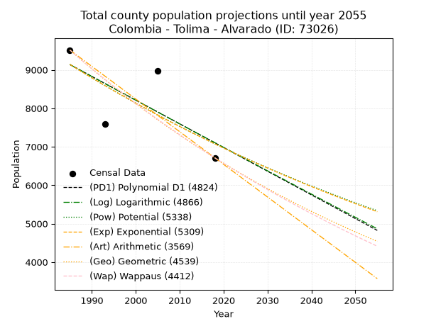
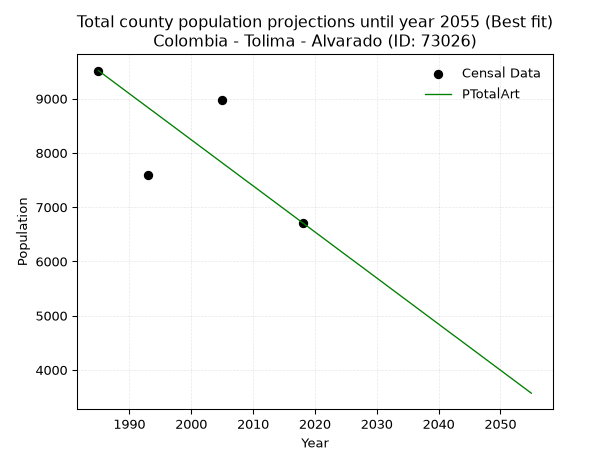
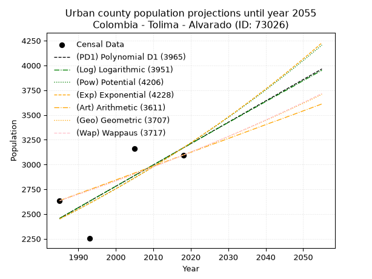
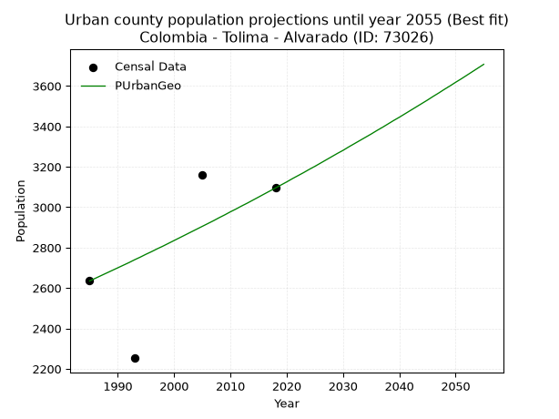
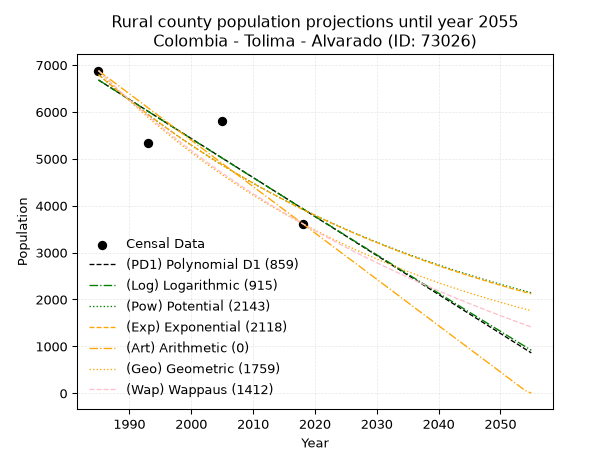
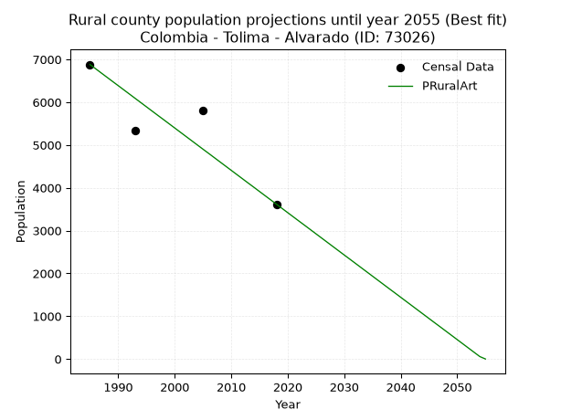

<div align="center">


</div>

# _“Population and Public Services Demand Projections (PPSD) until Year 2050 for Colombia - Tolima - Alvarado (ID: 73026)”_
Keywords: `population` `public-service` `projection` `lineal` `polynomial` `logarithmic` `potential` `exponential` `arithmetic` `geometric` `wappaus` `dane` `colombia` `south-america`

PPSD are analytical estimates used by governments and planners to anticipate future changes in population size, age distribution, and the resulting community needs for utilities, healthcare, education, and infrastructure as sizing future water treatment facilities, electrical grids, and road networks based on spatial growth.

> **General running parameters**: • app_version: _v20260806_. • Python version: _3.14.7_. • Pandas version: _3.0.5_. • NumPy version: _2.5.1_. • Creates, save and include plots into reports (create_plot): _True_. • Projection until year: _2050_. • Process polynomial degree 2 and up: _False_. • Process Wappaus: _True_. • Process Wappaus: _True_. • Set negative values to zero: _True_. • Set infinite values to zero: _True_. • Drop dataset notes: _True_. 
<div align="center">

Dynamic map: [:earth_americas:Google](http://maps.google.com/maps?q=4.567355822,-74.9534177) [:earth_americas:OSM](https://www.openstreetmap.org/#map=18/4.567355822/-74.9534177&layers=P) [:earth_americas:Bing](https://www.bing.com/maps?cp=4.567355822~-74.9534177&lvl=18) [:earth_americas:Apple](https://maps.apple.com/frame?center=4.567355822%2C-74.9534177&span=0.003%2C0.006)

</div>


<div align="center">

```geojson
{
  "type": "Feature",
  "geometry": {
    "type": "Point", 
    "coordinates": [-74.9534177, 4.567355822]
  }, 
  "properties": {
    "Name": "Colombia - Tolima - Alvarado (ID: 73026)"
  }
}
```

</div>


## 0. Census Data (4 records)

Census data are official statistics collected by a government about the people and housing in a country. They usually include counts of total population, age, sex, race, income, education, and jobs.

📅Global census file: [Population.xlsx](../data/Population.xlsx)

| Source   |   Year |   CountryID | CountryName   |   StateID | StateName   |   CountyID | CountyName   |   PTotal |   PUrban |   PRural |
|:---------|-------:|------------:|:--------------|----------:|:------------|-----------:|:-------------|---------:|---------:|---------:|
| DANE     |   1985 |          57 | Colombia      |        73 | Tolima      |      73026 | Alvarado     |     9515 |     2635 |     6880 |
| DANE     |   1993 |          57 | Colombia      |        73 | Tolima      |      73026 | Alvarado     |     7589 |     2253 |     5336 |
| DANE     |   2005 |          57 | Colombia      |        73 | Tolima      |      73026 | Alvarado     |     8972 |     3158 |     5814 |
| DANE     |   2018 |          57 | Colombia      |        73 | Tolima      |      73026 | Alvarado     |     6712 |     3095 |     3617 |

> 🔥Some records could had specific notes about the registered values or the corresponding urban or rural distribution.

## 1. Total

### 1.1. Coefficients and Parameters

* (PD1) Polynomial Deg 1: -61.61220393416162, 131436.81091930676 (lineal)
* (Log) Logarithmic: -123271.48526929657, 945184.5473676103
* (Pow) Potential: -15.527616659339257, 55.16742380243805
* (Exp) Exponential: -0.007761776836875274, 44897283385.03263
* (Art) Arithmetic: Year diff. 2018 - 1985 = 33, Population diff. 6712 - 9515 = -2803, Annual growth = -84.93939393939394
* (Geo) Geometric: Year diff. 2018 - 1985 = 33, Population diff. 6712 - 9515 = -2803, Annual growth % = -0.010519207255325624
* (Wap) Wappaus: i = -1.0468896769506864, Condition values only valid for < 200)

<sub>
Wappaus condition values: ['-0.00', '-1.05', '-2.09', '-3.14', '-4.19', '-5.23', '-6.28', '-7.33', '-8.38', '-9.42', '-10.47', '-11.52', '-12.56', '-13.61', '-14.66', '-15.70', '-16.75', '-17.80', '-18.84', '-19.89', '-20.94', '-21.98', '-23.03', '-24.08', '-25.13', '-26.17', '-27.22', '-28.27', '-29.31', '-30.36', '-31.41', '-32.45', '-33.50', '-34.55', '-35.59', '-36.64', '-37.69', '-38.73', '-39.78', '-40.83', '-41.88', '-42.92', '-43.97', '-45.02', '-46.06', '-47.11', '-48.16', '-49.20', '-50.25', '-51.30', '-52.34', '-53.39', '-54.44', '-55.49', '-56.53', '-57.58', '-58.63', '-59.67', '-60.72', '-61.77', '-62.81', '-63.86', '-64.91', '-65.95', '-67.00', '-68.05']
</sub>


### 1.2. Projected Dataset

|   Year |   CountyID |   PTotalPD1 |   PTotalLog |   PTotalPow |   PTotalExp |   PTotalArt |   PTotalGeo |   PTotalWap |
|-------:|-----------:|------------:|------------:|------------:|------------:|------------:|------------:|------------:|
|   1985 |      73026 |        9137 |        9138 |        9142 |        9141 |        9515 |        9515 |        9515 |
|   1986 |      73026 |        9075 |        9076 |        9071 |        9070 |        9430 |        9415 |        9416 |
|   1987 |      73026 |        9013 |        9014 |        9001 |        9000 |        9345 |        9316 |        9318 |
|   1988 |      73026 |        8952 |        8952 |        8931 |        8931 |        9260 |        9218 |        9221 |
|   1989 |      73026 |        8890 |        8890 |        8861 |        8861 |        9175 |        9121 |        9125 |
|   1990 |      73026 |        8829 |        8828 |        8792 |        8793 |        9090 |        9025 |        9030 |
|   1991 |      73026 |        8767 |        8766 |        8724 |        8725 |        9005 |        8930 |        8936 |
|   1992 |      73026 |        8705 |        8704 |        8656 |        8658 |        8920 |        8836 |        8842 |
|   1993 |      73026 |        8644 |        8642 |        8589 |        8591 |        8835 |        8743 |        8750 |
|   1994 |      73026 |        8582 |        8580 |        8522 |        8524 |        8751 |        8651 |        8659 |
|   1995 |      73026 |        8520 |        8519 |        8456 |        8458 |        8666 |        8560 |        8568 |
|   1996 |      73026 |        8459 |        8457 |        8391 |        8393 |        8581 |        8470 |        8479 |
|   1997 |      73026 |        8397 |        8395 |        8326 |        8328 |        8496 |        8381 |        8390 |
|   1998 |      73026 |        8336 |        8333 |        8261 |        8264 |        8411 |        8293 |        8303 |
|   1999 |      73026 |        8274 |        8272 |        8197 |        8200 |        8326 |        8206 |        8216 |
|   2000 |      73026 |        8212 |        8210 |        8134 |        8136 |        8241 |        8119 |        8130 |
|   2001 |      73026 |        8151 |        8148 |        8071 |        8073 |        8156 |        8034 |        8044 |
|   2002 |      73026 |        8089 |        8087 |        8009 |        8011 |        8071 |        7949 |        7960 |
|   2003 |      73026 |        8028 |        8025 |        7947 |        7949 |        7986 |        7866 |        7876 |
|   2004 |      73026 |        7966 |        7964 |        7885 |        7888 |        7901 |        7783 |        7794 |
|   2005 |      73026 |        7904 |        7902 |        7825 |        7827 |        7816 |        7701 |        7712 |
|   2006 |      73026 |        7843 |        7841 |        7764 |        7766 |        7731 |        7620 |        7630 |
|   2007 |      73026 |        7781 |        7779 |        7704 |        7706 |        7646 |        7540 |        7550 |
|   2008 |      73026 |        7720 |        7718 |        7645 |        7646 |        7561 |        7461 |        7470 |
|   2009 |      73026 |        7658 |        7657 |        7586 |        7587 |        7476 |        7382 |        7391 |
|   2010 |      73026 |        7596 |        7595 |        7528 |        7529 |        7392 |        7305 |        7313 |
|   2011 |      73026 |        7535 |        7534 |        7470 |        7470 |        7307 |        7228 |        7235 |
|   2012 |      73026 |        7473 |        7473 |        7412 |        7413 |        7222 |        7152 |        7159 |
|   2013 |      73026 |        7411 |        7411 |        7355 |        7355 |        7137 |        7076 |        7082 |
|   2014 |      73026 |        7350 |        7350 |        7299 |        7299 |        7052 |        7002 |        7007 |
|   2015 |      73026 |        7288 |        7289 |        7243 |        7242 |        6967 |        6928 |        6932 |
|   2016 |      73026 |        7227 |        7228 |        7187 |        7186 |        6882 |        6855 |        6858 |
|   2017 |      73026 |        7165 |        7167 |        7132 |        7131 |        6797 |        6783 |        6785 |
|   2018 |      73026 |        7103 |        7106 |        7077 |        7075 |        6712 |        6712 |        6712 |
|   2019 |      73026 |        7042 |        7044 |        7023 |        7021 |        6627 |        6641 |        6640 |
|   2020 |      73026 |        6980 |        6983 |        6969 |        6966 |        6542 |        6572 |        6568 |
|   2021 |      73026 |        6919 |        6922 |        6916 |        6913 |        6457 |        6502 |        6498 |
|   2022 |      73026 |        6857 |        6861 |        6863 |        6859 |        6372 |        6434 |        6427 |
|   2023 |      73026 |        6795 |        6800 |        6811 |        6806 |        6287 |        6366 |        6358 |
|   2024 |      73026 |        6734 |        6740 |        6759 |        6753 |        6202 |        6299 |        6289 |
|   2025 |      73026 |        6672 |        6679 |        6707 |        6701 |        6117 |        6233 |        6220 |
|   2026 |      73026 |        6610 |        6618 |        6656 |        6649 |        6032 |        6168 |        6153 |
|   2027 |      73026 |        6549 |        6557 |        6605 |        6598 |        5948 |        6103 |        6085 |
|   2028 |      73026 |        6487 |        6496 |        6555 |        6547 |        5863 |        6038 |        6019 |
|   2029 |      73026 |        6426 |        6435 |        6505 |        6496 |        5778 |        5975 |        5953 |
|   2030 |      73026 |        6364 |        6375 |        6455 |        6446 |        5693 |        5912 |        5887 |
|   2031 |      73026 |        6302 |        6314 |        6406 |        6396 |        5608 |        5850 |        5822 |
|   2032 |      73026 |        6241 |        6253 |        6357 |        6347 |        5523 |        5788 |        5758 |
|   2033 |      73026 |        6179 |        6193 |        6309 |        6298 |        5438 |        5727 |        5694 |
|   2034 |      73026 |        6118 |        6132 |        6261 |        6249 |        5353 |        5667 |        5630 |
|   2035 |      73026 |        6056 |        6071 |        6213 |        6201 |        5268 |        5608 |        5568 |
|   2036 |      73026 |        5994 |        6011 |        6166 |        6153 |        5183 |        5549 |        5505 |
|   2037 |      73026 |        5933 |        5950 |        6119 |        6105 |        5098 |        5490 |        5443 |
|   2038 |      73026 |        5871 |        5890 |        6073 |        6058 |        5013 |        5432 |        5382 |
|   2039 |      73026 |        5810 |        5829 |        6026 |        6011 |        4928 |        5375 |        5321 |
|   2040 |      73026 |        5748 |        5769 |        5981 |        5965 |        4843 |        5319 |        5261 |
|   2041 |      73026 |        5686 |        5709 |        5935 |        5919 |        4758 |        5263 |        5201 |
|   2042 |      73026 |        5625 |        5648 |        5890 |        5873 |        4673 |        5207 |        5142 |
|   2043 |      73026 |        5563 |        5588 |        5846 |        5827 |        4589 |        5153 |        5083 |
|   2044 |      73026 |        5501 |        5527 |        5802 |        5782 |        4504 |        5099 |        5025 |
|   2045 |      73026 |        5440 |        5467 |        5758 |        5738 |        4419 |        5045 |        4967 |
|   2046 |      73026 |        5378 |        5407 |        5714 |        5693 |        4334 |        4992 |        4909 |
|   2047 |      73026 |        5317 |        5347 |        5671 |        5649 |        4249 |        4939 |        4852 |
|   2048 |      73026 |        5255 |        5286 |        5628 |        5606 |        4164 |        4887 |        4796 |
|   2049 |      73026 |        5193 |        5226 |        5586 |        5562 |        4079 |        4836 |        4740 |
|   2050 |      73026 |        5132 |        5166 |        5543 |        5519 |        3994 |        4785 |        4684 |
<div align="center">

</img>

</div>


### 1.3. Best fit with absolute error and relative error (%)

Relative error puts that difference into context by dividing the absolute error by the true value, creating a unitless ratio or percentage that shows the scale of the mistake.

Absolute and relative error

|   Year | Source   |   CountryID | CountryName   |   StateID | StateName   |   CountyID_x | CountyName   |   PTotal |   PUrban |   PRural |   CountyID_y |   PTotalPD1 |   PTotalLog |   PTotalPow |   PTotalExp |   PTotalArt |   PTotalGeo |   PTotalWap |   PTotalPD1AbsError |   PTotalLogAbsError |   PTotalPowAbsError |   PTotalExpAbsError |   PTotalArtAbsError |   PTotalGeoAbsError |   PTotalWapAbsError |   PTotalPD1RelError |   PTotalLogRelError |   PTotalPowRelError |   PTotalExpRelError |   PTotalArtRelError |   PTotalGeoRelError |   PTotalWapRelError |
|-------:|:---------|------------:|:--------------|----------:|:------------|-------------:|:-------------|---------:|---------:|---------:|-------------:|------------:|------------:|------------:|------------:|------------:|------------:|------------:|--------------------:|--------------------:|--------------------:|--------------------:|--------------------:|--------------------:|--------------------:|--------------------:|--------------------:|--------------------:|--------------------:|--------------------:|--------------------:|--------------------:|
|   1985 | DANE     |          57 | Colombia      |        73 | Tolima      |        73026 | Alvarado     |     9515 |     2635 |     6880 |        73026 |        9137 |        9138 |        9142 |        9141 |        9515 |        9515 |        9515 |                 378 |                 377 |                 373 |                 374 |                   0 |                   0 |                   0 |             3.97267 |             3.96217 |             3.92013 |             3.93064 |              0      |              0      |              0      |
|   1993 | DANE     |          57 | Colombia      |        73 | Tolima      |        73026 | Alvarado     |     7589 |     2253 |     5336 |        73026 |        8644 |        8642 |        8589 |        8591 |        8835 |        8743 |        8750 |                1055 |                1053 |                1000 |                1002 |                1246 |                1154 |                1161 |            13.9017  |            13.8753  |            13.177   |            13.2033  |             16.4185 |             15.2062 |             15.2985 |
|   2005 | DANE     |          57 | Colombia      |        73 | Tolima      |        73026 | Alvarado     |     8972 |     3158 |     5814 |        73026 |        7904 |        7902 |        7825 |        7827 |        7816 |        7701 |        7712 |                1068 |                1070 |                1147 |                1145 |                1156 |                1271 |                1260 |            11.9037  |            11.926   |            12.7842  |            12.7619  |             12.8845 |             14.1663 |             14.0437 |
|   2018 | DANE     |          57 | Colombia      |        73 | Tolima      |        73026 | Alvarado     |     6712 |     3095 |     3617 |        73026 |        7103 |        7106 |        7077 |        7075 |        6712 |        6712 |        6712 |                 391 |                 394 |                 365 |                 363 |                   0 |                   0 |                   0 |             5.82539 |             5.87008 |             5.43802 |             5.40822 |              0      |              0      |              0      |

Relative error mean

| Method    |   RelError | Best   |
|:----------|-----------:|:-------|
| PTotalPD1 |    8.90087 |        |
| PTotalLog |    8.9084  |        |
| PTotalPow |    8.82983 |        |
| PTotalExp |    8.82603 |        |
| PTotalArt |    7.32576 | True   |
| PTotalGeo |    7.34313 |        |
| PTotalWap |    7.33554 |        |

💙Best method: _**PTotalArt**_
<div align="center">

</img>

</div>


### 1.4. Fresh water supply demand in liters per capita per day (lpcd)

The fresh water supply demand typically ranges from 100 to 300 liters per capita per day (lpcd) for standard domestic and municipal planning, though absolute survival minimums set by the World Health Organization are as low as 7.5 to 20 liters per day, and total consumption in high-income nations can exceed 400 liters.

> `CZ`: Level in meters above the sea level (masl).<br> `WS`: Fresh water supply demand in liters per capita per day (lpcd or l/h/d).<br> `WSAll`: Zonal fresh water supply demand in liters per second (l/s).<br> `A`: Zonal area in square meters.

Reference values (RAS Colombia)

|    CZ |   WS |
|------:|-----:|
|  1000 |  120 |
|  2000 |  130 |
| 99999 |  140 |

County shapefile geometry properties and water supply values

|   CountyID |      ATotal |   CZTotal |   WSTotal |
|-----------:|------------:|----------:|----------:|
|      73026 | 3.44112e+08 |   681.798 |       120 |

Projected values for best method: PTotalArt

|   CountyID |   Year |   PTotalArt |   WSTotal |   WSTotalAll |
|-----------:|-------:|------------:|----------:|-------------:|
|      73026 |   1985 |        9515 |       120 |     13.2153  |
|      73026 |   1986 |        9430 |       120 |     13.0972  |
|      73026 |   1987 |        9345 |       120 |     12.9792  |
|      73026 |   1988 |        9260 |       120 |     12.8611  |
|      73026 |   1989 |        9175 |       120 |     12.7431  |
|      73026 |   1990 |        9090 |       120 |     12.625   |
|      73026 |   1991 |        9005 |       120 |     12.5069  |
|      73026 |   1992 |        8920 |       120 |     12.3889  |
|      73026 |   1993 |        8835 |       120 |     12.2708  |
|      73026 |   1994 |        8751 |       120 |     12.1542  |
|      73026 |   1995 |        8666 |       120 |     12.0361  |
|      73026 |   1996 |        8581 |       120 |     11.9181  |
|      73026 |   1997 |        8496 |       120 |     11.8     |
|      73026 |   1998 |        8411 |       120 |     11.6819  |
|      73026 |   1999 |        8326 |       120 |     11.5639  |
|      73026 |   2000 |        8241 |       120 |     11.4458  |
|      73026 |   2001 |        8156 |       120 |     11.3278  |
|      73026 |   2002 |        8071 |       120 |     11.2097  |
|      73026 |   2003 |        7986 |       120 |     11.0917  |
|      73026 |   2004 |        7901 |       120 |     10.9736  |
|      73026 |   2005 |        7816 |       120 |     10.8556  |
|      73026 |   2006 |        7731 |       120 |     10.7375  |
|      73026 |   2007 |        7646 |       120 |     10.6194  |
|      73026 |   2008 |        7561 |       120 |     10.5014  |
|      73026 |   2009 |        7476 |       120 |     10.3833  |
|      73026 |   2010 |        7392 |       120 |     10.2667  |
|      73026 |   2011 |        7307 |       120 |     10.1486  |
|      73026 |   2012 |        7222 |       120 |     10.0306  |
|      73026 |   2013 |        7137 |       120 |      9.9125  |
|      73026 |   2014 |        7052 |       120 |      9.79444 |
|      73026 |   2015 |        6967 |       120 |      9.67639 |
|      73026 |   2016 |        6882 |       120 |      9.55833 |
|      73026 |   2017 |        6797 |       120 |      9.44028 |
|      73026 |   2018 |        6712 |       120 |      9.32222 |
|      73026 |   2019 |        6627 |       120 |      9.20417 |
|      73026 |   2020 |        6542 |       120 |      9.08611 |
|      73026 |   2021 |        6457 |       120 |      8.96806 |
|      73026 |   2022 |        6372 |       120 |      8.85    |
|      73026 |   2023 |        6287 |       120 |      8.73194 |
|      73026 |   2024 |        6202 |       120 |      8.61389 |
|      73026 |   2025 |        6117 |       120 |      8.49583 |
|      73026 |   2026 |        6032 |       120 |      8.37778 |
|      73026 |   2027 |        5948 |       120 |      8.26111 |
|      73026 |   2028 |        5863 |       120 |      8.14306 |
|      73026 |   2029 |        5778 |       120 |      8.025   |
|      73026 |   2030 |        5693 |       120 |      7.90694 |
|      73026 |   2031 |        5608 |       120 |      7.78889 |
|      73026 |   2032 |        5523 |       120 |      7.67083 |
|      73026 |   2033 |        5438 |       120 |      7.55278 |
|      73026 |   2034 |        5353 |       120 |      7.43472 |
|      73026 |   2035 |        5268 |       120 |      7.31667 |
|      73026 |   2036 |        5183 |       120 |      7.19861 |
|      73026 |   2037 |        5098 |       120 |      7.08056 |
|      73026 |   2038 |        5013 |       120 |      6.9625  |
|      73026 |   2039 |        4928 |       120 |      6.84444 |
|      73026 |   2040 |        4843 |       120 |      6.72639 |
|      73026 |   2041 |        4758 |       120 |      6.60833 |
|      73026 |   2042 |        4673 |       120 |      6.49028 |
|      73026 |   2043 |        4589 |       120 |      6.37361 |
|      73026 |   2044 |        4504 |       120 |      6.25556 |
|      73026 |   2045 |        4419 |       120 |      6.1375  |
|      73026 |   2046 |        4334 |       120 |      6.01944 |
|      73026 |   2047 |        4249 |       120 |      5.90139 |
|      73026 |   2048 |        4164 |       120 |      5.78333 |
|      73026 |   2049 |        4079 |       120 |      5.66528 |
|      73026 |   2050 |        3994 |       120 |      5.54722 |

## 2. Urban

### 2.1. Coefficients and Parameters

* (PD1) Polynomial Deg 1: 21.547571256523455, -40315.279405861045 (lineal)
* (Log) Logarithmic: 43125.89281155049, -325015.0068498113
* (Pow) Potential: 15.590537206690755, -48.02464201384076
* (Exp) Exponential: 0.007790561803647235, 0.00047126131804922064
* (Art) Arithmetic: Year diff. 2018 - 1985 = 33, Population diff. 3095 - 2635 = 460, Annual growth = 13.93939393939394
* (Geo) Geometric: Year diff. 2018 - 1985 = 33, Population diff. 3095 - 2635 = 460, Annual growth % = 0.004887807279434941
* (Wap) Wappaus: i = 0.48654080067692634, Condition values only valid for < 200)

<sub>
Wappaus condition values: ['0.00', '0.49', '0.97', '1.46', '1.95', '2.43', '2.92', '3.41', '3.89', '4.38', '4.87', '5.35', '5.84', '6.33', '6.81', '7.30', '7.78', '8.27', '8.76', '9.24', '9.73', '10.22', '10.70', '11.19', '11.68', '12.16', '12.65', '13.14', '13.62', '14.11', '14.60', '15.08', '15.57', '16.06', '16.54', '17.03', '17.52', '18.00', '18.49', '18.98', '19.46', '19.95', '20.43', '20.92', '21.41', '21.89', '22.38', '22.87', '23.35', '23.84', '24.33', '24.81', '25.30', '25.79', '26.27', '26.76', '27.25', '27.73', '28.22', '28.71', '29.19', '29.68', '30.17', '30.65', '31.14', '31.63']
</sub>


### 2.2. Projected Dataset

|   Year |   CountyID |   PUrbanPD1 |   PUrbanLog |   PUrbanPow |   PUrbanExp |   PUrbanArt |   PUrbanGeo |   PUrbanWap |
|-------:|-----------:|------------:|------------:|------------:|------------:|------------:|------------:|------------:|
|   1985 |      73026 |        2457 |        2456 |        2450 |        2451 |        2635 |        2635 |        2635 |
|   1986 |      73026 |        2478 |        2478 |        2470 |        2470 |        2649 |        2648 |        2648 |
|   1987 |      73026 |        2500 |        2499 |        2489 |        2489 |        2663 |        2661 |        2661 |
|   1988 |      73026 |        2521 |        2521 |        2509 |        2509 |        2677 |        2674 |        2674 |
|   1989 |      73026 |        2543 |        2543 |        2528 |        2528 |        2691 |        2687 |        2687 |
|   1990 |      73026 |        2564 |        2565 |        2548 |        2548 |        2705 |        2700 |        2700 |
|   1991 |      73026 |        2586 |        2586 |        2568 |        2568 |        2719 |        2713 |        2713 |
|   1992 |      73026 |        2607 |        2608 |        2589 |        2588 |        2733 |        2726 |        2726 |
|   1993 |      73026 |        2629 |        2629 |        2609 |        2608 |        2747 |        2740 |        2740 |
|   1994 |      73026 |        2651 |        2651 |        2629 |        2629 |        2760 |        2753 |        2753 |
|   1995 |      73026 |        2672 |        2673 |        2650 |        2649 |        2774 |        2767 |        2766 |
|   1996 |      73026 |        2694 |        2694 |        2671 |        2670 |        2788 |        2780 |        2780 |
|   1997 |      73026 |        2715 |        2716 |        2692 |        2691 |        2802 |        2794 |        2793 |
|   1998 |      73026 |        2737 |        2738 |        2713 |        2712 |        2816 |        2807 |        2807 |
|   1999 |      73026 |        2758 |        2759 |        2734 |        2733 |        2830 |        2821 |        2821 |
|   2000 |      73026 |        2780 |        2781 |        2755 |        2755 |        2844 |        2835 |        2835 |
|   2001 |      73026 |        2801 |        2802 |        2777 |        2776 |        2858 |        2849 |        2848 |
|   2002 |      73026 |        2823 |        2824 |        2799 |        2798 |        2872 |        2863 |        2862 |
|   2003 |      73026 |        2845 |        2845 |        2821 |        2820 |        2886 |        2877 |        2876 |
|   2004 |      73026 |        2866 |        2867 |        2843 |        2842 |        2900 |        2891 |        2890 |
|   2005 |      73026 |        2888 |        2888 |        2865 |        2864 |        2914 |        2905 |        2905 |
|   2006 |      73026 |        2909 |        2910 |        2887 |        2886 |        2928 |        2919 |        2919 |
|   2007 |      73026 |        2931 |        2931 |        2910 |        2909 |        2942 |        2933 |        2933 |
|   2008 |      73026 |        2952 |        2953 |        2932 |        2932 |        2956 |        2948 |        2947 |
|   2009 |      73026 |        2974 |        2974 |        2955 |        2955 |        2970 |        2962 |        2962 |
|   2010 |      73026 |        2995 |        2996 |        2978 |        2978 |        2983 |        2977 |        2976 |
|   2011 |      73026 |        3017 |        3017 |        3001 |        3001 |        2997 |        2991 |        2991 |
|   2012 |      73026 |        3038 |        3039 |        3025 |        3025 |        3011 |        3006 |        3005 |
|   2013 |      73026 |        3060 |        3060 |        3048 |        3048 |        3025 |        3020 |        3020 |
|   2014 |      73026 |        3082 |        3082 |        3072 |        3072 |        3039 |        3035 |        3035 |
|   2015 |      73026 |        3103 |        3103 |        3096 |        3096 |        3053 |        3050 |        3050 |
|   2016 |      73026 |        3125 |        3124 |        3120 |        3120 |        3067 |        3065 |        3065 |
|   2017 |      73026 |        3146 |        3146 |        3144 |        3145 |        3081 |        3080 |        3080 |
|   2018 |      73026 |        3168 |        3167 |        3169 |        3169 |        3095 |        3095 |        3095 |
|   2019 |      73026 |        3189 |        3188 |        3193 |        3194 |        3109 |        3110 |        3110 |
|   2020 |      73026 |        3211 |        3210 |        3218 |        3219 |        3123 |        3125 |        3125 |
|   2021 |      73026 |        3232 |        3231 |        3243 |        3244 |        3137 |        3141 |        3141 |
|   2022 |      73026 |        3254 |        3252 |        3268 |        3270 |        3151 |        3156 |        3156 |
|   2023 |      73026 |        3275 |        3274 |        3293 |        3295 |        3165 |        3171 |        3172 |
|   2024 |      73026 |        3297 |        3295 |        3319 |        3321 |        3179 |        3187 |        3187 |
|   2025 |      73026 |        3319 |        3316 |        3344 |        3347 |        3193 |        3202 |        3203 |
|   2026 |      73026 |        3340 |        3338 |        3370 |        3373 |        3207 |        3218 |        3219 |
|   2027 |      73026 |        3362 |        3359 |        3396 |        3399 |        3220 |        3234 |        3235 |
|   2028 |      73026 |        3383 |        3380 |        3422 |        3426 |        3234 |        3250 |        3251 |
|   2029 |      73026 |        3405 |        3402 |        3449 |        3453 |        3248 |        3266 |        3267 |
|   2030 |      73026 |        3426 |        3423 |        3475 |        3480 |        3262 |        3281 |        3283 |
|   2031 |      73026 |        3448 |        3444 |        3502 |        3507 |        3276 |        3298 |        3299 |
|   2032 |      73026 |        3469 |        3465 |        3529 |        3534 |        3290 |        3314 |        3315 |
|   2033 |      73026 |        3491 |        3486 |        3556 |        3562 |        3304 |        3330 |        3332 |
|   2034 |      73026 |        3512 |        3508 |        3584 |        3590 |        3318 |        3346 |        3348 |
|   2035 |      73026 |        3534 |        3529 |        3611 |        3618 |        3332 |        3362 |        3365 |
|   2036 |      73026 |        3556 |        3550 |        3639 |        3646 |        3346 |        3379 |        3381 |
|   2037 |      73026 |        3577 |        3571 |        3667 |        3675 |        3360 |        3395 |        3398 |
|   2038 |      73026 |        3599 |        3592 |        3695 |        3704 |        3374 |        3412 |        3415 |
|   2039 |      73026 |        3620 |        3614 |        3723 |        3733 |        3388 |        3429 |        3432 |
|   2040 |      73026 |        3642 |        3635 |        3752 |        3762 |        3402 |        3445 |        3449 |
|   2041 |      73026 |        3663 |        3656 |        3781 |        3791 |        3416 |        3462 |        3466 |
|   2042 |      73026 |        3685 |        3677 |        3810 |        3821 |        3430 |        3479 |        3483 |
|   2043 |      73026 |        3706 |        3698 |        3839 |        3851 |        3443 |        3496 |        3501 |
|   2044 |      73026 |        3728 |        3719 |        3868 |        3881 |        3457 |        3513 |        3518 |
|   2045 |      73026 |        3750 |        3740 |        3898 |        3911 |        3471 |        3530 |        3536 |
|   2046 |      73026 |        3771 |        3761 |        3928 |        3942 |        3485 |        3548 |        3553 |
|   2047 |      73026 |        3793 |        3782 |        3958 |        3973 |        3499 |        3565 |        3571 |
|   2048 |      73026 |        3814 |        3803 |        3988 |        4004 |        3513 |        3583 |        3589 |
|   2049 |      73026 |        3836 |        3825 |        4019 |        4035 |        3527 |        3600 |        3607 |
|   2050 |      73026 |        3857 |        3846 |        4049 |        4067 |        3541 |        3618 |        3625 |
<div align="center">

</img>

</div>


### 2.3. Best fit with absolute error and relative error (%)

Relative error puts that difference into context by dividing the absolute error by the true value, creating a unitless ratio or percentage that shows the scale of the mistake.

Absolute and relative error

|   Year | Source   |   CountryID | CountryName   |   StateID | StateName   |   CountyID_x | CountyName   |   PTotal |   PUrban |   PRural |   CountyID_y |   PUrbanPD1 |   PUrbanLog |   PUrbanPow |   PUrbanExp |   PUrbanArt |   PUrbanGeo |   PUrbanWap |   PUrbanPD1AbsError |   PUrbanLogAbsError |   PUrbanPowAbsError |   PUrbanExpAbsError |   PUrbanArtAbsError |   PUrbanGeoAbsError |   PUrbanWapAbsError |   PUrbanPD1RelError |   PUrbanLogRelError |   PUrbanPowRelError |   PUrbanExpRelError |   PUrbanArtRelError |   PUrbanGeoRelError |   PUrbanWapRelError |
|-------:|:---------|------------:|:--------------|----------:|:------------|-------------:|:-------------|---------:|---------:|---------:|-------------:|------------:|------------:|------------:|------------:|------------:|------------:|------------:|--------------------:|--------------------:|--------------------:|--------------------:|--------------------:|--------------------:|--------------------:|--------------------:|--------------------:|--------------------:|--------------------:|--------------------:|--------------------:|--------------------:|
|   1985 | DANE     |          57 | Colombia      |        73 | Tolima      |        73026 | Alvarado     |     9515 |     2635 |     6880 |        73026 |        2457 |        2456 |        2450 |        2451 |        2635 |        2635 |        2635 |                 178 |                 179 |                 185 |                 184 |                   0 |                   0 |                   0 |             6.75522 |             6.79317 |             7.02087 |             6.98292 |             0       |              0      |              0      |
|   1993 | DANE     |          57 | Colombia      |        73 | Tolima      |        73026 | Alvarado     |     7589 |     2253 |     5336 |        73026 |        2629 |        2629 |        2609 |        2608 |        2747 |        2740 |        2740 |                 376 |                 376 |                 356 |                 355 |                 494 |                 487 |                 487 |            16.6889  |            16.6889  |            15.8012  |            15.7568  |            21.9263  |             21.6156 |             21.6156 |
|   2005 | DANE     |          57 | Colombia      |        73 | Tolima      |        73026 | Alvarado     |     8972 |     3158 |     5814 |        73026 |        2888 |        2888 |        2865 |        2864 |        2914 |        2905 |        2905 |                 270 |                 270 |                 293 |                 294 |                 244 |                 253 |                 253 |             8.54972 |             8.54972 |             9.27802 |             9.30969 |             7.72641 |              8.0114 |              8.0114 |
|   2018 | DANE     |          57 | Colombia      |        73 | Tolima      |        73026 | Alvarado     |     6712 |     3095 |     3617 |        73026 |        3168 |        3167 |        3169 |        3169 |        3095 |        3095 |        3095 |                  73 |                  72 |                  74 |                  74 |                   0 |                   0 |                   0 |             2.35864 |             2.32633 |             2.39095 |             2.39095 |             0       |              0      |              0      |

Relative error mean

| Method    |   RelError | Best   |
|:----------|-----------:|:-------|
| PUrbanPD1 |    8.58811 |        |
| PUrbanLog |    8.58952 |        |
| PUrbanPow |    8.62275 |        |
| PUrbanExp |    8.61008 |        |
| PUrbanArt |    7.41318 |        |
| PUrbanGeo |    7.40676 | True   |
| PUrbanWap |    7.40676 | True   |

💙Best method: _**PUrbanGeo**_
<div align="center">

</img>

</div>


### 2.4. Fresh water supply demand in liters per capita per day (lpcd)

The fresh water supply demand typically ranges from 100 to 300 liters per capita per day (lpcd) for standard domestic and municipal planning, though absolute survival minimums set by the World Health Organization are as low as 7.5 to 20 liters per day, and total consumption in high-income nations can exceed 400 liters.

> `CZ`: Level in meters above the sea level (masl).<br> `WS`: Fresh water supply demand in liters per capita per day (lpcd or l/h/d).<br> `WSAll`: Zonal fresh water supply demand in liters per second (l/s).<br> `A`: Zonal area in square meters.

Reference values (RAS Colombia)

|    CZ |   WS |
|------:|-----:|
|  1000 |  120 |
|  2000 |  130 |
| 99999 |  140 |

County shapefile geometry properties and water supply values

|   CountyID |   AUrban |   CZUrban |   WSUrban |
|-----------:|---------:|----------:|----------:|
|      73026 |   822460 |   415.812 |       120 |

Projected values for best method: PUrbanGeo

|   CountyID |   Year |   PUrbanGeo |   WSUrban |   WSUrbanAll |
|-----------:|-------:|------------:|----------:|-------------:|
|      73026 |   1985 |        2635 |       120 |      3.65972 |
|      73026 |   1986 |        2648 |       120 |      3.67778 |
|      73026 |   1987 |        2661 |       120 |      3.69583 |
|      73026 |   1988 |        2674 |       120 |      3.71389 |
|      73026 |   1989 |        2687 |       120 |      3.73194 |
|      73026 |   1990 |        2700 |       120 |      3.75    |
|      73026 |   1991 |        2713 |       120 |      3.76806 |
|      73026 |   1992 |        2726 |       120 |      3.78611 |
|      73026 |   1993 |        2740 |       120 |      3.80556 |
|      73026 |   1994 |        2753 |       120 |      3.82361 |
|      73026 |   1995 |        2767 |       120 |      3.84306 |
|      73026 |   1996 |        2780 |       120 |      3.86111 |
|      73026 |   1997 |        2794 |       120 |      3.88056 |
|      73026 |   1998 |        2807 |       120 |      3.89861 |
|      73026 |   1999 |        2821 |       120 |      3.91806 |
|      73026 |   2000 |        2835 |       120 |      3.9375  |
|      73026 |   2001 |        2849 |       120 |      3.95694 |
|      73026 |   2002 |        2863 |       120 |      3.97639 |
|      73026 |   2003 |        2877 |       120 |      3.99583 |
|      73026 |   2004 |        2891 |       120 |      4.01528 |
|      73026 |   2005 |        2905 |       120 |      4.03472 |
|      73026 |   2006 |        2919 |       120 |      4.05417 |
|      73026 |   2007 |        2933 |       120 |      4.07361 |
|      73026 |   2008 |        2948 |       120 |      4.09444 |
|      73026 |   2009 |        2962 |       120 |      4.11389 |
|      73026 |   2010 |        2977 |       120 |      4.13472 |
|      73026 |   2011 |        2991 |       120 |      4.15417 |
|      73026 |   2012 |        3006 |       120 |      4.175   |
|      73026 |   2013 |        3020 |       120 |      4.19444 |
|      73026 |   2014 |        3035 |       120 |      4.21528 |
|      73026 |   2015 |        3050 |       120 |      4.23611 |
|      73026 |   2016 |        3065 |       120 |      4.25694 |
|      73026 |   2017 |        3080 |       120 |      4.27778 |
|      73026 |   2018 |        3095 |       120 |      4.29861 |
|      73026 |   2019 |        3110 |       120 |      4.31944 |
|      73026 |   2020 |        3125 |       120 |      4.34028 |
|      73026 |   2021 |        3141 |       120 |      4.3625  |
|      73026 |   2022 |        3156 |       120 |      4.38333 |
|      73026 |   2023 |        3171 |       120 |      4.40417 |
|      73026 |   2024 |        3187 |       120 |      4.42639 |
|      73026 |   2025 |        3202 |       120 |      4.44722 |
|      73026 |   2026 |        3218 |       120 |      4.46944 |
|      73026 |   2027 |        3234 |       120 |      4.49167 |
|      73026 |   2028 |        3250 |       120 |      4.51389 |
|      73026 |   2029 |        3266 |       120 |      4.53611 |
|      73026 |   2030 |        3281 |       120 |      4.55694 |
|      73026 |   2031 |        3298 |       120 |      4.58056 |
|      73026 |   2032 |        3314 |       120 |      4.60278 |
|      73026 |   2033 |        3330 |       120 |      4.625   |
|      73026 |   2034 |        3346 |       120 |      4.64722 |
|      73026 |   2035 |        3362 |       120 |      4.66944 |
|      73026 |   2036 |        3379 |       120 |      4.69306 |
|      73026 |   2037 |        3395 |       120 |      4.71528 |
|      73026 |   2038 |        3412 |       120 |      4.73889 |
|      73026 |   2039 |        3429 |       120 |      4.7625  |
|      73026 |   2040 |        3445 |       120 |      4.78472 |
|      73026 |   2041 |        3462 |       120 |      4.80833 |
|      73026 |   2042 |        3479 |       120 |      4.83194 |
|      73026 |   2043 |        3496 |       120 |      4.85556 |
|      73026 |   2044 |        3513 |       120 |      4.87917 |
|      73026 |   2045 |        3530 |       120 |      4.90278 |
|      73026 |   2046 |        3548 |       120 |      4.92778 |
|      73026 |   2047 |        3565 |       120 |      4.95139 |
|      73026 |   2048 |        3583 |       120 |      4.97639 |
|      73026 |   2049 |        3600 |       120 |      5       |
|      73026 |   2050 |        3618 |       120 |      5.025   |

## 3. Rural

### 3.1. Coefficients and Parameters

* (PD1) Polynomial Deg 1: -83.15977519068502, 171752.09032516772 (lineal)
* (Log) Logarithmic: -166397.37808084697, 1270199.5542174212
* (Pow) Potential: -33.311143445422694, 113.68451768482979
* (Exp) Exponential: -0.016651807232830926, 1.5391852245918807e+18
* (Art) Arithmetic: Year diff. 2018 - 1985 = 33, Population diff. 3617 - 6880 = -3263, Annual growth = -98.87878787878788
* (Geo) Geometric: Year diff. 2018 - 1985 = 33, Population diff. 3617 - 6880 = -3263, Annual growth % = -0.01929546415417338
* (Wap) Wappaus: i = -1.8839437530492118, Condition values only valid for < 200)

<sub>
Wappaus condition values: ['-0.00', '-1.88', '-3.77', '-5.65', '-7.54', '-9.42', '-11.30', '-13.19', '-15.07', '-16.96', '-18.84', '-20.72', '-22.61', '-24.49', '-26.38', '-28.26', '-30.14', '-32.03', '-33.91', '-35.79', '-37.68', '-39.56', '-41.45', '-43.33', '-45.21', '-47.10', '-48.98', '-50.87', '-52.75', '-54.63', '-56.52', '-58.40', '-60.29', '-62.17', '-64.05', '-65.94', '-67.82', '-69.71', '-71.59', '-73.47', '-75.36', '-77.24', '-79.13', '-81.01', '-82.89', '-84.78', '-86.66', '-88.55', '-90.43', '-92.31', '-94.20', '-96.08', '-97.97', '-99.85', '-101.73', '-103.62', '-105.50', '-107.38', '-109.27', '-111.15', '-113.04', '-114.92', '-116.80', '-118.69', '-120.57', '-122.46']
</sub>


### 3.2. Projected Dataset

|   Year |   CountyID |   PRuralPD1 |   PRuralLog |   PRuralPow |   PRuralExp |   PRuralArt |   PRuralGeo |   PRuralWap |
|-------:|-----------:|------------:|------------:|------------:|------------:|------------:|------------:|------------:|
|   1985 |      73026 |        6680 |        6682 |        6797 |        6795 |        6880 |        6880 |        6880 |
|   1986 |      73026 |        6597 |        6598 |        6684 |        6683 |        6781 |        6747 |        6752 |
|   1987 |      73026 |        6514 |        6514 |        6573 |        6572 |        6682 |        6617 |        6626 |
|   1988 |      73026 |        6430 |        6431 |        6464 |        6464 |        6583 |        6489 |        6502 |
|   1989 |      73026 |        6347 |        6347 |        6357 |        6357 |        6484 |        6364 |        6380 |
|   1990 |      73026 |        6264 |        6263 |        6251 |        6252 |        6386 |        6241 |        6261 |
|   1991 |      73026 |        6181 |        6180 |        6147 |        6149 |        6287 |        6121 |        6144 |
|   1992 |      73026 |        6098 |        6096 |        6045 |        6047 |        6188 |        6003 |        6029 |
|   1993 |      73026 |        6015 |        6013 |        5945 |        5948 |        6089 |        5887 |        5916 |
|   1994 |      73026 |        5931 |        5929 |        5847 |        5849 |        5990 |        5773 |        5805 |
|   1995 |      73026 |        5848 |        5846 |        5750 |        5753 |        5891 |        5662 |        5695 |
|   1996 |      73026 |        5765 |        5762 |        5655 |        5658 |        5792 |        5553 |        5588 |
|   1997 |      73026 |        5682 |        5679 |        5561 |        5564 |        5693 |        5446 |        5483 |
|   1998 |      73026 |        5599 |        5596 |        5469 |        5472 |        5595 |        5341 |        5379 |
|   1999 |      73026 |        5516 |        5513 |        5379 |        5382 |        5496 |        5237 |        5277 |
|   2000 |      73026 |        5433 |        5429 |        5290 |        5293 |        5397 |        5136 |        5176 |
|   2001 |      73026 |        5349 |        5346 |        5202 |        5206 |        5298 |        5037 |        5078 |
|   2002 |      73026 |        5266 |        5263 |        5117 |        5120 |        5199 |        4940 |        4981 |
|   2003 |      73026 |        5183 |        5180 |        5032 |        5035 |        5100 |        4845 |        4885 |
|   2004 |      73026 |        5100 |        5097 |        4949 |        4952 |        5001 |        4751 |        4791 |
|   2005 |      73026 |        5017 |        5014 |        4868 |        4870 |        4902 |        4660 |        4699 |
|   2006 |      73026 |        4934 |        4931 |        4787 |        4790 |        4804 |        4570 |        4608 |
|   2007 |      73026 |        4850 |        4848 |        4709 |        4711 |        4705 |        4482 |        4518 |
|   2008 |      73026 |        4767 |        4765 |        4631 |        4633 |        4606 |        4395 |        4430 |
|   2009 |      73026 |        4684 |        4682 |        4555 |        4556 |        4507 |        4310 |        4343 |
|   2010 |      73026 |        4601 |        4599 |        4480 |        4481 |        4408 |        4227 |        4257 |
|   2011 |      73026 |        4518 |        4517 |        4406 |        4407 |        4309 |        4146 |        4173 |
|   2012 |      73026 |        4435 |        4434 |        4334 |        4334 |        4210 |        4066 |        4090 |
|   2013 |      73026 |        4351 |        4351 |        4263 |        4263 |        4111 |        3987 |        4008 |
|   2014 |      73026 |        4268 |        4269 |        4193 |        4192 |        4013 |        3910 |        3928 |
|   2015 |      73026 |        4185 |        4186 |        4124 |        4123 |        3914 |        3835 |        3848 |
|   2016 |      73026 |        4102 |        4103 |        4057 |        4055 |        3815 |        3761 |        3770 |
|   2017 |      73026 |        4019 |        4021 |        3990 |        3988 |        3716 |        3688 |        3693 |
|   2018 |      73026 |        3936 |        3938 |        3925 |        3922 |        3617 |        3617 |        3617 |
|   2019 |      73026 |        3853 |        3856 |        3861 |        3858 |        3518 |        3547 |        3542 |
|   2020 |      73026 |        3769 |        3774 |        3797 |        3794 |        3419 |        3479 |        3468 |
|   2021 |      73026 |        3686 |        3691 |        3735 |        3731 |        3320 |        3412 |        3395 |
|   2022 |      73026 |        3603 |        3609 |        3674 |        3670 |        3221 |        3346 |        3324 |
|   2023 |      73026 |        3520 |        3527 |        3614 |        3609 |        3123 |        3281 |        3253 |
|   2024 |      73026 |        3437 |        3444 |        3555 |        3549 |        3024 |        3218 |        3183 |
|   2025 |      73026 |        3354 |        3362 |        3497 |        3491 |        2925 |        3156 |        3114 |
|   2026 |      73026 |        3270 |        3280 |        3440 |        3433 |        2826 |        3095 |        3046 |
|   2027 |      73026 |        3187 |        3198 |        3384 |        3376 |        2727 |        3035 |        2979 |
|   2028 |      73026 |        3104 |        3116 |        3329 |        3321 |        2628 |        2977 |        2913 |
|   2029 |      73026 |        3021 |        3034 |        3275 |        3266 |        2529 |        2919 |        2848 |
|   2030 |      73026 |        2938 |        2952 |        3221 |        3212 |        2430 |        2863 |        2784 |
|   2031 |      73026 |        2855 |        2870 |        3169 |        3159 |        2332 |        2808 |        2720 |
|   2032 |      73026 |        2771 |        2788 |        3117 |        3107 |        2233 |        2753 |        2657 |
|   2033 |      73026 |        2688 |        2706 |        3067 |        3055 |        2134 |        2700 |        2596 |
|   2034 |      73026 |        2605 |        2624 |        3017 |        3005 |        2035 |        2648 |        2535 |
|   2035 |      73026 |        2522 |        2543 |        2968 |        2955 |        1936 |        2597 |        2474 |
|   2036 |      73026 |        2439 |        2461 |        2920 |        2907 |        1837 |        2547 |        2415 |
|   2037 |      73026 |        2356 |        2379 |        2872 |        2859 |        1738 |        2498 |        2356 |
|   2038 |      73026 |        2272 |        2297 |        2826 |        2811 |        1639 |        2450 |        2298 |
|   2039 |      73026 |        2189 |        2216 |        2780 |        2765 |        1541 |        2402 |        2241 |
|   2040 |      73026 |        2106 |        2134 |        2735 |        2719 |        1442 |        2356 |        2184 |
|   2041 |      73026 |        2023 |        2053 |        2691 |        2674 |        1343 |        2311 |        2128 |
|   2042 |      73026 |        1940 |        1971 |        2647 |        2630 |        1244 |        2266 |        2073 |
|   2043 |      73026 |        1857 |        1890 |        2604 |        2587 |        1145 |        2222 |        2018 |
|   2044 |      73026 |        1774 |        1808 |        2562 |        2544 |        1046 |        2179 |        1965 |
|   2045 |      73026 |        1690 |        1727 |        2521 |        2502 |         947 |        2137 |        1911 |
|   2046 |      73026 |        1607 |        1646 |        2480 |        2461 |         848 |        2096 |        1859 |
|   2047 |      73026 |        1524 |        1564 |        2440 |        2420 |         750 |        2056 |        1807 |
|   2048 |      73026 |        1441 |        1483 |        2401 |        2380 |         651 |        2016 |        1755 |
|   2049 |      73026 |        1358 |        1402 |        2362 |        2341 |         552 |        1977 |        1705 |
|   2050 |      73026 |        1275 |        1321 |        2324 |        2302 |         453 |        1939 |        1654 |
<div align="center">

</img>

</div>


### 3.3. Best fit with absolute error and relative error (%)

Relative error puts that difference into context by dividing the absolute error by the true value, creating a unitless ratio or percentage that shows the scale of the mistake.

Absolute and relative error

|   Year | Source   |   CountryID | CountryName   |   StateID | StateName   |   CountyID_x | CountyName   |   PTotal |   PUrban |   PRural |   CountyID_y |   PRuralPD1 |   PRuralLog |   PRuralPow |   PRuralExp |   PRuralArt |   PRuralGeo |   PRuralWap |   PRuralPD1AbsError |   PRuralLogAbsError |   PRuralPowAbsError |   PRuralExpAbsError |   PRuralArtAbsError |   PRuralGeoAbsError |   PRuralWapAbsError |   PRuralPD1RelError |   PRuralLogRelError |   PRuralPowRelError |   PRuralExpRelError |   PRuralArtRelError |   PRuralGeoRelError |   PRuralWapRelError |
|-------:|:---------|------------:|:--------------|----------:|:------------|-------------:|:-------------|---------:|---------:|---------:|-------------:|------------:|------------:|------------:|------------:|------------:|------------:|------------:|--------------------:|--------------------:|--------------------:|--------------------:|--------------------:|--------------------:|--------------------:|--------------------:|--------------------:|--------------------:|--------------------:|--------------------:|--------------------:|--------------------:|
|   1985 | DANE     |          57 | Colombia      |        73 | Tolima      |        73026 | Alvarado     |     9515 |     2635 |     6880 |        73026 |        6680 |        6682 |        6797 |        6795 |        6880 |        6880 |        6880 |                 200 |                 198 |                  83 |                  85 |                   0 |                   0 |                   0 |             2.90698 |             2.87791 |             1.2064  |             1.23547 |              0      |              0      |              0      |
|   1993 | DANE     |          57 | Colombia      |        73 | Tolima      |        73026 | Alvarado     |     7589 |     2253 |     5336 |        73026 |        6015 |        6013 |        5945 |        5948 |        6089 |        5887 |        5916 |                 679 |                 677 |                 609 |                 612 |                 753 |                 551 |                 580 |            12.7249  |            12.6874  |            11.413   |            11.4693  |             14.1117 |             10.3261 |             10.8696 |
|   2005 | DANE     |          57 | Colombia      |        73 | Tolima      |        73026 | Alvarado     |     8972 |     3158 |     5814 |        73026 |        5017 |        5014 |        4868 |        4870 |        4902 |        4660 |        4699 |                 797 |                 800 |                 946 |                 944 |                 912 |                1154 |                1115 |            13.7083  |            13.7599  |            16.2711  |            16.2367  |             15.6863 |             19.8486 |             19.1778 |
|   2018 | DANE     |          57 | Colombia      |        73 | Tolima      |        73026 | Alvarado     |     6712 |     3095 |     3617 |        73026 |        3936 |        3938 |        3925 |        3922 |        3617 |        3617 |        3617 |                 319 |                 321 |                 308 |                 305 |                   0 |                   0 |                   0 |             8.81946 |             8.87476 |             8.51534 |             8.4324  |              0      |              0      |              0      |

Relative error mean

| Method    |   RelError | Best   |
|:----------|-----------:|:-------|
| PRuralPD1 |    9.5399  |        |
| PRuralLog |    9.54999 |        |
| PRuralPow |    9.35146 |        |
| PRuralExp |    9.34345 |        |
| PRuralArt |    7.44949 | True   |
| PRuralGeo |    7.54368 |        |
| PRuralWap |    7.51185 |        |

💙Best method: _**PRuralArt**_
<div align="center">

</img>

</div>


### 3.4. Fresh water supply demand in liters per capita per day (lpcd)

The fresh water supply demand typically ranges from 100 to 300 liters per capita per day (lpcd) for standard domestic and municipal planning, though absolute survival minimums set by the World Health Organization are as low as 7.5 to 20 liters per day, and total consumption in high-income nations can exceed 400 liters.

> `CZ`: Level in meters above the sea level (masl).<br> `WS`: Fresh water supply demand in liters per capita per day (lpcd or l/h/d).<br> `WSAll`: Zonal fresh water supply demand in liters per second (l/s).<br> `A`: Zonal area in square meters.

Reference values (RAS Colombia)

|    CZ |   WS |
|------:|-----:|
|  1000 |  120 |
|  2000 |  130 |
| 99999 |  140 |

County shapefile geometry properties and water supply values

|   CountyID |      ARural |   CZRural |   WSRural |
|-----------:|------------:|----------:|----------:|
|      73026 | 3.43289e+08 |   682.439 |       120 |

Projected values for best method: PRuralArt

|   CountyID |   Year |   PRuralArt |   WSRural |   WSRuralAll |
|-----------:|-------:|------------:|----------:|-------------:|
|      73026 |   1985 |        6880 |       120 |     9.55556  |
|      73026 |   1986 |        6781 |       120 |     9.41806  |
|      73026 |   1987 |        6682 |       120 |     9.28056  |
|      73026 |   1988 |        6583 |       120 |     9.14306  |
|      73026 |   1989 |        6484 |       120 |     9.00556  |
|      73026 |   1990 |        6386 |       120 |     8.86944  |
|      73026 |   1991 |        6287 |       120 |     8.73194  |
|      73026 |   1992 |        6188 |       120 |     8.59444  |
|      73026 |   1993 |        6089 |       120 |     8.45694  |
|      73026 |   1994 |        5990 |       120 |     8.31944  |
|      73026 |   1995 |        5891 |       120 |     8.18194  |
|      73026 |   1996 |        5792 |       120 |     8.04444  |
|      73026 |   1997 |        5693 |       120 |     7.90694  |
|      73026 |   1998 |        5595 |       120 |     7.77083  |
|      73026 |   1999 |        5496 |       120 |     7.63333  |
|      73026 |   2000 |        5397 |       120 |     7.49583  |
|      73026 |   2001 |        5298 |       120 |     7.35833  |
|      73026 |   2002 |        5199 |       120 |     7.22083  |
|      73026 |   2003 |        5100 |       120 |     7.08333  |
|      73026 |   2004 |        5001 |       120 |     6.94583  |
|      73026 |   2005 |        4902 |       120 |     6.80833  |
|      73026 |   2006 |        4804 |       120 |     6.67222  |
|      73026 |   2007 |        4705 |       120 |     6.53472  |
|      73026 |   2008 |        4606 |       120 |     6.39722  |
|      73026 |   2009 |        4507 |       120 |     6.25972  |
|      73026 |   2010 |        4408 |       120 |     6.12222  |
|      73026 |   2011 |        4309 |       120 |     5.98472  |
|      73026 |   2012 |        4210 |       120 |     5.84722  |
|      73026 |   2013 |        4111 |       120 |     5.70972  |
|      73026 |   2014 |        4013 |       120 |     5.57361  |
|      73026 |   2015 |        3914 |       120 |     5.43611  |
|      73026 |   2016 |        3815 |       120 |     5.29861  |
|      73026 |   2017 |        3716 |       120 |     5.16111  |
|      73026 |   2018 |        3617 |       120 |     5.02361  |
|      73026 |   2019 |        3518 |       120 |     4.88611  |
|      73026 |   2020 |        3419 |       120 |     4.74861  |
|      73026 |   2021 |        3320 |       120 |     4.61111  |
|      73026 |   2022 |        3221 |       120 |     4.47361  |
|      73026 |   2023 |        3123 |       120 |     4.3375   |
|      73026 |   2024 |        3024 |       120 |     4.2      |
|      73026 |   2025 |        2925 |       120 |     4.0625   |
|      73026 |   2026 |        2826 |       120 |     3.925    |
|      73026 |   2027 |        2727 |       120 |     3.7875   |
|      73026 |   2028 |        2628 |       120 |     3.65     |
|      73026 |   2029 |        2529 |       120 |     3.5125   |
|      73026 |   2030 |        2430 |       120 |     3.375    |
|      73026 |   2031 |        2332 |       120 |     3.23889  |
|      73026 |   2032 |        2233 |       120 |     3.10139  |
|      73026 |   2033 |        2134 |       120 |     2.96389  |
|      73026 |   2034 |        2035 |       120 |     2.82639  |
|      73026 |   2035 |        1936 |       120 |     2.68889  |
|      73026 |   2036 |        1837 |       120 |     2.55139  |
|      73026 |   2037 |        1738 |       120 |     2.41389  |
|      73026 |   2038 |        1639 |       120 |     2.27639  |
|      73026 |   2039 |        1541 |       120 |     2.14028  |
|      73026 |   2040 |        1442 |       120 |     2.00278  |
|      73026 |   2041 |        1343 |       120 |     1.86528  |
|      73026 |   2042 |        1244 |       120 |     1.72778  |
|      73026 |   2043 |        1145 |       120 |     1.59028  |
|      73026 |   2044 |        1046 |       120 |     1.45278  |
|      73026 |   2045 |         947 |       120 |     1.31528  |
|      73026 |   2046 |         848 |       120 |     1.17778  |
|      73026 |   2047 |         750 |       120 |     1.04167  |
|      73026 |   2048 |         651 |       120 |     0.904167 |
|      73026 |   2049 |         552 |       120 |     0.766667 |
|      73026 |   2050 |         453 |       120 |     0.629167 |

<div align="center"><br><sub>Share this research</sub></div><br>

<sub>**APPS & TOOLS & CONTENT DISCLAIMER**: • NO WARRANTY - This content and software is provided by <a href="https://github.com/rcfdtools" target="_blank">github.com/rcfdtools</a> "as is", without any express or implied warranty, including warranties of merchantability, fitness for a particular purpose, or non-infringement. There is no guarantee that the software will be error-free or operate without interruption. • LIMITATION OF LIABILITY - Neither the authors nor copyright holders will be liable for claims or damages arising from the software or its use. You are responsible for determining if the software is appropriate for your use and assume all associated risks, including errors, legal compliance, and data loss. • NO PROFESSIONAL ADVICE - The software provides general information and does not offer professional advice. It should not replace consultation with professional advisors. [Clauses and global license for rcfdtools use.](https://github.com/rcfdtools/rcfdtools/blob/main/LICENSE.md)</sub>