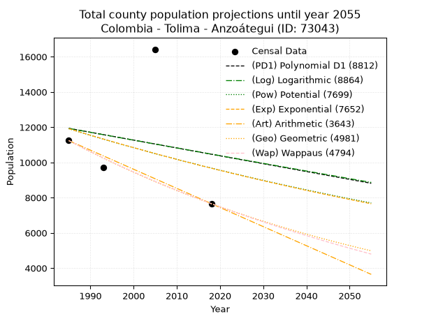
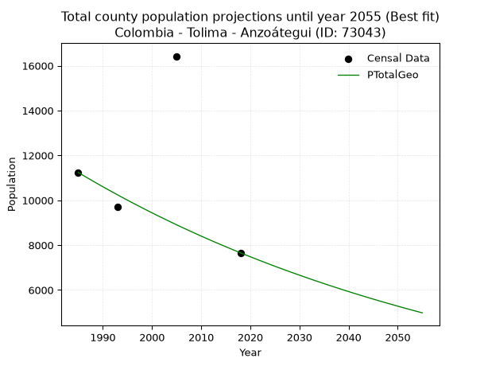
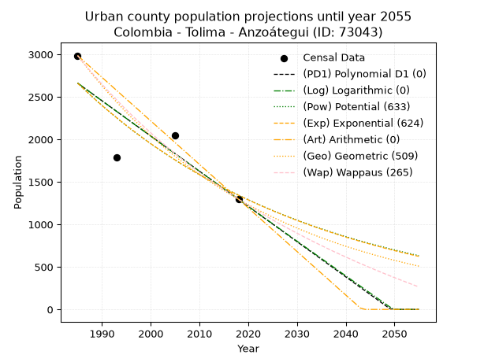
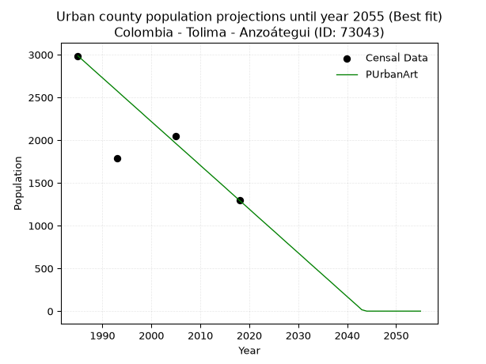
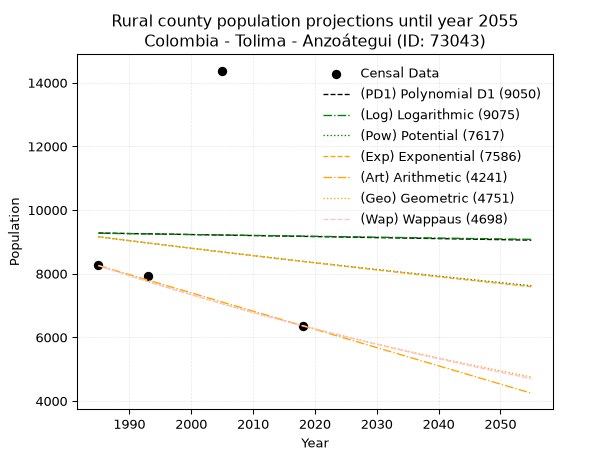
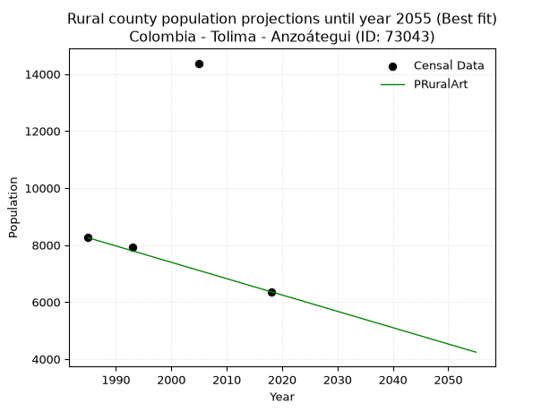

<div align="center">


</div>

# _“Population and Public Services Demand Projections (PPSD) until Year 2050 for Colombia - Tolima - Anzoátegui (ID: 73043)”_
Keywords: `population` `public-service` `projection` `lineal` `polynomial` `logarithmic` `potential` `exponential` `arithmetic` `geometric` `wappaus` `dane` `colombia` `south-america`

PPSD are analytical estimates used by governments and planners to anticipate future changes in population size, age distribution, and the resulting community needs for utilities, healthcare, education, and infrastructure as sizing future water treatment facilities, electrical grids, and road networks based on spatial growth.

> **General running parameters**: • app_version: _v20260806_. • Python version: _3.14.7_. • Pandas version: _3.0.5_. • NumPy version: _2.5.1_. • Creates, save and include plots into reports (create_plot): _False_. • Projection until year: _2050_. • Process polynomial degree 2 and up: _False_. • Process Wappaus: _True_. • Process Wappaus: _True_. • Set negative values to zero: _True_. • Set infinite values to zero: _True_. • Drop dataset notes: _True_. 
<div align="center">

Dynamic map: [:earth_americas:Google](http://maps.google.com/maps?q=4.631756142,-75.0937724) [:earth_americas:OSM](https://www.openstreetmap.org/#map=18/4.631756142/-75.0937724&layers=P) [:earth_americas:Bing](https://www.bing.com/maps?cp=4.631756142~-75.0937724&lvl=18) [:earth_americas:Apple](https://maps.apple.com/frame?center=4.631756142%2C-75.0937724&span=0.003%2C0.006)

</div>


<div align="center">

```geojson
{
  "type": "Feature",
  "geometry": {
    "type": "Point", 
    "coordinates": [-75.0937724, 4.631756142]
  }, 
  "properties": {
    "Name": "Colombia - Tolima - Anzoátegui (ID: 73043)"
  }
}
```

</div>


## 0. Census Data (4 records)

Census data are official statistics collected by a government about the people and housing in a country. They usually include counts of total population, age, sex, race, income, education, and jobs.

📅Global census file: [Population.xlsx](../data/Population.xlsx)

| Source   |   Year |   CountryID | CountryName   |   StateID | StateName   |   CountyID | CountyName   |   PTotal |   PUrban |   PRural |
|:---------|-------:|------------:|:--------------|----------:|:------------|-----------:|:-------------|---------:|---------:|---------:|
| DANE     |   1985 |          57 | Colombia      |        73 | Tolima      |      73043 | Anzoátegui   |    11239 |     2985 |     8254 |
| DANE     |   1993 |          57 | Colombia      |        73 | Tolima      |      73043 | Anzoátegui   |     9700 |     1791 |     7909 |
| DANE     |   2005 |          57 | Colombia      |        73 | Tolima      |      73043 | Anzoátegui   |    16422 |     2045 |    14377 |
| DANE     |   2018 |          57 | Colombia      |        73 | Tolima      |      73043 | Anzoátegui   |     7658 |     1296 |     6362 |

> 🔥Some records could had specific notes about the registered values or the corresponding urban or rural distribution.

📅   [RUPS](https://www.datos.gov.co/Hacienda-y-Cr-dito-P-blico/Registro-nico-de-Prestadores-de-Servicios-P-blicos/4qkq-csdn/about_data) - Local public utility companies: [RUPS.csv](../data/RUPS.xlsx)

 | SERVICIO       | ESTADO    | NOMBRE                                                                           | NIT         | DEPARTAMENTO_DOMICILIO   | MUNICIPIO_DOMICILIO   | DIRECCION                                              |   TELEFONO | EMAIL                                              | TIPO_PRESTADOR                 | CLASIFICACION                 |
|:---------------|:----------|:---------------------------------------------------------------------------------|:------------|:-------------------------|:----------------------|:-------------------------------------------------------|-----------:|:---------------------------------------------------|:-------------------------------|:------------------------------|
| ACUEDUCTO      | OPERATIVA | OFICINA DE SERVICIOS PUBLICOS DEL MUNICIPIO DE ANZOATEGUI                        | 890702018-4 | TOLIMA                   | ANZOATEGUI            | Calle 13 entre Carreras 2 y 3 Palacio Municipal Piso 2 |    2810088 | oficianaserviciospublicos@anzoategui-tolima.gov.co | MUNICIPIO (PRESTACIÓN DIRECTA) | MENOR O IGUAL A 2500 USUARIOS |
| ALCANTARILLADO | OPERATIVA | OFICINA DE SERVICIOS PUBLICOS DEL MUNICIPIO DE ANZOATEGUI                        | 890702018-4 | TOLIMA                   | ANZOATEGUI            | Calle 13 entre Carreras 2 y 3 Palacio Municipal Piso 2 |    2810088 | oficianaserviciospublicos@anzoategui-tolima.gov.co | MUNICIPIO (PRESTACIÓN DIRECTA) | MENOR O IGUAL A 2500 USUARIOS |
| ACUEDUCTO      | OPERATIVA | JUNTA ADMINISTRADORA ACUEDUCTO VEREDA SAN ANTONIO MUNICIPIO DE ANZOATEGUI TOLIMA | 901316452-1 | TOLIMA                   | ANZOATEGUI            | FNCA TEBAIDA VDA SAN ANTONIO ANZOATEGUI                |    2702778 | avgomezb@ut.edu.co                                 | ORGANIZACION AUTORIZADA        | MENOR O IGUAL A 2500 USUARIOS |

## 1. Total

### 1.1. Coefficients and Parameters

* (PD1) Polynomial Deg 1: -44.617824166996186, 100501.55279003414 (lineal)
* (Log) Logarithmic: -88488.6869959465, 683857.9689600241
* (Pow) Potential: -12.597399176800346, 45.619230237469225
* (Exp) Exponential: -0.006327702228468949, 3397187733.425349
* (Art) Arithmetic: Year diff. 2018 - 1985 = 33, Population diff. 7658 - 11239 = -3581, Annual growth = -108.51515151515152
* (Geo) Geometric: Year diff. 2018 - 1985 = 33, Population diff. 7658 - 11239 = -3581, Annual growth % = -0.01155811068585244
* (Wap) Wappaus: i = -1.148490781765905, Condition values only valid for < 200)

<sub>
Wappaus condition values: ['-0.00', '-1.15', '-2.30', '-3.45', '-4.59', '-5.74', '-6.89', '-8.04', '-9.19', '-10.34', '-11.48', '-12.63', '-13.78', '-14.93', '-16.08', '-17.23', '-18.38', '-19.52', '-20.67', '-21.82', '-22.97', '-24.12', '-25.27', '-26.42', '-27.56', '-28.71', '-29.86', '-31.01', '-32.16', '-33.31', '-34.45', '-35.60', '-36.75', '-37.90', '-39.05', '-40.20', '-41.35', '-42.49', '-43.64', '-44.79', '-45.94', '-47.09', '-48.24', '-49.39', '-50.53', '-51.68', '-52.83', '-53.98', '-55.13', '-56.28', '-57.42', '-58.57', '-59.72', '-60.87', '-62.02', '-63.17', '-64.32', '-65.46', '-66.61', '-67.76', '-68.91', '-70.06', '-71.21', '-72.35', '-73.50', '-74.65']
</sub>


### 1.2. Projected Dataset

|   Year |   CountyID |   PTotalPD1 |   PTotalLog |   PTotalPow |   PTotalExp |   PTotalArt |   PTotalGeo |   PTotalWap |
|-------:|-----------:|------------:|------------:|------------:|------------:|------------:|------------:|------------:|
|   1985 |      73043 |       11935 |       11930 |       11913 |       11917 |       11239 |       11239 |       11239 |
|   1986 |      73043 |       11891 |       11886 |       11838 |       11842 |       11130 |       11109 |       11111 |
|   1987 |      73043 |       11846 |       11841 |       11763 |       11767 |       11022 |       10981 |       10984 |
|   1988 |      73043 |       11801 |       11797 |       11689 |       11693 |       10913 |       10854 |       10858 |
|   1989 |      73043 |       11757 |       11752 |       11615 |       11619 |       10805 |       10728 |       10734 |
|   1990 |      73043 |       11712 |       11708 |       11541 |       11546 |       10696 |       10604 |       10612 |
|   1991 |      73043 |       11667 |       11663 |       11469 |       11473 |       10588 |       10482 |       10490 |
|   1992 |      73043 |       11623 |       11619 |       11396 |       11401 |       10479 |       10361 |       10370 |
|   1993 |      73043 |       11578 |       11574 |       11325 |       11329 |       10371 |       10241 |       10252 |
|   1994 |      73043 |       11534 |       11530 |       11253 |       11257 |       10262 |       10123 |       10134 |
|   1995 |      73043 |       11489 |       11486 |       11182 |       11186 |       10154 |       10006 |       10018 |
|   1996 |      73043 |       11444 |       11441 |       11112 |       11116 |       10045 |        9890 |        9903 |
|   1997 |      73043 |       11400 |       11397 |       11042 |       11046 |        9937 |        9776 |        9790 |
|   1998 |      73043 |       11355 |       11353 |       10973 |       10976 |        9828 |        9663 |        9678 |
|   1999 |      73043 |       11311 |       11308 |       10904 |       10907 |        9720 |        9551 |        9566 |
|   2000 |      73043 |       11266 |       11264 |       10835 |       10838 |        9611 |        9440 |        9456 |
|   2001 |      73043 |       11221 |       11220 |       10767 |       10770 |        9503 |        9331 |        9348 |
|   2002 |      73043 |       11177 |       11176 |       10700 |       10702 |        9394 |        9224 |        9240 |
|   2003 |      73043 |       11132 |       11131 |       10633 |       10634 |        9286 |        9117 |        9133 |
|   2004 |      73043 |       11087 |       11087 |       10566 |       10567 |        9177 |        9012 |        9028 |
|   2005 |      73043 |       11043 |       11043 |       10500 |       10500 |        9069 |        8907 |        8923 |
|   2006 |      73043 |       10998 |       10999 |       10434 |       10434 |        8960 |        8804 |        8820 |
|   2007 |      73043 |       10954 |       10955 |       10369 |       10368 |        8852 |        8703 |        8718 |
|   2008 |      73043 |       10909 |       10911 |       10304 |       10303 |        8743 |        8602 |        8617 |
|   2009 |      73043 |       10864 |       10867 |       10239 |       10238 |        8635 |        8503 |        8516 |
|   2010 |      73043 |       10820 |       10823 |       10175 |       10173 |        8526 |        8404 |        8417 |
|   2011 |      73043 |       10775 |       10779 |       10112 |       10109 |        8418 |        8307 |        8319 |
|   2012 |      73043 |       10730 |       10735 |       10049 |       10045 |        8309 |        8211 |        8222 |
|   2013 |      73043 |       10686 |       10691 |        9986 |        9982 |        8201 |        8116 |        8125 |
|   2014 |      73043 |       10641 |       10647 |        9924 |        9919 |        8092 |        8023 |        8030 |
|   2015 |      73043 |       10597 |       10603 |        9862 |        9857 |        7984 |        7930 |        7936 |
|   2016 |      73043 |       10552 |       10559 |        9800 |        9794 |        7875 |        7838 |        7842 |
|   2017 |      73043 |       10507 |       10515 |        9739 |        9733 |        7767 |        7748 |        7750 |
|   2018 |      73043 |       10463 |       10471 |        9679 |        9671 |        7658 |        7658 |        7658 |
|   2019 |      73043 |       10418 |       10427 |        9619 |        9610 |        7549 |        7569 |        7567 |
|   2020 |      73043 |       10374 |       10384 |        9559 |        9550 |        7441 |        7482 |        7477 |
|   2021 |      73043 |       10329 |       10340 |        9499 |        9489 |        7332 |        7396 |        7388 |
|   2022 |      73043 |       10284 |       10296 |        9440 |        9430 |        7224 |        7310 |        7300 |
|   2023 |      73043 |       10240 |       10252 |        9382 |        9370 |        7115 |        7226 |        7213 |
|   2024 |      73043 |       10195 |       10209 |        9323 |        9311 |        7007 |        7142 |        7126 |
|   2025 |      73043 |       10150 |       10165 |        9266 |        9252 |        6898 |        7059 |        7040 |
|   2026 |      73043 |       10106 |       10121 |        9208 |        9194 |        6790 |        6978 |        6955 |
|   2027 |      73043 |       10061 |       10077 |        9151 |        9136 |        6681 |        6897 |        6871 |
|   2028 |      73043 |       10017 |       10034 |        9094 |        9078 |        6573 |        6818 |        6788 |
|   2029 |      73043 |        9972 |        9990 |        9038 |        9021 |        6464 |        6739 |        6705 |
|   2030 |      73043 |        9927 |        9947 |        8982 |        8964 |        6356 |        6661 |        6623 |
|   2031 |      73043 |        9883 |        9903 |        8927 |        8908 |        6247 |        6584 |        6542 |
|   2032 |      73043 |        9838 |        9859 |        8871 |        8851 |        6139 |        6508 |        6462 |
|   2033 |      73043 |        9794 |        9816 |        8817 |        8795 |        6030 |        6433 |        6382 |
|   2034 |      73043 |        9749 |        9772 |        8762 |        8740 |        5922 |        6358 |        6303 |
|   2035 |      73043 |        9704 |        9729 |        8708 |        8685 |        5813 |        6285 |        6225 |
|   2036 |      73043 |        9660 |        9685 |        8654 |        8630 |        5705 |        6212 |        6147 |
|   2037 |      73043 |        9615 |        9642 |        8601 |        8576 |        5596 |        6140 |        6070 |
|   2038 |      73043 |        9570 |        9599 |        8548 |        8522 |        5488 |        6069 |        5994 |
|   2039 |      73043 |        9526 |        9555 |        8495 |        8468 |        5379 |        5999 |        5919 |
|   2040 |      73043 |        9481 |        9512 |        8443 |        8414 |        5271 |        5930 |        5844 |
|   2041 |      73043 |        9437 |        9468 |        8391 |        8361 |        5162 |        5861 |        5769 |
|   2042 |      73043 |        9392 |        9425 |        8339 |        8309 |        5054 |        5794 |        5696 |
|   2043 |      73043 |        9347 |        9382 |        8288 |        8256 |        4945 |        5727 |        5623 |
|   2044 |      73043 |        9303 |        9338 |        8237 |        8204 |        4837 |        5660 |        5551 |
|   2045 |      73043 |        9258 |        9295 |        8187 |        8152 |        4728 |        5595 |        5479 |
|   2046 |      73043 |        9213 |        9252 |        8136 |        8101 |        4620 |        5530 |        5408 |
|   2047 |      73043 |        9169 |        9209 |        8086 |        8050 |        4511 |        5466 |        5337 |
|   2048 |      73043 |        9124 |        9165 |        8037 |        7999 |        4403 |        5403 |        5267 |
|   2049 |      73043 |        9080 |        9122 |        7988 |        7949 |        4294 |        5341 |        5198 |
|   2050 |      73043 |        9035 |        9079 |        7939 |        7898 |        4186 |        5279 |        5129 |
<div align="center">

</img>

</div>


### 1.3. Best fit with absolute and relative error (%)

Relative error puts that difference into context by dividing the absolute error by the true value, creating a unitless ratio or percentage that shows the scale of the mistake.

Absolute and relative error

|   Year | Source   |   CountryID | CountryName   |   StateID | StateName   |   CountyID_x | CountyName   |   PTotal |   PUrban |   PRural |   CountyID_y |   PTotalPD1 |   PTotalLog |   PTotalPow |   PTotalExp |   PTotalArt |   PTotalGeo |   PTotalWap |   PTotalPD1AbsError |   PTotalLogAbsError |   PTotalPowAbsError |   PTotalExpAbsError |   PTotalArtAbsError |   PTotalGeoAbsError |   PTotalWapAbsError |   PTotalPD1RelError |   PTotalLogRelError |   PTotalPowRelError |   PTotalExpRelError |   PTotalArtRelError |   PTotalGeoRelError |   PTotalWapRelError |
|-------:|:---------|------------:|:--------------|----------:|:------------|-------------:|:-------------|---------:|---------:|---------:|-------------:|------------:|------------:|------------:|------------:|------------:|------------:|------------:|--------------------:|--------------------:|--------------------:|--------------------:|--------------------:|--------------------:|--------------------:|--------------------:|--------------------:|--------------------:|--------------------:|--------------------:|--------------------:|--------------------:|
|   1985 | DANE     |          57 | Colombia      |        73 | Tolima      |        73043 | Anzoátegui   |    11239 |     2985 |     8254 |        73043 |       11935 |       11930 |       11913 |       11917 |       11239 |       11239 |       11239 |                 696 |                 691 |                 674 |                 678 |                   0 |                   0 |                   0 |             6.19272 |             6.14823 |             5.99697 |             6.03257 |             0       |             0       |             0       |
|   1993 | DANE     |          57 | Colombia      |        73 | Tolima      |        73043 | Anzoátegui   |     9700 |     1791 |     7909 |        73043 |       11578 |       11574 |       11325 |       11329 |       10371 |       10241 |       10252 |                1878 |                1874 |                1625 |                1629 |                 671 |                 541 |                 552 |            19.3608  |            19.3196  |            16.7526  |            16.7938  |             6.91753 |             5.57732 |             5.69072 |
|   2005 | DANE     |          57 | Colombia      |        73 | Tolima      |        73043 | Anzoátegui   |    16422 |     2045 |    14377 |        73043 |       11043 |       11043 |       10500 |       10500 |        9069 |        8907 |        8923 |                5379 |                5379 |                5922 |                5922 |                7353 |                7515 |                7499 |            32.7548  |            32.7548  |            36.0614  |            36.0614  |            44.7753  |            45.7618  |            45.6644  |
|   2018 | DANE     |          57 | Colombia      |        73 | Tolima      |        73043 | Anzoátegui   |     7658 |     1296 |     6362 |        73043 |       10463 |       10471 |        9679 |        9671 |        7658 |        7658 |        7658 |                2805 |                2813 |                2021 |                2013 |                   0 |                   0 |                   0 |            36.6284  |            36.7328  |            26.3907  |            26.2862  |             0       |             0       |             0       |

Relative error mean

| Method    |   RelError | Best   |
|:----------|-----------:|:-------|
| PTotalPD1 |    23.7342 |        |
| PTotalLog |    23.7389 |        |
| PTotalPow |    21.3004 |        |
| PTotalExp |    21.2935 |        |
| PTotalArt |    12.9232 |        |
| PTotalGeo |    12.8348 | True   |
| PTotalWap |    12.8388 |        |

💙Best method: _**PTotalGeo**_
<div align="center">

</img>

</div>


### 1.4. Fresh water supply demand in liters per capita per day (lpcd)

The fresh water supply demand typically ranges from 100 to 300 liters per capita per day (lpcd) for standard domestic and municipal planning, though absolute survival minimums set by the World Health Organization are as low as 7.5 to 20 liters per day, and total consumption in high-income nations can exceed 400 liters.

> `CZ`: Level in meters above the sea level (masl)<br> `WS`: Fresh water supply demand in liters per capita per day (lpcd or l/h/d)<br> `WSAll`: Zonal fresh water supply demand in liters per second (l/s)<br> `A`: Zonal area in square meters<br> `DP`: Population density (people/hectare or p/ha)

Reference values (RAS Colombia)

|    CZ |   WS |
|------:|-----:|
|  1000 |  120 |
|  2000 |  130 |
| 99999 |  140 |

County shapefile geometry properties and water supply values

|   CountyID |      ATotal |   CZTotal |   WSTotal |
|-----------:|------------:|----------:|----------:|
|      73043 | 4.69469e+08 |   2853.83 |       140 |

Projected values for best method: PTotalGeo

|   CountyID |   Year |   PTotalGeo |   DPTotal |   WSTotal |   WSTotalAll |
|-----------:|-------:|------------:|----------:|----------:|-------------:|
|      73043 |   1985 |       11239 |      0.24 |       140 |     18.2113  |
|      73043 |   1986 |       11109 |      0.24 |       140 |     18.0007  |
|      73043 |   1987 |       10981 |      0.23 |       140 |     17.7933  |
|      73043 |   1988 |       10854 |      0.23 |       140 |     17.5875  |
|      73043 |   1989 |       10728 |      0.23 |       140 |     17.3833  |
|      73043 |   1990 |       10604 |      0.23 |       140 |     17.1824  |
|      73043 |   1991 |       10482 |      0.22 |       140 |     16.9847  |
|      73043 |   1992 |       10361 |      0.22 |       140 |     16.7887  |
|      73043 |   1993 |       10241 |      0.22 |       140 |     16.5942  |
|      73043 |   1994 |       10123 |      0.22 |       140 |     16.403   |
|      73043 |   1995 |       10006 |      0.21 |       140 |     16.2134  |
|      73043 |   1996 |        9890 |      0.21 |       140 |     16.0255  |
|      73043 |   1997 |        9776 |      0.21 |       140 |     15.8407  |
|      73043 |   1998 |        9663 |      0.21 |       140 |     15.6576  |
|      73043 |   1999 |        9551 |      0.2  |       140 |     15.4762  |
|      73043 |   2000 |        9440 |      0.2  |       140 |     15.2963  |
|      73043 |   2001 |        9331 |      0.2  |       140 |     15.1197  |
|      73043 |   2002 |        9224 |      0.2  |       140 |     14.9463  |
|      73043 |   2003 |        9117 |      0.19 |       140 |     14.7729  |
|      73043 |   2004 |        9012 |      0.19 |       140 |     14.6028  |
|      73043 |   2005 |        8907 |      0.19 |       140 |     14.4326  |
|      73043 |   2006 |        8804 |      0.19 |       140 |     14.2657  |
|      73043 |   2007 |        8703 |      0.19 |       140 |     14.1021  |
|      73043 |   2008 |        8602 |      0.18 |       140 |     13.9384  |
|      73043 |   2009 |        8503 |      0.18 |       140 |     13.778   |
|      73043 |   2010 |        8404 |      0.18 |       140 |     13.6176  |
|      73043 |   2011 |        8307 |      0.18 |       140 |     13.4604  |
|      73043 |   2012 |        8211 |      0.17 |       140 |     13.3049  |
|      73043 |   2013 |        8116 |      0.17 |       140 |     13.1509  |
|      73043 |   2014 |        8023 |      0.17 |       140 |     13.0002  |
|      73043 |   2015 |        7930 |      0.17 |       140 |     12.8495  |
|      73043 |   2016 |        7838 |      0.17 |       140 |     12.7005  |
|      73043 |   2017 |        7748 |      0.17 |       140 |     12.5546  |
|      73043 |   2018 |        7658 |      0.16 |       140 |     12.4088  |
|      73043 |   2019 |        7569 |      0.16 |       140 |     12.2646  |
|      73043 |   2020 |        7482 |      0.16 |       140 |     12.1236  |
|      73043 |   2021 |        7396 |      0.16 |       140 |     11.9843  |
|      73043 |   2022 |        7310 |      0.16 |       140 |     11.8449  |
|      73043 |   2023 |        7226 |      0.15 |       140 |     11.7088  |
|      73043 |   2024 |        7142 |      0.15 |       140 |     11.5727  |
|      73043 |   2025 |        7059 |      0.15 |       140 |     11.4382  |
|      73043 |   2026 |        6978 |      0.15 |       140 |     11.3069  |
|      73043 |   2027 |        6897 |      0.15 |       140 |     11.1757  |
|      73043 |   2028 |        6818 |      0.15 |       140 |     11.0477  |
|      73043 |   2029 |        6739 |      0.14 |       140 |     10.9197  |
|      73043 |   2030 |        6661 |      0.14 |       140 |     10.7933  |
|      73043 |   2031 |        6584 |      0.14 |       140 |     10.6685  |
|      73043 |   2032 |        6508 |      0.14 |       140 |     10.5454  |
|      73043 |   2033 |        6433 |      0.14 |       140 |     10.4238  |
|      73043 |   2034 |        6358 |      0.14 |       140 |     10.3023  |
|      73043 |   2035 |        6285 |      0.13 |       140 |     10.184   |
|      73043 |   2036 |        6212 |      0.13 |       140 |     10.0657  |
|      73043 |   2037 |        6140 |      0.13 |       140 |      9.94907 |
|      73043 |   2038 |        6069 |      0.13 |       140 |      9.83403 |
|      73043 |   2039 |        5999 |      0.13 |       140 |      9.7206  |
|      73043 |   2040 |        5930 |      0.13 |       140 |      9.6088  |
|      73043 |   2041 |        5861 |      0.12 |       140 |      9.49699 |
|      73043 |   2042 |        5794 |      0.12 |       140 |      9.38843 |
|      73043 |   2043 |        5727 |      0.12 |       140 |      9.27986 |
|      73043 |   2044 |        5660 |      0.12 |       140 |      9.1713  |
|      73043 |   2045 |        5595 |      0.12 |       140 |      9.06597 |
|      73043 |   2046 |        5530 |      0.12 |       140 |      8.96065 |
|      73043 |   2047 |        5466 |      0.12 |       140 |      8.85694 |
|      73043 |   2048 |        5403 |      0.12 |       140 |      8.75486 |
|      73043 |   2049 |        5341 |      0.11 |       140 |      8.6544  |
|      73043 |   2050 |        5279 |      0.11 |       140 |      8.55394 |

## 2. Urban

### 2.1. Coefficients and Parameters

* (PD1) Polynomial Deg 1: -41.41027699718942, 84860.15656362813 (lineal)
* (Log) Logarithmic: -82930.09373689753, 632381.5570542221
* (Pow) Potential: -41.47505413386509, 140.2001336051764
* (Exp) Exponential: -0.020717949286776394, 1.9295946429900304e+21
* (Art) Arithmetic: Year diff. 2018 - 1985 = 33, Population diff. 1296 - 2985 = -1689, Annual growth = -51.18181818181818
* (Geo) Geometric: Year diff. 2018 - 1985 = 33, Population diff. 1296 - 2985 = -1689, Annual growth % = -0.024965416001717422
* (Wap) Wappaus: i = -2.3911150750674226, Condition values only valid for < 200)

<sub>
Wappaus condition values: ['-0.00', '-2.39', '-4.78', '-7.17', '-9.56', '-11.96', '-14.35', '-16.74', '-19.13', '-21.52', '-23.91', '-26.30', '-28.69', '-31.08', '-33.48', '-35.87', '-38.26', '-40.65', '-43.04', '-45.43', '-47.82', '-50.21', '-52.60', '-55.00', '-57.39', '-59.78', '-62.17', '-64.56', '-66.95', '-69.34', '-71.73', '-74.12', '-76.52', '-78.91', '-81.30', '-83.69', '-86.08', '-88.47', '-90.86', '-93.25', '-95.64', '-98.04', '-100.43', '-102.82', '-105.21', '-107.60', '-109.99', '-112.38', '-114.77', '-117.16', '-119.56', '-121.95', '-124.34', '-126.73', '-129.12', '-131.51', '-133.90', '-136.29', '-138.68', '-141.08', '-143.47', '-145.86', '-148.25', '-150.64', '-153.03', '-155.42']
</sub>


### 2.2. Projected Dataset

|   Year |   CountyID |   PUrbanPD1 |   PUrbanLog |   PUrbanPow |   PUrbanExp |   PUrbanArt |   PUrbanGeo |   PUrbanWap |
|-------:|-----------:|------------:|------------:|------------:|------------:|------------:|------------:|------------:|
|   1985 |      73043 |        2661 |        2662 |        2663 |        2661 |        2985 |        2985 |        2985 |
|   1986 |      73043 |        2619 |        2621 |        2608 |        2606 |        2934 |        2910 |        2914 |
|   1987 |      73043 |        2578 |        2579 |        2554 |        2553 |        2883 |        2838 |        2846 |
|   1988 |      73043 |        2537 |        2537 |        2501 |        2501 |        2831 |        2767 |        2778 |
|   1989 |      73043 |        2495 |        2495 |        2449 |        2449 |        2780 |        2698 |        2713 |
|   1990 |      73043 |        2454 |        2454 |        2399 |        2399 |        2729 |        2631 |        2648 |
|   1991 |      73043 |        2412 |        2412 |        2349 |        2350 |        2678 |        2565 |        2585 |
|   1992 |      73043 |        2371 |        2370 |        2301 |        2302 |        2627 |        2501 |        2524 |
|   1993 |      73043 |        2329 |        2329 |        2254 |        2255 |        2576 |        2438 |        2464 |
|   1994 |      73043 |        2288 |        2287 |        2207 |        2208 |        2524 |        2378 |        2405 |
|   1995 |      73043 |        2247 |        2246 |        2162 |        2163 |        2473 |        2318 |        2347 |
|   1996 |      73043 |        2205 |        2204 |        2117 |        2119 |        2422 |        2260 |        2291 |
|   1997 |      73043 |        2164 |        2162 |        2074 |        2075 |        2371 |        2204 |        2236 |
|   1998 |      73043 |        2122 |        2121 |        2031 |        2033 |        2320 |        2149 |        2182 |
|   1999 |      73043 |        2081 |        2079 |        1990 |        1991 |        2268 |        2095 |        2129 |
|   2000 |      73043 |        2040 |        2038 |        1949 |        1950 |        2217 |        2043 |        2077 |
|   2001 |      73043 |        1998 |        1997 |        1909 |        1910 |        2166 |        1992 |        2026 |
|   2002 |      73043 |        1957 |        1955 |        1870 |        1871 |        2115 |        1942 |        1977 |
|   2003 |      73043 |        1915 |        1914 |        1831 |        1833 |        2064 |        1894 |        1928 |
|   2004 |      73043 |        1874 |        1872 |        1794 |        1795 |        2013 |        1846 |        1880 |
|   2005 |      73043 |        1833 |        1831 |        1757 |        1758 |        1961 |        1800 |        1833 |
|   2006 |      73043 |        1791 |        1790 |        1721 |        1722 |        1910 |        1755 |        1787 |
|   2007 |      73043 |        1750 |        1748 |        1686 |        1687 |        1859 |        1712 |        1742 |
|   2008 |      73043 |        1708 |        1707 |        1651 |        1652 |        1808 |        1669 |        1697 |
|   2009 |      73043 |        1667 |        1666 |        1618 |        1618 |        1757 |        1627 |        1654 |
|   2010 |      73043 |        1625 |        1624 |        1585 |        1585 |        1705 |        1587 |        1611 |
|   2011 |      73043 |        1584 |        1583 |        1552 |        1553 |        1654 |        1547 |        1569 |
|   2012 |      73043 |        1543 |        1542 |        1520 |        1521 |        1603 |        1508 |        1528 |
|   2013 |      73043 |        1501 |        1501 |        1489 |        1490 |        1552 |        1471 |        1488 |
|   2014 |      73043 |        1460 |        1460 |        1459 |        1459 |        1501 |        1434 |        1448 |
|   2015 |      73043 |        1418 |        1418 |        1429 |        1429 |        1450 |        1398 |        1409 |
|   2016 |      73043 |        1377 |        1377 |        1400 |        1400 |        1398 |        1363 |        1371 |
|   2017 |      73043 |        1336 |        1336 |        1372 |        1371 |        1347 |        1329 |        1333 |
|   2018 |      73043 |        1294 |        1295 |        1344 |        1343 |        1296 |        1296 |        1296 |
|   2019 |      73043 |        1253 |        1254 |        1317 |        1316 |        1245 |        1264 |        1260 |
|   2020 |      73043 |        1211 |        1213 |        1290 |        1289 |        1194 |        1232 |        1224 |
|   2021 |      73043 |        1170 |        1172 |        1264 |        1262 |        1142 |        1201 |        1189 |
|   2022 |      73043 |        1129 |        1131 |        1238 |        1236 |        1091 |        1171 |        1154 |
|   2023 |      73043 |        1087 |        1090 |        1213 |        1211 |        1040 |        1142 |        1120 |
|   2024 |      73043 |        1046 |        1049 |        1188 |        1186 |         989 |        1114 |        1087 |
|   2025 |      73043 |        1004 |        1008 |        1164 |        1162 |         938 |        1086 |        1054 |
|   2026 |      73043 |         963 |         967 |        1140 |        1138 |         887 |        1059 |        1021 |
|   2027 |      73043 |         922 |         926 |        1117 |        1115 |         835 |        1032 |         989 |
|   2028 |      73043 |         880 |         885 |        1095 |        1092 |         784 |        1006 |         958 |
|   2029 |      73043 |         839 |         844 |        1073 |        1069 |         733 |         981 |         927 |
|   2030 |      73043 |         797 |         803 |        1051 |        1047 |         682 |         957 |         897 |
|   2031 |      73043 |         756 |         762 |        1030 |        1026 |         631 |         933 |         867 |
|   2032 |      73043 |         714 |         722 |        1009 |        1005 |         579 |         910 |         837 |
|   2033 |      73043 |         673 |         681 |         988 |         984 |         528 |         887 |         808 |
|   2034 |      73043 |         632 |         640 |         968 |         964 |         477 |         865 |         780 |
|   2035 |      73043 |         590 |         599 |         949 |         944 |         426 |         843 |         751 |
|   2036 |      73043 |         549 |         559 |         930 |         925 |         375 |         822 |         724 |
|   2037 |      73043 |         507 |         518 |         911 |         906 |         324 |         802 |         696 |
|   2038 |      73043 |         466 |         477 |         893 |         888 |         272 |         782 |         669 |
|   2039 |      73043 |         425 |         436 |         875 |         869 |         221 |         762 |         643 |
|   2040 |      73043 |         383 |         396 |         857 |         851 |         170 |         743 |         617 |
|   2041 |      73043 |         342 |         355 |         840 |         834 |         119 |         725 |         591 |
|   2042 |      73043 |         300 |         315 |         823 |         817 |          68 |         706 |         565 |
|   2043 |      73043 |         259 |         274 |         806 |         800 |          16 |         689 |         540 |
|   2044 |      73043 |         218 |         233 |         790 |         784 |           0 |         672 |         516 |
|   2045 |      73043 |         176 |         193 |         774 |         768 |           0 |         655 |         491 |
|   2046 |      73043 |         135 |         152 |         759 |         752 |           0 |         639 |         467 |
|   2047 |      73043 |          93 |         112 |         744 |         737 |           0 |         623 |         444 |
|   2048 |      73043 |          52 |          71 |         729 |         721 |           0 |         607 |         420 |
|   2049 |      73043 |          10 |          31 |         714 |         707 |           0 |         592 |         397 |
|   2050 |      73043 |           0 |           0 |         700 |         692 |           0 |         577 |         374 |
<div align="center">

</img>

</div>


### 2.3. Best fit with absolute and relative error (%)

Relative error puts that difference into context by dividing the absolute error by the true value, creating a unitless ratio or percentage that shows the scale of the mistake.

Absolute and relative error

|   Year | Source   |   CountryID | CountryName   |   StateID | StateName   |   CountyID_x | CountyName   |   PTotal |   PUrban |   PRural |   CountyID_y |   PUrbanPD1 |   PUrbanLog |   PUrbanPow |   PUrbanExp |   PUrbanArt |   PUrbanGeo |   PUrbanWap |   PUrbanPD1AbsError |   PUrbanLogAbsError |   PUrbanPowAbsError |   PUrbanExpAbsError |   PUrbanArtAbsError |   PUrbanGeoAbsError |   PUrbanWapAbsError |   PUrbanPD1RelError |   PUrbanLogRelError |   PUrbanPowRelError |   PUrbanExpRelError |   PUrbanArtRelError |   PUrbanGeoRelError |   PUrbanWapRelError |
|-------:|:---------|------------:|:--------------|----------:|:------------|-------------:|:-------------|---------:|---------:|---------:|-------------:|------------:|------------:|------------:|------------:|------------:|------------:|------------:|--------------------:|--------------------:|--------------------:|--------------------:|--------------------:|--------------------:|--------------------:|--------------------:|--------------------:|--------------------:|--------------------:|--------------------:|--------------------:|--------------------:|
|   1985 | DANE     |          57 | Colombia      |        73 | Tolima      |        73043 | Anzoátegui   |    11239 |     2985 |     8254 |        73043 |        2661 |        2662 |        2663 |        2661 |        2985 |        2985 |        2985 |                 324 |                 323 |                 322 |                 324 |                   0 |                   0 |                   0 |           10.8543   |          10.8208    |             10.7873 |            10.8543  |             0       |              0      |              0      |
|   1993 | DANE     |          57 | Colombia      |        73 | Tolima      |        73043 | Anzoátegui   |     9700 |     1791 |     7909 |        73043 |        2329 |        2329 |        2254 |        2255 |        2576 |        2438 |        2464 |                 538 |                 538 |                 463 |                 464 |                 785 |                 647 |                 673 |           30.0391   |          30.0391    |             25.8515 |            25.9073  |            43.8303  |             36.1251 |             37.5768 |
|   2005 | DANE     |          57 | Colombia      |        73 | Tolima      |        73043 | Anzoátegui   |    16422 |     2045 |    14377 |        73043 |        1833 |        1831 |        1757 |        1758 |        1961 |        1800 |        1833 |                 212 |                 214 |                 288 |                 287 |                  84 |                 245 |                 212 |           10.3667   |          10.4645    |             14.0831 |            14.0342  |             4.10758 |             11.9804 |             10.3667 |
|   2018 | DANE     |          57 | Colombia      |        73 | Tolima      |        73043 | Anzoátegui   |     7658 |     1296 |     6362 |        73043 |        1294 |        1295 |        1344 |        1343 |        1296 |        1296 |        1296 |                   2 |                   1 |                  48 |                  47 |                   0 |                   0 |                   0 |            0.154321 |           0.0771605 |              3.7037 |             3.62654 |             0       |              0      |              0      |

Relative error mean

| Method    |   RelError | Best   |
|:----------|-----------:|:-------|
| PUrbanPD1 |    12.8536 |        |
| PUrbanLog |    12.8504 |        |
| PUrbanPow |    13.6064 |        |
| PUrbanExp |    13.6056 |        |
| PUrbanArt |    11.9845 | True   |
| PUrbanGeo |    12.0264 |        |
| PUrbanWap |    11.9859 |        |

💙Best method: _**PUrbanArt**_
<div align="center">

</img>

</div>


### 2.4. Fresh water supply demand in liters per capita per day (lpcd)

The fresh water supply demand typically ranges from 100 to 300 liters per capita per day (lpcd) for standard domestic and municipal planning, though absolute survival minimums set by the World Health Organization are as low as 7.5 to 20 liters per day, and total consumption in high-income nations can exceed 400 liters.

> `CZ`: Level in meters above the sea level (masl)<br> `WS`: Fresh water supply demand in liters per capita per day (lpcd or l/h/d)<br> `WSAll`: Zonal fresh water supply demand in liters per second (l/s)<br> `A`: Zonal area in square meters<br> `DP`: Population density (people/hectare or p/ha)

Reference values (RAS Colombia)

|    CZ |   WS |
|------:|-----:|
|  1000 |  120 |
|  2000 |  130 |
| 99999 |  140 |

County shapefile geometry properties and water supply values

|   CountyID |   AUrban |   CZUrban |   WSUrban |
|-----------:|---------:|----------:|----------:|
|      73043 |   241751 |   1946.93 |       130 |

Projected values for best method: PUrbanArt

|   CountyID |   Year |   PUrbanArt |   DPUrban |   WSUrban |   WSUrbanAll |
|-----------:|-------:|------------:|----------:|----------:|-------------:|
|      73043 |   1985 |        2985 |    123.47 |       130 |    4.49132   |
|      73043 |   1986 |        2934 |    121.36 |       130 |    4.41458   |
|      73043 |   1987 |        2883 |    119.25 |       130 |    4.33785   |
|      73043 |   1988 |        2831 |    117.1  |       130 |    4.25961   |
|      73043 |   1989 |        2780 |    114.99 |       130 |    4.18287   |
|      73043 |   1990 |        2729 |    112.88 |       130 |    4.10613   |
|      73043 |   1991 |        2678 |    110.77 |       130 |    4.0294    |
|      73043 |   1992 |        2627 |    108.67 |       130 |    3.95266   |
|      73043 |   1993 |        2576 |    106.56 |       130 |    3.87593   |
|      73043 |   1994 |        2524 |    104.4  |       130 |    3.79769   |
|      73043 |   1995 |        2473 |    102.3  |       130 |    3.72095   |
|      73043 |   1996 |        2422 |    100.19 |       130 |    3.64421   |
|      73043 |   1997 |        2371 |     98.08 |       130 |    3.56748   |
|      73043 |   1998 |        2320 |     95.97 |       130 |    3.49074   |
|      73043 |   1999 |        2268 |     93.82 |       130 |    3.4125    |
|      73043 |   2000 |        2217 |     91.71 |       130 |    3.33576   |
|      73043 |   2001 |        2166 |     89.6  |       130 |    3.25903   |
|      73043 |   2002 |        2115 |     87.49 |       130 |    3.18229   |
|      73043 |   2003 |        2064 |     85.38 |       130 |    3.10556   |
|      73043 |   2004 |        2013 |     83.27 |       130 |    3.02882   |
|      73043 |   2005 |        1961 |     81.12 |       130 |    2.95058   |
|      73043 |   2006 |        1910 |     79.01 |       130 |    2.87384   |
|      73043 |   2007 |        1859 |     76.9  |       130 |    2.79711   |
|      73043 |   2008 |        1808 |     74.79 |       130 |    2.72037   |
|      73043 |   2009 |        1757 |     72.68 |       130 |    2.64363   |
|      73043 |   2010 |        1705 |     70.53 |       130 |    2.56539   |
|      73043 |   2011 |        1654 |     68.42 |       130 |    2.48866   |
|      73043 |   2012 |        1603 |     66.31 |       130 |    2.41192   |
|      73043 |   2013 |        1552 |     64.2  |       130 |    2.33519   |
|      73043 |   2014 |        1501 |     62.09 |       130 |    2.25845   |
|      73043 |   2015 |        1450 |     59.98 |       130 |    2.18171   |
|      73043 |   2016 |        1398 |     57.83 |       130 |    2.10347   |
|      73043 |   2017 |        1347 |     55.72 |       130 |    2.02674   |
|      73043 |   2018 |        1296 |     53.61 |       130 |    1.95      |
|      73043 |   2019 |        1245 |     51.5  |       130 |    1.87326   |
|      73043 |   2020 |        1194 |     49.39 |       130 |    1.79653   |
|      73043 |   2021 |        1142 |     47.24 |       130 |    1.71829   |
|      73043 |   2022 |        1091 |     45.13 |       130 |    1.64155   |
|      73043 |   2023 |        1040 |     43.02 |       130 |    1.56481   |
|      73043 |   2024 |         989 |     40.91 |       130 |    1.48808   |
|      73043 |   2025 |         938 |     38.8  |       130 |    1.41134   |
|      73043 |   2026 |         887 |     36.69 |       130 |    1.33461   |
|      73043 |   2027 |         835 |     34.54 |       130 |    1.25637   |
|      73043 |   2028 |         784 |     32.43 |       130 |    1.17963   |
|      73043 |   2029 |         733 |     30.32 |       130 |    1.10289   |
|      73043 |   2030 |         682 |     28.21 |       130 |    1.02616   |
|      73043 |   2031 |         631 |     26.1  |       130 |    0.949421  |
|      73043 |   2032 |         579 |     23.95 |       130 |    0.871181  |
|      73043 |   2033 |         528 |     21.84 |       130 |    0.794444  |
|      73043 |   2034 |         477 |     19.73 |       130 |    0.717708  |
|      73043 |   2035 |         426 |     17.62 |       130 |    0.640972  |
|      73043 |   2036 |         375 |     15.51 |       130 |    0.564236  |
|      73043 |   2037 |         324 |     13.4  |       130 |    0.4875    |
|      73043 |   2038 |         272 |     11.25 |       130 |    0.409259  |
|      73043 |   2039 |         221 |      9.14 |       130 |    0.332523  |
|      73043 |   2040 |         170 |      7.03 |       130 |    0.255787  |
|      73043 |   2041 |         119 |      4.92 |       130 |    0.179051  |
|      73043 |   2042 |          68 |      2.81 |       130 |    0.102315  |
|      73043 |   2043 |          16 |      0.66 |       130 |    0.0240741 |
|      73043 |   2044 |           0 |      0    |       130 |    0         |
|      73043 |   2045 |           0 |      0    |       130 |    0         |
|      73043 |   2046 |           0 |      0    |       130 |    0         |
|      73043 |   2047 |           0 |      0    |       130 |    0         |
|      73043 |   2048 |           0 |      0    |       130 |    0         |
|      73043 |   2049 |           0 |      0    |       130 |    0         |
|      73043 |   2050 |           0 |      0    |       130 |    0         |

## 3. Rural

### 3.1. Coefficients and Parameters

* (PD1) Polynomial Deg 1: -3.2075471698066447, 15641.396226405737 (lineal)
* (Log) Logarithmic: -5558.593259048941, 51476.41190580185
* (Pow) Potential: -5.301285695821828, 21.44395811077968
* (Exp) Exponential: -0.0026910117375156333, 1912877.962975308
* (Art) Arithmetic: Year diff. 2018 - 1985 = 33, Population diff. 6362 - 8254 = -1892, Annual growth = -57.333333333333336
* (Geo) Geometric: Year diff. 2018 - 1985 = 33, Population diff. 6362 - 8254 = -1892, Annual growth % = -0.007858508826048327
* (Wap) Wappaus: i = -0.7845283707352673, Condition values only valid for < 200)

<sub>
Wappaus condition values: ['-0.00', '-0.78', '-1.57', '-2.35', '-3.14', '-3.92', '-4.71', '-5.49', '-6.28', '-7.06', '-7.85', '-8.63', '-9.41', '-10.20', '-10.98', '-11.77', '-12.55', '-13.34', '-14.12', '-14.91', '-15.69', '-16.48', '-17.26', '-18.04', '-18.83', '-19.61', '-20.40', '-21.18', '-21.97', '-22.75', '-23.54', '-24.32', '-25.10', '-25.89', '-26.67', '-27.46', '-28.24', '-29.03', '-29.81', '-30.60', '-31.38', '-32.17', '-32.95', '-33.73', '-34.52', '-35.30', '-36.09', '-36.87', '-37.66', '-38.44', '-39.23', '-40.01', '-40.80', '-41.58', '-42.36', '-43.15', '-43.93', '-44.72', '-45.50', '-46.29', '-47.07', '-47.86', '-48.64', '-49.43', '-50.21', '-50.99']
</sub>


### 3.2. Projected Dataset

|   Year |   CountyID |   PRuralPD1 |   PRuralLog |   PRuralPow |   PRuralExp |   PRuralArt |   PRuralGeo |   PRuralWap |
|-------:|-----------:|------------:|------------:|------------:|------------:|------------:|------------:|------------:|
|   1985 |      73043 |        9274 |        9268 |        9154 |        9159 |        8254 |        8254 |        8254 |
|   1986 |      73043 |        9271 |        9265 |        9129 |        9134 |        8197 |        8189 |        8189 |
|   1987 |      73043 |        9268 |        9262 |        9105 |        9110 |        8139 |        8125 |        8125 |
|   1988 |      73043 |        9265 |        9260 |        9081 |        9085 |        8082 |        8061 |        8062 |
|   1989 |      73043 |        9262 |        9257 |        9056 |        9061 |        8025 |        7998 |        7999 |
|   1990 |      73043 |        9258 |        9254 |        9032 |        9036 |        7967 |        7935 |        7936 |
|   1991 |      73043 |        9255 |        9251 |        9008 |        9012 |        7910 |        7872 |        7874 |
|   1992 |      73043 |        9252 |        9248 |        8984 |        8988 |        7853 |        7811 |        7813 |
|   1993 |      73043 |        9249 |        9246 |        8960 |        8964 |        7795 |        7749 |        7752 |
|   1994 |      73043 |        9246 |        9243 |        8937 |        8940 |        7738 |        7688 |        7691 |
|   1995 |      73043 |        9242 |        9240 |        8913 |        8916 |        7681 |        7628 |        7631 |
|   1996 |      73043 |        9239 |        9237 |        8889 |        8892 |        7623 |        7568 |        7571 |
|   1997 |      73043 |        9236 |        9234 |        8866 |        8868 |        7566 |        7508 |        7512 |
|   1998 |      73043 |        9233 |        9232 |        8842 |        8844 |        7509 |        7449 |        7453 |
|   1999 |      73043 |        9230 |        9229 |        8819 |        8820 |        7451 |        7391 |        7395 |
|   2000 |      73043 |        9226 |        9226 |        8795 |        8796 |        7394 |        7333 |        7337 |
|   2001 |      73043 |        9223 |        9223 |        8772 |        8773 |        7337 |        7275 |        7279 |
|   2002 |      73043 |        9220 |        9221 |        8749 |        8749 |        7279 |        7218 |        7222 |
|   2003 |      73043 |        9217 |        9218 |        8726 |        8726 |        7222 |        7161 |        7165 |
|   2004 |      73043 |        9213 |        9215 |        8703 |        8702 |        7165 |        7105 |        7109 |
|   2005 |      73043 |        9210 |        9212 |        8680 |        8679 |        7107 |        7049 |        7053 |
|   2006 |      73043 |        9207 |        9209 |        8657 |        8655 |        7050 |        6994 |        6998 |
|   2007 |      73043 |        9204 |        9207 |        8634 |        8632 |        6993 |        6939 |        6943 |
|   2008 |      73043 |        9201 |        9204 |        8611 |        8609 |        6935 |        6884 |        6888 |
|   2009 |      73043 |        9197 |        9201 |        8589 |        8586 |        6878 |        6830 |        6834 |
|   2010 |      73043 |        9194 |        9198 |        8566 |        8563 |        6821 |        6776 |        6780 |
|   2011 |      73043 |        9191 |        9196 |        8543 |        8540 |        6763 |        6723 |        6726 |
|   2012 |      73043 |        9188 |        9193 |        8521 |        8517 |        6706 |        6670 |        6673 |
|   2013 |      73043 |        9185 |        9190 |        8498 |        8494 |        6649 |        6618 |        6620 |
|   2014 |      73043 |        9181 |        9187 |        8476 |        8471 |        6591 |        6566 |        6568 |
|   2015 |      73043 |        9178 |        9185 |        8454 |        8448 |        6534 |        6514 |        6516 |
|   2016 |      73043 |        9175 |        9182 |        8432 |        8426 |        6477 |        6463 |        6464 |
|   2017 |      73043 |        9172 |        9179 |        8409 |        8403 |        6419 |        6412 |        6413 |
|   2018 |      73043 |        9169 |        9176 |        8387 |        8380 |        6362 |        6362 |        6362 |
|   2019 |      73043 |        9165 |        9174 |        8365 |        8358 |        6305 |        6312 |        6311 |
|   2020 |      73043 |        9162 |        9171 |        8343 |        8335 |        6247 |        6262 |        6261 |
|   2021 |      73043 |        9159 |        9168 |        8322 |        8313 |        6190 |        6213 |        6211 |
|   2022 |      73043 |        9156 |        9165 |        8300 |        8291 |        6133 |        6164 |        6162 |
|   2023 |      73043 |        9153 |        9163 |        8278 |        8268 |        6075 |        6116 |        6113 |
|   2024 |      73043 |        9149 |        9160 |        8256 |        8246 |        6018 |        6068 |        6064 |
|   2025 |      73043 |        9146 |        9157 |        8235 |        8224 |        5961 |        6020 |        6015 |
|   2026 |      73043 |        9143 |        9154 |        8213 |        8202 |        5903 |        5973 |        5967 |
|   2027 |      73043 |        9140 |        9152 |        8192 |        8180 |        5846 |        5926 |        5919 |
|   2028 |      73043 |        9136 |        9149 |        8170 |        8158 |        5789 |        5879 |        5871 |
|   2029 |      73043 |        9133 |        9146 |        8149 |        8136 |        5731 |        5833 |        5824 |
|   2030 |      73043 |        9130 |        9143 |        8128 |        8114 |        5674 |        5787 |        5777 |
|   2031 |      73043 |        9127 |        9141 |        8107 |        8092 |        5617 |        5742 |        5731 |
|   2032 |      73043 |        9124 |        9138 |        8086 |        8071 |        5559 |        5697 |        5684 |
|   2033 |      73043 |        9120 |        9135 |        8064 |        8049 |        5502 |        5652 |        5638 |
|   2034 |      73043 |        9117 |        9132 |        8043 |        8027 |        5445 |        5608 |        5593 |
|   2035 |      73043 |        9114 |        9130 |        8023 |        8006 |        5387 |        5563 |        5547 |
|   2036 |      73043 |        9111 |        9127 |        8002 |        7984 |        5330 |        5520 |        5502 |
|   2037 |      73043 |        9108 |        9124 |        7981 |        7963 |        5273 |        5476 |        5457 |
|   2038 |      73043 |        9104 |        9121 |        7960 |        7941 |        5215 |        5433 |        5413 |
|   2039 |      73043 |        9101 |        9119 |        7939 |        7920 |        5158 |        5391 |        5368 |
|   2040 |      73043 |        9098 |        9116 |        7919 |        7899 |        5101 |        5348 |        5325 |
|   2041 |      73043 |        9095 |        9113 |        7898 |        7877 |        5043 |        5306 |        5281 |
|   2042 |      73043 |        9092 |        9111 |        7878 |        7856 |        4986 |        5265 |        5237 |
|   2043 |      73043 |        9088 |        9108 |        7857 |        7835 |        4929 |        5223 |        5194 |
|   2044 |      73043 |        9085 |        9105 |        7837 |        7814 |        4871 |        5182 |        5151 |
|   2045 |      73043 |        9082 |        9102 |        7817 |        7793 |        4814 |        5141 |        5109 |
|   2046 |      73043 |        9079 |        9100 |        7797 |        7772 |        4757 |        5101 |        5067 |
|   2047 |      73043 |        9076 |        9097 |        7776 |        7751 |        4699 |        5061 |        5025 |
|   2048 |      73043 |        9072 |        9094 |        7756 |        7730 |        4642 |        5021 |        4983 |
|   2049 |      73043 |        9069 |        9092 |        7736 |        7710 |        4585 |        4982 |        4941 |
|   2050 |      73043 |        9066 |        9089 |        7716 |        7689 |        4527 |        4943 |        4900 |
<div align="center">

</img>

</div>


### 3.3. Best fit with absolute and relative error (%)

Relative error puts that difference into context by dividing the absolute error by the true value, creating a unitless ratio or percentage that shows the scale of the mistake.

Absolute and relative error

|   Year | Source   |   CountryID | CountryName   |   StateID | StateName   |   CountyID_x | CountyName   |   PTotal |   PUrban |   PRural |   CountyID_y |   PRuralPD1 |   PRuralLog |   PRuralPow |   PRuralExp |   PRuralArt |   PRuralGeo |   PRuralWap |   PRuralPD1AbsError |   PRuralLogAbsError |   PRuralPowAbsError |   PRuralExpAbsError |   PRuralArtAbsError |   PRuralGeoAbsError |   PRuralWapAbsError |   PRuralPD1RelError |   PRuralLogRelError |   PRuralPowRelError |   PRuralExpRelError |   PRuralArtRelError |   PRuralGeoRelError |   PRuralWapRelError |
|-------:|:---------|------------:|:--------------|----------:|:------------|-------------:|:-------------|---------:|---------:|---------:|-------------:|------------:|------------:|------------:|------------:|------------:|------------:|------------:|--------------------:|--------------------:|--------------------:|--------------------:|--------------------:|--------------------:|--------------------:|--------------------:|--------------------:|--------------------:|--------------------:|--------------------:|--------------------:|--------------------:|
|   1985 | DANE     |          57 | Colombia      |        73 | Tolima      |        73043 | Anzoátegui   |    11239 |     2985 |     8254 |        73043 |        9274 |        9268 |        9154 |        9159 |        8254 |        8254 |        8254 |                1020 |                1014 |                 900 |                 905 |                   0 |                   0 |                   0 |             12.3576 |             12.285  |             10.9038 |             10.9644 |              0      |             0       |             0       |
|   1993 | DANE     |          57 | Colombia      |        73 | Tolima      |        73043 | Anzoátegui   |     9700 |     1791 |     7909 |        73043 |        9249 |        9246 |        8960 |        8964 |        7795 |        7749 |        7752 |                1340 |                1337 |                1051 |                1055 |                 114 |                 160 |                 157 |             16.9427 |             16.9048 |             13.2887 |             13.3392 |              1.4414 |             2.02301 |             1.98508 |
|   2005 | DANE     |          57 | Colombia      |        73 | Tolima      |        73043 | Anzoátegui   |    16422 |     2045 |    14377 |        73043 |        9210 |        9212 |        8680 |        8679 |        7107 |        7049 |        7053 |                5167 |                5165 |                5697 |                5698 |                7270 |                7328 |                7324 |             35.9393 |             35.9254 |             39.6258 |             39.6327 |             50.5669 |            50.9703  |            50.9425  |
|   2018 | DANE     |          57 | Colombia      |        73 | Tolima      |        73043 | Anzoátegui   |     7658 |     1296 |     6362 |        73043 |        9169 |        9176 |        8387 |        8380 |        6362 |        6362 |        6362 |                2807 |                2814 |                2025 |                2018 |                   0 |                   0 |                   0 |             44.1213 |             44.2314 |             31.8296 |             31.7196 |              0      |             0       |             0       |

Relative error mean

| Method    |   RelError | Best   |
|:----------|-----------:|:-------|
| PRuralPD1 |    27.3403 |        |
| PRuralLog |    27.3366 |        |
| PRuralPow |    23.912  |        |
| PRuralExp |    23.914  |        |
| PRuralArt |    13.0021 | True   |
| PRuralGeo |    13.2483 |        |
| PRuralWap |    13.2319 |        |

💙Best method: _**PRuralArt**_
<div align="center">

</img>

</div>


### 3.4. Fresh water supply demand in liters per capita per day (lpcd)

The fresh water supply demand typically ranges from 100 to 300 liters per capita per day (lpcd) for standard domestic and municipal planning, though absolute survival minimums set by the World Health Organization are as low as 7.5 to 20 liters per day, and total consumption in high-income nations can exceed 400 liters.

> `CZ`: Level in meters above the sea level (masl)<br> `WS`: Fresh water supply demand in liters per capita per day (lpcd or l/h/d)<br> `WSAll`: Zonal fresh water supply demand in liters per second (l/s)<br> `A`: Zonal area in square meters<br> `DP`: Population density (people/hectare or p/ha)

Reference values (RAS Colombia)

|    CZ |   WS |
|------:|-----:|
|  1000 |  120 |
|  2000 |  130 |
| 99999 |  140 |

County shapefile geometry properties and water supply values

|   CountyID |      ARural |   CZRural |   WSRural |
|-----------:|------------:|----------:|----------:|
|      73043 | 4.69228e+08 |   2854.29 |       140 |

Projected values for best method: PRuralArt

|   CountyID |   Year |   PRuralArt |   DPRural |   WSRural |   WSRuralAll |
|-----------:|-------:|------------:|----------:|----------:|-------------:|
|      73043 |   1985 |        8254 |      0.18 |       140 |     13.3745  |
|      73043 |   1986 |        8197 |      0.17 |       140 |     13.2822  |
|      73043 |   1987 |        8139 |      0.17 |       140 |     13.1882  |
|      73043 |   1988 |        8082 |      0.17 |       140 |     13.0958  |
|      73043 |   1989 |        8025 |      0.17 |       140 |     13.0035  |
|      73043 |   1990 |        7967 |      0.17 |       140 |     12.9095  |
|      73043 |   1991 |        7910 |      0.17 |       140 |     12.8171  |
|      73043 |   1992 |        7853 |      0.17 |       140 |     12.7248  |
|      73043 |   1993 |        7795 |      0.17 |       140 |     12.6308  |
|      73043 |   1994 |        7738 |      0.16 |       140 |     12.5384  |
|      73043 |   1995 |        7681 |      0.16 |       140 |     12.4461  |
|      73043 |   1996 |        7623 |      0.16 |       140 |     12.3521  |
|      73043 |   1997 |        7566 |      0.16 |       140 |     12.2597  |
|      73043 |   1998 |        7509 |      0.16 |       140 |     12.1674  |
|      73043 |   1999 |        7451 |      0.16 |       140 |     12.0734  |
|      73043 |   2000 |        7394 |      0.16 |       140 |     11.981   |
|      73043 |   2001 |        7337 |      0.16 |       140 |     11.8887  |
|      73043 |   2002 |        7279 |      0.16 |       140 |     11.7947  |
|      73043 |   2003 |        7222 |      0.15 |       140 |     11.7023  |
|      73043 |   2004 |        7165 |      0.15 |       140 |     11.61    |
|      73043 |   2005 |        7107 |      0.15 |       140 |     11.516   |
|      73043 |   2006 |        7050 |      0.15 |       140 |     11.4236  |
|      73043 |   2007 |        6993 |      0.15 |       140 |     11.3313  |
|      73043 |   2008 |        6935 |      0.15 |       140 |     11.2373  |
|      73043 |   2009 |        6878 |      0.15 |       140 |     11.1449  |
|      73043 |   2010 |        6821 |      0.15 |       140 |     11.0525  |
|      73043 |   2011 |        6763 |      0.14 |       140 |     10.9586  |
|      73043 |   2012 |        6706 |      0.14 |       140 |     10.8662  |
|      73043 |   2013 |        6649 |      0.14 |       140 |     10.7738  |
|      73043 |   2014 |        6591 |      0.14 |       140 |     10.6799  |
|      73043 |   2015 |        6534 |      0.14 |       140 |     10.5875  |
|      73043 |   2016 |        6477 |      0.14 |       140 |     10.4951  |
|      73043 |   2017 |        6419 |      0.14 |       140 |     10.4012  |
|      73043 |   2018 |        6362 |      0.14 |       140 |     10.3088  |
|      73043 |   2019 |        6305 |      0.13 |       140 |     10.2164  |
|      73043 |   2020 |        6247 |      0.13 |       140 |     10.1225  |
|      73043 |   2021 |        6190 |      0.13 |       140 |     10.0301  |
|      73043 |   2022 |        6133 |      0.13 |       140 |      9.93773 |
|      73043 |   2023 |        6075 |      0.13 |       140 |      9.84375 |
|      73043 |   2024 |        6018 |      0.13 |       140 |      9.75139 |
|      73043 |   2025 |        5961 |      0.13 |       140 |      9.65903 |
|      73043 |   2026 |        5903 |      0.13 |       140 |      9.56505 |
|      73043 |   2027 |        5846 |      0.12 |       140 |      9.47269 |
|      73043 |   2028 |        5789 |      0.12 |       140 |      9.38032 |
|      73043 |   2029 |        5731 |      0.12 |       140 |      9.28634 |
|      73043 |   2030 |        5674 |      0.12 |       140 |      9.19398 |
|      73043 |   2031 |        5617 |      0.12 |       140 |      9.10162 |
|      73043 |   2032 |        5559 |      0.12 |       140 |      9.00764 |
|      73043 |   2033 |        5502 |      0.12 |       140 |      8.91528 |
|      73043 |   2034 |        5445 |      0.12 |       140 |      8.82292 |
|      73043 |   2035 |        5387 |      0.11 |       140 |      8.72894 |
|      73043 |   2036 |        5330 |      0.11 |       140 |      8.63657 |
|      73043 |   2037 |        5273 |      0.11 |       140 |      8.54421 |
|      73043 |   2038 |        5215 |      0.11 |       140 |      8.45023 |
|      73043 |   2039 |        5158 |      0.11 |       140 |      8.35787 |
|      73043 |   2040 |        5101 |      0.11 |       140 |      8.26551 |
|      73043 |   2041 |        5043 |      0.11 |       140 |      8.17153 |
|      73043 |   2042 |        4986 |      0.11 |       140 |      8.07917 |
|      73043 |   2043 |        4929 |      0.11 |       140 |      7.98681 |
|      73043 |   2044 |        4871 |      0.1  |       140 |      7.89282 |
|      73043 |   2045 |        4814 |      0.1  |       140 |      7.80046 |
|      73043 |   2046 |        4757 |      0.1  |       140 |      7.7081  |
|      73043 |   2047 |        4699 |      0.1  |       140 |      7.61412 |
|      73043 |   2048 |        4642 |      0.1  |       140 |      7.52176 |
|      73043 |   2049 |        4585 |      0.1  |       140 |      7.4294  |
|      73043 |   2050 |        4527 |      0.1  |       140 |      7.33542 |

<div align="center"><br><sub>Share this research</sub></div><br>

<sub>**APPS & TOOLS & CONTENT DISCLAIMER**: • NO WARRANTY - This content and software is provided by <a href="https://github.com/rcfdtools" target="_blank">github.com/rcfdtools</a> "as is", without any express or implied warranty, including warranties of merchantability, fitness for a particular purpose, or non-infringement. There is no guarantee that the software will be error-free or operate without interruption. • LIMITATION OF LIABILITY - Neither the authors nor copyright holders will be liable for claims or damages arising from the software or its use. You are responsible for determining if the software is appropriate for your use and assume all associated risks, including errors, legal compliance, and data loss. • NO PROFESSIONAL ADVICE - The software provides general information and does not offer professional advice. It should not replace consultation with professional advisors. [Clauses and global license for rcfdtools use.](https://github.com/rcfdtools/rcfdtools/blob/main/LICENSE.md)</sub>

| [:house: Home](Readme.md)  | [:beginner: Help / Collab](https://github.com/rcfdtools/R.HydroTools/discussions/31) |
|----------------------------|-------------------------------------------------------------------------------------------|