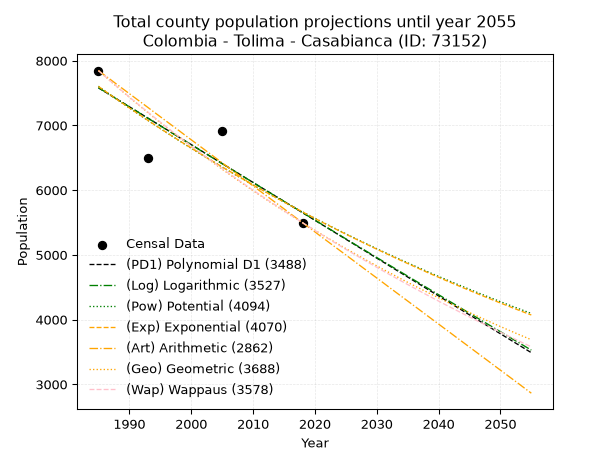
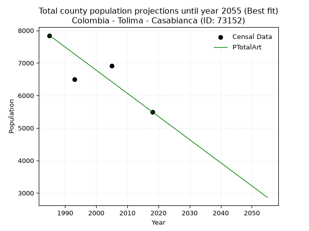
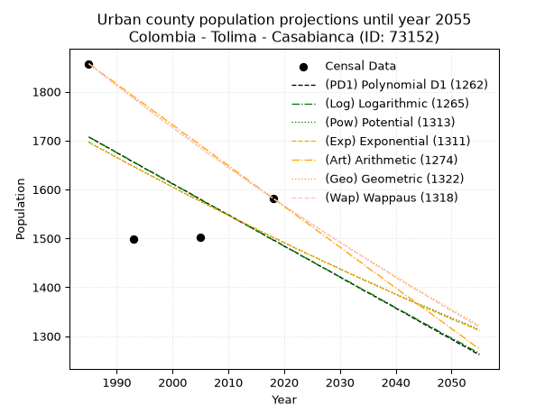
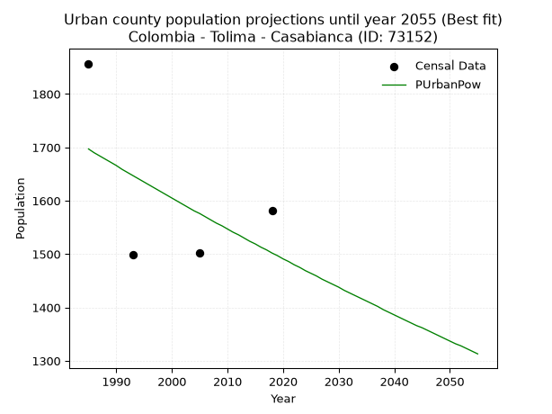
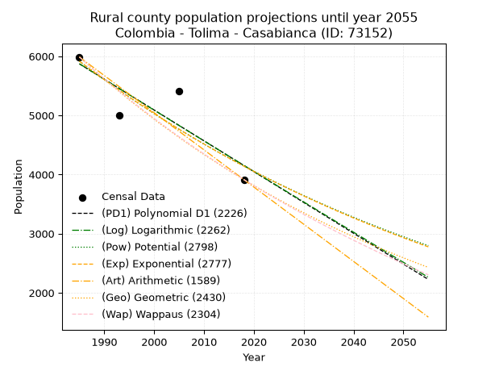
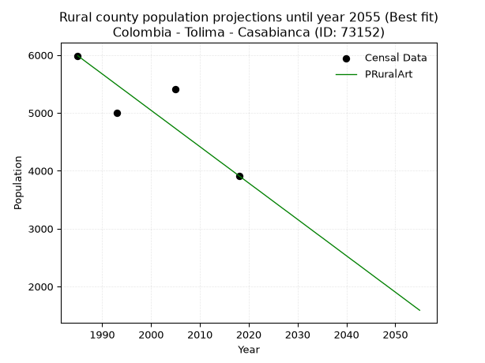

<div align="center">


</div>

# _“Population and Public Services Demand Projections (PPSD) until Year 2050 for Colombia - Tolima - Casabianca (ID: 73152)”_
Keywords: `population` `public-service` `projection` `lineal` `polynomial` `logarithmic` `potential` `exponential` `arithmetic` `geometric` `wappaus` `dane` `colombia` `south-america`

PPSD are analytical estimates used by governments and planners to anticipate future changes in population size, age distribution, and the resulting community needs for utilities, healthcare, education, and infrastructure as sizing future water treatment facilities, electrical grids, and road networks based on spatial growth.

> **General running parameters**: • app_version: _v20260806_. • Python version: _3.14.7_. • Pandas version: _3.0.5_. • NumPy version: _2.5.1_. • Creates, save and include plots into reports (create_plot): _False_. • Projection until year: _2050_. • Process polynomial degree 2 and up: _False_. • Process Wappaus: _True_. • Process Wappaus: _True_. • Set negative values to zero: _True_. • Set infinite values to zero: _True_. • Drop dataset notes: _True_. 
<div align="center">

Dynamic map: [:earth_americas:Google](http://maps.google.com/maps?q=5.078464507,-75.1209661) [:earth_americas:OSM](https://www.openstreetmap.org/#map=18/5.078464507/-75.1209661&layers=P) [:earth_americas:Bing](https://www.bing.com/maps?cp=5.078464507~-75.1209661&lvl=18) [:earth_americas:Apple](https://maps.apple.com/frame?center=5.078464507%2C-75.1209661&span=0.003%2C0.006)

</div>


<div align="center">

```geojson
{
  "type": "Feature",
  "geometry": {
    "type": "Point", 
    "coordinates": [-75.1209661, 5.078464507]
  }, 
  "properties": {
    "Name": "Colombia - Tolima - Casabianca (ID: 73152)"
  }
}
```

</div>


## 0. Census Data (4 records)

Census data are official statistics collected by a government about the people and housing in a country. They usually include counts of total population, age, sex, race, income, education, and jobs.

📅Global census file: [Population.xlsx](../data/Population.xlsx)

| Source   |   Year |   CountryID | CountryName   |   StateID | StateName   |   CountyID | CountyName   |   PTotal |   PUrban |   PRural |
|:---------|-------:|------------:|:--------------|----------:|:------------|-----------:|:-------------|---------:|---------:|---------:|
| DANE     |   1985 |          57 | Colombia      |        73 | Tolima      |      73152 | Casabianca   |     7845 |     1857 |     5988 |
| DANE     |   1993 |          57 | Colombia      |        73 | Tolima      |      73152 | Casabianca   |     6501 |     1498 |     5003 |
| DANE     |   2005 |          57 | Colombia      |        73 | Tolima      |      73152 | Casabianca   |     6909 |     1503 |     5406 |
| DANE     |   2018 |          57 | Colombia      |        73 | Tolima      |      73152 | Casabianca   |     5496 |     1582 |     3914 |

> 🔥Some records could had specific notes about the registered values or the corresponding urban or rural distribution.

**Local public utility companies (RUPS)**

 | SERVICIO       | ESTADO    | NOMBRE                                                                                     | NIT         | DEPARTAMENTO_DOMICILIO   | MUNICIPIO_DOMICILIO   | DIRECCION                                  |   TELEFONO | EMAIL                         | TIPO_INSCRIPCION    | REPRESENTANTE_LEGAL           | TIPO_PRESTADOR                            | CLASIFICACION                 |
|:---------------|:----------|:-------------------------------------------------------------------------------------------|:------------|:-------------------------|:----------------------|:-------------------------------------------|-----------:|:------------------------------|:--------------------|:------------------------------|:------------------------------------------|:------------------------------|
| ASEO           | OPERATIVA | EMPRESA DE SERVICIOS PUBLICOS DE LA DORADA E.S.P.                                          | 810004450-8 | CALDAS                   | LA DORADA             | CENTRO COMERCIAL DORADA PLAZA LOCAL N202-1 |    8576097 | gerente.espladorada@gmail.com | Registro por la ESP | ANGELA MARITZA GARCIA MAYORGA | EMPRESA INDUSTRIAL Y COMERCIAL DEL ESTADO | MAYOR O IGUAL A 5001 USUARIOS |
| ACUEDUCTO      | OPERATIVA | ADMINISTRACION PUBLICA COOPERATIVA DE SERVICIOS PUBLICOS DEL MUNICIPIO DE CASABIANCA E.S.P | 900349919-7 | TOLIMA                   | CASABIANCA            | carrera 3 nº 3-23 parque principal         |    2548507 | daissy.duran@hotmail.com      | Registro por la ESP | GLADYS SUAREZ CARDONA         | ORGANIZACION AUTORIZADA                   | MENOR O IGUAL A 2500 USUARIOS |
| ALCANTARILLADO | OPERATIVA | ADMINISTRACION PUBLICA COOPERATIVA DE SERVICIOS PUBLICOS DEL MUNICIPIO DE CASABIANCA E.S.P | 900349919-7 | TOLIMA                   | CASABIANCA            | carrera 3 nº 3-23 parque principal         |    2548507 | daissy.duran@hotmail.com      | Registro por la ESP | GLADYS SUAREZ CARDONA         | ORGANIZACION AUTORIZADA                   | MENOR O IGUAL A 2500 USUARIOS |
| ASEO           | OPERATIVA | ADMINISTRACION PUBLICA COOPERATIVA DE SERVICIOS PUBLICOS DEL MUNICIPIO DE CASABIANCA E.S.P | 900349919-7 | TOLIMA                   | CASABIANCA            | carrera 3 nº 3-23 parque principal         |    2548507 | daissy.duran@hotmail.com      | Registro por la ESP | GLADYS SUAREZ CARDONA         | ORGANIZACION AUTORIZADA                   | MENOR O IGUAL A 2500 USUARIOS |

> [📅RUPS Database: Registro Único de Prestadores de Servicios Públicos de Colombia Suramérica - RUPS](https://www.datos.gov.co/Hacienda-y-Cr-dito-P-blico/Registro-nico-de-Prestadores-de-Servicios-P-blicos/4qkq-csdn/about_data)

## 1. Total

### 1.1. Coefficients and Parameters

* (PD1) Polynomial Deg 1: -58.44520272982644, 123592.76676033533 (lineal)
* (Log) Logarithmic: -116979.42243933686, 895849.2773756597
* (Pow) Potential: -17.85911680852187, 62.776057727378635
* (Exp) Exponential: -0.00892414741179526, 375097040791.457
* (Art) Arithmetic: Year diff. 2018 - 1985 = 33, Population diff. 5496 - 7845 = -2349, Annual growth = -71.18181818181819
* (Geo) Geometric: Year diff. 2018 - 1985 = 33, Population diff. 5496 - 7845 = -2349, Annual growth % = -0.010725576423528116
* (Wap) Wappaus: i = -1.0671136823599159, Condition values only valid for < 200)

<sub>
Wappaus condition values: ['-0.00', '-1.07', '-2.13', '-3.20', '-4.27', '-5.34', '-6.40', '-7.47', '-8.54', '-9.60', '-10.67', '-11.74', '-12.81', '-13.87', '-14.94', '-16.01', '-17.07', '-18.14', '-19.21', '-20.28', '-21.34', '-22.41', '-23.48', '-24.54', '-25.61', '-26.68', '-27.74', '-28.81', '-29.88', '-30.95', '-32.01', '-33.08', '-34.15', '-35.21', '-36.28', '-37.35', '-38.42', '-39.48', '-40.55', '-41.62', '-42.68', '-43.75', '-44.82', '-45.89', '-46.95', '-48.02', '-49.09', '-50.15', '-51.22', '-52.29', '-53.36', '-54.42', '-55.49', '-56.56', '-57.62', '-58.69', '-59.76', '-60.83', '-61.89', '-62.96', '-64.03', '-65.09', '-66.16', '-67.23', '-68.30', '-69.36']
</sub>


### 1.2. Projected Dataset

|   Year |   CountyID |   PTotalPD1 |   PTotalLog |   PTotalPow |   PTotalExp |   PTotalArt |   PTotalGeo |   PTotalWap |
|-------:|-----------:|------------:|------------:|------------:|------------:|------------:|------------:|------------:|
|   1985 |      73152 |        7579 |        7581 |        7603 |        7601 |        7845 |        7845 |        7845 |
|   1986 |      73152 |        7521 |        7522 |        7535 |        7533 |        7774 |        7761 |        7762 |
|   1987 |      73152 |        7462 |        7463 |        7467 |        7466 |        7703 |        7678 |        7679 |
|   1988 |      73152 |        7404 |        7404 |        7400 |        7400 |        7631 |        7595 |        7598 |
|   1989 |      73152 |        7345 |        7345 |        7334 |        7334 |        7560 |        7514 |        7517 |
|   1990 |      73152 |        7287 |        7286 |        7269 |        7269 |        7489 |        7433 |        7437 |
|   1991 |      73152 |        7228 |        7228 |        7204 |        7205 |        7418 |        7353 |        7358 |
|   1992 |      73152 |        7170 |        7169 |        7139 |        7141 |        7347 |        7275 |        7280 |
|   1993 |      73152 |        7111 |        7110 |        7076 |        7077 |        7276 |        7197 |        7203 |
|   1994 |      73152 |        7053 |        7052 |        7013 |        7014 |        7204 |        7119 |        7126 |
|   1995 |      73152 |        6995 |        6993 |        6950 |        6952 |        7133 |        7043 |        7050 |
|   1996 |      73152 |        6936 |        6934 |        6888 |        6890 |        7062 |        6968 |        6975 |
|   1997 |      73152 |        6878 |        6876 |        6827 |        6829 |        6991 |        6893 |        6901 |
|   1998 |      73152 |        6819 |        6817 |        6766 |        6768 |        6920 |        6819 |        6827 |
|   1999 |      73152 |        6761 |        6759 |        6706 |        6708 |        6848 |        6746 |        6754 |
|   2000 |      73152 |        6702 |        6700 |        6646 |        6649 |        6777 |        6673 |        6682 |
|   2001 |      73152 |        6644 |        6642 |        6587 |        6589 |        6706 |        6602 |        6611 |
|   2002 |      73152 |        6585 |        6583 |        6529 |        6531 |        6635 |        6531 |        6540 |
|   2003 |      73152 |        6527 |        6525 |        6471 |        6473 |        6564 |        6461 |        6470 |
|   2004 |      73152 |        6469 |        6466 |        6413 |        6415 |        6493 |        6392 |        6401 |
|   2005 |      73152 |        6410 |        6408 |        6356 |        6358 |        6421 |        6323 |        6332 |
|   2006 |      73152 |        6352 |        6350 |        6300 |        6302 |        6350 |        6255 |        6264 |
|   2007 |      73152 |        6293 |        6291 |        6244 |        6246 |        6279 |        6188 |        6197 |
|   2008 |      73152 |        6235 |        6233 |        6189 |        6190 |        6208 |        6122 |        6130 |
|   2009 |      73152 |        6176 |        6175 |        6134 |        6135 |        6137 |        6056 |        6064 |
|   2010 |      73152 |        6118 |        6117 |        6080 |        6081 |        6065 |        5991 |        5998 |
|   2011 |      73152 |        6059 |        6058 |        6026 |        6027 |        5994 |        5927 |        5934 |
|   2012 |      73152 |        6001 |        6000 |        5973 |        5973 |        5923 |        5863 |        5869 |
|   2013 |      73152 |        5943 |        5942 |        5920 |        5920 |        5852 |        5800 |        5806 |
|   2014 |      73152 |        5884 |        5884 |        5868 |        5868 |        5781 |        5738 |        5743 |
|   2015 |      73152 |        5826 |        5826 |        5816 |        5816 |        5710 |        5677 |        5680 |
|   2016 |      73152 |        5767 |        5768 |        5765 |        5764 |        5638 |        5616 |        5618 |
|   2017 |      73152 |        5709 |        5710 |        5714 |        5713 |        5567 |        5556 |        5557 |
|   2018 |      73152 |        5650 |        5652 |        5663 |        5662 |        5496 |        5496 |        5496 |
|   2019 |      73152 |        5592 |        5594 |        5614 |        5612 |        5425 |        5437 |        5436 |
|   2020 |      73152 |        5533 |        5536 |        5564 |        5562 |        5354 |        5379 |        5376 |
|   2021 |      73152 |        5475 |        5478 |        5515 |        5512 |        5282 |        5321 |        5317 |
|   2022 |      73152 |        5417 |        5420 |        5467 |        5463 |        5211 |        5264 |        5258 |
|   2023 |      73152 |        5358 |        5363 |        5419 |        5415 |        5140 |        5208 |        5200 |
|   2024 |      73152 |        5300 |        5305 |        5371 |        5367 |        5069 |        5152 |        5142 |
|   2025 |      73152 |        5241 |        5247 |        5324 |        5319 |        4998 |        5096 |        5085 |
|   2026 |      73152 |        5183 |        5189 |        5277 |        5272 |        4927 |        5042 |        5029 |
|   2027 |      73152 |        5124 |        5131 |        5231 |        5225 |        4855 |        4988 |        4973 |
|   2028 |      73152 |        5066 |        5074 |        5185 |        5179 |        4784 |        4934 |        4917 |
|   2029 |      73152 |        5007 |        5016 |        5140 |        5133 |        4713 |        4881 |        4862 |
|   2030 |      73152 |        4949 |        4958 |        5094 |        5087 |        4642 |        4829 |        4807 |
|   2031 |      73152 |        4891 |        4901 |        5050 |        5042 |        4571 |        4777 |        4753 |
|   2032 |      73152 |        4832 |        4843 |        5006 |        4997 |        4499 |        4726 |        4699 |
|   2033 |      73152 |        4774 |        4786 |        4962 |        4953 |        4428 |        4675 |        4646 |
|   2034 |      73152 |        4715 |        4728 |        4918 |        4909 |        4357 |        4625 |        4593 |
|   2035 |      73152 |        4657 |        4671 |        4876 |        4865 |        4286 |        4575 |        4541 |
|   2036 |      73152 |        4598 |        4613 |        4833 |        4822 |        4215 |        4526 |        4489 |
|   2037 |      73152 |        4540 |        4556 |        4791 |        4779 |        4144 |        4478 |        4437 |
|   2038 |      73152 |        4481 |        4498 |        4749 |        4736 |        4072 |        4430 |        4386 |
|   2039 |      73152 |        4423 |        4441 |        4707 |        4694 |        4001 |        4382 |        4336 |
|   2040 |      73152 |        4365 |        4384 |        4666 |        4653 |        3930 |        4335 |        4285 |
|   2041 |      73152 |        4306 |        4326 |        4626 |        4611 |        3859 |        4289 |        4235 |
|   2042 |      73152 |        4248 |        4269 |        4585 |        4570 |        3788 |        4243 |        4186 |
|   2043 |      73152 |        4189 |        4212 |        4546 |        4530 |        3716 |        4197 |        4137 |
|   2044 |      73152 |        4131 |        4154 |        4506 |        4489 |        3645 |        4152 |        4088 |
|   2045 |      73152 |        4072 |        4097 |        4467 |        4450 |        3574 |        4108 |        4040 |
|   2046 |      73152 |        4014 |        4040 |        4428 |        4410 |        3503 |        4064 |        3992 |
|   2047 |      73152 |        3955 |        3983 |        4390 |        4371 |        3432 |        4020 |        3945 |
|   2048 |      73152 |        3897 |        3926 |        4351 |        4332 |        3361 |        3977 |        3898 |
|   2049 |      73152 |        3839 |        3869 |        4314 |        4294 |        3289 |        3934 |        3851 |
|   2050 |      73152 |        3780 |        3812 |        4276 |        4255 |        3218 |        3892 |        3805 |
<div align="center">

</img>

</div>


### 1.3. Best fit with absolute and relative error (%)

Relative error puts that difference into context by dividing the absolute error by the true value, creating a unitless ratio or percentage that shows the scale of the mistake.

Absolute and relative error

|   Year | Source   |   CountryID | CountryName   |   StateID | StateName   |   CountyID_x | CountyName   |   PTotal |   PUrban |   PRural |   CountyID_y |   PTotalPD1 |   PTotalLog |   PTotalPow |   PTotalExp |   PTotalArt |   PTotalGeo |   PTotalWap |   PTotalPD1AbsError |   PTotalLogAbsError |   PTotalPowAbsError |   PTotalExpAbsError |   PTotalArtAbsError |   PTotalGeoAbsError |   PTotalWapAbsError |   PTotalPD1RelError |   PTotalLogRelError |   PTotalPowRelError |   PTotalExpRelError |   PTotalArtRelError |   PTotalGeoRelError |   PTotalWapRelError |
|-------:|:---------|------------:|:--------------|----------:|:------------|-------------:|:-------------|---------:|---------:|---------:|-------------:|------------:|------------:|------------:|------------:|------------:|------------:|------------:|--------------------:|--------------------:|--------------------:|--------------------:|--------------------:|--------------------:|--------------------:|--------------------:|--------------------:|--------------------:|--------------------:|--------------------:|--------------------:|--------------------:|
|   1985 | DANE     |          57 | Colombia      |        73 | Tolima      |        73152 | Casabianca   |     7845 |     1857 |     5988 |        73152 |        7579 |        7581 |        7603 |        7601 |        7845 |        7845 |        7845 |                 266 |                 264 |                 242 |                 244 |                   0 |                   0 |                   0 |             3.39069 |             3.3652  |             3.08477 |             3.11026 |             0       |             0       |             0       |
|   1993 | DANE     |          57 | Colombia      |        73 | Tolima      |        73152 | Casabianca   |     6501 |     1498 |     5003 |        73152 |        7111 |        7110 |        7076 |        7077 |        7276 |        7197 |        7203 |                 610 |                 609 |                 575 |                 576 |                 775 |                 696 |                 702 |             9.38317 |             9.36779 |             8.84479 |             8.86018 |            11.9212  |            10.706   |            10.7983  |
|   2005 | DANE     |          57 | Colombia      |        73 | Tolima      |        73152 | Casabianca   |     6909 |     1503 |     5406 |        73152 |        6410 |        6408 |        6356 |        6358 |        6421 |        6323 |        6332 |                 499 |                 501 |                 553 |                 551 |                 488 |                 586 |                 577 |             7.22246 |             7.25141 |             8.00405 |             7.9751  |             7.06325 |             8.48169 |             8.35143 |
|   2018 | DANE     |          57 | Colombia      |        73 | Tolima      |        73152 | Casabianca   |     5496 |     1582 |     3914 |        73152 |        5650 |        5652 |        5663 |        5662 |        5496 |        5496 |        5496 |                 154 |                 156 |                 167 |                 166 |                   0 |                   0 |                   0 |             2.80204 |             2.83843 |             3.03857 |             3.02038 |             0       |             0       |             0       |

Relative error mean

| Method    |   RelError | Best   |
|:----------|-----------:|:-------|
| PTotalPD1 |    5.69959 |        |
| PTotalLog |    5.70571 |        |
| PTotalPow |    5.74305 |        |
| PTotalExp |    5.74148 |        |
| PTotalArt |    4.74612 | True   |
| PTotalGeo |    4.79693 |        |
| PTotalWap |    4.78744 |        |

💙Best method: _**PTotalArt**_
<div align="center">

</img>

</div>


### 1.4. Fresh water supply demand in liters per capita per day (lpcd)

The fresh water supply demand typically ranges from 100 to 300 liters per capita per day (lpcd) for standard domestic and municipal planning, though absolute survival minimums set by the World Health Organization are as low as 7.5 to 20 liters per day, and total consumption in high-income nations can exceed 400 liters.

> `CZ`: Level in meters above the sea level (masl)<br> `WS`: Fresh water supply demand in liters per capita per day (lpcd or l/h/d)<br> `WSAll`: Zonal fresh water supply demand in liters per second (l/s)<br> `A`: Zonal area in square meters<br> `DP`: Population density (people/hectare or p/ha)

Reference values (RAS Colombia)

|    CZ |   WS |
|------:|-----:|
|  1000 |  120 |
|  2000 |  130 |
| 99999 |  140 |

County shapefile geometry properties and water supply values

|   CountyID |     ATotal |   CZTotal |   WSTotal |
|-----------:|-----------:|----------:|----------:|
|      73152 | 1.7484e+08 |   2601.97 |       140 |

Projected values for best method: PTotalArt

|   CountyID |   Year |   PTotalArt |   DPTotal |   WSTotal |   WSTotalAll |
|-----------:|-------:|------------:|----------:|----------:|-------------:|
|      73152 |   1985 |        7845 |      0.45 |       140 |     12.7118  |
|      73152 |   1986 |        7774 |      0.44 |       140 |     12.5968  |
|      73152 |   1987 |        7703 |      0.44 |       140 |     12.4817  |
|      73152 |   1988 |        7631 |      0.44 |       140 |     12.365   |
|      73152 |   1989 |        7560 |      0.43 |       140 |     12.25    |
|      73152 |   1990 |        7489 |      0.43 |       140 |     12.135   |
|      73152 |   1991 |        7418 |      0.42 |       140 |     12.0199  |
|      73152 |   1992 |        7347 |      0.42 |       140 |     11.9049  |
|      73152 |   1993 |        7276 |      0.42 |       140 |     11.7898  |
|      73152 |   1994 |        7204 |      0.41 |       140 |     11.6731  |
|      73152 |   1995 |        7133 |      0.41 |       140 |     11.5581  |
|      73152 |   1996 |        7062 |      0.4  |       140 |     11.4431  |
|      73152 |   1997 |        6991 |      0.4  |       140 |     11.328   |
|      73152 |   1998 |        6920 |      0.4  |       140 |     11.213   |
|      73152 |   1999 |        6848 |      0.39 |       140 |     11.0963  |
|      73152 |   2000 |        6777 |      0.39 |       140 |     10.9812  |
|      73152 |   2001 |        6706 |      0.38 |       140 |     10.8662  |
|      73152 |   2002 |        6635 |      0.38 |       140 |     10.7512  |
|      73152 |   2003 |        6564 |      0.38 |       140 |     10.6361  |
|      73152 |   2004 |        6493 |      0.37 |       140 |     10.5211  |
|      73152 |   2005 |        6421 |      0.37 |       140 |     10.4044  |
|      73152 |   2006 |        6350 |      0.36 |       140 |     10.2894  |
|      73152 |   2007 |        6279 |      0.36 |       140 |     10.1743  |
|      73152 |   2008 |        6208 |      0.36 |       140 |     10.0593  |
|      73152 |   2009 |        6137 |      0.35 |       140 |      9.94421 |
|      73152 |   2010 |        6065 |      0.35 |       140 |      9.82755 |
|      73152 |   2011 |        5994 |      0.34 |       140 |      9.7125  |
|      73152 |   2012 |        5923 |      0.34 |       140 |      9.59745 |
|      73152 |   2013 |        5852 |      0.33 |       140 |      9.48241 |
|      73152 |   2014 |        5781 |      0.33 |       140 |      9.36736 |
|      73152 |   2015 |        5710 |      0.33 |       140 |      9.25231 |
|      73152 |   2016 |        5638 |      0.32 |       140 |      9.13565 |
|      73152 |   2017 |        5567 |      0.32 |       140 |      9.0206  |
|      73152 |   2018 |        5496 |      0.31 |       140 |      8.90556 |
|      73152 |   2019 |        5425 |      0.31 |       140 |      8.79051 |
|      73152 |   2020 |        5354 |      0.31 |       140 |      8.67546 |
|      73152 |   2021 |        5282 |      0.3  |       140 |      8.5588  |
|      73152 |   2022 |        5211 |      0.3  |       140 |      8.44375 |
|      73152 |   2023 |        5140 |      0.29 |       140 |      8.3287  |
|      73152 |   2024 |        5069 |      0.29 |       140 |      8.21366 |
|      73152 |   2025 |        4998 |      0.29 |       140 |      8.09861 |
|      73152 |   2026 |        4927 |      0.28 |       140 |      7.98356 |
|      73152 |   2027 |        4855 |      0.28 |       140 |      7.8669  |
|      73152 |   2028 |        4784 |      0.27 |       140 |      7.75185 |
|      73152 |   2029 |        4713 |      0.27 |       140 |      7.63681 |
|      73152 |   2030 |        4642 |      0.27 |       140 |      7.52176 |
|      73152 |   2031 |        4571 |      0.26 |       140 |      7.40671 |
|      73152 |   2032 |        4499 |      0.26 |       140 |      7.29005 |
|      73152 |   2033 |        4428 |      0.25 |       140 |      7.175   |
|      73152 |   2034 |        4357 |      0.25 |       140 |      7.05995 |
|      73152 |   2035 |        4286 |      0.25 |       140 |      6.94491 |
|      73152 |   2036 |        4215 |      0.24 |       140 |      6.82986 |
|      73152 |   2037 |        4144 |      0.24 |       140 |      6.71481 |
|      73152 |   2038 |        4072 |      0.23 |       140 |      6.59815 |
|      73152 |   2039 |        4001 |      0.23 |       140 |      6.4831  |
|      73152 |   2040 |        3930 |      0.22 |       140 |      6.36806 |
|      73152 |   2041 |        3859 |      0.22 |       140 |      6.25301 |
|      73152 |   2042 |        3788 |      0.22 |       140 |      6.13796 |
|      73152 |   2043 |        3716 |      0.21 |       140 |      6.0213  |
|      73152 |   2044 |        3645 |      0.21 |       140 |      5.90625 |
|      73152 |   2045 |        3574 |      0.2  |       140 |      5.7912  |
|      73152 |   2046 |        3503 |      0.2  |       140 |      5.67616 |
|      73152 |   2047 |        3432 |      0.2  |       140 |      5.56111 |
|      73152 |   2048 |        3361 |      0.19 |       140 |      5.44606 |
|      73152 |   2049 |        3289 |      0.19 |       140 |      5.3294  |
|      73152 |   2050 |        3218 |      0.18 |       140 |      5.21435 |

## 2. Urban

### 2.1. Coefficients and Parameters

* (PD1) Polynomial Deg 1: -6.358892011240506, 14329.373745483825 (lineal)
* (Log) Logarithmic: -12769.569400175416, 98671.59933964044
* (Pow) Potential: -7.3917921422508925, 27.605988728337408
* (Exp) Exponential: -0.0036803352325118204, 2524762.0148608414
* (Art) Arithmetic: Year diff. 2018 - 1985 = 33, Population diff. 1582 - 1857 = -275, Annual growth = -8.333333333333334
* (Geo) Geometric: Year diff. 2018 - 1985 = 33, Population diff. 1582 - 1857 = -275, Annual growth % = -0.004844964898191306
* (Wap) Wappaus: i = -0.4846370068818455, Condition values only valid for < 200)

<sub>
Wappaus condition values: ['-0.00', '-0.48', '-0.97', '-1.45', '-1.94', '-2.42', '-2.91', '-3.39', '-3.88', '-4.36', '-4.85', '-5.33', '-5.82', '-6.30', '-6.78', '-7.27', '-7.75', '-8.24', '-8.72', '-9.21', '-9.69', '-10.18', '-10.66', '-11.15', '-11.63', '-12.12', '-12.60', '-13.09', '-13.57', '-14.05', '-14.54', '-15.02', '-15.51', '-15.99', '-16.48', '-16.96', '-17.45', '-17.93', '-18.42', '-18.90', '-19.39', '-19.87', '-20.35', '-20.84', '-21.32', '-21.81', '-22.29', '-22.78', '-23.26', '-23.75', '-24.23', '-24.72', '-25.20', '-25.69', '-26.17', '-26.66', '-27.14', '-27.62', '-28.11', '-28.59', '-29.08', '-29.56', '-30.05', '-30.53', '-31.02', '-31.50']
</sub>


### 2.2. Projected Dataset

|   Year |   CountyID |   PUrbanPD1 |   PUrbanLog |   PUrbanPow |   PUrbanExp |   PUrbanArt |   PUrbanGeo |   PUrbanWap |
|-------:|-----------:|------------:|------------:|------------:|------------:|------------:|------------:|------------:|
|   1985 |      73152 |        1707 |        1707 |        1697 |        1696 |        1857 |        1857 |        1857 |
|   1986 |      73152 |        1701 |        1701 |        1690 |        1690 |        1849 |        1848 |        1848 |
|   1987 |      73152 |        1694 |        1695 |        1684 |        1684 |        1840 |        1839 |        1839 |
|   1988 |      73152 |        1688 |        1688 |        1678 |        1678 |        1832 |        1830 |        1830 |
|   1989 |      73152 |        1682 |        1682 |        1672 |        1671 |        1824 |        1821 |        1821 |
|   1990 |      73152 |        1675 |        1675 |        1666 |        1665 |        1815 |        1812 |        1813 |
|   1991 |      73152 |        1669 |        1669 |        1659 |        1659 |        1807 |        1804 |        1804 |
|   1992 |      73152 |        1662 |        1663 |        1653 |        1653 |        1799 |        1795 |        1795 |
|   1993 |      73152 |        1656 |        1656 |        1647 |        1647 |        1790 |        1786 |        1786 |
|   1994 |      73152 |        1650 |        1650 |        1641 |        1641 |        1782 |        1778 |        1778 |
|   1995 |      73152 |        1643 |        1643 |        1635 |        1635 |        1774 |        1769 |        1769 |
|   1996 |      73152 |        1637 |        1637 |        1629 |        1629 |        1765 |        1760 |        1761 |
|   1997 |      73152 |        1631 |        1631 |        1623 |        1623 |        1757 |        1752 |        1752 |
|   1998 |      73152 |        1624 |        1624 |        1617 |        1617 |        1749 |        1743 |        1744 |
|   1999 |      73152 |        1618 |        1618 |        1611 |        1611 |        1740 |        1735 |        1735 |
|   2000 |      73152 |        1612 |        1611 |        1605 |        1605 |        1732 |        1727 |        1727 |
|   2001 |      73152 |        1605 |        1605 |        1599 |        1599 |        1724 |        1718 |        1718 |
|   2002 |      73152 |        1599 |        1599 |        1593 |        1593 |        1715 |        1710 |        1710 |
|   2003 |      73152 |        1593 |        1592 |        1587 |        1588 |        1707 |        1702 |        1702 |
|   2004 |      73152 |        1586 |        1586 |        1581 |        1582 |        1699 |        1693 |        1694 |
|   2005 |      73152 |        1580 |        1579 |        1576 |        1576 |        1690 |        1685 |        1685 |
|   2006 |      73152 |        1573 |        1573 |        1570 |        1570 |        1682 |        1677 |        1677 |
|   2007 |      73152 |        1567 |        1567 |        1564 |        1564 |        1674 |        1669 |        1669 |
|   2008 |      73152 |        1561 |        1560 |        1558 |        1559 |        1665 |        1661 |        1661 |
|   2009 |      73152 |        1554 |        1554 |        1553 |        1553 |        1657 |        1653 |        1653 |
|   2010 |      73152 |        1548 |        1548 |        1547 |        1547 |        1649 |        1645 |        1645 |
|   2011 |      73152 |        1542 |        1541 |        1541 |        1541 |        1640 |        1637 |        1637 |
|   2012 |      73152 |        1535 |        1535 |        1536 |        1536 |        1632 |        1629 |        1629 |
|   2013 |      73152 |        1529 |        1529 |        1530 |        1530 |        1624 |        1621 |        1621 |
|   2014 |      73152 |        1523 |        1522 |        1524 |        1525 |        1615 |        1613 |        1613 |
|   2015 |      73152 |        1516 |        1516 |        1519 |        1519 |        1607 |        1605 |        1605 |
|   2016 |      73152 |        1510 |        1510 |        1513 |        1513 |        1599 |        1597 |        1598 |
|   2017 |      73152 |        1503 |        1503 |        1508 |        1508 |        1590 |        1590 |        1590 |
|   2018 |      73152 |        1497 |        1497 |        1502 |        1502 |        1582 |        1582 |        1582 |
|   2019 |      73152 |        1491 |        1491 |        1497 |        1497 |        1574 |        1574 |        1574 |
|   2020 |      73152 |        1484 |        1484 |        1491 |        1491 |        1565 |        1567 |        1567 |
|   2021 |      73152 |        1478 |        1478 |        1486 |        1486 |        1557 |        1559 |        1559 |
|   2022 |      73152 |        1472 |        1472 |        1480 |        1480 |        1549 |        1552 |        1551 |
|   2023 |      73152 |        1465 |        1465 |        1475 |        1475 |        1540 |        1544 |        1544 |
|   2024 |      73152 |        1459 |        1459 |        1469 |        1469 |        1532 |        1537 |        1536 |
|   2025 |      73152 |        1453 |        1453 |        1464 |        1464 |        1524 |        1529 |        1529 |
|   2026 |      73152 |        1446 |        1446 |        1459 |        1459 |        1515 |        1522 |        1521 |
|   2027 |      73152 |        1440 |        1440 |        1453 |        1453 |        1507 |        1514 |        1514 |
|   2028 |      73152 |        1434 |        1434 |        1448 |        1448 |        1499 |        1507 |        1507 |
|   2029 |      73152 |        1427 |        1428 |        1443 |        1443 |        1490 |        1500 |        1499 |
|   2030 |      73152 |        1421 |        1421 |        1438 |        1437 |        1482 |        1492 |        1492 |
|   2031 |      73152 |        1414 |        1415 |        1432 |        1432 |        1474 |        1485 |        1485 |
|   2032 |      73152 |        1408 |        1409 |        1427 |        1427 |        1465 |        1478 |        1477 |
|   2033 |      73152 |        1402 |        1402 |        1422 |        1422 |        1457 |        1471 |        1470 |
|   2034 |      73152 |        1395 |        1396 |        1417 |        1416 |        1449 |        1464 |        1463 |
|   2035 |      73152 |        1389 |        1390 |        1412 |        1411 |        1440 |        1457 |        1456 |
|   2036 |      73152 |        1383 |        1384 |        1407 |        1406 |        1432 |        1450 |        1448 |
|   2037 |      73152 |        1376 |        1377 |        1402 |        1401 |        1424 |        1443 |        1441 |
|   2038 |      73152 |        1370 |        1371 |        1396 |        1396 |        1415 |        1436 |        1434 |
|   2039 |      73152 |        1364 |        1365 |        1391 |        1391 |        1407 |        1429 |        1427 |
|   2040 |      73152 |        1357 |        1358 |        1386 |        1385 |        1399 |        1422 |        1420 |
|   2041 |      73152 |        1351 |        1352 |        1381 |        1380 |        1390 |        1415 |        1413 |
|   2042 |      73152 |        1345 |        1346 |        1376 |        1375 |        1382 |        1408 |        1406 |
|   2043 |      73152 |        1338 |        1340 |        1371 |        1370 |        1374 |        1401 |        1399 |
|   2044 |      73152 |        1332 |        1333 |        1366 |        1365 |        1365 |        1394 |        1392 |
|   2045 |      73152 |        1325 |        1327 |        1362 |        1360 |        1357 |        1388 |        1386 |
|   2046 |      73152 |        1319 |        1321 |        1357 |        1355 |        1349 |        1381 |        1379 |
|   2047 |      73152 |        1313 |        1315 |        1352 |        1350 |        1340 |        1374 |        1372 |
|   2048 |      73152 |        1306 |        1308 |        1347 |        1345 |        1332 |        1368 |        1365 |
|   2049 |      73152 |        1300 |        1302 |        1342 |        1340 |        1324 |        1361 |        1358 |
|   2050 |      73152 |        1294 |        1296 |        1337 |        1335 |        1315 |        1354 |        1352 |
<div align="center">

</img>

</div>


### 2.3. Best fit with absolute and relative error (%)

Relative error puts that difference into context by dividing the absolute error by the true value, creating a unitless ratio or percentage that shows the scale of the mistake.

Absolute and relative error

|   Year | Source   |   CountryID | CountryName   |   StateID | StateName   |   CountyID_x | CountyName   |   PTotal |   PUrban |   PRural |   CountyID_y |   PUrbanPD1 |   PUrbanLog |   PUrbanPow |   PUrbanExp |   PUrbanArt |   PUrbanGeo |   PUrbanWap |   PUrbanPD1AbsError |   PUrbanLogAbsError |   PUrbanPowAbsError |   PUrbanExpAbsError |   PUrbanArtAbsError |   PUrbanGeoAbsError |   PUrbanWapAbsError |   PUrbanPD1RelError |   PUrbanLogRelError |   PUrbanPowRelError |   PUrbanExpRelError |   PUrbanArtRelError |   PUrbanGeoRelError |   PUrbanWapRelError |
|-------:|:---------|------------:|:--------------|----------:|:------------|-------------:|:-------------|---------:|---------:|---------:|-------------:|------------:|------------:|------------:|------------:|------------:|------------:|------------:|--------------------:|--------------------:|--------------------:|--------------------:|--------------------:|--------------------:|--------------------:|--------------------:|--------------------:|--------------------:|--------------------:|--------------------:|--------------------:|--------------------:|
|   1985 | DANE     |          57 | Colombia      |        73 | Tolima      |        73152 | Casabianca   |     7845 |     1857 |     5988 |        73152 |        1707 |        1707 |        1697 |        1696 |        1857 |        1857 |        1857 |                 150 |                 150 |                 160 |                 161 |                   0 |                   0 |                   0 |             8.07754 |             8.07754 |             8.61605 |             8.6699  |              0      |              0      |              0      |
|   1993 | DANE     |          57 | Colombia      |        73 | Tolima      |        73152 | Casabianca   |     6501 |     1498 |     5003 |        73152 |        1656 |        1656 |        1647 |        1647 |        1790 |        1786 |        1786 |                 158 |                 158 |                 149 |                 149 |                 292 |                 288 |                 288 |            10.5474  |            10.5474  |             9.9466  |             9.9466  |             19.4927 |             19.2256 |             19.2256 |
|   2005 | DANE     |          57 | Colombia      |        73 | Tolima      |        73152 | Casabianca   |     6909 |     1503 |     5406 |        73152 |        1580 |        1579 |        1576 |        1576 |        1690 |        1685 |        1685 |                  77 |                  76 |                  73 |                  73 |                 187 |                 182 |                 182 |             5.12309 |             5.05655 |             4.85695 |             4.85695 |             12.4418 |             12.1091 |             12.1091 |
|   2018 | DANE     |          57 | Colombia      |        73 | Tolima      |        73152 | Casabianca   |     5496 |     1582 |     3914 |        73152 |        1497 |        1497 |        1502 |        1502 |        1582 |        1582 |        1582 |                  85 |                  85 |                  80 |                  80 |                   0 |                   0 |                   0 |             5.37295 |             5.37295 |             5.05689 |             5.05689 |              0      |              0      |              0      |

Relative error mean

| Method    |   RelError | Best   |
|:----------|-----------:|:-------|
| PUrbanPD1 |    7.28024 |        |
| PUrbanLog |    7.26361 |        |
| PUrbanPow |    7.11912 | True   |
| PUrbanExp |    7.13258 |        |
| PUrbanArt |    7.98361 |        |
| PUrbanGeo |    7.83369 |        |
| PUrbanWap |    7.83369 |        |

💙Best method: _**PUrbanPow**_
<div align="center">

</img>

</div>


### 2.4. Fresh water supply demand in liters per capita per day (lpcd)

The fresh water supply demand typically ranges from 100 to 300 liters per capita per day (lpcd) for standard domestic and municipal planning, though absolute survival minimums set by the World Health Organization are as low as 7.5 to 20 liters per day, and total consumption in high-income nations can exceed 400 liters.

> `CZ`: Level in meters above the sea level (masl)<br> `WS`: Fresh water supply demand in liters per capita per day (lpcd or l/h/d)<br> `WSAll`: Zonal fresh water supply demand in liters per second (l/s)<br> `A`: Zonal area in square meters<br> `DP`: Population density (people/hectare or p/ha)

Reference values (RAS Colombia)

|    CZ |   WS |
|------:|-----:|
|  1000 |  120 |
|  2000 |  130 |
| 99999 |  140 |

County shapefile geometry properties and water supply values

|   CountyID |   AUrban |   CZUrban |   WSUrban |
|-----------:|---------:|----------:|----------:|
|      73152 |   388123 |   2031.18 |       140 |

Projected values for best method: PUrbanPow

|   CountyID |   Year |   PUrbanPow |   DPUrban |   WSUrban |   WSUrbanAll |
|-----------:|-------:|------------:|----------:|----------:|-------------:|
|      73152 |   1985 |        1697 |     43.72 |       140 |      2.74977 |
|      73152 |   1986 |        1690 |     43.54 |       140 |      2.73843 |
|      73152 |   1987 |        1684 |     43.39 |       140 |      2.7287  |
|      73152 |   1988 |        1678 |     43.23 |       140 |      2.71898 |
|      73152 |   1989 |        1672 |     43.08 |       140 |      2.70926 |
|      73152 |   1990 |        1666 |     42.92 |       140 |      2.69954 |
|      73152 |   1991 |        1659 |     42.74 |       140 |      2.68819 |
|      73152 |   1992 |        1653 |     42.59 |       140 |      2.67847 |
|      73152 |   1993 |        1647 |     42.44 |       140 |      2.66875 |
|      73152 |   1994 |        1641 |     42.28 |       140 |      2.65903 |
|      73152 |   1995 |        1635 |     42.13 |       140 |      2.64931 |
|      73152 |   1996 |        1629 |     41.97 |       140 |      2.63958 |
|      73152 |   1997 |        1623 |     41.82 |       140 |      2.62986 |
|      73152 |   1998 |        1617 |     41.66 |       140 |      2.62014 |
|      73152 |   1999 |        1611 |     41.51 |       140 |      2.61042 |
|      73152 |   2000 |        1605 |     41.35 |       140 |      2.60069 |
|      73152 |   2001 |        1599 |     41.2  |       140 |      2.59097 |
|      73152 |   2002 |        1593 |     41.04 |       140 |      2.58125 |
|      73152 |   2003 |        1587 |     40.89 |       140 |      2.57153 |
|      73152 |   2004 |        1581 |     40.73 |       140 |      2.56181 |
|      73152 |   2005 |        1576 |     40.61 |       140 |      2.5537  |
|      73152 |   2006 |        1570 |     40.45 |       140 |      2.54398 |
|      73152 |   2007 |        1564 |     40.3  |       140 |      2.53426 |
|      73152 |   2008 |        1558 |     40.14 |       140 |      2.52454 |
|      73152 |   2009 |        1553 |     40.01 |       140 |      2.51644 |
|      73152 |   2010 |        1547 |     39.86 |       140 |      2.50671 |
|      73152 |   2011 |        1541 |     39.7  |       140 |      2.49699 |
|      73152 |   2012 |        1536 |     39.58 |       140 |      2.48889 |
|      73152 |   2013 |        1530 |     39.42 |       140 |      2.47917 |
|      73152 |   2014 |        1524 |     39.27 |       140 |      2.46944 |
|      73152 |   2015 |        1519 |     39.14 |       140 |      2.46134 |
|      73152 |   2016 |        1513 |     38.98 |       140 |      2.45162 |
|      73152 |   2017 |        1508 |     38.85 |       140 |      2.44352 |
|      73152 |   2018 |        1502 |     38.7  |       140 |      2.4338  |
|      73152 |   2019 |        1497 |     38.57 |       140 |      2.42569 |
|      73152 |   2020 |        1491 |     38.42 |       140 |      2.41597 |
|      73152 |   2021 |        1486 |     38.29 |       140 |      2.40787 |
|      73152 |   2022 |        1480 |     38.13 |       140 |      2.39815 |
|      73152 |   2023 |        1475 |     38    |       140 |      2.39005 |
|      73152 |   2024 |        1469 |     37.85 |       140 |      2.38032 |
|      73152 |   2025 |        1464 |     37.72 |       140 |      2.37222 |
|      73152 |   2026 |        1459 |     37.59 |       140 |      2.36412 |
|      73152 |   2027 |        1453 |     37.44 |       140 |      2.3544  |
|      73152 |   2028 |        1448 |     37.31 |       140 |      2.3463  |
|      73152 |   2029 |        1443 |     37.18 |       140 |      2.33819 |
|      73152 |   2030 |        1438 |     37.05 |       140 |      2.33009 |
|      73152 |   2031 |        1432 |     36.9  |       140 |      2.32037 |
|      73152 |   2032 |        1427 |     36.77 |       140 |      2.31227 |
|      73152 |   2033 |        1422 |     36.64 |       140 |      2.30417 |
|      73152 |   2034 |        1417 |     36.51 |       140 |      2.29606 |
|      73152 |   2035 |        1412 |     36.38 |       140 |      2.28796 |
|      73152 |   2036 |        1407 |     36.25 |       140 |      2.27986 |
|      73152 |   2037 |        1402 |     36.12 |       140 |      2.27176 |
|      73152 |   2038 |        1396 |     35.97 |       140 |      2.26204 |
|      73152 |   2039 |        1391 |     35.84 |       140 |      2.25394 |
|      73152 |   2040 |        1386 |     35.71 |       140 |      2.24583 |
|      73152 |   2041 |        1381 |     35.58 |       140 |      2.23773 |
|      73152 |   2042 |        1376 |     35.45 |       140 |      2.22963 |
|      73152 |   2043 |        1371 |     35.32 |       140 |      2.22153 |
|      73152 |   2044 |        1366 |     35.2  |       140 |      2.21343 |
|      73152 |   2045 |        1362 |     35.09 |       140 |      2.20694 |
|      73152 |   2046 |        1357 |     34.96 |       140 |      2.19884 |
|      73152 |   2047 |        1352 |     34.83 |       140 |      2.19074 |
|      73152 |   2048 |        1347 |     34.71 |       140 |      2.18264 |
|      73152 |   2049 |        1342 |     34.58 |       140 |      2.17454 |
|      73152 |   2050 |        1337 |     34.45 |       140 |      2.16644 |

## 3. Rural

### 3.1. Coefficients and Parameters

* (PD1) Polynomial Deg 1: -52.08631071858602, 109263.3930148517 (lineal)
* (Log) Logarithmic: -104209.85303916145, 797177.6780360191
* (Pow) Potential: -21.618060873332475, 75.06336068461195
* (Exp) Exponential: -0.010806852467402267, 12257119354207.574
* (Art) Arithmetic: Year diff. 2018 - 1985 = 33, Population diff. 3914 - 5988 = -2074, Annual growth = -62.84848484848485
* (Geo) Geometric: Year diff. 2018 - 1985 = 33, Population diff. 3914 - 5988 = -2074, Annual growth % = -0.012802122332930654
* (Wap) Wappaus: i = -1.269409914128153, Condition values only valid for < 200)

<sub>
Wappaus condition values: ['-0.00', '-1.27', '-2.54', '-3.81', '-5.08', '-6.35', '-7.62', '-8.89', '-10.16', '-11.42', '-12.69', '-13.96', '-15.23', '-16.50', '-17.77', '-19.04', '-20.31', '-21.58', '-22.85', '-24.12', '-25.39', '-26.66', '-27.93', '-29.20', '-30.47', '-31.74', '-33.00', '-34.27', '-35.54', '-36.81', '-38.08', '-39.35', '-40.62', '-41.89', '-43.16', '-44.43', '-45.70', '-46.97', '-48.24', '-49.51', '-50.78', '-52.05', '-53.32', '-54.58', '-55.85', '-57.12', '-58.39', '-59.66', '-60.93', '-62.20', '-63.47', '-64.74', '-66.01', '-67.28', '-68.55', '-69.82', '-71.09', '-72.36', '-73.63', '-74.90', '-76.16', '-77.43', '-78.70', '-79.97', '-81.24', '-82.51']
</sub>


### 3.2. Projected Dataset

|   Year |   CountyID |   PRuralPD1 |   PRuralLog |   PRuralPow |   PRuralExp |   PRuralArt |   PRuralGeo |   PRuralWap |
|-------:|-----------:|------------:|------------:|------------:|------------:|------------:|------------:|------------:|
|   1985 |      73152 |        5872 |        5873 |        5918 |        5917 |        5988 |        5988 |        5988 |
|   1986 |      73152 |        5820 |        5821 |        5854 |        5853 |        5925 |        5911 |        5912 |
|   1987 |      73152 |        5768 |        5768 |        5791 |        5790 |        5862 |        5836 |        5838 |
|   1988 |      73152 |        5716 |        5716 |        5728 |        5728 |        5799 |        5761 |        5764 |
|   1989 |      73152 |        5664 |        5663 |        5666 |        5666 |        5737 |        5687 |        5691 |
|   1990 |      73152 |        5612 |        5611 |        5605 |        5605 |        5674 |        5614 |        5620 |
|   1991 |      73152 |        5560 |        5559 |        5544 |        5545 |        5611 |        5543 |        5549 |
|   1992 |      73152 |        5507 |        5506 |        5484 |        5486 |        5548 |        5472 |        5479 |
|   1993 |      73152 |        5455 |        5454 |        5425 |        5427 |        5485 |        5402 |        5409 |
|   1994 |      73152 |        5403 |        5402 |        5367 |        5368 |        5422 |        5332 |        5341 |
|   1995 |      73152 |        5351 |        5350 |        5309 |        5311 |        5360 |        5264 |        5273 |
|   1996 |      73152 |        5299 |        5297 |        5252 |        5254 |        5297 |        5197 |        5206 |
|   1997 |      73152 |        5247 |        5245 |        5195 |        5197 |        5234 |        5130 |        5140 |
|   1998 |      73152 |        5195 |        5193 |        5139 |        5141 |        5171 |        5064 |        5075 |
|   1999 |      73152 |        5143 |        5141 |        5084 |        5086 |        5108 |        5000 |        5011 |
|   2000 |      73152 |        5091 |        5089 |        5029 |        5031 |        5045 |        4936 |        4947 |
|   2001 |      73152 |        5039 |        5037 |        4975 |        4977 |        4982 |        4872 |        4884 |
|   2002 |      73152 |        4987 |        4985 |        4922 |        4924 |        4920 |        4810 |        4822 |
|   2003 |      73152 |        4935 |        4933 |        4869 |        4871 |        4857 |        4749 |        4760 |
|   2004 |      73152 |        4882 |        4881 |        4817 |        4818 |        4794 |        4688 |        4699 |
|   2005 |      73152 |        4830 |        4829 |        4765 |        4767 |        4731 |        4628 |        4639 |
|   2006 |      73152 |        4778 |        4777 |        4714 |        4715 |        4668 |        4568 |        4579 |
|   2007 |      73152 |        4726 |        4725 |        4663 |        4665 |        4605 |        4510 |        4521 |
|   2008 |      73152 |        4674 |        4673 |        4613 |        4615 |        4542 |        4452 |        4462 |
|   2009 |      73152 |        4622 |        4621 |        4564 |        4565 |        4480 |        4395 |        4405 |
|   2010 |      73152 |        4570 |        4569 |        4515 |        4516 |        4417 |        4339 |        4348 |
|   2011 |      73152 |        4518 |        4517 |        4467 |        4467 |        4354 |        4283 |        4292 |
|   2012 |      73152 |        4466 |        4465 |        4419 |        4419 |        4291 |        4229 |        4236 |
|   2013 |      73152 |        4414 |        4414 |        4372 |        4372 |        4228 |        4174 |        4181 |
|   2014 |      73152 |        4362 |        4362 |        4325 |        4325 |        4165 |        4121 |        4126 |
|   2015 |      73152 |        4309 |        4310 |        4279 |        4278 |        4103 |        4068 |        4072 |
|   2016 |      73152 |        4257 |        4258 |        4233 |        4232 |        4040 |        4016 |        4019 |
|   2017 |      73152 |        4205 |        4207 |        4188 |        4187 |        3977 |        3965 |        3966 |
|   2018 |      73152 |        4153 |        4155 |        4144 |        4142 |        3914 |        3914 |        3914 |
|   2019 |      73152 |        4101 |        4103 |        4099 |        4097 |        3851 |        3864 |        3862 |
|   2020 |      73152 |        4049 |        4052 |        4056 |        4053 |        3788 |        3814 |        3811 |
|   2021 |      73152 |        3997 |        4000 |        4013 |        4010 |        3725 |        3766 |        3761 |
|   2022 |      73152 |        3945 |        3949 |        3970 |        3967 |        3663 |        3717 |        3710 |
|   2023 |      73152 |        3893 |        3897 |        3928 |        3924 |        3600 |        3670 |        3661 |
|   2024 |      73152 |        3841 |        3846 |        3886 |        3882 |        3537 |        3623 |        3612 |
|   2025 |      73152 |        3789 |        3794 |        3845 |        3840 |        3474 |        3576 |        3563 |
|   2026 |      73152 |        3737 |        3743 |        3804 |        3799 |        3411 |        3531 |        3515 |
|   2027 |      73152 |        3684 |        3691 |        3764 |        3758 |        3348 |        3485 |        3467 |
|   2028 |      73152 |        3632 |        3640 |        3724 |        3718 |        3286 |        3441 |        3420 |
|   2029 |      73152 |        3580 |        3589 |        3684 |        3678 |        3223 |        3397 |        3374 |
|   2030 |      73152 |        3528 |        3537 |        3645 |        3638 |        3160 |        3353 |        3327 |
|   2031 |      73152 |        3476 |        3486 |        3607 |        3599 |        3097 |        3310 |        3282 |
|   2032 |      73152 |        3424 |        3435 |        3568 |        3560 |        3034 |        3268 |        3236 |
|   2033 |      73152 |        3372 |        3383 |        3531 |        3522 |        2971 |        3226 |        3191 |
|   2034 |      73152 |        3320 |        3332 |        3493 |        3484 |        2908 |        3185 |        3147 |
|   2035 |      73152 |        3268 |        3281 |        3456 |        3447 |        2846 |        3144 |        3103 |
|   2036 |      73152 |        3216 |        3230 |        3420 |        3410 |        2783 |        3104 |        3059 |
|   2037 |      73152 |        3164 |        3178 |        3384 |        3373 |        2720 |        3064 |        3016 |
|   2038 |      73152 |        3111 |        3127 |        3348 |        3337 |        2657 |        3025 |        2973 |
|   2039 |      73152 |        3059 |        3076 |        3313 |        3301 |        2594 |        2986 |        2931 |
|   2040 |      73152 |        3007 |        3025 |        3278 |        3265 |        2531 |        2948 |        2889 |
|   2041 |      73152 |        2955 |        2974 |        3243 |        3230 |        2468 |        2910 |        2848 |
|   2042 |      73152 |        2903 |        2923 |        3209 |        3196 |        2406 |        2873 |        2806 |
|   2043 |      73152 |        2851 |        2872 |        3175 |        3161 |        2343 |        2836 |        2766 |
|   2044 |      73152 |        2799 |        2821 |        3142 |        3127 |        2280 |        2800 |        2725 |
|   2045 |      73152 |        2747 |        2770 |        3109 |        3094 |        2217 |        2764 |        2685 |
|   2046 |      73152 |        2695 |        2719 |        3076 |        3060 |        2154 |        2729 |        2645 |
|   2047 |      73152 |        2643 |        2668 |        3044 |        3028 |        2091 |        2694 |        2606 |
|   2048 |      73152 |        2591 |        2617 |        3012 |        2995 |        2029 |        2659 |        2567 |
|   2049 |      73152 |        2539 |        2566 |        2980 |        2963 |        1966 |        2625 |        2529 |
|   2050 |      73152 |        2486 |        2516 |        2949 |        2931 |        1903 |        2592 |        2490 |
<div align="center">

</img>

</div>


### 3.3. Best fit with absolute and relative error (%)

Relative error puts that difference into context by dividing the absolute error by the true value, creating a unitless ratio or percentage that shows the scale of the mistake.

Absolute and relative error

|   Year | Source   |   CountryID | CountryName   |   StateID | StateName   |   CountyID_x | CountyName   |   PTotal |   PUrban |   PRural |   CountyID_y |   PRuralPD1 |   PRuralLog |   PRuralPow |   PRuralExp |   PRuralArt |   PRuralGeo |   PRuralWap |   PRuralPD1AbsError |   PRuralLogAbsError |   PRuralPowAbsError |   PRuralExpAbsError |   PRuralArtAbsError |   PRuralGeoAbsError |   PRuralWapAbsError |   PRuralPD1RelError |   PRuralLogRelError |   PRuralPowRelError |   PRuralExpRelError |   PRuralArtRelError |   PRuralGeoRelError |   PRuralWapRelError |
|-------:|:---------|------------:|:--------------|----------:|:------------|-------------:|:-------------|---------:|---------:|---------:|-------------:|------------:|------------:|------------:|------------:|------------:|------------:|------------:|--------------------:|--------------------:|--------------------:|--------------------:|--------------------:|--------------------:|--------------------:|--------------------:|--------------------:|--------------------:|--------------------:|--------------------:|--------------------:|--------------------:|
|   1985 | DANE     |          57 | Colombia      |        73 | Tolima      |        73152 | Casabianca   |     7845 |     1857 |     5988 |        73152 |        5872 |        5873 |        5918 |        5917 |        5988 |        5988 |        5988 |                 116 |                 115 |                  70 |                  71 |                   0 |                   0 |                   0 |             1.93721 |             1.92051 |             1.169   |             1.1857  |             0       |             0       |             0       |
|   1993 | DANE     |          57 | Colombia      |        73 | Tolima      |        73152 | Casabianca   |     6501 |     1498 |     5003 |        73152 |        5455 |        5454 |        5425 |        5427 |        5485 |        5402 |        5409 |                 452 |                 451 |                 422 |                 424 |                 482 |                 399 |                 406 |             9.03458 |             9.01459 |             8.43494 |             8.47492 |             9.63422 |             7.97521 |             8.11513 |
|   2005 | DANE     |          57 | Colombia      |        73 | Tolima      |        73152 | Casabianca   |     6909 |     1503 |     5406 |        73152 |        4830 |        4829 |        4765 |        4767 |        4731 |        4628 |        4639 |                 576 |                 577 |                 641 |                 639 |                 675 |                 778 |                 767 |            10.6548  |            10.6733  |            11.8572  |            11.8202  |            12.4861  |            14.3914  |            14.1879  |
|   2018 | DANE     |          57 | Colombia      |        73 | Tolima      |        73152 | Casabianca   |     5496 |     1582 |     3914 |        73152 |        4153 |        4155 |        4144 |        4142 |        3914 |        3914 |        3914 |                 239 |                 241 |                 230 |                 228 |                   0 |                   0 |                   0 |             6.10629 |             6.15738 |             5.87634 |             5.82524 |             0       |             0       |             0       |

Relative error mean

| Method    |   RelError | Best   |
|:----------|-----------:|:-------|
| PRuralPD1 |    6.93323 |        |
| PRuralLog |    6.94145 |        |
| PRuralPow |    6.83437 |        |
| PRuralExp |    6.82652 |        |
| PRuralArt |    5.53009 | True   |
| PRuralGeo |    5.59166 |        |
| PRuralWap |    5.57577 |        |

💙Best method: _**PRuralArt**_
<div align="center">

</img>

</div>


### 3.4. Fresh water supply demand in liters per capita per day (lpcd)

The fresh water supply demand typically ranges from 100 to 300 liters per capita per day (lpcd) for standard domestic and municipal planning, though absolute survival minimums set by the World Health Organization are as low as 7.5 to 20 liters per day, and total consumption in high-income nations can exceed 400 liters.

> `CZ`: Level in meters above the sea level (masl)<br> `WS`: Fresh water supply demand in liters per capita per day (lpcd or l/h/d)<br> `WSAll`: Zonal fresh water supply demand in liters per second (l/s)<br> `A`: Zonal area in square meters<br> `DP`: Population density (people/hectare or p/ha)

Reference values (RAS Colombia)

|    CZ |   WS |
|------:|-----:|
|  1000 |  120 |
|  2000 |  130 |
| 99999 |  140 |

County shapefile geometry properties and water supply values

|   CountyID |      ARural |   CZRural |   WSRural |
|-----------:|------------:|----------:|----------:|
|      73152 | 1.74452e+08 |    2603.3 |       140 |

Projected values for best method: PRuralArt

|   CountyID |   Year |   PRuralArt |   DPRural |   WSRural |   WSRuralAll |
|-----------:|-------:|------------:|----------:|----------:|-------------:|
|      73152 |   1985 |        5988 |      0.34 |       140 |      9.70278 |
|      73152 |   1986 |        5925 |      0.34 |       140 |      9.60069 |
|      73152 |   1987 |        5862 |      0.34 |       140 |      9.49861 |
|      73152 |   1988 |        5799 |      0.33 |       140 |      9.39653 |
|      73152 |   1989 |        5737 |      0.33 |       140 |      9.29606 |
|      73152 |   1990 |        5674 |      0.33 |       140 |      9.19398 |
|      73152 |   1991 |        5611 |      0.32 |       140 |      9.0919  |
|      73152 |   1992 |        5548 |      0.32 |       140 |      8.98981 |
|      73152 |   1993 |        5485 |      0.31 |       140 |      8.88773 |
|      73152 |   1994 |        5422 |      0.31 |       140 |      8.78565 |
|      73152 |   1995 |        5360 |      0.31 |       140 |      8.68519 |
|      73152 |   1996 |        5297 |      0.3  |       140 |      8.5831  |
|      73152 |   1997 |        5234 |      0.3  |       140 |      8.48102 |
|      73152 |   1998 |        5171 |      0.3  |       140 |      8.37894 |
|      73152 |   1999 |        5108 |      0.29 |       140 |      8.27685 |
|      73152 |   2000 |        5045 |      0.29 |       140 |      8.17477 |
|      73152 |   2001 |        4982 |      0.29 |       140 |      8.07269 |
|      73152 |   2002 |        4920 |      0.28 |       140 |      7.97222 |
|      73152 |   2003 |        4857 |      0.28 |       140 |      7.87014 |
|      73152 |   2004 |        4794 |      0.27 |       140 |      7.76806 |
|      73152 |   2005 |        4731 |      0.27 |       140 |      7.66597 |
|      73152 |   2006 |        4668 |      0.27 |       140 |      7.56389 |
|      73152 |   2007 |        4605 |      0.26 |       140 |      7.46181 |
|      73152 |   2008 |        4542 |      0.26 |       140 |      7.35972 |
|      73152 |   2009 |        4480 |      0.26 |       140 |      7.25926 |
|      73152 |   2010 |        4417 |      0.25 |       140 |      7.15718 |
|      73152 |   2011 |        4354 |      0.25 |       140 |      7.05509 |
|      73152 |   2012 |        4291 |      0.25 |       140 |      6.95301 |
|      73152 |   2013 |        4228 |      0.24 |       140 |      6.85093 |
|      73152 |   2014 |        4165 |      0.24 |       140 |      6.74884 |
|      73152 |   2015 |        4103 |      0.24 |       140 |      6.64838 |
|      73152 |   2016 |        4040 |      0.23 |       140 |      6.5463  |
|      73152 |   2017 |        3977 |      0.23 |       140 |      6.44421 |
|      73152 |   2018 |        3914 |      0.22 |       140 |      6.34213 |
|      73152 |   2019 |        3851 |      0.22 |       140 |      6.24005 |
|      73152 |   2020 |        3788 |      0.22 |       140 |      6.13796 |
|      73152 |   2021 |        3725 |      0.21 |       140 |      6.03588 |
|      73152 |   2022 |        3663 |      0.21 |       140 |      5.93542 |
|      73152 |   2023 |        3600 |      0.21 |       140 |      5.83333 |
|      73152 |   2024 |        3537 |      0.2  |       140 |      5.73125 |
|      73152 |   2025 |        3474 |      0.2  |       140 |      5.62917 |
|      73152 |   2026 |        3411 |      0.2  |       140 |      5.52708 |
|      73152 |   2027 |        3348 |      0.19 |       140 |      5.425   |
|      73152 |   2028 |        3286 |      0.19 |       140 |      5.32454 |
|      73152 |   2029 |        3223 |      0.18 |       140 |      5.22245 |
|      73152 |   2030 |        3160 |      0.18 |       140 |      5.12037 |
|      73152 |   2031 |        3097 |      0.18 |       140 |      5.01829 |
|      73152 |   2032 |        3034 |      0.17 |       140 |      4.9162  |
|      73152 |   2033 |        2971 |      0.17 |       140 |      4.81412 |
|      73152 |   2034 |        2908 |      0.17 |       140 |      4.71204 |
|      73152 |   2035 |        2846 |      0.16 |       140 |      4.61157 |
|      73152 |   2036 |        2783 |      0.16 |       140 |      4.50949 |
|      73152 |   2037 |        2720 |      0.16 |       140 |      4.40741 |
|      73152 |   2038 |        2657 |      0.15 |       140 |      4.30532 |
|      73152 |   2039 |        2594 |      0.15 |       140 |      4.20324 |
|      73152 |   2040 |        2531 |      0.15 |       140 |      4.10116 |
|      73152 |   2041 |        2468 |      0.14 |       140 |      3.99907 |
|      73152 |   2042 |        2406 |      0.14 |       140 |      3.89861 |
|      73152 |   2043 |        2343 |      0.13 |       140 |      3.79653 |
|      73152 |   2044 |        2280 |      0.13 |       140 |      3.69444 |
|      73152 |   2045 |        2217 |      0.13 |       140 |      3.59236 |
|      73152 |   2046 |        2154 |      0.12 |       140 |      3.49028 |
|      73152 |   2047 |        2091 |      0.12 |       140 |      3.38819 |
|      73152 |   2048 |        2029 |      0.12 |       140 |      3.28773 |
|      73152 |   2049 |        1966 |      0.11 |       140 |      3.18565 |
|      73152 |   2050 |        1903 |      0.11 |       140 |      3.08356 |

<div align="center"><br><sub>Share this research</sub></div><br>

<sub>**APPS & TOOLS & CONTENT DISCLAIMER**: • NO WARRANTY - This content and software is provided by <a href="https://github.com/rcfdtools" target="_blank">github.com/rcfdtools</a> "as is", without any express or implied warranty, including warranties of merchantability, fitness for a particular purpose, or non-infringement. There is no guarantee that the software will be error-free or operate without interruption. • LIMITATION OF LIABILITY - Neither the authors nor copyright holders will be liable for claims or damages arising from the software or its use. You are responsible for determining if the software is appropriate for your use and assume all associated risks, including errors, legal compliance, and data loss. • NO PROFESSIONAL ADVICE - The software provides general information and does not offer professional advice. It should not replace consultation with professional advisors. [Clauses and global license for rcfdtools use.](https://github.com/rcfdtools/rcfdtools/blob/main/LICENSE.md)</sub>

| [:house: Home](Readme.md)  | [:beginner: Help / Collaborate](https://github.com/rcfdtools/R.HydroTools/discussions/31) |
|----------------------------|-------------------------------------------------------------------------------------------|