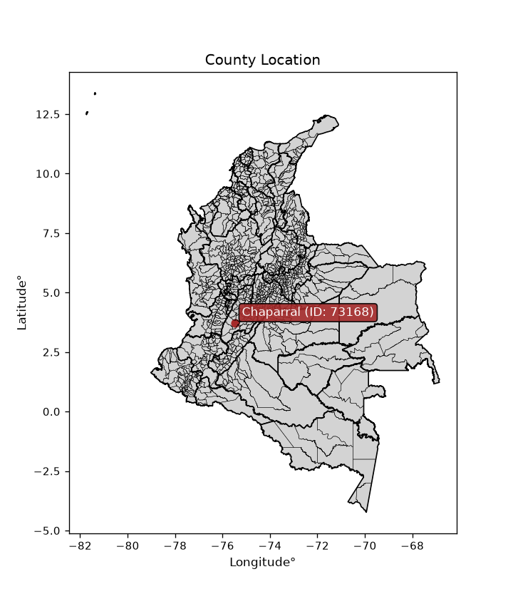
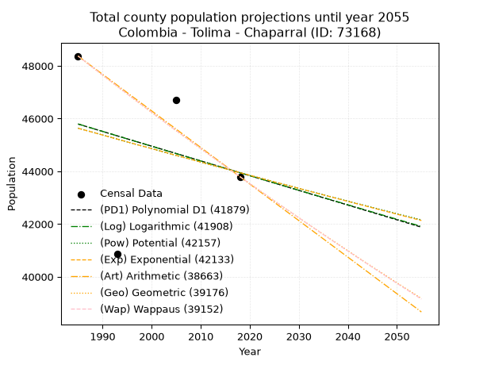
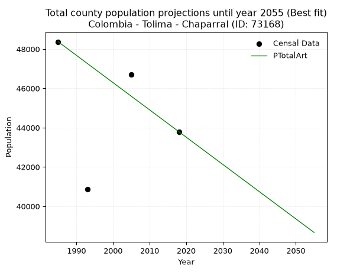
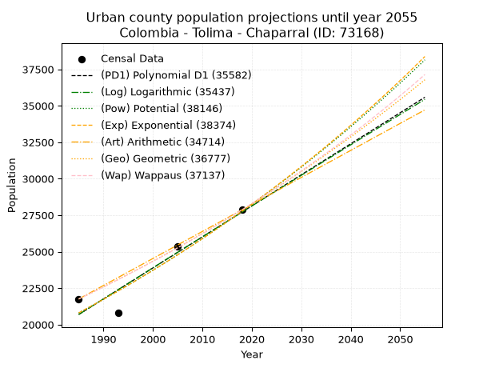
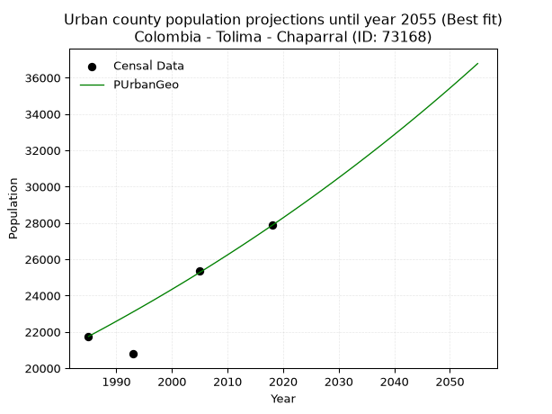
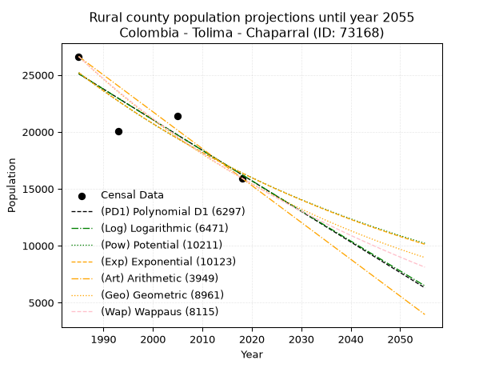
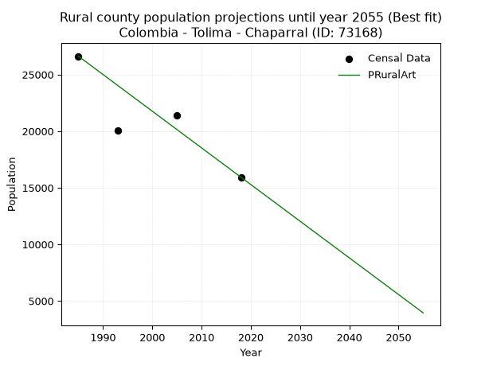

<div align="center">


</div>

# _“Population and Public Services Demand Projections (PPSD) until Year 2050 for Colombia - Tolima - Chaparral (ID: 73168)”_
Keywords: `population` `public-service` `projection` `lineal` `polynomial` `logarithmic` `potential` `exponential` `arithmetic` `geometric` `wappaus` `dane` `colombia` `south-america`

PPSD are analytical estimates used by governments and planners to anticipate future changes in population size, age distribution, and the resulting community needs for utilities, healthcare, education, and infrastructure as sizing future water treatment facilities, electrical grids, and road networks based on spatial growth.

<div align="center">

</img>

</div>


> **General running parameters**: • app_version: _v20260806_. • Python version: _3.14.7_. • Pandas version: _3.0.5_. • NumPy version: _2.5.1_. • Creates, save and include plots into reports (create_plot): _False_. • Projection until year: _2050_. • Process polynomial degree 2 and up: _False_. • Process Wappaus: _True_. • Process Wappaus: _True_. • Set negative values to zero: _True_. • Set infinite values to zero: _True_. • Drop dataset notes: _True_. 
<div align="center">

Dynamic map: [:earth_americas:Google](http://maps.google.com/maps?q=3.72291782,-75.4807647) [:earth_americas:OSM](https://www.openstreetmap.org/#map=18/3.72291782/-75.4807647&layers=P) [:earth_americas:Bing](https://www.bing.com/maps?cp=3.72291782~-75.4807647&lvl=18) [:earth_americas:Apple](https://maps.apple.com/frame?center=3.72291782%2C-75.4807647&span=0.003%2C0.006)

</div>


<div align="center">

```geojson
{
  "type": "Feature",
  "geometry": {
    "type": "Point", 
    "coordinates": [-75.4807647, 3.72291782]
  }, 
  "properties": {
    "Name": "Colombia - Tolima - Chaparral (ID: 73168)"
  }
}
```

</div>


## 0. Census Data (4 records)

Census data are official statistics collected by a government about the people and housing in a country. They usually include counts of total population, age, sex, race, income, education, and jobs.

📅Global census file: [Population.xlsx](../data/Population.xlsx)

| Source   |   Year |   CountryID | CountryName   |   StateID | StateName   |   CountyID | CountyName   |   PTotal |   PUrban |   PRural |
|:---------|-------:|------------:|:--------------|----------:|:------------|-----------:|:-------------|---------:|---------:|---------:|
| DANE     |   1985 |          57 | Colombia      |        73 | Tolima      |      73168 | Chaparral    |    48372 |    21751 |    26621 |
| DANE     |   1993 |          57 | Colombia      |        73 | Tolima      |      73168 | Chaparral    |    40880 |    20789 |    20091 |
| DANE     |   2005 |          57 | Colombia      |        73 | Tolima      |      73168 | Chaparral    |    46712 |    25338 |    21374 |
| DANE     |   2018 |          57 | Colombia      |        73 | Tolima      |      73168 | Chaparral    |    43795 |    27862 |    15933 |

> 🔥Some records could had specific notes about the registered values or the corresponding urban or rural distribution.

📅[SUI-RUPS](https://www.datos.gov.co/Hacienda-y-Cr-dito-P-blico/Registro-nico-de-Prestadores-de-Servicios-P-blicos/4qkq-csdn/about_data) - Local public utility companies: [RUPS.csv](../data/RUPS.xlsx)

 | SERVICIO       | ESTADO    | NOMBRE                                            | NIT         | DEPARTAMENTO_DOMICILIO   | MUNICIPIO_DOMICILIO   | DIRECCION                  |   TELEFONO | EMAIL                      | TIPO_PRESTADOR                            | CLASIFICACION                 |
|:---------------|:----------|:--------------------------------------------------|:------------|:-------------------------|:----------------------|:---------------------------|-----------:|:---------------------------|:------------------------------------------|:------------------------------|
| ACUEDUCTO      | OPERATIVA | EMPRESA DE SERVICIOS PUBLICOS DE CHAPARRAL E.S.P. | 809002366-4 | TOLIMA                   | CHAPARRAL             | CALLE 10 No.9-61  - CENTRO |    2460914 | empochaparral1@hotmail.com | EMPRESA INDUSTRIAL Y COMERCIAL DEL ESTADO | MAYOR O IGUAL A 5001 USUARIOS |
| ALCANTARILLADO | OPERATIVA | EMPRESA DE SERVICIOS PUBLICOS DE CHAPARRAL E.S.P. | 809002366-4 | TOLIMA                   | CHAPARRAL             | CALLE 10 No.9-61  - CENTRO |    2460914 | empochaparral1@hotmail.com | EMPRESA INDUSTRIAL Y COMERCIAL DEL ESTADO | MAYOR O IGUAL A 5001 USUARIOS |

## 1. Total

### 1.1. Coefficients and Parameters

* (PD1) Polynomial Deg 1: -55.89682858289682, 156747.3813729394 (lineal)
* (Log) Logarithmic: -112178.42921470455, 897608.8894024842
* (Pow) Potential: -2.289374872310529, 12.209139554257376
* (Exp) Exponential: -0.0011404497482779999, 438980.64163380937
* (Art) Arithmetic: Year diff. 2018 - 1985 = 33, Population diff. 43795 - 48372 = -4577, Annual growth = -138.6969696969697
* (Geo) Geometric: Year diff. 2018 - 1985 = 33, Population diff. 43795 - 48372 = -4577, Annual growth % = -0.003007633988840075
* (Wap) Wappaus: i = -0.30096882766493366, Condition values only valid for < 200)

<sub>
Wappaus condition values: ['-0.00', '-0.30', '-0.60', '-0.90', '-1.20', '-1.50', '-1.81', '-2.11', '-2.41', '-2.71', '-3.01', '-3.31', '-3.61', '-3.91', '-4.21', '-4.51', '-4.82', '-5.12', '-5.42', '-5.72', '-6.02', '-6.32', '-6.62', '-6.92', '-7.22', '-7.52', '-7.83', '-8.13', '-8.43', '-8.73', '-9.03', '-9.33', '-9.63', '-9.93', '-10.23', '-10.53', '-10.83', '-11.14', '-11.44', '-11.74', '-12.04', '-12.34', '-12.64', '-12.94', '-13.24', '-13.54', '-13.84', '-14.15', '-14.45', '-14.75', '-15.05', '-15.35', '-15.65', '-15.95', '-16.25', '-16.55', '-16.85', '-17.16', '-17.46', '-17.76', '-18.06', '-18.36', '-18.66', '-18.96', '-19.26', '-19.56']
</sub>


### 1.2. Projected Dataset

|   Year |   CountyID |   PTotalPD1 |   PTotalLog |   PTotalPow |   PTotalExp |   PTotalArt |   PTotalGeo |   PTotalWap |
|-------:|-----------:|------------:|------------:|------------:|------------:|------------:|------------:|------------:|
|   1985 |      73168 |       45792 |       45796 |       45638 |       45634 |       48372 |       48372 |       48372 |
|   1986 |      73168 |       45736 |       45740 |       45586 |       45582 |       48233 |       48227 |       48227 |
|   1987 |      73168 |       45680 |       45683 |       45533 |       45530 |       48095 |       48081 |       48082 |
|   1988 |      73168 |       45624 |       45627 |       45481 |       45479 |       47956 |       47937 |       47937 |
|   1989 |      73168 |       45569 |       45570 |       45428 |       45427 |       47817 |       47793 |       47793 |
|   1990 |      73168 |       45513 |       45514 |       45376 |       45375 |       47679 |       47649 |       47650 |
|   1991 |      73168 |       45457 |       45458 |       45324 |       45323 |       47540 |       47506 |       47506 |
|   1992 |      73168 |       45401 |       45401 |       45272 |       45272 |       47401 |       47363 |       47364 |
|   1993 |      73168 |       45345 |       45345 |       45220 |       45220 |       47262 |       47220 |       47221 |
|   1994 |      73168 |       45289 |       45289 |       45168 |       45168 |       47124 |       47078 |       47079 |
|   1995 |      73168 |       45233 |       45232 |       45116 |       45117 |       46985 |       46937 |       46938 |
|   1996 |      73168 |       45177 |       45176 |       45065 |       45066 |       46846 |       46796 |       46797 |
|   1997 |      73168 |       45121 |       45120 |       45013 |       45014 |       46708 |       46655 |       46656 |
|   1998 |      73168 |       45066 |       45064 |       44961 |       44963 |       46569 |       46514 |       46516 |
|   1999 |      73168 |       45010 |       45008 |       44910 |       44912 |       46430 |       46375 |       46376 |
|   2000 |      73168 |       44954 |       44952 |       44858 |       44860 |       46292 |       46235 |       46236 |
|   2001 |      73168 |       44898 |       44896 |       44807 |       44809 |       46153 |       46096 |       46097 |
|   2002 |      73168 |       44842 |       44839 |       44756 |       44758 |       46014 |       45957 |       45959 |
|   2003 |      73168 |       44786 |       44783 |       44705 |       44707 |       45875 |       45819 |       45821 |
|   2004 |      73168 |       44730 |       44727 |       44654 |       44656 |       45737 |       45681 |       45683 |
|   2005 |      73168 |       44674 |       44671 |       44603 |       44605 |       45598 |       45544 |       45545 |
|   2006 |      73168 |       44618 |       44616 |       44552 |       44554 |       45459 |       45407 |       45408 |
|   2007 |      73168 |       44562 |       44560 |       44501 |       44504 |       45321 |       45270 |       45272 |
|   2008 |      73168 |       44507 |       44504 |       44450 |       44453 |       45182 |       45134 |       45136 |
|   2009 |      73168 |       44451 |       44448 |       44400 |       44402 |       45043 |       44998 |       45000 |
|   2010 |      73168 |       44395 |       44392 |       44349 |       44352 |       44905 |       44863 |       44864 |
|   2011 |      73168 |       44339 |       44336 |       44299 |       44301 |       44766 |       44728 |       44729 |
|   2012 |      73168 |       44283 |       44281 |       44248 |       44251 |       44627 |       44594 |       44595 |
|   2013 |      73168 |       44227 |       44225 |       44198 |       44200 |       44488 |       44460 |       44460 |
|   2014 |      73168 |       44171 |       44169 |       44148 |       44150 |       44350 |       44326 |       44327 |
|   2015 |      73168 |       44115 |       44113 |       44098 |       44100 |       44211 |       44193 |       44193 |
|   2016 |      73168 |       44059 |       44058 |       44048 |       44049 |       44072 |       44060 |       44060 |
|   2017 |      73168 |       44003 |       44002 |       43998 |       43999 |       43934 |       43927 |       43927 |
|   2018 |      73168 |       43948 |       43947 |       43948 |       43949 |       43795 |       43795 |       43795 |
|   2019 |      73168 |       43892 |       43891 |       43898 |       43899 |       43656 |       43663 |       43663 |
|   2020 |      73168 |       43836 |       43835 |       43848 |       43849 |       43518 |       43532 |       43531 |
|   2021 |      73168 |       43780 |       43780 |       43798 |       43799 |       43379 |       43401 |       43400 |
|   2022 |      73168 |       43724 |       43724 |       43749 |       43749 |       43240 |       43270 |       43269 |
|   2023 |      73168 |       43668 |       43669 |       43699 |       43699 |       43102 |       43140 |       43139 |
|   2024 |      73168 |       43612 |       43613 |       43650 |       43649 |       42963 |       43011 |       43009 |
|   2025 |      73168 |       43556 |       43558 |       43601 |       43599 |       42824 |       42881 |       42879 |
|   2026 |      73168 |       43500 |       43503 |       43551 |       43550 |       42685 |       42752 |       42750 |
|   2027 |      73168 |       43445 |       43447 |       43502 |       43500 |       42547 |       42624 |       42621 |
|   2028 |      73168 |       43389 |       43392 |       43453 |       43451 |       42408 |       42495 |       42492 |
|   2029 |      73168 |       43333 |       43337 |       43404 |       43401 |       42269 |       42368 |       42364 |
|   2030 |      73168 |       43277 |       43281 |       43355 |       43352 |       42131 |       42240 |       42236 |
|   2031 |      73168 |       43221 |       43226 |       43306 |       43302 |       41992 |       42113 |       42109 |
|   2032 |      73168 |       43165 |       43171 |       43258 |       43253 |       41853 |       41987 |       41982 |
|   2033 |      73168 |       43109 |       43116 |       43209 |       43203 |       41715 |       41860 |       41855 |
|   2034 |      73168 |       43053 |       43061 |       43160 |       43154 |       41576 |       41734 |       41728 |
|   2035 |      73168 |       42997 |       43005 |       43112 |       43105 |       41437 |       41609 |       41602 |
|   2036 |      73168 |       42941 |       42950 |       43063 |       43056 |       41298 |       41484 |       41476 |
|   2037 |      73168 |       42886 |       42895 |       43015 |       43007 |       41160 |       41359 |       41351 |
|   2038 |      73168 |       42830 |       42840 |       42967 |       42958 |       41021 |       41235 |       41226 |
|   2039 |      73168 |       42774 |       42785 |       42918 |       42909 |       40882 |       41111 |       41101 |
|   2040 |      73168 |       42718 |       42730 |       42870 |       42860 |       40744 |       40987 |       40977 |
|   2041 |      73168 |       42662 |       42675 |       42822 |       42811 |       40605 |       40864 |       40853 |
|   2042 |      73168 |       42606 |       42620 |       42774 |       42762 |       40466 |       40741 |       40729 |
|   2043 |      73168 |       42550 |       42565 |       42726 |       42714 |       40328 |       40618 |       40606 |
|   2044 |      73168 |       42494 |       42510 |       42678 |       42665 |       40189 |       40496 |       40483 |
|   2045 |      73168 |       42438 |       42456 |       42631 |       42616 |       40050 |       40374 |       40360 |
|   2046 |      73168 |       42382 |       42401 |       42583 |       42568 |       39911 |       40253 |       40238 |
|   2047 |      73168 |       42327 |       42346 |       42535 |       42519 |       39773 |       40132 |       40116 |
|   2048 |      73168 |       42271 |       42291 |       42488 |       42471 |       39634 |       40011 |       39994 |
|   2049 |      73168 |       42215 |       42236 |       42440 |       42422 |       39495 |       39891 |       39873 |
|   2050 |      73168 |       42159 |       42182 |       42393 |       42374 |       39357 |       39771 |       39752 |
<div align="center">

</img>

</div>


### 1.3. Best fit with absolute and relative error (%)

Relative error puts that difference into context by dividing the absolute error by the true value, creating a unitless ratio or percentage that shows the scale of the mistake.

Absolute and relative error

|   Year | Source   |   CountryID | CountryName   |   StateID | StateName   |   CountyID_x | CountyName   |   PTotal |   PUrban |   PRural |   CountyID_y |   PTotalPD1 |   PTotalLog |   PTotalPow |   PTotalExp |   PTotalArt |   PTotalGeo |   PTotalWap |   PTotalPD1AbsError |   PTotalLogAbsError |   PTotalPowAbsError |   PTotalExpAbsError |   PTotalArtAbsError |   PTotalGeoAbsError |   PTotalWapAbsError |   PTotalPD1RelError |   PTotalLogRelError |   PTotalPowRelError |   PTotalExpRelError |   PTotalArtRelError |   PTotalGeoRelError |   PTotalWapRelError |
|-------:|:---------|------------:|:--------------|----------:|:------------|-------------:|:-------------|---------:|---------:|---------:|-------------:|------------:|------------:|------------:|------------:|------------:|------------:|------------:|--------------------:|--------------------:|--------------------:|--------------------:|--------------------:|--------------------:|--------------------:|--------------------:|--------------------:|--------------------:|--------------------:|--------------------:|--------------------:|--------------------:|
|   1985 | DANE     |          57 | Colombia      |        73 | Tolima      |        73168 | Chaparral    |    48372 |    21751 |    26621 |        73168 |       45792 |       45796 |       45638 |       45634 |       48372 |       48372 |       48372 |                2580 |                2576 |                2734 |                2738 |                   0 |                   0 |                   0 |            5.33366  |            5.32539  |            5.65203  |            5.6603   |             0       |             0       |             0       |
|   1993 | DANE     |          57 | Colombia      |        73 | Tolima      |        73168 | Chaparral    |    40880 |    20789 |    20091 |        73168 |       45345 |       45345 |       45220 |       45220 |       47262 |       47220 |       47221 |                4465 |                4465 |                4340 |                4340 |                6382 |                6340 |                6341 |           10.9222   |           10.9222   |           10.6164   |           10.6164   |            15.6115  |            15.5088  |            15.5113  |
|   2005 | DANE     |          57 | Colombia      |        73 | Tolima      |        73168 | Chaparral    |    46712 |    25338 |    21374 |        73168 |       44674 |       44671 |       44603 |       44605 |       45598 |       45544 |       45545 |                2038 |                2041 |                2109 |                2107 |                1114 |                1168 |                1167 |            4.3629   |            4.36933  |            4.5149   |            4.51062  |             2.38483 |             2.50043 |             2.49829 |
|   2018 | DANE     |          57 | Colombia      |        73 | Tolima      |        73168 | Chaparral    |    43795 |    27862 |    15933 |        73168 |       43948 |       43947 |       43948 |       43949 |       43795 |       43795 |       43795 |                 153 |                 152 |                 153 |                 154 |                   0 |                   0 |                   0 |            0.349355 |            0.347072 |            0.349355 |            0.351638 |             0       |             0       |             0       |

Relative error mean

| Method    |   RelError | Best   |
|:----------|-----------:|:-------|
| PTotalPD1 |    5.24203 |        |
| PTotalLog |    5.241   |        |
| PTotalPow |    5.28318 |        |
| PTotalExp |    5.28475 |        |
| PTotalArt |    4.49909 | True   |
| PTotalGeo |    4.50231 |        |
| PTotalWap |    4.50238 |        |

💙Best method: _**PTotalArt**_
<div align="center">

</img>

</div>


### 1.4. Fresh water supply demand in liters per capita per day (lpcd)

The fresh water supply demand typically ranges from 100 to 300 liters per capita per day (lpcd) for standard domestic and municipal planning, though absolute survival minimums set by the World Health Organization are as low as 7.5 to 20 liters per day, and total consumption in high-income nations can exceed 400 liters.

> `CZ`: Level in meters above the sea level (masl)<br> `WS`: Fresh water supply demand in liters per capita per day (lpcd or l/h/d)<br> `WSAll`: Zonal fresh water supply demand in liters per second (l/s)<br> `A`: Zonal area in square meters<br> `DP`: Population density (people/hectare or p/ha)

Reference values (RAS Colombia)

|    CZ |   WS |
|------:|-----:|
|  1000 |  120 |
|  2000 |  130 |
| 99999 |  140 |

County shapefile geometry properties and water supply values

|   CountyID |      ATotal |   CZTotal |   WSTotal |
|-----------:|------------:|----------:|----------:|
|      73168 | 2.10154e+09 |    1814.1 |       130 |

Projected values for best method: PTotalArt

|   CountyID |   Year |   PTotalArt |   DPTotal |   WSTotal |   WSTotalAll |
|-----------:|-------:|------------:|----------:|----------:|-------------:|
|      73168 |   1985 |       48372 |      0.23 |       130 |      72.7819 |
|      73168 |   1986 |       48233 |      0.23 |       130 |      72.5728 |
|      73168 |   1987 |       48095 |      0.23 |       130 |      72.3652 |
|      73168 |   1988 |       47956 |      0.23 |       130 |      72.156  |
|      73168 |   1989 |       47817 |      0.23 |       130 |      71.9469 |
|      73168 |   1990 |       47679 |      0.23 |       130 |      71.7392 |
|      73168 |   1991 |       47540 |      0.23 |       130 |      71.5301 |
|      73168 |   1992 |       47401 |      0.23 |       130 |      71.3209 |
|      73168 |   1993 |       47262 |      0.22 |       130 |      71.1118 |
|      73168 |   1994 |       47124 |      0.22 |       130 |      70.9042 |
|      73168 |   1995 |       46985 |      0.22 |       130 |      70.695  |
|      73168 |   1996 |       46846 |      0.22 |       130 |      70.4859 |
|      73168 |   1997 |       46708 |      0.22 |       130 |      70.2782 |
|      73168 |   1998 |       46569 |      0.22 |       130 |      70.0691 |
|      73168 |   1999 |       46430 |      0.22 |       130 |      69.86   |
|      73168 |   2000 |       46292 |      0.22 |       130 |      69.6523 |
|      73168 |   2001 |       46153 |      0.22 |       130 |      69.4432 |
|      73168 |   2002 |       46014 |      0.22 |       130 |      69.234  |
|      73168 |   2003 |       45875 |      0.22 |       130 |      69.0249 |
|      73168 |   2004 |       45737 |      0.22 |       130 |      68.8172 |
|      73168 |   2005 |       45598 |      0.22 |       130 |      68.6081 |
|      73168 |   2006 |       45459 |      0.22 |       130 |      68.399  |
|      73168 |   2007 |       45321 |      0.22 |       130 |      68.1913 |
|      73168 |   2008 |       45182 |      0.21 |       130 |      67.9822 |
|      73168 |   2009 |       45043 |      0.21 |       130 |      67.773  |
|      73168 |   2010 |       44905 |      0.21 |       130 |      67.5654 |
|      73168 |   2011 |       44766 |      0.21 |       130 |      67.3563 |
|      73168 |   2012 |       44627 |      0.21 |       130 |      67.1471 |
|      73168 |   2013 |       44488 |      0.21 |       130 |      66.938  |
|      73168 |   2014 |       44350 |      0.21 |       130 |      66.7303 |
|      73168 |   2015 |       44211 |      0.21 |       130 |      66.5212 |
|      73168 |   2016 |       44072 |      0.21 |       130 |      66.312  |
|      73168 |   2017 |       43934 |      0.21 |       130 |      66.1044 |
|      73168 |   2018 |       43795 |      0.21 |       130 |      65.8953 |
|      73168 |   2019 |       43656 |      0.21 |       130 |      65.6861 |
|      73168 |   2020 |       43518 |      0.21 |       130 |      65.4785 |
|      73168 |   2021 |       43379 |      0.21 |       130 |      65.2693 |
|      73168 |   2022 |       43240 |      0.21 |       130 |      65.0602 |
|      73168 |   2023 |       43102 |      0.21 |       130 |      64.8525 |
|      73168 |   2024 |       42963 |      0.2  |       130 |      64.6434 |
|      73168 |   2025 |       42824 |      0.2  |       130 |      64.4343 |
|      73168 |   2026 |       42685 |      0.2  |       130 |      64.2251 |
|      73168 |   2027 |       42547 |      0.2  |       130 |      64.0175 |
|      73168 |   2028 |       42408 |      0.2  |       130 |      63.8083 |
|      73168 |   2029 |       42269 |      0.2  |       130 |      63.5992 |
|      73168 |   2030 |       42131 |      0.2  |       130 |      63.3916 |
|      73168 |   2031 |       41992 |      0.2  |       130 |      63.1824 |
|      73168 |   2032 |       41853 |      0.2  |       130 |      62.9733 |
|      73168 |   2033 |       41715 |      0.2  |       130 |      62.7656 |
|      73168 |   2034 |       41576 |      0.2  |       130 |      62.5565 |
|      73168 |   2035 |       41437 |      0.2  |       130 |      62.3473 |
|      73168 |   2036 |       41298 |      0.2  |       130 |      62.1382 |
|      73168 |   2037 |       41160 |      0.2  |       130 |      61.9306 |
|      73168 |   2038 |       41021 |      0.2  |       130 |      61.7214 |
|      73168 |   2039 |       40882 |      0.19 |       130 |      61.5123 |
|      73168 |   2040 |       40744 |      0.19 |       130 |      61.3046 |
|      73168 |   2041 |       40605 |      0.19 |       130 |      61.0955 |
|      73168 |   2042 |       40466 |      0.19 |       130 |      60.8863 |
|      73168 |   2043 |       40328 |      0.19 |       130 |      60.6787 |
|      73168 |   2044 |       40189 |      0.19 |       130 |      60.4696 |
|      73168 |   2045 |       40050 |      0.19 |       130 |      60.2604 |
|      73168 |   2046 |       39911 |      0.19 |       130 |      60.0513 |
|      73168 |   2047 |       39773 |      0.19 |       130 |      59.8436 |
|      73168 |   2048 |       39634 |      0.19 |       130 |      59.6345 |
|      73168 |   2049 |       39495 |      0.19 |       130 |      59.4253 |
|      73168 |   2050 |       39357 |      0.19 |       130 |      59.2177 |

## 2. Urban

### 2.1. Coefficients and Parameters

* (PD1) Polynomial Deg 1: 212.73865917302115, -401595.50301083556 (lineal)
* (Log) Logarithmic: 425645.6918230558, -3211401.3144575553
* (Pow) Potential: 17.504049247760847, -53.40616966248162
* (Exp) Exponential: 0.008748288389985332, 0.0005975961360588847
* (Art) Arithmetic: Year diff. 2018 - 1985 = 33, Population diff. 27862 - 21751 = 6111, Annual growth = 185.1818181818182
* (Geo) Geometric: Year diff. 2018 - 1985 = 33, Population diff. 27862 - 21751 = 6111, Annual growth % = 0.007531371294269507
* (Wap) Wappaus: i = 0.7465052231544884, Condition values only valid for < 200)

<sub>
Wappaus condition values: ['0.00', '0.75', '1.49', '2.24', '2.99', '3.73', '4.48', '5.23', '5.97', '6.72', '7.47', '8.21', '8.96', '9.70', '10.45', '11.20', '11.94', '12.69', '13.44', '14.18', '14.93', '15.68', '16.42', '17.17', '17.92', '18.66', '19.41', '20.16', '20.90', '21.65', '22.40', '23.14', '23.89', '24.63', '25.38', '26.13', '26.87', '27.62', '28.37', '29.11', '29.86', '30.61', '31.35', '32.10', '32.85', '33.59', '34.34', '35.09', '35.83', '36.58', '37.33', '38.07', '38.82', '39.56', '40.31', '41.06', '41.80', '42.55', '43.30', '44.04', '44.79', '45.54', '46.28', '47.03', '47.78', '48.52']
</sub>


### 2.2. Projected Dataset

|   Year |   CountyID |   PUrbanPD1 |   PUrbanLog |   PUrbanPow |   PUrbanExp |   PUrbanArt |   PUrbanGeo |   PUrbanWap |
|-------:|-----------:|------------:|------------:|------------:|------------:|------------:|------------:|------------:|
|   1985 |      73168 |       20691 |       20686 |       20797 |       20801 |       21751 |       21751 |       21751 |
|   1986 |      73168 |       20903 |       20900 |       20981 |       20984 |       21936 |       21915 |       21914 |
|   1987 |      73168 |       21116 |       21114 |       21166 |       21168 |       22121 |       22080 |       22078 |
|   1988 |      73168 |       21329 |       21329 |       21354 |       21354 |       22307 |       22246 |       22244 |
|   1989 |      73168 |       21542 |       21543 |       21542 |       21542 |       22492 |       22414 |       22410 |
|   1990 |      73168 |       21754 |       21757 |       21733 |       21731 |       22677 |       22583 |       22578 |
|   1991 |      73168 |       21967 |       21970 |       21925 |       21922 |       22862 |       22753 |       22748 |
|   1992 |      73168 |       22180 |       22184 |       22118 |       22115 |       23047 |       22924 |       22918 |
|   1993 |      73168 |       22393 |       22398 |       22314 |       22309 |       23232 |       23097 |       23090 |
|   1994 |      73168 |       22605 |       22611 |       22510 |       22505 |       23418 |       23271 |       23263 |
|   1995 |      73168 |       22818 |       22825 |       22709 |       22703 |       23603 |       23446 |       23438 |
|   1996 |      73168 |       23031 |       23038 |       22909 |       22902 |       23788 |       23622 |       23614 |
|   1997 |      73168 |       23244 |       23251 |       23111 |       23103 |       23973 |       23800 |       23791 |
|   1998 |      73168 |       23456 |       23464 |       23314 |       23306 |       24158 |       23980 |       23969 |
|   1999 |      73168 |       23669 |       23677 |       23519 |       23511 |       24344 |       24160 |       24150 |
|   2000 |      73168 |       23882 |       23890 |       23726 |       23718 |       24529 |       24342 |       24331 |
|   2001 |      73168 |       24095 |       24103 |       23934 |       23926 |       24714 |       24525 |       24514 |
|   2002 |      73168 |       24307 |       24316 |       24145 |       24136 |       24899 |       24710 |       24698 |
|   2003 |      73168 |       24520 |       24528 |       24357 |       24349 |       25084 |       24896 |       24884 |
|   2004 |      73168 |       24733 |       24741 |       24570 |       24562 |       25269 |       25084 |       25072 |
|   2005 |      73168 |       24946 |       24953 |       24786 |       24778 |       25455 |       25273 |       25260 |
|   2006 |      73168 |       25158 |       25165 |       25003 |       24996 |       25640 |       25463 |       25451 |
|   2007 |      73168 |       25371 |       25377 |       25222 |       25216 |       25825 |       25655 |       25643 |
|   2008 |      73168 |       25584 |       25589 |       25443 |       25437 |       26010 |       25848 |       25836 |
|   2009 |      73168 |       25796 |       25801 |       25666 |       25661 |       26195 |       26043 |       26031 |
|   2010 |      73168 |       26009 |       26013 |       25890 |       25886 |       26381 |       26239 |       26228 |
|   2011 |      73168 |       26222 |       26225 |       26117 |       26114 |       26566 |       26436 |       26426 |
|   2012 |      73168 |       26435 |       26436 |       26345 |       26343 |       26751 |       26635 |       26626 |
|   2013 |      73168 |       26647 |       26648 |       26575 |       26575 |       26936 |       26836 |       26828 |
|   2014 |      73168 |       26860 |       26859 |       26807 |       26808 |       27121 |       27038 |       27031 |
|   2015 |      73168 |       27073 |       27071 |       27041 |       27044 |       27306 |       27242 |       27236 |
|   2016 |      73168 |       27286 |       27282 |       27277 |       27281 |       27492 |       27447 |       27443 |
|   2017 |      73168 |       27498 |       27493 |       27515 |       27521 |       27677 |       27654 |       27652 |
|   2018 |      73168 |       27711 |       27704 |       27754 |       27763 |       27862 |       27862 |       27862 |
|   2019 |      73168 |       27924 |       27915 |       27996 |       28007 |       28047 |       28072 |       28074 |
|   2020 |      73168 |       28137 |       28125 |       28240 |       28253 |       28232 |       28283 |       28288 |
|   2021 |      73168 |       28349 |       28336 |       28486 |       28501 |       28418 |       28496 |       28504 |
|   2022 |      73168 |       28562 |       28547 |       28733 |       28751 |       28603 |       28711 |       28721 |
|   2023 |      73168 |       28775 |       28757 |       28983 |       29004 |       28788 |       28927 |       28941 |
|   2024 |      73168 |       28988 |       28967 |       29235 |       29259 |       28973 |       29145 |       29162 |
|   2025 |      73168 |       29200 |       29178 |       29489 |       29516 |       29158 |       29364 |       29386 |
|   2026 |      73168 |       29413 |       29388 |       29745 |       29775 |       29343 |       29586 |       29611 |
|   2027 |      73168 |       29626 |       29598 |       30003 |       30037 |       29529 |       29808 |       29838 |
|   2028 |      73168 |       29838 |       29808 |       30263 |       30301 |       29714 |       30033 |       30068 |
|   2029 |      73168 |       30051 |       30018 |       30525 |       30567 |       29899 |       30259 |       30299 |
|   2030 |      73168 |       30264 |       30227 |       30790 |       30836 |       30084 |       30487 |       30533 |
|   2031 |      73168 |       30477 |       30437 |       31056 |       31107 |       30269 |       30717 |       30768 |
|   2032 |      73168 |       30689 |       30646 |       31325 |       31380 |       30455 |       30948 |       31006 |
|   2033 |      73168 |       30902 |       30856 |       31596 |       31656 |       30640 |       31181 |       31246 |
|   2034 |      73168 |       31115 |       31065 |       31869 |       31934 |       30825 |       31416 |       31488 |
|   2035 |      73168 |       31328 |       31274 |       32144 |       32214 |       31010 |       31653 |       31732 |
|   2036 |      73168 |       31540 |       31484 |       32422 |       32498 |       31195 |       31891 |       31979 |
|   2037 |      73168 |       31753 |       31693 |       32702 |       32783 |       31380 |       32131 |       32228 |
|   2038 |      73168 |       31966 |       31901 |       32984 |       33071 |       31566 |       32373 |       32479 |
|   2039 |      73168 |       32179 |       32110 |       33268 |       33362 |       31751 |       32617 |       32732 |
|   2040 |      73168 |       32391 |       32319 |       33555 |       33655 |       31936 |       32863 |       32988 |
|   2041 |      73168 |       32604 |       32528 |       33844 |       33951 |       32121 |       33110 |       33247 |
|   2042 |      73168 |       32817 |       32736 |       34136 |       34249 |       32306 |       33359 |       33507 |
|   2043 |      73168 |       33030 |       32944 |       34430 |       34550 |       32492 |       33611 |       33771 |
|   2044 |      73168 |       33242 |       33153 |       34726 |       34853 |       32677 |       33864 |       34036 |
|   2045 |      73168 |       33455 |       33361 |       35024 |       35160 |       32862 |       34119 |       34305 |
|   2046 |      73168 |       33668 |       33569 |       35325 |       35469 |       33047 |       34376 |       34576 |
|   2047 |      73168 |       33881 |       33777 |       35629 |       35780 |       33232 |       34635 |       34849 |
|   2048 |      73168 |       34093 |       33985 |       35935 |       36095 |       33417 |       34896 |       35125 |
|   2049 |      73168 |       34306 |       34193 |       36243 |       36412 |       33603 |       35158 |       35404 |
|   2050 |      73168 |       34519 |       34400 |       36554 |       36732 |       33788 |       35423 |       35686 |
<div align="center">

</img>

</div>


### 2.3. Best fit with absolute and relative error (%)

Relative error puts that difference into context by dividing the absolute error by the true value, creating a unitless ratio or percentage that shows the scale of the mistake.

Absolute and relative error

|   Year | Source   |   CountryID | CountryName   |   StateID | StateName   |   CountyID_x | CountyName   |   PTotal |   PUrban |   PRural |   CountyID_y |   PUrbanPD1 |   PUrbanLog |   PUrbanPow |   PUrbanExp |   PUrbanArt |   PUrbanGeo |   PUrbanWap |   PUrbanPD1AbsError |   PUrbanLogAbsError |   PUrbanPowAbsError |   PUrbanExpAbsError |   PUrbanArtAbsError |   PUrbanGeoAbsError |   PUrbanWapAbsError |   PUrbanPD1RelError |   PUrbanLogRelError |   PUrbanPowRelError |   PUrbanExpRelError |   PUrbanArtRelError |   PUrbanGeoRelError |   PUrbanWapRelError |
|-------:|:---------|------------:|:--------------|----------:|:------------|-------------:|:-------------|---------:|---------:|---------:|-------------:|------------:|------------:|------------:|------------:|------------:|------------:|------------:|--------------------:|--------------------:|--------------------:|--------------------:|--------------------:|--------------------:|--------------------:|--------------------:|--------------------:|--------------------:|--------------------:|--------------------:|--------------------:|--------------------:|
|   1985 | DANE     |          57 | Colombia      |        73 | Tolima      |        73168 | Chaparral    |    48372 |    21751 |    26621 |        73168 |       20691 |       20686 |       20797 |       20801 |       21751 |       21751 |       21751 |                1060 |                1065 |                 954 |                 950 |                   0 |                   0 |                   0 |            4.87334  |            4.89633  |            4.38601  |            4.36762  |            0        |            0        |            0        |
|   1993 | DANE     |          57 | Colombia      |        73 | Tolima      |        73168 | Chaparral    |    40880 |    20789 |    20091 |        73168 |       22393 |       22398 |       22314 |       22309 |       23232 |       23097 |       23090 |                1604 |                1609 |                1525 |                1520 |                2443 |                2308 |                2301 |            7.71562  |            7.73967  |            7.33561  |            7.31156  |           11.7514   |           11.102    |           11.0684   |
|   2005 | DANE     |          57 | Colombia      |        73 | Tolima      |        73168 | Chaparral    |    46712 |    25338 |    21374 |        73168 |       24946 |       24953 |       24786 |       24778 |       25455 |       25273 |       25260 |                 392 |                 385 |                 552 |                 560 |                 117 |                  65 |                  78 |            1.54708  |            1.51946  |            2.17855  |            2.21012  |            0.461757 |            0.256532 |            0.307838 |
|   2018 | DANE     |          57 | Colombia      |        73 | Tolima      |        73168 | Chaparral    |    43795 |    27862 |    15933 |        73168 |       27711 |       27704 |       27754 |       27763 |       27862 |       27862 |       27862 |                 151 |                 158 |                 108 |                  99 |                   0 |                   0 |                   0 |            0.541957 |            0.567081 |            0.387625 |            0.355323 |            0        |            0        |            0        |

Relative error mean

| Method    |   RelError | Best   |
|:----------|-----------:|:-------|
| PUrbanPD1 |    3.6695  |        |
| PUrbanLog |    3.68063 |        |
| PUrbanPow |    3.57195 |        |
| PUrbanExp |    3.56115 |        |
| PUrbanArt |    3.05329 |        |
| PUrbanGeo |    2.83964 | True   |
| PUrbanWap |    2.84405 |        |

💙Best method: _**PUrbanGeo**_
<div align="center">

</img>

</div>


### 2.4. Fresh water supply demand in liters per capita per day (lpcd)

The fresh water supply demand typically ranges from 100 to 300 liters per capita per day (lpcd) for standard domestic and municipal planning, though absolute survival minimums set by the World Health Organization are as low as 7.5 to 20 liters per day, and total consumption in high-income nations can exceed 400 liters.

> `CZ`: Level in meters above the sea level (masl)<br> `WS`: Fresh water supply demand in liters per capita per day (lpcd or l/h/d)<br> `WSAll`: Zonal fresh water supply demand in liters per second (l/s)<br> `A`: Zonal area in square meters<br> `DP`: Population density (people/hectare or p/ha)

Reference values (RAS Colombia)

|    CZ |   WS |
|------:|-----:|
|  1000 |  120 |
|  2000 |  130 |
| 99999 |  140 |

County shapefile geometry properties and water supply values

|   CountyID |      AUrban |   CZUrban |   WSUrban |
|-----------:|------------:|----------:|----------:|
|      73168 | 6.78704e+06 |   839.059 |       120 |

Projected values for best method: PUrbanGeo

|   CountyID |   Year |   PUrbanGeo |   DPUrban |   WSUrban |   WSUrbanAll |
|-----------:|-------:|------------:|----------:|----------:|-------------:|
|      73168 |   1985 |       21751 |     32.05 |       120 |      30.2097 |
|      73168 |   1986 |       21915 |     32.29 |       120 |      30.4375 |
|      73168 |   1987 |       22080 |     32.53 |       120 |      30.6667 |
|      73168 |   1988 |       22246 |     32.78 |       120 |      30.8972 |
|      73168 |   1989 |       22414 |     33.02 |       120 |      31.1306 |
|      73168 |   1990 |       22583 |     33.27 |       120 |      31.3653 |
|      73168 |   1991 |       22753 |     33.52 |       120 |      31.6014 |
|      73168 |   1992 |       22924 |     33.78 |       120 |      31.8389 |
|      73168 |   1993 |       23097 |     34.03 |       120 |      32.0792 |
|      73168 |   1994 |       23271 |     34.29 |       120 |      32.3208 |
|      73168 |   1995 |       23446 |     34.55 |       120 |      32.5639 |
|      73168 |   1996 |       23622 |     34.8  |       120 |      32.8083 |
|      73168 |   1997 |       23800 |     35.07 |       120 |      33.0556 |
|      73168 |   1998 |       23980 |     35.33 |       120 |      33.3056 |
|      73168 |   1999 |       24160 |     35.6  |       120 |      33.5556 |
|      73168 |   2000 |       24342 |     35.87 |       120 |      33.8083 |
|      73168 |   2001 |       24525 |     36.14 |       120 |      34.0625 |
|      73168 |   2002 |       24710 |     36.41 |       120 |      34.3194 |
|      73168 |   2003 |       24896 |     36.68 |       120 |      34.5778 |
|      73168 |   2004 |       25084 |     36.96 |       120 |      34.8389 |
|      73168 |   2005 |       25273 |     37.24 |       120 |      35.1014 |
|      73168 |   2006 |       25463 |     37.52 |       120 |      35.3653 |
|      73168 |   2007 |       25655 |     37.8  |       120 |      35.6319 |
|      73168 |   2008 |       25848 |     38.08 |       120 |      35.9    |
|      73168 |   2009 |       26043 |     38.37 |       120 |      36.1708 |
|      73168 |   2010 |       26239 |     38.66 |       120 |      36.4431 |
|      73168 |   2011 |       26436 |     38.95 |       120 |      36.7167 |
|      73168 |   2012 |       26635 |     39.24 |       120 |      36.9931 |
|      73168 |   2013 |       26836 |     39.54 |       120 |      37.2722 |
|      73168 |   2014 |       27038 |     39.84 |       120 |      37.5528 |
|      73168 |   2015 |       27242 |     40.14 |       120 |      37.8361 |
|      73168 |   2016 |       27447 |     40.44 |       120 |      38.1208 |
|      73168 |   2017 |       27654 |     40.75 |       120 |      38.4083 |
|      73168 |   2018 |       27862 |     41.05 |       120 |      38.6972 |
|      73168 |   2019 |       28072 |     41.36 |       120 |      38.9889 |
|      73168 |   2020 |       28283 |     41.67 |       120 |      39.2819 |
|      73168 |   2021 |       28496 |     41.99 |       120 |      39.5778 |
|      73168 |   2022 |       28711 |     42.3  |       120 |      39.8764 |
|      73168 |   2023 |       28927 |     42.62 |       120 |      40.1764 |
|      73168 |   2024 |       29145 |     42.94 |       120 |      40.4792 |
|      73168 |   2025 |       29364 |     43.26 |       120 |      40.7833 |
|      73168 |   2026 |       29586 |     43.59 |       120 |      41.0917 |
|      73168 |   2027 |       29808 |     43.92 |       120 |      41.4    |
|      73168 |   2028 |       30033 |     44.25 |       120 |      41.7125 |
|      73168 |   2029 |       30259 |     44.58 |       120 |      42.0264 |
|      73168 |   2030 |       30487 |     44.92 |       120 |      42.3431 |
|      73168 |   2031 |       30717 |     45.26 |       120 |      42.6625 |
|      73168 |   2032 |       30948 |     45.6  |       120 |      42.9833 |
|      73168 |   2033 |       31181 |     45.94 |       120 |      43.3069 |
|      73168 |   2034 |       31416 |     46.29 |       120 |      43.6333 |
|      73168 |   2035 |       31653 |     46.64 |       120 |      43.9625 |
|      73168 |   2036 |       31891 |     46.99 |       120 |      44.2931 |
|      73168 |   2037 |       32131 |     47.34 |       120 |      44.6264 |
|      73168 |   2038 |       32373 |     47.7  |       120 |      44.9625 |
|      73168 |   2039 |       32617 |     48.06 |       120 |      45.3014 |
|      73168 |   2040 |       32863 |     48.42 |       120 |      45.6431 |
|      73168 |   2041 |       33110 |     48.78 |       120 |      45.9861 |
|      73168 |   2042 |       33359 |     49.15 |       120 |      46.3319 |
|      73168 |   2043 |       33611 |     49.52 |       120 |      46.6819 |
|      73168 |   2044 |       33864 |     49.9  |       120 |      47.0333 |
|      73168 |   2045 |       34119 |     50.27 |       120 |      47.3875 |
|      73168 |   2046 |       34376 |     50.65 |       120 |      47.7444 |
|      73168 |   2047 |       34635 |     51.03 |       120 |      48.1042 |
|      73168 |   2048 |       34896 |     51.42 |       120 |      48.4667 |
|      73168 |   2049 |       35158 |     51.8  |       120 |      48.8306 |
|      73168 |   2050 |       35423 |     52.19 |       120 |      49.1986 |

## 3. Rural

### 3.1. Coefficients and Parameters

* (PD1) Polynomial Deg 1: -268.63548775591784, 558342.8843837747 (lineal)
* (Log) Logarithmic: -537824.1210377605, 4109010.203860041
* (Pow) Potential: -26.078153786788913, 90.40106566348915
* (Exp) Exponential: -0.013028670334293833, 4296117544413613.5
* (Art) Arithmetic: Year diff. 2018 - 1985 = 33, Population diff. 15933 - 26621 = -10688, Annual growth = -323.8787878787879
* (Geo) Geometric: Year diff. 2018 - 1985 = 33, Population diff. 15933 - 26621 = -10688, Annual growth % = -0.015434435430083049
* (Wap) Wappaus: i = -1.5222013812040602, Condition values only valid for < 200)

<sub>
Wappaus condition values: ['-0.00', '-1.52', '-3.04', '-4.57', '-6.09', '-7.61', '-9.13', '-10.66', '-12.18', '-13.70', '-15.22', '-16.74', '-18.27', '-19.79', '-21.31', '-22.83', '-24.36', '-25.88', '-27.40', '-28.92', '-30.44', '-31.97', '-33.49', '-35.01', '-36.53', '-38.06', '-39.58', '-41.10', '-42.62', '-44.14', '-45.67', '-47.19', '-48.71', '-50.23', '-51.75', '-53.28', '-54.80', '-56.32', '-57.84', '-59.37', '-60.89', '-62.41', '-63.93', '-65.45', '-66.98', '-68.50', '-70.02', '-71.54', '-73.07', '-74.59', '-76.11', '-77.63', '-79.15', '-80.68', '-82.20', '-83.72', '-85.24', '-86.77', '-88.29', '-89.81', '-91.33', '-92.85', '-94.38', '-95.90', '-97.42', '-98.94']
</sub>


### 3.2. Projected Dataset

|   Year |   CountyID |   PRuralPD1 |   PRuralLog |   PRuralPow |   PRuralExp |   PRuralArt |   PRuralGeo |   PRuralWap |
|-------:|-----------:|------------:|------------:|------------:|------------:|------------:|------------:|------------:|
|   1985 |      73168 |       25101 |       25110 |       25209 |       25199 |       26621 |       26621 |       26621 |
|   1986 |      73168 |       24833 |       24840 |       24880 |       24873 |       26297 |       26210 |       26219 |
|   1987 |      73168 |       24564 |       24569 |       24556 |       24551 |       25973 |       25806 |       25823 |
|   1988 |      73168 |       24296 |       24298 |       24236 |       24234 |       25649 |       25407 |       25432 |
|   1989 |      73168 |       24027 |       24028 |       23920 |       23920 |       25325 |       25015 |       25048 |
|   1990 |      73168 |       23758 |       23757 |       23608 |       23610 |       25002 |       24629 |       24669 |
|   1991 |      73168 |       23490 |       23487 |       23301 |       23305 |       24678 |       24249 |       24296 |
|   1992 |      73168 |       23221 |       23217 |       22998 |       23003 |       24354 |       23875 |       23928 |
|   1993 |      73168 |       22952 |       22947 |       22699 |       22705 |       24030 |       23506 |       23565 |
|   1994 |      73168 |       22684 |       22677 |       22404 |       22411 |       23706 |       23143 |       23208 |
|   1995 |      73168 |       22415 |       22408 |       22113 |       22121 |       23382 |       22786 |       22855 |
|   1996 |      73168 |       22146 |       22138 |       21826 |       21835 |       23058 |       22434 |       22508 |
|   1997 |      73168 |       21878 |       21869 |       21543 |       21552 |       22734 |       22088 |       22165 |
|   1998 |      73168 |       21609 |       21600 |       21263 |       21273 |       22411 |       21747 |       21827 |
|   1999 |      73168 |       21341 |       21330 |       20988 |       20998 |       22087 |       21412 |       21494 |
|   2000 |      73168 |       21072 |       21062 |       20716 |       20726 |       21763 |       21081 |       21165 |
|   2001 |      73168 |       20803 |       20793 |       20447 |       20458 |       21439 |       20756 |       20841 |
|   2002 |      73168 |       20535 |       20524 |       20183 |       20193 |       21115 |       20435 |       20521 |
|   2003 |      73168 |       20266 |       20255 |       19922 |       19932 |       20791 |       20120 |       20206 |
|   2004 |      73168 |       19997 |       19987 |       19664 |       19674 |       20467 |       19809 |       19894 |
|   2005 |      73168 |       19729 |       19719 |       19410 |       19419 |       20143 |       19504 |       19587 |
|   2006 |      73168 |       19460 |       19450 |       19159 |       19168 |       19820 |       19203 |       19284 |
|   2007 |      73168 |       19191 |       19182 |       18912 |       18919 |       19496 |       18906 |       18985 |
|   2008 |      73168 |       18923 |       18915 |       18667 |       18675 |       19172 |       18614 |       18689 |
|   2009 |      73168 |       18654 |       18647 |       18427 |       18433 |       18848 |       18327 |       18398 |
|   2010 |      73168 |       18386 |       18379 |       18189 |       18194 |       18524 |       18044 |       18110 |
|   2011 |      73168 |       18117 |       18112 |       17955 |       17959 |       18200 |       17766 |       17826 |
|   2012 |      73168 |       17848 |       17844 |       17723 |       17726 |       17876 |       17492 |       17545 |
|   2013 |      73168 |       17580 |       17577 |       17495 |       17497 |       17552 |       17222 |       17268 |
|   2014 |      73168 |       17311 |       17310 |       17270 |       17270 |       17229 |       16956 |       16994 |
|   2015 |      73168 |       17042 |       17043 |       17048 |       17047 |       16905 |       16694 |       16724 |
|   2016 |      73168 |       16774 |       16776 |       16829 |       16826 |       16581 |       16436 |       16457 |
|   2017 |      73168 |       16505 |       16509 |       16613 |       16608 |       16257 |       16183 |       16193 |
|   2018 |      73168 |       16236 |       16243 |       16399 |       16393 |       15933 |       15933 |       15933 |
|   2019 |      73168 |       15968 |       15976 |       16189 |       16181 |       15609 |       15687 |       15676 |
|   2020 |      73168 |       15699 |       15710 |       15981 |       15972 |       15285 |       15445 |       15421 |
|   2021 |      73168 |       15431 |       15444 |       15776 |       15765 |       14961 |       15207 |       15170 |
|   2022 |      73168 |       15162 |       15178 |       15574 |       15561 |       14637 |       14972 |       14922 |
|   2023 |      73168 |       14893 |       14912 |       15374 |       15359 |       14314 |       14741 |       14677 |
|   2024 |      73168 |       14625 |       14646 |       15177 |       15161 |       13990 |       14513 |       14435 |
|   2025 |      73168 |       14356 |       14380 |       14983 |       14964 |       13666 |       14289 |       14195 |
|   2026 |      73168 |       14087 |       14115 |       14792 |       14771 |       13342 |       14069 |       13958 |
|   2027 |      73168 |       13819 |       13849 |       14602 |       14580 |       13018 |       13852 |       13724 |
|   2028 |      73168 |       13550 |       13584 |       14416 |       14391 |       12694 |       13638 |       13493 |
|   2029 |      73168 |       13281 |       13319 |       14232 |       14205 |       12370 |       13427 |       13264 |
|   2030 |      73168 |       13013 |       13054 |       14050 |       14021 |       12046 |       13220 |       13038 |
|   2031 |      73168 |       12744 |       12789 |       13871 |       13839 |       11723 |       13016 |       12814 |
|   2032 |      73168 |       12476 |       12524 |       13694 |       13660 |       11399 |       12815 |       12593 |
|   2033 |      73168 |       12207 |       12260 |       13519 |       13483 |       11075 |       12617 |       12375 |
|   2034 |      73168 |       11938 |       11995 |       13347 |       13309 |       10751 |       12423 |       12159 |
|   2035 |      73168 |       11670 |       11731 |       13177 |       13136 |       10427 |       12231 |       11945 |
|   2036 |      73168 |       11401 |       11467 |       13009 |       12966 |       10103 |       12042 |       11733 |
|   2037 |      73168 |       11132 |       11203 |       12844 |       12799 |        9779 |       11856 |       11524 |
|   2038 |      73168 |       10864 |       10939 |       12680 |       12633 |        9455 |       11673 |       11317 |
|   2039 |      73168 |       10595 |       10675 |       12519 |       12469 |        9132 |       11493 |       11113 |
|   2040 |      73168 |       10326 |       10411 |       12360 |       12308 |        8808 |       11316 |       10910 |
|   2041 |      73168 |       10058 |       10148 |       12203 |       12149 |        8484 |       11141 |       10710 |
|   2042 |      73168 |        9789 |        9884 |       12048 |       11991 |        8160 |       10969 |       10512 |
|   2043 |      73168 |        9521 |        9621 |       11895 |       11836 |        7836 |       10800 |       10316 |
|   2044 |      73168 |        9252 |        9358 |       11745 |       11683 |        7512 |       10633 |       10122 |
|   2045 |      73168 |        8983 |        9095 |       11596 |       11532 |        7188 |       10469 |        9930 |
|   2046 |      73168 |        8715 |        8832 |       11449 |       11382 |        6864 |       10307 |        9740 |
|   2047 |      73168 |        8446 |        8569 |       11304 |       11235 |        6541 |       10148 |        9552 |
|   2048 |      73168 |        8177 |        8306 |       11161 |       11090 |        6217 |        9992 |        9366 |
|   2049 |      73168 |        7909 |        8044 |       11020 |       10946 |        5893 |        9837 |        9181 |
|   2050 |      73168 |        7640 |        7781 |       10880 |       10804 |        5569 |        9686 |        8999 |
<div align="center">

</img>

</div>


### 3.3. Best fit with absolute and relative error (%)

Relative error puts that difference into context by dividing the absolute error by the true value, creating a unitless ratio or percentage that shows the scale of the mistake.

Absolute and relative error

|   Year | Source   |   CountryID | CountryName   |   StateID | StateName   |   CountyID_x | CountyName   |   PTotal |   PUrban |   PRural |   CountyID_y |   PRuralPD1 |   PRuralLog |   PRuralPow |   PRuralExp |   PRuralArt |   PRuralGeo |   PRuralWap |   PRuralPD1AbsError |   PRuralLogAbsError |   PRuralPowAbsError |   PRuralExpAbsError |   PRuralArtAbsError |   PRuralGeoAbsError |   PRuralWapAbsError |   PRuralPD1RelError |   PRuralLogRelError |   PRuralPowRelError |   PRuralExpRelError |   PRuralArtRelError |   PRuralGeoRelError |   PRuralWapRelError |
|-------:|:---------|------------:|:--------------|----------:|:------------|-------------:|:-------------|---------:|---------:|---------:|-------------:|------------:|------------:|------------:|------------:|------------:|------------:|------------:|--------------------:|--------------------:|--------------------:|--------------------:|--------------------:|--------------------:|--------------------:|--------------------:|--------------------:|--------------------:|--------------------:|--------------------:|--------------------:|--------------------:|
|   1985 | DANE     |          57 | Colombia      |        73 | Tolima      |        73168 | Chaparral    |    48372 |    21751 |    26621 |        73168 |       25101 |       25110 |       25209 |       25199 |       26621 |       26621 |       26621 |                1520 |                1511 |                1412 |                1422 |                   0 |                   0 |                   0 |             5.70978 |             5.67597 |             5.30408 |             5.34165 |             0       |             0       |             0       |
|   1993 | DANE     |          57 | Colombia      |        73 | Tolima      |        73168 | Chaparral    |    40880 |    20789 |    20091 |        73168 |       22952 |       22947 |       22699 |       22705 |       24030 |       23506 |       23565 |                2861 |                2856 |                2608 |                2614 |                3939 |                3415 |                3474 |            14.2402  |            14.2153  |            12.9809  |            13.0108  |            19.6058  |            16.9977  |            17.2913  |
|   2005 | DANE     |          57 | Colombia      |        73 | Tolima      |        73168 | Chaparral    |    46712 |    25338 |    21374 |        73168 |       19729 |       19719 |       19410 |       19419 |       20143 |       19504 |       19587 |                1645 |                1655 |                1964 |                1955 |                1231 |                1870 |                1787 |             7.69627 |             7.74305 |             9.18873 |             9.14663 |             5.75933 |             8.74895 |             8.36063 |
|   2018 | DANE     |          57 | Colombia      |        73 | Tolima      |        73168 | Chaparral    |    43795 |    27862 |    15933 |        73168 |       16236 |       16243 |       16399 |       16393 |       15933 |       15933 |       15933 |                 303 |                 310 |                 466 |                 460 |                   0 |                   0 |                   0 |             1.90171 |             1.94565 |             2.92475 |             2.88709 |             0       |             0       |             0       |

Relative error mean

| Method    |   RelError | Best   |
|:----------|-----------:|:-------|
| PRuralPD1 |    7.38699 |        |
| PRuralLog |    7.395   |        |
| PRuralPow |    7.59963 |        |
| PRuralExp |    7.59654 |        |
| PRuralArt |    6.34128 | True   |
| PRuralGeo |    6.43665 |        |
| PRuralWap |    6.41299 |        |

💙Best method: _**PRuralArt**_
<div align="center">

</img>

</div>


### 3.4. Fresh water supply demand in liters per capita per day (lpcd)

The fresh water supply demand typically ranges from 100 to 300 liters per capita per day (lpcd) for standard domestic and municipal planning, though absolute survival minimums set by the World Health Organization are as low as 7.5 to 20 liters per day, and total consumption in high-income nations can exceed 400 liters.

> `CZ`: Level in meters above the sea level (masl)<br> `WS`: Fresh water supply demand in liters per capita per day (lpcd or l/h/d)<br> `WSAll`: Zonal fresh water supply demand in liters per second (l/s)<br> `A`: Zonal area in square meters<br> `DP`: Population density (people/hectare or p/ha)

Reference values (RAS Colombia)

|    CZ |   WS |
|------:|-----:|
|  1000 |  120 |
|  2000 |  130 |
| 99999 |  140 |

County shapefile geometry properties and water supply values

|   CountyID |      ARural |   CZRural |   WSRural |
|-----------:|------------:|----------:|----------:|
|      73168 | 2.09475e+09 |   1817.26 |       130 |

Projected values for best method: PRuralArt

|   CountyID |   Year |   PRuralArt |   DPRural |   WSRural |   WSRuralAll |
|-----------:|-------:|------------:|----------:|----------:|-------------:|
|      73168 |   1985 |       26621 |      0.13 |       130 |     40.0547  |
|      73168 |   1986 |       26297 |      0.13 |       130 |     39.5672  |
|      73168 |   1987 |       25973 |      0.12 |       130 |     39.0797  |
|      73168 |   1988 |       25649 |      0.12 |       130 |     38.5922  |
|      73168 |   1989 |       25325 |      0.12 |       130 |     38.1047  |
|      73168 |   1990 |       25002 |      0.12 |       130 |     37.6187  |
|      73168 |   1991 |       24678 |      0.12 |       130 |     37.1313  |
|      73168 |   1992 |       24354 |      0.12 |       130 |     36.6437  |
|      73168 |   1993 |       24030 |      0.11 |       130 |     36.1562  |
|      73168 |   1994 |       23706 |      0.11 |       130 |     35.6688  |
|      73168 |   1995 |       23382 |      0.11 |       130 |     35.1812  |
|      73168 |   1996 |       23058 |      0.11 |       130 |     34.6938  |
|      73168 |   1997 |       22734 |      0.11 |       130 |     34.2062  |
|      73168 |   1998 |       22411 |      0.11 |       130 |     33.7203  |
|      73168 |   1999 |       22087 |      0.11 |       130 |     33.2328  |
|      73168 |   2000 |       21763 |      0.1  |       130 |     32.7453  |
|      73168 |   2001 |       21439 |      0.1  |       130 |     32.2578  |
|      73168 |   2002 |       21115 |      0.1  |       130 |     31.7703  |
|      73168 |   2003 |       20791 |      0.1  |       130 |     31.2828  |
|      73168 |   2004 |       20467 |      0.1  |       130 |     30.7953  |
|      73168 |   2005 |       20143 |      0.1  |       130 |     30.3078  |
|      73168 |   2006 |       19820 |      0.09 |       130 |     29.8218  |
|      73168 |   2007 |       19496 |      0.09 |       130 |     29.3343  |
|      73168 |   2008 |       19172 |      0.09 |       130 |     28.8468  |
|      73168 |   2009 |       18848 |      0.09 |       130 |     28.3593  |
|      73168 |   2010 |       18524 |      0.09 |       130 |     27.8718  |
|      73168 |   2011 |       18200 |      0.09 |       130 |     27.3843  |
|      73168 |   2012 |       17876 |      0.09 |       130 |     26.8968  |
|      73168 |   2013 |       17552 |      0.08 |       130 |     26.4093  |
|      73168 |   2014 |       17229 |      0.08 |       130 |     25.9233  |
|      73168 |   2015 |       16905 |      0.08 |       130 |     25.4358  |
|      73168 |   2016 |       16581 |      0.08 |       130 |     24.9483  |
|      73168 |   2017 |       16257 |      0.08 |       130 |     24.4608  |
|      73168 |   2018 |       15933 |      0.08 |       130 |     23.9733  |
|      73168 |   2019 |       15609 |      0.07 |       130 |     23.4858  |
|      73168 |   2020 |       15285 |      0.07 |       130 |     22.9983  |
|      73168 |   2021 |       14961 |      0.07 |       130 |     22.5108  |
|      73168 |   2022 |       14637 |      0.07 |       130 |     22.0233  |
|      73168 |   2023 |       14314 |      0.07 |       130 |     21.5373  |
|      73168 |   2024 |       13990 |      0.07 |       130 |     21.0498  |
|      73168 |   2025 |       13666 |      0.07 |       130 |     20.5623  |
|      73168 |   2026 |       13342 |      0.06 |       130 |     20.0748  |
|      73168 |   2027 |       13018 |      0.06 |       130 |     19.5873  |
|      73168 |   2028 |       12694 |      0.06 |       130 |     19.0998  |
|      73168 |   2029 |       12370 |      0.06 |       130 |     18.6123  |
|      73168 |   2030 |       12046 |      0.06 |       130 |     18.1248  |
|      73168 |   2031 |       11723 |      0.06 |       130 |     17.6388  |
|      73168 |   2032 |       11399 |      0.05 |       130 |     17.1513  |
|      73168 |   2033 |       11075 |      0.05 |       130 |     16.6638  |
|      73168 |   2034 |       10751 |      0.05 |       130 |     16.1763  |
|      73168 |   2035 |       10427 |      0.05 |       130 |     15.6888  |
|      73168 |   2036 |       10103 |      0.05 |       130 |     15.2013  |
|      73168 |   2037 |        9779 |      0.05 |       130 |     14.7138  |
|      73168 |   2038 |        9455 |      0.05 |       130 |     14.2263  |
|      73168 |   2039 |        9132 |      0.04 |       130 |     13.7403  |
|      73168 |   2040 |        8808 |      0.04 |       130 |     13.2528  |
|      73168 |   2041 |        8484 |      0.04 |       130 |     12.7653  |
|      73168 |   2042 |        8160 |      0.04 |       130 |     12.2778  |
|      73168 |   2043 |        7836 |      0.04 |       130 |     11.7903  |
|      73168 |   2044 |        7512 |      0.04 |       130 |     11.3028  |
|      73168 |   2045 |        7188 |      0.03 |       130 |     10.8153  |
|      73168 |   2046 |        6864 |      0.03 |       130 |     10.3278  |
|      73168 |   2047 |        6541 |      0.03 |       130 |      9.84178 |
|      73168 |   2048 |        6217 |      0.03 |       130 |      9.35428 |
|      73168 |   2049 |        5893 |      0.03 |       130 |      8.86678 |
|      73168 |   2050 |        5569 |      0.03 |       130 |      8.37928 |

<div align="center"><br><sub>Share this research</sub></div><br>

<sub>**APPS & TOOLS & CONTENT DISCLAIMER**: • NO WARRANTY - This content and software is provided by <a href="https://github.com/rcfdtools" target="_blank">github.com/rcfdtools</a> "as is", without any express or implied warranty, including warranties of merchantability, fitness for a particular purpose, or non-infringement. There is no guarantee that the software will be error-free or operate without interruption. • LIMITATION OF LIABILITY - Neither the authors nor copyright holders will be liable for claims or damages arising from the software or its use. You are responsible for determining if the software is appropriate for your use and assume all associated risks, including errors, legal compliance, and data loss. • NO PROFESSIONAL ADVICE - The software provides general information and does not offer professional advice. It should not replace consultation with professional advisors. [Clauses and global license for rcfdtools use.](https://github.com/rcfdtools/rcfdtools/blob/main/LICENSE.md)</sub>

| [:house: Home](Readme.md)  | [:beginner: Help / Collab](https://github.com/rcfdtools/R.HydroTools/discussions/31) |
|----------------------------|-------------------------------------------------------------------------------------------|