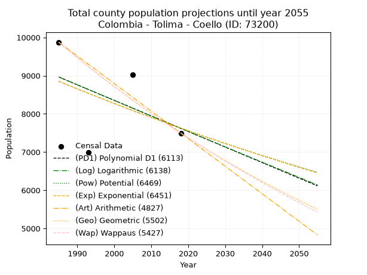
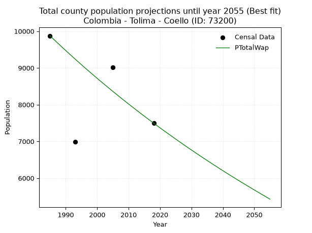
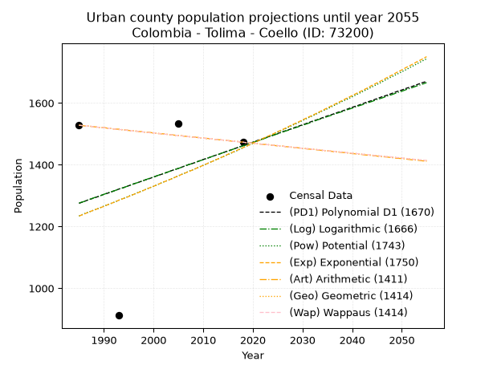
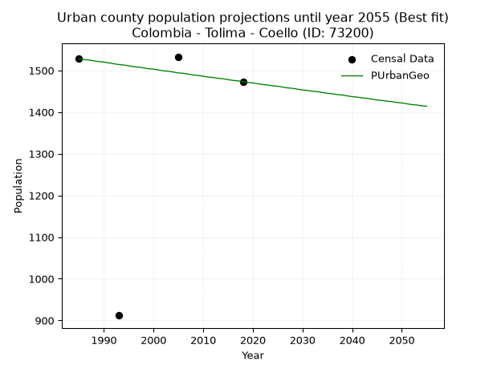
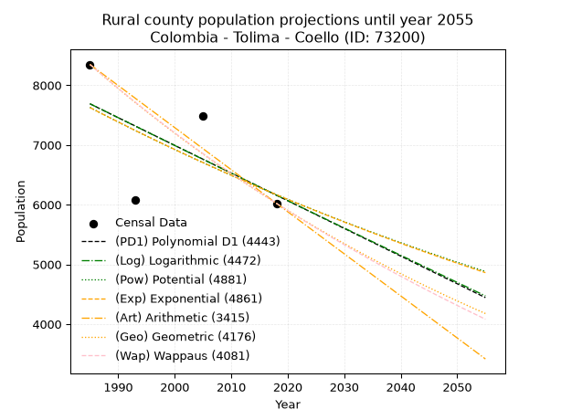
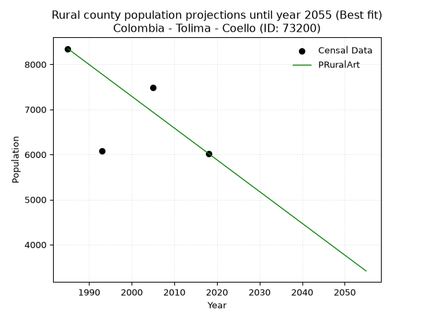

<div align="center">


</div>

# _“Population and Public Services Demand Projections (PPSD) until Year 2050 for Colombia - Tolima - Coello (ID: 73200)”_
Keywords: `population` `public-service` `projection` `lineal` `polynomial` `logarithmic` `potential` `exponential` `arithmetic` `geometric` `wappaus` `dane` `colombia` `south-america`

PPSD are analytical estimates used by governments and planners to anticipate future changes in population size, age distribution, and the resulting community needs for utilities, healthcare, education, and infrastructure as sizing future water treatment facilities, electrical grids, and road networks based on spatial growth.

> **General running parameters**: • app_version: _v20260806_. • Python version: _3.14.7_. • Pandas version: _3.0.5_. • NumPy version: _2.5.1_. • Creates, save and include plots into reports (create_plot): _False_. • Projection until year: _2050_. • Process polynomial degree 2 and up: _False_. • Process Wappaus: _True_. • Process Wappaus: _True_. • Set negative values to zero: _True_. • Set infinite values to zero: _True_. • Drop dataset notes: _True_. 
<div align="center">

Dynamic map: [:earth_americas:Google](http://maps.google.com/maps?q=4.287275549,-74.8984643) [:earth_americas:OSM](https://www.openstreetmap.org/#map=18/4.287275549/-74.8984643&layers=P) [:earth_americas:Bing](https://www.bing.com/maps?cp=4.287275549~-74.8984643&lvl=18) [:earth_americas:Apple](https://maps.apple.com/frame?center=4.287275549%2C-74.8984643&span=0.003%2C0.006)

</div>


<div align="center">

```geojson
{
  "type": "Feature",
  "geometry": {
    "type": "Point", 
    "coordinates": [-74.8984643, 4.287275549]
  }, 
  "properties": {
    "Name": "Colombia - Tolima - Coello (ID: 73200)"
  }
}
```

</div>


## 0. Census Data (4 records)

Census data are official statistics collected by a government about the people and housing in a country. They usually include counts of total population, age, sex, race, income, education, and jobs.

📅Global census file: [Population.xlsx](../data/Population.xlsx)

| Source   |   Year |   CountryID | CountryName   |   StateID | StateName   |   CountyID | CountyName   |   PTotal |   PUrban |   PRural |
|:---------|-------:|------------:|:--------------|----------:|:------------|-----------:|:-------------|---------:|---------:|---------:|
| DANE     |   1985 |          57 | Colombia      |        73 | Tolima      |      73200 | Coello       |     9875 |     1528 |     8347 |
| DANE     |   1993 |          57 | Colombia      |        73 | Tolima      |      73200 | Coello       |     6984 |      912 |     6072 |
| DANE     |   2005 |          57 | Colombia      |        73 | Tolima      |      73200 | Coello       |     9017 |     1533 |     7484 |
| DANE     |   2018 |          57 | Colombia      |        73 | Tolima      |      73200 | Coello       |     7495 |     1473 |     6022 |

> 🔥Some records could had specific notes about the registered values or the corresponding urban or rural distribution.

**Local public utility companies (RUPS)**

 | SERVICIO       | ESTADO    | NOMBRE                                                               | NIT         | DEPARTAMENTO_DOMICILIO   | MUNICIPIO_DOMICILIO   | DIRECCION                               |   TELEFONO | EMAIL                           | TIPO_INSCRIPCION    | REPRESENTANTE_LEGAL                | TIPO_PRESTADOR                             | CLASIFICACION                 |
|:---------------|:----------|:---------------------------------------------------------------------|:------------|:-------------------------|:----------------------|:----------------------------------------|-----------:|:--------------------------------|:--------------------|:-----------------------------------|:-------------------------------------------|:------------------------------|
| ACUEDUCTO      | OPERATIVA | EMPRESA DE SERVICIOS PUBLICOS DEL MUNICIPIO DE COELLO TOLIMA  E.S.P. | 809006200-9 | TOLIMA                   | COELLO                | Carrera 3 No  3 - 64 B. El Centro       |    2886262 | administrador@espucoello.gov.co | Registro por la ESP | JOSE SIMEON CRUZ OCHOA             | EMPRESA INDUSTRIAL Y COMERCIAL DEL ESTADO  | MENOR O IGUAL A 2500 USUARIOS |
| ALCANTARILLADO | OPERATIVA | EMPRESA DE SERVICIOS PUBLICOS DEL MUNICIPIO DE COELLO TOLIMA  E.S.P. | 809006200-9 | TOLIMA                   | COELLO                | Carrera 3 No  3 - 64 B. El Centro       |    2886262 | administrador@espucoello.gov.co | Registro por la ESP | JOSE SIMEON CRUZ OCHOA             | EMPRESA INDUSTRIAL Y COMERCIAL DEL ESTADO  | MENOR O IGUAL A 2500 USUARIOS |
| ASEO           | OPERATIVA | EMPRESA DE SERVICIOS PUBLICOS DEL MUNICIPIO DE COELLO TOLIMA  E.S.P. | 809006200-9 | TOLIMA                   | COELLO                | Carrera 3 No  3 - 64 B. El Centro       |    2886262 | administrador@espucoello.gov.co | Registro por la ESP | JOSE SIMEON CRUZ OCHOA             | EMPRESA INDUSTRIAL Y COMERCIAL DEL ESTADO  | MENOR O IGUAL A 2500 USUARIOS |
| ASEO           | OPERATIVA | SERVICIOS AMBIENTALES S.A.  E.S.P.                                   | 830131031-1 | CUNDINAMARCA             | GIRARDOT              | Calle 21A No  2 - 07 Barrio San Antonio |    6164821 | yeselis.aycardi@pacaribe.com    | Registro por la ESP | SANDRA FERNANDA MENESES VILLAMIZAR | SOCIEDADES (EMPRESA DE SERVICIOS PUBLICOS) | MAYOR O IGUAL A 5001 USUARIOS |

> [📅RUPS Database: Registro Único de Prestadores de Servicios Públicos de Colombia Suramérica - RUPS](https://www.datos.gov.co/Hacienda-y-Cr-dito-P-blico/Registro-nico-de-Prestadores-de-Servicios-P-blicos/4qkq-csdn/about_data)

## 1. Total

### 1.1. Coefficients and Parameters

* (PD1) Polynomial Deg 1: -40.72380570052106, 89800.54235246724 (lineal)
* (Log) Logarithmic: -81599.05980515547, 628577.857472814
* (Pow) Potential: -9.058760721480507, 33.82077489279508
* (Exp) Exponential: -0.004520887334158334, 69887974.61912134
* (Art) Arithmetic: Year diff. 2018 - 1985 = 33, Population diff. 7495 - 9875 = -2380, Annual growth = -72.12121212121212
* (Geo) Geometric: Year diff. 2018 - 1985 = 33, Population diff. 7495 - 9875 = -2380, Annual growth % = -0.008321852174084543
* (Wap) Wappaus: i = -0.8304111931054936, Condition values only valid for < 200)

<sub>
Wappaus condition values: ['-0.00', '-0.83', '-1.66', '-2.49', '-3.32', '-4.15', '-4.98', '-5.81', '-6.64', '-7.47', '-8.30', '-9.13', '-9.96', '-10.80', '-11.63', '-12.46', '-13.29', '-14.12', '-14.95', '-15.78', '-16.61', '-17.44', '-18.27', '-19.10', '-19.93', '-20.76', '-21.59', '-22.42', '-23.25', '-24.08', '-24.91', '-25.74', '-26.57', '-27.40', '-28.23', '-29.06', '-29.89', '-30.73', '-31.56', '-32.39', '-33.22', '-34.05', '-34.88', '-35.71', '-36.54', '-37.37', '-38.20', '-39.03', '-39.86', '-40.69', '-41.52', '-42.35', '-43.18', '-44.01', '-44.84', '-45.67', '-46.50', '-47.33', '-48.16', '-48.99', '-49.82', '-50.66', '-51.49', '-52.32', '-53.15', '-53.98']
</sub>


### 1.2. Projected Dataset

|   Year |   CountyID |   PTotalPD1 |   PTotalLog |   PTotalPow |   PTotalExp |   PTotalArt |   PTotalGeo |   PTotalWap |
|-------:|-----------:|------------:|------------:|------------:|------------:|------------:|------------:|------------:|
|   1985 |      73200 |        8964 |        8966 |        8854 |        8852 |        9875 |        9875 |        9875 |
|   1986 |      73200 |        8923 |        8925 |        8814 |        8812 |        9803 |        9793 |        9793 |
|   1987 |      73200 |        8882 |        8883 |        8774 |        8773 |        9731 |        9711 |        9712 |
|   1988 |      73200 |        8842 |        8842 |        8734 |        8733 |        9659 |        9631 |        9632 |
|   1989 |      73200 |        8801 |        8801 |        8694 |        8694 |        9587 |        9550 |        9552 |
|   1990 |      73200 |        8760 |        8760 |        8655 |        8655 |        9514 |        9471 |        9473 |
|   1991 |      73200 |        8719 |        8719 |        8615 |        8615 |        9442 |        9392 |        9395 |
|   1992 |      73200 |        8679 |        8678 |        8576 |        8577 |        9370 |        9314 |        9317 |
|   1993 |      73200 |        8638 |        8637 |        8537 |        8538 |        9298 |        9236 |        9240 |
|   1994 |      73200 |        8597 |        8597 |        8499 |        8499 |        9226 |        9160 |        9164 |
|   1995 |      73200 |        8557 |        8556 |        8460 |        8461 |        9154 |        9083 |        9088 |
|   1996 |      73200 |        8516 |        8515 |        8422 |        8423 |        9082 |        9008 |        9012 |
|   1997 |      73200 |        8475 |        8474 |        8384 |        8385 |        9010 |        8933 |        8938 |
|   1998 |      73200 |        8434 |        8433 |        8346 |        8347 |        8937 |        8858 |        8864 |
|   1999 |      73200 |        8394 |        8392 |        8308 |        8309 |        8865 |        8785 |        8790 |
|   2000 |      73200 |        8353 |        8351 |        8271 |        8272 |        8793 |        8712 |        8717 |
|   2001 |      73200 |        8312 |        8311 |        8233 |        8235 |        8721 |        8639 |        8645 |
|   2002 |      73200 |        8271 |        8270 |        8196 |        8198 |        8649 |        8567 |        8573 |
|   2003 |      73200 |        8231 |        8229 |        8159 |        8161 |        8577 |        8496 |        8502 |
|   2004 |      73200 |        8190 |        8188 |        8122 |        8124 |        8505 |        8425 |        8431 |
|   2005 |      73200 |        8149 |        8148 |        8086 |        8087 |        8433 |        8355 |        8361 |
|   2006 |      73200 |        8109 |        8107 |        8049 |        8051 |        8360 |        8286 |        8291 |
|   2007 |      73200 |        8068 |        8066 |        8013 |        8014 |        8288 |        8217 |        8222 |
|   2008 |      73200 |        8027 |        8026 |        7977 |        7978 |        8216 |        8148 |        8153 |
|   2009 |      73200 |        7986 |        7985 |        7941 |        7942 |        8144 |        8080 |        8085 |
|   2010 |      73200 |        7946 |        7944 |        7905 |        7906 |        8072 |        8013 |        8018 |
|   2011 |      73200 |        7905 |        7904 |        7870 |        7871 |        8000 |        7947 |        7951 |
|   2012 |      73200 |        7864 |        7863 |        7834 |        7835 |        7928 |        7880 |        7884 |
|   2013 |      73200 |        7824 |        7823 |        7799 |        7800 |        7856 |        7815 |        7818 |
|   2014 |      73200 |        7783 |        7782 |        7764 |        7765 |        7783 |        7750 |        7752 |
|   2015 |      73200 |        7742 |        7742 |        7729 |        7730 |        7711 |        7685 |        7687 |
|   2016 |      73200 |        7701 |        7701 |        7695 |        7695 |        7639 |        7621 |        7623 |
|   2017 |      73200 |        7661 |        7661 |        7660 |        7660 |        7567 |        7558 |        7559 |
|   2018 |      73200 |        7620 |        7620 |        7626 |        7626 |        7495 |        7495 |        7495 |
|   2019 |      73200 |        7579 |        7580 |        7592 |        7591 |        7423 |        7433 |        7432 |
|   2020 |      73200 |        7538 |        7539 |        7558 |        7557 |        7351 |        7371 |        7369 |
|   2021 |      73200 |        7498 |        7499 |        7524 |        7523 |        7279 |        7309 |        7307 |
|   2022 |      73200 |        7457 |        7459 |        7490 |        7489 |        7207 |        7249 |        7245 |
|   2023 |      73200 |        7416 |        7418 |        7457 |        7455 |        7134 |        7188 |        7184 |
|   2024 |      73200 |        7376 |        7378 |        7423 |        7421 |        7062 |        7128 |        7123 |
|   2025 |      73200 |        7335 |        7338 |        7390 |        7388 |        6990 |        7069 |        7062 |
|   2026 |      73200 |        7294 |        7297 |        7357 |        7355 |        6918 |        7010 |        7002 |
|   2027 |      73200 |        7253 |        7257 |        7325 |        7321 |        6846 |        6952 |        6942 |
|   2028 |      73200 |        7213 |        7217 |        7292 |        7288 |        6774 |        6894 |        6883 |
|   2029 |      73200 |        7172 |        7177 |        7259 |        7256 |        6702 |        6837 |        6824 |
|   2030 |      73200 |        7131 |        7136 |        7227 |        7223 |        6630 |        6780 |        6766 |
|   2031 |      73200 |        7090 |        7096 |        7195 |        7190 |        6557 |        6723 |        6708 |
|   2032 |      73200 |        7050 |        7056 |        7163 |        7158 |        6485 |        6667 |        6650 |
|   2033 |      73200 |        7009 |        7016 |        7131 |        7126 |        6413 |        6612 |        6593 |
|   2034 |      73200 |        6968 |        6976 |        7099 |        7093 |        6341 |        6557 |        6536 |
|   2035 |      73200 |        6928 |        6936 |        7068 |        7061 |        6269 |        6502 |        6480 |
|   2036 |      73200 |        6887 |        6896 |        7036 |        7030 |        6197 |        6448 |        6424 |
|   2037 |      73200 |        6846 |        6856 |        7005 |        6998 |        6125 |        6395 |        6368 |
|   2038 |      73200 |        6805 |        6816 |        6974 |        6966 |        6053 |        6341 |        6313 |
|   2039 |      73200 |        6765 |        6775 |        6943 |        6935 |        5980 |        6289 |        6258 |
|   2040 |      73200 |        6724 |        6735 |        6912 |        6904 |        5908 |        6236 |        6203 |
|   2041 |      73200 |        6683 |        6695 |        6882 |        6872 |        5836 |        6184 |        6149 |
|   2042 |      73200 |        6643 |        6656 |        6851 |        6841 |        5764 |        6133 |        6095 |
|   2043 |      73200 |        6602 |        6616 |        6821 |        6811 |        5692 |        6082 |        6042 |
|   2044 |      73200 |        6561 |        6576 |        6791 |        6780 |        5620 |        6031 |        5989 |
|   2045 |      73200 |        6520 |        6536 |        6761 |        6749 |        5548 |        5981 |        5936 |
|   2046 |      73200 |        6480 |        6496 |        6731 |        6719 |        5476 |        5931 |        5884 |
|   2047 |      73200 |        6439 |        6456 |        6701 |        6689 |        5403 |        5882 |        5832 |
|   2048 |      73200 |        6398 |        6416 |        6672 |        6658 |        5331 |        5833 |        5780 |
|   2049 |      73200 |        6357 |        6376 |        6642 |        6628 |        5259 |        5784 |        5729 |
|   2050 |      73200 |        6317 |        6336 |        6613 |        6598 |        5187 |        5736 |        5678 |
<div align="center">

</img>

</div>


### 1.3. Best fit with absolute and relative error (%)

Relative error puts that difference into context by dividing the absolute error by the true value, creating a unitless ratio or percentage that shows the scale of the mistake.

Absolute and relative error

|   Year | Source   |   CountryID | CountryName   |   StateID | StateName   |   CountyID_x | CountyName   |   PTotal |   PUrban |   PRural |   CountyID_y |   PTotalPD1 |   PTotalLog |   PTotalPow |   PTotalExp |   PTotalArt |   PTotalGeo |   PTotalWap |   PTotalPD1AbsError |   PTotalLogAbsError |   PTotalPowAbsError |   PTotalExpAbsError |   PTotalArtAbsError |   PTotalGeoAbsError |   PTotalWapAbsError |   PTotalPD1RelError |   PTotalLogRelError |   PTotalPowRelError |   PTotalExpRelError |   PTotalArtRelError |   PTotalGeoRelError |   PTotalWapRelError |
|-------:|:---------|------------:|:--------------|----------:|:------------|-------------:|:-------------|---------:|---------:|---------:|-------------:|------------:|------------:|------------:|------------:|------------:|------------:|------------:|--------------------:|--------------------:|--------------------:|--------------------:|--------------------:|--------------------:|--------------------:|--------------------:|--------------------:|--------------------:|--------------------:|--------------------:|--------------------:|--------------------:|
|   1985 | DANE     |          57 | Colombia      |        73 | Tolima      |        73200 | Coello       |     9875 |     1528 |     8347 |        73200 |        8964 |        8966 |        8854 |        8852 |        9875 |        9875 |        9875 |                 911 |                 909 |                1021 |                1023 |                   0 |                   0 |                   0 |             9.22532 |             9.20506 |            10.3392  |            10.3595  |             0       |             0       |             0       |
|   1993 | DANE     |          57 | Colombia      |        73 | Tolima      |        73200 | Coello       |     6984 |      912 |     6072 |        73200 |        8638 |        8637 |        8537 |        8538 |        9298 |        9236 |        9240 |                1654 |                1653 |                1553 |                1554 |                2314 |                2252 |                2256 |            23.6827  |            23.6684  |            22.2365  |            22.2509  |            33.1329  |            32.2451  |            32.3024  |
|   2005 | DANE     |          57 | Colombia      |        73 | Tolima      |        73200 | Coello       |     9017 |     1533 |     7484 |        73200 |        8149 |        8148 |        8086 |        8087 |        8433 |        8355 |        8361 |                 868 |                 869 |                 931 |                 930 |                 584 |                 662 |                 656 |             9.62626 |             9.63735 |            10.3249  |            10.3139  |             6.47666 |             7.34169 |             7.27515 |
|   2018 | DANE     |          57 | Colombia      |        73 | Tolima      |        73200 | Coello       |     7495 |     1473 |     6022 |        73200 |        7620 |        7620 |        7626 |        7626 |        7495 |        7495 |        7495 |                 125 |                 125 |                 131 |                 131 |                   0 |                   0 |                   0 |             1.66778 |             1.66778 |             1.74783 |             1.74783 |             0       |             0       |             0       |

Relative error mean

| Method    |   RelError | Best   |
|:----------|-----------:|:-------|
| PTotalPD1 |   11.0505  |        |
| PTotalLog |   11.0446  |        |
| PTotalPow |   11.1621  |        |
| PTotalExp |   11.168   |        |
| PTotalArt |    9.90238 |        |
| PTotalGeo |    9.8967  |        |
| PTotalWap |    9.89439 | True   |

💙Best method: _**PTotalWap**_
<div align="center">

</img>

</div>


### 1.4. Fresh water supply demand in liters per capita per day (lpcd)

The fresh water supply demand typically ranges from 100 to 300 liters per capita per day (lpcd) for standard domestic and municipal planning, though absolute survival minimums set by the World Health Organization are as low as 7.5 to 20 liters per day, and total consumption in high-income nations can exceed 400 liters.

> `CZ`: Level in meters above the sea level (masl)<br> `WS`: Fresh water supply demand in liters per capita per day (lpcd or l/h/d)<br> `WSAll`: Zonal fresh water supply demand in liters per second (l/s)<br> `A`: Zonal area in square meters<br> `DP`: Population density (people/hectare or p/ha)

Reference values (RAS Colombia)

|    CZ |   WS |
|------:|-----:|
|  1000 |  120 |
|  2000 |  130 |
| 99999 |  140 |

County shapefile geometry properties and water supply values

|   CountyID |      ATotal |   CZTotal |   WSTotal |
|-----------:|------------:|----------:|----------:|
|      73200 | 3.43423e+08 |   495.406 |       120 |

Projected values for best method: PTotalWap

|   CountyID |   Year |   PTotalWap |   DPTotal |   WSTotal |   WSTotalAll |
|-----------:|-------:|------------:|----------:|----------:|-------------:|
|      73200 |   1985 |        9875 |      0.29 |       120 |     13.7153  |
|      73200 |   1986 |        9793 |      0.29 |       120 |     13.6014  |
|      73200 |   1987 |        9712 |      0.28 |       120 |     13.4889  |
|      73200 |   1988 |        9632 |      0.28 |       120 |     13.3778  |
|      73200 |   1989 |        9552 |      0.28 |       120 |     13.2667  |
|      73200 |   1990 |        9473 |      0.28 |       120 |     13.1569  |
|      73200 |   1991 |        9395 |      0.27 |       120 |     13.0486  |
|      73200 |   1992 |        9317 |      0.27 |       120 |     12.9403  |
|      73200 |   1993 |        9240 |      0.27 |       120 |     12.8333  |
|      73200 |   1994 |        9164 |      0.27 |       120 |     12.7278  |
|      73200 |   1995 |        9088 |      0.26 |       120 |     12.6222  |
|      73200 |   1996 |        9012 |      0.26 |       120 |     12.5167  |
|      73200 |   1997 |        8938 |      0.26 |       120 |     12.4139  |
|      73200 |   1998 |        8864 |      0.26 |       120 |     12.3111  |
|      73200 |   1999 |        8790 |      0.26 |       120 |     12.2083  |
|      73200 |   2000 |        8717 |      0.25 |       120 |     12.1069  |
|      73200 |   2001 |        8645 |      0.25 |       120 |     12.0069  |
|      73200 |   2002 |        8573 |      0.25 |       120 |     11.9069  |
|      73200 |   2003 |        8502 |      0.25 |       120 |     11.8083  |
|      73200 |   2004 |        8431 |      0.25 |       120 |     11.7097  |
|      73200 |   2005 |        8361 |      0.24 |       120 |     11.6125  |
|      73200 |   2006 |        8291 |      0.24 |       120 |     11.5153  |
|      73200 |   2007 |        8222 |      0.24 |       120 |     11.4194  |
|      73200 |   2008 |        8153 |      0.24 |       120 |     11.3236  |
|      73200 |   2009 |        8085 |      0.24 |       120 |     11.2292  |
|      73200 |   2010 |        8018 |      0.23 |       120 |     11.1361  |
|      73200 |   2011 |        7951 |      0.23 |       120 |     11.0431  |
|      73200 |   2012 |        7884 |      0.23 |       120 |     10.95    |
|      73200 |   2013 |        7818 |      0.23 |       120 |     10.8583  |
|      73200 |   2014 |        7752 |      0.23 |       120 |     10.7667  |
|      73200 |   2015 |        7687 |      0.22 |       120 |     10.6764  |
|      73200 |   2016 |        7623 |      0.22 |       120 |     10.5875  |
|      73200 |   2017 |        7559 |      0.22 |       120 |     10.4986  |
|      73200 |   2018 |        7495 |      0.22 |       120 |     10.4097  |
|      73200 |   2019 |        7432 |      0.22 |       120 |     10.3222  |
|      73200 |   2020 |        7369 |      0.21 |       120 |     10.2347  |
|      73200 |   2021 |        7307 |      0.21 |       120 |     10.1486  |
|      73200 |   2022 |        7245 |      0.21 |       120 |     10.0625  |
|      73200 |   2023 |        7184 |      0.21 |       120 |      9.97778 |
|      73200 |   2024 |        7123 |      0.21 |       120 |      9.89306 |
|      73200 |   2025 |        7062 |      0.21 |       120 |      9.80833 |
|      73200 |   2026 |        7002 |      0.2  |       120 |      9.725   |
|      73200 |   2027 |        6942 |      0.2  |       120 |      9.64167 |
|      73200 |   2028 |        6883 |      0.2  |       120 |      9.55972 |
|      73200 |   2029 |        6824 |      0.2  |       120 |      9.47778 |
|      73200 |   2030 |        6766 |      0.2  |       120 |      9.39722 |
|      73200 |   2031 |        6708 |      0.2  |       120 |      9.31667 |
|      73200 |   2032 |        6650 |      0.19 |       120 |      9.23611 |
|      73200 |   2033 |        6593 |      0.19 |       120 |      9.15694 |
|      73200 |   2034 |        6536 |      0.19 |       120 |      9.07778 |
|      73200 |   2035 |        6480 |      0.19 |       120 |      9       |
|      73200 |   2036 |        6424 |      0.19 |       120 |      8.92222 |
|      73200 |   2037 |        6368 |      0.19 |       120 |      8.84444 |
|      73200 |   2038 |        6313 |      0.18 |       120 |      8.76806 |
|      73200 |   2039 |        6258 |      0.18 |       120 |      8.69167 |
|      73200 |   2040 |        6203 |      0.18 |       120 |      8.61528 |
|      73200 |   2041 |        6149 |      0.18 |       120 |      8.54028 |
|      73200 |   2042 |        6095 |      0.18 |       120 |      8.46528 |
|      73200 |   2043 |        6042 |      0.18 |       120 |      8.39167 |
|      73200 |   2044 |        5989 |      0.17 |       120 |      8.31806 |
|      73200 |   2045 |        5936 |      0.17 |       120 |      8.24444 |
|      73200 |   2046 |        5884 |      0.17 |       120 |      8.17222 |
|      73200 |   2047 |        5832 |      0.17 |       120 |      8.1     |
|      73200 |   2048 |        5780 |      0.17 |       120 |      8.02778 |
|      73200 |   2049 |        5729 |      0.17 |       120 |      7.95694 |
|      73200 |   2050 |        5678 |      0.17 |       120 |      7.88611 |

## 2. Urban

### 2.1. Coefficients and Parameters

* (PD1) Polynomial Deg 1: 5.641910879164998, -9923.73223604979 (lineal)
* (Log) Logarithmic: 11257.333854311306, -84205.5848372322
* (Pow) Potential: 9.953606882882738, -29.73314540014899
* (Exp) Exponential: 0.004988152710534416, 0.06184004509623754
* (Art) Arithmetic: Year diff. 2018 - 1985 = 33, Population diff. 1473 - 1528 = -55, Annual growth = -1.6666666666666667
* (Geo) Geometric: Year diff. 2018 - 1985 = 33, Population diff. 1473 - 1528 = -55, Annual growth % = -0.001110248468025432
* (Wap) Wappaus: i = -0.11107408641563923, Condition values only valid for < 200)

<sub>
Wappaus condition values: ['-0.00', '-0.11', '-0.22', '-0.33', '-0.44', '-0.56', '-0.67', '-0.78', '-0.89', '-1.00', '-1.11', '-1.22', '-1.33', '-1.44', '-1.56', '-1.67', '-1.78', '-1.89', '-2.00', '-2.11', '-2.22', '-2.33', '-2.44', '-2.55', '-2.67', '-2.78', '-2.89', '-3.00', '-3.11', '-3.22', '-3.33', '-3.44', '-3.55', '-3.67', '-3.78', '-3.89', '-4.00', '-4.11', '-4.22', '-4.33', '-4.44', '-4.55', '-4.67', '-4.78', '-4.89', '-5.00', '-5.11', '-5.22', '-5.33', '-5.44', '-5.55', '-5.66', '-5.78', '-5.89', '-6.00', '-6.11', '-6.22', '-6.33', '-6.44', '-6.55', '-6.66', '-6.78', '-6.89', '-7.00', '-7.11', '-7.22']
</sub>


### 2.2. Projected Dataset

|   Year |   CountyID |   PUrbanPD1 |   PUrbanLog |   PUrbanPow |   PUrbanExp |   PUrbanArt |   PUrbanGeo |   PUrbanWap |
|-------:|-----------:|------------:|------------:|------------:|------------:|------------:|------------:|------------:|
|   1985 |      73200 |        1275 |        1276 |        1234 |        1234 |        1528 |        1528 |        1528 |
|   1986 |      73200 |        1281 |        1281 |        1241 |        1240 |        1526 |        1526 |        1526 |
|   1987 |      73200 |        1287 |        1287 |        1247 |        1247 |        1525 |        1525 |        1525 |
|   1988 |      73200 |        1292 |        1293 |        1253 |        1253 |        1523 |        1523 |        1523 |
|   1989 |      73200 |        1298 |        1298 |        1259 |        1259 |        1521 |        1521 |        1521 |
|   1990 |      73200 |        1304 |        1304 |        1266 |        1265 |        1520 |        1520 |        1520 |
|   1991 |      73200 |        1309 |        1310 |        1272 |        1272 |        1518 |        1518 |        1518 |
|   1992 |      73200 |        1315 |        1315 |        1278 |        1278 |        1516 |        1516 |        1516 |
|   1993 |      73200 |        1321 |        1321 |        1285 |        1285 |        1515 |        1514 |        1514 |
|   1994 |      73200 |        1326 |        1326 |        1291 |        1291 |        1513 |        1513 |        1513 |
|   1995 |      73200 |        1332 |        1332 |        1298 |        1297 |        1511 |        1511 |        1511 |
|   1996 |      73200 |        1338 |        1338 |        1304 |        1304 |        1510 |        1509 |        1509 |
|   1997 |      73200 |        1343 |        1343 |        1311 |        1310 |        1508 |        1508 |        1508 |
|   1998 |      73200 |        1349 |        1349 |        1317 |        1317 |        1506 |        1506 |        1506 |
|   1999 |      73200 |        1354 |        1355 |        1324 |        1324 |        1505 |        1504 |        1504 |
|   2000 |      73200 |        1360 |        1360 |        1330 |        1330 |        1503 |        1503 |        1503 |
|   2001 |      73200 |        1366 |        1366 |        1337 |        1337 |        1501 |        1501 |        1501 |
|   2002 |      73200 |        1371 |        1372 |        1344 |        1344 |        1500 |        1499 |        1499 |
|   2003 |      73200 |        1377 |        1377 |        1350 |        1350 |        1498 |        1498 |        1498 |
|   2004 |      73200 |        1383 |        1383 |        1357 |        1357 |        1496 |        1496 |        1496 |
|   2005 |      73200 |        1388 |        1388 |        1364 |        1364 |        1495 |        1494 |        1494 |
|   2006 |      73200 |        1394 |        1394 |        1371 |        1371 |        1493 |        1493 |        1493 |
|   2007 |      73200 |        1400 |        1400 |        1378 |        1377 |        1491 |        1491 |        1491 |
|   2008 |      73200 |        1405 |        1405 |        1384 |        1384 |        1490 |        1489 |        1489 |
|   2009 |      73200 |        1411 |        1411 |        1391 |        1391 |        1488 |        1488 |        1488 |
|   2010 |      73200 |        1417 |        1416 |        1398 |        1398 |        1486 |        1486 |        1486 |
|   2011 |      73200 |        1422 |        1422 |        1405 |        1405 |        1485 |        1484 |        1485 |
|   2012 |      73200 |        1428 |        1428 |        1412 |        1412 |        1483 |        1483 |        1483 |
|   2013 |      73200 |        1433 |        1433 |        1419 |        1419 |        1481 |        1481 |        1481 |
|   2014 |      73200 |        1439 |        1439 |        1426 |        1426 |        1480 |        1480 |        1480 |
|   2015 |      73200 |        1445 |        1444 |        1433 |        1434 |        1478 |        1478 |        1478 |
|   2016 |      73200 |        1450 |        1450 |        1440 |        1441 |        1476 |        1476 |        1476 |
|   2017 |      73200 |        1456 |        1456 |        1447 |        1448 |        1475 |        1475 |        1475 |
|   2018 |      73200 |        1462 |        1461 |        1455 |        1455 |        1473 |        1473 |        1473 |
|   2019 |      73200 |        1467 |        1467 |        1462 |        1462 |        1471 |        1471 |        1471 |
|   2020 |      73200 |        1473 |        1472 |        1469 |        1470 |        1470 |        1470 |        1470 |
|   2021 |      73200 |        1479 |        1478 |        1476 |        1477 |        1468 |        1468 |        1468 |
|   2022 |      73200 |        1484 |        1483 |        1484 |        1485 |        1466 |        1466 |        1466 |
|   2023 |      73200 |        1490 |        1489 |        1491 |        1492 |        1465 |        1465 |        1465 |
|   2024 |      73200 |        1495 |        1495 |        1498 |        1499 |        1463 |        1463 |        1463 |
|   2025 |      73200 |        1501 |        1500 |        1506 |        1507 |        1461 |        1462 |        1462 |
|   2026 |      73200 |        1507 |        1506 |        1513 |        1514 |        1460 |        1460 |        1460 |
|   2027 |      73200 |        1512 |        1511 |        1520 |        1522 |        1458 |        1458 |        1458 |
|   2028 |      73200 |        1518 |        1517 |        1528 |        1530 |        1456 |        1457 |        1457 |
|   2029 |      73200 |        1524 |        1522 |        1535 |        1537 |        1455 |        1455 |        1455 |
|   2030 |      73200 |        1529 |        1528 |        1543 |        1545 |        1453 |        1453 |        1453 |
|   2031 |      73200 |        1535 |        1533 |        1551 |        1553 |        1451 |        1452 |        1452 |
|   2032 |      73200 |        1541 |        1539 |        1558 |        1560 |        1450 |        1450 |        1450 |
|   2033 |      73200 |        1546 |        1545 |        1566 |        1568 |        1448 |        1449 |        1449 |
|   2034 |      73200 |        1552 |        1550 |        1574 |        1576 |        1446 |        1447 |        1447 |
|   2035 |      73200 |        1558 |        1556 |        1581 |        1584 |        1445 |        1445 |        1445 |
|   2036 |      73200 |        1563 |        1561 |        1589 |        1592 |        1443 |        1444 |        1444 |
|   2037 |      73200 |        1569 |        1567 |        1597 |        1600 |        1441 |        1442 |        1442 |
|   2038 |      73200 |        1574 |        1572 |        1605 |        1608 |        1440 |        1441 |        1441 |
|   2039 |      73200 |        1580 |        1578 |        1612 |        1616 |        1438 |        1439 |        1439 |
|   2040 |      73200 |        1586 |        1583 |        1620 |        1624 |        1436 |        1437 |        1437 |
|   2041 |      73200 |        1591 |        1589 |        1628 |        1632 |        1435 |        1436 |        1436 |
|   2042 |      73200 |        1597 |        1594 |        1636 |        1640 |        1433 |        1434 |        1434 |
|   2043 |      73200 |        1603 |        1600 |        1644 |        1648 |        1431 |        1433 |        1433 |
|   2044 |      73200 |        1608 |        1605 |        1652 |        1657 |        1430 |        1431 |        1431 |
|   2045 |      73200 |        1614 |        1611 |        1660 |        1665 |        1428 |        1429 |        1429 |
|   2046 |      73200 |        1620 |        1616 |        1668 |        1673 |        1426 |        1428 |        1428 |
|   2047 |      73200 |        1625 |        1622 |        1677 |        1682 |        1425 |        1426 |        1426 |
|   2048 |      73200 |        1631 |        1627 |        1685 |        1690 |        1423 |        1425 |        1425 |
|   2049 |      73200 |        1637 |        1633 |        1693 |        1699 |        1421 |        1423 |        1423 |
|   2050 |      73200 |        1642 |        1638 |        1701 |        1707 |        1420 |        1422 |        1422 |
<div align="center">

</img>

</div>


### 2.3. Best fit with absolute and relative error (%)

Relative error puts that difference into context by dividing the absolute error by the true value, creating a unitless ratio or percentage that shows the scale of the mistake.

Absolute and relative error

|   Year | Source   |   CountryID | CountryName   |   StateID | StateName   |   CountyID_x | CountyName   |   PTotal |   PUrban |   PRural |   CountyID_y |   PUrbanPD1 |   PUrbanLog |   PUrbanPow |   PUrbanExp |   PUrbanArt |   PUrbanGeo |   PUrbanWap |   PUrbanPD1AbsError |   PUrbanLogAbsError |   PUrbanPowAbsError |   PUrbanExpAbsError |   PUrbanArtAbsError |   PUrbanGeoAbsError |   PUrbanWapAbsError |   PUrbanPD1RelError |   PUrbanLogRelError |   PUrbanPowRelError |   PUrbanExpRelError |   PUrbanArtRelError |   PUrbanGeoRelError |   PUrbanWapRelError |
|-------:|:---------|------------:|:--------------|----------:|:------------|-------------:|:-------------|---------:|---------:|---------:|-------------:|------------:|------------:|------------:|------------:|------------:|------------:|------------:|--------------------:|--------------------:|--------------------:|--------------------:|--------------------:|--------------------:|--------------------:|--------------------:|--------------------:|--------------------:|--------------------:|--------------------:|--------------------:|--------------------:|
|   1985 | DANE     |          57 | Colombia      |        73 | Tolima      |        73200 | Coello       |     9875 |     1528 |     8347 |        73200 |        1275 |        1276 |        1234 |        1234 |        1528 |        1528 |        1528 |                 253 |                 252 |                 294 |                 294 |                   0 |                   0 |                   0 |           16.5576   |           16.4921   |             19.2408 |             19.2408 |              0      |             0       |             0       |
|   1993 | DANE     |          57 | Colombia      |        73 | Tolima      |        73200 | Coello       |     6984 |      912 |     6072 |        73200 |        1321 |        1321 |        1285 |        1285 |        1515 |        1514 |        1514 |                 409 |                 409 |                 373 |                 373 |                 603 |                 602 |                 602 |           44.8465   |           44.8465   |             40.8991 |             40.8991 |             66.1184 |            66.0088  |            66.0088  |
|   2005 | DANE     |          57 | Colombia      |        73 | Tolima      |        73200 | Coello       |     9017 |     1533 |     7484 |        73200 |        1388 |        1388 |        1364 |        1364 |        1495 |        1494 |        1494 |                 145 |                 145 |                 169 |                 169 |                  38 |                  39 |                  39 |            9.45858  |            9.45858  |             11.0241 |             11.0241 |              2.4788 |             2.54403 |             2.54403 |
|   2018 | DANE     |          57 | Colombia      |        73 | Tolima      |        73200 | Coello       |     7495 |     1473 |     6022 |        73200 |        1462 |        1461 |        1455 |        1455 |        1473 |        1473 |        1473 |                  11 |                  12 |                  18 |                  18 |                   0 |                   0 |                   0 |            0.746775 |            0.814664 |              1.222  |              1.222  |              0      |             0       |             0       |

Relative error mean

| Method    |   RelError | Best   |
|:----------|-----------:|:-------|
| PUrbanPD1 |    17.9024 |        |
| PUrbanLog |    17.903  |        |
| PUrbanPow |    18.0965 |        |
| PUrbanExp |    18.0965 |        |
| PUrbanArt |    17.1493 |        |
| PUrbanGeo |    17.1382 | True   |
| PUrbanWap |    17.1382 | True   |

💙Best method: _**PUrbanGeo**_
<div align="center">

</img>

</div>


### 2.4. Fresh water supply demand in liters per capita per day (lpcd)

The fresh water supply demand typically ranges from 100 to 300 liters per capita per day (lpcd) for standard domestic and municipal planning, though absolute survival minimums set by the World Health Organization are as low as 7.5 to 20 liters per day, and total consumption in high-income nations can exceed 400 liters.

> `CZ`: Level in meters above the sea level (masl)<br> `WS`: Fresh water supply demand in liters per capita per day (lpcd or l/h/d)<br> `WSAll`: Zonal fresh water supply demand in liters per second (l/s)<br> `A`: Zonal area in square meters<br> `DP`: Population density (people/hectare or p/ha)

Reference values (RAS Colombia)

|    CZ |   WS |
|------:|-----:|
|  1000 |  120 |
|  2000 |  130 |
| 99999 |  140 |

County shapefile geometry properties and water supply values

|   CountyID |   AUrban |   CZUrban |   WSUrban |
|-----------:|---------:|----------:|----------:|
|      73200 |   501798 |   288.768 |       120 |

Projected values for best method: PUrbanGeo

|   CountyID |   Year |   PUrbanGeo |   DPUrban |   WSUrban |   WSUrbanAll |
|-----------:|-------:|------------:|----------:|----------:|-------------:|
|      73200 |   1985 |        1528 |     30.45 |       120 |      2.12222 |
|      73200 |   1986 |        1526 |     30.41 |       120 |      2.11944 |
|      73200 |   1987 |        1525 |     30.39 |       120 |      2.11806 |
|      73200 |   1988 |        1523 |     30.35 |       120 |      2.11528 |
|      73200 |   1989 |        1521 |     30.31 |       120 |      2.1125  |
|      73200 |   1990 |        1520 |     30.29 |       120 |      2.11111 |
|      73200 |   1991 |        1518 |     30.25 |       120 |      2.10833 |
|      73200 |   1992 |        1516 |     30.21 |       120 |      2.10556 |
|      73200 |   1993 |        1514 |     30.17 |       120 |      2.10278 |
|      73200 |   1994 |        1513 |     30.15 |       120 |      2.10139 |
|      73200 |   1995 |        1511 |     30.11 |       120 |      2.09861 |
|      73200 |   1996 |        1509 |     30.07 |       120 |      2.09583 |
|      73200 |   1997 |        1508 |     30.05 |       120 |      2.09444 |
|      73200 |   1998 |        1506 |     30.01 |       120 |      2.09167 |
|      73200 |   1999 |        1504 |     29.97 |       120 |      2.08889 |
|      73200 |   2000 |        1503 |     29.95 |       120 |      2.0875  |
|      73200 |   2001 |        1501 |     29.91 |       120 |      2.08472 |
|      73200 |   2002 |        1499 |     29.87 |       120 |      2.08194 |
|      73200 |   2003 |        1498 |     29.85 |       120 |      2.08056 |
|      73200 |   2004 |        1496 |     29.81 |       120 |      2.07778 |
|      73200 |   2005 |        1494 |     29.77 |       120 |      2.075   |
|      73200 |   2006 |        1493 |     29.75 |       120 |      2.07361 |
|      73200 |   2007 |        1491 |     29.71 |       120 |      2.07083 |
|      73200 |   2008 |        1489 |     29.67 |       120 |      2.06806 |
|      73200 |   2009 |        1488 |     29.65 |       120 |      2.06667 |
|      73200 |   2010 |        1486 |     29.61 |       120 |      2.06389 |
|      73200 |   2011 |        1484 |     29.57 |       120 |      2.06111 |
|      73200 |   2012 |        1483 |     29.55 |       120 |      2.05972 |
|      73200 |   2013 |        1481 |     29.51 |       120 |      2.05694 |
|      73200 |   2014 |        1480 |     29.49 |       120 |      2.05556 |
|      73200 |   2015 |        1478 |     29.45 |       120 |      2.05278 |
|      73200 |   2016 |        1476 |     29.41 |       120 |      2.05    |
|      73200 |   2017 |        1475 |     29.39 |       120 |      2.04861 |
|      73200 |   2018 |        1473 |     29.35 |       120 |      2.04583 |
|      73200 |   2019 |        1471 |     29.31 |       120 |      2.04306 |
|      73200 |   2020 |        1470 |     29.29 |       120 |      2.04167 |
|      73200 |   2021 |        1468 |     29.25 |       120 |      2.03889 |
|      73200 |   2022 |        1466 |     29.21 |       120 |      2.03611 |
|      73200 |   2023 |        1465 |     29.2  |       120 |      2.03472 |
|      73200 |   2024 |        1463 |     29.16 |       120 |      2.03194 |
|      73200 |   2025 |        1462 |     29.14 |       120 |      2.03056 |
|      73200 |   2026 |        1460 |     29.1  |       120 |      2.02778 |
|      73200 |   2027 |        1458 |     29.06 |       120 |      2.025   |
|      73200 |   2028 |        1457 |     29.04 |       120 |      2.02361 |
|      73200 |   2029 |        1455 |     29    |       120 |      2.02083 |
|      73200 |   2030 |        1453 |     28.96 |       120 |      2.01806 |
|      73200 |   2031 |        1452 |     28.94 |       120 |      2.01667 |
|      73200 |   2032 |        1450 |     28.9  |       120 |      2.01389 |
|      73200 |   2033 |        1449 |     28.88 |       120 |      2.0125  |
|      73200 |   2034 |        1447 |     28.84 |       120 |      2.00972 |
|      73200 |   2035 |        1445 |     28.8  |       120 |      2.00694 |
|      73200 |   2036 |        1444 |     28.78 |       120 |      2.00556 |
|      73200 |   2037 |        1442 |     28.74 |       120 |      2.00278 |
|      73200 |   2038 |        1441 |     28.72 |       120 |      2.00139 |
|      73200 |   2039 |        1439 |     28.68 |       120 |      1.99861 |
|      73200 |   2040 |        1437 |     28.64 |       120 |      1.99583 |
|      73200 |   2041 |        1436 |     28.62 |       120 |      1.99444 |
|      73200 |   2042 |        1434 |     28.58 |       120 |      1.99167 |
|      73200 |   2043 |        1433 |     28.56 |       120 |      1.99028 |
|      73200 |   2044 |        1431 |     28.52 |       120 |      1.9875  |
|      73200 |   2045 |        1429 |     28.48 |       120 |      1.98472 |
|      73200 |   2046 |        1428 |     28.46 |       120 |      1.98333 |
|      73200 |   2047 |        1426 |     28.42 |       120 |      1.98056 |
|      73200 |   2048 |        1425 |     28.4  |       120 |      1.97917 |
|      73200 |   2049 |        1423 |     28.36 |       120 |      1.97639 |
|      73200 |   2050 |        1422 |     28.34 |       120 |      1.975   |

## 3. Rural

### 3.1. Coefficients and Parameters

* (PD1) Polynomial Deg 1: -46.365716579686044, 99724.27458851703 (lineal)
* (Log) Logarithmic: -92856.39365946679, 712783.4423100465
* (Pow) Potential: -12.882744864618495, 46.36660196554136
* (Exp) Exponential: -0.006433410932813464, 2681466719.609511
* (Art) Arithmetic: Year diff. 2018 - 1985 = 33, Population diff. 6022 - 8347 = -2325, Annual growth = -70.45454545454545
* (Geo) Geometric: Year diff. 2018 - 1985 = 33, Population diff. 6022 - 8347 = -2325, Annual growth % = -0.009844638200030564
* (Wap) Wappaus: i = -0.9806464674583542, Condition values only valid for < 200)

<sub>
Wappaus condition values: ['-0.00', '-0.98', '-1.96', '-2.94', '-3.92', '-4.90', '-5.88', '-6.86', '-7.85', '-8.83', '-9.81', '-10.79', '-11.77', '-12.75', '-13.73', '-14.71', '-15.69', '-16.67', '-17.65', '-18.63', '-19.61', '-20.59', '-21.57', '-22.55', '-23.54', '-24.52', '-25.50', '-26.48', '-27.46', '-28.44', '-29.42', '-30.40', '-31.38', '-32.36', '-33.34', '-34.32', '-35.30', '-36.28', '-37.26', '-38.25', '-39.23', '-40.21', '-41.19', '-42.17', '-43.15', '-44.13', '-45.11', '-46.09', '-47.07', '-48.05', '-49.03', '-50.01', '-50.99', '-51.97', '-52.95', '-53.94', '-54.92', '-55.90', '-56.88', '-57.86', '-58.84', '-59.82', '-60.80', '-61.78', '-62.76', '-63.74']
</sub>


### 3.2. Projected Dataset

|   Year |   CountyID |   PRuralPD1 |   PRuralLog |   PRuralPow |   PRuralExp |   PRuralArt |   PRuralGeo |   PRuralWap |
|-------:|-----------:|------------:|------------:|------------:|------------:|------------:|------------:|------------:|
|   1985 |      73200 |        7688 |        7690 |        7628 |        7626 |        8347 |        8347 |        8347 |
|   1986 |      73200 |        7642 |        7643 |        7578 |        7577 |        8277 |        8265 |        8266 |
|   1987 |      73200 |        7596 |        7597 |        7529 |        7528 |        8206 |        8183 |        8185 |
|   1988 |      73200 |        7549 |        7550 |        7481 |        7480 |        8136 |        8103 |        8105 |
|   1989 |      73200 |        7503 |        7503 |        7432 |        7432 |        8065 |        8023 |        8026 |
|   1990 |      73200 |        7456 |        7456 |        7384 |        7385 |        7995 |        7944 |        7948 |
|   1991 |      73200 |        7410 |        7410 |        7337 |        7337 |        7924 |        7866 |        7870 |
|   1992 |      73200 |        7364 |        7363 |        7290 |        7290 |        7854 |        7788 |        7793 |
|   1993 |      73200 |        7317 |        7317 |        7243 |        7243 |        7783 |        7712 |        7717 |
|   1994 |      73200 |        7271 |        7270 |        7196 |        7197 |        7713 |        7636 |        7641 |
|   1995 |      73200 |        7225 |        7223 |        7150 |        7151 |        7642 |        7561 |        7567 |
|   1996 |      73200 |        7178 |        7177 |        7104 |        7105 |        7572 |        7486 |        7493 |
|   1997 |      73200 |        7132 |        7130 |        7058 |        7059 |        7502 |        7413 |        7419 |
|   1998 |      73200 |        7086 |        7084 |        7012 |        7014 |        7431 |        7340 |        7347 |
|   1999 |      73200 |        7039 |        7037 |        6967 |        6969 |        7361 |        7267 |        7275 |
|   2000 |      73200 |        6993 |        6991 |        6923 |        6924 |        7290 |        7196 |        7203 |
|   2001 |      73200 |        6946 |        6945 |        6878 |        6880 |        7220 |        7125 |        7133 |
|   2002 |      73200 |        6900 |        6898 |        6834 |        6836 |        7149 |        7055 |        7063 |
|   2003 |      73200 |        6854 |        6852 |        6790 |        6792 |        7079 |        6985 |        6993 |
|   2004 |      73200 |        6807 |        6806 |        6747 |        6748 |        7008 |        6917 |        6924 |
|   2005 |      73200 |        6761 |        6759 |        6704 |        6705 |        6938 |        6849 |        6856 |
|   2006 |      73200 |        6715 |        6713 |        6661 |        6662 |        6867 |        6781 |        6789 |
|   2007 |      73200 |        6668 |        6667 |        6618 |        6619 |        6797 |        6714 |        6722 |
|   2008 |      73200 |        6622 |        6620 |        6576 |        6577 |        6727 |        6648 |        6655 |
|   2009 |      73200 |        6576 |        6574 |        6534 |        6535 |        6656 |        6583 |        6589 |
|   2010 |      73200 |        6529 |        6528 |        6492 |        6493 |        6586 |        6518 |        6524 |
|   2011 |      73200 |        6483 |        6482 |        6450 |        6451 |        6515 |        6454 |        6459 |
|   2012 |      73200 |        6436 |        6436 |        6409 |        6410 |        6445 |        6390 |        6395 |
|   2013 |      73200 |        6390 |        6389 |        6368 |        6369 |        6374 |        6327 |        6332 |
|   2014 |      73200 |        6344 |        6343 |        6328 |        6328 |        6304 |        6265 |        6269 |
|   2015 |      73200 |        6297 |        6297 |        6287 |        6287 |        6233 |        6203 |        6206 |
|   2016 |      73200 |        6251 |        6251 |        6247 |        6247 |        6163 |        6142 |        6144 |
|   2017 |      73200 |        6205 |        6205 |        6208 |        6207 |        6092 |        6082 |        6083 |
|   2018 |      73200 |        6158 |        6159 |        6168 |        6167 |        6022 |        6022 |        6022 |
|   2019 |      73200 |        6112 |        6113 |        6129 |        6128 |        5952 |        5963 |        5962 |
|   2020 |      73200 |        6066 |        6067 |        6090 |        6088 |        5881 |        5904 |        5902 |
|   2021 |      73200 |        6019 |        6021 |        6051 |        6049 |        5811 |        5846 |        5842 |
|   2022 |      73200 |        5973 |        5975 |        6013 |        6011 |        5740 |        5788 |        5783 |
|   2023 |      73200 |        5926 |        5929 |        5974 |        5972 |        5670 |        5731 |        5725 |
|   2024 |      73200 |        5880 |        5883 |        5937 |        5934 |        5599 |        5675 |        5667 |
|   2025 |      73200 |        5834 |        5838 |        5899 |        5896 |        5529 |        5619 |        5610 |
|   2026 |      73200 |        5787 |        5792 |        5862 |        5858 |        5458 |        5564 |        5553 |
|   2027 |      73200 |        5741 |        5746 |        5824 |        5820 |        5388 |        5509 |        5496 |
|   2028 |      73200 |        5695 |        5700 |        5787 |        5783 |        5317 |        5455 |        5440 |
|   2029 |      73200 |        5648 |        5654 |        5751 |        5746 |        5247 |        5401 |        5385 |
|   2030 |      73200 |        5602 |        5609 |        5714 |        5709 |        5177 |        5348 |        5329 |
|   2031 |      73200 |        5556 |        5563 |        5678 |        5672 |        5106 |        5295 |        5275 |
|   2032 |      73200 |        5509 |        5517 |        5642 |        5636 |        5036 |        5243 |        5220 |
|   2033 |      73200 |        5463 |        5471 |        5607 |        5600 |        4965 |        5191 |        5167 |
|   2034 |      73200 |        5416 |        5426 |        5571 |        5564 |        4895 |        5140 |        5113 |
|   2035 |      73200 |        5370 |        5380 |        5536 |        5528 |        4824 |        5090 |        5060 |
|   2036 |      73200 |        5324 |        5335 |        5501 |        5493 |        4754 |        5040 |        5008 |
|   2037 |      73200 |        5277 |        5289 |        5467 |        5458 |        4683 |        4990 |        4955 |
|   2038 |      73200 |        5231 |        5243 |        5432 |        5423 |        4613 |        4941 |        4904 |
|   2039 |      73200 |        5185 |        5198 |        5398 |        5388 |        4542 |        4892 |        4852 |
|   2040 |      73200 |        5138 |        5152 |        5364 |        5353 |        4472 |        4844 |        4801 |
|   2041 |      73200 |        5092 |        5107 |        5330 |        5319 |        4402 |        4796 |        4751 |
|   2042 |      73200 |        5045 |        5061 |        5297 |        5285 |        4331 |        4749 |        4700 |
|   2043 |      73200 |        4999 |        5016 |        5263 |        5251 |        4261 |        4702 |        4651 |
|   2044 |      73200 |        4953 |        4970 |        5230 |        5217 |        4190 |        4656 |        4601 |
|   2045 |      73200 |        4906 |        4925 |        5197 |        5184 |        4120 |        4610 |        4552 |
|   2046 |      73200 |        4860 |        4880 |        5165 |        5151 |        4049 |        4565 |        4503 |
|   2047 |      73200 |        4814 |        4834 |        5132 |        5118 |        3979 |        4520 |        4455 |
|   2048 |      73200 |        4767 |        4789 |        5100 |        5085 |        3908 |        4475 |        4407 |
|   2049 |      73200 |        4721 |        4743 |        5068 |        5052 |        3838 |        4431 |        4360 |
|   2050 |      73200 |        4675 |        4698 |        5036 |        5020 |        3767 |        4388 |        4312 |
<div align="center">

</img>

</div>


### 3.3. Best fit with absolute and relative error (%)

Relative error puts that difference into context by dividing the absolute error by the true value, creating a unitless ratio or percentage that shows the scale of the mistake.

Absolute and relative error

|   Year | Source   |   CountryID | CountryName   |   StateID | StateName   |   CountyID_x | CountyName   |   PTotal |   PUrban |   PRural |   CountyID_y |   PRuralPD1 |   PRuralLog |   PRuralPow |   PRuralExp |   PRuralArt |   PRuralGeo |   PRuralWap |   PRuralPD1AbsError |   PRuralLogAbsError |   PRuralPowAbsError |   PRuralExpAbsError |   PRuralArtAbsError |   PRuralGeoAbsError |   PRuralWapAbsError |   PRuralPD1RelError |   PRuralLogRelError |   PRuralPowRelError |   PRuralExpRelError |   PRuralArtRelError |   PRuralGeoRelError |   PRuralWapRelError |
|-------:|:---------|------------:|:--------------|----------:|:------------|-------------:|:-------------|---------:|---------:|---------:|-------------:|------------:|------------:|------------:|------------:|------------:|------------:|------------:|--------------------:|--------------------:|--------------------:|--------------------:|--------------------:|--------------------:|--------------------:|--------------------:|--------------------:|--------------------:|--------------------:|--------------------:|--------------------:|--------------------:|
|   1985 | DANE     |          57 | Colombia      |        73 | Tolima      |        73200 | Coello       |     9875 |     1528 |     8347 |        73200 |        7688 |        7690 |        7628 |        7626 |        8347 |        8347 |        8347 |                 659 |                 657 |                 719 |                 721 |                   0 |                   0 |                   0 |             7.89505 |             7.87109 |             8.61387 |             8.63783 |             0       |             0       |             0       |
|   1993 | DANE     |          57 | Colombia      |        73 | Tolima      |        73200 | Coello       |     6984 |      912 |     6072 |        73200 |        7317 |        7317 |        7243 |        7243 |        7783 |        7712 |        7717 |                1245 |                1245 |                1171 |                1171 |                1711 |                1640 |                1645 |            20.504   |            20.504   |            19.2852  |            19.2852  |            28.1785  |            27.0092  |            27.0916  |
|   2005 | DANE     |          57 | Colombia      |        73 | Tolima      |        73200 | Coello       |     9017 |     1533 |     7484 |        73200 |        6761 |        6759 |        6704 |        6705 |        6938 |        6849 |        6856 |                 723 |                 725 |                 780 |                 779 |                 546 |                 635 |                 628 |             9.66061 |             9.68733 |            10.4222  |            10.4089  |             7.29556 |             8.48477 |             8.39123 |
|   2018 | DANE     |          57 | Colombia      |        73 | Tolima      |        73200 | Coello       |     7495 |     1473 |     6022 |        73200 |        6158 |        6159 |        6168 |        6167 |        6022 |        6022 |        6022 |                 136 |                 137 |                 146 |                 145 |                   0 |                   0 |                   0 |             2.25839 |             2.27499 |             2.42444 |             2.40784 |             0       |             0       |             0       |

Relative error mean

| Method    |   RelError | Best   |
|:----------|-----------:|:-------|
| PRuralPD1 |   10.0795  |        |
| PRuralLog |   10.0843  |        |
| PRuralPow |   10.1864  |        |
| PRuralExp |   10.1849  |        |
| PRuralArt |    8.86852 | True   |
| PRuralGeo |    8.8735  |        |
| PRuralWap |    8.8707  |        |

💙Best method: _**PRuralArt**_
<div align="center">

</img>

</div>


### 3.4. Fresh water supply demand in liters per capita per day (lpcd)

The fresh water supply demand typically ranges from 100 to 300 liters per capita per day (lpcd) for standard domestic and municipal planning, though absolute survival minimums set by the World Health Organization are as low as 7.5 to 20 liters per day, and total consumption in high-income nations can exceed 400 liters.

> `CZ`: Level in meters above the sea level (masl)<br> `WS`: Fresh water supply demand in liters per capita per day (lpcd or l/h/d)<br> `WSAll`: Zonal fresh water supply demand in liters per second (l/s)<br> `A`: Zonal area in square meters<br> `DP`: Population density (people/hectare or p/ha)

Reference values (RAS Colombia)

|    CZ |   WS |
|------:|-----:|
|  1000 |  120 |
|  2000 |  130 |
| 99999 |  140 |

County shapefile geometry properties and water supply values

|   CountyID |      ARural |   CZRural |   WSRural |
|-----------:|------------:|----------:|----------:|
|      73200 | 3.42921e+08 |   495.709 |       120 |

Projected values for best method: PRuralArt

|   CountyID |   Year |   PRuralArt |   DPRural |   WSRural |   WSRuralAll |
|-----------:|-------:|------------:|----------:|----------:|-------------:|
|      73200 |   1985 |        8347 |      0.24 |       120 |     11.5931  |
|      73200 |   1986 |        8277 |      0.24 |       120 |     11.4958  |
|      73200 |   1987 |        8206 |      0.24 |       120 |     11.3972  |
|      73200 |   1988 |        8136 |      0.24 |       120 |     11.3     |
|      73200 |   1989 |        8065 |      0.24 |       120 |     11.2014  |
|      73200 |   1990 |        7995 |      0.23 |       120 |     11.1042  |
|      73200 |   1991 |        7924 |      0.23 |       120 |     11.0056  |
|      73200 |   1992 |        7854 |      0.23 |       120 |     10.9083  |
|      73200 |   1993 |        7783 |      0.23 |       120 |     10.8097  |
|      73200 |   1994 |        7713 |      0.22 |       120 |     10.7125  |
|      73200 |   1995 |        7642 |      0.22 |       120 |     10.6139  |
|      73200 |   1996 |        7572 |      0.22 |       120 |     10.5167  |
|      73200 |   1997 |        7502 |      0.22 |       120 |     10.4194  |
|      73200 |   1998 |        7431 |      0.22 |       120 |     10.3208  |
|      73200 |   1999 |        7361 |      0.21 |       120 |     10.2236  |
|      73200 |   2000 |        7290 |      0.21 |       120 |     10.125   |
|      73200 |   2001 |        7220 |      0.21 |       120 |     10.0278  |
|      73200 |   2002 |        7149 |      0.21 |       120 |      9.92917 |
|      73200 |   2003 |        7079 |      0.21 |       120 |      9.83194 |
|      73200 |   2004 |        7008 |      0.2  |       120 |      9.73333 |
|      73200 |   2005 |        6938 |      0.2  |       120 |      9.63611 |
|      73200 |   2006 |        6867 |      0.2  |       120 |      9.5375  |
|      73200 |   2007 |        6797 |      0.2  |       120 |      9.44028 |
|      73200 |   2008 |        6727 |      0.2  |       120 |      9.34306 |
|      73200 |   2009 |        6656 |      0.19 |       120 |      9.24444 |
|      73200 |   2010 |        6586 |      0.19 |       120 |      9.14722 |
|      73200 |   2011 |        6515 |      0.19 |       120 |      9.04861 |
|      73200 |   2012 |        6445 |      0.19 |       120 |      8.95139 |
|      73200 |   2013 |        6374 |      0.19 |       120 |      8.85278 |
|      73200 |   2014 |        6304 |      0.18 |       120 |      8.75556 |
|      73200 |   2015 |        6233 |      0.18 |       120 |      8.65694 |
|      73200 |   2016 |        6163 |      0.18 |       120 |      8.55972 |
|      73200 |   2017 |        6092 |      0.18 |       120 |      8.46111 |
|      73200 |   2018 |        6022 |      0.18 |       120 |      8.36389 |
|      73200 |   2019 |        5952 |      0.17 |       120 |      8.26667 |
|      73200 |   2020 |        5881 |      0.17 |       120 |      8.16806 |
|      73200 |   2021 |        5811 |      0.17 |       120 |      8.07083 |
|      73200 |   2022 |        5740 |      0.17 |       120 |      7.97222 |
|      73200 |   2023 |        5670 |      0.17 |       120 |      7.875   |
|      73200 |   2024 |        5599 |      0.16 |       120 |      7.77639 |
|      73200 |   2025 |        5529 |      0.16 |       120 |      7.67917 |
|      73200 |   2026 |        5458 |      0.16 |       120 |      7.58056 |
|      73200 |   2027 |        5388 |      0.16 |       120 |      7.48333 |
|      73200 |   2028 |        5317 |      0.16 |       120 |      7.38472 |
|      73200 |   2029 |        5247 |      0.15 |       120 |      7.2875  |
|      73200 |   2030 |        5177 |      0.15 |       120 |      7.19028 |
|      73200 |   2031 |        5106 |      0.15 |       120 |      7.09167 |
|      73200 |   2032 |        5036 |      0.15 |       120 |      6.99444 |
|      73200 |   2033 |        4965 |      0.14 |       120 |      6.89583 |
|      73200 |   2034 |        4895 |      0.14 |       120 |      6.79861 |
|      73200 |   2035 |        4824 |      0.14 |       120 |      6.7     |
|      73200 |   2036 |        4754 |      0.14 |       120 |      6.60278 |
|      73200 |   2037 |        4683 |      0.14 |       120 |      6.50417 |
|      73200 |   2038 |        4613 |      0.13 |       120 |      6.40694 |
|      73200 |   2039 |        4542 |      0.13 |       120 |      6.30833 |
|      73200 |   2040 |        4472 |      0.13 |       120 |      6.21111 |
|      73200 |   2041 |        4402 |      0.13 |       120 |      6.11389 |
|      73200 |   2042 |        4331 |      0.13 |       120 |      6.01528 |
|      73200 |   2043 |        4261 |      0.12 |       120 |      5.91806 |
|      73200 |   2044 |        4190 |      0.12 |       120 |      5.81944 |
|      73200 |   2045 |        4120 |      0.12 |       120 |      5.72222 |
|      73200 |   2046 |        4049 |      0.12 |       120 |      5.62361 |
|      73200 |   2047 |        3979 |      0.12 |       120 |      5.52639 |
|      73200 |   2048 |        3908 |      0.11 |       120 |      5.42778 |
|      73200 |   2049 |        3838 |      0.11 |       120 |      5.33056 |
|      73200 |   2050 |        3767 |      0.11 |       120 |      5.23194 |

<div align="center"><br><sub>Share this research</sub></div><br>

<sub>**APPS & TOOLS & CONTENT DISCLAIMER**: • NO WARRANTY - This content and software is provided by <a href="https://github.com/rcfdtools" target="_blank">github.com/rcfdtools</a> "as is", without any express or implied warranty, including warranties of merchantability, fitness for a particular purpose, or non-infringement. There is no guarantee that the software will be error-free or operate without interruption. • LIMITATION OF LIABILITY - Neither the authors nor copyright holders will be liable for claims or damages arising from the software or its use. You are responsible for determining if the software is appropriate for your use and assume all associated risks, including errors, legal compliance, and data loss. • NO PROFESSIONAL ADVICE - The software provides general information and does not offer professional advice. It should not replace consultation with professional advisors. [Clauses and global license for rcfdtools use.](https://github.com/rcfdtools/rcfdtools/blob/main/LICENSE.md)</sub>

| [:house: Home](Readme.md)  | [:beginner: Help / Collaborate](https://github.com/rcfdtools/R.HydroTools/discussions/31) |
|----------------------------|-------------------------------------------------------------------------------------------|