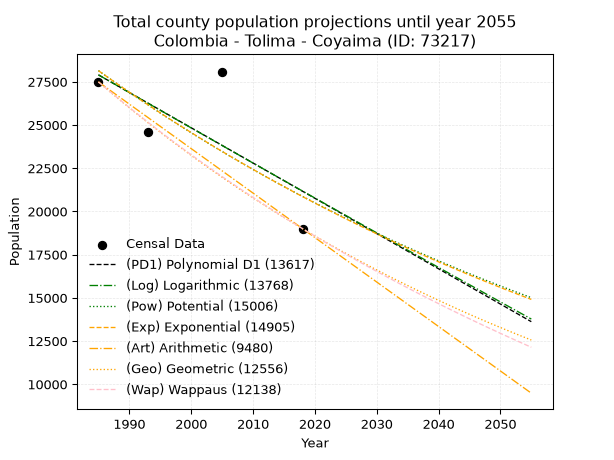
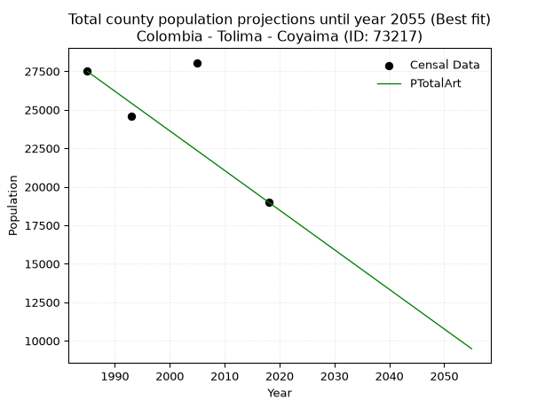
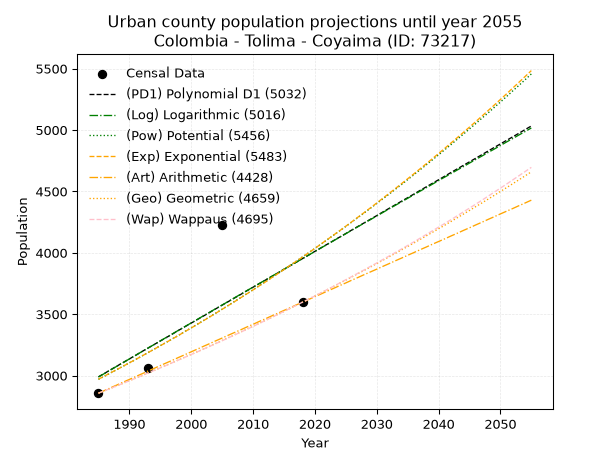
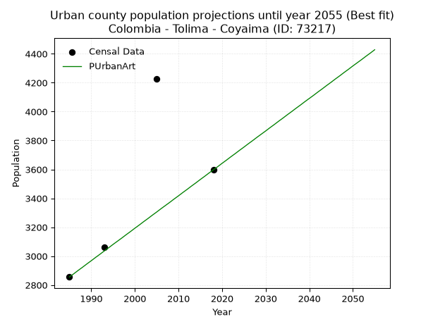
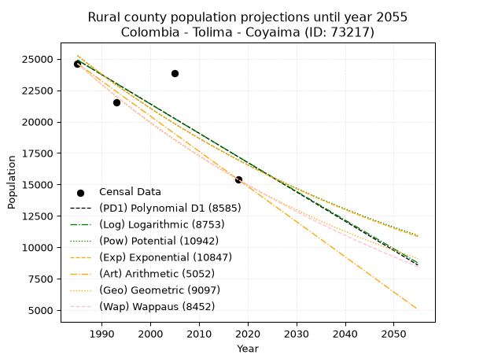
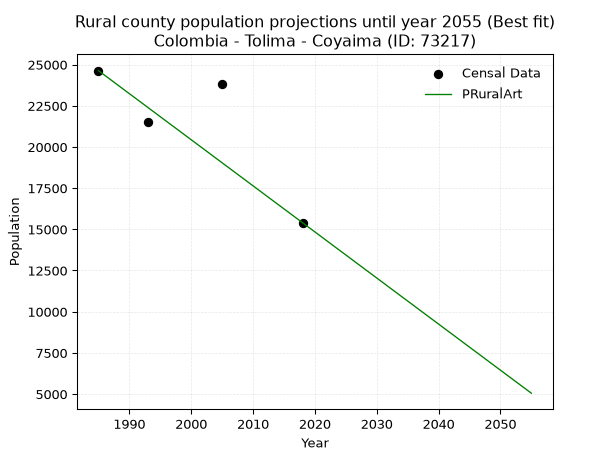

<div align="center">


</div>

# _“Population and Public Services Demand Projections (PPSD) until Year 2050 for Colombia - Tolima - Coyaima (ID: 73217)”_
Keywords: `population` `public-service` `projection` `lineal` `polynomial` `logarithmic` `potential` `exponential` `arithmetic` `geometric` `wappaus` `dane` `colombia` `south-america`

PPSD are analytical estimates used by governments and planners to anticipate future changes in population size, age distribution, and the resulting community needs for utilities, healthcare, education, and infrastructure as sizing future water treatment facilities, electrical grids, and road networks based on spatial growth.

> **General running parameters**: • app_version: _v20260806_. • Python version: _3.14.7_. • Pandas version: _3.0.5_. • NumPy version: _2.5.1_. • Creates, save and include plots into reports (create_plot): _True_. • Projection until year: _2050_. • Process polynomial degree 2 and up: _False_. • Process Wappaus: _True_. • Process Wappaus: _True_. • Set negative values to zero: _True_. • Set infinite values to zero: _True_. • Drop dataset notes: _True_. 
<div align="center">

Dynamic map: [:earth_americas:Google](http://maps.google.com/maps?q=3.798036427,-75.1938615) [:earth_americas:OSM](https://www.openstreetmap.org/#map=18/3.798036427/-75.1938615&layers=P) [:earth_americas:Bing](https://www.bing.com/maps?cp=3.798036427~-75.1938615&lvl=18) [:earth_americas:Apple](https://maps.apple.com/frame?center=3.798036427%2C-75.1938615&span=0.003%2C0.006)

</div>


<div align="center">

```geojson
{
  "type": "Feature",
  "geometry": {
    "type": "Point", 
    "coordinates": [-75.1938615, 3.798036427]
  }, 
  "properties": {
    "Name": "Colombia - Tolima - Coyaima (ID: 73217)"
  }
}
```

</div>


## 0. Census Data (4 records)

Census data are official statistics collected by a government about the people and housing in a country. They usually include counts of total population, age, sex, race, income, education, and jobs.

📅Global census file: [Population.xlsx](../data/Population.xlsx)

| Source   |   Year |   CountryID | CountryName   |   StateID | StateName   |   CountyID | CountyName   |   PTotal |   PUrban |   PRural |
|:---------|-------:|------------:|:--------------|----------:|:------------|-----------:|:-------------|---------:|---------:|---------:|
| DANE     |   1985 |          57 | Colombia      |        73 | Tolima      |      73217 | Coyaima      |    27489 |     2856 |    24633 |
| DANE     |   1993 |          57 | Colombia      |        73 | Tolima      |      73217 | Coyaima      |    24596 |     3060 |    21536 |
| DANE     |   2005 |          57 | Colombia      |        73 | Tolima      |      73217 | Coyaima      |    28056 |     4224 |    23832 |
| DANE     |   2018 |          57 | Colombia      |        73 | Tolima      |      73217 | Coyaima      |    18999 |     3597 |    15402 |

> 🔥Some records could had specific notes about the registered values or the corresponding urban or rural distribution.

## 1. Total

### 1.1. Coefficients and Parameters

* (PD1) Polynomial Deg 1: -203.98233641107458, 432800.66840625193 (lineal)
* (Log) Logarithmic: -407679.71358486975, 3123561.769898789
* (Pow) Potential: -18.14449411871275, 64.28554609316964
* (Exp) Exponential: -0.009078520310749408, 1886614716182.8862
* (Art) Arithmetic: Year diff. 2018 - 1985 = 33, Population diff. 18999 - 27489 = -8490, Annual growth = -257.27272727272725
* (Geo) Geometric: Year diff. 2018 - 1985 = 33, Population diff. 18999 - 27489 = -8490, Annual growth % = -0.011131507744277513
* (Wap) Wappaus: i = -1.1068349994524491, Condition values only valid for < 200)

<sub>
Wappaus condition values: ['-0.00', '-1.11', '-2.21', '-3.32', '-4.43', '-5.53', '-6.64', '-7.75', '-8.85', '-9.96', '-11.07', '-12.18', '-13.28', '-14.39', '-15.50', '-16.60', '-17.71', '-18.82', '-19.92', '-21.03', '-22.14', '-23.24', '-24.35', '-25.46', '-26.56', '-27.67', '-28.78', '-29.88', '-30.99', '-32.10', '-33.21', '-34.31', '-35.42', '-36.53', '-37.63', '-38.74', '-39.85', '-40.95', '-42.06', '-43.17', '-44.27', '-45.38', '-46.49', '-47.59', '-48.70', '-49.81', '-50.91', '-52.02', '-53.13', '-54.23', '-55.34', '-56.45', '-57.56', '-58.66', '-59.77', '-60.88', '-61.98', '-63.09', '-64.20', '-65.30', '-66.41', '-67.52', '-68.62', '-69.73', '-70.84', '-71.94']
</sub>


### 1.2. Projected Dataset

|   Year |   CountyID |   PTotalPD1 |   PTotalLog |   PTotalPow |   PTotalExp |   PTotalArt |   PTotalGeo |   PTotalWap |
|-------:|-----------:|------------:|------------:|------------:|------------:|------------:|------------:|------------:|
|   1985 |      73217 |       27896 |       27897 |       28142 |       28140 |       27489 |       27489 |       27489 |
|   1986 |      73217 |       27692 |       27692 |       27886 |       27886 |       27232 |       27183 |       27186 |
|   1987 |      73217 |       27488 |       27487 |       27632 |       27634 |       26974 |       26880 |       26887 |
|   1988 |      73217 |       27284 |       27281 |       27381 |       27384 |       26717 |       26581 |       26591 |
|   1989 |      73217 |       27080 |       27076 |       27132 |       27136 |       26460 |       26285 |       26298 |
|   1990 |      73217 |       26876 |       26872 |       26886 |       26891 |       26203 |       25993 |       26009 |
|   1991 |      73217 |       26672 |       26667 |       26642 |       26648 |       25945 |       25703 |       25722 |
|   1992 |      73217 |       26468 |       26462 |       26400 |       26407 |       25688 |       25417 |       25439 |
|   1993 |      73217 |       26264 |       26257 |       26161 |       26169 |       25431 |       25134 |       25158 |
|   1994 |      73217 |       26060 |       26053 |       25924 |       25932 |       25174 |       24855 |       24881 |
|   1995 |      73217 |       25856 |       25849 |       25689 |       25698 |       24916 |       24578 |       24606 |
|   1996 |      73217 |       25652 |       25644 |       25457 |       25465 |       24659 |       24304 |       24334 |
|   1997 |      73217 |       25448 |       25440 |       25226 |       25235 |       24402 |       24034 |       24065 |
|   1998 |      73217 |       25244 |       25236 |       24998 |       25007 |       24144 |       23766 |       23799 |
|   1999 |      73217 |       25040 |       25032 |       24772 |       24781 |       23887 |       23502 |       23536 |
|   2000 |      73217 |       24836 |       24828 |       24549 |       24557 |       23630 |       23240 |       23275 |
|   2001 |      73217 |       24632 |       24624 |       24327 |       24335 |       23373 |       22981 |       23017 |
|   2002 |      73217 |       24428 |       24421 |       24107 |       24115 |       23115 |       22726 |       22761 |
|   2003 |      73217 |       24224 |       24217 |       23890 |       23897 |       22858 |       22473 |       22508 |
|   2004 |      73217 |       24020 |       24013 |       23675 |       23682 |       22601 |       22222 |       22258 |
|   2005 |      73217 |       23816 |       23810 |       23461 |       23468 |       22344 |       21975 |       22010 |
|   2006 |      73217 |       23612 |       23607 |       23250 |       23255 |       22086 |       21730 |       21765 |
|   2007 |      73217 |       23408 |       23404 |       23041 |       23045 |       21829 |       21489 |       21522 |
|   2008 |      73217 |       23204 |       23201 |       22833 |       22837 |       21572 |       21249 |       21281 |
|   2009 |      73217 |       23000 |       22998 |       22628 |       22631 |       21314 |       21013 |       21043 |
|   2010 |      73217 |       22796 |       22795 |       22425 |       22426 |       21057 |       20779 |       20807 |
|   2011 |      73217 |       22592 |       22592 |       22223 |       22223 |       20800 |       20548 |       20573 |
|   2012 |      73217 |       22388 |       22389 |       22024 |       22023 |       20543 |       20319 |       20342 |
|   2013 |      73217 |       22184 |       22187 |       21826 |       21824 |       20285 |       20093 |       20113 |
|   2014 |      73217 |       21980 |       21984 |       21630 |       21626 |       20028 |       19869 |       19886 |
|   2015 |      73217 |       21776 |       21782 |       21436 |       21431 |       19771 |       19648 |       19661 |
|   2016 |      73217 |       21572 |       21580 |       21244 |       21237 |       19514 |       19429 |       19438 |
|   2017 |      73217 |       21368 |       21377 |       21054 |       21045 |       19256 |       19213 |       19218 |
|   2018 |      73217 |       21164 |       21175 |       20865 |       20855 |       18999 |       18999 |       18999 |
|   2019 |      73217 |       20960 |       20973 |       20679 |       20667 |       18742 |       18788 |       18782 |
|   2020 |      73217 |       20756 |       20771 |       20494 |       20480 |       18484 |       18578 |       18568 |
|   2021 |      73217 |       20552 |       20570 |       20310 |       20295 |       18227 |       18372 |       18355 |
|   2022 |      73217 |       20348 |       20368 |       20129 |       20111 |       17970 |       18167 |       18145 |
|   2023 |      73217 |       20144 |       20166 |       19949 |       19930 |       17713 |       17965 |       17936 |
|   2024 |      73217 |       19940 |       19965 |       19771 |       19749 |       17455 |       17765 |       17729 |
|   2025 |      73217 |       19736 |       19764 |       19595 |       19571 |       17198 |       17567 |       17524 |
|   2026 |      73217 |       19532 |       19562 |       19420 |       19394 |       16941 |       17372 |       17321 |
|   2027 |      73217 |       19328 |       19361 |       19247 |       19219 |       16684 |       17178 |       17120 |
|   2028 |      73217 |       19124 |       19160 |       19075 |       19045 |       16426 |       16987 |       16921 |
|   2029 |      73217 |       18921 |       18959 |       18905 |       18873 |       16169 |       16798 |       16723 |
|   2030 |      73217 |       18717 |       18758 |       18737 |       18702 |       15912 |       16611 |       16527 |
|   2031 |      73217 |       18513 |       18557 |       18570 |       18533 |       15654 |       16426 |       16333 |
|   2032 |      73217 |       18309 |       18357 |       18405 |       18366 |       15397 |       16243 |       16141 |
|   2033 |      73217 |       18105 |       18156 |       18242 |       18200 |       15140 |       16062 |       15950 |
|   2034 |      73217 |       17901 |       17956 |       18080 |       18035 |       14883 |       15884 |       15761 |
|   2035 |      73217 |       17697 |       17755 |       17919 |       17872 |       14625 |       15707 |       15573 |
|   2036 |      73217 |       17493 |       17555 |       17760 |       17711 |       14368 |       15532 |       15387 |
|   2037 |      73217 |       17289 |       17355 |       17603 |       17551 |       14111 |       15359 |       15203 |
|   2038 |      73217 |       17085 |       17155 |       17447 |       17392 |       13854 |       15188 |       15020 |
|   2039 |      73217 |       16881 |       16955 |       17292 |       17235 |       13596 |       15019 |       14839 |
|   2040 |      73217 |       16677 |       16755 |       17139 |       17079 |       13339 |       14852 |       14660 |
|   2041 |      73217 |       16473 |       16555 |       16987 |       16925 |       13082 |       14686 |       14482 |
|   2042 |      73217 |       16269 |       16355 |       16837 |       16772 |       12824 |       14523 |       14305 |
|   2043 |      73217 |       16065 |       16156 |       16688 |       16620 |       12567 |       14361 |       14130 |
|   2044 |      73217 |       15861 |       15956 |       16540 |       16470 |       12310 |       14201 |       13956 |
|   2045 |      73217 |       15657 |       15757 |       16394 |       16321 |       12053 |       14043 |       13784 |
|   2046 |      73217 |       15453 |       15558 |       16249 |       16174 |       11795 |       13887 |       13613 |
|   2047 |      73217 |       15249 |       15358 |       16106 |       16028 |       11538 |       13732 |       13444 |
|   2048 |      73217 |       15045 |       15159 |       15964 |       15883 |       11281 |       13580 |       13276 |
|   2049 |      73217 |       14841 |       14960 |       15823 |       15739 |       11024 |       13428 |       13110 |
|   2050 |      73217 |       14637 |       14761 |       15684 |       15597 |       10766 |       13279 |       12944 |
<div align="center">

</img>

</div>


### 1.3. Best fit with absolute error and relative error (%)

Relative error puts that difference into context by dividing the absolute error by the true value, creating a unitless ratio or percentage that shows the scale of the mistake.

Absolute and relative error

|   Year | Source   |   CountryID | CountryName   |   StateID | StateName   |   CountyID_x | CountyName   |   PTotal |   PUrban |   PRural |   CountyID_y |   PTotalPD1 |   PTotalLog |   PTotalPow |   PTotalExp |   PTotalArt |   PTotalGeo |   PTotalWap |   PTotalPD1AbsError |   PTotalLogAbsError |   PTotalPowAbsError |   PTotalExpAbsError |   PTotalArtAbsError |   PTotalGeoAbsError |   PTotalWapAbsError |   PTotalPD1RelError |   PTotalLogRelError |   PTotalPowRelError |   PTotalExpRelError |   PTotalArtRelError |   PTotalGeoRelError |   PTotalWapRelError |
|-------:|:---------|------------:|:--------------|----------:|:------------|-------------:|:-------------|---------:|---------:|---------:|-------------:|------------:|------------:|------------:|------------:|------------:|------------:|------------:|--------------------:|--------------------:|--------------------:|--------------------:|--------------------:|--------------------:|--------------------:|--------------------:|--------------------:|--------------------:|--------------------:|--------------------:|--------------------:|--------------------:|
|   1985 | DANE     |          57 | Colombia      |        73 | Tolima      |        73217 | Coyaima      |    27489 |     2856 |    24633 |        73217 |       27896 |       27897 |       28142 |       28140 |       27489 |       27489 |       27489 |                 407 |                 408 |                 653 |                 651 |                   0 |                   0 |                   0 |             1.48059 |             1.48423 |             2.3755  |             2.36822 |             0       |             0       |             0       |
|   1993 | DANE     |          57 | Colombia      |        73 | Tolima      |        73217 | Coyaima      |    24596 |     3060 |    21536 |        73217 |       26264 |       26257 |       26161 |       26169 |       25431 |       25134 |       25158 |                1668 |                1661 |                1565 |                1573 |                 835 |                 538 |                 562 |             6.78159 |             6.75313 |             6.36282 |             6.39535 |             3.39486 |             2.18735 |             2.28492 |
|   2005 | DANE     |          57 | Colombia      |        73 | Tolima      |        73217 | Coyaima      |    28056 |     4224 |    23832 |        73217 |       23816 |       23810 |       23461 |       23468 |       22344 |       21975 |       22010 |                4240 |                4246 |                4595 |                4588 |                5712 |                6081 |                6046 |            15.1126  |            15.134   |            16.378   |            16.353   |            20.3593  |            21.6745  |            21.5498  |
|   2018 | DANE     |          57 | Colombia      |        73 | Tolima      |        73217 | Coyaima      |    18999 |     3597 |    15402 |        73217 |       21164 |       21175 |       20865 |       20855 |       18999 |       18999 |       18999 |                2165 |                2176 |                1866 |                1856 |                   0 |                   0 |                   0 |            11.3953  |            11.4532  |             9.82157 |             9.76894 |             0       |             0       |             0       |

Relative error mean

| Method    |   RelError | Best   |
|:----------|-----------:|:-------|
| PTotalPD1 |    8.69254 |        |
| PTotalLog |    8.70615 |        |
| PTotalPow |    8.73446 |        |
| PTotalExp |    8.72138 |        |
| PTotalArt |    5.93854 | True   |
| PTotalGeo |    5.96546 |        |
| PTotalWap |    5.95867 |        |

💙Best method: _**PTotalArt**_
<div align="center">

</img>

</div>


### 1.4. Fresh water supply demand in liters per capita per day (lpcd)

The fresh water supply demand typically ranges from 100 to 300 liters per capita per day (lpcd) for standard domestic and municipal planning, though absolute survival minimums set by the World Health Organization are as low as 7.5 to 20 liters per day, and total consumption in high-income nations can exceed 400 liters.

> `CZ`: Level in meters above the sea level (masl).<br> `WS`: Fresh water supply demand in liters per capita per day (lpcd or l/h/d).<br> `WSAll`: Zonal fresh water supply demand in liters per second (l/s).<br> `A`: Zonal area in square meters.

Reference values (RAS Colombia)

|    CZ |   WS |
|------:|-----:|
|  1000 |  120 |
|  2000 |  130 |
| 99999 |  140 |

County shapefile geometry properties and water supply values

|   CountyID |      ATotal |   CZTotal |   WSTotal |
|-----------:|------------:|----------:|----------:|
|      73217 | 6.68694e+08 |   457.774 |       120 |

Projected values for best method: PTotalArt

|   CountyID |   Year |   PTotalArt |   WSTotal |   WSTotalAll |
|-----------:|-------:|------------:|----------:|-------------:|
|      73217 |   1985 |       27489 |       120 |      38.1792 |
|      73217 |   1986 |       27232 |       120 |      37.8222 |
|      73217 |   1987 |       26974 |       120 |      37.4639 |
|      73217 |   1988 |       26717 |       120 |      37.1069 |
|      73217 |   1989 |       26460 |       120 |      36.75   |
|      73217 |   1990 |       26203 |       120 |      36.3931 |
|      73217 |   1991 |       25945 |       120 |      36.0347 |
|      73217 |   1992 |       25688 |       120 |      35.6778 |
|      73217 |   1993 |       25431 |       120 |      35.3208 |
|      73217 |   1994 |       25174 |       120 |      34.9639 |
|      73217 |   1995 |       24916 |       120 |      34.6056 |
|      73217 |   1996 |       24659 |       120 |      34.2486 |
|      73217 |   1997 |       24402 |       120 |      33.8917 |
|      73217 |   1998 |       24144 |       120 |      33.5333 |
|      73217 |   1999 |       23887 |       120 |      33.1764 |
|      73217 |   2000 |       23630 |       120 |      32.8194 |
|      73217 |   2001 |       23373 |       120 |      32.4625 |
|      73217 |   2002 |       23115 |       120 |      32.1042 |
|      73217 |   2003 |       22858 |       120 |      31.7472 |
|      73217 |   2004 |       22601 |       120 |      31.3903 |
|      73217 |   2005 |       22344 |       120 |      31.0333 |
|      73217 |   2006 |       22086 |       120 |      30.675  |
|      73217 |   2007 |       21829 |       120 |      30.3181 |
|      73217 |   2008 |       21572 |       120 |      29.9611 |
|      73217 |   2009 |       21314 |       120 |      29.6028 |
|      73217 |   2010 |       21057 |       120 |      29.2458 |
|      73217 |   2011 |       20800 |       120 |      28.8889 |
|      73217 |   2012 |       20543 |       120 |      28.5319 |
|      73217 |   2013 |       20285 |       120 |      28.1736 |
|      73217 |   2014 |       20028 |       120 |      27.8167 |
|      73217 |   2015 |       19771 |       120 |      27.4597 |
|      73217 |   2016 |       19514 |       120 |      27.1028 |
|      73217 |   2017 |       19256 |       120 |      26.7444 |
|      73217 |   2018 |       18999 |       120 |      26.3875 |
|      73217 |   2019 |       18742 |       120 |      26.0306 |
|      73217 |   2020 |       18484 |       120 |      25.6722 |
|      73217 |   2021 |       18227 |       120 |      25.3153 |
|      73217 |   2022 |       17970 |       120 |      24.9583 |
|      73217 |   2023 |       17713 |       120 |      24.6014 |
|      73217 |   2024 |       17455 |       120 |      24.2431 |
|      73217 |   2025 |       17198 |       120 |      23.8861 |
|      73217 |   2026 |       16941 |       120 |      23.5292 |
|      73217 |   2027 |       16684 |       120 |      23.1722 |
|      73217 |   2028 |       16426 |       120 |      22.8139 |
|      73217 |   2029 |       16169 |       120 |      22.4569 |
|      73217 |   2030 |       15912 |       120 |      22.1    |
|      73217 |   2031 |       15654 |       120 |      21.7417 |
|      73217 |   2032 |       15397 |       120 |      21.3847 |
|      73217 |   2033 |       15140 |       120 |      21.0278 |
|      73217 |   2034 |       14883 |       120 |      20.6708 |
|      73217 |   2035 |       14625 |       120 |      20.3125 |
|      73217 |   2036 |       14368 |       120 |      19.9556 |
|      73217 |   2037 |       14111 |       120 |      19.5986 |
|      73217 |   2038 |       13854 |       120 |      19.2417 |
|      73217 |   2039 |       13596 |       120 |      18.8833 |
|      73217 |   2040 |       13339 |       120 |      18.5264 |
|      73217 |   2041 |       13082 |       120 |      18.1694 |
|      73217 |   2042 |       12824 |       120 |      17.8111 |
|      73217 |   2043 |       12567 |       120 |      17.4542 |
|      73217 |   2044 |       12310 |       120 |      17.0972 |
|      73217 |   2045 |       12053 |       120 |      16.7403 |
|      73217 |   2046 |       11795 |       120 |      16.3819 |
|      73217 |   2047 |       11538 |       120 |      16.025  |
|      73217 |   2048 |       11281 |       120 |      15.6681 |
|      73217 |   2049 |       11024 |       120 |      15.3111 |
|      73217 |   2050 |       10766 |       120 |      14.9528 |

## 2. Urban

### 2.1. Coefficients and Parameters

* (PD1) Polynomial Deg 1: 29.17984745082327, -54932.739863509254 (lineal)
* (Log) Logarithmic: 58516.57673579276, -441350.71869117755
* (Pow) Potential: 17.558230555984597, -54.43026463748602
* (Exp) Exponential: 0.00875680562033358, 8.3901652786775e-05
* (Art) Arithmetic: Year diff. 2018 - 1985 = 33, Population diff. 3597 - 2856 = 741, Annual growth = 22.454545454545453
* (Geo) Geometric: Year diff. 2018 - 1985 = 33, Population diff. 3597 - 2856 = 741, Annual growth % = 0.007014734865458561
* (Wap) Wappaus: i = 0.6959412817153403, Condition values only valid for < 200)

<sub>
Wappaus condition values: ['0.00', '0.70', '1.39', '2.09', '2.78', '3.48', '4.18', '4.87', '5.57', '6.26', '6.96', '7.66', '8.35', '9.05', '9.74', '10.44', '11.14', '11.83', '12.53', '13.22', '13.92', '14.61', '15.31', '16.01', '16.70', '17.40', '18.09', '18.79', '19.49', '20.18', '20.88', '21.57', '22.27', '22.97', '23.66', '24.36', '25.05', '25.75', '26.45', '27.14', '27.84', '28.53', '29.23', '29.93', '30.62', '31.32', '32.01', '32.71', '33.41', '34.10', '34.80', '35.49', '36.19', '36.88', '37.58', '38.28', '38.97', '39.67', '40.36', '41.06', '41.76', '42.45', '43.15', '43.84', '44.54', '45.24']
</sub>


### 2.2. Projected Dataset

|   Year |   CountyID |   PUrbanPD1 |   PUrbanLog |   PUrbanPow |   PUrbanExp |   PUrbanArt |   PUrbanGeo |   PUrbanWap |
|-------:|-----------:|------------:|------------:|------------:|------------:|------------:|------------:|------------:|
|   1985 |      73217 |        2989 |        2988 |        2969 |        2970 |        2856 |        2856 |        2856 |
|   1986 |      73217 |        3018 |        3017 |        2995 |        2996 |        2878 |        2876 |        2876 |
|   1987 |      73217 |        3048 |        3046 |        3022 |        3023 |        2901 |        2896 |        2896 |
|   1988 |      73217 |        3077 |        3076 |        3049 |        3049 |        2923 |        2917 |        2916 |
|   1989 |      73217 |        3106 |        3105 |        3076 |        3076 |        2946 |        2937 |        2937 |
|   1990 |      73217 |        3135 |        3135 |        3103 |        3103 |        2968 |        2958 |        2957 |
|   1991 |      73217 |        3164 |        3164 |        3130 |        3130 |        2991 |        2978 |        2978 |
|   1992 |      73217 |        3194 |        3194 |        3158 |        3158 |        3013 |        2999 |        2999 |
|   1993 |      73217 |        3223 |        3223 |        3186 |        3186 |        3036 |        3020 |        3020 |
|   1994 |      73217 |        3252 |        3252 |        3214 |        3214 |        3058 |        3041 |        3041 |
|   1995 |      73217 |        3281 |        3282 |        3243 |        3242 |        3081 |        3063 |        3062 |
|   1996 |      73217 |        3310 |        3311 |        3271 |        3271 |        3103 |        3084 |        3083 |
|   1997 |      73217 |        3339 |        3340 |        3300 |        3299 |        3125 |        3106 |        3105 |
|   1998 |      73217 |        3369 |        3370 |        3329 |        3328 |        3148 |        3128 |        3127 |
|   1999 |      73217 |        3398 |        3399 |        3359 |        3358 |        3170 |        3150 |        3149 |
|   2000 |      73217 |        3427 |        3428 |        3388 |        3387 |        3193 |        3172 |        3171 |
|   2001 |      73217 |        3456 |        3457 |        3418 |        3417 |        3215 |        3194 |        3193 |
|   2002 |      73217 |        3485 |        3487 |        3448 |        3447 |        3238 |        3216 |        3215 |
|   2003 |      73217 |        3514 |        3516 |        3479 |        3477 |        3260 |        3239 |        3238 |
|   2004 |      73217 |        3544 |        3545 |        3509 |        3508 |        3283 |        3262 |        3260 |
|   2005 |      73217 |        3573 |        3574 |        3540 |        3539 |        3305 |        3285 |        3283 |
|   2006 |      73217 |        3602 |        3603 |        3571 |        3570 |        3328 |        3308 |        3306 |
|   2007 |      73217 |        3631 |        3633 |        3603 |        3601 |        3350 |        3331 |        3330 |
|   2008 |      73217 |        3660 |        3662 |        3634 |        3633 |        3372 |        3354 |        3353 |
|   2009 |      73217 |        3690 |        3691 |        3666 |        3665 |        3395 |        3378 |        3376 |
|   2010 |      73217 |        3719 |        3720 |        3698 |        3697 |        3417 |        3401 |        3400 |
|   2011 |      73217 |        3748 |        3749 |        3731 |        3730 |        3440 |        3425 |        3424 |
|   2012 |      73217 |        3777 |        3778 |        3764 |        3762 |        3462 |        3449 |        3448 |
|   2013 |      73217 |        3806 |        3807 |        3797 |        3796 |        3485 |        3473 |        3473 |
|   2014 |      73217 |        3835 |        3836 |        3830 |        3829 |        3507 |        3498 |        3497 |
|   2015 |      73217 |        3865 |        3865 |        3863 |        3863 |        3530 |        3522 |        3522 |
|   2016 |      73217 |        3894 |        3894 |        3897 |        3897 |        3552 |        3547 |        3547 |
|   2017 |      73217 |        3923 |        3923 |        3931 |        3931 |        3575 |        3572 |        3572 |
|   2018 |      73217 |        3952 |        3952 |        3966 |        3965 |        3597 |        3597 |        3597 |
|   2019 |      73217 |        3981 |        3981 |        4000 |        4000 |        3619 |        3622 |        3622 |
|   2020 |      73217 |        4011 |        4010 |        4035 |        4035 |        3642 |        3648 |        3648 |
|   2021 |      73217 |        4040 |        4039 |        4070 |        4071 |        3664 |        3673 |        3674 |
|   2022 |      73217 |        4069 |        4068 |        4106 |        4107 |        3687 |        3699 |        3700 |
|   2023 |      73217 |        4098 |        4097 |        4142 |        4143 |        3709 |        3725 |        3726 |
|   2024 |      73217 |        4127 |        4126 |        4178 |        4179 |        3732 |        3751 |        3753 |
|   2025 |      73217 |        4156 |        4155 |        4214 |        4216 |        3754 |        3777 |        3780 |
|   2026 |      73217 |        4186 |        4184 |        4251 |        4253 |        3777 |        3804 |        3807 |
|   2027 |      73217 |        4215 |        4213 |        4288 |        4291 |        3799 |        3831 |        3834 |
|   2028 |      73217 |        4244 |        4242 |        4325 |        4328 |        3822 |        3857 |        3861 |
|   2029 |      73217 |        4273 |        4270 |        4363 |        4366 |        3844 |        3884 |        3889 |
|   2030 |      73217 |        4302 |        4299 |        4401 |        4405 |        3866 |        3912 |        3916 |
|   2031 |      73217 |        4332 |        4328 |        4439 |        4444 |        3889 |        3939 |        3945 |
|   2032 |      73217 |        4361 |        4357 |        4477 |        4483 |        3911 |        3967 |        3973 |
|   2033 |      73217 |        4390 |        4386 |        4516 |        4522 |        3934 |        3995 |        4001 |
|   2034 |      73217 |        4419 |        4414 |        4555 |        4562 |        3956 |        4023 |        4030 |
|   2035 |      73217 |        4448 |        4443 |        4595 |        4602 |        3979 |        4051 |        4059 |
|   2036 |      73217 |        4477 |        4472 |        4635 |        4642 |        4001 |        4079 |        4088 |
|   2037 |      73217 |        4507 |        4501 |        4675 |        4683 |        4024 |        4108 |        4118 |
|   2038 |      73217 |        4536 |        4529 |        4715 |        4724 |        4046 |        4137 |        4148 |
|   2039 |      73217 |        4565 |        4558 |        4756 |        4766 |        4069 |        4166 |        4178 |
|   2040 |      73217 |        4594 |        4587 |        4797 |        4808 |        4091 |        4195 |        4208 |
|   2041 |      73217 |        4623 |        4616 |        4839 |        4850 |        4113 |        4224 |        4238 |
|   2042 |      73217 |        4653 |        4644 |        4880 |        4893 |        4136 |        4254 |        4269 |
|   2043 |      73217 |        4682 |        4673 |        4923 |        4936 |        4158 |        4284 |        4300 |
|   2044 |      73217 |        4711 |        4701 |        4965 |        4979 |        4181 |        4314 |        4332 |
|   2045 |      73217 |        4740 |        4730 |        5008 |        5023 |        4203 |        4344 |        4363 |
|   2046 |      73217 |        4769 |        4759 |        5051 |        5067 |        4226 |        4375 |        4395 |
|   2047 |      73217 |        4798 |        4787 |        5095 |        5112 |        4248 |        4405 |        4427 |
|   2048 |      73217 |        4828 |        4816 |        5138 |        5157 |        4271 |        4436 |        4460 |
|   2049 |      73217 |        4857 |        4844 |        5183 |        5202 |        4293 |        4467 |        4493 |
|   2050 |      73217 |        4886 |        4873 |        5227 |        5248 |        4316 |        4499 |        4526 |
<div align="center">

</img>

</div>


### 2.3. Best fit with absolute error and relative error (%)

Relative error puts that difference into context by dividing the absolute error by the true value, creating a unitless ratio or percentage that shows the scale of the mistake.

Absolute and relative error

|   Year | Source   |   CountryID | CountryName   |   StateID | StateName   |   CountyID_x | CountyName   |   PTotal |   PUrban |   PRural |   CountyID_y |   PUrbanPD1 |   PUrbanLog |   PUrbanPow |   PUrbanExp |   PUrbanArt |   PUrbanGeo |   PUrbanWap |   PUrbanPD1AbsError |   PUrbanLogAbsError |   PUrbanPowAbsError |   PUrbanExpAbsError |   PUrbanArtAbsError |   PUrbanGeoAbsError |   PUrbanWapAbsError |   PUrbanPD1RelError |   PUrbanLogRelError |   PUrbanPowRelError |   PUrbanExpRelError |   PUrbanArtRelError |   PUrbanGeoRelError |   PUrbanWapRelError |
|-------:|:---------|------------:|:--------------|----------:|:------------|-------------:|:-------------|---------:|---------:|---------:|-------------:|------------:|------------:|------------:|------------:|------------:|------------:|------------:|--------------------:|--------------------:|--------------------:|--------------------:|--------------------:|--------------------:|--------------------:|--------------------:|--------------------:|--------------------:|--------------------:|--------------------:|--------------------:|--------------------:|
|   1985 | DANE     |          57 | Colombia      |        73 | Tolima      |        73217 | Coyaima      |    27489 |     2856 |    24633 |        73217 |        2989 |        2988 |        2969 |        2970 |        2856 |        2856 |        2856 |                 133 |                 132 |                 113 |                 114 |                   0 |                   0 |                   0 |             4.65686 |             4.62185 |             3.95658 |             3.9916  |            0        |             0       |             0       |
|   1993 | DANE     |          57 | Colombia      |        73 | Tolima      |        73217 | Coyaima      |    24596 |     3060 |    21536 |        73217 |        3223 |        3223 |        3186 |        3186 |        3036 |        3020 |        3020 |                 163 |                 163 |                 126 |                 126 |                  24 |                  40 |                  40 |             5.3268  |             5.3268  |             4.11765 |             4.11765 |            0.784314 |             1.30719 |             1.30719 |
|   2005 | DANE     |          57 | Colombia      |        73 | Tolima      |        73217 | Coyaima      |    28056 |     4224 |    23832 |        73217 |        3573 |        3574 |        3540 |        3539 |        3305 |        3285 |        3283 |                 651 |                 650 |                 684 |                 685 |                 919 |                 939 |                 941 |            15.4119  |            15.3883  |            16.1932  |            16.2169  |           21.7566   |            22.2301  |            22.2775  |
|   2018 | DANE     |          57 | Colombia      |        73 | Tolima      |        73217 | Coyaima      |    18999 |     3597 |    15402 |        73217 |        3952 |        3952 |        3966 |        3965 |        3597 |        3597 |        3597 |                 355 |                 355 |                 369 |                 368 |                   0 |                   0 |                   0 |             9.86934 |             9.86934 |            10.2585  |            10.2307  |            0        |             0       |             0       |

Relative error mean

| Method    |   RelError | Best   |
|:----------|-----------:|:-------|
| PUrbanPD1 |    8.81623 |        |
| PUrbanLog |    8.80156 |        |
| PUrbanPow |    8.63149 |        |
| PUrbanExp |    8.63921 |        |
| PUrbanArt |    5.63524 | True   |
| PUrbanGeo |    5.88433 |        |
| PUrbanWap |    5.89616 |        |

💙Best method: _**PUrbanArt**_
<div align="center">

</img>

</div>


### 2.4. Fresh water supply demand in liters per capita per day (lpcd)

The fresh water supply demand typically ranges from 100 to 300 liters per capita per day (lpcd) for standard domestic and municipal planning, though absolute survival minimums set by the World Health Organization are as low as 7.5 to 20 liters per day, and total consumption in high-income nations can exceed 400 liters.

> `CZ`: Level in meters above the sea level (masl).<br> `WS`: Fresh water supply demand in liters per capita per day (lpcd or l/h/d).<br> `WSAll`: Zonal fresh water supply demand in liters per second (l/s).<br> `A`: Zonal area in square meters.

Reference values (RAS Colombia)

|    CZ |   WS |
|------:|-----:|
|  1000 |  120 |
|  2000 |  130 |
| 99999 |  140 |

County shapefile geometry properties and water supply values

|   CountyID |   AUrban |   CZUrban |   WSUrban |
|-----------:|---------:|----------:|----------:|
|      73217 |   655865 |   362.173 |       120 |

Projected values for best method: PUrbanArt

|   CountyID |   Year |   PUrbanArt |   WSUrban |   WSUrbanAll |
|-----------:|-------:|------------:|----------:|-------------:|
|      73217 |   1985 |        2856 |       120 |      3.96667 |
|      73217 |   1986 |        2878 |       120 |      3.99722 |
|      73217 |   1987 |        2901 |       120 |      4.02917 |
|      73217 |   1988 |        2923 |       120 |      4.05972 |
|      73217 |   1989 |        2946 |       120 |      4.09167 |
|      73217 |   1990 |        2968 |       120 |      4.12222 |
|      73217 |   1991 |        2991 |       120 |      4.15417 |
|      73217 |   1992 |        3013 |       120 |      4.18472 |
|      73217 |   1993 |        3036 |       120 |      4.21667 |
|      73217 |   1994 |        3058 |       120 |      4.24722 |
|      73217 |   1995 |        3081 |       120 |      4.27917 |
|      73217 |   1996 |        3103 |       120 |      4.30972 |
|      73217 |   1997 |        3125 |       120 |      4.34028 |
|      73217 |   1998 |        3148 |       120 |      4.37222 |
|      73217 |   1999 |        3170 |       120 |      4.40278 |
|      73217 |   2000 |        3193 |       120 |      4.43472 |
|      73217 |   2001 |        3215 |       120 |      4.46528 |
|      73217 |   2002 |        3238 |       120 |      4.49722 |
|      73217 |   2003 |        3260 |       120 |      4.52778 |
|      73217 |   2004 |        3283 |       120 |      4.55972 |
|      73217 |   2005 |        3305 |       120 |      4.59028 |
|      73217 |   2006 |        3328 |       120 |      4.62222 |
|      73217 |   2007 |        3350 |       120 |      4.65278 |
|      73217 |   2008 |        3372 |       120 |      4.68333 |
|      73217 |   2009 |        3395 |       120 |      4.71528 |
|      73217 |   2010 |        3417 |       120 |      4.74583 |
|      73217 |   2011 |        3440 |       120 |      4.77778 |
|      73217 |   2012 |        3462 |       120 |      4.80833 |
|      73217 |   2013 |        3485 |       120 |      4.84028 |
|      73217 |   2014 |        3507 |       120 |      4.87083 |
|      73217 |   2015 |        3530 |       120 |      4.90278 |
|      73217 |   2016 |        3552 |       120 |      4.93333 |
|      73217 |   2017 |        3575 |       120 |      4.96528 |
|      73217 |   2018 |        3597 |       120 |      4.99583 |
|      73217 |   2019 |        3619 |       120 |      5.02639 |
|      73217 |   2020 |        3642 |       120 |      5.05833 |
|      73217 |   2021 |        3664 |       120 |      5.08889 |
|      73217 |   2022 |        3687 |       120 |      5.12083 |
|      73217 |   2023 |        3709 |       120 |      5.15139 |
|      73217 |   2024 |        3732 |       120 |      5.18333 |
|      73217 |   2025 |        3754 |       120 |      5.21389 |
|      73217 |   2026 |        3777 |       120 |      5.24583 |
|      73217 |   2027 |        3799 |       120 |      5.27639 |
|      73217 |   2028 |        3822 |       120 |      5.30833 |
|      73217 |   2029 |        3844 |       120 |      5.33889 |
|      73217 |   2030 |        3866 |       120 |      5.36944 |
|      73217 |   2031 |        3889 |       120 |      5.40139 |
|      73217 |   2032 |        3911 |       120 |      5.43194 |
|      73217 |   2033 |        3934 |       120 |      5.46389 |
|      73217 |   2034 |        3956 |       120 |      5.49444 |
|      73217 |   2035 |        3979 |       120 |      5.52639 |
|      73217 |   2036 |        4001 |       120 |      5.55694 |
|      73217 |   2037 |        4024 |       120 |      5.58889 |
|      73217 |   2038 |        4046 |       120 |      5.61944 |
|      73217 |   2039 |        4069 |       120 |      5.65139 |
|      73217 |   2040 |        4091 |       120 |      5.68194 |
|      73217 |   2041 |        4113 |       120 |      5.7125  |
|      73217 |   2042 |        4136 |       120 |      5.74444 |
|      73217 |   2043 |        4158 |       120 |      5.775   |
|      73217 |   2044 |        4181 |       120 |      5.80694 |
|      73217 |   2045 |        4203 |       120 |      5.8375  |
|      73217 |   2046 |        4226 |       120 |      5.86944 |
|      73217 |   2047 |        4248 |       120 |      5.9     |
|      73217 |   2048 |        4271 |       120 |      5.93194 |
|      73217 |   2049 |        4293 |       120 |      5.9625  |
|      73217 |   2050 |        4316 |       120 |      5.99444 |

## 3. Rural

### 3.1. Coefficients and Parameters

* (PD1) Polynomial Deg 1: -233.16218386189766, 487733.40826976084 (lineal)
* (Log) Logarithmic: -466196.29032066243, 3564912.4885899657
* (Pow) Potential: -24.136294398488296, 83.99809322719469
* (Exp) Exponential: -0.012072457510785756, 645162475999862.2
* (Art) Arithmetic: Year diff. 2018 - 1985 = 33, Population diff. 15402 - 24633 = -9231, Annual growth = -279.72727272727275
* (Geo) Geometric: Year diff. 2018 - 1985 = 33, Population diff. 15402 - 24633 = -9231, Annual growth % = -0.014129221225881006
* (Wap) Wappaus: i = -1.3974136267129897, Condition values only valid for < 200)

<sub>
Wappaus condition values: ['-0.00', '-1.40', '-2.79', '-4.19', '-5.59', '-6.99', '-8.38', '-9.78', '-11.18', '-12.58', '-13.97', '-15.37', '-16.77', '-18.17', '-19.56', '-20.96', '-22.36', '-23.76', '-25.15', '-26.55', '-27.95', '-29.35', '-30.74', '-32.14', '-33.54', '-34.94', '-36.33', '-37.73', '-39.13', '-40.52', '-41.92', '-43.32', '-44.72', '-46.11', '-47.51', '-48.91', '-50.31', '-51.70', '-53.10', '-54.50', '-55.90', '-57.29', '-58.69', '-60.09', '-61.49', '-62.88', '-64.28', '-65.68', '-67.08', '-68.47', '-69.87', '-71.27', '-72.67', '-74.06', '-75.46', '-76.86', '-78.26', '-79.65', '-81.05', '-82.45', '-83.84', '-85.24', '-86.64', '-88.04', '-89.43', '-90.83']
</sub>


### 3.2. Projected Dataset

|   Year |   CountyID |   PRuralPD1 |   PRuralLog |   PRuralPow |   PRuralExp |   PRuralArt |   PRuralGeo |   PRuralWap |
|-------:|-----------:|------------:|------------:|------------:|------------:|------------:|------------:|------------:|
|   1985 |      73217 |       24906 |       24910 |       25257 |       25253 |       24633 |       24633 |       24633 |
|   1986 |      73217 |       24673 |       24675 |       24951 |       24950 |       24353 |       24285 |       24291 |
|   1987 |      73217 |       24440 |       24440 |       24650 |       24650 |       24074 |       23942 |       23954 |
|   1988 |      73217 |       24207 |       24206 |       24353 |       24355 |       23794 |       23604 |       23622 |
|   1989 |      73217 |       23974 |       23971 |       24059 |       24062 |       23514 |       23270 |       23294 |
|   1990 |      73217 |       23741 |       23737 |       23769 |       23774 |       23234 |       22941 |       22970 |
|   1991 |      73217 |       23508 |       23503 |       23482 |       23488 |       22955 |       22617 |       22651 |
|   1992 |      73217 |       23274 |       23268 |       23199 |       23207 |       22675 |       22298 |       22336 |
|   1993 |      73217 |       23041 |       23035 |       22920 |       22928 |       22395 |       21983 |       22025 |
|   1994 |      73217 |       22808 |       22801 |       22644 |       22653 |       22115 |       21672 |       21718 |
|   1995 |      73217 |       22575 |       22567 |       22372 |       22381 |       21836 |       21366 |       21416 |
|   1996 |      73217 |       22342 |       22333 |       22103 |       22112 |       21556 |       21064 |       21117 |
|   1997 |      73217 |       22109 |       22100 |       21837 |       21847 |       21276 |       20766 |       20822 |
|   1998 |      73217 |       21875 |       21866 |       21575 |       21585 |       20997 |       20473 |       20531 |
|   1999 |      73217 |       21642 |       21633 |       21316 |       21326 |       20717 |       20184 |       20243 |
|   2000 |      73217 |       21409 |       21400 |       21060 |       21070 |       20437 |       19898 |       19959 |
|   2001 |      73217 |       21176 |       21167 |       20808 |       20817 |       20157 |       19617 |       19679 |
|   2002 |      73217 |       20943 |       20934 |       20558 |       20567 |       19878 |       19340 |       19402 |
|   2003 |      73217 |       20710 |       20701 |       20312 |       20321 |       19598 |       19067 |       19129 |
|   2004 |      73217 |       20476 |       20468 |       20069 |       20077 |       19318 |       18797 |       18859 |
|   2005 |      73217 |       20243 |       20236 |       19828 |       19836 |       19038 |       18532 |       18593 |
|   2006 |      73217 |       20010 |       20003 |       19591 |       19598 |       18759 |       18270 |       18329 |
|   2007 |      73217 |       19777 |       19771 |       19357 |       19363 |       18479 |       18012 |       18069 |
|   2008 |      73217 |       19544 |       19539 |       19126 |       19130 |       18199 |       17757 |       17812 |
|   2009 |      73217 |       19311 |       19307 |       18897 |       18901 |       17920 |       17506 |       17558 |
|   2010 |      73217 |       19077 |       19075 |       18672 |       18674 |       17640 |       17259 |       17307 |
|   2011 |      73217 |       18844 |       18843 |       18449 |       18450 |       17360 |       17015 |       17059 |
|   2012 |      73217 |       18611 |       18611 |       18229 |       18228 |       17080 |       16775 |       16814 |
|   2013 |      73217 |       18378 |       18379 |       18011 |       18010 |       16801 |       16538 |       16572 |
|   2014 |      73217 |       18145 |       18148 |       17797 |       17794 |       16521 |       16304 |       16332 |
|   2015 |      73217 |       17912 |       17917 |       17585 |       17580 |       16241 |       16074 |       16096 |
|   2016 |      73217 |       17678 |       17685 |       17375 |       17369 |       15961 |       15847 |       15862 |
|   2017 |      73217 |       17445 |       17454 |       17169 |       17161 |       15682 |       15623 |       15631 |
|   2018 |      73217 |       17212 |       17223 |       16965 |       16955 |       15402 |       15402 |       15402 |
|   2019 |      73217 |       16979 |       16992 |       16763 |       16751 |       15122 |       15184 |       15176 |
|   2020 |      73217 |       16746 |       16761 |       16564 |       16550 |       14843 |       14970 |       14952 |
|   2021 |      73217 |       16513 |       16530 |       16367 |       16352 |       14563 |       14758 |       14731 |
|   2022 |      73217 |       16279 |       16300 |       16173 |       16155 |       14283 |       14550 |       14513 |
|   2023 |      73217 |       16046 |       16069 |       15981 |       15962 |       14003 |       14344 |       14297 |
|   2024 |      73217 |       15813 |       15839 |       15791 |       15770 |       13724 |       14142 |       14083 |
|   2025 |      73217 |       15580 |       15609 |       15604 |       15581 |       13444 |       13942 |       13872 |
|   2026 |      73217 |       15347 |       15378 |       15419 |       15394 |       13164 |       13745 |       13662 |
|   2027 |      73217 |       15114 |       15148 |       15237 |       15209 |       12884 |       13551 |       13456 |
|   2028 |      73217 |       14880 |       14918 |       15057 |       15027 |       12605 |       13359 |       13251 |
|   2029 |      73217 |       14647 |       14689 |       14879 |       14846 |       12325 |       13170 |       13049 |
|   2030 |      73217 |       14414 |       14459 |       14703 |       14668 |       12045 |       12984 |       12848 |
|   2031 |      73217 |       14181 |       14229 |       14529 |       14492 |       11766 |       12801 |       12650 |
|   2032 |      73217 |       13948 |       14000 |       14357 |       14318 |       11486 |       12620 |       12454 |
|   2033 |      73217 |       13715 |       13770 |       14188 |       14146 |       11206 |       12442 |       12260 |
|   2034 |      73217 |       13482 |       13541 |       14020 |       13977 |       10926 |       12266 |       12068 |
|   2035 |      73217 |       13248 |       13312 |       13855 |       13809 |       10647 |       12093 |       11878 |
|   2036 |      73217 |       13015 |       13083 |       13692 |       13643 |       10367 |       11922 |       11690 |
|   2037 |      73217 |       12782 |       12854 |       13530 |       13480 |       10087 |       11753 |       11504 |
|   2038 |      73217 |       12549 |       12625 |       13371 |       13318 |        9807 |       11587 |       11319 |
|   2039 |      73217 |       12316 |       12397 |       13214 |       13158 |        9528 |       11423 |       11137 |
|   2040 |      73217 |       12083 |       12168 |       13058 |       13000 |        9248 |       11262 |       10956 |
|   2041 |      73217 |       11849 |       11940 |       12905 |       12844 |        8968 |       11103 |       10778 |
|   2042 |      73217 |       11616 |       11711 |       12753 |       12690 |        8689 |       10946 |       10601 |
|   2043 |      73217 |       11383 |       11483 |       12603 |       12538 |        8409 |       10791 |       10426 |
|   2044 |      73217 |       11150 |       11255 |       12455 |       12387 |        8129 |       10639 |       10252 |
|   2045 |      73217 |       10917 |       11027 |       12309 |       12239 |        7849 |       10489 |       10080 |
|   2046 |      73217 |       10684 |       10799 |       12165 |       12092 |        7570 |       10340 |        9910 |
|   2047 |      73217 |       10450 |       10571 |       12022 |       11947 |        7290 |       10194 |        9742 |
|   2048 |      73217 |       10217 |       10343 |       11881 |       11803 |        7010 |       10050 |        9575 |
|   2049 |      73217 |        9984 |       10116 |       11742 |       11662 |        6730 |        9908 |        9410 |
|   2050 |      73217 |        9751 |        9888 |       11605 |       11522 |        6451 |        9768 |        9246 |
<div align="center">

</img>

</div>


### 3.3. Best fit with absolute error and relative error (%)

Relative error puts that difference into context by dividing the absolute error by the true value, creating a unitless ratio or percentage that shows the scale of the mistake.

Absolute and relative error

|   Year | Source   |   CountryID | CountryName   |   StateID | StateName   |   CountyID_x | CountyName   |   PTotal |   PUrban |   PRural |   CountyID_y |   PRuralPD1 |   PRuralLog |   PRuralPow |   PRuralExp |   PRuralArt |   PRuralGeo |   PRuralWap |   PRuralPD1AbsError |   PRuralLogAbsError |   PRuralPowAbsError |   PRuralExpAbsError |   PRuralArtAbsError |   PRuralGeoAbsError |   PRuralWapAbsError |   PRuralPD1RelError |   PRuralLogRelError |   PRuralPowRelError |   PRuralExpRelError |   PRuralArtRelError |   PRuralGeoRelError |   PRuralWapRelError |
|-------:|:---------|------------:|:--------------|----------:|:------------|-------------:|:-------------|---------:|---------:|---------:|-------------:|------------:|------------:|------------:|------------:|------------:|------------:|------------:|--------------------:|--------------------:|--------------------:|--------------------:|--------------------:|--------------------:|--------------------:|--------------------:|--------------------:|--------------------:|--------------------:|--------------------:|--------------------:|--------------------:|
|   1985 | DANE     |          57 | Colombia      |        73 | Tolima      |        73217 | Coyaima      |    27489 |     2856 |    24633 |        73217 |       24906 |       24910 |       25257 |       25253 |       24633 |       24633 |       24633 |                 273 |                 277 |                 624 |                 620 |                   0 |                   0 |                   0 |             1.10827 |             1.12451 |             2.53319 |             2.51695 |             0       |             0       |             0       |
|   1993 | DANE     |          57 | Colombia      |        73 | Tolima      |        73217 | Coyaima      |    24596 |     3060 |    21536 |        73217 |       23041 |       23035 |       22920 |       22928 |       22395 |       21983 |       22025 |                1505 |                1499 |                1384 |                1392 |                 859 |                 447 |                 489 |             6.9883  |             6.96044 |             6.42645 |             6.4636  |             3.98867 |             2.07559 |             2.27062 |
|   2005 | DANE     |          57 | Colombia      |        73 | Tolima      |        73217 | Coyaima      |    28056 |     4224 |    23832 |        73217 |       20243 |       20236 |       19828 |       19836 |       19038 |       18532 |       18593 |                3589 |                3596 |                4004 |                3996 |                4794 |                5300 |                5239 |            15.0596  |            15.089   |            16.8009  |            16.7674  |            20.1158  |            22.239   |            21.983   |
|   2018 | DANE     |          57 | Colombia      |        73 | Tolima      |        73217 | Coyaima      |    18999 |     3597 |    15402 |        73217 |       17212 |       17223 |       16965 |       16955 |       15402 |       15402 |       15402 |                1810 |                1821 |                1563 |                1553 |                   0 |                   0 |                   0 |            11.7517  |            11.8231  |            10.148   |            10.0831  |             0       |             0       |             0       |

Relative error mean

| Method    |   RelError | Best   |
|:----------|-----------:|:-------|
| PRuralPD1 |    8.72697 |        |
| PRuralLog |    8.74926 |        |
| PRuralPow |    8.97715 |        |
| PRuralExp |    8.95776 |        |
| PRuralArt |    6.02612 | True   |
| PRuralGeo |    6.07865 |        |
| PRuralWap |    6.06342 |        |

💙Best method: _**PRuralArt**_
<div align="center">

</img>

</div>


### 3.4. Fresh water supply demand in liters per capita per day (lpcd)

The fresh water supply demand typically ranges from 100 to 300 liters per capita per day (lpcd) for standard domestic and municipal planning, though absolute survival minimums set by the World Health Organization are as low as 7.5 to 20 liters per day, and total consumption in high-income nations can exceed 400 liters.

> `CZ`: Level in meters above the sea level (masl).<br> `WS`: Fresh water supply demand in liters per capita per day (lpcd or l/h/d).<br> `WSAll`: Zonal fresh water supply demand in liters per second (l/s).<br> `A`: Zonal area in square meters.

Reference values (RAS Colombia)

|    CZ |   WS |
|------:|-----:|
|  1000 |  120 |
|  2000 |  130 |
| 99999 |  140 |

County shapefile geometry properties and water supply values

|   CountyID |      ARural |   CZRural |   WSRural |
|-----------:|------------:|----------:|----------:|
|      73217 | 6.68038e+08 |   457.868 |       120 |

Projected values for best method: PRuralArt

|   CountyID |   Year |   PRuralArt |   WSRural |   WSRuralAll |
|-----------:|-------:|------------:|----------:|-------------:|
|      73217 |   1985 |       24633 |       120 |     34.2125  |
|      73217 |   1986 |       24353 |       120 |     33.8236  |
|      73217 |   1987 |       24074 |       120 |     33.4361  |
|      73217 |   1988 |       23794 |       120 |     33.0472  |
|      73217 |   1989 |       23514 |       120 |     32.6583  |
|      73217 |   1990 |       23234 |       120 |     32.2694  |
|      73217 |   1991 |       22955 |       120 |     31.8819  |
|      73217 |   1992 |       22675 |       120 |     31.4931  |
|      73217 |   1993 |       22395 |       120 |     31.1042  |
|      73217 |   1994 |       22115 |       120 |     30.7153  |
|      73217 |   1995 |       21836 |       120 |     30.3278  |
|      73217 |   1996 |       21556 |       120 |     29.9389  |
|      73217 |   1997 |       21276 |       120 |     29.55    |
|      73217 |   1998 |       20997 |       120 |     29.1625  |
|      73217 |   1999 |       20717 |       120 |     28.7736  |
|      73217 |   2000 |       20437 |       120 |     28.3847  |
|      73217 |   2001 |       20157 |       120 |     27.9958  |
|      73217 |   2002 |       19878 |       120 |     27.6083  |
|      73217 |   2003 |       19598 |       120 |     27.2194  |
|      73217 |   2004 |       19318 |       120 |     26.8306  |
|      73217 |   2005 |       19038 |       120 |     26.4417  |
|      73217 |   2006 |       18759 |       120 |     26.0542  |
|      73217 |   2007 |       18479 |       120 |     25.6653  |
|      73217 |   2008 |       18199 |       120 |     25.2764  |
|      73217 |   2009 |       17920 |       120 |     24.8889  |
|      73217 |   2010 |       17640 |       120 |     24.5     |
|      73217 |   2011 |       17360 |       120 |     24.1111  |
|      73217 |   2012 |       17080 |       120 |     23.7222  |
|      73217 |   2013 |       16801 |       120 |     23.3347  |
|      73217 |   2014 |       16521 |       120 |     22.9458  |
|      73217 |   2015 |       16241 |       120 |     22.5569  |
|      73217 |   2016 |       15961 |       120 |     22.1681  |
|      73217 |   2017 |       15682 |       120 |     21.7806  |
|      73217 |   2018 |       15402 |       120 |     21.3917  |
|      73217 |   2019 |       15122 |       120 |     21.0028  |
|      73217 |   2020 |       14843 |       120 |     20.6153  |
|      73217 |   2021 |       14563 |       120 |     20.2264  |
|      73217 |   2022 |       14283 |       120 |     19.8375  |
|      73217 |   2023 |       14003 |       120 |     19.4486  |
|      73217 |   2024 |       13724 |       120 |     19.0611  |
|      73217 |   2025 |       13444 |       120 |     18.6722  |
|      73217 |   2026 |       13164 |       120 |     18.2833  |
|      73217 |   2027 |       12884 |       120 |     17.8944  |
|      73217 |   2028 |       12605 |       120 |     17.5069  |
|      73217 |   2029 |       12325 |       120 |     17.1181  |
|      73217 |   2030 |       12045 |       120 |     16.7292  |
|      73217 |   2031 |       11766 |       120 |     16.3417  |
|      73217 |   2032 |       11486 |       120 |     15.9528  |
|      73217 |   2033 |       11206 |       120 |     15.5639  |
|      73217 |   2034 |       10926 |       120 |     15.175   |
|      73217 |   2035 |       10647 |       120 |     14.7875  |
|      73217 |   2036 |       10367 |       120 |     14.3986  |
|      73217 |   2037 |       10087 |       120 |     14.0097  |
|      73217 |   2038 |        9807 |       120 |     13.6208  |
|      73217 |   2039 |        9528 |       120 |     13.2333  |
|      73217 |   2040 |        9248 |       120 |     12.8444  |
|      73217 |   2041 |        8968 |       120 |     12.4556  |
|      73217 |   2042 |        8689 |       120 |     12.0681  |
|      73217 |   2043 |        8409 |       120 |     11.6792  |
|      73217 |   2044 |        8129 |       120 |     11.2903  |
|      73217 |   2045 |        7849 |       120 |     10.9014  |
|      73217 |   2046 |        7570 |       120 |     10.5139  |
|      73217 |   2047 |        7290 |       120 |     10.125   |
|      73217 |   2048 |        7010 |       120 |      9.73611 |
|      73217 |   2049 |        6730 |       120 |      9.34722 |
|      73217 |   2050 |        6451 |       120 |      8.95972 |

<div align="center"><br><sub>Share this research</sub></div><br>

<sub>**APPS & TOOLS & CONTENT DISCLAIMER**: • NO WARRANTY - This content and software is provided by <a href="https://github.com/rcfdtools" target="_blank">github.com/rcfdtools</a> "as is", without any express or implied warranty, including warranties of merchantability, fitness for a particular purpose, or non-infringement. There is no guarantee that the software will be error-free or operate without interruption. • LIMITATION OF LIABILITY - Neither the authors nor copyright holders will be liable for claims or damages arising from the software or its use. You are responsible for determining if the software is appropriate for your use and assume all associated risks, including errors, legal compliance, and data loss. • NO PROFESSIONAL ADVICE - The software provides general information and does not offer professional advice. It should not replace consultation with professional advisors. [Clauses and global license for rcfdtools use.](https://github.com/rcfdtools/rcfdtools/blob/main/LICENSE.md)</sub>