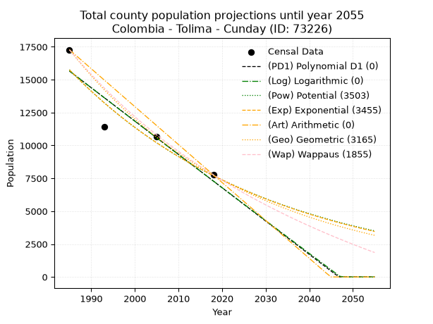
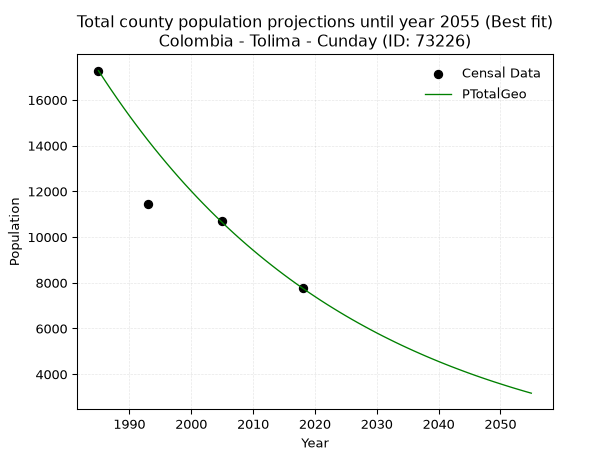
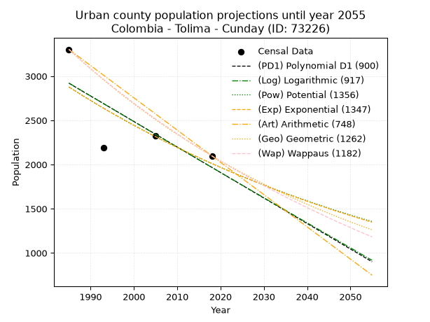
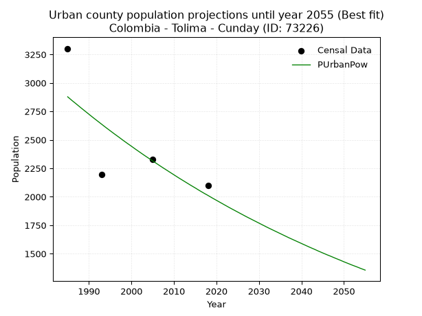
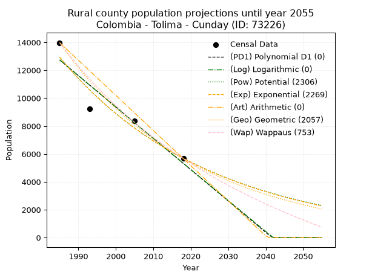
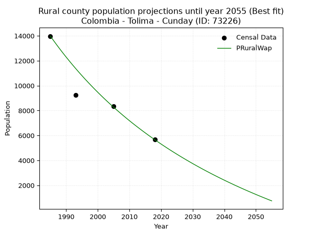

<div align="center">


</div>

# _“Population and Public Services Demand Projections (PPSD) until Year 2050 for Colombia - Tolima - Cunday (ID: 73226)”_
Keywords: `population` `public-service` `projection` `lineal` `polynomial` `logarithmic` `potential` `exponential` `arithmetic` `geometric` `wappaus` `dane` `colombia` `south-america`

PPSD are analytical estimates used by governments and planners to anticipate future changes in population size, age distribution, and the resulting community needs for utilities, healthcare, education, and infrastructure as sizing future water treatment facilities, electrical grids, and road networks based on spatial growth.

> **General running parameters**: • app_version: _v20260806_. • Python version: _3.14.7_. • Pandas version: _3.0.5_. • NumPy version: _2.5.1_. • Creates, save and include plots into reports (create_plot): _False_. • Projection until year: _2050_. • Process polynomial degree 2 and up: _False_. • Process Wappaus: _True_. • Process Wappaus: _True_. • Set negative values to zero: _True_. • Set infinite values to zero: _True_. • Drop dataset notes: _True_. 
<div align="center">

Dynamic map: [:earth_americas:Google](http://maps.google.com/maps?q=4.059259257,-74.6922272) [:earth_americas:OSM](https://www.openstreetmap.org/#map=18/4.059259257/-74.6922272&layers=P) [:earth_americas:Bing](https://www.bing.com/maps?cp=4.059259257~-74.6922272&lvl=18) [:earth_americas:Apple](https://maps.apple.com/frame?center=4.059259257%2C-74.6922272&span=0.003%2C0.006)

</div>


<div align="center">

```geojson
{
  "type": "Feature",
  "geometry": {
    "type": "Point", 
    "coordinates": [-74.6922272, 4.059259257]
  }, 
  "properties": {
    "Name": "Colombia - Tolima - Cunday (ID: 73226)"
  }
}
```

</div>


## 0. Census Data (4 records)

Census data are official statistics collected by a government about the people and housing in a country. They usually include counts of total population, age, sex, race, income, education, and jobs.

📅Global census file: [Population.xlsx](../data/Population.xlsx)

| Source   |   Year |   CountryID | CountryName   |   StateID | StateName   |   CountyID | CountyName   |   PTotal |   PUrban |   PRural |
|:---------|-------:|------------:|:--------------|----------:|:------------|-----------:|:-------------|---------:|---------:|---------:|
| DANE     |   1985 |          57 | Colombia      |        73 | Tolima      |      73226 | Cunday       |    17278 |     3302 |    13976 |
| DANE     |   1993 |          57 | Colombia      |        73 | Tolima      |      73226 | Cunday       |    11440 |     2193 |     9247 |
| DANE     |   2005 |          57 | Colombia      |        73 | Tolima      |      73226 | Cunday       |    10689 |     2326 |     8363 |
| DANE     |   2018 |          57 | Colombia      |        73 | Tolima      |      73226 | Cunday       |     7762 |     2098 |     5664 |

> 🔥Some records could had specific notes about the registered values or the corresponding urban or rural distribution.

## 1. Total

### 1.1. Coefficients and Parameters

* (PD1) Polynomial Deg 1: -253.52268165395222, 518900.99397831794 (lineal)
* (Log) Logarithmic: -507787.98016389157, 3871492.7563832365
* (Pow) Potential: -43.38969813574879, 147.286391650168
* (Exp) Exponential: -0.02167029622439761, 7.56206694688973e+22
* (Art) Arithmetic: Year diff. 2018 - 1985 = 33, Population diff. 7762 - 17278 = -9516, Annual growth = -288.3636363636364
* (Geo) Geometric: Year diff. 2018 - 1985 = 33, Population diff. 7762 - 17278 = -9516, Annual growth % = -0.023956674345496975
* (Wap) Wappaus: i = -2.3032239326169037, Condition values only valid for < 200)

<sub>
Wappaus condition values: ['-0.00', '-2.30', '-4.61', '-6.91', '-9.21', '-11.52', '-13.82', '-16.12', '-18.43', '-20.73', '-23.03', '-25.34', '-27.64', '-29.94', '-32.25', '-34.55', '-36.85', '-39.15', '-41.46', '-43.76', '-46.06', '-48.37', '-50.67', '-52.97', '-55.28', '-57.58', '-59.88', '-62.19', '-64.49', '-66.79', '-69.10', '-71.40', '-73.70', '-76.01', '-78.31', '-80.61', '-82.92', '-85.22', '-87.52', '-89.83', '-92.13', '-94.43', '-96.74', '-99.04', '-101.34', '-103.65', '-105.95', '-108.25', '-110.55', '-112.86', '-115.16', '-117.46', '-119.77', '-122.07', '-124.37', '-126.68', '-128.98', '-131.28', '-133.59', '-135.89', '-138.19', '-140.50', '-142.80', '-145.10', '-147.41', '-149.71']
</sub>


### 1.2. Projected Dataset

|   Year |   CountyID |   PTotalPD1 |   PTotalLog |   PTotalPow |   PTotalExp |   PTotalArt |   PTotalGeo |   PTotalWap |
|-------:|-----------:|------------:|------------:|------------:|------------:|------------:|------------:|------------:|
|   1985 |      73226 |       15658 |       15669 |       15760 |       15748 |       17278 |       17278 |       17278 |
|   1986 |      73226 |       15405 |       15413 |       15419 |       15411 |       16990 |       16864 |       16885 |
|   1987 |      73226 |       15151 |       15157 |       15086 |       15080 |       16701 |       16460 |       16500 |
|   1988 |      73226 |       14898 |       14902 |       14760 |       14757 |       16413 |       16066 |       16124 |
|   1989 |      73226 |       14644 |       14646 |       14442 |       14441 |       16125 |       15681 |       15756 |
|   1990 |      73226 |       14391 |       14391 |       14130 |       14131 |       15836 |       15305 |       15397 |
|   1991 |      73226 |       14137 |       14136 |       13826 |       13828 |       15548 |       14939 |       15045 |
|   1992 |      73226 |       13884 |       13881 |       13528 |       13532 |       15259 |       14581 |       14700 |
|   1993 |      73226 |       13630 |       13626 |       13236 |       13242 |       14971 |       14231 |       14363 |
|   1994 |      73226 |       13377 |       13372 |       12951 |       12958 |       14683 |       13890 |       14033 |
|   1995 |      73226 |       13123 |       13117 |       12673 |       12680 |       14394 |       13558 |       13709 |
|   1996 |      73226 |       12870 |       12862 |       12400 |       12408 |       14106 |       13233 |       13393 |
|   1997 |      73226 |       12616 |       12608 |       12133 |       12142 |       13818 |       12916 |       13082 |
|   1998 |      73226 |       12363 |       12354 |       11873 |       11882 |       13529 |       12606 |       12778 |
|   1999 |      73226 |       12109 |       12100 |       11618 |       11627 |       13241 |       12304 |       12480 |
|   2000 |      73226 |       11856 |       11846 |       11368 |       11378 |       12953 |       12010 |       12188 |
|   2001 |      73226 |       11602 |       11592 |       11124 |       11134 |       12664 |       11722 |       11901 |
|   2002 |      73226 |       11349 |       11338 |       10886 |       10895 |       12376 |       11441 |       11620 |
|   2003 |      73226 |       11095 |       11085 |       10653 |       10662 |       12087 |       11167 |       11345 |
|   2004 |      73226 |       10842 |       10831 |       10424 |       10433 |       11799 |       10899 |       11074 |
|   2005 |      73226 |       10588 |       10578 |       10201 |       10209 |       11511 |       10638 |       10809 |
|   2006 |      73226 |       10334 |       10325 |        9983 |        9991 |       11222 |       10384 |       10548 |
|   2007 |      73226 |       10081 |       10072 |        9769 |        9776 |       10934 |       10135 |       10293 |
|   2008 |      73226 |        9827 |        9819 |        9560 |        9567 |       10646 |        9892 |       10042 |
|   2009 |      73226 |        9574 |        9566 |        9356 |        9362 |       10357 |        9655 |        9795 |
|   2010 |      73226 |        9320 |        9313 |        9156 |        9161 |       10069 |        9424 |        9553 |
|   2011 |      73226 |        9067 |        9061 |        8961 |        8965 |        9781 |        9198 |        9315 |
|   2012 |      73226 |        8813 |        8808 |        8769 |        8773 |        9492 |        8978 |        9082 |
|   2013 |      73226 |        8560 |        8556 |        8582 |        8584 |        9204 |        8763 |        8852 |
|   2014 |      73226 |        8306 |        8304 |        8399 |        8400 |        8915 |        8553 |        8627 |
|   2015 |      73226 |        8053 |        8052 |        8220 |        8220 |        8627 |        8348 |        8405 |
|   2016 |      73226 |        7799 |        7800 |        8045 |        8044 |        8339 |        8148 |        8187 |
|   2017 |      73226 |        7546 |        7548 |        7874 |        7872 |        8050 |        7953 |        7973 |
|   2018 |      73226 |        7292 |        7296 |        7707 |        7703 |        7762 |        7762 |        7762 |
|   2019 |      73226 |        7039 |        7045 |        7543 |        7538 |        7474 |        7576 |        7555 |
|   2020 |      73226 |        6785 |        6793 |        7382 |        7376 |        7185 |        7395 |        7351 |
|   2021 |      73226 |        6532 |        6542 |        7225 |        7218 |        6897 |        7217 |        7150 |
|   2022 |      73226 |        6278 |        6291 |        7072 |        7063 |        6609 |        7044 |        6953 |
|   2023 |      73226 |        6025 |        6040 |        6922 |        6912 |        6320 |        6876 |        6759 |
|   2024 |      73226 |        5771 |        5789 |        6775 |        6764 |        6032 |        6711 |        6568 |
|   2025 |      73226 |        5518 |        5538 |        6631 |        6619 |        5743 |        6550 |        6380 |
|   2026 |      73226 |        5264 |        5287 |        6491 |        6477 |        5455 |        6393 |        6195 |
|   2027 |      73226 |        5011 |        5037 |        6353 |        6338 |        5167 |        6240 |        6013 |
|   2028 |      73226 |        4757 |        4786 |        6219 |        6202 |        4878 |        6091 |        5833 |
|   2029 |      73226 |        4503 |        4536 |        6087 |        6069 |        4590 |        5945 |        5657 |
|   2030 |      73226 |        4250 |        4286 |        5959 |        5939 |        4302 |        5802 |        5483 |
|   2031 |      73226 |        3996 |        4036 |        5833 |        5812 |        4013 |        5663 |        5311 |
|   2032 |      73226 |        3743 |        3786 |        5709 |        5687 |        3725 |        5528 |        5143 |
|   2033 |      73226 |        3489 |        3536 |        5589 |        5565 |        3437 |        5395 |        4976 |
|   2034 |      73226 |        3236 |        3286 |        5471 |        5446 |        3148 |        5266 |        4813 |
|   2035 |      73226 |        2982 |        3036 |        5355 |        5329 |        2860 |        5140 |        4651 |
|   2036 |      73226 |        2729 |        2787 |        5242 |        5215 |        2571 |        5017 |        4492 |
|   2037 |      73226 |        2475 |        2538 |        5132 |        5103 |        2283 |        4897 |        4335 |
|   2038 |      73226 |        2222 |        2288 |        5024 |        4994 |        1995 |        4779 |        4181 |
|   2039 |      73226 |        1968 |        2039 |        4918 |        4887 |        1706 |        4665 |        4028 |
|   2040 |      73226 |        1715 |        1790 |        4814 |        4782 |        1418 |        4553 |        3878 |
|   2041 |      73226 |        1461 |        1541 |        4713 |        4679 |        1130 |        4444 |        3730 |
|   2042 |      73226 |        1208 |        1293 |        4614 |        4579 |         841 |        4337 |        3584 |
|   2043 |      73226 |         954 |        1044 |        4517 |        4481 |         553 |        4234 |        3440 |
|   2044 |      73226 |         701 |         796 |        4422 |        4385 |         265 |        4132 |        3298 |
|   2045 |      73226 |         447 |         547 |        4329 |        4291 |           0 |        4033 |        3158 |
|   2046 |      73226 |         194 |         299 |        4238 |        4199 |           0 |        3936 |        3019 |
|   2047 |      73226 |           0 |          51 |        4149 |        4109 |           0 |        3842 |        2883 |
|   2048 |      73226 |           0 |           0 |        4062 |        4021 |           0 |        3750 |        2748 |
|   2049 |      73226 |           0 |           0 |        3977 |        3935 |           0 |        3660 |        2616 |
|   2050 |      73226 |           0 |           0 |        3894 |        3850 |           0 |        3573 |        2485 |
<div align="center">

</img>

</div>


### 1.3. Best fit with absolute and relative error (%)

Relative error puts that difference into context by dividing the absolute error by the true value, creating a unitless ratio or percentage that shows the scale of the mistake.

Absolute and relative error

|   Year | Source   |   CountryID | CountryName   |   StateID | StateName   |   CountyID_x | CountyName   |   PTotal |   PUrban |   PRural |   CountyID_y |   PTotalPD1 |   PTotalLog |   PTotalPow |   PTotalExp |   PTotalArt |   PTotalGeo |   PTotalWap |   PTotalPD1AbsError |   PTotalLogAbsError |   PTotalPowAbsError |   PTotalExpAbsError |   PTotalArtAbsError |   PTotalGeoAbsError |   PTotalWapAbsError |   PTotalPD1RelError |   PTotalLogRelError |   PTotalPowRelError |   PTotalExpRelError |   PTotalArtRelError |   PTotalGeoRelError |   PTotalWapRelError |
|-------:|:---------|------------:|:--------------|----------:|:------------|-------------:|:-------------|---------:|---------:|---------:|-------------:|------------:|------------:|------------:|------------:|------------:|------------:|------------:|--------------------:|--------------------:|--------------------:|--------------------:|--------------------:|--------------------:|--------------------:|--------------------:|--------------------:|--------------------:|--------------------:|--------------------:|--------------------:|--------------------:|
|   1985 | DANE     |          57 | Colombia      |        73 | Tolima      |        73226 | Cunday       |    17278 |     3302 |    13976 |        73226 |       15658 |       15669 |       15760 |       15748 |       17278 |       17278 |       17278 |                1620 |                1609 |                1518 |                1530 |                   0 |                   0 |                   0 |            9.37609  |             9.31242 |             8.78574 |            8.85519  |             0       |            0        |             0       |
|   1993 | DANE     |          57 | Colombia      |        73 | Tolima      |        73226 | Cunday       |    11440 |     2193 |     9247 |        73226 |       13630 |       13626 |       13236 |       13242 |       14971 |       14231 |       14363 |                2190 |                2186 |                1796 |                1802 |                3531 |                2791 |                2923 |           19.1434   |            19.1084  |            15.6993  |           15.7517   |            30.8654  |           24.3969   |            25.5507  |
|   2005 | DANE     |          57 | Colombia      |        73 | Tolima      |        73226 | Cunday       |    10689 |     2326 |     8363 |        73226 |       10588 |       10578 |       10201 |       10209 |       11511 |       10638 |       10809 |                 101 |                 111 |                 488 |                 480 |                 822 |                  51 |                 120 |            0.944897 |             1.03845 |             4.56544 |            4.4906   |             7.69015 |            0.477126 |             1.12265 |
|   2018 | DANE     |          57 | Colombia      |        73 | Tolima      |        73226 | Cunday       |     7762 |     2098 |     5664 |        73226 |        7292 |        7296 |        7707 |        7703 |        7762 |        7762 |        7762 |                 470 |                 466 |                  55 |                  59 |                   0 |                   0 |                   0 |            6.05514  |             6.00361 |             0.70858 |            0.760113 |             0       |            0        |             0       |

Relative error mean

| Method    |   RelError | Best   |
|:----------|-----------:|:-------|
| PTotalPD1 |    8.87987 |        |
| PTotalLog |    8.86572 |        |
| PTotalPow |    7.43977 |        |
| PTotalExp |    7.46441 |        |
| PTotalArt |    9.63888 |        |
| PTotalGeo |    6.21849 | True   |
| PTotalWap |    6.66834 |        |

💙Best method: _**PTotalGeo**_
<div align="center">

</img>

</div>


### 1.4. Fresh water supply demand in liters per capita per day (lpcd)

The fresh water supply demand typically ranges from 100 to 300 liters per capita per day (lpcd) for standard domestic and municipal planning, though absolute survival minimums set by the World Health Organization are as low as 7.5 to 20 liters per day, and total consumption in high-income nations can exceed 400 liters.

> `CZ`: Level in meters above the sea level (masl).<br> `WS`: Fresh water supply demand in liters per capita per day (lpcd or l/h/d).<br> `WSAll`: Zonal fresh water supply demand in liters per second (l/s).<br> `A`: Zonal area in square meters.

Reference values (RAS Colombia)

|    CZ |   WS |
|------:|-----:|
|  1000 |  120 |
|  2000 |  130 |
| 99999 |  140 |

County shapefile geometry properties and water supply values

|   CountyID |      ATotal |   CZTotal |   WSTotal |
|-----------:|------------:|----------:|----------:|
|      73226 | 5.07025e+08 |   852.148 |       120 |

Projected values for best method: PTotalGeo

|   CountyID |   Year |   PTotalGeo |   WSTotal |   WSTotalAll |
|-----------:|-------:|------------:|----------:|-------------:|
|      73226 |   1985 |       17278 |       120 |     23.9972  |
|      73226 |   1986 |       16864 |       120 |     23.4222  |
|      73226 |   1987 |       16460 |       120 |     22.8611  |
|      73226 |   1988 |       16066 |       120 |     22.3139  |
|      73226 |   1989 |       15681 |       120 |     21.7792  |
|      73226 |   1990 |       15305 |       120 |     21.2569  |
|      73226 |   1991 |       14939 |       120 |     20.7486  |
|      73226 |   1992 |       14581 |       120 |     20.2514  |
|      73226 |   1993 |       14231 |       120 |     19.7653  |
|      73226 |   1994 |       13890 |       120 |     19.2917  |
|      73226 |   1995 |       13558 |       120 |     18.8306  |
|      73226 |   1996 |       13233 |       120 |     18.3792  |
|      73226 |   1997 |       12916 |       120 |     17.9389  |
|      73226 |   1998 |       12606 |       120 |     17.5083  |
|      73226 |   1999 |       12304 |       120 |     17.0889  |
|      73226 |   2000 |       12010 |       120 |     16.6806  |
|      73226 |   2001 |       11722 |       120 |     16.2806  |
|      73226 |   2002 |       11441 |       120 |     15.8903  |
|      73226 |   2003 |       11167 |       120 |     15.5097  |
|      73226 |   2004 |       10899 |       120 |     15.1375  |
|      73226 |   2005 |       10638 |       120 |     14.775   |
|      73226 |   2006 |       10384 |       120 |     14.4222  |
|      73226 |   2007 |       10135 |       120 |     14.0764  |
|      73226 |   2008 |        9892 |       120 |     13.7389  |
|      73226 |   2009 |        9655 |       120 |     13.4097  |
|      73226 |   2010 |        9424 |       120 |     13.0889  |
|      73226 |   2011 |        9198 |       120 |     12.775   |
|      73226 |   2012 |        8978 |       120 |     12.4694  |
|      73226 |   2013 |        8763 |       120 |     12.1708  |
|      73226 |   2014 |        8553 |       120 |     11.8792  |
|      73226 |   2015 |        8348 |       120 |     11.5944  |
|      73226 |   2016 |        8148 |       120 |     11.3167  |
|      73226 |   2017 |        7953 |       120 |     11.0458  |
|      73226 |   2018 |        7762 |       120 |     10.7806  |
|      73226 |   2019 |        7576 |       120 |     10.5222  |
|      73226 |   2020 |        7395 |       120 |     10.2708  |
|      73226 |   2021 |        7217 |       120 |     10.0236  |
|      73226 |   2022 |        7044 |       120 |      9.78333 |
|      73226 |   2023 |        6876 |       120 |      9.55    |
|      73226 |   2024 |        6711 |       120 |      9.32083 |
|      73226 |   2025 |        6550 |       120 |      9.09722 |
|      73226 |   2026 |        6393 |       120 |      8.87917 |
|      73226 |   2027 |        6240 |       120 |      8.66667 |
|      73226 |   2028 |        6091 |       120 |      8.45972 |
|      73226 |   2029 |        5945 |       120 |      8.25694 |
|      73226 |   2030 |        5802 |       120 |      8.05833 |
|      73226 |   2031 |        5663 |       120 |      7.86528 |
|      73226 |   2032 |        5528 |       120 |      7.67778 |
|      73226 |   2033 |        5395 |       120 |      7.49306 |
|      73226 |   2034 |        5266 |       120 |      7.31389 |
|      73226 |   2035 |        5140 |       120 |      7.13889 |
|      73226 |   2036 |        5017 |       120 |      6.96806 |
|      73226 |   2037 |        4897 |       120 |      6.80139 |
|      73226 |   2038 |        4779 |       120 |      6.6375  |
|      73226 |   2039 |        4665 |       120 |      6.47917 |
|      73226 |   2040 |        4553 |       120 |      6.32361 |
|      73226 |   2041 |        4444 |       120 |      6.17222 |
|      73226 |   2042 |        4337 |       120 |      6.02361 |
|      73226 |   2043 |        4234 |       120 |      5.88056 |
|      73226 |   2044 |        4132 |       120 |      5.73889 |
|      73226 |   2045 |        4033 |       120 |      5.60139 |
|      73226 |   2046 |        3936 |       120 |      5.46667 |
|      73226 |   2047 |        3842 |       120 |      5.33611 |
|      73226 |   2048 |        3750 |       120 |      5.20833 |
|      73226 |   2049 |        3660 |       120 |      5.08333 |
|      73226 |   2050 |        3573 |       120 |      4.9625  |

## 2. Urban

### 2.1. Coefficients and Parameters

* (PD1) Polynomial Deg 1: -28.85066238458436, 60188.287434764876 (lineal)
* (Log) Logarithmic: -57831.44277167934, 442057.0099396325
* (Pow) Potential: -21.71663589109115, 75.07531972828693
* (Exp) Exponential: -0.010835135067449361, 6302500292374.921
* (Art) Arithmetic: Year diff. 2018 - 1985 = 33, Population diff. 2098 - 3302 = -1204, Annual growth = -36.484848484848484
* (Geo) Geometric: Year diff. 2018 - 1985 = 33, Population diff. 2098 - 3302 = -1204, Annual growth % = -0.01364973841932593
* (Wap) Wappaus: i = -1.351290684624018, Condition values only valid for < 200)

<sub>
Wappaus condition values: ['-0.00', '-1.35', '-2.70', '-4.05', '-5.41', '-6.76', '-8.11', '-9.46', '-10.81', '-12.16', '-13.51', '-14.86', '-16.22', '-17.57', '-18.92', '-20.27', '-21.62', '-22.97', '-24.32', '-25.67', '-27.03', '-28.38', '-29.73', '-31.08', '-32.43', '-33.78', '-35.13', '-36.48', '-37.84', '-39.19', '-40.54', '-41.89', '-43.24', '-44.59', '-45.94', '-47.30', '-48.65', '-50.00', '-51.35', '-52.70', '-54.05', '-55.40', '-56.75', '-58.11', '-59.46', '-60.81', '-62.16', '-63.51', '-64.86', '-66.21', '-67.56', '-68.92', '-70.27', '-71.62', '-72.97', '-74.32', '-75.67', '-77.02', '-78.37', '-79.73', '-81.08', '-82.43', '-83.78', '-85.13', '-86.48', '-87.83']
</sub>


### 2.2. Projected Dataset

|   Year |   CountyID |   PUrbanPD1 |   PUrbanLog |   PUrbanPow |   PUrbanExp |   PUrbanArt |   PUrbanGeo |   PUrbanWap |
|-------:|-----------:|------------:|------------:|------------:|------------:|------------:|------------:|------------:|
|   1985 |      73226 |        2920 |        2921 |        2878 |        2876 |        3302 |        3302 |        3302 |
|   1986 |      73226 |        2891 |        2892 |        2846 |        2845 |        3266 |        3257 |        3258 |
|   1987 |      73226 |        2862 |        2863 |        2816 |        2815 |        3229 |        3212 |        3214 |
|   1988 |      73226 |        2833 |        2834 |        2785 |        2784 |        3193 |        3169 |        3171 |
|   1989 |      73226 |        2804 |        2805 |        2755 |        2754 |        3156 |        3125 |        3128 |
|   1990 |      73226 |        2775 |        2776 |        2725 |        2725 |        3120 |        3083 |        3086 |
|   1991 |      73226 |        2747 |        2747 |        2695 |        2695 |        3083 |        3041 |        3045 |
|   1992 |      73226 |        2718 |        2718 |        2666 |        2666 |        3047 |        2999 |        3004 |
|   1993 |      73226 |        2689 |        2689 |        2637 |        2637 |        3010 |        2958 |        2963 |
|   1994 |      73226 |        2660 |        2660 |        2608 |        2609 |        2974 |        2918 |        2923 |
|   1995 |      73226 |        2631 |        2631 |        2580 |        2581 |        2937 |        2878 |        2884 |
|   1996 |      73226 |        2602 |        2602 |        2552 |        2553 |        2901 |        2839 |        2845 |
|   1997 |      73226 |        2574 |        2573 |        2525 |        2526 |        2864 |        2800 |        2807 |
|   1998 |      73226 |        2545 |        2544 |        2497 |        2498 |        2828 |        2762 |        2769 |
|   1999 |      73226 |        2516 |        2515 |        2470 |        2471 |        2791 |        2724 |        2731 |
|   2000 |      73226 |        2487 |        2486 |        2444 |        2445 |        2755 |        2687 |        2694 |
|   2001 |      73226 |        2458 |        2457 |        2417 |        2418 |        2718 |        2650 |        2658 |
|   2002 |      73226 |        2429 |        2428 |        2391 |        2392 |        2682 |        2614 |        2622 |
|   2003 |      73226 |        2400 |        2399 |        2365 |        2367 |        2645 |        2578 |        2586 |
|   2004 |      73226 |        2372 |        2370 |        2340 |        2341 |        2609 |        2543 |        2551 |
|   2005 |      73226 |        2343 |        2341 |        2315 |        2316 |        2572 |        2508 |        2516 |
|   2006 |      73226 |        2314 |        2313 |        2290 |        2291 |        2536 |        2474 |        2481 |
|   2007 |      73226 |        2285 |        2284 |        2265 |        2266 |        2499 |        2440 |        2447 |
|   2008 |      73226 |        2256 |        2255 |        2241 |        2242 |        2463 |        2407 |        2414 |
|   2009 |      73226 |        2227 |        2226 |        2217 |        2218 |        2426 |        2374 |        2381 |
|   2010 |      73226 |        2198 |        2197 |        2193 |        2194 |        2390 |        2342 |        2348 |
|   2011 |      73226 |        2170 |        2169 |        2169 |        2170 |        2353 |        2310 |        2315 |
|   2012 |      73226 |        2141 |        2140 |        2146 |        2147 |        2317 |        2278 |        2283 |
|   2013 |      73226 |        2112 |        2111 |        2123 |        2124 |        2280 |        2247 |        2251 |
|   2014 |      73226 |        2083 |        2082 |        2100 |        2101 |        2244 |        2217 |        2220 |
|   2015 |      73226 |        2054 |        2054 |        2078 |        2078 |        2207 |        2186 |        2189 |
|   2016 |      73226 |        2025 |        2025 |        2055 |        2056 |        2171 |        2156 |        2158 |
|   2017 |      73226 |        1997 |        1996 |        2033 |        2033 |        2134 |        2127 |        2128 |
|   2018 |      73226 |        1968 |        1968 |        2012 |        2012 |        2098 |        2098 |        2098 |
|   2019 |      73226 |        1939 |        1939 |        1990 |        1990 |        2062 |        2069 |        2068 |
|   2020 |      73226 |        1910 |        1910 |        1969 |        1968 |        2025 |        2041 |        2039 |
|   2021 |      73226 |        1881 |        1882 |        1948 |        1947 |        1989 |        2013 |        2010 |
|   2022 |      73226 |        1852 |        1853 |        1927 |        1926 |        1952 |        1986 |        1981 |
|   2023 |      73226 |        1823 |        1825 |        1906 |        1905 |        1916 |        1959 |        1953 |
|   2024 |      73226 |        1795 |        1796 |        1886 |        1885 |        1879 |        1932 |        1925 |
|   2025 |      73226 |        1766 |        1767 |        1866 |        1865 |        1843 |        1906 |        1897 |
|   2026 |      73226 |        1737 |        1739 |        1846 |        1845 |        1806 |        1880 |        1869 |
|   2027 |      73226 |        1708 |        1710 |        1826 |        1825 |        1770 |        1854 |        1842 |
|   2028 |      73226 |        1679 |        1682 |        1807 |        1805 |        1733 |        1829 |        1815 |
|   2029 |      73226 |        1650 |        1653 |        1788 |        1786 |        1697 |        1804 |        1789 |
|   2030 |      73226 |        1621 |        1625 |        1769 |        1766 |        1660 |        1779 |        1762 |
|   2031 |      73226 |        1593 |        1596 |        1750 |        1747 |        1624 |        1755 |        1736 |
|   2032 |      73226 |        1564 |        1568 |        1731 |        1728 |        1587 |        1731 |        1710 |
|   2033 |      73226 |        1535 |        1539 |        1713 |        1710 |        1551 |        1707 |        1685 |
|   2034 |      73226 |        1506 |        1511 |        1695 |        1691 |        1514 |        1684 |        1659 |
|   2035 |      73226 |        1477 |        1483 |        1677 |        1673 |        1478 |        1661 |        1634 |
|   2036 |      73226 |        1448 |        1454 |        1659 |        1655 |        1441 |        1638 |        1610 |
|   2037 |      73226 |        1419 |        1426 |        1641 |        1637 |        1405 |        1616 |        1585 |
|   2038 |      73226 |        1391 |        1397 |        1624 |        1620 |        1368 |        1594 |        1561 |
|   2039 |      73226 |        1362 |        1369 |        1607 |        1602 |        1332 |        1572 |        1537 |
|   2040 |      73226 |        1333 |        1341 |        1590 |        1585 |        1295 |        1551 |        1513 |
|   2041 |      73226 |        1304 |        1312 |        1573 |        1568 |        1259 |        1529 |        1489 |
|   2042 |      73226 |        1275 |        1284 |        1556 |        1551 |        1222 |        1509 |        1466 |
|   2043 |      73226 |        1246 |        1256 |        1540 |        1534 |        1186 |        1488 |        1443 |
|   2044 |      73226 |        1218 |        1227 |        1523 |        1518 |        1149 |        1468 |        1420 |
|   2045 |      73226 |        1189 |        1199 |        1507 |        1501 |        1113 |        1448 |        1397 |
|   2046 |      73226 |        1160 |        1171 |        1491 |        1485 |        1076 |        1428 |        1375 |
|   2047 |      73226 |        1131 |        1143 |        1476 |        1469 |        1040 |        1408 |        1352 |
|   2048 |      73226 |        1102 |        1114 |        1460 |        1453 |        1003 |        1389 |        1330 |
|   2049 |      73226 |        1073 |        1086 |        1445 |        1438 |         967 |        1370 |        1308 |
|   2050 |      73226 |        1044 |        1058 |        1429 |        1422 |         930 |        1351 |        1287 |
<div align="center">

</img>

</div>


### 2.3. Best fit with absolute and relative error (%)

Relative error puts that difference into context by dividing the absolute error by the true value, creating a unitless ratio or percentage that shows the scale of the mistake.

Absolute and relative error

|   Year | Source   |   CountryID | CountryName   |   StateID | StateName   |   CountyID_x | CountyName   |   PTotal |   PUrban |   PRural |   CountyID_y |   PUrbanPD1 |   PUrbanLog |   PUrbanPow |   PUrbanExp |   PUrbanArt |   PUrbanGeo |   PUrbanWap |   PUrbanPD1AbsError |   PUrbanLogAbsError |   PUrbanPowAbsError |   PUrbanExpAbsError |   PUrbanArtAbsError |   PUrbanGeoAbsError |   PUrbanWapAbsError |   PUrbanPD1RelError |   PUrbanLogRelError |   PUrbanPowRelError |   PUrbanExpRelError |   PUrbanArtRelError |   PUrbanGeoRelError |   PUrbanWapRelError |
|-------:|:---------|------------:|:--------------|----------:|:------------|-------------:|:-------------|---------:|---------:|---------:|-------------:|------------:|------------:|------------:|------------:|------------:|------------:|------------:|--------------------:|--------------------:|--------------------:|--------------------:|--------------------:|--------------------:|--------------------:|--------------------:|--------------------:|--------------------:|--------------------:|--------------------:|--------------------:|--------------------:|
|   1985 | DANE     |          57 | Colombia      |        73 | Tolima      |        73226 | Cunday       |    17278 |     3302 |    13976 |        73226 |        2920 |        2921 |        2878 |        2876 |        3302 |        3302 |        3302 |                 382 |                 381 |                 424 |                 426 |                   0 |                   0 |                   0 |           11.5687   |           11.5385   |           12.8407   |           12.9013   |              0      |             0       |             0       |
|   1993 | DANE     |          57 | Colombia      |        73 | Tolima      |        73226 | Cunday       |    11440 |     2193 |     9247 |        73226 |        2689 |        2689 |        2637 |        2637 |        3010 |        2958 |        2963 |                 496 |                 496 |                 444 |                 444 |                 817 |                 765 |                 770 |           22.6174   |           22.6174   |           20.2462   |           20.2462   |             37.2549 |            34.8837  |            35.1117  |
|   2005 | DANE     |          57 | Colombia      |        73 | Tolima      |        73226 | Cunday       |    10689 |     2326 |     8363 |        73226 |        2343 |        2341 |        2315 |        2316 |        2572 |        2508 |        2516 |                  17 |                  15 |                  11 |                  10 |                 246 |                 182 |                 190 |            0.730868 |            0.644884 |            0.472915 |            0.429923 |             10.5761 |             7.82459 |             8.16853 |
|   2018 | DANE     |          57 | Colombia      |        73 | Tolima      |        73226 | Cunday       |     7762 |     2098 |     5664 |        73226 |        1968 |        1968 |        2012 |        2012 |        2098 |        2098 |        2098 |                 130 |                 130 |                  86 |                  86 |                   0 |                   0 |                   0 |            6.19638  |            6.19638  |            4.09914  |            4.09914  |              0      |             0       |             0       |

Relative error mean

| Method    |   RelError | Best   |
|:----------|-----------:|:-------|
| PUrbanPD1 |   10.2784  |        |
| PUrbanLog |   10.2493  |        |
| PUrbanPow |    9.41475 | True   |
| PUrbanExp |    9.41914 |        |
| PUrbanArt |   11.9577  |        |
| PUrbanGeo |   10.6771  |        |
| PUrbanWap |   10.8201  |        |

💙Best method: _**PUrbanPow**_
<div align="center">

</img>

</div>


### 2.4. Fresh water supply demand in liters per capita per day (lpcd)

The fresh water supply demand typically ranges from 100 to 300 liters per capita per day (lpcd) for standard domestic and municipal planning, though absolute survival minimums set by the World Health Organization are as low as 7.5 to 20 liters per day, and total consumption in high-income nations can exceed 400 liters.

> `CZ`: Level in meters above the sea level (masl).<br> `WS`: Fresh water supply demand in liters per capita per day (lpcd or l/h/d).<br> `WSAll`: Zonal fresh water supply demand in liters per second (l/s).<br> `A`: Zonal area in square meters.

Reference values (RAS Colombia)

|    CZ |   WS |
|------:|-----:|
|  1000 |  120 |
|  2000 |  130 |
| 99999 |  140 |

County shapefile geometry properties and water supply values

|   CountyID |   AUrban |   CZUrban |   WSUrban |
|-----------:|---------:|----------:|----------:|
|      73226 |   888043 |   456.535 |       120 |

Projected values for best method: PUrbanPow

|   CountyID |   Year |   PUrbanPow |   WSUrban |   WSUrbanAll |
|-----------:|-------:|------------:|----------:|-------------:|
|      73226 |   1985 |        2878 |       120 |      3.99722 |
|      73226 |   1986 |        2846 |       120 |      3.95278 |
|      73226 |   1987 |        2816 |       120 |      3.91111 |
|      73226 |   1988 |        2785 |       120 |      3.86806 |
|      73226 |   1989 |        2755 |       120 |      3.82639 |
|      73226 |   1990 |        2725 |       120 |      3.78472 |
|      73226 |   1991 |        2695 |       120 |      3.74306 |
|      73226 |   1992 |        2666 |       120 |      3.70278 |
|      73226 |   1993 |        2637 |       120 |      3.6625  |
|      73226 |   1994 |        2608 |       120 |      3.62222 |
|      73226 |   1995 |        2580 |       120 |      3.58333 |
|      73226 |   1996 |        2552 |       120 |      3.54444 |
|      73226 |   1997 |        2525 |       120 |      3.50694 |
|      73226 |   1998 |        2497 |       120 |      3.46806 |
|      73226 |   1999 |        2470 |       120 |      3.43056 |
|      73226 |   2000 |        2444 |       120 |      3.39444 |
|      73226 |   2001 |        2417 |       120 |      3.35694 |
|      73226 |   2002 |        2391 |       120 |      3.32083 |
|      73226 |   2003 |        2365 |       120 |      3.28472 |
|      73226 |   2004 |        2340 |       120 |      3.25    |
|      73226 |   2005 |        2315 |       120 |      3.21528 |
|      73226 |   2006 |        2290 |       120 |      3.18056 |
|      73226 |   2007 |        2265 |       120 |      3.14583 |
|      73226 |   2008 |        2241 |       120 |      3.1125  |
|      73226 |   2009 |        2217 |       120 |      3.07917 |
|      73226 |   2010 |        2193 |       120 |      3.04583 |
|      73226 |   2011 |        2169 |       120 |      3.0125  |
|      73226 |   2012 |        2146 |       120 |      2.98056 |
|      73226 |   2013 |        2123 |       120 |      2.94861 |
|      73226 |   2014 |        2100 |       120 |      2.91667 |
|      73226 |   2015 |        2078 |       120 |      2.88611 |
|      73226 |   2016 |        2055 |       120 |      2.85417 |
|      73226 |   2017 |        2033 |       120 |      2.82361 |
|      73226 |   2018 |        2012 |       120 |      2.79444 |
|      73226 |   2019 |        1990 |       120 |      2.76389 |
|      73226 |   2020 |        1969 |       120 |      2.73472 |
|      73226 |   2021 |        1948 |       120 |      2.70556 |
|      73226 |   2022 |        1927 |       120 |      2.67639 |
|      73226 |   2023 |        1906 |       120 |      2.64722 |
|      73226 |   2024 |        1886 |       120 |      2.61944 |
|      73226 |   2025 |        1866 |       120 |      2.59167 |
|      73226 |   2026 |        1846 |       120 |      2.56389 |
|      73226 |   2027 |        1826 |       120 |      2.53611 |
|      73226 |   2028 |        1807 |       120 |      2.50972 |
|      73226 |   2029 |        1788 |       120 |      2.48333 |
|      73226 |   2030 |        1769 |       120 |      2.45694 |
|      73226 |   2031 |        1750 |       120 |      2.43056 |
|      73226 |   2032 |        1731 |       120 |      2.40417 |
|      73226 |   2033 |        1713 |       120 |      2.37917 |
|      73226 |   2034 |        1695 |       120 |      2.35417 |
|      73226 |   2035 |        1677 |       120 |      2.32917 |
|      73226 |   2036 |        1659 |       120 |      2.30417 |
|      73226 |   2037 |        1641 |       120 |      2.27917 |
|      73226 |   2038 |        1624 |       120 |      2.25556 |
|      73226 |   2039 |        1607 |       120 |      2.23194 |
|      73226 |   2040 |        1590 |       120 |      2.20833 |
|      73226 |   2041 |        1573 |       120 |      2.18472 |
|      73226 |   2042 |        1556 |       120 |      2.16111 |
|      73226 |   2043 |        1540 |       120 |      2.13889 |
|      73226 |   2044 |        1523 |       120 |      2.11528 |
|      73226 |   2045 |        1507 |       120 |      2.09306 |
|      73226 |   2046 |        1491 |       120 |      2.07083 |
|      73226 |   2047 |        1476 |       120 |      2.05    |
|      73226 |   2048 |        1460 |       120 |      2.02778 |
|      73226 |   2049 |        1445 |       120 |      2.00694 |
|      73226 |   2050 |        1429 |       120 |      1.98472 |

## 3. Rural

### 3.1. Coefficients and Parameters

* (PD1) Polynomial Deg 1: -224.67201926936792, 458712.70654355315 (lineal)
* (Log) Logarithmic: -449956.53739221225, 3429435.746443603
* (Pow) Potential: -49.753544672212946, 168.18694140347827
* (Exp) Exponential: -0.024852159626104754, 3.433421637172477e+25
* (Art) Arithmetic: Year diff. 2018 - 1985 = 33, Population diff. 5664 - 13976 = -8312, Annual growth = -251.87878787878788
* (Geo) Geometric: Year diff. 2018 - 1985 = 33, Population diff. 5664 - 13976 = -8312, Annual growth % = -0.026998871383268064
* (Wap) Wappaus: i = -2.564957106708634, Condition values only valid for < 200)

<sub>
Wappaus condition values: ['-0.00', '-2.56', '-5.13', '-7.69', '-10.26', '-12.82', '-15.39', '-17.95', '-20.52', '-23.08', '-25.65', '-28.21', '-30.78', '-33.34', '-35.91', '-38.47', '-41.04', '-43.60', '-46.17', '-48.73', '-51.30', '-53.86', '-56.43', '-58.99', '-61.56', '-64.12', '-66.69', '-69.25', '-71.82', '-74.38', '-76.95', '-79.51', '-82.08', '-84.64', '-87.21', '-89.77', '-92.34', '-94.90', '-97.47', '-100.03', '-102.60', '-105.16', '-107.73', '-110.29', '-112.86', '-115.42', '-117.99', '-120.55', '-123.12', '-125.68', '-128.25', '-130.81', '-133.38', '-135.94', '-138.51', '-141.07', '-143.64', '-146.20', '-148.77', '-151.33', '-153.90', '-156.46', '-159.03', '-161.59', '-164.16', '-166.72']
</sub>


### 3.2. Projected Dataset

|   Year |   CountyID |   PRuralPD1 |   PRuralLog |   PRuralPow |   PRuralExp |   PRuralArt |   PRuralGeo |   PRuralWap |
|-------:|-----------:|------------:|------------:|------------:|------------:|------------:|------------:|------------:|
|   1985 |      73226 |       12739 |       12747 |       12932 |       12921 |       13976 |       13976 |       13976 |
|   1986 |      73226 |       12514 |       12521 |       12612 |       12604 |       13724 |       13599 |       13622 |
|   1987 |      73226 |       12289 |       12294 |       12300 |       12295 |       13472 |       13232 |       13277 |
|   1988 |      73226 |       12065 |       12068 |       11996 |       11993 |       13220 |       12874 |       12940 |
|   1989 |      73226 |       11840 |       11842 |       11700 |       11699 |       12968 |       12527 |       12612 |
|   1990 |      73226 |       11615 |       11615 |       11411 |       11412 |       12717 |       12188 |       12292 |
|   1991 |      73226 |       11391 |       11389 |       11129 |       11132 |       12465 |       11859 |       11979 |
|   1992 |      73226 |       11166 |       11163 |       10854 |       10858 |       12213 |       11539 |       11673 |
|   1993 |      73226 |       10941 |       10938 |       10587 |       10592 |       11961 |       11228 |       11375 |
|   1994 |      73226 |       10717 |       10712 |       10326 |       10332 |       11709 |       10925 |       11084 |
|   1995 |      73226 |       10492 |       10486 |       10071 |       10078 |       11457 |       10630 |       10799 |
|   1996 |      73226 |       10267 |       10261 |        9823 |        9831 |       11205 |       10343 |       10520 |
|   1997 |      73226 |       10043 |       10035 |        9582 |        9589 |       10953 |       10063 |       10248 |
|   1998 |      73226 |        9818 |        9810 |        9346 |        9354 |       10702 |        9792 |        9982 |
|   1999 |      73226 |        9593 |        9585 |        9116 |        9124 |       10450 |        9527 |        9721 |
|   2000 |      73226 |        9369 |        9360 |        8892 |        8901 |       10198 |        9270 |        9466 |
|   2001 |      73226 |        9144 |        9135 |        8674 |        8682 |        9946 |        9020 |        9217 |
|   2002 |      73226 |        8919 |        8910 |        8461 |        8469 |        9694 |        8776 |        8973 |
|   2003 |      73226 |        8695 |        8686 |        8253 |        8261 |        9442 |        8539 |        8734 |
|   2004 |      73226 |        8470 |        8461 |        8051 |        8058 |        9190 |        8309 |        8499 |
|   2005 |      73226 |        8245 |        8237 |        7853 |        7860 |        8938 |        8084 |        8270 |
|   2006 |      73226 |        8021 |        8012 |        7661 |        7668 |        8687 |        7866 |        8045 |
|   2007 |      73226 |        7796 |        7788 |        7473 |        7479 |        8435 |        7654 |        7825 |
|   2008 |      73226 |        7571 |        7564 |        7290 |        7296 |        8183 |        7447 |        7609 |
|   2009 |      73226 |        7347 |        7340 |        7112 |        7117 |        7931 |        7246 |        7397 |
|   2010 |      73226 |        7122 |        7116 |        6938 |        6942 |        7679 |        7050 |        7190 |
|   2011 |      73226 |        6897 |        6892 |        6768 |        6772 |        7427 |        6860 |        6986 |
|   2012 |      73226 |        6673 |        6668 |        6603 |        6605 |        7175 |        6675 |        6787 |
|   2013 |      73226 |        6448 |        6445 |        6442 |        6443 |        6923 |        6495 |        6591 |
|   2014 |      73226 |        6223 |        6221 |        6285 |        6285 |        6672 |        6319 |        6398 |
|   2015 |      73226 |        5999 |        5998 |        6131 |        6131 |        6420 |        6149 |        6210 |
|   2016 |      73226 |        5774 |        5775 |        5982 |        5980 |        6168 |        5983 |        6024 |
|   2017 |      73226 |        5549 |        5552 |        5836 |        5834 |        5916 |        5821 |        5843 |
|   2018 |      73226 |        5325 |        5329 |        5694 |        5690 |        5664 |        5664 |        5664 |
|   2019 |      73226 |        5100 |        5106 |        5555 |        5551 |        5412 |        5511 |        5489 |
|   2020 |      73226 |        4875 |        4883 |        5420 |        5414 |        5160 |        5362 |        5316 |
|   2021 |      73226 |        4651 |        4660 |        5288 |        5282 |        4908 |        5218 |        5147 |
|   2022 |      73226 |        4426 |        4437 |        5160 |        5152 |        4656 |        5077 |        4981 |
|   2023 |      73226 |        4201 |        4215 |        5034 |        5025 |        4405 |        4940 |        4817 |
|   2024 |      73226 |        3977 |        3993 |        4912 |        4902 |        4153 |        4806 |        4657 |
|   2025 |      73226 |        3752 |        3770 |        4793 |        4782 |        3901 |        4676 |        4499 |
|   2026 |      73226 |        3527 |        3548 |        4676 |        4664 |        3649 |        4550 |        4343 |
|   2027 |      73226 |        3303 |        3326 |        4563 |        4550 |        3397 |        4427 |        4191 |
|   2028 |      73226 |        3078 |        3104 |        4452 |        4438 |        3145 |        4308 |        4041 |
|   2029 |      73226 |        2853 |        2882 |        4344 |        4329 |        2893 |        4192 |        3893 |
|   2030 |      73226 |        2629 |        2661 |        4239 |        4223 |        2641 |        4078 |        3747 |
|   2031 |      73226 |        2404 |        2439 |        4137 |        4119 |        2390 |        3968 |        3605 |
|   2032 |      73226 |        2179 |        2218 |        4037 |        4018 |        2138 |        3861 |        3464 |
|   2033 |      73226 |        1954 |        1996 |        3939 |        3920 |        1886 |        3757 |        3325 |
|   2034 |      73226 |        1730 |        1775 |        3844 |        3823 |        1634 |        3655 |        3189 |
|   2035 |      73226 |        1505 |        1554 |        3751 |        3730 |        1382 |        3557 |        3055 |
|   2036 |      73226 |        1280 |        1333 |        3660 |        3638 |        1130 |        3461 |        2923 |
|   2037 |      73226 |        1056 |        1112 |        3572 |        3549 |         878 |        3367 |        2793 |
|   2038 |      73226 |         831 |         891 |        3486 |        3462 |         626 |        3276 |        2665 |
|   2039 |      73226 |         606 |         670 |        3402 |        3377 |         375 |        3188 |        2539 |
|   2040 |      73226 |         382 |         450 |        3320 |        3294 |         123 |        3102 |        2415 |
|   2041 |      73226 |         157 |         229 |        3240 |        3213 |           0 |        3018 |        2292 |
|   2042 |      73226 |           0 |           9 |        3162 |        3134 |           0 |        2937 |        2172 |
|   2043 |      73226 |           0 |           0 |        3086 |        3057 |           0 |        2857 |        2053 |
|   2044 |      73226 |           0 |           0 |        3011 |        2982 |           0 |        2780 |        1936 |
|   2045 |      73226 |           0 |           0 |        2939 |        2909 |           0 |        2705 |        1821 |
|   2046 |      73226 |           0 |           0 |        2868 |        2837 |           0 |        2632 |        1707 |
|   2047 |      73226 |           0 |           0 |        2800 |        2768 |           0 |        2561 |        1595 |
|   2048 |      73226 |           0 |           0 |        2732 |        2700 |           0 |        2492 |        1485 |
|   2049 |      73226 |           0 |           0 |        2667 |        2634 |           0 |        2425 |        1376 |
|   2050 |      73226 |           0 |           0 |        2603 |        2569 |           0 |        2359 |        1268 |
<div align="center">

</img>

</div>


### 3.3. Best fit with absolute and relative error (%)

Relative error puts that difference into context by dividing the absolute error by the true value, creating a unitless ratio or percentage that shows the scale of the mistake.

Absolute and relative error

|   Year | Source   |   CountryID | CountryName   |   StateID | StateName   |   CountyID_x | CountyName   |   PTotal |   PUrban |   PRural |   CountyID_y |   PRuralPD1 |   PRuralLog |   PRuralPow |   PRuralExp |   PRuralArt |   PRuralGeo |   PRuralWap |   PRuralPD1AbsError |   PRuralLogAbsError |   PRuralPowAbsError |   PRuralExpAbsError |   PRuralArtAbsError |   PRuralGeoAbsError |   PRuralWapAbsError |   PRuralPD1RelError |   PRuralLogRelError |   PRuralPowRelError |   PRuralExpRelError |   PRuralArtRelError |   PRuralGeoRelError |   PRuralWapRelError |
|-------:|:---------|------------:|:--------------|----------:|:------------|-------------:|:-------------|---------:|---------:|---------:|-------------:|------------:|------------:|------------:|------------:|------------:|------------:|------------:|--------------------:|--------------------:|--------------------:|--------------------:|--------------------:|--------------------:|--------------------:|--------------------:|--------------------:|--------------------:|--------------------:|--------------------:|--------------------:|--------------------:|
|   1985 | DANE     |          57 | Colombia      |        73 | Tolima      |        73226 | Cunday       |    17278 |     3302 |    13976 |        73226 |       12739 |       12747 |       12932 |       12921 |       13976 |       13976 |       13976 |                1237 |                1229 |                1044 |                1055 |                   0 |                   0 |                   0 |             8.85089 |             8.79365 |            7.46995  |             7.54865 |             0       |             0       |             0       |
|   1993 | DANE     |          57 | Colombia      |        73 | Tolima      |        73226 | Cunday       |    11440 |     2193 |     9247 |        73226 |       10941 |       10938 |       10587 |       10592 |       11961 |       11228 |       11375 |                1694 |                1691 |                1340 |                1345 |                2714 |                1981 |                2128 |            18.3195  |            18.287   |           14.4912   |            14.5453  |            29.3501  |            21.4232  |            23.0129  |
|   2005 | DANE     |          57 | Colombia      |        73 | Tolima      |        73226 | Cunday       |    10689 |     2326 |     8363 |        73226 |        8245 |        8237 |        7853 |        7860 |        8938 |        8084 |        8270 |                 118 |                 126 |                 510 |                 503 |                 575 |                 279 |                  93 |             1.41098 |             1.50664 |            6.09829  |             6.01459 |             6.87552 |             3.33612 |             1.11204 |
|   2018 | DANE     |          57 | Colombia      |        73 | Tolima      |        73226 | Cunday       |     7762 |     2098 |     5664 |        73226 |        5325 |        5329 |        5694 |        5690 |        5664 |        5664 |        5664 |                 339 |                 335 |                  30 |                  26 |                   0 |                   0 |                   0 |             5.98517 |             5.91455 |            0.529661 |             0.45904 |             0       |             0       |             0       |

Relative error mean

| Method    |   RelError | Best   |
|:----------|-----------:|:-------|
| PRuralPD1 |    8.64162 |        |
| PRuralLog |    8.62546 |        |
| PRuralPow |    7.14727 |        |
| PRuralExp |    7.14189 |        |
| PRuralArt |    9.0564  |        |
| PRuralGeo |    6.18982 |        |
| PRuralWap |    6.03123 | True   |

💙Best method: _**PRuralWap**_
<div align="center">

</img>

</div>


### 3.4. Fresh water supply demand in liters per capita per day (lpcd)

The fresh water supply demand typically ranges from 100 to 300 liters per capita per day (lpcd) for standard domestic and municipal planning, though absolute survival minimums set by the World Health Organization are as low as 7.5 to 20 liters per day, and total consumption in high-income nations can exceed 400 liters.

> `CZ`: Level in meters above the sea level (masl).<br> `WS`: Fresh water supply demand in liters per capita per day (lpcd or l/h/d).<br> `WSAll`: Zonal fresh water supply demand in liters per second (l/s).<br> `A`: Zonal area in square meters.

Reference values (RAS Colombia)

|    CZ |   WS |
|------:|-----:|
|  1000 |  120 |
|  2000 |  130 |
| 99999 |  140 |

County shapefile geometry properties and water supply values

|   CountyID |      ARural |   CZRural |   WSRural |
|-----------:|------------:|----------:|----------:|
|      73226 | 5.06137e+08 |   852.854 |       120 |

Projected values for best method: PRuralWap

|   CountyID |   Year |   PRuralWap |   WSRural |   WSRuralAll |
|-----------:|-------:|------------:|----------:|-------------:|
|      73226 |   1985 |       13976 |       120 |     19.4111  |
|      73226 |   1986 |       13622 |       120 |     18.9194  |
|      73226 |   1987 |       13277 |       120 |     18.4403  |
|      73226 |   1988 |       12940 |       120 |     17.9722  |
|      73226 |   1989 |       12612 |       120 |     17.5167  |
|      73226 |   1990 |       12292 |       120 |     17.0722  |
|      73226 |   1991 |       11979 |       120 |     16.6375  |
|      73226 |   1992 |       11673 |       120 |     16.2125  |
|      73226 |   1993 |       11375 |       120 |     15.7986  |
|      73226 |   1994 |       11084 |       120 |     15.3944  |
|      73226 |   1995 |       10799 |       120 |     14.9986  |
|      73226 |   1996 |       10520 |       120 |     14.6111  |
|      73226 |   1997 |       10248 |       120 |     14.2333  |
|      73226 |   1998 |        9982 |       120 |     13.8639  |
|      73226 |   1999 |        9721 |       120 |     13.5014  |
|      73226 |   2000 |        9466 |       120 |     13.1472  |
|      73226 |   2001 |        9217 |       120 |     12.8014  |
|      73226 |   2002 |        8973 |       120 |     12.4625  |
|      73226 |   2003 |        8734 |       120 |     12.1306  |
|      73226 |   2004 |        8499 |       120 |     11.8042  |
|      73226 |   2005 |        8270 |       120 |     11.4861  |
|      73226 |   2006 |        8045 |       120 |     11.1736  |
|      73226 |   2007 |        7825 |       120 |     10.8681  |
|      73226 |   2008 |        7609 |       120 |     10.5681  |
|      73226 |   2009 |        7397 |       120 |     10.2736  |
|      73226 |   2010 |        7190 |       120 |      9.98611 |
|      73226 |   2011 |        6986 |       120 |      9.70278 |
|      73226 |   2012 |        6787 |       120 |      9.42639 |
|      73226 |   2013 |        6591 |       120 |      9.15417 |
|      73226 |   2014 |        6398 |       120 |      8.88611 |
|      73226 |   2015 |        6210 |       120 |      8.625   |
|      73226 |   2016 |        6024 |       120 |      8.36667 |
|      73226 |   2017 |        5843 |       120 |      8.11528 |
|      73226 |   2018 |        5664 |       120 |      7.86667 |
|      73226 |   2019 |        5489 |       120 |      7.62361 |
|      73226 |   2020 |        5316 |       120 |      7.38333 |
|      73226 |   2021 |        5147 |       120 |      7.14861 |
|      73226 |   2022 |        4981 |       120 |      6.91806 |
|      73226 |   2023 |        4817 |       120 |      6.69028 |
|      73226 |   2024 |        4657 |       120 |      6.46806 |
|      73226 |   2025 |        4499 |       120 |      6.24861 |
|      73226 |   2026 |        4343 |       120 |      6.03194 |
|      73226 |   2027 |        4191 |       120 |      5.82083 |
|      73226 |   2028 |        4041 |       120 |      5.6125  |
|      73226 |   2029 |        3893 |       120 |      5.40694 |
|      73226 |   2030 |        3747 |       120 |      5.20417 |
|      73226 |   2031 |        3605 |       120 |      5.00694 |
|      73226 |   2032 |        3464 |       120 |      4.81111 |
|      73226 |   2033 |        3325 |       120 |      4.61806 |
|      73226 |   2034 |        3189 |       120 |      4.42917 |
|      73226 |   2035 |        3055 |       120 |      4.24306 |
|      73226 |   2036 |        2923 |       120 |      4.05972 |
|      73226 |   2037 |        2793 |       120 |      3.87917 |
|      73226 |   2038 |        2665 |       120 |      3.70139 |
|      73226 |   2039 |        2539 |       120 |      3.52639 |
|      73226 |   2040 |        2415 |       120 |      3.35417 |
|      73226 |   2041 |        2292 |       120 |      3.18333 |
|      73226 |   2042 |        2172 |       120 |      3.01667 |
|      73226 |   2043 |        2053 |       120 |      2.85139 |
|      73226 |   2044 |        1936 |       120 |      2.68889 |
|      73226 |   2045 |        1821 |       120 |      2.52917 |
|      73226 |   2046 |        1707 |       120 |      2.37083 |
|      73226 |   2047 |        1595 |       120 |      2.21528 |
|      73226 |   2048 |        1485 |       120 |      2.0625  |
|      73226 |   2049 |        1376 |       120 |      1.91111 |
|      73226 |   2050 |        1268 |       120 |      1.76111 |

<div align="center"><br><sub>Share this research</sub></div><br>

<sub>**APPS & TOOLS & CONTENT DISCLAIMER**: • NO WARRANTY - This content and software is provided by <a href="https://github.com/rcfdtools" target="_blank">github.com/rcfdtools</a> "as is", without any express or implied warranty, including warranties of merchantability, fitness for a particular purpose, or non-infringement. There is no guarantee that the software will be error-free or operate without interruption. • LIMITATION OF LIABILITY - Neither the authors nor copyright holders will be liable for claims or damages arising from the software or its use. You are responsible for determining if the software is appropriate for your use and assume all associated risks, including errors, legal compliance, and data loss. • NO PROFESSIONAL ADVICE - The software provides general information and does not offer professional advice. It should not replace consultation with professional advisors. [Clauses and global license for rcfdtools use.](https://github.com/rcfdtools/rcfdtools/blob/main/LICENSE.md)</sub>