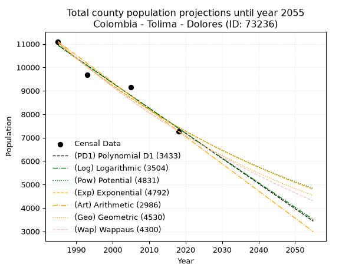
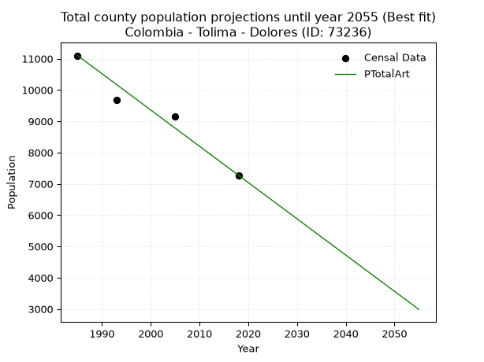
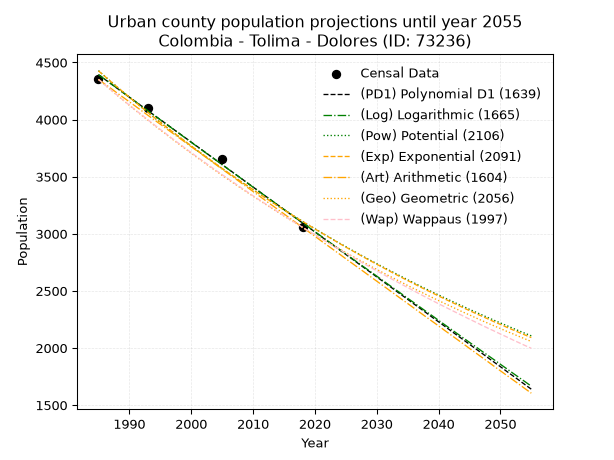
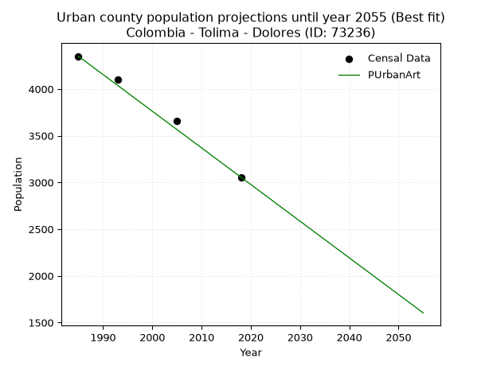
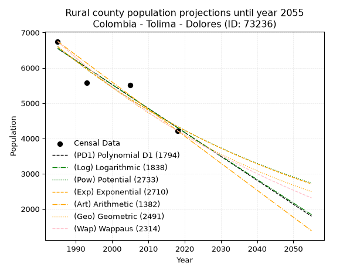
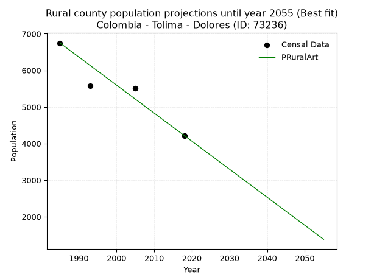

<div align="center">


</div>

# _“Population and Public Services Demand Projections (PPSD) until Year 2050 for Colombia - Tolima - Dolores (ID: 73236)”_
Keywords: `population` `public-service` `projection` `lineal` `polynomial` `logarithmic` `potential` `exponential` `arithmetic` `geometric` `wappaus` `dane` `colombia` `south-america`

PPSD are analytical estimates used by governments and planners to anticipate future changes in population size, age distribution, and the resulting community needs for utilities, healthcare, education, and infrastructure as sizing future water treatment facilities, electrical grids, and road networks based on spatial growth.

> **General running parameters**: • app_version: _v20260806_. • Python version: _3.14.7_. • Pandas version: _3.0.5_. • NumPy version: _2.5.1_. • Creates, save and include plots into reports (create_plot): _False_. • Projection until year: _2050_. • Process polynomial degree 2 and up: _False_. • Process Wappaus: _True_. • Process Wappaus: _True_. • Set negative values to zero: _True_. • Set infinite values to zero: _True_. • Drop dataset notes: _True_. 
<div align="center">

Dynamic map: [:earth_americas:Google](http://maps.google.com/maps?q=3.53907208,-74.8967613) [:earth_americas:OSM](https://www.openstreetmap.org/#map=18/3.53907208/-74.8967613&layers=P) [:earth_americas:Bing](https://www.bing.com/maps?cp=3.53907208~-74.8967613&lvl=18) [:earth_americas:Apple](https://maps.apple.com/frame?center=3.53907208%2C-74.8967613&span=0.003%2C0.006)

</div>


<div align="center">

```geojson
{
  "type": "Feature",
  "geometry": {
    "type": "Point", 
    "coordinates": [-74.8967613, 3.53907208]
  }, 
  "properties": {
    "Name": "Colombia - Tolima - Dolores (ID: 73236)"
  }
}
```

</div>


## 0. Census Data (4 records)

Census data are official statistics collected by a government about the people and housing in a country. They usually include counts of total population, age, sex, race, income, education, and jobs.

📅Global census file: [Population.xlsx](../data/Population.xlsx)

| Source   |   Year |   CountryID | CountryName   |   StateID | StateName   |   CountyID | CountyName   |   PTotal |   PUrban |   PRural |
|:---------|-------:|------------:|:--------------|----------:|:------------|-----------:|:-------------|---------:|---------:|---------:|
| DANE     |   1985 |          57 | Colombia      |        73 | Tolima      |      73236 | Dolores      |    11098 |     4351 |     6747 |
| DANE     |   1993 |          57 | Colombia      |        73 | Tolima      |      73236 | Dolores      |     9680 |     4105 |     5575 |
| DANE     |   2005 |          57 | Colombia      |        73 | Tolima      |      73236 | Dolores      |     9164 |     3658 |     5506 |
| DANE     |   2018 |          57 | Colombia      |        73 | Tolima      |      73236 | Dolores      |     7274 |     3056 |     4218 |

> 🔥Some records could had specific notes about the registered values or the corresponding urban or rural distribution.

📅   [RUPS](https://www.datos.gov.co/Hacienda-y-Cr-dito-P-blico/Registro-nico-de-Prestadores-de-Servicios-P-blicos/4qkq-csdn/about_data) - Local public utility companies: [RUPS.csv](../data/RUPS.xlsx)

 | SERVICIO       | ESTADO    | NOMBRE                                                        | NIT         | DEPARTAMENTO_DOMICILIO   | MUNICIPIO_DOMICILIO   | DIRECCION                     |   TELEFONO | EMAIL                              | TIPO_INSCRIPCION    | REPRESENTANTE_LEGAL   | TIPO_PRESTADOR                            | CLASIFICACION           |
|:---------------|:----------|:--------------------------------------------------------------|:------------|:-------------------------|:----------------------|:------------------------------|-----------:|:-----------------------------------|:--------------------|:----------------------|:------------------------------------------|:------------------------|
| ACUEDUCTO      | OPERATIVA | EMPRESA DE SERVICIOS PUBLICOS DEL MUNICIPIO DE DOLORES E.S.P. | 809012411-0 | TOLIMA                   | DOLORES               | CARRERA 8 CON CALLE 5 ESQUINA |    2268513 | servidolores@dolores-tolima.gov.co | Registro por la ESP | SERAFIN CASTRO NIÑO   | EMPRESA INDUSTRIAL Y COMERCIAL DEL ESTADO | HASTA 2500 SUSCRIPTORES |
| ALCANTARILLADO | OPERATIVA | EMPRESA DE SERVICIOS PUBLICOS DEL MUNICIPIO DE DOLORES E.S.P. | 809012411-0 | TOLIMA                   | DOLORES               | CARRERA 8 CON CALLE 5 ESQUINA |    2268513 | servidolores@dolores-tolima.gov.co | Registro por la ESP | SERAFIN CASTRO NIÑO   | EMPRESA INDUSTRIAL Y COMERCIAL DEL ESTADO | HASTA 2500 SUSCRIPTORES |

## 1. Total

### 1.1. Coefficients and Parameters

* (PD1) Polynomial Deg 1: -107.23725411481217, 223805.31754315307 (lineal)
* (Log) Logarithmic: -214635.9479328586, 1640753.5602222001
* (Pow) Potential: -23.834421839073208, 82.64297863949842
* (Exp) Exponential: -0.011910209405924332, 204227487702926.25
* (Art) Arithmetic: Year diff. 2018 - 1985 = 33, Population diff. 7274 - 11098 = -3824, Annual growth = -115.87878787878788
* (Geo) Geometric: Year diff. 2018 - 1985 = 33, Population diff. 7274 - 11098 = -3824, Annual growth % = -0.012720180543907555
* (Wap) Wappaus: i = -1.2614716729674273, Condition values only valid for < 200)

<sub>
Wappaus condition values: ['-0.00', '-1.26', '-2.52', '-3.78', '-5.05', '-6.31', '-7.57', '-8.83', '-10.09', '-11.35', '-12.61', '-13.88', '-15.14', '-16.40', '-17.66', '-18.92', '-20.18', '-21.45', '-22.71', '-23.97', '-25.23', '-26.49', '-27.75', '-29.01', '-30.28', '-31.54', '-32.80', '-34.06', '-35.32', '-36.58', '-37.84', '-39.11', '-40.37', '-41.63', '-42.89', '-44.15', '-45.41', '-46.67', '-47.94', '-49.20', '-50.46', '-51.72', '-52.98', '-54.24', '-55.50', '-56.77', '-58.03', '-59.29', '-60.55', '-61.81', '-63.07', '-64.34', '-65.60', '-66.86', '-68.12', '-69.38', '-70.64', '-71.90', '-73.17', '-74.43', '-75.69', '-76.95', '-78.21', '-79.47', '-80.73', '-82.00']
</sub>


### 1.2. Projected Dataset

|   Year |   CountyID |   PTotalPD1 |   PTotalLog |   PTotalPow |   PTotalExp |   PTotalArt |   PTotalGeo |   PTotalWap |
|-------:|-----------:|------------:|------------:|------------:|------------:|------------:|------------:|------------:|
|   1985 |      73236 |       10939 |       10942 |       11035 |       11031 |       11098 |       11098 |       11098 |
|   1986 |      73236 |       10832 |       10834 |       10903 |       10901 |       10982 |       10957 |       10959 |
|   1987 |      73236 |       10725 |       10726 |       10773 |       10772 |       10866 |       10817 |       10821 |
|   1988 |      73236 |       10618 |       10618 |       10645 |       10644 |       10750 |       10680 |       10686 |
|   1989 |      73236 |       10510 |       10510 |       10518 |       10518 |       10634 |       10544 |       10552 |
|   1990 |      73236 |       10403 |       10403 |       10393 |       10394 |       10519 |       10410 |       10419 |
|   1991 |      73236 |       10296 |       10295 |       10269 |       10270 |       10403 |       10277 |       10289 |
|   1992 |      73236 |       10189 |       10187 |       10147 |       10149 |       10287 |       10147 |       10159 |
|   1993 |      73236 |       10081 |       10079 |       10026 |       10029 |       10171 |       10018 |       10032 |
|   1994 |      73236 |        9974 |        9972 |        9907 |        9910 |       10055 |        9890 |        9906 |
|   1995 |      73236 |        9867 |        9864 |        9789 |        9793 |        9939 |        9764 |        9781 |
|   1996 |      73236 |        9760 |        9756 |        9673 |        9677 |        9823 |        9640 |        9658 |
|   1997 |      73236 |        9653 |        9649 |        9558 |        9562 |        9707 |        9518 |        9536 |
|   1998 |      73236 |        9545 |        9541 |        9445 |        9449 |        9592 |        9397 |        9416 |
|   1999 |      73236 |        9438 |        9434 |        9333 |        9337 |        9476 |        9277 |        9297 |
|   2000 |      73236 |        9331 |        9327 |        9222 |        9227 |        9360 |        9159 |        9180 |
|   2001 |      73236 |        9224 |        9219 |        9113 |        9117 |        9244 |        9043 |        9063 |
|   2002 |      73236 |        9116 |        9112 |        9005 |        9009 |        9128 |        8927 |        8949 |
|   2003 |      73236 |        9009 |        9005 |        8899 |        8903 |        9012 |        8814 |        8835 |
|   2004 |      73236 |        8902 |        8898 |        8793 |        8797 |        8896 |        8702 |        8723 |
|   2005 |      73236 |        8795 |        8791 |        8689 |        8693 |        8780 |        8591 |        8612 |
|   2006 |      73236 |        8687 |        8684 |        8587 |        8590 |        8665 |        8482 |        8502 |
|   2007 |      73236 |        8580 |        8577 |        8485 |        8488 |        8549 |        8374 |        8393 |
|   2008 |      73236 |        8473 |        8470 |        8385 |        8388 |        8433 |        8267 |        8286 |
|   2009 |      73236 |        8366 |        8363 |        8286 |        8289 |        8317 |        8162 |        8180 |
|   2010 |      73236 |        8258 |        8256 |        8189 |        8191 |        8201 |        8058 |        8075 |
|   2011 |      73236 |        8151 |        8149 |        8092 |        8094 |        8085 |        7956 |        7971 |
|   2012 |      73236 |        8044 |        8043 |        7997 |        7998 |        7969 |        7855 |        7868 |
|   2013 |      73236 |        7937 |        7936 |        7903 |        7903 |        7853 |        7755 |        7766 |
|   2014 |      73236 |        7829 |        7829 |        7810 |        7809 |        7738 |        7656 |        7666 |
|   2015 |      73236 |        7722 |        7723 |        7718 |        7717 |        7622 |        7559 |        7566 |
|   2016 |      73236 |        7615 |        7616 |        7627 |        7626 |        7506 |        7463 |        7468 |
|   2017 |      73236 |        7508 |        7510 |        7537 |        7535 |        7390 |        7368 |        7370 |
|   2018 |      73236 |        7401 |        7404 |        7449 |        7446 |        7274 |        7274 |        7274 |
|   2019 |      73236 |        7293 |        7297 |        7361 |        7358 |        7158 |        7181 |        7179 |
|   2020 |      73236 |        7186 |        7191 |        7275 |        7271 |        7042 |        7090 |        7084 |
|   2021 |      73236 |        7079 |        7085 |        7190 |        7185 |        6926 |        7000 |        6991 |
|   2022 |      73236 |        6972 |        6979 |        7106 |        7100 |        6810 |        6911 |        6898 |
|   2023 |      73236 |        6864 |        6872 |        7022 |        7016 |        6695 |        6823 |        6807 |
|   2024 |      73236 |        6757 |        6766 |        6940 |        6933 |        6579 |        6736 |        6716 |
|   2025 |      73236 |        6650 |        6660 |        6859 |        6851 |        6463 |        6651 |        6626 |
|   2026 |      73236 |        6543 |        6554 |        6779 |        6769 |        6347 |        6566 |        6537 |
|   2027 |      73236 |        6435 |        6448 |        6699 |        6689 |        6231 |        6482 |        6450 |
|   2028 |      73236 |        6328 |        6343 |        6621 |        6610 |        6115 |        6400 |        6362 |
|   2029 |      73236 |        6221 |        6237 |        6544 |        6532 |        5999 |        6319 |        6276 |
|   2030 |      73236 |        6114 |        6131 |        6467 |        6454 |        5883 |        6238 |        6191 |
|   2031 |      73236 |        6006 |        6025 |        6392 |        6378 |        5768 |        6159 |        6106 |
|   2032 |      73236 |        5899 |        5920 |        6317 |        6303 |        5652 |        6080 |        6023 |
|   2033 |      73236 |        5792 |        5814 |        6244 |        6228 |        5536 |        6003 |        5940 |
|   2034 |      73236 |        5685 |        5709 |        6171 |        6154 |        5420 |        5927 |        5858 |
|   2035 |      73236 |        5578 |        5603 |        6099 |        6081 |        5304 |        5851 |        5776 |
|   2036 |      73236 |        5470 |        5498 |        6028 |        6009 |        5188 |        5777 |        5696 |
|   2037 |      73236 |        5363 |        5392 |        5958 |        5938 |        5072 |        5703 |        5616 |
|   2038 |      73236 |        5256 |        5287 |        5889 |        5868 |        4956 |        5631 |        5537 |
|   2039 |      73236 |        5149 |        5182 |        5820 |        5798 |        4841 |        5559 |        5459 |
|   2040 |      73236 |        5041 |        5076 |        5753 |        5730 |        4725 |        5489 |        5381 |
|   2041 |      73236 |        4934 |        4971 |        5686 |        5662 |        4609 |        5419 |        5304 |
|   2042 |      73236 |        4827 |        4866 |        5620 |        5595 |        4493 |        5350 |        5228 |
|   2043 |      73236 |        4720 |        4761 |        5555 |        5529 |        4377 |        5282 |        5153 |
|   2044 |      73236 |        4612 |        4656 |        5490 |        5463 |        4261 |        5215 |        5078 |
|   2045 |      73236 |        4505 |        4551 |        5426 |        5399 |        4145 |        5148 |        5004 |
|   2046 |      73236 |        4398 |        4446 |        5364 |        5335 |        4029 |        5083 |        4931 |
|   2047 |      73236 |        4291 |        4341 |        5302 |        5271 |        3914 |        5018 |        4858 |
|   2048 |      73236 |        4183 |        4236 |        5240 |        5209 |        3798 |        4954 |        4786 |
|   2049 |      73236 |        4076 |        4131 |        5180 |        5147 |        3682 |        4891 |        4715 |
|   2050 |      73236 |        3969 |        4027 |        5120 |        5086 |        3566 |        4829 |        4644 |
<div align="center">

</img>

</div>


### 1.3. Best fit with absolute and relative error (%)

Relative error puts that difference into context by dividing the absolute error by the true value, creating a unitless ratio or percentage that shows the scale of the mistake.

Absolute and relative error

|   Year | Source   |   CountryID | CountryName   |   StateID | StateName   |   CountyID_x | CountyName   |   PTotal |   PUrban |   PRural |   CountyID_y |   PTotalPD1 |   PTotalLog |   PTotalPow |   PTotalExp |   PTotalArt |   PTotalGeo |   PTotalWap |   PTotalPD1AbsError |   PTotalLogAbsError |   PTotalPowAbsError |   PTotalExpAbsError |   PTotalArtAbsError |   PTotalGeoAbsError |   PTotalWapAbsError |   PTotalPD1RelError |   PTotalLogRelError |   PTotalPowRelError |   PTotalExpRelError |   PTotalArtRelError |   PTotalGeoRelError |   PTotalWapRelError |
|-------:|:---------|------------:|:--------------|----------:|:------------|-------------:|:-------------|---------:|---------:|---------:|-------------:|------------:|------------:|------------:|------------:|------------:|------------:|------------:|--------------------:|--------------------:|--------------------:|--------------------:|--------------------:|--------------------:|--------------------:|--------------------:|--------------------:|--------------------:|--------------------:|--------------------:|--------------------:|--------------------:|
|   1985 | DANE     |          57 | Colombia      |        73 | Tolima      |        73236 | Dolores      |    11098 |     4351 |     6747 |        73236 |       10939 |       10942 |       11035 |       11031 |       11098 |       11098 |       11098 |                 159 |                 156 |                  63 |                  67 |                   0 |                   0 |                   0 |             1.43269 |             1.40566 |             0.56767 |            0.603712 |             0       |             0       |             0       |
|   1993 | DANE     |          57 | Colombia      |        73 | Tolima      |        73236 | Dolores      |     9680 |     4105 |     5575 |        73236 |       10081 |       10079 |       10026 |       10029 |       10171 |       10018 |       10032 |                 401 |                 399 |                 346 |                 349 |                 491 |                 338 |                 352 |             4.14256 |             4.1219  |             3.57438 |            3.60537  |             5.07231 |             3.49174 |             3.63636 |
|   2005 | DANE     |          57 | Colombia      |        73 | Tolima      |        73236 | Dolores      |     9164 |     3658 |     5506 |        73236 |        8795 |        8791 |        8689 |        8693 |        8780 |        8591 |        8612 |                 369 |                 373 |                 475 |                 471 |                 384 |                 573 |                 552 |             4.02663 |             4.07027 |             5.18333 |            5.13968  |             4.19031 |             6.25273 |             6.02357 |
|   2018 | DANE     |          57 | Colombia      |        73 | Tolima      |        73236 | Dolores      |     7274 |     3056 |     4218 |        73236 |        7401 |        7404 |        7449 |        7446 |        7274 |        7274 |        7274 |                 127 |                 130 |                 175 |                 172 |                   0 |                   0 |                   0 |             1.74594 |             1.78719 |             2.40583 |            2.36459  |             0       |             0       |             0       |

Relative error mean

| Method    |   RelError | Best   |
|:----------|-----------:|:-------|
| PTotalPD1 |    2.83696 |        |
| PTotalLog |    2.84626 |        |
| PTotalPow |    2.9328  |        |
| PTotalExp |    2.92834 |        |
| PTotalArt |    2.31566 | True   |
| PTotalGeo |    2.43612 |        |
| PTotalWap |    2.41498 |        |

💙Best method: _**PTotalArt**_
<div align="center">

</img>

</div>


### 1.4. Fresh water supply demand in liters per capita per day (lpcd)

The fresh water supply demand typically ranges from 100 to 300 liters per capita per day (lpcd) for standard domestic and municipal planning, though absolute survival minimums set by the World Health Organization are as low as 7.5 to 20 liters per day, and total consumption in high-income nations can exceed 400 liters.

> `CZ`: Level in meters above the sea level (masl)<br> `WS`: Fresh water supply demand in liters per capita per day (lpcd or l/h/d)<br> `WSAll`: Zonal fresh water supply demand in liters per second (l/s)<br> `A`: Zonal area in square meters<br> `DP`: Population density (people/hectare or p/ha)

Reference values (RAS Colombia)

|    CZ |   WS |
|------:|-----:|
|  1000 |  120 |
|  2000 |  130 |
| 99999 |  140 |

County shapefile geometry properties and water supply values

|   CountyID |     ATotal |   CZTotal |   WSTotal |
|-----------:|-----------:|----------:|----------:|
|      73236 | 6.5145e+08 |   1450.66 |       130 |

Projected values for best method: PTotalArt

|   CountyID |   Year |   PTotalArt |   DPTotal |   WSTotal |   WSTotalAll |
|-----------:|-------:|------------:|----------:|----------:|-------------:|
|      73236 |   1985 |       11098 |      0.17 |       130 |     16.6984  |
|      73236 |   1986 |       10982 |      0.17 |       130 |     16.5238  |
|      73236 |   1987 |       10866 |      0.17 |       130 |     16.3493  |
|      73236 |   1988 |       10750 |      0.17 |       130 |     16.1748  |
|      73236 |   1989 |       10634 |      0.16 |       130 |     16.0002  |
|      73236 |   1990 |       10519 |      0.16 |       130 |     15.8272  |
|      73236 |   1991 |       10403 |      0.16 |       130 |     15.6527  |
|      73236 |   1992 |       10287 |      0.16 |       130 |     15.4781  |
|      73236 |   1993 |       10171 |      0.16 |       130 |     15.3036  |
|      73236 |   1994 |       10055 |      0.15 |       130 |     15.1291  |
|      73236 |   1995 |        9939 |      0.15 |       130 |     14.9545  |
|      73236 |   1996 |        9823 |      0.15 |       130 |     14.78    |
|      73236 |   1997 |        9707 |      0.15 |       130 |     14.6054  |
|      73236 |   1998 |        9592 |      0.15 |       130 |     14.4324  |
|      73236 |   1999 |        9476 |      0.15 |       130 |     14.2579  |
|      73236 |   2000 |        9360 |      0.14 |       130 |     14.0833  |
|      73236 |   2001 |        9244 |      0.14 |       130 |     13.9088  |
|      73236 |   2002 |        9128 |      0.14 |       130 |     13.7343  |
|      73236 |   2003 |        9012 |      0.14 |       130 |     13.5597  |
|      73236 |   2004 |        8896 |      0.14 |       130 |     13.3852  |
|      73236 |   2005 |        8780 |      0.13 |       130 |     13.2106  |
|      73236 |   2006 |        8665 |      0.13 |       130 |     13.0376  |
|      73236 |   2007 |        8549 |      0.13 |       130 |     12.8631  |
|      73236 |   2008 |        8433 |      0.13 |       130 |     12.6885  |
|      73236 |   2009 |        8317 |      0.13 |       130 |     12.514   |
|      73236 |   2010 |        8201 |      0.13 |       130 |     12.3395  |
|      73236 |   2011 |        8085 |      0.12 |       130 |     12.1649  |
|      73236 |   2012 |        7969 |      0.12 |       130 |     11.9904  |
|      73236 |   2013 |        7853 |      0.12 |       130 |     11.8159  |
|      73236 |   2014 |        7738 |      0.12 |       130 |     11.6428  |
|      73236 |   2015 |        7622 |      0.12 |       130 |     11.4683  |
|      73236 |   2016 |        7506 |      0.12 |       130 |     11.2937  |
|      73236 |   2017 |        7390 |      0.11 |       130 |     11.1192  |
|      73236 |   2018 |        7274 |      0.11 |       130 |     10.9447  |
|      73236 |   2019 |        7158 |      0.11 |       130 |     10.7701  |
|      73236 |   2020 |        7042 |      0.11 |       130 |     10.5956  |
|      73236 |   2021 |        6926 |      0.11 |       130 |     10.4211  |
|      73236 |   2022 |        6810 |      0.1  |       130 |     10.2465  |
|      73236 |   2023 |        6695 |      0.1  |       130 |     10.0735  |
|      73236 |   2024 |        6579 |      0.1  |       130 |      9.89896 |
|      73236 |   2025 |        6463 |      0.1  |       130 |      9.72442 |
|      73236 |   2026 |        6347 |      0.1  |       130 |      9.54988 |
|      73236 |   2027 |        6231 |      0.1  |       130 |      9.37535 |
|      73236 |   2028 |        6115 |      0.09 |       130 |      9.20081 |
|      73236 |   2029 |        5999 |      0.09 |       130 |      9.02627 |
|      73236 |   2030 |        5883 |      0.09 |       130 |      8.85174 |
|      73236 |   2031 |        5768 |      0.09 |       130 |      8.6787  |
|      73236 |   2032 |        5652 |      0.09 |       130 |      8.50417 |
|      73236 |   2033 |        5536 |      0.08 |       130 |      8.32963 |
|      73236 |   2034 |        5420 |      0.08 |       130 |      8.15509 |
|      73236 |   2035 |        5304 |      0.08 |       130 |      7.98056 |
|      73236 |   2036 |        5188 |      0.08 |       130 |      7.80602 |
|      73236 |   2037 |        5072 |      0.08 |       130 |      7.63148 |
|      73236 |   2038 |        4956 |      0.08 |       130 |      7.45694 |
|      73236 |   2039 |        4841 |      0.07 |       130 |      7.28391 |
|      73236 |   2040 |        4725 |      0.07 |       130 |      7.10938 |
|      73236 |   2041 |        4609 |      0.07 |       130 |      6.93484 |
|      73236 |   2042 |        4493 |      0.07 |       130 |      6.7603  |
|      73236 |   2043 |        4377 |      0.07 |       130 |      6.58576 |
|      73236 |   2044 |        4261 |      0.07 |       130 |      6.41123 |
|      73236 |   2045 |        4145 |      0.06 |       130 |      6.23669 |
|      73236 |   2046 |        4029 |      0.06 |       130 |      6.06215 |
|      73236 |   2047 |        3914 |      0.06 |       130 |      5.88912 |
|      73236 |   2048 |        3798 |      0.06 |       130 |      5.71458 |
|      73236 |   2049 |        3682 |      0.06 |       130 |      5.54005 |
|      73236 |   2050 |        3566 |      0.05 |       130 |      5.36551 |

## 2. Urban

### 2.1. Coefficients and Parameters

* (PD1) Polynomial Deg 1: -39.332798073062605, 82467.92934564347 (lineal)
* (Log) Logarithmic: -78714.03042016196, 602098.475998304
* (Pow) Potential: -21.442088511021463, 74.35703510601667
* (Exp) Exponential: -0.010715661244588448, 7651443206735.071
* (Art) Arithmetic: Year diff. 2018 - 1985 = 33, Population diff. 3056 - 4351 = -1295, Annual growth = -39.24242424242424
* (Geo) Geometric: Year diff. 2018 - 1985 = 33, Population diff. 3056 - 4351 = -1295, Annual growth % = -0.01064891970993409
* (Wap) Wappaus: i = -1.059603732750756, Condition values only valid for < 200)

<sub>
Wappaus condition values: ['-0.00', '-1.06', '-2.12', '-3.18', '-4.24', '-5.30', '-6.36', '-7.42', '-8.48', '-9.54', '-10.60', '-11.66', '-12.72', '-13.77', '-14.83', '-15.89', '-16.95', '-18.01', '-19.07', '-20.13', '-21.19', '-22.25', '-23.31', '-24.37', '-25.43', '-26.49', '-27.55', '-28.61', '-29.67', '-30.73', '-31.79', '-32.85', '-33.91', '-34.97', '-36.03', '-37.09', '-38.15', '-39.21', '-40.26', '-41.32', '-42.38', '-43.44', '-44.50', '-45.56', '-46.62', '-47.68', '-48.74', '-49.80', '-50.86', '-51.92', '-52.98', '-54.04', '-55.10', '-56.16', '-57.22', '-58.28', '-59.34', '-60.40', '-61.46', '-62.52', '-63.58', '-64.64', '-65.70', '-66.76', '-67.81', '-68.87']
</sub>


### 2.2. Projected Dataset

|   Year |   CountyID |   PUrbanPD1 |   PUrbanLog |   PUrbanPow |   PUrbanExp |   PUrbanArt |   PUrbanGeo |   PUrbanWap |
|-------:|-----------:|------------:|------------:|------------:|------------:|------------:|------------:|------------:|
|   1985 |      73236 |        4392 |        4393 |        4428 |        4426 |        4351 |        4351 |        4351 |
|   1986 |      73236 |        4353 |        4354 |        4380 |        4379 |        4312 |        4305 |        4305 |
|   1987 |      73236 |        4314 |        4314 |        4333 |        4332 |        4273 |        4259 |        4260 |
|   1988 |      73236 |        4274 |        4275 |        4286 |        4286 |        4233 |        4213 |        4215 |
|   1989 |      73236 |        4235 |        4235 |        4240 |        4241 |        4194 |        4169 |        4170 |
|   1990 |      73236 |        4196 |        4195 |        4195 |        4195 |        4155 |        4124 |        4126 |
|   1991 |      73236 |        4156 |        4156 |        4150 |        4151 |        4116 |        4080 |        4083 |
|   1992 |      73236 |        4117 |        4116 |        4106 |        4106 |        4076 |        4037 |        4040 |
|   1993 |      73236 |        4078 |        4077 |        4062 |        4063 |        4037 |        3994 |        3997 |
|   1994 |      73236 |        4038 |        4037 |        4018 |        4019 |        3998 |        3951 |        3955 |
|   1995 |      73236 |        3999 |        3998 |        3975 |        3977 |        3959 |        3909 |        3913 |
|   1996 |      73236 |        3960 |        3958 |        3933 |        3934 |        3919 |        3868 |        3872 |
|   1997 |      73236 |        3920 |        3919 |        3891 |        3892 |        3880 |        3826 |        3831 |
|   1998 |      73236 |        3881 |        3880 |        3849 |        3851 |        3841 |        3786 |        3790 |
|   1999 |      73236 |        3842 |        3840 |        3808 |        3810 |        3802 |        3745 |        3750 |
|   2000 |      73236 |        3802 |        3801 |        3768 |        3769 |        3762 |        3705 |        3710 |
|   2001 |      73236 |        3763 |        3761 |        3727 |        3729 |        3723 |        3666 |        3671 |
|   2002 |      73236 |        3724 |        3722 |        3688 |        3689 |        3684 |        3627 |        3632 |
|   2003 |      73236 |        3684 |        3683 |        3648 |        3650 |        3645 |        3588 |        3593 |
|   2004 |      73236 |        3645 |        3644 |        3610 |        3611 |        3605 |        3550 |        3555 |
|   2005 |      73236 |        3606 |        3604 |        3571 |        3572 |        3566 |        3512 |        3517 |
|   2006 |      73236 |        3566 |        3565 |        3533 |        3534 |        3527 |        3475 |        3480 |
|   2007 |      73236 |        3527 |        3526 |        3496 |        3497 |        3488 |        3438 |        3443 |
|   2008 |      73236 |        3488 |        3487 |        3458 |        3459 |        3448 |        3401 |        3406 |
|   2009 |      73236 |        3448 |        3447 |        3422 |        3423 |        3409 |        3365 |        3369 |
|   2010 |      73236 |        3409 |        3408 |        3385 |        3386 |        3370 |        3329 |        3333 |
|   2011 |      73236 |        3370 |        3369 |        3350 |        3350 |        3331 |        3294 |        3297 |
|   2012 |      73236 |        3330 |        3330 |        3314 |        3314 |        3291 |        3259 |        3262 |
|   2013 |      73236 |        3291 |        3291 |        3279 |        3279 |        3252 |        3224 |        3227 |
|   2014 |      73236 |        3252 |        3252 |        3244 |        3244 |        3213 |        3190 |        3192 |
|   2015 |      73236 |        3212 |        3213 |        3210 |        3209 |        3174 |        3156 |        3158 |
|   2016 |      73236 |        3173 |        3174 |        3176 |        3175 |        3134 |        3122 |        3123 |
|   2017 |      73236 |        3134 |        3135 |        3142 |        3141 |        3095 |        3089 |        3090 |
|   2018 |      73236 |        3094 |        3096 |        3109 |        3108 |        3056 |        3056 |        3056 |
|   2019 |      73236 |        3055 |        3057 |        3076 |        3075 |        3017 |        3023 |        3023 |
|   2020 |      73236 |        3016 |        3018 |        3044 |        3042 |        2978 |        2991 |        2990 |
|   2021 |      73236 |        2976 |        2979 |        3012 |        3010 |        2938 |        2959 |        2957 |
|   2022 |      73236 |        2937 |        2940 |        2980 |        2978 |        2899 |        2928 |        2925 |
|   2023 |      73236 |        2898 |        2901 |        2948 |        2946 |        2860 |        2897 |        2893 |
|   2024 |      73236 |        2858 |        2862 |        2917 |        2914 |        2821 |        2866 |        2861 |
|   2025 |      73236 |        2819 |        2823 |        2887 |        2883 |        2781 |        2835 |        2829 |
|   2026 |      73236 |        2780 |        2784 |        2856 |        2853 |        2742 |        2805 |        2798 |
|   2027 |      73236 |        2740 |        2745 |        2826 |        2822 |        2703 |        2775 |        2767 |
|   2028 |      73236 |        2701 |        2706 |        2796 |        2792 |        2664 |        2746 |        2736 |
|   2029 |      73236 |        2662 |        2668 |        2767 |        2762 |        2624 |        2716 |        2706 |
|   2030 |      73236 |        2622 |        2629 |        2738 |        2733 |        2585 |        2688 |        2676 |
|   2031 |      73236 |        2583 |        2590 |        2709 |        2704 |        2546 |        2659 |        2646 |
|   2032 |      73236 |        2544 |        2551 |        2681 |        2675 |        2507 |        2631 |        2616 |
|   2033 |      73236 |        2504 |        2513 |        2653 |        2646 |        2467 |        2603 |        2587 |
|   2034 |      73236 |        2465 |        2474 |        2625 |        2618 |        2428 |        2575 |        2558 |
|   2035 |      73236 |        2426 |        2435 |        2597 |        2590 |        2389 |        2547 |        2529 |
|   2036 |      73236 |        2386 |        2397 |        2570 |        2563 |        2350 |        2520 |        2500 |
|   2037 |      73236 |        2347 |        2358 |        2543 |        2535 |        2310 |        2494 |        2471 |
|   2038 |      73236 |        2308 |        2319 |        2516 |        2508 |        2271 |        2467 |        2443 |
|   2039 |      73236 |        2268 |        2281 |        2490 |        2482 |        2232 |        2441 |        2415 |
|   2040 |      73236 |        2229 |        2242 |        2464 |        2455 |        2193 |        2415 |        2387 |
|   2041 |      73236 |        2190 |        2203 |        2438 |        2429 |        2153 |        2389 |        2360 |
|   2042 |      73236 |        2150 |        2165 |        2413 |        2403 |        2114 |        2364 |        2333 |
|   2043 |      73236 |        2111 |        2126 |        2388 |        2378 |        2075 |        2338 |        2306 |
|   2044 |      73236 |        2072 |        2088 |        2363 |        2352 |        2036 |        2313 |        2279 |
|   2045 |      73236 |        2032 |        2049 |        2338 |        2327 |        1996 |        2289 |        2252 |
|   2046 |      73236 |        1993 |        2011 |        2314 |        2302 |        1957 |        2264 |        2226 |
|   2047 |      73236 |        1954 |        1972 |        2290 |        2278 |        1918 |        2240 |        2199 |
|   2048 |      73236 |        1914 |        1934 |        2266 |        2254 |        1879 |        2216 |        2173 |
|   2049 |      73236 |        1875 |        1896 |        2242 |        2229 |        1839 |        2193 |        2148 |
|   2050 |      73236 |        1836 |        1857 |        2219 |        2206 |        1800 |        2170 |        2122 |
<div align="center">

</img>

</div>


### 2.3. Best fit with absolute and relative error (%)

Relative error puts that difference into context by dividing the absolute error by the true value, creating a unitless ratio or percentage that shows the scale of the mistake.

Absolute and relative error

|   Year | Source   |   CountryID | CountryName   |   StateID | StateName   |   CountyID_x | CountyName   |   PTotal |   PUrban |   PRural |   CountyID_y |   PUrbanPD1 |   PUrbanLog |   PUrbanPow |   PUrbanExp |   PUrbanArt |   PUrbanGeo |   PUrbanWap |   PUrbanPD1AbsError |   PUrbanLogAbsError |   PUrbanPowAbsError |   PUrbanExpAbsError |   PUrbanArtAbsError |   PUrbanGeoAbsError |   PUrbanWapAbsError |   PUrbanPD1RelError |   PUrbanLogRelError |   PUrbanPowRelError |   PUrbanExpRelError |   PUrbanArtRelError |   PUrbanGeoRelError |   PUrbanWapRelError |
|-------:|:---------|------------:|:--------------|----------:|:------------|-------------:|:-------------|---------:|---------:|---------:|-------------:|------------:|------------:|------------:|------------:|------------:|------------:|------------:|--------------------:|--------------------:|--------------------:|--------------------:|--------------------:|--------------------:|--------------------:|--------------------:|--------------------:|--------------------:|--------------------:|--------------------:|--------------------:|--------------------:|
|   1985 | DANE     |          57 | Colombia      |        73 | Tolima      |        73236 | Dolores      |    11098 |     4351 |     6747 |        73236 |        4392 |        4393 |        4428 |        4426 |        4351 |        4351 |        4351 |                  41 |                  42 |                  77 |                  75 |                   0 |                   0 |                   0 |            0.942312 |            0.965295 |             1.76971 |             1.72374 |             0       |             0       |             0       |
|   1993 | DANE     |          57 | Colombia      |        73 | Tolima      |        73236 | Dolores      |     9680 |     4105 |     5575 |        73236 |        4078 |        4077 |        4062 |        4063 |        4037 |        3994 |        3997 |                  27 |                  28 |                  43 |                  42 |                  68 |                 111 |                 108 |            0.657734 |            0.682095 |             1.0475  |             1.02314 |             1.65652 |             2.70402 |             2.63094 |
|   2005 | DANE     |          57 | Colombia      |        73 | Tolima      |        73236 | Dolores      |     9164 |     3658 |     5506 |        73236 |        3606 |        3604 |        3571 |        3572 |        3566 |        3512 |        3517 |                  52 |                  54 |                  87 |                  86 |                  92 |                 146 |                 141 |            1.42154  |            1.47622  |             2.37835 |             2.35101 |             2.51504 |             3.99125 |             3.85457 |
|   2018 | DANE     |          57 | Colombia      |        73 | Tolima      |        73236 | Dolores      |     7274 |     3056 |     4218 |        73236 |        3094 |        3096 |        3109 |        3108 |        3056 |        3056 |        3056 |                  38 |                  40 |                  53 |                  52 |                   0 |                   0 |                   0 |            1.24346  |            1.3089   |             1.73429 |             1.70157 |             0       |             0       |             0       |

Relative error mean

| Method    |   RelError | Best   |
|:----------|-----------:|:-------|
| PUrbanPD1 |    1.06626 |        |
| PUrbanLog |    1.10813 |        |
| PUrbanPow |    1.73246 |        |
| PUrbanExp |    1.69987 |        |
| PUrbanArt |    1.04289 | True   |
| PUrbanGeo |    1.67382 |        |
| PUrbanWap |    1.62138 |        |

💙Best method: _**PUrbanArt**_
<div align="center">

</img>

</div>


### 2.4. Fresh water supply demand in liters per capita per day (lpcd)

The fresh water supply demand typically ranges from 100 to 300 liters per capita per day (lpcd) for standard domestic and municipal planning, though absolute survival minimums set by the World Health Organization are as low as 7.5 to 20 liters per day, and total consumption in high-income nations can exceed 400 liters.

> `CZ`: Level in meters above the sea level (masl)<br> `WS`: Fresh water supply demand in liters per capita per day (lpcd or l/h/d)<br> `WSAll`: Zonal fresh water supply demand in liters per second (l/s)<br> `A`: Zonal area in square meters<br> `DP`: Population density (people/hectare or p/ha)

Reference values (RAS Colombia)

|    CZ |   WS |
|------:|-----:|
|  1000 |  120 |
|  2000 |  130 |
| 99999 |  140 |

County shapefile geometry properties and water supply values

|   CountyID |   AUrban |   CZUrban |   WSUrban |
|-----------:|---------:|----------:|----------:|
|      73236 |   692620 |   1435.36 |       130 |

Projected values for best method: PUrbanArt

|   CountyID |   Year |   PUrbanArt |   DPUrban |   WSUrban |   WSUrbanAll |
|-----------:|-------:|------------:|----------:|----------:|-------------:|
|      73236 |   1985 |        4351 |     62.82 |       130 |      6.54664 |
|      73236 |   1986 |        4312 |     62.26 |       130 |      6.48796 |
|      73236 |   1987 |        4273 |     61.69 |       130 |      6.42928 |
|      73236 |   1988 |        4233 |     61.12 |       130 |      6.3691  |
|      73236 |   1989 |        4194 |     60.55 |       130 |      6.31042 |
|      73236 |   1990 |        4155 |     59.99 |       130 |      6.25174 |
|      73236 |   1991 |        4116 |     59.43 |       130 |      6.19306 |
|      73236 |   1992 |        4076 |     58.85 |       130 |      6.13287 |
|      73236 |   1993 |        4037 |     58.29 |       130 |      6.07419 |
|      73236 |   1994 |        3998 |     57.72 |       130 |      6.01551 |
|      73236 |   1995 |        3959 |     57.16 |       130 |      5.95683 |
|      73236 |   1996 |        3919 |     56.58 |       130 |      5.89664 |
|      73236 |   1997 |        3880 |     56.02 |       130 |      5.83796 |
|      73236 |   1998 |        3841 |     55.46 |       130 |      5.77928 |
|      73236 |   1999 |        3802 |     54.89 |       130 |      5.7206  |
|      73236 |   2000 |        3762 |     54.32 |       130 |      5.66042 |
|      73236 |   2001 |        3723 |     53.75 |       130 |      5.60174 |
|      73236 |   2002 |        3684 |     53.19 |       130 |      5.54306 |
|      73236 |   2003 |        3645 |     52.63 |       130 |      5.48438 |
|      73236 |   2004 |        3605 |     52.05 |       130 |      5.42419 |
|      73236 |   2005 |        3566 |     51.49 |       130 |      5.36551 |
|      73236 |   2006 |        3527 |     50.92 |       130 |      5.30683 |
|      73236 |   2007 |        3488 |     50.36 |       130 |      5.24815 |
|      73236 |   2008 |        3448 |     49.78 |       130 |      5.18796 |
|      73236 |   2009 |        3409 |     49.22 |       130 |      5.12928 |
|      73236 |   2010 |        3370 |     48.66 |       130 |      5.0706  |
|      73236 |   2011 |        3331 |     48.09 |       130 |      5.01192 |
|      73236 |   2012 |        3291 |     47.52 |       130 |      4.95174 |
|      73236 |   2013 |        3252 |     46.95 |       130 |      4.89306 |
|      73236 |   2014 |        3213 |     46.39 |       130 |      4.83437 |
|      73236 |   2015 |        3174 |     45.83 |       130 |      4.77569 |
|      73236 |   2016 |        3134 |     45.25 |       130 |      4.71551 |
|      73236 |   2017 |        3095 |     44.69 |       130 |      4.65683 |
|      73236 |   2018 |        3056 |     44.12 |       130 |      4.59815 |
|      73236 |   2019 |        3017 |     43.56 |       130 |      4.53947 |
|      73236 |   2020 |        2978 |     43    |       130 |      4.48079 |
|      73236 |   2021 |        2938 |     42.42 |       130 |      4.4206  |
|      73236 |   2022 |        2899 |     41.86 |       130 |      4.36192 |
|      73236 |   2023 |        2860 |     41.29 |       130 |      4.30324 |
|      73236 |   2024 |        2821 |     40.73 |       130 |      4.24456 |
|      73236 |   2025 |        2781 |     40.15 |       130 |      4.18438 |
|      73236 |   2026 |        2742 |     39.59 |       130 |      4.12569 |
|      73236 |   2027 |        2703 |     39.03 |       130 |      4.06701 |
|      73236 |   2028 |        2664 |     38.46 |       130 |      4.00833 |
|      73236 |   2029 |        2624 |     37.89 |       130 |      3.94815 |
|      73236 |   2030 |        2585 |     37.32 |       130 |      3.88947 |
|      73236 |   2031 |        2546 |     36.76 |       130 |      3.83079 |
|      73236 |   2032 |        2507 |     36.2  |       130 |      3.77211 |
|      73236 |   2033 |        2467 |     35.62 |       130 |      3.71192 |
|      73236 |   2034 |        2428 |     35.06 |       130 |      3.65324 |
|      73236 |   2035 |        2389 |     34.49 |       130 |      3.59456 |
|      73236 |   2036 |        2350 |     33.93 |       130 |      3.53588 |
|      73236 |   2037 |        2310 |     33.35 |       130 |      3.47569 |
|      73236 |   2038 |        2271 |     32.79 |       130 |      3.41701 |
|      73236 |   2039 |        2232 |     32.23 |       130 |      3.35833 |
|      73236 |   2040 |        2193 |     31.66 |       130 |      3.29965 |
|      73236 |   2041 |        2153 |     31.08 |       130 |      3.23947 |
|      73236 |   2042 |        2114 |     30.52 |       130 |      3.18079 |
|      73236 |   2043 |        2075 |     29.96 |       130 |      3.12211 |
|      73236 |   2044 |        2036 |     29.4  |       130 |      3.06343 |
|      73236 |   2045 |        1996 |     28.82 |       130 |      3.00324 |
|      73236 |   2046 |        1957 |     28.26 |       130 |      2.94456 |
|      73236 |   2047 |        1918 |     27.69 |       130 |      2.88588 |
|      73236 |   2048 |        1879 |     27.13 |       130 |      2.8272  |
|      73236 |   2049 |        1839 |     26.55 |       130 |      2.76701 |
|      73236 |   2050 |        1800 |     25.99 |       130 |      2.70833 |

## 3. Rural

### 3.1. Coefficients and Parameters

* (PD1) Polynomial Deg 1: -67.90445604174947, 141337.38819750937 (lineal)
* (Log) Logarithmic: -135921.9175126967, 1038655.0842238967
* (Pow) Potential: -25.451645618661907, 87.75313695891444
* (Exp) Exponential: -0.012717738382053844, 607005470696776.6
* (Art) Arithmetic: Year diff. 2018 - 1985 = 33, Population diff. 4218 - 6747 = -2529, Annual growth = -76.63636363636364
* (Geo) Geometric: Year diff. 2018 - 1985 = 33, Population diff. 4218 - 6747 = -2529, Annual growth % = -0.014133620091148713
* (Wap) Wappaus: i = -1.3978360900385525, Condition values only valid for < 200)

<sub>
Wappaus condition values: ['-0.00', '-1.40', '-2.80', '-4.19', '-5.59', '-6.99', '-8.39', '-9.78', '-11.18', '-12.58', '-13.98', '-15.38', '-16.77', '-18.17', '-19.57', '-20.97', '-22.37', '-23.76', '-25.16', '-26.56', '-27.96', '-29.35', '-30.75', '-32.15', '-33.55', '-34.95', '-36.34', '-37.74', '-39.14', '-40.54', '-41.94', '-43.33', '-44.73', '-46.13', '-47.53', '-48.92', '-50.32', '-51.72', '-53.12', '-54.52', '-55.91', '-57.31', '-58.71', '-60.11', '-61.50', '-62.90', '-64.30', '-65.70', '-67.10', '-68.49', '-69.89', '-71.29', '-72.69', '-74.09', '-75.48', '-76.88', '-78.28', '-79.68', '-81.07', '-82.47', '-83.87', '-85.27', '-86.67', '-88.06', '-89.46', '-90.86']
</sub>


### 3.2. Projected Dataset

|   Year |   CountyID |   PRuralPD1 |   PRuralLog |   PRuralPow |   PRuralExp |   PRuralArt |   PRuralGeo |   PRuralWap |
|-------:|-----------:|------------:|------------:|------------:|------------:|------------:|------------:|------------:|
|   1985 |      73236 |        6547 |        6549 |        6602 |        6600 |        6747 |        6747 |        6747 |
|   1986 |      73236 |        6479 |        6481 |        6518 |        6517 |        6670 |        6652 |        6653 |
|   1987 |      73236 |        6411 |        6412 |        6435 |        6434 |        6594 |        6558 |        6561 |
|   1988 |      73236 |        6343 |        6344 |        6353 |        6353 |        6517 |        6465 |        6470 |
|   1989 |      73236 |        6275 |        6275 |        6273 |        6273 |        6440 |        6374 |        6380 |
|   1990 |      73236 |        6208 |        6207 |        6193 |        6194 |        6364 |        6283 |        6291 |
|   1991 |      73236 |        6140 |        6139 |        6114 |        6115 |        6287 |        6195 |        6204 |
|   1992 |      73236 |        6072 |        6071 |        6037 |        6038 |        6211 |        6107 |        6118 |
|   1993 |      73236 |        6004 |        6002 |        5960 |        5962 |        6134 |        6021 |        6032 |
|   1994 |      73236 |        5936 |        5934 |        5884 |        5886 |        6057 |        5936 |        5948 |
|   1995 |      73236 |        5868 |        5866 |        5810 |        5812 |        5981 |        5852 |        5865 |
|   1996 |      73236 |        5800 |        5798 |        5736 |        5738 |        5904 |        5769 |        5784 |
|   1997 |      73236 |        5732 |        5730 |        5663 |        5666 |        5827 |        5688 |        5703 |
|   1998 |      73236 |        5664 |        5662 |        5592 |        5594 |        5751 |        5607 |        5623 |
|   1999 |      73236 |        5596 |        5594 |        5521 |        5524 |        5674 |        5528 |        5544 |
|   2000 |      73236 |        5528 |        5526 |        5451 |        5454 |        5597 |        5450 |        5467 |
|   2001 |      73236 |        5461 |        5458 |        5382 |        5385 |        5521 |        5373 |        5390 |
|   2002 |      73236 |        5393 |        5390 |        5314 |        5317 |        5444 |        5297 |        5314 |
|   2003 |      73236 |        5325 |        5322 |        5247 |        5250 |        5368 |        5222 |        5239 |
|   2004 |      73236 |        5257 |        5254 |        5181 |        5183 |        5291 |        5148 |        5165 |
|   2005 |      73236 |        5189 |        5186 |        5116 |        5118 |        5214 |        5075 |        5092 |
|   2006 |      73236 |        5121 |        5119 |        5051 |        5053 |        5138 |        5004 |        5020 |
|   2007 |      73236 |        5053 |        5051 |        4987 |        4989 |        5061 |        4933 |        4949 |
|   2008 |      73236 |        4985 |        4983 |        4925 |        4926 |        4984 |        4863 |        4878 |
|   2009 |      73236 |        4917 |        4916 |        4863 |        4864 |        4908 |        4795 |        4809 |
|   2010 |      73236 |        4849 |        4848 |        4801 |        4803 |        4831 |        4727 |        4740 |
|   2011 |      73236 |        4782 |        4780 |        4741 |        4742 |        4754 |        4660 |        4672 |
|   2012 |      73236 |        4714 |        4713 |        4681 |        4682 |        4678 |        4594 |        4605 |
|   2013 |      73236 |        4646 |        4645 |        4622 |        4623 |        4601 |        4529 |        4538 |
|   2014 |      73236 |        4578 |        4578 |        4564 |        4564 |        4525 |        4465 |        4473 |
|   2015 |      73236 |        4510 |        4510 |        4507 |        4507 |        4448 |        4402 |        4408 |
|   2016 |      73236 |        4442 |        4443 |        4451 |        4450 |        4371 |        4340 |        4344 |
|   2017 |      73236 |        4374 |        4375 |        4395 |        4393 |        4295 |        4278 |        4281 |
|   2018 |      73236 |        4306 |        4308 |        4340 |        4338 |        4218 |        4218 |        4218 |
|   2019 |      73236 |        4238 |        4241 |        4285 |        4283 |        4141 |        4158 |        4156 |
|   2020 |      73236 |        4170 |        4173 |        4232 |        4229 |        4065 |        4100 |        4095 |
|   2021 |      73236 |        4102 |        4106 |        4179 |        4176 |        3988 |        4042 |        4034 |
|   2022 |      73236 |        4035 |        4039 |        4126 |        4123 |        3911 |        3985 |        3974 |
|   2023 |      73236 |        3967 |        3972 |        4075 |        4071 |        3835 |        3928 |        3915 |
|   2024 |      73236 |        3899 |        3904 |        4024 |        4019 |        3758 |        3873 |        3857 |
|   2025 |      73236 |        3831 |        3837 |        3974 |        3968 |        3682 |        3818 |        3799 |
|   2026 |      73236 |        3763 |        3770 |        3924 |        3918 |        3605 |        3764 |        3741 |
|   2027 |      73236 |        3695 |        3703 |        3875 |        3869 |        3528 |        3711 |        3685 |
|   2028 |      73236 |        3627 |        3636 |        3827 |        3820 |        3452 |        3658 |        3629 |
|   2029 |      73236 |        3559 |        3569 |        3779 |        3772 |        3375 |        3607 |        3573 |
|   2030 |      73236 |        3491 |        3502 |        3732 |        3724 |        3298 |        3556 |        3518 |
|   2031 |      73236 |        3423 |        3435 |        3685 |        3677 |        3222 |        3505 |        3464 |
|   2032 |      73236 |        3356 |        3368 |        3639 |        3630 |        3145 |        3456 |        3410 |
|   2033 |      73236 |        3288 |        3301 |        3594 |        3585 |        3068 |        3407 |        3357 |
|   2034 |      73236 |        3220 |        3235 |        3549 |        3539 |        2992 |        3359 |        3305 |
|   2035 |      73236 |        3152 |        3168 |        3505 |        3495 |        2915 |        3311 |        3253 |
|   2036 |      73236 |        3084 |        3101 |        3462 |        3450 |        2839 |        3265 |        3201 |
|   2037 |      73236 |        3016 |        3034 |        3419 |        3407 |        2762 |        3218 |        3150 |
|   2038 |      73236 |        2948 |        2968 |        3376 |        3364 |        2685 |        3173 |        3100 |
|   2039 |      73236 |        2880 |        2901 |        3334 |        3321 |        2609 |        3128 |        3050 |
|   2040 |      73236 |        2812 |        2834 |        3293 |        3279 |        2532 |        3084 |        3000 |
|   2041 |      73236 |        2744 |        2768 |        3252 |        3238 |        2455 |        3040 |        2951 |
|   2042 |      73236 |        2676 |        2701 |        3212 |        3197 |        2379 |        2997 |        2903 |
|   2043 |      73236 |        2609 |        2634 |        3172 |        3157 |        2302 |        2955 |        2855 |
|   2044 |      73236 |        2541 |        2568 |        3133 |        3117 |        2225 |        2913 |        2807 |
|   2045 |      73236 |        2473 |        2502 |        3094 |        3077 |        2149 |        2872 |        2760 |
|   2046 |      73236 |        2405 |        2435 |        3056 |        3038 |        2072 |        2831 |        2714 |
|   2047 |      73236 |        2337 |        2369 |        3018 |        3000 |        1996 |        2791 |        2667 |
|   2048 |      73236 |        2269 |        2302 |        2981 |        2962 |        1919 |        2752 |        2622 |
|   2049 |      73236 |        2201 |        2236 |        2944 |        2925 |        1842 |        2713 |        2577 |
|   2050 |      73236 |        2133 |        2170 |        2908 |        2888 |        1766 |        2675 |        2532 |
<div align="center">

</img>

</div>


### 3.3. Best fit with absolute and relative error (%)

Relative error puts that difference into context by dividing the absolute error by the true value, creating a unitless ratio or percentage that shows the scale of the mistake.

Absolute and relative error

|   Year | Source   |   CountryID | CountryName   |   StateID | StateName   |   CountyID_x | CountyName   |   PTotal |   PUrban |   PRural |   CountyID_y |   PRuralPD1 |   PRuralLog |   PRuralPow |   PRuralExp |   PRuralArt |   PRuralGeo |   PRuralWap |   PRuralPD1AbsError |   PRuralLogAbsError |   PRuralPowAbsError |   PRuralExpAbsError |   PRuralArtAbsError |   PRuralGeoAbsError |   PRuralWapAbsError |   PRuralPD1RelError |   PRuralLogRelError |   PRuralPowRelError |   PRuralExpRelError |   PRuralArtRelError |   PRuralGeoRelError |   PRuralWapRelError |
|-------:|:---------|------------:|:--------------|----------:|:------------|-------------:|:-------------|---------:|---------:|---------:|-------------:|------------:|------------:|------------:|------------:|------------:|------------:|------------:|--------------------:|--------------------:|--------------------:|--------------------:|--------------------:|--------------------:|--------------------:|--------------------:|--------------------:|--------------------:|--------------------:|--------------------:|--------------------:|--------------------:|
|   1985 | DANE     |          57 | Colombia      |        73 | Tolima      |        73236 | Dolores      |    11098 |     4351 |     6747 |        73236 |        6547 |        6549 |        6602 |        6600 |        6747 |        6747 |        6747 |                 200 |                 198 |                 145 |                 147 |                   0 |                   0 |                   0 |             2.96428 |             2.93464 |             2.1491  |             2.17875 |             0       |             0       |             0       |
|   1993 | DANE     |          57 | Colombia      |        73 | Tolima      |        73236 | Dolores      |     9680 |     4105 |     5575 |        73236 |        6004 |        6002 |        5960 |        5962 |        6134 |        6021 |        6032 |                 429 |                 427 |                 385 |                 387 |                 559 |                 446 |                 457 |             7.69507 |             7.65919 |             6.90583 |             6.9417  |            10.0269  |             8       |             8.19731 |
|   2005 | DANE     |          57 | Colombia      |        73 | Tolima      |        73236 | Dolores      |     9164 |     3658 |     5506 |        73236 |        5189 |        5186 |        5116 |        5118 |        5214 |        5075 |        5092 |                 317 |                 320 |                 390 |                 388 |                 292 |                 431 |                 414 |             5.75736 |             5.81184 |             7.08318 |             7.04686 |             5.30331 |             7.82782 |             7.51907 |
|   2018 | DANE     |          57 | Colombia      |        73 | Tolima      |        73236 | Dolores      |     7274 |     3056 |     4218 |        73236 |        4306 |        4308 |        4340 |        4338 |        4218 |        4218 |        4218 |                  88 |                  90 |                 122 |                 120 |                   0 |                   0 |                   0 |             2.0863  |             2.13371 |             2.89237 |             2.84495 |             0       |             0       |             0       |

Relative error mean

| Method    |   RelError | Best   |
|:----------|-----------:|:-------|
| PRuralPD1 |    4.62575 |        |
| PRuralLog |    4.63485 |        |
| PRuralPow |    4.75762 |        |
| PRuralExp |    4.75306 |        |
| PRuralArt |    3.83255 | True   |
| PRuralGeo |    3.95696 |        |
| PRuralWap |    3.92909 |        |

💙Best method: _**PRuralArt**_
<div align="center">

</img>

</div>


### 3.4. Fresh water supply demand in liters per capita per day (lpcd)

The fresh water supply demand typically ranges from 100 to 300 liters per capita per day (lpcd) for standard domestic and municipal planning, though absolute survival minimums set by the World Health Organization are as low as 7.5 to 20 liters per day, and total consumption in high-income nations can exceed 400 liters.

> `CZ`: Level in meters above the sea level (masl)<br> `WS`: Fresh water supply demand in liters per capita per day (lpcd or l/h/d)<br> `WSAll`: Zonal fresh water supply demand in liters per second (l/s)<br> `A`: Zonal area in square meters<br> `DP`: Population density (people/hectare or p/ha)

Reference values (RAS Colombia)

|    CZ |   WS |
|------:|-----:|
|  1000 |  120 |
|  2000 |  130 |
| 99999 |  140 |

County shapefile geometry properties and water supply values

|   CountyID |      ARural |   CZRural |   WSRural |
|-----------:|------------:|----------:|----------:|
|      73236 | 6.50757e+08 |   1450.67 |       130 |

Projected values for best method: PRuralArt

|   CountyID |   Year |   PRuralArt |   DPRural |   WSRural |   WSRuralAll |
|-----------:|-------:|------------:|----------:|----------:|-------------:|
|      73236 |   1985 |        6747 |      0.1  |       130 |     10.1517  |
|      73236 |   1986 |        6670 |      0.1  |       130 |     10.0359  |
|      73236 |   1987 |        6594 |      0.1  |       130 |      9.92153 |
|      73236 |   1988 |        6517 |      0.1  |       130 |      9.80567 |
|      73236 |   1989 |        6440 |      0.1  |       130 |      9.68981 |
|      73236 |   1990 |        6364 |      0.1  |       130 |      9.57546 |
|      73236 |   1991 |        6287 |      0.1  |       130 |      9.45961 |
|      73236 |   1992 |        6211 |      0.1  |       130 |      9.34525 |
|      73236 |   1993 |        6134 |      0.09 |       130 |      9.2294  |
|      73236 |   1994 |        6057 |      0.09 |       130 |      9.11354 |
|      73236 |   1995 |        5981 |      0.09 |       130 |      8.99919 |
|      73236 |   1996 |        5904 |      0.09 |       130 |      8.88333 |
|      73236 |   1997 |        5827 |      0.09 |       130 |      8.76748 |
|      73236 |   1998 |        5751 |      0.09 |       130 |      8.65312 |
|      73236 |   1999 |        5674 |      0.09 |       130 |      8.53727 |
|      73236 |   2000 |        5597 |      0.09 |       130 |      8.42141 |
|      73236 |   2001 |        5521 |      0.08 |       130 |      8.30706 |
|      73236 |   2002 |        5444 |      0.08 |       130 |      8.1912  |
|      73236 |   2003 |        5368 |      0.08 |       130 |      8.07685 |
|      73236 |   2004 |        5291 |      0.08 |       130 |      7.961   |
|      73236 |   2005 |        5214 |      0.08 |       130 |      7.84514 |
|      73236 |   2006 |        5138 |      0.08 |       130 |      7.73079 |
|      73236 |   2007 |        5061 |      0.08 |       130 |      7.61493 |
|      73236 |   2008 |        4984 |      0.08 |       130 |      7.49907 |
|      73236 |   2009 |        4908 |      0.08 |       130 |      7.38472 |
|      73236 |   2010 |        4831 |      0.07 |       130 |      7.26887 |
|      73236 |   2011 |        4754 |      0.07 |       130 |      7.15301 |
|      73236 |   2012 |        4678 |      0.07 |       130 |      7.03866 |
|      73236 |   2013 |        4601 |      0.07 |       130 |      6.9228  |
|      73236 |   2014 |        4525 |      0.07 |       130 |      6.80845 |
|      73236 |   2015 |        4448 |      0.07 |       130 |      6.69259 |
|      73236 |   2016 |        4371 |      0.07 |       130 |      6.57674 |
|      73236 |   2017 |        4295 |      0.07 |       130 |      6.46238 |
|      73236 |   2018 |        4218 |      0.06 |       130 |      6.34653 |
|      73236 |   2019 |        4141 |      0.06 |       130 |      6.23067 |
|      73236 |   2020 |        4065 |      0.06 |       130 |      6.11632 |
|      73236 |   2021 |        3988 |      0.06 |       130 |      6.00046 |
|      73236 |   2022 |        3911 |      0.06 |       130 |      5.88461 |
|      73236 |   2023 |        3835 |      0.06 |       130 |      5.77025 |
|      73236 |   2024 |        3758 |      0.06 |       130 |      5.6544  |
|      73236 |   2025 |        3682 |      0.06 |       130 |      5.54005 |
|      73236 |   2026 |        3605 |      0.06 |       130 |      5.42419 |
|      73236 |   2027 |        3528 |      0.05 |       130 |      5.30833 |
|      73236 |   2028 |        3452 |      0.05 |       130 |      5.19398 |
|      73236 |   2029 |        3375 |      0.05 |       130 |      5.07812 |
|      73236 |   2030 |        3298 |      0.05 |       130 |      4.96227 |
|      73236 |   2031 |        3222 |      0.05 |       130 |      4.84792 |
|      73236 |   2032 |        3145 |      0.05 |       130 |      4.73206 |
|      73236 |   2033 |        3068 |      0.05 |       130 |      4.6162  |
|      73236 |   2034 |        2992 |      0.05 |       130 |      4.50185 |
|      73236 |   2035 |        2915 |      0.04 |       130 |      4.386   |
|      73236 |   2036 |        2839 |      0.04 |       130 |      4.27164 |
|      73236 |   2037 |        2762 |      0.04 |       130 |      4.15579 |
|      73236 |   2038 |        2685 |      0.04 |       130 |      4.03993 |
|      73236 |   2039 |        2609 |      0.04 |       130 |      3.92558 |
|      73236 |   2040 |        2532 |      0.04 |       130 |      3.80972 |
|      73236 |   2041 |        2455 |      0.04 |       130 |      3.69387 |
|      73236 |   2042 |        2379 |      0.04 |       130 |      3.57951 |
|      73236 |   2043 |        2302 |      0.04 |       130 |      3.46366 |
|      73236 |   2044 |        2225 |      0.03 |       130 |      3.3478  |
|      73236 |   2045 |        2149 |      0.03 |       130 |      3.23345 |
|      73236 |   2046 |        2072 |      0.03 |       130 |      3.11759 |
|      73236 |   2047 |        1996 |      0.03 |       130 |      3.00324 |
|      73236 |   2048 |        1919 |      0.03 |       130 |      2.88738 |
|      73236 |   2049 |        1842 |      0.03 |       130 |      2.77153 |
|      73236 |   2050 |        1766 |      0.03 |       130 |      2.65718 |

<div align="center"><br><sub>Share this research</sub></div><br>

<sub>**APPS & TOOLS & CONTENT DISCLAIMER**: • NO WARRANTY - This content and software is provided by <a href="https://github.com/rcfdtools" target="_blank">github.com/rcfdtools</a> "as is", without any express or implied warranty, including warranties of merchantability, fitness for a particular purpose, or non-infringement. There is no guarantee that the software will be error-free or operate without interruption. • LIMITATION OF LIABILITY - Neither the authors nor copyright holders will be liable for claims or damages arising from the software or its use. You are responsible for determining if the software is appropriate for your use and assume all associated risks, including errors, legal compliance, and data loss. • NO PROFESSIONAL ADVICE - The software provides general information and does not offer professional advice. It should not replace consultation with professional advisors. [Clauses and global license for rcfdtools use.](https://github.com/rcfdtools/rcfdtools/blob/main/LICENSE.md)</sub>

| [:house: Home](Readme.md)  | [:beginner: Help / Collaborate](https://github.com/rcfdtools/R.HydroTools/discussions/31) |
|----------------------------|-------------------------------------------------------------------------------------------|