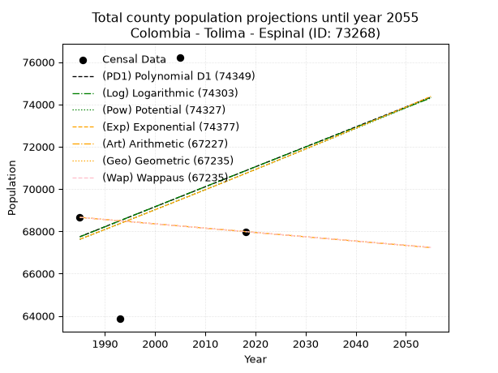
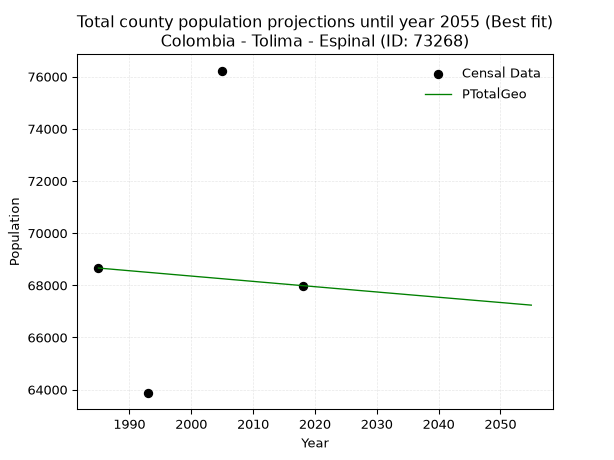
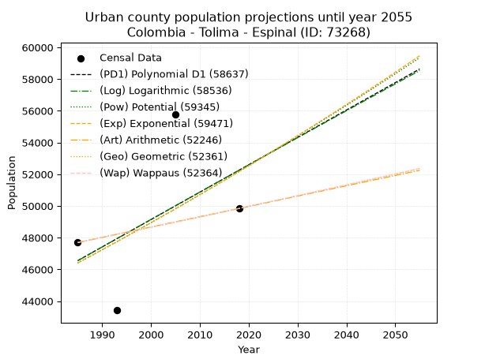
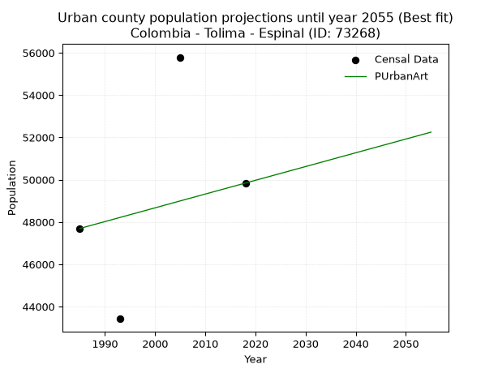
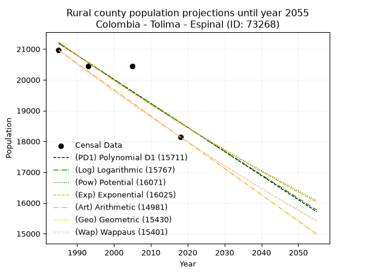
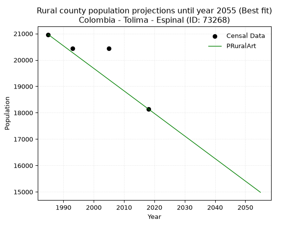

<div align="center">


</div>

# _“Population and Public Services Demand Projections (PPSD) until Year 2050 for Colombia - Tolima - Espinal (ID: 73268)”_
Keywords: `population` `public-service` `projection` `lineal` `polynomial` `logarithmic` `potential` `exponential` `arithmetic` `geometric` `wappaus` `dane` `colombia` `south-america`

PPSD are analytical estimates used by governments and planners to anticipate future changes in population size, age distribution, and the resulting community needs for utilities, healthcare, education, and infrastructure as sizing future water treatment facilities, electrical grids, and road networks based on spatial growth.

> **General running parameters**: • app_version: _v20260806_. • Python version: _3.14.7_. • Pandas version: _3.0.5_. • NumPy version: _2.5.1_. • Creates, save and include plots into reports (create_plot): _False_. • Projection until year: _2050_. • Process polynomial degree 2 and up: _False_. • Process Wappaus: _True_. • Process Wappaus: _True_. • Set negative values to zero: _True_. • Set infinite values to zero: _True_. • Drop dataset notes: _True_. 
<div align="center">

Dynamic map: [:earth_americas:Google](http://maps.google.com/maps?q=4.151313965,-74.8854458) [:earth_americas:OSM](https://www.openstreetmap.org/#map=18/4.151313965/-74.8854458&layers=P) [:earth_americas:Bing](https://www.bing.com/maps?cp=4.151313965~-74.8854458&lvl=18) [:earth_americas:Apple](https://maps.apple.com/frame?center=4.151313965%2C-74.8854458&span=0.003%2C0.006)

</div>


<div align="center">

```geojson
{
  "type": "Feature",
  "geometry": {
    "type": "Point", 
    "coordinates": [-74.8854458, 4.151313965]
  }, 
  "properties": {
    "Name": "Colombia - Tolima - Espinal (ID: 73268)"
  }
}
```

</div>


## 0. Census Data (4 records)

Census data are official statistics collected by a government about the people and housing in a country. They usually include counts of total population, age, sex, race, income, education, and jobs.

📅Global census file: [Population.xlsx](../data/Population.xlsx)

| Source   |   Year |   CountryID | CountryName   |   StateID | StateName   |   CountyID | CountyName   |   PTotal |   PUrban |   PRural |
|:---------|-------:|------------:|:--------------|----------:|:------------|-----------:|:-------------|---------:|---------:|---------:|
| DANE     |   1985 |          57 | Colombia      |        73 | Tolima      |      73268 | Espinal      |    68657 |    47694 |    20963 |
| DANE     |   1993 |          57 | Colombia      |        73 | Tolima      |      73268 | Espinal      |    63859 |    43422 |    20437 |
| DANE     |   2005 |          57 | Colombia      |        73 | Tolima      |      73268 | Espinal      |    76226 |    55787 |    20439 |
| DANE     |   2018 |          57 | Colombia      |        73 | Tolima      |      73268 | Espinal      |    67983 |    49840 |    18143 |

> 🔥Some records could had specific notes about the registered values or the corresponding urban or rural distribution.

📅   [RUPS](https://www.datos.gov.co/Hacienda-y-Cr-dito-P-blico/Registro-nico-de-Prestadores-de-Servicios-P-blicos/4qkq-csdn/about_data) - Local public utility companies: [RUPS.csv](../data/RUPS.xlsx)

 | SERVICIO       | ESTADO    | NOMBRE                                                         | NIT         | DEPARTAMENTO_DOMICILIO   | MUNICIPIO_DOMICILIO   | DIRECCION         |   TELEFONO | EMAIL                              | TIPO_INSCRIPCION    | REPRESENTANTE_LEGAL               | TIPO_PRESTADOR                            | CLASIFICACION                 |
|:---------------|:----------|:---------------------------------------------------------------|:------------|:-------------------------|:----------------------|:------------------|-----------:|:-----------------------------------|:--------------------|:----------------------------------|:------------------------------------------|:------------------------------|
| ACUEDUCTO      | OPERATIVA | EMPRESA DE ACUEDUCTO, ALCANTARILLADO Y ASEO DEL ESPINAL E.S.P. | 890704204-7 | TOLIMA                   | ESPINAL               | CARRERA 6 No.7-80 |    2390201 | cristian.vasquez@aaaespinal.com.co | Registro por la ESP | SILVIA LILIANA  BETANCOURT  PRADA | EMPRESA INDUSTRIAL Y COMERCIAL DEL ESTADO | MAYOR O IGUAL A 5001 USUARIOS |
| ALCANTARILLADO | OPERATIVA | EMPRESA DE ACUEDUCTO, ALCANTARILLADO Y ASEO DEL ESPINAL E.S.P. | 890704204-7 | TOLIMA                   | ESPINAL               | CARRERA 6 No.7-80 |    2390201 | cristian.vasquez@aaaespinal.com.co | Registro por la ESP | SILVIA LILIANA  BETANCOURT  PRADA | EMPRESA INDUSTRIAL Y COMERCIAL DEL ESTADO | MAYOR O IGUAL A 5001 USUARIOS |

## 1. Total

### 1.1. Coefficients and Parameters

* (PD1) Polynomial Deg 1: 94.37936571658491, -119601.076274599 (lineal)
* (Log) Logarithmic: 189540.34044336271, -1371516.3965909649
* (Pow) Potential: 2.7303096386663657, -4.173856578110599
* (Exp) Exponential: 0.0013598905900362266, 4547.4610856924955
* (Art) Arithmetic: Year diff. 2018 - 1985 = 33, Population diff. 67983 - 68657 = -674, Annual growth = -20.424242424242426
* (Geo) Geometric: Year diff. 2018 - 1985 = 33, Population diff. 67983 - 68657 = -674, Annual growth % = -0.00029890742710658724
* (Wap) Wappaus: i = -0.029894968419558583, Condition values only valid for < 200)

<sub>
Wappaus condition values: ['-0.00', '-0.03', '-0.06', '-0.09', '-0.12', '-0.15', '-0.18', '-0.21', '-0.24', '-0.27', '-0.30', '-0.33', '-0.36', '-0.39', '-0.42', '-0.45', '-0.48', '-0.51', '-0.54', '-0.57', '-0.60', '-0.63', '-0.66', '-0.69', '-0.72', '-0.75', '-0.78', '-0.81', '-0.84', '-0.87', '-0.90', '-0.93', '-0.96', '-0.99', '-1.02', '-1.05', '-1.08', '-1.11', '-1.14', '-1.17', '-1.20', '-1.23', '-1.26', '-1.29', '-1.32', '-1.35', '-1.38', '-1.41', '-1.43', '-1.46', '-1.49', '-1.52', '-1.55', '-1.58', '-1.61', '-1.64', '-1.67', '-1.70', '-1.73', '-1.76', '-1.79', '-1.82', '-1.85', '-1.88', '-1.91', '-1.94']
</sub>


### 1.2. Projected Dataset

|   Year |   CountyID |   PTotalPD1 |   PTotalLog |   PTotalPow |   PTotalExp |   PTotalArt |   PTotalGeo |   PTotalWap |
|-------:|-----------:|------------:|------------:|------------:|------------:|------------:|------------:|------------:|
|   1985 |      73268 |       67742 |       67734 |       67616 |       67623 |       68657 |       68657 |       68657 |
|   1986 |      73268 |       67836 |       67830 |       67709 |       67715 |       68637 |       68636 |       68636 |
|   1987 |      73268 |       67931 |       67925 |       67802 |       67807 |       68616 |       68616 |       68616 |
|   1988 |      73268 |       68025 |       68021 |       67896 |       67900 |       68596 |       68595 |       68595 |
|   1989 |      73268 |       68119 |       68116 |       67989 |       67992 |       68575 |       68575 |       68575 |
|   1990 |      73268 |       68214 |       68211 |       68082 |       68085 |       68555 |       68554 |       68554 |
|   1991 |      73268 |       68308 |       68306 |       68176 |       68177 |       68534 |       68534 |       68534 |
|   1992 |      73268 |       68403 |       68402 |       68269 |       68270 |       68514 |       68513 |       68513 |
|   1993 |      73268 |       68497 |       68497 |       68363 |       68363 |       68494 |       68493 |       68493 |
|   1994 |      73268 |       68591 |       68592 |       68457 |       68456 |       68473 |       68473 |       68473 |
|   1995 |      73268 |       68686 |       68687 |       68550 |       68549 |       68453 |       68452 |       68452 |
|   1996 |      73268 |       68780 |       68782 |       68644 |       68642 |       68432 |       68432 |       68432 |
|   1997 |      73268 |       68875 |       68877 |       68738 |       68736 |       68412 |       68411 |       68411 |
|   1998 |      73268 |       68969 |       68972 |       68832 |       68829 |       68391 |       68391 |       68391 |
|   1999 |      73268 |       69063 |       69066 |       68926 |       68923 |       68371 |       68370 |       68370 |
|   2000 |      73268 |       69158 |       69161 |       69020 |       69017 |       68351 |       68350 |       68350 |
|   2001 |      73268 |       69252 |       69256 |       69115 |       69111 |       68330 |       68329 |       68329 |
|   2002 |      73268 |       69346 |       69351 |       69209 |       69205 |       68310 |       68309 |       68309 |
|   2003 |      73268 |       69441 |       69445 |       69303 |       69299 |       68289 |       68289 |       68289 |
|   2004 |      73268 |       69535 |       69540 |       69398 |       69393 |       68269 |       68268 |       68268 |
|   2005 |      73268 |       69630 |       69635 |       69493 |       69488 |       68249 |       68248 |       68248 |
|   2006 |      73268 |       69724 |       69729 |       69587 |       69582 |       68228 |       68227 |       68227 |
|   2007 |      73268 |       69818 |       69823 |       69682 |       69677 |       68208 |       68207 |       68207 |
|   2008 |      73268 |       69913 |       69918 |       69777 |       69772 |       68187 |       68187 |       68187 |
|   2009 |      73268 |       70007 |       70012 |       69872 |       69867 |       68167 |       68166 |       68166 |
|   2010 |      73268 |       70101 |       70107 |       69967 |       69962 |       68146 |       68146 |       68146 |
|   2011 |      73268 |       70196 |       70201 |       70062 |       70057 |       68126 |       68125 |       68125 |
|   2012 |      73268 |       70290 |       70295 |       70157 |       70152 |       68106 |       68105 |       68105 |
|   2013 |      73268 |       70385 |       70389 |       70252 |       70248 |       68085 |       68085 |       68085 |
|   2014 |      73268 |       70479 |       70483 |       70348 |       70343 |       68065 |       68064 |       68064 |
|   2015 |      73268 |       70573 |       70577 |       70443 |       70439 |       68044 |       68044 |       68044 |
|   2016 |      73268 |       70668 |       70672 |       70538 |       70535 |       68024 |       68024 |       68024 |
|   2017 |      73268 |       70762 |       70766 |       70634 |       70631 |       68003 |       68003 |       68003 |
|   2018 |      73268 |       70856 |       70859 |       70730 |       70727 |       67983 |       67983 |       67983 |
|   2019 |      73268 |       70951 |       70953 |       70825 |       70823 |       67963 |       67963 |       67963 |
|   2020 |      73268 |       71045 |       71047 |       70921 |       70920 |       67942 |       67942 |       67942 |
|   2021 |      73268 |       71140 |       71141 |       71017 |       71016 |       67922 |       67922 |       67922 |
|   2022 |      73268 |       71234 |       71235 |       71113 |       71113 |       67901 |       67902 |       67902 |
|   2023 |      73268 |       71328 |       71329 |       71209 |       71210 |       67881 |       67881 |       67881 |
|   2024 |      73268 |       71423 |       71422 |       71305 |       71307 |       67860 |       67861 |       67861 |
|   2025 |      73268 |       71517 |       71516 |       71402 |       71404 |       67840 |       67841 |       67841 |
|   2026 |      73268 |       71612 |       71609 |       71498 |       71501 |       67820 |       67821 |       67821 |
|   2027 |      73268 |       71706 |       71703 |       71594 |       71598 |       67799 |       67800 |       67800 |
|   2028 |      73268 |       71800 |       71796 |       71691 |       71695 |       67779 |       67780 |       67780 |
|   2029 |      73268 |       71895 |       71890 |       71787 |       71793 |       67758 |       67760 |       67760 |
|   2030 |      73268 |       71989 |       71983 |       71884 |       71891 |       67738 |       67740 |       67740 |
|   2031 |      73268 |       72083 |       72077 |       71981 |       71989 |       67717 |       67719 |       67719 |
|   2032 |      73268 |       72178 |       72170 |       72077 |       72086 |       67697 |       67699 |       67699 |
|   2033 |      73268 |       72272 |       72263 |       72174 |       72185 |       67677 |       67679 |       67679 |
|   2034 |      73268 |       72367 |       72356 |       72271 |       72283 |       67656 |       67659 |       67659 |
|   2035 |      73268 |       72461 |       72450 |       72368 |       72381 |       67636 |       67638 |       67638 |
|   2036 |      73268 |       72555 |       72543 |       72465 |       72480 |       67615 |       67618 |       67618 |
|   2037 |      73268 |       72650 |       72636 |       72563 |       72578 |       67595 |       67598 |       67598 |
|   2038 |      73268 |       72744 |       72729 |       72660 |       72677 |       67575 |       67578 |       67578 |
|   2039 |      73268 |       72838 |       72822 |       72757 |       72776 |       67554 |       67558 |       67558 |
|   2040 |      73268 |       72933 |       72915 |       72855 |       72875 |       67534 |       67537 |       67537 |
|   2041 |      73268 |       73027 |       73008 |       72952 |       72974 |       67513 |       67517 |       67517 |
|   2042 |      73268 |       73122 |       73100 |       73050 |       73073 |       67493 |       67497 |       67497 |
|   2043 |      73268 |       73216 |       73193 |       73148 |       73173 |       67472 |       67477 |       67477 |
|   2044 |      73268 |       73310 |       73286 |       73246 |       73273 |       67452 |       67457 |       67457 |
|   2045 |      73268 |       73405 |       73379 |       73343 |       73372 |       67432 |       67436 |       67436 |
|   2046 |      73268 |       73499 |       73471 |       73441 |       73472 |       67411 |       67416 |       67416 |
|   2047 |      73268 |       73593 |       73564 |       73539 |       73572 |       67391 |       67396 |       67396 |
|   2048 |      73268 |       73688 |       73656 |       73638 |       73672 |       67370 |       67376 |       67376 |
|   2049 |      73268 |       73782 |       73749 |       73736 |       73772 |       67350 |       67356 |       67356 |
|   2050 |      73268 |       73877 |       73841 |       73834 |       73873 |       67329 |       67336 |       67336 |
<div align="center">

</img>

</div>


### 1.3. Best fit with absolute and relative error (%)

Relative error puts that difference into context by dividing the absolute error by the true value, creating a unitless ratio or percentage that shows the scale of the mistake.

Absolute and relative error

|   Year | Source   |   CountryID | CountryName   |   StateID | StateName   |   CountyID_x | CountyName   |   PTotal |   PUrban |   PRural |   CountyID_y |   PTotalPD1 |   PTotalLog |   PTotalPow |   PTotalExp |   PTotalArt |   PTotalGeo |   PTotalWap |   PTotalPD1AbsError |   PTotalLogAbsError |   PTotalPowAbsError |   PTotalExpAbsError |   PTotalArtAbsError |   PTotalGeoAbsError |   PTotalWapAbsError |   PTotalPD1RelError |   PTotalLogRelError |   PTotalPowRelError |   PTotalExpRelError |   PTotalArtRelError |   PTotalGeoRelError |   PTotalWapRelError |
|-------:|:---------|------------:|:--------------|----------:|:------------|-------------:|:-------------|---------:|---------:|---------:|-------------:|------------:|------------:|------------:|------------:|------------:|------------:|------------:|--------------------:|--------------------:|--------------------:|--------------------:|--------------------:|--------------------:|--------------------:|--------------------:|--------------------:|--------------------:|--------------------:|--------------------:|--------------------:|--------------------:|
|   1985 | DANE     |          57 | Colombia      |        73 | Tolima      |        73268 | Espinal      |    68657 |    47694 |    20963 |        73268 |       67742 |       67734 |       67616 |       67623 |       68657 |       68657 |       68657 |                 915 |                 923 |                1041 |                1034 |                   0 |                   0 |                   0 |             1.33271 |             1.34436 |             1.51623 |             1.50604 |             0       |             0       |             0       |
|   1993 | DANE     |          57 | Colombia      |        73 | Tolima      |        73268 | Espinal      |    63859 |    43422 |    20437 |        73268 |       68497 |       68497 |       68363 |       68363 |       68494 |       68493 |       68493 |                4638 |                4638 |                4504 |                4504 |                4635 |                4634 |                4634 |             7.26288 |             7.26288 |             7.05304 |             7.05304 |             7.25818 |             7.25661 |             7.25661 |
|   2005 | DANE     |          57 | Colombia      |        73 | Tolima      |        73268 | Espinal      |    76226 |    55787 |    20439 |        73268 |       69630 |       69635 |       69493 |       69488 |       68249 |       68248 |       68248 |                6596 |                6591 |                6733 |                6738 |                7977 |                7978 |                7978 |             8.65322 |             8.64666 |             8.83294 |             8.8395  |            10.4649  |            10.4662  |            10.4662  |
|   2018 | DANE     |          57 | Colombia      |        73 | Tolima      |        73268 | Espinal      |    67983 |    49840 |    18143 |        73268 |       70856 |       70859 |       70730 |       70727 |       67983 |       67983 |       67983 |                2873 |                2876 |                2747 |                2744 |                   0 |                   0 |                   0 |             4.22606 |             4.23047 |             4.04072 |             4.0363  |             0       |             0       |             0       |

Relative error mean

| Method    |   RelError | Best   |
|:----------|-----------:|:-------|
| PTotalPD1 |    5.36871 |        |
| PTotalLog |    5.37109 |        |
| PTotalPow |    5.36073 |        |
| PTotalExp |    5.35872 |        |
| PTotalArt |    4.43078 |        |
| PTotalGeo |    4.43071 | True   |
| PTotalWap |    4.43071 | True   |

💙Best method: _**PTotalGeo**_
<div align="center">

</img>

</div>


### 1.4. Fresh water supply demand in liters per capita per day (lpcd)

The fresh water supply demand typically ranges from 100 to 300 liters per capita per day (lpcd) for standard domestic and municipal planning, though absolute survival minimums set by the World Health Organization are as low as 7.5 to 20 liters per day, and total consumption in high-income nations can exceed 400 liters.

> `CZ`: Level in meters above the sea level (masl)<br> `WS`: Fresh water supply demand in liters per capita per day (lpcd or l/h/d)<br> `WSAll`: Zonal fresh water supply demand in liters per second (l/s)<br> `A`: Zonal area in square meters<br> `DP`: Population density (people/hectare or p/ha)

Reference values (RAS Colombia)

|    CZ |   WS |
|------:|-----:|
|  1000 |  120 |
|  2000 |  130 |
| 99999 |  140 |

County shapefile geometry properties and water supply values

|   CountyID |      ATotal |   CZTotal |   WSTotal |
|-----------:|------------:|----------:|----------:|
|      73268 | 2.16344e+08 |   328.903 |       120 |

Projected values for best method: PTotalGeo

|   CountyID |   Year |   PTotalGeo |   DPTotal |   WSTotal |   WSTotalAll |
|-----------:|-------:|------------:|----------:|----------:|-------------:|
|      73268 |   1985 |       68657 |      3.17 |       120 |      95.3569 |
|      73268 |   1986 |       68636 |      3.17 |       120 |      95.3278 |
|      73268 |   1987 |       68616 |      3.17 |       120 |      95.3    |
|      73268 |   1988 |       68595 |      3.17 |       120 |      95.2708 |
|      73268 |   1989 |       68575 |      3.17 |       120 |      95.2431 |
|      73268 |   1990 |       68554 |      3.17 |       120 |      95.2139 |
|      73268 |   1991 |       68534 |      3.17 |       120 |      95.1861 |
|      73268 |   1992 |       68513 |      3.17 |       120 |      95.1569 |
|      73268 |   1993 |       68493 |      3.17 |       120 |      95.1292 |
|      73268 |   1994 |       68473 |      3.17 |       120 |      95.1014 |
|      73268 |   1995 |       68452 |      3.16 |       120 |      95.0722 |
|      73268 |   1996 |       68432 |      3.16 |       120 |      95.0444 |
|      73268 |   1997 |       68411 |      3.16 |       120 |      95.0153 |
|      73268 |   1998 |       68391 |      3.16 |       120 |      94.9875 |
|      73268 |   1999 |       68370 |      3.16 |       120 |      94.9583 |
|      73268 |   2000 |       68350 |      3.16 |       120 |      94.9306 |
|      73268 |   2001 |       68329 |      3.16 |       120 |      94.9014 |
|      73268 |   2002 |       68309 |      3.16 |       120 |      94.8736 |
|      73268 |   2003 |       68289 |      3.16 |       120 |      94.8458 |
|      73268 |   2004 |       68268 |      3.16 |       120 |      94.8167 |
|      73268 |   2005 |       68248 |      3.15 |       120 |      94.7889 |
|      73268 |   2006 |       68227 |      3.15 |       120 |      94.7597 |
|      73268 |   2007 |       68207 |      3.15 |       120 |      94.7319 |
|      73268 |   2008 |       68187 |      3.15 |       120 |      94.7042 |
|      73268 |   2009 |       68166 |      3.15 |       120 |      94.675  |
|      73268 |   2010 |       68146 |      3.15 |       120 |      94.6472 |
|      73268 |   2011 |       68125 |      3.15 |       120 |      94.6181 |
|      73268 |   2012 |       68105 |      3.15 |       120 |      94.5903 |
|      73268 |   2013 |       68085 |      3.15 |       120 |      94.5625 |
|      73268 |   2014 |       68064 |      3.15 |       120 |      94.5333 |
|      73268 |   2015 |       68044 |      3.15 |       120 |      94.5056 |
|      73268 |   2016 |       68024 |      3.14 |       120 |      94.4778 |
|      73268 |   2017 |       68003 |      3.14 |       120 |      94.4486 |
|      73268 |   2018 |       67983 |      3.14 |       120 |      94.4208 |
|      73268 |   2019 |       67963 |      3.14 |       120 |      94.3931 |
|      73268 |   2020 |       67942 |      3.14 |       120 |      94.3639 |
|      73268 |   2021 |       67922 |      3.14 |       120 |      94.3361 |
|      73268 |   2022 |       67902 |      3.14 |       120 |      94.3083 |
|      73268 |   2023 |       67881 |      3.14 |       120 |      94.2792 |
|      73268 |   2024 |       67861 |      3.14 |       120 |      94.2514 |
|      73268 |   2025 |       67841 |      3.14 |       120 |      94.2236 |
|      73268 |   2026 |       67821 |      3.13 |       120 |      94.1958 |
|      73268 |   2027 |       67800 |      3.13 |       120 |      94.1667 |
|      73268 |   2028 |       67780 |      3.13 |       120 |      94.1389 |
|      73268 |   2029 |       67760 |      3.13 |       120 |      94.1111 |
|      73268 |   2030 |       67740 |      3.13 |       120 |      94.0833 |
|      73268 |   2031 |       67719 |      3.13 |       120 |      94.0542 |
|      73268 |   2032 |       67699 |      3.13 |       120 |      94.0264 |
|      73268 |   2033 |       67679 |      3.13 |       120 |      93.9986 |
|      73268 |   2034 |       67659 |      3.13 |       120 |      93.9708 |
|      73268 |   2035 |       67638 |      3.13 |       120 |      93.9417 |
|      73268 |   2036 |       67618 |      3.13 |       120 |      93.9139 |
|      73268 |   2037 |       67598 |      3.12 |       120 |      93.8861 |
|      73268 |   2038 |       67578 |      3.12 |       120 |      93.8583 |
|      73268 |   2039 |       67558 |      3.12 |       120 |      93.8306 |
|      73268 |   2040 |       67537 |      3.12 |       120 |      93.8014 |
|      73268 |   2041 |       67517 |      3.12 |       120 |      93.7736 |
|      73268 |   2042 |       67497 |      3.12 |       120 |      93.7458 |
|      73268 |   2043 |       67477 |      3.12 |       120 |      93.7181 |
|      73268 |   2044 |       67457 |      3.12 |       120 |      93.6903 |
|      73268 |   2045 |       67436 |      3.12 |       120 |      93.6611 |
|      73268 |   2046 |       67416 |      3.12 |       120 |      93.6333 |
|      73268 |   2047 |       67396 |      3.12 |       120 |      93.6056 |
|      73268 |   2048 |       67376 |      3.11 |       120 |      93.5778 |
|      73268 |   2049 |       67356 |      3.11 |       120 |      93.55   |
|      73268 |   2050 |       67336 |      3.11 |       120 |      93.5222 |

## 2. Urban

### 2.1. Coefficients and Parameters

* (PD1) Polynomial Deg 1: 172.62986752308615, -296117.1425130531 (lineal)
* (Log) Logarithmic: 346018.4347329351, -2580903.145222756
* (Pow) Potential: 7.098914711796128, -18.74398467233457
* (Exp) Exponential: 0.003542426016121504, 40.999106874619294
* (Art) Arithmetic: Year diff. 2018 - 1985 = 33, Population diff. 49840 - 47694 = 2146, Annual growth = 65.03030303030303
* (Geo) Geometric: Year diff. 2018 - 1985 = 33, Population diff. 49840 - 47694 = 2146, Annual growth % = 0.0013345949517866718
* (Wap) Wappaus: i = 0.13334899220846685, Condition values only valid for < 200)

<sub>
Wappaus condition values: ['0.00', '0.13', '0.27', '0.40', '0.53', '0.67', '0.80', '0.93', '1.07', '1.20', '1.33', '1.47', '1.60', '1.73', '1.87', '2.00', '2.13', '2.27', '2.40', '2.53', '2.67', '2.80', '2.93', '3.07', '3.20', '3.33', '3.47', '3.60', '3.73', '3.87', '4.00', '4.13', '4.27', '4.40', '4.53', '4.67', '4.80', '4.93', '5.07', '5.20', '5.33', '5.47', '5.60', '5.73', '5.87', '6.00', '6.13', '6.27', '6.40', '6.53', '6.67', '6.80', '6.93', '7.07', '7.20', '7.33', '7.47', '7.60', '7.73', '7.87', '8.00', '8.13', '8.27', '8.40', '8.53', '8.67']
</sub>


### 2.2. Projected Dataset

|   Year |   CountyID |   PUrbanPD1 |   PUrbanLog |   PUrbanPow |   PUrbanExp |   PUrbanArt |   PUrbanGeo |   PUrbanWap |
|-------:|-----------:|------------:|------------:|------------:|------------:|------------:|------------:|------------:|
|   1985 |      73268 |       46553 |       46544 |       46402 |       46410 |       47694 |       47694 |       47694 |
|   1986 |      73268 |       46726 |       46719 |       46568 |       46574 |       47759 |       47758 |       47758 |
|   1987 |      73268 |       46898 |       46893 |       46735 |       46740 |       47824 |       47821 |       47821 |
|   1988 |      73268 |       47071 |       47067 |       46902 |       46906 |       47889 |       47885 |       47885 |
|   1989 |      73268 |       47244 |       47241 |       47070 |       47072 |       47954 |       47949 |       47949 |
|   1990 |      73268 |       47416 |       47415 |       47238 |       47239 |       48019 |       48013 |       48013 |
|   1991 |      73268 |       47589 |       47589 |       47407 |       47407 |       48084 |       48077 |       48077 |
|   1992 |      73268 |       47762 |       47762 |       47576 |       47575 |       48149 |       48141 |       48141 |
|   1993 |      73268 |       47934 |       47936 |       47746 |       47744 |       48214 |       48206 |       48206 |
|   1994 |      73268 |       48107 |       48110 |       47916 |       47913 |       48279 |       48270 |       48270 |
|   1995 |      73268 |       48279 |       48283 |       48087 |       48083 |       48344 |       48334 |       48334 |
|   1996 |      73268 |       48452 |       48456 |       48258 |       48254 |       48409 |       48399 |       48399 |
|   1997 |      73268 |       48625 |       48630 |       48430 |       48425 |       48474 |       48463 |       48463 |
|   1998 |      73268 |       48797 |       48803 |       48603 |       48597 |       48539 |       48528 |       48528 |
|   1999 |      73268 |       48970 |       48976 |       48776 |       48769 |       48604 |       48593 |       48593 |
|   2000 |      73268 |       49143 |       49149 |       48949 |       48943 |       48669 |       48658 |       48658 |
|   2001 |      73268 |       49315 |       49322 |       49123 |       49116 |       48734 |       48723 |       48723 |
|   2002 |      73268 |       49488 |       49495 |       49298 |       49291 |       48800 |       48788 |       48788 |
|   2003 |      73268 |       49660 |       49668 |       49473 |       49465 |       48865 |       48853 |       48853 |
|   2004 |      73268 |       49833 |       49841 |       49648 |       49641 |       48930 |       48918 |       48918 |
|   2005 |      73268 |       50006 |       50013 |       49825 |       49817 |       48995 |       48983 |       48983 |
|   2006 |      73268 |       50178 |       50186 |       50001 |       49994 |       49060 |       49049 |       49049 |
|   2007 |      73268 |       50351 |       50358 |       50178 |       50171 |       49125 |       49114 |       49114 |
|   2008 |      73268 |       50524 |       50531 |       50356 |       50349 |       49190 |       49180 |       49180 |
|   2009 |      73268 |       50696 |       50703 |       50535 |       50528 |       49255 |       49245 |       49245 |
|   2010 |      73268 |       50869 |       50875 |       50713 |       50707 |       49320 |       49311 |       49311 |
|   2011 |      73268 |       51042 |       51047 |       50893 |       50887 |       49385 |       49377 |       49377 |
|   2012 |      73268 |       51214 |       51219 |       51073 |       51068 |       49450 |       49443 |       49443 |
|   2013 |      73268 |       51387 |       51391 |       51253 |       51249 |       49515 |       49509 |       49509 |
|   2014 |      73268 |       51559 |       51563 |       51434 |       51431 |       49580 |       49575 |       49575 |
|   2015 |      73268 |       51732 |       51735 |       51616 |       51614 |       49645 |       49641 |       49641 |
|   2016 |      73268 |       51905 |       51906 |       51798 |       51797 |       49710 |       49707 |       49707 |
|   2017 |      73268 |       52077 |       52078 |       51981 |       51980 |       49775 |       49774 |       49774 |
|   2018 |      73268 |       52250 |       52249 |       52164 |       52165 |       49840 |       49840 |       49840 |
|   2019 |      73268 |       52423 |       52421 |       52348 |       52350 |       49905 |       49907 |       49907 |
|   2020 |      73268 |       52595 |       52592 |       52532 |       52536 |       49970 |       49973 |       49973 |
|   2021 |      73268 |       52768 |       52763 |       52717 |       52722 |       50035 |       50040 |       50040 |
|   2022 |      73268 |       52940 |       52935 |       52902 |       52909 |       50100 |       50107 |       50107 |
|   2023 |      73268 |       53113 |       53106 |       53088 |       53097 |       50165 |       50173 |       50174 |
|   2024 |      73268 |       53286 |       53277 |       53275 |       53286 |       50230 |       50240 |       50241 |
|   2025 |      73268 |       53458 |       53448 |       53462 |       53475 |       50295 |       50307 |       50308 |
|   2026 |      73268 |       53631 |       53618 |       53650 |       53664 |       50360 |       50375 |       50375 |
|   2027 |      73268 |       53804 |       53789 |       53838 |       53855 |       50425 |       50442 |       50442 |
|   2028 |      73268 |       53976 |       53960 |       54027 |       54046 |       50490 |       50509 |       50509 |
|   2029 |      73268 |       54149 |       54130 |       54216 |       54238 |       50555 |       50577 |       50577 |
|   2030 |      73268 |       54321 |       54301 |       54406 |       54430 |       50620 |       50644 |       50645 |
|   2031 |      73268 |       54494 |       54471 |       54597 |       54623 |       50685 |       50712 |       50712 |
|   2032 |      73268 |       54667 |       54642 |       54788 |       54817 |       50750 |       50779 |       50780 |
|   2033 |      73268 |       54839 |       54812 |       54979 |       55012 |       50815 |       50847 |       50848 |
|   2034 |      73268 |       55012 |       54982 |       55172 |       55207 |       50880 |       50915 |       50916 |
|   2035 |      73268 |       55185 |       55152 |       55365 |       55403 |       50946 |       50983 |       50984 |
|   2036 |      73268 |       55357 |       55322 |       55558 |       55600 |       51011 |       51051 |       51052 |
|   2037 |      73268 |       55530 |       55492 |       55752 |       55797 |       51076 |       51119 |       51120 |
|   2038 |      73268 |       55703 |       55662 |       55947 |       55995 |       51141 |       51187 |       51188 |
|   2039 |      73268 |       55875 |       55832 |       56142 |       56194 |       51206 |       51256 |       51257 |
|   2040 |      73268 |       56048 |       56001 |       56338 |       56393 |       51271 |       51324 |       51325 |
|   2041 |      73268 |       56220 |       56171 |       56534 |       56593 |       51336 |       51393 |       51394 |
|   2042 |      73268 |       56393 |       56340 |       56731 |       56794 |       51401 |       51461 |       51462 |
|   2043 |      73268 |       56566 |       56510 |       56928 |       56995 |       51466 |       51530 |       51531 |
|   2044 |      73268 |       56738 |       56679 |       57126 |       57198 |       51531 |       51599 |       51600 |
|   2045 |      73268 |       56911 |       56848 |       57325 |       57401 |       51596 |       51667 |       51669 |
|   2046 |      73268 |       57084 |       57018 |       57524 |       57604 |       51661 |       51736 |       51738 |
|   2047 |      73268 |       57256 |       57187 |       57724 |       57809 |       51726 |       51805 |       51807 |
|   2048 |      73268 |       57429 |       57356 |       57925 |       58014 |       51791 |       51875 |       51876 |
|   2049 |      73268 |       57601 |       57524 |       58126 |       58220 |       51856 |       51944 |       51946 |
|   2050 |      73268 |       57774 |       57693 |       58328 |       58426 |       51921 |       52013 |       52015 |
<div align="center">

</img>

</div>


### 2.3. Best fit with absolute and relative error (%)

Relative error puts that difference into context by dividing the absolute error by the true value, creating a unitless ratio or percentage that shows the scale of the mistake.

Absolute and relative error

|   Year | Source   |   CountryID | CountryName   |   StateID | StateName   |   CountyID_x | CountyName   |   PTotal |   PUrban |   PRural |   CountyID_y |   PUrbanPD1 |   PUrbanLog |   PUrbanPow |   PUrbanExp |   PUrbanArt |   PUrbanGeo |   PUrbanWap |   PUrbanPD1AbsError |   PUrbanLogAbsError |   PUrbanPowAbsError |   PUrbanExpAbsError |   PUrbanArtAbsError |   PUrbanGeoAbsError |   PUrbanWapAbsError |   PUrbanPD1RelError |   PUrbanLogRelError |   PUrbanPowRelError |   PUrbanExpRelError |   PUrbanArtRelError |   PUrbanGeoRelError |   PUrbanWapRelError |
|-------:|:---------|------------:|:--------------|----------:|:------------|-------------:|:-------------|---------:|---------:|---------:|-------------:|------------:|------------:|------------:|------------:|------------:|------------:|------------:|--------------------:|--------------------:|--------------------:|--------------------:|--------------------:|--------------------:|--------------------:|--------------------:|--------------------:|--------------------:|--------------------:|--------------------:|--------------------:|--------------------:|
|   1985 | DANE     |          57 | Colombia      |        73 | Tolima      |        73268 | Espinal      |    68657 |    47694 |    20963 |        73268 |       46553 |       46544 |       46402 |       46410 |       47694 |       47694 |       47694 |                1141 |                1150 |                1292 |                1284 |                   0 |                   0 |                   0 |             2.39233 |             2.4112  |             2.70894 |             2.69216 |              0      |              0      |              0      |
|   1993 | DANE     |          57 | Colombia      |        73 | Tolima      |        73268 | Espinal      |    63859 |    43422 |    20437 |        73268 |       47934 |       47936 |       47746 |       47744 |       48214 |       48206 |       48206 |                4512 |                4514 |                4324 |                4322 |                4792 |                4784 |                4784 |            10.391   |            10.3957  |             9.95809 |             9.95348 |             11.0359 |             11.0175 |             11.0175 |
|   2005 | DANE     |          57 | Colombia      |        73 | Tolima      |        73268 | Espinal      |    76226 |    55787 |    20439 |        73268 |       50006 |       50013 |       49825 |       49817 |       48995 |       48983 |       48983 |                5781 |                5774 |                5962 |                5970 |                6792 |                6804 |                6804 |            10.3626  |            10.3501  |            10.6871  |            10.7014  |             12.1749 |             12.1964 |             12.1964 |
|   2018 | DANE     |          57 | Colombia      |        73 | Tolima      |        73268 | Espinal      |    67983 |    49840 |    18143 |        73268 |       52250 |       52249 |       52164 |       52165 |       49840 |       49840 |       49840 |                2410 |                2409 |                2324 |                2325 |                   0 |                   0 |                   0 |             4.83547 |             4.83347 |             4.66292 |             4.66493 |              0      |              0      |              0      |

Relative error mean

| Method    |   RelError | Best   |
|:----------|-----------:|:-------|
| PUrbanPD1 |    6.99537 |        |
| PUrbanLog |    6.9976  |        |
| PUrbanPow |    7.00426 |        |
| PUrbanExp |    7.003   |        |
| PUrbanArt |    5.80269 | True   |
| PUrbanGeo |    5.80346 |        |
| PUrbanWap |    5.80346 |        |

💙Best method: _**PUrbanArt**_
<div align="center">

</img>

</div>


### 2.4. Fresh water supply demand in liters per capita per day (lpcd)

The fresh water supply demand typically ranges from 100 to 300 liters per capita per day (lpcd) for standard domestic and municipal planning, though absolute survival minimums set by the World Health Organization are as low as 7.5 to 20 liters per day, and total consumption in high-income nations can exceed 400 liters.

> `CZ`: Level in meters above the sea level (masl)<br> `WS`: Fresh water supply demand in liters per capita per day (lpcd or l/h/d)<br> `WSAll`: Zonal fresh water supply demand in liters per second (l/s)<br> `A`: Zonal area in square meters<br> `DP`: Population density (people/hectare or p/ha)

Reference values (RAS Colombia)

|    CZ |   WS |
|------:|-----:|
|  1000 |  120 |
|  2000 |  130 |
| 99999 |  140 |

County shapefile geometry properties and water supply values

|   CountyID |      AUrban |   CZUrban |   WSUrban |
|-----------:|------------:|----------:|----------:|
|      73268 | 9.19304e+06 |   322.379 |       120 |

Projected values for best method: PUrbanArt

|   CountyID |   Year |   PUrbanArt |   DPUrban |   WSUrban |   WSUrbanAll |
|-----------:|-------:|------------:|----------:|----------:|-------------:|
|      73268 |   1985 |       47694 |     51.88 |       120 |      66.2417 |
|      73268 |   1986 |       47759 |     51.95 |       120 |      66.3319 |
|      73268 |   1987 |       47824 |     52.02 |       120 |      66.4222 |
|      73268 |   1988 |       47889 |     52.09 |       120 |      66.5125 |
|      73268 |   1989 |       47954 |     52.16 |       120 |      66.6028 |
|      73268 |   1990 |       48019 |     52.23 |       120 |      66.6931 |
|      73268 |   1991 |       48084 |     52.3  |       120 |      66.7833 |
|      73268 |   1992 |       48149 |     52.38 |       120 |      66.8736 |
|      73268 |   1993 |       48214 |     52.45 |       120 |      66.9639 |
|      73268 |   1994 |       48279 |     52.52 |       120 |      67.0542 |
|      73268 |   1995 |       48344 |     52.59 |       120 |      67.1444 |
|      73268 |   1996 |       48409 |     52.66 |       120 |      67.2347 |
|      73268 |   1997 |       48474 |     52.73 |       120 |      67.325  |
|      73268 |   1998 |       48539 |     52.8  |       120 |      67.4153 |
|      73268 |   1999 |       48604 |     52.87 |       120 |      67.5056 |
|      73268 |   2000 |       48669 |     52.94 |       120 |      67.5958 |
|      73268 |   2001 |       48734 |     53.01 |       120 |      67.6861 |
|      73268 |   2002 |       48800 |     53.08 |       120 |      67.7778 |
|      73268 |   2003 |       48865 |     53.15 |       120 |      67.8681 |
|      73268 |   2004 |       48930 |     53.23 |       120 |      67.9583 |
|      73268 |   2005 |       48995 |     53.3  |       120 |      68.0486 |
|      73268 |   2006 |       49060 |     53.37 |       120 |      68.1389 |
|      73268 |   2007 |       49125 |     53.44 |       120 |      68.2292 |
|      73268 |   2008 |       49190 |     53.51 |       120 |      68.3194 |
|      73268 |   2009 |       49255 |     53.58 |       120 |      68.4097 |
|      73268 |   2010 |       49320 |     53.65 |       120 |      68.5    |
|      73268 |   2011 |       49385 |     53.72 |       120 |      68.5903 |
|      73268 |   2012 |       49450 |     53.79 |       120 |      68.6806 |
|      73268 |   2013 |       49515 |     53.86 |       120 |      68.7708 |
|      73268 |   2014 |       49580 |     53.93 |       120 |      68.8611 |
|      73268 |   2015 |       49645 |     54    |       120 |      68.9514 |
|      73268 |   2016 |       49710 |     54.07 |       120 |      69.0417 |
|      73268 |   2017 |       49775 |     54.14 |       120 |      69.1319 |
|      73268 |   2018 |       49840 |     54.21 |       120 |      69.2222 |
|      73268 |   2019 |       49905 |     54.29 |       120 |      69.3125 |
|      73268 |   2020 |       49970 |     54.36 |       120 |      69.4028 |
|      73268 |   2021 |       50035 |     54.43 |       120 |      69.4931 |
|      73268 |   2022 |       50100 |     54.5  |       120 |      69.5833 |
|      73268 |   2023 |       50165 |     54.57 |       120 |      69.6736 |
|      73268 |   2024 |       50230 |     54.64 |       120 |      69.7639 |
|      73268 |   2025 |       50295 |     54.71 |       120 |      69.8542 |
|      73268 |   2026 |       50360 |     54.78 |       120 |      69.9444 |
|      73268 |   2027 |       50425 |     54.85 |       120 |      70.0347 |
|      73268 |   2028 |       50490 |     54.92 |       120 |      70.125  |
|      73268 |   2029 |       50555 |     54.99 |       120 |      70.2153 |
|      73268 |   2030 |       50620 |     55.06 |       120 |      70.3056 |
|      73268 |   2031 |       50685 |     55.13 |       120 |      70.3958 |
|      73268 |   2032 |       50750 |     55.2  |       120 |      70.4861 |
|      73268 |   2033 |       50815 |     55.28 |       120 |      70.5764 |
|      73268 |   2034 |       50880 |     55.35 |       120 |      70.6667 |
|      73268 |   2035 |       50946 |     55.42 |       120 |      70.7583 |
|      73268 |   2036 |       51011 |     55.49 |       120 |      70.8486 |
|      73268 |   2037 |       51076 |     55.56 |       120 |      70.9389 |
|      73268 |   2038 |       51141 |     55.63 |       120 |      71.0292 |
|      73268 |   2039 |       51206 |     55.7  |       120 |      71.1194 |
|      73268 |   2040 |       51271 |     55.77 |       120 |      71.2097 |
|      73268 |   2041 |       51336 |     55.84 |       120 |      71.3    |
|      73268 |   2042 |       51401 |     55.91 |       120 |      71.3903 |
|      73268 |   2043 |       51466 |     55.98 |       120 |      71.4806 |
|      73268 |   2044 |       51531 |     56.05 |       120 |      71.5708 |
|      73268 |   2045 |       51596 |     56.13 |       120 |      71.6611 |
|      73268 |   2046 |       51661 |     56.2  |       120 |      71.7514 |
|      73268 |   2047 |       51726 |     56.27 |       120 |      71.8417 |
|      73268 |   2048 |       51791 |     56.34 |       120 |      71.9319 |
|      73268 |   2049 |       51856 |     56.41 |       120 |      72.0222 |
|      73268 |   2050 |       51921 |     56.48 |       120 |      72.1125 |

## 3. Rural

### 3.1. Coefficients and Parameters

* (PD1) Polynomial Deg 1: -78.25050180650194, 176516.0662384555 (lineal)
* (Log) Logarithmic: -156478.09428957308, 1209386.7486317963
* (Pow) Potential: -8.028812396354347, 30.803978433603348
* (Exp) Exponential: -0.004015129130015614, 61403428.16622089
* (Art) Arithmetic: Year diff. 2018 - 1985 = 33, Population diff. 18143 - 20963 = -2820, Annual growth = -85.45454545454545
* (Geo) Geometric: Year diff. 2018 - 1985 = 33, Population diff. 18143 - 20963 = -2820, Annual growth % = -0.004368435584554686
* (Wap) Wappaus: i = -0.43704058433256, Condition values only valid for < 200)

<sub>
Wappaus condition values: ['-0.00', '-0.44', '-0.87', '-1.31', '-1.75', '-2.19', '-2.62', '-3.06', '-3.50', '-3.93', '-4.37', '-4.81', '-5.24', '-5.68', '-6.12', '-6.56', '-6.99', '-7.43', '-7.87', '-8.30', '-8.74', '-9.18', '-9.61', '-10.05', '-10.49', '-10.93', '-11.36', '-11.80', '-12.24', '-12.67', '-13.11', '-13.55', '-13.99', '-14.42', '-14.86', '-15.30', '-15.73', '-16.17', '-16.61', '-17.04', '-17.48', '-17.92', '-18.36', '-18.79', '-19.23', '-19.67', '-20.10', '-20.54', '-20.98', '-21.41', '-21.85', '-22.29', '-22.73', '-23.16', '-23.60', '-24.04', '-24.47', '-24.91', '-25.35', '-25.79', '-26.22', '-26.66', '-27.10', '-27.53', '-27.97', '-28.41']
</sub>


### 3.2. Projected Dataset

|   Year |   CountyID |   PRuralPD1 |   PRuralLog |   PRuralPow |   PRuralExp |   PRuralArt |   PRuralGeo |   PRuralWap |
|-------:|-----------:|------------:|------------:|------------:|------------:|------------:|------------:|------------:|
|   1985 |      73268 |       21189 |       21190 |       21226 |       21225 |       20963 |       20963 |       20963 |
|   1986 |      73268 |       21111 |       21111 |       21141 |       21140 |       20878 |       20871 |       20872 |
|   1987 |      73268 |       21032 |       21032 |       21056 |       21055 |       20792 |       20780 |       20781 |
|   1988 |      73268 |       20954 |       20954 |       20971 |       20971 |       20707 |       20689 |       20690 |
|   1989 |      73268 |       20876 |       20875 |       20886 |       20887 |       20621 |       20599 |       20600 |
|   1990 |      73268 |       20798 |       20796 |       20802 |       20803 |       20536 |       20509 |       20510 |
|   1991 |      73268 |       20719 |       20718 |       20718 |       20720 |       20450 |       20420 |       20420 |
|   1992 |      73268 |       20641 |       20639 |       20635 |       20637 |       20365 |       20330 |       20331 |
|   1993 |      73268 |       20563 |       20561 |       20552 |       20554 |       20279 |       20241 |       20243 |
|   1994 |      73268 |       20485 |       20482 |       20469 |       20472 |       20194 |       20153 |       20154 |
|   1995 |      73268 |       20406 |       20404 |       20387 |       20390 |       20108 |       20065 |       20066 |
|   1996 |      73268 |       20328 |       20325 |       20305 |       20308 |       20023 |       19977 |       19979 |
|   1997 |      73268 |       20250 |       20247 |       20224 |       20227 |       19938 |       19890 |       19892 |
|   1998 |      73268 |       20172 |       20169 |       20143 |       20146 |       19852 |       19803 |       19805 |
|   1999 |      73268 |       20093 |       20090 |       20062 |       20065 |       19767 |       19717 |       19718 |
|   2000 |      73268 |       20015 |       20012 |       19981 |       19985 |       19681 |       19631 |       19632 |
|   2001 |      73268 |       19937 |       19934 |       19901 |       19905 |       19596 |       19545 |       19547 |
|   2002 |      73268 |       19859 |       19856 |       19822 |       19825 |       19510 |       19459 |       19461 |
|   2003 |      73268 |       19780 |       19777 |       19742 |       19745 |       19425 |       19374 |       19376 |
|   2004 |      73268 |       19702 |       19699 |       19664 |       19666 |       19339 |       19290 |       19292 |
|   2005 |      73268 |       19624 |       19621 |       19585 |       19587 |       19254 |       19206 |       19207 |
|   2006 |      73268 |       19546 |       19543 |       19507 |       19509 |       19168 |       19122 |       19123 |
|   2007 |      73268 |       19467 |       19465 |       19429 |       19431 |       19083 |       19038 |       19040 |
|   2008 |      73268 |       19389 |       19387 |       19351 |       19353 |       18998 |       18955 |       18957 |
|   2009 |      73268 |       19311 |       19309 |       19274 |       19275 |       18912 |       18872 |       18874 |
|   2010 |      73268 |       19233 |       19232 |       19197 |       19198 |       18827 |       18790 |       18791 |
|   2011 |      73268 |       19154 |       19154 |       19121 |       19121 |       18741 |       18708 |       18709 |
|   2012 |      73268 |       19076 |       19076 |       19044 |       19045 |       18656 |       18626 |       18627 |
|   2013 |      73268 |       18998 |       18998 |       18969 |       18968 |       18570 |       18545 |       18546 |
|   2014 |      73268 |       18920 |       18920 |       18893 |       18892 |       18485 |       18464 |       18464 |
|   2015 |      73268 |       18841 |       18843 |       18818 |       18817 |       18399 |       18383 |       18384 |
|   2016 |      73268 |       18763 |       18765 |       18743 |       18741 |       18314 |       18303 |       18303 |
|   2017 |      73268 |       18685 |       18688 |       18669 |       18666 |       18228 |       18223 |       18223 |
|   2018 |      73268 |       18607 |       18610 |       18595 |       18591 |       18143 |       18143 |       18143 |
|   2019 |      73268 |       18528 |       18532 |       18521 |       18517 |       18058 |       18064 |       18063 |
|   2020 |      73268 |       18450 |       18455 |       18447 |       18443 |       17972 |       17985 |       17984 |
|   2021 |      73268 |       18372 |       18378 |       18374 |       18369 |       17887 |       17906 |       17905 |
|   2022 |      73268 |       18294 |       18300 |       18301 |       18295 |       17801 |       17828 |       17827 |
|   2023 |      73268 |       18215 |       18223 |       18229 |       18222 |       17716 |       17750 |       17748 |
|   2024 |      73268 |       18137 |       18145 |       18157 |       18149 |       17630 |       17673 |       17671 |
|   2025 |      73268 |       18059 |       18068 |       18085 |       18076 |       17545 |       17595 |       17593 |
|   2026 |      73268 |       17981 |       17991 |       18013 |       18004 |       17459 |       17519 |       17516 |
|   2027 |      73268 |       17902 |       17914 |       17942 |       17931 |       17374 |       17442 |       17439 |
|   2028 |      73268 |       17824 |       17837 |       17871 |       17860 |       17288 |       17366 |       17362 |
|   2029 |      73268 |       17746 |       17759 |       17800 |       17788 |       17203 |       17290 |       17285 |
|   2030 |      73268 |       17668 |       17682 |       17730 |       17717 |       17118 |       17214 |       17209 |
|   2031 |      73268 |       17589 |       17605 |       17660 |       17646 |       17032 |       17139 |       17134 |
|   2032 |      73268 |       17511 |       17528 |       17591 |       17575 |       16947 |       17064 |       17058 |
|   2033 |      73268 |       17433 |       17451 |       17521 |       17505 |       16861 |       16990 |       16983 |
|   2034 |      73268 |       17355 |       17374 |       17452 |       17434 |       16776 |       16916 |       16908 |
|   2035 |      73268 |       17276 |       17297 |       17383 |       17365 |       16690 |       16842 |       16833 |
|   2036 |      73268 |       17198 |       17220 |       17315 |       17295 |       16605 |       16768 |       16759 |
|   2037 |      73268 |       17120 |       17144 |       17247 |       17226 |       16519 |       16695 |       16685 |
|   2038 |      73268 |       17042 |       17067 |       17179 |       17157 |       16434 |       16622 |       16611 |
|   2039 |      73268 |       16963 |       16990 |       17112 |       17088 |       16348 |       16549 |       16538 |
|   2040 |      73268 |       16885 |       16913 |       17044 |       17019 |       16263 |       16477 |       16465 |
|   2041 |      73268 |       16807 |       16837 |       16977 |       16951 |       16178 |       16405 |       16392 |
|   2042 |      73268 |       16729 |       16760 |       16911 |       16883 |       16092 |       16333 |       16319 |
|   2043 |      73268 |       16650 |       16683 |       16844 |       16816 |       16007 |       16262 |       16247 |
|   2044 |      73268 |       16572 |       16607 |       16778 |       16748 |       15921 |       16191 |       16175 |
|   2045 |      73268 |       16494 |       16530 |       16713 |       16681 |       15836 |       16120 |       16103 |
|   2046 |      73268 |       16416 |       16454 |       16647 |       16614 |       15750 |       16050 |       16032 |
|   2047 |      73268 |       16337 |       16377 |       16582 |       16548 |       15665 |       15980 |       15961 |
|   2048 |      73268 |       16259 |       16301 |       16517 |       16481 |       15579 |       15910 |       15890 |
|   2049 |      73268 |       16181 |       16225 |       16452 |       16415 |       15494 |       15840 |       15819 |
|   2050 |      73268 |       16103 |       16148 |       16388 |       16350 |       15408 |       15771 |       15749 |
<div align="center">

</img>

</div>


### 3.3. Best fit with absolute and relative error (%)

Relative error puts that difference into context by dividing the absolute error by the true value, creating a unitless ratio or percentage that shows the scale of the mistake.

Absolute and relative error

|   Year | Source   |   CountryID | CountryName   |   StateID | StateName   |   CountyID_x | CountyName   |   PTotal |   PUrban |   PRural |   CountyID_y |   PRuralPD1 |   PRuralLog |   PRuralPow |   PRuralExp |   PRuralArt |   PRuralGeo |   PRuralWap |   PRuralPD1AbsError |   PRuralLogAbsError |   PRuralPowAbsError |   PRuralExpAbsError |   PRuralArtAbsError |   PRuralGeoAbsError |   PRuralWapAbsError |   PRuralPD1RelError |   PRuralLogRelError |   PRuralPowRelError |   PRuralExpRelError |   PRuralArtRelError |   PRuralGeoRelError |   PRuralWapRelError |
|-------:|:---------|------------:|:--------------|----------:|:------------|-------------:|:-------------|---------:|---------:|---------:|-------------:|------------:|------------:|------------:|------------:|------------:|------------:|------------:|--------------------:|--------------------:|--------------------:|--------------------:|--------------------:|--------------------:|--------------------:|--------------------:|--------------------:|--------------------:|--------------------:|--------------------:|--------------------:|--------------------:|
|   1985 | DANE     |          57 | Colombia      |        73 | Tolima      |        73268 | Espinal      |    68657 |    47694 |    20963 |        73268 |       21189 |       21190 |       21226 |       21225 |       20963 |       20963 |       20963 |                 226 |                 227 |                 263 |                 262 |                   0 |                   0 |                   0 |            1.07809  |            1.08286  |            1.25459  |            1.24982  |            0        |            0        |            0        |
|   1993 | DANE     |          57 | Colombia      |        73 | Tolima      |        73268 | Espinal      |    63859 |    43422 |    20437 |        73268 |       20563 |       20561 |       20552 |       20554 |       20279 |       20241 |       20243 |                 126 |                 124 |                 115 |                 117 |                 158 |                 196 |                 194 |            0.616529 |            0.606743 |            0.562705 |            0.572491 |            0.773108 |            0.959045 |            0.949259 |
|   2005 | DANE     |          57 | Colombia      |        73 | Tolima      |        73268 | Espinal      |    76226 |    55787 |    20439 |        73268 |       19624 |       19621 |       19585 |       19587 |       19254 |       19206 |       19207 |                 815 |                 818 |                 854 |                 852 |                1185 |                1233 |                1232 |            3.98747  |            4.00215  |            4.17829  |            4.1685   |            5.79774  |            6.03258  |            6.02769  |
|   2018 | DANE     |          57 | Colombia      |        73 | Tolima      |        73268 | Espinal      |    67983 |    49840 |    18143 |        73268 |       18607 |       18610 |       18595 |       18591 |       18143 |       18143 |       18143 |                 464 |                 467 |                 452 |                 448 |                   0 |                   0 |                   0 |            2.55746  |            2.574    |            2.49132  |            2.46927  |            0        |            0        |            0        |

Relative error mean

| Method    |   RelError | Best   |
|:----------|-----------:|:-------|
| PRuralPD1 |    2.05989 |        |
| PRuralLog |    2.06644 |        |
| PRuralPow |    2.12173 |        |
| PRuralExp |    2.11502 |        |
| PRuralArt |    1.64271 | True   |
| PRuralGeo |    1.74791 |        |
| PRuralWap |    1.74424 |        |

💙Best method: _**PRuralArt**_
<div align="center">

</img>

</div>


### 3.4. Fresh water supply demand in liters per capita per day (lpcd)

The fresh water supply demand typically ranges from 100 to 300 liters per capita per day (lpcd) for standard domestic and municipal planning, though absolute survival minimums set by the World Health Organization are as low as 7.5 to 20 liters per day, and total consumption in high-income nations can exceed 400 liters.

> `CZ`: Level in meters above the sea level (masl)<br> `WS`: Fresh water supply demand in liters per capita per day (lpcd or l/h/d)<br> `WSAll`: Zonal fresh water supply demand in liters per second (l/s)<br> `A`: Zonal area in square meters<br> `DP`: Population density (people/hectare or p/ha)

Reference values (RAS Colombia)

|    CZ |   WS |
|------:|-----:|
|  1000 |  120 |
|  2000 |  130 |
| 99999 |  140 |

County shapefile geometry properties and water supply values

|   CountyID |      ARural |   CZRural |   WSRural |
|-----------:|------------:|----------:|----------:|
|      73268 | 2.07151e+08 |   329.193 |       120 |

Projected values for best method: PRuralArt

|   CountyID |   Year |   PRuralArt |   DPRural |   WSRural |   WSRuralAll |
|-----------:|-------:|------------:|----------:|----------:|-------------:|
|      73268 |   1985 |       20963 |      1.01 |       120 |      29.1153 |
|      73268 |   1986 |       20878 |      1.01 |       120 |      28.9972 |
|      73268 |   1987 |       20792 |      1    |       120 |      28.8778 |
|      73268 |   1988 |       20707 |      1    |       120 |      28.7597 |
|      73268 |   1989 |       20621 |      1    |       120 |      28.6403 |
|      73268 |   1990 |       20536 |      0.99 |       120 |      28.5222 |
|      73268 |   1991 |       20450 |      0.99 |       120 |      28.4028 |
|      73268 |   1992 |       20365 |      0.98 |       120 |      28.2847 |
|      73268 |   1993 |       20279 |      0.98 |       120 |      28.1653 |
|      73268 |   1994 |       20194 |      0.97 |       120 |      28.0472 |
|      73268 |   1995 |       20108 |      0.97 |       120 |      27.9278 |
|      73268 |   1996 |       20023 |      0.97 |       120 |      27.8097 |
|      73268 |   1997 |       19938 |      0.96 |       120 |      27.6917 |
|      73268 |   1998 |       19852 |      0.96 |       120 |      27.5722 |
|      73268 |   1999 |       19767 |      0.95 |       120 |      27.4542 |
|      73268 |   2000 |       19681 |      0.95 |       120 |      27.3347 |
|      73268 |   2001 |       19596 |      0.95 |       120 |      27.2167 |
|      73268 |   2002 |       19510 |      0.94 |       120 |      27.0972 |
|      73268 |   2003 |       19425 |      0.94 |       120 |      26.9792 |
|      73268 |   2004 |       19339 |      0.93 |       120 |      26.8597 |
|      73268 |   2005 |       19254 |      0.93 |       120 |      26.7417 |
|      73268 |   2006 |       19168 |      0.93 |       120 |      26.6222 |
|      73268 |   2007 |       19083 |      0.92 |       120 |      26.5042 |
|      73268 |   2008 |       18998 |      0.92 |       120 |      26.3861 |
|      73268 |   2009 |       18912 |      0.91 |       120 |      26.2667 |
|      73268 |   2010 |       18827 |      0.91 |       120 |      26.1486 |
|      73268 |   2011 |       18741 |      0.9  |       120 |      26.0292 |
|      73268 |   2012 |       18656 |      0.9  |       120 |      25.9111 |
|      73268 |   2013 |       18570 |      0.9  |       120 |      25.7917 |
|      73268 |   2014 |       18485 |      0.89 |       120 |      25.6736 |
|      73268 |   2015 |       18399 |      0.89 |       120 |      25.5542 |
|      73268 |   2016 |       18314 |      0.88 |       120 |      25.4361 |
|      73268 |   2017 |       18228 |      0.88 |       120 |      25.3167 |
|      73268 |   2018 |       18143 |      0.88 |       120 |      25.1986 |
|      73268 |   2019 |       18058 |      0.87 |       120 |      25.0806 |
|      73268 |   2020 |       17972 |      0.87 |       120 |      24.9611 |
|      73268 |   2021 |       17887 |      0.86 |       120 |      24.8431 |
|      73268 |   2022 |       17801 |      0.86 |       120 |      24.7236 |
|      73268 |   2023 |       17716 |      0.86 |       120 |      24.6056 |
|      73268 |   2024 |       17630 |      0.85 |       120 |      24.4861 |
|      73268 |   2025 |       17545 |      0.85 |       120 |      24.3681 |
|      73268 |   2026 |       17459 |      0.84 |       120 |      24.2486 |
|      73268 |   2027 |       17374 |      0.84 |       120 |      24.1306 |
|      73268 |   2028 |       17288 |      0.83 |       120 |      24.0111 |
|      73268 |   2029 |       17203 |      0.83 |       120 |      23.8931 |
|      73268 |   2030 |       17118 |      0.83 |       120 |      23.775  |
|      73268 |   2031 |       17032 |      0.82 |       120 |      23.6556 |
|      73268 |   2032 |       16947 |      0.82 |       120 |      23.5375 |
|      73268 |   2033 |       16861 |      0.81 |       120 |      23.4181 |
|      73268 |   2034 |       16776 |      0.81 |       120 |      23.3    |
|      73268 |   2035 |       16690 |      0.81 |       120 |      23.1806 |
|      73268 |   2036 |       16605 |      0.8  |       120 |      23.0625 |
|      73268 |   2037 |       16519 |      0.8  |       120 |      22.9431 |
|      73268 |   2038 |       16434 |      0.79 |       120 |      22.825  |
|      73268 |   2039 |       16348 |      0.79 |       120 |      22.7056 |
|      73268 |   2040 |       16263 |      0.79 |       120 |      22.5875 |
|      73268 |   2041 |       16178 |      0.78 |       120 |      22.4694 |
|      73268 |   2042 |       16092 |      0.78 |       120 |      22.35   |
|      73268 |   2043 |       16007 |      0.77 |       120 |      22.2319 |
|      73268 |   2044 |       15921 |      0.77 |       120 |      22.1125 |
|      73268 |   2045 |       15836 |      0.76 |       120 |      21.9944 |
|      73268 |   2046 |       15750 |      0.76 |       120 |      21.875  |
|      73268 |   2047 |       15665 |      0.76 |       120 |      21.7569 |
|      73268 |   2048 |       15579 |      0.75 |       120 |      21.6375 |
|      73268 |   2049 |       15494 |      0.75 |       120 |      21.5194 |
|      73268 |   2050 |       15408 |      0.74 |       120 |      21.4    |

<div align="center"><br><sub>Share this research</sub></div><br>

<sub>**APPS & TOOLS & CONTENT DISCLAIMER**: • NO WARRANTY - This content and software is provided by <a href="https://github.com/rcfdtools" target="_blank">github.com/rcfdtools</a> "as is", without any express or implied warranty, including warranties of merchantability, fitness for a particular purpose, or non-infringement. There is no guarantee that the software will be error-free or operate without interruption. • LIMITATION OF LIABILITY - Neither the authors nor copyright holders will be liable for claims or damages arising from the software or its use. You are responsible for determining if the software is appropriate for your use and assume all associated risks, including errors, legal compliance, and data loss. • NO PROFESSIONAL ADVICE - The software provides general information and does not offer professional advice. It should not replace consultation with professional advisors. [Clauses and global license for rcfdtools use.](https://github.com/rcfdtools/rcfdtools/blob/main/LICENSE.md)</sub>

| [:house: Home](Readme.md)  | [:beginner: Help / Collaborate](https://github.com/rcfdtools/R.HydroTools/discussions/31) |
|----------------------------|-------------------------------------------------------------------------------------------|