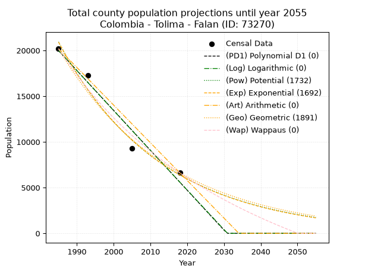
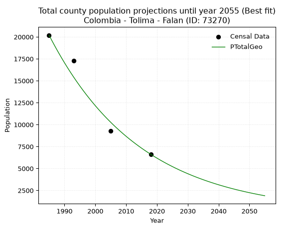
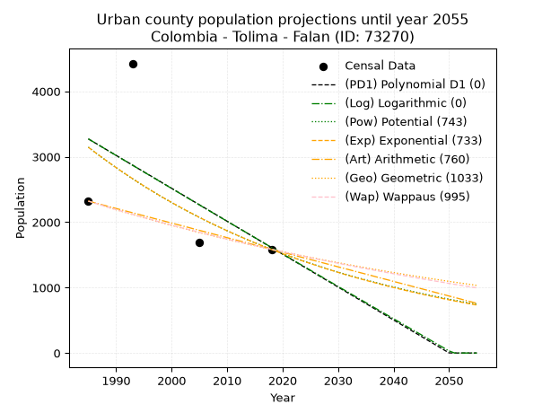
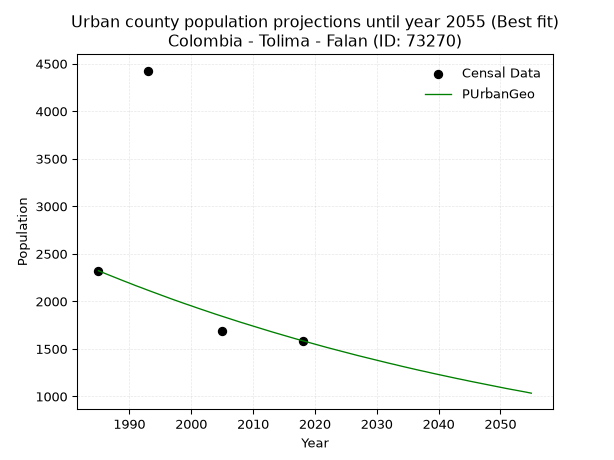
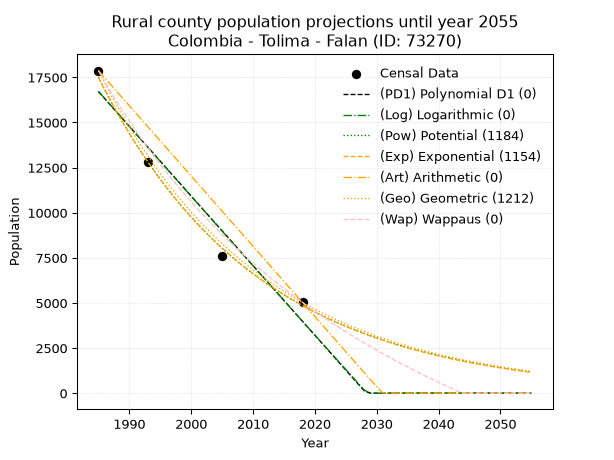
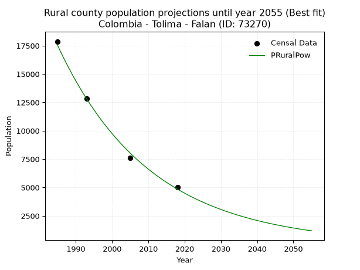

<div align="center">


</div>

# 📜 _“Population and Public Services Demand Projections (PPSD) until Year 2050 for Colombia - Tolima - Falan (ID: 73270)”_
Keywords: `population` `public-service` `projection` `lineal` `polynomial` `logarithmic` `potential` `exponential` `arithmetic` `geometric` `wappaus` `dane` `colombia` `south-america`

PPSD are analytical estimates used by governments and planners to anticipate future changes in population size, age distribution, and the resulting community needs for utilities, healthcare, education, and infrastructure as sizing future water treatment facilities, electrical grids, and road networks based on spatial growth.

<div align="center">

</img>

</div>


> **General running parameters**: • app_version: _v20260806_. • Python version: _3.14.7_. • Pandas version: _3.0.5_. • NumPy version: _2.5.1_. • Creates, save and include plots into reports (create_plot): _False_. • Projection until year: _2050_. • Process polynomial degree 2 and up: _False_. • Process Wappaus: _True_. • Process Wappaus: _True_. • Set negative values to zero: _True_. • Set infinite values to zero: _True_. • Drop dataset notes: _True_. 
<div align="center">

Dynamic map: [:earth_americas:Google](http://maps.google.com/maps?q=5.123103862,-74.9530071) [:earth_americas:OSM](https://www.openstreetmap.org/#map=18/5.123103862/-74.9530071&layers=P) [:earth_americas:Bing](https://www.bing.com/maps?cp=5.123103862~-74.9530071&lvl=18) [:earth_americas:Apple](https://maps.apple.com/frame?center=5.123103862%2C-74.9530071&span=0.003%2C0.006)

</div>


<div align="center">

```geojson
{
  "type": "Feature",
  "geometry": {
    "type": "Point", 
    "coordinates": [-74.9530071, 5.123103862]
  }, 
  "properties": {
    "Name": "Colombia - Tolima - Falan (ID: 73270)"
  }
}
```

</div>


## 0. Census Data (4 records)

Census data are official statistics collected by a government about the people and housing in a country. They usually include counts of total population, age, sex, race, income, education, and jobs.

📅Global census file: [Population.xlsx](../data/Population.xlsx)

| Source   |   Year |   CountryID | CountryName   |   StateID | StateName   |   CountyID | CountyName   |   PTotal |   PUrban |   PRural |
|:---------|-------:|------------:|:--------------|----------:|:------------|-----------:|:-------------|---------:|---------:|---------:|
| DANE     |   1985 |          57 | Colombia      |        73 | Tolima      |      73270 | Falan        |    20194 |     2321 |    17873 |
| DANE     |   1993 |          57 | Colombia      |        73 | Tolima      |      73270 | Falan        |    17251 |     4426 |    12825 |
| DANE     |   2005 |          57 | Colombia      |        73 | Tolima      |      73270 | Falan        |     9277 |     1688 |     7589 |
| DANE     |   2018 |          57 | Colombia      |        73 | Tolima      |      73270 | Falan        |     6612 |     1585 |     5027 |

> 🔥Some records could had specific notes about the registered values or the corresponding urban or rural distribution.

📅[SUI-RUPS](https://www.datos.gov.co/Hacienda-y-Cr-dito-P-blico/Registro-nico-de-Prestadores-de-Servicios-P-blicos/4qkq-csdn/about_data) - Local public utility companies: [RUPS.csv](../data/RUPS.csv)

 | SERVICIO       | ESTADO      | NOMBRE                                                                                     | NIT         | DEPARTAMENTO_DOMICILIO   | MUNICIPIO_DOMICILIO   | DIRECCION                       |   TELEFONO | EMAIL                           | TIPO_PRESTADOR                             | CLASIFICACION                 |
|:---------------|:------------|:-------------------------------------------------------------------------------------------|:------------|:-------------------------|:----------------------|:--------------------------------|-----------:|:--------------------------------|:-------------------------------------------|:------------------------------|
| ACUEDUCTO      | OPERATIVA   | UNIDAD DE SERVICIOS PUBLICOS DEL MUNICIPIO DE FALAN                                        | 800100054-9 | TOLIMA                   | FALAN                 | Calle 6 No. 3-98                |    2528086 | alcaldiafalantolima@yahoo.com   | MUNICIPIO (PRESTACIÓN DIRECTA)             | HASTA 2500 SUSCRIPTORES       |
| ALCANTARILLADO | OPERATIVA   | UNIDAD DE SERVICIOS PUBLICOS DEL MUNICIPIO DE FALAN                                        | 800100054-9 | TOLIMA                   | FALAN                 | Calle 6 No. 3-98                |    2528086 | alcaldiafalantolima@yahoo.com   | MUNICIPIO (PRESTACIÓN DIRECTA)             | HASTA 2500 SUSCRIPTORES       |
| ACUEDUCTO      | OPERATIVA   | ASOCIACION DE PROPIETARIOS O USUARIOS DEL ACUEDUCTO DE LA VEREDAS SOCORRO Y CABANDIA       | 809006881-4 | TOLIMA                   | FALAN                 | CALLE 6 Nª 3 - 25               |    3208863 | espfalan@hotmail.com            | ORGANIZACION AUTORIZADA                    | HASTA 2500 SUSCRIPTORES       |
| ACUEDUCTO      | CANCELACION | ADMINISTRACIÓN PÚBLICA COOPERATIVA AGUAS  DE FALAN E.S.P                                   | 900305963-2 | TOLIMA                   | FALAN                 | nan                             |    2528086 | contactenos@falan-tolima.gov.co | nan                                        | nan                           |
| ALCANTARILLADO | CANCELACION | ADMINISTRACIÓN PÚBLICA COOPERATIVA AGUAS  DE FALAN E.S.P                                   | 900305963-2 | TOLIMA                   | FALAN                 | nan                             |    2528086 | contactenos@falan-tolima.gov.co | nan                                        | nan                           |
| ACUEDUCTO      | OPERATIVA   | ASOCIACION DE PROPIETARIOS YO USUARIOS DEL ACUEDUCTO LOS VIKINGOS DE LA VEREDA LA PLATILLA | 809006918-8 | TOLIMA                   | FALAN                 | VEREDA LA PLATILLA              |    2525003 | SIN@CORREO.COM                  | ORGANIZACION AUTORIZADA                    | HASTA 2500 SUSCRIPTORES       |
| ACUEDUCTO      | OPERATIVA   | JUNTA DE ACCION COMUNAL DE LA VEREDA CLARAS                                                | 809002256-2 | TOLIMA                   | FALAN                 | VEREDA CLARAS                   |    2528086 | espfalan@hotmail.com            | ORGANIZACION AUTORIZADA                    | HASTA 2500 SUSCRIPTORES       |
| ACUEDUCTO      | OPERATIVA   | EMPRESA DE SERVICIOS PUBLICOS DE FALAN S.A.S E.S.P                                         | 900644895-3 | TOLIMA                   | FALAN                 | CALLE 6 NO. 3 - 61 CENTRO FALAN |    2528086 | myvasesoreszomac@gmail.com      | SOCIEDADES (EMPRESA DE SERVICIOS PUBLICOS) | MENOR O IGUAL A 2500 USUARIOS |
| ALCANTARILLADO | OPERATIVA   | EMPRESA DE SERVICIOS PUBLICOS DE FALAN S.A.S E.S.P                                         | 900644895-3 | TOLIMA                   | FALAN                 | CALLE 6 NO. 3 - 61 CENTRO FALAN |    2528086 | myvasesoreszomac@gmail.com      | SOCIEDADES (EMPRESA DE SERVICIOS PUBLICOS) | MENOR O IGUAL A 2500 USUARIOS |

## 1. Total

### 1.1. Coefficients and Parameters

* (PD1) Polynomial Deg 1: -436.12926535527674, 885701.0630268924 (lineal)
* (Log) Logarithmic: -873257.6473219888, 6650971.875142043
* (Pow) Potential: -71.90730073125471, 241.45389721679095
* (Exp) Exponential: -0.03592236278812568, 1.941388039748687e+35
* (Art) Arithmetic: Year diff. 2018 - 1985 = 33, Population diff. 6612 - 20194 = -13582, Annual growth = -411.57575757575756
* (Geo) Geometric: Year diff. 2018 - 1985 = 33, Population diff. 6612 - 20194 = -13582, Annual growth % = -0.03326736766292826
* (Wap) Wappaus: i = -3.0707733908509853, Condition values only valid for < 200)

<sub>
Wappaus condition values: ['-0.00', '-3.07', '-6.14', '-9.21', '-12.28', '-15.35', '-18.42', '-21.50', '-24.57', '-27.64', '-30.71', '-33.78', '-36.85', '-39.92', '-42.99', '-46.06', '-49.13', '-52.20', '-55.27', '-58.34', '-61.42', '-64.49', '-67.56', '-70.63', '-73.70', '-76.77', '-79.84', '-82.91', '-85.98', '-89.05', '-92.12', '-95.19', '-98.26', '-101.34', '-104.41', '-107.48', '-110.55', '-113.62', '-116.69', '-119.76', '-122.83', '-125.90', '-128.97', '-132.04', '-135.11', '-138.18', '-141.26', '-144.33', '-147.40', '-150.47', '-153.54', '-156.61', '-159.68', '-162.75', '-165.82', '-168.89', '-171.96', '-175.03', '-178.10', '-181.18', '-184.25', '-187.32', '-190.39', '-193.46', '-196.53', '-199.60']
</sub>


### 1.2. Projected Dataset

|   Year |   CountyID |   PTotalPD1 |   PTotalLog |   PTotalPow |   PTotalExp |   PTotalArt |   PTotalGeo |   PTotalWap |
|-------:|-----------:|------------:|------------:|------------:|------------:|------------:|------------:|------------:|
|   1985 |      73270 |       19984 |       20000 |       20933 |       20910 |       20194 |       20194 |       20194 |
|   1986 |      73270 |       19548 |       19560 |       20189 |       20172 |       19782 |       19522 |       19583 |
|   1987 |      73270 |       19112 |       19120 |       19471 |       19461 |       19371 |       18873 |       18991 |
|   1988 |      73270 |       18676 |       18681 |       18779 |       18774 |       18959 |       18245 |       18416 |
|   1989 |      73270 |       18240 |       18242 |       18112 |       18111 |       18548 |       17638 |       17857 |
|   1990 |      73270 |       17804 |       17803 |       17469 |       17472 |       18136 |       17051 |       17314 |
|   1991 |      73270 |       17368 |       17364 |       16850 |       16856 |       17725 |       16484 |       16787 |
|   1992 |      73270 |       16932 |       16926 |       16252 |       16261 |       17313 |       15936 |       16274 |
|   1993 |      73270 |       16495 |       16487 |       15676 |       15687 |       16901 |       15405 |       15776 |
|   1994 |      73270 |       16059 |       16049 |       15121 |       15134 |       16490 |       14893 |       15291 |
|   1995 |      73270 |       15623 |       15612 |       14585 |       14600 |       16078 |       14397 |       14818 |
|   1996 |      73270 |       15187 |       15174 |       14069 |       14085 |       15667 |       13919 |       14358 |
|   1997 |      73270 |       14751 |       14737 |       13571 |       13588 |       15255 |       13455 |       13910 |
|   1998 |      73270 |       14315 |       14299 |       13091 |       13108 |       14844 |       13008 |       13474 |
|   1999 |      73270 |       13879 |       13862 |       12629 |       12646 |       14432 |       12575 |       13048 |
|   2000 |      73270 |       13443 |       13426 |       12183 |       12200 |       14020 |       12157 |       12634 |
|   2001 |      73270 |       13006 |       12989 |       11752 |       11769 |       13609 |       11752 |       12229 |
|   2002 |      73270 |       12570 |       12553 |       11338 |       11354 |       13197 |       11361 |       11834 |
|   2003 |      73270 |       12134 |       12117 |       10938 |       10953 |       12786 |       10983 |       11449 |
|   2004 |      73270 |       11698 |       11681 |       10552 |       10567 |       12374 |       10618 |       11073 |
|   2005 |      73270 |       11262 |       11245 |       10180 |       10194 |       11962 |       10265 |       10705 |
|   2006 |      73270 |       10826 |       10810 |        9822 |        9834 |       11551 |        9923 |       10347 |
|   2007 |      73270 |       10390 |       10375 |        9476 |        9487 |       11139 |        9593 |        9996 |
|   2008 |      73270 |        9953 |        9940 |        9143 |        9152 |       10728 |        9274 |        9654 |
|   2009 |      73270 |        9517 |        9505 |        8821 |        8830 |       10316 |        8966 |        9319 |
|   2010 |      73270 |        9081 |        9070 |        8511 |        8518 |        9905 |        8667 |        8991 |
|   2011 |      73270 |        8645 |        8636 |        8212 |        8217 |        9493 |        8379 |        8671 |
|   2012 |      73270 |        8209 |        8202 |        7924 |        7927 |        9081 |        8100 |        8358 |
|   2013 |      73270 |        7773 |        7768 |        7646 |        7648 |        8670 |        7831 |        8051 |
|   2014 |      73270 |        7337 |        7334 |        7377 |        7378 |        8258 |        7570 |        7751 |
|   2015 |      73270 |        6901 |        6901 |        7119 |        7118 |        7847 |        7318 |        7457 |
|   2016 |      73270 |        6464 |        6467 |        6869 |        6866 |        7435 |        7075 |        7170 |
|   2017 |      73270 |        6028 |        6034 |        6629 |        6624 |        7024 |        6840 |        6888 |
|   2018 |      73270 |        5592 |        5602 |        6396 |        6390 |        6612 |        6612 |        6612 |
|   2019 |      73270 |        5156 |        5169 |        6173 |        6165 |        6200 |        6392 |        6342 |
|   2020 |      73270 |        4720 |        4736 |        5957 |        5947 |        5789 |        6179 |        6077 |
|   2021 |      73270 |        4284 |        4304 |        5748 |        5738 |        5377 |        5974 |        5817 |
|   2022 |      73270 |        3848 |        3872 |        5548 |        5535 |        4966 |        5775 |        5562 |
|   2023 |      73270 |        3412 |        3441 |        5354 |        5340 |        4554 |        5583 |        5312 |
|   2024 |      73270 |        2975 |        3009 |        5167 |        5151 |        4143 |        5397 |        5067 |
|   2025 |      73270 |        2539 |        2578 |        4987 |        4970 |        3731 |        5218 |        4827 |
|   2026 |      73270 |        2103 |        2146 |        4813 |        4794 |        3319 |        5044 |        4591 |
|   2027 |      73270 |        1667 |        1716 |        4645 |        4625 |        2908 |        4876 |        4360 |
|   2028 |      73270 |        1231 |        1285 |        4483 |        4462 |        2496 |        4714 |        4133 |
|   2029 |      73270 |         795 |         854 |        4327 |        4304 |        2085 |        4557 |        3910 |
|   2030 |      73270 |         359 |         424 |        4176 |        4153 |        1673 |        4406 |        3691 |
|   2031 |      73270 |           0 |           0 |        4031 |        4006 |        1262 |        4259 |        3476 |
|   2032 |      73270 |           0 |           0 |        3891 |        3865 |         850 |        4117 |        3265 |
|   2033 |      73270 |           0 |           0 |        3756 |        3728 |         438 |        3980 |        3058 |
|   2034 |      73270 |           0 |           0 |        3625 |        3597 |          27 |        3848 |        2854 |
|   2035 |      73270 |           0 |           0 |        3499 |        3470 |           0 |        3720 |        2654 |
|   2036 |      73270 |           0 |           0 |        3378 |        3347 |           0 |        3596 |        2457 |
|   2037 |      73270 |           0 |           0 |        3260 |        3229 |           0 |        3477 |        2264 |
|   2038 |      73270 |           0 |           0 |        3147 |        3115 |           0 |        3361 |        2074 |
|   2039 |      73270 |           0 |           0 |        3038 |        3005 |           0 |        3249 |        1887 |
|   2040 |      73270 |           0 |           0 |        2933 |        2899 |           0 |        3141 |        1703 |
|   2041 |      73270 |           0 |           0 |        2832 |        2797 |           0 |        3037 |        1522 |
|   2042 |      73270 |           0 |           0 |        2734 |        2698 |           0 |        2936 |        1344 |
|   2043 |      73270 |           0 |           0 |        2639 |        2603 |           0 |        2838 |        1169 |
|   2044 |      73270 |           0 |           0 |        2548 |        2511 |           0 |        2743 |         997 |
|   2045 |      73270 |           0 |           0 |        2460 |        2423 |           0 |        2652 |         828 |
|   2046 |      73270 |           0 |           0 |        2375 |        2337 |           0 |        2564 |         661 |
|   2047 |      73270 |           0 |           0 |        2293 |        2255 |           0 |        2479 |         497 |
|   2048 |      73270 |           0 |           0 |        2214 |        2175 |           0 |        2396 |         336 |
|   2049 |      73270 |           0 |           0 |        2137 |        2098 |           0 |        2316 |         177 |
|   2050 |      73270 |           0 |           0 |        2064 |        2024 |           0 |        2239 |          20 |
<div align="center">

</img>

</div>


### 1.3. Best fit with absolute and relative error (%)

Relative error puts that difference into context by dividing the absolute error by the true value, creating a unitless ratio or percentage that shows the scale of the mistake.

Absolute and relative error

|   Year | Source   |   CountryID | CountryName   |   StateID | StateName   |   CountyID_x | CountyName   |   PTotal |   PUrban |   PRural |   CountyID_y |   PTotalPD1 |   PTotalLog |   PTotalPow |   PTotalExp |   PTotalArt |   PTotalGeo |   PTotalWap |   PTotalPD1AbsError |   PTotalLogAbsError |   PTotalPowAbsError |   PTotalExpAbsError |   PTotalArtAbsError |   PTotalGeoAbsError |   PTotalWapAbsError |   PTotalPD1RelError |   PTotalLogRelError |   PTotalPowRelError |   PTotalExpRelError |   PTotalArtRelError |   PTotalGeoRelError |   PTotalWapRelError |
|-------:|:---------|------------:|:--------------|----------:|:------------|-------------:|:-------------|---------:|---------:|---------:|-------------:|------------:|------------:|------------:|------------:|------------:|------------:|------------:|--------------------:|--------------------:|--------------------:|--------------------:|--------------------:|--------------------:|--------------------:|--------------------:|--------------------:|--------------------:|--------------------:|--------------------:|--------------------:|--------------------:|
|   1985 | DANE     |          57 | Colombia      |        73 | Tolima      |        73270 | Falan        |    20194 |     2321 |    17873 |        73270 |       19984 |       20000 |       20933 |       20910 |       20194 |       20194 |       20194 |                 210 |                 194 |                 739 |                 716 |                   0 |                   0 |                   0 |             1.03991 |            0.960681 |             3.6595  |             3.54561 |             0       |              0      |             0       |
|   1993 | DANE     |          57 | Colombia      |        73 | Tolima      |        73270 | Falan        |    17251 |     4426 |    12825 |        73270 |       16495 |       16487 |       15676 |       15687 |       16901 |       15405 |       15776 |                 756 |                 764 |                1575 |                1564 |                 350 |                1846 |                1475 |             4.38235 |            4.42873  |             9.12991 |             9.06614 |             2.02887 |             10.7008 |             8.55023 |
|   2005 | DANE     |          57 | Colombia      |        73 | Tolima      |        73270 | Falan        |     9277 |     1688 |     7589 |        73270 |       11262 |       11245 |       10180 |       10194 |       11962 |       10265 |       10705 |                1985 |                1968 |                 903 |                 917 |                2685 |                 988 |                1428 |            21.397   |           21.2138   |             9.73375 |             9.88466 |            28.9425  |             10.65   |            15.3929  |
|   2018 | DANE     |          57 | Colombia      |        73 | Tolima      |        73270 | Falan        |     6612 |     1585 |     5027 |        73270 |        5592 |        5602 |        6396 |        6390 |        6612 |        6612 |        6612 |                1020 |                1010 |                 216 |                 222 |                   0 |                   0 |                   0 |            15.4265  |           15.2753   |             3.26679 |             3.35753 |             0       |              0      |             0       |

Relative error mean

| Method    |   RelError | Best   |
|:----------|-----------:|:-------|
| PTotalPD1 |   10.5614  |        |
| PTotalLog |   10.4696  |        |
| PTotalPow |    6.44749 |        |
| PTotalExp |    6.46349 |        |
| PTotalArt |    7.74285 |        |
| PTotalGeo |    5.33771 | True   |
| PTotalWap |    5.98578 |        |

💙Best method: _**PTotalGeo**_
<div align="center">

</img>

</div>


### 1.4. Fresh water supply demand in liters per capita per day (lpcd)

The fresh water supply demand typically ranges from 100 to 300 liters per capita per day (lpcd) for standard domestic and municipal planning, though absolute survival minimums set by the World Health Organization are as low as 7.5 to 20 liters per day, and total consumption in high-income nations can exceed 400 liters.

> `CZ`: Level in meters above the sea level (masl)<br> `WS`: Fresh water supply demand in liters per capita per day (lpcd or l/h/d)<br> `WSAll`: Zonal fresh water supply demand in liters per second (l/s)<br> `A`: Zonal area in square meters<br> `DP`: Population density (people/hectare or p/ha)

Reference values (RAS Colombia)

|    CZ |   WS |
|------:|-----:|
|  1000 |  120 |
|  2000 |  130 |
| 99999 |  140 |

County shapefile geometry properties and water supply values

|   CountyID |      ATotal |   CZTotal |   WSTotal |
|-----------:|------------:|----------:|----------:|
|      73270 | 1.81198e+08 |   882.366 |       120 |

Projected values for best method: PTotalGeo

|   CountyID |   Year |   PTotalGeo |   DPTotal |   WSTotal |   WSTotalAll |
|-----------:|-------:|------------:|----------:|----------:|-------------:|
|      73270 |   1985 |       20194 |      1.11 |       120 |     28.0472  |
|      73270 |   1986 |       19522 |      1.08 |       120 |     27.1139  |
|      73270 |   1987 |       18873 |      1.04 |       120 |     26.2125  |
|      73270 |   1988 |       18245 |      1.01 |       120 |     25.3403  |
|      73270 |   1989 |       17638 |      0.97 |       120 |     24.4972  |
|      73270 |   1990 |       17051 |      0.94 |       120 |     23.6819  |
|      73270 |   1991 |       16484 |      0.91 |       120 |     22.8944  |
|      73270 |   1992 |       15936 |      0.88 |       120 |     22.1333  |
|      73270 |   1993 |       15405 |      0.85 |       120 |     21.3958  |
|      73270 |   1994 |       14893 |      0.82 |       120 |     20.6847  |
|      73270 |   1995 |       14397 |      0.79 |       120 |     19.9958  |
|      73270 |   1996 |       13919 |      0.77 |       120 |     19.3319  |
|      73270 |   1997 |       13455 |      0.74 |       120 |     18.6875  |
|      73270 |   1998 |       13008 |      0.72 |       120 |     18.0667  |
|      73270 |   1999 |       12575 |      0.69 |       120 |     17.4653  |
|      73270 |   2000 |       12157 |      0.67 |       120 |     16.8847  |
|      73270 |   2001 |       11752 |      0.65 |       120 |     16.3222  |
|      73270 |   2002 |       11361 |      0.63 |       120 |     15.7792  |
|      73270 |   2003 |       10983 |      0.61 |       120 |     15.2542  |
|      73270 |   2004 |       10618 |      0.59 |       120 |     14.7472  |
|      73270 |   2005 |       10265 |      0.57 |       120 |     14.2569  |
|      73270 |   2006 |        9923 |      0.55 |       120 |     13.7819  |
|      73270 |   2007 |        9593 |      0.53 |       120 |     13.3236  |
|      73270 |   2008 |        9274 |      0.51 |       120 |     12.8806  |
|      73270 |   2009 |        8966 |      0.49 |       120 |     12.4528  |
|      73270 |   2010 |        8667 |      0.48 |       120 |     12.0375  |
|      73270 |   2011 |        8379 |      0.46 |       120 |     11.6375  |
|      73270 |   2012 |        8100 |      0.45 |       120 |     11.25    |
|      73270 |   2013 |        7831 |      0.43 |       120 |     10.8764  |
|      73270 |   2014 |        7570 |      0.42 |       120 |     10.5139  |
|      73270 |   2015 |        7318 |      0.4  |       120 |     10.1639  |
|      73270 |   2016 |        7075 |      0.39 |       120 |      9.82639 |
|      73270 |   2017 |        6840 |      0.38 |       120 |      9.5     |
|      73270 |   2018 |        6612 |      0.36 |       120 |      9.18333 |
|      73270 |   2019 |        6392 |      0.35 |       120 |      8.87778 |
|      73270 |   2020 |        6179 |      0.34 |       120 |      8.58194 |
|      73270 |   2021 |        5974 |      0.33 |       120 |      8.29722 |
|      73270 |   2022 |        5775 |      0.32 |       120 |      8.02083 |
|      73270 |   2023 |        5583 |      0.31 |       120 |      7.75417 |
|      73270 |   2024 |        5397 |      0.3  |       120 |      7.49583 |
|      73270 |   2025 |        5218 |      0.29 |       120 |      7.24722 |
|      73270 |   2026 |        5044 |      0.28 |       120 |      7.00556 |
|      73270 |   2027 |        4876 |      0.27 |       120 |      6.77222 |
|      73270 |   2028 |        4714 |      0.26 |       120 |      6.54722 |
|      73270 |   2029 |        4557 |      0.25 |       120 |      6.32917 |
|      73270 |   2030 |        4406 |      0.24 |       120 |      6.11944 |
|      73270 |   2031 |        4259 |      0.24 |       120 |      5.91528 |
|      73270 |   2032 |        4117 |      0.23 |       120 |      5.71806 |
|      73270 |   2033 |        3980 |      0.22 |       120 |      5.52778 |
|      73270 |   2034 |        3848 |      0.21 |       120 |      5.34444 |
|      73270 |   2035 |        3720 |      0.21 |       120 |      5.16667 |
|      73270 |   2036 |        3596 |      0.2  |       120 |      4.99444 |
|      73270 |   2037 |        3477 |      0.19 |       120 |      4.82917 |
|      73270 |   2038 |        3361 |      0.19 |       120 |      4.66806 |
|      73270 |   2039 |        3249 |      0.18 |       120 |      4.5125  |
|      73270 |   2040 |        3141 |      0.17 |       120 |      4.3625  |
|      73270 |   2041 |        3037 |      0.17 |       120 |      4.21806 |
|      73270 |   2042 |        2936 |      0.16 |       120 |      4.07778 |
|      73270 |   2043 |        2838 |      0.16 |       120 |      3.94167 |
|      73270 |   2044 |        2743 |      0.15 |       120 |      3.80972 |
|      73270 |   2045 |        2652 |      0.15 |       120 |      3.68333 |
|      73270 |   2046 |        2564 |      0.14 |       120 |      3.56111 |
|      73270 |   2047 |        2479 |      0.14 |       120 |      3.44306 |
|      73270 |   2048 |        2396 |      0.13 |       120 |      3.32778 |
|      73270 |   2049 |        2316 |      0.13 |       120 |      3.21667 |
|      73270 |   2050 |        2239 |      0.12 |       120 |      3.10972 |

## 2. Urban

### 2.1. Coefficients and Parameters

* (PD1) Polynomial Deg 1: -50.31232436772358, 103142.22681653909 (lineal)
* (Log) Logarithmic: -100576.0880262547, 766984.6510537497
* (Pow) Potential: -41.62506792601856, 140.76727801562012
* (Exp) Exponential: -0.020815110527655174, 2.765714339265039e+21
* (Art) Arithmetic: Year diff. 2018 - 1985 = 33, Population diff. 1585 - 2321 = -736, Annual growth = -22.303030303030305
* (Geo) Geometric: Year diff. 2018 - 1985 = 33, Population diff. 1585 - 2321 = -736, Annual growth % = -0.011491454521489919
* (Wap) Wappaus: i = -1.1419882387624323, Condition values only valid for < 200)

<sub>
Wappaus condition values: ['-0.00', '-1.14', '-2.28', '-3.43', '-4.57', '-5.71', '-6.85', '-7.99', '-9.14', '-10.28', '-11.42', '-12.56', '-13.70', '-14.85', '-15.99', '-17.13', '-18.27', '-19.41', '-20.56', '-21.70', '-22.84', '-23.98', '-25.12', '-26.27', '-27.41', '-28.55', '-29.69', '-30.83', '-31.98', '-33.12', '-34.26', '-35.40', '-36.54', '-37.69', '-38.83', '-39.97', '-41.11', '-42.25', '-43.40', '-44.54', '-45.68', '-46.82', '-47.96', '-49.11', '-50.25', '-51.39', '-52.53', '-53.67', '-54.82', '-55.96', '-57.10', '-58.24', '-59.38', '-60.53', '-61.67', '-62.81', '-63.95', '-65.09', '-66.24', '-67.38', '-68.52', '-69.66', '-70.80', '-71.95', '-73.09', '-74.23']
</sub>


### 2.2. Projected Dataset

|   Year |   CountyID |   PUrbanPD1 |   PUrbanLog |   PUrbanPow |   PUrbanExp |   PUrbanArt |   PUrbanGeo |   PUrbanWap |
|-------:|-----------:|------------:|------------:|------------:|------------:|------------:|------------:|------------:|
|   1985 |      73270 |        3272 |        3273 |        3146 |        3145 |        2321 |        2321 |        2321 |
|   1986 |      73270 |        3222 |        3222 |        3081 |        3080 |        2299 |        2294 |        2295 |
|   1987 |      73270 |        3172 |        3171 |        3017 |        3017 |        2276 |        2268 |        2269 |
|   1988 |      73270 |        3121 |        3121 |        2954 |        2955 |        2254 |        2242 |        2243 |
|   1989 |      73270 |        3071 |        3070 |        2893 |        2894 |        2232 |        2216 |        2217 |
|   1990 |      73270 |        3021 |        3020 |        2833 |        2834 |        2209 |        2191 |        2192 |
|   1991 |      73270 |        2970 |        2969 |        2775 |        2776 |        2187 |        2165 |        2167 |
|   1992 |      73270 |        2920 |        2919 |        2717 |        2719 |        2165 |        2141 |        2143 |
|   1993 |      73270 |        2870 |        2868 |        2661 |        2663 |        2143 |        2116 |        2118 |
|   1994 |      73270 |        2819 |        2818 |        2606 |        2608 |        2120 |        2092 |        2094 |
|   1995 |      73270 |        2769 |        2767 |        2552 |        2554 |        2098 |        2068 |        2070 |
|   1996 |      73270 |        2719 |        2717 |        2500 |        2501 |        2076 |        2044 |        2047 |
|   1997 |      73270 |        2669 |        2667 |        2448 |        2450 |        2053 |        2020 |        2023 |
|   1998 |      73270 |        2618 |        2616 |        2398 |        2399 |        2031 |        1997 |        2000 |
|   1999 |      73270 |        2568 |        2566 |        2348 |        2350 |        2009 |        1974 |        1977 |
|   2000 |      73270 |        2518 |        2516 |        2300 |        2302 |        1986 |        1952 |        1955 |
|   2001 |      73270 |        2467 |        2465 |        2252 |        2254 |        1964 |        1929 |        1932 |
|   2002 |      73270 |        2417 |        2415 |        2206 |        2208 |        1942 |        1907 |        1910 |
|   2003 |      73270 |        2367 |        2365 |        2161 |        2162 |        1920 |        1885 |        1888 |
|   2004 |      73270 |        2316 |        2315 |        2116 |        2118 |        1897 |        1863 |        1867 |
|   2005 |      73270 |        2266 |        2264 |        2073 |        2074 |        1875 |        1842 |        1845 |
|   2006 |      73270 |        2216 |        2214 |        2030 |        2031 |        1853 |        1821 |        1824 |
|   2007 |      73270 |        2165 |        2164 |        1988 |        1990 |        1830 |        1800 |        1803 |
|   2008 |      73270 |        2115 |        2114 |        1948 |        1949 |        1808 |        1779 |        1782 |
|   2009 |      73270 |        2065 |        2064 |        1908 |        1908 |        1786 |        1759 |        1762 |
|   2010 |      73270 |        2014 |        2014 |        1869 |        1869 |        1763 |        1739 |        1741 |
|   2011 |      73270 |        1964 |        1964 |        1830 |        1831 |        1741 |        1719 |        1721 |
|   2012 |      73270 |        1914 |        1914 |        1793 |        1793 |        1719 |        1699 |        1701 |
|   2013 |      73270 |        1864 |        1864 |        1756 |        1756 |        1697 |        1679 |        1681 |
|   2014 |      73270 |        1813 |        1814 |        1720 |        1720 |        1674 |        1660 |        1662 |
|   2015 |      73270 |        1763 |        1764 |        1685 |        1684 |        1652 |        1641 |        1642 |
|   2016 |      73270 |        1713 |        1714 |        1651 |        1650 |        1630 |        1622 |        1623 |
|   2017 |      73270 |        1662 |        1664 |        1617 |        1616 |        1607 |        1603 |        1604 |
|   2018 |      73270 |        1612 |        1614 |        1584 |        1582 |        1585 |        1585 |        1585 |
|   2019 |      73270 |        1562 |        1565 |        1552 |        1550 |        1563 |        1567 |        1566 |
|   2020 |      73270 |        1511 |        1515 |        1520 |        1518 |        1540 |        1549 |        1548 |
|   2021 |      73270 |        1461 |        1465 |        1489 |        1487 |        1518 |        1531 |        1529 |
|   2022 |      73270 |        1411 |        1415 |        1459 |        1456 |        1496 |        1513 |        1511 |
|   2023 |      73270 |        1360 |        1366 |        1429 |        1426 |        1473 |        1496 |        1493 |
|   2024 |      73270 |        1310 |        1316 |        1400 |        1397 |        1451 |        1479 |        1476 |
|   2025 |      73270 |        1260 |        1266 |        1371 |        1368 |        1429 |        1462 |        1458 |
|   2026 |      73270 |        1209 |        1217 |        1343 |        1340 |        1407 |        1445 |        1440 |
|   2027 |      73270 |        1159 |        1167 |        1316 |        1312 |        1384 |        1428 |        1423 |
|   2028 |      73270 |        1109 |        1117 |        1289 |        1285 |        1362 |        1412 |        1406 |
|   2029 |      73270 |        1059 |        1068 |        1263 |        1259 |        1340 |        1396 |        1389 |
|   2030 |      73270 |        1008 |        1018 |        1237 |        1233 |        1317 |        1380 |        1372 |
|   2031 |      73270 |         958 |         969 |        1212 |        1207 |        1295 |        1364 |        1355 |
|   2032 |      73270 |         908 |         919 |        1188 |        1182 |        1273 |        1348 |        1339 |
|   2033 |      73270 |         857 |         870 |        1164 |        1158 |        1250 |        1333 |        1322 |
|   2034 |      73270 |         807 |         820 |        1140 |        1134 |        1228 |        1317 |        1306 |
|   2035 |      73270 |         757 |         771 |        1117 |        1111 |        1206 |        1302 |        1290 |
|   2036 |      73270 |         706 |         721 |        1094 |        1088 |        1184 |        1287 |        1274 |
|   2037 |      73270 |         656 |         672 |        1072 |        1066 |        1161 |        1272 |        1258 |
|   2038 |      73270 |         606 |         623 |        1051 |        1044 |        1139 |        1258 |        1243 |
|   2039 |      73270 |         555 |         573 |        1029 |        1022 |        1117 |        1243 |        1227 |
|   2040 |      73270 |         505 |         524 |        1009 |        1001 |        1094 |        1229 |        1212 |
|   2041 |      73270 |         455 |         475 |         988 |         980 |        1072 |        1215 |        1196 |
|   2042 |      73270 |         404 |         425 |         968 |         960 |        1050 |        1201 |        1181 |
|   2043 |      73270 |         354 |         376 |         949 |         940 |        1027 |        1187 |        1166 |
|   2044 |      73270 |         304 |         327 |         930 |         921 |        1005 |        1174 |        1151 |
|   2045 |      73270 |         254 |         278 |         911 |         902 |         983 |        1160 |        1136 |
|   2046 |      73270 |         203 |         229 |         892 |         883 |         961 |        1147 |        1122 |
|   2047 |      73270 |         153 |         179 |         875 |         865 |         938 |        1134 |        1107 |
|   2048 |      73270 |         103 |         130 |         857 |         847 |         916 |        1121 |        1093 |
|   2049 |      73270 |          52 |          81 |         840 |         830 |         894 |        1108 |        1079 |
|   2050 |      73270 |           2 |          32 |         823 |         813 |         871 |        1095 |        1064 |
<div align="center">

</img>

</div>


### 2.3. Best fit with absolute and relative error (%)

Relative error puts that difference into context by dividing the absolute error by the true value, creating a unitless ratio or percentage that shows the scale of the mistake.

Absolute and relative error

|   Year | Source   |   CountryID | CountryName   |   StateID | StateName   |   CountyID_x | CountyName   |   PTotal |   PUrban |   PRural |   CountyID_y |   PUrbanPD1 |   PUrbanLog |   PUrbanPow |   PUrbanExp |   PUrbanArt |   PUrbanGeo |   PUrbanWap |   PUrbanPD1AbsError |   PUrbanLogAbsError |   PUrbanPowAbsError |   PUrbanExpAbsError |   PUrbanArtAbsError |   PUrbanGeoAbsError |   PUrbanWapAbsError |   PUrbanPD1RelError |   PUrbanLogRelError |   PUrbanPowRelError |   PUrbanExpRelError |   PUrbanArtRelError |   PUrbanGeoRelError |   PUrbanWapRelError |
|-------:|:---------|------------:|:--------------|----------:|:------------|-------------:|:-------------|---------:|---------:|---------:|-------------:|------------:|------------:|------------:|------------:|------------:|------------:|------------:|--------------------:|--------------------:|--------------------:|--------------------:|--------------------:|--------------------:|--------------------:|--------------------:|--------------------:|--------------------:|--------------------:|--------------------:|--------------------:|--------------------:|
|   1985 | DANE     |          57 | Colombia      |        73 | Tolima      |        73270 | Falan        |    20194 |     2321 |    17873 |        73270 |        3272 |        3273 |        3146 |        3145 |        2321 |        2321 |        2321 |                 951 |                 952 |                 825 |                 824 |                   0 |                   0 |                   0 |            40.9737  |            41.0168  |          35.545     |           35.5019   |              0      |             0       |             0       |
|   1993 | DANE     |          57 | Colombia      |        73 | Tolima      |        73270 | Falan        |    17251 |     4426 |    12825 |        73270 |        2870 |        2868 |        2661 |        2663 |        2143 |        2116 |        2118 |                1556 |                1558 |                1765 |                1763 |                2283 |                2310 |                2308 |            35.1559  |            35.2011  |          39.878     |           39.8328   |             51.5816 |            52.1916  |            52.1464  |
|   2005 | DANE     |          57 | Colombia      |        73 | Tolima      |        73270 | Falan        |     9277 |     1688 |     7589 |        73270 |        2266 |        2264 |        2073 |        2074 |        1875 |        1842 |        1845 |                 578 |                 576 |                 385 |                 386 |                 187 |                 154 |                 157 |            34.2417  |            34.1232  |          22.8081    |           22.8673   |             11.0782 |             9.12322 |             9.30095 |
|   2018 | DANE     |          57 | Colombia      |        73 | Tolima      |        73270 | Falan        |     6612 |     1585 |     5027 |        73270 |        1612 |        1614 |        1584 |        1582 |        1585 |        1585 |        1585 |                  27 |                  29 |                   1 |                   3 |                   0 |                   0 |                   0 |             1.70347 |             1.82965 |           0.0630915 |            0.189274 |              0      |             0       |             0       |

Relative error mean

| Method    |   RelError | Best   |
|:----------|-----------:|:-------|
| PUrbanPD1 |    28.0187 |        |
| PUrbanLog |    28.0427 |        |
| PUrbanPow |    24.5735 |        |
| PUrbanExp |    24.5978 |        |
| PUrbanArt |    15.6649 |        |
| PUrbanGeo |    15.3287 | True   |
| PUrbanWap |    15.3618 |        |

💙Best method: _**PUrbanGeo**_
<div align="center">

</img>

</div>


### 2.4. Fresh water supply demand in liters per capita per day (lpcd)

The fresh water supply demand typically ranges from 100 to 300 liters per capita per day (lpcd) for standard domestic and municipal planning, though absolute survival minimums set by the World Health Organization are as low as 7.5 to 20 liters per day, and total consumption in high-income nations can exceed 400 liters.

> `CZ`: Level in meters above the sea level (masl)<br> `WS`: Fresh water supply demand in liters per capita per day (lpcd or l/h/d)<br> `WSAll`: Zonal fresh water supply demand in liters per second (l/s)<br> `A`: Zonal area in square meters<br> `DP`: Population density (people/hectare or p/ha)

Reference values (RAS Colombia)

|    CZ |   WS |
|------:|-----:|
|  1000 |  120 |
|  2000 |  130 |
| 99999 |  140 |

County shapefile geometry properties and water supply values

|   CountyID |   AUrban |   CZUrban |   WSUrban |
|-----------:|---------:|----------:|----------:|
|      73270 |   519674 |   974.842 |       120 |

Projected values for best method: PUrbanGeo

|   CountyID |   Year |   PUrbanGeo |   DPUrban |   WSUrban |   WSUrbanAll |
|-----------:|-------:|------------:|----------:|----------:|-------------:|
|      73270 |   1985 |        2321 |     44.66 |       120 |      3.22361 |
|      73270 |   1986 |        2294 |     44.14 |       120 |      3.18611 |
|      73270 |   1987 |        2268 |     43.64 |       120 |      3.15    |
|      73270 |   1988 |        2242 |     43.14 |       120 |      3.11389 |
|      73270 |   1989 |        2216 |     42.64 |       120 |      3.07778 |
|      73270 |   1990 |        2191 |     42.16 |       120 |      3.04306 |
|      73270 |   1991 |        2165 |     41.66 |       120 |      3.00694 |
|      73270 |   1992 |        2141 |     41.2  |       120 |      2.97361 |
|      73270 |   1993 |        2116 |     40.72 |       120 |      2.93889 |
|      73270 |   1994 |        2092 |     40.26 |       120 |      2.90556 |
|      73270 |   1995 |        2068 |     39.79 |       120 |      2.87222 |
|      73270 |   1996 |        2044 |     39.33 |       120 |      2.83889 |
|      73270 |   1997 |        2020 |     38.87 |       120 |      2.80556 |
|      73270 |   1998 |        1997 |     38.43 |       120 |      2.77361 |
|      73270 |   1999 |        1974 |     37.99 |       120 |      2.74167 |
|      73270 |   2000 |        1952 |     37.56 |       120 |      2.71111 |
|      73270 |   2001 |        1929 |     37.12 |       120 |      2.67917 |
|      73270 |   2002 |        1907 |     36.7  |       120 |      2.64861 |
|      73270 |   2003 |        1885 |     36.27 |       120 |      2.61806 |
|      73270 |   2004 |        1863 |     35.85 |       120 |      2.5875  |
|      73270 |   2005 |        1842 |     35.45 |       120 |      2.55833 |
|      73270 |   2006 |        1821 |     35.04 |       120 |      2.52917 |
|      73270 |   2007 |        1800 |     34.64 |       120 |      2.5     |
|      73270 |   2008 |        1779 |     34.23 |       120 |      2.47083 |
|      73270 |   2009 |        1759 |     33.85 |       120 |      2.44306 |
|      73270 |   2010 |        1739 |     33.46 |       120 |      2.41528 |
|      73270 |   2011 |        1719 |     33.08 |       120 |      2.3875  |
|      73270 |   2012 |        1699 |     32.69 |       120 |      2.35972 |
|      73270 |   2013 |        1679 |     32.31 |       120 |      2.33194 |
|      73270 |   2014 |        1660 |     31.94 |       120 |      2.30556 |
|      73270 |   2015 |        1641 |     31.58 |       120 |      2.27917 |
|      73270 |   2016 |        1622 |     31.21 |       120 |      2.25278 |
|      73270 |   2017 |        1603 |     30.85 |       120 |      2.22639 |
|      73270 |   2018 |        1585 |     30.5  |       120 |      2.20139 |
|      73270 |   2019 |        1567 |     30.15 |       120 |      2.17639 |
|      73270 |   2020 |        1549 |     29.81 |       120 |      2.15139 |
|      73270 |   2021 |        1531 |     29.46 |       120 |      2.12639 |
|      73270 |   2022 |        1513 |     29.11 |       120 |      2.10139 |
|      73270 |   2023 |        1496 |     28.79 |       120 |      2.07778 |
|      73270 |   2024 |        1479 |     28.46 |       120 |      2.05417 |
|      73270 |   2025 |        1462 |     28.13 |       120 |      2.03056 |
|      73270 |   2026 |        1445 |     27.81 |       120 |      2.00694 |
|      73270 |   2027 |        1428 |     27.48 |       120 |      1.98333 |
|      73270 |   2028 |        1412 |     27.17 |       120 |      1.96111 |
|      73270 |   2029 |        1396 |     26.86 |       120 |      1.93889 |
|      73270 |   2030 |        1380 |     26.56 |       120 |      1.91667 |
|      73270 |   2031 |        1364 |     26.25 |       120 |      1.89444 |
|      73270 |   2032 |        1348 |     25.94 |       120 |      1.87222 |
|      73270 |   2033 |        1333 |     25.65 |       120 |      1.85139 |
|      73270 |   2034 |        1317 |     25.34 |       120 |      1.82917 |
|      73270 |   2035 |        1302 |     25.05 |       120 |      1.80833 |
|      73270 |   2036 |        1287 |     24.77 |       120 |      1.7875  |
|      73270 |   2037 |        1272 |     24.48 |       120 |      1.76667 |
|      73270 |   2038 |        1258 |     24.21 |       120 |      1.74722 |
|      73270 |   2039 |        1243 |     23.92 |       120 |      1.72639 |
|      73270 |   2040 |        1229 |     23.65 |       120 |      1.70694 |
|      73270 |   2041 |        1215 |     23.38 |       120 |      1.6875  |
|      73270 |   2042 |        1201 |     23.11 |       120 |      1.66806 |
|      73270 |   2043 |        1187 |     22.84 |       120 |      1.64861 |
|      73270 |   2044 |        1174 |     22.59 |       120 |      1.63056 |
|      73270 |   2045 |        1160 |     22.32 |       120 |      1.61111 |
|      73270 |   2046 |        1147 |     22.07 |       120 |      1.59306 |
|      73270 |   2047 |        1134 |     21.82 |       120 |      1.575   |
|      73270 |   2048 |        1121 |     21.57 |       120 |      1.55694 |
|      73270 |   2049 |        1108 |     21.32 |       120 |      1.53889 |
|      73270 |   2050 |        1095 |     21.07 |       120 |      1.52083 |

## 3. Rural

### 3.1. Coefficients and Parameters

* (PD1) Polynomial Deg 1: -385.8169409875532, 782558.8362103533 (lineal)
* (Log) Logarithmic: -772681.5592957342, 5883987.224088294
* (Pow) Potential: -77.72360530388467, 260.55695251274005
* (Exp) Exponential: -0.03882436816334612, 5.153117941609933e+37
* (Art) Arithmetic: Year diff. 2018 - 1985 = 33, Population diff. 5027 - 17873 = -12846, Annual growth = -389.27272727272725
* (Geo) Geometric: Year diff. 2018 - 1985 = 33, Population diff. 5027 - 17873 = -12846, Annual growth % = -0.037709037734668605
* (Wap) Wappaus: i = -3.3997618102421594, Condition values only valid for < 200)

<sub>
Wappaus condition values: ['-0.00', '-3.40', '-6.80', '-10.20', '-13.60', '-17.00', '-20.40', '-23.80', '-27.20', '-30.60', '-34.00', '-37.40', '-40.80', '-44.20', '-47.60', '-51.00', '-54.40', '-57.80', '-61.20', '-64.60', '-68.00', '-71.39', '-74.79', '-78.19', '-81.59', '-84.99', '-88.39', '-91.79', '-95.19', '-98.59', '-101.99', '-105.39', '-108.79', '-112.19', '-115.59', '-118.99', '-122.39', '-125.79', '-129.19', '-132.59', '-135.99', '-139.39', '-142.79', '-146.19', '-149.59', '-152.99', '-156.39', '-159.79', '-163.19', '-166.59', '-169.99', '-173.39', '-176.79', '-180.19', '-183.59', '-186.99', '-190.39', '-193.79', '-197.19', '-200.59', '-203.99', '-207.39', '-210.79', '-214.18', '-217.58', '-220.98']
</sub>


### 3.2. Projected Dataset

|   Year |   CountyID |   PRuralPD1 |   PRuralLog |   PRuralPow |   PRuralExp |   PRuralArt |   PRuralGeo |   PRuralWap |
|-------:|-----------:|------------:|------------:|------------:|------------:|------------:|------------:|------------:|
|   1985 |      73270 |       16712 |       16727 |       17503 |       17481 |       17873 |       17873 |       17873 |
|   1986 |      73270 |       16326 |       16338 |       16831 |       16815 |       17484 |       17199 |       17276 |
|   1987 |      73270 |       15941 |       15949 |       16185 |       16175 |       17094 |       16550 |       16698 |
|   1988 |      73270 |       15555 |       15560 |       15565 |       15559 |       16705 |       15926 |       16139 |
|   1989 |      73270 |       15169 |       15172 |       14968 |       14967 |       16316 |       15326 |       15597 |
|   1990 |      73270 |       14783 |       14783 |       14395 |       14397 |       15927 |       14748 |       15073 |
|   1991 |      73270 |       14397 |       14395 |       13843 |       13849 |       15537 |       14192 |       14565 |
|   1992 |      73270 |       14011 |       14007 |       13313 |       13321 |       15148 |       13657 |       14072 |
|   1993 |      73270 |       13626 |       13619 |       12804 |       12814 |       14759 |       13142 |       13594 |
|   1994 |      73270 |       13240 |       13232 |       12315 |       12326 |       14370 |       12646 |       13130 |
|   1995 |      73270 |       12854 |       12844 |       11844 |       11857 |       13980 |       12169 |       12679 |
|   1996 |      73270 |       12468 |       12457 |       11391 |       11405 |       13591 |       11710 |       12242 |
|   1997 |      73270 |       12082 |       12070 |       10956 |       10971 |       13202 |       11269 |       11817 |
|   1998 |      73270 |       11697 |       11683 |       10538 |       10553 |       12812 |       10844 |       11403 |
|   1999 |      73270 |       11311 |       11296 |       10136 |       10151 |       12423 |       10435 |       11001 |
|   2000 |      73270 |       10925 |       10910 |        9750 |        9765 |       12034 |       10041 |       10610 |
|   2001 |      73270 |       10539 |       10524 |        9378 |        9393 |       11645 |        9663 |       10230 |
|   2002 |      73270 |       10153 |       10138 |        9021 |        9035 |       11255 |        9298 |        9859 |
|   2003 |      73270 |        9768 |        9752 |        8678 |        8691 |       10866 |        8948 |        9498 |
|   2004 |      73270 |        9382 |        9366 |        8348 |        8360 |       10477 |        8610 |        9146 |
|   2005 |      73270 |        8996 |        8981 |        8030 |        8042 |       10088 |        8286 |        8804 |
|   2006 |      73270 |        8610 |        8595 |        7725 |        7735 |        9698 |        7973 |        8469 |
|   2007 |      73270 |        8224 |        8210 |        7431 |        7441 |        9309 |        7673 |        8144 |
|   2008 |      73270 |        7838 |        7825 |        7149 |        7158 |        8920 |        7383 |        7826 |
|   2009 |      73270 |        7453 |        7441 |        6878 |        6885 |        8530 |        7105 |        7515 |
|   2010 |      73270 |        7067 |        7056 |        6617 |        6623 |        8141 |        6837 |        7212 |
|   2011 |      73270 |        6681 |        6672 |        6366 |        6371 |        7752 |        6579 |        6917 |
|   2012 |      73270 |        6295 |        6288 |        6125 |        6128 |        7363 |        6331 |        6628 |
|   2013 |      73270 |        5909 |        5904 |        5893 |        5895 |        6973 |        6092 |        6346 |
|   2014 |      73270 |        5524 |        5520 |        5669 |        5670 |        6584 |        5863 |        6070 |
|   2015 |      73270 |        5138 |        5137 |        5455 |        5454 |        6195 |        5641 |        5800 |
|   2016 |      73270 |        4752 |        4753 |        5248 |        5247 |        5806 |        5429 |        5537 |
|   2017 |      73270 |        4366 |        4370 |        5050 |        5047 |        5416 |        5224 |        5279 |
|   2018 |      73270 |        3980 |        3987 |        4859 |        4855 |        5027 |        5027 |        5027 |
|   2019 |      73270 |        3594 |        3604 |        4676 |        4670 |        4638 |        4837 |        4780 |
|   2020 |      73270 |        3209 |        3222 |        4499 |        4492 |        4248 |        4655 |        4539 |
|   2021 |      73270 |        2823 |        2839 |        4329 |        4321 |        3859 |        4479 |        4303 |
|   2022 |      73270 |        2437 |        2457 |        4166 |        4156 |        3470 |        4311 |        4071 |
|   2023 |      73270 |        2051 |        2075 |        4009 |        3998 |        3081 |        4148 |        3844 |
|   2024 |      73270 |        1665 |        1693 |        3858 |        3846 |        2691 |        3992 |        3622 |
|   2025 |      73270 |        1280 |        1311 |        3713 |        3699 |        2302 |        3841 |        3405 |
|   2026 |      73270 |         894 |         930 |        3573 |        3558 |        1913 |        3696 |        3192 |
|   2027 |      73270 |         508 |         549 |        3438 |        3423 |        1524 |        3557 |        2983 |
|   2028 |      73270 |         122 |         168 |        3309 |        3293 |        1134 |        3423 |        2778 |
|   2029 |      73270 |           0 |           0 |        3185 |        3167 |         745 |        3294 |        2577 |
|   2030 |      73270 |           0 |           0 |        3065 |        3047 |         356 |        3169 |        2380 |
|   2031 |      73270 |           0 |           0 |        2950 |        2931 |           0 |        3050 |        2187 |
|   2032 |      73270 |           0 |           0 |        2839 |        2819 |           0 |        2935 |        1998 |
|   2033 |      73270 |           0 |           0 |        2733 |        2712 |           0 |        2824 |        1812 |
|   2034 |      73270 |           0 |           0 |        2630 |        2608 |           0 |        2718 |        1629 |
|   2035 |      73270 |           0 |           0 |        2532 |        2509 |           0 |        2615 |        1450 |
|   2036 |      73270 |           0 |           0 |        2437 |        2414 |           0 |        2517 |        1274 |
|   2037 |      73270 |           0 |           0 |        2346 |        2322 |           0 |        2422 |        1101 |
|   2038 |      73270 |           0 |           0 |        2258 |        2233 |           0 |        2330 |         931 |
|   2039 |      73270 |           0 |           0 |        2173 |        2148 |           0 |        2243 |         765 |
|   2040 |      73270 |           0 |           0 |        2092 |        2066 |           0 |        2158 |         601 |
|   2041 |      73270 |           0 |           0 |        2014 |        1988 |           0 |        2077 |         440 |
|   2042 |      73270 |           0 |           0 |        1939 |        1912 |           0 |        1998 |         282 |
|   2043 |      73270 |           0 |           0 |        1866 |        1839 |           0 |        1923 |         127 |
|   2044 |      73270 |           0 |           0 |        1797 |        1769 |           0 |        1850 |           0 |
|   2045 |      73270 |           0 |           0 |        1730 |        1702 |           0 |        1781 |           0 |
|   2046 |      73270 |           0 |           0 |        1665 |        1637 |           0 |        1714 |           0 |
|   2047 |      73270 |           0 |           0 |        1603 |        1575 |           0 |        1649 |           0 |
|   2048 |      73270 |           0 |           0 |        1543 |        1515 |           0 |        1587 |           0 |
|   2049 |      73270 |           0 |           0 |        1486 |        1457 |           0 |        1527 |           0 |
|   2050 |      73270 |           0 |           0 |        1431 |        1401 |           0 |        1469 |           0 |
<div align="center">

</img>

</div>


### 3.3. Best fit with absolute and relative error (%)

Relative error puts that difference into context by dividing the absolute error by the true value, creating a unitless ratio or percentage that shows the scale of the mistake.

Absolute and relative error

|   Year | Source   |   CountryID | CountryName   |   StateID | StateName   |   CountyID_x | CountyName   |   PTotal |   PUrban |   PRural |   CountyID_y |   PRuralPD1 |   PRuralLog |   PRuralPow |   PRuralExp |   PRuralArt |   PRuralGeo |   PRuralWap |   PRuralPD1AbsError |   PRuralLogAbsError |   PRuralPowAbsError |   PRuralExpAbsError |   PRuralArtAbsError |   PRuralGeoAbsError |   PRuralWapAbsError |   PRuralPD1RelError |   PRuralLogRelError |   PRuralPowRelError |   PRuralExpRelError |   PRuralArtRelError |   PRuralGeoRelError |   PRuralWapRelError |
|-------:|:---------|------------:|:--------------|----------:|:------------|-------------:|:-------------|---------:|---------:|---------:|-------------:|------------:|------------:|------------:|------------:|------------:|------------:|------------:|--------------------:|--------------------:|--------------------:|--------------------:|--------------------:|--------------------:|--------------------:|--------------------:|--------------------:|--------------------:|--------------------:|--------------------:|--------------------:|--------------------:|
|   1985 | DANE     |          57 | Colombia      |        73 | Tolima      |        73270 | Falan        |    20194 |     2321 |    17873 |        73270 |       16712 |       16727 |       17503 |       17481 |       17873 |       17873 |       17873 |                1161 |                1146 |                 370 |                 392 |                   0 |                   0 |                   0 |             6.49583 |             6.41191 |            2.07016  |             2.19325 |              0      |             0       |              0      |
|   1993 | DANE     |          57 | Colombia      |        73 | Tolima      |        73270 | Falan        |    17251 |     4426 |    12825 |        73270 |       13626 |       13619 |       12804 |       12814 |       14759 |       13142 |       13594 |                 801 |                 794 |                  21 |                  11 |                1934 |                 317 |                 769 |             6.24561 |             6.19103 |            0.163743 |             0.08577 |             15.0799 |             2.47173 |              5.9961 |
|   2005 | DANE     |          57 | Colombia      |        73 | Tolima      |        73270 | Falan        |     9277 |     1688 |     7589 |        73270 |        8996 |        8981 |        8030 |        8042 |       10088 |        8286 |        8804 |                1407 |                1392 |                 441 |                 453 |                2499 |                 697 |                1215 |            18.54    |            18.3423  |            5.81104  |             5.96917 |             32.9292 |             9.18435 |             16.01   |
|   2018 | DANE     |          57 | Colombia      |        73 | Tolima      |        73270 | Falan        |     6612 |     1585 |     5027 |        73270 |        3980 |        3987 |        4859 |        4855 |        5027 |        5027 |        5027 |                1047 |                1040 |                 168 |                 172 |                   0 |                   0 |                   0 |            20.8275  |            20.6883  |            3.34195  |             3.42152 |              0      |             0       |              0      |

Relative error mean

| Method    |   RelError | Best   |
|:----------|-----------:|:-------|
| PRuralPD1 |   13.0272  |        |
| PRuralLog |   12.9084  |        |
| PRuralPow |    2.84673 | True   |
| PRuralExp |    2.91743 |        |
| PRuralArt |   12.0023  |        |
| PRuralGeo |    2.91402 |        |
| PRuralWap |    5.50153 |        |

💙Best method: _**PRuralPow**_
<div align="center">

</img>

</div>


### 3.4. Fresh water supply demand in liters per capita per day (lpcd)

The fresh water supply demand typically ranges from 100 to 300 liters per capita per day (lpcd) for standard domestic and municipal planning, though absolute survival minimums set by the World Health Organization are as low as 7.5 to 20 liters per day, and total consumption in high-income nations can exceed 400 liters.

> `CZ`: Level in meters above the sea level (masl)<br> `WS`: Fresh water supply demand in liters per capita per day (lpcd or l/h/d)<br> `WSAll`: Zonal fresh water supply demand in liters per second (l/s)<br> `A`: Zonal area in square meters<br> `DP`: Population density (people/hectare or p/ha)

Reference values (RAS Colombia)

|    CZ |   WS |
|------:|-----:|
|  1000 |  120 |
|  2000 |  130 |
| 99999 |  140 |

County shapefile geometry properties and water supply values

|   CountyID |      ARural |   CZRural |   WSRural |
|-----------:|------------:|----------:|----------:|
|      73270 | 1.80678e+08 |   882.104 |       120 |

Projected values for best method: PRuralPow

|   CountyID |   Year |   PRuralPow |   DPRural |   WSRural |   WSRuralAll |
|-----------:|-------:|------------:|----------:|----------:|-------------:|
|      73270 |   1985 |       17503 |      0.97 |       120 |     24.3097  |
|      73270 |   1986 |       16831 |      0.93 |       120 |     23.3764  |
|      73270 |   1987 |       16185 |      0.9  |       120 |     22.4792  |
|      73270 |   1988 |       15565 |      0.86 |       120 |     21.6181  |
|      73270 |   1989 |       14968 |      0.83 |       120 |     20.7889  |
|      73270 |   1990 |       14395 |      0.8  |       120 |     19.9931  |
|      73270 |   1991 |       13843 |      0.77 |       120 |     19.2264  |
|      73270 |   1992 |       13313 |      0.74 |       120 |     18.4903  |
|      73270 |   1993 |       12804 |      0.71 |       120 |     17.7833  |
|      73270 |   1994 |       12315 |      0.68 |       120 |     17.1042  |
|      73270 |   1995 |       11844 |      0.66 |       120 |     16.45    |
|      73270 |   1996 |       11391 |      0.63 |       120 |     15.8208  |
|      73270 |   1997 |       10956 |      0.61 |       120 |     15.2167  |
|      73270 |   1998 |       10538 |      0.58 |       120 |     14.6361  |
|      73270 |   1999 |       10136 |      0.56 |       120 |     14.0778  |
|      73270 |   2000 |        9750 |      0.54 |       120 |     13.5417  |
|      73270 |   2001 |        9378 |      0.52 |       120 |     13.025   |
|      73270 |   2002 |        9021 |      0.5  |       120 |     12.5292  |
|      73270 |   2003 |        8678 |      0.48 |       120 |     12.0528  |
|      73270 |   2004 |        8348 |      0.46 |       120 |     11.5944  |
|      73270 |   2005 |        8030 |      0.44 |       120 |     11.1528  |
|      73270 |   2006 |        7725 |      0.43 |       120 |     10.7292  |
|      73270 |   2007 |        7431 |      0.41 |       120 |     10.3208  |
|      73270 |   2008 |        7149 |      0.4  |       120 |      9.92917 |
|      73270 |   2009 |        6878 |      0.38 |       120 |      9.55278 |
|      73270 |   2010 |        6617 |      0.37 |       120 |      9.19028 |
|      73270 |   2011 |        6366 |      0.35 |       120 |      8.84167 |
|      73270 |   2012 |        6125 |      0.34 |       120 |      8.50694 |
|      73270 |   2013 |        5893 |      0.33 |       120 |      8.18472 |
|      73270 |   2014 |        5669 |      0.31 |       120 |      7.87361 |
|      73270 |   2015 |        5455 |      0.3  |       120 |      7.57639 |
|      73270 |   2016 |        5248 |      0.29 |       120 |      7.28889 |
|      73270 |   2017 |        5050 |      0.28 |       120 |      7.01389 |
|      73270 |   2018 |        4859 |      0.27 |       120 |      6.74861 |
|      73270 |   2019 |        4676 |      0.26 |       120 |      6.49444 |
|      73270 |   2020 |        4499 |      0.25 |       120 |      6.24861 |
|      73270 |   2021 |        4329 |      0.24 |       120 |      6.0125  |
|      73270 |   2022 |        4166 |      0.23 |       120 |      5.78611 |
|      73270 |   2023 |        4009 |      0.22 |       120 |      5.56806 |
|      73270 |   2024 |        3858 |      0.21 |       120 |      5.35833 |
|      73270 |   2025 |        3713 |      0.21 |       120 |      5.15694 |
|      73270 |   2026 |        3573 |      0.2  |       120 |      4.9625  |
|      73270 |   2027 |        3438 |      0.19 |       120 |      4.775   |
|      73270 |   2028 |        3309 |      0.18 |       120 |      4.59583 |
|      73270 |   2029 |        3185 |      0.18 |       120 |      4.42361 |
|      73270 |   2030 |        3065 |      0.17 |       120 |      4.25694 |
|      73270 |   2031 |        2950 |      0.16 |       120 |      4.09722 |
|      73270 |   2032 |        2839 |      0.16 |       120 |      3.94306 |
|      73270 |   2033 |        2733 |      0.15 |       120 |      3.79583 |
|      73270 |   2034 |        2630 |      0.15 |       120 |      3.65278 |
|      73270 |   2035 |        2532 |      0.14 |       120 |      3.51667 |
|      73270 |   2036 |        2437 |      0.13 |       120 |      3.38472 |
|      73270 |   2037 |        2346 |      0.13 |       120 |      3.25833 |
|      73270 |   2038 |        2258 |      0.12 |       120 |      3.13611 |
|      73270 |   2039 |        2173 |      0.12 |       120 |      3.01806 |
|      73270 |   2040 |        2092 |      0.12 |       120 |      2.90556 |
|      73270 |   2041 |        2014 |      0.11 |       120 |      2.79722 |
|      73270 |   2042 |        1939 |      0.11 |       120 |      2.69306 |
|      73270 |   2043 |        1866 |      0.1  |       120 |      2.59167 |
|      73270 |   2044 |        1797 |      0.1  |       120 |      2.49583 |
|      73270 |   2045 |        1730 |      0.1  |       120 |      2.40278 |
|      73270 |   2046 |        1665 |      0.09 |       120 |      2.3125  |
|      73270 |   2047 |        1603 |      0.09 |       120 |      2.22639 |
|      73270 |   2048 |        1543 |      0.09 |       120 |      2.14306 |
|      73270 |   2049 |        1486 |      0.08 |       120 |      2.06389 |
|      73270 |   2050 |        1431 |      0.08 |       120 |      1.9875  |

#

<div align="center"><br><sub>Share this research</sub></div><br>

<sub>**APPS & TOOLS & CONTENT DISCLAIMER**: • NO WARRANTY - This content and software is provided by <a href="https://github.com/rcfdtools" target="_blank">github.com/rcfdtools</a> "as is", without any express or implied warranty, including warranties of merchantability, fitness for a particular purpose, or non-infringement. There is no guarantee that the software will be error-free or operate without interruption. • LIMITATION OF LIABILITY - Neither the authors nor copyright holders will be liable for claims or damages arising from the software or its use. You are responsible for determining if the software is appropriate for your use and assume all associated risks, including errors, legal compliance, and data loss. • NO PROFESSIONAL ADVICE - The software provides general information and does not offer professional advice. It should not replace consultation with professional advisors. [Clauses and global license for rcfdtools use.](https://github.com/rcfdtools/rcfdtools/blob/main/LICENSE.md)</sub>

| [:house: Home](Readme.md)  | [:beginner: Help / Collab](https://github.com/rcfdtools/R.HydroTools/discussions/31) |
|----------------------------|-------------------------------------------------------------------------------------------|