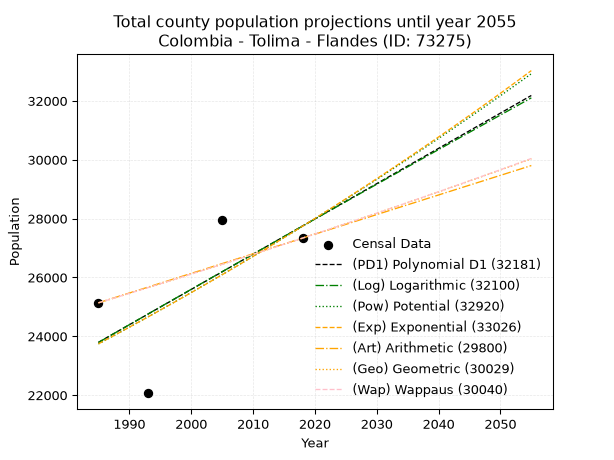
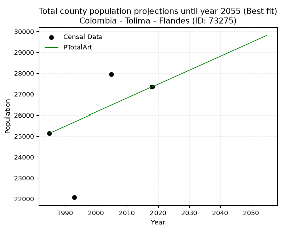
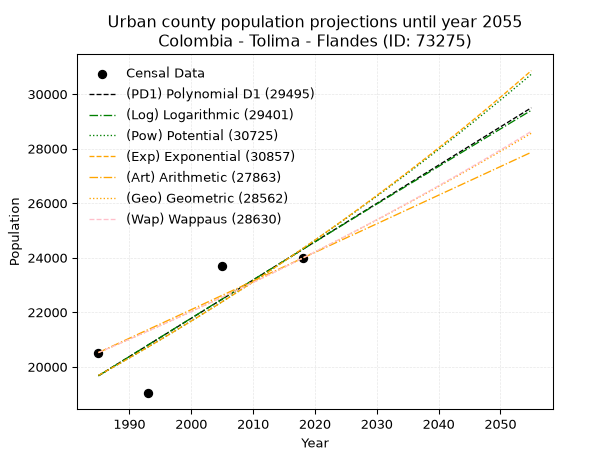
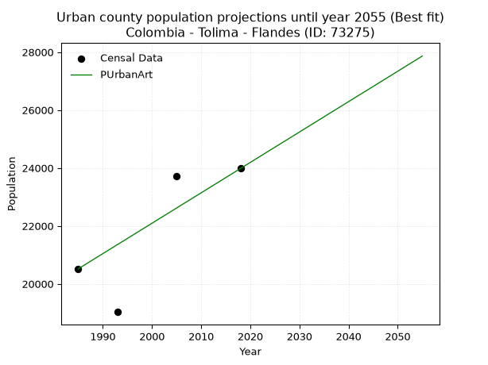
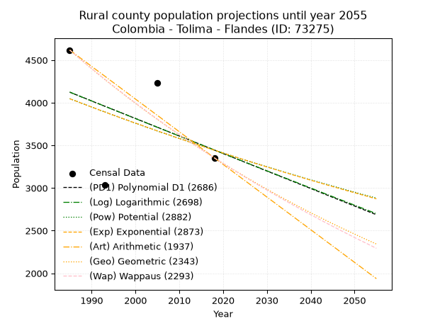
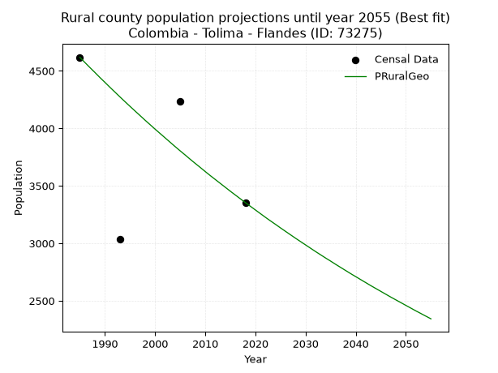

<div align="center">


</div>

# _“Population and Public Services Demand Projections (PPSD) until Year 2050 for Colombia - Tolima - Flandes (ID: 73275)”_
Keywords: `population` `public-service` `projection` `lineal` `polynomial` `logarithmic` `potential` `exponential` `arithmetic` `geometric` `wappaus` `dane` `colombia` `south-america`

PPSD are analytical estimates used by governments and planners to anticipate future changes in population size, age distribution, and the resulting community needs for utilities, healthcare, education, and infrastructure as sizing future water treatment facilities, electrical grids, and road networks based on spatial growth.

> **General running parameters**: • app_version: _v20260806_. • Python version: _3.14.7_. • Pandas version: _3.0.5_. • NumPy version: _2.5.1_. • Creates, save and include plots into reports (create_plot): _False_. • Projection until year: _2050_. • Process polynomial degree 2 and up: _False_. • Process Wappaus: _True_. • Process Wappaus: _True_. • Set negative values to zero: _True_. • Set infinite values to zero: _True_. • Drop dataset notes: _True_. 
<div align="center">

Dynamic map: [:earth_americas:Google](http://maps.google.com/maps?q=4.276372663,-74.8187626) [:earth_americas:OSM](https://www.openstreetmap.org/#map=18/4.276372663/-74.8187626&layers=P) [:earth_americas:Bing](https://www.bing.com/maps?cp=4.276372663~-74.8187626&lvl=18) [:earth_americas:Apple](https://maps.apple.com/frame?center=4.276372663%2C-74.8187626&span=0.003%2C0.006)

</div>


<div align="center">

```geojson
{
  "type": "Feature",
  "geometry": {
    "type": "Point", 
    "coordinates": [-74.8187626, 4.276372663]
  }, 
  "properties": {
    "Name": "Colombia - Tolima - Flandes (ID: 73275)"
  }
}
```

</div>


## 0. Census Data (4 records)

Census data are official statistics collected by a government about the people and housing in a country. They usually include counts of total population, age, sex, race, income, education, and jobs.

📅Global census file: [Population.xlsx](../data/Population.xlsx)

| Source   |   Year |   CountryID | CountryName   |   StateID | StateName   |   CountyID | CountyName   |   PTotal |   PUrban |   PRural |
|:---------|-------:|------------:|:--------------|----------:|:------------|-----------:|:-------------|---------:|---------:|---------:|
| DANE     |   1985 |          57 | Colombia      |        73 | Tolima      |      73275 | Flandes      |    25135 |    20517 |     4618 |
| DANE     |   1993 |          57 | Colombia      |        73 | Tolima      |      73275 | Flandes      |    22064 |    19028 |     3036 |
| DANE     |   2005 |          57 | Colombia      |        73 | Tolima      |      73275 | Flandes      |    27943 |    23709 |     4234 |
| DANE     |   2018 |          57 | Colombia      |        73 | Tolima      |      73275 | Flandes      |    27334 |    23980 |     3354 |

> 🔥Some records could had specific notes about the registered values or the corresponding urban or rural distribution.

## 1. Total

### 1.1. Coefficients and Parameters

* (PD1) Polynomial Deg 1: 119.8474508229627, -214105.86350863116 (lineal)
* (Log) Logarithmic: 239822.45908904143, -1797273.4333523794
* (Pow) Potential: 9.434897483385729, -26.738577268718206
* (Exp) Exponential: 0.004715408273528587, 2.0439547860986127
* (Art) Arithmetic: Year diff. 2018 - 1985 = 33, Population diff. 27334 - 25135 = 2199, Annual growth = 66.63636363636364
* (Geo) Geometric: Year diff. 2018 - 1985 = 33, Population diff. 27334 - 25135 = 2199, Annual growth % = 0.0025447491004357836
* (Wap) Wappaus: i = 0.25400279645643575, Condition values only valid for < 200)

<sub>
Wappaus condition values: ['0.00', '0.25', '0.51', '0.76', '1.02', '1.27', '1.52', '1.78', '2.03', '2.29', '2.54', '2.79', '3.05', '3.30', '3.56', '3.81', '4.06', '4.32', '4.57', '4.83', '5.08', '5.33', '5.59', '5.84', '6.10', '6.35', '6.60', '6.86', '7.11', '7.37', '7.62', '7.87', '8.13', '8.38', '8.64', '8.89', '9.14', '9.40', '9.65', '9.91', '10.16', '10.41', '10.67', '10.92', '11.18', '11.43', '11.68', '11.94', '12.19', '12.45', '12.70', '12.95', '13.21', '13.46', '13.72', '13.97', '14.22', '14.48', '14.73', '14.99', '15.24', '15.49', '15.75', '16.00', '16.26', '16.51']
</sub>


### 1.2. Projected Dataset

|   Year |   CountyID |   PTotalPD1 |   PTotalLog |   PTotalPow |   PTotalExp |   PTotalArt |   PTotalGeo |   PTotalWap |
|-------:|-----------:|------------:|------------:|------------:|------------:|------------:|------------:|------------:|
|   1985 |      73275 |       23791 |       23788 |       23739 |       23741 |       25135 |       25135 |       25135 |
|   1986 |      73275 |       23911 |       23909 |       23852 |       23854 |       25202 |       25199 |       25199 |
|   1987 |      73275 |       24031 |       24030 |       23965 |       23966 |       25268 |       25263 |       25263 |
|   1988 |      73275 |       24151 |       24150 |       24079 |       24080 |       25335 |       25327 |       25327 |
|   1989 |      73275 |       24271 |       24271 |       24194 |       24193 |       25402 |       25392 |       25392 |
|   1990 |      73275 |       24391 |       24392 |       24309 |       24308 |       25468 |       25456 |       25456 |
|   1991 |      73275 |       24510 |       24512 |       24424 |       24423 |       25535 |       25521 |       25521 |
|   1992 |      73275 |       24630 |       24632 |       24540 |       24538 |       25601 |       25586 |       25586 |
|   1993 |      73275 |       24750 |       24753 |       24657 |       24654 |       25668 |       25651 |       25651 |
|   1994 |      73275 |       24870 |       24873 |       24774 |       24771 |       25735 |       25717 |       25716 |
|   1995 |      73275 |       24990 |       24993 |       24891 |       24888 |       25801 |       25782 |       25782 |
|   1996 |      73275 |       25110 |       25114 |       25009 |       25005 |       25868 |       25848 |       25847 |
|   1997 |      73275 |       25229 |       25234 |       25128 |       25123 |       25935 |       25913 |       25913 |
|   1998 |      73275 |       25349 |       25354 |       25247 |       25242 |       26001 |       25979 |       25979 |
|   1999 |      73275 |       25469 |       25474 |       25366 |       25362 |       26068 |       26045 |       26045 |
|   2000 |      73275 |       25589 |       25594 |       25486 |       25481 |       26135 |       26112 |       26111 |
|   2001 |      73275 |       25709 |       25714 |       25607 |       25602 |       26201 |       26178 |       26178 |
|   2002 |      73275 |       25829 |       25833 |       25728 |       25723 |       26268 |       26245 |       26244 |
|   2003 |      73275 |       25949 |       25953 |       25849 |       25844 |       26334 |       26312 |       26311 |
|   2004 |      73275 |       26068 |       26073 |       25971 |       25967 |       26401 |       26379 |       26378 |
|   2005 |      73275 |       26188 |       26192 |       26094 |       26089 |       26468 |       26446 |       26445 |
|   2006 |      73275 |       26308 |       26312 |       26217 |       26213 |       26534 |       26513 |       26512 |
|   2007 |      73275 |       26428 |       26432 |       26340 |       26336 |       26601 |       26580 |       26580 |
|   2008 |      73275 |       26548 |       26551 |       26464 |       26461 |       26668 |       26648 |       26648 |
|   2009 |      73275 |       26668 |       26670 |       26589 |       26586 |       26734 |       26716 |       26715 |
|   2010 |      73275 |       26788 |       26790 |       26714 |       26712 |       26801 |       26784 |       26783 |
|   2011 |      73275 |       26907 |       26909 |       26840 |       26838 |       26868 |       26852 |       26852 |
|   2012 |      73275 |       27027 |       27028 |       26966 |       26965 |       26934 |       26920 |       26920 |
|   2013 |      73275 |       27147 |       27147 |       27093 |       27092 |       27001 |       26989 |       26989 |
|   2014 |      73275 |       27267 |       27267 |       27220 |       27220 |       27067 |       27058 |       27057 |
|   2015 |      73275 |       27387 |       27386 |       27348 |       27349 |       27134 |       27126 |       27126 |
|   2016 |      73275 |       27507 |       27505 |       27476 |       27478 |       27201 |       27195 |       27195 |
|   2017 |      73275 |       27626 |       27624 |       27605 |       27608 |       27267 |       27265 |       27265 |
|   2018 |      73275 |       27746 |       27742 |       27734 |       27739 |       27334 |       27334 |       27334 |
|   2019 |      73275 |       27866 |       27861 |       27864 |       27870 |       27401 |       27404 |       27404 |
|   2020 |      73275 |       27986 |       27980 |       27995 |       28001 |       27467 |       27473 |       27473 |
|   2021 |      73275 |       28106 |       28099 |       28126 |       28134 |       27534 |       27543 |       27543 |
|   2022 |      73275 |       28226 |       28217 |       28257 |       28267 |       27601 |       27613 |       27614 |
|   2023 |      73275 |       28346 |       28336 |       28389 |       28400 |       27667 |       27684 |       27684 |
|   2024 |      73275 |       28465 |       28454 |       28522 |       28535 |       27734 |       27754 |       27755 |
|   2025 |      73275 |       28585 |       28573 |       28655 |       28669 |       27800 |       27825 |       27825 |
|   2026 |      73275 |       28705 |       28691 |       28789 |       28805 |       27867 |       27895 |       27896 |
|   2027 |      73275 |       28825 |       28810 |       28923 |       28941 |       27934 |       27966 |       27968 |
|   2028 |      73275 |       28945 |       28928 |       29058 |       29078 |       28000 |       28038 |       28039 |
|   2029 |      73275 |       29065 |       29046 |       29194 |       29215 |       28067 |       28109 |       28110 |
|   2030 |      73275 |       29184 |       29164 |       29330 |       29353 |       28134 |       28180 |       28182 |
|   2031 |      73275 |       29304 |       29282 |       29466 |       29492 |       28200 |       28252 |       28254 |
|   2032 |      73275 |       29424 |       29400 |       29604 |       29632 |       28267 |       28324 |       28326 |
|   2033 |      73275 |       29544 |       29518 |       29741 |       29772 |       28334 |       28396 |       28398 |
|   2034 |      73275 |       29664 |       29636 |       29880 |       29912 |       28400 |       28468 |       28471 |
|   2035 |      73275 |       29784 |       29754 |       30018 |       30054 |       28467 |       28541 |       28544 |
|   2036 |      73275 |       29904 |       29872 |       30158 |       30196 |       28533 |       28614 |       28617 |
|   2037 |      73275 |       30023 |       29990 |       30298 |       30339 |       28600 |       28686 |       28690 |
|   2038 |      73275 |       30143 |       30108 |       30439 |       30482 |       28667 |       28759 |       28763 |
|   2039 |      73275 |       30263 |       30225 |       30580 |       30626 |       28733 |       28832 |       28836 |
|   2040 |      73275 |       30383 |       30343 |       30722 |       30771 |       28800 |       28906 |       28910 |
|   2041 |      73275 |       30503 |       30460 |       30864 |       30916 |       28867 |       28979 |       28984 |
|   2042 |      73275 |       30623 |       30578 |       31007 |       31062 |       28933 |       29053 |       29058 |
|   2043 |      73275 |       30742 |       30695 |       31151 |       31209 |       29000 |       29127 |       29132 |
|   2044 |      73275 |       30862 |       30813 |       31295 |       31357 |       29067 |       29201 |       29207 |
|   2045 |      73275 |       30982 |       30930 |       31439 |       31505 |       29133 |       29276 |       29282 |
|   2046 |      73275 |       31102 |       31047 |       31585 |       31654 |       29200 |       29350 |       29357 |
|   2047 |      73275 |       31222 |       31164 |       31731 |       31803 |       29266 |       29425 |       29432 |
|   2048 |      73275 |       31342 |       31281 |       31877 |       31954 |       29333 |       29500 |       29507 |
|   2049 |      73275 |       31462 |       31399 |       32024 |       32105 |       29400 |       29575 |       29582 |
|   2050 |      73275 |       31581 |       31516 |       32172 |       32256 |       29466 |       29650 |       29658 |
<div align="center">

</img>

</div>


### 1.3. Best fit with absolute and relative error (%)

Relative error puts that difference into context by dividing the absolute error by the true value, creating a unitless ratio or percentage that shows the scale of the mistake.

Absolute and relative error

|   Year | Source   |   CountryID | CountryName   |   StateID | StateName   |   CountyID_x | CountyName   |   PTotal |   PUrban |   PRural |   CountyID_y |   PTotalPD1 |   PTotalLog |   PTotalPow |   PTotalExp |   PTotalArt |   PTotalGeo |   PTotalWap |   PTotalPD1AbsError |   PTotalLogAbsError |   PTotalPowAbsError |   PTotalExpAbsError |   PTotalArtAbsError |   PTotalGeoAbsError |   PTotalWapAbsError |   PTotalPD1RelError |   PTotalLogRelError |   PTotalPowRelError |   PTotalExpRelError |   PTotalArtRelError |   PTotalGeoRelError |   PTotalWapRelError |
|-------:|:---------|------------:|:--------------|----------:|:------------|-------------:|:-------------|---------:|---------:|---------:|-------------:|------------:|------------:|------------:|------------:|------------:|------------:|------------:|--------------------:|--------------------:|--------------------:|--------------------:|--------------------:|--------------------:|--------------------:|--------------------:|--------------------:|--------------------:|--------------------:|--------------------:|--------------------:|--------------------:|
|   1985 | DANE     |          57 | Colombia      |        73 | Tolima      |        73275 | Flandes      |    25135 |    20517 |     4618 |        73275 |       23791 |       23788 |       23739 |       23741 |       25135 |       25135 |       25135 |                1344 |                1347 |                1396 |                1394 |                   0 |                   0 |                   0 |             5.34713 |             5.35906 |             5.55401 |             5.54605 |              0      |             0       |             0       |
|   1993 | DANE     |          57 | Colombia      |        73 | Tolima      |        73275 | Flandes      |    22064 |    19028 |     3036 |        73275 |       24750 |       24753 |       24657 |       24654 |       25668 |       25651 |       25651 |                2686 |                2689 |                2593 |                2590 |                3604 |                3587 |                3587 |            12.1737  |            12.1873  |            11.7522  |            11.7386  |             16.3343 |            16.2573  |            16.2573  |
|   2005 | DANE     |          57 | Colombia      |        73 | Tolima      |        73275 | Flandes      |    27943 |    23709 |     4234 |        73275 |       26188 |       26192 |       26094 |       26089 |       26468 |       26446 |       26445 |                1755 |                1751 |                1849 |                1854 |                1475 |                1497 |                1498 |             6.28064 |             6.26633 |             6.61704 |             6.63494 |              5.2786 |             5.35733 |             5.36091 |
|   2018 | DANE     |          57 | Colombia      |        73 | Tolima      |        73275 | Flandes      |    27334 |    23980 |     3354 |        73275 |       27746 |       27742 |       27734 |       27739 |       27334 |       27334 |       27334 |                 412 |                 408 |                 400 |                 405 |                   0 |                   0 |                   0 |             1.50728 |             1.49265 |             1.46338 |             1.48167 |              0      |             0       |             0       |

Relative error mean

| Method    |   RelError | Best   |
|:----------|-----------:|:-------|
| PTotalPD1 |    6.32718 |        |
| PTotalLog |    6.32633 |        |
| PTotalPow |    6.34665 |        |
| PTotalExp |    6.35031 |        |
| PTotalArt |    5.40323 | True   |
| PTotalGeo |    5.40365 |        |
| PTotalWap |    5.40454 |        |

💙Best method: _**PTotalArt**_
<div align="center">

</img>

</div>


### 1.4. Fresh water supply demand in liters per capita per day (lpcd)

The fresh water supply demand typically ranges from 100 to 300 liters per capita per day (lpcd) for standard domestic and municipal planning, though absolute survival minimums set by the World Health Organization are as low as 7.5 to 20 liters per day, and total consumption in high-income nations can exceed 400 liters.

> `CZ`: Level in meters above the sea level (masl)<br> `WS`: Fresh water supply demand in liters per capita per day (lpcd or l/h/d)<br> `WSAll`: Zonal fresh water supply demand in liters per second (l/s)<br> `A`: Zonal area in square meters<br> `DP`: Population density (people/hectare)

Reference values (RAS Colombia)

|    CZ |   WS |
|------:|-----:|
|  1000 |  120 |
|  2000 |  130 |
| 99999 |  140 |

County shapefile geometry properties and water supply values

|   CountyID |      ATotal |   CZTotal |   WSTotal |
|-----------:|------------:|----------:|----------:|
|      73275 | 9.67443e+07 |   294.643 |       120 |

Projected values for best method: PTotalArt

|   CountyID |   Year |   PTotalArt |   DPTotal |   WSTotal |   WSTotalAll |
|-----------:|-------:|------------:|----------:|----------:|-------------:|
|      73275 |   1985 |       25135 |      2.6  |       120 |      34.9097 |
|      73275 |   1986 |       25202 |      2.61 |       120 |      35.0028 |
|      73275 |   1987 |       25268 |      2.61 |       120 |      35.0944 |
|      73275 |   1988 |       25335 |      2.62 |       120 |      35.1875 |
|      73275 |   1989 |       25402 |      2.63 |       120 |      35.2806 |
|      73275 |   1990 |       25468 |      2.63 |       120 |      35.3722 |
|      73275 |   1991 |       25535 |      2.64 |       120 |      35.4653 |
|      73275 |   1992 |       25601 |      2.65 |       120 |      35.5569 |
|      73275 |   1993 |       25668 |      2.65 |       120 |      35.65   |
|      73275 |   1994 |       25735 |      2.66 |       120 |      35.7431 |
|      73275 |   1995 |       25801 |      2.67 |       120 |      35.8347 |
|      73275 |   1996 |       25868 |      2.67 |       120 |      35.9278 |
|      73275 |   1997 |       25935 |      2.68 |       120 |      36.0208 |
|      73275 |   1998 |       26001 |      2.69 |       120 |      36.1125 |
|      73275 |   1999 |       26068 |      2.69 |       120 |      36.2056 |
|      73275 |   2000 |       26135 |      2.7  |       120 |      36.2986 |
|      73275 |   2001 |       26201 |      2.71 |       120 |      36.3903 |
|      73275 |   2002 |       26268 |      2.72 |       120 |      36.4833 |
|      73275 |   2003 |       26334 |      2.72 |       120 |      36.575  |
|      73275 |   2004 |       26401 |      2.73 |       120 |      36.6681 |
|      73275 |   2005 |       26468 |      2.74 |       120 |      36.7611 |
|      73275 |   2006 |       26534 |      2.74 |       120 |      36.8528 |
|      73275 |   2007 |       26601 |      2.75 |       120 |      36.9458 |
|      73275 |   2008 |       26668 |      2.76 |       120 |      37.0389 |
|      73275 |   2009 |       26734 |      2.76 |       120 |      37.1306 |
|      73275 |   2010 |       26801 |      2.77 |       120 |      37.2236 |
|      73275 |   2011 |       26868 |      2.78 |       120 |      37.3167 |
|      73275 |   2012 |       26934 |      2.78 |       120 |      37.4083 |
|      73275 |   2013 |       27001 |      2.79 |       120 |      37.5014 |
|      73275 |   2014 |       27067 |      2.8  |       120 |      37.5931 |
|      73275 |   2015 |       27134 |      2.8  |       120 |      37.6861 |
|      73275 |   2016 |       27201 |      2.81 |       120 |      37.7792 |
|      73275 |   2017 |       27267 |      2.82 |       120 |      37.8708 |
|      73275 |   2018 |       27334 |      2.83 |       120 |      37.9639 |
|      73275 |   2019 |       27401 |      2.83 |       120 |      38.0569 |
|      73275 |   2020 |       27467 |      2.84 |       120 |      38.1486 |
|      73275 |   2021 |       27534 |      2.85 |       120 |      38.2417 |
|      73275 |   2022 |       27601 |      2.85 |       120 |      38.3347 |
|      73275 |   2023 |       27667 |      2.86 |       120 |      38.4264 |
|      73275 |   2024 |       27734 |      2.87 |       120 |      38.5194 |
|      73275 |   2025 |       27800 |      2.87 |       120 |      38.6111 |
|      73275 |   2026 |       27867 |      2.88 |       120 |      38.7042 |
|      73275 |   2027 |       27934 |      2.89 |       120 |      38.7972 |
|      73275 |   2028 |       28000 |      2.89 |       120 |      38.8889 |
|      73275 |   2029 |       28067 |      2.9  |       120 |      38.9819 |
|      73275 |   2030 |       28134 |      2.91 |       120 |      39.075  |
|      73275 |   2031 |       28200 |      2.91 |       120 |      39.1667 |
|      73275 |   2032 |       28267 |      2.92 |       120 |      39.2597 |
|      73275 |   2033 |       28334 |      2.93 |       120 |      39.3528 |
|      73275 |   2034 |       28400 |      2.94 |       120 |      39.4444 |
|      73275 |   2035 |       28467 |      2.94 |       120 |      39.5375 |
|      73275 |   2036 |       28533 |      2.95 |       120 |      39.6292 |
|      73275 |   2037 |       28600 |      2.96 |       120 |      39.7222 |
|      73275 |   2038 |       28667 |      2.96 |       120 |      39.8153 |
|      73275 |   2039 |       28733 |      2.97 |       120 |      39.9069 |
|      73275 |   2040 |       28800 |      2.98 |       120 |      40      |
|      73275 |   2041 |       28867 |      2.98 |       120 |      40.0931 |
|      73275 |   2042 |       28933 |      2.99 |       120 |      40.1847 |
|      73275 |   2043 |       29000 |      3    |       120 |      40.2778 |
|      73275 |   2044 |       29067 |      3    |       120 |      40.3708 |
|      73275 |   2045 |       29133 |      3.01 |       120 |      40.4625 |
|      73275 |   2046 |       29200 |      3.02 |       120 |      40.5556 |
|      73275 |   2047 |       29266 |      3.03 |       120 |      40.6472 |
|      73275 |   2048 |       29333 |      3.03 |       120 |      40.7403 |
|      73275 |   2049 |       29400 |      3.04 |       120 |      40.8333 |
|      73275 |   2050 |       29466 |      3.05 |       120 |      40.925  |

## 2. Urban

### 2.1. Coefficients and Parameters

* (PD1) Polynomial Deg 1: 140.3861902850257, -258998.97711762268 (lineal)
* (Log) Logarithmic: 280973.28817634407, -2113871.715007015
* (Pow) Potential: 12.859787680336675, -38.11456702846541
* (Exp) Exponential: 0.006425512693746997, 0.05685128695993247
* (Art) Arithmetic: Year diff. 2018 - 1985 = 33, Population diff. 23980 - 20517 = 3463, Annual growth = 104.93939393939394
* (Geo) Geometric: Year diff. 2018 - 1985 = 33, Population diff. 23980 - 20517 = 3463, Annual growth % = 0.004737439039850688
* (Wap) Wappaus: i = 0.4716695235157154, Condition values only valid for < 200)

<sub>
Wappaus condition values: ['0.00', '0.47', '0.94', '1.42', '1.89', '2.36', '2.83', '3.30', '3.77', '4.25', '4.72', '5.19', '5.66', '6.13', '6.60', '7.08', '7.55', '8.02', '8.49', '8.96', '9.43', '9.91', '10.38', '10.85', '11.32', '11.79', '12.26', '12.74', '13.21', '13.68', '14.15', '14.62', '15.09', '15.57', '16.04', '16.51', '16.98', '17.45', '17.92', '18.40', '18.87', '19.34', '19.81', '20.28', '20.75', '21.23', '21.70', '22.17', '22.64', '23.11', '23.58', '24.06', '24.53', '25.00', '25.47', '25.94', '26.41', '26.89', '27.36', '27.83', '28.30', '28.77', '29.24', '29.72', '30.19', '30.66']
</sub>


### 2.2. Projected Dataset

|   Year |   CountyID |   PUrbanPD1 |   PUrbanLog |   PUrbanPow |   PUrbanExp |   PUrbanArt |   PUrbanGeo |   PUrbanWap |
|-------:|-----------:|------------:|------------:|------------:|------------:|------------:|------------:|------------:|
|   1985 |      73275 |       19668 |       19664 |       19676 |       19679 |       20517 |       20517 |       20517 |
|   1986 |      73275 |       19808 |       19805 |       19804 |       19806 |       20622 |       20614 |       20614 |
|   1987 |      73275 |       19948 |       19947 |       19932 |       19934 |       20727 |       20712 |       20711 |
|   1988 |      73275 |       20089 |       20088 |       20062 |       20062 |       20832 |       20810 |       20809 |
|   1989 |      73275 |       20229 |       20229 |       20192 |       20192 |       20937 |       20909 |       20908 |
|   1990 |      73275 |       20370 |       20370 |       20323 |       20322 |       21042 |       21008 |       21007 |
|   1991 |      73275 |       20510 |       20512 |       20455 |       20453 |       21147 |       21107 |       21106 |
|   1992 |      73275 |       20650 |       20653 |       20587 |       20585 |       21252 |       21207 |       21206 |
|   1993 |      73275 |       20791 |       20794 |       20720 |       20717 |       21357 |       21308 |       21306 |
|   1994 |      73275 |       20931 |       20935 |       20854 |       20851 |       21461 |       21409 |       21407 |
|   1995 |      73275 |       21071 |       21076 |       20989 |       20985 |       21566 |       21510 |       21508 |
|   1996 |      73275 |       21212 |       21216 |       21125 |       21121 |       21671 |       21612 |       21610 |
|   1997 |      73275 |       21352 |       21357 |       21262 |       21257 |       21776 |       21714 |       21712 |
|   1998 |      73275 |       21493 |       21498 |       21399 |       21394 |       21881 |       21817 |       21815 |
|   1999 |      73275 |       21633 |       21638 |       21537 |       21532 |       21986 |       21920 |       21918 |
|   2000 |      73275 |       21773 |       21779 |       21676 |       21671 |       22091 |       22024 |       22022 |
|   2001 |      73275 |       21914 |       21919 |       21816 |       21810 |       22196 |       22129 |       22126 |
|   2002 |      73275 |       22054 |       22060 |       21956 |       21951 |       22301 |       22233 |       22231 |
|   2003 |      73275 |       22195 |       22200 |       22098 |       22092 |       22406 |       22339 |       22336 |
|   2004 |      73275 |       22335 |       22340 |       22240 |       22235 |       22511 |       22445 |       22442 |
|   2005 |      73275 |       22475 |       22480 |       22383 |       22378 |       22616 |       22551 |       22548 |
|   2006 |      73275 |       22616 |       22621 |       22527 |       22522 |       22721 |       22658 |       22655 |
|   2007 |      73275 |       22756 |       22761 |       22672 |       22668 |       22826 |       22765 |       22762 |
|   2008 |      73275 |       22896 |       22900 |       22818 |       22814 |       22931 |       22873 |       22870 |
|   2009 |      73275 |       23037 |       23040 |       22964 |       22961 |       23036 |       22981 |       22979 |
|   2010 |      73275 |       23177 |       23180 |       23112 |       23109 |       23140 |       23090 |       23088 |
|   2011 |      73275 |       23318 |       23320 |       23260 |       23258 |       23245 |       23200 |       23197 |
|   2012 |      73275 |       23458 |       23460 |       23409 |       23408 |       23350 |       23310 |       23308 |
|   2013 |      73275 |       23598 |       23599 |       23559 |       23558 |       23455 |       23420 |       23418 |
|   2014 |      73275 |       23739 |       23739 |       23710 |       23710 |       23560 |       23531 |       23529 |
|   2015 |      73275 |       23879 |       23878 |       23862 |       23863 |       23665 |       23642 |       23641 |
|   2016 |      73275 |       24020 |       24018 |       24015 |       24017 |       23770 |       23754 |       23754 |
|   2017 |      73275 |       24160 |       24157 |       24168 |       24172 |       23875 |       23867 |       23866 |
|   2018 |      73275 |       24300 |       24296 |       24323 |       24328 |       23980 |       23980 |       23980 |
|   2019 |      73275 |       24441 |       24435 |       24478 |       24484 |       24085 |       24094 |       24094 |
|   2020 |      73275 |       24581 |       24575 |       24635 |       24642 |       24190 |       24208 |       24209 |
|   2021 |      73275 |       24722 |       24714 |       24792 |       24801 |       24295 |       24322 |       24324 |
|   2022 |      73275 |       24862 |       24853 |       24950 |       24961 |       24400 |       24438 |       24440 |
|   2023 |      73275 |       25002 |       24992 |       25110 |       25122 |       24505 |       24553 |       24556 |
|   2024 |      73275 |       25143 |       25130 |       25270 |       25284 |       24610 |       24670 |       24673 |
|   2025 |      73275 |       25283 |       25269 |       25431 |       25447 |       24715 |       24787 |       24791 |
|   2026 |      73275 |       25423 |       25408 |       25593 |       25611 |       24820 |       24904 |       24909 |
|   2027 |      73275 |       25564 |       25547 |       25756 |       25776 |       24924 |       25022 |       25028 |
|   2028 |      73275 |       25704 |       25685 |       25919 |       25942 |       25029 |       25141 |       25148 |
|   2029 |      73275 |       25845 |       25824 |       26084 |       26109 |       25134 |       25260 |       25268 |
|   2030 |      73275 |       25985 |       25962 |       26250 |       26278 |       25239 |       25379 |       25389 |
|   2031 |      73275 |       26125 |       26101 |       26417 |       26447 |       25344 |       25500 |       25510 |
|   2032 |      73275 |       26266 |       26239 |       26585 |       26618 |       25449 |       25620 |       25632 |
|   2033 |      73275 |       26406 |       26377 |       26753 |       26789 |       25554 |       25742 |       25755 |
|   2034 |      73275 |       26547 |       26515 |       26923 |       26962 |       25659 |       25864 |       25878 |
|   2035 |      73275 |       26687 |       26653 |       27094 |       27136 |       25764 |       25986 |       26002 |
|   2036 |      73275 |       26827 |       26791 |       27265 |       27311 |       25869 |       26109 |       26127 |
|   2037 |      73275 |       26968 |       26929 |       27438 |       27487 |       25974 |       26233 |       26253 |
|   2038 |      73275 |       27108 |       27067 |       27612 |       27664 |       26079 |       26357 |       26379 |
|   2039 |      73275 |       27248 |       27205 |       27787 |       27842 |       26184 |       26482 |       26505 |
|   2040 |      73275 |       27389 |       27343 |       27962 |       28022 |       26289 |       26608 |       26633 |
|   2041 |      73275 |       27529 |       27481 |       28139 |       28202 |       26394 |       26734 |       26761 |
|   2042 |      73275 |       27670 |       27618 |       28317 |       28384 |       26499 |       26860 |       26890 |
|   2043 |      73275 |       27810 |       27756 |       28496 |       28567 |       26603 |       26988 |       27019 |
|   2044 |      73275 |       27950 |       27893 |       28676 |       28751 |       26708 |       27115 |       27149 |
|   2045 |      73275 |       28091 |       28031 |       28857 |       28936 |       26813 |       27244 |       27280 |
|   2046 |      73275 |       28231 |       28168 |       29039 |       29123 |       26918 |       27373 |       27412 |
|   2047 |      73275 |       28372 |       28305 |       29222 |       29311 |       27023 |       27503 |       27544 |
|   2048 |      73275 |       28512 |       28443 |       29406 |       29500 |       27128 |       27633 |       27678 |
|   2049 |      73275 |       28652 |       28580 |       29591 |       29690 |       27233 |       27764 |       27811 |
|   2050 |      73275 |       28793 |       28717 |       29777 |       29881 |       27338 |       27895 |       27946 |
<div align="center">

</img>

</div>


### 2.3. Best fit with absolute and relative error (%)

Relative error puts that difference into context by dividing the absolute error by the true value, creating a unitless ratio or percentage that shows the scale of the mistake.

Absolute and relative error

|   Year | Source   |   CountryID | CountryName   |   StateID | StateName   |   CountyID_x | CountyName   |   PTotal |   PUrban |   PRural |   CountyID_y |   PUrbanPD1 |   PUrbanLog |   PUrbanPow |   PUrbanExp |   PUrbanArt |   PUrbanGeo |   PUrbanWap |   PUrbanPD1AbsError |   PUrbanLogAbsError |   PUrbanPowAbsError |   PUrbanExpAbsError |   PUrbanArtAbsError |   PUrbanGeoAbsError |   PUrbanWapAbsError |   PUrbanPD1RelError |   PUrbanLogRelError |   PUrbanPowRelError |   PUrbanExpRelError |   PUrbanArtRelError |   PUrbanGeoRelError |   PUrbanWapRelError |
|-------:|:---------|------------:|:--------------|----------:|:------------|-------------:|:-------------|---------:|---------:|---------:|-------------:|------------:|------------:|------------:|------------:|------------:|------------:|------------:|--------------------:|--------------------:|--------------------:|--------------------:|--------------------:|--------------------:|--------------------:|--------------------:|--------------------:|--------------------:|--------------------:|--------------------:|--------------------:|--------------------:|
|   1985 | DANE     |          57 | Colombia      |        73 | Tolima      |        73275 | Flandes      |    25135 |    20517 |     4618 |        73275 |       19668 |       19664 |       19676 |       19679 |       20517 |       20517 |       20517 |                 849 |                 853 |                 841 |                 838 |                   0 |                   0 |                   0 |             4.13803 |             4.15753 |             4.09904 |             4.08442 |             0       |             0       |             0       |
|   1993 | DANE     |          57 | Colombia      |        73 | Tolima      |        73275 | Flandes      |    22064 |    19028 |     3036 |        73275 |       20791 |       20794 |       20720 |       20717 |       21357 |       21308 |       21306 |                1763 |                1766 |                1692 |                1689 |                2329 |                2280 |                2278 |             9.26529 |             9.28106 |             8.89216 |             8.87639 |            12.2399  |            11.9823  |            11.9718  |
|   2005 | DANE     |          57 | Colombia      |        73 | Tolima      |        73275 | Flandes      |    27943 |    23709 |     4234 |        73275 |       22475 |       22480 |       22383 |       22378 |       22616 |       22551 |       22548 |                1234 |                1229 |                1326 |                1331 |                1093 |                1158 |                1161 |             5.20477 |             5.18369 |             5.59281 |             5.6139  |             4.61006 |             4.88422 |             4.89687 |
|   2018 | DANE     |          57 | Colombia      |        73 | Tolima      |        73275 | Flandes      |    27334 |    23980 |     3354 |        73275 |       24300 |       24296 |       24323 |       24328 |       23980 |       23980 |       23980 |                 320 |                 316 |                 343 |                 348 |                   0 |                   0 |                   0 |             1.33445 |             1.31776 |             1.43036 |             1.45121 |             0       |             0       |             0       |

Relative error mean

| Method    |   RelError | Best   |
|:----------|-----------:|:-------|
| PUrbanPD1 |    4.98564 |        |
| PUrbanLog |    4.98501 |        |
| PUrbanPow |    5.00359 |        |
| PUrbanExp |    5.00648 |        |
| PUrbanArt |    4.21248 | True   |
| PUrbanGeo |    4.21664 |        |
| PUrbanWap |    4.21718 |        |

💙Best method: _**PUrbanArt**_
<div align="center">

</img>

</div>


### 2.4. Fresh water supply demand in liters per capita per day (lpcd)

The fresh water supply demand typically ranges from 100 to 300 liters per capita per day (lpcd) for standard domestic and municipal planning, though absolute survival minimums set by the World Health Organization are as low as 7.5 to 20 liters per day, and total consumption in high-income nations can exceed 400 liters.

> `CZ`: Level in meters above the sea level (masl)<br> `WS`: Fresh water supply demand in liters per capita per day (lpcd or l/h/d)<br> `WSAll`: Zonal fresh water supply demand in liters per second (l/s)<br> `A`: Zonal area in square meters<br> `DP`: Population density (people/hectare)

Reference values (RAS Colombia)

|    CZ |   WS |
|------:|-----:|
|  1000 |  120 |
|  2000 |  130 |
| 99999 |  140 |

County shapefile geometry properties and water supply values

|   CountyID |      AUrban |   CZUrban |   WSUrban |
|-----------:|------------:|----------:|----------:|
|      73275 | 7.43638e+06 |   288.094 |       120 |

Projected values for best method: PUrbanArt

|   CountyID |   Year |   PUrbanArt |   DPUrban |   WSUrban |   WSUrbanAll |
|-----------:|-------:|------------:|----------:|----------:|-------------:|
|      73275 |   1985 |       20517 |     27.59 |       120 |      28.4958 |
|      73275 |   1986 |       20622 |     27.73 |       120 |      28.6417 |
|      73275 |   1987 |       20727 |     27.87 |       120 |      28.7875 |
|      73275 |   1988 |       20832 |     28.01 |       120 |      28.9333 |
|      73275 |   1989 |       20937 |     28.15 |       120 |      29.0792 |
|      73275 |   1990 |       21042 |     28.3  |       120 |      29.225  |
|      73275 |   1991 |       21147 |     28.44 |       120 |      29.3708 |
|      73275 |   1992 |       21252 |     28.58 |       120 |      29.5167 |
|      73275 |   1993 |       21357 |     28.72 |       120 |      29.6625 |
|      73275 |   1994 |       21461 |     28.86 |       120 |      29.8069 |
|      73275 |   1995 |       21566 |     29    |       120 |      29.9528 |
|      73275 |   1996 |       21671 |     29.14 |       120 |      30.0986 |
|      73275 |   1997 |       21776 |     29.28 |       120 |      30.2444 |
|      73275 |   1998 |       21881 |     29.42 |       120 |      30.3903 |
|      73275 |   1999 |       21986 |     29.57 |       120 |      30.5361 |
|      73275 |   2000 |       22091 |     29.71 |       120 |      30.6819 |
|      73275 |   2001 |       22196 |     29.85 |       120 |      30.8278 |
|      73275 |   2002 |       22301 |     29.99 |       120 |      30.9736 |
|      73275 |   2003 |       22406 |     30.13 |       120 |      31.1194 |
|      73275 |   2004 |       22511 |     30.27 |       120 |      31.2653 |
|      73275 |   2005 |       22616 |     30.41 |       120 |      31.4111 |
|      73275 |   2006 |       22721 |     30.55 |       120 |      31.5569 |
|      73275 |   2007 |       22826 |     30.7  |       120 |      31.7028 |
|      73275 |   2008 |       22931 |     30.84 |       120 |      31.8486 |
|      73275 |   2009 |       23036 |     30.98 |       120 |      31.9944 |
|      73275 |   2010 |       23140 |     31.12 |       120 |      32.1389 |
|      73275 |   2011 |       23245 |     31.26 |       120 |      32.2847 |
|      73275 |   2012 |       23350 |     31.4  |       120 |      32.4306 |
|      73275 |   2013 |       23455 |     31.54 |       120 |      32.5764 |
|      73275 |   2014 |       23560 |     31.68 |       120 |      32.7222 |
|      73275 |   2015 |       23665 |     31.82 |       120 |      32.8681 |
|      73275 |   2016 |       23770 |     31.96 |       120 |      33.0139 |
|      73275 |   2017 |       23875 |     32.11 |       120 |      33.1597 |
|      73275 |   2018 |       23980 |     32.25 |       120 |      33.3056 |
|      73275 |   2019 |       24085 |     32.39 |       120 |      33.4514 |
|      73275 |   2020 |       24190 |     32.53 |       120 |      33.5972 |
|      73275 |   2021 |       24295 |     32.67 |       120 |      33.7431 |
|      73275 |   2022 |       24400 |     32.81 |       120 |      33.8889 |
|      73275 |   2023 |       24505 |     32.95 |       120 |      34.0347 |
|      73275 |   2024 |       24610 |     33.09 |       120 |      34.1806 |
|      73275 |   2025 |       24715 |     33.24 |       120 |      34.3264 |
|      73275 |   2026 |       24820 |     33.38 |       120 |      34.4722 |
|      73275 |   2027 |       24924 |     33.52 |       120 |      34.6167 |
|      73275 |   2028 |       25029 |     33.66 |       120 |      34.7625 |
|      73275 |   2029 |       25134 |     33.8  |       120 |      34.9083 |
|      73275 |   2030 |       25239 |     33.94 |       120 |      35.0542 |
|      73275 |   2031 |       25344 |     34.08 |       120 |      35.2    |
|      73275 |   2032 |       25449 |     34.22 |       120 |      35.3458 |
|      73275 |   2033 |       25554 |     34.36 |       120 |      35.4917 |
|      73275 |   2034 |       25659 |     34.5  |       120 |      35.6375 |
|      73275 |   2035 |       25764 |     34.65 |       120 |      35.7833 |
|      73275 |   2036 |       25869 |     34.79 |       120 |      35.9292 |
|      73275 |   2037 |       25974 |     34.93 |       120 |      36.075  |
|      73275 |   2038 |       26079 |     35.07 |       120 |      36.2208 |
|      73275 |   2039 |       26184 |     35.21 |       120 |      36.3667 |
|      73275 |   2040 |       26289 |     35.35 |       120 |      36.5125 |
|      73275 |   2041 |       26394 |     35.49 |       120 |      36.6583 |
|      73275 |   2042 |       26499 |     35.63 |       120 |      36.8042 |
|      73275 |   2043 |       26603 |     35.77 |       120 |      36.9486 |
|      73275 |   2044 |       26708 |     35.92 |       120 |      37.0944 |
|      73275 |   2045 |       26813 |     36.06 |       120 |      37.2403 |
|      73275 |   2046 |       26918 |     36.2  |       120 |      37.3861 |
|      73275 |   2047 |       27023 |     36.34 |       120 |      37.5319 |
|      73275 |   2048 |       27128 |     36.48 |       120 |      37.6778 |
|      73275 |   2049 |       27233 |     36.62 |       120 |      37.8236 |
|      73275 |   2050 |       27338 |     36.76 |       120 |      37.9694 |

## 3. Rural

### 3.1. Coefficients and Parameters

* (PD1) Polynomial Deg 1: -20.538739462062956, 44893.11360899143 (lineal)
* (Log) Logarithmic: -41150.829087303275, 316598.2816546408
* (Pow) Potential: -9.807485757254414, 35.95002165854389
* (Exp) Exponential: -0.004894678004947873, 67106120.341413856
* (Art) Arithmetic: Year diff. 2018 - 1985 = 33, Population diff. 3354 - 4618 = -1264, Annual growth = -38.303030303030305
* (Geo) Geometric: Year diff. 2018 - 1985 = 33, Population diff. 3354 - 4618 = -1264, Annual growth % = -0.009644345062210236
* (Wap) Wappaus: i = -0.9609390442305645, Condition values only valid for < 200)

<sub>
Wappaus condition values: ['-0.00', '-0.96', '-1.92', '-2.88', '-3.84', '-4.80', '-5.77', '-6.73', '-7.69', '-8.65', '-9.61', '-10.57', '-11.53', '-12.49', '-13.45', '-14.41', '-15.38', '-16.34', '-17.30', '-18.26', '-19.22', '-20.18', '-21.14', '-22.10', '-23.06', '-24.02', '-24.98', '-25.95', '-26.91', '-27.87', '-28.83', '-29.79', '-30.75', '-31.71', '-32.67', '-33.63', '-34.59', '-35.55', '-36.52', '-37.48', '-38.44', '-39.40', '-40.36', '-41.32', '-42.28', '-43.24', '-44.20', '-45.16', '-46.13', '-47.09', '-48.05', '-49.01', '-49.97', '-50.93', '-51.89', '-52.85', '-53.81', '-54.77', '-55.73', '-56.70', '-57.66', '-58.62', '-59.58', '-60.54', '-61.50', '-62.46']
</sub>


### 3.2. Projected Dataset

|   Year |   CountyID |   PRuralPD1 |   PRuralLog |   PRuralPow |   PRuralExp |   PRuralArt |   PRuralGeo |   PRuralWap |
|-------:|-----------:|------------:|------------:|------------:|------------:|------------:|------------:|------------:|
|   1985 |      73275 |        4124 |        4125 |        4048 |        4047 |        4618 |        4618 |        4618 |
|   1986 |      73275 |        4103 |        4104 |        4028 |        4028 |        4580 |        4573 |        4574 |
|   1987 |      73275 |        4083 |        4083 |        4009 |        4008 |        4541 |        4529 |        4530 |
|   1988 |      73275 |        4062 |        4062 |        3989 |        3988 |        4503 |        4486 |        4487 |
|   1989 |      73275 |        4042 |        4042 |        3969 |        3969 |        4465 |        4442 |        4444 |
|   1990 |      73275 |        4021 |        4021 |        3950 |        3950 |        4426 |        4400 |        4401 |
|   1991 |      73275 |        4000 |        4000 |        3930 |        3930 |        4388 |        4357 |        4359 |
|   1992 |      73275 |        3980 |        3980 |        3911 |        3911 |        4350 |        4315 |        4317 |
|   1993 |      73275 |        3959 |        3959 |        3892 |        3892 |        4312 |        4273 |        4276 |
|   1994 |      73275 |        3939 |        3938 |        3873 |        3873 |        4273 |        4232 |        4235 |
|   1995 |      73275 |        3918 |        3918 |        3854 |        3854 |        4235 |        4191 |        4195 |
|   1996 |      73275 |        3898 |        3897 |        3835 |        3835 |        4197 |        4151 |        4154 |
|   1997 |      73275 |        3877 |        3877 |        3816 |        3817 |        4158 |        4111 |        4115 |
|   1998 |      73275 |        3857 |        3856 |        3797 |        3798 |        4120 |        4071 |        4075 |
|   1999 |      73275 |        3836 |        3835 |        3779 |        3779 |        4082 |        4032 |        4036 |
|   2000 |      73275 |        3816 |        3815 |        3760 |        3761 |        4043 |        3993 |        3997 |
|   2001 |      73275 |        3795 |        3794 |        3742 |        3743 |        4005 |        3955 |        3959 |
|   2002 |      73275 |        3775 |        3774 |        3724 |        3724 |        3967 |        3917 |        3921 |
|   2003 |      73275 |        3754 |        3753 |        3705 |        3706 |        3929 |        3879 |        3883 |
|   2004 |      73275 |        3733 |        3733 |        3687 |        3688 |        3890 |        3841 |        3845 |
|   2005 |      73275 |        3713 |        3712 |        3669 |        3670 |        3852 |        3804 |        3808 |
|   2006 |      73275 |        3692 |        3692 |        3651 |        3652 |        3814 |        3768 |        3772 |
|   2007 |      73275 |        3672 |        3671 |        3634 |        3634 |        3775 |        3731 |        3735 |
|   2008 |      73275 |        3651 |        3651 |        3616 |        3617 |        3737 |        3695 |        3699 |
|   2009 |      73275 |        3631 |        3630 |        3598 |        3599 |        3699 |        3660 |        3663 |
|   2010 |      73275 |        3610 |        3610 |        3581 |        3581 |        3660 |        3624 |        3628 |
|   2011 |      73275 |        3590 |        3589 |        3563 |        3564 |        3622 |        3589 |        3592 |
|   2012 |      73275 |        3569 |        3569 |        3546 |        3546 |        3584 |        3555 |        3557 |
|   2013 |      73275 |        3549 |        3548 |        3529 |        3529 |        3546 |        3521 |        3523 |
|   2014 |      73275 |        3528 |        3528 |        3512 |        3512 |        3507 |        3487 |        3488 |
|   2015 |      73275 |        3508 |        3507 |        3495 |        3495 |        3469 |        3453 |        3454 |
|   2016 |      73275 |        3487 |        3487 |        3478 |        3478 |        3431 |        3420 |        3421 |
|   2017 |      73275 |        3466 |        3467 |        3461 |        3461 |        3392 |        3387 |        3387 |
|   2018 |      73275 |        3446 |        3446 |        3444 |        3444 |        3354 |        3354 |        3354 |
|   2019 |      73275 |        3425 |        3426 |        3427 |        3427 |        3316 |        3322 |        3321 |
|   2020 |      73275 |        3405 |        3405 |        3411 |        3410 |        3277 |        3290 |        3288 |
|   2021 |      73275 |        3384 |        3385 |        3394 |        3394 |        3239 |        3258 |        3256 |
|   2022 |      73275 |        3364 |        3365 |        3378 |        3377 |        3201 |        3226 |        3224 |
|   2023 |      73275 |        3343 |        3344 |        3361 |        3361 |        3162 |        3195 |        3192 |
|   2024 |      73275 |        3323 |        3324 |        3345 |        3344 |        3124 |        3165 |        3160 |
|   2025 |      73275 |        3302 |        3304 |        3329 |        3328 |        3086 |        3134 |        3129 |
|   2026 |      73275 |        3282 |        3283 |        3313 |        3312 |        3048 |        3104 |        3098 |
|   2027 |      73275 |        3261 |        3263 |        3297 |        3295 |        3009 |        3074 |        3067 |
|   2028 |      73275 |        3241 |        3243 |        3281 |        3279 |        2971 |        3044 |        3037 |
|   2029 |      73275 |        3220 |        3222 |        3265 |        3263 |        2933 |        3015 |        3006 |
|   2030 |      73275 |        3199 |        3202 |        3249 |        3247 |        2894 |        2986 |        2976 |
|   2031 |      73275 |        3179 |        3182 |        3234 |        3231 |        2856 |        2957 |        2946 |
|   2032 |      73275 |        3158 |        3162 |        3218 |        3216 |        2818 |        2928 |        2917 |
|   2033 |      73275 |        3138 |        3141 |        3203 |        3200 |        2779 |        2900 |        2887 |
|   2034 |      73275 |        3117 |        3121 |        3187 |        3184 |        2741 |        2872 |        2858 |
|   2035 |      73275 |        3097 |        3101 |        3172 |        3169 |        2703 |        2845 |        2829 |
|   2036 |      73275 |        3076 |        3081 |        3157 |        3153 |        2665 |        2817 |        2800 |
|   2037 |      73275 |        3056 |        3061 |        3142 |        3138 |        2626 |        2790 |        2772 |
|   2038 |      73275 |        3035 |        3040 |        3126 |        3123 |        2588 |        2763 |        2743 |
|   2039 |      73275 |        3015 |        3020 |        3111 |        3107 |        2550 |        2736 |        2715 |
|   2040 |      73275 |        2994 |        3000 |        3096 |        3092 |        2511 |        2710 |        2687 |
|   2041 |      73275 |        2974 |        2980 |        3082 |        3077 |        2473 |        2684 |        2660 |
|   2042 |      73275 |        2953 |        2960 |        3067 |        3062 |        2435 |        2658 |        2632 |
|   2043 |      73275 |        2932 |        2939 |        3052 |        3047 |        2396 |        2632 |        2605 |
|   2044 |      73275 |        2912 |        2919 |        3038 |        3032 |        2358 |        2607 |        2578 |
|   2045 |      73275 |        2891 |        2899 |        3023 |        3017 |        2320 |        2582 |        2551 |
|   2046 |      73275 |        2871 |        2879 |        3009 |        3003 |        2282 |        2557 |        2525 |
|   2047 |      73275 |        2850 |        2859 |        2994 |        2988 |        2243 |        2532 |        2498 |
|   2048 |      73275 |        2830 |        2839 |        2980 |        2973 |        2205 |        2508 |        2472 |
|   2049 |      73275 |        2809 |        2819 |        2966 |        2959 |        2167 |        2484 |        2446 |
|   2050 |      73275 |        2789 |        2799 |        2952 |        2945 |        2128 |        2460 |        2420 |
<div align="center">

</img>

</div>


### 3.3. Best fit with absolute and relative error (%)

Relative error puts that difference into context by dividing the absolute error by the true value, creating a unitless ratio or percentage that shows the scale of the mistake.

Absolute and relative error

|   Year | Source   |   CountryID | CountryName   |   StateID | StateName   |   CountyID_x | CountyName   |   PTotal |   PUrban |   PRural |   CountyID_y |   PRuralPD1 |   PRuralLog |   PRuralPow |   PRuralExp |   PRuralArt |   PRuralGeo |   PRuralWap |   PRuralPD1AbsError |   PRuralLogAbsError |   PRuralPowAbsError |   PRuralExpAbsError |   PRuralArtAbsError |   PRuralGeoAbsError |   PRuralWapAbsError |   PRuralPD1RelError |   PRuralLogRelError |   PRuralPowRelError |   PRuralExpRelError |   PRuralArtRelError |   PRuralGeoRelError |   PRuralWapRelError |
|-------:|:---------|------------:|:--------------|----------:|:------------|-------------:|:-------------|---------:|---------:|---------:|-------------:|------------:|------------:|------------:|------------:|------------:|------------:|------------:|--------------------:|--------------------:|--------------------:|--------------------:|--------------------:|--------------------:|--------------------:|--------------------:|--------------------:|--------------------:|--------------------:|--------------------:|--------------------:|--------------------:|
|   1985 | DANE     |          57 | Colombia      |        73 | Tolima      |        73275 | Flandes      |    25135 |    20517 |     4618 |        73275 |        4124 |        4125 |        4048 |        4047 |        4618 |        4618 |        4618 |                 494 |                 493 |                 570 |                 571 |                   0 |                   0 |                   0 |            10.6973  |            10.6756  |            12.343   |            12.3647  |              0      |              0      |              0      |
|   1993 | DANE     |          57 | Colombia      |        73 | Tolima      |        73275 | Flandes      |    22064 |    19028 |     3036 |        73275 |        3959 |        3959 |        3892 |        3892 |        4312 |        4273 |        4276 |                 923 |                 923 |                 856 |                 856 |                1276 |                1237 |                1240 |            30.4018  |            30.4018  |            28.195   |            28.195   |             42.029  |             40.7444 |             40.8432 |
|   2005 | DANE     |          57 | Colombia      |        73 | Tolima      |        73275 | Flandes      |    27943 |    23709 |     4234 |        73275 |        3713 |        3712 |        3669 |        3670 |        3852 |        3804 |        3808 |                 521 |                 522 |                 565 |                 564 |                 382 |                 430 |                 426 |            12.3051  |            12.3288  |            13.3444  |            13.3207  |              9.0222 |             10.1559 |             10.0614 |
|   2018 | DANE     |          57 | Colombia      |        73 | Tolima      |        73275 | Flandes      |    27334 |    23980 |     3354 |        73275 |        3446 |        3446 |        3444 |        3444 |        3354 |        3354 |        3354 |                  92 |                  92 |                  90 |                  90 |                   0 |                   0 |                   0 |             2.74299 |             2.74299 |             2.68336 |             2.68336 |              0      |              0      |              0      |

Relative error mean

| Method    |   RelError | Best   |
|:----------|-----------:|:-------|
| PRuralPD1 |    14.0368 |        |
| PRuralLog |    14.0373 |        |
| PRuralPow |    14.1414 |        |
| PRuralExp |    14.1409 |        |
| PRuralArt |    12.7628 |        |
| PRuralGeo |    12.7251 | True   |
| PRuralWap |    12.7262 |        |

💙Best method: _**PRuralGeo**_
<div align="center">

</img>

</div>


### 3.4. Fresh water supply demand in liters per capita per day (lpcd)

The fresh water supply demand typically ranges from 100 to 300 liters per capita per day (lpcd) for standard domestic and municipal planning, though absolute survival minimums set by the World Health Organization are as low as 7.5 to 20 liters per day, and total consumption in high-income nations can exceed 400 liters.

> `CZ`: Level in meters above the sea level (masl)<br> `WS`: Fresh water supply demand in liters per capita per day (lpcd or l/h/d)<br> `WSAll`: Zonal fresh water supply demand in liters per second (l/s)<br> `A`: Zonal area in square meters<br> `DP`: Population density (people/hectare)

Reference values (RAS Colombia)

|    CZ |   WS |
|------:|-----:|
|  1000 |  120 |
|  2000 |  130 |
| 99999 |  140 |

County shapefile geometry properties and water supply values

|   CountyID |     ARural |   CZRural |   WSRural |
|-----------:|-----------:|----------:|----------:|
|      73275 | 8.9308e+07 |   295.203 |       120 |

Projected values for best method: PRuralGeo

|   CountyID |   Year |   PRuralGeo |   DPRural |   WSRural |   WSRuralAll |
|-----------:|-------:|------------:|----------:|----------:|-------------:|
|      73275 |   1985 |        4618 |      0.52 |       120 |      6.41389 |
|      73275 |   1986 |        4573 |      0.51 |       120 |      6.35139 |
|      73275 |   1987 |        4529 |      0.51 |       120 |      6.29028 |
|      73275 |   1988 |        4486 |      0.5  |       120 |      6.23056 |
|      73275 |   1989 |        4442 |      0.5  |       120 |      6.16944 |
|      73275 |   1990 |        4400 |      0.49 |       120 |      6.11111 |
|      73275 |   1991 |        4357 |      0.49 |       120 |      6.05139 |
|      73275 |   1992 |        4315 |      0.48 |       120 |      5.99306 |
|      73275 |   1993 |        4273 |      0.48 |       120 |      5.93472 |
|      73275 |   1994 |        4232 |      0.47 |       120 |      5.87778 |
|      73275 |   1995 |        4191 |      0.47 |       120 |      5.82083 |
|      73275 |   1996 |        4151 |      0.46 |       120 |      5.76528 |
|      73275 |   1997 |        4111 |      0.46 |       120 |      5.70972 |
|      73275 |   1998 |        4071 |      0.46 |       120 |      5.65417 |
|      73275 |   1999 |        4032 |      0.45 |       120 |      5.6     |
|      73275 |   2000 |        3993 |      0.45 |       120 |      5.54583 |
|      73275 |   2001 |        3955 |      0.44 |       120 |      5.49306 |
|      73275 |   2002 |        3917 |      0.44 |       120 |      5.44028 |
|      73275 |   2003 |        3879 |      0.43 |       120 |      5.3875  |
|      73275 |   2004 |        3841 |      0.43 |       120 |      5.33472 |
|      73275 |   2005 |        3804 |      0.43 |       120 |      5.28333 |
|      73275 |   2006 |        3768 |      0.42 |       120 |      5.23333 |
|      73275 |   2007 |        3731 |      0.42 |       120 |      5.18194 |
|      73275 |   2008 |        3695 |      0.41 |       120 |      5.13194 |
|      73275 |   2009 |        3660 |      0.41 |       120 |      5.08333 |
|      73275 |   2010 |        3624 |      0.41 |       120 |      5.03333 |
|      73275 |   2011 |        3589 |      0.4  |       120 |      4.98472 |
|      73275 |   2012 |        3555 |      0.4  |       120 |      4.9375  |
|      73275 |   2013 |        3521 |      0.39 |       120 |      4.89028 |
|      73275 |   2014 |        3487 |      0.39 |       120 |      4.84306 |
|      73275 |   2015 |        3453 |      0.39 |       120 |      4.79583 |
|      73275 |   2016 |        3420 |      0.38 |       120 |      4.75    |
|      73275 |   2017 |        3387 |      0.38 |       120 |      4.70417 |
|      73275 |   2018 |        3354 |      0.38 |       120 |      4.65833 |
|      73275 |   2019 |        3322 |      0.37 |       120 |      4.61389 |
|      73275 |   2020 |        3290 |      0.37 |       120 |      4.56944 |
|      73275 |   2021 |        3258 |      0.36 |       120 |      4.525   |
|      73275 |   2022 |        3226 |      0.36 |       120 |      4.48056 |
|      73275 |   2023 |        3195 |      0.36 |       120 |      4.4375  |
|      73275 |   2024 |        3165 |      0.35 |       120 |      4.39583 |
|      73275 |   2025 |        3134 |      0.35 |       120 |      4.35278 |
|      73275 |   2026 |        3104 |      0.35 |       120 |      4.31111 |
|      73275 |   2027 |        3074 |      0.34 |       120 |      4.26944 |
|      73275 |   2028 |        3044 |      0.34 |       120 |      4.22778 |
|      73275 |   2029 |        3015 |      0.34 |       120 |      4.1875  |
|      73275 |   2030 |        2986 |      0.33 |       120 |      4.14722 |
|      73275 |   2031 |        2957 |      0.33 |       120 |      4.10694 |
|      73275 |   2032 |        2928 |      0.33 |       120 |      4.06667 |
|      73275 |   2033 |        2900 |      0.32 |       120 |      4.02778 |
|      73275 |   2034 |        2872 |      0.32 |       120 |      3.98889 |
|      73275 |   2035 |        2845 |      0.32 |       120 |      3.95139 |
|      73275 |   2036 |        2817 |      0.32 |       120 |      3.9125  |
|      73275 |   2037 |        2790 |      0.31 |       120 |      3.875   |
|      73275 |   2038 |        2763 |      0.31 |       120 |      3.8375  |
|      73275 |   2039 |        2736 |      0.31 |       120 |      3.8     |
|      73275 |   2040 |        2710 |      0.3  |       120 |      3.76389 |
|      73275 |   2041 |        2684 |      0.3  |       120 |      3.72778 |
|      73275 |   2042 |        2658 |      0.3  |       120 |      3.69167 |
|      73275 |   2043 |        2632 |      0.29 |       120 |      3.65556 |
|      73275 |   2044 |        2607 |      0.29 |       120 |      3.62083 |
|      73275 |   2045 |        2582 |      0.29 |       120 |      3.58611 |
|      73275 |   2046 |        2557 |      0.29 |       120 |      3.55139 |
|      73275 |   2047 |        2532 |      0.28 |       120 |      3.51667 |
|      73275 |   2048 |        2508 |      0.28 |       120 |      3.48333 |
|      73275 |   2049 |        2484 |      0.28 |       120 |      3.45    |
|      73275 |   2050 |        2460 |      0.28 |       120 |      3.41667 |

<div align="center"><br><sub>Share this research</sub></div><br>

<sub>**APPS & TOOLS & CONTENT DISCLAIMER**: • NO WARRANTY - This content and software is provided by <a href="https://github.com/rcfdtools" target="_blank">github.com/rcfdtools</a> "as is", without any express or implied warranty, including warranties of merchantability, fitness for a particular purpose, or non-infringement. There is no guarantee that the software will be error-free or operate without interruption. • LIMITATION OF LIABILITY - Neither the authors nor copyright holders will be liable for claims or damages arising from the software or its use. You are responsible for determining if the software is appropriate for your use and assume all associated risks, including errors, legal compliance, and data loss. • NO PROFESSIONAL ADVICE - The software provides general information and does not offer professional advice. It should not replace consultation with professional advisors. [Clauses and global license for rcfdtools use.](https://github.com/rcfdtools/rcfdtools/blob/main/LICENSE.md)</sub>

| [:house: Home](Readme.md)  | [:beginner: Help / Collaborate](https://github.com/rcfdtools/R.HydroTools/discussions/31) |
|----------------------------|-------------------------------------------------------------------------------------------|