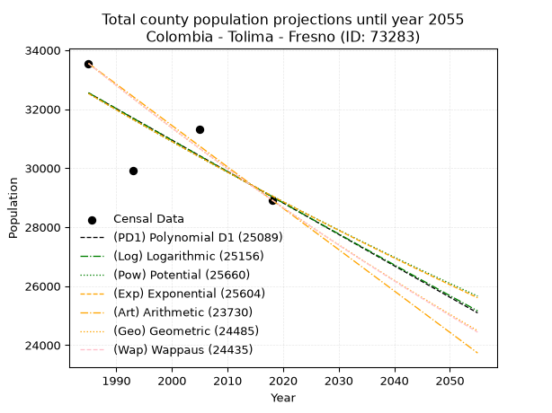
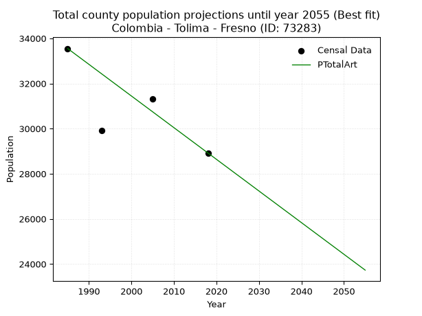
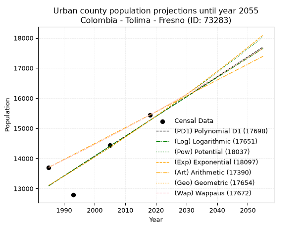
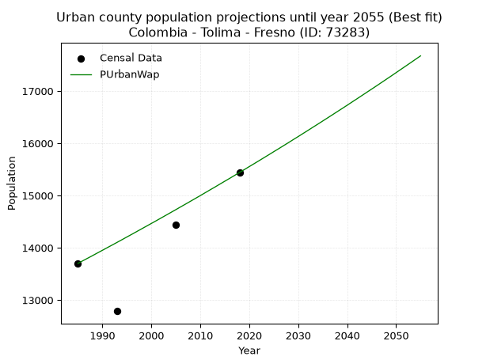
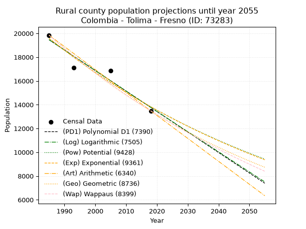
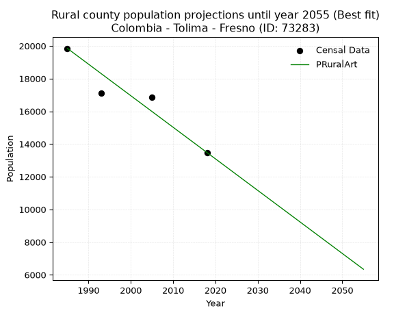

<div align="center">


</div>

# _“Population and Public Services Demand Projections (PPSD) until Year 2050 for Colombia - Tolima - Fresno (ID: 73283)”_
Keywords: `population` `public-service` `projection` `lineal` `polynomial` `logarithmic` `potential` `exponential` `arithmetic` `geometric` `wappaus` `dane` `colombia` `south-america`

PPSD are analytical estimates used by governments and planners to anticipate future changes in population size, age distribution, and the resulting community needs for utilities, healthcare, education, and infrastructure as sizing future water treatment facilities, electrical grids, and road networks based on spatial growth.

> **General running parameters**: • app_version: _v20260806_. • Python version: _3.14.7_. • Pandas version: _3.0.5_. • NumPy version: _2.5.1_. • Creates, save and include plots into reports (create_plot): _False_. • Projection until year: _2050_. • Process polynomial degree 2 and up: _False_. • Process Wappaus: _True_. • Process Wappaus: _True_. • Set negative values to zero: _True_. • Set infinite values to zero: _True_. • Drop dataset notes: _True_. 
<div align="center">

Dynamic map: [:earth_americas:Google](http://maps.google.com/maps?q=5.153576285,-75.0357223) [:earth_americas:OSM](https://www.openstreetmap.org/#map=18/5.153576285/-75.0357223&layers=P) [:earth_americas:Bing](https://www.bing.com/maps?cp=5.153576285~-75.0357223&lvl=18) [:earth_americas:Apple](https://maps.apple.com/frame?center=5.153576285%2C-75.0357223&span=0.003%2C0.006)

</div>


<div align="center">

```geojson
{
  "type": "Feature",
  "geometry": {
    "type": "Point", 
    "coordinates": [-75.0357223, 5.153576285]
  }, 
  "properties": {
    "Name": "Colombia - Tolima - Fresno (ID: 73283)"
  }
}
```

</div>


## 0. Census Data (4 records)

Census data are official statistics collected by a government about the people and housing in a country. They usually include counts of total population, age, sex, race, income, education, and jobs.

📅Global census file: [Population.xlsx](../data/Population.xlsx)

| Source   |   Year |   CountryID | CountryName   |   StateID | StateName   |   CountyID | CountyName   |   PTotal |   PUrban |   PRural |
|:---------|-------:|------------:|:--------------|----------:|:------------|-----------:|:-------------|---------:|---------:|---------:|
| DANE     |   1985 |          57 | Colombia      |        73 | Tolima      |      73283 | Fresno       |    33549 |    13701 |    19848 |
| DANE     |   1993 |          57 | Colombia      |        73 | Tolima      |      73283 | Fresno       |    29908 |    12787 |    17121 |
| DANE     |   2005 |          57 | Colombia      |        73 | Tolima      |      73283 | Fresno       |    31317 |    14442 |    16875 |
| DANE     |   2018 |          57 | Colombia      |        73 | Tolima      |      73283 | Fresno       |    28920 |    15440 |    13480 |

> 🔥Some records could had specific notes about the registered values or the corresponding urban or rural distribution.

**Local public utility companies (RUPS)**

 | SERVICIO       | ESTADO    | NOMBRE                                                         | NIT         | DEPARTAMENTO_DOMICILIO   | MUNICIPIO_DOMICILIO   | DIRECCION                                            |   TELEFONO | EMAIL                            | TIPO_INSCRIPCION    | REPRESENTANTE_LEGAL           | TIPO_PRESTADOR                             | CLASIFICACION                  |
|:---------------|:----------|:---------------------------------------------------------------|:------------|:-------------------------|:----------------------|:-----------------------------------------------------|-----------:|:---------------------------------|:--------------------|:------------------------------|:-------------------------------------------|:-------------------------------|
| ACUEDUCTO      | OPERATIVA | CORPORACION FRESNENSE DE OBRAS SANITARIAS                      | 800123131-7 | TOLIMA                   | FRESNO                | KRA 6 No. 5-05                                       |    2581421 | corfres2@hotmail.com             | Registro por la ESP | ALBERTO MARULANDA PINEDA      | EMPRESA INDUSTRIAL Y COMERCIAL DEL ESTADO  | DESDE 2501 HASTA 5000 USUARIOS |
| ALCANTARILLADO | OPERATIVA | CORPORACION FRESNENSE DE OBRAS SANITARIAS                      | 800123131-7 | TOLIMA                   | FRESNO                | KRA 6 No. 5-05                                       |    2581421 | corfres2@hotmail.com             | Registro por la ESP | ALBERTO MARULANDA PINEDA      | EMPRESA INDUSTRIAL Y COMERCIAL DEL ESTADO  | DESDE 2501 HASTA 5000 USUARIOS |
| ASEO           | OPERATIVA | CORPORACION FRESNENSE DE OBRAS SANITARIAS                      | 800123131-7 | TOLIMA                   | FRESNO                | KRA 6 No. 5-05                                       |    2581421 | corfres2@hotmail.com             | Registro por la ESP | ALBERTO MARULANDA PINEDA      | EMPRESA INDUSTRIAL Y COMERCIAL DEL ESTADO  | DESDE 2501 HASTA 5000 USUARIOS |
| ASEO           | OPERATIVA | EMPRESA METROPOLITANA DE ASEO S.A.  E.S.P.                     | 800249174-5 | CALDAS                   | MANIZALES             | Kilometro 2 via Neira Relleno Sanitario La Esmeralda |    8845868 | german.sanchez-loaiza@veolia.com | Registro por la ESP | JUAN CARLOS QUINTERO NARANJO  | SOCIEDADES (EMPRESA DE SERVICIOS PUBLICOS) | MAYOR O IGUAL A 5001 USUARIOS  |
| ASEO           | OPERATIVA | EMPRESA DE SERVICIOS PUBLICOS DE LA DORADA E.S.P.              | 810004450-8 | CALDAS                   | LA DORADA             | CENTRO COMERCIAL DORADA PLAZA LOCAL N202-1           |    8576097 | gerente.espladorada@gmail.com    | Registro por la ESP | ANGELA MARITZA GARCIA MAYORGA | EMPRESA INDUSTRIAL Y COMERCIAL DEL ESTADO  | MAYOR O IGUAL A 5001 USUARIOS  |
| ACUEDUCTO      | OPERATIVA | ASOCIACION DE USUARIOS DEL ACUEDUCTO RURAL DE MIREYA           | 900428185-7 | TOLIMA                   | FRESNO                | VEREDA MIREYA FINCA LA UNION                         |    2582517 | williamsanchez70@gmail.com       | Registro por la ESP | WILLIAM SANCHEZ MURCIA        | ORGANIZACION AUTORIZADA                    | HASTA 2500 SUSCRIPTORES        |
| ASEO           | OPERATIVA | Asociación Centro de Procesos Ambientales del Norte del Tolima | 901164153-0 | TOLIMA                   | FRESNO                | Calle 4 No. 14-48                                    |    3127933 | ASOCIACIONCPANT@GMAIL.COM        | Registro por la ESP | JOSE JAIR ORTIZ MUNOZ         | ORGANIZACION AUTORIZADA                    | DESDE 2501 HASTA 5000 USUARIOS |

> [📅RUPS Database: Registro Único de Prestadores de Servicios Públicos de Colombia Suramérica - RUPS](https://www.datos.gov.co/Hacienda-y-Cr-dito-P-blico/Registro-nico-de-Prestadores-de-Servicios-P-blicos/4qkq-csdn/about_data)

## 1. Total

### 1.1. Coefficients and Parameters

* (PD1) Polynomial Deg 1: -106.57486953030778, 244099.88277799814 (lineal)
* (Log) Logarithmic: -213422.84571256954, 1653152.260524592
* (Pow) Potential: -6.847455732635135, 27.093582013183294
* (Exp) Exponential: -0.003419571578536727, 28852586.881722163
* (Art) Arithmetic: Year diff. 2018 - 1985 = 33, Population diff. 28920 - 33549 = -4629, Annual growth = -140.27272727272728
* (Geo) Geometric: Year diff. 2018 - 1985 = 33, Population diff. 28920 - 33549 = -4629, Annual growth % = -0.0044890955546544875
* (Wap) Wappaus: i = -0.44909547863012783, Condition values only valid for < 200)

<sub>
Wappaus condition values: ['-0.00', '-0.45', '-0.90', '-1.35', '-1.80', '-2.25', '-2.69', '-3.14', '-3.59', '-4.04', '-4.49', '-4.94', '-5.39', '-5.84', '-6.29', '-6.74', '-7.19', '-7.63', '-8.08', '-8.53', '-8.98', '-9.43', '-9.88', '-10.33', '-10.78', '-11.23', '-11.68', '-12.13', '-12.57', '-13.02', '-13.47', '-13.92', '-14.37', '-14.82', '-15.27', '-15.72', '-16.17', '-16.62', '-17.07', '-17.51', '-17.96', '-18.41', '-18.86', '-19.31', '-19.76', '-20.21', '-20.66', '-21.11', '-21.56', '-22.01', '-22.45', '-22.90', '-23.35', '-23.80', '-24.25', '-24.70', '-25.15', '-25.60', '-26.05', '-26.50', '-26.95', '-27.39', '-27.84', '-28.29', '-28.74', '-29.19']
</sub>


### 1.2. Projected Dataset

|   Year |   CountyID |   PTotalPD1 |   PTotalLog |   PTotalPow |   PTotalExp |   PTotalArt |   PTotalGeo |   PTotalWap |
|-------:|-----------:|------------:|------------:|------------:|------------:|------------:|------------:|------------:|
|   1985 |      73283 |       32549 |       32553 |       32532 |       32528 |       33549 |       33549 |       33549 |
|   1986 |      73283 |       32442 |       32445 |       32420 |       32417 |       33409 |       33398 |       33399 |
|   1987 |      73283 |       32336 |       32338 |       32309 |       32306 |       33268 |       33248 |       33249 |
|   1988 |      73283 |       32229 |       32230 |       32197 |       32196 |       33128 |       33099 |       33100 |
|   1989 |      73283 |       32122 |       32123 |       32087 |       32086 |       32988 |       32951 |       32952 |
|   1990 |      73283 |       32016 |       32016 |       31977 |       31977 |       32848 |       32803 |       32804 |
|   1991 |      73283 |       31909 |       31909 |       31867 |       31868 |       32707 |       32655 |       32657 |
|   1992 |      73283 |       31803 |       31801 |       31757 |       31759 |       32567 |       32509 |       32511 |
|   1993 |      73283 |       31696 |       31694 |       31648 |       31650 |       32427 |       32363 |       32365 |
|   1994 |      73283 |       31590 |       31587 |       31540 |       31542 |       32287 |       32218 |       32220 |
|   1995 |      73283 |       31483 |       31480 |       31432 |       31435 |       32146 |       32073 |       32075 |
|   1996 |      73283 |       31376 |       31373 |       31324 |       31327 |       32006 |       31929 |       31932 |
|   1997 |      73283 |       31270 |       31266 |       31217 |       31220 |       31866 |       31786 |       31788 |
|   1998 |      73283 |       31163 |       31160 |       31110 |       31114 |       31725 |       31643 |       31646 |
|   1999 |      73283 |       31057 |       31053 |       31004 |       31008 |       31585 |       31501 |       31504 |
|   2000 |      73283 |       30950 |       30946 |       30898 |       30902 |       31445 |       31360 |       31363 |
|   2001 |      73283 |       30844 |       30839 |       30792 |       30796 |       31305 |       31219 |       31222 |
|   2002 |      73283 |       30737 |       30733 |       30687 |       30691 |       31164 |       31079 |       31082 |
|   2003 |      73283 |       30630 |       30626 |       30582 |       30586 |       31024 |       30939 |       30942 |
|   2004 |      73283 |       30524 |       30520 |       30478 |       30482 |       30884 |       30800 |       30803 |
|   2005 |      73283 |       30417 |       30413 |       30374 |       30378 |       30744 |       30662 |       30665 |
|   2006 |      73283 |       30311 |       30307 |       30270 |       30274 |       30603 |       30524 |       30527 |
|   2007 |      73283 |       30204 |       30200 |       30167 |       30171 |       30463 |       30387 |       30390 |
|   2008 |      73283 |       30098 |       30094 |       30064 |       30068 |       30323 |       30251 |       30254 |
|   2009 |      73283 |       29991 |       29988 |       29962 |       29965 |       30182 |       30115 |       30118 |
|   2010 |      73283 |       29884 |       29882 |       29860 |       29863 |       30042 |       29980 |       29983 |
|   2011 |      73283 |       29778 |       29775 |       29759 |       29761 |       29902 |       29845 |       29848 |
|   2012 |      73283 |       29671 |       29669 |       29658 |       29659 |       29762 |       29711 |       29714 |
|   2013 |      73283 |       29565 |       29563 |       29557 |       29558 |       29621 |       29578 |       29580 |
|   2014 |      73283 |       29458 |       29457 |       29456 |       29457 |       29481 |       29445 |       29447 |
|   2015 |      73283 |       29352 |       29351 |       29357 |       29357 |       29341 |       29313 |       29314 |
|   2016 |      73283 |       29245 |       29245 |       29257 |       29256 |       29201 |       29181 |       29182 |
|   2017 |      73283 |       29138 |       29140 |       29158 |       29157 |       29060 |       29050 |       29051 |
|   2018 |      73283 |       29032 |       29034 |       29059 |       29057 |       28920 |       28920 |       28920 |
|   2019 |      73283 |       28925 |       28928 |       28961 |       28958 |       28780 |       28790 |       28790 |
|   2020 |      73283 |       28819 |       28822 |       28863 |       28859 |       28639 |       28661 |       28660 |
|   2021 |      73283 |       28712 |       28717 |       28765 |       28760 |       28499 |       28532 |       28531 |
|   2022 |      73283 |       28605 |       28611 |       28668 |       28662 |       28359 |       28404 |       28402 |
|   2023 |      73283 |       28499 |       28506 |       28571 |       28564 |       28219 |       28277 |       28274 |
|   2024 |      73283 |       28392 |       28400 |       28474 |       28467 |       28078 |       28150 |       28146 |
|   2025 |      73283 |       28286 |       28295 |       28378 |       28370 |       27938 |       28023 |       28019 |
|   2026 |      73283 |       28179 |       28189 |       28282 |       28273 |       27798 |       27898 |       27892 |
|   2027 |      73283 |       28073 |       28084 |       28187 |       28176 |       27658 |       27772 |       27766 |
|   2028 |      73283 |       27966 |       27979 |       28092 |       28080 |       27517 |       27648 |       27641 |
|   2029 |      73283 |       27859 |       27874 |       27997 |       27984 |       27377 |       27524 |       27516 |
|   2030 |      73283 |       27753 |       27768 |       27903 |       27889 |       27237 |       27400 |       27391 |
|   2031 |      73283 |       27646 |       27663 |       27809 |       27794 |       27096 |       27277 |       27267 |
|   2032 |      73283 |       27540 |       27558 |       27715 |       27699 |       26956 |       27155 |       27144 |
|   2033 |      73283 |       27433 |       27453 |       27622 |       27604 |       26816 |       27033 |       27021 |
|   2034 |      73283 |       27327 |       27348 |       27529 |       27510 |       26676 |       26911 |       26898 |
|   2035 |      73283 |       27220 |       27243 |       27437 |       27416 |       26535 |       26790 |       26776 |
|   2036 |      73283 |       27113 |       27139 |       27345 |       27322 |       26395 |       26670 |       26655 |
|   2037 |      73283 |       27007 |       27034 |       27253 |       27229 |       26255 |       26550 |       26533 |
|   2038 |      73283 |       26900 |       26929 |       27161 |       27136 |       26115 |       26431 |       26413 |
|   2039 |      73283 |       26794 |       26824 |       27070 |       27044 |       25974 |       26313 |       26293 |
|   2040 |      73283 |       26687 |       26720 |       26980 |       26951 |       25834 |       26195 |       26173 |
|   2041 |      73283 |       26581 |       26615 |       26889 |       26859 |       25694 |       26077 |       26054 |
|   2042 |      73283 |       26474 |       26511 |       26799 |       26768 |       25553 |       25960 |       25935 |
|   2043 |      73283 |       26367 |       26406 |       26710 |       26676 |       25413 |       25843 |       25817 |
|   2044 |      73283 |       26261 |       26302 |       26620 |       26585 |       25273 |       25727 |       25700 |
|   2045 |      73283 |       26154 |       26197 |       26531 |       26494 |       25133 |       25612 |       25582 |
|   2046 |      73283 |       26048 |       26093 |       26442 |       26404 |       24992 |       25497 |       25466 |
|   2047 |      73283 |       25941 |       25989 |       26354 |       26314 |       24852 |       25382 |       25349 |
|   2048 |      73283 |       25835 |       25884 |       26266 |       26224 |       24712 |       25268 |       25233 |
|   2049 |      73283 |       25728 |       25780 |       26179 |       26134 |       24572 |       25155 |       25118 |
|   2050 |      73283 |       25621 |       25676 |       26091 |       26045 |       24431 |       25042 |       25003 |
<div align="center">

</img>

</div>


### 1.3. Best fit with absolute and relative error (%)

Relative error puts that difference into context by dividing the absolute error by the true value, creating a unitless ratio or percentage that shows the scale of the mistake.

Absolute and relative error

|   Year | Source   |   CountryID | CountryName   |   StateID | StateName   |   CountyID_x | CountyName   |   PTotal |   PUrban |   PRural |   CountyID_y |   PTotalPD1 |   PTotalLog |   PTotalPow |   PTotalExp |   PTotalArt |   PTotalGeo |   PTotalWap |   PTotalPD1AbsError |   PTotalLogAbsError |   PTotalPowAbsError |   PTotalExpAbsError |   PTotalArtAbsError |   PTotalGeoAbsError |   PTotalWapAbsError |   PTotalPD1RelError |   PTotalLogRelError |   PTotalPowRelError |   PTotalExpRelError |   PTotalArtRelError |   PTotalGeoRelError |   PTotalWapRelError |
|-------:|:---------|------------:|:--------------|----------:|:------------|-------------:|:-------------|---------:|---------:|---------:|-------------:|------------:|------------:|------------:|------------:|------------:|------------:|------------:|--------------------:|--------------------:|--------------------:|--------------------:|--------------------:|--------------------:|--------------------:|--------------------:|--------------------:|--------------------:|--------------------:|--------------------:|--------------------:|--------------------:|
|   1985 | DANE     |          57 | Colombia      |        73 | Tolima      |        73283 | Fresno       |    33549 |    13701 |    19848 |        73283 |       32549 |       32553 |       32532 |       32528 |       33549 |       33549 |       33549 |                1000 |                 996 |                1017 |                1021 |                   0 |                   0 |                   0 |            2.98071  |            2.96879  |            3.03139  |            3.04331  |             0       |             0       |             0       |
|   1993 | DANE     |          57 | Colombia      |        73 | Tolima      |        73283 | Fresno       |    29908 |    12787 |    17121 |        73283 |       31696 |       31694 |       31648 |       31650 |       32427 |       32363 |       32365 |                1788 |                1786 |                1740 |                1742 |                2519 |                2455 |                2457 |            5.97833  |            5.97165  |            5.81784  |            5.82453  |             8.4225  |             8.20851 |             8.21519 |
|   2005 | DANE     |          57 | Colombia      |        73 | Tolima      |        73283 | Fresno       |    31317 |    14442 |    16875 |        73283 |       30417 |       30413 |       30374 |       30378 |       30744 |       30662 |       30665 |                 900 |                 904 |                 943 |                 939 |                 573 |                 655 |                 652 |            2.87384  |            2.88661  |            3.01114  |            2.99837  |             1.82968 |             2.09152 |             2.08194 |
|   2018 | DANE     |          57 | Colombia      |        73 | Tolima      |        73283 | Fresno       |    28920 |    15440 |    13480 |        73283 |       29032 |       29034 |       29059 |       29057 |       28920 |       28920 |       28920 |                 112 |                 114 |                 139 |                 137 |                   0 |                   0 |                   0 |            0.387275 |            0.394191 |            0.480636 |            0.473721 |             0       |             0       |             0       |

Relative error mean

| Method    |   RelError | Best   |
|:----------|-----------:|:-------|
| PTotalPD1 |    3.05504 |        |
| PTotalLog |    3.05531 |        |
| PTotalPow |    3.08525 |        |
| PTotalExp |    3.08498 |        |
| PTotalArt |    2.56304 | True   |
| PTotalGeo |    2.57501 |        |
| PTotalWap |    2.57428 |        |

💙Best method: _**PTotalArt**_
<div align="center">

</img>

</div>


### 1.4. Fresh water supply demand in liters per capita per day (lpcd)

The fresh water supply demand typically ranges from 100 to 300 liters per capita per day (lpcd) for standard domestic and municipal planning, though absolute survival minimums set by the World Health Organization are as low as 7.5 to 20 liters per day, and total consumption in high-income nations can exceed 400 liters.

> `CZ`: Level in meters above the sea level (masl)<br> `WS`: Fresh water supply demand in liters per capita per day (lpcd or l/h/d)<br> `WSAll`: Zonal fresh water supply demand in liters per second (l/s)<br> `A`: Zonal area in square meters<br> `DP`: Population density (people/hectare or p/ha)

Reference values (RAS Colombia)

|    CZ |   WS |
|------:|-----:|
|  1000 |  120 |
|  2000 |  130 |
| 99999 |  140 |

County shapefile geometry properties and water supply values

|   CountyID |      ATotal |   CZTotal |   WSTotal |
|-----------:|------------:|----------:|----------:|
|      73283 | 2.19557e+08 |   1443.23 |       130 |

Projected values for best method: PTotalArt

|   CountyID |   Year |   PTotalArt |   DPTotal |   WSTotal |   WSTotalAll |
|-----------:|-------:|------------:|----------:|----------:|-------------:|
|      73283 |   1985 |       33549 |      1.53 |       130 |      50.4788 |
|      73283 |   1986 |       33409 |      1.52 |       130 |      50.2682 |
|      73283 |   1987 |       33268 |      1.52 |       130 |      50.056  |
|      73283 |   1988 |       33128 |      1.51 |       130 |      49.8454 |
|      73283 |   1989 |       32988 |      1.5  |       130 |      49.6347 |
|      73283 |   1990 |       32848 |      1.5  |       130 |      49.4241 |
|      73283 |   1991 |       32707 |      1.49 |       130 |      49.2119 |
|      73283 |   1992 |       32567 |      1.48 |       130 |      49.0013 |
|      73283 |   1993 |       32427 |      1.48 |       130 |      48.7906 |
|      73283 |   1994 |       32287 |      1.47 |       130 |      48.58   |
|      73283 |   1995 |       32146 |      1.46 |       130 |      48.3678 |
|      73283 |   1996 |       32006 |      1.46 |       130 |      48.1572 |
|      73283 |   1997 |       31866 |      1.45 |       130 |      47.9465 |
|      73283 |   1998 |       31725 |      1.44 |       130 |      47.7344 |
|      73283 |   1999 |       31585 |      1.44 |       130 |      47.5237 |
|      73283 |   2000 |       31445 |      1.43 |       130 |      47.3131 |
|      73283 |   2001 |       31305 |      1.43 |       130 |      47.1024 |
|      73283 |   2002 |       31164 |      1.42 |       130 |      46.8903 |
|      73283 |   2003 |       31024 |      1.41 |       130 |      46.6796 |
|      73283 |   2004 |       30884 |      1.41 |       130 |      46.469  |
|      73283 |   2005 |       30744 |      1.4  |       130 |      46.2583 |
|      73283 |   2006 |       30603 |      1.39 |       130 |      46.0462 |
|      73283 |   2007 |       30463 |      1.39 |       130 |      45.8355 |
|      73283 |   2008 |       30323 |      1.38 |       130 |      45.6249 |
|      73283 |   2009 |       30182 |      1.37 |       130 |      45.4127 |
|      73283 |   2010 |       30042 |      1.37 |       130 |      45.2021 |
|      73283 |   2011 |       29902 |      1.36 |       130 |      44.9914 |
|      73283 |   2012 |       29762 |      1.36 |       130 |      44.7808 |
|      73283 |   2013 |       29621 |      1.35 |       130 |      44.5686 |
|      73283 |   2014 |       29481 |      1.34 |       130 |      44.358  |
|      73283 |   2015 |       29341 |      1.34 |       130 |      44.1473 |
|      73283 |   2016 |       29201 |      1.33 |       130 |      43.9367 |
|      73283 |   2017 |       29060 |      1.32 |       130 |      43.7245 |
|      73283 |   2018 |       28920 |      1.32 |       130 |      43.5139 |
|      73283 |   2019 |       28780 |      1.31 |       130 |      43.3032 |
|      73283 |   2020 |       28639 |      1.3  |       130 |      43.0911 |
|      73283 |   2021 |       28499 |      1.3  |       130 |      42.8804 |
|      73283 |   2022 |       28359 |      1.29 |       130 |      42.6698 |
|      73283 |   2023 |       28219 |      1.29 |       130 |      42.4591 |
|      73283 |   2024 |       28078 |      1.28 |       130 |      42.247  |
|      73283 |   2025 |       27938 |      1.27 |       130 |      42.0363 |
|      73283 |   2026 |       27798 |      1.27 |       130 |      41.8257 |
|      73283 |   2027 |       27658 |      1.26 |       130 |      41.615  |
|      73283 |   2028 |       27517 |      1.25 |       130 |      41.4029 |
|      73283 |   2029 |       27377 |      1.25 |       130 |      41.1922 |
|      73283 |   2030 |       27237 |      1.24 |       130 |      40.9816 |
|      73283 |   2031 |       27096 |      1.23 |       130 |      40.7694 |
|      73283 |   2032 |       26956 |      1.23 |       130 |      40.5588 |
|      73283 |   2033 |       26816 |      1.22 |       130 |      40.3481 |
|      73283 |   2034 |       26676 |      1.21 |       130 |      40.1375 |
|      73283 |   2035 |       26535 |      1.21 |       130 |      39.9253 |
|      73283 |   2036 |       26395 |      1.2  |       130 |      39.7147 |
|      73283 |   2037 |       26255 |      1.2  |       130 |      39.5041 |
|      73283 |   2038 |       26115 |      1.19 |       130 |      39.2934 |
|      73283 |   2039 |       25974 |      1.18 |       130 |      39.0812 |
|      73283 |   2040 |       25834 |      1.18 |       130 |      38.8706 |
|      73283 |   2041 |       25694 |      1.17 |       130 |      38.66   |
|      73283 |   2042 |       25553 |      1.16 |       130 |      38.4478 |
|      73283 |   2043 |       25413 |      1.16 |       130 |      38.2372 |
|      73283 |   2044 |       25273 |      1.15 |       130 |      38.0265 |
|      73283 |   2045 |       25133 |      1.14 |       130 |      37.8159 |
|      73283 |   2046 |       24992 |      1.14 |       130 |      37.6037 |
|      73283 |   2047 |       24852 |      1.13 |       130 |      37.3931 |
|      73283 |   2048 |       24712 |      1.13 |       130 |      37.1824 |
|      73283 |   2049 |       24572 |      1.12 |       130 |      36.9718 |
|      73283 |   2050 |       24431 |      1.11 |       130 |      36.7596 |

## 2. Urban

### 2.1. Coefficients and Parameters

* (PD1) Polynomial Deg 1: 65.85869128863835, -117641.34725009886 (lineal)
* (Log) Logarithmic: 131698.41184460607, -986948.1837956894
* (Pow) Potential: 9.22134978104654, -26.292426056211454
* (Exp) Exponential: 0.004611361516957136, 1.3869809561870734
* (Art) Arithmetic: Year diff. 2018 - 1985 = 33, Population diff. 15440 - 13701 = 1739, Annual growth = 52.696969696969695
* (Geo) Geometric: Year diff. 2018 - 1985 = 33, Population diff. 15440 - 13701 = 1739, Annual growth % = 0.003627555277398331
* (Wap) Wappaus: i = 0.361668917998488, Condition values only valid for < 200)

<sub>
Wappaus condition values: ['0.00', '0.36', '0.72', '1.09', '1.45', '1.81', '2.17', '2.53', '2.89', '3.26', '3.62', '3.98', '4.34', '4.70', '5.06', '5.43', '5.79', '6.15', '6.51', '6.87', '7.23', '7.60', '7.96', '8.32', '8.68', '9.04', '9.40', '9.77', '10.13', '10.49', '10.85', '11.21', '11.57', '11.94', '12.30', '12.66', '13.02', '13.38', '13.74', '14.11', '14.47', '14.83', '15.19', '15.55', '15.91', '16.28', '16.64', '17.00', '17.36', '17.72', '18.08', '18.45', '18.81', '19.17', '19.53', '19.89', '20.25', '20.62', '20.98', '21.34', '21.70', '22.06', '22.42', '22.79', '23.15', '23.51']
</sub>


### 2.2. Projected Dataset

|   Year |   CountyID |   PUrbanPD1 |   PUrbanLog |   PUrbanPow |   PUrbanExp |   PUrbanArt |   PUrbanGeo |   PUrbanWap |
|-------:|-----------:|------------:|------------:|------------:|------------:|------------:|------------:|------------:|
|   1985 |      73283 |       13088 |       13087 |       13103 |       13104 |       13701 |       13701 |       13701 |
|   1986 |      73283 |       13154 |       13153 |       13164 |       13165 |       13754 |       13751 |       13751 |
|   1987 |      73283 |       13220 |       13220 |       13225 |       13226 |       13806 |       13801 |       13800 |
|   1988 |      73283 |       13286 |       13286 |       13287 |       13287 |       13859 |       13851 |       13850 |
|   1989 |      73283 |       13352 |       13352 |       13349 |       13348 |       13912 |       13901 |       13901 |
|   1990 |      73283 |       13417 |       13418 |       13411 |       13410 |       13964 |       13951 |       13951 |
|   1991 |      73283 |       13483 |       13485 |       13473 |       13472 |       14017 |       14002 |       14002 |
|   1992 |      73283 |       13549 |       13551 |       13536 |       13534 |       14070 |       14053 |       14052 |
|   1993 |      73283 |       13615 |       13617 |       13598 |       13597 |       14123 |       14104 |       14103 |
|   1994 |      73283 |       13681 |       13683 |       13661 |       13659 |       14175 |       14155 |       14154 |
|   1995 |      73283 |       13747 |       13749 |       13725 |       13723 |       14228 |       14206 |       14206 |
|   1996 |      73283 |       13813 |       13815 |       13788 |       13786 |       14281 |       14258 |       14257 |
|   1997 |      73283 |       13878 |       13881 |       13852 |       13850 |       14333 |       14309 |       14309 |
|   1998 |      73283 |       13944 |       13947 |       13916 |       13914 |       14386 |       14361 |       14361 |
|   1999 |      73283 |       14010 |       14013 |       13981 |       13978 |       14439 |       14413 |       14413 |
|   2000 |      73283 |       14076 |       14079 |       14045 |       14043 |       14491 |       14466 |       14465 |
|   2001 |      73283 |       14142 |       14144 |       14110 |       14108 |       14544 |       14518 |       14517 |
|   2002 |      73283 |       14208 |       14210 |       14175 |       14173 |       14597 |       14571 |       14570 |
|   2003 |      73283 |       14274 |       14276 |       14241 |       14238 |       14650 |       14624 |       14623 |
|   2004 |      73283 |       14339 |       14342 |       14306 |       14304 |       14702 |       14677 |       14676 |
|   2005 |      73283 |       14405 |       14407 |       14372 |       14370 |       14755 |       14730 |       14729 |
|   2006 |      73283 |       14471 |       14473 |       14439 |       14437 |       14808 |       14783 |       14783 |
|   2007 |      73283 |       14537 |       14539 |       14505 |       14503 |       14860 |       14837 |       14836 |
|   2008 |      73283 |       14603 |       14604 |       14572 |       14570 |       14913 |       14891 |       14890 |
|   2009 |      73283 |       14669 |       14670 |       14639 |       14638 |       14966 |       14945 |       14944 |
|   2010 |      73283 |       14735 |       14735 |       14706 |       14705 |       15018 |       14999 |       14998 |
|   2011 |      73283 |       14800 |       14801 |       14774 |       14773 |       15071 |       15054 |       15053 |
|   2012 |      73283 |       14866 |       14866 |       14842 |       14842 |       15124 |       15108 |       15108 |
|   2013 |      73283 |       14932 |       14932 |       14910 |       14910 |       15177 |       15163 |       15162 |
|   2014 |      73283 |       14998 |       14997 |       14978 |       14979 |       15229 |       15218 |       15218 |
|   2015 |      73283 |       15064 |       15063 |       15047 |       15048 |       15282 |       15273 |       15273 |
|   2016 |      73283 |       15130 |       15128 |       15116 |       15118 |       15335 |       15329 |       15328 |
|   2017 |      73283 |       15196 |       15193 |       15185 |       15188 |       15387 |       15384 |       15384 |
|   2018 |      73283 |       15261 |       15259 |       15255 |       15258 |       15440 |       15440 |       15440 |
|   2019 |      73283 |       15327 |       15324 |       15325 |       15328 |       15493 |       15496 |       15496 |
|   2020 |      73283 |       15393 |       15389 |       15395 |       15399 |       15545 |       15552 |       15553 |
|   2021 |      73283 |       15459 |       15454 |       15465 |       15471 |       15598 |       15609 |       15609 |
|   2022 |      73283 |       15525 |       15519 |       15536 |       15542 |       15651 |       15665 |       15666 |
|   2023 |      73283 |       15591 |       15584 |       15607 |       15614 |       15703 |       15722 |       15723 |
|   2024 |      73283 |       15657 |       15650 |       15678 |       15686 |       15756 |       15779 |       15780 |
|   2025 |      73283 |       15723 |       15715 |       15750 |       15759 |       15809 |       15836 |       15838 |
|   2026 |      73283 |       15788 |       15780 |       15822 |       15831 |       15862 |       15894 |       15895 |
|   2027 |      73283 |       15854 |       15845 |       15894 |       15905 |       15914 |       15951 |       15953 |
|   2028 |      73283 |       15920 |       15910 |       15966 |       15978 |       15967 |       16009 |       16011 |
|   2029 |      73283 |       15986 |       15975 |       16039 |       16052 |       16020 |       16067 |       16070 |
|   2030 |      73283 |       16052 |       16039 |       16112 |       16126 |       16072 |       16126 |       16128 |
|   2031 |      73283 |       16118 |       16104 |       16185 |       16201 |       16125 |       16184 |       16187 |
|   2032 |      73283 |       16184 |       16169 |       16259 |       16275 |       16178 |       16243 |       16246 |
|   2033 |      73283 |       16249 |       16234 |       16333 |       16351 |       16230 |       16302 |       16306 |
|   2034 |      73283 |       16315 |       16299 |       16407 |       16426 |       16283 |       16361 |       16365 |
|   2035 |      73283 |       16381 |       16363 |       16482 |       16502 |       16336 |       16420 |       16425 |
|   2036 |      73283 |       16447 |       16428 |       16557 |       16578 |       16389 |       16480 |       16485 |
|   2037 |      73283 |       16513 |       16493 |       16632 |       16655 |       16441 |       16540 |       16545 |
|   2038 |      73283 |       16579 |       16557 |       16707 |       16732 |       16494 |       16600 |       16606 |
|   2039 |      73283 |       16645 |       16622 |       16783 |       16809 |       16547 |       16660 |       16666 |
|   2040 |      73283 |       16710 |       16687 |       16859 |       16887 |       16599 |       16720 |       16727 |
|   2041 |      73283 |       16776 |       16751 |       16935 |       16965 |       16652 |       16781 |       16789 |
|   2042 |      73283 |       16842 |       16816 |       17012 |       17044 |       16705 |       16842 |       16850 |
|   2043 |      73283 |       16908 |       16880 |       17089 |       17122 |       16757 |       16903 |       16912 |
|   2044 |      73283 |       16974 |       16945 |       17166 |       17202 |       16810 |       16964 |       16974 |
|   2045 |      73283 |       17040 |       17009 |       17244 |       17281 |       16863 |       17026 |       17036 |
|   2046 |      73283 |       17106 |       17073 |       17322 |       17361 |       16916 |       17088 |       17098 |
|   2047 |      73283 |       17171 |       17138 |       17400 |       17441 |       16968 |       17150 |       17161 |
|   2048 |      73283 |       17237 |       17202 |       17479 |       17522 |       17021 |       17212 |       17224 |
|   2049 |      73283 |       17303 |       17266 |       17557 |       17603 |       17074 |       17274 |       17287 |
|   2050 |      73283 |       17369 |       17331 |       17637 |       17684 |       17126 |       17337 |       17351 |
<div align="center">

</img>

</div>


### 2.3. Best fit with absolute and relative error (%)

Relative error puts that difference into context by dividing the absolute error by the true value, creating a unitless ratio or percentage that shows the scale of the mistake.

Absolute and relative error

|   Year | Source   |   CountryID | CountryName   |   StateID | StateName   |   CountyID_x | CountyName   |   PTotal |   PUrban |   PRural |   CountyID_y |   PUrbanPD1 |   PUrbanLog |   PUrbanPow |   PUrbanExp |   PUrbanArt |   PUrbanGeo |   PUrbanWap |   PUrbanPD1AbsError |   PUrbanLogAbsError |   PUrbanPowAbsError |   PUrbanExpAbsError |   PUrbanArtAbsError |   PUrbanGeoAbsError |   PUrbanWapAbsError |   PUrbanPD1RelError |   PUrbanLogRelError |   PUrbanPowRelError |   PUrbanExpRelError |   PUrbanArtRelError |   PUrbanGeoRelError |   PUrbanWapRelError |
|-------:|:---------|------------:|:--------------|----------:|:------------|-------------:|:-------------|---------:|---------:|---------:|-------------:|------------:|------------:|------------:|------------:|------------:|------------:|------------:|--------------------:|--------------------:|--------------------:|--------------------:|--------------------:|--------------------:|--------------------:|--------------------:|--------------------:|--------------------:|--------------------:|--------------------:|--------------------:|--------------------:|
|   1985 | DANE     |          57 | Colombia      |        73 | Tolima      |        73283 | Fresno       |    33549 |    13701 |    19848 |        73283 |       13088 |       13087 |       13103 |       13104 |       13701 |       13701 |       13701 |                 613 |                 614 |                 598 |                 597 |                   0 |                   0 |                   0 |            4.47413  |            4.48142  |            4.36464  |            4.35735  |             0       |             0       |             0       |
|   1993 | DANE     |          57 | Colombia      |        73 | Tolima      |        73283 | Fresno       |    29908 |    12787 |    17121 |        73283 |       13615 |       13617 |       13598 |       13597 |       14123 |       14104 |       14103 |                 828 |                 830 |                 811 |                 810 |                1336 |                1317 |                1316 |            6.47533  |            6.49097  |            6.34238  |            6.33456  |            10.4481  |            10.2995  |            10.2917  |
|   2005 | DANE     |          57 | Colombia      |        73 | Tolima      |        73283 | Fresno       |    31317 |    14442 |    16875 |        73283 |       14405 |       14407 |       14372 |       14370 |       14755 |       14730 |       14729 |                  37 |                  35 |                  70 |                  72 |                 313 |                 288 |                 287 |            0.256197 |            0.242349 |            0.484697 |            0.498546 |             2.16729 |             1.99418 |             1.98726 |
|   2018 | DANE     |          57 | Colombia      |        73 | Tolima      |        73283 | Fresno       |    28920 |    15440 |    13480 |        73283 |       15261 |       15259 |       15255 |       15258 |       15440 |       15440 |       15440 |                 179 |                 181 |                 185 |                 182 |                   0 |                   0 |                   0 |            1.15933  |            1.17228  |            1.19819  |            1.17876  |             0       |             0       |             0       |

Relative error mean

| Method    |   RelError | Best   |
|:----------|-----------:|:-------|
| PUrbanPD1 |    3.09124 |        |
| PUrbanLog |    3.09676 |        |
| PUrbanPow |    3.09748 |        |
| PUrbanExp |    3.0923  |        |
| PUrbanArt |    3.15385 |        |
| PUrbanGeo |    3.07343 |        |
| PUrbanWap |    3.06974 | True   |

💙Best method: _**PUrbanWap**_
<div align="center">

</img>

</div>


### 2.4. Fresh water supply demand in liters per capita per day (lpcd)

The fresh water supply demand typically ranges from 100 to 300 liters per capita per day (lpcd) for standard domestic and municipal planning, though absolute survival minimums set by the World Health Organization are as low as 7.5 to 20 liters per day, and total consumption in high-income nations can exceed 400 liters.

> `CZ`: Level in meters above the sea level (masl)<br> `WS`: Fresh water supply demand in liters per capita per day (lpcd or l/h/d)<br> `WSAll`: Zonal fresh water supply demand in liters per second (l/s)<br> `A`: Zonal area in square meters<br> `DP`: Population density (people/hectare or p/ha)

Reference values (RAS Colombia)

|    CZ |   WS |
|------:|-----:|
|  1000 |  120 |
|  2000 |  130 |
| 99999 |  140 |

County shapefile geometry properties and water supply values

|   CountyID |      AUrban |   CZUrban |   WSUrban |
|-----------:|------------:|----------:|----------:|
|      73283 | 1.42772e+06 |    1486.3 |       130 |

Projected values for best method: PUrbanWap

|   CountyID |   Year |   PUrbanWap |   DPUrban |   WSUrban |   WSUrbanAll |
|-----------:|-------:|------------:|----------:|----------:|-------------:|
|      73283 |   1985 |       13701 |     95.96 |       130 |      20.6149 |
|      73283 |   1986 |       13751 |     96.31 |       130 |      20.6902 |
|      73283 |   1987 |       13800 |     96.66 |       130 |      20.7639 |
|      73283 |   1988 |       13850 |     97.01 |       130 |      20.8391 |
|      73283 |   1989 |       13901 |     97.37 |       130 |      20.9159 |
|      73283 |   1990 |       13951 |     97.72 |       130 |      20.9911 |
|      73283 |   1991 |       14002 |     98.07 |       130 |      21.0678 |
|      73283 |   1992 |       14052 |     98.42 |       130 |      21.1431 |
|      73283 |   1993 |       14103 |     98.78 |       130 |      21.2198 |
|      73283 |   1994 |       14154 |     99.14 |       130 |      21.2965 |
|      73283 |   1995 |       14206 |     99.5  |       130 |      21.3748 |
|      73283 |   1996 |       14257 |     99.86 |       130 |      21.4515 |
|      73283 |   1997 |       14309 |    100.22 |       130 |      21.5297 |
|      73283 |   1998 |       14361 |    100.59 |       130 |      21.608  |
|      73283 |   1999 |       14413 |    100.95 |       130 |      21.6862 |
|      73283 |   2000 |       14465 |    101.32 |       130 |      21.7645 |
|      73283 |   2001 |       14517 |    101.68 |       130 |      21.8427 |
|      73283 |   2002 |       14570 |    102.05 |       130 |      21.9225 |
|      73283 |   2003 |       14623 |    102.42 |       130 |      22.0022 |
|      73283 |   2004 |       14676 |    102.79 |       130 |      22.0819 |
|      73283 |   2005 |       14729 |    103.16 |       130 |      22.1617 |
|      73283 |   2006 |       14783 |    103.54 |       130 |      22.2429 |
|      73283 |   2007 |       14836 |    103.91 |       130 |      22.3227 |
|      73283 |   2008 |       14890 |    104.29 |       130 |      22.4039 |
|      73283 |   2009 |       14944 |    104.67 |       130 |      22.4852 |
|      73283 |   2010 |       14998 |    105.05 |       130 |      22.5664 |
|      73283 |   2011 |       15053 |    105.43 |       130 |      22.6492 |
|      73283 |   2012 |       15108 |    105.82 |       130 |      22.7319 |
|      73283 |   2013 |       15162 |    106.2  |       130 |      22.8132 |
|      73283 |   2014 |       15218 |    106.59 |       130 |      22.8975 |
|      73283 |   2015 |       15273 |    106.98 |       130 |      22.9802 |
|      73283 |   2016 |       15328 |    107.36 |       130 |      23.063  |
|      73283 |   2017 |       15384 |    107.75 |       130 |      23.1472 |
|      73283 |   2018 |       15440 |    108.14 |       130 |      23.2315 |
|      73283 |   2019 |       15496 |    108.54 |       130 |      23.3157 |
|      73283 |   2020 |       15553 |    108.94 |       130 |      23.4015 |
|      73283 |   2021 |       15609 |    109.33 |       130 |      23.4858 |
|      73283 |   2022 |       15666 |    109.73 |       130 |      23.5715 |
|      73283 |   2023 |       15723 |    110.13 |       130 |      23.6573 |
|      73283 |   2024 |       15780 |    110.53 |       130 |      23.7431 |
|      73283 |   2025 |       15838 |    110.93 |       130 |      23.8303 |
|      73283 |   2026 |       15895 |    111.33 |       130 |      23.9161 |
|      73283 |   2027 |       15953 |    111.74 |       130 |      24.0034 |
|      73283 |   2028 |       16011 |    112.14 |       130 |      24.0906 |
|      73283 |   2029 |       16070 |    112.56 |       130 |      24.1794 |
|      73283 |   2030 |       16128 |    112.96 |       130 |      24.2667 |
|      73283 |   2031 |       16187 |    113.38 |       130 |      24.3554 |
|      73283 |   2032 |       16246 |    113.79 |       130 |      24.4442 |
|      73283 |   2033 |       16306 |    114.21 |       130 |      24.5345 |
|      73283 |   2034 |       16365 |    114.62 |       130 |      24.6233 |
|      73283 |   2035 |       16425 |    115.04 |       130 |      24.7135 |
|      73283 |   2036 |       16485 |    115.46 |       130 |      24.8038 |
|      73283 |   2037 |       16545 |    115.88 |       130 |      24.8941 |
|      73283 |   2038 |       16606 |    116.31 |       130 |      24.9859 |
|      73283 |   2039 |       16666 |    116.73 |       130 |      25.0762 |
|      73283 |   2040 |       16727 |    117.16 |       130 |      25.1679 |
|      73283 |   2041 |       16789 |    117.59 |       130 |      25.2612 |
|      73283 |   2042 |       16850 |    118.02 |       130 |      25.353  |
|      73283 |   2043 |       16912 |    118.45 |       130 |      25.4463 |
|      73283 |   2044 |       16974 |    118.89 |       130 |      25.5396 |
|      73283 |   2045 |       17036 |    119.32 |       130 |      25.6329 |
|      73283 |   2046 |       17098 |    119.76 |       130 |      25.7262 |
|      73283 |   2047 |       17161 |    120.2  |       130 |      25.8209 |
|      73283 |   2048 |       17224 |    120.64 |       130 |      25.9157 |
|      73283 |   2049 |       17287 |    121.08 |       130 |      26.0105 |
|      73283 |   2050 |       17351 |    121.53 |       130 |      26.1068 |

## 3. Rural

### 3.1. Coefficients and Parameters

* (PD1) Polynomial Deg 1: -172.43356081894612, 361741.23002809694 (lineal)
* (Log) Logarithmic: -345121.25755717536, 2640100.4443202796
* (Pow) Potential: -21.101427743648415, 73.87945814228239
* (Exp) Exponential: -0.0105446124722714, 24105923602470.61
* (Art) Arithmetic: Year diff. 2018 - 1985 = 33, Population diff. 13480 - 19848 = -6368, Annual growth = -192.96969696969697
* (Geo) Geometric: Year diff. 2018 - 1985 = 33, Population diff. 13480 - 19848 = -6368, Annual growth % = -0.011655665727593356
* (Wap) Wappaus: i = -1.1580034623721613, Condition values only valid for < 200)

<sub>
Wappaus condition values: ['-0.00', '-1.16', '-2.32', '-3.47', '-4.63', '-5.79', '-6.95', '-8.11', '-9.26', '-10.42', '-11.58', '-12.74', '-13.90', '-15.05', '-16.21', '-17.37', '-18.53', '-19.69', '-20.84', '-22.00', '-23.16', '-24.32', '-25.48', '-26.63', '-27.79', '-28.95', '-30.11', '-31.27', '-32.42', '-33.58', '-34.74', '-35.90', '-37.06', '-38.21', '-39.37', '-40.53', '-41.69', '-42.85', '-44.00', '-45.16', '-46.32', '-47.48', '-48.64', '-49.79', '-50.95', '-52.11', '-53.27', '-54.43', '-55.58', '-56.74', '-57.90', '-59.06', '-60.22', '-61.37', '-62.53', '-63.69', '-64.85', '-66.01', '-67.16', '-68.32', '-69.48', '-70.64', '-71.80', '-72.95', '-74.11', '-75.27']
</sub>


### 3.2. Projected Dataset

|   Year |   CountyID |   PRuralPD1 |   PRuralLog |   PRuralPow |   PRuralExp |   PRuralArt |   PRuralGeo |   PRuralWap |
|-------:|-----------:|------------:|------------:|------------:|------------:|------------:|------------:|------------:|
|   1985 |      73283 |       19461 |       19466 |       19589 |       19583 |       19848 |       19848 |       19848 |
|   1986 |      73283 |       19288 |       19292 |       19382 |       19378 |       19655 |       19617 |       19619 |
|   1987 |      73283 |       19116 |       19118 |       19177 |       19174 |       19462 |       19388 |       19394 |
|   1988 |      73283 |       18943 |       18944 |       18974 |       18973 |       19269 |       19162 |       19170 |
|   1989 |      73283 |       18771 |       18771 |       18774 |       18774 |       19076 |       18939 |       18949 |
|   1990 |      73283 |       18598 |       18597 |       18576 |       18577 |       18883 |       18718 |       18731 |
|   1991 |      73283 |       18426 |       18424 |       18380 |       18383 |       18690 |       18500 |       18515 |
|   1992 |      73283 |       18254 |       18251 |       18186 |       18190 |       18497 |       18284 |       18302 |
|   1993 |      73283 |       18081 |       18077 |       17995 |       17999 |       18304 |       18071 |       18091 |
|   1994 |      73283 |       17909 |       17904 |       17805 |       17810 |       18111 |       17860 |       17882 |
|   1995 |      73283 |       17736 |       17731 |       17618 |       17623 |       17918 |       17652 |       17675 |
|   1996 |      73283 |       17564 |       17558 |       17432 |       17438 |       17725 |       17446 |       17471 |
|   1997 |      73283 |       17391 |       17385 |       17249 |       17256 |       17532 |       17243 |       17269 |
|   1998 |      73283 |       17219 |       17213 |       17068 |       17075 |       17339 |       17042 |       17069 |
|   1999 |      73283 |       17047 |       17040 |       16889 |       16895 |       17146 |       16844 |       16872 |
|   2000 |      73283 |       16874 |       16867 |       16711 |       16718 |       16953 |       16647 |       16676 |
|   2001 |      73283 |       16702 |       16695 |       16536 |       16543 |       16760 |       16453 |       16482 |
|   2002 |      73283 |       16529 |       16522 |       16363 |       16369 |       16568 |       16261 |       16291 |
|   2003 |      73283 |       16357 |       16350 |       16191 |       16198 |       16375 |       16072 |       16101 |
|   2004 |      73283 |       16184 |       16178 |       16021 |       16028 |       16182 |       15885 |       15914 |
|   2005 |      73283 |       16012 |       16006 |       15854 |       15860 |       15989 |       15699 |       15728 |
|   2006 |      73283 |       15840 |       15834 |       15688 |       15693 |       15796 |       15516 |       15545 |
|   2007 |      73283 |       15667 |       15662 |       15524 |       15529 |       15603 |       15336 |       15363 |
|   2008 |      73283 |       15495 |       15490 |       15361 |       15366 |       15410 |       15157 |       15183 |
|   2009 |      73283 |       15322 |       15318 |       15201 |       15205 |       15217 |       14980 |       15005 |
|   2010 |      73283 |       15150 |       15146 |       15042 |       15045 |       15024 |       14806 |       14829 |
|   2011 |      73283 |       14977 |       14974 |       14885 |       14887 |       14831 |       14633 |       14654 |
|   2012 |      73283 |       14805 |       14803 |       14730 |       14731 |       14638 |       14462 |       14481 |
|   2013 |      73283 |       14632 |       14631 |       14576 |       14577 |       14445 |       14294 |       14310 |
|   2014 |      73283 |       14460 |       14460 |       14424 |       14424 |       14252 |       14127 |       14141 |
|   2015 |      73283 |       14288 |       14289 |       14274 |       14272 |       14059 |       13963 |       13973 |
|   2016 |      73283 |       14115 |       14117 |       14125 |       14123 |       13866 |       13800 |       13807 |
|   2017 |      73283 |       13943 |       13946 |       13978 |       13975 |       13673 |       13639 |       13643 |
|   2018 |      73283 |       13770 |       13775 |       13833 |       13828 |       13480 |       13480 |       13480 |
|   2019 |      73283 |       13598 |       13604 |       13689 |       13683 |       13287 |       13323 |       13319 |
|   2020 |      73283 |       13425 |       13433 |       13546 |       13539 |       13094 |       13168 |       13159 |
|   2021 |      73283 |       13253 |       13263 |       13406 |       13397 |       12901 |       13014 |       13001 |
|   2022 |      73283 |       13081 |       13092 |       13266 |       13257 |       12708 |       12862 |       12844 |
|   2023 |      73283 |       12908 |       12921 |       13129 |       13118 |       12515 |       12713 |       12689 |
|   2024 |      73283 |       12736 |       12751 |       12993 |       12980 |       12322 |       12564 |       12535 |
|   2025 |      73283 |       12563 |       12580 |       12858 |       12844 |       12129 |       12418 |       12383 |
|   2026 |      73283 |       12391 |       12410 |       12725 |       12709 |       11936 |       12273 |       12232 |
|   2027 |      73283 |       12218 |       12239 |       12593 |       12576 |       11743 |       12130 |       12083 |
|   2028 |      73283 |       12046 |       12069 |       12462 |       12444 |       11550 |       11989 |       11935 |
|   2029 |      73283 |       11874 |       11899 |       12333 |       12314 |       11357 |       11849 |       11788 |
|   2030 |      73283 |       11701 |       11729 |       12206 |       12184 |       11164 |       11711 |       11643 |
|   2031 |      73283 |       11529 |       11559 |       12080 |       12057 |       10971 |       11574 |       11499 |
|   2032 |      73283 |       11356 |       11389 |       11955 |       11930 |       10778 |       11439 |       11356 |
|   2033 |      73283 |       11184 |       11219 |       11831 |       11805 |       10585 |       11306 |       11215 |
|   2034 |      73283 |       11011 |       11050 |       11709 |       11681 |       10392 |       11174 |       11075 |
|   2035 |      73283 |       10839 |       10880 |       11588 |       11559 |       10200 |       11044 |       10936 |
|   2036 |      73283 |       10667 |       10710 |       11469 |       11437 |       10007 |       10915 |       10798 |
|   2037 |      73283 |       10494 |       10541 |       11351 |       11317 |        9814 |       10788 |       10662 |
|   2038 |      73283 |       10322 |       10372 |       11234 |       11199 |        9621 |       10662 |       10527 |
|   2039 |      73283 |       10149 |       10202 |       11118 |       11081 |        9428 |       10538 |       10393 |
|   2040 |      73283 |        9977 |       10033 |       11004 |       10965 |        9235 |       10415 |       10260 |
|   2041 |      73283 |        9804 |        9864 |       10890 |       10850 |        9042 |       10294 |       10128 |
|   2042 |      73283 |        9632 |        9695 |       10778 |       10736 |        8849 |       10174 |        9998 |
|   2043 |      73283 |        9459 |        9526 |       10668 |       10624 |        8656 |       10055 |        9869 |
|   2044 |      73283 |        9287 |        9357 |       10558 |       10512 |        8463 |        9938 |        9740 |
|   2045 |      73283 |        9115 |        9188 |       10450 |       10402 |        8270 |        9822 |        9613 |
|   2046 |      73283 |        8942 |        9020 |       10342 |       10293 |        8077 |        9708 |        9487 |
|   2047 |      73283 |        8770 |        8851 |       10236 |       10185 |        7884 |        9595 |        9362 |
|   2048 |      73283 |        8597 |        8682 |       10131 |       10078 |        7691 |        9483 |        9238 |
|   2049 |      73283 |        8425 |        8514 |       10028 |        9972 |        7498 |        9372 |        9115 |
|   2050 |      73283 |        8252 |        8345 |        9925 |        9868 |        7305 |        9263 |        8993 |
<div align="center">

</img>

</div>


### 3.3. Best fit with absolute and relative error (%)

Relative error puts that difference into context by dividing the absolute error by the true value, creating a unitless ratio or percentage that shows the scale of the mistake.

Absolute and relative error

|   Year | Source   |   CountryID | CountryName   |   StateID | StateName   |   CountyID_x | CountyName   |   PTotal |   PUrban |   PRural |   CountyID_y |   PRuralPD1 |   PRuralLog |   PRuralPow |   PRuralExp |   PRuralArt |   PRuralGeo |   PRuralWap |   PRuralPD1AbsError |   PRuralLogAbsError |   PRuralPowAbsError |   PRuralExpAbsError |   PRuralArtAbsError |   PRuralGeoAbsError |   PRuralWapAbsError |   PRuralPD1RelError |   PRuralLogRelError |   PRuralPowRelError |   PRuralExpRelError |   PRuralArtRelError |   PRuralGeoRelError |   PRuralWapRelError |
|-------:|:---------|------------:|:--------------|----------:|:------------|-------------:|:-------------|---------:|---------:|---------:|-------------:|------------:|------------:|------------:|------------:|------------:|------------:|------------:|--------------------:|--------------------:|--------------------:|--------------------:|--------------------:|--------------------:|--------------------:|--------------------:|--------------------:|--------------------:|--------------------:|--------------------:|--------------------:|--------------------:|
|   1985 | DANE     |          57 | Colombia      |        73 | Tolima      |        73283 | Fresno       |    33549 |    13701 |    19848 |        73283 |       19461 |       19466 |       19589 |       19583 |       19848 |       19848 |       19848 |                 387 |                 382 |                 259 |                 265 |                   0 |                   0 |                   0 |             1.94982 |             1.92463 |             1.30492 |             1.33515 |             0       |             0       |             0       |
|   1993 | DANE     |          57 | Colombia      |        73 | Tolima      |        73283 | Fresno       |    29908 |    12787 |    17121 |        73283 |       18081 |       18077 |       17995 |       17999 |       18304 |       18071 |       18091 |                 960 |                 956 |                 874 |                 878 |                1183 |                 950 |                 970 |             5.60715 |             5.58379 |             5.10484 |             5.12821 |             6.90964 |             5.54874 |             5.66556 |
|   2005 | DANE     |          57 | Colombia      |        73 | Tolima      |        73283 | Fresno       |    31317 |    14442 |    16875 |        73283 |       16012 |       16006 |       15854 |       15860 |       15989 |       15699 |       15728 |                 863 |                 869 |                1021 |                1015 |                 886 |                1176 |                1147 |             5.11407 |             5.14963 |             6.05037 |             6.01481 |             5.25037 |             6.96889 |             6.79704 |
|   2018 | DANE     |          57 | Colombia      |        73 | Tolima      |        73283 | Fresno       |    28920 |    15440 |    13480 |        73283 |       13770 |       13775 |       13833 |       13828 |       13480 |       13480 |       13480 |                 290 |                 295 |                 353 |                 348 |                   0 |                   0 |                   0 |             2.15134 |             2.18843 |             2.61869 |             2.5816  |             0       |             0       |             0       |

Relative error mean

| Method    |   RelError | Best   |
|:----------|-----------:|:-------|
| PRuralPD1 |    3.70559 |        |
| PRuralLog |    3.71162 |        |
| PRuralPow |    3.76971 |        |
| PRuralExp |    3.76494 |        |
| PRuralArt |    3.04    | True   |
| PRuralGeo |    3.12941 |        |
| PRuralWap |    3.11565 |        |

💙Best method: _**PRuralArt**_
<div align="center">

</img>

</div>


### 3.4. Fresh water supply demand in liters per capita per day (lpcd)

The fresh water supply demand typically ranges from 100 to 300 liters per capita per day (lpcd) for standard domestic and municipal planning, though absolute survival minimums set by the World Health Organization are as low as 7.5 to 20 liters per day, and total consumption in high-income nations can exceed 400 liters.

> `CZ`: Level in meters above the sea level (masl)<br> `WS`: Fresh water supply demand in liters per capita per day (lpcd or l/h/d)<br> `WSAll`: Zonal fresh water supply demand in liters per second (l/s)<br> `A`: Zonal area in square meters<br> `DP`: Population density (people/hectare or p/ha)

Reference values (RAS Colombia)

|    CZ |   WS |
|------:|-----:|
|  1000 |  120 |
|  2000 |  130 |
| 99999 |  140 |

County shapefile geometry properties and water supply values

|   CountyID |      ARural |   CZRural |   WSRural |
|-----------:|------------:|----------:|----------:|
|      73283 | 2.18129e+08 |   1442.94 |       130 |

Projected values for best method: PRuralArt

|   CountyID |   Year |   PRuralArt |   DPRural |   WSRural |   WSRuralAll |
|-----------:|-------:|------------:|----------:|----------:|-------------:|
|      73283 |   1985 |       19848 |      0.91 |       130 |      29.8639 |
|      73283 |   1986 |       19655 |      0.9  |       130 |      29.5735 |
|      73283 |   1987 |       19462 |      0.89 |       130 |      29.2831 |
|      73283 |   1988 |       19269 |      0.88 |       130 |      28.9927 |
|      73283 |   1989 |       19076 |      0.87 |       130 |      28.7023 |
|      73283 |   1990 |       18883 |      0.87 |       130 |      28.4119 |
|      73283 |   1991 |       18690 |      0.86 |       130 |      28.1215 |
|      73283 |   1992 |       18497 |      0.85 |       130 |      27.8311 |
|      73283 |   1993 |       18304 |      0.84 |       130 |      27.5407 |
|      73283 |   1994 |       18111 |      0.83 |       130 |      27.2503 |
|      73283 |   1995 |       17918 |      0.82 |       130 |      26.96   |
|      73283 |   1996 |       17725 |      0.81 |       130 |      26.6696 |
|      73283 |   1997 |       17532 |      0.8  |       130 |      26.3792 |
|      73283 |   1998 |       17339 |      0.79 |       130 |      26.0888 |
|      73283 |   1999 |       17146 |      0.79 |       130 |      25.7984 |
|      73283 |   2000 |       16953 |      0.78 |       130 |      25.508  |
|      73283 |   2001 |       16760 |      0.77 |       130 |      25.2176 |
|      73283 |   2002 |       16568 |      0.76 |       130 |      24.9287 |
|      73283 |   2003 |       16375 |      0.75 |       130 |      24.6383 |
|      73283 |   2004 |       16182 |      0.74 |       130 |      24.3479 |
|      73283 |   2005 |       15989 |      0.73 |       130 |      24.0575 |
|      73283 |   2006 |       15796 |      0.72 |       130 |      23.7671 |
|      73283 |   2007 |       15603 |      0.72 |       130 |      23.4767 |
|      73283 |   2008 |       15410 |      0.71 |       130 |      23.1863 |
|      73283 |   2009 |       15217 |      0.7  |       130 |      22.8959 |
|      73283 |   2010 |       15024 |      0.69 |       130 |      22.6056 |
|      73283 |   2011 |       14831 |      0.68 |       130 |      22.3152 |
|      73283 |   2012 |       14638 |      0.67 |       130 |      22.0248 |
|      73283 |   2013 |       14445 |      0.66 |       130 |      21.7344 |
|      73283 |   2014 |       14252 |      0.65 |       130 |      21.444  |
|      73283 |   2015 |       14059 |      0.64 |       130 |      21.1536 |
|      73283 |   2016 |       13866 |      0.64 |       130 |      20.8632 |
|      73283 |   2017 |       13673 |      0.63 |       130 |      20.5728 |
|      73283 |   2018 |       13480 |      0.62 |       130 |      20.2824 |
|      73283 |   2019 |       13287 |      0.61 |       130 |      19.992  |
|      73283 |   2020 |       13094 |      0.6  |       130 |      19.7016 |
|      73283 |   2021 |       12901 |      0.59 |       130 |      19.4112 |
|      73283 |   2022 |       12708 |      0.58 |       130 |      19.1208 |
|      73283 |   2023 |       12515 |      0.57 |       130 |      18.8304 |
|      73283 |   2024 |       12322 |      0.56 |       130 |      18.54   |
|      73283 |   2025 |       12129 |      0.56 |       130 |      18.2497 |
|      73283 |   2026 |       11936 |      0.55 |       130 |      17.9593 |
|      73283 |   2027 |       11743 |      0.54 |       130 |      17.6689 |
|      73283 |   2028 |       11550 |      0.53 |       130 |      17.3785 |
|      73283 |   2029 |       11357 |      0.52 |       130 |      17.0881 |
|      73283 |   2030 |       11164 |      0.51 |       130 |      16.7977 |
|      73283 |   2031 |       10971 |      0.5  |       130 |      16.5073 |
|      73283 |   2032 |       10778 |      0.49 |       130 |      16.2169 |
|      73283 |   2033 |       10585 |      0.49 |       130 |      15.9265 |
|      73283 |   2034 |       10392 |      0.48 |       130 |      15.6361 |
|      73283 |   2035 |       10200 |      0.47 |       130 |      15.3472 |
|      73283 |   2036 |       10007 |      0.46 |       130 |      15.0568 |
|      73283 |   2037 |        9814 |      0.45 |       130 |      14.7664 |
|      73283 |   2038 |        9621 |      0.44 |       130 |      14.476  |
|      73283 |   2039 |        9428 |      0.43 |       130 |      14.1856 |
|      73283 |   2040 |        9235 |      0.42 |       130 |      13.8953 |
|      73283 |   2041 |        9042 |      0.41 |       130 |      13.6049 |
|      73283 |   2042 |        8849 |      0.41 |       130 |      13.3145 |
|      73283 |   2043 |        8656 |      0.4  |       130 |      13.0241 |
|      73283 |   2044 |        8463 |      0.39 |       130 |      12.7337 |
|      73283 |   2045 |        8270 |      0.38 |       130 |      12.4433 |
|      73283 |   2046 |        8077 |      0.37 |       130 |      12.1529 |
|      73283 |   2047 |        7884 |      0.36 |       130 |      11.8625 |
|      73283 |   2048 |        7691 |      0.35 |       130 |      11.5721 |
|      73283 |   2049 |        7498 |      0.34 |       130 |      11.2817 |
|      73283 |   2050 |        7305 |      0.33 |       130 |      10.9913 |

<div align="center"><br><sub>Share this research</sub></div><br>

<sub>**APPS & TOOLS & CONTENT DISCLAIMER**: • NO WARRANTY - This content and software is provided by <a href="https://github.com/rcfdtools" target="_blank">github.com/rcfdtools</a> "as is", without any express or implied warranty, including warranties of merchantability, fitness for a particular purpose, or non-infringement. There is no guarantee that the software will be error-free or operate without interruption. • LIMITATION OF LIABILITY - Neither the authors nor copyright holders will be liable for claims or damages arising from the software or its use. You are responsible for determining if the software is appropriate for your use and assume all associated risks, including errors, legal compliance, and data loss. • NO PROFESSIONAL ADVICE - The software provides general information and does not offer professional advice. It should not replace consultation with professional advisors. [Clauses and global license for rcfdtools use.](https://github.com/rcfdtools/rcfdtools/blob/main/LICENSE.md)</sub>

| [:house: Home](Readme.md)  | [:beginner: Help / Collaborate](https://github.com/rcfdtools/R.HydroTools/discussions/31) |
|----------------------------|-------------------------------------------------------------------------------------------|