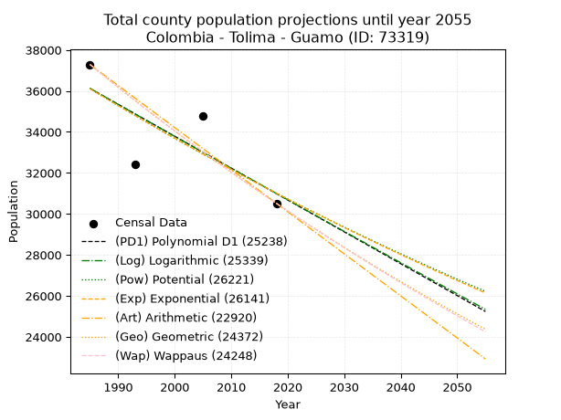
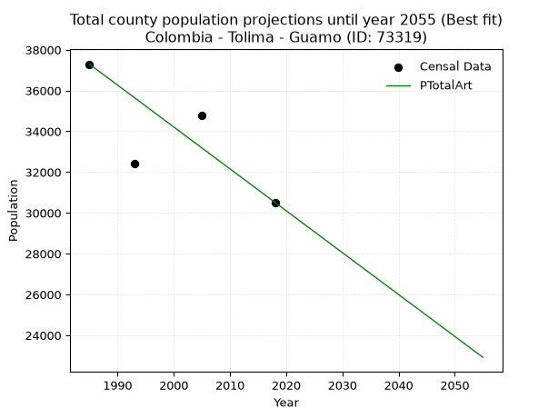
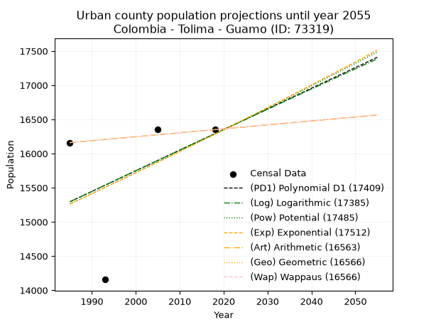
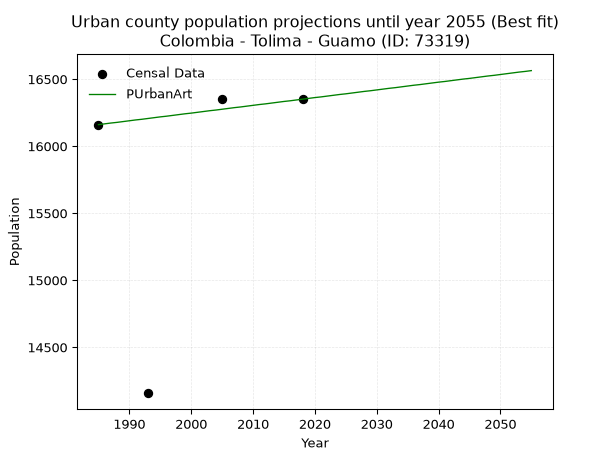
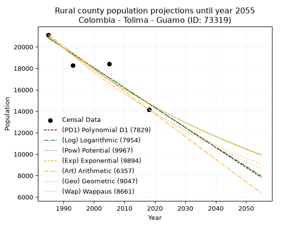
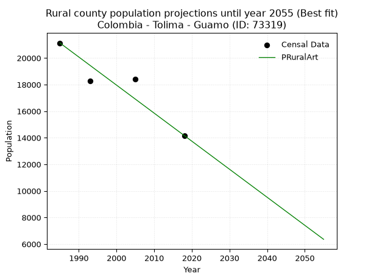

<div align="center">


</div>

# _“Population and Public Services Demand Projections (PPSD) until Year 2050 for Colombia - Tolima - Guamo (ID: 73319)”_
Keywords: `population` `public-service` `projection` `lineal` `polynomial` `logarithmic` `potential` `exponential` `arithmetic` `geometric` `wappaus` `dane` `colombia` `south-america`

PPSD are analytical estimates used by governments and planners to anticipate future changes in population size, age distribution, and the resulting community needs for utilities, healthcare, education, and infrastructure as sizing future water treatment facilities, electrical grids, and road networks based on spatial growth.

> **General running parameters**: • app_version: _v20260806_. • Python version: _3.14.7_. • Pandas version: _3.0.5_. • NumPy version: _2.5.1_. • Creates, save and include plots into reports (create_plot): _False_. • Projection until year: _2050_. • Process polynomial degree 2 and up: _False_. • Process Wappaus: _True_. • Process Wappaus: _True_. • Set negative values to zero: _True_. • Set infinite values to zero: _True_. • Drop dataset notes: _True_. 
<div align="center">

Dynamic map: [:earth_americas:Google](http://maps.google.com/maps?q=4.030992104,-74.9681348) [:earth_americas:OSM](https://www.openstreetmap.org/#map=18/4.030992104/-74.9681348&layers=P) [:earth_americas:Bing](https://www.bing.com/maps?cp=4.030992104~-74.9681348&lvl=18) [:earth_americas:Apple](https://maps.apple.com/frame?center=4.030992104%2C-74.9681348&span=0.003%2C0.006)

</div>


<div align="center">

```geojson
{
  "type": "Feature",
  "geometry": {
    "type": "Point", 
    "coordinates": [-74.9681348, 4.030992104]
  }, 
  "properties": {
    "Name": "Colombia - Tolima - Guamo (ID: 73319)"
  }
}
```

</div>


## 0. Census Data (4 records)

Census data are official statistics collected by a government about the people and housing in a country. They usually include counts of total population, age, sex, race, income, education, and jobs.

📅Global census file: [Population.xlsx](../data/Population.xlsx)

| Source   |   Year |   CountryID | CountryName   |   StateID | StateName   |   CountyID | CountyName   |   PTotal |   PUrban |   PRural |
|:---------|-------:|------------:|:--------------|----------:|:------------|-----------:|:-------------|---------:|---------:|---------:|
| DANE     |   1985 |          57 | Colombia      |        73 | Tolima      |      73319 | Guamo        |    37291 |    16160 |    21131 |
| DANE     |   1993 |          57 | Colombia      |        73 | Tolima      |      73319 | Guamo        |    32416 |    14157 |    18259 |
| DANE     |   2005 |          57 | Colombia      |        73 | Tolima      |      73319 | Guamo        |    34781 |    16353 |    18428 |
| DANE     |   2018 |          57 | Colombia      |        73 | Tolima      |      73319 | Guamo        |    30516 |    16350 |    14166 |

> 🔥Some records could had specific notes about the registered values or the corresponding urban or rural distribution.

## 1. Total

### 1.1. Coefficients and Parameters

* (PD1) Polynomial Deg 1: -155.49578482536901, 344781.44359694433 (lineal)
* (Log) Logarithmic: -311271.35322207515, 2399727.0502130734
* (Pow) Potential: -9.237993052899583, 35.02237393179355
* (Exp) Exponential: -0.004615254813336199, 343810211.8208751
* (Art) Arithmetic: Year diff. 2018 - 1985 = 33, Population diff. 30516 - 37291 = -6775, Annual growth = -205.3030303030303
* (Geo) Geometric: Year diff. 2018 - 1985 = 33, Population diff. 30516 - 37291 = -6775, Annual growth % = -0.0060573638227121585
* (Wap) Wappaus: i = -0.6055511386819364, Condition values only valid for < 200)

<sub>
Wappaus condition values: ['-0.00', '-0.61', '-1.21', '-1.82', '-2.42', '-3.03', '-3.63', '-4.24', '-4.84', '-5.45', '-6.06', '-6.66', '-7.27', '-7.87', '-8.48', '-9.08', '-9.69', '-10.29', '-10.90', '-11.51', '-12.11', '-12.72', '-13.32', '-13.93', '-14.53', '-15.14', '-15.74', '-16.35', '-16.96', '-17.56', '-18.17', '-18.77', '-19.38', '-19.98', '-20.59', '-21.19', '-21.80', '-22.41', '-23.01', '-23.62', '-24.22', '-24.83', '-25.43', '-26.04', '-26.64', '-27.25', '-27.86', '-28.46', '-29.07', '-29.67', '-30.28', '-30.88', '-31.49', '-32.09', '-32.70', '-33.31', '-33.91', '-34.52', '-35.12', '-35.73', '-36.33', '-36.94', '-37.54', '-38.15', '-38.76', '-39.36']
</sub>


### 1.2. Projected Dataset

|   Year |   CountyID |   PTotalPD1 |   PTotalLog |   PTotalPow |   PTotalExp |   PTotalArt |   PTotalGeo |   PTotalWap |
|-------:|-----------:|------------:|------------:|------------:|------------:|------------:|------------:|------------:|
|   1985 |      73319 |       36122 |       36127 |       36115 |       36110 |       37291 |       37291 |       37291 |
|   1986 |      73319 |       35967 |       35970 |       35947 |       35944 |       37086 |       37065 |       37066 |
|   1987 |      73319 |       35811 |       35814 |       35780 |       35778 |       36880 |       36841 |       36842 |
|   1988 |      73319 |       35656 |       35657 |       35614 |       35613 |       36675 |       36617 |       36620 |
|   1989 |      73319 |       35500 |       35501 |       35449 |       35449 |       36470 |       36396 |       36399 |
|   1990 |      73319 |       35345 |       35344 |       35285 |       35286 |       36264 |       36175 |       36179 |
|   1991 |      73319 |       35189 |       35188 |       35122 |       35124 |       36059 |       35956 |       35960 |
|   1992 |      73319 |       35034 |       35031 |       34959 |       34962 |       35854 |       35738 |       35743 |
|   1993 |      73319 |       34878 |       34875 |       34798 |       34801 |       35649 |       35522 |       35527 |
|   1994 |      73319 |       34723 |       34719 |       34637 |       34641 |       35443 |       35307 |       35313 |
|   1995 |      73319 |       34567 |       34563 |       34477 |       34481 |       35238 |       35093 |       35099 |
|   1996 |      73319 |       34412 |       34407 |       34317 |       34322 |       35033 |       34880 |       34887 |
|   1997 |      73319 |       34256 |       34251 |       34159 |       34164 |       34827 |       34669 |       34676 |
|   1998 |      73319 |       34101 |       34095 |       34001 |       34007 |       34622 |       34459 |       34467 |
|   1999 |      73319 |       33945 |       33940 |       33845 |       33850 |       34417 |       34250 |       34258 |
|   2000 |      73319 |       33790 |       33784 |       33689 |       33695 |       34211 |       34043 |       34051 |
|   2001 |      73319 |       33634 |       33628 |       33533 |       33539 |       34006 |       33836 |       33845 |
|   2002 |      73319 |       33479 |       33473 |       33379 |       33385 |       33801 |       33632 |       33640 |
|   2003 |      73319 |       33323 |       33317 |       33225 |       33231 |       33596 |       33428 |       33436 |
|   2004 |      73319 |       33168 |       33162 |       33072 |       33078 |       33390 |       33225 |       33234 |
|   2005 |      73319 |       33012 |       33007 |       32920 |       32926 |       33185 |       33024 |       33033 |
|   2006 |      73319 |       32857 |       32851 |       32769 |       32774 |       32980 |       32824 |       32832 |
|   2007 |      73319 |       32701 |       32696 |       32619 |       32623 |       32774 |       32625 |       32633 |
|   2008 |      73319 |       32546 |       32541 |       32469 |       32473 |       32569 |       32428 |       32435 |
|   2009 |      73319 |       32390 |       32386 |       32320 |       32324 |       32364 |       32231 |       32239 |
|   2010 |      73319 |       32235 |       32231 |       32172 |       32175 |       32158 |       32036 |       32043 |
|   2011 |      73319 |       32079 |       32077 |       32024 |       32027 |       31953 |       31842 |       31848 |
|   2012 |      73319 |       31924 |       31922 |       31877 |       31879 |       31748 |       31649 |       31655 |
|   2013 |      73319 |       31768 |       31767 |       31731 |       31732 |       31543 |       31457 |       31462 |
|   2014 |      73319 |       31613 |       31613 |       31586 |       31586 |       31337 |       31267 |       31271 |
|   2015 |      73319 |       31457 |       31458 |       31442 |       31441 |       31132 |       31077 |       31081 |
|   2016 |      73319 |       31302 |       31304 |       31298 |       31296 |       30927 |       30889 |       30891 |
|   2017 |      73319 |       31146 |       31149 |       31155 |       31152 |       30721 |       30702 |       30703 |
|   2018 |      73319 |       30991 |       30995 |       31012 |       31008 |       30516 |       30516 |       30516 |
|   2019 |      73319 |       30835 |       30841 |       30871 |       30866 |       30311 |       30331 |       30330 |
|   2020 |      73319 |       30680 |       30687 |       30730 |       30724 |       30105 |       30147 |       30145 |
|   2021 |      73319 |       30524 |       30533 |       30590 |       30582 |       29900 |       29965 |       29961 |
|   2022 |      73319 |       30369 |       30379 |       30450 |       30441 |       29695 |       29783 |       29778 |
|   2023 |      73319 |       30213 |       30225 |       30311 |       30301 |       29489 |       29603 |       29595 |
|   2024 |      73319 |       30058 |       30071 |       30173 |       30162 |       29284 |       29424 |       29414 |
|   2025 |      73319 |       29902 |       29917 |       30036 |       30023 |       29079 |       29245 |       29234 |
|   2026 |      73319 |       29747 |       29763 |       29899 |       29884 |       28874 |       29068 |       29055 |
|   2027 |      73319 |       29591 |       29610 |       29763 |       29747 |       28668 |       28892 |       28877 |
|   2028 |      73319 |       29436 |       29456 |       29628 |       29610 |       28463 |       28717 |       28699 |
|   2029 |      73319 |       29280 |       29303 |       29493 |       29474 |       28258 |       28543 |       28523 |
|   2030 |      73319 |       29125 |       29149 |       29359 |       29338 |       28052 |       28370 |       28348 |
|   2031 |      73319 |       28970 |       28996 |       29226 |       29203 |       27847 |       28198 |       28173 |
|   2032 |      73319 |       28814 |       28843 |       29094 |       29068 |       27642 |       28028 |       28000 |
|   2033 |      73319 |       28659 |       28690 |       28962 |       28934 |       27436 |       27858 |       27827 |
|   2034 |      73319 |       28503 |       28537 |       28830 |       28801 |       27231 |       27689 |       27656 |
|   2035 |      73319 |       28348 |       28384 |       28700 |       28669 |       27026 |       27521 |       27485 |
|   2036 |      73319 |       28192 |       28231 |       28570 |       28537 |       26821 |       27355 |       27315 |
|   2037 |      73319 |       28037 |       28078 |       28441 |       28405 |       26615 |       27189 |       27146 |
|   2038 |      73319 |       27881 |       27925 |       28312 |       28274 |       26410 |       27024 |       26978 |
|   2039 |      73319 |       27726 |       27772 |       28184 |       28144 |       26205 |       26861 |       26810 |
|   2040 |      73319 |       27570 |       27620 |       28056 |       28015 |       25999 |       26698 |       26644 |
|   2041 |      73319 |       27415 |       27467 |       27930 |       27886 |       25794 |       26536 |       26479 |
|   2042 |      73319 |       27259 |       27315 |       27804 |       27757 |       25589 |       26375 |       26314 |
|   2043 |      73319 |       27104 |       27162 |       27678 |       27629 |       25383 |       26216 |       26150 |
|   2044 |      73319 |       26948 |       27010 |       27553 |       27502 |       25178 |       26057 |       25987 |
|   2045 |      73319 |       26793 |       26858 |       27429 |       27376 |       24973 |       25899 |       25825 |
|   2046 |      73319 |       26637 |       26706 |       27306 |       27249 |       24768 |       25742 |       25664 |
|   2047 |      73319 |       26482 |       26554 |       27183 |       27124 |       24562 |       25586 |       25503 |
|   2048 |      73319 |       26326 |       26402 |       27060 |       26999 |       24357 |       25431 |       25344 |
|   2049 |      73319 |       26171 |       26250 |       26938 |       26875 |       24152 |       25277 |       25185 |
|   2050 |      73319 |       26015 |       26098 |       26817 |       26751 |       23946 |       25124 |       25027 |
<div align="center">

</img>

</div>


### 1.3. Best fit with absolute and relative error (%)

Relative error puts that difference into context by dividing the absolute error by the true value, creating a unitless ratio or percentage that shows the scale of the mistake.

Absolute and relative error

|   Year | Source   |   CountryID | CountryName   |   StateID | StateName   |   CountyID_x | CountyName   |   PTotal |   PUrban |   PRural |   CountyID_y |   PTotalPD1 |   PTotalLog |   PTotalPow |   PTotalExp |   PTotalArt |   PTotalGeo |   PTotalWap |   PTotalPD1AbsError |   PTotalLogAbsError |   PTotalPowAbsError |   PTotalExpAbsError |   PTotalArtAbsError |   PTotalGeoAbsError |   PTotalWapAbsError |   PTotalPD1RelError |   PTotalLogRelError |   PTotalPowRelError |   PTotalExpRelError |   PTotalArtRelError |   PTotalGeoRelError |   PTotalWapRelError |
|-------:|:---------|------------:|:--------------|----------:|:------------|-------------:|:-------------|---------:|---------:|---------:|-------------:|------------:|------------:|------------:|------------:|------------:|------------:|------------:|--------------------:|--------------------:|--------------------:|--------------------:|--------------------:|--------------------:|--------------------:|--------------------:|--------------------:|--------------------:|--------------------:|--------------------:|--------------------:|--------------------:|
|   1985 | DANE     |          57 | Colombia      |        73 | Tolima      |        73319 | Guamo        |    37291 |    16160 |    21131 |        73319 |       36122 |       36127 |       36115 |       36110 |       37291 |       37291 |       37291 |                1169 |                1164 |                1176 |                1181 |                   0 |                   0 |                   0 |             3.1348  |             3.1214  |             3.15358 |             3.16698 |             0       |             0       |             0       |
|   1993 | DANE     |          57 | Colombia      |        73 | Tolima      |        73319 | Guamo        |    32416 |    14157 |    18259 |        73319 |       34878 |       34875 |       34798 |       34801 |       35649 |       35522 |       35527 |                2462 |                2459 |                2382 |                2385 |                3233 |                3106 |                3111 |             7.59501 |             7.58576 |             7.34822 |             7.35748 |             9.97347 |             9.58169 |             9.59711 |
|   2005 | DANE     |          57 | Colombia      |        73 | Tolima      |        73319 | Guamo        |    34781 |    16353 |    18428 |        73319 |       33012 |       33007 |       32920 |       32926 |       33185 |       33024 |       33033 |                1769 |                1774 |                1861 |                1855 |                1596 |                1757 |                1748 |             5.08611 |             5.10049 |             5.35062 |             5.33337 |             4.58871 |             5.05161 |             5.02573 |
|   2018 | DANE     |          57 | Colombia      |        73 | Tolima      |        73319 | Guamo        |    30516 |    16350 |    14166 |        73319 |       30991 |       30995 |       31012 |       31008 |       30516 |       30516 |       30516 |                 475 |                 479 |                 496 |                 492 |                   0 |                   0 |                   0 |             1.55656 |             1.56967 |             1.62538 |             1.61227 |             0       |             0       |             0       |

Relative error mean

| Method    |   RelError | Best   |
|:----------|-----------:|:-------|
| PTotalPD1 |    4.34312 |        |
| PTotalLog |    4.34433 |        |
| PTotalPow |    4.36945 |        |
| PTotalExp |    4.36753 |        |
| PTotalArt |    3.64055 | True   |
| PTotalGeo |    3.65832 |        |
| PTotalWap |    3.65571 |        |

💙Best method: _**PTotalArt**_
<div align="center">

</img>

</div>


### 1.4. Fresh water supply demand in liters per capita per day (lpcd)

The fresh water supply demand typically ranges from 100 to 300 liters per capita per day (lpcd) for standard domestic and municipal planning, though absolute survival minimums set by the World Health Organization are as low as 7.5 to 20 liters per day, and total consumption in high-income nations can exceed 400 liters.

> `CZ`: Level in meters above the sea level (masl)<br> `WS`: Fresh water supply demand in liters per capita per day (lpcd or l/h/d)<br> `WSAll`: Zonal fresh water supply demand in liters per second (l/s)<br> `A`: Zonal area in square meters<br> `DP`: Population density (people/hectare)

Reference values (RAS Colombia)

|    CZ |   WS |
|------:|-----:|
|  1000 |  120 |
|  2000 |  130 |
| 99999 |  140 |

County shapefile geometry properties and water supply values

|   CountyID |      ATotal |   CZTotal |   WSTotal |
|-----------:|------------:|----------:|----------:|
|      73319 | 5.05313e+08 |   349.336 |       120 |

Projected values for best method: PTotalArt

|   CountyID |   Year |   PTotalArt |   DPTotal |   WSTotal |   WSTotalAll |
|-----------:|-------:|------------:|----------:|----------:|-------------:|
|      73319 |   1985 |       37291 |      0.74 |       120 |      51.7931 |
|      73319 |   1986 |       37086 |      0.73 |       120 |      51.5083 |
|      73319 |   1987 |       36880 |      0.73 |       120 |      51.2222 |
|      73319 |   1988 |       36675 |      0.73 |       120 |      50.9375 |
|      73319 |   1989 |       36470 |      0.72 |       120 |      50.6528 |
|      73319 |   1990 |       36264 |      0.72 |       120 |      50.3667 |
|      73319 |   1991 |       36059 |      0.71 |       120 |      50.0819 |
|      73319 |   1992 |       35854 |      0.71 |       120 |      49.7972 |
|      73319 |   1993 |       35649 |      0.71 |       120 |      49.5125 |
|      73319 |   1994 |       35443 |      0.7  |       120 |      49.2264 |
|      73319 |   1995 |       35238 |      0.7  |       120 |      48.9417 |
|      73319 |   1996 |       35033 |      0.69 |       120 |      48.6569 |
|      73319 |   1997 |       34827 |      0.69 |       120 |      48.3708 |
|      73319 |   1998 |       34622 |      0.69 |       120 |      48.0861 |
|      73319 |   1999 |       34417 |      0.68 |       120 |      47.8014 |
|      73319 |   2000 |       34211 |      0.68 |       120 |      47.5153 |
|      73319 |   2001 |       34006 |      0.67 |       120 |      47.2306 |
|      73319 |   2002 |       33801 |      0.67 |       120 |      46.9458 |
|      73319 |   2003 |       33596 |      0.66 |       120 |      46.6611 |
|      73319 |   2004 |       33390 |      0.66 |       120 |      46.375  |
|      73319 |   2005 |       33185 |      0.66 |       120 |      46.0903 |
|      73319 |   2006 |       32980 |      0.65 |       120 |      45.8056 |
|      73319 |   2007 |       32774 |      0.65 |       120 |      45.5194 |
|      73319 |   2008 |       32569 |      0.64 |       120 |      45.2347 |
|      73319 |   2009 |       32364 |      0.64 |       120 |      44.95   |
|      73319 |   2010 |       32158 |      0.64 |       120 |      44.6639 |
|      73319 |   2011 |       31953 |      0.63 |       120 |      44.3792 |
|      73319 |   2012 |       31748 |      0.63 |       120 |      44.0944 |
|      73319 |   2013 |       31543 |      0.62 |       120 |      43.8097 |
|      73319 |   2014 |       31337 |      0.62 |       120 |      43.5236 |
|      73319 |   2015 |       31132 |      0.62 |       120 |      43.2389 |
|      73319 |   2016 |       30927 |      0.61 |       120 |      42.9542 |
|      73319 |   2017 |       30721 |      0.61 |       120 |      42.6681 |
|      73319 |   2018 |       30516 |      0.6  |       120 |      42.3833 |
|      73319 |   2019 |       30311 |      0.6  |       120 |      42.0986 |
|      73319 |   2020 |       30105 |      0.6  |       120 |      41.8125 |
|      73319 |   2021 |       29900 |      0.59 |       120 |      41.5278 |
|      73319 |   2022 |       29695 |      0.59 |       120 |      41.2431 |
|      73319 |   2023 |       29489 |      0.58 |       120 |      40.9569 |
|      73319 |   2024 |       29284 |      0.58 |       120 |      40.6722 |
|      73319 |   2025 |       29079 |      0.58 |       120 |      40.3875 |
|      73319 |   2026 |       28874 |      0.57 |       120 |      40.1028 |
|      73319 |   2027 |       28668 |      0.57 |       120 |      39.8167 |
|      73319 |   2028 |       28463 |      0.56 |       120 |      39.5319 |
|      73319 |   2029 |       28258 |      0.56 |       120 |      39.2472 |
|      73319 |   2030 |       28052 |      0.56 |       120 |      38.9611 |
|      73319 |   2031 |       27847 |      0.55 |       120 |      38.6764 |
|      73319 |   2032 |       27642 |      0.55 |       120 |      38.3917 |
|      73319 |   2033 |       27436 |      0.54 |       120 |      38.1056 |
|      73319 |   2034 |       27231 |      0.54 |       120 |      37.8208 |
|      73319 |   2035 |       27026 |      0.53 |       120 |      37.5361 |
|      73319 |   2036 |       26821 |      0.53 |       120 |      37.2514 |
|      73319 |   2037 |       26615 |      0.53 |       120 |      36.9653 |
|      73319 |   2038 |       26410 |      0.52 |       120 |      36.6806 |
|      73319 |   2039 |       26205 |      0.52 |       120 |      36.3958 |
|      73319 |   2040 |       25999 |      0.51 |       120 |      36.1097 |
|      73319 |   2041 |       25794 |      0.51 |       120 |      35.825  |
|      73319 |   2042 |       25589 |      0.51 |       120 |      35.5403 |
|      73319 |   2043 |       25383 |      0.5  |       120 |      35.2542 |
|      73319 |   2044 |       25178 |      0.5  |       120 |      34.9694 |
|      73319 |   2045 |       24973 |      0.49 |       120 |      34.6847 |
|      73319 |   2046 |       24768 |      0.49 |       120 |      34.4    |
|      73319 |   2047 |       24562 |      0.49 |       120 |      34.1139 |
|      73319 |   2048 |       24357 |      0.48 |       120 |      33.8292 |
|      73319 |   2049 |       24152 |      0.48 |       120 |      33.5444 |
|      73319 |   2050 |       23946 |      0.47 |       120 |      33.2583 |

## 2. Urban

### 2.1. Coefficients and Parameters

* (PD1) Polynomial Deg 1: 30.206342834202953, -44665.23725411445 (lineal)
* (Log) Logarithmic: 60334.328016023384, -442846.71073875506
* (Pow) Potential: 3.923325689507968, -8.754563689399031
* (Exp) Exponential: 0.00196429048574797, 309.2129241502286
* (Art) Arithmetic: Year diff. 2018 - 1985 = 33, Population diff. 16350 - 16160 = 190, Annual growth = 5.757575757575758
* (Geo) Geometric: Year diff. 2018 - 1985 = 33, Population diff. 16350 - 16160 = 190, Annual growth % = 0.0003542701403735915
* (Wap) Wappaus: i = 0.03542033686604588, Condition values only valid for < 200)

<sub>
Wappaus condition values: ['0.00', '0.04', '0.07', '0.11', '0.14', '0.18', '0.21', '0.25', '0.28', '0.32', '0.35', '0.39', '0.43', '0.46', '0.50', '0.53', '0.57', '0.60', '0.64', '0.67', '0.71', '0.74', '0.78', '0.81', '0.85', '0.89', '0.92', '0.96', '0.99', '1.03', '1.06', '1.10', '1.13', '1.17', '1.20', '1.24', '1.28', '1.31', '1.35', '1.38', '1.42', '1.45', '1.49', '1.52', '1.56', '1.59', '1.63', '1.66', '1.70', '1.74', '1.77', '1.81', '1.84', '1.88', '1.91', '1.95', '1.98', '2.02', '2.05', '2.09', '2.13', '2.16', '2.20', '2.23', '2.27', '2.30']
</sub>


### 2.2. Projected Dataset

|   Year |   CountyID |   PUrbanPD1 |   PUrbanLog |   PUrbanPow |   PUrbanExp |   PUrbanArt |   PUrbanGeo |   PUrbanWap |
|-------:|-----------:|------------:|------------:|------------:|------------:|------------:|------------:|------------:|
|   1985 |      73319 |       15294 |       15294 |       15262 |       15262 |       16160 |       16160 |       16160 |
|   1986 |      73319 |       15325 |       15325 |       15293 |       15292 |       16166 |       16166 |       16166 |
|   1987 |      73319 |       15355 |       15355 |       15323 |       15322 |       16172 |       16171 |       16171 |
|   1988 |      73319 |       15385 |       15386 |       15353 |       15353 |       16177 |       16177 |       16177 |
|   1989 |      73319 |       15415 |       15416 |       15383 |       15383 |       16183 |       16183 |       16183 |
|   1990 |      73319 |       15445 |       15446 |       15414 |       15413 |       16189 |       16189 |       16189 |
|   1991 |      73319 |       15476 |       15477 |       15444 |       15443 |       16195 |       16194 |       16194 |
|   1992 |      73319 |       15506 |       15507 |       15475 |       15474 |       16200 |       16200 |       16200 |
|   1993 |      73319 |       15536 |       15537 |       15505 |       15504 |       16206 |       16206 |       16206 |
|   1994 |      73319 |       15566 |       15567 |       15536 |       15535 |       16212 |       16212 |       16212 |
|   1995 |      73319 |       15596 |       15598 |       15566 |       15565 |       16218 |       16217 |       16217 |
|   1996 |      73319 |       15627 |       15628 |       15597 |       15596 |       16223 |       16223 |       16223 |
|   1997 |      73319 |       15657 |       15658 |       15628 |       15626 |       16229 |       16229 |       16229 |
|   1998 |      73319 |       15687 |       15688 |       15658 |       15657 |       16235 |       16235 |       16235 |
|   1999 |      73319 |       15717 |       15718 |       15689 |       15688 |       16241 |       16240 |       16240 |
|   2000 |      73319 |       15747 |       15749 |       15720 |       15719 |       16246 |       16246 |       16246 |
|   2001 |      73319 |       15778 |       15779 |       15751 |       15750 |       16252 |       16252 |       16252 |
|   2002 |      73319 |       15808 |       15809 |       15782 |       15781 |       16258 |       16258 |       16258 |
|   2003 |      73319 |       15838 |       15839 |       15813 |       15812 |       16264 |       16263 |       16263 |
|   2004 |      73319 |       15868 |       15869 |       15844 |       15843 |       16269 |       16269 |       16269 |
|   2005 |      73319 |       15898 |       15899 |       15875 |       15874 |       16275 |       16275 |       16275 |
|   2006 |      73319 |       15929 |       15929 |       15906 |       15905 |       16281 |       16281 |       16281 |
|   2007 |      73319 |       15959 |       15959 |       15937 |       15936 |       16287 |       16286 |       16286 |
|   2008 |      73319 |       15989 |       15989 |       15968 |       15968 |       16292 |       16292 |       16292 |
|   2009 |      73319 |       16019 |       16020 |       15999 |       15999 |       16298 |       16298 |       16298 |
|   2010 |      73319 |       16050 |       16050 |       16031 |       16031 |       16304 |       16304 |       16304 |
|   2011 |      73319 |       16080 |       16080 |       16062 |       16062 |       16310 |       16310 |       16310 |
|   2012 |      73319 |       16110 |       16110 |       16093 |       16094 |       16315 |       16315 |       16315 |
|   2013 |      73319 |       16140 |       16140 |       16125 |       16125 |       16321 |       16321 |       16321 |
|   2014 |      73319 |       16170 |       16170 |       16156 |       16157 |       16327 |       16327 |       16327 |
|   2015 |      73319 |       16201 |       16199 |       16188 |       16189 |       16333 |       16333 |       16333 |
|   2016 |      73319 |       16231 |       16229 |       16219 |       16221 |       16338 |       16338 |       16338 |
|   2017 |      73319 |       16261 |       16259 |       16251 |       16253 |       16344 |       16344 |       16344 |
|   2018 |      73319 |       16291 |       16289 |       16282 |       16284 |       16350 |       16350 |       16350 |
|   2019 |      73319 |       16321 |       16319 |       16314 |       16317 |       16356 |       16356 |       16356 |
|   2020 |      73319 |       16352 |       16349 |       16346 |       16349 |       16362 |       16362 |       16362 |
|   2021 |      73319 |       16382 |       16379 |       16378 |       16381 |       16367 |       16367 |       16367 |
|   2022 |      73319 |       16412 |       16409 |       16409 |       16413 |       16373 |       16373 |       16373 |
|   2023 |      73319 |       16442 |       16439 |       16441 |       16445 |       16379 |       16379 |       16379 |
|   2024 |      73319 |       16472 |       16468 |       16473 |       16478 |       16385 |       16385 |       16385 |
|   2025 |      73319 |       16503 |       16498 |       16505 |       16510 |       16390 |       16391 |       16391 |
|   2026 |      73319 |       16533 |       16528 |       16537 |       16542 |       16396 |       16396 |       16396 |
|   2027 |      73319 |       16563 |       16558 |       16569 |       16575 |       16402 |       16402 |       16402 |
|   2028 |      73319 |       16593 |       16587 |       16601 |       16608 |       16408 |       16408 |       16408 |
|   2029 |      73319 |       16623 |       16617 |       16633 |       16640 |       16413 |       16414 |       16414 |
|   2030 |      73319 |       16654 |       16647 |       16666 |       16673 |       16419 |       16420 |       16420 |
|   2031 |      73319 |       16684 |       16677 |       16698 |       16706 |       16425 |       16425 |       16425 |
|   2032 |      73319 |       16714 |       16706 |       16730 |       16739 |       16431 |       16431 |       16431 |
|   2033 |      73319 |       16744 |       16736 |       16762 |       16771 |       16436 |       16437 |       16437 |
|   2034 |      73319 |       16774 |       16766 |       16795 |       16804 |       16442 |       16443 |       16443 |
|   2035 |      73319 |       16805 |       16795 |       16827 |       16837 |       16448 |       16449 |       16449 |
|   2036 |      73319 |       16835 |       16825 |       16860 |       16871 |       16454 |       16455 |       16455 |
|   2037 |      73319 |       16865 |       16855 |       16892 |       16904 |       16459 |       16460 |       16460 |
|   2038 |      73319 |       16895 |       16884 |       16925 |       16937 |       16465 |       16466 |       16466 |
|   2039 |      73319 |       16925 |       16914 |       16957 |       16970 |       16471 |       16472 |       16472 |
|   2040 |      73319 |       16956 |       16943 |       16990 |       17004 |       16477 |       16478 |       16478 |
|   2041 |      73319 |       16986 |       16973 |       17023 |       17037 |       16482 |       16484 |       16484 |
|   2042 |      73319 |       17016 |       17003 |       17055 |       17071 |       16488 |       16490 |       16490 |
|   2043 |      73319 |       17046 |       17032 |       17088 |       17104 |       16494 |       16495 |       16495 |
|   2044 |      73319 |       17077 |       17062 |       17121 |       17138 |       16500 |       16501 |       16501 |
|   2045 |      73319 |       17107 |       17091 |       17154 |       17171 |       16505 |       16507 |       16507 |
|   2046 |      73319 |       17137 |       17121 |       17187 |       17205 |       16511 |       16513 |       16513 |
|   2047 |      73319 |       17167 |       17150 |       17220 |       17239 |       16517 |       16519 |       16519 |
|   2048 |      73319 |       17197 |       17180 |       17253 |       17273 |       16523 |       16525 |       16525 |
|   2049 |      73319 |       17228 |       17209 |       17286 |       17307 |       16528 |       16531 |       16531 |
|   2050 |      73319 |       17258 |       17238 |       17319 |       17341 |       16534 |       16536 |       16536 |
<div align="center">

</img>

</div>


### 2.3. Best fit with absolute and relative error (%)

Relative error puts that difference into context by dividing the absolute error by the true value, creating a unitless ratio or percentage that shows the scale of the mistake.

Absolute and relative error

|   Year | Source   |   CountryID | CountryName   |   StateID | StateName   |   CountyID_x | CountyName   |   PTotal |   PUrban |   PRural |   CountyID_y |   PUrbanPD1 |   PUrbanLog |   PUrbanPow |   PUrbanExp |   PUrbanArt |   PUrbanGeo |   PUrbanWap |   PUrbanPD1AbsError |   PUrbanLogAbsError |   PUrbanPowAbsError |   PUrbanExpAbsError |   PUrbanArtAbsError |   PUrbanGeoAbsError |   PUrbanWapAbsError |   PUrbanPD1RelError |   PUrbanLogRelError |   PUrbanPowRelError |   PUrbanExpRelError |   PUrbanArtRelError |   PUrbanGeoRelError |   PUrbanWapRelError |
|-------:|:---------|------------:|:--------------|----------:|:------------|-------------:|:-------------|---------:|---------:|---------:|-------------:|------------:|------------:|------------:|------------:|------------:|------------:|------------:|--------------------:|--------------------:|--------------------:|--------------------:|--------------------:|--------------------:|--------------------:|--------------------:|--------------------:|--------------------:|--------------------:|--------------------:|--------------------:|--------------------:|
|   1985 | DANE     |          57 | Colombia      |        73 | Tolima      |        73319 | Guamo        |    37291 |    16160 |    21131 |        73319 |       15294 |       15294 |       15262 |       15262 |       16160 |       16160 |       16160 |                 866 |                 866 |                 898 |                 898 |                   0 |                   0 |                   0 |            5.35891  |            5.35891  |            5.55693  |             5.55693 |            0        |            0        |            0        |
|   1993 | DANE     |          57 | Colombia      |        73 | Tolima      |        73319 | Guamo        |    32416 |    14157 |    18259 |        73319 |       15536 |       15537 |       15505 |       15504 |       16206 |       16206 |       16206 |                1379 |                1380 |                1348 |                1347 |                2049 |                2049 |                2049 |            9.74076  |            9.74783  |            9.52179  |             9.51473 |           14.4734   |           14.4734   |           14.4734   |
|   2005 | DANE     |          57 | Colombia      |        73 | Tolima      |        73319 | Guamo        |    34781 |    16353 |    18428 |        73319 |       15898 |       15899 |       15875 |       15874 |       16275 |       16275 |       16275 |                 455 |                 454 |                 478 |                 479 |                  78 |                  78 |                  78 |            2.78236  |            2.77625  |            2.92301  |             2.92913 |            0.476977 |            0.476977 |            0.476977 |
|   2018 | DANE     |          57 | Colombia      |        73 | Tolima      |        73319 | Guamo        |    30516 |    16350 |    14166 |        73319 |       16291 |       16289 |       16282 |       16284 |       16350 |       16350 |       16350 |                  59 |                  61 |                  68 |                  66 |                   0 |                   0 |                   0 |            0.360856 |            0.373089 |            0.415902 |             0.40367 |            0        |            0        |            0        |

Relative error mean

| Method    |   RelError | Best   |
|:----------|-----------:|:-------|
| PUrbanPD1 |    4.56072 |        |
| PUrbanLog |    4.56402 |        |
| PUrbanPow |    4.60441 |        |
| PUrbanExp |    4.60111 |        |
| PUrbanArt |    3.7376  | True   |
| PUrbanGeo |    3.7376  | True   |
| PUrbanWap |    3.7376  | True   |

💙Best method: _**PUrbanArt**_
<div align="center">

</img>

</div>


### 2.4. Fresh water supply demand in liters per capita per day (lpcd)

The fresh water supply demand typically ranges from 100 to 300 liters per capita per day (lpcd) for standard domestic and municipal planning, though absolute survival minimums set by the World Health Organization are as low as 7.5 to 20 liters per day, and total consumption in high-income nations can exceed 400 liters.

> `CZ`: Level in meters above the sea level (masl)<br> `WS`: Fresh water supply demand in liters per capita per day (lpcd or l/h/d)<br> `WSAll`: Zonal fresh water supply demand in liters per second (l/s)<br> `A`: Zonal area in square meters<br> `DP`: Population density (people/hectare)

Reference values (RAS Colombia)

|    CZ |   WS |
|------:|-----:|
|  1000 |  120 |
|  2000 |  130 |
| 99999 |  140 |

County shapefile geometry properties and water supply values

|   CountyID |      AUrban |   CZUrban |   WSUrban |
|-----------:|------------:|----------:|----------:|
|      73319 | 4.47263e+06 |   317.699 |       120 |

Projected values for best method: PUrbanArt

|   CountyID |   Year |   PUrbanArt |   DPUrban |   WSUrban |   WSUrbanAll |
|-----------:|-------:|------------:|----------:|----------:|-------------:|
|      73319 |   1985 |       16160 |     36.13 |       120 |      22.4444 |
|      73319 |   1986 |       16166 |     36.14 |       120 |      22.4528 |
|      73319 |   1987 |       16172 |     36.16 |       120 |      22.4611 |
|      73319 |   1988 |       16177 |     36.17 |       120 |      22.4681 |
|      73319 |   1989 |       16183 |     36.18 |       120 |      22.4764 |
|      73319 |   1990 |       16189 |     36.2  |       120 |      22.4847 |
|      73319 |   1991 |       16195 |     36.21 |       120 |      22.4931 |
|      73319 |   1992 |       16200 |     36.22 |       120 |      22.5    |
|      73319 |   1993 |       16206 |     36.23 |       120 |      22.5083 |
|      73319 |   1994 |       16212 |     36.25 |       120 |      22.5167 |
|      73319 |   1995 |       16218 |     36.26 |       120 |      22.525  |
|      73319 |   1996 |       16223 |     36.27 |       120 |      22.5319 |
|      73319 |   1997 |       16229 |     36.29 |       120 |      22.5403 |
|      73319 |   1998 |       16235 |     36.3  |       120 |      22.5486 |
|      73319 |   1999 |       16241 |     36.31 |       120 |      22.5569 |
|      73319 |   2000 |       16246 |     36.32 |       120 |      22.5639 |
|      73319 |   2001 |       16252 |     36.34 |       120 |      22.5722 |
|      73319 |   2002 |       16258 |     36.35 |       120 |      22.5806 |
|      73319 |   2003 |       16264 |     36.36 |       120 |      22.5889 |
|      73319 |   2004 |       16269 |     36.37 |       120 |      22.5958 |
|      73319 |   2005 |       16275 |     36.39 |       120 |      22.6042 |
|      73319 |   2006 |       16281 |     36.4  |       120 |      22.6125 |
|      73319 |   2007 |       16287 |     36.41 |       120 |      22.6208 |
|      73319 |   2008 |       16292 |     36.43 |       120 |      22.6278 |
|      73319 |   2009 |       16298 |     36.44 |       120 |      22.6361 |
|      73319 |   2010 |       16304 |     36.45 |       120 |      22.6444 |
|      73319 |   2011 |       16310 |     36.47 |       120 |      22.6528 |
|      73319 |   2012 |       16315 |     36.48 |       120 |      22.6597 |
|      73319 |   2013 |       16321 |     36.49 |       120 |      22.6681 |
|      73319 |   2014 |       16327 |     36.5  |       120 |      22.6764 |
|      73319 |   2015 |       16333 |     36.52 |       120 |      22.6847 |
|      73319 |   2016 |       16338 |     36.53 |       120 |      22.6917 |
|      73319 |   2017 |       16344 |     36.54 |       120 |      22.7    |
|      73319 |   2018 |       16350 |     36.56 |       120 |      22.7083 |
|      73319 |   2019 |       16356 |     36.57 |       120 |      22.7167 |
|      73319 |   2020 |       16362 |     36.58 |       120 |      22.725  |
|      73319 |   2021 |       16367 |     36.59 |       120 |      22.7319 |
|      73319 |   2022 |       16373 |     36.61 |       120 |      22.7403 |
|      73319 |   2023 |       16379 |     36.62 |       120 |      22.7486 |
|      73319 |   2024 |       16385 |     36.63 |       120 |      22.7569 |
|      73319 |   2025 |       16390 |     36.65 |       120 |      22.7639 |
|      73319 |   2026 |       16396 |     36.66 |       120 |      22.7722 |
|      73319 |   2027 |       16402 |     36.67 |       120 |      22.7806 |
|      73319 |   2028 |       16408 |     36.69 |       120 |      22.7889 |
|      73319 |   2029 |       16413 |     36.7  |       120 |      22.7958 |
|      73319 |   2030 |       16419 |     36.71 |       120 |      22.8042 |
|      73319 |   2031 |       16425 |     36.72 |       120 |      22.8125 |
|      73319 |   2032 |       16431 |     36.74 |       120 |      22.8208 |
|      73319 |   2033 |       16436 |     36.75 |       120 |      22.8278 |
|      73319 |   2034 |       16442 |     36.76 |       120 |      22.8361 |
|      73319 |   2035 |       16448 |     36.77 |       120 |      22.8444 |
|      73319 |   2036 |       16454 |     36.79 |       120 |      22.8528 |
|      73319 |   2037 |       16459 |     36.8  |       120 |      22.8597 |
|      73319 |   2038 |       16465 |     36.81 |       120 |      22.8681 |
|      73319 |   2039 |       16471 |     36.83 |       120 |      22.8764 |
|      73319 |   2040 |       16477 |     36.84 |       120 |      22.8847 |
|      73319 |   2041 |       16482 |     36.85 |       120 |      22.8917 |
|      73319 |   2042 |       16488 |     36.86 |       120 |      22.9    |
|      73319 |   2043 |       16494 |     36.88 |       120 |      22.9083 |
|      73319 |   2044 |       16500 |     36.89 |       120 |      22.9167 |
|      73319 |   2045 |       16505 |     36.9  |       120 |      22.9236 |
|      73319 |   2046 |       16511 |     36.92 |       120 |      22.9319 |
|      73319 |   2047 |       16517 |     36.93 |       120 |      22.9403 |
|      73319 |   2048 |       16523 |     36.94 |       120 |      22.9486 |
|      73319 |   2049 |       16528 |     36.95 |       120 |      22.9556 |
|      73319 |   2050 |       16534 |     36.97 |       120 |      22.9639 |

## 3. Rural

### 3.1. Coefficients and Parameters

* (PD1) Polynomial Deg 1: -185.70212765957197, 389446.68085105886 (lineal)
* (Log) Logarithmic: -371605.68123809836, 2842573.7609518273
* (Pow) Potential: -21.49103862276679, 75.19432893309865
* (Exp) Exponential: -0.010741375504706392, 38175705300099.46
* (Art) Arithmetic: Year diff. 2018 - 1985 = 33, Population diff. 14166 - 21131 = -6965, Annual growth = -211.06060606060606
* (Geo) Geometric: Year diff. 2018 - 1985 = 33, Population diff. 14166 - 21131 = -6965, Annual growth % = -0.012044945448569822
* (Wap) Wappaus: i = -1.1959124348279233, Condition values only valid for < 200)

<sub>
Wappaus condition values: ['-0.00', '-1.20', '-2.39', '-3.59', '-4.78', '-5.98', '-7.18', '-8.37', '-9.57', '-10.76', '-11.96', '-13.16', '-14.35', '-15.55', '-16.74', '-17.94', '-19.13', '-20.33', '-21.53', '-22.72', '-23.92', '-25.11', '-26.31', '-27.51', '-28.70', '-29.90', '-31.09', '-32.29', '-33.49', '-34.68', '-35.88', '-37.07', '-38.27', '-39.47', '-40.66', '-41.86', '-43.05', '-44.25', '-45.44', '-46.64', '-47.84', '-49.03', '-50.23', '-51.42', '-52.62', '-53.82', '-55.01', '-56.21', '-57.40', '-58.60', '-59.80', '-60.99', '-62.19', '-63.38', '-64.58', '-65.78', '-66.97', '-68.17', '-69.36', '-70.56', '-71.75', '-72.95', '-74.15', '-75.34', '-76.54', '-77.73']
</sub>


### 3.2. Projected Dataset

|   Year |   CountyID |   PRuralPD1 |   PRuralLog |   PRuralPow |   PRuralExp |   PRuralArt |   PRuralGeo |   PRuralWap |
|-------:|-----------:|------------:|------------:|------------:|------------:|------------:|------------:|------------:|
|   1985 |      73319 |       20828 |       20833 |       20991 |       20986 |       21131 |       21131 |       21131 |
|   1986 |      73319 |       20642 |       20646 |       20765 |       20761 |       20920 |       20876 |       20880 |
|   1987 |      73319 |       20457 |       20459 |       20541 |       20540 |       20709 |       20625 |       20632 |
|   1988 |      73319 |       20271 |       20272 |       20321 |       20320 |       20498 |       20377 |       20386 |
|   1989 |      73319 |       20085 |       20085 |       20102 |       20103 |       20287 |       20131 |       20144 |
|   1990 |      73319 |       19899 |       19898 |       19886 |       19888 |       20076 |       19889 |       19904 |
|   1991 |      73319 |       19714 |       19711 |       19673 |       19676 |       19865 |       19649 |       19667 |
|   1992 |      73319 |       19528 |       19525 |       19461 |       19466 |       19654 |       19412 |       19433 |
|   1993 |      73319 |       19342 |       19338 |       19253 |       19258 |       19443 |       19179 |       19202 |
|   1994 |      73319 |       19157 |       19152 |       19046 |       19052 |       19231 |       18948 |       18973 |
|   1995 |      73319 |       18971 |       18965 |       18842 |       18848 |       19020 |       18719 |       18747 |
|   1996 |      73319 |       18785 |       18779 |       18640 |       18647 |       18809 |       18494 |       18523 |
|   1997 |      73319 |       18600 |       18593 |       18441 |       18448 |       18598 |       18271 |       18302 |
|   1998 |      73319 |       18414 |       18407 |       18243 |       18251 |       18387 |       18051 |       18083 |
|   1999 |      73319 |       18228 |       18221 |       18048 |       18056 |       18176 |       17834 |       17866 |
|   2000 |      73319 |       18042 |       18035 |       17855 |       17863 |       17965 |       17619 |       17652 |
|   2001 |      73319 |       17857 |       17849 |       17664 |       17672 |       17754 |       17407 |       17441 |
|   2002 |      73319 |       17671 |       17664 |       17476 |       17483 |       17543 |       17197 |       17231 |
|   2003 |      73319 |       17485 |       17478 |       17289 |       17296 |       17332 |       16990 |       17024 |
|   2004 |      73319 |       17300 |       17293 |       17105 |       17111 |       17121 |       16785 |       16819 |
|   2005 |      73319 |       17114 |       17107 |       16922 |       16929 |       16910 |       16583 |       16617 |
|   2006 |      73319 |       16928 |       16922 |       16742 |       16748 |       16699 |       16383 |       16416 |
|   2007 |      73319 |       16743 |       16737 |       16564 |       16569 |       16488 |       16186 |       16218 |
|   2008 |      73319 |       16557 |       16552 |       16387 |       16392 |       16277 |       15991 |       16021 |
|   2009 |      73319 |       16371 |       16367 |       16213 |       16217 |       16066 |       15798 |       15827 |
|   2010 |      73319 |       16185 |       16182 |       16040 |       16043 |       15854 |       15608 |       15635 |
|   2011 |      73319 |       16000 |       15997 |       15870 |       15872 |       15643 |       15420 |       15445 |
|   2012 |      73319 |       15814 |       15812 |       15701 |       15702 |       15432 |       15234 |       15256 |
|   2013 |      73319 |       15628 |       15628 |       15534 |       15535 |       15221 |       15051 |       15070 |
|   2014 |      73319 |       15443 |       15443 |       15369 |       15369 |       15010 |       14870 |       14885 |
|   2015 |      73319 |       15257 |       15259 |       15206 |       15205 |       14799 |       14690 |       14703 |
|   2016 |      73319 |       15071 |       15074 |       15045 |       15042 |       14588 |       14514 |       14522 |
|   2017 |      73319 |       14885 |       14890 |       14886 |       14881 |       14377 |       14339 |       14343 |
|   2018 |      73319 |       14700 |       14706 |       14728 |       14722 |       14166 |       14166 |       14166 |
|   2019 |      73319 |       14514 |       14522 |       14572 |       14565 |       13955 |       13995 |       13991 |
|   2020 |      73319 |       14328 |       14338 |       14418 |       14409 |       13744 |       13827 |       13817 |
|   2021 |      73319 |       14143 |       14154 |       14265 |       14256 |       13533 |       13660 |       13645 |
|   2022 |      73319 |       13957 |       13970 |       14114 |       14103 |       13322 |       13496 |       13475 |
|   2023 |      73319 |       13771 |       13786 |       13965 |       13953 |       13111 |       13333 |       13306 |
|   2024 |      73319 |       13586 |       13602 |       13818 |       13803 |       12900 |       13173 |       13139 |
|   2025 |      73319 |       13400 |       13419 |       13672 |       13656 |       12689 |       13014 |       12974 |
|   2026 |      73319 |       13214 |       13235 |       13527 |       13510 |       12478 |       12857 |       12810 |
|   2027 |      73319 |       13028 |       13052 |       13385 |       13366 |       12266 |       12702 |       12648 |
|   2028 |      73319 |       12843 |       12869 |       13244 |       13223 |       12055 |       12549 |       12487 |
|   2029 |      73319 |       12657 |       12686 |       13104 |       13082 |       11844 |       12398 |       12328 |
|   2030 |      73319 |       12471 |       12503 |       12966 |       12942 |       11633 |       12249 |       12170 |
|   2031 |      73319 |       12286 |       12320 |       12829 |       12804 |       11422 |       12101 |       12014 |
|   2032 |      73319 |       12100 |       12137 |       12694 |       12667 |       11211 |       11956 |       11859 |
|   2033 |      73319 |       11914 |       11954 |       12561 |       12532 |       11000 |       11811 |       11706 |
|   2034 |      73319 |       11729 |       11771 |       12429 |       12398 |       10789 |       11669 |       11554 |
|   2035 |      73319 |       11543 |       11588 |       12298 |       12265 |       10578 |       11529 |       11404 |
|   2036 |      73319 |       11357 |       11406 |       12169 |       12134 |       10367 |       11390 |       11255 |
|   2037 |      73319 |       11171 |       11223 |       12041 |       12005 |       10156 |       11253 |       11107 |
|   2038 |      73319 |       10986 |       11041 |       11915 |       11876 |        9945 |       11117 |       10961 |
|   2039 |      73319 |       10800 |       10859 |       11790 |       11749 |        9734 |       10983 |       10816 |
|   2040 |      73319 |       10614 |       10676 |       11666 |       11624 |        9523 |       10851 |       10672 |
|   2041 |      73319 |       10429 |       10494 |       11544 |       11500 |        9312 |       10720 |       10529 |
|   2042 |      73319 |       10243 |       10312 |       11423 |       11377 |        9101 |       10591 |       10388 |
|   2043 |      73319 |       10057 |       10130 |       11304 |       11255 |        8889 |       10463 |       10248 |
|   2044 |      73319 |        9872 |        9949 |       11186 |       11135 |        8678 |       10337 |       10110 |
|   2045 |      73319 |        9686 |        9767 |       11069 |       11016 |        8467 |       10213 |        9972 |
|   2046 |      73319 |        9500 |        9585 |       10953 |       10898 |        8256 |       10090 |        9836 |
|   2047 |      73319 |        9314 |        9404 |       10838 |       10782 |        8045 |        9968 |        9701 |
|   2048 |      73319 |        9129 |        9222 |       10725 |       10667 |        7834 |        9848 |        9567 |
|   2049 |      73319 |        8943 |        9041 |       10613 |       10553 |        7623 |        9730 |        9434 |
|   2050 |      73319 |        8757 |        8859 |       10503 |       10440 |        7412 |        9613 |        9302 |
<div align="center">

</img>

</div>


### 3.3. Best fit with absolute and relative error (%)

Relative error puts that difference into context by dividing the absolute error by the true value, creating a unitless ratio or percentage that shows the scale of the mistake.

Absolute and relative error

|   Year | Source   |   CountryID | CountryName   |   StateID | StateName   |   CountyID_x | CountyName   |   PTotal |   PUrban |   PRural |   CountyID_y |   PRuralPD1 |   PRuralLog |   PRuralPow |   PRuralExp |   PRuralArt |   PRuralGeo |   PRuralWap |   PRuralPD1AbsError |   PRuralLogAbsError |   PRuralPowAbsError |   PRuralExpAbsError |   PRuralArtAbsError |   PRuralGeoAbsError |   PRuralWapAbsError |   PRuralPD1RelError |   PRuralLogRelError |   PRuralPowRelError |   PRuralExpRelError |   PRuralArtRelError |   PRuralGeoRelError |   PRuralWapRelError |
|-------:|:---------|------------:|:--------------|----------:|:------------|-------------:|:-------------|---------:|---------:|---------:|-------------:|------------:|------------:|------------:|------------:|------------:|------------:|------------:|--------------------:|--------------------:|--------------------:|--------------------:|--------------------:|--------------------:|--------------------:|--------------------:|--------------------:|--------------------:|--------------------:|--------------------:|--------------------:|--------------------:|
|   1985 | DANE     |          57 | Colombia      |        73 | Tolima      |        73319 | Guamo        |    37291 |    16160 |    21131 |        73319 |       20828 |       20833 |       20991 |       20986 |       21131 |       21131 |       21131 |                 303 |                 298 |                 140 |                 145 |                   0 |                   0 |                   0 |             1.43391 |             1.41025 |            0.662534 |            0.686196 |             0       |             0       |             0       |
|   1993 | DANE     |          57 | Colombia      |        73 | Tolima      |        73319 | Guamo        |    32416 |    14157 |    18259 |        73319 |       19342 |       19338 |       19253 |       19258 |       19443 |       19179 |       19202 |                1083 |                1079 |                 994 |                 999 |                1184 |                 920 |                 943 |             5.93132 |             5.90941 |            5.44389  |            5.47127  |             6.48447 |             5.03861 |             5.16458 |
|   2005 | DANE     |          57 | Colombia      |        73 | Tolima      |        73319 | Guamo        |    34781 |    16353 |    18428 |        73319 |       17114 |       17107 |       16922 |       16929 |       16910 |       16583 |       16617 |                1314 |                1321 |                1506 |                1499 |                1518 |                1845 |                1811 |             7.13045 |             7.16844 |            8.17235  |            8.13436  |             8.23746 |            10.0119  |             9.82744 |
|   2018 | DANE     |          57 | Colombia      |        73 | Tolima      |        73319 | Guamo        |    30516 |    16350 |    14166 |        73319 |       14700 |       14706 |       14728 |       14722 |       14166 |       14166 |       14166 |                 534 |                 540 |                 562 |                 556 |                   0 |                   0 |                   0 |             3.76959 |             3.81194 |            3.96725  |            3.92489  |             0       |             0       |             0       |

Relative error mean

| Method    |   RelError | Best   |
|:----------|-----------:|:-------|
| PRuralPD1 |    4.56632 |        |
| PRuralLog |    4.57501 |        |
| PRuralPow |    4.5615  |        |
| PRuralExp |    4.55418 |        |
| PRuralArt |    3.68048 | True   |
| PRuralGeo |    3.76264 |        |
| PRuralWap |    3.748   |        |

💙Best method: _**PRuralArt**_
<div align="center">

</img>

</div>


### 3.4. Fresh water supply demand in liters per capita per day (lpcd)

The fresh water supply demand typically ranges from 100 to 300 liters per capita per day (lpcd) for standard domestic and municipal planning, though absolute survival minimums set by the World Health Organization are as low as 7.5 to 20 liters per day, and total consumption in high-income nations can exceed 400 liters.

> `CZ`: Level in meters above the sea level (masl)<br> `WS`: Fresh water supply demand in liters per capita per day (lpcd or l/h/d)<br> `WSAll`: Zonal fresh water supply demand in liters per second (l/s)<br> `A`: Zonal area in square meters<br> `DP`: Population density (people/hectare)

Reference values (RAS Colombia)

|    CZ |   WS |
|------:|-----:|
|  1000 |  120 |
|  2000 |  130 |
| 99999 |  140 |

County shapefile geometry properties and water supply values

|   CountyID |     ARural |   CZRural |   WSRural |
|-----------:|-----------:|----------:|----------:|
|      73319 | 5.0084e+08 |   349.616 |       120 |

Projected values for best method: PRuralArt

|   CountyID |   Year |   PRuralArt |   DPRural |   WSRural |   WSRuralAll |
|-----------:|-------:|------------:|----------:|----------:|-------------:|
|      73319 |   1985 |       21131 |      0.42 |       120 |      29.3486 |
|      73319 |   1986 |       20920 |      0.42 |       120 |      29.0556 |
|      73319 |   1987 |       20709 |      0.41 |       120 |      28.7625 |
|      73319 |   1988 |       20498 |      0.41 |       120 |      28.4694 |
|      73319 |   1989 |       20287 |      0.41 |       120 |      28.1764 |
|      73319 |   1990 |       20076 |      0.4  |       120 |      27.8833 |
|      73319 |   1991 |       19865 |      0.4  |       120 |      27.5903 |
|      73319 |   1992 |       19654 |      0.39 |       120 |      27.2972 |
|      73319 |   1993 |       19443 |      0.39 |       120 |      27.0042 |
|      73319 |   1994 |       19231 |      0.38 |       120 |      26.7097 |
|      73319 |   1995 |       19020 |      0.38 |       120 |      26.4167 |
|      73319 |   1996 |       18809 |      0.38 |       120 |      26.1236 |
|      73319 |   1997 |       18598 |      0.37 |       120 |      25.8306 |
|      73319 |   1998 |       18387 |      0.37 |       120 |      25.5375 |
|      73319 |   1999 |       18176 |      0.36 |       120 |      25.2444 |
|      73319 |   2000 |       17965 |      0.36 |       120 |      24.9514 |
|      73319 |   2001 |       17754 |      0.35 |       120 |      24.6583 |
|      73319 |   2002 |       17543 |      0.35 |       120 |      24.3653 |
|      73319 |   2003 |       17332 |      0.35 |       120 |      24.0722 |
|      73319 |   2004 |       17121 |      0.34 |       120 |      23.7792 |
|      73319 |   2005 |       16910 |      0.34 |       120 |      23.4861 |
|      73319 |   2006 |       16699 |      0.33 |       120 |      23.1931 |
|      73319 |   2007 |       16488 |      0.33 |       120 |      22.9    |
|      73319 |   2008 |       16277 |      0.32 |       120 |      22.6069 |
|      73319 |   2009 |       16066 |      0.32 |       120 |      22.3139 |
|      73319 |   2010 |       15854 |      0.32 |       120 |      22.0194 |
|      73319 |   2011 |       15643 |      0.31 |       120 |      21.7264 |
|      73319 |   2012 |       15432 |      0.31 |       120 |      21.4333 |
|      73319 |   2013 |       15221 |      0.3  |       120 |      21.1403 |
|      73319 |   2014 |       15010 |      0.3  |       120 |      20.8472 |
|      73319 |   2015 |       14799 |      0.3  |       120 |      20.5542 |
|      73319 |   2016 |       14588 |      0.29 |       120 |      20.2611 |
|      73319 |   2017 |       14377 |      0.29 |       120 |      19.9681 |
|      73319 |   2018 |       14166 |      0.28 |       120 |      19.675  |
|      73319 |   2019 |       13955 |      0.28 |       120 |      19.3819 |
|      73319 |   2020 |       13744 |      0.27 |       120 |      19.0889 |
|      73319 |   2021 |       13533 |      0.27 |       120 |      18.7958 |
|      73319 |   2022 |       13322 |      0.27 |       120 |      18.5028 |
|      73319 |   2023 |       13111 |      0.26 |       120 |      18.2097 |
|      73319 |   2024 |       12900 |      0.26 |       120 |      17.9167 |
|      73319 |   2025 |       12689 |      0.25 |       120 |      17.6236 |
|      73319 |   2026 |       12478 |      0.25 |       120 |      17.3306 |
|      73319 |   2027 |       12266 |      0.24 |       120 |      17.0361 |
|      73319 |   2028 |       12055 |      0.24 |       120 |      16.7431 |
|      73319 |   2029 |       11844 |      0.24 |       120 |      16.45   |
|      73319 |   2030 |       11633 |      0.23 |       120 |      16.1569 |
|      73319 |   2031 |       11422 |      0.23 |       120 |      15.8639 |
|      73319 |   2032 |       11211 |      0.22 |       120 |      15.5708 |
|      73319 |   2033 |       11000 |      0.22 |       120 |      15.2778 |
|      73319 |   2034 |       10789 |      0.22 |       120 |      14.9847 |
|      73319 |   2035 |       10578 |      0.21 |       120 |      14.6917 |
|      73319 |   2036 |       10367 |      0.21 |       120 |      14.3986 |
|      73319 |   2037 |       10156 |      0.2  |       120 |      14.1056 |
|      73319 |   2038 |        9945 |      0.2  |       120 |      13.8125 |
|      73319 |   2039 |        9734 |      0.19 |       120 |      13.5194 |
|      73319 |   2040 |        9523 |      0.19 |       120 |      13.2264 |
|      73319 |   2041 |        9312 |      0.19 |       120 |      12.9333 |
|      73319 |   2042 |        9101 |      0.18 |       120 |      12.6403 |
|      73319 |   2043 |        8889 |      0.18 |       120 |      12.3458 |
|      73319 |   2044 |        8678 |      0.17 |       120 |      12.0528 |
|      73319 |   2045 |        8467 |      0.17 |       120 |      11.7597 |
|      73319 |   2046 |        8256 |      0.16 |       120 |      11.4667 |
|      73319 |   2047 |        8045 |      0.16 |       120 |      11.1736 |
|      73319 |   2048 |        7834 |      0.16 |       120 |      10.8806 |
|      73319 |   2049 |        7623 |      0.15 |       120 |      10.5875 |
|      73319 |   2050 |        7412 |      0.15 |       120 |      10.2944 |

<div align="center"><br><sub>Share this research</sub></div><br>

<sub>**APPS & TOOLS & CONTENT DISCLAIMER**: • NO WARRANTY - This content and software is provided by <a href="https://github.com/rcfdtools" target="_blank">github.com/rcfdtools</a> "as is", without any express or implied warranty, including warranties of merchantability, fitness for a particular purpose, or non-infringement. There is no guarantee that the software will be error-free or operate without interruption. • LIMITATION OF LIABILITY - Neither the authors nor copyright holders will be liable for claims or damages arising from the software or its use. You are responsible for determining if the software is appropriate for your use and assume all associated risks, including errors, legal compliance, and data loss. • NO PROFESSIONAL ADVICE - The software provides general information and does not offer professional advice. It should not replace consultation with professional advisors. [Clauses and global license for rcfdtools use.](https://github.com/rcfdtools/rcfdtools/blob/main/LICENSE.md)</sub>

| [:house: Home](Readme.md)  | [:beginner: Help / Collaborate](https://github.com/rcfdtools/R.HydroTools/discussions/31) |
|----------------------------|-------------------------------------------------------------------------------------------|