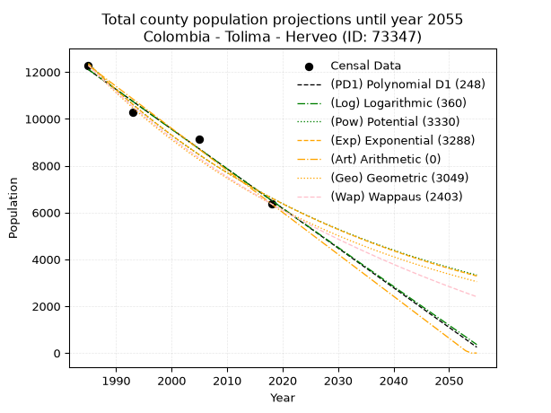
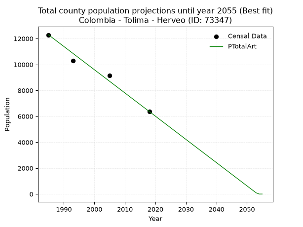
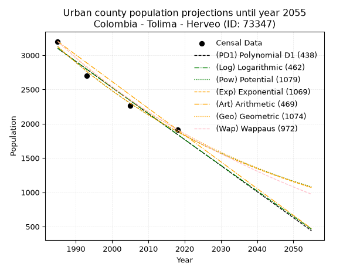
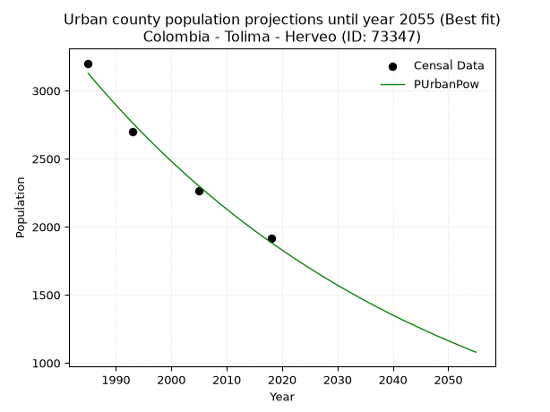
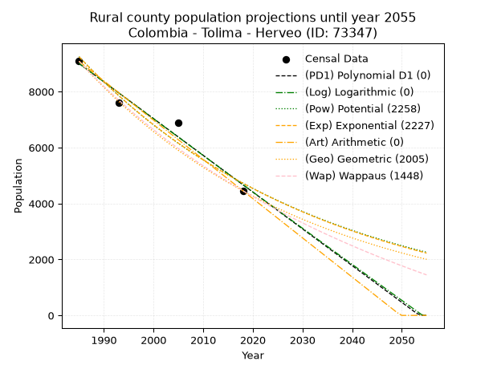
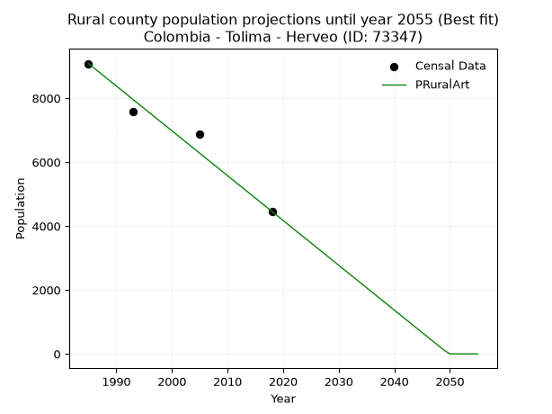

<div align="center">


</div>

# _“Population and Public Services Demand Projections (PPSD) until Year 2050 for Colombia - Tolima - Herveo (ID: 73347)”_
Keywords: `population` `public-service` `projection` `lineal` `polynomial` `logarithmic` `potential` `exponential` `arithmetic` `geometric` `wappaus` `dane` `colombia` `south-america`

PPSD are analytical estimates used by governments and planners to anticipate future changes in population size, age distribution, and the resulting community needs for utilities, healthcare, education, and infrastructure as sizing future water treatment facilities, electrical grids, and road networks based on spatial growth.

> **General running parameters**: • app_version: _v20260806_. • Python version: _3.14.7_. • Pandas version: _3.0.5_. • NumPy version: _2.5.1_. • Creates, save and include plots into reports (create_plot): _False_. • Projection until year: _2050_. • Process polynomial degree 2 and up: _False_. • Process Wappaus: _True_. • Process Wappaus: _True_. • Set negative values to zero: _True_. • Set infinite values to zero: _True_. • Drop dataset notes: _True_. 
<div align="center">

Dynamic map: [:earth_americas:Google](http://maps.google.com/maps?q=5.080227525,-75.177151) [:earth_americas:OSM](https://www.openstreetmap.org/#map=18/5.080227525/-75.177151&layers=P) [:earth_americas:Bing](https://www.bing.com/maps?cp=5.080227525~-75.177151&lvl=18) [:earth_americas:Apple](https://maps.apple.com/frame?center=5.080227525%2C-75.177151&span=0.003%2C0.006)

</div>


<div align="center">

```geojson
{
  "type": "Feature",
  "geometry": {
    "type": "Point", 
    "coordinates": [-75.177151, 5.080227525]
  }, 
  "properties": {
    "Name": "Colombia - Tolima - Herveo (ID: 73347)"
  }
}
```

</div>


## 0. Census Data (4 records)

Census data are official statistics collected by a government about the people and housing in a country. They usually include counts of total population, age, sex, race, income, education, and jobs.

📅Global census file: [Population.xlsx](../data/Population.xlsx)

| Source   |   Year |   CountryID | CountryName   |   StateID | StateName   |   CountyID | CountyName   |   PTotal |   PUrban |   PRural |
|:---------|-------:|------------:|:--------------|----------:|:------------|-----------:|:-------------|---------:|---------:|---------:|
| DANE     |   1985 |          57 | Colombia      |        73 | Tolima      |      73347 | Herveo       |    12283 |     3201 |     9082 |
| DANE     |   1993 |          57 | Colombia      |        73 | Tolima      |      73347 | Herveo       |    10292 |     2701 |     7591 |
| DANE     |   2005 |          57 | Colombia      |        73 | Tolima      |      73347 | Herveo       |     9142 |     2265 |     6877 |
| DANE     |   2018 |          57 | Colombia      |        73 | Tolima      |      73347 | Herveo       |     6368 |     1913 |     4455 |

> 🔥Some records could had specific notes about the registered values or the corresponding urban or rural distribution.

## 1. Total

### 1.1. Coefficients and Parameters

* (PD1) Polynomial Deg 1: -169.3717382577259, 348307.06945001625 (lineal)
* (Log) Logarithmic: -339002.94333450566, 2586285.3388846745
* (Pow) Potential: -37.855850469927205, 128.9317454068442
* (Exp) Exponential: -0.018918047538888018, 2.5163638368370796e+20
* (Art) Arithmetic: Year diff. 2018 - 1985 = 33, Population diff. 6368 - 12283 = -5915, Annual growth = -179.24242424242425
* (Geo) Geometric: Year diff. 2018 - 1985 = 33, Population diff. 6368 - 12283 = -5915, Annual growth % = -0.019710156373395793
* (Wap) Wappaus: i = -1.9220677094249556, Condition values only valid for < 200)

<sub>
Wappaus condition values: ['-0.00', '-1.92', '-3.84', '-5.77', '-7.69', '-9.61', '-11.53', '-13.45', '-15.38', '-17.30', '-19.22', '-21.14', '-23.06', '-24.99', '-26.91', '-28.83', '-30.75', '-32.68', '-34.60', '-36.52', '-38.44', '-40.36', '-42.29', '-44.21', '-46.13', '-48.05', '-49.97', '-51.90', '-53.82', '-55.74', '-57.66', '-59.58', '-61.51', '-63.43', '-65.35', '-67.27', '-69.19', '-71.12', '-73.04', '-74.96', '-76.88', '-78.80', '-80.73', '-82.65', '-84.57', '-86.49', '-88.42', '-90.34', '-92.26', '-94.18', '-96.10', '-98.03', '-99.95', '-101.87', '-103.79', '-105.71', '-107.64', '-109.56', '-111.48', '-113.40', '-115.32', '-117.25', '-119.17', '-121.09', '-123.01', '-124.93']
</sub>


### 1.2. Projected Dataset

|   Year |   CountyID |   PTotalPD1 |   PTotalLog |   PTotalPow |   PTotalExp |   PTotalArt |   PTotalGeo |   PTotalWap |
|-------:|-----------:|------------:|------------:|------------:|------------:|------------:|------------:|------------:|
|   1985 |      73347 |       12104 |       12109 |       12366 |       12360 |       12283 |       12283 |       12283 |
|   1986 |      73347 |       11935 |       11938 |       12132 |       12128 |       12104 |       12041 |       12049 |
|   1987 |      73347 |       11765 |       11768 |       11903 |       11901 |       11925 |       11804 |       11820 |
|   1988 |      73347 |       11596 |       11597 |       11679 |       11678 |       11745 |       11571 |       11595 |
|   1989 |      73347 |       11427 |       11427 |       11458 |       11459 |       11566 |       11343 |       11374 |
|   1990 |      73347 |       11257 |       11256 |       11242 |       11244 |       11387 |       11119 |       11157 |
|   1991 |      73347 |       11088 |       11086 |       11031 |       11033 |       11208 |       10900 |       10944 |
|   1992 |      73347 |       10919 |       10916 |       10823 |       10827 |       11028 |       10685 |       10735 |
|   1993 |      73347 |       10749 |       10746 |       10619 |       10624 |       10849 |       10475 |       10529 |
|   1994 |      73347 |       10580 |       10576 |       10419 |       10425 |       10670 |       10268 |       10327 |
|   1995 |      73347 |       10410 |       10406 |       10224 |       10229 |       10491 |       10066 |       10129 |
|   1996 |      73347 |       10241 |       10236 |       10031 |       10038 |       10311 |        9867 |        9934 |
|   1997 |      73347 |       10072 |       10066 |        9843 |        9849 |       10132 |        9673 |        9743 |
|   1998 |      73347 |        9902 |        9896 |        9658 |        9665 |        9953 |        9482 |        9555 |
|   1999 |      73347 |        9733 |        9727 |        9477 |        9484 |        9774 |        9295 |        9370 |
|   2000 |      73347 |        9564 |        9557 |        9299 |        9306 |        9594 |        9112 |        9188 |
|   2001 |      73347 |        9394 |        9388 |        9125 |        9132 |        9415 |        8933 |        9009 |
|   2002 |      73347 |        9225 |        9218 |        8954 |        8961 |        9236 |        8757 |        8833 |
|   2003 |      73347 |        9055 |        9049 |        8786 |        8793 |        9057 |        8584 |        8660 |
|   2004 |      73347 |        8886 |        8880 |        8622 |        8628 |        8877 |        8415 |        8490 |
|   2005 |      73347 |        8717 |        8711 |        8461 |        8466 |        8698 |        8249 |        8322 |
|   2006 |      73347 |        8547 |        8542 |        8302 |        8307 |        8519 |        8086 |        8158 |
|   2007 |      73347 |        8378 |        8373 |        8147 |        8152 |        8340 |        7927 |        7996 |
|   2008 |      73347 |        8209 |        8204 |        7995 |        7999 |        8160 |        7771 |        7836 |
|   2009 |      73347 |        8039 |        8035 |        7846 |        7849 |        7981 |        7618 |        7679 |
|   2010 |      73347 |        7870 |        7866 |        7699 |        7702 |        7802 |        7467 |        7524 |
|   2011 |      73347 |        7701 |        7698 |        7556 |        7558 |        7623 |        7320 |        7372 |
|   2012 |      73347 |        7531 |        7529 |        7415 |        7416 |        7443 |        7176 |        7222 |
|   2013 |      73347 |        7362 |        7361 |        7277 |        7277 |        7264 |        7034 |        7074 |
|   2014 |      73347 |        7192 |        7192 |        7141 |        7141 |        7085 |        6896 |        6929 |
|   2015 |      73347 |        7023 |        7024 |        7008 |        7007 |        6906 |        6760 |        6785 |
|   2016 |      73347 |        6854 |        6856 |        6878 |        6876 |        6726 |        6627 |        6644 |
|   2017 |      73347 |        6684 |        6688 |        6750 |        6747 |        6547 |        6496 |        6505 |
|   2018 |      73347 |        6515 |        6520 |        6624 |        6620 |        6368 |        6368 |        6368 |
|   2019 |      73347 |        6346 |        6352 |        6501 |        6496 |        6189 |        6242 |        6233 |
|   2020 |      73347 |        6176 |        6184 |        6381 |        6374 |        6010 |        6119 |        6100 |
|   2021 |      73347 |        6007 |        6016 |        6262 |        6255 |        5830 |        5999 |        5968 |
|   2022 |      73347 |        5837 |        5848 |        6146 |        6138 |        5651 |        5881 |        5839 |
|   2023 |      73347 |        5668 |        5681 |        6032 |        6023 |        5472 |        5765 |        5712 |
|   2024 |      73347 |        5499 |        5513 |        5920 |        5910 |        5293 |        5651 |        5586 |
|   2025 |      73347 |        5329 |        5346 |        5811 |        5799 |        5113 |        5540 |        5462 |
|   2026 |      73347 |        5160 |        5178 |        5703 |        5690 |        4934 |        5430 |        5339 |
|   2027 |      73347 |        4991 |        5011 |        5597 |        5584 |        4755 |        5323 |        5219 |
|   2028 |      73347 |        4821 |        4844 |        5494 |        5479 |        4576 |        5219 |        5100 |
|   2029 |      73347 |        4652 |        4677 |        5392 |        5377 |        4396 |        5116 |        4982 |
|   2030 |      73347 |        4482 |        4510 |        5293 |        5276 |        4217 |        5015 |        4866 |
|   2031 |      73347 |        4313 |        4343 |        5195 |        5177 |        4038 |        4916 |        4752 |
|   2032 |      73347 |        4144 |        4176 |        5099 |        5080 |        3859 |        4819 |        4639 |
|   2033 |      73347 |        3974 |        4009 |        5005 |        4985 |        3679 |        4724 |        4528 |
|   2034 |      73347 |        3805 |        3842 |        4913 |        4891 |        3500 |        4631 |        4418 |
|   2035 |      73347 |        3636 |        3676 |        4822 |        4800 |        3321 |        4540 |        4310 |
|   2036 |      73347 |        3466 |        3509 |        4733 |        4710 |        3142 |        4450 |        4203 |
|   2037 |      73347 |        3297 |        3343 |        4646 |        4621 |        2962 |        4363 |        4097 |
|   2038 |      73347 |        3127 |        3176 |        4560 |        4535 |        2783 |        4277 |        3993 |
|   2039 |      73347 |        2958 |        3010 |        4477 |        4450 |        2604 |        4192 |        3890 |
|   2040 |      73347 |        2789 |        2844 |        4394 |        4366 |        2425 |        4110 |        3788 |
|   2041 |      73347 |        2619 |        2678 |        4313 |        4285 |        2245 |        4029 |        3688 |
|   2042 |      73347 |        2450 |        2512 |        4234 |        4204 |        2066 |        3949 |        3589 |
|   2043 |      73347 |        2281 |        2346 |        4156 |        4126 |        1887 |        3871 |        3491 |
|   2044 |      73347 |        2111 |        2180 |        4080 |        4048 |        1708 |        3795 |        3394 |
|   2045 |      73347 |        1942 |        2014 |        4005 |        3972 |        1528 |        3720 |        3298 |
|   2046 |      73347 |        1772 |        1848 |        3932 |        3898 |        1349 |        3647 |        3204 |
|   2047 |      73347 |        1603 |        1683 |        3860 |        3825 |        1170 |        3575 |        3111 |
|   2048 |      73347 |        1434 |        1517 |        3789 |        3753 |         991 |        3505 |        3019 |
|   2049 |      73347 |        1264 |        1352 |        3720 |        3683 |         811 |        3436 |        2928 |
|   2050 |      73347 |        1095 |        1186 |        3652 |        3614 |         632 |        3368 |        2838 |
<div align="center">

</img>

</div>


### 1.3. Best fit with absolute and relative error (%)

Relative error puts that difference into context by dividing the absolute error by the true value, creating a unitless ratio or percentage that shows the scale of the mistake.

Absolute and relative error

|   Year | Source   |   CountryID | CountryName   |   StateID | StateName   |   CountyID_x | CountyName   |   PTotal |   PUrban |   PRural |   CountyID_y |   PTotalPD1 |   PTotalLog |   PTotalPow |   PTotalExp |   PTotalArt |   PTotalGeo |   PTotalWap |   PTotalPD1AbsError |   PTotalLogAbsError |   PTotalPowAbsError |   PTotalExpAbsError |   PTotalArtAbsError |   PTotalGeoAbsError |   PTotalWapAbsError |   PTotalPD1RelError |   PTotalLogRelError |   PTotalPowRelError |   PTotalExpRelError |   PTotalArtRelError |   PTotalGeoRelError |   PTotalWapRelError |
|-------:|:---------|------------:|:--------------|----------:|:------------|-------------:|:-------------|---------:|---------:|---------:|-------------:|------------:|------------:|------------:|------------:|------------:|------------:|------------:|--------------------:|--------------------:|--------------------:|--------------------:|--------------------:|--------------------:|--------------------:|--------------------:|--------------------:|--------------------:|--------------------:|--------------------:|--------------------:|--------------------:|
|   1985 | DANE     |          57 | Colombia      |        73 | Tolima      |        73347 | Herveo       |    12283 |     3201 |     9082 |        73347 |       12104 |       12109 |       12366 |       12360 |       12283 |       12283 |       12283 |                 179 |                 174 |                  83 |                  77 |                   0 |                   0 |                   0 |             1.4573  |             1.41659 |            0.675731 |            0.626883 |             0       |             0       |             0       |
|   1993 | DANE     |          57 | Colombia      |        73 | Tolima      |        73347 | Herveo       |    10292 |     2701 |     7591 |        73347 |       10749 |       10746 |       10619 |       10624 |       10849 |       10475 |       10529 |                 457 |                 454 |                 327 |                 332 |                 557 |                 183 |                 237 |             4.44034 |             4.41119 |            3.17723  |            3.22581  |             5.41197 |             1.77808 |             2.30276 |
|   2005 | DANE     |          57 | Colombia      |        73 | Tolima      |        73347 | Herveo       |     9142 |     2265 |     6877 |        73347 |        8717 |        8711 |        8461 |        8466 |        8698 |        8249 |        8322 |                 425 |                 431 |                 681 |                 676 |                 444 |                 893 |                 820 |             4.64887 |             4.7145  |            7.44914  |            7.39444  |             4.85671 |             9.7681  |             8.96959 |
|   2018 | DANE     |          57 | Colombia      |        73 | Tolima      |        73347 | Herveo       |     6368 |     1913 |     4455 |        73347 |        6515 |        6520 |        6624 |        6620 |        6368 |        6368 |        6368 |                 147 |                 152 |                 256 |                 252 |                   0 |                   0 |                   0 |             2.30842 |             2.38693 |            4.0201   |            3.95729  |             0       |             0       |             0       |

Relative error mean

| Method    |   RelError | Best   |
|:----------|-----------:|:-------|
| PTotalPD1 |    3.21373 |        |
| PTotalLog |    3.23231 |        |
| PTotalPow |    3.83055 |        |
| PTotalExp |    3.8011  |        |
| PTotalArt |    2.56717 | True   |
| PTotalGeo |    2.88655 |        |
| PTotalWap |    2.81809 |        |

💙Best method: _**PTotalArt**_
<div align="center">

</img>

</div>


### 1.4. Fresh water supply demand in liters per capita per day (lpcd)

The fresh water supply demand typically ranges from 100 to 300 liters per capita per day (lpcd) for standard domestic and municipal planning, though absolute survival minimums set by the World Health Organization are as low as 7.5 to 20 liters per day, and total consumption in high-income nations can exceed 400 liters.

> `CZ`: Level in meters above the sea level (masl).<br> `WS`: Fresh water supply demand in liters per capita per day (lpcd or l/h/d).<br> `WSAll`: Zonal fresh water supply demand in liters per second (l/s).<br> `A`: Zonal area in square meters.

Reference values (RAS Colombia)

|    CZ |   WS |
|------:|-----:|
|  1000 |  120 |
|  2000 |  130 |
| 99999 |  140 |

County shapefile geometry properties and water supply values

|   CountyID |      ATotal |   CZTotal |   WSTotal |
|-----------:|------------:|----------:|----------:|
|      73347 | 3.22538e+08 |   2713.44 |       140 |

Projected values for best method: PTotalArt

|   CountyID |   Year |   PTotalArt |   WSTotal |   WSTotalAll |
|-----------:|-------:|------------:|----------:|-------------:|
|      73347 |   1985 |       12283 |       140 |     19.903   |
|      73347 |   1986 |       12104 |       140 |     19.613   |
|      73347 |   1987 |       11925 |       140 |     19.3229  |
|      73347 |   1988 |       11745 |       140 |     19.0312  |
|      73347 |   1989 |       11566 |       140 |     18.7412  |
|      73347 |   1990 |       11387 |       140 |     18.4512  |
|      73347 |   1991 |       11208 |       140 |     18.1611  |
|      73347 |   1992 |       11028 |       140 |     17.8694  |
|      73347 |   1993 |       10849 |       140 |     17.5794  |
|      73347 |   1994 |       10670 |       140 |     17.2894  |
|      73347 |   1995 |       10491 |       140 |     16.9993  |
|      73347 |   1996 |       10311 |       140 |     16.7076  |
|      73347 |   1997 |       10132 |       140 |     16.4176  |
|      73347 |   1998 |        9953 |       140 |     16.1275  |
|      73347 |   1999 |        9774 |       140 |     15.8375  |
|      73347 |   2000 |        9594 |       140 |     15.5458  |
|      73347 |   2001 |        9415 |       140 |     15.2558  |
|      73347 |   2002 |        9236 |       140 |     14.9657  |
|      73347 |   2003 |        9057 |       140 |     14.6757  |
|      73347 |   2004 |        8877 |       140 |     14.384   |
|      73347 |   2005 |        8698 |       140 |     14.094   |
|      73347 |   2006 |        8519 |       140 |     13.8039  |
|      73347 |   2007 |        8340 |       140 |     13.5139  |
|      73347 |   2008 |        8160 |       140 |     13.2222  |
|      73347 |   2009 |        7981 |       140 |     12.9322  |
|      73347 |   2010 |        7802 |       140 |     12.6421  |
|      73347 |   2011 |        7623 |       140 |     12.3521  |
|      73347 |   2012 |        7443 |       140 |     12.0604  |
|      73347 |   2013 |        7264 |       140 |     11.7704  |
|      73347 |   2014 |        7085 |       140 |     11.4803  |
|      73347 |   2015 |        6906 |       140 |     11.1903  |
|      73347 |   2016 |        6726 |       140 |     10.8986  |
|      73347 |   2017 |        6547 |       140 |     10.6086  |
|      73347 |   2018 |        6368 |       140 |     10.3185  |
|      73347 |   2019 |        6189 |       140 |     10.0285  |
|      73347 |   2020 |        6010 |       140 |      9.73843 |
|      73347 |   2021 |        5830 |       140 |      9.44676 |
|      73347 |   2022 |        5651 |       140 |      9.15671 |
|      73347 |   2023 |        5472 |       140 |      8.86667 |
|      73347 |   2024 |        5293 |       140 |      8.57662 |
|      73347 |   2025 |        5113 |       140 |      8.28495 |
|      73347 |   2026 |        4934 |       140 |      7.99491 |
|      73347 |   2027 |        4755 |       140 |      7.70486 |
|      73347 |   2028 |        4576 |       140 |      7.41481 |
|      73347 |   2029 |        4396 |       140 |      7.12315 |
|      73347 |   2030 |        4217 |       140 |      6.8331  |
|      73347 |   2031 |        4038 |       140 |      6.54306 |
|      73347 |   2032 |        3859 |       140 |      6.25301 |
|      73347 |   2033 |        3679 |       140 |      5.96134 |
|      73347 |   2034 |        3500 |       140 |      5.6713  |
|      73347 |   2035 |        3321 |       140 |      5.38125 |
|      73347 |   2036 |        3142 |       140 |      5.0912  |
|      73347 |   2037 |        2962 |       140 |      4.79954 |
|      73347 |   2038 |        2783 |       140 |      4.50949 |
|      73347 |   2039 |        2604 |       140 |      4.21944 |
|      73347 |   2040 |        2425 |       140 |      3.9294  |
|      73347 |   2041 |        2245 |       140 |      3.63773 |
|      73347 |   2042 |        2066 |       140 |      3.34769 |
|      73347 |   2043 |        1887 |       140 |      3.05764 |
|      73347 |   2044 |        1708 |       140 |      2.76759 |
|      73347 |   2045 |        1528 |       140 |      2.47593 |
|      73347 |   2046 |        1349 |       140 |      2.18588 |
|      73347 |   2047 |        1170 |       140 |      1.89583 |
|      73347 |   2048 |         991 |       140 |      1.60579 |
|      73347 |   2049 |         811 |       140 |      1.31412 |
|      73347 |   2050 |         632 |       140 |      1.02407 |

## 2. Urban

### 2.1. Coefficients and Parameters

* (PD1) Polynomial Deg 1: -38.02970694500174, 78588.92131673974 (lineal)
* (Log) Logarithmic: -76151.81400876769, 581350.5485229824
* (Pow) Potential: -30.699532938014364, 104.73488475258199
* (Exp) Exponential: -0.01533384891507975, 5.174580534668513e+16
* (Art) Arithmetic: Year diff. 2018 - 1985 = 33, Population diff. 1913 - 3201 = -1288, Annual growth = -39.03030303030303
* (Geo) Geometric: Year diff. 2018 - 1985 = 33, Population diff. 1913 - 3201 = -1288, Annual growth % = -0.01547866895742045
* (Wap) Wappaus: i = -1.5264099738092698, Condition values only valid for < 200)

<sub>
Wappaus condition values: ['-0.00', '-1.53', '-3.05', '-4.58', '-6.11', '-7.63', '-9.16', '-10.68', '-12.21', '-13.74', '-15.26', '-16.79', '-18.32', '-19.84', '-21.37', '-22.90', '-24.42', '-25.95', '-27.48', '-29.00', '-30.53', '-32.05', '-33.58', '-35.11', '-36.63', '-38.16', '-39.69', '-41.21', '-42.74', '-44.27', '-45.79', '-47.32', '-48.85', '-50.37', '-51.90', '-53.42', '-54.95', '-56.48', '-58.00', '-59.53', '-61.06', '-62.58', '-64.11', '-65.64', '-67.16', '-68.69', '-70.21', '-71.74', '-73.27', '-74.79', '-76.32', '-77.85', '-79.37', '-80.90', '-82.43', '-83.95', '-85.48', '-87.01', '-88.53', '-90.06', '-91.58', '-93.11', '-94.64', '-96.16', '-97.69', '-99.22']
</sub>


### 2.2. Projected Dataset

|   Year |   CountyID |   PUrbanPD1 |   PUrbanLog |   PUrbanPow |   PUrbanExp |   PUrbanArt |   PUrbanGeo |   PUrbanWap |
|-------:|-----------:|------------:|------------:|------------:|------------:|------------:|------------:|------------:|
|   1985 |      73347 |        3100 |        3101 |        3127 |        3126 |        3201 |        3201 |        3201 |
|   1986 |      73347 |        3062 |        3063 |        3079 |        3078 |        3162 |        3151 |        3153 |
|   1987 |      73347 |        3024 |        3025 |        3032 |        3031 |        3123 |        3103 |        3105 |
|   1988 |      73347 |        2986 |        2986 |        2986 |        2985 |        3084 |        3055 |        3058 |
|   1989 |      73347 |        2948 |        2948 |        2940 |        2940 |        3045 |        3007 |        3011 |
|   1990 |      73347 |        2910 |        2910 |        2895 |        2895 |        3006 |        2961 |        2966 |
|   1991 |      73347 |        2872 |        2871 |        2851 |        2851 |        2967 |        2915 |        2921 |
|   1992 |      73347 |        2834 |        2833 |        2807 |        2808 |        2928 |        2870 |        2876 |
|   1993 |      73347 |        2796 |        2795 |        2764 |        2765 |        2889 |        2825 |        2833 |
|   1994 |      73347 |        2758 |        2757 |        2722 |        2723 |        2850 |        2782 |        2790 |
|   1995 |      73347 |        2720 |        2719 |        2680 |        2681 |        2811 |        2739 |        2747 |
|   1996 |      73347 |        2682 |        2680 |        2639 |        2641 |        2772 |        2696 |        2705 |
|   1997 |      73347 |        2644 |        2642 |        2599 |        2600 |        2733 |        2655 |        2664 |
|   1998 |      73347 |        2606 |        2604 |        2559 |        2561 |        2694 |        2613 |        2623 |
|   1999 |      73347 |        2568 |        2566 |        2520 |        2522 |        2655 |        2573 |        2583 |
|   2000 |      73347 |        2530 |        2528 |        2482 |        2483 |        2616 |        2533 |        2543 |
|   2001 |      73347 |        2491 |        2490 |        2444 |        2446 |        2577 |        2494 |        2504 |
|   2002 |      73347 |        2453 |        2452 |        2407 |        2408 |        2537 |        2455 |        2466 |
|   2003 |      73347 |        2415 |        2414 |        2370 |        2372 |        2498 |        2417 |        2428 |
|   2004 |      73347 |        2377 |        2376 |        2334 |        2336 |        2459 |        2380 |        2390 |
|   2005 |      73347 |        2339 |        2338 |        2299 |        2300 |        2420 |        2343 |        2353 |
|   2006 |      73347 |        2301 |        2300 |        2264 |        2265 |        2381 |        2307 |        2317 |
|   2007 |      73347 |        2263 |        2262 |        2230 |        2231 |        2342 |        2271 |        2281 |
|   2008 |      73347 |        2225 |        2224 |        2196 |        2197 |        2303 |        2236 |        2245 |
|   2009 |      73347 |        2187 |        2186 |        2162 |        2163 |        2264 |        2201 |        2210 |
|   2010 |      73347 |        2149 |        2148 |        2130 |        2130 |        2225 |        2167 |        2175 |
|   2011 |      73347 |        2111 |        2110 |        2097 |        2098 |        2186 |        2134 |        2141 |
|   2012 |      73347 |        2073 |        2072 |        2066 |        2066 |        2147 |        2101 |        2107 |
|   2013 |      73347 |        2035 |        2035 |        2034 |        2035 |        2108 |        2068 |        2074 |
|   2014 |      73347 |        1997 |        1997 |        2004 |        2004 |        2069 |        2036 |        2041 |
|   2015 |      73347 |        1959 |        1959 |        1973 |        1973 |        2030 |        2005 |        2008 |
|   2016 |      73347 |        1921 |        1921 |        1943 |        1943 |        1991 |        1974 |        1976 |
|   2017 |      73347 |        1883 |        1883 |        1914 |        1914 |        1952 |        1943 |        1944 |
|   2018 |      73347 |        1845 |        1846 |        1885 |        1884 |        1913 |        1913 |        1913 |
|   2019 |      73347 |        1807 |        1808 |        1857 |        1856 |        1874 |        1883 |        1882 |
|   2020 |      73347 |        1769 |        1770 |        1829 |        1828 |        1835 |        1854 |        1851 |
|   2021 |      73347 |        1731 |        1733 |        1801 |        1800 |        1796 |        1826 |        1821 |
|   2022 |      73347 |        1693 |        1695 |        1774 |        1772 |        1757 |        1797 |        1791 |
|   2023 |      73347 |        1655 |        1657 |        1747 |        1745 |        1718 |        1769 |        1762 |
|   2024 |      73347 |        1617 |        1620 |        1721 |        1719 |        1679 |        1742 |        1733 |
|   2025 |      73347 |        1579 |        1582 |        1695 |        1693 |        1640 |        1715 |        1704 |
|   2026 |      73347 |        1541 |        1544 |        1670 |        1667 |        1601 |        1689 |        1675 |
|   2027 |      73347 |        1503 |        1507 |        1644 |        1642 |        1562 |        1662 |        1647 |
|   2028 |      73347 |        1465 |        1469 |        1620 |        1617 |        1523 |        1637 |        1619 |
|   2029 |      73347 |        1427 |        1432 |        1595 |        1592 |        1484 |        1611 |        1592 |
|   2030 |      73347 |        1389 |        1394 |        1571 |        1568 |        1445 |        1586 |        1564 |
|   2031 |      73347 |        1351 |        1357 |        1548 |        1544 |        1406 |        1562 |        1537 |
|   2032 |      73347 |        1313 |        1319 |        1525 |        1520 |        1367 |        1538 |        1511 |
|   2033 |      73347 |        1275 |        1282 |        1502 |        1497 |        1328 |        1514 |        1485 |
|   2034 |      73347 |        1236 |        1244 |        1479 |        1474 |        1289 |        1490 |        1458 |
|   2035 |      73347 |        1198 |        1207 |        1457 |        1452 |        1249 |        1467 |        1433 |
|   2036 |      73347 |        1160 |        1169 |        1435 |        1430 |        1210 |        1445 |        1407 |
|   2037 |      73347 |        1122 |        1132 |        1414 |        1408 |        1171 |        1422 |        1382 |
|   2038 |      73347 |        1084 |        1095 |        1393 |        1387 |        1132 |        1400 |        1357 |
|   2039 |      73347 |        1046 |        1057 |        1372 |        1366 |        1093 |        1379 |        1333 |
|   2040 |      73347 |        1008 |        1020 |        1351 |        1345 |        1054 |        1357 |        1308 |
|   2041 |      73347 |         970 |         983 |        1331 |        1324 |        1015 |        1336 |        1284 |
|   2042 |      73347 |         932 |         945 |        1311 |        1304 |         976 |        1316 |        1260 |
|   2043 |      73347 |         894 |         908 |        1292 |        1284 |         937 |        1295 |        1237 |
|   2044 |      73347 |         856 |         871 |        1273 |        1265 |         898 |        1275 |        1213 |
|   2045 |      73347 |         818 |         834 |        1254 |        1246 |         859 |        1255 |        1190 |
|   2046 |      73347 |         780 |         796 |        1235 |        1227 |         820 |        1236 |        1167 |
|   2047 |      73347 |         742 |         759 |        1217 |        1208 |         781 |        1217 |        1145 |
|   2048 |      73347 |         704 |         722 |        1198 |        1190 |         742 |        1198 |        1122 |
|   2049 |      73347 |         666 |         685 |        1181 |        1172 |         703 |        1179 |        1100 |
|   2050 |      73347 |         628 |         648 |        1163 |        1154 |         664 |        1161 |        1078 |
<div align="center">

</img>

</div>


### 2.3. Best fit with absolute and relative error (%)

Relative error puts that difference into context by dividing the absolute error by the true value, creating a unitless ratio or percentage that shows the scale of the mistake.

Absolute and relative error

|   Year | Source   |   CountryID | CountryName   |   StateID | StateName   |   CountyID_x | CountyName   |   PTotal |   PUrban |   PRural |   CountyID_y |   PUrbanPD1 |   PUrbanLog |   PUrbanPow |   PUrbanExp |   PUrbanArt |   PUrbanGeo |   PUrbanWap |   PUrbanPD1AbsError |   PUrbanLogAbsError |   PUrbanPowAbsError |   PUrbanExpAbsError |   PUrbanArtAbsError |   PUrbanGeoAbsError |   PUrbanWapAbsError |   PUrbanPD1RelError |   PUrbanLogRelError |   PUrbanPowRelError |   PUrbanExpRelError |   PUrbanArtRelError |   PUrbanGeoRelError |   PUrbanWapRelError |
|-------:|:---------|------------:|:--------------|----------:|:------------|-------------:|:-------------|---------:|---------:|---------:|-------------:|------------:|------------:|------------:|------------:|------------:|------------:|------------:|--------------------:|--------------------:|--------------------:|--------------------:|--------------------:|--------------------:|--------------------:|--------------------:|--------------------:|--------------------:|--------------------:|--------------------:|--------------------:|--------------------:|
|   1985 | DANE     |          57 | Colombia      |        73 | Tolima      |        73347 | Herveo       |    12283 |     3201 |     9082 |        73347 |        3100 |        3101 |        3127 |        3126 |        3201 |        3201 |        3201 |                 101 |                 100 |                  74 |                  75 |                   0 |                   0 |                   0 |             3.15526 |             3.12402 |             2.31178 |             2.34302 |             0       |             0       |             0       |
|   1993 | DANE     |          57 | Colombia      |        73 | Tolima      |        73347 | Herveo       |    10292 |     2701 |     7591 |        73347 |        2796 |        2795 |        2764 |        2765 |        2889 |        2825 |        2833 |                  95 |                  94 |                  63 |                  64 |                 188 |                 124 |                 132 |             3.51722 |             3.48019 |             2.33247 |             2.36949 |             6.96039 |             4.59089 |             4.88708 |
|   2005 | DANE     |          57 | Colombia      |        73 | Tolima      |        73347 | Herveo       |     9142 |     2265 |     6877 |        73347 |        2339 |        2338 |        2299 |        2300 |        2420 |        2343 |        2353 |                  74 |                  73 |                  34 |                  35 |                 155 |                  78 |                  88 |             3.26711 |             3.22296 |             1.5011  |             1.54525 |             6.84327 |             3.44371 |             3.88521 |
|   2018 | DANE     |          57 | Colombia      |        73 | Tolima      |        73347 | Herveo       |     6368 |     1913 |     4455 |        73347 |        1845 |        1846 |        1885 |        1884 |        1913 |        1913 |        1913 |                  68 |                  67 |                  28 |                  29 |                   0 |                   0 |                   0 |             3.55463 |             3.50235 |             1.46367 |             1.51594 |             0       |             0       |             0       |

Relative error mean

| Method    |   RelError | Best   |
|:----------|-----------:|:-------|
| PUrbanPD1 |    3.37355 |        |
| PUrbanLog |    3.33238 |        |
| PUrbanPow |    1.90226 | True   |
| PUrbanExp |    1.94343 |        |
| PUrbanArt |    3.45091 |        |
| PUrbanGeo |    2.00865 |        |
| PUrbanWap |    2.19307 |        |

💙Best method: _**PUrbanPow**_
<div align="center">

</img>

</div>


### 2.4. Fresh water supply demand in liters per capita per day (lpcd)

The fresh water supply demand typically ranges from 100 to 300 liters per capita per day (lpcd) for standard domestic and municipal planning, though absolute survival minimums set by the World Health Organization are as low as 7.5 to 20 liters per day, and total consumption in high-income nations can exceed 400 liters.

> `CZ`: Level in meters above the sea level (masl).<br> `WS`: Fresh water supply demand in liters per capita per day (lpcd or l/h/d).<br> `WSAll`: Zonal fresh water supply demand in liters per second (l/s).<br> `A`: Zonal area in square meters.

Reference values (RAS Colombia)

|    CZ |   WS |
|------:|-----:|
|  1000 |  120 |
|  2000 |  130 |
| 99999 |  140 |

County shapefile geometry properties and water supply values

|   CountyID |   AUrban |   CZUrban |   WSUrban |
|-----------:|---------:|----------:|----------:|
|      73347 |   327112 |   2300.33 |       140 |

Projected values for best method: PUrbanPow

|   CountyID |   Year |   PUrbanPow |   WSUrban |   WSUrbanAll |
|-----------:|-------:|------------:|----------:|-------------:|
|      73347 |   1985 |        3127 |       140 |      5.0669  |
|      73347 |   1986 |        3079 |       140 |      4.98912 |
|      73347 |   1987 |        3032 |       140 |      4.91296 |
|      73347 |   1988 |        2986 |       140 |      4.83843 |
|      73347 |   1989 |        2940 |       140 |      4.76389 |
|      73347 |   1990 |        2895 |       140 |      4.69097 |
|      73347 |   1991 |        2851 |       140 |      4.61968 |
|      73347 |   1992 |        2807 |       140 |      4.54838 |
|      73347 |   1993 |        2764 |       140 |      4.4787  |
|      73347 |   1994 |        2722 |       140 |      4.41065 |
|      73347 |   1995 |        2680 |       140 |      4.34259 |
|      73347 |   1996 |        2639 |       140 |      4.27616 |
|      73347 |   1997 |        2599 |       140 |      4.21134 |
|      73347 |   1998 |        2559 |       140 |      4.14653 |
|      73347 |   1999 |        2520 |       140 |      4.08333 |
|      73347 |   2000 |        2482 |       140 |      4.02176 |
|      73347 |   2001 |        2444 |       140 |      3.96019 |
|      73347 |   2002 |        2407 |       140 |      3.90023 |
|      73347 |   2003 |        2370 |       140 |      3.84028 |
|      73347 |   2004 |        2334 |       140 |      3.78194 |
|      73347 |   2005 |        2299 |       140 |      3.72523 |
|      73347 |   2006 |        2264 |       140 |      3.66852 |
|      73347 |   2007 |        2230 |       140 |      3.61343 |
|      73347 |   2008 |        2196 |       140 |      3.55833 |
|      73347 |   2009 |        2162 |       140 |      3.50324 |
|      73347 |   2010 |        2130 |       140 |      3.45139 |
|      73347 |   2011 |        2097 |       140 |      3.39792 |
|      73347 |   2012 |        2066 |       140 |      3.34769 |
|      73347 |   2013 |        2034 |       140 |      3.29583 |
|      73347 |   2014 |        2004 |       140 |      3.24722 |
|      73347 |   2015 |        1973 |       140 |      3.19699 |
|      73347 |   2016 |        1943 |       140 |      3.14838 |
|      73347 |   2017 |        1914 |       140 |      3.10139 |
|      73347 |   2018 |        1885 |       140 |      3.0544  |
|      73347 |   2019 |        1857 |       140 |      3.00903 |
|      73347 |   2020 |        1829 |       140 |      2.96366 |
|      73347 |   2021 |        1801 |       140 |      2.91829 |
|      73347 |   2022 |        1774 |       140 |      2.87454 |
|      73347 |   2023 |        1747 |       140 |      2.83079 |
|      73347 |   2024 |        1721 |       140 |      2.78866 |
|      73347 |   2025 |        1695 |       140 |      2.74653 |
|      73347 |   2026 |        1670 |       140 |      2.70602 |
|      73347 |   2027 |        1644 |       140 |      2.66389 |
|      73347 |   2028 |        1620 |       140 |      2.625   |
|      73347 |   2029 |        1595 |       140 |      2.58449 |
|      73347 |   2030 |        1571 |       140 |      2.5456  |
|      73347 |   2031 |        1548 |       140 |      2.50833 |
|      73347 |   2032 |        1525 |       140 |      2.47106 |
|      73347 |   2033 |        1502 |       140 |      2.4338  |
|      73347 |   2034 |        1479 |       140 |      2.39653 |
|      73347 |   2035 |        1457 |       140 |      2.36088 |
|      73347 |   2036 |        1435 |       140 |      2.32523 |
|      73347 |   2037 |        1414 |       140 |      2.2912  |
|      73347 |   2038 |        1393 |       140 |      2.25718 |
|      73347 |   2039 |        1372 |       140 |      2.22315 |
|      73347 |   2040 |        1351 |       140 |      2.18912 |
|      73347 |   2041 |        1331 |       140 |      2.15671 |
|      73347 |   2042 |        1311 |       140 |      2.12431 |
|      73347 |   2043 |        1292 |       140 |      2.09352 |
|      73347 |   2044 |        1273 |       140 |      2.06273 |
|      73347 |   2045 |        1254 |       140 |      2.03194 |
|      73347 |   2046 |        1235 |       140 |      2.00116 |
|      73347 |   2047 |        1217 |       140 |      1.97199 |
|      73347 |   2048 |        1198 |       140 |      1.9412  |
|      73347 |   2049 |        1181 |       140 |      1.91366 |
|      73347 |   2050 |        1163 |       140 |      1.88449 |

## 3. Rural

### 3.1. Coefficients and Parameters

* (PD1) Polynomial Deg 1: -131.3420313127242, 269718.1481332766 (lineal)
* (Log) Logarithmic: -262851.12932573777, 2004934.79036169
* (Pow) Potential: -40.68537821459747, 138.13670075552
* (Exp) Exponential: -0.02033500926828252, 3.134399001768566e+21
* (Art) Arithmetic: Year diff. 2018 - 1985 = 33, Population diff. 4455 - 9082 = -4627, Annual growth = -140.21212121212122
* (Geo) Geometric: Year diff. 2018 - 1985 = 33, Population diff. 4455 - 9082 = -4627, Annual growth % = -0.02135259509889853
* (Wap) Wappaus: i = -2.0715390590547567, Condition values only valid for < 200)

<sub>
Wappaus condition values: ['-0.00', '-2.07', '-4.14', '-6.21', '-8.29', '-10.36', '-12.43', '-14.50', '-16.57', '-18.64', '-20.72', '-22.79', '-24.86', '-26.93', '-29.00', '-31.07', '-33.14', '-35.22', '-37.29', '-39.36', '-41.43', '-43.50', '-45.57', '-47.65', '-49.72', '-51.79', '-53.86', '-55.93', '-58.00', '-60.07', '-62.15', '-64.22', '-66.29', '-68.36', '-70.43', '-72.50', '-74.58', '-76.65', '-78.72', '-80.79', '-82.86', '-84.93', '-87.00', '-89.08', '-91.15', '-93.22', '-95.29', '-97.36', '-99.43', '-101.51', '-103.58', '-105.65', '-107.72', '-109.79', '-111.86', '-113.93', '-116.01', '-118.08', '-120.15', '-122.22', '-124.29', '-126.36', '-128.44', '-130.51', '-132.58', '-134.65']
</sub>


### 3.2. Projected Dataset

|   Year |   CountyID |   PRuralPD1 |   PRuralLog |   PRuralPow |   PRuralExp |   PRuralArt |   PRuralGeo |   PRuralWap |
|-------:|-----------:|------------:|------------:|------------:|------------:|------------:|------------:|------------:|
|   1985 |      73347 |        9004 |        9008 |        9248 |        9244 |        9082 |        9082 |        9082 |
|   1986 |      73347 |        8873 |        8875 |        9061 |        9058 |        8942 |        8888 |        8896 |
|   1987 |      73347 |        8742 |        8743 |        8877 |        8876 |        8802 |        8698 |        8713 |
|   1988 |      73347 |        8610 |        8611 |        8697 |        8697 |        8661 |        8513 |        8535 |
|   1989 |      73347 |        8479 |        8479 |        8521 |        8522 |        8521 |        8331 |        8359 |
|   1990 |      73347 |        8348 |        8347 |        8349 |        8350 |        8381 |        8153 |        8188 |
|   1991 |      73347 |        8216 |        8214 |        8180 |        8182 |        8241 |        7979 |        8019 |
|   1992 |      73347 |        8085 |        8083 |        8014 |        8018 |        8101 |        7808 |        7854 |
|   1993 |      73347 |        7953 |        7951 |        7852 |        7856 |        7960 |        7642 |        7692 |
|   1994 |      73347 |        7822 |        7819 |        7694 |        7698 |        7820 |        7479 |        7533 |
|   1995 |      73347 |        7691 |        7687 |        7538 |        7543 |        7680 |        7319 |        7377 |
|   1996 |      73347 |        7559 |        7555 |        7386 |        7391 |        7540 |        7163 |        7224 |
|   1997 |      73347 |        7428 |        7424 |        7237 |        7242 |        7399 |        7010 |        7074 |
|   1998 |      73347 |        7297 |        7292 |        7091 |        7097 |        7259 |        6860 |        6926 |
|   1999 |      73347 |        7165 |        7160 |        6948 |        6954 |        7119 |        6713 |        6782 |
|   2000 |      73347 |        7034 |        7029 |        6808 |        6814 |        6979 |        6570 |        6639 |
|   2001 |      73347 |        6903 |        6898 |        6671 |        6677 |        6839 |        6430 |        6500 |
|   2002 |      73347 |        6771 |        6766 |        6537 |        6542 |        6698 |        6293 |        6363 |
|   2003 |      73347 |        6640 |        6635 |        6406 |        6411 |        6558 |        6158 |        6228 |
|   2004 |      73347 |        6509 |        6504 |        6277 |        6282 |        6418 |        6027 |        6095 |
|   2005 |      73347 |        6377 |        6373 |        6151 |        6155 |        6278 |        5898 |        5965 |
|   2006 |      73347 |        6246 |        6242 |        6027 |        6031 |        6138 |        5772 |        5837 |
|   2007 |      73347 |        6115 |        6111 |        5906 |        5910 |        5997 |        5649 |        5711 |
|   2008 |      73347 |        5983 |        5980 |        5788 |        5791 |        5857 |        5528 |        5587 |
|   2009 |      73347 |        5852 |        5849 |        5672 |        5674 |        5717 |        5410 |        5466 |
|   2010 |      73347 |        5721 |        5718 |        5558 |        5560 |        5577 |        5295 |        5346 |
|   2011 |      73347 |        5589 |        5587 |        5447 |        5448 |        5436 |        5182 |        5228 |
|   2012 |      73347 |        5458 |        5457 |        5338 |        5338 |        5296 |        5071 |        5112 |
|   2013 |      73347 |        5327 |        5326 |        5231 |        5231 |        5156 |        4963 |        4998 |
|   2014 |      73347 |        5195 |        5195 |        5126 |        5126 |        5016 |        4857 |        4886 |
|   2015 |      73347 |        5064 |        5065 |        5024 |        5022 |        4876 |        4753 |        4776 |
|   2016 |      73347 |        4933 |        4935 |        4923 |        4921 |        4735 |        4652 |        4667 |
|   2017 |      73347 |        4801 |        4804 |        4825 |        4822 |        4595 |        4552 |        4560 |
|   2018 |      73347 |        4670 |        4674 |        4729 |        4725 |        4455 |        4455 |        4455 |
|   2019 |      73347 |        4539 |        4544 |        4634 |        4630 |        4315 |        4360 |        4351 |
|   2020 |      73347 |        4407 |        4414 |        4542 |        4537 |        4175 |        4267 |        4249 |
|   2021 |      73347 |        4276 |        4283 |        4451 |        4446 |        4034 |        4176 |        4149 |
|   2022 |      73347 |        4145 |        4153 |        4363 |        4356 |        3894 |        4087 |        4050 |
|   2023 |      73347 |        4013 |        4023 |        4276 |        4268 |        3754 |        3999 |        3952 |
|   2024 |      73347 |        3882 |        3894 |        4191 |        4183 |        3614 |        3914 |        3856 |
|   2025 |      73347 |        3751 |        3764 |        4107 |        4098 |        3474 |        3830 |        3761 |
|   2026 |      73347 |        3619 |        3634 |        4026 |        4016 |        3333 |        3749 |        3668 |
|   2027 |      73347 |        3488 |        3504 |        3946 |        3935 |        3193 |        3668 |        3576 |
|   2028 |      73347 |        3357 |        3375 |        3867 |        3856 |        3053 |        3590 |        3485 |
|   2029 |      73347 |        3225 |        3245 |        3790 |        3778 |        2913 |        3513 |        3396 |
|   2030 |      73347 |        3094 |        3116 |        3715 |        3702 |        2772 |        3438 |        3307 |
|   2031 |      73347 |        2962 |        2986 |        3641 |        3628 |        2632 |        3365 |        3220 |
|   2032 |      73347 |        2831 |        2857 |        3569 |        3555 |        2492 |        3293 |        3135 |
|   2033 |      73347 |        2700 |        2727 |        3498 |        3483 |        2352 |        3223 |        3050 |
|   2034 |      73347 |        2568 |        2598 |        3429 |        3413 |        2212 |        3154 |        2967 |
|   2035 |      73347 |        2437 |        2469 |        3361 |        3344 |        2071 |        3087 |        2885 |
|   2036 |      73347 |        2306 |        2340 |        3295 |        3277 |        1931 |        3021 |        2804 |
|   2037 |      73347 |        2174 |        2211 |        3230 |        3211 |        1791 |        2956 |        2724 |
|   2038 |      73347 |        2043 |        2082 |        3166 |        3146 |        1651 |        2893 |        2645 |
|   2039 |      73347 |        1912 |        1953 |        3103 |        3083 |        1511 |        2831 |        2567 |
|   2040 |      73347 |        1780 |        1824 |        3042 |        3021 |        1370 |        2771 |        2490 |
|   2041 |      73347 |        1649 |        1695 |        2982 |        2960 |        1230 |        2712 |        2414 |
|   2042 |      73347 |        1518 |        1566 |        2923 |        2900 |        1090 |        2654 |        2339 |
|   2043 |      73347 |        1386 |        1438 |        2865 |        2842 |         950 |        2597 |        2265 |
|   2044 |      73347 |        1255 |        1309 |        2809 |        2785 |         809 |        2542 |        2192 |
|   2045 |      73347 |        1124 |        1180 |        2754 |        2729 |         669 |        2487 |        2120 |
|   2046 |      73347 |         992 |        1052 |        2699 |        2674 |         529 |        2434 |        2049 |
|   2047 |      73347 |         861 |         923 |        2646 |        2620 |         389 |        2382 |        1979 |
|   2048 |      73347 |         730 |         795 |        2594 |        2567 |         249 |        2331 |        1910 |
|   2049 |      73347 |         598 |         667 |        2543 |        2516 |         108 |        2282 |        1841 |
|   2050 |      73347 |         467 |         539 |        2493 |        2465 |           0 |        2233 |        1774 |
<div align="center">

</img>

</div>


### 3.3. Best fit with absolute and relative error (%)

Relative error puts that difference into context by dividing the absolute error by the true value, creating a unitless ratio or percentage that shows the scale of the mistake.

Absolute and relative error

|   Year | Source   |   CountryID | CountryName   |   StateID | StateName   |   CountyID_x | CountyName   |   PTotal |   PUrban |   PRural |   CountyID_y |   PRuralPD1 |   PRuralLog |   PRuralPow |   PRuralExp |   PRuralArt |   PRuralGeo |   PRuralWap |   PRuralPD1AbsError |   PRuralLogAbsError |   PRuralPowAbsError |   PRuralExpAbsError |   PRuralArtAbsError |   PRuralGeoAbsError |   PRuralWapAbsError |   PRuralPD1RelError |   PRuralLogRelError |   PRuralPowRelError |   PRuralExpRelError |   PRuralArtRelError |   PRuralGeoRelError |   PRuralWapRelError |
|-------:|:---------|------------:|:--------------|----------:|:------------|-------------:|:-------------|---------:|---------:|---------:|-------------:|------------:|------------:|------------:|------------:|------------:|------------:|------------:|--------------------:|--------------------:|--------------------:|--------------------:|--------------------:|--------------------:|--------------------:|--------------------:|--------------------:|--------------------:|--------------------:|--------------------:|--------------------:|--------------------:|
|   1985 | DANE     |          57 | Colombia      |        73 | Tolima      |        73347 | Herveo       |    12283 |     3201 |     9082 |        73347 |        9004 |        9008 |        9248 |        9244 |        9082 |        9082 |        9082 |                  78 |                  74 |                 166 |                 162 |                   0 |                   0 |                   0 |            0.858842 |            0.814799 |             1.82779 |             1.78375 |             0       |            0        |             0       |
|   1993 | DANE     |          57 | Colombia      |        73 | Tolima      |        73347 | Herveo       |    10292 |     2701 |     7591 |        73347 |        7953 |        7951 |        7852 |        7856 |        7960 |        7642 |        7692 |                 362 |                 360 |                 261 |                 265 |                 369 |                  51 |                 101 |            4.76881  |            4.74246  |             3.43828 |             3.49098 |             4.86102 |            0.671848 |             1.33052 |
|   2005 | DANE     |          57 | Colombia      |        73 | Tolima      |        73347 | Herveo       |     9142 |     2265 |     6877 |        73347 |        6377 |        6373 |        6151 |        6155 |        6278 |        5898 |        5965 |                 500 |                 504 |                 726 |                 722 |                 599 |                 979 |                 912 |            7.27061  |            7.32878  |            10.5569  |            10.4988  |             8.71019 |           14.2359   |            13.2616  |
|   2018 | DANE     |          57 | Colombia      |        73 | Tolima      |        73347 | Herveo       |     6368 |     1913 |     4455 |        73347 |        4670 |        4674 |        4729 |        4725 |        4455 |        4455 |        4455 |                 215 |                 219 |                 274 |                 270 |                   0 |                   0 |                   0 |            4.82604  |            4.91582  |             6.15039 |             6.06061 |             0       |            0        |             0       |

Relative error mean

| Method    |   RelError | Best   |
|:----------|-----------:|:-------|
| PRuralPD1 |    4.43107 |        |
| PRuralLog |    4.45046 |        |
| PRuralPow |    5.49335 |        |
| PRuralExp |    5.45852 |        |
| PRuralArt |    3.3928  | True   |
| PRuralGeo |    3.72693 |        |
| PRuralWap |    3.64803 |        |

💙Best method: _**PRuralArt**_
<div align="center">

</img>

</div>


### 3.4. Fresh water supply demand in liters per capita per day (lpcd)

The fresh water supply demand typically ranges from 100 to 300 liters per capita per day (lpcd) for standard domestic and municipal planning, though absolute survival minimums set by the World Health Organization are as low as 7.5 to 20 liters per day, and total consumption in high-income nations can exceed 400 liters.

> `CZ`: Level in meters above the sea level (masl).<br> `WS`: Fresh water supply demand in liters per capita per day (lpcd or l/h/d).<br> `WSAll`: Zonal fresh water supply demand in liters per second (l/s).<br> `A`: Zonal area in square meters.

Reference values (RAS Colombia)

|    CZ |   WS |
|------:|-----:|
|  1000 |  120 |
|  2000 |  130 |
| 99999 |  140 |

County shapefile geometry properties and water supply values

|   CountyID |      ARural |   CZRural |   WSRural |
|-----------:|------------:|----------:|----------:|
|      73347 | 3.22211e+08 |   2713.85 |       140 |

Projected values for best method: PRuralArt

|   CountyID |   Year |   PRuralArt |   WSRural |   WSRuralAll |
|-----------:|-------:|------------:|----------:|-------------:|
|      73347 |   1985 |        9082 |       140 |    14.7162   |
|      73347 |   1986 |        8942 |       140 |    14.4894   |
|      73347 |   1987 |        8802 |       140 |    14.2625   |
|      73347 |   1988 |        8661 |       140 |    14.034    |
|      73347 |   1989 |        8521 |       140 |    13.8072   |
|      73347 |   1990 |        8381 |       140 |    13.5803   |
|      73347 |   1991 |        8241 |       140 |    13.3535   |
|      73347 |   1992 |        8101 |       140 |    13.1266   |
|      73347 |   1993 |        7960 |       140 |    12.8981   |
|      73347 |   1994 |        7820 |       140 |    12.6713   |
|      73347 |   1995 |        7680 |       140 |    12.4444   |
|      73347 |   1996 |        7540 |       140 |    12.2176   |
|      73347 |   1997 |        7399 |       140 |    11.9891   |
|      73347 |   1998 |        7259 |       140 |    11.7623   |
|      73347 |   1999 |        7119 |       140 |    11.5354   |
|      73347 |   2000 |        6979 |       140 |    11.3086   |
|      73347 |   2001 |        6839 |       140 |    11.0817   |
|      73347 |   2002 |        6698 |       140 |    10.8532   |
|      73347 |   2003 |        6558 |       140 |    10.6264   |
|      73347 |   2004 |        6418 |       140 |    10.3995   |
|      73347 |   2005 |        6278 |       140 |    10.1727   |
|      73347 |   2006 |        6138 |       140 |     9.94583  |
|      73347 |   2007 |        5997 |       140 |     9.71736  |
|      73347 |   2008 |        5857 |       140 |     9.49051  |
|      73347 |   2009 |        5717 |       140 |     9.26366  |
|      73347 |   2010 |        5577 |       140 |     9.03681  |
|      73347 |   2011 |        5436 |       140 |     8.80833  |
|      73347 |   2012 |        5296 |       140 |     8.58148  |
|      73347 |   2013 |        5156 |       140 |     8.35463  |
|      73347 |   2014 |        5016 |       140 |     8.12778  |
|      73347 |   2015 |        4876 |       140 |     7.90093  |
|      73347 |   2016 |        4735 |       140 |     7.67245  |
|      73347 |   2017 |        4595 |       140 |     7.4456   |
|      73347 |   2018 |        4455 |       140 |     7.21875  |
|      73347 |   2019 |        4315 |       140 |     6.9919   |
|      73347 |   2020 |        4175 |       140 |     6.76505  |
|      73347 |   2021 |        4034 |       140 |     6.53657  |
|      73347 |   2022 |        3894 |       140 |     6.30972  |
|      73347 |   2023 |        3754 |       140 |     6.08287  |
|      73347 |   2024 |        3614 |       140 |     5.85602  |
|      73347 |   2025 |        3474 |       140 |     5.62917  |
|      73347 |   2026 |        3333 |       140 |     5.40069  |
|      73347 |   2027 |        3193 |       140 |     5.17384  |
|      73347 |   2028 |        3053 |       140 |     4.94699  |
|      73347 |   2029 |        2913 |       140 |     4.72014  |
|      73347 |   2030 |        2772 |       140 |     4.49167  |
|      73347 |   2031 |        2632 |       140 |     4.26481  |
|      73347 |   2032 |        2492 |       140 |     4.03796  |
|      73347 |   2033 |        2352 |       140 |     3.81111  |
|      73347 |   2034 |        2212 |       140 |     3.58426  |
|      73347 |   2035 |        2071 |       140 |     3.35579  |
|      73347 |   2036 |        1931 |       140 |     3.12894  |
|      73347 |   2037 |        1791 |       140 |     2.90208  |
|      73347 |   2038 |        1651 |       140 |     2.67523  |
|      73347 |   2039 |        1511 |       140 |     2.44838  |
|      73347 |   2040 |        1370 |       140 |     2.21991  |
|      73347 |   2041 |        1230 |       140 |     1.99306  |
|      73347 |   2042 |        1090 |       140 |     1.7662   |
|      73347 |   2043 |         950 |       140 |     1.53935  |
|      73347 |   2044 |         809 |       140 |     1.31088  |
|      73347 |   2045 |         669 |       140 |     1.08403  |
|      73347 |   2046 |         529 |       140 |     0.857176 |
|      73347 |   2047 |         389 |       140 |     0.630324 |
|      73347 |   2048 |         249 |       140 |     0.403472 |
|      73347 |   2049 |         108 |       140 |     0.175    |
|      73347 |   2050 |           0 |       140 |     0        |

<div align="center"><br><sub>Share this research</sub></div><br>

<sub>**APPS & TOOLS & CONTENT DISCLAIMER**: • NO WARRANTY - This content and software is provided by <a href="https://github.com/rcfdtools" target="_blank">github.com/rcfdtools</a> "as is", without any express or implied warranty, including warranties of merchantability, fitness for a particular purpose, or non-infringement. There is no guarantee that the software will be error-free or operate without interruption. • LIMITATION OF LIABILITY - Neither the authors nor copyright holders will be liable for claims or damages arising from the software or its use. You are responsible for determining if the software is appropriate for your use and assume all associated risks, including errors, legal compliance, and data loss. • NO PROFESSIONAL ADVICE - The software provides general information and does not offer professional advice. It should not replace consultation with professional advisors. [Clauses and global license for rcfdtools use.](https://github.com/rcfdtools/rcfdtools/blob/main/LICENSE.md)</sub>