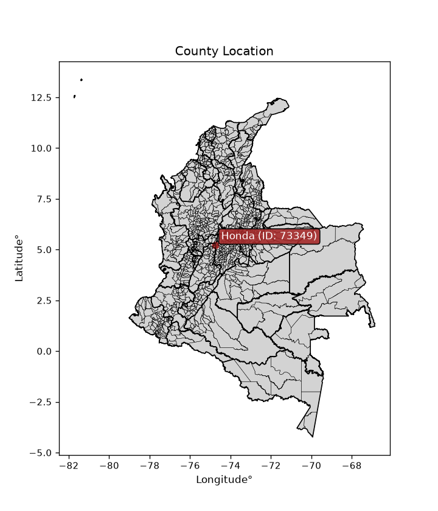
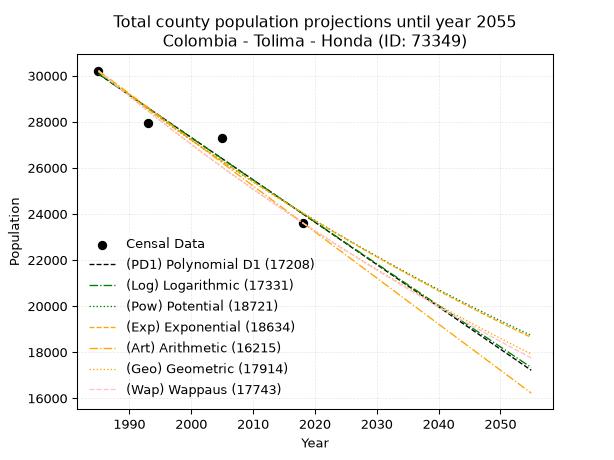
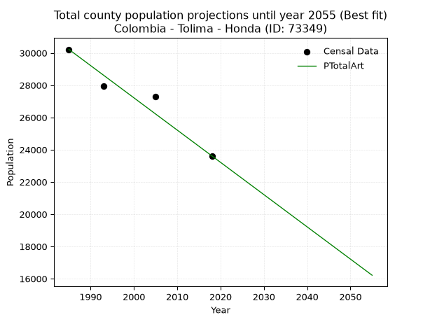
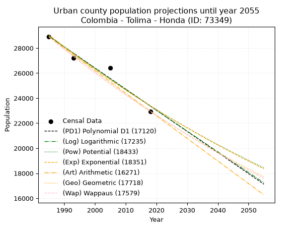
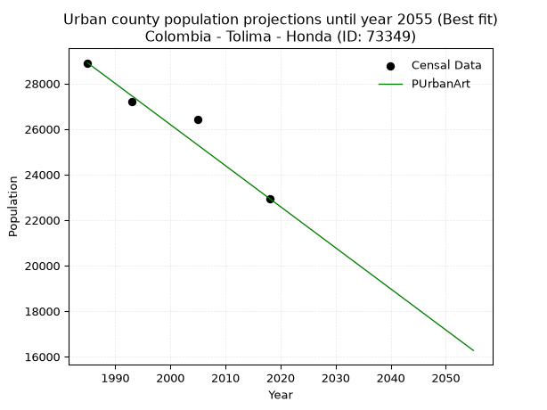
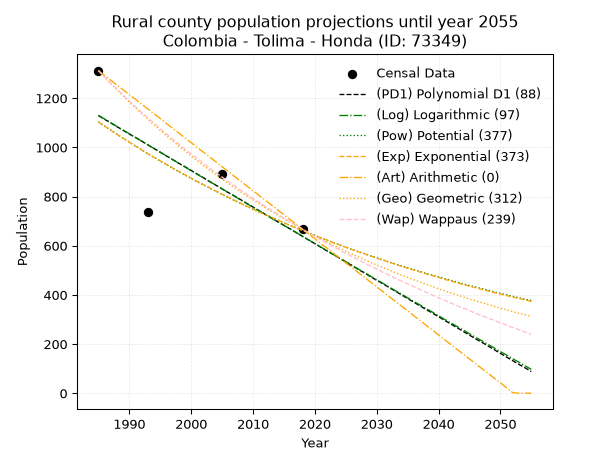
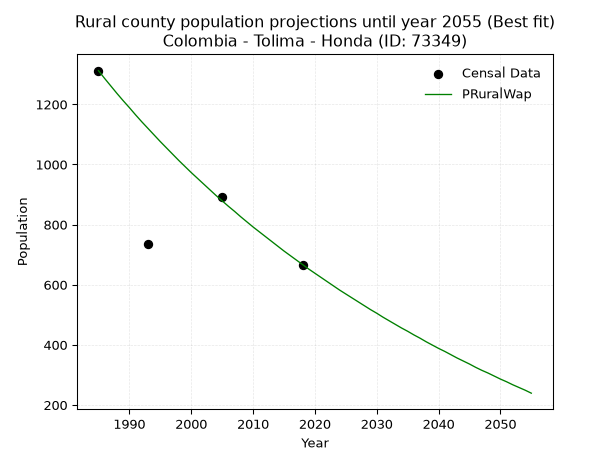

<div align="center">


</div>

# _“Population and Public Services Demand Projections (PPSD) until Year 2050 for Colombia - Tolima - Honda (ID: 73349)”_
Keywords: `population` `public-service` `projection` `lineal` `polynomial` `logarithmic` `potential` `exponential` `arithmetic` `geometric` `wappaus` `dane` `colombia` `south-america`

PPSD are analytical estimates used by governments and planners to anticipate future changes in population size, age distribution, and the resulting community needs for utilities, healthcare, education, and infrastructure as sizing future water treatment facilities, electrical grids, and road networks based on spatial growth.

<div align="center">

</img>

</div>


> **General running parameters**: • app_version: _v20260806_. • Python version: _3.14.7_. • Pandas version: _3.0.5_. • NumPy version: _2.5.1_. • Creates, save and include plots into reports (create_plot): _False_. • Projection until year: _2050_. • Process polynomial degree 2 and up: _False_. • Process Wappaus: _True_. • Process Wappaus: _True_. • Set negative values to zero: _True_. • Set infinite values to zero: _True_. • Drop dataset notes: _True_. 
<div align="center">

Dynamic map: [:earth_americas:Google](http://maps.google.com/maps?q=5.211816065,-74.7569903) [:earth_americas:OSM](https://www.openstreetmap.org/#map=18/5.211816065/-74.7569903&layers=P) [:earth_americas:Bing](https://www.bing.com/maps?cp=5.211816065~-74.7569903&lvl=18) [:earth_americas:Apple](https://maps.apple.com/frame?center=5.211816065%2C-74.7569903&span=0.003%2C0.006)

</div>


<div align="center">

```geojson
{
  "type": "Feature",
  "geometry": {
    "type": "Point", 
    "coordinates": [-74.7569903, 5.211816065]
  }, 
  "properties": {
    "Name": "Colombia - Tolima - Honda (ID: 73349)"
  }
}
```

</div>


## 0. Census Data (4 records)

Census data are official statistics collected by a government about the people and housing in a country. They usually include counts of total population, age, sex, race, income, education, and jobs.

📅Global census file: [Population.xlsx](../data/Population.xlsx)

| Source   |   Year |   CountryID | CountryName   |   StateID | StateName   |   CountyID | CountyName   |   PTotal |   PUrban |   PRural |
|:---------|-------:|------------:|:--------------|----------:|:------------|-----------:|:-------------|---------:|---------:|---------:|
| DANE     |   1985 |          57 | Colombia      |        73 | Tolima      |      73349 | Honda        |    30217 |    28905 |     1312 |
| DANE     |   1993 |          57 | Colombia      |        73 | Tolima      |      73349 | Honda        |    27938 |    27202 |      736 |
| DANE     |   2005 |          57 | Colombia      |        73 | Tolima      |      73349 | Honda        |    27310 |    26417 |      893 |
| DANE     |   2018 |          57 | Colombia      |        73 | Tolima      |      73349 | Honda        |    23616 |    22949 |      667 |

> 🔥Some records could had specific notes about the registered values or the corresponding urban or rural distribution.

📅[SUI-RUPS](https://www.datos.gov.co/Hacienda-y-Cr-dito-P-blico/Registro-nico-de-Prestadores-de-Servicios-P-blicos/4qkq-csdn/about_data) - Local public utility companies: [RUPS.csv](../data/RUPS.xlsx)

 | SERVICIO       | ESTADO    | NOMBRE                        | NIT         | DEPARTAMENTO_DOMICILIO   | MUNICIPIO_DOMICILIO   | DIRECCION                   |   TELEFONO | EMAIL                          | TIPO_PRESTADOR                             | CLASIFICACION                 |
|:---------------|:----------|:------------------------------|:------------|:-------------------------|:----------------------|:----------------------------|-----------:|:-------------------------------|:-------------------------------------------|:------------------------------|
| ACUEDUCTO      | OPERATIVA | AGUAS DE LA MOJANA S.A. E.S.P | 823003769-4 | SUCRE                    | SAN MARCOS            | CARRERA 24 # 14 - 25 APTO 1 |    2954404 | aguasdelamojanaesp@hotmail.com | SOCIEDADES (EMPRESA DE SERVICIOS PUBLICOS) | MAYOR O IGUAL A 5001 USUARIOS |
| ALCANTARILLADO | OPERATIVA | AGUAS DE LA MOJANA S.A. E.S.P | 823003769-4 | SUCRE                    | SAN MARCOS            | CARRERA 24 # 14 - 25 APTO 1 |    2954404 | aguasdelamojanaesp@hotmail.com | SOCIEDADES (EMPRESA DE SERVICIOS PUBLICOS) | MENOR O IGUAL A 2500 USUARIOS |
| ACUEDUCTO      | OPERATIVA | HONDA TRIPLE A SAS ESP        | 900981399-6 | TOLIMA                   | HONDA                 | CALLE 10 N° 26-91           |    2513986 | gerencia@hondatriplea.com      | SOCIEDADES (EMPRESA DE SERVICIOS PUBLICOS) | MAYOR O IGUAL A 5001 USUARIOS |
| ALCANTARILLADO | OPERATIVA | HONDA TRIPLE A SAS ESP        | 900981399-6 | TOLIMA                   | HONDA                 | CALLE 10 N° 26-91           |    2513986 | gerencia@hondatriplea.com      | SOCIEDADES (EMPRESA DE SERVICIOS PUBLICOS) | MAYOR O IGUAL A 5001 USUARIOS |

## 1. Total

### 1.1. Coefficients and Parameters

* (PD1) Polynomial Deg 1: -183.78683259734825, 394889.8619028458 (lineal)
* (Log) Logarithmic: -367788.25912023603, 2822831.7548430543
* (Pow) Potential: -13.774609442776107, 49.90502407239075
* (Exp) Exponential: -0.00688393784526218, 25944991243.09264
* (Art) Arithmetic: Year diff. 2018 - 1985 = 33, Population diff. 23616 - 30217 = -6601, Annual growth = -200.03030303030303
* (Geo) Geometric: Year diff. 2018 - 1985 = 33, Population diff. 23616 - 30217 = -6601, Annual growth % = -0.007441273529616432
* (Wap) Wappaus: i = -0.7431512382007431, Condition values only valid for < 200)

<sub>
Wappaus condition values: ['-0.00', '-0.74', '-1.49', '-2.23', '-2.97', '-3.72', '-4.46', '-5.20', '-5.95', '-6.69', '-7.43', '-8.17', '-8.92', '-9.66', '-10.40', '-11.15', '-11.89', '-12.63', '-13.38', '-14.12', '-14.86', '-15.61', '-16.35', '-17.09', '-17.84', '-18.58', '-19.32', '-20.07', '-20.81', '-21.55', '-22.29', '-23.04', '-23.78', '-24.52', '-25.27', '-26.01', '-26.75', '-27.50', '-28.24', '-28.98', '-29.73', '-30.47', '-31.21', '-31.96', '-32.70', '-33.44', '-34.18', '-34.93', '-35.67', '-36.41', '-37.16', '-37.90', '-38.64', '-39.39', '-40.13', '-40.87', '-41.62', '-42.36', '-43.10', '-43.85', '-44.59', '-45.33', '-46.08', '-46.82', '-47.56', '-48.30']
</sub>


### 1.2. Projected Dataset

|   Year |   CountyID |   PTotalPD1 |   PTotalLog |   PTotalPow |   PTotalExp |   PTotalArt |   PTotalGeo |   PTotalWap |
|-------:|-----------:|------------:|------------:|------------:|------------:|------------:|------------:|------------:|
|   1985 |      73349 |       30073 |       30078 |       30176 |       30171 |       30217 |       30217 |       30217 |
|   1986 |      73349 |       29889 |       29893 |       29967 |       29964 |       30017 |       29992 |       29993 |
|   1987 |      73349 |       29705 |       29707 |       29760 |       29758 |       29817 |       29769 |       29771 |
|   1988 |      73349 |       29522 |       29522 |       29555 |       29554 |       29617 |       29547 |       29551 |
|   1989 |      73349 |       29338 |       29337 |       29351 |       29351 |       29417 |       29328 |       29332 |
|   1990 |      73349 |       29154 |       29153 |       29148 |       29150 |       29217 |       29109 |       29115 |
|   1991 |      73349 |       28970 |       28968 |       28947 |       28950 |       29017 |       28893 |       28899 |
|   1992 |      73349 |       28786 |       28783 |       28748 |       28751 |       28817 |       28678 |       28685 |
|   1993 |      73349 |       28603 |       28599 |       28550 |       28554 |       28617 |       28464 |       28472 |
|   1994 |      73349 |       28419 |       28414 |       28353 |       28358 |       28417 |       28253 |       28261 |
|   1995 |      73349 |       28235 |       28230 |       28158 |       28164 |       28217 |       28042 |       28052 |
|   1996 |      73349 |       28051 |       28045 |       27964 |       27970 |       28017 |       27834 |       27844 |
|   1997 |      73349 |       27868 |       27861 |       27772 |       27779 |       27817 |       27627 |       27637 |
|   1998 |      73349 |       27684 |       27677 |       27581 |       27588 |       27617 |       27421 |       27432 |
|   1999 |      73349 |       27500 |       27493 |       27392 |       27399 |       27417 |       27217 |       27229 |
|   2000 |      73349 |       27316 |       27309 |       27204 |       27211 |       27217 |       27014 |       27026 |
|   2001 |      73349 |       27132 |       27125 |       27017 |       27024 |       27017 |       26813 |       26826 |
|   2002 |      73349 |       26949 |       26941 |       26832 |       26839 |       26816 |       26614 |       26626 |
|   2003 |      73349 |       26765 |       26758 |       26648 |       26655 |       26616 |       26416 |       26428 |
|   2004 |      73349 |       26581 |       26574 |       26465 |       26472 |       26416 |       26219 |       26232 |
|   2005 |      73349 |       26397 |       26391 |       26284 |       26290 |       26216 |       26024 |       26037 |
|   2006 |      73349 |       26213 |       26207 |       26104 |       26110 |       26016 |       25830 |       25843 |
|   2007 |      73349 |       26030 |       26024 |       25925 |       25931 |       25816 |       25638 |       25650 |
|   2008 |      73349 |       25846 |       25841 |       25748 |       25753 |       25616 |       25447 |       25459 |
|   2009 |      73349 |       25662 |       25658 |       25572 |       25576 |       25416 |       25258 |       25269 |
|   2010 |      73349 |       25478 |       25475 |       25397 |       25401 |       25216 |       25070 |       25080 |
|   2011 |      73349 |       25295 |       25292 |       25224 |       25226 |       25016 |       24884 |       24893 |
|   2012 |      73349 |       25111 |       25109 |       25052 |       25053 |       24816 |       24698 |       24707 |
|   2013 |      73349 |       24927 |       24926 |       24881 |       24881 |       24616 |       24515 |       24522 |
|   2014 |      73349 |       24743 |       24744 |       24711 |       24711 |       24416 |       24332 |       24338 |
|   2015 |      73349 |       24559 |       24561 |       24543 |       24541 |       24216 |       24151 |       24156 |
|   2016 |      73349 |       24376 |       24378 |       24376 |       24373 |       24016 |       23971 |       23975 |
|   2017 |      73349 |       24192 |       24196 |       24210 |       24206 |       23816 |       23793 |       23795 |
|   2018 |      73349 |       24008 |       24014 |       24045 |       24040 |       23616 |       23616 |       23616 |
|   2019 |      73349 |       23824 |       23832 |       23882 |       23875 |       23416 |       23440 |       23438 |
|   2020 |      73349 |       23640 |       23649 |       23719 |       23711 |       23216 |       23266 |       23262 |
|   2021 |      73349 |       23457 |       23467 |       23558 |       23548 |       23016 |       23093 |       23087 |
|   2022 |      73349 |       23273 |       23285 |       23398 |       23387 |       22816 |       22921 |       22913 |
|   2023 |      73349 |       23089 |       23104 |       23239 |       23226 |       22616 |       22750 |       22740 |
|   2024 |      73349 |       22905 |       22922 |       23082 |       23067 |       22416 |       22581 |       22568 |
|   2025 |      73349 |       22722 |       22740 |       22925 |       22909 |       22216 |       22413 |       22397 |
|   2026 |      73349 |       22538 |       22559 |       22770 |       22751 |       22016 |       22246 |       22227 |
|   2027 |      73349 |       22354 |       22377 |       22615 |       22595 |       21816 |       22081 |       22059 |
|   2028 |      73349 |       22170 |       22196 |       22462 |       22440 |       21616 |       21916 |       21891 |
|   2029 |      73349 |       21986 |       22014 |       22310 |       22286 |       21416 |       21753 |       21725 |
|   2030 |      73349 |       21803 |       21833 |       22159 |       22134 |       21216 |       21591 |       21560 |
|   2031 |      73349 |       21619 |       21652 |       22010 |       21982 |       21016 |       21431 |       21395 |
|   2032 |      73349 |       21435 |       21471 |       21861 |       21831 |       20816 |       21271 |       21232 |
|   2033 |      73349 |       21251 |       21290 |       21713 |       21681 |       20616 |       21113 |       21070 |
|   2034 |      73349 |       21067 |       21109 |       21567 |       21532 |       20416 |       20956 |       20908 |
|   2035 |      73349 |       20884 |       20928 |       21421 |       21385 |       20215 |       20800 |       20748 |
|   2036 |      73349 |       20700 |       20748 |       21277 |       21238 |       20015 |       20645 |       20589 |
|   2037 |      73349 |       20516 |       20567 |       21133 |       21092 |       19815 |       20492 |       20431 |
|   2038 |      73349 |       20332 |       20387 |       20991 |       20948 |       19615 |       20339 |       20274 |
|   2039 |      73349 |       20149 |       20206 |       20849 |       20804 |       19415 |       20188 |       20117 |
|   2040 |      73349 |       19965 |       20026 |       20709 |       20661 |       19215 |       20037 |       19962 |
|   2041 |      73349 |       19781 |       19846 |       20570 |       20519 |       19015 |       19888 |       19808 |
|   2042 |      73349 |       19597 |       19665 |       20431 |       20379 |       18815 |       19740 |       19654 |
|   2043 |      73349 |       19413 |       19485 |       20294 |       20239 |       18615 |       19593 |       19502 |
|   2044 |      73349 |       19230 |       19305 |       20158 |       20100 |       18415 |       19448 |       19350 |
|   2045 |      73349 |       19046 |       19126 |       20022 |       19962 |       18215 |       19303 |       19200 |
|   2046 |      73349 |       18862 |       18946 |       19888 |       19825 |       18015 |       19159 |       19050 |
|   2047 |      73349 |       18678 |       18766 |       19755 |       19689 |       17815 |       19017 |       18901 |
|   2048 |      73349 |       18494 |       18586 |       19622 |       19554 |       17615 |       18875 |       18753 |
|   2049 |      73349 |       18311 |       18407 |       19491 |       19420 |       17415 |       18735 |       18606 |
|   2050 |      73349 |       18127 |       18227 |       19360 |       19287 |       17215 |       18595 |       18460 |
<div align="center">

</img>

</div>


### 1.3. Best fit with absolute and relative error (%)

Relative error puts that difference into context by dividing the absolute error by the true value, creating a unitless ratio or percentage that shows the scale of the mistake.

Absolute and relative error

|   Year | Source   |   CountryID | CountryName   |   StateID | StateName   |   CountyID_x | CountyName   |   PTotal |   PUrban |   PRural |   CountyID_y |   PTotalPD1 |   PTotalLog |   PTotalPow |   PTotalExp |   PTotalArt |   PTotalGeo |   PTotalWap |   PTotalPD1AbsError |   PTotalLogAbsError |   PTotalPowAbsError |   PTotalExpAbsError |   PTotalArtAbsError |   PTotalGeoAbsError |   PTotalWapAbsError |   PTotalPD1RelError |   PTotalLogRelError |   PTotalPowRelError |   PTotalExpRelError |   PTotalArtRelError |   PTotalGeoRelError |   PTotalWapRelError |
|-------:|:---------|------------:|:--------------|----------:|:------------|-------------:|:-------------|---------:|---------:|---------:|-------------:|------------:|------------:|------------:|------------:|------------:|------------:|------------:|--------------------:|--------------------:|--------------------:|--------------------:|--------------------:|--------------------:|--------------------:|--------------------:|--------------------:|--------------------:|--------------------:|--------------------:|--------------------:|--------------------:|
|   1985 | DANE     |          57 | Colombia      |        73 | Tolima      |        73349 | Honda        |    30217 |    28905 |     1312 |        73349 |       30073 |       30078 |       30176 |       30171 |       30217 |       30217 |       30217 |                 144 |                 139 |                  41 |                  46 |                   0 |                   0 |                   0 |            0.476553 |            0.460006 |            0.135685 |            0.152232 |             0       |             0       |             0       |
|   1993 | DANE     |          57 | Colombia      |        73 | Tolima      |        73349 | Honda        |    27938 |    27202 |      736 |        73349 |       28603 |       28599 |       28550 |       28554 |       28617 |       28464 |       28472 |                 665 |                 661 |                 612 |                 616 |                 679 |                 526 |                 534 |            2.38027  |            2.36595  |            2.19056  |            2.20488  |             2.43038 |             1.88274 |             1.91138 |
|   2005 | DANE     |          57 | Colombia      |        73 | Tolima      |        73349 | Honda        |    27310 |    26417 |      893 |        73349 |       26397 |       26391 |       26284 |       26290 |       26216 |       26024 |       26037 |                 913 |                 919 |                1026 |                1020 |                1094 |                1286 |                1273 |            3.3431   |            3.36507  |            3.75687  |            3.7349   |             4.00586 |             4.7089  |             4.6613  |
|   2018 | DANE     |          57 | Colombia      |        73 | Tolima      |        73349 | Honda        |    23616 |    22949 |      667 |        73349 |       24008 |       24014 |       24045 |       24040 |       23616 |       23616 |       23616 |                 392 |                 398 |                 429 |                 424 |                   0 |                   0 |                   0 |            1.65989  |            1.6853   |            1.81657  |            1.79539  |             0       |             0       |             0       |

Relative error mean

| Method    |   RelError | Best   |
|:----------|-----------:|:-------|
| PTotalPD1 |    1.96495 |        |
| PTotalLog |    1.96908 |        |
| PTotalPow |    1.97492 |        |
| PTotalExp |    1.97185 |        |
| PTotalArt |    1.60906 | True   |
| PTotalGeo |    1.64791 |        |
| PTotalWap |    1.64317 |        |

💙Best method: _**PTotalArt**_
<div align="center">

</img>

</div>


### 1.4. Fresh water supply demand in liters per capita per day (lpcd)

The fresh water supply demand typically ranges from 100 to 300 liters per capita per day (lpcd) for standard domestic and municipal planning, though absolute survival minimums set by the World Health Organization are as low as 7.5 to 20 liters per day, and total consumption in high-income nations can exceed 400 liters.

> `CZ`: Level in meters above the sea level (masl)<br> `WS`: Fresh water supply demand in liters per capita per day (lpcd or l/h/d)<br> `WSAll`: Zonal fresh water supply demand in liters per second (l/s)<br> `A`: Zonal area in square meters<br> `DP`: Population density (people/hectare or p/ha)

Reference values (RAS Colombia)

|    CZ |   WS |
|------:|-----:|
|  1000 |  120 |
|  2000 |  130 |
| 99999 |  140 |

County shapefile geometry properties and water supply values

|   CountyID |      ATotal |   CZTotal |   WSTotal |
|-----------:|------------:|----------:|----------:|
|      73349 | 3.04712e+08 |    366.24 |       120 |

Projected values for best method: PTotalArt

|   CountyID |   Year |   PTotalArt |   DPTotal |   WSTotal |   WSTotalAll |
|-----------:|-------:|------------:|----------:|----------:|-------------:|
|      73349 |   1985 |       30217 |      0.99 |       120 |      41.9681 |
|      73349 |   1986 |       30017 |      0.99 |       120 |      41.6903 |
|      73349 |   1987 |       29817 |      0.98 |       120 |      41.4125 |
|      73349 |   1988 |       29617 |      0.97 |       120 |      41.1347 |
|      73349 |   1989 |       29417 |      0.97 |       120 |      40.8569 |
|      73349 |   1990 |       29217 |      0.96 |       120 |      40.5792 |
|      73349 |   1991 |       29017 |      0.95 |       120 |      40.3014 |
|      73349 |   1992 |       28817 |      0.95 |       120 |      40.0236 |
|      73349 |   1993 |       28617 |      0.94 |       120 |      39.7458 |
|      73349 |   1994 |       28417 |      0.93 |       120 |      39.4681 |
|      73349 |   1995 |       28217 |      0.93 |       120 |      39.1903 |
|      73349 |   1996 |       28017 |      0.92 |       120 |      38.9125 |
|      73349 |   1997 |       27817 |      0.91 |       120 |      38.6347 |
|      73349 |   1998 |       27617 |      0.91 |       120 |      38.3569 |
|      73349 |   1999 |       27417 |      0.9  |       120 |      38.0792 |
|      73349 |   2000 |       27217 |      0.89 |       120 |      37.8014 |
|      73349 |   2001 |       27017 |      0.89 |       120 |      37.5236 |
|      73349 |   2002 |       26816 |      0.88 |       120 |      37.2444 |
|      73349 |   2003 |       26616 |      0.87 |       120 |      36.9667 |
|      73349 |   2004 |       26416 |      0.87 |       120 |      36.6889 |
|      73349 |   2005 |       26216 |      0.86 |       120 |      36.4111 |
|      73349 |   2006 |       26016 |      0.85 |       120 |      36.1333 |
|      73349 |   2007 |       25816 |      0.85 |       120 |      35.8556 |
|      73349 |   2008 |       25616 |      0.84 |       120 |      35.5778 |
|      73349 |   2009 |       25416 |      0.83 |       120 |      35.3    |
|      73349 |   2010 |       25216 |      0.83 |       120 |      35.0222 |
|      73349 |   2011 |       25016 |      0.82 |       120 |      34.7444 |
|      73349 |   2012 |       24816 |      0.81 |       120 |      34.4667 |
|      73349 |   2013 |       24616 |      0.81 |       120 |      34.1889 |
|      73349 |   2014 |       24416 |      0.8  |       120 |      33.9111 |
|      73349 |   2015 |       24216 |      0.79 |       120 |      33.6333 |
|      73349 |   2016 |       24016 |      0.79 |       120 |      33.3556 |
|      73349 |   2017 |       23816 |      0.78 |       120 |      33.0778 |
|      73349 |   2018 |       23616 |      0.78 |       120 |      32.8    |
|      73349 |   2019 |       23416 |      0.77 |       120 |      32.5222 |
|      73349 |   2020 |       23216 |      0.76 |       120 |      32.2444 |
|      73349 |   2021 |       23016 |      0.76 |       120 |      31.9667 |
|      73349 |   2022 |       22816 |      0.75 |       120 |      31.6889 |
|      73349 |   2023 |       22616 |      0.74 |       120 |      31.4111 |
|      73349 |   2024 |       22416 |      0.74 |       120 |      31.1333 |
|      73349 |   2025 |       22216 |      0.73 |       120 |      30.8556 |
|      73349 |   2026 |       22016 |      0.72 |       120 |      30.5778 |
|      73349 |   2027 |       21816 |      0.72 |       120 |      30.3    |
|      73349 |   2028 |       21616 |      0.71 |       120 |      30.0222 |
|      73349 |   2029 |       21416 |      0.7  |       120 |      29.7444 |
|      73349 |   2030 |       21216 |      0.7  |       120 |      29.4667 |
|      73349 |   2031 |       21016 |      0.69 |       120 |      29.1889 |
|      73349 |   2032 |       20816 |      0.68 |       120 |      28.9111 |
|      73349 |   2033 |       20616 |      0.68 |       120 |      28.6333 |
|      73349 |   2034 |       20416 |      0.67 |       120 |      28.3556 |
|      73349 |   2035 |       20215 |      0.66 |       120 |      28.0764 |
|      73349 |   2036 |       20015 |      0.66 |       120 |      27.7986 |
|      73349 |   2037 |       19815 |      0.65 |       120 |      27.5208 |
|      73349 |   2038 |       19615 |      0.64 |       120 |      27.2431 |
|      73349 |   2039 |       19415 |      0.64 |       120 |      26.9653 |
|      73349 |   2040 |       19215 |      0.63 |       120 |      26.6875 |
|      73349 |   2041 |       19015 |      0.62 |       120 |      26.4097 |
|      73349 |   2042 |       18815 |      0.62 |       120 |      26.1319 |
|      73349 |   2043 |       18615 |      0.61 |       120 |      25.8542 |
|      73349 |   2044 |       18415 |      0.6  |       120 |      25.5764 |
|      73349 |   2045 |       18215 |      0.6  |       120 |      25.2986 |
|      73349 |   2046 |       18015 |      0.59 |       120 |      25.0208 |
|      73349 |   2047 |       17815 |      0.58 |       120 |      24.7431 |
|      73349 |   2048 |       17615 |      0.58 |       120 |      24.4653 |
|      73349 |   2049 |       17415 |      0.57 |       120 |      24.1875 |
|      73349 |   2050 |       17215 |      0.56 |       120 |      23.9097 |

## 2. Urban

### 2.1. Coefficients and Parameters

* (PD1) Polynomial Deg 1: -168.91248494580267, 364235.44801284187 (lineal)
* (Log) Logarithmic: -337984.2083240157, 2595388.9259063103
* (Pow) Potential: -13.11764521010158, 47.7218969115926
* (Exp) Exponential: -0.006556277670190002, 13030993699.85735
* (Art) Arithmetic: Year diff. 2018 - 1985 = 33, Population diff. 22949 - 28905 = -5956, Annual growth = -180.4848484848485
* (Geo) Geometric: Year diff. 2018 - 1985 = 33, Population diff. 22949 - 28905 = -5956, Annual growth % = -0.006967740066805006
* (Wap) Wappaus: i = -0.6961270046085104, Condition values only valid for < 200)

<sub>
Wappaus condition values: ['-0.00', '-0.70', '-1.39', '-2.09', '-2.78', '-3.48', '-4.18', '-4.87', '-5.57', '-6.27', '-6.96', '-7.66', '-8.35', '-9.05', '-9.75', '-10.44', '-11.14', '-11.83', '-12.53', '-13.23', '-13.92', '-14.62', '-15.31', '-16.01', '-16.71', '-17.40', '-18.10', '-18.80', '-19.49', '-20.19', '-20.88', '-21.58', '-22.28', '-22.97', '-23.67', '-24.36', '-25.06', '-25.76', '-26.45', '-27.15', '-27.85', '-28.54', '-29.24', '-29.93', '-30.63', '-31.33', '-32.02', '-32.72', '-33.41', '-34.11', '-34.81', '-35.50', '-36.20', '-36.89', '-37.59', '-38.29', '-38.98', '-39.68', '-40.38', '-41.07', '-41.77', '-42.46', '-43.16', '-43.86', '-44.55', '-45.25']
</sub>


### 2.2. Projected Dataset

|   Year |   CountyID |   PUrbanPD1 |   PUrbanLog |   PUrbanPow |   PUrbanExp |   PUrbanArt |   PUrbanGeo |   PUrbanWap |
|-------:|-----------:|------------:|------------:|------------:|------------:|------------:|------------:|------------:|
|   1985 |      73349 |       28944 |       28948 |       29043 |       29039 |       28905 |       28905 |       28905 |
|   1986 |      73349 |       28775 |       28778 |       28852 |       28849 |       28725 |       28704 |       28704 |
|   1987 |      73349 |       28606 |       28608 |       28662 |       28660 |       28544 |       28504 |       28505 |
|   1988 |      73349 |       28437 |       28438 |       28474 |       28473 |       28364 |       28305 |       28308 |
|   1989 |      73349 |       28269 |       28268 |       28286 |       28287 |       28183 |       28108 |       28111 |
|   1990 |      73349 |       28100 |       28098 |       28100 |       28102 |       28003 |       27912 |       27916 |
|   1991 |      73349 |       27931 |       27928 |       27916 |       27919 |       27822 |       27717 |       27722 |
|   1992 |      73349 |       27762 |       27759 |       27733 |       27736 |       27642 |       27524 |       27530 |
|   1993 |      73349 |       27593 |       27589 |       27551 |       27555 |       27461 |       27333 |       27339 |
|   1994 |      73349 |       27424 |       27419 |       27370 |       27375 |       27281 |       27142 |       27149 |
|   1995 |      73349 |       27255 |       27250 |       27190 |       27196 |       27100 |       26953 |       26961 |
|   1996 |      73349 |       27086 |       27081 |       27012 |       27018 |       26920 |       26765 |       26773 |
|   1997 |      73349 |       26917 |       26911 |       26835 |       26842 |       26739 |       26579 |       26587 |
|   1998 |      73349 |       26748 |       26742 |       26660 |       26666 |       26559 |       26393 |       26402 |
|   1999 |      73349 |       26579 |       26573 |       26485 |       26492 |       26378 |       26210 |       26219 |
|   2000 |      73349 |       26410 |       26404 |       26312 |       26319 |       26198 |       26027 |       26037 |
|   2001 |      73349 |       26242 |       26235 |       26140 |       26147 |       26017 |       25846 |       25855 |
|   2002 |      73349 |       26073 |       26066 |       25969 |       25976 |       25837 |       25666 |       25675 |
|   2003 |      73349 |       25904 |       25897 |       25800 |       25806 |       25656 |       25487 |       25497 |
|   2004 |      73349 |       25735 |       25729 |       25632 |       25638 |       25476 |       25309 |       25319 |
|   2005 |      73349 |       25566 |       25560 |       25464 |       25470 |       25295 |       25133 |       25143 |
|   2006 |      73349 |       25397 |       25391 |       25298 |       25304 |       25115 |       24958 |       24967 |
|   2007 |      73349 |       25228 |       25223 |       25133 |       25138 |       24934 |       24784 |       24793 |
|   2008 |      73349 |       25059 |       25055 |       24970 |       24974 |       24754 |       24611 |       24620 |
|   2009 |      73349 |       24890 |       24886 |       24807 |       24811 |       24573 |       24440 |       24448 |
|   2010 |      73349 |       24721 |       24718 |       24646 |       24649 |       24393 |       24269 |       24277 |
|   2011 |      73349 |       24552 |       24550 |       24486 |       24488 |       24212 |       24100 |       24108 |
|   2012 |      73349 |       24384 |       24382 |       24326 |       24328 |       24032 |       23932 |       23939 |
|   2013 |      73349 |       24215 |       24214 |       24168 |       24169 |       23851 |       23766 |       23771 |
|   2014 |      73349 |       24046 |       24046 |       24011 |       24011 |       23671 |       23600 |       23605 |
|   2015 |      73349 |       23877 |       23879 |       23856 |       23854 |       23490 |       23435 |       23439 |
|   2016 |      73349 |       23708 |       23711 |       23701 |       23698 |       23310 |       23272 |       23275 |
|   2017 |      73349 |       23539 |       23543 |       23547 |       23543 |       23129 |       23110 |       23111 |
|   2018 |      73349 |       23370 |       23376 |       23394 |       23389 |       22949 |       22949 |       22949 |
|   2019 |      73349 |       23201 |       23208 |       23243 |       23236 |       22769 |       22789 |       22788 |
|   2020 |      73349 |       23032 |       23041 |       23092 |       23084 |       22588 |       22630 |       22627 |
|   2021 |      73349 |       22863 |       22874 |       22943 |       22934 |       22408 |       22473 |       22468 |
|   2022 |      73349 |       22694 |       22706 |       22795 |       22784 |       22227 |       22316 |       22309 |
|   2023 |      73349 |       22525 |       22539 |       22647 |       22635 |       22047 |       22161 |       22152 |
|   2024 |      73349 |       22357 |       22372 |       22501 |       22487 |       21866 |       22006 |       21996 |
|   2025 |      73349 |       22188 |       22205 |       22356 |       22340 |       21686 |       21853 |       21840 |
|   2026 |      73349 |       22019 |       22038 |       22211 |       22194 |       21505 |       21701 |       21685 |
|   2027 |      73349 |       21850 |       21872 |       22068 |       22049 |       21325 |       21549 |       21532 |
|   2028 |      73349 |       21681 |       21705 |       21926 |       21905 |       21144 |       21399 |       21379 |
|   2029 |      73349 |       21512 |       21538 |       21784 |       21762 |       20964 |       21250 |       21227 |
|   2030 |      73349 |       21343 |       21372 |       21644 |       21620 |       20783 |       21102 |       21076 |
|   2031 |      73349 |       21174 |       21205 |       21505 |       21478 |       20603 |       20955 |       20927 |
|   2032 |      73349 |       21005 |       21039 |       21366 |       21338 |       20422 |       20809 |       20777 |
|   2033 |      73349 |       20836 |       20873 |       21229 |       21198 |       20242 |       20664 |       20629 |
|   2034 |      73349 |       20667 |       20706 |       21092 |       21060 |       20061 |       20520 |       20482 |
|   2035 |      73349 |       20499 |       20540 |       20957 |       20922 |       19881 |       20377 |       20336 |
|   2036 |      73349 |       20330 |       20374 |       20822 |       20786 |       19700 |       20235 |       20190 |
|   2037 |      73349 |       20161 |       20208 |       20688 |       20650 |       19520 |       20094 |       20045 |
|   2038 |      73349 |       19992 |       20042 |       20556 |       20515 |       19339 |       19954 |       19901 |
|   2039 |      73349 |       19823 |       19877 |       20424 |       20381 |       19159 |       19815 |       19758 |
|   2040 |      73349 |       19654 |       19711 |       20293 |       20248 |       18978 |       19677 |       19616 |
|   2041 |      73349 |       19485 |       19545 |       20163 |       20115 |       18798 |       19540 |       19475 |
|   2042 |      73349 |       19316 |       19380 |       20034 |       19984 |       18617 |       19404 |       19334 |
|   2043 |      73349 |       19147 |       19214 |       19905 |       19853 |       18437 |       19268 |       19195 |
|   2044 |      73349 |       18978 |       19049 |       19778 |       19723 |       18256 |       19134 |       19056 |
|   2045 |      73349 |       18809 |       18884 |       19652 |       19595 |       18076 |       19001 |       18918 |
|   2046 |      73349 |       18641 |       18718 |       19526 |       19467 |       17895 |       18869 |       18780 |
|   2047 |      73349 |       18472 |       18553 |       19401 |       19339 |       17715 |       18737 |       18644 |
|   2048 |      73349 |       18303 |       18388 |       19277 |       19213 |       17534 |       18606 |       18508 |
|   2049 |      73349 |       18134 |       18223 |       19154 |       19087 |       17354 |       18477 |       18373 |
|   2050 |      73349 |       17965 |       18058 |       19032 |       18963 |       17173 |       18348 |       18239 |
<div align="center">

</img>

</div>


### 2.3. Best fit with absolute and relative error (%)

Relative error puts that difference into context by dividing the absolute error by the true value, creating a unitless ratio or percentage that shows the scale of the mistake.

Absolute and relative error

|   Year | Source   |   CountryID | CountryName   |   StateID | StateName   |   CountyID_x | CountyName   |   PTotal |   PUrban |   PRural |   CountyID_y |   PUrbanPD1 |   PUrbanLog |   PUrbanPow |   PUrbanExp |   PUrbanArt |   PUrbanGeo |   PUrbanWap |   PUrbanPD1AbsError |   PUrbanLogAbsError |   PUrbanPowAbsError |   PUrbanExpAbsError |   PUrbanArtAbsError |   PUrbanGeoAbsError |   PUrbanWapAbsError |   PUrbanPD1RelError |   PUrbanLogRelError |   PUrbanPowRelError |   PUrbanExpRelError |   PUrbanArtRelError |   PUrbanGeoRelError |   PUrbanWapRelError |
|-------:|:---------|------------:|:--------------|----------:|:------------|-------------:|:-------------|---------:|---------:|---------:|-------------:|------------:|------------:|------------:|------------:|------------:|------------:|------------:|--------------------:|--------------------:|--------------------:|--------------------:|--------------------:|--------------------:|--------------------:|--------------------:|--------------------:|--------------------:|--------------------:|--------------------:|--------------------:|--------------------:|
|   1985 | DANE     |          57 | Colombia      |        73 | Tolima      |        73349 | Honda        |    30217 |    28905 |     1312 |        73349 |       28944 |       28948 |       29043 |       29039 |       28905 |       28905 |       28905 |                  39 |                  43 |                 138 |                 134 |                   0 |                   0 |                   0 |            0.134925 |            0.148763 |            0.477426 |            0.463588 |            0        |            0        |            0        |
|   1993 | DANE     |          57 | Colombia      |        73 | Tolima      |        73349 | Honda        |    27938 |    27202 |      736 |        73349 |       27593 |       27589 |       27551 |       27555 |       27461 |       27333 |       27339 |                 391 |                 387 |                 349 |                 353 |                 259 |                 131 |                 137 |            1.43739  |            1.42269  |            1.28299  |            1.2977   |            0.952136 |            0.481582 |            0.503639 |
|   2005 | DANE     |          57 | Colombia      |        73 | Tolima      |        73349 | Honda        |    27310 |    26417 |      893 |        73349 |       25566 |       25560 |       25464 |       25470 |       25295 |       25133 |       25143 |                 851 |                 857 |                 953 |                 947 |                1122 |                1284 |                1274 |            3.22141  |            3.24412  |            3.60753  |            3.58481  |            4.24727  |            4.86051  |            4.82265  |
|   2018 | DANE     |          57 | Colombia      |        73 | Tolima      |        73349 | Honda        |    23616 |    22949 |      667 |        73349 |       23370 |       23376 |       23394 |       23389 |       22949 |       22949 |       22949 |                 421 |                 427 |                 445 |                 440 |                   0 |                   0 |                   0 |            1.8345   |            1.86065  |            1.93908  |            1.91729  |            0        |            0        |            0        |

Relative error mean

| Method    |   RelError | Best   |
|:----------|-----------:|:-------|
| PUrbanPD1 |    1.65706 |        |
| PUrbanLog |    1.66906 |        |
| PUrbanPow |    1.82676 |        |
| PUrbanExp |    1.81585 |        |
| PUrbanArt |    1.29985 | True   |
| PUrbanGeo |    1.33552 |        |
| PUrbanWap |    1.33157 |        |

💙Best method: _**PUrbanArt**_
<div align="center">

</img>

</div>


### 2.4. Fresh water supply demand in liters per capita per day (lpcd)

The fresh water supply demand typically ranges from 100 to 300 liters per capita per day (lpcd) for standard domestic and municipal planning, though absolute survival minimums set by the World Health Organization are as low as 7.5 to 20 liters per day, and total consumption in high-income nations can exceed 400 liters.

> `CZ`: Level in meters above the sea level (masl)<br> `WS`: Fresh water supply demand in liters per capita per day (lpcd or l/h/d)<br> `WSAll`: Zonal fresh water supply demand in liters per second (l/s)<br> `A`: Zonal area in square meters<br> `DP`: Population density (people/hectare or p/ha)

Reference values (RAS Colombia)

|    CZ |   WS |
|------:|-----:|
|  1000 |  120 |
|  2000 |  130 |
| 99999 |  140 |

County shapefile geometry properties and water supply values

|   CountyID |      AUrban |   CZUrban |   WSUrban |
|-----------:|------------:|----------:|----------:|
|      73349 | 1.01455e+07 |   250.748 |       120 |

Projected values for best method: PUrbanArt

|   CountyID |   Year |   PUrbanArt |   DPUrban |   WSUrban |   WSUrbanAll |
|-----------:|-------:|------------:|----------:|----------:|-------------:|
|      73349 |   1985 |       28905 |     28.49 |       120 |      40.1458 |
|      73349 |   1986 |       28725 |     28.31 |       120 |      39.8958 |
|      73349 |   1987 |       28544 |     28.13 |       120 |      39.6444 |
|      73349 |   1988 |       28364 |     27.96 |       120 |      39.3944 |
|      73349 |   1989 |       28183 |     27.78 |       120 |      39.1431 |
|      73349 |   1990 |       28003 |     27.6  |       120 |      38.8931 |
|      73349 |   1991 |       27822 |     27.42 |       120 |      38.6417 |
|      73349 |   1992 |       27642 |     27.25 |       120 |      38.3917 |
|      73349 |   1993 |       27461 |     27.07 |       120 |      38.1403 |
|      73349 |   1994 |       27281 |     26.89 |       120 |      37.8903 |
|      73349 |   1995 |       27100 |     26.71 |       120 |      37.6389 |
|      73349 |   1996 |       26920 |     26.53 |       120 |      37.3889 |
|      73349 |   1997 |       26739 |     26.36 |       120 |      37.1375 |
|      73349 |   1998 |       26559 |     26.18 |       120 |      36.8875 |
|      73349 |   1999 |       26378 |     26    |       120 |      36.6361 |
|      73349 |   2000 |       26198 |     25.82 |       120 |      36.3861 |
|      73349 |   2001 |       26017 |     25.64 |       120 |      36.1347 |
|      73349 |   2002 |       25837 |     25.47 |       120 |      35.8847 |
|      73349 |   2003 |       25656 |     25.29 |       120 |      35.6333 |
|      73349 |   2004 |       25476 |     25.11 |       120 |      35.3833 |
|      73349 |   2005 |       25295 |     24.93 |       120 |      35.1319 |
|      73349 |   2006 |       25115 |     24.75 |       120 |      34.8819 |
|      73349 |   2007 |       24934 |     24.58 |       120 |      34.6306 |
|      73349 |   2008 |       24754 |     24.4  |       120 |      34.3806 |
|      73349 |   2009 |       24573 |     24.22 |       120 |      34.1292 |
|      73349 |   2010 |       24393 |     24.04 |       120 |      33.8792 |
|      73349 |   2011 |       24212 |     23.86 |       120 |      33.6278 |
|      73349 |   2012 |       24032 |     23.69 |       120 |      33.3778 |
|      73349 |   2013 |       23851 |     23.51 |       120 |      33.1264 |
|      73349 |   2014 |       23671 |     23.33 |       120 |      32.8764 |
|      73349 |   2015 |       23490 |     23.15 |       120 |      32.625  |
|      73349 |   2016 |       23310 |     22.98 |       120 |      32.375  |
|      73349 |   2017 |       23129 |     22.8  |       120 |      32.1236 |
|      73349 |   2018 |       22949 |     22.62 |       120 |      31.8736 |
|      73349 |   2019 |       22769 |     22.44 |       120 |      31.6236 |
|      73349 |   2020 |       22588 |     22.26 |       120 |      31.3722 |
|      73349 |   2021 |       22408 |     22.09 |       120 |      31.1222 |
|      73349 |   2022 |       22227 |     21.91 |       120 |      30.8708 |
|      73349 |   2023 |       22047 |     21.73 |       120 |      30.6208 |
|      73349 |   2024 |       21866 |     21.55 |       120 |      30.3694 |
|      73349 |   2025 |       21686 |     21.37 |       120 |      30.1194 |
|      73349 |   2026 |       21505 |     21.2  |       120 |      29.8681 |
|      73349 |   2027 |       21325 |     21.02 |       120 |      29.6181 |
|      73349 |   2028 |       21144 |     20.84 |       120 |      29.3667 |
|      73349 |   2029 |       20964 |     20.66 |       120 |      29.1167 |
|      73349 |   2030 |       20783 |     20.48 |       120 |      28.8653 |
|      73349 |   2031 |       20603 |     20.31 |       120 |      28.6153 |
|      73349 |   2032 |       20422 |     20.13 |       120 |      28.3639 |
|      73349 |   2033 |       20242 |     19.95 |       120 |      28.1139 |
|      73349 |   2034 |       20061 |     19.77 |       120 |      27.8625 |
|      73349 |   2035 |       19881 |     19.6  |       120 |      27.6125 |
|      73349 |   2036 |       19700 |     19.42 |       120 |      27.3611 |
|      73349 |   2037 |       19520 |     19.24 |       120 |      27.1111 |
|      73349 |   2038 |       19339 |     19.06 |       120 |      26.8597 |
|      73349 |   2039 |       19159 |     18.88 |       120 |      26.6097 |
|      73349 |   2040 |       18978 |     18.71 |       120 |      26.3583 |
|      73349 |   2041 |       18798 |     18.53 |       120 |      26.1083 |
|      73349 |   2042 |       18617 |     18.35 |       120 |      25.8569 |
|      73349 |   2043 |       18437 |     18.17 |       120 |      25.6069 |
|      73349 |   2044 |       18256 |     17.99 |       120 |      25.3556 |
|      73349 |   2045 |       18076 |     17.82 |       120 |      25.1056 |
|      73349 |   2046 |       17895 |     17.64 |       120 |      24.8542 |
|      73349 |   2047 |       17715 |     17.46 |       120 |      24.6042 |
|      73349 |   2048 |       17534 |     17.28 |       120 |      24.3528 |
|      73349 |   2049 |       17354 |     17.11 |       120 |      24.1028 |
|      73349 |   2050 |       17173 |     16.93 |       120 |      23.8514 |

## 3. Rural

### 3.1. Coefficients and Parameters

* (PD1) Polynomial Deg 1: -14.874347651545433, 30654.413890003754 (lineal)
* (Log) Logarithmic: -29804.050796220294, 227442.8289367445
* (Pow) Potential: -31.02379001718127, 105.3518308385179
* (Exp) Exponential: -0.015487041865202807, 2.474584941920957e+16
* (Art) Arithmetic: Year diff. 2018 - 1985 = 33, Population diff. 667 - 1312 = -645, Annual growth = -19.545454545454547
* (Geo) Geometric: Year diff. 2018 - 1985 = 33, Population diff. 667 - 1312 = -645, Annual growth % = -0.020291835643381217
* (Wap) Wappaus: i = -1.9752859570949515, Condition values only valid for < 200)

<sub>
Wappaus condition values: ['-0.00', '-1.98', '-3.95', '-5.93', '-7.90', '-9.88', '-11.85', '-13.83', '-15.80', '-17.78', '-19.75', '-21.73', '-23.70', '-25.68', '-27.65', '-29.63', '-31.60', '-33.58', '-35.56', '-37.53', '-39.51', '-41.48', '-43.46', '-45.43', '-47.41', '-49.38', '-51.36', '-53.33', '-55.31', '-57.28', '-59.26', '-61.23', '-63.21', '-65.18', '-67.16', '-69.14', '-71.11', '-73.09', '-75.06', '-77.04', '-79.01', '-80.99', '-82.96', '-84.94', '-86.91', '-88.89', '-90.86', '-92.84', '-94.81', '-96.79', '-98.76', '-100.74', '-102.71', '-104.69', '-106.67', '-108.64', '-110.62', '-112.59', '-114.57', '-116.54', '-118.52', '-120.49', '-122.47', '-124.44', '-126.42', '-128.39']
</sub>


### 3.2. Projected Dataset

|   Year |   CountyID |   PRuralPD1 |   PRuralLog |   PRuralPow |   PRuralExp |   PRuralArt |   PRuralGeo |   PRuralWap |
|-------:|-----------:|------------:|------------:|------------:|------------:|------------:|------------:|------------:|
|   1985 |      73349 |        1129 |        1130 |        1104 |        1103 |        1312 |        1312 |        1312 |
|   1986 |      73349 |        1114 |        1115 |        1086 |        1086 |        1292 |        1285 |        1286 |
|   1987 |      73349 |        1099 |        1100 |        1070 |        1069 |        1273 |        1259 |        1261 |
|   1988 |      73349 |        1084 |        1085 |        1053 |        1053 |        1253 |        1234 |        1236 |
|   1989 |      73349 |        1069 |        1070 |        1037 |        1037 |        1234 |        1209 |        1212 |
|   1990 |      73349 |        1054 |        1055 |        1021 |        1021 |        1214 |        1184 |        1189 |
|   1991 |      73349 |        1040 |        1040 |        1005 |        1005 |        1195 |        1160 |        1165 |
|   1992 |      73349 |        1025 |        1025 |         989 |         990 |        1175 |        1137 |        1142 |
|   1993 |      73349 |        1010 |        1010 |         974 |         974 |        1156 |        1114 |        1120 |
|   1994 |      73349 |         995 |         995 |         959 |         959 |        1136 |        1091 |        1098 |
|   1995 |      73349 |         980 |         980 |         944 |         945 |        1117 |        1069 |        1076 |
|   1996 |      73349 |         965 |         965 |         930 |         930 |        1097 |        1047 |        1055 |
|   1997 |      73349 |         950 |         950 |         915 |         916 |        1077 |        1026 |        1034 |
|   1998 |      73349 |         935 |         935 |         901 |         902 |        1058 |        1005 |        1013 |
|   1999 |      73349 |         921 |         920 |         887 |         888 |        1038 |         985 |         993 |
|   2000 |      73349 |         906 |         905 |         874 |         874 |        1019 |         965 |         973 |
|   2001 |      73349 |         891 |         890 |         860 |         861 |         999 |         945 |         954 |
|   2002 |      73349 |         876 |         875 |         847 |         848 |         980 |         926 |         935 |
|   2003 |      73349 |         861 |         860 |         834 |         835 |         960 |         907 |         916 |
|   2004 |      73349 |         846 |         846 |         821 |         822 |         941 |         889 |         897 |
|   2005 |      73349 |         831 |         831 |         809 |         809 |         921 |         871 |         879 |
|   2006 |      73349 |         816 |         816 |         796 |         797 |         902 |         853 |         861 |
|   2007 |      73349 |         802 |         801 |         784 |         784 |         882 |         836 |         844 |
|   2008 |      73349 |         787 |         786 |         772 |         772 |         862 |         819 |         826 |
|   2009 |      73349 |         772 |         771 |         760 |         760 |         843 |         802 |         809 |
|   2010 |      73349 |         757 |         756 |         748 |         749 |         823 |         786 |         792 |
|   2011 |      73349 |         742 |         742 |         737 |         737 |         804 |         770 |         776 |
|   2012 |      73349 |         727 |         727 |         726 |         726 |         784 |         754 |         760 |
|   2013 |      73349 |         712 |         712 |         715 |         715 |         765 |         739 |         744 |
|   2014 |      73349 |         697 |         697 |         704 |         704 |         745 |         724 |         728 |
|   2015 |      73349 |         683 |         682 |         693 |         693 |         726 |         709 |         712 |
|   2016 |      73349 |         668 |         668 |         682 |         682 |         706 |         695 |         697 |
|   2017 |      73349 |         653 |         653 |         672 |         672 |         687 |         681 |         682 |
|   2018 |      73349 |         638 |         638 |         662 |         662 |         667 |         667 |         667 |
|   2019 |      73349 |         623 |         623 |         652 |         651 |         647 |         653 |         652 |
|   2020 |      73349 |         608 |         609 |         642 |         641 |         628 |         640 |         638 |
|   2021 |      73349 |         593 |         594 |         632 |         632 |         608 |         627 |         624 |
|   2022 |      73349 |         578 |         579 |         622 |         622 |         589 |         614 |         610 |
|   2023 |      73349 |         564 |         564 |         613 |         612 |         569 |         602 |         596 |
|   2024 |      73349 |         549 |         550 |         603 |         603 |         550 |         590 |         582 |
|   2025 |      73349 |         534 |         535 |         594 |         594 |         530 |         578 |         569 |
|   2026 |      73349 |         519 |         520 |         585 |         584 |         511 |         566 |         556 |
|   2027 |      73349 |         504 |         505 |         576 |         575 |         491 |         555 |         543 |
|   2028 |      73349 |         489 |         491 |         568 |         567 |         472 |         543 |         530 |
|   2029 |      73349 |         474 |         476 |         559 |         558 |         452 |         532 |         517 |
|   2030 |      73349 |         459 |         461 |         551 |         549 |         432 |         522 |         505 |
|   2031 |      73349 |         445 |         447 |         542 |         541 |         413 |         511 |         492 |
|   2032 |      73349 |         430 |         432 |         534 |         533 |         393 |         501 |         480 |
|   2033 |      73349 |         415 |         417 |         526 |         524 |         374 |         490 |         468 |
|   2034 |      73349 |         400 |         403 |         518 |         516 |         354 |         480 |         456 |
|   2035 |      73349 |         385 |         388 |         510 |         508 |         335 |         471 |         445 |
|   2036 |      73349 |         370 |         373 |         502 |         501 |         315 |         461 |         433 |
|   2037 |      73349 |         355 |         359 |         495 |         493 |         296 |         452 |         422 |
|   2038 |      73349 |         340 |         344 |         487 |         485 |         276 |         443 |         410 |
|   2039 |      73349 |         326 |         330 |         480 |         478 |         257 |         434 |         399 |
|   2040 |      73349 |         311 |         315 |         473 |         471 |         237 |         425 |         388 |
|   2041 |      73349 |         296 |         300 |         466 |         463 |         217 |         416 |         378 |
|   2042 |      73349 |         281 |         286 |         459 |         456 |         198 |         408 |         367 |
|   2043 |      73349 |         266 |         271 |         452 |         449 |         178 |         400 |         356 |
|   2044 |      73349 |         251 |         257 |         445 |         442 |         159 |         391 |         346 |
|   2045 |      73349 |         236 |         242 |         438 |         435 |         139 |         383 |         336 |
|   2046 |      73349 |         221 |         227 |         432 |         429 |         120 |         376 |         325 |
|   2047 |      73349 |         207 |         213 |         425 |         422 |         100 |         368 |         315 |
|   2048 |      73349 |         192 |         198 |         419 |         416 |          81 |         361 |         306 |
|   2049 |      73349 |         177 |         184 |         412 |         409 |          61 |         353 |         296 |
|   2050 |      73349 |         162 |         169 |         406 |         403 |          42 |         346 |         286 |
<div align="center">

</img>

</div>


### 3.3. Best fit with absolute and relative error (%)

Relative error puts that difference into context by dividing the absolute error by the true value, creating a unitless ratio or percentage that shows the scale of the mistake.

Absolute and relative error

|   Year | Source   |   CountryID | CountryName   |   StateID | StateName   |   CountyID_x | CountyName   |   PTotal |   PUrban |   PRural |   CountyID_y |   PRuralPD1 |   PRuralLog |   PRuralPow |   PRuralExp |   PRuralArt |   PRuralGeo |   PRuralWap |   PRuralPD1AbsError |   PRuralLogAbsError |   PRuralPowAbsError |   PRuralExpAbsError |   PRuralArtAbsError |   PRuralGeoAbsError |   PRuralWapAbsError |   PRuralPD1RelError |   PRuralLogRelError |   PRuralPowRelError |   PRuralExpRelError |   PRuralArtRelError |   PRuralGeoRelError |   PRuralWapRelError |
|-------:|:---------|------------:|:--------------|----------:|:------------|-------------:|:-------------|---------:|---------:|---------:|-------------:|------------:|------------:|------------:|------------:|------------:|------------:|------------:|--------------------:|--------------------:|--------------------:|--------------------:|--------------------:|--------------------:|--------------------:|--------------------:|--------------------:|--------------------:|--------------------:|--------------------:|--------------------:|--------------------:|
|   1985 | DANE     |          57 | Colombia      |        73 | Tolima      |        73349 | Honda        |    30217 |    28905 |     1312 |        73349 |        1129 |        1130 |        1104 |        1103 |        1312 |        1312 |        1312 |                 183 |                 182 |                 208 |                 209 |                   0 |                   0 |                   0 |            13.9482  |            13.872   |           15.8537   |           15.9299   |              0      |             0       |             0       |
|   1993 | DANE     |          57 | Colombia      |        73 | Tolima      |        73349 | Honda        |    27938 |    27202 |      736 |        73349 |        1010 |        1010 |         974 |         974 |        1156 |        1114 |        1120 |                 274 |                 274 |                 238 |                 238 |                 420 |                 378 |                 384 |            37.2283  |            37.2283  |           32.337    |           32.337    |             57.0652 |            51.3587  |            52.1739  |
|   2005 | DANE     |          57 | Colombia      |        73 | Tolima      |        73349 | Honda        |    27310 |    26417 |      893 |        73349 |         831 |         831 |         809 |         809 |         921 |         871 |         879 |                  62 |                  62 |                  84 |                  84 |                  28 |                  22 |                  14 |             6.94289 |             6.94289 |            9.40649  |            9.40649  |              3.1355 |             2.46361 |             1.56775 |
|   2018 | DANE     |          57 | Colombia      |        73 | Tolima      |        73349 | Honda        |    23616 |    22949 |      667 |        73349 |         638 |         638 |         662 |         662 |         667 |         667 |         667 |                  29 |                  29 |                   5 |                   5 |                   0 |                   0 |                   0 |             4.34783 |             4.34783 |            0.749625 |            0.749625 |              0      |             0       |             0       |

Relative error mean

| Method    |   RelError | Best   |
|:----------|-----------:|:-------|
| PRuralPD1 |    15.6168 |        |
| PRuralLog |    15.5977 |        |
| PRuralPow |    14.5867 |        |
| PRuralExp |    14.6057 |        |
| PRuralArt |    15.0502 |        |
| PRuralGeo |    13.4556 |        |
| PRuralWap |    13.4354 | True   |

💙Best method: _**PRuralWap**_
<div align="center">

</img>

</div>


### 3.4. Fresh water supply demand in liters per capita per day (lpcd)

The fresh water supply demand typically ranges from 100 to 300 liters per capita per day (lpcd) for standard domestic and municipal planning, though absolute survival minimums set by the World Health Organization are as low as 7.5 to 20 liters per day, and total consumption in high-income nations can exceed 400 liters.

> `CZ`: Level in meters above the sea level (masl)<br> `WS`: Fresh water supply demand in liters per capita per day (lpcd or l/h/d)<br> `WSAll`: Zonal fresh water supply demand in liters per second (l/s)<br> `A`: Zonal area in square meters<br> `DP`: Population density (people/hectare or p/ha)

Reference values (RAS Colombia)

|    CZ |   WS |
|------:|-----:|
|  1000 |  120 |
|  2000 |  130 |
| 99999 |  140 |

County shapefile geometry properties and water supply values

|   CountyID |      ARural |   CZRural |   WSRural |
|-----------:|------------:|----------:|----------:|
|      73349 | 2.94567e+08 |   370.189 |       120 |

Projected values for best method: PRuralWap

|   CountyID |   Year |   PRuralWap |   DPRural |   WSRural |   WSRuralAll |
|-----------:|-------:|------------:|----------:|----------:|-------------:|
|      73349 |   1985 |        1312 |      0.04 |       120 |     1.82222  |
|      73349 |   1986 |        1286 |      0.04 |       120 |     1.78611  |
|      73349 |   1987 |        1261 |      0.04 |       120 |     1.75139  |
|      73349 |   1988 |        1236 |      0.04 |       120 |     1.71667  |
|      73349 |   1989 |        1212 |      0.04 |       120 |     1.68333  |
|      73349 |   1990 |        1189 |      0.04 |       120 |     1.65139  |
|      73349 |   1991 |        1165 |      0.04 |       120 |     1.61806  |
|      73349 |   1992 |        1142 |      0.04 |       120 |     1.58611  |
|      73349 |   1993 |        1120 |      0.04 |       120 |     1.55556  |
|      73349 |   1994 |        1098 |      0.04 |       120 |     1.525    |
|      73349 |   1995 |        1076 |      0.04 |       120 |     1.49444  |
|      73349 |   1996 |        1055 |      0.04 |       120 |     1.46528  |
|      73349 |   1997 |        1034 |      0.04 |       120 |     1.43611  |
|      73349 |   1998 |        1013 |      0.03 |       120 |     1.40694  |
|      73349 |   1999 |         993 |      0.03 |       120 |     1.37917  |
|      73349 |   2000 |         973 |      0.03 |       120 |     1.35139  |
|      73349 |   2001 |         954 |      0.03 |       120 |     1.325    |
|      73349 |   2002 |         935 |      0.03 |       120 |     1.29861  |
|      73349 |   2003 |         916 |      0.03 |       120 |     1.27222  |
|      73349 |   2004 |         897 |      0.03 |       120 |     1.24583  |
|      73349 |   2005 |         879 |      0.03 |       120 |     1.22083  |
|      73349 |   2006 |         861 |      0.03 |       120 |     1.19583  |
|      73349 |   2007 |         844 |      0.03 |       120 |     1.17222  |
|      73349 |   2008 |         826 |      0.03 |       120 |     1.14722  |
|      73349 |   2009 |         809 |      0.03 |       120 |     1.12361  |
|      73349 |   2010 |         792 |      0.03 |       120 |     1.1      |
|      73349 |   2011 |         776 |      0.03 |       120 |     1.07778  |
|      73349 |   2012 |         760 |      0.03 |       120 |     1.05556  |
|      73349 |   2013 |         744 |      0.03 |       120 |     1.03333  |
|      73349 |   2014 |         728 |      0.02 |       120 |     1.01111  |
|      73349 |   2015 |         712 |      0.02 |       120 |     0.988889 |
|      73349 |   2016 |         697 |      0.02 |       120 |     0.968056 |
|      73349 |   2017 |         682 |      0.02 |       120 |     0.947222 |
|      73349 |   2018 |         667 |      0.02 |       120 |     0.926389 |
|      73349 |   2019 |         652 |      0.02 |       120 |     0.905556 |
|      73349 |   2020 |         638 |      0.02 |       120 |     0.886111 |
|      73349 |   2021 |         624 |      0.02 |       120 |     0.866667 |
|      73349 |   2022 |         610 |      0.02 |       120 |     0.847222 |
|      73349 |   2023 |         596 |      0.02 |       120 |     0.827778 |
|      73349 |   2024 |         582 |      0.02 |       120 |     0.808333 |
|      73349 |   2025 |         569 |      0.02 |       120 |     0.790278 |
|      73349 |   2026 |         556 |      0.02 |       120 |     0.772222 |
|      73349 |   2027 |         543 |      0.02 |       120 |     0.754167 |
|      73349 |   2028 |         530 |      0.02 |       120 |     0.736111 |
|      73349 |   2029 |         517 |      0.02 |       120 |     0.718056 |
|      73349 |   2030 |         505 |      0.02 |       120 |     0.701389 |
|      73349 |   2031 |         492 |      0.02 |       120 |     0.683333 |
|      73349 |   2032 |         480 |      0.02 |       120 |     0.666667 |
|      73349 |   2033 |         468 |      0.02 |       120 |     0.65     |
|      73349 |   2034 |         456 |      0.02 |       120 |     0.633333 |
|      73349 |   2035 |         445 |      0.02 |       120 |     0.618056 |
|      73349 |   2036 |         433 |      0.01 |       120 |     0.601389 |
|      73349 |   2037 |         422 |      0.01 |       120 |     0.586111 |
|      73349 |   2038 |         410 |      0.01 |       120 |     0.569444 |
|      73349 |   2039 |         399 |      0.01 |       120 |     0.554167 |
|      73349 |   2040 |         388 |      0.01 |       120 |     0.538889 |
|      73349 |   2041 |         378 |      0.01 |       120 |     0.525    |
|      73349 |   2042 |         367 |      0.01 |       120 |     0.509722 |
|      73349 |   2043 |         356 |      0.01 |       120 |     0.494444 |
|      73349 |   2044 |         346 |      0.01 |       120 |     0.480556 |
|      73349 |   2045 |         336 |      0.01 |       120 |     0.466667 |
|      73349 |   2046 |         325 |      0.01 |       120 |     0.451389 |
|      73349 |   2047 |         315 |      0.01 |       120 |     0.4375   |
|      73349 |   2048 |         306 |      0.01 |       120 |     0.425    |
|      73349 |   2049 |         296 |      0.01 |       120 |     0.411111 |
|      73349 |   2050 |         286 |      0.01 |       120 |     0.397222 |

#

<div align="center"><br><sub>Share this research</sub></div><br>

<sub>**APPS & TOOLS & CONTENT DISCLAIMER**: • NO WARRANTY - This content and software is provided by <a href="https://github.com/rcfdtools" target="_blank">github.com/rcfdtools</a> "as is", without any express or implied warranty, including warranties of merchantability, fitness for a particular purpose, or non-infringement. There is no guarantee that the software will be error-free or operate without interruption. • LIMITATION OF LIABILITY - Neither the authors nor copyright holders will be liable for claims or damages arising from the software or its use. You are responsible for determining if the software is appropriate for your use and assume all associated risks, including errors, legal compliance, and data loss. • NO PROFESSIONAL ADVICE - The software provides general information and does not offer professional advice. It should not replace consultation with professional advisors. [Clauses and global license for rcfdtools use.](https://github.com/rcfdtools/rcfdtools/blob/main/LICENSE.md)</sub>

| [:house: Home](Readme.md)  | [:beginner: Help / Collab](https://github.com/rcfdtools/R.HydroTools/discussions/31) |
|----------------------------|-------------------------------------------------------------------------------------------|