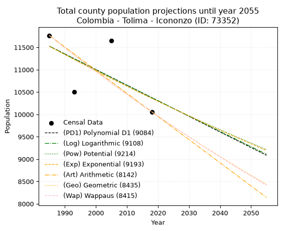
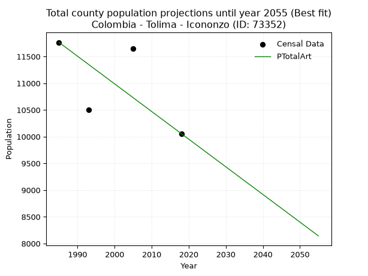
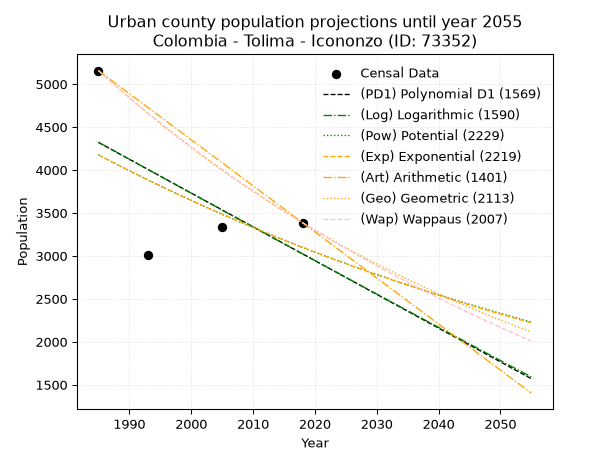
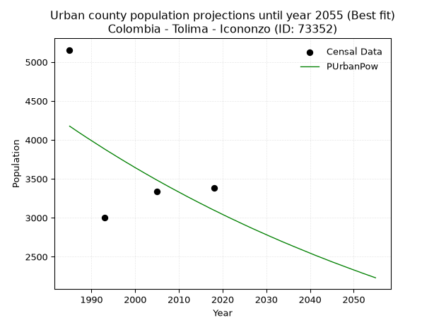
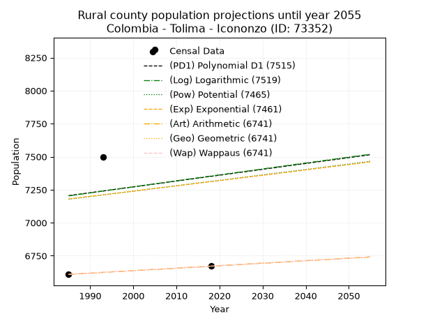
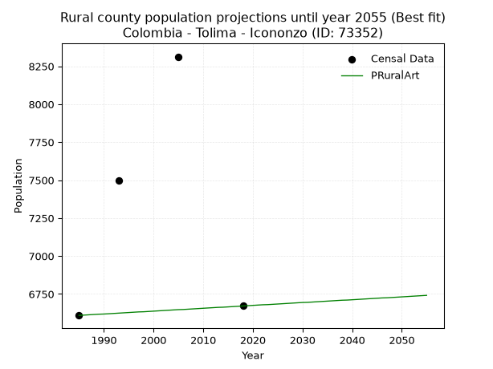

<div align="center">


</div>

# _“Population and Public Services Demand Projections (PPSD) until Year 2050 for Colombia - Tolima - Icononzo (ID: 73352)”_
Keywords: `population` `public-service` `projection` `lineal` `polynomial` `logarithmic` `potential` `exponential` `arithmetic` `geometric` `wappaus` `dane` `colombia` `south-america`

PPSD are analytical estimates used by governments and planners to anticipate future changes in population size, age distribution, and the resulting community needs for utilities, healthcare, education, and infrastructure as sizing future water treatment facilities, electrical grids, and road networks based on spatial growth.

> **General running parameters**: • app_version: _v20260806_. • Python version: _3.14.7_. • Pandas version: _3.0.5_. • NumPy version: _2.5.1_. • Creates, save and include plots into reports (create_plot): _False_. • Projection until year: _2050_. • Process polynomial degree 2 and up: _False_. • Process Wappaus: _True_. • Process Wappaus: _True_. • Set negative values to zero: _True_. • Set infinite values to zero: _True_. • Drop dataset notes: _True_. 
<div align="center">

Dynamic map: [:earth_americas:Google](http://maps.google.com/maps?q=4.176486795,-74.5319688) [:earth_americas:OSM](https://www.openstreetmap.org/#map=18/4.176486795/-74.5319688&layers=P) [:earth_americas:Bing](https://www.bing.com/maps?cp=4.176486795~-74.5319688&lvl=18) [:earth_americas:Apple](https://maps.apple.com/frame?center=4.176486795%2C-74.5319688&span=0.003%2C0.006)

</div>


<div align="center">

```geojson
{
  "type": "Feature",
  "geometry": {
    "type": "Point", 
    "coordinates": [-74.5319688, 4.176486795]
  }, 
  "properties": {
    "Name": "Colombia - Tolima - Icononzo (ID: 73352)"
  }
}
```

</div>


## 0. Census Data (4 records)

Census data are official statistics collected by a government about the people and housing in a country. They usually include counts of total population, age, sex, race, income, education, and jobs.

📅Global census file: [Population.xlsx](../data/Population.xlsx)

| Source   |   Year |   CountryID | CountryName   |   StateID | StateName   |   CountyID | CountyName   |   PTotal |   PUrban |   PRural |
|:---------|-------:|------------:|:--------------|----------:|:------------|-----------:|:-------------|---------:|---------:|---------:|
| DANE     |   1985 |          57 | Colombia      |        73 | Tolima      |      73352 | Icononzo     |    11765 |     5156 |     6609 |
| DANE     |   1993 |          57 | Colombia      |        73 | Tolima      |      73352 | Icononzo     |    10503 |     3006 |     7497 |
| DANE     |   2005 |          57 | Colombia      |        73 | Tolima      |      73352 | Icononzo     |    11649 |     3336 |     8313 |
| DANE     |   2018 |          57 | Colombia      |        73 | Tolima      |      73352 | Icononzo     |    10057 |     3386 |     6671 |

> 🔥Some records could had specific notes about the registered values or the corresponding urban or rural distribution.

## 1. Total

### 1.1. Coefficients and Parameters

* (PD1) Polynomial Deg 1: -34.87515054195017, 80752.51987153583 (lineal)
* (Log) Logarithmic: -69755.30401144357, 541204.1247749076
* (Pow) Potential: -6.451277061239169, 25.336320423805848
* (Exp) Exponential: -0.003225515182960884, 6952847.348863028
* (Art) Arithmetic: Year diff. 2018 - 1985 = 33, Population diff. 10057 - 11765 = -1708, Annual growth = -51.75757575757576
* (Geo) Geometric: Year diff. 2018 - 1985 = 33, Population diff. 10057 - 11765 = -1708, Annual growth % = -0.004742057522272525
* (Wap) Wappaus: i = -0.4743614311939855, Condition values only valid for < 200)

<sub>
Wappaus condition values: ['-0.00', '-0.47', '-0.95', '-1.42', '-1.90', '-2.37', '-2.85', '-3.32', '-3.79', '-4.27', '-4.74', '-5.22', '-5.69', '-6.17', '-6.64', '-7.12', '-7.59', '-8.06', '-8.54', '-9.01', '-9.49', '-9.96', '-10.44', '-10.91', '-11.38', '-11.86', '-12.33', '-12.81', '-13.28', '-13.76', '-14.23', '-14.71', '-15.18', '-15.65', '-16.13', '-16.60', '-17.08', '-17.55', '-18.03', '-18.50', '-18.97', '-19.45', '-19.92', '-20.40', '-20.87', '-21.35', '-21.82', '-22.29', '-22.77', '-23.24', '-23.72', '-24.19', '-24.67', '-25.14', '-25.62', '-26.09', '-26.56', '-27.04', '-27.51', '-27.99', '-28.46', '-28.94', '-29.41', '-29.88', '-30.36', '-30.83']
</sub>


### 1.2. Projected Dataset

|   Year |   CountyID |   PTotalPD1 |   PTotalLog |   PTotalPow |   PTotalExp |   PTotalArt |   PTotalGeo |   PTotalWap |
|-------:|-----------:|------------:|------------:|------------:|------------:|------------:|------------:|------------:|
|   1985 |      73352 |       11525 |       11526 |       11523 |       11522 |       11765 |       11765 |       11765 |
|   1986 |      73352 |       11490 |       11491 |       11485 |       11485 |       11713 |       11709 |       11709 |
|   1987 |      73352 |       11456 |       11456 |       11448 |       11448 |       11661 |       11654 |       11654 |
|   1988 |      73352 |       11421 |       11421 |       11411 |       11411 |       11610 |       11598 |       11599 |
|   1989 |      73352 |       11386 |       11386 |       11374 |       11374 |       11558 |       11543 |       11544 |
|   1990 |      73352 |       11351 |       11351 |       11337 |       11338 |       11506 |       11489 |       11489 |
|   1991 |      73352 |       11316 |       11315 |       11301 |       11301 |       11454 |       11434 |       11435 |
|   1992 |      73352 |       11281 |       11280 |       11264 |       11265 |       11403 |       11380 |       11381 |
|   1993 |      73352 |       11246 |       11245 |       11228 |       11228 |       11351 |       11326 |       11327 |
|   1994 |      73352 |       11211 |       11210 |       11191 |       11192 |       11299 |       11272 |       11273 |
|   1995 |      73352 |       11177 |       11175 |       11155 |       11156 |       11247 |       11219 |       11220 |
|   1996 |      73352 |       11142 |       11141 |       11119 |       11120 |       11196 |       11166 |       11167 |
|   1997 |      73352 |       11107 |       11106 |       11083 |       11085 |       11144 |       11113 |       11114 |
|   1998 |      73352 |       11072 |       11071 |       11048 |       11049 |       11092 |       11060 |       11061 |
|   1999 |      73352 |       11037 |       11036 |       11012 |       11013 |       11040 |       11008 |       11009 |
|   2000 |      73352 |       11002 |       11001 |       10976 |       10978 |       10989 |       10955 |       10957 |
|   2001 |      73352 |       10967 |       10966 |       10941 |       10942 |       10937 |       10903 |       10905 |
|   2002 |      73352 |       10932 |       10931 |       10906 |       10907 |       10885 |       10852 |       10853 |
|   2003 |      73352 |       10898 |       10896 |       10871 |       10872 |       10833 |       10800 |       10802 |
|   2004 |      73352 |       10863 |       10861 |       10836 |       10837 |       10782 |       10749 |       10750 |
|   2005 |      73352 |       10828 |       10827 |       10801 |       10802 |       10730 |       10698 |       10699 |
|   2006 |      73352 |       10793 |       10792 |       10766 |       10767 |       10678 |       10647 |       10649 |
|   2007 |      73352 |       10758 |       10757 |       10732 |       10733 |       10626 |       10597 |       10598 |
|   2008 |      73352 |       10723 |       10722 |       10697 |       10698 |       10575 |       10547 |       10548 |
|   2009 |      73352 |       10688 |       10688 |       10663 |       10664 |       10523 |       10497 |       10498 |
|   2010 |      73352 |       10653 |       10653 |       10629 |       10629 |       10471 |       10447 |       10448 |
|   2011 |      73352 |       10619 |       10618 |       10595 |       10595 |       10419 |       10397 |       10398 |
|   2012 |      73352 |       10584 |       10584 |       10561 |       10561 |       10368 |       10348 |       10349 |
|   2013 |      73352 |       10549 |       10549 |       10527 |       10527 |       10316 |       10299 |       10300 |
|   2014 |      73352 |       10514 |       10514 |       10493 |       10493 |       10264 |       10250 |       10251 |
|   2015 |      73352 |       10479 |       10480 |       10460 |       10459 |       10212 |       10201 |       10202 |
|   2016 |      73352 |       10444 |       10445 |       10426 |       10426 |       10161 |       10153 |       10153 |
|   2017 |      73352 |       10409 |       10410 |       10393 |       10392 |       10109 |       10105 |       10105 |
|   2018 |      73352 |       10374 |       10376 |       10360 |       10359 |       10057 |       10057 |       10057 |
|   2019 |      73352 |       10340 |       10341 |       10327 |       10325 |       10005 |       10009 |       10009 |
|   2020 |      73352 |       10305 |       10307 |       10294 |       10292 |        9953 |        9962 |        9961 |
|   2021 |      73352 |       10270 |       10272 |       10261 |       10259 |        9902 |        9915 |        9914 |
|   2022 |      73352 |       10235 |       10238 |       10228 |       10226 |        9850 |        9868 |        9867 |
|   2023 |      73352 |       10200 |       10203 |       10196 |       10193 |        9798 |        9821 |        9820 |
|   2024 |      73352 |       10165 |       10169 |       10163 |       10160 |        9746 |        9774 |        9773 |
|   2025 |      73352 |       10130 |       10134 |       10131 |       10127 |        9695 |        9728 |        9726 |
|   2026 |      73352 |       10095 |       10100 |       10099 |       10095 |        9643 |        9682 |        9680 |
|   2027 |      73352 |       10061 |       10065 |       10067 |       10062 |        9591 |        9636 |        9633 |
|   2028 |      73352 |       10026 |       10031 |       10035 |       10030 |        9539 |        9590 |        9587 |
|   2029 |      73352 |        9991 |        9997 |       10003 |        9998 |        9488 |        9545 |        9541 |
|   2030 |      73352 |        9956 |        9962 |        9971 |        9965 |        9436 |        9499 |        9496 |
|   2031 |      73352 |        9921 |        9928 |        9940 |        9933 |        9384 |        9454 |        9450 |
|   2032 |      73352 |        9886 |        9894 |        9908 |        9901 |        9332 |        9410 |        9405 |
|   2033 |      73352 |        9851 |        9859 |        9877 |        9869 |        9281 |        9365 |        9360 |
|   2034 |      73352 |        9816 |        9825 |        9845 |        9838 |        9229 |        9320 |        9315 |
|   2035 |      73352 |        9782 |        9791 |        9814 |        9806 |        9177 |        9276 |        9270 |
|   2036 |      73352 |        9747 |        9756 |        9783 |        9774 |        9125 |        9232 |        9226 |
|   2037 |      73352 |        9712 |        9722 |        9752 |        9743 |        9074 |        9189 |        9182 |
|   2038 |      73352 |        9677 |        9688 |        9721 |        9711 |        9022 |        9145 |        9137 |
|   2039 |      73352 |        9642 |        9654 |        9691 |        9680 |        8970 |        9102 |        9093 |
|   2040 |      73352 |        9607 |        9620 |        9660 |        9649 |        8918 |        9058 |        9050 |
|   2041 |      73352 |        9572 |        9585 |        9630 |        9618 |        8867 |        9015 |        9006 |
|   2042 |      73352 |        9537 |        9551 |        9599 |        9587 |        8815 |        8973 |        8963 |
|   2043 |      73352 |        9503 |        9517 |        9569 |        9556 |        8763 |        8930 |        8920 |
|   2044 |      73352 |        9468 |        9483 |        9539 |        9525 |        8711 |        8888 |        8876 |
|   2045 |      73352 |        9433 |        9449 |        9509 |        9495 |        8660 |        8846 |        8834 |
|   2046 |      73352 |        9398 |        9415 |        9479 |        9464 |        8608 |        8804 |        8791 |
|   2047 |      73352 |        9363 |        9381 |        9449 |        9434 |        8556 |        8762 |        8748 |
|   2048 |      73352 |        9328 |        9347 |        9419 |        9403 |        8504 |        8720 |        8706 |
|   2049 |      73352 |        9293 |        9312 |        9390 |        9373 |        8453 |        8679 |        8664 |
|   2050 |      73352 |        9258 |        9278 |        9360 |        9343 |        8401 |        8638 |        8622 |
<div align="center">

</img>

</div>


### 1.3. Best fit with absolute and relative error (%)

Relative error puts that difference into context by dividing the absolute error by the true value, creating a unitless ratio or percentage that shows the scale of the mistake.

Absolute and relative error

|   Year | Source   |   CountryID | CountryName   |   StateID | StateName   |   CountyID_x | CountyName   |   PTotal |   PUrban |   PRural |   CountyID_y |   PTotalPD1 |   PTotalLog |   PTotalPow |   PTotalExp |   PTotalArt |   PTotalGeo |   PTotalWap |   PTotalPD1AbsError |   PTotalLogAbsError |   PTotalPowAbsError |   PTotalExpAbsError |   PTotalArtAbsError |   PTotalGeoAbsError |   PTotalWapAbsError |   PTotalPD1RelError |   PTotalLogRelError |   PTotalPowRelError |   PTotalExpRelError |   PTotalArtRelError |   PTotalGeoRelError |   PTotalWapRelError |
|-------:|:---------|------------:|:--------------|----------:|:------------|-------------:|:-------------|---------:|---------:|---------:|-------------:|------------:|------------:|------------:|------------:|------------:|------------:|------------:|--------------------:|--------------------:|--------------------:|--------------------:|--------------------:|--------------------:|--------------------:|--------------------:|--------------------:|--------------------:|--------------------:|--------------------:|--------------------:|--------------------:|
|   1985 | DANE     |          57 | Colombia      |        73 | Tolima      |        73352 | Icononzo     |    11765 |     5156 |     6609 |        73352 |       11525 |       11526 |       11523 |       11522 |       11765 |       11765 |       11765 |                 240 |                 239 |                 242 |                 243 |                   0 |                   0 |                   0 |             2.03995 |             2.03145 |             2.05695 |             2.06545 |             0       |             0       |             0       |
|   1993 | DANE     |          57 | Colombia      |        73 | Tolima      |        73352 | Icononzo     |    10503 |     3006 |     7497 |        73352 |       11246 |       11245 |       11228 |       11228 |       11351 |       11326 |       11327 |                 743 |                 742 |                 725 |                 725 |                 848 |                 823 |                 824 |             7.07417 |             7.06465 |             6.90279 |             6.90279 |             8.07388 |             7.83586 |             7.84538 |
|   2005 | DANE     |          57 | Colombia      |        73 | Tolima      |        73352 | Icononzo     |    11649 |     3336 |     8313 |        73352 |       10828 |       10827 |       10801 |       10802 |       10730 |       10698 |       10699 |                 821 |                 822 |                 848 |                 847 |                 919 |                 951 |                 950 |             7.04782 |             7.0564  |             7.27959 |             7.27101 |             7.88909 |             8.16379 |             8.15521 |
|   2018 | DANE     |          57 | Colombia      |        73 | Tolima      |        73352 | Icononzo     |    10057 |     3386 |     6671 |        73352 |       10374 |       10376 |       10360 |       10359 |       10057 |       10057 |       10057 |                 317 |                 319 |                 303 |                 302 |                   0 |                   0 |                   0 |             3.15203 |             3.17192 |             3.01283 |             3.00288 |             0       |             0       |             0       |

Relative error mean

| Method    |   RelError | Best   |
|:----------|-----------:|:-------|
| PTotalPD1 |    4.82849 |        |
| PTotalLog |    4.8311  |        |
| PTotalPow |    4.81304 |        |
| PTotalExp |    4.81053 |        |
| PTotalArt |    3.99074 | True   |
| PTotalGeo |    3.99991 |        |
| PTotalWap |    4.00015 |        |

💙Best method: _**PTotalArt**_
<div align="center">

</img>

</div>


### 1.4. Fresh water supply demand in liters per capita per day (lpcd)

The fresh water supply demand typically ranges from 100 to 300 liters per capita per day (lpcd) for standard domestic and municipal planning, though absolute survival minimums set by the World Health Organization are as low as 7.5 to 20 liters per day, and total consumption in high-income nations can exceed 400 liters.

> `CZ`: Level in meters above the sea level (masl).<br> `WS`: Fresh water supply demand in liters per capita per day (lpcd or l/h/d).<br> `WSAll`: Zonal fresh water supply demand in liters per second (l/s).<br> `A`: Zonal area in square meters.

Reference values (RAS Colombia)

|    CZ |   WS |
|------:|-----:|
|  1000 |  120 |
|  2000 |  130 |
| 99999 |  140 |

County shapefile geometry properties and water supply values

|   CountyID |      ATotal |   CZTotal |   WSTotal |
|-----------:|------------:|----------:|----------:|
|      73352 | 2.14974e+08 |   1418.29 |       130 |

Projected values for best method: PTotalArt

|   CountyID |   Year |   PTotalArt |   WSTotal |   WSTotalAll |
|-----------:|-------:|------------:|----------:|-------------:|
|      73352 |   1985 |       11765 |       130 |      17.702  |
|      73352 |   1986 |       11713 |       130 |      17.6237 |
|      73352 |   1987 |       11661 |       130 |      17.5455 |
|      73352 |   1988 |       11610 |       130 |      17.4688 |
|      73352 |   1989 |       11558 |       130 |      17.3905 |
|      73352 |   1990 |       11506 |       130 |      17.3123 |
|      73352 |   1991 |       11454 |       130 |      17.234  |
|      73352 |   1992 |       11403 |       130 |      17.1573 |
|      73352 |   1993 |       11351 |       130 |      17.0791 |
|      73352 |   1994 |       11299 |       130 |      17.0008 |
|      73352 |   1995 |       11247 |       130 |      16.9226 |
|      73352 |   1996 |       11196 |       130 |      16.8458 |
|      73352 |   1997 |       11144 |       130 |      16.7676 |
|      73352 |   1998 |       11092 |       130 |      16.6894 |
|      73352 |   1999 |       11040 |       130 |      16.6111 |
|      73352 |   2000 |       10989 |       130 |      16.5344 |
|      73352 |   2001 |       10937 |       130 |      16.4561 |
|      73352 |   2002 |       10885 |       130 |      16.3779 |
|      73352 |   2003 |       10833 |       130 |      16.2997 |
|      73352 |   2004 |       10782 |       130 |      16.2229 |
|      73352 |   2005 |       10730 |       130 |      16.1447 |
|      73352 |   2006 |       10678 |       130 |      16.0664 |
|      73352 |   2007 |       10626 |       130 |      15.9882 |
|      73352 |   2008 |       10575 |       130 |      15.9115 |
|      73352 |   2009 |       10523 |       130 |      15.8332 |
|      73352 |   2010 |       10471 |       130 |      15.755  |
|      73352 |   2011 |       10419 |       130 |      15.6767 |
|      73352 |   2012 |       10368 |       130 |      15.6    |
|      73352 |   2013 |       10316 |       130 |      15.5218 |
|      73352 |   2014 |       10264 |       130 |      15.4435 |
|      73352 |   2015 |       10212 |       130 |      15.3653 |
|      73352 |   2016 |       10161 |       130 |      15.2885 |
|      73352 |   2017 |       10109 |       130 |      15.2103 |
|      73352 |   2018 |       10057 |       130 |      15.1321 |
|      73352 |   2019 |       10005 |       130 |      15.0538 |
|      73352 |   2020 |        9953 |       130 |      14.9756 |
|      73352 |   2021 |        9902 |       130 |      14.8988 |
|      73352 |   2022 |        9850 |       130 |      14.8206 |
|      73352 |   2023 |        9798 |       130 |      14.7424 |
|      73352 |   2024 |        9746 |       130 |      14.6641 |
|      73352 |   2025 |        9695 |       130 |      14.5874 |
|      73352 |   2026 |        9643 |       130 |      14.5091 |
|      73352 |   2027 |        9591 |       130 |      14.4309 |
|      73352 |   2028 |        9539 |       130 |      14.3527 |
|      73352 |   2029 |        9488 |       130 |      14.2759 |
|      73352 |   2030 |        9436 |       130 |      14.1977 |
|      73352 |   2031 |        9384 |       130 |      14.1194 |
|      73352 |   2032 |        9332 |       130 |      14.0412 |
|      73352 |   2033 |        9281 |       130 |      13.9645 |
|      73352 |   2034 |        9229 |       130 |      13.8862 |
|      73352 |   2035 |        9177 |       130 |      13.808  |
|      73352 |   2036 |        9125 |       130 |      13.7297 |
|      73352 |   2037 |        9074 |       130 |      13.653  |
|      73352 |   2038 |        9022 |       130 |      13.5748 |
|      73352 |   2039 |        8970 |       130 |      13.4965 |
|      73352 |   2040 |        8918 |       130 |      13.4183 |
|      73352 |   2041 |        8867 |       130 |      13.3416 |
|      73352 |   2042 |        8815 |       130 |      13.2633 |
|      73352 |   2043 |        8763 |       130 |      13.1851 |
|      73352 |   2044 |        8711 |       130 |      13.1068 |
|      73352 |   2045 |        8660 |       130 |      13.0301 |
|      73352 |   2046 |        8608 |       130 |      12.9519 |
|      73352 |   2047 |        8556 |       130 |      12.8736 |
|      73352 |   2048 |        8504 |       130 |      12.7954 |
|      73352 |   2049 |        8453 |       130 |      12.7186 |
|      73352 |   2050 |        8401 |       130 |      12.6404 |

## 2. Urban

### 2.1. Coefficients and Parameters

* (PD1) Polynomial Deg 1: -39.30148534725012, 82333.79606583704 (lineal)
* (Log) Logarithmic: -78869.07751585811, 603205.4902151597
* (Pow) Potential: -18.115362885446018, 63.360990422774314
* (Exp) Exponential: -0.009025189999749429, 251746851530.87964
* (Art) Arithmetic: Year diff. 2018 - 1985 = 33, Population diff. 3386 - 5156 = -1770, Annual growth = -53.63636363636363
* (Geo) Geometric: Year diff. 2018 - 1985 = 33, Population diff. 3386 - 5156 = -1770, Annual growth % = -0.012661936377938776
* (Wap) Wappaus: i = -1.2558268236095442, Condition values only valid for < 200)

<sub>
Wappaus condition values: ['-0.00', '-1.26', '-2.51', '-3.77', '-5.02', '-6.28', '-7.53', '-8.79', '-10.05', '-11.30', '-12.56', '-13.81', '-15.07', '-16.33', '-17.58', '-18.84', '-20.09', '-21.35', '-22.60', '-23.86', '-25.12', '-26.37', '-27.63', '-28.88', '-30.14', '-31.40', '-32.65', '-33.91', '-35.16', '-36.42', '-37.67', '-38.93', '-40.19', '-41.44', '-42.70', '-43.95', '-45.21', '-46.47', '-47.72', '-48.98', '-50.23', '-51.49', '-52.74', '-54.00', '-55.26', '-56.51', '-57.77', '-59.02', '-60.28', '-61.54', '-62.79', '-64.05', '-65.30', '-66.56', '-67.81', '-69.07', '-70.33', '-71.58', '-72.84', '-74.09', '-75.35', '-76.61', '-77.86', '-79.12', '-80.37', '-81.63']
</sub>


### 2.2. Projected Dataset

|   Year |   CountyID |   PUrbanPD1 |   PUrbanLog |   PUrbanPow |   PUrbanExp |   PUrbanArt |   PUrbanGeo |   PUrbanWap |
|-------:|-----------:|------------:|------------:|------------:|------------:|------------:|------------:|------------:|
|   1985 |      73352 |        4320 |        4323 |        4177 |        4174 |        5156 |        5156 |        5156 |
|   1986 |      73352 |        4281 |        4283 |        4139 |        4137 |        5102 |        5091 |        5092 |
|   1987 |      73352 |        4242 |        4244 |        4101 |        4100 |        5049 |        5026 |        5028 |
|   1988 |      73352 |        4202 |        4204 |        4064 |        4063 |        4995 |        4963 |        4965 |
|   1989 |      73352 |        4163 |        4164 |        4027 |        4026 |        4941 |        4900 |        4903 |
|   1990 |      73352 |        4124 |        4125 |        3991 |        3990 |        4888 |        4838 |        4842 |
|   1991 |      73352 |        4085 |        4085 |        3955 |        3954 |        4834 |        4776 |        4782 |
|   1992 |      73352 |        4045 |        4045 |        3919 |        3919 |        4781 |        4716 |        4722 |
|   1993 |      73352 |        4006 |        4006 |        3883 |        3883 |        4727 |        4656 |        4663 |
|   1994 |      73352 |        3967 |        3966 |        3848 |        3849 |        4673 |        4597 |        4604 |
|   1995 |      73352 |        3927 |        3927 |        3814 |        3814 |        4620 |        4539 |        4547 |
|   1996 |      73352 |        3888 |        3887 |        3779 |        3780 |        4566 |        4482 |        4490 |
|   1997 |      73352 |        3849 |        3848 |        3745 |        3746 |        4512 |        4425 |        4433 |
|   1998 |      73352 |        3809 |        3808 |        3711 |        3712 |        4459 |        4369 |        4378 |
|   1999 |      73352 |        3770 |        3769 |        3678 |        3679 |        4405 |        4314 |        4323 |
|   2000 |      73352 |        3731 |        3729 |        3644 |        3646 |        4351 |        4259 |        4268 |
|   2001 |      73352 |        3692 |        3690 |        3612 |        3613 |        4298 |        4205 |        4215 |
|   2002 |      73352 |        3652 |        3650 |        3579 |        3581 |        4244 |        4152 |        4161 |
|   2003 |      73352 |        3613 |        3611 |        3547 |        3548 |        4191 |        4099 |        4109 |
|   2004 |      73352 |        3574 |        3572 |        3515 |        3516 |        4137 |        4047 |        4057 |
|   2005 |      73352 |        3534 |        3532 |        3483 |        3485 |        4083 |        3996 |        4005 |
|   2006 |      73352 |        3495 |        3493 |        3452 |        3454 |        4030 |        3945 |        3955 |
|   2007 |      73352 |        3456 |        3454 |        3421 |        3423 |        3976 |        3895 |        3904 |
|   2008 |      73352 |        3416 |        3414 |        3390 |        3392 |        3922 |        3846 |        3855 |
|   2009 |      73352 |        3377 |        3375 |        3360 |        3361 |        3869 |        3797 |        3806 |
|   2010 |      73352 |        3338 |        3336 |        3330 |        3331 |        3815 |        3749 |        3757 |
|   2011 |      73352 |        3299 |        3297 |        3300 |        3301 |        3761 |        3702 |        3709 |
|   2012 |      73352 |        3259 |        3258 |        3270 |        3272 |        3708 |        3655 |        3661 |
|   2013 |      73352 |        3220 |        3218 |        3241 |        3242 |        3654 |        3609 |        3614 |
|   2014 |      73352 |        3181 |        3179 |        3212 |        3213 |        3601 |        3563 |        3567 |
|   2015 |      73352 |        3141 |        3140 |        3183 |        3184 |        3547 |        3518 |        3521 |
|   2016 |      73352 |        3102 |        3101 |        3155 |        3156 |        3493 |        3473 |        3476 |
|   2017 |      73352 |        3063 |        3062 |        3126 |        3127 |        3440 |        3429 |        3431 |
|   2018 |      73352 |        3023 |        3023 |        3098 |        3099 |        3386 |        3386 |        3386 |
|   2019 |      73352 |        2984 |        2984 |        3071 |        3071 |        3332 |        3343 |        3342 |
|   2020 |      73352 |        2945 |        2945 |        3043 |        3044 |        3279 |        3301 |        3298 |
|   2021 |      73352 |        2905 |        2906 |        3016 |        3016 |        3225 |        3259 |        3255 |
|   2022 |      73352 |        2866 |        2867 |        2989 |        2989 |        3171 |        3218 |        3212 |
|   2023 |      73352 |        2827 |        2828 |        2963 |        2962 |        3118 |        3177 |        3169 |
|   2024 |      73352 |        2788 |        2789 |        2936 |        2936 |        3064 |        3137 |        3127 |
|   2025 |      73352 |        2748 |        2750 |        2910 |        2909 |        3011 |        3097 |        3086 |
|   2026 |      73352 |        2709 |        2711 |        2884 |        2883 |        2957 |        3058 |        3045 |
|   2027 |      73352 |        2670 |        2672 |        2858 |        2857 |        2903 |        3019 |        3004 |
|   2028 |      73352 |        2630 |        2633 |        2833 |        2832 |        2850 |        2981 |        2964 |
|   2029 |      73352 |        2591 |        2594 |        2808 |        2806 |        2796 |        2943 |        2924 |
|   2030 |      73352 |        2552 |        2555 |        2783 |        2781 |        2742 |        2906 |        2884 |
|   2031 |      73352 |        2512 |        2516 |        2758 |        2756 |        2689 |        2869 |        2845 |
|   2032 |      73352 |        2473 |        2477 |        2734 |        2731 |        2635 |        2833 |        2806 |
|   2033 |      73352 |        2434 |        2439 |        2709 |        2707 |        2581 |        2797 |        2768 |
|   2034 |      73352 |        2395 |        2400 |        2685 |        2682 |        2528 |        2761 |        2730 |
|   2035 |      73352 |        2355 |        2361 |        2662 |        2658 |        2474 |        2727 |        2692 |
|   2036 |      73352 |        2316 |        2322 |        2638 |        2634 |        2421 |        2692 |        2655 |
|   2037 |      73352 |        2277 |        2284 |        2615 |        2611 |        2367 |        2658 |        2618 |
|   2038 |      73352 |        2237 |        2245 |        2592 |        2587 |        2313 |        2624 |        2581 |
|   2039 |      73352 |        2198 |        2206 |        2569 |        2564 |        2260 |        2591 |        2545 |
|   2040 |      73352 |        2159 |        2168 |        2546 |        2541 |        2206 |        2558 |        2509 |
|   2041 |      73352 |        2119 |        2129 |        2523 |        2518 |        2152 |        2526 |        2473 |
|   2042 |      73352 |        2080 |        2090 |        2501 |        2496 |        2099 |        2494 |        2438 |
|   2043 |      73352 |        2041 |        2052 |        2479 |        2473 |        2045 |        2462 |        2403 |
|   2044 |      73352 |        2002 |        2013 |        2457 |        2451 |        1991 |        2431 |        2368 |
|   2045 |      73352 |        1962 |        1974 |        2435 |        2429 |        1938 |        2400 |        2334 |
|   2046 |      73352 |        1923 |        1936 |        2414 |        2407 |        1884 |        2370 |        2300 |
|   2047 |      73352 |        1884 |        1897 |        2393 |        2385 |        1831 |        2340 |        2266 |
|   2048 |      73352 |        1844 |        1859 |        2372 |        2364 |        1777 |        2310 |        2233 |
|   2049 |      73352 |        1805 |        1820 |        2351 |        2343 |        1723 |        2281 |        2200 |
|   2050 |      73352 |        1766 |        1782 |        2330 |        2322 |        1670 |        2252 |        2167 |
<div align="center">

</img>

</div>


### 2.3. Best fit with absolute and relative error (%)

Relative error puts that difference into context by dividing the absolute error by the true value, creating a unitless ratio or percentage that shows the scale of the mistake.

Absolute and relative error

|   Year | Source   |   CountryID | CountryName   |   StateID | StateName   |   CountyID_x | CountyName   |   PTotal |   PUrban |   PRural |   CountyID_y |   PUrbanPD1 |   PUrbanLog |   PUrbanPow |   PUrbanExp |   PUrbanArt |   PUrbanGeo |   PUrbanWap |   PUrbanPD1AbsError |   PUrbanLogAbsError |   PUrbanPowAbsError |   PUrbanExpAbsError |   PUrbanArtAbsError |   PUrbanGeoAbsError |   PUrbanWapAbsError |   PUrbanPD1RelError |   PUrbanLogRelError |   PUrbanPowRelError |   PUrbanExpRelError |   PUrbanArtRelError |   PUrbanGeoRelError |   PUrbanWapRelError |
|-------:|:---------|------------:|:--------------|----------:|:------------|-------------:|:-------------|---------:|---------:|---------:|-------------:|------------:|------------:|------------:|------------:|------------:|------------:|------------:|--------------------:|--------------------:|--------------------:|--------------------:|--------------------:|--------------------:|--------------------:|--------------------:|--------------------:|--------------------:|--------------------:|--------------------:|--------------------:|--------------------:|
|   1985 | DANE     |          57 | Colombia      |        73 | Tolima      |        73352 | Icononzo     |    11765 |     5156 |     6609 |        73352 |        4320 |        4323 |        4177 |        4174 |        5156 |        5156 |        5156 |                 836 |                 833 |                 979 |                 982 |                   0 |                   0 |                   0 |            16.2141  |             16.1559 |            18.9876  |            19.0458  |              0      |              0      |              0      |
|   1993 | DANE     |          57 | Colombia      |        73 | Tolima      |        73352 | Icononzo     |    10503 |     3006 |     7497 |        73352 |        4006 |        4006 |        3883 |        3883 |        4727 |        4656 |        4663 |                1000 |                1000 |                 877 |                 877 |                1721 |                1650 |                1657 |            33.2668  |             33.2668 |            29.175   |            29.175   |             57.2522 |             54.8902 |             55.1231 |
|   2005 | DANE     |          57 | Colombia      |        73 | Tolima      |        73352 | Icononzo     |    11649 |     3336 |     8313 |        73352 |        3534 |        3532 |        3483 |        3485 |        4083 |        3996 |        4005 |                 198 |                 196 |                 147 |                 149 |                 747 |                 660 |                 669 |             5.93525 |              5.8753 |             4.40647 |             4.46643 |             22.3921 |             19.7842 |             20.054  |
|   2018 | DANE     |          57 | Colombia      |        73 | Tolima      |        73352 | Icononzo     |    10057 |     3386 |     6671 |        73352 |        3023 |        3023 |        3098 |        3099 |        3386 |        3386 |        3386 |                 363 |                 363 |                 288 |                 287 |                   0 |                   0 |                   0 |            10.7206  |             10.7206 |             8.50561 |             8.47608 |              0      |              0      |              0      |

Relative error mean

| Method    |   RelError | Best   |
|:----------|-----------:|:-------|
| PUrbanPD1 |    16.5342 |        |
| PUrbanLog |    16.5047 |        |
| PUrbanPow |    15.2687 | True   |
| PUrbanExp |    15.2908 |        |
| PUrbanArt |    19.9111 |        |
| PUrbanGeo |    18.6686 |        |
| PUrbanWap |    18.7943 |        |

💙Best method: _**PUrbanPow**_
<div align="center">

</img>

</div>


### 2.4. Fresh water supply demand in liters per capita per day (lpcd)

The fresh water supply demand typically ranges from 100 to 300 liters per capita per day (lpcd) for standard domestic and municipal planning, though absolute survival minimums set by the World Health Organization are as low as 7.5 to 20 liters per day, and total consumption in high-income nations can exceed 400 liters.

> `CZ`: Level in meters above the sea level (masl).<br> `WS`: Fresh water supply demand in liters per capita per day (lpcd or l/h/d).<br> `WSAll`: Zonal fresh water supply demand in liters per second (l/s).<br> `A`: Zonal area in square meters.

Reference values (RAS Colombia)

|    CZ |   WS |
|------:|-----:|
|  1000 |  120 |
|  2000 |  130 |
| 99999 |  140 |

County shapefile geometry properties and water supply values

|   CountyID |   AUrban |   CZUrban |   WSUrban |
|-----------:|---------:|----------:|----------:|
|      73352 |   797806 |   1300.35 |       130 |

Projected values for best method: PUrbanPow

|   CountyID |   Year |   PUrbanPow |   WSUrban |   WSUrbanAll |
|-----------:|-------:|------------:|----------:|-------------:|
|      73352 |   1985 |        4177 |       130 |      6.28484 |
|      73352 |   1986 |        4139 |       130 |      6.22766 |
|      73352 |   1987 |        4101 |       130 |      6.17049 |
|      73352 |   1988 |        4064 |       130 |      6.11481 |
|      73352 |   1989 |        4027 |       130 |      6.05914 |
|      73352 |   1990 |        3991 |       130 |      6.00498 |
|      73352 |   1991 |        3955 |       130 |      5.95081 |
|      73352 |   1992 |        3919 |       130 |      5.89664 |
|      73352 |   1993 |        3883 |       130 |      5.84248 |
|      73352 |   1994 |        3848 |       130 |      5.78981 |
|      73352 |   1995 |        3814 |       130 |      5.73866 |
|      73352 |   1996 |        3779 |       130 |      5.686   |
|      73352 |   1997 |        3745 |       130 |      5.63484 |
|      73352 |   1998 |        3711 |       130 |      5.58368 |
|      73352 |   1999 |        3678 |       130 |      5.53403 |
|      73352 |   2000 |        3644 |       130 |      5.48287 |
|      73352 |   2001 |        3612 |       130 |      5.43472 |
|      73352 |   2002 |        3579 |       130 |      5.38507 |
|      73352 |   2003 |        3547 |       130 |      5.33692 |
|      73352 |   2004 |        3515 |       130 |      5.28877 |
|      73352 |   2005 |        3483 |       130 |      5.24062 |
|      73352 |   2006 |        3452 |       130 |      5.19398 |
|      73352 |   2007 |        3421 |       130 |      5.14734 |
|      73352 |   2008 |        3390 |       130 |      5.10069 |
|      73352 |   2009 |        3360 |       130 |      5.05556 |
|      73352 |   2010 |        3330 |       130 |      5.01042 |
|      73352 |   2011 |        3300 |       130 |      4.96528 |
|      73352 |   2012 |        3270 |       130 |      4.92014 |
|      73352 |   2013 |        3241 |       130 |      4.8765  |
|      73352 |   2014 |        3212 |       130 |      4.83287 |
|      73352 |   2015 |        3183 |       130 |      4.78924 |
|      73352 |   2016 |        3155 |       130 |      4.74711 |
|      73352 |   2017 |        3126 |       130 |      4.70347 |
|      73352 |   2018 |        3098 |       130 |      4.66134 |
|      73352 |   2019 |        3071 |       130 |      4.62072 |
|      73352 |   2020 |        3043 |       130 |      4.57859 |
|      73352 |   2021 |        3016 |       130 |      4.53796 |
|      73352 |   2022 |        2989 |       130 |      4.49734 |
|      73352 |   2023 |        2963 |       130 |      4.45822 |
|      73352 |   2024 |        2936 |       130 |      4.41759 |
|      73352 |   2025 |        2910 |       130 |      4.37847 |
|      73352 |   2026 |        2884 |       130 |      4.33935 |
|      73352 |   2027 |        2858 |       130 |      4.30023 |
|      73352 |   2028 |        2833 |       130 |      4.26262 |
|      73352 |   2029 |        2808 |       130 |      4.225   |
|      73352 |   2030 |        2783 |       130 |      4.18738 |
|      73352 |   2031 |        2758 |       130 |      4.14977 |
|      73352 |   2032 |        2734 |       130 |      4.11366 |
|      73352 |   2033 |        2709 |       130 |      4.07604 |
|      73352 |   2034 |        2685 |       130 |      4.03993 |
|      73352 |   2035 |        2662 |       130 |      4.00532 |
|      73352 |   2036 |        2638 |       130 |      3.96921 |
|      73352 |   2037 |        2615 |       130 |      3.93461 |
|      73352 |   2038 |        2592 |       130 |      3.9     |
|      73352 |   2039 |        2569 |       130 |      3.86539 |
|      73352 |   2040 |        2546 |       130 |      3.83079 |
|      73352 |   2041 |        2523 |       130 |      3.79618 |
|      73352 |   2042 |        2501 |       130 |      3.76308 |
|      73352 |   2043 |        2479 |       130 |      3.72998 |
|      73352 |   2044 |        2457 |       130 |      3.69687 |
|      73352 |   2045 |        2435 |       130 |      3.66377 |
|      73352 |   2046 |        2414 |       130 |      3.63218 |
|      73352 |   2047 |        2393 |       130 |      3.60058 |
|      73352 |   2048 |        2372 |       130 |      3.56898 |
|      73352 |   2049 |        2351 |       130 |      3.53738 |
|      73352 |   2050 |        2330 |       130 |      3.50579 |

## 3. Rural

### 3.1. Coefficients and Parameters

* (PD1) Polynomial Deg 1: 4.426334805300022, -1581.2761943013684 (lineal)
* (Log) Logarithmic: 9113.773504414421, -62001.36544025138
* (Pow) Potential: 1.1315946271950998, 0.12426331466920308
* (Exp) Exponential: 0.0005480872943317124, 2418.9167012497464
* (Art) Arithmetic: Year diff. 2018 - 1985 = 33, Population diff. 6671 - 6609 = 62, Annual growth = 1.878787878787879
* (Geo) Geometric: Year diff. 2018 - 1985 = 33, Population diff. 6671 - 6609 = 62, Annual growth % = 0.0002829920722509094
* (Wap) Wappaus: i = 0.028294998174516247, Condition values only valid for < 200)

<sub>
Wappaus condition values: ['0.00', '0.03', '0.06', '0.08', '0.11', '0.14', '0.17', '0.20', '0.23', '0.25', '0.28', '0.31', '0.34', '0.37', '0.40', '0.42', '0.45', '0.48', '0.51', '0.54', '0.57', '0.59', '0.62', '0.65', '0.68', '0.71', '0.74', '0.76', '0.79', '0.82', '0.85', '0.88', '0.91', '0.93', '0.96', '0.99', '1.02', '1.05', '1.08', '1.10', '1.13', '1.16', '1.19', '1.22', '1.24', '1.27', '1.30', '1.33', '1.36', '1.39', '1.41', '1.44', '1.47', '1.50', '1.53', '1.56', '1.58', '1.61', '1.64', '1.67', '1.70', '1.73', '1.75', '1.78', '1.81', '1.84']
</sub>


### 3.2. Projected Dataset

|   Year |   CountyID |   PRuralPD1 |   PRuralLog |   PRuralPow |   PRuralExp |   PRuralArt |   PRuralGeo |   PRuralWap |
|-------:|-----------:|------------:|------------:|------------:|------------:|------------:|------------:|------------:|
|   1985 |      73352 |        7205 |        7203 |        7178 |        7180 |        6609 |        6609 |        6609 |
|   1986 |      73352 |        7209 |        7208 |        7182 |        7184 |        6611 |        6611 |        6611 |
|   1987 |      73352 |        7214 |        7212 |        7186 |        7188 |        6613 |        6613 |        6613 |
|   1988 |      73352 |        7218 |        7217 |        7190 |        7192 |        6615 |        6615 |        6615 |
|   1989 |      73352 |        7223 |        7221 |        7194 |        7196 |        6617 |        6616 |        6616 |
|   1990 |      73352 |        7227 |        7226 |        7198 |        7200 |        6618 |        6618 |        6618 |
|   1991 |      73352 |        7232 |        7230 |        7202 |        7203 |        6620 |        6620 |        6620 |
|   1992 |      73352 |        7236 |        7235 |        7206 |        7207 |        6622 |        6622 |        6622 |
|   1993 |      73352 |        7240 |        7240 |        7211 |        7211 |        6624 |        6624 |        6624 |
|   1994 |      73352 |        7245 |        7244 |        7215 |        7215 |        6626 |        6626 |        6626 |
|   1995 |      73352 |        7249 |        7249 |        7219 |        7219 |        6628 |        6628 |        6628 |
|   1996 |      73352 |        7254 |        7253 |        7223 |        7223 |        6630 |        6630 |        6630 |
|   1997 |      73352 |        7258 |        7258 |        7227 |        7227 |        6632 |        6631 |        6631 |
|   1998 |      73352 |        7263 |        7262 |        7231 |        7231 |        6633 |        6633 |        6633 |
|   1999 |      73352 |        7267 |        7267 |        7235 |        7235 |        6635 |        6635 |        6635 |
|   2000 |      73352 |        7271 |        7272 |        7239 |        7239 |        6637 |        6637 |        6637 |
|   2001 |      73352 |        7276 |        7276 |        7243 |        7243 |        6639 |        6639 |        6639 |
|   2002 |      73352 |        7280 |        7281 |        7247 |        7247 |        6641 |        6641 |        6641 |
|   2003 |      73352 |        7285 |        7285 |        7251 |        7251 |        6643 |        6643 |        6643 |
|   2004 |      73352 |        7289 |        7290 |        7256 |        7255 |        6645 |        6645 |        6645 |
|   2005 |      73352 |        7294 |        7294 |        7260 |        7259 |        6647 |        6647 |        6647 |
|   2006 |      73352 |        7298 |        7299 |        7264 |        7263 |        6648 |        6648 |        6648 |
|   2007 |      73352 |        7302 |        7303 |        7268 |        7267 |        6650 |        6650 |        6650 |
|   2008 |      73352 |        7307 |        7308 |        7272 |        7271 |        6652 |        6652 |        6652 |
|   2009 |      73352 |        7311 |        7312 |        7276 |        7275 |        6654 |        6654 |        6654 |
|   2010 |      73352 |        7316 |        7317 |        7280 |        7279 |        6656 |        6656 |        6656 |
|   2011 |      73352 |        7320 |        7322 |        7284 |        7283 |        6658 |        6658 |        6658 |
|   2012 |      73352 |        7325 |        7326 |        7288 |        7287 |        6660 |        6660 |        6660 |
|   2013 |      73352 |        7329 |        7331 |        7292 |        7291 |        6662 |        6662 |        6662 |
|   2014 |      73352 |        7333 |        7335 |        7297 |        7295 |        6663 |        6663 |        6663 |
|   2015 |      73352 |        7338 |        7340 |        7301 |        7299 |        6665 |        6665 |        6665 |
|   2016 |      73352 |        7342 |        7344 |        7305 |        7303 |        6667 |        6667 |        6667 |
|   2017 |      73352 |        7347 |        7349 |        7309 |        7307 |        6669 |        6669 |        6669 |
|   2018 |      73352 |        7351 |        7353 |        7313 |        7311 |        6671 |        6671 |        6671 |
|   2019 |      73352 |        7355 |        7358 |        7317 |        7315 |        6673 |        6673 |        6673 |
|   2020 |      73352 |        7360 |        7362 |        7321 |        7319 |        6675 |        6675 |        6675 |
|   2021 |      73352 |        7364 |        7367 |        7325 |        7323 |        6677 |        6677 |        6677 |
|   2022 |      73352 |        7369 |        7371 |        7329 |        7327 |        6679 |        6679 |        6679 |
|   2023 |      73352 |        7373 |        7376 |        7333 |        7331 |        6680 |        6680 |        6680 |
|   2024 |      73352 |        7378 |        7380 |        7338 |        7335 |        6682 |        6682 |        6682 |
|   2025 |      73352 |        7382 |        7385 |        7342 |        7339 |        6684 |        6684 |        6684 |
|   2026 |      73352 |        7386 |        7389 |        7346 |        7343 |        6686 |        6686 |        6686 |
|   2027 |      73352 |        7391 |        7394 |        7350 |        7347 |        6688 |        6688 |        6688 |
|   2028 |      73352 |        7395 |        7398 |        7354 |        7351 |        6690 |        6690 |        6690 |
|   2029 |      73352 |        7400 |        7403 |        7358 |        7355 |        6692 |        6692 |        6692 |
|   2030 |      73352 |        7404 |        7407 |        7362 |        7359 |        6694 |        6694 |        6694 |
|   2031 |      73352 |        7409 |        7412 |        7366 |        7363 |        6695 |        6696 |        6696 |
|   2032 |      73352 |        7413 |        7416 |        7370 |        7367 |        6697 |        6697 |        6697 |
|   2033 |      73352 |        7417 |        7421 |        7375 |        7371 |        6699 |        6699 |        6699 |
|   2034 |      73352 |        7422 |        7425 |        7379 |        7375 |        6701 |        6701 |        6701 |
|   2035 |      73352 |        7426 |        7430 |        7383 |        7379 |        6703 |        6703 |        6703 |
|   2036 |      73352 |        7431 |        7434 |        7387 |        7383 |        6705 |        6705 |        6705 |
|   2037 |      73352 |        7435 |        7439 |        7391 |        7387 |        6707 |        6707 |        6707 |
|   2038 |      73352 |        7440 |        7443 |        7395 |        7391 |        6709 |        6709 |        6709 |
|   2039 |      73352 |        7444 |        7448 |        7399 |        7395 |        6710 |        6711 |        6711 |
|   2040 |      73352 |        7448 |        7452 |        7403 |        7400 |        6712 |        6713 |        6713 |
|   2041 |      73352 |        7453 |        7456 |        7407 |        7404 |        6714 |        6715 |        6715 |
|   2042 |      73352 |        7457 |        7461 |        7411 |        7408 |        6716 |        6716 |        6716 |
|   2043 |      73352 |        7462 |        7465 |        7416 |        7412 |        6718 |        6718 |        6718 |
|   2044 |      73352 |        7466 |        7470 |        7420 |        7416 |        6720 |        6720 |        6720 |
|   2045 |      73352 |        7471 |        7474 |        7424 |        7420 |        6722 |        6722 |        6722 |
|   2046 |      73352 |        7475 |        7479 |        7428 |        7424 |        6724 |        6724 |        6724 |
|   2047 |      73352 |        7479 |        7483 |        7432 |        7428 |        6725 |        6726 |        6726 |
|   2048 |      73352 |        7484 |        7488 |        7436 |        7432 |        6727 |        6728 |        6728 |
|   2049 |      73352 |        7488 |        7492 |        7440 |        7436 |        6729 |        6730 |        6730 |
|   2050 |      73352 |        7493 |        7497 |        7444 |        7440 |        6731 |        6732 |        6732 |
<div align="center">

</img>

</div>


### 3.3. Best fit with absolute and relative error (%)

Relative error puts that difference into context by dividing the absolute error by the true value, creating a unitless ratio or percentage that shows the scale of the mistake.

Absolute and relative error

|   Year | Source   |   CountryID | CountryName   |   StateID | StateName   |   CountyID_x | CountyName   |   PTotal |   PUrban |   PRural |   CountyID_y |   PRuralPD1 |   PRuralLog |   PRuralPow |   PRuralExp |   PRuralArt |   PRuralGeo |   PRuralWap |   PRuralPD1AbsError |   PRuralLogAbsError |   PRuralPowAbsError |   PRuralExpAbsError |   PRuralArtAbsError |   PRuralGeoAbsError |   PRuralWapAbsError |   PRuralPD1RelError |   PRuralLogRelError |   PRuralPowRelError |   PRuralExpRelError |   PRuralArtRelError |   PRuralGeoRelError |   PRuralWapRelError |
|-------:|:---------|------------:|:--------------|----------:|:------------|-------------:|:-------------|---------:|---------:|---------:|-------------:|------------:|------------:|------------:|------------:|------------:|------------:|------------:|--------------------:|--------------------:|--------------------:|--------------------:|--------------------:|--------------------:|--------------------:|--------------------:|--------------------:|--------------------:|--------------------:|--------------------:|--------------------:|--------------------:|
|   1985 | DANE     |          57 | Colombia      |        73 | Tolima      |        73352 | Icononzo     |    11765 |     5156 |     6609 |        73352 |        7205 |        7203 |        7178 |        7180 |        6609 |        6609 |        6609 |                 596 |                 594 |                 569 |                 571 |                   0 |                   0 |                   0 |             9.01801 |             8.98774 |             8.60947 |             8.63973 |              0      |              0      |              0      |
|   1993 | DANE     |          57 | Colombia      |        73 | Tolima      |        73352 | Icononzo     |    10503 |     3006 |     7497 |        73352 |        7240 |        7240 |        7211 |        7211 |        6624 |        6624 |        6624 |                 257 |                 257 |                 286 |                 286 |                 873 |                 873 |                 873 |             3.42804 |             3.42804 |             3.81486 |             3.81486 |             11.6447 |             11.6447 |             11.6447 |
|   2005 | DANE     |          57 | Colombia      |        73 | Tolima      |        73352 | Icononzo     |    11649 |     3336 |     8313 |        73352 |        7294 |        7294 |        7260 |        7259 |        6647 |        6647 |        6647 |                1019 |                1019 |                1053 |                1054 |                1666 |                1666 |                1666 |            12.2579  |            12.2579  |            12.6669  |            12.6789  |             20.0409 |             20.0409 |             20.0409 |
|   2018 | DANE     |          57 | Colombia      |        73 | Tolima      |        73352 | Icononzo     |    10057 |     3386 |     6671 |        73352 |        7351 |        7353 |        7313 |        7311 |        6671 |        6671 |        6671 |                 680 |                 682 |                 642 |                 640 |                   0 |                   0 |                   0 |            10.1934  |            10.2234  |             9.62374 |             9.59376 |              0      |              0      |              0      |

Relative error mean

| Method    |   RelError | Best   |
|:----------|-----------:|:-------|
| PRuralPD1 |    8.72433 |        |
| PRuralLog |    8.72426 |        |
| PRuralPow |    8.67875 |        |
| PRuralExp |    8.68182 |        |
| PRuralArt |    7.92139 | True   |
| PRuralGeo |    7.92139 | True   |
| PRuralWap |    7.92139 | True   |

💙Best method: _**PRuralArt**_
<div align="center">

</img>

</div>


### 3.4. Fresh water supply demand in liters per capita per day (lpcd)

The fresh water supply demand typically ranges from 100 to 300 liters per capita per day (lpcd) for standard domestic and municipal planning, though absolute survival minimums set by the World Health Organization are as low as 7.5 to 20 liters per day, and total consumption in high-income nations can exceed 400 liters.

> `CZ`: Level in meters above the sea level (masl).<br> `WS`: Fresh water supply demand in liters per capita per day (lpcd or l/h/d).<br> `WSAll`: Zonal fresh water supply demand in liters per second (l/s).<br> `A`: Zonal area in square meters.

Reference values (RAS Colombia)

|    CZ |   WS |
|------:|-----:|
|  1000 |  120 |
|  2000 |  130 |
| 99999 |  140 |

County shapefile geometry properties and water supply values

|   CountyID |      ARural |   CZRural |   WSRural |
|-----------:|------------:|----------:|----------:|
|      73352 | 2.14176e+08 |   1418.73 |       130 |

Projected values for best method: PRuralArt

|   CountyID |   Year |   PRuralArt |   WSRural |   WSRuralAll |
|-----------:|-------:|------------:|----------:|-------------:|
|      73352 |   1985 |        6609 |       130 |      9.9441  |
|      73352 |   1986 |        6611 |       130 |      9.94711 |
|      73352 |   1987 |        6613 |       130 |      9.95012 |
|      73352 |   1988 |        6615 |       130 |      9.95312 |
|      73352 |   1989 |        6617 |       130 |      9.95613 |
|      73352 |   1990 |        6618 |       130 |      9.95764 |
|      73352 |   1991 |        6620 |       130 |      9.96065 |
|      73352 |   1992 |        6622 |       130 |      9.96366 |
|      73352 |   1993 |        6624 |       130 |      9.96667 |
|      73352 |   1994 |        6626 |       130 |      9.96968 |
|      73352 |   1995 |        6628 |       130 |      9.97269 |
|      73352 |   1996 |        6630 |       130 |      9.97569 |
|      73352 |   1997 |        6632 |       130 |      9.9787  |
|      73352 |   1998 |        6633 |       130 |      9.98021 |
|      73352 |   1999 |        6635 |       130 |      9.98322 |
|      73352 |   2000 |        6637 |       130 |      9.98623 |
|      73352 |   2001 |        6639 |       130 |      9.98924 |
|      73352 |   2002 |        6641 |       130 |      9.99225 |
|      73352 |   2003 |        6643 |       130 |      9.99525 |
|      73352 |   2004 |        6645 |       130 |      9.99826 |
|      73352 |   2005 |        6647 |       130 |     10.0013  |
|      73352 |   2006 |        6648 |       130 |     10.0028  |
|      73352 |   2007 |        6650 |       130 |     10.0058  |
|      73352 |   2008 |        6652 |       130 |     10.0088  |
|      73352 |   2009 |        6654 |       130 |     10.0118  |
|      73352 |   2010 |        6656 |       130 |     10.0148  |
|      73352 |   2011 |        6658 |       130 |     10.0178  |
|      73352 |   2012 |        6660 |       130 |     10.0208  |
|      73352 |   2013 |        6662 |       130 |     10.0238  |
|      73352 |   2014 |        6663 |       130 |     10.0253  |
|      73352 |   2015 |        6665 |       130 |     10.0284  |
|      73352 |   2016 |        6667 |       130 |     10.0314  |
|      73352 |   2017 |        6669 |       130 |     10.0344  |
|      73352 |   2018 |        6671 |       130 |     10.0374  |
|      73352 |   2019 |        6673 |       130 |     10.0404  |
|      73352 |   2020 |        6675 |       130 |     10.0434  |
|      73352 |   2021 |        6677 |       130 |     10.0464  |
|      73352 |   2022 |        6679 |       130 |     10.0494  |
|      73352 |   2023 |        6680 |       130 |     10.0509  |
|      73352 |   2024 |        6682 |       130 |     10.0539  |
|      73352 |   2025 |        6684 |       130 |     10.0569  |
|      73352 |   2026 |        6686 |       130 |     10.06    |
|      73352 |   2027 |        6688 |       130 |     10.063   |
|      73352 |   2028 |        6690 |       130 |     10.066   |
|      73352 |   2029 |        6692 |       130 |     10.069   |
|      73352 |   2030 |        6694 |       130 |     10.072   |
|      73352 |   2031 |        6695 |       130 |     10.0735  |
|      73352 |   2032 |        6697 |       130 |     10.0765  |
|      73352 |   2033 |        6699 |       130 |     10.0795  |
|      73352 |   2034 |        6701 |       130 |     10.0825  |
|      73352 |   2035 |        6703 |       130 |     10.0855  |
|      73352 |   2036 |        6705 |       130 |     10.0885  |
|      73352 |   2037 |        6707 |       130 |     10.0916  |
|      73352 |   2038 |        6709 |       130 |     10.0946  |
|      73352 |   2039 |        6710 |       130 |     10.0961  |
|      73352 |   2040 |        6712 |       130 |     10.0991  |
|      73352 |   2041 |        6714 |       130 |     10.1021  |
|      73352 |   2042 |        6716 |       130 |     10.1051  |
|      73352 |   2043 |        6718 |       130 |     10.1081  |
|      73352 |   2044 |        6720 |       130 |     10.1111  |
|      73352 |   2045 |        6722 |       130 |     10.1141  |
|      73352 |   2046 |        6724 |       130 |     10.1171  |
|      73352 |   2047 |        6725 |       130 |     10.1186  |
|      73352 |   2048 |        6727 |       130 |     10.1216  |
|      73352 |   2049 |        6729 |       130 |     10.1247  |
|      73352 |   2050 |        6731 |       130 |     10.1277  |

<div align="center"><br><sub>Share this research</sub></div><br>

<sub>**APPS & TOOLS & CONTENT DISCLAIMER**: • NO WARRANTY - This content and software is provided by <a href="https://github.com/rcfdtools" target="_blank">github.com/rcfdtools</a> "as is", without any express or implied warranty, including warranties of merchantability, fitness for a particular purpose, or non-infringement. There is no guarantee that the software will be error-free or operate without interruption. • LIMITATION OF LIABILITY - Neither the authors nor copyright holders will be liable for claims or damages arising from the software or its use. You are responsible for determining if the software is appropriate for your use and assume all associated risks, including errors, legal compliance, and data loss. • NO PROFESSIONAL ADVICE - The software provides general information and does not offer professional advice. It should not replace consultation with professional advisors. [Clauses and global license for rcfdtools use.](https://github.com/rcfdtools/rcfdtools/blob/main/LICENSE.md)</sub>