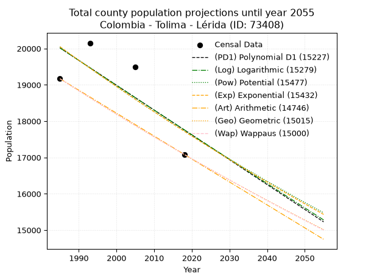
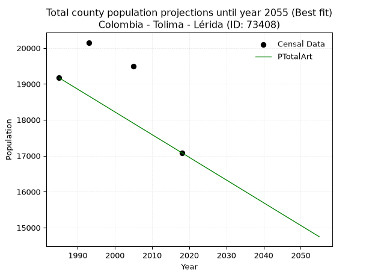
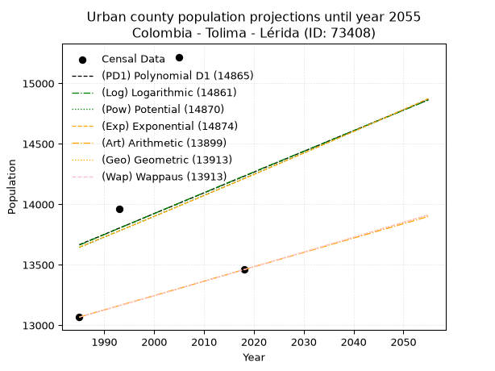
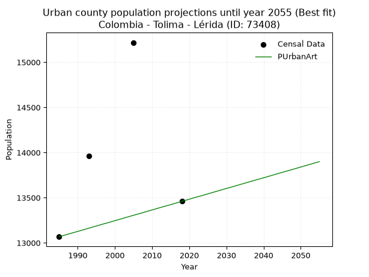
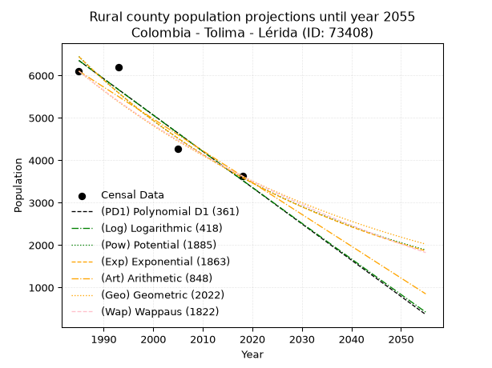
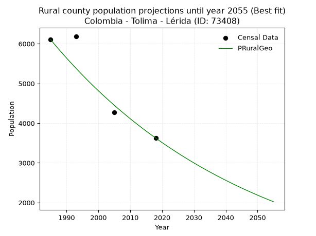

<div align="center">


</div>

# _“Population and Public Services Demand Projections (PPSD) until Year 2050 for Colombia - Tolima - Lérida (ID: 73408)”_
Keywords: `population` `public-service` `projection` `lineal` `polynomial` `logarithmic` `potential` `exponential` `arithmetic` `geometric` `wappaus` `dane` `colombia` `south-america`

PPSD are analytical estimates used by governments and planners to anticipate future changes in population size, age distribution, and the resulting community needs for utilities, healthcare, education, and infrastructure as sizing future water treatment facilities, electrical grids, and road networks based on spatial growth.

> **General running parameters**: • app_version: _v20260806_. • Python version: _3.14.7_. • Pandas version: _3.0.5_. • NumPy version: _2.5.1_. • Creates, save and include plots into reports (create_plot): _False_. • Projection until year: _2050_. • Process polynomial degree 2 and up: _False_. • Process Wappaus: _True_. • Process Wappaus: _True_. • Set negative values to zero: _True_. • Set infinite values to zero: _True_. • Drop dataset notes: _True_. 
<div align="center">

Dynamic map: [:earth_americas:Google](http://maps.google.com/maps?q=4.862045682,-74.9107159) [:earth_americas:OSM](https://www.openstreetmap.org/#map=18/4.862045682/-74.9107159&layers=P) [:earth_americas:Bing](https://www.bing.com/maps?cp=4.862045682~-74.9107159&lvl=18) [:earth_americas:Apple](https://maps.apple.com/frame?center=4.862045682%2C-74.9107159&span=0.003%2C0.006)

</div>


<div align="center">

```geojson
{
  "type": "Feature",
  "geometry": {
    "type": "Point", 
    "coordinates": [-74.9107159, 4.862045682]
  }, 
  "properties": {
    "Name": "Colombia - Tolima - Lérida (ID: 73408)"
  }
}
```

</div>


## 0. Census Data (4 records)

Census data are official statistics collected by a government about the people and housing in a country. They usually include counts of total population, age, sex, race, income, education, and jobs.

📅Global census file: [Population.xlsx](../data/Population.xlsx)

| Source   |   Year |   CountryID | CountryName   |   StateID | StateName   |   CountyID | CountyName   |   PTotal |   PUrban |   PRural |
|:---------|-------:|------------:|:--------------|----------:|:------------|-----------:|:-------------|---------:|---------:|---------:|
| DANE     |   1985 |          57 | Colombia      |        73 | Tolima      |      73408 | Lérida       |    19169 |    13067 |     6102 |
| DANE     |   1993 |          57 | Colombia      |        73 | Tolima      |      73408 | Lérida       |    20153 |    13964 |     6189 |
| DANE     |   2005 |          57 | Colombia      |        73 | Tolima      |      73408 | Lérida       |    19489 |    15218 |     4271 |
| DANE     |   2018 |          57 | Colombia      |        73 | Tolima      |      73408 | Lérida       |    17084 |    13459 |     3625 |

> 🔥Some records could had specific notes about the registered values or the corresponding urban or rural distribution.

## 1. Total

### 1.1. Coefficients and Parameters

* (PD1) Polynomial Deg 1: -68.44279405860952, 155876.4488157337 (lineal)
* (Log) Logarithmic: -136711.2606036711, 1058117.1373837916
* (Pow) Potential: -7.467990805599286, 28.929733570687706
* (Exp) Exponential: -0.0037386345112846247, 33502110.247342214
* (Art) Arithmetic: Year diff. 2018 - 1985 = 33, Population diff. 17084 - 19169 = -2085, Annual growth = -63.18181818181818
* (Geo) Geometric: Year diff. 2018 - 1985 = 33, Population diff. 17084 - 19169 = -2085, Annual growth % = -0.003483374617989421
* (Wap) Wappaus: i = -0.3485604953069715, Condition values only valid for < 200)

<sub>
Wappaus condition values: ['-0.00', '-0.35', '-0.70', '-1.05', '-1.39', '-1.74', '-2.09', '-2.44', '-2.79', '-3.14', '-3.49', '-3.83', '-4.18', '-4.53', '-4.88', '-5.23', '-5.58', '-5.93', '-6.27', '-6.62', '-6.97', '-7.32', '-7.67', '-8.02', '-8.37', '-8.71', '-9.06', '-9.41', '-9.76', '-10.11', '-10.46', '-10.81', '-11.15', '-11.50', '-11.85', '-12.20', '-12.55', '-12.90', '-13.25', '-13.59', '-13.94', '-14.29', '-14.64', '-14.99', '-15.34', '-15.69', '-16.03', '-16.38', '-16.73', '-17.08', '-17.43', '-17.78', '-18.13', '-18.47', '-18.82', '-19.17', '-19.52', '-19.87', '-20.22', '-20.57', '-20.91', '-21.26', '-21.61', '-21.96', '-22.31', '-22.66']
</sub>


### 1.2. Projected Dataset

|   Year |   CountyID |   PTotalPD1 |   PTotalLog |   PTotalPow |   PTotalExp |   PTotalArt |   PTotalGeo |   PTotalWap |
|-------:|-----------:|------------:|------------:|------------:|------------:|------------:|------------:|------------:|
|   1985 |      73408 |       20018 |       20017 |       20049 |       20049 |       19169 |       19169 |       19169 |
|   1986 |      73408 |       19949 |       19949 |       19974 |       19974 |       19106 |       19102 |       19102 |
|   1987 |      73408 |       19881 |       19880 |       19899 |       19900 |       19043 |       19036 |       19036 |
|   1988 |      73408 |       19812 |       19811 |       19824 |       19825 |       18979 |       18969 |       18970 |
|   1989 |      73408 |       19744 |       19742 |       19750 |       19751 |       18916 |       18903 |       18904 |
|   1990 |      73408 |       19675 |       19673 |       19676 |       19678 |       18853 |       18837 |       18838 |
|   1991 |      73408 |       19607 |       19605 |       19602 |       19604 |       18790 |       18772 |       18772 |
|   1992 |      73408 |       19538 |       19536 |       19529 |       19531 |       18727 |       18706 |       18707 |
|   1993 |      73408 |       19470 |       19468 |       19456 |       19458 |       18664 |       18641 |       18642 |
|   1994 |      73408 |       19402 |       19399 |       19383 |       19386 |       18600 |       18576 |       18577 |
|   1995 |      73408 |       19333 |       19330 |       19310 |       19313 |       18537 |       18512 |       18512 |
|   1996 |      73408 |       19265 |       19262 |       19238 |       19241 |       18474 |       18447 |       18448 |
|   1997 |      73408 |       19196 |       19193 |       19166 |       19169 |       18411 |       18383 |       18384 |
|   1998 |      73408 |       19128 |       19125 |       19095 |       19098 |       18348 |       18319 |       18320 |
|   1999 |      73408 |       19059 |       19057 |       19024 |       19027 |       18284 |       18255 |       18256 |
|   2000 |      73408 |       18991 |       18988 |       18953 |       18956 |       18221 |       18191 |       18192 |
|   2001 |      73408 |       18922 |       18920 |       18882 |       18885 |       18158 |       18128 |       18129 |
|   2002 |      73408 |       18854 |       18852 |       18812 |       18814 |       18095 |       18065 |       18066 |
|   2003 |      73408 |       18786 |       18783 |       18742 |       18744 |       18032 |       18002 |       18003 |
|   2004 |      73408 |       18717 |       18715 |       18672 |       18674 |       17969 |       17939 |       17940 |
|   2005 |      73408 |       18649 |       18647 |       18603 |       18604 |       17905 |       17877 |       17878 |
|   2006 |      73408 |       18580 |       18579 |       18533 |       18535 |       17842 |       17815 |       17815 |
|   2007 |      73408 |       18512 |       18511 |       18465 |       18466 |       17779 |       17753 |       17753 |
|   2008 |      73408 |       18443 |       18442 |       18396 |       18397 |       17716 |       17691 |       17691 |
|   2009 |      73408 |       18375 |       18374 |       18328 |       18328 |       17653 |       17629 |       17630 |
|   2010 |      73408 |       18306 |       18306 |       18260 |       18260 |       17589 |       17568 |       17568 |
|   2011 |      73408 |       18238 |       18238 |       18192 |       18192 |       17526 |       17506 |       17507 |
|   2012 |      73408 |       18170 |       18170 |       18125 |       18124 |       17463 |       17445 |       17446 |
|   2013 |      73408 |       18101 |       18102 |       18058 |       18056 |       17400 |       17385 |       17385 |
|   2014 |      73408 |       18033 |       18035 |       17991 |       17989 |       17337 |       17324 |       17325 |
|   2015 |      73408 |       17964 |       17967 |       17924 |       17922 |       17274 |       17264 |       17264 |
|   2016 |      73408 |       17896 |       17899 |       17858 |       17855 |       17210 |       17204 |       17204 |
|   2017 |      73408 |       17827 |       17831 |       17792 |       17788 |       17147 |       17144 |       17144 |
|   2018 |      73408 |       17759 |       17763 |       17726 |       17722 |       17084 |       17084 |       17084 |
|   2019 |      73408 |       17690 |       17696 |       17661 |       17656 |       17021 |       17024 |       17024 |
|   2020 |      73408 |       17622 |       17628 |       17595 |       17590 |       16958 |       16965 |       16965 |
|   2021 |      73408 |       17554 |       17560 |       17531 |       17524 |       16894 |       16906 |       16906 |
|   2022 |      73408 |       17485 |       17493 |       17466 |       17459 |       16831 |       16847 |       16847 |
|   2023 |      73408 |       17417 |       17425 |       17402 |       17394 |       16768 |       16789 |       16788 |
|   2024 |      73408 |       17348 |       17357 |       17337 |       17329 |       16705 |       16730 |       16729 |
|   2025 |      73408 |       17280 |       17290 |       17274 |       17264 |       16642 |       16672 |       16671 |
|   2026 |      73408 |       17211 |       17222 |       17210 |       17200 |       16579 |       16614 |       16612 |
|   2027 |      73408 |       17143 |       17155 |       17147 |       17135 |       16515 |       16556 |       16554 |
|   2028 |      73408 |       17074 |       17087 |       17084 |       17072 |       16452 |       16498 |       16496 |
|   2029 |      73408 |       17006 |       17020 |       17021 |       17008 |       16389 |       16441 |       16438 |
|   2030 |      73408 |       16938 |       16953 |       16958 |       16944 |       16326 |       16383 |       16381 |
|   2031 |      73408 |       16869 |       16885 |       16896 |       16881 |       16263 |       16326 |       16324 |
|   2032 |      73408 |       16801 |       16818 |       16834 |       16818 |       16199 |       16269 |       16266 |
|   2033 |      73408 |       16732 |       16751 |       16772 |       16755 |       16136 |       16213 |       16209 |
|   2034 |      73408 |       16664 |       16684 |       16711 |       16693 |       16073 |       16156 |       16153 |
|   2035 |      73408 |       16595 |       16616 |       16650 |       16631 |       16010 |       16100 |       16096 |
|   2036 |      73408 |       16527 |       16549 |       16589 |       16569 |       15947 |       16044 |       16040 |
|   2037 |      73408 |       16458 |       16482 |       16528 |       16507 |       15884 |       15988 |       15983 |
|   2038 |      73408 |       16390 |       16415 |       16467 |       16445 |       15820 |       15932 |       15927 |
|   2039 |      73408 |       16322 |       16348 |       16407 |       16384 |       15757 |       15877 |       15871 |
|   2040 |      73408 |       16253 |       16281 |       16347 |       16323 |       15694 |       15822 |       15816 |
|   2041 |      73408 |       16185 |       16214 |       16288 |       16262 |       15631 |       15766 |       15760 |
|   2042 |      73408 |       16116 |       16147 |       16228 |       16201 |       15568 |       15712 |       15705 |
|   2043 |      73408 |       16048 |       16080 |       16169 |       16141 |       15504 |       15657 |       15649 |
|   2044 |      73408 |       15979 |       16013 |       16110 |       16080 |       15441 |       15602 |       15594 |
|   2045 |      73408 |       15911 |       15946 |       16051 |       16020 |       15378 |       15548 |       15540 |
|   2046 |      73408 |       15842 |       15879 |       15993 |       15961 |       15315 |       15494 |       15485 |
|   2047 |      73408 |       15774 |       15813 |       15934 |       15901 |       15252 |       15440 |       15430 |
|   2048 |      73408 |       15706 |       15746 |       15876 |       15842 |       15189 |       15386 |       15376 |
|   2049 |      73408 |       15637 |       15679 |       15819 |       15782 |       15125 |       15332 |       15322 |
|   2050 |      73408 |       15569 |       15612 |       15761 |       15724 |       15062 |       15279 |       15268 |
<div align="center">

</img>

</div>


### 1.3. Best fit with absolute and relative error (%)

Relative error puts that difference into context by dividing the absolute error by the true value, creating a unitless ratio or percentage that shows the scale of the mistake.

Absolute and relative error

|   Year | Source   |   CountryID | CountryName   |   StateID | StateName   |   CountyID_x | CountyName   |   PTotal |   PUrban |   PRural |   CountyID_y |   PTotalPD1 |   PTotalLog |   PTotalPow |   PTotalExp |   PTotalArt |   PTotalGeo |   PTotalWap |   PTotalPD1AbsError |   PTotalLogAbsError |   PTotalPowAbsError |   PTotalExpAbsError |   PTotalArtAbsError |   PTotalGeoAbsError |   PTotalWapAbsError |   PTotalPD1RelError |   PTotalLogRelError |   PTotalPowRelError |   PTotalExpRelError |   PTotalArtRelError |   PTotalGeoRelError |   PTotalWapRelError |
|-------:|:---------|------------:|:--------------|----------:|:------------|-------------:|:-------------|---------:|---------:|---------:|-------------:|------------:|------------:|------------:|------------:|------------:|------------:|------------:|--------------------:|--------------------:|--------------------:|--------------------:|--------------------:|--------------------:|--------------------:|--------------------:|--------------------:|--------------------:|--------------------:|--------------------:|--------------------:|--------------------:|
|   1985 | DANE     |          57 | Colombia      |        73 | Tolima      |        73408 | Lérida       |    19169 |    13067 |     6102 |        73408 |       20018 |       20017 |       20049 |       20049 |       19169 |       19169 |       19169 |                 849 |                 848 |                 880 |                 880 |                   0 |                   0 |                   0 |             4.42903 |             4.42381 |             4.59075 |             4.59075 |             0       |             0       |             0       |
|   1993 | DANE     |          57 | Colombia      |        73 | Tolima      |        73408 | Lérida       |    20153 |    13964 |     6189 |        73408 |       19470 |       19468 |       19456 |       19458 |       18664 |       18641 |       18642 |                 683 |                 685 |                 697 |                 695 |                1489 |                1512 |                1511 |             3.38907 |             3.399   |             3.45854 |             3.44862 |             7.38848 |             7.50261 |             7.49764 |
|   2005 | DANE     |          57 | Colombia      |        73 | Tolima      |        73408 | Lérida       |    19489 |    15218 |     4271 |        73408 |       18649 |       18647 |       18603 |       18604 |       17905 |       17877 |       17878 |                 840 |                 842 |                 886 |                 885 |                1584 |                1612 |                1611 |             4.31012 |             4.32039 |             4.54615 |             4.54102 |             8.12766 |             8.27133 |             8.2662  |
|   2018 | DANE     |          57 | Colombia      |        73 | Tolima      |        73408 | Lérida       |    17084 |    13459 |     3625 |        73408 |       17759 |       17763 |       17726 |       17722 |       17084 |       17084 |       17084 |                 675 |                 679 |                 642 |                 638 |                   0 |                   0 |                   0 |             3.95107 |             3.97448 |             3.7579  |             3.73449 |             0       |             0       |             0       |

Relative error mean

| Method    |   RelError | Best   |
|:----------|-----------:|:-------|
| PTotalPD1 |    4.01982 |        |
| PTotalLog |    4.02942 |        |
| PTotalPow |    4.08834 |        |
| PTotalExp |    4.07872 |        |
| PTotalArt |    3.87903 | True   |
| PTotalGeo |    3.94348 |        |
| PTotalWap |    3.94096 |        |

💙Best method: _**PTotalArt**_
<div align="center">

</img>

</div>


### 1.4. Fresh water supply demand in liters per capita per day (lpcd)

The fresh water supply demand typically ranges from 100 to 300 liters per capita per day (lpcd) for standard domestic and municipal planning, though absolute survival minimums set by the World Health Organization are as low as 7.5 to 20 liters per day, and total consumption in high-income nations can exceed 400 liters.

> `CZ`: Level in meters above the sea level (masl)<br> `WS`: Fresh water supply demand in liters per capita per day (lpcd or l/h/d)<br> `WSAll`: Zonal fresh water supply demand in liters per second (l/s)<br> `A`: Zonal area in square meters<br> `DP`: Population density (people/hectare)

Reference values (RAS Colombia)

|    CZ |   WS |
|------:|-----:|
|  1000 |  120 |
|  2000 |  130 |
| 99999 |  140 |

County shapefile geometry properties and water supply values

|   CountyID |      ATotal |   CZTotal |   WSTotal |
|-----------:|------------:|----------:|----------:|
|      73408 | 2.71766e+08 |   538.646 |       120 |

Projected values for best method: PTotalArt

|   CountyID |   Year |   PTotalArt |   DPTotal |   WSTotal |   WSTotalAll |
|-----------:|-------:|------------:|----------:|----------:|-------------:|
|      73408 |   1985 |       19169 |      0.71 |       120 |      26.6236 |
|      73408 |   1986 |       19106 |      0.7  |       120 |      26.5361 |
|      73408 |   1987 |       19043 |      0.7  |       120 |      26.4486 |
|      73408 |   1988 |       18979 |      0.7  |       120 |      26.3597 |
|      73408 |   1989 |       18916 |      0.7  |       120 |      26.2722 |
|      73408 |   1990 |       18853 |      0.69 |       120 |      26.1847 |
|      73408 |   1991 |       18790 |      0.69 |       120 |      26.0972 |
|      73408 |   1992 |       18727 |      0.69 |       120 |      26.0097 |
|      73408 |   1993 |       18664 |      0.69 |       120 |      25.9222 |
|      73408 |   1994 |       18600 |      0.68 |       120 |      25.8333 |
|      73408 |   1995 |       18537 |      0.68 |       120 |      25.7458 |
|      73408 |   1996 |       18474 |      0.68 |       120 |      25.6583 |
|      73408 |   1997 |       18411 |      0.68 |       120 |      25.5708 |
|      73408 |   1998 |       18348 |      0.68 |       120 |      25.4833 |
|      73408 |   1999 |       18284 |      0.67 |       120 |      25.3944 |
|      73408 |   2000 |       18221 |      0.67 |       120 |      25.3069 |
|      73408 |   2001 |       18158 |      0.67 |       120 |      25.2194 |
|      73408 |   2002 |       18095 |      0.67 |       120 |      25.1319 |
|      73408 |   2003 |       18032 |      0.66 |       120 |      25.0444 |
|      73408 |   2004 |       17969 |      0.66 |       120 |      24.9569 |
|      73408 |   2005 |       17905 |      0.66 |       120 |      24.8681 |
|      73408 |   2006 |       17842 |      0.66 |       120 |      24.7806 |
|      73408 |   2007 |       17779 |      0.65 |       120 |      24.6931 |
|      73408 |   2008 |       17716 |      0.65 |       120 |      24.6056 |
|      73408 |   2009 |       17653 |      0.65 |       120 |      24.5181 |
|      73408 |   2010 |       17589 |      0.65 |       120 |      24.4292 |
|      73408 |   2011 |       17526 |      0.64 |       120 |      24.3417 |
|      73408 |   2012 |       17463 |      0.64 |       120 |      24.2542 |
|      73408 |   2013 |       17400 |      0.64 |       120 |      24.1667 |
|      73408 |   2014 |       17337 |      0.64 |       120 |      24.0792 |
|      73408 |   2015 |       17274 |      0.64 |       120 |      23.9917 |
|      73408 |   2016 |       17210 |      0.63 |       120 |      23.9028 |
|      73408 |   2017 |       17147 |      0.63 |       120 |      23.8153 |
|      73408 |   2018 |       17084 |      0.63 |       120 |      23.7278 |
|      73408 |   2019 |       17021 |      0.63 |       120 |      23.6403 |
|      73408 |   2020 |       16958 |      0.62 |       120 |      23.5528 |
|      73408 |   2021 |       16894 |      0.62 |       120 |      23.4639 |
|      73408 |   2022 |       16831 |      0.62 |       120 |      23.3764 |
|      73408 |   2023 |       16768 |      0.62 |       120 |      23.2889 |
|      73408 |   2024 |       16705 |      0.61 |       120 |      23.2014 |
|      73408 |   2025 |       16642 |      0.61 |       120 |      23.1139 |
|      73408 |   2026 |       16579 |      0.61 |       120 |      23.0264 |
|      73408 |   2027 |       16515 |      0.61 |       120 |      22.9375 |
|      73408 |   2028 |       16452 |      0.61 |       120 |      22.85   |
|      73408 |   2029 |       16389 |      0.6  |       120 |      22.7625 |
|      73408 |   2030 |       16326 |      0.6  |       120 |      22.675  |
|      73408 |   2031 |       16263 |      0.6  |       120 |      22.5875 |
|      73408 |   2032 |       16199 |      0.6  |       120 |      22.4986 |
|      73408 |   2033 |       16136 |      0.59 |       120 |      22.4111 |
|      73408 |   2034 |       16073 |      0.59 |       120 |      22.3236 |
|      73408 |   2035 |       16010 |      0.59 |       120 |      22.2361 |
|      73408 |   2036 |       15947 |      0.59 |       120 |      22.1486 |
|      73408 |   2037 |       15884 |      0.58 |       120 |      22.0611 |
|      73408 |   2038 |       15820 |      0.58 |       120 |      21.9722 |
|      73408 |   2039 |       15757 |      0.58 |       120 |      21.8847 |
|      73408 |   2040 |       15694 |      0.58 |       120 |      21.7972 |
|      73408 |   2041 |       15631 |      0.58 |       120 |      21.7097 |
|      73408 |   2042 |       15568 |      0.57 |       120 |      21.6222 |
|      73408 |   2043 |       15504 |      0.57 |       120 |      21.5333 |
|      73408 |   2044 |       15441 |      0.57 |       120 |      21.4458 |
|      73408 |   2045 |       15378 |      0.57 |       120 |      21.3583 |
|      73408 |   2046 |       15315 |      0.56 |       120 |      21.2708 |
|      73408 |   2047 |       15252 |      0.56 |       120 |      21.1833 |
|      73408 |   2048 |       15189 |      0.56 |       120 |      21.0958 |
|      73408 |   2049 |       15125 |      0.56 |       120 |      21.0069 |
|      73408 |   2050 |       15062 |      0.55 |       120 |      20.9194 |

## 2. Urban

### 2.1. Coefficients and Parameters

* (PD1) Polynomial Deg 1: 17.136892814131883, -20351.069851467302 (lineal)
* (Log) Logarithmic: 34579.782889981514, -248914.20685173868
* (Pow) Potential: 2.485511655890976, -4.061723444218364
* (Exp) Exponential: 0.0012318854338523254, 1183.050227111124
* (Art) Arithmetic: Year diff. 2018 - 1985 = 33, Population diff. 13459 - 13067 = 392, Annual growth = 11.878787878787879
* (Geo) Geometric: Year diff. 2018 - 1985 = 33, Population diff. 13459 - 13067 = 392, Annual growth % = 0.0008961000229188443
* (Wap) Wappaus: i = 0.08956335579271567, Condition values only valid for < 200)

<sub>
Wappaus condition values: ['0.00', '0.09', '0.18', '0.27', '0.36', '0.45', '0.54', '0.63', '0.72', '0.81', '0.90', '0.99', '1.07', '1.16', '1.25', '1.34', '1.43', '1.52', '1.61', '1.70', '1.79', '1.88', '1.97', '2.06', '2.15', '2.24', '2.33', '2.42', '2.51', '2.60', '2.69', '2.78', '2.87', '2.96', '3.05', '3.13', '3.22', '3.31', '3.40', '3.49', '3.58', '3.67', '3.76', '3.85', '3.94', '4.03', '4.12', '4.21', '4.30', '4.39', '4.48', '4.57', '4.66', '4.75', '4.84', '4.93', '5.02', '5.11', '5.19', '5.28', '5.37', '5.46', '5.55', '5.64', '5.73', '5.82']
</sub>


### 2.2. Projected Dataset

|   Year |   CountyID |   PUrbanPD1 |   PUrbanLog |   PUrbanPow |   PUrbanExp |   PUrbanArt |   PUrbanGeo |   PUrbanWap |
|-------:|-----------:|------------:|------------:|------------:|------------:|------------:|------------:|------------:|
|   1985 |      73408 |       13666 |       13663 |       13643 |       13645 |       13067 |       13067 |       13067 |
|   1986 |      73408 |       13683 |       13680 |       13660 |       13662 |       13079 |       13079 |       13079 |
|   1987 |      73408 |       13700 |       13698 |       13677 |       13679 |       13091 |       13090 |       13090 |
|   1988 |      73408 |       13717 |       13715 |       13694 |       13696 |       13103 |       13102 |       13102 |
|   1989 |      73408 |       13734 |       13733 |       13711 |       13713 |       13115 |       13114 |       13114 |
|   1990 |      73408 |       13751 |       13750 |       13728 |       13730 |       13126 |       13126 |       13126 |
|   1991 |      73408 |       13768 |       13767 |       13745 |       13746 |       13138 |       13137 |       13137 |
|   1992 |      73408 |       13786 |       13785 |       13763 |       13763 |       13150 |       13149 |       13149 |
|   1993 |      73408 |       13803 |       13802 |       13780 |       13780 |       13162 |       13161 |       13161 |
|   1994 |      73408 |       13820 |       13819 |       13797 |       13797 |       13174 |       13173 |       13173 |
|   1995 |      73408 |       13837 |       13837 |       13814 |       13814 |       13186 |       13185 |       13185 |
|   1996 |      73408 |       13854 |       13854 |       13831 |       13831 |       13198 |       13196 |       13196 |
|   1997 |      73408 |       13871 |       13871 |       13849 |       13848 |       13210 |       13208 |       13208 |
|   1998 |      73408 |       13888 |       13889 |       13866 |       13865 |       13221 |       13220 |       13220 |
|   1999 |      73408 |       13906 |       13906 |       13883 |       13883 |       13233 |       13232 |       13232 |
|   2000 |      73408 |       13923 |       13923 |       13900 |       13900 |       13245 |       13244 |       13244 |
|   2001 |      73408 |       13940 |       13941 |       13918 |       13917 |       13257 |       13256 |       13256 |
|   2002 |      73408 |       13957 |       13958 |       13935 |       13934 |       13269 |       13267 |       13267 |
|   2003 |      73408 |       13974 |       13975 |       13952 |       13951 |       13281 |       13279 |       13279 |
|   2004 |      73408 |       13991 |       13992 |       13970 |       13968 |       13293 |       13291 |       13291 |
|   2005 |      73408 |       14008 |       14010 |       13987 |       13986 |       13305 |       13303 |       13303 |
|   2006 |      73408 |       14026 |       14027 |       14004 |       14003 |       13316 |       13315 |       13315 |
|   2007 |      73408 |       14043 |       14044 |       14022 |       14020 |       13328 |       13327 |       13327 |
|   2008 |      73408 |       14060 |       14061 |       14039 |       14037 |       13340 |       13339 |       13339 |
|   2009 |      73408 |       14077 |       14079 |       14056 |       14055 |       13352 |       13351 |       13351 |
|   2010 |      73408 |       14094 |       14096 |       14074 |       14072 |       13364 |       13363 |       13363 |
|   2011 |      73408 |       14111 |       14113 |       14091 |       14089 |       13376 |       13375 |       13375 |
|   2012 |      73408 |       14128 |       14130 |       14109 |       14107 |       13388 |       13387 |       13387 |
|   2013 |      73408 |       14145 |       14147 |       14126 |       14124 |       13400 |       13399 |       13399 |
|   2014 |      73408 |       14163 |       14165 |       14143 |       14141 |       13411 |       13411 |       13411 |
|   2015 |      73408 |       14180 |       14182 |       14161 |       14159 |       13423 |       13423 |       13423 |
|   2016 |      73408 |       14197 |       14199 |       14178 |       14176 |       13435 |       13435 |       13435 |
|   2017 |      73408 |       14214 |       14216 |       14196 |       14194 |       13447 |       13447 |       13447 |
|   2018 |      73408 |       14231 |       14233 |       14213 |       14211 |       13459 |       13459 |       13459 |
|   2019 |      73408 |       14248 |       14250 |       14231 |       14229 |       13471 |       13471 |       13471 |
|   2020 |      73408 |       14265 |       14267 |       14248 |       14246 |       13483 |       13483 |       13483 |
|   2021 |      73408 |       14283 |       14285 |       14266 |       14264 |       13495 |       13495 |       13495 |
|   2022 |      73408 |       14300 |       14302 |       14283 |       14282 |       13507 |       13507 |       13507 |
|   2023 |      73408 |       14317 |       14319 |       14301 |       14299 |       13518 |       13519 |       13519 |
|   2024 |      73408 |       14334 |       14336 |       14319 |       14317 |       13530 |       13532 |       13532 |
|   2025 |      73408 |       14351 |       14353 |       14336 |       14334 |       13542 |       13544 |       13544 |
|   2026 |      73408 |       14368 |       14370 |       14354 |       14352 |       13554 |       13556 |       13556 |
|   2027 |      73408 |       14385 |       14387 |       14371 |       14370 |       13566 |       13568 |       13568 |
|   2028 |      73408 |       14403 |       14404 |       14389 |       14387 |       13578 |       13580 |       13580 |
|   2029 |      73408 |       14420 |       14421 |       14407 |       14405 |       13590 |       13592 |       13592 |
|   2030 |      73408 |       14437 |       14438 |       14424 |       14423 |       13602 |       13604 |       13604 |
|   2031 |      73408 |       14454 |       14455 |       14442 |       14441 |       13613 |       13617 |       13617 |
|   2032 |      73408 |       14471 |       14472 |       14460 |       14459 |       13625 |       13629 |       13629 |
|   2033 |      73408 |       14488 |       14489 |       14477 |       14476 |       13637 |       13641 |       13641 |
|   2034 |      73408 |       14505 |       14506 |       14495 |       14494 |       13649 |       13653 |       13653 |
|   2035 |      73408 |       14523 |       14523 |       14513 |       14512 |       13661 |       13666 |       13666 |
|   2036 |      73408 |       14540 |       14540 |       14531 |       14530 |       13673 |       13678 |       13678 |
|   2037 |      73408 |       14557 |       14557 |       14548 |       14548 |       13685 |       13690 |       13690 |
|   2038 |      73408 |       14574 |       14574 |       14566 |       14566 |       13697 |       13702 |       13702 |
|   2039 |      73408 |       14591 |       14591 |       14584 |       14584 |       13708 |       13715 |       13715 |
|   2040 |      73408 |       14608 |       14608 |       14602 |       14602 |       13720 |       13727 |       13727 |
|   2041 |      73408 |       14625 |       14625 |       14619 |       14620 |       13732 |       13739 |       13739 |
|   2042 |      73408 |       14642 |       14642 |       14637 |       14638 |       13744 |       13751 |       13752 |
|   2043 |      73408 |       14660 |       14659 |       14655 |       14656 |       13756 |       13764 |       13764 |
|   2044 |      73408 |       14677 |       14676 |       14673 |       14674 |       13768 |       13776 |       13776 |
|   2045 |      73408 |       14694 |       14693 |       14691 |       14692 |       13780 |       13788 |       13789 |
|   2046 |      73408 |       14711 |       14710 |       14709 |       14710 |       13792 |       13801 |       13801 |
|   2047 |      73408 |       14728 |       14727 |       14726 |       14728 |       13803 |       13813 |       13813 |
|   2048 |      73408 |       14745 |       14743 |       14744 |       14746 |       13815 |       13826 |       13826 |
|   2049 |      73408 |       14762 |       14760 |       14762 |       14765 |       13827 |       13838 |       13838 |
|   2050 |      73408 |       14780 |       14777 |       14780 |       14783 |       13839 |       13850 |       13851 |
<div align="center">

</img>

</div>


### 2.3. Best fit with absolute and relative error (%)

Relative error puts that difference into context by dividing the absolute error by the true value, creating a unitless ratio or percentage that shows the scale of the mistake.

Absolute and relative error

|   Year | Source   |   CountryID | CountryName   |   StateID | StateName   |   CountyID_x | CountyName   |   PTotal |   PUrban |   PRural |   CountyID_y |   PUrbanPD1 |   PUrbanLog |   PUrbanPow |   PUrbanExp |   PUrbanArt |   PUrbanGeo |   PUrbanWap |   PUrbanPD1AbsError |   PUrbanLogAbsError |   PUrbanPowAbsError |   PUrbanExpAbsError |   PUrbanArtAbsError |   PUrbanGeoAbsError |   PUrbanWapAbsError |   PUrbanPD1RelError |   PUrbanLogRelError |   PUrbanPowRelError |   PUrbanExpRelError |   PUrbanArtRelError |   PUrbanGeoRelError |   PUrbanWapRelError |
|-------:|:---------|------------:|:--------------|----------:|:------------|-------------:|:-------------|---------:|---------:|---------:|-------------:|------------:|------------:|------------:|------------:|------------:|------------:|------------:|--------------------:|--------------------:|--------------------:|--------------------:|--------------------:|--------------------:|--------------------:|--------------------:|--------------------:|--------------------:|--------------------:|--------------------:|--------------------:|--------------------:|
|   1985 | DANE     |          57 | Colombia      |        73 | Tolima      |        73408 | Lérida       |    19169 |    13067 |     6102 |        73408 |       13666 |       13663 |       13643 |       13645 |       13067 |       13067 |       13067 |                 599 |                 596 |                 576 |                 578 |                   0 |                   0 |                   0 |             4.58407 |             4.56111 |             4.40805 |             4.42336 |             0       |              0      |              0      |
|   1993 | DANE     |          57 | Colombia      |        73 | Tolima      |        73408 | Lérida       |    20153 |    13964 |     6189 |        73408 |       13803 |       13802 |       13780 |       13780 |       13162 |       13161 |       13161 |                 161 |                 162 |                 184 |                 184 |                 802 |                 803 |                 803 |             1.15296 |             1.16013 |             1.31767 |             1.31767 |             5.74334 |              5.7505 |              5.7505 |
|   2005 | DANE     |          57 | Colombia      |        73 | Tolima      |        73408 | Lérida       |    19489 |    15218 |     4271 |        73408 |       14008 |       14010 |       13987 |       13986 |       13305 |       13303 |       13303 |                1210 |                1208 |                1231 |                1232 |                1913 |                1915 |                1915 |             7.95111 |             7.93797 |             8.08911 |             8.09568 |            12.5706  |             12.5838 |             12.5838 |
|   2018 | DANE     |          57 | Colombia      |        73 | Tolima      |        73408 | Lérida       |    17084 |    13459 |     3625 |        73408 |       14231 |       14233 |       14213 |       14211 |       13459 |       13459 |       13459 |                 772 |                 774 |                 754 |                 752 |                   0 |                   0 |                   0 |             5.73594 |             5.7508  |             5.6022  |             5.58734 |             0       |              0      |              0      |

Relative error mean

| Method    |   RelError | Best   |
|:----------|-----------:|:-------|
| PUrbanPD1 |    4.85602 |        |
| PUrbanLog |    4.8525  |        |
| PUrbanPow |    4.85426 |        |
| PUrbanExp |    4.85601 |        |
| PUrbanArt |    4.5785  | True   |
| PUrbanGeo |    4.58357 |        |
| PUrbanWap |    4.58357 |        |

💙Best method: _**PUrbanArt**_
<div align="center">

</img>

</div>


### 2.4. Fresh water supply demand in liters per capita per day (lpcd)

The fresh water supply demand typically ranges from 100 to 300 liters per capita per day (lpcd) for standard domestic and municipal planning, though absolute survival minimums set by the World Health Organization are as low as 7.5 to 20 liters per day, and total consumption in high-income nations can exceed 400 liters.

> `CZ`: Level in meters above the sea level (masl)<br> `WS`: Fresh water supply demand in liters per capita per day (lpcd or l/h/d)<br> `WSAll`: Zonal fresh water supply demand in liters per second (l/s)<br> `A`: Zonal area in square meters<br> `DP`: Population density (people/hectare)

Reference values (RAS Colombia)

|    CZ |   WS |
|------:|-----:|
|  1000 |  120 |
|  2000 |  130 |
| 99999 |  140 |

County shapefile geometry properties and water supply values

|   CountyID |      AUrban |   CZUrban |   WSUrban |
|-----------:|------------:|----------:|----------:|
|      73408 | 3.49776e+06 |   349.485 |       120 |

Projected values for best method: PUrbanArt

|   CountyID |   Year |   PUrbanArt |   DPUrban |   WSUrban |   WSUrbanAll |
|-----------:|-------:|------------:|----------:|----------:|-------------:|
|      73408 |   1985 |       13067 |     37.36 |       120 |      18.1486 |
|      73408 |   1986 |       13079 |     37.39 |       120 |      18.1653 |
|      73408 |   1987 |       13091 |     37.43 |       120 |      18.1819 |
|      73408 |   1988 |       13103 |     37.46 |       120 |      18.1986 |
|      73408 |   1989 |       13115 |     37.5  |       120 |      18.2153 |
|      73408 |   1990 |       13126 |     37.53 |       120 |      18.2306 |
|      73408 |   1991 |       13138 |     37.56 |       120 |      18.2472 |
|      73408 |   1992 |       13150 |     37.6  |       120 |      18.2639 |
|      73408 |   1993 |       13162 |     37.63 |       120 |      18.2806 |
|      73408 |   1994 |       13174 |     37.66 |       120 |      18.2972 |
|      73408 |   1995 |       13186 |     37.7  |       120 |      18.3139 |
|      73408 |   1996 |       13198 |     37.73 |       120 |      18.3306 |
|      73408 |   1997 |       13210 |     37.77 |       120 |      18.3472 |
|      73408 |   1998 |       13221 |     37.8  |       120 |      18.3625 |
|      73408 |   1999 |       13233 |     37.83 |       120 |      18.3792 |
|      73408 |   2000 |       13245 |     37.87 |       120 |      18.3958 |
|      73408 |   2001 |       13257 |     37.9  |       120 |      18.4125 |
|      73408 |   2002 |       13269 |     37.94 |       120 |      18.4292 |
|      73408 |   2003 |       13281 |     37.97 |       120 |      18.4458 |
|      73408 |   2004 |       13293 |     38    |       120 |      18.4625 |
|      73408 |   2005 |       13305 |     38.04 |       120 |      18.4792 |
|      73408 |   2006 |       13316 |     38.07 |       120 |      18.4944 |
|      73408 |   2007 |       13328 |     38.1  |       120 |      18.5111 |
|      73408 |   2008 |       13340 |     38.14 |       120 |      18.5278 |
|      73408 |   2009 |       13352 |     38.17 |       120 |      18.5444 |
|      73408 |   2010 |       13364 |     38.21 |       120 |      18.5611 |
|      73408 |   2011 |       13376 |     38.24 |       120 |      18.5778 |
|      73408 |   2012 |       13388 |     38.28 |       120 |      18.5944 |
|      73408 |   2013 |       13400 |     38.31 |       120 |      18.6111 |
|      73408 |   2014 |       13411 |     38.34 |       120 |      18.6264 |
|      73408 |   2015 |       13423 |     38.38 |       120 |      18.6431 |
|      73408 |   2016 |       13435 |     38.41 |       120 |      18.6597 |
|      73408 |   2017 |       13447 |     38.44 |       120 |      18.6764 |
|      73408 |   2018 |       13459 |     38.48 |       120 |      18.6931 |
|      73408 |   2019 |       13471 |     38.51 |       120 |      18.7097 |
|      73408 |   2020 |       13483 |     38.55 |       120 |      18.7264 |
|      73408 |   2021 |       13495 |     38.58 |       120 |      18.7431 |
|      73408 |   2022 |       13507 |     38.62 |       120 |      18.7597 |
|      73408 |   2023 |       13518 |     38.65 |       120 |      18.775  |
|      73408 |   2024 |       13530 |     38.68 |       120 |      18.7917 |
|      73408 |   2025 |       13542 |     38.72 |       120 |      18.8083 |
|      73408 |   2026 |       13554 |     38.75 |       120 |      18.825  |
|      73408 |   2027 |       13566 |     38.78 |       120 |      18.8417 |
|      73408 |   2028 |       13578 |     38.82 |       120 |      18.8583 |
|      73408 |   2029 |       13590 |     38.85 |       120 |      18.875  |
|      73408 |   2030 |       13602 |     38.89 |       120 |      18.8917 |
|      73408 |   2031 |       13613 |     38.92 |       120 |      18.9069 |
|      73408 |   2032 |       13625 |     38.95 |       120 |      18.9236 |
|      73408 |   2033 |       13637 |     38.99 |       120 |      18.9403 |
|      73408 |   2034 |       13649 |     39.02 |       120 |      18.9569 |
|      73408 |   2035 |       13661 |     39.06 |       120 |      18.9736 |
|      73408 |   2036 |       13673 |     39.09 |       120 |      18.9903 |
|      73408 |   2037 |       13685 |     39.13 |       120 |      19.0069 |
|      73408 |   2038 |       13697 |     39.16 |       120 |      19.0236 |
|      73408 |   2039 |       13708 |     39.19 |       120 |      19.0389 |
|      73408 |   2040 |       13720 |     39.23 |       120 |      19.0556 |
|      73408 |   2041 |       13732 |     39.26 |       120 |      19.0722 |
|      73408 |   2042 |       13744 |     39.29 |       120 |      19.0889 |
|      73408 |   2043 |       13756 |     39.33 |       120 |      19.1056 |
|      73408 |   2044 |       13768 |     39.36 |       120 |      19.1222 |
|      73408 |   2045 |       13780 |     39.4  |       120 |      19.1389 |
|      73408 |   2046 |       13792 |     39.43 |       120 |      19.1556 |
|      73408 |   2047 |       13803 |     39.46 |       120 |      19.1708 |
|      73408 |   2048 |       13815 |     39.5  |       120 |      19.1875 |
|      73408 |   2049 |       13827 |     39.53 |       120 |      19.2042 |
|      73408 |   2050 |       13839 |     39.57 |       120 |      19.2208 |

## 3. Rural

### 3.1. Coefficients and Parameters

* (PD1) Polynomial Deg 1: -85.5796868727413, 176227.51866720078 (lineal)
* (Log) Logarithmic: -171291.04349365275, 1307031.3442355313
* (Pow) Potential: -35.48249209071424, 120.82212985010909
* (Exp) Exponential: -0.01772913593288789, 1.2387660450091117e+19
* (Art) Arithmetic: Year diff. 2018 - 1985 = 33, Population diff. 3625 - 6102 = -2477, Annual growth = -75.06060606060606
* (Geo) Geometric: Year diff. 2018 - 1985 = 33, Population diff. 3625 - 6102 = -2477, Annual growth % = -0.015656813234245393
* (Wap) Wappaus: i = -1.5433454520531729, Condition values only valid for < 200)

<sub>
Wappaus condition values: ['-0.00', '-1.54', '-3.09', '-4.63', '-6.17', '-7.72', '-9.26', '-10.80', '-12.35', '-13.89', '-15.43', '-16.98', '-18.52', '-20.06', '-21.61', '-23.15', '-24.69', '-26.24', '-27.78', '-29.32', '-30.87', '-32.41', '-33.95', '-35.50', '-37.04', '-38.58', '-40.13', '-41.67', '-43.21', '-44.76', '-46.30', '-47.84', '-49.39', '-50.93', '-52.47', '-54.02', '-55.56', '-57.10', '-58.65', '-60.19', '-61.73', '-63.28', '-64.82', '-66.36', '-67.91', '-69.45', '-70.99', '-72.54', '-74.08', '-75.62', '-77.17', '-78.71', '-80.25', '-81.80', '-83.34', '-84.88', '-86.43', '-87.97', '-89.51', '-91.06', '-92.60', '-94.14', '-95.69', '-97.23', '-98.77', '-100.32']
</sub>


### 3.2. Projected Dataset

|   Year |   CountyID |   PRuralPD1 |   PRuralLog |   PRuralPow |   PRuralExp |   PRuralArt |   PRuralGeo |   PRuralWap |
|-------:|-----------:|------------:|------------:|------------:|------------:|------------:|------------:|------------:|
|   1985 |      73408 |        6352 |        6354 |        6447 |        6444 |        6102 |        6102 |        6102 |
|   1986 |      73408 |        6266 |        6268 |        6333 |        6331 |        6027 |        6006 |        6009 |
|   1987 |      73408 |        6181 |        6182 |        6221 |        6219 |        5952 |        5912 |        5917 |
|   1988 |      73408 |        6095 |        6096 |        6111 |        6110 |        5877 |        5820 |        5826 |
|   1989 |      73408 |        6010 |        6010 |        6003 |        6003 |        5802 |        5729 |        5737 |
|   1990 |      73408 |        5924 |        5923 |        5897 |        5897 |        5727 |        5639 |        5649 |
|   1991 |      73408 |        5838 |        5837 |        5792 |        5794 |        5652 |        5551 |        5562 |
|   1992 |      73408 |        5753 |        5751 |        5690 |        5692 |        5577 |        5464 |        5477 |
|   1993 |      73408 |        5667 |        5665 |        5590 |        5592 |        5502 |        5378 |        5392 |
|   1994 |      73408 |        5582 |        5579 |        5491 |        5494 |        5426 |        5294 |        5309 |
|   1995 |      73408 |        5496 |        5494 |        5394 |        5397 |        5351 |        5211 |        5228 |
|   1996 |      73408 |        5410 |        5408 |        5299 |        5302 |        5276 |        5130 |        5147 |
|   1997 |      73408 |        5325 |        5322 |        5206 |        5209 |        5201 |        5049 |        5068 |
|   1998 |      73408 |        5239 |        5236 |        5114 |        5117 |        5126 |        4970 |        4989 |
|   1999 |      73408 |        5154 |        5150 |        5024 |        5028 |        5051 |        4892 |        4912 |
|   2000 |      73408 |        5068 |        5065 |        4936 |        4939 |        4976 |        4816 |        4836 |
|   2001 |      73408 |        4983 |        4979 |        4849 |        4852 |        4901 |        4740 |        4761 |
|   2002 |      73408 |        4897 |        4894 |        4764 |        4767 |        4826 |        4666 |        4687 |
|   2003 |      73408 |        4811 |        4808 |        4680 |        4683 |        4751 |        4593 |        4614 |
|   2004 |      73408 |        4726 |        4723 |        4598 |        4601 |        4676 |        4521 |        4541 |
|   2005 |      73408 |        4640 |        4637 |        4517 |        4520 |        4601 |        4450 |        4470 |
|   2006 |      73408 |        4555 |        4552 |        4438 |        4441 |        4526 |        4381 |        4400 |
|   2007 |      73408 |        4469 |        4466 |        4360 |        4363 |        4451 |        4312 |        4331 |
|   2008 |      73408 |        4384 |        4381 |        4284 |        4286 |        4376 |        4245 |        4262 |
|   2009 |      73408 |        4298 |        4296 |        4209 |        4211 |        4301 |        4178 |        4195 |
|   2010 |      73408 |        4212 |        4211 |        4135 |        4137 |        4225 |        4113 |        4128 |
|   2011 |      73408 |        4127 |        4125 |        4063 |        4064 |        4150 |        4048 |        4063 |
|   2012 |      73408 |        4041 |        4040 |        3992 |        3993 |        4075 |        3985 |        3998 |
|   2013 |      73408 |        3956 |        3955 |        3922 |        3922 |        4000 |        3923 |        3934 |
|   2014 |      73408 |        3870 |        3870 |        3854 |        3854 |        3925 |        3861 |        3870 |
|   2015 |      73408 |        3784 |        3785 |        3786 |        3786 |        3850 |        3801 |        3808 |
|   2016 |      73408 |        3699 |        3700 |        3720 |        3719 |        3775 |        3741 |        3746 |
|   2017 |      73408 |        3613 |        3615 |        3655 |        3654 |        3700 |        3683 |        3685 |
|   2018 |      73408 |        3528 |        3530 |        3592 |        3590 |        3625 |        3625 |        3625 |
|   2019 |      73408 |        3442 |        3445 |        3529 |        3527 |        3550 |        3568 |        3566 |
|   2020 |      73408 |        3357 |        3360 |        3468 |        3465 |        3475 |        3512 |        3507 |
|   2021 |      73408 |        3271 |        3276 |        3407 |        3404 |        3400 |        3457 |        3449 |
|   2022 |      73408 |        3185 |        3191 |        3348 |        3344 |        3325 |        3403 |        3391 |
|   2023 |      73408 |        3100 |        3106 |        3290 |        3285 |        3250 |        3350 |        3335 |
|   2024 |      73408 |        3014 |        3022 |        3233 |        3227 |        3175 |        3298 |        3279 |
|   2025 |      73408 |        2929 |        2937 |        3176 |        3171 |        3100 |        3246 |        3224 |
|   2026 |      73408 |        2843 |        2852 |        3121 |        3115 |        3025 |        3195 |        3169 |
|   2027 |      73408 |        2757 |        2768 |        3067 |        3060 |        2949 |        3145 |        3115 |
|   2028 |      73408 |        2672 |        2683 |        3014 |        3007 |        2874 |        3096 |        3061 |
|   2029 |      73408 |        2586 |        2599 |        2962 |        2954 |        2799 |        3047 |        3009 |
|   2030 |      73408 |        2501 |        2515 |        2910 |        2902 |        2724 |        3000 |        2956 |
|   2031 |      73408 |        2415 |        2430 |        2860 |        2851 |        2649 |        2953 |        2905 |
|   2032 |      73408 |        2330 |        2346 |        2810 |        2801 |        2574 |        2906 |        2854 |
|   2033 |      73408 |        2244 |        2262 |        2762 |        2751 |        2499 |        2861 |        2803 |
|   2034 |      73408 |        2158 |        2177 |        2714 |        2703 |        2424 |        2816 |        2754 |
|   2035 |      73408 |        2073 |        2093 |        2667 |        2656 |        2349 |        2772 |        2704 |
|   2036 |      73408 |        1987 |        2009 |        2621 |        2609 |        2274 |        2729 |        2655 |
|   2037 |      73408 |        1902 |        1925 |        2576 |        2563 |        2199 |        2686 |        2607 |
|   2038 |      73408 |        1816 |        1841 |        2531 |        2518 |        2124 |        2644 |        2560 |
|   2039 |      73408 |        1731 |        1757 |        2487 |        2474 |        2049 |        2602 |        2512 |
|   2040 |      73408 |        1645 |        1673 |        2445 |        2430 |        1974 |        2562 |        2466 |
|   2041 |      73408 |        1559 |        1589 |        2402 |        2388 |        1899 |        2522 |        2420 |
|   2042 |      73408 |        1474 |        1505 |        2361 |        2346 |        1824 |        2482 |        2374 |
|   2043 |      73408 |        1388 |        1421 |        2320 |        2304 |        1748 |        2443 |        2329 |
|   2044 |      73408 |        1303 |        1337 |        2280 |        2264 |        1673 |        2405 |        2284 |
|   2045 |      73408 |        1217 |        1254 |        2241 |        2224 |        1598 |        2367 |        2240 |
|   2046 |      73408 |        1131 |        1170 |        2203 |        2185 |        1523 |        2330 |        2196 |
|   2047 |      73408 |        1046 |        1086 |        2165 |        2147 |        1448 |        2294 |        2153 |
|   2048 |      73408 |         960 |        1002 |        2128 |        2109 |        1373 |        2258 |        2110 |
|   2049 |      73408 |         875 |         919 |        2091 |        2072 |        1298 |        2223 |        2067 |
|   2050 |      73408 |         789 |         835 |        2055 |        2036 |        1223 |        2188 |        2025 |
<div align="center">

</img>

</div>


### 3.3. Best fit with absolute and relative error (%)

Relative error puts that difference into context by dividing the absolute error by the true value, creating a unitless ratio or percentage that shows the scale of the mistake.

Absolute and relative error

|   Year | Source   |   CountryID | CountryName   |   StateID | StateName   |   CountyID_x | CountyName   |   PTotal |   PUrban |   PRural |   CountyID_y |   PRuralPD1 |   PRuralLog |   PRuralPow |   PRuralExp |   PRuralArt |   PRuralGeo |   PRuralWap |   PRuralPD1AbsError |   PRuralLogAbsError |   PRuralPowAbsError |   PRuralExpAbsError |   PRuralArtAbsError |   PRuralGeoAbsError |   PRuralWapAbsError |   PRuralPD1RelError |   PRuralLogRelError |   PRuralPowRelError |   PRuralExpRelError |   PRuralArtRelError |   PRuralGeoRelError |   PRuralWapRelError |
|-------:|:---------|------------:|:--------------|----------:|:------------|-------------:|:-------------|---------:|---------:|---------:|-------------:|------------:|------------:|------------:|------------:|------------:|------------:|------------:|--------------------:|--------------------:|--------------------:|--------------------:|--------------------:|--------------------:|--------------------:|--------------------:|--------------------:|--------------------:|--------------------:|--------------------:|--------------------:|--------------------:|
|   1985 | DANE     |          57 | Colombia      |        73 | Tolima      |        73408 | Lérida       |    19169 |    13067 |     6102 |        73408 |        6352 |        6354 |        6447 |        6444 |        6102 |        6102 |        6102 |                 250 |                 252 |                 345 |                 342 |                   0 |                   0 |                   0 |             4.09702 |             4.12979 |            5.65388  |            5.60472  |             0       |             0       |             0       |
|   1993 | DANE     |          57 | Colombia      |        73 | Tolima      |        73408 | Lérida       |    20153 |    13964 |     6189 |        73408 |        5667 |        5665 |        5590 |        5592 |        5502 |        5378 |        5392 |                 522 |                 524 |                 599 |                 597 |                 687 |                 811 |                 797 |             8.43432 |             8.46663 |            9.67846  |            9.64615  |            11.1003  |            13.1039  |            12.8777  |
|   2005 | DANE     |          57 | Colombia      |        73 | Tolima      |        73408 | Lérida       |    19489 |    15218 |     4271 |        73408 |        4640 |        4637 |        4517 |        4520 |        4601 |        4450 |        4470 |                 369 |                 366 |                 246 |                 249 |                 330 |                 179 |                 199 |             8.63966 |             8.56942 |            5.75978  |            5.83002  |             7.72653 |             4.19106 |             4.65933 |
|   2018 | DANE     |          57 | Colombia      |        73 | Tolima      |        73408 | Lérida       |    17084 |    13459 |     3625 |        73408 |        3528 |        3530 |        3592 |        3590 |        3625 |        3625 |        3625 |                  97 |                  95 |                  33 |                  35 |                   0 |                   0 |                   0 |             2.67586 |             2.62069 |            0.910345 |            0.965517 |             0       |             0       |             0       |

Relative error mean

| Method    |   RelError | Best   |
|:----------|-----------:|:-------|
| PRuralPD1 |    5.96172 |        |
| PRuralLog |    5.94663 |        |
| PRuralPow |    5.50062 |        |
| PRuralExp |    5.5116  |        |
| PRuralArt |    4.70672 |        |
| PRuralGeo |    4.32374 | True   |
| PRuralWap |    4.38425 |        |

💙Best method: _**PRuralGeo**_
<div align="center">

</img>

</div>


### 3.4. Fresh water supply demand in liters per capita per day (lpcd)

The fresh water supply demand typically ranges from 100 to 300 liters per capita per day (lpcd) for standard domestic and municipal planning, though absolute survival minimums set by the World Health Organization are as low as 7.5 to 20 liters per day, and total consumption in high-income nations can exceed 400 liters.

> `CZ`: Level in meters above the sea level (masl)<br> `WS`: Fresh water supply demand in liters per capita per day (lpcd or l/h/d)<br> `WSAll`: Zonal fresh water supply demand in liters per second (l/s)<br> `A`: Zonal area in square meters<br> `DP`: Population density (people/hectare)

Reference values (RAS Colombia)

|    CZ |   WS |
|------:|-----:|
|  1000 |  120 |
|  2000 |  130 |
| 99999 |  140 |

County shapefile geometry properties and water supply values

|   CountyID |      ARural |   CZRural |   WSRural |
|-----------:|------------:|----------:|----------:|
|      73408 | 2.68269e+08 |   541.119 |       120 |

Projected values for best method: PRuralGeo

|   CountyID |   Year |   PRuralGeo |   DPRural |   WSRural |   WSRuralAll |
|-----------:|-------:|------------:|----------:|----------:|-------------:|
|      73408 |   1985 |        6102 |      0.23 |       120 |      8.475   |
|      73408 |   1986 |        6006 |      0.22 |       120 |      8.34167 |
|      73408 |   1987 |        5912 |      0.22 |       120 |      8.21111 |
|      73408 |   1988 |        5820 |      0.22 |       120 |      8.08333 |
|      73408 |   1989 |        5729 |      0.21 |       120 |      7.95694 |
|      73408 |   1990 |        5639 |      0.21 |       120 |      7.83194 |
|      73408 |   1991 |        5551 |      0.21 |       120 |      7.70972 |
|      73408 |   1992 |        5464 |      0.2  |       120 |      7.58889 |
|      73408 |   1993 |        5378 |      0.2  |       120 |      7.46944 |
|      73408 |   1994 |        5294 |      0.2  |       120 |      7.35278 |
|      73408 |   1995 |        5211 |      0.19 |       120 |      7.2375  |
|      73408 |   1996 |        5130 |      0.19 |       120 |      7.125   |
|      73408 |   1997 |        5049 |      0.19 |       120 |      7.0125  |
|      73408 |   1998 |        4970 |      0.19 |       120 |      6.90278 |
|      73408 |   1999 |        4892 |      0.18 |       120 |      6.79444 |
|      73408 |   2000 |        4816 |      0.18 |       120 |      6.68889 |
|      73408 |   2001 |        4740 |      0.18 |       120 |      6.58333 |
|      73408 |   2002 |        4666 |      0.17 |       120 |      6.48056 |
|      73408 |   2003 |        4593 |      0.17 |       120 |      6.37917 |
|      73408 |   2004 |        4521 |      0.17 |       120 |      6.27917 |
|      73408 |   2005 |        4450 |      0.17 |       120 |      6.18056 |
|      73408 |   2006 |        4381 |      0.16 |       120 |      6.08472 |
|      73408 |   2007 |        4312 |      0.16 |       120 |      5.98889 |
|      73408 |   2008 |        4245 |      0.16 |       120 |      5.89583 |
|      73408 |   2009 |        4178 |      0.16 |       120 |      5.80278 |
|      73408 |   2010 |        4113 |      0.15 |       120 |      5.7125  |
|      73408 |   2011 |        4048 |      0.15 |       120 |      5.62222 |
|      73408 |   2012 |        3985 |      0.15 |       120 |      5.53472 |
|      73408 |   2013 |        3923 |      0.15 |       120 |      5.44861 |
|      73408 |   2014 |        3861 |      0.14 |       120 |      5.3625  |
|      73408 |   2015 |        3801 |      0.14 |       120 |      5.27917 |
|      73408 |   2016 |        3741 |      0.14 |       120 |      5.19583 |
|      73408 |   2017 |        3683 |      0.14 |       120 |      5.11528 |
|      73408 |   2018 |        3625 |      0.14 |       120 |      5.03472 |
|      73408 |   2019 |        3568 |      0.13 |       120 |      4.95556 |
|      73408 |   2020 |        3512 |      0.13 |       120 |      4.87778 |
|      73408 |   2021 |        3457 |      0.13 |       120 |      4.80139 |
|      73408 |   2022 |        3403 |      0.13 |       120 |      4.72639 |
|      73408 |   2023 |        3350 |      0.12 |       120 |      4.65278 |
|      73408 |   2024 |        3298 |      0.12 |       120 |      4.58056 |
|      73408 |   2025 |        3246 |      0.12 |       120 |      4.50833 |
|      73408 |   2026 |        3195 |      0.12 |       120 |      4.4375  |
|      73408 |   2027 |        3145 |      0.12 |       120 |      4.36806 |
|      73408 |   2028 |        3096 |      0.12 |       120 |      4.3     |
|      73408 |   2029 |        3047 |      0.11 |       120 |      4.23194 |
|      73408 |   2030 |        3000 |      0.11 |       120 |      4.16667 |
|      73408 |   2031 |        2953 |      0.11 |       120 |      4.10139 |
|      73408 |   2032 |        2906 |      0.11 |       120 |      4.03611 |
|      73408 |   2033 |        2861 |      0.11 |       120 |      3.97361 |
|      73408 |   2034 |        2816 |      0.1  |       120 |      3.91111 |
|      73408 |   2035 |        2772 |      0.1  |       120 |      3.85    |
|      73408 |   2036 |        2729 |      0.1  |       120 |      3.79028 |
|      73408 |   2037 |        2686 |      0.1  |       120 |      3.73056 |
|      73408 |   2038 |        2644 |      0.1  |       120 |      3.67222 |
|      73408 |   2039 |        2602 |      0.1  |       120 |      3.61389 |
|      73408 |   2040 |        2562 |      0.1  |       120 |      3.55833 |
|      73408 |   2041 |        2522 |      0.09 |       120 |      3.50278 |
|      73408 |   2042 |        2482 |      0.09 |       120 |      3.44722 |
|      73408 |   2043 |        2443 |      0.09 |       120 |      3.39306 |
|      73408 |   2044 |        2405 |      0.09 |       120 |      3.34028 |
|      73408 |   2045 |        2367 |      0.09 |       120 |      3.2875  |
|      73408 |   2046 |        2330 |      0.09 |       120 |      3.23611 |
|      73408 |   2047 |        2294 |      0.09 |       120 |      3.18611 |
|      73408 |   2048 |        2258 |      0.08 |       120 |      3.13611 |
|      73408 |   2049 |        2223 |      0.08 |       120 |      3.0875  |
|      73408 |   2050 |        2188 |      0.08 |       120 |      3.03889 |

<div align="center"><br><sub>Share this research</sub></div><br>

<sub>**APPS & TOOLS & CONTENT DISCLAIMER**: • NO WARRANTY - This content and software is provided by <a href="https://github.com/rcfdtools" target="_blank">github.com/rcfdtools</a> "as is", without any express or implied warranty, including warranties of merchantability, fitness for a particular purpose, or non-infringement. There is no guarantee that the software will be error-free or operate without interruption. • LIMITATION OF LIABILITY - Neither the authors nor copyright holders will be liable for claims or damages arising from the software or its use. You are responsible for determining if the software is appropriate for your use and assume all associated risks, including errors, legal compliance, and data loss. • NO PROFESSIONAL ADVICE - The software provides general information and does not offer professional advice. It should not replace consultation with professional advisors. [Clauses and global license for rcfdtools use.](https://github.com/rcfdtools/rcfdtools/blob/main/LICENSE.md)</sub>

| [:house: Home](Readme.md)  | [:beginner: Help / Collaborate](https://github.com/rcfdtools/R.HydroTools/discussions/31) |
|----------------------------|-------------------------------------------------------------------------------------------|