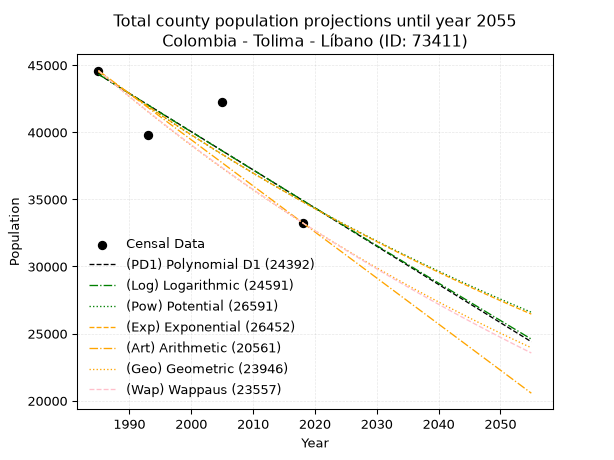
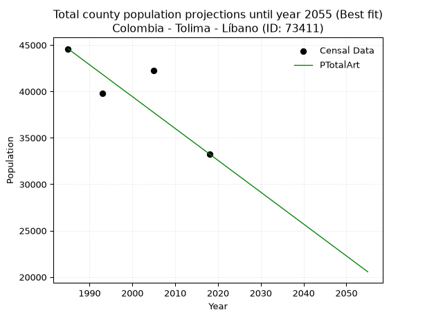
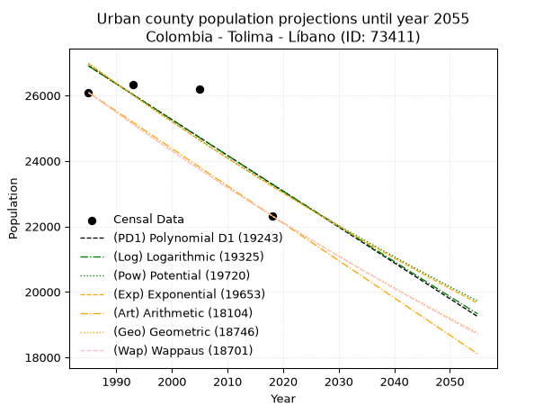
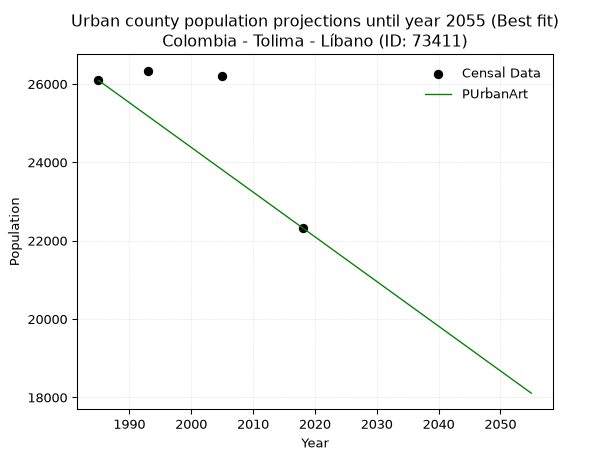
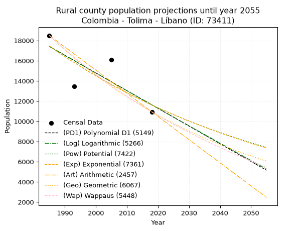
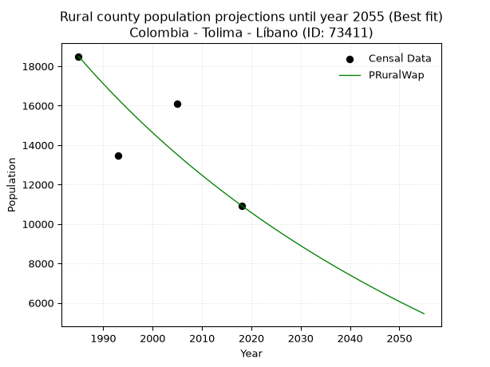

<div align="center">


</div>

# 📜 _“Population and Public Services Demand Projections (PPSD) until Year 2050 for Colombia - Tolima - Líbano (ID: 73411)”_
Keywords: `population` `public-service` `projection` `lineal` `polynomial` `logarithmic` `potential` `exponential` `arithmetic` `geometric` `wappaus` `dane` `colombia` `south-america`

PPSD are analytical estimates used by governments and planners to anticipate future changes in population size, age distribution, and the resulting community needs for utilities, healthcare, education, and infrastructure as sizing future water treatment facilities, electrical grids, and road networks based on spatial growth.

<div align="center">

</img>

</div>


> **General running parameters**: • app_version: _v20260806_. • Python version: _3.14.7_. • Pandas version: _3.0.5_. • NumPy version: _2.5.1_. • Creates, save and include plots into reports (create_plot): _False_. • Projection until year: _2050_. • Process polynomial degree 2 and up: _False_. • Process Wappaus: _True_. • Process Wappaus: _True_. • Set negative values to zero: _True_. • Set infinite values to zero: _True_. • Drop dataset notes: _True_. 
<div align="center">

Dynamic map: [:earth_americas:Google](http://maps.google.com/maps?q=4.920420226,-75.0619585) [:earth_americas:OSM](https://www.openstreetmap.org/#map=18/4.920420226/-75.0619585&layers=P) [:earth_americas:Bing](https://www.bing.com/maps?cp=4.920420226~-75.0619585&lvl=18) [:earth_americas:Apple](https://maps.apple.com/frame?center=4.920420226%2C-75.0619585&span=0.003%2C0.006)

</div>


<div align="center">

```geojson
{
  "type": "Feature",
  "geometry": {
    "type": "Point", 
    "coordinates": [-75.0619585, 4.920420226]
  }, 
  "properties": {
    "Name": "Colombia - Tolima - Líbano (ID: 73411)"
  }
}
```

</div>


## 0. Census Data (4 records)

Census data are official statistics collected by a government about the people and housing in a country. They usually include counts of total population, age, sex, race, income, education, and jobs.

📅Global census file: [Population.xlsx](../data/Population.xlsx)

| Source   |   Year |   CountryID | CountryName   |   StateID | StateName   |   CountyID | CountyName   |   PTotal |   PUrban |   PRural |
|:---------|-------:|------------:|:--------------|----------:|:------------|-----------:|:-------------|---------:|---------:|---------:|
| DANE     |   1985 |          57 | Colombia      |        73 | Tolima      |      73411 | Líbano       |    44590 |    26090 |    18500 |
| DANE     |   1993 |          57 | Colombia      |        73 | Tolima      |      73411 | Líbano       |    39785 |    26337 |    13448 |
| DANE     |   2005 |          57 | Colombia      |        73 | Tolima      |      73411 | Líbano       |    42269 |    26188 |    16081 |
| DANE     |   2018 |          57 | Colombia      |        73 | Tolima      |      73411 | Líbano       |    33262 |    22325 |    10937 |

> 🔥Some records could had specific notes about the registered values or the corresponding urban or rural distribution.

📅[SUI-RUPS](https://www.datos.gov.co/Hacienda-y-Cr-dito-P-blico/Registro-nico-de-Prestadores-de-Servicios-P-blicos/4qkq-csdn/about_data) - Local public utility companies: [RUPS.csv](../data/RUPS.csv)

 | SERVICIO       | ESTADO    | NOMBRE                                                                             | NIT         | DEPARTAMENTO_DOMICILIO   | MUNICIPIO_DOMICILIO   | DIRECCION                                                   |   TELEFONO | EMAIL                                   | TIPO_PRESTADOR                            | CLASIFICACION                 |
|:---------------|:----------|:-----------------------------------------------------------------------------------|:------------|:-------------------------|:----------------------|:------------------------------------------------------------|-----------:|:----------------------------------------|:------------------------------------------|:------------------------------|
| ACUEDUCTO      | OPERATIVA | EMPRESA DE SERVICIOS PUBLICOS DE ACUEDUCTO ALCANTARILLADO Y ASEO DEL LIBANO E.S.P. | 890703733-7 | TOLIMA                   | LIBANO                | Calle 4 Carrera 13 Esquina 2do piso                         |    2564347 | gerencia@emseresp.com                   | EMPRESA INDUSTRIAL Y COMERCIAL DEL ESTADO | MAYOR O IGUAL A 5001 USUARIOS |
| ALCANTARILLADO | OPERATIVA | EMPRESA DE SERVICIOS PUBLICOS DE ACUEDUCTO ALCANTARILLADO Y ASEO DEL LIBANO E.S.P. | 890703733-7 | TOLIMA                   | LIBANO                | Calle 4 Carrera 13 Esquina 2do piso                         |    2564347 | gerencia@emseresp.com                   | EMPRESA INDUSTRIAL Y COMERCIAL DEL ESTADO | MAYOR O IGUAL A 5001 USUARIOS |
| ACUEDUCTO      | OPERATIVA | ASOCIACION DE USUARIOS DEL ACUEDUCTO DELICIAS CONVENIO                             | 800247904-6 | TOLIMA                   | LIBANO                | Transversal 2 No. 9-156 Sector la Rivera frente a la Virgen |    2561767 | asociacueductodeliciaconvenio@gmail.com | ORGANIZACION AUTORIZADA                   | MENOR O IGUAL A 2500 USUARIOS |

## 1. Total

### 1.1. Coefficients and Parameters

* (PD1) Polynomial Deg 1: -284.64150943395697, 609330.6792452724 (lineal)
* (Log) Logarithmic: -569347.5380139102, 4367591.698908565
* (Pow) Potential: -14.868857691182416, 53.68245864243978
* (Exp) Exponential: -0.00743426832723405, 114120162208.47906
* (Art) Arithmetic: Year diff. 2018 - 1985 = 33, Population diff. 33262 - 44590 = -11328, Annual growth = -343.27272727272725
* (Geo) Geometric: Year diff. 2018 - 1985 = 33, Population diff. 33262 - 44590 = -11328, Annual growth % = -0.008842311573862394
* (Wap) Wappaus: i = -0.8818597525374486, Condition values only valid for < 200)

<sub>
Wappaus condition values: ['-0.00', '-0.88', '-1.76', '-2.65', '-3.53', '-4.41', '-5.29', '-6.17', '-7.05', '-7.94', '-8.82', '-9.70', '-10.58', '-11.46', '-12.35', '-13.23', '-14.11', '-14.99', '-15.87', '-16.76', '-17.64', '-18.52', '-19.40', '-20.28', '-21.16', '-22.05', '-22.93', '-23.81', '-24.69', '-25.57', '-26.46', '-27.34', '-28.22', '-29.10', '-29.98', '-30.87', '-31.75', '-32.63', '-33.51', '-34.39', '-35.27', '-36.16', '-37.04', '-37.92', '-38.80', '-39.68', '-40.57', '-41.45', '-42.33', '-43.21', '-44.09', '-44.97', '-45.86', '-46.74', '-47.62', '-48.50', '-49.38', '-50.27', '-51.15', '-52.03', '-52.91', '-53.79', '-54.68', '-55.56', '-56.44', '-57.32']
</sub>


### 1.2. Projected Dataset

|   Year |   CountyID |   PTotalPD1 |   PTotalLog |   PTotalPow |   PTotalExp |   PTotalArt |   PTotalGeo |   PTotalWap |
|-------:|-----------:|------------:|------------:|------------:|------------:|------------:|------------:|------------:|
|   1985 |      73411 |       44317 |       44323 |       44517 |       44511 |       44590 |       44590 |       44590 |
|   1986 |      73411 |       44033 |       44036 |       44185 |       44181 |       44247 |       44196 |       44199 |
|   1987 |      73411 |       43748 |       43749 |       43855 |       43854 |       43903 |       43805 |       43810 |
|   1988 |      73411 |       43463 |       43463 |       43529 |       43529 |       43560 |       43418 |       43426 |
|   1989 |      73411 |       43179 |       43177 |       43204 |       43207 |       43217 |       43034 |       43044 |
|   1990 |      73411 |       42894 |       42890 |       42883 |       42887 |       42874 |       42653 |       42666 |
|   1991 |      73411 |       42609 |       42604 |       42564 |       42569 |       42530 |       42276 |       42291 |
|   1992 |      73411 |       42325 |       42319 |       42247 |       42254 |       42187 |       41902 |       41920 |
|   1993 |      73411 |       42040 |       42033 |       41933 |       41941 |       41844 |       41532 |       41551 |
|   1994 |      73411 |       41756 |       41747 |       41621 |       41630 |       41501 |       41164 |       41186 |
|   1995 |      73411 |       41471 |       41462 |       41312 |       41322 |       41157 |       40800 |       40824 |
|   1996 |      73411 |       41186 |       41176 |       41005 |       41016 |       40814 |       40440 |       40465 |
|   1997 |      73411 |       40902 |       40891 |       40701 |       40712 |       40471 |       40082 |       40108 |
|   1998 |      73411 |       40617 |       40606 |       40399 |       40411 |       40127 |       39728 |       39755 |
|   1999 |      73411 |       40332 |       40321 |       40100 |       40111 |       39784 |       39376 |       39405 |
|   2000 |      73411 |       40048 |       40037 |       39803 |       39814 |       39441 |       39028 |       39058 |
|   2001 |      73411 |       39763 |       39752 |       39508 |       39519 |       39098 |       38683 |       38713 |
|   2002 |      73411 |       39478 |       39468 |       39216 |       39227 |       38754 |       38341 |       38371 |
|   2003 |      73411 |       39194 |       39183 |       38926 |       38936 |       38411 |       38002 |       38032 |
|   2004 |      73411 |       38909 |       38899 |       38638 |       38648 |       38068 |       37666 |       37696 |
|   2005 |      73411 |       38624 |       38615 |       38352 |       38362 |       37725 |       37333 |       37363 |
|   2006 |      73411 |       38340 |       38331 |       38069 |       38077 |       37381 |       37003 |       37032 |
|   2007 |      73411 |       38055 |       38047 |       37788 |       37795 |       37038 |       36676 |       36704 |
|   2008 |      73411 |       37771 |       37764 |       37509 |       37515 |       36695 |       36351 |       36379 |
|   2009 |      73411 |       37486 |       37480 |       37232 |       37238 |       36351 |       36030 |       36056 |
|   2010 |      73411 |       37201 |       37197 |       36958 |       36962 |       36008 |       35711 |       35736 |
|   2011 |      73411 |       36917 |       36914 |       36686 |       36688 |       35665 |       35396 |       35418 |
|   2012 |      73411 |       36632 |       36631 |       36415 |       36416 |       35322 |       35083 |       35103 |
|   2013 |      73411 |       36347 |       36348 |       36147 |       36147 |       34978 |       34772 |       34790 |
|   2014 |      73411 |       36063 |       36065 |       35881 |       35879 |       34635 |       34465 |       34479 |
|   2015 |      73411 |       35778 |       35782 |       35617 |       35613 |       34292 |       34160 |       34172 |
|   2016 |      73411 |       35493 |       35500 |       35356 |       35349 |       33949 |       33858 |       33866 |
|   2017 |      73411 |       35209 |       35218 |       35096 |       35087 |       33605 |       33559 |       33563 |
|   2018 |      73411 |       34924 |       34935 |       34838 |       34828 |       33262 |       33262 |       33262 |
|   2019 |      73411 |       34639 |       34653 |       34583 |       34570 |       32919 |       32968 |       32963 |
|   2020 |      73411 |       34355 |       34371 |       34329 |       34314 |       32575 |       32676 |       32667 |
|   2021 |      73411 |       34070 |       34090 |       34077 |       34059 |       32232 |       32387 |       32373 |
|   2022 |      73411 |       33786 |       33808 |       33827 |       33807 |       31889 |       32101 |       32082 |
|   2023 |      73411 |       33501 |       33526 |       33580 |       33557 |       31546 |       31817 |       31792 |
|   2024 |      73411 |       33216 |       33245 |       33334 |       33308 |       31202 |       31536 |       31505 |
|   2025 |      73411 |       32932 |       32964 |       33090 |       33061 |       30859 |       31257 |       31219 |
|   2026 |      73411 |       32647 |       32683 |       32848 |       32817 |       30516 |       30981 |       30936 |
|   2027 |      73411 |       32362 |       32402 |       32608 |       32574 |       30173 |       30707 |       30655 |
|   2028 |      73411 |       32078 |       32121 |       32369 |       32332 |       29829 |       30435 |       30376 |
|   2029 |      73411 |       31793 |       31840 |       32133 |       32093 |       29486 |       30166 |       30100 |
|   2030 |      73411 |       31508 |       31560 |       31899 |       31855 |       29143 |       29899 |       29825 |
|   2031 |      73411 |       31224 |       31279 |       31666 |       31619 |       28799 |       29635 |       29552 |
|   2032 |      73411 |       30939 |       30999 |       31435 |       31385 |       28456 |       29373 |       29281 |
|   2033 |      73411 |       30654 |       30719 |       31206 |       31153 |       28113 |       29113 |       29012 |
|   2034 |      73411 |       30370 |       30439 |       30978 |       30922 |       27770 |       28856 |       28745 |
|   2035 |      73411 |       30085 |       30159 |       30753 |       30693 |       27426 |       28601 |       28481 |
|   2036 |      73411 |       29801 |       29879 |       30529 |       30465 |       27083 |       28348 |       28217 |
|   2037 |      73411 |       29516 |       29600 |       30307 |       30240 |       26740 |       28097 |       27956 |
|   2038 |      73411 |       29231 |       29320 |       30087 |       30016 |       26397 |       27849 |       27697 |
|   2039 |      73411 |       28947 |       29041 |       29868 |       29793 |       26053 |       27602 |       27440 |
|   2040 |      73411 |       28662 |       28762 |       29651 |       29573 |       25710 |       27358 |       27184 |
|   2041 |      73411 |       28377 |       28483 |       29436 |       29354 |       25367 |       27116 |       26930 |
|   2042 |      73411 |       28093 |       28204 |       29222 |       29136 |       25023 |       26877 |       26678 |
|   2043 |      73411 |       27808 |       27925 |       29010 |       28921 |       24680 |       26639 |       26428 |
|   2044 |      73411 |       27523 |       27647 |       28800 |       28706 |       24337 |       26403 |       26179 |
|   2045 |      73411 |       27239 |       27368 |       28591 |       28494 |       23994 |       26170 |       25933 |
|   2046 |      73411 |       26954 |       27090 |       28384 |       28283 |       23650 |       25939 |       25688 |
|   2047 |      73411 |       26670 |       26812 |       28179 |       28073 |       23307 |       25709 |       25444 |
|   2048 |      73411 |       26385 |       26534 |       27975 |       27865 |       22964 |       25482 |       25203 |
|   2049 |      73411 |       26100 |       26256 |       27772 |       27659 |       22621 |       25257 |       24963 |
|   2050 |      73411 |       25816 |       25978 |       27572 |       27454 |       22277 |       25033 |       24724 |
<div align="center">

</img>

</div>


### 1.3. Best fit with absolute and relative error (%)

Relative error puts that difference into context by dividing the absolute error by the true value, creating a unitless ratio or percentage that shows the scale of the mistake.

Absolute and relative error

|   Year | Source   |   CountryID | CountryName   |   StateID | StateName   |   CountyID_x | CountyName   |   PTotal |   PUrban |   PRural |   CountyID_y |   PTotalPD1 |   PTotalLog |   PTotalPow |   PTotalExp |   PTotalArt |   PTotalGeo |   PTotalWap |   PTotalPD1AbsError |   PTotalLogAbsError |   PTotalPowAbsError |   PTotalExpAbsError |   PTotalArtAbsError |   PTotalGeoAbsError |   PTotalWapAbsError |   PTotalPD1RelError |   PTotalLogRelError |   PTotalPowRelError |   PTotalExpRelError |   PTotalArtRelError |   PTotalGeoRelError |   PTotalWapRelError |
|-------:|:---------|------------:|:--------------|----------:|:------------|-------------:|:-------------|---------:|---------:|---------:|-------------:|------------:|------------:|------------:|------------:|------------:|------------:|------------:|--------------------:|--------------------:|--------------------:|--------------------:|--------------------:|--------------------:|--------------------:|--------------------:|--------------------:|--------------------:|--------------------:|--------------------:|--------------------:|--------------------:|
|   1985 | DANE     |          57 | Colombia      |        73 | Tolima      |        73411 | Líbano       |    44590 |    26090 |    18500 |        73411 |       44317 |       44323 |       44517 |       44511 |       44590 |       44590 |       44590 |                 273 |                 267 |                  73 |                  79 |                   0 |                   0 |                   0 |            0.612245 |            0.598789 |            0.163714 |             0.17717 |             0       |              0      |             0       |
|   1993 | DANE     |          57 | Colombia      |        73 | Tolima      |        73411 | Líbano       |    39785 |    26337 |    13448 |        73411 |       42040 |       42033 |       41933 |       41941 |       41844 |       41532 |       41551 |                2255 |                2248 |                2148 |                2156 |                2059 |                1747 |                1766 |            5.66797  |            5.65037  |            5.39902  |             5.41913 |             5.17532 |              4.3911 |             4.43886 |
|   2005 | DANE     |          57 | Colombia      |        73 | Tolima      |        73411 | Líbano       |    42269 |    26188 |    16081 |        73411 |       38624 |       38615 |       38352 |       38362 |       37725 |       37333 |       37363 |                3645 |                3654 |                3917 |                3907 |                4544 |                4936 |                4906 |            8.62334  |            8.64463  |            9.26684  |             9.24318 |            10.7502  |             11.6776 |            11.6066  |
|   2018 | DANE     |          57 | Colombia      |        73 | Tolima      |        73411 | Líbano       |    33262 |    22325 |    10937 |        73411 |       34924 |       34935 |       34838 |       34828 |       33262 |       33262 |       33262 |                1662 |                1673 |                1576 |                1566 |                   0 |                   0 |                   0 |            4.99669  |            5.02976  |            4.73814  |             4.70808 |             0       |              0      |             0       |

Relative error mean

| Method    |   RelError | Best   |
|:----------|-----------:|:-------|
| PTotalPD1 |    4.97506 |        |
| PTotalLog |    4.98089 |        |
| PTotalPow |    4.89193 |        |
| PTotalExp |    4.88689 |        |
| PTotalArt |    3.98138 | True   |
| PTotalGeo |    4.01717 |        |
| PTotalWap |    4.01137 |        |

💙Best method: _**PTotalArt**_
<div align="center">

</img>

</div>


### 1.4. Fresh water supply demand in liters per capita per day (lpcd)

The fresh water supply demand typically ranges from 100 to 300 liters per capita per day (lpcd) for standard domestic and municipal planning, though absolute survival minimums set by the World Health Organization are as low as 7.5 to 20 liters per day, and total consumption in high-income nations can exceed 400 liters.

> `CZ`: Level in meters above the sea level (masl)<br> `WS`: Fresh water supply demand in liters per capita per day (lpcd or l/h/d)<br> `WSAll`: Zonal fresh water supply demand in liters per second (l/s)<br> `A`: Zonal area in square meters<br> `DP`: Population density (people/hectare or p/ha)

Reference values (RAS Colombia)

|    CZ |   WS |
|------:|-----:|
|  1000 |  120 |
|  2000 |  130 |
| 99999 |  140 |

County shapefile geometry properties and water supply values

|   CountyID |    ATotal |   CZTotal |   WSTotal |
|-----------:|----------:|----------:|----------:|
|      73411 | 2.822e+08 |   1503.58 |       130 |

Projected values for best method: PTotalArt

|   CountyID |   Year |   PTotalArt |   DPTotal |   WSTotal |   WSTotalAll |
|-----------:|-------:|------------:|----------:|----------:|-------------:|
|      73411 |   1985 |       44590 |      1.58 |       130 |      67.0914 |
|      73411 |   1986 |       44247 |      1.57 |       130 |      66.5753 |
|      73411 |   1987 |       43903 |      1.56 |       130 |      66.0578 |
|      73411 |   1988 |       43560 |      1.54 |       130 |      65.5417 |
|      73411 |   1989 |       43217 |      1.53 |       130 |      65.0256 |
|      73411 |   1990 |       42874 |      1.52 |       130 |      64.5095 |
|      73411 |   1991 |       42530 |      1.51 |       130 |      63.9919 |
|      73411 |   1992 |       42187 |      1.49 |       130 |      63.4758 |
|      73411 |   1993 |       41844 |      1.48 |       130 |      62.9597 |
|      73411 |   1994 |       41501 |      1.47 |       130 |      62.4436 |
|      73411 |   1995 |       41157 |      1.46 |       130 |      61.926  |
|      73411 |   1996 |       40814 |      1.45 |       130 |      61.41   |
|      73411 |   1997 |       40471 |      1.43 |       130 |      60.8939 |
|      73411 |   1998 |       40127 |      1.42 |       130 |      60.3763 |
|      73411 |   1999 |       39784 |      1.41 |       130 |      59.8602 |
|      73411 |   2000 |       39441 |      1.4  |       130 |      59.3441 |
|      73411 |   2001 |       39098 |      1.39 |       130 |      58.828  |
|      73411 |   2002 |       38754 |      1.37 |       130 |      58.3104 |
|      73411 |   2003 |       38411 |      1.36 |       130 |      57.7943 |
|      73411 |   2004 |       38068 |      1.35 |       130 |      57.2782 |
|      73411 |   2005 |       37725 |      1.34 |       130 |      56.7622 |
|      73411 |   2006 |       37381 |      1.32 |       130 |      56.2446 |
|      73411 |   2007 |       37038 |      1.31 |       130 |      55.7285 |
|      73411 |   2008 |       36695 |      1.3  |       130 |      55.2124 |
|      73411 |   2009 |       36351 |      1.29 |       130 |      54.6948 |
|      73411 |   2010 |       36008 |      1.28 |       130 |      54.1787 |
|      73411 |   2011 |       35665 |      1.26 |       130 |      53.6626 |
|      73411 |   2012 |       35322 |      1.25 |       130 |      53.1465 |
|      73411 |   2013 |       34978 |      1.24 |       130 |      52.6289 |
|      73411 |   2014 |       34635 |      1.23 |       130 |      52.1128 |
|      73411 |   2015 |       34292 |      1.22 |       130 |      51.5968 |
|      73411 |   2016 |       33949 |      1.2  |       130 |      51.0807 |
|      73411 |   2017 |       33605 |      1.19 |       130 |      50.5631 |
|      73411 |   2018 |       33262 |      1.18 |       130 |      50.047  |
|      73411 |   2019 |       32919 |      1.17 |       130 |      49.5309 |
|      73411 |   2020 |       32575 |      1.15 |       130 |      49.0133 |
|      73411 |   2021 |       32232 |      1.14 |       130 |      48.4972 |
|      73411 |   2022 |       31889 |      1.13 |       130 |      47.9811 |
|      73411 |   2023 |       31546 |      1.12 |       130 |      47.465  |
|      73411 |   2024 |       31202 |      1.11 |       130 |      46.9475 |
|      73411 |   2025 |       30859 |      1.09 |       130 |      46.4314 |
|      73411 |   2026 |       30516 |      1.08 |       130 |      45.9153 |
|      73411 |   2027 |       30173 |      1.07 |       130 |      45.3992 |
|      73411 |   2028 |       29829 |      1.06 |       130 |      44.8816 |
|      73411 |   2029 |       29486 |      1.04 |       130 |      44.3655 |
|      73411 |   2030 |       29143 |      1.03 |       130 |      43.8494 |
|      73411 |   2031 |       28799 |      1.02 |       130 |      43.3318 |
|      73411 |   2032 |       28456 |      1.01 |       130 |      42.8157 |
|      73411 |   2033 |       28113 |      1    |       130 |      42.2997 |
|      73411 |   2034 |       27770 |      0.98 |       130 |      41.7836 |
|      73411 |   2035 |       27426 |      0.97 |       130 |      41.266  |
|      73411 |   2036 |       27083 |      0.96 |       130 |      40.7499 |
|      73411 |   2037 |       26740 |      0.95 |       130 |      40.2338 |
|      73411 |   2038 |       26397 |      0.94 |       130 |      39.7177 |
|      73411 |   2039 |       26053 |      0.92 |       130 |      39.2001 |
|      73411 |   2040 |       25710 |      0.91 |       130 |      38.684  |
|      73411 |   2041 |       25367 |      0.9  |       130 |      38.1679 |
|      73411 |   2042 |       25023 |      0.89 |       130 |      37.6503 |
|      73411 |   2043 |       24680 |      0.87 |       130 |      37.1343 |
|      73411 |   2044 |       24337 |      0.86 |       130 |      36.6182 |
|      73411 |   2045 |       23994 |      0.85 |       130 |      36.1021 |
|      73411 |   2046 |       23650 |      0.84 |       130 |      35.5845 |
|      73411 |   2047 |       23307 |      0.83 |       130 |      35.0684 |
|      73411 |   2048 |       22964 |      0.81 |       130 |      34.5523 |
|      73411 |   2049 |       22621 |      0.8  |       130 |      34.0362 |
|      73411 |   2050 |       22277 |      0.79 |       130 |      33.5186 |

## 2. Urban

### 2.1. Coefficients and Parameters

* (PD1) Polynomial Deg 1: -109.4403853873923, 244143.13087113146 (lineal)
* (Log) Logarithmic: -218701.3057163567, 1687585.3773123021
* (Pow) Potential: -9.038829047858764, 34.23884371180813
* (Exp) Exponential: -0.004523089751376889, 213885071.9900347
* (Art) Arithmetic: Year diff. 2018 - 1985 = 33, Population diff. 22325 - 26090 = -3765, Annual growth = -114.0909090909091
* (Geo) Geometric: Year diff. 2018 - 1985 = 33, Population diff. 22325 - 26090 = -3765, Annual growth % = -0.004711441097515867
* (Wap) Wappaus: i = -0.4713039722850732, Condition values only valid for < 200)

<sub>
Wappaus condition values: ['-0.00', '-0.47', '-0.94', '-1.41', '-1.89', '-2.36', '-2.83', '-3.30', '-3.77', '-4.24', '-4.71', '-5.18', '-5.66', '-6.13', '-6.60', '-7.07', '-7.54', '-8.01', '-8.48', '-8.95', '-9.43', '-9.90', '-10.37', '-10.84', '-11.31', '-11.78', '-12.25', '-12.73', '-13.20', '-13.67', '-14.14', '-14.61', '-15.08', '-15.55', '-16.02', '-16.50', '-16.97', '-17.44', '-17.91', '-18.38', '-18.85', '-19.32', '-19.79', '-20.27', '-20.74', '-21.21', '-21.68', '-22.15', '-22.62', '-23.09', '-23.57', '-24.04', '-24.51', '-24.98', '-25.45', '-25.92', '-26.39', '-26.86', '-27.34', '-27.81', '-28.28', '-28.75', '-29.22', '-29.69', '-30.16', '-30.63']
</sub>


### 2.2. Projected Dataset

|   Year |   CountyID |   PUrbanPD1 |   PUrbanLog |   PUrbanPow |   PUrbanExp |   PUrbanArt |   PUrbanGeo |   PUrbanWap |
|-------:|-----------:|------------:|------------:|------------:|------------:|------------:|------------:|------------:|
|   1985 |      73411 |       26904 |       26905 |       26974 |       26974 |       26090 |       26090 |       26090 |
|   1986 |      73411 |       26795 |       26794 |       26852 |       26852 |       25976 |       25967 |       25967 |
|   1987 |      73411 |       26685 |       26684 |       26730 |       26731 |       25862 |       25845 |       25845 |
|   1988 |      73411 |       26576 |       26574 |       26609 |       26610 |       25748 |       25723 |       25724 |
|   1989 |      73411 |       26466 |       26464 |       26488 |       26490 |       25634 |       25602 |       25603 |
|   1990 |      73411 |       26357 |       26354 |       26368 |       26370 |       25520 |       25481 |       25482 |
|   1991 |      73411 |       26247 |       26244 |       26248 |       26251 |       25405 |       25361 |       25363 |
|   1992 |      73411 |       26138 |       26135 |       26130 |       26133 |       25291 |       25242 |       25243 |
|   1993 |      73411 |       26028 |       26025 |       26011 |       26015 |       25177 |       25123 |       25124 |
|   1994 |      73411 |       25919 |       25915 |       25894 |       25898 |       25063 |       25004 |       25006 |
|   1995 |      73411 |       25810 |       25806 |       25777 |       25781 |       24949 |       24887 |       24889 |
|   1996 |      73411 |       25700 |       25696 |       25660 |       25664 |       24835 |       24769 |       24772 |
|   1997 |      73411 |       25591 |       25586 |       25544 |       25549 |       24721 |       24653 |       24655 |
|   1998 |      73411 |       25481 |       25477 |       25429 |       25433 |       24607 |       24536 |       24539 |
|   1999 |      73411 |       25372 |       25367 |       25314 |       25319 |       24493 |       24421 |       24423 |
|   2000 |      73411 |       25262 |       25258 |       25200 |       25204 |       24379 |       24306 |       24309 |
|   2001 |      73411 |       25153 |       25149 |       25086 |       25091 |       24265 |       24191 |       24194 |
|   2002 |      73411 |       25043 |       25039 |       24973 |       24977 |       24150 |       24077 |       24080 |
|   2003 |      73411 |       24934 |       24930 |       24861 |       24865 |       24036 |       23964 |       23967 |
|   2004 |      73411 |       24825 |       24821 |       24749 |       24752 |       23922 |       23851 |       23854 |
|   2005 |      73411 |       24715 |       24712 |       24637 |       24641 |       23808 |       23739 |       23741 |
|   2006 |      73411 |       24606 |       24603 |       24527 |       24529 |       23694 |       23627 |       23630 |
|   2007 |      73411 |       24496 |       24494 |       24416 |       24419 |       23580 |       23515 |       23518 |
|   2008 |      73411 |       24387 |       24385 |       24307 |       24309 |       23466 |       23405 |       23407 |
|   2009 |      73411 |       24277 |       24276 |       24198 |       24199 |       23352 |       23294 |       23297 |
|   2010 |      73411 |       24168 |       24167 |       24089 |       24090 |       23238 |       23185 |       23187 |
|   2011 |      73411 |       24059 |       24059 |       23981 |       23981 |       23124 |       23075 |       23078 |
|   2012 |      73411 |       23949 |       23950 |       23873 |       23873 |       23010 |       22967 |       22969 |
|   2013 |      73411 |       23840 |       23841 |       23766 |       23765 |       22895 |       22858 |       22860 |
|   2014 |      73411 |       23730 |       23733 |       23660 |       23658 |       22781 |       22751 |       22752 |
|   2015 |      73411 |       23621 |       23624 |       23554 |       23551 |       22667 |       22644 |       22645 |
|   2016 |      73411 |       23511 |       23515 |       23449 |       23445 |       22553 |       22537 |       22538 |
|   2017 |      73411 |       23402 |       23407 |       23344 |       23339 |       22439 |       22431 |       22431 |
|   2018 |      73411 |       23292 |       23299 |       23239 |       23234 |       22325 |       22325 |       22325 |
|   2019 |      73411 |       23183 |       23190 |       23136 |       23129 |       22211 |       22220 |       22219 |
|   2020 |      73411 |       23074 |       23082 |       23032 |       23024 |       22097 |       22115 |       22114 |
|   2021 |      73411 |       22964 |       22974 |       22930 |       22920 |       21983 |       22011 |       22009 |
|   2022 |      73411 |       22855 |       22866 |       22827 |       22817 |       21869 |       21907 |       21905 |
|   2023 |      73411 |       22745 |       22757 |       22725 |       22714 |       21755 |       21804 |       21801 |
|   2024 |      73411 |       22636 |       22649 |       22624 |       22612 |       21640 |       21701 |       21698 |
|   2025 |      73411 |       22526 |       22541 |       22523 |       22509 |       21526 |       21599 |       21595 |
|   2026 |      73411 |       22417 |       22433 |       22423 |       22408 |       21412 |       21497 |       21493 |
|   2027 |      73411 |       22307 |       22325 |       22323 |       22307 |       21298 |       21396 |       21391 |
|   2028 |      73411 |       22198 |       22218 |       22224 |       22206 |       21184 |       21295 |       21289 |
|   2029 |      73411 |       22089 |       22110 |       22125 |       22106 |       21070 |       21195 |       21188 |
|   2030 |      73411 |       21979 |       22002 |       22027 |       22006 |       20956 |       21095 |       21087 |
|   2031 |      73411 |       21870 |       21894 |       21929 |       21907 |       20842 |       20996 |       20987 |
|   2032 |      73411 |       21760 |       21787 |       21832 |       21808 |       20728 |       20897 |       20887 |
|   2033 |      73411 |       21651 |       21679 |       21735 |       21710 |       20614 |       20798 |       20788 |
|   2034 |      73411 |       21541 |       21571 |       21638 |       21612 |       20500 |       20700 |       20689 |
|   2035 |      73411 |       21432 |       21464 |       21542 |       21514 |       20385 |       20603 |       20590 |
|   2036 |      73411 |       21323 |       21356 |       21447 |       21417 |       20271 |       20506 |       20492 |
|   2037 |      73411 |       21213 |       21249 |       21352 |       21320 |       20157 |       20409 |       20394 |
|   2038 |      73411 |       21104 |       21142 |       21258 |       21224 |       20043 |       20313 |       20297 |
|   2039 |      73411 |       20994 |       21034 |       21163 |       21128 |       19929 |       20217 |       20200 |
|   2040 |      73411 |       20885 |       20927 |       21070 |       21033 |       19815 |       20122 |       20103 |
|   2041 |      73411 |       20775 |       20820 |       20977 |       20938 |       19701 |       20027 |       20007 |
|   2042 |      73411 |       20666 |       20713 |       20884 |       20844 |       19587 |       19933 |       19911 |
|   2043 |      73411 |       20556 |       20606 |       20792 |       20749 |       19473 |       19839 |       19816 |
|   2044 |      73411 |       20447 |       20499 |       20700 |       20656 |       19359 |       19745 |       19721 |
|   2045 |      73411 |       20338 |       20392 |       20609 |       20563 |       19245 |       19652 |       19626 |
|   2046 |      73411 |       20228 |       20285 |       20518 |       20470 |       19130 |       19560 |       19532 |
|   2047 |      73411 |       20119 |       20178 |       20428 |       20377 |       19016 |       19468 |       19438 |
|   2048 |      73411 |       20009 |       20071 |       20338 |       20285 |       18902 |       19376 |       19345 |
|   2049 |      73411 |       19900 |       19964 |       20248 |       20194 |       18788 |       19285 |       19252 |
|   2050 |      73411 |       19790 |       19858 |       20159 |       20103 |       18674 |       19194 |       19159 |
<div align="center">

</img>

</div>


### 2.3. Best fit with absolute and relative error (%)

Relative error puts that difference into context by dividing the absolute error by the true value, creating a unitless ratio or percentage that shows the scale of the mistake.

Absolute and relative error

|   Year | Source   |   CountryID | CountryName   |   StateID | StateName   |   CountyID_x | CountyName   |   PTotal |   PUrban |   PRural |   CountyID_y |   PUrbanPD1 |   PUrbanLog |   PUrbanPow |   PUrbanExp |   PUrbanArt |   PUrbanGeo |   PUrbanWap |   PUrbanPD1AbsError |   PUrbanLogAbsError |   PUrbanPowAbsError |   PUrbanExpAbsError |   PUrbanArtAbsError |   PUrbanGeoAbsError |   PUrbanWapAbsError |   PUrbanPD1RelError |   PUrbanLogRelError |   PUrbanPowRelError |   PUrbanExpRelError |   PUrbanArtRelError |   PUrbanGeoRelError |   PUrbanWapRelError |
|-------:|:---------|------------:|:--------------|----------:|:------------|-------------:|:-------------|---------:|---------:|---------:|-------------:|------------:|------------:|------------:|------------:|------------:|------------:|------------:|--------------------:|--------------------:|--------------------:|--------------------:|--------------------:|--------------------:|--------------------:|--------------------:|--------------------:|--------------------:|--------------------:|--------------------:|--------------------:|--------------------:|
|   1985 | DANE     |          57 | Colombia      |        73 | Tolima      |        73411 | Líbano       |    44590 |    26090 |    18500 |        73411 |       26904 |       26905 |       26974 |       26974 |       26090 |       26090 |       26090 |                 814 |                 815 |                 884 |                 884 |                   0 |                   0 |                   0 |             3.11997 |             3.1238  |             3.38827 |             3.38827 |             0       |             0       |             0       |
|   1993 | DANE     |          57 | Colombia      |        73 | Tolima      |        73411 | Líbano       |    39785 |    26337 |    13448 |        73411 |       26028 |       26025 |       26011 |       26015 |       25177 |       25123 |       25124 |                 309 |                 312 |                 326 |                 322 |                1160 |                1214 |                1213 |             1.17325 |             1.18465 |             1.2378  |             1.22261 |             4.40445 |             4.60948 |             4.60569 |
|   2005 | DANE     |          57 | Colombia      |        73 | Tolima      |        73411 | Líbano       |    42269 |    26188 |    16081 |        73411 |       24715 |       24712 |       24637 |       24641 |       23808 |       23739 |       23741 |                1473 |                1476 |                1551 |                1547 |                2380 |                2449 |                2447 |             5.62471 |             5.63617 |             5.92256 |             5.90729 |             9.08813 |             9.35161 |             9.34397 |
|   2018 | DANE     |          57 | Colombia      |        73 | Tolima      |        73411 | Líbano       |    33262 |    22325 |    10937 |        73411 |       23292 |       23299 |       23239 |       23234 |       22325 |       22325 |       22325 |                 967 |                 974 |                 914 |                 909 |                   0 |                   0 |                   0 |             4.33147 |             4.36282 |             4.09406 |             4.07167 |             0       |             0       |             0       |

Relative error mean

| Method    |   RelError | Best   |
|:----------|-----------:|:-------|
| PUrbanPD1 |    3.56235 |        |
| PUrbanLog |    3.57686 |        |
| PUrbanPow |    3.66067 |        |
| PUrbanExp |    3.64746 |        |
| PUrbanArt |    3.37315 | True   |
| PUrbanGeo |    3.49027 |        |
| PUrbanWap |    3.48742 |        |

💙Best method: _**PUrbanArt**_
<div align="center">

</img>

</div>


### 2.4. Fresh water supply demand in liters per capita per day (lpcd)

The fresh water supply demand typically ranges from 100 to 300 liters per capita per day (lpcd) for standard domestic and municipal planning, though absolute survival minimums set by the World Health Organization are as low as 7.5 to 20 liters per day, and total consumption in high-income nations can exceed 400 liters.

> `CZ`: Level in meters above the sea level (masl)<br> `WS`: Fresh water supply demand in liters per capita per day (lpcd or l/h/d)<br> `WSAll`: Zonal fresh water supply demand in liters per second (l/s)<br> `A`: Zonal area in square meters<br> `DP`: Population density (people/hectare or p/ha)

Reference values (RAS Colombia)

|    CZ |   WS |
|------:|-----:|
|  1000 |  120 |
|  2000 |  130 |
| 99999 |  140 |

County shapefile geometry properties and water supply values

|   CountyID |      AUrban |   CZUrban |   WSUrban |
|-----------:|------------:|----------:|----------:|
|      73411 | 3.63748e+06 |   1569.78 |       130 |

Projected values for best method: PUrbanArt

|   CountyID |   Year |   PUrbanArt |   DPUrban |   WSUrban |   WSUrbanAll |
|-----------:|-------:|------------:|----------:|----------:|-------------:|
|      73411 |   1985 |       26090 |     71.73 |       130 |      39.2558 |
|      73411 |   1986 |       25976 |     71.41 |       130 |      39.0843 |
|      73411 |   1987 |       25862 |     71.1  |       130 |      38.9127 |
|      73411 |   1988 |       25748 |     70.79 |       130 |      38.7412 |
|      73411 |   1989 |       25634 |     70.47 |       130 |      38.5697 |
|      73411 |   1990 |       25520 |     70.16 |       130 |      38.3981 |
|      73411 |   1991 |       25405 |     69.84 |       130 |      38.2251 |
|      73411 |   1992 |       25291 |     69.53 |       130 |      38.0536 |
|      73411 |   1993 |       25177 |     69.22 |       130 |      37.8821 |
|      73411 |   1994 |       25063 |     68.9  |       130 |      37.7105 |
|      73411 |   1995 |       24949 |     68.59 |       130 |      37.539  |
|      73411 |   1996 |       24835 |     68.28 |       130 |      37.3675 |
|      73411 |   1997 |       24721 |     67.96 |       130 |      37.1959 |
|      73411 |   1998 |       24607 |     67.65 |       130 |      37.0244 |
|      73411 |   1999 |       24493 |     67.34 |       130 |      36.8529 |
|      73411 |   2000 |       24379 |     67.02 |       130 |      36.6814 |
|      73411 |   2001 |       24265 |     66.71 |       130 |      36.5098 |
|      73411 |   2002 |       24150 |     66.39 |       130 |      36.3368 |
|      73411 |   2003 |       24036 |     66.08 |       130 |      36.1653 |
|      73411 |   2004 |       23922 |     65.77 |       130 |      35.9937 |
|      73411 |   2005 |       23808 |     65.45 |       130 |      35.8222 |
|      73411 |   2006 |       23694 |     65.14 |       130 |      35.6507 |
|      73411 |   2007 |       23580 |     64.83 |       130 |      35.4792 |
|      73411 |   2008 |       23466 |     64.51 |       130 |      35.3076 |
|      73411 |   2009 |       23352 |     64.2  |       130 |      35.1361 |
|      73411 |   2010 |       23238 |     63.88 |       130 |      34.9646 |
|      73411 |   2011 |       23124 |     63.57 |       130 |      34.7931 |
|      73411 |   2012 |       23010 |     63.26 |       130 |      34.6215 |
|      73411 |   2013 |       22895 |     62.94 |       130 |      34.4485 |
|      73411 |   2014 |       22781 |     62.63 |       130 |      34.277  |
|      73411 |   2015 |       22667 |     62.32 |       130 |      34.1054 |
|      73411 |   2016 |       22553 |     62    |       130 |      33.9339 |
|      73411 |   2017 |       22439 |     61.69 |       130 |      33.7624 |
|      73411 |   2018 |       22325 |     61.37 |       130 |      33.5909 |
|      73411 |   2019 |       22211 |     61.06 |       130 |      33.4193 |
|      73411 |   2020 |       22097 |     60.75 |       130 |      33.2478 |
|      73411 |   2021 |       21983 |     60.43 |       130 |      33.0763 |
|      73411 |   2022 |       21869 |     60.12 |       130 |      32.9047 |
|      73411 |   2023 |       21755 |     59.81 |       130 |      32.7332 |
|      73411 |   2024 |       21640 |     59.49 |       130 |      32.5602 |
|      73411 |   2025 |       21526 |     59.18 |       130 |      32.3887 |
|      73411 |   2026 |       21412 |     58.86 |       130 |      32.2171 |
|      73411 |   2027 |       21298 |     58.55 |       130 |      32.0456 |
|      73411 |   2028 |       21184 |     58.24 |       130 |      31.8741 |
|      73411 |   2029 |       21070 |     57.92 |       130 |      31.7025 |
|      73411 |   2030 |       20956 |     57.61 |       130 |      31.531  |
|      73411 |   2031 |       20842 |     57.3  |       130 |      31.3595 |
|      73411 |   2032 |       20728 |     56.98 |       130 |      31.188  |
|      73411 |   2033 |       20614 |     56.67 |       130 |      31.0164 |
|      73411 |   2034 |       20500 |     56.36 |       130 |      30.8449 |
|      73411 |   2035 |       20385 |     56.04 |       130 |      30.6719 |
|      73411 |   2036 |       20271 |     55.73 |       130 |      30.5003 |
|      73411 |   2037 |       20157 |     55.41 |       130 |      30.3288 |
|      73411 |   2038 |       20043 |     55.1  |       130 |      30.1573 |
|      73411 |   2039 |       19929 |     54.79 |       130 |      29.9858 |
|      73411 |   2040 |       19815 |     54.47 |       130 |      29.8142 |
|      73411 |   2041 |       19701 |     54.16 |       130 |      29.6427 |
|      73411 |   2042 |       19587 |     53.85 |       130 |      29.4712 |
|      73411 |   2043 |       19473 |     53.53 |       130 |      29.2997 |
|      73411 |   2044 |       19359 |     53.22 |       130 |      29.1281 |
|      73411 |   2045 |       19245 |     52.91 |       130 |      28.9566 |
|      73411 |   2046 |       19130 |     52.59 |       130 |      28.7836 |
|      73411 |   2047 |       19016 |     52.28 |       130 |      28.612  |
|      73411 |   2048 |       18902 |     51.96 |       130 |      28.4405 |
|      73411 |   2049 |       18788 |     51.65 |       130 |      28.269  |
|      73411 |   2050 |       18674 |     51.34 |       130 |      28.0975 |

## 3. Rural

### 3.1. Coefficients and Parameters

* (PD1) Polynomial Deg 1: -175.20112404656456, 365187.54837414075 (lineal)
* (Log) Logarithmic: -350646.2322975529, 2680006.3215962583
* (Pow) Potential: -24.686381014575968, 85.65187604746647
* (Exp) Exponential: -0.012337296867357917, 754465838999403.2
* (Art) Arithmetic: Year diff. 2018 - 1985 = 33, Population diff. 10937 - 18500 = -7563, Annual growth = -229.1818181818182
* (Geo) Geometric: Year diff. 2018 - 1985 = 33, Population diff. 10937 - 18500 = -7563, Annual growth % = -0.01580167694332857
* (Wap) Wappaus: i = -1.5571003715176015, Condition values only valid for < 200)

<sub>
Wappaus condition values: ['-0.00', '-1.56', '-3.11', '-4.67', '-6.23', '-7.79', '-9.34', '-10.90', '-12.46', '-14.01', '-15.57', '-17.13', '-18.69', '-20.24', '-21.80', '-23.36', '-24.91', '-26.47', '-28.03', '-29.58', '-31.14', '-32.70', '-34.26', '-35.81', '-37.37', '-38.93', '-40.48', '-42.04', '-43.60', '-45.16', '-46.71', '-48.27', '-49.83', '-51.38', '-52.94', '-54.50', '-56.06', '-57.61', '-59.17', '-60.73', '-62.28', '-63.84', '-65.40', '-66.96', '-68.51', '-70.07', '-71.63', '-73.18', '-74.74', '-76.30', '-77.86', '-79.41', '-80.97', '-82.53', '-84.08', '-85.64', '-87.20', '-88.75', '-90.31', '-91.87', '-93.43', '-94.98', '-96.54', '-98.10', '-99.65', '-101.21']
</sub>


### 3.2. Projected Dataset

|   Year |   CountyID |   PRuralPD1 |   PRuralLog |   PRuralPow |   PRuralExp |   PRuralArt |   PRuralGeo |   PRuralWap |
|-------:|-----------:|------------:|------------:|------------:|------------:|------------:|------------:|------------:|
|   1985 |      73411 |       17413 |       17418 |       17462 |       17457 |       18500 |       18500 |       18500 |
|   1986 |      73411 |       17238 |       17242 |       17247 |       17243 |       18271 |       18208 |       18214 |
|   1987 |      73411 |       17063 |       17065 |       17034 |       17032 |       18042 |       17920 |       17933 |
|   1988 |      73411 |       16888 |       16889 |       16823 |       16823 |       17812 |       17637 |       17656 |
|   1989 |      73411 |       16713 |       16712 |       16616 |       16616 |       17583 |       17358 |       17383 |
|   1990 |      73411 |       16537 |       16536 |       16411 |       16413 |       17354 |       17084 |       17114 |
|   1991 |      73411 |       16362 |       16360 |       16209 |       16211 |       17125 |       16814 |       16849 |
|   1992 |      73411 |       16187 |       16184 |       16009 |       16013 |       16896 |       16548 |       16588 |
|   1993 |      73411 |       16012 |       16008 |       15812 |       15816 |       16667 |       16287 |       16331 |
|   1994 |      73411 |       15837 |       15832 |       15617 |       15622 |       16437 |       16029 |       16077 |
|   1995 |      73411 |       15661 |       15656 |       15425 |       15431 |       16208 |       15776 |       15827 |
|   1996 |      73411 |       15486 |       15481 |       15235 |       15242 |       15979 |       15527 |       15581 |
|   1997 |      73411 |       15311 |       15305 |       15048 |       15055 |       15750 |       15281 |       15339 |
|   1998 |      73411 |       15136 |       15129 |       14863 |       14870 |       15521 |       15040 |       15099 |
|   1999 |      73411 |       14961 |       14954 |       14681 |       14688 |       15291 |       14802 |       14863 |
|   2000 |      73411 |       14785 |       14779 |       14501 |       14508 |       15062 |       14568 |       14631 |
|   2001 |      73411 |       14610 |       14603 |       14323 |       14330 |       14833 |       14338 |       14402 |
|   2002 |      73411 |       14435 |       14428 |       14147 |       14154 |       14604 |       14112 |       14175 |
|   2003 |      73411 |       14260 |       14253 |       13974 |       13981 |       14375 |       13889 |       13952 |
|   2004 |      73411 |       14084 |       14078 |       13803 |       13809 |       14146 |       13669 |       13732 |
|   2005 |      73411 |       13909 |       13903 |       13634 |       13640 |       13916 |       13453 |       13515 |
|   2006 |      73411 |       13734 |       13728 |       13467 |       13473 |       13687 |       13241 |       13301 |
|   2007 |      73411 |       13559 |       13553 |       13303 |       13307 |       13458 |       13031 |       13089 |
|   2008 |      73411 |       13384 |       13379 |       13140 |       13144 |       13229 |       12825 |       12881 |
|   2009 |      73411 |       13208 |       13204 |       12979 |       12983 |       13000 |       12623 |       12675 |
|   2010 |      73411 |       13033 |       13030 |       12821 |       12824 |       12770 |       12423 |       12472 |
|   2011 |      73411 |       12858 |       12855 |       12664 |       12667 |       12541 |       12227 |       12271 |
|   2012 |      73411 |       12683 |       12681 |       12510 |       12511 |       12312 |       12034 |       12073 |
|   2013 |      73411 |       12508 |       12507 |       12357 |       12358 |       12083 |       11844 |       11878 |
|   2014 |      73411 |       12332 |       12333 |       12207 |       12206 |       11854 |       11656 |       11685 |
|   2015 |      73411 |       12157 |       12158 |       12058 |       12057 |       11625 |       11472 |       11494 |
|   2016 |      73411 |       11982 |       11985 |       11911 |       11909 |       11395 |       11291 |       11306 |
|   2017 |      73411 |       11807 |       11811 |       11766 |       11763 |       11166 |       11113 |       11120 |
|   2018 |      73411 |       11632 |       11637 |       11623 |       11619 |       10937 |       10937 |       10937 |
|   2019 |      73411 |       11456 |       11463 |       11482 |       11476 |       10708 |       10764 |       10756 |
|   2020 |      73411 |       11281 |       11289 |       11343 |       11335 |       10479 |       10594 |       10577 |
|   2021 |      73411 |       11106 |       11116 |       11205 |       11196 |       10249 |       10427 |       10400 |
|   2022 |      73411 |       10931 |       10942 |       11069 |       11059 |       10020 |       10262 |       10225 |
|   2023 |      73411 |       10756 |       10769 |       10935 |       10924 |        9791 |       10100 |       10053 |
|   2024 |      73411 |       10580 |       10596 |       10802 |       10790 |        9562 |        9940 |        9882 |
|   2025 |      73411 |       10405 |       10423 |       10671 |       10657 |        9333 |        9783 |        9714 |
|   2026 |      73411 |       10230 |       10249 |       10542 |       10527 |        9104 |        9629 |        9547 |
|   2027 |      73411 |       10055 |       10076 |       10414 |       10398 |        8874 |        9476 |        9383 |
|   2028 |      73411 |        9880 |        9904 |       10288 |       10270 |        8645 |        9327 |        9220 |
|   2029 |      73411 |        9704 |        9731 |       10164 |       10144 |        8416 |        9179 |        9059 |
|   2030 |      73411 |        9529 |        9558 |       10041 |       10020 |        8187 |        9034 |        8900 |
|   2031 |      73411 |        9354 |        9385 |        9919 |        9897 |        7958 |        8891 |        8743 |
|   2032 |      73411 |        9179 |        9213 |        9800 |        9776 |        7728 |        8751 |        8588 |
|   2033 |      73411 |        9004 |        9040 |        9681 |        9656 |        7499 |        8613 |        8434 |
|   2034 |      73411 |        8828 |        8868 |        9565 |        9537 |        7270 |        8477 |        8283 |
|   2035 |      73411 |        8653 |        8695 |        9449 |        9420 |        7041 |        8343 |        8133 |
|   2036 |      73411 |        8478 |        8523 |        9335 |        9305 |        6812 |        8211 |        7984 |
|   2037 |      73411 |        8303 |        8351 |        9223 |        9191 |        6583 |        8081 |        7837 |
|   2038 |      73411 |        8128 |        8179 |        9112 |        9078 |        6353 |        7953 |        7692 |
|   2039 |      73411 |        7952 |        8007 |        9002 |        8967 |        6124 |        7828 |        7549 |
|   2040 |      73411 |        7777 |        7835 |        8894 |        8857 |        5895 |        7704 |        7407 |
|   2041 |      73411 |        7602 |        7663 |        8787 |        8748 |        5666 |        7582 |        7266 |
|   2042 |      73411 |        7427 |        7491 |        8681 |        8641 |        5437 |        7462 |        7127 |
|   2043 |      73411 |        7252 |        7320 |        8577 |        8535 |        5207 |        7345 |        6990 |
|   2044 |      73411 |        7076 |        7148 |        8474 |        8430 |        4978 |        7228 |        6854 |
|   2045 |      73411 |        6901 |        6976 |        8372 |        8327 |        4749 |        7114 |        6719 |
|   2046 |      73411 |        6726 |        6805 |        8272 |        8225 |        4520 |        7002 |        6586 |
|   2047 |      73411 |        6551 |        6634 |        8173 |        8124 |        4291 |        6891 |        6454 |
|   2048 |      73411 |        6376 |        6462 |        8075 |        8024 |        4062 |        6782 |        6324 |
|   2049 |      73411 |        6200 |        6291 |        7978 |        7926 |        3832 |        6675 |        6195 |
|   2050 |      73411 |        6025 |        6120 |        7882 |        7829 |        3603 |        6570 |        6067 |
<div align="center">

</img>

</div>


### 3.3. Best fit with absolute and relative error (%)

Relative error puts that difference into context by dividing the absolute error by the true value, creating a unitless ratio or percentage that shows the scale of the mistake.

Absolute and relative error

|   Year | Source   |   CountryID | CountryName   |   StateID | StateName   |   CountyID_x | CountyName   |   PTotal |   PUrban |   PRural |   CountyID_y |   PRuralPD1 |   PRuralLog |   PRuralPow |   PRuralExp |   PRuralArt |   PRuralGeo |   PRuralWap |   PRuralPD1AbsError |   PRuralLogAbsError |   PRuralPowAbsError |   PRuralExpAbsError |   PRuralArtAbsError |   PRuralGeoAbsError |   PRuralWapAbsError |   PRuralPD1RelError |   PRuralLogRelError |   PRuralPowRelError |   PRuralExpRelError |   PRuralArtRelError |   PRuralGeoRelError |   PRuralWapRelError |
|-------:|:---------|------------:|:--------------|----------:|:------------|-------------:|:-------------|---------:|---------:|---------:|-------------:|------------:|------------:|------------:|------------:|------------:|------------:|------------:|--------------------:|--------------------:|--------------------:|--------------------:|--------------------:|--------------------:|--------------------:|--------------------:|--------------------:|--------------------:|--------------------:|--------------------:|--------------------:|--------------------:|
|   1985 | DANE     |          57 | Colombia      |        73 | Tolima      |        73411 | Líbano       |    44590 |    26090 |    18500 |        73411 |       17413 |       17418 |       17462 |       17457 |       18500 |       18500 |       18500 |                1087 |                1082 |                1038 |                1043 |                   0 |                   0 |                   0 |             5.87568 |             5.84865 |             5.61081 |             5.63784 |              0      |              0      |              0      |
|   1993 | DANE     |          57 | Colombia      |        73 | Tolima      |        73411 | Líbano       |    39785 |    26337 |    13448 |        73411 |       16012 |       16008 |       15812 |       15816 |       16667 |       16287 |       16331 |                2564 |                2560 |                2364 |                2368 |                3219 |                2839 |                2883 |            19.066   |            19.0363  |            17.5788  |            17.6086  |             23.9366 |             21.1109 |             21.4381 |
|   2005 | DANE     |          57 | Colombia      |        73 | Tolima      |        73411 | Líbano       |    42269 |    26188 |    16081 |        73411 |       13909 |       13903 |       13634 |       13640 |       13916 |       13453 |       13515 |                2172 |                2178 |                2447 |                2441 |                2165 |                2628 |                2566 |            13.5066  |            13.5439  |            15.2167  |            15.1794  |             13.4631 |             16.3423 |             15.9567 |
|   2018 | DANE     |          57 | Colombia      |        73 | Tolima      |        73411 | Líbano       |    33262 |    22325 |    10937 |        73411 |       11632 |       11637 |       11623 |       11619 |       10937 |       10937 |       10937 |                 695 |                 700 |                 686 |                 682 |                   0 |                   0 |                   0 |             6.35458 |             6.40029 |             6.27229 |             6.23571 |              0      |              0      |              0      |

Relative error mean

| Method    |   RelError | Best   |
|:----------|-----------:|:-------|
| PRuralPD1 |   11.2007  |        |
| PRuralLog |   11.2073  |        |
| PRuralPow |   11.1697  |        |
| PRuralExp |   11.1654  |        |
| PRuralArt |    9.34993 |        |
| PRuralGeo |    9.3633  |        |
| PRuralWap |    9.34871 | True   |

💙Best method: _**PRuralWap**_
<div align="center">

</img>

</div>


### 3.4. Fresh water supply demand in liters per capita per day (lpcd)

The fresh water supply demand typically ranges from 100 to 300 liters per capita per day (lpcd) for standard domestic and municipal planning, though absolute survival minimums set by the World Health Organization are as low as 7.5 to 20 liters per day, and total consumption in high-income nations can exceed 400 liters.

> `CZ`: Level in meters above the sea level (masl)<br> `WS`: Fresh water supply demand in liters per capita per day (lpcd or l/h/d)<br> `WSAll`: Zonal fresh water supply demand in liters per second (l/s)<br> `A`: Zonal area in square meters<br> `DP`: Population density (people/hectare or p/ha)

Reference values (RAS Colombia)

|    CZ |   WS |
|------:|-----:|
|  1000 |  120 |
|  2000 |  130 |
| 99999 |  140 |

County shapefile geometry properties and water supply values

|   CountyID |      ARural |   CZRural |   WSRural |
|-----------:|------------:|----------:|----------:|
|      73411 | 2.78563e+08 |   1502.72 |       130 |

Projected values for best method: PRuralWap

|   CountyID |   Year |   PRuralWap |   DPRural |   WSRural |   WSRuralAll |
|-----------:|-------:|------------:|----------:|----------:|-------------:|
|      73411 |   1985 |       18500 |      0.66 |       130 |     27.8356  |
|      73411 |   1986 |       18214 |      0.65 |       130 |     27.4053  |
|      73411 |   1987 |       17933 |      0.64 |       130 |     26.9825  |
|      73411 |   1988 |       17656 |      0.63 |       130 |     26.5657  |
|      73411 |   1989 |       17383 |      0.62 |       130 |     26.155   |
|      73411 |   1990 |       17114 |      0.61 |       130 |     25.7502  |
|      73411 |   1991 |       16849 |      0.6  |       130 |     25.3515  |
|      73411 |   1992 |       16588 |      0.6  |       130 |     24.9588  |
|      73411 |   1993 |       16331 |      0.59 |       130 |     24.5721  |
|      73411 |   1994 |       16077 |      0.58 |       130 |     24.1899  |
|      73411 |   1995 |       15827 |      0.57 |       130 |     23.8138  |
|      73411 |   1996 |       15581 |      0.56 |       130 |     23.4436  |
|      73411 |   1997 |       15339 |      0.55 |       130 |     23.0795  |
|      73411 |   1998 |       15099 |      0.54 |       130 |     22.7184  |
|      73411 |   1999 |       14863 |      0.53 |       130 |     22.3633  |
|      73411 |   2000 |       14631 |      0.53 |       130 |     22.0142  |
|      73411 |   2001 |       14402 |      0.52 |       130 |     21.6697  |
|      73411 |   2002 |       14175 |      0.51 |       130 |     21.3281  |
|      73411 |   2003 |       13952 |      0.5  |       130 |     20.9926  |
|      73411 |   2004 |       13732 |      0.49 |       130 |     20.6616  |
|      73411 |   2005 |       13515 |      0.49 |       130 |     20.3351  |
|      73411 |   2006 |       13301 |      0.48 |       130 |     20.0131  |
|      73411 |   2007 |       13089 |      0.47 |       130 |     19.6941  |
|      73411 |   2008 |       12881 |      0.46 |       130 |     19.3811  |
|      73411 |   2009 |       12675 |      0.46 |       130 |     19.0712  |
|      73411 |   2010 |       12472 |      0.45 |       130 |     18.7657  |
|      73411 |   2011 |       12271 |      0.44 |       130 |     18.4633  |
|      73411 |   2012 |       12073 |      0.43 |       130 |     18.1654  |
|      73411 |   2013 |       11878 |      0.43 |       130 |     17.872   |
|      73411 |   2014 |       11685 |      0.42 |       130 |     17.5816  |
|      73411 |   2015 |       11494 |      0.41 |       130 |     17.2942  |
|      73411 |   2016 |       11306 |      0.41 |       130 |     17.0113  |
|      73411 |   2017 |       11120 |      0.4  |       130 |     16.7315  |
|      73411 |   2018 |       10937 |      0.39 |       130 |     16.4561  |
|      73411 |   2019 |       10756 |      0.39 |       130 |     16.1838  |
|      73411 |   2020 |       10577 |      0.38 |       130 |     15.9145  |
|      73411 |   2021 |       10400 |      0.37 |       130 |     15.6481  |
|      73411 |   2022 |       10225 |      0.37 |       130 |     15.3848  |
|      73411 |   2023 |       10053 |      0.36 |       130 |     15.126   |
|      73411 |   2024 |        9882 |      0.35 |       130 |     14.8688  |
|      73411 |   2025 |        9714 |      0.35 |       130 |     14.616   |
|      73411 |   2026 |        9547 |      0.34 |       130 |     14.3647  |
|      73411 |   2027 |        9383 |      0.34 |       130 |     14.1179  |
|      73411 |   2028 |        9220 |      0.33 |       130 |     13.8727  |
|      73411 |   2029 |        9059 |      0.33 |       130 |     13.6304  |
|      73411 |   2030 |        8900 |      0.32 |       130 |     13.3912  |
|      73411 |   2031 |        8743 |      0.31 |       130 |     13.155   |
|      73411 |   2032 |        8588 |      0.31 |       130 |     12.9218  |
|      73411 |   2033 |        8434 |      0.3  |       130 |     12.69    |
|      73411 |   2034 |        8283 |      0.3  |       130 |     12.4628  |
|      73411 |   2035 |        8133 |      0.29 |       130 |     12.2372  |
|      73411 |   2036 |        7984 |      0.29 |       130 |     12.013   |
|      73411 |   2037 |        7837 |      0.28 |       130 |     11.7918  |
|      73411 |   2038 |        7692 |      0.28 |       130 |     11.5736  |
|      73411 |   2039 |        7549 |      0.27 |       130 |     11.3584  |
|      73411 |   2040 |        7407 |      0.27 |       130 |     11.1448  |
|      73411 |   2041 |        7266 |      0.26 |       130 |     10.9326  |
|      73411 |   2042 |        7127 |      0.26 |       130 |     10.7235  |
|      73411 |   2043 |        6990 |      0.25 |       130 |     10.5174  |
|      73411 |   2044 |        6854 |      0.25 |       130 |     10.3127  |
|      73411 |   2045 |        6719 |      0.24 |       130 |     10.1096  |
|      73411 |   2046 |        6586 |      0.24 |       130 |      9.90949 |
|      73411 |   2047 |        6454 |      0.23 |       130 |      9.71088 |
|      73411 |   2048 |        6324 |      0.23 |       130 |      9.51528 |
|      73411 |   2049 |        6195 |      0.22 |       130 |      9.32118 |
|      73411 |   2050 |        6067 |      0.22 |       130 |      9.12859 |

#

<div align="center"><br><sub>Share this research</sub></div><br>

<sub>**APPS & TOOLS & CONTENT DISCLAIMER**: • NO WARRANTY - This content and software is provided by <a href="https://github.com/rcfdtools" target="_blank">github.com/rcfdtools</a> "as is", without any express or implied warranty, including warranties of merchantability, fitness for a particular purpose, or non-infringement. There is no guarantee that the software will be error-free or operate without interruption. • LIMITATION OF LIABILITY - Neither the authors nor copyright holders will be liable for claims or damages arising from the software or its use. You are responsible for determining if the software is appropriate for your use and assume all associated risks, including errors, legal compliance, and data loss. • NO PROFESSIONAL ADVICE - The software provides general information and does not offer professional advice. It should not replace consultation with professional advisors. [Clauses and global license for rcfdtools use.](https://github.com/rcfdtools/rcfdtools/blob/main/LICENSE.md)</sub>

| [:house: Home](Readme.md)  | [:beginner: Help / Collab](https://github.com/rcfdtools/R.HydroTools/discussions/31) |
|----------------------------|-------------------------------------------------------------------------------------------|