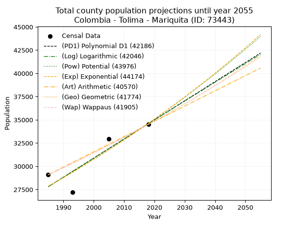
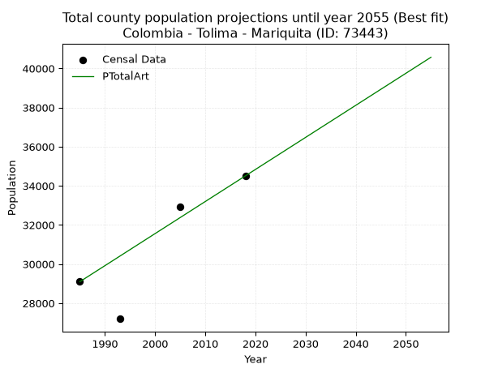
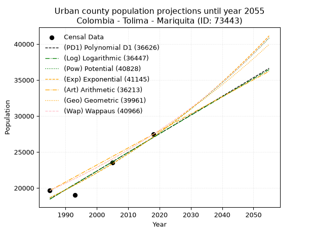
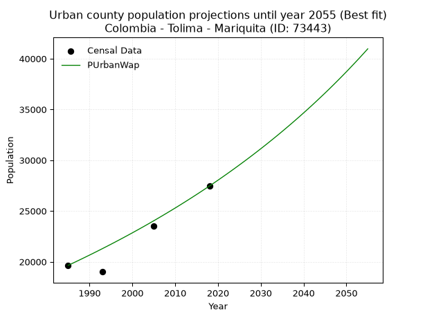
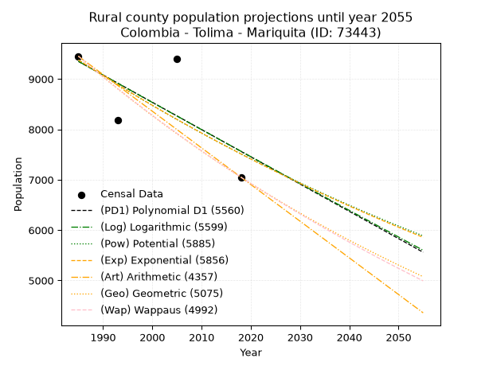
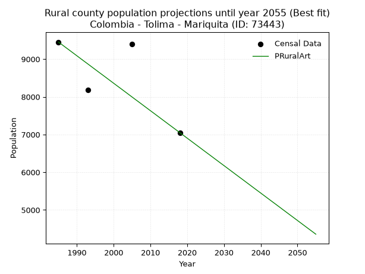

<div align="center">


</div>

# 📜 _“Population and Public Services Demand Projections (PPSD) until Year 2050 for Colombia - Tolima - Mariquita (ID: 73443)”_
Keywords: `population` `public-service` `projection` `lineal` `polynomial` `logarithmic` `potential` `exponential` `arithmetic` `geometric` `wappaus` `dane` `colombia` `south-america`

PPSD are analytical estimates used by governments and planners to anticipate future changes in population size, age distribution, and the resulting community needs for utilities, healthcare, education, and infrastructure as sizing future water treatment facilities, electrical grids, and road networks based on spatial growth.

<div align="center">

</img>

</div>


> **General running parameters**: • app_version: _v20260806_. • Python version: _3.14.7_. • Pandas version: _3.0.5_. • NumPy version: _2.5.1_. • Creates, save and include plots into reports (create_plot): _False_. • Projection until year: _2050_. • Process polynomial degree 2 and up: _False_. • Process Wappaus: _True_. • Process Wappaus: _True_. • Set negative values to zero: _True_. • Set infinite values to zero: _True_. • Drop dataset notes: _True_. 
<div align="center">

Dynamic map: [:earth_americas:Google](http://maps.google.com/maps?q=5.199708135,-74.8892758) [:earth_americas:OSM](https://www.openstreetmap.org/#map=18/5.199708135/-74.8892758&layers=P) [:earth_americas:Bing](https://www.bing.com/maps?cp=5.199708135~-74.8892758&lvl=18) [:earth_americas:Apple](https://maps.apple.com/frame?center=5.199708135%2C-74.8892758&span=0.003%2C0.006)

</div>


<div align="center">

```geojson
{
  "type": "Feature",
  "geometry": {
    "type": "Point", 
    "coordinates": [-74.8892758, 5.199708135]
  }, 
  "properties": {
    "Name": "Colombia - Tolima - Mariquita (ID: 73443)"
  }
}
```

</div>


## 0. Census Data (4 records)

Census data are official statistics collected by a government about the people and housing in a country. They usually include counts of total population, age, sex, race, income, education, and jobs.

📅Global census file: [Population.xlsx](../data/Population.xlsx)

| Source   |   Year |   CountryID | CountryName   |   StateID | StateName   |   CountyID | CountyName   |   PTotal |   PUrban |   PRural |
|:---------|-------:|------------:|:--------------|----------:|:------------|-----------:|:-------------|---------:|---------:|---------:|
| DANE     |   1985 |          57 | Colombia      |        73 | Tolima      |      73443 | Mariquita    |    29096 |    19644 |     9452 |
| DANE     |   1993 |          57 | Colombia      |        73 | Tolima      |      73443 | Mariquita    |    27198 |    19009 |     8189 |
| DANE     |   2005 |          57 | Colombia      |        73 | Tolima      |      73443 | Mariquita    |    32933 |    23529 |     9404 |
| DANE     |   2018 |          57 | Colombia      |        73 | Tolima      |      73443 | Mariquita    |    34505 |    27455 |     7050 |

> 🔥Some records could had specific notes about the registered values or the corresponding urban or rural distribution.

## 1. Total

### 1.1. Coefficients and Parameters

* (PD1) Polynomial Deg 1: 205.53352067442665, -380185.4247290219 (lineal)
* (Log) Logarithmic: 411252.0958446652, -3094997.476082769
* (Pow) Potential: 13.185798215561988, -39.038848987268324
* (Exp) Exponential: 0.006589974648708518, 0.05804651448493098
* (Art) Arithmetic: Year diff. 2018 - 1985 = 33, Population diff. 34505 - 29096 = 5409, Annual growth = 163.9090909090909
* (Geo) Geometric: Year diff. 2018 - 1985 = 33, Population diff. 34505 - 29096 = 5409, Annual growth % = 0.005180144532498154
* (Wap) Wappaus: i = 0.5154292885617865, Condition values only valid for < 200)

<sub>
Wappaus condition values: ['0.00', '0.52', '1.03', '1.55', '2.06', '2.58', '3.09', '3.61', '4.12', '4.64', '5.15', '5.67', '6.19', '6.70', '7.22', '7.73', '8.25', '8.76', '9.28', '9.79', '10.31', '10.82', '11.34', '11.85', '12.37', '12.89', '13.40', '13.92', '14.43', '14.95', '15.46', '15.98', '16.49', '17.01', '17.52', '18.04', '18.56', '19.07', '19.59', '20.10', '20.62', '21.13', '21.65', '22.16', '22.68', '23.19', '23.71', '24.23', '24.74', '25.26', '25.77', '26.29', '26.80', '27.32', '27.83', '28.35', '28.86', '29.38', '29.89', '30.41', '30.93', '31.44', '31.96', '32.47', '32.99', '33.50']
</sub>


### 1.2. Projected Dataset

|   Year |   CountyID |   PTotalPD1 |   PTotalLog |   PTotalPow |   PTotalExp |   PTotalArt |   PTotalGeo |   PTotalWap |
|-------:|-----------:|------------:|------------:|------------:|------------:|------------:|------------:|------------:|
|   1985 |      73443 |       27799 |       27794 |       27846 |       27850 |       29096 |       29096 |       29096 |
|   1986 |      73443 |       28004 |       28001 |       28031 |       28034 |       29260 |       29247 |       29246 |
|   1987 |      73443 |       28210 |       28208 |       28218 |       28220 |       29424 |       29398 |       29397 |
|   1988 |      73443 |       28415 |       28415 |       28406 |       28406 |       29588 |       29551 |       29549 |
|   1989 |      73443 |       28621 |       28621 |       28595 |       28594 |       29752 |       29704 |       29702 |
|   1990 |      73443 |       28826 |       28828 |       28785 |       28783 |       29916 |       29857 |       29856 |
|   1991 |      73443 |       29032 |       29035 |       28976 |       28973 |       30079 |       30012 |       30010 |
|   1992 |      73443 |       29237 |       29241 |       29169 |       29165 |       30243 |       30168 |       30165 |
|   1993 |      73443 |       29443 |       29448 |       29362 |       29358 |       30407 |       30324 |       30321 |
|   1994 |      73443 |       29648 |       29654 |       29557 |       29552 |       30571 |       30481 |       30478 |
|   1995 |      73443 |       29854 |       29860 |       29753 |       29747 |       30735 |       30639 |       30635 |
|   1996 |      73443 |       30059 |       30066 |       29950 |       29944 |       30899 |       30798 |       30794 |
|   1997 |      73443 |       30265 |       30272 |       30149 |       30142 |       31063 |       30957 |       30953 |
|   1998 |      73443 |       30471 |       30478 |       30348 |       30341 |       31227 |       31117 |       31113 |
|   1999 |      73443 |       30676 |       30684 |       30549 |       30542 |       31391 |       31279 |       31274 |
|   2000 |      73443 |       30882 |       30890 |       30752 |       30744 |       31555 |       31441 |       31436 |
|   2001 |      73443 |       31087 |       31095 |       30955 |       30947 |       31719 |       31604 |       31599 |
|   2002 |      73443 |       31293 |       31301 |       31159 |       31152 |       31882 |       31767 |       31762 |
|   2003 |      73443 |       31498 |       31506 |       31365 |       31357 |       32046 |       31932 |       31927 |
|   2004 |      73443 |       31704 |       31711 |       31572 |       31565 |       32210 |       32097 |       32092 |
|   2005 |      73443 |       31909 |       31916 |       31781 |       31774 |       32374 |       32263 |       32258 |
|   2006 |      73443 |       32115 |       32122 |       31990 |       31984 |       32538 |       32431 |       32426 |
|   2007 |      73443 |       32320 |       32326 |       32201 |       32195 |       32702 |       32599 |       32594 |
|   2008 |      73443 |       32526 |       32531 |       32414 |       32408 |       32866 |       32767 |       32763 |
|   2009 |      73443 |       32731 |       32736 |       32627 |       32622 |       33030 |       32937 |       32933 |
|   2010 |      73443 |       32937 |       32941 |       32842 |       32838 |       33194 |       33108 |       33103 |
|   2011 |      73443 |       33142 |       33145 |       33058 |       33055 |       33358 |       33279 |       33275 |
|   2012 |      73443 |       33348 |       33350 |       33275 |       33274 |       33522 |       33452 |       33448 |
|   2013 |      73443 |       33554 |       33554 |       33494 |       33494 |       33685 |       33625 |       33622 |
|   2014 |      73443 |       33759 |       33758 |       33714 |       33715 |       33849 |       33799 |       33796 |
|   2015 |      73443 |       33965 |       33962 |       33936 |       33938 |       34013 |       33974 |       33972 |
|   2016 |      73443 |       34170 |       34167 |       34158 |       34162 |       34177 |       34150 |       34149 |
|   2017 |      73443 |       34376 |       34370 |       34382 |       34388 |       34341 |       34327 |       34326 |
|   2018 |      73443 |       34581 |       34574 |       34608 |       34616 |       34505 |       34505 |       34505 |
|   2019 |      73443 |       34787 |       34778 |       34835 |       34844 |       34669 |       34684 |       34685 |
|   2020 |      73443 |       34992 |       34982 |       35063 |       35075 |       34833 |       34863 |       34865 |
|   2021 |      73443 |       35198 |       35185 |       35292 |       35307 |       34997 |       35044 |       35047 |
|   2022 |      73443 |       35403 |       35389 |       35523 |       35540 |       35161 |       35226 |       35230 |
|   2023 |      73443 |       35609 |       35592 |       35756 |       35775 |       35325 |       35408 |       35414 |
|   2024 |      73443 |       35814 |       35795 |       35989 |       36012 |       35488 |       35591 |       35598 |
|   2025 |      73443 |       36020 |       35998 |       36225 |       36250 |       35652 |       35776 |       35784 |
|   2026 |      73443 |       36225 |       36201 |       36461 |       36489 |       35816 |       35961 |       35971 |
|   2027 |      73443 |       36431 |       36404 |       36699 |       36731 |       35980 |       36147 |       36159 |
|   2028 |      73443 |       36637 |       36607 |       36939 |       36974 |       36144 |       36335 |       36348 |
|   2029 |      73443 |       36842 |       36810 |       37180 |       37218 |       36308 |       36523 |       36539 |
|   2030 |      73443 |       37048 |       37013 |       37422 |       37464 |       36472 |       36712 |       36730 |
|   2031 |      73443 |       37253 |       37215 |       37666 |       37712 |       36636 |       36902 |       36922 |
|   2032 |      73443 |       37459 |       37418 |       37911 |       37961 |       36800 |       37093 |       37116 |
|   2033 |      73443 |       37664 |       37620 |       38158 |       38212 |       36964 |       37286 |       37311 |
|   2034 |      73443 |       37870 |       37822 |       38406 |       38465 |       37128 |       37479 |       37507 |
|   2035 |      73443 |       38075 |       38024 |       38656 |       38719 |       37291 |       37673 |       37704 |
|   2036 |      73443 |       38281 |       38226 |       38907 |       38975 |       37455 |       37868 |       37902 |
|   2037 |      73443 |       38486 |       38428 |       39160 |       39233 |       37619 |       38064 |       38101 |
|   2038 |      73443 |       38692 |       38630 |       39414 |       39492 |       37783 |       38261 |       38302 |
|   2039 |      73443 |       38897 |       38832 |       39670 |       39753 |       37947 |       38460 |       38504 |
|   2040 |      73443 |       39103 |       39033 |       39927 |       40016 |       38111 |       38659 |       38707 |
|   2041 |      73443 |       39308 |       39235 |       40186 |       40281 |       38275 |       38859 |       38911 |
|   2042 |      73443 |       39514 |       39436 |       40446 |       40547 |       38439 |       39060 |       39116 |
|   2043 |      73443 |       39720 |       39638 |       40708 |       40815 |       38603 |       39263 |       39323 |
|   2044 |      73443 |       39925 |       39839 |       40972 |       41085 |       38767 |       39466 |       39531 |
|   2045 |      73443 |       40131 |       40040 |       41237 |       41357 |       38931 |       39670 |       39740 |
|   2046 |      73443 |       40336 |       40241 |       41503 |       41630 |       39094 |       39876 |       39951 |
|   2047 |      73443 |       40542 |       40442 |       41772 |       41905 |       39258 |       40083 |       40162 |
|   2048 |      73443 |       40747 |       40643 |       42042 |       42182 |       39422 |       40290 |       40375 |
|   2049 |      73443 |       40953 |       40844 |       42313 |       42461 |       39586 |       40499 |       40590 |
|   2050 |      73443 |       41158 |       41044 |       42586 |       42742 |       39750 |       40709 |       40806 |
<div align="center">

</img>

</div>


### 1.3. Best fit with absolute and relative error (%)

Relative error puts that difference into context by dividing the absolute error by the true value, creating a unitless ratio or percentage that shows the scale of the mistake.

Absolute and relative error

|   Year | Source   |   CountryID | CountryName   |   StateID | StateName   |   CountyID_x | CountyName   |   PTotal |   PUrban |   PRural |   CountyID_y |   PTotalPD1 |   PTotalLog |   PTotalPow |   PTotalExp |   PTotalArt |   PTotalGeo |   PTotalWap |   PTotalPD1AbsError |   PTotalLogAbsError |   PTotalPowAbsError |   PTotalExpAbsError |   PTotalArtAbsError |   PTotalGeoAbsError |   PTotalWapAbsError |   PTotalPD1RelError |   PTotalLogRelError |   PTotalPowRelError |   PTotalExpRelError |   PTotalArtRelError |   PTotalGeoRelError |   PTotalWapRelError |
|-------:|:---------|------------:|:--------------|----------:|:------------|-------------:|:-------------|---------:|---------:|---------:|-------------:|------------:|------------:|------------:|------------:|------------:|------------:|------------:|--------------------:|--------------------:|--------------------:|--------------------:|--------------------:|--------------------:|--------------------:|--------------------:|--------------------:|--------------------:|--------------------:|--------------------:|--------------------:|--------------------:|
|   1985 | DANE     |          57 | Colombia      |        73 | Tolima      |        73443 | Mariquita    |    29096 |    19644 |     9452 |        73443 |       27799 |       27794 |       27846 |       27850 |       29096 |       29096 |       29096 |                1297 |                1302 |                1250 |                1246 |                   0 |                   0 |                   0 |            4.45766  |            4.47484  |            4.29612  |            4.28238  |             0       |             0       |             0       |
|   1993 | DANE     |          57 | Colombia      |        73 | Tolima      |        73443 | Mariquita    |    27198 |    19009 |     8189 |        73443 |       29443 |       29448 |       29362 |       29358 |       30407 |       30324 |       30321 |                2245 |                2250 |                2164 |                2160 |                3209 |                3126 |                3123 |            8.25428  |            8.27267  |            7.95647  |            7.94176  |            11.7987  |            11.4935  |            11.4825  |
|   2005 | DANE     |          57 | Colombia      |        73 | Tolima      |        73443 | Mariquita    |    32933 |    23529 |     9404 |        73443 |       31909 |       31916 |       31781 |       31774 |       32374 |       32263 |       32258 |                1024 |                1017 |                1152 |                1159 |                 559 |                 670 |                 675 |            3.10934  |            3.08809  |            3.49801  |            3.51927  |             1.69739 |             2.03443 |             2.04962 |
|   2018 | DANE     |          57 | Colombia      |        73 | Tolima      |        73443 | Mariquita    |    34505 |    27455 |     7050 |        73443 |       34581 |       34574 |       34608 |       34616 |       34505 |       34505 |       34505 |                  76 |                  69 |                 103 |                 111 |                   0 |                   0 |                   0 |            0.220258 |            0.199971 |            0.298507 |            0.321693 |             0       |             0       |             0       |

Relative error mean

| Method    |   RelError | Best   |
|:----------|-----------:|:-------|
| PTotalPD1 |    4.01039 |        |
| PTotalLog |    4.00889 |        |
| PTotalPow |    4.01228 |        |
| PTotalExp |    4.01627 |        |
| PTotalArt |    3.37401 | True   |
| PTotalGeo |    3.38198 |        |
| PTotalWap |    3.38302 |        |

💙Best method: _**PTotalArt**_
<div align="center">

</img>

</div>


### 1.4. Fresh water supply demand in liters per capita per day (lpcd)

The fresh water supply demand typically ranges from 100 to 300 liters per capita per day (lpcd) for standard domestic and municipal planning, though absolute survival minimums set by the World Health Organization are as low as 7.5 to 20 liters per day, and total consumption in high-income nations can exceed 400 liters.

> `CZ`: Level in meters above the sea level (masl)<br> `WS`: Fresh water supply demand in liters per capita per day (lpcd or l/h/d)<br> `WSAll`: Zonal fresh water supply demand in liters per second (l/s)<br> `A`: Zonal area in square meters<br> `DP`: Population density (people/hectare or p/ha)

Reference values (RAS Colombia)

|    CZ |   WS |
|------:|-----:|
|  1000 |  120 |
|  2000 |  130 |
| 99999 |  140 |

County shapefile geometry properties and water supply values

|   CountyID |      ATotal |   CZTotal |   WSTotal |
|-----------:|------------:|----------:|----------:|
|      73443 | 2.93116e+08 |     673.3 |       120 |

Projected values for best method: PTotalArt

|   CountyID |   Year |   PTotalArt |   DPTotal |   WSTotal |   WSTotalAll |
|-----------:|-------:|------------:|----------:|----------:|-------------:|
|      73443 |   1985 |       29096 |      0.99 |       120 |      40.4111 |
|      73443 |   1986 |       29260 |      1    |       120 |      40.6389 |
|      73443 |   1987 |       29424 |      1    |       120 |      40.8667 |
|      73443 |   1988 |       29588 |      1.01 |       120 |      41.0944 |
|      73443 |   1989 |       29752 |      1.02 |       120 |      41.3222 |
|      73443 |   1990 |       29916 |      1.02 |       120 |      41.55   |
|      73443 |   1991 |       30079 |      1.03 |       120 |      41.7764 |
|      73443 |   1992 |       30243 |      1.03 |       120 |      42.0042 |
|      73443 |   1993 |       30407 |      1.04 |       120 |      42.2319 |
|      73443 |   1994 |       30571 |      1.04 |       120 |      42.4597 |
|      73443 |   1995 |       30735 |      1.05 |       120 |      42.6875 |
|      73443 |   1996 |       30899 |      1.05 |       120 |      42.9153 |
|      73443 |   1997 |       31063 |      1.06 |       120 |      43.1431 |
|      73443 |   1998 |       31227 |      1.07 |       120 |      43.3708 |
|      73443 |   1999 |       31391 |      1.07 |       120 |      43.5986 |
|      73443 |   2000 |       31555 |      1.08 |       120 |      43.8264 |
|      73443 |   2001 |       31719 |      1.08 |       120 |      44.0542 |
|      73443 |   2002 |       31882 |      1.09 |       120 |      44.2806 |
|      73443 |   2003 |       32046 |      1.09 |       120 |      44.5083 |
|      73443 |   2004 |       32210 |      1.1  |       120 |      44.7361 |
|      73443 |   2005 |       32374 |      1.1  |       120 |      44.9639 |
|      73443 |   2006 |       32538 |      1.11 |       120 |      45.1917 |
|      73443 |   2007 |       32702 |      1.12 |       120 |      45.4194 |
|      73443 |   2008 |       32866 |      1.12 |       120 |      45.6472 |
|      73443 |   2009 |       33030 |      1.13 |       120 |      45.875  |
|      73443 |   2010 |       33194 |      1.13 |       120 |      46.1028 |
|      73443 |   2011 |       33358 |      1.14 |       120 |      46.3306 |
|      73443 |   2012 |       33522 |      1.14 |       120 |      46.5583 |
|      73443 |   2013 |       33685 |      1.15 |       120 |      46.7847 |
|      73443 |   2014 |       33849 |      1.15 |       120 |      47.0125 |
|      73443 |   2015 |       34013 |      1.16 |       120 |      47.2403 |
|      73443 |   2016 |       34177 |      1.17 |       120 |      47.4681 |
|      73443 |   2017 |       34341 |      1.17 |       120 |      47.6958 |
|      73443 |   2018 |       34505 |      1.18 |       120 |      47.9236 |
|      73443 |   2019 |       34669 |      1.18 |       120 |      48.1514 |
|      73443 |   2020 |       34833 |      1.19 |       120 |      48.3792 |
|      73443 |   2021 |       34997 |      1.19 |       120 |      48.6069 |
|      73443 |   2022 |       35161 |      1.2  |       120 |      48.8347 |
|      73443 |   2023 |       35325 |      1.21 |       120 |      49.0625 |
|      73443 |   2024 |       35488 |      1.21 |       120 |      49.2889 |
|      73443 |   2025 |       35652 |      1.22 |       120 |      49.5167 |
|      73443 |   2026 |       35816 |      1.22 |       120 |      49.7444 |
|      73443 |   2027 |       35980 |      1.23 |       120 |      49.9722 |
|      73443 |   2028 |       36144 |      1.23 |       120 |      50.2    |
|      73443 |   2029 |       36308 |      1.24 |       120 |      50.4278 |
|      73443 |   2030 |       36472 |      1.24 |       120 |      50.6556 |
|      73443 |   2031 |       36636 |      1.25 |       120 |      50.8833 |
|      73443 |   2032 |       36800 |      1.26 |       120 |      51.1111 |
|      73443 |   2033 |       36964 |      1.26 |       120 |      51.3389 |
|      73443 |   2034 |       37128 |      1.27 |       120 |      51.5667 |
|      73443 |   2035 |       37291 |      1.27 |       120 |      51.7931 |
|      73443 |   2036 |       37455 |      1.28 |       120 |      52.0208 |
|      73443 |   2037 |       37619 |      1.28 |       120 |      52.2486 |
|      73443 |   2038 |       37783 |      1.29 |       120 |      52.4764 |
|      73443 |   2039 |       37947 |      1.29 |       120 |      52.7042 |
|      73443 |   2040 |       38111 |      1.3  |       120 |      52.9319 |
|      73443 |   2041 |       38275 |      1.31 |       120 |      53.1597 |
|      73443 |   2042 |       38439 |      1.31 |       120 |      53.3875 |
|      73443 |   2043 |       38603 |      1.32 |       120 |      53.6153 |
|      73443 |   2044 |       38767 |      1.32 |       120 |      53.8431 |
|      73443 |   2045 |       38931 |      1.33 |       120 |      54.0708 |
|      73443 |   2046 |       39094 |      1.33 |       120 |      54.2972 |
|      73443 |   2047 |       39258 |      1.34 |       120 |      54.525  |
|      73443 |   2048 |       39422 |      1.34 |       120 |      54.7528 |
|      73443 |   2049 |       39586 |      1.35 |       120 |      54.9806 |
|      73443 |   2050 |       39750 |      1.36 |       120 |      55.2083 |

## 2. Urban

### 2.1. Coefficients and Parameters

* (PD1) Polynomial Deg 1: 259.6591730228797, -496974.0108390152 (lineal)
* (Log) Logarithmic: 519471.05916980596, -3926094.4335295106
* (Pow) Potential: 22.610108407647203, -70.29207901166708
* (Exp) Exponential: 0.011301010390473641, 3.3763202369756052e-06
* (Art) Arithmetic: Year diff. 2018 - 1985 = 33, Population diff. 27455 - 19644 = 7811, Annual growth = 236.6969696969697
* (Geo) Geometric: Year diff. 2018 - 1985 = 33, Population diff. 27455 - 19644 = 7811, Annual growth % = 0.010196370261307264
* (Wap) Wappaus: i = 1.0051040136604585, Condition values only valid for < 200)

<sub>
Wappaus condition values: ['0.00', '1.01', '2.01', '3.02', '4.02', '5.03', '6.03', '7.04', '8.04', '9.05', '10.05', '11.06', '12.06', '13.07', '14.07', '15.08', '16.08', '17.09', '18.09', '19.10', '20.10', '21.11', '22.11', '23.12', '24.12', '25.13', '26.13', '27.14', '28.14', '29.15', '30.15', '31.16', '32.16', '33.17', '34.17', '35.18', '36.18', '37.19', '38.19', '39.20', '40.20', '41.21', '42.21', '43.22', '44.22', '45.23', '46.23', '47.24', '48.24', '49.25', '50.26', '51.26', '52.27', '53.27', '54.28', '55.28', '56.29', '57.29', '58.30', '59.30', '60.31', '61.31', '62.32', '63.32', '64.33', '65.33']
</sub>


### 2.2. Projected Dataset

|   Year |   CountyID |   PUrbanPD1 |   PUrbanLog |   PUrbanPow |   PUrbanExp |   PUrbanArt |   PUrbanGeo |   PUrbanWap |
|-------:|-----------:|------------:|------------:|------------:|------------:|------------:|------------:|------------:|
|   1985 |      73443 |       18449 |       18444 |       18648 |       18653 |       19644 |       19644 |       19644 |
|   1986 |      73443 |       18709 |       18705 |       18862 |       18865 |       19881 |       19844 |       19842 |
|   1987 |      73443 |       18969 |       18967 |       19078 |       19080 |       20117 |       20047 |       20043 |
|   1988 |      73443 |       19228 |       19228 |       19296 |       19297 |       20354 |       20251 |       20245 |
|   1989 |      73443 |       19488 |       19489 |       19517 |       19516 |       20591 |       20458 |       20450 |
|   1990 |      73443 |       19748 |       19751 |       19740 |       19738 |       20827 |       20666 |       20657 |
|   1991 |      73443 |       20007 |       20012 |       19965 |       19962 |       21064 |       20877 |       20865 |
|   1992 |      73443 |       20267 |       20272 |       20193 |       20189 |       21301 |       21090 |       21076 |
|   1993 |      73443 |       20527 |       20533 |       20424 |       20418 |       21538 |       21305 |       21290 |
|   1994 |      73443 |       20786 |       20794 |       20657 |       20650 |       21774 |       21522 |       21505 |
|   1995 |      73443 |       21046 |       21054 |       20892 |       20885 |       22011 |       21741 |       21723 |
|   1996 |      73443 |       21306 |       21314 |       21130 |       21122 |       22248 |       21963 |       21943 |
|   1997 |      73443 |       21565 |       21575 |       21371 |       21363 |       22484 |       22187 |       22165 |
|   1998 |      73443 |       21825 |       21835 |       21614 |       21605 |       22721 |       22413 |       22390 |
|   1999 |      73443 |       22085 |       22095 |       21860 |       21851 |       22958 |       22642 |       22617 |
|   2000 |      73443 |       22344 |       22354 |       22109 |       22099 |       23194 |       22873 |       22847 |
|   2001 |      73443 |       22604 |       22614 |       22360 |       22350 |       23431 |       23106 |       23079 |
|   2002 |      73443 |       22864 |       22874 |       22614 |       22604 |       23668 |       23341 |       23314 |
|   2003 |      73443 |       23123 |       23133 |       22871 |       22861 |       23905 |       23579 |       23551 |
|   2004 |      73443 |       23383 |       23392 |       23131 |       23121 |       24141 |       23820 |       23791 |
|   2005 |      73443 |       23643 |       23651 |       23393 |       23384 |       24378 |       24063 |       24034 |
|   2006 |      73443 |       23902 |       23910 |       23658 |       23650 |       24615 |       24308 |       24280 |
|   2007 |      73443 |       24162 |       24169 |       23926 |       23918 |       24851 |       24556 |       24528 |
|   2008 |      73443 |       24422 |       24428 |       24197 |       24190 |       25088 |       24806 |       24779 |
|   2009 |      73443 |       24681 |       24687 |       24471 |       24465 |       25325 |       25059 |       25033 |
|   2010 |      73443 |       24941 |       24945 |       24748 |       24743 |       25561 |       25315 |       25289 |
|   2011 |      73443 |       25201 |       25204 |       25028 |       25024 |       25798 |       25573 |       25549 |
|   2012 |      73443 |       25460 |       25462 |       25311 |       25309 |       26035 |       25834 |       25812 |
|   2013 |      73443 |       25720 |       25720 |       25597 |       25596 |       26272 |       26097 |       26078 |
|   2014 |      73443 |       25980 |       25978 |       25886 |       25887 |       26508 |       26363 |       26347 |
|   2015 |      73443 |       26239 |       26236 |       26178 |       26182 |       26745 |       26632 |       26619 |
|   2016 |      73443 |       26499 |       26494 |       26473 |       26479 |       26982 |       26904 |       26894 |
|   2017 |      73443 |       26759 |       26751 |       26772 |       26780 |       27218 |       27178 |       27173 |
|   2018 |      73443 |       27018 |       27009 |       27074 |       27084 |       27455 |       27455 |       27455 |
|   2019 |      73443 |       27278 |       27266 |       27379 |       27392 |       27692 |       27735 |       27740 |
|   2020 |      73443 |       27538 |       27523 |       27687 |       27704 |       27928 |       28018 |       28029 |
|   2021 |      73443 |       27797 |       27780 |       27998 |       28018 |       28165 |       28303 |       28322 |
|   2022 |      73443 |       28057 |       28037 |       28313 |       28337 |       28402 |       28592 |       28618 |
|   2023 |      73443 |       28316 |       28294 |       28632 |       28659 |       28638 |       28884 |       28918 |
|   2024 |      73443 |       28576 |       28551 |       28953 |       28985 |       28875 |       29178 |       29221 |
|   2025 |      73443 |       28836 |       28808 |       29279 |       29314 |       29112 |       29476 |       29529 |
|   2026 |      73443 |       29095 |       29064 |       29607 |       29647 |       29349 |       29776 |       29840 |
|   2027 |      73443 |       29355 |       29320 |       29939 |       29984 |       29585 |       30080 |       30155 |
|   2028 |      73443 |       29615 |       29577 |       30275 |       30325 |       29822 |       30386 |       30474 |
|   2029 |      73443 |       29874 |       29833 |       30614 |       30670 |       30059 |       30696 |       30798 |
|   2030 |      73443 |       30134 |       30089 |       30957 |       31018 |       30295 |       31009 |       31125 |
|   2031 |      73443 |       30394 |       30344 |       31304 |       31371 |       30532 |       31325 |       31457 |
|   2032 |      73443 |       30653 |       30600 |       31654 |       31727 |       30769 |       31645 |       31794 |
|   2033 |      73443 |       30913 |       30856 |       32009 |       32088 |       31005 |       31967 |       32134 |
|   2034 |      73443 |       31173 |       31111 |       32366 |       32452 |       31242 |       32293 |       32479 |
|   2035 |      73443 |       31432 |       31367 |       32728 |       32821 |       31479 |       32623 |       32829 |
|   2036 |      73443 |       31692 |       31622 |       33094 |       33194 |       31716 |       32955 |       33184 |
|   2037 |      73443 |       31952 |       31877 |       33463 |       33572 |       31952 |       33291 |       33543 |
|   2038 |      73443 |       32211 |       32132 |       33837 |       33953 |       32189 |       33631 |       33908 |
|   2039 |      73443 |       32471 |       32387 |       34214 |       34339 |       32426 |       33974 |       34277 |
|   2040 |      73443 |       32731 |       32641 |       34595 |       34729 |       32662 |       34320 |       34651 |
|   2041 |      73443 |       32990 |       32896 |       34981 |       35124 |       32899 |       34670 |       35031 |
|   2042 |      73443 |       33250 |       33150 |       35370 |       35523 |       33136 |       35024 |       35416 |
|   2043 |      73443 |       33510 |       33405 |       35764 |       35927 |       33372 |       35381 |       35807 |
|   2044 |      73443 |       33769 |       33659 |       36162 |       36335 |       33609 |       35741 |       36203 |
|   2045 |      73443 |       34029 |       33913 |       36564 |       36748 |       33846 |       36106 |       36605 |
|   2046 |      73443 |       34289 |       34167 |       36971 |       37166 |       34083 |       36474 |       37012 |
|   2047 |      73443 |       34548 |       34421 |       37381 |       37588 |       34319 |       36846 |       37426 |
|   2048 |      73443 |       34808 |       34674 |       37796 |       38015 |       34556 |       37222 |       37846 |
|   2049 |      73443 |       35068 |       34928 |       38216 |       38447 |       34793 |       37601 |       38272 |
|   2050 |      73443 |       35327 |       35182 |       38640 |       38884 |       35029 |       37985 |       38704 |
<div align="center">

</img>

</div>


### 2.3. Best fit with absolute and relative error (%)

Relative error puts that difference into context by dividing the absolute error by the true value, creating a unitless ratio or percentage that shows the scale of the mistake.

Absolute and relative error

|   Year | Source   |   CountryID | CountryName   |   StateID | StateName   |   CountyID_x | CountyName   |   PTotal |   PUrban |   PRural |   CountyID_y |   PUrbanPD1 |   PUrbanLog |   PUrbanPow |   PUrbanExp |   PUrbanArt |   PUrbanGeo |   PUrbanWap |   PUrbanPD1AbsError |   PUrbanLogAbsError |   PUrbanPowAbsError |   PUrbanExpAbsError |   PUrbanArtAbsError |   PUrbanGeoAbsError |   PUrbanWapAbsError |   PUrbanPD1RelError |   PUrbanLogRelError |   PUrbanPowRelError |   PUrbanExpRelError |   PUrbanArtRelError |   PUrbanGeoRelError |   PUrbanWapRelError |
|-------:|:---------|------------:|:--------------|----------:|:------------|-------------:|:-------------|---------:|---------:|---------:|-------------:|------------:|------------:|------------:|------------:|------------:|------------:|------------:|--------------------:|--------------------:|--------------------:|--------------------:|--------------------:|--------------------:|--------------------:|--------------------:|--------------------:|--------------------:|--------------------:|--------------------:|--------------------:|--------------------:|
|   1985 | DANE     |          57 | Colombia      |        73 | Tolima      |        73443 | Mariquita    |    29096 |    19644 |     9452 |        73443 |       18449 |       18444 |       18648 |       18653 |       19644 |       19644 |       19644 |                1195 |                1200 |                 996 |                 991 |                   0 |                   0 |                   0 |            6.08328  |            6.10874  |             5.07025 |            5.0448   |             0       |             0       |             0       |
|   1993 | DANE     |          57 | Colombia      |        73 | Tolima      |        73443 | Mariquita    |    27198 |    19009 |     8189 |        73443 |       20527 |       20533 |       20424 |       20418 |       21538 |       21305 |       21290 |                1518 |                1524 |                1415 |                1409 |                2529 |                2296 |                2281 |            7.98569  |            8.01725  |             7.44384 |            7.41228  |            13.3042  |            12.0785  |            11.9996  |
|   2005 | DANE     |          57 | Colombia      |        73 | Tolima      |        73443 | Mariquita    |    32933 |    23529 |     9404 |        73443 |       23643 |       23651 |       23393 |       23384 |       24378 |       24063 |       24034 |                 114 |                 122 |                 136 |                 145 |                 849 |                 534 |                 505 |            0.484508 |            0.518509 |             0.57801 |            0.616261 |             3.60831 |             2.26954 |             2.14629 |
|   2018 | DANE     |          57 | Colombia      |        73 | Tolima      |        73443 | Mariquita    |    34505 |    27455 |     7050 |        73443 |       27018 |       27009 |       27074 |       27084 |       27455 |       27455 |       27455 |                 437 |                 446 |                 381 |                 371 |                   0 |                   0 |                   0 |            1.5917   |            1.62448  |             1.38773 |            1.3513   |             0       |             0       |             0       |

Relative error mean

| Method    |   RelError | Best   |
|:----------|-----------:|:-------|
| PUrbanPD1 |    4.03629 |        |
| PUrbanLog |    4.06724 |        |
| PUrbanPow |    3.61996 |        |
| PUrbanExp |    3.60616 |        |
| PUrbanArt |    4.22813 |        |
| PUrbanGeo |    3.58701 |        |
| PUrbanWap |    3.53647 | True   |

💙Best method: _**PUrbanWap**_
<div align="center">

</img>

</div>


### 2.4. Fresh water supply demand in liters per capita per day (lpcd)

The fresh water supply demand typically ranges from 100 to 300 liters per capita per day (lpcd) for standard domestic and municipal planning, though absolute survival minimums set by the World Health Organization are as low as 7.5 to 20 liters per day, and total consumption in high-income nations can exceed 400 liters.

> `CZ`: Level in meters above the sea level (masl)<br> `WS`: Fresh water supply demand in liters per capita per day (lpcd or l/h/d)<br> `WSAll`: Zonal fresh water supply demand in liters per second (l/s)<br> `A`: Zonal area in square meters<br> `DP`: Population density (people/hectare or p/ha)

Reference values (RAS Colombia)

|    CZ |   WS |
|------:|-----:|
|  1000 |  120 |
|  2000 |  130 |
| 99999 |  140 |

County shapefile geometry properties and water supply values

|   CountyID |      AUrban |   CZUrban |   WSUrban |
|-----------:|------------:|----------:|----------:|
|      73443 | 5.90917e+06 |   477.934 |       120 |

Projected values for best method: PUrbanWap

|   CountyID |   Year |   PUrbanWap |   DPUrban |   WSUrban |   WSUrbanAll |
|-----------:|-------:|------------:|----------:|----------:|-------------:|
|      73443 |   1985 |       19644 |     33.24 |       120 |      27.2833 |
|      73443 |   1986 |       19842 |     33.58 |       120 |      27.5583 |
|      73443 |   1987 |       20043 |     33.92 |       120 |      27.8375 |
|      73443 |   1988 |       20245 |     34.26 |       120 |      28.1181 |
|      73443 |   1989 |       20450 |     34.61 |       120 |      28.4028 |
|      73443 |   1990 |       20657 |     34.96 |       120 |      28.6903 |
|      73443 |   1991 |       20865 |     35.31 |       120 |      28.9792 |
|      73443 |   1992 |       21076 |     35.67 |       120 |      29.2722 |
|      73443 |   1993 |       21290 |     36.03 |       120 |      29.5694 |
|      73443 |   1994 |       21505 |     36.39 |       120 |      29.8681 |
|      73443 |   1995 |       21723 |     36.76 |       120 |      30.1708 |
|      73443 |   1996 |       21943 |     37.13 |       120 |      30.4764 |
|      73443 |   1997 |       22165 |     37.51 |       120 |      30.7847 |
|      73443 |   1998 |       22390 |     37.89 |       120 |      31.0972 |
|      73443 |   1999 |       22617 |     38.27 |       120 |      31.4125 |
|      73443 |   2000 |       22847 |     38.66 |       120 |      31.7319 |
|      73443 |   2001 |       23079 |     39.06 |       120 |      32.0542 |
|      73443 |   2002 |       23314 |     39.45 |       120 |      32.3806 |
|      73443 |   2003 |       23551 |     39.85 |       120 |      32.7097 |
|      73443 |   2004 |       23791 |     40.26 |       120 |      33.0431 |
|      73443 |   2005 |       24034 |     40.67 |       120 |      33.3806 |
|      73443 |   2006 |       24280 |     41.09 |       120 |      33.7222 |
|      73443 |   2007 |       24528 |     41.51 |       120 |      34.0667 |
|      73443 |   2008 |       24779 |     41.93 |       120 |      34.4153 |
|      73443 |   2009 |       25033 |     42.36 |       120 |      34.7681 |
|      73443 |   2010 |       25289 |     42.8  |       120 |      35.1236 |
|      73443 |   2011 |       25549 |     43.24 |       120 |      35.4847 |
|      73443 |   2012 |       25812 |     43.68 |       120 |      35.85   |
|      73443 |   2013 |       26078 |     44.13 |       120 |      36.2194 |
|      73443 |   2014 |       26347 |     44.59 |       120 |      36.5931 |
|      73443 |   2015 |       26619 |     45.05 |       120 |      36.9708 |
|      73443 |   2016 |       26894 |     45.51 |       120 |      37.3528 |
|      73443 |   2017 |       27173 |     45.98 |       120 |      37.7403 |
|      73443 |   2018 |       27455 |     46.46 |       120 |      38.1319 |
|      73443 |   2019 |       27740 |     46.94 |       120 |      38.5278 |
|      73443 |   2020 |       28029 |     47.43 |       120 |      38.9292 |
|      73443 |   2021 |       28322 |     47.93 |       120 |      39.3361 |
|      73443 |   2022 |       28618 |     48.43 |       120 |      39.7472 |
|      73443 |   2023 |       28918 |     48.94 |       120 |      40.1639 |
|      73443 |   2024 |       29221 |     49.45 |       120 |      40.5847 |
|      73443 |   2025 |       29529 |     49.97 |       120 |      41.0125 |
|      73443 |   2026 |       29840 |     50.5  |       120 |      41.4444 |
|      73443 |   2027 |       30155 |     51.03 |       120 |      41.8819 |
|      73443 |   2028 |       30474 |     51.57 |       120 |      42.325  |
|      73443 |   2029 |       30798 |     52.12 |       120 |      42.775  |
|      73443 |   2030 |       31125 |     52.67 |       120 |      43.2292 |
|      73443 |   2031 |       31457 |     53.23 |       120 |      43.6903 |
|      73443 |   2032 |       31794 |     53.8  |       120 |      44.1583 |
|      73443 |   2033 |       32134 |     54.38 |       120 |      44.6306 |
|      73443 |   2034 |       32479 |     54.96 |       120 |      45.1097 |
|      73443 |   2035 |       32829 |     55.56 |       120 |      45.5958 |
|      73443 |   2036 |       33184 |     56.16 |       120 |      46.0889 |
|      73443 |   2037 |       33543 |     56.76 |       120 |      46.5875 |
|      73443 |   2038 |       33908 |     57.38 |       120 |      47.0944 |
|      73443 |   2039 |       34277 |     58.01 |       120 |      47.6069 |
|      73443 |   2040 |       34651 |     58.64 |       120 |      48.1264 |
|      73443 |   2041 |       35031 |     59.28 |       120 |      48.6542 |
|      73443 |   2042 |       35416 |     59.93 |       120 |      49.1889 |
|      73443 |   2043 |       35807 |     60.6  |       120 |      49.7319 |
|      73443 |   2044 |       36203 |     61.27 |       120 |      50.2819 |
|      73443 |   2045 |       36605 |     61.95 |       120 |      50.8403 |
|      73443 |   2046 |       37012 |     62.63 |       120 |      51.4056 |
|      73443 |   2047 |       37426 |     63.34 |       120 |      51.9806 |
|      73443 |   2048 |       37846 |     64.05 |       120 |      52.5639 |
|      73443 |   2049 |       38272 |     64.77 |       120 |      53.1556 |
|      73443 |   2050 |       38704 |     65.5  |       120 |      53.7556 |

## 3. Rural

### 3.1. Coefficients and Parameters

* (PD1) Polynomial Deg 1: -54.12565234845304, 116788.5861099932 (lineal)
* (Log) Logarithmic: -108218.96332514135, 831096.9574467461
* (Pow) Potential: -13.447260097599404, 48.31798946462695
* (Exp) Exponential: -0.006725909899543172, 5893122204.525111
* (Art) Arithmetic: Year diff. 2018 - 1985 = 33, Population diff. 7050 - 9452 = -2402, Annual growth = -72.78787878787878
* (Geo) Geometric: Year diff. 2018 - 1985 = 33, Population diff. 7050 - 9452 = -2402, Annual growth % = -0.008845457086158248
* (Wap) Wappaus: i = -0.8821703888968463, Condition values only valid for < 200)

<sub>
Wappaus condition values: ['-0.00', '-0.88', '-1.76', '-2.65', '-3.53', '-4.41', '-5.29', '-6.18', '-7.06', '-7.94', '-8.82', '-9.70', '-10.59', '-11.47', '-12.35', '-13.23', '-14.11', '-15.00', '-15.88', '-16.76', '-17.64', '-18.53', '-19.41', '-20.29', '-21.17', '-22.05', '-22.94', '-23.82', '-24.70', '-25.58', '-26.47', '-27.35', '-28.23', '-29.11', '-29.99', '-30.88', '-31.76', '-32.64', '-33.52', '-34.40', '-35.29', '-36.17', '-37.05', '-37.93', '-38.82', '-39.70', '-40.58', '-41.46', '-42.34', '-43.23', '-44.11', '-44.99', '-45.87', '-46.76', '-47.64', '-48.52', '-49.40', '-50.28', '-51.17', '-52.05', '-52.93', '-53.81', '-54.69', '-55.58', '-56.46', '-57.34']
</sub>


### 3.2. Projected Dataset

|   Year |   CountyID |   PRuralPD1 |   PRuralLog |   PRuralPow |   PRuralExp |   PRuralArt |   PRuralGeo |   PRuralWap |
|-------:|-----------:|------------:|------------:|------------:|------------:|------------:|------------:|------------:|
|   1985 |      73443 |        9349 |        9350 |        9379 |        9378 |        9452 |        9452 |        9452 |
|   1986 |      73443 |        9295 |        9295 |        9315 |        9315 |        9379 |        9368 |        9369 |
|   1987 |      73443 |        9241 |        9241 |        9253 |        9253 |        9306 |        9286 |        9287 |
|   1988 |      73443 |        9187 |        9186 |        9190 |        9191 |        9234 |        9203 |        9205 |
|   1989 |      73443 |        9133 |        9132 |        9128 |        9129 |        9161 |        9122 |        9124 |
|   1990 |      73443 |        9079 |        9078 |        9067 |        9068 |        9088 |        9041 |        9044 |
|   1991 |      73443 |        9024 |        9023 |        9006 |        9007 |        9015 |        8961 |        8965 |
|   1992 |      73443 |        8970 |        8969 |        8945 |        8947 |        8942 |        8882 |        8886 |
|   1993 |      73443 |        8916 |        8915 |        8885 |        8887 |        8870 |        8803 |        8808 |
|   1994 |      73443 |        8862 |        8860 |        8825 |        8827 |        8797 |        8726 |        8730 |
|   1995 |      73443 |        8808 |        8806 |        8766 |        8768 |        8724 |        8648 |        8653 |
|   1996 |      73443 |        8754 |        8752 |        8707 |        8709 |        8651 |        8572 |        8577 |
|   1997 |      73443 |        8700 |        8698 |        8649 |        8651 |        8579 |        8496 |        8502 |
|   1998 |      73443 |        8646 |        8643 |        8591 |        8593 |        8506 |        8421 |        8427 |
|   1999 |      73443 |        8591 |        8589 |        8533 |        8535 |        8433 |        8346 |        8353 |
|   2000 |      73443 |        8537 |        8535 |        8476 |        8478 |        8360 |        8273 |        8279 |
|   2001 |      73443 |        8483 |        8481 |        8419 |        8421 |        8287 |        8199 |        8206 |
|   2002 |      73443 |        8429 |        8427 |        8363 |        8365 |        8215 |        8127 |        8133 |
|   2003 |      73443 |        8375 |        8373 |        8307 |        8309 |        8142 |        8055 |        8062 |
|   2004 |      73443 |        8321 |        8319 |        8251 |        8253 |        8069 |        7984 |        7990 |
|   2005 |      73443 |        8267 |        8265 |        8196 |        8198 |        7996 |        7913 |        7920 |
|   2006 |      73443 |        8213 |        8211 |        8141 |        8143 |        7923 |        7843 |        7849 |
|   2007 |      73443 |        8158 |        8157 |        8087 |        8088 |        7851 |        7774 |        7780 |
|   2008 |      73443 |        8104 |        8103 |        8033 |        8034 |        7778 |        7705 |        7711 |
|   2009 |      73443 |        8050 |        8049 |        7979 |        7980 |        7705 |        7637 |        7642 |
|   2010 |      73443 |        7996 |        7995 |        7926 |        7927 |        7632 |        7569 |        7574 |
|   2011 |      73443 |        7942 |        7942 |        7873 |        7873 |        7560 |        7502 |        7507 |
|   2012 |      73443 |        7888 |        7888 |        7821 |        7821 |        7487 |        7436 |        7440 |
|   2013 |      73443 |        7834 |        7834 |        7769 |        7768 |        7414 |        7370 |        7374 |
|   2014 |      73443 |        7780 |        7780 |        7717 |        7716 |        7341 |        7305 |        7308 |
|   2015 |      73443 |        7725 |        7727 |        7666 |        7664 |        7268 |        7240 |        7243 |
|   2016 |      73443 |        7671 |        7673 |        7615 |        7613 |        7196 |        7176 |        7178 |
|   2017 |      73443 |        7617 |        7619 |        7564 |        7562 |        7123 |        7113 |        7114 |
|   2018 |      73443 |        7563 |        7566 |        7514 |        7511 |        7050 |        7050 |        7050 |
|   2019 |      73443 |        7509 |        7512 |        7464 |        7461 |        6977 |        6988 |        6987 |
|   2020 |      73443 |        7455 |        7458 |        7414 |        7411 |        6904 |        6926 |        6924 |
|   2021 |      73443 |        7401 |        7405 |        7365 |        7361 |        6832 |        6865 |        6862 |
|   2022 |      73443 |        7347 |        7351 |        7316 |        7312 |        6759 |        6804 |        6800 |
|   2023 |      73443 |        7292 |        7298 |        7268 |        7263 |        6686 |        6744 |        6738 |
|   2024 |      73443 |        7238 |        7244 |        7220 |        7214 |        6613 |        6684 |        6677 |
|   2025 |      73443 |        7184 |        7191 |        7172 |        7166 |        6540 |        6625 |        6617 |
|   2026 |      73443 |        7130 |        7137 |        7124 |        7118 |        6468 |        6566 |        6557 |
|   2027 |      73443 |        7076 |        7084 |        7077 |        7070 |        6395 |        6508 |        6497 |
|   2028 |      73443 |        7022 |        7031 |        7031 |        7023 |        6322 |        6451 |        6438 |
|   2029 |      73443 |        6968 |        6977 |        6984 |        6976 |        6249 |        6394 |        6379 |
|   2030 |      73443 |        6914 |        6924 |        6938 |        6929 |        6177 |        6337 |        6321 |
|   2031 |      73443 |        6859 |        6871 |        6892 |        6882 |        6104 |        6281 |        6263 |
|   2032 |      73443 |        6805 |        6817 |        6847 |        6836 |        6031 |        6225 |        6206 |
|   2033 |      73443 |        6751 |        6764 |        6802 |        6790 |        5958 |        6170 |        6149 |
|   2034 |      73443 |        6697 |        6711 |        6757 |        6745 |        5885 |        6116 |        6092 |
|   2035 |      73443 |        6643 |        6658 |        6712 |        6700 |        5813 |        6062 |        6036 |
|   2036 |      73443 |        6589 |        6605 |        6668 |        6655 |        5740 |        6008 |        5980 |
|   2037 |      73443 |        6535 |        6551 |        6624 |        6610 |        5667 |        5955 |        5925 |
|   2038 |      73443 |        6481 |        6498 |        6581 |        6566 |        5594 |        5902 |        5870 |
|   2039 |      73443 |        6426 |        6445 |        6537 |        6522 |        5521 |        5850 |        5815 |
|   2040 |      73443 |        6372 |        6392 |        6494 |        6478 |        5449 |        5798 |        5761 |
|   2041 |      73443 |        6318 |        6339 |        6452 |        6435 |        5376 |        5747 |        5707 |
|   2042 |      73443 |        6264 |        6286 |        6409 |        6392 |        5303 |        5696 |        5654 |
|   2043 |      73443 |        6210 |        6233 |        6367 |        6349 |        5230 |        5646 |        5601 |
|   2044 |      73443 |        6156 |        6180 |        6325 |        6306 |        5158 |        5596 |        5548 |
|   2045 |      73443 |        6102 |        6127 |        6284 |        6264 |        5085 |        5546 |        5496 |
|   2046 |      73443 |        6048 |        6074 |        6243 |        6222 |        5012 |        5497 |        5444 |
|   2047 |      73443 |        5993 |        6021 |        6202 |        6180 |        4939 |        5449 |        5392 |
|   2048 |      73443 |        5939 |        5969 |        6161 |        6139 |        4866 |        5400 |        5341 |
|   2049 |      73443 |        5885 |        5916 |        6121 |        6098 |        4794 |        5353 |        5290 |
|   2050 |      73443 |        5831 |        5863 |        6081 |        6057 |        4721 |        5305 |        5240 |
<div align="center">

</img>

</div>


### 3.3. Best fit with absolute and relative error (%)

Relative error puts that difference into context by dividing the absolute error by the true value, creating a unitless ratio or percentage that shows the scale of the mistake.

Absolute and relative error

|   Year | Source   |   CountryID | CountryName   |   StateID | StateName   |   CountyID_x | CountyName   |   PTotal |   PUrban |   PRural |   CountyID_y |   PRuralPD1 |   PRuralLog |   PRuralPow |   PRuralExp |   PRuralArt |   PRuralGeo |   PRuralWap |   PRuralPD1AbsError |   PRuralLogAbsError |   PRuralPowAbsError |   PRuralExpAbsError |   PRuralArtAbsError |   PRuralGeoAbsError |   PRuralWapAbsError |   PRuralPD1RelError |   PRuralLogRelError |   PRuralPowRelError |   PRuralExpRelError |   PRuralArtRelError |   PRuralGeoRelError |   PRuralWapRelError |
|-------:|:---------|------------:|:--------------|----------:|:------------|-------------:|:-------------|---------:|---------:|---------:|-------------:|------------:|------------:|------------:|------------:|------------:|------------:|------------:|--------------------:|--------------------:|--------------------:|--------------------:|--------------------:|--------------------:|--------------------:|--------------------:|--------------------:|--------------------:|--------------------:|--------------------:|--------------------:|--------------------:|
|   1985 | DANE     |          57 | Colombia      |        73 | Tolima      |        73443 | Mariquita    |    29096 |    19644 |     9452 |        73443 |        9349 |        9350 |        9379 |        9378 |        9452 |        9452 |        9452 |                 103 |                 102 |                  73 |                  74 |                   0 |                   0 |                   0 |             1.08972 |             1.07914 |            0.772323 |            0.782903 |             0       |             0       |             0       |
|   1993 | DANE     |          57 | Colombia      |        73 | Tolima      |        73443 | Mariquita    |    27198 |    19009 |     8189 |        73443 |        8916 |        8915 |        8885 |        8887 |        8870 |        8803 |        8808 |                 727 |                 726 |                 696 |                 698 |                 681 |                 614 |                 619 |             8.87776 |             8.86555 |            8.49921  |            8.52363  |             8.31603 |             7.49786 |             7.55892 |
|   2005 | DANE     |          57 | Colombia      |        73 | Tolima      |        73443 | Mariquita    |    32933 |    23529 |     9404 |        73443 |        8267 |        8265 |        8196 |        8198 |        7996 |        7913 |        7920 |                1137 |                1139 |                1208 |                1206 |                1408 |                1491 |                1484 |            12.0906  |            12.1119  |           12.8456   |           12.8243   |            14.9724  |            15.855   |            15.7805  |
|   2018 | DANE     |          57 | Colombia      |        73 | Tolima      |        73443 | Mariquita    |    34505 |    27455 |     7050 |        73443 |        7563 |        7566 |        7514 |        7511 |        7050 |        7050 |        7050 |                 513 |                 516 |                 464 |                 461 |                   0 |                   0 |                   0 |             7.2766  |             7.31915 |            6.58156  |            6.53901  |             0       |             0       |             0       |

Relative error mean

| Method    |   RelError | Best   |
|:----------|-----------:|:-------|
| PRuralPD1 |    7.33367 |        |
| PRuralLog |    7.34393 |        |
| PRuralPow |    7.17467 |        |
| PRuralExp |    7.16747 |        |
| PRuralArt |    5.8221  | True   |
| PRuralGeo |    5.8382  |        |
| PRuralWap |    5.83486 |        |

💙Best method: _**PRuralArt**_
<div align="center">

</img>

</div>


### 3.4. Fresh water supply demand in liters per capita per day (lpcd)

The fresh water supply demand typically ranges from 100 to 300 liters per capita per day (lpcd) for standard domestic and municipal planning, though absolute survival minimums set by the World Health Organization are as low as 7.5 to 20 liters per day, and total consumption in high-income nations can exceed 400 liters.

> `CZ`: Level in meters above the sea level (masl)<br> `WS`: Fresh water supply demand in liters per capita per day (lpcd or l/h/d)<br> `WSAll`: Zonal fresh water supply demand in liters per second (l/s)<br> `A`: Zonal area in square meters<br> `DP`: Population density (people/hectare or p/ha)

Reference values (RAS Colombia)

|    CZ |   WS |
|------:|-----:|
|  1000 |  120 |
|  2000 |  130 |
| 99999 |  140 |

County shapefile geometry properties and water supply values

|   CountyID |      ARural |   CZRural |   WSRural |
|-----------:|------------:|----------:|----------:|
|      73443 | 2.87207e+08 |   677.339 |       120 |

Projected values for best method: PRuralArt

|   CountyID |   Year |   PRuralArt |   DPRural |   WSRural |   WSRuralAll |
|-----------:|-------:|------------:|----------:|----------:|-------------:|
|      73443 |   1985 |        9452 |      0.33 |       120 |     13.1278  |
|      73443 |   1986 |        9379 |      0.33 |       120 |     13.0264  |
|      73443 |   1987 |        9306 |      0.32 |       120 |     12.925   |
|      73443 |   1988 |        9234 |      0.32 |       120 |     12.825   |
|      73443 |   1989 |        9161 |      0.32 |       120 |     12.7236  |
|      73443 |   1990 |        9088 |      0.32 |       120 |     12.6222  |
|      73443 |   1991 |        9015 |      0.31 |       120 |     12.5208  |
|      73443 |   1992 |        8942 |      0.31 |       120 |     12.4194  |
|      73443 |   1993 |        8870 |      0.31 |       120 |     12.3194  |
|      73443 |   1994 |        8797 |      0.31 |       120 |     12.2181  |
|      73443 |   1995 |        8724 |      0.3  |       120 |     12.1167  |
|      73443 |   1996 |        8651 |      0.3  |       120 |     12.0153  |
|      73443 |   1997 |        8579 |      0.3  |       120 |     11.9153  |
|      73443 |   1998 |        8506 |      0.3  |       120 |     11.8139  |
|      73443 |   1999 |        8433 |      0.29 |       120 |     11.7125  |
|      73443 |   2000 |        8360 |      0.29 |       120 |     11.6111  |
|      73443 |   2001 |        8287 |      0.29 |       120 |     11.5097  |
|      73443 |   2002 |        8215 |      0.29 |       120 |     11.4097  |
|      73443 |   2003 |        8142 |      0.28 |       120 |     11.3083  |
|      73443 |   2004 |        8069 |      0.28 |       120 |     11.2069  |
|      73443 |   2005 |        7996 |      0.28 |       120 |     11.1056  |
|      73443 |   2006 |        7923 |      0.28 |       120 |     11.0042  |
|      73443 |   2007 |        7851 |      0.27 |       120 |     10.9042  |
|      73443 |   2008 |        7778 |      0.27 |       120 |     10.8028  |
|      73443 |   2009 |        7705 |      0.27 |       120 |     10.7014  |
|      73443 |   2010 |        7632 |      0.27 |       120 |     10.6     |
|      73443 |   2011 |        7560 |      0.26 |       120 |     10.5     |
|      73443 |   2012 |        7487 |      0.26 |       120 |     10.3986  |
|      73443 |   2013 |        7414 |      0.26 |       120 |     10.2972  |
|      73443 |   2014 |        7341 |      0.26 |       120 |     10.1958  |
|      73443 |   2015 |        7268 |      0.25 |       120 |     10.0944  |
|      73443 |   2016 |        7196 |      0.25 |       120 |      9.99444 |
|      73443 |   2017 |        7123 |      0.25 |       120 |      9.89306 |
|      73443 |   2018 |        7050 |      0.25 |       120 |      9.79167 |
|      73443 |   2019 |        6977 |      0.24 |       120 |      9.69028 |
|      73443 |   2020 |        6904 |      0.24 |       120 |      9.58889 |
|      73443 |   2021 |        6832 |      0.24 |       120 |      9.48889 |
|      73443 |   2022 |        6759 |      0.24 |       120 |      9.3875  |
|      73443 |   2023 |        6686 |      0.23 |       120 |      9.28611 |
|      73443 |   2024 |        6613 |      0.23 |       120 |      9.18472 |
|      73443 |   2025 |        6540 |      0.23 |       120 |      9.08333 |
|      73443 |   2026 |        6468 |      0.23 |       120 |      8.98333 |
|      73443 |   2027 |        6395 |      0.22 |       120 |      8.88194 |
|      73443 |   2028 |        6322 |      0.22 |       120 |      8.78056 |
|      73443 |   2029 |        6249 |      0.22 |       120 |      8.67917 |
|      73443 |   2030 |        6177 |      0.22 |       120 |      8.57917 |
|      73443 |   2031 |        6104 |      0.21 |       120 |      8.47778 |
|      73443 |   2032 |        6031 |      0.21 |       120 |      8.37639 |
|      73443 |   2033 |        5958 |      0.21 |       120 |      8.275   |
|      73443 |   2034 |        5885 |      0.2  |       120 |      8.17361 |
|      73443 |   2035 |        5813 |      0.2  |       120 |      8.07361 |
|      73443 |   2036 |        5740 |      0.2  |       120 |      7.97222 |
|      73443 |   2037 |        5667 |      0.2  |       120 |      7.87083 |
|      73443 |   2038 |        5594 |      0.19 |       120 |      7.76944 |
|      73443 |   2039 |        5521 |      0.19 |       120 |      7.66806 |
|      73443 |   2040 |        5449 |      0.19 |       120 |      7.56806 |
|      73443 |   2041 |        5376 |      0.19 |       120 |      7.46667 |
|      73443 |   2042 |        5303 |      0.18 |       120 |      7.36528 |
|      73443 |   2043 |        5230 |      0.18 |       120 |      7.26389 |
|      73443 |   2044 |        5158 |      0.18 |       120 |      7.16389 |
|      73443 |   2045 |        5085 |      0.18 |       120 |      7.0625  |
|      73443 |   2046 |        5012 |      0.17 |       120 |      6.96111 |
|      73443 |   2047 |        4939 |      0.17 |       120 |      6.85972 |
|      73443 |   2048 |        4866 |      0.17 |       120 |      6.75833 |
|      73443 |   2049 |        4794 |      0.17 |       120 |      6.65833 |
|      73443 |   2050 |        4721 |      0.16 |       120 |      6.55694 |

#

<div align="center"><br><sub>Share this research</sub></div><br>

<sub>**APPS & TOOLS & CONTENT DISCLAIMER**: • NO WARRANTY - This content and software is provided by <a href="https://github.com/rcfdtools" target="_blank">github.com/rcfdtools</a> "as is", without any express or implied warranty, including warranties of merchantability, fitness for a particular purpose, or non-infringement. There is no guarantee that the software will be error-free or operate without interruption. • LIMITATION OF LIABILITY - Neither the authors nor copyright holders will be liable for claims or damages arising from the software or its use. You are responsible for determining if the software is appropriate for your use and assume all associated risks, including errors, legal compliance, and data loss. • NO PROFESSIONAL ADVICE - The software provides general information and does not offer professional advice. It should not replace consultation with professional advisors. [Clauses and global license for rcfdtools use.](https://github.com/rcfdtools/rcfdtools/blob/main/LICENSE.md)</sub>

| [:house: Home](Readme.md)  | [:beginner: Help / Collab](https://github.com/rcfdtools/R.HydroTools/discussions/31) |
|----------------------------|-------------------------------------------------------------------------------------------|