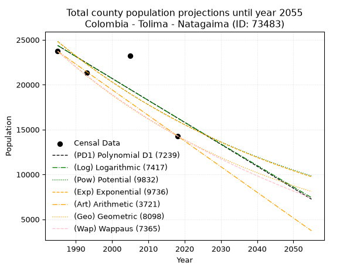
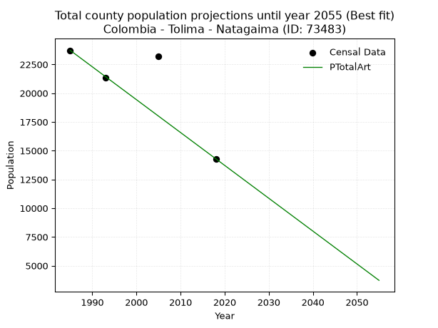
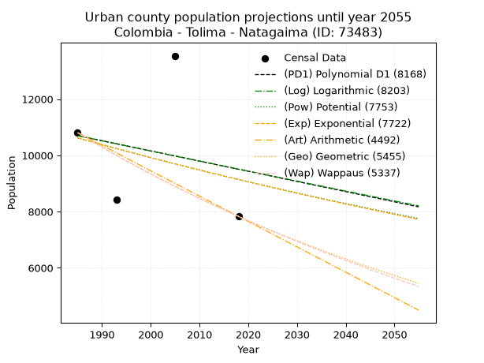
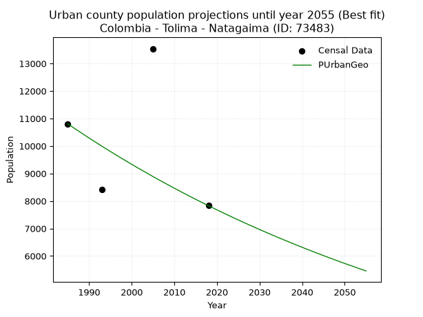
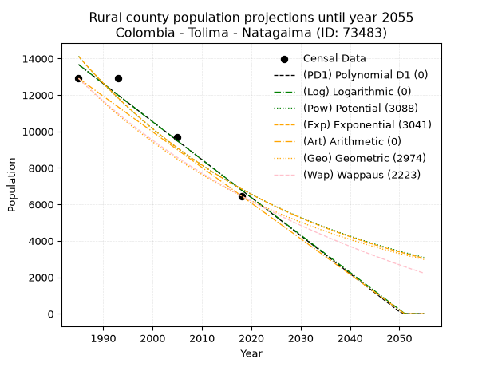
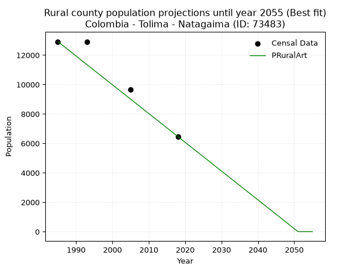

<div align="center">


</div>

# _“Population and Public Services Demand Projections (PPSD) until Year 2050 for Colombia - Tolima - Natagaima (ID: 73483)”_
Keywords: `population` `public-service` `projection` `lineal` `polynomial` `logarithmic` `potential` `exponential` `arithmetic` `geometric` `wappaus` `dane` `colombia` `south-america`

PPSD are analytical estimates used by governments and planners to anticipate future changes in population size, age distribution, and the resulting community needs for utilities, healthcare, education, and infrastructure as sizing future water treatment facilities, electrical grids, and road networks based on spatial growth.

> **General running parameters**: • app_version: _v20260806_. • Python version: _3.14.7_. • Pandas version: _3.0.5_. • NumPy version: _2.5.1_. • Creates, save and include plots into reports (create_plot): _False_. • Projection until year: _2050_. • Process polynomial degree 2 and up: _False_. • Process Wappaus: _True_. • Process Wappaus: _True_. • Set negative values to zero: _True_. • Set infinite values to zero: _True_. • Drop dataset notes: _True_. 
<div align="center">

Dynamic map: [:earth_americas:Google](http://maps.google.com/maps?q=3.624323663,-75.0931819) [:earth_americas:OSM](https://www.openstreetmap.org/#map=18/3.624323663/-75.0931819&layers=P) [:earth_americas:Bing](https://www.bing.com/maps?cp=3.624323663~-75.0931819&lvl=18) [:earth_americas:Apple](https://maps.apple.com/frame?center=3.624323663%2C-75.0931819&span=0.003%2C0.006)

</div>


<div align="center">

```geojson
{
  "type": "Feature",
  "geometry": {
    "type": "Point", 
    "coordinates": [-75.0931819, 3.624323663]
  }, 
  "properties": {
    "Name": "Colombia - Tolima - Natagaima (ID: 73483)"
  }
}
```

</div>


## 0. Census Data (4 records)

Census data are official statistics collected by a government about the people and housing in a country. They usually include counts of total population, age, sex, race, income, education, and jobs.

📅Global census file: [Population.xlsx](../data/Population.xlsx)

| Source   |   Year |   CountryID | CountryName   |   StateID | StateName   |   CountyID | CountyName   |   PTotal |   PUrban |   PRural |
|:---------|-------:|------------:|:--------------|----------:|:------------|-----------:|:-------------|---------:|---------:|---------:|
| DANE     |   1985 |          57 | Colombia      |        73 | Tolima      |      73483 | Natagaima    |    23720 |    10805 |    12915 |
| DANE     |   1993 |          57 | Colombia      |        73 | Tolima      |      73483 | Natagaima    |    21324 |     8418 |    12906 |
| DANE     |   2005 |          57 | Colombia      |        73 | Tolima      |      73483 | Natagaima    |    23212 |    13540 |     9672 |
| DANE     |   2018 |          57 | Colombia      |        73 | Tolima      |      73483 | Natagaima    |    14292 |     7829 |     6463 |

> 🔥Some records could had specific notes about the registered values or the corresponding urban or rural distribution.

📅   [RUPS](https://www.datos.gov.co/Hacienda-y-Cr-dito-P-blico/Registro-nico-de-Prestadores-de-Servicios-P-blicos/4qkq-csdn/about_data) - Local public utility companies: [RUPS.csv](../data/RUPS.xlsx)

 | SERVICIO       | ESTADO    | NOMBRE                                                                                                    | NIT         | DEPARTAMENTO_DOMICILIO   | MUNICIPIO_DOMICILIO   | DIRECCION                             |   TELEFONO | EMAIL                           | TIPO_INSCRIPCION    | REPRESENTANTE_LEGAL       | TIPO_PRESTADOR                             | CLASIFICACION                  |
|:---------------|:----------|:----------------------------------------------------------------------------------------------------------|:------------|:-------------------------|:----------------------|:--------------------------------------|-----------:|:--------------------------------|:--------------------|:--------------------------|:-------------------------------------------|:-------------------------------|
| ACUEDUCTO      | OPERATIVA | EMPRESA DE SERVICIOS PUBLICOS DE NATAGAIMA SA ESP                                                         | 809007043-3 | TOLIMA                   | NATAGAIMA             | Carrera 2 A No. 5 - 79                |    2269654 | fpagote@gmail.com               | Registro por la ESP | DWISTH PINO PENA          | SOCIEDADES (EMPRESA DE SERVICIOS PUBLICOS) | DESDE 2501 HASTA 5000 USUARIOS |
| ALCANTARILLADO | OPERATIVA | EMPRESA DE SERVICIOS PUBLICOS DE NATAGAIMA SA ESP                                                         | 809007043-3 | TOLIMA                   | NATAGAIMA             | Carrera 2 A No. 5 - 79                |    2269654 | fpagote@gmail.com               | Registro por la ESP | DWISTH PINO PENA          | SOCIEDADES (EMPRESA DE SERVICIOS PUBLICOS) | DESDE 2501 HASTA 5000 USUARIOS |
| ACUEDUCTO      | OPERATIVA | ASOCIACION DE USUARIOS ACUEDUCTO INTERVEREDAL SAN MIGUEL BALOCA PALMALTA Y EL SECTOR NATARODCO            | 830511482-0 | TOLIMA                   | NATAGAIMA             | VEREDA PALMALTA                       |    5782342 | acueductointervnataro@gmail.com | Registro por la ESP | GUSTAVO CULMA ORTIZ       | ORGANIZACION AUTORIZADA                    | MENOR O IGUAL A 2500 USUARIOS  |
| ACUEDUCTO      | OPERATIVA | ASOCIACIÓN DE USUARIOS DEL ACUEDUCTO INTERVEREDAL MARGEN DERECHA RIO MAGDALENA DEL MUNICIPIO DE NATAGAIMA | 809010499-9 | TOLIMA                   | NATAGAIMA             | VEREDA PASO DE LA BARCA - LOS ANGELES |    8350363 | joseniraygarzon@gmail.com       | Registro por la ESP | JOSE NIRAY  GARZON MENDEZ | ORGANIZACION AUTORIZADA                    | MENOR O IGUAL A 2500 USUARIOS  |
| ACUEDUCTO      | OPERATIVA | ASOCIACION DE USUARIOS DEL ACUEDUCTO REGIONAL VELU                                                        | 800193267-9 | TOLIMA                   | NATAGAIMA             | VIA PRINCIPAL                         |    8590416 | asoacueregvelu@gmail.com        | Registro por la ESP | ISMAEL PERDOMO NAVARRO    | ORGANIZACION AUTORIZADA                    | MENOR O IGUAL A 2500 USUARIOS  |
| ACUEDUCTO      | OPERATIVA | ASOCIACION DE USUARIOS DEL ACUEDUCTO VEREDAL COLOYA-LA PALMITA DE NATAGAIMA TOLIMA                        | 809012373-9 | TOLIMA                   | NATAGAIMA             | VEREDA LA PALMITA                     |    5325846 | morarafael93@gmail.com          | Registro por la ESP | RAFAEL MORA               | ORGANIZACION AUTORIZADA                    | MENOR O IGUAL A 2500 USUARIOS  |

## 1. Total

### 1.1. Coefficients and Parameters

* (PD1) Polynomial Deg 1: -244.70333199517714, 510104.8398233531 (lineal)
* (Log) Logarithmic: -489198.9738401229, 3739042.3203533227
* (Pow) Potential: -26.717819659526167, 92.50374613176389
* (Exp) Exponential: -0.013365388077107111, 8254237131494712.0
* (Art) Arithmetic: Year diff. 2018 - 1985 = 33, Population diff. 14292 - 23720 = -9428, Annual growth = -285.6969696969697
* (Geo) Geometric: Year diff. 2018 - 1985 = 33, Population diff. 14292 - 23720 = -9428, Annual growth % = -0.015234837378406696
* (Wap) Wappaus: i = -1.5031935688570435, Condition values only valid for < 200)

<sub>
Wappaus condition values: ['-0.00', '-1.50', '-3.01', '-4.51', '-6.01', '-7.52', '-9.02', '-10.52', '-12.03', '-13.53', '-15.03', '-16.54', '-18.04', '-19.54', '-21.04', '-22.55', '-24.05', '-25.55', '-27.06', '-28.56', '-30.06', '-31.57', '-33.07', '-34.57', '-36.08', '-37.58', '-39.08', '-40.59', '-42.09', '-43.59', '-45.10', '-46.60', '-48.10', '-49.61', '-51.11', '-52.61', '-54.11', '-55.62', '-57.12', '-58.62', '-60.13', '-61.63', '-63.13', '-64.64', '-66.14', '-67.64', '-69.15', '-70.65', '-72.15', '-73.66', '-75.16', '-76.66', '-78.17', '-79.67', '-81.17', '-82.68', '-84.18', '-85.68', '-87.19', '-88.69', '-90.19', '-91.69', '-93.20', '-94.70', '-96.20', '-97.71']
</sub>


### 1.2. Projected Dataset

|   Year |   CountyID |   PTotalPD1 |   PTotalLog |   PTotalPow |   PTotalExp |   PTotalArt |   PTotalGeo |   PTotalWap |
|-------:|-----------:|------------:|------------:|------------:|------------:|------------:|------------:|------------:|
|   1985 |      73483 |       24369 |       24371 |       24818 |       24815 |       23720 |       23720 |       23720 |
|   1986 |      73483 |       24124 |       24125 |       24487 |       24486 |       23434 |       23359 |       23366 |
|   1987 |      73483 |       23879 |       23879 |       24160 |       24161 |       23149 |       23003 |       23017 |
|   1988 |      73483 |       23635 |       23633 |       23837 |       23840 |       22863 |       22652 |       22674 |
|   1989 |      73483 |       23390 |       23387 |       23519 |       23523 |       22577 |       22307 |       22335 |
|   1990 |      73483 |       23145 |       23141 |       23205 |       23211 |       22292 |       21967 |       22002 |
|   1991 |      73483 |       22901 |       22895 |       22896 |       22903 |       22006 |       21633 |       21673 |
|   1992 |      73483 |       22656 |       22649 |       22591 |       22599 |       21720 |       21303 |       21349 |
|   1993 |      73483 |       22411 |       22404 |       22290 |       22299 |       21434 |       20979 |       21029 |
|   1994 |      73483 |       22166 |       22158 |       21993 |       22003 |       21149 |       20659 |       20714 |
|   1995 |      73483 |       21922 |       21913 |       21700 |       21711 |       20863 |       20344 |       20404 |
|   1996 |      73483 |       21677 |       21668 |       21412 |       21422 |       20577 |       20034 |       20097 |
|   1997 |      73483 |       21432 |       21423 |       21127 |       21138 |       20292 |       19729 |       19795 |
|   1998 |      73483 |       21188 |       21178 |       20846 |       20857 |       20006 |       19429 |       19497 |
|   1999 |      73483 |       20943 |       20933 |       20570 |       20580 |       19720 |       19133 |       19203 |
|   2000 |      73483 |       20698 |       20689 |       20297 |       20307 |       19435 |       18841 |       18914 |
|   2001 |      73483 |       20453 |       20444 |       20027 |       20038 |       19149 |       18554 |       18627 |
|   2002 |      73483 |       20209 |       20200 |       19762 |       19771 |       18863 |       18271 |       18345 |
|   2003 |      73483 |       19964 |       19955 |       19500 |       19509 |       18577 |       17993 |       18067 |
|   2004 |      73483 |       19719 |       19711 |       19241 |       19250 |       18292 |       17719 |       17792 |
|   2005 |      73483 |       19475 |       19467 |       18987 |       18994 |       18006 |       17449 |       17521 |
|   2006 |      73483 |       19230 |       19223 |       18735 |       18742 |       17720 |       17183 |       17253 |
|   2007 |      73483 |       18985 |       18979 |       18488 |       18493 |       17435 |       16921 |       16989 |
|   2008 |      73483 |       18741 |       18736 |       18243 |       18248 |       17149 |       16664 |       16728 |
|   2009 |      73483 |       18496 |       18492 |       18002 |       18006 |       16863 |       16410 |       16470 |
|   2010 |      73483 |       18251 |       18249 |       17764 |       17767 |       16578 |       16160 |       16216 |
|   2011 |      73483 |       18006 |       18005 |       17530 |       17531 |       16292 |       15913 |       15965 |
|   2012 |      73483 |       17762 |       17762 |       17299 |       17298 |       16006 |       15671 |       15717 |
|   2013 |      73483 |       17517 |       17519 |       17070 |       17068 |       15720 |       15432 |       15472 |
|   2014 |      73483 |       17272 |       17276 |       16845 |       16842 |       15435 |       15197 |       15230 |
|   2015 |      73483 |       17028 |       17033 |       16623 |       16618 |       15149 |       14966 |       14991 |
|   2016 |      73483 |       16783 |       16791 |       16405 |       16397 |       14863 |       14738 |       14755 |
|   2017 |      73483 |       16538 |       16548 |       16189 |       16180 |       14578 |       14513 |       14522 |
|   2018 |      73483 |       16294 |       16306 |       15976 |       15965 |       14292 |       14292 |       14292 |
|   2019 |      73483 |       16049 |       16063 |       15766 |       15753 |       14006 |       14074 |       14064 |
|   2020 |      73483 |       15804 |       15821 |       15558 |       15544 |       13721 |       13860 |       13840 |
|   2021 |      73483 |       15559 |       15579 |       15354 |       15337 |       13435 |       13649 |       13617 |
|   2022 |      73483 |       15315 |       15337 |       15152 |       15134 |       13149 |       13441 |       13398 |
|   2023 |      73483 |       15070 |       15095 |       14954 |       14933 |       12864 |       13236 |       13181 |
|   2024 |      73483 |       14825 |       14853 |       14757 |       14735 |       12578 |       13034 |       12966 |
|   2025 |      73483 |       14581 |       14612 |       14564 |       14539 |       12292 |       12836 |       12754 |
|   2026 |      73483 |       14336 |       14370 |       14373 |       14346 |       12006 |       12640 |       12545 |
|   2027 |      73483 |       14091 |       14129 |       14185 |       14156 |       11721 |       12448 |       12338 |
|   2028 |      73483 |       13846 |       13887 |       13999 |       13968 |       11435 |       12258 |       12133 |
|   2029 |      73483 |       13602 |       13646 |       13816 |       13782 |       11149 |       12071 |       11930 |
|   2030 |      73483 |       13357 |       13405 |       13635 |       13599 |       10864 |       11887 |       11730 |
|   2031 |      73483 |       13112 |       13164 |       13457 |       13419 |       10578 |       11706 |       11532 |
|   2032 |      73483 |       12868 |       12923 |       13281 |       13240 |       10292 |       11528 |       11336 |
|   2033 |      73483 |       12623 |       12683 |       13108 |       13065 |       10007 |       11352 |       11143 |
|   2034 |      73483 |       12378 |       12442 |       12937 |       12891 |        9721 |       11179 |       10951 |
|   2035 |      73483 |       12134 |       12202 |       12768 |       12720 |        9435 |       11009 |       10762 |
|   2036 |      73483 |       11889 |       11961 |       12601 |       12551 |        9149 |       10841 |       10574 |
|   2037 |      73483 |       11644 |       11721 |       12437 |       12385 |        8864 |       10676 |       10389 |
|   2038 |      73483 |       11399 |       11481 |       12275 |       12220 |        8578 |       10513 |       10206 |
|   2039 |      73483 |       11155 |       11241 |       12115 |       12058 |        8292 |       10353 |       10024 |
|   2040 |      73483 |       10910 |       11001 |       11958 |       11898 |        8007 |       10196 |        9845 |
|   2041 |      73483 |       10665 |       10761 |       11802 |       11740 |        7721 |       10040 |        9667 |
|   2042 |      73483 |       10421 |       10522 |       11649 |       11584 |        7435 |        9887 |        9492 |
|   2043 |      73483 |       10176 |       10282 |       11497 |       11430 |        7150 |        9737 |        9318 |
|   2044 |      73483 |        9931 |       10043 |       11348 |       11278 |        6864 |        9588 |        9146 |
|   2045 |      73483 |        9687 |        9804 |       11201 |       11129 |        6578 |        9442 |        8976 |
|   2046 |      73483 |        9442 |        9565 |       11055 |       10981 |        6292 |        9298 |        8807 |
|   2047 |      73483 |        9197 |        9325 |       10912 |       10835 |        6007 |        9157 |        8640 |
|   2048 |      73483 |        8952 |        9087 |       10770 |       10691 |        5721 |        9017 |        8475 |
|   2049 |      73483 |        8708 |        8848 |       10631 |       10549 |        5435 |        8880 |        8312 |
|   2050 |      73483 |        8463 |        8609 |       10493 |       10409 |        5150 |        8745 |        8150 |
<div align="center">

</img>

</div>


### 1.3. Best fit with absolute and relative error (%)

Relative error puts that difference into context by dividing the absolute error by the true value, creating a unitless ratio or percentage that shows the scale of the mistake.

Absolute and relative error

|   Year | Source   |   CountryID | CountryName   |   StateID | StateName   |   CountyID_x | CountyName   |   PTotal |   PUrban |   PRural |   CountyID_y |   PTotalPD1 |   PTotalLog |   PTotalPow |   PTotalExp |   PTotalArt |   PTotalGeo |   PTotalWap |   PTotalPD1AbsError |   PTotalLogAbsError |   PTotalPowAbsError |   PTotalExpAbsError |   PTotalArtAbsError |   PTotalGeoAbsError |   PTotalWapAbsError |   PTotalPD1RelError |   PTotalLogRelError |   PTotalPowRelError |   PTotalExpRelError |   PTotalArtRelError |   PTotalGeoRelError |   PTotalWapRelError |
|-------:|:---------|------------:|:--------------|----------:|:------------|-------------:|:-------------|---------:|---------:|---------:|-------------:|------------:|------------:|------------:|------------:|------------:|------------:|------------:|--------------------:|--------------------:|--------------------:|--------------------:|--------------------:|--------------------:|--------------------:|--------------------:|--------------------:|--------------------:|--------------------:|--------------------:|--------------------:|--------------------:|
|   1985 | DANE     |          57 | Colombia      |        73 | Tolima      |        73483 | Natagaima    |    23720 |    10805 |    12915 |        73483 |       24369 |       24371 |       24818 |       24815 |       23720 |       23720 |       23720 |                 649 |                 651 |                1098 |                1095 |                   0 |                   0 |                   0 |             2.73609 |             2.74452 |             4.62901 |             4.61636 |            0        |              0      |             0       |
|   1993 | DANE     |          57 | Colombia      |        73 | Tolima      |        73483 | Natagaima    |    21324 |     8418 |    12906 |        73483 |       22411 |       22404 |       22290 |       22299 |       21434 |       20979 |       21029 |                1087 |                1080 |                 966 |                 975 |                 110 |                 345 |                 295 |             5.09754 |             5.06472 |             4.53011 |             4.57231 |            0.515851 |              1.6179 |             1.38342 |
|   2005 | DANE     |          57 | Colombia      |        73 | Tolima      |        73483 | Natagaima    |    23212 |    13540 |     9672 |        73483 |       19475 |       19467 |       18987 |       18994 |       18006 |       17449 |       17521 |                3737 |                3745 |                4225 |                4218 |                5206 |                5763 |                5691 |            16.0994  |            16.1339  |            18.2018  |            18.1716  |           22.4281   |             24.8277 |            24.5175  |
|   2018 | DANE     |          57 | Colombia      |        73 | Tolima      |        73483 | Natagaima    |    14292 |     7829 |     6463 |        73483 |       16294 |       16306 |       15976 |       15965 |       14292 |       14292 |       14292 |                2002 |                2014 |                1684 |                1673 |                   0 |                   0 |                   0 |            14.0078  |            14.0918  |            11.7828  |            11.7058  |            0        |              0      |             0       |

Relative error mean

| Method    |   RelError | Best   |
|:----------|-----------:|:-------|
| PTotalPD1 |    9.48522 |        |
| PTotalLog |    9.50873 |        |
| PTotalPow |    9.78593 |        |
| PTotalExp |    9.76654 |        |
| PTotalArt |    5.73598 | True   |
| PTotalGeo |    6.61139 |        |
| PTotalWap |    6.47523 |        |

💙Best method: _**PTotalArt**_
<div align="center">

</img>

</div>


### 1.4. Fresh water supply demand in liters per capita per day (lpcd)

The fresh water supply demand typically ranges from 100 to 300 liters per capita per day (lpcd) for standard domestic and municipal planning, though absolute survival minimums set by the World Health Organization are as low as 7.5 to 20 liters per day, and total consumption in high-income nations can exceed 400 liters.

> `CZ`: Level in meters above the sea level (masl)<br> `WS`: Fresh water supply demand in liters per capita per day (lpcd or l/h/d)<br> `WSAll`: Zonal fresh water supply demand in liters per second (l/s)<br> `A`: Zonal area in square meters<br> `DP`: Population density (people/hectare or p/ha)

Reference values (RAS Colombia)

|    CZ |   WS |
|------:|-----:|
|  1000 |  120 |
|  2000 |  130 |
| 99999 |  140 |

County shapefile geometry properties and water supply values

|   CountyID |     ATotal |   CZTotal |   WSTotal |
|-----------:|-----------:|----------:|----------:|
|      73483 | 8.5935e+08 |   636.951 |       120 |

Projected values for best method: PTotalArt

|   CountyID |   Year |   PTotalArt |   DPTotal |   WSTotal |   WSTotalAll |
|-----------:|-------:|------------:|----------:|----------:|-------------:|
|      73483 |   1985 |       23720 |      0.28 |       120 |     32.9444  |
|      73483 |   1986 |       23434 |      0.27 |       120 |     32.5472  |
|      73483 |   1987 |       23149 |      0.27 |       120 |     32.1514  |
|      73483 |   1988 |       22863 |      0.27 |       120 |     31.7542  |
|      73483 |   1989 |       22577 |      0.26 |       120 |     31.3569  |
|      73483 |   1990 |       22292 |      0.26 |       120 |     30.9611  |
|      73483 |   1991 |       22006 |      0.26 |       120 |     30.5639  |
|      73483 |   1992 |       21720 |      0.25 |       120 |     30.1667  |
|      73483 |   1993 |       21434 |      0.25 |       120 |     29.7694  |
|      73483 |   1994 |       21149 |      0.25 |       120 |     29.3736  |
|      73483 |   1995 |       20863 |      0.24 |       120 |     28.9764  |
|      73483 |   1996 |       20577 |      0.24 |       120 |     28.5792  |
|      73483 |   1997 |       20292 |      0.24 |       120 |     28.1833  |
|      73483 |   1998 |       20006 |      0.23 |       120 |     27.7861  |
|      73483 |   1999 |       19720 |      0.23 |       120 |     27.3889  |
|      73483 |   2000 |       19435 |      0.23 |       120 |     26.9931  |
|      73483 |   2001 |       19149 |      0.22 |       120 |     26.5958  |
|      73483 |   2002 |       18863 |      0.22 |       120 |     26.1986  |
|      73483 |   2003 |       18577 |      0.22 |       120 |     25.8014  |
|      73483 |   2004 |       18292 |      0.21 |       120 |     25.4056  |
|      73483 |   2005 |       18006 |      0.21 |       120 |     25.0083  |
|      73483 |   2006 |       17720 |      0.21 |       120 |     24.6111  |
|      73483 |   2007 |       17435 |      0.2  |       120 |     24.2153  |
|      73483 |   2008 |       17149 |      0.2  |       120 |     23.8181  |
|      73483 |   2009 |       16863 |      0.2  |       120 |     23.4208  |
|      73483 |   2010 |       16578 |      0.19 |       120 |     23.025   |
|      73483 |   2011 |       16292 |      0.19 |       120 |     22.6278  |
|      73483 |   2012 |       16006 |      0.19 |       120 |     22.2306  |
|      73483 |   2013 |       15720 |      0.18 |       120 |     21.8333  |
|      73483 |   2014 |       15435 |      0.18 |       120 |     21.4375  |
|      73483 |   2015 |       15149 |      0.18 |       120 |     21.0403  |
|      73483 |   2016 |       14863 |      0.17 |       120 |     20.6431  |
|      73483 |   2017 |       14578 |      0.17 |       120 |     20.2472  |
|      73483 |   2018 |       14292 |      0.17 |       120 |     19.85    |
|      73483 |   2019 |       14006 |      0.16 |       120 |     19.4528  |
|      73483 |   2020 |       13721 |      0.16 |       120 |     19.0569  |
|      73483 |   2021 |       13435 |      0.16 |       120 |     18.6597  |
|      73483 |   2022 |       13149 |      0.15 |       120 |     18.2625  |
|      73483 |   2023 |       12864 |      0.15 |       120 |     17.8667  |
|      73483 |   2024 |       12578 |      0.15 |       120 |     17.4694  |
|      73483 |   2025 |       12292 |      0.14 |       120 |     17.0722  |
|      73483 |   2026 |       12006 |      0.14 |       120 |     16.675   |
|      73483 |   2027 |       11721 |      0.14 |       120 |     16.2792  |
|      73483 |   2028 |       11435 |      0.13 |       120 |     15.8819  |
|      73483 |   2029 |       11149 |      0.13 |       120 |     15.4847  |
|      73483 |   2030 |       10864 |      0.13 |       120 |     15.0889  |
|      73483 |   2031 |       10578 |      0.12 |       120 |     14.6917  |
|      73483 |   2032 |       10292 |      0.12 |       120 |     14.2944  |
|      73483 |   2033 |       10007 |      0.12 |       120 |     13.8986  |
|      73483 |   2034 |        9721 |      0.11 |       120 |     13.5014  |
|      73483 |   2035 |        9435 |      0.11 |       120 |     13.1042  |
|      73483 |   2036 |        9149 |      0.11 |       120 |     12.7069  |
|      73483 |   2037 |        8864 |      0.1  |       120 |     12.3111  |
|      73483 |   2038 |        8578 |      0.1  |       120 |     11.9139  |
|      73483 |   2039 |        8292 |      0.1  |       120 |     11.5167  |
|      73483 |   2040 |        8007 |      0.09 |       120 |     11.1208  |
|      73483 |   2041 |        7721 |      0.09 |       120 |     10.7236  |
|      73483 |   2042 |        7435 |      0.09 |       120 |     10.3264  |
|      73483 |   2043 |        7150 |      0.08 |       120 |      9.93056 |
|      73483 |   2044 |        6864 |      0.08 |       120 |      9.53333 |
|      73483 |   2045 |        6578 |      0.08 |       120 |      9.13611 |
|      73483 |   2046 |        6292 |      0.07 |       120 |      8.73889 |
|      73483 |   2047 |        6007 |      0.07 |       120 |      8.34306 |
|      73483 |   2048 |        5721 |      0.07 |       120 |      7.94583 |
|      73483 |   2049 |        5435 |      0.06 |       120 |      7.54861 |
|      73483 |   2050 |        5150 |      0.06 |       120 |      7.15278 |

## 2. Urban

### 2.1. Coefficients and Parameters

* (PD1) Polynomial Deg 1: -36.17342432757597, 82503.89201123384 (lineal)
* (Log) Logarithmic: -71983.1447809687, 557292.4603168636
* (Pow) Potential: -9.080360570848747, 33.9709985356784
* (Exp) Exponential: -0.004555502690751965, 89824256.62253068
* (Art) Arithmetic: Year diff. 2018 - 1985 = 33, Population diff. 7829 - 10805 = -2976, Annual growth = -90.18181818181819
* (Geo) Geometric: Year diff. 2018 - 1985 = 33, Population diff. 7829 - 10805 = -2976, Annual growth % = -0.00971535265259904
* (Wap) Wappaus: i = -0.9679276396030716, Condition values only valid for < 200)

<sub>
Wappaus condition values: ['-0.00', '-0.97', '-1.94', '-2.90', '-3.87', '-4.84', '-5.81', '-6.78', '-7.74', '-8.71', '-9.68', '-10.65', '-11.62', '-12.58', '-13.55', '-14.52', '-15.49', '-16.45', '-17.42', '-18.39', '-19.36', '-20.33', '-21.29', '-22.26', '-23.23', '-24.20', '-25.17', '-26.13', '-27.10', '-28.07', '-29.04', '-30.01', '-30.97', '-31.94', '-32.91', '-33.88', '-34.85', '-35.81', '-36.78', '-37.75', '-38.72', '-39.69', '-40.65', '-41.62', '-42.59', '-43.56', '-44.52', '-45.49', '-46.46', '-47.43', '-48.40', '-49.36', '-50.33', '-51.30', '-52.27', '-53.24', '-54.20', '-55.17', '-56.14', '-57.11', '-58.08', '-59.04', '-60.01', '-60.98', '-61.95', '-62.92']
</sub>


### 2.2. Projected Dataset

|   Year |   CountyID |   PUrbanPD1 |   PUrbanLog |   PUrbanPow |   PUrbanExp |   PUrbanArt |   PUrbanGeo |   PUrbanWap |
|-------:|-----------:|------------:|------------:|------------:|------------:|------------:|------------:|------------:|
|   1985 |      73483 |       10700 |       10698 |       10620 |       10622 |       10805 |       10805 |       10805 |
|   1986 |      73483 |       10663 |       10661 |       10572 |       10574 |       10715 |       10700 |       10701 |
|   1987 |      73483 |       10627 |       10625 |       10524 |       10526 |       10625 |       10596 |       10598 |
|   1988 |      73483 |       10591 |       10589 |       10476 |       10478 |       10534 |       10493 |       10496 |
|   1989 |      73483 |       10555 |       10553 |       10428 |       10430 |       10444 |       10391 |       10395 |
|   1990 |      73483 |       10519 |       10516 |       10381 |       10383 |       10354 |       10290 |       10294 |
|   1991 |      73483 |       10483 |       10480 |       10333 |       10336 |       10264 |       10190 |       10195 |
|   1992 |      73483 |       10446 |       10444 |       10286 |       10289 |       10174 |       10091 |       10097 |
|   1993 |      73483 |       10410 |       10408 |       10240 |       10242 |       10084 |        9993 |       10000 |
|   1994 |      73483 |       10374 |       10372 |       10193 |       10195 |        9993 |        9896 |        9903 |
|   1995 |      73483 |       10338 |       10336 |       10147 |       10149 |        9903 |        9800 |        9807 |
|   1996 |      73483 |       10302 |       10300 |       10101 |       10103 |        9813 |        9705 |        9713 |
|   1997 |      73483 |       10266 |       10264 |       10055 |       10057 |        9723 |        9610 |        9619 |
|   1998 |      73483 |       10229 |       10228 |       10009 |       10011 |        9633 |        9517 |        9526 |
|   1999 |      73483 |       10193 |       10192 |        9964 |        9966 |        9542 |        9425 |        9434 |
|   2000 |      73483 |       10157 |       10156 |        9919 |        9921 |        9452 |        9333 |        9342 |
|   2001 |      73483 |       10121 |       10120 |        9874 |        9875 |        9362 |        9242 |        9252 |
|   2002 |      73483 |       10085 |       10084 |        9829 |        9831 |        9272 |        9153 |        9162 |
|   2003 |      73483 |       10049 |       10048 |        9785 |        9786 |        9182 |        9064 |        9073 |
|   2004 |      73483 |       10012 |       10012 |        9740 |        9741 |        9092 |        8976 |        8985 |
|   2005 |      73483 |        9976 |        9976 |        9696 |        9697 |        9001 |        8888 |        8898 |
|   2006 |      73483 |        9940 |        9940 |        9653 |        9653 |        8911 |        8802 |        8811 |
|   2007 |      73483 |        9904 |        9904 |        9609 |        9609 |        8821 |        8717 |        8726 |
|   2008 |      73483 |        9868 |        9868 |        9566 |        9565 |        8731 |        8632 |        8640 |
|   2009 |      73483 |        9831 |        9832 |        9522 |        9522 |        8641 |        8548 |        8556 |
|   2010 |      73483 |        9795 |        9797 |        9480 |        9479 |        8550 |        8465 |        8473 |
|   2011 |      73483 |        9759 |        9761 |        9437 |        9436 |        8460 |        8383 |        8390 |
|   2012 |      73483 |        9723 |        9725 |        9394 |        9393 |        8370 |        8301 |        8308 |
|   2013 |      73483 |        9687 |        9689 |        9352 |        9350 |        8280 |        8221 |        8226 |
|   2014 |      73483 |        9651 |        9653 |        9310 |        9308 |        8190 |        8141 |        8145 |
|   2015 |      73483 |        9614 |        9618 |        9268 |        9265 |        8100 |        8062 |        8065 |
|   2016 |      73483 |        9578 |        9582 |        9226 |        9223 |        8009 |        7983 |        7986 |
|   2017 |      73483 |        9542 |        9546 |        9185 |        9181 |        7919 |        7906 |        7907 |
|   2018 |      73483 |        9506 |        9511 |        9144 |        9140 |        7829 |        7829 |        7829 |
|   2019 |      73483 |        9470 |        9475 |        9103 |        9098 |        7739 |        7753 |        7752 |
|   2020 |      73483 |        9434 |        9439 |        9062 |        9057 |        7649 |        7678 |        7675 |
|   2021 |      73483 |        9397 |        9404 |        9021 |        9015 |        7558 |        7603 |        7599 |
|   2022 |      73483 |        9361 |        9368 |        8981 |        8974 |        7468 |        7529 |        7523 |
|   2023 |      73483 |        9325 |        9333 |        8941 |        8934 |        7378 |        7456 |        7448 |
|   2024 |      73483 |        9289 |        9297 |        8901 |        8893 |        7288 |        7384 |        7374 |
|   2025 |      73483 |        9253 |        9261 |        8861 |        8853 |        7198 |        7312 |        7300 |
|   2026 |      73483 |        9217 |        9226 |        8821 |        8812 |        7108 |        7241 |        7227 |
|   2027 |      73483 |        9180 |        9190 |        8782 |        8772 |        7017 |        7170 |        7154 |
|   2028 |      73483 |        9144 |        9155 |        8742 |        8732 |        6927 |        7101 |        7083 |
|   2029 |      73483 |        9108 |        9119 |        8703 |        8693 |        6837 |        7032 |        7011 |
|   2030 |      73483 |        9072 |        9084 |        8664 |        8653 |        6747 |        6963 |        6940 |
|   2031 |      73483 |        9036 |        9048 |        8626 |        8614 |        6657 |        6896 |        6870 |
|   2032 |      73483 |        8999 |        9013 |        8587 |        8575 |        6566 |        6829 |        6800 |
|   2033 |      73483 |        8963 |        8978 |        8549 |        8536 |        6476 |        6762 |        6731 |
|   2034 |      73483 |        8927 |        8942 |        8511 |        8497 |        6386 |        6697 |        6663 |
|   2035 |      73483 |        8891 |        8907 |        8473 |        8458 |        6296 |        6632 |        6595 |
|   2036 |      73483 |        8855 |        8871 |        8435 |        8420 |        6206 |        6567 |        6527 |
|   2037 |      73483 |        8819 |        8836 |        8398 |        8382 |        6116 |        6504 |        6460 |
|   2038 |      73483 |        8782 |        8801 |        8360 |        8344 |        6025 |        6440 |        6394 |
|   2039 |      73483 |        8746 |        8765 |        8323 |        8306 |        5935 |        6378 |        6328 |
|   2040 |      73483 |        8710 |        8730 |        8286 |        8268 |        5845 |        6316 |        6262 |
|   2041 |      73483 |        8674 |        8695 |        8250 |        8230 |        5755 |        6254 |        6197 |
|   2042 |      73483 |        8638 |        8660 |        8213 |        8193 |        5665 |        6194 |        6133 |
|   2043 |      73483 |        8602 |        8624 |        8177 |        8156 |        5574 |        6133 |        6069 |
|   2044 |      73483 |        8565 |        8589 |        8140 |        8119 |        5484 |        6074 |        6005 |
|   2045 |      73483 |        8529 |        8554 |        8104 |        8082 |        5394 |        6015 |        5942 |
|   2046 |      73483 |        8493 |        8519 |        8068 |        8045 |        5304 |        5956 |        5879 |
|   2047 |      73483 |        8457 |        8484 |        8033 |        8008 |        5214 |        5899 |        5817 |
|   2048 |      73483 |        8421 |        8448 |        7997 |        7972 |        5124 |        5841 |        5756 |
|   2049 |      73483 |        8385 |        8413 |        7962 |        7936 |        5033 |        5785 |        5694 |
|   2050 |      73483 |        8348 |        8378 |        7926 |        7900 |        4943 |        5728 |        5634 |
<div align="center">

</img>

</div>


### 2.3. Best fit with absolute and relative error (%)

Relative error puts that difference into context by dividing the absolute error by the true value, creating a unitless ratio or percentage that shows the scale of the mistake.

Absolute and relative error

|   Year | Source   |   CountryID | CountryName   |   StateID | StateName   |   CountyID_x | CountyName   |   PTotal |   PUrban |   PRural |   CountyID_y |   PUrbanPD1 |   PUrbanLog |   PUrbanPow |   PUrbanExp |   PUrbanArt |   PUrbanGeo |   PUrbanWap |   PUrbanPD1AbsError |   PUrbanLogAbsError |   PUrbanPowAbsError |   PUrbanExpAbsError |   PUrbanArtAbsError |   PUrbanGeoAbsError |   PUrbanWapAbsError |   PUrbanPD1RelError |   PUrbanLogRelError |   PUrbanPowRelError |   PUrbanExpRelError |   PUrbanArtRelError |   PUrbanGeoRelError |   PUrbanWapRelError |
|-------:|:---------|------------:|:--------------|----------:|:------------|-------------:|:-------------|---------:|---------:|---------:|-------------:|------------:|------------:|------------:|------------:|------------:|------------:|------------:|--------------------:|--------------------:|--------------------:|--------------------:|--------------------:|--------------------:|--------------------:|--------------------:|--------------------:|--------------------:|--------------------:|--------------------:|--------------------:|--------------------:|
|   1985 | DANE     |          57 | Colombia      |        73 | Tolima      |        73483 | Natagaima    |    23720 |    10805 |    12915 |        73483 |       10700 |       10698 |       10620 |       10622 |       10805 |       10805 |       10805 |                 105 |                 107 |                 185 |                 183 |                   0 |                   0 |                   0 |            0.971772 |            0.990282 |             1.71217 |             1.69366 |              0      |              0      |              0      |
|   1993 | DANE     |          57 | Colombia      |        73 | Tolima      |        73483 | Natagaima    |    21324 |     8418 |    12906 |        73483 |       10410 |       10408 |       10240 |       10242 |       10084 |        9993 |       10000 |                1992 |                1990 |                1822 |                1824 |                1666 |                1575 |                1582 |           23.6636   |           23.6398   |            21.6441  |            21.6679  |             19.7909 |             18.7099 |             18.7931 |
|   2005 | DANE     |          57 | Colombia      |        73 | Tolima      |        73483 | Natagaima    |    23212 |    13540 |     9672 |        73483 |        9976 |        9976 |        9696 |        9697 |        9001 |        8888 |        8898 |                3564 |                3564 |                3844 |                3843 |                4539 |                4652 |                4642 |           26.322    |           26.322    |            28.39    |            28.3826  |             33.5229 |             34.3575 |             34.2836 |
|   2018 | DANE     |          57 | Colombia      |        73 | Tolima      |        73483 | Natagaima    |    14292 |     7829 |     6463 |        73483 |        9506 |        9511 |        9144 |        9140 |        7829 |        7829 |        7829 |                1677 |                1682 |                1315 |                1311 |                   0 |                   0 |                   0 |           21.4204   |           21.4842   |            16.7965  |            16.7454  |              0      |              0      |              0      |

Relative error mean

| Method    |   RelError | Best   |
|:----------|-----------:|:-------|
| PUrbanPD1 |    18.0944 |        |
| PUrbanLog |    18.1091 |        |
| PUrbanPow |    17.1357 |        |
| PUrbanExp |    17.1224 |        |
| PUrbanArt |    13.3285 |        |
| PUrbanGeo |    13.2668 | True   |
| PUrbanWap |    13.2692 |        |

💙Best method: _**PUrbanGeo**_
<div align="center">

</img>

</div>


### 2.4. Fresh water supply demand in liters per capita per day (lpcd)

The fresh water supply demand typically ranges from 100 to 300 liters per capita per day (lpcd) for standard domestic and municipal planning, though absolute survival minimums set by the World Health Organization are as low as 7.5 to 20 liters per day, and total consumption in high-income nations can exceed 400 liters.

> `CZ`: Level in meters above the sea level (masl)<br> `WS`: Fresh water supply demand in liters per capita per day (lpcd or l/h/d)<br> `WSAll`: Zonal fresh water supply demand in liters per second (l/s)<br> `A`: Zonal area in square meters<br> `DP`: Population density (people/hectare or p/ha)

Reference values (RAS Colombia)

|    CZ |   WS |
|------:|-----:|
|  1000 |  120 |
|  2000 |  130 |
| 99999 |  140 |

County shapefile geometry properties and water supply values

|   CountyID |      AUrban |   CZUrban |   WSUrban |
|-----------:|------------:|----------:|----------:|
|      73483 | 1.81413e+06 |   325.677 |       120 |

Projected values for best method: PUrbanGeo

|   CountyID |   Year |   PUrbanGeo |   DPUrban |   WSUrban |   WSUrbanAll |
|-----------:|-------:|------------:|----------:|----------:|-------------:|
|      73483 |   1985 |       10805 |     59.56 |       120 |     15.0069  |
|      73483 |   1986 |       10700 |     58.98 |       120 |     14.8611  |
|      73483 |   1987 |       10596 |     58.41 |       120 |     14.7167  |
|      73483 |   1988 |       10493 |     57.84 |       120 |     14.5736  |
|      73483 |   1989 |       10391 |     57.28 |       120 |     14.4319  |
|      73483 |   1990 |       10290 |     56.72 |       120 |     14.2917  |
|      73483 |   1991 |       10190 |     56.17 |       120 |     14.1528  |
|      73483 |   1992 |       10091 |     55.62 |       120 |     14.0153  |
|      73483 |   1993 |        9993 |     55.08 |       120 |     13.8792  |
|      73483 |   1994 |        9896 |     54.55 |       120 |     13.7444  |
|      73483 |   1995 |        9800 |     54.02 |       120 |     13.6111  |
|      73483 |   1996 |        9705 |     53.5  |       120 |     13.4792  |
|      73483 |   1997 |        9610 |     52.97 |       120 |     13.3472  |
|      73483 |   1998 |        9517 |     52.46 |       120 |     13.2181  |
|      73483 |   1999 |        9425 |     51.95 |       120 |     13.0903  |
|      73483 |   2000 |        9333 |     51.45 |       120 |     12.9625  |
|      73483 |   2001 |        9242 |     50.94 |       120 |     12.8361  |
|      73483 |   2002 |        9153 |     50.45 |       120 |     12.7125  |
|      73483 |   2003 |        9064 |     49.96 |       120 |     12.5889  |
|      73483 |   2004 |        8976 |     49.48 |       120 |     12.4667  |
|      73483 |   2005 |        8888 |     48.99 |       120 |     12.3444  |
|      73483 |   2006 |        8802 |     48.52 |       120 |     12.225   |
|      73483 |   2007 |        8717 |     48.05 |       120 |     12.1069  |
|      73483 |   2008 |        8632 |     47.58 |       120 |     11.9889  |
|      73483 |   2009 |        8548 |     47.12 |       120 |     11.8722  |
|      73483 |   2010 |        8465 |     46.66 |       120 |     11.7569  |
|      73483 |   2011 |        8383 |     46.21 |       120 |     11.6431  |
|      73483 |   2012 |        8301 |     45.76 |       120 |     11.5292  |
|      73483 |   2013 |        8221 |     45.32 |       120 |     11.4181  |
|      73483 |   2014 |        8141 |     44.88 |       120 |     11.3069  |
|      73483 |   2015 |        8062 |     44.44 |       120 |     11.1972  |
|      73483 |   2016 |        7983 |     44    |       120 |     11.0875  |
|      73483 |   2017 |        7906 |     43.58 |       120 |     10.9806  |
|      73483 |   2018 |        7829 |     43.16 |       120 |     10.8736  |
|      73483 |   2019 |        7753 |     42.74 |       120 |     10.7681  |
|      73483 |   2020 |        7678 |     42.32 |       120 |     10.6639  |
|      73483 |   2021 |        7603 |     41.91 |       120 |     10.5597  |
|      73483 |   2022 |        7529 |     41.5  |       120 |     10.4569  |
|      73483 |   2023 |        7456 |     41.1  |       120 |     10.3556  |
|      73483 |   2024 |        7384 |     40.7  |       120 |     10.2556  |
|      73483 |   2025 |        7312 |     40.31 |       120 |     10.1556  |
|      73483 |   2026 |        7241 |     39.91 |       120 |     10.0569  |
|      73483 |   2027 |        7170 |     39.52 |       120 |      9.95833 |
|      73483 |   2028 |        7101 |     39.14 |       120 |      9.8625  |
|      73483 |   2029 |        7032 |     38.76 |       120 |      9.76667 |
|      73483 |   2030 |        6963 |     38.38 |       120 |      9.67083 |
|      73483 |   2031 |        6896 |     38.01 |       120 |      9.57778 |
|      73483 |   2032 |        6829 |     37.64 |       120 |      9.48472 |
|      73483 |   2033 |        6762 |     37.27 |       120 |      9.39167 |
|      73483 |   2034 |        6697 |     36.92 |       120 |      9.30139 |
|      73483 |   2035 |        6632 |     36.56 |       120 |      9.21111 |
|      73483 |   2036 |        6567 |     36.2  |       120 |      9.12083 |
|      73483 |   2037 |        6504 |     35.85 |       120 |      9.03333 |
|      73483 |   2038 |        6440 |     35.5  |       120 |      8.94444 |
|      73483 |   2039 |        6378 |     35.16 |       120 |      8.85833 |
|      73483 |   2040 |        6316 |     34.82 |       120 |      8.77222 |
|      73483 |   2041 |        6254 |     34.47 |       120 |      8.68611 |
|      73483 |   2042 |        6194 |     34.14 |       120 |      8.60278 |
|      73483 |   2043 |        6133 |     33.81 |       120 |      8.51806 |
|      73483 |   2044 |        6074 |     33.48 |       120 |      8.43611 |
|      73483 |   2045 |        6015 |     33.16 |       120 |      8.35417 |
|      73483 |   2046 |        5956 |     32.83 |       120 |      8.27222 |
|      73483 |   2047 |        5899 |     32.52 |       120 |      8.19306 |
|      73483 |   2048 |        5841 |     32.2  |       120 |      8.1125  |
|      73483 |   2049 |        5785 |     31.89 |       120 |      8.03472 |
|      73483 |   2050 |        5728 |     31.57 |       120 |      7.95556 |

## 3. Rural

### 3.1. Coefficients and Parameters

* (PD1) Polynomial Deg 1: -208.52990766760112, 427600.94781211915 (lineal)
* (Log) Logarithmic: -417215.8290591541, 3181749.860036458
* (Pow) Potential: -43.86835823625691, 148.8172365185338
* (Exp) Exponential: -0.021929634318121234, 1.1341707887795332e+23
* (Art) Arithmetic: Year diff. 2018 - 1985 = 33, Population diff. 6463 - 12915 = -6452, Annual growth = -195.5151515151515
* (Geo) Geometric: Year diff. 2018 - 1985 = 33, Population diff. 6463 - 12915 = -6452, Annual growth % = -0.02076013986975056
* (Wap) Wappaus: i = -2.017908468522567, Condition values only valid for < 200)

<sub>
Wappaus condition values: ['-0.00', '-2.02', '-4.04', '-6.05', '-8.07', '-10.09', '-12.11', '-14.13', '-16.14', '-18.16', '-20.18', '-22.20', '-24.21', '-26.23', '-28.25', '-30.27', '-32.29', '-34.30', '-36.32', '-38.34', '-40.36', '-42.38', '-44.39', '-46.41', '-48.43', '-50.45', '-52.47', '-54.48', '-56.50', '-58.52', '-60.54', '-62.56', '-64.57', '-66.59', '-68.61', '-70.63', '-72.64', '-74.66', '-76.68', '-78.70', '-80.72', '-82.73', '-84.75', '-86.77', '-88.79', '-90.81', '-92.82', '-94.84', '-96.86', '-98.88', '-100.90', '-102.91', '-104.93', '-106.95', '-108.97', '-110.98', '-113.00', '-115.02', '-117.04', '-119.06', '-121.07', '-123.09', '-125.11', '-127.13', '-129.15', '-131.16']
</sub>


### 3.2. Projected Dataset

|   Year |   CountyID |   PRuralPD1 |   PRuralLog |   PRuralPow |   PRuralExp |   PRuralArt |   PRuralGeo |   PRuralWap |
|-------:|-----------:|------------:|------------:|------------:|------------:|------------:|------------:|------------:|
|   1985 |      73483 |       13669 |       13674 |       14122 |       14116 |       12915 |       12915 |       12915 |
|   1986 |      73483 |       13461 |       13464 |       13813 |       13809 |       12719 |       12647 |       12657 |
|   1987 |      73483 |       13252 |       13254 |       13512 |       13510 |       12524 |       12384 |       12404 |
|   1988 |      73483 |       13043 |       13044 |       13217 |       13217 |       12328 |       12127 |       12156 |
|   1989 |      73483 |       12835 |       12834 |       12928 |       12930 |       12133 |       11875 |       11913 |
|   1990 |      73483 |       12626 |       12624 |       12646 |       12650 |       11937 |       11629 |       11675 |
|   1991 |      73483 |       12418 |       12415 |       12371 |       12375 |       11742 |       11388 |       11441 |
|   1992 |      73483 |       12209 |       12205 |       12101 |       12107 |       11546 |       11151 |       11211 |
|   1993 |      73483 |       12001 |       11996 |       11838 |       11844 |       11351 |       10920 |       10986 |
|   1994 |      73483 |       11792 |       11787 |       11580 |       11587 |       11155 |       10693 |       10765 |
|   1995 |      73483 |       11584 |       11577 |       11328 |       11336 |       10960 |       10471 |       10548 |
|   1996 |      73483 |       11375 |       11368 |       11082 |       11090 |       10764 |       10254 |       10335 |
|   1997 |      73483 |       11167 |       11159 |       10841 |       10850 |       10569 |       10041 |       10125 |
|   1998 |      73483 |       10958 |       10950 |       10606 |       10614 |       10373 |        9832 |        9920 |
|   1999 |      73483 |       10750 |       10742 |       10375 |       10384 |       10178 |        9628 |        9718 |
|   2000 |      73483 |       10541 |       10533 |       10150 |       10159 |        9982 |        9428 |        9520 |
|   2001 |      73483 |       10333 |       10324 |        9930 |        9938 |        9787 |        9233 |        9325 |
|   2002 |      73483 |       10124 |       10116 |        9715 |        9723 |        9591 |        9041 |        9133 |
|   2003 |      73483 |        9916 |        9908 |        9504 |        9512 |        9396 |        8853 |        8945 |
|   2004 |      73483 |        9707 |        9699 |        9298 |        9306 |        9200 |        8669 |        8760 |
|   2005 |      73483 |        9498 |        9491 |        9097 |        9104 |        9005 |        8489 |        8578 |
|   2006 |      73483 |        9290 |        9283 |        8900 |        8906 |        8809 |        8313 |        8399 |
|   2007 |      73483 |        9081 |        9075 |        8708 |        8713 |        8614 |        8141 |        8223 |
|   2008 |      73483 |        8873 |        8868 |        8520 |        8524 |        8418 |        7972 |        8050 |
|   2009 |      73483 |        8664 |        8660 |        8335 |        8339 |        8223 |        7806 |        7880 |
|   2010 |      73483 |        8456 |        8452 |        8155 |        8158 |        8027 |        7644 |        7712 |
|   2011 |      73483 |        8247 |        8245 |        7979 |        7981 |        7832 |        7485 |        7547 |
|   2012 |      73483 |        8039 |        8037 |        7807 |        7808 |        7636 |        7330 |        7385 |
|   2013 |      73483 |        7830 |        7830 |        7639 |        7639 |        7441 |        7178 |        7225 |
|   2014 |      73483 |        7622 |        7623 |        7474 |        7473 |        7245 |        7029 |        7068 |
|   2015 |      73483 |        7413 |        7416 |        7313 |        7311 |        7050 |        6883 |        6913 |
|   2016 |      73483 |        7205 |        7209 |        7156 |        7152 |        6854 |        6740 |        6761 |
|   2017 |      73483 |        6996 |        7002 |        7002 |        6997 |        6659 |        6600 |        6611 |
|   2018 |      73483 |        6788 |        6795 |        6851 |        6846 |        6463 |        6463 |        6463 |
|   2019 |      73483 |        6579 |        6588 |        6704 |        6697 |        6267 |        6329 |        6317 |
|   2020 |      73483 |        6371 |        6382 |        6560 |        6552 |        6072 |        6197 |        6174 |
|   2021 |      73483 |        6162 |        6175 |        6419 |        6410 |        5876 |        6069 |        6033 |
|   2022 |      73483 |        5953 |        5969 |        6281 |        6271 |        5681 |        5943 |        5894 |
|   2023 |      73483 |        5745 |        5762 |        6146 |        6135 |        5485 |        5819 |        5756 |
|   2024 |      73483 |        5536 |        5556 |        6015 |        6002 |        5290 |        5699 |        5621 |
|   2025 |      73483 |        5328 |        5350 |        5886 |        5871 |        5094 |        5580 |        5488 |
|   2026 |      73483 |        5119 |        5144 |        5760 |        5744 |        4899 |        5464 |        5357 |
|   2027 |      73483 |        4911 |        4938 |        5636 |        5619 |        4703 |        5351 |        5227 |
|   2028 |      73483 |        4702 |        4733 |        5516 |        5498 |        4508 |        5240 |        5099 |
|   2029 |      73483 |        4494 |        4527 |        5398 |        5378 |        4312 |        5131 |        4974 |
|   2030 |      73483 |        4285 |        4321 |        5282 |        5262 |        4117 |        5025 |        4849 |
|   2031 |      73483 |        4077 |        4116 |        5169 |        5148 |        3921 |        4920 |        4727 |
|   2032 |      73483 |        3868 |        3910 |        5059 |        5036 |        3726 |        4818 |        4606 |
|   2033 |      73483 |        3660 |        3705 |        4951 |        4927 |        3530 |        4718 |        4487 |
|   2034 |      73483 |        3451 |        3500 |        4845 |        4820 |        3335 |        4620 |        4370 |
|   2035 |      73483 |        3243 |        3295 |        4742 |        4715 |        3139 |        4524 |        4254 |
|   2036 |      73483 |        3034 |        3090 |        4641 |        4613 |        2944 |        4430 |        4139 |
|   2037 |      73483 |        2826 |        2885 |        4542 |        4513 |        2748 |        4338 |        4027 |
|   2038 |      73483 |        2617 |        2680 |        4445 |        4415 |        2553 |        4248 |        3915 |
|   2039 |      73483 |        2408 |        2476 |        4350 |        4319 |        2357 |        4160 |        3805 |
|   2040 |      73483 |        2200 |        2271 |        4258 |        4226 |        2162 |        4074 |        3697 |
|   2041 |      73483 |        1991 |        2067 |        4167 |        4134 |        1966 |        3989 |        3590 |
|   2042 |      73483 |        1783 |        1862 |        4079 |        4044 |        1771 |        3906 |        3484 |
|   2043 |      73483 |        1574 |        1658 |        3992 |        3957 |        1575 |        3825 |        3380 |
|   2044 |      73483 |        1366 |        1454 |        3907 |        3871 |        1380 |        3746 |        3276 |
|   2045 |      73483 |        1157 |        1250 |        3824 |        3787 |        1184 |        3668 |        3175 |
|   2046 |      73483 |         949 |        1046 |        3743 |        3705 |         989 |        3592 |        3074 |
|   2047 |      73483 |         740 |         842 |        3664 |        3624 |         793 |        3517 |        2975 |
|   2048 |      73483 |         532 |         638 |        3586 |        3546 |         598 |        3444 |        2877 |
|   2049 |      73483 |         323 |         434 |        3510 |        3469 |         402 |        3373 |        2780 |
|   2050 |      73483 |         115 |         231 |        3436 |        3393 |         207 |        3303 |        2685 |
<div align="center">

</img>

</div>


### 3.3. Best fit with absolute and relative error (%)

Relative error puts that difference into context by dividing the absolute error by the true value, creating a unitless ratio or percentage that shows the scale of the mistake.

Absolute and relative error

|   Year | Source   |   CountryID | CountryName   |   StateID | StateName   |   CountyID_x | CountyName   |   PTotal |   PUrban |   PRural |   CountyID_y |   PRuralPD1 |   PRuralLog |   PRuralPow |   PRuralExp |   PRuralArt |   PRuralGeo |   PRuralWap |   PRuralPD1AbsError |   PRuralLogAbsError |   PRuralPowAbsError |   PRuralExpAbsError |   PRuralArtAbsError |   PRuralGeoAbsError |   PRuralWapAbsError |   PRuralPD1RelError |   PRuralLogRelError |   PRuralPowRelError |   PRuralExpRelError |   PRuralArtRelError |   PRuralGeoRelError |   PRuralWapRelError |
|-------:|:---------|------------:|:--------------|----------:|:------------|-------------:|:-------------|---------:|---------:|---------:|-------------:|------------:|------------:|------------:|------------:|------------:|------------:|------------:|--------------------:|--------------------:|--------------------:|--------------------:|--------------------:|--------------------:|--------------------:|--------------------:|--------------------:|--------------------:|--------------------:|--------------------:|--------------------:|--------------------:|
|   1985 | DANE     |          57 | Colombia      |        73 | Tolima      |        73483 | Natagaima    |    23720 |    10805 |    12915 |        73483 |       13669 |       13674 |       14122 |       14116 |       12915 |       12915 |       12915 |                 754 |                 759 |                1207 |                1201 |                   0 |                   0 |                   0 |             5.83817 |             5.87689 |             9.34572 |             9.29926 |              0      |              0      |              0      |
|   1993 | DANE     |          57 | Colombia      |        73 | Tolima      |        73483 | Natagaima    |    21324 |     8418 |    12906 |        73483 |       12001 |       11996 |       11838 |       11844 |       11351 |       10920 |       10986 |                 905 |                 910 |                1068 |                1062 |                1555 |                1986 |                1920 |             7.01224 |             7.05098 |             8.27522 |             8.22873 |             12.0487 |             15.3882 |             14.8768 |
|   2005 | DANE     |          57 | Colombia      |        73 | Tolima      |        73483 | Natagaima    |    23212 |    13540 |     9672 |        73483 |        9498 |        9491 |        9097 |        9104 |        9005 |        8489 |        8578 |                 174 |                 181 |                 575 |                 568 |                 667 |                1183 |                1094 |             1.79901 |             1.87138 |             5.945   |             5.87262 |              6.8962 |             12.2312 |             11.311  |
|   2018 | DANE     |          57 | Colombia      |        73 | Tolima      |        73483 | Natagaima    |    14292 |     7829 |     6463 |        73483 |        6788 |        6795 |        6851 |        6846 |        6463 |        6463 |        6463 |                 325 |                 332 |                 388 |                 383 |                   0 |                   0 |                   0 |             5.02862 |             5.13693 |             6.0034  |             5.92604 |              0      |              0      |              0      |

Relative error mean

| Method    |   RelError | Best   |
|:----------|-----------:|:-------|
| PRuralPD1 |    4.91951 |        |
| PRuralLog |    4.98405 |        |
| PRuralPow |    7.39234 |        |
| PRuralExp |    7.33166 |        |
| PRuralArt |    4.73621 | True   |
| PRuralGeo |    6.90484 |        |
| PRuralWap |    6.54695 |        |

💙Best method: _**PRuralArt**_
<div align="center">

</img>

</div>


### 3.4. Fresh water supply demand in liters per capita per day (lpcd)

The fresh water supply demand typically ranges from 100 to 300 liters per capita per day (lpcd) for standard domestic and municipal planning, though absolute survival minimums set by the World Health Organization are as low as 7.5 to 20 liters per day, and total consumption in high-income nations can exceed 400 liters.

> `CZ`: Level in meters above the sea level (masl)<br> `WS`: Fresh water supply demand in liters per capita per day (lpcd or l/h/d)<br> `WSAll`: Zonal fresh water supply demand in liters per second (l/s)<br> `A`: Zonal area in square meters<br> `DP`: Population density (people/hectare or p/ha)

Reference values (RAS Colombia)

|    CZ |   WS |
|------:|-----:|
|  1000 |  120 |
|  2000 |  130 |
| 99999 |  140 |

County shapefile geometry properties and water supply values

|   CountyID |      ARural |   CZRural |   WSRural |
|-----------:|------------:|----------:|----------:|
|      73483 | 8.57536e+08 |   637.616 |       120 |

Projected values for best method: PRuralArt

|   CountyID |   Year |   PRuralArt |   DPRural |   WSRural |   WSRuralAll |
|-----------:|-------:|------------:|----------:|----------:|-------------:|
|      73483 |   1985 |       12915 |      0.15 |       120 |    17.9375   |
|      73483 |   1986 |       12719 |      0.15 |       120 |    17.6653   |
|      73483 |   1987 |       12524 |      0.15 |       120 |    17.3944   |
|      73483 |   1988 |       12328 |      0.14 |       120 |    17.1222   |
|      73483 |   1989 |       12133 |      0.14 |       120 |    16.8514   |
|      73483 |   1990 |       11937 |      0.14 |       120 |    16.5792   |
|      73483 |   1991 |       11742 |      0.14 |       120 |    16.3083   |
|      73483 |   1992 |       11546 |      0.13 |       120 |    16.0361   |
|      73483 |   1993 |       11351 |      0.13 |       120 |    15.7653   |
|      73483 |   1994 |       11155 |      0.13 |       120 |    15.4931   |
|      73483 |   1995 |       10960 |      0.13 |       120 |    15.2222   |
|      73483 |   1996 |       10764 |      0.13 |       120 |    14.95     |
|      73483 |   1997 |       10569 |      0.12 |       120 |    14.6792   |
|      73483 |   1998 |       10373 |      0.12 |       120 |    14.4069   |
|      73483 |   1999 |       10178 |      0.12 |       120 |    14.1361   |
|      73483 |   2000 |        9982 |      0.12 |       120 |    13.8639   |
|      73483 |   2001 |        9787 |      0.11 |       120 |    13.5931   |
|      73483 |   2002 |        9591 |      0.11 |       120 |    13.3208   |
|      73483 |   2003 |        9396 |      0.11 |       120 |    13.05     |
|      73483 |   2004 |        9200 |      0.11 |       120 |    12.7778   |
|      73483 |   2005 |        9005 |      0.11 |       120 |    12.5069   |
|      73483 |   2006 |        8809 |      0.1  |       120 |    12.2347   |
|      73483 |   2007 |        8614 |      0.1  |       120 |    11.9639   |
|      73483 |   2008 |        8418 |      0.1  |       120 |    11.6917   |
|      73483 |   2009 |        8223 |      0.1  |       120 |    11.4208   |
|      73483 |   2010 |        8027 |      0.09 |       120 |    11.1486   |
|      73483 |   2011 |        7832 |      0.09 |       120 |    10.8778   |
|      73483 |   2012 |        7636 |      0.09 |       120 |    10.6056   |
|      73483 |   2013 |        7441 |      0.09 |       120 |    10.3347   |
|      73483 |   2014 |        7245 |      0.08 |       120 |    10.0625   |
|      73483 |   2015 |        7050 |      0.08 |       120 |     9.79167  |
|      73483 |   2016 |        6854 |      0.08 |       120 |     9.51944  |
|      73483 |   2017 |        6659 |      0.08 |       120 |     9.24861  |
|      73483 |   2018 |        6463 |      0.08 |       120 |     8.97639  |
|      73483 |   2019 |        6267 |      0.07 |       120 |     8.70417  |
|      73483 |   2020 |        6072 |      0.07 |       120 |     8.43333  |
|      73483 |   2021 |        5876 |      0.07 |       120 |     8.16111  |
|      73483 |   2022 |        5681 |      0.07 |       120 |     7.89028  |
|      73483 |   2023 |        5485 |      0.06 |       120 |     7.61806  |
|      73483 |   2024 |        5290 |      0.06 |       120 |     7.34722  |
|      73483 |   2025 |        5094 |      0.06 |       120 |     7.075    |
|      73483 |   2026 |        4899 |      0.06 |       120 |     6.80417  |
|      73483 |   2027 |        4703 |      0.05 |       120 |     6.53194  |
|      73483 |   2028 |        4508 |      0.05 |       120 |     6.26111  |
|      73483 |   2029 |        4312 |      0.05 |       120 |     5.98889  |
|      73483 |   2030 |        4117 |      0.05 |       120 |     5.71806  |
|      73483 |   2031 |        3921 |      0.05 |       120 |     5.44583  |
|      73483 |   2032 |        3726 |      0.04 |       120 |     5.175    |
|      73483 |   2033 |        3530 |      0.04 |       120 |     4.90278  |
|      73483 |   2034 |        3335 |      0.04 |       120 |     4.63194  |
|      73483 |   2035 |        3139 |      0.04 |       120 |     4.35972  |
|      73483 |   2036 |        2944 |      0.03 |       120 |     4.08889  |
|      73483 |   2037 |        2748 |      0.03 |       120 |     3.81667  |
|      73483 |   2038 |        2553 |      0.03 |       120 |     3.54583  |
|      73483 |   2039 |        2357 |      0.03 |       120 |     3.27361  |
|      73483 |   2040 |        2162 |      0.03 |       120 |     3.00278  |
|      73483 |   2041 |        1966 |      0.02 |       120 |     2.73056  |
|      73483 |   2042 |        1771 |      0.02 |       120 |     2.45972  |
|      73483 |   2043 |        1575 |      0.02 |       120 |     2.1875   |
|      73483 |   2044 |        1380 |      0.02 |       120 |     1.91667  |
|      73483 |   2045 |        1184 |      0.01 |       120 |     1.64444  |
|      73483 |   2046 |         989 |      0.01 |       120 |     1.37361  |
|      73483 |   2047 |         793 |      0.01 |       120 |     1.10139  |
|      73483 |   2048 |         598 |      0.01 |       120 |     0.830556 |
|      73483 |   2049 |         402 |      0    |       120 |     0.558333 |
|      73483 |   2050 |         207 |      0    |       120 |     0.2875   |

<div align="center"><br><sub>Share this research</sub></div><br>

<sub>**APPS & TOOLS & CONTENT DISCLAIMER**: • NO WARRANTY - This content and software is provided by <a href="https://github.com/rcfdtools" target="_blank">github.com/rcfdtools</a> "as is", without any express or implied warranty, including warranties of merchantability, fitness for a particular purpose, or non-infringement. There is no guarantee that the software will be error-free or operate without interruption. • LIMITATION OF LIABILITY - Neither the authors nor copyright holders will be liable for claims or damages arising from the software or its use. You are responsible for determining if the software is appropriate for your use and assume all associated risks, including errors, legal compliance, and data loss. • NO PROFESSIONAL ADVICE - The software provides general information and does not offer professional advice. It should not replace consultation with professional advisors. [Clauses and global license for rcfdtools use.](https://github.com/rcfdtools/rcfdtools/blob/main/LICENSE.md)</sub>

| [:house: Home](Readme.md)  | [:beginner: Help / Collaborate](https://github.com/rcfdtools/R.HydroTools/discussions/31) |
|----------------------------|-------------------------------------------------------------------------------------------|