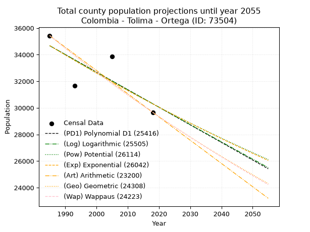
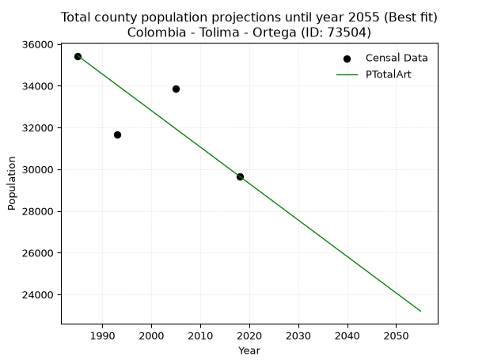
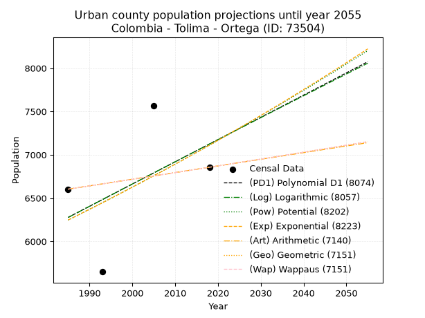
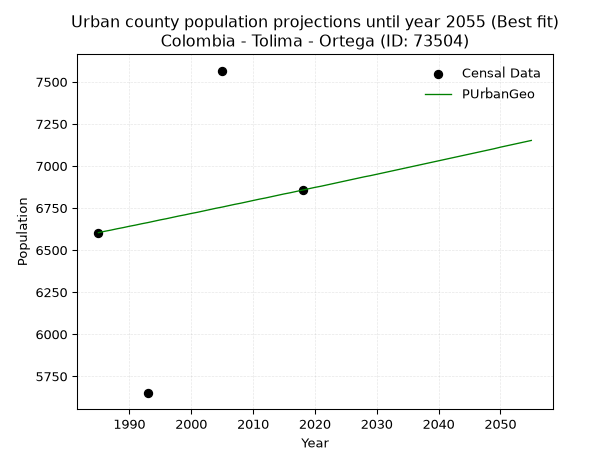
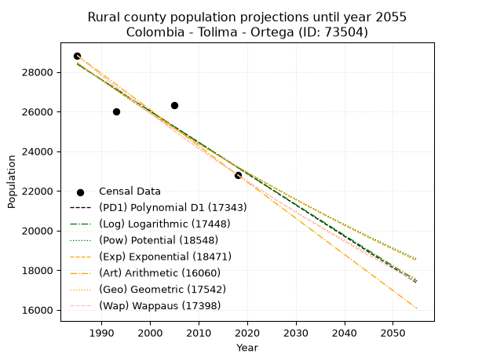
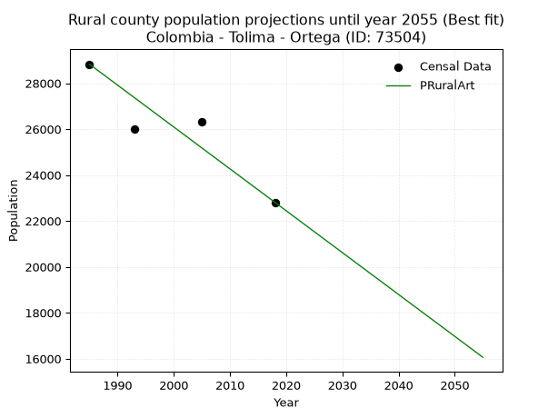

<div align="center">


</div>

# 📜 _“Population and Public Services Demand Projections (PPSD) until Year 2050 for Colombia - Tolima - Ortega (ID: 73504)”_
Keywords: `population` `public-service` `projection` `lineal` `polynomial` `logarithmic` `potential` `exponential` `arithmetic` `geometric` `wappaus` `dane` `colombia` `south-america`

PPSD are analytical estimates used by governments and planners to anticipate future changes in population size, age distribution, and the resulting community needs for utilities, healthcare, education, and infrastructure as sizing future water treatment facilities, electrical grids, and road networks based on spatial growth.

<div align="center">

</img>

</div>


> **General running parameters**: • app_version: _v20260806_. • Python version: _3.14.7_. • Pandas version: _3.0.5_. • NumPy version: _2.5.1_. • Creates, save and include plots into reports (create_plot): _False_. • Projection until year: _2050_. • Process polynomial degree 2 and up: _False_. • Process Wappaus: _True_. • Process Wappaus: _True_. • Set negative values to zero: _True_. • Set infinite values to zero: _True_. • Drop dataset notes: _True_. 
<div align="center">

Maps & GIS Layers: [:earth_americas:Google](http://maps.google.com/maps?q=3.934916386,-75.222601) [:earth_americas:OSM](https://www.openstreetmap.org/#map=18/3.934916386/-75.222601&layers=P) [:earth_americas:Bing](https://www.bing.com/maps?cp=3.934916386~-75.222601&lvl=18) [:earth_americas:Apple](https://maps.apple.com/frame?center=3.934916386%2C-75.222601&span=0.003%2C0.006) [:earth_americas:GISMobile](https://github.com/rcfdtools/R.GISMobile/blob/main/file/gis/CountyLayer_CO/Readme.md)

</div>


<div align="center">

```geojson
{
  "type": "Feature",
  "geometry": {
    "type": "Point", 
    "coordinates": [-75.222601, 3.934916386]
  }, 
  "properties": {
    "Name": "Colombia - Tolima - Ortega (ID: 73504)"
  }
}
```

</div>


## 0. Census Data (4 records)

Census data are official statistics collected by a government about the people and housing in a country. They usually include counts of total population, age, sex, race, income, education, and jobs.

📅Global census file: [Population.xlsx](../data/Population.xlsx)

| Source   |   Year |   CountryID | CountryName   |   StateID | StateName   |   CountyID | CountyName   |   PTotal |   PUrban |   PRural |
|:---------|-------:|------------:|:--------------|----------:|:------------|-----------:|:-------------|---------:|---------:|---------:|
| DANE     |   1985 |          57 | Colombia      |        73 | Tolima      |      73504 | Ortega       |    35431 |     6603 |    28828 |
| DANE     |   1993 |          57 | Colombia      |        73 | Tolima      |      73504 | Ortega       |    31650 |     5649 |    26001 |
| DANE     |   2005 |          57 | Colombia      |        73 | Tolima      |      73504 | Ortega       |    33873 |     7566 |    26307 |
| DANE     |   2018 |          57 | Colombia      |        73 | Tolima      |      73504 | Ortega       |    29665 |     6856 |    22809 |

> 🔥Some records could had specific notes about the registered values or the corresponding urban or rural distribution.

📅[SUI-RUPS](https://www.datos.gov.co/Hacienda-y-Cr-dito-P-blico/Registro-nico-de-Prestadores-de-Servicios-P-blicos/4qkq-csdn/about_data) - Local public utility companies: [RUPS.csv](../data/RUPS.csv)

 | SERVICIO       | ESTADO    | NOMBRE                                                                                                                 | NIT         | DEPARTAMENTO_DOMICILIO   | MUNICIPIO_DOMICILIO   | DIRECCION                         |   TELEFONO | EMAIL                                  | TIPO_PRESTADOR                            | CLASIFICACION                  |
|:---------------|:----------|:-----------------------------------------------------------------------------------------------------------------------|:------------|:-------------------------|:----------------------|:----------------------------------|-----------:|:---------------------------------------|:------------------------------------------|:-------------------------------|
| ACUEDUCTO      | OPERATIVA | ASOCIACION DE USUARIOS DEL ACUEDUCTO REGIONAL PLAYAVERDE LA SORTIJA                                                    | 800067474-8 | TOLIMA                   | ORTEGA                | calle 5 No. 3 - 37                |    2248332 | acueductoplayaverdelasortija@gmail.com | ORGANIZACION AUTORIZADA                   | MENOR O IGUAL A 2500 USUARIOS  |
| ACUEDUCTO      | OPERATIVA | EMPRESA DE SERVICIOS PUBLICOS  DOMICILIARIOS DE ORTEGA E.S.P.                                                          | 809004801-6 | TOLIMA                   | ORTEGA                | Carrera 10 No 3 - 127             |    2258909 | patriciaguarnizo21@gmail.com           | EMPRESA INDUSTRIAL Y COMERCIAL DEL ESTADO | DESDE 2501 HASTA 5000 USUARIOS |
| ALCANTARILLADO | OPERATIVA | EMPRESA DE SERVICIOS PUBLICOS  DOMICILIARIOS DE ORTEGA E.S.P.                                                          | 809004801-6 | TOLIMA                   | ORTEGA                | Carrera 10 No 3 - 127             |    2258909 | patriciaguarnizo21@gmail.com           | EMPRESA INDUSTRIAL Y COMERCIAL DEL ESTADO | MENOR O IGUAL A 2500 USUARIOS  |
| ACUEDUCTO      | OPERATIVA | ASOCIACION COMUNITARIA DE USUARIOS DEL ACUEDUCTO RURAL DE OLAYA HERRERA Y BARRIO EL LLANO                              | 900054638-5 | TOLIMA                   | ORTEGA                | OLAYA HERRERA MUNICIPIO DE ORTEGA |    7467176 | ailuz21@yahoo.com                      | ORGANIZACION AUTORIZADA                   | HASTA 2500 SUSCRIPTORES        |
| ACUEDUCTO      | OPERATIVA | ASOCIACION DE USUARIOS DEL ACUEDUCTO REGIONAL OLAYA HERRERA, CANALI, BALSILLAS, GUAIPA DEL MUNICIPIO DE ORTEGA TOLIMA. | 900388669-7 | TOLIMA                   | ORTEGA                | CARRERA 10 N 3 - 127              |    2258909 | acueductoloscanalies@gmail.com         | ORGANIZACION AUTORIZADA                   | HASTA 2500 SUSCRIPTORES        |

## 1. Total

### 1.1. Coefficients and Parameters

* (PD1) Polynomial Deg 1: -132.21156162183598, 297110.9261340775 (lineal)
* (Log) Logarithmic: -264568.5959385784, 2043642.7678488055
* (Pow) Potential: -8.187580457664268, 31.540787798415057
* (Exp) Exponential: -0.004091832461337674, 116823057.25153722
* (Art) Arithmetic: Year diff. 2018 - 1985 = 33, Population diff. 29665 - 35431 = -5766, Annual growth = -174.72727272727272
* (Geo) Geometric: Year diff. 2018 - 1985 = 33, Population diff. 29665 - 35431 = -5766, Annual growth % = -0.005367942147617044
* (Wap) Wappaus: i = -0.5368295217133855, Condition values only valid for < 200)

<sub>
Wappaus condition values: ['-0.00', '-0.54', '-1.07', '-1.61', '-2.15', '-2.68', '-3.22', '-3.76', '-4.29', '-4.83', '-5.37', '-5.91', '-6.44', '-6.98', '-7.52', '-8.05', '-8.59', '-9.13', '-9.66', '-10.20', '-10.74', '-11.27', '-11.81', '-12.35', '-12.88', '-13.42', '-13.96', '-14.49', '-15.03', '-15.57', '-16.10', '-16.64', '-17.18', '-17.72', '-18.25', '-18.79', '-19.33', '-19.86', '-20.40', '-20.94', '-21.47', '-22.01', '-22.55', '-23.08', '-23.62', '-24.16', '-24.69', '-25.23', '-25.77', '-26.30', '-26.84', '-27.38', '-27.92', '-28.45', '-28.99', '-29.53', '-30.06', '-30.60', '-31.14', '-31.67', '-32.21', '-32.75', '-33.28', '-33.82', '-34.36', '-34.89']
</sub>


### 1.2. Projected Dataset

|   Year |   CountyID |   PTotalPD1 |   PTotalLog |   PTotalPow |   PTotalExp |   PTotalArt |   PTotalGeo |   PTotalWap |
|-------:|-----------:|------------:|------------:|------------:|------------:|------------:|------------:|------------:|
|   1985 |      73504 |       34671 |       34674 |       34682 |       34679 |       35431 |       35431 |       35431 |
|   1986 |      73504 |       34539 |       34541 |       34540 |       34537 |       35256 |       35241 |       35241 |
|   1987 |      73504 |       34407 |       34408 |       34398 |       34396 |       35082 |       35052 |       35053 |
|   1988 |      73504 |       34274 |       34275 |       34256 |       34256 |       34907 |       34863 |       34865 |
|   1989 |      73504 |       34142 |       34142 |       34115 |       34116 |       34732 |       34676 |       34678 |
|   1990 |      73504 |       34010 |       34009 |       33975 |       33977 |       34557 |       34490 |       34493 |
|   1991 |      73504 |       33878 |       33876 |       33836 |       33838 |       34383 |       34305 |       34308 |
|   1992 |      73504 |       33745 |       33743 |       33697 |       33700 |       34208 |       34121 |       34124 |
|   1993 |      73504 |       33613 |       33610 |       33559 |       33562 |       34033 |       33938 |       33941 |
|   1994 |      73504 |       33481 |       33478 |       33421 |       33425 |       33858 |       33756 |       33760 |
|   1995 |      73504 |       33349 |       33345 |       33284 |       33288 |       33684 |       33574 |       33579 |
|   1996 |      73504 |       33217 |       33212 |       33148 |       33153 |       33509 |       33394 |       33399 |
|   1997 |      73504 |       33084 |       33080 |       33012 |       33017 |       33334 |       33215 |       33220 |
|   1998 |      73504 |       32952 |       32947 |       32877 |       32882 |       33160 |       33037 |       33042 |
|   1999 |      73504 |       32820 |       32815 |       32743 |       32748 |       32985 |       32859 |       32865 |
|   2000 |      73504 |       32688 |       32683 |       32609 |       32614 |       32810 |       32683 |       32688 |
|   2001 |      73504 |       32556 |       32550 |       32476 |       32481 |       32635 |       32507 |       32513 |
|   2002 |      73504 |       32423 |       32418 |       32343 |       32348 |       32461 |       32333 |       32339 |
|   2003 |      73504 |       32291 |       32286 |       32211 |       32216 |       32286 |       32159 |       32165 |
|   2004 |      73504 |       32159 |       32154 |       32080 |       32085 |       32111 |       31987 |       31992 |
|   2005 |      73504 |       32027 |       32022 |       31949 |       31954 |       31936 |       31815 |       31821 |
|   2006 |      73504 |       31895 |       31890 |       31819 |       31823 |       31762 |       31644 |       31650 |
|   2007 |      73504 |       31762 |       31758 |       31690 |       31693 |       31587 |       31474 |       31480 |
|   2008 |      73504 |       31630 |       31627 |       31561 |       31564 |       31412 |       31305 |       31311 |
|   2009 |      73504 |       31498 |       31495 |       31432 |       31435 |       31238 |       31137 |       31142 |
|   2010 |      73504 |       31366 |       31363 |       31304 |       31307 |       31063 |       30970 |       30975 |
|   2011 |      73504 |       31233 |       31232 |       31177 |       31179 |       30888 |       30804 |       30808 |
|   2012 |      73504 |       31101 |       31100 |       31050 |       31052 |       30713 |       30639 |       30643 |
|   2013 |      73504 |       30969 |       30969 |       30924 |       30925 |       30539 |       30474 |       30478 |
|   2014 |      73504 |       30837 |       30837 |       30799 |       30798 |       30364 |       30311 |       30313 |
|   2015 |      73504 |       30705 |       30706 |       30674 |       30673 |       30189 |       30148 |       30150 |
|   2016 |      73504 |       30572 |       30575 |       30550 |       30547 |       30014 |       29986 |       29988 |
|   2017 |      73504 |       30440 |       30443 |       30426 |       30423 |       29840 |       29825 |       29826 |
|   2018 |      73504 |       30308 |       30312 |       30303 |       30298 |       29665 |       29665 |       29665 |
|   2019 |      73504 |       30176 |       30181 |       30180 |       30175 |       29490 |       29506 |       29505 |
|   2020 |      73504 |       30044 |       30050 |       30058 |       30052 |       29316 |       29347 |       29346 |
|   2021 |      73504 |       29911 |       29919 |       29936 |       29929 |       29141 |       29190 |       29187 |
|   2022 |      73504 |       29779 |       29788 |       29815 |       29807 |       28966 |       29033 |       29029 |
|   2023 |      73504 |       29647 |       29657 |       29695 |       29685 |       28791 |       28877 |       28872 |
|   2024 |      73504 |       29515 |       29527 |       29575 |       29564 |       28617 |       28722 |       28716 |
|   2025 |      73504 |       29383 |       29396 |       29456 |       29443 |       28442 |       28568 |       28560 |
|   2026 |      73504 |       29250 |       29265 |       29337 |       29323 |       28267 |       28415 |       28406 |
|   2027 |      73504 |       29118 |       29135 |       29218 |       29203 |       28092 |       28262 |       28252 |
|   2028 |      73504 |       28986 |       29004 |       29101 |       29084 |       27918 |       28111 |       28099 |
|   2029 |      73504 |       28854 |       28874 |       28983 |       28965 |       27743 |       27960 |       27946 |
|   2030 |      73504 |       28721 |       28744 |       28867 |       28847 |       27568 |       27810 |       27794 |
|   2031 |      73504 |       28589 |       28613 |       28751 |       28729 |       27394 |       27660 |       27643 |
|   2032 |      73504 |       28457 |       28483 |       28635 |       28612 |       27219 |       27512 |       27493 |
|   2033 |      73504 |       28325 |       28353 |       28520 |       28495 |       27044 |       27364 |       27343 |
|   2034 |      73504 |       28193 |       28223 |       28405 |       28378 |       26869 |       27217 |       27194 |
|   2035 |      73504 |       28060 |       28093 |       28291 |       28263 |       26695 |       27071 |       27046 |
|   2036 |      73504 |       27928 |       27963 |       28178 |       28147 |       26520 |       26926 |       26899 |
|   2037 |      73504 |       27796 |       27833 |       28065 |       28032 |       26345 |       26781 |       26752 |
|   2038 |      73504 |       27664 |       27703 |       27952 |       27918 |       26170 |       26637 |       26606 |
|   2039 |      73504 |       27532 |       27573 |       27840 |       27804 |       25996 |       26495 |       26460 |
|   2040 |      73504 |       27399 |       27444 |       27728 |       27690 |       25821 |       26352 |       26315 |
|   2041 |      73504 |       27267 |       27314 |       27617 |       27577 |       25646 |       26211 |       26171 |
|   2042 |      73504 |       27135 |       27184 |       27507 |       27464 |       25472 |       26070 |       26028 |
|   2043 |      73504 |       27003 |       27055 |       27397 |       27352 |       25297 |       25930 |       25885 |
|   2044 |      73504 |       26870 |       26925 |       27287 |       27241 |       25122 |       25791 |       25743 |
|   2045 |      73504 |       26738 |       26796 |       27178 |       27129 |       24947 |       25653 |       25602 |
|   2046 |      73504 |       26606 |       26667 |       27070 |       27019 |       24773 |       25515 |       25461 |
|   2047 |      73504 |       26474 |       26537 |       26962 |       26908 |       24598 |       25378 |       25321 |
|   2048 |      73504 |       26342 |       26408 |       26854 |       26798 |       24423 |       25242 |       25181 |
|   2049 |      73504 |       26209 |       26279 |       26747 |       26689 |       24248 |       25106 |       25043 |
|   2050 |      73504 |       26077 |       26150 |       26640 |       26580 |       24074 |       24971 |       24904 |
<div align="center">

</img>

</div>


### 1.3. Best fit with absolute and relative error (%)

Relative error puts that difference into context by dividing the absolute error by the true value, creating a unitless ratio or percentage that shows the scale of the mistake.

Absolute and relative error

|   Year | Source   |   CountryID | CountryName   |   StateID | StateName   |   CountyID_x | CountyName   |   PTotal |   PUrban |   PRural |   CountyID_y |   PTotalPD1 |   PTotalLog |   PTotalPow |   PTotalExp |   PTotalArt |   PTotalGeo |   PTotalWap |   PTotalPD1AbsError |   PTotalLogAbsError |   PTotalPowAbsError |   PTotalExpAbsError |   PTotalArtAbsError |   PTotalGeoAbsError |   PTotalWapAbsError |   PTotalPD1RelError |   PTotalLogRelError |   PTotalPowRelError |   PTotalExpRelError |   PTotalArtRelError |   PTotalGeoRelError |   PTotalWapRelError |
|-------:|:---------|------------:|:--------------|----------:|:------------|-------------:|:-------------|---------:|---------:|---------:|-------------:|------------:|------------:|------------:|------------:|------------:|------------:|------------:|--------------------:|--------------------:|--------------------:|--------------------:|--------------------:|--------------------:|--------------------:|--------------------:|--------------------:|--------------------:|--------------------:|--------------------:|--------------------:|--------------------:|
|   1985 | DANE     |          57 | Colombia      |        73 | Tolima      |        73504 | Ortega       |    35431 |     6603 |    28828 |        73504 |       34671 |       34674 |       34682 |       34679 |       35431 |       35431 |       35431 |                 760 |                 757 |                 749 |                 752 |                   0 |                   0 |                   0 |             2.14501 |             2.13655 |             2.11397 |             2.12244 |             0       |             0       |             0       |
|   1993 | DANE     |          57 | Colombia      |        73 | Tolima      |        73504 | Ortega       |    31650 |     5649 |    26001 |        73504 |       33613 |       33610 |       33559 |       33562 |       34033 |       33938 |       33941 |                1963 |                1960 |                1909 |                1912 |                2383 |                2288 |                2291 |             6.20221 |             6.19273 |             6.0316  |             6.04107 |             7.52923 |             7.22907 |             7.23855 |
|   2005 | DANE     |          57 | Colombia      |        73 | Tolima      |        73504 | Ortega       |    33873 |     7566 |    26307 |        73504 |       32027 |       32022 |       31949 |       31954 |       31936 |       31815 |       31821 |                1846 |                1851 |                1924 |                1919 |                1937 |                2058 |                2052 |             5.44977 |             5.46453 |             5.68004 |             5.66528 |             5.71842 |             6.07564 |             6.05792 |
|   2018 | DANE     |          57 | Colombia      |        73 | Tolima      |        73504 | Ortega       |    29665 |     6856 |    22809 |        73504 |       30308 |       30312 |       30303 |       30298 |       29665 |       29665 |       29665 |                 643 |                 647 |                 638 |                 633 |                   0 |                   0 |                   0 |             2.16754 |             2.18102 |             2.15068 |             2.13383 |             0       |             0       |             0       |

Relative error mean

| Method    |   RelError | Best   |
|:----------|-----------:|:-------|
| PTotalPD1 |    3.99113 |        |
| PTotalLog |    3.99371 |        |
| PTotalPow |    3.99407 |        |
| PTotalExp |    3.99065 |        |
| PTotalArt |    3.31191 | True   |
| PTotalGeo |    3.32618 |        |
| PTotalWap |    3.32412 |        |

💙Best method: _**PTotalArt**_
<div align="center">

</img>

</div>


### 1.4. Fresh water supply demand in liters per capita per day (lpcd)

The fresh water supply demand typically ranges from 100 to 300 liters per capita per day (lpcd) for standard domestic and municipal planning, though absolute survival minimums set by the World Health Organization are as low as 7.5 to 20 liters per day, and total consumption in high-income nations can exceed 400 liters.

> `CZ`: Level in meters above the sea level (masl)<br> `WS`: Fresh water supply demand in liters per capita per day (lpcd or l/h/d)<br> `WSAll`: Zonal fresh water supply demand in liters per second (l/s)<br> `A`: Zonal area in square meters<br> `DP`: Population density (people/hectare or p/ha)

Reference values (RAS Colombia)

|    CZ |   WS |
|------:|-----:|
|  1000 |  120 |
|  2000 |  130 |
| 99999 |  140 |

County shapefile geometry properties and water supply values

|   CountyID |      ATotal |   CZTotal |   WSTotal |
|-----------:|------------:|----------:|----------:|
|      73504 | 9.53286e+08 |   827.664 |       120 |

Projected values for best method: PTotalArt

|   CountyID |   Year |   PTotalArt |   DPTotal |   WSTotal |   WSTotalAll |
|-----------:|-------:|------------:|----------:|----------:|-------------:|
|      73504 |   1985 |       35431 |      0.37 |       120 |      49.2097 |
|      73504 |   1986 |       35256 |      0.37 |       120 |      48.9667 |
|      73504 |   1987 |       35082 |      0.37 |       120 |      48.725  |
|      73504 |   1988 |       34907 |      0.37 |       120 |      48.4819 |
|      73504 |   1989 |       34732 |      0.36 |       120 |      48.2389 |
|      73504 |   1990 |       34557 |      0.36 |       120 |      47.9958 |
|      73504 |   1991 |       34383 |      0.36 |       120 |      47.7542 |
|      73504 |   1992 |       34208 |      0.36 |       120 |      47.5111 |
|      73504 |   1993 |       34033 |      0.36 |       120 |      47.2681 |
|      73504 |   1994 |       33858 |      0.36 |       120 |      47.025  |
|      73504 |   1995 |       33684 |      0.35 |       120 |      46.7833 |
|      73504 |   1996 |       33509 |      0.35 |       120 |      46.5403 |
|      73504 |   1997 |       33334 |      0.35 |       120 |      46.2972 |
|      73504 |   1998 |       33160 |      0.35 |       120 |      46.0556 |
|      73504 |   1999 |       32985 |      0.35 |       120 |      45.8125 |
|      73504 |   2000 |       32810 |      0.34 |       120 |      45.5694 |
|      73504 |   2001 |       32635 |      0.34 |       120 |      45.3264 |
|      73504 |   2002 |       32461 |      0.34 |       120 |      45.0847 |
|      73504 |   2003 |       32286 |      0.34 |       120 |      44.8417 |
|      73504 |   2004 |       32111 |      0.34 |       120 |      44.5986 |
|      73504 |   2005 |       31936 |      0.34 |       120 |      44.3556 |
|      73504 |   2006 |       31762 |      0.33 |       120 |      44.1139 |
|      73504 |   2007 |       31587 |      0.33 |       120 |      43.8708 |
|      73504 |   2008 |       31412 |      0.33 |       120 |      43.6278 |
|      73504 |   2009 |       31238 |      0.33 |       120 |      43.3861 |
|      73504 |   2010 |       31063 |      0.33 |       120 |      43.1431 |
|      73504 |   2011 |       30888 |      0.32 |       120 |      42.9    |
|      73504 |   2012 |       30713 |      0.32 |       120 |      42.6569 |
|      73504 |   2013 |       30539 |      0.32 |       120 |      42.4153 |
|      73504 |   2014 |       30364 |      0.32 |       120 |      42.1722 |
|      73504 |   2015 |       30189 |      0.32 |       120 |      41.9292 |
|      73504 |   2016 |       30014 |      0.31 |       120 |      41.6861 |
|      73504 |   2017 |       29840 |      0.31 |       120 |      41.4444 |
|      73504 |   2018 |       29665 |      0.31 |       120 |      41.2014 |
|      73504 |   2019 |       29490 |      0.31 |       120 |      40.9583 |
|      73504 |   2020 |       29316 |      0.31 |       120 |      40.7167 |
|      73504 |   2021 |       29141 |      0.31 |       120 |      40.4736 |
|      73504 |   2022 |       28966 |      0.3  |       120 |      40.2306 |
|      73504 |   2023 |       28791 |      0.3  |       120 |      39.9875 |
|      73504 |   2024 |       28617 |      0.3  |       120 |      39.7458 |
|      73504 |   2025 |       28442 |      0.3  |       120 |      39.5028 |
|      73504 |   2026 |       28267 |      0.3  |       120 |      39.2597 |
|      73504 |   2027 |       28092 |      0.29 |       120 |      39.0167 |
|      73504 |   2028 |       27918 |      0.29 |       120 |      38.775  |
|      73504 |   2029 |       27743 |      0.29 |       120 |      38.5319 |
|      73504 |   2030 |       27568 |      0.29 |       120 |      38.2889 |
|      73504 |   2031 |       27394 |      0.29 |       120 |      38.0472 |
|      73504 |   2032 |       27219 |      0.29 |       120 |      37.8042 |
|      73504 |   2033 |       27044 |      0.28 |       120 |      37.5611 |
|      73504 |   2034 |       26869 |      0.28 |       120 |      37.3181 |
|      73504 |   2035 |       26695 |      0.28 |       120 |      37.0764 |
|      73504 |   2036 |       26520 |      0.28 |       120 |      36.8333 |
|      73504 |   2037 |       26345 |      0.28 |       120 |      36.5903 |
|      73504 |   2038 |       26170 |      0.27 |       120 |      36.3472 |
|      73504 |   2039 |       25996 |      0.27 |       120 |      36.1056 |
|      73504 |   2040 |       25821 |      0.27 |       120 |      35.8625 |
|      73504 |   2041 |       25646 |      0.27 |       120 |      35.6194 |
|      73504 |   2042 |       25472 |      0.27 |       120 |      35.3778 |
|      73504 |   2043 |       25297 |      0.27 |       120 |      35.1347 |
|      73504 |   2044 |       25122 |      0.26 |       120 |      34.8917 |
|      73504 |   2045 |       24947 |      0.26 |       120 |      34.6486 |
|      73504 |   2046 |       24773 |      0.26 |       120 |      34.4069 |
|      73504 |   2047 |       24598 |      0.26 |       120 |      34.1639 |
|      73504 |   2048 |       24423 |      0.26 |       120 |      33.9208 |
|      73504 |   2049 |       24248 |      0.25 |       120 |      33.6778 |
|      73504 |   2050 |       24074 |      0.25 |       120 |      33.4361 |

## 2. Urban

### 2.1. Coefficients and Parameters

* (PD1) Polynomial Deg 1: 25.662786029707235, -44663.487755921895 (lineal)
* (Log) Logarithmic: 51394.67699738871, -383982.8517082457
* (Pow) Potential: 7.862232565691437, -22.132163444299028
* (Exp) Exponential: 0.003926774666429498, 2.5732561637065983
* (Art) Arithmetic: Year diff. 2018 - 1985 = 33, Population diff. 6856 - 6603 = 253, Annual growth = 7.666666666666667
* (Geo) Geometric: Year diff. 2018 - 1985 = 33, Population diff. 6856 - 6603 = 253, Annual growth % = 0.0011400460281705271
* (Wap) Wappaus: i = 0.11392624513955965, Condition values only valid for < 200)

<sub>
Wappaus condition values: ['0.00', '0.11', '0.23', '0.34', '0.46', '0.57', '0.68', '0.80', '0.91', '1.03', '1.14', '1.25', '1.37', '1.48', '1.59', '1.71', '1.82', '1.94', '2.05', '2.16', '2.28', '2.39', '2.51', '2.62', '2.73', '2.85', '2.96', '3.08', '3.19', '3.30', '3.42', '3.53', '3.65', '3.76', '3.87', '3.99', '4.10', '4.22', '4.33', '4.44', '4.56', '4.67', '4.78', '4.90', '5.01', '5.13', '5.24', '5.35', '5.47', '5.58', '5.70', '5.81', '5.92', '6.04', '6.15', '6.27', '6.38', '6.49', '6.61', '6.72', '6.84', '6.95', '7.06', '7.18', '7.29', '7.41']
</sub>


### 2.2. Projected Dataset

|   Year |   CountyID |   PUrbanPD1 |   PUrbanLog |   PUrbanPow |   PUrbanExp |   PUrbanArt |   PUrbanGeo |   PUrbanWap |
|-------:|-----------:|------------:|------------:|------------:|------------:|------------:|------------:|------------:|
|   1985 |      73504 |        6277 |        6276 |        6246 |        6247 |        6603 |        6603 |        6603 |
|   1986 |      73504 |        6303 |        6302 |        6271 |        6271 |        6611 |        6611 |        6611 |
|   1987 |      73504 |        6328 |        6328 |        6296 |        6296 |        6618 |        6618 |        6618 |
|   1988 |      73504 |        6354 |        6354 |        6321 |        6321 |        6626 |        6626 |        6626 |
|   1989 |      73504 |        6380 |        6380 |        6346 |        6346 |        6634 |        6633 |        6633 |
|   1990 |      73504 |        6405 |        6405 |        6371 |        6371 |        6641 |        6641 |        6641 |
|   1991 |      73504 |        6431 |        6431 |        6396 |        6396 |        6649 |        6648 |        6648 |
|   1992 |      73504 |        6457 |        6457 |        6421 |        6421 |        6657 |        6656 |        6656 |
|   1993 |      73504 |        6482 |        6483 |        6447 |        6446 |        6664 |        6663 |        6663 |
|   1994 |      73504 |        6508 |        6509 |        6472 |        6471 |        6672 |        6671 |        6671 |
|   1995 |      73504 |        6534 |        6534 |        6498 |        6497 |        6680 |        6679 |        6679 |
|   1996 |      73504 |        6559 |        6560 |        6523 |        6523 |        6687 |        6686 |        6686 |
|   1997 |      73504 |        6585 |        6586 |        6549 |        6548 |        6695 |        6694 |        6694 |
|   1998 |      73504 |        6611 |        6612 |        6575 |        6574 |        6703 |        6702 |        6702 |
|   1999 |      73504 |        6636 |        6637 |        6601 |        6600 |        6710 |        6709 |        6709 |
|   2000 |      73504 |        6662 |        6663 |        6627 |        6626 |        6718 |        6717 |        6717 |
|   2001 |      73504 |        6688 |        6689 |        6653 |        6652 |        6726 |        6724 |        6724 |
|   2002 |      73504 |        6713 |        6714 |        6679 |        6678 |        6733 |        6732 |        6732 |
|   2003 |      73504 |        6739 |        6740 |        6705 |        6704 |        6741 |        6740 |        6740 |
|   2004 |      73504 |        6765 |        6766 |        6732 |        6731 |        6749 |        6748 |        6747 |
|   2005 |      73504 |        6790 |        6791 |        6758 |        6757 |        6756 |        6755 |        6755 |
|   2006 |      73504 |        6816 |        6817 |        6785 |        6784 |        6764 |        6763 |        6763 |
|   2007 |      73504 |        6842 |        6843 |        6811 |        6810 |        6772 |        6771 |        6771 |
|   2008 |      73504 |        6867 |        6868 |        6838 |        6837 |        6779 |        6778 |        6778 |
|   2009 |      73504 |        6893 |        6894 |        6865 |        6864 |        6787 |        6786 |        6786 |
|   2010 |      73504 |        6919 |        6919 |        6892 |        6891 |        6795 |        6794 |        6794 |
|   2011 |      73504 |        6944 |        6945 |        6919 |        6918 |        6802 |        6802 |        6802 |
|   2012 |      73504 |        6970 |        6971 |        6946 |        6945 |        6810 |        6809 |        6809 |
|   2013 |      73504 |        6996 |        6996 |        6973 |        6973 |        6818 |        6817 |        6817 |
|   2014 |      73504 |        7021 |        7022 |        7000 |        7000 |        6825 |        6825 |        6825 |
|   2015 |      73504 |        7047 |        7047 |        7028 |        7028 |        6833 |        6833 |        6833 |
|   2016 |      73504 |        7073 |        7073 |        7055 |        7055 |        6841 |        6840 |        6840 |
|   2017 |      73504 |        7098 |        7098 |        7083 |        7083 |        6848 |        6848 |        6848 |
|   2018 |      73504 |        7124 |        7124 |        7110 |        7111 |        6856 |        6856 |        6856 |
|   2019 |      73504 |        7150 |        7149 |        7138 |        7139 |        6864 |        6864 |        6864 |
|   2020 |      73504 |        7175 |        7174 |        7166 |        7167 |        6871 |        6872 |        6872 |
|   2021 |      73504 |        7201 |        7200 |        7194 |        7195 |        6879 |        6879 |        6879 |
|   2022 |      73504 |        7227 |        7225 |        7222 |        7224 |        6887 |        6887 |        6887 |
|   2023 |      73504 |        7252 |        7251 |        7250 |        7252 |        6894 |        6895 |        6895 |
|   2024 |      73504 |        7278 |        7276 |        7278 |        7281 |        6902 |        6903 |        6903 |
|   2025 |      73504 |        7304 |        7302 |        7307 |        7309 |        6910 |        6911 |        6911 |
|   2026 |      73504 |        7329 |        7327 |        7335 |        7338 |        6917 |        6919 |        6919 |
|   2027 |      73504 |        7355 |        7352 |        7364 |        7367 |        6925 |        6927 |        6927 |
|   2028 |      73504 |        7381 |        7378 |        7392 |        7396 |        6933 |        6935 |        6935 |
|   2029 |      73504 |        7406 |        7403 |        7421 |        7425 |        6940 |        6942 |        6943 |
|   2030 |      73504 |        7432 |        7428 |        7450 |        7454 |        6948 |        6950 |        6950 |
|   2031 |      73504 |        7458 |        7454 |        7479 |        7483 |        6956 |        6958 |        6958 |
|   2032 |      73504 |        7483 |        7479 |        7508 |        7513 |        6963 |        6966 |        6966 |
|   2033 |      73504 |        7509 |        7504 |        7537 |        7542 |        6971 |        6974 |        6974 |
|   2034 |      73504 |        7535 |        7529 |        7566 |        7572 |        6979 |        6982 |        6982 |
|   2035 |      73504 |        7560 |        7555 |        7595 |        7602 |        6986 |        6990 |        6990 |
|   2036 |      73504 |        7586 |        7580 |        7625 |        7632 |        6994 |        6998 |        6998 |
|   2037 |      73504 |        7612 |        7605 |        7654 |        7662 |        7002 |        7006 |        7006 |
|   2038 |      73504 |        7637 |        7630 |        7684 |        7692 |        7009 |        7014 |        7014 |
|   2039 |      73504 |        7663 |        7656 |        7713 |        7722 |        7017 |        7022 |        7022 |
|   2040 |      73504 |        7689 |        7681 |        7743 |        7753 |        7025 |        7030 |        7030 |
|   2041 |      73504 |        7714 |        7706 |        7773 |        7783 |        7032 |        7038 |        7038 |
|   2042 |      73504 |        7740 |        7731 |        7803 |        7814 |        7040 |        7046 |        7046 |
|   2043 |      73504 |        7766 |        7756 |        7833 |        7845 |        7048 |        7054 |        7054 |
|   2044 |      73504 |        7791 |        7781 |        7863 |        7875 |        7055 |        7062 |        7062 |
|   2045 |      73504 |        7817 |        7807 |        7894 |        7906 |        7063 |        7070 |        7070 |
|   2046 |      73504 |        7843 |        7832 |        7924 |        7937 |        7071 |        7078 |        7078 |
|   2047 |      73504 |        7868 |        7857 |        7955 |        7969 |        7078 |        7086 |        7086 |
|   2048 |      73504 |        7894 |        7882 |        7985 |        8000 |        7086 |        7094 |        7095 |
|   2049 |      73504 |        7920 |        7907 |        8016 |        8032 |        7094 |        7102 |        7103 |
|   2050 |      73504 |        7945 |        7932 |        8047 |        8063 |        7101 |        7111 |        7111 |
<div align="center">

</img>

</div>


### 2.3. Best fit with absolute and relative error (%)

Relative error puts that difference into context by dividing the absolute error by the true value, creating a unitless ratio or percentage that shows the scale of the mistake.

Absolute and relative error

|   Year | Source   |   CountryID | CountryName   |   StateID | StateName   |   CountyID_x | CountyName   |   PTotal |   PUrban |   PRural |   CountyID_y |   PUrbanPD1 |   PUrbanLog |   PUrbanPow |   PUrbanExp |   PUrbanArt |   PUrbanGeo |   PUrbanWap |   PUrbanPD1AbsError |   PUrbanLogAbsError |   PUrbanPowAbsError |   PUrbanExpAbsError |   PUrbanArtAbsError |   PUrbanGeoAbsError |   PUrbanWapAbsError |   PUrbanPD1RelError |   PUrbanLogRelError |   PUrbanPowRelError |   PUrbanExpRelError |   PUrbanArtRelError |   PUrbanGeoRelError |   PUrbanWapRelError |
|-------:|:---------|------------:|:--------------|----------:|:------------|-------------:|:-------------|---------:|---------:|---------:|-------------:|------------:|------------:|------------:|------------:|------------:|------------:|------------:|--------------------:|--------------------:|--------------------:|--------------------:|--------------------:|--------------------:|--------------------:|--------------------:|--------------------:|--------------------:|--------------------:|--------------------:|--------------------:|--------------------:|
|   1985 | DANE     |          57 | Colombia      |        73 | Tolima      |        73504 | Ortega       |    35431 |     6603 |    28828 |        73504 |        6277 |        6276 |        6246 |        6247 |        6603 |        6603 |        6603 |                 326 |                 327 |                 357 |                 356 |                   0 |                   0 |                   0 |             4.93715 |             4.95229 |             5.40663 |             5.39149 |              0      |              0      |              0      |
|   1993 | DANE     |          57 | Colombia      |        73 | Tolima      |        73504 | Ortega       |    31650 |     5649 |    26001 |        73504 |        6482 |        6483 |        6447 |        6446 |        6664 |        6663 |        6663 |                 833 |                 834 |                 798 |                 797 |                1015 |                1014 |                1014 |            14.746   |            14.7637  |            14.1264  |            14.1087  |             17.9678 |             17.9501 |             17.9501 |
|   2005 | DANE     |          57 | Colombia      |        73 | Tolima      |        73504 | Ortega       |    33873 |     7566 |    26307 |        73504 |        6790 |        6791 |        6758 |        6757 |        6756 |        6755 |        6755 |                 776 |                 775 |                 808 |                 809 |                 810 |                 811 |                 811 |            10.2564  |            10.2432  |            10.6794  |            10.6926  |             10.7058 |             10.719  |             10.719  |
|   2018 | DANE     |          57 | Colombia      |        73 | Tolima      |        73504 | Ortega       |    29665 |     6856 |    22809 |        73504 |        7124 |        7124 |        7110 |        7111 |        6856 |        6856 |        6856 |                 268 |                 268 |                 254 |                 255 |                   0 |                   0 |                   0 |             3.90898 |             3.90898 |             3.70478 |             3.71937 |              0      |              0      |              0      |

Relative error mean

| Method    |   RelError | Best   |
|:----------|-----------:|:-------|
| PUrbanPD1 |    8.46213 |        |
| PUrbanLog |    8.46704 |        |
| PUrbanPow |    8.47929 |        |
| PUrbanExp |    8.47803 |        |
| PUrbanArt |    7.16839 |        |
| PUrbanGeo |    7.16727 | True   |
| PUrbanWap |    7.16727 | True   |

💙Best method: _**PUrbanGeo**_
<div align="center">

</img>

</div>


### 2.4. Fresh water supply demand in liters per capita per day (lpcd)

The fresh water supply demand typically ranges from 100 to 300 liters per capita per day (lpcd) for standard domestic and municipal planning, though absolute survival minimums set by the World Health Organization are as low as 7.5 to 20 liters per day, and total consumption in high-income nations can exceed 400 liters.

> `CZ`: Level in meters above the sea level (masl)<br> `WS`: Fresh water supply demand in liters per capita per day (lpcd or l/h/d)<br> `WSAll`: Zonal fresh water supply demand in liters per second (l/s)<br> `A`: Zonal area in square meters<br> `DP`: Population density (people/hectare or p/ha)

Reference values (RAS Colombia)

|    CZ |   WS |
|------:|-----:|
|  1000 |  120 |
|  2000 |  130 |
| 99999 |  140 |

County shapefile geometry properties and water supply values

|   CountyID |      AUrban |   CZUrban |   WSUrban |
|-----------:|------------:|----------:|----------:|
|      73504 | 3.23556e+06 |   385.971 |       120 |

Projected values for best method: PUrbanGeo

|   CountyID |   Year |   PUrbanGeo |   DPUrban |   WSUrban |   WSUrbanAll |
|-----------:|-------:|------------:|----------:|----------:|-------------:|
|      73504 |   1985 |        6603 |     20.41 |       120 |      9.17083 |
|      73504 |   1986 |        6611 |     20.43 |       120 |      9.18194 |
|      73504 |   1987 |        6618 |     20.45 |       120 |      9.19167 |
|      73504 |   1988 |        6626 |     20.48 |       120 |      9.20278 |
|      73504 |   1989 |        6633 |     20.5  |       120 |      9.2125  |
|      73504 |   1990 |        6641 |     20.53 |       120 |      9.22361 |
|      73504 |   1991 |        6648 |     20.55 |       120 |      9.23333 |
|      73504 |   1992 |        6656 |     20.57 |       120 |      9.24444 |
|      73504 |   1993 |        6663 |     20.59 |       120 |      9.25417 |
|      73504 |   1994 |        6671 |     20.62 |       120 |      9.26528 |
|      73504 |   1995 |        6679 |     20.64 |       120 |      9.27639 |
|      73504 |   1996 |        6686 |     20.66 |       120 |      9.28611 |
|      73504 |   1997 |        6694 |     20.69 |       120 |      9.29722 |
|      73504 |   1998 |        6702 |     20.71 |       120 |      9.30833 |
|      73504 |   1999 |        6709 |     20.74 |       120 |      9.31806 |
|      73504 |   2000 |        6717 |     20.76 |       120 |      9.32917 |
|      73504 |   2001 |        6724 |     20.78 |       120 |      9.33889 |
|      73504 |   2002 |        6732 |     20.81 |       120 |      9.35    |
|      73504 |   2003 |        6740 |     20.83 |       120 |      9.36111 |
|      73504 |   2004 |        6748 |     20.86 |       120 |      9.37222 |
|      73504 |   2005 |        6755 |     20.88 |       120 |      9.38194 |
|      73504 |   2006 |        6763 |     20.9  |       120 |      9.39306 |
|      73504 |   2007 |        6771 |     20.93 |       120 |      9.40417 |
|      73504 |   2008 |        6778 |     20.95 |       120 |      9.41389 |
|      73504 |   2009 |        6786 |     20.97 |       120 |      9.425   |
|      73504 |   2010 |        6794 |     21    |       120 |      9.43611 |
|      73504 |   2011 |        6802 |     21.02 |       120 |      9.44722 |
|      73504 |   2012 |        6809 |     21.04 |       120 |      9.45694 |
|      73504 |   2013 |        6817 |     21.07 |       120 |      9.46806 |
|      73504 |   2014 |        6825 |     21.09 |       120 |      9.47917 |
|      73504 |   2015 |        6833 |     21.12 |       120 |      9.49028 |
|      73504 |   2016 |        6840 |     21.14 |       120 |      9.5     |
|      73504 |   2017 |        6848 |     21.16 |       120 |      9.51111 |
|      73504 |   2018 |        6856 |     21.19 |       120 |      9.52222 |
|      73504 |   2019 |        6864 |     21.21 |       120 |      9.53333 |
|      73504 |   2020 |        6872 |     21.24 |       120 |      9.54444 |
|      73504 |   2021 |        6879 |     21.26 |       120 |      9.55417 |
|      73504 |   2022 |        6887 |     21.29 |       120 |      9.56528 |
|      73504 |   2023 |        6895 |     21.31 |       120 |      9.57639 |
|      73504 |   2024 |        6903 |     21.33 |       120 |      9.5875  |
|      73504 |   2025 |        6911 |     21.36 |       120 |      9.59861 |
|      73504 |   2026 |        6919 |     21.38 |       120 |      9.60972 |
|      73504 |   2027 |        6927 |     21.41 |       120 |      9.62083 |
|      73504 |   2028 |        6935 |     21.43 |       120 |      9.63194 |
|      73504 |   2029 |        6942 |     21.46 |       120 |      9.64167 |
|      73504 |   2030 |        6950 |     21.48 |       120 |      9.65278 |
|      73504 |   2031 |        6958 |     21.5  |       120 |      9.66389 |
|      73504 |   2032 |        6966 |     21.53 |       120 |      9.675   |
|      73504 |   2033 |        6974 |     21.55 |       120 |      9.68611 |
|      73504 |   2034 |        6982 |     21.58 |       120 |      9.69722 |
|      73504 |   2035 |        6990 |     21.6  |       120 |      9.70833 |
|      73504 |   2036 |        6998 |     21.63 |       120 |      9.71944 |
|      73504 |   2037 |        7006 |     21.65 |       120 |      9.73056 |
|      73504 |   2038 |        7014 |     21.68 |       120 |      9.74167 |
|      73504 |   2039 |        7022 |     21.7  |       120 |      9.75278 |
|      73504 |   2040 |        7030 |     21.73 |       120 |      9.76389 |
|      73504 |   2041 |        7038 |     21.75 |       120 |      9.775   |
|      73504 |   2042 |        7046 |     21.78 |       120 |      9.78611 |
|      73504 |   2043 |        7054 |     21.8  |       120 |      9.79722 |
|      73504 |   2044 |        7062 |     21.83 |       120 |      9.80833 |
|      73504 |   2045 |        7070 |     21.85 |       120 |      9.81944 |
|      73504 |   2046 |        7078 |     21.88 |       120 |      9.83056 |
|      73504 |   2047 |        7086 |     21.9  |       120 |      9.84167 |
|      73504 |   2048 |        7094 |     21.93 |       120 |      9.85278 |
|      73504 |   2049 |        7102 |     21.95 |       120 |      9.86389 |
|      73504 |   2050 |        7111 |     21.98 |       120 |      9.87639 |

## 3. Rural

### 3.1. Coefficients and Parameters

* (PD1) Polynomial Deg 1: -157.8743476515433, 341774.41388999944 (lineal)
* (Log) Logarithmic: -315963.27293596684, 2427625.6195570496
* (Pow) Potential: -12.350170184481977, 45.18209391452745
* (Exp) Exponential: -0.006171499510966894, 5948561570.139239
* (Art) Arithmetic: Year diff. 2018 - 1985 = 33, Population diff. 22809 - 28828 = -6019, Annual growth = -182.3939393939394
* (Geo) Geometric: Year diff. 2018 - 1985 = 33, Population diff. 22809 - 28828 = -6019, Annual growth % = -0.007071603226880496
* (Wap) Wappaus: i = -0.70644669285179, Condition values only valid for < 200)

<sub>
Wappaus condition values: ['-0.00', '-0.71', '-1.41', '-2.12', '-2.83', '-3.53', '-4.24', '-4.95', '-5.65', '-6.36', '-7.06', '-7.77', '-8.48', '-9.18', '-9.89', '-10.60', '-11.30', '-12.01', '-12.72', '-13.42', '-14.13', '-14.84', '-15.54', '-16.25', '-16.95', '-17.66', '-18.37', '-19.07', '-19.78', '-20.49', '-21.19', '-21.90', '-22.61', '-23.31', '-24.02', '-24.73', '-25.43', '-26.14', '-26.84', '-27.55', '-28.26', '-28.96', '-29.67', '-30.38', '-31.08', '-31.79', '-32.50', '-33.20', '-33.91', '-34.62', '-35.32', '-36.03', '-36.74', '-37.44', '-38.15', '-38.85', '-39.56', '-40.27', '-40.97', '-41.68', '-42.39', '-43.09', '-43.80', '-44.51', '-45.21', '-45.92']
</sub>


### 3.2. Projected Dataset

|   Year |   CountyID |   PRuralPD1 |   PRuralLog |   PRuralPow |   PRuralExp |   PRuralArt |   PRuralGeo |   PRuralWap |
|-------:|-----------:|------------:|------------:|------------:|------------:|------------:|------------:|------------:|
|   1985 |      73504 |       28394 |       28398 |       28457 |       28452 |       28828 |       28828 |       28828 |
|   1986 |      73504 |       28236 |       28239 |       28281 |       28277 |       28646 |       28624 |       28625 |
|   1987 |      73504 |       28078 |       28080 |       28105 |       28103 |       28463 |       28422 |       28424 |
|   1988 |      73504 |       27920 |       27921 |       27931 |       27930 |       28281 |       28221 |       28223 |
|   1989 |      73504 |       27762 |       27762 |       27758 |       27759 |       28098 |       28021 |       28025 |
|   1990 |      73504 |       27604 |       27603 |       27587 |       27588 |       27916 |       27823 |       27827 |
|   1991 |      73504 |       27447 |       27445 |       27416 |       27418 |       27734 |       27626 |       27631 |
|   1992 |      73504 |       27289 |       27286 |       27246 |       27249 |       27551 |       27431 |       27437 |
|   1993 |      73504 |       27131 |       27127 |       27078 |       27082 |       27369 |       27237 |       27244 |
|   1994 |      73504 |       26973 |       26969 |       26911 |       26915 |       27186 |       27044 |       27052 |
|   1995 |      73504 |       26815 |       26810 |       26745 |       26750 |       27004 |       26853 |       26861 |
|   1996 |      73504 |       26657 |       26652 |       26580 |       26585 |       26822 |       26663 |       26672 |
|   1997 |      73504 |       26499 |       26494 |       26416 |       26421 |       26639 |       26475 |       26484 |
|   1998 |      73504 |       26341 |       26336 |       26253 |       26259 |       26457 |       26287 |       26297 |
|   1999 |      73504 |       26184 |       26178 |       26091 |       26097 |       26274 |       26102 |       26111 |
|   2000 |      73504 |       26026 |       26020 |       25931 |       25937 |       26092 |       25917 |       25927 |
|   2001 |      73504 |       25868 |       25862 |       25771 |       25777 |       25910 |       25734 |       25744 |
|   2002 |      73504 |       25710 |       25704 |       25612 |       25619 |       25727 |       25552 |       25562 |
|   2003 |      73504 |       25552 |       25546 |       25455 |       25461 |       25545 |       25371 |       25381 |
|   2004 |      73504 |       25394 |       25388 |       25299 |       25304 |       25363 |       25192 |       25202 |
|   2005 |      73504 |       25236 |       25231 |       25143 |       25149 |       25180 |       25013 |       25024 |
|   2006 |      73504 |       25078 |       25073 |       24989 |       24994 |       24998 |       24837 |       24847 |
|   2007 |      73504 |       24921 |       24916 |       24835 |       24840 |       24815 |       24661 |       24671 |
|   2008 |      73504 |       24763 |       24758 |       24683 |       24687 |       24633 |       24487 |       24496 |
|   2009 |      73504 |       24605 |       24601 |       24532 |       24535 |       24451 |       24313 |       24322 |
|   2010 |      73504 |       24447 |       24444 |       24382 |       24384 |       24268 |       24141 |       24150 |
|   2011 |      73504 |       24289 |       24287 |       24232 |       24234 |       24086 |       23971 |       23978 |
|   2012 |      73504 |       24131 |       24129 |       24084 |       24085 |       23903 |       23801 |       23808 |
|   2013 |      73504 |       23973 |       23972 |       23937 |       23937 |       23721 |       23633 |       23639 |
|   2014 |      73504 |       23815 |       23816 |       23790 |       23790 |       23539 |       23466 |       23471 |
|   2015 |      73504 |       23658 |       23659 |       23645 |       23644 |       23356 |       23300 |       23304 |
|   2016 |      73504 |       23500 |       23502 |       23500 |       23498 |       23174 |       23135 |       23138 |
|   2017 |      73504 |       23342 |       23345 |       23357 |       23353 |       22991 |       22971 |       22973 |
|   2018 |      73504 |       23184 |       23189 |       23214 |       23210 |       22809 |       22809 |       22809 |
|   2019 |      73504 |       23026 |       23032 |       23073 |       23067 |       22627 |       22648 |       22646 |
|   2020 |      73504 |       22868 |       22876 |       22932 |       22925 |       22444 |       22488 |       22484 |
|   2021 |      73504 |       22710 |       22719 |       22792 |       22784 |       22262 |       22329 |       22324 |
|   2022 |      73504 |       22552 |       22563 |       22653 |       22644 |       22079 |       22171 |       22164 |
|   2023 |      73504 |       22395 |       22407 |       22516 |       22505 |       21897 |       22014 |       22005 |
|   2024 |      73504 |       22237 |       22251 |       22379 |       22366 |       21715 |       21858 |       21847 |
|   2025 |      73504 |       22079 |       22095 |       22242 |       22228 |       21532 |       21704 |       21690 |
|   2026 |      73504 |       21921 |       21939 |       22107 |       22092 |       21350 |       21550 |       21534 |
|   2027 |      73504 |       21763 |       21783 |       21973 |       21956 |       21167 |       21398 |       21380 |
|   2028 |      73504 |       21605 |       21627 |       21839 |       21821 |       20985 |       21246 |       21226 |
|   2029 |      73504 |       21447 |       21471 |       21707 |       21686 |       20803 |       21096 |       21073 |
|   2030 |      73504 |       21289 |       21315 |       21575 |       21553 |       20620 |       20947 |       20920 |
|   2031 |      73504 |       21132 |       21160 |       21444 |       21420 |       20438 |       20799 |       20769 |
|   2032 |      73504 |       20974 |       21004 |       21314 |       21289 |       20255 |       20652 |       20619 |
|   2033 |      73504 |       20816 |       20849 |       21185 |       21158 |       20073 |       20506 |       20470 |
|   2034 |      73504 |       20658 |       20693 |       21057 |       21027 |       19891 |       20361 |       20321 |
|   2035 |      73504 |       20500 |       20538 |       20930 |       20898 |       19708 |       20217 |       20174 |
|   2036 |      73504 |       20342 |       20383 |       20803 |       20770 |       19526 |       20074 |       20027 |
|   2037 |      73504 |       20184 |       20228 |       20677 |       20642 |       19344 |       19932 |       19881 |
|   2038 |      73504 |       20026 |       20073 |       20552 |       20515 |       19161 |       19791 |       19736 |
|   2039 |      73504 |       19869 |       19918 |       20428 |       20389 |       18979 |       19651 |       19592 |
|   2040 |      73504 |       19711 |       19763 |       20305 |       20263 |       18796 |       19512 |       19449 |
|   2041 |      73504 |       19553 |       19608 |       20182 |       20138 |       18614 |       19374 |       19307 |
|   2042 |      73504 |       19395 |       19453 |       20061 |       20015 |       18432 |       19237 |       19165 |
|   2043 |      73504 |       19237 |       19298 |       19940 |       19891 |       18249 |       19101 |       19024 |
|   2044 |      73504 |       19079 |       19144 |       19819 |       19769 |       18067 |       18966 |       18885 |
|   2045 |      73504 |       18921 |       18989 |       19700 |       19647 |       17884 |       18832 |       18746 |
|   2046 |      73504 |       18763 |       18835 |       19581 |       19526 |       17702 |       18699 |       18607 |
|   2047 |      73504 |       18606 |       18680 |       19464 |       19406 |       17520 |       18566 |       18470 |
|   2048 |      73504 |       18448 |       18526 |       19347 |       19287 |       17337 |       18435 |       18333 |
|   2049 |      73504 |       18290 |       18372 |       19230 |       19168 |       17155 |       18305 |       18197 |
|   2050 |      73504 |       18132 |       18218 |       19115 |       19050 |       16972 |       18175 |       18062 |
<div align="center">

</img>

</div>


### 3.3. Best fit with absolute and relative error (%)

Relative error puts that difference into context by dividing the absolute error by the true value, creating a unitless ratio or percentage that shows the scale of the mistake.

Absolute and relative error

|   Year | Source   |   CountryID | CountryName   |   StateID | StateName   |   CountyID_x | CountyName   |   PTotal |   PUrban |   PRural |   CountyID_y |   PRuralPD1 |   PRuralLog |   PRuralPow |   PRuralExp |   PRuralArt |   PRuralGeo |   PRuralWap |   PRuralPD1AbsError |   PRuralLogAbsError |   PRuralPowAbsError |   PRuralExpAbsError |   PRuralArtAbsError |   PRuralGeoAbsError |   PRuralWapAbsError |   PRuralPD1RelError |   PRuralLogRelError |   PRuralPowRelError |   PRuralExpRelError |   PRuralArtRelError |   PRuralGeoRelError |   PRuralWapRelError |
|-------:|:---------|------------:|:--------------|----------:|:------------|-------------:|:-------------|---------:|---------:|---------:|-------------:|------------:|------------:|------------:|------------:|------------:|------------:|------------:|--------------------:|--------------------:|--------------------:|--------------------:|--------------------:|--------------------:|--------------------:|--------------------:|--------------------:|--------------------:|--------------------:|--------------------:|--------------------:|--------------------:|
|   1985 | DANE     |          57 | Colombia      |        73 | Tolima      |        73504 | Ortega       |    35431 |     6603 |    28828 |        73504 |       28394 |       28398 |       28457 |       28452 |       28828 |       28828 |       28828 |                 434 |                 430 |                 371 |                 376 |                   0 |                   0 |                   0 |             1.50548 |             1.49161 |             1.28694 |             1.30429 |             0       |             0       |             0       |
|   1993 | DANE     |          57 | Colombia      |        73 | Tolima      |        73504 | Ortega       |    31650 |     5649 |    26001 |        73504 |       27131 |       27127 |       27078 |       27082 |       27369 |       27237 |       27244 |                1130 |                1126 |                1077 |                1081 |                1368 |                1236 |                1243 |             4.34599 |             4.3306  |             4.14215 |             4.15753 |             5.26134 |             4.75366 |             4.78059 |
|   2005 | DANE     |          57 | Colombia      |        73 | Tolima      |        73504 | Ortega       |    33873 |     7566 |    26307 |        73504 |       25236 |       25231 |       25143 |       25149 |       25180 |       25013 |       25024 |                1071 |                1076 |                1164 |                1158 |                1127 |                1294 |                1283 |             4.07116 |             4.09017 |             4.42468 |             4.40187 |             4.28403 |             4.91884 |             4.87703 |
|   2018 | DANE     |          57 | Colombia      |        73 | Tolima      |        73504 | Ortega       |    29665 |     6856 |    22809 |        73504 |       23184 |       23189 |       23214 |       23210 |       22809 |       22809 |       22809 |                 375 |                 380 |                 405 |                 401 |                   0 |                   0 |                   0 |             1.64409 |             1.66601 |             1.77561 |             1.75808 |             0       |             0       |             0       |

Relative error mean

| Method    |   RelError | Best   |
|:----------|-----------:|:-------|
| PRuralPD1 |    2.89168 |        |
| PRuralLog |    2.8946  |        |
| PRuralPow |    2.90735 |        |
| PRuralExp |    2.90544 |        |
| PRuralArt |    2.38634 | True   |
| PRuralGeo |    2.41813 |        |
| PRuralWap |    2.4144  |        |

💙Best method: _**PRuralArt**_
<div align="center">

</img>

</div>


### 3.4. Fresh water supply demand in liters per capita per day (lpcd)

The fresh water supply demand typically ranges from 100 to 300 liters per capita per day (lpcd) for standard domestic and municipal planning, though absolute survival minimums set by the World Health Organization are as low as 7.5 to 20 liters per day, and total consumption in high-income nations can exceed 400 liters.

> `CZ`: Level in meters above the sea level (masl)<br> `WS`: Fresh water supply demand in liters per capita per day (lpcd or l/h/d)<br> `WSAll`: Zonal fresh water supply demand in liters per second (l/s)<br> `A`: Zonal area in square meters<br> `DP`: Population density (people/hectare or p/ha)

Reference values (RAS Colombia)

|    CZ |   WS |
|------:|-----:|
|  1000 |  120 |
|  2000 |  130 |
| 99999 |  140 |

County shapefile geometry properties and water supply values

|   CountyID |     ARural |   CZRural |   WSRural |
|-----------:|-----------:|----------:|----------:|
|      73504 | 9.5005e+08 |   829.159 |       120 |

Projected values for best method: PRuralArt

|   CountyID |   Year |   PRuralArt |   DPRural |   WSRural |   WSRuralAll |
|-----------:|-------:|------------:|----------:|----------:|-------------:|
|      73504 |   1985 |       28828 |      0.3  |       120 |      40.0389 |
|      73504 |   1986 |       28646 |      0.3  |       120 |      39.7861 |
|      73504 |   1987 |       28463 |      0.3  |       120 |      39.5319 |
|      73504 |   1988 |       28281 |      0.3  |       120 |      39.2792 |
|      73504 |   1989 |       28098 |      0.3  |       120 |      39.025  |
|      73504 |   1990 |       27916 |      0.29 |       120 |      38.7722 |
|      73504 |   1991 |       27734 |      0.29 |       120 |      38.5194 |
|      73504 |   1992 |       27551 |      0.29 |       120 |      38.2653 |
|      73504 |   1993 |       27369 |      0.29 |       120 |      38.0125 |
|      73504 |   1994 |       27186 |      0.29 |       120 |      37.7583 |
|      73504 |   1995 |       27004 |      0.28 |       120 |      37.5056 |
|      73504 |   1996 |       26822 |      0.28 |       120 |      37.2528 |
|      73504 |   1997 |       26639 |      0.28 |       120 |      36.9986 |
|      73504 |   1998 |       26457 |      0.28 |       120 |      36.7458 |
|      73504 |   1999 |       26274 |      0.28 |       120 |      36.4917 |
|      73504 |   2000 |       26092 |      0.27 |       120 |      36.2389 |
|      73504 |   2001 |       25910 |      0.27 |       120 |      35.9861 |
|      73504 |   2002 |       25727 |      0.27 |       120 |      35.7319 |
|      73504 |   2003 |       25545 |      0.27 |       120 |      35.4792 |
|      73504 |   2004 |       25363 |      0.27 |       120 |      35.2264 |
|      73504 |   2005 |       25180 |      0.27 |       120 |      34.9722 |
|      73504 |   2006 |       24998 |      0.26 |       120 |      34.7194 |
|      73504 |   2007 |       24815 |      0.26 |       120 |      34.4653 |
|      73504 |   2008 |       24633 |      0.26 |       120 |      34.2125 |
|      73504 |   2009 |       24451 |      0.26 |       120 |      33.9597 |
|      73504 |   2010 |       24268 |      0.26 |       120 |      33.7056 |
|      73504 |   2011 |       24086 |      0.25 |       120 |      33.4528 |
|      73504 |   2012 |       23903 |      0.25 |       120 |      33.1986 |
|      73504 |   2013 |       23721 |      0.25 |       120 |      32.9458 |
|      73504 |   2014 |       23539 |      0.25 |       120 |      32.6931 |
|      73504 |   2015 |       23356 |      0.25 |       120 |      32.4389 |
|      73504 |   2016 |       23174 |      0.24 |       120 |      32.1861 |
|      73504 |   2017 |       22991 |      0.24 |       120 |      31.9319 |
|      73504 |   2018 |       22809 |      0.24 |       120 |      31.6792 |
|      73504 |   2019 |       22627 |      0.24 |       120 |      31.4264 |
|      73504 |   2020 |       22444 |      0.24 |       120 |      31.1722 |
|      73504 |   2021 |       22262 |      0.23 |       120 |      30.9194 |
|      73504 |   2022 |       22079 |      0.23 |       120 |      30.6653 |
|      73504 |   2023 |       21897 |      0.23 |       120 |      30.4125 |
|      73504 |   2024 |       21715 |      0.23 |       120 |      30.1597 |
|      73504 |   2025 |       21532 |      0.23 |       120 |      29.9056 |
|      73504 |   2026 |       21350 |      0.22 |       120 |      29.6528 |
|      73504 |   2027 |       21167 |      0.22 |       120 |      29.3986 |
|      73504 |   2028 |       20985 |      0.22 |       120 |      29.1458 |
|      73504 |   2029 |       20803 |      0.22 |       120 |      28.8931 |
|      73504 |   2030 |       20620 |      0.22 |       120 |      28.6389 |
|      73504 |   2031 |       20438 |      0.22 |       120 |      28.3861 |
|      73504 |   2032 |       20255 |      0.21 |       120 |      28.1319 |
|      73504 |   2033 |       20073 |      0.21 |       120 |      27.8792 |
|      73504 |   2034 |       19891 |      0.21 |       120 |      27.6264 |
|      73504 |   2035 |       19708 |      0.21 |       120 |      27.3722 |
|      73504 |   2036 |       19526 |      0.21 |       120 |      27.1194 |
|      73504 |   2037 |       19344 |      0.2  |       120 |      26.8667 |
|      73504 |   2038 |       19161 |      0.2  |       120 |      26.6125 |
|      73504 |   2039 |       18979 |      0.2  |       120 |      26.3597 |
|      73504 |   2040 |       18796 |      0.2  |       120 |      26.1056 |
|      73504 |   2041 |       18614 |      0.2  |       120 |      25.8528 |
|      73504 |   2042 |       18432 |      0.19 |       120 |      25.6    |
|      73504 |   2043 |       18249 |      0.19 |       120 |      25.3458 |
|      73504 |   2044 |       18067 |      0.19 |       120 |      25.0931 |
|      73504 |   2045 |       17884 |      0.19 |       120 |      24.8389 |
|      73504 |   2046 |       17702 |      0.19 |       120 |      24.5861 |
|      73504 |   2047 |       17520 |      0.18 |       120 |      24.3333 |
|      73504 |   2048 |       17337 |      0.18 |       120 |      24.0792 |
|      73504 |   2049 |       17155 |      0.18 |       120 |      23.8264 |
|      73504 |   2050 |       16972 |      0.18 |       120 |      23.5722 |

#

<div align="center"><br><sub>Share this research</sub></div><br>

<sub>**APPS & TOOLS & CONTENT DISCLAIMER**: • NO WARRANTY - This content and software is provided by <a href="https://github.com/rcfdtools" target="_blank">github.com/rcfdtools</a> "as is", without any express or implied warranty, including warranties of merchantability, fitness for a particular purpose, or non-infringement. There is no guarantee that the software will be error-free or operate without interruption. • LIMITATION OF LIABILITY - Neither the authors nor copyright holders will be liable for claims or damages arising from the software or its use. You are responsible for determining if the software is appropriate for your use and assume all associated risks, including errors, legal compliance, and data loss. • NO PROFESSIONAL ADVICE - The software provides general information and does not offer professional advice. It should not replace consultation with professional advisors. [Clauses and global license for rcfdtools use.](https://github.com/rcfdtools/rcfdtools/blob/main/LICENSE.md)</sub>

| [:house: Home](Readme.md)  | [:beginner: Help / Collab](https://github.com/rcfdtools/R.HydroTools/discussions/31) |
|----------------------------|-------------------------------------------------------------------------------------------|