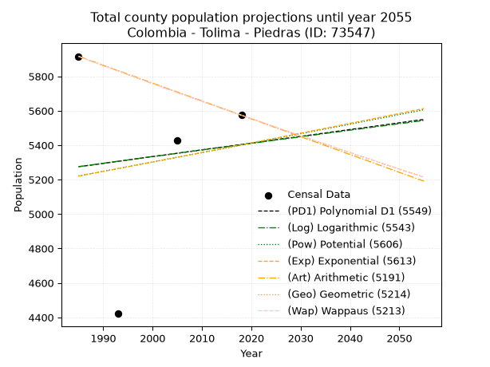
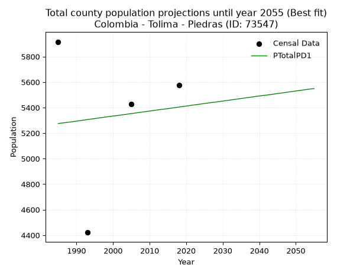
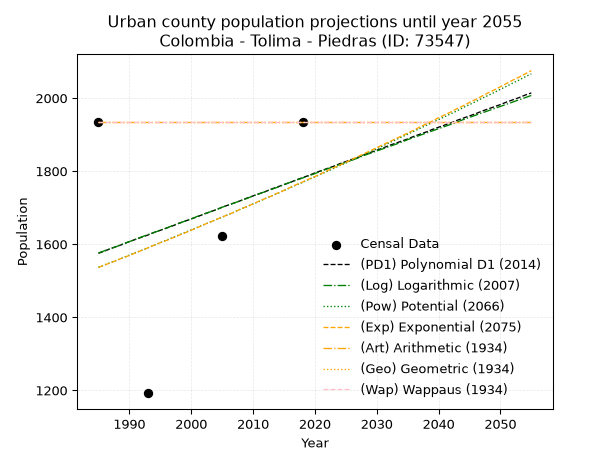
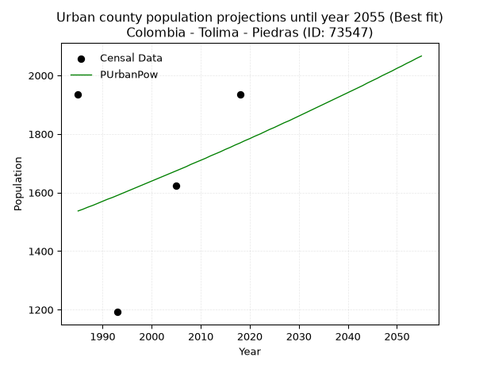
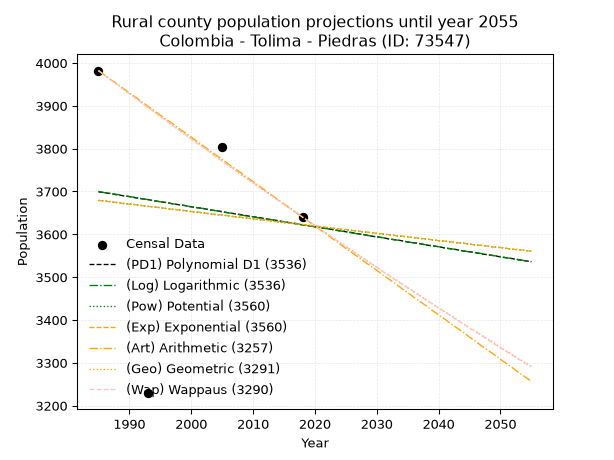
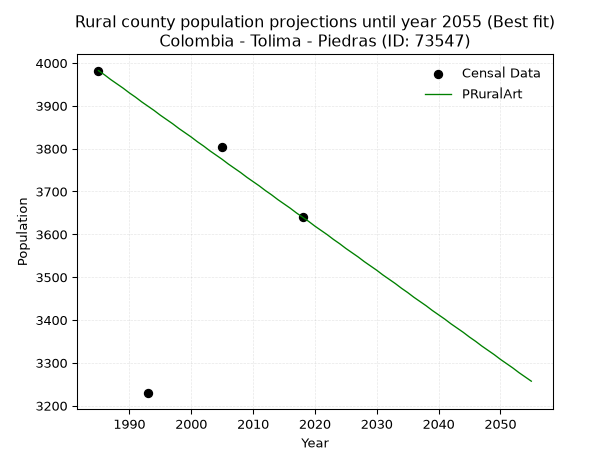

<div align="center">


</div>

# 📜 _“Population and Public Services Demand Projections (PPSD) until Year 2050 for Colombia - Tolima - Piedras (ID: 73547)”_
Keywords: `population` `public-service` `projection` `lineal` `polynomial` `logarithmic` `potential` `exponential` `arithmetic` `geometric` `wappaus` `dane` `colombia` `south-america`

PPSD are analytical estimates used by governments and planners to anticipate future changes in population size, age distribution, and the resulting community needs for utilities, healthcare, education, and infrastructure as sizing future water treatment facilities, electrical grids, and road networks based on spatial growth.

<div align="center">

</img>

</div>


> **General running parameters**: • app_version: _v20260806_. • Python version: _3.14.7_. • Pandas version: _3.0.5_. • NumPy version: _2.5.1_. • Creates, save and include plots into reports (create_plot): _False_. • Projection until year: _2050_. • Process polynomial degree 2 and up: _False_. • Process Wappaus: _True_. • Process Wappaus: _True_. • Set negative values to zero: _True_. • Set infinite values to zero: _True_. • Drop dataset notes: _True_. 
<div align="center">

Dynamic map: [:earth_americas:Google](http://maps.google.com/maps?q=4.543951115,-74.8781061) [:earth_americas:OSM](https://www.openstreetmap.org/#map=18/4.543951115/-74.8781061&layers=P) [:earth_americas:Bing](https://www.bing.com/maps?cp=4.543951115~-74.8781061&lvl=18) [:earth_americas:Apple](https://maps.apple.com/frame?center=4.543951115%2C-74.8781061&span=0.003%2C0.006)

</div>


<div align="center">

```geojson
{
  "type": "Feature",
  "geometry": {
    "type": "Point", 
    "coordinates": [-74.8781061, 4.543951115]
  }, 
  "properties": {
    "Name": "Colombia - Tolima - Piedras (ID: 73547)"
  }
}
```

</div>


## 0. Census Data (4 records)

Census data are official statistics collected by a government about the people and housing in a country. They usually include counts of total population, age, sex, race, income, education, and jobs.

📅Global census file: [Population.xlsx](../data/Population.xlsx)

| Source   |   Year |   CountryID | CountryName   |   StateID | StateName   |   CountyID | CountyName   |   PTotal |   PUrban |   PRural |
|:---------|-------:|------------:|:--------------|----------:|:------------|-----------:|:-------------|---------:|---------:|---------:|
| DANE     |   1985 |          57 | Colombia      |        73 | Tolima      |      73547 | Piedras      |     5916 |     1934 |     3982 |
| DANE     |   1993 |          57 | Colombia      |        73 | Tolima      |      73547 | Piedras      |     4421 |     1192 |     3229 |
| DANE     |   2005 |          57 | Colombia      |        73 | Tolima      |      73547 | Piedras      |     5427 |     1623 |     3804 |
| DANE     |   2018 |          57 | Colombia      |        73 | Tolima      |      73547 | Piedras      |     5574 |     1934 |     3640 |

> 🔥Some records could had specific notes about the registered values or the corresponding urban or rural distribution.

📅[SUI-RUPS](https://www.datos.gov.co/Hacienda-y-Cr-dito-P-blico/Registro-nico-de-Prestadores-de-Servicios-P-blicos/4qkq-csdn/about_data) - Local public utility companies: [RUPS.csv](../data/RUPS.xlsx)

 | SERVICIO       | ESTADO    | NOMBRE                                                                                      | NIT         | DEPARTAMENTO_DOMICILIO   | MUNICIPIO_DOMICILIO   | DIRECCION                                       |   TELEFONO | EMAIL                         | TIPO_PRESTADOR                             | CLASIFICACION                 |
|:---------------|:----------|:--------------------------------------------------------------------------------------------|:------------|:-------------------------|:----------------------|:------------------------------------------------|-----------:|:------------------------------|:-------------------------------------------|:------------------------------|
| ACUEDUCTO      | OPERATIVA | DIRECCION DE SERVICIOS PUBLICOS DEL MUNICIPIO DE PIEDRAS                                    | 800100136-4 | TOLIMA                   | PIEDRAS               | ALCALDIA MUNICIPAL                              |    2834024 | camiguzmo@hotmail.com         | MUNICIPIO (PRESTACIÓN DIRECTA)             | MENOR O IGUAL A 2500 USUARIOS |
| ALCANTARILLADO | OPERATIVA | DIRECCION DE SERVICIOS PUBLICOS DEL MUNICIPIO DE PIEDRAS                                    | 800100136-4 | TOLIMA                   | PIEDRAS               | ALCALDIA MUNICIPAL                              |    2834024 | camiguzmo@hotmail.com         | MUNICIPIO (PRESTACIÓN DIRECTA)             | MENOR O IGUAL A 2500 USUARIOS |
| ACUEDUCTO      | OPERATIVA | ASOCIACION COMUNITARIA DE USUARIOS DEL ACUEDUCTO DOIMA, LAS VILLAS CAMPOALEGRE Y LAS CABRAS | 800222968-9 | TOLIMA                   | PIEDRAS               | CLL 2 No 1 143 DOIMA                            |    2786994 | asoacueductodoima@hotmail.com | SOCIEDADES (EMPRESA DE SERVICIOS PUBLICOS) | MENOR O IGUAL A 2500 USUARIOS |
| ACUEDUCTO      | OPERATIVA | ASOCIACION DE USUARIOS DEL SERVICIO DE ACUEDUCTO Y ALCANTARILLADO DE PARADERO DE CHIPALO    | 900102555-9 | TOLIMA                   | PIEDRAS               | VEREDA PARADERO DE CHIPALO MUNICIPIO DE PIEDRAS |    3157067 | asoacuchipalo@/.com.co        | ORGANIZACION AUTORIZADA                    | HASTA 2500 SUSCRIPTORES       |
| ACUEDUCTO      | OPERATIVA | EMPRESA DE SERVICIOS PÚBLICOS SAN  FRANCISCO  DOIMA S.A.S. E.S.P.                           | 901213136-6 | TOLIMA                   | PIEDRAS               | FINCA SAN FRANCISCO VEREDA LAS CABRAS           |    0000000 | doimaacueducto@gmail.com      | SOCIEDADES (EMPRESA DE SERVICIOS PUBLICOS) | MENOR O IGUAL A 2500 USUARIOS |

## 1. Total

### 1.1. Coefficients and Parameters

* (PD1) Polynomial Deg 1: 3.926936973103017, -2520.3556804493096 (lineal)
* (Log) Logarithmic: 7733.096053797254, -53444.82507405557
* (Pow) Potential: 2.049168412103506, -3.0398914649280995
* (Exp) Exponential: 0.0010359119243459627, 667.8435391464559
* (Art) Arithmetic: Year diff. 2018 - 1985 = 33, Population diff. 5574 - 5916 = -342, Annual growth = -10.363636363636363
* (Geo) Geometric: Year diff. 2018 - 1985 = 33, Population diff. 5574 - 5916 = -342, Annual growth % = -0.0018028461227690418
* (Wap) Wappaus: i = -0.18039401851412296, Condition values only valid for < 200)

<sub>
Wappaus condition values: ['-0.00', '-0.18', '-0.36', '-0.54', '-0.72', '-0.90', '-1.08', '-1.26', '-1.44', '-1.62', '-1.80', '-1.98', '-2.16', '-2.35', '-2.53', '-2.71', '-2.89', '-3.07', '-3.25', '-3.43', '-3.61', '-3.79', '-3.97', '-4.15', '-4.33', '-4.51', '-4.69', '-4.87', '-5.05', '-5.23', '-5.41', '-5.59', '-5.77', '-5.95', '-6.13', '-6.31', '-6.49', '-6.67', '-6.85', '-7.04', '-7.22', '-7.40', '-7.58', '-7.76', '-7.94', '-8.12', '-8.30', '-8.48', '-8.66', '-8.84', '-9.02', '-9.20', '-9.38', '-9.56', '-9.74', '-9.92', '-10.10', '-10.28', '-10.46', '-10.64', '-10.82', '-11.00', '-11.18', '-11.36', '-11.55', '-11.73']
</sub>


### 1.2. Projected Dataset

|   Year |   CountyID |   PTotalPD1 |   PTotalLog |   PTotalPow |   PTotalExp |   PTotalArt |   PTotalGeo |   PTotalWap |
|-------:|-----------:|------------:|------------:|------------:|------------:|------------:|------------:|------------:|
|   1985 |      73547 |        5275 |        5275 |        5221 |        5220 |        5916 |        5916 |        5916 |
|   1986 |      73547 |        5279 |        5279 |        5227 |        5226 |        5906 |        5905 |        5905 |
|   1987 |      73547 |        5282 |        5283 |        5232 |        5231 |        5895 |        5895 |        5895 |
|   1988 |      73547 |        5286 |        5287 |        5237 |        5237 |        5885 |        5884 |        5884 |
|   1989 |      73547 |        5290 |        5291 |        5243 |        5242 |        5875 |        5873 |        5873 |
|   1990 |      73547 |        5294 |        5295 |        5248 |        5248 |        5864 |        5863 |        5863 |
|   1991 |      73547 |        5298 |        5299 |        5254 |        5253 |        5854 |        5852 |        5852 |
|   1992 |      73547 |        5302 |        5303 |        5259 |        5258 |        5843 |        5842 |        5842 |
|   1993 |      73547 |        5306 |        5307 |        5264 |        5264 |        5833 |        5831 |        5831 |
|   1994 |      73547 |        5310 |        5310 |        5270 |        5269 |        5823 |        5821 |        5821 |
|   1995 |      73547 |        5314 |        5314 |        5275 |        5275 |        5812 |        5810 |        5810 |
|   1996 |      73547 |        5318 |        5318 |        5281 |        5280 |        5802 |        5800 |        5800 |
|   1997 |      73547 |        5322 |        5322 |        5286 |        5286 |        5792 |        5789 |        5789 |
|   1998 |      73547 |        5326 |        5326 |        5292 |        5291 |        5781 |        5779 |        5779 |
|   1999 |      73547 |        5330 |        5330 |        5297 |        5297 |        5771 |        5768 |        5768 |
|   2000 |      73547 |        5334 |        5334 |        5302 |        5302 |        5761 |        5758 |        5758 |
|   2001 |      73547 |        5337 |        5338 |        5308 |        5308 |        5750 |        5748 |        5748 |
|   2002 |      73547 |        5341 |        5341 |        5313 |        5313 |        5740 |        5737 |        5737 |
|   2003 |      73547 |        5345 |        5345 |        5319 |        5319 |        5729 |        5727 |        5727 |
|   2004 |      73547 |        5349 |        5349 |        5324 |        5324 |        5719 |        5717 |        5717 |
|   2005 |      73547 |        5353 |        5353 |        5330 |        5330 |        5709 |        5706 |        5706 |
|   2006 |      73547 |        5357 |        5357 |        5335 |        5335 |        5698 |        5696 |        5696 |
|   2007 |      73547 |        5361 |        5361 |        5341 |        5341 |        5688 |        5686 |        5686 |
|   2008 |      73547 |        5365 |        5365 |        5346 |        5346 |        5678 |        5675 |        5676 |
|   2009 |      73547 |        5369 |        5368 |        5351 |        5352 |        5667 |        5665 |        5665 |
|   2010 |      73547 |        5373 |        5372 |        5357 |        5357 |        5657 |        5655 |        5655 |
|   2011 |      73547 |        5377 |        5376 |        5362 |        5363 |        5647 |        5645 |        5645 |
|   2012 |      73547 |        5381 |        5380 |        5368 |        5369 |        5636 |        5635 |        5635 |
|   2013 |      73547 |        5385 |        5384 |        5373 |        5374 |        5626 |        5625 |        5625 |
|   2014 |      73547 |        5388 |        5388 |        5379 |        5380 |        5615 |        5614 |        5614 |
|   2015 |      73547 |        5392 |        5391 |        5384 |        5385 |        5605 |        5604 |        5604 |
|   2016 |      73547 |        5396 |        5395 |        5390 |        5391 |        5595 |        5594 |        5594 |
|   2017 |      73547 |        5400 |        5399 |        5395 |        5396 |        5584 |        5584 |        5584 |
|   2018 |      73547 |        5404 |        5403 |        5401 |        5402 |        5574 |        5574 |        5574 |
|   2019 |      73547 |        5408 |        5407 |        5406 |        5408 |        5564 |        5564 |        5564 |
|   2020 |      73547 |        5412 |        5411 |        5412 |        5413 |        5553 |        5554 |        5554 |
|   2021 |      73547 |        5416 |        5414 |        5417 |        5419 |        5543 |        5544 |        5544 |
|   2022 |      73547 |        5420 |        5418 |        5423 |        5424 |        5533 |        5534 |        5534 |
|   2023 |      73547 |        5424 |        5422 |        5428 |        5430 |        5522 |        5524 |        5524 |
|   2024 |      73547 |        5428 |        5426 |        5434 |        5436 |        5512 |        5514 |        5514 |
|   2025 |      73547 |        5432 |        5430 |        5439 |        5441 |        5501 |        5504 |        5504 |
|   2026 |      73547 |        5436 |        5434 |        5445 |        5447 |        5491 |        5494 |        5494 |
|   2027 |      73547 |        5440 |        5437 |        5450 |        5453 |        5481 |        5484 |        5484 |
|   2028 |      73547 |        5443 |        5441 |        5456 |        5458 |        5470 |        5474 |        5474 |
|   2029 |      73547 |        5447 |        5445 |        5461 |        5464 |        5460 |        5464 |        5464 |
|   2030 |      73547 |        5451 |        5449 |        5467 |        5470 |        5450 |        5455 |        5454 |
|   2031 |      73547 |        5455 |        5453 |        5472 |        5475 |        5439 |        5445 |        5445 |
|   2032 |      73547 |        5459 |        5456 |        5478 |        5481 |        5429 |        5435 |        5435 |
|   2033 |      73547 |        5463 |        5460 |        5483 |        5487 |        5419 |        5425 |        5425 |
|   2034 |      73547 |        5467 |        5464 |        5489 |        5492 |        5408 |        5415 |        5415 |
|   2035 |      73547 |        5471 |        5468 |        5494 |        5498 |        5398 |        5406 |        5405 |
|   2036 |      73547 |        5475 |        5472 |        5500 |        5504 |        5387 |        5396 |        5396 |
|   2037 |      73547 |        5479 |        5475 |        5505 |        5509 |        5377 |        5386 |        5386 |
|   2038 |      73547 |        5483 |        5479 |        5511 |        5515 |        5367 |        5376 |        5376 |
|   2039 |      73547 |        5487 |        5483 |        5516 |        5521 |        5356 |        5367 |        5366 |
|   2040 |      73547 |        5491 |        5487 |        5522 |        5527 |        5346 |        5357 |        5357 |
|   2041 |      73547 |        5495 |        5491 |        5528 |        5532 |        5336 |        5347 |        5347 |
|   2042 |      73547 |        5498 |        5494 |        5533 |        5538 |        5325 |        5338 |        5337 |
|   2043 |      73547 |        5502 |        5498 |        5539 |        5544 |        5315 |        5328 |        5328 |
|   2044 |      73547 |        5506 |        5502 |        5544 |        5549 |        5305 |        5319 |        5318 |
|   2045 |      73547 |        5510 |        5506 |        5550 |        5555 |        5294 |        5309 |        5309 |
|   2046 |      73547 |        5514 |        5510 |        5555 |        5561 |        5284 |        5299 |        5299 |
|   2047 |      73547 |        5518 |        5513 |        5561 |        5567 |        5273 |        5290 |        5289 |
|   2048 |      73547 |        5522 |        5517 |        5566 |        5573 |        5263 |        5280 |        5280 |
|   2049 |      73547 |        5526 |        5521 |        5572 |        5578 |        5253 |        5271 |        5270 |
|   2050 |      73547 |        5530 |        5525 |        5578 |        5584 |        5242 |        5261 |        5261 |
<div align="center">

</img>

</div>


### 1.3. Best fit with absolute and relative error (%)

Relative error puts that difference into context by dividing the absolute error by the true value, creating a unitless ratio or percentage that shows the scale of the mistake.

Absolute and relative error

|   Year | Source   |   CountryID | CountryName   |   StateID | StateName   |   CountyID_x | CountyName   |   PTotal |   PUrban |   PRural |   CountyID_y |   PTotalPD1 |   PTotalLog |   PTotalPow |   PTotalExp |   PTotalArt |   PTotalGeo |   PTotalWap |   PTotalPD1AbsError |   PTotalLogAbsError |   PTotalPowAbsError |   PTotalExpAbsError |   PTotalArtAbsError |   PTotalGeoAbsError |   PTotalWapAbsError |   PTotalPD1RelError |   PTotalLogRelError |   PTotalPowRelError |   PTotalExpRelError |   PTotalArtRelError |   PTotalGeoRelError |   PTotalWapRelError |
|-------:|:---------|------------:|:--------------|----------:|:------------|-------------:|:-------------|---------:|---------:|---------:|-------------:|------------:|------------:|------------:|------------:|------------:|------------:|------------:|--------------------:|--------------------:|--------------------:|--------------------:|--------------------:|--------------------:|--------------------:|--------------------:|--------------------:|--------------------:|--------------------:|--------------------:|--------------------:|--------------------:|
|   1985 | DANE     |          57 | Colombia      |        73 | Tolima      |        73547 | Piedras      |     5916 |     1934 |     3982 |        73547 |        5275 |        5275 |        5221 |        5220 |        5916 |        5916 |        5916 |                 641 |                 641 |                 695 |                 696 |                   0 |                   0 |                   0 |            10.835   |            10.835   |            11.7478  |            11.7647  |             0       |             0       |             0       |
|   1993 | DANE     |          57 | Colombia      |        73 | Tolima      |        73547 | Piedras      |     4421 |     1192 |     3229 |        73547 |        5306 |        5307 |        5264 |        5264 |        5833 |        5831 |        5831 |                 885 |                 886 |                 843 |                 843 |                1412 |                1410 |                1410 |            20.0181  |            20.0407  |            19.0681  |            19.0681  |            31.9385  |            31.8932  |            31.8932  |
|   2005 | DANE     |          57 | Colombia      |        73 | Tolima      |        73547 | Piedras      |     5427 |     1623 |     3804 |        73547 |        5353 |        5353 |        5330 |        5330 |        5709 |        5706 |        5706 |                  74 |                  74 |                  97 |                  97 |                 282 |                 279 |                 279 |             1.36355 |             1.36355 |             1.78736 |             1.78736 |             5.19624 |             5.14096 |             5.14096 |
|   2018 | DANE     |          57 | Colombia      |        73 | Tolima      |        73547 | Piedras      |     5574 |     1934 |     3640 |        73547 |        5404 |        5403 |        5401 |        5402 |        5574 |        5574 |        5574 |                 170 |                 171 |                 173 |                 172 |                   0 |                   0 |                   0 |             3.04987 |             3.06781 |             3.1037  |             3.08576 |             0       |             0       |             0       |

Relative error mean

| Method    |   RelError | Best   |
|:----------|-----------:|:-------|
| PTotalPD1 |    8.81664 | True   |
| PTotalLog |    8.82678 |        |
| PTotalPow |    8.92674 |        |
| PTotalExp |    8.92648 |        |
| PTotalArt |    9.28368 |        |
| PTotalGeo |    9.25855 |        |
| PTotalWap |    9.25855 |        |

💙Best method: _**PTotalPD1**_
<div align="center">

</img>

</div>


### 1.4. Fresh water supply demand in liters per capita per day (lpcd)

The fresh water supply demand typically ranges from 100 to 300 liters per capita per day (lpcd) for standard domestic and municipal planning, though absolute survival minimums set by the World Health Organization are as low as 7.5 to 20 liters per day, and total consumption in high-income nations can exceed 400 liters.

> `CZ`: Level in meters above the sea level (masl)<br> `WS`: Fresh water supply demand in liters per capita per day (lpcd or l/h/d)<br> `WSAll`: Zonal fresh water supply demand in liters per second (l/s)<br> `A`: Zonal area in square meters<br> `DP`: Population density (people/hectare or p/ha)

Reference values (RAS Colombia)

|    CZ |   WS |
|------:|-----:|
|  1000 |  120 |
|  2000 |  130 |
| 99999 |  140 |

County shapefile geometry properties and water supply values

|   CountyID |      ATotal |   CZTotal |   WSTotal |
|-----------:|------------:|----------:|----------:|
|      73547 | 3.54164e+08 |   522.245 |       120 |

Projected values for best method: PTotalPD1

|   CountyID |   Year |   PTotalPD1 |   DPTotal |   WSTotal |   WSTotalAll |
|-----------:|-------:|------------:|----------:|----------:|-------------:|
|      73547 |   1985 |        5275 |      0.15 |       120 |      7.32639 |
|      73547 |   1986 |        5279 |      0.15 |       120 |      7.33194 |
|      73547 |   1987 |        5282 |      0.15 |       120 |      7.33611 |
|      73547 |   1988 |        5286 |      0.15 |       120 |      7.34167 |
|      73547 |   1989 |        5290 |      0.15 |       120 |      7.34722 |
|      73547 |   1990 |        5294 |      0.15 |       120 |      7.35278 |
|      73547 |   1991 |        5298 |      0.15 |       120 |      7.35833 |
|      73547 |   1992 |        5302 |      0.15 |       120 |      7.36389 |
|      73547 |   1993 |        5306 |      0.15 |       120 |      7.36944 |
|      73547 |   1994 |        5310 |      0.15 |       120 |      7.375   |
|      73547 |   1995 |        5314 |      0.15 |       120 |      7.38056 |
|      73547 |   1996 |        5318 |      0.15 |       120 |      7.38611 |
|      73547 |   1997 |        5322 |      0.15 |       120 |      7.39167 |
|      73547 |   1998 |        5326 |      0.15 |       120 |      7.39722 |
|      73547 |   1999 |        5330 |      0.15 |       120 |      7.40278 |
|      73547 |   2000 |        5334 |      0.15 |       120 |      7.40833 |
|      73547 |   2001 |        5337 |      0.15 |       120 |      7.4125  |
|      73547 |   2002 |        5341 |      0.15 |       120 |      7.41806 |
|      73547 |   2003 |        5345 |      0.15 |       120 |      7.42361 |
|      73547 |   2004 |        5349 |      0.15 |       120 |      7.42917 |
|      73547 |   2005 |        5353 |      0.15 |       120 |      7.43472 |
|      73547 |   2006 |        5357 |      0.15 |       120 |      7.44028 |
|      73547 |   2007 |        5361 |      0.15 |       120 |      7.44583 |
|      73547 |   2008 |        5365 |      0.15 |       120 |      7.45139 |
|      73547 |   2009 |        5369 |      0.15 |       120 |      7.45694 |
|      73547 |   2010 |        5373 |      0.15 |       120 |      7.4625  |
|      73547 |   2011 |        5377 |      0.15 |       120 |      7.46806 |
|      73547 |   2012 |        5381 |      0.15 |       120 |      7.47361 |
|      73547 |   2013 |        5385 |      0.15 |       120 |      7.47917 |
|      73547 |   2014 |        5388 |      0.15 |       120 |      7.48333 |
|      73547 |   2015 |        5392 |      0.15 |       120 |      7.48889 |
|      73547 |   2016 |        5396 |      0.15 |       120 |      7.49444 |
|      73547 |   2017 |        5400 |      0.15 |       120 |      7.5     |
|      73547 |   2018 |        5404 |      0.15 |       120 |      7.50556 |
|      73547 |   2019 |        5408 |      0.15 |       120 |      7.51111 |
|      73547 |   2020 |        5412 |      0.15 |       120 |      7.51667 |
|      73547 |   2021 |        5416 |      0.15 |       120 |      7.52222 |
|      73547 |   2022 |        5420 |      0.15 |       120 |      7.52778 |
|      73547 |   2023 |        5424 |      0.15 |       120 |      7.53333 |
|      73547 |   2024 |        5428 |      0.15 |       120 |      7.53889 |
|      73547 |   2025 |        5432 |      0.15 |       120 |      7.54444 |
|      73547 |   2026 |        5436 |      0.15 |       120 |      7.55    |
|      73547 |   2027 |        5440 |      0.15 |       120 |      7.55556 |
|      73547 |   2028 |        5443 |      0.15 |       120 |      7.55972 |
|      73547 |   2029 |        5447 |      0.15 |       120 |      7.56528 |
|      73547 |   2030 |        5451 |      0.15 |       120 |      7.57083 |
|      73547 |   2031 |        5455 |      0.15 |       120 |      7.57639 |
|      73547 |   2032 |        5459 |      0.15 |       120 |      7.58194 |
|      73547 |   2033 |        5463 |      0.15 |       120 |      7.5875  |
|      73547 |   2034 |        5467 |      0.15 |       120 |      7.59306 |
|      73547 |   2035 |        5471 |      0.15 |       120 |      7.59861 |
|      73547 |   2036 |        5475 |      0.15 |       120 |      7.60417 |
|      73547 |   2037 |        5479 |      0.15 |       120 |      7.60972 |
|      73547 |   2038 |        5483 |      0.15 |       120 |      7.61528 |
|      73547 |   2039 |        5487 |      0.15 |       120 |      7.62083 |
|      73547 |   2040 |        5491 |      0.16 |       120 |      7.62639 |
|      73547 |   2041 |        5495 |      0.16 |       120 |      7.63194 |
|      73547 |   2042 |        5498 |      0.16 |       120 |      7.63611 |
|      73547 |   2043 |        5502 |      0.16 |       120 |      7.64167 |
|      73547 |   2044 |        5506 |      0.16 |       120 |      7.64722 |
|      73547 |   2045 |        5510 |      0.16 |       120 |      7.65278 |
|      73547 |   2046 |        5514 |      0.16 |       120 |      7.65833 |
|      73547 |   2047 |        5518 |      0.16 |       120 |      7.66389 |
|      73547 |   2048 |        5522 |      0.16 |       120 |      7.66944 |
|      73547 |   2049 |        5526 |      0.16 |       120 |      7.675   |
|      73547 |   2050 |        5530 |      0.16 |       120 |      7.68056 |

## 2. Urban

### 2.1. Coefficients and Parameters

* (PD1) Polynomial Deg 1: 6.266158169409659, -10863.13287836167 (lineal)
* (Log) Logarithmic: 12456.516965812956, -93011.3352774066
* (Pow) Potential: 8.548121569888757, -25.003120638820597
* (Exp) Exponential: 0.004296992758641397, 0.30345192782986424
* (Art) Arithmetic: Year diff. 2018 - 1985 = 33, Population diff. 1934 - 1934 = 0, Annual growth = 0.0
* (Geo) Geometric: Year diff. 2018 - 1985 = 33, Population diff. 1934 - 1934 = 0, Annual growth % = 0.0
* (Wap) Wappaus: i = 0.0, Condition values only valid for < 200)

<sub>
Wappaus condition values: ['0.00', '0.00', '0.00', '0.00', '0.00', '0.00', '0.00', '0.00', '0.00', '0.00', '0.00', '0.00', '0.00', '0.00', '0.00', '0.00', '0.00', '0.00', '0.00', '0.00', '0.00', '0.00', '0.00', '0.00', '0.00', '0.00', '0.00', '0.00', '0.00', '0.00', '0.00', '0.00', '0.00', '0.00', '0.00', '0.00', '0.00', '0.00', '0.00', '0.00', '0.00', '0.00', '0.00', '0.00', '0.00', '0.00', '0.00', '0.00', '0.00', '0.00', '0.00', '0.00', '0.00', '0.00', '0.00', '0.00', '0.00', '0.00', '0.00', '0.00', '0.00', '0.00', '0.00', '0.00', '0.00', '0.00']
</sub>


### 2.2. Projected Dataset

|   Year |   CountyID |   PUrbanPD1 |   PUrbanLog |   PUrbanPow |   PUrbanExp |   PUrbanArt |   PUrbanGeo |   PUrbanWap |
|-------:|-----------:|------------:|------------:|------------:|------------:|------------:|------------:|------------:|
|   1985 |      73547 |        1575 |        1576 |        1537 |        1536 |        1934 |        1934 |        1934 |
|   1986 |      73547 |        1581 |        1582 |        1543 |        1543 |        1934 |        1934 |        1934 |
|   1987 |      73547 |        1588 |        1588 |        1550 |        1549 |        1934 |        1934 |        1934 |
|   1988 |      73547 |        1594 |        1594 |        1556 |        1556 |        1934 |        1934 |        1934 |
|   1989 |      73547 |        1600 |        1601 |        1563 |        1563 |        1934 |        1934 |        1934 |
|   1990 |      73547 |        1607 |        1607 |        1570 |        1569 |        1934 |        1934 |        1934 |
|   1991 |      73547 |        1613 |        1613 |        1577 |        1576 |        1934 |        1934 |        1934 |
|   1992 |      73547 |        1619 |        1620 |        1583 |        1583 |        1934 |        1934 |        1934 |
|   1993 |      73547 |        1625 |        1626 |        1590 |        1590 |        1934 |        1934 |        1934 |
|   1994 |      73547 |        1632 |        1632 |        1597 |        1597 |        1934 |        1934 |        1934 |
|   1995 |      73547 |        1638 |        1638 |        1604 |        1604 |        1934 |        1934 |        1934 |
|   1996 |      73547 |        1644 |        1644 |        1611 |        1610 |        1934 |        1934 |        1934 |
|   1997 |      73547 |        1650 |        1651 |        1618 |        1617 |        1934 |        1934 |        1934 |
|   1998 |      73547 |        1657 |        1657 |        1625 |        1624 |        1934 |        1934 |        1934 |
|   1999 |      73547 |        1663 |        1663 |        1632 |        1631 |        1934 |        1934 |        1934 |
|   2000 |      73547 |        1669 |        1669 |        1639 |        1638 |        1934 |        1934 |        1934 |
|   2001 |      73547 |        1675 |        1676 |        1646 |        1645 |        1934 |        1934 |        1934 |
|   2002 |      73547 |        1682 |        1682 |        1653 |        1653 |        1934 |        1934 |        1934 |
|   2003 |      73547 |        1688 |        1688 |        1660 |        1660 |        1934 |        1934 |        1934 |
|   2004 |      73547 |        1694 |        1694 |        1667 |        1667 |        1934 |        1934 |        1934 |
|   2005 |      73547 |        1701 |        1701 |        1674 |        1674 |        1934 |        1934 |        1934 |
|   2006 |      73547 |        1707 |        1707 |        1681 |        1681 |        1934 |        1934 |        1934 |
|   2007 |      73547 |        1713 |        1713 |        1688 |        1688 |        1934 |        1934 |        1934 |
|   2008 |      73547 |        1719 |        1719 |        1696 |        1696 |        1934 |        1934 |        1934 |
|   2009 |      73547 |        1726 |        1725 |        1703 |        1703 |        1934 |        1934 |        1934 |
|   2010 |      73547 |        1732 |        1732 |        1710 |        1710 |        1934 |        1934 |        1934 |
|   2011 |      73547 |        1738 |        1738 |        1717 |        1718 |        1934 |        1934 |        1934 |
|   2012 |      73547 |        1744 |        1744 |        1725 |        1725 |        1934 |        1934 |        1934 |
|   2013 |      73547 |        1751 |        1750 |        1732 |        1732 |        1934 |        1934 |        1934 |
|   2014 |      73547 |        1757 |        1756 |        1739 |        1740 |        1934 |        1934 |        1934 |
|   2015 |      73547 |        1763 |        1763 |        1747 |        1747 |        1934 |        1934 |        1934 |
|   2016 |      73547 |        1769 |        1769 |        1754 |        1755 |        1934 |        1934 |        1934 |
|   2017 |      73547 |        1776 |        1775 |        1762 |        1763 |        1934 |        1934 |        1934 |
|   2018 |      73547 |        1782 |        1781 |        1769 |        1770 |        1934 |        1934 |        1934 |
|   2019 |      73547 |        1788 |        1787 |        1777 |        1778 |        1934 |        1934 |        1934 |
|   2020 |      73547 |        1795 |        1793 |        1784 |        1785 |        1934 |        1934 |        1934 |
|   2021 |      73547 |        1801 |        1800 |        1792 |        1793 |        1934 |        1934 |        1934 |
|   2022 |      73547 |        1807 |        1806 |        1799 |        1801 |        1934 |        1934 |        1934 |
|   2023 |      73547 |        1813 |        1812 |        1807 |        1809 |        1934 |        1934 |        1934 |
|   2024 |      73547 |        1820 |        1818 |        1815 |        1816 |        1934 |        1934 |        1934 |
|   2025 |      73547 |        1826 |        1824 |        1822 |        1824 |        1934 |        1934 |        1934 |
|   2026 |      73547 |        1832 |        1830 |        1830 |        1832 |        1934 |        1934 |        1934 |
|   2027 |      73547 |        1838 |        1836 |        1838 |        1840 |        1934 |        1934 |        1934 |
|   2028 |      73547 |        1845 |        1843 |        1845 |        1848 |        1934 |        1934 |        1934 |
|   2029 |      73547 |        1851 |        1849 |        1853 |        1856 |        1934 |        1934 |        1934 |
|   2030 |      73547 |        1857 |        1855 |        1861 |        1864 |        1934 |        1934 |        1934 |
|   2031 |      73547 |        1863 |        1861 |        1869 |        1872 |        1934 |        1934 |        1934 |
|   2032 |      73547 |        1870 |        1867 |        1877 |        1880 |        1934 |        1934 |        1934 |
|   2033 |      73547 |        1876 |        1873 |        1885 |        1888 |        1934 |        1934 |        1934 |
|   2034 |      73547 |        1882 |        1879 |        1893 |        1896 |        1934 |        1934 |        1934 |
|   2035 |      73547 |        1888 |        1886 |        1901 |        1904 |        1934 |        1934 |        1934 |
|   2036 |      73547 |        1895 |        1892 |        1909 |        1912 |        1934 |        1934 |        1934 |
|   2037 |      73547 |        1901 |        1898 |        1917 |        1921 |        1934 |        1934 |        1934 |
|   2038 |      73547 |        1907 |        1904 |        1925 |        1929 |        1934 |        1934 |        1934 |
|   2039 |      73547 |        1914 |        1910 |        1933 |        1937 |        1934 |        1934 |        1934 |
|   2040 |      73547 |        1920 |        1916 |        1941 |        1946 |        1934 |        1934 |        1934 |
|   2041 |      73547 |        1926 |        1922 |        1949 |        1954 |        1934 |        1934 |        1934 |
|   2042 |      73547 |        1932 |        1928 |        1957 |        1962 |        1934 |        1934 |        1934 |
|   2043 |      73547 |        1939 |        1934 |        1965 |        1971 |        1934 |        1934 |        1934 |
|   2044 |      73547 |        1945 |        1941 |        1974 |        1979 |        1934 |        1934 |        1934 |
|   2045 |      73547 |        1951 |        1947 |        1982 |        1988 |        1934 |        1934 |        1934 |
|   2046 |      73547 |        1957 |        1953 |        1990 |        1996 |        1934 |        1934 |        1934 |
|   2047 |      73547 |        1964 |        1959 |        1999 |        2005 |        1934 |        1934 |        1934 |
|   2048 |      73547 |        1970 |        1965 |        2007 |        2014 |        1934 |        1934 |        1934 |
|   2049 |      73547 |        1976 |        1971 |        2015 |        2022 |        1934 |        1934 |        1934 |
|   2050 |      73547 |        1982 |        1977 |        2024 |        2031 |        1934 |        1934 |        1934 |
<div align="center">

</img>

</div>


### 2.3. Best fit with absolute and relative error (%)

Relative error puts that difference into context by dividing the absolute error by the true value, creating a unitless ratio or percentage that shows the scale of the mistake.

Absolute and relative error

|   Year | Source   |   CountryID | CountryName   |   StateID | StateName   |   CountyID_x | CountyName   |   PTotal |   PUrban |   PRural |   CountyID_y |   PUrbanPD1 |   PUrbanLog |   PUrbanPow |   PUrbanExp |   PUrbanArt |   PUrbanGeo |   PUrbanWap |   PUrbanPD1AbsError |   PUrbanLogAbsError |   PUrbanPowAbsError |   PUrbanExpAbsError |   PUrbanArtAbsError |   PUrbanGeoAbsError |   PUrbanWapAbsError |   PUrbanPD1RelError |   PUrbanLogRelError |   PUrbanPowRelError |   PUrbanExpRelError |   PUrbanArtRelError |   PUrbanGeoRelError |   PUrbanWapRelError |
|-------:|:---------|------------:|:--------------|----------:|:------------|-------------:|:-------------|---------:|---------:|---------:|-------------:|------------:|------------:|------------:|------------:|------------:|------------:|------------:|--------------------:|--------------------:|--------------------:|--------------------:|--------------------:|--------------------:|--------------------:|--------------------:|--------------------:|--------------------:|--------------------:|--------------------:|--------------------:|--------------------:|
|   1985 | DANE     |          57 | Colombia      |        73 | Tolima      |        73547 | Piedras      |     5916 |     1934 |     3982 |        73547 |        1575 |        1576 |        1537 |        1536 |        1934 |        1934 |        1934 |                 359 |                 358 |                 397 |                 398 |                   0 |                   0 |                   0 |            18.5626  |            18.5109  |            20.5274  |            20.5791  |              0      |              0      |              0      |
|   1993 | DANE     |          57 | Colombia      |        73 | Tolima      |        73547 | Piedras      |     4421 |     1192 |     3229 |        73547 |        1625 |        1626 |        1590 |        1590 |        1934 |        1934 |        1934 |                 433 |                 434 |                 398 |                 398 |                 742 |                 742 |                 742 |            36.3255  |            36.4094  |            33.3893  |            33.3893  |             62.2483 |             62.2483 |             62.2483 |
|   2005 | DANE     |          57 | Colombia      |        73 | Tolima      |        73547 | Piedras      |     5427 |     1623 |     3804 |        73547 |        1701 |        1701 |        1674 |        1674 |        1934 |        1934 |        1934 |                  78 |                  78 |                  51 |                  51 |                 311 |                 311 |                 311 |             4.80591 |             4.80591 |             3.14233 |             3.14233 |             19.162  |             19.162  |             19.162  |
|   2018 | DANE     |          57 | Colombia      |        73 | Tolima      |        73547 | Piedras      |     5574 |     1934 |     3640 |        73547 |        1782 |        1781 |        1769 |        1770 |        1934 |        1934 |        1934 |                 152 |                 153 |                 165 |                 164 |                   0 |                   0 |                   0 |             7.85936 |             7.91107 |             8.53154 |             8.47983 |              0      |              0      |              0      |

Relative error mean

| Method    |   RelError | Best   |
|:----------|-----------:|:-------|
| PUrbanPD1 |    16.8883 |        |
| PUrbanLog |    16.9093 |        |
| PUrbanPow |    16.3976 | True   |
| PUrbanExp |    16.3976 | True   |
| PUrbanArt |    20.3526 |        |
| PUrbanGeo |    20.3526 |        |
| PUrbanWap |    20.3526 |        |

💙Best method: _**PUrbanPow**_
<div align="center">

</img>

</div>


### 2.4. Fresh water supply demand in liters per capita per day (lpcd)

The fresh water supply demand typically ranges from 100 to 300 liters per capita per day (lpcd) for standard domestic and municipal planning, though absolute survival minimums set by the World Health Organization are as low as 7.5 to 20 liters per day, and total consumption in high-income nations can exceed 400 liters.

> `CZ`: Level in meters above the sea level (masl)<br> `WS`: Fresh water supply demand in liters per capita per day (lpcd or l/h/d)<br> `WSAll`: Zonal fresh water supply demand in liters per second (l/s)<br> `A`: Zonal area in square meters<br> `DP`: Population density (people/hectare or p/ha)

Reference values (RAS Colombia)

|    CZ |   WS |
|------:|-----:|
|  1000 |  120 |
|  2000 |  130 |
| 99999 |  140 |

County shapefile geometry properties and water supply values

|   CountyID |   AUrban |   CZUrban |   WSUrban |
|-----------:|---------:|----------:|----------:|
|      73547 |   929126 |   390.838 |       120 |

Projected values for best method: PUrbanPow

|   CountyID |   Year |   PUrbanPow |   DPUrban |   WSUrban |   WSUrbanAll |
|-----------:|-------:|------------:|----------:|----------:|-------------:|
|      73547 |   1985 |        1537 |     16.54 |       120 |      2.13472 |
|      73547 |   1986 |        1543 |     16.61 |       120 |      2.14306 |
|      73547 |   1987 |        1550 |     16.68 |       120 |      2.15278 |
|      73547 |   1988 |        1556 |     16.75 |       120 |      2.16111 |
|      73547 |   1989 |        1563 |     16.82 |       120 |      2.17083 |
|      73547 |   1990 |        1570 |     16.9  |       120 |      2.18056 |
|      73547 |   1991 |        1577 |     16.97 |       120 |      2.19028 |
|      73547 |   1992 |        1583 |     17.04 |       120 |      2.19861 |
|      73547 |   1993 |        1590 |     17.11 |       120 |      2.20833 |
|      73547 |   1994 |        1597 |     17.19 |       120 |      2.21806 |
|      73547 |   1995 |        1604 |     17.26 |       120 |      2.22778 |
|      73547 |   1996 |        1611 |     17.34 |       120 |      2.2375  |
|      73547 |   1997 |        1618 |     17.41 |       120 |      2.24722 |
|      73547 |   1998 |        1625 |     17.49 |       120 |      2.25694 |
|      73547 |   1999 |        1632 |     17.56 |       120 |      2.26667 |
|      73547 |   2000 |        1639 |     17.64 |       120 |      2.27639 |
|      73547 |   2001 |        1646 |     17.72 |       120 |      2.28611 |
|      73547 |   2002 |        1653 |     17.79 |       120 |      2.29583 |
|      73547 |   2003 |        1660 |     17.87 |       120 |      2.30556 |
|      73547 |   2004 |        1667 |     17.94 |       120 |      2.31528 |
|      73547 |   2005 |        1674 |     18.02 |       120 |      2.325   |
|      73547 |   2006 |        1681 |     18.09 |       120 |      2.33472 |
|      73547 |   2007 |        1688 |     18.17 |       120 |      2.34444 |
|      73547 |   2008 |        1696 |     18.25 |       120 |      2.35556 |
|      73547 |   2009 |        1703 |     18.33 |       120 |      2.36528 |
|      73547 |   2010 |        1710 |     18.4  |       120 |      2.375   |
|      73547 |   2011 |        1717 |     18.48 |       120 |      2.38472 |
|      73547 |   2012 |        1725 |     18.57 |       120 |      2.39583 |
|      73547 |   2013 |        1732 |     18.64 |       120 |      2.40556 |
|      73547 |   2014 |        1739 |     18.72 |       120 |      2.41528 |
|      73547 |   2015 |        1747 |     18.8  |       120 |      2.42639 |
|      73547 |   2016 |        1754 |     18.88 |       120 |      2.43611 |
|      73547 |   2017 |        1762 |     18.96 |       120 |      2.44722 |
|      73547 |   2018 |        1769 |     19.04 |       120 |      2.45694 |
|      73547 |   2019 |        1777 |     19.13 |       120 |      2.46806 |
|      73547 |   2020 |        1784 |     19.2  |       120 |      2.47778 |
|      73547 |   2021 |        1792 |     19.29 |       120 |      2.48889 |
|      73547 |   2022 |        1799 |     19.36 |       120 |      2.49861 |
|      73547 |   2023 |        1807 |     19.45 |       120 |      2.50972 |
|      73547 |   2024 |        1815 |     19.53 |       120 |      2.52083 |
|      73547 |   2025 |        1822 |     19.61 |       120 |      2.53056 |
|      73547 |   2026 |        1830 |     19.7  |       120 |      2.54167 |
|      73547 |   2027 |        1838 |     19.78 |       120 |      2.55278 |
|      73547 |   2028 |        1845 |     19.86 |       120 |      2.5625  |
|      73547 |   2029 |        1853 |     19.94 |       120 |      2.57361 |
|      73547 |   2030 |        1861 |     20.03 |       120 |      2.58472 |
|      73547 |   2031 |        1869 |     20.12 |       120 |      2.59583 |
|      73547 |   2032 |        1877 |     20.2  |       120 |      2.60694 |
|      73547 |   2033 |        1885 |     20.29 |       120 |      2.61806 |
|      73547 |   2034 |        1893 |     20.37 |       120 |      2.62917 |
|      73547 |   2035 |        1901 |     20.46 |       120 |      2.64028 |
|      73547 |   2036 |        1909 |     20.55 |       120 |      2.65139 |
|      73547 |   2037 |        1917 |     20.63 |       120 |      2.6625  |
|      73547 |   2038 |        1925 |     20.72 |       120 |      2.67361 |
|      73547 |   2039 |        1933 |     20.8  |       120 |      2.68472 |
|      73547 |   2040 |        1941 |     20.89 |       120 |      2.69583 |
|      73547 |   2041 |        1949 |     20.98 |       120 |      2.70694 |
|      73547 |   2042 |        1957 |     21.06 |       120 |      2.71806 |
|      73547 |   2043 |        1965 |     21.15 |       120 |      2.72917 |
|      73547 |   2044 |        1974 |     21.25 |       120 |      2.74167 |
|      73547 |   2045 |        1982 |     21.33 |       120 |      2.75278 |
|      73547 |   2046 |        1990 |     21.42 |       120 |      2.76389 |
|      73547 |   2047 |        1999 |     21.51 |       120 |      2.77639 |
|      73547 |   2048 |        2007 |     21.6  |       120 |      2.7875  |
|      73547 |   2049 |        2015 |     21.69 |       120 |      2.79861 |
|      73547 |   2050 |        2024 |     21.78 |       120 |      2.81111 |

## 3. Rural

### 3.1. Coefficients and Parameters

* (PD1) Polynomial Deg 1: -2.3392211963066374, 8342.777197912352 (lineal)
* (Log) Logarithmic: -4723.42091201562, 39566.51020335041
* (Pow) Potential: -0.9484073654288461, 6.693392435961447
* (Exp) Exponential: -0.0004680801524032874, 9316.39457598462
* (Art) Arithmetic: Year diff. 2018 - 1985 = 33, Population diff. 3640 - 3982 = -342, Annual growth = -10.363636363636363
* (Geo) Geometric: Year diff. 2018 - 1985 = 33, Population diff. 3640 - 3982 = -342, Annual growth % = -0.0027175288150876886
* (Wap) Wappaus: i = -0.2719400777653205, Condition values only valid for < 200)

<sub>
Wappaus condition values: ['-0.00', '-0.27', '-0.54', '-0.82', '-1.09', '-1.36', '-1.63', '-1.90', '-2.18', '-2.45', '-2.72', '-2.99', '-3.26', '-3.54', '-3.81', '-4.08', '-4.35', '-4.62', '-4.89', '-5.17', '-5.44', '-5.71', '-5.98', '-6.25', '-6.53', '-6.80', '-7.07', '-7.34', '-7.61', '-7.89', '-8.16', '-8.43', '-8.70', '-8.97', '-9.25', '-9.52', '-9.79', '-10.06', '-10.33', '-10.61', '-10.88', '-11.15', '-11.42', '-11.69', '-11.97', '-12.24', '-12.51', '-12.78', '-13.05', '-13.33', '-13.60', '-13.87', '-14.14', '-14.41', '-14.68', '-14.96', '-15.23', '-15.50', '-15.77', '-16.04', '-16.32', '-16.59', '-16.86', '-17.13', '-17.40', '-17.68']
</sub>


### 3.2. Projected Dataset

|   Year |   CountyID |   PRuralPD1 |   PRuralLog |   PRuralPow |   PRuralExp |   PRuralArt |   PRuralGeo |   PRuralWap |
|-------:|-----------:|------------:|------------:|------------:|------------:|------------:|------------:|------------:|
|   1985 |      73547 |        3699 |        3700 |        3679 |        3679 |        3982 |        3982 |        3982 |
|   1986 |      73547 |        3697 |        3697 |        3678 |        3677 |        3972 |        3971 |        3971 |
|   1987 |      73547 |        3695 |        3695 |        3676 |        3676 |        3961 |        3960 |        3960 |
|   1988 |      73547 |        3692 |        3693 |        3674 |        3674 |        3951 |        3950 |        3950 |
|   1989 |      73547 |        3690 |        3690 |        3672 |        3672 |        3941 |        3939 |        3939 |
|   1990 |      73547 |        3688 |        3688 |        3671 |        3670 |        3930 |        3928 |        3928 |
|   1991 |      73547 |        3685 |        3686 |        3669 |        3669 |        3920 |        3918 |        3918 |
|   1992 |      73547 |        3683 |        3683 |        3667 |        3667 |        3909 |        3907 |        3907 |
|   1993 |      73547 |        3681 |        3681 |        3665 |        3665 |        3899 |        3896 |        3896 |
|   1994 |      73547 |        3678 |        3678 |        3664 |        3664 |        3889 |        3886 |        3886 |
|   1995 |      73547 |        3676 |        3676 |        3662 |        3662 |        3878 |        3875 |        3875 |
|   1996 |      73547 |        3674 |        3674 |        3660 |        3660 |        3868 |        3865 |        3865 |
|   1997 |      73547 |        3671 |        3671 |        3658 |        3658 |        3858 |        3854 |        3854 |
|   1998 |      73547 |        3669 |        3669 |        3657 |        3657 |        3847 |        3844 |        3844 |
|   1999 |      73547 |        3667 |        3667 |        3655 |        3655 |        3837 |        3833 |        3833 |
|   2000 |      73547 |        3664 |        3664 |        3653 |        3653 |        3827 |        3823 |        3823 |
|   2001 |      73547 |        3662 |        3662 |        3651 |        3652 |        3816 |        3812 |        3812 |
|   2002 |      73547 |        3660 |        3660 |        3650 |        3650 |        3806 |        3802 |        3802 |
|   2003 |      73547 |        3657 |        3657 |        3648 |        3648 |        3795 |        3792 |        3792 |
|   2004 |      73547 |        3655 |        3655 |        3646 |        3646 |        3785 |        3781 |        3781 |
|   2005 |      73547 |        3653 |        3652 |        3645 |        3645 |        3775 |        3771 |        3771 |
|   2006 |      73547 |        3650 |        3650 |        3643 |        3643 |        3764 |        3761 |        3761 |
|   2007 |      73547 |        3648 |        3648 |        3641 |        3641 |        3754 |        3751 |        3751 |
|   2008 |      73547 |        3646 |        3645 |        3639 |        3640 |        3744 |        3740 |        3740 |
|   2009 |      73547 |        3643 |        3643 |        3638 |        3638 |        3733 |        3730 |        3730 |
|   2010 |      73547 |        3641 |        3641 |        3636 |        3636 |        3723 |        3720 |        3720 |
|   2011 |      73547 |        3639 |        3638 |        3634 |        3634 |        3713 |        3710 |        3710 |
|   2012 |      73547 |        3636 |        3636 |        3633 |        3633 |        3702 |        3700 |        3700 |
|   2013 |      73547 |        3634 |        3634 |        3631 |        3631 |        3692 |        3690 |        3690 |
|   2014 |      73547 |        3632 |        3631 |        3629 |        3629 |        3681 |        3680 |        3680 |
|   2015 |      73547 |        3629 |        3629 |        3627 |        3628 |        3671 |        3670 |        3670 |
|   2016 |      73547 |        3627 |        3627 |        3626 |        3626 |        3661 |        3660 |        3660 |
|   2017 |      73547 |        3625 |        3624 |        3624 |        3624 |        3650 |        3650 |        3650 |
|   2018 |      73547 |        3622 |        3622 |        3622 |        3623 |        3640 |        3640 |        3640 |
|   2019 |      73547 |        3620 |        3620 |        3621 |        3621 |        3630 |        3630 |        3630 |
|   2020 |      73547 |        3618 |        3617 |        3619 |        3619 |        3619 |        3620 |        3620 |
|   2021 |      73547 |        3615 |        3615 |        3617 |        3618 |        3609 |        3610 |        3610 |
|   2022 |      73547 |        3613 |        3613 |        3615 |        3616 |        3599 |        3601 |        3601 |
|   2023 |      73547 |        3611 |        3610 |        3614 |        3614 |        3588 |        3591 |        3591 |
|   2024 |      73547 |        3608 |        3608 |        3612 |        3612 |        3578 |        3581 |        3581 |
|   2025 |      73547 |        3606 |        3606 |        3610 |        3611 |        3567 |        3571 |        3571 |
|   2026 |      73547 |        3604 |        3603 |        3609 |        3609 |        3557 |        3562 |        3561 |
|   2027 |      73547 |        3601 |        3601 |        3607 |        3607 |        3547 |        3552 |        3552 |
|   2028 |      73547 |        3599 |        3599 |        3605 |        3606 |        3536 |        3542 |        3542 |
|   2029 |      73547 |        3596 |        3596 |        3604 |        3604 |        3526 |        3533 |        3532 |
|   2030 |      73547 |        3594 |        3594 |        3602 |        3602 |        3516 |        3523 |        3523 |
|   2031 |      73547 |        3592 |        3592 |        3600 |        3601 |        3505 |        3513 |        3513 |
|   2032 |      73547 |        3589 |        3589 |        3599 |        3599 |        3495 |        3504 |        3504 |
|   2033 |      73547 |        3587 |        3587 |        3597 |        3597 |        3485 |        3494 |        3494 |
|   2034 |      73547 |        3585 |        3585 |        3595 |        3596 |        3474 |        3485 |        3485 |
|   2035 |      73547 |        3582 |        3582 |        3594 |        3594 |        3464 |        3475 |        3475 |
|   2036 |      73547 |        3580 |        3580 |        3592 |        3592 |        3453 |        3466 |        3466 |
|   2037 |      73547 |        3578 |        3578 |        3590 |        3591 |        3443 |        3457 |        3456 |
|   2038 |      73547 |        3575 |        3575 |        3589 |        3589 |        3433 |        3447 |        3447 |
|   2039 |      73547 |        3573 |        3573 |        3587 |        3587 |        3422 |        3438 |        3437 |
|   2040 |      73547 |        3571 |        3571 |        3585 |        3585 |        3412 |        3428 |        3428 |
|   2041 |      73547 |        3568 |        3568 |        3584 |        3584 |        3402 |        3419 |        3419 |
|   2042 |      73547 |        3566 |        3566 |        3582 |        3582 |        3391 |        3410 |        3409 |
|   2043 |      73547 |        3564 |        3564 |        3580 |        3580 |        3381 |        3401 |        3400 |
|   2044 |      73547 |        3561 |        3561 |        3579 |        3579 |        3371 |        3391 |        3391 |
|   2045 |      73547 |        3559 |        3559 |        3577 |        3577 |        3360 |        3382 |        3381 |
|   2046 |      73547 |        3557 |        3557 |        3575 |        3575 |        3350 |        3373 |        3372 |
|   2047 |      73547 |        3554 |        3555 |        3574 |        3574 |        3339 |        3364 |        3363 |
|   2048 |      73547 |        3552 |        3552 |        3572 |        3572 |        3329 |        3355 |        3354 |
|   2049 |      73547 |        3550 |        3550 |        3570 |        3570 |        3319 |        3346 |        3344 |
|   2050 |      73547 |        3547 |        3548 |        3569 |        3569 |        3308 |        3336 |        3335 |
<div align="center">

</img>

</div>


### 3.3. Best fit with absolute and relative error (%)

Relative error puts that difference into context by dividing the absolute error by the true value, creating a unitless ratio or percentage that shows the scale of the mistake.

Absolute and relative error

|   Year | Source   |   CountryID | CountryName   |   StateID | StateName   |   CountyID_x | CountyName   |   PTotal |   PUrban |   PRural |   CountyID_y |   PRuralPD1 |   PRuralLog |   PRuralPow |   PRuralExp |   PRuralArt |   PRuralGeo |   PRuralWap |   PRuralPD1AbsError |   PRuralLogAbsError |   PRuralPowAbsError |   PRuralExpAbsError |   PRuralArtAbsError |   PRuralGeoAbsError |   PRuralWapAbsError |   PRuralPD1RelError |   PRuralLogRelError |   PRuralPowRelError |   PRuralExpRelError |   PRuralArtRelError |   PRuralGeoRelError |   PRuralWapRelError |
|-------:|:---------|------------:|:--------------|----------:|:------------|-------------:|:-------------|---------:|---------:|---------:|-------------:|------------:|------------:|------------:|------------:|------------:|------------:|------------:|--------------------:|--------------------:|--------------------:|--------------------:|--------------------:|--------------------:|--------------------:|--------------------:|--------------------:|--------------------:|--------------------:|--------------------:|--------------------:|--------------------:|
|   1985 | DANE     |          57 | Colombia      |        73 | Tolima      |        73547 | Piedras      |     5916 |     1934 |     3982 |        73547 |        3699 |        3700 |        3679 |        3679 |        3982 |        3982 |        3982 |                 283 |                 282 |                 303 |                 303 |                   0 |                   0 |                   0 |            7.10698  |            7.08187  |            7.60924  |            7.60924  |            0        |            0        |            0        |
|   1993 | DANE     |          57 | Colombia      |        73 | Tolima      |        73547 | Piedras      |     4421 |     1192 |     3229 |        73547 |        3681 |        3681 |        3665 |        3665 |        3899 |        3896 |        3896 |                 452 |                 452 |                 436 |                 436 |                 670 |                 667 |                 667 |           13.9981   |           13.9981   |           13.5026   |           13.5026   |           20.7495   |           20.6566   |           20.6566   |
|   2005 | DANE     |          57 | Colombia      |        73 | Tolima      |        73547 | Piedras      |     5427 |     1623 |     3804 |        73547 |        3653 |        3652 |        3645 |        3645 |        3775 |        3771 |        3771 |                 151 |                 152 |                 159 |                 159 |                  29 |                  33 |                  33 |            3.96951  |            3.99579  |            4.17981  |            4.17981  |            0.762355 |            0.867508 |            0.867508 |
|   2018 | DANE     |          57 | Colombia      |        73 | Tolima      |        73547 | Piedras      |     5574 |     1934 |     3640 |        73547 |        3622 |        3622 |        3622 |        3623 |        3640 |        3640 |        3640 |                  18 |                  18 |                  18 |                  17 |                   0 |                   0 |                   0 |            0.494505 |            0.494505 |            0.494505 |            0.467033 |            0        |            0        |            0        |

Relative error mean

| Method    |   RelError | Best   |
|:----------|-----------:|:-------|
| PRuralPD1 |    6.39228 |        |
| PRuralLog |    6.39258 |        |
| PRuralPow |    6.44655 |        |
| PRuralExp |    6.43968 |        |
| PRuralArt |    5.37795 | True   |
| PRuralGeo |    5.38101 |        |
| PRuralWap |    5.38101 |        |

💙Best method: _**PRuralArt**_
<div align="center">

</img>

</div>


### 3.4. Fresh water supply demand in liters per capita per day (lpcd)

The fresh water supply demand typically ranges from 100 to 300 liters per capita per day (lpcd) for standard domestic and municipal planning, though absolute survival minimums set by the World Health Organization are as low as 7.5 to 20 liters per day, and total consumption in high-income nations can exceed 400 liters.

> `CZ`: Level in meters above the sea level (masl)<br> `WS`: Fresh water supply demand in liters per capita per day (lpcd or l/h/d)<br> `WSAll`: Zonal fresh water supply demand in liters per second (l/s)<br> `A`: Zonal area in square meters<br> `DP`: Population density (people/hectare or p/ha)

Reference values (RAS Colombia)

|    CZ |   WS |
|------:|-----:|
|  1000 |  120 |
|  2000 |  130 |
| 99999 |  140 |

County shapefile geometry properties and water supply values

|   CountyID |      ARural |   CZRural |   WSRural |
|-----------:|------------:|----------:|----------:|
|      73547 | 3.53235e+08 |   522.597 |       120 |

Projected values for best method: PRuralArt

|   CountyID |   Year |   PRuralArt |   DPRural |   WSRural |   WSRuralAll |
|-----------:|-------:|------------:|----------:|----------:|-------------:|
|      73547 |   1985 |        3982 |      0.11 |       120 |      5.53056 |
|      73547 |   1986 |        3972 |      0.11 |       120 |      5.51667 |
|      73547 |   1987 |        3961 |      0.11 |       120 |      5.50139 |
|      73547 |   1988 |        3951 |      0.11 |       120 |      5.4875  |
|      73547 |   1989 |        3941 |      0.11 |       120 |      5.47361 |
|      73547 |   1990 |        3930 |      0.11 |       120 |      5.45833 |
|      73547 |   1991 |        3920 |      0.11 |       120 |      5.44444 |
|      73547 |   1992 |        3909 |      0.11 |       120 |      5.42917 |
|      73547 |   1993 |        3899 |      0.11 |       120 |      5.41528 |
|      73547 |   1994 |        3889 |      0.11 |       120 |      5.40139 |
|      73547 |   1995 |        3878 |      0.11 |       120 |      5.38611 |
|      73547 |   1996 |        3868 |      0.11 |       120 |      5.37222 |
|      73547 |   1997 |        3858 |      0.11 |       120 |      5.35833 |
|      73547 |   1998 |        3847 |      0.11 |       120 |      5.34306 |
|      73547 |   1999 |        3837 |      0.11 |       120 |      5.32917 |
|      73547 |   2000 |        3827 |      0.11 |       120 |      5.31528 |
|      73547 |   2001 |        3816 |      0.11 |       120 |      5.3     |
|      73547 |   2002 |        3806 |      0.11 |       120 |      5.28611 |
|      73547 |   2003 |        3795 |      0.11 |       120 |      5.27083 |
|      73547 |   2004 |        3785 |      0.11 |       120 |      5.25694 |
|      73547 |   2005 |        3775 |      0.11 |       120 |      5.24306 |
|      73547 |   2006 |        3764 |      0.11 |       120 |      5.22778 |
|      73547 |   2007 |        3754 |      0.11 |       120 |      5.21389 |
|      73547 |   2008 |        3744 |      0.11 |       120 |      5.2     |
|      73547 |   2009 |        3733 |      0.11 |       120 |      5.18472 |
|      73547 |   2010 |        3723 |      0.11 |       120 |      5.17083 |
|      73547 |   2011 |        3713 |      0.11 |       120 |      5.15694 |
|      73547 |   2012 |        3702 |      0.1  |       120 |      5.14167 |
|      73547 |   2013 |        3692 |      0.1  |       120 |      5.12778 |
|      73547 |   2014 |        3681 |      0.1  |       120 |      5.1125  |
|      73547 |   2015 |        3671 |      0.1  |       120 |      5.09861 |
|      73547 |   2016 |        3661 |      0.1  |       120 |      5.08472 |
|      73547 |   2017 |        3650 |      0.1  |       120 |      5.06944 |
|      73547 |   2018 |        3640 |      0.1  |       120 |      5.05556 |
|      73547 |   2019 |        3630 |      0.1  |       120 |      5.04167 |
|      73547 |   2020 |        3619 |      0.1  |       120 |      5.02639 |
|      73547 |   2021 |        3609 |      0.1  |       120 |      5.0125  |
|      73547 |   2022 |        3599 |      0.1  |       120 |      4.99861 |
|      73547 |   2023 |        3588 |      0.1  |       120 |      4.98333 |
|      73547 |   2024 |        3578 |      0.1  |       120 |      4.96944 |
|      73547 |   2025 |        3567 |      0.1  |       120 |      4.95417 |
|      73547 |   2026 |        3557 |      0.1  |       120 |      4.94028 |
|      73547 |   2027 |        3547 |      0.1  |       120 |      4.92639 |
|      73547 |   2028 |        3536 |      0.1  |       120 |      4.91111 |
|      73547 |   2029 |        3526 |      0.1  |       120 |      4.89722 |
|      73547 |   2030 |        3516 |      0.1  |       120 |      4.88333 |
|      73547 |   2031 |        3505 |      0.1  |       120 |      4.86806 |
|      73547 |   2032 |        3495 |      0.1  |       120 |      4.85417 |
|      73547 |   2033 |        3485 |      0.1  |       120 |      4.84028 |
|      73547 |   2034 |        3474 |      0.1  |       120 |      4.825   |
|      73547 |   2035 |        3464 |      0.1  |       120 |      4.81111 |
|      73547 |   2036 |        3453 |      0.1  |       120 |      4.79583 |
|      73547 |   2037 |        3443 |      0.1  |       120 |      4.78194 |
|      73547 |   2038 |        3433 |      0.1  |       120 |      4.76806 |
|      73547 |   2039 |        3422 |      0.1  |       120 |      4.75278 |
|      73547 |   2040 |        3412 |      0.1  |       120 |      4.73889 |
|      73547 |   2041 |        3402 |      0.1  |       120 |      4.725   |
|      73547 |   2042 |        3391 |      0.1  |       120 |      4.70972 |
|      73547 |   2043 |        3381 |      0.1  |       120 |      4.69583 |
|      73547 |   2044 |        3371 |      0.1  |       120 |      4.68194 |
|      73547 |   2045 |        3360 |      0.1  |       120 |      4.66667 |
|      73547 |   2046 |        3350 |      0.09 |       120 |      4.65278 |
|      73547 |   2047 |        3339 |      0.09 |       120 |      4.6375  |
|      73547 |   2048 |        3329 |      0.09 |       120 |      4.62361 |
|      73547 |   2049 |        3319 |      0.09 |       120 |      4.60972 |
|      73547 |   2050 |        3308 |      0.09 |       120 |      4.59444 |

#

<div align="center"><br><sub>Share this research</sub></div><br>

<sub>**APPS & TOOLS & CONTENT DISCLAIMER**: • NO WARRANTY - This content and software is provided by <a href="https://github.com/rcfdtools" target="_blank">github.com/rcfdtools</a> "as is", without any express or implied warranty, including warranties of merchantability, fitness for a particular purpose, or non-infringement. There is no guarantee that the software will be error-free or operate without interruption. • LIMITATION OF LIABILITY - Neither the authors nor copyright holders will be liable for claims or damages arising from the software or its use. You are responsible for determining if the software is appropriate for your use and assume all associated risks, including errors, legal compliance, and data loss. • NO PROFESSIONAL ADVICE - The software provides general information and does not offer professional advice. It should not replace consultation with professional advisors. [Clauses and global license for rcfdtools use.](https://github.com/rcfdtools/rcfdtools/blob/main/LICENSE.md)</sub>

| [:house: Home](Readme.md)  | [:beginner: Help / Collab](https://github.com/rcfdtools/R.HydroTools/discussions/31) |
|----------------------------|-------------------------------------------------------------------------------------------|