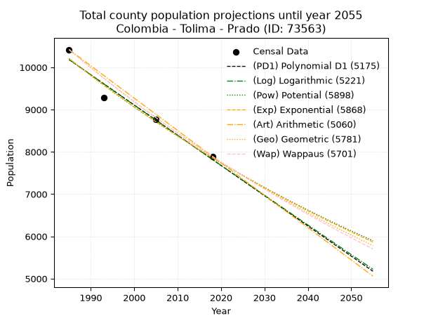
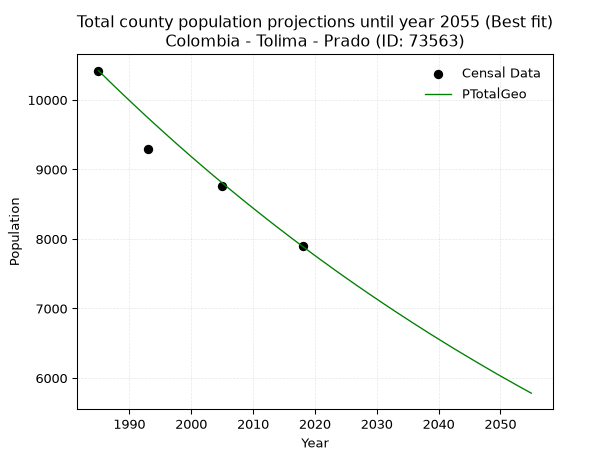
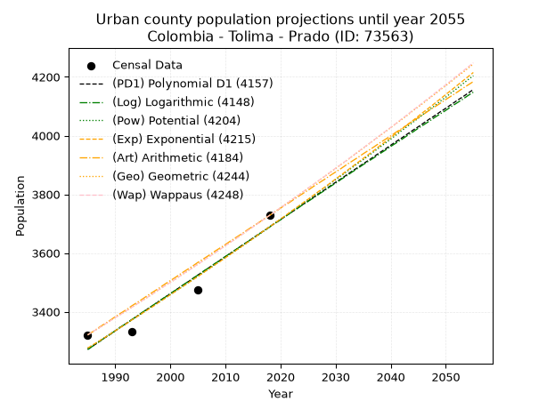
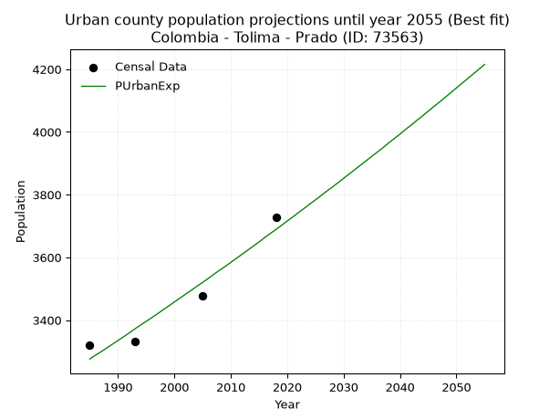
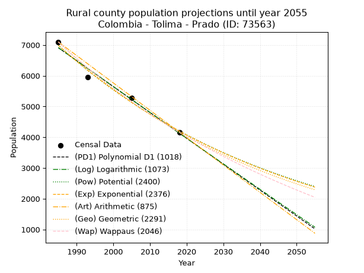
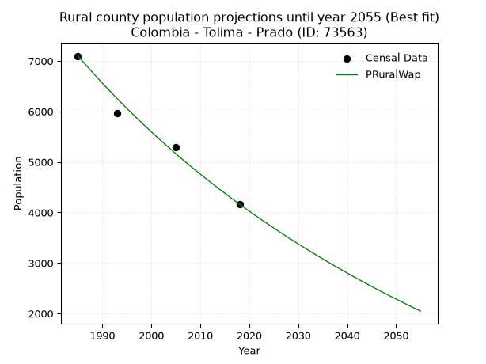

<div align="center">


</div>

# _“Population and Public Services Demand Projections (PPSD) until Year 2050 for Colombia - Tolima - Prado (ID: 73563)”_
Keywords: `population` `public-service` `projection` `lineal` `polynomial` `logarithmic` `potential` `exponential` `arithmetic` `geometric` `wappaus` `dane` `colombia` `south-america`

PPSD are analytical estimates used by governments and planners to anticipate future changes in population size, age distribution, and the resulting community needs for utilities, healthcare, education, and infrastructure as sizing future water treatment facilities, electrical grids, and road networks based on spatial growth.

> **General running parameters**: • app_version: _v20260806_. • Python version: _3.14.7_. • Pandas version: _3.0.5_. • NumPy version: _2.5.1_. • Creates, save and include plots into reports (create_plot): _False_. • Projection until year: _2050_. • Process polynomial degree 2 and up: _False_. • Process Wappaus: _True_. • Process Wappaus: _True_. • Set negative values to zero: _True_. • Set infinite values to zero: _True_. • Drop dataset notes: _True_. 
<div align="center">

Dynamic map: [:earth_americas:Google](http://maps.google.com/maps?q=3.750939478,-74.9274466) [:earth_americas:OSM](https://www.openstreetmap.org/#map=18/3.750939478/-74.9274466&layers=P) [:earth_americas:Bing](https://www.bing.com/maps?cp=3.750939478~-74.9274466&lvl=18) [:earth_americas:Apple](https://maps.apple.com/frame?center=3.750939478%2C-74.9274466&span=0.003%2C0.006)

</div>


<div align="center">

```geojson
{
  "type": "Feature",
  "geometry": {
    "type": "Point", 
    "coordinates": [-74.9274466, 3.750939478]
  }, 
  "properties": {
    "Name": "Colombia - Tolima - Prado (ID: 73563)"
  }
}
```

</div>


## 0. Census Data (4 records)

Census data are official statistics collected by a government about the people and housing in a country. They usually include counts of total population, age, sex, race, income, education, and jobs.

📅Global census file: [Population.xlsx](../data/Population.xlsx)

| Source   |   Year |   CountryID | CountryName   |   StateID | StateName   |   CountyID | CountyName   |   PTotal |   PUrban |   PRural |
|:---------|-------:|------------:|:--------------|----------:|:------------|-----------:|:-------------|---------:|---------:|---------:|
| DANE     |   1985 |          57 | Colombia      |        73 | Tolima      |      73563 | Prado        |    10420 |     3321 |     7099 |
| DANE     |   1993 |          57 | Colombia      |        73 | Tolima      |      73563 | Prado        |     9291 |     3333 |     5958 |
| DANE     |   2005 |          57 | Colombia      |        73 | Tolima      |      73563 | Prado        |     8761 |     3476 |     5285 |
| DANE     |   2018 |          57 | Colombia      |        73 | Tolima      |      73563 | Prado        |     7893 |     3728 |     4165 |

> 🔥Some records could had specific notes about the registered values or the corresponding urban or rural distribution.

## 1. Total

### 1.1. Coefficients and Parameters

* (PD1) Polynomial Deg 1: -71.53633079084643, 152181.7956643906 (lineal)
* (Log) Logarithmic: -143237.97632532165, 1097844.2558858746
* (Pow) Potential: -15.825057039849629, 56.19614490653738
* (Exp) Exponential: -0.007904247713524411, 66501587769.6193
* (Art) Arithmetic: Year diff. 2018 - 1985 = 33, Population diff. 7893 - 10420 = -2527, Annual growth = -76.57575757575758
* (Geo) Geometric: Year diff. 2018 - 1985 = 33, Population diff. 7893 - 10420 = -2527, Annual growth % = -0.008381368096739172
* (Wap) Wappaus: i = -0.836299432924781, Condition values only valid for < 200)

<sub>
Wappaus condition values: ['-0.00', '-0.84', '-1.67', '-2.51', '-3.35', '-4.18', '-5.02', '-5.85', '-6.69', '-7.53', '-8.36', '-9.20', '-10.04', '-10.87', '-11.71', '-12.54', '-13.38', '-14.22', '-15.05', '-15.89', '-16.73', '-17.56', '-18.40', '-19.23', '-20.07', '-20.91', '-21.74', '-22.58', '-23.42', '-24.25', '-25.09', '-25.93', '-26.76', '-27.60', '-28.43', '-29.27', '-30.11', '-30.94', '-31.78', '-32.62', '-33.45', '-34.29', '-35.12', '-35.96', '-36.80', '-37.63', '-38.47', '-39.31', '-40.14', '-40.98', '-41.81', '-42.65', '-43.49', '-44.32', '-45.16', '-46.00', '-46.83', '-47.67', '-48.51', '-49.34', '-50.18', '-51.01', '-51.85', '-52.69', '-53.52', '-54.36']
</sub>


### 1.2. Projected Dataset

|   Year |   CountyID |   PTotalPD1 |   PTotalLog |   PTotalPow |   PTotalExp |   PTotalArt |   PTotalGeo |   PTotalWap |
|-------:|-----------:|------------:|------------:|------------:|------------:|------------:|------------:|------------:|
|   1985 |      73563 |       10182 |       10185 |       10207 |       10204 |       10420 |       10420 |       10420 |
|   1986 |      73563 |       10111 |       10113 |       10126 |       10124 |       10343 |       10333 |       10333 |
|   1987 |      73563 |       10039 |       10040 |       10046 |       10044 |       10267 |       10246 |       10247 |
|   1988 |      73563 |        9968 |        9968 |        9966 |        9965 |       10190 |       10160 |       10162 |
|   1989 |      73563 |        9896 |        9896 |        9887 |        9887 |       10114 |       10075 |       10077 |
|   1990 |      73563 |        9824 |        9824 |        9809 |        9809 |       10037 |        9991 |        9993 |
|   1991 |      73563 |        9753 |        9752 |        9731 |        9732 |        9961 |        9907 |        9910 |
|   1992 |      73563 |        9681 |        9680 |        9654 |        9655 |        9884 |        9824 |        9827 |
|   1993 |      73563 |        9610 |        9609 |        9578 |        9579 |        9807 |        9741 |        9745 |
|   1994 |      73563 |        9538 |        9537 |        9502 |        9504 |        9731 |        9660 |        9664 |
|   1995 |      73563 |        9467 |        9465 |        9427 |        9429 |        9654 |        9579 |        9584 |
|   1996 |      73563 |        9395 |        9393 |        9352 |        9355 |        9578 |        9499 |        9504 |
|   1997 |      73563 |        9324 |        9321 |        9278 |        9281 |        9501 |        9419 |        9424 |
|   1998 |      73563 |        9252 |        9250 |        9205 |        9208 |        9425 |        9340 |        9346 |
|   1999 |      73563 |        9181 |        9178 |        9133 |        9135 |        9348 |        9262 |        9267 |
|   2000 |      73563 |        9109 |        9106 |        9061 |        9063 |        9271 |        9184 |        9190 |
|   2001 |      73563 |        9038 |        9035 |        8989 |        8992 |        9195 |        9107 |        9113 |
|   2002 |      73563 |        8966 |        8963 |        8918 |        8921 |        9118 |        9031 |        9037 |
|   2003 |      73563 |        8895 |        8892 |        8848 |        8851 |        9042 |        8955 |        8961 |
|   2004 |      73563 |        8823 |        8820 |        8779 |        8781 |        8965 |        8880 |        8886 |
|   2005 |      73563 |        8751 |        8749 |        8710 |        8712 |        8888 |        8806 |        8812 |
|   2006 |      73563 |        8680 |        8677 |        8641 |        8644 |        8812 |        8732 |        8738 |
|   2007 |      73563 |        8608 |        8606 |        8573 |        8576 |        8735 |        8659 |        8664 |
|   2008 |      73563 |        8537 |        8535 |        8506 |        8508 |        8659 |        8586 |        8592 |
|   2009 |      73563 |        8465 |        8463 |        8439 |        8441 |        8582 |        8514 |        8519 |
|   2010 |      73563 |        8394 |        8392 |        8373 |        8375 |        8506 |        8443 |        8448 |
|   2011 |      73563 |        8322 |        8321 |        8307 |        8309 |        8429 |        8372 |        8376 |
|   2012 |      73563 |        8251 |        8250 |        8242 |        8243 |        8352 |        8302 |        8306 |
|   2013 |      73563 |        8179 |        8178 |        8178 |        8178 |        8276 |        8232 |        8236 |
|   2014 |      73563 |        8108 |        8107 |        8114 |        8114 |        8199 |        8163 |        8166 |
|   2015 |      73563 |        8036 |        8036 |        8050 |        8050 |        8123 |        8095 |        8097 |
|   2016 |      73563 |        7965 |        7965 |        7987 |        7987 |        8046 |        8027 |        8029 |
|   2017 |      73563 |        7893 |        7894 |        7925 |        7924 |        7970 |        7960 |        7961 |
|   2018 |      73563 |        7821 |        7823 |        7863 |        7861 |        7893 |        7893 |        7893 |
|   2019 |      73563 |        7750 |        7752 |        7801 |        7800 |        7816 |        7827 |        7826 |
|   2020 |      73563 |        7678 |        7681 |        7741 |        7738 |        7740 |        7761 |        7759 |
|   2021 |      73563 |        7607 |        7610 |        7680 |        7677 |        7663 |        7696 |        7693 |
|   2022 |      73563 |        7535 |        7539 |        7620 |        7617 |        7587 |        7632 |        7628 |
|   2023 |      73563 |        7464 |        7469 |        7561 |        7557 |        7510 |        7568 |        7563 |
|   2024 |      73563 |        7392 |        7398 |        7502 |        7497 |        7434 |        7504 |        7498 |
|   2025 |      73563 |        7321 |        7327 |        7444 |        7438 |        7357 |        7441 |        7434 |
|   2026 |      73563 |        7249 |        7256 |        7386 |        7380 |        7280 |        7379 |        7370 |
|   2027 |      73563 |        7178 |        7186 |        7328 |        7322 |        7204 |        7317 |        7307 |
|   2028 |      73563 |        7106 |        7115 |        7271 |        7264 |        7127 |        7256 |        7244 |
|   2029 |      73563 |        7035 |        7044 |        7215 |        7207 |        7051 |        7195 |        7182 |
|   2030 |      73563 |        6963 |        6974 |        7159 |        7150 |        6974 |        7135 |        7120 |
|   2031 |      73563 |        6892 |        6903 |        7103 |        7094 |        6898 |        7075 |        7058 |
|   2032 |      73563 |        6820 |        6833 |        7048 |        7038 |        6821 |        7016 |        6997 |
|   2033 |      73563 |        6748 |        6762 |        6993 |        6982 |        6744 |        6957 |        6936 |
|   2034 |      73563 |        6677 |        6692 |        6939 |        6927 |        6668 |        6899 |        6876 |
|   2035 |      73563 |        6605 |        6621 |        6885 |        6873 |        6591 |        6841 |        6816 |
|   2036 |      73563 |        6534 |        6551 |        6832 |        6819 |        6515 |        6783 |        6757 |
|   2037 |      73563 |        6462 |        6481 |        6779 |        6765 |        6438 |        6727 |        6698 |
|   2038 |      73563 |        6391 |        6410 |        6727 |        6712 |        6361 |        6670 |        6639 |
|   2039 |      73563 |        6319 |        6340 |        6675 |        6659 |        6285 |        6614 |        6581 |
|   2040 |      73563 |        6248 |        6270 |        6623 |        6607 |        6208 |        6559 |        6523 |
|   2041 |      73563 |        6176 |        6200 |        6572 |        6555 |        6132 |        6504 |        6466 |
|   2042 |      73563 |        6105 |        6130 |        6521 |        6503 |        6055 |        6449 |        6409 |
|   2043 |      73563 |        6033 |        6059 |        6471 |        6452 |        5979 |        6395 |        6352 |
|   2044 |      73563 |        5962 |        5989 |        6421 |        6401 |        5902 |        6342 |        6296 |
|   2045 |      73563 |        5890 |        5919 |        6371 |        6351 |        5825 |        6289 |        6240 |
|   2046 |      73563 |        5818 |        5849 |        6322 |        6301 |        5749 |        6236 |        6185 |
|   2047 |      73563 |        5747 |        5779 |        6274 |        6251 |        5672 |        6184 |        6129 |
|   2048 |      73563 |        5675 |        5709 |        6225 |        6202 |        5596 |        6132 |        6075 |
|   2049 |      73563 |        5604 |        5639 |        6177 |        6153 |        5519 |        6080 |        6020 |
|   2050 |      73563 |        5532 |        5569 |        6130 |        6105 |        5443 |        6029 |        5966 |
<div align="center">

</img>

</div>


### 1.3. Best fit with absolute and relative error (%)

Relative error puts that difference into context by dividing the absolute error by the true value, creating a unitless ratio or percentage that shows the scale of the mistake.

Absolute and relative error

|   Year | Source   |   CountryID | CountryName   |   StateID | StateName   |   CountyID_x | CountyName   |   PTotal |   PUrban |   PRural |   CountyID_y |   PTotalPD1 |   PTotalLog |   PTotalPow |   PTotalExp |   PTotalArt |   PTotalGeo |   PTotalWap |   PTotalPD1AbsError |   PTotalLogAbsError |   PTotalPowAbsError |   PTotalExpAbsError |   PTotalArtAbsError |   PTotalGeoAbsError |   PTotalWapAbsError |   PTotalPD1RelError |   PTotalLogRelError |   PTotalPowRelError |   PTotalExpRelError |   PTotalArtRelError |   PTotalGeoRelError |   PTotalWapRelError |
|-------:|:---------|------------:|:--------------|----------:|:------------|-------------:|:-------------|---------:|---------:|---------:|-------------:|------------:|------------:|------------:|------------:|------------:|------------:|------------:|--------------------:|--------------------:|--------------------:|--------------------:|--------------------:|--------------------:|--------------------:|--------------------:|--------------------:|--------------------:|--------------------:|--------------------:|--------------------:|--------------------:|
|   1985 | DANE     |          57 | Colombia      |        73 | Tolima      |        73563 | Prado        |    10420 |     3321 |     7099 |        73563 |       10182 |       10185 |       10207 |       10204 |       10420 |       10420 |       10420 |                 238 |                 235 |                 213 |                 216 |                   0 |                   0 |                   0 |            2.28407  |            2.25528  |            2.04415  |            2.07294  |             0       |             0       |            0        |
|   1993 | DANE     |          57 | Colombia      |        73 | Tolima      |        73563 | Prado        |     9291 |     3333 |     5958 |        73563 |        9610 |        9609 |        9578 |        9579 |        9807 |        9741 |        9745 |                 319 |                 318 |                 287 |                 288 |                 516 |                 450 |                 454 |            3.43343  |            3.42267  |            3.08901  |            3.09977  |             5.55376 |             4.8434  |            4.88645  |
|   2005 | DANE     |          57 | Colombia      |        73 | Tolima      |        73563 | Prado        |     8761 |     3476 |     5285 |        73563 |        8751 |        8749 |        8710 |        8712 |        8888 |        8806 |        8812 |                  10 |                  12 |                  51 |                  49 |                 127 |                  45 |                  51 |            0.114142 |            0.136971 |            0.582125 |            0.559297 |             1.44961 |             0.51364 |            0.582125 |
|   2018 | DANE     |          57 | Colombia      |        73 | Tolima      |        73563 | Prado        |     7893 |     3728 |     4165 |        73563 |        7821 |        7823 |        7863 |        7861 |        7893 |        7893 |        7893 |                  72 |                  70 |                  30 |                  32 |                   0 |                   0 |                   0 |            0.912201 |            0.886862 |            0.380084 |            0.405423 |             0       |             0       |            0        |

Relative error mean

| Method    |   RelError | Best   |
|:----------|-----------:|:-------|
| PTotalPD1 |    1.68596 |        |
| PTotalLog |    1.67544 |        |
| PTotalPow |    1.52384 |        |
| PTotalExp |    1.53436 |        |
| PTotalArt |    1.75084 |        |
| PTotalGeo |    1.33926 | True   |
| PTotalWap |    1.36714 |        |

💙Best method: _**PTotalGeo**_
<div align="center">

</img>

</div>


### 1.4. Fresh water supply demand in liters per capita per day (lpcd)

The fresh water supply demand typically ranges from 100 to 300 liters per capita per day (lpcd) for standard domestic and municipal planning, though absolute survival minimums set by the World Health Organization are as low as 7.5 to 20 liters per day, and total consumption in high-income nations can exceed 400 liters.

> `CZ`: Level in meters above the sea level (masl)<br> `WS`: Fresh water supply demand in liters per capita per day (lpcd or l/h/d)<br> `WSAll`: Zonal fresh water supply demand in liters per second (l/s)<br> `A`: Zonal area in square meters<br> `DP`: Population density (people/hectare)

Reference values (RAS Colombia)

|    CZ |   WS |
|------:|-----:|
|  1000 |  120 |
|  2000 |  130 |
| 99999 |  140 |

County shapefile geometry properties and water supply values

|   CountyID |      ATotal |   CZTotal |   WSTotal |
|-----------:|------------:|----------:|----------:|
|      73563 | 4.22707e+08 |   587.605 |       120 |

Projected values for best method: PTotalGeo

|   CountyID |   Year |   PTotalGeo |   DPTotal |   WSTotal |   WSTotalAll |
|-----------:|-------:|------------:|----------:|----------:|-------------:|
|      73563 |   1985 |       10420 |      0.25 |       120 |     14.4722  |
|      73563 |   1986 |       10333 |      0.24 |       120 |     14.3514  |
|      73563 |   1987 |       10246 |      0.24 |       120 |     14.2306  |
|      73563 |   1988 |       10160 |      0.24 |       120 |     14.1111  |
|      73563 |   1989 |       10075 |      0.24 |       120 |     13.9931  |
|      73563 |   1990 |        9991 |      0.24 |       120 |     13.8764  |
|      73563 |   1991 |        9907 |      0.23 |       120 |     13.7597  |
|      73563 |   1992 |        9824 |      0.23 |       120 |     13.6444  |
|      73563 |   1993 |        9741 |      0.23 |       120 |     13.5292  |
|      73563 |   1994 |        9660 |      0.23 |       120 |     13.4167  |
|      73563 |   1995 |        9579 |      0.23 |       120 |     13.3042  |
|      73563 |   1996 |        9499 |      0.22 |       120 |     13.1931  |
|      73563 |   1997 |        9419 |      0.22 |       120 |     13.0819  |
|      73563 |   1998 |        9340 |      0.22 |       120 |     12.9722  |
|      73563 |   1999 |        9262 |      0.22 |       120 |     12.8639  |
|      73563 |   2000 |        9184 |      0.22 |       120 |     12.7556  |
|      73563 |   2001 |        9107 |      0.22 |       120 |     12.6486  |
|      73563 |   2002 |        9031 |      0.21 |       120 |     12.5431  |
|      73563 |   2003 |        8955 |      0.21 |       120 |     12.4375  |
|      73563 |   2004 |        8880 |      0.21 |       120 |     12.3333  |
|      73563 |   2005 |        8806 |      0.21 |       120 |     12.2306  |
|      73563 |   2006 |        8732 |      0.21 |       120 |     12.1278  |
|      73563 |   2007 |        8659 |      0.2  |       120 |     12.0264  |
|      73563 |   2008 |        8586 |      0.2  |       120 |     11.925   |
|      73563 |   2009 |        8514 |      0.2  |       120 |     11.825   |
|      73563 |   2010 |        8443 |      0.2  |       120 |     11.7264  |
|      73563 |   2011 |        8372 |      0.2  |       120 |     11.6278  |
|      73563 |   2012 |        8302 |      0.2  |       120 |     11.5306  |
|      73563 |   2013 |        8232 |      0.19 |       120 |     11.4333  |
|      73563 |   2014 |        8163 |      0.19 |       120 |     11.3375  |
|      73563 |   2015 |        8095 |      0.19 |       120 |     11.2431  |
|      73563 |   2016 |        8027 |      0.19 |       120 |     11.1486  |
|      73563 |   2017 |        7960 |      0.19 |       120 |     11.0556  |
|      73563 |   2018 |        7893 |      0.19 |       120 |     10.9625  |
|      73563 |   2019 |        7827 |      0.19 |       120 |     10.8708  |
|      73563 |   2020 |        7761 |      0.18 |       120 |     10.7792  |
|      73563 |   2021 |        7696 |      0.18 |       120 |     10.6889  |
|      73563 |   2022 |        7632 |      0.18 |       120 |     10.6     |
|      73563 |   2023 |        7568 |      0.18 |       120 |     10.5111  |
|      73563 |   2024 |        7504 |      0.18 |       120 |     10.4222  |
|      73563 |   2025 |        7441 |      0.18 |       120 |     10.3347  |
|      73563 |   2026 |        7379 |      0.17 |       120 |     10.2486  |
|      73563 |   2027 |        7317 |      0.17 |       120 |     10.1625  |
|      73563 |   2028 |        7256 |      0.17 |       120 |     10.0778  |
|      73563 |   2029 |        7195 |      0.17 |       120 |      9.99306 |
|      73563 |   2030 |        7135 |      0.17 |       120 |      9.90972 |
|      73563 |   2031 |        7075 |      0.17 |       120 |      9.82639 |
|      73563 |   2032 |        7016 |      0.17 |       120 |      9.74444 |
|      73563 |   2033 |        6957 |      0.16 |       120 |      9.6625  |
|      73563 |   2034 |        6899 |      0.16 |       120 |      9.58194 |
|      73563 |   2035 |        6841 |      0.16 |       120 |      9.50139 |
|      73563 |   2036 |        6783 |      0.16 |       120 |      9.42083 |
|      73563 |   2037 |        6727 |      0.16 |       120 |      9.34306 |
|      73563 |   2038 |        6670 |      0.16 |       120 |      9.26389 |
|      73563 |   2039 |        6614 |      0.16 |       120 |      9.18611 |
|      73563 |   2040 |        6559 |      0.16 |       120 |      9.10972 |
|      73563 |   2041 |        6504 |      0.15 |       120 |      9.03333 |
|      73563 |   2042 |        6449 |      0.15 |       120 |      8.95694 |
|      73563 |   2043 |        6395 |      0.15 |       120 |      8.88194 |
|      73563 |   2044 |        6342 |      0.15 |       120 |      8.80833 |
|      73563 |   2045 |        6289 |      0.15 |       120 |      8.73472 |
|      73563 |   2046 |        6236 |      0.15 |       120 |      8.66111 |
|      73563 |   2047 |        6184 |      0.15 |       120 |      8.58889 |
|      73563 |   2048 |        6132 |      0.15 |       120 |      8.51667 |
|      73563 |   2049 |        6080 |      0.14 |       120 |      8.44444 |
|      73563 |   2050 |        6029 |      0.14 |       120 |      8.37361 |

## 2. Urban

### 2.1. Coefficients and Parameters

* (PD1) Polynomial Deg 1: 12.643115214773022, -21824.891208349738 (lineal)
* (Log) Logarithmic: 25290.18039535415, -188766.36384787367
* (Pow) Potential: 7.203371505383978, -20.239710657360632
* (Exp) Exponential: 0.0036010168400655894, 2.5761461867009348
* (Art) Arithmetic: Year diff. 2018 - 1985 = 33, Population diff. 3728 - 3321 = 407, Annual growth = 12.333333333333334
* (Geo) Geometric: Year diff. 2018 - 1985 = 33, Population diff. 3728 - 3321 = 407, Annual growth % = 0.0035093541548072427
* (Wap) Wappaus: i = 0.3499314323544711, Condition values only valid for < 200)

<sub>
Wappaus condition values: ['0.00', '0.35', '0.70', '1.05', '1.40', '1.75', '2.10', '2.45', '2.80', '3.15', '3.50', '3.85', '4.20', '4.55', '4.90', '5.25', '5.60', '5.95', '6.30', '6.65', '7.00', '7.35', '7.70', '8.05', '8.40', '8.75', '9.10', '9.45', '9.80', '10.15', '10.50', '10.85', '11.20', '11.55', '11.90', '12.25', '12.60', '12.95', '13.30', '13.65', '14.00', '14.35', '14.70', '15.05', '15.40', '15.75', '16.10', '16.45', '16.80', '17.15', '17.50', '17.85', '18.20', '18.55', '18.90', '19.25', '19.60', '19.95', '20.30', '20.65', '21.00', '21.35', '21.70', '22.05', '22.40', '22.75']
</sub>


### 2.2. Projected Dataset

|   Year |   CountyID |   PUrbanPD1 |   PUrbanLog |   PUrbanPow |   PUrbanExp |   PUrbanArt |   PUrbanGeo |   PUrbanWap |
|-------:|-----------:|------------:|------------:|------------:|------------:|------------:|------------:|------------:|
|   1985 |      73563 |        3272 |        3271 |        3276 |        3276 |        3321 |        3321 |        3321 |
|   1986 |      73563 |        3284 |        3284 |        3287 |        3288 |        3333 |        3333 |        3333 |
|   1987 |      73563 |        3297 |        3297 |        3299 |        3299 |        3346 |        3344 |        3344 |
|   1988 |      73563 |        3310 |        3310 |        3311 |        3311 |        3358 |        3356 |        3356 |
|   1989 |      73563 |        3322 |        3322 |        3323 |        3323 |        3370 |        3368 |        3368 |
|   1990 |      73563 |        3335 |        3335 |        3335 |        3335 |        3383 |        3380 |        3380 |
|   1991 |      73563 |        3348 |        3348 |        3348 |        3347 |        3395 |        3392 |        3391 |
|   1992 |      73563 |        3360 |        3360 |        3360 |        3359 |        3407 |        3403 |        3403 |
|   1993 |      73563 |        3373 |        3373 |        3372 |        3372 |        3420 |        3415 |        3415 |
|   1994 |      73563 |        3385 |        3386 |        3384 |        3384 |        3432 |        3427 |        3427 |
|   1995 |      73563 |        3398 |        3399 |        3396 |        3396 |        3444 |        3439 |        3439 |
|   1996 |      73563 |        3411 |        3411 |        3409 |        3408 |        3457 |        3451 |        3451 |
|   1997 |      73563 |        3423 |        3424 |        3421 |        3420 |        3469 |        3464 |        3463 |
|   1998 |      73563 |        3436 |        3437 |        3433 |        3433 |        3481 |        3476 |        3476 |
|   1999 |      73563 |        3449 |        3449 |        3446 |        3445 |        3494 |        3488 |        3488 |
|   2000 |      73563 |        3461 |        3462 |        3458 |        3458 |        3506 |        3500 |        3500 |
|   2001 |      73563 |        3474 |        3474 |        3471 |        3470 |        3518 |        3512 |        3512 |
|   2002 |      73563 |        3487 |        3487 |        3483 |        3483 |        3531 |        3525 |        3525 |
|   2003 |      73563 |        3499 |        3500 |        3496 |        3495 |        3543 |        3537 |        3537 |
|   2004 |      73563 |        3512 |        3512 |        3508 |        3508 |        3555 |        3550 |        3549 |
|   2005 |      73563 |        3525 |        3525 |        3521 |        3520 |        3568 |        3562 |        3562 |
|   2006 |      73563 |        3537 |        3538 |        3534 |        3533 |        3580 |        3575 |        3574 |
|   2007 |      73563 |        3550 |        3550 |        3546 |        3546 |        3592 |        3587 |        3587 |
|   2008 |      73563 |        3562 |        3563 |        3559 |        3559 |        3605 |        3600 |        3599 |
|   2009 |      73563 |        3575 |        3575 |        3572 |        3571 |        3617 |        3612 |        3612 |
|   2010 |      73563 |        3588 |        3588 |        3585 |        3584 |        3629 |        3625 |        3625 |
|   2011 |      73563 |        3600 |        3601 |        3597 |        3597 |        3642 |        3638 |        3638 |
|   2012 |      73563 |        3613 |        3613 |        3610 |        3610 |        3654 |        3650 |        3650 |
|   2013 |      73563 |        3626 |        3626 |        3623 |        3623 |        3666 |        3663 |        3663 |
|   2014 |      73563 |        3638 |        3638 |        3636 |        3636 |        3679 |        3676 |        3676 |
|   2015 |      73563 |        3651 |        3651 |        3649 |        3649 |        3691 |        3689 |        3689 |
|   2016 |      73563 |        3664 |        3663 |        3662 |        3663 |        3703 |        3702 |        3702 |
|   2017 |      73563 |        3676 |        3676 |        3675 |        3676 |        3716 |        3715 |        3715 |
|   2018 |      73563 |        3689 |        3688 |        3689 |        3689 |        3728 |        3728 |        3728 |
|   2019 |      73563 |        3702 |        3701 |        3702 |        3702 |        3740 |        3741 |        3741 |
|   2020 |      73563 |        3714 |        3713 |        3715 |        3716 |        3753 |        3754 |        3754 |
|   2021 |      73563 |        3727 |        3726 |        3728 |        3729 |        3765 |        3767 |        3767 |
|   2022 |      73563 |        3739 |        3739 |        3742 |        3743 |        3777 |        3781 |        3781 |
|   2023 |      73563 |        3752 |        3751 |        3755 |        3756 |        3790 |        3794 |        3794 |
|   2024 |      73563 |        3765 |        3764 |        3768 |        3770 |        3802 |        3807 |        3807 |
|   2025 |      73563 |        3777 |        3776 |        3782 |        3783 |        3814 |        3821 |        3821 |
|   2026 |      73563 |        3790 |        3788 |        3795 |        3797 |        3827 |        3834 |        3834 |
|   2027 |      73563 |        3803 |        3801 |        3809 |        3811 |        3839 |        3847 |        3848 |
|   2028 |      73563 |        3815 |        3813 |        3822 |        3824 |        3851 |        3861 |        3861 |
|   2029 |      73563 |        3828 |        3826 |        3836 |        3838 |        3864 |        3874 |        3875 |
|   2030 |      73563 |        3841 |        3838 |        3850 |        3852 |        3876 |        3888 |        3889 |
|   2031 |      73563 |        3853 |        3851 |        3863 |        3866 |        3888 |        3902 |        3902 |
|   2032 |      73563 |        3866 |        3863 |        3877 |        3880 |        3901 |        3915 |        3916 |
|   2033 |      73563 |        3879 |        3876 |        3891 |        3894 |        3913 |        3929 |        3930 |
|   2034 |      73563 |        3891 |        3888 |        3905 |        3908 |        3925 |        3943 |        3944 |
|   2035 |      73563 |        3904 |        3901 |        3918 |        3922 |        3938 |        3957 |        3958 |
|   2036 |      73563 |        3916 |        3913 |        3932 |        3936 |        3950 |        3971 |        3972 |
|   2037 |      73563 |        3929 |        3925 |        3946 |        3950 |        3962 |        3985 |        3986 |
|   2038 |      73563 |        3942 |        3938 |        3960 |        3965 |        3975 |        3999 |        4000 |
|   2039 |      73563 |        3954 |        3950 |        3974 |        3979 |        3987 |        4013 |        4014 |
|   2040 |      73563 |        3967 |        3963 |        3988 |        3993 |        3999 |        4027 |        4028 |
|   2041 |      73563 |        3980 |        3975 |        4002 |        4008 |        4012 |        4041 |        4042 |
|   2042 |      73563 |        3992 |        3987 |        4017 |        4022 |        4024 |        4055 |        4057 |
|   2043 |      73563 |        4005 |        4000 |        4031 |        4037 |        4036 |        4069 |        4071 |
|   2044 |      73563 |        4018 |        4012 |        4045 |        4051 |        4049 |        4084 |        4086 |
|   2045 |      73563 |        4030 |        4025 |        4059 |        4066 |        4061 |        4098 |        4100 |
|   2046 |      73563 |        4043 |        4037 |        4074 |        4081 |        4073 |        4112 |        4115 |
|   2047 |      73563 |        4056 |        4049 |        4088 |        4095 |        4086 |        4127 |        4129 |
|   2048 |      73563 |        4068 |        4062 |        4102 |        4110 |        4098 |        4141 |        4144 |
|   2049 |      73563 |        4081 |        4074 |        4117 |        4125 |        4110 |        4156 |        4159 |
|   2050 |      73563 |        4093 |        4086 |        4131 |        4140 |        4123 |        4170 |        4173 |
<div align="center">

</img>

</div>


### 2.3. Best fit with absolute and relative error (%)

Relative error puts that difference into context by dividing the absolute error by the true value, creating a unitless ratio or percentage that shows the scale of the mistake.

Absolute and relative error

|   Year | Source   |   CountryID | CountryName   |   StateID | StateName   |   CountyID_x | CountyName   |   PTotal |   PUrban |   PRural |   CountyID_y |   PUrbanPD1 |   PUrbanLog |   PUrbanPow |   PUrbanExp |   PUrbanArt |   PUrbanGeo |   PUrbanWap |   PUrbanPD1AbsError |   PUrbanLogAbsError |   PUrbanPowAbsError |   PUrbanExpAbsError |   PUrbanArtAbsError |   PUrbanGeoAbsError |   PUrbanWapAbsError |   PUrbanPD1RelError |   PUrbanLogRelError |   PUrbanPowRelError |   PUrbanExpRelError |   PUrbanArtRelError |   PUrbanGeoRelError |   PUrbanWapRelError |
|-------:|:---------|------------:|:--------------|----------:|:------------|-------------:|:-------------|---------:|---------:|---------:|-------------:|------------:|------------:|------------:|------------:|------------:|------------:|------------:|--------------------:|--------------------:|--------------------:|--------------------:|--------------------:|--------------------:|--------------------:|--------------------:|--------------------:|--------------------:|--------------------:|--------------------:|--------------------:|--------------------:|
|   1985 | DANE     |          57 | Colombia      |        73 | Tolima      |        73563 | Prado        |    10420 |     3321 |     7099 |        73563 |        3272 |        3271 |        3276 |        3276 |        3321 |        3321 |        3321 |                  49 |                  50 |                  45 |                  45 |                   0 |                   0 |                   0 |             1.47546 |             1.50557 |             1.35501 |             1.35501 |             0       |             0       |             0       |
|   1993 | DANE     |          57 | Colombia      |        73 | Tolima      |        73563 | Prado        |     9291 |     3333 |     5958 |        73563 |        3373 |        3373 |        3372 |        3372 |        3420 |        3415 |        3415 |                  40 |                  40 |                  39 |                  39 |                  87 |                  82 |                  82 |             1.20012 |             1.20012 |             1.17012 |             1.17012 |             2.61026 |             2.46025 |             2.46025 |
|   2005 | DANE     |          57 | Colombia      |        73 | Tolima      |        73563 | Prado        |     8761 |     3476 |     5285 |        73563 |        3525 |        3525 |        3521 |        3520 |        3568 |        3562 |        3562 |                  49 |                  49 |                  45 |                  44 |                  92 |                  86 |                  86 |             1.40967 |             1.40967 |             1.29459 |             1.26582 |             2.64672 |             2.47411 |             2.47411 |
|   2018 | DANE     |          57 | Colombia      |        73 | Tolima      |        73563 | Prado        |     7893 |     3728 |     4165 |        73563 |        3689 |        3688 |        3689 |        3689 |        3728 |        3728 |        3728 |                  39 |                  40 |                  39 |                  39 |                   0 |                   0 |                   0 |             1.04614 |             1.07296 |             1.04614 |             1.04614 |             0       |             0       |             0       |

Relative error mean

| Method    |   RelError | Best   |
|:----------|-----------:|:-------|
| PUrbanPD1 |    1.28285 |        |
| PUrbanLog |    1.29708 |        |
| PUrbanPow |    1.21646 |        |
| PUrbanExp |    1.20927 | True   |
| PUrbanArt |    1.31425 |        |
| PUrbanGeo |    1.23359 |        |
| PUrbanWap |    1.23359 |        |

💙Best method: _**PUrbanExp**_
<div align="center">

</img>

</div>


### 2.4. Fresh water supply demand in liters per capita per day (lpcd)

The fresh water supply demand typically ranges from 100 to 300 liters per capita per day (lpcd) for standard domestic and municipal planning, though absolute survival minimums set by the World Health Organization are as low as 7.5 to 20 liters per day, and total consumption in high-income nations can exceed 400 liters.

> `CZ`: Level in meters above the sea level (masl)<br> `WS`: Fresh water supply demand in liters per capita per day (lpcd or l/h/d)<br> `WSAll`: Zonal fresh water supply demand in liters per second (l/s)<br> `A`: Zonal area in square meters<br> `DP`: Population density (people/hectare)

Reference values (RAS Colombia)

|    CZ |   WS |
|------:|-----:|
|  1000 |  120 |
|  2000 |  130 |
| 99999 |  140 |

County shapefile geometry properties and water supply values

|   CountyID |      AUrban |   CZUrban |   WSUrban |
|-----------:|------------:|----------:|----------:|
|      73563 | 1.08749e+06 |   315.791 |       120 |

Projected values for best method: PUrbanExp

|   CountyID |   Year |   PUrbanExp |   DPUrban |   WSUrban |   WSUrbanAll |
|-----------:|-------:|------------:|----------:|----------:|-------------:|
|      73563 |   1985 |        3276 |     30.12 |       120 |      4.55    |
|      73563 |   1986 |        3288 |     30.23 |       120 |      4.56667 |
|      73563 |   1987 |        3299 |     30.34 |       120 |      4.58194 |
|      73563 |   1988 |        3311 |     30.45 |       120 |      4.59861 |
|      73563 |   1989 |        3323 |     30.56 |       120 |      4.61528 |
|      73563 |   1990 |        3335 |     30.67 |       120 |      4.63194 |
|      73563 |   1991 |        3347 |     30.78 |       120 |      4.64861 |
|      73563 |   1992 |        3359 |     30.89 |       120 |      4.66528 |
|      73563 |   1993 |        3372 |     31.01 |       120 |      4.68333 |
|      73563 |   1994 |        3384 |     31.12 |       120 |      4.7     |
|      73563 |   1995 |        3396 |     31.23 |       120 |      4.71667 |
|      73563 |   1996 |        3408 |     31.34 |       120 |      4.73333 |
|      73563 |   1997 |        3420 |     31.45 |       120 |      4.75    |
|      73563 |   1998 |        3433 |     31.57 |       120 |      4.76806 |
|      73563 |   1999 |        3445 |     31.68 |       120 |      4.78472 |
|      73563 |   2000 |        3458 |     31.8  |       120 |      4.80278 |
|      73563 |   2001 |        3470 |     31.91 |       120 |      4.81944 |
|      73563 |   2002 |        3483 |     32.03 |       120 |      4.8375  |
|      73563 |   2003 |        3495 |     32.14 |       120 |      4.85417 |
|      73563 |   2004 |        3508 |     32.26 |       120 |      4.87222 |
|      73563 |   2005 |        3520 |     32.37 |       120 |      4.88889 |
|      73563 |   2006 |        3533 |     32.49 |       120 |      4.90694 |
|      73563 |   2007 |        3546 |     32.61 |       120 |      4.925   |
|      73563 |   2008 |        3559 |     32.73 |       120 |      4.94306 |
|      73563 |   2009 |        3571 |     32.84 |       120 |      4.95972 |
|      73563 |   2010 |        3584 |     32.96 |       120 |      4.97778 |
|      73563 |   2011 |        3597 |     33.08 |       120 |      4.99583 |
|      73563 |   2012 |        3610 |     33.2  |       120 |      5.01389 |
|      73563 |   2013 |        3623 |     33.32 |       120 |      5.03194 |
|      73563 |   2014 |        3636 |     33.43 |       120 |      5.05    |
|      73563 |   2015 |        3649 |     33.55 |       120 |      5.06806 |
|      73563 |   2016 |        3663 |     33.68 |       120 |      5.0875  |
|      73563 |   2017 |        3676 |     33.8  |       120 |      5.10556 |
|      73563 |   2018 |        3689 |     33.92 |       120 |      5.12361 |
|      73563 |   2019 |        3702 |     34.04 |       120 |      5.14167 |
|      73563 |   2020 |        3716 |     34.17 |       120 |      5.16111 |
|      73563 |   2021 |        3729 |     34.29 |       120 |      5.17917 |
|      73563 |   2022 |        3743 |     34.42 |       120 |      5.19861 |
|      73563 |   2023 |        3756 |     34.54 |       120 |      5.21667 |
|      73563 |   2024 |        3770 |     34.67 |       120 |      5.23611 |
|      73563 |   2025 |        3783 |     34.79 |       120 |      5.25417 |
|      73563 |   2026 |        3797 |     34.92 |       120 |      5.27361 |
|      73563 |   2027 |        3811 |     35.04 |       120 |      5.29306 |
|      73563 |   2028 |        3824 |     35.16 |       120 |      5.31111 |
|      73563 |   2029 |        3838 |     35.29 |       120 |      5.33056 |
|      73563 |   2030 |        3852 |     35.42 |       120 |      5.35    |
|      73563 |   2031 |        3866 |     35.55 |       120 |      5.36944 |
|      73563 |   2032 |        3880 |     35.68 |       120 |      5.38889 |
|      73563 |   2033 |        3894 |     35.81 |       120 |      5.40833 |
|      73563 |   2034 |        3908 |     35.94 |       120 |      5.42778 |
|      73563 |   2035 |        3922 |     36.06 |       120 |      5.44722 |
|      73563 |   2036 |        3936 |     36.19 |       120 |      5.46667 |
|      73563 |   2037 |        3950 |     36.32 |       120 |      5.48611 |
|      73563 |   2038 |        3965 |     36.46 |       120 |      5.50694 |
|      73563 |   2039 |        3979 |     36.59 |       120 |      5.52639 |
|      73563 |   2040 |        3993 |     36.72 |       120 |      5.54583 |
|      73563 |   2041 |        4008 |     36.86 |       120 |      5.56667 |
|      73563 |   2042 |        4022 |     36.98 |       120 |      5.58611 |
|      73563 |   2043 |        4037 |     37.12 |       120 |      5.60694 |
|      73563 |   2044 |        4051 |     37.25 |       120 |      5.62639 |
|      73563 |   2045 |        4066 |     37.39 |       120 |      5.64722 |
|      73563 |   2046 |        4081 |     37.53 |       120 |      5.66806 |
|      73563 |   2047 |        4095 |     37.66 |       120 |      5.6875  |
|      73563 |   2048 |        4110 |     37.79 |       120 |      5.70833 |
|      73563 |   2049 |        4125 |     37.93 |       120 |      5.72917 |
|      73563 |   2050 |        4140 |     38.07 |       120 |      5.75    |

## 3. Rural

### 3.1. Coefficients and Parameters

* (PD1) Polynomial Deg 1: -84.17944600561948, 174006.68687274036 (lineal)
* (Log) Logarithmic: -168528.15672067602, 1286610.6197337501
* (Pow) Potential: -30.84373551791239, 105.55974946417301
* (Exp) Exponential: -0.015409500245233382, 1.3441085203962736e+17
* (Art) Arithmetic: Year diff. 2018 - 1985 = 33, Population diff. 4165 - 7099 = -2934, Annual growth = -88.9090909090909
* (Geo) Geometric: Year diff. 2018 - 1985 = 33, Population diff. 4165 - 7099 = -2934, Annual growth % = -0.01602886506014456
* (Wap) Wappaus: i = -1.57864152892562, Condition values only valid for < 200)

<sub>
Wappaus condition values: ['-0.00', '-1.58', '-3.16', '-4.74', '-6.31', '-7.89', '-9.47', '-11.05', '-12.63', '-14.21', '-15.79', '-17.37', '-18.94', '-20.52', '-22.10', '-23.68', '-25.26', '-26.84', '-28.42', '-29.99', '-31.57', '-33.15', '-34.73', '-36.31', '-37.89', '-39.47', '-41.04', '-42.62', '-44.20', '-45.78', '-47.36', '-48.94', '-50.52', '-52.10', '-53.67', '-55.25', '-56.83', '-58.41', '-59.99', '-61.57', '-63.15', '-64.72', '-66.30', '-67.88', '-69.46', '-71.04', '-72.62', '-74.20', '-75.77', '-77.35', '-78.93', '-80.51', '-82.09', '-83.67', '-85.25', '-86.83', '-88.40', '-89.98', '-91.56', '-93.14', '-94.72', '-96.30', '-97.88', '-99.45', '-101.03', '-102.61']
</sub>


### 3.2. Projected Dataset

|   Year |   CountyID |   PRuralPD1 |   PRuralLog |   PRuralPow |   PRuralExp |   PRuralArt |   PRuralGeo |   PRuralWap |
|-------:|-----------:|------------:|------------:|------------:|------------:|------------:|------------:|------------:|
|   1985 |      73563 |        6910 |        6913 |        6990 |        6987 |        7099 |        7099 |        7099 |
|   1986 |      73563 |        6826 |        6828 |        6883 |        6880 |        7010 |        6985 |        6988 |
|   1987 |      73563 |        6742 |        6744 |        6777 |        6775 |        6921 |        6873 |        6878 |
|   1988 |      73563 |        6658 |        6659 |        6672 |        6671 |        6832 |        6763 |        6771 |
|   1989 |      73563 |        6574 |        6574 |        6569 |        6569 |        6743 |        6655 |        6664 |
|   1990 |      73563 |        6490 |        6489 |        6468 |        6469 |        6654 |        6548 |        6560 |
|   1991 |      73563 |        6405 |        6405 |        6369 |        6370 |        6566 |        6443 |        6457 |
|   1992 |      73563 |        6321 |        6320 |        6271 |        6273 |        6477 |        6340 |        6356 |
|   1993 |      73563 |        6237 |        6235 |        6175 |        6177 |        6388 |        6238 |        6256 |
|   1994 |      73563 |        6153 |        6151 |        6080 |        6082 |        6299 |        6138 |        6157 |
|   1995 |      73563 |        6069 |        6066 |        5987 |        5989 |        6210 |        6040 |        6060 |
|   1996 |      73563 |        5985 |        5982 |        5895 |        5898 |        6121 |        5943 |        5965 |
|   1997 |      73563 |        5900 |        5898 |        5804 |        5808 |        6032 |        5848 |        5871 |
|   1998 |      73563 |        5816 |        5813 |        5716 |        5719 |        5943 |        5754 |        5778 |
|   1999 |      73563 |        5732 |        5729 |        5628 |        5631 |        5854 |        5662 |        5686 |
|   2000 |      73563 |        5648 |        5645 |        5542 |        5545 |        5765 |        5571 |        5596 |
|   2001 |      73563 |        5564 |        5560 |        5457 |        5460 |        5676 |        5482 |        5507 |
|   2002 |      73563 |        5479 |        5476 |        5374 |        5377 |        5588 |        5394 |        5419 |
|   2003 |      73563 |        5395 |        5392 |        5291 |        5295 |        5499 |        5307 |        5333 |
|   2004 |      73563 |        5311 |        5308 |        5211 |        5214 |        5410 |        5222 |        5247 |
|   2005 |      73563 |        5227 |        5224 |        5131 |        5134 |        5321 |        5139 |        5163 |
|   2006 |      73563 |        5143 |        5140 |        5053 |        5055 |        5232 |        5056 |        5080 |
|   2007 |      73563 |        5059 |        5056 |        4976 |        4978 |        5143 |        4975 |        4998 |
|   2008 |      73563 |        4974 |        4972 |        4900 |        4902 |        5054 |        4895 |        4917 |
|   2009 |      73563 |        4890 |        4888 |        4825 |        4827 |        4965 |        4817 |        4838 |
|   2010 |      73563 |        4806 |        4804 |        4752 |        4753 |        4876 |        4740 |        4759 |
|   2011 |      73563 |        4722 |        4720 |        4679 |        4681 |        4787 |        4664 |        4681 |
|   2012 |      73563 |        4638 |        4636 |        4608 |        4609 |        4698 |        4589 |        4605 |
|   2013 |      73563 |        4553 |        4553 |        4538 |        4539 |        4610 |        4515 |        4529 |
|   2014 |      73563 |        4469 |        4469 |        4469 |        4469 |        4521 |        4443 |        4454 |
|   2015 |      73563 |        4385 |        4385 |        4401 |        4401 |        4432 |        4372 |        4381 |
|   2016 |      73563 |        4301 |        4302 |        4334 |        4333 |        4343 |        4302 |        4308 |
|   2017 |      73563 |        4217 |        4218 |        4268 |        4267 |        4254 |        4233 |        4236 |
|   2018 |      73563 |        4133 |        4135 |        4204 |        4202 |        4165 |        4165 |        4165 |
|   2019 |      73563 |        4048 |        4051 |        4140 |        4138 |        4076 |        4098 |        4095 |
|   2020 |      73563 |        3964 |        3968 |        4077 |        4074 |        3987 |        4033 |        4026 |
|   2021 |      73563 |        3880 |        3884 |        4015 |        4012 |        3898 |        3968 |        3957 |
|   2022 |      73563 |        3796 |        3801 |        3955 |        3951 |        3809 |        3904 |        3890 |
|   2023 |      73563 |        3712 |        3718 |        3895 |        3890 |        3720 |        3842 |        3823 |
|   2024 |      73563 |        3627 |        3634 |        3836 |        3831 |        3632 |        3780 |        3757 |
|   2025 |      73563 |        3543 |        3551 |        3778 |        3772 |        3543 |        3720 |        3692 |
|   2026 |      73563 |        3459 |        3468 |        3721 |        3715 |        3454 |        3660 |        3628 |
|   2027 |      73563 |        3375 |        3385 |        3665 |        3658 |        3365 |        3601 |        3564 |
|   2028 |      73563 |        3291 |        3302 |        3609 |        3602 |        3276 |        3544 |        3501 |
|   2029 |      73563 |        3207 |        3218 |        3555 |        3547 |        3187 |        3487 |        3439 |
|   2030 |      73563 |        3122 |        3135 |        3501 |        3493 |        3098 |        3431 |        3378 |
|   2031 |      73563 |        3038 |        3052 |        3448 |        3439 |        3009 |        3376 |        3317 |
|   2032 |      73563 |        2954 |        2969 |        3396 |        3387 |        2920 |        3322 |        3257 |
|   2033 |      73563 |        2870 |        2887 |        3345 |        3335 |        2831 |        3269 |        3198 |
|   2034 |      73563 |        2786 |        2804 |        3295 |        3284 |        2742 |        3216 |        3139 |
|   2035 |      73563 |        2702 |        2721 |        3245 |        3234 |        2654 |        3165 |        3081 |
|   2036 |      73563 |        2617 |        2638 |        3197 |        3184 |        2565 |        3114 |        3024 |
|   2037 |      73563 |        2533 |        2555 |        3149 |        3135 |        2476 |        3064 |        2967 |
|   2038 |      73563 |        2449 |        2473 |        3101 |        3087 |        2387 |        3015 |        2911 |
|   2039 |      73563 |        2365 |        2390 |        3055 |        3040 |        2298 |        2967 |        2856 |
|   2040 |      73563 |        2281 |        2307 |        3009 |        2994 |        2209 |        2919 |        2801 |
|   2041 |      73563 |        2196 |        2225 |        2964 |        2948 |        2120 |        2872 |        2747 |
|   2042 |      73563 |        2112 |        2142 |        2919 |        2903 |        2031 |        2826 |        2693 |
|   2043 |      73563 |        2028 |        2060 |        2875 |        2859 |        1942 |        2781 |        2640 |
|   2044 |      73563 |        1944 |        1977 |        2832 |        2815 |        1853 |        2736 |        2588 |
|   2045 |      73563 |        1860 |        1895 |        2790 |        2772 |        1764 |        2692 |        2536 |
|   2046 |      73563 |        1776 |        1812 |        2748 |        2729 |        1676 |        2649 |        2485 |
|   2047 |      73563 |        1691 |        1730 |        2707 |        2688 |        1587 |        2607 |        2434 |
|   2048 |      73563 |        1607 |        1648 |        2667 |        2647 |        1498 |        2565 |        2384 |
|   2049 |      73563 |        1523 |        1565 |        2627 |        2606 |        1409 |        2524 |        2334 |
|   2050 |      73563 |        1439 |        1483 |        2588 |        2566 |        1320 |        2483 |        2285 |
<div align="center">

</img>

</div>


### 3.3. Best fit with absolute and relative error (%)

Relative error puts that difference into context by dividing the absolute error by the true value, creating a unitless ratio or percentage that shows the scale of the mistake.

Absolute and relative error

|   Year | Source   |   CountryID | CountryName   |   StateID | StateName   |   CountyID_x | CountyName   |   PTotal |   PUrban |   PRural |   CountyID_y |   PRuralPD1 |   PRuralLog |   PRuralPow |   PRuralExp |   PRuralArt |   PRuralGeo |   PRuralWap |   PRuralPD1AbsError |   PRuralLogAbsError |   PRuralPowAbsError |   PRuralExpAbsError |   PRuralArtAbsError |   PRuralGeoAbsError |   PRuralWapAbsError |   PRuralPD1RelError |   PRuralLogRelError |   PRuralPowRelError |   PRuralExpRelError |   PRuralArtRelError |   PRuralGeoRelError |   PRuralWapRelError |
|-------:|:---------|------------:|:--------------|----------:|:------------|-------------:|:-------------|---------:|---------:|---------:|-------------:|------------:|------------:|------------:|------------:|------------:|------------:|------------:|--------------------:|--------------------:|--------------------:|--------------------:|--------------------:|--------------------:|--------------------:|--------------------:|--------------------:|--------------------:|--------------------:|--------------------:|--------------------:|--------------------:|
|   1985 | DANE     |          57 | Colombia      |        73 | Tolima      |        73563 | Prado        |    10420 |     3321 |     7099 |        73563 |        6910 |        6913 |        6990 |        6987 |        7099 |        7099 |        7099 |                 189 |                 186 |                 109 |                 112 |                   0 |                   0 |                   0 |            2.66235  |            2.62009  |            1.53543  |            1.57769  |            0        |             0       |             0       |
|   1993 | DANE     |          57 | Colombia      |        73 | Tolima      |        73563 | Prado        |     9291 |     3333 |     5958 |        73563 |        6237 |        6235 |        6175 |        6177 |        6388 |        6238 |        6256 |                 279 |                 277 |                 217 |                 219 |                 430 |                 280 |                 298 |            4.68278  |            4.64921  |            3.64216  |            3.67573  |            7.21719  |             4.69956 |             5.00168 |
|   2005 | DANE     |          57 | Colombia      |        73 | Tolima      |        73563 | Prado        |     8761 |     3476 |     5285 |        73563 |        5227 |        5224 |        5131 |        5134 |        5321 |        5139 |        5163 |                  58 |                  61 |                 154 |                 151 |                  36 |                 146 |                 122 |            1.09745  |            1.15421  |            2.91391  |            2.85714  |            0.681173 |             2.76254 |             2.30842 |
|   2018 | DANE     |          57 | Colombia      |        73 | Tolima      |        73563 | Prado        |     7893 |     3728 |     4165 |        73563 |        4133 |        4135 |        4204 |        4202 |        4165 |        4165 |        4165 |                  32 |                  30 |                  39 |                  37 |                   0 |                   0 |                   0 |            0.768307 |            0.720288 |            0.936375 |            0.888355 |            0        |             0       |             0       |

Relative error mean

| Method    |   RelError | Best   |
|:----------|-----------:|:-------|
| PRuralPD1 |    2.30272 |        |
| PRuralLog |    2.28595 |        |
| PRuralPow |    2.25697 |        |
| PRuralExp |    2.24973 |        |
| PRuralArt |    1.97459 |        |
| PRuralGeo |    1.86552 |        |
| PRuralWap |    1.82752 | True   |

💙Best method: _**PRuralWap**_
<div align="center">

</img>

</div>


### 3.4. Fresh water supply demand in liters per capita per day (lpcd)

The fresh water supply demand typically ranges from 100 to 300 liters per capita per day (lpcd) for standard domestic and municipal planning, though absolute survival minimums set by the World Health Organization are as low as 7.5 to 20 liters per day, and total consumption in high-income nations can exceed 400 liters.

> `CZ`: Level in meters above the sea level (masl)<br> `WS`: Fresh water supply demand in liters per capita per day (lpcd or l/h/d)<br> `WSAll`: Zonal fresh water supply demand in liters per second (l/s)<br> `A`: Zonal area in square meters<br> `DP`: Population density (people/hectare)

Reference values (RAS Colombia)

|    CZ |   WS |
|------:|-----:|
|  1000 |  120 |
|  2000 |  130 |
| 99999 |  140 |

County shapefile geometry properties and water supply values

|   CountyID |     ARural |   CZRural |   WSRural |
|-----------:|-----------:|----------:|----------:|
|      73563 | 4.2162e+08 |   588.319 |       120 |

Projected values for best method: PRuralWap

|   CountyID |   Year |   PRuralWap |   DPRural |   WSRural |   WSRuralAll |
|-----------:|-------:|------------:|----------:|----------:|-------------:|
|      73563 |   1985 |        7099 |      0.17 |       120 |      9.85972 |
|      73563 |   1986 |        6988 |      0.17 |       120 |      9.70556 |
|      73563 |   1987 |        6878 |      0.16 |       120 |      9.55278 |
|      73563 |   1988 |        6771 |      0.16 |       120 |      9.40417 |
|      73563 |   1989 |        6664 |      0.16 |       120 |      9.25556 |
|      73563 |   1990 |        6560 |      0.16 |       120 |      9.11111 |
|      73563 |   1991 |        6457 |      0.15 |       120 |      8.96806 |
|      73563 |   1992 |        6356 |      0.15 |       120 |      8.82778 |
|      73563 |   1993 |        6256 |      0.15 |       120 |      8.68889 |
|      73563 |   1994 |        6157 |      0.15 |       120 |      8.55139 |
|      73563 |   1995 |        6060 |      0.14 |       120 |      8.41667 |
|      73563 |   1996 |        5965 |      0.14 |       120 |      8.28472 |
|      73563 |   1997 |        5871 |      0.14 |       120 |      8.15417 |
|      73563 |   1998 |        5778 |      0.14 |       120 |      8.025   |
|      73563 |   1999 |        5686 |      0.13 |       120 |      7.89722 |
|      73563 |   2000 |        5596 |      0.13 |       120 |      7.77222 |
|      73563 |   2001 |        5507 |      0.13 |       120 |      7.64861 |
|      73563 |   2002 |        5419 |      0.13 |       120 |      7.52639 |
|      73563 |   2003 |        5333 |      0.13 |       120 |      7.40694 |
|      73563 |   2004 |        5247 |      0.12 |       120 |      7.2875  |
|      73563 |   2005 |        5163 |      0.12 |       120 |      7.17083 |
|      73563 |   2006 |        5080 |      0.12 |       120 |      7.05556 |
|      73563 |   2007 |        4998 |      0.12 |       120 |      6.94167 |
|      73563 |   2008 |        4917 |      0.12 |       120 |      6.82917 |
|      73563 |   2009 |        4838 |      0.11 |       120 |      6.71944 |
|      73563 |   2010 |        4759 |      0.11 |       120 |      6.60972 |
|      73563 |   2011 |        4681 |      0.11 |       120 |      6.50139 |
|      73563 |   2012 |        4605 |      0.11 |       120 |      6.39583 |
|      73563 |   2013 |        4529 |      0.11 |       120 |      6.29028 |
|      73563 |   2014 |        4454 |      0.11 |       120 |      6.18611 |
|      73563 |   2015 |        4381 |      0.1  |       120 |      6.08472 |
|      73563 |   2016 |        4308 |      0.1  |       120 |      5.98333 |
|      73563 |   2017 |        4236 |      0.1  |       120 |      5.88333 |
|      73563 |   2018 |        4165 |      0.1  |       120 |      5.78472 |
|      73563 |   2019 |        4095 |      0.1  |       120 |      5.6875  |
|      73563 |   2020 |        4026 |      0.1  |       120 |      5.59167 |
|      73563 |   2021 |        3957 |      0.09 |       120 |      5.49583 |
|      73563 |   2022 |        3890 |      0.09 |       120 |      5.40278 |
|      73563 |   2023 |        3823 |      0.09 |       120 |      5.30972 |
|      73563 |   2024 |        3757 |      0.09 |       120 |      5.21806 |
|      73563 |   2025 |        3692 |      0.09 |       120 |      5.12778 |
|      73563 |   2026 |        3628 |      0.09 |       120 |      5.03889 |
|      73563 |   2027 |        3564 |      0.08 |       120 |      4.95    |
|      73563 |   2028 |        3501 |      0.08 |       120 |      4.8625  |
|      73563 |   2029 |        3439 |      0.08 |       120 |      4.77639 |
|      73563 |   2030 |        3378 |      0.08 |       120 |      4.69167 |
|      73563 |   2031 |        3317 |      0.08 |       120 |      4.60694 |
|      73563 |   2032 |        3257 |      0.08 |       120 |      4.52361 |
|      73563 |   2033 |        3198 |      0.08 |       120 |      4.44167 |
|      73563 |   2034 |        3139 |      0.07 |       120 |      4.35972 |
|      73563 |   2035 |        3081 |      0.07 |       120 |      4.27917 |
|      73563 |   2036 |        3024 |      0.07 |       120 |      4.2     |
|      73563 |   2037 |        2967 |      0.07 |       120 |      4.12083 |
|      73563 |   2038 |        2911 |      0.07 |       120 |      4.04306 |
|      73563 |   2039 |        2856 |      0.07 |       120 |      3.96667 |
|      73563 |   2040 |        2801 |      0.07 |       120 |      3.89028 |
|      73563 |   2041 |        2747 |      0.07 |       120 |      3.81528 |
|      73563 |   2042 |        2693 |      0.06 |       120 |      3.74028 |
|      73563 |   2043 |        2640 |      0.06 |       120 |      3.66667 |
|      73563 |   2044 |        2588 |      0.06 |       120 |      3.59444 |
|      73563 |   2045 |        2536 |      0.06 |       120 |      3.52222 |
|      73563 |   2046 |        2485 |      0.06 |       120 |      3.45139 |
|      73563 |   2047 |        2434 |      0.06 |       120 |      3.38056 |
|      73563 |   2048 |        2384 |      0.06 |       120 |      3.31111 |
|      73563 |   2049 |        2334 |      0.06 |       120 |      3.24167 |
|      73563 |   2050 |        2285 |      0.05 |       120 |      3.17361 |

<div align="center"><br><sub>Share this research</sub></div><br>

<sub>**APPS & TOOLS & CONTENT DISCLAIMER**: • NO WARRANTY - This content and software is provided by <a href="https://github.com/rcfdtools" target="_blank">github.com/rcfdtools</a> "as is", without any express or implied warranty, including warranties of merchantability, fitness for a particular purpose, or non-infringement. There is no guarantee that the software will be error-free or operate without interruption. • LIMITATION OF LIABILITY - Neither the authors nor copyright holders will be liable for claims or damages arising from the software or its use. You are responsible for determining if the software is appropriate for your use and assume all associated risks, including errors, legal compliance, and data loss. • NO PROFESSIONAL ADVICE - The software provides general information and does not offer professional advice. It should not replace consultation with professional advisors. [Clauses and global license for rcfdtools use.](https://github.com/rcfdtools/rcfdtools/blob/main/LICENSE.md)</sub>

| [:house: Home](Readme.md)  | [:beginner: Help / Collaborate](https://github.com/rcfdtools/R.HydroTools/discussions/31) |
|----------------------------|-------------------------------------------------------------------------------------------|