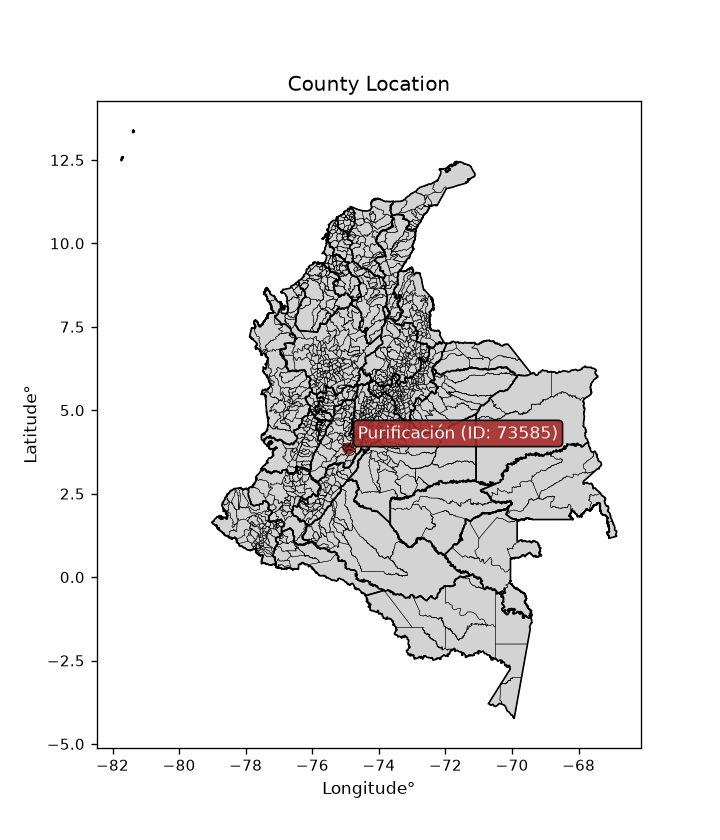
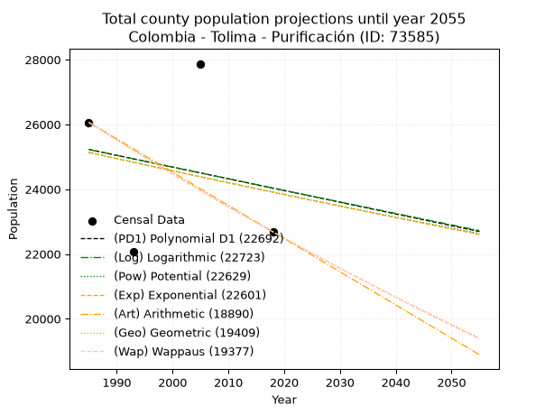
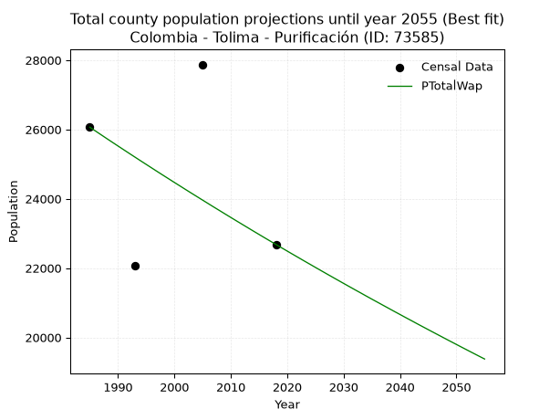
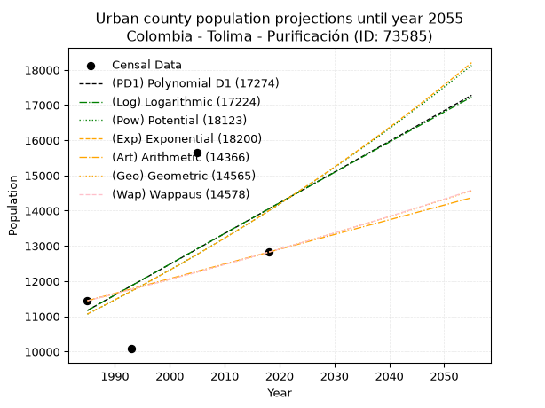
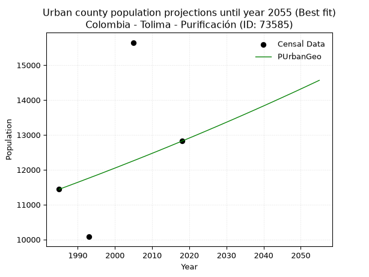
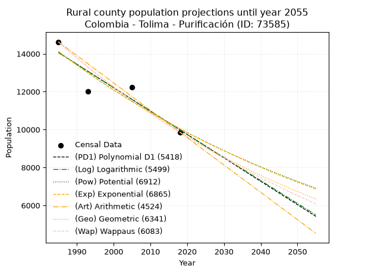
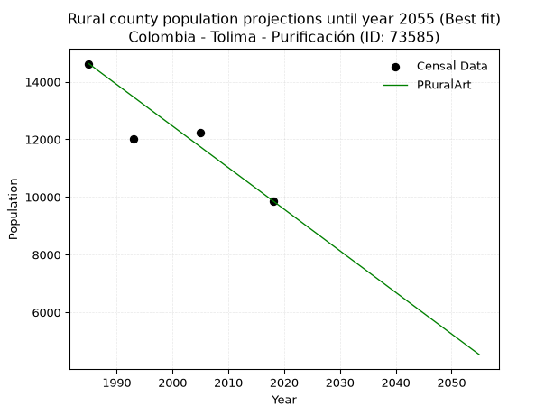

<div align="center">


</div>

# _“Population and Public Services Demand Projections (PPSD) until Year 2050 for Colombia - Tolima - Purificación (ID: 73585)”_
Keywords: `population` `public-service` `projection` `lineal` `polynomial` `logarithmic` `potential` `exponential` `arithmetic` `geometric` `wappaus` `dane` `colombia` `south-america`

PPSD are analytical estimates used by governments and planners to anticipate future changes in population size, age distribution, and the resulting community needs for utilities, healthcare, education, and infrastructure as sizing future water treatment facilities, electrical grids, and road networks based on spatial growth.

<div align="center">

</img>

</div>


> **General running parameters**: • app_version: _v20260806_. • Python version: _3.14.7_. • Pandas version: _3.0.5_. • NumPy version: _2.5.1_. • Creates, save and include plots into reports (create_plot): _False_. • Projection until year: _2050_. • Process polynomial degree 2 and up: _False_. • Process Wappaus: _True_. • Process Wappaus: _True_. • Set negative values to zero: _True_. • Set infinite values to zero: _True_. • Drop dataset notes: _True_. 
<div align="center">

Dynamic map: [:earth_americas:Google](http://maps.google.com/maps?q=3.857246286,-74.9355547) [:earth_americas:OSM](https://www.openstreetmap.org/#map=18/3.857246286/-74.9355547&layers=P) [:earth_americas:Bing](https://www.bing.com/maps?cp=3.857246286~-74.9355547&lvl=18) [:earth_americas:Apple](https://maps.apple.com/frame?center=3.857246286%2C-74.9355547&span=0.003%2C0.006)

</div>


<div align="center">

```geojson
{
  "type": "Feature",
  "geometry": {
    "type": "Point", 
    "coordinates": [-74.9355547, 3.857246286]
  }, 
  "properties": {
    "Name": "Colombia - Tolima - Purificación (ID: 73585)"
  }
}
```

</div>


## 0. Census Data (4 records)

Census data are official statistics collected by a government about the people and housing in a country. They usually include counts of total population, age, sex, race, income, education, and jobs.

📅Global census file: [Population.xlsx](../data/Population.xlsx)

| Source   |   Year |   CountryID | CountryName   |   StateID | StateName   |   CountyID | CountyName   |   PTotal |   PUrban |   PRural |
|:---------|-------:|------------:|:--------------|----------:|:------------|-----------:|:-------------|---------:|---------:|---------:|
| DANE     |   1985 |          57 | Colombia      |        73 | Tolima      |      73585 | Purificación |    26064 |    11441 |    14623 |
| DANE     |   1993 |          57 | Colombia      |        73 | Tolima      |      73585 | Purificación |    22079 |    10079 |    12000 |
| DANE     |   2005 |          57 | Colombia      |        73 | Tolima      |      73585 | Purificación |    27873 |    15648 |    12225 |
| DANE     |   2018 |          57 | Colombia      |        73 | Tolima      |      73585 | Purificación |    22682 |    12820 |     9862 |

> 🔥Some records could had specific notes about the registered values or the corresponding urban or rural distribution.

📅   [RUPS](https://www.datos.gov.co/Hacienda-y-Cr-dito-P-blico/Registro-nico-de-Prestadores-de-Servicios-P-blicos/4qkq-csdn/about_data) - Local public utility companies: [RUPS.csv](../data/RUPS.xlsx)

 | SERVICIO       | ESTADO    | NOMBRE                                                                                          | NIT         | DEPARTAMENTO_DOMICILIO   | MUNICIPIO_DOMICILIO   | DIRECCION                |   TELEFONO | EMAIL                  | TIPO_PRESTADOR                            | CLASIFICACION                  |
|:---------------|:----------|:------------------------------------------------------------------------------------------------|:------------|:-------------------------|:----------------------|:-------------------------|-----------:|:-----------------------|:------------------------------------------|:-------------------------------|
| ACUEDUCTO      | OPERATIVA | EMPRESA DE SERVICIOS PUBLICOS DE ACUEDUCTO, ALCANTARILLADO Y ASEO DE PURIFICACIÓN TOLIMA E.S.P. | 809004412-4 | TOLIMA                   | PURIFICACION          | Carrera 4 No.  8 - 15    |    2280261 | jucana1174@hotmail.com | EMPRESA INDUSTRIAL Y COMERCIAL DEL ESTADO | DESDE 2501 HASTA 5000 USUARIOS |
| ALCANTARILLADO | OPERATIVA | EMPRESA DE SERVICIOS PUBLICOS DE ACUEDUCTO, ALCANTARILLADO Y ASEO DE PURIFICACIÓN TOLIMA E.S.P. | 809004412-4 | TOLIMA                   | PURIFICACION          | Carrera 4 No.  8 - 15    |    2280261 | jucana1174@hotmail.com | EMPRESA INDUSTRIAL Y COMERCIAL DEL ESTADO | DESDE 2501 HASTA 5000 USUARIOS |
| ACUEDUCTO      | OPERATIVA | ASOCIACION DE USUARIOS DE ACUEDUCTO DE LA VEREDA CHENCHE ASOLEADOS                              | 900004918-9 | TOLIMA                   | PURIFICACION          | VEREDA CHENCHE ASOLEADOS |    9999999 | asoacuaisla@gmail.com  | ORGANIZACION AUTORIZADA                   | MENOR O IGUAL A 2500 USUARIOS  |

## 1. Total

### 1.1. Coefficients and Parameters

* (PD1) Polynomial Deg 1: -36.20473705338917, 97093.02529104167 (lineal)
* (Log) Logarithmic: -72225.57677504684, 573661.6878465796
* (Pow) Potential: -3.029166562772694, 14.389729928950574
* (Exp) Exponential: -0.0015178403511150302, 511405.69152389833
* (Art) Arithmetic: Year diff. 2018 - 1985 = 33, Population diff. 22682 - 26064 = -3382, Annual growth = -102.48484848484848
* (Geo) Geometric: Year diff. 2018 - 1985 = 33, Population diff. 22682 - 26064 = -3382, Annual growth % = -0.004202761558469881
* (Wap) Wappaus: i = -0.42048516179726947, Condition values only valid for < 200)

<sub>
Wappaus condition values: ['-0.00', '-0.42', '-0.84', '-1.26', '-1.68', '-2.10', '-2.52', '-2.94', '-3.36', '-3.78', '-4.20', '-4.63', '-5.05', '-5.47', '-5.89', '-6.31', '-6.73', '-7.15', '-7.57', '-7.99', '-8.41', '-8.83', '-9.25', '-9.67', '-10.09', '-10.51', '-10.93', '-11.35', '-11.77', '-12.19', '-12.61', '-13.04', '-13.46', '-13.88', '-14.30', '-14.72', '-15.14', '-15.56', '-15.98', '-16.40', '-16.82', '-17.24', '-17.66', '-18.08', '-18.50', '-18.92', '-19.34', '-19.76', '-20.18', '-20.60', '-21.02', '-21.44', '-21.87', '-22.29', '-22.71', '-23.13', '-23.55', '-23.97', '-24.39', '-24.81', '-25.23', '-25.65', '-26.07', '-26.49', '-26.91', '-27.33']
</sub>


### 1.2. Projected Dataset

|   Year |   CountyID |   PTotalPD1 |   PTotalLog |   PTotalPow |   PTotalExp |   PTotalArt |   PTotalGeo |   PTotalWap |
|-------:|-----------:|------------:|------------:|------------:|------------:|------------:|------------:|------------:|
|   1985 |      73585 |       25227 |       25226 |       25134 |       25135 |       26064 |       26064 |       26064 |
|   1986 |      73585 |       25190 |       25189 |       25096 |       25097 |       25962 |       25954 |       25955 |
|   1987 |      73585 |       25154 |       25153 |       25058 |       25059 |       25859 |       25845 |       25846 |
|   1988 |      73585 |       25118 |       25117 |       25019 |       25021 |       25757 |       25737 |       25737 |
|   1989 |      73585 |       25082 |       25080 |       24981 |       24983 |       25654 |       25629 |       25629 |
|   1990 |      73585 |       25046 |       25044 |       24943 |       24945 |       25552 |       25521 |       25522 |
|   1991 |      73585 |       25009 |       25008 |       24905 |       24907 |       25449 |       25414 |       25415 |
|   1992 |      73585 |       24973 |       24972 |       24868 |       24869 |       25347 |       25307 |       25308 |
|   1993 |      73585 |       24937 |       24935 |       24830 |       24831 |       25244 |       25200 |       25202 |
|   1994 |      73585 |       24901 |       24899 |       24792 |       24794 |       25142 |       25095 |       25096 |
|   1995 |      73585 |       24865 |       24863 |       24754 |       24756 |       25039 |       24989 |       24991 |
|   1996 |      73585 |       24828 |       24827 |       24717 |       24719 |       24937 |       24884 |       24886 |
|   1997 |      73585 |       24792 |       24791 |       24679 |       24681 |       24834 |       24779 |       24781 |
|   1998 |      73585 |       24756 |       24754 |       24642 |       24644 |       24732 |       24675 |       24677 |
|   1999 |      73585 |       24720 |       24718 |       24605 |       24606 |       24629 |       24572 |       24574 |
|   2000 |      73585 |       24684 |       24682 |       24567 |       24569 |       24527 |       24468 |       24470 |
|   2001 |      73585 |       24647 |       24646 |       24530 |       24532 |       24424 |       24366 |       24368 |
|   2002 |      73585 |       24611 |       24610 |       24493 |       24494 |       24322 |       24263 |       24265 |
|   2003 |      73585 |       24575 |       24574 |       24456 |       24457 |       24219 |       24161 |       24163 |
|   2004 |      73585 |       24539 |       24538 |       24419 |       24420 |       24117 |       24060 |       24062 |
|   2005 |      73585 |       24503 |       24502 |       24382 |       24383 |       24014 |       23958 |       23961 |
|   2006 |      73585 |       24466 |       24466 |       24346 |       24346 |       23912 |       23858 |       23860 |
|   2007 |      73585 |       24430 |       24430 |       24309 |       24309 |       23809 |       23758 |       23759 |
|   2008 |      73585 |       24394 |       24394 |       24272 |       24272 |       23707 |       23658 |       23660 |
|   2009 |      73585 |       24358 |       24358 |       24236 |       24236 |       23604 |       23558 |       23560 |
|   2010 |      73585 |       24322 |       24322 |       24199 |       24199 |       23502 |       23459 |       23461 |
|   2011 |      73585 |       24285 |       24286 |       24163 |       24162 |       23399 |       23361 |       23362 |
|   2012 |      73585 |       24249 |       24250 |       24126 |       24125 |       23297 |       23262 |       23264 |
|   2013 |      73585 |       24213 |       24214 |       24090 |       24089 |       23194 |       23165 |       23166 |
|   2014 |      73585 |       24177 |       24178 |       24054 |       24052 |       23092 |       23067 |       23068 |
|   2015 |      73585 |       24140 |       24142 |       24018 |       24016 |       22989 |       22970 |       22971 |
|   2016 |      73585 |       24104 |       24107 |       23982 |       23979 |       22887 |       22874 |       22874 |
|   2017 |      73585 |       24068 |       24071 |       23946 |       23943 |       22784 |       22778 |       22778 |
|   2018 |      73585 |       24032 |       24035 |       23910 |       23907 |       22682 |       22682 |       22682 |
|   2019 |      73585 |       23996 |       23999 |       23874 |       23871 |       22580 |       22587 |       22586 |
|   2020 |      73585 |       23959 |       23963 |       23838 |       23834 |       22477 |       22492 |       22491 |
|   2021 |      73585 |       23923 |       23928 |       23802 |       23798 |       22375 |       22397 |       22396 |
|   2022 |      73585 |       23887 |       23892 |       23767 |       23762 |       22272 |       22303 |       22302 |
|   2023 |      73585 |       23851 |       23856 |       23731 |       23726 |       22170 |       22209 |       22207 |
|   2024 |      73585 |       23815 |       23821 |       23696 |       23690 |       22067 |       22116 |       22114 |
|   2025 |      73585 |       23778 |       23785 |       23660 |       23654 |       21965 |       22023 |       22020 |
|   2026 |      73585 |       23742 |       23749 |       23625 |       23618 |       21862 |       21931 |       21927 |
|   2027 |      73585 |       23706 |       23714 |       23590 |       23582 |       21760 |       21838 |       21834 |
|   2028 |      73585 |       23670 |       23678 |       23554 |       23547 |       21657 |       21747 |       21742 |
|   2029 |      73585 |       23634 |       23642 |       23519 |       23511 |       21555 |       21655 |       21650 |
|   2030 |      73585 |       23597 |       23607 |       23484 |       23475 |       21452 |       21564 |       21558 |
|   2031 |      73585 |       23561 |       23571 |       23449 |       23440 |       21350 |       21474 |       21467 |
|   2032 |      73585 |       23525 |       23536 |       23414 |       23404 |       21247 |       21383 |       21376 |
|   2033 |      73585 |       23489 |       23500 |       23379 |       23369 |       21145 |       21293 |       21286 |
|   2034 |      73585 |       23453 |       23465 |       23344 |       23333 |       21042 |       21204 |       21195 |
|   2035 |      73585 |       23416 |       23429 |       23310 |       23298 |       20940 |       21115 |       21105 |
|   2036 |      73585 |       23380 |       23394 |       23275 |       23262 |       20837 |       21026 |       21016 |
|   2037 |      73585 |       23344 |       23358 |       23240 |       23227 |       20735 |       20938 |       20927 |
|   2038 |      73585 |       23308 |       23323 |       23206 |       23192 |       20632 |       20850 |       20838 |
|   2039 |      73585 |       23272 |       23287 |       23171 |       23157 |       20530 |       20762 |       20749 |
|   2040 |      73585 |       23235 |       23252 |       23137 |       23122 |       20427 |       20675 |       20661 |
|   2041 |      73585 |       23199 |       23216 |       23103 |       23087 |       20325 |       20588 |       20573 |
|   2042 |      73585 |       23163 |       23181 |       23069 |       23052 |       20222 |       20501 |       20486 |
|   2043 |      73585 |       23127 |       23146 |       23034 |       23017 |       20120 |       20415 |       20398 |
|   2044 |      73585 |       23091 |       23110 |       23000 |       22982 |       20017 |       20329 |       20311 |
|   2045 |      73585 |       23054 |       23075 |       22966 |       22947 |       19915 |       20244 |       20225 |
|   2046 |      73585 |       23018 |       23040 |       22932 |       22912 |       19812 |       20159 |       20139 |
|   2047 |      73585 |       22982 |       23004 |       22898 |       22877 |       19710 |       20074 |       20053 |
|   2048 |      73585 |       22946 |       22969 |       22864 |       22843 |       19607 |       19990 |       19967 |
|   2049 |      73585 |       22910 |       22934 |       22831 |       22808 |       19505 |       19906 |       19882 |
|   2050 |      73585 |       22873 |       22899 |       22797 |       22773 |       19402 |       19822 |       19797 |
<div align="center">

</img>

</div>


### 1.3. Best fit with absolute and relative error (%)

Relative error puts that difference into context by dividing the absolute error by the true value, creating a unitless ratio or percentage that shows the scale of the mistake.

Absolute and relative error

|   Year | Source   |   CountryID | CountryName   |   StateID | StateName   |   CountyID_x | CountyName   |   PTotal |   PUrban |   PRural |   CountyID_y |   PTotalPD1 |   PTotalLog |   PTotalPow |   PTotalExp |   PTotalArt |   PTotalGeo |   PTotalWap |   PTotalPD1AbsError |   PTotalLogAbsError |   PTotalPowAbsError |   PTotalExpAbsError |   PTotalArtAbsError |   PTotalGeoAbsError |   PTotalWapAbsError |   PTotalPD1RelError |   PTotalLogRelError |   PTotalPowRelError |   PTotalExpRelError |   PTotalArtRelError |   PTotalGeoRelError |   PTotalWapRelError |
|-------:|:---------|------------:|:--------------|----------:|:------------|-------------:|:-------------|---------:|---------:|---------:|-------------:|------------:|------------:|------------:|------------:|------------:|------------:|------------:|--------------------:|--------------------:|--------------------:|--------------------:|--------------------:|--------------------:|--------------------:|--------------------:|--------------------:|--------------------:|--------------------:|--------------------:|--------------------:|--------------------:|
|   1985 | DANE     |          57 | Colombia      |        73 | Tolima      |        73585 | Purificación |    26064 |    11441 |    14623 |        73585 |       25227 |       25226 |       25134 |       25135 |       26064 |       26064 |       26064 |                 837 |                 838 |                 930 |                 929 |                   0 |                   0 |                   0 |             3.21133 |             3.21516 |             3.56814 |             3.5643  |              0      |              0      |              0      |
|   1993 | DANE     |          57 | Colombia      |        73 | Tolima      |        73585 | Purificación |    22079 |    10079 |    12000 |        73585 |       24937 |       24935 |       24830 |       24831 |       25244 |       25200 |       25202 |                2858 |                2856 |                2751 |                2752 |                3165 |                3121 |                3123 |            12.9444  |            12.9354  |            12.4598  |            12.4643  |             14.3349 |             14.1356 |             14.1447 |
|   2005 | DANE     |          57 | Colombia      |        73 | Tolima      |        73585 | Purificación |    27873 |    15648 |    12225 |        73585 |       24503 |       24502 |       24382 |       24383 |       24014 |       23958 |       23961 |                3370 |                3371 |                3491 |                3490 |                3859 |                3915 |                3912 |            12.0906  |            12.0941  |            12.5247  |            12.5211  |             13.8449 |             14.0459 |             14.0351 |
|   2018 | DANE     |          57 | Colombia      |        73 | Tolima      |        73585 | Purificación |    22682 |    12820 |     9862 |        73585 |       24032 |       24035 |       23910 |       23907 |       22682 |       22682 |       22682 |                1350 |                1353 |                1228 |                1225 |                   0 |                   0 |                   0 |             5.95186 |             5.96508 |             5.41398 |             5.40076 |              0      |              0      |              0      |

Relative error mean

| Method    |   RelError | Best   |
|:----------|-----------:|:-------|
| PTotalPD1 |    8.54954 |        |
| PTotalLog |    8.55244 |        |
| PTotalPow |    8.49165 |        |
| PTotalExp |    8.48762 |        |
| PTotalArt |    7.04496 |        |
| PTotalGeo |    7.04536 |        |
| PTotalWap |    7.04494 | True   |

💙Best method: _**PTotalWap**_
<div align="center">

</img>

</div>


### 1.4. Fresh water supply demand in liters per capita per day (lpcd)

The fresh water supply demand typically ranges from 100 to 300 liters per capita per day (lpcd) for standard domestic and municipal planning, though absolute survival minimums set by the World Health Organization are as low as 7.5 to 20 liters per day, and total consumption in high-income nations can exceed 400 liters.

> `CZ`: Level in meters above the sea level (masl)<br> `WS`: Fresh water supply demand in liters per capita per day (lpcd or l/h/d)<br> `WSAll`: Zonal fresh water supply demand in liters per second (l/s)<br> `A`: Zonal area in square meters<br> `DP`: Population density (people/hectare or p/ha)

Reference values (RAS Colombia)

|    CZ |   WS |
|------:|-----:|
|  1000 |  120 |
|  2000 |  130 |
| 99999 |  140 |

County shapefile geometry properties and water supply values

|   CountyID |      ATotal |   CZTotal |   WSTotal |
|-----------:|------------:|----------:|----------:|
|      73585 | 4.01977e+08 |   462.739 |       120 |

Projected values for best method: PTotalWap

|   CountyID |   Year |   PTotalWap |   DPTotal |   WSTotal |   WSTotalAll |
|-----------:|-------:|------------:|----------:|----------:|-------------:|
|      73585 |   1985 |       26064 |      0.65 |       120 |      36.2    |
|      73585 |   1986 |       25955 |      0.65 |       120 |      36.0486 |
|      73585 |   1987 |       25846 |      0.64 |       120 |      35.8972 |
|      73585 |   1988 |       25737 |      0.64 |       120 |      35.7458 |
|      73585 |   1989 |       25629 |      0.64 |       120 |      35.5958 |
|      73585 |   1990 |       25522 |      0.63 |       120 |      35.4472 |
|      73585 |   1991 |       25415 |      0.63 |       120 |      35.2986 |
|      73585 |   1992 |       25308 |      0.63 |       120 |      35.15   |
|      73585 |   1993 |       25202 |      0.63 |       120 |      35.0028 |
|      73585 |   1994 |       25096 |      0.62 |       120 |      34.8556 |
|      73585 |   1995 |       24991 |      0.62 |       120 |      34.7097 |
|      73585 |   1996 |       24886 |      0.62 |       120 |      34.5639 |
|      73585 |   1997 |       24781 |      0.62 |       120 |      34.4181 |
|      73585 |   1998 |       24677 |      0.61 |       120 |      34.2736 |
|      73585 |   1999 |       24574 |      0.61 |       120 |      34.1306 |
|      73585 |   2000 |       24470 |      0.61 |       120 |      33.9861 |
|      73585 |   2001 |       24368 |      0.61 |       120 |      33.8444 |
|      73585 |   2002 |       24265 |      0.6  |       120 |      33.7014 |
|      73585 |   2003 |       24163 |      0.6  |       120 |      33.5597 |
|      73585 |   2004 |       24062 |      0.6  |       120 |      33.4194 |
|      73585 |   2005 |       23961 |      0.6  |       120 |      33.2792 |
|      73585 |   2006 |       23860 |      0.59 |       120 |      33.1389 |
|      73585 |   2007 |       23759 |      0.59 |       120 |      32.9986 |
|      73585 |   2008 |       23660 |      0.59 |       120 |      32.8611 |
|      73585 |   2009 |       23560 |      0.59 |       120 |      32.7222 |
|      73585 |   2010 |       23461 |      0.58 |       120 |      32.5847 |
|      73585 |   2011 |       23362 |      0.58 |       120 |      32.4472 |
|      73585 |   2012 |       23264 |      0.58 |       120 |      32.3111 |
|      73585 |   2013 |       23166 |      0.58 |       120 |      32.175  |
|      73585 |   2014 |       23068 |      0.57 |       120 |      32.0389 |
|      73585 |   2015 |       22971 |      0.57 |       120 |      31.9042 |
|      73585 |   2016 |       22874 |      0.57 |       120 |      31.7694 |
|      73585 |   2017 |       22778 |      0.57 |       120 |      31.6361 |
|      73585 |   2018 |       22682 |      0.56 |       120 |      31.5028 |
|      73585 |   2019 |       22586 |      0.56 |       120 |      31.3694 |
|      73585 |   2020 |       22491 |      0.56 |       120 |      31.2375 |
|      73585 |   2021 |       22396 |      0.56 |       120 |      31.1056 |
|      73585 |   2022 |       22302 |      0.55 |       120 |      30.975  |
|      73585 |   2023 |       22207 |      0.55 |       120 |      30.8431 |
|      73585 |   2024 |       22114 |      0.55 |       120 |      30.7139 |
|      73585 |   2025 |       22020 |      0.55 |       120 |      30.5833 |
|      73585 |   2026 |       21927 |      0.55 |       120 |      30.4542 |
|      73585 |   2027 |       21834 |      0.54 |       120 |      30.325  |
|      73585 |   2028 |       21742 |      0.54 |       120 |      30.1972 |
|      73585 |   2029 |       21650 |      0.54 |       120 |      30.0694 |
|      73585 |   2030 |       21558 |      0.54 |       120 |      29.9417 |
|      73585 |   2031 |       21467 |      0.53 |       120 |      29.8153 |
|      73585 |   2032 |       21376 |      0.53 |       120 |      29.6889 |
|      73585 |   2033 |       21286 |      0.53 |       120 |      29.5639 |
|      73585 |   2034 |       21195 |      0.53 |       120 |      29.4375 |
|      73585 |   2035 |       21105 |      0.53 |       120 |      29.3125 |
|      73585 |   2036 |       21016 |      0.52 |       120 |      29.1889 |
|      73585 |   2037 |       20927 |      0.52 |       120 |      29.0653 |
|      73585 |   2038 |       20838 |      0.52 |       120 |      28.9417 |
|      73585 |   2039 |       20749 |      0.52 |       120 |      28.8181 |
|      73585 |   2040 |       20661 |      0.51 |       120 |      28.6958 |
|      73585 |   2041 |       20573 |      0.51 |       120 |      28.5736 |
|      73585 |   2042 |       20486 |      0.51 |       120 |      28.4528 |
|      73585 |   2043 |       20398 |      0.51 |       120 |      28.3306 |
|      73585 |   2044 |       20311 |      0.51 |       120 |      28.2097 |
|      73585 |   2045 |       20225 |      0.5  |       120 |      28.0903 |
|      73585 |   2046 |       20139 |      0.5  |       120 |      27.9708 |
|      73585 |   2047 |       20053 |      0.5  |       120 |      27.8514 |
|      73585 |   2048 |       19967 |      0.5  |       120 |      27.7319 |
|      73585 |   2049 |       19882 |      0.49 |       120 |      27.6139 |
|      73585 |   2050 |       19797 |      0.49 |       120 |      27.4958 |

## 2. Urban

### 2.1. Coefficients and Parameters

* (PD1) Polynomial Deg 1: 87.25010036130202, -162025.01324769438 (lineal)
* (Log) Logarithmic: 174924.74052012316, -1317107.3544523534
* (Pow) Potential: 14.245427447085312, -42.934179262291025
* (Exp) Exponential: 0.007107748952577113, 0.008252263020864547
* (Art) Arithmetic: Year diff. 2018 - 1985 = 33, Population diff. 12820 - 11441 = 1379, Annual growth = 41.78787878787879
* (Geo) Geometric: Year diff. 2018 - 1985 = 33, Population diff. 12820 - 11441 = 1379, Annual growth % = 0.0034545306626747596
* (Wap) Wappaus: i = 0.34448603757370916, Condition values only valid for < 200)

<sub>
Wappaus condition values: ['0.00', '0.34', '0.69', '1.03', '1.38', '1.72', '2.07', '2.41', '2.76', '3.10', '3.44', '3.79', '4.13', '4.48', '4.82', '5.17', '5.51', '5.86', '6.20', '6.55', '6.89', '7.23', '7.58', '7.92', '8.27', '8.61', '8.96', '9.30', '9.65', '9.99', '10.33', '10.68', '11.02', '11.37', '11.71', '12.06', '12.40', '12.75', '13.09', '13.43', '13.78', '14.12', '14.47', '14.81', '15.16', '15.50', '15.85', '16.19', '16.54', '16.88', '17.22', '17.57', '17.91', '18.26', '18.60', '18.95', '19.29', '19.64', '19.98', '20.32', '20.67', '21.01', '21.36', '21.70', '22.05', '22.39']
</sub>


### 2.2. Projected Dataset

|   Year |   CountyID |   PUrbanPD1 |   PUrbanLog |   PUrbanPow |   PUrbanExp |   PUrbanArt |   PUrbanGeo |   PUrbanWap |
|-------:|-----------:|------------:|------------:|------------:|------------:|------------:|------------:|------------:|
|   1985 |      73585 |       11166 |       11162 |       11062 |       11066 |       11441 |       11441 |       11441 |
|   1986 |      73585 |       11254 |       11250 |       11142 |       11145 |       11483 |       11481 |       11480 |
|   1987 |      73585 |       11341 |       11338 |       11222 |       11224 |       11525 |       11520 |       11520 |
|   1988 |      73585 |       11428 |       11426 |       11302 |       11304 |       11566 |       11560 |       11560 |
|   1989 |      73585 |       11515 |       11514 |       11384 |       11385 |       11608 |       11600 |       11600 |
|   1990 |      73585 |       11603 |       11602 |       11465 |       11466 |       11650 |       11640 |       11640 |
|   1991 |      73585 |       11690 |       11690 |       11548 |       11548 |       11692 |       11680 |       11680 |
|   1992 |      73585 |       11777 |       11777 |       11631 |       11630 |       11734 |       11721 |       11720 |
|   1993 |      73585 |       11864 |       11865 |       11714 |       11713 |       11775 |       11761 |       11761 |
|   1994 |      73585 |       11952 |       11953 |       11798 |       11797 |       11817 |       11802 |       11801 |
|   1995 |      73585 |       12039 |       12041 |       11883 |       11881 |       11859 |       11842 |       11842 |
|   1996 |      73585 |       12126 |       12128 |       11968 |       11966 |       11901 |       11883 |       11883 |
|   1997 |      73585 |       12213 |       12216 |       12054 |       12051 |       11942 |       11924 |       11924 |
|   1998 |      73585 |       12301 |       12304 |       12140 |       12137 |       11984 |       11966 |       11965 |
|   1999 |      73585 |       12388 |       12391 |       12227 |       12224 |       12026 |       12007 |       12006 |
|   2000 |      73585 |       12475 |       12479 |       12314 |       12311 |       12068 |       12048 |       12048 |
|   2001 |      73585 |       12562 |       12566 |       12402 |       12399 |       12110 |       12090 |       12089 |
|   2002 |      73585 |       12650 |       12653 |       12491 |       12487 |       12151 |       12132 |       12131 |
|   2003 |      73585 |       12737 |       12741 |       12580 |       12576 |       12193 |       12174 |       12173 |
|   2004 |      73585 |       12824 |       12828 |       12670 |       12666 |       12235 |       12216 |       12215 |
|   2005 |      73585 |       12911 |       12915 |       12760 |       12756 |       12277 |       12258 |       12257 |
|   2006 |      73585 |       12999 |       13003 |       12851 |       12847 |       12319 |       12300 |       12300 |
|   2007 |      73585 |       13086 |       13090 |       12943 |       12939 |       12360 |       12343 |       12342 |
|   2008 |      73585 |       13173 |       13177 |       13035 |       13031 |       12402 |       12385 |       12385 |
|   2009 |      73585 |       13260 |       13264 |       13127 |       13124 |       12444 |       12428 |       12428 |
|   2010 |      73585 |       13348 |       13351 |       13221 |       13218 |       12486 |       12471 |       12471 |
|   2011 |      73585 |       13435 |       13438 |       13315 |       13312 |       12527 |       12514 |       12514 |
|   2012 |      73585 |       13522 |       13525 |       13410 |       13407 |       12569 |       12557 |       12557 |
|   2013 |      73585 |       13609 |       13612 |       13505 |       13503 |       12611 |       12601 |       12600 |
|   2014 |      73585 |       13697 |       13699 |       13601 |       13599 |       12653 |       12644 |       12644 |
|   2015 |      73585 |       13784 |       13786 |       13697 |       13696 |       12695 |       12688 |       12688 |
|   2016 |      73585 |       13871 |       13872 |       13794 |       13794 |       12736 |       12732 |       12732 |
|   2017 |      73585 |       13958 |       13959 |       13892 |       13892 |       12778 |       12776 |       12776 |
|   2018 |      73585 |       14046 |       14046 |       13991 |       13991 |       12820 |       12820 |       12820 |
|   2019 |      73585 |       14133 |       14132 |       14090 |       14091 |       12862 |       12864 |       12864 |
|   2020 |      73585 |       14220 |       14219 |       14189 |       14191 |       12904 |       12909 |       12909 |
|   2021 |      73585 |       14307 |       14306 |       14290 |       14293 |       12945 |       12953 |       12954 |
|   2022 |      73585 |       14395 |       14392 |       14391 |       14394 |       12987 |       12998 |       12999 |
|   2023 |      73585 |       14482 |       14479 |       14493 |       14497 |       13029 |       13043 |       13044 |
|   2024 |      73585 |       14569 |       14565 |       14595 |       14601 |       13071 |       13088 |       13089 |
|   2025 |      73585 |       14656 |       14652 |       14698 |       14705 |       13113 |       13133 |       13134 |
|   2026 |      73585 |       14744 |       14738 |       14802 |       14810 |       13154 |       13179 |       13180 |
|   2027 |      73585 |       14831 |       14824 |       14906 |       14915 |       13196 |       13224 |       13225 |
|   2028 |      73585 |       14918 |       14910 |       15011 |       15022 |       13238 |       13270 |       13271 |
|   2029 |      73585 |       15005 |       14997 |       15117 |       15129 |       13280 |       13316 |       13317 |
|   2030 |      73585 |       15093 |       15083 |       15224 |       15237 |       13321 |       13362 |       13364 |
|   2031 |      73585 |       15180 |       15169 |       15331 |       15345 |       13363 |       13408 |       13410 |
|   2032 |      73585 |       15267 |       15255 |       15439 |       15455 |       13405 |       13454 |       13457 |
|   2033 |      73585 |       15354 |       15341 |       15547 |       15565 |       13447 |       13501 |       13503 |
|   2034 |      73585 |       15442 |       15427 |       15656 |       15676 |       13489 |       13547 |       13550 |
|   2035 |      73585 |       15529 |       15513 |       15766 |       15788 |       13530 |       13594 |       13597 |
|   2036 |      73585 |       15616 |       15599 |       15877 |       15901 |       13572 |       13641 |       13645 |
|   2037 |      73585 |       15703 |       15685 |       15989 |       16014 |       13614 |       13688 |       13692 |
|   2038 |      73585 |       15791 |       15771 |       16101 |       16128 |       13656 |       13735 |       13740 |
|   2039 |      73585 |       15878 |       15857 |       16214 |       16243 |       13698 |       13783 |       13788 |
|   2040 |      73585 |       15965 |       15943 |       16327 |       16359 |       13739 |       13830 |       13836 |
|   2041 |      73585 |       16052 |       16028 |       16442 |       16476 |       13781 |       13878 |       13884 |
|   2042 |      73585 |       16140 |       16114 |       16557 |       16593 |       13823 |       13926 |       13932 |
|   2043 |      73585 |       16227 |       16200 |       16673 |       16712 |       13865 |       13974 |       13981 |
|   2044 |      73585 |       16314 |       16285 |       16789 |       16831 |       13906 |       14023 |       14029 |
|   2045 |      73585 |       16401 |       16371 |       16907 |       16951 |       13948 |       14071 |       14078 |
|   2046 |      73585 |       16489 |       16456 |       17025 |       17072 |       13990 |       14120 |       14127 |
|   2047 |      73585 |       16576 |       16542 |       17144 |       17194 |       14032 |       14168 |       14177 |
|   2048 |      73585 |       16663 |       16627 |       17264 |       17316 |       14074 |       14217 |       14226 |
|   2049 |      73585 |       16750 |       16713 |       17384 |       17440 |       14115 |       14266 |       14276 |
|   2050 |      73585 |       16838 |       16798 |       17505 |       17564 |       14157 |       14316 |       14326 |
<div align="center">

</img>

</div>


### 2.3. Best fit with absolute and relative error (%)

Relative error puts that difference into context by dividing the absolute error by the true value, creating a unitless ratio or percentage that shows the scale of the mistake.

Absolute and relative error

|   Year | Source   |   CountryID | CountryName   |   StateID | StateName   |   CountyID_x | CountyName   |   PTotal |   PUrban |   PRural |   CountyID_y |   PUrbanPD1 |   PUrbanLog |   PUrbanPow |   PUrbanExp |   PUrbanArt |   PUrbanGeo |   PUrbanWap |   PUrbanPD1AbsError |   PUrbanLogAbsError |   PUrbanPowAbsError |   PUrbanExpAbsError |   PUrbanArtAbsError |   PUrbanGeoAbsError |   PUrbanWapAbsError |   PUrbanPD1RelError |   PUrbanLogRelError |   PUrbanPowRelError |   PUrbanExpRelError |   PUrbanArtRelError |   PUrbanGeoRelError |   PUrbanWapRelError |
|-------:|:---------|------------:|:--------------|----------:|:------------|-------------:|:-------------|---------:|---------:|---------:|-------------:|------------:|------------:|------------:|------------:|------------:|------------:|------------:|--------------------:|--------------------:|--------------------:|--------------------:|--------------------:|--------------------:|--------------------:|--------------------:|--------------------:|--------------------:|--------------------:|--------------------:|--------------------:|--------------------:|
|   1985 | DANE     |          57 | Colombia      |        73 | Tolima      |        73585 | Purificación |    26064 |    11441 |    14623 |        73585 |       11166 |       11162 |       11062 |       11066 |       11441 |       11441 |       11441 |                 275 |                 279 |                 379 |                 375 |                   0 |                   0 |                   0 |             2.40364 |             2.4386  |             3.31265 |             3.27769 |              0      |              0      |              0      |
|   1993 | DANE     |          57 | Colombia      |        73 | Tolima      |        73585 | Purificación |    22079 |    10079 |    12000 |        73585 |       11864 |       11865 |       11714 |       11713 |       11775 |       11761 |       11761 |                1785 |                1786 |                1635 |                1634 |                1696 |                1682 |                1682 |            17.7101  |            17.72    |            16.2218  |            16.2119  |             16.8271 |             16.6882 |             16.6882 |
|   2005 | DANE     |          57 | Colombia      |        73 | Tolima      |        73585 | Purificación |    27873 |    15648 |    12225 |        73585 |       12911 |       12915 |       12760 |       12756 |       12277 |       12258 |       12257 |                2737 |                2733 |                2888 |                2892 |                3371 |                3390 |                3391 |            17.4911  |            17.4655  |            18.456   |            18.4816  |             21.5427 |             21.6641 |             21.6705 |
|   2018 | DANE     |          57 | Colombia      |        73 | Tolima      |        73585 | Purificación |    22682 |    12820 |     9862 |        73585 |       14046 |       14046 |       13991 |       13991 |       12820 |       12820 |       12820 |                1226 |                1226 |                1171 |                1171 |                   0 |                   0 |                   0 |             9.56318 |             9.56318 |             9.13417 |             9.13417 |              0      |              0      |              0      |

Relative error mean

| Method    |   RelError | Best   |
|:----------|-----------:|:-------|
| PUrbanPD1 |   11.792   |        |
| PUrbanLog |   11.7968  |        |
| PUrbanPow |   11.7812  |        |
| PUrbanExp |   11.7763  |        |
| PUrbanArt |    9.59244 |        |
| PUrbanGeo |    9.58807 | True   |
| PUrbanWap |    9.58967 |        |

💙Best method: _**PUrbanGeo**_
<div align="center">

</img>

</div>


### 2.4. Fresh water supply demand in liters per capita per day (lpcd)

The fresh water supply demand typically ranges from 100 to 300 liters per capita per day (lpcd) for standard domestic and municipal planning, though absolute survival minimums set by the World Health Organization are as low as 7.5 to 20 liters per day, and total consumption in high-income nations can exceed 400 liters.

> `CZ`: Level in meters above the sea level (masl)<br> `WS`: Fresh water supply demand in liters per capita per day (lpcd or l/h/d)<br> `WSAll`: Zonal fresh water supply demand in liters per second (l/s)<br> `A`: Zonal area in square meters<br> `DP`: Population density (people/hectare or p/ha)

Reference values (RAS Colombia)

|    CZ |   WS |
|------:|-----:|
|  1000 |  120 |
|  2000 |  130 |
| 99999 |  140 |

County shapefile geometry properties and water supply values

|   CountyID |      AUrban |   CZUrban |   WSUrban |
|-----------:|------------:|----------:|----------:|
|      73585 | 4.18016e+06 |   303.265 |       120 |

Projected values for best method: PUrbanGeo

|   CountyID |   Year |   PUrbanGeo |   DPUrban |   WSUrban |   WSUrbanAll |
|-----------:|-------:|------------:|----------:|----------:|-------------:|
|      73585 |   1985 |       11441 |     27.37 |       120 |      15.8903 |
|      73585 |   1986 |       11481 |     27.47 |       120 |      15.9458 |
|      73585 |   1987 |       11520 |     27.56 |       120 |      16      |
|      73585 |   1988 |       11560 |     27.65 |       120 |      16.0556 |
|      73585 |   1989 |       11600 |     27.75 |       120 |      16.1111 |
|      73585 |   1990 |       11640 |     27.85 |       120 |      16.1667 |
|      73585 |   1991 |       11680 |     27.94 |       120 |      16.2222 |
|      73585 |   1992 |       11721 |     28.04 |       120 |      16.2792 |
|      73585 |   1993 |       11761 |     28.14 |       120 |      16.3347 |
|      73585 |   1994 |       11802 |     28.23 |       120 |      16.3917 |
|      73585 |   1995 |       11842 |     28.33 |       120 |      16.4472 |
|      73585 |   1996 |       11883 |     28.43 |       120 |      16.5042 |
|      73585 |   1997 |       11924 |     28.53 |       120 |      16.5611 |
|      73585 |   1998 |       11966 |     28.63 |       120 |      16.6194 |
|      73585 |   1999 |       12007 |     28.72 |       120 |      16.6764 |
|      73585 |   2000 |       12048 |     28.82 |       120 |      16.7333 |
|      73585 |   2001 |       12090 |     28.92 |       120 |      16.7917 |
|      73585 |   2002 |       12132 |     29.02 |       120 |      16.85   |
|      73585 |   2003 |       12174 |     29.12 |       120 |      16.9083 |
|      73585 |   2004 |       12216 |     29.22 |       120 |      16.9667 |
|      73585 |   2005 |       12258 |     29.32 |       120 |      17.025  |
|      73585 |   2006 |       12300 |     29.42 |       120 |      17.0833 |
|      73585 |   2007 |       12343 |     29.53 |       120 |      17.1431 |
|      73585 |   2008 |       12385 |     29.63 |       120 |      17.2014 |
|      73585 |   2009 |       12428 |     29.73 |       120 |      17.2611 |
|      73585 |   2010 |       12471 |     29.83 |       120 |      17.3208 |
|      73585 |   2011 |       12514 |     29.94 |       120 |      17.3806 |
|      73585 |   2012 |       12557 |     30.04 |       120 |      17.4403 |
|      73585 |   2013 |       12601 |     30.14 |       120 |      17.5014 |
|      73585 |   2014 |       12644 |     30.25 |       120 |      17.5611 |
|      73585 |   2015 |       12688 |     30.35 |       120 |      17.6222 |
|      73585 |   2016 |       12732 |     30.46 |       120 |      17.6833 |
|      73585 |   2017 |       12776 |     30.56 |       120 |      17.7444 |
|      73585 |   2018 |       12820 |     30.67 |       120 |      17.8056 |
|      73585 |   2019 |       12864 |     30.77 |       120 |      17.8667 |
|      73585 |   2020 |       12909 |     30.88 |       120 |      17.9292 |
|      73585 |   2021 |       12953 |     30.99 |       120 |      17.9903 |
|      73585 |   2022 |       12998 |     31.09 |       120 |      18.0528 |
|      73585 |   2023 |       13043 |     31.2  |       120 |      18.1153 |
|      73585 |   2024 |       13088 |     31.31 |       120 |      18.1778 |
|      73585 |   2025 |       13133 |     31.42 |       120 |      18.2403 |
|      73585 |   2026 |       13179 |     31.53 |       120 |      18.3042 |
|      73585 |   2027 |       13224 |     31.64 |       120 |      18.3667 |
|      73585 |   2028 |       13270 |     31.75 |       120 |      18.4306 |
|      73585 |   2029 |       13316 |     31.86 |       120 |      18.4944 |
|      73585 |   2030 |       13362 |     31.97 |       120 |      18.5583 |
|      73585 |   2031 |       13408 |     32.08 |       120 |      18.6222 |
|      73585 |   2032 |       13454 |     32.19 |       120 |      18.6861 |
|      73585 |   2033 |       13501 |     32.3  |       120 |      18.7514 |
|      73585 |   2034 |       13547 |     32.41 |       120 |      18.8153 |
|      73585 |   2035 |       13594 |     32.52 |       120 |      18.8806 |
|      73585 |   2036 |       13641 |     32.63 |       120 |      18.9458 |
|      73585 |   2037 |       13688 |     32.75 |       120 |      19.0111 |
|      73585 |   2038 |       13735 |     32.86 |       120 |      19.0764 |
|      73585 |   2039 |       13783 |     32.97 |       120 |      19.1431 |
|      73585 |   2040 |       13830 |     33.08 |       120 |      19.2083 |
|      73585 |   2041 |       13878 |     33.2  |       120 |      19.275  |
|      73585 |   2042 |       13926 |     33.31 |       120 |      19.3417 |
|      73585 |   2043 |       13974 |     33.43 |       120 |      19.4083 |
|      73585 |   2044 |       14023 |     33.55 |       120 |      19.4764 |
|      73585 |   2045 |       14071 |     33.66 |       120 |      19.5431 |
|      73585 |   2046 |       14120 |     33.78 |       120 |      19.6111 |
|      73585 |   2047 |       14168 |     33.89 |       120 |      19.6778 |
|      73585 |   2048 |       14217 |     34.01 |       120 |      19.7458 |
|      73585 |   2049 |       14266 |     34.13 |       120 |      19.8139 |
|      73585 |   2050 |       14316 |     34.25 |       120 |      19.8833 |

## 3. Rural

### 3.1. Coefficients and Parameters

* (PD1) Polynomial Deg 1: -123.4548374146914, 259118.0385387365 (lineal)
* (Log) Logarithmic: -247150.31729517013, 1890769.0422989344
* (Pow) Potential: -20.60060992744005, 72.0855335603251
* (Exp) Exponential: -0.010292063656150506, 10520787557774.434
* (Art) Arithmetic: Year diff. 2018 - 1985 = 33, Population diff. 9862 - 14623 = -4761, Annual growth = -144.27272727272728
* (Geo) Geometric: Year diff. 2018 - 1985 = 33, Population diff. 9862 - 14623 = -4761, Annual growth % = -0.011865606785822602
* (Wap) Wappaus: i = -1.1784580540962, Condition values only valid for < 200)

<sub>
Wappaus condition values: ['-0.00', '-1.18', '-2.36', '-3.54', '-4.71', '-5.89', '-7.07', '-8.25', '-9.43', '-10.61', '-11.78', '-12.96', '-14.14', '-15.32', '-16.50', '-17.68', '-18.86', '-20.03', '-21.21', '-22.39', '-23.57', '-24.75', '-25.93', '-27.10', '-28.28', '-29.46', '-30.64', '-31.82', '-33.00', '-34.18', '-35.35', '-36.53', '-37.71', '-38.89', '-40.07', '-41.25', '-42.42', '-43.60', '-44.78', '-45.96', '-47.14', '-48.32', '-49.50', '-50.67', '-51.85', '-53.03', '-54.21', '-55.39', '-56.57', '-57.74', '-58.92', '-60.10', '-61.28', '-62.46', '-63.64', '-64.82', '-65.99', '-67.17', '-68.35', '-69.53', '-70.71', '-71.89', '-73.06', '-74.24', '-75.42', '-76.60']
</sub>


### 3.2. Projected Dataset

|   Year |   CountyID |   PRuralPD1 |   PRuralLog |   PRuralPow |   PRuralExp |   PRuralArt |   PRuralGeo |   PRuralWap |
|-------:|-----------:|------------:|------------:|------------:|------------:|------------:|------------:|------------:|
|   1985 |      73585 |       14060 |       14064 |       14114 |       14110 |       14623 |       14623 |       14623 |
|   1986 |      73585 |       13937 |       13940 |       13968 |       13965 |       14479 |       14449 |       14452 |
|   1987 |      73585 |       13813 |       13815 |       13824 |       13822 |       14334 |       14278 |       14282 |
|   1988 |      73585 |       13690 |       13691 |       13682 |       13681 |       14190 |       14109 |       14115 |
|   1989 |      73585 |       13566 |       13567 |       13541 |       13541 |       14046 |       13941 |       13950 |
|   1990 |      73585 |       13443 |       13442 |       13401 |       13402 |       13902 |       13776 |       13786 |
|   1991 |      73585 |       13319 |       13318 |       13263 |       13265 |       13757 |       13612 |       13624 |
|   1992 |      73585 |       13196 |       13194 |       13127 |       13129 |       13613 |       13451 |       13465 |
|   1993 |      73585 |       13073 |       13070 |       12992 |       12995 |       13469 |       13291 |       13306 |
|   1994 |      73585 |       12949 |       12946 |       12858 |       12862 |       13325 |       13134 |       13150 |
|   1995 |      73585 |       12826 |       12822 |       12726 |       12730 |       13180 |       12978 |       12996 |
|   1996 |      73585 |       12702 |       12698 |       12595 |       12600 |       13036 |       12824 |       12843 |
|   1997 |      73585 |       12579 |       12575 |       12466 |       12471 |       12892 |       12672 |       12692 |
|   1998 |      73585 |       12455 |       12451 |       12338 |       12343 |       12747 |       12521 |       12542 |
|   1999 |      73585 |       12332 |       12327 |       12212 |       12216 |       12603 |       12373 |       12394 |
|   2000 |      73585 |       12208 |       12204 |       12087 |       12091 |       12459 |       12226 |       12248 |
|   2001 |      73585 |       12085 |       12080 |       11963 |       11968 |       12315 |       12081 |       12103 |
|   2002 |      73585 |       11961 |       11957 |       11840 |       11845 |       12170 |       11937 |       11960 |
|   2003 |      73585 |       11838 |       11833 |       11719 |       11724 |       12026 |       11796 |       11819 |
|   2004 |      73585 |       11715 |       11710 |       11599 |       11604 |       11882 |       11656 |       11678 |
|   2005 |      73585 |       11591 |       11586 |       11481 |       11485 |       11738 |       11517 |       11540 |
|   2006 |      73585 |       11468 |       11463 |       11363 |       11367 |       11593 |       11381 |       11403 |
|   2007 |      73585 |       11344 |       11340 |       11247 |       11251 |       11449 |       11246 |       11267 |
|   2008 |      73585 |       11221 |       11217 |       11132 |       11136 |       11305 |       11112 |       11133 |
|   2009 |      73585 |       11097 |       11094 |       11019 |       11022 |       11160 |       10980 |       11000 |
|   2010 |      73585 |       10974 |       10971 |       10906 |       10909 |       11016 |       10850 |       10868 |
|   2011 |      73585 |       10850 |       10848 |       10795 |       10797 |       10872 |       10721 |       10738 |
|   2012 |      73585 |       10727 |       10725 |       10685 |       10687 |       10728 |       10594 |       10609 |
|   2013 |      73585 |       10603 |       10602 |       10576 |       10577 |       10583 |       10469 |       10481 |
|   2014 |      73585 |       10480 |       10480 |       10469 |       10469 |       10439 |       10344 |       10355 |
|   2015 |      73585 |       10357 |       10357 |       10362 |       10362 |       10295 |       10222 |       10230 |
|   2016 |      73585 |       10233 |       10234 |       10257 |       10256 |       10151 |       10100 |       10106 |
|   2017 |      73585 |       10110 |       10112 |       10153 |       10151 |       10006 |        9980 |        9983 |
|   2018 |      73585 |        9986 |        9989 |       10049 |       10047 |        9862 |        9862 |        9862 |
|   2019 |      73585 |        9863 |        9867 |        9947 |        9944 |        9718 |        9745 |        9742 |
|   2020 |      73585 |        9739 |        9744 |        9846 |        9842 |        9573 |        9629 |        9623 |
|   2021 |      73585 |        9616 |        9622 |        9747 |        9741 |        9429 |        9515 |        9505 |
|   2022 |      73585 |        9492 |        9500 |        9648 |        9641 |        9285 |        9402 |        9388 |
|   2023 |      73585 |        9369 |        9378 |        9550 |        9543 |        9141 |        9291 |        9273 |
|   2024 |      73585 |        9245 |        9255 |        9453 |        9445 |        8996 |        9180 |        9158 |
|   2025 |      73585 |        9122 |        9133 |        9358 |        9348 |        8852 |        9071 |        9045 |
|   2026 |      73585 |        8999 |        9011 |        9263 |        9253 |        8708 |        8964 |        8932 |
|   2027 |      73585 |        8875 |        8889 |        9169 |        9158 |        8564 |        8857 |        8821 |
|   2028 |      73585 |        8752 |        8767 |        9076 |        9064 |        8419 |        8752 |        8711 |
|   2029 |      73585 |        8628 |        8646 |        8985 |        8971 |        8275 |        8649 |        8602 |
|   2030 |      73585 |        8505 |        8524 |        8894 |        8879 |        8131 |        8546 |        8494 |
|   2031 |      73585 |        8381 |        8402 |        8804 |        8788 |        7986 |        8444 |        8386 |
|   2032 |      73585 |        8258 |        8280 |        8715 |        8698 |        7842 |        8344 |        8280 |
|   2033 |      73585 |        8134 |        8159 |        8628 |        8609 |        7698 |        8245 |        8175 |
|   2034 |      73585 |        8011 |        8037 |        8541 |        8521 |        7554 |        8147 |        8071 |
|   2035 |      73585 |        7887 |        7916 |        8455 |        8434 |        7409 |        8051 |        7968 |
|   2036 |      73585 |        7764 |        7794 |        8369 |        8348 |        7265 |        7955 |        7865 |
|   2037 |      73585 |        7641 |        7673 |        8285 |        8262 |        7121 |        7861 |        7764 |
|   2038 |      73585 |        7517 |        7552 |        8202 |        8178 |        6977 |        7768 |        7663 |
|   2039 |      73585 |        7394 |        7431 |        8119 |        8094 |        6832 |        7675 |        7564 |
|   2040 |      73585 |        7270 |        7309 |        8038 |        8011 |        6688 |        7584 |        7465 |
|   2041 |      73585 |        7147 |        7188 |        7957 |        7929 |        6544 |        7494 |        7367 |
|   2042 |      73585 |        7023 |        7067 |        7877 |        7848 |        6399 |        7405 |        7270 |
|   2043 |      73585 |        6900 |        6946 |        7798 |        7767 |        6255 |        7318 |        7174 |
|   2044 |      73585 |        6776 |        6825 |        7720 |        7688 |        6111 |        7231 |        7079 |
|   2045 |      73585 |        6653 |        6704 |        7642 |        7609 |        5967 |        7145 |        6984 |
|   2046 |      73585 |        6529 |        6584 |        7566 |        7531 |        5822 |        7060 |        6890 |
|   2047 |      73585 |        6406 |        6463 |        7490 |        7454 |        5678 |        6976 |        6798 |
|   2048 |      73585 |        6283 |        6342 |        7415 |        7378 |        5534 |        6894 |        6706 |
|   2049 |      73585 |        6159 |        6221 |        7341 |        7302 |        5390 |        6812 |        6614 |
|   2050 |      73585 |        6036 |        6101 |        7267 |        7227 |        5245 |        6731 |        6524 |
<div align="center">

</img>

</div>


### 3.3. Best fit with absolute and relative error (%)

Relative error puts that difference into context by dividing the absolute error by the true value, creating a unitless ratio or percentage that shows the scale of the mistake.

Absolute and relative error

|   Year | Source   |   CountryID | CountryName   |   StateID | StateName   |   CountyID_x | CountyName   |   PTotal |   PUrban |   PRural |   CountyID_y |   PRuralPD1 |   PRuralLog |   PRuralPow |   PRuralExp |   PRuralArt |   PRuralGeo |   PRuralWap |   PRuralPD1AbsError |   PRuralLogAbsError |   PRuralPowAbsError |   PRuralExpAbsError |   PRuralArtAbsError |   PRuralGeoAbsError |   PRuralWapAbsError |   PRuralPD1RelError |   PRuralLogRelError |   PRuralPowRelError |   PRuralExpRelError |   PRuralArtRelError |   PRuralGeoRelError |   PRuralWapRelError |
|-------:|:---------|------------:|:--------------|----------:|:------------|-------------:|:-------------|---------:|---------:|---------:|-------------:|------------:|------------:|------------:|------------:|------------:|------------:|------------:|--------------------:|--------------------:|--------------------:|--------------------:|--------------------:|--------------------:|--------------------:|--------------------:|--------------------:|--------------------:|--------------------:|--------------------:|--------------------:|--------------------:|
|   1985 | DANE     |          57 | Colombia      |        73 | Tolima      |        73585 | Purificación |    26064 |    11441 |    14623 |        73585 |       14060 |       14064 |       14114 |       14110 |       14623 |       14623 |       14623 |                 563 |                 559 |                 509 |                 513 |                   0 |                   0 |                   0 |             3.8501  |             3.82274 |             3.48082 |             3.50817 |             0       |             0       |             0       |
|   1993 | DANE     |          57 | Colombia      |        73 | Tolima      |        73585 | Purificación |    22079 |    10079 |    12000 |        73585 |       13073 |       13070 |       12992 |       12995 |       13469 |       13291 |       13306 |                1073 |                1070 |                 992 |                 995 |                1469 |                1291 |                1306 |             8.94167 |             8.91667 |             8.26667 |             8.29167 |            12.2417  |            10.7583  |            10.8833  |
|   2005 | DANE     |          57 | Colombia      |        73 | Tolima      |        73585 | Purificación |    27873 |    15648 |    12225 |        73585 |       11591 |       11586 |       11481 |       11485 |       11738 |       11517 |       11540 |                 634 |                 639 |                 744 |                 740 |                 487 |                 708 |                 685 |             5.18609 |             5.22699 |             6.08589 |             6.05317 |             3.98364 |             5.79141 |             5.60327 |
|   2018 | DANE     |          57 | Colombia      |        73 | Tolima      |        73585 | Purificación |    22682 |    12820 |     9862 |        73585 |        9986 |        9989 |       10049 |       10047 |        9862 |        9862 |        9862 |                 124 |                 127 |                 187 |                 185 |                   0 |                   0 |                   0 |             1.25735 |             1.28777 |             1.89617 |             1.87589 |             0       |             0       |             0       |

Relative error mean

| Method    |   RelError | Best   |
|:----------|-----------:|:-------|
| PRuralPD1 |    4.8088  |        |
| PRuralLog |    4.81354 |        |
| PRuralPow |    4.93239 |        |
| PRuralExp |    4.93222 |        |
| PRuralArt |    4.05633 | True   |
| PRuralGeo |    4.13744 |        |
| PRuralWap |    4.12165 |        |

💙Best method: _**PRuralArt**_
<div align="center">

</img>

</div>


### 3.4. Fresh water supply demand in liters per capita per day (lpcd)

The fresh water supply demand typically ranges from 100 to 300 liters per capita per day (lpcd) for standard domestic and municipal planning, though absolute survival minimums set by the World Health Organization are as low as 7.5 to 20 liters per day, and total consumption in high-income nations can exceed 400 liters.

> `CZ`: Level in meters above the sea level (masl)<br> `WS`: Fresh water supply demand in liters per capita per day (lpcd or l/h/d)<br> `WSAll`: Zonal fresh water supply demand in liters per second (l/s)<br> `A`: Zonal area in square meters<br> `DP`: Population density (people/hectare or p/ha)

Reference values (RAS Colombia)

|    CZ |   WS |
|------:|-----:|
|  1000 |  120 |
|  2000 |  130 |
| 99999 |  140 |

County shapefile geometry properties and water supply values

|   CountyID |      ARural |   CZRural |   WSRural |
|-----------:|------------:|----------:|----------:|
|      73585 | 3.97796e+08 |   464.417 |       120 |

Projected values for best method: PRuralArt

|   CountyID |   Year |   PRuralArt |   DPRural |   WSRural |   WSRuralAll |
|-----------:|-------:|------------:|----------:|----------:|-------------:|
|      73585 |   1985 |       14623 |      0.37 |       120 |     20.3097  |
|      73585 |   1986 |       14479 |      0.36 |       120 |     20.1097  |
|      73585 |   1987 |       14334 |      0.36 |       120 |     19.9083  |
|      73585 |   1988 |       14190 |      0.36 |       120 |     19.7083  |
|      73585 |   1989 |       14046 |      0.35 |       120 |     19.5083  |
|      73585 |   1990 |       13902 |      0.35 |       120 |     19.3083  |
|      73585 |   1991 |       13757 |      0.35 |       120 |     19.1069  |
|      73585 |   1992 |       13613 |      0.34 |       120 |     18.9069  |
|      73585 |   1993 |       13469 |      0.34 |       120 |     18.7069  |
|      73585 |   1994 |       13325 |      0.33 |       120 |     18.5069  |
|      73585 |   1995 |       13180 |      0.33 |       120 |     18.3056  |
|      73585 |   1996 |       13036 |      0.33 |       120 |     18.1056  |
|      73585 |   1997 |       12892 |      0.32 |       120 |     17.9056  |
|      73585 |   1998 |       12747 |      0.32 |       120 |     17.7042  |
|      73585 |   1999 |       12603 |      0.32 |       120 |     17.5042  |
|      73585 |   2000 |       12459 |      0.31 |       120 |     17.3042  |
|      73585 |   2001 |       12315 |      0.31 |       120 |     17.1042  |
|      73585 |   2002 |       12170 |      0.31 |       120 |     16.9028  |
|      73585 |   2003 |       12026 |      0.3  |       120 |     16.7028  |
|      73585 |   2004 |       11882 |      0.3  |       120 |     16.5028  |
|      73585 |   2005 |       11738 |      0.3  |       120 |     16.3028  |
|      73585 |   2006 |       11593 |      0.29 |       120 |     16.1014  |
|      73585 |   2007 |       11449 |      0.29 |       120 |     15.9014  |
|      73585 |   2008 |       11305 |      0.28 |       120 |     15.7014  |
|      73585 |   2009 |       11160 |      0.28 |       120 |     15.5     |
|      73585 |   2010 |       11016 |      0.28 |       120 |     15.3     |
|      73585 |   2011 |       10872 |      0.27 |       120 |     15.1     |
|      73585 |   2012 |       10728 |      0.27 |       120 |     14.9     |
|      73585 |   2013 |       10583 |      0.27 |       120 |     14.6986  |
|      73585 |   2014 |       10439 |      0.26 |       120 |     14.4986  |
|      73585 |   2015 |       10295 |      0.26 |       120 |     14.2986  |
|      73585 |   2016 |       10151 |      0.26 |       120 |     14.0986  |
|      73585 |   2017 |       10006 |      0.25 |       120 |     13.8972  |
|      73585 |   2018 |        9862 |      0.25 |       120 |     13.6972  |
|      73585 |   2019 |        9718 |      0.24 |       120 |     13.4972  |
|      73585 |   2020 |        9573 |      0.24 |       120 |     13.2958  |
|      73585 |   2021 |        9429 |      0.24 |       120 |     13.0958  |
|      73585 |   2022 |        9285 |      0.23 |       120 |     12.8958  |
|      73585 |   2023 |        9141 |      0.23 |       120 |     12.6958  |
|      73585 |   2024 |        8996 |      0.23 |       120 |     12.4944  |
|      73585 |   2025 |        8852 |      0.22 |       120 |     12.2944  |
|      73585 |   2026 |        8708 |      0.22 |       120 |     12.0944  |
|      73585 |   2027 |        8564 |      0.22 |       120 |     11.8944  |
|      73585 |   2028 |        8419 |      0.21 |       120 |     11.6931  |
|      73585 |   2029 |        8275 |      0.21 |       120 |     11.4931  |
|      73585 |   2030 |        8131 |      0.2  |       120 |     11.2931  |
|      73585 |   2031 |        7986 |      0.2  |       120 |     11.0917  |
|      73585 |   2032 |        7842 |      0.2  |       120 |     10.8917  |
|      73585 |   2033 |        7698 |      0.19 |       120 |     10.6917  |
|      73585 |   2034 |        7554 |      0.19 |       120 |     10.4917  |
|      73585 |   2035 |        7409 |      0.19 |       120 |     10.2903  |
|      73585 |   2036 |        7265 |      0.18 |       120 |     10.0903  |
|      73585 |   2037 |        7121 |      0.18 |       120 |      9.89028 |
|      73585 |   2038 |        6977 |      0.18 |       120 |      9.69028 |
|      73585 |   2039 |        6832 |      0.17 |       120 |      9.48889 |
|      73585 |   2040 |        6688 |      0.17 |       120 |      9.28889 |
|      73585 |   2041 |        6544 |      0.16 |       120 |      9.08889 |
|      73585 |   2042 |        6399 |      0.16 |       120 |      8.8875  |
|      73585 |   2043 |        6255 |      0.16 |       120 |      8.6875  |
|      73585 |   2044 |        6111 |      0.15 |       120 |      8.4875  |
|      73585 |   2045 |        5967 |      0.15 |       120 |      8.2875  |
|      73585 |   2046 |        5822 |      0.15 |       120 |      8.08611 |
|      73585 |   2047 |        5678 |      0.14 |       120 |      7.88611 |
|      73585 |   2048 |        5534 |      0.14 |       120 |      7.68611 |
|      73585 |   2049 |        5390 |      0.14 |       120 |      7.48611 |
|      73585 |   2050 |        5245 |      0.13 |       120 |      7.28472 |

<div align="center"><br><sub>Share this research</sub></div><br>

<sub>**APPS & TOOLS & CONTENT DISCLAIMER**: • NO WARRANTY - This content and software is provided by <a href="https://github.com/rcfdtools" target="_blank">github.com/rcfdtools</a> "as is", without any express or implied warranty, including warranties of merchantability, fitness for a particular purpose, or non-infringement. There is no guarantee that the software will be error-free or operate without interruption. • LIMITATION OF LIABILITY - Neither the authors nor copyright holders will be liable for claims or damages arising from the software or its use. You are responsible for determining if the software is appropriate for your use and assume all associated risks, including errors, legal compliance, and data loss. • NO PROFESSIONAL ADVICE - The software provides general information and does not offer professional advice. It should not replace consultation with professional advisors. [Clauses and global license for rcfdtools use.](https://github.com/rcfdtools/rcfdtools/blob/main/LICENSE.md)</sub>

| [:house: Home](Readme.md)  | [:beginner: Help / Collab](https://github.com/rcfdtools/R.HydroTools/discussions/31) |
|----------------------------|-------------------------------------------------------------------------------------------|