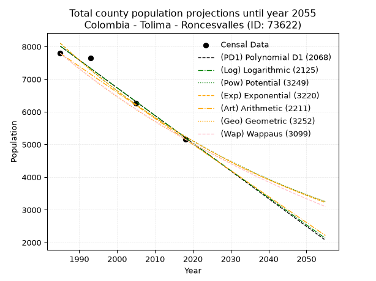
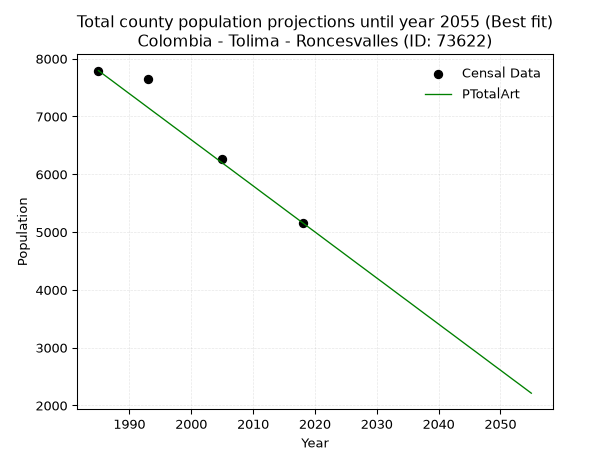
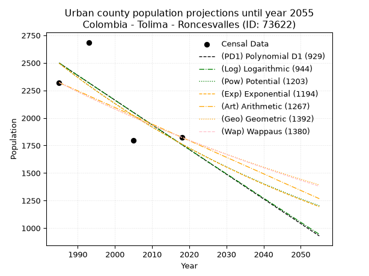
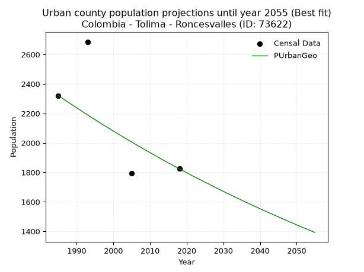
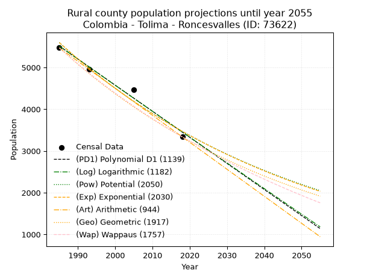
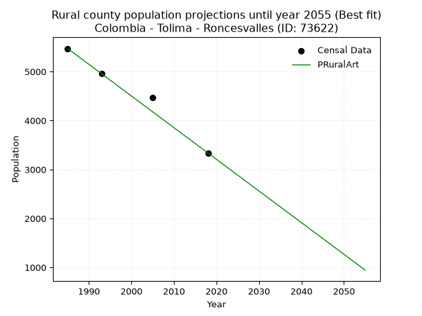

<div align="center">


</div>

# 📜 _“Population and Public Services Demand Projections (PPSD) until Year 2050 for Colombia - Tolima - Roncesvalles (ID: 73622)”_
Keywords: `population` `public-service` `projection` `lineal` `polynomial` `logarithmic` `potential` `exponential` `arithmetic` `geometric` `wappaus` `dane` `colombia` `south-america`

PPSD are analytical estimates used by governments and planners to anticipate future changes in population size, age distribution, and the resulting community needs for utilities, healthcare, education, and infrastructure as sizing future water treatment facilities, electrical grids, and road networks based on spatial growth.

<div align="center">

</img>

</div>


> **General running parameters**: • app_version: _v20260806_. • Python version: _3.14.7_. • Pandas version: _3.0.5_. • NumPy version: _2.5.1_. • Creates, save and include plots into reports (create_plot): _False_. • Projection until year: _2050_. • Process polynomial degree 2 and up: _False_. • Process Wappaus: _True_. • Process Wappaus: _True_. • Set negative values to zero: _True_. • Set infinite values to zero: _True_. • Drop dataset notes: _True_. 
<div align="center">

Maps & GIS Layers: [:earth_americas:Google](http://maps.google.com/maps?q=4.011567013,-75.6059589) [:earth_americas:OSM](https://www.openstreetmap.org/#map=18/4.011567013/-75.6059589&layers=P) [:earth_americas:Bing](https://www.bing.com/maps?cp=4.011567013~-75.6059589&lvl=18) [:earth_americas:Apple](https://maps.apple.com/frame?center=4.011567013%2C-75.6059589&span=0.003%2C0.006) [:earth_americas:GISMobile](https://github.com/rcfdtools/R.GISMobile/blob/main/file/gis/CountyLayer_CO/Readme.md)

</div>


<div align="center">

```geojson
{
  "type": "Feature",
  "geometry": {
    "type": "Point", 
    "coordinates": [-75.6059589, 4.011567013]
  }, 
  "properties": {
    "Name": "Colombia - Tolima - Roncesvalles (ID: 73622)"
  }
}
```

</div>


## 0. Census Data (4 records)

Census data are official statistics collected by a government about the people and housing in a country. They usually include counts of total population, age, sex, race, income, education, and jobs.

📅Global census file: [Population.xlsx](../data/Population.xlsx)

| Source   |   Year |   CountryID | CountryName   |   StateID | StateName   |   CountyID | CountyName   |   PTotal |   PUrban |   PRural |
|:---------|-------:|------------:|:--------------|----------:|:------------|-----------:|:-------------|---------:|---------:|---------:|
| DANE     |   1985 |          57 | Colombia      |        73 | Tolima      |      73622 | Roncesvalles |     7792 |     2321 |     5471 |
| DANE     |   1993 |          57 | Colombia      |        73 | Tolima      |      73622 | Roncesvalles |     7647 |     2686 |     4961 |
| DANE     |   2005 |          57 | Colombia      |        73 | Tolima      |      73622 | Roncesvalles |     6269 |     1795 |     4474 |
| DANE     |   2018 |          57 | Colombia      |        73 | Tolima      |      73622 | Roncesvalles |     5161 |     1824 |     3337 |

> 🔥Some records could had specific notes about the registered values or the corresponding urban or rural distribution.

📅[SUI-RUPS](https://www.datos.gov.co/Hacienda-y-Cr-dito-P-blico/Registro-nico-de-Prestadores-de-Servicios-P-blicos/4qkq-csdn/about_data) - Local public utility companies: [RUPS.csv](../data/RUPS.csv)

 | SERVICIO       | ESTADO    | NOMBRE                                                    | NIT         | DEPARTAMENTO_DOMICILIO   | MUNICIPIO_DOMICILIO   | DIRECCION                    |   TELEFONO | EMAIL                   | TIPO_PRESTADOR                             | CLASIFICACION                 |
|:---------------|:----------|:----------------------------------------------------------|:------------|:-------------------------|:----------------------|:-----------------------------|-----------:|:------------------------|:-------------------------------------------|:------------------------------|
| ACUEDUCTO      | OPERATIVA | EMPRESA DE SERVICIOS PÚBLICOS DE RONCESVALLES S.A. E.S.P. | 900273263-6 | TOLIMA                   | RONCESVALLES          | GALERÍA MUNICIPAL OFICINA 01 |    2250148 | espronsaesp@hotmail.com | SOCIEDADES (EMPRESA DE SERVICIOS PUBLICOS) | MENOR O IGUAL A 2500 USUARIOS |
| ALCANTARILLADO | OPERATIVA | EMPRESA DE SERVICIOS PÚBLICOS DE RONCESVALLES S.A. E.S.P. | 900273263-6 | TOLIMA                   | RONCESVALLES          | GALERÍA MUNICIPAL OFICINA 01 |    2250148 | espronsaesp@hotmail.com | SOCIEDADES (EMPRESA DE SERVICIOS PUBLICOS) | MENOR O IGUAL A 2500 USUARIOS |
| ACUEDUCTO      | OPERATIVA | JUNTA DE ACCION COMUNAL INSPECCION DE SANTA HELENA        | 900056074-0 | TOLIMA                   | RONCESVALLES          | Carrera 3 No. 3-26           |    4197213 | tuzocarva.13@live.com   | ORGANIZACION AUTORIZADA                    | HASTA 2500 SUSCRIPTORES       |

## 1. Total

### 1.1. Coefficients and Parameters

* (PD1) Polynomial Deg 1: -84.91890806904779, 176576.29586511283 (lineal)
* (Log) Logarithmic: -169934.2256517454, 1298388.660946338
* (Pow) Potential: -26.37674707858513, 90.89291048485032
* (Exp) Exponential: -0.013182282159848206, 1873631117778560.8
* (Art) Arithmetic: Year diff. 2018 - 1985 = 33, Population diff. 5161 - 7792 = -2631, Annual growth = -79.72727272727273
* (Geo) Geometric: Year diff. 2018 - 1985 = 33, Population diff. 5161 - 7792 = -2631, Annual growth % = -0.01240625469959733
* (Wap) Wappaus: i = -1.2310240519921676, Condition values only valid for < 200)

<sub>
Wappaus condition values: ['-0.00', '-1.23', '-2.46', '-3.69', '-4.92', '-6.16', '-7.39', '-8.62', '-9.85', '-11.08', '-12.31', '-13.54', '-14.77', '-16.00', '-17.23', '-18.47', '-19.70', '-20.93', '-22.16', '-23.39', '-24.62', '-25.85', '-27.08', '-28.31', '-29.54', '-30.78', '-32.01', '-33.24', '-34.47', '-35.70', '-36.93', '-38.16', '-39.39', '-40.62', '-41.85', '-43.09', '-44.32', '-45.55', '-46.78', '-48.01', '-49.24', '-50.47', '-51.70', '-52.93', '-54.17', '-55.40', '-56.63', '-57.86', '-59.09', '-60.32', '-61.55', '-62.78', '-64.01', '-65.24', '-66.48', '-67.71', '-68.94', '-70.17', '-71.40', '-72.63', '-73.86', '-75.09', '-76.32', '-77.55', '-78.79', '-80.02']
</sub>


### 1.2. Projected Dataset

|   Year |   CountyID |   PTotalPD1 |   PTotalLog |   PTotalPow |   PTotalExp |   PTotalArt |   PTotalGeo |   PTotalWap |
|-------:|-----------:|------------:|------------:|------------:|------------:|------------:|------------:|------------:|
|   1985 |      73622 |        8012 |        8014 |        8104 |        8102 |        7792 |        7792 |        7792 |
|   1986 |      73622 |        7927 |        7929 |        7997 |        7996 |        7712 |        7695 |        7697 |
|   1987 |      73622 |        7842 |        7843 |        7892 |        7891 |        7633 |        7600 |        7602 |
|   1988 |      73622 |        7758 |        7758 |        7788 |        7788 |        7553 |        7506 |        7509 |
|   1989 |      73622 |        7673 |        7672 |        7685 |        7686 |        7473 |        7412 |        7418 |
|   1990 |      73622 |        7588 |        7587 |        7584 |        7585 |        7393 |        7320 |        7327 |
|   1991 |      73622 |        7503 |        7502 |        7484 |        7486 |        7314 |        7230 |        7237 |
|   1992 |      73622 |        7418 |        7416 |        7386 |        7388 |        7234 |        7140 |        7148 |
|   1993 |      73622 |        7333 |        7331 |        7289 |        7291 |        7154 |        7051 |        7061 |
|   1994 |      73622 |        7248 |        7246 |        7193 |        7195 |        7074 |        6964 |        6974 |
|   1995 |      73622 |        7163 |        7161 |        7098 |        7101 |        6995 |        6878 |        6888 |
|   1996 |      73622 |        7078 |        7075 |        7005 |        7008 |        6915 |        6792 |        6804 |
|   1997 |      73622 |        6993 |        6990 |        6913 |        6916 |        6835 |        6708 |        6720 |
|   1998 |      73622 |        6908 |        6905 |        6822 |        6826 |        6756 |        6625 |        6637 |
|   1999 |      73622 |        6823 |        6820 |        6733 |        6736 |        6676 |        6543 |        6556 |
|   2000 |      73622 |        6738 |        6735 |        6645 |        6648 |        6596 |        6461 |        6475 |
|   2001 |      73622 |        6654 |        6650 |        6558 |        6561 |        6516 |        6381 |        6395 |
|   2002 |      73622 |        6569 |        6565 |        6472 |        6475 |        6437 |        6302 |        6316 |
|   2003 |      73622 |        6484 |        6480 |        6387 |        6390 |        6357 |        6224 |        6238 |
|   2004 |      73622 |        6399 |        6396 |        6304 |        6307 |        6277 |        6147 |        6160 |
|   2005 |      73622 |        6314 |        6311 |        6221 |        6224 |        6197 |        6070 |        6084 |
|   2006 |      73622 |        6229 |        6226 |        6140 |        6143 |        6118 |        5995 |        6008 |
|   2007 |      73622 |        6144 |        6141 |        6060 |        6062 |        6038 |        5921 |        5933 |
|   2008 |      73622 |        6059 |        6057 |        5981 |        5983 |        5958 |        5847 |        5859 |
|   2009 |      73622 |        5974 |        5972 |        5903 |        5904 |        5879 |        5775 |        5786 |
|   2010 |      73622 |        5889 |        5888 |        5826 |        5827 |        5799 |        5703 |        5714 |
|   2011 |      73622 |        5804 |        5803 |        5750 |        5751 |        5719 |        5632 |        5642 |
|   2012 |      73622 |        5719 |        5719 |        5675 |        5675 |        5639 |        5562 |        5571 |
|   2013 |      73622 |        5635 |        5634 |        5601 |        5601 |        5560 |        5493 |        5501 |
|   2014 |      73622 |        5550 |        5550 |        5528 |        5528 |        5480 |        5425 |        5432 |
|   2015 |      73622 |        5465 |        5465 |        5456 |        5455 |        5400 |        5358 |        5363 |
|   2016 |      73622 |        5380 |        5381 |        5385 |        5384 |        5320 |        5291 |        5295 |
|   2017 |      73622 |        5295 |        5297 |        5315 |        5313 |        5241 |        5226 |        5228 |
|   2018 |      73622 |        5210 |        5213 |        5246 |        5244 |        5161 |        5161 |        5161 |
|   2019 |      73622 |        5125 |        5128 |        5178 |        5175 |        5081 |        5097 |        5095 |
|   2020 |      73622 |        5040 |        5044 |        5111 |        5107 |        5002 |        5034 |        5030 |
|   2021 |      73622 |        4955 |        4960 |        5045 |        5041 |        4922 |        4971 |        4965 |
|   2022 |      73622 |        4870 |        4876 |        4979 |        4975 |        4842 |        4910 |        4901 |
|   2023 |      73622 |        4785 |        4792 |        4915 |        4909 |        4762 |        4849 |        4838 |
|   2024 |      73622 |        4700 |        4708 |        4851 |        4845 |        4683 |        4789 |        4775 |
|   2025 |      73622 |        4616 |        4624 |        4788 |        4782 |        4603 |        4729 |        4713 |
|   2026 |      73622 |        4531 |        4540 |        4726 |        4719 |        4523 |        4670 |        4652 |
|   2027 |      73622 |        4446 |        4456 |        4665 |        4657 |        4443 |        4613 |        4591 |
|   2028 |      73622 |        4361 |        4373 |        4605 |        4596 |        4364 |        4555 |        4531 |
|   2029 |      73622 |        4276 |        4289 |        4545 |        4536 |        4284 |        4499 |        4471 |
|   2030 |      73622 |        4191 |        4205 |        4487 |        4477 |        4204 |        4443 |        4412 |
|   2031 |      73622 |        4106 |        4121 |        4429 |        4418 |        4125 |        4388 |        4353 |
|   2032 |      73622 |        4021 |        4038 |        4372 |        4360 |        4045 |        4333 |        4295 |
|   2033 |      73622 |        3936 |        3954 |        4315 |        4303 |        3965 |        4280 |        4238 |
|   2034 |      73622 |        3851 |        3871 |        4260 |        4247 |        3885 |        4227 |        4181 |
|   2035 |      73622 |        3766 |        3787 |        4205 |        4191 |        3806 |        4174 |        4125 |
|   2036 |      73622 |        3681 |        3704 |        4151 |        4136 |        3726 |        4122 |        4069 |
|   2037 |      73622 |        3596 |        3620 |        4097 |        4082 |        3646 |        4071 |        4013 |
|   2038 |      73622 |        3512 |        3537 |        4045 |        4029 |        3566 |        4021 |        3959 |
|   2039 |      73622 |        3427 |        3453 |        3993 |        3976 |        3487 |        3971 |        3904 |
|   2040 |      73622 |        3342 |        3370 |        3941 |        3924 |        3407 |        3922 |        3851 |
|   2041 |      73622 |        3257 |        3287 |        3891 |        3872 |        3327 |        3873 |        3797 |
|   2042 |      73622 |        3172 |        3204 |        3841 |        3822 |        3248 |        3825 |        3745 |
|   2043 |      73622 |        3087 |        3120 |        3791 |        3772 |        3168 |        3777 |        3692 |
|   2044 |      73622 |        3002 |        3037 |        3743 |        3722 |        3088 |        3731 |        3640 |
|   2045 |      73622 |        2917 |        2954 |        3695 |        3673 |        3008 |        3684 |        3589 |
|   2046 |      73622 |        2832 |        2871 |        3647 |        3625 |        2929 |        3639 |        3538 |
|   2047 |      73622 |        2747 |        2788 |        3601 |        3578 |        2849 |        3593 |        3488 |
|   2048 |      73622 |        2662 |        2705 |        3555 |        3531 |        2769 |        3549 |        3438 |
|   2049 |      73622 |        2577 |        2622 |        3509 |        3485 |        2689 |        3505 |        3388 |
|   2050 |      73622 |        2493 |        2539 |        3464 |        3439 |        2610 |        3461 |        3339 |
<div align="center">

</img>

</div>


### 1.3. Best fit with absolute and relative error (%)

Relative error puts that difference into context by dividing the absolute error by the true value, creating a unitless ratio or percentage that shows the scale of the mistake.

Absolute and relative error

|   Year | Source   |   CountryID | CountryName   |   StateID | StateName   |   CountyID_x | CountyName   |   PTotal |   PUrban |   PRural |   CountyID_y |   PTotalPD1 |   PTotalLog |   PTotalPow |   PTotalExp |   PTotalArt |   PTotalGeo |   PTotalWap |   PTotalPD1AbsError |   PTotalLogAbsError |   PTotalPowAbsError |   PTotalExpAbsError |   PTotalArtAbsError |   PTotalGeoAbsError |   PTotalWapAbsError |   PTotalPD1RelError |   PTotalLogRelError |   PTotalPowRelError |   PTotalExpRelError |   PTotalArtRelError |   PTotalGeoRelError |   PTotalWapRelError |
|-------:|:---------|------------:|:--------------|----------:|:------------|-------------:|:-------------|---------:|---------:|---------:|-------------:|------------:|------------:|------------:|------------:|------------:|------------:|------------:|--------------------:|--------------------:|--------------------:|--------------------:|--------------------:|--------------------:|--------------------:|--------------------:|--------------------:|--------------------:|--------------------:|--------------------:|--------------------:|--------------------:|
|   1985 | DANE     |          57 | Colombia      |        73 | Tolima      |        73622 | Roncesvalles |     7792 |     2321 |     5471 |        73622 |        8012 |        8014 |        8104 |        8102 |        7792 |        7792 |        7792 |                 220 |                 222 |                 312 |                 310 |                   0 |                   0 |                   0 |            2.82341  |            2.84908  |            4.00411  |            3.97844  |             0       |             0       |             0       |
|   1993 | DANE     |          57 | Colombia      |        73 | Tolima      |        73622 | Roncesvalles |     7647 |     2686 |     4961 |        73622 |        7333 |        7331 |        7289 |        7291 |        7154 |        7051 |        7061 |                 314 |                 316 |                 358 |                 356 |                 493 |                 596 |                 586 |            4.10619  |            4.13234  |            4.68157  |            4.65542  |             6.44697 |             7.79391 |             7.66314 |
|   2005 | DANE     |          57 | Colombia      |        73 | Tolima      |        73622 | Roncesvalles |     6269 |     1795 |     4474 |        73622 |        6314 |        6311 |        6221 |        6224 |        6197 |        6070 |        6084 |                  45 |                  42 |                  48 |                  45 |                  72 |                 199 |                 185 |            0.717818 |            0.669963 |            0.765672 |            0.717818 |             1.14851 |             3.17435 |             2.95103 |
|   2018 | DANE     |          57 | Colombia      |        73 | Tolima      |        73622 | Roncesvalles |     5161 |     1824 |     3337 |        73622 |        5210 |        5213 |        5246 |        5244 |        5161 |        5161 |        5161 |                  49 |                  52 |                  85 |                  83 |                   0 |                   0 |                   0 |            0.949428 |            1.00756  |            1.64697  |            1.60822  |             0       |             0       |             0       |

Relative error mean

| Method    |   RelError | Best   |
|:----------|-----------:|:-------|
| PTotalPD1 |    2.14921 |        |
| PTotalLog |    2.16473 |        |
| PTotalPow |    2.77458 |        |
| PTotalExp |    2.73997 |        |
| PTotalArt |    1.89887 | True   |
| PTotalGeo |    2.74206 |        |
| PTotalWap |    2.65354 |        |

💙Best method: _**PTotalArt**_
<div align="center">

</img>

</div>


### 1.4. Fresh water supply demand in liters per capita per day (lpcd)

The fresh water supply demand typically ranges from 100 to 300 liters per capita per day (lpcd) for standard domestic and municipal planning, though absolute survival minimums set by the World Health Organization are as low as 7.5 to 20 liters per day, and total consumption in high-income nations can exceed 400 liters.

> `CZ`: Level in meters above the sea level (masl)<br> `WS`: Fresh water supply demand in liters per capita per day (lpcd or l/h/d)<br> `WSAll`: Zonal fresh water supply demand in liters per second (l/s)<br> `A`: Zonal area in square meters<br> `DP`: Population density (people/hectare or p/ha)

Reference values (RAS Colombia)

|    CZ |   WS |
|------:|-----:|
|  1000 |  120 |
|  2000 |  130 |
| 99999 |  140 |

County shapefile geometry properties and water supply values

|   CountyID |      ATotal |   CZTotal |   WSTotal |
|-----------:|------------:|----------:|----------:|
|      73622 | 7.75657e+08 |   3016.82 |       140 |

Projected values for best method: PTotalArt

|   CountyID |   Year |   PTotalArt |   DPTotal |   WSTotal |   WSTotalAll |
|-----------:|-------:|------------:|----------:|----------:|-------------:|
|      73622 |   1985 |        7792 |      0.1  |       140 |     12.6259  |
|      73622 |   1986 |        7712 |      0.1  |       140 |     12.4963  |
|      73622 |   1987 |        7633 |      0.1  |       140 |     12.3683  |
|      73622 |   1988 |        7553 |      0.1  |       140 |     12.2387  |
|      73622 |   1989 |        7473 |      0.1  |       140 |     12.109   |
|      73622 |   1990 |        7393 |      0.1  |       140 |     11.9794  |
|      73622 |   1991 |        7314 |      0.09 |       140 |     11.8514  |
|      73622 |   1992 |        7234 |      0.09 |       140 |     11.7218  |
|      73622 |   1993 |        7154 |      0.09 |       140 |     11.5921  |
|      73622 |   1994 |        7074 |      0.09 |       140 |     11.4625  |
|      73622 |   1995 |        6995 |      0.09 |       140 |     11.3345  |
|      73622 |   1996 |        6915 |      0.09 |       140 |     11.2049  |
|      73622 |   1997 |        6835 |      0.09 |       140 |     11.0752  |
|      73622 |   1998 |        6756 |      0.09 |       140 |     10.9472  |
|      73622 |   1999 |        6676 |      0.09 |       140 |     10.8176  |
|      73622 |   2000 |        6596 |      0.09 |       140 |     10.688   |
|      73622 |   2001 |        6516 |      0.08 |       140 |     10.5583  |
|      73622 |   2002 |        6437 |      0.08 |       140 |     10.4303  |
|      73622 |   2003 |        6357 |      0.08 |       140 |     10.3007  |
|      73622 |   2004 |        6277 |      0.08 |       140 |     10.1711  |
|      73622 |   2005 |        6197 |      0.08 |       140 |     10.0414  |
|      73622 |   2006 |        6118 |      0.08 |       140 |      9.91343 |
|      73622 |   2007 |        6038 |      0.08 |       140 |      9.7838  |
|      73622 |   2008 |        5958 |      0.08 |       140 |      9.65417 |
|      73622 |   2009 |        5879 |      0.08 |       140 |      9.52616 |
|      73622 |   2010 |        5799 |      0.07 |       140 |      9.39653 |
|      73622 |   2011 |        5719 |      0.07 |       140 |      9.2669  |
|      73622 |   2012 |        5639 |      0.07 |       140 |      9.13727 |
|      73622 |   2013 |        5560 |      0.07 |       140 |      9.00926 |
|      73622 |   2014 |        5480 |      0.07 |       140 |      8.87963 |
|      73622 |   2015 |        5400 |      0.07 |       140 |      8.75    |
|      73622 |   2016 |        5320 |      0.07 |       140 |      8.62037 |
|      73622 |   2017 |        5241 |      0.07 |       140 |      8.49236 |
|      73622 |   2018 |        5161 |      0.07 |       140 |      8.36273 |
|      73622 |   2019 |        5081 |      0.07 |       140 |      8.2331  |
|      73622 |   2020 |        5002 |      0.06 |       140 |      8.10509 |
|      73622 |   2021 |        4922 |      0.06 |       140 |      7.97546 |
|      73622 |   2022 |        4842 |      0.06 |       140 |      7.84583 |
|      73622 |   2023 |        4762 |      0.06 |       140 |      7.7162  |
|      73622 |   2024 |        4683 |      0.06 |       140 |      7.58819 |
|      73622 |   2025 |        4603 |      0.06 |       140 |      7.45856 |
|      73622 |   2026 |        4523 |      0.06 |       140 |      7.32894 |
|      73622 |   2027 |        4443 |      0.06 |       140 |      7.19931 |
|      73622 |   2028 |        4364 |      0.06 |       140 |      7.0713  |
|      73622 |   2029 |        4284 |      0.06 |       140 |      6.94167 |
|      73622 |   2030 |        4204 |      0.05 |       140 |      6.81204 |
|      73622 |   2031 |        4125 |      0.05 |       140 |      6.68403 |
|      73622 |   2032 |        4045 |      0.05 |       140 |      6.5544  |
|      73622 |   2033 |        3965 |      0.05 |       140 |      6.42477 |
|      73622 |   2034 |        3885 |      0.05 |       140 |      6.29514 |
|      73622 |   2035 |        3806 |      0.05 |       140 |      6.16713 |
|      73622 |   2036 |        3726 |      0.05 |       140 |      6.0375  |
|      73622 |   2037 |        3646 |      0.05 |       140 |      5.90787 |
|      73622 |   2038 |        3566 |      0.05 |       140 |      5.77824 |
|      73622 |   2039 |        3487 |      0.04 |       140 |      5.65023 |
|      73622 |   2040 |        3407 |      0.04 |       140 |      5.5206  |
|      73622 |   2041 |        3327 |      0.04 |       140 |      5.39097 |
|      73622 |   2042 |        3248 |      0.04 |       140 |      5.26296 |
|      73622 |   2043 |        3168 |      0.04 |       140 |      5.13333 |
|      73622 |   2044 |        3088 |      0.04 |       140 |      5.0037  |
|      73622 |   2045 |        3008 |      0.04 |       140 |      4.87407 |
|      73622 |   2046 |        2929 |      0.04 |       140 |      4.74606 |
|      73622 |   2047 |        2849 |      0.04 |       140 |      4.61644 |
|      73622 |   2048 |        2769 |      0.04 |       140 |      4.48681 |
|      73622 |   2049 |        2689 |      0.03 |       140 |      4.35718 |
|      73622 |   2050 |        2610 |      0.03 |       140 |      4.22917 |

## 2. Urban

### 2.1. Coefficients and Parameters

* (PD1) Polynomial Deg 1: -22.427137695704523, 47016.38217583297 (lineal)
* (Log) Logarithmic: -44884.703885736584, 343325.49391892727
* (Pow) Potential: -21.073943306290225, 72.89415265108629
* (Exp) Exponential: -0.01052872978145084, 2976797157445.4756
* (Art) Arithmetic: Year diff. 2018 - 1985 = 33, Population diff. 1824 - 2321 = -497, Annual growth = -15.06060606060606
* (Geo) Geometric: Year diff. 2018 - 1985 = 33, Population diff. 1824 - 2321 = -497, Annual growth % = -0.007275412257848335
* (Wap) Wappaus: i = -0.7266878678217641, Condition values only valid for < 200)

<sub>
Wappaus condition values: ['-0.00', '-0.73', '-1.45', '-2.18', '-2.91', '-3.63', '-4.36', '-5.09', '-5.81', '-6.54', '-7.27', '-7.99', '-8.72', '-9.45', '-10.17', '-10.90', '-11.63', '-12.35', '-13.08', '-13.81', '-14.53', '-15.26', '-15.99', '-16.71', '-17.44', '-18.17', '-18.89', '-19.62', '-20.35', '-21.07', '-21.80', '-22.53', '-23.25', '-23.98', '-24.71', '-25.43', '-26.16', '-26.89', '-27.61', '-28.34', '-29.07', '-29.79', '-30.52', '-31.25', '-31.97', '-32.70', '-33.43', '-34.15', '-34.88', '-35.61', '-36.33', '-37.06', '-37.79', '-38.51', '-39.24', '-39.97', '-40.69', '-41.42', '-42.15', '-42.87', '-43.60', '-44.33', '-45.05', '-45.78', '-46.51', '-47.23']
</sub>


### 2.2. Projected Dataset

|   Year |   CountyID |   PUrbanPD1 |   PUrbanLog |   PUrbanPow |   PUrbanExp |   PUrbanArt |   PUrbanGeo |   PUrbanWap |
|-------:|-----------:|------------:|------------:|------------:|------------:|------------:|------------:|------------:|
|   1985 |      73622 |        2499 |        2499 |        2497 |        2496 |        2321 |        2321 |        2321 |
|   1986 |      73622 |        2476 |        2477 |        2470 |        2470 |        2306 |        2304 |        2304 |
|   1987 |      73622 |        2454 |        2454 |        2444 |        2444 |        2291 |        2287 |        2288 |
|   1988 |      73622 |        2431 |        2431 |        2418 |        2418 |        2276 |        2271 |        2271 |
|   1989 |      73622 |        2409 |        2409 |        2393 |        2393 |        2261 |        2254 |        2255 |
|   1990 |      73622 |        2386 |        2386 |        2368 |        2368 |        2246 |        2238 |        2238 |
|   1991 |      73622 |        2364 |        2364 |        2343 |        2343 |        2231 |        2222 |        2222 |
|   1992 |      73622 |        2342 |        2341 |        2318 |        2318 |        2216 |        2205 |        2206 |
|   1993 |      73622 |        2319 |        2319 |        2294 |        2294 |        2201 |        2189 |        2190 |
|   1994 |      73622 |        2297 |        2296 |        2270 |        2270 |        2185 |        2173 |        2174 |
|   1995 |      73622 |        2274 |        2274 |        2246 |        2246 |        2170 |        2158 |        2158 |
|   1996 |      73622 |        2252 |        2251 |        2222 |        2223 |        2155 |        2142 |        2143 |
|   1997 |      73622 |        2229 |        2229 |        2199 |        2200 |        2140 |        2126 |        2127 |
|   1998 |      73622 |        2207 |        2206 |        2176 |        2176 |        2125 |        2111 |        2112 |
|   1999 |      73622 |        2185 |        2184 |        2153 |        2154 |        2110 |        2095 |        2096 |
|   2000 |      73622 |        2162 |        2161 |        2130 |        2131 |        2095 |        2080 |        2081 |
|   2001 |      73622 |        2140 |        2139 |        2108 |        2109 |        2080 |        2065 |        2066 |
|   2002 |      73622 |        2117 |        2116 |        2086 |        2087 |        2065 |        2050 |        2051 |
|   2003 |      73622 |        2095 |        2094 |        2064 |        2065 |        2050 |        2035 |        2036 |
|   2004 |      73622 |        2072 |        2072 |        2042 |        2043 |        2035 |        2020 |        2021 |
|   2005 |      73622 |        2050 |        2049 |        2021 |        2022 |        2020 |        2006 |        2007 |
|   2006 |      73622 |        2028 |        2027 |        2000 |        2001 |        2005 |        1991 |        1992 |
|   2007 |      73622 |        2005 |        2004 |        1979 |        1980 |        1990 |        1977 |        1977 |
|   2008 |      73622 |        1983 |        1982 |        1958 |        1959 |        1975 |        1962 |        1963 |
|   2009 |      73622 |        1960 |        1960 |        1938 |        1938 |        1960 |        1948 |        1949 |
|   2010 |      73622 |        1938 |        1937 |        1918 |        1918 |        1944 |        1934 |        1934 |
|   2011 |      73622 |        1915 |        1915 |        1898 |        1898 |        1929 |        1920 |        1920 |
|   2012 |      73622 |        1893 |        1893 |        1878 |        1878 |        1914 |        1906 |        1906 |
|   2013 |      73622 |        1871 |        1870 |        1858 |        1859 |        1899 |        1892 |        1892 |
|   2014 |      73622 |        1848 |        1848 |        1839 |        1839 |        1884 |        1878 |        1878 |
|   2015 |      73622 |        1826 |        1826 |        1820 |        1820 |        1869 |        1864 |        1865 |
|   2016 |      73622 |        1803 |        1804 |        1801 |        1801 |        1854 |        1851 |        1851 |
|   2017 |      73622 |        1781 |        1781 |        1782 |        1782 |        1839 |        1837 |        1837 |
|   2018 |      73622 |        1758 |        1759 |        1764 |        1763 |        1824 |        1824 |        1824 |
|   2019 |      73622 |        1736 |        1737 |        1745 |        1745 |        1809 |        1811 |        1811 |
|   2020 |      73622 |        1714 |        1715 |        1727 |        1726 |        1794 |        1798 |        1797 |
|   2021 |      73622 |        1691 |        1692 |        1709 |        1708 |        1779 |        1784 |        1784 |
|   2022 |      73622 |        1669 |        1670 |        1692 |        1690 |        1764 |        1771 |        1771 |
|   2023 |      73622 |        1646 |        1648 |        1674 |        1673 |        1749 |        1759 |        1758 |
|   2024 |      73622 |        1624 |        1626 |        1657 |        1655 |        1734 |        1746 |        1745 |
|   2025 |      73622 |        1601 |        1604 |        1640 |        1638 |        1719 |        1733 |        1732 |
|   2026 |      73622 |        1579 |        1581 |        1623 |        1621 |        1704 |        1721 |        1719 |
|   2027 |      73622 |        1557 |        1559 |        1606 |        1604 |        1688 |        1708 |        1706 |
|   2028 |      73622 |        1534 |        1537 |        1589 |        1587 |        1673 |        1696 |        1694 |
|   2029 |      73622 |        1512 |        1515 |        1573 |        1570 |        1658 |        1683 |        1681 |
|   2030 |      73622 |        1489 |        1493 |        1557 |        1554 |        1643 |        1671 |        1669 |
|   2031 |      73622 |        1467 |        1471 |        1540 |        1538 |        1628 |        1659 |        1656 |
|   2032 |      73622 |        1444 |        1449 |        1525 |        1522 |        1613 |        1647 |        1644 |
|   2033 |      73622 |        1422 |        1427 |        1509 |        1506 |        1598 |        1635 |        1632 |
|   2034 |      73622 |        1400 |        1405 |        1493 |        1490 |        1583 |        1623 |        1619 |
|   2035 |      73622 |        1377 |        1383 |        1478 |        1474 |        1568 |        1611 |        1607 |
|   2036 |      73622 |        1355 |        1360 |        1463 |        1459 |        1553 |        1599 |        1595 |
|   2037 |      73622 |        1332 |        1338 |        1448 |        1444 |        1538 |        1588 |        1583 |
|   2038 |      73622 |        1310 |        1316 |        1433 |        1428 |        1523 |        1576 |        1571 |
|   2039 |      73622 |        1287 |        1294 |        1418 |        1413 |        1508 |        1565 |        1560 |
|   2040 |      73622 |        1265 |        1272 |        1403 |        1399 |        1493 |        1553 |        1548 |
|   2041 |      73622 |        1243 |        1250 |        1389 |        1384 |        1478 |        1542 |        1536 |
|   2042 |      73622 |        1220 |        1228 |        1375 |        1370 |        1463 |        1531 |        1525 |
|   2043 |      73622 |        1198 |        1206 |        1361 |        1355 |        1447 |        1520 |        1513 |
|   2044 |      73622 |        1175 |        1184 |        1347 |        1341 |        1432 |        1509 |        1502 |
|   2045 |      73622 |        1153 |        1163 |        1333 |        1327 |        1417 |        1498 |        1490 |
|   2046 |      73622 |        1130 |        1141 |        1319 |        1313 |        1402 |        1487 |        1479 |
|   2047 |      73622 |        1108 |        1119 |        1306 |        1299 |        1387 |        1476 |        1468 |
|   2048 |      73622 |        1086 |        1097 |        1292 |        1286 |        1372 |        1465 |        1456 |
|   2049 |      73622 |        1063 |        1075 |        1279 |        1272 |        1357 |        1455 |        1445 |
|   2050 |      73622 |        1041 |        1053 |        1266 |        1259 |        1342 |        1444 |        1434 |
<div align="center">

</img>

</div>


### 2.3. Best fit with absolute and relative error (%)

Relative error puts that difference into context by dividing the absolute error by the true value, creating a unitless ratio or percentage that shows the scale of the mistake.

Absolute and relative error

|   Year | Source   |   CountryID | CountryName   |   StateID | StateName   |   CountyID_x | CountyName   |   PTotal |   PUrban |   PRural |   CountyID_y |   PUrbanPD1 |   PUrbanLog |   PUrbanPow |   PUrbanExp |   PUrbanArt |   PUrbanGeo |   PUrbanWap |   PUrbanPD1AbsError |   PUrbanLogAbsError |   PUrbanPowAbsError |   PUrbanExpAbsError |   PUrbanArtAbsError |   PUrbanGeoAbsError |   PUrbanWapAbsError |   PUrbanPD1RelError |   PUrbanLogRelError |   PUrbanPowRelError |   PUrbanExpRelError |   PUrbanArtRelError |   PUrbanGeoRelError |   PUrbanWapRelError |
|-------:|:---------|------------:|:--------------|----------:|:------------|-------------:|:-------------|---------:|---------:|---------:|-------------:|------------:|------------:|------------:|------------:|------------:|------------:|------------:|--------------------:|--------------------:|--------------------:|--------------------:|--------------------:|--------------------:|--------------------:|--------------------:|--------------------:|--------------------:|--------------------:|--------------------:|--------------------:|--------------------:|
|   1985 | DANE     |          57 | Colombia      |        73 | Tolima      |        73622 | Roncesvalles |     7792 |     2321 |     5471 |        73622 |        2499 |        2499 |        2497 |        2496 |        2321 |        2321 |        2321 |                 178 |                 178 |                 176 |                 175 |                   0 |                   0 |                   0 |             7.66911 |             7.66911 |             7.58294 |             7.53985 |              0      |              0      |              0      |
|   1993 | DANE     |          57 | Colombia      |        73 | Tolima      |        73622 | Roncesvalles |     7647 |     2686 |     4961 |        73622 |        2319 |        2319 |        2294 |        2294 |        2201 |        2189 |        2190 |                 367 |                 367 |                 392 |                 392 |                 485 |                 497 |                 496 |            13.6634  |            13.6634  |            14.5942  |            14.5942  |             18.0566 |             18.5034 |             18.4661 |
|   2005 | DANE     |          57 | Colombia      |        73 | Tolima      |        73622 | Roncesvalles |     6269 |     1795 |     4474 |        73622 |        2050 |        2049 |        2021 |        2022 |        2020 |        2006 |        2007 |                 255 |                 254 |                 226 |                 227 |                 225 |                 211 |                 212 |            14.2061  |            14.1504  |            12.5905  |            12.6462  |             12.5348 |             11.7549 |             11.8106 |
|   2018 | DANE     |          57 | Colombia      |        73 | Tolima      |        73622 | Roncesvalles |     5161 |     1824 |     3337 |        73622 |        1758 |        1759 |        1764 |        1763 |        1824 |        1824 |        1824 |                  66 |                  65 |                  60 |                  61 |                   0 |                   0 |                   0 |             3.61842 |             3.5636  |             3.28947 |             3.3443  |              0      |              0      |              0      |

Relative error mean

| Method    |   RelError | Best   |
|:----------|-----------:|:-------|
| PUrbanPD1 |    9.78927 |        |
| PUrbanLog |    9.76164 |        |
| PUrbanPow |    9.51428 |        |
| PUrbanExp |    9.53115 |        |
| PUrbanArt |    7.64785 |        |
| PUrbanGeo |    7.56456 | True   |
| PUrbanWap |    7.56918 |        |

💙Best method: _**PUrbanGeo**_
<div align="center">

</img>

</div>


### 2.4. Fresh water supply demand in liters per capita per day (lpcd)

The fresh water supply demand typically ranges from 100 to 300 liters per capita per day (lpcd) for standard domestic and municipal planning, though absolute survival minimums set by the World Health Organization are as low as 7.5 to 20 liters per day, and total consumption in high-income nations can exceed 400 liters.

> `CZ`: Level in meters above the sea level (masl)<br> `WS`: Fresh water supply demand in liters per capita per day (lpcd or l/h/d)<br> `WSAll`: Zonal fresh water supply demand in liters per second (l/s)<br> `A`: Zonal area in square meters<br> `DP`: Population density (people/hectare or p/ha)

Reference values (RAS Colombia)

|    CZ |   WS |
|------:|-----:|
|  1000 |  120 |
|  2000 |  130 |
| 99999 |  140 |

County shapefile geometry properties and water supply values

|   CountyID |   AUrban |   CZUrban |   WSUrban |
|-----------:|---------:|----------:|----------:|
|      73622 |   294248 |   2588.55 |       140 |

Projected values for best method: PUrbanGeo

|   CountyID |   Year |   PUrbanGeo |   DPUrban |   WSUrban |   WSUrbanAll |
|-----------:|-------:|------------:|----------:|----------:|-------------:|
|      73622 |   1985 |        2321 |     78.88 |       140 |      3.76088 |
|      73622 |   1986 |        2304 |     78.3  |       140 |      3.73333 |
|      73622 |   1987 |        2287 |     77.72 |       140 |      3.70579 |
|      73622 |   1988 |        2271 |     77.18 |       140 |      3.67986 |
|      73622 |   1989 |        2254 |     76.6  |       140 |      3.65231 |
|      73622 |   1990 |        2238 |     76.06 |       140 |      3.62639 |
|      73622 |   1991 |        2222 |     75.51 |       140 |      3.60046 |
|      73622 |   1992 |        2205 |     74.94 |       140 |      3.57292 |
|      73622 |   1993 |        2189 |     74.39 |       140 |      3.54699 |
|      73622 |   1994 |        2173 |     73.85 |       140 |      3.52106 |
|      73622 |   1995 |        2158 |     73.34 |       140 |      3.49676 |
|      73622 |   1996 |        2142 |     72.8  |       140 |      3.47083 |
|      73622 |   1997 |        2126 |     72.25 |       140 |      3.44491 |
|      73622 |   1998 |        2111 |     71.74 |       140 |      3.4206  |
|      73622 |   1999 |        2095 |     71.2  |       140 |      3.39468 |
|      73622 |   2000 |        2080 |     70.69 |       140 |      3.37037 |
|      73622 |   2001 |        2065 |     70.18 |       140 |      3.34606 |
|      73622 |   2002 |        2050 |     69.67 |       140 |      3.32176 |
|      73622 |   2003 |        2035 |     69.16 |       140 |      3.29745 |
|      73622 |   2004 |        2020 |     68.65 |       140 |      3.27315 |
|      73622 |   2005 |        2006 |     68.17 |       140 |      3.25046 |
|      73622 |   2006 |        1991 |     67.66 |       140 |      3.22616 |
|      73622 |   2007 |        1977 |     67.19 |       140 |      3.20347 |
|      73622 |   2008 |        1962 |     66.68 |       140 |      3.17917 |
|      73622 |   2009 |        1948 |     66.2  |       140 |      3.15648 |
|      73622 |   2010 |        1934 |     65.73 |       140 |      3.1338  |
|      73622 |   2011 |        1920 |     65.25 |       140 |      3.11111 |
|      73622 |   2012 |        1906 |     64.78 |       140 |      3.08843 |
|      73622 |   2013 |        1892 |     64.3  |       140 |      3.06574 |
|      73622 |   2014 |        1878 |     63.82 |       140 |      3.04306 |
|      73622 |   2015 |        1864 |     63.35 |       140 |      3.02037 |
|      73622 |   2016 |        1851 |     62.91 |       140 |      2.99931 |
|      73622 |   2017 |        1837 |     62.43 |       140 |      2.97662 |
|      73622 |   2018 |        1824 |     61.99 |       140 |      2.95556 |
|      73622 |   2019 |        1811 |     61.55 |       140 |      2.93449 |
|      73622 |   2020 |        1798 |     61.1  |       140 |      2.91343 |
|      73622 |   2021 |        1784 |     60.63 |       140 |      2.89074 |
|      73622 |   2022 |        1771 |     60.19 |       140 |      2.86968 |
|      73622 |   2023 |        1759 |     59.78 |       140 |      2.85023 |
|      73622 |   2024 |        1746 |     59.34 |       140 |      2.82917 |
|      73622 |   2025 |        1733 |     58.9  |       140 |      2.8081  |
|      73622 |   2026 |        1721 |     58.49 |       140 |      2.78866 |
|      73622 |   2027 |        1708 |     58.05 |       140 |      2.76759 |
|      73622 |   2028 |        1696 |     57.64 |       140 |      2.74815 |
|      73622 |   2029 |        1683 |     57.2  |       140 |      2.72708 |
|      73622 |   2030 |        1671 |     56.79 |       140 |      2.70764 |
|      73622 |   2031 |        1659 |     56.38 |       140 |      2.68819 |
|      73622 |   2032 |        1647 |     55.97 |       140 |      2.66875 |
|      73622 |   2033 |        1635 |     55.57 |       140 |      2.64931 |
|      73622 |   2034 |        1623 |     55.16 |       140 |      2.62986 |
|      73622 |   2035 |        1611 |     54.75 |       140 |      2.61042 |
|      73622 |   2036 |        1599 |     54.34 |       140 |      2.59097 |
|      73622 |   2037 |        1588 |     53.97 |       140 |      2.57315 |
|      73622 |   2038 |        1576 |     53.56 |       140 |      2.5537  |
|      73622 |   2039 |        1565 |     53.19 |       140 |      2.53588 |
|      73622 |   2040 |        1553 |     52.78 |       140 |      2.51644 |
|      73622 |   2041 |        1542 |     52.4  |       140 |      2.49861 |
|      73622 |   2042 |        1531 |     52.03 |       140 |      2.48079 |
|      73622 |   2043 |        1520 |     51.66 |       140 |      2.46296 |
|      73622 |   2044 |        1509 |     51.28 |       140 |      2.44514 |
|      73622 |   2045 |        1498 |     50.91 |       140 |      2.42731 |
|      73622 |   2046 |        1487 |     50.54 |       140 |      2.40949 |
|      73622 |   2047 |        1476 |     50.16 |       140 |      2.39167 |
|      73622 |   2048 |        1465 |     49.79 |       140 |      2.37384 |
|      73622 |   2049 |        1455 |     49.45 |       140 |      2.35764 |
|      73622 |   2050 |        1444 |     49.07 |       140 |      2.33981 |

## 3. Rural

### 3.1. Coefficients and Parameters

* (PD1) Polynomial Deg 1: -62.49177037334331, 129559.91368927994 (lineal)
* (Log) Logarithmic: -125049.52176600884, 955063.1670274106
* (Pow) Potential: -28.983758254857996, 99.32950607737678
* (Exp) Exponential: -0.014486655320884924, 1.7236291682597134e+16
* (Art) Arithmetic: Year diff. 2018 - 1985 = 33, Population diff. 3337 - 5471 = -2134, Annual growth = -64.66666666666667
* (Geo) Geometric: Year diff. 2018 - 1985 = 33, Population diff. 3337 - 5471 = -2134, Annual growth % = -0.014869827158861426
* (Wap) Wappaus: i = -1.4683620950650924, Condition values only valid for < 200)

<sub>
Wappaus condition values: ['-0.00', '-1.47', '-2.94', '-4.41', '-5.87', '-7.34', '-8.81', '-10.28', '-11.75', '-13.22', '-14.68', '-16.15', '-17.62', '-19.09', '-20.56', '-22.03', '-23.49', '-24.96', '-26.43', '-27.90', '-29.37', '-30.84', '-32.30', '-33.77', '-35.24', '-36.71', '-38.18', '-39.65', '-41.11', '-42.58', '-44.05', '-45.52', '-46.99', '-48.46', '-49.92', '-51.39', '-52.86', '-54.33', '-55.80', '-57.27', '-58.73', '-60.20', '-61.67', '-63.14', '-64.61', '-66.08', '-67.54', '-69.01', '-70.48', '-71.95', '-73.42', '-74.89', '-76.35', '-77.82', '-79.29', '-80.76', '-82.23', '-83.70', '-85.17', '-86.63', '-88.10', '-89.57', '-91.04', '-92.51', '-93.98', '-95.44']
</sub>


### 3.2. Projected Dataset

|   Year |   CountyID |   PRuralPD1 |   PRuralLog |   PRuralPow |   PRuralExp |   PRuralArt |   PRuralGeo |   PRuralWap |
|-------:|-----------:|------------:|------------:|------------:|------------:|------------:|------------:|------------:|
|   1985 |      73622 |        5514 |        5515 |        5598 |        5596 |        5471 |        5471 |        5471 |
|   1986 |      73622 |        5451 |        5452 |        5517 |        5515 |        5406 |        5390 |        5391 |
|   1987 |      73622 |        5389 |        5389 |        5437 |        5436 |        5342 |        5310 |        5313 |
|   1988 |      73622 |        5326 |        5327 |        5358 |        5358 |        5277 |        5231 |        5235 |
|   1989 |      73622 |        5264 |        5264 |        5280 |        5281 |        5212 |        5153 |        5159 |
|   1990 |      73622 |        5201 |        5201 |        5204 |        5205 |        5148 |        5076 |        5084 |
|   1991 |      73622 |        5139 |        5138 |        5129 |        5130 |        5083 |        5001 |        5009 |
|   1992 |      73622 |        5076 |        5075 |        5055 |        5056 |        5018 |        4926 |        4936 |
|   1993 |      73622 |        5014 |        5012 |        4982 |        4984 |        4954 |        4853 |        4864 |
|   1994 |      73622 |        4951 |        4950 |        4910 |        4912 |        4889 |        4781 |        4793 |
|   1995 |      73622 |        4889 |        4887 |        4839 |        4841 |        4824 |        4710 |        4723 |
|   1996 |      73622 |        4826 |        4824 |        4769 |        4772 |        4760 |        4640 |        4653 |
|   1997 |      73622 |        4764 |        4762 |        4701 |        4703 |        4695 |        4571 |        4585 |
|   1998 |      73622 |        4701 |        4699 |        4633 |        4635 |        4630 |        4503 |        4518 |
|   1999 |      73622 |        4639 |        4636 |        4566 |        4569 |        4566 |        4436 |        4451 |
|   2000 |      73622 |        4576 |        4574 |        4500 |        4503 |        4501 |        4370 |        4386 |
|   2001 |      73622 |        4514 |        4511 |        4436 |        4438 |        4436 |        4305 |        4321 |
|   2002 |      73622 |        4451 |        4449 |        4372 |        4374 |        4372 |        4241 |        4257 |
|   2003 |      73622 |        4389 |        4387 |        4309 |        4311 |        4307 |        4178 |        4194 |
|   2004 |      73622 |        4326 |        4324 |        4247 |        4249 |        4242 |        4116 |        4132 |
|   2005 |      73622 |        4264 |        4262 |        4186 |        4188 |        4178 |        4055 |        4070 |
|   2006 |      73622 |        4201 |        4199 |        4126 |        4128 |        4113 |        3994 |        4009 |
|   2007 |      73622 |        4139 |        4137 |        4067 |        4069 |        4048 |        3935 |        3949 |
|   2008 |      73622 |        4076 |        4075 |        4009 |        4010 |        3984 |        3876 |        3890 |
|   2009 |      73622 |        4014 |        4012 |        3951 |        3952 |        3919 |        3819 |        3832 |
|   2010 |      73622 |        3951 |        3950 |        3895 |        3896 |        3854 |        3762 |        3774 |
|   2011 |      73622 |        3889 |        3888 |        3839 |        3840 |        3790 |        3706 |        3717 |
|   2012 |      73622 |        3826 |        3826 |        3784 |        3784 |        3725 |        3651 |        3661 |
|   2013 |      73622 |        3764 |        3764 |        3730 |        3730 |        3660 |        3597 |        3605 |
|   2014 |      73622 |        3701 |        3702 |        3677 |        3676 |        3596 |        3543 |        3550 |
|   2015 |      73622 |        3639 |        3640 |        3624 |        3623 |        3531 |        3490 |        3496 |
|   2016 |      73622 |        3577 |        3578 |        3572 |        3571 |        3466 |        3438 |        3442 |
|   2017 |      73622 |        3514 |        3516 |        3521 |        3520 |        3402 |        3387 |        3389 |
|   2018 |      73622 |        3452 |        3454 |        3471 |        3469 |        3337 |        3337 |        3337 |
|   2019 |      73622 |        3389 |        3392 |        3422 |        3419 |        3272 |        3287 |        3285 |
|   2020 |      73622 |        3327 |        3330 |        3373 |        3370 |        3208 |        3238 |        3234 |
|   2021 |      73622 |        3264 |        3268 |        3325 |        3322 |        3143 |        3190 |        3184 |
|   2022 |      73622 |        3202 |        3206 |        3278 |        3274 |        3078 |        3143 |        3134 |
|   2023 |      73622 |        3139 |        3144 |        3231 |        3227 |        3014 |        3096 |        3084 |
|   2024 |      73622 |        3077 |        3082 |        3185 |        3181 |        2949 |        3050 |        3035 |
|   2025 |      73622 |        3014 |        3021 |        3140 |        3135 |        2884 |        3005 |        2987 |
|   2026 |      73622 |        2952 |        2959 |        3095 |        3090 |        2820 |        2960 |        2939 |
|   2027 |      73622 |        2889 |        2897 |        3051 |        3045 |        2755 |        2916 |        2892 |
|   2028 |      73622 |        2827 |        2835 |        3008 |        3001 |        2690 |        2873 |        2845 |
|   2029 |      73622 |        2764 |        2774 |        2965 |        2958 |        2626 |        2830 |        2799 |
|   2030 |      73622 |        2702 |        2712 |        2923 |        2916 |        2561 |        2788 |        2754 |
|   2031 |      73622 |        2639 |        2651 |        2882 |        2874 |        2496 |        2746 |        2709 |
|   2032 |      73622 |        2577 |        2589 |        2841 |        2832 |        2432 |        2706 |        2664 |
|   2033 |      73622 |        2514 |        2527 |        2801 |        2792 |        2367 |        2665 |        2620 |
|   2034 |      73622 |        2452 |        2466 |        2761 |        2752 |        2302 |        2626 |        2576 |
|   2035 |      73622 |        2389 |        2405 |        2722 |        2712 |        2238 |        2587 |        2533 |
|   2036 |      73622 |        2327 |        2343 |        2683 |        2673 |        2173 |        2548 |        2490 |
|   2037 |      73622 |        2264 |        2282 |        2646 |        2635 |        2108 |        2510 |        2448 |
|   2038 |      73622 |        2202 |        2220 |        2608 |        2597 |        2044 |        2473 |        2406 |
|   2039 |      73622 |        2139 |        2159 |        2571 |        2559 |        1979 |        2436 |        2365 |
|   2040 |      73622 |        2077 |        2098 |        2535 |        2523 |        1914 |        2400 |        2324 |
|   2041 |      73622 |        2014 |        2036 |        2499 |        2486 |        1850 |        2364 |        2283 |
|   2042 |      73622 |        1952 |        1975 |        2464 |        2450 |        1785 |        2329 |        2243 |
|   2043 |      73622 |        1889 |        1914 |        2429 |        2415 |        1720 |        2295 |        2203 |
|   2044 |      73622 |        1827 |        1853 |        2395 |        2381 |        1656 |        2260 |        2164 |
|   2045 |      73622 |        1764 |        1792 |        2361 |        2346 |        1591 |        2227 |        2125 |
|   2046 |      73622 |        1702 |        1730 |        2328 |        2313 |        1526 |        2194 |        2086 |
|   2047 |      73622 |        1639 |        1669 |        2295 |        2279 |        1462 |        2161 |        2048 |
|   2048 |      73622 |        1577 |        1608 |        2263 |        2246 |        1397 |        2129 |        2011 |
|   2049 |      73622 |        1514 |        1547 |        2231 |        2214 |        1332 |        2097 |        1973 |
|   2050 |      73622 |        1452 |        1486 |        2200 |        2182 |        1268 |        2066 |        1936 |
<div align="center">

</img>

</div>


### 3.3. Best fit with absolute and relative error (%)

Relative error puts that difference into context by dividing the absolute error by the true value, creating a unitless ratio or percentage that shows the scale of the mistake.

Absolute and relative error

|   Year | Source   |   CountryID | CountryName   |   StateID | StateName   |   CountyID_x | CountyName   |   PTotal |   PUrban |   PRural |   CountyID_y |   PRuralPD1 |   PRuralLog |   PRuralPow |   PRuralExp |   PRuralArt |   PRuralGeo |   PRuralWap |   PRuralPD1AbsError |   PRuralLogAbsError |   PRuralPowAbsError |   PRuralExpAbsError |   PRuralArtAbsError |   PRuralGeoAbsError |   PRuralWapAbsError |   PRuralPD1RelError |   PRuralLogRelError |   PRuralPowRelError |   PRuralExpRelError |   PRuralArtRelError |   PRuralGeoRelError |   PRuralWapRelError |
|-------:|:---------|------------:|:--------------|----------:|:------------|-------------:|:-------------|---------:|---------:|---------:|-------------:|------------:|------------:|------------:|------------:|------------:|------------:|------------:|--------------------:|--------------------:|--------------------:|--------------------:|--------------------:|--------------------:|--------------------:|--------------------:|--------------------:|--------------------:|--------------------:|--------------------:|--------------------:|--------------------:|
|   1985 | DANE     |          57 | Colombia      |        73 | Tolima      |        73622 | Roncesvalles |     7792 |     2321 |     5471 |        73622 |        5514 |        5515 |        5598 |        5596 |        5471 |        5471 |        5471 |                  43 |                  44 |                 127 |                 125 |                   0 |                   0 |                   0 |            0.785962 |            0.804241 |            2.32133  |            2.28477  |            0        |             0       |             0       |
|   1993 | DANE     |          57 | Colombia      |        73 | Tolima      |        73622 | Roncesvalles |     7647 |     2686 |     4961 |        73622 |        5014 |        5012 |        4982 |        4984 |        4954 |        4853 |        4864 |                  53 |                  51 |                  21 |                  23 |                   7 |                 108 |                  97 |            1.06833  |            1.02802  |            0.423302 |            0.463616 |            0.141101 |             2.17698 |             1.95525 |
|   2005 | DANE     |          57 | Colombia      |        73 | Tolima      |        73622 | Roncesvalles |     6269 |     1795 |     4474 |        73622 |        4264 |        4262 |        4186 |        4188 |        4178 |        4055 |        4070 |                 210 |                 212 |                 288 |                 286 |                 296 |                 419 |                 404 |            4.69379  |            4.73849  |            6.43719  |            6.39249  |            6.616    |             9.36522 |             9.02995 |
|   2018 | DANE     |          57 | Colombia      |        73 | Tolima      |        73622 | Roncesvalles |     5161 |     1824 |     3337 |        73622 |        3452 |        3454 |        3471 |        3469 |        3337 |        3337 |        3337 |                 115 |                 117 |                 134 |                 132 |                   0 |                   0 |                   0 |            3.44621  |            3.50614  |            4.01558  |            3.95565  |            0        |             0       |             0       |

Relative error mean

| Method    |   RelError | Best   |
|:----------|-----------:|:-------|
| PRuralPD1 |    2.49857 |        |
| PRuralLog |    2.51922 |        |
| PRuralPow |    3.29935 |        |
| PRuralExp |    3.27413 |        |
| PRuralArt |    1.68928 | True   |
| PRuralGeo |    2.88555 |        |
| PRuralWap |    2.7463  |        |

💙Best method: _**PRuralArt**_
<div align="center">

</img>

</div>


### 3.4. Fresh water supply demand in liters per capita per day (lpcd)

The fresh water supply demand typically ranges from 100 to 300 liters per capita per day (lpcd) for standard domestic and municipal planning, though absolute survival minimums set by the World Health Organization are as low as 7.5 to 20 liters per day, and total consumption in high-income nations can exceed 400 liters.

> `CZ`: Level in meters above the sea level (masl)<br> `WS`: Fresh water supply demand in liters per capita per day (lpcd or l/h/d)<br> `WSAll`: Zonal fresh water supply demand in liters per second (l/s)<br> `A`: Zonal area in square meters<br> `DP`: Population density (people/hectare or p/ha)

Reference values (RAS Colombia)

|    CZ |   WS |
|------:|-----:|
|  1000 |  120 |
|  2000 |  130 |
| 99999 |  140 |

County shapefile geometry properties and water supply values

|   CountyID |      ARural |   CZRural |   WSRural |
|-----------:|------------:|----------:|----------:|
|      73622 | 7.75362e+08 |   3016.98 |       140 |

Projected values for best method: PRuralArt

|   CountyID |   Year |   PRuralArt |   DPRural |   WSRural |   WSRuralAll |
|-----------:|-------:|------------:|----------:|----------:|-------------:|
|      73622 |   1985 |        5471 |      0.07 |       140 |      8.86505 |
|      73622 |   1986 |        5406 |      0.07 |       140 |      8.75972 |
|      73622 |   1987 |        5342 |      0.07 |       140 |      8.65602 |
|      73622 |   1988 |        5277 |      0.07 |       140 |      8.55069 |
|      73622 |   1989 |        5212 |      0.07 |       140 |      8.44537 |
|      73622 |   1990 |        5148 |      0.07 |       140 |      8.34167 |
|      73622 |   1991 |        5083 |      0.07 |       140 |      8.23634 |
|      73622 |   1992 |        5018 |      0.06 |       140 |      8.13102 |
|      73622 |   1993 |        4954 |      0.06 |       140 |      8.02731 |
|      73622 |   1994 |        4889 |      0.06 |       140 |      7.92199 |
|      73622 |   1995 |        4824 |      0.06 |       140 |      7.81667 |
|      73622 |   1996 |        4760 |      0.06 |       140 |      7.71296 |
|      73622 |   1997 |        4695 |      0.06 |       140 |      7.60764 |
|      73622 |   1998 |        4630 |      0.06 |       140 |      7.50231 |
|      73622 |   1999 |        4566 |      0.06 |       140 |      7.39861 |
|      73622 |   2000 |        4501 |      0.06 |       140 |      7.29329 |
|      73622 |   2001 |        4436 |      0.06 |       140 |      7.18796 |
|      73622 |   2002 |        4372 |      0.06 |       140 |      7.08426 |
|      73622 |   2003 |        4307 |      0.06 |       140 |      6.97894 |
|      73622 |   2004 |        4242 |      0.05 |       140 |      6.87361 |
|      73622 |   2005 |        4178 |      0.05 |       140 |      6.76991 |
|      73622 |   2006 |        4113 |      0.05 |       140 |      6.66458 |
|      73622 |   2007 |        4048 |      0.05 |       140 |      6.55926 |
|      73622 |   2008 |        3984 |      0.05 |       140 |      6.45556 |
|      73622 |   2009 |        3919 |      0.05 |       140 |      6.35023 |
|      73622 |   2010 |        3854 |      0.05 |       140 |      6.24491 |
|      73622 |   2011 |        3790 |      0.05 |       140 |      6.1412  |
|      73622 |   2012 |        3725 |      0.05 |       140 |      6.03588 |
|      73622 |   2013 |        3660 |      0.05 |       140 |      5.93056 |
|      73622 |   2014 |        3596 |      0.05 |       140 |      5.82685 |
|      73622 |   2015 |        3531 |      0.05 |       140 |      5.72153 |
|      73622 |   2016 |        3466 |      0.04 |       140 |      5.6162  |
|      73622 |   2017 |        3402 |      0.04 |       140 |      5.5125  |
|      73622 |   2018 |        3337 |      0.04 |       140 |      5.40718 |
|      73622 |   2019 |        3272 |      0.04 |       140 |      5.30185 |
|      73622 |   2020 |        3208 |      0.04 |       140 |      5.19815 |
|      73622 |   2021 |        3143 |      0.04 |       140 |      5.09282 |
|      73622 |   2022 |        3078 |      0.04 |       140 |      4.9875  |
|      73622 |   2023 |        3014 |      0.04 |       140 |      4.8838  |
|      73622 |   2024 |        2949 |      0.04 |       140 |      4.77847 |
|      73622 |   2025 |        2884 |      0.04 |       140 |      4.67315 |
|      73622 |   2026 |        2820 |      0.04 |       140 |      4.56944 |
|      73622 |   2027 |        2755 |      0.04 |       140 |      4.46412 |
|      73622 |   2028 |        2690 |      0.03 |       140 |      4.3588  |
|      73622 |   2029 |        2626 |      0.03 |       140 |      4.25509 |
|      73622 |   2030 |        2561 |      0.03 |       140 |      4.14977 |
|      73622 |   2031 |        2496 |      0.03 |       140 |      4.04444 |
|      73622 |   2032 |        2432 |      0.03 |       140 |      3.94074 |
|      73622 |   2033 |        2367 |      0.03 |       140 |      3.83542 |
|      73622 |   2034 |        2302 |      0.03 |       140 |      3.73009 |
|      73622 |   2035 |        2238 |      0.03 |       140 |      3.62639 |
|      73622 |   2036 |        2173 |      0.03 |       140 |      3.52106 |
|      73622 |   2037 |        2108 |      0.03 |       140 |      3.41574 |
|      73622 |   2038 |        2044 |      0.03 |       140 |      3.31204 |
|      73622 |   2039 |        1979 |      0.03 |       140 |      3.20671 |
|      73622 |   2040 |        1914 |      0.02 |       140 |      3.10139 |
|      73622 |   2041 |        1850 |      0.02 |       140 |      2.99769 |
|      73622 |   2042 |        1785 |      0.02 |       140 |      2.89236 |
|      73622 |   2043 |        1720 |      0.02 |       140 |      2.78704 |
|      73622 |   2044 |        1656 |      0.02 |       140 |      2.68333 |
|      73622 |   2045 |        1591 |      0.02 |       140 |      2.57801 |
|      73622 |   2046 |        1526 |      0.02 |       140 |      2.47269 |
|      73622 |   2047 |        1462 |      0.02 |       140 |      2.36898 |
|      73622 |   2048 |        1397 |      0.02 |       140 |      2.26366 |
|      73622 |   2049 |        1332 |      0.02 |       140 |      2.15833 |
|      73622 |   2050 |        1268 |      0.02 |       140 |      2.05463 |

#

<div align="center"><br><sub>Share this research</sub></div><br>

<sub>**APPS & TOOLS & CONTENT DISCLAIMER**: • NO WARRANTY - This content and software is provided by <a href="https://github.com/rcfdtools" target="_blank">github.com/rcfdtools</a> "as is", without any express or implied warranty, including warranties of merchantability, fitness for a particular purpose, or non-infringement. There is no guarantee that the software will be error-free or operate without interruption. • LIMITATION OF LIABILITY - Neither the authors nor copyright holders will be liable for claims or damages arising from the software or its use. You are responsible for determining if the software is appropriate for your use and assume all associated risks, including errors, legal compliance, and data loss. • NO PROFESSIONAL ADVICE - The software provides general information and does not offer professional advice. It should not replace consultation with professional advisors. [Clauses and global license for rcfdtools use.](https://github.com/rcfdtools/rcfdtools/blob/main/LICENSE.md)</sub>

| [:house: Home](Readme.md)  | [:beginner: Help / Collab](https://github.com/rcfdtools/R.HydroTools/discussions/31) |
|----------------------------|-------------------------------------------------------------------------------------------|