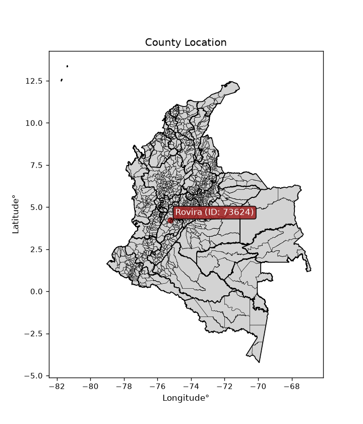
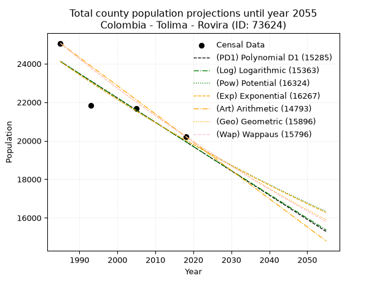
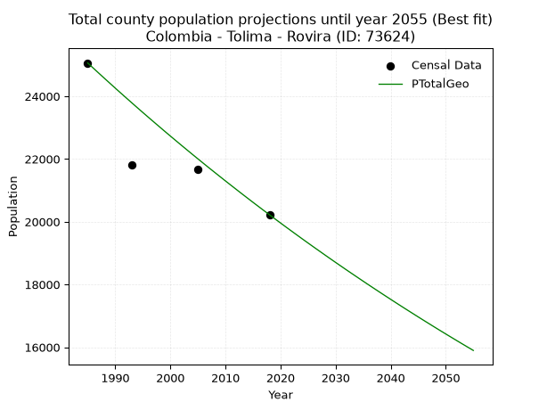
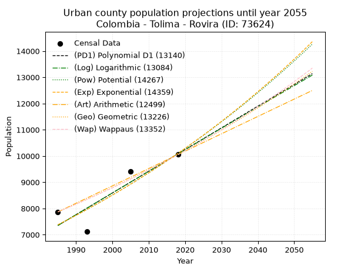
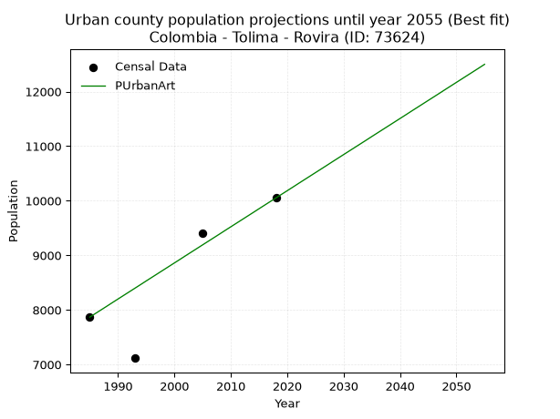
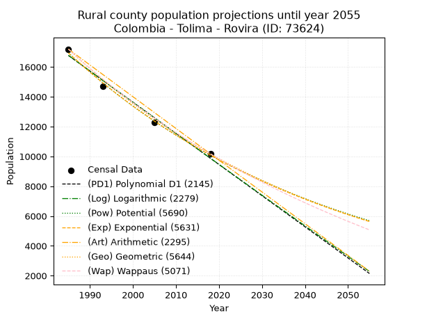
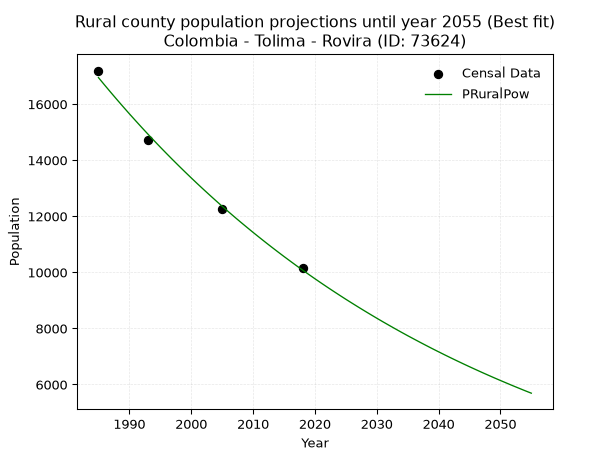

<div align="center">


</div>

# _“Population and Public Services Demand Projections (PPSD) until Year 2050 for Colombia - Tolima - Rovira (ID: 73624)”_
Keywords: `population` `public-service` `projection` `lineal` `polynomial` `logarithmic` `potential` `exponential` `arithmetic` `geometric` `wappaus` `dane` `colombia` `south-america`

PPSD are analytical estimates used by governments and planners to anticipate future changes in population size, age distribution, and the resulting community needs for utilities, healthcare, education, and infrastructure as sizing future water treatment facilities, electrical grids, and road networks based on spatial growth.

<div align="center">

</img>

</div>


> **General running parameters**: • app_version: _v20260806_. • Python version: _3.14.7_. • Pandas version: _3.0.5_. • NumPy version: _2.5.1_. • Creates, save and include plots into reports (create_plot): _False_. • Projection until year: _2050_. • Process polynomial degree 2 and up: _False_. • Process Wappaus: _True_. • Process Wappaus: _True_. • Set negative values to zero: _True_. • Set infinite values to zero: _True_. • Drop dataset notes: _True_. 
<div align="center">

Dynamic map: [:earth_americas:Google](http://maps.google.com/maps?q=4.23901894,-75.2406481) [:earth_americas:OSM](https://www.openstreetmap.org/#map=18/4.23901894/-75.2406481&layers=P) [:earth_americas:Bing](https://www.bing.com/maps?cp=4.23901894~-75.2406481&lvl=18) [:earth_americas:Apple](https://maps.apple.com/frame?center=4.23901894%2C-75.2406481&span=0.003%2C0.006)

</div>


<div align="center">

```geojson
{
  "type": "Feature",
  "geometry": {
    "type": "Point", 
    "coordinates": [-75.2406481, 4.23901894]
  }, 
  "properties": {
    "Name": "Colombia - Tolima - Rovira (ID: 73624)"
  }
}
```

</div>


## 0. Census Data (4 records)

Census data are official statistics collected by a government about the people and housing in a country. They usually include counts of total population, age, sex, race, income, education, and jobs.

📅Global census file: [Population.xlsx](../data/Population.xlsx)

| Source   |   Year |   CountryID | CountryName   |   StateID | StateName   |   CountyID | CountyName   |   PTotal |   PUrban |   PRural |
|:---------|-------:|------------:|:--------------|----------:|:------------|-----------:|:-------------|---------:|---------:|---------:|
| DANE     |   1985 |          57 | Colombia      |        73 | Tolima      |      73624 | Rovira       |    25060 |     7868 |    17192 |
| DANE     |   1993 |          57 | Colombia      |        73 | Tolima      |      73624 | Rovira       |    21822 |     7116 |    14706 |
| DANE     |   2005 |          57 | Colombia      |        73 | Tolima      |      73624 | Rovira       |    21665 |     9408 |    12257 |
| DANE     |   2018 |          57 | Colombia      |        73 | Tolima      |      73624 | Rovira       |    20220 |    10051 |    10169 |

> 🔥Some records could had specific notes about the registered values or the corresponding urban or rural distribution.

📅   [RUPS](https://www.datos.gov.co/Hacienda-y-Cr-dito-P-blico/Registro-nico-de-Prestadores-de-Servicios-P-blicos/4qkq-csdn/about_data) - Local public utility companies: [RUPS.csv](../data/RUPS.xlsx)

 | SERVICIO       | ESTADO    | NOMBRE                                                       | NIT         | DEPARTAMENTO_DOMICILIO   | MUNICIPIO_DOMICILIO   | DIRECCION          |   TELEFONO | EMAIL                | TIPO_PRESTADOR                            | CLASIFICACION                  |
|:---------------|:----------|:-------------------------------------------------------------|:------------|:-------------------------|:----------------------|:-------------------|-----------:|:---------------------|:------------------------------------------|:-------------------------------|
| ACUEDUCTO      | OPERATIVA | EMPRESA DE SERVICIOS PUBLICOS DOMICILIARIOS DE ROVIRA E.S.P. | 809003173-4 | TOLIMA                   | ROVIRA                | Calle 3 No. 4 - 78 |    2881138 | edmi0204@hotmail.com | EMPRESA INDUSTRIAL Y COMERCIAL DEL ESTADO | DESDE 2501 HASTA 5000 USUARIOS |
| ALCANTARILLADO | OPERATIVA | EMPRESA DE SERVICIOS PUBLICOS DOMICILIARIOS DE ROVIRA E.S.P. | 809003173-4 | TOLIMA                   | ROVIRA                | Calle 3 No. 4 - 78 |    2881138 | edmi0204@hotmail.com | EMPRESA INDUSTRIAL Y COMERCIAL DEL ESTADO | DESDE 2501 HASTA 5000 USUARIOS |

## 1. Total

### 1.1. Coefficients and Parameters

* (PD1) Polynomial Deg 1: -126.15134484142834, 274525.97751906706 (lineal)
* (Log) Logarithmic: -252698.8991521297, 1942958.107457228
* (Pow) Potential: -11.249352789512653, 41.47982054287614
* (Exp) Exponential: -0.005616338870171208, 1673992899.576084
* (Art) Arithmetic: Year diff. 2018 - 1985 = 33, Population diff. 20220 - 25060 = -4840, Annual growth = -146.66666666666666
* (Geo) Geometric: Year diff. 2018 - 1985 = 33, Population diff. 20220 - 25060 = -4840, Annual growth % = -0.006481953516645933
* (Wap) Wappaus: i = -0.6478209658421673, Condition values only valid for < 200)

<sub>
Wappaus condition values: ['-0.00', '-0.65', '-1.30', '-1.94', '-2.59', '-3.24', '-3.89', '-4.53', '-5.18', '-5.83', '-6.48', '-7.13', '-7.77', '-8.42', '-9.07', '-9.72', '-10.37', '-11.01', '-11.66', '-12.31', '-12.96', '-13.60', '-14.25', '-14.90', '-15.55', '-16.20', '-16.84', '-17.49', '-18.14', '-18.79', '-19.43', '-20.08', '-20.73', '-21.38', '-22.03', '-22.67', '-23.32', '-23.97', '-24.62', '-25.27', '-25.91', '-26.56', '-27.21', '-27.86', '-28.50', '-29.15', '-29.80', '-30.45', '-31.10', '-31.74', '-32.39', '-33.04', '-33.69', '-34.33', '-34.98', '-35.63', '-36.28', '-36.93', '-37.57', '-38.22', '-38.87', '-39.52', '-40.16', '-40.81', '-41.46', '-42.11']
</sub>


### 1.2. Projected Dataset

|   Year |   CountyID |   PTotalPD1 |   PTotalLog |   PTotalPow |   PTotalExp |   PTotalArt |   PTotalGeo |   PTotalWap |
|-------:|-----------:|------------:|------------:|------------:|------------:|------------:|------------:|------------:|
|   1985 |      73624 |       24116 |       24121 |       24107 |       24102 |       25060 |       25060 |       25060 |
|   1986 |      73624 |       23989 |       23994 |       23971 |       23967 |       24913 |       24898 |       24898 |
|   1987 |      73624 |       23863 |       23866 |       23836 |       23833 |       24767 |       24736 |       24737 |
|   1988 |      73624 |       23737 |       23739 |       23701 |       23699 |       24620 |       24576 |       24578 |
|   1989 |      73624 |       23611 |       23612 |       23568 |       23566 |       24473 |       24417 |       24419 |
|   1990 |      73624 |       23485 |       23485 |       23435 |       23434 |       24327 |       24258 |       24261 |
|   1991 |      73624 |       23359 |       23358 |       23303 |       23303 |       24180 |       24101 |       24105 |
|   1992 |      73624 |       23232 |       23231 |       23171 |       23173 |       24033 |       23945 |       23949 |
|   1993 |      73624 |       23106 |       23104 |       23041 |       23043 |       23887 |       23790 |       23794 |
|   1994 |      73624 |       22980 |       22978 |       22911 |       22914 |       23740 |       23635 |       23640 |
|   1995 |      73624 |       22854 |       22851 |       22782 |       22786 |       23593 |       23482 |       23487 |
|   1996 |      73624 |       22728 |       22724 |       22654 |       22658 |       23447 |       23330 |       23336 |
|   1997 |      73624 |       22602 |       22598 |       22527 |       22531 |       23300 |       23179 |       23185 |
|   1998 |      73624 |       22476 |       22471 |       22400 |       22405 |       23153 |       23029 |       23035 |
|   1999 |      73624 |       22349 |       22345 |       22275 |       22279 |       23007 |       22879 |       22886 |
|   2000 |      73624 |       22223 |       22218 |       22150 |       22155 |       22860 |       22731 |       22738 |
|   2001 |      73624 |       22097 |       22092 |       22026 |       22031 |       22713 |       22584 |       22590 |
|   2002 |      73624 |       21971 |       21966 |       21902 |       21907 |       22567 |       22437 |       22444 |
|   2003 |      73624 |       21845 |       21840 |       21779 |       21784 |       22420 |       22292 |       22299 |
|   2004 |      73624 |       21719 |       21714 |       21657 |       21662 |       22273 |       22147 |       22154 |
|   2005 |      73624 |       21593 |       21587 |       21536 |       21541 |       22127 |       22004 |       22011 |
|   2006 |      73624 |       21466 |       21461 |       21416 |       21420 |       21980 |       21861 |       21868 |
|   2007 |      73624 |       21340 |       21336 |       21296 |       21300 |       21833 |       21719 |       21726 |
|   2008 |      73624 |       21214 |       21210 |       21177 |       21181 |       21687 |       21579 |       21585 |
|   2009 |      73624 |       21088 |       21084 |       21059 |       21063 |       21540 |       21439 |       21445 |
|   2010 |      73624 |       20962 |       20958 |       20941 |       20945 |       21393 |       21300 |       21305 |
|   2011 |      73624 |       20836 |       20832 |       20824 |       20827 |       21247 |       21162 |       21167 |
|   2012 |      73624 |       20709 |       20707 |       20708 |       20711 |       21100 |       21025 |       21029 |
|   2013 |      73624 |       20583 |       20581 |       20593 |       20595 |       20953 |       20888 |       20892 |
|   2014 |      73624 |       20457 |       20456 |       20478 |       20479 |       20807 |       20753 |       20756 |
|   2015 |      73624 |       20331 |       20330 |       20364 |       20365 |       20660 |       20618 |       20621 |
|   2016 |      73624 |       20205 |       20205 |       20251 |       20251 |       20513 |       20485 |       20487 |
|   2017 |      73624 |       20079 |       20080 |       20138 |       20137 |       20367 |       20352 |       20353 |
|   2018 |      73624 |       19953 |       19954 |       20026 |       20024 |       20220 |       20220 |       20220 |
|   2019 |      73624 |       19826 |       19829 |       19915 |       19912 |       20073 |       20089 |       20088 |
|   2020 |      73624 |       19700 |       19704 |       19804 |       19801 |       19927 |       19959 |       19957 |
|   2021 |      73624 |       19574 |       19579 |       19694 |       19690 |       19780 |       19829 |       19826 |
|   2022 |      73624 |       19448 |       19454 |       19585 |       19580 |       19633 |       19701 |       19696 |
|   2023 |      73624 |       19322 |       19329 |       19476 |       19470 |       19487 |       19573 |       19567 |
|   2024 |      73624 |       19196 |       19204 |       19368 |       19361 |       19340 |       19446 |       19439 |
|   2025 |      73624 |       19070 |       19079 |       19261 |       19252 |       19193 |       19320 |       19311 |
|   2026 |      73624 |       18943 |       18955 |       19154 |       19145 |       19047 |       19195 |       19184 |
|   2027 |      73624 |       18817 |       18830 |       19048 |       19037 |       18900 |       19071 |       19058 |
|   2028 |      73624 |       18691 |       18705 |       18943 |       18931 |       18753 |       18947 |       18933 |
|   2029 |      73624 |       18565 |       18581 |       18838 |       18825 |       18607 |       18824 |       18808 |
|   2030 |      73624 |       18439 |       18456 |       18734 |       18719 |       18460 |       18702 |       18684 |
|   2031 |      73624 |       18313 |       18332 |       18631 |       18614 |       18313 |       18581 |       18561 |
|   2032 |      73624 |       18186 |       18207 |       18528 |       18510 |       18167 |       18460 |       18438 |
|   2033 |      73624 |       18060 |       18083 |       18425 |       18407 |       18020 |       18341 |       18316 |
|   2034 |      73624 |       17934 |       17959 |       18324 |       18303 |       17873 |       18222 |       18195 |
|   2035 |      73624 |       17808 |       17834 |       18223 |       18201 |       17727 |       18104 |       18074 |
|   2036 |      73624 |       17682 |       17710 |       18122 |       18099 |       17580 |       17986 |       17954 |
|   2037 |      73624 |       17556 |       17586 |       18022 |       17998 |       17433 |       17870 |       17835 |
|   2038 |      73624 |       17430 |       17462 |       17923 |       17897 |       17287 |       17754 |       17716 |
|   2039 |      73624 |       17303 |       17338 |       17825 |       17797 |       17140 |       17639 |       17599 |
|   2040 |      73624 |       17177 |       17214 |       17727 |       17697 |       16993 |       17525 |       17481 |
|   2041 |      73624 |       17051 |       17090 |       17629 |       17598 |       16847 |       17411 |       17365 |
|   2042 |      73624 |       16925 |       16967 |       17532 |       17499 |       16700 |       17298 |       17249 |
|   2043 |      73624 |       16799 |       16843 |       17436 |       17401 |       16553 |       17186 |       17133 |
|   2044 |      73624 |       16673 |       16719 |       17340 |       17304 |       16407 |       17075 |       17018 |
|   2045 |      73624 |       16546 |       16596 |       17245 |       17207 |       16260 |       16964 |       16904 |
|   2046 |      73624 |       16420 |       16472 |       17150 |       17111 |       16113 |       16854 |       16791 |
|   2047 |      73624 |       16294 |       16349 |       17056 |       17015 |       15967 |       16745 |       16678 |
|   2048 |      73624 |       16168 |       16225 |       16963 |       16919 |       15820 |       16636 |       16566 |
|   2049 |      73624 |       16042 |       16102 |       16870 |       16825 |       15673 |       16528 |       16454 |
|   2050 |      73624 |       15916 |       15979 |       16778 |       16730 |       15527 |       16421 |       16343 |
<div align="center">

</img>

</div>


### 1.3. Best fit with absolute and relative error (%)

Relative error puts that difference into context by dividing the absolute error by the true value, creating a unitless ratio or percentage that shows the scale of the mistake.

Absolute and relative error

|   Year | Source   |   CountryID | CountryName   |   StateID | StateName   |   CountyID_x | CountyName   |   PTotal |   PUrban |   PRural |   CountyID_y |   PTotalPD1 |   PTotalLog |   PTotalPow |   PTotalExp |   PTotalArt |   PTotalGeo |   PTotalWap |   PTotalPD1AbsError |   PTotalLogAbsError |   PTotalPowAbsError |   PTotalExpAbsError |   PTotalArtAbsError |   PTotalGeoAbsError |   PTotalWapAbsError |   PTotalPD1RelError |   PTotalLogRelError |   PTotalPowRelError |   PTotalExpRelError |   PTotalArtRelError |   PTotalGeoRelError |   PTotalWapRelError |
|-------:|:---------|------------:|:--------------|----------:|:------------|-------------:|:-------------|---------:|---------:|---------:|-------------:|------------:|------------:|------------:|------------:|------------:|------------:|------------:|--------------------:|--------------------:|--------------------:|--------------------:|--------------------:|--------------------:|--------------------:|--------------------:|--------------------:|--------------------:|--------------------:|--------------------:|--------------------:|--------------------:|
|   1985 | DANE     |          57 | Colombia      |        73 | Tolima      |        73624 | Rovira       |    25060 |     7868 |    17192 |        73624 |       24116 |       24121 |       24107 |       24102 |       25060 |       25060 |       25060 |                 944 |                 939 |                 953 |                 958 |                   0 |                   0 |                   0 |            3.76696  |            3.74701  |            3.80287  |            3.82283  |             0       |             0       |             0       |
|   1993 | DANE     |          57 | Colombia      |        73 | Tolima      |        73624 | Rovira       |    21822 |     7116 |    14706 |        73624 |       23106 |       23104 |       23041 |       23043 |       23887 |       23790 |       23794 |                1284 |                1282 |                1219 |                1221 |                2065 |                1968 |                1972 |            5.88397  |            5.87481  |            5.58611  |            5.59527  |             9.46293 |             9.01842 |             9.03675 |
|   2005 | DANE     |          57 | Colombia      |        73 | Tolima      |        73624 | Rovira       |    21665 |     9408 |    12257 |        73624 |       21593 |       21587 |       21536 |       21541 |       22127 |       22004 |       22011 |                  72 |                  78 |                 129 |                 124 |                 462 |                 339 |                 346 |            0.332333 |            0.360028 |            0.59543  |            0.572352 |             2.13247 |             1.56474 |             1.59705 |
|   2018 | DANE     |          57 | Colombia      |        73 | Tolima      |        73624 | Rovira       |    20220 |    10051 |    10169 |        73624 |       19953 |       19954 |       20026 |       20024 |       20220 |       20220 |       20220 |                 267 |                 266 |                 194 |                 196 |                   0 |                   0 |                   0 |            1.32047  |            1.31553  |            0.959446 |            0.969337 |             0       |             0       |             0       |

Relative error mean

| Method    |   RelError | Best   |
|:----------|-----------:|:-------|
| PTotalPD1 |    2.82593 |        |
| PTotalLog |    2.82434 |        |
| PTotalPow |    2.73596 |        |
| PTotalExp |    2.73995 |        |
| PTotalArt |    2.89885 |        |
| PTotalGeo |    2.64579 | True   |
| PTotalWap |    2.65845 |        |

💙Best method: _**PTotalGeo**_
<div align="center">

</img>

</div>


### 1.4. Fresh water supply demand in liters per capita per day (lpcd)

The fresh water supply demand typically ranges from 100 to 300 liters per capita per day (lpcd) for standard domestic and municipal planning, though absolute survival minimums set by the World Health Organization are as low as 7.5 to 20 liters per day, and total consumption in high-income nations can exceed 400 liters.

> `CZ`: Level in meters above the sea level (masl)<br> `WS`: Fresh water supply demand in liters per capita per day (lpcd or l/h/d)<br> `WSAll`: Zonal fresh water supply demand in liters per second (l/s)<br> `A`: Zonal area in square meters<br> `DP`: Population density (people/hectare or p/ha)

Reference values (RAS Colombia)

|    CZ |   WS |
|------:|-----:|
|  1000 |  120 |
|  2000 |  130 |
| 99999 |  140 |

County shapefile geometry properties and water supply values

|   CountyID |      ATotal |   CZTotal |   WSTotal |
|-----------:|------------:|----------:|----------:|
|      73624 | 7.39189e+08 |   1802.25 |       130 |

Projected values for best method: PTotalGeo

|   CountyID |   Year |   PTotalGeo |   DPTotal |   WSTotal |   WSTotalAll |
|-----------:|-------:|------------:|----------:|----------:|-------------:|
|      73624 |   1985 |       25060 |      0.34 |       130 |      37.706  |
|      73624 |   1986 |       24898 |      0.34 |       130 |      37.4623 |
|      73624 |   1987 |       24736 |      0.33 |       130 |      37.2185 |
|      73624 |   1988 |       24576 |      0.33 |       130 |      36.9778 |
|      73624 |   1989 |       24417 |      0.33 |       130 |      36.7385 |
|      73624 |   1990 |       24258 |      0.33 |       130 |      36.4993 |
|      73624 |   1991 |       24101 |      0.33 |       130 |      36.2631 |
|      73624 |   1992 |       23945 |      0.32 |       130 |      36.0284 |
|      73624 |   1993 |       23790 |      0.32 |       130 |      35.7951 |
|      73624 |   1994 |       23635 |      0.32 |       130 |      35.5619 |
|      73624 |   1995 |       23482 |      0.32 |       130 |      35.3317 |
|      73624 |   1996 |       23330 |      0.32 |       130 |      35.103  |
|      73624 |   1997 |       23179 |      0.31 |       130 |      34.8758 |
|      73624 |   1998 |       23029 |      0.31 |       130 |      34.6501 |
|      73624 |   1999 |       22879 |      0.31 |       130 |      34.4244 |
|      73624 |   2000 |       22731 |      0.31 |       130 |      34.2017 |
|      73624 |   2001 |       22584 |      0.31 |       130 |      33.9806 |
|      73624 |   2002 |       22437 |      0.3  |       130 |      33.7594 |
|      73624 |   2003 |       22292 |      0.3  |       130 |      33.5412 |
|      73624 |   2004 |       22147 |      0.3  |       130 |      33.323  |
|      73624 |   2005 |       22004 |      0.3  |       130 |      33.1079 |
|      73624 |   2006 |       21861 |      0.3  |       130 |      32.8927 |
|      73624 |   2007 |       21719 |      0.29 |       130 |      32.6791 |
|      73624 |   2008 |       21579 |      0.29 |       130 |      32.4684 |
|      73624 |   2009 |       21439 |      0.29 |       130 |      32.2578 |
|      73624 |   2010 |       21300 |      0.29 |       130 |      32.0486 |
|      73624 |   2011 |       21162 |      0.29 |       130 |      31.841  |
|      73624 |   2012 |       21025 |      0.28 |       130 |      31.6348 |
|      73624 |   2013 |       20888 |      0.28 |       130 |      31.4287 |
|      73624 |   2014 |       20753 |      0.28 |       130 |      31.2256 |
|      73624 |   2015 |       20618 |      0.28 |       130 |      31.0225 |
|      73624 |   2016 |       20485 |      0.28 |       130 |      30.8223 |
|      73624 |   2017 |       20352 |      0.28 |       130 |      30.6222 |
|      73624 |   2018 |       20220 |      0.27 |       130 |      30.4236 |
|      73624 |   2019 |       20089 |      0.27 |       130 |      30.2265 |
|      73624 |   2020 |       19959 |      0.27 |       130 |      30.0309 |
|      73624 |   2021 |       19829 |      0.27 |       130 |      29.8353 |
|      73624 |   2022 |       19701 |      0.27 |       130 |      29.6427 |
|      73624 |   2023 |       19573 |      0.26 |       130 |      29.4501 |
|      73624 |   2024 |       19446 |      0.26 |       130 |      29.259  |
|      73624 |   2025 |       19320 |      0.26 |       130 |      29.0694 |
|      73624 |   2026 |       19195 |      0.26 |       130 |      28.8814 |
|      73624 |   2027 |       19071 |      0.26 |       130 |      28.6948 |
|      73624 |   2028 |       18947 |      0.26 |       130 |      28.5082 |
|      73624 |   2029 |       18824 |      0.25 |       130 |      28.3231 |
|      73624 |   2030 |       18702 |      0.25 |       130 |      28.1396 |
|      73624 |   2031 |       18581 |      0.25 |       130 |      27.9575 |
|      73624 |   2032 |       18460 |      0.25 |       130 |      27.7755 |
|      73624 |   2033 |       18341 |      0.25 |       130 |      27.5964 |
|      73624 |   2034 |       18222 |      0.25 |       130 |      27.4174 |
|      73624 |   2035 |       18104 |      0.24 |       130 |      27.2398 |
|      73624 |   2036 |       17986 |      0.24 |       130 |      27.0623 |
|      73624 |   2037 |       17870 |      0.24 |       130 |      26.8877 |
|      73624 |   2038 |       17754 |      0.24 |       130 |      26.7132 |
|      73624 |   2039 |       17639 |      0.24 |       130 |      26.5402 |
|      73624 |   2040 |       17525 |      0.24 |       130 |      26.3686 |
|      73624 |   2041 |       17411 |      0.24 |       130 |      26.1971 |
|      73624 |   2042 |       17298 |      0.23 |       130 |      26.0271 |
|      73624 |   2043 |       17186 |      0.23 |       130 |      25.8586 |
|      73624 |   2044 |       17075 |      0.23 |       130 |      25.6916 |
|      73624 |   2045 |       16964 |      0.23 |       130 |      25.5245 |
|      73624 |   2046 |       16854 |      0.23 |       130 |      25.359  |
|      73624 |   2047 |       16745 |      0.23 |       130 |      25.195  |
|      73624 |   2048 |       16636 |      0.23 |       130 |      25.031  |
|      73624 |   2049 |       16528 |      0.22 |       130 |      24.8685 |
|      73624 |   2050 |       16421 |      0.22 |       130 |      24.7075 |

## 2. Urban

### 2.1. Coefficients and Parameters

* (PD1) Polynomial Deg 1: 82.72219991971042, -156854.33038940074 (lineal)
* (Log) Logarithmic: 165518.642111682, -1249497.7750740503
* (Pow) Potential: 19.033071893064953, -58.898662015110574
* (Exp) Exponential: 0.00951236593759697, 4.651391051190963e-05
* (Art) Arithmetic: Year diff. 2018 - 1985 = 33, Population diff. 10051 - 7868 = 2183, Annual growth = 66.15151515151516
* (Geo) Geometric: Year diff. 2018 - 1985 = 33, Population diff. 10051 - 7868 = 2183, Annual growth % = 0.007447847710533972
* (Wap) Wappaus: i = 0.7383393621464942, Condition values only valid for < 200)

<sub>
Wappaus condition values: ['0.00', '0.74', '1.48', '2.22', '2.95', '3.69', '4.43', '5.17', '5.91', '6.65', '7.38', '8.12', '8.86', '9.60', '10.34', '11.08', '11.81', '12.55', '13.29', '14.03', '14.77', '15.51', '16.24', '16.98', '17.72', '18.46', '19.20', '19.94', '20.67', '21.41', '22.15', '22.89', '23.63', '24.37', '25.10', '25.84', '26.58', '27.32', '28.06', '28.80', '29.53', '30.27', '31.01', '31.75', '32.49', '33.23', '33.96', '34.70', '35.44', '36.18', '36.92', '37.66', '38.39', '39.13', '39.87', '40.61', '41.35', '42.09', '42.82', '43.56', '44.30', '45.04', '45.78', '46.52', '47.25', '47.99']
</sub>


### 2.2. Projected Dataset

|   Year |   CountyID |   PUrbanPD1 |   PUrbanLog |   PUrbanPow |   PUrbanExp |   PUrbanArt |   PUrbanGeo |   PUrbanWap |
|-------:|-----------:|------------:|------------:|------------:|------------:|------------:|------------:|------------:|
|   1985 |      73624 |        7349 |        7347 |        7377 |        7378 |        7868 |        7868 |        7868 |
|   1986 |      73624 |        7432 |        7431 |        7448 |        7449 |        7934 |        7927 |        7926 |
|   1987 |      73624 |        7515 |        7514 |        7519 |        7520 |        8000 |        7986 |        7985 |
|   1988 |      73624 |        7597 |        7597 |        7592 |        7592 |        8066 |        8045 |        8044 |
|   1989 |      73624 |        7680 |        7680 |        7665 |        7664 |        8133 |        8105 |        8104 |
|   1990 |      73624 |        7763 |        7764 |        7738 |        7738 |        8199 |        8165 |        8164 |
|   1991 |      73624 |        7846 |        7847 |        7813 |        7812 |        8265 |        8226 |        8224 |
|   1992 |      73624 |        7928 |        7930 |        7888 |        7886 |        8331 |        8287 |        8285 |
|   1993 |      73624 |        8011 |        8013 |        7963 |        7962 |        8397 |        8349 |        8347 |
|   1994 |      73624 |        8094 |        8096 |        8040 |        8038 |        8463 |        8411 |        8409 |
|   1995 |      73624 |        8176 |        8179 |        8117 |        8115 |        8530 |        8474 |        8471 |
|   1996 |      73624 |        8259 |        8262 |        8195 |        8192 |        8596 |        8537 |        8534 |
|   1997 |      73624 |        8342 |        8345 |        8273 |        8270 |        8662 |        8601 |        8597 |
|   1998 |      73624 |        8425 |        8428 |        8352 |        8349 |        8728 |        8665 |        8661 |
|   1999 |      73624 |        8507 |        8510 |        8432 |        8429 |        8794 |        8729 |        8726 |
|   2000 |      73624 |        8590 |        8593 |        8513 |        8510 |        8860 |        8794 |        8790 |
|   2001 |      73624 |        8673 |        8676 |        8594 |        8591 |        8926 |        8860 |        8856 |
|   2002 |      73624 |        8756 |        8759 |        8676 |        8673 |        8993 |        8926 |        8922 |
|   2003 |      73624 |        8838 |        8841 |        8759 |        8756 |        9059 |        8992 |        8988 |
|   2004 |      73624 |        8921 |        8924 |        8843 |        8840 |        9125 |        9059 |        9055 |
|   2005 |      73624 |        9004 |        9007 |        8927 |        8924 |        9191 |        9127 |        9122 |
|   2006 |      73624 |        9086 |        9089 |        9012 |        9010 |        9257 |        9195 |        9190 |
|   2007 |      73624 |        9169 |        9172 |        9098 |        9096 |        9323 |        9263 |        9259 |
|   2008 |      73624 |        9252 |        9254 |        9185 |        9183 |        9389 |        9332 |        9328 |
|   2009 |      73624 |        9335 |        9336 |        9272 |        9270 |        9456 |        9402 |        9398 |
|   2010 |      73624 |        9417 |        9419 |        9361 |        9359 |        9522 |        9472 |        9468 |
|   2011 |      73624 |        9500 |        9501 |        9450 |        9448 |        9588 |        9542 |        9539 |
|   2012 |      73624 |        9583 |        9583 |        9540 |        9539 |        9654 |        9613 |        9610 |
|   2013 |      73624 |        9665 |        9666 |        9630 |        9630 |        9720 |        9685 |        9682 |
|   2014 |      73624 |        9748 |        9748 |        9722 |        9722 |        9786 |        9757 |        9755 |
|   2015 |      73624 |        9831 |        9830 |        9814 |        9815 |        9853 |        9830 |        9828 |
|   2016 |      73624 |        9914 |        9912 |        9907 |        9909 |        9919 |        9903 |        9902 |
|   2017 |      73624 |        9996 |        9994 |       10001 |       10003 |        9985 |        9977 |        9976 |
|   2018 |      73624 |       10079 |       10076 |       10096 |       10099 |       10051 |       10051 |       10051 |
|   2019 |      73624 |       10162 |       10158 |       10191 |       10196 |       10117 |       10126 |       10127 |
|   2020 |      73624 |       10245 |       10240 |       10288 |       10293 |       10183 |       10201 |       10203 |
|   2021 |      73624 |       10327 |       10322 |       10385 |       10391 |       10249 |       10277 |       10280 |
|   2022 |      73624 |       10410 |       10404 |       10484 |       10491 |       10316 |       10354 |       10357 |
|   2023 |      73624 |       10493 |       10486 |       10583 |       10591 |       10382 |       10431 |       10436 |
|   2024 |      73624 |       10575 |       10568 |       10683 |       10692 |       10448 |       10509 |       10515 |
|   2025 |      73624 |       10658 |       10649 |       10784 |       10794 |       10514 |       10587 |       10594 |
|   2026 |      73624 |       10741 |       10731 |       10885 |       10898 |       10580 |       10666 |       10675 |
|   2027 |      73624 |       10824 |       10813 |       10988 |       11002 |       10646 |       10745 |       10756 |
|   2028 |      73624 |       10906 |       10894 |       11092 |       11107 |       10713 |       10825 |       10837 |
|   2029 |      73624 |       10989 |       10976 |       11196 |       11213 |       10779 |       10906 |       10920 |
|   2030 |      73624 |       11072 |       11058 |       11302 |       11320 |       10845 |       10987 |       11003 |
|   2031 |      73624 |       11154 |       11139 |       11408 |       11428 |       10911 |       11069 |       11087 |
|   2032 |      73624 |       11237 |       11221 |       11516 |       11538 |       10977 |       11151 |       11172 |
|   2033 |      73624 |       11320 |       11302 |       11624 |       11648 |       11043 |       11234 |       11257 |
|   2034 |      73624 |       11403 |       11383 |       11733 |       11759 |       11109 |       11318 |       11343 |
|   2035 |      73624 |       11485 |       11465 |       11844 |       11872 |       11176 |       11402 |       11430 |
|   2036 |      73624 |       11568 |       11546 |       11955 |       11985 |       11242 |       11487 |       11518 |
|   2037 |      73624 |       11651 |       11627 |       12067 |       12100 |       11308 |       11573 |       11606 |
|   2038 |      73624 |       11734 |       11709 |       12180 |       12215 |       11374 |       11659 |       11696 |
|   2039 |      73624 |       11816 |       11790 |       12295 |       12332 |       11440 |       11746 |       11786 |
|   2040 |      73624 |       11899 |       11871 |       12410 |       12450 |       11506 |       11833 |       11877 |
|   2041 |      73624 |       11982 |       11952 |       12526 |       12569 |       11572 |       11921 |       11969 |
|   2042 |      73624 |       12064 |       12033 |       12643 |       12689 |       11639 |       12010 |       12062 |
|   2043 |      73624 |       12147 |       12114 |       12762 |       12810 |       11705 |       12100 |       12155 |
|   2044 |      73624 |       12230 |       12195 |       12881 |       12933 |       11771 |       12190 |       12250 |
|   2045 |      73624 |       12313 |       12276 |       13002 |       13056 |       11837 |       12281 |       12345 |
|   2046 |      73624 |       12395 |       12357 |       13123 |       13181 |       11903 |       12372 |       12442 |
|   2047 |      73624 |       12478 |       12438 |       13246 |       13307 |       11969 |       12464 |       12539 |
|   2048 |      73624 |       12561 |       12519 |       13370 |       13434 |       12036 |       12557 |       12637 |
|   2049 |      73624 |       12643 |       12600 |       13494 |       13563 |       12102 |       12651 |       12736 |
|   2050 |      73624 |       12726 |       12680 |       13620 |       13692 |       12168 |       12745 |       12836 |
<div align="center">

</img>

</div>


### 2.3. Best fit with absolute and relative error (%)

Relative error puts that difference into context by dividing the absolute error by the true value, creating a unitless ratio or percentage that shows the scale of the mistake.

Absolute and relative error

|   Year | Source   |   CountryID | CountryName   |   StateID | StateName   |   CountyID_x | CountyName   |   PTotal |   PUrban |   PRural |   CountyID_y |   PUrbanPD1 |   PUrbanLog |   PUrbanPow |   PUrbanExp |   PUrbanArt |   PUrbanGeo |   PUrbanWap |   PUrbanPD1AbsError |   PUrbanLogAbsError |   PUrbanPowAbsError |   PUrbanExpAbsError |   PUrbanArtAbsError |   PUrbanGeoAbsError |   PUrbanWapAbsError |   PUrbanPD1RelError |   PUrbanLogRelError |   PUrbanPowRelError |   PUrbanExpRelError |   PUrbanArtRelError |   PUrbanGeoRelError |   PUrbanWapRelError |
|-------:|:---------|------------:|:--------------|----------:|:------------|-------------:|:-------------|---------:|---------:|---------:|-------------:|------------:|------------:|------------:|------------:|------------:|------------:|------------:|--------------------:|--------------------:|--------------------:|--------------------:|--------------------:|--------------------:|--------------------:|--------------------:|--------------------:|--------------------:|--------------------:|--------------------:|--------------------:|--------------------:|
|   1985 | DANE     |          57 | Colombia      |        73 | Tolima      |        73624 | Rovira       |    25060 |     7868 |    17192 |        73624 |        7349 |        7347 |        7377 |        7378 |        7868 |        7868 |        7868 |                 519 |                 521 |                 491 |                 490 |                   0 |                   0 |                   0 |            6.59634  |            6.62176  |            6.24047  |            6.22776  |             0       |             0       |             0       |
|   1993 | DANE     |          57 | Colombia      |        73 | Tolima      |        73624 | Rovira       |    21822 |     7116 |    14706 |        73624 |        8011 |        8013 |        7963 |        7962 |        8397 |        8349 |        8347 |                 895 |                 897 |                 847 |                 846 |                1281 |                1233 |                1231 |           12.5773   |           12.6054   |           11.9028   |           11.8887   |            18.0017  |            17.3272  |            17.299   |
|   2005 | DANE     |          57 | Colombia      |        73 | Tolima      |        73624 | Rovira       |    21665 |     9408 |    12257 |        73624 |        9004 |        9007 |        8927 |        8924 |        9191 |        9127 |        9122 |                 404 |                 401 |                 481 |                 484 |                 217 |                 281 |                 286 |            4.29422  |            4.26233  |            5.11267  |            5.14456  |             2.30655 |             2.98682 |             3.03997 |
|   2018 | DANE     |          57 | Colombia      |        73 | Tolima      |        73624 | Rovira       |    20220 |    10051 |    10169 |        73624 |       10079 |       10076 |       10096 |       10099 |       10051 |       10051 |       10051 |                  28 |                  25 |                  45 |                  48 |                   0 |                   0 |                   0 |            0.278579 |            0.248731 |            0.447717 |            0.477564 |             0       |             0       |             0       |

Relative error mean

| Method    |   RelError | Best   |
|:----------|-----------:|:-------|
| PUrbanPD1 |    5.93661 |        |
| PUrbanLog |    5.93455 |        |
| PUrbanPow |    5.9259  |        |
| PUrbanExp |    5.93465 |        |
| PUrbanArt |    5.07706 | True   |
| PUrbanGeo |    5.07849 |        |
| PUrbanWap |    5.08475 |        |

💙Best method: _**PUrbanArt**_
<div align="center">

</img>

</div>


### 2.4. Fresh water supply demand in liters per capita per day (lpcd)

The fresh water supply demand typically ranges from 100 to 300 liters per capita per day (lpcd) for standard domestic and municipal planning, though absolute survival minimums set by the World Health Organization are as low as 7.5 to 20 liters per day, and total consumption in high-income nations can exceed 400 liters.

> `CZ`: Level in meters above the sea level (masl)<br> `WS`: Fresh water supply demand in liters per capita per day (lpcd or l/h/d)<br> `WSAll`: Zonal fresh water supply demand in liters per second (l/s)<br> `A`: Zonal area in square meters<br> `DP`: Population density (people/hectare or p/ha)

Reference values (RAS Colombia)

|    CZ |   WS |
|------:|-----:|
|  1000 |  120 |
|  2000 |  130 |
| 99999 |  140 |

County shapefile geometry properties and water supply values

|   CountyID |      AUrban |   CZUrban |   WSUrban |
|-----------:|------------:|----------:|----------:|
|      73624 | 1.83677e+06 |   883.199 |       120 |

Projected values for best method: PUrbanArt

|   CountyID |   Year |   PUrbanArt |   DPUrban |   WSUrban |   WSUrbanAll |
|-----------:|-------:|------------:|----------:|----------:|-------------:|
|      73624 |   1985 |        7868 |     42.84 |       120 |      10.9278 |
|      73624 |   1986 |        7934 |     43.2  |       120 |      11.0194 |
|      73624 |   1987 |        8000 |     43.55 |       120 |      11.1111 |
|      73624 |   1988 |        8066 |     43.91 |       120 |      11.2028 |
|      73624 |   1989 |        8133 |     44.28 |       120 |      11.2958 |
|      73624 |   1990 |        8199 |     44.64 |       120 |      11.3875 |
|      73624 |   1991 |        8265 |     45    |       120 |      11.4792 |
|      73624 |   1992 |        8331 |     45.36 |       120 |      11.5708 |
|      73624 |   1993 |        8397 |     45.72 |       120 |      11.6625 |
|      73624 |   1994 |        8463 |     46.08 |       120 |      11.7542 |
|      73624 |   1995 |        8530 |     46.44 |       120 |      11.8472 |
|      73624 |   1996 |        8596 |     46.8  |       120 |      11.9389 |
|      73624 |   1997 |        8662 |     47.16 |       120 |      12.0306 |
|      73624 |   1998 |        8728 |     47.52 |       120 |      12.1222 |
|      73624 |   1999 |        8794 |     47.88 |       120 |      12.2139 |
|      73624 |   2000 |        8860 |     48.24 |       120 |      12.3056 |
|      73624 |   2001 |        8926 |     48.6  |       120 |      12.3972 |
|      73624 |   2002 |        8993 |     48.96 |       120 |      12.4903 |
|      73624 |   2003 |        9059 |     49.32 |       120 |      12.5819 |
|      73624 |   2004 |        9125 |     49.68 |       120 |      12.6736 |
|      73624 |   2005 |        9191 |     50.04 |       120 |      12.7653 |
|      73624 |   2006 |        9257 |     50.4  |       120 |      12.8569 |
|      73624 |   2007 |        9323 |     50.76 |       120 |      12.9486 |
|      73624 |   2008 |        9389 |     51.12 |       120 |      13.0403 |
|      73624 |   2009 |        9456 |     51.48 |       120 |      13.1333 |
|      73624 |   2010 |        9522 |     51.84 |       120 |      13.225  |
|      73624 |   2011 |        9588 |     52.2  |       120 |      13.3167 |
|      73624 |   2012 |        9654 |     52.56 |       120 |      13.4083 |
|      73624 |   2013 |        9720 |     52.92 |       120 |      13.5    |
|      73624 |   2014 |        9786 |     53.28 |       120 |      13.5917 |
|      73624 |   2015 |        9853 |     53.64 |       120 |      13.6847 |
|      73624 |   2016 |        9919 |     54    |       120 |      13.7764 |
|      73624 |   2017 |        9985 |     54.36 |       120 |      13.8681 |
|      73624 |   2018 |       10051 |     54.72 |       120 |      13.9597 |
|      73624 |   2019 |       10117 |     55.08 |       120 |      14.0514 |
|      73624 |   2020 |       10183 |     55.44 |       120 |      14.1431 |
|      73624 |   2021 |       10249 |     55.8  |       120 |      14.2347 |
|      73624 |   2022 |       10316 |     56.16 |       120 |      14.3278 |
|      73624 |   2023 |       10382 |     56.52 |       120 |      14.4194 |
|      73624 |   2024 |       10448 |     56.88 |       120 |      14.5111 |
|      73624 |   2025 |       10514 |     57.24 |       120 |      14.6028 |
|      73624 |   2026 |       10580 |     57.6  |       120 |      14.6944 |
|      73624 |   2027 |       10646 |     57.96 |       120 |      14.7861 |
|      73624 |   2028 |       10713 |     58.33 |       120 |      14.8792 |
|      73624 |   2029 |       10779 |     58.68 |       120 |      14.9708 |
|      73624 |   2030 |       10845 |     59.04 |       120 |      15.0625 |
|      73624 |   2031 |       10911 |     59.4  |       120 |      15.1542 |
|      73624 |   2032 |       10977 |     59.76 |       120 |      15.2458 |
|      73624 |   2033 |       11043 |     60.12 |       120 |      15.3375 |
|      73624 |   2034 |       11109 |     60.48 |       120 |      15.4292 |
|      73624 |   2035 |       11176 |     60.85 |       120 |      15.5222 |
|      73624 |   2036 |       11242 |     61.21 |       120 |      15.6139 |
|      73624 |   2037 |       11308 |     61.56 |       120 |      15.7056 |
|      73624 |   2038 |       11374 |     61.92 |       120 |      15.7972 |
|      73624 |   2039 |       11440 |     62.28 |       120 |      15.8889 |
|      73624 |   2040 |       11506 |     62.64 |       120 |      15.9806 |
|      73624 |   2041 |       11572 |     63    |       120 |      16.0722 |
|      73624 |   2042 |       11639 |     63.37 |       120 |      16.1653 |
|      73624 |   2043 |       11705 |     63.73 |       120 |      16.2569 |
|      73624 |   2044 |       11771 |     64.09 |       120 |      16.3486 |
|      73624 |   2045 |       11837 |     64.44 |       120 |      16.4403 |
|      73624 |   2046 |       11903 |     64.8  |       120 |      16.5319 |
|      73624 |   2047 |       11969 |     65.16 |       120 |      16.6236 |
|      73624 |   2048 |       12036 |     65.53 |       120 |      16.7167 |
|      73624 |   2049 |       12102 |     65.89 |       120 |      16.8083 |
|      73624 |   2050 |       12168 |     66.25 |       120 |      16.9    |

## 3. Rural

### 3.1. Coefficients and Parameters

* (PD1) Polynomial Deg 1: -208.87354476113862, 431380.30790846754 (lineal)
* (Log) Logarithmic: -418217.54126381146, 3192455.882531277
* (Pow) Potential: -31.488024171216683, 108.06897660103277
* (Exp) Exponential: -0.01572912214409423, 6.144273254535347e+17
* (Art) Arithmetic: Year diff. 2018 - 1985 = 33, Population diff. 10169 - 17192 = -7023, Annual growth = -212.8181818181818
* (Geo) Geometric: Year diff. 2018 - 1985 = 33, Population diff. 10169 - 17192 = -7023, Annual growth % = -0.015786200654945293
* (Wap) Wappaus: i = -1.555631605702875, Condition values only valid for < 200)

<sub>
Wappaus condition values: ['-0.00', '-1.56', '-3.11', '-4.67', '-6.22', '-7.78', '-9.33', '-10.89', '-12.45', '-14.00', '-15.56', '-17.11', '-18.67', '-20.22', '-21.78', '-23.33', '-24.89', '-26.45', '-28.00', '-29.56', '-31.11', '-32.67', '-34.22', '-35.78', '-37.34', '-38.89', '-40.45', '-42.00', '-43.56', '-45.11', '-46.67', '-48.22', '-49.78', '-51.34', '-52.89', '-54.45', '-56.00', '-57.56', '-59.11', '-60.67', '-62.23', '-63.78', '-65.34', '-66.89', '-68.45', '-70.00', '-71.56', '-73.11', '-74.67', '-76.23', '-77.78', '-79.34', '-80.89', '-82.45', '-84.00', '-85.56', '-87.12', '-88.67', '-90.23', '-91.78', '-93.34', '-94.89', '-96.45', '-98.00', '-99.56', '-101.12']
</sub>


### 3.2. Projected Dataset

|   Year |   CountyID |   PRuralPD1 |   PRuralLog |   PRuralPow |   PRuralExp |   PRuralArt |   PRuralGeo |   PRuralWap |
|-------:|-----------:|------------:|------------:|------------:|------------:|------------:|------------:|------------:|
|   1985 |      73624 |       16766 |       16774 |       16944 |       16935 |       17192 |       17192 |       17192 |
|   1986 |      73624 |       16557 |       16563 |       16677 |       16671 |       16979 |       16921 |       16927 |
|   1987 |      73624 |       16349 |       16352 |       16415 |       16411 |       16766 |       16653 |       16665 |
|   1988 |      73624 |       16140 |       16142 |       16157 |       16155 |       16554 |       16391 |       16408 |
|   1989 |      73624 |       15931 |       15932 |       15903 |       15903 |       16341 |       16132 |       16155 |
|   1990 |      73624 |       15722 |       15721 |       15653 |       15655 |       16128 |       15877 |       15905 |
|   1991 |      73624 |       15513 |       15511 |       15408 |       15410 |       15915 |       15627 |       15659 |
|   1992 |      73624 |       15304 |       15301 |       15166 |       15170 |       15702 |       15380 |       15417 |
|   1993 |      73624 |       15095 |       15091 |       14928 |       14933 |       15489 |       15137 |       15178 |
|   1994 |      73624 |       14886 |       14882 |       14694 |       14700 |       15277 |       14898 |       14942 |
|   1995 |      73624 |       14678 |       14672 |       14464 |       14471 |       15064 |       14663 |       14711 |
|   1996 |      73624 |       14469 |       14462 |       14238 |       14245 |       14851 |       14431 |       14482 |
|   1997 |      73624 |       14260 |       14253 |       14015 |       14022 |       14638 |       14204 |       14257 |
|   1998 |      73624 |       14051 |       14044 |       13796 |       13804 |       14425 |       13979 |       14034 |
|   1999 |      73624 |       13842 |       13834 |       13580 |       13588 |       14213 |       13759 |       13815 |
|   2000 |      73624 |       13633 |       13625 |       13368 |       13376 |       14000 |       13542 |       13599 |
|   2001 |      73624 |       13424 |       13416 |       13159 |       13167 |       13787 |       13328 |       13386 |
|   2002 |      73624 |       13215 |       13207 |       12954 |       12962 |       13574 |       13117 |       13176 |
|   2003 |      73624 |       13007 |       12998 |       12752 |       12760 |       13361 |       12910 |       12969 |
|   2004 |      73624 |       12798 |       12790 |       12553 |       12560 |       13148 |       12707 |       12765 |
|   2005 |      73624 |       12589 |       12581 |       12357 |       12364 |       12936 |       12506 |       12563 |
|   2006 |      73624 |       12380 |       12372 |       12165 |       12171 |       12723 |       12308 |       12364 |
|   2007 |      73624 |       12171 |       12164 |       11975 |       11981 |       12510 |       12114 |       12168 |
|   2008 |      73624 |       11962 |       11956 |       11789 |       11795 |       12297 |       11923 |       11974 |
|   2009 |      73624 |       11753 |       11747 |       11606 |       11610 |       12084 |       11735 |       11783 |
|   2010 |      73624 |       11544 |       11539 |       11425 |       11429 |       11872 |       11549 |       11594 |
|   2011 |      73624 |       11336 |       11331 |       11248 |       11251 |       11659 |       11367 |       11408 |
|   2012 |      73624 |       11127 |       11123 |       11073 |       11075 |       11446 |       11188 |       11224 |
|   2013 |      73624 |       10918 |       10916 |       10901 |       10902 |       11233 |       11011 |       11043 |
|   2014 |      73624 |       10709 |       10708 |       10732 |       10732 |       11020 |       10837 |       10864 |
|   2015 |      73624 |       10500 |       10500 |       10565 |       10565 |       10807 |       10666 |       10687 |
|   2016 |      73624 |       10291 |       10293 |       10402 |       10400 |       10595 |       10498 |       10512 |
|   2017 |      73624 |       10082 |       10085 |       10240 |       10238 |       10382 |       10332 |       10339 |
|   2018 |      73624 |        9873 |        9878 |       10082 |       10078 |       10169 |       10169 |       10169 |
|   2019 |      73624 |        9665 |        9671 |        9926 |        9921 |        9956 |       10008 |       10001 |
|   2020 |      73624 |        9456 |        9464 |        9772 |        9766 |        9743 |        9850 |        9834 |
|   2021 |      73624 |        9247 |        9257 |        9621 |        9613 |        9531 |        9695 |        9670 |
|   2022 |      73624 |        9038 |        9050 |        9472 |        9463 |        9318 |        9542 |        9508 |
|   2023 |      73624 |        8829 |        8843 |        9326 |        9316 |        9105 |        9391 |        9348 |
|   2024 |      73624 |        8620 |        8636 |        9182 |        9170 |        8892 |        9243 |        9189 |
|   2025 |      73624 |        8411 |        8430 |        9040 |        9027 |        8679 |        9097 |        9033 |
|   2026 |      73624 |        8203 |        8223 |        8901 |        8886 |        8466 |        8954 |        8878 |
|   2027 |      73624 |        7994 |        8017 |        8764 |        8748 |        8254 |        8812 |        8725 |
|   2028 |      73624 |        7785 |        7811 |        8629 |        8611 |        8041 |        8673 |        8574 |
|   2029 |      73624 |        7576 |        7605 |        8496 |        8477 |        7828 |        8536 |        8425 |
|   2030 |      73624 |        7367 |        7398 |        8365 |        8344 |        7615 |        8401 |        8277 |
|   2031 |      73624 |        7158 |        7192 |        8236 |        8214 |        7402 |        8269 |        8131 |
|   2032 |      73624 |        6949 |        6987 |        8110 |        8086 |        7190 |        8138 |        7987 |
|   2033 |      73624 |        6740 |        6781 |        7985 |        7960 |        6977 |        8010 |        7845 |
|   2034 |      73624 |        6532 |        6575 |        7862 |        7836 |        6764 |        7883 |        7704 |
|   2035 |      73624 |        6323 |        6370 |        7741 |        7713 |        6551 |        7759 |        7564 |
|   2036 |      73624 |        6114 |        6164 |        7623 |        7593 |        6338 |        7636 |        7426 |
|   2037 |      73624 |        5905 |        5959 |        7506 |        7474 |        6125 |        7516 |        7290 |
|   2038 |      73624 |        5696 |        5754 |        7391 |        7358 |        5913 |        7397 |        7155 |
|   2039 |      73624 |        5487 |        5548 |        7277 |        7243 |        5700 |        7280 |        7022 |
|   2040 |      73624 |        5278 |        5343 |        7166 |        7130 |        5487 |        7165 |        6890 |
|   2041 |      73624 |        5069 |        5138 |        7056 |        7019 |        5274 |        7052 |        6759 |
|   2042 |      73624 |        4861 |        4934 |        6948 |        6909 |        5061 |        6941 |        6630 |
|   2043 |      73624 |        4652 |        4729 |        6842 |        6801 |        4849 |        6831 |        6503 |
|   2044 |      73624 |        4443 |        4524 |        6737 |        6695 |        4636 |        6724 |        6376 |
|   2045 |      73624 |        4234 |        4320 |        6634 |        6591 |        4423 |        6617 |        6251 |
|   2046 |      73624 |        4025 |        4115 |        6533 |        6488 |        4210 |        6513 |        6128 |
|   2047 |      73624 |        3816 |        3911 |        6433 |        6387 |        3997 |        6410 |        6005 |
|   2048 |      73624 |        3607 |        3706 |        6335 |        6287 |        3784 |        6309 |        5884 |
|   2049 |      73624 |        3398 |        3502 |        6238 |        6189 |        3572 |        6209 |        5764 |
|   2050 |      73624 |        3190 |        3298 |        6143 |        6092 |        3359 |        6111 |        5646 |
<div align="center">

</img>

</div>


### 3.3. Best fit with absolute and relative error (%)

Relative error puts that difference into context by dividing the absolute error by the true value, creating a unitless ratio or percentage that shows the scale of the mistake.

Absolute and relative error

|   Year | Source   |   CountryID | CountryName   |   StateID | StateName   |   CountyID_x | CountyName   |   PTotal |   PUrban |   PRural |   CountyID_y |   PRuralPD1 |   PRuralLog |   PRuralPow |   PRuralExp |   PRuralArt |   PRuralGeo |   PRuralWap |   PRuralPD1AbsError |   PRuralLogAbsError |   PRuralPowAbsError |   PRuralExpAbsError |   PRuralArtAbsError |   PRuralGeoAbsError |   PRuralWapAbsError |   PRuralPD1RelError |   PRuralLogRelError |   PRuralPowRelError |   PRuralExpRelError |   PRuralArtRelError |   PRuralGeoRelError |   PRuralWapRelError |
|-------:|:---------|------------:|:--------------|----------:|:------------|-------------:|:-------------|---------:|---------:|---------:|-------------:|------------:|------------:|------------:|------------:|------------:|------------:|------------:|--------------------:|--------------------:|--------------------:|--------------------:|--------------------:|--------------------:|--------------------:|--------------------:|--------------------:|--------------------:|--------------------:|--------------------:|--------------------:|--------------------:|
|   1985 | DANE     |          57 | Colombia      |        73 | Tolima      |        73624 | Rovira       |    25060 |     7868 |    17192 |        73624 |       16766 |       16774 |       16944 |       16935 |       17192 |       17192 |       17192 |                 426 |                 418 |                 248 |                 257 |                   0 |                   0 |                   0 |             2.4779  |             2.43136 |            1.44253  |            1.49488  |             0       |             0       |             0       |
|   1993 | DANE     |          57 | Colombia      |        73 | Tolima      |        73624 | Rovira       |    21822 |     7116 |    14706 |        73624 |       15095 |       15091 |       14928 |       14933 |       15489 |       15137 |       15178 |                 389 |                 385 |                 222 |                 227 |                 783 |                 431 |                 472 |             2.64518 |             2.61798 |            1.50959  |            1.54359  |             5.32436 |             2.93078 |             3.20957 |
|   2005 | DANE     |          57 | Colombia      |        73 | Tolima      |        73624 | Rovira       |    21665 |     9408 |    12257 |        73624 |       12589 |       12581 |       12357 |       12364 |       12936 |       12506 |       12563 |                 332 |                 324 |                 100 |                 107 |                 679 |                 249 |                 306 |             2.70866 |             2.64339 |            0.81586  |            0.872971 |             5.53969 |             2.03149 |             2.49653 |
|   2018 | DANE     |          57 | Colombia      |        73 | Tolima      |        73624 | Rovira       |    20220 |    10051 |    10169 |        73624 |        9873 |        9878 |       10082 |       10078 |       10169 |       10169 |       10169 |                 296 |                 291 |                  87 |                  91 |                   0 |                   0 |                   0 |             2.91081 |             2.86164 |            0.855541 |            0.894877 |             0       |             0       |             0       |

Relative error mean

| Method    |   RelError | Best   |
|:----------|-----------:|:-------|
| PRuralPD1 |    2.68563 |        |
| PRuralLog |    2.63859 |        |
| PRuralPow |    1.15588 | True   |
| PRuralExp |    1.20158 |        |
| PRuralArt |    2.71601 |        |
| PRuralGeo |    1.24057 |        |
| PRuralWap |    1.42653 |        |

💙Best method: _**PRuralPow**_
<div align="center">

</img>

</div>


### 3.4. Fresh water supply demand in liters per capita per day (lpcd)

The fresh water supply demand typically ranges from 100 to 300 liters per capita per day (lpcd) for standard domestic and municipal planning, though absolute survival minimums set by the World Health Organization are as low as 7.5 to 20 liters per day, and total consumption in high-income nations can exceed 400 liters.

> `CZ`: Level in meters above the sea level (masl)<br> `WS`: Fresh water supply demand in liters per capita per day (lpcd or l/h/d)<br> `WSAll`: Zonal fresh water supply demand in liters per second (l/s)<br> `A`: Zonal area in square meters<br> `DP`: Population density (people/hectare or p/ha)

Reference values (RAS Colombia)

|    CZ |   WS |
|------:|-----:|
|  1000 |  120 |
|  2000 |  130 |
| 99999 |  140 |

County shapefile geometry properties and water supply values

|   CountyID |      ARural |   CZRural |   WSRural |
|-----------:|------------:|----------:|----------:|
|      73624 | 7.37352e+08 |   1804.56 |       130 |

Projected values for best method: PRuralPow

|   CountyID |   Year |   PRuralPow |   DPRural |   WSRural |   WSRuralAll |
|-----------:|-------:|------------:|----------:|----------:|-------------:|
|      73624 |   1985 |       16944 |      0.23 |       130 |     25.4944  |
|      73624 |   1986 |       16677 |      0.23 |       130 |     25.0927  |
|      73624 |   1987 |       16415 |      0.22 |       130 |     24.6985  |
|      73624 |   1988 |       16157 |      0.22 |       130 |     24.3103  |
|      73624 |   1989 |       15903 |      0.22 |       130 |     23.9281  |
|      73624 |   1990 |       15653 |      0.21 |       130 |     23.552   |
|      73624 |   1991 |       15408 |      0.21 |       130 |     23.1833  |
|      73624 |   1992 |       15166 |      0.21 |       130 |     22.8192  |
|      73624 |   1993 |       14928 |      0.2  |       130 |     22.4611  |
|      73624 |   1994 |       14694 |      0.2  |       130 |     22.109   |
|      73624 |   1995 |       14464 |      0.2  |       130 |     21.763   |
|      73624 |   1996 |       14238 |      0.19 |       130 |     21.4229  |
|      73624 |   1997 |       14015 |      0.19 |       130 |     21.0874  |
|      73624 |   1998 |       13796 |      0.19 |       130 |     20.7579  |
|      73624 |   1999 |       13580 |      0.18 |       130 |     20.4329  |
|      73624 |   2000 |       13368 |      0.18 |       130 |     20.1139  |
|      73624 |   2001 |       13159 |      0.18 |       130 |     19.7994  |
|      73624 |   2002 |       12954 |      0.18 |       130 |     19.491   |
|      73624 |   2003 |       12752 |      0.17 |       130 |     19.187   |
|      73624 |   2004 |       12553 |      0.17 |       130 |     18.8876  |
|      73624 |   2005 |       12357 |      0.17 |       130 |     18.5927  |
|      73624 |   2006 |       12165 |      0.16 |       130 |     18.3038  |
|      73624 |   2007 |       11975 |      0.16 |       130 |     18.0179  |
|      73624 |   2008 |       11789 |      0.16 |       130 |     17.7381  |
|      73624 |   2009 |       11606 |      0.16 |       130 |     17.4627  |
|      73624 |   2010 |       11425 |      0.15 |       130 |     17.1904  |
|      73624 |   2011 |       11248 |      0.15 |       130 |     16.9241  |
|      73624 |   2012 |       11073 |      0.15 |       130 |     16.6608  |
|      73624 |   2013 |       10901 |      0.15 |       130 |     16.402   |
|      73624 |   2014 |       10732 |      0.15 |       130 |     16.1477  |
|      73624 |   2015 |       10565 |      0.14 |       130 |     15.8964  |
|      73624 |   2016 |       10402 |      0.14 |       130 |     15.6512  |
|      73624 |   2017 |       10240 |      0.14 |       130 |     15.4074  |
|      73624 |   2018 |       10082 |      0.14 |       130 |     15.1697  |
|      73624 |   2019 |        9926 |      0.13 |       130 |     14.935   |
|      73624 |   2020 |        9772 |      0.13 |       130 |     14.7032  |
|      73624 |   2021 |        9621 |      0.13 |       130 |     14.476   |
|      73624 |   2022 |        9472 |      0.13 |       130 |     14.2519  |
|      73624 |   2023 |        9326 |      0.13 |       130 |     14.0322  |
|      73624 |   2024 |        9182 |      0.12 |       130 |     13.8155  |
|      73624 |   2025 |        9040 |      0.12 |       130 |     13.6019  |
|      73624 |   2026 |        8901 |      0.12 |       130 |     13.3927  |
|      73624 |   2027 |        8764 |      0.12 |       130 |     13.1866  |
|      73624 |   2028 |        8629 |      0.12 |       130 |     12.9834  |
|      73624 |   2029 |        8496 |      0.12 |       130 |     12.7833  |
|      73624 |   2030 |        8365 |      0.11 |       130 |     12.5862  |
|      73624 |   2031 |        8236 |      0.11 |       130 |     12.3921  |
|      73624 |   2032 |        8110 |      0.11 |       130 |     12.2025  |
|      73624 |   2033 |        7985 |      0.11 |       130 |     12.0145  |
|      73624 |   2034 |        7862 |      0.11 |       130 |     11.8294  |
|      73624 |   2035 |        7741 |      0.1  |       130 |     11.6473  |
|      73624 |   2036 |        7623 |      0.1  |       130 |     11.4698  |
|      73624 |   2037 |        7506 |      0.1  |       130 |     11.2937  |
|      73624 |   2038 |        7391 |      0.1  |       130 |     11.1207  |
|      73624 |   2039 |        7277 |      0.1  |       130 |     10.9492  |
|      73624 |   2040 |        7166 |      0.1  |       130 |     10.7822  |
|      73624 |   2041 |        7056 |      0.1  |       130 |     10.6167  |
|      73624 |   2042 |        6948 |      0.09 |       130 |     10.4542  |
|      73624 |   2043 |        6842 |      0.09 |       130 |     10.2947  |
|      73624 |   2044 |        6737 |      0.09 |       130 |     10.1367  |
|      73624 |   2045 |        6634 |      0.09 |       130 |      9.98171 |
|      73624 |   2046 |        6533 |      0.09 |       130 |      9.82975 |
|      73624 |   2047 |        6433 |      0.09 |       130 |      9.67928 |
|      73624 |   2048 |        6335 |      0.09 |       130 |      9.53183 |
|      73624 |   2049 |        6238 |      0.08 |       130 |      9.38588 |
|      73624 |   2050 |        6143 |      0.08 |       130 |      9.24294 |

<div align="center"><br><sub>Share this research</sub></div><br>

<sub>**APPS & TOOLS & CONTENT DISCLAIMER**: • NO WARRANTY - This content and software is provided by <a href="https://github.com/rcfdtools" target="_blank">github.com/rcfdtools</a> "as is", without any express or implied warranty, including warranties of merchantability, fitness for a particular purpose, or non-infringement. There is no guarantee that the software will be error-free or operate without interruption. • LIMITATION OF LIABILITY - Neither the authors nor copyright holders will be liable for claims or damages arising from the software or its use. You are responsible for determining if the software is appropriate for your use and assume all associated risks, including errors, legal compliance, and data loss. • NO PROFESSIONAL ADVICE - The software provides general information and does not offer professional advice. It should not replace consultation with professional advisors. [Clauses and global license for rcfdtools use.](https://github.com/rcfdtools/rcfdtools/blob/main/LICENSE.md)</sub>

| [:house: Home](Readme.md)  | [:beginner: Help / Collab](https://github.com/rcfdtools/R.HydroTools/discussions/31) |
|----------------------------|-------------------------------------------------------------------------------------------|