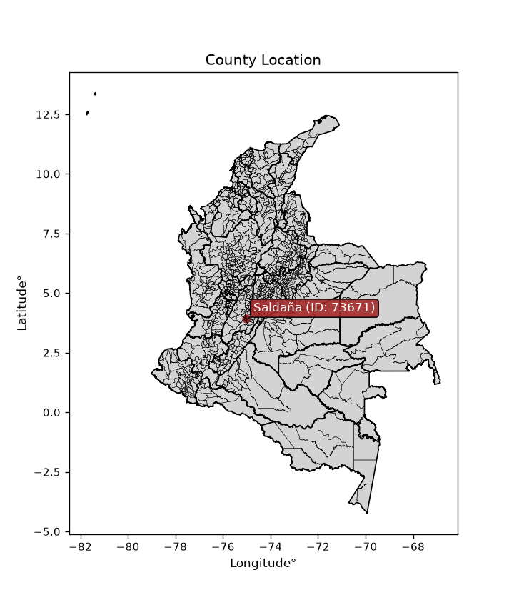
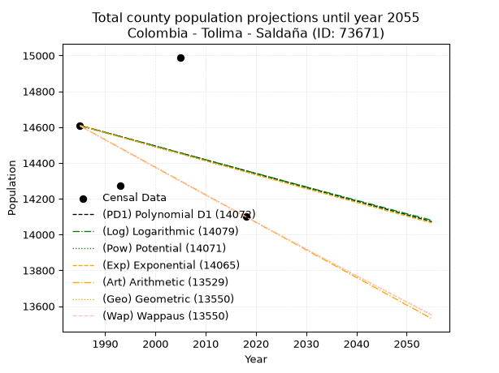
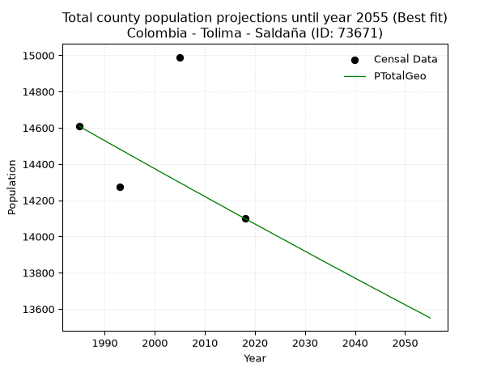
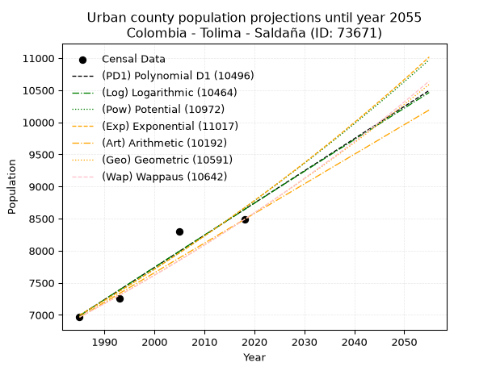
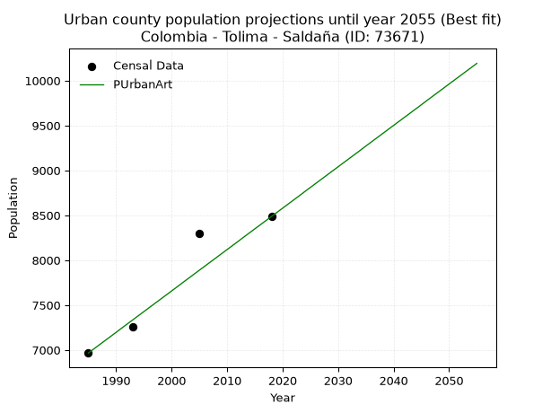
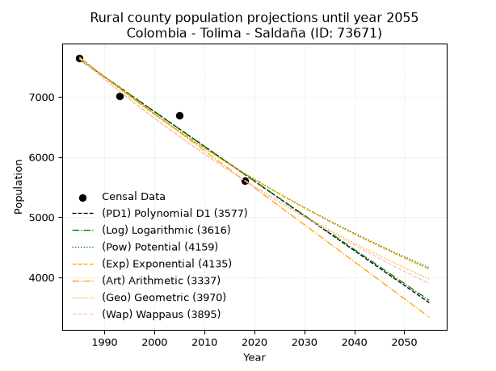
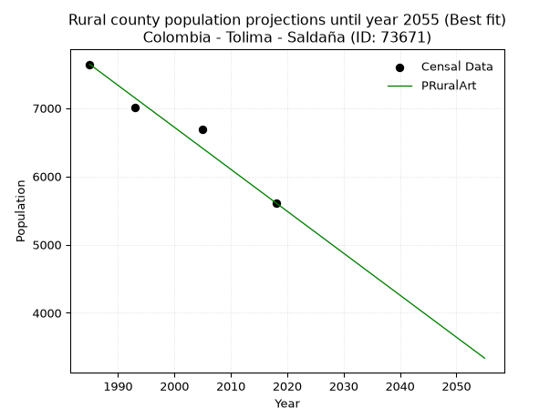

<div align="center">


</div>

# _“Population and Public Services Demand Projections (PPSD) until Year 2050 for Colombia - Tolima - Saldaña (ID: 73671)”_
Keywords: `population` `public-service` `projection` `lineal` `polynomial` `logarithmic` `potential` `exponential` `arithmetic` `geometric` `wappaus` `dane` `colombia` `south-america`

PPSD are analytical estimates used by governments and planners to anticipate future changes in population size, age distribution, and the resulting community needs for utilities, healthcare, education, and infrastructure as sizing future water treatment facilities, electrical grids, and road networks based on spatial growth.

<div align="center">

</img>

</div>


> **General running parameters**: • app_version: _v20260806_. • Python version: _3.14.7_. • Pandas version: _3.0.5_. • NumPy version: _2.5.1_. • Creates, save and include plots into reports (create_plot): _False_. • Projection until year: _2050_. • Process polynomial degree 2 and up: _False_. • Process Wappaus: _True_. • Process Wappaus: _True_. • Set negative values to zero: _True_. • Set infinite values to zero: _True_. • Drop dataset notes: _True_. 
<div align="center">

Dynamic map: [:earth_americas:Google](http://maps.google.com/maps?q=3.929814676,-75.0168523) [:earth_americas:OSM](https://www.openstreetmap.org/#map=18/3.929814676/-75.0168523&layers=P) [:earth_americas:Bing](https://www.bing.com/maps?cp=3.929814676~-75.0168523&lvl=18) [:earth_americas:Apple](https://maps.apple.com/frame?center=3.929814676%2C-75.0168523&span=0.003%2C0.006)

</div>


<div align="center">

```geojson
{
  "type": "Feature",
  "geometry": {
    "type": "Point", 
    "coordinates": [-75.0168523, 3.929814676]
  }, 
  "properties": {
    "Name": "Colombia - Tolima - Saldaña (ID: 73671)"
  }
}
```

</div>


## 0. Census Data (4 records)

Census data are official statistics collected by a government about the people and housing in a country. They usually include counts of total population, age, sex, race, income, education, and jobs.

📅Global census file: [Population.xlsx](../data/Population.xlsx)

| Source   |   Year |   CountryID | CountryName   |   StateID | StateName   |   CountyID | CountyName   |   PTotal |   PUrban |   PRural |
|:---------|-------:|------------:|:--------------|----------:|:------------|-----------:|:-------------|---------:|---------:|---------:|
| DANE     |   1985 |          57 | Colombia      |        73 | Tolima      |      73671 | Saldaña      |    14607 |     6966 |     7641 |
| DANE     |   1993 |          57 | Colombia      |        73 | Tolima      |      73671 | Saldaña      |    14273 |     7259 |     7014 |
| DANE     |   2005 |          57 | Colombia      |        73 | Tolima      |      73671 | Saldaña      |    14990 |     8298 |     6692 |
| DANE     |   2018 |          57 | Colombia      |        73 | Tolima      |      73671 | Saldaña      |    14099 |     8487 |     5612 |

> 🔥Some records could had specific notes about the registered values or the corresponding urban or rural distribution.

📅   [RUPS](https://www.datos.gov.co/Hacienda-y-Cr-dito-P-blico/Registro-nico-de-Prestadores-de-Servicios-P-blicos/4qkq-csdn/about_data) - Local public utility companies: [RUPS.csv](../data/RUPS.xlsx)

 | SERVICIO       | ESTADO    | NOMBRE                                                                                                    | NIT         | DEPARTAMENTO_DOMICILIO   | MUNICIPIO_DOMICILIO   | DIRECCION          |   TELEFONO | EMAIL                                    | TIPO_PRESTADOR                             | CLASIFICACION                  |
|:---------------|:----------|:----------------------------------------------------------------------------------------------------------|:------------|:-------------------------|:----------------------|:-------------------|-----------:|:-----------------------------------------|:-------------------------------------------|:-------------------------------|
| ACUEDUCTO      | OPERATIVA | ASOCIACION DE USUARIOS DEL ACUEDUCTO DE LA VEREDA SANTA INES MUNICIPIO DE SALDANA DEPARTAMENTO DEL TOLIMA | 809005691-7 | TOLIMA                   | SALDANA               | VEREDA SANTA INES  |    2702778 | asociacionusuariosdeacueductov@gmail.com | SOCIEDADES (EMPRESA DE SERVICIOS PUBLICOS) | MENOR O IGUAL A 2500 USUARIOS  |
| ACUEDUCTO      | OPERATIVA | EMPRESA DE SERVICIOS PUBLICOS DE SALDAÑA SA ESP                                                           | 900306467-5 | TOLIMA                   | SALDANA               | Edificio Municipal |    2266035 | empusaldana@hotmail.com                  | SOCIEDADES (EMPRESA DE SERVICIOS PUBLICOS) | DESDE 2501 HASTA 5000 USUARIOS |
| ALCANTARILLADO | OPERATIVA | EMPRESA DE SERVICIOS PUBLICOS DE SALDAÑA SA ESP                                                           | 900306467-5 | TOLIMA                   | SALDANA               | Edificio Municipal |    2266035 | empusaldana@hotmail.com                  | SOCIEDADES (EMPRESA DE SERVICIOS PUBLICOS) | DESDE 2501 HASTA 5000 USUARIOS |

## 1. Total

### 1.1. Coefficients and Parameters

* (PD1) Polynomial Deg 1: -7.669610598152835, 29833.388598955207 (lineal)
* (Log) Logarithmic: -15284.521113334782, 130670.01746492297
* (Pow) Potential: -1.0806816935493688, 7.728428785852044
* (Exp) Exponential: -0.0005421977085049815, 42857.05987356795
* (Art) Arithmetic: Year diff. 2018 - 1985 = 33, Population diff. 14099 - 14607 = -508, Annual growth = -15.393939393939394
* (Geo) Geometric: Year diff. 2018 - 1985 = 33, Population diff. 14099 - 14607 = -508, Annual growth % = -0.0010720610825494248
* (Wap) Wappaus: i = -0.10725241687409875, Condition values only valid for < 200)

<sub>
Wappaus condition values: ['-0.00', '-0.11', '-0.21', '-0.32', '-0.43', '-0.54', '-0.64', '-0.75', '-0.86', '-0.97', '-1.07', '-1.18', '-1.29', '-1.39', '-1.50', '-1.61', '-1.72', '-1.82', '-1.93', '-2.04', '-2.15', '-2.25', '-2.36', '-2.47', '-2.57', '-2.68', '-2.79', '-2.90', '-3.00', '-3.11', '-3.22', '-3.32', '-3.43', '-3.54', '-3.65', '-3.75', '-3.86', '-3.97', '-4.08', '-4.18', '-4.29', '-4.40', '-4.50', '-4.61', '-4.72', '-4.83', '-4.93', '-5.04', '-5.15', '-5.26', '-5.36', '-5.47', '-5.58', '-5.68', '-5.79', '-5.90', '-6.01', '-6.11', '-6.22', '-6.33', '-6.44', '-6.54', '-6.65', '-6.76', '-6.86', '-6.97']
</sub>


### 1.2. Projected Dataset

|   Year |   CountyID |   PTotalPD1 |   PTotalLog |   PTotalPow |   PTotalExp |   PTotalArt |   PTotalGeo |   PTotalWap |
|-------:|-----------:|------------:|------------:|------------:|------------:|------------:|------------:|------------:|
|   1985 |      73671 |       14609 |       14609 |       14608 |       14609 |       14607 |       14607 |       14607 |
|   1986 |      73671 |       14602 |       14601 |       14600 |       14601 |       14592 |       14591 |       14591 |
|   1987 |      73671 |       14594 |       14594 |       14592 |       14593 |       14576 |       14576 |       14576 |
|   1988 |      73671 |       14586 |       14586 |       14584 |       14585 |       14561 |       14560 |       14560 |
|   1989 |      73671 |       14579 |       14578 |       14577 |       14577 |       14545 |       14544 |       14544 |
|   1990 |      73671 |       14571 |       14570 |       14569 |       14569 |       14530 |       14529 |       14529 |
|   1991 |      73671 |       14563 |       14563 |       14561 |       14561 |       14515 |       14513 |       14513 |
|   1992 |      73671 |       14556 |       14555 |       14553 |       14553 |       14499 |       14498 |       14498 |
|   1993 |      73671 |       14548 |       14547 |       14545 |       14545 |       14484 |       14482 |       14482 |
|   1994 |      73671 |       14540 |       14540 |       14537 |       14537 |       14468 |       14467 |       14467 |
|   1995 |      73671 |       14533 |       14532 |       14529 |       14530 |       14453 |       14451 |       14451 |
|   1996 |      73671 |       14525 |       14524 |       14521 |       14522 |       14438 |       14436 |       14436 |
|   1997 |      73671 |       14517 |       14517 |       14513 |       14514 |       14422 |       14420 |       14420 |
|   1998 |      73671 |       14510 |       14509 |       14506 |       14506 |       14407 |       14405 |       14405 |
|   1999 |      73671 |       14502 |       14502 |       14498 |       14498 |       14391 |       14389 |       14389 |
|   2000 |      73671 |       14494 |       14494 |       14490 |       14490 |       14376 |       14374 |       14374 |
|   2001 |      73671 |       14486 |       14486 |       14482 |       14482 |       14361 |       14358 |       14358 |
|   2002 |      73671 |       14479 |       14479 |       14474 |       14475 |       14345 |       14343 |       14343 |
|   2003 |      73671 |       14471 |       14471 |       14466 |       14467 |       14330 |       14328 |       14328 |
|   2004 |      73671 |       14463 |       14463 |       14459 |       14459 |       14315 |       14312 |       14312 |
|   2005 |      73671 |       14456 |       14456 |       14451 |       14451 |       14299 |       14297 |       14297 |
|   2006 |      73671 |       14448 |       14448 |       14443 |       14443 |       14284 |       14282 |       14282 |
|   2007 |      73671 |       14440 |       14440 |       14435 |       14435 |       14268 |       14266 |       14266 |
|   2008 |      73671 |       14433 |       14433 |       14428 |       14428 |       14253 |       14251 |       14251 |
|   2009 |      73671 |       14425 |       14425 |       14420 |       14420 |       14238 |       14236 |       14236 |
|   2010 |      73671 |       14417 |       14418 |       14412 |       14412 |       14222 |       14221 |       14221 |
|   2011 |      73671 |       14410 |       14410 |       14404 |       14404 |       14207 |       14205 |       14205 |
|   2012 |      73671 |       14402 |       14402 |       14397 |       14396 |       14191 |       14190 |       14190 |
|   2013 |      73671 |       14394 |       14395 |       14389 |       14388 |       14176 |       14175 |       14175 |
|   2014 |      73671 |       14387 |       14387 |       14381 |       14381 |       14161 |       14160 |       14160 |
|   2015 |      73671 |       14379 |       14380 |       14373 |       14373 |       14145 |       14144 |       14144 |
|   2016 |      73671 |       14371 |       14372 |       14366 |       14365 |       14130 |       14129 |       14129 |
|   2017 |      73671 |       14364 |       14364 |       14358 |       14357 |       14114 |       14114 |       14114 |
|   2018 |      73671 |       14356 |       14357 |       14350 |       14350 |       14099 |       14099 |       14099 |
|   2019 |      73671 |       14348 |       14349 |       14343 |       14342 |       14084 |       14084 |       14084 |
|   2020 |      73671 |       14341 |       14342 |       14335 |       14334 |       14068 |       14069 |       14069 |
|   2021 |      73671 |       14333 |       14334 |       14327 |       14326 |       14053 |       14054 |       14054 |
|   2022 |      73671 |       14325 |       14327 |       14320 |       14318 |       14037 |       14039 |       14039 |
|   2023 |      73671 |       14318 |       14319 |       14312 |       14311 |       14022 |       14024 |       14024 |
|   2024 |      73671 |       14310 |       14312 |       14304 |       14303 |       14007 |       14009 |       14009 |
|   2025 |      73671 |       14302 |       14304 |       14297 |       14295 |       13991 |       13994 |       13994 |
|   2026 |      73671 |       14295 |       14296 |       14289 |       14287 |       13976 |       13979 |       13978 |
|   2027 |      73671 |       14287 |       14289 |       14281 |       14280 |       13960 |       13964 |       13964 |
|   2028 |      73671 |       14279 |       14281 |       14274 |       14272 |       13945 |       13949 |       13949 |
|   2029 |      73671 |       14272 |       14274 |       14266 |       14264 |       13930 |       13934 |       13934 |
|   2030 |      73671 |       14264 |       14266 |       14259 |       14256 |       13914 |       13919 |       13919 |
|   2031 |      73671 |       14256 |       14259 |       14251 |       14249 |       13899 |       13904 |       13904 |
|   2032 |      73671 |       14249 |       14251 |       14243 |       14241 |       13883 |       13889 |       13889 |
|   2033 |      73671 |       14241 |       14244 |       14236 |       14233 |       13868 |       13874 |       13874 |
|   2034 |      73671 |       14233 |       14236 |       14228 |       14226 |       13853 |       13859 |       13859 |
|   2035 |      73671 |       14226 |       14229 |       14221 |       14218 |       13837 |       13844 |       13844 |
|   2036 |      73671 |       14218 |       14221 |       14213 |       14210 |       13822 |       13829 |       13829 |
|   2037 |      73671 |       14210 |       14214 |       14206 |       14202 |       13807 |       13815 |       13814 |
|   2038 |      73671 |       14203 |       14206 |       14198 |       14195 |       13791 |       13800 |       13800 |
|   2039 |      73671 |       14195 |       14199 |       14191 |       14187 |       13776 |       13785 |       13785 |
|   2040 |      73671 |       14187 |       14191 |       14183 |       14179 |       13760 |       13770 |       13770 |
|   2041 |      73671 |       14180 |       14184 |       14176 |       14172 |       13745 |       13755 |       13755 |
|   2042 |      73671 |       14172 |       14176 |       14168 |       14164 |       13730 |       13741 |       13741 |
|   2043 |      73671 |       14164 |       14169 |       14161 |       14156 |       13714 |       13726 |       13726 |
|   2044 |      73671 |       14157 |       14161 |       14153 |       14149 |       13699 |       13711 |       13711 |
|   2045 |      73671 |       14149 |       14154 |       14146 |       14141 |       13683 |       13697 |       13696 |
|   2046 |      73671 |       14141 |       14146 |       14138 |       14133 |       13668 |       13682 |       13682 |
|   2047 |      73671 |       14134 |       14139 |       14131 |       14126 |       13653 |       13667 |       13667 |
|   2048 |      73671 |       14126 |       14131 |       14123 |       14118 |       13637 |       13653 |       13652 |
|   2049 |      73671 |       14118 |       14124 |       14116 |       14110 |       13622 |       13638 |       13638 |
|   2050 |      73671 |       14111 |       14116 |       14108 |       14103 |       13606 |       13623 |       13623 |
<div align="center">

</img>

</div>


### 1.3. Best fit with absolute and relative error (%)

Relative error puts that difference into context by dividing the absolute error by the true value, creating a unitless ratio or percentage that shows the scale of the mistake.

Absolute and relative error

|   Year | Source   |   CountryID | CountryName   |   StateID | StateName   |   CountyID_x | CountyName   |   PTotal |   PUrban |   PRural |   CountyID_y |   PTotalPD1 |   PTotalLog |   PTotalPow |   PTotalExp |   PTotalArt |   PTotalGeo |   PTotalWap |   PTotalPD1AbsError |   PTotalLogAbsError |   PTotalPowAbsError |   PTotalExpAbsError |   PTotalArtAbsError |   PTotalGeoAbsError |   PTotalWapAbsError |   PTotalPD1RelError |   PTotalLogRelError |   PTotalPowRelError |   PTotalExpRelError |   PTotalArtRelError |   PTotalGeoRelError |   PTotalWapRelError |
|-------:|:---------|------------:|:--------------|----------:|:------------|-------------:|:-------------|---------:|---------:|---------:|-------------:|------------:|------------:|------------:|------------:|------------:|------------:|------------:|--------------------:|--------------------:|--------------------:|--------------------:|--------------------:|--------------------:|--------------------:|--------------------:|--------------------:|--------------------:|--------------------:|--------------------:|--------------------:|--------------------:|
|   1985 | DANE     |          57 | Colombia      |        73 | Tolima      |        73671 | Saldaña      |    14607 |     6966 |     7641 |        73671 |       14609 |       14609 |       14608 |       14609 |       14607 |       14607 |       14607 |                   2 |                   2 |                   1 |                   2 |                   0 |                   0 |                   0 |           0.0136921 |           0.0136921 |          0.00684603 |           0.0136921 |             0       |             0       |             0       |
|   1993 | DANE     |          57 | Colombia      |        73 | Tolima      |        73671 | Saldaña      |    14273 |     7259 |     7014 |        73671 |       14548 |       14547 |       14545 |       14545 |       14484 |       14482 |       14482 |                 275 |                 274 |                 272 |                 272 |                 211 |                 209 |                 209 |           1.92671   |           1.91971   |          1.9057     |           1.9057    |             1.47832 |             1.4643  |             1.4643  |
|   2005 | DANE     |          57 | Colombia      |        73 | Tolima      |        73671 | Saldaña      |    14990 |     8298 |     6692 |        73671 |       14456 |       14456 |       14451 |       14451 |       14299 |       14297 |       14297 |                 534 |                 534 |                 539 |                 539 |                 691 |                 693 |                 693 |           3.56237   |           3.56237   |          3.59573    |           3.59573   |             4.60974 |             4.62308 |             4.62308 |
|   2018 | DANE     |          57 | Colombia      |        73 | Tolima      |        73671 | Saldaña      |    14099 |     8487 |     5612 |        73671 |       14356 |       14357 |       14350 |       14350 |       14099 |       14099 |       14099 |                 257 |                 258 |                 251 |                 251 |                   0 |                   0 |                   0 |           1.82282   |           1.82992   |          1.78027    |           1.78027   |             0       |             0       |             0       |

Relative error mean

| Method    |   RelError | Best   |
|:----------|-----------:|:-------|
| PTotalPD1 |    1.8314  |        |
| PTotalLog |    1.83142 |        |
| PTotalPow |    1.82214 |        |
| PTotalExp |    1.82385 |        |
| PTotalArt |    1.52201 |        |
| PTotalGeo |    1.52185 | True   |
| PTotalWap |    1.52185 | True   |

💙Best method: _**PTotalGeo**_
<div align="center">

</img>

</div>


### 1.4. Fresh water supply demand in liters per capita per day (lpcd)

The fresh water supply demand typically ranges from 100 to 300 liters per capita per day (lpcd) for standard domestic and municipal planning, though absolute survival minimums set by the World Health Organization are as low as 7.5 to 20 liters per day, and total consumption in high-income nations can exceed 400 liters.

> `CZ`: Level in meters above the sea level (masl)<br> `WS`: Fresh water supply demand in liters per capita per day (lpcd or l/h/d)<br> `WSAll`: Zonal fresh water supply demand in liters per second (l/s)<br> `A`: Zonal area in square meters<br> `DP`: Population density (people/hectare or p/ha)

Reference values (RAS Colombia)

|    CZ |   WS |
|------:|-----:|
|  1000 |  120 |
|  2000 |  130 |
| 99999 |  140 |

County shapefile geometry properties and water supply values

|   CountyID |      ATotal |   CZTotal |   WSTotal |
|-----------:|------------:|----------:|----------:|
|      73671 | 1.93106e+08 |   314.829 |       120 |

Projected values for best method: PTotalGeo

|   CountyID |   Year |   PTotalGeo |   DPTotal |   WSTotal |   WSTotalAll |
|-----------:|-------:|------------:|----------:|----------:|-------------:|
|      73671 |   1985 |       14607 |      0.76 |       120 |      20.2875 |
|      73671 |   1986 |       14591 |      0.76 |       120 |      20.2653 |
|      73671 |   1987 |       14576 |      0.75 |       120 |      20.2444 |
|      73671 |   1988 |       14560 |      0.75 |       120 |      20.2222 |
|      73671 |   1989 |       14544 |      0.75 |       120 |      20.2    |
|      73671 |   1990 |       14529 |      0.75 |       120 |      20.1792 |
|      73671 |   1991 |       14513 |      0.75 |       120 |      20.1569 |
|      73671 |   1992 |       14498 |      0.75 |       120 |      20.1361 |
|      73671 |   1993 |       14482 |      0.75 |       120 |      20.1139 |
|      73671 |   1994 |       14467 |      0.75 |       120 |      20.0931 |
|      73671 |   1995 |       14451 |      0.75 |       120 |      20.0708 |
|      73671 |   1996 |       14436 |      0.75 |       120 |      20.05   |
|      73671 |   1997 |       14420 |      0.75 |       120 |      20.0278 |
|      73671 |   1998 |       14405 |      0.75 |       120 |      20.0069 |
|      73671 |   1999 |       14389 |      0.75 |       120 |      19.9847 |
|      73671 |   2000 |       14374 |      0.74 |       120 |      19.9639 |
|      73671 |   2001 |       14358 |      0.74 |       120 |      19.9417 |
|      73671 |   2002 |       14343 |      0.74 |       120 |      19.9208 |
|      73671 |   2003 |       14328 |      0.74 |       120 |      19.9    |
|      73671 |   2004 |       14312 |      0.74 |       120 |      19.8778 |
|      73671 |   2005 |       14297 |      0.74 |       120 |      19.8569 |
|      73671 |   2006 |       14282 |      0.74 |       120 |      19.8361 |
|      73671 |   2007 |       14266 |      0.74 |       120 |      19.8139 |
|      73671 |   2008 |       14251 |      0.74 |       120 |      19.7931 |
|      73671 |   2009 |       14236 |      0.74 |       120 |      19.7722 |
|      73671 |   2010 |       14221 |      0.74 |       120 |      19.7514 |
|      73671 |   2011 |       14205 |      0.74 |       120 |      19.7292 |
|      73671 |   2012 |       14190 |      0.73 |       120 |      19.7083 |
|      73671 |   2013 |       14175 |      0.73 |       120 |      19.6875 |
|      73671 |   2014 |       14160 |      0.73 |       120 |      19.6667 |
|      73671 |   2015 |       14144 |      0.73 |       120 |      19.6444 |
|      73671 |   2016 |       14129 |      0.73 |       120 |      19.6236 |
|      73671 |   2017 |       14114 |      0.73 |       120 |      19.6028 |
|      73671 |   2018 |       14099 |      0.73 |       120 |      19.5819 |
|      73671 |   2019 |       14084 |      0.73 |       120 |      19.5611 |
|      73671 |   2020 |       14069 |      0.73 |       120 |      19.5403 |
|      73671 |   2021 |       14054 |      0.73 |       120 |      19.5194 |
|      73671 |   2022 |       14039 |      0.73 |       120 |      19.4986 |
|      73671 |   2023 |       14024 |      0.73 |       120 |      19.4778 |
|      73671 |   2024 |       14009 |      0.73 |       120 |      19.4569 |
|      73671 |   2025 |       13994 |      0.72 |       120 |      19.4361 |
|      73671 |   2026 |       13979 |      0.72 |       120 |      19.4153 |
|      73671 |   2027 |       13964 |      0.72 |       120 |      19.3944 |
|      73671 |   2028 |       13949 |      0.72 |       120 |      19.3736 |
|      73671 |   2029 |       13934 |      0.72 |       120 |      19.3528 |
|      73671 |   2030 |       13919 |      0.72 |       120 |      19.3319 |
|      73671 |   2031 |       13904 |      0.72 |       120 |      19.3111 |
|      73671 |   2032 |       13889 |      0.72 |       120 |      19.2903 |
|      73671 |   2033 |       13874 |      0.72 |       120 |      19.2694 |
|      73671 |   2034 |       13859 |      0.72 |       120 |      19.2486 |
|      73671 |   2035 |       13844 |      0.72 |       120 |      19.2278 |
|      73671 |   2036 |       13829 |      0.72 |       120 |      19.2069 |
|      73671 |   2037 |       13815 |      0.72 |       120 |      19.1875 |
|      73671 |   2038 |       13800 |      0.71 |       120 |      19.1667 |
|      73671 |   2039 |       13785 |      0.71 |       120 |      19.1458 |
|      73671 |   2040 |       13770 |      0.71 |       120 |      19.125  |
|      73671 |   2041 |       13755 |      0.71 |       120 |      19.1042 |
|      73671 |   2042 |       13741 |      0.71 |       120 |      19.0847 |
|      73671 |   2043 |       13726 |      0.71 |       120 |      19.0639 |
|      73671 |   2044 |       13711 |      0.71 |       120 |      19.0431 |
|      73671 |   2045 |       13697 |      0.71 |       120 |      19.0236 |
|      73671 |   2046 |       13682 |      0.71 |       120 |      19.0028 |
|      73671 |   2047 |       13667 |      0.71 |       120 |      18.9819 |
|      73671 |   2048 |       13653 |      0.71 |       120 |      18.9625 |
|      73671 |   2049 |       13638 |      0.71 |       120 |      18.9417 |
|      73671 |   2050 |       13623 |      0.71 |       120 |      18.9208 |

## 2. Urban

### 2.1. Coefficients and Parameters

* (PD1) Polynomial Deg 1: 50.10116419108776, -92462.35367322329 (lineal)
* (Log) Logarithmic: 100326.68200573493, -754831.4138931645
* (Pow) Potential: 12.984661108987392, -38.97545406584492
* (Exp) Exponential: 0.006484050745510783, 0.017997743565076555
* (Art) Arithmetic: Year diff. 2018 - 1985 = 33, Population diff. 8487 - 6966 = 1521, Annual growth = 46.09090909090909
* (Geo) Geometric: Year diff. 2018 - 1985 = 33, Population diff. 8487 - 6966 = 1521, Annual growth % = 0.006002623032109744
* (Wap) Wappaus: i = 0.5965302412594201, Condition values only valid for < 200)

<sub>
Wappaus condition values: ['0.00', '0.60', '1.19', '1.79', '2.39', '2.98', '3.58', '4.18', '4.77', '5.37', '5.97', '6.56', '7.16', '7.75', '8.35', '8.95', '9.54', '10.14', '10.74', '11.33', '11.93', '12.53', '13.12', '13.72', '14.32', '14.91', '15.51', '16.11', '16.70', '17.30', '17.90', '18.49', '19.09', '19.69', '20.28', '20.88', '21.48', '22.07', '22.67', '23.26', '23.86', '24.46', '25.05', '25.65', '26.25', '26.84', '27.44', '28.04', '28.63', '29.23', '29.83', '30.42', '31.02', '31.62', '32.21', '32.81', '33.41', '34.00', '34.60', '35.20', '35.79', '36.39', '36.98', '37.58', '38.18', '38.77']
</sub>


### 2.2. Projected Dataset

|   Year |   CountyID |   PUrbanPD1 |   PUrbanLog |   PUrbanPow |   PUrbanExp |   PUrbanArt |   PUrbanGeo |   PUrbanWap |
|-------:|-----------:|------------:|------------:|------------:|------------:|------------:|------------:|------------:|
|   1985 |      73671 |        6988 |        6987 |        6996 |        6998 |        6966 |        6966 |        6966 |
|   1986 |      73671 |        7039 |        7037 |        7042 |        7043 |        7012 |        7008 |        7008 |
|   1987 |      73671 |        7089 |        7088 |        7088 |        7089 |        7058 |        7050 |        7050 |
|   1988 |      73671 |        7139 |        7138 |        7135 |        7135 |        7104 |        7092 |        7092 |
|   1989 |      73671 |        7189 |        7189 |        7181 |        7182 |        7150 |        7135 |        7134 |
|   1990 |      73671 |        7239 |        7239 |        7228 |        7228 |        7196 |        7178 |        7177 |
|   1991 |      73671 |        7289 |        7289 |        7276 |        7275 |        7243 |        7221 |        7220 |
|   1992 |      73671 |        7339 |        7340 |        7323 |        7323 |        7289 |        7264 |        7263 |
|   1993 |      73671 |        7389 |        7390 |        7371 |        7370 |        7335 |        7308 |        7307 |
|   1994 |      73671 |        7439 |        7440 |        7419 |        7418 |        7381 |        7351 |        7350 |
|   1995 |      73671 |        7489 |        7491 |        7468 |        7466 |        7427 |        7396 |        7394 |
|   1996 |      73671 |        7540 |        7541 |        7516 |        7515 |        7473 |        7440 |        7439 |
|   1997 |      73671 |        7590 |        7591 |        7565 |        7564 |        7519 |        7485 |        7483 |
|   1998 |      73671 |        7640 |        7642 |        7615 |        7613 |        7565 |        7530 |        7528 |
|   1999 |      73671 |        7690 |        7692 |        7664 |        7663 |        7611 |        7575 |        7573 |
|   2000 |      73671 |        7740 |        7742 |        7714 |        7712 |        7657 |        7620 |        7619 |
|   2001 |      73671 |        7790 |        7792 |        7765 |        7763 |        7703 |        7666 |        7664 |
|   2002 |      73671 |        7840 |        7842 |        7815 |        7813 |        7750 |        7712 |        7710 |
|   2003 |      73671 |        7890 |        7892 |        7866 |        7864 |        7796 |        7758 |        7756 |
|   2004 |      73671 |        7940 |        7942 |        7917 |        7915 |        7842 |        7805 |        7803 |
|   2005 |      73671 |        7990 |        7992 |        7969 |        7967 |        7888 |        7852 |        7850 |
|   2006 |      73671 |        8041 |        8042 |        8020 |        8018 |        7934 |        7899 |        7897 |
|   2007 |      73671 |        8091 |        8092 |        8072 |        8071 |        7980 |        7946 |        7944 |
|   2008 |      73671 |        8141 |        8142 |        8125 |        8123 |        8026 |        7994 |        7992 |
|   2009 |      73671 |        8191 |        8192 |        8178 |        8176 |        8072 |        8042 |        8040 |
|   2010 |      73671 |        8241 |        8242 |        8231 |        8229 |        8118 |        8090 |        8089 |
|   2011 |      73671 |        8291 |        8292 |        8284 |        8283 |        8164 |        8139 |        8137 |
|   2012 |      73671 |        8341 |        8342 |        8337 |        8337 |        8210 |        8188 |        8186 |
|   2013 |      73671 |        8391 |        8392 |        8391 |        8391 |        8257 |        8237 |        8236 |
|   2014 |      73671 |        8441 |        8442 |        8446 |        8445 |        8303 |        8286 |        8285 |
|   2015 |      73671 |        8491 |        8492 |        8500 |        8500 |        8349 |        8336 |        8335 |
|   2016 |      73671 |        8542 |        8541 |        8555 |        8556 |        8395 |        8386 |        8385 |
|   2017 |      73671 |        8592 |        8591 |        8611 |        8611 |        8441 |        8436 |        8436 |
|   2018 |      73671 |        8642 |        8641 |        8666 |        8667 |        8487 |        8487 |        8487 |
|   2019 |      73671 |        8692 |        8691 |        8722 |        8724 |        8533 |        8538 |        8538 |
|   2020 |      73671 |        8742 |        8740 |        8778 |        8780 |        8579 |        8589 |        8590 |
|   2021 |      73671 |        8792 |        8790 |        8835 |        8837 |        8625 |        8641 |        8642 |
|   2022 |      73671 |        8842 |        8839 |        8892 |        8895 |        8671 |        8693 |        8694 |
|   2023 |      73671 |        8892 |        8889 |        8949 |        8953 |        8717 |        8745 |        8747 |
|   2024 |      73671 |        8942 |        8939 |        9007 |        9011 |        8764 |        8797 |        8800 |
|   2025 |      73671 |        8993 |        8988 |        9065 |        9070 |        8810 |        8850 |        8853 |
|   2026 |      73671 |        9043 |        9038 |        9123 |        9129 |        8856 |        8903 |        8907 |
|   2027 |      73671 |        9093 |        9087 |        9182 |        9188 |        8902 |        8957 |        8961 |
|   2028 |      73671 |        9143 |        9137 |        9241 |        9248 |        8948 |        9010 |        9016 |
|   2029 |      73671 |        9193 |        9186 |        9300 |        9308 |        8994 |        9065 |        9071 |
|   2030 |      73671 |        9243 |        9236 |        9360 |        9369 |        9040 |        9119 |        9126 |
|   2031 |      73671 |        9293 |        9285 |        9420 |        9429 |        9086 |        9174 |        9181 |
|   2032 |      73671 |        9343 |        9334 |        9480 |        9491 |        9132 |        9229 |        9237 |
|   2033 |      73671 |        9393 |        9384 |        9541 |        9553 |        9178 |        9284 |        9294 |
|   2034 |      73671 |        9443 |        9433 |        9602 |        9615 |        9224 |        9340 |        9351 |
|   2035 |      73671 |        9494 |        9482 |        9663 |        9677 |        9271 |        9396 |        9408 |
|   2036 |      73671 |        9544 |        9532 |        9725 |        9740 |        9317 |        9452 |        9465 |
|   2037 |      73671 |        9594 |        9581 |        9788 |        9804 |        9363 |        9509 |        9523 |
|   2038 |      73671 |        9644 |        9630 |        9850 |        9867 |        9409 |        9566 |        9582 |
|   2039 |      73671 |        9694 |        9679 |        9913 |        9932 |        9455 |        9624 |        9641 |
|   2040 |      73671 |        9744 |        9729 |        9976 |        9996 |        9501 |        9681 |        9700 |
|   2041 |      73671 |        9794 |        9778 |       10040 |       10061 |        9547 |        9739 |        9760 |
|   2042 |      73671 |        9844 |        9827 |       10104 |       10127 |        9593 |        9798 |        9820 |
|   2043 |      73671 |        9894 |        9876 |       10169 |       10192 |        9639 |        9857 |        9880 |
|   2044 |      73671 |        9944 |        9925 |       10233 |       10259 |        9685 |        9916 |        9941 |
|   2045 |      73671 |        9995 |        9974 |       10299 |       10326 |        9731 |        9975 |       10003 |
|   2046 |      73671 |       10045 |       10023 |       10364 |       10393 |        9778 |       10035 |       10065 |
|   2047 |      73671 |       10095 |       10072 |       10430 |       10460 |        9824 |       10096 |       10127 |
|   2048 |      73671 |       10145 |       10121 |       10496 |       10528 |        9870 |       10156 |       10190 |
|   2049 |      73671 |       10195 |       10170 |       10563 |       10597 |        9916 |       10217 |       10253 |
|   2050 |      73671 |       10245 |       10219 |       10630 |       10666 |        9962 |       10278 |       10317 |
<div align="center">

</img>

</div>


### 2.3. Best fit with absolute and relative error (%)

Relative error puts that difference into context by dividing the absolute error by the true value, creating a unitless ratio or percentage that shows the scale of the mistake.

Absolute and relative error

|   Year | Source   |   CountryID | CountryName   |   StateID | StateName   |   CountyID_x | CountyName   |   PTotal |   PUrban |   PRural |   CountyID_y |   PUrbanPD1 |   PUrbanLog |   PUrbanPow |   PUrbanExp |   PUrbanArt |   PUrbanGeo |   PUrbanWap |   PUrbanPD1AbsError |   PUrbanLogAbsError |   PUrbanPowAbsError |   PUrbanExpAbsError |   PUrbanArtAbsError |   PUrbanGeoAbsError |   PUrbanWapAbsError |   PUrbanPD1RelError |   PUrbanLogRelError |   PUrbanPowRelError |   PUrbanExpRelError |   PUrbanArtRelError |   PUrbanGeoRelError |   PUrbanWapRelError |
|-------:|:---------|------------:|:--------------|----------:|:------------|-------------:|:-------------|---------:|---------:|---------:|-------------:|------------:|------------:|------------:|------------:|------------:|------------:|------------:|--------------------:|--------------------:|--------------------:|--------------------:|--------------------:|--------------------:|--------------------:|--------------------:|--------------------:|--------------------:|--------------------:|--------------------:|--------------------:|--------------------:|
|   1985 | DANE     |          57 | Colombia      |        73 | Tolima      |        73671 | Saldaña      |    14607 |     6966 |     7641 |        73671 |        6988 |        6987 |        6996 |        6998 |        6966 |        6966 |        6966 |                  22 |                  21 |                  30 |                  32 |                   0 |                   0 |                   0 |             0.31582 |            0.301464 |            0.430663 |            0.459374 |             0       |            0        |            0        |
|   1993 | DANE     |          57 | Colombia      |        73 | Tolima      |        73671 | Saldaña      |    14273 |     7259 |     7014 |        73671 |        7389 |        7390 |        7371 |        7370 |        7335 |        7308 |        7307 |                 130 |                 131 |                 112 |                 111 |                  76 |                  49 |                  48 |             1.79088 |            1.80466  |            1.54291  |            1.52914  |             1.04698 |            0.675024 |            0.661248 |
|   2005 | DANE     |          57 | Colombia      |        73 | Tolima      |        73671 | Saldaña      |    14990 |     8298 |     6692 |        73671 |        7990 |        7992 |        7969 |        7967 |        7888 |        7852 |        7850 |                 308 |                 306 |                 329 |                 331 |                 410 |                 446 |                 448 |             3.71174 |            3.68764  |            3.96481  |            3.98891  |             4.94095 |            5.37479  |            5.39889  |
|   2018 | DANE     |          57 | Colombia      |        73 | Tolima      |        73671 | Saldaña      |    14099 |     8487 |     5612 |        73671 |        8642 |        8641 |        8666 |        8667 |        8487 |        8487 |        8487 |                 155 |                 154 |                 179 |                 180 |                   0 |                   0 |                   0 |             1.82632 |            1.81454  |            2.10911  |            2.12089  |             0       |            0        |            0        |

Relative error mean

| Method    |   RelError | Best   |
|:----------|-----------:|:-------|
| PUrbanPD1 |    1.91119 |        |
| PUrbanLog |    1.90207 |        |
| PUrbanPow |    2.01187 |        |
| PUrbanExp |    2.02458 |        |
| PUrbanArt |    1.49698 | True   |
| PUrbanGeo |    1.51245 |        |
| PUrbanWap |    1.51503 |        |

💙Best method: _**PUrbanArt**_
<div align="center">

</img>

</div>


### 2.4. Fresh water supply demand in liters per capita per day (lpcd)

The fresh water supply demand typically ranges from 100 to 300 liters per capita per day (lpcd) for standard domestic and municipal planning, though absolute survival minimums set by the World Health Organization are as low as 7.5 to 20 liters per day, and total consumption in high-income nations can exceed 400 liters.

> `CZ`: Level in meters above the sea level (masl)<br> `WS`: Fresh water supply demand in liters per capita per day (lpcd or l/h/d)<br> `WSAll`: Zonal fresh water supply demand in liters per second (l/s)<br> `A`: Zonal area in square meters<br> `DP`: Population density (people/hectare or p/ha)

Reference values (RAS Colombia)

|    CZ |   WS |
|------:|-----:|
|  1000 |  120 |
|  2000 |  130 |
| 99999 |  140 |

County shapefile geometry properties and water supply values

|   CountyID |      AUrban |   CZUrban |   WSUrban |
|-----------:|------------:|----------:|----------:|
|      73671 | 1.99614e+06 |   311.667 |       120 |

Projected values for best method: PUrbanArt

|   CountyID |   Year |   PUrbanArt |   DPUrban |   WSUrban |   WSUrbanAll |
|-----------:|-------:|------------:|----------:|----------:|-------------:|
|      73671 |   1985 |        6966 |     34.9  |       120 |      9.675   |
|      73671 |   1986 |        7012 |     35.13 |       120 |      9.73889 |
|      73671 |   1987 |        7058 |     35.36 |       120 |      9.80278 |
|      73671 |   1988 |        7104 |     35.59 |       120 |      9.86667 |
|      73671 |   1989 |        7150 |     35.82 |       120 |      9.93056 |
|      73671 |   1990 |        7196 |     36.05 |       120 |      9.99444 |
|      73671 |   1991 |        7243 |     36.29 |       120 |     10.0597  |
|      73671 |   1992 |        7289 |     36.52 |       120 |     10.1236  |
|      73671 |   1993 |        7335 |     36.75 |       120 |     10.1875  |
|      73671 |   1994 |        7381 |     36.98 |       120 |     10.2514  |
|      73671 |   1995 |        7427 |     37.21 |       120 |     10.3153  |
|      73671 |   1996 |        7473 |     37.44 |       120 |     10.3792  |
|      73671 |   1997 |        7519 |     37.67 |       120 |     10.4431  |
|      73671 |   1998 |        7565 |     37.9  |       120 |     10.5069  |
|      73671 |   1999 |        7611 |     38.13 |       120 |     10.5708  |
|      73671 |   2000 |        7657 |     38.36 |       120 |     10.6347  |
|      73671 |   2001 |        7703 |     38.59 |       120 |     10.6986  |
|      73671 |   2002 |        7750 |     38.83 |       120 |     10.7639  |
|      73671 |   2003 |        7796 |     39.06 |       120 |     10.8278  |
|      73671 |   2004 |        7842 |     39.29 |       120 |     10.8917  |
|      73671 |   2005 |        7888 |     39.52 |       120 |     10.9556  |
|      73671 |   2006 |        7934 |     39.75 |       120 |     11.0194  |
|      73671 |   2007 |        7980 |     39.98 |       120 |     11.0833  |
|      73671 |   2008 |        8026 |     40.21 |       120 |     11.1472  |
|      73671 |   2009 |        8072 |     40.44 |       120 |     11.2111  |
|      73671 |   2010 |        8118 |     40.67 |       120 |     11.275   |
|      73671 |   2011 |        8164 |     40.9  |       120 |     11.3389  |
|      73671 |   2012 |        8210 |     41.13 |       120 |     11.4028  |
|      73671 |   2013 |        8257 |     41.36 |       120 |     11.4681  |
|      73671 |   2014 |        8303 |     41.6  |       120 |     11.5319  |
|      73671 |   2015 |        8349 |     41.83 |       120 |     11.5958  |
|      73671 |   2016 |        8395 |     42.06 |       120 |     11.6597  |
|      73671 |   2017 |        8441 |     42.29 |       120 |     11.7236  |
|      73671 |   2018 |        8487 |     42.52 |       120 |     11.7875  |
|      73671 |   2019 |        8533 |     42.75 |       120 |     11.8514  |
|      73671 |   2020 |        8579 |     42.98 |       120 |     11.9153  |
|      73671 |   2021 |        8625 |     43.21 |       120 |     11.9792  |
|      73671 |   2022 |        8671 |     43.44 |       120 |     12.0431  |
|      73671 |   2023 |        8717 |     43.67 |       120 |     12.1069  |
|      73671 |   2024 |        8764 |     43.9  |       120 |     12.1722  |
|      73671 |   2025 |        8810 |     44.14 |       120 |     12.2361  |
|      73671 |   2026 |        8856 |     44.37 |       120 |     12.3     |
|      73671 |   2027 |        8902 |     44.6  |       120 |     12.3639  |
|      73671 |   2028 |        8948 |     44.83 |       120 |     12.4278  |
|      73671 |   2029 |        8994 |     45.06 |       120 |     12.4917  |
|      73671 |   2030 |        9040 |     45.29 |       120 |     12.5556  |
|      73671 |   2031 |        9086 |     45.52 |       120 |     12.6194  |
|      73671 |   2032 |        9132 |     45.75 |       120 |     12.6833  |
|      73671 |   2033 |        9178 |     45.98 |       120 |     12.7472  |
|      73671 |   2034 |        9224 |     46.21 |       120 |     12.8111  |
|      73671 |   2035 |        9271 |     46.44 |       120 |     12.8764  |
|      73671 |   2036 |        9317 |     46.68 |       120 |     12.9403  |
|      73671 |   2037 |        9363 |     46.91 |       120 |     13.0042  |
|      73671 |   2038 |        9409 |     47.14 |       120 |     13.0681  |
|      73671 |   2039 |        9455 |     47.37 |       120 |     13.1319  |
|      73671 |   2040 |        9501 |     47.6  |       120 |     13.1958  |
|      73671 |   2041 |        9547 |     47.83 |       120 |     13.2597  |
|      73671 |   2042 |        9593 |     48.06 |       120 |     13.3236  |
|      73671 |   2043 |        9639 |     48.29 |       120 |     13.3875  |
|      73671 |   2044 |        9685 |     48.52 |       120 |     13.4514  |
|      73671 |   2045 |        9731 |     48.75 |       120 |     13.5153  |
|      73671 |   2046 |        9778 |     48.98 |       120 |     13.5806  |
|      73671 |   2047 |        9824 |     49.22 |       120 |     13.6444  |
|      73671 |   2048 |        9870 |     49.45 |       120 |     13.7083  |
|      73671 |   2049 |        9916 |     49.68 |       120 |     13.7722  |
|      73671 |   2050 |        9962 |     49.91 |       120 |     13.8361  |

## 3. Rural

### 3.1. Coefficients and Parameters

* (PD1) Polynomial Deg 1: -57.770774789240555, 122295.74227217844 (lineal)
* (Log) Logarithmic: -115611.20311906979, 885501.4313580882
* (Pow) Potential: -17.63110491130404, 62.027561794181295
* (Exp) Exponential: -0.008811249524684995, 302174736950.2556
* (Art) Arithmetic: Year diff. 2018 - 1985 = 33, Population diff. 5612 - 7641 = -2029, Annual growth = -61.484848484848484
* (Geo) Geometric: Year diff. 2018 - 1985 = 33, Population diff. 5612 - 7641 = -2029, Annual growth % = -0.009308565835001836
* (Wap) Wappaus: i = -0.9278631024650794, Condition values only valid for < 200)

<sub>
Wappaus condition values: ['-0.00', '-0.93', '-1.86', '-2.78', '-3.71', '-4.64', '-5.57', '-6.50', '-7.42', '-8.35', '-9.28', '-10.21', '-11.13', '-12.06', '-12.99', '-13.92', '-14.85', '-15.77', '-16.70', '-17.63', '-18.56', '-19.49', '-20.41', '-21.34', '-22.27', '-23.20', '-24.12', '-25.05', '-25.98', '-26.91', '-27.84', '-28.76', '-29.69', '-30.62', '-31.55', '-32.48', '-33.40', '-34.33', '-35.26', '-36.19', '-37.11', '-38.04', '-38.97', '-39.90', '-40.83', '-41.75', '-42.68', '-43.61', '-44.54', '-45.47', '-46.39', '-47.32', '-48.25', '-49.18', '-50.10', '-51.03', '-51.96', '-52.89', '-53.82', '-54.74', '-55.67', '-56.60', '-57.53', '-58.46', '-59.38', '-60.31']
</sub>


### 3.2. Projected Dataset

|   Year |   CountyID |   PRuralPD1 |   PRuralLog |   PRuralPow |   PRuralExp |   PRuralArt |   PRuralGeo |   PRuralWap |
|-------:|-----------:|------------:|------------:|------------:|------------:|------------:|------------:|------------:|
|   1985 |      73671 |        7621 |        7622 |        7663 |        7661 |        7641 |        7641 |        7641 |
|   1986 |      73671 |        7563 |        7564 |        7595 |        7594 |        7580 |        7570 |        7570 |
|   1987 |      73671 |        7505 |        7506 |        7528 |        7528 |        7518 |        7499 |        7501 |
|   1988 |      73671 |        7447 |        7448 |        7462 |        7461 |        7457 |        7430 |        7431 |
|   1989 |      73671 |        7390 |        7390 |        7396 |        7396 |        7395 |        7360 |        7363 |
|   1990 |      73671 |        7332 |        7331 |        7331 |        7331 |        7334 |        7292 |        7295 |
|   1991 |      73671 |        7274 |        7273 |        7266 |        7267 |        7272 |        7224 |        7227 |
|   1992 |      73671 |        7216 |        7215 |        7202 |        7203 |        7211 |        7157 |        7160 |
|   1993 |      73671 |        7159 |        7157 |        7138 |        7140 |        7149 |        7090 |        7094 |
|   1994 |      73671 |        7101 |        7099 |        7076 |        7077 |        7088 |        7024 |        7028 |
|   1995 |      73671 |        7043 |        7041 |        7013 |        7015 |        7026 |        6959 |        6963 |
|   1996 |      73671 |        6985 |        6983 |        6952 |        6954 |        6965 |        6894 |        6899 |
|   1997 |      73671 |        6928 |        6926 |        6890 |        6893 |        6903 |        6830 |        6835 |
|   1998 |      73671 |        6870 |        6868 |        6830 |        6832 |        6842 |        6766 |        6772 |
|   1999 |      73671 |        6812 |        6810 |        6770 |        6772 |        6780 |        6703 |        6709 |
|   2000 |      73671 |        6754 |        6752 |        6711 |        6713 |        6719 |        6641 |        6647 |
|   2001 |      73671 |        6696 |        6694 |        6652 |        6654 |        6657 |        6579 |        6585 |
|   2002 |      73671 |        6639 |        6636 |        6593 |        6596 |        6596 |        6518 |        6524 |
|   2003 |      73671 |        6581 |        6579 |        6535 |        6538 |        6534 |        6457 |        6463 |
|   2004 |      73671 |        6523 |        6521 |        6478 |        6480 |        6473 |        6397 |        6403 |
|   2005 |      73671 |        6465 |        6463 |        6422 |        6423 |        6411 |        6338 |        6343 |
|   2006 |      73671 |        6408 |        6406 |        6365 |        6367 |        6350 |        6279 |        6284 |
|   2007 |      73671 |        6350 |        6348 |        6310 |        6311 |        6288 |        6220 |        6226 |
|   2008 |      73671 |        6292 |        6290 |        6254 |        6256 |        6227 |        6162 |        6168 |
|   2009 |      73671 |        6234 |        6233 |        6200 |        6201 |        6165 |        6105 |        6110 |
|   2010 |      73671 |        6176 |        6175 |        6146 |        6147 |        6104 |        6048 |        6053 |
|   2011 |      73671 |        6119 |        6118 |        6092 |        6093 |        6042 |        5992 |        5996 |
|   2012 |      73671 |        6061 |        6060 |        6039 |        6039 |        5981 |        5936 |        5940 |
|   2013 |      73671 |        6003 |        6003 |        5986 |        5986 |        5919 |        5881 |        5884 |
|   2014 |      73671 |        5945 |        5945 |        5934 |        5934 |        5858 |        5826 |        5829 |
|   2015 |      73671 |        5888 |        5888 |        5882 |        5882 |        5796 |        5772 |        5774 |
|   2016 |      73671 |        5830 |        5831 |        5831 |        5830 |        5735 |        5718 |        5720 |
|   2017 |      73671 |        5772 |        5773 |        5780 |        5779 |        5673 |        5665 |        5666 |
|   2018 |      73671 |        5714 |        5716 |        5730 |        5728 |        5612 |        5612 |        5612 |
|   2019 |      73671 |        5657 |        5659 |        5680 |        5678 |        5551 |        5560 |        5559 |
|   2020 |      73671 |        5599 |        5602 |        5631 |        5628 |        5489 |        5508 |        5506 |
|   2021 |      73671 |        5541 |        5544 |        5582 |        5579 |        5428 |        5457 |        5454 |
|   2022 |      73671 |        5483 |        5487 |        5533 |        5530 |        5366 |        5406 |        5402 |
|   2023 |      73671 |        5425 |        5430 |        5485 |        5481 |        5305 |        5356 |        5351 |
|   2024 |      73671 |        5368 |        5373 |        5438 |        5433 |        5243 |        5306 |        5300 |
|   2025 |      73671 |        5310 |        5316 |        5391 |        5386 |        5182 |        5256 |        5249 |
|   2026 |      73671 |        5252 |        5259 |        5344 |        5338 |        5120 |        5207 |        5199 |
|   2027 |      73671 |        5194 |        5202 |        5298 |        5292 |        5059 |        5159 |        5149 |
|   2028 |      73671 |        5137 |        5145 |        5252 |        5245 |        4997 |        5111 |        5099 |
|   2029 |      73671 |        5079 |        5088 |        5206 |        5199 |        4936 |        5063 |        5050 |
|   2030 |      73671 |        5021 |        5031 |        5161 |        5154 |        4874 |        5016 |        5002 |
|   2031 |      73671 |        4963 |        4974 |        5117 |        5108 |        4813 |        4970 |        4953 |
|   2032 |      73671 |        4906 |        4917 |        5072 |        5063 |        4751 |        4923 |        4905 |
|   2033 |      73671 |        4848 |        4860 |        5029 |        5019 |        4690 |        4877 |        4858 |
|   2034 |      73671 |        4790 |        4803 |        4985 |        4975 |        4628 |        4832 |        4810 |
|   2035 |      73671 |        4732 |        4746 |        4942 |        4931 |        4567 |        4787 |        4764 |
|   2036 |      73671 |        4674 |        4689 |        4900 |        4888 |        4505 |        4743 |        4717 |
|   2037 |      73671 |        4617 |        4633 |        4857 |        4845 |        4444 |        4698 |        4671 |
|   2038 |      73671 |        4559 |        4576 |        4815 |        4803 |        4382 |        4655 |        4625 |
|   2039 |      73671 |        4501 |        4519 |        4774 |        4761 |        4321 |        4611 |        4579 |
|   2040 |      73671 |        4443 |        4463 |        4733 |        4719 |        4259 |        4568 |        4534 |
|   2041 |      73671 |        4386 |        4406 |        4692 |        4677 |        4198 |        4526 |        4489 |
|   2042 |      73671 |        4328 |        4349 |        4652 |        4636 |        4136 |        4484 |        4445 |
|   2043 |      73671 |        4270 |        4293 |        4612 |        4596 |        4075 |        4442 |        4401 |
|   2044 |      73671 |        4212 |        4236 |        4572 |        4555 |        4013 |        4401 |        4357 |
|   2045 |      73671 |        4155 |        4180 |        4533 |        4515 |        3952 |        4360 |        4313 |
|   2046 |      73671 |        4097 |        4123 |        4494 |        4476 |        3890 |        4319 |        4270 |
|   2047 |      73671 |        4039 |        4067 |        4455 |        4437 |        3829 |        4279 |        4227 |
|   2048 |      73671 |        3981 |        4010 |        4417 |        4398 |        3767 |        4239 |        4185 |
|   2049 |      73671 |        3923 |        3954 |        4379 |        4359 |        3706 |        4200 |        4142 |
|   2050 |      73671 |        3866 |        3897 |        4342 |        4321 |        3644 |        4161 |        4100 |
<div align="center">

</img>

</div>


### 3.3. Best fit with absolute and relative error (%)

Relative error puts that difference into context by dividing the absolute error by the true value, creating a unitless ratio or percentage that shows the scale of the mistake.

Absolute and relative error

|   Year | Source   |   CountryID | CountryName   |   StateID | StateName   |   CountyID_x | CountyName   |   PTotal |   PUrban |   PRural |   CountyID_y |   PRuralPD1 |   PRuralLog |   PRuralPow |   PRuralExp |   PRuralArt |   PRuralGeo |   PRuralWap |   PRuralPD1AbsError |   PRuralLogAbsError |   PRuralPowAbsError |   PRuralExpAbsError |   PRuralArtAbsError |   PRuralGeoAbsError |   PRuralWapAbsError |   PRuralPD1RelError |   PRuralLogRelError |   PRuralPowRelError |   PRuralExpRelError |   PRuralArtRelError |   PRuralGeoRelError |   PRuralWapRelError |
|-------:|:---------|------------:|:--------------|----------:|:------------|-------------:|:-------------|---------:|---------:|---------:|-------------:|------------:|------------:|------------:|------------:|------------:|------------:|------------:|--------------------:|--------------------:|--------------------:|--------------------:|--------------------:|--------------------:|--------------------:|--------------------:|--------------------:|--------------------:|--------------------:|--------------------:|--------------------:|--------------------:|
|   1985 | DANE     |          57 | Colombia      |        73 | Tolima      |        73671 | Saldaña      |    14607 |     6966 |     7641 |        73671 |        7621 |        7622 |        7663 |        7661 |        7641 |        7641 |        7641 |                  20 |                  19 |                  22 |                  20 |                   0 |                   0 |                   0 |            0.261746 |            0.248659 |             0.28792 |            0.261746 |             0       |             0       |             0       |
|   1993 | DANE     |          57 | Colombia      |        73 | Tolima      |        73671 | Saldaña      |    14273 |     7259 |     7014 |        73671 |        7159 |        7157 |        7138 |        7140 |        7149 |        7090 |        7094 |                 145 |                 143 |                 124 |                 126 |                 135 |                  76 |                  80 |            2.06729  |            2.03878  |             1.76789 |            1.79641  |             1.92472 |             1.08355 |             1.14058 |
|   2005 | DANE     |          57 | Colombia      |        73 | Tolima      |        73671 | Saldaña      |    14990 |     8298 |     6692 |        73671 |        6465 |        6463 |        6422 |        6423 |        6411 |        6338 |        6343 |                 227 |                 229 |                 270 |                 269 |                 281 |                 354 |                 349 |            3.39211  |            3.422    |             4.03467 |            4.01973  |             4.19904 |             5.2899  |             5.21518 |
|   2018 | DANE     |          57 | Colombia      |        73 | Tolima      |        73671 | Saldaña      |    14099 |     8487 |     5612 |        73671 |        5714 |        5716 |        5730 |        5728 |        5612 |        5612 |        5612 |                 102 |                 104 |                 118 |                 116 |                   0 |                   0 |                   0 |            1.81753  |            1.85317  |             2.10264 |            2.067    |             0       |             0       |             0       |

Relative error mean

| Method    |   RelError | Best   |
|:----------|-----------:|:-------|
| PRuralPD1 |    1.88467 |        |
| PRuralLog |    1.89065 |        |
| PRuralPow |    2.04828 |        |
| PRuralExp |    2.03622 |        |
| PRuralArt |    1.53094 | True   |
| PRuralGeo |    1.59336 |        |
| PRuralWap |    1.58894 |        |

💙Best method: _**PRuralArt**_
<div align="center">

</img>

</div>


### 3.4. Fresh water supply demand in liters per capita per day (lpcd)

The fresh water supply demand typically ranges from 100 to 300 liters per capita per day (lpcd) for standard domestic and municipal planning, though absolute survival minimums set by the World Health Organization are as low as 7.5 to 20 liters per day, and total consumption in high-income nations can exceed 400 liters.

> `CZ`: Level in meters above the sea level (masl)<br> `WS`: Fresh water supply demand in liters per capita per day (lpcd or l/h/d)<br> `WSAll`: Zonal fresh water supply demand in liters per second (l/s)<br> `A`: Zonal area in square meters<br> `DP`: Population density (people/hectare or p/ha)

Reference values (RAS Colombia)

|    CZ |   WS |
|------:|-----:|
|  1000 |  120 |
|  2000 |  130 |
| 99999 |  140 |

County shapefile geometry properties and water supply values

|   CountyID |      ARural |   CZRural |   WSRural |
|-----------:|------------:|----------:|----------:|
|      73671 | 1.91109e+08 |   314.862 |       120 |

Projected values for best method: PRuralArt

|   CountyID |   Year |   PRuralArt |   DPRural |   WSRural |   WSRuralAll |
|-----------:|-------:|------------:|----------:|----------:|-------------:|
|      73671 |   1985 |        7641 |      0.4  |       120 |     10.6125  |
|      73671 |   1986 |        7580 |      0.4  |       120 |     10.5278  |
|      73671 |   1987 |        7518 |      0.39 |       120 |     10.4417  |
|      73671 |   1988 |        7457 |      0.39 |       120 |     10.3569  |
|      73671 |   1989 |        7395 |      0.39 |       120 |     10.2708  |
|      73671 |   1990 |        7334 |      0.38 |       120 |     10.1861  |
|      73671 |   1991 |        7272 |      0.38 |       120 |     10.1     |
|      73671 |   1992 |        7211 |      0.38 |       120 |     10.0153  |
|      73671 |   1993 |        7149 |      0.37 |       120 |      9.92917 |
|      73671 |   1994 |        7088 |      0.37 |       120 |      9.84444 |
|      73671 |   1995 |        7026 |      0.37 |       120 |      9.75833 |
|      73671 |   1996 |        6965 |      0.36 |       120 |      9.67361 |
|      73671 |   1997 |        6903 |      0.36 |       120 |      9.5875  |
|      73671 |   1998 |        6842 |      0.36 |       120 |      9.50278 |
|      73671 |   1999 |        6780 |      0.35 |       120 |      9.41667 |
|      73671 |   2000 |        6719 |      0.35 |       120 |      9.33194 |
|      73671 |   2001 |        6657 |      0.35 |       120 |      9.24583 |
|      73671 |   2002 |        6596 |      0.35 |       120 |      9.16111 |
|      73671 |   2003 |        6534 |      0.34 |       120 |      9.075   |
|      73671 |   2004 |        6473 |      0.34 |       120 |      8.99028 |
|      73671 |   2005 |        6411 |      0.34 |       120 |      8.90417 |
|      73671 |   2006 |        6350 |      0.33 |       120 |      8.81944 |
|      73671 |   2007 |        6288 |      0.33 |       120 |      8.73333 |
|      73671 |   2008 |        6227 |      0.33 |       120 |      8.64861 |
|      73671 |   2009 |        6165 |      0.32 |       120 |      8.5625  |
|      73671 |   2010 |        6104 |      0.32 |       120 |      8.47778 |
|      73671 |   2011 |        6042 |      0.32 |       120 |      8.39167 |
|      73671 |   2012 |        5981 |      0.31 |       120 |      8.30694 |
|      73671 |   2013 |        5919 |      0.31 |       120 |      8.22083 |
|      73671 |   2014 |        5858 |      0.31 |       120 |      8.13611 |
|      73671 |   2015 |        5796 |      0.3  |       120 |      8.05    |
|      73671 |   2016 |        5735 |      0.3  |       120 |      7.96528 |
|      73671 |   2017 |        5673 |      0.3  |       120 |      7.87917 |
|      73671 |   2018 |        5612 |      0.29 |       120 |      7.79444 |
|      73671 |   2019 |        5551 |      0.29 |       120 |      7.70972 |
|      73671 |   2020 |        5489 |      0.29 |       120 |      7.62361 |
|      73671 |   2021 |        5428 |      0.28 |       120 |      7.53889 |
|      73671 |   2022 |        5366 |      0.28 |       120 |      7.45278 |
|      73671 |   2023 |        5305 |      0.28 |       120 |      7.36806 |
|      73671 |   2024 |        5243 |      0.27 |       120 |      7.28194 |
|      73671 |   2025 |        5182 |      0.27 |       120 |      7.19722 |
|      73671 |   2026 |        5120 |      0.27 |       120 |      7.11111 |
|      73671 |   2027 |        5059 |      0.26 |       120 |      7.02639 |
|      73671 |   2028 |        4997 |      0.26 |       120 |      6.94028 |
|      73671 |   2029 |        4936 |      0.26 |       120 |      6.85556 |
|      73671 |   2030 |        4874 |      0.26 |       120 |      6.76944 |
|      73671 |   2031 |        4813 |      0.25 |       120 |      6.68472 |
|      73671 |   2032 |        4751 |      0.25 |       120 |      6.59861 |
|      73671 |   2033 |        4690 |      0.25 |       120 |      6.51389 |
|      73671 |   2034 |        4628 |      0.24 |       120 |      6.42778 |
|      73671 |   2035 |        4567 |      0.24 |       120 |      6.34306 |
|      73671 |   2036 |        4505 |      0.24 |       120 |      6.25694 |
|      73671 |   2037 |        4444 |      0.23 |       120 |      6.17222 |
|      73671 |   2038 |        4382 |      0.23 |       120 |      6.08611 |
|      73671 |   2039 |        4321 |      0.23 |       120 |      6.00139 |
|      73671 |   2040 |        4259 |      0.22 |       120 |      5.91528 |
|      73671 |   2041 |        4198 |      0.22 |       120 |      5.83056 |
|      73671 |   2042 |        4136 |      0.22 |       120 |      5.74444 |
|      73671 |   2043 |        4075 |      0.21 |       120 |      5.65972 |
|      73671 |   2044 |        4013 |      0.21 |       120 |      5.57361 |
|      73671 |   2045 |        3952 |      0.21 |       120 |      5.48889 |
|      73671 |   2046 |        3890 |      0.2  |       120 |      5.40278 |
|      73671 |   2047 |        3829 |      0.2  |       120 |      5.31806 |
|      73671 |   2048 |        3767 |      0.2  |       120 |      5.23194 |
|      73671 |   2049 |        3706 |      0.19 |       120 |      5.14722 |
|      73671 |   2050 |        3644 |      0.19 |       120 |      5.06111 |

<div align="center"><br><sub>Share this research</sub></div><br>

<sub>**APPS & TOOLS & CONTENT DISCLAIMER**: • NO WARRANTY - This content and software is provided by <a href="https://github.com/rcfdtools" target="_blank">github.com/rcfdtools</a> "as is", without any express or implied warranty, including warranties of merchantability, fitness for a particular purpose, or non-infringement. There is no guarantee that the software will be error-free or operate without interruption. • LIMITATION OF LIABILITY - Neither the authors nor copyright holders will be liable for claims or damages arising from the software or its use. You are responsible for determining if the software is appropriate for your use and assume all associated risks, including errors, legal compliance, and data loss. • NO PROFESSIONAL ADVICE - The software provides general information and does not offer professional advice. It should not replace consultation with professional advisors. [Clauses and global license for rcfdtools use.](https://github.com/rcfdtools/rcfdtools/blob/main/LICENSE.md)</sub>

| [:house: Home](Readme.md)  | [:beginner: Help / Collab](https://github.com/rcfdtools/R.HydroTools/discussions/31) |
|----------------------------|-------------------------------------------------------------------------------------------|