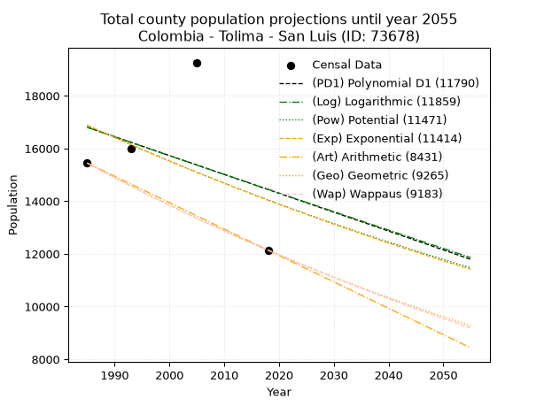
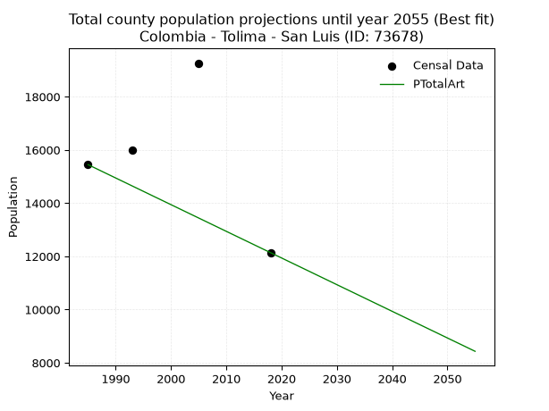
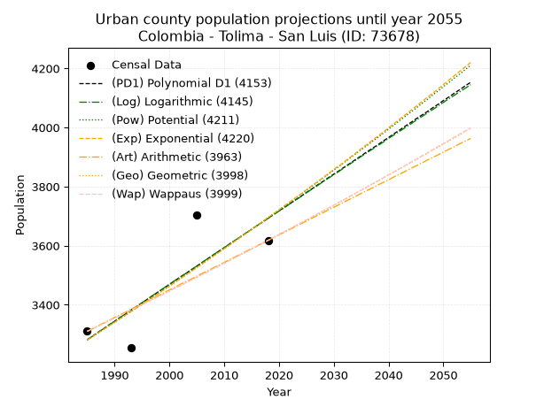
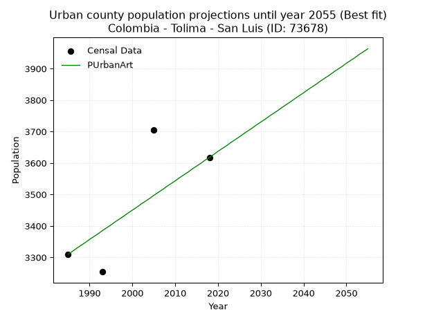
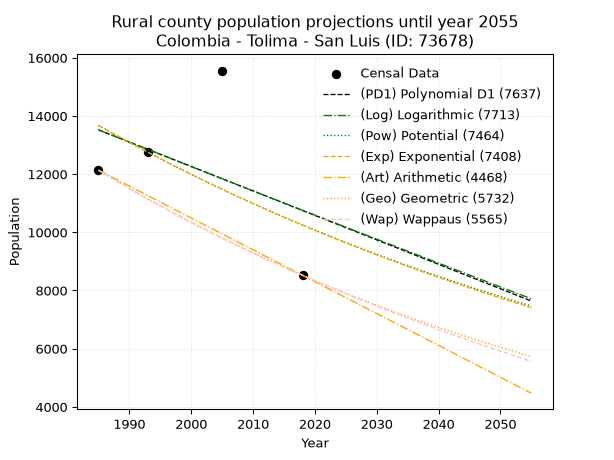
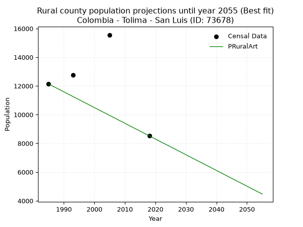

<div align="center">


</div>

# _“Population and Public Services Demand Projections (PPSD) until Year 2050 for Colombia - Tolima - San Luis (ID: 73678)”_
Keywords: `population` `public-service` `projection` `lineal` `polynomial` `logarithmic` `potential` `exponential` `arithmetic` `geometric` `wappaus` `dane` `colombia` `south-america`

PPSD are analytical estimates used by governments and planners to anticipate future changes in population size, age distribution, and the resulting community needs for utilities, healthcare, education, and infrastructure as sizing future water treatment facilities, electrical grids, and road networks based on spatial growth.

> **General running parameters**: • app_version: _v20260806_. • Python version: _3.14.7_. • Pandas version: _3.0.5_. • NumPy version: _2.5.1_. • Creates, save and include plots into reports (create_plot): _False_. • Projection until year: _2050_. • Process polynomial degree 2 and up: _False_. • Process Wappaus: _True_. • Process Wappaus: _True_. • Set negative values to zero: _True_. • Set infinite values to zero: _True_. • Drop dataset notes: _True_. 
<div align="center">

Dynamic map: [:earth_americas:Google](http://maps.google.com/maps?q=4.133720613,-75.0958038) [:earth_americas:OSM](https://www.openstreetmap.org/#map=18/4.133720613/-75.0958038&layers=P) [:earth_americas:Bing](https://www.bing.com/maps?cp=4.133720613~-75.0958038&lvl=18) [:earth_americas:Apple](https://maps.apple.com/frame?center=4.133720613%2C-75.0958038&span=0.003%2C0.006)

</div>


<div align="center">

```geojson
{
  "type": "Feature",
  "geometry": {
    "type": "Point", 
    "coordinates": [-75.0958038, 4.133720613]
  }, 
  "properties": {
    "Name": "Colombia - Tolima - San Luis (ID: 73678)"
  }
}
```

</div>


## 0. Census Data (4 records)

Census data are official statistics collected by a government about the people and housing in a country. They usually include counts of total population, age, sex, race, income, education, and jobs.

📅Global census file: [Population.xlsx](../data/Population.xlsx)

| Source   |   Year |   CountryID | CountryName   |   StateID | StateName   |   CountyID | CountyName   |   PTotal |   PUrban |   PRural |
|:---------|-------:|------------:|:--------------|----------:|:------------|-----------:|:-------------|---------:|---------:|---------:|
| DANE     |   1985 |          57 | Colombia      |        73 | Tolima      |      73678 | San Luis     |    15446 |     3310 |    12136 |
| DANE     |   1993 |          57 | Colombia      |        73 | Tolima      |      73678 | San Luis     |    16003 |     3254 |    12749 |
| DANE     |   2005 |          57 | Colombia      |        73 | Tolima      |      73678 | San Luis     |    19262 |     3705 |    15557 |
| DANE     |   2018 |          57 | Colombia      |        73 | Tolima      |      73678 | San Luis     |    12139 |     3618 |     8521 |

> 🔥Some records could had specific notes about the registered values or the corresponding urban or rural distribution.

## 1. Total

### 1.1. Coefficients and Parameters

* (PD1) Polynomial Deg 1: -71.6362906463226, 159002.9903653068 (lineal)
* (Log) Logarithmic: -142614.36928843896, 1099725.4638012564
* (Pow) Potential: -11.150612209801844, 40.999491966786024
* (Exp) Exponential: -0.005595444195333383, 1125185235.3170764
* (Art) Arithmetic: Year diff. 2018 - 1985 = 33, Population diff. 12139 - 15446 = -3307, Annual growth = -100.21212121212122
* (Geo) Geometric: Year diff. 2018 - 1985 = 33, Population diff. 12139 - 15446 = -3307, Annual growth % = -0.00727422172739689
* (Wap) Wappaus: i = -0.7265696662107755, Condition values only valid for < 200)

<sub>
Wappaus condition values: ['-0.00', '-0.73', '-1.45', '-2.18', '-2.91', '-3.63', '-4.36', '-5.09', '-5.81', '-6.54', '-7.27', '-7.99', '-8.72', '-9.45', '-10.17', '-10.90', '-11.63', '-12.35', '-13.08', '-13.80', '-14.53', '-15.26', '-15.98', '-16.71', '-17.44', '-18.16', '-18.89', '-19.62', '-20.34', '-21.07', '-21.80', '-22.52', '-23.25', '-23.98', '-24.70', '-25.43', '-26.16', '-26.88', '-27.61', '-28.34', '-29.06', '-29.79', '-30.52', '-31.24', '-31.97', '-32.70', '-33.42', '-34.15', '-34.88', '-35.60', '-36.33', '-37.06', '-37.78', '-38.51', '-39.23', '-39.96', '-40.69', '-41.41', '-42.14', '-42.87', '-43.59', '-44.32', '-45.05', '-45.77', '-46.50', '-47.23']
</sub>


### 1.2. Projected Dataset

|   Year |   CountyID |   PTotalPD1 |   PTotalLog |   PTotalPow |   PTotalExp |   PTotalArt |   PTotalGeo |   PTotalWap |
|-------:|-----------:|------------:|------------:|------------:|------------:|------------:|------------:|------------:|
|   1985 |      73678 |       16805 |       16801 |       16883 |       16886 |       15446 |       15446 |       15446 |
|   1986 |      73678 |       16733 |       16729 |       16788 |       16792 |       15346 |       15334 |       15334 |
|   1987 |      73678 |       16662 |       16658 |       16694 |       16698 |       15246 |       15222 |       15223 |
|   1988 |      73678 |       16590 |       16586 |       16601 |       16605 |       15145 |       15111 |       15113 |
|   1989 |      73678 |       16518 |       16514 |       16508 |       16513 |       15045 |       15001 |       15004 |
|   1990 |      73678 |       16447 |       16442 |       16416 |       16420 |       14945 |       14892 |       14895 |
|   1991 |      73678 |       16375 |       16371 |       16324 |       16329 |       14845 |       14784 |       14787 |
|   1992 |      73678 |       16303 |       16299 |       16233 |       16238 |       14745 |       14676 |       14680 |
|   1993 |      73678 |       16232 |       16228 |       16142 |       16147 |       14644 |       14570 |       14574 |
|   1994 |      73678 |       16160 |       16156 |       16052 |       16057 |       14544 |       14464 |       14468 |
|   1995 |      73678 |       16089 |       16085 |       15963 |       15967 |       14444 |       14358 |       14363 |
|   1996 |      73678 |       16017 |       16013 |       15874 |       15878 |       14344 |       14254 |       14259 |
|   1997 |      73678 |       15945 |       15942 |       15785 |       15790 |       14243 |       14150 |       14156 |
|   1998 |      73678 |       15874 |       15870 |       15698 |       15702 |       14143 |       14047 |       14053 |
|   1999 |      73678 |       15802 |       15799 |       15610 |       15614 |       14043 |       13945 |       13951 |
|   2000 |      73678 |       15730 |       15728 |       15523 |       15527 |       13943 |       13844 |       13850 |
|   2001 |      73678 |       15659 |       15656 |       15437 |       15440 |       13843 |       13743 |       13749 |
|   2002 |      73678 |       15587 |       15585 |       15351 |       15354 |       13742 |       13643 |       13649 |
|   2003 |      73678 |       15516 |       15514 |       15266 |       15268 |       13642 |       13544 |       13550 |
|   2004 |      73678 |       15444 |       15443 |       15181 |       15183 |       13542 |       13445 |       13451 |
|   2005 |      73678 |       15372 |       15371 |       15097 |       15098 |       13442 |       13348 |       13354 |
|   2006 |      73678 |       15301 |       15300 |       15013 |       15014 |       13342 |       13250 |       13256 |
|   2007 |      73678 |       15229 |       15229 |       14930 |       14930 |       13241 |       13154 |       13160 |
|   2008 |      73678 |       15157 |       15158 |       14848 |       14847 |       13141 |       13058 |       13064 |
|   2009 |      73678 |       15086 |       15087 |       14765 |       14764 |       13041 |       12963 |       12969 |
|   2010 |      73678 |       15014 |       15016 |       14684 |       14682 |       12941 |       12869 |       12874 |
|   2011 |      73678 |       14942 |       14945 |       14602 |       14600 |       12840 |       12775 |       12780 |
|   2012 |      73678 |       14871 |       14874 |       14522 |       14519 |       12740 |       12683 |       12687 |
|   2013 |      73678 |       14799 |       14804 |       14441 |       14438 |       12640 |       12590 |       12594 |
|   2014 |      73678 |       14728 |       14733 |       14362 |       14357 |       12540 |       12499 |       12502 |
|   2015 |      73678 |       14656 |       14662 |       14282 |       14277 |       12440 |       12408 |       12410 |
|   2016 |      73678 |       14584 |       14591 |       14204 |       14197 |       12339 |       12318 |       12319 |
|   2017 |      73678 |       14513 |       14520 |       14125 |       14118 |       12239 |       12228 |       12229 |
|   2018 |      73678 |       14441 |       14450 |       14047 |       14039 |       12139 |       12139 |       12139 |
|   2019 |      73678 |       14369 |       14379 |       13970 |       13961 |       12039 |       12051 |       12050 |
|   2020 |      73678 |       14298 |       14308 |       13893 |       13883 |       11939 |       11963 |       11961 |
|   2021 |      73678 |       14226 |       14238 |       13817 |       13805 |       11838 |       11876 |       11873 |
|   2022 |      73678 |       14154 |       14167 |       13741 |       13728 |       11738 |       11790 |       11786 |
|   2023 |      73678 |       14083 |       14097 |       13665 |       13652 |       11638 |       11704 |       11699 |
|   2024 |      73678 |       14011 |       14026 |       13590 |       13576 |       11538 |       11619 |       11612 |
|   2025 |      73678 |       13940 |       13956 |       13515 |       13500 |       11438 |       11534 |       11527 |
|   2026 |      73678 |       13868 |       13886 |       13441 |       13425 |       11337 |       11450 |       11441 |
|   2027 |      73678 |       13796 |       13815 |       13367 |       13350 |       11237 |       11367 |       11356 |
|   2028 |      73678 |       13725 |       13745 |       13294 |       13275 |       11137 |       11284 |       11272 |
|   2029 |      73678 |       13653 |       13674 |       13221 |       13201 |       11037 |       11202 |       11189 |
|   2030 |      73678 |       13581 |       13604 |       13149 |       13127 |       10936 |       11121 |       11105 |
|   2031 |      73678 |       13510 |       13534 |       13077 |       13054 |       10836 |       11040 |       11023 |
|   2032 |      73678 |       13438 |       13464 |       13005 |       12981 |       10736 |       10960 |       10941 |
|   2033 |      73678 |       13366 |       13394 |       12934 |       12909 |       10636 |       10880 |       10859 |
|   2034 |      73678 |       13295 |       13323 |       12863 |       12837 |       10536 |       10801 |       10778 |
|   2035 |      73678 |       13223 |       13253 |       12793 |       12765 |       10435 |       10722 |       10697 |
|   2036 |      73678 |       13152 |       13183 |       12723 |       12694 |       10335 |       10644 |       10617 |
|   2037 |      73678 |       13080 |       13113 |       12654 |       12623 |       10235 |       10567 |       10538 |
|   2038 |      73678 |       13008 |       13043 |       12585 |       12553 |       10135 |       10490 |       10458 |
|   2039 |      73678 |       12937 |       12973 |       12516 |       12483 |       10035 |       10414 |       10380 |
|   2040 |      73678 |       12865 |       12903 |       12448 |       12413 |        9934 |       10338 |       10301 |
|   2041 |      73678 |       12793 |       12834 |       12380 |       12344 |        9834 |       10263 |       10224 |
|   2042 |      73678 |       12722 |       12764 |       12312 |       12275 |        9734 |       10188 |       10147 |
|   2043 |      73678 |       12650 |       12694 |       12245 |       12206 |        9634 |       10114 |       10070 |
|   2044 |      73678 |       12578 |       12624 |       12179 |       12138 |        9533 |       10040 |        9993 |
|   2045 |      73678 |       12507 |       12554 |       12113 |       12071 |        9433 |        9967 |        9917 |
|   2046 |      73678 |       12435 |       12485 |       12047 |       12003 |        9333 |        9895 |        9842 |
|   2047 |      73678 |       12364 |       12415 |       11981 |       11936 |        9233 |        9823 |        9767 |
|   2048 |      73678 |       12292 |       12345 |       11916 |       11870 |        9133 |        9751 |        9693 |
|   2049 |      73678 |       12220 |       12276 |       11851 |       11803 |        9032 |        9680 |        9618 |
|   2050 |      73678 |       12149 |       12206 |       11787 |       11738 |        8932 |        9610 |        9545 |
<div align="center">

</img>

</div>


### 1.3. Best fit with absolute and relative error (%)

Relative error puts that difference into context by dividing the absolute error by the true value, creating a unitless ratio or percentage that shows the scale of the mistake.

Absolute and relative error

|   Year | Source   |   CountryID | CountryName   |   StateID | StateName   |   CountyID_x | CountyName   |   PTotal |   PUrban |   PRural |   CountyID_y |   PTotalPD1 |   PTotalLog |   PTotalPow |   PTotalExp |   PTotalArt |   PTotalGeo |   PTotalWap |   PTotalPD1AbsError |   PTotalLogAbsError |   PTotalPowAbsError |   PTotalExpAbsError |   PTotalArtAbsError |   PTotalGeoAbsError |   PTotalWapAbsError |   PTotalPD1RelError |   PTotalLogRelError |   PTotalPowRelError |   PTotalExpRelError |   PTotalArtRelError |   PTotalGeoRelError |   PTotalWapRelError |
|-------:|:---------|------------:|:--------------|----------:|:------------|-------------:|:-------------|---------:|---------:|---------:|-------------:|------------:|------------:|------------:|------------:|------------:|------------:|------------:|--------------------:|--------------------:|--------------------:|--------------------:|--------------------:|--------------------:|--------------------:|--------------------:|--------------------:|--------------------:|--------------------:|--------------------:|--------------------:|--------------------:|
|   1985 | DANE     |          57 | Colombia      |        73 | Tolima      |        73678 | San Luis     |    15446 |     3310 |    12136 |        73678 |       16805 |       16801 |       16883 |       16886 |       15446 |       15446 |       15446 |                1359 |                1355 |                1437 |                1440 |                   0 |                   0 |                   0 |             8.79839 |             8.7725  |            9.30338  |            9.3228   |             0       |             0       |             0       |
|   1993 | DANE     |          57 | Colombia      |        73 | Tolima      |        73678 | San Luis     |    16003 |     3254 |    12749 |        73678 |       16232 |       16228 |       16142 |       16147 |       14644 |       14570 |       14574 |                 229 |                 225 |                 139 |                 144 |                1359 |                1433 |                1429 |             1.43098 |             1.40599 |            0.868587 |            0.899831 |             8.49216 |             8.95457 |             8.92958 |
|   2005 | DANE     |          57 | Colombia      |        73 | Tolima      |        73678 | San Luis     |    19262 |     3705 |    15557 |        73678 |       15372 |       15371 |       15097 |       15098 |       13442 |       13348 |       13354 |                3890 |                3891 |                4165 |                4164 |                5820 |                5914 |                5908 |            20.1952  |            20.2004  |           21.6229   |           21.6177   |            30.2149  |            30.7029  |            30.6718  |
|   2018 | DANE     |          57 | Colombia      |        73 | Tolima      |        73678 | San Luis     |    12139 |     3618 |     8521 |        73678 |       14441 |       14450 |       14047 |       14039 |       12139 |       12139 |       12139 |                2302 |                2311 |                1908 |                1900 |                   0 |                   0 |                   0 |            18.9637  |            19.0378  |           15.7179   |           15.652    |             0       |             0       |             0       |

Relative error mean

| Method    |   RelError | Best   |
|:----------|-----------:|:-------|
| PTotalPD1 |   12.3471  |        |
| PTotalLog |   12.3542  |        |
| PTotalPow |   11.8782  |        |
| PTotalExp |   11.8731  |        |
| PTotalArt |    9.67677 | True   |
| PTotalGeo |    9.91438 |        |
| PTotalWap |    9.90034 |        |

💙Best method: _**PTotalArt**_
<div align="center">

</img>

</div>


### 1.4. Fresh water supply demand in liters per capita per day (lpcd)

The fresh water supply demand typically ranges from 100 to 300 liters per capita per day (lpcd) for standard domestic and municipal planning, though absolute survival minimums set by the World Health Organization are as low as 7.5 to 20 liters per day, and total consumption in high-income nations can exceed 400 liters.

> `CZ`: Level in meters above the sea level (masl)<br> `WS`: Fresh water supply demand in liters per capita per day (lpcd or l/h/d)<br> `WSAll`: Zonal fresh water supply demand in liters per second (l/s)<br> `A`: Zonal area in square meters<br> `DP`: Population density (people/hectare)

Reference values (RAS Colombia)

|    CZ |   WS |
|------:|-----:|
|  1000 |  120 |
|  2000 |  130 |
| 99999 |  140 |

County shapefile geometry properties and water supply values

|   CountyID |      ATotal |   CZTotal |   WSTotal |
|-----------:|------------:|----------:|----------:|
|      73678 | 4.11997e+08 |   558.103 |       120 |

Projected values for best method: PTotalArt

|   CountyID |   Year |   PTotalArt |   DPTotal |   WSTotal |   WSTotalAll |
|-----------:|-------:|------------:|----------:|----------:|-------------:|
|      73678 |   1985 |       15446 |      0.37 |       120 |      21.4528 |
|      73678 |   1986 |       15346 |      0.37 |       120 |      21.3139 |
|      73678 |   1987 |       15246 |      0.37 |       120 |      21.175  |
|      73678 |   1988 |       15145 |      0.37 |       120 |      21.0347 |
|      73678 |   1989 |       15045 |      0.37 |       120 |      20.8958 |
|      73678 |   1990 |       14945 |      0.36 |       120 |      20.7569 |
|      73678 |   1991 |       14845 |      0.36 |       120 |      20.6181 |
|      73678 |   1992 |       14745 |      0.36 |       120 |      20.4792 |
|      73678 |   1993 |       14644 |      0.36 |       120 |      20.3389 |
|      73678 |   1994 |       14544 |      0.35 |       120 |      20.2    |
|      73678 |   1995 |       14444 |      0.35 |       120 |      20.0611 |
|      73678 |   1996 |       14344 |      0.35 |       120 |      19.9222 |
|      73678 |   1997 |       14243 |      0.35 |       120 |      19.7819 |
|      73678 |   1998 |       14143 |      0.34 |       120 |      19.6431 |
|      73678 |   1999 |       14043 |      0.34 |       120 |      19.5042 |
|      73678 |   2000 |       13943 |      0.34 |       120 |      19.3653 |
|      73678 |   2001 |       13843 |      0.34 |       120 |      19.2264 |
|      73678 |   2002 |       13742 |      0.33 |       120 |      19.0861 |
|      73678 |   2003 |       13642 |      0.33 |       120 |      18.9472 |
|      73678 |   2004 |       13542 |      0.33 |       120 |      18.8083 |
|      73678 |   2005 |       13442 |      0.33 |       120 |      18.6694 |
|      73678 |   2006 |       13342 |      0.32 |       120 |      18.5306 |
|      73678 |   2007 |       13241 |      0.32 |       120 |      18.3903 |
|      73678 |   2008 |       13141 |      0.32 |       120 |      18.2514 |
|      73678 |   2009 |       13041 |      0.32 |       120 |      18.1125 |
|      73678 |   2010 |       12941 |      0.31 |       120 |      17.9736 |
|      73678 |   2011 |       12840 |      0.31 |       120 |      17.8333 |
|      73678 |   2012 |       12740 |      0.31 |       120 |      17.6944 |
|      73678 |   2013 |       12640 |      0.31 |       120 |      17.5556 |
|      73678 |   2014 |       12540 |      0.3  |       120 |      17.4167 |
|      73678 |   2015 |       12440 |      0.3  |       120 |      17.2778 |
|      73678 |   2016 |       12339 |      0.3  |       120 |      17.1375 |
|      73678 |   2017 |       12239 |      0.3  |       120 |      16.9986 |
|      73678 |   2018 |       12139 |      0.29 |       120 |      16.8597 |
|      73678 |   2019 |       12039 |      0.29 |       120 |      16.7208 |
|      73678 |   2020 |       11939 |      0.29 |       120 |      16.5819 |
|      73678 |   2021 |       11838 |      0.29 |       120 |      16.4417 |
|      73678 |   2022 |       11738 |      0.28 |       120 |      16.3028 |
|      73678 |   2023 |       11638 |      0.28 |       120 |      16.1639 |
|      73678 |   2024 |       11538 |      0.28 |       120 |      16.025  |
|      73678 |   2025 |       11438 |      0.28 |       120 |      15.8861 |
|      73678 |   2026 |       11337 |      0.28 |       120 |      15.7458 |
|      73678 |   2027 |       11237 |      0.27 |       120 |      15.6069 |
|      73678 |   2028 |       11137 |      0.27 |       120 |      15.4681 |
|      73678 |   2029 |       11037 |      0.27 |       120 |      15.3292 |
|      73678 |   2030 |       10936 |      0.27 |       120 |      15.1889 |
|      73678 |   2031 |       10836 |      0.26 |       120 |      15.05   |
|      73678 |   2032 |       10736 |      0.26 |       120 |      14.9111 |
|      73678 |   2033 |       10636 |      0.26 |       120 |      14.7722 |
|      73678 |   2034 |       10536 |      0.26 |       120 |      14.6333 |
|      73678 |   2035 |       10435 |      0.25 |       120 |      14.4931 |
|      73678 |   2036 |       10335 |      0.25 |       120 |      14.3542 |
|      73678 |   2037 |       10235 |      0.25 |       120 |      14.2153 |
|      73678 |   2038 |       10135 |      0.25 |       120 |      14.0764 |
|      73678 |   2039 |       10035 |      0.24 |       120 |      13.9375 |
|      73678 |   2040 |        9934 |      0.24 |       120 |      13.7972 |
|      73678 |   2041 |        9834 |      0.24 |       120 |      13.6583 |
|      73678 |   2042 |        9734 |      0.24 |       120 |      13.5194 |
|      73678 |   2043 |        9634 |      0.23 |       120 |      13.3806 |
|      73678 |   2044 |        9533 |      0.23 |       120 |      13.2403 |
|      73678 |   2045 |        9433 |      0.23 |       120 |      13.1014 |
|      73678 |   2046 |        9333 |      0.23 |       120 |      12.9625 |
|      73678 |   2047 |        9233 |      0.22 |       120 |      12.8236 |
|      73678 |   2048 |        9133 |      0.22 |       120 |      12.6847 |
|      73678 |   2049 |        9032 |      0.22 |       120 |      12.5444 |
|      73678 |   2050 |        8932 |      0.22 |       120 |      12.4056 |

## 2. Urban

### 2.1. Coefficients and Parameters

* (PD1) Polynomial Deg 1: 12.443596949016515, -21418.554797270288 (lineal)
* (Log) Logarithmic: 24923.13788447796, -185969.22078140965
* (Pow) Potential: 7.19915991765533, -20.22509727274894
* (Exp) Exponential: 0.0035944984277269196, 2.6142291132756776
* (Art) Arithmetic: Year diff. 2018 - 1985 = 33, Population diff. 3618 - 3310 = 308, Annual growth = 9.333333333333334
* (Geo) Geometric: Year diff. 2018 - 1985 = 33, Population diff. 3618 - 3310 = 308, Annual growth % = 0.002699795403905636
* (Wap) Wappaus: i = 0.26943802925327176, Condition values only valid for < 200)

<sub>
Wappaus condition values: ['0.00', '0.27', '0.54', '0.81', '1.08', '1.35', '1.62', '1.89', '2.16', '2.42', '2.69', '2.96', '3.23', '3.50', '3.77', '4.04', '4.31', '4.58', '4.85', '5.12', '5.39', '5.66', '5.93', '6.20', '6.47', '6.74', '7.01', '7.27', '7.54', '7.81', '8.08', '8.35', '8.62', '8.89', '9.16', '9.43', '9.70', '9.97', '10.24', '10.51', '10.78', '11.05', '11.32', '11.59', '11.86', '12.12', '12.39', '12.66', '12.93', '13.20', '13.47', '13.74', '14.01', '14.28', '14.55', '14.82', '15.09', '15.36', '15.63', '15.90', '16.17', '16.44', '16.71', '16.97', '17.24', '17.51']
</sub>


### 2.2. Projected Dataset

|   Year |   CountyID |   PUrbanPD1 |   PUrbanLog |   PUrbanPow |   PUrbanExp |   PUrbanArt |   PUrbanGeo |   PUrbanWap |
|-------:|-----------:|------------:|------------:|------------:|------------:|------------:|------------:|------------:|
|   1985 |      73678 |        3282 |        3281 |        3281 |        3281 |        3310 |        3310 |        3310 |
|   1986 |      73678 |        3294 |        3294 |        3293 |        3293 |        3319 |        3319 |        3319 |
|   1987 |      73678 |        3307 |        3307 |        3305 |        3305 |        3329 |        3328 |        3328 |
|   1988 |      73678 |        3319 |        3319 |        3317 |        3317 |        3338 |        3337 |        3337 |
|   1989 |      73678 |        3332 |        3332 |        3329 |        3329 |        3347 |        3346 |        3346 |
|   1990 |      73678 |        3344 |        3344 |        3341 |        3341 |        3357 |        3355 |        3355 |
|   1991 |      73678 |        3357 |        3357 |        3353 |        3353 |        3366 |        3364 |        3364 |
|   1992 |      73678 |        3369 |        3369 |        3365 |        3365 |        3375 |        3373 |        3373 |
|   1993 |      73678 |        3382 |        3382 |        3377 |        3377 |        3385 |        3382 |        3382 |
|   1994 |      73678 |        3394 |        3394 |        3390 |        3389 |        3394 |        3391 |        3391 |
|   1995 |      73678 |        3406 |        3407 |        3402 |        3402 |        3403 |        3400 |        3400 |
|   1996 |      73678 |        3419 |        3419 |        3414 |        3414 |        3413 |        3410 |        3410 |
|   1997 |      73678 |        3431 |        3432 |        3427 |        3426 |        3422 |        3419 |        3419 |
|   1998 |      73678 |        3444 |        3444 |        3439 |        3438 |        3431 |        3428 |        3428 |
|   1999 |      73678 |        3456 |        3457 |        3451 |        3451 |        3441 |        3437 |        3437 |
|   2000 |      73678 |        3469 |        3469 |        3464 |        3463 |        3450 |        3447 |        3447 |
|   2001 |      73678 |        3481 |        3482 |        3476 |        3476 |        3459 |        3456 |        3456 |
|   2002 |      73678 |        3494 |        3494 |        3489 |        3488 |        3469 |        3465 |        3465 |
|   2003 |      73678 |        3506 |        3506 |        3501 |        3501 |        3478 |        3475 |        3475 |
|   2004 |      73678 |        3518 |        3519 |        3514 |        3513 |        3487 |        3484 |        3484 |
|   2005 |      73678 |        3531 |        3531 |        3527 |        3526 |        3497 |        3493 |        3493 |
|   2006 |      73678 |        3543 |        3544 |        3539 |        3539 |        3506 |        3503 |        3503 |
|   2007 |      73678 |        3556 |        3556 |        3552 |        3552 |        3515 |        3512 |        3512 |
|   2008 |      73678 |        3568 |        3569 |        3565 |        3564 |        3525 |        3522 |        3522 |
|   2009 |      73678 |        3581 |        3581 |        3578 |        3577 |        3534 |        3531 |        3531 |
|   2010 |      73678 |        3593 |        3593 |        3590 |        3590 |        3543 |        3541 |        3541 |
|   2011 |      73678 |        3606 |        3606 |        3603 |        3603 |        3553 |        3550 |        3550 |
|   2012 |      73678 |        3618 |        3618 |        3616 |        3616 |        3562 |        3560 |        3560 |
|   2013 |      73678 |        3630 |        3631 |        3629 |        3629 |        3571 |        3570 |        3570 |
|   2014 |      73678 |        3643 |        3643 |        3642 |        3642 |        3581 |        3579 |        3579 |
|   2015 |      73678 |        3655 |        3655 |        3655 |        3655 |        3590 |        3589 |        3589 |
|   2016 |      73678 |        3668 |        3668 |        3668 |        3668 |        3599 |        3599 |        3599 |
|   2017 |      73678 |        3680 |        3680 |        3681 |        3681 |        3609 |        3608 |        3608 |
|   2018 |      73678 |        3693 |        3692 |        3695 |        3695 |        3618 |        3618 |        3618 |
|   2019 |      73678 |        3705 |        3705 |        3708 |        3708 |        3627 |        3628 |        3628 |
|   2020 |      73678 |        3718 |        3717 |        3721 |        3721 |        3637 |        3638 |        3638 |
|   2021 |      73678 |        3730 |        3729 |        3734 |        3735 |        3646 |        3647 |        3647 |
|   2022 |      73678 |        3742 |        3742 |        3748 |        3748 |        3655 |        3657 |        3657 |
|   2023 |      73678 |        3755 |        3754 |        3761 |        3762 |        3665 |        3667 |        3667 |
|   2024 |      73678 |        3767 |        3766 |        3774 |        3775 |        3674 |        3677 |        3677 |
|   2025 |      73678 |        3780 |        3779 |        3788 |        3789 |        3683 |        3687 |        3687 |
|   2026 |      73678 |        3792 |        3791 |        3801 |        3803 |        3693 |        3697 |        3697 |
|   2027 |      73678 |        3805 |        3803 |        3815 |        3816 |        3702 |        3707 |        3707 |
|   2028 |      73678 |        3817 |        3816 |        3828 |        3830 |        3711 |        3717 |        3717 |
|   2029 |      73678 |        3830 |        3828 |        3842 |        3844 |        3721 |        3727 |        3727 |
|   2030 |      73678 |        3842 |        3840 |        3856 |        3858 |        3730 |        3737 |        3737 |
|   2031 |      73678 |        3854 |        3852 |        3869 |        3871 |        3739 |        3747 |        3747 |
|   2032 |      73678 |        3867 |        3865 |        3883 |        3885 |        3749 |        3757 |        3757 |
|   2033 |      73678 |        3879 |        3877 |        3897 |        3899 |        3758 |        3767 |        3768 |
|   2034 |      73678 |        3892 |        3889 |        3911 |        3913 |        3767 |        3777 |        3778 |
|   2035 |      73678 |        3904 |        3902 |        3925 |        3928 |        3777 |        3788 |        3788 |
|   2036 |      73678 |        3917 |        3914 |        3938 |        3942 |        3786 |        3798 |        3798 |
|   2037 |      73678 |        3929 |        3926 |        3952 |        3956 |        3795 |        3808 |        3809 |
|   2038 |      73678 |        3941 |        3938 |        3966 |        3970 |        3805 |        3818 |        3819 |
|   2039 |      73678 |        3954 |        3950 |        3980 |        3984 |        3814 |        3829 |        3829 |
|   2040 |      73678 |        3966 |        3963 |        3994 |        3999 |        3823 |        3839 |        3840 |
|   2041 |      73678 |        3979 |        3975 |        4009 |        4013 |        3833 |        3849 |        3850 |
|   2042 |      73678 |        3991 |        3987 |        4023 |        4028 |        3842 |        3860 |        3861 |
|   2043 |      73678 |        4004 |        3999 |        4037 |        4042 |        3851 |        3870 |        3871 |
|   2044 |      73678 |        4016 |        4011 |        4051 |        4057 |        3861 |        3881 |        3882 |
|   2045 |      73678 |        4029 |        4024 |        4065 |        4071 |        3870 |        3891 |        3892 |
|   2046 |      73678 |        4041 |        4036 |        4080 |        4086 |        3879 |        3902 |        3903 |
|   2047 |      73678 |        4053 |        4048 |        4094 |        4101 |        3889 |        3912 |        3913 |
|   2048 |      73678 |        4066 |        4060 |        4109 |        4115 |        3898 |        3923 |        3924 |
|   2049 |      73678 |        4078 |        4072 |        4123 |        4130 |        3907 |        3933 |        3935 |
|   2050 |      73678 |        4091 |        4085 |        4138 |        4145 |        3917 |        3944 |        3945 |
<div align="center">

</img>

</div>


### 2.3. Best fit with absolute and relative error (%)

Relative error puts that difference into context by dividing the absolute error by the true value, creating a unitless ratio or percentage that shows the scale of the mistake.

Absolute and relative error

|   Year | Source   |   CountryID | CountryName   |   StateID | StateName   |   CountyID_x | CountyName   |   PTotal |   PUrban |   PRural |   CountyID_y |   PUrbanPD1 |   PUrbanLog |   PUrbanPow |   PUrbanExp |   PUrbanArt |   PUrbanGeo |   PUrbanWap |   PUrbanPD1AbsError |   PUrbanLogAbsError |   PUrbanPowAbsError |   PUrbanExpAbsError |   PUrbanArtAbsError |   PUrbanGeoAbsError |   PUrbanWapAbsError |   PUrbanPD1RelError |   PUrbanLogRelError |   PUrbanPowRelError |   PUrbanExpRelError |   PUrbanArtRelError |   PUrbanGeoRelError |   PUrbanWapRelError |
|-------:|:---------|------------:|:--------------|----------:|:------------|-------------:|:-------------|---------:|---------:|---------:|-------------:|------------:|------------:|------------:|------------:|------------:|------------:|------------:|--------------------:|--------------------:|--------------------:|--------------------:|--------------------:|--------------------:|--------------------:|--------------------:|--------------------:|--------------------:|--------------------:|--------------------:|--------------------:|--------------------:|
|   1985 | DANE     |          57 | Colombia      |        73 | Tolima      |        73678 | San Luis     |    15446 |     3310 |    12136 |        73678 |        3282 |        3281 |        3281 |        3281 |        3310 |        3310 |        3310 |                  28 |                  29 |                  29 |                  29 |                   0 |                   0 |                   0 |            0.845921 |            0.876133 |            0.876133 |            0.876133 |             0       |             0       |             0       |
|   1993 | DANE     |          57 | Colombia      |        73 | Tolima      |        73678 | San Luis     |    16003 |     3254 |    12749 |        73678 |        3382 |        3382 |        3377 |        3377 |        3385 |        3382 |        3382 |                 128 |                 128 |                 123 |                 123 |                 131 |                 128 |                 128 |            3.93362  |            3.93362  |            3.77996  |            3.77996  |             4.02581 |             3.93362 |             3.93362 |
|   2005 | DANE     |          57 | Colombia      |        73 | Tolima      |        73678 | San Luis     |    19262 |     3705 |    15557 |        73678 |        3531 |        3531 |        3527 |        3526 |        3497 |        3493 |        3493 |                 174 |                 174 |                 178 |                 179 |                 208 |                 212 |                 212 |            4.69636  |            4.69636  |            4.80432  |            4.83131  |             5.61404 |             5.722   |             5.722   |
|   2018 | DANE     |          57 | Colombia      |        73 | Tolima      |        73678 | San Luis     |    12139 |     3618 |     8521 |        73678 |        3693 |        3692 |        3695 |        3695 |        3618 |        3618 |        3618 |                  75 |                  74 |                  77 |                  77 |                   0 |                   0 |                   0 |            2.07297  |            2.04533  |            2.12825  |            2.12825  |             0       |             0       |             0       |

Relative error mean

| Method    |   RelError | Best   |
|:----------|-----------:|:-------|
| PUrbanPD1 |    2.88722 |        |
| PUrbanLog |    2.88786 |        |
| PUrbanPow |    2.89717 |        |
| PUrbanExp |    2.90391 |        |
| PUrbanArt |    2.40996 | True   |
| PUrbanGeo |    2.4139  |        |
| PUrbanWap |    2.4139  |        |

💙Best method: _**PUrbanArt**_
<div align="center">

</img>

</div>


### 2.4. Fresh water supply demand in liters per capita per day (lpcd)

The fresh water supply demand typically ranges from 100 to 300 liters per capita per day (lpcd) for standard domestic and municipal planning, though absolute survival minimums set by the World Health Organization are as low as 7.5 to 20 liters per day, and total consumption in high-income nations can exceed 400 liters.

> `CZ`: Level in meters above the sea level (masl)<br> `WS`: Fresh water supply demand in liters per capita per day (lpcd or l/h/d)<br> `WSAll`: Zonal fresh water supply demand in liters per second (l/s)<br> `A`: Zonal area in square meters<br> `DP`: Population density (people/hectare)

Reference values (RAS Colombia)

|    CZ |   WS |
|------:|-----:|
|  1000 |  120 |
|  2000 |  130 |
| 99999 |  140 |

County shapefile geometry properties and water supply values

|   CountyID |   AUrban |   CZUrban |   WSUrban |
|-----------:|---------:|----------:|----------:|
|      73678 |   800896 |    476.33 |       120 |

Projected values for best method: PUrbanArt

|   CountyID |   Year |   PUrbanArt |   DPUrban |   WSUrban |   WSUrbanAll |
|-----------:|-------:|------------:|----------:|----------:|-------------:|
|      73678 |   1985 |        3310 |     41.33 |       120 |      4.59722 |
|      73678 |   1986 |        3319 |     41.44 |       120 |      4.60972 |
|      73678 |   1987 |        3329 |     41.57 |       120 |      4.62361 |
|      73678 |   1988 |        3338 |     41.68 |       120 |      4.63611 |
|      73678 |   1989 |        3347 |     41.79 |       120 |      4.64861 |
|      73678 |   1990 |        3357 |     41.92 |       120 |      4.6625  |
|      73678 |   1991 |        3366 |     42.03 |       120 |      4.675   |
|      73678 |   1992 |        3375 |     42.14 |       120 |      4.6875  |
|      73678 |   1993 |        3385 |     42.27 |       120 |      4.70139 |
|      73678 |   1994 |        3394 |     42.38 |       120 |      4.71389 |
|      73678 |   1995 |        3403 |     42.49 |       120 |      4.72639 |
|      73678 |   1996 |        3413 |     42.61 |       120 |      4.74028 |
|      73678 |   1997 |        3422 |     42.73 |       120 |      4.75278 |
|      73678 |   1998 |        3431 |     42.84 |       120 |      4.76528 |
|      73678 |   1999 |        3441 |     42.96 |       120 |      4.77917 |
|      73678 |   2000 |        3450 |     43.08 |       120 |      4.79167 |
|      73678 |   2001 |        3459 |     43.19 |       120 |      4.80417 |
|      73678 |   2002 |        3469 |     43.31 |       120 |      4.81806 |
|      73678 |   2003 |        3478 |     43.43 |       120 |      4.83056 |
|      73678 |   2004 |        3487 |     43.54 |       120 |      4.84306 |
|      73678 |   2005 |        3497 |     43.66 |       120 |      4.85694 |
|      73678 |   2006 |        3506 |     43.78 |       120 |      4.86944 |
|      73678 |   2007 |        3515 |     43.89 |       120 |      4.88194 |
|      73678 |   2008 |        3525 |     44.01 |       120 |      4.89583 |
|      73678 |   2009 |        3534 |     44.13 |       120 |      4.90833 |
|      73678 |   2010 |        3543 |     44.24 |       120 |      4.92083 |
|      73678 |   2011 |        3553 |     44.36 |       120 |      4.93472 |
|      73678 |   2012 |        3562 |     44.48 |       120 |      4.94722 |
|      73678 |   2013 |        3571 |     44.59 |       120 |      4.95972 |
|      73678 |   2014 |        3581 |     44.71 |       120 |      4.97361 |
|      73678 |   2015 |        3590 |     44.82 |       120 |      4.98611 |
|      73678 |   2016 |        3599 |     44.94 |       120 |      4.99861 |
|      73678 |   2017 |        3609 |     45.06 |       120 |      5.0125  |
|      73678 |   2018 |        3618 |     45.17 |       120 |      5.025   |
|      73678 |   2019 |        3627 |     45.29 |       120 |      5.0375  |
|      73678 |   2020 |        3637 |     45.41 |       120 |      5.05139 |
|      73678 |   2021 |        3646 |     45.52 |       120 |      5.06389 |
|      73678 |   2022 |        3655 |     45.64 |       120 |      5.07639 |
|      73678 |   2023 |        3665 |     45.76 |       120 |      5.09028 |
|      73678 |   2024 |        3674 |     45.87 |       120 |      5.10278 |
|      73678 |   2025 |        3683 |     45.99 |       120 |      5.11528 |
|      73678 |   2026 |        3693 |     46.11 |       120 |      5.12917 |
|      73678 |   2027 |        3702 |     46.22 |       120 |      5.14167 |
|      73678 |   2028 |        3711 |     46.34 |       120 |      5.15417 |
|      73678 |   2029 |        3721 |     46.46 |       120 |      5.16806 |
|      73678 |   2030 |        3730 |     46.57 |       120 |      5.18056 |
|      73678 |   2031 |        3739 |     46.69 |       120 |      5.19306 |
|      73678 |   2032 |        3749 |     46.81 |       120 |      5.20694 |
|      73678 |   2033 |        3758 |     46.92 |       120 |      5.21944 |
|      73678 |   2034 |        3767 |     47.03 |       120 |      5.23194 |
|      73678 |   2035 |        3777 |     47.16 |       120 |      5.24583 |
|      73678 |   2036 |        3786 |     47.27 |       120 |      5.25833 |
|      73678 |   2037 |        3795 |     47.38 |       120 |      5.27083 |
|      73678 |   2038 |        3805 |     47.51 |       120 |      5.28472 |
|      73678 |   2039 |        3814 |     47.62 |       120 |      5.29722 |
|      73678 |   2040 |        3823 |     47.73 |       120 |      5.30972 |
|      73678 |   2041 |        3833 |     47.86 |       120 |      5.32361 |
|      73678 |   2042 |        3842 |     47.97 |       120 |      5.33611 |
|      73678 |   2043 |        3851 |     48.08 |       120 |      5.34861 |
|      73678 |   2044 |        3861 |     48.21 |       120 |      5.3625  |
|      73678 |   2045 |        3870 |     48.32 |       120 |      5.375   |
|      73678 |   2046 |        3879 |     48.43 |       120 |      5.3875  |
|      73678 |   2047 |        3889 |     48.56 |       120 |      5.40139 |
|      73678 |   2048 |        3898 |     48.67 |       120 |      5.41389 |
|      73678 |   2049 |        3907 |     48.78 |       120 |      5.42639 |
|      73678 |   2050 |        3917 |     48.91 |       120 |      5.44028 |

## 3. Rural

### 3.1. Coefficients and Parameters

* (PD1) Polynomial Deg 1: -84.07988759533899, 180421.54516257677 (lineal)
* (Log) Logarithmic: -167537.5071729169, 1285694.6845826658
* (Pow) Potential: -17.469342317914254, 61.745615843295965
* (Exp) Exponential: -0.008759247986469215, 486551910316.3244
* (Art) Arithmetic: Year diff. 2018 - 1985 = 33, Population diff. 8521 - 12136 = -3615, Annual growth = -109.54545454545455
* (Geo) Geometric: Year diff. 2018 - 1985 = 33, Population diff. 8521 - 12136 = -3615, Annual growth % = -0.010659224040566184
* (Wap) Wappaus: i = -1.0606133954151575, Condition values only valid for < 200)

<sub>
Wappaus condition values: ['-0.00', '-1.06', '-2.12', '-3.18', '-4.24', '-5.30', '-6.36', '-7.42', '-8.48', '-9.55', '-10.61', '-11.67', '-12.73', '-13.79', '-14.85', '-15.91', '-16.97', '-18.03', '-19.09', '-20.15', '-21.21', '-22.27', '-23.33', '-24.39', '-25.45', '-26.52', '-27.58', '-28.64', '-29.70', '-30.76', '-31.82', '-32.88', '-33.94', '-35.00', '-36.06', '-37.12', '-38.18', '-39.24', '-40.30', '-41.36', '-42.42', '-43.49', '-44.55', '-45.61', '-46.67', '-47.73', '-48.79', '-49.85', '-50.91', '-51.97', '-53.03', '-54.09', '-55.15', '-56.21', '-57.27', '-58.33', '-59.39', '-60.45', '-61.52', '-62.58', '-63.64', '-64.70', '-65.76', '-66.82', '-67.88', '-68.94']
</sub>


### 3.2. Projected Dataset

|   Year |   CountyID |   PRuralPD1 |   PRuralLog |   PRuralPow |   PRuralExp |   PRuralArt |   PRuralGeo |   PRuralWap |
|-------:|-----------:|------------:|------------:|------------:|------------:|------------:|------------:|------------:|
|   1985 |      73678 |       13523 |       13520 |       13674 |       13677 |       12136 |       12136 |       12136 |
|   1986 |      73678 |       13439 |       13435 |       13555 |       13558 |       12026 |       12007 |       12008 |
|   1987 |      73678 |       13355 |       13351 |       13436 |       13440 |       11917 |       11879 |       11881 |
|   1988 |      73678 |       13271 |       13267 |       13318 |       13323 |       11807 |       11752 |       11756 |
|   1989 |      73678 |       13187 |       13182 |       13202 |       13207 |       11698 |       11627 |       11632 |
|   1990 |      73678 |       13103 |       13098 |       13086 |       13091 |       11588 |       11503 |       11509 |
|   1991 |      73678 |       13018 |       13014 |       12972 |       12977 |       11479 |       11380 |       11388 |
|   1992 |      73678 |       12934 |       12930 |       12859 |       12864 |       11369 |       11259 |       11267 |
|   1993 |      73678 |       12850 |       12846 |       12747 |       12752 |       11260 |       11139 |       11148 |
|   1994 |      73678 |       12766 |       12762 |       12635 |       12641 |       11150 |       11020 |       11030 |
|   1995 |      73678 |       12682 |       12678 |       12525 |       12530 |       11041 |       10903 |       10914 |
|   1996 |      73678 |       12598 |       12594 |       12416 |       12421 |       10931 |       10787 |       10798 |
|   1997 |      73678 |       12514 |       12510 |       12308 |       12313 |       10821 |       10672 |       10684 |
|   1998 |      73678 |       12430 |       12426 |       12201 |       12205 |       10712 |       10558 |       10571 |
|   1999 |      73678 |       12346 |       12342 |       12094 |       12099 |       10602 |       10445 |       10459 |
|   2000 |      73678 |       12262 |       12258 |       11989 |       11993 |       10493 |       10334 |       10348 |
|   2001 |      73678 |       12178 |       12175 |       11885 |       11889 |       10383 |       10224 |       10238 |
|   2002 |      73678 |       12094 |       12091 |       11782 |       11785 |       10274 |       10115 |       10129 |
|   2003 |      73678 |       12010 |       12007 |       11679 |       11682 |       10164 |       10007 |       10021 |
|   2004 |      73678 |       11925 |       11924 |       11578 |       11580 |       10055 |        9900 |        9914 |
|   2005 |      73678 |       11841 |       11840 |       11478 |       11479 |        9945 |        9795 |        9809 |
|   2006 |      73678 |       11757 |       11757 |       11378 |       11379 |        9836 |        9690 |        9704 |
|   2007 |      73678 |       11673 |       11673 |       11279 |       11280 |        9726 |        9587 |        9600 |
|   2008 |      73678 |       11589 |       11590 |       11182 |       11182 |        9616 |        9485 |        9497 |
|   2009 |      73678 |       11505 |       11506 |       11085 |       11084 |        9507 |        9384 |        9396 |
|   2010 |      73678 |       11421 |       11423 |       10989 |       10988 |        9397 |        9284 |        9295 |
|   2011 |      73678 |       11337 |       11340 |       10894 |       10892 |        9288 |        9185 |        9195 |
|   2012 |      73678 |       11253 |       11256 |       10800 |       10797 |        9178 |        9087 |        9096 |
|   2013 |      73678 |       11169 |       11173 |       10706 |       10703 |        9069 |        8990 |        8998 |
|   2014 |      73678 |       11085 |       11090 |       10614 |       10609 |        8959 |        8894 |        8901 |
|   2015 |      73678 |       11001 |       11007 |       10522 |       10517 |        8850 |        8799 |        8805 |
|   2016 |      73678 |       10916 |       10923 |       10431 |       10425 |        8740 |        8706 |        8709 |
|   2017 |      73678 |       10832 |       10840 |       10341 |       10334 |        8631 |        8613 |        8615 |
|   2018 |      73678 |       10748 |       10757 |       10252 |       10244 |        8521 |        8521 |        8521 |
|   2019 |      73678 |       10664 |       10674 |       10164 |       10155 |        8411 |        8430 |        8428 |
|   2020 |      73678 |       10580 |       10591 |       10076 |       10066 |        8302 |        8340 |        8336 |
|   2021 |      73678 |       10496 |       10508 |        9990 |        9978 |        8192 |        8251 |        8245 |
|   2022 |      73678 |       10412 |       10426 |        9904 |        9891 |        8083 |        8163 |        8155 |
|   2023 |      73678 |       10328 |       10343 |        9818 |        9805 |        7973 |        8076 |        8065 |
|   2024 |      73678 |       10244 |       10260 |        9734 |        9720 |        7864 |        7990 |        7976 |
|   2025 |      73678 |       10160 |       10177 |        9650 |        9635 |        7754 |        7905 |        7888 |
|   2026 |      73678 |       10076 |       10094 |        9568 |        9551 |        7645 |        7821 |        7801 |
|   2027 |      73678 |        9992 |       10012 |        9485 |        9467 |        7535 |        7738 |        7715 |
|   2028 |      73678 |        9908 |        9929 |        9404 |        9385 |        7426 |        7655 |        7629 |
|   2029 |      73678 |        9823 |        9847 |        9323 |        9303 |        7316 |        7573 |        7544 |
|   2030 |      73678 |        9739 |        9764 |        9243 |        9222 |        7206 |        7493 |        7460 |
|   2031 |      73678 |        9655 |        9682 |        9164 |        9141 |        7097 |        7413 |        7376 |
|   2032 |      73678 |        9571 |        9599 |        9086 |        9062 |        6987 |        7334 |        7293 |
|   2033 |      73678 |        9487 |        9517 |        9008 |        8983 |        6878 |        7256 |        7211 |
|   2034 |      73678 |        9403 |        9434 |        8931 |        8904 |        6768 |        7178 |        7130 |
|   2035 |      73678 |        9319 |        9352 |        8855 |        8827 |        6659 |        7102 |        7049 |
|   2036 |      73678 |        9235 |        9270 |        8779 |        8750 |        6549 |        7026 |        6969 |
|   2037 |      73678 |        9151 |        9187 |        8704 |        8673 |        6440 |        6951 |        6890 |
|   2038 |      73678 |        9067 |        9105 |        8630 |        8598 |        6330 |        6877 |        6811 |
|   2039 |      73678 |        8983 |        9023 |        8556 |        8523 |        6221 |        6804 |        6733 |
|   2040 |      73678 |        8899 |        8941 |        8483 |        8448 |        6111 |        6731 |        6655 |
|   2041 |      73678 |        8814 |        8859 |        8411 |        8375 |        6001 |        6660 |        6578 |
|   2042 |      73678 |        8730 |        8777 |        8339 |        8302 |        5892 |        6589 |        6502 |
|   2043 |      73678 |        8646 |        8695 |        8268 |        8229 |        5782 |        6518 |        6427 |
|   2044 |      73678 |        8562 |        8613 |        8198 |        8158 |        5673 |        6449 |        6352 |
|   2045 |      73678 |        8478 |        8531 |        8128 |        8086 |        5563 |        6380 |        6277 |
|   2046 |      73678 |        8394 |        8449 |        8059 |        8016 |        5454 |        6312 |        6203 |
|   2047 |      73678 |        8310 |        8367 |        7990 |        7946 |        5344 |        6245 |        6130 |
|   2048 |      73678 |        8226 |        8285 |        7922 |        7877 |        5235 |        6178 |        6058 |
|   2049 |      73678 |        8142 |        8203 |        7855 |        7808 |        5125 |        6112 |        5986 |
|   2050 |      73678 |        8058 |        8121 |        7789 |        7740 |        5016 |        6047 |        5914 |
<div align="center">

</img>

</div>


### 3.3. Best fit with absolute and relative error (%)

Relative error puts that difference into context by dividing the absolute error by the true value, creating a unitless ratio or percentage that shows the scale of the mistake.

Absolute and relative error

|   Year | Source   |   CountryID | CountryName   |   StateID | StateName   |   CountyID_x | CountyName   |   PTotal |   PUrban |   PRural |   CountyID_y |   PRuralPD1 |   PRuralLog |   PRuralPow |   PRuralExp |   PRuralArt |   PRuralGeo |   PRuralWap |   PRuralPD1AbsError |   PRuralLogAbsError |   PRuralPowAbsError |   PRuralExpAbsError |   PRuralArtAbsError |   PRuralGeoAbsError |   PRuralWapAbsError |   PRuralPD1RelError |   PRuralLogRelError |   PRuralPowRelError |   PRuralExpRelError |   PRuralArtRelError |   PRuralGeoRelError |   PRuralWapRelError |
|-------:|:---------|------------:|:--------------|----------:|:------------|-------------:|:-------------|---------:|---------:|---------:|-------------:|------------:|------------:|------------:|------------:|------------:|------------:|------------:|--------------------:|--------------------:|--------------------:|--------------------:|--------------------:|--------------------:|--------------------:|--------------------:|--------------------:|--------------------:|--------------------:|--------------------:|--------------------:|--------------------:|
|   1985 | DANE     |          57 | Colombia      |        73 | Tolima      |        73678 | San Luis     |    15446 |     3310 |    12136 |        73678 |       13523 |       13520 |       13674 |       13677 |       12136 |       12136 |       12136 |                1387 |                1384 |                1538 |                1541 |                   0 |                   0 |                   0 |           11.4288   |           11.4041   |          12.673     |          12.6978    |              0      |              0      |              0      |
|   1993 | DANE     |          57 | Colombia      |        73 | Tolima      |        73678 | San Luis     |    16003 |     3254 |    12749 |        73678 |       12850 |       12846 |       12747 |       12752 |       11260 |       11139 |       11148 |                 101 |                  97 |                   2 |                   3 |                1489 |                1610 |                1601 |            0.792219 |            0.760844 |           0.0156875 |           0.0235313 |             11.6793 |             12.6284 |             12.5578 |
|   2005 | DANE     |          57 | Colombia      |        73 | Tolima      |        73678 | San Luis     |    19262 |     3705 |    15557 |        73678 |       11841 |       11840 |       11478 |       11479 |        9945 |        9795 |        9809 |                3716 |                3717 |                4079 |                4078 |                5612 |                5762 |                5748 |           23.8864   |           23.8928   |          26.2197    |          26.2133    |             36.0738 |             37.038  |             36.948  |
|   2018 | DANE     |          57 | Colombia      |        73 | Tolima      |        73678 | San Luis     |    12139 |     3618 |     8521 |        73678 |       10748 |       10757 |       10252 |       10244 |        8521 |        8521 |        8521 |                2227 |                2236 |                1731 |                1723 |                   0 |                   0 |                   0 |           26.1354   |           26.2411   |          20.3145    |          20.2206    |              0      |              0      |              0      |

Relative error mean

| Method    |   RelError | Best   |
|:----------|-----------:|:-------|
| PRuralPD1 |    15.5607 |        |
| PRuralLog |    15.5747 |        |
| PRuralPow |    14.8057 |        |
| PRuralExp |    14.7888 |        |
| PRuralArt |    11.9383 | True   |
| PRuralGeo |    12.4166 |        |
| PRuralWap |    12.3765 |        |

💙Best method: _**PRuralArt**_
<div align="center">

</img>

</div>


### 3.4. Fresh water supply demand in liters per capita per day (lpcd)

The fresh water supply demand typically ranges from 100 to 300 liters per capita per day (lpcd) for standard domestic and municipal planning, though absolute survival minimums set by the World Health Organization are as low as 7.5 to 20 liters per day, and total consumption in high-income nations can exceed 400 liters.

> `CZ`: Level in meters above the sea level (masl)<br> `WS`: Fresh water supply demand in liters per capita per day (lpcd or l/h/d)<br> `WSAll`: Zonal fresh water supply demand in liters per second (l/s)<br> `A`: Zonal area in square meters<br> `DP`: Population density (people/hectare)

Reference values (RAS Colombia)

|    CZ |   WS |
|------:|-----:|
|  1000 |  120 |
|  2000 |  130 |
| 99999 |  140 |

County shapefile geometry properties and water supply values

|   CountyID |      ARural |   CZRural |   WSRural |
|-----------:|------------:|----------:|----------:|
|      73678 | 4.11196e+08 |   558.259 |       120 |

Projected values for best method: PRuralArt

|   CountyID |   Year |   PRuralArt |   DPRural |   WSRural |   WSRuralAll |
|-----------:|-------:|------------:|----------:|----------:|-------------:|
|      73678 |   1985 |       12136 |      0.3  |       120 |     16.8556  |
|      73678 |   1986 |       12026 |      0.29 |       120 |     16.7028  |
|      73678 |   1987 |       11917 |      0.29 |       120 |     16.5514  |
|      73678 |   1988 |       11807 |      0.29 |       120 |     16.3986  |
|      73678 |   1989 |       11698 |      0.28 |       120 |     16.2472  |
|      73678 |   1990 |       11588 |      0.28 |       120 |     16.0944  |
|      73678 |   1991 |       11479 |      0.28 |       120 |     15.9431  |
|      73678 |   1992 |       11369 |      0.28 |       120 |     15.7903  |
|      73678 |   1993 |       11260 |      0.27 |       120 |     15.6389  |
|      73678 |   1994 |       11150 |      0.27 |       120 |     15.4861  |
|      73678 |   1995 |       11041 |      0.27 |       120 |     15.3347  |
|      73678 |   1996 |       10931 |      0.27 |       120 |     15.1819  |
|      73678 |   1997 |       10821 |      0.26 |       120 |     15.0292  |
|      73678 |   1998 |       10712 |      0.26 |       120 |     14.8778  |
|      73678 |   1999 |       10602 |      0.26 |       120 |     14.725   |
|      73678 |   2000 |       10493 |      0.26 |       120 |     14.5736  |
|      73678 |   2001 |       10383 |      0.25 |       120 |     14.4208  |
|      73678 |   2002 |       10274 |      0.25 |       120 |     14.2694  |
|      73678 |   2003 |       10164 |      0.25 |       120 |     14.1167  |
|      73678 |   2004 |       10055 |      0.24 |       120 |     13.9653  |
|      73678 |   2005 |        9945 |      0.24 |       120 |     13.8125  |
|      73678 |   2006 |        9836 |      0.24 |       120 |     13.6611  |
|      73678 |   2007 |        9726 |      0.24 |       120 |     13.5083  |
|      73678 |   2008 |        9616 |      0.23 |       120 |     13.3556  |
|      73678 |   2009 |        9507 |      0.23 |       120 |     13.2042  |
|      73678 |   2010 |        9397 |      0.23 |       120 |     13.0514  |
|      73678 |   2011 |        9288 |      0.23 |       120 |     12.9     |
|      73678 |   2012 |        9178 |      0.22 |       120 |     12.7472  |
|      73678 |   2013 |        9069 |      0.22 |       120 |     12.5958  |
|      73678 |   2014 |        8959 |      0.22 |       120 |     12.4431  |
|      73678 |   2015 |        8850 |      0.22 |       120 |     12.2917  |
|      73678 |   2016 |        8740 |      0.21 |       120 |     12.1389  |
|      73678 |   2017 |        8631 |      0.21 |       120 |     11.9875  |
|      73678 |   2018 |        8521 |      0.21 |       120 |     11.8347  |
|      73678 |   2019 |        8411 |      0.2  |       120 |     11.6819  |
|      73678 |   2020 |        8302 |      0.2  |       120 |     11.5306  |
|      73678 |   2021 |        8192 |      0.2  |       120 |     11.3778  |
|      73678 |   2022 |        8083 |      0.2  |       120 |     11.2264  |
|      73678 |   2023 |        7973 |      0.19 |       120 |     11.0736  |
|      73678 |   2024 |        7864 |      0.19 |       120 |     10.9222  |
|      73678 |   2025 |        7754 |      0.19 |       120 |     10.7694  |
|      73678 |   2026 |        7645 |      0.19 |       120 |     10.6181  |
|      73678 |   2027 |        7535 |      0.18 |       120 |     10.4653  |
|      73678 |   2028 |        7426 |      0.18 |       120 |     10.3139  |
|      73678 |   2029 |        7316 |      0.18 |       120 |     10.1611  |
|      73678 |   2030 |        7206 |      0.18 |       120 |     10.0083  |
|      73678 |   2031 |        7097 |      0.17 |       120 |      9.85694 |
|      73678 |   2032 |        6987 |      0.17 |       120 |      9.70417 |
|      73678 |   2033 |        6878 |      0.17 |       120 |      9.55278 |
|      73678 |   2034 |        6768 |      0.16 |       120 |      9.4     |
|      73678 |   2035 |        6659 |      0.16 |       120 |      9.24861 |
|      73678 |   2036 |        6549 |      0.16 |       120 |      9.09583 |
|      73678 |   2037 |        6440 |      0.16 |       120 |      8.94444 |
|      73678 |   2038 |        6330 |      0.15 |       120 |      8.79167 |
|      73678 |   2039 |        6221 |      0.15 |       120 |      8.64028 |
|      73678 |   2040 |        6111 |      0.15 |       120 |      8.4875  |
|      73678 |   2041 |        6001 |      0.15 |       120 |      8.33472 |
|      73678 |   2042 |        5892 |      0.14 |       120 |      8.18333 |
|      73678 |   2043 |        5782 |      0.14 |       120 |      8.03056 |
|      73678 |   2044 |        5673 |      0.14 |       120 |      7.87917 |
|      73678 |   2045 |        5563 |      0.14 |       120 |      7.72639 |
|      73678 |   2046 |        5454 |      0.13 |       120 |      7.575   |
|      73678 |   2047 |        5344 |      0.13 |       120 |      7.42222 |
|      73678 |   2048 |        5235 |      0.13 |       120 |      7.27083 |
|      73678 |   2049 |        5125 |      0.12 |       120 |      7.11806 |
|      73678 |   2050 |        5016 |      0.12 |       120 |      6.96667 |

<div align="center"><br><sub>Share this research</sub></div><br>

<sub>**APPS & TOOLS & CONTENT DISCLAIMER**: • NO WARRANTY - This content and software is provided by <a href="https://github.com/rcfdtools" target="_blank">github.com/rcfdtools</a> "as is", without any express or implied warranty, including warranties of merchantability, fitness for a particular purpose, or non-infringement. There is no guarantee that the software will be error-free or operate without interruption. • LIMITATION OF LIABILITY - Neither the authors nor copyright holders will be liable for claims or damages arising from the software or its use. You are responsible for determining if the software is appropriate for your use and assume all associated risks, including errors, legal compliance, and data loss. • NO PROFESSIONAL ADVICE - The software provides general information and does not offer professional advice. It should not replace consultation with professional advisors. [Clauses and global license for rcfdtools use.](https://github.com/rcfdtools/rcfdtools/blob/main/LICENSE.md)</sub>

| [:house: Home](Readme.md)  | [:beginner: Help / Collaborate](https://github.com/rcfdtools/R.HydroTools/discussions/31) |
|----------------------------|-------------------------------------------------------------------------------------------|