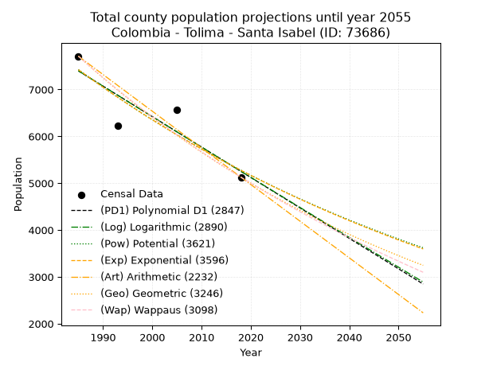
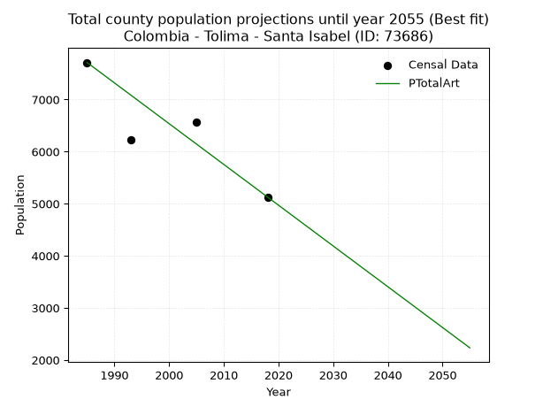
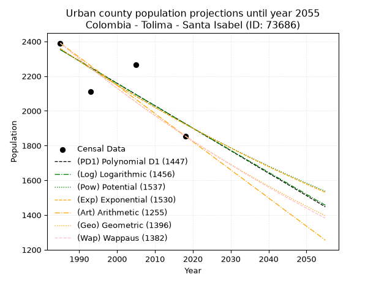
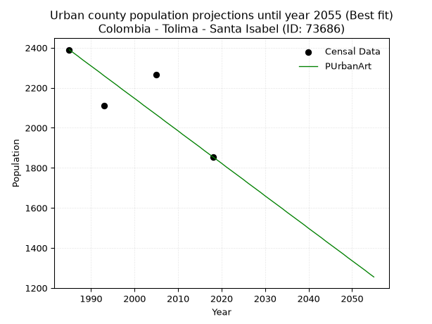
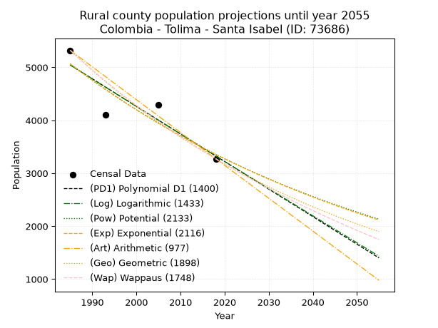

<div align="center">


</div>

# 📜 _“Population and Public Services Demand Projections (PPSD) until Year 2050 for Colombia - Tolima - Santa Isabel (ID: 73686)”_
Keywords: `population` `public-service` `projection` `lineal` `polynomial` `logarithmic` `potential` `exponential` `arithmetic` `geometric` `wappaus` `dane` `colombia` `south-america`

PPSD are analytical estimates used by governments and planners to anticipate future changes in population size, age distribution, and the resulting community needs for utilities, healthcare, education, and infrastructure as sizing future water treatment facilities, electrical grids, and road networks based on spatial growth.

<div align="center">

</img>

</div>


> **General running parameters**: • app_version: _v20260806_. • Python version: _3.14.7_. • Pandas version: _3.0.5_. • NumPy version: _2.5.1_. • Creates, save and include plots into reports (create_plot): _False_. • Projection until year: _2050_. • Process polynomial degree 2 and up: _False_. • Process Wappaus: _True_. • Process Wappaus: _True_. • Set negative values to zero: _True_. • Set infinite values to zero: _True_. • Drop dataset notes: _True_. 
<div align="center">

Maps & GIS Layers: [:earth_americas:Google](http://maps.google.com/maps?q=4.713605766,-75.0979343) [:earth_americas:OSM](https://www.openstreetmap.org/#map=18/4.713605766/-75.0979343&layers=P) [:earth_americas:Bing](https://www.bing.com/maps?cp=4.713605766~-75.0979343&lvl=18) [:earth_americas:Apple](https://maps.apple.com/frame?center=4.713605766%2C-75.0979343&span=0.003%2C0.006) [:earth_americas:GISMobile](https://github.com/rcfdtools/R.GISMobile/blob/main/file/gis/CountyLayer_CO/Readme.md)

</div>


<div align="center">

```geojson
{
  "type": "Feature",
  "geometry": {
    "type": "Point", 
    "coordinates": [-75.0979343, 4.713605766]
  }, 
  "properties": {
    "Name": "Colombia - Tolima - Santa Isabel (ID: 73686)"
  }
}
```

</div>


## 0. Census Data (4 records)

Census data are official statistics collected by a government about the people and housing in a country. They usually include counts of total population, age, sex, race, income, education, and jobs.

📅Global census file: [Population.xlsx](../data/Population.xlsx)

| Source   |   Year |   CountryID | CountryName   |   StateID | StateName   |   CountyID | CountyName   |   PTotal |   PUrban |   PRural |
|:---------|-------:|------------:|:--------------|----------:|:------------|-----------:|:-------------|---------:|---------:|---------:|
| DANE     |   1985 |          57 | Colombia      |        73 | Tolima      |      73686 | Santa Isabel |     7711 |     2390 |     5321 |
| DANE     |   1993 |          57 | Colombia      |        73 | Tolima      |      73686 | Santa Isabel |     6220 |     2111 |     4109 |
| DANE     |   2005 |          57 | Colombia      |        73 | Tolima      |      73686 | Santa Isabel |     6565 |     2267 |     4298 |
| DANE     |   2018 |          57 | Colombia      |        73 | Tolima      |      73686 | Santa Isabel |     5128 |     1855 |     3273 |

> 🔥Some records could had specific notes about the registered values or the corresponding urban or rural distribution.

📅[SUI-RUPS](https://www.datos.gov.co/Hacienda-y-Cr-dito-P-blico/Registro-nico-de-Prestadores-de-Servicios-P-blicos/4qkq-csdn/about_data) - Local public utility companies: [RUPS.csv](../data/RUPS.csv)

 | SERVICIO       | ESTADO    | NOMBRE                                                                  | NIT         | DEPARTAMENTO_DOMICILIO   | MUNICIPIO_DOMICILIO   | DIRECCION              |   TELEFONO | EMAIL                                            | TIPO_PRESTADOR                 | CLASIFICACION                 |
|:---------------|:----------|:------------------------------------------------------------------------|:------------|:-------------------------|:----------------------|:-----------------------|-----------:|:-------------------------------------------------|:-------------------------------|:------------------------------|
| ACUEDUCTO      | OPERATIVA | JUNTA DE SERVICIOS PUBLICOS DOMICILIARIOS DEL MUNICIPIO DE SANTA ISABEL | 890072044-1 | TOLIMA                   | SANTA ISABEL          | Carrera 2a  No  5 - 46 |    2803041 | secretariadeplaneacion@santaisabel-tolima.gov.co | MUNICIPIO (PRESTACIÓN DIRECTA) | MENOR O IGUAL A 2500 USUARIOS |
| ALCANTARILLADO | OPERATIVA | JUNTA DE SERVICIOS PUBLICOS DOMICILIARIOS DEL MUNICIPIO DE SANTA ISABEL | 890072044-1 | TOLIMA                   | SANTA ISABEL          | Carrera 2a  No  5 - 46 |    2803041 | secretariadeplaneacion@santaisabel-tolima.gov.co | MUNICIPIO (PRESTACIÓN DIRECTA) | MENOR O IGUAL A 2500 USUARIOS |

## 1. Total

### 1.1. Coefficients and Parameters

* (PD1) Polynomial Deg 1: -65.00521878763459, 136432.6888799661 (lineal)
* (Log) Logarithmic: -130124.10977588956, 995480.4011557102
* (Pow) Potential: -20.71988752596917, 72.19994101942429
* (Exp) Exponential: -0.010352763664165716, 6243688952845.118
* (Art) Arithmetic: Year diff. 2018 - 1985 = 33, Population diff. 5128 - 7711 = -2583, Annual growth = -78.27272727272727
* (Geo) Geometric: Year diff. 2018 - 1985 = 33, Population diff. 5128 - 7711 = -2583, Annual growth % = -0.012285490160997892
* (Wap) Wappaus: i = -1.2192963201608735, Condition values only valid for < 200)

<sub>
Wappaus condition values: ['-0.00', '-1.22', '-2.44', '-3.66', '-4.88', '-6.10', '-7.32', '-8.54', '-9.75', '-10.97', '-12.19', '-13.41', '-14.63', '-15.85', '-17.07', '-18.29', '-19.51', '-20.73', '-21.95', '-23.17', '-24.39', '-25.61', '-26.82', '-28.04', '-29.26', '-30.48', '-31.70', '-32.92', '-34.14', '-35.36', '-36.58', '-37.80', '-39.02', '-40.24', '-41.46', '-42.68', '-43.89', '-45.11', '-46.33', '-47.55', '-48.77', '-49.99', '-51.21', '-52.43', '-53.65', '-54.87', '-56.09', '-57.31', '-58.53', '-59.75', '-60.96', '-62.18', '-63.40', '-64.62', '-65.84', '-67.06', '-68.28', '-69.50', '-70.72', '-71.94', '-73.16', '-74.38', '-75.60', '-76.82', '-78.03', '-79.25']
</sub>


### 1.2. Projected Dataset

|   Year |   CountyID |   PTotalPD1 |   PTotalLog |   PTotalPow |   PTotalExp |   PTotalArt |   PTotalGeo |   PTotalWap |
|-------:|-----------:|------------:|------------:|------------:|------------:|------------:|------------:|------------:|
|   1985 |      73686 |        7397 |        7399 |        7425 |        7423 |        7711 |        7711 |        7711 |
|   1986 |      73686 |        7332 |        7334 |        7348 |        7347 |        7633 |        7616 |        7618 |
|   1987 |      73686 |        7267 |        7268 |        7272 |        7271 |        7554 |        7523 |        7525 |
|   1988 |      73686 |        7202 |        7203 |        7197 |        7196 |        7476 |        7430 |        7434 |
|   1989 |      73686 |        7137 |        7137 |        7122 |        7122 |        7398 |        7339 |        7344 |
|   1990 |      73686 |        7072 |        7072 |        7048 |        7049 |        7320 |        7249 |        7255 |
|   1991 |      73686 |        7007 |        7007 |        6975 |        6976 |        7241 |        7160 |        7167 |
|   1992 |      73686 |        6942 |        6941 |        6903 |        6904 |        7163 |        7072 |        7080 |
|   1993 |      73686 |        6877 |        6876 |        6832 |        6833 |        7085 |        6985 |        6994 |
|   1994 |      73686 |        6812 |        6811 |        6761 |        6763 |        7007 |        6899 |        6909 |
|   1995 |      73686 |        6747 |        6745 |        6691 |        6693 |        6928 |        6814 |        6825 |
|   1996 |      73686 |        6682 |        6680 |        6622 |        6624 |        6850 |        6731 |        6742 |
|   1997 |      73686 |        6617 |        6615 |        6554 |        6556 |        6772 |        6648 |        6660 |
|   1998 |      73686 |        6552 |        6550 |        6486 |        6488 |        6693 |        6566 |        6578 |
|   1999 |      73686 |        6487 |        6485 |        6419 |        6422 |        6615 |        6486 |        6498 |
|   2000 |      73686 |        6422 |        6420 |        6353 |        6355 |        6537 |        6406 |        6419 |
|   2001 |      73686 |        6357 |        6355 |        6287 |        6290 |        6459 |        6327 |        6340 |
|   2002 |      73686 |        6292 |        6290 |        6223 |        6225 |        6380 |        6249 |        6263 |
|   2003 |      73686 |        6227 |        6225 |        6159 |        6161 |        6302 |        6173 |        6186 |
|   2004 |      73686 |        6162 |        6160 |        6095 |        6098 |        6224 |        6097 |        6110 |
|   2005 |      73686 |        6097 |        6095 |        6033 |        6035 |        6146 |        6022 |        6035 |
|   2006 |      73686 |        6032 |        6030 |        5971 |        5973 |        6067 |        5948 |        5961 |
|   2007 |      73686 |        5967 |        5965 |        5909 |        5911 |        5989 |        5875 |        5887 |
|   2008 |      73686 |        5902 |        5900 |        5849 |        5850 |        5911 |        5803 |        5814 |
|   2009 |      73686 |        5837 |        5835 |        5789 |        5790 |        5832 |        5731 |        5743 |
|   2010 |      73686 |        5772 |        5771 |        5729 |        5730 |        5754 |        5661 |        5671 |
|   2011 |      73686 |        5707 |        5706 |        5670 |        5671 |        5676 |        5591 |        5601 |
|   2012 |      73686 |        5642 |        5641 |        5612 |        5613 |        5598 |        5523 |        5531 |
|   2013 |      73686 |        5577 |        5577 |        5555 |        5555 |        5519 |        5455 |        5462 |
|   2014 |      73686 |        5512 |        5512 |        5498 |        5498 |        5441 |        5388 |        5394 |
|   2015 |      73686 |        5447 |        5447 |        5442 |        5441 |        5363 |        5322 |        5327 |
|   2016 |      73686 |        5382 |        5383 |        5386 |        5385 |        5285 |        5256 |        5260 |
|   2017 |      73686 |        5317 |        5318 |        5331 |        5330 |        5206 |        5192 |        5193 |
|   2018 |      73686 |        5252 |        5254 |        5277 |        5275 |        5128 |        5128 |        5128 |
|   2019 |      73686 |        5187 |        5189 |        5223 |        5221 |        5050 |        5065 |        5063 |
|   2020 |      73686 |        5122 |        5125 |        5169 |        5167 |        4971 |        5003 |        4999 |
|   2021 |      73686 |        5057 |        5061 |        5117 |        5114 |        4893 |        4941 |        4935 |
|   2022 |      73686 |        4992 |        4996 |        5064 |        5061 |        4815 |        4881 |        4873 |
|   2023 |      73686 |        4927 |        4932 |        5013 |        5009 |        4737 |        4821 |        4810 |
|   2024 |      73686 |        4862 |        4868 |        4962 |        4957 |        4658 |        4761 |        4749 |
|   2025 |      73686 |        4797 |        4803 |        4911 |        4906 |        4580 |        4703 |        4688 |
|   2026 |      73686 |        4732 |        4739 |        4861 |        4856 |        4502 |        4645 |        4627 |
|   2027 |      73686 |        4667 |        4675 |        4812 |        4806 |        4424 |        4588 |        4567 |
|   2028 |      73686 |        4602 |        4611 |        4763 |        4756 |        4345 |        4532 |        4508 |
|   2029 |      73686 |        4537 |        4546 |        4714 |        4707 |        4267 |        4476 |        4449 |
|   2030 |      73686 |        4472 |        4482 |        4667 |        4659 |        4189 |        4421 |        4391 |
|   2031 |      73686 |        4407 |        4418 |        4619 |        4611 |        4110 |        4367 |        4333 |
|   2032 |      73686 |        4342 |        4354 |        4572 |        4563 |        4032 |        4313 |        4276 |
|   2033 |      73686 |        4277 |        4290 |        4526 |        4516 |        3954 |        4260 |        4220 |
|   2034 |      73686 |        4212 |        4226 |        4480 |        4470 |        3876 |        4208 |        4164 |
|   2035 |      73686 |        4147 |        4162 |        4435 |        4424 |        3797 |        4156 |        4108 |
|   2036 |      73686 |        4082 |        4098 |        4390 |        4378 |        3719 |        4105 |        4053 |
|   2037 |      73686 |        4017 |        4034 |        4345 |        4333 |        3641 |        4055 |        3999 |
|   2038 |      73686 |        3952 |        3971 |        4301 |        4288 |        3563 |        4005 |        3945 |
|   2039 |      73686 |        3887 |        3907 |        4258 |        4244 |        3484 |        3956 |        3891 |
|   2040 |      73686 |        3822 |        3843 |        4215 |        4200 |        3406 |        3907 |        3838 |
|   2041 |      73686 |        3757 |        3779 |        4172 |        4157 |        3328 |        3859 |        3786 |
|   2042 |      73686 |        3692 |        3715 |        4130 |        4114 |        3249 |        3812 |        3734 |
|   2043 |      73686 |        3627 |        3652 |        4088 |        4072 |        3171 |        3765 |        3682 |
|   2044 |      73686 |        3562 |        3588 |        4047 |        4030 |        3093 |        3718 |        3631 |
|   2045 |      73686 |        3497 |        3524 |        4006 |        3989 |        3015 |        3673 |        3581 |
|   2046 |      73686 |        3432 |        3461 |        3966 |        3948 |        2936 |        3628 |        3530 |
|   2047 |      73686 |        3367 |        3397 |        3926 |        3907 |        2858 |        3583 |        3481 |
|   2048 |      73686 |        3302 |        3334 |        3886 |        3867 |        2780 |        3539 |        3431 |
|   2049 |      73686 |        3237 |        3270 |        3847 |        3827 |        2702 |        3496 |        3383 |
|   2050 |      73686 |        3172 |        3207 |        3809 |        3787 |        2623 |        3453 |        3334 |
<div align="center">

</img>

</div>


### 1.3. Best fit with absolute and relative error (%)

Relative error puts that difference into context by dividing the absolute error by the true value, creating a unitless ratio or percentage that shows the scale of the mistake.

Absolute and relative error

|   Year | Source   |   CountryID | CountryName   |   StateID | StateName   |   CountyID_x | CountyName   |   PTotal |   PUrban |   PRural |   CountyID_y |   PTotalPD1 |   PTotalLog |   PTotalPow |   PTotalExp |   PTotalArt |   PTotalGeo |   PTotalWap |   PTotalPD1AbsError |   PTotalLogAbsError |   PTotalPowAbsError |   PTotalExpAbsError |   PTotalArtAbsError |   PTotalGeoAbsError |   PTotalWapAbsError |   PTotalPD1RelError |   PTotalLogRelError |   PTotalPowRelError |   PTotalExpRelError |   PTotalArtRelError |   PTotalGeoRelError |   PTotalWapRelError |
|-------:|:---------|------------:|:--------------|----------:|:------------|-------------:|:-------------|---------:|---------:|---------:|-------------:|------------:|------------:|------------:|------------:|------------:|------------:|------------:|--------------------:|--------------------:|--------------------:|--------------------:|--------------------:|--------------------:|--------------------:|--------------------:|--------------------:|--------------------:|--------------------:|--------------------:|--------------------:|--------------------:|
|   1985 | DANE     |          57 | Colombia      |        73 | Tolima      |        73686 | Santa Isabel |     7711 |     2390 |     5321 |        73686 |        7397 |        7399 |        7425 |        7423 |        7711 |        7711 |        7711 |                 314 |                 312 |                 286 |                 288 |                   0 |                   0 |                   0 |             4.0721  |             4.04617 |             3.70899 |             3.73492 |             0       |             0       |             0       |
|   1993 | DANE     |          57 | Colombia      |        73 | Tolima      |        73686 | Santa Isabel |     6220 |     2111 |     4109 |        73686 |        6877 |        6876 |        6832 |        6833 |        7085 |        6985 |        6994 |                 657 |                 656 |                 612 |                 613 |                 865 |                 765 |                 774 |            10.5627  |            10.5466  |             9.83923 |             9.85531 |            13.9068  |            12.299   |            12.4437  |
|   2005 | DANE     |          57 | Colombia      |        73 | Tolima      |        73686 | Santa Isabel |     6565 |     2267 |     4298 |        73686 |        6097 |        6095 |        6033 |        6035 |        6146 |        6022 |        6035 |                 468 |                 470 |                 532 |                 530 |                 419 |                 543 |                 530 |             7.12871 |             7.15918 |             8.10358 |             8.07312 |             6.38233 |             8.27113 |             8.07312 |
|   2018 | DANE     |          57 | Colombia      |        73 | Tolima      |        73686 | Santa Isabel |     5128 |     1855 |     3273 |        73686 |        5252 |        5254 |        5277 |        5275 |        5128 |        5128 |        5128 |                 124 |                 126 |                 149 |                 147 |                   0 |                   0 |                   0 |             2.4181  |             2.4571  |             2.90562 |             2.86661 |             0       |             0       |             0       |

Relative error mean

| Method    |   RelError | Best   |
|:----------|-----------:|:-------|
| PTotalPD1 |    6.0454  |        |
| PTotalLog |    6.05227 |        |
| PTotalPow |    6.13935 |        |
| PTotalExp |    6.13249 |        |
| PTotalArt |    5.07227 | True   |
| PTotalGeo |    5.14254 |        |
| PTotalWap |    5.12921 |        |

💙Best method: _**PTotalArt**_
<div align="center">

</img>

</div>


### 1.4. Fresh water supply demand in liters per capita per day (lpcd)

The fresh water supply demand typically ranges from 100 to 300 liters per capita per day (lpcd) for standard domestic and municipal planning, though absolute survival minimums set by the World Health Organization are as low as 7.5 to 20 liters per day, and total consumption in high-income nations can exceed 400 liters.

> `CZ`: Level in meters above the sea level (masl)<br> `WS`: Fresh water supply demand in liters per capita per day (lpcd or l/h/d)<br> `WSAll`: Zonal fresh water supply demand in liters per second (l/s)<br> `A`: Zonal area in square meters<br> `DP`: Population density (people/hectare or p/ha)

Reference values (RAS Colombia)

|    CZ |   WS |
|------:|-----:|
|  1000 |  120 |
|  2000 |  130 |
| 99999 |  140 |

County shapefile geometry properties and water supply values

|   CountyID |      ATotal |   CZTotal |   WSTotal |
|-----------:|------------:|----------:|----------:|
|      73686 | 2.70052e+08 |   3055.14 |       140 |

Projected values for best method: PTotalArt

|   CountyID |   Year |   PTotalArt |   DPTotal |   WSTotal |   WSTotalAll |
|-----------:|-------:|------------:|----------:|----------:|-------------:|
|      73686 |   1985 |        7711 |      0.29 |       140 |     12.4947  |
|      73686 |   1986 |        7633 |      0.28 |       140 |     12.3683  |
|      73686 |   1987 |        7554 |      0.28 |       140 |     12.2403  |
|      73686 |   1988 |        7476 |      0.28 |       140 |     12.1139  |
|      73686 |   1989 |        7398 |      0.27 |       140 |     11.9875  |
|      73686 |   1990 |        7320 |      0.27 |       140 |     11.8611  |
|      73686 |   1991 |        7241 |      0.27 |       140 |     11.7331  |
|      73686 |   1992 |        7163 |      0.27 |       140 |     11.6067  |
|      73686 |   1993 |        7085 |      0.26 |       140 |     11.4803  |
|      73686 |   1994 |        7007 |      0.26 |       140 |     11.3539  |
|      73686 |   1995 |        6928 |      0.26 |       140 |     11.2259  |
|      73686 |   1996 |        6850 |      0.25 |       140 |     11.0995  |
|      73686 |   1997 |        6772 |      0.25 |       140 |     10.9731  |
|      73686 |   1998 |        6693 |      0.25 |       140 |     10.8451  |
|      73686 |   1999 |        6615 |      0.24 |       140 |     10.7188  |
|      73686 |   2000 |        6537 |      0.24 |       140 |     10.5924  |
|      73686 |   2001 |        6459 |      0.24 |       140 |     10.466   |
|      73686 |   2002 |        6380 |      0.24 |       140 |     10.338   |
|      73686 |   2003 |        6302 |      0.23 |       140 |     10.2116  |
|      73686 |   2004 |        6224 |      0.23 |       140 |     10.0852  |
|      73686 |   2005 |        6146 |      0.23 |       140 |      9.9588  |
|      73686 |   2006 |        6067 |      0.22 |       140 |      9.83079 |
|      73686 |   2007 |        5989 |      0.22 |       140 |      9.7044  |
|      73686 |   2008 |        5911 |      0.22 |       140 |      9.57801 |
|      73686 |   2009 |        5832 |      0.22 |       140 |      9.45    |
|      73686 |   2010 |        5754 |      0.21 |       140 |      9.32361 |
|      73686 |   2011 |        5676 |      0.21 |       140 |      9.19722 |
|      73686 |   2012 |        5598 |      0.21 |       140 |      9.07083 |
|      73686 |   2013 |        5519 |      0.2  |       140 |      8.94282 |
|      73686 |   2014 |        5441 |      0.2  |       140 |      8.81644 |
|      73686 |   2015 |        5363 |      0.2  |       140 |      8.69005 |
|      73686 |   2016 |        5285 |      0.2  |       140 |      8.56366 |
|      73686 |   2017 |        5206 |      0.19 |       140 |      8.43565 |
|      73686 |   2018 |        5128 |      0.19 |       140 |      8.30926 |
|      73686 |   2019 |        5050 |      0.19 |       140 |      8.18287 |
|      73686 |   2020 |        4971 |      0.18 |       140 |      8.05486 |
|      73686 |   2021 |        4893 |      0.18 |       140 |      7.92847 |
|      73686 |   2022 |        4815 |      0.18 |       140 |      7.80208 |
|      73686 |   2023 |        4737 |      0.18 |       140 |      7.67569 |
|      73686 |   2024 |        4658 |      0.17 |       140 |      7.54769 |
|      73686 |   2025 |        4580 |      0.17 |       140 |      7.4213  |
|      73686 |   2026 |        4502 |      0.17 |       140 |      7.29491 |
|      73686 |   2027 |        4424 |      0.16 |       140 |      7.16852 |
|      73686 |   2028 |        4345 |      0.16 |       140 |      7.04051 |
|      73686 |   2029 |        4267 |      0.16 |       140 |      6.91412 |
|      73686 |   2030 |        4189 |      0.16 |       140 |      6.78773 |
|      73686 |   2031 |        4110 |      0.15 |       140 |      6.65972 |
|      73686 |   2032 |        4032 |      0.15 |       140 |      6.53333 |
|      73686 |   2033 |        3954 |      0.15 |       140 |      6.40694 |
|      73686 |   2034 |        3876 |      0.14 |       140 |      6.28056 |
|      73686 |   2035 |        3797 |      0.14 |       140 |      6.15255 |
|      73686 |   2036 |        3719 |      0.14 |       140 |      6.02616 |
|      73686 |   2037 |        3641 |      0.13 |       140 |      5.89977 |
|      73686 |   2038 |        3563 |      0.13 |       140 |      5.77338 |
|      73686 |   2039 |        3484 |      0.13 |       140 |      5.64537 |
|      73686 |   2040 |        3406 |      0.13 |       140 |      5.51898 |
|      73686 |   2041 |        3328 |      0.12 |       140 |      5.39259 |
|      73686 |   2042 |        3249 |      0.12 |       140 |      5.26458 |
|      73686 |   2043 |        3171 |      0.12 |       140 |      5.13819 |
|      73686 |   2044 |        3093 |      0.11 |       140 |      5.01181 |
|      73686 |   2045 |        3015 |      0.11 |       140 |      4.88542 |
|      73686 |   2046 |        2936 |      0.11 |       140 |      4.75741 |
|      73686 |   2047 |        2858 |      0.11 |       140 |      4.63102 |
|      73686 |   2048 |        2780 |      0.1  |       140 |      4.50463 |
|      73686 |   2049 |        2702 |      0.1  |       140 |      4.37824 |
|      73686 |   2050 |        2623 |      0.1  |       140 |      4.25023 |

## 2. Urban

### 2.1. Coefficients and Parameters

* (PD1) Polynomial Deg 1: -12.938980329184814, 28036.945403451922 (lineal)
* (Log) Logarithmic: -25885.23086640692, 198909.59724678093
* (Pow) Potential: -12.363723901215804, 44.145260619756066
* (Exp) Exponential: -0.006180683717570403, 502128783.5297526
* (Art) Arithmetic: Year diff. 2018 - 1985 = 33, Population diff. 1855 - 2390 = -535, Annual growth = -16.21212121212121
* (Geo) Geometric: Year diff. 2018 - 1985 = 33, Population diff. 1855 - 2390 = -535, Annual growth % = -0.00764964201828322
* (Wap) Wappaus: i = -0.7638219652353928, Condition values only valid for < 200)

<sub>
Wappaus condition values: ['-0.00', '-0.76', '-1.53', '-2.29', '-3.06', '-3.82', '-4.58', '-5.35', '-6.11', '-6.87', '-7.64', '-8.40', '-9.17', '-9.93', '-10.69', '-11.46', '-12.22', '-12.98', '-13.75', '-14.51', '-15.28', '-16.04', '-16.80', '-17.57', '-18.33', '-19.10', '-19.86', '-20.62', '-21.39', '-22.15', '-22.91', '-23.68', '-24.44', '-25.21', '-25.97', '-26.73', '-27.50', '-28.26', '-29.03', '-29.79', '-30.55', '-31.32', '-32.08', '-32.84', '-33.61', '-34.37', '-35.14', '-35.90', '-36.66', '-37.43', '-38.19', '-38.95', '-39.72', '-40.48', '-41.25', '-42.01', '-42.77', '-43.54', '-44.30', '-45.07', '-45.83', '-46.59', '-47.36', '-48.12', '-48.88', '-49.65']
</sub>


### 2.2. Projected Dataset

|   Year |   CountyID |   PUrbanPD1 |   PUrbanLog |   PUrbanPow |   PUrbanExp |   PUrbanArt |   PUrbanGeo |   PUrbanWap |
|-------:|-----------:|------------:|------------:|------------:|------------:|------------:|------------:|------------:|
|   1985 |      73686 |        2353 |        2353 |        2359 |        2358 |        2390 |        2390 |        2390 |
|   1986 |      73686 |        2340 |        2340 |        2344 |        2344 |        2374 |        2372 |        2372 |
|   1987 |      73686 |        2327 |        2327 |        2329 |        2329 |        2358 |        2354 |        2354 |
|   1988 |      73686 |        2314 |        2314 |        2315 |        2315 |        2341 |        2336 |        2336 |
|   1989 |      73686 |        2301 |        2301 |        2301 |        2301 |        2325 |        2318 |        2318 |
|   1990 |      73686 |        2288 |        2288 |        2286 |        2287 |        2309 |        2300 |        2300 |
|   1991 |      73686 |        2275 |        2275 |        2272 |        2272 |        2293 |        2282 |        2283 |
|   1992 |      73686 |        2262 |        2262 |        2258 |        2258 |        2277 |        2265 |        2266 |
|   1993 |      73686 |        2250 |        2249 |        2244 |        2245 |        2260 |        2248 |        2248 |
|   1994 |      73686 |        2237 |        2236 |        2230 |        2231 |        2244 |        2230 |        2231 |
|   1995 |      73686 |        2224 |        2223 |        2217 |        2217 |        2228 |        2213 |        2214 |
|   1996 |      73686 |        2211 |        2210 |        2203 |        2203 |        2212 |        2196 |        2197 |
|   1997 |      73686 |        2198 |        2197 |        2189 |        2190 |        2195 |        2180 |        2181 |
|   1998 |      73686 |        2185 |        2184 |        2176 |        2176 |        2179 |        2163 |        2164 |
|   1999 |      73686 |        2172 |        2171 |        2162 |        2163 |        2163 |        2146 |        2147 |
|   2000 |      73686 |        2159 |        2158 |        2149 |        2150 |        2147 |        2130 |        2131 |
|   2001 |      73686 |        2146 |        2146 |        2136 |        2136 |        2131 |        2114 |        2115 |
|   2002 |      73686 |        2133 |        2133 |        2123 |        2123 |        2114 |        2098 |        2099 |
|   2003 |      73686 |        2120 |        2120 |        2110 |        2110 |        2098 |        2081 |        2083 |
|   2004 |      73686 |        2107 |        2107 |        2097 |        2097 |        2082 |        2066 |        2067 |
|   2005 |      73686 |        2094 |        2094 |        2084 |        2084 |        2066 |        2050 |        2051 |
|   2006 |      73686 |        2081 |        2081 |        2071 |        2071 |        2050 |        2034 |        2035 |
|   2007 |      73686 |        2068 |        2068 |        2058 |        2059 |        2033 |        2018 |        2020 |
|   2008 |      73686 |        2055 |        2055 |        2046 |        2046 |        2017 |        2003 |        2004 |
|   2009 |      73686 |        2043 |        2042 |        2033 |        2033 |        2001 |        1988 |        1989 |
|   2010 |      73686 |        2030 |        2029 |        2020 |        2021 |        1985 |        1973 |        1973 |
|   2011 |      73686 |        2017 |        2017 |        2008 |        2008 |        1968 |        1957 |        1958 |
|   2012 |      73686 |        2004 |        2004 |        1996 |        1996 |        1952 |        1942 |        1943 |
|   2013 |      73686 |        1991 |        1991 |        1984 |        1984 |        1936 |        1928 |        1928 |
|   2014 |      73686 |        1978 |        1978 |        1971 |        1971 |        1920 |        1913 |        1913 |
|   2015 |      73686 |        1965 |        1965 |        1959 |        1959 |        1904 |        1898 |        1899 |
|   2016 |      73686 |        1952 |        1952 |        1947 |        1947 |        1887 |        1884 |        1884 |
|   2017 |      73686 |        1939 |        1939 |        1935 |        1935 |        1871 |        1869 |        1869 |
|   2018 |      73686 |        1926 |        1927 |        1924 |        1923 |        1855 |        1855 |        1855 |
|   2019 |      73686 |        1913 |        1914 |        1912 |        1911 |        1839 |        1841 |        1841 |
|   2020 |      73686 |        1900 |        1901 |        1900 |        1900 |        1823 |        1827 |        1826 |
|   2021 |      73686 |        1887 |        1888 |        1889 |        1888 |        1806 |        1813 |        1812 |
|   2022 |      73686 |        1874 |        1875 |        1877 |        1876 |        1790 |        1799 |        1798 |
|   2023 |      73686 |        1861 |        1863 |        1866 |        1865 |        1774 |        1785 |        1784 |
|   2024 |      73686 |        1848 |        1850 |        1854 |        1853 |        1758 |        1771 |        1770 |
|   2025 |      73686 |        1836 |        1837 |        1843 |        1842 |        1742 |        1758 |        1757 |
|   2026 |      73686 |        1823 |        1824 |        1832 |        1830 |        1725 |        1744 |        1743 |
|   2027 |      73686 |        1810 |        1811 |        1821 |        1819 |        1709 |        1731 |        1729 |
|   2028 |      73686 |        1797 |        1799 |        1810 |        1808 |        1693 |        1718 |        1716 |
|   2029 |      73686 |        1784 |        1786 |        1799 |        1797 |        1677 |        1705 |        1702 |
|   2030 |      73686 |        1771 |        1773 |        1788 |        1786 |        1660 |        1692 |        1689 |
|   2031 |      73686 |        1758 |        1760 |        1777 |        1775 |        1644 |        1679 |        1676 |
|   2032 |      73686 |        1745 |        1748 |        1766 |        1764 |        1628 |        1666 |        1663 |
|   2033 |      73686 |        1732 |        1735 |        1755 |        1753 |        1612 |        1653 |        1649 |
|   2034 |      73686 |        1719 |        1722 |        1745 |        1742 |        1596 |        1641 |        1636 |
|   2035 |      73686 |        1706 |        1709 |        1734 |        1731 |        1579 |        1628 |        1624 |
|   2036 |      73686 |        1693 |        1697 |        1724 |        1721 |        1563 |        1616 |        1611 |
|   2037 |      73686 |        1680 |        1684 |        1713 |        1710 |        1547 |        1603 |        1598 |
|   2038 |      73686 |        1667 |        1671 |        1703 |        1700 |        1531 |        1591 |        1585 |
|   2039 |      73686 |        1654 |        1659 |        1693 |        1689 |        1515 |        1579 |        1573 |
|   2040 |      73686 |        1641 |        1646 |        1682 |        1679 |        1498 |        1567 |        1560 |
|   2041 |      73686 |        1628 |        1633 |        1672 |        1668 |        1482 |        1555 |        1548 |
|   2042 |      73686 |        1616 |        1621 |        1662 |        1658 |        1466 |        1543 |        1535 |
|   2043 |      73686 |        1603 |        1608 |        1652 |        1648 |        1450 |        1531 |        1523 |
|   2044 |      73686 |        1590 |        1595 |        1642 |        1638 |        1433 |        1519 |        1511 |
|   2045 |      73686 |        1577 |        1583 |        1632 |        1628 |        1417 |        1508 |        1499 |
|   2046 |      73686 |        1564 |        1570 |        1622 |        1618 |        1401 |        1496 |        1487 |
|   2047 |      73686 |        1551 |        1557 |        1613 |        1608 |        1385 |        1485 |        1475 |
|   2048 |      73686 |        1538 |        1545 |        1603 |        1598 |        1369 |        1473 |        1463 |
|   2049 |      73686 |        1525 |        1532 |        1593 |        1588 |        1352 |        1462 |        1451 |
|   2050 |      73686 |        1512 |        1519 |        1584 |        1578 |        1336 |        1451 |        1439 |
<div align="center">

</img>

</div>


### 2.3. Best fit with absolute and relative error (%)

Relative error puts that difference into context by dividing the absolute error by the true value, creating a unitless ratio or percentage that shows the scale of the mistake.

Absolute and relative error

|   Year | Source   |   CountryID | CountryName   |   StateID | StateName   |   CountyID_x | CountyName   |   PTotal |   PUrban |   PRural |   CountyID_y |   PUrbanPD1 |   PUrbanLog |   PUrbanPow |   PUrbanExp |   PUrbanArt |   PUrbanGeo |   PUrbanWap |   PUrbanPD1AbsError |   PUrbanLogAbsError |   PUrbanPowAbsError |   PUrbanExpAbsError |   PUrbanArtAbsError |   PUrbanGeoAbsError |   PUrbanWapAbsError |   PUrbanPD1RelError |   PUrbanLogRelError |   PUrbanPowRelError |   PUrbanExpRelError |   PUrbanArtRelError |   PUrbanGeoRelError |   PUrbanWapRelError |
|-------:|:---------|------------:|:--------------|----------:|:------------|-------------:|:-------------|---------:|---------:|---------:|-------------:|------------:|------------:|------------:|------------:|------------:|------------:|------------:|--------------------:|--------------------:|--------------------:|--------------------:|--------------------:|--------------------:|--------------------:|--------------------:|--------------------:|--------------------:|--------------------:|--------------------:|--------------------:|--------------------:|
|   1985 | DANE     |          57 | Colombia      |        73 | Tolima      |        73686 | Santa Isabel |     7711 |     2390 |     5321 |        73686 |        2353 |        2353 |        2359 |        2358 |        2390 |        2390 |        2390 |                  37 |                  37 |                  31 |                  32 |                   0 |                   0 |                   0 |             1.54812 |             1.54812 |             1.29707 |             1.33891 |             0       |             0       |             0       |
|   1993 | DANE     |          57 | Colombia      |        73 | Tolima      |        73686 | Santa Isabel |     6220 |     2111 |     4109 |        73686 |        2250 |        2249 |        2244 |        2245 |        2260 |        2248 |        2248 |                 139 |                 138 |                 133 |                 134 |                 149 |                 137 |                 137 |             6.58456 |             6.53719 |             6.30033 |             6.3477  |             7.05827 |             6.48982 |             6.48982 |
|   2005 | DANE     |          57 | Colombia      |        73 | Tolima      |        73686 | Santa Isabel |     6565 |     2267 |     4298 |        73686 |        2094 |        2094 |        2084 |        2084 |        2066 |        2050 |        2051 |                 173 |                 173 |                 183 |                 183 |                 201 |                 217 |                 216 |             7.63123 |             7.63123 |             8.07234 |             8.07234 |             8.86634 |             9.57212 |             9.52801 |
|   2018 | DANE     |          57 | Colombia      |        73 | Tolima      |        73686 | Santa Isabel |     5128 |     1855 |     3273 |        73686 |        1926 |        1927 |        1924 |        1923 |        1855 |        1855 |        1855 |                  71 |                  72 |                  69 |                  68 |                   0 |                   0 |                   0 |             3.82749 |             3.8814  |             3.71968 |             3.66577 |             0       |             0       |             0       |

Relative error mean

| Method    |   RelError | Best   |
|:----------|-----------:|:-------|
| PUrbanPD1 |    4.89785 |        |
| PUrbanLog |    4.89948 |        |
| PUrbanPow |    4.84736 |        |
| PUrbanExp |    4.85618 |        |
| PUrbanArt |    3.98115 | True   |
| PUrbanGeo |    4.01548 |        |
| PUrbanWap |    4.00446 |        |

💙Best method: _**PUrbanArt**_
<div align="center">

</img>

</div>


### 2.4. Fresh water supply demand in liters per capita per day (lpcd)

The fresh water supply demand typically ranges from 100 to 300 liters per capita per day (lpcd) for standard domestic and municipal planning, though absolute survival minimums set by the World Health Organization are as low as 7.5 to 20 liters per day, and total consumption in high-income nations can exceed 400 liters.

> `CZ`: Level in meters above the sea level (masl)<br> `WS`: Fresh water supply demand in liters per capita per day (lpcd or l/h/d)<br> `WSAll`: Zonal fresh water supply demand in liters per second (l/s)<br> `A`: Zonal area in square meters<br> `DP`: Population density (people/hectare or p/ha)

Reference values (RAS Colombia)

|    CZ |   WS |
|------:|-----:|
|  1000 |  120 |
|  2000 |  130 |
| 99999 |  140 |

County shapefile geometry properties and water supply values

|   CountyID |   AUrban |   CZUrban |   WSUrban |
|-----------:|---------:|----------:|----------:|
|      73686 |   257408 |   2262.81 |       140 |

Projected values for best method: PUrbanArt

|   CountyID |   Year |   PUrbanArt |   DPUrban |   WSUrban |   WSUrbanAll |
|-----------:|-------:|------------:|----------:|----------:|-------------:|
|      73686 |   1985 |        2390 |     92.85 |       140 |      3.87269 |
|      73686 |   1986 |        2374 |     92.23 |       140 |      3.84676 |
|      73686 |   1987 |        2358 |     91.61 |       140 |      3.82083 |
|      73686 |   1988 |        2341 |     90.95 |       140 |      3.79329 |
|      73686 |   1989 |        2325 |     90.32 |       140 |      3.76736 |
|      73686 |   1990 |        2309 |     89.7  |       140 |      3.74144 |
|      73686 |   1991 |        2293 |     89.08 |       140 |      3.71551 |
|      73686 |   1992 |        2277 |     88.46 |       140 |      3.68958 |
|      73686 |   1993 |        2260 |     87.8  |       140 |      3.66204 |
|      73686 |   1994 |        2244 |     87.18 |       140 |      3.63611 |
|      73686 |   1995 |        2228 |     86.56 |       140 |      3.61019 |
|      73686 |   1996 |        2212 |     85.93 |       140 |      3.58426 |
|      73686 |   1997 |        2195 |     85.27 |       140 |      3.55671 |
|      73686 |   1998 |        2179 |     84.65 |       140 |      3.53079 |
|      73686 |   1999 |        2163 |     84.03 |       140 |      3.50486 |
|      73686 |   2000 |        2147 |     83.41 |       140 |      3.47894 |
|      73686 |   2001 |        2131 |     82.79 |       140 |      3.45301 |
|      73686 |   2002 |        2114 |     82.13 |       140 |      3.42546 |
|      73686 |   2003 |        2098 |     81.5  |       140 |      3.39954 |
|      73686 |   2004 |        2082 |     80.88 |       140 |      3.37361 |
|      73686 |   2005 |        2066 |     80.26 |       140 |      3.34769 |
|      73686 |   2006 |        2050 |     79.64 |       140 |      3.32176 |
|      73686 |   2007 |        2033 |     78.98 |       140 |      3.29421 |
|      73686 |   2008 |        2017 |     78.36 |       140 |      3.26829 |
|      73686 |   2009 |        2001 |     77.74 |       140 |      3.24236 |
|      73686 |   2010 |        1985 |     77.11 |       140 |      3.21644 |
|      73686 |   2011 |        1968 |     76.45 |       140 |      3.18889 |
|      73686 |   2012 |        1952 |     75.83 |       140 |      3.16296 |
|      73686 |   2013 |        1936 |     75.21 |       140 |      3.13704 |
|      73686 |   2014 |        1920 |     74.59 |       140 |      3.11111 |
|      73686 |   2015 |        1904 |     73.97 |       140 |      3.08519 |
|      73686 |   2016 |        1887 |     73.31 |       140 |      3.05764 |
|      73686 |   2017 |        1871 |     72.69 |       140 |      3.03171 |
|      73686 |   2018 |        1855 |     72.06 |       140 |      3.00579 |
|      73686 |   2019 |        1839 |     71.44 |       140 |      2.97986 |
|      73686 |   2020 |        1823 |     70.82 |       140 |      2.95394 |
|      73686 |   2021 |        1806 |     70.16 |       140 |      2.92639 |
|      73686 |   2022 |        1790 |     69.54 |       140 |      2.90046 |
|      73686 |   2023 |        1774 |     68.92 |       140 |      2.87454 |
|      73686 |   2024 |        1758 |     68.3  |       140 |      2.84861 |
|      73686 |   2025 |        1742 |     67.67 |       140 |      2.82269 |
|      73686 |   2026 |        1725 |     67.01 |       140 |      2.79514 |
|      73686 |   2027 |        1709 |     66.39 |       140 |      2.76921 |
|      73686 |   2028 |        1693 |     65.77 |       140 |      2.74329 |
|      73686 |   2029 |        1677 |     65.15 |       140 |      2.71736 |
|      73686 |   2030 |        1660 |     64.49 |       140 |      2.68981 |
|      73686 |   2031 |        1644 |     63.87 |       140 |      2.66389 |
|      73686 |   2032 |        1628 |     63.25 |       140 |      2.63796 |
|      73686 |   2033 |        1612 |     62.62 |       140 |      2.61204 |
|      73686 |   2034 |        1596 |     62    |       140 |      2.58611 |
|      73686 |   2035 |        1579 |     61.34 |       140 |      2.55856 |
|      73686 |   2036 |        1563 |     60.72 |       140 |      2.53264 |
|      73686 |   2037 |        1547 |     60.1  |       140 |      2.50671 |
|      73686 |   2038 |        1531 |     59.48 |       140 |      2.48079 |
|      73686 |   2039 |        1515 |     58.86 |       140 |      2.45486 |
|      73686 |   2040 |        1498 |     58.2  |       140 |      2.42731 |
|      73686 |   2041 |        1482 |     57.57 |       140 |      2.40139 |
|      73686 |   2042 |        1466 |     56.95 |       140 |      2.37546 |
|      73686 |   2043 |        1450 |     56.33 |       140 |      2.34954 |
|      73686 |   2044 |        1433 |     55.67 |       140 |      2.32199 |
|      73686 |   2045 |        1417 |     55.05 |       140 |      2.29606 |
|      73686 |   2046 |        1401 |     54.43 |       140 |      2.27014 |
|      73686 |   2047 |        1385 |     53.81 |       140 |      2.24421 |
|      73686 |   2048 |        1369 |     53.18 |       140 |      2.21829 |
|      73686 |   2049 |        1352 |     52.52 |       140 |      2.19074 |
|      73686 |   2050 |        1336 |     51.9  |       140 |      2.16481 |

## 3. Rural

### 3.1. Coefficients and Parameters

* (PD1) Polynomial Deg 1: -52.066238458449774, 108395.74347651415 (lineal)
* (Log) Logarithmic: -104238.8789094825, 796570.8039089282
* (Pow) Potential: -24.960652672108633, 86.01899286990779
* (Exp) Exponential: -0.012470294962491505, 285036173447304.06
* (Art) Arithmetic: Year diff. 2018 - 1985 = 33, Population diff. 3273 - 5321 = -2048, Annual growth = -62.06060606060606
* (Geo) Geometric: Year diff. 2018 - 1985 = 33, Population diff. 3273 - 5321 = -2048, Annual growth % = -0.014617991069197478
* (Wap) Wappaus: i = -1.444277543881919, Condition values only valid for < 200)

<sub>
Wappaus condition values: ['-0.00', '-1.44', '-2.89', '-4.33', '-5.78', '-7.22', '-8.67', '-10.11', '-11.55', '-13.00', '-14.44', '-15.89', '-17.33', '-18.78', '-20.22', '-21.66', '-23.11', '-24.55', '-26.00', '-27.44', '-28.89', '-30.33', '-31.77', '-33.22', '-34.66', '-36.11', '-37.55', '-39.00', '-40.44', '-41.88', '-43.33', '-44.77', '-46.22', '-47.66', '-49.11', '-50.55', '-51.99', '-53.44', '-54.88', '-56.33', '-57.77', '-59.22', '-60.66', '-62.10', '-63.55', '-64.99', '-66.44', '-67.88', '-69.33', '-70.77', '-72.21', '-73.66', '-75.10', '-76.55', '-77.99', '-79.44', '-80.88', '-82.32', '-83.77', '-85.21', '-86.66', '-88.10', '-89.55', '-90.99', '-92.43', '-93.88']
</sub>


### 3.2. Projected Dataset

|   Year |   CountyID |   PRuralPD1 |   PRuralLog |   PRuralPow |   PRuralExp |   PRuralArt |   PRuralGeo |   PRuralWap |
|-------:|-----------:|------------:|------------:|------------:|------------:|------------:|------------:|------------:|
|   1985 |      73686 |        5044 |        5046 |        5067 |        5065 |        5321 |        5321 |        5321 |
|   1986 |      73686 |        4992 |        4993 |        5004 |        5002 |        5259 |        5243 |        5245 |
|   1987 |      73686 |        4940 |        4941 |        4941 |        4940 |        5197 |        5167 |        5169 |
|   1988 |      73686 |        4888 |        4889 |        4879 |        4879 |        5135 |        5091 |        5095 |
|   1989 |      73686 |        4836 |        4836 |        4819 |        4819 |        5073 |        5017 |        5022 |
|   1990 |      73686 |        4784 |        4784 |        4758 |        4759 |        5011 |        4943 |        4950 |
|   1991 |      73686 |        4732 |        4731 |        4699 |        4700 |        4949 |        4871 |        4879 |
|   1992 |      73686 |        4680 |        4679 |        4641 |        4642 |        4887 |        4800 |        4809 |
|   1993 |      73686 |        4628 |        4627 |        4583 |        4584 |        4825 |        4730 |        4740 |
|   1994 |      73686 |        4576 |        4574 |        4526 |        4527 |        4762 |        4661 |        4672 |
|   1995 |      73686 |        4524 |        4522 |        4470 |        4471 |        4700 |        4592 |        4604 |
|   1996 |      73686 |        4472 |        4470 |        4414 |        4416 |        4638 |        4525 |        4538 |
|   1997 |      73686 |        4419 |        4418 |        4359 |        4361 |        4576 |        4459 |        4472 |
|   1998 |      73686 |        4367 |        4366 |        4305 |        4307 |        4514 |        4394 |        4408 |
|   1999 |      73686 |        4315 |        4313 |        4252 |        4254 |        4452 |        4330 |        4344 |
|   2000 |      73686 |        4263 |        4261 |        4199 |        4201 |        4390 |        4266 |        4281 |
|   2001 |      73686 |        4211 |        4209 |        4147 |        4149 |        4328 |        4204 |        4219 |
|   2002 |      73686 |        4159 |        4157 |        4095 |        4097 |        4266 |        4143 |        4157 |
|   2003 |      73686 |        4107 |        4105 |        4045 |        4047 |        4204 |        4082 |        4097 |
|   2004 |      73686 |        4055 |        4053 |        3995 |        3996 |        4142 |        4022 |        4037 |
|   2005 |      73686 |        4003 |        4001 |        3945 |        3947 |        4080 |        3964 |        3978 |
|   2006 |      73686 |        3951 |        3949 |        3896 |        3898 |        4018 |        3906 |        3920 |
|   2007 |      73686 |        3899 |        3897 |        3848 |        3850 |        3956 |        3849 |        3862 |
|   2008 |      73686 |        3847 |        3845 |        3801 |        3802 |        3894 |        3792 |        3805 |
|   2009 |      73686 |        3795 |        3793 |        3754 |        3755 |        3832 |        3737 |        3749 |
|   2010 |      73686 |        3743 |        3741 |        3707 |        3708 |        3769 |        3682 |        3694 |
|   2011 |      73686 |        3691 |        3690 |        3662 |        3662 |        3707 |        3628 |        3639 |
|   2012 |      73686 |        3638 |        3638 |        3616 |        3617 |        3645 |        3575 |        3585 |
|   2013 |      73686 |        3586 |        3586 |        3572 |        3572 |        3583 |        3523 |        3531 |
|   2014 |      73686 |        3534 |        3534 |        3528 |        3528 |        3521 |        3472 |        3478 |
|   2015 |      73686 |        3482 |        3482 |        3484 |        3484 |        3459 |        3421 |        3426 |
|   2016 |      73686 |        3430 |        3431 |        3442 |        3441 |        3397 |        3371 |        3374 |
|   2017 |      73686 |        3378 |        3379 |        3399 |        3398 |        3335 |        3322 |        3323 |
|   2018 |      73686 |        3326 |        3327 |        3357 |        3356 |        3273 |        3273 |        3273 |
|   2019 |      73686 |        3274 |        3276 |        3316 |        3315 |        3211 |        3225 |        3223 |
|   2020 |      73686 |        3222 |        3224 |        3275 |        3274 |        3149 |        3178 |        3174 |
|   2021 |      73686 |        3170 |        3172 |        3235 |        3233 |        3087 |        3132 |        3125 |
|   2022 |      73686 |        3118 |        3121 |        3195 |        3193 |        3025 |        3086 |        3077 |
|   2023 |      73686 |        3066 |        3069 |        3156 |        3153 |        2963 |        3041 |        3030 |
|   2024 |      73686 |        3014 |        3018 |        3118 |        3114 |        2901 |        2996 |        2982 |
|   2025 |      73686 |        2962 |        2966 |        3079 |        3076 |        2839 |        2952 |        2936 |
|   2026 |      73686 |        2910 |        2915 |        3042 |        3038 |        2777 |        2909 |        2890 |
|   2027 |      73686 |        2857 |        2863 |        3004 |        3000 |        2714 |        2867 |        2844 |
|   2028 |      73686 |        2805 |        2812 |        2968 |        2963 |        2652 |        2825 |        2799 |
|   2029 |      73686 |        2753 |        2761 |        2931 |        2926 |        2590 |        2784 |        2755 |
|   2030 |      73686 |        2701 |        2709 |        2896 |        2890 |        2528 |        2743 |        2711 |
|   2031 |      73686 |        2649 |        2658 |        2860 |        2854 |        2466 |        2703 |        2667 |
|   2032 |      73686 |        2597 |        2607 |        2825 |        2819 |        2404 |        2663 |        2624 |
|   2033 |      73686 |        2545 |        2555 |        2791 |        2784 |        2342 |        2624 |        2582 |
|   2034 |      73686 |        2493 |        2504 |        2757 |        2749 |        2280 |        2586 |        2540 |
|   2035 |      73686 |        2441 |        2453 |        2723 |        2715 |        2218 |        2548 |        2498 |
|   2036 |      73686 |        2389 |        2402 |        2690 |        2681 |        2156 |        2511 |        2457 |
|   2037 |      73686 |        2337 |        2350 |        2657 |        2648 |        2094 |        2474 |        2416 |
|   2038 |      73686 |        2285 |        2299 |        2625 |        2615 |        2032 |        2438 |        2375 |
|   2039 |      73686 |        2233 |        2248 |        2593 |        2583 |        1970 |        2402 |        2335 |
|   2040 |      73686 |        2181 |        2197 |        2561 |        2551 |        1908 |        2367 |        2296 |
|   2041 |      73686 |        2129 |        2146 |        2530 |        2519 |        1846 |        2333 |        2257 |
|   2042 |      73686 |        2076 |        2095 |        2499 |        2488 |        1784 |        2299 |        2218 |
|   2043 |      73686 |        2024 |        2044 |        2469 |        2457 |        1721 |        2265 |        2179 |
|   2044 |      73686 |        1972 |        1993 |        2439 |        2427 |        1659 |        2232 |        2142 |
|   2045 |      73686 |        1920 |        1942 |        2410 |        2397 |        1597 |        2199 |        2104 |
|   2046 |      73686 |        1868 |        1891 |        2380 |        2367 |        1535 |        2167 |        2067 |
|   2047 |      73686 |        1816 |        1840 |        2351 |        2338 |        1473 |        2135 |        2030 |
|   2048 |      73686 |        1764 |        1789 |        2323 |        2309 |        1411 |        2104 |        1993 |
|   2049 |      73686 |        1712 |        1738 |        2295 |        2280 |        1349 |        2073 |        1957 |
|   2050 |      73686 |        1660 |        1687 |        2267 |        2252 |        1287 |        2043 |        1921 |
<div align="center">

</img>

</div>


### 3.3. Best fit with absolute and relative error (%)

Relative error puts that difference into context by dividing the absolute error by the true value, creating a unitless ratio or percentage that shows the scale of the mistake.

Absolute and relative error

|   Year | Source   |   CountryID | CountryName   |   StateID | StateName   |   CountyID_x | CountyName   |   PTotal |   PUrban |   PRural |   CountyID_y |   PRuralPD1 |   PRuralLog |   PRuralPow |   PRuralExp |   PRuralArt |   PRuralGeo |   PRuralWap |   PRuralPD1AbsError |   PRuralLogAbsError |   PRuralPowAbsError |   PRuralExpAbsError |   PRuralArtAbsError |   PRuralGeoAbsError |   PRuralWapAbsError |   PRuralPD1RelError |   PRuralLogRelError |   PRuralPowRelError |   PRuralExpRelError |   PRuralArtRelError |   PRuralGeoRelError |   PRuralWapRelError |
|-------:|:---------|------------:|:--------------|----------:|:------------|-------------:|:-------------|---------:|---------:|---------:|-------------:|------------:|------------:|------------:|------------:|------------:|------------:|------------:|--------------------:|--------------------:|--------------------:|--------------------:|--------------------:|--------------------:|--------------------:|--------------------:|--------------------:|--------------------:|--------------------:|--------------------:|--------------------:|--------------------:|
|   1985 | DANE     |          57 | Colombia      |        73 | Tolima      |        73686 | Santa Isabel |     7711 |     2390 |     5321 |        73686 |        5044 |        5046 |        5067 |        5065 |        5321 |        5321 |        5321 |                 277 |                 275 |                 254 |                 256 |                   0 |                   0 |                   0 |             5.20579 |             5.1682  |             4.77354 |             4.81113 |             0       |             0       |             0       |
|   1993 | DANE     |          57 | Colombia      |        73 | Tolima      |        73686 | Santa Isabel |     6220 |     2111 |     4109 |        73686 |        4628 |        4627 |        4583 |        4584 |        4825 |        4730 |        4740 |                 519 |                 518 |                 474 |                 475 |                 716 |                 621 |                 631 |            12.6308  |            12.6065  |            11.5357  |            11.56    |            17.4252  |            15.1132  |            15.3565  |
|   2005 | DANE     |          57 | Colombia      |        73 | Tolima      |        73686 | Santa Isabel |     6565 |     2267 |     4298 |        73686 |        4003 |        4001 |        3945 |        3947 |        4080 |        3964 |        3978 |                 295 |                 297 |                 353 |                 351 |                 218 |                 334 |                 320 |             6.86366 |             6.91019 |             8.21312 |             8.16659 |             5.07213 |             7.77106 |             7.44532 |
|   2018 | DANE     |          57 | Colombia      |        73 | Tolima      |        73686 | Santa Isabel |     5128 |     1855 |     3273 |        73686 |        3326 |        3327 |        3357 |        3356 |        3273 |        3273 |        3273 |                  53 |                  54 |                  84 |                  83 |                   0 |                   0 |                   0 |             1.61931 |             1.64986 |             2.56645 |             2.5359  |             0       |             0       |             0       |

Relative error mean

| Method    |   RelError | Best   |
|:----------|-----------:|:-------|
| PRuralPD1 |    6.57989 |        |
| PRuralLog |    6.58368 |        |
| PRuralPow |    6.77219 |        |
| PRuralExp |    6.7684  |        |
| PRuralArt |    5.62432 | True   |
| PRuralGeo |    5.72106 |        |
| PRuralWap |    5.70046 |        |

💙Best method: _**PRuralArt**_
<div align="center">

</img>

</div>


### 3.4. Fresh water supply demand in liters per capita per day (lpcd)

The fresh water supply demand typically ranges from 100 to 300 liters per capita per day (lpcd) for standard domestic and municipal planning, though absolute survival minimums set by the World Health Organization are as low as 7.5 to 20 liters per day, and total consumption in high-income nations can exceed 400 liters.

> `CZ`: Level in meters above the sea level (masl)<br> `WS`: Fresh water supply demand in liters per capita per day (lpcd or l/h/d)<br> `WSAll`: Zonal fresh water supply demand in liters per second (l/s)<br> `A`: Zonal area in square meters<br> `DP`: Population density (people/hectare or p/ha)

Reference values (RAS Colombia)

|    CZ |   WS |
|------:|-----:|
|  1000 |  120 |
|  2000 |  130 |
| 99999 |  140 |

County shapefile geometry properties and water supply values

|   CountyID |      ARural |   CZRural |   WSRural |
|-----------:|------------:|----------:|----------:|
|      73686 | 2.69795e+08 |   3055.87 |       140 |

Projected values for best method: PRuralArt

|   CountyID |   Year |   PRuralArt |   DPRural |   WSRural |   WSRuralAll |
|-----------:|-------:|------------:|----------:|----------:|-------------:|
|      73686 |   1985 |        5321 |      0.2  |       140 |      8.62199 |
|      73686 |   1986 |        5259 |      0.19 |       140 |      8.52153 |
|      73686 |   1987 |        5197 |      0.19 |       140 |      8.42106 |
|      73686 |   1988 |        5135 |      0.19 |       140 |      8.3206  |
|      73686 |   1989 |        5073 |      0.19 |       140 |      8.22014 |
|      73686 |   1990 |        5011 |      0.19 |       140 |      8.11968 |
|      73686 |   1991 |        4949 |      0.18 |       140 |      8.01921 |
|      73686 |   1992 |        4887 |      0.18 |       140 |      7.91875 |
|      73686 |   1993 |        4825 |      0.18 |       140 |      7.81829 |
|      73686 |   1994 |        4762 |      0.18 |       140 |      7.7162  |
|      73686 |   1995 |        4700 |      0.17 |       140 |      7.61574 |
|      73686 |   1996 |        4638 |      0.17 |       140 |      7.51528 |
|      73686 |   1997 |        4576 |      0.17 |       140 |      7.41481 |
|      73686 |   1998 |        4514 |      0.17 |       140 |      7.31435 |
|      73686 |   1999 |        4452 |      0.17 |       140 |      7.21389 |
|      73686 |   2000 |        4390 |      0.16 |       140 |      7.11343 |
|      73686 |   2001 |        4328 |      0.16 |       140 |      7.01296 |
|      73686 |   2002 |        4266 |      0.16 |       140 |      6.9125  |
|      73686 |   2003 |        4204 |      0.16 |       140 |      6.81204 |
|      73686 |   2004 |        4142 |      0.15 |       140 |      6.71157 |
|      73686 |   2005 |        4080 |      0.15 |       140 |      6.61111 |
|      73686 |   2006 |        4018 |      0.15 |       140 |      6.51065 |
|      73686 |   2007 |        3956 |      0.15 |       140 |      6.41019 |
|      73686 |   2008 |        3894 |      0.14 |       140 |      6.30972 |
|      73686 |   2009 |        3832 |      0.14 |       140 |      6.20926 |
|      73686 |   2010 |        3769 |      0.14 |       140 |      6.10718 |
|      73686 |   2011 |        3707 |      0.14 |       140 |      6.00671 |
|      73686 |   2012 |        3645 |      0.14 |       140 |      5.90625 |
|      73686 |   2013 |        3583 |      0.13 |       140 |      5.80579 |
|      73686 |   2014 |        3521 |      0.13 |       140 |      5.70532 |
|      73686 |   2015 |        3459 |      0.13 |       140 |      5.60486 |
|      73686 |   2016 |        3397 |      0.13 |       140 |      5.5044  |
|      73686 |   2017 |        3335 |      0.12 |       140 |      5.40394 |
|      73686 |   2018 |        3273 |      0.12 |       140 |      5.30347 |
|      73686 |   2019 |        3211 |      0.12 |       140 |      5.20301 |
|      73686 |   2020 |        3149 |      0.12 |       140 |      5.10255 |
|      73686 |   2021 |        3087 |      0.11 |       140 |      5.00208 |
|      73686 |   2022 |        3025 |      0.11 |       140 |      4.90162 |
|      73686 |   2023 |        2963 |      0.11 |       140 |      4.80116 |
|      73686 |   2024 |        2901 |      0.11 |       140 |      4.70069 |
|      73686 |   2025 |        2839 |      0.11 |       140 |      4.60023 |
|      73686 |   2026 |        2777 |      0.1  |       140 |      4.49977 |
|      73686 |   2027 |        2714 |      0.1  |       140 |      4.39769 |
|      73686 |   2028 |        2652 |      0.1  |       140 |      4.29722 |
|      73686 |   2029 |        2590 |      0.1  |       140 |      4.19676 |
|      73686 |   2030 |        2528 |      0.09 |       140 |      4.0963  |
|      73686 |   2031 |        2466 |      0.09 |       140 |      3.99583 |
|      73686 |   2032 |        2404 |      0.09 |       140 |      3.89537 |
|      73686 |   2033 |        2342 |      0.09 |       140 |      3.79491 |
|      73686 |   2034 |        2280 |      0.08 |       140 |      3.69444 |
|      73686 |   2035 |        2218 |      0.08 |       140 |      3.59398 |
|      73686 |   2036 |        2156 |      0.08 |       140 |      3.49352 |
|      73686 |   2037 |        2094 |      0.08 |       140 |      3.39306 |
|      73686 |   2038 |        2032 |      0.08 |       140 |      3.29259 |
|      73686 |   2039 |        1970 |      0.07 |       140 |      3.19213 |
|      73686 |   2040 |        1908 |      0.07 |       140 |      3.09167 |
|      73686 |   2041 |        1846 |      0.07 |       140 |      2.9912  |
|      73686 |   2042 |        1784 |      0.07 |       140 |      2.89074 |
|      73686 |   2043 |        1721 |      0.06 |       140 |      2.78866 |
|      73686 |   2044 |        1659 |      0.06 |       140 |      2.68819 |
|      73686 |   2045 |        1597 |      0.06 |       140 |      2.58773 |
|      73686 |   2046 |        1535 |      0.06 |       140 |      2.48727 |
|      73686 |   2047 |        1473 |      0.05 |       140 |      2.38681 |
|      73686 |   2048 |        1411 |      0.05 |       140 |      2.28634 |
|      73686 |   2049 |        1349 |      0.05 |       140 |      2.18588 |
|      73686 |   2050 |        1287 |      0.05 |       140 |      2.08542 |

#

<div align="center"><br><sub>Share this research</sub></div><br>

<sub>**APPS & TOOLS & CONTENT DISCLAIMER**: • NO WARRANTY - This content and software is provided by <a href="https://github.com/rcfdtools" target="_blank">github.com/rcfdtools</a> "as is", without any express or implied warranty, including warranties of merchantability, fitness for a particular purpose, or non-infringement. There is no guarantee that the software will be error-free or operate without interruption. • LIMITATION OF LIABILITY - Neither the authors nor copyright holders will be liable for claims or damages arising from the software or its use. You are responsible for determining if the software is appropriate for your use and assume all associated risks, including errors, legal compliance, and data loss. • NO PROFESSIONAL ADVICE - The software provides general information and does not offer professional advice. It should not replace consultation with professional advisors. [Clauses and global license for rcfdtools use.](https://github.com/rcfdtools/rcfdtools/blob/main/LICENSE.md)</sub>

| [:house: Home](Readme.md)  | [:beginner: Help / Collab](https://github.com/rcfdtools/R.HydroTools/discussions/31) |
|----------------------------|-------------------------------------------------------------------------------------------|