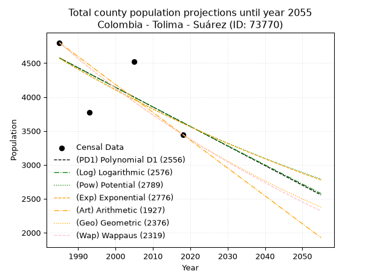
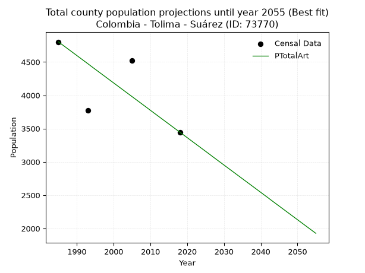
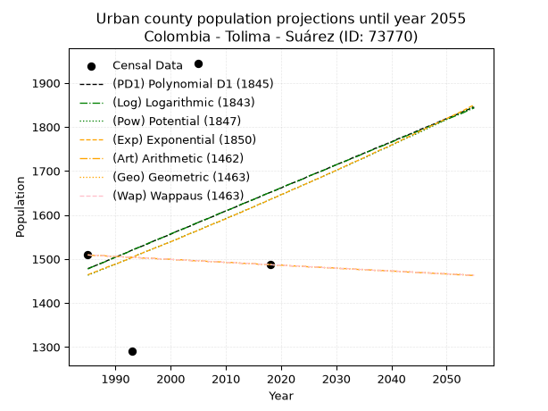
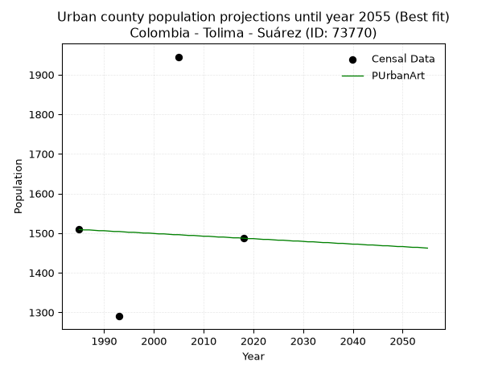
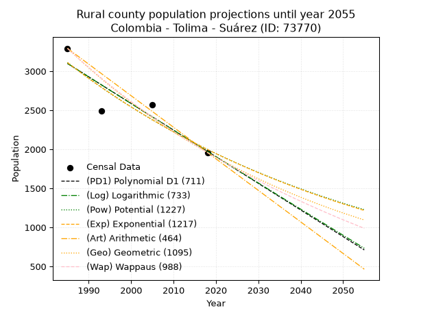
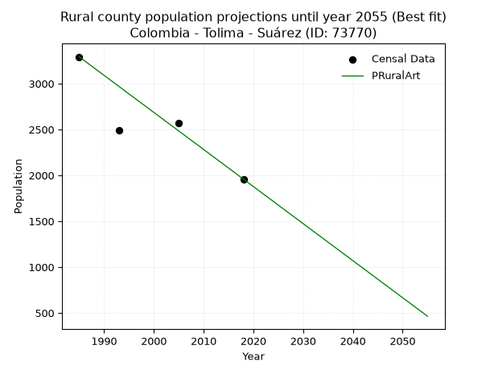

<div align="center">


</div>

# 📜 _“Population and Public Services Demand Projections (PPSD) until Year 2050 for Colombia - Tolima - Suárez (ID: 73770)”_
Keywords: `population` `public-service` `projection` `lineal` `polynomial` `logarithmic` `potential` `exponential` `arithmetic` `geometric` `wappaus` `dane` `colombia` `south-america`

PPSD are analytical estimates used by governments and planners to anticipate future changes in population size, age distribution, and the resulting community needs for utilities, healthcare, education, and infrastructure as sizing future water treatment facilities, electrical grids, and road networks based on spatial growth.

<div align="center">

</img>

</div>


> **General running parameters**: • app_version: _v20260806_. • Python version: _3.14.7_. • Pandas version: _3.0.5_. • NumPy version: _2.5.1_. • Creates, save and include plots into reports (create_plot): _False_. • Projection until year: _2050_. • Process polynomial degree 2 and up: _False_. • Process Wappaus: _True_. • Process Wappaus: _True_. • Set negative values to zero: _True_. • Set infinite values to zero: _True_. • Drop dataset notes: _True_. 
<div align="center">

Maps & GIS Layers: [:earth_americas:Google](http://maps.google.com/maps?q=4.048890978,-74.8318845) [:earth_americas:OSM](https://www.openstreetmap.org/#map=18/4.048890978/-74.8318845&layers=P) [:earth_americas:Bing](https://www.bing.com/maps?cp=4.048890978~-74.8318845&lvl=18) [:earth_americas:Apple](https://maps.apple.com/frame?center=4.048890978%2C-74.8318845&span=0.003%2C0.006) [:earth_americas:GISMobile](https://github.com/rcfdtools/R.GISMobile/blob/main/file/gis/CountyLayer_CO/Readme.md)

</div>


<div align="center">

```geojson
{
  "type": "Feature",
  "geometry": {
    "type": "Point", 
    "coordinates": [-74.8318845, 4.048890978]
  }, 
  "properties": {
    "Name": "Colombia - Tolima - Suárez (ID: 73770)"
  }
}
```

</div>


## 0. Census Data (4 records)

Census data are official statistics collected by a government about the people and housing in a country. They usually include counts of total population, age, sex, race, income, education, and jobs.

📅Global census file: [Population.xlsx](../data/Population.xlsx)

| Source   |   Year |   CountryID | CountryName   |   StateID | StateName   |   CountyID | CountyName   |   PTotal |   PUrban |   PRural |
|:---------|-------:|------------:|:--------------|----------:|:------------|-----------:|:-------------|---------:|---------:|---------:|
| DANE     |   1985 |          57 | Colombia      |        73 | Tolima      |      73770 | Suárez       |     4801 |     1509 |     3292 |
| DANE     |   1993 |          57 | Colombia      |        73 | Tolima      |      73770 | Suárez       |     3777 |     1290 |     2487 |
| DANE     |   2005 |          57 | Colombia      |        73 | Tolima      |      73770 | Suárez       |     4519 |     1945 |     2574 |
| DANE     |   2018 |          57 | Colombia      |        73 | Tolima      |      73770 | Suárez       |     3446 |     1487 |     1959 |

> 🔥Some records could had specific notes about the registered values or the corresponding urban or rural distribution.

📅[SUI-RUPS](https://www.datos.gov.co/Hacienda-y-Cr-dito-P-blico/Registro-nico-de-Prestadores-de-Servicios-P-blicos/4qkq-csdn/about_data) - Local public utility companies: [RUPS.csv](../data/RUPS.csv)

 | SERVICIO       | ESTADO    | NOMBRE                                                                                                                           | NIT         | DEPARTAMENTO_DOMICILIO   | MUNICIPIO_DOMICILIO   | DIRECCION                   |   TELEFONO | EMAIL                        | TIPO_PRESTADOR                             | CLASIFICACION                 |
|:---------------|:----------|:---------------------------------------------------------------------------------------------------------------------------------|:------------|:-------------------------|:----------------------|:----------------------------|-----------:|:-----------------------------|:-------------------------------------------|:------------------------------|
| ACUEDUCTO      | OPERATIVA | ASOCIACION DE USUARIOS DEL SERVICIO DE AGUA POTABLE DE LA VEREDA LIMONAL GUADITA DEL MUNICIPIO DE SUAREZ DEPARTAMENTO DEL TOLIMA | 900021535-3 | TOLIMA                   | SUAREZ                | vereda limonal finca osmary |    2489179 | limonalgiadita@latinmail.com | ORGANIZACION AUTORIZADA                    | HASTA 2500 SUSCRIPTORES       |
| ACUEDUCTO      | OPERATIVA | EMPRESA REGIONAL DE ACUEDUCTO Y SANEAMIENTO BASICO S.A.S. E.S.P.                                                                 | 900413850-1 | TOLIMA                   | SUAREZ                | carrera 2 número 2-14       |    2883188 | gerenteerasbasas@gmail.com   | SOCIEDADES (EMPRESA DE SERVICIOS PUBLICOS) | MENOR O IGUAL A 2500 USUARIOS |
| ALCANTARILLADO | OPERATIVA | EMPRESA REGIONAL DE ACUEDUCTO Y SANEAMIENTO BASICO S.A.S. E.S.P.                                                                 | 900413850-1 | TOLIMA                   | SUAREZ                | carrera 2 número 2-14       |    2883188 | gerenteerasbasas@gmail.com   | SOCIEDADES (EMPRESA DE SERVICIOS PUBLICOS) | MENOR O IGUAL A 2500 USUARIOS |

## 1. Total

### 1.1. Coefficients and Parameters

* (PD1) Polynomial Deg 1: -28.85066238458388, 61844.287434763915 (lineal)
* (Log) Logarithmic: -57731.05211090335, 442949.93972259393
* (Pow) Potential: -14.246948676450018, 50.642967105457295
* (Exp) Exponential: -0.007120642949415753, 6286285068.283204
* (Art) Arithmetic: Year diff. 2018 - 1985 = 33, Population diff. 3446 - 4801 = -1355, Annual growth = -41.06060606060606
* (Geo) Geometric: Year diff. 2018 - 1985 = 33, Population diff. 3446 - 4801 = -1355, Annual growth % = -0.00999847024714362
* (Wap) Wappaus: i = -0.9957707302196207, Condition values only valid for < 200)

<sub>
Wappaus condition values: ['-0.00', '-1.00', '-1.99', '-2.99', '-3.98', '-4.98', '-5.97', '-6.97', '-7.97', '-8.96', '-9.96', '-10.95', '-11.95', '-12.95', '-13.94', '-14.94', '-15.93', '-16.93', '-17.92', '-18.92', '-19.92', '-20.91', '-21.91', '-22.90', '-23.90', '-24.89', '-25.89', '-26.89', '-27.88', '-28.88', '-29.87', '-30.87', '-31.86', '-32.86', '-33.86', '-34.85', '-35.85', '-36.84', '-37.84', '-38.84', '-39.83', '-40.83', '-41.82', '-42.82', '-43.81', '-44.81', '-45.81', '-46.80', '-47.80', '-48.79', '-49.79', '-50.78', '-51.78', '-52.78', '-53.77', '-54.77', '-55.76', '-56.76', '-57.75', '-58.75', '-59.75', '-60.74', '-61.74', '-62.73', '-63.73', '-64.73']
</sub>


### 1.2. Projected Dataset

|   Year |   CountyID |   PTotalPD1 |   PTotalLog |   PTotalPow |   PTotalExp |   PTotalArt |   PTotalGeo |   PTotalWap |
|-------:|-----------:|------------:|------------:|------------:|------------:|------------:|------------:|------------:|
|   1985 |      73770 |        4576 |        4576 |        4570 |        4570 |        4801 |        4801 |        4801 |
|   1986 |      73770 |        4547 |        4547 |        4538 |        4537 |        4760 |        4753 |        4753 |
|   1987 |      73770 |        4518 |        4518 |        4505 |        4505 |        4719 |        4705 |        4706 |
|   1988 |      73770 |        4489 |        4489 |        4473 |        4473 |        4678 |        4658 |        4660 |
|   1989 |      73770 |        4460 |        4460 |        4441 |        4441 |        4637 |        4612 |        4614 |
|   1990 |      73770 |        4431 |        4431 |        4409 |        4410 |        4596 |        4566 |        4568 |
|   1991 |      73770 |        4403 |        4402 |        4378 |        4378 |        4555 |        4520 |        4522 |
|   1992 |      73770 |        4374 |        4373 |        4347 |        4347 |        4514 |        4475 |        4478 |
|   1993 |      73770 |        4345 |        4344 |        4316 |        4316 |        4473 |        4430 |        4433 |
|   1994 |      73770 |        4316 |        4315 |        4285 |        4286 |        4431 |        4386 |        4389 |
|   1995 |      73770 |        4287 |        4286 |        4255 |        4255 |        4390 |        4342 |        4346 |
|   1996 |      73770 |        4258 |        4257 |        4224 |        4225 |        4349 |        4299 |        4302 |
|   1997 |      73770 |        4230 |        4229 |        4194 |        4195 |        4308 |        4256 |        4260 |
|   1998 |      73770 |        4201 |        4200 |        4164 |        4165 |        4267 |        4213 |        4217 |
|   1999 |      73770 |        4172 |        4171 |        4135 |        4136 |        4226 |        4171 |        4175 |
|   2000 |      73770 |        4143 |        4142 |        4105 |        4107 |        4185 |        4129 |        4134 |
|   2001 |      73770 |        4114 |        4113 |        4076 |        4077 |        4144 |        4088 |        4093 |
|   2002 |      73770 |        4085 |        4084 |        4047 |        4049 |        4103 |        4047 |        4052 |
|   2003 |      73770 |        4056 |        4055 |        4019 |        4020 |        4062 |        4007 |        4011 |
|   2004 |      73770 |        4028 |        4026 |        3990 |        3991 |        4021 |        3967 |        3971 |
|   2005 |      73770 |        3999 |        3998 |        3962 |        3963 |        3980 |        3927 |        3931 |
|   2006 |      73770 |        3970 |        3969 |        3934 |        3935 |        3939 |        3888 |        3892 |
|   2007 |      73770 |        3941 |        3940 |        3906 |        3907 |        3898 |        3849 |        3853 |
|   2008 |      73770 |        3912 |        3911 |        3878 |        3879 |        3857 |        3810 |        3814 |
|   2009 |      73770 |        3883 |        3883 |        3851 |        3852 |        3816 |        3772 |        3776 |
|   2010 |      73770 |        3854 |        3854 |        3824 |        3824 |        3774 |        3734 |        3738 |
|   2011 |      73770 |        3826 |        3825 |        3797 |        3797 |        3733 |        3697 |        3700 |
|   2012 |      73770 |        3797 |        3796 |        3770 |        3770 |        3692 |        3660 |        3663 |
|   2013 |      73770 |        3768 |        3768 |        3743 |        3744 |        3651 |        3624 |        3626 |
|   2014 |      73770 |        3739 |        3739 |        3717 |        3717 |        3610 |        3587 |        3590 |
|   2015 |      73770 |        3710 |        3710 |        3691 |        3691 |        3569 |        3551 |        3553 |
|   2016 |      73770 |        3681 |        3682 |        3665 |        3664 |        3528 |        3516 |        3517 |
|   2017 |      73770 |        3653 |        3653 |        3639 |        3638 |        3487 |        3481 |        3481 |
|   2018 |      73770 |        3624 |        3625 |        3613 |        3613 |        3446 |        3446 |        3446 |
|   2019 |      73770 |        3595 |        3596 |        3588 |        3587 |        3405 |        3412 |        3411 |
|   2020 |      73770 |        3566 |        3567 |        3563 |        3562 |        3364 |        3377 |        3376 |
|   2021 |      73770 |        3537 |        3539 |        3538 |        3536 |        3323 |        3344 |        3342 |
|   2022 |      73770 |        3508 |        3510 |        3513 |        3511 |        3282 |        3310 |        3307 |
|   2023 |      73770 |        3479 |        3482 |        3488 |        3486 |        3241 |        3277 |        3273 |
|   2024 |      73770 |        3451 |        3453 |        3464 |        3461 |        3200 |        3244 |        3240 |
|   2025 |      73770 |        3422 |        3425 |        3440 |        3437 |        3159 |        3212 |        3206 |
|   2026 |      73770 |        3393 |        3396 |        3415 |        3413 |        3118 |        3180 |        3173 |
|   2027 |      73770 |        3364 |        3368 |        3391 |        3388 |        3076 |        3148 |        3140 |
|   2028 |      73770 |        3335 |        3339 |        3368 |        3364 |        3035 |        3117 |        3108 |
|   2029 |      73770 |        3306 |        3311 |        3344 |        3340 |        2994 |        3085 |        3075 |
|   2030 |      73770 |        3277 |        3282 |        3321 |        3317 |        2953 |        3055 |        3043 |
|   2031 |      73770 |        3249 |        3254 |        3298 |        3293 |        2912 |        3024 |        3012 |
|   2032 |      73770 |        3220 |        3225 |        3275 |        3270 |        2871 |        2994 |        2980 |
|   2033 |      73770 |        3191 |        3197 |        3252 |        3247 |        2830 |        2964 |        2949 |
|   2034 |      73770 |        3162 |        3169 |        3229 |        3224 |        2789 |        2934 |        2918 |
|   2035 |      73770 |        3133 |        3140 |        3206 |        3201 |        2748 |        2905 |        2887 |
|   2036 |      73770 |        3104 |        3112 |        3184 |        3178 |        2707 |        2876 |        2857 |
|   2037 |      73770 |        3075 |        3084 |        3162 |        3155 |        2666 |        2847 |        2826 |
|   2038 |      73770 |        3047 |        3055 |        3140 |        3133 |        2625 |        2819 |        2796 |
|   2039 |      73770 |        3018 |        3027 |        3118 |        3111 |        2584 |        2790 |        2766 |
|   2040 |      73770 |        2989 |        2999 |        3096 |        3089 |        2543 |        2763 |        2737 |
|   2041 |      73770 |        2960 |        2970 |        3075 |        3067 |        2502 |        2735 |        2708 |
|   2042 |      73770 |        2931 |        2942 |        3053 |        3045 |        2461 |        2708 |        2678 |
|   2043 |      73770 |        2902 |        2914 |        3032 |        3023 |        2419 |        2680 |        2649 |
|   2044 |      73770 |        2874 |        2886 |        3011 |        3002 |        2378 |        2654 |        2621 |
|   2045 |      73770 |        2845 |        2857 |        2990 |        2981 |        2337 |        2627 |        2592 |
|   2046 |      73770 |        2816 |        2829 |        2969 |        2960 |        2296 |        2601 |        2564 |
|   2047 |      73770 |        2787 |        2801 |        2949 |        2939 |        2255 |        2575 |        2536 |
|   2048 |      73770 |        2758 |        2773 |        2928 |        2918 |        2214 |        2549 |        2508 |
|   2049 |      73770 |        2729 |        2744 |        2908 |        2897 |        2173 |        2524 |        2481 |
|   2050 |      73770 |        2700 |        2716 |        2888 |        2876 |        2132 |        2498 |        2453 |
<div align="center">

</img>

</div>


### 1.3. Best fit with absolute and relative error (%)

Relative error puts that difference into context by dividing the absolute error by the true value, creating a unitless ratio or percentage that shows the scale of the mistake.

Absolute and relative error

|   Year | Source   |   CountryID | CountryName   |   StateID | StateName   |   CountyID_x | CountyName   |   PTotal |   PUrban |   PRural |   CountyID_y |   PTotalPD1 |   PTotalLog |   PTotalPow |   PTotalExp |   PTotalArt |   PTotalGeo |   PTotalWap |   PTotalPD1AbsError |   PTotalLogAbsError |   PTotalPowAbsError |   PTotalExpAbsError |   PTotalArtAbsError |   PTotalGeoAbsError |   PTotalWapAbsError |   PTotalPD1RelError |   PTotalLogRelError |   PTotalPowRelError |   PTotalExpRelError |   PTotalArtRelError |   PTotalGeoRelError |   PTotalWapRelError |
|-------:|:---------|------------:|:--------------|----------:|:------------|-------------:|:-------------|---------:|---------:|---------:|-------------:|------------:|------------:|------------:|------------:|------------:|------------:|------------:|--------------------:|--------------------:|--------------------:|--------------------:|--------------------:|--------------------:|--------------------:|--------------------:|--------------------:|--------------------:|--------------------:|--------------------:|--------------------:|--------------------:|
|   1985 | DANE     |          57 | Colombia      |        73 | Tolima      |        73770 | Suárez       |     4801 |     1509 |     3292 |        73770 |        4576 |        4576 |        4570 |        4570 |        4801 |        4801 |        4801 |                 225 |                 225 |                 231 |                 231 |                   0 |                   0 |                   0 |             4.68652 |             4.68652 |              4.8115 |              4.8115 |              0      |              0      |              0      |
|   1993 | DANE     |          57 | Colombia      |        73 | Tolima      |        73770 | Suárez       |     3777 |     1290 |     2487 |        73770 |        4345 |        4344 |        4316 |        4316 |        4473 |        4430 |        4433 |                 568 |                 567 |                 539 |                 539 |                 696 |                 653 |                 656 |            15.0384  |            15.0119  |             14.2706 |             14.2706 |             18.4273 |             17.2889 |             17.3683 |
|   2005 | DANE     |          57 | Colombia      |        73 | Tolima      |        73770 | Suárez       |     4519 |     1945 |     2574 |        73770 |        3999 |        3998 |        3962 |        3963 |        3980 |        3927 |        3931 |                 520 |                 521 |                 557 |                 556 |                 539 |                 592 |                 588 |            11.507   |            11.5291  |             12.3257 |             12.3036 |             11.9274 |             13.1002 |             13.0117 |
|   2018 | DANE     |          57 | Colombia      |        73 | Tolima      |        73770 | Suárez       |     3446 |     1487 |     1959 |        73770 |        3624 |        3625 |        3613 |        3613 |        3446 |        3446 |        3446 |                 178 |                 179 |                 167 |                 167 |                   0 |                   0 |                   0 |             5.16541 |             5.19443 |              4.8462 |              4.8462 |              0      |              0      |              0      |

Relative error mean

| Method    |   RelError | Best   |
|:----------|-----------:|:-------|
| PTotalPD1 |    9.09932 |        |
| PTotalLog |    9.10549 |        |
| PTotalPow |    9.0635  |        |
| PTotalExp |    9.05797 |        |
| PTotalArt |    7.58869 | True   |
| PTotalGeo |    7.59727 |        |
| PTotalWap |    7.595   |        |

💙Best method: _**PTotalArt**_
<div align="center">

</img>

</div>


### 1.4. Fresh water supply demand in liters per capita per day (lpcd)

The fresh water supply demand typically ranges from 100 to 300 liters per capita per day (lpcd) for standard domestic and municipal planning, though absolute survival minimums set by the World Health Organization are as low as 7.5 to 20 liters per day, and total consumption in high-income nations can exceed 400 liters.

> `CZ`: Level in meters above the sea level (masl)<br> `WS`: Fresh water supply demand in liters per capita per day (lpcd or l/h/d)<br> `WSAll`: Zonal fresh water supply demand in liters per second (l/s)<br> `A`: Zonal area in square meters<br> `DP`: Population density (people/hectare or p/ha)

Reference values (RAS Colombia)

|    CZ |   WS |
|------:|-----:|
|  1000 |  120 |
|  2000 |  130 |
| 99999 |  140 |

County shapefile geometry properties and water supply values

|   CountyID |      ATotal |   CZTotal |   WSTotal |
|-----------:|------------:|----------:|----------:|
|      73770 | 1.90009e+08 |   404.039 |       120 |

Projected values for best method: PTotalArt

|   CountyID |   Year |   PTotalArt |   DPTotal |   WSTotal |   WSTotalAll |
|-----------:|-------:|------------:|----------:|----------:|-------------:|
|      73770 |   1985 |        4801 |      0.25 |       120 |      6.66806 |
|      73770 |   1986 |        4760 |      0.25 |       120 |      6.61111 |
|      73770 |   1987 |        4719 |      0.25 |       120 |      6.55417 |
|      73770 |   1988 |        4678 |      0.25 |       120 |      6.49722 |
|      73770 |   1989 |        4637 |      0.24 |       120 |      6.44028 |
|      73770 |   1990 |        4596 |      0.24 |       120 |      6.38333 |
|      73770 |   1991 |        4555 |      0.24 |       120 |      6.32639 |
|      73770 |   1992 |        4514 |      0.24 |       120 |      6.26944 |
|      73770 |   1993 |        4473 |      0.24 |       120 |      6.2125  |
|      73770 |   1994 |        4431 |      0.23 |       120 |      6.15417 |
|      73770 |   1995 |        4390 |      0.23 |       120 |      6.09722 |
|      73770 |   1996 |        4349 |      0.23 |       120 |      6.04028 |
|      73770 |   1997 |        4308 |      0.23 |       120 |      5.98333 |
|      73770 |   1998 |        4267 |      0.22 |       120 |      5.92639 |
|      73770 |   1999 |        4226 |      0.22 |       120 |      5.86944 |
|      73770 |   2000 |        4185 |      0.22 |       120 |      5.8125  |
|      73770 |   2001 |        4144 |      0.22 |       120 |      5.75556 |
|      73770 |   2002 |        4103 |      0.22 |       120 |      5.69861 |
|      73770 |   2003 |        4062 |      0.21 |       120 |      5.64167 |
|      73770 |   2004 |        4021 |      0.21 |       120 |      5.58472 |
|      73770 |   2005 |        3980 |      0.21 |       120 |      5.52778 |
|      73770 |   2006 |        3939 |      0.21 |       120 |      5.47083 |
|      73770 |   2007 |        3898 |      0.21 |       120 |      5.41389 |
|      73770 |   2008 |        3857 |      0.2  |       120 |      5.35694 |
|      73770 |   2009 |        3816 |      0.2  |       120 |      5.3     |
|      73770 |   2010 |        3774 |      0.2  |       120 |      5.24167 |
|      73770 |   2011 |        3733 |      0.2  |       120 |      5.18472 |
|      73770 |   2012 |        3692 |      0.19 |       120 |      5.12778 |
|      73770 |   2013 |        3651 |      0.19 |       120 |      5.07083 |
|      73770 |   2014 |        3610 |      0.19 |       120 |      5.01389 |
|      73770 |   2015 |        3569 |      0.19 |       120 |      4.95694 |
|      73770 |   2016 |        3528 |      0.19 |       120 |      4.9     |
|      73770 |   2017 |        3487 |      0.18 |       120 |      4.84306 |
|      73770 |   2018 |        3446 |      0.18 |       120 |      4.78611 |
|      73770 |   2019 |        3405 |      0.18 |       120 |      4.72917 |
|      73770 |   2020 |        3364 |      0.18 |       120 |      4.67222 |
|      73770 |   2021 |        3323 |      0.17 |       120 |      4.61528 |
|      73770 |   2022 |        3282 |      0.17 |       120 |      4.55833 |
|      73770 |   2023 |        3241 |      0.17 |       120 |      4.50139 |
|      73770 |   2024 |        3200 |      0.17 |       120 |      4.44444 |
|      73770 |   2025 |        3159 |      0.17 |       120 |      4.3875  |
|      73770 |   2026 |        3118 |      0.16 |       120 |      4.33056 |
|      73770 |   2027 |        3076 |      0.16 |       120 |      4.27222 |
|      73770 |   2028 |        3035 |      0.16 |       120 |      4.21528 |
|      73770 |   2029 |        2994 |      0.16 |       120 |      4.15833 |
|      73770 |   2030 |        2953 |      0.16 |       120 |      4.10139 |
|      73770 |   2031 |        2912 |      0.15 |       120 |      4.04444 |
|      73770 |   2032 |        2871 |      0.15 |       120 |      3.9875  |
|      73770 |   2033 |        2830 |      0.15 |       120 |      3.93056 |
|      73770 |   2034 |        2789 |      0.15 |       120 |      3.87361 |
|      73770 |   2035 |        2748 |      0.14 |       120 |      3.81667 |
|      73770 |   2036 |        2707 |      0.14 |       120 |      3.75972 |
|      73770 |   2037 |        2666 |      0.14 |       120 |      3.70278 |
|      73770 |   2038 |        2625 |      0.14 |       120 |      3.64583 |
|      73770 |   2039 |        2584 |      0.14 |       120 |      3.58889 |
|      73770 |   2040 |        2543 |      0.13 |       120 |      3.53194 |
|      73770 |   2041 |        2502 |      0.13 |       120 |      3.475   |
|      73770 |   2042 |        2461 |      0.13 |       120 |      3.41806 |
|      73770 |   2043 |        2419 |      0.13 |       120 |      3.35972 |
|      73770 |   2044 |        2378 |      0.13 |       120 |      3.30278 |
|      73770 |   2045 |        2337 |      0.12 |       120 |      3.24583 |
|      73770 |   2046 |        2296 |      0.12 |       120 |      3.18889 |
|      73770 |   2047 |        2255 |      0.12 |       120 |      3.13194 |
|      73770 |   2048 |        2214 |      0.12 |       120 |      3.075   |
|      73770 |   2049 |        2173 |      0.11 |       120 |      3.01806 |
|      73770 |   2050 |        2132 |      0.11 |       120 |      2.96111 |

## 2. Urban

### 2.1. Coefficients and Parameters

* (PD1) Polynomial Deg 1: 5.248093135287281, -8939.748293858385 (lineal)
* (Log) Logarithmic: 10543.255873390057, -78581.62238198798
* (Pow) Potential: 6.711814223463975, -18.968580375547152
* (Exp) Exponential: 0.00334286738479129, 1.9217049815794878
* (Art) Arithmetic: Year diff. 2018 - 1985 = 33, Population diff. 1487 - 1509 = -22, Annual growth = -0.6666666666666666
* (Geo) Geometric: Year diff. 2018 - 1985 = 33, Population diff. 1487 - 1509 = -22, Annual growth % = -0.00044494680930129427
* (Wap) Wappaus: i = -0.04450378282153983, Condition values only valid for < 200)

<sub>
Wappaus condition values: ['-0.00', '-0.04', '-0.09', '-0.13', '-0.18', '-0.22', '-0.27', '-0.31', '-0.36', '-0.40', '-0.45', '-0.49', '-0.53', '-0.58', '-0.62', '-0.67', '-0.71', '-0.76', '-0.80', '-0.85', '-0.89', '-0.93', '-0.98', '-1.02', '-1.07', '-1.11', '-1.16', '-1.20', '-1.25', '-1.29', '-1.34', '-1.38', '-1.42', '-1.47', '-1.51', '-1.56', '-1.60', '-1.65', '-1.69', '-1.74', '-1.78', '-1.82', '-1.87', '-1.91', '-1.96', '-2.00', '-2.05', '-2.09', '-2.14', '-2.18', '-2.23', '-2.27', '-2.31', '-2.36', '-2.40', '-2.45', '-2.49', '-2.54', '-2.58', '-2.63', '-2.67', '-2.71', '-2.76', '-2.80', '-2.85', '-2.89']
</sub>


### 2.2. Projected Dataset

|   Year |   CountyID |   PUrbanPD1 |   PUrbanLog |   PUrbanPow |   PUrbanExp |   PUrbanArt |   PUrbanGeo |   PUrbanWap |
|-------:|-----------:|------------:|------------:|------------:|------------:|------------:|------------:|------------:|
|   1985 |      73770 |        1478 |        1477 |        1463 |        1464 |        1509 |        1509 |        1509 |
|   1986 |      73770 |        1483 |        1483 |        1468 |        1469 |        1508 |        1508 |        1508 |
|   1987 |      73770 |        1488 |        1488 |        1473 |        1474 |        1508 |        1508 |        1508 |
|   1988 |      73770 |        1493 |        1493 |        1478 |        1479 |        1507 |        1507 |        1507 |
|   1989 |      73770 |        1499 |        1498 |        1483 |        1484 |        1506 |        1506 |        1506 |
|   1990 |      73770 |        1504 |        1504 |        1488 |        1488 |        1506 |        1506 |        1506 |
|   1991 |      73770 |        1509 |        1509 |        1493 |        1493 |        1505 |        1505 |        1505 |
|   1992 |      73770 |        1514 |        1514 |        1498 |        1498 |        1504 |        1504 |        1504 |
|   1993 |      73770 |        1520 |        1520 |        1503 |        1503 |        1504 |        1504 |        1504 |
|   1994 |      73770 |        1525 |        1525 |        1509 |        1509 |        1503 |        1503 |        1503 |
|   1995 |      73770 |        1530 |        1530 |        1514 |        1514 |        1502 |        1502 |        1502 |
|   1996 |      73770 |        1535 |        1536 |        1519 |        1519 |        1502 |        1502 |        1502 |
|   1997 |      73770 |        1541 |        1541 |        1524 |        1524 |        1501 |        1501 |        1501 |
|   1998 |      73770 |        1546 |        1546 |        1529 |        1529 |        1500 |        1500 |        1500 |
|   1999 |      73770 |        1551 |        1551 |        1534 |        1534 |        1500 |        1500 |        1500 |
|   2000 |      73770 |        1556 |        1557 |        1539 |        1539 |        1499 |        1499 |        1499 |
|   2001 |      73770 |        1562 |        1562 |        1544 |        1544 |        1498 |        1498 |        1498 |
|   2002 |      73770 |        1567 |        1567 |        1550 |        1549 |        1498 |        1498 |        1498 |
|   2003 |      73770 |        1572 |        1572 |        1555 |        1555 |        1497 |        1497 |        1497 |
|   2004 |      73770 |        1577 |        1578 |        1560 |        1560 |        1496 |        1496 |        1496 |
|   2005 |      73770 |        1583 |        1583 |        1565 |        1565 |        1496 |        1496 |        1496 |
|   2006 |      73770 |        1588 |        1588 |        1571 |        1570 |        1495 |        1495 |        1495 |
|   2007 |      73770 |        1593 |        1593 |        1576 |        1576 |        1494 |        1494 |        1494 |
|   2008 |      73770 |        1598 |        1599 |        1581 |        1581 |        1494 |        1494 |        1494 |
|   2009 |      73770 |        1604 |        1604 |        1586 |        1586 |        1493 |        1493 |        1493 |
|   2010 |      73770 |        1609 |        1609 |        1592 |        1591 |        1492 |        1492 |        1492 |
|   2011 |      73770 |        1614 |        1614 |        1597 |        1597 |        1492 |        1492 |        1492 |
|   2012 |      73770 |        1619 |        1620 |        1602 |        1602 |        1491 |        1491 |        1491 |
|   2013 |      73770 |        1625 |        1625 |        1608 |        1607 |        1490 |        1490 |        1490 |
|   2014 |      73770 |        1630 |        1630 |        1613 |        1613 |        1490 |        1490 |        1490 |
|   2015 |      73770 |        1635 |        1635 |        1618 |        1618 |        1489 |        1489 |        1489 |
|   2016 |      73770 |        1640 |        1641 |        1624 |        1624 |        1488 |        1488 |        1488 |
|   2017 |      73770 |        1646 |        1646 |        1629 |        1629 |        1488 |        1488 |        1488 |
|   2018 |      73770 |        1651 |        1651 |        1635 |        1635 |        1487 |        1487 |        1487 |
|   2019 |      73770 |        1656 |        1656 |        1640 |        1640 |        1486 |        1486 |        1486 |
|   2020 |      73770 |        1661 |        1662 |        1646 |        1646 |        1486 |        1486 |        1486 |
|   2021 |      73770 |        1667 |        1667 |        1651 |        1651 |        1485 |        1485 |        1485 |
|   2022 |      73770 |        1672 |        1672 |        1657 |        1657 |        1484 |        1484 |        1484 |
|   2023 |      73770 |        1677 |        1677 |        1662 |        1662 |        1484 |        1484 |        1484 |
|   2024 |      73770 |        1682 |        1682 |        1668 |        1668 |        1483 |        1483 |        1483 |
|   2025 |      73770 |        1688 |        1688 |        1673 |        1673 |        1482 |        1482 |        1482 |
|   2026 |      73770 |        1693 |        1693 |        1679 |        1679 |        1482 |        1482 |        1482 |
|   2027 |      73770 |        1698 |        1698 |        1684 |        1684 |        1481 |        1481 |        1481 |
|   2028 |      73770 |        1703 |        1703 |        1690 |        1690 |        1480 |        1480 |        1480 |
|   2029 |      73770 |        1709 |        1708 |        1695 |        1696 |        1480 |        1480 |        1480 |
|   2030 |      73770 |        1714 |        1714 |        1701 |        1701 |        1479 |        1479 |        1479 |
|   2031 |      73770 |        1719 |        1719 |        1707 |        1707 |        1478 |        1478 |        1478 |
|   2032 |      73770 |        1724 |        1724 |        1712 |        1713 |        1478 |        1478 |        1478 |
|   2033 |      73770 |        1730 |        1729 |        1718 |        1719 |        1477 |        1477 |        1477 |
|   2034 |      73770 |        1735 |        1734 |        1724 |        1724 |        1476 |        1476 |        1476 |
|   2035 |      73770 |        1740 |        1740 |        1729 |        1730 |        1476 |        1476 |        1476 |
|   2036 |      73770 |        1745 |        1745 |        1735 |        1736 |        1475 |        1475 |        1475 |
|   2037 |      73770 |        1751 |        1750 |        1741 |        1742 |        1474 |        1474 |        1474 |
|   2038 |      73770 |        1756 |        1755 |        1747 |        1748 |        1474 |        1474 |        1474 |
|   2039 |      73770 |        1761 |        1760 |        1752 |        1753 |        1473 |        1473 |        1473 |
|   2040 |      73770 |        1766 |        1765 |        1758 |        1759 |        1472 |        1473 |        1473 |
|   2041 |      73770 |        1772 |        1771 |        1764 |        1765 |        1472 |        1472 |        1472 |
|   2042 |      73770 |        1777 |        1776 |        1770 |        1771 |        1471 |        1471 |        1471 |
|   2043 |      73770 |        1782 |        1781 |        1776 |        1777 |        1470 |        1471 |        1471 |
|   2044 |      73770 |        1787 |        1786 |        1781 |        1783 |        1470 |        1470 |        1470 |
|   2045 |      73770 |        1793 |        1791 |        1787 |        1789 |        1469 |        1469 |        1469 |
|   2046 |      73770 |        1798 |        1796 |        1793 |        1795 |        1468 |        1469 |        1469 |
|   2047 |      73770 |        1803 |        1802 |        1799 |        1801 |        1468 |        1468 |        1468 |
|   2048 |      73770 |        1808 |        1807 |        1805 |        1807 |        1467 |        1467 |        1467 |
|   2049 |      73770 |        1814 |        1812 |        1811 |        1813 |        1466 |        1467 |        1467 |
|   2050 |      73770 |        1819 |        1817 |        1817 |        1819 |        1466 |        1466 |        1466 |
<div align="center">

</img>

</div>


### 2.3. Best fit with absolute and relative error (%)

Relative error puts that difference into context by dividing the absolute error by the true value, creating a unitless ratio or percentage that shows the scale of the mistake.

Absolute and relative error

|   Year | Source   |   CountryID | CountryName   |   StateID | StateName   |   CountyID_x | CountyName   |   PTotal |   PUrban |   PRural |   CountyID_y |   PUrbanPD1 |   PUrbanLog |   PUrbanPow |   PUrbanExp |   PUrbanArt |   PUrbanGeo |   PUrbanWap |   PUrbanPD1AbsError |   PUrbanLogAbsError |   PUrbanPowAbsError |   PUrbanExpAbsError |   PUrbanArtAbsError |   PUrbanGeoAbsError |   PUrbanWapAbsError |   PUrbanPD1RelError |   PUrbanLogRelError |   PUrbanPowRelError |   PUrbanExpRelError |   PUrbanArtRelError |   PUrbanGeoRelError |   PUrbanWapRelError |
|-------:|:---------|------------:|:--------------|----------:|:------------|-------------:|:-------------|---------:|---------:|---------:|-------------:|------------:|------------:|------------:|------------:|------------:|------------:|------------:|--------------------:|--------------------:|--------------------:|--------------------:|--------------------:|--------------------:|--------------------:|--------------------:|--------------------:|--------------------:|--------------------:|--------------------:|--------------------:|--------------------:|
|   1985 | DANE     |          57 | Colombia      |        73 | Tolima      |        73770 | Suárez       |     4801 |     1509 |     3292 |        73770 |        1478 |        1477 |        1463 |        1464 |        1509 |        1509 |        1509 |                  31 |                  32 |                  46 |                  45 |                   0 |                   0 |                   0 |             2.05434 |             2.12061 |             3.04838 |             2.98211 |              0      |              0      |              0      |
|   1993 | DANE     |          57 | Colombia      |        73 | Tolima      |        73770 | Suárez       |     3777 |     1290 |     2487 |        73770 |        1520 |        1520 |        1503 |        1503 |        1504 |        1504 |        1504 |                 230 |                 230 |                 213 |                 213 |                 214 |                 214 |                 214 |            17.8295  |            17.8295  |            16.5116  |            16.5116  |             16.5891 |             16.5891 |             16.5891 |
|   2005 | DANE     |          57 | Colombia      |        73 | Tolima      |        73770 | Suárez       |     4519 |     1945 |     2574 |        73770 |        1583 |        1583 |        1565 |        1565 |        1496 |        1496 |        1496 |                 362 |                 362 |                 380 |                 380 |                 449 |                 449 |                 449 |            18.6118  |            18.6118  |            19.5373  |            19.5373  |             23.0848 |             23.0848 |             23.0848 |
|   2018 | DANE     |          57 | Colombia      |        73 | Tolima      |        73770 | Suárez       |     3446 |     1487 |     1959 |        73770 |        1651 |        1651 |        1635 |        1635 |        1487 |        1487 |        1487 |                 164 |                 164 |                 148 |                 148 |                   0 |                   0 |                   0 |            11.0289  |            11.0289  |             9.95293 |             9.95293 |              0      |              0      |              0      |

Relative error mean

| Method    |   RelError | Best   |
|:----------|-----------:|:-------|
| PUrbanPD1 |    12.3811 |        |
| PUrbanLog |    12.3977 |        |
| PUrbanPow |    12.2626 |        |
| PUrbanExp |    12.246  |        |
| PUrbanArt |     9.9185 | True   |
| PUrbanGeo |     9.9185 | True   |
| PUrbanWap |     9.9185 | True   |

💙Best method: _**PUrbanArt**_
<div align="center">

</img>

</div>


### 2.4. Fresh water supply demand in liters per capita per day (lpcd)

The fresh water supply demand typically ranges from 100 to 300 liters per capita per day (lpcd) for standard domestic and municipal planning, though absolute survival minimums set by the World Health Organization are as low as 7.5 to 20 liters per day, and total consumption in high-income nations can exceed 400 liters.

> `CZ`: Level in meters above the sea level (masl)<br> `WS`: Fresh water supply demand in liters per capita per day (lpcd or l/h/d)<br> `WSAll`: Zonal fresh water supply demand in liters per second (l/s)<br> `A`: Zonal area in square meters<br> `DP`: Population density (people/hectare or p/ha)

Reference values (RAS Colombia)

|    CZ |   WS |
|------:|-----:|
|  1000 |  120 |
|  2000 |  130 |
| 99999 |  140 |

County shapefile geometry properties and water supply values

|   CountyID |   AUrban |   CZUrban |   WSUrban |
|-----------:|---------:|----------:|----------:|
|      73770 |   354282 |    290.75 |       120 |

Projected values for best method: PUrbanArt

|   CountyID |   Year |   PUrbanArt |   DPUrban |   WSUrban |   WSUrbanAll |
|-----------:|-------:|------------:|----------:|----------:|-------------:|
|      73770 |   1985 |        1509 |     42.59 |       120 |      2.09583 |
|      73770 |   1986 |        1508 |     42.57 |       120 |      2.09444 |
|      73770 |   1987 |        1508 |     42.57 |       120 |      2.09444 |
|      73770 |   1988 |        1507 |     42.54 |       120 |      2.09306 |
|      73770 |   1989 |        1506 |     42.51 |       120 |      2.09167 |
|      73770 |   1990 |        1506 |     42.51 |       120 |      2.09167 |
|      73770 |   1991 |        1505 |     42.48 |       120 |      2.09028 |
|      73770 |   1992 |        1504 |     42.45 |       120 |      2.08889 |
|      73770 |   1993 |        1504 |     42.45 |       120 |      2.08889 |
|      73770 |   1994 |        1503 |     42.42 |       120 |      2.0875  |
|      73770 |   1995 |        1502 |     42.4  |       120 |      2.08611 |
|      73770 |   1996 |        1502 |     42.4  |       120 |      2.08611 |
|      73770 |   1997 |        1501 |     42.37 |       120 |      2.08472 |
|      73770 |   1998 |        1500 |     42.34 |       120 |      2.08333 |
|      73770 |   1999 |        1500 |     42.34 |       120 |      2.08333 |
|      73770 |   2000 |        1499 |     42.31 |       120 |      2.08194 |
|      73770 |   2001 |        1498 |     42.28 |       120 |      2.08056 |
|      73770 |   2002 |        1498 |     42.28 |       120 |      2.08056 |
|      73770 |   2003 |        1497 |     42.25 |       120 |      2.07917 |
|      73770 |   2004 |        1496 |     42.23 |       120 |      2.07778 |
|      73770 |   2005 |        1496 |     42.23 |       120 |      2.07778 |
|      73770 |   2006 |        1495 |     42.2  |       120 |      2.07639 |
|      73770 |   2007 |        1494 |     42.17 |       120 |      2.075   |
|      73770 |   2008 |        1494 |     42.17 |       120 |      2.075   |
|      73770 |   2009 |        1493 |     42.14 |       120 |      2.07361 |
|      73770 |   2010 |        1492 |     42.11 |       120 |      2.07222 |
|      73770 |   2011 |        1492 |     42.11 |       120 |      2.07222 |
|      73770 |   2012 |        1491 |     42.09 |       120 |      2.07083 |
|      73770 |   2013 |        1490 |     42.06 |       120 |      2.06944 |
|      73770 |   2014 |        1490 |     42.06 |       120 |      2.06944 |
|      73770 |   2015 |        1489 |     42.03 |       120 |      2.06806 |
|      73770 |   2016 |        1488 |     42    |       120 |      2.06667 |
|      73770 |   2017 |        1488 |     42    |       120 |      2.06667 |
|      73770 |   2018 |        1487 |     41.97 |       120 |      2.06528 |
|      73770 |   2019 |        1486 |     41.94 |       120 |      2.06389 |
|      73770 |   2020 |        1486 |     41.94 |       120 |      2.06389 |
|      73770 |   2021 |        1485 |     41.92 |       120 |      2.0625  |
|      73770 |   2022 |        1484 |     41.89 |       120 |      2.06111 |
|      73770 |   2023 |        1484 |     41.89 |       120 |      2.06111 |
|      73770 |   2024 |        1483 |     41.86 |       120 |      2.05972 |
|      73770 |   2025 |        1482 |     41.83 |       120 |      2.05833 |
|      73770 |   2026 |        1482 |     41.83 |       120 |      2.05833 |
|      73770 |   2027 |        1481 |     41.8  |       120 |      2.05694 |
|      73770 |   2028 |        1480 |     41.77 |       120 |      2.05556 |
|      73770 |   2029 |        1480 |     41.77 |       120 |      2.05556 |
|      73770 |   2030 |        1479 |     41.75 |       120 |      2.05417 |
|      73770 |   2031 |        1478 |     41.72 |       120 |      2.05278 |
|      73770 |   2032 |        1478 |     41.72 |       120 |      2.05278 |
|      73770 |   2033 |        1477 |     41.69 |       120 |      2.05139 |
|      73770 |   2034 |        1476 |     41.66 |       120 |      2.05    |
|      73770 |   2035 |        1476 |     41.66 |       120 |      2.05    |
|      73770 |   2036 |        1475 |     41.63 |       120 |      2.04861 |
|      73770 |   2037 |        1474 |     41.61 |       120 |      2.04722 |
|      73770 |   2038 |        1474 |     41.61 |       120 |      2.04722 |
|      73770 |   2039 |        1473 |     41.58 |       120 |      2.04583 |
|      73770 |   2040 |        1472 |     41.55 |       120 |      2.04444 |
|      73770 |   2041 |        1472 |     41.55 |       120 |      2.04444 |
|      73770 |   2042 |        1471 |     41.52 |       120 |      2.04306 |
|      73770 |   2043 |        1470 |     41.49 |       120 |      2.04167 |
|      73770 |   2044 |        1470 |     41.49 |       120 |      2.04167 |
|      73770 |   2045 |        1469 |     41.46 |       120 |      2.04028 |
|      73770 |   2046 |        1468 |     41.44 |       120 |      2.03889 |
|      73770 |   2047 |        1468 |     41.44 |       120 |      2.03889 |
|      73770 |   2048 |        1467 |     41.41 |       120 |      2.0375  |
|      73770 |   2049 |        1466 |     41.38 |       120 |      2.03611 |
|      73770 |   2050 |        1466 |     41.38 |       120 |      2.03611 |

## 3. Rural

### 3.1. Coefficients and Parameters

* (PD1) Polynomial Deg 1: -34.09875551987115, 70784.03572862226 (lineal)
* (Log) Logarithmic: -68274.30798429348, 521531.5621045823
* (Pow) Potential: -26.83719011138339, 91.99554446166245
* (Exp) Exponential: -0.013406609831748326, 1122622115935371.6
* (Art) Arithmetic: Year diff. 2018 - 1985 = 33, Population diff. 1959 - 3292 = -1333, Annual growth = -40.39393939393939
* (Geo) Geometric: Year diff. 2018 - 1985 = 33, Population diff. 1959 - 3292 = -1333, Annual growth % = -0.015606068911687032
* (Wap) Wappaus: i = -1.5385236866859415, Condition values only valid for < 200)

<sub>
Wappaus condition values: ['-0.00', '-1.54', '-3.08', '-4.62', '-6.15', '-7.69', '-9.23', '-10.77', '-12.31', '-13.85', '-15.39', '-16.92', '-18.46', '-20.00', '-21.54', '-23.08', '-24.62', '-26.15', '-27.69', '-29.23', '-30.77', '-32.31', '-33.85', '-35.39', '-36.92', '-38.46', '-40.00', '-41.54', '-43.08', '-44.62', '-46.16', '-47.69', '-49.23', '-50.77', '-52.31', '-53.85', '-55.39', '-56.93', '-58.46', '-60.00', '-61.54', '-63.08', '-64.62', '-66.16', '-67.70', '-69.23', '-70.77', '-72.31', '-73.85', '-75.39', '-76.93', '-78.46', '-80.00', '-81.54', '-83.08', '-84.62', '-86.16', '-87.70', '-89.23', '-90.77', '-92.31', '-93.85', '-95.39', '-96.93', '-98.47', '-100.00']
</sub>


### 3.2. Projected Dataset

|   Year |   CountyID |   PRuralPD1 |   PRuralLog |   PRuralPow |   PRuralExp |   PRuralArt |   PRuralGeo |   PRuralWap |
|-------:|-----------:|------------:|------------:|------------:|------------:|------------:|------------:|------------:|
|   1985 |      73770 |        3098 |        3099 |        3111 |        3110 |        3292 |        3292 |        3292 |
|   1986 |      73770 |        3064 |        3065 |        3069 |        3068 |        3252 |        3241 |        3242 |
|   1987 |      73770 |        3030 |        3030 |        3028 |        3028 |        3211 |        3190 |        3192 |
|   1988 |      73770 |        2996 |        2996 |        2988 |        2987 |        3171 |        3140 |        3143 |
|   1989 |      73770 |        2962 |        2962 |        2948 |        2947 |        3130 |        3091 |        3095 |
|   1990 |      73770 |        2928 |        2927 |        2908 |        2908 |        3090 |        3043 |        3048 |
|   1991 |      73770 |        2893 |        2893 |        2869 |        2869 |        3050 |        2996 |        3002 |
|   1992 |      73770 |        2859 |        2859 |        2831 |        2831 |        3009 |        2949 |        2956 |
|   1993 |      73770 |        2825 |        2825 |        2793 |        2794 |        2969 |        2903 |        2910 |
|   1994 |      73770 |        2791 |        2790 |        2755 |        2756 |        2928 |        2857 |        2866 |
|   1995 |      73770 |        2757 |        2756 |        2719 |        2720 |        2888 |        2813 |        2822 |
|   1996 |      73770 |        2723 |        2722 |        2682 |        2683 |        2848 |        2769 |        2778 |
|   1997 |      73770 |        2689 |        2688 |        2646 |        2648 |        2807 |        2726 |        2736 |
|   1998 |      73770 |        2655 |        2654 |        2611 |        2612 |        2767 |        2683 |        2693 |
|   1999 |      73770 |        2621 |        2619 |        2576 |        2578 |        2726 |        2641 |        2652 |
|   2000 |      73770 |        2587 |        2585 |        2542 |        2543 |        2686 |        2600 |        2611 |
|   2001 |      73770 |        2552 |        2551 |        2508 |        2509 |        2646 |        2560 |        2570 |
|   2002 |      73770 |        2518 |        2517 |        2475 |        2476 |        2605 |        2520 |        2531 |
|   2003 |      73770 |        2484 |        2483 |        2442 |        2443 |        2565 |        2480 |        2491 |
|   2004 |      73770 |        2450 |        2449 |        2409 |        2411 |        2525 |        2442 |        2452 |
|   2005 |      73770 |        2416 |        2415 |        2377 |        2378 |        2484 |        2403 |        2414 |
|   2006 |      73770 |        2382 |        2381 |        2346 |        2347 |        2444 |        2366 |        2376 |
|   2007 |      73770 |        2348 |        2347 |        2314 |        2315 |        2403 |        2329 |        2339 |
|   2008 |      73770 |        2314 |        2313 |        2284 |        2285 |        2363 |        2293 |        2302 |
|   2009 |      73770 |        2280 |        2279 |        2253 |        2254 |        2323 |        2257 |        2266 |
|   2010 |      73770 |        2246 |        2245 |        2224 |        2224 |        2282 |        2222 |        2230 |
|   2011 |      73770 |        2211 |        2211 |        2194 |        2195 |        2242 |        2187 |        2195 |
|   2012 |      73770 |        2177 |        2177 |        2165 |        2165 |        2201 |        2153 |        2160 |
|   2013 |      73770 |        2143 |        2143 |        2136 |        2137 |        2161 |        2119 |        2125 |
|   2014 |      73770 |        2109 |        2109 |        2108 |        2108 |        2121 |        2086 |        2091 |
|   2015 |      73770 |        2075 |        2075 |        2080 |        2080 |        2080 |        2054 |        2057 |
|   2016 |      73770 |        2041 |        2041 |        2053 |        2052 |        2040 |        2022 |        2024 |
|   2017 |      73770 |        2007 |        2007 |        2025 |        2025 |        1999 |        1990 |        1991 |
|   2018 |      73770 |        1973 |        1973 |        1999 |        1998 |        1959 |        1959 |        1959 |
|   2019 |      73770 |        1939 |        1940 |        1972 |        1971 |        1919 |        1928 |        1927 |
|   2020 |      73770 |        1905 |        1906 |        1946 |        1945 |        1878 |        1898 |        1895 |
|   2021 |      73770 |        1870 |        1872 |        1921 |        1919 |        1838 |        1869 |        1864 |
|   2022 |      73770 |        1836 |        1838 |        1895 |        1894 |        1797 |        1840 |        1833 |
|   2023 |      73770 |        1802 |        1805 |        1870 |        1868 |        1757 |        1811 |        1803 |
|   2024 |      73770 |        1768 |        1771 |        1846 |        1844 |        1717 |        1783 |        1773 |
|   2025 |      73770 |        1734 |        1737 |        1821 |        1819 |        1676 |        1755 |        1743 |
|   2026 |      73770 |        1700 |        1703 |        1797 |        1795 |        1636 |        1727 |        1713 |
|   2027 |      73770 |        1666 |        1670 |        1774 |        1771 |        1595 |        1700 |        1684 |
|   2028 |      73770 |        1632 |        1636 |        1750 |        1747 |        1555 |        1674 |        1655 |
|   2029 |      73770 |        1598 |        1602 |        1727 |        1724 |        1515 |        1648 |        1627 |
|   2030 |      73770 |        1564 |        1569 |        1705 |        1701 |        1474 |        1622 |        1599 |
|   2031 |      73770 |        1529 |        1535 |        1682 |        1678 |        1434 |        1597 |        1571 |
|   2032 |      73770 |        1495 |        1501 |        1660 |        1656 |        1393 |        1572 |        1544 |
|   2033 |      73770 |        1461 |        1468 |        1638 |        1634 |        1353 |        1547 |        1516 |
|   2034 |      73770 |        1427 |        1434 |        1617 |        1612 |        1313 |        1523 |        1490 |
|   2035 |      73770 |        1393 |        1401 |        1596 |        1591 |        1272 |        1499 |        1463 |
|   2036 |      73770 |        1359 |        1367 |        1575 |        1570 |        1232 |        1476 |        1437 |
|   2037 |      73770 |        1325 |        1334 |        1554 |        1549 |        1192 |        1453 |        1411 |
|   2038 |      73770 |        1291 |        1300 |        1534 |        1528 |        1151 |        1430 |        1385 |
|   2039 |      73770 |        1257 |        1267 |        1514 |        1508 |        1111 |        1408 |        1360 |
|   2040 |      73770 |        1223 |        1233 |        1494 |        1488 |        1070 |        1386 |        1335 |
|   2041 |      73770 |        1188 |        1200 |        1475 |        1468 |        1030 |        1364 |        1310 |
|   2042 |      73770 |        1154 |        1166 |        1455 |        1448 |         990 |        1343 |        1285 |
|   2043 |      73770 |        1120 |        1133 |        1436 |        1429 |         949 |        1322 |        1261 |
|   2044 |      73770 |        1086 |        1099 |        1418 |        1410 |         909 |        1301 |        1237 |
|   2045 |      73770 |        1052 |        1066 |        1399 |        1391 |         868 |        1281 |        1213 |
|   2046 |      73770 |        1018 |        1033 |        1381 |        1373 |         828 |        1261 |        1189 |
|   2047 |      73770 |         984 |         999 |        1363 |        1354 |         788 |        1241 |        1166 |
|   2048 |      73770 |         950 |         966 |        1345 |        1336 |         747 |        1222 |        1143 |
|   2049 |      73770 |         916 |         933 |        1328 |        1319 |         707 |        1203 |        1120 |
|   2050 |      73770 |         882 |         899 |        1310 |        1301 |         666 |        1184 |        1097 |
<div align="center">

</img>

</div>


### 3.3. Best fit with absolute and relative error (%)

Relative error puts that difference into context by dividing the absolute error by the true value, creating a unitless ratio or percentage that shows the scale of the mistake.

Absolute and relative error

|   Year | Source   |   CountryID | CountryName   |   StateID | StateName   |   CountyID_x | CountyName   |   PTotal |   PUrban |   PRural |   CountyID_y |   PRuralPD1 |   PRuralLog |   PRuralPow |   PRuralExp |   PRuralArt |   PRuralGeo |   PRuralWap |   PRuralPD1AbsError |   PRuralLogAbsError |   PRuralPowAbsError |   PRuralExpAbsError |   PRuralArtAbsError |   PRuralGeoAbsError |   PRuralWapAbsError |   PRuralPD1RelError |   PRuralLogRelError |   PRuralPowRelError |   PRuralExpRelError |   PRuralArtRelError |   PRuralGeoRelError |   PRuralWapRelError |
|-------:|:---------|------------:|:--------------|----------:|:------------|-------------:|:-------------|---------:|---------:|---------:|-------------:|------------:|------------:|------------:|------------:|------------:|------------:|------------:|--------------------:|--------------------:|--------------------:|--------------------:|--------------------:|--------------------:|--------------------:|--------------------:|--------------------:|--------------------:|--------------------:|--------------------:|--------------------:|--------------------:|
|   1985 | DANE     |          57 | Colombia      |        73 | Tolima      |        73770 | Suárez       |     4801 |     1509 |     3292 |        73770 |        3098 |        3099 |        3111 |        3110 |        3292 |        3292 |        3292 |                 194 |                 193 |                 181 |                 182 |                   0 |                   0 |                   0 |             5.89307 |             5.8627  |             5.49818 |             5.52855 |              0      |             0       |             0       |
|   1993 | DANE     |          57 | Colombia      |        73 | Tolima      |        73770 | Suárez       |     3777 |     1290 |     2487 |        73770 |        2825 |        2825 |        2793 |        2794 |        2969 |        2903 |        2910 |                 338 |                 338 |                 306 |                 307 |                 482 |                 416 |                 423 |            13.5907  |            13.5907  |            12.304   |            12.3442  |             19.3808 |            16.727   |            17.0084  |
|   2005 | DANE     |          57 | Colombia      |        73 | Tolima      |        73770 | Suárez       |     4519 |     1945 |     2574 |        73770 |        2416 |        2415 |        2377 |        2378 |        2484 |        2403 |        2414 |                 158 |                 159 |                 197 |                 196 |                  90 |                 171 |                 160 |             6.13831 |             6.17716 |             7.65346 |             7.61461 |              3.4965 |             6.64336 |             6.21601 |
|   2018 | DANE     |          57 | Colombia      |        73 | Tolima      |        73770 | Suárez       |     3446 |     1487 |     1959 |        73770 |        1973 |        1973 |        1999 |        1998 |        1959 |        1959 |        1959 |                  14 |                  14 |                  40 |                  39 |                   0 |                   0 |                   0 |             0.71465 |             0.71465 |             2.04186 |             1.99081 |              0      |             0       |             0       |

Relative error mean

| Method    |   RelError | Best   |
|:----------|-----------:|:-------|
| PRuralPD1 |    6.58418 |        |
| PRuralLog |    6.58629 |        |
| PRuralPow |    6.87437 |        |
| PRuralExp |    6.86954 |        |
| PRuralArt |    5.71932 | True   |
| PRuralGeo |    5.84258 |        |
| PRuralWap |    5.80611 |        |

💙Best method: _**PRuralArt**_
<div align="center">

</img>

</div>


### 3.4. Fresh water supply demand in liters per capita per day (lpcd)

The fresh water supply demand typically ranges from 100 to 300 liters per capita per day (lpcd) for standard domestic and municipal planning, though absolute survival minimums set by the World Health Organization are as low as 7.5 to 20 liters per day, and total consumption in high-income nations can exceed 400 liters.

> `CZ`: Level in meters above the sea level (masl)<br> `WS`: Fresh water supply demand in liters per capita per day (lpcd or l/h/d)<br> `WSAll`: Zonal fresh water supply demand in liters per second (l/s)<br> `A`: Zonal area in square meters<br> `DP`: Population density (people/hectare or p/ha)

Reference values (RAS Colombia)

|    CZ |   WS |
|------:|-----:|
|  1000 |  120 |
|  2000 |  130 |
| 99999 |  140 |

County shapefile geometry properties and water supply values

|   CountyID |      ARural |   CZRural |   WSRural |
|-----------:|------------:|----------:|----------:|
|      73770 | 1.89654e+08 |   404.273 |       120 |

Projected values for best method: PRuralArt

|   CountyID |   Year |   PRuralArt |   DPRural |   WSRural |   WSRuralAll |
|-----------:|-------:|------------:|----------:|----------:|-------------:|
|      73770 |   1985 |        3292 |      0.17 |       120 |     4.57222  |
|      73770 |   1986 |        3252 |      0.17 |       120 |     4.51667  |
|      73770 |   1987 |        3211 |      0.17 |       120 |     4.45972  |
|      73770 |   1988 |        3171 |      0.17 |       120 |     4.40417  |
|      73770 |   1989 |        3130 |      0.17 |       120 |     4.34722  |
|      73770 |   1990 |        3090 |      0.16 |       120 |     4.29167  |
|      73770 |   1991 |        3050 |      0.16 |       120 |     4.23611  |
|      73770 |   1992 |        3009 |      0.16 |       120 |     4.17917  |
|      73770 |   1993 |        2969 |      0.16 |       120 |     4.12361  |
|      73770 |   1994 |        2928 |      0.15 |       120 |     4.06667  |
|      73770 |   1995 |        2888 |      0.15 |       120 |     4.01111  |
|      73770 |   1996 |        2848 |      0.15 |       120 |     3.95556  |
|      73770 |   1997 |        2807 |      0.15 |       120 |     3.89861  |
|      73770 |   1998 |        2767 |      0.15 |       120 |     3.84306  |
|      73770 |   1999 |        2726 |      0.14 |       120 |     3.78611  |
|      73770 |   2000 |        2686 |      0.14 |       120 |     3.73056  |
|      73770 |   2001 |        2646 |      0.14 |       120 |     3.675    |
|      73770 |   2002 |        2605 |      0.14 |       120 |     3.61806  |
|      73770 |   2003 |        2565 |      0.14 |       120 |     3.5625   |
|      73770 |   2004 |        2525 |      0.13 |       120 |     3.50694  |
|      73770 |   2005 |        2484 |      0.13 |       120 |     3.45     |
|      73770 |   2006 |        2444 |      0.13 |       120 |     3.39444  |
|      73770 |   2007 |        2403 |      0.13 |       120 |     3.3375   |
|      73770 |   2008 |        2363 |      0.12 |       120 |     3.28194  |
|      73770 |   2009 |        2323 |      0.12 |       120 |     3.22639  |
|      73770 |   2010 |        2282 |      0.12 |       120 |     3.16944  |
|      73770 |   2011 |        2242 |      0.12 |       120 |     3.11389  |
|      73770 |   2012 |        2201 |      0.12 |       120 |     3.05694  |
|      73770 |   2013 |        2161 |      0.11 |       120 |     3.00139  |
|      73770 |   2014 |        2121 |      0.11 |       120 |     2.94583  |
|      73770 |   2015 |        2080 |      0.11 |       120 |     2.88889  |
|      73770 |   2016 |        2040 |      0.11 |       120 |     2.83333  |
|      73770 |   2017 |        1999 |      0.11 |       120 |     2.77639  |
|      73770 |   2018 |        1959 |      0.1  |       120 |     2.72083  |
|      73770 |   2019 |        1919 |      0.1  |       120 |     2.66528  |
|      73770 |   2020 |        1878 |      0.1  |       120 |     2.60833  |
|      73770 |   2021 |        1838 |      0.1  |       120 |     2.55278  |
|      73770 |   2022 |        1797 |      0.09 |       120 |     2.49583  |
|      73770 |   2023 |        1757 |      0.09 |       120 |     2.44028  |
|      73770 |   2024 |        1717 |      0.09 |       120 |     2.38472  |
|      73770 |   2025 |        1676 |      0.09 |       120 |     2.32778  |
|      73770 |   2026 |        1636 |      0.09 |       120 |     2.27222  |
|      73770 |   2027 |        1595 |      0.08 |       120 |     2.21528  |
|      73770 |   2028 |        1555 |      0.08 |       120 |     2.15972  |
|      73770 |   2029 |        1515 |      0.08 |       120 |     2.10417  |
|      73770 |   2030 |        1474 |      0.08 |       120 |     2.04722  |
|      73770 |   2031 |        1434 |      0.08 |       120 |     1.99167  |
|      73770 |   2032 |        1393 |      0.07 |       120 |     1.93472  |
|      73770 |   2033 |        1353 |      0.07 |       120 |     1.87917  |
|      73770 |   2034 |        1313 |      0.07 |       120 |     1.82361  |
|      73770 |   2035 |        1272 |      0.07 |       120 |     1.76667  |
|      73770 |   2036 |        1232 |      0.06 |       120 |     1.71111  |
|      73770 |   2037 |        1192 |      0.06 |       120 |     1.65556  |
|      73770 |   2038 |        1151 |      0.06 |       120 |     1.59861  |
|      73770 |   2039 |        1111 |      0.06 |       120 |     1.54306  |
|      73770 |   2040 |        1070 |      0.06 |       120 |     1.48611  |
|      73770 |   2041 |        1030 |      0.05 |       120 |     1.43056  |
|      73770 |   2042 |         990 |      0.05 |       120 |     1.375    |
|      73770 |   2043 |         949 |      0.05 |       120 |     1.31806  |
|      73770 |   2044 |         909 |      0.05 |       120 |     1.2625   |
|      73770 |   2045 |         868 |      0.05 |       120 |     1.20556  |
|      73770 |   2046 |         828 |      0.04 |       120 |     1.15     |
|      73770 |   2047 |         788 |      0.04 |       120 |     1.09444  |
|      73770 |   2048 |         747 |      0.04 |       120 |     1.0375   |
|      73770 |   2049 |         707 |      0.04 |       120 |     0.981944 |
|      73770 |   2050 |         666 |      0.04 |       120 |     0.925    |

#

<div align="center"><br><sub>Share this research</sub></div><br>

<sub>**APPS & TOOLS & CONTENT DISCLAIMER**: • NO WARRANTY - This content and software is provided by <a href="https://github.com/rcfdtools" target="_blank">github.com/rcfdtools</a> "as is", without any express or implied warranty, including warranties of merchantability, fitness for a particular purpose, or non-infringement. There is no guarantee that the software will be error-free or operate without interruption. • LIMITATION OF LIABILITY - Neither the authors nor copyright holders will be liable for claims or damages arising from the software or its use. You are responsible for determining if the software is appropriate for your use and assume all associated risks, including errors, legal compliance, and data loss. • NO PROFESSIONAL ADVICE - The software provides general information and does not offer professional advice. It should not replace consultation with professional advisors. [Clauses and global license for rcfdtools use.](https://github.com/rcfdtools/rcfdtools/blob/main/LICENSE.md)</sub>

| [:house: Home](Readme.md)  | [:beginner: Help / Collab](https://github.com/rcfdtools/R.HydroTools/discussions/31) |
|----------------------------|-------------------------------------------------------------------------------------------|