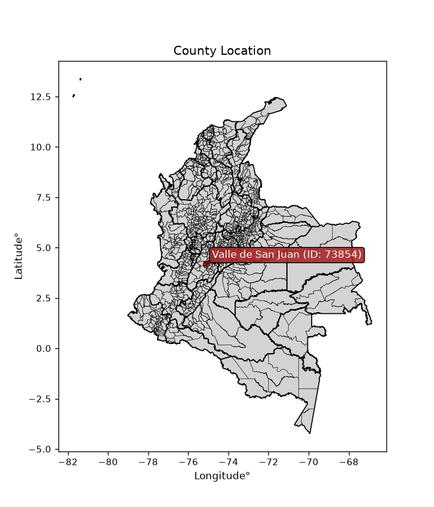
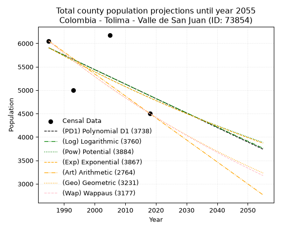
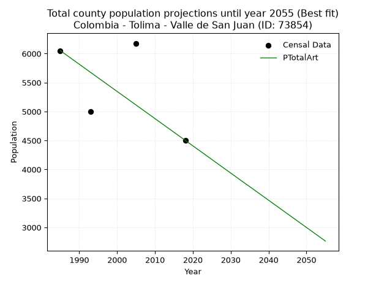
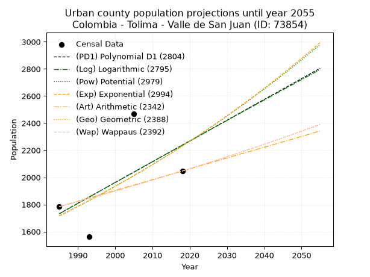
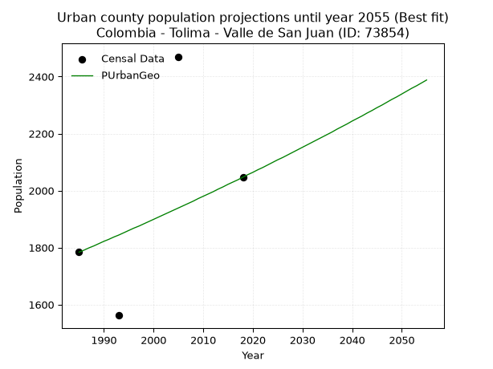
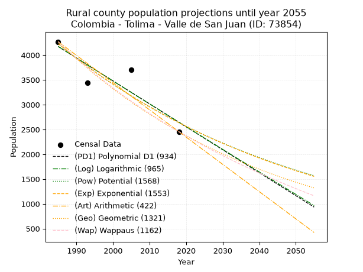
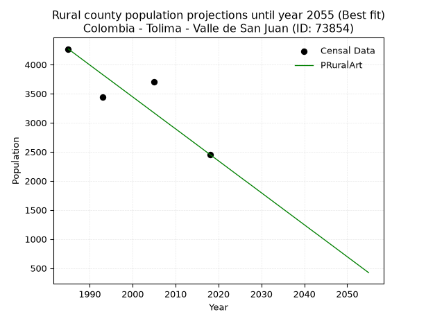

<div align="center">


</div>

# _“Population and Public Services Demand Projections (PPSD) until Year 2050 for Colombia - Tolima - Valle de San Juan (ID: 73854)”_
Keywords: `population` `public-service` `projection` `lineal` `polynomial` `logarithmic` `potential` `exponential` `arithmetic` `geometric` `wappaus` `dane` `colombia` `south-america`

PPSD are analytical estimates used by governments and planners to anticipate future changes in population size, age distribution, and the resulting community needs for utilities, healthcare, education, and infrastructure as sizing future water treatment facilities, electrical grids, and road networks based on spatial growth.

> **General running parameters**: • app_version: _v20260806_. • Python version: _3.14.7_. • Pandas version: _3.0.5_. • NumPy version: _2.5.1_. • Creates, save and include plots into reports (create_plot): _False_. • Projection until year: _2050_. • Process polynomial degree 2 and up: _False_. • Process Wappaus: _True_. • Process Wappaus: _True_. • Set negative values to zero: _True_. • Set infinite values to zero: _True_. • Drop dataset notes: _True_. 
<div align="center">

Dynamic map: [:earth_americas:Google](http://maps.google.com/maps?q=4.197493672,-75.1156692) [:earth_americas:OSM](https://www.openstreetmap.org/#map=18/4.197493672/-75.1156692&layers=P) [:earth_americas:Bing](https://www.bing.com/maps?cp=4.197493672~-75.1156692&lvl=18) [:earth_americas:Apple](https://maps.apple.com/frame?center=4.197493672%2C-75.1156692&span=0.003%2C0.006)

</div>


<div align="center">

```geojson
{
  "type": "Feature",
  "geometry": {
    "type": "Point", 
    "coordinates": [-75.1156692, 4.197493672]
  }, 
  "properties": {
    "Name": "Colombia - Tolima - Valle de San Juan (ID: 73854)"
  }
}
```

</div>


<div align="center">

</img>

</div>


## 0. Census Data (4 records)

Census data are official statistics collected by a government about the people and housing in a country. They usually include counts of total population, age, sex, race, income, education, and jobs.

📅Global census file: [Population.xlsx](../data/Population.xlsx)

| Source   |   Year |   CountryID | CountryName   |   StateID | StateName   |   CountyID | CountyName        |   PTotal |   PUrban |   PRural |
|:---------|-------:|------------:|:--------------|----------:|:------------|-----------:|:------------------|---------:|---------:|---------:|
| DANE     |   1985 |          57 | Colombia      |        73 | Tolima      |      73854 | Valle de San Juan |     6052 |     1784 |     4268 |
| DANE     |   1993 |          57 | Colombia      |        73 | Tolima      |      73854 | Valle de San Juan |     4999 |     1562 |     3437 |
| DANE     |   2005 |          57 | Colombia      |        73 | Tolima      |      73854 | Valle de San Juan |     6178 |     2470 |     3708 |
| DANE     |   2018 |          57 | Colombia      |        73 | Tolima      |      73854 | Valle de San Juan |     4502 |     2047 |     2455 |

> 🔥Some records could had specific notes about the registered values or the corresponding urban or rural distribution.

📅   [RUPS](https://www.datos.gov.co/Hacienda-y-Cr-dito-P-blico/Registro-nico-de-Prestadores-de-Servicios-P-blicos/4qkq-csdn/about_data) - Local public utility companies: [RUPS.csv](../data/RUPS.xlsx)

 | SERVICIO       | ESTADO    | NOMBRE                                                                            | NIT         | DEPARTAMENTO_DOMICILIO   | MUNICIPIO_DOMICILIO   | DIRECCION                  |   TELEFONO | EMAIL                      | TIPO_PRESTADOR                             | CLASIFICACION                 |
|:---------------|:----------|:----------------------------------------------------------------------------------|:------------|:-------------------------|:----------------------|:---------------------------|-----------:|:---------------------------|:-------------------------------------------|:------------------------------|
| ACUEDUCTO      | OPERATIVA | ADMINISTRACIÓN PÚBLICA COOPERATIVA EMPRESA DE SERVICIOS PÚBLICOS DEL VALLE E.S.P. | 900125651-7 | TOLIMA                   | VALLE DE SAN JUAN     | Cra 4 No. 5-53             |    2885040 | ingmefo@hotmail.com        | ORGANIZACION AUTORIZADA                    | HASTA 2500 SUSCRIPTORES       |
| ALCANTARILLADO | OPERATIVA | ADMINISTRACIÓN PÚBLICA COOPERATIVA EMPRESA DE SERVICIOS PÚBLICOS DEL VALLE E.S.P. | 900125651-7 | TOLIMA                   | VALLE DE SAN JUAN     | Cra 4 No. 5-53             |    2885040 | ingmefo@hotmail.com        | ORGANIZACION AUTORIZADA                    | HASTA 2500 SUSCRIPTORES       |
| ACUEDUCTO      | OPERATIVA | EMPRESA DE SERVICIOS PUBLICOS DOMICILIARIOS DEL VALLE DE SAN JUAN S.A.S. E.S.P.   | 901088915-0 | TOLIMA                   | VALLE DE SAN JUAN     | CALLE 6 4 08 BARRIO CENTRO |    3214481 | germancastro9112@gmail.com | SOCIEDADES (EMPRESA DE SERVICIOS PUBLICOS) | MENOR O IGUAL A 2500 USUARIOS |
| ALCANTARILLADO | OPERATIVA | EMPRESA DE SERVICIOS PUBLICOS DOMICILIARIOS DEL VALLE DE SAN JUAN S.A.S. E.S.P.   | 901088915-0 | TOLIMA                   | VALLE DE SAN JUAN     | CALLE 6 4 08 BARRIO CENTRO |    3214481 | germancastro9112@gmail.com | SOCIEDADES (EMPRESA DE SERVICIOS PUBLICOS) | MENOR O IGUAL A 2500 USUARIOS |

## 1. Total

### 1.1. Coefficients and Parameters

* (PD1) Polynomial Deg 1: -30.9590525893206, 67358.59494178853 (lineal)
* (Log) Logarithmic: -61888.210549834585, 475845.53433028725
* (Pow) Potential: -12.09517381247564, 43.65834488134768
* (Exp) Exponential: -0.006050451393083113, 971115952.1641335
* (Art) Arithmetic: Year diff. 2018 - 1985 = 33, Population diff. 4502 - 6052 = -1550, Annual growth = -46.96969696969697
* (Geo) Geometric: Year diff. 2018 - 1985 = 33, Population diff. 4502 - 6052 = -1550, Annual growth % = -0.008925596528317259
* (Wap) Wappaus: i = -0.8900833232840055, Condition values only valid for < 200)

<sub>
Wappaus condition values: ['-0.00', '-0.89', '-1.78', '-2.67', '-3.56', '-4.45', '-5.34', '-6.23', '-7.12', '-8.01', '-8.90', '-9.79', '-10.68', '-11.57', '-12.46', '-13.35', '-14.24', '-15.13', '-16.02', '-16.91', '-17.80', '-18.69', '-19.58', '-20.47', '-21.36', '-22.25', '-23.14', '-24.03', '-24.92', '-25.81', '-26.70', '-27.59', '-28.48', '-29.37', '-30.26', '-31.15', '-32.04', '-32.93', '-33.82', '-34.71', '-35.60', '-36.49', '-37.38', '-38.27', '-39.16', '-40.05', '-40.94', '-41.83', '-42.72', '-43.61', '-44.50', '-45.39', '-46.28', '-47.17', '-48.06', '-48.95', '-49.84', '-50.73', '-51.62', '-52.51', '-53.40', '-54.30', '-55.19', '-56.08', '-56.97', '-57.86']
</sub>


### 1.2. Projected Dataset

|   Year |   CountyID |   PTotalPD1 |   PTotalLog |   PTotalPow |   PTotalExp |   PTotalArt |   PTotalGeo |   PTotalWap |
|-------:|-----------:|------------:|------------:|------------:|------------:|------------:|------------:|------------:|
|   1985 |      73854 |        5905 |        5905 |        5907 |        5907 |        6052 |        6052 |        6052 |
|   1986 |      73854 |        5874 |        5874 |        5871 |        5871 |        6005 |        5998 |        5998 |
|   1987 |      73854 |        5843 |        5843 |        5835 |        5835 |        5958 |        5944 |        5945 |
|   1988 |      73854 |        5812 |        5812 |        5800 |        5800 |        5911 |        5891 |        5893 |
|   1989 |      73854 |        5781 |        5781 |        5765 |        5765 |        5864 |        5839 |        5840 |
|   1990 |      73854 |        5750 |        5749 |        5730 |        5731 |        5817 |        5787 |        5789 |
|   1991 |      73854 |        5719 |        5718 |        5695 |        5696 |        5770 |        5735 |        5737 |
|   1992 |      73854 |        5688 |        5687 |        5661 |        5662 |        5723 |        5684 |        5686 |
|   1993 |      73854 |        5657 |        5656 |        5626 |        5627 |        5676 |        5633 |        5636 |
|   1994 |      73854 |        5626 |        5625 |        5592 |        5593 |        5629 |        5583 |        5586 |
|   1995 |      73854 |        5595 |        5594 |        5559 |        5560 |        5582 |        5533 |        5536 |
|   1996 |      73854 |        5564 |        5563 |        5525 |        5526 |        5535 |        5484 |        5487 |
|   1997 |      73854 |        5533 |        5532 |        5492 |        5493 |        5488 |        5435 |        5438 |
|   1998 |      73854 |        5502 |        5501 |        5458 |        5460 |        5441 |        5386 |        5390 |
|   1999 |      73854 |        5471 |        5470 |        5426 |        5427 |        5394 |        5338 |        5342 |
|   2000 |      73854 |        5440 |        5439 |        5393 |        5394 |        5347 |        5290 |        5295 |
|   2001 |      73854 |        5410 |        5408 |        5360 |        5362 |        5300 |        5243 |        5247 |
|   2002 |      73854 |        5379 |        5377 |        5328 |        5329 |        5254 |        5196 |        5201 |
|   2003 |      73854 |        5348 |        5347 |        5296 |        5297 |        5207 |        5150 |        5154 |
|   2004 |      73854 |        5317 |        5316 |        5264 |        5265 |        5160 |        5104 |        5108 |
|   2005 |      73854 |        5286 |        5285 |        5232 |        5233 |        5113 |        5059 |        5063 |
|   2006 |      73854 |        5255 |        5254 |        5201 |        5202 |        5066 |        5013 |        5017 |
|   2007 |      73854 |        5224 |        5223 |        5170 |        5170 |        5019 |        4969 |        4973 |
|   2008 |      73854 |        5193 |        5192 |        5139 |        5139 |        4972 |        4924 |        4928 |
|   2009 |      73854 |        5162 |        5161 |        5108 |        5108 |        4925 |        4880 |        4884 |
|   2010 |      73854 |        5131 |        5131 |        5077 |        5077 |        4878 |        4837 |        4840 |
|   2011 |      73854 |        5100 |        5100 |        5047 |        5047 |        4831 |        4794 |        4797 |
|   2012 |      73854 |        5069 |        5069 |        5016 |        5016 |        4784 |        4751 |        4754 |
|   2013 |      73854 |        5038 |        5038 |        4986 |        4986 |        4737 |        4708 |        4711 |
|   2014 |      73854 |        5007 |        5008 |        4956 |        4956 |        4690 |        4666 |        4668 |
|   2015 |      73854 |        4976 |        4977 |        4927 |        4926 |        4643 |        4625 |        4626 |
|   2016 |      73854 |        4945 |        4946 |        4897 |        4896 |        4596 |        4583 |        4585 |
|   2017 |      73854 |        4914 |        4915 |        4868 |        4867 |        4549 |        4543 |        4543 |
|   2018 |      73854 |        4883 |        4885 |        4839 |        4837 |        4502 |        4502 |        4502 |
|   2019 |      73854 |        4852 |        4854 |        4810 |        4808 |        4455 |        4462 |        4461 |
|   2020 |      73854 |        4821 |        4823 |        4781 |        4779 |        4408 |        4422 |        4421 |
|   2021 |      73854 |        4790 |        4793 |        4753 |        4750 |        4361 |        4383 |        4381 |
|   2022 |      73854 |        4759 |        4762 |        4724 |        4722 |        4314 |        4343 |        4341 |
|   2023 |      73854 |        4728 |        4732 |        4696 |        4693 |        4267 |        4305 |        4301 |
|   2024 |      73854 |        4697 |        4701 |        4668 |        4665 |        4220 |        4266 |        4262 |
|   2025 |      73854 |        4667 |        4670 |        4640 |        4637 |        4173 |        4228 |        4223 |
|   2026 |      73854 |        4636 |        4640 |        4613 |        4609 |        4126 |        4190 |        4184 |
|   2027 |      73854 |        4605 |        4609 |        4585 |        4581 |        4079 |        4153 |        4146 |
|   2028 |      73854 |        4574 |        4579 |        4558 |        4553 |        4032 |        4116 |        4108 |
|   2029 |      73854 |        4543 |        4548 |        4531 |        4526 |        3985 |        4079 |        4070 |
|   2030 |      73854 |        4512 |        4518 |        4504 |        4499 |        3938 |        4043 |        4032 |
|   2031 |      73854 |        4481 |        4487 |        4477 |        4472 |        3891 |        4007 |        3995 |
|   2032 |      73854 |        4450 |        4457 |        4451 |        4445 |        3844 |        3971 |        3958 |
|   2033 |      73854 |        4419 |        4426 |        4424 |        4418 |        3797 |        3935 |        3921 |
|   2034 |      73854 |        4388 |        4396 |        4398 |        4391 |        3750 |        3900 |        3885 |
|   2035 |      73854 |        4357 |        4366 |        4372 |        4365 |        3704 |        3866 |        3849 |
|   2036 |      73854 |        4326 |        4335 |        4346 |        4338 |        3657 |        3831 |        3813 |
|   2037 |      73854 |        4295 |        4305 |        4320 |        4312 |        3610 |        3797 |        3777 |
|   2038 |      73854 |        4264 |        4274 |        4295 |        4286 |        3563 |        3763 |        3742 |
|   2039 |      73854 |        4233 |        4244 |        4269 |        4260 |        3516 |        3729 |        3707 |
|   2040 |      73854 |        4202 |        4214 |        4244 |        4235 |        3469 |        3696 |        3672 |
|   2041 |      73854 |        4171 |        4183 |        4219 |        4209 |        3422 |        3663 |        3637 |
|   2042 |      73854 |        4140 |        4153 |        4194 |        4184 |        3375 |        3630 |        3603 |
|   2043 |      73854 |        4109 |        4123 |        4169 |        4158 |        3328 |        3598 |        3569 |
|   2044 |      73854 |        4078 |        4093 |        4145 |        4133 |        3281 |        3566 |        3535 |
|   2045 |      73854 |        4047 |        4062 |        4120 |        4108 |        3234 |        3534 |        3501 |
|   2046 |      73854 |        4016 |        4032 |        4096 |        4084 |        3187 |        3503 |        3468 |
|   2047 |      73854 |        3985 |        4002 |        4072 |        4059 |        3140 |        3471 |        3434 |
|   2048 |      73854 |        3954 |        3972 |        4048 |        4034 |        3093 |        3440 |        3401 |
|   2049 |      73854 |        3923 |        3941 |        4024 |        4010 |        3046 |        3410 |        3369 |
|   2050 |      73854 |        3893 |        3911 |        4000 |        3986 |        2999 |        3379 |        3336 |
<div align="center">

</img>

</div>


### 1.3. Best fit with absolute and relative error (%)

Relative error puts that difference into context by dividing the absolute error by the true value, creating a unitless ratio or percentage that shows the scale of the mistake.

Absolute and relative error

|   Year | Source   |   CountryID | CountryName   |   StateID | StateName   |   CountyID_x | CountyName        |   PTotal |   PUrban |   PRural |   CountyID_y |   PTotalPD1 |   PTotalLog |   PTotalPow |   PTotalExp |   PTotalArt |   PTotalGeo |   PTotalWap |   PTotalPD1AbsError |   PTotalLogAbsError |   PTotalPowAbsError |   PTotalExpAbsError |   PTotalArtAbsError |   PTotalGeoAbsError |   PTotalWapAbsError |   PTotalPD1RelError |   PTotalLogRelError |   PTotalPowRelError |   PTotalExpRelError |   PTotalArtRelError |   PTotalGeoRelError |   PTotalWapRelError |
|-------:|:---------|------------:|:--------------|----------:|:------------|-------------:|:------------------|---------:|---------:|---------:|-------------:|------------:|------------:|------------:|------------:|------------:|------------:|------------:|--------------------:|--------------------:|--------------------:|--------------------:|--------------------:|--------------------:|--------------------:|--------------------:|--------------------:|--------------------:|--------------------:|--------------------:|--------------------:|--------------------:|
|   1985 | DANE     |          57 | Colombia      |        73 | Tolima      |        73854 | Valle de San Juan |     6052 |     1784 |     4268 |        73854 |        5905 |        5905 |        5907 |        5907 |        6052 |        6052 |        6052 |                 147 |                 147 |                 145 |                 145 |                   0 |                   0 |                   0 |             2.42895 |             2.42895 |             2.3959  |             2.3959  |              0      |              0      |              0      |
|   1993 | DANE     |          57 | Colombia      |        73 | Tolima      |        73854 | Valle de San Juan |     4999 |     1562 |     3437 |        73854 |        5657 |        5656 |        5626 |        5627 |        5676 |        5633 |        5636 |                 658 |                 657 |                 627 |                 628 |                 677 |                 634 |                 637 |            13.1626  |            13.1426  |            12.5425  |            12.5625  |             13.5427 |             12.6825 |             12.7425 |
|   2005 | DANE     |          57 | Colombia      |        73 | Tolima      |        73854 | Valle de San Juan |     6178 |     2470 |     3708 |        73854 |        5286 |        5285 |        5232 |        5233 |        5113 |        5059 |        5063 |                 892 |                 893 |                 946 |                 945 |                1065 |                1119 |                1115 |            14.4383  |            14.4545  |            15.3124  |            15.2962  |             17.2386 |             18.1127 |             18.0479 |
|   2018 | DANE     |          57 | Colombia      |        73 | Tolima      |        73854 | Valle de San Juan |     4502 |     2047 |     2455 |        73854 |        4883 |        4885 |        4839 |        4837 |        4502 |        4502 |        4502 |                 381 |                 383 |                 337 |                 335 |                   0 |                   0 |                   0 |             8.46291 |             8.50733 |             7.48556 |             7.44114 |              0      |              0      |              0      |

Relative error mean

| Method    |   RelError | Best   |
|:----------|-----------:|:-------|
| PTotalPD1 |    9.6232  |        |
| PTotalLog |    9.63336 |        |
| PTotalPow |    9.43409 |        |
| PTotalExp |    9.42394 |        |
| PTotalArt |    7.69532 | True   |
| PTotalGeo |    7.6988  |        |
| PTotalWap |    7.69762 |        |

💙Best method: _**PTotalArt**_
<div align="center">

</img>

</div>


### 1.4. Fresh water supply demand in liters per capita per day (lpcd)

The fresh water supply demand typically ranges from 100 to 300 liters per capita per day (lpcd) for standard domestic and municipal planning, though absolute survival minimums set by the World Health Organization are as low as 7.5 to 20 liters per day, and total consumption in high-income nations can exceed 400 liters.

> `CZ`: Level in meters above the sea level (masl)<br> `WS`: Fresh water supply demand in liters per capita per day (lpcd or l/h/d)<br> `WSAll`: Zonal fresh water supply demand in liters per second (l/s)<br> `A`: Zonal area in square meters<br> `DP`: Population density (people/hectare or p/ha)

Reference values (RAS Colombia)

|    CZ |   WS |
|------:|-----:|
|  1000 |  120 |
|  2000 |  130 |
| 99999 |  140 |

County shapefile geometry properties and water supply values

|   CountyID |      ATotal |   CZTotal |   WSTotal |
|-----------:|------------:|----------:|----------:|
|      73854 | 1.97742e+08 |   827.583 |       120 |

Projected values for best method: PTotalArt

|   CountyID |   Year |   PTotalArt |   DPTotal |   WSTotal |   WSTotalAll |
|-----------:|-------:|------------:|----------:|----------:|-------------:|
|      73854 |   1985 |        6052 |      0.31 |       120 |      8.40556 |
|      73854 |   1986 |        6005 |      0.3  |       120 |      8.34028 |
|      73854 |   1987 |        5958 |      0.3  |       120 |      8.275   |
|      73854 |   1988 |        5911 |      0.3  |       120 |      8.20972 |
|      73854 |   1989 |        5864 |      0.3  |       120 |      8.14444 |
|      73854 |   1990 |        5817 |      0.29 |       120 |      8.07917 |
|      73854 |   1991 |        5770 |      0.29 |       120 |      8.01389 |
|      73854 |   1992 |        5723 |      0.29 |       120 |      7.94861 |
|      73854 |   1993 |        5676 |      0.29 |       120 |      7.88333 |
|      73854 |   1994 |        5629 |      0.28 |       120 |      7.81806 |
|      73854 |   1995 |        5582 |      0.28 |       120 |      7.75278 |
|      73854 |   1996 |        5535 |      0.28 |       120 |      7.6875  |
|      73854 |   1997 |        5488 |      0.28 |       120 |      7.62222 |
|      73854 |   1998 |        5441 |      0.28 |       120 |      7.55694 |
|      73854 |   1999 |        5394 |      0.27 |       120 |      7.49167 |
|      73854 |   2000 |        5347 |      0.27 |       120 |      7.42639 |
|      73854 |   2001 |        5300 |      0.27 |       120 |      7.36111 |
|      73854 |   2002 |        5254 |      0.27 |       120 |      7.29722 |
|      73854 |   2003 |        5207 |      0.26 |       120 |      7.23194 |
|      73854 |   2004 |        5160 |      0.26 |       120 |      7.16667 |
|      73854 |   2005 |        5113 |      0.26 |       120 |      7.10139 |
|      73854 |   2006 |        5066 |      0.26 |       120 |      7.03611 |
|      73854 |   2007 |        5019 |      0.25 |       120 |      6.97083 |
|      73854 |   2008 |        4972 |      0.25 |       120 |      6.90556 |
|      73854 |   2009 |        4925 |      0.25 |       120 |      6.84028 |
|      73854 |   2010 |        4878 |      0.25 |       120 |      6.775   |
|      73854 |   2011 |        4831 |      0.24 |       120 |      6.70972 |
|      73854 |   2012 |        4784 |      0.24 |       120 |      6.64444 |
|      73854 |   2013 |        4737 |      0.24 |       120 |      6.57917 |
|      73854 |   2014 |        4690 |      0.24 |       120 |      6.51389 |
|      73854 |   2015 |        4643 |      0.23 |       120 |      6.44861 |
|      73854 |   2016 |        4596 |      0.23 |       120 |      6.38333 |
|      73854 |   2017 |        4549 |      0.23 |       120 |      6.31806 |
|      73854 |   2018 |        4502 |      0.23 |       120 |      6.25278 |
|      73854 |   2019 |        4455 |      0.23 |       120 |      6.1875  |
|      73854 |   2020 |        4408 |      0.22 |       120 |      6.12222 |
|      73854 |   2021 |        4361 |      0.22 |       120 |      6.05694 |
|      73854 |   2022 |        4314 |      0.22 |       120 |      5.99167 |
|      73854 |   2023 |        4267 |      0.22 |       120 |      5.92639 |
|      73854 |   2024 |        4220 |      0.21 |       120 |      5.86111 |
|      73854 |   2025 |        4173 |      0.21 |       120 |      5.79583 |
|      73854 |   2026 |        4126 |      0.21 |       120 |      5.73056 |
|      73854 |   2027 |        4079 |      0.21 |       120 |      5.66528 |
|      73854 |   2028 |        4032 |      0.2  |       120 |      5.6     |
|      73854 |   2029 |        3985 |      0.2  |       120 |      5.53472 |
|      73854 |   2030 |        3938 |      0.2  |       120 |      5.46944 |
|      73854 |   2031 |        3891 |      0.2  |       120 |      5.40417 |
|      73854 |   2032 |        3844 |      0.19 |       120 |      5.33889 |
|      73854 |   2033 |        3797 |      0.19 |       120 |      5.27361 |
|      73854 |   2034 |        3750 |      0.19 |       120 |      5.20833 |
|      73854 |   2035 |        3704 |      0.19 |       120 |      5.14444 |
|      73854 |   2036 |        3657 |      0.18 |       120 |      5.07917 |
|      73854 |   2037 |        3610 |      0.18 |       120 |      5.01389 |
|      73854 |   2038 |        3563 |      0.18 |       120 |      4.94861 |
|      73854 |   2039 |        3516 |      0.18 |       120 |      4.88333 |
|      73854 |   2040 |        3469 |      0.18 |       120 |      4.81806 |
|      73854 |   2041 |        3422 |      0.17 |       120 |      4.75278 |
|      73854 |   2042 |        3375 |      0.17 |       120 |      4.6875  |
|      73854 |   2043 |        3328 |      0.17 |       120 |      4.62222 |
|      73854 |   2044 |        3281 |      0.17 |       120 |      4.55694 |
|      73854 |   2045 |        3234 |      0.16 |       120 |      4.49167 |
|      73854 |   2046 |        3187 |      0.16 |       120 |      4.42639 |
|      73854 |   2047 |        3140 |      0.16 |       120 |      4.36111 |
|      73854 |   2048 |        3093 |      0.16 |       120 |      4.29583 |
|      73854 |   2049 |        3046 |      0.15 |       120 |      4.23056 |
|      73854 |   2050 |        2999 |      0.15 |       120 |      4.16528 |

## 2. Urban

### 2.1. Coefficients and Parameters

* (PD1) Polynomial Deg 1: 15.31312725812947, -28664.332798073472 (lineal)
* (Log) Logarithmic: 30693.91533640159, -231338.94643758936
* (Pow) Potential: 15.927001282721058, -49.28901642399748
* (Exp) Exponential: 0.007948376981791886, 0.00024126101925413
* (Art) Arithmetic: Year diff. 2018 - 1985 = 33, Population diff. 2047 - 1784 = 263, Annual growth = 7.96969696969697
* (Geo) Geometric: Year diff. 2018 - 1985 = 33, Population diff. 2047 - 1784 = 263, Annual growth % = 0.0041758848864172915
* (Wap) Wappaus: i = 0.4160635327432508, Condition values only valid for < 200)

<sub>
Wappaus condition values: ['0.00', '0.42', '0.83', '1.25', '1.66', '2.08', '2.50', '2.91', '3.33', '3.74', '4.16', '4.58', '4.99', '5.41', '5.82', '6.24', '6.66', '7.07', '7.49', '7.91', '8.32', '8.74', '9.15', '9.57', '9.99', '10.40', '10.82', '11.23', '11.65', '12.07', '12.48', '12.90', '13.31', '13.73', '14.15', '14.56', '14.98', '15.39', '15.81', '16.23', '16.64', '17.06', '17.47', '17.89', '18.31', '18.72', '19.14', '19.55', '19.97', '20.39', '20.80', '21.22', '21.64', '22.05', '22.47', '22.88', '23.30', '23.72', '24.13', '24.55', '24.96', '25.38', '25.80', '26.21', '26.63', '27.04']
</sub>


### 2.2. Projected Dataset

|   Year |   CountyID |   PUrbanPD1 |   PUrbanLog |   PUrbanPow |   PUrbanExp |   PUrbanArt |   PUrbanGeo |   PUrbanWap |
|-------:|-----------:|------------:|------------:|------------:|------------:|------------:|------------:|------------:|
|   1985 |      73854 |        1732 |        1731 |        1716 |        1716 |        1784 |        1784 |        1784 |
|   1986 |      73854 |        1748 |        1747 |        1729 |        1730 |        1792 |        1791 |        1791 |
|   1987 |      73854 |        1763 |        1762 |        1743 |        1744 |        1800 |        1799 |        1799 |
|   1988 |      73854 |        1778 |        1778 |        1757 |        1758 |        1808 |        1806 |        1806 |
|   1989 |      73854 |        1793 |        1793 |        1772 |        1772 |        1816 |        1814 |        1814 |
|   1990 |      73854 |        1809 |        1809 |        1786 |        1786 |        1824 |        1822 |        1822 |
|   1991 |      73854 |        1824 |        1824 |        1800 |        1800 |        1832 |        1829 |        1829 |
|   1992 |      73854 |        1839 |        1839 |        1815 |        1814 |        1840 |        1837 |        1837 |
|   1993 |      73854 |        1855 |        1855 |        1829 |        1829 |        1848 |        1844 |        1844 |
|   1994 |      73854 |        1870 |        1870 |        1844 |        1844 |        1856 |        1852 |        1852 |
|   1995 |      73854 |        1885 |        1886 |        1859 |        1858 |        1864 |        1860 |        1860 |
|   1996 |      73854 |        1901 |        1901 |        1873 |        1873 |        1872 |        1868 |        1868 |
|   1997 |      73854 |        1916 |        1916 |        1888 |        1888 |        1880 |        1875 |        1875 |
|   1998 |      73854 |        1931 |        1932 |        1904 |        1903 |        1888 |        1883 |        1883 |
|   1999 |      73854 |        1947 |        1947 |        1919 |        1918 |        1896 |        1891 |        1891 |
|   2000 |      73854 |        1962 |        1963 |        1934 |        1934 |        1904 |        1899 |        1899 |
|   2001 |      73854 |        1977 |        1978 |        1950 |        1949 |        1912 |        1907 |        1907 |
|   2002 |      73854 |        1993 |        1993 |        1965 |        1965 |        1919 |        1915 |        1915 |
|   2003 |      73854 |        2008 |        2009 |        1981 |        1980 |        1927 |        1923 |        1923 |
|   2004 |      73854 |        2023 |        2024 |        1997 |        1996 |        1935 |        1931 |        1931 |
|   2005 |      73854 |        2038 |        2039 |        2013 |        2012 |        1943 |        1939 |        1939 |
|   2006 |      73854 |        2054 |        2054 |        2029 |        2028 |        1951 |        1947 |        1947 |
|   2007 |      73854 |        2069 |        2070 |        2045 |        2044 |        1959 |        1955 |        1955 |
|   2008 |      73854 |        2084 |        2085 |        2061 |        2061 |        1967 |        1963 |        1963 |
|   2009 |      73854 |        2100 |        2100 |        2078 |        2077 |        1975 |        1972 |        1972 |
|   2010 |      73854 |        2115 |        2116 |        2094 |        2094 |        1983 |        1980 |        1980 |
|   2011 |      73854 |        2130 |        2131 |        2111 |        2110 |        1991 |        1988 |        1988 |
|   2012 |      73854 |        2146 |        2146 |        2128 |        2127 |        1999 |        1996 |        1996 |
|   2013 |      73854 |        2161 |        2161 |        2144 |        2144 |        2007 |        2005 |        2005 |
|   2014 |      73854 |        2176 |        2177 |        2161 |        2161 |        2015 |        2013 |        2013 |
|   2015 |      73854 |        2192 |        2192 |        2179 |        2178 |        2023 |        2022 |        2021 |
|   2016 |      73854 |        2207 |        2207 |        2196 |        2196 |        2031 |        2030 |        2030 |
|   2017 |      73854 |        2222 |        2222 |        2213 |        2213 |        2039 |        2038 |        2038 |
|   2018 |      73854 |        2238 |        2238 |        2231 |        2231 |        2047 |        2047 |        2047 |
|   2019 |      73854 |        2253 |        2253 |        2249 |        2249 |        2055 |        2056 |        2056 |
|   2020 |      73854 |        2268 |        2268 |        2266 |        2267 |        2063 |        2064 |        2064 |
|   2021 |      73854 |        2283 |        2283 |        2284 |        2285 |        2071 |        2073 |        2073 |
|   2022 |      73854 |        2299 |        2298 |        2302 |        2303 |        2079 |        2081 |        2082 |
|   2023 |      73854 |        2314 |        2313 |        2321 |        2321 |        2087 |        2090 |        2090 |
|   2024 |      73854 |        2329 |        2329 |        2339 |        2340 |        2095 |        2099 |        2099 |
|   2025 |      73854 |        2345 |        2344 |        2357 |        2359 |        2103 |        2108 |        2108 |
|   2026 |      73854 |        2360 |        2359 |        2376 |        2377 |        2111 |        2116 |        2117 |
|   2027 |      73854 |        2375 |        2374 |        2395 |        2396 |        2119 |        2125 |        2126 |
|   2028 |      73854 |        2391 |        2389 |        2414 |        2416 |        2127 |        2134 |        2135 |
|   2029 |      73854 |        2406 |        2404 |        2433 |        2435 |        2135 |        2143 |        2143 |
|   2030 |      73854 |        2421 |        2419 |        2452 |        2454 |        2143 |        2152 |        2153 |
|   2031 |      73854 |        2437 |        2435 |        2471 |        2474 |        2151 |        2161 |        2162 |
|   2032 |      73854 |        2452 |        2450 |        2491 |        2494 |        2159 |        2170 |        2171 |
|   2033 |      73854 |        2467 |        2465 |        2510 |        2513 |        2167 |        2179 |        2180 |
|   2034 |      73854 |        2483 |        2480 |        2530 |        2534 |        2175 |        2188 |        2189 |
|   2035 |      73854 |        2498 |        2495 |        2550 |        2554 |        2182 |        2197 |        2198 |
|   2036 |      73854 |        2513 |        2510 |        2570 |        2574 |        2190 |        2206 |        2207 |
|   2037 |      73854 |        2529 |        2525 |        2590 |        2595 |        2198 |        2216 |        2217 |
|   2038 |      73854 |        2544 |        2540 |        2610 |        2615 |        2206 |        2225 |        2226 |
|   2039 |      73854 |        2559 |        2555 |        2631 |        2636 |        2214 |        2234 |        2236 |
|   2040 |      73854 |        2574 |        2570 |        2651 |        2657 |        2222 |        2244 |        2245 |
|   2041 |      73854 |        2590 |        2585 |        2672 |        2678 |        2230 |        2253 |        2254 |
|   2042 |      73854 |        2605 |        2600 |        2693 |        2700 |        2238 |        2262 |        2264 |
|   2043 |      73854 |        2620 |        2615 |        2714 |        2721 |        2246 |        2272 |        2274 |
|   2044 |      73854 |        2636 |        2630 |        2735 |        2743 |        2254 |        2281 |        2283 |
|   2045 |      73854 |        2651 |        2645 |        2757 |        2765 |        2262 |        2291 |        2293 |
|   2046 |      73854 |        2666 |        2660 |        2778 |        2787 |        2270 |        2300 |        2303 |
|   2047 |      73854 |        2682 |        2675 |        2800 |        2809 |        2278 |        2310 |        2312 |
|   2048 |      73854 |        2697 |        2690 |        2822 |        2832 |        2286 |        2320 |        2322 |
|   2049 |      73854 |        2712 |        2705 |        2844 |        2854 |        2294 |        2329 |        2332 |
|   2050 |      73854 |        2728 |        2720 |        2866 |        2877 |        2302 |        2339 |        2342 |
<div align="center">

</img>

</div>


### 2.3. Best fit with absolute and relative error (%)

Relative error puts that difference into context by dividing the absolute error by the true value, creating a unitless ratio or percentage that shows the scale of the mistake.

Absolute and relative error

|   Year | Source   |   CountryID | CountryName   |   StateID | StateName   |   CountyID_x | CountyName        |   PTotal |   PUrban |   PRural |   CountyID_y |   PUrbanPD1 |   PUrbanLog |   PUrbanPow |   PUrbanExp |   PUrbanArt |   PUrbanGeo |   PUrbanWap |   PUrbanPD1AbsError |   PUrbanLogAbsError |   PUrbanPowAbsError |   PUrbanExpAbsError |   PUrbanArtAbsError |   PUrbanGeoAbsError |   PUrbanWapAbsError |   PUrbanPD1RelError |   PUrbanLogRelError |   PUrbanPowRelError |   PUrbanExpRelError |   PUrbanArtRelError |   PUrbanGeoRelError |   PUrbanWapRelError |
|-------:|:---------|------------:|:--------------|----------:|:------------|-------------:|:------------------|---------:|---------:|---------:|-------------:|------------:|------------:|------------:|------------:|------------:|------------:|------------:|--------------------:|--------------------:|--------------------:|--------------------:|--------------------:|--------------------:|--------------------:|--------------------:|--------------------:|--------------------:|--------------------:|--------------------:|--------------------:|--------------------:|
|   1985 | DANE     |          57 | Colombia      |        73 | Tolima      |        73854 | Valle de San Juan |     6052 |     1784 |     4268 |        73854 |        1732 |        1731 |        1716 |        1716 |        1784 |        1784 |        1784 |                  52 |                  53 |                  68 |                  68 |                   0 |                   0 |                   0 |             2.9148  |             2.97085 |             3.81166 |             3.81166 |              0      |              0      |              0      |
|   1993 | DANE     |          57 | Colombia      |        73 | Tolima      |        73854 | Valle de San Juan |     4999 |     1562 |     3437 |        73854 |        1855 |        1855 |        1829 |        1829 |        1848 |        1844 |        1844 |                 293 |                 293 |                 267 |                 267 |                 286 |                 282 |                 282 |            18.758   |            18.758   |            17.0935  |            17.0935  |             18.3099 |             18.0538 |             18.0538 |
|   2005 | DANE     |          57 | Colombia      |        73 | Tolima      |        73854 | Valle de San Juan |     6178 |     2470 |     3708 |        73854 |        2038 |        2039 |        2013 |        2012 |        1943 |        1939 |        1939 |                 432 |                 431 |                 457 |                 458 |                 527 |                 531 |                 531 |            17.4899  |            17.4494  |            18.502   |            18.5425  |             21.336  |             21.498  |             21.498  |
|   2018 | DANE     |          57 | Colombia      |        73 | Tolima      |        73854 | Valle de San Juan |     4502 |     2047 |     2455 |        73854 |        2238 |        2238 |        2231 |        2231 |        2047 |        2047 |        2047 |                 191 |                 191 |                 184 |                 184 |                   0 |                   0 |                   0 |             9.33073 |             9.33073 |             8.98876 |             8.98876 |              0      |              0      |              0      |

Relative error mean

| Method    |   RelError | Best   |
|:----------|-----------:|:-------|
| PUrbanPD1 |   12.1234  |        |
| PUrbanLog |   12.1272  |        |
| PUrbanPow |   12.099   |        |
| PUrbanExp |   12.1091  |        |
| PUrbanArt |    9.91147 |        |
| PUrbanGeo |    9.88794 | True   |
| PUrbanWap |    9.88794 | True   |

💙Best method: _**PUrbanGeo**_
<div align="center">

</img>

</div>


### 2.4. Fresh water supply demand in liters per capita per day (lpcd)

The fresh water supply demand typically ranges from 100 to 300 liters per capita per day (lpcd) for standard domestic and municipal planning, though absolute survival minimums set by the World Health Organization are as low as 7.5 to 20 liters per day, and total consumption in high-income nations can exceed 400 liters.

> `CZ`: Level in meters above the sea level (masl)<br> `WS`: Fresh water supply demand in liters per capita per day (lpcd or l/h/d)<br> `WSAll`: Zonal fresh water supply demand in liters per second (l/s)<br> `A`: Zonal area in square meters<br> `DP`: Population density (people/hectare or p/ha)

Reference values (RAS Colombia)

|    CZ |   WS |
|------:|-----:|
|  1000 |  120 |
|  2000 |  130 |
| 99999 |  140 |

County shapefile geometry properties and water supply values

|   CountyID |   AUrban |   CZUrban |   WSUrban |
|-----------:|---------:|----------:|----------:|
|      73854 |   726294 |   587.665 |       120 |

Projected values for best method: PUrbanGeo

|   CountyID |   Year |   PUrbanGeo |   DPUrban |   WSUrban |   WSUrbanAll |
|-----------:|-------:|------------:|----------:|----------:|-------------:|
|      73854 |   1985 |        1784 |     24.56 |       120 |      2.47778 |
|      73854 |   1986 |        1791 |     24.66 |       120 |      2.4875  |
|      73854 |   1987 |        1799 |     24.77 |       120 |      2.49861 |
|      73854 |   1988 |        1806 |     24.87 |       120 |      2.50833 |
|      73854 |   1989 |        1814 |     24.98 |       120 |      2.51944 |
|      73854 |   1990 |        1822 |     25.09 |       120 |      2.53056 |
|      73854 |   1991 |        1829 |     25.18 |       120 |      2.54028 |
|      73854 |   1992 |        1837 |     25.29 |       120 |      2.55139 |
|      73854 |   1993 |        1844 |     25.39 |       120 |      2.56111 |
|      73854 |   1994 |        1852 |     25.5  |       120 |      2.57222 |
|      73854 |   1995 |        1860 |     25.61 |       120 |      2.58333 |
|      73854 |   1996 |        1868 |     25.72 |       120 |      2.59444 |
|      73854 |   1997 |        1875 |     25.82 |       120 |      2.60417 |
|      73854 |   1998 |        1883 |     25.93 |       120 |      2.61528 |
|      73854 |   1999 |        1891 |     26.04 |       120 |      2.62639 |
|      73854 |   2000 |        1899 |     26.15 |       120 |      2.6375  |
|      73854 |   2001 |        1907 |     26.26 |       120 |      2.64861 |
|      73854 |   2002 |        1915 |     26.37 |       120 |      2.65972 |
|      73854 |   2003 |        1923 |     26.48 |       120 |      2.67083 |
|      73854 |   2004 |        1931 |     26.59 |       120 |      2.68194 |
|      73854 |   2005 |        1939 |     26.7  |       120 |      2.69306 |
|      73854 |   2006 |        1947 |     26.81 |       120 |      2.70417 |
|      73854 |   2007 |        1955 |     26.92 |       120 |      2.71528 |
|      73854 |   2008 |        1963 |     27.03 |       120 |      2.72639 |
|      73854 |   2009 |        1972 |     27.15 |       120 |      2.73889 |
|      73854 |   2010 |        1980 |     27.26 |       120 |      2.75    |
|      73854 |   2011 |        1988 |     27.37 |       120 |      2.76111 |
|      73854 |   2012 |        1996 |     27.48 |       120 |      2.77222 |
|      73854 |   2013 |        2005 |     27.61 |       120 |      2.78472 |
|      73854 |   2014 |        2013 |     27.72 |       120 |      2.79583 |
|      73854 |   2015 |        2022 |     27.84 |       120 |      2.80833 |
|      73854 |   2016 |        2030 |     27.95 |       120 |      2.81944 |
|      73854 |   2017 |        2038 |     28.06 |       120 |      2.83056 |
|      73854 |   2018 |        2047 |     28.18 |       120 |      2.84306 |
|      73854 |   2019 |        2056 |     28.31 |       120 |      2.85556 |
|      73854 |   2020 |        2064 |     28.42 |       120 |      2.86667 |
|      73854 |   2021 |        2073 |     28.54 |       120 |      2.87917 |
|      73854 |   2022 |        2081 |     28.65 |       120 |      2.89028 |
|      73854 |   2023 |        2090 |     28.78 |       120 |      2.90278 |
|      73854 |   2024 |        2099 |     28.9  |       120 |      2.91528 |
|      73854 |   2025 |        2108 |     29.02 |       120 |      2.92778 |
|      73854 |   2026 |        2116 |     29.13 |       120 |      2.93889 |
|      73854 |   2027 |        2125 |     29.26 |       120 |      2.95139 |
|      73854 |   2028 |        2134 |     29.38 |       120 |      2.96389 |
|      73854 |   2029 |        2143 |     29.51 |       120 |      2.97639 |
|      73854 |   2030 |        2152 |     29.63 |       120 |      2.98889 |
|      73854 |   2031 |        2161 |     29.75 |       120 |      3.00139 |
|      73854 |   2032 |        2170 |     29.88 |       120 |      3.01389 |
|      73854 |   2033 |        2179 |     30    |       120 |      3.02639 |
|      73854 |   2034 |        2188 |     30.13 |       120 |      3.03889 |
|      73854 |   2035 |        2197 |     30.25 |       120 |      3.05139 |
|      73854 |   2036 |        2206 |     30.37 |       120 |      3.06389 |
|      73854 |   2037 |        2216 |     30.51 |       120 |      3.07778 |
|      73854 |   2038 |        2225 |     30.63 |       120 |      3.09028 |
|      73854 |   2039 |        2234 |     30.76 |       120 |      3.10278 |
|      73854 |   2040 |        2244 |     30.9  |       120 |      3.11667 |
|      73854 |   2041 |        2253 |     31.02 |       120 |      3.12917 |
|      73854 |   2042 |        2262 |     31.14 |       120 |      3.14167 |
|      73854 |   2043 |        2272 |     31.28 |       120 |      3.15556 |
|      73854 |   2044 |        2281 |     31.41 |       120 |      3.16806 |
|      73854 |   2045 |        2291 |     31.54 |       120 |      3.18194 |
|      73854 |   2046 |        2300 |     31.67 |       120 |      3.19444 |
|      73854 |   2047 |        2310 |     31.81 |       120 |      3.20833 |
|      73854 |   2048 |        2320 |     31.94 |       120 |      3.22222 |
|      73854 |   2049 |        2329 |     32.07 |       120 |      3.23472 |
|      73854 |   2050 |        2339 |     32.2  |       120 |      3.24861 |

## 3. Rural

### 3.1. Coefficients and Parameters

* (PD1) Polynomial Deg 1: -46.272179847450055, 96022.92773986197 (lineal)
* (Log) Logarithmic: -92582.12588623622, 707184.480767877
* (Pow) Potential: -28.634403682344907, 98.05573689859904
* (Exp) Exponential: -0.014314281783662676, 9250817785937926.0
* (Art) Arithmetic: Year diff. 2018 - 1985 = 33, Population diff. 2455 - 4268 = -1813, Annual growth = -54.93939393939394
* (Geo) Geometric: Year diff. 2018 - 1985 = 33, Population diff. 2455 - 4268 = -1813, Annual growth % = -0.016618502051470974
* (Wap) Wappaus: i = -1.6343713800206436, Condition values only valid for < 200)

<sub>
Wappaus condition values: ['-0.00', '-1.63', '-3.27', '-4.90', '-6.54', '-8.17', '-9.81', '-11.44', '-13.07', '-14.71', '-16.34', '-17.98', '-19.61', '-21.25', '-22.88', '-24.52', '-26.15', '-27.78', '-29.42', '-31.05', '-32.69', '-34.32', '-35.96', '-37.59', '-39.22', '-40.86', '-42.49', '-44.13', '-45.76', '-47.40', '-49.03', '-50.67', '-52.30', '-53.93', '-55.57', '-57.20', '-58.84', '-60.47', '-62.11', '-63.74', '-65.37', '-67.01', '-68.64', '-70.28', '-71.91', '-73.55', '-75.18', '-76.82', '-78.45', '-80.08', '-81.72', '-83.35', '-84.99', '-86.62', '-88.26', '-89.89', '-91.52', '-93.16', '-94.79', '-96.43', '-98.06', '-99.70', '-101.33', '-102.97', '-104.60', '-106.23']
</sub>


### 3.2. Projected Dataset

|   Year |   CountyID |   PRuralPD1 |   PRuralLog |   PRuralPow |   PRuralExp |   PRuralArt |   PRuralGeo |   PRuralWap |
|-------:|-----------:|------------:|------------:|------------:|------------:|------------:|------------:|------------:|
|   1985 |      73854 |        4173 |        4174 |        4230 |        4229 |        4268 |        4268 |        4268 |
|   1986 |      73854 |        4126 |        4127 |        4169 |        4169 |        4213 |        4197 |        4199 |
|   1987 |      73854 |        4080 |        4081 |        4110 |        4109 |        4158 |        4127 |        4131 |
|   1988 |      73854 |        4034 |        4034 |        4051 |        4051 |        4103 |        4059 |        4064 |
|   1989 |      73854 |        3988 |        3987 |        3993 |        3993 |        4048 |        3991 |        3998 |
|   1990 |      73854 |        3941 |        3941 |        3936 |        3937 |        3993 |        3925 |        3933 |
|   1991 |      73854 |        3895 |        3894 |        3880 |        3881 |        3938 |        3860 |        3869 |
|   1992 |      73854 |        3849 |        3848 |        3824 |        3825 |        3883 |        3796 |        3806 |
|   1993 |      73854 |        3802 |        3801 |        3770 |        3771 |        3828 |        3733 |        3744 |
|   1994 |      73854 |        3756 |        3755 |        3716 |        3718 |        3774 |        3670 |        3683 |
|   1995 |      73854 |        3710 |        3709 |        3663 |        3665 |        3719 |        3609 |        3623 |
|   1996 |      73854 |        3664 |        3662 |        3611 |        3613 |        3664 |        3549 |        3564 |
|   1997 |      73854 |        3617 |        3616 |        3559 |        3561 |        3609 |        3491 |        3506 |
|   1998 |      73854 |        3571 |        3569 |        3509 |        3511 |        3554 |        3433 |        3448 |
|   1999 |      73854 |        3525 |        3523 |        3459 |        3461 |        3499 |        3375 |        3392 |
|   2000 |      73854 |        3479 |        3477 |        3410 |        3412 |        3444 |        3319 |        3336 |
|   2001 |      73854 |        3432 |        3430 |        3361 |        3363 |        3389 |        3264 |        3281 |
|   2002 |      73854 |        3386 |        3384 |        3313 |        3315 |        3334 |        3210 |        3227 |
|   2003 |      73854 |        3340 |        3338 |        3266 |        3268 |        3279 |        3157 |        3173 |
|   2004 |      73854 |        3293 |        3292 |        3220 |        3222 |        3224 |        3104 |        3121 |
|   2005 |      73854 |        3247 |        3246 |        3174 |        3176 |        3169 |        3053 |        3069 |
|   2006 |      73854 |        3201 |        3199 |        3129 |        3131 |        3114 |        3002 |        3018 |
|   2007 |      73854 |        3155 |        3153 |        3085 |        3086 |        3059 |        2952 |        2967 |
|   2008 |      73854 |        3108 |        3107 |        3041 |        3042 |        3004 |        2903 |        2917 |
|   2009 |      73854 |        3062 |        3061 |        2998 |        2999 |        2949 |        2855 |        2868 |
|   2010 |      73854 |        3016 |        3015 |        2956 |        2957 |        2895 |        2807 |        2820 |
|   2011 |      73854 |        2970 |        2969 |        2914 |        2915 |        2840 |        2761 |        2772 |
|   2012 |      73854 |        2923 |        2923 |        2873 |        2873 |        2785 |        2715 |        2725 |
|   2013 |      73854 |        2877 |        2877 |        2832 |        2832 |        2730 |        2670 |        2679 |
|   2014 |      73854 |        2831 |        2831 |        2792 |        2792 |        2675 |        2625 |        2633 |
|   2015 |      73854 |        2784 |        2785 |        2753 |        2752 |        2620 |        2582 |        2587 |
|   2016 |      73854 |        2738 |        2739 |        2714 |        2713 |        2565 |        2539 |        2543 |
|   2017 |      73854 |        2692 |        2693 |        2676 |        2675 |        2510 |        2496 |        2499 |
|   2018 |      73854 |        2646 |        2647 |        2638 |        2637 |        2455 |        2455 |        2455 |
|   2019 |      73854 |        2599 |        2601 |        2601 |        2599 |        2400 |        2414 |        2412 |
|   2020 |      73854 |        2553 |        2556 |        2564 |        2562 |        2345 |        2374 |        2370 |
|   2021 |      73854 |        2507 |        2510 |        2528 |        2526 |        2290 |        2335 |        2328 |
|   2022 |      73854 |        2461 |        2464 |        2493 |        2490 |        2235 |        2296 |        2286 |
|   2023 |      73854 |        2414 |        2418 |        2458 |        2455 |        2180 |        2258 |        2245 |
|   2024 |      73854 |        2368 |        2372 |        2423 |        2420 |        2125 |        2220 |        2205 |
|   2025 |      73854 |        2322 |        2327 |        2389 |        2385 |        2070 |        2183 |        2165 |
|   2026 |      73854 |        2275 |        2281 |        2356 |        2351 |        2015 |        2147 |        2126 |
|   2027 |      73854 |        2229 |        2235 |        2322 |        2318 |        1961 |        2111 |        2087 |
|   2028 |      73854 |        2183 |        2190 |        2290 |        2285 |        1906 |        2076 |        2048 |
|   2029 |      73854 |        2137 |        2144 |        2258 |        2253 |        1851 |        2042 |        2010 |
|   2030 |      73854 |        2090 |        2098 |        2226 |        2221 |        1796 |        2008 |        1973 |
|   2031 |      73854 |        2044 |        2053 |        2195 |        2189 |        1741 |        1974 |        1936 |
|   2032 |      73854 |        1998 |        2007 |        2164 |        2158 |        1686 |        1942 |        1899 |
|   2033 |      73854 |        1952 |        1962 |        2134 |        2127 |        1631 |        1909 |        1863 |
|   2034 |      73854 |        1905 |        1916 |        2104 |        2097 |        1576 |        1878 |        1827 |
|   2035 |      73854 |        1859 |        1871 |        2075 |        2067 |        1521 |        1846 |        1792 |
|   2036 |      73854 |        1813 |        1825 |        2046 |        2038 |        1466 |        1816 |        1757 |
|   2037 |      73854 |        1766 |        1780 |        2017 |        2009 |        1411 |        1786 |        1722 |
|   2038 |      73854 |        1720 |        1734 |        1989 |        1980 |        1356 |        1756 |        1688 |
|   2039 |      73854 |        1674 |        1689 |        1961 |        1952 |        1301 |        1727 |        1655 |
|   2040 |      73854 |        1628 |        1643 |        1934 |        1924 |        1246 |        1698 |        1621 |
|   2041 |      73854 |        1581 |        1598 |        1907 |        1897 |        1191 |        1670 |        1588 |
|   2042 |      73854 |        1535 |        1553 |        1880 |        1870 |        1136 |        1642 |        1555 |
|   2043 |      73854 |        1489 |        1507 |        1854 |        1843 |        1082 |        1615 |        1523 |
|   2044 |      73854 |        1443 |        1462 |        1828 |        1817 |        1027 |        1588 |        1491 |
|   2045 |      73854 |        1396 |        1417 |        1803 |        1791 |         972 |        1562 |        1460 |
|   2046 |      73854 |        1350 |        1372 |        1778 |        1766 |         917 |        1536 |        1428 |
|   2047 |      73854 |        1304 |        1326 |        1753 |        1741 |         862 |        1510 |        1398 |
|   2048 |      73854 |        1258 |        1281 |        1729 |        1716 |         807 |        1485 |        1367 |
|   2049 |      73854 |        1211 |        1236 |        1705 |        1692 |         752 |        1460 |        1337 |
|   2050 |      73854 |        1165 |        1191 |        1681 |        1668 |         697 |        1436 |        1307 |
<div align="center">

</img>

</div>


### 3.3. Best fit with absolute and relative error (%)

Relative error puts that difference into context by dividing the absolute error by the true value, creating a unitless ratio or percentage that shows the scale of the mistake.

Absolute and relative error

|   Year | Source   |   CountryID | CountryName   |   StateID | StateName   |   CountyID_x | CountyName        |   PTotal |   PUrban |   PRural |   CountyID_y |   PRuralPD1 |   PRuralLog |   PRuralPow |   PRuralExp |   PRuralArt |   PRuralGeo |   PRuralWap |   PRuralPD1AbsError |   PRuralLogAbsError |   PRuralPowAbsError |   PRuralExpAbsError |   PRuralArtAbsError |   PRuralGeoAbsError |   PRuralWapAbsError |   PRuralPD1RelError |   PRuralLogRelError |   PRuralPowRelError |   PRuralExpRelError |   PRuralArtRelError |   PRuralGeoRelError |   PRuralWapRelError |
|-------:|:---------|------------:|:--------------|----------:|:------------|-------------:|:------------------|---------:|---------:|---------:|-------------:|------------:|------------:|------------:|------------:|------------:|------------:|------------:|--------------------:|--------------------:|--------------------:|--------------------:|--------------------:|--------------------:|--------------------:|--------------------:|--------------------:|--------------------:|--------------------:|--------------------:|--------------------:|--------------------:|
|   1985 | DANE     |          57 | Colombia      |        73 | Tolima      |        73854 | Valle de San Juan |     6052 |     1784 |     4268 |        73854 |        4173 |        4174 |        4230 |        4229 |        4268 |        4268 |        4268 |                  95 |                  94 |                  38 |                  39 |                   0 |                   0 |                   0 |             2.22587 |             2.20244 |            0.890347 |            0.913777 |              0      |             0       |             0       |
|   1993 | DANE     |          57 | Colombia      |        73 | Tolima      |        73854 | Valle de San Juan |     4999 |     1562 |     3437 |        73854 |        3802 |        3801 |        3770 |        3771 |        3828 |        3733 |        3744 |                 365 |                 364 |                 333 |                 334 |                 391 |                 296 |                 307 |            10.6197  |            10.5906  |            9.68868  |            9.71778  |             11.3762 |             8.61216 |             8.93221 |
|   2005 | DANE     |          57 | Colombia      |        73 | Tolima      |        73854 | Valle de San Juan |     6178 |     2470 |     3708 |        73854 |        3247 |        3246 |        3174 |        3176 |        3169 |        3053 |        3069 |                 461 |                 462 |                 534 |                 532 |                 539 |                 655 |                 639 |            12.4326  |            12.4595  |           14.4013   |           14.3474   |             14.5361 |            17.6645  |            17.233   |
|   2018 | DANE     |          57 | Colombia      |        73 | Tolima      |        73854 | Valle de San Juan |     4502 |     2047 |     2455 |        73854 |        2646 |        2647 |        2638 |        2637 |        2455 |        2455 |        2455 |                 191 |                 192 |                 183 |                 182 |                   0 |                   0 |                   0 |             7.78004 |             7.82077 |            7.45418  |            7.41344  |              0      |             0       |             0       |

Relative error mean

| Method    |   RelError | Best   |
|:----------|-----------:|:-------|
| PRuralPD1 |    8.26455 |        |
| PRuralLog |    8.26835 |        |
| PRuralPow |    8.10862 |        |
| PRuralExp |    8.09809 |        |
| PRuralArt |    6.47808 | True   |
| PRuralGeo |    6.56917 |        |
| PRuralWap |    6.5413  |        |

💙Best method: _**PRuralArt**_
<div align="center">

</img>

</div>


### 3.4. Fresh water supply demand in liters per capita per day (lpcd)

The fresh water supply demand typically ranges from 100 to 300 liters per capita per day (lpcd) for standard domestic and municipal planning, though absolute survival minimums set by the World Health Organization are as low as 7.5 to 20 liters per day, and total consumption in high-income nations can exceed 400 liters.

> `CZ`: Level in meters above the sea level (masl)<br> `WS`: Fresh water supply demand in liters per capita per day (lpcd or l/h/d)<br> `WSAll`: Zonal fresh water supply demand in liters per second (l/s)<br> `A`: Zonal area in square meters<br> `DP`: Population density (people/hectare or p/ha)

Reference values (RAS Colombia)

|    CZ |   WS |
|------:|-----:|
|  1000 |  120 |
|  2000 |  130 |
| 99999 |  140 |

County shapefile geometry properties and water supply values

|   CountyID |      ARural |   CZRural |   WSRural |
|-----------:|------------:|----------:|----------:|
|      73854 | 1.97016e+08 |   828.465 |       120 |

Projected values for best method: PRuralArt

|   CountyID |   Year |   PRuralArt |   DPRural |   WSRural |   WSRuralAll |
|-----------:|-------:|------------:|----------:|----------:|-------------:|
|      73854 |   1985 |        4268 |      0.22 |       120 |     5.92778  |
|      73854 |   1986 |        4213 |      0.21 |       120 |     5.85139  |
|      73854 |   1987 |        4158 |      0.21 |       120 |     5.775    |
|      73854 |   1988 |        4103 |      0.21 |       120 |     5.69861  |
|      73854 |   1989 |        4048 |      0.21 |       120 |     5.62222  |
|      73854 |   1990 |        3993 |      0.2  |       120 |     5.54583  |
|      73854 |   1991 |        3938 |      0.2  |       120 |     5.46944  |
|      73854 |   1992 |        3883 |      0.2  |       120 |     5.39306  |
|      73854 |   1993 |        3828 |      0.19 |       120 |     5.31667  |
|      73854 |   1994 |        3774 |      0.19 |       120 |     5.24167  |
|      73854 |   1995 |        3719 |      0.19 |       120 |     5.16528  |
|      73854 |   1996 |        3664 |      0.19 |       120 |     5.08889  |
|      73854 |   1997 |        3609 |      0.18 |       120 |     5.0125   |
|      73854 |   1998 |        3554 |      0.18 |       120 |     4.93611  |
|      73854 |   1999 |        3499 |      0.18 |       120 |     4.85972  |
|      73854 |   2000 |        3444 |      0.17 |       120 |     4.78333  |
|      73854 |   2001 |        3389 |      0.17 |       120 |     4.70694  |
|      73854 |   2002 |        3334 |      0.17 |       120 |     4.63056  |
|      73854 |   2003 |        3279 |      0.17 |       120 |     4.55417  |
|      73854 |   2004 |        3224 |      0.16 |       120 |     4.47778  |
|      73854 |   2005 |        3169 |      0.16 |       120 |     4.40139  |
|      73854 |   2006 |        3114 |      0.16 |       120 |     4.325    |
|      73854 |   2007 |        3059 |      0.16 |       120 |     4.24861  |
|      73854 |   2008 |        3004 |      0.15 |       120 |     4.17222  |
|      73854 |   2009 |        2949 |      0.15 |       120 |     4.09583  |
|      73854 |   2010 |        2895 |      0.15 |       120 |     4.02083  |
|      73854 |   2011 |        2840 |      0.14 |       120 |     3.94444  |
|      73854 |   2012 |        2785 |      0.14 |       120 |     3.86806  |
|      73854 |   2013 |        2730 |      0.14 |       120 |     3.79167  |
|      73854 |   2014 |        2675 |      0.14 |       120 |     3.71528  |
|      73854 |   2015 |        2620 |      0.13 |       120 |     3.63889  |
|      73854 |   2016 |        2565 |      0.13 |       120 |     3.5625   |
|      73854 |   2017 |        2510 |      0.13 |       120 |     3.48611  |
|      73854 |   2018 |        2455 |      0.12 |       120 |     3.40972  |
|      73854 |   2019 |        2400 |      0.12 |       120 |     3.33333  |
|      73854 |   2020 |        2345 |      0.12 |       120 |     3.25694  |
|      73854 |   2021 |        2290 |      0.12 |       120 |     3.18056  |
|      73854 |   2022 |        2235 |      0.11 |       120 |     3.10417  |
|      73854 |   2023 |        2180 |      0.11 |       120 |     3.02778  |
|      73854 |   2024 |        2125 |      0.11 |       120 |     2.95139  |
|      73854 |   2025 |        2070 |      0.11 |       120 |     2.875    |
|      73854 |   2026 |        2015 |      0.1  |       120 |     2.79861  |
|      73854 |   2027 |        1961 |      0.1  |       120 |     2.72361  |
|      73854 |   2028 |        1906 |      0.1  |       120 |     2.64722  |
|      73854 |   2029 |        1851 |      0.09 |       120 |     2.57083  |
|      73854 |   2030 |        1796 |      0.09 |       120 |     2.49444  |
|      73854 |   2031 |        1741 |      0.09 |       120 |     2.41806  |
|      73854 |   2032 |        1686 |      0.09 |       120 |     2.34167  |
|      73854 |   2033 |        1631 |      0.08 |       120 |     2.26528  |
|      73854 |   2034 |        1576 |      0.08 |       120 |     2.18889  |
|      73854 |   2035 |        1521 |      0.08 |       120 |     2.1125   |
|      73854 |   2036 |        1466 |      0.07 |       120 |     2.03611  |
|      73854 |   2037 |        1411 |      0.07 |       120 |     1.95972  |
|      73854 |   2038 |        1356 |      0.07 |       120 |     1.88333  |
|      73854 |   2039 |        1301 |      0.07 |       120 |     1.80694  |
|      73854 |   2040 |        1246 |      0.06 |       120 |     1.73056  |
|      73854 |   2041 |        1191 |      0.06 |       120 |     1.65417  |
|      73854 |   2042 |        1136 |      0.06 |       120 |     1.57778  |
|      73854 |   2043 |        1082 |      0.05 |       120 |     1.50278  |
|      73854 |   2044 |        1027 |      0.05 |       120 |     1.42639  |
|      73854 |   2045 |         972 |      0.05 |       120 |     1.35     |
|      73854 |   2046 |         917 |      0.05 |       120 |     1.27361  |
|      73854 |   2047 |         862 |      0.04 |       120 |     1.19722  |
|      73854 |   2048 |         807 |      0.04 |       120 |     1.12083  |
|      73854 |   2049 |         752 |      0.04 |       120 |     1.04444  |
|      73854 |   2050 |         697 |      0.04 |       120 |     0.968056 |

<div align="center"><br><sub>Share this research</sub></div><br>

<sub>**APPS & TOOLS & CONTENT DISCLAIMER**: • NO WARRANTY - This content and software is provided by <a href="https://github.com/rcfdtools" target="_blank">github.com/rcfdtools</a> "as is", without any express or implied warranty, including warranties of merchantability, fitness for a particular purpose, or non-infringement. There is no guarantee that the software will be error-free or operate without interruption. • LIMITATION OF LIABILITY - Neither the authors nor copyright holders will be liable for claims or damages arising from the software or its use. You are responsible for determining if the software is appropriate for your use and assume all associated risks, including errors, legal compliance, and data loss. • NO PROFESSIONAL ADVICE - The software provides general information and does not offer professional advice. It should not replace consultation with professional advisors. [Clauses and global license for rcfdtools use.](https://github.com/rcfdtools/rcfdtools/blob/main/LICENSE.md)</sub>

| [:house: Home](Readme.md)  | [:beginner: Help / Collab](https://github.com/rcfdtools/R.HydroTools/discussions/31) |
|----------------------------|-------------------------------------------------------------------------------------------|