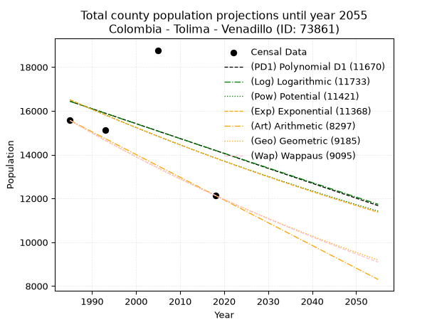
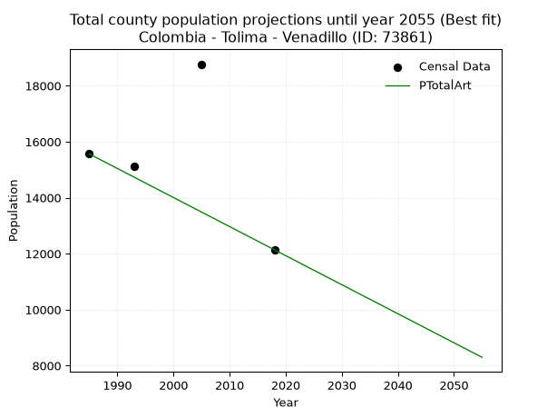
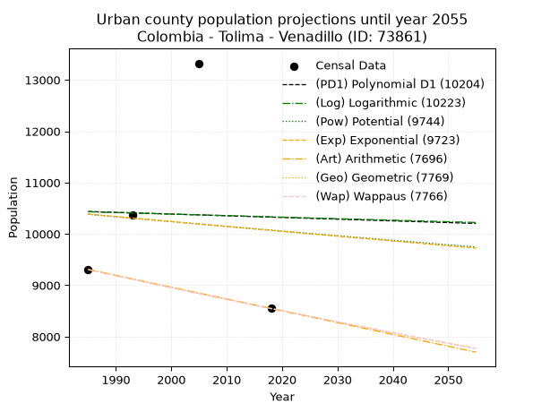
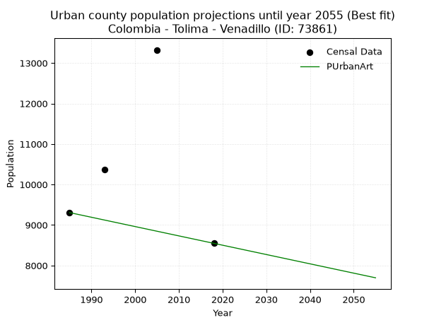
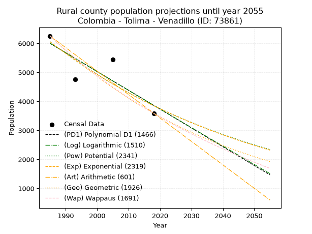
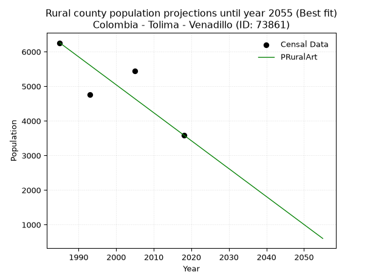

<div align="center">


</div>

# 📜 _“Population and Public Services Demand Projections (PPSD) until Year 2050 for Colombia - Tolima - Venadillo (ID: 73861)”_
Keywords: `population` `public-service` `projection` `lineal` `polynomial` `logarithmic` `potential` `exponential` `arithmetic` `geometric` `wappaus` `dane` `colombia` `south-america`

PPSD are analytical estimates used by governments and planners to anticipate future changes in population size, age distribution, and the resulting community needs for utilities, healthcare, education, and infrastructure as sizing future water treatment facilities, electrical grids, and road networks based on spatial growth.

<div align="center">

</img>

</div>


> **General running parameters**: • app_version: _v20260806_. • Python version: _3.14.7_. • Pandas version: _3.0.5_. • NumPy version: _2.5.1_. • Creates, save and include plots into reports (create_plot): _False_. • Projection until year: _2050_. • Process polynomial degree 2 and up: _False_. • Process Wappaus: _True_. • Process Wappaus: _True_. • Set negative values to zero: _True_. • Set infinite values to zero: _True_. • Drop dataset notes: _True_. 
<div align="center">

Dynamic map: [:earth_americas:Google](http://maps.google.com/maps?q=4.7178782,-74.9293332) [:earth_americas:OSM](https://www.openstreetmap.org/#map=18/4.7178782/-74.9293332&layers=P) [:earth_americas:Bing](https://www.bing.com/maps?cp=4.7178782~-74.9293332&lvl=18) [:earth_americas:Apple](https://maps.apple.com/frame?center=4.7178782%2C-74.9293332&span=0.003%2C0.006)

</div>


<div align="center">

```geojson
{
  "type": "Feature",
  "geometry": {
    "type": "Point", 
    "coordinates": [-74.9293332, 4.7178782]
  }, 
  "properties": {
    "Name": "Colombia - Tolima - Venadillo (ID: 73861)"
  }
}
```

</div>


## 0. Census Data (4 records)

Census data are official statistics collected by a government about the people and housing in a country. They usually include counts of total population, age, sex, race, income, education, and jobs.

📅Global census file: [Population.xlsx](../data/Population.xlsx)

| Source   |   Year |   CountryID | CountryName   |   StateID | StateName   |   CountyID | CountyName   |   PTotal |   PUrban |   PRural |
|:---------|-------:|------------:|:--------------|----------:|:------------|-----------:|:-------------|---------:|---------:|---------:|
| DANE     |   1985 |          57 | Colombia      |        73 | Tolima      |      73861 | Venadillo    |    15562 |     9306 |     6256 |
| DANE     |   1993 |          57 | Colombia      |        73 | Tolima      |      73861 | Venadillo    |    15128 |    10365 |     4763 |
| DANE     |   2005 |          57 | Colombia      |        73 | Tolima      |      73861 | Venadillo    |    18769 |    13324 |     5445 |
| DANE     |   2018 |          57 | Colombia      |        73 | Tolima      |      73861 | Venadillo    |    12137 |     8547 |     3590 |

> 🔥Some records could had specific notes about the registered values or the corresponding urban or rural distribution.

📅[SUI-RUPS](https://www.datos.gov.co/Hacienda-y-Cr-dito-P-blico/Registro-nico-de-Prestadores-de-Servicios-P-blicos/4qkq-csdn/about_data) - Local public utility companies: [RUPS.csv](../data/RUPS.xlsx)

 | SERVICIO       | ESTADO    | NOMBRE                                                | NIT         | DEPARTAMENTO_DOMICILIO   | MUNICIPIO_DOMICILIO   | DIRECCION           |   TELEFONO | EMAIL               | TIPO_PRESTADOR                             | CLASIFICACION                  |
|:---------------|:----------|:------------------------------------------------------|:------------|:-------------------------|:----------------------|:--------------------|-----------:|:--------------------|:-------------------------------------------|:-------------------------------|
| ACUEDUCTO      | OPERATIVA | EMPRESA DE SERVICIOS PUBLICOS DE VENADILLO S.A E.S.P. | 809005892-0 | TOLIMA                   | VENADILLO             | Carrera 5 No 1 - 24 |    2840437 | sui.esp20@gmail.com | SOCIEDADES (EMPRESA DE SERVICIOS PUBLICOS) | DESDE 2501 HASTA 5000 USUARIOS |
| ALCANTARILLADO | OPERATIVA | EMPRESA DE SERVICIOS PUBLICOS DE VENADILLO S.A E.S.P. | 809005892-0 | TOLIMA                   | VENADILLO             | Carrera 5 No 1 - 24 |    2840437 | sui.esp20@gmail.com | SOCIEDADES (EMPRESA DE SERVICIOS PUBLICOS) | DESDE 2501 HASTA 5000 USUARIOS |

## 1. Total

### 1.1. Coefficients and Parameters

* (PD1) Polynomial Deg 1: -68.10758731432773, 151631.20152548404 (lineal)
* (Log) Logarithmic: -135678.48678254944, 1046692.2652933159
* (Pow) Potential: -10.619810561473143, 39.23914989300738
* (Exp) Exponential: -0.005326511111432682, 644877075.8131324
* (Art) Arithmetic: Year diff. 2018 - 1985 = 33, Population diff. 12137 - 15562 = -3425, Annual growth = -103.78787878787878
* (Geo) Geometric: Year diff. 2018 - 1985 = 33, Population diff. 12137 - 15562 = -3425, Annual growth % = -0.007504229099187021
* (Wap) Wappaus: i = -0.7493980200576107, Condition values only valid for < 200)

<sub>
Wappaus condition values: ['-0.00', '-0.75', '-1.50', '-2.25', '-3.00', '-3.75', '-4.50', '-5.25', '-6.00', '-6.74', '-7.49', '-8.24', '-8.99', '-9.74', '-10.49', '-11.24', '-11.99', '-12.74', '-13.49', '-14.24', '-14.99', '-15.74', '-16.49', '-17.24', '-17.99', '-18.73', '-19.48', '-20.23', '-20.98', '-21.73', '-22.48', '-23.23', '-23.98', '-24.73', '-25.48', '-26.23', '-26.98', '-27.73', '-28.48', '-29.23', '-29.98', '-30.73', '-31.47', '-32.22', '-32.97', '-33.72', '-34.47', '-35.22', '-35.97', '-36.72', '-37.47', '-38.22', '-38.97', '-39.72', '-40.47', '-41.22', '-41.97', '-42.72', '-43.47', '-44.21', '-44.96', '-45.71', '-46.46', '-47.21', '-47.96', '-48.71']
</sub>


### 1.2. Projected Dataset

|   Year |   CountyID |   PTotalPD1 |   PTotalLog |   PTotalPow |   PTotalExp |   PTotalArt |   PTotalGeo |   PTotalWap |
|-------:|-----------:|------------:|------------:|------------:|------------:|------------:|------------:|------------:|
|   1985 |      73861 |       16438 |       16435 |       16503 |       16505 |       15562 |       15562 |       15562 |
|   1986 |      73861 |       16370 |       16366 |       16415 |       16418 |       15458 |       15445 |       15446 |
|   1987 |      73861 |       16301 |       16298 |       16327 |       16331 |       15354 |       15329 |       15330 |
|   1988 |      73861 |       16233 |       16230 |       16240 |       16244 |       15251 |       15214 |       15216 |
|   1989 |      73861 |       16165 |       16162 |       16154 |       16158 |       15147 |       15100 |       15102 |
|   1990 |      73861 |       16097 |       16093 |       16068 |       16072 |       15043 |       14987 |       14990 |
|   1991 |      73861 |       16029 |       16025 |       15982 |       15986 |       14939 |       14874 |       14878 |
|   1992 |      73861 |       15961 |       15957 |       15897 |       15901 |       14835 |       14763 |       14767 |
|   1993 |      73861 |       15893 |       15889 |       15813 |       15817 |       14732 |       14652 |       14656 |
|   1994 |      73861 |       15825 |       15821 |       15729 |       15733 |       14628 |       14542 |       14547 |
|   1995 |      73861 |       15757 |       15753 |       15645 |       15649 |       14524 |       14433 |       14438 |
|   1996 |      73861 |       15688 |       15685 |       15562 |       15566 |       14420 |       14325 |       14330 |
|   1997 |      73861 |       15620 |       15617 |       15480 |       15483 |       14317 |       14217 |       14223 |
|   1998 |      73861 |       15552 |       15549 |       15398 |       15401 |       14213 |       14110 |       14116 |
|   1999 |      73861 |       15484 |       15481 |       15316 |       15319 |       14109 |       14004 |       14011 |
|   2000 |      73861 |       15416 |       15413 |       15235 |       15238 |       14005 |       13899 |       13906 |
|   2001 |      73861 |       15348 |       15345 |       15154 |       15157 |       13901 |       13795 |       13802 |
|   2002 |      73861 |       15280 |       15278 |       15074 |       15077 |       13798 |       13692 |       13698 |
|   2003 |      73861 |       15212 |       15210 |       14994 |       14996 |       13694 |       13589 |       13595 |
|   2004 |      73861 |       15144 |       15142 |       14915 |       14917 |       13590 |       13487 |       13493 |
|   2005 |      73861 |       15075 |       15075 |       14836 |       14838 |       13486 |       13386 |       13392 |
|   2006 |      73861 |       15007 |       15007 |       14758 |       14759 |       13382 |       13285 |       13292 |
|   2007 |      73861 |       14939 |       14939 |       14680 |       14680 |       13279 |       13185 |       13192 |
|   2008 |      73861 |       14871 |       14872 |       14602 |       14602 |       13175 |       13087 |       13093 |
|   2009 |      73861 |       14803 |       14804 |       14525 |       14525 |       13071 |       12988 |       12994 |
|   2010 |      73861 |       14735 |       14737 |       14449 |       14448 |       12967 |       12891 |       12896 |
|   2011 |      73861 |       14667 |       14669 |       14373 |       14371 |       12864 |       12794 |       12799 |
|   2012 |      73861 |       14599 |       14602 |       14297 |       14294 |       12760 |       12698 |       12703 |
|   2013 |      73861 |       14531 |       14534 |       14222 |       14219 |       12656 |       12603 |       12607 |
|   2014 |      73861 |       14463 |       14467 |       14147 |       14143 |       12552 |       12508 |       12511 |
|   2015 |      73861 |       14394 |       14400 |       14073 |       14068 |       12448 |       12414 |       12417 |
|   2016 |      73861 |       14326 |       14332 |       13999 |       13993 |       12345 |       12321 |       12323 |
|   2017 |      73861 |       14258 |       14265 |       13925 |       13919 |       12241 |       12229 |       12230 |
|   2018 |      73861 |       14190 |       14198 |       13852 |       13845 |       12137 |       12137 |       12137 |
|   2019 |      73861 |       14122 |       14130 |       13779 |       13771 |       12033 |       12046 |       12045 |
|   2020 |      73861 |       14054 |       14063 |       13707 |       13698 |       11929 |       11956 |       11953 |
|   2021 |      73861 |       13986 |       13996 |       13635 |       13625 |       11826 |       11866 |       11863 |
|   2022 |      73861 |       13918 |       13929 |       13564 |       13553 |       11722 |       11777 |       11772 |
|   2023 |      73861 |       13850 |       13862 |       13493 |       13481 |       11618 |       11688 |       11683 |
|   2024 |      73861 |       13781 |       13795 |       13422 |       13409 |       11514 |       11601 |       11594 |
|   2025 |      73861 |       13713 |       13728 |       13352 |       13338 |       11410 |       11514 |       11505 |
|   2026 |      73861 |       13645 |       13661 |       13282 |       13267 |       11307 |       11427 |       11417 |
|   2027 |      73861 |       13577 |       13594 |       13213 |       13197 |       11203 |       11341 |       11330 |
|   2028 |      73861 |       13509 |       13527 |       13144 |       13127 |       11099 |       11256 |       11243 |
|   2029 |      73861 |       13441 |       13460 |       13075 |       13057 |       10995 |       11172 |       11157 |
|   2030 |      73861 |       13373 |       13393 |       13007 |       12988 |       10892 |       11088 |       11071 |
|   2031 |      73861 |       13305 |       13326 |       12939 |       12919 |       10788 |       11005 |       10986 |
|   2032 |      73861 |       13237 |       13260 |       12871 |       12850 |       10684 |       10922 |       10902 |
|   2033 |      73861 |       13168 |       13193 |       12804 |       12782 |       10580 |       10840 |       10818 |
|   2034 |      73861 |       13100 |       13126 |       12738 |       12714 |       10476 |       10759 |       10734 |
|   2035 |      73861 |       13032 |       13059 |       12671 |       12646 |       10373 |       10678 |       10651 |
|   2036 |      73861 |       12964 |       12993 |       12605 |       12579 |       10269 |       10598 |       10569 |
|   2037 |      73861 |       12896 |       12926 |       12540 |       12512 |       10165 |       10519 |       10487 |
|   2038 |      73861 |       12828 |       12860 |       12475 |       12446 |       10061 |       10440 |       10405 |
|   2039 |      73861 |       12760 |       12793 |       12410 |       12380 |        9957 |       10361 |       10324 |
|   2040 |      73861 |       12692 |       12727 |       12345 |       12314 |        9854 |       10284 |       10244 |
|   2041 |      73861 |       12624 |       12660 |       12281 |       12249 |        9750 |       10206 |       10164 |
|   2042 |      73861 |       12556 |       12594 |       12218 |       12183 |        9646 |       10130 |       10084 |
|   2043 |      73861 |       12487 |       12527 |       12154 |       12119 |        9542 |       10054 |       10006 |
|   2044 |      73861 |       12419 |       12461 |       12091 |       12054 |        9439 |        9978 |        9927 |
|   2045 |      73861 |       12351 |       12394 |       12029 |       11990 |        9335 |        9903 |        9849 |
|   2046 |      73861 |       12283 |       12328 |       11966 |       11927 |        9231 |        9829 |        9772 |
|   2047 |      73861 |       12215 |       12262 |       11904 |       11863 |        9127 |        9755 |        9695 |
|   2048 |      73861 |       12147 |       12195 |       11843 |       11800 |        9023 |        9682 |        9618 |
|   2049 |      73861 |       12079 |       12129 |       11782 |       11738 |        8920 |        9609 |        9542 |
|   2050 |      73861 |       12011 |       12063 |       11721 |       11675 |        8816 |        9537 |        9466 |
<div align="center">

</img>

</div>


### 1.3. Best fit with absolute and relative error (%)

Relative error puts that difference into context by dividing the absolute error by the true value, creating a unitless ratio or percentage that shows the scale of the mistake.

Absolute and relative error

|   Year | Source   |   CountryID | CountryName   |   StateID | StateName   |   CountyID_x | CountyName   |   PTotal |   PUrban |   PRural |   CountyID_y |   PTotalPD1 |   PTotalLog |   PTotalPow |   PTotalExp |   PTotalArt |   PTotalGeo |   PTotalWap |   PTotalPD1AbsError |   PTotalLogAbsError |   PTotalPowAbsError |   PTotalExpAbsError |   PTotalArtAbsError |   PTotalGeoAbsError |   PTotalWapAbsError |   PTotalPD1RelError |   PTotalLogRelError |   PTotalPowRelError |   PTotalExpRelError |   PTotalArtRelError |   PTotalGeoRelError |   PTotalWapRelError |
|-------:|:---------|------------:|:--------------|----------:|:------------|-------------:|:-------------|---------:|---------:|---------:|-------------:|------------:|------------:|------------:|------------:|------------:|------------:|------------:|--------------------:|--------------------:|--------------------:|--------------------:|--------------------:|--------------------:|--------------------:|--------------------:|--------------------:|--------------------:|--------------------:|--------------------:|--------------------:|--------------------:|
|   1985 | DANE     |          57 | Colombia      |        73 | Tolima      |        73861 | Venadillo    |    15562 |     9306 |     6256 |        73861 |       16438 |       16435 |       16503 |       16505 |       15562 |       15562 |       15562 |                 876 |                 873 |                 941 |                 943 |                   0 |                   0 |                   0 |             5.6291  |             5.60982 |             6.04678 |             6.05963 |             0       |             0       |             0       |
|   1993 | DANE     |          57 | Colombia      |        73 | Tolima      |        73861 | Venadillo    |    15128 |    10365 |     4763 |        73861 |       15893 |       15889 |       15813 |       15817 |       14732 |       14652 |       14656 |                 765 |                 761 |                 685 |                 689 |                 396 |                 476 |                 472 |             5.05685 |             5.03041 |             4.52803 |             4.55447 |             2.61766 |             3.14648 |             3.12004 |
|   2005 | DANE     |          57 | Colombia      |        73 | Tolima      |        73861 | Venadillo    |    18769 |    13324 |     5445 |        73861 |       15075 |       15075 |       14836 |       14838 |       13486 |       13386 |       13392 |                3694 |                3694 |                3933 |                3931 |                5283 |                5383 |                5377 |            19.6814  |            19.6814  |            20.9548  |            20.9441  |            28.1475  |            28.6803  |            28.6483  |
|   2018 | DANE     |          57 | Colombia      |        73 | Tolima      |        73861 | Venadillo    |    12137 |     8547 |     3590 |        73861 |       14190 |       14198 |       13852 |       13845 |       12137 |       12137 |       12137 |                2053 |                2061 |                1715 |                1708 |                   0 |                   0 |                   0 |            16.9152  |            16.9811  |            14.1303  |            14.0727  |             0       |             0       |             0       |

Relative error mean

| Method    |   RelError | Best   |
|:----------|-----------:|:-------|
| PTotalPD1 |   11.8206  |        |
| PTotalLog |   11.8257  |        |
| PTotalPow |   11.415   |        |
| PTotalExp |   11.4077  |        |
| PTotalArt |    7.69128 | True   |
| PTotalGeo |    7.95669 |        |
| PTotalWap |    7.94209 |        |

💙Best method: _**PTotalArt**_
<div align="center">

</img>

</div>


### 1.4. Fresh water supply demand in liters per capita per day (lpcd)

The fresh water supply demand typically ranges from 100 to 300 liters per capita per day (lpcd) for standard domestic and municipal planning, though absolute survival minimums set by the World Health Organization are as low as 7.5 to 20 liters per day, and total consumption in high-income nations can exceed 400 liters.

> `CZ`: Level in meters above the sea level (masl)<br> `WS`: Fresh water supply demand in liters per capita per day (lpcd or l/h/d)<br> `WSAll`: Zonal fresh water supply demand in liters per second (l/s)<br> `A`: Zonal area in square meters<br> `DP`: Population density (people/hectare or p/ha)

Reference values (RAS Colombia)

|    CZ |   WS |
|------:|-----:|
|  1000 |  120 |
|  2000 |  130 |
| 99999 |  140 |

County shapefile geometry properties and water supply values

|   CountyID |      ATotal |   CZTotal |   WSTotal |
|-----------:|------------:|----------:|----------:|
|      73861 | 3.34399e+08 |   570.691 |       120 |

Projected values for best method: PTotalArt

|   CountyID |   Year |   PTotalArt |   DPTotal |   WSTotal |   WSTotalAll |
|-----------:|-------:|------------:|----------:|----------:|-------------:|
|      73861 |   1985 |       15562 |      0.47 |       120 |      21.6139 |
|      73861 |   1986 |       15458 |      0.46 |       120 |      21.4694 |
|      73861 |   1987 |       15354 |      0.46 |       120 |      21.325  |
|      73861 |   1988 |       15251 |      0.46 |       120 |      21.1819 |
|      73861 |   1989 |       15147 |      0.45 |       120 |      21.0375 |
|      73861 |   1990 |       15043 |      0.45 |       120 |      20.8931 |
|      73861 |   1991 |       14939 |      0.45 |       120 |      20.7486 |
|      73861 |   1992 |       14835 |      0.44 |       120 |      20.6042 |
|      73861 |   1993 |       14732 |      0.44 |       120 |      20.4611 |
|      73861 |   1994 |       14628 |      0.44 |       120 |      20.3167 |
|      73861 |   1995 |       14524 |      0.43 |       120 |      20.1722 |
|      73861 |   1996 |       14420 |      0.43 |       120 |      20.0278 |
|      73861 |   1997 |       14317 |      0.43 |       120 |      19.8847 |
|      73861 |   1998 |       14213 |      0.43 |       120 |      19.7403 |
|      73861 |   1999 |       14109 |      0.42 |       120 |      19.5958 |
|      73861 |   2000 |       14005 |      0.42 |       120 |      19.4514 |
|      73861 |   2001 |       13901 |      0.42 |       120 |      19.3069 |
|      73861 |   2002 |       13798 |      0.41 |       120 |      19.1639 |
|      73861 |   2003 |       13694 |      0.41 |       120 |      19.0194 |
|      73861 |   2004 |       13590 |      0.41 |       120 |      18.875  |
|      73861 |   2005 |       13486 |      0.4  |       120 |      18.7306 |
|      73861 |   2006 |       13382 |      0.4  |       120 |      18.5861 |
|      73861 |   2007 |       13279 |      0.4  |       120 |      18.4431 |
|      73861 |   2008 |       13175 |      0.39 |       120 |      18.2986 |
|      73861 |   2009 |       13071 |      0.39 |       120 |      18.1542 |
|      73861 |   2010 |       12967 |      0.39 |       120 |      18.0097 |
|      73861 |   2011 |       12864 |      0.38 |       120 |      17.8667 |
|      73861 |   2012 |       12760 |      0.38 |       120 |      17.7222 |
|      73861 |   2013 |       12656 |      0.38 |       120 |      17.5778 |
|      73861 |   2014 |       12552 |      0.38 |       120 |      17.4333 |
|      73861 |   2015 |       12448 |      0.37 |       120 |      17.2889 |
|      73861 |   2016 |       12345 |      0.37 |       120 |      17.1458 |
|      73861 |   2017 |       12241 |      0.37 |       120 |      17.0014 |
|      73861 |   2018 |       12137 |      0.36 |       120 |      16.8569 |
|      73861 |   2019 |       12033 |      0.36 |       120 |      16.7125 |
|      73861 |   2020 |       11929 |      0.36 |       120 |      16.5681 |
|      73861 |   2021 |       11826 |      0.35 |       120 |      16.425  |
|      73861 |   2022 |       11722 |      0.35 |       120 |      16.2806 |
|      73861 |   2023 |       11618 |      0.35 |       120 |      16.1361 |
|      73861 |   2024 |       11514 |      0.34 |       120 |      15.9917 |
|      73861 |   2025 |       11410 |      0.34 |       120 |      15.8472 |
|      73861 |   2026 |       11307 |      0.34 |       120 |      15.7042 |
|      73861 |   2027 |       11203 |      0.34 |       120 |      15.5597 |
|      73861 |   2028 |       11099 |      0.33 |       120 |      15.4153 |
|      73861 |   2029 |       10995 |      0.33 |       120 |      15.2708 |
|      73861 |   2030 |       10892 |      0.33 |       120 |      15.1278 |
|      73861 |   2031 |       10788 |      0.32 |       120 |      14.9833 |
|      73861 |   2032 |       10684 |      0.32 |       120 |      14.8389 |
|      73861 |   2033 |       10580 |      0.32 |       120 |      14.6944 |
|      73861 |   2034 |       10476 |      0.31 |       120 |      14.55   |
|      73861 |   2035 |       10373 |      0.31 |       120 |      14.4069 |
|      73861 |   2036 |       10269 |      0.31 |       120 |      14.2625 |
|      73861 |   2037 |       10165 |      0.3  |       120 |      14.1181 |
|      73861 |   2038 |       10061 |      0.3  |       120 |      13.9736 |
|      73861 |   2039 |        9957 |      0.3  |       120 |      13.8292 |
|      73861 |   2040 |        9854 |      0.29 |       120 |      13.6861 |
|      73861 |   2041 |        9750 |      0.29 |       120 |      13.5417 |
|      73861 |   2042 |        9646 |      0.29 |       120 |      13.3972 |
|      73861 |   2043 |        9542 |      0.29 |       120 |      13.2528 |
|      73861 |   2044 |        9439 |      0.28 |       120 |      13.1097 |
|      73861 |   2045 |        9335 |      0.28 |       120 |      12.9653 |
|      73861 |   2046 |        9231 |      0.28 |       120 |      12.8208 |
|      73861 |   2047 |        9127 |      0.27 |       120 |      12.6764 |
|      73861 |   2048 |        9023 |      0.27 |       120 |      12.5319 |
|      73861 |   2049 |        8920 |      0.27 |       120 |      12.3889 |
|      73861 |   2050 |        8816 |      0.26 |       120 |      12.2444 |

## 2. Urban

### 2.1. Coefficients and Parameters

* (PD1) Polynomial Deg 1: -3.3151344841401147, 17016.597751901263 (lineal)
* (Log) Logarithmic: -6026.730743473084, 56194.728676328115
* (Pow) Potential: -1.8290138594432082, 10.047908627897725
* (Exp) Exponential: -0.0009421325837659901, 67394.3402361074
* (Art) Arithmetic: Year diff. 2018 - 1985 = 33, Population diff. 8547 - 9306 = -759, Annual growth = -23.0
* (Geo) Geometric: Year diff. 2018 - 1985 = 33, Population diff. 8547 - 9306 = -759, Annual growth % = -0.002574831216034301
* (Wap) Wappaus: i = -0.25765977706827986, Condition values only valid for < 200)

<sub>
Wappaus condition values: ['-0.00', '-0.26', '-0.52', '-0.77', '-1.03', '-1.29', '-1.55', '-1.80', '-2.06', '-2.32', '-2.58', '-2.83', '-3.09', '-3.35', '-3.61', '-3.86', '-4.12', '-4.38', '-4.64', '-4.90', '-5.15', '-5.41', '-5.67', '-5.93', '-6.18', '-6.44', '-6.70', '-6.96', '-7.21', '-7.47', '-7.73', '-7.99', '-8.25', '-8.50', '-8.76', '-9.02', '-9.28', '-9.53', '-9.79', '-10.05', '-10.31', '-10.56', '-10.82', '-11.08', '-11.34', '-11.59', '-11.85', '-12.11', '-12.37', '-12.63', '-12.88', '-13.14', '-13.40', '-13.66', '-13.91', '-14.17', '-14.43', '-14.69', '-14.94', '-15.20', '-15.46', '-15.72', '-15.97', '-16.23', '-16.49', '-16.75']
</sub>


### 2.2. Projected Dataset

|   Year |   CountyID |   PUrbanPD1 |   PUrbanLog |   PUrbanPow |   PUrbanExp |   PUrbanArt |   PUrbanGeo |   PUrbanWap |
|-------:|-----------:|------------:|------------:|------------:|------------:|------------:|------------:|------------:|
|   1985 |      73861 |       10436 |       10432 |       10381 |       10386 |        9306 |        9306 |        9306 |
|   1986 |      73861 |       10433 |       10428 |       10372 |       10376 |        9283 |        9282 |        9282 |
|   1987 |      73861 |       10429 |       10425 |       10362 |       10366 |        9260 |        9258 |        9258 |
|   1988 |      73861 |       10426 |       10422 |       10353 |       10356 |        9237 |        9234 |        9234 |
|   1989 |      73861 |       10423 |       10419 |       10343 |       10347 |        9214 |        9211 |        9211 |
|   1990 |      73861 |       10419 |       10416 |       10334 |       10337 |        9191 |        9187 |        9187 |
|   1991 |      73861 |       10416 |       10413 |       10324 |       10327 |        9168 |        9163 |        9163 |
|   1992 |      73861 |       10413 |       10410 |       10315 |       10317 |        9145 |        9140 |        9140 |
|   1993 |      73861 |       10410 |       10407 |       10305 |       10308 |        9122 |        9116 |        9116 |
|   1994 |      73861 |       10406 |       10404 |       10296 |       10298 |        9099 |        9093 |        9093 |
|   1995 |      73861 |       10403 |       10401 |       10286 |       10288 |        9076 |        9069 |        9069 |
|   1996 |      73861 |       10400 |       10398 |       10277 |       10279 |        9053 |        9046 |        9046 |
|   1997 |      73861 |       10396 |       10395 |       10268 |       10269 |        9030 |        9023 |        9023 |
|   1998 |      73861 |       10393 |       10392 |       10258 |       10259 |        9007 |        8999 |        8999 |
|   1999 |      73861 |       10390 |       10389 |       10249 |       10250 |        8984 |        8976 |        8976 |
|   2000 |      73861 |       10386 |       10386 |       10240 |       10240 |        8961 |        8953 |        8953 |
|   2001 |      73861 |       10383 |       10383 |       10230 |       10230 |        8938 |        8930 |        8930 |
|   2002 |      73861 |       10380 |       10380 |       10221 |       10221 |        8915 |        8907 |        8907 |
|   2003 |      73861 |       10376 |       10377 |       10211 |       10211 |        8892 |        8884 |        8884 |
|   2004 |      73861 |       10373 |       10374 |       10202 |       10201 |        8869 |        8861 |        8861 |
|   2005 |      73861 |       10370 |       10371 |       10193 |       10192 |        8846 |        8838 |        8838 |
|   2006 |      73861 |       10366 |       10368 |       10184 |       10182 |        8823 |        8816 |        8816 |
|   2007 |      73861 |       10363 |       10365 |       10174 |       10173 |        8800 |        8793 |        8793 |
|   2008 |      73861 |       10360 |       10362 |       10165 |       10163 |        8777 |        8770 |        8770 |
|   2009 |      73861 |       10356 |       10359 |       10156 |       10153 |        8754 |        8748 |        8748 |
|   2010 |      73861 |       10353 |       10356 |       10147 |       10144 |        8731 |        8725 |        8725 |
|   2011 |      73861 |       10350 |       10353 |       10137 |       10134 |        8708 |        8703 |        8703 |
|   2012 |      73861 |       10347 |       10350 |       10128 |       10125 |        8685 |        8680 |        8680 |
|   2013 |      73861 |       10343 |       10347 |       10119 |       10115 |        8662 |        8658 |        8658 |
|   2014 |      73861 |       10340 |       10344 |       10110 |       10106 |        8639 |        8636 |        8636 |
|   2015 |      73861 |       10337 |       10341 |       10101 |       10096 |        8616 |        8613 |        8613 |
|   2016 |      73861 |       10333 |       10338 |       10091 |       10087 |        8593 |        8591 |        8591 |
|   2017 |      73861 |       10330 |       10335 |       10082 |       10077 |        8570 |        8569 |        8569 |
|   2018 |      73861 |       10327 |       10332 |       10073 |       10068 |        8547 |        8547 |        8547 |
|   2019 |      73861 |       10323 |       10329 |       10064 |       10058 |        8524 |        8525 |        8525 |
|   2020 |      73861 |       10320 |       10326 |       10055 |       10049 |        8501 |        8503 |        8503 |
|   2021 |      73861 |       10317 |       10323 |       10046 |       10039 |        8478 |        8481 |        8481 |
|   2022 |      73861 |       10313 |       10320 |       10037 |       10030 |        8455 |        8459 |        8459 |
|   2023 |      73861 |       10310 |       10317 |       10028 |       10020 |        8432 |        8438 |        8437 |
|   2024 |      73861 |       10307 |       10314 |       10019 |       10011 |        8409 |        8416 |        8416 |
|   2025 |      73861 |       10303 |       10311 |       10009 |       10002 |        8386 |        8394 |        8394 |
|   2026 |      73861 |       10300 |       10308 |       10000 |        9992 |        8363 |        8373 |        8372 |
|   2027 |      73861 |       10297 |       10305 |        9991 |        9983 |        8340 |        8351 |        8351 |
|   2028 |      73861 |       10294 |       10302 |        9982 |        9973 |        8317 |        8329 |        8329 |
|   2029 |      73861 |       10290 |       10299 |        9973 |        9964 |        8294 |        8308 |        8308 |
|   2030 |      73861 |       10287 |       10296 |        9964 |        9955 |        8271 |        8287 |        8286 |
|   2031 |      73861 |       10284 |       10293 |        9955 |        9945 |        8248 |        8265 |        8265 |
|   2032 |      73861 |       10280 |       10290 |        9947 |        9936 |        8225 |        8244 |        8243 |
|   2033 |      73861 |       10277 |       10288 |        9938 |        9926 |        8202 |        8223 |        8222 |
|   2034 |      73861 |       10274 |       10285 |        9929 |        9917 |        8179 |        8202 |        8201 |
|   2035 |      73861 |       10270 |       10282 |        9920 |        9908 |        8156 |        8180 |        8180 |
|   2036 |      73861 |       10267 |       10279 |        9911 |        9898 |        8133 |        8159 |        8159 |
|   2037 |      73861 |       10264 |       10276 |        9902 |        9889 |        8110 |        8138 |        8137 |
|   2038 |      73861 |       10260 |       10273 |        9893 |        9880 |        8087 |        8117 |        8116 |
|   2039 |      73861 |       10257 |       10270 |        9884 |        9871 |        8064 |        8097 |        8095 |
|   2040 |      73861 |       10254 |       10267 |        9875 |        9861 |        8041 |        8076 |        8074 |
|   2041 |      73861 |       10250 |       10264 |        9866 |        9852 |        8018 |        8055 |        8054 |
|   2042 |      73861 |       10247 |       10261 |        9858 |        9843 |        7995 |        8034 |        8033 |
|   2043 |      73861 |       10244 |       10258 |        9849 |        9833 |        7972 |        8013 |        8012 |
|   2044 |      73861 |       10240 |       10255 |        9840 |        9824 |        7949 |        7993 |        7991 |
|   2045 |      73861 |       10237 |       10252 |        9831 |        9815 |        7926 |        7972 |        7971 |
|   2046 |      73861 |       10234 |       10249 |        9822 |        9806 |        7903 |        7952 |        7950 |
|   2047 |      73861 |       10231 |       10246 |        9814 |        9796 |        7880 |        7931 |        7929 |
|   2048 |      73861 |       10227 |       10243 |        9805 |        9787 |        7857 |        7911 |        7909 |
|   2049 |      73861 |       10224 |       10240 |        9796 |        9778 |        7834 |        7890 |        7888 |
|   2050 |      73861 |       10221 |       10237 |        9787 |        9769 |        7811 |        7870 |        7868 |
<div align="center">

</img>

</div>


### 2.3. Best fit with absolute and relative error (%)

Relative error puts that difference into context by dividing the absolute error by the true value, creating a unitless ratio or percentage that shows the scale of the mistake.

Absolute and relative error

|   Year | Source   |   CountryID | CountryName   |   StateID | StateName   |   CountyID_x | CountyName   |   PTotal |   PUrban |   PRural |   CountyID_y |   PUrbanPD1 |   PUrbanLog |   PUrbanPow |   PUrbanExp |   PUrbanArt |   PUrbanGeo |   PUrbanWap |   PUrbanPD1AbsError |   PUrbanLogAbsError |   PUrbanPowAbsError |   PUrbanExpAbsError |   PUrbanArtAbsError |   PUrbanGeoAbsError |   PUrbanWapAbsError |   PUrbanPD1RelError |   PUrbanLogRelError |   PUrbanPowRelError |   PUrbanExpRelError |   PUrbanArtRelError |   PUrbanGeoRelError |   PUrbanWapRelError |
|-------:|:---------|------------:|:--------------|----------:|:------------|-------------:|:-------------|---------:|---------:|---------:|-------------:|------------:|------------:|------------:|------------:|------------:|------------:|------------:|--------------------:|--------------------:|--------------------:|--------------------:|--------------------:|--------------------:|--------------------:|--------------------:|--------------------:|--------------------:|--------------------:|--------------------:|--------------------:|--------------------:|
|   1985 | DANE     |          57 | Colombia      |        73 | Tolima      |        73861 | Venadillo    |    15562 |     9306 |     6256 |        73861 |       10436 |       10432 |       10381 |       10386 |        9306 |        9306 |        9306 |                1130 |                1126 |                1075 |                1080 |                   0 |                   0 |                   0 |           12.1427   |            12.0997  |           11.5517   |           11.6054   |              0      |              0      |              0      |
|   1993 | DANE     |          57 | Colombia      |        73 | Tolima      |        73861 | Venadillo    |    15128 |    10365 |     4763 |        73861 |       10410 |       10407 |       10305 |       10308 |        9122 |        9116 |        9116 |                  45 |                  42 |                  60 |                  57 |                1243 |                1249 |                1249 |            0.434153 |             0.40521 |            0.578871 |            0.549928 |             11.9923 |             12.0502 |             12.0502 |
|   2005 | DANE     |          57 | Colombia      |        73 | Tolima      |        73861 | Venadillo    |    18769 |    13324 |     5445 |        73861 |       10370 |       10371 |       10193 |       10192 |        8846 |        8838 |        8838 |                2954 |                2953 |                3131 |                3132 |                4478 |                4486 |                4486 |           22.1705   |            22.163   |           23.4989   |           23.5065   |             33.6085 |             33.6686 |             33.6686 |
|   2018 | DANE     |          57 | Colombia      |        73 | Tolima      |        73861 | Venadillo    |    12137 |     8547 |     3590 |        73861 |       10327 |       10332 |       10073 |       10068 |        8547 |        8547 |        8547 |                1780 |                1785 |                1526 |                1521 |                   0 |                   0 |                   0 |           20.826    |            20.8845  |           17.8542   |           17.7957   |              0      |              0      |              0      |

Relative error mean

| Method    |   RelError | Best   |
|:----------|-----------:|:-------|
| PUrbanPD1 |    13.8933 |        |
| PUrbanLog |    13.8881 |        |
| PUrbanPow |    13.3709 |        |
| PUrbanExp |    13.3644 |        |
| PUrbanArt |    11.4002 | True   |
| PUrbanGeo |    11.4297 |        |
| PUrbanWap |    11.4297 |        |

💙Best method: _**PUrbanArt**_
<div align="center">

</img>

</div>


### 2.4. Fresh water supply demand in liters per capita per day (lpcd)

The fresh water supply demand typically ranges from 100 to 300 liters per capita per day (lpcd) for standard domestic and municipal planning, though absolute survival minimums set by the World Health Organization are as low as 7.5 to 20 liters per day, and total consumption in high-income nations can exceed 400 liters.

> `CZ`: Level in meters above the sea level (masl)<br> `WS`: Fresh water supply demand in liters per capita per day (lpcd or l/h/d)<br> `WSAll`: Zonal fresh water supply demand in liters per second (l/s)<br> `A`: Zonal area in square meters<br> `DP`: Population density (people/hectare or p/ha)

Reference values (RAS Colombia)

|    CZ |   WS |
|------:|-----:|
|  1000 |  120 |
|  2000 |  130 |
| 99999 |  140 |

County shapefile geometry properties and water supply values

|   CountyID |      AUrban |   CZUrban |   WSUrban |
|-----------:|------------:|----------:|----------:|
|      73861 | 1.46649e+06 |   338.188 |       120 |

Projected values for best method: PUrbanArt

|   CountyID |   Year |   PUrbanArt |   DPUrban |   WSUrban |   WSUrbanAll |
|-----------:|-------:|------------:|----------:|----------:|-------------:|
|      73861 |   1985 |        9306 |     63.46 |       120 |      12.925  |
|      73861 |   1986 |        9283 |     63.3  |       120 |      12.8931 |
|      73861 |   1987 |        9260 |     63.14 |       120 |      12.8611 |
|      73861 |   1988 |        9237 |     62.99 |       120 |      12.8292 |
|      73861 |   1989 |        9214 |     62.83 |       120 |      12.7972 |
|      73861 |   1990 |        9191 |     62.67 |       120 |      12.7653 |
|      73861 |   1991 |        9168 |     62.52 |       120 |      12.7333 |
|      73861 |   1992 |        9145 |     62.36 |       120 |      12.7014 |
|      73861 |   1993 |        9122 |     62.2  |       120 |      12.6694 |
|      73861 |   1994 |        9099 |     62.05 |       120 |      12.6375 |
|      73861 |   1995 |        9076 |     61.89 |       120 |      12.6056 |
|      73861 |   1996 |        9053 |     61.73 |       120 |      12.5736 |
|      73861 |   1997 |        9030 |     61.58 |       120 |      12.5417 |
|      73861 |   1998 |        9007 |     61.42 |       120 |      12.5097 |
|      73861 |   1999 |        8984 |     61.26 |       120 |      12.4778 |
|      73861 |   2000 |        8961 |     61.11 |       120 |      12.4458 |
|      73861 |   2001 |        8938 |     60.95 |       120 |      12.4139 |
|      73861 |   2002 |        8915 |     60.79 |       120 |      12.3819 |
|      73861 |   2003 |        8892 |     60.63 |       120 |      12.35   |
|      73861 |   2004 |        8869 |     60.48 |       120 |      12.3181 |
|      73861 |   2005 |        8846 |     60.32 |       120 |      12.2861 |
|      73861 |   2006 |        8823 |     60.16 |       120 |      12.2542 |
|      73861 |   2007 |        8800 |     60.01 |       120 |      12.2222 |
|      73861 |   2008 |        8777 |     59.85 |       120 |      12.1903 |
|      73861 |   2009 |        8754 |     59.69 |       120 |      12.1583 |
|      73861 |   2010 |        8731 |     59.54 |       120 |      12.1264 |
|      73861 |   2011 |        8708 |     59.38 |       120 |      12.0944 |
|      73861 |   2012 |        8685 |     59.22 |       120 |      12.0625 |
|      73861 |   2013 |        8662 |     59.07 |       120 |      12.0306 |
|      73861 |   2014 |        8639 |     58.91 |       120 |      11.9986 |
|      73861 |   2015 |        8616 |     58.75 |       120 |      11.9667 |
|      73861 |   2016 |        8593 |     58.6  |       120 |      11.9347 |
|      73861 |   2017 |        8570 |     58.44 |       120 |      11.9028 |
|      73861 |   2018 |        8547 |     58.28 |       120 |      11.8708 |
|      73861 |   2019 |        8524 |     58.13 |       120 |      11.8389 |
|      73861 |   2020 |        8501 |     57.97 |       120 |      11.8069 |
|      73861 |   2021 |        8478 |     57.81 |       120 |      11.775  |
|      73861 |   2022 |        8455 |     57.65 |       120 |      11.7431 |
|      73861 |   2023 |        8432 |     57.5  |       120 |      11.7111 |
|      73861 |   2024 |        8409 |     57.34 |       120 |      11.6792 |
|      73861 |   2025 |        8386 |     57.18 |       120 |      11.6472 |
|      73861 |   2026 |        8363 |     57.03 |       120 |      11.6153 |
|      73861 |   2027 |        8340 |     56.87 |       120 |      11.5833 |
|      73861 |   2028 |        8317 |     56.71 |       120 |      11.5514 |
|      73861 |   2029 |        8294 |     56.56 |       120 |      11.5194 |
|      73861 |   2030 |        8271 |     56.4  |       120 |      11.4875 |
|      73861 |   2031 |        8248 |     56.24 |       120 |      11.4556 |
|      73861 |   2032 |        8225 |     56.09 |       120 |      11.4236 |
|      73861 |   2033 |        8202 |     55.93 |       120 |      11.3917 |
|      73861 |   2034 |        8179 |     55.77 |       120 |      11.3597 |
|      73861 |   2035 |        8156 |     55.62 |       120 |      11.3278 |
|      73861 |   2036 |        8133 |     55.46 |       120 |      11.2958 |
|      73861 |   2037 |        8110 |     55.3  |       120 |      11.2639 |
|      73861 |   2038 |        8087 |     55.15 |       120 |      11.2319 |
|      73861 |   2039 |        8064 |     54.99 |       120 |      11.2    |
|      73861 |   2040 |        8041 |     54.83 |       120 |      11.1681 |
|      73861 |   2041 |        8018 |     54.67 |       120 |      11.1361 |
|      73861 |   2042 |        7995 |     54.52 |       120 |      11.1042 |
|      73861 |   2043 |        7972 |     54.36 |       120 |      11.0722 |
|      73861 |   2044 |        7949 |     54.2  |       120 |      11.0403 |
|      73861 |   2045 |        7926 |     54.05 |       120 |      11.0083 |
|      73861 |   2046 |        7903 |     53.89 |       120 |      10.9764 |
|      73861 |   2047 |        7880 |     53.73 |       120 |      10.9444 |
|      73861 |   2048 |        7857 |     53.58 |       120 |      10.9125 |
|      73861 |   2049 |        7834 |     53.42 |       120 |      10.8806 |
|      73861 |   2050 |        7811 |     53.26 |       120 |      10.8486 |

## 3. Rural

### 3.1. Coefficients and Parameters

* (PD1) Polynomial Deg 1: -64.7924528301875, 134614.60377358255 (lineal)
* (Log) Logarithmic: -129651.7560390765, 990497.5366169888
* (Pow) Potential: -27.4376451363058, 94.26506480170269
* (Exp) Exponential: -0.013714729579180717, 4029667618726511.0
* (Art) Arithmetic: Year diff. 2018 - 1985 = 33, Population diff. 3590 - 6256 = -2666, Annual growth = -80.78787878787878
* (Geo) Geometric: Year diff. 2018 - 1985 = 33, Population diff. 3590 - 6256 = -2666, Annual growth % = -0.01668913099684699
* (Wap) Wappaus: i = -1.6410294289636154, Condition values only valid for < 200)

<sub>
Wappaus condition values: ['-0.00', '-1.64', '-3.28', '-4.92', '-6.56', '-8.21', '-9.85', '-11.49', '-13.13', '-14.77', '-16.41', '-18.05', '-19.69', '-21.33', '-22.97', '-24.62', '-26.26', '-27.90', '-29.54', '-31.18', '-32.82', '-34.46', '-36.10', '-37.74', '-39.38', '-41.03', '-42.67', '-44.31', '-45.95', '-47.59', '-49.23', '-50.87', '-52.51', '-54.15', '-55.80', '-57.44', '-59.08', '-60.72', '-62.36', '-64.00', '-65.64', '-67.28', '-68.92', '-70.56', '-72.21', '-73.85', '-75.49', '-77.13', '-78.77', '-80.41', '-82.05', '-83.69', '-85.33', '-86.97', '-88.62', '-90.26', '-91.90', '-93.54', '-95.18', '-96.82', '-98.46', '-100.10', '-101.74', '-103.38', '-105.03', '-106.67']
</sub>


### 3.2. Projected Dataset

|   Year |   CountyID |   PRuralPD1 |   PRuralLog |   PRuralPow |   PRuralExp |   PRuralArt |   PRuralGeo |   PRuralWap |
|-------:|-----------:|------------:|------------:|------------:|------------:|------------:|------------:|------------:|
|   1985 |      73861 |        6002 |        6003 |        6057 |        6055 |        6256 |        6256 |        6256 |
|   1986 |      73861 |        5937 |        5938 |        5974 |        5973 |        6175 |        6152 |        6154 |
|   1987 |      73861 |        5872 |        5873 |        5892 |        5892 |        6094 |        6049 |        6054 |
|   1988 |      73861 |        5807 |        5807 |        5811 |        5811 |        6014 |        5948 |        5955 |
|   1989 |      73861 |        5742 |        5742 |        5732 |        5732 |        5933 |        5849 |        5858 |
|   1990 |      73861 |        5678 |        5677 |        5653 |        5654 |        5852 |        5751 |        5763 |
|   1991 |      73861 |        5613 |        5612 |        5576 |        5577 |        5771 |        5655 |        5669 |
|   1992 |      73861 |        5548 |        5547 |        5500 |        5501 |        5690 |        5561 |        5576 |
|   1993 |      73861 |        5483 |        5482 |        5424 |        5426 |        5610 |        5468 |        5485 |
|   1994 |      73861 |        5418 |        5417 |        5350 |        5352 |        5529 |        5377 |        5396 |
|   1995 |      73861 |        5354 |        5352 |        5277 |        5279 |        5448 |        5287 |        5307 |
|   1996 |      73861 |        5289 |        5287 |        5205 |        5208 |        5367 |        5199 |        5220 |
|   1997 |      73861 |        5224 |        5222 |        5134 |        5137 |        5287 |        5112 |        5134 |
|   1998 |      73861 |        5159 |        5157 |        5064 |        5067 |        5206 |        5027 |        5050 |
|   1999 |      73861 |        5094 |        5092 |        4995 |        4998 |        5125 |        4943 |        4967 |
|   2000 |      73861 |        5030 |        5027 |        4927 |        4930 |        5044 |        4860 |        4885 |
|   2001 |      73861 |        4965 |        4962 |        4860 |        4862 |        4963 |        4779 |        4804 |
|   2002 |      73861 |        4900 |        4898 |        4794 |        4796 |        4883 |        4699 |        4724 |
|   2003 |      73861 |        4835 |        4833 |        4728 |        4731 |        4802 |        4621 |        4646 |
|   2004 |      73861 |        4771 |        4768 |        4664 |        4666 |        4721 |        4544 |        4568 |
|   2005 |      73861 |        4706 |        4703 |        4601 |        4603 |        4640 |        4468 |        4492 |
|   2006 |      73861 |        4641 |        4639 |        4538 |        4540 |        4559 |        4393 |        4417 |
|   2007 |      73861 |        4576 |        4574 |        4477 |        4478 |        4479 |        4320 |        4343 |
|   2008 |      73861 |        4511 |        4510 |        4416 |        4417 |        4398 |        4248 |        4270 |
|   2009 |      73861 |        4447 |        4445 |        4356 |        4357 |        4317 |        4177 |        4197 |
|   2010 |      73861 |        4382 |        4381 |        4297 |        4298 |        4236 |        4107 |        4126 |
|   2011 |      73861 |        4317 |        4316 |        4239 |        4239 |        4156 |        4039 |        4056 |
|   2012 |      73861 |        4252 |        4252 |        4181 |        4181 |        4075 |        3971 |        3987 |
|   2013 |      73861 |        4187 |        4187 |        4125 |        4125 |        3994 |        3905 |        3918 |
|   2014 |      73861 |        4123 |        4123 |        4069 |        4068 |        3913 |        3840 |        3851 |
|   2015 |      73861 |        4058 |        4058 |        4014 |        4013 |        3832 |        3776 |        3784 |
|   2016 |      73861 |        3993 |        3994 |        3959 |        3958 |        3752 |        3713 |        3719 |
|   2017 |      73861 |        3928 |        3930 |        3906 |        3904 |        3671 |        3651 |        3654 |
|   2018 |      73861 |        3863 |        3866 |        3853 |        3851 |        3590 |        3590 |        3590 |
|   2019 |      73861 |        3799 |        3801 |        3801 |        3799 |        3509 |        3530 |        3527 |
|   2020 |      73861 |        3734 |        3737 |        3750 |        3747 |        3428 |        3471 |        3464 |
|   2021 |      73861 |        3669 |        3673 |        3699 |        3696 |        3348 |        3413 |        3403 |
|   2022 |      73861 |        3604 |        3609 |        3649 |        3646 |        3267 |        3356 |        3342 |
|   2023 |      73861 |        3539 |        3545 |        3600 |        3596 |        3186 |        3300 |        3282 |
|   2024 |      73861 |        3475 |        3481 |        3552 |        3547 |        3105 |        3245 |        3223 |
|   2025 |      73861 |        3410 |        3417 |        3504 |        3499 |        3024 |        3191 |        3164 |
|   2026 |      73861 |        3345 |        3353 |        3457 |        3451 |        2944 |        3138 |        3106 |
|   2027 |      73861 |        3280 |        3289 |        3410 |        3404 |        2863 |        3085 |        3049 |
|   2028 |      73861 |        3216 |        3225 |        3364 |        3358 |        2782 |        3034 |        2993 |
|   2029 |      73861 |        3151 |        3161 |        3319 |        3312 |        2701 |        2983 |        2937 |
|   2030 |      73861 |        3086 |        3097 |        3275 |        3267 |        2621 |        2933 |        2882 |
|   2031 |      73861 |        3021 |        3033 |        3231 |        3222 |        2540 |        2885 |        2828 |
|   2032 |      73861 |        2956 |        2969 |        3187 |        3178 |        2459 |        2836 |        2774 |
|   2033 |      73861 |        2892 |        2905 |        3145 |        3135 |        2378 |        2789 |        2721 |
|   2034 |      73861 |        2827 |        2842 |        3102 |        3092 |        2297 |        2743 |        2668 |
|   2035 |      73861 |        2762 |        2778 |        3061 |        3050 |        2217 |        2697 |        2616 |
|   2036 |      73861 |        2697 |        2714 |        3020 |        3009 |        2136 |        2652 |        2565 |
|   2037 |      73861 |        2632 |        2651 |        2979 |        2968 |        2055 |        2607 |        2514 |
|   2038 |      73861 |        2568 |        2587 |        2940 |        2927 |        1974 |        2564 |        2464 |
|   2039 |      73861 |        2503 |        2523 |        2900 |        2887 |        1893 |        2521 |        2414 |
|   2040 |      73861 |        2438 |        2460 |        2862 |        2848 |        1813 |        2479 |        2365 |
|   2041 |      73861 |        2373 |        2396 |        2823 |        2809 |        1732 |        2438 |        2317 |
|   2042 |      73861 |        2308 |        2333 |        2786 |        2771 |        1651 |        2397 |        2269 |
|   2043 |      73861 |        2244 |        2269 |        2749 |        2733 |        1570 |        2357 |        2222 |
|   2044 |      73861 |        2179 |        2206 |        2712 |        2696 |        1490 |        2318 |        2175 |
|   2045 |      73861 |        2114 |        2142 |        2676 |        2659 |        1409 |        2279 |        2128 |
|   2046 |      73861 |        2049 |        2079 |        2640 |        2623 |        1328 |        2241 |        2082 |
|   2047 |      73861 |        1984 |        2016 |        2605 |        2587 |        1247 |        2204 |        2037 |
|   2048 |      73861 |        1920 |        1952 |        2570 |        2552 |        1166 |        2167 |        1992 |
|   2049 |      73861 |        1855 |        1889 |        2536 |        2517 |        1086 |        2131 |        1948 |
|   2050 |      73861 |        1790 |        1826 |        2502 |        2483 |        1005 |        2095 |        1904 |
<div align="center">

</img>

</div>


### 3.3. Best fit with absolute and relative error (%)

Relative error puts that difference into context by dividing the absolute error by the true value, creating a unitless ratio or percentage that shows the scale of the mistake.

Absolute and relative error

|   Year | Source   |   CountryID | CountryName   |   StateID | StateName   |   CountyID_x | CountyName   |   PTotal |   PUrban |   PRural |   CountyID_y |   PRuralPD1 |   PRuralLog |   PRuralPow |   PRuralExp |   PRuralArt |   PRuralGeo |   PRuralWap |   PRuralPD1AbsError |   PRuralLogAbsError |   PRuralPowAbsError |   PRuralExpAbsError |   PRuralArtAbsError |   PRuralGeoAbsError |   PRuralWapAbsError |   PRuralPD1RelError |   PRuralLogRelError |   PRuralPowRelError |   PRuralExpRelError |   PRuralArtRelError |   PRuralGeoRelError |   PRuralWapRelError |
|-------:|:---------|------------:|:--------------|----------:|:------------|-------------:|:-------------|---------:|---------:|---------:|-------------:|------------:|------------:|------------:|------------:|------------:|------------:|------------:|--------------------:|--------------------:|--------------------:|--------------------:|--------------------:|--------------------:|--------------------:|--------------------:|--------------------:|--------------------:|--------------------:|--------------------:|--------------------:|--------------------:|
|   1985 | DANE     |          57 | Colombia      |        73 | Tolima      |        73861 | Venadillo    |    15562 |     9306 |     6256 |        73861 |        6002 |        6003 |        6057 |        6055 |        6256 |        6256 |        6256 |                 254 |                 253 |                 199 |                 201 |                   0 |                   0 |                   0 |             4.0601  |             4.04412 |             3.18095 |             3.21292 |              0      |              0      |              0      |
|   1993 | DANE     |          57 | Colombia      |        73 | Tolima      |        73861 | Venadillo    |    15128 |    10365 |     4763 |        73861 |        5483 |        5482 |        5424 |        5426 |        5610 |        5468 |        5485 |                 720 |                 719 |                 661 |                 663 |                 847 |                 705 |                 722 |            15.1165  |            15.0955  |            13.8778  |            13.9198  |             17.7829 |             14.8016 |             15.1585 |
|   2005 | DANE     |          57 | Colombia      |        73 | Tolima      |        73861 | Venadillo    |    18769 |    13324 |     5445 |        73861 |        4706 |        4703 |        4601 |        4603 |        4640 |        4468 |        4492 |                 739 |                 742 |                 844 |                 842 |                 805 |                 977 |                 953 |            13.5721  |            13.6272  |            15.5005  |            15.4637  |             14.7842 |             17.9431 |             17.5023 |
|   2018 | DANE     |          57 | Colombia      |        73 | Tolima      |        73861 | Venadillo    |    12137 |     8547 |     3590 |        73861 |        3863 |        3866 |        3853 |        3851 |        3590 |        3590 |        3590 |                 273 |                 276 |                 263 |                 261 |                   0 |                   0 |                   0 |             7.60446 |             7.68802 |             7.32591 |             7.27019 |              0      |              0      |              0      |

Relative error mean

| Method    |   RelError | Best   |
|:----------|-----------:|:-------|
| PRuralPD1 |   10.0883  |        |
| PRuralLog |   10.1137  |        |
| PRuralPow |    9.97128 |        |
| PRuralExp |    9.96666 |        |
| PRuralArt |    8.14178 | True   |
| PRuralGeo |    8.18617 |        |
| PRuralWap |    8.1652  |        |

💙Best method: _**PRuralArt**_
<div align="center">

</img>

</div>


### 3.4. Fresh water supply demand in liters per capita per day (lpcd)

The fresh water supply demand typically ranges from 100 to 300 liters per capita per day (lpcd) for standard domestic and municipal planning, though absolute survival minimums set by the World Health Organization are as low as 7.5 to 20 liters per day, and total consumption in high-income nations can exceed 400 liters.

> `CZ`: Level in meters above the sea level (masl)<br> `WS`: Fresh water supply demand in liters per capita per day (lpcd or l/h/d)<br> `WSAll`: Zonal fresh water supply demand in liters per second (l/s)<br> `A`: Zonal area in square meters<br> `DP`: Population density (people/hectare or p/ha)

Reference values (RAS Colombia)

|    CZ |   WS |
|------:|-----:|
|  1000 |  120 |
|  2000 |  130 |
| 99999 |  140 |

County shapefile geometry properties and water supply values

|   CountyID |      ARural |   CZRural |   WSRural |
|-----------:|------------:|----------:|----------:|
|      73861 | 3.32932e+08 |   571.696 |       120 |

Projected values for best method: PRuralArt

|   CountyID |   Year |   PRuralArt |   DPRural |   WSRural |   WSRuralAll |
|-----------:|-------:|------------:|----------:|----------:|-------------:|
|      73861 |   1985 |        6256 |      0.19 |       120 |      8.68889 |
|      73861 |   1986 |        6175 |      0.19 |       120 |      8.57639 |
|      73861 |   1987 |        6094 |      0.18 |       120 |      8.46389 |
|      73861 |   1988 |        6014 |      0.18 |       120 |      8.35278 |
|      73861 |   1989 |        5933 |      0.18 |       120 |      8.24028 |
|      73861 |   1990 |        5852 |      0.18 |       120 |      8.12778 |
|      73861 |   1991 |        5771 |      0.17 |       120 |      8.01528 |
|      73861 |   1992 |        5690 |      0.17 |       120 |      7.90278 |
|      73861 |   1993 |        5610 |      0.17 |       120 |      7.79167 |
|      73861 |   1994 |        5529 |      0.17 |       120 |      7.67917 |
|      73861 |   1995 |        5448 |      0.16 |       120 |      7.56667 |
|      73861 |   1996 |        5367 |      0.16 |       120 |      7.45417 |
|      73861 |   1997 |        5287 |      0.16 |       120 |      7.34306 |
|      73861 |   1998 |        5206 |      0.16 |       120 |      7.23056 |
|      73861 |   1999 |        5125 |      0.15 |       120 |      7.11806 |
|      73861 |   2000 |        5044 |      0.15 |       120 |      7.00556 |
|      73861 |   2001 |        4963 |      0.15 |       120 |      6.89306 |
|      73861 |   2002 |        4883 |      0.15 |       120 |      6.78194 |
|      73861 |   2003 |        4802 |      0.14 |       120 |      6.66944 |
|      73861 |   2004 |        4721 |      0.14 |       120 |      6.55694 |
|      73861 |   2005 |        4640 |      0.14 |       120 |      6.44444 |
|      73861 |   2006 |        4559 |      0.14 |       120 |      6.33194 |
|      73861 |   2007 |        4479 |      0.13 |       120 |      6.22083 |
|      73861 |   2008 |        4398 |      0.13 |       120 |      6.10833 |
|      73861 |   2009 |        4317 |      0.13 |       120 |      5.99583 |
|      73861 |   2010 |        4236 |      0.13 |       120 |      5.88333 |
|      73861 |   2011 |        4156 |      0.12 |       120 |      5.77222 |
|      73861 |   2012 |        4075 |      0.12 |       120 |      5.65972 |
|      73861 |   2013 |        3994 |      0.12 |       120 |      5.54722 |
|      73861 |   2014 |        3913 |      0.12 |       120 |      5.43472 |
|      73861 |   2015 |        3832 |      0.12 |       120 |      5.32222 |
|      73861 |   2016 |        3752 |      0.11 |       120 |      5.21111 |
|      73861 |   2017 |        3671 |      0.11 |       120 |      5.09861 |
|      73861 |   2018 |        3590 |      0.11 |       120 |      4.98611 |
|      73861 |   2019 |        3509 |      0.11 |       120 |      4.87361 |
|      73861 |   2020 |        3428 |      0.1  |       120 |      4.76111 |
|      73861 |   2021 |        3348 |      0.1  |       120 |      4.65    |
|      73861 |   2022 |        3267 |      0.1  |       120 |      4.5375  |
|      73861 |   2023 |        3186 |      0.1  |       120 |      4.425   |
|      73861 |   2024 |        3105 |      0.09 |       120 |      4.3125  |
|      73861 |   2025 |        3024 |      0.09 |       120 |      4.2     |
|      73861 |   2026 |        2944 |      0.09 |       120 |      4.08889 |
|      73861 |   2027 |        2863 |      0.09 |       120 |      3.97639 |
|      73861 |   2028 |        2782 |      0.08 |       120 |      3.86389 |
|      73861 |   2029 |        2701 |      0.08 |       120 |      3.75139 |
|      73861 |   2030 |        2621 |      0.08 |       120 |      3.64028 |
|      73861 |   2031 |        2540 |      0.08 |       120 |      3.52778 |
|      73861 |   2032 |        2459 |      0.07 |       120 |      3.41528 |
|      73861 |   2033 |        2378 |      0.07 |       120 |      3.30278 |
|      73861 |   2034 |        2297 |      0.07 |       120 |      3.19028 |
|      73861 |   2035 |        2217 |      0.07 |       120 |      3.07917 |
|      73861 |   2036 |        2136 |      0.06 |       120 |      2.96667 |
|      73861 |   2037 |        2055 |      0.06 |       120 |      2.85417 |
|      73861 |   2038 |        1974 |      0.06 |       120 |      2.74167 |
|      73861 |   2039 |        1893 |      0.06 |       120 |      2.62917 |
|      73861 |   2040 |        1813 |      0.05 |       120 |      2.51806 |
|      73861 |   2041 |        1732 |      0.05 |       120 |      2.40556 |
|      73861 |   2042 |        1651 |      0.05 |       120 |      2.29306 |
|      73861 |   2043 |        1570 |      0.05 |       120 |      2.18056 |
|      73861 |   2044 |        1490 |      0.04 |       120 |      2.06944 |
|      73861 |   2045 |        1409 |      0.04 |       120 |      1.95694 |
|      73861 |   2046 |        1328 |      0.04 |       120 |      1.84444 |
|      73861 |   2047 |        1247 |      0.04 |       120 |      1.73194 |
|      73861 |   2048 |        1166 |      0.04 |       120 |      1.61944 |
|      73861 |   2049 |        1086 |      0.03 |       120 |      1.50833 |
|      73861 |   2050 |        1005 |      0.03 |       120 |      1.39583 |

#

<div align="center"><br><sub>Share this research</sub></div><br>

<sub>**APPS & TOOLS & CONTENT DISCLAIMER**: • NO WARRANTY - This content and software is provided by <a href="https://github.com/rcfdtools" target="_blank">github.com/rcfdtools</a> "as is", without any express or implied warranty, including warranties of merchantability, fitness for a particular purpose, or non-infringement. There is no guarantee that the software will be error-free or operate without interruption. • LIMITATION OF LIABILITY - Neither the authors nor copyright holders will be liable for claims or damages arising from the software or its use. You are responsible for determining if the software is appropriate for your use and assume all associated risks, including errors, legal compliance, and data loss. • NO PROFESSIONAL ADVICE - The software provides general information and does not offer professional advice. It should not replace consultation with professional advisors. [Clauses and global license for rcfdtools use.](https://github.com/rcfdtools/rcfdtools/blob/main/LICENSE.md)</sub>

| [:house: Home](Readme.md)  | [:beginner: Help / Collab](https://github.com/rcfdtools/R.HydroTools/discussions/31) |
|----------------------------|-------------------------------------------------------------------------------------------|