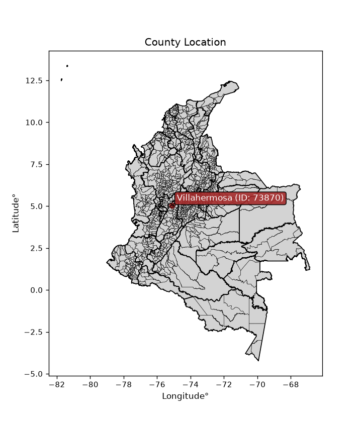
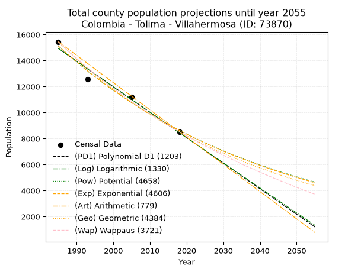
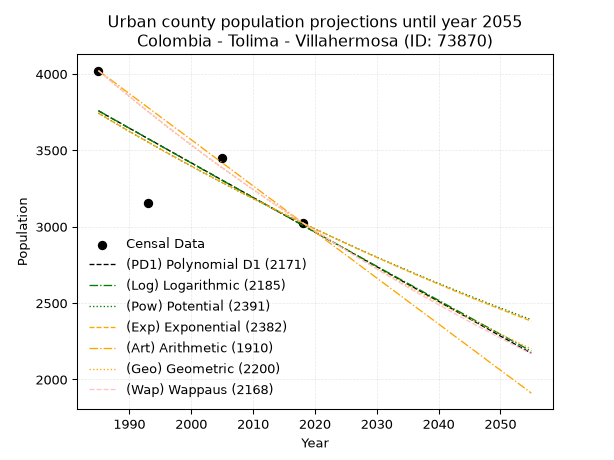
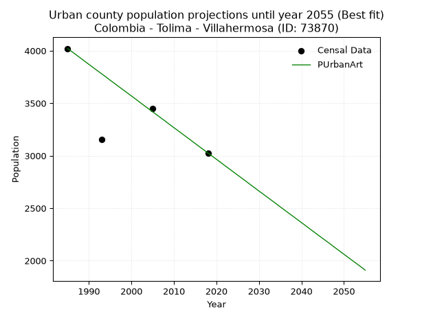
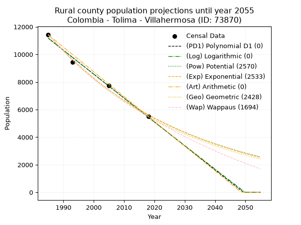
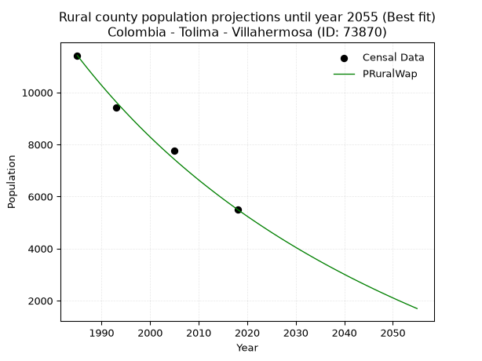

<div align="center">


</div>

# _“Population and Public Services Demand Projections (PPSD) until Year 2050 for Colombia - Tolima - Villahermosa (ID: 73870)”_
Keywords: `population` `public-service` `projection` `lineal` `polynomial` `logarithmic` `potential` `exponential` `arithmetic` `geometric` `wappaus` `dane` `colombia` `south-america`

PPSD are analytical estimates used by governments and planners to anticipate future changes in population size, age distribution, and the resulting community needs for utilities, healthcare, education, and infrastructure as sizing future water treatment facilities, electrical grids, and road networks based on spatial growth.

<div align="center">

</img>

</div>


> **General running parameters**: • app_version: _v20260806_. • Python version: _3.14.7_. • Pandas version: _3.0.5_. • NumPy version: _2.5.1_. • Creates, save and include plots into reports (create_plot): _False_. • Projection until year: _2050_. • Process polynomial degree 2 and up: _False_. • Process Wappaus: _True_. • Process Wappaus: _True_. • Set negative values to zero: _True_. • Set infinite values to zero: _True_. • Drop dataset notes: _True_. 
<div align="center">

Dynamic map: [:earth_americas:Google](http://maps.google.com/maps?q=5.030452281,-75.1177291) [:earth_americas:OSM](https://www.openstreetmap.org/#map=18/5.030452281/-75.1177291&layers=P) [:earth_americas:Bing](https://www.bing.com/maps?cp=5.030452281~-75.1177291&lvl=18) [:earth_americas:Apple](https://maps.apple.com/frame?center=5.030452281%2C-75.1177291&span=0.003%2C0.006)

</div>


<div align="center">

```geojson
{
  "type": "Feature",
  "geometry": {
    "type": "Point", 
    "coordinates": [-75.1177291, 5.030452281]
  }, 
  "properties": {
    "Name": "Colombia - Tolima - Villahermosa (ID: 73870)"
  }
}
```

</div>


## 0. Census Data (4 records)

Census data are official statistics collected by a government about the people and housing in a country. They usually include counts of total population, age, sex, race, income, education, and jobs.

📅Global census file: [Population.xlsx](../data/Population.xlsx)

| Source   |   Year |   CountryID | CountryName   |   StateID | StateName   |   CountyID | CountyName   |   PTotal |   PUrban |   PRural |
|:---------|-------:|------------:|:--------------|----------:|:------------|-----------:|:-------------|---------:|---------:|---------:|
| DANE     |   1985 |          57 | Colombia      |        73 | Tolima      |      73870 | Villahermosa |    15443 |     4021 |    11422 |
| DANE     |   1993 |          57 | Colombia      |        73 | Tolima      |      73870 | Villahermosa |    12574 |     3155 |     9419 |
| DANE     |   2005 |          57 | Colombia      |        73 | Tolima      |      73870 | Villahermosa |    11196 |     3446 |     7750 |
| DANE     |   2018 |          57 | Colombia      |        73 | Tolima      |      73870 | Villahermosa |     8530 |     3026 |     5504 |

> 🔥Some records could had specific notes about the registered values or the corresponding urban or rural distribution.

📅[SUI-RUPS](https://www.datos.gov.co/Hacienda-y-Cr-dito-P-blico/Registro-nico-de-Prestadores-de-Servicios-P-blicos/4qkq-csdn/about_data) - Local public utility companies: [RUPS.csv](../data/RUPS.xlsx)

 | SERVICIO       | ESTADO    | NOMBRE                                                             | NIT         | DEPARTAMENTO_DOMICILIO   | MUNICIPIO_DOMICILIO   | DIRECCION                                              |   TELEFONO | EMAIL                  | TIPO_PRESTADOR                             | CLASIFICACION           |
|:---------------|:----------|:-------------------------------------------------------------------|:------------|:-------------------------|:----------------------|:-------------------------------------------------------|-----------:|:-----------------------|:-------------------------------------------|:------------------------|
| ACUEDUCTO      | OPERATIVA | OFICINA DE SERVICIOS PUBLICOS DEL MUNICIPIO DE VILLAHERMOSA TOLIMA | 800100145-0 | TOLIMA                   | VILLAHERMOSA          | CALLE 8 4-42                                           |    2533082 | wijaceballos@yahoo.es  | MUNICIPIO (PRESTACIÓN DIRECTA)             | HASTA 2500 SUSCRIPTORES |
| ALCANTARILLADO | OPERATIVA | OFICINA DE SERVICIOS PUBLICOS DEL MUNICIPIO DE VILLAHERMOSA TOLIMA | 800100145-0 | TOLIMA                   | VILLAHERMOSA          | CALLE 8 4-42                                           |    2533082 | wijaceballos@yahoo.es  | MUNICIPIO (PRESTACIÓN DIRECTA)             | HASTA 2500 SUSCRIPTORES |
| ACUEDUCTO      | OPERATIVA | AGUAS DE VILLAHERMOSA S.A.S. E.S.P.                                | 900319788-0 | TOLIMA                   | VILLAHERMOSA          | carrera 4 calle 8 esquina edificio comite de cafeteros |    2266035 | geysoncortes@gmail.com | SOCIEDADES (EMPRESA DE SERVICIOS PUBLICOS) | HASTA 2500 SUSCRIPTORES |
| ALCANTARILLADO | OPERATIVA | AGUAS DE VILLAHERMOSA S.A.S. E.S.P.                                | 900319788-0 | TOLIMA                   | VILLAHERMOSA          | carrera 4 calle 8 esquina edificio comite de cafeteros |    2266035 | geysoncortes@gmail.com | SOCIEDADES (EMPRESA DE SERVICIOS PUBLICOS) | HASTA 2500 SUSCRIPTORES |

## 1. Total

### 1.1. Coefficients and Parameters

* (PD1) Polynomial Deg 1: -196.03171417101376, 404048.1862705703 (lineal)
* (Log) Logarithmic: -392467.3470479218, 2995083.199947193
* (Pow) Potential: -33.984099439700294, 116.25114377028473
* (Exp) Exponential: -0.01697847867578959, 6.549631664752865e+18
* (Art) Arithmetic: Year diff. 2018 - 1985 = 33, Population diff. 8530 - 15443 = -6913, Annual growth = -209.4848484848485
* (Geo) Geometric: Year diff. 2018 - 1985 = 33, Population diff. 8530 - 15443 = -6913, Annual growth % = -0.01782606448296653
* (Wap) Wappaus: i = -1.7476732030605138, Condition values only valid for < 200)

<sub>
Wappaus condition values: ['-0.00', '-1.75', '-3.50', '-5.24', '-6.99', '-8.74', '-10.49', '-12.23', '-13.98', '-15.73', '-17.48', '-19.22', '-20.97', '-22.72', '-24.47', '-26.22', '-27.96', '-29.71', '-31.46', '-33.21', '-34.95', '-36.70', '-38.45', '-40.20', '-41.94', '-43.69', '-45.44', '-47.19', '-48.93', '-50.68', '-52.43', '-54.18', '-55.93', '-57.67', '-59.42', '-61.17', '-62.92', '-64.66', '-66.41', '-68.16', '-69.91', '-71.65', '-73.40', '-75.15', '-76.90', '-78.65', '-80.39', '-82.14', '-83.89', '-85.64', '-87.38', '-89.13', '-90.88', '-92.63', '-94.37', '-96.12', '-97.87', '-99.62', '-101.37', '-103.11', '-104.86', '-106.61', '-108.36', '-110.10', '-111.85', '-113.60']
</sub>


### 1.2. Projected Dataset

|   Year |   CountyID |   PTotalPD1 |   PTotalLog |   PTotalPow |   PTotalExp |   PTotalArt |   PTotalGeo |   PTotalWap |
|-------:|-----------:|------------:|------------:|------------:|------------:|------------:|------------:|------------:|
|   1985 |      73870 |       14925 |       14932 |       15126 |       15118 |       15443 |       15443 |       15443 |
|   1986 |      73870 |       14729 |       14734 |       14869 |       14864 |       15234 |       15168 |       15175 |
|   1987 |      73870 |       14533 |       14537 |       14617 |       14614 |       15024 |       14897 |       14912 |
|   1988 |      73870 |       14337 |       14339 |       14369 |       14368 |       14815 |       14632 |       14654 |
|   1989 |      73870 |       14141 |       14142 |       14126 |       14126 |       14605 |       14371 |       14400 |
|   1990 |      73870 |       13945 |       13944 |       13886 |       13888 |       14396 |       14115 |       14150 |
|   1991 |      73870 |       13749 |       13747 |       13651 |       13654 |       14186 |       13863 |       13904 |
|   1992 |      73870 |       13553 |       13550 |       13420 |       13424 |       13977 |       13616 |       13663 |
|   1993 |      73870 |       13357 |       13353 |       13193 |       13198 |       13767 |       13373 |       13425 |
|   1994 |      73870 |       13161 |       13156 |       12970 |       12976 |       13558 |       13135 |       13191 |
|   1995 |      73870 |       12965 |       12960 |       12751 |       12758 |       13348 |       12901 |       12961 |
|   1996 |      73870 |       12769 |       12763 |       12536 |       12543 |       13139 |       12671 |       12735 |
|   1997 |      73870 |       12573 |       12566 |       12324 |       12332 |       12929 |       12445 |       12512 |
|   1998 |      73870 |       12377 |       12370 |       12117 |       12124 |       12720 |       12223 |       12292 |
|   1999 |      73870 |       12181 |       12173 |       11912 |       11920 |       12510 |       12005 |       12076 |
|   2000 |      73870 |       11985 |       11977 |       11711 |       11719 |       12301 |       11791 |       11864 |
|   2001 |      73870 |       11789 |       11781 |       11514 |       11522 |       12091 |       11581 |       11654 |
|   2002 |      73870 |       11593 |       11585 |       11320 |       11328 |       11882 |       11375 |       11448 |
|   2003 |      73870 |       11397 |       11389 |       11130 |       11137 |       11672 |       11172 |       11245 |
|   2004 |      73870 |       11201 |       11193 |       10943 |       10950 |       11463 |       10973 |       11045 |
|   2005 |      73870 |       11005 |       10997 |       10759 |       10765 |       11253 |       10777 |       10848 |
|   2006 |      73870 |       10809 |       10802 |       10578 |       10584 |       11044 |       10585 |       10654 |
|   2007 |      73870 |       10613 |       10606 |       10400 |       10406 |       10834 |       10396 |       10463 |
|   2008 |      73870 |       10417 |       10410 |       10226 |       10231 |       10625 |       10211 |       10274 |
|   2009 |      73870 |       10220 |       10215 |       10054 |       10059 |       10415 |       10029 |       10089 |
|   2010 |      73870 |       10024 |       10020 |        9886 |        9889 |       10206 |        9850 |        9905 |
|   2011 |      73870 |        9828 |        9825 |        9720 |        9723 |        9996 |        9675 |        9725 |
|   2012 |      73870 |        9632 |        9629 |        9557 |        9559 |        9787 |        9502 |        9547 |
|   2013 |      73870 |        9436 |        9434 |        9397 |        9398 |        9577 |        9333 |        9372 |
|   2014 |      73870 |        9240 |        9239 |        9240 |        9240 |        9368 |        9166 |        9199 |
|   2015 |      73870 |        9044 |        9045 |        9085 |        9084 |        9158 |        9003 |        9028 |
|   2016 |      73870 |        8848 |        8850 |        8933 |        8931 |        8949 |        8842 |        8860 |
|   2017 |      73870 |        8652 |        8655 |        8784 |        8781 |        8739 |        8685 |        8694 |
|   2018 |      73870 |        8456 |        8461 |        8637 |        8633 |        8530 |        8530 |        8530 |
|   2019 |      73870 |        8260 |        8266 |        8493 |        8488 |        8321 |        8378 |        8368 |
|   2020 |      73870 |        8064 |        8072 |        8351 |        8345 |        8111 |        8229 |        8209 |
|   2021 |      73870 |        7868 |        7878 |        8212 |        8204 |        7902 |        8082 |        8052 |
|   2022 |      73870 |        7672 |        7684 |        8075 |        8066 |        7692 |        7938 |        7897 |
|   2023 |      73870 |        7476 |        7490 |        7941 |        7931 |        7483 |        7796 |        7744 |
|   2024 |      73870 |        7280 |        7296 |        7808 |        7797 |        7273 |        7657 |        7593 |
|   2025 |      73870 |        7084 |        7102 |        7678 |        7666 |        7064 |        7521 |        7443 |
|   2026 |      73870 |        6888 |        6908 |        7551 |        7537 |        6854 |        7387 |        7296 |
|   2027 |      73870 |        6692 |        6714 |        7425 |        7410 |        6645 |        7255 |        7151 |
|   2028 |      73870 |        6496 |        6521 |        7302 |        7285 |        6435 |        7126 |        7007 |
|   2029 |      73870 |        6300 |        6327 |        7180 |        7162 |        6226 |        6999 |        6866 |
|   2030 |      73870 |        6104 |        6134 |        7061 |        7042 |        6016 |        6874 |        6726 |
|   2031 |      73870 |        5908 |        5941 |        6944 |        6923 |        5807 |        6751 |        6588 |
|   2032 |      73870 |        5712 |        5747 |        6829 |        6807 |        5597 |        6631 |        6451 |
|   2033 |      73870 |        5516 |        5554 |        6715 |        6692 |        5388 |        6513 |        6316 |
|   2034 |      73870 |        5320 |        5361 |        6604 |        6580 |        5178 |        6397 |        6183 |
|   2035 |      73870 |        5124 |        5168 |        6495 |        6469 |        4969 |        6283 |        6052 |
|   2036 |      73870 |        4928 |        4976 |        6387 |        6360 |        4759 |        6171 |        5922 |
|   2037 |      73870 |        4732 |        4783 |        6282 |        6253 |        4550 |        6061 |        5793 |
|   2038 |      73870 |        4536 |        4590 |        6178 |        6148 |        4340 |        5953 |        5666 |
|   2039 |      73870 |        4340 |        4398 |        6075 |        6044 |        4131 |        5847 |        5541 |
|   2040 |      73870 |        4143 |        4205 |        5975 |        5942 |        3921 |        5742 |        5417 |
|   2041 |      73870 |        3947 |        4013 |        5876 |        5842 |        3712 |        5640 |        5295 |
|   2042 |      73870 |        3751 |        3821 |        5779 |        5744 |        3502 |        5540 |        5174 |
|   2043 |      73870 |        3555 |        3629 |        5684 |        5647 |        3293 |        5441 |        5054 |
|   2044 |      73870 |        3359 |        3437 |        5590 |        5552 |        3083 |        5344 |        4936 |
|   2045 |      73870 |        3163 |        3245 |        5498 |        5459 |        2874 |        5249 |        4819 |
|   2046 |      73870 |        2967 |        3053 |        5408 |        5367 |        2664 |        5155 |        4704 |
|   2047 |      73870 |        2771 |        2861 |        5318 |        5276 |        2455 |        5063 |        4590 |
|   2048 |      73870 |        2575 |        2669 |        5231 |        5188 |        2245 |        4973 |        4477 |
|   2049 |      73870 |        2379 |        2478 |        5145 |        5100 |        2036 |        4884 |        4365 |
|   2050 |      73870 |        2183 |        2286 |        5060 |        5014 |        1826 |        4797 |        4255 |
<div align="center">

</img>

</div>


### 1.3. Best fit with absolute and relative error (%)

Relative error puts that difference into context by dividing the absolute error by the true value, creating a unitless ratio or percentage that shows the scale of the mistake.

Absolute and relative error

|   Year | Source   |   CountryID | CountryName   |   StateID | StateName   |   CountyID_x | CountyName   |   PTotal |   PUrban |   PRural |   CountyID_y |   PTotalPD1 |   PTotalLog |   PTotalPow |   PTotalExp |   PTotalArt |   PTotalGeo |   PTotalWap |   PTotalPD1AbsError |   PTotalLogAbsError |   PTotalPowAbsError |   PTotalExpAbsError |   PTotalArtAbsError |   PTotalGeoAbsError |   PTotalWapAbsError |   PTotalPD1RelError |   PTotalLogRelError |   PTotalPowRelError |   PTotalExpRelError |   PTotalArtRelError |   PTotalGeoRelError |   PTotalWapRelError |
|-------:|:---------|------------:|:--------------|----------:|:------------|-------------:|:-------------|---------:|---------:|---------:|-------------:|------------:|------------:|------------:|------------:|------------:|------------:|------------:|--------------------:|--------------------:|--------------------:|--------------------:|--------------------:|--------------------:|--------------------:|--------------------:|--------------------:|--------------------:|--------------------:|--------------------:|--------------------:|--------------------:|
|   1985 | DANE     |          57 | Colombia      |        73 | Tolima      |        73870 | Villahermosa |    15443 |     4021 |    11422 |        73870 |       14925 |       14932 |       15126 |       15118 |       15443 |       15443 |       15443 |                 518 |                 511 |                 317 |                 325 |                   0 |                   0 |                   0 |            3.35427  |             3.30894 |             2.05271 |             2.10451 |             0       |             0       |             0       |
|   1993 | DANE     |          57 | Colombia      |        73 | Tolima      |        73870 | Villahermosa |    12574 |     3155 |     9419 |        73870 |       13357 |       13353 |       13193 |       13198 |       13767 |       13373 |       13425 |                 783 |                 779 |                 619 |                 624 |                1193 |                 799 |                 851 |            6.22714  |             6.19532 |             4.92286 |             4.96262 |             9.48783 |             6.35438 |             6.76793 |
|   2005 | DANE     |          57 | Colombia      |        73 | Tolima      |        73870 | Villahermosa |    11196 |     3446 |     7750 |        73870 |       11005 |       10997 |       10759 |       10765 |       11253 |       10777 |       10848 |                 191 |                 199 |                 437 |                 431 |                  57 |                 419 |                 348 |            1.70597  |             1.77742 |             3.90318 |             3.84959 |             0.50911 |             3.74241 |             3.10825 |
|   2018 | DANE     |          57 | Colombia      |        73 | Tolima      |        73870 | Villahermosa |     8530 |     3026 |     5504 |        73870 |        8456 |        8461 |        8637 |        8633 |        8530 |        8530 |        8530 |                  74 |                  69 |                 107 |                 103 |                   0 |                   0 |                   0 |            0.867526 |             0.80891 |             1.2544  |             1.2075  |             0       |             0       |             0       |

Relative error mean

| Method    |   RelError | Best   |
|:----------|-----------:|:-------|
| PTotalPD1 |    3.03872 |        |
| PTotalLog |    3.02265 |        |
| PTotalPow |    3.03329 |        |
| PTotalExp |    3.03106 |        |
| PTotalArt |    2.49924 |        |
| PTotalGeo |    2.5242  |        |
| PTotalWap |    2.46905 | True   |

💙Best method: _**PTotalWap**_
<div align="center">

</img>

</div>


### 1.4. Fresh water supply demand in liters per capita per day (lpcd)

The fresh water supply demand typically ranges from 100 to 300 liters per capita per day (lpcd) for standard domestic and municipal planning, though absolute survival minimums set by the World Health Organization are as low as 7.5 to 20 liters per day, and total consumption in high-income nations can exceed 400 liters.

> `CZ`: Level in meters above the sea level (masl)<br> `WS`: Fresh water supply demand in liters per capita per day (lpcd or l/h/d)<br> `WSAll`: Zonal fresh water supply demand in liters per second (l/s)<br> `A`: Zonal area in square meters<br> `DP`: Population density (people/hectare or p/ha)

Reference values (RAS Colombia)

|    CZ |   WS |
|------:|-----:|
|  1000 |  120 |
|  2000 |  130 |
| 99999 |  140 |

County shapefile geometry properties and water supply values

|   CountyID |      ATotal |   CZTotal |   WSTotal |
|-----------:|------------:|----------:|----------:|
|      73870 | 2.79065e+08 |   2481.34 |       140 |

Projected values for best method: PTotalWap

|   CountyID |   Year |   PTotalWap |   DPTotal |   WSTotal |   WSTotalAll |
|-----------:|-------:|------------:|----------:|----------:|-------------:|
|      73870 |   1985 |       15443 |      0.55 |       140 |     25.0234  |
|      73870 |   1986 |       15175 |      0.54 |       140 |     24.5891  |
|      73870 |   1987 |       14912 |      0.53 |       140 |     24.163   |
|      73870 |   1988 |       14654 |      0.53 |       140 |     23.7449  |
|      73870 |   1989 |       14400 |      0.52 |       140 |     23.3333  |
|      73870 |   1990 |       14150 |      0.51 |       140 |     22.9282  |
|      73870 |   1991 |       13904 |      0.5  |       140 |     22.5296  |
|      73870 |   1992 |       13663 |      0.49 |       140 |     22.1391  |
|      73870 |   1993 |       13425 |      0.48 |       140 |     21.7535  |
|      73870 |   1994 |       13191 |      0.47 |       140 |     21.3743  |
|      73870 |   1995 |       12961 |      0.46 |       140 |     21.0016  |
|      73870 |   1996 |       12735 |      0.46 |       140 |     20.6354  |
|      73870 |   1997 |       12512 |      0.45 |       140 |     20.2741  |
|      73870 |   1998 |       12292 |      0.44 |       140 |     19.9176  |
|      73870 |   1999 |       12076 |      0.43 |       140 |     19.5676  |
|      73870 |   2000 |       11864 |      0.43 |       140 |     19.2241  |
|      73870 |   2001 |       11654 |      0.42 |       140 |     18.8838  |
|      73870 |   2002 |       11448 |      0.41 |       140 |     18.55    |
|      73870 |   2003 |       11245 |      0.4  |       140 |     18.2211  |
|      73870 |   2004 |       11045 |      0.4  |       140 |     17.897   |
|      73870 |   2005 |       10848 |      0.39 |       140 |     17.5778  |
|      73870 |   2006 |       10654 |      0.38 |       140 |     17.2634  |
|      73870 |   2007 |       10463 |      0.37 |       140 |     16.9539  |
|      73870 |   2008 |       10274 |      0.37 |       140 |     16.6477  |
|      73870 |   2009 |       10089 |      0.36 |       140 |     16.3479  |
|      73870 |   2010 |        9905 |      0.35 |       140 |     16.0498  |
|      73870 |   2011 |        9725 |      0.35 |       140 |     15.7581  |
|      73870 |   2012 |        9547 |      0.34 |       140 |     15.4697  |
|      73870 |   2013 |        9372 |      0.34 |       140 |     15.1861  |
|      73870 |   2014 |        9199 |      0.33 |       140 |     14.9058  |
|      73870 |   2015 |        9028 |      0.32 |       140 |     14.6287  |
|      73870 |   2016 |        8860 |      0.32 |       140 |     14.3565  |
|      73870 |   2017 |        8694 |      0.31 |       140 |     14.0875  |
|      73870 |   2018 |        8530 |      0.31 |       140 |     13.8218  |
|      73870 |   2019 |        8368 |      0.3  |       140 |     13.5593  |
|      73870 |   2020 |        8209 |      0.29 |       140 |     13.3016  |
|      73870 |   2021 |        8052 |      0.29 |       140 |     13.0472  |
|      73870 |   2022 |        7897 |      0.28 |       140 |     12.7961  |
|      73870 |   2023 |        7744 |      0.28 |       140 |     12.5481  |
|      73870 |   2024 |        7593 |      0.27 |       140 |     12.3035  |
|      73870 |   2025 |        7443 |      0.27 |       140 |     12.0604  |
|      73870 |   2026 |        7296 |      0.26 |       140 |     11.8222  |
|      73870 |   2027 |        7151 |      0.26 |       140 |     11.5873  |
|      73870 |   2028 |        7007 |      0.25 |       140 |     11.3539  |
|      73870 |   2029 |        6866 |      0.25 |       140 |     11.1255  |
|      73870 |   2030 |        6726 |      0.24 |       140 |     10.8986  |
|      73870 |   2031 |        6588 |      0.24 |       140 |     10.675   |
|      73870 |   2032 |        6451 |      0.23 |       140 |     10.453   |
|      73870 |   2033 |        6316 |      0.23 |       140 |     10.2343  |
|      73870 |   2034 |        6183 |      0.22 |       140 |     10.0188  |
|      73870 |   2035 |        6052 |      0.22 |       140 |      9.80648 |
|      73870 |   2036 |        5922 |      0.21 |       140 |      9.59583 |
|      73870 |   2037 |        5793 |      0.21 |       140 |      9.38681 |
|      73870 |   2038 |        5666 |      0.2  |       140 |      9.18102 |
|      73870 |   2039 |        5541 |      0.2  |       140 |      8.97847 |
|      73870 |   2040 |        5417 |      0.19 |       140 |      8.77755 |
|      73870 |   2041 |        5295 |      0.19 |       140 |      8.57986 |
|      73870 |   2042 |        5174 |      0.19 |       140 |      8.3838  |
|      73870 |   2043 |        5054 |      0.18 |       140 |      8.18935 |
|      73870 |   2044 |        4936 |      0.18 |       140 |      7.99815 |
|      73870 |   2045 |        4819 |      0.17 |       140 |      7.80856 |
|      73870 |   2046 |        4704 |      0.17 |       140 |      7.62222 |
|      73870 |   2047 |        4590 |      0.16 |       140 |      7.4375  |
|      73870 |   2048 |        4477 |      0.16 |       140 |      7.2544  |
|      73870 |   2049 |        4365 |      0.16 |       140 |      7.07292 |
|      73870 |   2050 |        4255 |      0.15 |       140 |      6.89468 |

## 2. Urban

### 2.1. Coefficients and Parameters

* (PD1) Polynomial Deg 1: -22.663990365314877, 48745.64672822109 (lineal)
* (Log) Logarithmic: -45403.030417288406, 348520.7980388609
* (Pow) Potential: -12.93264980060465, 46.2220371756527
* (Exp) Exponential: -0.006456367471544989, 1377240963.8482614
* (Art) Arithmetic: Year diff. 2018 - 1985 = 33, Population diff. 3026 - 4021 = -995, Annual growth = -30.151515151515152
* (Geo) Geometric: Year diff. 2018 - 1985 = 33, Population diff. 3026 - 4021 = -995, Annual growth % = -0.008577817341829608
* (Wap) Wappaus: i = -0.8557262707965134, Condition values only valid for < 200)

<sub>
Wappaus condition values: ['-0.00', '-0.86', '-1.71', '-2.57', '-3.42', '-4.28', '-5.13', '-5.99', '-6.85', '-7.70', '-8.56', '-9.41', '-10.27', '-11.12', '-11.98', '-12.84', '-13.69', '-14.55', '-15.40', '-16.26', '-17.11', '-17.97', '-18.83', '-19.68', '-20.54', '-21.39', '-22.25', '-23.10', '-23.96', '-24.82', '-25.67', '-26.53', '-27.38', '-28.24', '-29.09', '-29.95', '-30.81', '-31.66', '-32.52', '-33.37', '-34.23', '-35.08', '-35.94', '-36.80', '-37.65', '-38.51', '-39.36', '-40.22', '-41.07', '-41.93', '-42.79', '-43.64', '-44.50', '-45.35', '-46.21', '-47.06', '-47.92', '-48.78', '-49.63', '-50.49', '-51.34', '-52.20', '-53.06', '-53.91', '-54.77', '-55.62']
</sub>


### 2.2. Projected Dataset

|   Year |   CountyID |   PUrbanPD1 |   PUrbanLog |   PUrbanPow |   PUrbanExp |   PUrbanArt |   PUrbanGeo |   PUrbanWap |
|-------:|-----------:|------------:|------------:|------------:|------------:|------------:|------------:|------------:|
|   1985 |      73870 |        3758 |        3759 |        3743 |        3742 |        4021 |        4021 |        4021 |
|   1986 |      73870 |        3735 |        3736 |        3719 |        3718 |        3991 |        3987 |        3987 |
|   1987 |      73870 |        3712 |        3713 |        3695 |        3694 |        3961 |        3952 |        3953 |
|   1988 |      73870 |        3690 |        3690 |        3671 |        3671 |        3931 |        3918 |        3919 |
|   1989 |      73870 |        3667 |        3667 |        3647 |        3647 |        3900 |        3885 |        3886 |
|   1990 |      73870 |        3644 |        3644 |        3623 |        3623 |        3870 |        3851 |        3853 |
|   1991 |      73870 |        3622 |        3622 |        3600 |        3600 |        3840 |        3818 |        3820 |
|   1992 |      73870 |        3599 |        3599 |        3577 |        3577 |        3810 |        3786 |        3787 |
|   1993 |      73870 |        3576 |        3576 |        3554 |        3554 |        3780 |        3753 |        3755 |
|   1994 |      73870 |        3554 |        3553 |        3531 |        3531 |        3750 |        3721 |        3723 |
|   1995 |      73870 |        3531 |        3530 |        3508 |        3508 |        3719 |        3689 |        3691 |
|   1996 |      73870 |        3508 |        3508 |        3485 |        3486 |        3689 |        3657 |        3660 |
|   1997 |      73870 |        3486 |        3485 |        3463 |        3463 |        3659 |        3626 |        3628 |
|   1998 |      73870 |        3463 |        3462 |        3440 |        3441 |        3629 |        3595 |        3597 |
|   1999 |      73870 |        3440 |        3439 |        3418 |        3419 |        3599 |        3564 |        3567 |
|   2000 |      73870 |        3418 |        3417 |        3396 |        3397 |        3569 |        3534 |        3536 |
|   2001 |      73870 |        3395 |        3394 |        3374 |        3375 |        3539 |        3503 |        3506 |
|   2002 |      73870 |        3372 |        3371 |        3352 |        3353 |        3508 |        3473 |        3476 |
|   2003 |      73870 |        3350 |        3349 |        3331 |        3332 |        3478 |        3443 |        3446 |
|   2004 |      73870 |        3327 |        3326 |        3309 |        3310 |        3448 |        3414 |        3416 |
|   2005 |      73870 |        3304 |        3303 |        3288 |        3289 |        3418 |        3385 |        3387 |
|   2006 |      73870 |        3282 |        3281 |        3267 |        3268 |        3388 |        3356 |        3358 |
|   2007 |      73870 |        3259 |        3258 |        3246 |        3247 |        3358 |        3327 |        3329 |
|   2008 |      73870 |        3236 |        3236 |        3225 |        3226 |        3328 |        3298 |        3301 |
|   2009 |      73870 |        3214 |        3213 |        3204 |        3205 |        3297 |        3270 |        3272 |
|   2010 |      73870 |        3191 |        3190 |        3184 |        3184 |        3267 |        3242 |        3244 |
|   2011 |      73870 |        3168 |        3168 |        3163 |        3164 |        3237 |        3214 |        3216 |
|   2012 |      73870 |        3146 |        3145 |        3143 |        3144 |        3207 |        3187 |        3188 |
|   2013 |      73870 |        3123 |        3123 |        3123 |        3123 |        3177 |        3159 |        3161 |
|   2014 |      73870 |        3100 |        3100 |        3103 |        3103 |        3147 |        3132 |        3133 |
|   2015 |      73870 |        3078 |        3078 |        3083 |        3083 |        3116 |        3105 |        3106 |
|   2016 |      73870 |        3055 |        3055 |        3064 |        3063 |        3086 |        3079 |        3079 |
|   2017 |      73870 |        3032 |        3032 |        3044 |        3044 |        3056 |        3052 |        3053 |
|   2018 |      73870 |        3010 |        3010 |        3024 |        3024 |        3026 |        3026 |        3026 |
|   2019 |      73870 |        2987 |        2987 |        3005 |        3005 |        2996 |        3000 |        3000 |
|   2020 |      73870 |        2964 |        2965 |        2986 |        2985 |        2966 |        2974 |        2974 |
|   2021 |      73870 |        2942 |        2943 |        2967 |        2966 |        2936 |        2949 |        2948 |
|   2022 |      73870 |        2919 |        2920 |        2948 |        2947 |        2905 |        2924 |        2922 |
|   2023 |      73870 |        2896 |        2898 |        2929 |        2928 |        2875 |        2898 |        2896 |
|   2024 |      73870 |        2874 |        2875 |        2911 |        2909 |        2845 |        2874 |        2871 |
|   2025 |      73870 |        2851 |        2853 |        2892 |        2891 |        2815 |        2849 |        2846 |
|   2026 |      73870 |        2828 |        2830 |        2874 |        2872 |        2785 |        2824 |        2821 |
|   2027 |      73870 |        2806 |        2808 |        2855 |        2853 |        2755 |        2800 |        2796 |
|   2028 |      73870 |        2783 |        2786 |        2837 |        2835 |        2724 |        2776 |        2771 |
|   2029 |      73870 |        2760 |        2763 |        2819 |        2817 |        2694 |        2752 |        2747 |
|   2030 |      73870 |        2738 |        2741 |        2801 |        2799 |        2664 |        2729 |        2723 |
|   2031 |      73870 |        2715 |        2718 |        2783 |        2781 |        2634 |        2705 |        2698 |
|   2032 |      73870 |        2692 |        2696 |        2766 |        2763 |        2604 |        2682 |        2675 |
|   2033 |      73870 |        2670 |        2674 |        2748 |        2745 |        2574 |        2659 |        2651 |
|   2034 |      73870 |        2647 |        2651 |        2731 |        2727 |        2544 |        2636 |        2627 |
|   2035 |      73870 |        2624 |        2629 |        2714 |        2710 |        2513 |        2614 |        2604 |
|   2036 |      73870 |        2602 |        2607 |        2696 |        2692 |        2483 |        2591 |        2580 |
|   2037 |      73870 |        2579 |        2585 |        2679 |        2675 |        2453 |        2569 |        2557 |
|   2038 |      73870 |        2556 |        2562 |        2662 |        2658 |        2423 |        2547 |        2534 |
|   2039 |      73870 |        2534 |        2540 |        2645 |        2641 |        2393 |        2525 |        2512 |
|   2040 |      73870 |        2511 |        2518 |        2629 |        2624 |        2363 |        2504 |        2489 |
|   2041 |      73870 |        2488 |        2495 |        2612 |        2607 |        2333 |        2482 |        2467 |
|   2042 |      73870 |        2466 |        2473 |        2596 |        2590 |        2302 |        2461 |        2444 |
|   2043 |      73870 |        2443 |        2451 |        2579 |        2573 |        2272 |        2440 |        2422 |
|   2044 |      73870 |        2420 |        2429 |        2563 |        2557 |        2242 |        2419 |        2400 |
|   2045 |      73870 |        2398 |        2407 |        2547 |        2540 |        2212 |        2398 |        2378 |
|   2046 |      73870 |        2375 |        2384 |        2531 |        2524 |        2182 |        2377 |        2356 |
|   2047 |      73870 |        2352 |        2362 |        2515 |        2508 |        2152 |        2357 |        2335 |
|   2048 |      73870 |        2330 |        2340 |        2499 |        2492 |        2121 |        2337 |        2314 |
|   2049 |      73870 |        2307 |        2318 |        2483 |        2476 |        2091 |        2317 |        2292 |
|   2050 |      73870 |        2284 |        2296 |        2468 |        2460 |        2061 |        2297 |        2271 |
<div align="center">

</img>

</div>


### 2.3. Best fit with absolute and relative error (%)

Relative error puts that difference into context by dividing the absolute error by the true value, creating a unitless ratio or percentage that shows the scale of the mistake.

Absolute and relative error

|   Year | Source   |   CountryID | CountryName   |   StateID | StateName   |   CountyID_x | CountyName   |   PTotal |   PUrban |   PRural |   CountyID_y |   PUrbanPD1 |   PUrbanLog |   PUrbanPow |   PUrbanExp |   PUrbanArt |   PUrbanGeo |   PUrbanWap |   PUrbanPD1AbsError |   PUrbanLogAbsError |   PUrbanPowAbsError |   PUrbanExpAbsError |   PUrbanArtAbsError |   PUrbanGeoAbsError |   PUrbanWapAbsError |   PUrbanPD1RelError |   PUrbanLogRelError |   PUrbanPowRelError |   PUrbanExpRelError |   PUrbanArtRelError |   PUrbanGeoRelError |   PUrbanWapRelError |
|-------:|:---------|------------:|:--------------|----------:|:------------|-------------:|:-------------|---------:|---------:|---------:|-------------:|------------:|------------:|------------:|------------:|------------:|------------:|------------:|--------------------:|--------------------:|--------------------:|--------------------:|--------------------:|--------------------:|--------------------:|--------------------:|--------------------:|--------------------:|--------------------:|--------------------:|--------------------:|--------------------:|
|   1985 | DANE     |          57 | Colombia      |        73 | Tolima      |        73870 | Villahermosa |    15443 |     4021 |    11422 |        73870 |        3758 |        3759 |        3743 |        3742 |        4021 |        4021 |        4021 |                 263 |                 262 |                 278 |                 279 |                   0 |                   0 |                   0 |            6.54066  |            6.51579  |           6.9137    |           6.93857   |            0        |             0       |             0       |
|   1993 | DANE     |          57 | Colombia      |        73 | Tolima      |        73870 | Villahermosa |    12574 |     3155 |     9419 |        73870 |        3576 |        3576 |        3554 |        3554 |        3780 |        3753 |        3755 |                 421 |                 421 |                 399 |                 399 |                 625 |                 598 |                 600 |           13.3439   |           13.3439   |          12.6466    |          12.6466    |           19.8098   |            18.954   |            19.0174  |
|   2005 | DANE     |          57 | Colombia      |        73 | Tolima      |        73870 | Villahermosa |    11196 |     3446 |     7750 |        73870 |        3304 |        3303 |        3288 |        3289 |        3418 |        3385 |        3387 |                 142 |                 143 |                 158 |                 157 |                  28 |                  61 |                  59 |            4.12072  |            4.14974  |           4.58503   |           4.55601   |            0.812536 |             1.77017 |             1.71213 |
|   2018 | DANE     |          57 | Colombia      |        73 | Tolima      |        73870 | Villahermosa |     8530 |     3026 |     5504 |        73870 |        3010 |        3010 |        3024 |        3024 |        3026 |        3026 |        3026 |                  16 |                  16 |                   2 |                   2 |                   0 |                   0 |                   0 |            0.528751 |            0.528751 |           0.0660939 |           0.0660939 |            0        |             0       |             0       |

Relative error mean

| Method    |   RelError | Best   |
|:----------|-----------:|:-------|
| PUrbanPD1 |    6.13351 |        |
| PUrbanLog |    6.13455 |        |
| PUrbanPow |    6.05285 |        |
| PUrbanExp |    6.05182 |        |
| PUrbanArt |    5.15559 | True   |
| PUrbanGeo |    5.18105 |        |
| PUrbanWap |    5.18239 |        |

💙Best method: _**PUrbanArt**_
<div align="center">

</img>

</div>


### 2.4. Fresh water supply demand in liters per capita per day (lpcd)

The fresh water supply demand typically ranges from 100 to 300 liters per capita per day (lpcd) for standard domestic and municipal planning, though absolute survival minimums set by the World Health Organization are as low as 7.5 to 20 liters per day, and total consumption in high-income nations can exceed 400 liters.

> `CZ`: Level in meters above the sea level (masl)<br> `WS`: Fresh water supply demand in liters per capita per day (lpcd or l/h/d)<br> `WSAll`: Zonal fresh water supply demand in liters per second (l/s)<br> `A`: Zonal area in square meters<br> `DP`: Population density (people/hectare or p/ha)

Reference values (RAS Colombia)

|    CZ |   WS |
|------:|-----:|
|  1000 |  120 |
|  2000 |  130 |
| 99999 |  140 |

County shapefile geometry properties and water supply values

|   CountyID |   AUrban |   CZUrban |   WSUrban |
|-----------:|---------:|----------:|----------:|
|      73870 |   691191 |   2032.48 |       140 |

Projected values for best method: PUrbanArt

|   CountyID |   Year |   PUrbanArt |   DPUrban |   WSUrban |   WSUrbanAll |
|-----------:|-------:|------------:|----------:|----------:|-------------:|
|      73870 |   1985 |        4021 |     58.17 |       140 |      6.51551 |
|      73870 |   1986 |        3991 |     57.74 |       140 |      6.4669  |
|      73870 |   1987 |        3961 |     57.31 |       140 |      6.41829 |
|      73870 |   1988 |        3931 |     56.87 |       140 |      6.36968 |
|      73870 |   1989 |        3900 |     56.42 |       140 |      6.31944 |
|      73870 |   1990 |        3870 |     55.99 |       140 |      6.27083 |
|      73870 |   1991 |        3840 |     55.56 |       140 |      6.22222 |
|      73870 |   1992 |        3810 |     55.12 |       140 |      6.17361 |
|      73870 |   1993 |        3780 |     54.69 |       140 |      6.125   |
|      73870 |   1994 |        3750 |     54.25 |       140 |      6.07639 |
|      73870 |   1995 |        3719 |     53.81 |       140 |      6.02616 |
|      73870 |   1996 |        3689 |     53.37 |       140 |      5.97755 |
|      73870 |   1997 |        3659 |     52.94 |       140 |      5.92894 |
|      73870 |   1998 |        3629 |     52.5  |       140 |      5.88032 |
|      73870 |   1999 |        3599 |     52.07 |       140 |      5.83171 |
|      73870 |   2000 |        3569 |     51.64 |       140 |      5.7831  |
|      73870 |   2001 |        3539 |     51.2  |       140 |      5.73449 |
|      73870 |   2002 |        3508 |     50.75 |       140 |      5.68426 |
|      73870 |   2003 |        3478 |     50.32 |       140 |      5.63565 |
|      73870 |   2004 |        3448 |     49.88 |       140 |      5.58704 |
|      73870 |   2005 |        3418 |     49.45 |       140 |      5.53843 |
|      73870 |   2006 |        3388 |     49.02 |       140 |      5.48981 |
|      73870 |   2007 |        3358 |     48.58 |       140 |      5.4412  |
|      73870 |   2008 |        3328 |     48.15 |       140 |      5.39259 |
|      73870 |   2009 |        3297 |     47.7  |       140 |      5.34236 |
|      73870 |   2010 |        3267 |     47.27 |       140 |      5.29375 |
|      73870 |   2011 |        3237 |     46.83 |       140 |      5.24514 |
|      73870 |   2012 |        3207 |     46.4  |       140 |      5.19653 |
|      73870 |   2013 |        3177 |     45.96 |       140 |      5.14792 |
|      73870 |   2014 |        3147 |     45.53 |       140 |      5.09931 |
|      73870 |   2015 |        3116 |     45.08 |       140 |      5.04907 |
|      73870 |   2016 |        3086 |     44.65 |       140 |      5.00046 |
|      73870 |   2017 |        3056 |     44.21 |       140 |      4.95185 |
|      73870 |   2018 |        3026 |     43.78 |       140 |      4.90324 |
|      73870 |   2019 |        2996 |     43.35 |       140 |      4.85463 |
|      73870 |   2020 |        2966 |     42.91 |       140 |      4.80602 |
|      73870 |   2021 |        2936 |     42.48 |       140 |      4.75741 |
|      73870 |   2022 |        2905 |     42.03 |       140 |      4.70718 |
|      73870 |   2023 |        2875 |     41.59 |       140 |      4.65856 |
|      73870 |   2024 |        2845 |     41.16 |       140 |      4.60995 |
|      73870 |   2025 |        2815 |     40.73 |       140 |      4.56134 |
|      73870 |   2026 |        2785 |     40.29 |       140 |      4.51273 |
|      73870 |   2027 |        2755 |     39.86 |       140 |      4.46412 |
|      73870 |   2028 |        2724 |     39.41 |       140 |      4.41389 |
|      73870 |   2029 |        2694 |     38.98 |       140 |      4.36528 |
|      73870 |   2030 |        2664 |     38.54 |       140 |      4.31667 |
|      73870 |   2031 |        2634 |     38.11 |       140 |      4.26806 |
|      73870 |   2032 |        2604 |     37.67 |       140 |      4.21944 |
|      73870 |   2033 |        2574 |     37.24 |       140 |      4.17083 |
|      73870 |   2034 |        2544 |     36.81 |       140 |      4.12222 |
|      73870 |   2035 |        2513 |     36.36 |       140 |      4.07199 |
|      73870 |   2036 |        2483 |     35.92 |       140 |      4.02338 |
|      73870 |   2037 |        2453 |     35.49 |       140 |      3.97477 |
|      73870 |   2038 |        2423 |     35.06 |       140 |      3.92616 |
|      73870 |   2039 |        2393 |     34.62 |       140 |      3.87755 |
|      73870 |   2040 |        2363 |     34.19 |       140 |      3.82894 |
|      73870 |   2041 |        2333 |     33.75 |       140 |      3.78032 |
|      73870 |   2042 |        2302 |     33.3  |       140 |      3.73009 |
|      73870 |   2043 |        2272 |     32.87 |       140 |      3.68148 |
|      73870 |   2044 |        2242 |     32.44 |       140 |      3.63287 |
|      73870 |   2045 |        2212 |     32    |       140 |      3.58426 |
|      73870 |   2046 |        2182 |     31.57 |       140 |      3.53565 |
|      73870 |   2047 |        2152 |     31.13 |       140 |      3.48704 |
|      73870 |   2048 |        2121 |     30.69 |       140 |      3.43681 |
|      73870 |   2049 |        2091 |     30.25 |       140 |      3.38819 |
|      73870 |   2050 |        2061 |     29.82 |       140 |      3.33958 |

## 3. Rural

### 3.1. Coefficients and Parameters

* (PD1) Polynomial Deg 1: -173.36772380569892, 355302.5395423493 (lineal)
* (Log) Logarithmic: -347064.3166306333, 2646562.4019083316
* (Pow) Potential: -43.074292173959456, 146.10693686852264
* (Exp) Exponential: -0.02152238587532652, 4.091432395761425e+22
* (Art) Arithmetic: Year diff. 2018 - 1985 = 33, Population diff. 5504 - 11422 = -5918, Annual growth = -179.33333333333334
* (Geo) Geometric: Year diff. 2018 - 1985 = 33, Population diff. 5504 - 11422 = -5918, Annual growth % = -0.021880295087353896
* (Wap) Wappaus: i = -2.1190279254795383, Condition values only valid for < 200)

<sub>
Wappaus condition values: ['-0.00', '-2.12', '-4.24', '-6.36', '-8.48', '-10.60', '-12.71', '-14.83', '-16.95', '-19.07', '-21.19', '-23.31', '-25.43', '-27.55', '-29.67', '-31.79', '-33.90', '-36.02', '-38.14', '-40.26', '-42.38', '-44.50', '-46.62', '-48.74', '-50.86', '-52.98', '-55.09', '-57.21', '-59.33', '-61.45', '-63.57', '-65.69', '-67.81', '-69.93', '-72.05', '-74.17', '-76.29', '-78.40', '-80.52', '-82.64', '-84.76', '-86.88', '-89.00', '-91.12', '-93.24', '-95.36', '-97.48', '-99.59', '-101.71', '-103.83', '-105.95', '-108.07', '-110.19', '-112.31', '-114.43', '-116.55', '-118.67', '-120.78', '-122.90', '-125.02', '-127.14', '-129.26', '-131.38', '-133.50', '-135.62', '-137.74']
</sub>


### 3.2. Projected Dataset

|   Year |   CountyID |   PRuralPD1 |   PRuralLog |   PRuralPow |   PRuralExp |   PRuralArt |   PRuralGeo |   PRuralWap |
|-------:|-----------:|------------:|------------:|------------:|------------:|------------:|------------:|------------:|
|   1985 |      73870 |       11168 |       11173 |       11435 |       11428 |       11422 |       11422 |       11422 |
|   1986 |      73870 |       10994 |       10998 |       11190 |       11185 |       11243 |       11172 |       11183 |
|   1987 |      73870 |       10821 |       10824 |       10950 |       10947 |       11063 |       10928 |       10948 |
|   1988 |      73870 |       10648 |       10649 |       10715 |       10714 |       10884 |       10689 |       10718 |
|   1989 |      73870 |       10474 |       10475 |       10485 |       10485 |       10705 |       10455 |       10493 |
|   1990 |      73870 |       10301 |       10300 |       10261 |       10262 |       10525 |       10226 |       10273 |
|   1991 |      73870 |       10127 |       10126 |       10041 |       10044 |       10346 |       10002 |       10057 |
|   1992 |      73870 |        9954 |        9951 |        9826 |        9830 |       10167 |        9783 |        9845 |
|   1993 |      73870 |        9781 |        9777 |        9616 |        9621 |        9987 |        9569 |        9637 |
|   1994 |      73870 |        9607 |        9603 |        9410 |        9416 |        9808 |        9360 |        9433 |
|   1995 |      73870 |        9434 |        9429 |        9209 |        9215 |        9629 |        9155 |        9234 |
|   1996 |      73870 |        9261 |        9255 |        9013 |        9019 |        9449 |        8955 |        9038 |
|   1997 |      73870 |        9087 |        9081 |        8820 |        8827 |        9270 |        8759 |        8845 |
|   1998 |      73870 |        8914 |        8908 |        8632 |        8639 |        9091 |        8567 |        8656 |
|   1999 |      73870 |        8740 |        8734 |        8448 |        8455 |        8911 |        8380 |        8471 |
|   2000 |      73870 |        8567 |        8560 |        8268 |        8275 |        8732 |        8196 |        8289 |
|   2001 |      73870 |        8394 |        8387 |        8092 |        8099 |        8553 |        8017 |        8111 |
|   2002 |      73870 |        8220 |        8213 |        7920 |        7926 |        8373 |        7842 |        7935 |
|   2003 |      73870 |        8047 |        8040 |        7751 |        7758 |        8194 |        7670 |        7763 |
|   2004 |      73870 |        7874 |        7867 |        7586 |        7592 |        8015 |        7502 |        7594 |
|   2005 |      73870 |        7700 |        7694 |        7425 |        7431 |        7835 |        7338 |        7428 |
|   2006 |      73870 |        7527 |        7521 |        7267 |        7273 |        7656 |        7178 |        7264 |
|   2007 |      73870 |        7354 |        7348 |        7113 |        7118 |        7477 |        7020 |        7104 |
|   2008 |      73870 |        7180 |        7175 |        6962 |        6966 |        7297 |        6867 |        6946 |
|   2009 |      73870 |        7007 |        7002 |        6814 |        6818 |        7118 |        6717 |        6791 |
|   2010 |      73870 |        6833 |        6829 |        6670 |        6673 |        6939 |        6570 |        6638 |
|   2011 |      73870 |        6660 |        6657 |        6528 |        6531 |        6759 |        6426 |        6488 |
|   2012 |      73870 |        6487 |        6484 |        6390 |        6392 |        6580 |        6285 |        6341 |
|   2013 |      73870 |        6313 |        6312 |        6255 |        6255 |        6401 |        6148 |        6196 |
|   2014 |      73870 |        6140 |        6139 |        6122 |        6122 |        6221 |        6013 |        6053 |
|   2015 |      73870 |        5967 |        5967 |        5993 |        5992 |        6042 |        5882 |        5912 |
|   2016 |      73870 |        5793 |        5795 |        5866 |        5864 |        5863 |        5753 |        5774 |
|   2017 |      73870 |        5620 |        5623 |        5742 |        5739 |        5683 |        5627 |        5638 |
|   2018 |      73870 |        5446 |        5451 |        5621 |        5617 |        5504 |        5504 |        5504 |
|   2019 |      73870 |        5273 |        5279 |        5502 |        5498 |        5325 |        5384 |        5372 |
|   2020 |      73870 |        5100 |        5107 |        5386 |        5381 |        5145 |        5266 |        5242 |
|   2021 |      73870 |        4926 |        4935 |        5272 |        5266 |        4966 |        5151 |        5115 |
|   2022 |      73870 |        4753 |        4764 |        5161 |        5154 |        4787 |        5038 |        4989 |
|   2023 |      73870 |        4580 |        4592 |        5052 |        5044 |        4607 |        4928 |        4865 |
|   2024 |      73870 |        4406 |        4420 |        4946 |        4937 |        4428 |        4820 |        4743 |
|   2025 |      73870 |        4233 |        4249 |        4842 |        4832 |        4249 |        4714 |        4622 |
|   2026 |      73870 |        4060 |        4078 |        4740 |        4729 |        4069 |        4611 |        4504 |
|   2027 |      73870 |        3886 |        3906 |        4640 |        4628 |        3890 |        4510 |        4387 |
|   2028 |      73870 |        3713 |        3735 |        4543 |        4530 |        3711 |        4412 |        4272 |
|   2029 |      73870 |        3539 |        3564 |        4447 |        4433 |        3531 |        4315 |        4159 |
|   2030 |      73870 |        3366 |        3393 |        4354 |        4339 |        3352 |        4221 |        4047 |
|   2031 |      73870 |        3193 |        3222 |        4263 |        4246 |        3173 |        4128 |        3937 |
|   2032 |      73870 |        3019 |        3051 |        4173 |        4156 |        2993 |        4038 |        3828 |
|   2033 |      73870 |        2846 |        2881 |        4086 |        4067 |        2814 |        3950 |        3721 |
|   2034 |      73870 |        2673 |        2710 |        4000 |        3981 |        2635 |        3863 |        3615 |
|   2035 |      73870 |        2499 |        2539 |        3916 |        3896 |        2455 |        3779 |        3511 |
|   2036 |      73870 |        2326 |        2369 |        3834 |        3813 |        2276 |        3696 |        3408 |
|   2037 |      73870 |        2152 |        2198 |        3754 |        3732 |        2097 |        3615 |        3307 |
|   2038 |      73870 |        1979 |        2028 |        3675 |        3652 |        1917 |        3536 |        3207 |
|   2039 |      73870 |        1806 |        1858 |        3599 |        3575 |        1738 |        3459 |        3109 |
|   2040 |      73870 |        1632 |        1688 |        3523 |        3499 |        1559 |        3383 |        3011 |
|   2041 |      73870 |        1459 |        1518 |        3450 |        3424 |        1379 |        3309 |        2915 |
|   2042 |      73870 |        1286 |        1348 |        3378 |        3351 |        1200 |        3237 |        2821 |
|   2043 |      73870 |        1112 |        1178 |        3307 |        3280 |        1021 |        3166 |        2727 |
|   2044 |      73870 |         939 |        1008 |        3238 |        3210 |         841 |        3096 |        2635 |
|   2045 |      73870 |         766 |         838 |        3171 |        3142 |         662 |        3029 |        2544 |
|   2046 |      73870 |         592 |         668 |        3105 |        3075 |         483 |        2962 |        2454 |
|   2047 |      73870 |         419 |         499 |        3040 |        3009 |         303 |        2898 |        2365 |
|   2048 |      73870 |         245 |         329 |        2977 |        2945 |         124 |        2834 |        2278 |
|   2049 |      73870 |          72 |         160 |        2915 |        2882 |           0 |        2772 |        2191 |
|   2050 |      73870 |           0 |           0 |        2854 |        2821 |           0 |        2712 |        2106 |
<div align="center">

</img>

</div>


### 3.3. Best fit with absolute and relative error (%)

Relative error puts that difference into context by dividing the absolute error by the true value, creating a unitless ratio or percentage that shows the scale of the mistake.

Absolute and relative error

|   Year | Source   |   CountryID | CountryName   |   StateID | StateName   |   CountyID_x | CountyName   |   PTotal |   PUrban |   PRural |   CountyID_y |   PRuralPD1 |   PRuralLog |   PRuralPow |   PRuralExp |   PRuralArt |   PRuralGeo |   PRuralWap |   PRuralPD1AbsError |   PRuralLogAbsError |   PRuralPowAbsError |   PRuralExpAbsError |   PRuralArtAbsError |   PRuralGeoAbsError |   PRuralWapAbsError |   PRuralPD1RelError |   PRuralLogRelError |   PRuralPowRelError |   PRuralExpRelError |   PRuralArtRelError |   PRuralGeoRelError |   PRuralWapRelError |
|-------:|:---------|------------:|:--------------|----------:|:------------|-------------:|:-------------|---------:|---------:|---------:|-------------:|------------:|------------:|------------:|------------:|------------:|------------:|------------:|--------------------:|--------------------:|--------------------:|--------------------:|--------------------:|--------------------:|--------------------:|--------------------:|--------------------:|--------------------:|--------------------:|--------------------:|--------------------:|--------------------:|
|   1985 | DANE     |          57 | Colombia      |        73 | Tolima      |        73870 | Villahermosa |    15443 |     4021 |    11422 |        73870 |       11168 |       11173 |       11435 |       11428 |       11422 |       11422 |       11422 |                 254 |                 249 |                  13 |                   6 |                   0 |                   0 |                   0 |            2.22378  |            2.18     |            0.113815 |           0.0525302 |             0       |             0       |             0       |
|   1993 | DANE     |          57 | Colombia      |        73 | Tolima      |        73870 | Villahermosa |    12574 |     3155 |     9419 |        73870 |        9781 |        9777 |        9616 |        9621 |        9987 |        9569 |        9637 |                 362 |                 358 |                 197 |                 202 |                 568 |                 150 |                 218 |            3.8433   |            3.80083  |            2.09152  |           2.1446    |             6.03036 |             1.59253 |             2.31447 |
|   2005 | DANE     |          57 | Colombia      |        73 | Tolima      |        73870 | Villahermosa |    11196 |     3446 |     7750 |        73870 |        7700 |        7694 |        7425 |        7431 |        7835 |        7338 |        7428 |                  50 |                  56 |                 325 |                 319 |                  85 |                 412 |                 322 |            0.645161 |            0.722581 |            4.19355  |           4.11613   |             1.09677 |             5.31613 |             4.15484 |
|   2018 | DANE     |          57 | Colombia      |        73 | Tolima      |        73870 | Villahermosa |     8530 |     3026 |     5504 |        73870 |        5446 |        5451 |        5621 |        5617 |        5504 |        5504 |        5504 |                  58 |                  53 |                 117 |                 113 |                   0 |                   0 |                   0 |            1.05378  |            0.962936 |            2.12573  |           2.05305   |             0       |             0       |             0       |

Relative error mean

| Method    |   RelError | Best   |
|:----------|-----------:|:-------|
| PRuralPD1 |    1.9415  |        |
| PRuralLog |    1.91659 |        |
| PRuralPow |    2.13115 |        |
| PRuralExp |    2.09158 |        |
| PRuralArt |    1.78178 |        |
| PRuralGeo |    1.72716 |        |
| PRuralWap |    1.61733 | True   |

💙Best method: _**PRuralWap**_
<div align="center">

</img>

</div>


### 3.4. Fresh water supply demand in liters per capita per day (lpcd)

The fresh water supply demand typically ranges from 100 to 300 liters per capita per day (lpcd) for standard domestic and municipal planning, though absolute survival minimums set by the World Health Organization are as low as 7.5 to 20 liters per day, and total consumption in high-income nations can exceed 400 liters.

> `CZ`: Level in meters above the sea level (masl)<br> `WS`: Fresh water supply demand in liters per capita per day (lpcd or l/h/d)<br> `WSAll`: Zonal fresh water supply demand in liters per second (l/s)<br> `A`: Zonal area in square meters<br> `DP`: Population density (people/hectare or p/ha)

Reference values (RAS Colombia)

|    CZ |   WS |
|------:|-----:|
|  1000 |  120 |
|  2000 |  130 |
| 99999 |  140 |

County shapefile geometry properties and water supply values

|   CountyID |      ARural |   CZRural |   WSRural |
|-----------:|------------:|----------:|----------:|
|      73870 | 2.78374e+08 |   2482.38 |       140 |

Projected values for best method: PRuralWap

|   CountyID |   Year |   PRuralWap |   DPRural |   WSRural |   WSRuralAll |
|-----------:|-------:|------------:|----------:|----------:|-------------:|
|      73870 |   1985 |       11422 |      0.41 |       140 |     18.5079  |
|      73870 |   1986 |       11183 |      0.4  |       140 |     18.1206  |
|      73870 |   1987 |       10948 |      0.39 |       140 |     17.7398  |
|      73870 |   1988 |       10718 |      0.39 |       140 |     17.3671  |
|      73870 |   1989 |       10493 |      0.38 |       140 |     17.0025  |
|      73870 |   1990 |       10273 |      0.37 |       140 |     16.6461  |
|      73870 |   1991 |       10057 |      0.36 |       140 |     16.2961  |
|      73870 |   1992 |        9845 |      0.35 |       140 |     15.9525  |
|      73870 |   1993 |        9637 |      0.35 |       140 |     15.6155  |
|      73870 |   1994 |        9433 |      0.34 |       140 |     15.285   |
|      73870 |   1995 |        9234 |      0.33 |       140 |     14.9625  |
|      73870 |   1996 |        9038 |      0.32 |       140 |     14.6449  |
|      73870 |   1997 |        8845 |      0.32 |       140 |     14.3322  |
|      73870 |   1998 |        8656 |      0.31 |       140 |     14.0259  |
|      73870 |   1999 |        8471 |      0.3  |       140 |     13.7262  |
|      73870 |   2000 |        8289 |      0.3  |       140 |     13.4313  |
|      73870 |   2001 |        8111 |      0.29 |       140 |     13.1428  |
|      73870 |   2002 |        7935 |      0.29 |       140 |     12.8576  |
|      73870 |   2003 |        7763 |      0.28 |       140 |     12.5789  |
|      73870 |   2004 |        7594 |      0.27 |       140 |     12.3051  |
|      73870 |   2005 |        7428 |      0.27 |       140 |     12.0361  |
|      73870 |   2006 |        7264 |      0.26 |       140 |     11.7704  |
|      73870 |   2007 |        7104 |      0.26 |       140 |     11.5111  |
|      73870 |   2008 |        6946 |      0.25 |       140 |     11.2551  |
|      73870 |   2009 |        6791 |      0.24 |       140 |     11.0039  |
|      73870 |   2010 |        6638 |      0.24 |       140 |     10.756   |
|      73870 |   2011 |        6488 |      0.23 |       140 |     10.513   |
|      73870 |   2012 |        6341 |      0.23 |       140 |     10.2748  |
|      73870 |   2013 |        6196 |      0.22 |       140 |     10.0398  |
|      73870 |   2014 |        6053 |      0.22 |       140 |      9.8081  |
|      73870 |   2015 |        5912 |      0.21 |       140 |      9.57963 |
|      73870 |   2016 |        5774 |      0.21 |       140 |      9.35602 |
|      73870 |   2017 |        5638 |      0.2  |       140 |      9.13565 |
|      73870 |   2018 |        5504 |      0.2  |       140 |      8.91852 |
|      73870 |   2019 |        5372 |      0.19 |       140 |      8.70463 |
|      73870 |   2020 |        5242 |      0.19 |       140 |      8.49398 |
|      73870 |   2021 |        5115 |      0.18 |       140 |      8.28819 |
|      73870 |   2022 |        4989 |      0.18 |       140 |      8.08403 |
|      73870 |   2023 |        4865 |      0.17 |       140 |      7.8831  |
|      73870 |   2024 |        4743 |      0.17 |       140 |      7.68542 |
|      73870 |   2025 |        4622 |      0.17 |       140 |      7.48935 |
|      73870 |   2026 |        4504 |      0.16 |       140 |      7.29815 |
|      73870 |   2027 |        4387 |      0.16 |       140 |      7.10856 |
|      73870 |   2028 |        4272 |      0.15 |       140 |      6.92222 |
|      73870 |   2029 |        4159 |      0.15 |       140 |      6.73912 |
|      73870 |   2030 |        4047 |      0.15 |       140 |      6.55764 |
|      73870 |   2031 |        3937 |      0.14 |       140 |      6.3794  |
|      73870 |   2032 |        3828 |      0.14 |       140 |      6.20278 |
|      73870 |   2033 |        3721 |      0.13 |       140 |      6.0294  |
|      73870 |   2034 |        3615 |      0.13 |       140 |      5.85764 |
|      73870 |   2035 |        3511 |      0.13 |       140 |      5.68912 |
|      73870 |   2036 |        3408 |      0.12 |       140 |      5.52222 |
|      73870 |   2037 |        3307 |      0.12 |       140 |      5.35856 |
|      73870 |   2038 |        3207 |      0.12 |       140 |      5.19653 |
|      73870 |   2039 |        3109 |      0.11 |       140 |      5.03773 |
|      73870 |   2040 |        3011 |      0.11 |       140 |      4.87894 |
|      73870 |   2041 |        2915 |      0.1  |       140 |      4.72338 |
|      73870 |   2042 |        2821 |      0.1  |       140 |      4.57106 |
|      73870 |   2043 |        2727 |      0.1  |       140 |      4.41875 |
|      73870 |   2044 |        2635 |      0.09 |       140 |      4.26968 |
|      73870 |   2045 |        2544 |      0.09 |       140 |      4.12222 |
|      73870 |   2046 |        2454 |      0.09 |       140 |      3.97639 |
|      73870 |   2047 |        2365 |      0.08 |       140 |      3.83218 |
|      73870 |   2048 |        2278 |      0.08 |       140 |      3.6912  |
|      73870 |   2049 |        2191 |      0.08 |       140 |      3.55023 |
|      73870 |   2050 |        2106 |      0.08 |       140 |      3.4125  |

<div align="center"><br><sub>Share this research</sub></div><br>

<sub>**APPS & TOOLS & CONTENT DISCLAIMER**: • NO WARRANTY - This content and software is provided by <a href="https://github.com/rcfdtools" target="_blank">github.com/rcfdtools</a> "as is", without any express or implied warranty, including warranties of merchantability, fitness for a particular purpose, or non-infringement. There is no guarantee that the software will be error-free or operate without interruption. • LIMITATION OF LIABILITY - Neither the authors nor copyright holders will be liable for claims or damages arising from the software or its use. You are responsible for determining if the software is appropriate for your use and assume all associated risks, including errors, legal compliance, and data loss. • NO PROFESSIONAL ADVICE - The software provides general information and does not offer professional advice. It should not replace consultation with professional advisors. [Clauses and global license for rcfdtools use.](https://github.com/rcfdtools/rcfdtools/blob/main/LICENSE.md)</sub>

| [:house: Home](Readme.md)  | [:beginner: Help / Collab](https://github.com/rcfdtools/R.HydroTools/discussions/31) |
|----------------------------|-------------------------------------------------------------------------------------------|